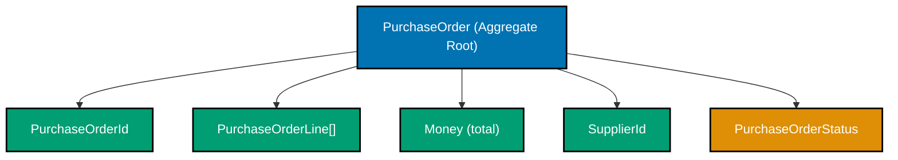
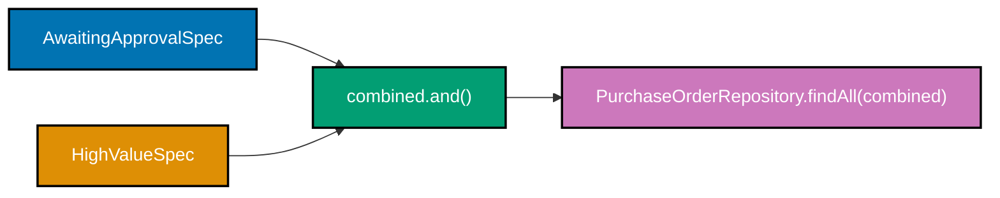
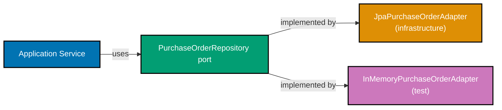

Examples 26–51 extend the beginner building blocks into the intermediate tier of DDD: aggregate roots, state-machine enforcement, immutable domain events, factory methods, repository interfaces, CQRS, hexagonal architecture, domain exception hierarchies, and bounded context packaging. Every code block is self-contained with all necessary type definitions. The domain stays in the `purchasing` and `supplier` bounded contexts of the Procure-to-Pay (P2P) platform introduced in the beginner section.

## Aggregate Root Basics (Examples 26–29)

### Example 26: Aggregate root — `PurchaseOrder` identity and boundary

An aggregate root is the single entry point for a cluster of related objects. All invariants inside the cluster are enforced by the root; no outside code bypasses it to mutate interior objects directly. `PurchaseOrder` is the root for the purchasing bounded context at the order level.



**Java**:

```java
import java.math.BigDecimal;
import java.util.ArrayList;
import java.util.Collections;
import java.util.List;

// ── Value Objects (self-contained; same shapes as beginner section) ─────────
record PurchaseOrderId(String value) {           // => record PurchaseOrderId
    PurchaseOrderId {                            // => compact constructor (Java 16+)
        if (value == null || !value.startsWith("po_"))  // => format rule: po_<uuid>
            throw new IllegalArgumentException("PurchaseOrderId must start with po_"); // => "po_" prefix guards the identity
    }
}
record SupplierId(String value) {               // => record SupplierId
    SupplierId {
        if (value == null || !value.startsWith("sup_")) // => format rule: sup_<uuid>
            throw new IllegalArgumentException("SupplierId must start with sup_"); // => "sup_" prefix guards supplier identity
    }
}
record Money(BigDecimal amount, String currency) {  // => record Money
    Money {
        if (amount == null || amount.compareTo(BigDecimal.ZERO) < 0) // => non-negative
            throw new IllegalArgumentException("Money amount must be >= 0"); // => negative amounts are domain violations
    }
}
enum UnitOfMeasure { EACH, BOX, KG, LITRE, HOUR }  // => closed enum from spec
record Quantity(int value, UnitOfMeasure unit) {    // => record Quantity
    Quantity { if (value <= 0) throw new IllegalArgumentException("Quantity.value > 0"); } // => zero/negative quantity is not a quantity

// ── Line item — owned by PurchaseOrder, NOT an aggregate root itself ─────────
record PurchaseOrderLine(                       // => record PurchaseOrderLine
    String lineId,                             // => simple surrogate within aggregate boundary
    String skuCode,                            // => matches SkuCode format; kept as String for brevity
    Quantity quantity,                         // => carries unit of measure
    Money unitPrice                            // => price per unit at time of PO creation
) {}

// ── Aggregate root ────────────────────────────────────────────────────────────
enum PurchaseOrderStatus { DRAFT, AWAITING_APPROVAL, APPROVED, ISSUED, CANCELLED }
// => Five states used in intermediate examples; full machine extended later

class PurchaseOrder {                          // => class PurchaseOrder (aggregate root)
    private final PurchaseOrderId id;          // => identity; final — never changes
    private final SupplierId supplierId;       // => reference to supplier aggregate by id only
    // => Aggregate roots reference other roots by id, never by object reference
    private final List<PurchaseOrderLine> lines; // => mutable internally; exposed as unmodifiable
    private PurchaseOrderStatus status;        // => mutable — changes on each valid transition

    PurchaseOrder(PurchaseOrderId id, SupplierId supplierId) { // => constructor
        this.id         = id;
        this.supplierId = supplierId;
        this.lines      = new ArrayList<>();   // => starts with empty line list
        this.status     = PurchaseOrderStatus.DRAFT; // => all POs begin in Draft
    }

    public PurchaseOrderId getId()       { return id; }          // => read-only
    public SupplierId getSupplierId()    { return supplierId; }  // => read-only
    public PurchaseOrderStatus getStatus(){ return status; }     // => read-only
    public List<PurchaseOrderLine> getLines() {
        return Collections.unmodifiableList(lines); // => defensive copy prevents external mutation
    }
}

// ── Usage ─────────────────────────────────────────────────────────────────────
var po = new PurchaseOrder(                    // => po created
    new PurchaseOrderId("po_550e8400-0000"),   // => valid id; starts with po_
    new SupplierId("sup_660f9511-0001")        // => supplier referenced by id only
);
System.out.println(po.getStatus());            // => Output: DRAFT
System.out.println(po.getLines().size());      // => Output: 0
```

**Key Takeaway**: An aggregate root enforces all invariants for the cluster it owns. External code interacts exclusively through the root's public methods — never through direct mutation of interior objects.

**Why It Matters**: In a procurement system, a `PurchaseOrder` and its line items must always be consistent: the total must equal the sum of lines, lines must be immutable once issued, and the supplier reference must remain stable. Without a disciplined root, any service could silently corrupt that consistency, creating discrepancies that are impossible to trace in an audit log.

---

### Example 27: Adding lines with aggregate-level invariant enforcement

The aggregate root's `addLine` method enforces every invariant before accepting a new line. Callers cannot bypass this by constructing a `PurchaseOrderLine` and injecting it directly — the list is encapsulated.

**Java**:

```java
import java.math.BigDecimal;
import java.util.ArrayList;
import java.util.Collections;
import java.util.List;

// ── Minimal supporting types (self-contained) ─────────────────────────────────
record PurchaseOrderId(String value) {}
record SupplierId(String value) {}
record Money(BigDecimal amount, String currency) {}
enum UnitOfMeasure { EACH, BOX, KG, LITRE, HOUR }
record Quantity(int value, UnitOfMeasure unit) {
    Quantity { if (value <= 0) throw new IllegalArgumentException("Quantity > 0"); }
}
record PurchaseOrderLine(String lineId, String skuCode, Quantity quantity, Money unitPrice) {}
enum PurchaseOrderStatus { DRAFT, AWAITING_APPROVAL, APPROVED, ISSUED, CANCELLED }

class PurchaseOrder {
    private final PurchaseOrderId id;
    private final SupplierId supplierId;
    private final List<PurchaseOrderLine> lines = new ArrayList<>();
    private PurchaseOrderStatus status = PurchaseOrderStatus.DRAFT;

    PurchaseOrder(PurchaseOrderId id, SupplierId supplierId) {
        this.id = id; this.supplierId = supplierId;
    }

    // ── Invariant-enforcing mutator ───────────────────────────────────────────
    public void addLine(PurchaseOrderLine line) {    // => addLine called
        if (status != PurchaseOrderStatus.DRAFT) {  // => invariant: lines only added in Draft
            throw new IllegalStateException(
                "Lines can only be added to a DRAFT PurchaseOrder, current: " + status);
        }
        // => Once Issued, lines are immutable per domain spec
        if (line == null)                           // => null guard; fail fast
            throw new IllegalArgumentException("line must not be null");
        boolean duplicate = lines.stream()
            .anyMatch(l -> l.lineId().equals(line.lineId())); // => duplicate line id check
        if (duplicate)                              // => domain rule: unique lineId within PO
            throw new IllegalArgumentException("Duplicate lineId: " + line.lineId());
        lines.add(line);                            // => mutation allowed only through this method
    }

    public Money computeTotal() {                   // => computeTotal derived from lines
        BigDecimal sum = lines.stream()
            .map(l -> l.unitPrice().amount()
                       .multiply(BigDecimal.valueOf(l.quantity().value()))) // => line total
            .reduce(BigDecimal.ZERO, BigDecimal::add); // => sum all lines
        String currency = lines.isEmpty() ? "USD" : lines.get(0).unitPrice().currency();
        return new Money(sum, currency);            // => returns new Money; no field stored
    }

    public List<PurchaseOrderLine> getLines() { return Collections.unmodifiableList(lines); }
    public PurchaseOrderStatus getStatus()    { return status; }
    public PurchaseOrderId getId()            { return id; }
}

// ── Usage ─────────────────────────────────────────────────────────────────────
var po = new PurchaseOrder(
    new PurchaseOrderId("po_550e8400-0001"),
    new SupplierId("sup_660f9511-0001")
);
po.addLine(new PurchaseOrderLine(               // => line added successfully
    "L1", "OFF-001234",
    new Quantity(5, UnitOfMeasure.BOX),
    new Money(new BigDecimal("20.00"), "USD")
));
po.addLine(new PurchaseOrderLine(               // => second line added
    "L2", "TLS-9999",
    new Quantity(2, UnitOfMeasure.EACH),
    new Money(new BigDecimal("150.00"), "USD")
));
System.out.println(po.getLines().size());       // => Output: 2
System.out.println(po.computeTotal().amount()); // => Output: 400.00 (5*20 + 2*150)

try {
    po.getLines().add(null);                    // => UnsupportedOperationException
} catch (UnsupportedOperationException e) {
    System.out.println("Cannot mutate lines externally"); // => Output: Cannot mutate lines externally
}
```

**Key Takeaway**: Expose only behaviour-carrying methods from the aggregate root. Return unmodifiable views of collections to prevent external bypasses of invariants.

**Why It Matters**: Procurement lines carry financial obligations. Allowing external code to add lines without passing through the aggregate's guard means any service can create a PO whose total does not match the sum of its lines — a discrepancy that surfaces only during invoice matching, not at the time of the error.

---

### Example 28: `ApprovalLevel` derived value object — computed from `Money`

`ApprovalLevel` is a value object whose value is derived from the PO total at submission time. The derivation logic lives in the domain, not in a service, keeping the business rule co-located with the data it operates on.

**Java**:

```java
import java.math.BigDecimal;

// ── Supporting types ──────────────────────────────────────────────────────────
record Money(BigDecimal amount, String currency) {}

// ── Domain enum with derivation logic ────────────────────────────────────────
enum ApprovalLevel {                        // => enum ApprovalLevel
    L1,   // => ≤ $1,000 — first-line manager
    L2,   // => ≤ $10,000 — department head
    L3;   // => > $10,000 — CFO or board

    // Factory method on the enum: derivation rule expressed in one place
    public static ApprovalLevel from(Money total) {  // => static factory; Money → ApprovalLevel
        if (total == null)                           // => guard: Money must be provided
            throw new IllegalArgumentException("total is required");
        BigDecimal amount = total.amount();
        // => Thresholds from domain spec: L1 ≤ 1k, L2 ≤ 10k, L3 above
        if (amount.compareTo(new BigDecimal("1000.00")) <= 0)  return L1; // => ≤ 1,000
        if (amount.compareTo(new BigDecimal("10000.00")) <= 0) return L2; // => ≤ 10,000
        return L3;                                   // => > 10,000 — highest approval needed
    }
}

// ── Usage ─────────────────────────────────────────────────────────────────────
Money smallPO    = new Money(new BigDecimal("500.00"),   "USD"); // => 500 USD
Money mediumPO   = new Money(new BigDecimal("5000.00"),  "USD"); // => 5,000 USD
Money largePO    = new Money(new BigDecimal("25000.00"), "USD"); // => 25,000 USD

System.out.println(ApprovalLevel.from(smallPO));  // => Output: L1
System.out.println(ApprovalLevel.from(mediumPO)); // => Output: L2
System.out.println(ApprovalLevel.from(largePO));  // => Output: L3

// Derived value used in aggregate submission logic:
ApprovalLevel level = ApprovalLevel.from(largePO); // => level = L3
System.out.println(level == ApprovalLevel.L3);     // => Output: true
// => L3 POs must route to CFO for approval per domain spec
```

**Key Takeaway**: Encoding derivation rules as static factory methods on domain enums keeps business thresholds in the domain layer, not scattered in application services.

**Why It Matters**: Procurement approval thresholds are regulatory and financial policy — $10k vs $1k boundaries appear in audit reports and compliance reviews. When the threshold changes, there is one class to update and one test to fix, with no risk of a forgotten service-layer conditional silently applying the old rule.

---

### Example 29: `Supplier` aggregate root with approval lifecycle

`Supplier` is the aggregate root for the `supplier` bounded context. Its lifecycle states (`Pending → Approved → Suspended → Blacklisted`) determine whether a `PurchaseOrder` can reference it. The business rule "blacklisted suppliers force existing POs to Disputed" is enforced at the aggregate boundary.

**Kotlin**:

```kotlin
// ── Supporting types ──────────────────────────────────────────────────────────
@JvmInline value class SupplierId(val value: String) {  // => inline value class; zero allocation
    init { require(value.startsWith("sup_")) { "SupplierId must start with sup_" } }
    // => Kotlin's require throws IllegalArgumentException on false
}

data class Email(val address: String) {           // => Email value object
    init { require(address.contains("@")) { "Email must contain @" } }
    // => Minimal RFC-5322 guard; production would use a proper library
}

// ── Supplier lifecycle states ─────────────────────────────────────────────────
enum class SupplierStatus {
    PENDING,      // => newly registered; cannot receive POs
    APPROVED,     // => vetted; eligible for new POs
    SUSPENDED,    // => temporarily ineligible; existing POs continue
    BLACKLISTED   // => excluded from all activity; existing POs forced to Disputed
}

// ── Aggregate root ────────────────────────────────────────────────────────────
class Supplier(val id: SupplierId, val email: Email) { // => primary constructor
    var status: SupplierStatus = SupplierStatus.PENDING // => starts in PENDING
        private set                                     // => only transitions via methods

    fun approve() {                                     // => approve() — valid from PENDING only
        check(status == SupplierStatus.PENDING) {       // => Kotlin check() → IllegalStateException
            "Can only approve a PENDING supplier, current: $status"
        }
        status = SupplierStatus.APPROVED                // => transition: PENDING → APPROVED
    }

    fun suspend() {                                     // => suspend() — valid from APPROVED only
        check(status == SupplierStatus.APPROVED) {
            "Can only suspend an APPROVED supplier, current: $status"
        }
        status = SupplierStatus.SUSPENDED               // => transition: APPROVED → SUSPENDED
    }

    fun blacklist() {                                   // => blacklist() — from APPROVED or SUSPENDED
        check(status == SupplierStatus.APPROVED || status == SupplierStatus.SUSPENDED) {
            "Cannot blacklist from $status"
        }
        status = SupplierStatus.BLACKLISTED             // => transition to terminal state
        // => Caller responsible for triggering Disputed state on existing POs
    }

    fun isEligibleForNewPurchaseOrders(): Boolean =     // => eligibility derived from status
        status == SupplierStatus.APPROVED               // => only APPROVED suppliers receive new POs
}

// ── Usage ─────────────────────────────────────────────────────────────────────
val supplier = Supplier(SupplierId("sup_660f9511-0001"), Email("vendor@acme.com"))
println(supplier.status)                         // => Output: PENDING
supplier.approve()
println(supplier.status)                         // => Output: APPROVED
println(supplier.isEligibleForNewPurchaseOrders()) // => Output: true
supplier.suspend()
println(supplier.isEligibleForNewPurchaseOrders()) // => Output: false

try {
    supplier.approve()                            // => IllegalStateException: SUSPENDED is not PENDING
} catch (e: IllegalStateException) {
    println(e.message)                            // => Output: Can only approve a PENDING supplier...
}
```

**Key Takeaway**: Model lifecycle states as an enum and guard transitions inside the aggregate root's methods. Never allow external code to set status directly.

**Why It Matters**: A supplier mistakenly set to `APPROVED` while blacklisted could receive new purchase orders and goods — a compliance failure in a procurement audit. Encapsulating transitions in the aggregate ensures every status change passes through validation, creating a trustworthy audit trail.

---

## State Machine (Examples 30–34)

### Example 30: Sealed types for exhaustive state modeling

Java 21 sealed classes let the compiler enforce that all states are handled. Using sealed types for `PurchaseOrderStatus` means a forgotten branch is a compile error, not a runtime NullPointerException.

**Java**:

```java
// ── Sealed class hierarchy: each state is its own type ───────────────────────
// => Sealed permits exactly five subtypes; no other class may extend PurchaseOrderStatus
sealed interface PurchaseOrderStatus
    permits PurchaseOrderStatus.Draft,
            PurchaseOrderStatus.AwaitingApproval,
            PurchaseOrderStatus.Approved,
            PurchaseOrderStatus.Issued,
            PurchaseOrderStatus.Cancelled {

    record Draft() implements PurchaseOrderStatus {}         // => Draft: no extra data
    record AwaitingApproval() implements PurchaseOrderStatus {} // => AwaitingApproval state
    record Approved() implements PurchaseOrderStatus {}      // => Approved state
    record Issued() implements PurchaseOrderStatus {}        // => Issued state
    record Cancelled(String reason) implements PurchaseOrderStatus {} // => Cancelled carries reason
    // => Cancelled is the only terminal state that carries context; reason aids audit trail
}

// ── Pattern-match with exhaustive switch (Java 21 preview, enabled by default in 21+) ─
static String describe(PurchaseOrderStatus s) {    // => static helper for demo
    return switch (s) {                            // => sealed switch: compiler checks all arms
        case PurchaseOrderStatus.Draft d           -> "Draft: awaiting line items";
        case PurchaseOrderStatus.AwaitingApproval a-> "Awaiting approval from manager";
        case PurchaseOrderStatus.Approved ap       -> "Approved: ready to issue to supplier";
        case PurchaseOrderStatus.Issued i          -> "Issued: supplier has been notified";
        case PurchaseOrderStatus.Cancelled c       -> "Cancelled: " + c.reason();
        // => No default needed: sealed types guarantee exhaustiveness at compile time
    };
}

// ── Usage ─────────────────────────────────────────────────────────────────────
PurchaseOrderStatus draft  = new PurchaseOrderStatus.Draft();         // => draft state
PurchaseOrderStatus issued = new PurchaseOrderStatus.Issued();        // => issued state
PurchaseOrderStatus cancelled = new PurchaseOrderStatus.Cancelled("Vendor out of stock");

System.out.println(describe(draft));     // => Output: Draft: awaiting line items
System.out.println(describe(issued));    // => Output: Issued: supplier has been notified
System.out.println(describe(cancelled)); // => Output: Cancelled: Vendor out of stock
```

**Key Takeaway**: Sealed types with record variants turn state into a closed set known at compile time. Pattern matching then guarantees every case is handled — no default escape hatch.

**Why It Matters**: Procurement systems have regulatory requirements around state transitions. A missed state in a switch statement that routes approval notifications silently drops approvals. Sealed types make the omission a build failure instead of a production defect.

---

### Example 31: State machine transitions on the aggregate root

The aggregate root exposes behavior methods (`submit`, `approve`, `issue`) that perform the state transition and enforce guards. Callers invoke behavior, not setters.

**Java**:

```java
import java.math.BigDecimal;
import java.util.ArrayList;
import java.util.List;

// ── Minimal supporting types ───────────────────────────────────────────────────
record PurchaseOrderId(String value) {}
record SupplierId(String value) {}
record Money(BigDecimal amount, String currency) {}
enum UnitOfMeasure { EACH, BOX }
record Quantity(int value, UnitOfMeasure unit) {}
record PurchaseOrderLine(String lineId, String skuCode, Quantity qty, Money unitPrice) {}

enum POStatus { DRAFT, AWAITING_APPROVAL, APPROVED, ISSUED, CANCELLED }

// ── Aggregate with state machine ───────────────────────────────────────────────
class PurchaseOrder {
    private final PurchaseOrderId id;
    private final SupplierId supplierId;
    private final List<PurchaseOrderLine> lines = new ArrayList<>();
    private POStatus status = POStatus.DRAFT;    // => always starts in DRAFT

    PurchaseOrder(PurchaseOrderId id, SupplierId supplierId) {
        this.id = id; this.supplierId = supplierId;
    }

    public void addLine(PurchaseOrderLine line) {           // => addLine: DRAFT only
        require(status == POStatus.DRAFT, "addLine requires DRAFT, got " + status);
        lines.add(line);
    }

    public void submit() {                                  // => DRAFT → AWAITING_APPROVAL
        require(status == POStatus.DRAFT, "submit requires DRAFT");
        require(!lines.isEmpty(), "Cannot submit PO with no line items"); // => domain invariant
        status = POStatus.AWAITING_APPROVAL;                // => transition committed
    }

    public void approve() {                                 // => AWAITING_APPROVAL → APPROVED
        require(status == POStatus.AWAITING_APPROVAL, "approve requires AWAITING_APPROVAL");
        status = POStatus.APPROVED;
    }

    public void issue() {                                   // => APPROVED → ISSUED
        require(status == POStatus.APPROVED, "issue requires APPROVED");
        status = POStatus.ISSUED;
        // => Once ISSUED, lines become immutable — enforced in addLine guard
    }

    public void cancel(String reason) {                     // => any pre-ISSUED → CANCELLED
        require(status != POStatus.ISSUED && status != POStatus.CANCELLED,
            "Cannot cancel from " + status);
        status = POStatus.CANCELLED;
    }

    private void require(boolean cond, String msg) {        // => guard helper
        if (!cond) throw new IllegalStateException(msg);
    }

    public POStatus getStatus() { return status; }
    public PurchaseOrderId getId() { return id; }
    public List<PurchaseOrderLine> getLines() { return List.copyOf(lines); }
}

// ── Usage: happy path ─────────────────────────────────────────────────────────
var po = new PurchaseOrder(new PurchaseOrderId("po_550e8400-0031"),
                           new SupplierId("sup_660f9511-0001"));
po.addLine(new PurchaseOrderLine("L1", "OFF-001234",
    new Quantity(3, UnitOfMeasure.BOX),
    new Money(new BigDecimal("40.00"), "USD")));    // => line added in DRAFT
po.submit();                                        // => DRAFT → AWAITING_APPROVAL
System.out.println(po.getStatus());                 // => Output: AWAITING_APPROVAL
po.approve();                                       // => AWAITING_APPROVAL → APPROVED
po.issue();                                         // => APPROVED → ISSUED
System.out.println(po.getStatus());                 // => Output: ISSUED

// ── Invalid transition ────────────────────────────────────────────────────────
try {
    po.addLine(new PurchaseOrderLine("L2", "TLS-9999",
        new Quantity(1, UnitOfMeasure.EACH),
        new Money(new BigDecimal("100.00"), "USD"))); // => IllegalStateException
} catch (IllegalStateException e) {
    System.out.println(e.getMessage());             // => Output: addLine requires DRAFT, got ISSUED
}
```

**Key Takeaway**: Expose state transitions as named business operations with guard clauses. Each method is a verb from the domain language — `submit`, `approve`, `issue` — not a generic `setStatus`.

**Why It Matters**: Named transition methods serve as the exact vocabulary for conversations with procurement managers. When a business analyst asks "why can't the system approve an already-cancelled PO?", the answer is in `approve()` — readable without translating from `setStatus(APPROVED)` back to business language.

---

### Example 32: Handling invalid transitions with domain exceptions

A custom `DomainException` hierarchy communicates guard failures in terms the application layer understands without coupling to `IllegalStateException` semantics.

**Java**:

```java
// ── Domain exception hierarchy ────────────────────────────────────────────────
// => Base class for all domain rule violations; distinct from infrastructure errors
class DomainException extends RuntimeException {
    DomainException(String message) { super(message); }
}

// => Specific subtype for state machine violations; callers can catch selectively
class InvalidTransitionException extends DomainException {
    private final String from;   // => current state name
    private final String to;     // => attempted target state name
    InvalidTransitionException(String from, String to) {
        super("Invalid transition from " + from + " to " + to);
        this.from = from; this.to = to;
    }
    public String getFrom() { return from; } // => allows callers to log structured diagnostics
    public String getTo()   { return to; }
}

// => Raised when a PO with no lines is submitted — separate concern from state
class EmptyPurchaseOrderException extends DomainException {
    EmptyPurchaseOrderException() { super("A PurchaseOrder must have at least one line before submission"); }
}

// ── Aggregate using typed exceptions ─────────────────────────────────────────
enum POStatus { DRAFT, AWAITING_APPROVAL, APPROVED, ISSUED, CANCELLED }

class PurchaseOrderSM {                               // => simplified for this example
    private POStatus status = POStatus.DRAFT;
    private int lineCount = 0;

    public void addLine() { lineCount++; }            // => simplified line addition

    public void submit() {                            // => DRAFT → AWAITING_APPROVAL
        if (status != POStatus.DRAFT)
            throw new InvalidTransitionException(status.name(), "AWAITING_APPROVAL");
            // => Structured: caller knows from-state and to-state
        if (lineCount == 0)
            throw new EmptyPurchaseOrderException();  // => separate domain rule
        status = POStatus.AWAITING_APPROVAL;
    }

    public void approve() {
        if (status != POStatus.AWAITING_APPROVAL)
            throw new InvalidTransitionException(status.name(), "APPROVED");
        status = POStatus.APPROVED;
    }

    public POStatus getStatus() { return status; }
}

// ── Usage ─────────────────────────────────────────────────────────────────────
var po = new PurchaseOrderSM();

try {
    po.submit();                                      // => EmptyPurchaseOrderException; no lines
} catch (EmptyPurchaseOrderException e) {
    System.out.println(e.getMessage());
    // => Output: A PurchaseOrder must have at least one line before submission
}

po.addLine();
po.submit();                                          // => DRAFT → AWAITING_APPROVAL

try {
    po.submit();                                      // => InvalidTransitionException; already AWAITING
} catch (InvalidTransitionException e) {
    System.out.println("From: " + e.getFrom());      // => Output: From: AWAITING_APPROVAL
    System.out.println("To: " + e.getTo());          // => Output: To: AWAITING_APPROVAL
    System.out.println(e.getMessage());
    // => Output: Invalid transition from AWAITING_APPROVAL to AWAITING_APPROVAL
}
```

**Key Takeaway**: Use a custom domain exception hierarchy so the application layer can distinguish state-machine violations from business rule violations without parsing exception messages.

**Why It Matters**: A generic `IllegalStateException` forces the HTTP controller to catch everything and return a 500. A typed `InvalidTransitionException` maps cleanly to HTTP 409 Conflict while `EmptyPurchaseOrderException` maps to 422 Unprocessable Entity — enabling precise API error responses without leaking domain details into infrastructure code.

---

### Example 33: Cancellation off-ramp — pre-Paid states

Cancellation is an off-ramp valid from any state before `Paid`. Encoding this as a predicate on the current state keeps the guard logic in one method rather than repeated conditions across the codebase.

**C#**:

```csharp
using System;
using System.Collections.Generic;

// ── Status enum ────────────────────────────────────────────────────────────────
public enum POStatus
{
    Draft, AwaitingApproval, Approved, Issued, Cancelled
    // => Intermediate subset; full machine adds more states in advanced section
}

// ── Aggregate with cancellation off-ramp ──────────────────────────────────────
public class PurchaseOrder
{
    public string Id { get; }           // => init-only: set once in constructor
    public POStatus Status { get; private set; } = POStatus.Draft; // => starts in Draft

    private static readonly HashSet<POStatus> CancellableStates = new()
    {
        POStatus.Draft,
        POStatus.AwaitingApproval,
        POStatus.Approved
        // => Issued is the last state before PAID where cancellation remains valid
        // => Per spec: (any pre-Paid) --cancel--> Cancelled
    };
    // => Static set computed once; O(1) lookup per cancel() call

    public PurchaseOrder(string id)
    {
        if (string.IsNullOrEmpty(id) || !id.StartsWith("po_")) // => format guard
            throw new ArgumentException("Id must start with po_");
        Id = id;
    }

    public void Submit()
    {
        if (Status != POStatus.Draft)                          // => state guard
            throw new InvalidOperationException($"Cannot submit from {Status}");
        Status = POStatus.AwaitingApproval;
    }

    public void Approve()
    {
        if (Status != POStatus.AwaitingApproval)
            throw new InvalidOperationException($"Cannot approve from {Status}");
        Status = POStatus.Approved;
    }

    public void Cancel(string reason)
    {
        if (!CancellableStates.Contains(Status))               // => O(1) HashSet lookup
            throw new InvalidOperationException(
                $"Cannot cancel from {Status}. Cancellable: Draft, AwaitingApproval, Approved");
        // => reason is logged/used by application layer; aggregate just transitions
        Status = POStatus.Cancelled;
    }
}

// ── Usage ─────────────────────────────────────────────────────────────────────
var po = new PurchaseOrder("po_550e8400-0033");
po.Submit();
po.Approve();
po.Cancel("Supplier no longer available");          // => Approved → Cancelled
Console.WriteLine(po.Status);                       // => Output: Cancelled

var po2 = new PurchaseOrder("po_550e8400-0034");
try {
    po2.Cancel("Test");                             // => valid: Draft is cancellable
    Console.WriteLine(po2.Status);                  // => Output: Cancelled
} catch (Exception e) {
    Console.WriteLine(e.Message);
}
```

**Key Takeaway**: Model the cancellable set as a static `HashSet` on the aggregate. This documents allowed states declaratively and allows O(1) lookup rather than a chain of `||` comparisons that grows with each new state.

**Why It Matters**: Procurement cancellations must be audited — who cancelled, from which state, and why. Encoding valid cancel states explicitly in the aggregate means the application layer can always determine legality before attempting it, and the reason string travels through the domain boundary cleanly for the audit log.

---

### Example 34: `Quantity` value object and tolerance for goods receipt matching

`Tolerance` is a value object from the invoicing context describing an acceptable percentage deviation in matched quantities. Combined with `Quantity`, it provides the three-way match rule: invoice amount within tolerance of `GRN quantity × PO unit price`.

**Java**:

```java
import java.math.BigDecimal;
import java.math.RoundingMode;

// ── Value objects ─────────────────────────────────────────────────────────────
enum UnitOfMeasure { EACH, BOX, KG, LITRE, HOUR }

record Quantity(int value, UnitOfMeasure unit) { // => record Quantity
    Quantity {
        if (value <= 0)                          // => domain invariant: must be positive
            throw new IllegalArgumentException("Quantity.value must be > 0, got " + value);
    }
    public boolean isSameUnit(Quantity other) {  // => unit-compatibility check
        return this.unit == other.unit;          // => enum equality: fast, exact
    }
}

record Tolerance(BigDecimal percentage) {        // => record Tolerance
    Tolerance {
        if (percentage == null
            || percentage.compareTo(BigDecimal.ZERO) < 0    // => 0% minimum
            || percentage.compareTo(new BigDecimal("0.10")) > 0) // => 10% maximum per spec
            throw new IllegalArgumentException("Tolerance must be 0 ≤ pct ≤ 0.10");
    }

    // Returns true if actual is within tolerance of expected
    public boolean isWithin(BigDecimal expected, BigDecimal actual) {
        if (expected.compareTo(BigDecimal.ZERO) == 0) // => zero expected: exact match required
            return actual.compareTo(BigDecimal.ZERO) == 0;
        BigDecimal deviation = actual.subtract(expected).abs()
            .divide(expected, 6, RoundingMode.HALF_UP); // => |actual - expected| / expected
        return deviation.compareTo(percentage) <= 0;    // => within tolerance?
    }
}

// ── Three-way match helper ─────────────────────────────────────────────────────
static boolean threeWayMatch(
    BigDecimal poUnitPrice,   // => price per unit from PurchaseOrder
    Quantity grnQty,          // => quantity from GoodsReceiptNote
    BigDecimal invoiceAmount, // => total on Invoice
    Tolerance tolerance) {    // => acceptable deviation (default 2%)

    BigDecimal expected = poUnitPrice
        .multiply(BigDecimal.valueOf(grnQty.value())); // => expected = price × received qty
    return tolerance.isWithin(expected, invoiceAmount); // => is invoice within tolerance?
}

// ── Usage ─────────────────────────────────────────────────────────────────────
var tolerance = new Tolerance(new BigDecimal("0.02")); // => 2% default tolerance from spec

// Perfect match
boolean exact = threeWayMatch(
    new BigDecimal("20.00"),
    new Quantity(5, UnitOfMeasure.BOX),
    new BigDecimal("100.00"),  // => 5 × 20 = 100.00 exact
    tolerance
);
System.out.println("Exact match: " + exact);         // => Output: Exact match: true

// Within tolerance (1.5% deviation)
boolean within = threeWayMatch(
    new BigDecimal("20.00"),
    new Quantity(5, UnitOfMeasure.BOX),
    new BigDecimal("101.50"),  // => 1.5% above expected 100.00
    tolerance
);
System.out.println("Within tolerance: " + within);   // => Output: Within tolerance: true

// Outside tolerance (3% deviation)
boolean outside = threeWayMatch(
    new BigDecimal("20.00"),
    new Quantity(5, UnitOfMeasure.BOX),
    new BigDecimal("103.00"),  // => 3% above expected; exceeds 2% tolerance
    tolerance
);
System.out.println("Outside tolerance: " + outside); // => Output: Outside tolerance: false
```

**Key Takeaway**: Encode business tolerance rules in a value object with a dedicated `isWithin` method. This removes magic-number percentage checks from service code and makes the matching rule testable in isolation.

**Why It Matters**: Three-way matching is the core financial control in accounts payable. An off-by-one percentage tolerance check can approve invoices that should be disputed, resulting in overpayment to suppliers. Isolating the logic in a tested `Tolerance` value object means a single verified implementation governs every matching decision.

---

## Domain Events (Examples 35–38)

### Example 35: Immutable domain events as records

Domain events are facts — things that happened. They are immutable, carry only the data needed by consumers, and are named in past tense. Java records are the natural fit: immutable by construction, with built-in `equals`, `hashCode`, and `toString`.

**Java**:

```java
import java.time.Instant;

// ── Minimal ID types ──────────────────────────────────────────────────────────
record PurchaseOrderId(String value) {}
record RequisitionId(String value) {}
record SupplierId(String value) {}

// ── Domain events: past-tense names, immutable records ───────────────────────
// => Each event carries only the data consumers need — no full aggregate snapshot
record PurchaseOrderIssued(              // => purchasing context event
    PurchaseOrderId purchaseOrderId,     // => which PO was issued
    SupplierId supplierId,               // => which supplier receives the notification
    Instant issuedAt                     // => when the transition occurred
) {}
// => Consumers: supplier-notifier (EDI/email), receiving (opens GRN expectation)

record RequisitionApproved(             // => purchasing context event
    RequisitionId requisitionId,        // => which requisition was approved
    String approverId,                  // => who approved (user id from identity context)
    Instant approvedAt                  // => timestamp of approval
) {}
// => Consumer: purchasing auto-converts this to a PO Draft

record SupplierApproved(                // => supplier context event
    SupplierId supplierId,              // => which supplier is now eligible
    Instant approvedAt
) {}
// => Consumer: purchasing eligible-for-PO list

// ── Records are immutable by default — no setters ────────────────────────────
PurchaseOrderIssued evt = new PurchaseOrderIssued(
    new PurchaseOrderId("po_550e8400-0035"),  // => po id
    new SupplierId("sup_660f9511-0001"),      // => supplier id
    Instant.now()                             // => current UTC timestamp
);
System.out.println(evt.purchaseOrderId().value()); // => Output: po_550e8400-0035
System.out.println(evt.supplierId().value());      // => Output: sup_660f9511-0001

// Structural equality — same data means equal events (useful in tests)
PurchaseOrderIssued same = new PurchaseOrderIssued(
    evt.purchaseOrderId(), evt.supplierId(), evt.issuedAt()
);
System.out.println(evt.equals(same));  // => Output: true
// => Record equals compares all fields; no custom equals() needed
```

**Key Takeaway**: Records for domain events guarantee immutability, structural equality, and compact syntax — three properties events require by definition.

**Why It Matters**: Events stored in an event log must never be mutated after being written. Mutable event objects enable accidental corruption of history. In a procurement audit trail, a mutated `PurchaseOrderIssued` event could change the visible record of when a supplier was notified — a compliance violation with regulatory consequences.

---

### Example 36: Collecting domain events on the aggregate

The aggregate collects domain events in a private list during transitions. The application layer drains and dispatches these events after saving the aggregate to the repository. This pattern keeps event publishing coupled to successful persistence, not to the transition itself.

**Java**:

```java
import java.math.BigDecimal;
import java.time.Instant;
import java.util.ArrayList;
import java.util.Collections;
import java.util.List;

// ── Types ─────────────────────────────────────────────────────────────────────
record PurchaseOrderId(String value) {}
record SupplierId(String value) {}
record Money(BigDecimal amount, String currency) {}
enum UnitOfMeasure { EACH, BOX }
record Quantity(int value, UnitOfMeasure unit) {}
record PurchaseOrderLine(String lineId, String skuCode, Quantity qty, Money unitPrice) {}

// ── Domain event ──────────────────────────────────────────────────────────────
record PurchaseOrderIssued(PurchaseOrderId purchaseOrderId, SupplierId supplierId, Instant issuedAt) {}

enum POStatus { DRAFT, AWAITING_APPROVAL, APPROVED, ISSUED, CANCELLED }

// ── Aggregate collecting events ───────────────────────────────────────────────
class PurchaseOrder {
    private final PurchaseOrderId id;
    private final SupplierId supplierId;
    private final List<PurchaseOrderLine> lines = new ArrayList<>();
    private POStatus status = POStatus.DRAFT;

    // => Domain events collected here; drained by application layer after save
    private final List<Object> domainEvents = new ArrayList<>();

    PurchaseOrder(PurchaseOrderId id, SupplierId supplierId) {
        this.id = id; this.supplierId = supplierId;
    }

    public void addLine(PurchaseOrderLine line) {
        if (status != POStatus.DRAFT)
            throw new IllegalStateException("addLine requires DRAFT");
        lines.add(line);
    }

    public void submit() {
        if (status != POStatus.DRAFT) throw new IllegalStateException("submit requires DRAFT");
        if (lines.isEmpty()) throw new IllegalStateException("Cannot submit empty PO");
        status = POStatus.AWAITING_APPROVAL;  // => DRAFT → AWAITING_APPROVAL
        // => No event on submit: approval routing is triggered by RequisitionApproved, not here
    }

    public void approve() {
        if (status != POStatus.AWAITING_APPROVAL) throw new IllegalStateException("approve requires AWAITING_APPROVAL");
        status = POStatus.APPROVED;           // => AWAITING_APPROVAL → APPROVED
    }

    public void issue() {
        if (status != POStatus.APPROVED) throw new IllegalStateException("issue requires APPROVED");
        status = POStatus.ISSUED;             // => APPROVED → ISSUED
        domainEvents.add(new PurchaseOrderIssued(id, supplierId, Instant.now()));
        // => Event registered but NOT dispatched — persisted first, then dispatched
    }

    // ── Application layer API ─────────────────────────────────────────────────
    public List<Object> drainDomainEvents() {          // => called by app layer after save
        var snapshot = List.copyOf(domainEvents);      // => copy before clearing
        domainEvents.clear();                          // => drain: events not dispatched twice
        return snapshot;                               // => caller dispatches these events
    }

    public POStatus getStatus()          { return status; }
    public PurchaseOrderId getId()       { return id; }
    public List<PurchaseOrderLine> getLines() { return Collections.unmodifiableList(lines); }
}

// ── Usage ─────────────────────────────────────────────────────────────────────
var po = new PurchaseOrder(new PurchaseOrderId("po_550e8400-0036"),
                           new SupplierId("sup_660f9511-0001"));
po.addLine(new PurchaseOrderLine("L1", "OFF-001234",
    new Quantity(2, UnitOfMeasure.BOX),
    new Money(new BigDecimal("50.00"), "USD")));
po.submit();
po.approve();
po.issue();                                     // => ISSUED; PurchaseOrderIssued event queued

List<Object> events = po.drainDomainEvents();   // => application layer drains after save
System.out.println(events.size());              // => Output: 1
System.out.println(events.get(0).getClass().getSimpleName()); // => Output: PurchaseOrderIssued

List<Object> empty = po.drainDomainEvents();    // => already drained; no double dispatch
System.out.println(empty.size());               // => Output: 0
```

**Key Takeaway**: Collect domain events in a private list on the aggregate and drain them only after the aggregate is successfully persisted. This prevents publishing stale events when a database transaction rolls back.

**Why It Matters**: In a distributed procurement system, a `PurchaseOrderIssued` event triggers an EDI notification to the supplier. If the database save fails but the event is already dispatched, the supplier receives a PO that does not exist in the system — an operational and financial error. Draining after save ensures event and state are always consistent.

---

### Example 37: `RequisitionApproved` event triggering PO creation — domain event handler

When `RequisitionApproved` fires, a domain event handler in the `purchasing` context auto-converts the approved requisition into a `PurchaseOrder` in Draft state. This shows cross-aggregate communication via events rather than direct method calls.

**Java**:

```java
import java.math.BigDecimal;
import java.time.Instant;
import java.util.UUID;

// ── Types ─────────────────────────────────────────────────────────────────────
record RequisitionId(String value) {}
record PurchaseOrderId(String value) {}
record SupplierId(String value) {}
record Money(BigDecimal amount, String currency) {}
enum UnitOfMeasure { EACH, BOX }
record Quantity(int value, UnitOfMeasure unit) {}

// ── Incoming event ────────────────────────────────────────────────────────────
record RequisitionApproved(    // => emitted by PurchaseRequisition aggregate after approval
    RequisitionId requisitionId,
    SupplierId preferredSupplierId, // => operator selected supplier during approval
    String skuCode,
    Quantity quantity,
    Money estimatedCost,
    Instant approvedAt
) {}

// ── Resulting aggregate (created by handler) ───────────────────────────────────
record PurchaseOrderLine(String lineId, String skuCode, Quantity qty, Money unitPrice) {}

enum POStatus { DRAFT, AWAITING_APPROVAL, APPROVED, ISSUED }

class PurchaseOrder {
    final PurchaseOrderId id;
    final SupplierId supplierId;
    final java.util.List<PurchaseOrderLine> lines = new java.util.ArrayList<>();
    POStatus status = POStatus.DRAFT;      // => created in DRAFT; ready for further enrichment

    PurchaseOrder(PurchaseOrderId id, SupplierId supplierId) {
        this.id = id; this.supplierId = supplierId;
    }
    void addLine(PurchaseOrderLine l) { lines.add(l); }
}

// ── Domain event handler ───────────────────────────────────────────────────────
// => Stateless: takes event, applies domain logic, returns new aggregate
// => No Spring annotations: pure domain; infrastructure wires this up
static PurchaseOrder onRequisitionApproved(RequisitionApproved event) {
    // => Generate a new PurchaseOrderId from the requisition id for traceability
    var poId = new PurchaseOrderId(
        "po_" + UUID.randomUUID().toString().replace("-", "").substring(0, 16));
    // => The approved supplier becomes the PO's supplier
    var po = new PurchaseOrder(poId, event.preferredSupplierId());
    // => Seed PO with one line derived from the requisition
    po.addLine(new PurchaseOrderLine(
        "L1",
        event.skuCode(),
        event.quantity(),
        event.estimatedCost()     // => estimated cost becomes unit price on initial PO
    ));
    // => PO is DRAFT; procurement officer can adjust before submission
    return po;
}

// ── Usage ─────────────────────────────────────────────────────────────────────
var event = new RequisitionApproved(
    new RequisitionId("req_550e8400-aaaa"),
    new SupplierId("sup_660f9511-0001"),
    "OFF-001234",
    new Quantity(5, UnitOfMeasure.BOX),
    new Money(new BigDecimal("200.00"), "USD"),
    Instant.now()
);
PurchaseOrder po = onRequisitionApproved(event); // => new PO created from event
System.out.println(po.status);                  // => Output: DRAFT
System.out.println(po.lines.size());            // => Output: 1
System.out.println(po.supplierId.value());      // => Output: sup_660f9511-0001
```

**Key Takeaway**: Domain event handlers translate events into aggregate state changes. They are pure functions: event in, new aggregate (or mutation) out, with no infrastructure dependencies.

**Why It Matters**: Direct method calls between aggregates create tight coupling — if `PurchaseRequisition.approve()` directly creates a `PurchaseOrder`, both aggregates must load together, destroying boundary isolation. Event-driven coupling lets each context evolve independently: the requisition context publishes facts, the purchasing context reacts without knowing how requisitions work internally.

---

### Example 38: `SupplierApproved` event — cross-context notification

`SupplierApproved` flows from the `supplier` context to the `purchasing` context, which maintains an in-memory eligible-supplier list. This shows how bounded contexts remain decoupled while staying aware of each other through events.

**Kotlin**:

```kotlin
import java.time.Instant

// ── Types ─────────────────────────────────────────────────────────────────────
@JvmInline value class SupplierId(val value: String) {
    init { require(value.startsWith("sup_")) { "SupplierId must start with sup_" } }
}

// ── Event emitted by supplier context ─────────────────────────────────────────
data class SupplierApproved(           // => supplier context event
    val supplierId: SupplierId,        // => who was approved
    val approvedAt: Instant            // => when
)
// => Consumer: purchasing context's eligible-supplier list

// ── Recipient: purchasing context policy ───────────────────────────────────────
class EligibleSupplierPolicy {         // => pure domain policy; no Spring annotations
    private val eligibleIds = mutableSetOf<SupplierId>() // => in-memory set of eligible suppliers
    // => Production: persisted in purchasing aggregate's read model

    fun handle(event: SupplierApproved) { // => event handler method
        eligibleIds.add(event.supplierId) // => add to eligible set on approval
        // => Purchasing can now create POs referencing this supplier
    }

    fun isEligible(supplierId: SupplierId): Boolean = // => query used before PO creation
        supplierId in eligibleIds         // => Kotlin in-operator delegates to contains()

    fun eligibleCount(): Int = eligibleIds.size // => observable size for tests
}

// ── Usage ─────────────────────────────────────────────────────────────────────
val policy = EligibleSupplierPolicy()
val sup1 = SupplierId("sup_660f9511-0001")
val sup2 = SupplierId("sup_660f9511-0002")

println(policy.isEligible(sup1))   // => Output: false — not yet approved

policy.handle(SupplierApproved(sup1, Instant.now())) // => sup1 approved
println(policy.isEligible(sup1))   // => Output: true
println(policy.isEligible(sup2))   // => Output: false — sup2 never approved
println(policy.eligibleCount())    // => Output: 1

policy.handle(SupplierApproved(sup2, Instant.now())) // => sup2 approved
println(policy.eligibleCount())    // => Output: 2
```

**Key Takeaway**: A policy class encapsulates how a bounded context reacts to events from another context. It owns its own read model, keeping the two contexts decoupled.

**Why It Matters**: Procurement teams cannot create purchase orders for unvetted suppliers — it bypasses supplier risk scoring and compliance checks. The `EligibleSupplierPolicy` gives purchasing a local, always-consistent answer to "is this supplier eligible?" without needing to query the supplier context on every PO creation, avoiding distributed query latency and coupling.

---

## Factory Methods and Repository Interface (Examples 39–42)

### Example 39: Factory method on the aggregate — `PurchaseOrder.create`

A static factory method named `create` encapsulates all construction logic: generating a new ID, validating inputs, and setting initial state. Callers never use `new PurchaseOrder(...)` directly.

**Java**:

```java
import java.math.BigDecimal;
import java.time.Instant;
import java.util.ArrayList;
import java.util.List;
import java.util.UUID;

// ── Value objects ─────────────────────────────────────────────────────────────
record PurchaseOrderId(String value) {
    PurchaseOrderId { require(value != null && value.startsWith("po_"), "id must start with po_"); }
    private static void require(boolean c, String m) { if (!c) throw new IllegalArgumentException(m); }
}
record SupplierId(String value) {
    SupplierId { if (value == null || !value.startsWith("sup_")) throw new IllegalArgumentException("SupplierId invalid"); }
}
record Money(BigDecimal amount, String currency) {
    Money { if (amount == null || amount.compareTo(BigDecimal.ZERO) < 0) throw new IllegalArgumentException("Money amount >= 0"); }
}
enum UnitOfMeasure { EACH, BOX, KG }
record Quantity(int value, UnitOfMeasure unit) {
    Quantity { if (value <= 0) throw new IllegalArgumentException("Quantity > 0"); }
}
record PurchaseOrderLine(String lineId, String skuCode, Quantity qty, Money unitPrice) {}

enum POStatus { DRAFT, AWAITING_APPROVAL, APPROVED, ISSUED, CANCELLED }
record PurchaseOrderIssued(PurchaseOrderId id, SupplierId sid, Instant issuedAt) {}

// ── Aggregate with factory method ─────────────────────────────────────────────
class PurchaseOrder {
    private final PurchaseOrderId id;
    private final SupplierId supplierId;
    private final Instant createdAt;          // => captured at creation for audit
    private final List<PurchaseOrderLine> lines = new ArrayList<>();
    private POStatus status = POStatus.DRAFT;
    private final List<Object> domainEvents  = new ArrayList<>();

    private PurchaseOrder(PurchaseOrderId id, SupplierId supplierId, Instant createdAt) {
        this.id = id; this.supplierId = supplierId; this.createdAt = createdAt;
        // => private constructor: only factory method can call this
    }

    // ── Static factory ────────────────────────────────────────────────────────
    public static PurchaseOrder create(SupplierId supplierId) { // => factory hides ID generation
        if (supplierId == null) throw new IllegalArgumentException("supplierId required");
        var id = new PurchaseOrderId("po_" + UUID.randomUUID().toString().replace("-", "")); // => new unique id
        // => UUID v4 with "po_" prefix; matches spec format
        return new PurchaseOrder(id, supplierId, Instant.now()); // => creation timestamp from clock
    }

    // ── Reconstitution factory (used by repository, NOT for new POs) ─────────
    public static PurchaseOrder reconstitute(PurchaseOrderId id, SupplierId supplierId,
                                             Instant createdAt, POStatus status) {
        var po = new PurchaseOrder(id, supplierId, createdAt); // => id and timestamp restored from DB
        po.status = status;                                    // => status restored; no invariant check
        // => Reconstitution skips domain validation: DB rows are assumed already-valid past facts
        return po;
    }

    public void addLine(PurchaseOrderLine l) {
        if (status != POStatus.DRAFT) throw new IllegalStateException("addLine: DRAFT only");
        lines.add(l);
    }

    public void issue() {
        if (status != POStatus.APPROVED) throw new IllegalStateException("issue: APPROVED only");
        status = POStatus.ISSUED;
        domainEvents.add(new PurchaseOrderIssued(id, supplierId, Instant.now()));
    }

    public List<Object> drainDomainEvents() {
        var snap = List.copyOf(domainEvents); domainEvents.clear(); return snap;
    }

    public PurchaseOrderId getId()    { return id; }
    public SupplierId getSupplierId() { return supplierId; }
    public POStatus getStatus()       { return status; }
    public Instant getCreatedAt()     { return createdAt; }
}

// ── Usage ─────────────────────────────────────────────────────────────────────
var po = PurchaseOrder.create(new SupplierId("sup_660f9511-0001")); // => factory; id auto-generated
System.out.println(po.getId().value().startsWith("po_")); // => Output: true
System.out.println(po.getStatus());                       // => Output: DRAFT
System.out.println(po.getCreatedAt() != null);            // => Output: true

// Reconstitution from persisted row
var reconstituted = PurchaseOrder.reconstitute(
    new PurchaseOrderId("po_550e8400-existing"),
    new SupplierId("sup_660f9511-0001"),
    Instant.parse("2026-01-15T08:00:00Z"),
    POStatus.APPROVED                          // => restored without triggering approval logic
);
System.out.println(reconstituted.getStatus()); // => Output: APPROVED
```

**Key Takeaway**: Two factory methods serve distinct purposes: `create` for new aggregates (generates ID, sets timestamp, enforces all invariants) and `reconstitute` for rehydrating from persistence (restores state without re-running invariant guards).

**Why It Matters**: In a procurement system, purchase orders are reloaded from the database thousands of times per day for status checks, approval routing, and invoice matching. Reloading must not re-trigger `IllegalArgumentException` on valid past data. Separating creation from reconstitution lets construction and persistence serve their distinct purposes without compromise.

---

### Example 40: Repository interface — persistence contract without infrastructure

The repository interface defines the persistence contract for the aggregate in pure domain terms: `save`, `findById`, and `findBySupplier`. No SQL, no JPA annotations, no Spring — just the contract.

**Java**:

```java
import java.util.List;
import java.util.Optional;

// ── Minimal types ─────────────────────────────────────────────────────────────
record PurchaseOrderId(String value) {}
record SupplierId(String value) {}

// ── Aggregate placeholder ─────────────────────────────────────────────────────
class PurchaseOrder {                          // => full aggregate; simplified for interface demo
    private final PurchaseOrderId id;
    private final SupplierId supplierId;
    PurchaseOrder(PurchaseOrderId id, SupplierId supplierId) {
        this.id = id; this.supplierId = supplierId;
    }
    public PurchaseOrderId getId()    { return id; }
    public SupplierId getSupplierId() { return supplierId; }
}

// ── Repository interface — domain layer ────────────────────────────────────────
// => Interface lives in the domain package; implementation lives in infrastructure
// => Hexagonal architecture: domain defines the port, infra provides the adapter
interface PurchaseOrderRepository {
    void save(PurchaseOrder order);             // => persist new or update existing aggregate
    // => Upsert semantics: infrastructure decides INSERT vs UPDATE based on id existence

    Optional<PurchaseOrder> findById(PurchaseOrderId id);
    // => Optional: caller must handle the not-found case explicitly
    // => Never returns null — nulls cause NPE bugs in calling code

    List<PurchaseOrder> findBySupplier(SupplierId supplierId);
    // => Bounded query: returns all POs for a given supplier
    // => Used by supplier suspension logic to locate affected orders

    default boolean exists(PurchaseOrderId id) { // => default implementation using findById
        return findById(id).isPresent();         // => avoids repeated boilerplate in callers
    }
}

// ── In-memory test implementation (no JPA, no SQL) ────────────────────────────
class InMemoryPurchaseOrderRepository implements PurchaseOrderRepository {
    private final java.util.Map<PurchaseOrderId, PurchaseOrder> store = new java.util.HashMap<>();
    // => HashMap: O(1) put/get; fine for tests; production uses JDBC/JPA adapter

    @Override
    public void save(PurchaseOrder order) {
        store.put(order.getId(), order);         // => upsert: put overwrites on duplicate key
    }

    @Override
    public Optional<PurchaseOrder> findById(PurchaseOrderId id) {
        return Optional.ofNullable(store.get(id)); // => Optional.ofNullable: wraps null safely
    }

    @Override
    public List<PurchaseOrder> findBySupplier(SupplierId supplierId) {
        return store.values().stream()
            .filter(po -> po.getSupplierId().equals(supplierId)) // => linear scan; fine for tests
            .toList();
    }
}

// ── Usage (as domain/application layer code would use it) ─────────────────────
PurchaseOrderRepository repo = new InMemoryPurchaseOrderRepository();

var po1 = new PurchaseOrder(new PurchaseOrderId("po_550e8400-0040"),
                             new SupplierId("sup_660f9511-0001"));
var po2 = new PurchaseOrder(new PurchaseOrderId("po_550e8400-0041"),
                             new SupplierId("sup_660f9511-0001"));
repo.save(po1);                                  // => stored
repo.save(po2);                                  // => stored

Optional<PurchaseOrder> found = repo.findById(new PurchaseOrderId("po_550e8400-0040"));
System.out.println(found.isPresent());           // => Output: true

List<PurchaseOrder> bySupplier = repo.findBySupplier(new SupplierId("sup_660f9511-0001"));
System.out.println(bySupplier.size());           // => Output: 2

boolean missing = repo.exists(new PurchaseOrderId("po_nonexistent-9999"));
System.out.println(missing);                     // => Output: false
```

**Key Takeaway**: Define the repository as a domain interface with domain-typed parameters and `Optional` returns. The in-memory implementation enables full domain testing with zero infrastructure.

**Why It Matters**: A domain model that imports JPA annotations couples business logic to a database technology. Swapping PostgreSQL for CockroachDB or a document store means modifying domain classes — a violation of the Dependency Inversion Principle. The interface-only contract lets the domain remain database-agnostic while the infrastructure adapter takes full responsibility for persistence details.

---

### Example 41: Specification pattern for querying the repository

A `Specification` encapsulates a query predicate in domain terms. Applied to the in-memory repository, it replaces `filter` lambdas scattered across services; in production it translates to SQL predicates.

**Java**:

```java
import java.math.BigDecimal;
import java.util.List;

// ── Supporting types ──────────────────────────────────────────────────────────
record PurchaseOrderId(String value) {}
record SupplierId(String value) {}
record Money(BigDecimal amount, String currency) {}
enum POStatus { DRAFT, AWAITING_APPROVAL, APPROVED, ISSUED, CANCELLED }

class PurchaseOrder {
    private final PurchaseOrderId id;
    private final SupplierId supplierId;
    private final Money total;
    private final POStatus status;
    PurchaseOrder(PurchaseOrderId id, SupplierId supplierId, Money total, POStatus status) {
        this.id = id; this.supplierId = supplierId; this.total = total; this.status = status;
    }
    public PurchaseOrderId getId()    { return id; }
    public SupplierId getSupplierId() { return supplierId; }
    public Money getTotal()           { return total; }
    public POStatus getStatus()       { return status; }
}

// ── Specification interface ───────────────────────────────────────────────────
interface POSpecification {                        // => domain-typed; not generic for clarity
    boolean isSatisfiedBy(PurchaseOrder po);
    default POSpecification and(POSpecification other) { // => composable
        return po -> this.isSatisfiedBy(po) && other.isSatisfiedBy(po);
        // => Logical AND composition; chains multiple rules
    }
}

// ── Concrete specifications ───────────────────────────────────────────────────
class AwaitingApprovalSpec implements POSpecification {
    @Override
    public boolean isSatisfiedBy(PurchaseOrder po) {
        return po.getStatus() == POStatus.AWAITING_APPROVAL; // => status predicate
    }
}

class RequiresL3ApprovalSpec implements POSpecification {
    private static final BigDecimal L3_THRESHOLD = new BigDecimal("10000.00");
    @Override
    public boolean isSatisfiedBy(PurchaseOrder po) {
        return po.getTotal().amount().compareTo(L3_THRESHOLD) > 0; // => financial threshold
    }
}

// ── Repository method accepting specification ─────────────────────────────────
class InMemoryPORepo {
    private final List<PurchaseOrder> store;
    InMemoryPORepo(List<PurchaseOrder> pos) { this.store = pos; }

    public List<PurchaseOrder> findBy(POSpecification spec) {
        return store.stream()
            .filter(spec::isSatisfiedBy)  // => specification applied as stream predicate
            .toList();
    }
}

// ── Usage ─────────────────────────────────────────────────────────────────────
var pos = List.of(
    new PurchaseOrder(new PurchaseOrderId("po_0001"), new SupplierId("sup_0001"),
        new Money(new BigDecimal("500.00"), "USD"), POStatus.AWAITING_APPROVAL),
    new PurchaseOrder(new PurchaseOrderId("po_0002"), new SupplierId("sup_0001"),
        new Money(new BigDecimal("15000.00"), "USD"), POStatus.AWAITING_APPROVAL),
    new PurchaseOrder(new PurchaseOrderId("po_0003"), new SupplierId("sup_0002"),
        new Money(new BigDecimal("200.00"), "USD"), POStatus.DRAFT)
);
var repo = new InMemoryPORepo(pos);

var awaitingSpec  = new AwaitingApprovalSpec();
var l3Spec        = new RequiresL3ApprovalSpec();
var l3Awaiting    = awaitingSpec.and(l3Spec); // => composed: awaiting AND > $10k

List<PurchaseOrder> l3Results = repo.findBy(l3Awaiting);
System.out.println(l3Results.size()); // => Output: 1 — only po_0002 matches both

List<PurchaseOrder> awaiting = repo.findBy(awaitingSpec);
System.out.println(awaiting.size());  // => Output: 2 — po_0001 and po_0002
```

**Key Takeaway**: Composable specifications encode named query predicates in domain language. Composed with `and`, they replace ad-hoc filter chains while remaining readable to procurement analysts.

**Why It Matters**: In a live procurement system, the approval dashboard must show all POs awaiting L3 approval. Encoding that query as a composed specification rather than a raw SQL fragment means the business rule lives in the domain layer, is testable without a database, and can be translated to any persistence technology (JDBC, JPA Criteria API, Elasticsearch) by the infrastructure adapter.

---

### Example 42: `GoodsReceiptNote` aggregate — receiving context introduction

`GoodsReceiptNote` (GRN) is the aggregate root for the `receiving` bounded context. It records which items arrived against a `PurchaseOrder` and flags quality discrepancies. Intermediate tutorials introduce `receiving` to show how a second bounded context references the first by ID only.

**Java**:

```java
import java.math.BigDecimal;
import java.time.Instant;
import java.util.ArrayList;
import java.util.List;

// ── Cross-context IDs (value objects only; no PO object reference) ─────────────
record PurchaseOrderId(String value) {}  // => reference to purchasing context by id only
enum UnitOfMeasure { EACH, BOX, KG, LITRE }
record Quantity(int value, UnitOfMeasure unit) {
    Quantity { if (value <= 0) throw new IllegalArgumentException("Quantity > 0"); }
}

// ── GRN line with QC flag ─────────────────────────────────────────────────────
record GRNLine(
    String lineId,          // => surrogate within aggregate
    String skuCode,         // => matches PO line sku for three-way match
    Quantity received,      // => actual quantity received
    Quantity expected,      // => copied from PO line at GRN creation for comparison
    boolean qualityFlagged  // => true = QC team flagged discrepancy
) {
    public boolean hasDiscrepancy() {     // => derived: qty or QC issue
        return qualityFlagged
            || received.value() != expected.value(); // => quantity mismatch counts as discrepancy
    }
}

// ── GRN aggregate root ────────────────────────────────────────────────────────
enum GRNStatus { OPEN, COMPLETE, DISPUTED }

class GoodsReceiptNote {
    private final String id;                     // => grn_<uuid>
    private final PurchaseOrderId purchaseOrderId; // => reference by id; no PO object
    private final Instant receivedAt;
    private final List<GRNLine> lines = new ArrayList<>();
    private GRNStatus status = GRNStatus.OPEN;   // => OPEN until all lines recorded

    GoodsReceiptNote(String id, PurchaseOrderId poId) {
        if (id == null || !id.startsWith("grn_"))
            throw new IllegalArgumentException("GRN id must start with grn_");
        this.id = id;
        this.purchaseOrderId = poId;
        this.receivedAt = Instant.now();
    }

    public void addLine(GRNLine line) {           // => add received line
        if (status != GRNStatus.OPEN)             // => can only add lines while OPEN
            throw new IllegalStateException("Cannot add lines to " + status + " GRN");
        lines.add(line);
    }

    public void close() {                         // => finalize receipt
        if (status != GRNStatus.OPEN) throw new IllegalStateException("GRN not OPEN");
        boolean anyDiscrepancy = lines.stream().anyMatch(GRNLine::hasDiscrepancy);
        status = anyDiscrepancy ? GRNStatus.DISPUTED : GRNStatus.COMPLETE;
        // => DISPUTED triggers GoodsReceiptDiscrepancyDetected event (not shown for brevity)
    }

    public GRNStatus getStatus()         { return status; }
    public PurchaseOrderId getPoId()     { return purchaseOrderId; }
    public List<GRNLine> getLines()      { return List.copyOf(lines); }
    public long discrepancyCount()       { return lines.stream().filter(GRNLine::hasDiscrepancy).count(); }
}

// ── Usage ─────────────────────────────────────────────────────────────────────
var grn = new GoodsReceiptNote("grn_770a1234-0042",
                               new PurchaseOrderId("po_550e8400-0036")); // => references PO by id
grn.addLine(new GRNLine("L1", "OFF-001234",
    new Quantity(5, UnitOfMeasure.BOX),   // => received exactly 5
    new Quantity(5, UnitOfMeasure.BOX),   // => expected 5
    false));                              // => no QC flag — perfect receipt
grn.addLine(new GRNLine("L2", "TLS-9999",
    new Quantity(1, UnitOfMeasure.EACH),  // => received 1
    new Quantity(2, UnitOfMeasure.EACH),  // => expected 2 — quantity discrepancy
    false));
grn.close();
System.out.println(grn.getStatus());       // => Output: DISPUTED
System.out.println(grn.discrepancyCount()); // => Output: 1
```

**Key Takeaway**: Reference aggregates from other bounded contexts using only their ID value object, never by object pointer. Each context owns its own model of shared concepts.

**Why It Matters**: In procurement, the receiving team and the purchasing team may have different database schemas, different deployment cadences, and different data ownership. Coupling `GoodsReceiptNote` directly to `PurchaseOrder` objects forces both contexts to share schema migrations and deploy together — destroying the independence that makes bounded contexts valuable.

---

## Advanced Aggregate Patterns (Examples 43–45)

### Example 43: Aggregate reconstitution — loading from an event store

Event sourcing stores every domain event rather than current state. Reconstituting an aggregate means replaying events in order. This example shows `apply` methods that fold each event into the aggregate's state.

**Java**:

```java
import java.math.BigDecimal;
import java.time.Instant;
import java.util.ArrayList;
import java.util.List;

// ── Value objects ──────────────────────────────────────────────────────────────
record PurchaseOrderId(String value) {}
record SupplierId(String value) {}
record Money(BigDecimal amount, String currency) {}
enum UnitOfMeasure { EACH, BOX }
record Quantity(int value, UnitOfMeasure unit) {}

// ── Event types ───────────────────────────────────────────────────────────────
sealed interface POEvent permits POEvent.Created, POEvent.LineAdded,
                                 POEvent.Submitted, POEvent.Approved, POEvent.Issued {
    record Created(PurchaseOrderId id, SupplierId supplierId, Instant at) implements POEvent {}
    record LineAdded(String lineId, String skuCode, Quantity qty, Money unitPrice) implements POEvent {}
    record Submitted(Instant at) implements POEvent {}
    record Approved(String approverId, Instant at) implements POEvent {}
    record Issued(Instant at) implements POEvent {}
}

// ── Aggregate with event-fold reconstitution ──────────────────────────────────
enum POStatus { DRAFT, AWAITING_APPROVAL, APPROVED, ISSUED }

class PurchaseOrderES {                        // => ES = event-sourced variant
    private PurchaseOrderId id;
    private SupplierId supplierId;
    private final List<String> lineIds = new ArrayList<>();
    private POStatus status;
    private final List<POEvent> uncommittedEvents = new ArrayList<>();

    // ── Static reconstitution from event stream ───────────────────────────────
    public static PurchaseOrderES reconstitute(List<POEvent> history) {
        var po = new PurchaseOrderES();       // => empty aggregate; no state yet
        for (POEvent event : history) {       // => replay each event in sequence
            po.apply(event);                  // => fold event into state; no guards here
        }
        return po;                            // => aggregate state reflects full history
    }

    // ── apply: pure state fold, no guards, no event collection ───────────────
    private void apply(POEvent event) {
        switch (event) {                      // => exhaustive sealed switch
            case POEvent.Created c -> {
                this.id = c.id();             // => restore id from event
                this.supplierId = c.supplierId(); // => restore supplier from event
                this.status = POStatus.DRAFT; // => initial state from Created event
            }
            case POEvent.LineAdded la -> lineIds.add(la.lineId()); // => restore line tracking
            case POEvent.Submitted s  -> status = POStatus.AWAITING_APPROVAL;
            case POEvent.Approved a   -> status = POStatus.APPROVED;
            case POEvent.Issued i     -> status = POStatus.ISSUED;
        }
    }

    // ── Command: raise event then apply ───────────────────────────────────────
    public void approve(String approverId) {
        if (status != POStatus.AWAITING_APPROVAL)
            throw new IllegalStateException("approve requires AWAITING_APPROVAL");
        var event = new POEvent.Approved(approverId, Instant.now()); // => create event
        apply(event);                         // => apply immediately to update in-memory state
        uncommittedEvents.add(event);         // => queue for persistence to event store
    }

    public List<POEvent> drainUncommittedEvents() {
        var snap = List.copyOf(uncommittedEvents); uncommittedEvents.clear(); return snap;
    }

    public POStatus getStatus()      { return status; }
    public PurchaseOrderId getId()   { return id; }
    public int lineCount()           { return lineIds.size(); }
}

// ── Usage: reconstitute from stored events ────────────────────────────────────
List<POEvent> storedHistory = List.of(
    new POEvent.Created(new PurchaseOrderId("po_550e8400-0043"),
                        new SupplierId("sup_660f9511-0001"),
                        Instant.parse("2026-01-10T08:00:00Z")),
    new POEvent.LineAdded("L1", "OFF-001234",
                          new Quantity(3, UnitOfMeasure.BOX),
                          new Money(new BigDecimal("30.00"), "USD")),
    new POEvent.Submitted(Instant.parse("2026-01-10T09:00:00Z"))
);
var po = PurchaseOrderES.reconstitute(storedHistory); // => state rebuilt from history
System.out.println(po.getStatus());                   // => Output: AWAITING_APPROVAL
System.out.println(po.lineCount());                   // => Output: 1

po.approve("user_cfo_001");                           // => valid transition; event queued
System.out.println(po.getStatus());                   // => Output: APPROVED

List<POEvent> newEvents = po.drainUncommittedEvents();
System.out.println(newEvents.size());                 // => Output: 1
System.out.println(newEvents.get(0).getClass().getSimpleName()); // => Output: Approved
```

**Key Takeaway**: In event sourcing, `apply` folds one event into aggregate state without guards. Guards live only in command methods (`approve`, `issue`). Reconstitution replays history through `apply` exclusively — no business rules re-evaluated.

**Why It Matters**: An auditable procurement trail needs every state change recorded as a durable fact. Event sourcing delivers this naturally: the event log is the source of truth, and the current state is always derivable by replay. When a compliance auditor asks "who approved PO-0043 and when?", the `Approved` event carries the answer without requiring a separate audit table.

---

### Example 44: Aggregate with `BankAccount` value object — supplier payment details

`BankAccount` is a value object associated with `Supplier` for payment disbursement. It enforces IBAN format presence and BIC length at construction. This example shows a richer value object with multi-field validation.

**C#**:

```csharp
using System;
using System.Text.RegularExpressions;

// ── BankAccount value object ───────────────────────────────────────────────────
public sealed record BankAccount      // => sealed record: immutable value object
{
    public string Iban { get; }       // => init-only after construction
    public string Bic  { get; }       // => init-only after construction

    private static readonly Regex IbanPattern =
        new(@"^[A-Z]{2}\d{2}[A-Z0-9]{1,30}$", RegexOptions.Compiled);
    // => Regex compiled once; reused across all BankAccount constructions
    // => Pattern covers common IBAN shapes; production would use a dedicated library

    public BankAccount(string iban, string bic)
    {
        if (string.IsNullOrWhiteSpace(iban))          // => null/empty guard
            throw new ArgumentException("IBAN is required");
        if (!IbanPattern.IsMatch(iban))               // => format guard
            throw new ArgumentException($"Invalid IBAN format: {iban}");
        if (string.IsNullOrWhiteSpace(bic))           // => BIC null guard
            throw new ArgumentException("BIC is required");
        if (bic.Length != 8 && bic.Length != 11)      // => BIC is 8 or 11 chars per spec
            throw new ArgumentException($"BIC must be 8 or 11 characters, got: {bic.Length}");
        Iban = iban.ToUpperInvariant();               // => normalise to uppercase
        Bic  = bic.ToUpperInvariant();                // => normalise to uppercase
    }

    // C# records provide structural equality automatically
    // => Two BankAccounts with same IBAN and BIC are equal — value semantics
}

// ── Supplier aggregate referencing BankAccount ─────────────────────────────────
public enum SupplierStatus { Pending, Approved, Suspended }

public class Supplier
{
    public string Id       { get; }           // => sup_<uuid>; identity
    public SupplierStatus Status { get; private set; } = SupplierStatus.Pending;
    public BankAccount? PaymentAccount { get; private set; } // => nullable until supplier sets up payment
    // => ? nullable: supplier may be approved before bank details are registered

    public Supplier(string id)
    {
        if (!id.StartsWith("sup_")) throw new ArgumentException("Id must start with sup_");
        Id = id;
    }

    public void RegisterBankAccount(BankAccount account)
    {
        if (account is null) throw new ArgumentNullException(nameof(account));
        PaymentAccount = account;              // => bank details can be updated; not immutable on supplier
    }

    public void Approve()
    {
        if (Status != SupplierStatus.Pending)
            throw new InvalidOperationException($"Cannot approve from {Status}");
        Status = SupplierStatus.Approved;
    }
}

// ── Usage ─────────────────────────────────────────────────────────────────────
var supplier = new Supplier("sup_660f9511-0044");
supplier.Approve();

var bank = new BankAccount("GB29NWBK60161331926819", "NWBKGB2L"); // => valid IBAN, 8-char BIC
supplier.RegisterBankAccount(bank);
Console.WriteLine(supplier.PaymentAccount?.Iban);  // => Output: GB29NWBK60161331926819
Console.WriteLine(supplier.PaymentAccount?.Bic);   // => Output: NWBKGB2L

// Structural equality: same data = same value
var same = new BankAccount("GB29NWBK60161331926819", "NWBKGB2L");
Console.WriteLine(bank == same);                   // => Output: True (record equality)

try {
    var badBic = new BankAccount("GB29NWBK60161331926819", "TOOLONG12345"); // => 12 chars; invalid
} catch (ArgumentException e) {
    Console.WriteLine(e.Message);                  // => Output: BIC must be 8 or 11 characters, got: 12
}
```

**Key Takeaway**: Multi-field value objects like `BankAccount` validate all invariants in the constructor, normalise data at construction, and provide structural equality through records. The enclosing aggregate references it as an optional field — nullable until supplied.

**Why It Matters**: An invalid IBAN causes payment disbursement failures at the bank gateway, typically after the PO lifecycle is complete and the supplier is already expecting payment. Enforcing format at construction means the procurement system rejects bad bank details at supplier onboarding, not at payment runtime.

---

### Example 45: Anti-corruption layer — translating a legacy supplier DTO into the domain

When integrating with a legacy ERP system that represents suppliers as flat DTOs with string-typed fields, an Anti-Corruption Layer (ACL) translates the foreign model into the clean domain model without polluting domain classes with legacy concepts.

**Java**:

```java
import java.util.Optional;

// ── Legacy ERP DTO (simulates external system shape) ─────────────────────────
// => This is NOT a domain class; it mirrors the legacy system's JSON/XML payload
record LegacySupplierDto(
    String vendorCode,    // => legacy id field; may or may not have "sup_" prefix
    String vendorEmail,   // => always lowercase in legacy system
    String statusFlag,    // => "A" = active, "S" = suspended, "B" = blacklisted, other = pending
    String ibanRaw,       // => may have spaces; legacy doesn't normalise
    String bicRaw         // => may be empty string if not set
) {}

// ── Domain types ──────────────────────────────────────────────────────────────
record SupplierId(String value) {
    SupplierId { if (value == null || !value.startsWith("sup_")) throw new IllegalArgumentException("Invalid SupplierId"); }
}
record Email(String address) {
    Email { if (address == null || !address.contains("@")) throw new IllegalArgumentException("Invalid Email"); }
}
enum SupplierStatus { PENDING, APPROVED, SUSPENDED, BLACKLISTED }

// ── Anti-Corruption Layer ─────────────────────────────────────────────────────
// => Pure translation function: legacy type in, domain type out
// => No domain logic here — only mapping; domain model stays clean
class SupplierAcl {

    public record TranslationResult(       // => structured result: domain object + warnings
        SupplierId id,
        Email email,
        SupplierStatus status,
        java.util.List<String> warnings    // => non-fatal mapping issues logged for ops team
    ) {}

    public static TranslationResult translate(LegacySupplierDto dto) {
        var warnings = new java.util.ArrayList<String>();

        // ── ID translation ────────────────────────────────────────────────────
        String rawId = dto.vendorCode();
        String domainId = rawId.startsWith("sup_") ? rawId : "sup_" + rawId;
        // => Legacy system may omit the prefix; ACL normalises it

        // ── Email translation ─────────────────────────────────────────────────
        var email = new Email(dto.vendorEmail().toLowerCase()); // => already lowercase; safe

        // ── Status translation ────────────────────────────────────────────────
        SupplierStatus status = switch (dto.statusFlag()) {
            case "A" -> SupplierStatus.APPROVED;
            case "S" -> SupplierStatus.SUSPENDED;
            case "B" -> SupplierStatus.BLACKLISTED;
            default  -> {
                warnings.add("Unknown statusFlag '" + dto.statusFlag() + "', defaulting to PENDING");
                yield SupplierStatus.PENDING; // => safe default; ops team alerted via warning
            }
        };

        return new TranslationResult(new SupplierId(domainId), email, status, warnings);
    }
}

// ── Usage ─────────────────────────────────────────────────────────────────────
var legacyDto = new LegacySupplierDto(
    "V-10023",                           // => no sup_ prefix in legacy system
    "vendor@acme.com",
    "A",                                 // => "A" maps to APPROVED
    "GB29 NWBK 6016 1331 9268 19",       // => spaces in IBAN — legacy doesn't strip
    "NWBKGB2L"
);

var result = SupplierAcl.translate(legacyDto);
System.out.println(result.id().value()); // => Output: sup_V-10023
System.out.println(result.status());     // => Output: APPROVED
System.out.println(result.warnings().isEmpty()); // => Output: true

var unknownDto = new LegacySupplierDto("V-99999", "x@y.com", "X", "", "");
var unknownResult = SupplierAcl.translate(unknownDto);
System.out.println(unknownResult.status()); // => Output: PENDING
System.out.println(unknownResult.warnings().get(0));
// => Output: Unknown statusFlag 'X', defaulting to PENDING
```

**Key Takeaway**: The ACL lives at the boundary between external and domain models. It takes responsibility for all translation — prefix normalisation, status mapping, default handling — keeping domain classes clean of legacy concerns.

**Why It Matters**: Enterprise integrations routinely connect new domain models to decade-old ERPs that encode business rules as cryptic flag strings. Without an ACL, every domain class that touches supplier data must understand "A", "S", "B" flags. With the ACL, that knowledge lives in one translator; the domain model always speaks in `APPROVED`, `SUSPENDED`, `BLACKLISTED`. When the legacy system adds a new flag, only one class changes.

---

## Bounded Context Packaging and Module Separation (Examples 46–51)

### Example 46: Bounded context as a Java package — module boundary enforcement

A bounded context maps directly to a Java package (or module in Java 9+). Classes in `purchasing` are not imported directly by `receiving`; instead, only integration events cross the boundary.

```java
// ── purchasing package (package purchasing;) ──────────────────────────────────
// => All classes below belong to: package purchasing;

record PurchaseOrderId(String value) {             // => strong ID in purchasing context
    PurchaseOrderId {
        if (value == null || !value.startsWith("po_"))
            throw new IllegalArgumentException("PurchaseOrderId must start with po_");
        // => enforces po_<uuid> format at context boundary
    }
}

// Integration event — the ONLY thing that crosses to other contexts
record PurchaseOrderIssuedIntegrationEvent(
    String purchaseOrderId,   // => serialised as String — no typed IDs cross context boundary
    String supplierId,        // => same: String, not SupplierId record
    java.util.List<String> skuCodes // => simplified line summary
) {}
// => Integration events are plain data; domain types stay inside the context

// ── receiving package (package receiving;) ────────────────────────────────────
// => Receiving imports the integration event — NOT PurchaseOrderId or Money
// => receiving never imports: import purchasing.PurchaseOrderId;  ← FORBIDDEN

record ExpectedDeliveryId(String value) {}         // => receiving's own ID type
record ExpectedDelivery(
    ExpectedDeliveryId id,
    String purchaseOrderRef,   // => stores po id as String — no coupling to purchasing type
    java.util.List<String> skuCodes
) {}

class ExpectedDeliveryFactory {
    // => Creates receiving aggregate from purchasing integration event
    public static ExpectedDelivery fromIntegrationEvent(PurchaseOrderIssuedIntegrationEvent event) {
        var id = new ExpectedDeliveryId("ed_" + java.util.UUID.randomUUID());
        // => ExpectedDeliveryId is receiving's own concept; not reusing purchasing's ID
        return new ExpectedDelivery(id, event.purchaseOrderId(), event.skuCodes());
        // => purchaseOrderRef stored as String — reference only, no object coupling
    }
}

// ── Usage ─────────────────────────────────────────────────────────────────────
var event = new PurchaseOrderIssuedIntegrationEvent(
    "po_abc123",                          // => purchasing emits this over message bus
    "sup_xyz789",
    java.util.List.of("OFF-001", "OFF-002")
);
var delivery = ExpectedDeliveryFactory.fromIntegrationEvent(event);
System.out.println(delivery.purchaseOrderRef()); // => Output: po_abc123
System.out.println(delivery.skuCodes());         // => Output: [OFF-001, OFF-002]
// => receiving knows the PO reference but has no dependency on purchasing package
```

**Key Takeaway**: A bounded context is a hard package boundary. Integration events carry only primitive types across; domain types never cross.

**Why It Matters**: When teams enforce package boundaries statically — via Java modules or ArchUnit rules — cross-context import violations become compile errors. Teams can evolve their domain models independently, deploy separately, and avoid the "big ball of mud" that emerges when context boundaries are treated as advisory rather than enforced. Netflix's platform teams each own their own domain packages; no cross-team imports are permitted at compile time.

---

### Example 47: Specification pattern — composing query predicates from domain concepts

A `Specification<T>` encapsulates a named business predicate. Specifications compose with `and`, `or`, `not` — building complex queries from simple, tested, domain-language predicates.



```java
import java.math.BigDecimal;
import java.util.List;
import java.util.function.Predicate;

// ── Domain types ──────────────────────────────────────────────────────────────
record Money(BigDecimal amount, String currency) {}
enum PurchaseOrderStatus { DRAFT, AWAITING_APPROVAL, APPROVED, ISSUED, CANCELLED }
record PurchaseOrderId(String value) {}
record PurchaseOrderSummary(              // => lightweight summary for queries
    PurchaseOrderId id,
    PurchaseOrderStatus status,
    Money totalValue                      // => total line value in currency
) {}

// ── Specification interface ───────────────────────────────────────────────────
@FunctionalInterface
interface Specification<T> {
    boolean isSatisfiedBy(T candidate);  // => returns true if candidate meets the predicate
    // => composable: and(), or(), not() default methods below

    default Specification<T> and(Specification<T> other) {
        return candidate -> this.isSatisfiedBy(candidate) && other.isSatisfiedBy(candidate);
        // => logical AND; short-circuits on first false
    }
    default Specification<T> or(Specification<T> other) {
        return candidate -> this.isSatisfiedBy(candidate) || other.isSatisfiedBy(candidate);
        // => logical OR; short-circuits on first true
    }
    default Specification<T> not() {
        return candidate -> !this.isSatisfiedBy(candidate);
        // => logical NOT; useful for exclusion queries
    }
}

// ── Named specifications — domain language predicates ─────────────────────────
class AwaitingApprovalSpec implements Specification<PurchaseOrderSummary> {
    public boolean isSatisfiedBy(PurchaseOrderSummary po) {
        return po.status() == PurchaseOrderStatus.AWAITING_APPROVAL;
        // => true only for POs sitting in the approval queue
    }
}

class HighValueSpec implements Specification<PurchaseOrderSummary> {
    private final BigDecimal threshold;
    HighValueSpec(BigDecimal threshold) { this.threshold = threshold; }
    // => threshold is injected — reusable with different L2 / L3 limits

    public boolean isSatisfiedBy(PurchaseOrderSummary po) {
        return po.totalValue().amount().compareTo(threshold) > 0;
        // => true when PO total exceeds threshold; triggers senior-manager routing
    }
}

// ── In-memory repository stub (illustrates specification usage) ───────────────
class InMemoryPurchaseOrderQueryService {
    private final List<PurchaseOrderSummary> store;
    InMemoryPurchaseOrderQueryService(List<PurchaseOrderSummary> store) {
        this.store = List.copyOf(store);  // => defensive copy; query service is read-only
    }
    public List<PurchaseOrderSummary> findAll(Specification<PurchaseOrderSummary> spec) {
        return store.stream()
            .filter(spec::isSatisfiedBy)  // => applies predicate; no SQL here
            .toList();                    // => returns matching summaries
    }
}

// ── Usage ─────────────────────────────────────────────────────────────────────
var pos = List.of(
    new PurchaseOrderSummary(new PurchaseOrderId("po_001"), PurchaseOrderStatus.AWAITING_APPROVAL, new Money(new BigDecimal("15000"), "USD")),
    new PurchaseOrderSummary(new PurchaseOrderId("po_002"), PurchaseOrderStatus.AWAITING_APPROVAL, new Money(new BigDecimal("500"),   "USD")),
    new PurchaseOrderSummary(new PurchaseOrderId("po_003"), PurchaseOrderStatus.APPROVED,          new Money(new BigDecimal("20000"), "USD"))
);
var service = new InMemoryPurchaseOrderQueryService(pos);

var awaitingApproval = new AwaitingApprovalSpec();
var highValue        = new HighValueSpec(new BigDecimal("10000"));
var combined         = awaitingApproval.and(highValue);  // => composite predicate

var results = service.findAll(combined);
System.out.println(results.size());                     // => Output: 1
System.out.println(results.get(0).id().value());        // => Output: po_001
// => po_002 excluded: awaiting but low-value; po_003 excluded: high-value but not awaiting
```

**Key Takeaway**: Specifications encode named business predicates that compose algebraically; they are tested in isolation and applied to repositories or in-memory collections without SQL leaking into domain logic.

**Why It Matters**: Procurement dashboards routinely need queries like "show all POs awaiting approval with value above L2 threshold assigned to Category A". Without specifications, this logic scatters across SQL WHERE clauses in repositories, controller query params, and frontend filters — impossible to test as a unit. Specifications centralise the predicate in domain language, making it testable with any list of in-memory objects before the database exists.

---

### Example 48: CQRS split — separate read model for the approval dashboard

Command Query Responsibility Segregation (CQRS) separates writes (commands against the domain aggregate) from reads (queries against a denormalised read model). The read model is shaped for the UI, not for domain invariants.

```java
import java.math.BigDecimal;
import java.time.LocalDate;

// ── Write side: aggregate for commands ───────────────────────────────────────
// (same PurchaseOrder aggregate from earlier examples — abbreviated here)
enum PurchaseOrderStatus { DRAFT, AWAITING_APPROVAL, APPROVED, ISSUED, CANCELLED }
record PurchaseOrderId(String value) {}
record Money(BigDecimal amount, String currency) {}

class PurchaseOrder {                          // => aggregate root on the write side
    private final PurchaseOrderId id;
    private PurchaseOrderStatus status;
    private Money totalValue;
    private String requestorName;
    private LocalDate requestedDate;

    PurchaseOrder(PurchaseOrderId id, String requestorName, Money totalValue) {
        this.id            = id;
        this.status        = PurchaseOrderStatus.DRAFT;       // => initial state
        this.totalValue    = totalValue;
        this.requestorName = requestorName;
        this.requestedDate = LocalDate.now();
    }

    void submitForApproval() {
        if (status != PurchaseOrderStatus.DRAFT)
            throw new IllegalStateException("Only DRAFT POs can be submitted");
        // => enforce domain invariant: submission only from DRAFT
        status = PurchaseOrderStatus.AWAITING_APPROVAL;       // => state transition
    }

    PurchaseOrderId getId()       { return id; }
    PurchaseOrderStatus getStatus(){ return status; }
    Money getTotalValue()         { return totalValue; }
    String getRequestorName()     { return requestorName; }
    LocalDate getRequestedDate()  { return requestedDate; }
}

// ── Read side: flat read model shaped for the approval dashboard ──────────────
// => NOT the aggregate; no invariants here — just data the dashboard needs
record ApprovalDashboardRow(          // => read model: one row per PO awaiting approval
    String poId,                      // => String, not PurchaseOrderId — no domain type on read side
    String requestor,
    String totalDisplay,              // => pre-formatted "USD 15,000.00" — view-ready
    String requestedDate,             // => pre-formatted "2026-05-15" — view-ready
    String statusLabel                // => human label: "Awaiting Approval"
) {}

// ── Read model projector — updates read model from domain events ──────────────
// => In real CQRS this is an event handler; here simplified as a direct updater
class ApprovalDashboardProjector {
    private final java.util.List<ApprovalDashboardRow> rows = new java.util.ArrayList<>();

    public void project(PurchaseOrder po) {
        // => Only project POs that belong on the dashboard
        if (po.getStatus() != PurchaseOrderStatus.AWAITING_APPROVAL) return;

        var row = new ApprovalDashboardRow(
            po.getId().value(),
            po.getRequestorName(),
            po.getTotalValue().currency() + " " + po.getTotalValue().amount().toPlainString(),
            // => formatted at projection time — not at query time
            po.getRequestedDate().toString(),
            "Awaiting Approval"
        );
        rows.add(row);                        // => append to read model store
    }

    public java.util.List<ApprovalDashboardRow> getRows() {
        return java.util.Collections.unmodifiableList(rows); // => read-only view
    }
}

// ── Usage ─────────────────────────────────────────────────────────────────────
var po = new PurchaseOrder(new PurchaseOrderId("po_001"), "Alice", new Money(new BigDecimal("15000"), "USD"));
po.submitForApproval();                       // => DRAFT → AWAITING_APPROVAL

var projector = new ApprovalDashboardProjector();
projector.project(po);                        // => read model updated

var dashboard = projector.getRows();
System.out.println(dashboard.size());         // => Output: 1
System.out.println(dashboard.get(0).totalDisplay()); // => Output: USD 15000
System.out.println(dashboard.get(0).statusLabel());  // => Output: Awaiting Approval
// => Read model is flat, denormalised, pre-formatted — no joins at query time
```

**Key Takeaway**: CQRS separates the write model (aggregate enforcing invariants) from the read model (denormalised, view-shaped data). Each is optimised for its purpose.

**Why It Matters**: A procurement approval dashboard may serve hundreds of managers simultaneously while a purchase order aggregate is written to infrequently. With CQRS, the dashboard queries a denormalised read table — no joins, no aggregate reconstitution, sub-millisecond response. The write side remains lean and invariant-focused. Major ERP vendors like SAP use this separation internally; procurement dashboards are read-optimised views, not ORM-mapped aggregate queries.

---

### Example 49: Hexagonal architecture — port and adapter for `PurchaseOrderRepository`

The hexagonal (ports-and-adapters) architecture separates the domain from infrastructure. The domain defines a `port` (interface); infrastructure provides the `adapter` (implementation). Tests swap adapters freely.



```java
import java.math.BigDecimal;
import java.util.HashMap;
import java.util.Map;
import java.util.Optional;

// ── Domain types (abbreviated) ────────────────────────────────────────────────
record PurchaseOrderId(String value) {}
record Money(BigDecimal amount, String currency) {}
enum PurchaseOrderStatus { DRAFT, AWAITING_APPROVAL, APPROVED }

class PurchaseOrder {                          // => aggregate root (abbreviated)
    final PurchaseOrderId id;
    PurchaseOrderStatus status = PurchaseOrderStatus.DRAFT;
    final Money totalValue;
    PurchaseOrder(PurchaseOrderId id, Money totalValue) {
        this.id = id; this.totalValue = totalValue;
    }
}

// ── PORT: domain-owned interface ──────────────────────────────────────────────
// => Lives in the domain package; no import of JPA, JDBC, or Spring here
interface PurchaseOrderRepository {            // => the port
    void save(PurchaseOrder po);               // => persist or update
    Optional<PurchaseOrder> findById(PurchaseOrderId id); // => retrieve by identity
    // => No SQL, no EntityManager; purely domain concepts
}

// ── ADAPTER (in-memory, used in unit tests) ────────────────────────────────────
class InMemoryPurchaseOrderAdapter implements PurchaseOrderRepository {
    // => test adapter: stores POs in a Map — no database needed
    private final Map<String, PurchaseOrder> store = new HashMap<>();

    public void save(PurchaseOrder po) {
        store.put(po.id.value(), po);          // => key is the String value of PurchaseOrderId
        // => simple HashMap.put; fulfils port contract without JPA
    }
    public Optional<PurchaseOrder> findById(PurchaseOrderId id) {
        return Optional.ofNullable(store.get(id.value())); // => returns empty if not found
    }
}

// ── APPLICATION SERVICE: depends only on the port ─────────────────────────────
class ApprovePurchaseOrderService {
    private final PurchaseOrderRepository repo; // => depends on PORT, not adapter
    ApprovePurchaseOrderService(PurchaseOrderRepository repo) {
        this.repo = repo;                      // => injected — adapter chosen at wiring time
    }
    public void approve(PurchaseOrderId id) {
        var po = repo.findById(id).orElseThrow(() ->
            new IllegalArgumentException("PurchaseOrder not found: " + id.value()));
        // => throws domain-meaningful error if PO missing
        po.status = PurchaseOrderStatus.APPROVED; // => domain state transition
        repo.save(po);                           // => persist via port — adapter handles SQL
    }
}

// ── Usage (no database required) ─────────────────────────────────────────────
var adapter = new InMemoryPurchaseOrderAdapter();    // => swap for JpaAdapter in production
var po = new PurchaseOrder(new PurchaseOrderId("po_001"), new Money(new BigDecimal("5000"), "USD"));
adapter.save(po);                                   // => stored in memory

var service = new ApprovePurchaseOrderService(adapter);
service.approve(new PurchaseOrderId("po_001"));     // => service uses port; no JPA knowledge
System.out.println(adapter.findById(new PurchaseOrderId("po_001")).get().status);
// => Output: APPROVED
// => In tests: swap adapter for InMemoryPurchaseOrderAdapter; in prod: use JpaAdapter
```

**Key Takeaway**: Ports (interfaces) belong to the domain; adapters (implementations) belong to infrastructure. The application service depends only on the port — it never imports JPA, JDBC, or any framework class.

**Why It Matters**: Procurement system tests that spin up a real database are slow (30–120 seconds per suite) and flaky. With hexagonal architecture, the entire domain and application layer is tested using in-memory adapters in milliseconds. When the JPA adapter is swapped in at runtime, no domain code changes. Teams at Zalando and ThoughtWorks routinely enforce this with ArchUnit — domain packages must not import `javax.persistence` or `org.springframework.data`.

---

### Example 50: Domain exception hierarchy — modelling procurement failures

Domain exceptions carry business meaning. A flat `IllegalArgumentException` tells a caller nothing about _which_ invariant fired; a typed exception hierarchy enables callers to distinguish `BudgetExceededException` from `SupplierNotApprovedEx`.

```java
// ── Domain exception hierarchy — purchasing bounded context ───────────────────
// => All exceptions extend PurchasingDomainException; never RuntimeException directly
class PurchasingDomainException extends RuntimeException {
    PurchasingDomainException(String message) { super(message); }
    // => base class for all purchasing domain errors; callers can catch at this level
}

class BudgetExceededException extends PurchasingDomainException {
    final java.math.BigDecimal requested;
    final java.math.BigDecimal remaining;
    BudgetExceededException(java.math.BigDecimal requested, java.math.BigDecimal remaining) {
        super("Budget exceeded: requested " + requested + " but only " + remaining + " remaining");
        // => message is human-readable; fields are machine-readable for API error responses
        this.requested = requested;
        this.remaining = remaining;
    }
}

class SupplierNotApprovedException extends PurchasingDomainException {
    final String supplierId;
    SupplierNotApprovedException(String supplierId) {
        super("Supplier " + supplierId + " is not approved for procurement");
        // => includes supplier id; ops team can look up the supplier directly from the error
        this.supplierId = supplierId;
    }
}

class DuplicatePurchaseOrderException extends PurchasingDomainException {
    final String existingPoId;
    DuplicatePurchaseOrderException(String existingPoId) {
        super("Duplicate purchase order; existing PO: " + existingPoId);
        // => caller can redirect user to the existing PO instead of retrying
        this.existingPoId = existingPoId;
    }
}

// ── Aggregate using the hierarchy ─────────────────────────────────────────────
record PurchaseOrderId(String value) {}
record Money(java.math.BigDecimal amount, String currency) {}
record SupplierId(String value) {}

class PurchaseOrderFactory {
    private final java.math.BigDecimal remainingBudget;
    private final java.util.Set<String> approvedSupplierIds;
    private final java.util.Set<String> existingPoIds;

    PurchaseOrderFactory(java.math.BigDecimal remainingBudget,
                         java.util.Set<String> approvedSupplierIds,
                         java.util.Set<String> existingPoIds) {
        this.remainingBudget     = remainingBudget;
        this.approvedSupplierIds = approvedSupplierIds;
        this.existingPoIds       = existingPoIds;
    }

    public PurchaseOrderId create(SupplierId supplier, Money total, String idempotencyKey) {
        // => guard: supplier approved?
        if (!approvedSupplierIds.contains(supplier.value()))
            throw new SupplierNotApprovedException(supplier.value());
        // => guard: budget available?
        if (total.amount().compareTo(remainingBudget) > 0)
            throw new BudgetExceededException(total.amount(), remainingBudget);
        // => guard: duplicate?
        if (existingPoIds.contains(idempotencyKey))
            throw new DuplicatePurchaseOrderException(idempotencyKey);
        var newId = new PurchaseOrderId("po_" + java.util.UUID.randomUUID());
        existingPoIds.add(idempotencyKey);     // => mark idempotency key as used
        return newId;                          // => returns new PO identity; caller persists
    }
}

// ── Usage ─────────────────────────────────────────────────────────────────────
var factory = new PurchaseOrderFactory(
    new java.math.BigDecimal("10000"),         // => remaining budget
    java.util.Set.of("sup_abc"),               // => approved suppliers
    new java.util.HashSet<>()                  // => no existing POs yet
);

try {
    factory.create(new SupplierId("sup_xyz"),  // => sup_xyz is NOT approved
        new Money(new java.math.BigDecimal("500"), "USD"), "idem-001");
} catch (SupplierNotApprovedException e) {
    System.out.println(e.getMessage());        // => Output: Supplier sup_xyz is not approved for procurement
    System.out.println(e.supplierId);          // => Output: sup_xyz
}

try {
    factory.create(new SupplierId("sup_abc"),  // => approved; but amount exceeds budget
        new Money(new java.math.BigDecimal("50000"), "USD"), "idem-002");
} catch (BudgetExceededException e) {
    System.out.println(e.getMessage());        // => Output: Budget exceeded: requested 50000 but only 10000 remaining
    System.out.println(e.remaining);           // => Output: 10000
}
```

**Key Takeaway**: A typed domain exception hierarchy communicates _which_ business invariant was violated, not just that something went wrong. Each exception class carries machine-readable fields alongside a human-readable message.

**Why It Matters**: REST APIs that catch `RuntimeException` and return HTTP 500 for every domain error force clients to parse error messages to determine recovery strategy. With a typed exception hierarchy, the application layer maps `BudgetExceededException` → HTTP 422 with a structured body, `SupplierNotApprovedException` → HTTP 409, giving API clients enough information to prompt users with actionable next steps rather than generic error pages.

---

### Example 51: Domain service — three-currency budget check across `purchasing` lines

A domain service encapsulates logic that naturally operates across multiple aggregates or value objects without belonging to any single aggregate. Here, `BudgetCheckService` validates a multi-currency purchase requisition against a budget expressed in a base currency.

```java
import java.math.BigDecimal;
import java.math.RoundingMode;
import java.util.List;
import java.util.Map;

// ── Value objects ──────────────────────────────────────────────────────────────
record Money(BigDecimal amount, String currency) {
    Money {
        if (amount == null || amount.compareTo(BigDecimal.ZERO) < 0)
            throw new IllegalArgumentException("Money.amount must be >= 0");
        // => non-negative invariant enforced at construction
        if (currency == null || currency.isBlank())
            throw new IllegalArgumentException("Money.currency must not be blank");
        // => currency code required; blank string is not a valid ISO 4217 code
    }
    Money add(Money other) {
        if (!currency.equals(other.currency()))
            throw new IllegalArgumentException("Cannot add different currencies: " + currency + " + " + other.currency());
        // => same-currency guard; cross-currency addition requires explicit conversion
        return new Money(amount.add(other.amount()), currency);
    }
}

record RequisitionLine(String skuCode, Money unitPrice, int quantity) {
    Money lineTotal() {
        return new Money(unitPrice.amount().multiply(BigDecimal.valueOf(quantity)), unitPrice.currency());
        // => lineTotal = unitPrice × quantity; inherits the line's currency
    }
}

// ── FX rate provider interface (port — infra implements this) ─────────────────
interface FxRateProvider {
    BigDecimal rateToBase(String fromCurrency, String baseCurrency);
    // => returns how many baseCurrency units equal 1 fromCurrency unit
}

// ── Domain service — no aggregate state, pure logic ───────────────────────────
class BudgetCheckService {
    private final FxRateProvider fxProvider;
    private final String baseCurrency;         // => e.g. "USD"

    BudgetCheckService(FxRateProvider fxProvider, String baseCurrency) {
        this.fxProvider   = fxProvider;
        this.baseCurrency = baseCurrency;
    }

    public record BudgetCheckResult(boolean approved, BigDecimal totalInBase, BigDecimal budget) {}

    public BudgetCheckResult check(List<RequisitionLine> lines, Money budget) {
        if (!budget.currency().equals(baseCurrency))
            throw new IllegalArgumentException("Budget must be in base currency " + baseCurrency);
        // => budget currency must match service base currency for meaningful comparison

        BigDecimal totalInBase = lines.stream()
            .map(line -> {
                var lineTotal = line.lineTotal();  // => unitPrice × qty in line's currency
                if (lineTotal.currency().equals(baseCurrency)) {
                    return lineTotal.amount();     // => already in base; no conversion needed
                }
                var rate = fxProvider.rateToBase(lineTotal.currency(), baseCurrency);
                return lineTotal.amount().multiply(rate).setScale(2, RoundingMode.HALF_UP);
                // => convert to base currency; round to 2 dp for monetary precision
            })
            .reduce(BigDecimal.ZERO, BigDecimal::add); // => sum all line totals in base

        boolean approved = totalInBase.compareTo(budget.amount()) <= 0;
        // => approved when total does not exceed budget
        return new BudgetCheckResult(approved, totalInBase, budget.amount());
    }
}

// ── Usage ─────────────────────────────────────────────────────────────────────
// Stub FX rates: 1 EUR = 1.08 USD, 1 GBP = 1.27 USD
FxRateProvider fxStub = (from, base) -> switch (from) {
    case "EUR" -> new BigDecimal("1.08");
    case "GBP" -> new BigDecimal("1.27");
    default    -> BigDecimal.ONE;
};

var service = new BudgetCheckService(fxStub, "USD");

var lines = List.of(
    new RequisitionLine("OFF-001", new Money(new BigDecimal("500"),  "USD"), 10),
    // => 500 USD × 10 = 5000 USD (no conversion)
    new RequisitionLine("OFF-002", new Money(new BigDecimal("200"),  "EUR"), 5),
    // => 200 EUR × 5 = 1000 EUR → 1080 USD
    new RequisitionLine("OFF-003", new Money(new BigDecimal("100"),  "GBP"), 3)
    // => 100 GBP × 3 = 300 GBP → 381 USD
);

var result = service.check(lines, new Money(new BigDecimal("10000"), "USD"));
System.out.println(result.totalInBase());  // => Output: 6461.00
System.out.println(result.approved());     // => Output: true  (6461 <= 10000)

var tightBudget = new Money(new BigDecimal("5000"), "USD");
var tightResult = service.check(lines, tightBudget);
System.out.println(tightResult.approved()); // => Output: false (6461 > 5000)
System.out.println(tightResult.totalInBase()); // => Output: 6461.00
```

**Key Takeaway**: Domain services house stateless logic that spans multiple value objects or aggregates and does not belong to any single one. They depend on ports (interfaces), not infrastructure adapters.

**Why It Matters**: Multi-currency procurement is the norm in global organisations. A budget check that ignores currency conversion approves orders that exceed budget when converted to the base currency — resulting in finance team escalations and PO cancellations after supplier commitment. Placing the conversion logic in a domain service keeps it testable with a stub FX provider and separates it cleanly from any individual aggregate's responsibility.

**Why It Matters**: Legacy ERP systems are rarely rewritten; procurement platforms integrate with them for years. Without an ACL, ERP quirks leak into domain aggregates: a `statusFlag` field with magic strings pollutes `Supplier` domain logic and forces every domain test to import legacy knowledge. The ACL is the quarantine zone — it absorbs all integration complexity so the domain stays expressive and stable.
