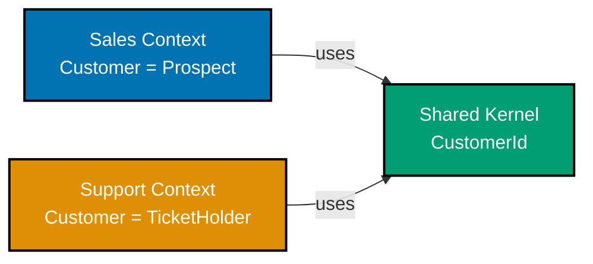
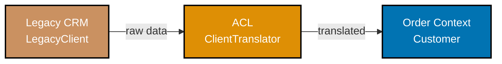
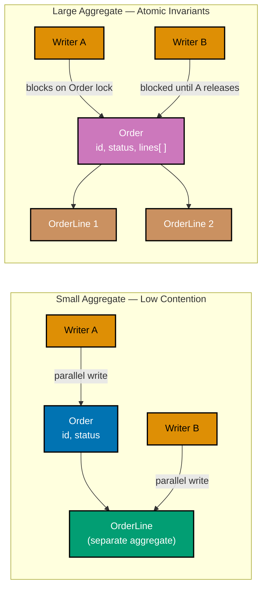
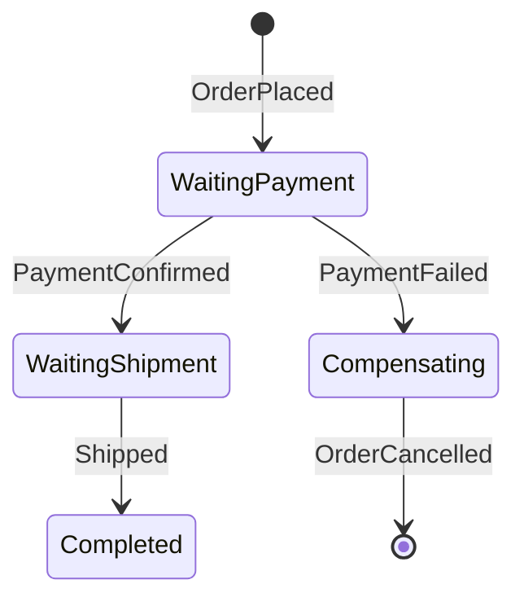
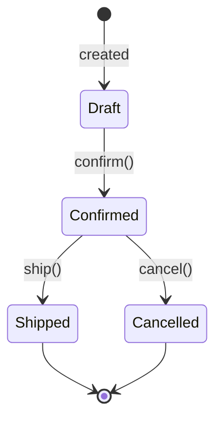
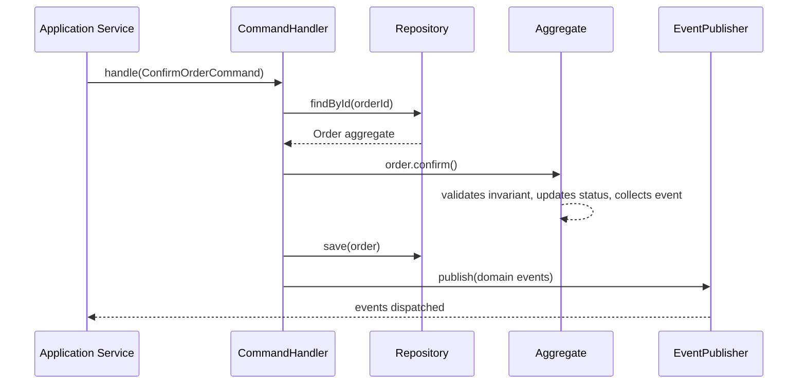
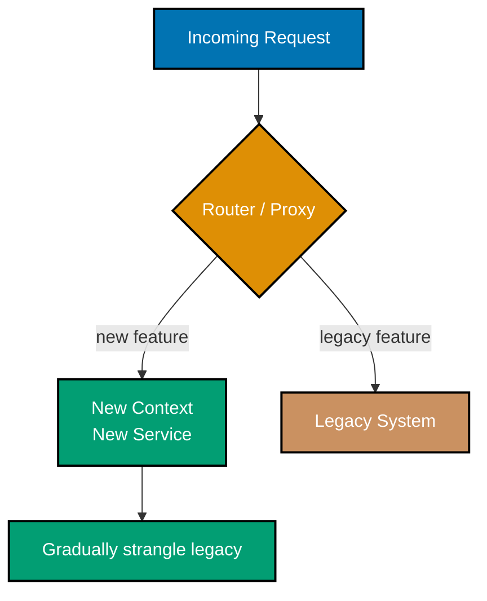
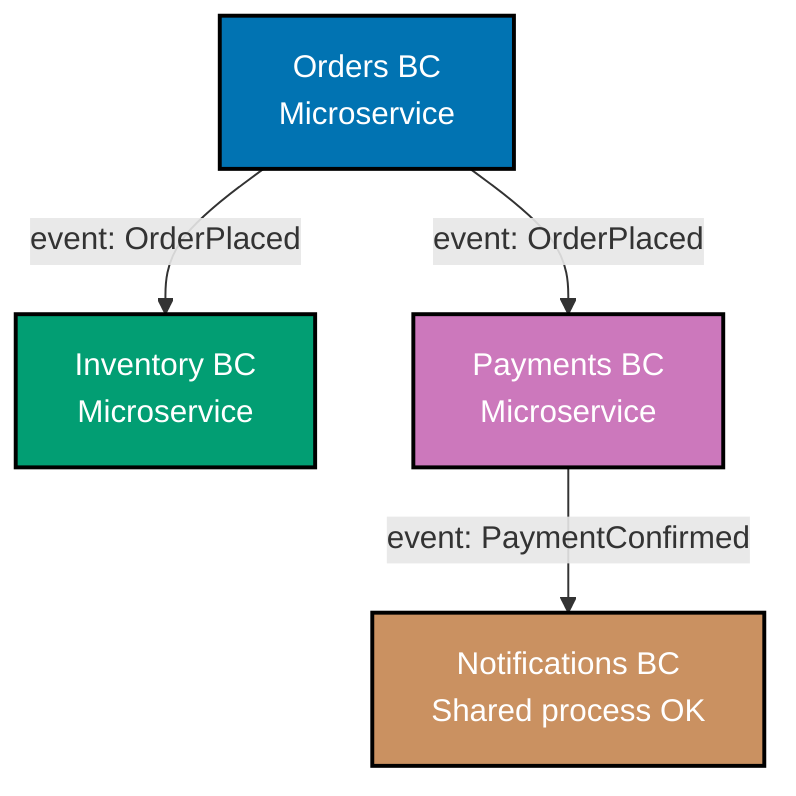
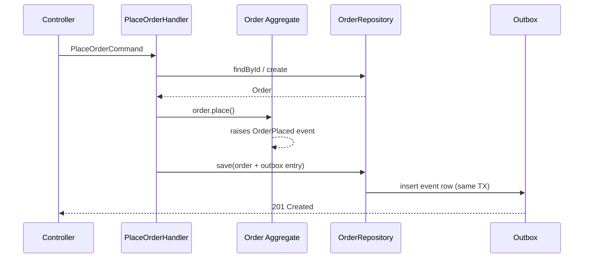

This section covers Examples 56-80, focusing on strategic design and advanced tactical patterns. Each example is self-contained; references to prior examples are conceptual orientation only.

## Strategic Design — Bounded Contexts (Examples 56-63)

### Example 56: Bounded Context — explicit definition + ubiquitous-language scope

A Bounded Context is an explicit boundary within which a domain model applies. The same word — "Customer" — can mean different things in Sales vs Support; each context owns its own definition.



**Java**:

```java
// ── Sales Bounded Context ────────────────────────────────────────────────────
// "Customer" here is a prospect being tracked through the sales funnel
package sales;                                                        // => expression

record CustomerId(String value) {}                                    // => record CustomerId
// => Shared identity type; only the ID crosses context boundaries

class Customer {                                                      // => class Customer
    // => Sales context: Customer has pipeline stage and lead score
    private final CustomerId id;          // => Identity shared with other contexts
    private final String name;            // => Name owned by Sales context only
    private final String pipelineStage;   // => "Prospect/Qualified/Closed" — Sales ubiquitous language

    Customer(CustomerId id, String name, String stage) {              // => Customer() called
        this.id = id; this.name = name; this.pipelineStage = stage;   // => this.id assigned
        // => Constructor enforces all fields; no half-constructed Customer
    }
    public CustomerId id() { return id; }                             // => id method
    // => Only ID is exposed outside the context boundary
}

// ── Support Bounded Context ──────────────────────────────────────────────────
// Same "Customer" concept, completely different model — ticket count matters here
package support;                                                      // => expression

record CustomerId(String value) {}                                    // => record CustomerId
// => Identical structure but separate type — intentional duplication over coupling

class Customer {                                                      // => class Customer
    // => Support context: Customer has open tickets, not a pipeline stage
    private final CustomerId id;                                      // => id field
    private final int openTickets;        // => Support ubiquitous language: what matters here
    private final String tier;            // => "Gold/Silver/Bronze" — Support SLA level

    Customer(CustomerId id, int openTickets, String tier) {           // => Customer() called
        this.id = id; this.openTickets = openTickets; this.tier = tier; // => this.id assigned
    }
    public int openTickets() { return openTickets; }                  // => openTickets method
    // => Support operations query tickets, not pipeline stages
}
```

**Kotlin**:

```kotlin
// ── Sales Bounded Context ────────────────────────────────────────────────────
// Kotlin data classes make context-local models concise
object sales {                                                        // => object sales
    @JvmInline value class CustomerId(val value: String)              // => class CustomerId
    // => Inline value class: zero runtime overhead, type-safe identity

    data class Customer(                                              // => class Customer
        val id: CustomerId,                                           // => expression
        val name: String,                                             // => expression
        val pipelineStage: String   // => Sales language: "Prospect/Qualified/Closed"
    )
}

// ── Support Bounded Context ──────────────────────────────────────────────────
// Entirely separate model; same field name "id" but different type
object support {                                                      // => object support
    @JvmInline value class CustomerId(val value: String)              // => class CustomerId
    // => Separate inline class prevents accidental cross-context ID mixing

    data class Customer(                                              // => class Customer
        val id: CustomerId,                                           // => expression
        val openTickets: Int,       // => Support language: ticket count is what matters
        val tier: String            // => "Gold/Silver/Bronze" maps to SLA commitments
    )
}

fun main() {                                                          // => main method
    val salesCustomer = sales.Customer(sales.CustomerId("c1"), "Acme", "Qualified") // => salesCustomer initialised
    // => sales.Customer and support.Customer are different types — compiler enforces isolation
    val supportCustomer = support.Customer(support.CustomerId("c1"), 3, "Gold") // => supportCustomer initialised
    println(salesCustomer)   // => Customer(id=CustomerId(value=c1), name=Acme, pipelineStage=Qualified)
    println(supportCustomer) // => Customer(id=CustomerId(value=c1), openTickets=3, tier=Gold)
}
```

**C#**:

```csharp
// ── Sales Bounded Context ────────────────────────────────────────────────────
// C# namespaces enforce context boundaries at the module level
namespace Sales {                                                     // => expression
    public record CustomerId(string Value);                           // => record CustomerId
    // => Record type: value equality by default, immutable

    public record Customer(CustomerId Id, string Name, string PipelineStage); // => record Customer
    // => PipelineStage is Sales ubiquitous language — not meaningful in other contexts
}

// ── Support Bounded Context ──────────────────────────────────────────────────
// Parallel namespace; same names are allowed because they live in separate namespaces
namespace Support {                                                   // => expression
    public record CustomerId(string Value);                           // => record CustomerId
    // => Separate type prevents Sales.CustomerId being passed to Support code

    public record Customer(CustomerId Id, int OpenTickets, string Tier); // => record Customer
    // => OpenTickets and Tier are Support language — irrelevant to Sales
}

class Program {                                                       // => class Program
    static void Main() {                                              // => Main method
        var salesC = new Sales.Customer(new Sales.CustomerId("c1"), "Acme", "Qualified"); // => salesC initialised
        // => Compiler distinguishes Sales.Customer from Support.Customer
        var supportC = new Support.Customer(new Support.CustomerId("c1"), 3, "Gold"); // => supportC initialised
        Console.WriteLine(salesC);    // => Customer { Id = CustomerId { Value = c1 }, Name = Acme, PipelineStage = Qualified }
        Console.WriteLine(supportC);  // => Customer { Id = CustomerId { Value = c1 }, OpenTickets = 3, Tier = Gold }
    }
}
```

**Key Takeaway**: Each Bounded Context owns its model; only identity values (IDs) cross boundaries.

**Why It Matters**: Without explicit context boundaries, teams couple their models together. A Sales change to "Customer" breaks Support code. When Amazon split its monolith into services, each team owned a Bounded Context — different definitions of "Order" in Fulfilment vs Finance caused no cross-team incidents because the boundaries were explicit. Bounded Contexts let teams evolve models independently, matching the real organisation structure and reducing cross-team coordination overhead substantially.

---

### Example 57: Context Map — Shared Kernel

Two contexts share a small, explicitly agreed-upon piece of the model. The Shared Kernel must not change without both teams' consent.

**Java**:

```java
// ── Shared Kernel: sits in its own module/package ────────────────────────────
// Both Billing and Shipping agree on this exact type; any change needs both teams
package sharedkernel;                                                 // => expression

record CustomerId(String value) {}                                    // => record CustomerId
// => Shared Kernel type: immutable, no business logic — pure identity
record Money(java.math.BigDecimal amount, String currency) {          // => record Money
    // => Shared Kernel Value Object: both contexts need amount + currency together
    Money add(Money other) {                                          // => expression
        if (!currency.equals(other.currency)) throw new IllegalArgumentException("Currency mismatch"); // => throws if guard fails
        // => Guard: mixing USD and EUR produces nonsense; fail fast
        return new Money(amount.add(other.amount), currency);         // => returns new Money(amount.add(other.amo
        // => Returns new Money — immutable arithmetic, no mutation
    }
}

// ── Billing Context uses Shared Kernel ───────────────────────────────────────
package billing;                                                      // => expression

class Invoice {                                                       // => class Invoice
    private final sharedkernel.CustomerId customerId; // => Uses Shared Kernel ID type
    private final sharedkernel.Money total;           // => Uses Shared Kernel Money type
    Invoice(sharedkernel.CustomerId id, sharedkernel.Money total) {   // => Invoice() called
        this.customerId = id; this.total = total;                     // => this.customerId assigned
    }
    public sharedkernel.Money total() { return total; }               // => total method
}

// ── Shipping Context also uses Shared Kernel ─────────────────────────────────
package shipping;                                                     // => expression

class Shipment {                                                      // => class Shipment
    private final sharedkernel.CustomerId customerId; // => Same Shared Kernel type
    private final sharedkernel.Money cost;            // => Same Money type for shipping cost
    Shipment(sharedkernel.CustomerId id, sharedkernel.Money cost) {   // => Shipment() called
        this.customerId = id; this.cost = cost;                       // => this.customerId assigned
    }
}
```

**Kotlin**:

```kotlin
// ── Shared Kernel ─────────────────────────────────────────────────────────────
object SharedKernel {                                                 // => object SharedKernel
    @JvmInline value class CustomerId(val value: String)              // => class CustomerId
    // => Inline class: no heap allocation, strong typing

    data class Money(val amount: java.math.BigDecimal, val currency: String) { // => class Money
        operator fun plus(other: Money): Money {                      // => expression
            require(currency == other.currency) { "Currency mismatch" } // => precondition check
            // => Kotlin operator overload: enables money1 + money2 syntax
            return copy(amount = amount + other.amount)               // => returns copy(amount = amount + other.a
            // => copy() creates new instance — immutability maintained
        }
    }
}

// Both contexts import and depend on SharedKernel, nothing else
data class Invoice(val customerId: SharedKernel.CustomerId, val total: SharedKernel.Money) // => class Invoice
// => Billing context — uses Shared Kernel types directly

data class Shipment(val customerId: SharedKernel.CustomerId, val cost: SharedKernel.Money) // => class Shipment
// => Shipping context — same Shared Kernel types; change requires bilateral agreement
```

**C#**:

```csharp
// ── Shared Kernel ─────────────────────────────────────────────────────────────
namespace SharedKernel {                                              // => expression
    public record CustomerId(string Value);                           // => record CustomerId
    // => Shared type: both Billing and Shipping depend on this

    public record Money(decimal Amount, string Currency) {            // => record Money
        public Money Add(Money other) {                               // => Add method
            if (Currency != other.Currency) throw new InvalidOperationException("Currency mismatch"); // => throws if guard fails
            // => Fail fast on currency mismatch; avoids silent data corruption
            return this with { Amount = Amount + other.Amount };      // => returns this with { Amount = Amount + 
            // => With-expression: returns new record with updated Amount — immutable
        }
    }
}

namespace Billing {                                                   // => expression
    using SharedKernel;                                               // => namespace/package import
    public record Invoice(CustomerId CustomerId, Money Total);        // => record Invoice
    // => Billing owns Invoice structure; borrows identity + money from Shared Kernel
}

namespace Shipping {                                                  // => expression
    using SharedKernel;                                               // => namespace/package import
    public record Shipment(CustomerId CustomerId, Money Cost);        // => record Shipment
    // => Shipping owns Shipment structure; same Shared Kernel dependency
}
```

**Key Takeaway**: Shared Kernel minimises duplication while keeping change governance explicit — both teams must agree before modifying it.

**Why It Matters**: When two contexts truly share concepts, duplicating them creates sync bugs. A Shared Kernel provides a contract: the shared code is small, stable, and jointly owned. Teams avoid the hidden cost of two independently drifting definitions of "Money." In practice, Shared Kernels work best for identity types and pure value objects — keeping the kernel small prevents it from becoming an implicit coupling point between teams.

---

### Example 58: Context Map — Customer / Supplier

The upstream (Supplier) publishes a stable API; the downstream (Customer) consumes it and adapts locally. The Supplier dictates the contract.

**Java**:

```java
// ── Upstream Supplier: Inventory Context ────────────────────────────────────
// Inventory publishes its own DTO; downstream must accept it as-is
package inventory;                                                    // => expression

record ProductAvailabilityDto(String productId, int availableQty, String warehouseCode) {} // => record ProductAvailabilityDto
// => DTO published by Supplier; downstream Customer must not modify this class

class InventoryService {                                              // => class InventoryService
    public ProductAvailabilityDto checkAvailability(String productId) { // => checkAvailability method
        return new ProductAvailabilityDto(productId, 42, "WH-EU-01"); // => returns new ProductAvailabilityDto(pro
        // => Supplier returns its own model; downstream adapts, not the other way
    }
}

// ── Downstream Customer: Order Context ──────────────────────────────────────
// Order context has its own model; it calls Inventory and maps the result
package order;                                                        // => expression

record StockLevel(String sku, int qty) {}                             // => record StockLevel
// => Order's internal model: uses "sku" and "qty" — Order ubiquitous language

class OrderService {                                                  // => class OrderService
    private final inventory.InventoryService inventoryService;        // => expression
    // => Depends on upstream Supplier; no circular dependency allowed

    OrderService(inventory.InventoryService svc) { this.inventoryService = svc; } // => OrderService() called

    public StockLevel getStock(String sku) {                          // => getStock method
        var dto = inventoryService.checkAvailability(sku);            // => dto initialised
        // => Customer calls Supplier API; receives Supplier's DTO
        return new StockLevel(dto.productId(), dto.availableQty());   // => returns new StockLevel(dto.productId()
        // => Customer maps Supplier DTO to its own internal model
        // => warehouseCode discarded — not relevant in Order context
    }
}
```

**Kotlin**:

```kotlin
// ── Upstream Supplier ────────────────────────────────────────────────────────
object Inventory {                                                    // => object Inventory
    data class ProductAvailabilityDto(val productId: String, val qty: Int, val warehouse: String) // => class ProductAvailabilityDto
    // => Supplier owns this DTO shape; downstream must not mutate it

    fun checkAvailability(productId: String) = ProductAvailabilityDto(productId, 42, "WH-EU-01") // => checkAvailability method
    // => Supplier API — stable contract that Customer depends on
}

// ── Downstream Customer ───────────────────────────────────────────────────────
data class StockLevel(val sku: String, val qty: Int)                  // => class StockLevel
// => Order's own model; mapping happens at the boundary

fun getStock(sku: String): StockLevel {                               // => getStock method
    val dto = Inventory.checkAvailability(sku)    // => Calls Supplier
    return StockLevel(sku = dto.productId, qty = dto.qty)             // => returns StockLevel(sku = dto.productId
    // => Maps Supplier DTO → Customer model; warehouse ignored
}

fun main() {                                                          // => main method
    println(getStock("SKU-001"))  // => StockLevel(sku=SKU-001, qty=42)
}
```

**C#**:

```csharp
// ── Upstream Supplier ────────────────────────────────────────────────────────
namespace Inventory {                                                 // => expression
    public record ProductAvailabilityDto(string ProductId, int Qty, string Warehouse); // => record ProductAvailabilityDto
    // => Supplier DTO: Customer must accept this shape or adapt locally

    public class InventoryService {                                   // => InventoryService field
        public ProductAvailabilityDto CheckAvailability(string productId) // => CheckAvailability method
            => new(productId, 42, "WH-EU-01");                        // => expression
        // => Expression-bodied method: concise for simple return
    }
}

// ── Downstream Customer ───────────────────────────────────────────────────────
namespace Order {                                                     // => expression
    using Inventory;                                                  // => namespace/package import
    public record StockLevel(string Sku, int Qty);                    // => record StockLevel
    // => Order's internal representation; naming follows Order ubiquitous language

    public class OrderService(InventoryService inventory) {           // => class OrderService
        public StockLevel GetStock(string sku) {                      // => GetStock method
            var dto = inventory.CheckAvailability(sku);  // => Calls Supplier
            return new StockLevel(dto.ProductId, dto.Qty);            // => returns new StockLevel(dto.ProductId, 
            // => Translates Supplier model to Order model at the seam
        }
    }
}
```

**Key Takeaway**: In Customer/Supplier, the upstream publishes its contract and the downstream adapts — never the reverse.

**Why It Matters**: When one team controls the API and another consumes it, clarifying who adapts prevents endless negotiation. The downstream Customer maps at the seam, keeping its own model clean and independent of upstream naming conventions. In practice, Stripe's payment API is the canonical Supplier — every e-commerce platform is the Customer that adapts locally, translating Stripe's `charge` concept into their own domain's `Payment` or `Transaction` type.

---

### Example 59: Context Map — Conformist

The downstream Context simply adopts the upstream model wholesale — no translation layer. Used when the upstream model is good enough and translation cost is not justified.

**Java**:

```java
// ── Upstream: User Auth Context (e.g. Keycloak) ──────────────────────────────
// External system; we have no influence over its model
package auth;                                                         // => expression

record UserPrincipal(String userId, String email, java.util.List<String> roles) {} // => record UserPrincipal
// => Upstream model; in Conformist we use this directly, no mapping

// ── Downstream: Notification Context (Conformist) ────────────────────────────
// Deliberately uses auth.UserPrincipal instead of creating its own User class
package notification;                                                 // => expression

class NotificationService {                                           // => class NotificationService
    public void sendWelcome(auth.UserPrincipal principal) {           // => sendWelcome method
        // => Conformist: accepts upstream type directly — no adapter, no mapping
        System.out.println("Welcome " + principal.email());           // => output to console
        // => Benefit: zero translation cost
        // => Trade-off: Notification is now coupled to Auth model changes
    }
}

class Demo {                                                          // => class Demo
    public static void main(String[] args) {                          // => main method
        var svc = new NotificationService();                          // => svc initialised
        svc.sendWelcome(new auth.UserPrincipal("u1", "alice@example.com", java.util.List.of("USER"))); // => svc.sendWelcome() called
        // => Output: Welcome alice@example.com
    }
}
```

**Kotlin**:

```kotlin
// ── Upstream model ────────────────────────────────────────────────────────────
data class UserPrincipal(val userId: String, val email: String, val roles: List<String>) // => class UserPrincipal
// => Upstream type; Conformist downstream uses it without wrapping

// ── Conformist downstream ────────────────────────────────────────────────────
fun sendWelcome(principal: UserPrincipal) {                           // => sendWelcome method
    // => Conformist: no mapping — directly uses upstream type
    println("Welcome ${principal.email}")                             // => output to console
    // => Simpler code, but downstream is coupled to upstream schema
}

fun main() {                                                          // => main method
    sendWelcome(UserPrincipal("u1", "alice@example.com", listOf("USER"))) // => sendWelcome() called
    // => Output: Welcome alice@example.com
}
```

**C#**:

```csharp
// ── Upstream model ────────────────────────────────────────────────────────────
public record UserPrincipal(string UserId, string Email, List<string> Roles); // => record UserPrincipal
// => Upstream type — Conformist downstream accepts this directly

// ── Conformist downstream ────────────────────────────────────────────────────
public class NotificationService {                                    // => NotificationService field
    public void SendWelcome(UserPrincipal principal) {                // => SendWelcome method
        // => Conformist pattern: no anti-corruption translation layer
        Console.WriteLine($"Welcome {principal.Email}");              // => output to console
        // => Acceptable when upstream model quality is high and we have no influence over it
    }
}

class Program {                                                       // => class Program
    static void Main() {                                              // => Main method
        new NotificationService().SendWelcome(new UserPrincipal("u1", "alice@example.com", new() { "USER" })); // => expression
        // => Output: Welcome alice@example.com
    }
}
```

**Key Takeaway**: Conformist is a conscious decision to accept coupling in exchange for zero translation overhead.

**Why It Matters**: Not every context boundary warrants a translation layer. When the upstream model is stable, well-designed, and you have no leverage to change it, being Conformist is pragmatic. The pattern name makes the trade-off explicit and visible in architecture documentation. Teams using cloud platforms like AWS or Azure are typically Conformist — they adopt the provider's naming and model rather than building translation layers, accepting the coupling as the cost of fast integration.

---

### Example 60: Anti-Corruption Layer — translator class

An ACL sits between two contexts and translates concepts, shielding the downstream model from upstream pollution.



**Java**:

```java
// ── Legacy upstream model (cannot be modified) ───────────────────────────────
record LegacyClient(String clientNo, String fullName, int statusCode) {} // => record LegacyClient
// => Legacy system: "clientNo" not "customerId", statusCode int not enum

// ── Order context's clean model ──────────────────────────────────────────────
enum CustomerStatus { ACTIVE, INACTIVE, SUSPENDED }                   // => enum CustomerStatus
// => Order context uses a proper enum, not magic ints

record Customer(String id, String name, CustomerStatus status) {}     // => record Customer
// => Clean Order model — no trace of legacy naming conventions

// ── Anti-Corruption Layer ────────────────────────────────────────────────────
// The translator lives at the seam; it knows both models, neither model knows it
class ClientTranslator {                                              // => class ClientTranslator
    public Customer translate(LegacyClient legacy) {                  // => translate method
        return new Customer(                                          // => returns new Customer(
            legacy.clientNo(),          // => Maps "clientNo" → "id" (naming translation)
            legacy.fullName(),           // => Name passes through unchanged
            mapStatus(legacy.statusCode()) // => Translates int → enum (concept translation)
        );                                                            // => expression
    }
    private CustomerStatus mapStatus(int code) {                      // => mapStatus method
        return switch (code) {           // => Switch expression: exhaustive, no default needed
            case 1  -> CustomerStatus.ACTIVE;                         // => expression
            case 2  -> CustomerStatus.INACTIVE;                       // => expression
            default -> CustomerStatus.SUSPENDED;                      // => expression
        };
    }
}

class Demo {                                                          // => class Demo
    public static void main(String[] args) {                          // => main method
        var translator = new ClientTranslator();                      // => translator initialised
        var legacy = new LegacyClient("CLT-001", "Alice", 1);         // => legacy initialised
        System.out.println(translator.translate(legacy));             // => output to console
        // => Customer[id=CLT-001, name=Alice, status=ACTIVE]
    }
}
```

**Kotlin**:

```kotlin
// ── Legacy upstream ───────────────────────────────────────────────────────────
data class LegacyClient(val clientNo: String, val fullName: String, val statusCode: Int) // => class LegacyClient
// => Legacy naming and int status codes we cannot change

// ── Clean downstream model ────────────────────────────────────────────────────
enum class CustomerStatus { ACTIVE, INACTIVE, SUSPENDED }             // => enum class
data class Customer(val id: String, val name: String, val status: CustomerStatus) // => class Customer

// ── ACL Translator ────────────────────────────────────────────────────────────
object ClientTranslator {                                             // => object ClientTranslator
    fun translate(legacy: LegacyClient) = Customer(                   // => translate method
        id = legacy.clientNo,              // => Name translation at the seam
        name = legacy.fullName,                                       // => name assigned
        status = when (legacy.statusCode) { // => when exhaustively maps ints → enum
            1    -> CustomerStatus.ACTIVE                             // => expression
            2    -> CustomerStatus.INACTIVE                           // => expression
            else -> CustomerStatus.SUSPENDED                          // => expression
        }
    )
}

fun main() {                                                          // => main method
    println(ClientTranslator.translate(LegacyClient("CLT-001", "Alice", 1))) // => output to console
    // => Customer(id=CLT-001, name=Alice, status=ACTIVE)
}
```

**C#**:

```csharp
// ── Legacy upstream ───────────────────────────────────────────────────────────
public record LegacyClient(string ClientNo, string FullName, int StatusCode); // => record LegacyClient
// => Cannot modify legacy types; ACL absorbs the difference

// ── Clean downstream model ────────────────────────────────────────────────────
public enum CustomerStatus { Active, Inactive, Suspended }            // => CustomerStatus field
public record Customer(string Id, string Name, CustomerStatus Status); // => record Customer

// ── Anti-Corruption Layer ────────────────────────────────────────────────────
public static class ClientTranslator {                                // => ClientTranslator field
    public static Customer Translate(LegacyClient legacy) => new(     // => Translate method
        Id:     legacy.ClientNo,           // => "ClientNo" → "Id": naming translation
        Name:   legacy.FullName,                                      // => expression
        Status: legacy.StatusCode switch { // => Switch expression: maps int → enum
            1 => CustomerStatus.Active,                               // => expression
            2 => CustomerStatus.Inactive,                             // => expression
            _ => CustomerStatus.Suspended  // => Default handles unknown codes safely
        }
    );                                                                // => expression
}

class Program {                                                       // => class Program
    static void Main() {                                              // => Main method
        Console.WriteLine(ClientTranslator.Translate(new LegacyClient("CLT-001", "Alice", 1))); // => output to console
        // => Customer { Id = CLT-001, Name = Alice, Status = Active }
    }
}
```

**Key Takeaway**: The ACL translates both naming and concepts at the boundary, keeping the downstream model free of legacy contamination.

**Why It Matters**: Legacy systems carry decades of accumulated naming conventions and integer codes. Without an ACL, every service method must handle this impedance mismatch, and corruption spreads inward — the domain starts using `status = 1` instead of `OrderStatus.PENDING`. The translator centralises the conversion, making legacy integration testable in isolation and replaceable without touching domain logic. When the legacy system is eventually retired, only the ACL needs updating.

---

### Example 61: Published Language — JSON contract

A Published Language is a well-documented, versioned exchange format shared between contexts. Contexts communicate through it without sharing models.

> **Why this library**: Java's standard library (`java.lang`, `java.io`) has no built-in JSON serialisation. Jackson is the de facto standard in the Java and Kotlin ecosystems for stable JSON key mapping — `@JsonProperty` guarantees that renaming a Java field does not silently break downstream consumers. C# uses `System.Text.Json` from the standard library, so no external dependency is needed there.

**Java**:

```java
import com.fasterxml.jackson.annotation.JsonProperty;
// => Jackson annotation: maps Java field name to JSON key name

// ── Published Language DTO ────────────────────────────────────────────────────
// This class IS the contract; changing it is a breaking change for all consumers
record OrderPlacedEvent(
    @JsonProperty("order_id")   String orderId,      // => snake_case JSON key; camelCase Java
    @JsonProperty("customer_id") String customerId,  // => Explicit mapping prevents rename bugs
    @JsonProperty("total_amount") double totalAmount, // => Published field; consumers depend on it
    @JsonProperty("currency")    String currency      // => Currency always accompanies amount
) {}

// ── Publisher serialises ─────────────────────────────────────────────────────
// In production, ObjectMapper.writeValueAsString(event) produces:
// {"order_id":"ord-1","customer_id":"cust-1","total_amount":99.50,"currency":"USD"}
// => Contract is the JSON shape, not the Java type
```

**Kotlin**:

```kotlin
import com.fasterxml.jackson.annotation.JsonProperty                  // => namespace/package import

// ── Published Language DTO ────────────────────────────────────────────────────
data class OrderPlacedEvent(                                          // => class OrderPlacedEvent
    @JsonProperty("order_id")    val orderId: String,                 // => expression
    // => @JsonProperty ensures stable JSON key despite Kotlin property name
    @JsonProperty("customer_id") val customerId: String,              // => expression
    @JsonProperty("total_amount") val totalAmount: Double,            // => expression
    @JsonProperty("currency")    val currency: String                 // => expression
)
// => Any consumer reading this JSON shape is a subscriber of this Published Language
// => Version the event type name (e.g. OrderPlacedEventV2) for breaking changes
```

**C#**:

```csharp
using System.Text.Json.Serialization;                                 // => namespace/package import

// ── Published Language DTO ────────────────────────────────────────────────────
public record OrderPlacedEvent(                                       // => record OrderPlacedEvent
    [property: JsonPropertyName("order_id")]    string OrderId,       // => expression
    // => JsonPropertyName: stable JSON key regardless of C# property name refactoring
    [property: JsonPropertyName("customer_id")] string CustomerId,    // => expression
    [property: JsonPropertyName("total_amount")] decimal TotalAmount, // => expression
    [property: JsonPropertyName("currency")]    string Currency       // => expression
);                                                                    // => expression
// => This record serialises to {"order_id":...,"customer_id":...,...}
// => Consumers in any language can parse the same JSON shape
```

**Key Takeaway**: Published Language decouples contexts via a versioned, well-documented serialisation contract rather than shared types.

**Why It Matters**: When contexts run in separate services, they cannot share compiled types. A Published Language gives both producer and consumer a stable, versioned contract. Consumers parse JSON independently; producers evolve their internal model freely as long as the serialised shape is maintained. Versioning the event type name (e.g. `OrderPlacedV2`) rather than silently changing field names is what separates teams that deploy independently from teams that require coordinated releases.

---

### Example 62: Open Host Service — REST endpoint exposing context

An Open Host Service exposes a context's capabilities through a well-defined protocol, letting multiple consumers integrate without bespoke integrations.

> **Why these libraries**: Java's standard library offers `com.sun.net.httpserver` but it lacks annotation-driven routing, content negotiation, and production-grade lifecycle management. JAX-RS (`jakarta.ws.rs`) is the Jakarta EE standard for REST in Java — it is the idiomatic choice when the project already runs on a Jakarta EE / Quarkus / Jersey container. For Kotlin, Ktor is the idiomatic Kotlin-native async server framework; raw `java.net` sockets would require hundreds of lines to replicate what Ktor provides in ten. C# uses `Microsoft.AspNetCore` minimal APIs from the .NET standard library, requiring no additional dependency.

**Java**:

```java
// ── Open Host Service: Inventory exposes stock via REST ───────────────────────
// Any context or external system can call this endpoint — no custom integration needed
import jakarta.ws.rs.*;                                               // => namespace/package import
import jakarta.ws.rs.core.MediaType;                                  // => namespace/package import

@Path("/inventory")                                                   // => expression
@Produces(MediaType.APPLICATION_JSON)                                 // => expression
public class InventoryResource {                                      // => InventoryResource field

    @GET                                                              // => expression
    @Path("/products/{sku}/stock")                                    // => expression
    public StockResponse getStock(@PathParam("sku") String sku) {     // => getStock method
        // => OHS: one public API serves all consumers — Sales, Shipping, Reporting
        int qty = lookupStock(sku);    // => Internal lookup; implementation detail hidden
        return new StockResponse(sku, qty, "WH-EU-01");               // => returns new StockResponse(sku, qty, "W
        // => Response is the Published Language; consumers depend on it
    }

    private int lookupStock(String sku) { return 42; } // => Simplified for example
}

record StockResponse(String sku, int available, String warehouse) {}  // => record StockResponse
// => Published Language DTO returned by the Open Host Service
```

**Kotlin**:

```kotlin
// ── Open Host Service skeleton (Ktor style) ───────────────────────────────────
import io.ktor.server.routing.*                                       // => namespace/package import
import io.ktor.server.response.*                                      // => namespace/package import

data class StockResponse(val sku: String, val available: Int, val warehouse: String) // => class StockResponse
// => Published Language: all consumers receive this shape

fun Route.inventoryRoutes() {                                         // => method declaration
    get("/inventory/products/{sku}/stock") {                          // => get() called
        val sku = call.parameters["sku"] ?: return@get                // => sku initialised
        // => Extract path parameter; short-circuit on missing SKU
        call.respond(StockResponse(sku, 42, "WH-EU-01"))              // => call.respond() called
        // => OHS exposes one endpoint; any consumer reads the same JSON
    }
}
// => Benefit: adding a new consumer context requires no code change in Inventory
```

**C#**:

```csharp
// ── Open Host Service (minimal API style) ────────────────────────────────────
using Microsoft.AspNetCore.Builder;                                   // => namespace/package import

var app = WebApplication.Create();                                    // => app initialised

app.MapGet("/inventory/products/{sku}/stock", (string sku) => {       // => app.MapGet() called
    // => OHS: one route serves all downstream consumers
    return Results.Ok(new StockResponse(sku, 42, "WH-EU-01"));        // => returns Results.Ok(new StockResponse(s
    // => Returns Published Language DTO; consumers decode the JSON themselves
});

app.Run();                                                            // => app.Run() called

public record StockResponse(string Sku, int Available, string Warehouse); // => record StockResponse
// => Published Language record: stable shape across all consumer versions
```

**Key Takeaway**: An Open Host Service exposes a context as a versioned public API, eliminating bespoke point-to-point integrations.

**Why It Matters**: Without a formal host service, each new consumer demands a custom integration, creating a point-to-point dependency web that breaks on every internal refactor. An OHS treats your context as a product with a stable interface. Combined with a Published Language, it enables loose coupling at scale — consumers are upgraded at their own pace, and the producing context can refactor internals without coordinating with every downstream team.

---

### Example 63: Subdomain classification — core / supporting / generic

Classifying subdomains guides where to invest engineering effort: core domains deserve the highest quality; generic ones should be bought or reused.

**Java**:

```java
// ── Subdomain classification as code comments ─────────────────────────────────
// This pattern documents architectural intent; no runtime behaviour

// CORE SUBDOMAIN — competitive advantage; build with highest craft
// Pricing engine: proprietary algorithm differentiating the business
interface PricingEngine {
    // => Core: invest in DDD, event sourcing, thorough testing here
    // => Do NOT outsource or use off-the-shelf pricing SaaS
    java.math.BigDecimal calculatePrice(String productId, int quantity, String customerId);
}

// SUPPORTING SUBDOMAIN — necessary but not differentiating; build simply
// Notification service: important but every company does the same thing
interface NotificationService {
    // => Supporting: CRUD service with simple domain model is fine here
    // => Can simplify to Transaction Script pattern; no need for full DDD
    void sendEmail(String to, String subject, String body);
}

// GENERIC SUBDOMAIN — solved problem; buy or reuse
// Authentication: Identity provider (Keycloak, Auth0) is the right choice
interface AuthenticationService {
    // => Generic: use an off-the-shelf IAM solution
    // => Building custom auth wastes engineering time on a solved problem
    boolean authenticate(String username, String password);
}
```

**Kotlin**:

```kotlin
// ── Subdomain intent annotations ─────────────────────────────────────────────
// Kotlin annotations make subdomain classification machine-readable
@Target(AnnotationTarget.CLASS)                                       // => expression
annotation class CoreSubdomain(val reason: String)                    // => class CoreSubdomain
// => Use on classes in the core domain; tooling can enforce DDD standards here

@Target(AnnotationTarget.CLASS)                                       // => expression
annotation class SupportingSubdomain(val reason: String)              // => class SupportingSubdomain
// => Use on classes in supporting domains; simpler patterns acceptable

@Target(AnnotationTarget.CLASS)                                       // => expression
annotation class GenericSubdomain(val reason: String)                 // => class GenericSubdomain
// => Use on classes that should use off-the-shelf solutions

@CoreSubdomain(reason = "Proprietary pricing algorithm drives margin") // => expression
interface PricingEngine { fun calculatePrice(productId: String, qty: Int): java.math.BigDecimal } // => interface PricingEngine

@SupportingSubdomain(reason = "Necessary but not differentiating")    // => expression
interface NotificationService { fun sendEmail(to: String, subject: String, body: String) } // => interface NotificationService

@GenericSubdomain(reason = "Use Auth0 or Keycloak instead of building") // => expression
interface AuthenticationService { fun authenticate(username: String, password: String): Boolean } // => interface AuthenticationService
```

**C#**:

```csharp
// ── Subdomain classification via attributes ───────────────────────────────────
[AttributeUsage(AttributeTargets.Interface | AttributeTargets.Class)] // => expression
public class CoreSubdomainAttribute(string Reason) : Attribute { }    // => class CoreSubdomainAttribute
// => Attribute documents investment level; architecture linting can enforce rules

[AttributeUsage(AttributeTargets.Interface | AttributeTargets.Class)] // => expression
public class SupportingSubdomainAttribute(string Reason) : Attribute { } // => class SupportingSubdomainAttribute

[AttributeUsage(AttributeTargets.Interface | AttributeTargets.Class)] // => expression
public class GenericSubdomainAttribute(string Reason) : Attribute { } // => class GenericSubdomainAttribute

[CoreSubdomain("Proprietary pricing algorithm drives margin")]        // => expression
public interface IPricingEngine {                                     // => IPricingEngine field
    decimal CalculatePrice(string productId, int qty, string customerId); // => expression
    // => Core: highest engineering investment, full DDD, event sourcing if warranted
}

[SupportingSubdomain("Necessary but not differentiating")]            // => expression
public interface INotificationService {                               // => INotificationService field
    void SendEmail(string to, string subject, string body);           // => expression
    // => Supporting: simple CRUD service; Transaction Script pattern acceptable
}

[GenericSubdomain("Use Auth0 instead")]                               // => expression
public interface IAuthService {                                       // => IAuthService field
    bool Authenticate(string username, string password);              // => expression
    // => Generic: outsource to IAM provider; building custom is waste
}
```

**Key Takeaway**: Subdomain classification steers where deep DDD investment is warranted versus where simplicity or off-the-shelf solutions suffice.

**Why It Matters**: Teams that treat every subdomain as "core" over-engineer generic functionality and under-invest in differentiating logic. Explicit classification creates a shared language between architects and product managers. Netflix classifies its recommendation engine as core and uses an off-the-shelf IAM provider for authentication — the classification ensures the best engineers focus on the work that actually creates competitive advantage rather than rebuilding solved problems.

---

## Advanced Tactical Patterns (Examples 64-72)

### Example 64: Aggregate sizing — small vs large trade-off

Small aggregates have lower contention and simpler invariants; large aggregates can enforce cross-entity invariants atomically.



**Java**:

```java
import java.util.*;                                                   // => namespace/package import

// ── Small Aggregate: Order with minimal boundary ──────────────────────────────
// Only OrderId and status live here; OrderLines are separate aggregates
record OrderId(String value) {}                                       // => record OrderId
enum OrderStatus { DRAFT, CONFIRMED, SHIPPED }                        // => enum OrderStatus

class Order {                                                         // => class Order
    private final OrderId id;                                         // => id field
    private OrderStatus status;                                       // => status field
    // => Small boundary: no collection of lines — less contention, simpler locking

    Order(OrderId id) { this.id = id; this.status = OrderStatus.DRAFT; } // => Order() called

    public void confirm() {                                           // => confirm method
        if (status != OrderStatus.DRAFT) throw new IllegalStateException("Not DRAFT"); // => throws if guard fails
        // => Guard: invariant is simple because scope is small
        status = OrderStatus.CONFIRMED;                               // => status assigned
        // => State transition; no iteration over potentially large collections
    }
    public OrderStatus status() { return status; }                    // => status method
}

// ── Large Aggregate: Order owns OrderLines ────────────────────────────────────
// Can enforce "total must be positive" invariant atomically
class OrderWithLines {                                                // => class OrderWithLines
    private final OrderId id;                                         // => id field
    private final List<String> lines = new ArrayList<>(); // => simplified line type
    private OrderStatus status = OrderStatus.DRAFT;                   // => status declared
    // => Larger boundary: lines included; can check aggregate invariants

    OrderWithLines(OrderId id) { this.id = id; }                      // => OrderWithLines() called

    public void addLine(String productId) {                           // => addLine method
        if (status != OrderStatus.DRAFT) throw new IllegalStateException("Not DRAFT"); // => throws if guard fails
        lines.add(productId);                                         // => lines.add() called
        // => Invariant enforced atomically: status check + line addition in same lock
    }
    public int lineCount() { return lines.size(); }                   // => lineCount method
    // => Trade-off: concurrent writes block on the same aggregate instance
}
```

**Kotlin**:

```kotlin
// ── Small aggregate ───────────────────────────────────────────────────────────
data class OrderId(val value: String)                                 // => class OrderId
enum class OrderStatus { DRAFT, CONFIRMED, SHIPPED }                  // => enum class

class Order(val id: OrderId) {                                        // => class Order
    var status: OrderStatus = OrderStatus.DRAFT                       // => expression
        private set          // => Private setter: only confirm() can change status

    fun confirm() {                                                   // => confirm method
        check(status == OrderStatus.DRAFT) { "Only DRAFT orders can be confirmed" } // => precondition check
        // => check() throws IllegalStateException with the message — idiomatic Kotlin
        status = OrderStatus.CONFIRMED                                // => status assigned
    }
}
// => Small aggregate: low lock contention, fits in single DB row, easy to cache

// ── Large aggregate ───────────────────────────────────────────────────────────
class OrderWithLines(val id: OrderId) {                               // => class OrderWithLines
    private val _lines = mutableListOf<String>()                      // => lines declared
    val lines: List<String> get() = _lines  // => Expose as read-only list
    var status = OrderStatus.DRAFT; private set                       // => status initialised

    fun addLine(productId: String) {                                  // => addLine method
        check(status == OrderStatus.DRAFT) { "Cannot add to non-DRAFT order" } // => precondition check
        _lines.add(productId)                                         // => _lines.add() called
        // => Atomically: status checked AND line added — no partial state possible
    }
}
// => Trade-off: more contention; larger transaction scope in DB
```

**C#**:

```csharp
public enum OrderStatus { Draft, Confirmed, Shipped }                 // => OrderStatus field
public record OrderId(string Value);                                  // => record OrderId

// ── Small aggregate ───────────────────────────────────────────────────────────
public class Order(OrderId id) {                                      // => class Order
    public OrderId Id { get; } = id;                                  // => Id field
    public OrderStatus Status { get; private set; } = OrderStatus.Draft; // => Status field
    // => private set: encapsulation — only domain methods mutate status

    public void Confirm() {                                           // => Confirm method
        if (Status != OrderStatus.Draft) throw new InvalidOperationException("Not Draft"); // => throws if guard fails
        Status = OrderStatus.Confirmed;                               // => Status assigned
        // => Simple invariant: no loop over collections, low DB contention
    }
}

// ── Large aggregate ───────────────────────────────────────────────────────────
public class OrderWithLines(OrderId id) {                             // => class OrderWithLines
    private readonly List<string> _lines = [];                        // => expression
    public IReadOnlyList<string> Lines => _lines;     // => Read-only projection
    public OrderStatus Status { get; private set; } = OrderStatus.Draft; // => Status field

    public void AddLine(string productId) {                           // => AddLine method
        if (Status != OrderStatus.Draft) throw new InvalidOperationException("Not Draft"); // => throws if guard fails
        _lines.Add(productId);                                        // => _lines.Add() called
        // => Atomically enforces status + line count constraints in one transaction
    }
}
// => Larger boundary: more invariant coverage; higher contention cost
```

**Key Takeaway**: Prefer small aggregates and enforce cross-aggregate invariants via eventual consistency; only expand boundaries when atomic invariant enforcement is truly required.

**Why It Matters**: Oversized aggregates create hot spots under concurrent load. A single Order aggregate containing thousands of lines serialises all writes to that order — every concurrent add-item request blocks on the same database row lock. Small aggregates with eventual consistency scale horizontally, though they require compensating transactions to handle cross-aggregate business rules. Measure contention in production before expanding aggregate boundaries; most systems perform well with small aggregates.

---

### Example 65: Saga / Process Manager coordinating aggregates

A Saga coordinates a long-running business process spanning multiple aggregates by reacting to domain events and issuing commands.



**Java**:

```java
// ── Domain events ─────────────────────────────────────────────────────────────
record OrderPlacedEvent(String orderId, double amount) {}             // => record OrderPlacedEvent
record PaymentConfirmedEvent(String orderId) {}                       // => record PaymentConfirmedEvent
record PaymentFailedEvent(String orderId, String reason) {}           // => record PaymentFailedEvent

// ── Saga state ────────────────────────────────────────────────────────────────
enum SagaStatus { WAITING_PAYMENT, WAITING_SHIPMENT, COMPENSATING, COMPLETED } // => enum SagaStatus

// ── Order Fulfillment Saga ────────────────────────────────────────────────────
class OrderFulfillmentSaga {                                          // => class OrderFulfillmentSaga
    private String orderId;                                           // => orderId field
    private SagaStatus status;                                        // => status field
    // => Saga persists its own state so it can resume after restarts

    public void on(OrderPlacedEvent event) {                          // => on method
        this.orderId = event.orderId();                               // => this.orderId assigned
        this.status = SagaStatus.WAITING_PAYMENT; // => Transition: start waiting for payment
        System.out.println("SAGA: charge payment for " + orderId);    // => output to console
        // => Issue command to Payment context (via message bus in production)
    }

    public void on(PaymentConfirmedEvent event) {                     // => on method
        status = SagaStatus.WAITING_SHIPMENT;     // => Payment done; trigger shipping
        System.out.println("SAGA: reserve stock for " + orderId);     // => output to console
        // => Issue command to Inventory/Shipping context
    }

    public void on(PaymentFailedEvent event) {                        // => on method
        status = SagaStatus.COMPENSATING;         // => Compensate: cancel the order
        System.out.println("SAGA: cancel order " + orderId + " reason=" + event.reason()); // => output to console
        // => Compensating transaction: undo prior side effects
    }

    public SagaStatus status() { return status; }                     // => status method
}
```

**Kotlin**:

```kotlin
sealed class SagaEvent                                                // => class SagaEvent
// => Sealed class: when-expressions on SagaEvent are exhaustive; compiler verifies coverage
data class OrderPlaced(val orderId: String, val amount: Double) : SagaEvent() // => class OrderPlaced
// => Triggered when customer places an order; starts the saga
data class PaymentConfirmed(val orderId: String) : SagaEvent()        // => class PaymentConfirmed
// => Triggered when payment service reports success
data class PaymentFailed(val orderId: String, val reason: String) : SagaEvent() // => class PaymentFailed
// => Triggered when payment service reports failure; reason for audit/display

enum class SagaStatus { WAITING_PAYMENT, WAITING_SHIPMENT, COMPENSATING, COMPLETED } // => enum class
// => Four states; each state represents what the saga is waiting for next

class OrderFulfillmentSaga {                                          // => class OrderFulfillmentSaga
    var status: SagaStatus? = null; private set                       // => expression
    // => Nullable: null means "not started"; private set prevents external mutation
    var orderId: String? = null;    private set                       // => expression
    // => Captured from first event; null until OrderPlaced fires

    fun handle(event: SagaEvent) = when (event) {                     // => handle method
        is OrderPlaced      -> { orderId = event.orderId; status = SagaStatus.WAITING_PAYMENT;  println("charge ${event.orderId}") } // => output to console
        // => First event: set orderId and status, then issue charge command
        is PaymentConfirmed -> { status = SagaStatus.WAITING_SHIPMENT;  println("reserve stock for $orderId") } // => output to console
        // => Payment succeeded: advance saga, issue reserve-stock command
        is PaymentFailed    -> { status = SagaStatus.COMPENSATING;      println("cancel $orderId: ${event.reason}") } // => output to console
        // => Payment failed: enter compensation, issue cancel command
        // => when is exhaustive because SagaEvent is sealed — compiler enforces coverage
    }
}

fun main() {                                                          // => main method
    val saga = OrderFulfillmentSaga()                                 // => saga initialised
    // => saga.status = null, saga.orderId = null (not started)
    saga.handle(OrderPlaced("ord-1", 99.0))      // => charge ord-1
    // => saga.status = WAITING_PAYMENT; saga.orderId = "ord-1"
    saga.handle(PaymentConfirmed("ord-1"))        // => reserve stock for ord-1
    // => saga.status = WAITING_SHIPMENT
    println(saga.status)                         // => WAITING_SHIPMENT
}
```

**C#**:

```csharp
public enum SagaStatus { WaitingPayment, WaitingShipment, Compensating, Completed } // => SagaStatus field
// => Four saga states; each transition triggered by a domain event

public record OrderPlacedEvent(string OrderId, decimal Amount);       // => record OrderPlacedEvent
// => Immutable event: order placed, payment not yet confirmed
public record PaymentConfirmedEvent(string OrderId);                  // => record PaymentConfirmedEvent
// => Immutable event: payment succeeded; saga advances to shipping step
public record PaymentFailedEvent(string OrderId, string Reason);      // => record PaymentFailedEvent
// => Immutable event: payment failed; saga enters compensating state

public class OrderFulfillmentSaga {                                   // => OrderFulfillmentSaga field
    public string? OrderId   { get; private set; }                    // => expression
    // => Tracked order id; set on first event, used in subsequent steps
    public SagaStatus? Status { get; private set; }                   // => expression
    // => Private setters: only saga handler methods advance state
    // => Null until first event fires; type reflects "not yet started"

    public void On(OrderPlacedEvent e) {                              // => On method
        OrderId = e.OrderId; Status = SagaStatus.WaitingPayment;      // => OrderId assigned
        // => Saga initialised: OrderId captured, first state entered
        Console.WriteLine($"charge {OrderId}");     // => Issue payment command
        // => Real saga would publish a ChargeCustomerCommand to the payment service
    }
    public void On(PaymentConfirmedEvent e) {                         // => On method
        Status = SagaStatus.WaitingShipment;                          // => Status assigned
        // => Payment confirmed: advance from WaitingPayment → WaitingShipment
        Console.WriteLine($"reserve stock for {OrderId}");  // => Issue shipping command
        // => Real saga would publish a ReserveStockCommand to the inventory service
    }
    public void On(PaymentFailedEvent e) {                            // => On method
        Status = SagaStatus.Compensating;                             // => Status assigned
        // => Payment failed: enter compensating state to undo prior steps
        Console.WriteLine($"cancel {OrderId}: {e.Reason}"); // => Compensating transaction
        // => Real saga would publish CancelOrderCommand to reverse the order
    }
}

class Program {                                                       // => class Program
    static void Main() {                                              // => Main method
        var saga = new OrderFulfillmentSaga();                        // => saga initialised
        // => saga.Status = null (not started)
        saga.On(new OrderPlacedEvent("ord-1", 99m));                  // => saga.On() called
        // => saga.Status = WaitingPayment; "charge ord-1" printed
        saga.On(new PaymentConfirmedEvent("ord-1"));                  // => saga.On() called
        // => saga.Status = WaitingShipment; "reserve stock for ord-1" printed
        Console.WriteLine(saga.Status); // => WaitingShipment
    }
}
```

**Key Takeaway**: A Saga coordinates long-running processes by reacting to events and issuing compensating commands when steps fail.

**Why It Matters**: Distributed transactions (two-phase commit) are fragile and scale poorly — a single coordinator failure leaves resources locked across services. Sagas achieve eventual consistency by chaining domain events and compensating actions. The process state is explicit and persistent, making failure recovery deterministic and auditable. Payment processors like Stripe use saga-like choreography to coordinate charge, fulfil, and notify steps across independent services without cross-service transactions.

---

### Example 66: Event sourcing — events as the source of truth

Instead of persisting the current state, event sourcing stores every domain event. Current state is reconstructed by replaying events.


**Java**:

```java
import java.util.*;                                                   // => namespace/package import

sealed interface OrderEvent permits OrderPlaced, ItemAdded, OrderConfirmed {} // => interface OrderEvent
record OrderPlaced(String orderId) implements OrderEvent {}           // => record OrderPlaced
record ItemAdded(String orderId, String sku, int qty) implements OrderEvent {} // => record ItemAdded
record OrderConfirmed(String orderId) implements OrderEvent {}        // => record OrderConfirmed
// => Sealed hierarchy: all possible events are known at compile time

class EventSourcedOrder {                                             // => class EventSourcedOrder
    private String id;                                                // => id field
    private final List<String> items = new ArrayList<>(); // => reconstructed items
    private boolean confirmed = false;                                // => confirmed declared
    // => No database state: this object rebuilt by replaying events

    public static EventSourcedOrder rehydrate(List<OrderEvent> events) { // => rehydrate method
        var order = new EventSourcedOrder();                          // => order initialised
        for (var event : events) order.apply(event);                  // => iteration over collection
        // => Replay: each event transitions state; final state = current state
        return order;                                                 // => returns order
    // => ends block
    }

    private void apply(OrderEvent event) {                            // => apply method
        switch (event) {                                              // => switch() called
            case OrderPlaced e    -> this.id = e.orderId();                   // => Sets ID
            case ItemAdded e      -> items.add(e.sku() + "x" + e.qty());      // => Adds item
            case OrderConfirmed e -> this.confirmed = true;                   // => Marks confirmed
        // => ends block
        }
    }

    public String summary() { return "Order " + id + " items=" + items + " confirmed=" + confirmed; } // => summary method
}

class Demo {                                                          // => class Demo
    public static void main(String[] args) {                          // => main method
        var events = List.of(new OrderPlaced("ord-1"), new ItemAdded("ord-1","SKU-A",2), new OrderConfirmed("ord-1")); // => events initialised
        System.out.println(EventSourcedOrder.rehydrate(events).summary()); // => output to console
        // => Order ord-1 items=[SKU-Ax2] confirmed=true
    }
}
```

**Kotlin**:

```kotlin
sealed interface OrderEvent                                           // => interface OrderEvent
data class OrderPlaced(val orderId: String) : OrderEvent              // => class OrderPlaced
data class ItemAdded(val orderId: String, val sku: String, val qty: Int) : OrderEvent // => class ItemAdded
data class OrderConfirmed(val orderId: String) : OrderEvent           // => class OrderConfirmed

data class OrderState(val id: String = "", val items: List<String> = emptyList(), val confirmed: Boolean = false) // => class OrderState
// => Pure data class: no methods — state is just data

fun applyEvent(state: OrderState, event: OrderEvent): OrderState = when (event) { // => applyEvent method
    is OrderPlaced    -> state.copy(id = event.orderId)               // => state.copy() called
    // => copy() returns new state — pure function, no mutation
    is ItemAdded      -> state.copy(items = state.items + "${event.sku}x${event.qty}") // => state.copy() called
    is OrderConfirmed -> state.copy(confirmed = true)                 // => state.copy() called
}

fun rehydrate(events: List<OrderEvent>): OrderState = events.fold(OrderState(), ::applyEvent) // => rehydrate method
// => fold: starts with empty state, applies each event — functional event replay

fun main() {                                                          // => main method
    val events = listOf(OrderPlaced("ord-1"), ItemAdded("ord-1","SKU-A",2), OrderConfirmed("ord-1")) // => events initialised
    println(rehydrate(events))                                        // => output to console
    // => OrderState(id=ord-1, items=[SKU-Ax2], confirmed=true)
}
```

**C#**:

```csharp
public abstract record OrderEvent;                                    // => OrderEvent field
// => Abstract base: switch expression on OrderEvent requires handling all subtypes
public record OrderPlaced(string OrderId) : OrderEvent;               // => record OrderPlaced
// => First event in the stream; establishes the order id
public record ItemAdded(string OrderId, string Sku, int Qty) : OrderEvent; // => record ItemAdded
// => Each item added emits a separate event; history shows every addition
public record OrderConfirmed(string OrderId) : OrderEvent;            // => record OrderConfirmed
// => Abstract record base: pattern matching works exhaustively with switch expression

public record OrderState(string Id = "", List<string>? Items = null, bool Confirmed = false) { // => record OrderState
    public List<string> Items { get; init; } = Items ?? new();        // => List method
    // => init-only property: state is immutable after construction
    // => Null coalescing: Items ?? new() ensures empty list rather than null
}

public static class EventSourcedOrder {                               // => EventSourcedOrder field
    public static OrderState Apply(OrderState s, OrderEvent e) => e switch { // => Apply method
        OrderPlaced p    => s with { Id = p.OrderId },                // => expression
        // => with-expression: immutable update — returns new record with Id set
        ItemAdded a      => s with { Items = [..s.Items, $"{a.Sku}x{a.Qty}"] }, // => expression
        // => Spread operator: [..s.Items, newItem] creates new list with item appended
        OrderConfirmed _ => s with { Confirmed = true },              // => expression
        // => Discard pattern _: orderId not needed here, just mark as confirmed
        _                => s                                         // => expression
        // => Default: unknown events are ignored; state unchanged
    };

    public static OrderState Rehydrate(IEnumerable<OrderEvent> events) // => Rehydrate method
        => events.Aggregate(new OrderState(), Apply);                 // => events.Aggregate() called
    // => Aggregate: functional fold over event sequence
    // => Starts with empty OrderState; Apply transforms it for each event in sequence
}

class Program {                                                       // => class Program
    static void Main() {                                              // => Main method
        var events = new OrderEvent[] { new OrderPlaced("ord-1"), new ItemAdded("ord-1","SKU-A",2), new OrderConfirmed("ord-1") }; // => events initialised
        // => Three events: place → add item → confirm
        Console.WriteLine(EventSourcedOrder.Rehydrate(events));       // => output to console
        // => OrderState { Id = ord-1, Items = [SKU-Ax2], Confirmed = True }
    }
}
```

**Key Takeaway**: Event sourcing persists events, not state; current state is always derivable by replaying the event log.

**Why It Matters**: Event sourcing provides a complete audit trail, enables temporal queries ("what was the state yesterday?"), and supports event-driven architectures natively. The trade-off is query complexity — reads require projections or snapshots for performance. Financial systems and insurance platforms frequently adopt event sourcing because regulators require an immutable record of every state change. The alternative — audit log columns in a mutable table — is harder to keep complete and consistent under concurrent writes.

---

### Example 67: Snapshot for an event-sourced aggregate

After many events, replay becomes slow. A snapshot captures state at a point in time; replay starts from the snapshot instead of event zero.

**Java**:

```java
import java.util.*;                                                   // => namespace/package import

record Snapshot(int version, String serialisedState) {}               // => record Snapshot
// => Snapshot: persisted periodically (e.g. every 50 events) to speed up rehydration

class SnapshotStore {                                                 // => class SnapshotStore
    private final Map<String, Snapshot> store = new HashMap<>();      // => Map method
    // => In production, this is a DB table alongside the event stream

    public void save(String aggregateId, Snapshot snap) { store.put(aggregateId, snap); } // => save method
    public Optional<Snapshot> load(String aggregateId)  { return Optional.ofNullable(store.get(aggregateId)); } // => load method
// => ends block
}

class SnapshotAwareOrder {                                            // => class SnapshotAwareOrder
    private String state = "";                                        // => state declared
    private int version = 0;                                          // => version declared
    // => version tracks which events have been applied

    public static SnapshotAwareOrder rehydrate(SnapshotStore snapStore, String id, List<String> allEvents) { // => rehydrate method
        var order = new SnapshotAwareOrder();                         // => order initialised
        var snap = snapStore.load(id);                                // => snap initialised

        if (snap.isPresent()) {                                       // => precondition check
            order.state   = snap.get().serialisedState(); // => Start from snapshot
            order.version = snap.get().version();          // => Skip events before this version
            System.out.println("Loaded snapshot at v" + order.version); // => output to console
        }

        allEvents.stream().skip(order.version).forEach(e -> {         // => allEvents.stream() called
            order.state += "|" + e;   // => Apply only events after snapshot
            order.version++;                                          // => expression
        });
        return order;                                                 // => returns order
    }

    public String state()   { return state; }                         // => state method
    public int   version()  { return version; }                       // => version method
}

class Demo {                                                          // => class Demo
    public static void main(String[] args) {                          // => main method
        var store = new SnapshotStore();                              // => store initialised
        store.save("ord-1", new Snapshot(2, "PLACED|ITEM_ADDED"));    // => store.save() called
        // => Snapshot saved at version 2; replay needs only events 3+
        var order = SnapshotAwareOrder.rehydrate(store, "ord-1",      // => order initialised
            List.of("PLACED","ITEM_ADDED","CONFIRMED","SHIPPED"));    // => List.of() called
        System.out.println(order.state() + " v=" + order.version());  // => output to console
        // => Loaded snapshot at v2
        // => PLACED|ITEM_ADDED|CONFIRMED|SHIPPED v=4
    }
}
```

**Kotlin**:

```kotlin
data class Snapshot(val version: Int, val state: String)              // => class Snapshot

class SnapshotAwareOrder {                                            // => class SnapshotAwareOrder
    var state = ""; private set                                       // => state initialised
    var version = 0; private set                                      // => version initialised

    fun applySnapshot(snap: Snapshot) { state = snap.state; version = snap.version } // => applySnapshot method
    // => Load snapshot state directly — skips replaying early events

    fun applyEvent(event: String) { state += "|$event"; version++ }   // => applyEvent method
    // => Apply only events newer than the snapshot version
}

fun rehydrate(snapshot: Snapshot?, events: List<String>): SnapshotAwareOrder { // => rehydrate method
    val order = SnapshotAwareOrder()                                  // => order initialised
    snapshot?.let { order.applySnapshot(it) }           // => Load snapshot if available
    events.drop(snapshot?.version ?: 0).forEach(order::applyEvent)    // => events.drop() called
    // => drop: skip events already covered by the snapshot
    return order                                                      // => returns order
}

fun main() {                                                          // => main method
    val snap = Snapshot(2, "PLACED|ITEM_ADDED")                       // => snap initialised
    val all  = listOf("PLACED","ITEM_ADDED","CONFIRMED","SHIPPED")    // => all initialised
    val order = rehydrate(snap, all)                                  // => order initialised
    println("${order.state} v=${order.version}")                      // => output to console
    // => PLACED|ITEM_ADDED|CONFIRMED|SHIPPED v=4
}
```

**C#**:

```csharp
public record Snapshot(int Version, string State);                    // => record Snapshot

public class SnapshotAwareOrder {                                     // => SnapshotAwareOrder field
    public string State   { get; private set; } = "";                 // => State field
    public int    Version { get; private set; } = 0;                  // => Version field

    public void ApplySnapshot(Snapshot snap) { State = snap.State; Version = snap.Version; } // => ApplySnapshot method
    // => Fast-forward to snapshot; no need to replay old events

    public void ApplyEvent(string ev) { State += $"|{ev}"; Version++; } // => ApplyEvent method
    // => Only apply events newer than snapshot version
}

class Program {                                                       // => class Program
    static void Main() {                                              // => Main method
        var snap   = new Snapshot(2, "PLACED|ITEM_ADDED");            // => snap initialised
        var events = new[] { "PLACED","ITEM_ADDED","CONFIRMED","SHIPPED" }; // => events initialised

        var order = new SnapshotAwareOrder();                         // => order initialised
        order.ApplySnapshot(snap);                        // => Restore from snapshot
        foreach (var e in events.Skip(snap.Version))      // => Skip events 0 and 1
            order.ApplyEvent(e);                                      // => order.ApplyEvent() called

        Console.WriteLine($"{order.State} v={order.Version}");        // => output to console
        // => PLACED|ITEM_ADDED|CONFIRMED|SHIPPED v=4
    }
}
```

**Key Takeaway**: Snapshots bound replay time to O(events since last snapshot) rather than O(total events in history).

**Why It Matters**: An event stream that grows to millions of events makes cold rehydration unusably slow — a high-volume order aggregate might accumulate 10,000 events per day. Snapshots, taken periodically (every N events or on a schedule), give event sourcing practical performance characteristics while preserving the full event history for audit and temporal queries. The snapshot is an optimisation detail; the canonical source of truth is always the event stream.

---

### Example 68: Temporal modelling — effective-dated values

Temporal modelling tracks how a value changes over time, enabling queries like "what was the price on 2024-01-15?"

**Java**:

```java
import java.time.LocalDate;                                           // => namespace/package import
import java.util.*;                                                   // => namespace/package import

record EffectivePrice(LocalDate from, LocalDate to, java.math.BigDecimal amount) {} // => record EffectivePrice
// => Represents price valid within a date range [from, to)

class PriceHistory {                                                  // => class PriceHistory
    private final List<EffectivePrice> history = new ArrayList<>();   // => List method
    // => Ordered list of non-overlapping price periods

    public void addPeriod(EffectivePrice ep) { history.add(ep); }     // => addPeriod method
    // => In production: validate no overlapping periods before adding

    public Optional<java.math.BigDecimal> priceOn(LocalDate date) {   // => Optional method
        return history.stream()                                       // => returns history.stream()
            .filter(p -> !date.isBefore(p.from()) && date.isBefore(p.to())) // => date.isBefore() called
            // => [from, to): inclusive start, exclusive end — standard temporal range
            .map(EffectivePrice::amount)                              // => expression
            .findFirst();                                             // => expression
    }
}

class Demo {                                                          // => class Demo
    public static void main(String[] args) {                          // => main method
        var ph = new PriceHistory();                                  // => ph initialised
        ph.addPeriod(new EffectivePrice(LocalDate.of(2024,1,1), LocalDate.of(2024,7,1), new java.math.BigDecimal("9.99"))); // => ph.addPeriod() called
        ph.addPeriod(new EffectivePrice(LocalDate.of(2024,7,1), LocalDate.of(2025,1,1), new java.math.BigDecimal("12.99"))); // => ph.addPeriod() called
        System.out.println(ph.priceOn(LocalDate.of(2024,3,1)));  // => Optional[9.99]
        System.out.println(ph.priceOn(LocalDate.of(2024,9,1)));  // => Optional[12.99]
    }
}
```

**Kotlin**:

```kotlin
import java.time.LocalDate                                            // => namespace/package import
import java.math.BigDecimal                                           // => namespace/package import

data class EffectivePrice(val from: LocalDate, val to: LocalDate, val amount: BigDecimal) // => class EffectivePrice
// => Closed-open interval [from, to); standard temporal modelling convention

class PriceHistory {                                                  // => class PriceHistory
    private val periods = mutableListOf<EffectivePrice>()             // => periods declared

    fun add(ep: EffectivePrice) { periods.add(ep) }                   // => add method

    fun priceOn(date: LocalDate): BigDecimal? =                       // => priceOn method
        periods.firstOrNull { date >= it.from && date < it.to }?.amount // => expression
    // => firstOrNull: returns null if no period covers the date — explicit absence
}

fun main() {                                                          // => main method
    val ph = PriceHistory()                                           // => ph initialised
    ph.add(EffectivePrice(LocalDate.of(2024,1,1), LocalDate.of(2024,7,1), BigDecimal("9.99"))) // => ph.add() called
    ph.add(EffectivePrice(LocalDate.of(2024,7,1), LocalDate.of(2025,1,1), BigDecimal("12.99"))) // => ph.add() called
    println(ph.priceOn(LocalDate.of(2024,3,1)))  // => 9.99
    println(ph.priceOn(LocalDate.of(2024,9,1)))  // => 12.99
}
```

**C#**:

```csharp
using System;                                                         // => namespace/package import
using System.Collections.Generic;                                     // => namespace/package import
using System.Linq;                                                    // => namespace/package import

public record EffectivePrice(DateOnly From, DateOnly To, decimal Amount); // => record EffectivePrice
// => DateOnly: date without time — no timezone confusion for effective dates

public class PriceHistory {                                           // => PriceHistory field
    private readonly List<EffectivePrice> _periods = [];              // => expression

    public void Add(EffectivePrice ep) => _periods.Add(ep);           // => Add method

    public decimal? PriceOn(DateOnly date) =>                         // => method declaration
        _periods.FirstOrDefault(p => date >= p.From && date < p.To)?.Amount; // => _periods.FirstOrDefault() called
    // => FirstOrDefault + ?. : returns null when no covering period exists
// => ends block
}

class Program {                                                       // => class Program
    static void Main() {                                              // => Main method
        var ph = new PriceHistory();                                  // => ph initialised
        ph.Add(new EffectivePrice(new DateOnly(2024,1,1), new DateOnly(2024,7,1), 9.99m)); // => ph.Add() called
        ph.Add(new EffectivePrice(new DateOnly(2024,7,1), new DateOnly(2025,1,1), 12.99m)); // => ph.Add() called
        Console.WriteLine(ph.PriceOn(new DateOnly(2024,3,1)));  // => 9.99
        Console.WriteLine(ph.PriceOn(new DateOnly(2024,9,1)));  // => 12.99
    }
}
```

**Key Takeaway**: Effective-dated records store the full history of a value, enabling point-in-time queries without destructive updates.

**Why It Matters**: Overwriting prices, tax rates, or contract terms destroys history. Temporal modelling keeps every version, enabling accurate historical reporting, audit compliance, and time-travel debugging. It is a prerequisite for any system where "what was the value on date X?" is a legitimate business question. Tax authorities require historical rates; insurance platforms need historical premium schedules; invoicing systems must reconstruct the price that was in effect when an order was placed months ago.

---

### Example 69: State machine inside an aggregate

An aggregate's lifecycle often forms a finite state machine. Encoding it explicitly prevents invalid transitions at the type level.



**Java**:

```java
enum OrderStatus { DRAFT, CONFIRMED, SHIPPED, CANCELLED }             // => enum OrderStatus

class Order {                                                         // => class Order
    private OrderStatus status = OrderStatus.DRAFT;                   // => status declared
    // => Always starts in DRAFT; state machine entry point

    public void confirm() {                                           // => confirm method
        guard(OrderStatus.DRAFT, "confirm");    // => Validate pre-condition
        status = OrderStatus.CONFIRMED;         // => Transition DRAFT → CONFIRMED
    // => ends block
    }
    public void ship() {                                              // => ship method
        guard(OrderStatus.CONFIRMED, "ship");   // => Only CONFIRMED can ship
        status = OrderStatus.SHIPPED;                                 // => status assigned
    // => ends block
    }
    public void cancel() {                                            // => cancel method
        if (status == OrderStatus.SHIPPED) throw new IllegalStateException("Cannot cancel SHIPPED"); // => throws if guard fails
        // => Cancellation allowed from DRAFT or CONFIRMED only
        status = OrderStatus.CANCELLED;                               // => status assigned
    // => ends block
    }

    private void guard(OrderStatus required, String action) {         // => guard method
        if (status != required) throw new IllegalStateException(action + " requires " + required + ", was " + status); // => throws if guard fails
        // => Reusable guard; eliminates duplicated if-throw patterns
    // => ends block
    }
    public OrderStatus status() { return status; }                    // => status method
}

class Demo {                                                          // => class Demo
    public static void main(String[] args) {                          // => main method
        var o = new Order();                                          // => o initialised
        o.confirm(); System.out.println(o.status()); // => CONFIRMED
        o.ship();    System.out.println(o.status()); // => SHIPPED
    }
}
```

**Kotlin**:

```kotlin
enum class OrderStatus { DRAFT, CONFIRMED, SHIPPED, CANCELLED }       // => enum class
// => Four states; transition() prevents any invalid state jump

class Order {                                                         // => class Order
    var status = OrderStatus.DRAFT; private set                       // => status initialised
    // => Starts as DRAFT; private set: only internal methods may change it

    fun confirm() { transition(from = OrderStatus.DRAFT, to = OrderStatus.CONFIRMED) } // => confirm method
    // => Named params clarify intent: from=DRAFT, to=CONFIRMED
    // => If status != DRAFT, transition() throws IllegalStateException

    fun ship()    { transition(from = OrderStatus.CONFIRMED, to = OrderStatus.SHIPPED) } // => ship method
    // => Only CONFIRMED orders can be shipped; DRAFT → SHIPPED would throw

    fun cancel() {                                                    // => cancel method
        check(status != OrderStatus.SHIPPED) { "Cannot cancel SHIPPED order" } // => precondition check
        // => Guard: SHIPPED is the only non-cancellable state
        status = OrderStatus.CANCELLED                                // => status assigned
        // => All non-SHIPPED states can transition to CANCELLED
    }

    private fun transition(from: OrderStatus, to: OrderStatus) {      // => transition method
        check(status == from) { "Expected $from, was $status" }       // => precondition check
        // => Generic transition helper: DRY state machine guard
        // => check() throws IllegalStateException with the message if status != from
        status = to                                                   // => status assigned
        // => Status updated after guard passes; one place to add logging or events
    }
}

fun main() {                                                          // => main method
    val o = Order()                                                   // => o initialised
    // => o.status = DRAFT (initial)
    o.confirm(); println(o.status)  // => CONFIRMED
    // => DRAFT → CONFIRMED succeeded; guard passed
    o.ship();    println(o.status)  // => SHIPPED
    // => CONFIRMED → SHIPPED succeeded; guard passed
}
```

**C#**:

```csharp
public enum OrderStatus { Draft, Confirmed, Shipped, Cancelled }      // => OrderStatus field
// => Four lifecycle states; Transition() enforces which paths are valid

public class Order {                                                  // => Order field
    public OrderStatus Status { get; private set; } = OrderStatus.Draft; // => Status field
    // => Starts as Draft; private set: only Confirm/Ship/Cancel methods may change it

    public void Confirm() => Transition(OrderStatus.Draft, OrderStatus.Confirmed); // => Confirm method
    // => Delegates to Transition with expected=Draft, target=Confirmed
    // => If Status != Draft, Transition throws InvalidOperationException

    public void Ship()    => Transition(OrderStatus.Confirmed, OrderStatus.Shipped); // => Ship method
    // => Only Confirmed orders can be shipped; Draft → Shipped is an illegal transition

    public void Cancel() {                                            // => Cancel method
        if (Status == OrderStatus.Shipped) throw new InvalidOperationException("Cannot cancel Shipped"); // => throws if guard fails
        // => Shipped orders cannot be cancelled; all other states are cancellable
        Status = OrderStatus.Cancelled;                               // => Status assigned
        // => Direct assignment: any non-Shipped status can transition to Cancelled
    }

    private void Transition(OrderStatus from, OrderStatus to) {       // => Transition method
        if (Status != from) throw new InvalidOperationException($"Expected {from}, was {Status}"); // => throws if guard fails
        // => Centralised guard: all transitions go through this method
        // => Single point for adding logging, events, or metrics to any state change
        Status = to;                                                  // => Status assigned
        // => Transition applied after guard passes; Status = the target state
    }
}

class Program {                                                       // => class Program
    static void Main() {                                              // => Main method
        var o = new Order();                                          // => o initialised
        // => o.Status = Draft (initial state)
        o.Confirm(); Console.WriteLine(o.Status); // => Confirmed
        // => Draft → Confirmed succeeded; guard passed
        o.Ship();    Console.WriteLine(o.Status); // => Shipped
        // => Confirmed → Shipped succeeded; guard passed
    }
}
```

**Key Takeaway**: Encoding the state machine explicitly in aggregate methods makes invalid transitions a compile-time or early-runtime error rather than a data corruption bug.

**Why It Matters**: Without explicit state machines, business rules like "you cannot ship a cancelled order" are scattered across service layers and duplicated in UI validation. Each duplication is a future inconsistency waiting to emerge when one copy is updated and another is not. Centralising transitions in the aggregate ensures the invariant holds regardless of which entry point triggers the operation — REST endpoint, CLI, background job, or test code.

---

### Example 70: Command handler pattern

A command handler receives a command object, loads the target aggregate, invokes domain logic, and persists the result.



**Java**:

```java
// ── Command ───────────────────────────────────────────────────────────────────
record ConfirmOrderCommand(String orderId) {}                         // => record ConfirmOrderCommand
// => Command object: named intent with data; no business logic here

// ── Aggregate (simplified) ────────────────────────────────────────────────────
class Order {                                                         // => class Order
    private final String id;                                          // => id field
    private boolean confirmed = false;                                // => confirmed declared
    Order(String id) { this.id = id; }                                // => Order() called
    public void confirm() { confirmed = true; }                       // => confirm method
    // => Domain logic lives in the aggregate, not the handler
    public boolean confirmed() { return confirmed; }                  // => confirmed method
}

// ── Repository ────────────────────────────────────────────────────────────────
interface OrderRepository {                                           // => interface OrderRepository
    Order findById(String id);   // => Load aggregate from persistence
    void  save(Order order);     // => Persist aggregate after mutation
}

// ── Command Handler ───────────────────────────────────────────────────────────
class ConfirmOrderHandler {                                           // => class ConfirmOrderHandler
    private final OrderRepository repo;                               // => repo field
    ConfirmOrderHandler(OrderRepository repo) { this.repo = repo; }   // => ConfirmOrderHandler() called

    public void handle(ConfirmOrderCommand cmd) {                     // => handle method
        var order = repo.findById(cmd.orderId()); // => 1. Load aggregate
        order.confirm();                           // => 2. Invoke domain logic
        repo.save(order);                          // => 3. Persist result
        // => Handler is thin: orchestrates load→mutate→save, no business logic
    }
}
```

**Kotlin**:

```kotlin
data class ConfirmOrderCommand(val orderId: String)                   // => class ConfirmOrderCommand
// => Command: plain data, no behaviour

class Order(val id: String) {                                         // => class Order
    var confirmed = false; private set                                // => confirmed initialised
    fun confirm() { confirmed = true }                                // => confirm method
    // => Aggregate owns the business rule
// => ends block
}

interface OrderRepository {                                           // => interface OrderRepository
    fun findById(id: String): Order                                   // => findById method
    fun save(order: Order)                                            // => save method
}

class ConfirmOrderHandler(private val repo: OrderRepository) {        // => class ConfirmOrderHandler
    fun handle(cmd: ConfirmOrderCommand) {                            // => handle method
        val order = repo.findById(cmd.orderId)  // => Load
        order.confirm()                          // => Domain logic
        repo.save(order)                         // => Persist
        // => Handler is a thin orchestrator: no if/else domain logic here
    }
}
```

**C#**:

```csharp
public record ConfirmOrderCommand(string OrderId);                    // => record ConfirmOrderCommand
// => Record command: immutable, value-equality, no methods

public class Order(string id) {                                       // => class Order
    public string Id { get; } = id;                                   // => Id field
    public bool Confirmed { get; private set; }                       // => Confirmed field
    public void Confirm() => Confirmed = true;                        // => Confirm method
    // => Aggregate method: domain rule lives here, not in handler
// => ends block
}

public interface IOrderRepository {                                   // => IOrderRepository field
    Order FindById(string id);                                        // => expression
    void Save(Order order);                                           // => expression
}

public class ConfirmOrderHandler(IOrderRepository repo) {             // => class ConfirmOrderHandler
    public void Handle(ConfirmOrderCommand cmd) {                     // => Handle method
        var order = repo.FindById(cmd.OrderId); // => 1. Load aggregate
        order.Confirm();                         // => 2. Execute domain logic
        repo.Save(order);                        // => 3. Persist state
        // => Three-line handler: thin orchestration, no business logic leakage
    }
}
```

**Key Takeaway**: Command handlers are thin orchestrators — they load, delegate to the aggregate, then persist. Business logic stays in the aggregate.

**Why It Matters**: Putting business logic in handlers creates an anemic domain model where every if-statement and business rule lives outside the entity it governs. The handler's single responsibility is the load-mutate-persist cycle. This keeps aggregates testable in isolation without a repository dependency. It also makes transaction boundaries explicit and predictable — one handler execution equals one transaction, one aggregate mutation, one set of events.

---

### Example 71: Domain event publisher with outbox

The outbox pattern guarantees that domain events are published if and only if the database transaction commits.


**Java**:

```java
import java.util.*;                                                   // => namespace/package import

// ── Domain event ──────────────────────────────────────────────────────────────
record OrderConfirmedEvent(String orderId, java.time.Instant occurredAt) {} // => record OrderConfirmedEvent

// ── Outbox entry ──────────────────────────────────────────────────────────────
record OutboxEntry(String id, String eventType, String payload, boolean published) {} // => record OutboxEntry
// => Persisted in same DB transaction as aggregate; relay publishes later

// ── Aggregate with pending events ─────────────────────────────────────────────
class Order {                                                         // => class Order
    private final String id;                                          // => id field
    private boolean confirmed = false;                                // => confirmed declared
    private final List<Object> pendingEvents = new ArrayList<>();     // => List method
    // => Events staged here; UnitOfWork flushes them to outbox after save

    Order(String id) { this.id = id; }                                // => Order() called

    public void confirm() {                                           // => confirm method
        confirmed = true;                                             // => confirmed assigned
        pendingEvents.add(new OrderConfirmedEvent(id, java.time.Instant.now())); // => pendingEvents.add() called
        // => Event recorded in-memory; written to outbox within same DB transaction
    }

    public List<Object> drainEvents() {                               // => drainEvents method
        var events = List.copyOf(pendingEvents);                      // => events initialised
        pendingEvents.clear();              // => Drain: caller takes ownership
        return events;                                                // => returns events
    }
}

// ── Outbox relay (conceptual — runs as background service) ────────────────────
class OutboxRelay {                                                   // => class OutboxRelay
    public void relay(List<OutboxEntry> unpublished) {                // => relay method
        for (var entry : unpublished) {                               // => iteration over collection
            publishToBroker(entry.payload());        // => Push to Kafka/RabbitMQ
            markPublished(entry.id());               // => Mark sent; idempotent check on broker side
        }
    }
    private void publishToBroker(String payload) { System.out.println("publish: " + payload); } // => output to console
    private void markPublished(String id)        { System.out.println("mark sent: " + id); } // => output to console
}
```

**Kotlin**:

```kotlin
import java.time.Instant                                              // => namespace/package import

data class OrderConfirmedEvent(val orderId: String, val occurredAt: Instant) // => class OrderConfirmedEvent
data class OutboxEntry(val id: String, val eventType: String, val payload: String, val published: Boolean) // => class OutboxEntry

class Order(val id: String) {                                         // => class Order
    var confirmed = false; private set                                // => confirmed initialised
    private val _pendingEvents = mutableListOf<Any>()                 // => pendingEvents declared
    val pendingEvents: List<Any> get() = _pendingEvents  // => Read-only view

    fun confirm() {                                                   // => confirm method
        confirmed = true                                              // => confirmed assigned
        _pendingEvents += OrderConfirmedEvent(id, Instant.now())      // => _pendingEvents assigned
        // => += appends; event queued for outbox flush in same transaction
    // => ends block
    }

    fun drainEvents(): List<Any> {                                    // => drainEvents method
        val drained = _pendingEvents.toList()  // => Snapshot
        _pendingEvents.clear()                 // => Clear after drain
        return drained                                                // => returns drained
    }
}
// => Outbox relay polls DB for unpublished entries, pushes to broker, marks sent
```

**C#**:

```csharp
using System;                                                         // => namespace/package import
using System.Collections.Generic;                                     // => namespace/package import

public record OrderConfirmedEvent(string OrderId, DateTime OccurredAt); // => record OrderConfirmedEvent
// => Immutable event record; captures order id and the exact confirmation time
public record OutboxEntry(string Id, string EventType, string Payload, bool Published); // => record OutboxEntry
// => DB row in the outbox table; Published=false until relay processes it

public class Order(string id) {                                       // => class Order
    public string Id { get; } = id;                                   // => Id field
    // => Identity: set from constructor argument; get-only
    public bool Confirmed { get; private set; }                       // => Confirmed field
    // => Starts false; Confirm() is the only method that sets this to true
    private readonly List<object> _pending = [];                      // => expression
    // => Staging area for events; flushed to outbox in same DB transaction as aggregate save

    public void Confirm() {                                           // => Confirm method
        Confirmed = true;                                             // => Confirmed assigned
        // => State change happens before event is staged
        _pending.Add(new OrderConfirmedEvent(id, DateTime.UtcNow));   // => _pending.Add() called
        // => Event staged in memory; repository flushes to outbox within same EF transaction
        // => DateTime.UtcNow captures the confirmation timestamp
    }

    public IReadOnlyList<object> DrainEvents() {                      // => DrainEvents method
        var copy = _pending.ToArray();   // => Snapshot before clearing
        _pending.Clear();                                             // => _pending.Clear() called
        // => Clear after snapshot; prevents double-flush on subsequent calls
        return copy;                                                  // => returns copy
        // => Caller (repository/unit-of-work) writes these to the outbox table
        // => Returned as IReadOnlyList; caller cannot mutate the original list
    }
}
```

**Key Takeaway**: The outbox pattern atomically ties event publication to aggregate persistence — no event is lost if the process crashes between saving and publishing.

**Why It Matters**: Publishing directly to a message broker after a DB commit creates a dual-write window: the process can crash after saving but before publishing, silently losing events. The outbox moves event records into the same DB transaction, guaranteeing at-least-once delivery via the relay process. In high-volume systems, the relay is typically a polling loop or CDC (Change Data Capture) reader — both are standard infrastructure choices that operations teams already know how to operate.

---

### Example 72: Idempotent event consumer

An idempotent consumer processes each event exactly once by tracking which event IDs have been handled.

**Java**:

```java
import java.util.*;                                                   // => namespace/package import

record IntegrationEvent(String eventId, String type, String payload) {} // => record IntegrationEvent
// => eventId: unique per event; used to detect duplicates

class IdempotentEventConsumer {                                       // => class IdempotentEventConsumer
    private final Set<String> processedIds = new HashSet<>();         // => Set method
    // => In production, backed by a DB table with unique constraint on eventId

    public boolean process(IntegrationEvent event) {                  // => process method
        if (processedIds.contains(event.eventId())) {                 // => precondition check
            System.out.println("SKIP duplicate: " + event.eventId()); // => output to console
            return false;                  // => Already processed; skip safely
        // => ends block
        }
        doProcess(event);                  // => First time seeing this event
        processedIds.add(event.eventId()); // => Mark as processed AFTER successful handling
        return true;                                                  // => returns true
    // => ends block
    }

    private void doProcess(IntegrationEvent event) {                  // => doProcess method
        System.out.println("PROCESS: " + event.type() + " id=" + event.eventId()); // => output to console
    // => ends block
    }
// => ends block
}

class Demo {                                                          // => class Demo
    public static void main(String[] args) {                          // => main method
        var consumer = new IdempotentEventConsumer();                 // => consumer initialised
        var event = new IntegrationEvent("evt-001", "OrderConfirmed", "{}"); // => event initialised
        consumer.process(event);  // => PROCESS: OrderConfirmed id=evt-001
        consumer.process(event);  // => SKIP duplicate: evt-001
    }
}
```

**Kotlin**:

```kotlin
data class IntegrationEvent(val eventId: String, val type: String, val payload: String) // => class IntegrationEvent

class IdempotentConsumer {                                            // => class IdempotentConsumer
    private val processed = mutableSetOf<String>()                    // => processed declared
    // => HashSet: O(1) lookup; in production use DB unique index

    fun process(event: IntegrationEvent): Boolean {                   // => process method
        if (event.eventId in processed) {                             // => precondition check
            println("SKIP ${event.eventId}")                          // => output to console
            return false  // => Duplicate: safe no-op
        // => ends block
        }
        println("PROCESS ${event.type} id=${event.eventId}")  // => Handle event
        processed += event.eventId                             // => Mark as done
        return true                                                   // => returns true
    // => ends block
    }
// => ends block
}

fun main() {                                                          // => main method
    val c = IdempotentConsumer()                                      // => c initialised
    val e = IntegrationEvent("evt-001", "OrderConfirmed", "{}")       // => e initialised
    c.process(e)   // => PROCESS OrderConfirmed id=evt-001
    c.process(e)   // => SKIP evt-001
}
```

**C#**:

```csharp
using System;                                                         // => namespace/package import
using System.Collections.Generic;                                     // => namespace/package import

public record IntegrationEvent(string EventId, string Type, string Payload); // => record IntegrationEvent
// => Immutable event record; EventId is the idempotency key

public class IdempotentConsumer {                                     // => IdempotentConsumer field
    private readonly HashSet<string> _processed = [];                 // => expression
    // => In production: DB table with UNIQUE constraint on event_id column
    // => HashSet gives O(1) Contains() checks; no linear scan

    public bool Process(IntegrationEvent ev) {                        // => Process method
        if (_processed.Contains(ev.EventId)) {                        // => precondition check
            // => Already processed this event id; safe to skip
            Console.WriteLine($"SKIP {ev.EventId}");                  // => output to console
            return false;                   // => Duplicate: idempotent no-op
            // => Returning false signals to caller that event was skipped (not an error)
        }
        Console.WriteLine($"PROCESS {ev.Type} id={ev.EventId}");      // => output to console
        // => First-time processing: domain logic would execute here in production
        _processed.Add(ev.EventId);         // => Record after successful processing
        // => Mark AFTER handling; if handling throws, id is not recorded, so retry is safe
        return true;                                                  // => returns true
        // => true = event was freshly processed
    }
}

class Program {                                                       // => class Program
    static void Main() {                                              // => Main method
        var c = new IdempotentConsumer();                             // => c initialised
        // => Fresh consumer; no events processed yet
        var e = new IntegrationEvent("evt-001", "OrderConfirmed", "{}"); // => e initialised
        // => One event with id "evt-001"; same instance will be sent twice (simulating retry)
        c.Process(e);  // => PROCESS OrderConfirmed id=evt-001
        // => First call: processes and records evt-001; returns true
        c.Process(e);  // => SKIP evt-001
        // => Second call (retry): evt-001 already in _processed; skipped; returns false
    }
}
```

**Key Takeaway**: Idempotent consumers track processed event IDs and silently skip duplicates, enabling safe at-least-once delivery semantics.

**Why It Matters**: Message brokers guarantee at-least-once delivery under failure scenarios. Without idempotency, retried events cause double charges, duplicate emails, or corrupted aggregate state. The processed-ID store (usually a DB unique index) makes the consumer safe to retry without business-logic side effects. Stripe uses idempotency keys for exactly this reason — a network timeout that causes a client to retry a charge must never result in two charges being created.

---

## Anti-Patterns (Examples 73-75)

### Example 73: Anti-pattern — leaking domain through DTO

Exposing aggregate internals via DTOs couples consumers to implementation details and undermines the domain model.

**Java — BAD**:

```java
// BAD: DTO exposes Order's internal fields directly — implementation leaks out
class OrderDto {
    public String id;          // => Public mutable fields: no encapsulation at all
    public String status;      // => String status: loses enum type-safety for consumers
    public java.util.List<String> lineItems; // => Exposes internal list reference
    // => Consumers now depend on the exact field names; renaming breaks them
}
```

**Java — GOOD**:

```java
// GOOD: Dedicated response DTO with only what the consumer needs
record OrderSummaryDto(String orderId, String status, int lineCount) {} // => record OrderSummaryDto
// => orderId not id: consumer-facing naming, independent of aggregate internals
// => lineCount not lineItems: aggregate hides list size behind a count
// => Record: immutable, no public mutable fields

class OrderMapper {                                                   // => class OrderMapper
    public static OrderSummaryDto toDto(Order order) {                // => toDto method
        return new OrderSummaryDto(order.getId(), order.getStatus().name(), order.lineCount()); // => returns new OrderSummaryDto(order.getI
        // => Explicit mapping: aggregate changes don't automatically leak to API
    }
}
```

**Kotlin — BAD**:

```kotlin
// BAD: data class with all aggregate fields — aggregate structure bleeds into API
data class OrderDto(                                                  // => class OrderDto
    var id: String,                                                   // => expression
    var statusCode: Int,           // => Raw int status code: consumers must know the encoding
    var internalLines: List<String> // => "internal" in the name signals something is wrong
)
```

**Kotlin — GOOD**:

```kotlin
// GOOD: Explicit projection with consumer-facing naming
data class OrderSummaryDto(val orderId: String, val status: String, val lineCount: Int) // => class OrderSummaryDto
// => val: immutable — DTO carries data, not mutable state
// => Maps aggregate enum to String at the boundary — consumer doesn't need the enum

fun Order.toSummaryDto() = OrderSummaryDto(                           // => method declaration
    orderId   = this.id,                                              // => orderId assigned
    status    = this.status.name,   // => Enum → String at boundary
    lineCount = this.lines.size     // => Hides list; exposes derived count
)
```

**C# — BAD**:

```csharp
// BAD: Exposes aggregate internals through public setters
public class OrderDto {                                               // => OrderDto field
    public string Id { get; set; } = "";           // => Public setter: DTO is mutable
    public int StatusCode { get; set; }            // => Magic int: loses enum semantics
    public List<string>? Lines { get; set; }       // => Nullable list: consumer must null-check
}
```

**C# — GOOD**:

```csharp
// GOOD: Immutable DTO with explicit projection
public record OrderSummaryDto(string OrderId, string Status, int LineCount); // => record OrderSummaryDto
// => Record: immutable, value equality, no public setters
// => LineCount replaces Lines list — hides internal collection shape

public static class OrderMapper {                                     // => OrderMapper field
    public static OrderSummaryDto ToSummary(Order order) =>           // => ToSummary method
        new(order.Id, order.Status.ToString(), order.Lines.Count);    // => Status.ToString() called
    // => Explicit mapper: aggregate renaming stays contained within this method
}
```

**Key Takeaway**: Map aggregates to purpose-built response DTOs at the boundary; never expose internal fields directly.

**Why It Matters**: When DTOs mirror aggregate internals, every refactoring — renaming a field, changing an enum — becomes a breaking API change that forces coordinated releases with all consumers. Purpose-built DTOs decouple the API surface from the domain model, letting both evolve independently. A team at Zalando documented that introducing an explicit DTO layer reduced their API versioning incidents by eliminating accidental breaking changes caused by internal model refactors leaking into the public contract.

---

### Example 74: Anti-pattern — smart UI bypassing the domain (BAD then GOOD)

A Smart UI puts business logic in controllers or UI handlers instead of the domain model, leading to duplicated rules and untestable logic.

**Java — BAD**:

```java
// BAD: Business rule lives in the controller, not in Order
class OrderController {                                               // => class OrderController
    void confirmOrder(String orderId) {                               // => expression
        var order = repo.findById(orderId);                           // => order initialised
        // => Business logic in controller: this is the Smart UI anti-pattern
        if (order.getStatus().equals("DRAFT") && order.getTotal() > 0) { // => precondition check
            order.setStatus("CONFIRMED");  // => Direct state mutation — bypasses aggregate
            repo.save(order);                                         // => repo.save() called
        // => ends block
        }
    }
}
```

**Java — GOOD**:

```java
// GOOD: Controller delegates to the aggregate; domain logic lives in Order
class OrderController {                                               // => class OrderController
    void confirmOrder(String orderId) {                               // => expression
        var order = repo.findById(orderId);                           // => order initialised
        order.confirm();     // => Single delegation call; all rules enforced inside Order
        repo.save(order);    // => Controller only orchestrates load → delegate → save
    }
}
// => Order.confirm() owns the rule; test it without a controller or HTTP stack
```

**Kotlin — BAD**:

```kotlin
// BAD: Validation and state change in the service layer
fun confirmOrder(orderId: String) {                                   // => confirmOrder method
    val order = repo.findById(orderId)                                // => order initialised
    if (order.status == "DRAFT" && order.total > 0) {  // => Rule duplicated here
        order.status = "CONFIRMED"                      // => Mutable property: leaks internals
        repo.save(order)                                              // => repo.save() called
    // => ends block
    }
}
```

**Kotlin — GOOD**:

```kotlin
// GOOD: Service delegates all domain logic to the aggregate
fun confirmOrder(orderId: String) {                                   // => confirmOrder method
    val order = repo.findById(orderId)                                // => order initialised
    order.confirm()     // => All rules inside Order.confirm(); service stays thin
    repo.save(order)    // => Service = load + delegate + save; nothing more
}
```

**C# — BAD**:

```csharp
// BAD: Business rule and state mutation in the controller action
void ConfirmOrder(string orderId) {                                   // => expression
    var order = _repo.FindById(orderId);                              // => order initialised
    if (order.Status == "DRAFT" && order.Total > 0) { // => Duplicated domain rule
        order.Status = "CONFIRMED";  // => Public setter: aggregate has no protection
        _repo.Save(order);                                            // => _repo.Save() called
    // => ends block
    }
}
```

**C# — GOOD**:

```csharp
// GOOD: Thin handler; all logic in the aggregate
void ConfirmOrder(string orderId) {                                   // => expression
    var order = _repo.FindById(orderId);                              // => order initialised
    order.Confirm();     // => Domain rule encapsulated in Order.Confirm()
    _repo.Save(order);   // => Handler: 3 lines, no if-statements, fully testable aggregate
}
```

**Key Takeaway**: Business logic belongs in the domain model, not in controllers or service methods.

**Why It Matters**: Smart UIs create duplicated, untestable business rules scattered across layers. When the rule changes, every controller that duplicated it must be found and updated — a missed instance causes silent inconsistency in production. Placing rules in the aggregate makes them testable in isolation and ensures they apply consistently across all entry points: REST endpoint, message consumer, background job, and admin CLI all share the same enforcement path.

---

### Example 75: Anti-pattern — god aggregate (BAD then GOOD)

A god aggregate owns too many responsibilities and too many entities, creating contention and breaking the Single Responsibility Principle.

**Java — BAD**:

```java
// BAD: One aggregate owns everything in the order domain
class GodOrderAggregate {                                             // => class GodOrderAggregate
    private String orderId;                                           // => orderId field
    private java.util.List<Object> lines = new java.util.ArrayList<>(); // => method declaration
    private String customerId;                                        // => customerId field
    private String deliveryAddress;                                   // => deliveryAddress field
    private String paymentCardToken;  // => Payment detail in Order: wrong context
    private String couponCode;                                        // => couponCode field
    private java.util.List<String> auditLog = new java.util.ArrayList<>(); // => method declaration
    // => Too large: concurrent writes to lines vs payment vs audit all contend
    // => Unrelated concerns: payment + delivery + audit + ordering mixed together
}
```

**Java — GOOD**:

```java
// GOOD: Separate small aggregates with clear responsibilities
record OrderId(String value) {}                                       // => record OrderId

class Order {                                                         // => class Order
    // => Owns: order status, line items — the core ordering concern
    private final OrderId id;                                         // => id field
    private final java.util.List<String> lines = new java.util.ArrayList<>(); // => method declaration
    private OrderStatus status = OrderStatus.DRAFT;                   // => status declared
    Order(OrderId id) { this.id = id; }                               // => Order() called
    void addLine(String sku) { lines.add(sku); }                      // => lines.add() called
}

class Payment {                                                       // => class Payment
    // => Separate aggregate: payment has its own lifecycle independent of Order
    private final String orderId;   // => References Order by ID, not by object
    private String cardToken;                                         // => cardToken field
    private boolean charged = false;                                  // => charged declared
    Payment(String orderId, String token) { this.orderId = orderId; this.cardToken = token; } // => Payment() called
    void charge() { charged = true; }                                 // => expression
}

class Delivery {                                                      // => class Delivery
    // => Separate aggregate: delivery address and tracking are delivery concerns
    private final String orderId;                                     // => orderId field
    private String address;                                           // => address field
    Delivery(String orderId, String address) { this.orderId = orderId; this.address = address; } // => Delivery() called
}
// => Three small aggregates: low contention, independent evolution, clear responsibility
```

**Kotlin — BAD**:

```kotlin
// BAD: One class handles ordering, payment, delivery, and audit
class GodOrder(val orderId: String) {                                 // => class GodOrder
    val lines = mutableListOf<String>()                               // => lines initialised
    var paymentToken: String = ""  // => Payment concern inside Order
    var deliveryAddress: String = ""  // => Delivery concern inside Order
    val auditLog = mutableListOf<String>()  // => Audit concern inside Order
}
```

**Kotlin — GOOD**:

```kotlin
// GOOD: Focused aggregates, each owning one domain concern
class Order(val id: String) {                                         // => class Order
    private val _lines = mutableListOf<String>()                      // => lines declared
    val lines: List<String> get() = _lines  // => Only ordering concern
    fun addLine(sku: String) { _lines += sku }                        // => addLine method
}

class Payment(val orderId: String) {                                  // => class Payment
    var charged = false; private set                                  // => charged initialised
    fun charge() { charged = true }           // => Only payment concern
}

class Delivery(val orderId: String, val address: String)              // => class Delivery
// => Only delivery concern; immutable once created
```

**C# — BAD**:

```csharp
// BAD: God aggregate — one class owns the entire order domain
public class GodOrder {                                               // => GodOrder field
    public string OrderId { get; set; } = "";                         // => OrderId field
    public List<string> Lines { get; set; } = [];                     // => expression
    public string PaymentToken { get; set; } = "";      // => Wrong context
    public string DeliveryAddress { get; set; } = "";   // => Wrong context
    public List<string> AuditEntries { get; set; } = []; // => Cross-cutting concern
    // => Every write — add line, update address, record audit — locks the same row
}
```

**C# — GOOD**:

```csharp
// GOOD: Three focused aggregates; each maps to its own DB table and transaction scope
public class Order(string orderId) {                                  // => class Order
    private readonly List<string> _lines = [];                        // => expression
    public string OrderId { get; } = orderId;                         // => OrderId field
    public IReadOnlyList<string> Lines => _lines;                     // => expression
    public void AddLine(string sku) => _lines.Add(sku);               // => AddLine method
    // => Order owns: line items and order status only
}

public class Payment(string orderId, string cardToken) {              // => class Payment
    public string OrderId   { get; } = orderId;                       // => OrderId field
    public bool   Charged   { get; private set; }                     // => Charged field
    public void Charge() => Charged = true;                           // => Charge method
    // => Payment owns: charge lifecycle — independent of Order's status
}

public record Delivery(string OrderId, string Address);               // => record Delivery
// => Delivery: immutable value once address confirmed
```

**Key Takeaway**: Split god aggregates by business capability; aggregates reference each other by ID, not by object reference.

**Why It Matters**: God aggregates create database row-level contention when unrelated operations compete for the same row lock — an order status update blocks a concurrent order-lines update even though neither operation touches the other's data. They also grow test complexity exponentially because every test must construct the entire object graph. Splitting by capability enables each aggregate to evolve and scale independently, and the split often maps naturally to microservice boundaries when the team grows.

---

## Strategic Refactoring (Examples 76-80)

### Example 76: Legacy refactor — extracting a bounded context

To extract a bounded context from a monolith, first identify the seam, create an in-process façade, then migrate behind it.

**Java**:

```java
// ── Step 1: Identify the seam ─────────────────────────────────────────────────
// Legacy: all inventory logic mixed into OrderService
class LegacyOrderService {                                            // => class LegacyOrderService
    private java.util.Map<String, Integer> inventoryDb = new java.util.HashMap<>(); // => method declaration
    // => Inventory data embedded in the order service — the seam to extract

    public boolean placeOrder(String productId, int qty) {            // => placeOrder method
        int stock = inventoryDb.getOrDefault(productId, 0);           // => inventoryDb.getOrDefault() called
        // => Step 2: Extract behind interface before moving the implementation
        if (stock < qty) return false;                                // => precondition check
        inventoryDb.put(productId, stock - qty);                      // => inventoryDb.put() called
        return true;                                                  // => returns true
    }
}

// ── Step 2: Introduce the seam interface ─────────────────────────────────────
interface InventoryPort {                                             // => interface InventoryPort
    boolean reserveStock(String productId, int qty); // => Future: implemented by new context
}

// ── Step 3: Refactored OrderService — depends on interface, not legacy map ───
class OrderService {                                                  // => class OrderService
    private final InventoryPort inventory;                            // => inventory field
    // => Dependency inversion: OrderService no longer owns inventory logic

    OrderService(InventoryPort inventory) { this.inventory = inventory; } // => OrderService() called

    public boolean placeOrder(String productId, int qty) {            // => placeOrder method
        return inventory.reserveStock(productId, qty);                // => returns inventory.reserveStock(product
        // => Inventory logic fully hidden behind port — can swap to microservice later
    }
}

// ── In-process adapter (transitional) ────────────────────────────────────────
class InProcessInventoryAdapter implements InventoryPort {            // => class InProcessInventoryAdapter
    private java.util.Map<String, Integer> db = java.util.Map.of("P1", 10); // => method declaration
    @Override public boolean reserveStock(String productId, int qty) { // => expression
        int stock = db.getOrDefault(productId, 0);                    // => db.getOrDefault() called
        return stock >= qty;                   // => Simplified; production would update DB
    }
}
```

**Kotlin**:

```kotlin
// ── Seam interface ────────────────────────────────────────────────────────────
interface InventoryPort {                                             // => interface InventoryPort
    fun reserveStock(productId: String, qty: Int): Boolean            // => reserveStock method
    // => Port: defines what OrderService needs from Inventory — not how Inventory does it
}

// ── Refactored OrderService ───────────────────────────────────────────────────
class OrderService(private val inventory: InventoryPort) {            // => class OrderService
    fun placeOrder(productId: String, qty: Int): Boolean {            // => placeOrder method
        return inventory.reserveStock(productId, qty)                 // => returns inventory.reserveStock(product
        // => Thin delegation: OrderService knows nothing about Inventory internals
    }
}

// ── Adapter: in-process first, HTTP later ────────────────────────────────────
class InProcessInventoryAdapter : InventoryPort {                     // => class InProcessInventoryAdapter
    private val stock = mutableMapOf("P1" to 10)                      // => stock declared
    override fun reserveStock(productId: String, qty: Int) =          // => reserveStock method
        (stock[productId] ?: 0) >= qty                                // => expression
    // => Swappable: replace with HttpInventoryAdapter without changing OrderService
}

fun main() {                                                          // => main method
    val svc = OrderService(InProcessInventoryAdapter())               // => svc initialised
    println(svc.placeOrder("P1", 5))  // => true
    println(svc.placeOrder("P1", 20)) // => false
}
```

**C#**:

```csharp
// ── Seam interface ────────────────────────────────────────────────────────────
public interface IInventoryPort {                                     // => IInventoryPort field
    bool ReserveStock(string productId, int qty);                     // => expression
    // => Port defines dependency contract; implementation can be in-process or remote
}

// ── Refactored OrderService ───────────────────────────────────────────────────
public class OrderService(IInventoryPort inventory) {                 // => class OrderService
    public bool PlaceOrder(string productId, int qty)                 // => PlaceOrder method
        => inventory.ReserveStock(productId, qty);                    // => inventory.ReserveStock() called
    // => Three-word body: fully decoupled from inventory implementation details
}

// ── In-process adapter ────────────────────────────────────────────────────────
public class InProcessInventoryAdapter : IInventoryPort {             // => class InProcessInventoryAdapter
    private readonly Dictionary<string, int> _stock = new() { ["P1"] = 10 }; // => Dictionary method
    public bool ReserveStock(string productId, int qty)               // => ReserveStock method
        => _stock.GetValueOrDefault(productId) >= qty;                // => _stock.GetValueOrDefault() called
    // => Phase 1: same process; Phase 2: replace with HTTP client transparently
}
```

**Key Takeaway**: Introduce a port interface at the seam first; the implementation can migrate from in-process to a separate service without changing the consumer.

**Why It Matters**: Big-bang extractions fail because they change too much at once — the team cannot test the new service until everything is migrated, and rollback is painful. The port-and-adapter approach decouples the consumer from the implementation location before the migration happens. Each phase is independently deployable and testable. Netflix used this technique to extract services from its monolith: swapping implementations behind interfaces allowed gradual traffic shifting with instant rollback capability.

---

### Example 77: Strangler-fig around legacy

The strangler-fig pattern routes new traffic to the new system while the legacy system handles remaining traffic, enabling incremental migration.



**Java**:

```java
// ── Feature flag drives routing ───────────────────────────────────────────────
interface FeatureFlags {                                              // => interface FeatureFlags
    boolean useNewPricingEngine(); // => True = route to new service; false = legacy
// => ends block
}

// ── Legacy pricing ────────────────────────────────────────────────────────────
class LegacyPricingService {                                          // => class LegacyPricingService
    public double getPrice(String sku) {                              // => getPrice method
        System.out.println("LEGACY: price for " + sku);               // => output to console
        return 9.99; // => Legacy logic: hardcoded for example
    // => ends block
    }
// => ends block
}

// ── New pricing context ───────────────────────────────────────────────────────
class NewPricingContext {                                             // => class NewPricingContext
    public double calculatePrice(String sku) {                        // => calculatePrice method
        System.out.println("NEW: price for " + sku);                  // => output to console
        return 8.50; // => New logic: dynamic pricing algorithm
    }
}

// ── Strangler façade ─────────────────────────────────────────────────────────
class PricingFacade {                                                 // => class PricingFacade
    private final FeatureFlags flags;                                 // => flags field
    private final LegacyPricingService legacy;                        // => legacy field
    private final NewPricingContext newCtx;                           // => newCtx field

    PricingFacade(FeatureFlags f, LegacyPricingService l, NewPricingContext n) { // => PricingFacade() called
        flags = f; legacy = l; newCtx = n;                            // => flags assigned
    }

    public double getPrice(String sku) {                              // => getPrice method
        return flags.useNewPricingEngine()                            // => returns flags.useNewPricingEngine()
            ? newCtx.calculatePrice(sku)   // => New path: gradually expanding
            : legacy.getPrice(sku);        // => Legacy path: shrinking over time
        // => Facade routes; both systems coexist until migration completes
    }
}
```

**Kotlin**:

```kotlin
// ── Strangler façade in Kotlin ────────────────────────────────────────────────
class PricingFacade(                                                  // => class PricingFacade
    private val useNew: Boolean,       // => Feature flag: injected at startup
    private val legacy: () -> Double,  // => Lambda for legacy; avoids tight coupling
    private val newCtx: () -> Double   // => Lambda for new context
) {                                                                   // => expression
    fun getPrice(sku: String): Double {                               // => getPrice method
        return if (useNew) newCtx()    // => New system handles the call
        else legacy()                  // => Legacy system handles the call
        // => Toggle useNew to migrate incrementally; rollback is a flag flip
    // => ends block
    }
// => ends block
}

fun main() {                                                          // => main method
    val facade = PricingFacade(                                       // => facade initialised
        useNew = true,                                                // => useNew assigned
        legacy = { println("LEGACY"); 9.99 },                         // => output to console
        newCtx = { println("NEW"); 8.50 }                             // => output to console
    )
    println(facade.getPrice("SKU-A"))  // => NEW\n8.5
}
```

**C#**:

```csharp
// ── Strangler façade ─────────────────────────────────────────────────────────
public class PricingFacade(bool useNew, Func<string, decimal> legacy, Func<string, decimal> newPricer) { // => class PricingFacade
    public decimal GetPrice(string sku) {                             // => GetPrice method
        if (useNew) {                                                 // => precondition check
            Console.WriteLine("NEW"); return newPricer(sku);   // => New context
        // => ends block
        }
        Console.WriteLine("LEGACY"); return legacy(sku);        // => Legacy system
        // => Feature flag swap: zero downtime migration; easy rollback
    // => ends block
    }
// => ends block
}

class Program {                                                       // => class Program
    static void Main() {                                              // => Main method
        var facade = new PricingFacade(                               // => facade initialised
            useNew:     true,                                         // => expression
            legacy:     _ => 9.99m,                                   // => expression
            newPricer:  _ => 8.50m                                    // => expression
        );                                                            // => expression
        Console.WriteLine(facade.GetPrice("SKU-A")); // => NEW\n8.5
    }
}
```

**Key Takeaway**: The strangler-fig façade routes requests between legacy and new implementations, enabling incremental migration with instant rollback.

**Why It Matters**: Rewriting a legacy system in one shot is the highest-risk migration strategy — the organisation runs two parallel development streams, user acceptance testing is deferred to the end, and rollback means abandoning months of work. Strangler-fig reduces risk by keeping both systems live. Teams migrate one endpoint at a time, validate in production with real traffic, and flip feature flags per route. The legacy system is retired incrementally as confidence in the new one grows.

---

### Example 78: Microservice = bounded context (and the caveats)

A well-designed microservice boundary aligns with a bounded context. The caveats: not all bounded contexts need to be microservices.



**Java**:

```java
// ── Bounded Context = Microservice boundary ──────────────────────────────────
// Each service owns its schema; cross-service calls go via events or API

// Orders Service (its own deployable, its own DB schema)
class OrdersService {                                                 // => class OrdersService
    public void placeOrder(String customerId, String productId) {     // => placeOrder method
        // => All Order domain logic here; no direct DB join with Inventory or Payments
        System.out.println("Order placed: " + productId + " for " + customerId); // => output to console
        publishEvent("OrderPlaced", customerId, productId);           // => publishEvent() called
        // => Event to broker: Inventory and Payments subscribe, not called directly
    }
    private void publishEvent(String type, String... data) {          // => publishEvent method
        System.out.println("EVENT: " + type);                         // => output to console
    }
}

// Inventory Service (separate deployable, separate DB)
class InventoryService {                                              // => class InventoryService
    public void onOrderPlaced(String productId) {                     // => onOrderPlaced method
        // => Subscribes to OrderPlaced event; no direct coupling to Orders
        System.out.println("Reserve stock for: " + productId);        // => output to console
    }
}

// CAVEAT: Not every BC needs its own service process
// Notifications is a supporting subdomain — can share a process if team/scale don't justify it
class NotificationService {                                           // => class NotificationService
    public void onPaymentConfirmed(String customerId) {               // => onPaymentConfirmed method
        System.out.println("Email " + customerId); // => May run in-process with Payments
    }
}
```

**Kotlin**:

```kotlin
// ── Microservice boundary = BC boundary ───────────────────────────────────────
// Communication via events; no shared DB
class OrdersService {                                                 // => class OrdersService
    fun placeOrder(customerId: String, productId: String) {           // => placeOrder method
        println("Order placed: $productId for $customerId")           // => output to console
        // => Publishes event to message broker; other services subscribe
        println("EVENT: OrderPlaced")                                 // => output to console
    }
}

class InventoryService {                                              // => class InventoryService
    fun onOrderPlaced(productId: String) {                            // => onOrderPlaced method
        println("Reserve: $productId")                                // => output to console
        // => Reacts to OrderPlaced event; no synchronous call to Orders
    }
}

// CAVEAT: Start as modular monolith, extract to separate process only when justified
// Reasons to extract: independent deployability, separate scaling, team autonomy
class NotificationService {                                           // => class NotificationService
    fun onPaymentConfirmed(customerId: String) {                      // => onPaymentConfirmed method
        println("Email $customerId")                                  // => output to console
        // => Can live in same process as Payments until scale demands separation
    }
}

fun main() {                                                          // => main method
    val orders = OrdersService()                                      // => orders initialised
    val inventory = InventoryService()                                // => inventory initialised
    orders.placeOrder("cust-1", "SKU-A") // => Order placed + EVENT: OrderPlaced
    inventory.onOrderPlaced("SKU-A")     // => Reserve: SKU-A
}
```

**C#**:

```csharp
// ── Each BC maps to a microservice — with caveats ────────────────────────────
public class OrdersService {                                          // => OrdersService field
    public void PlaceOrder(string customerId, string productId) {     // => PlaceOrder method
        Console.WriteLine($"Order placed: {productId} for {customerId}"); // => output to console
        Console.WriteLine("EVENT: OrderPlaced"); // => Publish to broker, not direct call
    }
}

public class InventoryService {                                       // => InventoryService field
    public void OnOrderPlaced(string productId) {                     // => OnOrderPlaced method
        Console.WriteLine($"Reserve: {productId}");                   // => output to console
        // => Subscribes to broker; decoupled from OrdersService deployment
    }
}

// Caveat: modular monolith first; microservice only when justified by:
// 1. Independent deployment cadences
// 2. Significantly different scaling needs
// 3. Separate team ownership
public class NotificationService {                                    // => NotificationService field
    public void OnPaymentConfirmed(string customerId) {               // => OnPaymentConfirmed method
        Console.WriteLine($"Email {customerId}");                     // => output to console
        // => May share process with Payments; extract only when justified
    }
}
```

**Key Takeaway**: Align microservice boundaries with bounded contexts, but prefer a modular monolith until independent deployment or scaling justify the operational overhead.

**Why It Matters**: Premature microservice extraction creates distributed system complexity — network latency, partial failure, distributed tracing — without delivering the benefits of team autonomy or independent scaling. DDD bounded contexts provide the right granularity for service boundaries when teams, deployment cadences, and scaling demands genuinely diverge. A well-structured monolith with clear BC boundaries can be split later with far less risk than retroactively adding boundaries to a spaghetti codebase.

---

### Example 79: Aggregate persistence — JPA/Hibernate vs EF Core vs Exposed

Each language ecosystem has idiomatic ORM patterns for persisting aggregates while preserving encapsulation.

> **Why these libraries**: Raw JDBC (`java.sql`) requires dozens of lines of boilerplate per query — manual connection management, PreparedStatement construction, ResultSet iteration, and exception wrapping. At advanced DDD level, the concern is how ORM annotations and configuration interact with aggregate encapsulation, not how to write SQL. JPA/Hibernate is the Jakarta EE standard ORM for Java. Kotlin Exposed is the JetBrains-maintained type-safe DSL that avoids annotation-based magic while keeping SQL concise. EF Core is the standard .NET ORM included in the `Microsoft.EntityFrameworkCore` package, the idiomatic choice for C#.

**Java (JPA/Hibernate)**:

```java
import jakarta.persistence.*;                                         // => namespace/package import
import java.util.*;                                                   // => namespace/package import

@Entity                                                               // => expression
@Table(name = "orders")                                               // => expression
class Order {                                                         // => class Order
    @Id private String id;                                            // => expression
    // => @Id: JPA primary key; maps to "id" column

    @Enumerated(EnumType.STRING)                                      // => expression
    private OrderStatus status;                                       // => status field
    // => STRING: persists enum name, not ordinal — survives reordering

    @ElementCollection                                                // => expression
    @CollectionTable(name = "order_lines")                            // => expression
    private List<String> lines = new ArrayList<>();                   // => List method
    // => @ElementCollection: maps value object list to separate table
    // => Aggregate root owns the lines; no separate LineItem entity with its own ID

    protected Order() {}            // => Required by JPA; not exposed to domain code
    Order(String id) { this.id = id; this.status = OrderStatus.DRAFT; } // => Order() called

    public void confirm() {                                           // => confirm method
        if (status != OrderStatus.DRAFT) throw new IllegalStateException("Not DRAFT"); // => throws if guard fails
        status = OrderStatus.CONFIRMED;                               // => status assigned
    }
    public OrderStatus status() { return status; }                    // => status method
}

enum OrderStatus { DRAFT, CONFIRMED, SHIPPED }                        // => enum OrderStatus
```

**Kotlin (Exposed DSL)**:

```kotlin
import org.jetbrains.exposed.sql.*                                    // => namespace/package import
import org.jetbrains.exposed.sql.transactions.transaction             // => namespace/package import

// ── Table definition ──────────────────────────────────────────────────────────
object Orders : Table("orders") {                                     // => object Orders
    val id     = varchar("id", 50)                                    // => id initialised
    val status = varchar("status", 20)                                // => status initialised
    override val primaryKey = PrimaryKey(id)                          // => method declaration
    // => Exposed DSL: table schema as Kotlin object — type-safe column references
}

// ── Repository mapping ────────────────────────────────────────────────────────
data class Order(val id: String, val status: String)                  // => class Order
// => Domain object is a plain data class; no ORM annotations

fun findOrder(orderId: String): Order? = transaction {                // => findOrder method
    Orders.select { Orders.id eq orderId }                            // => expression
        .singleOrNull()                                               // => expression
        ?.let { Order(it[Orders.id], it[Orders.status]) }             // => expression
    // => Explicit mapping: DB row → domain object; no magic proxy
    // => singleOrNull: null if not found — explicit absence, no exception
}
```

**C# (EF Core)**:

```csharp
using Microsoft.EntityFrameworkCore;                                  // => namespace/package import

public class Order {                                                  // => Order field
    public string Id { get; private set; } = "";                      // => Id field
    // => private set: callers cannot reassign Id; EF Core uses reflection to hydrate
    public string Status { get; private set; } = "Draft";             // => Status field
    // => private set: EF Core respects this; uses reflection for hydration
    // => Domain class has private setters; EF Core hydrates via reflection, not public setters

    private Order() {}     // => Required by EF Core for materialisation
    // => EF Core calls this via reflection when loading from DB; not exposed to domain code
    public Order(string id) { Id = id; Status = "Draft"; }            // => Order method
    // => Domain constructor: takes id, sets initial status to Draft

    public void Confirm() {                                           // => Confirm method
        if (Status != "Draft") throw new InvalidOperationException("Not Draft"); // => throws if guard fails
        // => Guard: only Draft orders can be confirmed; Status is checked here
        Status = "Confirmed";                                         // => Status assigned
        // => private set accessible inside the class; EF Core sees the new value on SaveChanges
    }
}

public class OrderDbContext(DbContextOptions<OrderDbContext> opts) : DbContext(opts) { // => class OrderDbContext
    public DbSet<Order> Orders => Set<Order>();                       // => DbSet method
    // => DbSet exposes the Orders table; Set<Order>() is the EF Core registration method

    protected override void OnModelCreating(ModelBuilder mb) {        // => OnModelCreating method
        mb.Entity<Order>().HasKey(o => o.Id);                         // => expression
        // => Fluent API: configure mappings without polluting domain class with attributes
        // => HasKey: tells EF Core that Id is the primary key column
        mb.Entity<Order>().Property(o => o.Status).HasMaxLength(20);  // => expression
        // => MaxLength(20): generates VARCHAR(20) column; prevents oversized values
    }
}
```

**Key Takeaway**: Use ORM features (owned entities, element collections, fluent configuration) to preserve aggregate encapsulation — private setters, no public parameterless constructors in domain code.

**Why It Matters**: ORMs tempt developers to expose public setters and parameterless constructors to satisfy framework requirements, effectively turning the aggregate into an anemic data object. Using reflection-based hydration (EF Core), protected constructors (JPA), or explicit mapping (Exposed) preserves encapsulation and keeps the domain model honest. The ORM becomes a persistence detail rather than a design constraint — the aggregate enforces invariants through methods, not setters.

---

### Example 80: End-to-end use case — PlaceOrder from controller through aggregate to event

The complete journey: HTTP request → command → handler → aggregate → domain event → outbox.



**Java**:

```java
import java.util.*;                                                   // => namespace/package import

// ── Domain types ──────────────────────────────────────────────────────────────
record OrderId(String value) {}                                       // => record OrderId
record CustomerId(String value) {}                                    // => record CustomerId
record OrderPlacedEvent(String orderId, String customerId) {}         // => record OrderPlacedEvent
// => Events are plain records; no framework dependency

// ── Aggregate ─────────────────────────────────────────────────────────────────
class Order {                                                         // => class Order
    private final OrderId id;                                         // => id field
    private final CustomerId customerId;                              // => customerId field
    private boolean placed = false;                                   // => placed declared
    private final List<Object> pendingEvents = new ArrayList<>();     // => List method

    Order(OrderId id, CustomerId customerId) { this.id = id; this.customerId = customerId; } // => Order() called

    public void place() {                                             // => place method
        if (placed) throw new IllegalStateException("Already placed"); // => throws if guard fails
        placed = true;                    // => State transition: idempotency guard
        pendingEvents.add(new OrderPlacedEvent(id.value(), customerId.value())); // => pendingEvents.add() called
        // => Event raised inside aggregate — not in handler
    }

    public List<Object> drainEvents() {                               // => drainEvents method
        var e = List.copyOf(pendingEvents); pendingEvents.clear(); return e; // => e initialised
    }
    public OrderId id() { return id; }                                // => id method
}

// ── Command + Handler ─────────────────────────────────────────────────────────
record PlaceOrderCommand(String customerId) {}                        // => record PlaceOrderCommand

class PlaceOrderHandler {                                             // => class PlaceOrderHandler
    private final Map<String, Order> db = new HashMap<>(); // => simplified in-memory repo
    private final List<Object> outbox = new ArrayList<>(); // => simplified outbox

    public String handle(PlaceOrderCommand cmd) {                     // => handle method
        var orderId = new OrderId(UUID.randomUUID().toString()); // => Generate ID before aggregate
        var order = new Order(orderId, new CustomerId(cmd.customerId())); // => order initialised
        order.place();                                  // => Delegate to aggregate
        var events = order.drainEvents();                             // => events initialised
        db.put(orderId.value(), order);                 // => Persist aggregate
        outbox.addAll(events);                          // => Same logical transaction
        System.out.println("OUTBOX: " + events);                      // => output to console
        return orderId.value();                                       // => returns orderId.value()
    }
}

// ── Controller ────────────────────────────────────────────────────────────────
class OrderController {                                               // => class OrderController
    private final PlaceOrderHandler handler;                          // => handler field
    OrderController(PlaceOrderHandler h) { this.handler = h; }        // => OrderController() called

    public String postOrder(String customerId) {                      // => postOrder method
        var id = handler.handle(new PlaceOrderCommand(customerId));   // => id initialised
        // => Controller: parse input → dispatch command → return result
        return "201 Created: " + id;                                  // => returns "201 Created: " + id
    }
}

class Demo {                                                          // => class Demo
    public static void main(String[] args) {                          // => main method
        var controller = new OrderController(new PlaceOrderHandler()); // => controller initialised
        System.out.println(controller.postOrder("cust-1"));           // => output to console
        // => OUTBOX: [OrderPlacedEvent[orderId=..., customerId=cust-1]]
        // => 201 Created: <uuid>
    }
}
```

**Kotlin**:

```kotlin
import java.util.UUID                                                 // => namespace/package import

data class OrderId(val value: String)                                 // => class OrderId
// => Typed identity; prevents mixing with CustomerId
data class CustomerId(val value: String)                              // => class CustomerId
// => Typed customer id; wraps String for compile-time safety
data class OrderPlacedEvent(val orderId: String, val customerId: String) // => class OrderPlacedEvent
// => Domain event: captures which order was placed and by whom

class Order(val id: OrderId, val customerId: CustomerId) {            // => class Order
    var placed = false; private set                                   // => placed initialised
    // => Starts false; place() is the only method that sets this to true
    private val _events = mutableListOf<Any>()                        // => events declared
    // => Internal event queue; handler drains it after aggregate is saved

    fun place() {                                                     // => place method
        check(!placed) { "Already placed" }                           // => precondition check
        // => check() throws IllegalStateException if already placed; prevents double-placing
        placed = true                                                 // => placed assigned
        // => State transition inside aggregate; event records the new state
        _events += OrderPlacedEvent(id.value, customerId.value)       // => _events assigned
        // => Domain event recorded inside aggregate; handler drains it
    }

    fun drainEvents(): List<Any> = _events.toList().also { _events.clear() } // => drainEvents method
    // => toList() snapshots the list; also{} clears it after snapshot
    // => Returns immutable snapshot; aggregate list cleared for subsequent calls
}

data class PlaceOrderCommand(val customerId: String)                  // => class PlaceOrderCommand
// => Command: plain data object; no business logic

class PlaceOrderHandler {                                             // => class PlaceOrderHandler
    private val db = mutableMapOf<String, Order>()                    // => db declared
    // => In-memory store; production uses a real OrderRepository
    private val outbox = mutableListOf<Any>()                         // => outbox declared
    // => In-memory outbox; production writes to DB outbox table in same transaction

    fun handle(cmd: PlaceOrderCommand): String {                      // => handle method
        val id = OrderId(UUID.randomUUID().toString())                // => id initialised
        // => New unique order id generated before aggregate construction
        val order = Order(id, CustomerId(cmd.customerId))             // => order initialised
        // => New Order aggregate; starts unplaced
        order.place()                               // => Aggregate handles domain logic
        // => placed = true, event queued in _events
        val events = order.drainEvents()                              // => events initialised
        // => events = [OrderPlacedEvent(...)]; aggregate queue cleared
        db[id.value] = order                        // => Persist
        outbox += events                            // => Outbox in same unit of work
        println("OUTBOX: $events")                                    // => output to console
        // => Output: OUTBOX: [OrderPlacedEvent(orderId=..., customerId=cust-1)]
        return id.value                                               // => returns id.value
        // => Returns order id string; controller uses it to build the 201 response
    }
}

fun main() {                                                          // => main method
    val handler = PlaceOrderHandler()                                 // => handler initialised
    val orderId = handler.handle(PlaceOrderCommand("cust-1"))         // => orderId initialised
    // => OUTBOX: [OrderPlacedEvent(orderId=..., customerId=cust-1)]
    println("201 Created: $orderId")                                  // => output to console
    // => Output: 201 Created: <uuid>
}
```

**C#**:

```csharp
using System;                                                         // => namespace/package import
using System.Collections.Generic;                                     // => namespace/package import

public record OrderId(string Value);                                  // => record OrderId
public record CustomerId(string Value);                               // => record CustomerId
public record OrderPlacedEvent(string OrderId, string CustomerId);    // => record OrderPlacedEvent
public record PlaceOrderCommand(string CustomerId);                   // => record PlaceOrderCommand

public class Order(OrderId id, CustomerId customerId) {               // => class Order
    public OrderId Id { get; } = id;                                  // => Id field
    private bool _placed;                                             // => placed field
    private readonly List<object> _events = [];                       // => expression

    public void Place() {                                             // => Place method
        if (_placed) throw new InvalidOperationException("Already placed"); // => throws if guard fails
        _placed = true;                                               // => _placed assigned
        _events.Add(new OrderPlacedEvent(Id.Value, customerId.Value)); // => _events.Add() called
        // => Event raised inside aggregate — not in handler or controller
    // => ends block
    }

    public IReadOnlyList<object> DrainEvents() {                      // => DrainEvents method
        var copy = _events.ToArray(); _events.Clear(); return copy;   // => copy initialised
        // => Handler takes ownership of events; aggregate list cleared
    // => ends block
    }
// => ends block
}

public class PlaceOrderHandler {                                      // => PlaceOrderHandler field
    private readonly Dictionary<string, Order> _db = new();           // => Dictionary method
    private readonly List<object> _outbox = [];                       // => expression

    public string Handle(PlaceOrderCommand cmd) {                     // => Handle method
        var id    = new OrderId(Guid.NewGuid().ToString());           // => id initialised
        var order = new Order(id, new CustomerId(cmd.CustomerId));    // => order initialised
        order.Place();                              // => Domain logic delegated
        var events = order.DrainEvents();                             // => events initialised
        _db[id.Value] = order;                      // => Persist aggregate
        _outbox.AddRange(events);                   // => Outbox: same logical TX
        Console.WriteLine($"OUTBOX: {string.Join(", ", events)}");    // => output to console
        return id.Value;                                              // => returns id.Value
    // => ends block
    }
}

public class OrderController(PlaceOrderHandler handler) {             // => class OrderController
    public string PostOrder(string customerId) {                      // => PostOrder method
        var id = handler.Handle(new PlaceOrderCommand(customerId));   // => id initialised
        return $"201 Created: {id}";                                  // => returns $"201 Created: {id}"
        // => Controller: thin — parse input, dispatch command, format response
    }
}

class Program {                                                       // => class Program
    static void Main() {                                              // => Main method
        var ctrl = new OrderController(new PlaceOrderHandler());      // => ctrl initialised
        Console.WriteLine(ctrl.PostOrder("cust-1"));                  // => output to console
        // => OUTBOX: OrderPlacedEvent { OrderId = ..., CustomerId = cust-1 }
        // => 201 Created: <guid>
    }
}
```

**Key Takeaway**: The complete flow — controller parses input, handler orchestrates, aggregate enforces rules, outbox guarantees event delivery — is the DDD application architecture in practice.

**Why It Matters**: Seeing every layer in one example makes the responsibilities concrete: controllers parse, handlers coordinate, aggregates own invariants, repositories persist, and the outbox guarantees event delivery. Each layer is independently testable — the aggregate test needs no HTTP infrastructure; the handler test needs no database. This clear layering is what makes DDD codebases maintainable at enterprise scale, where complexity accumulates faster than teams can manage without explicit boundaries.
