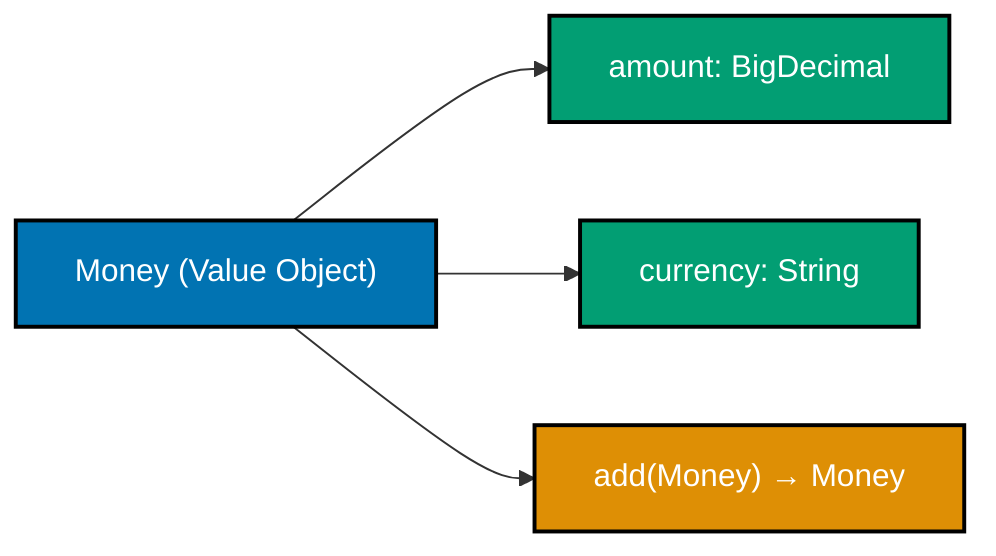
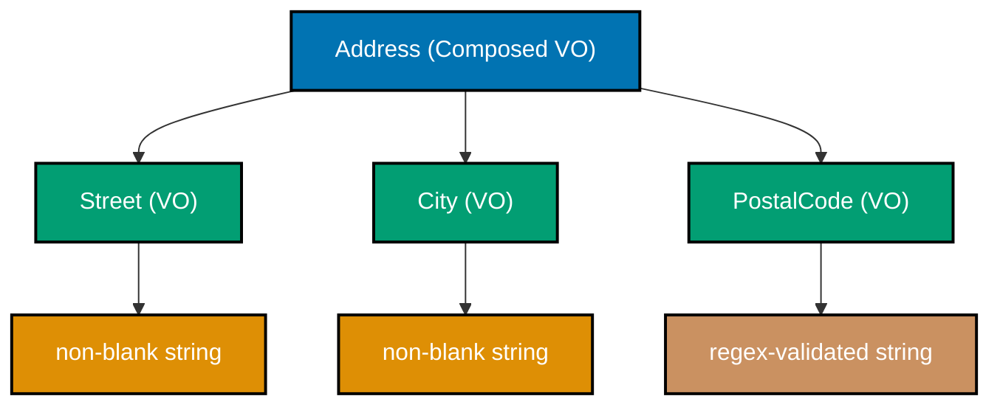
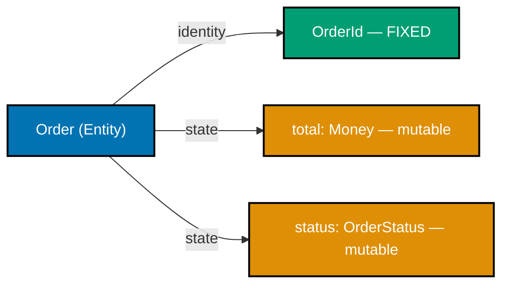
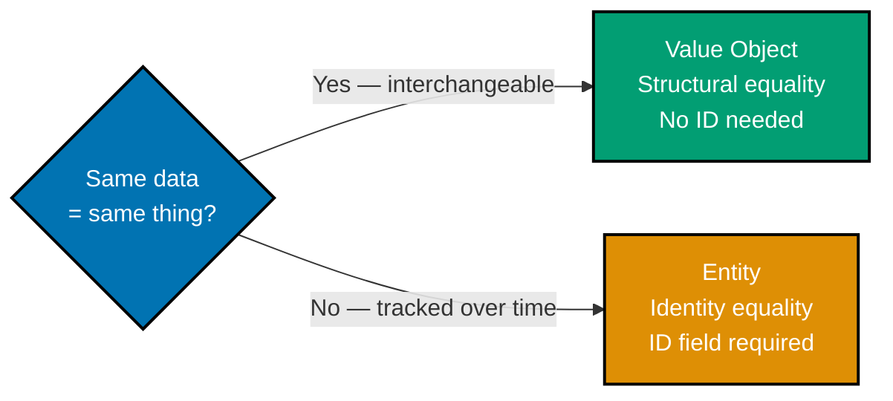
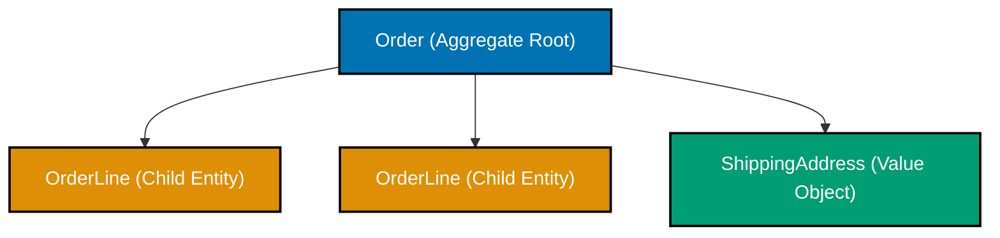
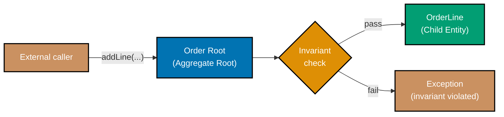
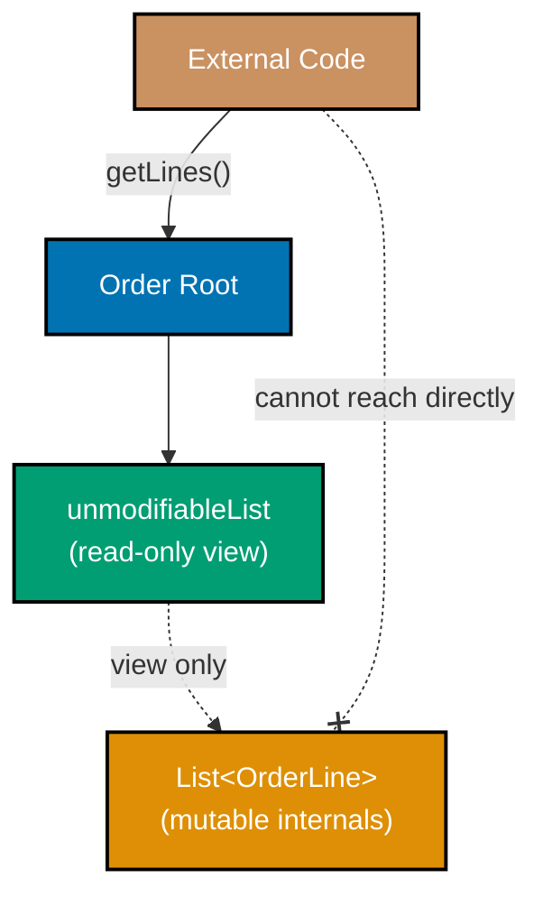
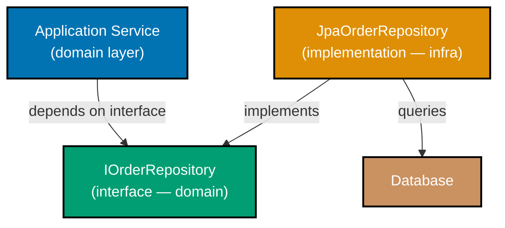
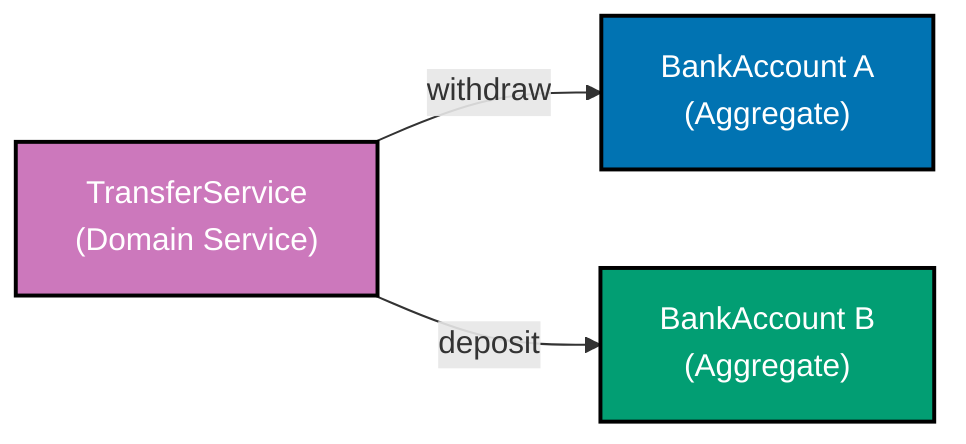
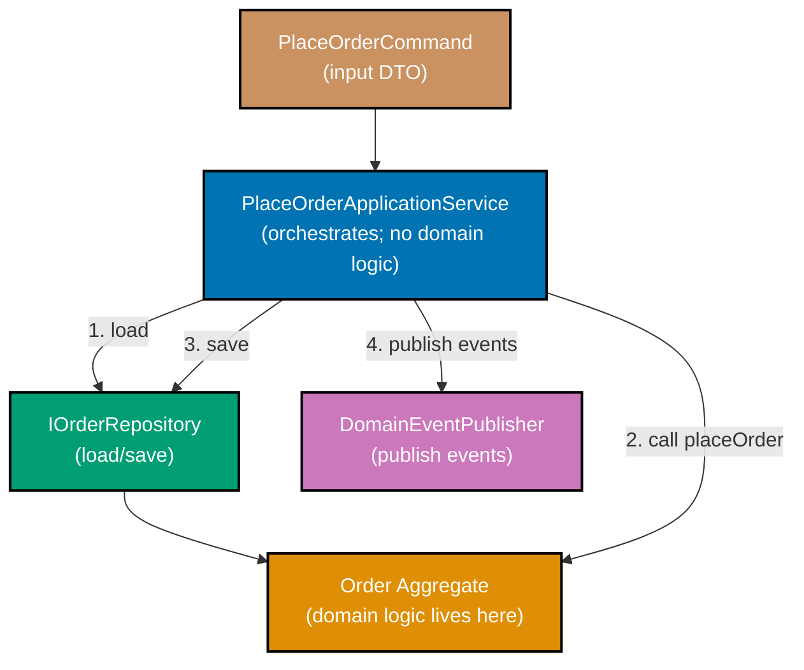

Examples 1–25 walk through DDD tactical patterns using an e-commerce order domain. Every code block is self-contained and runnable. Annotation density targets 1.0–2.25 comment lines per code line.

## Ubiquitous Language and Value Objects (Examples 1–5)

### Example 1: Ubiquitous Language — naming domain types

Every class name should come directly from the domain glossary. When the code says `Order`, `Customer`, and `Money`, developers and domain experts share a single vocabulary — no translation layer, no `OrderDTO` or `OrderData`.

**Java**:

```java
// Ubiquitous Language: names come from the domain glossary, not technical layers
// => "Order" not "OrderData"; "Money" not "BigDecimal"; "Quantity" not "int"
public record Order(
    OrderId id,           // => Strongly-typed id, not raw String or long
    CustomerId customerId, // => Makes relationship explicit at the type level
    Money total,          // => Money carries currency — BigDecimal does not
    Quantity quantity      // => Business concept, not primitive int
) {}

// Anti-pattern: primitive names lose all domain meaning
// => String id1, String id2 — which is order id? which is customer id?
// => double amount — what currency? what unit?
public record AntiPattern(String id1, String id2, double amount, int count) {}

// Usage: UL version reads like a business requirement
Order o = new Order(
    new OrderId("ord-1"),      // => Typed; wrong id kind caught at compile time
    new CustomerId("cust-7"),  // => Cannot accidentally pass OrderId here
    new Money("50.00", "USD"), // => Currency embedded in the value
    new Quantity(3)            // => Quantity, not "3 of what?"
);
```

**Kotlin**:

```kotlin
// Kotlin: same UL principle; data class adds structural equality automatically
// => Names are identical to Java version — UL is language-agnostic
data class Order(                                                     // => class Order
    val id: OrderId,           // => val = immutable after construction
    val customerId: CustomerId, // => Separate type prevents id mix-up
    val total: Money,          // => Money, not Double
    val quantity: Quantity      // => Domain concept elevated to type
)

// Factory usage mirrors domain expert speech: "place an order for 3 items"
val order = Order(                                                    // => order initialised
    id = OrderId("ord-1"),           // => Named params improve call-site clarity
    customerId = CustomerId("cust-7"), // => Explicit; no positional confusion
    total = Money("50.00", "USD"),    // => Currency always present
    quantity = Quantity(3)            // => Type enforces positive int constraint
)
```

**C#**:

```csharp
// C# record: init-only properties enforce immutability alongside UL naming
// => Primary constructor syntax keeps declaration concise
public record Order(                                                  // => record Order
    OrderId Id,            // => Typed identity; init-only after construction
    CustomerId CustomerId, // => Pascal case follows C# convention; still UL
    Money Total,           // => Money not decimal; carries currency semantics
    Quantity Quantity       // => Business concept, not int
);                                                                    // => expression

// Instantiation reads like business language
var order = new Order(                                                // => order initialised
    Id: new OrderId("ord-1"),           // => Named args clarify intent
    CustomerId: new CustomerId("cust-7"), // => Compile-time id safety
    Total: new Money(50.00m, "USD"),     // => Currency locked at creation
    Quantity: new Quantity(3)            // => Quantity validates positive value
);                                                                    // => expression
```

**Key Takeaway**: Name every domain type using exact vocabulary from the domain glossary. When code reads like business requirements, the translation gap that causes most logic bugs disappears.

**Why It Matters**: Teams using Ubiquitous Language spend less time in requirements-clarification meetings because there is no silent translation between "order" and `OrderData`. When a developer says "Order" and the domain expert hears "Order" and the code shows `Order`, misunderstandings surface during code review rather than in production. This single practice eliminates an entire category of specification drift in long-running enterprise systems.

---

### Example 2: Value Object — immutable `Money`

A Value Object has no identity — two `Money` instances with the same amount and currency are identical. Immutability guarantees no side-effects: you cannot accidentally mutate a shared `Money` reference.



**Java**:

```java
import java.math.BigDecimal; // => BigDecimal: exact decimal arithmetic; never use double for money
import java.util.Objects;    // => Objects.hash: null-safe hash helper

// Value Object: identity-free; two instances with equal fields ARE equal
// => No id field anywhere — Money IS defined by amount + currency
public final class Money {  // => final: cannot be subclassed; value semantics preserved
    private final BigDecimal amount;  // => final: immutable after construction
    private final String currency;    // => final: currency locked at creation

    public Money(BigDecimal amount, String currency) {                // => Money method
        // => Validate before storing; invalid Money cannot exist as an object
        if (amount == null || amount.compareTo(BigDecimal.ZERO) < 0)  // => precondition check
            throw new IllegalArgumentException("Amount must be non-negative"); // => fail fast
        // => Currency must be non-blank; "USD", "EUR" etc.
        if (currency == null || currency.isBlank())                   // => precondition check
            throw new IllegalArgumentException("Currency required"); // => empty string rejected
        this.amount = amount;     // => Stored; no setter exists on this class
        this.currency = currency; // => Stored; cannot change after this line
    }

    // Operations produce NEW instances — original is unchanged
    public Money add(Money other) { // => returns Money; never void; immutable design
        // => Mismatched currency is a domain error, not a rounding issue
        if (!this.currency.equals(other.currency))                    // => precondition check
            throw new IllegalArgumentException("Currency mismatch: " + currency + " vs " + other.currency); // => throws if guard fails
            // => detect mix-up at the domain boundary; fail before arithmetic proceeds
        return new Money(this.amount.add(other.amount), this.currency); // => returns new Money(this.amount.add(othe
        // => new Money returned; neither this nor other is mutated
    }

    public BigDecimal getAmount()  { return amount; }   // => read-only accessor
    public String    getCurrency() { return currency; } // => read-only accessor

    @Override public boolean equals(Object o) { // => override required for structural equality
        // => Structural equality: same amount+currency = interchangeable
        if (!(o instanceof Money m)) return false; // => pattern variable m; type-safe cast
        return amount.compareTo(m.amount) == 0 && currency.equals(m.currency); // => returns amount.compareTo(m.amount) == 
        // => compareTo not equals for BigDecimal: "10.00".equals("10") is false; compareTo == 0 is true
    }
    @Override public int hashCode() { // => must match equals; same fields, same hash
        return Objects.hash(amount.stripTrailingZeros(), currency);   // => returns Objects.hash(amount.stripTrail
        // => stripTrailingZeros: "10.00" and "10" hash equally — consistent with compareTo
    }
    @Override public String toString() { return amount + " " + currency; } // => "10.00 USD"
}

Money price = new Money(new BigDecimal("10.00"), "USD"); // => price = 10.00 USD
Money tax   = new Money(new BigDecimal("1.00"),  "USD"); // => tax   =  1.00 USD
Money total = price.add(tax);   // => total = 11.00 USD (brand-new object)
// price is still 10.00 USD — immutability guaranteed; no shared-state bug possible
```

**Kotlin** — `data class` generates `equals`/`hashCode`/`toString` automatically:

```kotlin
import java.math.BigDecimal                                           // => namespace/package import

// data class: structural equality and copy() generated; val fields = immutable
// => No manual equals/hashCode; Kotlin compiler produces correct implementations
data class Money(val amount: BigDecimal, val currency: String) {      // => class Money
    init {                                                            // => expression
        // => init block runs after primary constructor; enforces invariants
        require(amount >= BigDecimal.ZERO) { "Amount must be non-negative: $amount" } // => precondition check
        require(currency.isNotBlank())     { "Currency must not be blank" } // => precondition check
        // => If require fails, IllegalArgumentException thrown automatically
    }

    fun add(other: Money): Money {                                    // => add method
        // => Reject mixed-currency; domain rule enforced here, not in callers
        require(currency == other.currency) { "Currency mismatch: $currency vs ${other.currency}" } // => precondition check
        return Money(amount + other.amount, currency) // => new instance; inputs unchanged
    }
}

val price = Money(BigDecimal("10.00"), "USD") // => Money(amount=10.00, currency=USD)
val tax   = Money(BigDecimal("1.00"),  "USD") // => Money(amount=1.00,  currency=USD)
val total = price.add(tax)                    // => Money(amount=11.00, currency=USD)
// price is still Money(amount=10.00) — val fields cannot be reassigned
```

**C#** — `record` provides `with`-expressions and built-in structural equality:

```csharp
// sealed record: init-only properties, structural ==, with-expressions built in
// => No manual Equals() or GetHashCode(); compiler generates from all properties
public sealed record Money                                            // => record Money
{
    public decimal Amount   { get; init; } // => init-only: set once, then immutable
    public string  Currency { get; init; } // => init-only: currency locked after ctor

    public Money(decimal amount, string currency)                     // => Money method
    {
        // => Validate before assigning; invalid Money cannot be constructed
        if (amount < 0)                        throw new ArgumentException("Negative amount"); // => throws if guard fails
        if (string.IsNullOrWhiteSpace(currency)) throw new ArgumentException("Currency required"); // => throws if guard fails
        Amount   = amount;   // => Assigned once; init property blocks future mutation
        Currency = currency; // => Assigned once
    }

    public Money Add(Money other)                                     // => Add method
    {
        // => Currency must match; no silent conversion allowed
        if (Currency != other.Currency) throw new InvalidOperationException("Currency mismatch"); // => throws if guard fails
        return this with { Amount = Amount + other.Amount };          // => returns this with { Amount = Amount + 
        // => with-expression produces a new record; this is unchanged
    }
}

var price = new Money(10.00m, "USD"); // => { Amount=10.00, Currency="USD" }
var tax   = new Money(1.00m,  "USD"); // => { Amount=1.00,  Currency="USD" }
var total = price.Add(tax);           // => { Amount=11.00, Currency="USD" }
// price still { Amount=10.00 } — init-only; with-expression created a new record
```

**Key Takeaway**: A Value Object is defined by its attributes alone. Immutability means shared references are safe — no caller can corrupt a `Money` value you handed out.

**Why It Matters**: Financial systems that use raw `double` or `BigDecimal` fields suffer from silent currency-mixing bugs and mutation surprises. Elevating money to a first-class Value Object moves currency-mismatch detection to construction time and type-checking, not to test or production. Every financial domain — banking, e-commerce, payroll — gains immediately from this pattern.

---

### Example 3: Value Object equality — structural, not reference

Two distinct Value Object instances with identical attributes must compare as equal. This structural equality distinguishes a Value Object from an Entity, and most OOP languages require deliberate implementation.

**Java**:

```java
import java.util.Objects;                                             // => namespace/package import

// EmailAddress: single-field Value Object; equality must be structural
// => Two EmailAddress("a@b.com") instances must be equal even as different objects
public final class EmailAddress {                                     // => EmailAddress field
    private final String value; // => normalised lowercase; single source of truth

    public EmailAddress(String value) {                               // => EmailAddress method
        // => Validate format; reject null and missing '@'
        if (value == null || !value.contains("@"))                    // => precondition check
            throw new IllegalArgumentException("Invalid email: " + value); // => throws if guard fails
        this.value = value.toLowerCase(); // => normalise; equality is case-insensitive
    }

    // Structural equality: compare field, not memory address
    @Override public boolean equals(Object o) {                       // => expression
        if (!(o instanceof EmailAddress e)) return false; // => type-safe pattern variable
        return value.equals(e.value);  // => attribute comparison, not reference comparison
    }
    @Override public int hashCode() { return Objects.hash(value); } // => hash must match equals
    @Override public String toString() { return value; } // => "alice@example.com"
}

EmailAddress a = new EmailAddress("Alice@Example.com"); // => normalised: alice@example.com
EmailAddress b = new EmailAddress("alice@example.com"); // => normalised: alice@example.com
boolean structural = a.equals(b);    // => true — same attribute values
boolean reference  = (a == b);       // => false — different heap objects
// Without overriding equals(), structural would be false — a common VO bug
```

**Kotlin**:

```kotlin
// Kotlin data class: equals() compares all val fields automatically
// => No manual override needed; data class IS the correct choice for Value Objects
data class EmailAddress(val value: String) {                          // => class EmailAddress
    init {                                                            // => expression
        // => Validate in init; invalid email cannot be constructed
        require(value.isNotBlank() && value.contains("@")) { "Invalid email: $value" } // => precondition check
    }
}

val a = EmailAddress("alice@example.com") // => EmailAddress(value=alice@example.com)
val b = EmailAddress("alice@example.com") // => EmailAddress(value=alice@example.com)
val structural = a == b    // => true  — data class == delegates to field comparison
val reference  = a === b   // => false — different object references in memory
// == is structural; === is referential — data class makes == do the right thing
```

**C#**:

```csharp
// C# record: == operator uses structural equality automatically
// => Compiler generates Equals() comparing all init-only properties
public record EmailAddress(string Value)                              // => record EmailAddress
{
    // Primary constructor syntax; Value is init-only
    public EmailAddress(string value) : this(value.ToLowerInvariant()) // => EmailAddress method
    {
        // => Normalise to lowercase before calling the generated init
        if (!value.Contains('@')) throw new ArgumentException("Invalid email"); // => throws if guard fails
        // => Validation after normalisation; Value property now holds lowercase
    }
}

var a = new EmailAddress("Alice@Example.com"); // => Value = "alice@example.com"
var b = new EmailAddress("alice@example.com"); // => Value = "alice@example.com"
bool structural = a == b;                // => true  — record == is structural
bool reference  = ReferenceEquals(a, b); // => false — different objects
// C# record provides correct VO equality without a single line of boilerplate
```

**Key Takeaway**: Value Object equality must compare attributes, not memory addresses. Without overriding `equals`/`hashCode` in Java, two logically identical values behave as unequal — a common source of bugs in collections and caches.

**Why It Matters**: Dictionary lookups, Set membership, and unit-test assertions all depend on correct equality semantics. When `EmailAddress("a@b.com").equals(EmailAddress("a@b.com"))` returns `false`, duplicates accumulate in sets and caches return stale values silently. These bugs are notoriously hard to trace because the values look identical when logged. Structural equality in Value Objects eliminates this entire class of problem by making equality a property of value, not object identity.

---

### Example 4: Value Object validation in constructor (smart constructor)

Moving validation into the constructor ensures that an invalid Value Object can never be constructed. The type itself becomes proof of validity — any variable of type `PostalCode` is a guaranteed-valid postal code.

**Java**:

```java
import java.util.regex.Pattern;                                       // => namespace/package import

// Smart constructor: validation is mandatory, not optional
// => Caller cannot construct a PostalCode and then forget to validate
public final class PostalCode {                                       // => PostalCode field
    private static final Pattern US = Pattern.compile("^\\d{5}(-\\d{4})?$"); // => US declared
    // => Compiled once at class load; cheap to reuse on every validation
    private final String value; // => final: immutable after validation passes

    public PostalCode(String value) {                                 // => PostalCode method
        // => Validate before storing; invalid cannot escape this constructor
        if (value == null || !US.matcher(value).matches())            // => precondition check
            throw new IllegalArgumentException("Invalid US postal code: " + value); // => throws if guard fails
        this.value = value; // => Only reachable if pattern matched
    }

    // Static factory: same validation, reads more naturally at call sites
    public static PostalCode of(String v) { return new PostalCode(v); } // => of method
    // => PostalCode.of("10001") vs new PostalCode("10001") — both identical behaviour

    public String getValue()          { return value; } // => read-only
    @Override public String toString() { return value; } // => "10001"
}

PostalCode valid = PostalCode.of("10001");   // => Succeeds; value = "10001"
// PostalCode bad = PostalCode.of("abc");    // => throws IllegalArgumentException
// After construction, every PostalCode variable is guaranteed valid — no null-checks downstream
```

**Kotlin**:

```kotlin
// private constructor + companion factory: callers must use of(); cannot bypass validation
class PostalCode private constructor(val value: String) {             // => class PostalCode
    // => private constructor: prevents direct new PostalCode("abc")
    init {                                                            // => expression
        // => init runs after constructor; validates invariant
        require(value.matches(Regex("^\\d{5}(-\\d{4})?\$"))) {        // => precondition check
            "Invalid US postal code: $value" // => message embedded in require
        }
    }

    companion object {                                                // => expression
        fun of(value: String): PostalCode = PostalCode(value)         // => of method
        // => Factory delegates to private constructor; same validation path
    }

    override fun toString() = value // => prints as raw string, not PostalCode(value=10001)
}

val valid = PostalCode.of("10001")   // => Succeeds; valid.value = "10001"
// val bad = PostalCode.of("abc")    // => throws IllegalArgumentException
// Every PostalCode reference is structurally guaranteed valid — invariant held by type
```

**C#**:

```csharp
using System.Text.RegularExpressions;                                 // => namespace/package import

// sealed record: immutable after construction; static factory for fluent API
public sealed record PostalCode                                       // => record PostalCode
{
    private static readonly Regex Us = new(@"^\d{5}(-\d{4})?$", RegexOptions.Compiled); // => Us initialised
    // => static readonly: compiled once; RegexOptions.Compiled = faster repeat usage

    public string Value { get; } // => get-only: no setter; immutable after ctor

    public PostalCode(string value)                                   // => PostalCode method
    {
        // => Validate before assigning; invalid cannot escape constructor
        if (!Us.IsMatch(value ?? string.Empty))                       // => precondition check
            throw new ArgumentException($"Invalid US postal code: {value}"); // => throws if guard fails
        Value = value; // => Only assigned when pattern matched
    }

    public static PostalCode Of(string v) => new(v);                  // => Of method
    // => PostalCode.Of("10001") — static factory; identical validation path

    public override string ToString() => Value; // => "10001"
}

var valid = PostalCode.Of("10001");  // => Value = "10001"
// var bad = PostalCode.Of("abc");   // => throws ArgumentException
// Downstream code needs no format-check — the type proves validity
```

**Key Takeaway**: Validate in the constructor so that constructing the object IS the validation. A successfully constructed `PostalCode` is a proof — no further null-checks or format-checks are needed.

**Why It Matters**: When validation is optional and scattered across callers, invalid values reach deeper layers where their origin is hard to trace. Centralising validation in the constructor creates a single failure point: if construction succeeds, the value is valid everywhere. This principle — "make illegal states unrepresentable" — is one of the highest-leverage design moves in domain modelling.

---

### Example 5: Value Object composition — `Address` from primitives

Complex Value Objects compose simpler validated ones. An `Address` that composes `Street`, `City`, and `PostalCode` objects inherits their validations — a valid `Address` is proof that each constituent is valid.



**Java**:

```java
// Leaf Value Objects: each wraps a validated primitive
public record Street(String value) {                                  // => record Street
    public Street { // => compact constructor validates in-place
        if (value == null || value.isBlank()) throw new IllegalArgumentException("Street required"); // => throws if guard fails
        // => blank street is a domain error; rejected at the Street boundary
    }
}

public record City(String value) {                                    // => record City
    public City { // => compact constructor
        if (value == null || value.isBlank()) throw new IllegalArgumentException("City required"); // => throws if guard fails
        // => same pattern: invalid city cannot exist as a City object
    }
}

// PostalCode from Example 4 — already validates regex
// Composed VO: valid Address proves valid Street, City, and PostalCode
public record Address(Street street, City city, PostalCode postalCode) { // => record Address
    public Address {                                                  // => expression
        // => Null check at composition level; each sub-VO validated itself
        if (street == null || city == null || postalCode == null)     // => precondition check
            throw new IllegalArgumentException("All address fields required"); // => throws if guard fails
        // => If street/city/postalCode were constructed, they are already valid
    }
}

Address addr = new Address(                                           // => expression
    new Street("123 Main St"),     // => Street validated: non-blank
    new City("Springfield"),       // => City validated: non-blank
    PostalCode.of("10001")         // => PostalCode validated: regex
); // => addr is fully valid; no further checks needed anywhere
```

**Kotlin**:

```kotlin
// Leaf VOs: data classes with init validation
data class Street(val value: String) {                                // => class Street
    init { require(value.isNotBlank()) { "Street required" } }        // => value.isNotBlank() called
    // => require throws IllegalArgumentException on blank
}
data class City(val value: String) {                                  // => class City
    init { require(value.isNotBlank()) { "City required" } }          // => value.isNotBlank() called
    // => each VO guards its own invariant
}

// Composed VO: structural equality covers all nested fields via data class
data class Address(val street: Street, val city: City, val postalCode: PostalCode) { // => class Address
    init {                                                            // => expression
        // => Kotlin's require checks null via non-null types; this guards logical completeness
        require(street.value.isNotBlank() && city.value.isNotBlank()) { "All fields required" } // => precondition check
        // => postalCode already validated; composition cascades correctness
    }
}

val address = Address(                                                // => address initialised
    Street("123 Main St"),   // => validated non-blank
    City("Springfield"),     // => validated non-blank
    PostalCode.of("10001")   // => validated regex
) // => address is sound; every field proven valid by its own constructor
```

**C#**:

```csharp
// Leaf VOs: records with validation in constructor
public record Street(string Value)                                    // => record Street
// => begins block
{
    public Street(string value) : this(value)                         // => Street method
    // => begins block
    {
        if (string.IsNullOrWhiteSpace(value)) throw new ArgumentException("Street required"); // => throws if guard fails
        // => rejects blank; primary ctor sets Value
    // => ends block
    }
// => ends block
}
public record City(string Value)                                      // => record City
// => begins block
{
    public City(string value) : this(value)                           // => City method
    // => begins block
    {
        if (string.IsNullOrWhiteSpace(value)) throw new ArgumentException("City required"); // => throws if guard fails
        // => same guard pattern for consistency
    // => ends block
    }
}

// Composed VO: == operator compares all three nested records structurally
public record Address(Street Street, City City, PostalCode PostalCode) // => record Address
{
    public Address(Street street, City city, PostalCode postalCode) : this(street, city, postalCode) // => Address method
    {
        // => null-guard; sub-VOs already validated their own values
        ArgumentNullException.ThrowIfNull(street);                    // => ArgumentNullException.ThrowIfNull() called
        ArgumentNullException.ThrowIfNull(city);                      // => ArgumentNullException.ThrowIfNull() called
        ArgumentNullException.ThrowIfNull(postalCode);                // => ArgumentNullException.ThrowIfNull() called
    }
}

var address = new Address(                                            // => address initialised
    new Street("123 Main St"),    // => validated: non-blank
    new City("Springfield"),      // => validated: non-blank
    PostalCode.Of("10001")        // => validated: regex
); // => address fully valid; downstream code reads fields without defensive checks
```

**Key Takeaway**: Compose validated Value Objects rather than raw strings. If construction succeeds, validity is guaranteed end-to-end — no defensive checks scattered across callers.

**Why It Matters**: Passing raw strings through an address object means every caller must re-validate. Composing validated leaf VOs pushes that cost to one moment — construction — and makes "invalid address" a compile-time impossibility rather than a runtime concern. This is the difference between defensive programming (check everywhere) and design-by-contract (prove it once).

---

## Entities (Examples 6–12)

### Example 6: Entity — identity field anchors lifetime

An Entity has a unique identity that persists across its entire lifetime. Two `Order` objects with different IDs are different orders even if every other field is identical. The ID, not the data, defines the Entity.



**Java**:

```java
import java.util.UUID;                                                // => namespace/package import

// Entity: identity is the anchor; state changes do not alter identity
// => id is final; total and status are mutable — that is the correct split
public class Order {                                                  // => Order field
    private final OrderId id;        // => final: identity never changes after construction
    private Money total;             // => mutable: total grows as lines are added
    private OrderStatus status;      // => mutable: moves through lifecycle states

    public Order(OrderId id, Money initialTotal) {                    // => Order method
        this.id     = id;                         // => identity locked here, forever
        this.total  = initialTotal;               // => initial state; mutable via behaviour methods
        this.status = OrderStatus.PENDING;        // => all orders begin in PENDING state
    }

    public OrderId     getId()     { return id; }     // => expose identity for reference
    public Money       getTotal()  { return total; }  // => read current state
    public OrderStatus getStatus() { return status; } // => read current lifecycle position
}

// OrderId is itself a Value Object — typed identity
public record OrderId(UUID value) {                                   // => record OrderId
    // => record provides structural equality; two OrderId with same UUID are equal
    public static OrderId generate() { return new OrderId(UUID.randomUUID()); } // => generate method
    // => static factory: creates a globally unique identity
}

OrderId  id    = OrderId.generate();                         // => e.g. OrderId[value=3fa8...]
Order    order = new Order(id, new Money(new java.math.BigDecimal("0"), "USD")); // => math.BigDecimal() called
// => order.id is permanent; order.total and order.status will change over its lifetime
```

**Kotlin**:

```kotlin
import java.util.UUID                                                 // => namespace/package import

// Entity: use class not data class — data class would compare all fields, breaking entity semantics
// => equals() by id only (overridden below); data class equals() by all fields is WRONG for entities
class Order(                                                          // => class Order
    val id: OrderId,          // => val: identity immutable; this is what "same order" means
    initialTotal: Money       // => constructor param; stored as var property below
) {                                                                   // => expression
    var total: Money = initialTotal  // => var: mutable state
        private set                  // => only mutated through behaviour methods in this class
    var status: OrderStatus = OrderStatus.PENDING // => starts PENDING
        private set                                                   // => expression

    // Identity-based equality: two Order references with same id are equal
    override fun equals(other: Any?) = other is Order && id == other.id // => equals method
    override fun hashCode() = id.hashCode() // => hash matches equals; id-only
}

@JvmInline value class OrderId(val value: UUID) {                     // => class OrderId
    // => value class: zero-overhead wrapper; erased to UUID at runtime
    companion object { fun generate() = OrderId(UUID.randomUUID()) }  // => UUID.randomUUID() called
    // => generate() is the one creation path; callers never see raw UUIDs
}

val order = Order(OrderId.generate(), Money(java.math.BigDecimal.ZERO, "USD")) // => order initialised
// => order.id is fixed; order.total and order.status change through lifecycle
```

**C#**:

```csharp
using System;                                                         // => namespace/package import

// Entity: class not record — record would use structural equality, wrong for entities
// => override Equals to compare by id only; class default is reference equality
public class Order                                                    // => class Order
{
    public OrderId      Id     { get; }              // => init-only: identity locked in ctor
    public Money        Total  { get; private set; } // => private set: mutable via methods only
    public OrderStatus  Status { get; private set; } = OrderStatus.Pending; // => Status field
    // => Defaults to Pending; private set enforces encapsulation

    public Order(OrderId id, Money initialTotal)                      // => Order method
    {
        Id    = id;           // => identity locked; no setter to reassign it
        Total = initialTotal; // => initial state; changes via behaviour methods
    }

    // Identity-based equality: same id = same order, regardless of current state
    public override bool Equals(object? obj) => obj is Order o && Id == o.Id; // => Equals method
    public override int  GetHashCode()       => Id.GetHashCode(); // => id-based hash
}

public record OrderId(Guid Value)                                     // => record OrderId
{
    // => record gives structural ==; two OrderId with same Guid are equal
    public static OrderId Generate() => new(Guid.NewGuid()); // => new unique id
}

var order = new Order(OrderId.Generate(), new Money(0m, "USD"));      // => order initialised
// => order.Id is fixed; order.Total and order.Status change through lifecycle
```

**Key Takeaway**: An Entity's identity is fixed at birth and never changes. State changes do not alter identity — the same `Order` is the same order from creation to fulfillment.

**Why It Matters**: In business systems, things like orders, customers, and accounts persist through state changes. Without a stable identity anchor, the system cannot track "this specific order" across database updates, distributed messages, and state transitions. A customer who changes their email address must still be the same customer — their entire order history must remain associated with them. Identity is the bedrock of business continuity in enterprise software.

---

### Example 7: Entity equality — by ID only, ignores other fields

Entity equality compares only identity fields. Two `Customer` references with different in-memory states are equal if they share the same `CustomerId`. Field values play no role.

**Java**:

```java
import java.util.Objects;                                             // => namespace/package import

public class Customer {                                               // => Customer field
    private final CustomerId id; // => identity; used exclusively in equals/hashCode
    private String name;          // => mutable state — NOT part of equality
    private EmailAddress email;   // => mutable state — NOT part of equality

    public Customer(CustomerId id, String name, EmailAddress email) { // => Customer method
        this.id    = id;    // => identity locked
        this.name  = name;  // => initial state; can change without affecting equality
        this.email = email; // => initial state; can change without affecting equality
    }

    // Equality by id ONLY — not name, not email
    @Override public boolean equals(Object o) {                       // => expression
        if (!(o instanceof Customer c)) return false;                 // => precondition check
        return id.equals(c.id); // => only id compared; name/email irrelevant to identity
    }
    @Override public int hashCode() { return Objects.hash(id); } // => hash from id only

    public void rename(String newName) { this.name = newName; } // => state change; equality unchanged
    public CustomerId getId() { return id; }                          // => getId method
}

// Demonstration: same id, different state — entities are still equal
var sharedId = new CustomerId(java.util.UUID.randomUUID()); // => one UUID shared by both
Customer c1 = new Customer(sharedId, "Alice",       new EmailAddress("a@b.com")); // => expression
Customer c2 = new Customer(sharedId, "Alice Smith", new EmailAddress("asmith@b.com")); // => expression
// => c1 and c2 have different names and emails
boolean equal = c1.equals(c2); // => true — same id; state differences are irrelevant
```

**Kotlin**:

```kotlin
// Kotlin: override equals() manually; do NOT use data class for entities
// => data class compares all fields — that is Value Object semantics, not Entity semantics
class Customer(                                                       // => class Customer
    val id: CustomerId, // => identity; val: immutable
    var name: String,   // => mutable state; var
    var email: EmailAddress // => mutable state; var
) {                                                                   // => expression
    override fun equals(other: Any?): Boolean {                       // => equals method
        if (other !is Customer) return false                          // => precondition check
        return id == other.id  // => id equality only; name and email excluded
    }
    override fun hashCode() = id.hashCode() // => consistent with equals
}

val sharedId = CustomerId(java.util.UUID.randomUUID()) // => one UUID
val c1 = Customer(sharedId, "Alice",       EmailAddress("a@b.com"))   // => c1 initialised
val c2 = Customer(sharedId, "Alice Smith", EmailAddress("asmith@b.com")) // => c2 initialised
println(c1 == c2)  // => true — same id; different names; identity wins
```

**C#**:

```csharp
public class Customer                                                 // => class Customer
// => begins block
{
    public CustomerId   Id    { get; }               // => identity; immutable
    public string       Name  { get; private set; }  // => mutable state
    public EmailAddress Email { get; private set; }  // => mutable state

    public Customer(CustomerId id, string name, EmailAddress email)   // => Customer method
    // => begins block
    {
        Id    = id;    // => identity locked in constructor
        Name  = name;  // => initial state
        Email = email; // => initial state
    // => ends block
    }

    // Equality by id ONLY — name and email excluded from comparison
    public override bool Equals(object? obj) => obj is Customer c && Id == c.Id; // => Equals method
    public override int  GetHashCode()       => Id.GetHashCode(); // => id-based hash

    public void Rename(string newName) { Name = newName; } // => state change; equality unchanged
}

var sharedId = CustomerId.Generate(); // => one id shared by both instances
var c1 = new Customer(sharedId, "Alice",       new EmailAddress("a@b.com")); // => c1 initialised
var c2 = new Customer(sharedId, "Alice Smith", new EmailAddress("asmith@b.com")); // => c2 initialised
bool equal = c1.Equals(c2); // => true — same id; Name/Email differences ignored
```

**Key Takeaway**: Entity equality checks identity only. Renaming a customer does not create a new customer — it updates the same entity. Equality must reflect this.

**Why It Matters**: If entity equality compared all fields, renaming a customer would cause it to "disappear" from hash sets and dictionary lookups — a catastrophic bug in any system that tracks entities by reference. The entity does not become a different entity when its data changes; only its identity defines sameness. Identity-only equality keeps entity semantics stable across all state transitions and ensures aggregation operations behave correctly.

---

### Example 8: Entity mutable state — only via behaviour methods

Entity state must change only through named behaviour methods, never through public setters. Named methods communicate intent, enforce invariants, and can emit domain events.

**Java**:

```java
public class Order {                                                  // => Order field
    private final OrderId id;    // => identity: immutable
    private Money total;          // => state: mutable, but only via methods below
    private OrderStatus status;   // => state: mutable, but only via methods below

    public Order(OrderId id, Money initialTotal) {                    // => Order method
        this.id     = id;                                             // => this.id assigned
        this.total  = initialTotal;                                   // => this.total assigned
        this.status = OrderStatus.PENDING; // => always starts PENDING
    }

    // Named behaviour: communicates intent and enforces lifecycle rule
    public void confirm() {                                           // => confirm method
        // => Guard: confirm() only valid from PENDING state
        if (status != OrderStatus.PENDING)                            // => precondition check
            throw new IllegalStateException("Cannot confirm order in state: " + status); // => throws if guard fails
        this.status = OrderStatus.CONFIRMED; // => state transition enforced here
        // => domain event could be collected here (see Example 25)
    }

    public void cancel() {                                            // => cancel method
        // => Cannot cancel a shipped order — domain invariant enforced in method
        if (status == OrderStatus.SHIPPED)                            // => precondition check
            throw new IllegalStateException("Cannot cancel a shipped order"); // => throws if guard fails
        this.status = OrderStatus.CANCELLED; // => only reachable if not SHIPPED
    }

    // No setStatus() — callers cannot bypass lifecycle rules
    public OrderId     getId()     { return id; }                     // => getId method
    public OrderStatus getStatus() { return status; }                 // => getStatus method
    public Money       getTotal()  { return total; }                  // => getTotal method
}

Order order = new Order(OrderId.generate(), new Money(new java.math.BigDecimal("50"), "USD")); // => OrderId.generate() called
order.confirm();  // => status becomes CONFIRMED; invariant checked
// order.setStatus(SHIPPED) — does not exist; cannot bypass confirm()
```

**Kotlin**:

```kotlin
class Order(val id: OrderId, initialTotal: Money) {                   // => class Order
    var total: Money = initialTotal                                   // => expression
        private set           // => readable externally; writable only inside class
    var status: OrderStatus = OrderStatus.PENDING                     // => expression
        private set           // => no public setter; only behaviour methods can mutate

    fun confirm() {                                                   // => confirm method
        // => Enforce lifecycle: PENDING → CONFIRMED only
        check(status == OrderStatus.PENDING) { "Cannot confirm order in state: $status" } // => precondition check
        status = OrderStatus.CONFIRMED // => private set allows mutation from within
    }

    fun cancel() {                                                    // => cancel method
        // => Enforce lifecycle: cannot cancel SHIPPED
        check(status != OrderStatus.SHIPPED) { "Cannot cancel a shipped order" } // => precondition check
        status = OrderStatus.CANCELLED // => reached only if check() passes
    }
    // No setStatus — callers use confirm()/cancel(); invariants always enforced
}

val order = Order(OrderId.generate(), Money(java.math.BigDecimal("50"), "USD")) // => order initialised
order.confirm() // => status = CONFIRMED; invariant checked inside confirm()
```

**C#**:

```csharp
public class Order                                                    // => class Order
// => Entity class: uses reference equality by default; Equals overridden to use Id
{
    public OrderId      Id     { get; }                               // => Id field
    // => get-only: Id locked at construction; identity never changes
    public Money        Total  { get; private set; } // => private set; mutable via methods
    // => Mutable state: Total changes as lines are added; private set enforces encapsulation
    public OrderStatus  Status { get; private set; } = OrderStatus.Pending; // => Status field
    // => defaults to Pending; private set prevents external mutation

    public Order(OrderId id, Money initialTotal) { Id = id; Total = initialTotal; } // => Order method
    // => Constructor: sets both required fields; Status defaults to Pending automatically

    public void Confirm()                                             // => Confirm method
    // => Named method: communicates intent; can add events, logging, metrics here
    {
        // => Guard: only PENDING orders can be confirmed
        if (Status != OrderStatus.Pending)                            // => precondition check
            throw new InvalidOperationException($"Cannot confirm order in state {Status}"); // => throws if guard fails
        // => $"...{Status}" includes current status in the message for diagnostics
        Status = OrderStatus.Confirmed; // => private set accessible within the class
        // => Transition happens after guard; no partial state possible
    }

    public void Cancel()                                              // => Cancel method
    // => Named method: one place to add "why was this cancelled?" auditing in future
    {
        // => Guard: SHIPPED orders cannot be cancelled
        if (Status == OrderStatus.Shipped)                            // => precondition check
            throw new InvalidOperationException("Cannot cancel a shipped order"); // => throws if guard fails
        // => All other statuses (Pending, Confirmed) are cancellable
        Status = OrderStatus.Cancelled; // => reachable only if not SHIPPED
    }
    // No SetStatus() — public API is confirm/cancel; invariants always run
}

var order = new Order(OrderId.Generate(), new Money(50m, "USD"));     // => order initialised
// => order.Status = Pending (default); order.Total = 50 USD
order.Confirm(); // => Status = Confirmed; lifecycle rule enforced
```

**Key Takeaway**: State mutation belongs in named behaviour methods, not setters. A method named `confirm()` communicates intent, enforces invariants, and can emit domain events — a `setStatus()` method does none of these.

**Why It Matters**: Anemic models with public setters let any caller mutate state in any order, making it impossible to guarantee invariants. When an order skips CONFIRMED and jumps straight to SHIPPED via a raw setter, the bug is invisible until a downstream process fails. Named behaviour methods eliminate this entire category of invariant violation.

---

### Example 9: Entity vs Value Object — when to choose

The decision between Entity and Value Object determines whether two instances with the same data are the same thing or just equivalent. The wrong choice leads to either lost identity or unnecessary identity tracking.



**Java**:

```java
// Value Object: two instances with same data ARE the same thing
// => Money(10, "USD") and Money(10, "USD") are interchangeable — no tracking needed
public record Money(java.math.BigDecimal amount, String currency) {}  // => record Money
// => record provides structural equals/hashCode; correct for VO

// Entity: two instances with same data are NOT necessarily the same thing
// => Two bank accounts at $0 balance are different accounts — track by id
public class BankAccount {                                            // => BankAccount field
    private final AccountId id;    // => identity: THIS specific account
    private Money balance;          // => state: can change without affecting identity

    public BankAccount(AccountId id, Money initial) {                 // => BankAccount method
        this.id      = id;                                            // => this.id assigned
        this.balance = initial;                                       // => this.balance assigned
    }

    // Two $0 accounts are still two different accounts — never merge them
    @Override public boolean equals(Object o) {                       // => expression
        if (!(o instanceof BankAccount a)) return false;              // => precondition check
        return id.equals(a.id); // => only id; balance is irrelevant for identity
    }
    @Override public int hashCode() { return id.hashCode(); }         // => id.hashCode() called
}

// Rule of thumb: ask "if I replace this with an equal instance, does anything break?"
// => If yes → Entity (history matters)   If no → Value Object (interchangeable)
```

**Kotlin**:

```kotlin
// Value Object: data class = structural equality = correct VO choice
data class Money(val amount: java.math.BigDecimal, val currency: String)
// => data class generates equals() comparing amount and currency — correct for VO

// Entity: class = reference equality by default; override to id-based equality
class BankAccount(val id: AccountId, initialBalance: Money) {
    var balance: Money = initialBalance
        private set  // => mutable state; but changing balance doesn't change which account

    override fun equals(other: Any?) = other is BankAccount && id == other.id
    override fun hashCode() = id.hashCode()
    // => Two $0 accounts at same bank are still different accounts — id distinguishes them
}

// Rule of thumb in Kotlin:
// data class → Value Object (structural equality, immutable val fields)
// class       → Entity (identity equality, mutable var state, override equals)
```

**C#**:

```csharp
// Value Object: record = structural ==; correct for VO
public record Money(decimal Amount, string Currency);
// => record == compares Amount and Currency — Money(10m,"USD") == Money(10m,"USD")

// Entity: class = reference equality by default; override to id-based
public class BankAccount
{
    public AccountId Id      { get; }
    public Money     Balance { get; private set; } // => mutable state

    public BankAccount(AccountId id, Money initial) { Id = id; Balance = initial; }

    // Two $0 accounts are different — id is the only equality criterion
    public override bool Equals(object? obj) => obj is BankAccount a && Id == a.Id;
    public override int  GetHashCode()       => Id.GetHashCode();
    // => Changing Balance does not change which account this is
}

// Rule of thumb in C#:
// record → Value Object (structural equality provided by compiler)
// class  → Entity (identity equality via manual override)
```

**Key Takeaway**: Use a Value Object when replacing an instance with an equal one is harmless. Use an Entity when the instance has a history that must be tracked — when "same data" does not mean "same thing."

**Why It Matters**: Misclassifying a concept causes subtle, hard-to-trace bugs. Treating a bank account as a VO means two accounts with the same balance could be merged — funds disappear. Treating a currency code as an Entity means it gets a database row and an identity column for a concept that is purely a value. Getting this choice right is the first design question in any domain model.

---

### Example 10: Smart constructor / factory method enforcing invariants

Factory methods add validation to construction and provide descriptive failure messages. They also allow returning subtypes or throwing richer domain exceptions than a raw constructor can.

**Java**:

```java
// Static factory method: named, validated construction with descriptive errors
// => Factory can return subtypes, use caching, or throw domain-specific exceptions
public final class Quantity {                                         // => Quantity field
    private final int value; // => int value wrapped; always positive

    private Quantity(int value) { this.value = value; } // => private: factory is the only path

    public static Quantity of(int value) {                            // => of method
        // => Named validation; message references domain concept, not technical detail
        if (value <= 0) throw new IllegalArgumentException("Quantity must be positive, got: " + value); // => throws if guard fails
        return new Quantity(value); // => only reachable after validation passes
    }

    public int getValue() { return value; } // => read-only
    public Quantity add(Quantity other) {                             // => add method
        return new Quantity(this.value + other.value); // => produces new Quantity; addition always positive
    }
    @Override public String toString() { return String.valueOf(value); } // => "3"
}

Quantity q = Quantity.of(3);    // => Succeeds; q.getValue() = 3
// Quantity bad = Quantity.of(0); // => throws "Quantity must be positive, got: 0"
// private constructor: new Quantity(3) is compile error from outside the class
```

**Kotlin**:

```kotlin
// companion object factory: private constructor forces use of of()
class Quantity private constructor(val value: Int) {                  // => class Quantity
    // => private constructor: no new Quantity(0) from outside
    companion object {                                                // => expression
        fun of(value: Int): Quantity {                                // => of method
            require(value > 0) { "Quantity must be positive, got: $value" } // => precondition check
            // => require throws IllegalArgumentException with the lambda message
            return Quantity(value) // => private ctor accessible from companion
        }
    }
    operator fun plus(other: Quantity) = Quantity(value + other.value) // => operator overload for +
    override fun toString() = value.toString() // => "3"
}

val q = Quantity.of(3)   // => Succeeds; q.value = 3
// val bad = Quantity.of(0)  // => throws IllegalArgumentException
// operator: Quantity.of(2) + Quantity.of(3) = Quantity(5) — idiomatic Kotlin
```

**C#**:

```csharp
// sealed record with private constructor and static factory
public sealed record Quantity                                         // => record Quantity
{
    public int Value { get; } // => get-only; no setter; immutable after factory

    private Quantity(int value) { Value = value; } // => private: factory is the one path

    public static Quantity Of(int value)                              // => Of method
    {
        // => Domain-language error message; makes failure traceable to business rule
        if (value <= 0) throw new ArgumentException($"Quantity must be positive, got: {value}"); // => throws if guard fails
        return new Quantity(value); // => only reached after validation
    }

    public Quantity Add(Quantity other) => new(Value + other.Value);  // => Add method
    // => produces new Quantity; no mutation; sum always positive (both inputs positive)

    public override string ToString() => Value.ToString(); // => "3"
}

var q = Quantity.Of(3);   // => Value = 3
// var bad = Quantity.Of(0); // => throws ArgumentException
// private ctor: new Quantity(3) is a compile error outside the class
```

**Key Takeaway**: A static factory method is the single validated creation path. Private constructors ensure no instance can be created without passing validation.

**Why It Matters**: Factory methods improve discoverability (`Quantity.of(3)` reads like a domain sentence), allow richer error messages tied to business rules, and centralise construction logic in one place. When a Quantity invariant changes — say, the business decides maximum quantity is 1000 — the factory is the one place to update, not every constructor call site.

---

### Example 11: Self-encapsulation — private fields, intention-revealing accessors

Self-encapsulation means all access to fields, even within the class, goes through accessors. This enforces uniform invariant-checking and allows future behaviour to be added without changing callers.

**Java**:

```java
public class Order {                                                  // => Order field
    private final OrderId id;     // => identity
    private Money total;           // => private; accessed only via getTotal()
    private OrderStatus status;    // => private; transitions via named methods

    public Order(OrderId id) {                                        // => Order method
        this.id     = id;                                             // => this.id assigned
        this.total  = Money.zero("USD"); // => factory method; starts at zero
        this.status = OrderStatus.PENDING;                            // => this.status assigned
    // => ends block
    }

    // Intention-revealing accessor: name says what it means, not how it's stored
    public Money       getTotal()  { return total; }   // => readable; not settable
    public OrderStatus getStatus() { return status; }  // => readable; not settable
    public OrderId     getId()     { return id; }      // => readable; immutable

    // Encapsulated mutation: logic lives here, not scattered in callers
    public void addToTotal(Money extra) {                             // => addToTotal method
        // => currency-matching enforced by Money.add(); invariant inside VO
        this.total = this.total.add(extra); // => replaces total with new Money instance
    }

    private void transitionTo(OrderStatus next) {                     // => transitionTo method
        // => private helper enforces allowed transitions — callers use public methods
        this.status = next;                                           // => this.status assigned
    }

    public void confirm() {                                           // => confirm method
        if (status != OrderStatus.PENDING)                            // => precondition check
            throw new IllegalStateException("Only PENDING orders can be confirmed"); // => throws if guard fails
        transitionTo(OrderStatus.CONFIRMED); // => private helper called internally
    }
}
```

**Kotlin**:

```kotlin
class Order(val id: OrderId) {                                        // => class Order
    // => backing properties private; exposed via getters with intention-revealing names
    private var _total: Money = Money(java.math.BigDecimal.ZERO, "USD") // => method declaration
    private var _status: OrderStatus = OrderStatus.PENDING            // => expression

    val total:  Money       get() = _total   // => read-only public getter
    val status: OrderStatus get() = _status  // => read-only public getter

    fun addToTotal(extra: Money) {                                    // => addToTotal method
        _total = _total.add(extra) // => encapsulated; no external mutation of _total
    // => ends block
    }

    fun confirm() {                                                   // => confirm method
        check(_status == OrderStatus.PENDING) { "Only PENDING orders can be confirmed" } // => precondition check
        _status = OrderStatus.CONFIRMED // => only reachable if check passes
    }
    // No _total = ... from outside the class; Kotlin val getter prevents it
}
```

**C#**:

```csharp
public class Order                                                    // => class Order
// => begins block
{
    private Money       _total;  // => private backing field; only mutated through AddToTotal()
    private OrderStatus _status; // => private backing field; only mutated through Confirm()

    public OrderId      Id     { get; }                      // => immutable; public read-only
    public Money        Total  => _total;                     // => expression-bodied getter; readonly projection
    public OrderStatus  Status => _status;                    // => expression-bodied getter; readonly projection
    // => No public setter for Total or Status; only domain methods may mutate backing fields

    public Order(OrderId id)                                          // => Order method
    {
        Id      = id;                                                 // => Id assigned
        // => Id locked at construction; no reassignment possible (get-only property)
        _total  = new Money(0m, "USD"); // => starts at zero
        // => Initial total is zero; grows via AddToTotal()
        _status = OrderStatus.Pending;                                // => _status assigned
        // => All orders start Pending; lifecycle methods control transitions
    }

    public void AddToTotal(Money extra)                               // => AddToTotal method
    {
        _total = _total.Add(extra); // => encapsulated mutation; callers cannot bypass
        // => Add returns a new Money instance; _total is reassigned, not mutated in place
    }

    public void Confirm()                                             // => Confirm method
    {
        if (_status != OrderStatus.Pending)                           // => precondition check
            throw new InvalidOperationException("Only Pending orders can be confirmed"); // => throws if guard fails
        // => Guard: CONFIRMED → re-confirm is rejected; PENDING is the only valid source state
        _status = OrderStatus.Confirmed; // => private field writable here; not via property
        // => Callers reading Status property see Confirmed; they cannot set it directly
    }
}
```

**Key Takeaway**: Keep fields private and expose only intention-revealing accessors. This gives you one place to add logging, validation, or domain events — the accessor — without changing any caller.

**Why It Matters**: Self-encapsulation is the smallest unit of OOP discipline. When every field access is mediated by an accessor, the class controls its own invariants completely. Refactoring from a simple field to a computed or cached value becomes a local change, invisible to callers. This is why DDD tactical patterns work well in languages with proper encapsulation.

---

### Example 12: Tell-don't-ask method on Entity

"Tell, don't ask" means you tell an object to do something rather than asking for its data and computing the result externally. This keeps domain logic inside the domain object where it belongs.

**Java**:

```java
// Tell-don't-ask: Order computes its own total from lines — callers do not extract and sum
public class Order {                                                  // => Order field
    private final OrderId id;                                         // => id field
    private final java.util.List<OrderLine> lines = new java.util.ArrayList<>(); // => method declaration
    private OrderStatus status = OrderStatus.PENDING;                 // => status declared

    public Order(OrderId id) { this.id = id; }                        // => Order method

    // WRONG (ask): external code asks for lines, then computes total
    // callers would do: order.getLines().stream().map(l -> l.price).reduce(...)
    // => logic duplicated across callers; no single place to change

    // RIGHT (tell): Order tells itself to compute total — logic stays inside
    public Money calculateTotal() {                                   // => calculateTotal method
        return lines.stream()                                         // => returns lines.stream()
            .map(OrderLine::subtotal)  // => delegate to child; each line knows its own subtotal
            .reduce(Money.zero("USD"), Money::add); // => fold into running total
        // => caller receives result; never sees individual lines for calculation purposes
    }

    public void addLine(ProductId pid, Quantity qty, Money price) {   // => addLine method
        lines.add(new OrderLine(OrderLineId.generate(), pid, qty, price)); // => lines.add() called
        // => Order creates child; callers do not construct OrderLine directly
    }

    public java.util.List<OrderLine> getLines() {                     // => getLines method
        return java.util.Collections.unmodifiableList(lines);         // => returns java.util.Collections.unmodifi
        // => read-only view; callers can read but not mutate the list
    }
}
```

**Kotlin**:

```kotlin
class Order(val id: OrderId) {                                        // => class Order
    private val _lines = mutableListOf<OrderLine>() // => private mutable backing list
    val lines: List<OrderLine> get() = _lines.toList() // => defensive copy; caller gets snapshot

    // Tell-don't-ask: Order computes total; callers do not iterate lines externally
    fun calculateTotal(): Money =                                     // => calculateTotal method
        _lines.fold(Money(java.math.BigDecimal.ZERO, "USD")) { acc, line -> // => _lines.fold() called
            acc.add(line.subtotal()) // => each line delegates to itself (tell-don't-ask recursively)
        } // => returns total; caller never needs to know how lines are stored

    fun addLine(pid: ProductId, qty: Quantity, price: Money) {        // => addLine method
        _lines += OrderLine(OrderLineId.generate(), pid, qty, price)  // => _lines assigned
        // => Order owns child creation; caller provides data, Order creates the child
    }
}
```

**C#**:

```csharp
public class Order                                                    // => class Order
{
    private readonly List<OrderLine> _lines = new();                  // => List method
    // => private list; external code cannot manipulate it directly

    public OrderId Id { get; }                                        // => Id field
    // => immutable identity

    public IReadOnlyList<OrderLine> Lines => _lines.AsReadOnly();     // => IReadOnlyList method
    // => read-only view; callers can enumerate but not add/remove

    public Order(OrderId id) { Id = id; }                             // => Order method

    // Tell-don't-ask: ask Order for its total; don't ask for lines to compute it yourself
    public Money CalculateTotal() =>                                  // => CalculateTotal method
        _lines.Aggregate(new Money(0m, "USD"), (acc, line) => acc.Add(line.Subtotal())); // => _lines.Aggregate() called
        // => LINQ Aggregate folds lines into total; caller gets Money back; no line details needed

    public void AddLine(ProductId pid, Quantity qty, Money price)     // => AddLine method
    {
        _lines.Add(new OrderLine(OrderLineId.Generate(), pid, qty, price)); // => _lines.Add() called
        // => Order creates child; callers call AddLine with data, not with an OrderLine object
    }
}
```

**Key Takeaway**: Tell objects to do things rather than asking for their internals. `order.calculateTotal()` keeps total-calculation logic inside `Order`; asking for lines and summing externally spreads that logic across callers.

**Why It Matters**: "Ask" style scatters business logic across the codebase. When the business changes how totals are computed (add tax, apply discount), you hunt through every caller. "Tell" style localises that change to the entity's method. Entities become self-contained units of behaviour, not passive data bags, which is the core promise of DDD's rich domain model.

---

## Strongly-Typed IDs and Enums (Examples 13–15)

### Example 13: Domain primitive — typed wrapper around `String` for `EmailAddress`

A domain primitive wraps a single primitive value with validation and domain-specific meaning. `EmailAddress` wraps `String` but is not just a string — it carries the guarantee that its value is a valid email.

**Java**:

```java
import java.util.Objects;                                             // => namespace/package import

// Domain primitive: wraps String; adds domain meaning and validation
// => EmailAddress is not interchangeable with any String — type system enforces this
public final class EmailAddress {                                     // => EmailAddress field
    private final String value; // => normalised lowercase value

    public EmailAddress(String value) {                               // => EmailAddress method
        // => validate format; reject null and malformed emails at construction
        if (value == null || !value.contains("@") || value.length() < 3) // => precondition check
            throw new IllegalArgumentException("Invalid email: " + value); // => throws if guard fails
        this.value = value.toLowerCase(); // => normalise; consistent equality
    }

    public String getValue() { return value; } // => read-only accessor
    @Override public boolean equals(Object o) {                       // => expression
        if (!(o instanceof EmailAddress e)) return false;             // => precondition check
        return value.equals(e.value); // => structural equality
    }
    @Override public int hashCode() { return Objects.hash(value); }   // => Objects.hash() called
    @Override public String toString() { return value; } // => "alice@example.com"
}

// Usage: type system prevents passing a raw String where EmailAddress expected
// void sendWelcome(EmailAddress email) — compiler rejects sendWelcome("raw string")
EmailAddress email = new EmailAddress("Alice@Example.com"); // => "alice@example.com"
// sendWelcome(email) — correct; sendWelcome("alice@example.com") — compile error
```

**Kotlin**:

```kotlin
// @JvmInline value class: zero-overhead wrapper; erased to String at runtime
@JvmInline value class EmailAddress(val value: String) {
    // => value class: no allocation overhead; wrapped value stored directly
    init {
        require(value.isNotBlank() && value.contains("@")) { "Invalid email: $value" }
        // => init block runs at construction; validation always applies
    }
}

// Usage: function signature is self-documenting and type-safe
fun sendWelcome(email: EmailAddress) { /* ... */ }
val email = EmailAddress("alice@example.com") // => validated at creation
// sendWelcome(email)               — correct
// sendWelcome("alice@example.com") — compile error: String is not EmailAddress
```

**C#**:

```csharp
// readonly record struct: value semantics, zero heap allocation, structural equality
public readonly record struct EmailAddress                            // => record struct
{
    public string Value { get; } // => get-only; immutable after construction

    public EmailAddress(string value)                                 // => EmailAddress method
    {
        // => validate; reject null/blank/missing @
        if (string.IsNullOrWhiteSpace(value) || !value.Contains('@')) // => precondition check
            throw new ArgumentException($"Invalid email: {value}");   // => throws if guard fails
        Value = value.ToLowerInvariant(); // => normalise for consistent equality
    }

    public override string ToString() => Value; // => "alice@example.com"
}

// Function accepts EmailAddress, not string — compiler enforces at call site
void SendWelcome(EmailAddress email) { /* ... */ }                    // => expression
var email = new EmailAddress("Alice@Example.com"); // => Value = "alice@example.com"
// SendWelcome(email)                — correct
// SendWelcome("alice@example.com")  — compile error: string ≠ EmailAddress
```

**Key Takeaway**: A domain primitive wraps a single value with validation and domain meaning. The type system enforces that you cannot accidentally pass a raw string where an `EmailAddress` is required.

**Why It Matters**: "Primitive obsession" — using raw `String`, `int`, `double` for domain concepts — is one of the most common sources of bugs. When methods accept `String email`, any string compiles. When they accept `EmailAddress`, invalid emails are caught at construction time, and id mix-ups (passing a product id where a customer id is expected) become compile errors rather than runtime surprises.

---

### Example 14: Strongly-typed IDs — `OrderId` ≠ `CustomerId` at compile time

Separate typed IDs prevent passing an `OrderId` where a `CustomerId` is expected. This is a zero-cost correctness guarantee — the types are erased at runtime but enforced at compile time.

**Java**:

```java
import java.util.UUID;

// Separate record types for each aggregate's id
// => OrderId and CustomerId are structurally identical but type-incompatible
public record OrderId(UUID value) {
    public static OrderId generate() { return new OrderId(UUID.randomUUID()); }
    // => factory: ensures every id is a real UUID
}

public record CustomerId(UUID value) {
    public static CustomerId generate() { return new CustomerId(UUID.randomUUID()); }
    // => same UUID internally, but separate type from OrderId
}

// Usage: method signatures prevent id mix-up at compile time
public Order findOrder(OrderId id) { /* ... */ return null; } // => accepts only OrderId
// findOrder(new CustomerId(UUID.randomUUID())) — compile error: CustomerId ≠ OrderId
// findOrder(new OrderId(UUID.randomUUID()))    — correct

// Before typed ids: findOrder(UUID id) accepts any UUID — wrong ids compile silently
```

**Kotlin**:

```kotlin
// @JvmInline value classes: zero-overhead; erased to UUID at runtime; distinct types at compile time
@JvmInline value class OrderId(val value: java.util.UUID) {           // => class OrderId
    companion object { fun generate() = OrderId(java.util.UUID.randomUUID()) } // => UUID.randomUUID() called
    // => generate() is the canonical factory
}
@JvmInline value class CustomerId(val value: java.util.UUID) {        // => class CustomerId
    companion object { fun generate() = CustomerId(java.util.UUID.randomUUID()) } // => UUID.randomUUID() called
    // => same UUID type inside, but CustomerId ≠ OrderId at the Kotlin type level
}

fun findOrder(id: OrderId): Order? = null  // => only OrderId accepted
// findOrder(CustomerId.generate()) — compile error
// findOrder(OrderId.generate())    — correct; no runtime cost from @JvmInline
```

**C#**:

```csharp
// readonly record struct: value semantics, no heap allocation, type-distinct ids
public readonly record struct OrderId(Guid Value)                     // => record struct
// => begins block
{
    public static OrderId Generate() => new(Guid.NewGuid()); // => canonical factory
}
public readonly record struct CustomerId(Guid Value)                  // => record struct
{
    public static CustomerId Generate() => new(Guid.NewGuid()); // => separate type
}

Order? FindOrder(OrderId id) => null; // => only OrderId compiles here
// FindOrder(CustomerId.Generate()) — compile error: CustomerId ≠ OrderId
// FindOrder(OrderId.Generate())    — correct; record struct = zero allocation
```

**Key Takeaway**: Give each aggregate its own ID type. The compiler then prevents every cross-aggregate ID mix-up for free — no runtime cost, no extra tests needed.

**Why It Matters**: UUID/string mix-ups — passing an order ID to a customer lookup — are notoriously hard to catch in tests because both IDs are valid GUIDs. They surface in production as "customer not found" or corrupted associations. Strongly-typed IDs convert runtime surprises into compile errors. The refactor from `UUID` to `OrderId` is mechanical and pays for itself the first time a swapped-id bug is prevented.

---

### Example 15: Enum as domain concept — `OrderStatus`

An enum elevates a set of named states to a first-class type. `OrderStatus` is clearer, more safe, and more maintainable than using raw strings or integers for lifecycle states.

**Java**:

```java
// Enum as domain concept: exhaustive; type-safe; no invalid status possible
// => Cannot pass "SHPIED" (typo) — only enum constants compile
public enum OrderStatus {
    PENDING,    // => Order created; awaiting confirmation
    CONFIRMED,  // => Payment authorised; awaiting shipment
    SHIPPED,    // => Physical goods dispatched
    CANCELLED;  // => Order cancelled before or after confirmation

    // Domain behaviour inside the enum: isTerminal tells callers which states end the lifecycle
    public boolean isTerminal() {
        return this == SHIPPED || this == CANCELLED;
        // => PENDING and CONFIRMED are interim; SHIPPED and CANCELLED are final
    }
}

// Usage: switch is exhaustive when all cases are handled
OrderStatus s = OrderStatus.PENDING;
boolean terminal = s.isTerminal(); // => false — PENDING is not terminal
// String-based equivalent: switch("PENDNG") compiles — typo not caught; enum prevents this
```

**Kotlin**:

```kotlin
// Kotlin sealed class or enum; enum is simpler for fixed finite states
enum class OrderStatus {                                              // => enum class
    PENDING,    // => created; awaiting confirmation
    CONFIRMED,  // => payment authorised
    SHIPPED,    // => dispatched
    CANCELLED;  // => terminal; no further transitions

    fun isTerminal() = this == SHIPPED || this == CANCELLED           // => isTerminal method
    // => business rule embedded in enum; callers ask status.isTerminal() — tell-don't-ask
}

// Kotlin when is exhaustive on enum — compiler warns on missing cases
fun describe(s: OrderStatus) = when (s) {                             // => describe method
    OrderStatus.PENDING   -> "Awaiting confirmation"  // => all cases covered
    OrderStatus.CONFIRMED -> "Ready to ship"                          // => expression
    OrderStatus.SHIPPED   -> "On its way"                             // => expression
    OrderStatus.CANCELLED -> "Order cancelled"                        // => expression
} // => no else needed; missing case = compile warning
```

**C#**:

```csharp
// C# enum: strongly typed; switch expressions can be exhaustive with default handling
public enum OrderStatus                                               // => enum OrderStatus
{
    Pending   = 1, // => start at 1; avoids default(int) = 0 acting as Pending silently
    Confirmed = 2, // => payment confirmed
    Shipped   = 3, // => dispatched
    Cancelled = 4  // => terminal
}

// Extension method: domain behaviour near the enum
public static class OrderStatusExtensions                             // => class OrderStatusExtensions
{
    public static bool IsTerminal(this OrderStatus s) =>              // => IsTerminal method
        s is OrderStatus.Shipped or OrderStatus.Cancelled;            // => expression
        // => C# 9 pattern: readable OR pattern in is-expression
}

// Usage
var s = OrderStatus.Pending;                                          // => s initialised
bool terminal = s.IsTerminal(); // => false
// switch expression enforces handling: compiler warning if a case is missing
```

**Key Takeaway**: Represent domain lifecycle states with enums, not strings or integers. The type system then prevents invalid states at compile time, and behaviour can be embedded directly in the enum.

**Why It Matters**: String-based status fields are a common source of bugs: typos compile, comparisons are case-sensitive, and the set of valid states is invisible to the type checker. Enum-based status makes the complete state space explicit, enables exhaustive switch expressions, and allows domain behaviour — like `isTerminal()` — to live right next to the states it describes.

---

## Aggregates and Repositories (Examples 16–21)

### Example 16: Aggregate — single root + child entities

An Aggregate is a cluster of domain objects treated as a single unit for data changes. The Aggregate Root controls all access to the cluster — external code can only reach child entities through the root.



**Java**:

```java
import java.util.*; // => List, ArrayList, Collections — all standard library

// Aggregate Root: sole entry point into the Order cluster
// => No external code directly constructs or modifies OrderLine
public class Order { // => class not record: mutable state; identity-based equality
    private final OrderId id;                                   // => final: identity locked
    private final List<OrderLine> lines = new ArrayList<>();    // => private; root owns children
    private Address shippingAddress;                             // => Value Object child; replaceable
    private OrderStatus status = OrderStatus.PENDING;           // => starts PENDING; transitions via methods

    public Order(OrderId id, Address shippingAddress) {               // => Order method
        this.id              = id;              // => identity locked in constructor
        this.shippingAddress = shippingAddress; // => initial Value Object; may be updated
    }

    // External code adds lines through this method — never by creating OrderLine directly
    public void addLine(ProductId productId, Quantity quantity, Money unitPrice) { // => addLine method
        // => Root enforces invariant before creating child
        if (status != OrderStatus.PENDING)      // => lifecycle gate: only PENDING accepts new lines
            throw new IllegalStateException("Cannot add lines to non-pending order"); // => domain rule as exception
        OrderLineId lineId = OrderLineId.generate();  // => Root generates child's identity
        lines.add(new OrderLine(lineId, productId, quantity, unitPrice)); // => Root creates and owns child
    }

    public Money calculateTotal() { // => tell-don't-ask: caller gets total; never iterates lines
        return lines.stream().map(OrderLine::subtotal)  // => each line computes its subtotal
            .reduce(Money.zero("USD"), Money::add);      // => fold: accumulate into running total
    }

    public List<OrderLine> getLines() { return Collections.unmodifiableList(lines); } // => getLines method
    // => unmodifiable view: callers can read but not mutate the list
    public OrderId getId() { return id; } // => expose identity for repository lookup
}

// Package-private: external code outside the aggregate package cannot construct OrderLine
class OrderLine { // => package-private class: invisible outside domain.order package
    private final OrderLineId id;       // => final: line identity immutable
    private final ProductId productId;  // => which product
    private final Quantity quantity;    // => how many
    private final Money unitPrice;      // => price per unit at time of addition

    OrderLine(OrderLineId id, ProductId productId, Quantity quantity, Money unitPrice) { // => OrderLine() called
        // => package-private constructor: only Order (same package) can call this
        this.id = id; this.productId = productId;                     // => this.id assigned
        this.quantity = quantity; this.unitPrice = unitPrice; // => all fields set; no setters
    }

    Money subtotal() { return unitPrice.multiply(quantity.getValue()); } // => unitPrice.multiply() called
    // => line computes its own subtotal — tell-don't-ask within the aggregate
}
```

**Kotlin**:

```kotlin
class Order(val id: OrderId, shippingAddress: Address) {              // => class Order
    private val _lines = mutableListOf<OrderLine>() // => private mutable list
    val lines: List<OrderLine> get() = _lines.toList() // => defensive copy on each read

    var status: OrderStatus = OrderStatus.PENDING                     // => expression
        private set // => only aggregate root methods can change status

    fun addLine(productId: ProductId, quantity: Quantity, unitPrice: Money) { // => addLine method
        // => invariant: only PENDING orders accept new lines
        check(status == OrderStatus.PENDING) { "Cannot add lines to non-pending order" } // => precondition check
        _lines += OrderLine(OrderLineId.generate(), productId, quantity, unitPrice) // => _lines assigned
        // => Root creates child with generated id; external code cannot create OrderLine
    }

    fun calculateTotal(): Money =                                     // => calculateTotal method
        _lines.fold(Money(java.math.BigDecimal.ZERO, "USD")) { acc, line -> // => _lines.fold() called
            acc.add(line.subtotal()) // => delegate to child; aggregate folds results
        }
}

// internal: visible only within the module; not accessible from outside the aggregate module
internal class OrderLine(  // => internal: module-scoped; not in public API
    val id: OrderLineId,    // => identity; immutable val
    val productId: ProductId, // => which product
    val quantity: Quantity,   // => how many
    val unitPrice: Money      // => price per unit at time of line creation
) {                                                                   // => expression
    fun subtotal(): Money = unitPrice.multiply(quantity.value) // => line computes its own subtotal
    // => tell-don't-ask: caller asks for subtotal; never asks for fields to compute it
}
```

**C#**:

```csharp
public class Order // => class not record: mutable state; override Equals for id-based equality
// => begins block
{
    private readonly List<OrderLine> _lines = new(); // => private; root controls membership
    public OrderId     Id     { get; }               // => immutable identity
    public OrderStatus Status { get; private set; } = OrderStatus.Pending; // => starts Pending

    public IReadOnlyList<OrderLine> Lines => _lines.AsReadOnly();     // => IReadOnlyList method
    // => read-only interface: callers can read, not mutate

    public Order(OrderId id) { Id = id; } // => identity locked; no other constructor overload

    public void AddLine(ProductId productId, Quantity quantity, Money unitPrice) // => AddLine method
    // => begins block
    {
        // => invariant enforced before creating child
        if (Status != OrderStatus.Pending)          // => lifecycle gate: only Pending accepts lines
            throw new InvalidOperationException("Cannot add lines to non-pending order"); // => domain rule
        _lines.Add(new OrderLine(OrderLineId.Generate(), productId, quantity, unitPrice)); // => _lines.Add() called
        // => Root creates and owns the child; callers only provide data, not an OrderLine instance
    }

    public Money CalculateTotal() =>                                  // => CalculateTotal method
        _lines.Aggregate(new Money(0m, "USD"), (acc, line) => acc.Add(line.Subtotal())); // => _lines.Aggregate() called
        // => fold lines into total; all line logic stays in OrderLine.Subtotal()
}

// internal: only accessible within this assembly (same as the aggregate)
internal sealed class OrderLine                                       // => class OrderLine
{
    public OrderLineId Id         { get; }                            // => Id field
    public ProductId   ProductId  { get; }                            // => ProductId field
    public Quantity    Quantity   { get; }                            // => Quantity field
    public Money       UnitPrice  { get; }                            // => UnitPrice field

    internal OrderLine(OrderLineId id, ProductId productId, Quantity quantity, Money unitPrice) // => OrderLine method
    {
        Id = id; ProductId = productId; Quantity = quantity; UnitPrice = unitPrice; // => Id assigned
        // => internal constructor: only Order (same assembly) can create OrderLine
    }

    internal Money Subtotal() => UnitPrice.Multiply(Quantity.Value); // => line computes itself
}
```

**Key Takeaway**: The Aggregate Root is the only entry point into the cluster. External code accesses children only through root methods — never directly.

**Why It Matters**: Direct access to child entities bypasses the root's invariant checks. Without an Aggregate Root mediating access, any service can mutate order lines in ways that corrupt the order's total or violate lifecycle rules. Production incidents frequently trace back to a background job directly updating a child entity and breaking an invariant that the root was supposed to enforce. The aggregate boundary makes the root the single, auditable source of truth for consistency within the cluster.

---

### Example 17: Aggregate Root enforces invariants on child changes

The Aggregate Root re-checks cross-child invariants whenever the cluster changes. Single-entity invariants live in the entity; cross-entity invariants live in the root.



**Java**:

```java
public class Order { // => Aggregate Root; owns invariants for the whole cluster
    private static final int MAX_LINES = 50; // => business rule: orders capped at 50 lines
    private final OrderId id;                // => identity; final
    private final List<OrderLine> lines = new ArrayList<>(); // => mutable child collection
    private OrderStatus status = OrderStatus.PENDING;        // => lifecycle state

    public Order(OrderId id) { this.id = id; } // => minimal constructor; no other arg needed here

    public void addLine(ProductId productId, Quantity quantity, Money unitPrice) { // => addLine method
        // => Cross-child invariant 1: order must be in a state that accepts new lines
        if (status != OrderStatus.PENDING)    // => status check before any mutation
            throw new IllegalStateException("Non-pending order cannot accept new lines"); // => domain rule
        // => Cross-child invariant 2: cannot exceed maximum line count
        if (lines.size() >= MAX_LINES)        // => size check before adding
            throw new IllegalStateException("Order cannot exceed " + MAX_LINES + " lines"); // => domain cap
        lines.add(new OrderLine(OrderLineId.generate(), productId, quantity, unitPrice)); // => lines.add() called
        // => Child added only after both invariants pass; cluster stays consistent
    }

    public void confirm() {                                           // => confirm method
        // => Cross-child invariant: cannot confirm empty order
        if (lines.isEmpty()) throw new IllegalStateException("Cannot confirm order with no lines"); // => throws if guard fails
        if (status != OrderStatus.PENDING) throw new IllegalStateException("Only PENDING orders can be confirmed"); // => throws if guard fails
        status = OrderStatus.CONFIRMED; // => all invariants passed; transition is safe
    }
}
```

**Kotlin**:

```kotlin
class Order(val id: OrderId) {
    // => Primary constructor: id is a val property; immutable after construction
    companion object { const val MAX_LINES = 50 } // => named constant; domain rule is visible
    // => companion object: Kotlin's static scope; MAX_LINES accessible as Order.MAX_LINES
    private val _lines = mutableListOf<OrderLine>()
    // => Private mutable list; backing storage for the child entity collection
    var status: OrderStatus = OrderStatus.PENDING; private set
    // => Starts PENDING; private set: callers can read but not directly assign status

    fun addLine(productId: ProductId, quantity: Quantity, unitPrice: Money) {
        // => Invariant 1: lifecycle gate
        check(status == OrderStatus.PENDING) { "Non-pending order cannot accept new lines" }
        // => check() throws IllegalStateException if status is not PENDING
        // => Invariant 2: size limit — cross-child rule owned by root
        check(_lines.size < MAX_LINES) { "Order cannot exceed $MAX_LINES lines" }
        // => Size check: _lines.size returns current count; < MAX_LINES is the constraint
        _lines += OrderLine(OrderLineId.generate(), productId, quantity, unitPrice)
        // => Both checks passed; child safely added
        // => += is shorthand for _lines.add(); new OrderLine created with generated id
    }

    fun confirm() {
        // => Cross-child invariant: at least one line required
        check(_lines.isNotEmpty()) { "Cannot confirm order with no lines" }
        // => isNotEmpty(): returns true if _lines has at least one element
        check(status == OrderStatus.PENDING) { "Only PENDING orders can be confirmed" }
        // => Second guard: status must still be PENDING when confirm() is called
        status = OrderStatus.CONFIRMED
        // => private set accessible within Order; external code cannot set this directly
    }
}
```

**C#**:

```csharp
public class Order                                                    // => class Order
{
    private const int MaxLines = 50; // => named constant; documents the business rule
    private readonly List<OrderLine> _lines = new();                  // => List method
    // => Private mutable backing list; external code gets read-only view only
    public OrderId     Id     { get; }                                // => Id field
    // => Identity: set in constructor, never reassigned
    public OrderStatus Status { get; private set; } = OrderStatus.Pending; // => Status field
    // => Starts Pending; private set ensures only Order methods can transition status

    public Order(OrderId id) { Id = id; }                             // => Order method
    // => New orders start with empty line list and Pending status

    public void AddLine(ProductId productId, Quantity quantity, Money unitPrice) // => AddLine method
    {
        // => Invariant 1: status gate before modifying the cluster
        if (Status != OrderStatus.Pending)                            // => precondition check
            throw new InvalidOperationException("Non-pending order cannot accept new lines"); // => throws if guard fails
        // => Confirmed or shipped orders cannot grow; only Pending accepts new lines
        // => Invariant 2: size limit enforced by root; no individual line knows about this
        if (_lines.Count >= MaxLines)                                 // => precondition check
            throw new InvalidOperationException($"Order cannot exceed {MaxLines} lines"); // => throws if guard fails
        // => 50 is the business rule; MaxLines documents why, not just what
        _lines.Add(new OrderLine(OrderLineId.Generate(), productId, quantity, unitPrice)); // => _lines.Add() called
        // => OrderLine created by root with a new generated id; caller never constructs OrderLine directly
    }

    public void Confirm()                                             // => Confirm method
    {
        // => Cross-child invariant: non-empty order required before confirmation
        if (_lines.Count == 0)  throw new InvalidOperationException("Cannot confirm empty order"); // => throws if guard fails
        // => Root checks aggregate-level invariant: one or more lines required
        if (Status != OrderStatus.Pending) throw new InvalidOperationException("Only Pending orders can be confirmed"); // => throws if guard fails
        // => Lifecycle guard: only Pending → Confirmed is allowed here
        Status = OrderStatus.Confirmed; // => all invariants satisfied; transition safe
    }
}
```

**Key Takeaway**: Cross-child invariants live in the Aggregate Root. Individual child invariants live in the child. Each layer enforces only what it can see.

**Why It Matters**: A 51st order line or confirming an empty order are invariants that no single `OrderLine` can enforce because they involve the entire cluster's state. Centralising these rules in the root ensures they fire consistently regardless of which code path triggers the change — whether it is a REST endpoint, a background import job, or an admin CLI. Without this centralisation, each entry point must duplicate the rule, and a missed copy causes a production invariant violation.

---

### Example 18: Aggregate boundary — never expose mutable children

Exposing mutable child entities directly lets external code bypass Aggregate Root invariant checks. The root must return read-only views or immutable snapshots.



**Java**:

```java
import java.util.*;                                                   // => namespace/package import

public class Order {                                                  // => Order field
    private final List<OrderLine> lines = new ArrayList<>(); // => mutable internal list
    private OrderStatus status = OrderStatus.PENDING;                 // => status declared
    // ...

    // WRONG: returns mutable list — caller can add/remove lines without root's knowledge
    // public List<OrderLine> getLines() { return lines; } // => anti-pattern; never do this

    // CORRECT: returns read-only view — caller can iterate, never mutate
    public List<OrderLine> getLines() {                               // => getLines method
        return Collections.unmodifiableList(lines);                   // => returns Collections.unmodifiableList(l
        // => UnsupportedOperationException if caller tries lines.add(...) or lines.remove(...)
    }

    // ALSO CORRECT: return defensive copy — caller gets a snapshot; no view into internals
    public List<OrderLine> getLinesSnapshot() {                       // => getLinesSnapshot method
        return new ArrayList<>(lines); // => copy; caller mutations don't affect the original
    }

    // External add goes through root — invariants enforced
    public void addLine(ProductId pid, Quantity qty, Money price) {   // => addLine method
        if (status != OrderStatus.PENDING) throw new IllegalStateException("Order not pending"); // => throws if guard fails
        lines.add(new OrderLine(OrderLineId.generate(), pid, qty, price)); // => lines.add() called
        // => only reachable after invariant check; aggregate stays consistent
    }
}
```

**Kotlin**:

```kotlin
class Order(val id: OrderId) {                                        // => class Order
    private val _lines = mutableListOf<OrderLine>() // => private mutable; internal
    var status: OrderStatus = OrderStatus.PENDING; private set        // => expression

    // Exposes read-only List interface — caller cannot call add/remove
    val lines: List<OrderLine> get() = _lines.toList() // => defensive copy each time
    // => caller gets a snapshot; mutations to their copy don't affect _lines

    fun addLine(pid: ProductId, qty: Quantity, price: Money) {        // => addLine method
        check(status == OrderStatus.PENDING) { "Order not pending" }  // => precondition check
        _lines += OrderLine(OrderLineId.generate(), pid, qty, price)  // => _lines assigned
        // => only through this method; invariant always runs
    }
}
```

**C#**:

```csharp
public class Order                                                    // => class Order
{
    private readonly List<OrderLine> _lines = new(); // => private; root owns this
    public OrderStatus Status { get; private set; } = OrderStatus.Pending; // => Status field

    // IReadOnlyList<T>: exposes Count and indexer but no Add/Remove/Clear
    public IReadOnlyList<OrderLine> Lines => _lines.AsReadOnly();     // => IReadOnlyList method
    // => AsReadOnly() wraps _lines; changes to _lines are visible but callers cannot mutate

    // Alternatively: return an IEnumerable<OrderLine> for even more encapsulation
    // public IEnumerable<OrderLine> Lines => _lines; // => read-only; no Count without LINQ

    public void AddLine(ProductId pid, Quantity qty, Money price)     // => AddLine method
    {
        if (Status != OrderStatus.Pending)                            // => precondition check
            throw new InvalidOperationException("Order not pending"); // => throws if guard fails
        _lines.Add(new OrderLine(OrderLineId.Generate(), pid, qty, price)); // => _lines.Add() called
        // => invariant checked; child added through the root only
    }
}
```

**Key Takeaway**: Return read-only views or defensive copies of child collections. Never return the mutable internal list — doing so hands a bypass key to every caller.

**Why It Matters**: When external code can add lines directly to the backing list, it bypasses the root's invariant checks — maximum line count, duplicate detection, and status-gating are all skippable with a single list reference. The aggregate boundary becomes meaningless in that case. Read-only views make the enforcement contract physical: the type system prevents the bypass, not documentation or convention, and no code review discipline can be as reliable as a compile-time error.

---

### Example 19: Aggregate as transactional boundary

One transaction should change at most one aggregate. Cross-aggregate eventual consistency is achieved through domain events, not distributed transactions.

**Java**:

```java
// Application Service: one transaction = one aggregate; see Example 23 for full service
public class ConfirmOrderService {
    private final OrderRepository orderRepo;       // => loads/saves Order aggregate
    private final CustomerRepository customerRepo; // => separate aggregate; separate transaction

    public ConfirmOrderService(OrderRepository o, CustomerRepository c) {
        this.orderRepo   = o;
        this.customerRepo = c;
    }

    // WRONG: two aggregates in one transaction — tight coupling, hard to scale
    // public void confirmAndUpdateCustomer(OrderId oid, CustomerId cid) {
    //   Order o = orderRepo.findById(oid);    // => first aggregate loaded
    //   Customer c = customerRepo.findById(cid); // => second aggregate loaded
    //   o.confirm();
    //   c.recordPurchase(o.getTotal()); // => BOTH saved in one transaction — fragile
    // }

    // CORRECT: confirm only touches Order; Customer updated via domain event (see Example 25)
    public void confirm(OrderId orderId) {
        Order order = orderRepo.findById(orderId) // => loads one aggregate
            .orElseThrow(() -> new IllegalArgumentException("Order not found: " + orderId));
        order.confirm();          // => domain logic on one aggregate
        orderRepo.save(order);    // => one save; one transaction boundary
        // => OrderConfirmed event collected inside order; published after save (Example 25)
    }
}
```

**Kotlin**:

```kotlin
class ConfirmOrderService(                                            // => class ConfirmOrderService
    private val orderRepo: OrderRepository,    // => Order aggregate repository
    private val customerRepo: CustomerRepository // => Customer aggregate repository — separate
) {                                                                   // => expression
    fun confirm(orderId: OrderId) {                                   // => confirm method
        // => One transaction touches one aggregate only
        val order = orderRepo.findById(orderId) ?: throw IllegalArgumentException("Not found: $orderId") // => order initialised
        order.confirm()        // => domain logic; event collected inside
        orderRepo.save(order)  // => persist; transaction commits here
        // => CustomerRepository not touched in this transaction; Customer updated via event
    }
}
```

**C#**:

```csharp
public class ConfirmOrderService                                      // => class ConfirmOrderService
// => Application Service: orchestrates one use case per public method
{
    private readonly IOrderRepository    _orderRepo;                  // => orderRepo field
    // => Interface dependency: domain code never imports EF Core or SQL directly
    private readonly ICustomerRepository _customerRepo; // => separate aggregate; NOT used here
    // => Injected to illustrate that Customer is NOT touched in this transaction

    public ConfirmOrderService(IOrderRepository orders, ICustomerRepository customers) // => ConfirmOrderService method
    // => Constructor injection: dependencies provided at registration time
    {
        _orderRepo    = orders;                                       // => _orderRepo assigned
        // => Stored; used in Confirm() to load and save the Order
        _customerRepo = customers; // => injected but not used in this transaction
        // => Stored; used by other methods that need customer access
    }

    public void Confirm(OrderId orderId)                              // => Confirm method
    // => Confirm use case: load Order, call domain method, persist; one aggregate, one TX
    {
        // => One transaction = one aggregate: only Order touched here
        var order = _orderRepo.FindById(orderId)                      // => order initialised
            ?? throw new KeyNotFoundException($"Order not found: {orderId}"); // => throws if guard fails
        // => FindById returns null if not found; null-coalescing throw makes that explicit
        order.Confirm();         // => domain logic inside aggregate
        // => Aggregate validates status and collects domain events; no persistence yet
        _orderRepo.Save(order);  // => persist; transaction boundary ends here
        // => DB commit happens at Save(); if Confirm() threw, we never reach this line
        // => Customer consistency achieved via OrderConfirmed event; not here
    }
}
```

**Key Takeaway**: One transaction touches one aggregate. Cross-aggregate consistency uses domain events and eventual consistency, not extending the transaction boundary.

**Why It Matters**: Distributed transactions spanning multiple aggregates are fragile, hard to scale, and difficult to reason about. Keeping the transaction boundary at the aggregate level makes systems resilient: if the customer-update fails, the order still exists. Eventual consistency is a business decision — and most business stakeholders accept that loyalty points may update "in a few seconds" rather than atomically with the order.

---

### Example 20: Repository interface — collection illusion in domain layer

The Repository presents a collection-like interface to the domain, hiding all persistence details. The domain layer works with an in-memory abstraction; infrastructure implements it with a database.



**Java**:

```java
import java.util.Optional;                                            // => namespace/package import

// Repository interface lives in the domain layer — no infrastructure imports
// => Domain layer depends on abstraction; infrastructure implements it
public interface OrderRepository {                                    // => OrderRepository field
    Optional<Order> findById(OrderId id); // => Optional: communicates "may not exist"
    void save(Order order);               // => upsert semantics: insert or update
    void delete(OrderId id);              // => remove from collection
    // => No SQL, no JPA, no database — pure domain concepts
}

// Infrastructure implementation — lives in the infra layer
// (Shown here for illustration; in production, this is in a separate package/module)
public class InMemoryOrderRepository implements OrderRepository {     // => OrderRepository field
    private final java.util.Map<OrderId, Order> store = new java.util.HashMap<>(); // => method declaration
    // => HashMap simulates a database for tests; real impl uses JPA/JDBC

    @Override public Optional<Order> findById(OrderId id) {           // => expression
        return Optional.ofNullable(store.get(id)); // => null → empty Optional
    }
    @Override public void save(Order order) {                         // => expression
        store.put(order.getId(), order); // => insert or overwrite
    }
    @Override public void delete(OrderId id) {                        // => expression
        store.remove(id); // => remove entry
    }
}

// Domain service depends only on the interface — testable without a database
OrderRepository repo = new InMemoryOrderRepository(); // => inject in production
Order o = new Order(OrderId.generate(), new Address(new Street("1 Main"), new City("NYC"), PostalCode.of("10001"))); // => OrderId.generate() called
repo.save(o);                                     // => stored
Optional<Order> found = repo.findById(o.getId()); // => found.isPresent() = true
```

**Kotlin**:

```kotlin
import java.util.Optional                                             // => namespace/package import

// Interface in domain layer: no database imports allowed here
interface OrderRepository {                                           // => interface OrderRepository
    fun findById(id: OrderId): Order?       // => nullable return: idiomatic Kotlin optional
    fun save(order: Order)                  // => upsert
    fun delete(id: OrderId)                 // => remove
}

// In-memory implementation for tests and development
class InMemoryOrderRepository : OrderRepository {                     // => class InMemoryOrderRepository
    private val store = mutableMapOf<OrderId, Order>() // => mutable map simulates persistence

    override fun findById(id: OrderId) = store[id]    // => null if not found
    override fun save(order: Order) { store[order.id] = order } // => upsert
    override fun delete(id: OrderId) { store.remove(id) }      // => remove
}

val repo: OrderRepository = InMemoryOrderRepository() // => inject; swap for JPA impl in prod
```

**C#**:

```csharp
// Interface in domain layer: only domain types; no EF, no IQueryable
public interface IOrderRepository                                     // => interface IOrderRepository
// => begins block
{
    Order? FindById(OrderId id);   // => nullable: communicates "may not exist"
    void Save(Order order);         // => upsert semantics
    void Delete(OrderId id);        // => remove
}

// In-memory implementation for tests
public sealed class InMemoryOrderRepository : IOrderRepository        // => class InMemoryOrderRepository
{
    private readonly Dictionary<OrderId, Order> _store = new();       // => Dictionary method
    // => Dictionary simulates a database; real impl uses EF Core

    public Order?  FindById(OrderId id)     => _store.GetValueOrDefault(id); // => null if missing
    public void    Save(Order order)         => _store[order.Id] = order;    // => insert or overwrite
    public void    Delete(OrderId id)        => _store.Remove(id);           // => remove entry
}

IOrderRepository repo = new InMemoryOrderRepository(); // => inject at composition root
```

**Key Takeaway**: The Repository interface lives in the domain layer. Infrastructure implements it. The domain never imports a database driver.

**Why It Matters**: When domain objects import JPA or Entity Framework, they become coupled to persistence technology. Switching from a relational database to an event store requires touching every domain class. The Repository pattern inverts this dependency — the domain defines the interface it needs; infrastructure provides the implementation. This makes domain logic testable with in-memory fakes in milliseconds, and persistence technology freely swappable without altering domain behaviour.

---

### Example 21: Repository methods — `findById` / `save` / `delete`

Consistent repository method names across all aggregates create a uniform API. The team can use any repository without reading its documentation because the signatures are predictable.

**Java**:

```java
import java.util.Optional;

// Consistent interface contract: every aggregate repository follows the same pattern
// => findById returns Optional; save is upsert; delete takes the id type
public interface CustomerRepository {
    Optional<Customer> findById(CustomerId id); // => mirrors OrderRepository.findById pattern
    void save(Customer customer);               // => same upsert semantics as OrderRepository
    void delete(CustomerId id);                 // => same delete signature; id-typed

    // Optional enrichment: collection-style finders
    java.util.List<Customer> findByEmail(EmailAddress email);
    // => additional methods allowed; base CRUD must stay consistent
}

// Usage: predictable API reduces cognitive load
CustomerRepository repo = new InMemoryCustomerRepository(); // => any implementation
Customer customer = new Customer(CustomerId.generate(), "Alice", new EmailAddress("a@b.com"));
repo.save(customer);                                     // => persisted
Optional<Customer> found = repo.findById(customer.getId()); // => found
repo.delete(customer.getId());                           // => removed
// => Same method names as OrderRepository; no documentation needed
```

**Kotlin**:

```kotlin
// Kotlin: interface with nullable return type; consistent naming pattern
interface CustomerRepository {                                        // => interface CustomerRepository
    fun findById(id: CustomerId): Customer?              // => null if absent; same as Order repo
    fun save(customer: Customer)                          // => upsert; same as Order repo
    fun delete(id: CustomerId)                            // => remove; same as Order repo
    fun findByEmail(email: EmailAddress): List<Customer>  // => optional enrichment
// => ends block
}

class InMemoryCustomerRepository : CustomerRepository {               // => class InMemoryCustomerRepository
    private val store = mutableMapOf<CustomerId, Customer>()          // => store declared
    override fun findById(id: CustomerId) = store[id]            // => null if missing
    override fun save(c: Customer)        { store[c.id] = c }    // => upsert
    override fun delete(id: CustomerId)   { store.remove(id) }   // => remove
    override fun findByEmail(email: EmailAddress) =                   // => findByEmail method
        store.values.filter { it.email == email } // => linear scan; real impl uses index
}
```

**C#**:

```csharp
// Consistent interface: FindById/Save/Delete pattern matches IOrderRepository
// => Same method names across all repositories; no per-repo API to learn
public interface ICustomerRepository
{
    Customer? FindById(CustomerId id);               // => nullable; same pattern as IOrderRepository
    // => C# nullable reference type: ? signals "may be null if not found"
    void Save(Customer customer);                     // => upsert
    // => Single method covers both insert (new id) and update (existing id)
    void Delete(CustomerId id);                       // => remove by id
    // => Takes only id; no need to load Customer first
    IReadOnlyList<Customer> FindByEmail(EmailAddress email); // => optional enrichment
    // => Returns IReadOnlyList: read-only; callers cannot add to the returned list
}

public sealed class InMemoryCustomerRepository : ICustomerRepository
// => sealed: not subclassable; in-memory impl is for tests and demos only
{
    private readonly Dictionary<CustomerId, Customer> _store = new();
    // => CustomerId key; O(1) lookups by id

    public Customer?              FindById(CustomerId id)    => _store.GetValueOrDefault(id);
    // => GetValueOrDefault: returns null if key absent; no KeyNotFoundException
    public void                   Save(Customer c)            => _store[c.Id] = c;
    // => Indexer assignment: insert if new id, replace if existing id
    public void                   Delete(CustomerId id)       => _store.Remove(id);
    // => Remove: no-op if id not found; idempotent deletion
    public IReadOnlyList<Customer> FindByEmail(EmailAddress e) =>
        _store.Values.Where(c => c.Email == e).ToList().AsReadOnly();
        // => LINQ filter; real impl delegates to database index
        // => AsReadOnly(): wraps mutable List<T> as IReadOnlyList<T>
}
```

**Key Takeaway**: Use `findById`/`save`/`delete` consistently across all repository interfaces. Uniform naming reduces cognitive overhead — developers know the API before they read it.

**Why It Matters**: Inconsistent repository signatures — `get` vs `load` vs `fetch`, `insert`+`update` vs `save` — force developers to read each repository's source before using it, multiplying cognitive overhead across every feature. Consistent naming from a shared convention makes every repository immediately understandable and reduces onboarding time for new team members. This productivity benefit compounds in large domain models with dozens of aggregate types and multiple contributing developers.

---

## Domain Services, Application Services, and Events (Examples 22–25)

### Example 22: Domain Service — operation spanning two aggregates

Some domain operations belong to neither aggregate because they require collaboration between two. A Domain Service hosts these cross-aggregate operations while keeping them in the domain layer.



**Java**:

```java
// Domain Service: stateless; encapsulates domain logic that spans two aggregates
// => Not application logic (no repo calls); pure domain logic with domain objects
public class TransferService {                                        // => TransferService field
    // => No fields; stateless — can be called repeatedly without side effects

    public void transfer(BankAccount from, BankAccount to, Money amount) { // => transfer method
        // => Both aggregates passed in; service does not load them (app service does that)
        if (!from.getCurrency().equals(amount.getCurrency()))         // => precondition check
            throw new IllegalArgumentException("Currency mismatch between account and amount"); // => throws if guard fails
        // => Domain rule enforced here: funds must cover the transfer
        from.withdraw(amount); // => mutates 'from' aggregate; invariant checked inside BankAccount
        to.deposit(amount);    // => mutates 'to' aggregate; both aggregates now in new states
        // => App service (Example 23) saves both aggregates and publishes events
    }
}

// Simplified BankAccount aggregate (full aggregate has more invariants)
public class BankAccount {                                            // => BankAccount field
    private final AccountId id;                                       // => id field
    private Money balance;                                            // => balance field
    private final String currency; // => accounts are single-currency

    public BankAccount(AccountId id, Money initialBalance) {          // => BankAccount method
        this.id = id; this.balance = initialBalance;                  // => this.id assigned
        this.currency = initialBalance.getCurrency();                 // => this.currency assigned
    }

    public void withdraw(Money amount) {                              // => withdraw method
        // => Invariant: balance must not go negative
        if (balance.getAmount().compareTo(amount.getAmount()) < 0)    // => precondition check
            throw new IllegalStateException("Insufficient funds");    // => throws if guard fails
        this.balance = balance.subtract(amount); // => state change after invariant check
    }

    public void deposit(Money amount) {                               // => deposit method
        this.balance = balance.add(amount); // => always valid; balance increases
    }

    public String getCurrency() { return currency; }                  // => getCurrency method
    public AccountId getId()    { return id; }                        // => getId method
}
```

**Kotlin**:

```kotlin
// Domain Service: stateless object — uses object keyword for singleton
object TransferService {                                              // => object TransferService
    // => object: singleton; no constructor; stateless by design
    fun transfer(from: BankAccount, to: BankAccount, amount: Money) { // => transfer method
        // => Domain rule: currency must match
        require(from.currency == amount.currency) { "Currency mismatch" } // => precondition check
        from.withdraw(amount) // => aggregate enforces its own invariants
        to.deposit(amount)    // => aggregate enforces its own invariants
        // => Application Service (outside domain) loads and saves both aggregates
    // => ends block
    }
}

class BankAccount(val id: AccountId, initialBalance: Money) {         // => class BankAccount
    var balance: Money = initialBalance; private set                  // => expression
    val currency: String = initialBalance.currency // => locked at creation

    fun withdraw(amount: Money) {                                     // => withdraw method
        require(balance.amount >= amount.amount) { "Insufficient funds" } // => precondition check
        balance = balance.subtract(amount) // => private set; mutation via this method only
    }

    fun deposit(amount: Money) {                                      // => deposit method
        balance = balance.add(amount) // => always valid; add is positive
    }
}
```

**C#**:

```csharp
// Domain Service: static class signals stateless; no DI needed; pure domain logic
public static class TransferService                                   // => class TransferService
// => begins block
{
    public static void Transfer(BankAccount from, BankAccount to, Money amount) // => Transfer method
    // => begins block
    {
        // => Domain rule checked in service; both aggregates passed in by caller
        if (from.Currency != amount.Currency)                         // => precondition check
            throw new ArgumentException("Currency mismatch between account and amount"); // => throws if guard fails
        from.Withdraw(amount); // => BankAccount enforces its own balance invariant
        to.Deposit(amount);    // => BankAccount updates its own balance
        // => Application Service saves both aggregates; not this service's responsibility
    // => ends block
    }
// => ends block
}

public class BankAccount                                              // => class BankAccount
{
    public AccountId Id       { get; }                                // => Id field
    public Money     Balance  { get; private set; } // => private set; mutation via Withdraw/Deposit
    public string    Currency { get; }                                // => Currency field

    public BankAccount(AccountId id, Money initial) { Id = id; Balance = initial; Currency = initial.Currency; } // => BankAccount method

    public void Withdraw(Money amount)                                // => Withdraw method
    {
        // => Domain invariant: balance must cover withdrawal
        if (Balance.Amount < amount.Amount) throw new InvalidOperationException("Insufficient funds"); // => throws if guard fails
        Balance = Balance.Subtract(amount); // => private set accessible within class
    }

    public void Deposit(Money amount) { Balance = Balance.Add(amount); } // => always valid
}
```

**Key Takeaway**: A Domain Service hosts domain logic that spans multiple aggregates. It is stateless, lives in the domain layer, and receives aggregates as arguments rather than loading them itself.

**Why It Matters**: Without Domain Services, cross-aggregate logic lands in Application Services (making them fat with business rules) or gets forced into one aggregate (creating inappropriate coupling that bleeds its boundary). A named Domain Service like `TransferService` makes the operation visible in the ubiquitous language and keeps domain logic squarely in the domain layer. Domain experts can point to `TransferService` as a named concept; they cannot point to an anonymous if-statement buried in a controller.

---

### Example 23: Application Service — use-case orchestrator

The Application Service is the entry point for a use case. It is thin: load aggregates from repositories, call domain objects, save results, publish events. It contains no domain logic itself.



**Java**:

```java
// Application Service: thin orchestrator; all business rules are in domain objects
// => No if-statements about business logic here; only coordination
public class PlaceOrderApplicationService {                           // => PlaceOrderApplicationService field
    private final OrderRepository    orderRepo;    // => loads/saves Order aggregate
    private final CustomerRepository customerRepo; // => loads Customer for validation
    private final DomainEventPublisher publisher;  // => dispatches collected events

    public PlaceOrderApplicationService(OrderRepository orders, CustomerRepository customers, // => PlaceOrderApplicationService method
                                        DomainEventPublisher pub) {   // => expression
        this.orderRepo    = orders;                                   // => this.orderRepo assigned
        this.customerRepo = customers;                                // => this.customerRepo assigned
        this.publisher    = pub;                                      // => this.publisher assigned
    }

    // Use case: one method = one use case
    public OrderId placeOrder(CustomerId customerId, ProductId productId, Quantity quantity, Money price) { // => placeOrder method
        // => Step 1: load aggregate — repository hides database details
        Customer customer = customerRepo.findById(customerId)         // => customerRepo.findById() called
            .orElseThrow(() -> new IllegalArgumentException("Customer not found: " + customerId)); // => expression
        // => Step 2: create new Order aggregate via factory
        Order order = customer.startOrder(OrderId.generate());        // => customer.startOrder() called
        // => Step 3: call domain behaviour — business rule is inside addLine(), not here
        order.addLine(productId, quantity, price);                    // => order.addLine() called
        // => Step 4: save — repository persists the aggregate
        orderRepo.save(order);                                        // => orderRepo.save() called
        // => Step 5: publish domain events collected inside the aggregate
        order.getDomainEvents().forEach(publisher::publish);          // => order.getDomainEvents() called
        order.clearDomainEvents(); // => prevent double-publishing
        return order.getId(); // => return id to caller (controller/API layer)
    }
}
```

**Kotlin**:

```kotlin
// Application Service: coordinates; delegates all logic to domain objects
class PlaceOrderApplicationService(                                   // => class PlaceOrderApplicationService
    private val orderRepo:    OrderRepository,     // => Order persistence
    private val customerRepo: CustomerRepository,  // => Customer lookup
    private val publisher:    DomainEventPublisher // => event dispatch
) {                                                                   // => expression
    fun placeOrder(customerId: CustomerId, productId: ProductId, qty: Quantity, price: Money): OrderId { // => placeOrder method
        // => 1. load Customer aggregate
        val customer = customerRepo.findById(customerId) ?: throw IllegalArgumentException("Customer not found") // => customer initialised
        // => 2. factory method on Customer creates Order (domain logic in Customer)
        val order = customer.startOrder(OrderId.generate())           // => order initialised
        // => 3. domain behaviour on Order (invariants inside Order.addLine)
        order.addLine(productId, qty, price)                          // => order.addLine() called
        // => 4. persist
        orderRepo.save(order)                                         // => orderRepo.save() called
        // => 5. publish events collected inside Order
        order.domainEvents.forEach { publisher.publish(it) }          // => publisher.publish() called
        order.clearDomainEvents()                                     // => order.clearDomainEvents() called
        return order.id // => return to caller
    }
}
```

**C#**:

```csharp
// Application Service: thin; all business decisions delegated to aggregates and domain services
public class PlaceOrderApplicationService                             // => class PlaceOrderApplicationService
{
    private readonly IOrderRepository    _orderRepo;                  // => orderRepo field
    private readonly ICustomerRepository _customerRepo;               // => customerRepo field
    private readonly IDomainEventPublisher _publisher;                // => publisher field

    public PlaceOrderApplicationService(IOrderRepository orders, ICustomerRepository customers, // => PlaceOrderApplicationService method
                                        IDomainEventPublisher pub)    // => expression
    {
        _orderRepo    = orders;                                       // => _orderRepo assigned
        _customerRepo = customers;                                    // => _customerRepo assigned
        _publisher    = pub;                                          // => _publisher assigned
    }

    public OrderId PlaceOrder(CustomerId customerId, ProductId productId, Quantity qty, Money price) // => PlaceOrder method
    {
        // => 1. load Customer aggregate; throw if not found
        var customer = _customerRepo.FindById(customerId)             // => customer initialised
            ?? throw new KeyNotFoundException($"Customer not found: {customerId}"); // => throws if guard fails
        // => 2. Customer aggregate creates the Order (domain logic inside StartOrder)
        var order = customer.StartOrder(OrderId.Generate());          // => order initialised
        // => 3. domain behaviour; business rules inside Order.AddLine
        order.AddLine(productId, qty, price);                         // => order.AddLine() called
        // => 4. persist through repository interface
        _orderRepo.Save(order);                                       // => _orderRepo.Save() called
        // => 5. publish events; save first, then publish (order matters — see Example 25)
        foreach (var evt in order.DomainEvents) _publisher.Publish(evt); // => iteration over collection
        order.ClearDomainEvents();                                    // => order.ClearDomainEvents() called
        return order.Id; // => return id to the calling layer
    }
}
```

**Key Takeaway**: An Application Service orchestrates — it loads, calls domain objects, saves, and publishes. It contains zero business rules. If you see an `if` that reflects a business decision in an Application Service, it belongs in a domain object.

**Why It Matters**: Fat Application Services are the most common DDD anti-pattern in practice. When business logic leaks from domain objects into Application Services, it becomes invisible to domain experts, is duplicated across services when a second entry point is added, and resists unit testing without spinning up infrastructure. Thin Application Services keep the domain model as the single source of business truth, testable independently of HTTP, queues, and databases.

---

### Example 24: Domain Event — past-tense fact

A Domain Event records that something significant happened in the domain. Events are named in past tense (`OrderPlaced`, `OrderConfirmed`) because they describe facts that have already occurred and cannot be undone.

**Java**:

```java
import java.time.Instant;                                             // => namespace/package import

// Domain Event: immutable record of a past fact; carry data about what happened
// => Past tense: OrderPlaced, not PlaceOrder (which is a command)
public record OrderPlaced(                                            // => record OrderPlaced
    OrderId   orderId,    // => which order was placed
    CustomerId customerId, // => who placed it
    Money      total,     // => total at the moment of placement
    Instant    occurredAt  // => when it happened; Instant = UTC timestamp
) {                                                                   // => expression
    // => record: immutable; structural equality; no setters — events are facts
    public static OrderPlaced now(OrderId oid, CustomerId cid, Money total) { // => now method
        return new OrderPlaced(oid, cid, total, Instant.now());       // => returns new OrderPlaced(oid, cid, tota
        // => factory captures current time; callers don't need to pass timestamp manually
    }
}

public record OrderConfirmed(                                         // => record OrderConfirmed
    OrderId orderId,     // => which order was confirmed
    Money   total,       // => confirmed total (may differ from placed total)
    Instant occurredAt   // => UTC timestamp
) {                                                                   // => expression
    public static OrderConfirmed now(OrderId oid, Money total) {      // => now method
        return new OrderConfirmed(oid, total, Instant.now());         // => returns new OrderConfirmed(oid, total,
    }
}

// Event is data — create and inspect
OrderPlaced evt = OrderPlaced.now(OrderId.generate(), CustomerId.generate(), new Money(new java.math.BigDecimal("50"), "USD")); // => OrderPlaced.now() called
// => evt.orderId(), evt.customerId(), evt.total(), evt.occurredAt() are all readable
// => evt cannot be mutated — record fields are final
```

**Kotlin**:

```kotlin
import java.time.Instant                                              // => namespace/package import

// Sealed interface for event hierarchy: all order events share this type
// => sealed: exhaustive when-expressions; compile error if new subtype is missed
sealed interface OrderEvent {                                         // => interface OrderEvent
    val orderId: OrderId  // => every order event knows its order
    val occurredAt: Instant // => every event records when it happened
}

// data class for events: structural equality, toString, copy — all useful for events
data class OrderPlaced(                                               // => class OrderPlaced
    override val orderId:    OrderId,   // => which order
    val customerId:          CustomerId, // => who placed it
    val total:               Money,     // => total at placement time
    override val occurredAt: Instant = Instant.now() // => default to now; override in tests
) : OrderEvent                                                        // => expression

data class OrderConfirmed(                                            // => class OrderConfirmed
    override val orderId:    OrderId,                                 // => expression
    val total:               Money,                                   // => expression
    override val occurredAt: Instant = Instant.now()                  // => method declaration
) : OrderEvent                                                        // => expression

// Usage: when is exhaustive on sealed interface
fun handle(event: OrderEvent) = when (event) {                        // => handle method
    is OrderPlaced    -> println("Order placed: ${event.total}")   // => typed access to OrderPlaced fields
    is OrderConfirmed -> println("Order confirmed: ${event.total}") // => typed access to OrderConfirmed fields
} // => no else needed; sealed ensures exhaustiveness
```

**C#**:

```csharp
using System;                                                         // => namespace/package import

// Abstract record base: all order domain events share common fields
// => record = immutable; abstract = must subclass; sealed subclasses prevent further extension
public abstract record OrderEvent(OrderId OrderId, DateTimeOffset OccurredAt); // => record OrderEvent
// => OrderId and OccurredAt on every event; no event exists without these

// Concrete event records: immutable; structural ==; past-tense naming
public sealed record OrderPlaced(                                     // => record OrderPlaced
    OrderId      OrderId,    // => inherited from base
    CustomerId   CustomerId, // => who placed it
    Money        Total,      // => total at placement time
    DateTimeOffset OccurredAt // => UTC timestamp
) : OrderEvent(OrderId, OccurredAt);                                  // => expression
// => with-expression available if a projection is needed

public sealed record OrderConfirmed(                                  // => record OrderConfirmed
    OrderId        OrderId,                                           // => expression
    Money          Total,                                             // => expression
    DateTimeOffset OccurredAt                                         // => expression
) : OrderEvent(OrderId, OccurredAt);                                  // => expression

// Usage: pattern matching is exhaustive with sealed hierarchy
void Handle(OrderEvent e)                                             // => expression
{
    _ = e switch {                                                    // => _ assigned
        OrderPlaced    p => Console.WriteLine($"Placed: {p.Total}"),    // => typed
        OrderConfirmed c => Console.WriteLine($"Confirmed: {c.Total}"), // => typed
        _ => throw new ArgumentOutOfRangeException(nameof(e))           // => defensive default
    };
}
```

**Key Takeaway**: Domain Events are immutable records of facts. Past-tense naming (`OrderPlaced`) signals that the event describes something that happened, not a command to do something.

**Why It Matters**: Domain Events decouple the moment something happens from the reactions to it. When `OrderPlaced` is published, a notification service, a loyalty-points service, and an analytics service can each react independently — without the Order aggregate knowing about any of them. This loose coupling is the foundation of scalable event-driven systems.

---

### Example 25: Aggregate publishing domain events

Aggregates collect domain events internally during state changes. The Application Service publishes them after saving, ensuring events are never published for changes that were rolled back.

**Java**:

```java
import java.time.Instant;                                             // => namespace/package import
import java.util.*;                                                   // => namespace/package import

// Aggregate with event collection: events gathered internally; published externally
public class Order {                                                  // => Order field
    private final OrderId id;                                         // => id field
    private final CustomerId customerId;                              // => customerId field
    private OrderStatus status = OrderStatus.PENDING;                 // => status declared
    private final List<Object> _events = new ArrayList<>(); // => internal event queue

    public Order(OrderId id, CustomerId customerId) {                 // => Order method
        this.id = id; this.customerId = customerId;                   // => this.id assigned
        // => Collect OrderPlaced when order is created
        _events.add(new OrderPlaced(id, customerId, new Money(java.math.BigDecimal.ZERO, "USD"), Instant.now())); // => _events.add() called
    }

    public void confirm(Money total) {                                // => confirm method
        // => Invariant: only PENDING orders can be confirmed
        if (status != OrderStatus.PENDING) throw new IllegalStateException("Order not pending"); // => throws if guard fails
        status = OrderStatus.CONFIRMED;                               // => status assigned
        // => Collect event AFTER state change; event reflects new reality
        _events.add(new OrderConfirmed(id, total, Instant.now()));    // => _events.add() called
    }

    // Application Service reads events after save, then clears
    public List<Object> getDomainEvents() { return Collections.unmodifiableList(_events); } // => getDomainEvents method
    public void clearDomainEvents()       { _events.clear(); } // => called after publishing
    public OrderId getId() { return id; }                             // => getId method
}

// Application Service: save → publish → clear (order is critical)
public class ConfirmOrderApplicationService {                         // => ConfirmOrderApplicationService field
    private final OrderRepository    repo;                            // => repo field
    private final DomainEventPublisher publisher;                     // => publisher field

    public ConfirmOrderApplicationService(OrderRepository repo, DomainEventPublisher pub) { // => ConfirmOrderApplicationService method
        this.repo = repo; this.publisher = pub;                       // => this.repo assigned
    }

    public void confirm(OrderId id, Money total) {                    // => confirm method
        Order order = repo.findById(id).orElseThrow(); // => load aggregate
        order.confirm(total);         // => mutate + collect event internally
        repo.save(order);             // => persist FIRST; transaction commits here
        // => Publish AFTER save: if publish fails, at-least-once delivery retries safely
        order.getDomainEvents().forEach(publisher::publish);          // => order.getDomainEvents() called
        order.clearDomainEvents();    // => prevent double-publish on retry
    }
}
```

**Kotlin**:

```kotlin
import java.time.Instant                                              // => namespace/package import

class Order(val id: OrderId, val customerId: CustomerId) {            // => class Order
    private val _events = mutableListOf<Any>() // => internal event accumulator
    val domainEvents: List<Any> get() = _events.toList() // => defensive snapshot

    var status: OrderStatus = OrderStatus.PENDING; private set        // => expression

    init {                                                            // => expression
        // => Collect placement event when aggregate is constructed
        _events += OrderPlaced(id, customerId, Money(java.math.BigDecimal.ZERO, "USD"), Instant.now()) // => _events assigned
    // => ends block
    }

    fun confirm(total: Money) {                                       // => confirm method
        check(status == OrderStatus.PENDING) { "Order not pending" }  // => precondition check
        status = OrderStatus.CONFIRMED  // => state change
        _events += OrderConfirmed(id, total, Instant.now()) // => event collected after change
    // => ends block
    }

    fun clearDomainEvents() { _events.clear() } // => called by app service after publishing
// => ends block
}

class ConfirmOrderService(                                            // => class ConfirmOrderService
    private val repo:      OrderRepository,                           // => expression
    private val publisher: DomainEventPublisher                       // => expression
) {                                                                   // => expression
    fun confirm(id: OrderId, total: Money) {                          // => confirm method
        val order = repo.findById(id) ?: throw IllegalArgumentException("Not found") // => order initialised
        order.confirm(total)           // => mutate + collect
        repo.save(order)               // => persist FIRST; publish after
        order.domainEvents.forEach { publisher.publish(it) } // => publish collected events
        order.clearDomainEvents()      // => clear to prevent re-publish
    // => ends block
    }
}
```

**C#**:

```csharp
using System;                       // => DateTime and InvalidOperationException
using System.Collections.Generic;  // => List<T>, IReadOnlyList<T>, KeyNotFoundException

public class Order
{
    private readonly List<OrderEvent> _events = new(); // => private accumulator
    // => List<OrderEvent>: typed event queue; only OrderEvent subtypes allowed
    public IReadOnlyList<OrderEvent> DomainEvents => _events.AsReadOnly();
    // => read-only view for Application Service to iterate after save
    // => AsReadOnly(): returns wrapper that throws on Add/Remove; original list still mutable inside Order

    public OrderId     Id         { get; }
    // => get-only: identity fixed at construction, never reassigned
    public CustomerId  CustomerId { get; }
    // => get-only: customer link immutable after construction
    public OrderStatus Status     { get; private set; } = OrderStatus.Pending;
    // => Starts Pending; private set: only Order methods may change status

    public Order(OrderId id, CustomerId customerId)
    // => Constructor: only creation path for Order; sets immutable identity fields
    {
        Id = id; CustomerId = customerId;
        // => Assign identity fields; both are get-only after this point
        // => Collect event on construction; placement is the first event
        _events.Add(new OrderPlaced(id, customerId, new Money(0m, "USD"), DateTimeOffset.UtcNow));
        // => OrderPlaced event queued immediately; application service publishes it after save
        // => Money(0m, "USD"): placeholder total; real total set when order is confirmed
    }

    public void Confirm(Money total)
    // => Confirm: domain method; validates lifecycle, transitions state, raises event
    {
        if (Status != OrderStatus.Pending)
            throw new InvalidOperationException("Order not pending");
        // => Lifecycle guard: only Pending orders can be confirmed
        // => InvalidOperationException: caller attempted an illegal state transition
        Status = OrderStatus.Confirmed;   // => state change
        // => private set accessible inside Order; external code cannot bypass this guard
        _events.Add(new OrderConfirmed(Id, total, DateTimeOffset.UtcNow));
        // => event collected AFTER state change; reflects confirmed reality
        // => DateTimeOffset.UtcNow captures the exact confirmation timestamp
        // => Id is the order identity; total is passed in from application service
    }

    public void ClearDomainEvents() => _events.Clear(); // => called after publish
    // => Clears accumulator; called by app service to prevent double-publish on retry
    // => Expression-bodied method: single statement; Clear() removes all elements
}

public class ConfirmOrderService
// => Application Service: thin orchestrator; coordinates domain, repo, and publisher
{
    private readonly IOrderRepository    _repo;
    // => Injected repository; domain code depends on interface, not concrete class
    private readonly IDomainEventPublisher _publisher;
    // => Injected publisher; domain code does not know about Kafka, RabbitMQ, etc.

    public ConfirmOrderService(IOrderRepository repo, IDomainEventPublisher publisher)
    // => Constructor injection: dependencies provided by IoC container in production
    {
        _repo      = repo;
        // => Stored for use in Confirm method; readonly prevents reassignment
        _publisher = publisher;
        // => Stored; all event publishing delegated to this abstraction
    }

    public void Confirm(OrderId id, Money total)
    // => Confirm: the application service method; orchestrates load → domain logic → persist → publish
    {
        var order = _repo.FindById(id) ?? throw new KeyNotFoundException();
        // => Load aggregate; null-coalescing throw: KeyNotFoundException if not found
        order.Confirm(total);                                  // => mutate + collect
        // => Aggregate validates and transitions state; events queued internally
        _repo.Save(order);                                     // => persist first
        // => DB commit happens here; events must not be published before this succeeds
        foreach (var evt in order.DomainEvents) _publisher.Publish(evt); // => publish after save
        // => Iterate DomainEvents (read-only); publish each to message bus
        order.ClearDomainEvents();  // => prevent double-publish
        // => Clear after publish; if method is called again, no events are re-published
    }
}
```

**Key Takeaway**: Aggregates collect events internally; the Application Service publishes them after saving. This ordering guarantees that events are never published for changes that were not persisted.

**Why It Matters**: Publishing events before saving creates phantom events — listeners react to changes that were then rolled back, causing inconsistency that is hard to detect and painful to compensate. Saving without publishing misses downstream reactions silently. The collect-save-publish sequence is the correct ordering for reliable event-driven systems. Combined with the outbox pattern (see Advanced section), this sequence can be made durable even if the process crashes after saving but before publishing.
