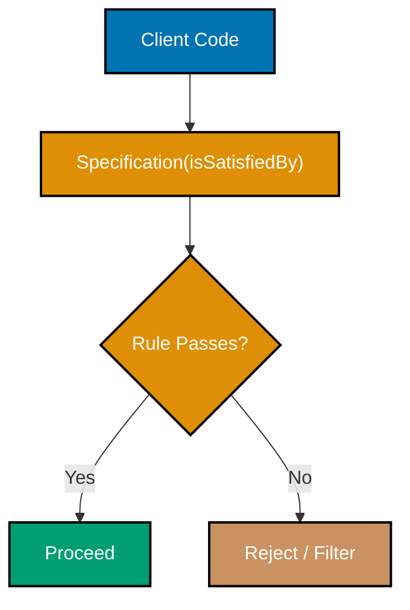
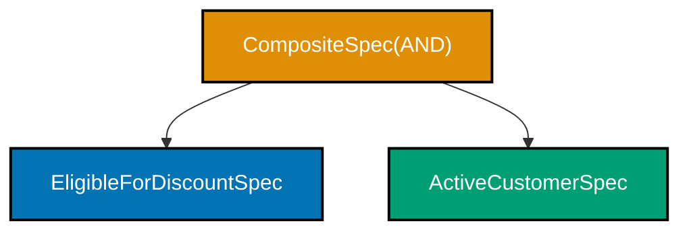
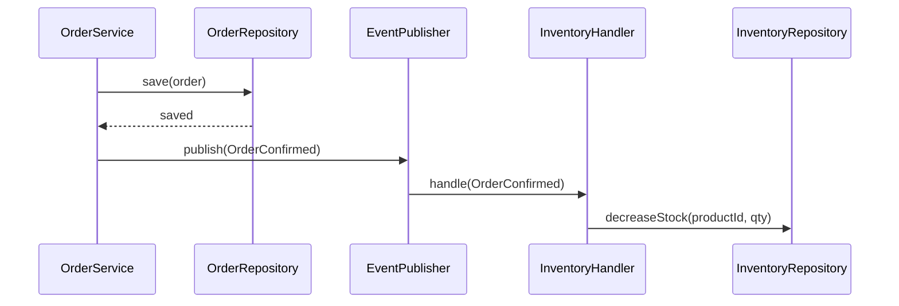
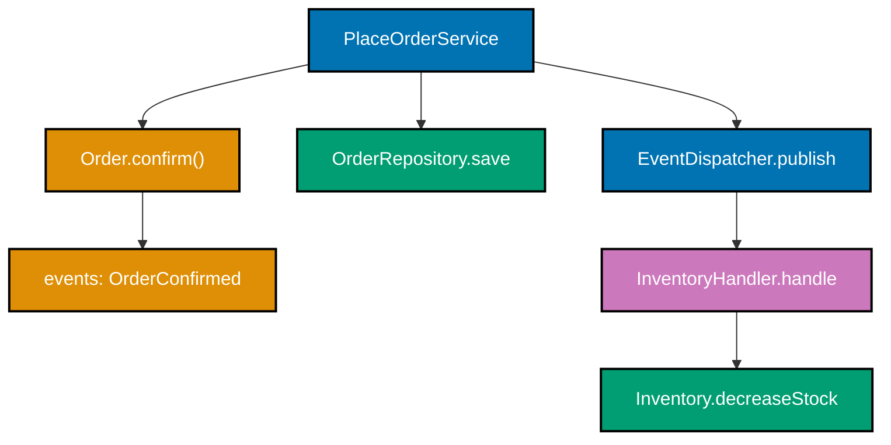
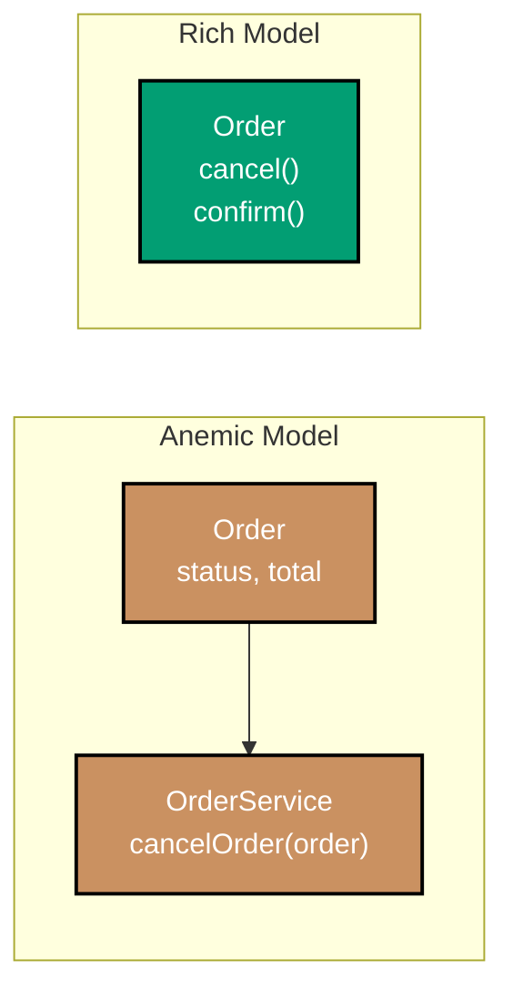
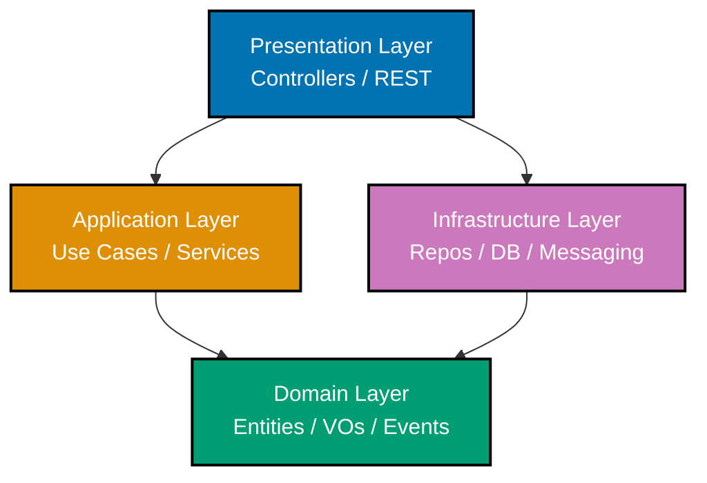
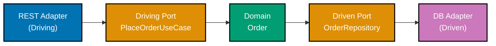
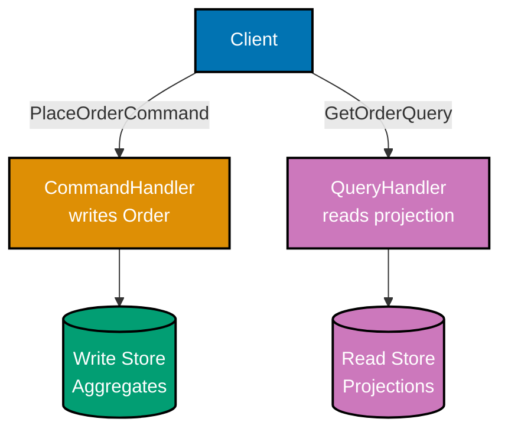
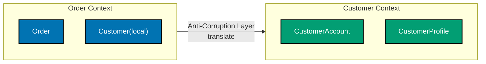

This section covers Examples 26-55, building on the tactical building blocks from the beginner section. Each example is self-contained with all necessary type definitions; references to "the `Order` aggregate from Example 16" are conceptual orientation only — the code compiles standalone.

## Specifications and Factories (Examples 26-29)

### Example 26: Specification pattern — encapsulating a business rule

A Specification wraps a single business rule in a named, testable object. Instead of scattering `if (order.total > 100 && order.status == CONFIRMED)` across service methods, the rule lives in one place with a name that domain experts recognise.



**Java**:

```java
import java.math.BigDecimal;                                          // => namespace/package import
import java.util.List;                                                // => namespace/package import

// ── supporting types ──────────────────────────────────────────────────────────
// These minimal types make the example self-contained; no external dependency needed
enum OrderStatus { PENDING, CONFIRMED, SHIPPED, CANCELLED }           // => enum OrderStatus
// => Four lifecycle states; only CONFIRMED orders are eligible for the discount rule

record OrderId(String value) {}                                       // => record OrderId
// => Strongly-typed ID; wraps String to prevent mixing with other IDs
record Money(BigDecimal amount, String currency) {}                   // => record Money
// => Value Object pair: amount is meaningless without its currency

class Order {                                                         // => class Order
    private final OrderId id;                                         // => id field
    // => private final: ID assigned once, never mutated
    private final Money total;                                        // => total field
    // => private final: total is immutable after construction
    private final OrderStatus status;                                 // => status field
    // => Immutable fields; Order only exposes getters — no public setters

    Order(OrderId id, Money total, OrderStatus status) {              // => Order() called
        this.id = id; this.total = total; this.status = status;       // => this.id assigned
        // => All three fields required; no partial construction
    }
    public Money getTotal()       { return total; }   // => Read-only accessor
    public OrderStatus getStatus(){ return status; }  // => Read-only accessor
}

// ── Specification interface ───────────────────────────────────────────────────
// A Specification encapsulates one cohesive business rule
// => Generic: works for any domain object type T
// => Single method makes this a functional interface; lambdas can implement it
interface Specification<T> {                                          // => interface Specification
    boolean isSatisfiedBy(T candidate); // => True = rule passes for this candidate
    // => False = candidate does not satisfy this rule
}

// ── Concrete specification: eligible for discount ────────────────────────────
// The rule "total >= 100 AND status is CONFIRMED" has a name the domain expert recognises
class EligibleForDiscountSpec implements Specification<Order> {       // => class EligibleForDiscountSpec
    private static final BigDecimal THRESHOLD = new BigDecimal("100.00"); // => THRESHOLD declared
    // => Business rule threshold defined as a named constant, not a magic literal

    @Override                                                         // => expression
    public boolean isSatisfiedBy(Order order) {                       // => isSatisfiedBy method
        boolean bigEnough = order.getTotal().amount().compareTo(THRESHOLD) >= 0; // => order.getTotal() called
        // => BigDecimal.compareTo: returns 0 if equal, negative if less, positive if greater
        // => >= 0 means amount equals or exceeds threshold
        boolean confirmed = order.getStatus() == OrderStatus.CONFIRMED; // => order.getStatus() called
        // => Only confirmed orders are eligible; pending orders have not yet committed
        return bigEnough && confirmed;                                // => returns bigEnough && confirmed
        // => Both conditions must hold; short-circuits if bigEnough is false
    }
}

// ── Usage ─────────────────────────────────────────────────────────────────────
var spec  = new EligibleForDiscountSpec();                            // => spec initialised
// => spec is stateless; safe to share or re-use across calls
var order = new Order(new OrderId("O1"),                              // => order initialised
                      new Money(new BigDecimal("120.00"), "USD"),     // => expression
                      OrderStatus.CONFIRMED);                         // => expression
// => order: 120 USD, CONFIRMED — satisfies both conditions

boolean eligible = spec.isSatisfiedBy(order);                         // => spec.isSatisfiedBy() called
// => true: 120 >= 100 and status is CONFIRMED

var smallOrder = new Order(new OrderId("O2"),                         // => smallOrder initialised
                           new Money(new BigDecimal("50.00"), "USD"), // => expression
                           OrderStatus.CONFIRMED);                    // => expression
// => smallOrder: 50 USD, CONFIRMED — fails the threshold condition
boolean notEligible = spec.isSatisfiedBy(smallOrder);                 // => spec.isSatisfiedBy() called
// => false: 50 < 100, so bigEnough is false

// Filter a list using the specification
List<Order> orders = List.of(order, smallOrder);                      // => List.of() called
// => Both orders in the list
List<Order> discountable = orders.stream()                            // => orders.stream() called
    .filter(spec::isSatisfiedBy)  // => Method reference: passes order to isSatisfiedBy
    .toList();                    // => [order] — only the 120 USD confirmed order qualifies
// => smallOrder excluded because it failed the threshold
```

**Kotlin**:

```kotlin
import java.math.BigDecimal                                           // => namespace/package import

// ── supporting types ──────────────────────────────────────────────────────────
enum class OrderStatus { PENDING, CONFIRMED, SHIPPED, CANCELLED }     // => enum class
data class OrderId(val value: String)                                 // => class OrderId
data class Money(val amount: BigDecimal, val currency: String)        // => class Money

data class Order(val id: OrderId, val total: Money, val status: OrderStatus) // => class Order

// ── Specification as functional interface ─────────────────────────────────────
// Kotlin: fun interface allows SAM conversion — lambda can stand in for Specification
fun interface Specification<T> {                                      // => interface Specification
    fun isSatisfiedBy(candidate: T): Boolean // => Single abstract method
}

// ── Concrete specification ─────────────────────────────────────────────────────
class EligibleForDiscountSpec : Specification<Order> {                // => class EligibleForDiscountSpec
    private val threshold = BigDecimal("100.00")                      // => threshold declared
    // => Rule lives here; no scattering across service methods

    override fun isSatisfiedBy(candidate: Order): Boolean {           // => isSatisfiedBy method
        val bigEnough  = candidate.total.amount >= threshold // => Kotlin operator overload on BigDecimal
        val confirmed  = candidate.status == OrderStatus.CONFIRMED    // => confirmed initialised
        return bigEnough && confirmed // => Both conditions required
    }
}

// ── Usage ─────────────────────────────────────────────────────────────────────
val spec      = EligibleForDiscountSpec()                             // => spec initialised
val confirmed = Order(OrderId("O1"), Money(BigDecimal("120.00"), "USD"), OrderStatus.CONFIRMED) // => confirmed initialised
val small     = Order(OrderId("O2"), Money(BigDecimal("50.00"),  "USD"), OrderStatus.CONFIRMED) // => small initialised

val eligible    = spec.isSatisfiedBy(confirmed) // => true
val notEligible = spec.isSatisfiedBy(small)     // => false

val orders = listOf(confirmed, small)                                 // => orders initialised
val discountable = orders.filter(spec::isSatisfiedBy) // => [confirmed]
// => Kotlin filter accepts any (Order) -> Boolean; method reference works directly
```

**C#**:

```csharp
using System;                                                         // => namespace/package import
using System.Collections.Generic;                                     // => namespace/package import
using System.Linq;                                                    // => namespace/package import

// ── supporting types ──────────────────────────────────────────────────────────
public enum OrderStatus { Pending, Confirmed, Shipped, Cancelled }    // => OrderStatus field
public record OrderId(string Value);                                  // => record OrderId
public record Money(decimal Amount, string Currency);                 // => record Money
public record Order(OrderId Id, Money Total, OrderStatus Status);     // => record Order

// ── Specification interface ────────────────────────────────────────────────────
// C# uses generic interface; lambda or class can implement
public interface ISpecification<T>                                    // => interface ISpecification
{
    bool IsSatisfiedBy(T candidate); // => Returns true when candidate meets the rule
}

// ── Concrete specification ─────────────────────────────────────────────────────
public class EligibleForDiscountSpec : ISpecification<Order>          // => class EligibleForDiscountSpec
{
    private const decimal Threshold = 100m;                           // => Threshold declared
    // => Business rule centralised; easy to unit-test in isolation

    public bool IsSatisfiedBy(Order order)                            // => IsSatisfiedBy method
    {
        bool bigEnough = order.Total.Amount >= Threshold; // => >= 100 USD
        bool confirmed = order.Status == OrderStatus.Confirmed;       // => expression
        return bigEnough && confirmed; // => Both must hold
    }
}

// ── Usage ─────────────────────────────────────────────────────────────────────
var spec      = new EligibleForDiscountSpec();                        // => spec initialised
var confirmed = new Order(new OrderId("O1"), new Money(120m, "USD"), OrderStatus.Confirmed); // => confirmed initialised
var small     = new Order(new OrderId("O2"), new Money(50m,  "USD"), OrderStatus.Confirmed); // => small initialised

bool eligible    = spec.IsSatisfiedBy(confirmed); // => true
bool notEligible = spec.IsSatisfiedBy(small);     // => false

var orders = new List<Order> { confirmed, small };                    // => orders initialised
var discountable = orders.Where(spec.IsSatisfiedBy).ToList(); // => [confirmed]
// => LINQ Where accepts Func<Order,bool>; IsSatisfiedBy matches the signature
```

**Key Takeaway**: A Specification object names and isolates one business rule. Callers say `spec.isSatisfiedBy(order)` rather than repeating the `if` logic everywhere.

**Why It Matters**: When business rules are scattered as ad-hoc `if` conditions inside service methods, any change to the rule requires hunting every callsite. A named Specification is a single unit of change and a single unit of test. Domain experts can read the class name `EligibleForDiscountSpec` and verify the rule matches their intent — removing the translation gap that causes most regression bugs during business-rule evolution.

---

### Example 27: Composite specifications — and / or / not

Composite Specifications build complex rules from simple ones using boolean combinators. `AndSpecification`, `OrSpecification`, and `NotSpecification` let you compose `EligibleForDiscount.and(new ActiveCustomerSpec())` without touching either original class.



**Java**:

```java
import java.math.BigDecimal;                                          // => namespace/package import

// ── Reuse types from Example 26 ───────────────────────────────────────────────
enum OrderStatus { PENDING, CONFIRMED }                               // => enum OrderStatus
// => Only two states needed here; composite spec applies to confirmed orders
record Money(BigDecimal amount, String currency) {}                   // => record Money
record Order(Money total, OrderStatus status, boolean customerActive) {} // => record Order
// => customerActive: true when the customer account is in good standing

interface Specification<T> {                                          // => interface Specification
    boolean isSatisfiedBy(T t);                                       // => expression
    // => Core method: evaluate the rule for one candidate

    // Default methods provide composability without subclassing
    // => Default methods added to the interface; existing implementations unchanged
    default Specification<T> and(Specification<T> other) {            // => expression
        return t -> this.isSatisfiedBy(t) && other.isSatisfiedBy(t);  // => returns t -> this.isSatisfiedBy(t) &&
        // => Returns new spec: both this AND other must be satisfied
        // => Lambda captures both specs; evaluated lazily per candidate
    }

    default Specification<T> or(Specification<T> other) {             // => expression
        return t -> this.isSatisfiedBy(t) || other.isSatisfiedBy(t);  // => returns t -> this.isSatisfiedBy(t) ||
        // => Returns new spec: at least one must be satisfied (short-circuits)
    }

    default Specification<T> not() {                                  // => expression
        return t -> !this.isSatisfiedBy(t);                           // => returns t -> !this.isSatisfiedBy(t)
        // => Returns new spec: negation of this spec; inverts every result
    }
}

// ── Two simple specs composed into a complex rule ────────────────────────────
// Each leaf spec is a focused lambda; single responsibility
Specification<Order> bigOrder   = o -> o.total().amount().compareTo(new BigDecimal("100")) >= 0; // => o.total() called
// => Lambda implements Specification<Order>; true when total >= 100
Specification<Order> confirmed  = o -> o.status() == OrderStatus.CONFIRMED; // => o.status() called
// => True when order has progressed past PENDING to CONFIRMED
Specification<Order> activeCustomer = o -> o.customerActive();        // => o.customerActive() called
// => True when the customer's account is active (not suspended or banned)

// Compose: eligible = bigOrder AND confirmed AND activeCustomer
// => and() chains return new Specification instances; originals unchanged
Specification<Order> eligible = bigOrder.and(confirmed).and(activeCustomer); // => bigOrder.and() called
// => Three independent rules chained; each testable in isolation

var orderA = new Order(new Money(new BigDecimal("120"), "USD"), OrderStatus.CONFIRMED, true); // => orderA initialised
// => orderA: 120 USD, CONFIRMED, active — should satisfy all three rules
var orderB = new Order(new Money(new BigDecimal("120"), "USD"), OrderStatus.CONFIRMED, false); // => orderB initialised
// => orderB: 120 USD, CONFIRMED, INACTIVE — should fail activeCustomer

boolean aOk = eligible.isSatisfiedBy(orderA); // => true (all three pass)
boolean bOk = eligible.isSatisfiedBy(orderB); // => false (activeCustomer fails for orderB)

// NOT example: flip the eligible spec to get the ineligible spec
Specification<Order> ineligible = eligible.not();                     // => eligible.not() called
// => ineligible = NOT(bigOrder AND confirmed AND activeCustomer)
boolean bIneligible = ineligible.isSatisfiedBy(orderB); // => true (orderB IS ineligible)
```

**Kotlin**:

```kotlin
import java.math.BigDecimal                                           // => namespace/package import

enum class OrderStatus { PENDING, CONFIRMED }                         // => enum class
data class Money(val amount: BigDecimal, val currency: String)        // => class Money
data class Order(val total: Money, val status: OrderStatus, val customerActive: Boolean) // => class Order

// Kotlin: fun interface + extension functions for composability
fun interface Specification<T> {                                      // => interface Specification
    fun isSatisfiedBy(t: T): Boolean                                  // => isSatisfiedBy method
}

// Extension functions compose specs without modifying the interface
infix fun <T> Specification<T>.and(other: Specification<T>): Specification<T> = // => expression
    Specification { isSatisfiedBy(it) && other.isSatisfiedBy(it) }    // => other.isSatisfiedBy() called
// => infix: readable as  bigOrder and confirmed

infix fun <T> Specification<T>.or(other: Specification<T>): Specification<T> = // => expression
    Specification { isSatisfiedBy(it) || other.isSatisfiedBy(it) }    // => other.isSatisfiedBy() called

fun <T> Specification<T>.not(): Specification<T> =                    // => expression
    Specification { !isSatisfiedBy(it) }                              // => expression

// ── Usage ─────────────────────────────────────────────────────────────────────
val bigOrder       = Specification<Order> { it.total.amount >= BigDecimal("100") } // => bigOrder initialised
val confirmed      = Specification<Order> { it.status == OrderStatus.CONFIRMED } // => confirmed initialised
val activeCustomer = Specification<Order> { it.customerActive }       // => activeCustomer initialised

val eligible = bigOrder and confirmed and activeCustomer              // => eligible initialised
// => Infix 'and': reads naturally as English

val orderA = Order(Money(BigDecimal("120"), "USD"), OrderStatus.CONFIRMED, customerActive = true) // => orderA initialised
val orderB = Order(Money(BigDecimal("120"), "USD"), OrderStatus.CONFIRMED, customerActive = false) // => orderB initialised

val aOk = eligible.isSatisfiedBy(orderA) // => true
val bOk = eligible.isSatisfiedBy(orderB) // => false (activeCustomer fails)

val ineligible = eligible.not()                                       // => ineligible initialised
val bIneligible = ineligible.isSatisfiedBy(orderB) // => true
```

**C#**:

```csharp
using System;                                                         // => namespace/package import

public enum OrderStatus { Pending, Confirmed }                        // => OrderStatus field
public record Money(decimal Amount, string Currency);                 // => record Money
public record Order(Money Total, OrderStatus Status, bool CustomerActive); // => record Order

public interface ISpecification<T>                                    // => interface ISpecification
{
    bool IsSatisfiedBy(T t);                                          // => expression

    // Default interface methods provide combinators (C# 8+)
    ISpecification<T> And(ISpecification<T> other) =>                 // => expression
        new LambdaSpec<T>(t => IsSatisfiedBy(t) && other.IsSatisfiedBy(t)); // => other.IsSatisfiedBy() called
    // => Creates anonymous spec: both must hold

    ISpecification<T> Or(ISpecification<T> other) =>                  // => expression
        new LambdaSpec<T>(t => IsSatisfiedBy(t) || other.IsSatisfiedBy(t)); // => other.IsSatisfiedBy() called

    ISpecification<T> Not() =>                                        // => expression
        new LambdaSpec<T>(t => !IsSatisfiedBy(t));                    // => expression
}

// Helper: wraps a lambda as an ISpecification
public class LambdaSpec<T>(Func<T, bool> predicate) : ISpecification<T> // => class LambdaSpec
{
    // => Primary constructor (C# 12): field 'predicate' injected automatically
    public bool IsSatisfiedBy(T t) => predicate(t);                   // => IsSatisfiedBy method
}

// ── Usage ─────────────────────────────────────────────────────────────────────
ISpecification<Order> bigOrder       = new LambdaSpec<Order>(o => o.Total.Amount >= 100m); // => expression
ISpecification<Order> confirmed      = new LambdaSpec<Order>(o => o.Status == OrderStatus.Confirmed); // => expression
ISpecification<Order> activeCustomer = new LambdaSpec<Order>(o => o.CustomerActive); // => expression

var eligible = bigOrder.And(confirmed).And(activeCustomer);           // => eligible initialised
// => Three specs chained; each independently testable

var orderA = new Order(new Money(120m, "USD"), OrderStatus.Confirmed, CustomerActive: true); // => orderA initialised
var orderB = new Order(new Money(120m, "USD"), OrderStatus.Confirmed, CustomerActive: false); // => orderB initialised

bool aOk = eligible.IsSatisfiedBy(orderA); // => true
bool bOk = eligible.IsSatisfiedBy(orderB); // => false

var ineligible = eligible.Not();                                      // => ineligible initialised
bool bIneligible = ineligible.IsSatisfiedBy(orderB); // => true
```

**Key Takeaway**: Composing specifications with `and`, `or`, and `not` builds complex rules from verified, named building blocks — without touching existing classes.

**Why It Matters**: Complex business rules in enterprise software rarely stay simple. An initial "discount rule" grows into a multi-condition policy as the business evolves. Composite Specifications let you add conditions without modifying working code — each new `Specification` is open for extension and closed for modification (Open/Closed Principle). The compositional approach also makes business rules auditable: each leaf spec has a name that maps to a sentence in the requirements document.

---

### Example 28: Factory for complex aggregate creation

A Factory method encapsulates the construction logic for an aggregate whose creation involves multiple steps, validations, or dependencies. Instead of exposing a sprawling constructor, callers use `Order.create(...)` and receive a fully valid aggregate with its creation event already registered.

**Java**:

```java
import java.math.BigDecimal;                                          // => namespace/package import
import java.time.Instant;                                             // => namespace/package import
import java.util.*;                                                   // => namespace/package import

// ── Supporting types ──────────────────────────────────────────────────────────
enum OrderStatus { PENDING }                                          // => enum OrderStatus
record OrderId(String value)      { static OrderId generate() { return new OrderId(UUID.randomUUID().toString()); } } // => record OrderId
record CustomerId(String value)   {}                                  // => record CustomerId
record ProductId(String value)    {}                                  // => record ProductId
record Money(BigDecimal amount, String currency) {}                   // => record Money

interface DomainEvent {}                                              // => interface DomainEvent
record OrderCreated(OrderId orderId, CustomerId customerId, Instant occurredAt) implements DomainEvent {} // => record OrderCreated

// ── Aggregate ─────────────────────────────────────────────────────────────────
public class Order {                                                  // => Order field
    private final OrderId id;                                         // => id field
    private final CustomerId customerId;                              // => customerId field
    private final List<ProductId> lineItems;                          // => expression
    private OrderStatus status;                                       // => status field
    private final List<DomainEvent> events = new ArrayList<>();       // => List method
    // => Private constructor: external callers cannot bypass the factory

    private Order(OrderId id, CustomerId customerId, List<ProductId> lineItems) { // => Order method
        this.id = id;                                                 // => this.id assigned
        this.customerId = customerId;                                 // => this.customerId assigned
        this.lineItems  = List.copyOf(lineItems); // => Defensive copy; caller cannot mutate
        this.status     = OrderStatus.PENDING;                        // => this.status assigned
    }

    // ── Static factory method ─────────────────────────────────────────────────
    // Named factory makes intent explicit; validates, assembles, and records creation event
    public static Order create(CustomerId customerId, List<ProductId> items) { // => create method
        if (customerId == null) throw new IllegalArgumentException("CustomerId required"); // => throws if guard fails
        if (items == null || items.isEmpty()) throw new IllegalArgumentException("At least one item required"); // => throws if guard fails
        // => Business rule: an order must have items to exist

        OrderId newId = OrderId.generate();          // => Generate identity inside factory
        Order order = new Order(newId, customerId, items); // => Private ctor
        order.events.add(new OrderCreated(newId, customerId, Instant.now())); // => events.add() called
        // => Creation event registered inside factory; caller never needs to do this
        return order; // => Returns fully initialised, valid aggregate
    }

    public OrderId getId()               { return id; }               // => getId method
    public List<DomainEvent> getEvents() { return List.copyOf(events); } // => getEvents method
}

// ── Usage ─────────────────────────────────────────────────────────────────────
var order = Order.create(                                             // => order initialised
    new CustomerId("C1"),                                             // => expression
    List.of(new ProductId("P1"), new ProductId("P2"))                 // => List.of() called
); // => order.id is a UUID; order.events has [OrderCreated]

// Order invalid = new Order(...); // => compile error — constructor is private
```

**Kotlin**:

```kotlin
import java.time.Instant                                              // => namespace/package import
import java.util.UUID                                                 // => namespace/package import

enum class OrderStatus { PENDING }                                    // => enum class
data class OrderId(val value: String) { companion object { fun generate() = OrderId(UUID.randomUUID().toString()) } } // => class OrderId
data class CustomerId(val value: String)                              // => class CustomerId
data class ProductId(val value: String)                               // => class ProductId

interface DomainEvent                                                 // => interface DomainEvent
data class OrderCreated(val orderId: OrderId, val customerId: CustomerId, val occurredAt: Instant) : DomainEvent // => class OrderCreated

class Order private constructor( // => private: only companion object can call
    val id: OrderId,                                                  // => expression
    val customerId: CustomerId,                                       // => expression
    val lineItems: List<ProductId>,                                   // => expression
) {                                                                   // => expression
    var status: OrderStatus = OrderStatus.PENDING                     // => expression
        private set                                                   // => expression

    private val _events = mutableListOf<DomainEvent>()                // => events declared
    val events: List<DomainEvent> get() = _events.toList() // => Snapshot; caller cannot mutate

    companion object {                                                // => expression
        // Named factory: validates, constructs, registers creation event
        fun create(customerId: CustomerId, items: List<ProductId>): Order { // => create method
            require(items.isNotEmpty()) { "At least one item required" } // => precondition check
            // => Domain rule enforced before object exists
            val id    = OrderId.generate()                            // => id initialised
            val order = Order(id, customerId, items)                  // => order initialised
            order._events.add(OrderCreated(id, customerId, Instant.now())) // => _events.add() called
            // => Creation event recorded; app service will publish after save
            return order                                              // => returns order
        }
    }
}

// ── Usage ─────────────────────────────────────────────────────────────────────
val order = Order.create(                                             // => order initialised
    customerId = CustomerId("C1"),                                    // => customerId assigned
    items      = listOf(ProductId("P1"), ProductId("P2"))             // => items assigned
) // => order.id is UUID; order.events = [OrderCreated(...)]
// Order(...) cannot be called directly — constructor is private
```

**C#**:

```csharp
using System;                                                         // => namespace/package import
using System.Collections.Generic;                                     // => namespace/package import

public enum OrderStatus { Pending }                                   // => OrderStatus field
public record OrderId(string Value) { public static OrderId Generate() => new(Guid.NewGuid().ToString()); } // => record OrderId
public record CustomerId(string Value);                               // => record CustomerId
public record ProductId(string Value);                                // => record ProductId

public interface IDomainEvent {}                                      // => IDomainEvent field
public record OrderCreated(OrderId OrderId, CustomerId CustomerId, DateTimeOffset OccurredAt) : IDomainEvent; // => record OrderCreated

public class Order                                                    // => class Order
// => begins block
{
    public  OrderId           Id         { get; }                     // => Id field
    public  CustomerId        CustomerId { get; }                     // => CustomerId field
    public  IReadOnlyList<ProductId> LineItems { get; }               // => expression
    public  OrderStatus       Status     { get; private set; } = OrderStatus.Pending; // => Status field

    private readonly List<IDomainEvent> _events = new();              // => List method
    public  IReadOnlyList<IDomainEvent> Events => _events.AsReadOnly(); // => IReadOnlyList method

    private Order(OrderId id, CustomerId customerId, List<ProductId> lineItems) // => Order method
    // => begins block
    {
        // => private: callers must use Create factory
        Id         = id;                                              // => Id assigned
        CustomerId = customerId;                                      // => CustomerId assigned
        LineItems  = lineItems.AsReadOnly(); // => Defensive immutable view
    }

    // ── Static factory ────────────────────────────────────────────────────────
    public static Order Create(CustomerId customerId, List<ProductId> items) // => Create method
    {
        if (items == null || items.Count == 0)                        // => precondition check
            throw new ArgumentException("At least one item required"); // => throws if guard fails
        var id    = OrderId.Generate();                               // => id initialised
        var order = new Order(id, customerId, items); // => Private ctor
        order._events.Add(new OrderCreated(id, customerId, DateTimeOffset.UtcNow)); // => _events.Add() called
        // => Creation event; app service publishes after persistence
        return order;                                                 // => returns order
    }
}

// ── Usage ─────────────────────────────────────────────────────────────────────
var order = Order.Create(                                             // => order initialised
    new CustomerId("C1"),                                             // => expression
    new List<ProductId> { new("P1"), new("P2") }                      // => expression
); // => order.Id = GUID; order.Events = [OrderCreated]
```

**Key Takeaway**: A Factory method encapsulates all construction logic — validation, ID generation, event registration — so callers receive a fully valid, ready aggregate with one method call.

**Why It Matters**: When aggregate construction logic leaks into application services or controllers, it gets duplicated and diverges. A Factory is the single place where "what makes a valid Order" is enforced at birth. Tests of the Factory verify creation invariants; tests of the aggregate verify behaviour — clear separation of concerns that makes each concern independently testable.

---

### Example 29: Builder pattern for an aggregate

A Builder is appropriate when an aggregate has many optional fields and you want to avoid telescoping constructors. The Builder accumulates settings and the final `build()` call validates them together, producing a valid aggregate or throwing.

**Java**:

```java
import java.math.BigDecimal;                                          // => namespace/package import
import java.util.*;                                                   // => namespace/package import

// ── Supporting types ──────────────────────────────────────────────────────────
record OrderId(String value)    { static OrderId generate() { return new OrderId(UUID.randomUUID().toString()); } } // => record OrderId
record CustomerId(String value) {}                                    // => record CustomerId
record Money(BigDecimal amount, String currency) {}                   // => record Money
enum Priority { STANDARD, EXPRESS }                                   // => enum Priority

// ── Aggregate with optional fields ───────────────────────────────────────────
public class Order {                                                  // => Order field
    private final OrderId   id;                                       // => id field
    private final CustomerId customerId;                              // => customerId field
    private final Money      total;                                   // => total field
    private final Priority   priority;         // => Optional; default STANDARD
    private final String     deliveryNote;     // => Optional; may be null

    private Order(OrderId id, CustomerId customerId, Money total,     // => Order method
                  Priority priority, String deliveryNote) {           // => expression
        this.id           = id;                                       // => this.id assigned
        this.customerId   = customerId;                               // => this.customerId assigned
        this.total        = total;                                    // => this.total assigned
        this.priority     = priority;                                 // => this.priority assigned
        this.deliveryNote = deliveryNote;                             // => this.deliveryNote assigned
    }

    // ── Inner Builder ─────────────────────────────────────────────────────────
    public static class Builder {                                     // => Builder field
        private CustomerId customerId; // => Required; validated in build()
        private Money      total;      // => Required
        private Priority   priority   = Priority.STANDARD; // => Optional; sensible default
        private String     deliveryNote;                    // => Optional; null allowed

        public Builder customerId(CustomerId id)     { this.customerId = id;   return this; } // => customerId method
        public Builder total(Money t)                { this.total = t;         return this; } // => total method
        public Builder priority(Priority p)          { this.priority = p;      return this; } // => priority method
        public Builder deliveryNote(String note)     { this.deliveryNote = note; return this; } // => deliveryNote method
        // => Fluent setters return 'this' for method chaining

        public Order build() {                                        // => build method
            // => All validations in one place; no partial Order escapes
            if (customerId == null) throw new IllegalStateException("customerId required"); // => throws if guard fails
            if (total == null)      throw new IllegalStateException("total required"); // => throws if guard fails
            return new Order(OrderId.generate(), customerId, total, priority, deliveryNote); // => returns new Order(OrderId.generate(),
        }
    }

    public static Builder builder() { return new Builder(); } // => Entry point
    public OrderId getId()          { return id; }                    // => getId method
}

// ── Usage ─────────────────────────────────────────────────────────────────────
Order express = Order.builder()                                       // => Order.builder() called
    .customerId(new CustomerId("C1"))                                 // => expression
    .total(new Money(new BigDecimal("200"), "USD"))                   // => expression
    .priority(Priority.EXPRESS)                                       // => expression
    .deliveryNote("Leave at door")                                    // => expression
    .build();                                                         // => expression
// => express.priority = EXPRESS, deliveryNote = "Leave at door"

Order standard = Order.builder()                                      // => Order.builder() called
    .customerId(new CustomerId("C2"))                                 // => expression
    .total(new Money(new BigDecimal("50"), "USD"))                    // => expression
    .build();                                                         // => expression
// => standard.priority = STANDARD, deliveryNote = null (optional not set)
```

**Kotlin**:

```kotlin
import java.math.BigDecimal                                           // => namespace/package import
import java.util.UUID                                                 // => namespace/package import

data class OrderId(val value: String) { companion object { fun generate() = OrderId(UUID.randomUUID().toString()) } } // => class OrderId
data class CustomerId(val value: String)                              // => class CustomerId
data class Money(val amount: BigDecimal, val currency: String)        // => class Money
enum class Priority { STANDARD, EXPRESS }                             // => enum class

// Kotlin: data class with default parameters often replaces Builder
// => But a Builder is still useful when construction validation spans multiple fields
data class Order private constructor(                                 // => class Order
    val id:           OrderId,                                        // => expression
    val customerId:   CustomerId,                                     // => expression
    val total:        Money,                                          // => expression
    val priority:     Priority = Priority.STANDARD,                   // => expression
    val deliveryNote: String?  = null  // => Nullable optional field
) {                                                                   // => expression
    class Builder {                                                   // => class Builder
        private var customerId:   CustomerId? = null                  // => expression
        private var total:        Money?      = null                  // => expression
        private var priority:     Priority    = Priority.STANDARD     // => expression
        private var deliveryNote: String?     = null                  // => expression

        fun customerId(id: CustomerId)   = apply { customerId = id }  // => customerId method
        fun total(t: Money)              = apply { total = t }        // => total method
        fun priority(p: Priority)        = apply { priority = p }     // => priority method
        fun deliveryNote(note: String?)  = apply { deliveryNote = note } // => deliveryNote method
        // => apply{} returns 'this'; enables fluent chaining

        fun build(): Order {                                          // => build method
            val cid = requireNotNull(customerId) { "customerId required" } // => cid initialised
            val tot = requireNotNull(total)       { "total required" } // => tot initialised
            return Order(OrderId.generate(), cid, tot, priority, deliveryNote) // => returns Order(OrderId.generate(), cid,
            // => Constructs via private constructor; validation done above
        }
    }
}

// ── Usage ─────────────────────────────────────────────────────────────────────
val express = Order.Builder()                                         // => express initialised
    .customerId(CustomerId("C1"))                                     // => expression
    .total(Money(BigDecimal("200"), "USD"))                           // => expression
    .priority(Priority.EXPRESS)                                       // => expression
    .deliveryNote("Leave at door")                                    // => expression
    .build()                                                          // => expression
// => Order(id=UUID, customerId=C1, total=200 USD, priority=EXPRESS, deliveryNote=Leave at door)

val standard = Order.Builder()                                        // => standard initialised
    .customerId(CustomerId("C2"))                                     // => expression
    .total(Money(BigDecimal("50"), "USD"))                            // => expression
    .build()                                                          // => expression
// => priority=STANDARD, deliveryNote=null
```

**C#**:

```csharp
using System;                                                         // => namespace/package import

public record OrderId(string Value) { public static OrderId Generate() => new(Guid.NewGuid().ToString()); } // => record OrderId
public record CustomerId(string Value);                               // => record CustomerId
public record Money(decimal Amount, string Currency);                 // => record Money
public enum Priority { Standard, Express }                            // => Priority field

// C# record with init properties: the record itself acts as a builder target
// For complex validation, a dedicated Builder class keeps the aggregate immutable
public class Order                                                    // => class Order
// => begins block
{
    public OrderId    Id           { get; }                           // => Id field
    public CustomerId CustomerId  { get; }                            // => CustomerId field
    public Money      Total        { get; }                           // => Total field
    public Priority   Priority     { get; }                           // => Priority field
    public string?    DeliveryNote { get; }  // => Nullable; optional

    private Order(OrderId id, CustomerId customerId, Money total,     // => Order method
                  Priority priority, string? deliveryNote)            // => expression
    {
        Id = id; CustomerId = customerId; Total = total;              // => Id assigned
        Priority = priority; DeliveryNote = deliveryNote;             // => Priority assigned
    }

    // ── Builder ───────────────────────────────────────────────────────────────
    public class Builder                                              // => class Builder
    {
        private CustomerId? _customerId;                              // => expression
        private Money?      _total;                                   // => expression
        private Priority    _priority    = Priority.Standard; // => Default
        private string?     _deliveryNote;                            // => expression

        public Builder WithCustomerId(CustomerId id)    { _customerId = id;    return this; } // => WithCustomerId method
        public Builder WithTotal(Money t)               { _total = t;          return this; } // => WithTotal method
        public Builder WithPriority(Priority p)         { _priority = p;       return this; } // => WithPriority method
        public Builder WithDeliveryNote(string? note)   { _deliveryNote = note; return this; } // => WithDeliveryNote method
        // => Fluent; each setter returns 'this'

        public Order Build()                                          // => Build method
        {
            if (_customerId is null) throw new InvalidOperationException("CustomerId required"); // => throws if guard fails
            if (_total      is null) throw new InvalidOperationException("Total required"); // => throws if guard fails
            return new Order(OrderId.Generate(), _customerId, _total, _priority, _deliveryNote); // => returns new Order(OrderId.Generate(),
        }
    }
}

// ── Usage ─────────────────────────────────────────────────────────────────────
var express = new Order.Builder()                                     // => express initialised
    .WithCustomerId(new CustomerId("C1"))                             // => expression
    .WithTotal(new Money(200m, "USD"))                                // => expression
    .WithPriority(Priority.Express)                                   // => expression
    .WithDeliveryNote("Leave at door")                                // => expression
    .Build();                                                         // => expression
// => express.Priority = Express, DeliveryNote = "Leave at door"

var standard = new Order.Builder()                                    // => standard initialised
    .WithCustomerId(new CustomerId("C2"))                             // => expression
    .WithTotal(new Money(50m, "USD"))                                 // => expression
    .Build();                                                         // => expression
// => standard.Priority = Standard, DeliveryNote = null
```

**Key Takeaway**: A Builder accumulates optional fields and performs cross-field validation at `build()` time, ensuring every Order produced is fully valid while avoiding a constructor with many nullable parameters.

**Why It Matters**: Telescoping constructors — `new Order(id, cid, total, null, null, null, "EXPRESS")` — are error-prone and unreadable. A Builder gives each field a name at the call site, makes optionality explicit, and centralises cross-field validation. In Java and C# the pattern is explicit class; in Kotlin, named parameters with default values often suffice, but a Builder still clarifies construction intent for aggregates with domain invariants spanning multiple fields.

---

## Repository Conventions (Examples 30-31)

### Example 30: Repository query convention — finder methods

Repository finder methods express domain queries in the language of the domain rather than exposing raw SQL or ORM predicates. `findByCustomerId` reads like a business question; `createQuery("SELECT ...")` does not.

**Java**:

```java
import java.util.*;                                                   // => namespace/package import

// ── Supporting types ──────────────────────────────────────────────────────────
record OrderId(String value) {}                                       // => record OrderId
record CustomerId(String value) {}                                    // => record CustomerId
enum OrderStatus { PENDING, CONFIRMED, SHIPPED }                      // => enum OrderStatus
record Order(OrderId id, CustomerId customerId, OrderStatus status) {} // => record Order

// ── Repository interface: domain-language queries ─────────────────────────────
interface OrderRepository {                                           // => interface OrderRepository
    // Finder methods named from the domain perspective, not the database perspective
    Optional<Order> findById(OrderId id);                             // => expression
    // => "find" prefix: may or may not exist — returns Optional

    List<Order> findByCustomerId(CustomerId customerId);              // => expression
    // => "findBy": returns all orders for a customer; empty list if none

    List<Order> findByStatus(OrderStatus status);                     // => expression
    // => Returns all orders in a given status; useful for fulfilment workflows

    List<Order> findPendingOlderThanDays(int days);                   // => expression
    // => Named domain query: "which pending orders are stale?"

    void save(Order order);   // => Insert or update (upsert semantics)
    void delete(OrderId id);  // => Remove from repository
}

// ── In-memory implementation (for tests / demos) ──────────────────────────────
class InMemoryOrderRepository implements OrderRepository {            // => class InMemoryOrderRepository
    private final Map<String, Order> store = new HashMap<>();         // => Map method
    // => Keyed by OrderId value for O(1) lookup

    @Override public Optional<Order> findById(OrderId id) {           // => expression
        return Optional.ofNullable(store.get(id.value())); // => Absent = Optional.empty
    }

    @Override public List<Order> findByCustomerId(CustomerId cid) {   // => expression
        return store.values().stream()                                // => returns store.values().stream()
            .filter(o -> o.customerId().equals(cid)) // => Linear scan; acceptable in-memory
            .toList();                                                // => expression
    }

    @Override public List<Order> findByStatus(OrderStatus s) {        // => expression
        return store.values().stream().filter(o -> o.status() == s).toList(); // => returns store.values().stream().filter
    }

    @Override public List<Order> findPendingOlderThanDays(int days) { // => expression
        // => Real impl would compare timestamps; simplified here
        return store.values().stream()                                // => returns store.values().stream()
            .filter(o -> o.status() == OrderStatus.PENDING).toList(); // => o.status() called
    }

    @Override public void save(Order o)   { store.put(o.id().value(), o); } // => store.put() called
    @Override public void delete(OrderId id) { store.remove(id.value()); } // => store.remove() called
}

// ── Usage ─────────────────────────────────────────────────────────────────────
var repo  = new InMemoryOrderRepository();                            // => repo initialised
var order = new Order(new OrderId("O1"), new CustomerId("C1"), OrderStatus.PENDING); // => order initialised
repo.save(order);  // => Stored

Optional<Order> found = repo.findById(new OrderId("O1")); // => Optional[Order]
List<Order>     byCustomer = repo.findByCustomerId(new CustomerId("C1")); // => [order]
List<Order>     pending    = repo.findByStatus(OrderStatus.PENDING);      // => [order]
```

**Kotlin**:

```kotlin
// ── Kotlin repository interface ───────────────────────────────────────────────
data class OrderId(val value: String)                                 // => class OrderId
data class CustomerId(val value: String)                              // => class CustomerId
enum class OrderStatus { PENDING, CONFIRMED, SHIPPED }                // => enum class
data class Order(val id: OrderId, val customerId: CustomerId, val status: OrderStatus) // => class Order

interface OrderRepository {                                           // => interface OrderRepository
    fun findById(id: OrderId): Order?             // => Kotlin nullable: null = not found
    fun findByCustomerId(cid: CustomerId): List<Order>                // => findByCustomerId method
    fun findByStatus(status: OrderStatus): List<Order>                // => findByStatus method
    fun findPendingOlderThanDays(days: Int): List<Order>              // => findPendingOlderThanDays method
    fun save(order: Order)                                            // => save method
    fun delete(id: OrderId)                                           // => delete method
}

// ── In-memory implementation ──────────────────────────────────────────────────
class InMemoryOrderRepository : OrderRepository {                     // => class InMemoryOrderRepository
    private val store = mutableMapOf<String, Order>()                 // => store declared

    override fun findById(id: OrderId)           = store[id.value]    // => findById method
    // => Nullable return: map returns null when key absent

    override fun findByCustomerId(cid: CustomerId) =                  // => findByCustomerId method
        store.values.filter { it.customerId == cid } // => Returns empty list if none

    override fun findByStatus(status: OrderStatus) =                  // => findByStatus method
        store.values.filter { it.status == status }                   // => expression

    override fun findPendingOlderThanDays(days: Int) =                // => findPendingOlderThanDays method
        store.values.filter { it.status == OrderStatus.PENDING }      // => expression
    // => Simplified; real impl would use timestamps

    override fun save(order: Order)  { store[order.id.value] = order } // => save method
    override fun delete(id: OrderId) { store.remove(id.value) }       // => delete method
}

// ── Usage ─────────────────────────────────────────────────────────────────────
val repo  = InMemoryOrderRepository()                                 // => repo initialised
val order = Order(OrderId("O1"), CustomerId("C1"), OrderStatus.PENDING) // => order initialised
repo.save(order)                                                      // => repo.save() called

val found      = repo.findById(OrderId("O1"))          // => Order? (non-null here)
val byCustomer = repo.findByCustomerId(CustomerId("C1")) // => [order]
val pending    = repo.findByStatus(OrderStatus.PENDING)  // => [order]
```

**C#**:

```csharp
using System.Collections.Generic;  // => Dictionary, List, IEnumerable

public record OrderId(string Value);                                  // => record OrderId
// => Typed id; wraps string; prevents mixing OrderId with CustomerId
public record CustomerId(string Value);                               // => record CustomerId
// => Typed customer id; structural equality via record
public enum OrderStatus { Pending, Confirmed, Shipped }               // => OrderStatus field
// => Three lifecycle states; interface methods filter by each state
public record Order(OrderId Id, CustomerId CustomerId, OrderStatus Status); // => record Order
// => Immutable order record; three fields capturing identity, owner, and lifecycle

public interface IOrderRepository                                     // => interface IOrderRepository
// => Domain-language interface; declares what domain needs from persistence
{
    Order?        FindById(OrderId id);              // => Nullable: null = not found
    // => Nullable return: caller must handle "not found" case explicitly (no exception)
    List<Order>   FindByCustomerId(CustomerId id);                    // => expression
    // => Returns all orders for this customer; empty list if none
    List<Order>   FindByStatus(OrderStatus status);                   // => expression
    // => Returns all orders in this status; production uses DB index on status column
    List<Order>   FindPendingOlderThanDays(int days);                 // => expression
    // => Business query: "stale" pending orders need follow-up; expressed in domain vocabulary
    void          Save(Order order);                                  // => expression
    // => Upsert: inserts new id or replaces existing id
    void          Delete(OrderId id);                                 // => expression
    // => Removes order; no-op if id not found (idempotent)
}

public class InMemoryOrderRepository : IOrderRepository               // => class InMemoryOrderRepository
// => In-memory implementation for tests and demos; not for production
{
    private readonly Dictionary<string, Order> _store = new();        // => Dictionary method
    // => Key = order id string; O(1) FindById lookups

    public Order? FindById(OrderId id) =>                             // => method declaration
        _store.TryGetValue(id.Value, out var o) ? o : null;           // => _store.TryGetValue() called
    // => TryGetValue avoids KeyNotFoundException; returns null when absent
    // => Ternary: returns o if found, null otherwise

    public List<Order> FindByCustomerId(CustomerId id) =>             // => FindByCustomerId method
        _store.Values.Where(o => o.CustomerId == id).ToList();        // => Values.Where() called
    // => LINQ Where: filters in-memory; production uses DB WHERE clause

    public List<Order> FindByStatus(OrderStatus s) =>                 // => FindByStatus method
        _store.Values.Where(o => o.Status == s).ToList();             // => Values.Where() called
    // => Filters by status enum; record == compares Status value

    public List<Order> FindPendingOlderThanDays(int days) =>          // => FindPendingOlderThanDays method
        _store.Values.Where(o => o.Status == OrderStatus.Pending).ToList(); // => Values.Where() called
    // => Simplified: ignores 'days' parameter; real impl filters by creation date

    public void Save(Order o)      => _store[o.Id.Value] = o;         // => Save method
    // => Indexer assignment: inserts or replaces; upsert semantics
    public void Delete(OrderId id) => _store.Remove(id.Value);        // => Delete method
    // => Remove: no-op if key absent; no exception on missing id
}

// ── Usage ─────────────────────────────────────────────────────────────────────
var repo  = new InMemoryOrderRepository();                            // => repo initialised
// => Empty store; no orders yet
var order = new Order(new OrderId("O1"), new CustomerId("C1"), OrderStatus.Pending); // => order initialised
// => Immutable record: O1, C1, Pending
repo.Save(order);                                                     // => repo.Save() called
// => _store = {"O1": order}

var found   = repo.FindById(new OrderId("O1"));             // => Order (non-null)
// => TryGetValue finds "O1"; returns the stored Order
var pending = repo.FindByStatus(OrderStatus.Pending);        // => [order]
// => Where filter matches; one order in result list
```

**Key Takeaway**: Repository finder methods express queries in domain vocabulary. `findPendingOlderThanDays(7)` communicates business intent; a raw query does not.

**Why It Matters**: When domain queries are expressed in business language inside the Repository interface, domain experts can read the interface and confirm it covers their use cases. Infrastructure implementation details — SQL, JPA, EF Core — are hidden behind the interface. This decoupling lets you swap from in-memory (tests) to PostgreSQL (production) without changing any domain or application code.

---

### Example 31: Repository with Specification parameter

Passing a Specification to a repository's `findAll(spec)` method eliminates the need for a new finder method per query combination. The repository evaluates the spec against its data source, keeping query logic composable and the repository interface stable.

**Java**:

```java
import java.math.BigDecimal;                                          // => namespace/package import
import java.util.*;                                                   // => namespace/package import

enum OrderStatus { PENDING, CONFIRMED }                               // => enum OrderStatus
record OrderId(String value) {}                                       // => record OrderId
record Money(BigDecimal amount, String currency) {}                   // => record Money
record Order(OrderId id, Money total, OrderStatus status) {}          // => record Order

interface Specification<T> { boolean isSatisfiedBy(T t); }            // => interface Specification

// ── Repository accepting a Specification ─────────────────────────────────────
interface OrderRepository {                                           // => interface OrderRepository
    List<Order> findAll(Specification<Order> spec);                   // => expression
    // => One method covers all possible filtering combinations
    void save(Order order);                                           // => expression
}

class InMemoryOrderRepository implements OrderRepository {            // => class InMemoryOrderRepository
    private final Map<String, Order> store = new HashMap<>();         // => Map method

    @Override                                                         // => expression
    public List<Order> findAll(Specification<Order> spec) {           // => findAll method
        return store.values().stream()                                // => returns store.values().stream()
            .filter(spec::isSatisfiedBy) // => Delegate filtering to the spec
            .toList();                                                // => expression
        // => In-memory: linear scan; SQL impl would translate spec to WHERE clause
    }

    @Override public void save(Order o) { store.put(o.id().value(), o); } // => store.put() called
}

// ── Specs ─────────────────────────────────────────────────────────────────────
Specification<Order> bigOrder  = o -> o.total().amount().compareTo(new BigDecimal("100")) >= 0; // => o.total() called
Specification<Order> confirmed = o -> o.status() == OrderStatus.CONFIRMED; // => o.status() called
Specification<Order> combined  = t -> bigOrder.isSatisfiedBy(t) && confirmed.isSatisfiedBy(t); // => bigOrder.isSatisfiedBy() called
// => No new repository method needed; combine specs at call site

// ── Usage ─────────────────────────────────────────────────────────────────────
var repo = new InMemoryOrderRepository();                             // => repo initialised
repo.save(new Order(new OrderId("O1"), new Money(new BigDecimal("120"), "USD"), OrderStatus.CONFIRMED)); // => repo.save() called
repo.save(new Order(new OrderId("O2"), new Money(new BigDecimal("50"),  "USD"), OrderStatus.CONFIRMED)); // => repo.save() called
repo.save(new Order(new OrderId("O3"), new Money(new BigDecimal("120"), "USD"), OrderStatus.PENDING)); // => repo.save() called

List<Order> results = repo.findAll(combined);                         // => repo.findAll() called
// => [Order O1] — only O1 satisfies both bigOrder and confirmed
```

**Kotlin**:

```kotlin
import java.math.BigDecimal                                           // => namespace/package import

enum class OrderStatus { PENDING, CONFIRMED }                         // => enum class
// => Two states; Specification will filter by CONFIRMED
data class OrderId(val value: String)                                 // => class OrderId
// => Typed identity; value class would give zero overhead in production
data class Money(val amount: BigDecimal, val currency: String)        // => class Money
// => amount + currency together; prevents unit-less arithmetic
data class Order(val id: OrderId, val total: Money, val status: OrderStatus) // => class Order
// => Plain data; no domain logic here — used to demonstrate repo filtering

fun interface Specification<T> { fun isSatisfiedBy(t: T): Boolean }   // => interface Specification
// => fun interface: SAM type; enables lambda syntax at call site

interface OrderRepository {                                           // => interface OrderRepository
    fun findAll(spec: Specification<Order>): List<Order>              // => findAll method
    // => One method replaces: findByStatus, findByTotalAbove, findByStatusAndTotal, etc.
    fun save(order: Order)                                            // => save method
    // => Upsert semantics; new id = insert, existing id = update
}

class InMemoryOrderRepository : OrderRepository {                     // => class InMemoryOrderRepository
    private val store = mutableMapOf<String, Order>()                 // => store declared
    // => Key = order id string; value = Order aggregate

    override fun findAll(spec: Specification<Order>) =                // => findAll method
        store.values.filter(spec::isSatisfiedBy)                      // => values.filter() called
    // => Delegates filtering to spec; repository stays generic
    // => SQL impl would translate spec to a WHERE clause or JPA Criteria

    override fun save(order: Order) { store[order.id.value] = order } // => save method
    // => Overwrites if id already present; no explicit insert/update distinction
}

// ── Usage ─────────────────────────────────────────────────────────────────────
val repo = InMemoryOrderRepository()                                  // => repo initialised
// => Empty store; three orders added below
repo.save(Order(OrderId("O1"), Money(BigDecimal("120"), "USD"), OrderStatus.CONFIRMED)) // => repo.save() called
// => store = {O1: Order(total=120 USD, status=CONFIRMED)}
repo.save(Order(OrderId("O2"), Money(BigDecimal("50"),  "USD"), OrderStatus.CONFIRMED)) // => repo.save() called
// => store = {O1: ..., O2: Order(total=50 USD, status=CONFIRMED)}
repo.save(Order(OrderId("O3"), Money(BigDecimal("120"), "USD"), OrderStatus.PENDING)) // => repo.save() called
// => store = {O1, O2, O3}; O3 is PENDING so will not match bigConfirmed

val bigConfirmed = Specification<Order> {                             // => bigConfirmed initialised
    it.total.amount >= BigDecimal("100") && it.status == OrderStatus.CONFIRMED // => expression
    // => Lambda evaluated for each order: O1 passes (120>=100 AND CONFIRMED); O2 fails (50<100)
}
val results = repo.findAll(bigConfirmed) // => [Order O1]
// => O2 fails amount check; O3 fails status check; only O1 satisfies both conditions
```

**C#**:

```csharp
using System.Collections.Generic;                                     // => namespace/package import
using System.Linq;                                                    // => namespace/package import

public enum OrderStatus { Pending, Confirmed }                        // => OrderStatus field
// => Two states; specification will filter by Confirmed
public record OrderId(string Value);                                  // => record OrderId
// => Typed identity; prevents string mix-ups at call sites
public record Money(decimal Amount, string Currency);                 // => record Money
// => Value Object; amount + currency always travel together
public record Order(OrderId Id, Money Total, OrderStatus Status);     // => record Order
// => Simple immutable order record for demonstration

public interface ISpecification<T> { bool IsSatisfiedBy(T t); }       // => interface ISpecification
// => Single method: returns true when t satisfies the encapsulated rule

public interface IOrderRepository                                     // => interface IOrderRepository
{
    List<Order> FindAll(ISpecification<Order> spec);                  // => expression
    // => One method handles all filter combinations; no new methods per query
    void Save(Order order);                                           // => expression
    // => Upsert: insert on new id, update on existing id
}

public class InMemoryOrderRepository : IOrderRepository               // => class InMemoryOrderRepository
{
    private readonly Dictionary<string, Order> _store = new();        // => Dictionary method
    // => String key = order id value; production uses DB row ids

    public List<Order> FindAll(ISpecification<Order> spec) =>         // => FindAll method
        _store.Values.Where(spec.IsSatisfiedBy).ToList();             // => Values.Where() called
    // => Evaluates spec against every order in the store
    // => SQL impl would translate spec to WHERE clause via EF Core expressions

    public void Save(Order o) => _store[o.Id.Value] = o;              // => Save method
    // => Overwrites if id already in dictionary; no explicit insert/update split
}

public class LambdaSpec<T>(System.Func<T, bool> predicate) : ISpecification<T> // => class LambdaSpec
{
    // => Primary constructor (C# 12): predicate injected and stored automatically
    public bool IsSatisfiedBy(T t) => predicate(t);                   // => IsSatisfiedBy method
    // => Delegates to the stored lambda; one indirection over a raw Func<T,bool>
}

// ── Usage ─────────────────────────────────────────────────────────────────────
var repo = new InMemoryOrderRepository();                             // => repo initialised
// => Empty store; three orders added below
repo.Save(new Order(new OrderId("O1"), new Money(120m, "USD"), OrderStatus.Confirmed)); // => repo.Save() called
// => _store = {O1: Order(Total=120 USD, Status=Confirmed)}
repo.Save(new Order(new OrderId("O2"), new Money(50m,  "USD"), OrderStatus.Confirmed)); // => repo.Save() called
// => _store = {O1, O2: 50 USD Confirmed}; O2 will fail amount check
repo.Save(new Order(new OrderId("O3"), new Money(120m, "USD"), OrderStatus.Pending)); // => repo.Save() called
// => _store = {O1, O2, O3}; O3 is Pending so will fail status check

var bigConfirmed = new LambdaSpec<Order>(o => o.Total.Amount >= 100m && o.Status == OrderStatus.Confirmed); // => bigConfirmed initialised
// => Lambda: O1 passes (120>=100 AND Confirmed); O2 fails (50<100); O3 fails (Pending)
var results = repo.FindAll(bigConfirmed); // => [Order O1]
// => Only O1 satisfies both conditions; list has one element
```

**Key Takeaway**: A repository that accepts a `Specification` parameter stays stable as query combinations grow — no new finder method per query flavour.

**Why It Matters**: Without Specification parameters, a busy domain accumulates dozens of `findByStatusAndTotalGreaterThan`, `findByCustomerAndStatus`, `findExpiredSince` methods. The repository interface becomes a growing list of narrow queries. Passing a Specification collapses this explosion to one `findAll(spec)` method. In production, the Specification-to-query translation layer (e.g., JPA Criteria API, EF Core expressions) is the only place that touches the database API.

---

## Aggregate Integration (Examples 32-35)

### Example 32: Aggregate references another aggregate by ID, not object

When one aggregate needs to refer to another, it stores the other aggregate's ID — not a direct object reference. This preserves aggregate boundaries: loading `Order` does not automatically load the entire `Customer` object graph.

**Java**:

```java
import java.math.BigDecimal;                                          // => namespace/package import

// ── Two aggregate roots, each behind its own repository ───────────────────────
record CustomerId(String value) {}                                    // => record CustomerId
record OrderId(String value)    {}                                    // => record OrderId
record Money(BigDecimal amount, String currency) {}                   // => record Money

// Customer aggregate root
class Customer {                                                      // => class Customer
    private final CustomerId id;                                      // => id field
    private final String name;                                        // => name field
    // => Customer has its own lifecycle; Order must not hold a Customer reference

    Customer(CustomerId id, String name) { this.id = id; this.name = name; } // => Customer() called
    public CustomerId getId() { return id; }                          // => getId method
    public String getName()   { return name; }                        // => getName method
}

// Order aggregate root — stores CustomerId, NOT Customer
class Order {                                                         // => class Order
    private final OrderId    id;                                      // => id field
    private final CustomerId customerId; // => ID only; no Customer object here
    private final Money      total;                                   // => total field
    // => If Order held a Customer reference, loading Order would load Customer data,
    //    violating aggregate boundaries and creating hidden coupling

    Order(OrderId id, CustomerId customerId, Money total) {           // => Order() called
        this.id = id; this.customerId = customerId; this.total = total; // => this.id assigned
    }

    public CustomerId getCustomerId() { return customerId; }          // => getCustomerId method
    // => Caller queries CustomerRepository if Customer data is needed
}

// ── Usage: application service loads each aggregate separately ────────────────
// Pseudocode showing the separation principle:
// Customer customer = customerRepo.findById(order.getCustomerId()).orElseThrow();
// => Two separate repository calls; two transaction scopes possible
// => Each aggregate loaded only when its data is actually needed
```

**Kotlin**:

```kotlin
import java.math.BigDecimal                                           // => namespace/package import

data class CustomerId(val value: String)                              // => class CustomerId
data class OrderId(val value: String)                                 // => class OrderId
data class Money(val amount: BigDecimal, val currency: String)        // => class Money

data class Customer(val id: CustomerId, val name: String)             // => class Customer
// => Customer is its own aggregate root with its own repository

data class Order(                                                     // => class Order
    val id:         OrderId,                                          // => expression
    val customerId: CustomerId, // => ID reference only — no Customer object
    val total:      Money                                             // => expression
)
// => Order aggregate does not reach into the Customer aggregate
// => "Cross-aggregate reference by ID" is the DDD rule

// ── Application service loads both when needed ────────────────────────────────
// val order    = orderRepo.findById(orderId) ?: error("not found")
// val customer = customerRepo.findById(order.customerId) ?: error("not found")
// => Each repository call is independent; lazy loading by design
```

**C#**:

```csharp
public record CustomerId(string Value);                               // => record CustomerId
public record OrderId(string Value);                                  // => record OrderId
public record Money(decimal Amount, string Currency);                 // => record Money

public class Customer                                                 // => class Customer
{
    public CustomerId Id   { get; }                                   // => Id field
    public string     Name { get; }                                   // => Name field
    public Customer(CustomerId id, string name) { Id = id; Name = name; } // => Customer method
}

public class Order                                                    // => class Order
{
    public OrderId    Id         { get; }                             // => Id field
    public CustomerId CustomerId { get; } // => ID only; no Customer navigation property
    public Money      Total      { get; }                             // => Total field
    // => Entity Framework "navigation properties" to other aggregate roots violate boundaries
    // => DDD rule: only store the foreign aggregate's ID in this aggregate

    public Order(OrderId id, CustomerId customerId, Money total)      // => Order method
    {
        Id = id; CustomerId = customerId; Total = total;              // => Id assigned
    }
}

// ── Application service pattern ────────────────────────────────────────────────
// var order    = orderRepo.FindById(orderId) ?? throw new KeyNotFoundException();
// var customer = customerRepo.FindById(order.CustomerId) ?? throw new KeyNotFoundException();
// => Explicit two-step load; no automatic join or lazy load across aggregate boundary
```

**Key Takeaway**: Store the ID of a foreign aggregate, never the aggregate object itself. Loading happens through the other aggregate's repository, on demand, in explicit code.

**Why It Matters**: Direct object references between aggregates create implicit coupling: serialising `Order` accidentally serialises the whole `Customer` graph. More critically, it blurs transaction boundaries — should saving `Order` also save `Customer`? This question has no good answer when they are directly coupled. By reference-by-ID, each aggregate has exactly one repository and one transaction scope, which is what makes aggregates independently deployable as microservices without shared database transactions.

---

### Example 33: Eventual consistency between aggregates

When two aggregates must stay consistent but cannot share a database transaction, eventual consistency via Domain Events is the DDD solution. `Order` publishes `OrderConfirmed`; `Inventory` handles it asynchronously and updates stock.



**Java**:

```java
import java.time.Instant;                                             // => namespace/package import
import java.util.*;                                                   // => namespace/package import
// => java.util.* provides List, Map, HashMap used throughout

// ── Domain events ─────────────────────────────────────────────────────────────
// Events carry the data needed by downstream handlers; nothing more, nothing less
interface DomainEvent {}                                              // => interface DomainEvent
// => Marker interface: all domain events implement this for dispatcher registration
record ProductId(String value) {}                                     // => record ProductId
// => Typed product identity; prevents mixing with OrderId or CustomerId
record OrderId(String value)   {}                                     // => record OrderId
// => Typed order identity; self-documenting in method signatures

record OrderConfirmed(                                                // => record OrderConfirmed
    OrderId orderId,     // => Which order was confirmed
    List<ProductId> items, // => Which products need stock decremented
    Instant occurredAt   // => When the confirmation happened; useful for ordering / audit
) implements DomainEvent {}                                           // => expression
// => Immutable event record: past tense name signals it is a historical fact

// ── Inventory aggregate — independent lifecycle ───────────────────────────────
// Inventory is a separate aggregate root; Order knows nothing about Inventory internals
// => "Separate aggregate root" means separate repository, separate transaction scope
class Inventory {                                                     // => class Inventory
    private final Map<String, Integer> stock = new HashMap<>();       // => Map method
    // => productId value (String) maps to current stock quantity (Integer)
    // => Inventory is its own aggregate root with its own repository in production

    public void initialiseStock(ProductId productId, int qty) {       // => initialiseStock method
        stock.put(productId.value(), qty);                            // => stock.put() called
        // => Seed stock for a product; in production called when product is added to catalogue
    }

    public void decreaseStock(ProductId productId, int qty) {         // => decreaseStock method
        int current = stock.getOrDefault(productId.value(), 0);       // => stock.getOrDefault() called
        // => getOrDefault: treats unknown products as having zero stock
        if (current < qty)                                            // => precondition check
            throw new IllegalStateException("Insufficient stock: " + productId); // => throws if guard fails
            // => Inventory enforces its own invariant: stock cannot go negative
            // => Handler catches this and sends the event to a dead-letter queue
        stock.put(productId.value(), current - qty);                  // => stock.put() called
        // => Atomic update: current quantity decremented by requested qty
    }

    public int getStock(ProductId pid) {                              // => getStock method
        return stock.getOrDefault(pid.value(), 0);                    // => returns stock.getOrDefault(pid.value()
        // => Returns 0 for unknown products rather than null
    }
}

// ── Domain event handler: bridges Order domain and Inventory domain ───────────
// This handler runs in a SEPARATE transaction from the one that saved Order
// => Eventual consistency: Inventory may lag Order by milliseconds in production
class OrderConfirmedHandler {                                         // => class OrderConfirmedHandler
    private final Inventory inventory;                                // => inventory field
    // => Inventory injected; handler has no direct dependency on Order aggregate

    OrderConfirmedHandler(Inventory inventory) { this.inventory = inventory; } // => OrderConfirmedHandler() called

    public void handle(OrderConfirmed event) {                        // => handle method
        // => event carries all data needed; no need to reload Order from repository
        for (ProductId item : event.items()) {                        // => iteration over collection
            inventory.decreaseStock(item, 1);                         // => inventory.decreaseStock() called
            // => Each item in the confirmed order decreases stock by 1 unit
            // => In production: wrapped in retry logic; message queue handles transient failures
        }
        // => Handler is idempotent if decreaseStock checks for exact quantity match
    }
}

// ── Usage ─────────────────────────────────────────────────────────────────────
var inventory = new Inventory();                                      // => inventory initialised
inventory.initialiseStock(new ProductId("P1"), 10);                   // => inventory.initialiseStock() called
// => P1 starts with 10 units in stock

var handler = new OrderConfirmedHandler(inventory);                   // => handler initialised
var event   = new OrderConfirmed(                                     // => event initialised
    new OrderId("O1"),                                                // => expression
    List.of(new ProductId("P1"), new ProductId("P1")),                // => List.of() called
    // => Two line items referencing P1: reduces stock by 2 total
    Instant.now()                                                     // => Instant.now() called
    // => Timestamp records when the order was confirmed; useful for audit and replay
);                                                                    // => expression

handler.handle(event);                                                // => handler.handle() called
// => handler processes both P1 items; decreaseStock called twice
int remaining = inventory.getStock(new ProductId("P1"));              // => inventory.getStock() called
// => 8 (10 initial - 2 from the two confirmed P1 items)
```

**Kotlin**:

```kotlin
import java.time.Instant                                              // => namespace/package import

interface DomainEvent                                                 // => interface DomainEvent
data class ProductId(val value: String)                               // => class ProductId
data class OrderId(val value: String)                                 // => class OrderId
data class OrderConfirmed(val orderId: OrderId, val items: List<ProductId>, val occurredAt: Instant) : DomainEvent // => class OrderConfirmed

class Inventory {                                                     // => class Inventory
    private val stock = mutableMapOf<String, Int>()                   // => stock declared

    fun initialiseStock(productId: ProductId, qty: Int) { stock[productId.value] = qty } // => initialiseStock method

    fun decreaseStock(productId: ProductId, qty: Int) {               // => decreaseStock method
        val current = stock[productId.value] ?: 0                     // => current initialised
        check(current >= qty) { "Insufficient stock: ${productId.value}" } // => precondition check
        stock[productId.value] = current - qty                        // => expression
        // => Invariant: stock >= 0 enforced here, not in the handler
    }

    fun getStock(productId: ProductId) = stock[productId.value] ?: 0  // => getStock method
}

class OrderConfirmedHandler(private val inventory: Inventory) {       // => class OrderConfirmedHandler
    fun handle(event: OrderConfirmed) {                               // => handle method
        event.items.forEach { inventory.decreaseStock(it, 1) }        // => inventory.decreaseStock() called
        // => Each item in the event decreases stock by 1
        // => Handler runs in its own transaction; eventual consistency achieved
    }
}

// ── Usage ─────────────────────────────────────────────────────────────────────
val inventory = Inventory()                                           // => inventory initialised
inventory.initialiseStock(ProductId("P1"), 10) // => P1 stock = 10

val event = OrderConfirmed(OrderId("O1"), listOf(ProductId("P1"), ProductId("P1")), Instant.now()) // => event initialised
OrderConfirmedHandler(inventory).handle(event)                        // => OrderConfirmedHandler() called

val remaining = inventory.getStock(ProductId("P1")) // => 8
```

**C#**:

```csharp
using System;                                                         // => namespace/package import
using System.Collections.Generic;                                     // => namespace/package import

public interface IDomainEvent {}                                      // => IDomainEvent field
public record ProductId(string Value);                                // => record ProductId
public record OrderId(string Value);                                  // => record OrderId
public record OrderConfirmed(OrderId OrderId, List<ProductId> Items, DateTimeOffset OccurredAt) : IDomainEvent; // => record OrderConfirmed

public class Inventory                                                // => class Inventory
// => begins block
{
    private readonly Dictionary<string, int> _stock = new();          // => Dictionary method

    public void InitialiseStock(ProductId productId, int qty) => _stock[productId.Value] = qty; // => InitialiseStock method

    public void DecreaseStock(ProductId productId, int qty)           // => DecreaseStock method
    // => begins block
    {
        var current = _stock.GetValueOrDefault(productId.Value, 0);   // => current initialised
        if (current < qty) throw new InvalidOperationException($"Insufficient stock: {productId.Value}"); // => throws if guard fails
        _stock[productId.Value] = current - qty; // => Stock updated; invariant protected
    // => ends block
    }

    public int GetStock(ProductId pid) => _stock.GetValueOrDefault(pid.Value, 0); // => GetStock method
// => ends block
}

public class OrderConfirmedHandler(Inventory inventory)               // => class OrderConfirmedHandler
// => begins block
{
    public void Handle(OrderConfirmed evt)                            // => Handle method
    // => begins block
    {
        foreach (var item in evt.Items)                               // => iteration over collection
            inventory.DecreaseStock(item, 1); // => Eventual consistency: runs after Order transaction
    // => ends block
    }
}

// ── Usage ─────────────────────────────────────────────────────────────────────
var inv = new Inventory();                                            // => inv initialised
inv.InitialiseStock(new ProductId("P1"), 10); // => P1 = 10

var evt = new OrderConfirmed(new OrderId("O1"),                       // => evt initialised
    new List<ProductId> { new("P1"), new("P1") }, DateTimeOffset.UtcNow); // => expression
new OrderConfirmedHandler(inv).Handle(evt);                           // => expression

int remaining = inv.GetStock(new ProductId("P1")); // => 8
```

**Key Takeaway**: Eventual consistency via Domain Events lets two aggregates stay in sync across separate transactions. The publishing aggregate does not need to know which downstream systems react.

**Why It Matters**: Forcing two aggregates into a single transaction defeats their independence. A distributed system cannot guarantee a two-phase commit. Domain Events through a message broker (Kafka, RabbitMQ) provide the decoupling: Order commits, publishes `OrderConfirmed`, and Inventory reacts in a separate transaction. Idempotent handlers and retry queues handle failures — a resilience pattern not available with synchronous two-aggregate transactions.

---

### Example 34: Domain event handler

A Domain Event Handler is a class whose sole purpose is reacting to one event type. It is registered with an event dispatcher and invoked when that event is published. Separating the handler from the aggregate keeps reaction logic outside the aggregate.

**Java**:

```java
import java.time.Instant;                                             // => namespace/package import
import java.util.*;                                                   // => namespace/package import
import java.util.function.Consumer;                                   // => namespace/package import

// ── Infrastructure: simple synchronous event dispatcher ───────────────────────
interface DomainEvent {}                                              // => interface DomainEvent

class EventDispatcher {                                               // => class EventDispatcher
    private final Map<Class<?>, List<Consumer<DomainEvent>>> handlers = new HashMap<>(); // => Map method
    // => Maps event type to list of handlers; multiple handlers per event supported

    @SuppressWarnings("unchecked")                                    // => expression
    public <T extends DomainEvent> void register(Class<T> eventType, Consumer<T> handler) { // => expression
        handlers.computeIfAbsent(eventType, k -> new ArrayList<>())   // => handlers.computeIfAbsent() called
                .add(e -> handler.accept((T) e)); // => Type-safe cast at registration
    }

    public void publish(DomainEvent event) {                          // => publish method
        var eventHandlers = handlers.getOrDefault(event.getClass(), List.of()); // => eventHandlers initialised
        eventHandlers.forEach(h -> h.accept(event)); // => Invoke each registered handler
    }
}

// ── Events ────────────────────────────────────────────────────────────────────
record OrderId(String value) {}                                       // => record OrderId
record CustomerId(String value) {}                                    // => record CustomerId
record OrderPlaced(OrderId orderId, CustomerId customerId, Instant occurredAt) implements DomainEvent {} // => record OrderPlaced

// ── Handler classes: one responsibility each ─────────────────────────────────
class SendConfirmationEmailHandler {                                  // => class SendConfirmationEmailHandler
    // => Reacts to OrderPlaced; sends customer confirmation
    public void handle(OrderPlaced event) {                           // => handle method
        System.out.println("Sending confirmation email for order " + event.orderId().value()); // => output to console
        // => In production: inject EmailService; call sendEmail(event.customerId())
    }
}

class UpdateLoyaltyPointsHandler {                                    // => class UpdateLoyaltyPointsHandler
    // => Reacts to OrderPlaced; credits loyalty points
    public void handle(OrderPlaced event) {                           // => handle method
        System.out.println("Adding loyalty points for customer " + event.customerId().value()); // => output to console
        // => In production: inject LoyaltyService; call addPoints(event.customerId())
    }
}

// ── Wire up: registration at application startup ──────────────────────────────
var dispatcher     = new EventDispatcher();                           // => dispatcher initialised
var emailHandler   = new SendConfirmationEmailHandler();              // => emailHandler initialised
var loyaltyHandler = new UpdateLoyaltyPointsHandler();                // => loyaltyHandler initialised

dispatcher.register(OrderPlaced.class, emailHandler::handle);         // => dispatcher.register() called
// => When OrderPlaced fires, call emailHandler.handle(...)
dispatcher.register(OrderPlaced.class, loyaltyHandler::handle);       // => dispatcher.register() called
// => Both handlers registered; both invoked when event published

// ── Trigger ───────────────────────────────────────────────────────────────────
var event = new OrderPlaced(new OrderId("O1"), new CustomerId("C1"), Instant.now()); // => event initialised
dispatcher.publish(event);                                            // => dispatcher.publish() called
// => Output: Sending confirmation email for order O1
// => Output: Adding loyalty points for customer C1
```

**Kotlin**:

```kotlin
import java.time.Instant                                              // => namespace/package import

interface DomainEvent                                                 // => interface DomainEvent

class EventDispatcher {                                               // => class EventDispatcher
    private val handlers = mutableMapOf<Class<*>, MutableList<(DomainEvent) -> Unit>>() // => handlers declared

    @Suppress("UNCHECKED_CAST")                                       // => expression
    fun <T : DomainEvent> register(type: Class<T>, handler: (T) -> Unit) { // => expression
        handlers.getOrPut(type) { mutableListOf() }                   // => handlers.getOrPut() called
            .add { event -> handler(event as T) }                     // => expression
    // => ends block
    }

    fun publish(event: DomainEvent) {                                 // => publish method
        handlers[event::class.java]?.forEach { it(event) }            // => expression
        // => Calls each registered handler with the event
    // => ends block
    }
}

data class OrderId(val value: String)                                 // => class OrderId
data class CustomerId(val value: String)                              // => class CustomerId
data class OrderPlaced(val orderId: OrderId, val customerId: CustomerId, val occurredAt: Instant) : DomainEvent // => class OrderPlaced

class SendConfirmationEmailHandler {                                  // => class SendConfirmationEmailHandler
    fun handle(event: OrderPlaced) {                                  // => handle method
        println("Sending confirmation email for order ${event.orderId.value}") // => output to console
        // => Single responsibility: only email concern lives here
    }
}

class UpdateLoyaltyPointsHandler {                                    // => class UpdateLoyaltyPointsHandler
    fun handle(event: OrderPlaced) {                                  // => handle method
        println("Adding loyalty points for customer ${event.customerId.value}") // => output to console
    }
}

// ── Wire up and trigger ───────────────────────────────────────────────────────
val dispatcher = EventDispatcher()                                    // => dispatcher initialised
dispatcher.register(OrderPlaced::class.java, SendConfirmationEmailHandler()::handle) // => dispatcher.register() called
dispatcher.register(OrderPlaced::class.java, UpdateLoyaltyPointsHandler()::handle) // => dispatcher.register() called

val event = OrderPlaced(OrderId("O1"), CustomerId("C1"), Instant.now()) // => event initialised
dispatcher.publish(event)                                             // => dispatcher.publish() called
// => Sending confirmation email for order O1
// => Adding loyalty points for customer C1
```

**C#**:

```csharp
using System;                      // => Console.WriteLine, Type
using System.Collections.Generic;  // => Dictionary, List, Action

public interface IDomainEvent {}                                      // => IDomainEvent field
// => Marker interface: all domain events implement this; enables Dictionary<Type, ...> dispatch

public class EventDispatcher                                          // => class EventDispatcher
// => Routes events to all registered handlers by event type
{
    private readonly Dictionary<Type, List<Action<IDomainEvent>>> _handlers = new(); // => List method
    // => Key = event runtime type; Value = list of handlers registered for that type

    public void Register<T>(Action<T> handler) where T : IDomainEvent // => Register method
    // => Generic registration: T must be IDomainEvent; enables type-safe Add()
    {
        var type = typeof(T);                                         // => type initialised
        // => Capture runtime Type object for the event type T
        if (!_handlers.ContainsKey(type)) _handlers[type] = new();    // => precondition check
        // => Lazily create handler list if first registration for this event type
        _handlers[type].Add(e => handler((T)e)); // => Type-safe wrapper
        // => Lambda wraps typed Action<T> as untyped Action<IDomainEvent>; cast is safe
    }

    public void Publish(IDomainEvent evt)                             // => Publish method
    // => Dispatches event to all handlers registered for evt's runtime type
    {
        if (_handlers.TryGetValue(evt.GetType(), out var list))       // => precondition check
            // => TryGetValue: returns false if no handlers registered (no exception)
            foreach (var h in list) h(evt); // => Invoke all handlers for this event type
        // => h(evt): calls each registered handler; any order (List does not sort)
    }
}

public record OrderId(string Value);                                  // => record OrderId
// => Typed order identity; wraps string for compile-time safety
public record CustomerId(string Value);                               // => record CustomerId
// => Typed customer identity; prevents mixing with OrderId strings
public record OrderPlaced(OrderId OrderId, CustomerId CustomerId, DateTimeOffset OccurredAt) : IDomainEvent; // => record OrderPlaced
// => Immutable domain event record; OccurredAt captures when the placement happened

public class SendConfirmationEmailHandler                             // => class SendConfirmationEmailHandler
// => Single-responsibility: only handles OrderPlaced to send email
{
    public void Handle(OrderPlaced evt) =>                            // => Handle method
        Console.WriteLine($"Sending confirmation email for order {evt.OrderId.Value}"); // => output to console
    // => In production: calls email service; here prints to console for demonstration
}

public class UpdateLoyaltyPointsHandler                               // => class UpdateLoyaltyPointsHandler
// => Single-responsibility: only handles OrderPlaced to update points
{
    public void Handle(OrderPlaced evt) =>                            // => Handle method
        Console.WriteLine($"Adding loyalty points for customer {evt.CustomerId.Value}"); // => output to console
    // => In production: calls loyalty service; here prints for demonstration
}

// ── Wire up ───────────────────────────────────────────────────────────────────
var dispatcher = new EventDispatcher();                               // => dispatcher initialised
// => New dispatcher; no handlers registered yet
dispatcher.Register<OrderPlaced>(new SendConfirmationEmailHandler().Handle); // => expression
// => First handler for OrderPlaced registered
dispatcher.Register<OrderPlaced>(new UpdateLoyaltyPointsHandler().Handle); // => expression
// => Second handler for OrderPlaced registered; dispatcher._handlers[OrderPlaced] = [email, loyalty]

dispatcher.Publish(new OrderPlaced(new OrderId("O1"), new CustomerId("C1"), DateTimeOffset.UtcNow)); // => dispatcher.Publish() called
// => Dispatches to both handlers in registration order
// => Sending confirmation email for order O1
// => Adding loyalty points for customer C1
```

**Key Takeaway**: A Domain Event Handler is a focused class reacting to exactly one event type. Multiple handlers can subscribe to the same event, keeping each reaction in its own testable unit.

**Why It Matters**: Without event handlers, every service that needs to react to `OrderPlaced` must be called directly from the confirmation code path — direct coupling that makes adding new reactions a code change to the core flow. Event handlers invert this dependency. Adding a new reaction (loyalty points, analytics, audit log) is a new class registration, not a modification to existing code. Open/Closed Principle applied at the integration seam.

---

### Example 35: Event-driven cross-aggregate update

Combining Domain Events with event handlers, this example shows a complete flow: `Order` raises `OrderConfirmed`, the application service publishes it, and `InventoryHandler` reacts in a subsequent step — the two aggregates never interact directly.



**Java**:

```java
import java.math.BigDecimal;                                          // => namespace/package import
import java.time.Instant;                                             // => namespace/package import
import java.util.*;                                                   // => namespace/package import

// ── Domain types ──────────────────────────────────────────────────────────────
interface DomainEvent {}                                              // => interface DomainEvent
record OrderId(String value)    { static OrderId gen() { return new OrderId(UUID.randomUUID().toString()); } } // => record OrderId
record CustomerId(String value) {}                                    // => record CustomerId
record ProductId(String value)  {}                                    // => record ProductId
record Money(BigDecimal amount, String currency) {}                   // => record Money

record OrderConfirmed(OrderId orderId, List<ProductId> items, Instant at) implements DomainEvent {} // => record OrderConfirmed

// ── Order aggregate ───────────────────────────────────────────────────────────
class Order {                                                         // => class Order
    private final OrderId id;                                         // => id field
    private final CustomerId customerId;                              // => customerId field
    private final List<ProductId> items;                              // => expression
    private boolean confirmed = false;                                // => confirmed declared
    private final List<DomainEvent> events = new ArrayList<>();       // => List method

    Order(OrderId id, CustomerId cid, List<ProductId> items) {        // => Order() called
        this.id = id; this.customerId = cid; this.items = List.copyOf(items); // => this.id assigned
    // => ends block
    }

    public void confirm() {                                           // => confirm method
        if (confirmed) throw new IllegalStateException("Already confirmed"); // => throws if guard fails
        confirmed = true;                                             // => confirmed assigned
        events.add(new OrderConfirmed(id, items, Instant.now()));     // => events.add() called
        // => Event recorded; not yet published — app service publishes after save
    // => ends block
    }

    public List<DomainEvent> drainEvents() {                          // => drainEvents method
        var copy = List.copyOf(events);                               // => copy initialised
        events.clear(); // => Events consumed; drain prevents re-publishing
        return copy;                                                  // => returns copy
    // => ends block
    }
// => ends block
}

// ── Inventory aggregate ───────────────────────────────────────────────────────
class Inventory {                                                     // => class Inventory
    private final Map<String, Integer> stock = new HashMap<>();       // => Map method

    void initialise(ProductId pid, int qty) { stock.put(pid.value(), qty); } // => stock.put() called

    void decrease(ProductId pid, int qty) {                           // => expression
        int cur = stock.getOrDefault(pid.value(), 0);                 // => stock.getOrDefault() called
        if (cur < qty) throw new IllegalStateException("No stock: " + pid); // => throws if guard fails
        stock.put(pid.value(), cur - qty);                            // => stock.put() called
    }

    int get(ProductId pid) { return stock.getOrDefault(pid.value(), 0); } // => stock.getOrDefault() called
}

// ── Event dispatcher (minimal) ─────────────────────────────────────────────────
@FunctionalInterface interface EventHandler<T> { void handle(T event); } // => interface EventHandler

class EventDispatcher {                                               // => class EventDispatcher
    private final Map<Class<?>, List<Object>> handlers = new HashMap<>(); // => Map method

    @SuppressWarnings("unchecked")                                    // => expression
    <T extends DomainEvent> void register(Class<T> t, EventHandler<T> h) { // => expression
        handlers.computeIfAbsent(t, k -> new ArrayList<>()).add(h);   // => handlers.computeIfAbsent() called
    }

    @SuppressWarnings("unchecked")                                    // => expression
    void publish(DomainEvent event) {                                 // => expression
        for (Object h : handlers.getOrDefault(event.getClass(), List.of())) // => iteration over collection
            ((EventHandler<DomainEvent>) h).handle(event);            // => expression
    }
}

// ── Application service: orchestrates the cross-aggregate flow ─────────────────
class PlaceOrderService {                                             // => class PlaceOrderService
    private final Map<String, Order> orderStore = new HashMap<>();    // => Map method
    private final Inventory inventory;                                // => inventory field
    private final EventDispatcher dispatcher;                         // => dispatcher field

    PlaceOrderService(Inventory inv, EventDispatcher dispatcher) {    // => PlaceOrderService() called
        this.inventory = inv; this.dispatcher = dispatcher;           // => this.inventory assigned
    }

    void confirmOrder(OrderId id) {                                   // => expression
        Order order = orderStore.get(id.value());                     // => orderStore.get() called
        order.confirm();                          // => State change + event collected
        orderStore.put(id.value(), order);        // => Persist (step 1)
        order.drainEvents().forEach(dispatcher::publish); // => Publish AFTER save (step 2)
        // => If publish fails, save already happened; retry mechanism handles this
    }

    void saveNew(Order order) { orderStore.put(order.id.value(), order); } // => orderStore.put() called
    Order getOrder(OrderId id) { return orderStore.get(id.value()); } // => orderStore.get() called
}

// ── Wire up and run ───────────────────────────────────────────────────────────
var inventory  = new Inventory();                                     // => inventory initialised
inventory.initialise(new ProductId("P1"), 5); // => P1 stock = 5

var dispatcher = new EventDispatcher();                               // => dispatcher initialised
dispatcher.register(OrderConfirmed.class, (OrderConfirmed e) -> {     // => dispatcher.register() called
    for (ProductId pid : e.items()) inventory.decrease(pid, 1);       // => iteration over collection
    // => Handler decreases stock for each confirmed item
});

var service = new PlaceOrderService(inventory, dispatcher);           // => service initialised
var order   = new Order(OrderId.gen(), new CustomerId("C1"),          // => order initialised
                        List.of(new ProductId("P1"), new ProductId("P1"))); // => List.of() called
service.saveNew(order);                                               // => service.saveNew() called
service.confirmOrder(order.id);                                       // => service.confirmOrder() called

int remaining = inventory.get(new ProductId("P1")); // => 3 (5 - 2)
```

**Kotlin**:

```kotlin
import java.math.BigDecimal; import java.time.Instant; import java.util.UUID // => namespace/package import

interface DomainEvent                                                 // => interface DomainEvent
// => Marker interface; all domain events implement this in Kotlin

data class OrderId(val value: String) { companion object { fun gen() = OrderId(UUID.randomUUID().toString()) } } // => class OrderId
// => gen() produces a new UUID-based id; companion object is Kotlin's static factory pattern

data class CustomerId(val value: String)                              // => class CustomerId
// => Typed identity; prevents passing OrderId where CustomerId is expected

data class ProductId(val value: String)                               // => class ProductId
// => Typed product identity; same pattern as CustomerId

data class OrderConfirmed(val orderId: OrderId, val items: List<ProductId>, val at: Instant) : DomainEvent // => class OrderConfirmed
// => Immutable event data class; captures which order confirmed and what items were included

class Order(val id: OrderId, val customerId: CustomerId, val items: List<ProductId>) { // => class Order
    private var confirmed = false                                     // => confirmed declared
    // => Private mutable flag; Confirm() is the only method that may set this to true
    private val _events   = mutableListOf<DomainEvent>()              // => events declared
    // => Internal queue; not exposed; app service drains after saving

    fun confirm() {                                                   // => confirm method
        check(!confirmed) { "Already confirmed" }                     // => precondition check
        // => check() throws IllegalStateException if already confirmed; prevents double-confirm
        confirmed = true                                              // => confirmed assigned
        // => State change first; event records the new state, not the intent
        _events.add(OrderConfirmed(id, items, Instant.now()))         // => _events.add() called
        // => Event queued; Instant.now() captures the confirmation timestamp
    }

    fun drainEvents(): List<DomainEvent> {                            // => drainEvents method
        val copy = _events.toList(); _events.clear(); return copy     // => copy initialised
        // => Returns snapshot and clears; prevents re-publication
        // => toList() copies the list before clear; safe from ConcurrentModificationException
    }
}

class Inventory {                                                     // => class Inventory
    private val stock = mutableMapOf<String, Int>()                   // => stock declared
    // => Key = product id string; value = available unit count

    fun initialise(pid: ProductId, qty: Int) { stock[pid.value] = qty } // => initialise method
    // => Sets initial stock level; overwrites if called again with same product

    fun decrease(pid: ProductId, qty: Int) {                          // => decrease method
        val cur = stock[pid.value] ?: 0                               // => cur initialised
        // => cur = current stock, or 0 if product not found in map
        check(cur >= qty) { "No stock: ${pid.value}" }                // => precondition check
        // => Domain rule: cannot decrease below zero; check() throws IllegalStateException
        stock[pid.value] = cur - qty                                  // => expression
        // => In-place update; stock[P1] = 5 - 2 = 3 for two P1 items
    }
    fun get(pid: ProductId) = stock[pid.value] ?: 0                   // => get method
    // => Returns current stock or 0 if product not in map
}

class EventDispatcher {                                               // => class EventDispatcher
    private val handlers = mutableMapOf<Class<*>, MutableList<(DomainEvent) -> Unit>>() // => handlers declared
    // => Key = event class; value = list of handlers registered for that type

    @Suppress("UNCHECKED_CAST")                                       // => expression
    fun <T : DomainEvent> register(type: Class<T>, handler: (T) -> Unit) { // => expression
        handlers.getOrPut(type) { mutableListOf() }.add { handler(it as T) } // => handlers.getOrPut() called
        // => getOrPut lazily creates list; cast is safe because type parameter constrains T
    }
    fun publish(event: DomainEvent) { handlers[event::class.java]?.forEach { it(event) } } // => publish method
    // => Dispatches to all registered handlers for this event's runtime class
}

// ── Application service ───────────────────────────────────────────────────────
class PlaceOrderService(private val inventory: Inventory, private val dispatcher: EventDispatcher) { // => class PlaceOrderService
    private val store = mutableMapOf<String, Order>()                 // => store declared
    // => In-memory store; production uses a real OrderRepository

    fun saveNew(order: Order) { store[order.id.value] = order }       // => saveNew method
    // => Inserts order into store by id key; no duplicate check for simplicity

    fun confirmOrder(id: OrderId) {                                   // => confirmOrder method
        val order = store[id.value] ?: error("Order not found")       // => order initialised
        // => error() throws IllegalStateException with the message; null-safe via ?:
        order.confirm()                                               // => order.confirm() called
        // => Domain logic: state change + event queued inside aggregate
        store[id.value] = order                           // => Persist
        order.drainEvents().forEach(dispatcher::publish)  // => Then publish
        // => Correct ordering: save before publish; reversal would create phantom events
    }
    fun getOrder(id: OrderId) = store[id.value]                       // => getOrder method
    // => Nullable return; caller handles null if order not found
}

// ── Wire up ───────────────────────────────────────────────────────────────────
val inventory  = Inventory().apply { initialise(ProductId("P1"), 5) } // => inventory initialised
// => inventory.stock = {P1: 5}; apply{} block runs on the newly constructed Inventory

val dispatcher = EventDispatcher().apply {                            // => dispatcher initialised
    register(OrderConfirmed::class.java) { e: OrderConfirmed ->       // => register() called
        e.items.forEach { inventory.decrease(it, 1) }                 // => inventory.decrease() called
        // => For each confirmed item, decrease stock by 1
    }
}
// => One handler registered; OrderConfirmed fires it

val service = PlaceOrderService(inventory, dispatcher)                // => service initialised
val order   = Order(OrderId.gen(), CustomerId("C1"), listOf(ProductId("P1"), ProductId("P1"))) // => order initialised
// => order has two P1 items; total stock decrease will be 2

service.saveNew(order)                                                // => service.saveNew() called
// => order stored in in-memory store
service.confirmOrder(order.id)                                        // => service.confirmOrder() called
// => confirm() → OrderConfirmed queued → persisted → event dispatched → handler fires → stock decreases twice

val remaining = inventory.get(ProductId("P1")) // => 3
// => 5 (initial) - 1 - 1 (two P1 items) = 3 remaining in stock
```

**C#**:

```csharp
using System; using System.Collections.Generic; using System.Linq;    // => namespace/package import

public interface IDomainEvent {}                                      // => IDomainEvent field
// => Marker interface; all domain events implement this

public record OrderId(string Value) { public static OrderId Gen() => new(Guid.NewGuid().ToString()); } // => record OrderId
// => Gen() produces a globally unique order id; GUID string is the stable identity

public record CustomerId(string Value);                               // => record CustomerId
// => Typed customer identity; prevents confusion with OrderId strings

public record ProductId(string Value);                                // => record ProductId
// => Typed product identity; compiler rejects passing OrderId where ProductId is expected

public record OrderConfirmed(OrderId OrderId, List<ProductId> Items, DateTimeOffset At) : IDomainEvent; // => record OrderConfirmed
// => Immutable event record; captures what was confirmed and when

public class Order(OrderId id, CustomerId customerId, List<ProductId> items) // => class Order
{
    public  OrderId       Id         { get; } = id;                   // => Id field
    // => Id is read-only; identity fixed at construction, never reassigned
    private bool          _confirmed;                                 // => confirmed field
    // => Private mutable state; only Confirm() may flip this to true
    private readonly List<IDomainEvent> _events = new();              // => List method
    // => Internal event queue; not exposed directly to callers

    public void Confirm()                                             // => Confirm method
    {
        if (_confirmed) throw new InvalidOperationException("Already confirmed"); // => throws if guard fails
        // => Guard: double-confirm rejected; idempotency not provided here
        _confirmed = true;                                            // => _confirmed assigned
        // => State mutation; happens before event is recorded (event reflects new reality)
        _events.Add(new OrderConfirmed(Id, items, DateTimeOffset.UtcNow)); // => _events.Add() called
        // => OrderConfirmed event queued; not published until app service drains
    }

    public List<IDomainEvent> DrainEvents()                           // => DrainEvents method
    {
        var copy = _events.ToList(); _events.Clear(); return copy;    // => copy initialised
        // => Drains and clears; safe to call multiple times
        // => Returns snapshot; caller owns the returned list
    }
}

public class Inventory                                                // => class Inventory
{
    private readonly Dictionary<string, int> _stock = new();          // => Dictionary method
    // => String key = product id value; int value = available units

    public void Initialise(ProductId pid, int qty) => _stock[pid.Value] = qty; // => Initialise method
    // => Sets initial stock level; used during setup

    public void Decrease(ProductId pid, int qty)                      // => Decrease method
    {
        var cur = _stock.GetValueOrDefault(pid.Value, 0);             // => cur initialised
        // => cur = current stock, or 0 if product not found
        if (cur < qty) throw new InvalidOperationException($"No stock: {pid.Value}"); // => throws if guard fails
        // => Invariant: cannot reduce stock below zero
        _stock[pid.Value] = cur - qty;                                // => expression
        // => Stock updated in place; no domain event raised here (simple example)
    }
    public int Get(ProductId pid) => _stock.GetValueOrDefault(pid.Value, 0); // => Get method
    // => Returns current stock or 0 if unknown product
}

public class EventDispatcher                                          // => class EventDispatcher
{
    private readonly Dictionary<Type, List<Action<IDomainEvent>>> _h = new(); // => List method
    // => Key = event type; value = list of handlers registered for that type

    public void Register<T>(Action<T> handler) where T : IDomainEvent // => Register method
    {
        var t = typeof(T);                                            // => t initialised
        // => t is the concrete event type used as dictionary key
        if (!_h.ContainsKey(t)) _h[t] = new();                        // => precondition check
        // => Lazy initialise handler list for this event type
        _h[t].Add(e => handler((T)e));                                // => expression
        // => Wrap typed handler in untyped Action; cast is safe due to type constraint
    }
    public void Publish(IDomainEvent evt)                             // => Publish method
    {
        if (_h.TryGetValue(evt.GetType(), out var list)) list.ForEach(h => h(evt)); // => precondition check
        // => Dispatches to all handlers registered for this exact event type
    }
}

public class PlaceOrderService(Inventory inventory, EventDispatcher dispatcher) // => class PlaceOrderService
{
    private readonly Dictionary<string, Order> _store = new();        // => Dictionary method
    // => In-memory store; production would use a real repository

    public void SaveNew(Order o) => _store[o.Id.Value] = o;           // => SaveNew method
    // => Inserts order into store; no duplicate check for brevity

    public void ConfirmOrder(OrderId id)                              // => ConfirmOrder method
    {
        var order = _store[id.Value];                                 // => order initialised
        // => Load aggregate; throws KeyNotFoundException if id not found
        order.Confirm();                                              // => order.Confirm() called
        // => Domain logic: state changes + event collected inside aggregate
        _store[id.Value] = order;                           // => Persist
        order.DrainEvents().ForEach(dispatcher.Publish);    // => Publish after save
        // => Correct ordering: save first, then publish; reversal would produce phantom events
    }
}

// ── Wire up ───────────────────────────────────────────────────────────────────
var inv = new Inventory(); inv.Initialise(new ProductId("P1"), 5);    // => inv initialised
// => inv._stock = {P1: 5}; initial stock level set

var disp = new EventDispatcher();                                     // => disp initialised
disp.Register<OrderConfirmed>(e => { foreach (var p in e.Items) inv.Decrease(p, 1); }); // => inv.Decrease() called
// => Handler registered: on OrderConfirmed, decrease stock by 1 per item

var svc   = new PlaceOrderService(inv, disp);                         // => svc initialised
var order = new Order(OrderId.Gen(), new CustomerId("C1"),            // => order initialised
                      new List<ProductId> { new("P1"), new("P1") });  // => expression
// => order has two P1 items; total stock decrease will be 2
svc.SaveNew(order);                                                   // => svc.SaveNew() called
// => order saved to in-memory store
svc.ConfirmOrder(order.Id);                                           // => svc.ConfirmOrder() called
// => order.Confirm() called → OrderConfirmed event → handler fires → stock decreased twice

int remaining = inv.Get(new ProductId("P1")); // => 3
// => 5 (initial) - 2 (two P1 items confirmed) = 3 remaining
```

**Key Takeaway**: Save the aggregate first, then publish events. The two operations must be ordered: events signal facts that have already persisted, not intentions that might fail.

**Why It Matters**: Publishing before saving creates a window where the event fires but the aggregate state never persists (e.g., database failure after publish). Downstream systems then act on a phantom event. Publish-after-save — combined with an outbox pattern in production — ensures events only fire for changes that durably committed. This ordering discipline eliminates an entire class of distributed-systems consistency bugs.

---

## Rich Model and Invariants (Examples 36-39)

### Example 36: Anemic vs rich model — anti-pattern + fix

An anemic model has data classes with no behaviour and services holding all the logic. A rich model moves behaviour into the entity itself, enforcing invariants close to the data that governs them.



**Anemic model (anti-pattern)**:

```java
import java.math.BigDecimal;                                          // => namespace/package import

enum OrderStatus { PENDING, CONFIRMED, CANCELLED }                    // => enum OrderStatus
// => Three states; transitions between them are the business rules
record Money(BigDecimal amount, String currency) {}                   // => record Money
// => Value type; no domain logic here — just data

// Anti-pattern: Order is just a data bag — no behaviour, no invariant protection
class AnemicOrder {                                                   // => class AnemicOrder
    public OrderStatus status;                                        // => status field
    // => public and mutable: ANY caller can set status to any value without a guard
    public Money total;                                               // => total field
    // => No validation; a negative total Money can be assigned silently

    public AnemicOrder(OrderStatus status, Money total) {             // => AnemicOrder method
        this.status = status; this.total = total;                     // => this.status assigned
        // => No invariant check here — anyone can construct an invalid AnemicOrder
    }
}

// All business logic leaks into a service — scattered, hard to test together
class AnemicOrderService {                                            // => class AnemicOrderService
    public void cancel(AnemicOrder order) {                           // => cancel method
        // => The cancellation rule lives here, not in Order
        // => Every caller that needs to cancel must remember to call this service
        if (order.status == OrderStatus.CONFIRMED || order.status == OrderStatus.PENDING) { // => precondition check
            order.status = OrderStatus.CANCELLED;                     // => order.status assigned
            // => Direct mutation: no event recorded, no guard against double-cancel
        }
        // => If caller sets order.status = CANCELLED directly, this service is bypassed entirely
    }
}
```

**Rich model (correct DDD approach)**:

```java
import java.math.BigDecimal;                                          // => namespace/package import

enum OrderStatus { PENDING, CONFIRMED, CANCELLED }                    // => enum OrderStatus
// => Same states; but the Order class owns the valid transitions between them
record Money(BigDecimal amount, String currency) {}                   // => record Money

// Rich model: Order owns its transitions and enforces its own invariants
class RichOrder {                                                     // => class RichOrder
    private OrderStatus status;                                       // => status field
    // => private: external code cannot set status directly — must call confirm() or cancel()
    private final Money total;                                        // => total field
    // => final: total is immutable after construction

    public RichOrder(Money total) {                                   // => RichOrder method
        if (total == null || total.amount().compareTo(BigDecimal.ZERO) < 0) // => precondition check
            throw new IllegalArgumentException("Invalid total");      // => throws if guard fails
        // => Invariant enforced at construction: no negative or null total can exist
        this.status = OrderStatus.PENDING;                            // => this.status assigned
        // => New orders start PENDING; no caller can bypass this default
        this.total  = total;                                          // => this.total assigned
    }

    public void confirm() {                                           // => confirm method
        if (status != OrderStatus.PENDING)                            // => precondition check
            throw new IllegalStateException("Only PENDING orders can be confirmed; current: " + status); // => throws if guard fails
        // => Guard: illegal transition rejected with a clear message
        status = OrderStatus.CONFIRMED;                               // => status assigned
        // => Transition happens inside Order; one place to add events, logging, metrics
    }

    public void cancel() {                                            // => cancel method
        if (status == OrderStatus.CANCELLED)                          // => precondition check
            throw new IllegalStateException("Already cancelled");     // => throws if guard fails
        // => Guard: double-cancel caught here — no scattered if-checks in callers
        status = OrderStatus.CANCELLED;                               // => status assigned
        // => Domain rule in one place; a change to this rule requires editing only here
    }

    public OrderStatus getStatus() { return status; }                 // => getStatus method
    // => Read-only accessor; callers observe state but cannot change it directly
}

// ── Demonstration ─────────────────────────────────────────────────────────────
var order = new RichOrder(new Money(new BigDecimal("99.00"), "USD")); // => order initialised
// => order.status = PENDING (set in constructor)
order.confirm();                                                      // => order.confirm() called
// => order.status = CONFIRMED; transition validated inside Order
order.cancel();                                                       // => order.cancel() called
// => order.status = CANCELLED; transition validated inside Order
// order.confirm(); // => Would throw IllegalStateException: Only PENDING orders can be confirmed
// order.status = OrderStatus.PENDING; // => compile error: status is private
```

**Kotlin — BAD (anemic model)**:

```kotlin
import java.math.BigDecimal                                           // => namespace/package import

enum class OrderStatus { PENDING, CONFIRMED, CANCELLED }              // => enum class
data class Money(val amount: BigDecimal, val currency: String)        // => class Money
// => Money is a plain data holder; no validation enforced here

// Anti-pattern: AnemicOrder is a data bag with public mutable fields
class AnemicOrder(                                                    // => class AnemicOrder
    var status: OrderStatus,     // => var + public: any caller can set this without guard
    var total: Money             // => var + public: negative total accepted silently
)
// => No invariant checks; no business logic inside the class at all

// All logic leaked into a separate service
class AnemicOrderService {                                            // => class AnemicOrderService
    fun cancel(order: AnemicOrder) {                                  // => cancel method
        // => Rule lives here, not in Order; must know to call this service
        if (order.status == OrderStatus.CONFIRMED || order.status == OrderStatus.PENDING) { // => precondition check
            order.status = OrderStatus.CANCELLED                      // => order.status assigned
            // => Direct mutation; no event, no guard against double-cancel
        }
        // => Caller could also set order.status = CANCELLED directly — service is bypassed
    }
}
```

**Kotlin — GOOD (rich model)**:

```kotlin
import java.math.BigDecimal                                           // => namespace/package import

enum class OrderStatus { PENDING, CONFIRMED, CANCELLED }              // => enum class
data class Money(val amount: BigDecimal, val currency: String)        // => class Money

// Kotlin rich model: private var; transitions as methods with guards
class Order(total: Money) {                                           // => class Order
    var status: OrderStatus = OrderStatus.PENDING                     // => expression
        private set // => External code can read but not set directly

    val total: Money                                                  // => expression

    init {                                                            // => expression
        require(total.amount >= BigDecimal.ZERO) { "Negative total not allowed" } // => precondition check
        // => Invariant enforced in init; no invalid Order can be constructed
        this.total = total                                            // => this.total assigned
    }

    fun confirm() {                                                   // => confirm method
        check(status == OrderStatus.PENDING) { "Cannot confirm; current status: $status" } // => precondition check
        // => Guard: illegal transition rejected with a clear message
        status = OrderStatus.CONFIRMED // => Guarded transition
    }

    fun cancel() {                                                    // => cancel method
        check(status != OrderStatus.CANCELLED) { "Already cancelled" } // => precondition check
        // => Guard: double-cancel caught here
        status = OrderStatus.CANCELLED                                // => status assigned
    }
}

// ── Usage ─────────────────────────────────────────────────────────────────────
val order = Order(Money(BigDecimal("99.00"), "USD"))                  // => order initialised
// => order.status = PENDING (set in constructor)
order.confirm() // => status = CONFIRMED; guard passed
order.cancel()  // => status = CANCELLED; guard passed
// order.status = OrderStatus.PENDING  // => Compile error: private set
```

**C# — BAD (anemic model)**:

```csharp
using System;                                                         // => namespace/package import

public enum OrderStatus { Pending, Confirmed, Cancelled }             // => OrderStatus field
public record Money(decimal Amount, string Currency);                 // => record Money
// => Money holds values; no validation enforced here

// Anti-pattern: AnemicOrder — public mutable properties, no behaviour
public class AnemicOrder                                              // => class AnemicOrder
// => begins block
{
    public OrderStatus Status { get; set; }  // => public set: callers can assign any status freely
    public Money Total { get; set; }         // => public set: negative total accepted silently

    public AnemicOrder(OrderStatus status, Money total)               // => AnemicOrder method
    // => begins block
    {
        Status = status; Total = total;                               // => Status assigned
        // => No invariant check; invalid AnemicOrder can be constructed
    // => ends block
    }
}

// All logic leaked into service — scattered, hard to find all cancellation paths
public class AnemicOrderService                                       // => class AnemicOrderService
{
    public void Cancel(AnemicOrder order)                             // => Cancel method
    {
        // => Rule lives here, not in Order; must know to call this method
        if (order.Status is OrderStatus.Confirmed or OrderStatus.Pending) // => precondition check
        {
            order.Status = OrderStatus.Cancelled;                     // => order.Status assigned
            // => Direct mutation; no event, no guard against double-cancel
        }
        // => Caller can set order.Status = Cancelled directly — service bypassed
    }
}
```

**C# — GOOD (rich model)**:

```csharp
using System;                                                         // => namespace/package import

public enum OrderStatus { Pending, Confirmed, Cancelled }             // => OrderStatus field
public record Money(decimal Amount, string Currency);                 // => record Money

public class Order                                                    // => class Order
{
    public  OrderStatus Status { get; private set; } = OrderStatus.Pending; // => Status field
    public  Money       Total  { get; }                               // => Total field
    // => private set: callers cannot reassign Status; only Order can

    public Order(Money total)                                         // => Order method
    {
        if (total.Amount < 0) throw new ArgumentException("Negative total not allowed"); // => throws if guard fails
        // => Invariant enforced at construction; no negative total Order can exist
        Total = total;                                                // => Total assigned
    }

    public void Confirm()                                             // => Confirm method
    {
        if (Status != OrderStatus.Pending)                            // => precondition check
            throw new InvalidOperationException($"Cannot confirm; current: {Status}"); // => throws if guard fails
        // => Guard: illegal transition rejected with clear message
        Status = OrderStatus.Confirmed;                               // => Status assigned
        // => Transition validated and recorded inside Order
    }

    public void Cancel()                                              // => Cancel method
    {
        if (Status == OrderStatus.Cancelled)                          // => precondition check
            throw new InvalidOperationException("Already cancelled"); // => throws if guard fails
        // => Guard: double-cancel caught here
        Status = OrderStatus.Cancelled;                               // => Status assigned
    }
}

// ── Usage ─────────────────────────────────────────────────────────────────────
var order = new Order(new Money(99m, "USD"));                         // => order initialised
// => order.Status = Pending (set in constructor)
order.Confirm(); // => Status = Confirmed; guard passed
order.Cancel();  // => Status = Cancelled; guard passed
// order.Status = OrderStatus.Pending; // => Compile error: private set
```

**Key Takeaway**: Move domain logic into the aggregate. A rich model makes illegal transitions impossible by design; an anemic model relies on every caller remembering to apply the rules.

**Why It Matters**: Anemic models require every service, controller, and test to duplicate business rules. When a rule changes, every duplication must change too — and one missed callsite creates a production bug. Rich models centralise the rule in one class, tested once. The model also communicates intent: reading `order.cancel()` explains what happens; reading `service.cancelOrder(order)` requires reading the service too.

---

### Example 37: Encapsulating mutable collections in aggregate (defensive copy)

An aggregate must not expose its internal mutable collections directly. Callers who receive a live `List` can modify the aggregate's state without going through the aggregate's methods, bypassing invariant checks.

**Java**:

```java
import java.util.*;                                                   // => namespace/package import
import java.math.BigDecimal;                                          // => namespace/package import

record ProductId(String value) {}                                     // => record ProductId

// ── Anti-pattern: exposing mutable internal list ──────────────────────────────
class LeakyOrder {                                                    // => class LeakyOrder
    private final List<ProductId> items = new ArrayList<>();          // => List method
    // => private field, but...
    public List<ProductId> getItems() { return items; } // => Returns live reference!
}

// ── Usage of anti-pattern — caller can break invariants ──────────────────────
LeakyOrder leaky = new LeakyOrder();                                  // => expression
leaky.getItems().add(new ProductId("P1")); // => Bypasses any add logic on Order
// => No validation, no event, no guard — caller mutated the aggregate directly

// ── Correct: defensive copies ─────────────────────────────────────────────────
class Order {                                                         // => class Order
    private final List<ProductId> items = new ArrayList<>();          // => List method
    private static final int MAX_ITEMS = 50;                          // => MAX_ITEMS declared
    // => Aggregate invariant: an order cannot have more than 50 items

    public void addItem(ProductId pid) {                              // => addItem method
        if (items.size() >= MAX_ITEMS)                                // => precondition check
            throw new IllegalStateException("Order cannot exceed " + MAX_ITEMS + " items"); // => throws if guard fails
        if (items.contains(pid))                                      // => precondition check
            throw new IllegalStateException("Duplicate item: " + pid.value()); // => throws if guard fails
        items.add(pid); // => Only this method mutates the list; invariant enforced
    }

    public List<ProductId> getItems() {                               // => getItems method
        return Collections.unmodifiableList(items); // => Read-only view; mutation throws
        // => Alternative: return List.copyOf(items) for a full snapshot
    }

    public int itemCount() { return items.size(); }                   // => itemCount method
}

// ── Correct usage ─────────────────────────────────────────────────────────────
var order = new Order();                                              // => order initialised
order.addItem(new ProductId("P1")); // => items = [P1]; invariants checked
order.addItem(new ProductId("P2")); // => items = [P1, P2]

List<ProductId> snapshot = order.getItems();                          // => order.getItems() called
// snapshot.add(new ProductId("P3")); // => Throws UnsupportedOperationException — cannot mutate
```

**Kotlin**:

```kotlin
data class ProductId(val value: String)                               // => class ProductId

class Order {                                                         // => class Order
    private val _items = mutableListOf<ProductId>()                   // => items declared
    private val MAX_ITEMS = 50                                        // => MAX_ITEMS declared

    val items: List<ProductId> get() = _items.toList()                // => _items.toList() called
    // => toList() returns a new immutable copy each time; caller cannot affect _items

    fun addItem(pid: ProductId) {                                     // => addItem method
        check(_items.size < MAX_ITEMS) { "Order cannot exceed $MAX_ITEMS items" } // => precondition check
        check(!_items.contains(pid)) { "Duplicate item: ${pid.value}" } // => precondition check
        _items.add(pid) // => Only path to mutate the list
    }

    fun itemCount() = _items.size                                     // => itemCount method
}

// ── Usage ─────────────────────────────────────────────────────────────────────
val order = Order()                                                   // => order initialised
order.addItem(ProductId("P1")) // => _items = [P1]
order.addItem(ProductId("P2")) // => _items = [P1, P2]

val snapshot = order.items     // => Immutable copy: List<ProductId>
// snapshot is not live — changes to order.items after this point don't affect snapshot
```

**C#**:

```csharp
using System;                                                         // => namespace/package import
using System.Collections.Generic;                                     // => namespace/package import

public record ProductId(string Value);                                // => record ProductId

public class Order                                                    // => class Order
// => begins block
{
    private readonly List<ProductId> _items = new();                  // => List method
    private const int MaxItems = 50;                                  // => MaxItems declared

    public IReadOnlyList<ProductId> Items => _items.AsReadOnly();     // => IReadOnlyList method
    // => AsReadOnly() wraps the list in a read-only view — O(1), no copy

    public void AddItem(ProductId pid)                                // => AddItem method
    {
        if (_items.Count >= MaxItems)                                 // => precondition check
            throw new InvalidOperationException($"Order cannot exceed {MaxItems} items"); // => throws if guard fails
        if (_items.Contains(pid))                                     // => precondition check
            throw new InvalidOperationException($"Duplicate item: {pid.Value}"); // => throws if guard fails
        _items.Add(pid); // => Single mutation point; all guards pass
    }

    public int ItemCount => _items.Count;                             // => ItemCount declared
}

// ── Usage ─────────────────────────────────────────────────────────────────────
var order = new Order();                                              // => order initialised
order.AddItem(new ProductId("P1")); // => Items = [P1]
order.AddItem(new ProductId("P2")); // => Items = [P1, P2]

IReadOnlyList<ProductId> view = order.Items;                          // => expression
// view[0] readable; view is IReadOnlyList — no Add/Remove exposed
```

**Key Takeaway**: Return `unmodifiableList`, `toList()` snapshot, or `IReadOnlyList` from aggregate collection accessors. Any method that modifies the collection must go through the aggregate's own methods where invariants are enforced.

**Why It Matters**: Every line of code that holds a live mutable reference to an aggregate's internal collection is a potential invariant violation. When a bug report says "order has 200 items when the limit is 50", the root cause is almost always a leaked mutable reference. Defensive encapsulation makes the aggregate the only code that can change its own collections — invariants then hold by construction, not by convention.

---

### Example 38: Invariants spanning multiple fields

Some invariants involve two or more fields together. When any field changes, all related fields must be re-validated. Centralising this multi-field check in the aggregate prevents callers from leaving the aggregate in a partially invalid state.

**Java**:

```java
import java.math.BigDecimal;                                          // => namespace/package import
import java.time.LocalDate;                                           // => namespace/package import

record Money(BigDecimal amount, String currency) {}                   // => record Money

// ── Aggregate with multi-field invariant ──────────────────────────────────────
// Business rule: a discount order must have both a discount amount AND an expiry date;
// neither can exist without the other.
class Order {                                                         // => class Order
    private final Money baseTotal;                                    // => baseTotal field
    private Money   discountAmount;  // => Nullable: no discount means null
    private LocalDate discountExpiry; // => Nullable: only set when discount is active
    // => Invariant: discountAmount != null <=> discountExpiry != null

    public Order(Money baseTotal) {                                   // => Order method
        this.baseTotal = baseTotal;                                   // => this.baseTotal assigned
        // => No discount by default; both null satisfies the invariant
    }

    // ── Multi-field setter that validates the combined invariant ───────────────
    public void applyDiscount(Money amount, LocalDate expiry) {       // => applyDiscount method
        if (amount == null || expiry == null)                         // => precondition check
            throw new IllegalArgumentException("Both discount amount and expiry are required"); // => throws if guard fails
        if (amount.amount().compareTo(BigDecimal.ZERO) <= 0)          // => precondition check
            throw new IllegalArgumentException("Discount amount must be positive"); // => throws if guard fails
        if (expiry.isBefore(LocalDate.now()))                         // => precondition check
            throw new IllegalArgumentException("Discount expiry must be in the future"); // => throws if guard fails
        // => Cross-field check: valid amount AND valid expiry together
        this.discountAmount = amount;                                 // => this.discountAmount assigned
        this.discountExpiry = expiry;                                 // => this.discountExpiry assigned
        // => Both set atomically; no window where one is set and the other is not
    }

    public void removeDiscount() {                                    // => removeDiscount method
        this.discountAmount = null;                                   // => this.discountAmount assigned
        this.discountExpiry = null;                                   // => this.discountExpiry assigned
        // => Both cleared atomically; invariant maintained
    }

    public boolean hasDiscount()    { return discountAmount != null; } // => hasDiscount method
    public Money getEffectiveTotal() {                                // => getEffectiveTotal method
        if (!hasDiscount()) return baseTotal;                         // => precondition check
        return new Money(baseTotal.amount().subtract(discountAmount.amount()), baseTotal.currency()); // => returns new Money(baseTotal.amount().s
        // => Real calc; simplified: ignores currency-mismatch guard for brevity
    }
}

// ── Usage ─────────────────────────────────────────────────────────────────────
var order = new Order(new Money(new BigDecimal("100"), "USD"));       // => order initialised
order.applyDiscount(new Money(new BigDecimal("10"), "USD"), LocalDate.now().plusDays(30)); // => order.applyDiscount() called
// => discountAmount = 10 USD, discountExpiry = 30 days from now; invariant holds

Money effective = order.getEffectiveTotal(); // => 90.00 USD (100 - 10)

// order.applyDiscount(null, LocalDate.now().plusDays(30)); // => throws: amount required
// order.applyDiscount(new Money(BigDecimal.TEN, "USD"), null); // => throws: expiry required
```

**Kotlin**:

```kotlin
import java.math.BigDecimal                                           // => namespace/package import
import java.time.LocalDate                                            // => namespace/package import

data class Money(val amount: BigDecimal, val currency: String)        // => class Money

class Order(val baseTotal: Money) {                                   // => class Order
    private var discountAmount: Money?    = null                      // => expression
    private var discountExpiry: LocalDate? = null                     // => expression
    // => Both null initially; invariant: both set or both null

    fun applyDiscount(amount: Money, expiry: LocalDate) {             // => applyDiscount method
        require(amount.amount > BigDecimal.ZERO) { "Discount must be positive" } // => precondition check
        require(!expiry.isBefore(LocalDate.now())) { "Expiry must be in the future" } // => precondition check
        discountAmount = amount   // => Set together
        discountExpiry = expiry   // => Set together — no partial state
    // => ends block
    }

    fun removeDiscount() {                                            // => removeDiscount method
        discountAmount = null                                         // => discountAmount assigned
        discountExpiry = null // => Cleared together; invariant maintained
    // => ends block
    }

    val hasDiscount: Boolean get() = discountAmount != null           // => expression

    fun effectiveTotal(): Money {                                     // => effectiveTotal method
        val disc = discountAmount ?: return baseTotal                 // => disc initialised
        return Money(baseTotal.amount - disc.amount, baseTotal.currency) // => returns Money(baseTotal.amount - disc.
    }
}

// ── Usage ─────────────────────────────────────────────────────────────────────
val order = Order(Money(BigDecimal("100"), "USD"))                    // => order initialised
order.applyDiscount(Money(BigDecimal("10"), "USD"), LocalDate.now().plusDays(30)) // => order.applyDiscount() called
val effective = order.effectiveTotal() // => Money(90.00, USD)
```

**C#**:

```csharp
using System;                                                         // => namespace/package import

public record Money(decimal Amount, string Currency);                 // => record Money

public class Order                                                    // => class Order
// => begins block
{
    public Money      BaseTotal      { get; }                         // => BaseTotal field
    private Money?    _discountAmount;                                // => expression
    private DateTime? _discountExpiry;                                // => expression
    // => Nullable pair: both null or both set — invariant enforced by ApplyDiscount

    public Order(Money baseTotal) { BaseTotal = baseTotal; }          // => Order method

    public void ApplyDiscount(Money amount, DateTime expiry)          // => ApplyDiscount method
    // => begins block
    {
        if (amount.Amount <= 0)                                       // => precondition check
            throw new ArgumentException("Discount must be positive"); // => throws if guard fails
        if (expiry <= DateTime.UtcNow)                                // => precondition check
            throw new ArgumentException("Expiry must be in the future"); // => throws if guard fails
        _discountAmount = amount;  // => Atomic: both assigned together
        _discountExpiry = expiry;  // => No state where one is set without the other
    }

    public void RemoveDiscount() { _discountAmount = null; _discountExpiry = null; } // => RemoveDiscount method

    public bool HasDiscount => _discountAmount is not null;           // => HasDiscount declared

    public Money EffectiveTotal =>                                    // => EffectiveTotal declared
        HasDiscount                                                   // => expression
            ? BaseTotal with { Amount = BaseTotal.Amount - _discountAmount!.Amount } // => expression
            : BaseTotal;                                              // => expression
}

// ── Usage ─────────────────────────────────────────────────────────────────────
var order = new Order(new Money(100m, "USD"));                        // => order initialised
order.ApplyDiscount(new Money(10m, "USD"), DateTime.UtcNow.AddDays(30)); // => order.ApplyDiscount() called
var effective = order.EffectiveTotal; // => Money(Amount=90, Currency=USD)
```

**Key Takeaway**: Multi-field invariants must be checked and updated atomically within one method. Never expose individual setters for fields that must change together.

**Why It Matters**: When two correlated fields have separate setters, a caller who sets one without the other leaves the aggregate in an inconsistent state. In a concurrent system, a thread can read the aggregate between two separate setter calls. Atomic methods that set multiple fields together, validated at entry, eliminate this class of race condition and partial-update bug entirely.

---

### Example 39: Time as injected `Clock` dependency

Hard-coding `Instant.now()` or `DateTime.UtcNow` inside domain logic makes the domain untestable for time-sensitive rules (expiry checks, SLA deadlines, discount windows). Inject a `Clock` so tests can control time.

**Java**:

```java
import java.time.*;                                                   // => namespace/package import
// => java.time.* provides Instant, Clock, ZoneOffset — all the time abstractions needed

// ── Domain: discount expiry check using injected clock ───────────────────────
record Money(java.math.BigDecimal amount, String currency) {}         // => record Money
// => Money Value Object; currency kept alongside amount; self-contained

class Order {                                                         // => class Order
    private final Money   total;                                      // => total field
    // => Base price before discount; never mutated after construction
    private final Instant discountExpiry;                             // => discountExpiry field
    // => Absolute UTC timestamp: discount is valid strictly before this instant
    private final Clock   clock;                                      // => clock field
    // => Clock injected at construction time
    // => Production: Clock.systemUTC(); Tests: Clock.fixed(...)

    public Order(Money total, Instant discountExpiry, Clock clock) {  // => Order method
        this.total          = total;                                  // => this.total assigned
        // => Store full Money; currency needed for effectiveTotal return
        this.discountExpiry = discountExpiry;                         // => this.discountExpiry assigned
        // => Expiry is domain data: changes when a new promotion is configured
        this.clock          = clock;                                  // => this.clock assigned
        // => Clock is an infrastructure dependency injected via constructor
    }

    public boolean isDiscountValid() {                                // => isDiscountValid method
        Instant now = clock.instant();                                // => clock.instant() called
        // => clock.instant() not Instant.now() — uses injected clock; tests can freeze time
        // => Instant.now() would make this method untestable for time-sensitive assertions
        return now.isBefore(discountExpiry);                          // => returns now.isBefore(discountExpiry)
        // => true = we are still within the discount window
        // => false = discount window has closed; full price applies
    }

    public Money effectiveTotal(java.math.BigDecimal discountRate) {  // => effectiveTotal method
        if (!isDiscountValid()) return total;                         // => precondition check
        // => Expired discount: return base price; no calculation needed
        java.math.BigDecimal factor = java.math.BigDecimal.ONE.subtract(discountRate); // => ONE.subtract() called
        // => factor = 1.0 - discountRate; e.g. 0.10 discount → factor = 0.90
        java.math.BigDecimal discounted = total.amount().multiply(factor); // => total.amount() called
        // => 100 USD * 0.90 = 90.00 USD
        return new Money(discounted, total.currency());               // => returns new Money(discounted, total.cu
        // => Return new Money with discounted amount; currency is preserved
    }
}

// ── Production: real clock ─────────────────────────────────────────────────────
Clock realClock = Clock.systemUTC();                                  // => Clock.systemUTC() called
// => Returns the real wall-clock time; each call returns a different Instant
var prodOrder = new Order(                                            // => prodOrder initialised
    new Money(new java.math.BigDecimal("100"), "USD"),                // => math.BigDecimal() called
    // => Base price is 100 USD
    Instant.now().plusSeconds(3600),                                  // => Instant.now() called
    // => Discount expires in 1 hour from right now
    realClock                                                         // => expression
    // => Production clock: real time flows
);                                                                    // => expression
boolean valid = prodOrder.isDiscountValid();                          // => prodOrder.isDiscountValid() called
// => true: real now is earlier than expiry (1 hour from now)

// ── Test: fixed clock ─────────────────────────────────────────────────────────
Clock fixedFuture = Clock.fixed(Instant.parse("2030-01-01T00:00:00Z"), ZoneOffset.UTC); // => Clock.fixed() called
// => Frozen clock: always returns 2030-01-01T00:00:00Z regardless of when the test runs
// => Tests using this clock are deterministic: no flakiness from real system time
var testOrder = new Order(                                            // => testOrder initialised
    new Money(new java.math.BigDecimal("100"), "USD"),                // => math.BigDecimal() called
    Instant.parse("2025-01-01T00:00:00Z"),                            // => Instant.parse() called
    // => Expiry set to 2025; frozen clock is 2030 → expiry is 5 years in the past
    fixedFuture                                                       // => expression
    // => Test clock: frozen at 2030
);                                                                    // => expression
boolean expired = testOrder.isDiscountValid();                        // => testOrder.isDiscountValid() called
// => false: clock returns 2030; expiry was 2025; 2030 is NOT before 2025
// => Test passes without sleeping, mocking static methods, or modifying system time
```

**Kotlin**:

```kotlin
import java.math.BigDecimal                                           // => namespace/package import
import java.time.*                                                    // => namespace/package import

data class Money(val amount: BigDecimal, val currency: String)        // => class Money

class Order(                                                          // => class Order
    val total:          Money,                                        // => expression
    val discountExpiry: Instant,                                      // => expression
    private val clock:  Clock    // => Injected; production uses Clock.systemUTC()
) {                                                                   // => expression
    fun isDiscountValid(): Boolean {                                  // => isDiscountValid method
        val now = clock.instant() // => clock.instant() not Instant.now()
        return now.isBefore(discountExpiry)                           // => returns now.isBefore(discountExpiry)
    // => ends block
    }

    fun effectiveTotal(discountRate: BigDecimal): Money {             // => effectiveTotal method
        if (!isDiscountValid()) return total                          // => precondition check
        return Money(total.amount * (BigDecimal.ONE - discountRate), total.currency) // => returns Money(total.amount * (BigDecim
    // => ends block
    }
// => ends block
}

// ── Production ─────────────────────────────────────────────────────────────────
val prodOrder = Order(                                                // => prodOrder initialised
    Money(BigDecimal("100"), "USD"),                                  // => Money() called
    Instant.now().plusSeconds(3600),                                  // => Instant.now() called
    Clock.systemUTC()                                                 // => Clock.systemUTC() called
)
val valid = prodOrder.isDiscountValid() // => true

// ── Test ──────────────────────────────────────────────────────────────────────
val testClock = Clock.fixed(Instant.parse("2030-01-01T00:00:00Z"), ZoneOffset.UTC) // => testClock initialised
val testOrder = Order(                                                // => testOrder initialised
    Money(BigDecimal("100"), "USD"),                                  // => Money() called
    Instant.parse("2025-01-01T00:00:00Z"), // => Past relative to testClock
    testClock                                                         // => expression
)
val expired = testOrder.isDiscountValid() // => false (2030 > 2025 expiry)
```

**C#**:

```csharp
using System;                                                         // => namespace/package import

public record Money(decimal Amount, string Currency);                 // => record Money

// ── Abstraction: allows test doubles ─────────────────────────────────────────
public interface IClock { DateTimeOffset UtcNow { get; } }            // => IClock field
public class SystemClock : IClock { public DateTimeOffset UtcNow => DateTimeOffset.UtcNow; } // => class SystemClock
public class FixedClock(DateTimeOffset fixedTime) : IClock { public DateTimeOffset UtcNow => fixedTime; } // => class FixedClock
// => FixedClock: test double; freezes time at construction value

public class Order(Money total, DateTimeOffset discountExpiry, IClock clock) // => class Order
{
    public bool IsDiscountValid() => clock.UtcNow < discountExpiry;   // => IsDiscountValid method
    // => Uses injected clock; never DateTimeOffset.UtcNow directly

    public Money EffectiveTotal(decimal rate) =>                      // => EffectiveTotal method
        IsDiscountValid()                                             // => IsDiscountValid() called
            ? total with { Amount = total.Amount * (1 - rate) }       // => expression
            : total;                                                  // => expression
}

// ── Production ─────────────────────────────────────────────────────────────────
var prodOrder = new Order(                                            // => prodOrder initialised
    new Money(100m, "USD"),                                           // => expression
    DateTimeOffset.UtcNow.AddHours(1),                                // => UtcNow.AddHours() called
    new SystemClock()                                                 // => expression
);                                                                    // => expression
bool valid = prodOrder.IsDiscountValid(); // => true

// ── Test ──────────────────────────────────────────────────────────────────────
var fixedClock = new FixedClock(new DateTimeOffset(2030, 1, 1, 0, 0, 0, TimeSpan.Zero)); // => fixedClock initialised
var testOrder  = new Order(                                           // => testOrder initialised
    new Money(100m, "USD"),                                           // => expression
    new DateTimeOffset(2025, 1, 1, 0, 0, 0, TimeSpan.Zero), // => Past
    fixedClock                                                        // => expression
);                                                                    // => expression
bool expired = testOrder.IsDiscountValid(); // => false (2030 > 2025)
```

**Key Takeaway**: Inject a `Clock` abstraction wherever domain logic depends on the current time. Production wires the real clock; tests wire a fixed clock to control time precisely.

**Why It Matters**: A domain model with `Instant.now()` hardcoded is impossible to test for time-sensitive paths without sleeping the test or manipulating system time. Injected clocks enable deterministic, fast, parallelisable tests of all time-dependent business rules. The same principle extends to other environmental dependencies — random number generators, ID generators — that should also be injected for testability.

---

## Value Object Refinements (Examples 40-42)

### Example 40: Currency-aware `Money` operations (reject mixed currency)

`Money` arithmetic must refuse to add or subtract values in different currencies. Silently converting or ignoring the currency mismatch causes financial bugs that are hard to trace. The domain model enforces the rule at the type level.

**Java**:

```java
import java.math.BigDecimal;                                          // => namespace/package import
import java.util.Objects;                                             // => namespace/package import
// => Objects.hash() used for hashCode; BigDecimal for exact decimal arithmetic

// Money Value Object: amount + currency are inseparable
// => final class: no subclassing; immutability cannot be broken by inheritance
// => Arithmetic is only defined when currencies match — domain rule enforced here
public final class Money {                                            // => Money field
    private final BigDecimal amount;                                  // => amount field
    // => private final: immutable after construction; no setter exists
    private final String     currency;                                // => currency field
    // => ISO 4217 code e.g. "USD", "IDR"; stored uppercase for consistent comparison

    public Money(BigDecimal amount, String currency) {                // => Money method
        if (amount == null)   throw new IllegalArgumentException("amount required"); // => throws if guard fails
        // => Null check first; prevents NullPointerException in compareTo below
        if (currency == null || currency.isBlank()) throw new IllegalArgumentException("currency required"); // => throws if guard fails
        // => Blank currency ("  ") is as invalid as null; isBlank() catches both
        if (amount.compareTo(BigDecimal.ZERO) < 0)  throw new IllegalArgumentException("negative not allowed"); // => throws if guard fails
        // => Domain rule: Money cannot be negative; reject at construction time
        this.amount   = amount.setScale(2, java.math.RoundingMode.HALF_UP); // => this.amount assigned
        // => Normalise to 2 decimal places; ensures 100 and 100.00 compare as equal
        this.currency = currency.toUpperCase();                       // => this.currency assigned
        // => Uppercase normalisation: "usd" and "USD" represent the same currency
    }

    // ── Guard: same currency required for all arithmetic ─────────────────────
    // Private helper: called by every arithmetic method before operating
    private void requireSameCurrency(Money other) {                   // => requireSameCurrency method
        if (!this.currency.equals(other.currency))                    // => precondition check
            throw new IllegalArgumentException(                       // => throws if guard fails
                "Currency mismatch: " + this.currency + " vs " + other.currency); // => expression
        // => Domain rule: USD + IDR is meaningless without an exchange rate
        // => Failing loudly here prevents silent currency-confusion bugs in production
    }

    public Money add(Money other) {                                   // => add method
        requireSameCurrency(other);                                   // => requireSameCurrency() called
        // => Guard ensures currencies match before any computation
        return new Money(this.amount.add(other.amount), this.currency); // => returns new Money(this.amount.add(othe
        // => New Money returned; original instances unchanged (Value Object immutability)
    }

    public Money subtract(Money other) {                              // => subtract method
        requireSameCurrency(other);                                   // => requireSameCurrency() called
        // => Same guard as add; currencies must match
        BigDecimal result = this.amount.subtract(other.amount);       // => amount.subtract() called
        // => BigDecimal subtraction is exact; no floating-point rounding error
        if (result.compareTo(BigDecimal.ZERO) < 0)                    // => precondition check
            throw new IllegalArgumentException("Subtraction would produce negative Money"); // => throws if guard fails
        // => Domain rule: Money cannot go negative via subtraction either
        return new Money(result, this.currency);                      // => returns new Money(result, this.currenc
        // => New immutable Money with the subtracted amount
    }

    public boolean isGreaterThan(Money other) {                       // => isGreaterThan method
        requireSameCurrency(other);                                   // => requireSameCurrency() called
        // => Comparison across currencies is undefined; guard prevents it
        return this.amount.compareTo(other.amount) > 0;               // => returns this.amount.compareTo(other.am
        // => compareTo > 0 means this > other; returns boolean, not int
    }

    @Override public boolean equals(Object o) {                       // => expression
        if (!(o instanceof Money m)) return false;                    // => precondition check
        // => Pattern variable 'm': Java 16+ syntax; only reaches next line if cast succeeds
        return amount.compareTo(m.amount) == 0 && currency.equals(m.currency); // => returns amount.compareTo(m.amount) ==
        // => Structural equality: same normalised amount AND same currency
        // => compareTo used for BigDecimal (not equals) to handle 10.00 == 10.0
    }
    @Override public int hashCode() {                                 // => expression
        return Objects.hash(amount.stripTrailingZeros(), currency);   // => returns Objects.hash(amount.stripTrail
        // => stripTrailingZeros ensures 10.00 and 10 produce the same hash
    }
    @Override public String toString() { return amount.toPlainString() + " " + currency; } // => amount.toPlainString() called
    // => "100.00 USD"; toPlainString avoids scientific notation for large amounts

    public BigDecimal getAmount()  { return amount; }   // => Read-only accessor
    public String getCurrency()    { return currency; }  // => Read-only accessor
}

// ── Usage ─────────────────────────────────────────────────────────────────────
Money usd100 = new Money(new BigDecimal("100"), "USD"); // => 100.00 USD
Money usd50  = new Money(new BigDecimal("50"),  "USD"); // => 50.00 USD
Money idr500 = new Money(new BigDecimal("500"), "IDR"); // => 500.00 IDR

Money total  = usd100.add(usd50);      // => 150.00 USD (new instance; usd100 unchanged)
Money change = usd100.subtract(usd50); // => 50.00 USD

try {                                                                 // => expression
    usd100.add(idr500);                                               // => usd100.add() called
    // => throws: Currency mismatch: USD vs IDR
} catch (IllegalArgumentException e) {                                // => expression
    System.out.println(e.getMessage()); // => Currency mismatch: USD vs IDR
}
```

**Kotlin**:

```kotlin
import java.math.BigDecimal                                           // => namespace/package import
import java.math.RoundingMode                                         // => namespace/package import

data class Money private constructor(val amount: BigDecimal, val currency: String) { // => class Money
    init {                                                            // => expression
        require(amount >= BigDecimal.ZERO)   { "Negative amount not allowed" } // => precondition check
        require(currency.isNotBlank())        { "Currency required" } // => precondition check
    // => ends block
    }

    companion object {                                                // => expression
        fun of(amount: BigDecimal, currency: String) =                // => of method
            Money(amount.setScale(2, RoundingMode.HALF_UP), currency.uppercase()) // => amount.setScale() called
        // => Factory normalises scale and casing before construction
    }

    private fun requireSameCurrency(other: Money) =                   // => requireSameCurrency method
        require(currency == other.currency) { "Currency mismatch: $currency vs ${other.currency}" } // => precondition check

    operator fun plus(other: Money):  Money { requireSameCurrency(other); return Money(amount + other.amount, currency) } // => expression
    operator fun minus(other: Money): Money {                         // => expression
        requireSameCurrency(other)                                    // => requireSameCurrency() called
        val result = amount - other.amount                            // => result initialised
        require(result >= BigDecimal.ZERO) { "Subtraction yields negative" } // => precondition check
        return Money(result, currency)                                // => returns Money(result, currency)
    }
    operator fun compareTo(other: Money): Int { requireSameCurrency(other); return amount.compareTo(other.amount) } // => amount.compareTo() called
    // => Kotlin operator overloading: money1 + money2, money1 > money2 syntax
}

// ── Usage ─────────────────────────────────────────────────────────────────────
val usd100 = Money.of(BigDecimal("100"), "USD") // => 100.00 USD
val usd50  = Money.of(BigDecimal("50"),  "USD") // => 50.00 USD
val idr500 = Money.of(BigDecimal("500"), "IDR") // => 500.00 IDR

val total  = usd100 + usd50   // => 150.00 USD (operator plus)
val change = usd100 - usd50   // => 50.00 USD (operator minus)

runCatching { usd100 + idr500 }                                       // => expression
    .onFailure { println(it.message) } // => Currency mismatch: USD vs IDR
```

**C#**:

```csharp
using System;                                                         // => namespace/package import

public sealed record Money                                            // => record Money
// => begins block
{
    public decimal Amount   { get; }                                  // => Amount field
    public string  Currency { get; }                                  // => Currency field

    public Money(decimal amount, string currency)                     // => Money method
    // => begins block
    {
        if (amount < 0)                         throw new ArgumentException("Negative not allowed"); // => throws if guard fails
        if (string.IsNullOrWhiteSpace(currency)) throw new ArgumentException("Currency required"); // => throws if guard fails
        Amount   = Math.Round(amount, 2);       // => Normalise to 2 decimal places
        Currency = currency.ToUpperInvariant();                       // => Currency assigned
    // => ends block
    }

    private void RequireSameCurrency(Money other)                     // => RequireSameCurrency method
    // => begins block
    {
        if (Currency != other.Currency)                               // => precondition check
            throw new InvalidOperationException($"Currency mismatch: {Currency} vs {other.Currency}"); // => throws if guard fails
    // => ends block
    }

    public static Money operator +(Money a, Money b) { a.RequireSameCurrency(b); return a with { Amount = a.Amount + b.Amount }; } // => method declaration
    public static Money operator -(Money a, Money b)                  // => method declaration
    // => begins block
    {
        a.RequireSameCurrency(b);                                     // => a.RequireSameCurrency() called
        var result = a.Amount - b.Amount;                             // => result initialised
        if (result < 0) throw new InvalidOperationException("Subtraction yields negative"); // => throws if guard fails
        return a with { Amount = result };                            // => returns a with { Amount = result }
    }
    // => C# operator overloading: money1 + money2 syntax in application code

    public override string ToString() => $"{Amount:F2} {Currency}";   // => ToString method
}

// ── Usage ─────────────────────────────────────────────────────────────────────
var usd100 = new Money(100m, "USD"); // => 100.00 USD
var usd50  = new Money(50m,  "USD"); // => 50.00 USD
var idr500 = new Money(500m, "IDR"); // => 500.00 IDR

var total  = usd100 + usd50;   // => 150.00 USD
var change = usd100 - usd50;   // => 50.00 USD

try { _ = usd100 + idr500; }   // => throws InvalidOperationException
catch (InvalidOperationException e) { Console.WriteLine(e.Message); } // => Currency mismatch: USD vs IDR
```

**Key Takeaway**: `Money` operations must verify currency equality before computing. The domain model, not the caller, is responsible for this guard.

**Why It Matters**: Financial systems that silently add amounts in different currencies produce wrong results without any exception. In multi-currency e-commerce platforms this class of bug causes mis-charged invoices. Making the `Money` Value Object reject mixed-currency arithmetic at the method level means no application service or controller needs to remember the rule — the type enforces it universally.

---

### Example 41: Quantity Value Object with units

A `Quantity` Value Object pairs a numeric count with a unit of measure. Adding quantities in different units (kilograms + litres) is as meaningless as adding different currencies. The Value Object enforces unit compatibility.

**Java**:

```java
import java.math.BigDecimal;                                          // => namespace/package import

public final class Quantity {                                         // => Quantity field
    private final BigDecimal value;                                   // => value field
    private final String     unit; // => e.g. "kg", "litre", "piece"

    public Quantity(BigDecimal value, String unit) {                  // => Quantity method
        if (value == null || value.compareTo(BigDecimal.ZERO) < 0)    // => precondition check
            throw new IllegalArgumentException("Quantity value must be non-negative"); // => throws if guard fails
        if (unit == null || unit.isBlank())                           // => precondition check
            throw new IllegalArgumentException("Unit required");      // => throws if guard fails
        this.value = value;                                           // => this.value assigned
        this.unit  = unit.toLowerCase();                              // => this.unit assigned
    // => ends block
    }

    public static Quantity of(double value, String unit) {            // => of method
        return new Quantity(BigDecimal.valueOf(value), unit); // => Convenience factory
    // => ends block
    }

    private void requireSameUnit(Quantity other) {                    // => requireSameUnit method
        if (!this.unit.equals(other.unit))                            // => precondition check
            throw new IllegalArgumentException("Unit mismatch: " + this.unit + " vs " + other.unit); // => throws if guard fails
        // => Domain rule: kg + litre is undefined without a conversion factor
    // => ends block
    }

    public Quantity add(Quantity other) {                             // => add method
        requireSameUnit(other);                                       // => requireSameUnit() called
        return new Quantity(this.value.add(other.value), this.unit);  // => returns new Quantity(this.value.add(ot
    // => ends block
    }

    public boolean isGreaterThan(Quantity other) {                    // => isGreaterThan method
        requireSameUnit(other);                                       // => requireSameUnit() called
        return this.value.compareTo(other.value) > 0;                 // => returns this.value.compareTo(other.val
    // => ends block
    }

    @Override public String toString() { return value.toPlainString() + " " + unit; } // => value.toPlainString() called
    public BigDecimal getValue() { return value; }                    // => getValue method
    public String getUnit()      { return unit; }                     // => getUnit method
}

// ── Usage ─────────────────────────────────────────────────────────────────────
Quantity a = Quantity.of(3.5, "kg");    // => 3.5 kg
Quantity b = Quantity.of(1.5, "kg");    // => 1.5 kg
Quantity c = Quantity.of(2.0, "litre"); // => 2.0 litre

Quantity sum = a.add(b); // => 5.0 kg

try {                                                                 // => expression
    a.add(c); // => throws: Unit mismatch: kg vs litre
} catch (IllegalArgumentException e) {                                // => expression
    System.out.println(e.getMessage()); // => Unit mismatch: kg vs litre
}

boolean heavy = a.isGreaterThan(b); // => true (3.5 > 1.5, same unit kg)
```

**Kotlin**:

```kotlin
import java.math.BigDecimal                                           // => namespace/package import

data class Quantity private constructor(val value: BigDecimal, val unit: String) { // => class Quantity
    // => private constructor: callers must use of() factory; no direct Quantity(...)
    init {                                                            // => expression
        require(value >= BigDecimal.ZERO) { "Quantity must be non-negative" } // => precondition check
        // => Rejects negative; a quantity of -3 kg has no domain meaning
        require(unit.isNotBlank())         { "Unit required" }        // => precondition check
        // => Rejects blank unit; "kg", "litre", "piece" are valid; "" is not
    }

    companion object {                                                // => expression
        fun of(value: Double, unit: String) = Quantity(BigDecimal.valueOf(value), unit.lowercase()) // => of method
        // => Factory: converts Double to BigDecimal, normalises unit to lowercase
        // => "KG" and "kg" resolve to same unit string after lowercase()
    }

    private fun requireSameUnit(other: Quantity) =                    // => requireSameUnit method
        require(unit == other.unit) { "Unit mismatch: $unit vs ${other.unit}" } // => precondition check
    // => Shared guard; throws IllegalArgumentException if units differ

    operator fun plus(other: Quantity): Quantity {                    // => expression
        requireSameUnit(other)                                        // => requireSameUnit() called
        // => Guard: ensures both are kg before adding; rejects kg + litre
        return Quantity(value + other.value, unit) // => New Quantity, same unit
        // => copy() not used; private constructor called directly since in companion scope
    }

    operator fun compareTo(other: Quantity): Int {                    // => expression
        requireSameUnit(other)                                        // => requireSameUnit() called
        // => Comparison across different units is undefined; guard fires first
        return value.compareTo(other.value)                           // => returns value.compareTo(other.value)
        // => Delegates to BigDecimal.compareTo: returns -1, 0, or 1
    }

    override fun toString() = "$value $unit"                          // => toString method
    // => "3.5 kg"; used in println and assertions
}

// ── Usage ─────────────────────────────────────────────────────────────────────
val a = Quantity.of(3.5, "kg")    // => Quantity(value=3.5, unit=kg)
val b = Quantity.of(1.5, "kg")    // => Quantity(value=1.5, unit=kg)
val c = Quantity.of(2.0, "litre") // => Quantity(value=2.0, unit=litre)

val sum   = a + b // => 5.0 kg (operator plus; units match)
val heavy = a > b  // => true  (3.5 > 1.5; compareTo returns positive)

runCatching { a + c }.onFailure { println(it.message) } // => Unit mismatch: kg vs litre
// => runCatching catches the IllegalArgumentException; onFailure prints the message
```

**C#**:

```csharp
using System;                                                         // => namespace/package import

public sealed record Quantity                                         // => record Quantity
{
    public decimal Amount { get; }                                    // => Amount field
    // => get-only: immutable after construction; no mutation via properties
    public string  Unit   { get; }                                    // => Unit field
    // => Normalised to lowercase; "KG" and "kg" are equivalent after construction

    public Quantity(decimal amount, string unit)                      // => Quantity method
    {
        if (amount < 0)                      throw new ArgumentException("Must be non-negative"); // => throws if guard fails
        // => Domain rule: negative quantity meaningless; rejected at construction
        if (string.IsNullOrWhiteSpace(unit)) throw new ArgumentException("Unit required"); // => throws if guard fails
        // => IsNullOrWhiteSpace catches null, "", "  " — all invalid unit values
        Amount = amount;                                              // => Amount assigned
        // => Stored as-is; consider Math.Round(amount, 4) for precision normalisation
        Unit   = unit.ToLowerInvariant();                             // => Unit assigned
        // => Normalise case: "KG" stored as "kg" for consistent equality checks
    }

    private void RequireSameUnit(Quantity other)                      // => RequireSameUnit method
    {
        if (Unit != other.Unit)                                       // => precondition check
            throw new InvalidOperationException($"Unit mismatch: {Unit} vs {other.Unit}"); // => throws if guard fails
        // => Throws before any arithmetic; prevents silent wrong-unit addition
    }

    public static Quantity operator +(Quantity a, Quantity b)         // => method declaration
    {
        a.RequireSameUnit(b);                                         // => a.RequireSameUnit() called
        // => Guard fires if units differ; no arithmetic attempted on mismatched units
        return a with { Amount = a.Amount + b.Amount };               // => returns a with { Amount = a.Amount + b
        // => with-expression: creates new record with updated Amount; b.Amount added to a.Amount
    }

    public override string ToString() => $"{Amount} {Unit}";          // => ToString method
    // => "3.5 kg"; used for diagnostics and logging
}

// ── Usage ─────────────────────────────────────────────────────────────────────
var a = new Quantity(3.5m, "kg");    // => Quantity { Amount=3.5, Unit="kg" }
var b = new Quantity(1.5m, "kg");    // => Quantity { Amount=1.5, Unit="kg" }
var c = new Quantity(2.0m, "litre"); // => Quantity { Amount=2.0, Unit="litre" }

var sum = a + b; // => Quantity { Amount=5.0, Unit="kg" } (units matched)

try { _ = a + c; }                                                    // => expression
// => RequireSameUnit fires: Unit "kg" != "litre"
catch (InvalidOperationException e) { Console.WriteLine(e.Message); } // => Unit mismatch: kg vs litre
```

**Key Takeaway**: Pair every numeric value with its unit and reject arithmetic across incompatible units. The unit is as much part of the value as the number.

**Why It Matters**: Unit-mixing bugs are legendary in engineering failures. In domain models they appear as inventory systems that add kilogram counts to piece counts, or logistics platforms that compare metres to feet. A `Quantity` Value Object with unit-checking makes these bugs compile-time errors or immediate runtime exceptions, not silent wrong answers discovered in financial reconciliation.

---

### Example 42: Period / DateRange Value Object

A `DateRange` captures a start and end date as an inseparable pair with its own domain operations: `contains(date)`, `overlaps(other)`, `length()`. These operations belong on the Value Object, not scattered in services.

**Java**:

```java
import java.time.LocalDate;                                           // => namespace/package import
import java.time.temporal.ChronoUnit;                                 // => namespace/package import

public final class DateRange {                                        // => DateRange field
    private final LocalDate start;                                    // => start field
    private final LocalDate end;                                      // => end field
    // => Invariant: start must be before or equal to end

    public DateRange(LocalDate start, LocalDate end) {                // => DateRange method
        if (start == null || end == null) throw new IllegalArgumentException("Dates required"); // => throws if guard fails
        if (start.isAfter(end)) throw new IllegalArgumentException("Start must be <= end; got " + start + " > " + end); // => throws if guard fails
        this.start = start;                                           // => this.start assigned
        this.end   = end;                                             // => this.end assigned
    // => ends block
    }

    public static DateRange of(LocalDate start, LocalDate end) { return new DateRange(start, end); } // => of method

    public boolean contains(LocalDate date) {                         // => contains method
        return !date.isBefore(start) && !date.isAfter(end);           // => returns !date.isBefore(start) && !date
        // => Inclusive on both ends: [start, end]
    }

    public boolean overlaps(DateRange other) {                        // => overlaps method
        return !this.end.isBefore(other.start) && !other.end.isBefore(this.start); // => returns !this.end.isBefore(other.start
        // => Two ranges overlap when neither ends before the other starts
    }

    public long lengthInDays() {                                      // => lengthInDays method
        return ChronoUnit.DAYS.between(start, end) + 1; // => Inclusive count
    }

    public LocalDate getStart() { return start; }                     // => getStart method
    public LocalDate getEnd()   { return end; }                       // => getEnd method

    @Override public String toString() { return "[" + start + ", " + end + "]"; } // => expression
}

// ── Usage ─────────────────────────────────────────────────────────────────────
DateRange q1 = DateRange.of(LocalDate.of(2025, 1, 1), LocalDate.of(2025, 3, 31)); // => DateRange.of() called
DateRange q2 = DateRange.of(LocalDate.of(2025, 4, 1), LocalDate.of(2025, 6, 30)); // => DateRange.of() called
DateRange spanning = DateRange.of(LocalDate.of(2025, 3, 15), LocalDate.of(2025, 4, 15)); // => DateRange.of() called

boolean midQ1   = q1.contains(LocalDate.of(2025, 2, 15)); // => true
boolean noOlap  = q1.overlaps(q2);       // => false (q1 ends Mar 31, q2 starts Apr 1)
boolean yesOlap = q1.overlaps(spanning); // => true (spanning starts Mar 15, inside q1)
long    days    = q1.lengthInDays();     // => 90
```

**Kotlin**:

```kotlin
import java.time.LocalDate                                            // => namespace/package import
import java.time.temporal.ChronoUnit                                  // => namespace/package import

data class DateRange(val start: LocalDate, val end: LocalDate) {      // => class DateRange
    init {                                                            // => expression
        require(!start.isAfter(end)) { "Start must be <= end; got $start > $end" } // => precondition check
    }

    operator fun contains(date: LocalDate) = !date.isBefore(start) && !date.isAfter(end) // => date.isBefore() called
    // => operator fun: allows  date in range  syntax

    fun overlaps(other: DateRange) = !end.isBefore(other.start) && !other.end.isBefore(start) // => overlaps method

    fun lengthInDays() = ChronoUnit.DAYS.between(start, end) + 1L // => Inclusive

    override fun toString() = "[$start, $end]"                        // => toString method
}

// ── Usage ─────────────────────────────────────────────────────────────────────
val q1      = DateRange(LocalDate.of(2025, 1, 1), LocalDate.of(2025, 3, 31)) // => q1 initialised
val q2      = DateRange(LocalDate.of(2025, 4, 1), LocalDate.of(2025, 6, 30)) // => q2 initialised
val spanning = DateRange(LocalDate.of(2025, 3, 15), LocalDate.of(2025, 4, 15)) // => spanning initialised

val feb15InQ1 = LocalDate.of(2025, 2, 15) in q1  // => true (operator contains)
val noOlap    = q1.overlaps(q2)                   // => false
val yesOlap   = q1.overlaps(spanning)             // => true
val days      = q1.lengthInDays()                 // => 90
```

**C#**:

```csharp
using System;                                                         // => namespace/package import

public sealed record DateRange(DateOnly Start, DateOnly End)          // => record DateRange
// => begins block
{
    // Primary constructor validates invariant via init (C# 12 + record)
    public DateRange : this(Start, End)                               // => method declaration
    {
        if (Start > End) throw new ArgumentException($"Start must be <= End; got {Start} > {End}"); // => throws if guard fails
    }

    public bool Contains(DateOnly date) => date >= Start && date <= End; // => Contains method
    // => Inclusive range check

    public bool Overlaps(DateRange other) => End >= other.Start && other.End >= Start; // => Overlaps method

    public int LengthInDays() => End.DayNumber - Start.DayNumber + 1; // => Inclusive

    public override string ToString() => $"[{Start}, {End}]";         // => ToString method
}

// ── Usage ─────────────────────────────────────────────────────────────────────
var q1      = new DateRange(new DateOnly(2025, 1, 1), new DateOnly(2025, 3, 31)); // => q1 initialised
var q2      = new DateRange(new DateOnly(2025, 4, 1), new DateOnly(2025, 6, 30)); // => q2 initialised
var spanning = new DateRange(new DateOnly(2025, 3, 15), new DateOnly(2025, 4, 15)); // => spanning initialised

bool midQ1   = q1.Contains(new DateOnly(2025, 2, 15)); // => true
bool noOlap  = q1.Overlaps(q2);       // => false
bool yesOlap = q1.Overlaps(spanning); // => true
int  days    = q1.LengthInDays();     // => 90
```

**Key Takeaway**: `DateRange` is a first-class Value Object. `contains` and `overlaps` live on it — not in utility classes or service methods that receive two separate date parameters.

**Why It Matters**: When date ranges are passed as two separate `LocalDate` parameters, callers must remember to validate and interpret the pair consistently. A `DateRange` Value Object moves validation into the constructor, names the concept, and gives it operations. Any business rule involving date intervals — promotional periods, subscription windows, SLA periods — becomes readable and reusable rather than repeated.

---

## Architecture Patterns (Examples 43-46)

### Example 43: Layered architecture — package/namespace layout

DDD layered architecture organises code into four layers: Domain (core), Application (use cases), Infrastructure (persistence, messaging), and Presentation (controllers, APIs). Dependencies point inward — outer layers depend on inner layers, never the reverse.



**Java** (package naming convention):

```java
// ── Package layout mirrors layer boundaries ───────────────────────────────────
// com.example.order
// ├── domain/           ← No dependencies on application or infrastructure
// │   ├── Order.java
// │   ├── OrderId.java
// │   ├── OrderRepository.java   (interface only — no JPA here)
// │   └── OrderConfirmed.java    (domain event)
// ├── application/      ← Depends on domain; no infrastructure imports
// │   └── ConfirmOrderUseCase.java
// ├── infrastructure/   ← Depends on domain (implements interfaces); knows JPA, DB
// │   └── JpaOrderRepository.java
// └── presentation/     ← Depends on application; HTTP-specific code only
//     └── OrderController.java

// ── Domain layer: pure Java, zero framework annotations ──────────────────────
package com.example.order.domain;

import java.math.BigDecimal;
// => No import of Spring, JPA, or any framework — domain is framework-free

record OrderId(String value) {}
record Money(BigDecimal amount, String currency) {}

interface OrderRepository {
    void save(Order order);
    java.util.Optional<Order> findById(OrderId id);
    // => Interface defined in domain; implementation lives in infrastructure
}

class Order {
    private final OrderId id;
    private Money total;
    Order(OrderId id, Money total) { this.id = id; this.total = total; }
    public OrderId getId() { return id; }
}

// ── Application layer: orchestrates domain objects ────────────────────────────
package com.example.order.application;

// import com.example.order.domain.*;  ← Allowed: app depends on domain
// import org.springframework.stereotype.*;  ← Allowed: app may have framework annotations

class ConfirmOrderUseCase {
    private final OrderRepository repo; // => Domain interface; no JPA type here
    ConfirmOrderUseCase(OrderRepository repo) { this.repo = repo; }

    void execute(OrderId id, Money total) {
        var order = repo.findById(id).orElseThrow();
        // => Use domain objects; delegate to domain; no SQL here
    }
}

// ── Infrastructure layer: JPA, DB, messaging ─────────────────────────────────
// package com.example.order.infrastructure;
// class JpaOrderRepository implements OrderRepository { ... JPA code ... }
// => Implements domain interface; domain never imports JpaOrderRepository

// ── Presentation layer: HTTP only ────────────────────────────────────────────
// package com.example.order.presentation;
// class OrderController { ... REST endpoint, delegates to ConfirmOrderUseCase ... }
```

**Kotlin**:

```kotlin
// ── Kotlin package layout mirrors the same four layers ─────────────────────────
// com.example.order.domain       — entities, VOs, repository interfaces, events
// com.example.order.application  — use cases, DTOs, application services
// com.example.order.infrastructure — JPA / R2DBC / Kafka implementations
// com.example.order.presentation — Ktor / Spring MVC controllers

// ── Domain: no framework imports ──────────────────────────────────────────────
// package com.example.order.domain

import java.math.BigDecimal

data class OrderId(val value: String)
data class Money(val amount: BigDecimal, val currency: String)

interface OrderRepository {
    fun save(order: Order)
    fun findById(id: OrderId): Order?
    // => Interface only; Kotlin null-return instead of Optional
}

data class Order(val id: OrderId, val total: Money)

// ── Application: depends on domain, not infrastructure ────────────────────────
// package com.example.order.application

class ConfirmOrderUseCase(private val repo: OrderRepository) {
    // => repo is the domain interface — not the JPA class
    fun execute(id: OrderId): Order {
        return repo.findById(id) ?: error("Order not found: ${id.value}")
    }
}

// ── Infrastructure (conceptual): implements domain interfaces ─────────────────
// class ExposedOrderRepository(private val db: Database) : OrderRepository { ... }

// ── Presentation (conceptual): HTTP entry points only ─────────────────────────
// fun Route.orderRoutes(useCase: ConfirmOrderUseCase) { post("/orders/{id}/confirm") { ... } }
```

**C#**:

```csharp
// ── .NET namespace layout mirrors layers ──────────────────────────────────────
// Example.Order.Domain         — entities, VOs, interfaces
// Example.Order.Application    — use cases, DTOs
// Example.Order.Infrastructure — EF Core, messaging
// Example.Order.Presentation   — ASP.NET controllers

// ── Domain: no EF Core, no ASP.NET ───────────────────────────────────────────
// namespace Example.Order.Domain

public record OrderId(string Value);
public record Money(decimal Amount, string Currency);
public record Order(OrderId Id, Money Total);

public interface IOrderRepository
{
    void Save(Order order);
    Order? FindById(OrderId id);
    // => Interface only; EF Core lives in Infrastructure
}

// ── Application: depends on domain interface ──────────────────────────────────
// namespace Example.Order.Application

public class ConfirmOrderUseCase(IOrderRepository repo)
{
    public Order Execute(OrderId id) =>
        repo.FindById(id) ?? throw new KeyNotFoundException($"Order {id.Value} not found");
    // => Uses domain interface; no concrete DB type imported here
}

// ── Infrastructure (conceptual) ───────────────────────────────────────────────
// namespace Example.Order.Infrastructure
// class EfOrderRepository(AppDbContext ctx) : IOrderRepository { ... }

// ── Presentation (conceptual) ────────────────────────────────────────────────
// namespace Example.Order.Presentation
// [ApiController] class OrderController(ConfirmOrderUseCase uc) { ... }
```

**Key Takeaway**: Four layers — Domain, Application, Infrastructure, Presentation — with dependencies pointing inward. The domain layer imports nothing; infrastructure implements domain interfaces.

**Why It Matters**: Layered architecture makes the most important code — domain logic — framework-free and directly unit-testable. When JPA annotations live in domain classes, you cannot test a domain invariant without starting a database. When domain defines only interfaces, infrastructure implementations can be swapped (PostgreSQL → MongoDB, Kafka → RabbitMQ) without touching domain or application code.

---

### Example 44: Hexagonal architecture — port + adapter

Hexagonal architecture names the layer boundary a "port" (interface in the domain) and the implementation an "adapter" (infrastructure class). The domain drives through "driving ports" and is driven through "driven ports". This makes the domain testable with any adapter swapped in.



**Java**:

```java
import java.math.BigDecimal;                                          // => namespace/package import
import java.util.*;                                                   // => namespace/package import

// ── Domain types ──────────────────────────────────────────────────────────────
record OrderId(String value)    { static OrderId gen() { return new OrderId(UUID.randomUUID().toString()); } } // => record OrderId
record CustomerId(String value) {}                                    // => record CustomerId
record Money(BigDecimal amount, String currency) {}                   // => record Money
record Order(OrderId id, CustomerId customerId, Money total) {}       // => record Order

// ── DRIVING PORT: what the application offers to external callers ─────────────
// Lives in domain/application layer; no framework imports
interface PlaceOrderPort {                                            // => interface PlaceOrderPort
    OrderId placeOrder(CustomerId customerId, Money total);           // => expression
    // => Driving adapter (REST controller) calls this interface
}

// ── DRIVEN PORT: what the application needs from infrastructure ───────────────
// Interface defined in domain; implementations live in infrastructure
interface OrderRepository {                                           // => interface OrderRepository
    void save(Order order);                                           // => expression
    Optional<Order> findById(OrderId id);                             // => expression
}

// ── DOMAIN / APPLICATION: implements driving port, uses driven port ───────────
class PlaceOrderService implements PlaceOrderPort {                   // => class PlaceOrderService
    private final OrderRepository repo; // => Driven port injected

    PlaceOrderService(OrderRepository repo) { this.repo = repo; }     // => PlaceOrderService() called

    @Override                                                         // => expression
    public OrderId placeOrder(CustomerId customerId, Money total) {   // => placeOrder method
        OrderId id    = OrderId.gen();                                // => OrderId.gen() called
        Order   order = new Order(id, customerId, total);             // => expression
        repo.save(order); // => Uses driven port; no DB code here
        return id;        // => Returns ID to driving adapter
    }
}

// ── DRIVING ADAPTER: REST entry point (Infrastructure / Presentation) ─────────
// Translates HTTP request → drives the port → translates result → HTTP response
class OrderRestAdapter {                                              // => class OrderRestAdapter
    private final PlaceOrderPort port; // => Calls driving port; no domain internals

    OrderRestAdapter(PlaceOrderPort port) { this.port = port; }       // => OrderRestAdapter() called

    String handlePost(String customerId, double total, String currency) { // => expression
        // => Translate HTTP primitives to domain types
        OrderId id = port.placeOrder(                                 // => port.placeOrder() called
            new CustomerId(customerId),                               // => expression
            new Money(BigDecimal.valueOf(total), currency)            // => BigDecimal.valueOf() called
        );                                                            // => expression
        return "{\"orderId\": \"" + id.value() + "\"}"; // => HTTP response JSON
    }
}

// ── DRIVEN ADAPTER: in-memory repository (swappable for JPA) ─────────────────
class InMemoryOrderRepository implements OrderRepository {            // => class InMemoryOrderRepository
    private final Map<String, Order> store = new HashMap<>();         // => Map method
    @Override public void save(Order o) { store.put(o.id().value(), o); } // => store.put() called
    @Override public Optional<Order> findById(OrderId id) { return Optional.ofNullable(store.get(id.value())); } // => Optional.ofNullable() called
}

// ── Wire up ───────────────────────────────────────────────────────────────────
var repo    = new InMemoryOrderRepository();    // => Driven adapter
var service = new PlaceOrderService(repo);      // => Domain wired to driven adapter
var rest    = new OrderRestAdapter(service);    // => Driving adapter wired to driving port

String response = rest.handlePost("C1", 99.99, "USD");                // => rest.handlePost() called
// => {"orderId": "<uuid>"} — full hexagonal flow executed
```

**Kotlin**:

```kotlin
import java.math.BigDecimal; import java.util.UUID                    // => namespace/package import

data class OrderId(val value: String) { companion object { fun gen() = OrderId(UUID.randomUUID().toString()) } } // => class OrderId
data class CustomerId(val value: String)                              // => class CustomerId
data class Money(val amount: BigDecimal, val currency: String)        // => class Money
data class Order(val id: OrderId, val customerId: CustomerId, val total: Money) // => class Order

// ── Ports (interfaces in domain/application) ──────────────────────────────────
interface PlaceOrderPort { fun placeOrder(customerId: CustomerId, total: Money): OrderId } // => interface PlaceOrderPort
interface OrderRepository { fun save(order: Order); fun findById(id: OrderId): Order? } // => interface OrderRepository

// ── Domain service implements driving port, uses driven port ──────────────────
class PlaceOrderService(private val repo: OrderRepository) : PlaceOrderPort { // => class PlaceOrderService
    override fun placeOrder(customerId: CustomerId, total: Money): OrderId { // => placeOrder method
        val id = OrderId.gen()                                        // => id initialised
        repo.save(Order(id, customerId, total)) // => Driven port
        return id                                                     // => returns id
    // => ends block
    }
}

// ── Adapters ──────────────────────────────────────────────────────────────────
class OrderRestAdapter(private val port: PlaceOrderPort) {            // => class OrderRestAdapter
    fun handlePost(customerId: String, amount: Double, currency: String): String { // => handlePost method
        val id = port.placeOrder(CustomerId(customerId), Money(BigDecimal.valueOf(amount), currency)) // => id initialised
        return """{"orderId":"${id.value}"}"""                        // => returns """{"orderId":"${id.value}"}""
    }
}

class InMemoryOrderRepository : OrderRepository {                     // => class InMemoryOrderRepository
    private val store = mutableMapOf<String, Order>()                 // => store declared
    override fun save(order: Order) { store[order.id.value] = order } // => save method
    override fun findById(id: OrderId) = store[id.value]              // => findById method
}

// ── Wire up ───────────────────────────────────────────────────────────────────
val repo    = InMemoryOrderRepository()                               // => repo initialised
val service = PlaceOrderService(repo)                                 // => service initialised
val rest    = OrderRestAdapter(service)                               // => rest initialised

val response = rest.handlePost("C1", 99.99, "USD") // => {"orderId":"<uuid>"}
```

**C#**:

```csharp
using System; using System.Collections.Generic;                       // => namespace/package import

public record OrderId(string Value) { public static OrderId Gen() => new(Guid.NewGuid().ToString()); } // => record OrderId
public record CustomerId(string Value);                               // => record CustomerId
public record Money(decimal Amount, string Currency);                 // => record Money
public record Order(OrderId Id, CustomerId CustomerId, Money Total);  // => record Order

// ── Ports ─────────────────────────────────────────────────────────────────────
public interface IPlaceOrderPort  { OrderId PlaceOrder(CustomerId customerId, Money total); } // => IPlaceOrderPort field
public interface IOrderRepository { void Save(Order o); Order? FindById(OrderId id); } // => IOrderRepository field

// ── Application service ───────────────────────────────────────────────────────
public class PlaceOrderService(IOrderRepository repo) : IPlaceOrderPort // => class PlaceOrderService
// => begins block
{
    public OrderId PlaceOrder(CustomerId customerId, Money total)     // => PlaceOrder method
    // => begins block
    {
        var id    = OrderId.Gen();                                    // => id initialised
        repo.Save(new Order(id, customerId, total)); // => Uses driven port
        return id;                                                    // => returns id
    // => ends block
    }
// => ends block
}

// ── Adapters ──────────────────────────────────────────────────────────────────
public class OrderRestAdapter(IPlaceOrderPort port)                   // => class OrderRestAdapter
// => begins block
{
    public string HandlePost(string customerId, decimal amount, string currency) // => HandlePost method
    // => begins block
    {
        var id = port.PlaceOrder(new CustomerId(customerId), new Money(amount, currency)); // => id initialised
        return $"{{\"orderId\":\"{id.Value}\"}}";                     // => returns $"{{\"orderId\":\"{id.Value}\"
    }
}

public class InMemoryOrderRepository : IOrderRepository               // => class InMemoryOrderRepository
{
    private readonly Dictionary<string, Order> _store = new();        // => Dictionary method
    public void   Save(Order o)          => _store[o.Id.Value] = o;   // => Save method
    public Order? FindById(OrderId id)   => _store.GetValueOrDefault(id.Value); // => method declaration
}

// ── Wire up ───────────────────────────────────────────────────────────────────
var repo    = new InMemoryOrderRepository();                          // => repo initialised
var service = new PlaceOrderService(repo);                            // => service initialised
var rest    = new OrderRestAdapter(service);                          // => rest initialised

var response = rest.HandlePost("C1", 99.99m, "USD"); // => {"orderId":"<guid>"}
```

**Key Takeaway**: Ports are interfaces owned by the domain; adapters are implementations owned by infrastructure. Swapping an adapter (in-memory → PostgreSQL) requires no domain change.

**Why It Matters**: Hexagonal architecture makes the domain 100% testable without databases, HTTP servers, or message brokers. Every external system is hidden behind a port. When a new messaging system is adopted, only the adapter changes — not a single line of domain logic. This is the structural foundation that makes DDD applications independently testable and infrastructure-agnostic.

---

### Example 45: Dependency inversion at the domain boundary

The Dependency Inversion Principle states high-level modules (domain) must not depend on low-level modules (infrastructure). Both depend on abstractions (interfaces). In DDD, the domain defines the interface; infrastructure implements it.

**Java**:

```java
import java.util.*;                                                   // => namespace/package import

// ── Without DIP (wrong): domain imports infrastructure ───────────────────────
// class OrderService {
//     private final JpaOrderRepository repo;  // ← domain depends on JPA — WRONG
// }

// ── With DIP (correct) ────────────────────────────────────────────────────────
// STEP 1: Domain defines the abstraction it needs
// => Interface lives in domain package; no infrastructure type imported
record OrderId(String value) {}                                       // => record OrderId
record Order(OrderId id, String status) {}                            // => record Order

interface OrderRepository {          // ← Domain-owned interface (abstraction) // => interface OrderRepository
    Optional<Order> findById(OrderId id);                             // => expression
    void save(Order order);                                           // => expression
}

// STEP 2: Infrastructure implements the domain interface
// => Infrastructure depends on domain (through the interface) — correct direction
class InMemoryOrderRepository implements OrderRepository {            // => class InMemoryOrderRepository
    private final Map<String, Order> store = new HashMap<>();         // => Map method
    @Override public Optional<Order> findById(OrderId id) { return Optional.ofNullable(store.get(id.value())); } // => Optional.ofNullable() called
    @Override public void save(Order o) { store.put(o.id().value(), o); } // => store.put() called
}

// STEP 3: Domain/Application depends only on the interface
class OrderApplicationService {                                       // => class OrderApplicationService
    private final OrderRepository repo; // ← Domain interface type; no JPA import // => repo field

    OrderApplicationService(OrderRepository repo) {                   // => OrderApplicationService() called
        this.repo = repo; // ← Injected at construction; swappable    // => this.repo assigned
    }

    Order getOrder(OrderId id) {                                      // => expression
        return repo.findById(id).orElseThrow(() -> new NoSuchElementException("Order not found: " + id)); // => returns repo.findById(id).orElseThrow(
    }
}

// ── Wire up (composition root) ────────────────────────────────────────────────
OrderRepository         repo    = new InMemoryOrderRepository(); // ← concrete type here only // => expression
OrderApplicationService service = new OrderApplicationService(repo);  // => expression

var saved = new Order(new OrderId("O1"), "PENDING");                  // => saved initialised
repo.save(saved);                                                     // => repo.save() called

Order fetched = service.getOrder(new OrderId("O1")); // => Order[id=O1, status=PENDING]
```

**Kotlin**:

```kotlin
// DIP in Kotlin: interface in domain module, implementation in infrastructure module

interface OrderRepository {                                           // => interface OrderRepository
    fun findById(id: String): String?  // => Simplified: returns status string
    fun save(id: String, status: String)                              // => save method
}

// Infrastructure: implements the domain-owned interface
class InMemoryOrderRepository : OrderRepository {                     // => class InMemoryOrderRepository
    private val store = mutableMapOf<String, String>()                // => store declared
    override fun findById(id: String) = store[id]                     // => findById method
    override fun save(id: String, status: String) { store[id] = status } // => save method
}

// Application service: depends only on interface (DIP satisfied)
class OrderService(private val repo: OrderRepository) {               // => class OrderService
    fun getStatus(id: String): String =                               // => getStatus method
        repo.findById(id) ?: error("Order not found: $id")            // => repo.findById() called
    // => No import of InMemoryOrderRepository; no knowledge of implementation
}

// ── Composition root ──────────────────────────────────────────────────────────
val repo    = InMemoryOrderRepository()   // => Concrete type only at wiring point
val service = OrderService(repo)          // => Service sees only OrderRepository interface

repo.save("O1", "PENDING")                                            // => repo.save() called
val status = service.getStatus("O1") // => "PENDING"
```

**C#**:

```csharp
using System; using System.Collections.Generic;                       // => namespace/package import

// DIP: IOrderRepository defined in domain; implemented in infrastructure
public interface IOrderRepository                                     // => interface IOrderRepository
// => begins block
{
    string? FindStatus(string id);                                    // => expression
    void    Save(string id, string status);                           // => expression
// => ends block
}

public class InMemoryOrderRepository : IOrderRepository               // => class InMemoryOrderRepository
// => begins block
{
    private readonly Dictionary<string, string> _store = new();       // => Dictionary method
    public string? FindStatus(string id)       => _store.GetValueOrDefault(id); // => method declaration
    public void    Save(string id, string s)   => _store[id] = s;     // => Save method
}

// Application service depends on interface — not on InMemoryOrderRepository
public class OrderService(IOrderRepository repo)                      // => class OrderService
{
    public string GetStatus(string id) =>                             // => GetStatus method
        repo.FindStatus(id) ?? throw new KeyNotFoundException($"Order not found: {id}"); // => throws if guard fails
}

// ── Composition root (e.g., Program.cs or IoC container) ─────────────────────
IOrderRepository repo    = new InMemoryOrderRepository(); // => Concrete here only
var              service = new OrderService(repo);                    // => service initialised

repo.Save("O1", "Pending");                                           // => repo.Save() called
string status = service.GetStatus("O1"); // => "Pending"
```

**Key Takeaway**: The domain defines what it needs (interface); infrastructure provides it (implementation). The domain never imports the concrete infrastructure class.

**Why It Matters**: When domain code imports `JpaOrderRepository`, a unit test of the domain must start a JPA context. With DIP, the unit test injects `new InMemoryOrderRepository()` and never touches a database. DIP is also the structural requirement for the Hexagonal / Ports and Adapters architecture: without it, adapters cannot be swapped without domain changes.

---

### Example 46: CQRS — separating commands from queries

CQRS (Command Query Responsibility Segregation) splits the model into a write side (Commands: change state, return nothing or an ID) and a read side (Queries: return data, change nothing). Each side can be optimised independently.



**Java**:

```java
import java.math.BigDecimal;                                          // => namespace/package import
import java.util.*;                                                   // => namespace/package import

// ── Domain types ──────────────────────────────────────────────────────────────
record OrderId(String value)    { static OrderId gen() { return new OrderId(UUID.randomUUID().toString()); } } // => record OrderId
record CustomerId(String value) {}                                    // => record CustomerId
record Money(BigDecimal amount, String currency) {}                   // => record Money

// ── WRITE SIDE ────────────────────────────────────────────────────────────────
// Command: intent to change state; no return data payload
record PlaceOrderCommand(CustomerId customerId, Money total) {}       // => record PlaceOrderCommand

class Order {                                                         // => class Order
    final OrderId    id;                                              // => expression
    final CustomerId customerId;                                      // => expression
    final Money      total;                                           // => expression
    String status = "PENDING";                                        // => expression
    Order(OrderId id, CustomerId cid, Money total) { this.id=id; this.customerId=cid; this.total=total; } // => Order() called
}

// Command handler: mutates write store; returns only ID
class PlaceOrderCommandHandler {                                      // => class PlaceOrderCommandHandler
    private final Map<String, Order> writeStore = new HashMap<>(); // => Write model

    public OrderId handle(PlaceOrderCommand cmd) {                    // => handle method
        OrderId id    = OrderId.gen();                                // => OrderId.gen() called
        Order   order = new Order(id, cmd.customerId(), cmd.total()); // => cmd.customerId() called
        writeStore.put(id.value(), order);  // => Persist aggregate
        return id;                          // => Return ID only; no read data
    }
}

// ── READ SIDE ─────────────────────────────────────────────────────────────────
// Query: request for data; must NOT change state
record GetOrderQuery(OrderId orderId) {}                              // => record GetOrderQuery

// Read model (projection): flat DTO optimised for display — no domain logic
record OrderReadModel(String orderId, String customerName, String amount, String status) {} // => record OrderReadModel

// Query handler: reads from read store; never writes
class GetOrderQueryHandler {                                          // => class GetOrderQueryHandler
    private final Map<String, OrderReadModel> readStore = new HashMap<>(); // => Read model

    public void project(Order order) {                                // => project method
        // => Projection: translate aggregate to read model (called after write)
        readStore.put(order.id.value(),                               // => readStore.put() called
            new OrderReadModel(order.id.value(), order.customerId.value(), // => id.value() called
                               order.total.amount().toPlainString() + " " + order.total.currency(), // => total.amount() called
                               order.status));                        // => expression
    }

    public Optional<OrderReadModel> handle(GetOrderQuery query) {     // => handle method
        return Optional.ofNullable(readStore.get(query.orderId().value())); // => returns Optional.ofNullable(readStore.
        // => Read-only; no state change here
    }
}

// ── Usage ─────────────────────────────────────────────────────────────────────
var cmdHandler = new PlaceOrderCommandHandler();                      // => cmdHandler initialised
var qryHandler = new GetOrderQueryHandler();                          // => qryHandler initialised

var cmd = new PlaceOrderCommand(new CustomerId("Alice"), new Money(new BigDecimal("75"), "USD")); // => cmd initialised
OrderId id = cmdHandler.handle(cmd); // => Write side: order created

// After command completes, project to read model (synchronous here; async in production)
var order = cmdHandler.writeStore.get(id.value()); // => Simplification for demo
qryHandler.project(order);                                            // => qryHandler.project() called

Optional<OrderReadModel> result = qryHandler.handle(new GetOrderQuery(id)); // => qryHandler.handle() called
result.ifPresent(rm -> System.out.println(rm.amount())); // => 75 USD
```

**Kotlin**:

```kotlin
import java.math.BigDecimal; import java.util.UUID                    // => namespace/package import

data class OrderId(val value: String) { companion object { fun gen() = OrderId(UUID.randomUUID().toString()) } } // => class OrderId
data class CustomerId(val value: String)                              // => class CustomerId
data class Money(val amount: BigDecimal, val currency: String)        // => class Money

// ── Commands ──────────────────────────────────────────────────────────────────
data class PlaceOrderCommand(val customerId: CustomerId, val total: Money) // => class PlaceOrderCommand

class Order(val id: OrderId, val customerId: CustomerId, val total: Money, var status: String = "PENDING") // => class Order

class PlaceOrderCommandHandler {                                      // => class PlaceOrderCommandHandler
    val writeStore = mutableMapOf<String, Order>()                    // => writeStore initialised
    fun handle(cmd: PlaceOrderCommand): OrderId {                     // => handle method
        val id = OrderId.gen()                                        // => id initialised
        writeStore[id.value] = Order(id, cmd.customerId, cmd.total)   // => expression
        return id // => Only ID returned; no data returned from command
    // => ends block
    }
// => ends block
}

// ── Queries ───────────────────────────────────────────────────────────────────
data class GetOrderQuery(val orderId: OrderId)                        // => class GetOrderQuery
data class OrderReadModel(val orderId: String, val customerName: String, val amount: String, val status: String) // => class OrderReadModel

class GetOrderQueryHandler {                                          // => class GetOrderQueryHandler
    private val readStore = mutableMapOf<String, OrderReadModel>()    // => readStore declared

    fun project(order: Order) {                                       // => project method
        readStore[order.id.value] = OrderReadModel(                   // => expression
            order.id.value, order.customerId.value,                   // => expression
            "${order.total.amount} ${order.total.currency}", order.status // => expression
        )
    }

    fun handle(query: GetOrderQuery): OrderReadModel? =               // => handle method
        readStore[query.orderId.value] // => Read-only; returns null if not projected yet
}

// ── Usage ─────────────────────────────────────────────────────────────────────
val cmdH = PlaceOrderCommandHandler()                                 // => cmdH initialised
val qryH = GetOrderQueryHandler()                                     // => qryH initialised

val id    = cmdH.handle(PlaceOrderCommand(CustomerId("Alice"), Money(BigDecimal("75"), "USD"))) // => id initialised
val order = cmdH.writeStore[id.value]!!                               // => order initialised
qryH.project(order)                                                   // => qryH.project() called

val result = qryH.handle(GetOrderQuery(id)) // => OrderReadModel(amount="75 USD", ...)
println(result?.amount) // => 75 USD
```

**C#**:

```csharp
using System; using System.Collections.Generic;                       // => namespace/package import

public record OrderId(string Value)      { public static OrderId Gen() => new(Guid.NewGuid().ToString()); } // => record OrderId
public record CustomerId(string Value);                               // => record CustomerId
public record Money(decimal Amount, string Currency);                 // => record Money

// ── Commands ──────────────────────────────────────────────────────────────────
public record PlaceOrderCommand(CustomerId CustomerId, Money Total);  // => record PlaceOrderCommand

public class Order(OrderId id, CustomerId cid, Money total)           // => class Order
// => begins block
{
    public OrderId    Id         { get; } = id;                       // => Id field
    public CustomerId CustomerId { get; } = cid;                      // => CustomerId field
    public Money      Total      { get; } = total;                    // => Total field
    public string     Status     { get; set; } = "Pending";           // => Status field
// => ends block
}

public class PlaceOrderCommandHandler                                 // => class PlaceOrderCommandHandler
// => begins block
{
    public readonly Dictionary<string, Order> WriteStore = new();     // => Dictionary method
    public OrderId Handle(PlaceOrderCommand cmd)                      // => Handle method
    // => begins block
    {
        var id = OrderId.Gen();                                       // => id initialised
        WriteStore[id.Value] = new Order(id, cmd.CustomerId, cmd.Total); // => expression
        return id; // => Command returns ID; no read data
    // => ends block
    }
}

// ── Queries ───────────────────────────────────────────────────────────────────
public record GetOrderQuery(OrderId OrderId);                         // => record GetOrderQuery
public record OrderReadModel(string OrderId, string CustomerName, string Amount, string Status); // => record OrderReadModel

public class GetOrderQueryHandler                                     // => class GetOrderQueryHandler
{
    private readonly Dictionary<string, OrderReadModel> _readStore = new(); // => Dictionary method

    public void Project(Order order) =>                               // => Project method
        _readStore[order.Id.Value] = new OrderReadModel(              // => expression
            order.Id.Value, order.CustomerId.Value,                   // => expression
            $"{order.Total.Amount} {order.Total.Currency}", order.Status); // => expression

    public OrderReadModel? Handle(GetOrderQuery q) =>                 // => method declaration
        _readStore.GetValueOrDefault(q.OrderId.Value);                // => _readStore.GetValueOrDefault() called
}

// ── Usage ─────────────────────────────────────────────────────────────────────
var cmdH = new PlaceOrderCommandHandler();                            // => cmdH initialised
var qryH = new GetOrderQueryHandler();                                // => qryH initialised

var id    = cmdH.Handle(new PlaceOrderCommand(new CustomerId("Alice"), new Money(75m, "USD"))); // => id initialised
qryH.Project(cmdH.WriteStore[id.Value]);                              // => qryH.Project() called

var result = qryH.Handle(new GetOrderQuery(id)); // => OrderReadModel(Amount="75 USD")
Console.WriteLine(result?.Amount); // => 75 USD
```

**Key Takeaway**: Commands change state and return nothing but confirmation; queries return data and change nothing. Separating them allows each side to be modelled, optimised, and scaled independently.

**Why It Matters**: A single model serving both reads and writes is often a poor fit for both. Write models optimise for invariant enforcement; read models optimise for query performance. CQRS lets you use a rich domain aggregate on the write side and a denormalised, indexed view on the read side — each optimal for its purpose. At scale, the two sides can use different databases entirely.

---

## Application Layer Patterns (Examples 47-50)

### Example 47: Read model / projection

A projection transforms domain aggregate state into a flat read model optimised for a specific query. Projections are rebuilt from Domain Events, allowing the read store to diverge from the write model without affecting domain logic.

**Java**:

```java
import java.math.BigDecimal;                                          // => namespace/package import
import java.time.Instant;                                             // => namespace/package import
import java.util.*;                                                   // => namespace/package import

// ── Domain event ──────────────────────────────────────────────────────────────
interface DomainEvent {}                                              // => interface DomainEvent
record OrderId(String value) {}                                       // => record OrderId
record CustomerId(String value) {}                                    // => record CustomerId
record Money(BigDecimal amount, String currency) {}                   // => record Money
record OrderPlaced(OrderId orderId, CustomerId customerId, Money total, Instant at) implements DomainEvent {} // => record OrderPlaced
record OrderShipped(OrderId orderId, Instant at) implements DomainEvent {} // => record OrderShipped

// ── Read model: flat, denormalised, query-optimised ───────────────────────────
// No domain logic here; pure data for display
class OrderSummaryReadModel {                                         // => class OrderSummaryReadModel
    public final String orderId;                                      // => orderId field
    public final String customerId;                                   // => customerId field
    public final String total;                                        // => total field
    public       String status; // => Mutable: updated by subsequent events

    OrderSummaryReadModel(String orderId, String customerId, String total, String status) { // => OrderSummaryReadModel() called
        this.orderId    = orderId;                                    // => this.orderId assigned
        this.customerId = customerId;                                 // => this.customerId assigned
        this.total      = total;                                      // => this.total assigned
        this.status     = status;                                     // => this.status assigned
    }
}

// ── Projection: listens to events, builds read model ─────────────────────────
class OrderProjection {                                               // => class OrderProjection
    private final Map<String, OrderSummaryReadModel> store = new HashMap<>(); // => Map method
    // => Read store: keyed by orderId; separate from aggregate write store

    // Each handler updates or creates a read model entry
    public void on(OrderPlaced event) {                               // => on method
        store.put(event.orderId().value(),                            // => store.put() called
            new OrderSummaryReadModel(                                // => expression
                event.orderId().value(),                              // => event.orderId() called
                event.customerId().value(),                           // => event.customerId() called
                event.total().amount().toPlainString() + " " + event.total().currency(), // => event.total() called
                "PLACED"                                              // => expression
            ));                                                       // => expression
        // => Read model created when order is placed
    }

    public void on(OrderShipped event) {                              // => on method
        OrderSummaryReadModel rm = store.get(event.orderId().value()); // => store.get() called
        if (rm != null) rm.status = "SHIPPED"; // => Only status updated; total unchanged
        // => Projection updates on each relevant event
    }

    public Optional<OrderSummaryReadModel> findById(String orderId) { // => findById method
        return Optional.ofNullable(store.get(orderId)); // => Fast read; no aggregate loading
    }

    public List<OrderSummaryReadModel> findAll() {                    // => findAll method
        return List.copyOf(store.values()); // => All read models; defensive copy
    }
}

// ── Usage ─────────────────────────────────────────────────────────────────────
var projection = new OrderProjection();                               // => projection initialised

// Replay events to build read model
projection.on(new OrderPlaced(                                        // => projection.on() called
    new OrderId("O1"), new CustomerId("C1"),                          // => expression
    new Money(new BigDecimal("99"), "USD"), Instant.now()));          // => Instant.now() called

var rm = projection.findById("O1").get();                             // => rm initialised
System.out.println(rm.status); // => PLACED

projection.on(new OrderShipped(new OrderId("O1"), Instant.now()));    // => projection.on() called
System.out.println(rm.status); // => SHIPPED (same object, status updated)
```

**Kotlin**:

```kotlin
import java.math.BigDecimal; import java.time.Instant                 // => namespace/package import

interface DomainEvent                                                 // => interface DomainEvent
data class OrderId(val value: String); data class CustomerId(val value: String) // => class OrderId
data class Money(val amount: BigDecimal, val currency: String)        // => class Money
data class OrderPlaced(val orderId: OrderId, val customerId: CustomerId, val total: Money, val at: Instant) : DomainEvent // => class OrderPlaced
data class OrderShipped(val orderId: OrderId, val at: Instant) : DomainEvent // => class OrderShipped

// Read model: mutable for incremental updates from events
data class OrderSummaryReadModel(                                     // => class OrderSummaryReadModel
    val orderId:    String,                                           // => expression
    val customerId: String,                                           // => expression
    val total:      String,                                           // => expression
    var status:     String  // => var: status changes as events arrive
)

class OrderProjection {                                               // => class OrderProjection
    private val store = mutableMapOf<String, OrderSummaryReadModel>() // => store declared

    fun on(event: OrderPlaced) {                                      // => on method
        store[event.orderId.value] = OrderSummaryReadModel(           // => expression
            event.orderId.value, event.customerId.value,              // => expression
            "${event.total.amount} ${event.total.currency}", "PLACED" // => expression
        ) // => New read model entry for this order
    // => ends block
    }

    fun on(event: OrderShipped) {                                     // => on method
        store[event.orderId.value]?.status = "SHIPPED"                // => expression
        // => Only update status; all other fields remain from OrderPlaced
    }

    fun findById(id: String) = store[id]                              // => findById method
    fun findAll()            = store.values.toList()                  // => findAll method
}

// ── Usage ─────────────────────────────────────────────────────────────────────
val proj = OrderProjection()                                          // => proj initialised
proj.on(OrderPlaced(OrderId("O1"), CustomerId("C1"), Money(BigDecimal("99"), "USD"), Instant.now())) // => proj.on() called
println(proj.findById("O1")?.status) // => PLACED

proj.on(OrderShipped(OrderId("O1"), Instant.now()))                   // => proj.on() called
println(proj.findById("O1")?.status) // => SHIPPED
```

**C#**:

```csharp
using System; using System.Collections.Generic;                       // => namespace/package import

public interface IDomainEvent {}                                      // => IDomainEvent field
public record OrderId(string Value); public record CustomerId(string Value); // => record OrderId
public record Money(decimal Amount, string Currency);                 // => record Money
public record OrderPlaced(OrderId OrderId, CustomerId CustomerId, Money Total, DateTimeOffset At) : IDomainEvent; // => record OrderPlaced
public record OrderShipped(OrderId OrderId, DateTimeOffset At) : IDomainEvent; // => record OrderShipped

public class OrderSummaryReadModel                                    // => class OrderSummaryReadModel
// => begins block
{
    public string OrderId    { get; init; } = "";                     // => OrderId field
    public string CustomerId { get; init; } = "";                     // => CustomerId field
    public string Total      { get; init; } = "";                     // => Total field
    public string Status     { get; set;  } = ""; // => set: updated by subsequent events
// => ends block
}

public class OrderProjection                                          // => class OrderProjection
// => begins block
{
    private readonly Dictionary<string, OrderSummaryReadModel> _store = new(); // => Dictionary method

    public void On(OrderPlaced evt) =>                                // => On method
        _store[evt.OrderId.Value] = new OrderSummaryReadModel         // => expression
        // => begins block
        {
            OrderId    = evt.OrderId.Value,                           // => OrderId assigned
            CustomerId = evt.CustomerId.Value,                        // => CustomerId assigned
            Total      = $"{evt.Total.Amount} {evt.Total.Currency}",  // => Total assigned
            Status     = "Placed"                                     // => Status assigned
        };

    public void On(OrderShipped evt)                                  // => On method
    // => begins block
    {
        if (_store.TryGetValue(evt.OrderId.Value, out var rm))        // => precondition check
            rm.Status = "Shipped"; // => Only status changes; other fields unchanged
    // => ends block
    }

    public OrderSummaryReadModel? FindById(string id) => _store.GetValueOrDefault(id); // => method declaration
// => ends block
}

// ── Usage ─────────────────────────────────────────────────────────────────────
var proj = new OrderProjection();                                     // => proj initialised
proj.On(new OrderPlaced(new OrderId("O1"), new CustomerId("C1"),      // => proj.On() called
        new Money(99m, "USD"), DateTimeOffset.UtcNow));               // => expression
Console.WriteLine(proj.FindById("O1")?.Status); // => Placed

proj.On(new OrderShipped(new OrderId("O1"), DateTimeOffset.UtcNow));  // => proj.On() called
Console.WriteLine(proj.FindById("O1")?.Status); // => Shipped
```

**Key Takeaway**: Projections transform Domain Events into flat read models. They are rebuilt from events, making read and write models independently evolvable.

**Why It Matters**: Projections decouple the display model from the domain model. The aggregate optimises for invariant enforcement; the projection optimises for query speed. When a new reporting view is needed, a new projection is added without touching the domain. Replaying events rebuilds any projection from scratch — a powerful consistency guarantee unavailable when read and write share a single table.

---

### Example 48: Command DTO at the application input

A Command DTO is a plain data class carrying input from the presentation layer to the application layer. It has no domain logic — it is a transport object that the application service validates and maps to domain types.

**Java**:

```java
import java.math.BigDecimal;

// ── Command DTO: raw input from HTTP / message queue ─────────────────────────
// Plain data; may have null fields if validation has not yet run
// => DTO = Data Transfer Object; crosses the presentation→application boundary
public record PlaceOrderRequest(
    String customerId,  // => Raw string from JSON; not yet a CustomerId VO
    double total,       // => Primitive; not yet wrapped in a Money VO
    String currency     // => Raw string; not yet validated against ISO 4217
) {}
// => No domain logic here; no invariant check; just transport data
// => Deliberately uses primitives: the presentation layer speaks JSON, not domain types

// ── Domain types ──────────────────────────────────────────────────────────────
// These enforce invariants; they are NOT created by the DTO directly
record OrderId(String value)    { static OrderId gen() { return new OrderId(java.util.UUID.randomUUID().toString()); } }
// => OrderId wraps a UUID string; gen() creates a fresh identity
record CustomerId(String value) {}
// => Typed ID: prevents mixing with other ID types at compile time
record Money(BigDecimal amount, String currency) {
    Money { if (amount.compareTo(BigDecimal.ZERO) < 0) throw new IllegalArgumentException("Negative"); }
    // => Compact constructor: amount validated before assignment; negative Money cannot exist
}

// ── Application service: validates input, maps to domain types ────────────────
class PlaceOrderApplicationService {
    public OrderId handle(PlaceOrderRequest request) {
        // ── Input validation (application layer concern) ──────────────────────
        // Validate raw input before constructing domain types
        if (request.customerId() == null || request.customerId().isBlank())
            throw new IllegalArgumentException("customerId required");
            // => Fail early: no point constructing Money if customerId is missing
        if (request.total() <= 0)
            throw new IllegalArgumentException("total must be positive");
            // => Business rule: zero or negative totals are not valid orders
        if (request.currency() == null || request.currency().length() != 3)
            throw new IllegalArgumentException("currency must be 3-letter ISO code");
            // => Format check: ensures currency is parseable as ISO 4217

        // ── Map to domain types (domain layer boundary) ───────────────────────
        // Only after validation passes do we construct strongly-typed domain objects
        CustomerId customerId = new CustomerId(request.customerId());
        // => CustomerId now wraps the validated raw string
        Money total = new Money(BigDecimal.valueOf(request.total()), request.currency());
        // => Money's compact constructor provides its own invariant check (amount >= 0)
        // => BigDecimal.valueOf preserves precision better than new BigDecimal(double)

        // ── Execute domain operation ──────────────────────────────────────────
        OrderId id = OrderId.gen();
        // => In real app: pass customerId and total to an aggregate factory
        System.out.println("Placed order " + id.value() + " for " + customerId + ": " + total);
        // => Log confirms the domain types were constructed correctly
        return id; // => Return the new aggregate's identity to the presentation layer
    }
}

// ── Usage ─────────────────────────────────────────────────────────────────────
var service = new PlaceOrderApplicationService();
OrderId id  = service.handle(new PlaceOrderRequest("C1", 99.99, "USD"));
// => Placed order <uuid> for CustomerId[value=C1]: Money[amount=99.99, currency=USD]
// => id carries the UUID of the newly created order
```

**Kotlin**:

```kotlin
import java.math.BigDecimal; import java.util.UUID                    // => namespace/package import

// Command DTO: carries raw HTTP/message-queue input
data class PlaceOrderRequest(                                         // => class PlaceOrderRequest
    val customerId: String,                                           // => expression
    val total:      Double,                                           // => expression
    val currency:   String                                            // => expression
)
// => No require() here; validation is the application service's job

data class OrderId(val value: String) { companion object { fun gen() = OrderId(UUID.randomUUID().toString()) } } // => class OrderId
data class CustomerId(val value: String)                              // => class CustomerId
data class Money(val amount: BigDecimal, val currency: String) {      // => class Money
    init { require(amount >= BigDecimal.ZERO) { "Negative total" } }  // => expression
}

class PlaceOrderApplicationService {                                  // => class PlaceOrderApplicationService
    fun handle(request: PlaceOrderRequest): OrderId {                 // => handle method
        // ── Validate raw input ────────────────────────────────────────────────
        require(request.customerId.isNotBlank()) { "customerId required" } // => precondition check
        require(request.total > 0)               { "total must be positive" } // => precondition check
        require(request.currency.length == 3)    { "currency must be 3-char ISO code" } // => precondition check

        // ── Map to domain types ───────────────────────────────────────────────
        val customerId = CustomerId(request.customerId)               // => customerId initialised
        val total      = Money(BigDecimal.valueOf(request.total), request.currency) // => total initialised
        // => Domain VOs validate their own sub-invariants

        val id = OrderId.gen()                                        // => id initialised
        println("Placed order ${id.value} for $customerId: $total")   // => output to console
        return id                                                     // => returns id
    }
}

// ── Usage ─────────────────────────────────────────────────────────────────────
val id = PlaceOrderApplicationService().handle(PlaceOrderRequest("C1", 99.99, "USD")) // => id initialised
// => Placed order <uuid> for CustomerId(value=C1): Money(amount=99.99, currency=USD)
```

**C#**:

```csharp
using System;                                                         // => namespace/package import

// Command DTO: primitive types from HTTP deserialization
public record PlaceOrderRequest(string CustomerId, decimal Total, string Currency); // => record PlaceOrderRequest
// => Nullable fields and primitives; not domain types yet

public record OrderId(string Value) { public static OrderId Gen() => new(Guid.NewGuid().ToString()); } // => record OrderId
public record CustomerId(string Value);                               // => record CustomerId
public record Money(decimal Amount, string Currency)                  // => record Money
{
    public Money : this(Amount, Currency) { if (Amount < 0) throw new ArgumentException("Negative"); } // => throws if guard fails
}

public class PlaceOrderApplicationService                             // => class PlaceOrderApplicationService
{
    public OrderId Handle(PlaceOrderRequest request)                  // => Handle method
    {
        // ── Input validation ──────────────────────────────────────────────────
        if (string.IsNullOrWhiteSpace(request.CustomerId)) throw new ArgumentException("customerId required"); // => throws if guard fails
        if (request.Total <= 0)                            throw new ArgumentException("total must be positive"); // => throws if guard fails
        if (request.Currency?.Length != 3)                 throw new ArgumentException("currency must be 3 chars"); // => throws if guard fails

        // ── Map to domain types ───────────────────────────────────────────────
        var customerId = new CustomerId(request.CustomerId);          // => customerId initialised
        var total      = new Money(request.Total, request.Currency!); // => total initialised

        var id = OrderId.Gen();                                       // => id initialised
        Console.WriteLine($"Placed order {id.Value} for {customerId}: {total}"); // => output to console
        return id;                                                    // => returns id
    }
}

// ── Usage ─────────────────────────────────────────────────────────────────────
var id = new PlaceOrderApplicationService().Handle(new PlaceOrderRequest("C1", 99.99m, "USD")); // => id initialised
// => Placed order <guid> for CustomerId { Value = C1 }: Money { Amount = 99.99, Currency = USD }
```

**Key Takeaway**: Command DTOs carry raw input across the presentation-to-application boundary. The application service validates and maps them to domain types before any domain operation runs.

**Why It Matters**: Mixing domain types and transport types creates tight coupling between the presentation protocol and the domain model. When the API changes its field names, you change the domain type — the wrong layer. Command DTOs act as an anti-corruption layer: the presentation layer speaks HTTP primitives; the domain speaks Value Objects. Each layer changes for its own reasons.

---

### Example 49: Query DTO at the application output

A Query DTO carries data from the application layer back to the presentation layer. It is optimised for display, not for domain logic. Returning domain aggregates from queries leaks domain internals to callers.

**Java**:

```java
import java.util.*;                                                   // => namespace/package import

// ── Domain types (internal) ───────────────────────────────────────────────────
record OrderId(String value) {}                                       // => record OrderId
record CustomerId(String value) {}                                    // => record CustomerId

class Order {                                                         // => class Order
    private final OrderId    id;                                      // => id field
    private final CustomerId customerId;                              // => customerId field
    private String status = "PENDING";                                // => status declared
    private int    itemCount;                                         // => itemCount field

    Order(OrderId id, CustomerId cid, int itemCount) {                // => Order() called
        this.id = id; this.customerId = cid; this.itemCount = itemCount; // => this.id assigned
    }
    OrderId    getId()          { return id; }                        // => expression
    CustomerId getCustomerId()  { return customerId; }                // => expression
    String     getStatus()      { return status; }                    // => expression
    int        getItemCount()   { return itemCount; }                 // => expression
}

// ── Query DTO: display-optimised response shape ───────────────────────────────
// Flat, serialisation-friendly; no domain methods or invariants
public record OrderSummaryDto(                                        // => record OrderSummaryDto
    String orderId,      // => Flat string, not OrderId VO
    String customerId,   // => Flat string, not CustomerId VO
    String status,       // => Display string
    int    itemCount                                                  // => expression
) {}                                                                  // => expression

// ── Query handler: maps domain object to DTO ──────────────────────────────────
class GetOrderSummaryHandler {                                        // => class GetOrderSummaryHandler
    private final Map<String, Order> store;                           // => expression

    GetOrderSummaryHandler(Map<String, Order> store) { this.store = store; } // => GetOrderSummaryHandler() called

    public Optional<OrderSummaryDto> handle(String orderId) {         // => handle method
        return Optional.ofNullable(store.get(orderId))                // => returns Optional.ofNullable(store.get(
            .map(order -> new OrderSummaryDto(                        // => expression
                order.getId().value(),                                // => order.getId() called
                order.getCustomerId().value(),                        // => order.getCustomerId() called
                order.getStatus(),                                    // => order.getStatus() called
                order.getItemCount()                                  // => order.getItemCount() called
            ));                                                       // => expression
        // => Map: aggregate → DTO; caller never sees domain internals
    }
}

// ── Usage ─────────────────────────────────────────────────────────────────────
var store   = new HashMap<String, Order>();                           // => store initialised
var order   = new Order(new OrderId("O1"), new CustomerId("C1"), 3);  // => order initialised
store.put("O1", order);                                               // => store.put() called

var handler = new GetOrderSummaryHandler(store);                      // => handler initialised
handler.handle("O1")                                                  // => handler.handle() called
    .ifPresent(dto -> System.out.println(dto.status() + " / " + dto.itemCount())); // => output to console
// => PENDING / 3
```

**Kotlin**:

```kotlin
// ── Domain type ───────────────────────────────────────────────────────────────
data class OrderId(val value: String)                                 // => class OrderId
data class CustomerId(val value: String)                              // => class CustomerId

class Order(val id: OrderId, val customerId: CustomerId, val itemCount: Int) { // => class Order
    var status: String = "PENDING"                                    // => expression
        private set                                                   // => expression
}

// ── Query DTO ─────────────────────────────────────────────────────────────────
data class OrderSummaryDto(                                           // => class OrderSummaryDto
    val orderId:    String,                                           // => expression
    val customerId: String,                                           // => expression
    val status:     String,                                           // => expression
    val itemCount:  Int                                               // => expression
)

// ── Query handler ─────────────────────────────────────────────────────────────
class GetOrderSummaryHandler(private val store: Map<String, Order>) { // => class GetOrderSummaryHandler
    fun handle(orderId: String): OrderSummaryDto? =                   // => handle method
        store[orderId]?.let { o ->                                    // => expression
            OrderSummaryDto(o.id.value, o.customerId.value, o.status, o.itemCount) // => OrderSummaryDto() called
            // => VO values extracted to primitives; no domain object crosses the boundary
        }
}

// ── Usage ─────────────────────────────────────────────────────────────────────
val store   = mapOf("O1" to Order(OrderId("O1"), CustomerId("C1"), 3)) // => store initialised
val handler = GetOrderSummaryHandler(store)                           // => handler initialised
val dto     = handler.handle("O1")                                    // => dto initialised
println("${dto?.status} / ${dto?.itemCount}") // => PENDING / 3
```

**C#**:

```csharp
using System.Collections.Generic;                                     // => namespace/package import

public record OrderId(string Value);                                  // => record OrderId
public record CustomerId(string Value);                               // => record CustomerId

public class Order(OrderId id, CustomerId customerId, int itemCount)  // => class Order
// => begins block
{
    public OrderId    Id         { get; } = id;                       // => Id field
    public CustomerId CustomerId { get; } = customerId;               // => CustomerId field
    public int        ItemCount  { get; } = itemCount;                // => ItemCount field
    public string     Status     { get; private set; } = "Pending";   // => Status field
}

// ── Query DTO: flat, JSON-serialisable ────────────────────────────────────────
public record OrderSummaryDto(string OrderId, string CustomerId, string Status, int ItemCount); // => record OrderSummaryDto

public class GetOrderSummaryHandler(Dictionary<string, Order> store)  // => class GetOrderSummaryHandler
{
    public OrderSummaryDto? Handle(string orderId) =>                 // => method declaration
        store.TryGetValue(orderId, out var o)                         // => store.TryGetValue() called
            ? new OrderSummaryDto(o.Id.Value, o.CustomerId.Value, o.Status, o.ItemCount) // => expression
            : null;                                                   // => expression
    // => Domain aggregate mapped to DTO; no aggregate exposed to caller
}

// ── Usage ─────────────────────────────────────────────────────────────────────
var store   = new Dictionary<string, Order> { ["O1"] = new Order(new OrderId("O1"), new CustomerId("C1"), 3) }; // => store initialised
var handler = new GetOrderSummaryHandler(store);                      // => handler initialised
var dto     = handler.Handle("O1");                                   // => dto initialised
System.Console.WriteLine($"{dto?.Status} / {dto?.ItemCount}"); // => Pending / 3
```

**Key Takeaway**: Map domain aggregates to Query DTOs at the application layer boundary. Callers receive flat, serialisable data shaped for their needs, not the domain's needs.

**Why It Matters**: Exposing domain aggregates as API responses ties the API contract to domain internals. When a domain field is renamed for domain clarity, the API breaks. Query DTOs decouple the API shape from the domain shape — each evolves independently. They also prevent callers from accidentally triggering lazy-loaded collections or calling domain methods they should not.

---

### Example 50: Application service idempotency key

An idempotency key ensures that retrying a command (due to network failure, duplicate delivery) produces the same outcome rather than creating duplicate records. The application service stores processed keys and returns the prior result on re-submission.

**Java**:

```java
import java.util.*;                                                   // => namespace/package import
// => java.util.* provides Map, HashMap, UUID for the idempotency store

record OrderId(String value) {                                        // => record OrderId
    static OrderId gen() { return new OrderId(UUID.randomUUID().toString()); } // => gen method
    // => gen() creates a fresh UUID-based OrderId; called on first processing
}
record CustomerId(String value) {}                                    // => record CustomerId
// => Typed customer identity; prevents mixing with other ID types

// ── Idempotency store: records processed command keys ─────────────────────────
class IdempotencyStore {                                              // => class IdempotencyStore
    private final Map<String, OrderId> processed = new HashMap<>();   // => Map method
    // => Key: idempotency key supplied by the client for this specific request
    // => Value: OrderId result produced the first time this key was processed

    public boolean hasBeenProcessed(String key) {                     // => hasBeenProcessed method
        return processed.containsKey(key);                            // => returns processed.containsKey(key)
        // => O(1) HashMap lookup; true means this key was processed before
    }

    public void record(String key, OrderId result) {                  // => record method
        processed.put(key, result);                                   // => processed.put() called
        // => Store result after first successful processing
        // => In production: persisted to a database with TTL (e.g., 24 hours)
    }

    public OrderId getResult(String key) {                            // => getResult method
        return processed.get(key);                                    // => returns processed.get(key)
        // => Returns the original result; null if key was never stored
    }
}

// ── Application service with idempotency guard ────────────────────────────────
class PlaceOrderService {                                             // => class PlaceOrderService
    private final IdempotencyStore idempotencyStore = new IdempotencyStore(); // => idempotencyStore declared
    // => Shared across calls; persists between requests
    private final Map<String, Object> orderStore = new HashMap<>();   // => Map method
    // => Write store for orders; simplified to Object for brevity

    public OrderId placeOrder(String idempotencyKey, CustomerId customerId) { // => placeOrder method
        // ── Check: have we already processed this key? ────────────────────────
        if (idempotencyStore.hasBeenProcessed(idempotencyKey)) {      // => precondition check
            return idempotencyStore.getResult(idempotencyKey);        // => returns idempotencyStore.getResult(ide
            // => Idempotent response: return original result without re-executing
            // => Caller receives same OrderId whether this is attempt #1 or attempt #10
        }

        // ── New request: execute business logic, then record result ───────────
        OrderId newId = OrderId.gen();                                // => OrderId.gen() called
        // => New identity generated; this is a genuinely new request
        orderStore.put(newId.value(), customerId);                    // => orderStore.put() called
        // => Persist the order (in production: inside a database transaction)
        idempotencyStore.record(idempotencyKey, newId);               // => idempotencyStore.record() called
        // => Record AFTER persist: if persist fails, we retry the whole operation
        // => If record fails, the order exists but has no idempotency guard — acceptable
        return newId;                                                 // => returns newId
        // => Return new OrderId to the caller for the first time
    }
}

// ── Usage ─────────────────────────────────────────────────────────────────────
var service = new PlaceOrderService();                                // => service initialised
String key  = "req-abc-123";                                          // => expression
// => Client generates this UUID once per business request; retries reuse the same key

OrderId first  = service.placeOrder(key, new CustomerId("C1"));       // => service.placeOrder() called
// => First call: new order created; key recorded in idempotency store
OrderId second = service.placeOrder(key, new CustomerId("C1"));       // => service.placeOrder() called
// => Retry: same key detected; original OrderId returned immediately; no new order

boolean same = first.value().equals(second.value());                  // => first.value() called
// => true: both variables hold the same OrderId value
System.out.println("Same result: " + same); // => Same result: true
```

**Kotlin**:

```kotlin
import java.util.UUID                                                 // => namespace/package import

data class OrderId(val value: String) { companion object { fun gen() = OrderId(UUID.randomUUID().toString()) } } // => class OrderId
data class CustomerId(val value: String)                              // => class CustomerId

class IdempotencyStore {                                              // => class IdempotencyStore
    private val processed = mutableMapOf<String, OrderId>()           // => processed declared
    fun hasBeenProcessed(key: String) = processed.containsKey(key)    // => hasBeenProcessed method
    fun record(key: String, result: OrderId) { processed[key] = result } // => record method
    fun getResult(key: String) = processed[key]                       // => getResult method
// => ends block
}

class PlaceOrderService {                                             // => class PlaceOrderService
    private val idempotency = IdempotencyStore()                      // => idempotency declared
    private val orders      = mutableMapOf<String, CustomerId>()      // => orders declared

    fun placeOrder(idempotencyKey: String, customerId: CustomerId): OrderId { // => placeOrder method
        if (idempotency.hasBeenProcessed(idempotencyKey))             // => precondition check
            return idempotency.getResult(idempotencyKey)!!            // => returns idempotency.getResult(idempote
        // => Duplicate request: return original result; no new order

        val id = OrderId.gen()                                        // => id initialised
        orders[id.value] = customerId                                 // => expression
        idempotency.record(idempotencyKey, id) // => Store for future retries
        return id                                                     // => returns id
    }
}

// ── Usage ─────────────────────────────────────────────────────────────────────
val service = PlaceOrderService()                                     // => service initialised
val key     = "req-abc-123"                                           // => key initialised

val first  = service.placeOrder(key, CustomerId("C1")) // => New order
val second = service.placeOrder(key, CustomerId("C1")) // => Retry; same key

println(first == second) // => true — same OrderId returned
```

**C#**:

```csharp
using System; using System.Collections.Generic;                       // => namespace/package import

public record OrderId(string Value) { public static OrderId Gen() => new(Guid.NewGuid().ToString()); } // => record OrderId
public record CustomerId(string Value);                               // => record CustomerId

public class IdempotencyStore                                         // => class IdempotencyStore
// => begins block
{
    private readonly Dictionary<string, OrderId> _processed = new();  // => Dictionary method
    public bool    HasBeenProcessed(string key) => _processed.ContainsKey(key); // => HasBeenProcessed method
    public void    Record(string key, OrderId r) => _processed[key] = r; // => Record method
    public OrderId GetResult(string key)         => _processed[key];  // => GetResult method
// => ends block
}

public class PlaceOrderService                                        // => class PlaceOrderService
// => begins block
{
    private readonly IdempotencyStore              _idempotency = new(); // => idempotency initialised
    private readonly Dictionary<string, CustomerId> _orders     = new(); // => Dictionary method

    public OrderId PlaceOrder(string idempotencyKey, CustomerId customerId) // => PlaceOrder method
    // => begins block
    {
        if (_idempotency.HasBeenProcessed(idempotencyKey))            // => precondition check
            return _idempotency.GetResult(idempotencyKey); // => Return cached result

        var id = OrderId.Gen();                                       // => id initialised
        _orders[id.Value] = customerId;                               // => expression
        _idempotency.Record(idempotencyKey, id); // => Register result
        return id;                                                    // => returns id
    // => ends block
    }
}

// ── Usage ─────────────────────────────────────────────────────────────────────
var service = new PlaceOrderService();                                // => service initialised
var key     = "req-abc-123";                                          // => key initialised

var first  = service.PlaceOrder(key, new CustomerId("C1")); // => New
var second = service.PlaceOrder(key, new CustomerId("C1")); // => Cached

Console.WriteLine(first == second); // => True
```

**Key Takeaway**: An idempotency key lets clients safely retry commands. The application service returns the original result for repeated keys, preventing duplicate side effects.

**Why It Matters**: In distributed systems, network failures cause clients to retry requests. Without idempotency, a payment service processes the same charge twice; an order service creates duplicate orders. Idempotency keys, stored after first processing, turn retries into safe re-reads rather than duplicate writes. Every mutation endpoint in a production API should support them.

---

## Concurrency and Errors (Examples 51-54)

### Example 51: Optimistic concurrency — version field

Optimistic concurrency prevents lost updates when two transactions read the same aggregate and both try to save. Each aggregate carries a `version` field; the save operation rejects writes where the version has changed since the read.

**Java**:

```java
import java.util.*;                                                   // => namespace/package import

record OrderId(String value) {}                                       // => record OrderId

// ── Aggregate with version field ──────────────────────────────────────────────
class Order {                                                         // => class Order
    private final OrderId id;                                         // => id field
    private String status;                                            // => status field
    private int version; // => Incremented on each save; checked before write

    Order(OrderId id, String status, int version) {                   // => Order() called
        this.id = id; this.status = status; this.version = version;   // => this.id assigned
    }

    public void confirm() {                                           // => confirm method
        if (!"PENDING".equals(status)) throw new IllegalStateException("Not pending"); // => throws if guard fails
        this.status = "CONFIRMED"; // => State change; version incremented on save
    }

    public OrderId getId()    { return id; }                          // => getId method
    public String  getStatus(){ return status; }                      // => getStatus method
    public int     getVersion(){ return version; }                    // => getVersion method
}

// ── Repository with optimistic locking ────────────────────────────────────────
class OrderRepository {                                               // => class OrderRepository
    private final Map<String, Order> store = new HashMap<>();         // => Map method

    public void save(Order order) { store.put(order.getId().value(), order); } // => save method

    public Optional<Order> findById(OrderId id) {                     // => findById method
        return Optional.ofNullable(store.get(id.value()));            // => returns Optional.ofNullable(store.get(
    }

    // Optimistic save: compare expected version before writing
    public void saveWithVersionCheck(Order order, int expectedVersion) { // => saveWithVersionCheck method
        Order stored = store.get(order.getId().value());              // => store.get() called
        if (stored != null && stored.getVersion() != expectedVersion) { // => precondition check
            // => Version mismatch: another transaction updated since we read
            throw new ConcurrentModificationException(                // => throws if guard fails
                "Optimistic lock failure: expected version " + expectedVersion + // => expression
                " but found " + stored.getVersion()                   // => stored.getVersion() called
            );                                                        // => expression
        }
        // => Version matches: safe to write; increment version
        var updated = new Order(order.getId(), order.getStatus(), expectedVersion + 1); // => updated initialised
        store.put(updated.getId().value(), updated);                  // => store.put() called
    }
}

// ── Usage ─────────────────────────────────────────────────────────────────────
var repo  = new OrderRepository();                                    // => repo initialised
var order = new Order(new OrderId("O1"), "PENDING", 1);               // => order initialised
repo.save(order); // => version 1 stored

// Transaction A reads at version 1
Order txA = repo.findById(new OrderId("O1")).get(); // => version=1
// Transaction B also reads at version 1 and saves first
Order txB = repo.findById(new OrderId("O1")).get(); // => version=1
txB.confirm();                                                        // => txB.confirm() called
repo.saveWithVersionCheck(txB, 1); // => B saves; version becomes 2

// Transaction A now tries to save at version 1 — but store is at version 2
txA.confirm();                                                        // => txA.confirm() called
try {                                                                 // => expression
    repo.saveWithVersionCheck(txA, 1); // => throws: expected 1 but found 2
} catch (ConcurrentModificationException e) {                         // => expression
    System.out.println(e.getMessage()); // => Optimistic lock failure: expected 1 but found 2
}
```

**Kotlin**:

```kotlin
data class OrderId(val value: String)                                 // => class OrderId

data class Order(val id: OrderId, val status: String, val version: Int) { // => class Order
    fun confirm(): Order {                                            // => confirm method
        check(status == "PENDING") { "Not pending" }                  // => precondition check
        return copy(status = "CONFIRMED") // => Returns new Order; version updated on save
    // => ends block
    }
// => ends block
}

class OptimisticOrderRepository {                                     // => class OptimisticOrderRepository
    private val store = mutableMapOf<String, Order>()                 // => store declared

    fun save(order: Order) { store[order.id.value] = order }          // => save method
    fun findById(id: OrderId) = store[id.value]                       // => findById method

    fun saveWithVersionCheck(order: Order, expectedVersion: Int) {    // => saveWithVersionCheck method
        val stored = store[order.id.value]                            // => stored initialised
        if (stored != null && stored.version != expectedVersion)      // => precondition check
            throw ConcurrentModificationException(                    // => throws if guard fails
                "Optimistic lock failure: expected $expectedVersion but found ${stored.version}" // => expression
            )
        store[order.id.value] = order.copy(version = expectedVersion + 1) // => order.copy() called
        // => Version incremented on successful save
    // => ends block
    }
}

// ── Usage ─────────────────────────────────────────────────────────────────────
val repo  = OptimisticOrderRepository()                               // => repo initialised
repo.save(Order(OrderId("O1"), "PENDING", 1))                         // => repo.save() called

val txA = repo.findById(OrderId("O1"))!! // => version=1
val txB = repo.findById(OrderId("O1"))!! // => version=1

repo.saveWithVersionCheck(txB.confirm(), 1) // => B saves; version becomes 2

runCatching { repo.saveWithVersionCheck(txA.confirm(), 1) }           // => repo.saveWithVersionCheck() called
    .onFailure { println(it.message) } // => Optimistic lock failure: expected 1 but found 2
```

**C#**:

```csharp
using System; using System.Collections.Generic;                       // => namespace/package import

public record OrderId(string Value);                                  // => record OrderId

public class Order(OrderId id, string status, int version)            // => class Order
// => begins block
{
    public OrderId Id      { get; }      = id;                        // => Id field
    public string  Status  { get; private set; } = status;            // => Status field
    public int     Version { get; }      = version;                   // => Version field

    public void Confirm()                                             // => Confirm method
    // => begins block
    {
        if (Status != "Pending") throw new InvalidOperationException("Not pending"); // => throws if guard fails
        Status = "Confirmed";                                         // => Status assigned
    // => ends block
    }
// => ends block
}

public class OptimisticOrderRepository                                // => class OptimisticOrderRepository
// => begins block
{
    private readonly Dictionary<string, Order> _store = new();        // => Dictionary method
    public void  Save(Order o)          => _store[o.Id.Value] = o;    // => Save method
    public Order? FindById(OrderId id)  => _store.GetValueOrDefault(id.Value); // => method declaration

    public void SaveWithVersionCheck(Order order, int expectedVersion) // => SaveWithVersionCheck method
    // => begins block
    {
        if (_store.TryGetValue(order.Id.Value, out var stored) && stored.Version != expectedVersion) // => precondition check
            throw new InvalidOperationException(                      // => throws if guard fails
                $"Optimistic lock failure: expected {expectedVersion} but found {stored.Version}"); // => expression
        var updated = new Order(order.Id, order.Status, expectedVersion + 1); // => updated initialised
        _store[updated.Id.Value] = updated;                           // => expression
    }
}

// ── Usage ─────────────────────────────────────────────────────────────────────
var repo  = new OptimisticOrderRepository();                          // => repo initialised
repo.Save(new Order(new OrderId("O1"), "Pending", 1));                // => repo.Save() called

var txA = repo.FindById(new OrderId("O1"))!; // => version=1
var txB = repo.FindById(new OrderId("O1"))!; // => version=1

txB.Confirm();                                                        // => txB.Confirm() called
repo.SaveWithVersionCheck(txB, 1); // => B saves; version becomes 2

txA.Confirm();                                                        // => txA.Confirm() called
try   { repo.SaveWithVersionCheck(txA, 1); }                          // => repo.SaveWithVersionCheck() called
catch (InvalidOperationException e) { Console.WriteLine(e.Message); } // => output to console
// => Optimistic lock failure: expected 1 but found 2
```

**Key Takeaway**: A version field turns concurrent writes into detectable conflicts. The losing transaction receives an explicit exception rather than silently overwriting the winning transaction's changes.

**Why It Matters**: Without optimistic concurrency, a last-write-wins race condition corrupts aggregate state when two transactions update the same record simultaneously. In e-commerce, this means inventory levels silently become wrong, or payment status is overwritten. The version field makes conflicts visible at the application level, where the domain can decide whether to retry or reject.

---

### Example 52: Domain exception hierarchy

Domain exceptions communicate business rule violations in domain vocabulary. A hierarchy of exception types lets callers handle different categories of domain failure differently.

**Java**:

```java
// ── Domain exception base ─────────────────────────────────────────────────────
// All domain exceptions extend this; callers catch DomainException for any domain error
public class DomainException extends RuntimeException {               // => RuntimeException field
    public DomainException(String message) { super(message); }        // => DomainException method
    // => Unchecked: callers do not need try-catch unless they want to handle specifically
}

// ── Sub-types: more specific domain error categories ──────────────────────────
public class OrderNotFoundException extends DomainException {         // => DomainException field
    private final String orderId;                                     // => orderId field
    public OrderNotFoundException(String orderId) {                   // => OrderNotFoundException method
        super("Order not found: " + orderId);                         // => super() called
        this.orderId = orderId;                                       // => this.orderId assigned
    }
    public String getOrderId() { return orderId; }                    // => getOrderId method
    // => Carries the ID for error response / logging
}

public class InvalidOrderTransitionException extends DomainException { // => DomainException field
    public InvalidOrderTransitionException(String from, String to) {  // => InvalidOrderTransitionException method
        super("Invalid order transition: " + from + " → " + to);      // => super() called
    }
}

public class InsufficientStockException extends DomainException {     // => DomainException field
    public InsufficientStockException(String productId, int requested, int available) { // => InsufficientStockException method
        super("Insufficient stock for " + productId + ": requested=" + requested + " available=" + available); // => super() called
    }
}

// ── Usage in domain methods ────────────────────────────────────────────────────
class Order {                                                         // => class Order
    private String status = "PENDING";                                // => status declared
    private final String id;                                          // => id field
    Order(String id) { this.id = id; }                                // => Order() called

    void confirm() {                                                  // => expression
        if (!"PENDING".equals(status))                                // => precondition check
            throw new InvalidOrderTransitionException(status, "CONFIRMED"); // => throws if guard fails
        // => Domain exception: meaningful message in domain vocabulary
        status = "CONFIRMED";                                         // => status assigned
    }
}

// ── Usage in application service ──────────────────────────────────────────────
java.util.Map<String, Order> store = new java.util.HashMap<>();       // => expression
store.put("O1", new Order("O1"));                                     // => store.put() called

Order order = java.util.Optional.ofNullable(store.get("MISSING"))     // => Optional.ofNullable() called
    .orElseThrow(() -> new OrderNotFoundException("MISSING"));        // => expression
// => throws OrderNotFoundException with message "Order not found: MISSING"

// ── Catching at presentation layer ───────────────────────────────────────────
try {                                                                 // => expression
    Order o = store.get("O1");                                        // => store.get() called
    o.confirm();                                                      // => o.confirm() called
    o.confirm(); // => Second confirm: status is now CONFIRMED, not PENDING
} catch (InvalidOrderTransitionException e) {                         // => expression
    System.out.println(e.getMessage()); // => Invalid order transition: CONFIRMED → CONFIRMED
} catch (DomainException e) {                                         // => expression
    System.out.println("Domain error: " + e.getMessage()); // => Any other domain error
}
```

**Kotlin**:

```kotlin
// ── Domain exception hierarchy ─────────────────────────────────────────────────
open class DomainException(message: String) : RuntimeException(message) // => class DomainException

class OrderNotFoundException(val orderId: String) :                   // => class OrderNotFoundException
    DomainException("Order not found: $orderId")                      // => DomainException() called

class InvalidOrderTransitionException(from: String, to: String) :     // => class InvalidOrderTransitionException
    DomainException("Invalid order transition: $from → $to")          // => DomainException() called

class InsufficientStockException(productId: String, requested: Int, available: Int) : // => class InsufficientStockException
    DomainException("Insufficient stock for $productId: requested=$requested available=$available") // => DomainException() called

// ── Usage ─────────────────────────────────────────────────────────────────────
class Order(val id: String) {                                         // => class Order
    var status = "PENDING"                                            // => status initialised
        private set                                                   // => expression

    fun confirm() {                                                   // => confirm method
        if (status != "PENDING")                                      // => precondition check
            throw InvalidOrderTransitionException(status, "CONFIRMED") // => throws if guard fails
        status = "CONFIRMED"                                          // => status assigned
    }
}

val store = mutableMapOf("O1" to Order("O1"))                         // => store initialised

val order = store["MISSING"] ?: throw OrderNotFoundException("MISSING") // => order initialised
// => OrderNotFoundException: Order not found: MISSING

try {                                                                 // => expression
    val o = store["O1"]!!                                             // => o initialised
    o.confirm()                                                       // => o.confirm() called
    o.confirm() // => Throws InvalidOrderTransitionException
} catch (e: InvalidOrderTransitionException) {                        // => expression
    println(e.message) // => Invalid order transition: CONFIRMED → CONFIRMED
} catch (e: DomainException) {                                        // => expression
    println("Domain error: ${e.message}")                             // => output to console
}
```

**C#**:

```csharp
using System;                                                         // => namespace/package import

// ── Domain exception hierarchy ─────────────────────────────────────────────────
public class DomainException(string message) : Exception(message) {}  // => class DomainException

public class OrderNotFoundException(string orderId) :                 // => class OrderNotFoundException
    DomainException($"Order not found: {orderId}")                    // => DomainException() called
// => begins block
{
    public string OrderId { get; } = orderId;                         // => OrderId field
// => ends block
}

public class InvalidOrderTransitionException(string from, string to) : // => class InvalidOrderTransitionException
    DomainException($"Invalid order transition: {from} → {to}") {}    // => DomainException() called

public class InsufficientStockException(string productId, int requested, int available) : // => class InsufficientStockException
    DomainException($"Insufficient stock for {productId}: requested={requested} available={available}") {} // => DomainException() called

// ── Usage ─────────────────────────────────────────────────────────────────────
public class Order(string id)                                         // => class Order
// => begins block
{
    public string Id     { get; } = id;                               // => Id field
    public string Status { get; private set; } = "Pending";           // => Status field

    public void Confirm()                                             // => Confirm method
    // => begins block
    {
        if (Status != "Pending")                                      // => precondition check
            throw new InvalidOrderTransitionException(Status, "Confirmed"); // => throws if guard fails
        Status = "Confirmed";                                         // => Status assigned
    // => ends block
    }
// => ends block
}

var store = new System.Collections.Generic.Dictionary<string, Order>  // => store initialised
    { ["O1"] = new Order("O1") };                                     // => expression

try                                                                   // => expression
{
    var o = store.GetValueOrDefault("MISSING") ?? throw new OrderNotFoundException("MISSING"); // => o initialised
}
catch (OrderNotFoundException e) { Console.WriteLine(e.Message); }    // => output to console
// => Order not found: MISSING

try                                                                   // => expression
{
    var o = store["O1"];                                              // => o initialised
    o.Confirm();                                                      // => o.Confirm() called
    o.Confirm(); // => Throws InvalidOrderTransitionException
}
catch (InvalidOrderTransitionException e) { Console.WriteLine(e.Message); } // => output to console
// => Invalid order transition: Confirmed → Confirmed
```

**Key Takeaway**: A domain exception hierarchy lets callers handle specific domain failures differently, and gives error messages that domain experts understand.

**Why It Matters**: Generic exceptions like `IllegalArgumentException("bad state")` force callers to parse strings to determine the error category — fragile and coupling. Named exception types like `OrderNotFoundException` are part of the ubiquitous language: controllers map them to HTTP 404; message handlers send them to dead-letter queues. The hierarchy lets a single `catch (DomainException)` catch all domain errors, or specific catches target specific failures.

---

### Example 53: Result-style return — `Either` / `Try` in OOP

A Result type returns success or failure as a first-class value rather than throwing exceptions. Callers must handle both paths, making error handling explicit and preventing unhandled exception leaks.

**Java**:

```java
import java.util.function.Function;                                   // => namespace/package import

// ── Sealed Either type ────────────────────────────────────────────────────────
// Java 17+ sealed interfaces model sum types
sealed interface Either<L, R> permits Either.Left, Either.Right {     // => interface Either
    record Left<L, R>(L value)  implements Either<L, R> {}            // => record Left
    record Right<L, R>(R value) implements Either<L, R> {}            // => record Right

    // Factory methods
    static <L, R> Either<L, R> left(L value)  { return new Left<>(value); } // => expression
    static <L, R> Either<L, R> right(R value) { return new Right<>(value); } // => expression

    // Map over the right (success) side
    default <T> Either<L, T> map(Function<R, T> f) {                  // => expression
        return switch (this) {                                        // => returns switch (this) {
            case Left<L, R>  l -> Either.left(l.value());   // => Preserve error unchanged
            case Right<L, R> r -> Either.right(f.apply(r.value())); // => Transform success
        };
    }
}

// ── Domain operation returning Either ────────────────────────────────────────
record OrderId(String value) { static OrderId gen() { return new OrderId(java.util.UUID.randomUUID().toString()); } } // => record OrderId
record CustomerId(String value) {}                                    // => record CustomerId

class PlaceOrderService {                                             // => class PlaceOrderService
    Either<String, OrderId> placeOrder(CustomerId customerId, double total) { // => expression
        if (customerId == null || customerId.value().isBlank())       // => precondition check
            return Either.left("customerId required"); // => Failure path: no exception thrown
        if (total <= 0)                                               // => precondition check
            return Either.left("total must be positive");             // => returns Either.left("total must be pos
        OrderId id = OrderId.gen();                                   // => OrderId.gen() called
        return Either.right(id); // => Success path
    }
}

// ── Caller must handle both paths ─────────────────────────────────────────────
var service = new PlaceOrderService();                                // => service initialised

Either<String, OrderId> result = service.placeOrder(new CustomerId("C1"), 99.0); // => service.placeOrder() called
switch (result) {                                                     // => switch() called
    case Either.Right<String, OrderId> r -> System.out.println("Created: " + r.value().value()); // => output to console
    case Either.Left<String, OrderId>  l -> System.out.println("Error: " + l.value()); // => output to console
}
// => Created: <uuid>

Either<String, OrderId> failed = service.placeOrder(new CustomerId(""), 99.0); // => service.placeOrder() called
switch (failed) {                                                     // => switch() called
    case Either.Right<String, OrderId> r -> System.out.println("Created: " + r.value().value()); // => output to console
    case Either.Left<String, OrderId>  l -> System.out.println("Error: " + l.value()); // => output to console
}
// => Error: customerId required
```

**Kotlin**:

```kotlin
import java.util.UUID                                                 // => namespace/package import

// Kotlin: sealed class models Either natively
sealed class Either<out L, out R> {                                   // => class Either
    data class Left<L>(val value: L)  : Either<L, Nothing>()          // => class Left
    data class Right<R>(val value: R) : Either<Nothing, R>()          // => class Right

    fun <T> map(f: (R) -> T): Either<L, T> = when (this) {            // => expression
        is Left  -> Left(value)   // => Error propagates unchanged
        is Right -> Right(f(value)) // => Success transformed
    // => ends block
    }
// => ends block
}

fun <L, R> left(v: L):  Either<L, R> = Either.Left(v)                 // => Either.Left() called
fun <L, R> right(v: R): Either<L, R> = Either.Right(v)                // => Either.Right() called

data class OrderId(val value: String) { companion object { fun gen() = OrderId(UUID.randomUUID().toString()) } } // => class OrderId
data class CustomerId(val value: String)                              // => class CustomerId

class PlaceOrderService {                                             // => class PlaceOrderService
    fun placeOrder(customerId: CustomerId, total: Double): Either<String, OrderId> { // => placeOrder method
        if (customerId.value.isBlank()) return left("customerId required") // => precondition check
        if (total <= 0)                return left("total must be positive") // => precondition check
        return right(OrderId.gen()) // => Success
    }
}

// ── Usage: caller must exhaustively handle both cases ─────────────────────────
val service = PlaceOrderService()                                     // => service initialised

when (val result = service.placeOrder(CustomerId("C1"), 99.0)) {      // => service.placeOrder() called
    is Either.Right -> println("Created: ${result.value.value}")      // => output to console
    is Either.Left  -> println("Error: ${result.value}")              // => output to console
} // => Created: <uuid>

when (val failed = service.placeOrder(CustomerId(""), 99.0)) {        // => service.placeOrder() called
    is Either.Right -> println("Created: ${failed.value.value}")      // => output to console
    is Either.Left  -> println("Error: ${failed.value}")              // => output to console
} // => Error: customerId required
```

**C#**:

```csharp
using System;   // => Console.WriteLine, Guid

// ── Result type ───────────────────────────────────────────────────────────────
// => Abstract record: cannot be instantiated directly; only Ok<T> or Err<T> exist
public abstract record Result<T>  // => generic: T is the success value type
{
    public sealed record Ok<T>(T Value)     : Result<T>;  // => wraps success value
    // => Success case: carries the happy-path value; sealed = not further subclassable
    public sealed record Err<T>(string Msg) : Result<T>; // => wraps error message
    // => Failure case: carries an error message string; sealed = not further subclassable

    public static Result<T> Success(T v) => new Ok<T>(v);    // => creates Ok<T> instance
    // => Factory method: creates Ok wrapping v; callers use Success() not new Ok<T>() directly
    public static Result<T> Failure(string m) => new Err<T>(m); // => creates Err<T> instance
    // => Factory method: creates Err wrapping m; symmetric with Success()
}

public record OrderId(string Value) { public static OrderId Gen() => new(Guid.NewGuid().ToString()); }
// => Gen() creates a new unique id; record provides structural equality automatically
public record CustomerId(string Value);
// => Typed customer id; Value is the string payload

public class PlaceOrderService  // => Application Service: no state; purely functional
// => Application Service: validates input, creates aggregate, returns Result
{
    public Result<OrderId> PlaceOrder(CustomerId customerId, decimal total)
    // => Returns Result<OrderId>: caller MUST handle both Ok and Err branches
    {
        if (string.IsNullOrWhiteSpace(customerId.Value)) return Result<OrderId>.Failure("customerId required");
        // => Validation 1: empty customer id rejected immediately as Err
        if (total <= 0)                                  return Result<OrderId>.Failure("total must be positive");
        // => Validation 2: non-positive total is a domain error, not an exception
        return Result<OrderId>.Success(OrderId.Gen()); // => happy path: new order id returned
        // => Both validations passed: return Ok wrapping a freshly generated order id
    }
}

// ── Usage ─────────────────────────────────────────────────────────────────────
var svc = new PlaceOrderService(); // => fresh service; stateless
// => Fresh service; no state; each call is independent

var ok = svc.PlaceOrder(new CustomerId("C1"), 99m); // => valid input
// => Valid input: customerId = "C1", total = 99 (positive)
Console.WriteLine(ok switch {
    Result<OrderId>.Ok<OrderId>  r => $"Created: {r.Value.Value}",  // => success path
    // => Ok case: r.Value is the OrderId; r.Value.Value is the string id
    Result<OrderId>.Err<OrderId> e => $"Error: {e.Msg}",            // => failure path
    // => Err case: e.Msg is the error string
    _ => "unknown" // => exhaustive default for non-sealed abstract record
    // => Exhaustive default; required by compiler for non-sealed abstract records
}); // => Created: <guid>

var fail = svc.PlaceOrder(new CustomerId(""), 99m); // => empty customerId
// => Invalid input: empty customerId triggers the first validation
Console.WriteLine(fail switch {
    Result<OrderId>.Ok<OrderId>  r => $"Created: {r.Value.Value}", // => not reached
    Result<OrderId>.Err<OrderId> e => $"Error: {e.Msg}",           // => reached here
    // => Err branch taken: e.Msg = "customerId required"
    _ => "unknown" // => default; not reached in this case
}); // => Error: customerId required
```

**Key Takeaway**: A Result type forces callers to handle both success and failure paths explicitly. Errors are values, not exceptional control flow.

**Why It Matters**: Exceptions used for expected business failures (invalid input, business rule violation) are semantically wrong — exceptions are for unexpected, unrecoverable situations. Result types make the error contract part of the method signature. Callers cannot ignore a `Left` / `Err` case without an explicit compiler warning (in exhaustive pattern matching). This eliminates the "swallowed exception" class of bugs where a try-catch with an empty catch block silently discards an error.

---

### Example 54: Validation through Value Object construction (not after)

Validating inside the Value Object constructor means every variable of that type is guaranteed valid. Downstream code never needs to re-validate — the type is the proof of validity.

**Java**:

```java
import java.util.regex.Pattern;                                       // => namespace/package import

// ── Anti-pattern: validation after construction ────────────────────────────────
class AntiPatternEmail {                                              // => class AntiPatternEmail
    public final String value; // => No validation at construction
    public AntiPatternEmail(String value) { this.value = value; }     // => AntiPatternEmail method
// => ends block
}

class AntiPatternService {                                            // => class AntiPatternService
    void sendEmail(AntiPatternEmail email) {                          // => expression
        if (email.value == null || !email.value.contains("@")) {      // => precondition check
            throw new IllegalArgumentException("Invalid email: " + email.value); // => throws if guard fails
            // => Validation repeated here and in every other callsite
        }
        System.out.println("Sending to: " + email.value);             // => output to console
    }
}

// ── Correct: validation in constructor ────────────────────────────────────────
public final class Email {                                            // => Email field
    private static final Pattern PATTERN = Pattern.compile("^[^@\\s]+@[^@\\s]+\\.[^@\\s]+$"); // => PATTERN declared
    private final String value;                                       // => value field

    public Email(String value) {                                      // => Email method
        if (value == null || !PATTERN.matcher(value).matches())       // => precondition check
            throw new IllegalArgumentException("Invalid email: " + value); // => throws if guard fails
        // => Validation runs once: at construction; invalid Email cannot exist
        this.value = value.toLowerCase();                             // => this.value assigned
    }

    public String getValue() { return value; }                        // => getValue method
    @Override public String toString() { return value; }              // => expression
}

// Service can trust that any Email parameter is valid — no re-validation needed
class EmailService {                                                  // => class EmailService
    void send(Email email) {                                          // => expression
        System.out.println("Sending to: " + email); // => No null/format check needed
        // => Type guarantees validity; function focuses on its actual job
    }
}

// ── Usage ─────────────────────────────────────────────────────────────────────
Email valid = new Email("Alice@Example.com"); // => Normalised to alice@example.com
new EmailService().send(valid); // => Sending to: alice@example.com

try {                                                                 // => expression
    new Email("not-an-email"); // => throws immediately
} catch (IllegalArgumentException e) {                                // => expression
    System.out.println(e.getMessage()); // => Invalid email: not-an-email
}
// Downstream: new Email is ALWAYS valid; never need null-check or format-check
```

**Kotlin**:

```kotlin
// ── Correct approach: validation in init block ────────────────────────────────
class Email private constructor(val value: String) {                  // => class Email
    init {                                                            // => expression
        require(value.matches(Regex("^[^@\\s]+@[^@\\s]+\\.[^@\\s]+$"))) { // => precondition check
            "Invalid email: $value"                                   // => expression
        // => ends block
        }
        // => After init passes, value is a valid email; invariant permanent
    }

    companion object {                                                // => expression
        fun of(raw: String) = Email(raw.lowercase().trim())           // => of method
        // => Factory: normalises input before validation
    }

    override fun toString() = value                                   // => toString method
}

fun sendEmail(email: Email) {                                         // => sendEmail method
    println("Sending to: $email") // => Trust the type; no guard needed
}

// ── Usage ─────────────────────────────────────────────────────────────────────
val valid = Email.of("Alice@Example.com") // => email.value = "alice@example.com"
sendEmail(valid) // => Sending to: alice@example.com

runCatching { Email.of("bad") }                                       // => Email.of() called
    .onFailure { println(it.message) } // => Invalid email: bad
```

**C#**:

```csharp
using System;                                                         // => namespace/package import
using System.Text.RegularExpressions;                                 // => namespace/package import

public sealed record Email                                            // => record Email
// => begins block
{
    private static readonly Regex Pattern = new(@"^[^@\s]+@[^@\s]+\.[^@\s]+$", RegexOptions.Compiled); // => Pattern initialised
    public string Value { get; }                                      // => Value field

    public Email(string raw)                                          // => Email method
    // => begins block
    {
        var normalised = raw?.Trim().ToLowerInvariant() ?? "";        // => normalised initialised
        if (!Pattern.IsMatch(normalised))                             // => precondition check
            throw new ArgumentException($"Invalid email: {raw}");     // => throws if guard fails
        Value = normalised; // => Validated and normalised before storing
    // => ends block
    }

    public static Email Of(string raw) => new(raw);                   // => Of method
    public override string ToString() => Value;                       // => ToString method
// => ends block
}

void SendEmail(Email email)                                           // => expression
// => begins block
{
    Console.WriteLine($"Sending to: {email}"); // => No validation; type is proof
}

// ── Usage ─────────────────────────────────────────────────────────────────────
var valid = Email.Of("Alice@Example.com"); // => "alice@example.com"
SendEmail(valid); // => Sending to: alice@example.com

try   { Email.Of("bad"); }                                            // => Email.Of() called
catch (ArgumentException e) { Console.WriteLine(e.Message); } // => Invalid email: bad
```

**Key Takeaway**: Validate inside the constructor. Any value of type `Email` is provably valid — downstream code never re-validates.

**Why It Matters**: "Parse, don't validate" is the key principle: accept raw input at the boundary, parse it into a typed Value Object, and work only with the typed value inside the system. Scattered validation checks duplicate the rule and risk inconsistency. A constructor-validated type turns the entire domain into a "validated zone": any variable you receive is already valid, shifting focus to domain logic rather than defensive null/format checks.

---

## Strategic Patterns (Example 55)

### Example 55: Bounded Context as module / package

A Bounded Context is a named boundary within which a particular domain model is consistent and unambiguous. In code, it maps to a package (Java), module (Kotlin), or namespace (C#) with explicit boundaries. Types from different Bounded Contexts are kept separate and translated at the seam.



**Java**:

```java
// ── Bounded Context 1: Order Context ──────────────────────────────────────────
// Package: com.example.ordering
// "Customer" in this context means: the party placing an order — minimal view
package com.example.ordering;                                         // => expression

record CustomerId(String value) {}   // => ID only; full profile is in Customer Context
record OrderId(String value)    {}                                    // => record OrderId
record Money(java.math.BigDecimal amount, String currency) {}         // => record Money

class Order {                                                         // => class Order
    private final OrderId    id;                                      // => id field
    private final CustomerId customerId; // => Only ID: Order Context needs no Customer fields
    private final Money      total;                                   // => total field

    Order(OrderId id, CustomerId cid, Money total) {                  // => Order() called
        this.id = id; this.customerId = cid; this.total = total;      // => this.id assigned
    }
    public CustomerId getCustomerId() { return customerId; }          // => getCustomerId method
    public OrderId    getId()         { return id; }                  // => getId method
}

// ── Bounded Context 2: Customer Context ───────────────────────────────────────
// Package: com.example.customer
// "Customer" here means: a full account with profile, history, preferences
package com.example.customer;                                         // => expression

record CustomerId(String value) {}  // => Same ID concept; separate type in its own namespace

record CustomerProfile(                                               // => record CustomerProfile
    com.example.customer.CustomerId id,                               // => expression
    String name,                                                      // => expression
    String email,                                                     // => expression
    String tier    // => Gold, Silver, etc. — concept not visible in Order Context
) {}                                                                  // => expression

// ── Anti-Corruption Layer: translates between contexts ─────────────────────────
// Lives at the seam between contexts; prevents model pollution in either direction
class CustomerTranslator {                                            // => class CustomerTranslator
    // Translate Customer Context's CustomerProfile to Order Context's CustomerId
    public com.example.ordering.CustomerId toOrderingCustomerId(CustomerProfile profile) { // => toOrderingCustomerId method
        return new com.example.ordering.CustomerId(profile.id().value()); // => returns new com.example.ordering.Custo
        // => Only the ID crosses the boundary; name, email, tier stay in Customer Context
    }
}

// ── Usage ─────────────────────────────────────────────────────────────────────
var profile    = new CustomerProfile(new com.example.customer.CustomerId("C1"), // => profile initialised
                                     "Alice", "alice@example.com", "Gold"); // => expression
var translator = new CustomerTranslator();                            // => translator initialised
var orderingId = translator.toOrderingCustomerId(profile);            // => orderingId initialised
// => com.example.ordering.CustomerId("C1") — only the ID; no Gold tier leak
```

**Kotlin**:

```kotlin
// ── Bounded Context separation via package objects ─────────────────────────────

// Order Context: com.example.ordering
object OrderingContext {                                              // => object OrderingContext
    data class CustomerId(val value: String) // => Local definition; different from CustomerContext.CustomerId
    data class OrderId(val value: String)                             // => class OrderId
    data class Order(val id: OrderId, val customerId: CustomerId)     // => class Order
}

// Customer Context: com.example.customer
object CustomerContext {                                              // => object CustomerContext
    data class CustomerId(val value: String)                          // => class CustomerId
    data class CustomerProfile(val id: CustomerId, val name: String, val tier: String) // => class CustomerProfile
}

// ── Anti-Corruption Layer ─────────────────────────────────────────────────────
object CustomerTranslator {                                           // => object CustomerTranslator
    fun toOrderingCustomerId(profile: CustomerContext.CustomerProfile): OrderingContext.CustomerId = // => toOrderingCustomerId method
        OrderingContext.CustomerId(profile.id.value)                  // => OrderingContext.CustomerId() called
    // => Only the ID crosses; tier and name stay in Customer Context
}

// ── Usage ─────────────────────────────────────────────────────────────────────
val profile    = CustomerContext.CustomerProfile(CustomerContext.CustomerId("C1"), "Alice", "Gold") // => profile initialised
val orderingId = CustomerTranslator.toOrderingCustomerId(profile)     // => orderingId initialised
// => OrderingContext.CustomerId(value=C1) — tier invisible in Order Context
```

**C#**:

```csharp
// ── Bounded Context separation via namespaces ─────────────────────────────────
// Each namespace is a Bounded Context boundary in the code
// => Types with the same name (e.g., CustomerId) exist in BOTH namespaces independently

namespace Example.Ordering                                            // => expression
{
    public record CustomerId(string Value);                           // => record CustomerId
    // => Ordering Context's CustomerId: contains only the ID needed to reference a customer
    public record OrderId(string Value);                              // => record OrderId
    // => Ordering Context's OrderId: typed identity for orders
    public record Order(OrderId Id, CustomerId CustomerId);           // => record Order
    // => Order stores CustomerId by reference only; no CustomerProfile fields
    // => Ordering Context has no knowledge of customer tier, email, or name
}

namespace Example.Customer                                            // => expression
{
    public record CustomerId(string Value);                           // => record CustomerId
    // => Customer Context's CustomerId: same concept, independently defined
    // => Both namespaces defining their own CustomerId prevents cross-context type leakage
    public record CustomerProfile(CustomerId Id, string Name, string Email, string Tier); // => record CustomerProfile
    // => CustomerProfile: rich view of the customer as Customer Context sees them
    // => "Tier" (Gold/Silver/Bronze) is a concept meaningful ONLY within Customer Context
    // => Ordering Context must not depend on this concept to avoid tight coupling
}

namespace Example.Ordering.Acl  // ACL = Anti-Corruption Layer        // => expression
// => ACL namespace lives inside Ordering but explicitly depends on Customer Context
{
    using Example.Customer;                                           // => namespace/package import
    // => Import Customer Context types here ONLY; never in the core Ordering namespace

    public class CustomerTranslator                                   // => class CustomerTranslator
    {
        public Example.Ordering.CustomerId Translate(CustomerProfile profile) => // => Translate method
            new(profile.Id.Value);                                    // => new() called
            // => Extract only the ID value from CustomerProfile
            // => Name, Tier, Email are deliberately discarded — Ordering doesn't need them
            // => If Customer Context renames Tier → MembershipLevel, only this file changes
    }
}

// ── Usage ─────────────────────────────────────────────────────────────────────
var profile = new Example.Customer.CustomerProfile(                   // => profile initialised
    new Example.Customer.CustomerId("C1"),                            // => Customer.CustomerId() called
    // => Customer Context's CustomerId wraps "C1"
    "Alice", "alice@example.com", "Gold"                              // => expression
    // => Name, email, and tier are Customer Context concerns; Ordering ignores them
);                                                                    // => expression
var translator = new Example.Ordering.Acl.CustomerTranslator();       // => translator initialised
// => ACL translator lives at the seam; neither pure Ordering nor pure Customer
var orderingId = translator.Translate(profile);                       // => orderingId initialised
// => Example.Ordering.CustomerId { Value = C1 }
// => tier "Gold" is invisible here — successfully blocked at the ACL boundary
```

**Key Takeaway**: Each Bounded Context owns its model independently. An Anti-Corruption Layer translates between contexts at their seam, preventing model concepts from bleeding across boundaries.

**Why It Matters**: When two contexts share types directly, a change in the Customer Context's `CustomerProfile` breaks the Order Context's code. Bounded Context separation means each team owns their model and can evolve it without coordinating every change with other teams. The Anti-Corruption Layer is the explicit translation contract — when the Customer Context renames `tier` to `membershipLevel`, only the translator changes, not the entire Order Context.
