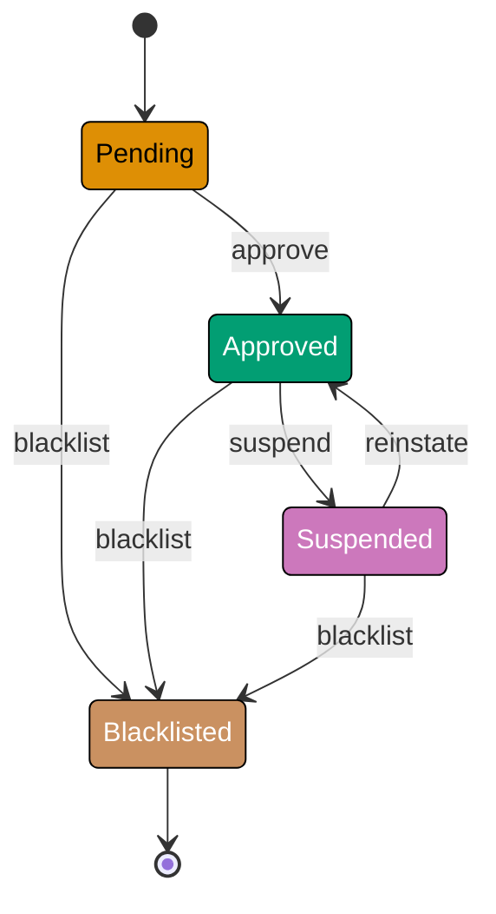
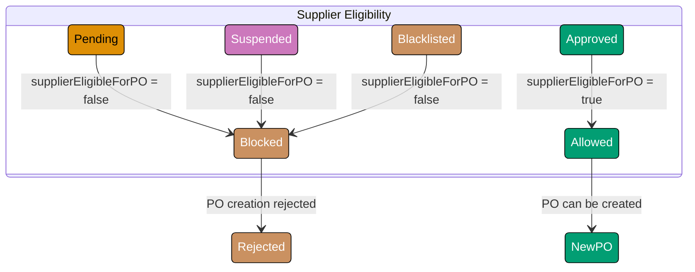
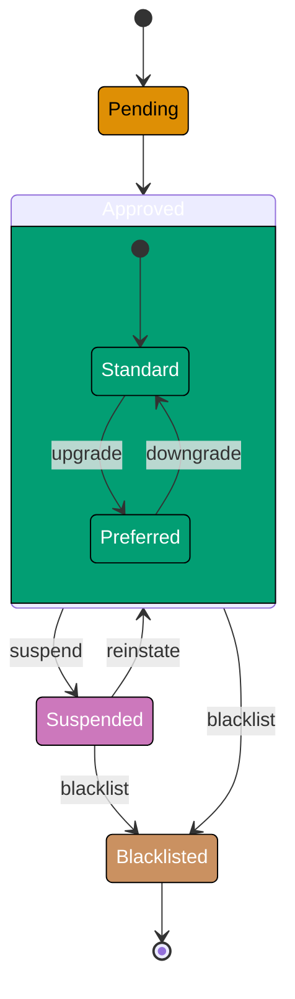
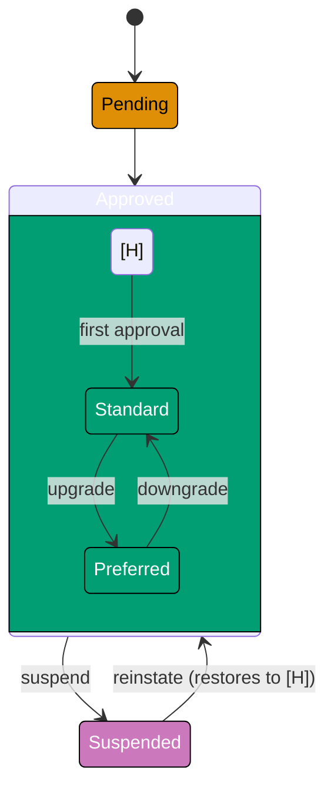
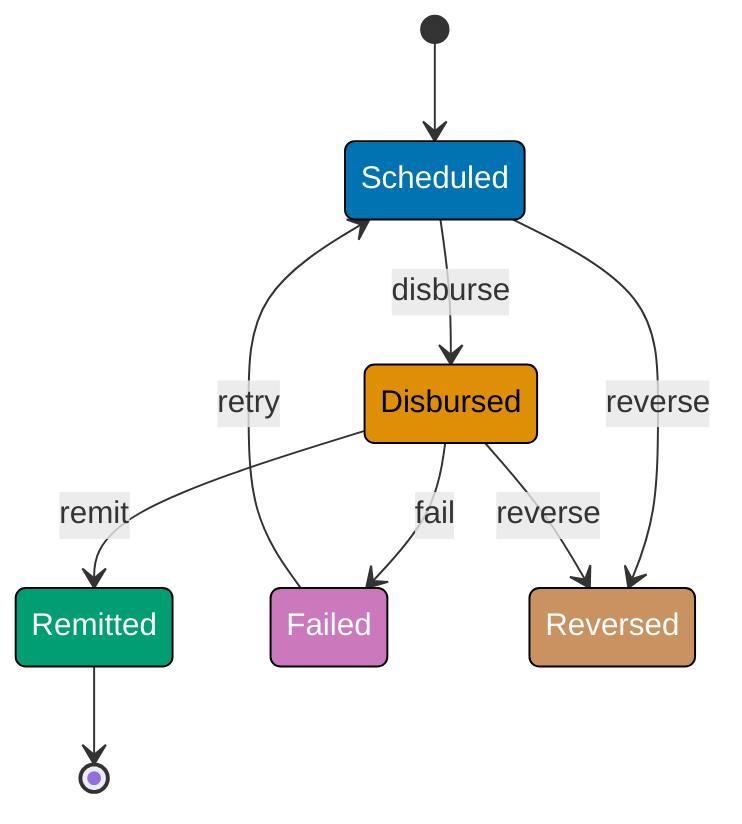
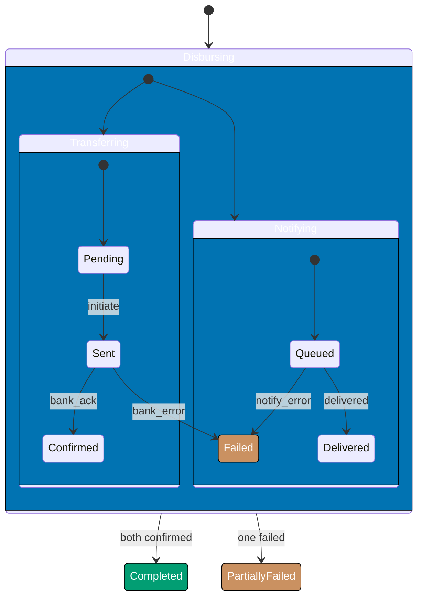
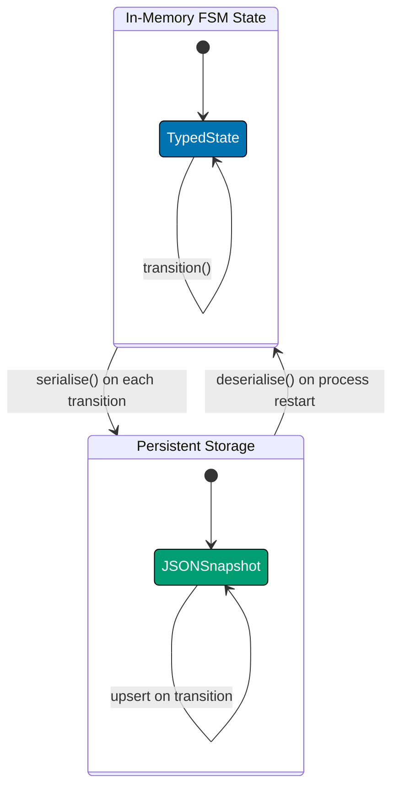
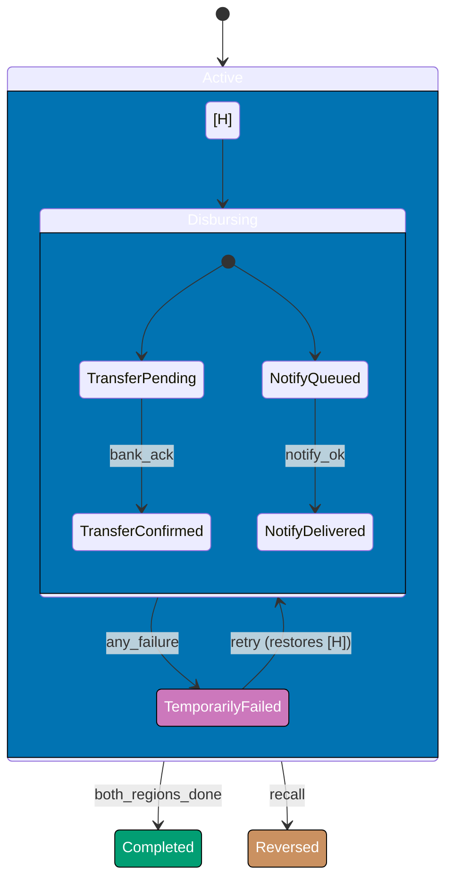
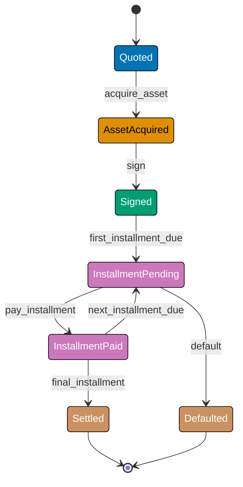
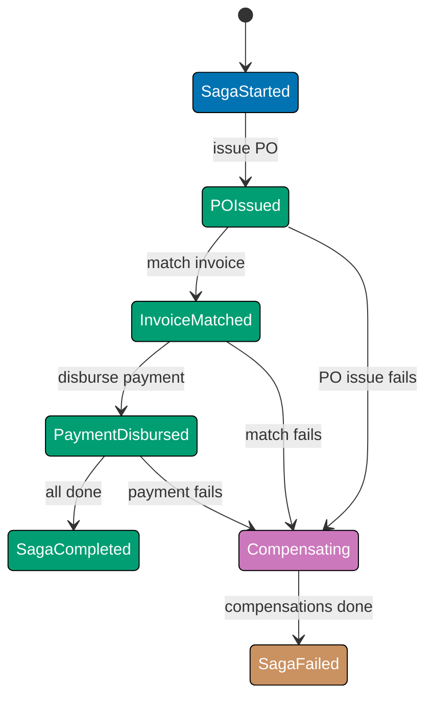

This advanced tutorial adds the `Supplier` lifecycle and `Payment` state machine from the `procurement-platform-be` domain, then teaches the concepts that turn flat FSMs into statecharts: hierarchical states, parallel regions, history states, FSM persistence, event-sourcing intersection, and actor-model integration. The `MurabahaContract` machine appears in the final section as an optional Sharia-finance angle.

## Supplier Lifecycle FSM (Examples 51-57)

### Example 51: Supplier States and Risk-Tier Semantics

A `Supplier` record tracks vendor approval status. Unlike `PurchaseOrder`, the Supplier machine has only four states but each state carries meaningful consequences for the purchasing context.


```mermaid
stateDiagram-v2
    [*] --> Pending
    Pending --> Approved: approve
    Pending --> Blacklisted: blacklist
    Approved --> Suspended: suspend
    Approved --> Blacklisted: blacklist
    Suspended --> Approved: reinstate
    Suspended --> Blacklisted: blacklist
    Blacklisted --> [*]

    classDef pending fill:#DE8F05,stroke:#000,color:#000
    classDef approved fill:#029E73,stroke:#000,color:#fff
    classDef suspended fill:#CC78BC,stroke:#000,color:#fff
    classDef blacklisted fill:#CA9161,stroke:#000,color:#fff

    class Pending pending
    class Approved approved
    class Suspended suspended
    class Blacklisted blacklisted
```

```typescript
// => Supplier state sealed type: four states, one terminal
type SupplierState =
  | "Pending" // => Application received; vetting in progress
  | "Approved" // => Cleared for new POs; appears in supplier selection
  | "Suspended" // => Temporarily blocked: no new POs, existing POs continue
  | "Blacklisted"; // => Permanently excluded: existing POs forced to Disputed — terminal

// => Supplier event alphabet
type SupplierEvent =
  | "approve" // => Vetting passed; supplier cleared
  | "suspend" // => Compliance issue; temporary hold
  | "reinstate" // => Issue resolved; supplier restored
  | "blacklist"; // => Severe breach; permanent exclusion

// => Supplier record — immutable
interface Supplier {
  readonly id: string; // => Format: sup_<uuid>
  readonly name: string; // => Supplier legal name
  readonly state: SupplierState;
}

// => Transition table
const SUPPLIER_TRANSITIONS: Partial<Record<SupplierState, Partial<Record<SupplierEvent, SupplierState>>>> = {
  Pending: { approve: "Approved", blacklist: "Blacklisted" },
  // => Pending suppliers can only be approved or immediately blacklisted
  Approved: { suspend: "Suspended", blacklist: "Blacklisted" },
  // => Approved suppliers can be suspended (reversible) or blacklisted (permanent)
  Suspended: { reinstate: "Approved", blacklist: "Blacklisted" },
  // => Suspended can recover (reinstate) or escalate (blacklist)
  // => Blacklisted: terminal — no outgoing transitions
};

// => Pure transition function (same Result pattern as other machines)
type Result<T> = { ok: true; value: T } | { ok: false; error: string };

function transitionSupplier(sup: Supplier, event: SupplierEvent): Result<Supplier> {
  const next = SUPPLIER_TRANSITIONS[sup.state]?.[event];
  if (!next) return { ok: false, error: `${sup.state} --${event}--> (forbidden)` };
  return { ok: true, value: { ...sup, state: next } };
}

const sup: Supplier = { id: "sup_001", name: "Acme Supplies Ltd", state: "Approved" };
const r1 = transitionSupplier(sup, "suspend");
if (r1.ok) console.log(r1.value.state); // => Output: Suspended

const r2 = transitionSupplier(r1.ok ? r1.value : sup, "reinstate");
if (r2.ok) console.log(r2.value.state); // => Output: Approved

const r3 = transitionSupplier(sup, "approve"); // => Invalid: already Approved
if (!r3.ok) console.log(r3.error); // => Output: Approved --approve--> (forbidden)
```

**Key Takeaway**: Even a four-state machine encodes significant business rules — the asymmetry between `Suspended` (reversible) and `Blacklisted` (terminal) is the entire compliance enforcement model.

**Why It Matters**: The distinction between suspended and blacklisted is a legal and audit concern: suspended suppliers can be reinstated after a compliance review, while blacklisted suppliers require a board-level decision to re-engage. Encoding this in the FSM makes the distinction structural — you cannot accidentally reinstate a blacklisted supplier without changing the machine definition.

---

### Example 52: Supplier State Consequences on PO Selection

The Supplier FSM state gates which suppliers are selectable for new POs — a guard function on the purchasing context reads Supplier state.


```mermaid
stateDiagram-v2
    state "Supplier Eligibility" as Check {
        Pending --> Blocked: supplierEligibleForPO = false
        Approved --> Allowed: supplierEligibleForPO = true
        Suspended --> Blocked: supplierEligibleForPO = false
        Blacklisted --> Blocked: supplierEligibleForPO = false
    }

    Allowed --> NewPO: PO can be created
    Blocked --> Rejected: PO creation rejected

    classDef allowed fill:#029E73,stroke:#000,color:#fff
    classDef blocked fill:#CA9161,stroke:#000,color:#fff
    classDef pending fill:#DE8F05,stroke:#000,color:#000
    classDef suspended fill:#CC78BC,stroke:#000,color:#fff

    class Approved,Allowed,NewPO allowed
    class Pending pending
    class Suspended suspended
    class Blacklisted,Blocked,Rejected blocked
```

```typescript
// => Guard: can a supplier receive a new PO?
// => Reads supplier state; returns true only for Approved
function supplierEligibleForPO(supplierState: SupplierState): boolean {
  return supplierState === "Approved";
  // => Only Approved: Pending suppliers are unvetted, Suspended cannot receive new POs
}

// => Guard: does the Supplier blacklisting force existing POs to Disputed?
// => Domain rule: blacklisting triggers dispute on all open POs
function blacklistingForcesDispute(newState: SupplierState, oldState: SupplierState): boolean {
  return newState === "Blacklisted" && oldState !== "Blacklisted";
  // => Transition into Blacklisted: all existing POs for this supplier must be disputed
}

// => Supplier blacklist with PO side-effect model
interface BlacklistResult {
  supplier: Supplier;
  affectedPOIds: string[]; // => PO ids that must be force-disputed
}

function blacklistSupplier(sup: Supplier, openPOIds: string[]): Result<BlacklistResult> {
  if (sup.state === "Blacklisted") {
    return { ok: false, error: `Supplier ${sup.id} is already blacklisted` };
    // => Idempotent: no-op if already blacklisted
  }
  const r = transitionSupplier(sup, "blacklist");
  if (!r.ok) return r as Result<BlacklistResult>;
  // => Transition failed: pass error through

  const affectedPOIds = blacklistingForcesDispute(r.value.state, sup.state) ? openPOIds : [];
  // => If transitioning into Blacklisted: all open POs are affected

  return { ok: true, value: { supplier: r.value, affectedPOIds } };
}

console.log(supplierEligibleForPO("Approved")); // => Output: true
console.log(supplierEligibleForPO("Suspended")); // => Output: false
console.log(supplierEligibleForPO("Pending")); // => Output: false

const sup: Supplier = { id: "sup_002", name: "Beta Corp", state: "Approved" };
const openPOs = ["po_101", "po_102", "po_103"];
const bl = blacklistSupplier(sup, openPOs);
if (bl.ok) {
  console.log(bl.value.supplier.state); // => Output: Blacklisted
  console.log(bl.value.affectedPOIds.length); // => Output: 3
}
```

**Key Takeaway**: Cross-machine effects (blacklisting a supplier forces all their open POs to Disputed) are encoded as explicit functions that return the affected entity IDs — the caller is responsible for applying the cascading changes.

**Why It Matters**: Cascading state changes across aggregates must be explicit, not implicit. If the blacklist function automatically mutated POs inside itself, it would be doing two different aggregate's work, violating aggregate boundaries. Returning `affectedPOIds` lets the application service handle each PO transition independently — maintaining clear ownership boundaries.

---

### Example 53: Supplier Risk Score Guard

Supplier approval might require a minimum risk score. A numeric guard on the `approve` transition enforces the risk threshold.

```typescript
// => Supplier application: carries vetting data
interface SupplierApplication {
  supplierId: string;
  riskScore: number; // => 0.0 (high risk) to 1.0 (low risk); computed by risk engine
  hasDocuments: boolean; // => Required compliance documents submitted?
}

// => Minimum approval thresholds
const APPROVAL_THRESHOLDS = {
  minRiskScore: 0.6, // => Below 0.6: too risky to approve
  requireDocuments: true, // => Documents must be submitted
};

// => Guard: is the supplier application sufficient for approval?
function canApproveSupplier(app: SupplierApplication): string[] {
  const errors: string[] = [];
  if (app.riskScore < APPROVAL_THRESHOLDS.minRiskScore) {
    errors.push(`Risk score ${app.riskScore.toFixed(2)} below minimum ${APPROVAL_THRESHOLDS.minRiskScore}`);
    // => Risk too high: supplier not ready for approval
  }
  if (APPROVAL_THRESHOLDS.requireDocuments && !app.hasDocuments) {
    errors.push("Required compliance documents not submitted");
    // => Missing documents: cannot approve without them
  }
  return errors; // => Empty array: guard passes; non-empty: guard fails with reasons
}

// => Guarded approve transition
function approveSupplier(sup: Supplier, app: SupplierApplication): Result<Supplier> {
  if (sup.state !== "Pending") {
    return { ok: false, error: `Supplier ${sup.id} is not in Pending state` };
    // => FSM guard: approve only valid from Pending
  }
  const errors = canApproveSupplier(app);
  if (errors.length > 0) {
    return { ok: false, error: `Approval blocked: ${errors.join("; ")}` };
    // => Business guard: return all blocking reasons
  }
  return { ok: true, value: { ...sup, state: "Approved" } };
}

const sup: Supplier = { id: "sup_003", name: "Gamma Ltd", state: "Pending" };

// => Low risk score and missing documents
const badApp: SupplierApplication = { supplierId: "sup_003", riskScore: 0.45, hasDocuments: false };
const r1 = approveSupplier(sup, badApp);
if (!r1.ok) console.log(r1.error);
// => Output: Approval blocked: Risk score 0.45 below minimum 0.6; Required compliance documents not submitted

// => Good application
const goodApp: SupplierApplication = { supplierId: "sup_003", riskScore: 0.75, hasDocuments: true };
const r2 = approveSupplier(sup, goodApp);
if (r2.ok) console.log(r2.value.state); // => Output: Approved
```

**Key Takeaway**: Multi-criteria guards return all failing reasons at once — the supplier vetting officer sees the complete list of issues, not just the first one.

**Why It Matters**: In supplier onboarding, a blocked application needs to be actioned by a compliance officer who may be in a different team from the risk analyst. Returning all blocking reasons in one response means both teams can work in parallel on their respective issues rather than discovering problems sequentially.

---

### Example 54: Hierarchical States — Supplier with Sub-States

The `Approved` state can have sub-states representing tier levels (PreferredVendor, StandardVendor). Hierarchical states model this without duplicating the Approved → Suspended and Approved → Blacklisted transitions for each tier.


```mermaid
stateDiagram-v2
    [*] --> Pending
    Pending --> Approved
    state Approved {
        [*] --> Standard
        Standard --> Preferred: upgrade
        Preferred --> Standard: downgrade
    }
    Approved --> Suspended: suspend
    Approved --> Blacklisted: blacklist
    Suspended --> Approved: reinstate
    Suspended --> Blacklisted: blacklist
    Blacklisted --> [*]

    classDef pending fill:#DE8F05,stroke:#000,color:#000
    classDef approved fill:#029E73,stroke:#000,color:#fff
    classDef suspended fill:#CC78BC,stroke:#000,color:#fff
    classDef blacklisted fill:#CA9161,stroke:#000,color:#fff

    class Pending pending
    class Approved,Standard,Preferred approved
    class Suspended suspended
    class Blacklisted blacklisted
```

```typescript
// => Hierarchical supplier state using dot notation
type HierarchicalSupplierState =
  | "Pending"
  | "Approved.Standard" // => Regular approved supplier
  | "Approved.Preferred" // => High-volume, negotiated terms
  | "Suspended"
  | "Blacklisted";

// => Helper: check if state is within the Approved parent state
function isApproved(state: HierarchicalSupplierState): boolean {
  return state.startsWith("Approved.");
  // => Both Approved.Standard and Approved.Preferred are "Approved"
}

// => Parent-level transitions: apply regardless of Approved sub-state
const PARENT_TRANSITIONS: Partial<Record<string, Partial<Record<SupplierEvent, HierarchicalSupplierState>>>> = {
  Pending: { approve: "Approved.Standard", blacklist: "Blacklisted" },
  Suspended: { reinstate: "Approved.Standard", blacklist: "Blacklisted" },
  Blacklisted: {},
};

// => Sub-state transitions within Approved
const APPROVED_SUBSTATE_TRANSITIONS: Partial<
  Record<HierarchicalSupplierState, Partial<Record<string, HierarchicalSupplierState>>>
> = {
  "Approved.Standard": { promote: "Approved.Preferred" },
  // => Standard → Preferred: supplier promoted to preferred tier
  "Approved.Preferred": { demote: "Approved.Standard" },
  // => Preferred → Standard: tier reduced (e.g., missed SLA)
};

// => Combined transition: parent takes priority, then sub-state
function hierarchicalTransition(
  state: HierarchicalSupplierState,
  event: SupplierEvent | "promote" | "demote",
): HierarchicalSupplierState | undefined {
  // => Check parent-level transitions first (suspension, blacklist apply to all Approved substates)
  if (isApproved(state) && (event === "suspend" || event === "blacklist")) {
    return event === "suspend" ? "Suspended" : "Blacklisted";
    // => Parent transition fires regardless of substate (Standard or Preferred)
  }
  // => Check sub-state transitions
  return (
    (APPROVED_SUBSTATE_TRANSITIONS[state] as Record<string, HierarchicalSupplierState> | undefined)?.[event] ??
    (PARENT_TRANSITIONS[state] as Record<string, HierarchicalSupplierState> | undefined)?.[event]
  );
  // => Sub-state first; fall back to parent transitions
}

console.log(hierarchicalTransition("Approved.Preferred", "suspend"));
// => Output: Suspended (parent transition: applies to any Approved substate)

console.log(hierarchicalTransition("Approved.Standard", "promote"));
// => Output: Approved.Preferred (sub-state transition)

console.log(hierarchicalTransition("Approved.Preferred", "blacklist"));
// => Output: Blacklisted (parent transition even from Preferred)
```

**Key Takeaway**: Hierarchical states eliminate transition duplication — parent-level transitions (suspend, blacklist) are defined once and inherited by all sub-states.

**Why It Matters**: Without hierarchy, `Approved.Standard` and `Approved.Preferred` would each need their own `suspend` and `blacklist` entries. With five approved sub-states (Standard, Preferred, Strategic, Probation, Trial), the duplication becomes six copies of the same transitions. Hierarchy keeps the machine maintainable as sub-states proliferate.

---

### Example 55: History States — Restoring Previous Sub-State After Suspension

When a supplier is reinstated after suspension, they should return to their previous Approved sub-state (Standard or Preferred), not always to Standard. History states enable this.


```mermaid
stateDiagram-v2
    [*] --> Pending
    Pending --> Approved
    state Approved {
        [H] --> Standard: first approval
        Standard --> Preferred: upgrade
        Preferred --> Standard: downgrade
    }
    Approved --> Suspended: suspend
    Suspended --> Approved: reinstate (restores to [H])

    classDef pending fill:#DE8F05,stroke:#000,color:#000
    classDef approved fill:#029E73,stroke:#000,color:#fff
    classDef suspended fill:#CC78BC,stroke:#000,color:#fff

    class Pending pending
    class Approved,Standard,Preferred approved
    class Suspended suspended
```

```typescript
// => Supplier with history state: remembers the last Approved sub-state
interface SupplierWithHistory {
  readonly id: string;
  readonly name: string;
  readonly state: HierarchicalSupplierState;
  readonly historyState: HierarchicalSupplierState | null;
  // => Last Approved sub-state, or null if never approved
}

// => Suspend: save current sub-state to history before transitioning
function suspendSupplier(sup: SupplierWithHistory): Result<SupplierWithHistory> {
  if (!isApproved(sup.state)) {
    return { ok: false, error: `Cannot suspend: supplier is ${sup.state}, not Approved` };
  }
  return {
    ok: true,
    value: {
      ...sup,
      state: "Suspended",
      historyState: sup.state, // => Save current sub-state to history
      // => When reinstated, history state is restored rather than defaulting to Standard
    },
  };
}

// => Reinstate: restore from history state, or default to Standard if no history
function reinstateSupplier(sup: SupplierWithHistory): Result<SupplierWithHistory> {
  if (sup.state !== "Suspended") {
    return { ok: false, error: `Cannot reinstate: supplier is ${sup.state}` };
  }
  const restoredState = sup.historyState ?? "Approved.Standard";
  // => History state: restore exactly where they were; null means first-time approval defaults to Standard
  return {
    ok: true,
    value: {
      ...sup,
      state: restoredState, // => Restore to saved sub-state
      historyState: null, // => Clear history: no longer suspended
    },
  };
}

const preferred: SupplierWithHistory = {
  id: "sup_004",
  name: "Delta Corp",
  state: "Approved.Preferred",
  historyState: null,
};

const r1 = suspendSupplier(preferred);
if (r1.ok) {
  console.log(r1.value.state); // => Output: Suspended
  console.log(r1.value.historyState); // => Output: Approved.Preferred

  const r2 = reinstateSupplier(r1.value);
  if (r2.ok) {
    console.log(r2.value.state); // => Output: Approved.Preferred (restored, not Standard)
    console.log(r2.value.historyState); // => Output: null (cleared after reinstatement)
  }
}
```

**Key Takeaway**: History states preserve context across temporary deviations — the machine resumes exactly where it left off, not at some default sub-state.

**Why It Matters**: Without history, reinstating a preferred supplier would drop them to Standard tier, removing their negotiated pricing terms. With history, the system restores them exactly where they were — the suspension was a temporary hold, not a tier reset. This distinction matters financially: preferred terms often represent negotiated discounts of 10-20%.

---

### Example 56: Python Supplier FSM with Enum

Python enums provide the same sealed-type guarantees as TypeScript union types for the Supplier machine.

```python
from enum import Enum, auto
from dataclasses import dataclass, replace
from typing import Optional, Set

class SupplierState(Enum):
    PENDING     = auto()  # => Vetting in progress
    APPROVED    = auto()  # => Cleared for POs
    SUSPENDED   = auto()  # => Temporary hold
    BLACKLISTED = auto()  # => Permanent exclusion — terminal

class SupplierEvent(Enum):
    APPROVE    = auto()
    SUSPEND    = auto()
    REINSTATE  = auto()
    BLACKLIST  = auto()

@dataclass(frozen=True)
class Supplier:
    id: str
    name: str
    state: SupplierState  # => Type is the enum, not a plain string

# Transition table using enum keys
TRANSITIONS: dict[SupplierState, dict[SupplierEvent, SupplierState]] = {
    SupplierState.PENDING:    {SupplierEvent.APPROVE: SupplierState.APPROVED,
                               SupplierEvent.BLACKLIST: SupplierState.BLACKLISTED},
    SupplierState.APPROVED:   {SupplierEvent.SUSPEND: SupplierState.SUSPENDED,
                               SupplierEvent.BLACKLIST: SupplierState.BLACKLISTED},
    SupplierState.SUSPENDED:  {SupplierEvent.REINSTATE: SupplierState.APPROVED,
                               SupplierEvent.BLACKLIST: SupplierState.BLACKLISTED},
    # => BLACKLISTED: no entry — terminal
}

def apply_event(supplier: Supplier, event: SupplierEvent) -> tuple:
    next_state = TRANSITIONS.get(supplier.state, {}).get(event)
    # => Two-level dict lookup with enum keys: type-safe, O(1)
    if next_state is None:
        return None, f"Invalid: {supplier.state.name} --{event.name}-->"
    return replace(supplier, state=next_state), None

sup = Supplier(id="sup_005", name="Epsilon Ltd", state=SupplierState.PENDING)
new_sup, err = apply_event(sup, SupplierEvent.APPROVE)
print(new_sup.state)  # => Output: SupplierState.APPROVED

_, err2 = apply_event(new_sup, SupplierEvent.APPROVE)  # => Invalid from APPROVED
print(err2)  # => Output: Invalid: APPROVED --APPROVE-->

# Blacklist: terminal — no reinstatement possible
bl_sup, _ = apply_event(new_sup, SupplierEvent.BLACKLIST)
print(bl_sup.state)  # => Output: SupplierState.BLACKLISTED
_, err3 = apply_event(bl_sup, SupplierEvent.REINSTATE)
print(err3)  # => Output: Invalid: BLACKLISTED --REINSTATE-->
```

**Key Takeaway**: Python `Enum` with `auto()` values avoids magic strings entirely — the transition table keys are enum members, so typos are caught at import time, not at runtime.

**Why It Matters**: Python dicts with string keys (`{"approved": {"suspend": "suspended"}}`) are common but fragile: `"APPROVED"` vs `"approved"` silently misses the key. Enum keys fail immediately at module load if an undefined member is used — the same safety guarantee as TypeScript's union type, in Python idiom.

---

### Example 57: Supplier Blacklisting Cascade — Forcing POs to Disputed

When a supplier is blacklisted, the domain rule requires all their open POs to be forced into the `Disputed` state. This example implements the cascade as a pure function.

```typescript
// => Open PO record: minimal shape needed for the cascade
interface OpenPO {
  id: string;
  supplierId: string;
  state: string; // => Using string to avoid importing full POState here
}

// => Cascade result: which POs must be disputed, and the blacklisted supplier
interface BlacklistCascade {
  blacklistedSupplier: Supplier;
  posToDispute: OpenPO[]; // => These POs must be transitioned to Disputed
  posAlreadyClosed: OpenPO[]; // => Already terminal; no action needed
}

// => Non-disputable states: POs in these states are unaffected by blacklisting
const TERMINAL_PO_STATES = new Set(["Closed", "Cancelled", "Paid"]);

function computeBlacklistCascade(sup: Supplier, openPOs: readonly OpenPO[]): Result<BlacklistCascade> {
  // => FSM transition
  const r = transitionSupplier(sup, "blacklist");
  if (!r.ok) return r as Result<BlacklistCascade>;

  const supplierPOs = openPOs.filter((po) => po.supplierId === sup.id);
  // => Filter to this supplier's POs only

  const posToDispute = supplierPOs.filter((po) => !TERMINAL_PO_STATES.has(po.state));
  // => Non-terminal POs: must be disputed
  const posAlreadyClosed = supplierPOs.filter((po) => TERMINAL_PO_STATES.has(po.state));
  // => Terminal POs: already complete, no action needed

  return {
    ok: true,
    value: {
      blacklistedSupplier: r.value,
      posToDispute,
      posAlreadyClosed,
    },
  };
}

const sup: Supplier = { id: "sup_006", name: "Zeta Ltd", state: "Approved" };
const pos: OpenPO[] = [
  { id: "po_201", supplierId: "sup_006", state: "Acknowledged" }, // => Must dispute
  { id: "po_202", supplierId: "sup_006", state: "Issued" }, // => Must dispute
  { id: "po_203", supplierId: "sup_006", state: "Closed" }, // => Terminal: skip
  { id: "po_204", supplierId: "sup_007", state: "Approved" }, // => Different supplier: ignore
];

const cascade = computeBlacklistCascade(sup, pos);
if (cascade.ok) {
  console.log(cascade.value.blacklistedSupplier.state); // => Output: Blacklisted
  console.log(cascade.value.posToDispute.map((p) => p.id));
  // => Output: [ 'po_201', 'po_202' ]
  console.log(cascade.value.posAlreadyClosed.map((p) => p.id));
  // => Output: [ 'po_203' ]
}
```

**Key Takeaway**: Cross-aggregate cascade effects are computed as pure functions returning IDs — the application service applies each change using the individual aggregate's own FSM.

**Why It Matters**: Applying the cascade inside `computeBlacklistCascade` would violate aggregate boundaries. Returning `posToDispute` as IDs keeps the function a pure computation — no side effects, easily testable. The application service then loops over the IDs and calls `disputePO` for each — each PO's FSM enforces its own invariants independently.

---

## Payment State Machine (Examples 58-64)

### Example 58: Payment States and the Disbursement Lifecycle

The `Payment` aggregate models the financial leg of the P2P cycle: a payment is scheduled, disbursed to the supplier's bank account, remitted (supplier confirms receipt), and potentially fails or is reversed.


```mermaid
stateDiagram-v2
    [*] --> Scheduled
    Scheduled --> Disbursed: disburse
    Disbursed --> Remitted: remit
    Disbursed --> Failed: fail
    Failed --> Scheduled: retry
    Remitted --> [*]
    Scheduled --> Reversed: reverse
    Disbursed --> Reversed: reverse

    classDef scheduled fill:#0173B2,stroke:#000,color:#fff
    classDef disbursed fill:#DE8F05,stroke:#000,color:#000
    classDef remitted fill:#029E73,stroke:#000,color:#fff
    classDef failed fill:#CC78BC,stroke:#000,color:#fff
    classDef reversed fill:#CA9161,stroke:#000,color:#fff

    class Scheduled scheduled
    class Disbursed disbursed
    class Remitted remitted
    class Failed failed
    class Reversed reversed
```

```typescript
// => Payment state: financial disbursement lifecycle
type PaymentState =
  | "Scheduled" // => Payment run queued; amount and bank details confirmed
  | "Disbursed" // => Bank API call made; funds in transit
  | "Remitted" // => Supplier confirmed receipt — terminal
  | "Failed" // => Bank rejected or timed out; retry eligible
  | "Reversed"; // => Payment recalled — terminal

// => Payment event alphabet
type PaymentEvent =
  | "disburse" // => Bank API initiates transfer
  | "remit" // => Supplier confirms receipt
  | "fail" // => Bank reports failure
  | "retry" // => Requeue for next payment run
  | "reverse"; // => Recall the payment

// => Payment record
interface Payment {
  readonly id: string; // => Format: pay_<uuid>
  readonly invoiceId: string; // => Links to Invoice (which must be in ScheduledForPayment)
  readonly amount: number; // => USD amount to disburse
  readonly bankAccount: string; // => Supplier IBAN
  readonly state: PaymentState;
}

// => Transition table
const PAYMENT_TRANSITIONS: Partial<Record<PaymentState, Partial<Record<PaymentEvent, PaymentState>>>> = {
  Scheduled: { disburse: "Disbursed", reverse: "Reversed" },
  // => Scheduled can be disbursed or reversed before disbursement
  Disbursed: { remit: "Remitted", fail: "Failed", reverse: "Reversed" },
  // => Disbursed: three outcomes — confirmed, failed, or recalled
  Failed: { retry: "Scheduled" },
  // => Failed: only option is to retry (re-enter Scheduled for next payment run)
  // => Remitted, Reversed: terminal — no outgoing transitions
};

type Result<T> = { ok: true; value: T } | { ok: false; error: string };

function applyPaymentEvent(pmt: Payment, event: PaymentEvent): Result<Payment> {
  const next = PAYMENT_TRANSITIONS[pmt.state]?.[event];
  if (!next) return { ok: false, error: `${pmt.state} --${event}--> (forbidden)` };
  return { ok: true, value: { ...pmt, state: next } };
}

const pmt: Payment = {
  id: "pay_001",
  invoiceId: "inv_007",
  amount: 5000,
  bankAccount: "GB29NWBK60161331926819",
  state: "Scheduled",
};
const r1 = applyPaymentEvent(pmt, "disburse");
if (r1.ok) console.log(r1.value.state); // => Output: Disbursed

const r2 = applyPaymentEvent(r1.ok ? r1.value : pmt, "fail");
if (r2.ok) console.log(r2.value.state); // => Output: Failed

const r3 = applyPaymentEvent(r2.ok ? r2.value : pmt, "retry");
if (r3.ok) console.log(r3.value.state); // => Output: Scheduled (back to queue)
```

**Key Takeaway**: The `Failed → Scheduled` self-retry loop models the payment run retry policy — a payment can attempt disbursement multiple times before being manually reversed.

**Why It Matters**: Bank APIs fail. Network timeouts, insufficient funds, and format errors are normal operational events. Modelling `Failed` as a non-terminal state with a `retry` transition makes the retry policy explicit in the FSM — the system can automatically re-queue payments without human intervention, and the audit trail records each attempt separately.

---

### Example 59: Payment Retry Limit Guard

Without a retry limit, a payment could cycle through `Failed → Scheduled → Disbursed → Failed` indefinitely. A retry counter guards the `retry` transition.

```typescript
// => Extended payment: tracks retry attempts
interface PaymentWithRetries extends Payment {
  readonly retryCount: number; // => How many times this payment has been retried
  readonly maxRetries: number; // => Policy maximum (typically 3)
}

// => Guard: can this payment be retried?
function canRetryPayment(pmt: PaymentWithRetries): boolean {
  return pmt.retryCount < pmt.maxRetries;
  // => Below limit: retry allowed; at limit: must reverse or escalate
}

// => Guarded retry transition
function retryPayment(pmt: PaymentWithRetries): Result<PaymentWithRetries> {
  if (pmt.state !== "Failed") {
    return { ok: false, error: `Cannot retry payment in state ${pmt.state}` };
    // => FSM guard: retry only valid from Failed
  }
  if (!canRetryPayment(pmt)) {
    return {
      ok: false,
      error: `Payment ${pmt.id} exceeded retry limit (${pmt.maxRetries}); manual reversal required`,
      // => Policy guard: too many retries — escalate to finance team
    };
  }
  return {
    ok: true,
    value: {
      ...pmt,
      state: "Scheduled", // => Back to payment queue
      retryCount: pmt.retryCount + 1, // => Increment retry counter
    },
  };
}

const failedPmt: PaymentWithRetries = {
  id: "pay_002",
  invoiceId: "inv_008",
  amount: 3000,
  bankAccount: "GB29NWBK60161331926819",
  state: "Failed",
  retryCount: 2,
  maxRetries: 3,
};

const r1 = retryPayment(failedPmt);
if (r1.ok) console.log(`${r1.value.state}, retries: ${r1.value.retryCount}`);
// => Output: Scheduled, retries: 3

const r2 = retryPayment(r1.ok ? r1.value : failedPmt);
// => r1.value is in Scheduled, not Failed: FSM guard fires
if (!r2.ok) console.log(r2.error);
// => Output: Cannot retry payment in state Scheduled

// => Simulate another failure to hit the retry limit
const atLimit: PaymentWithRetries = { ...failedPmt, retryCount: 3 };
const r3 = retryPayment(atLimit);
if (!r3.ok) console.log(r3.error);
// => Output: Payment pay_002 exceeded retry limit (3); manual reversal required
```

**Key Takeaway**: Retry limits are policy guards on the FSM, not operational logic in a cron job — the machine enforces the limit declaratively, and the cron job just sends events.

**Why It Matters**: Without a retry limit in the FSM, a misconfigured payment (wrong IBAN) would retry forever, generating bank API calls and audit entries indefinitely. The limit guard ensures the machine itself stops the loop — no additional circuit-breaker logic needed in the payment worker.

---

### Example 60: Parallel Regions — Payment + Notification

A payment disbursement has two parallel concerns: the financial transfer and the supplier notification. Parallel regions model these as concurrent sub-machines that must both complete before the parent advances.


```mermaid
stateDiagram-v2
    [*] --> Disbursing
    state Disbursing {
        [*] --> Transferring
        [*] --> Notifying
        state Transferring {
            [*] --> Pending
            Pending --> Sent: initiate
            Sent --> Confirmed: bank_ack
            Sent --> Failed: bank_error
        }
        state Notifying {
            [*] --> Queued
            Queued --> Delivered: delivered
            Queued --> Failed: notify_error
        }
    }
    Disbursing --> Completed: both confirmed
    Disbursing --> PartiallyFailed: one failed

    classDef disbursing fill:#0173B2,stroke:#000,color:#fff
    classDef completed fill:#029E73,stroke:#000,color:#fff
    classDef failed fill:#CA9161,stroke:#000,color:#fff

    class Disbursing,Transferring,Notifying disbursing
    class Completed completed
    class PartiallyFailed,Failed failed
```

```typescript
// => Parallel region state: both sub-regions tracked independently
interface ParallelPaymentState {
  transfer: "Pending" | "Sent" | "Confirmed" | "Failed"; // => Financial leg
  notification: "Queued" | "Sent" | "Delivered" | "Failed"; // => Supplier notification leg
}

// => Parallel payment: main state + two parallel sub-states
interface ParallelPayment {
  readonly id: string;
  readonly amount: number;
  readonly state: "Disbursing" | "Completed" | "PartiallyFailed" | "Failed";
  readonly regions: ParallelPaymentState;
}

// => Update a sub-region: returns new parallel state
function updateTransfer(regions: ParallelPaymentState, outcome: "Sent" | "Confirmed" | "Failed"): ParallelPaymentState {
  return { ...regions, transfer: outcome };
  // => Only transfer region updated; notification region unchanged
}

function updateNotification(
  regions: ParallelPaymentState,
  outcome: "Sent" | "Delivered" | "Failed",
): ParallelPaymentState {
  return { ...regions, notification: outcome };
  // => Only notification region updated; transfer region unchanged
}

// => Evaluate overall state from both regions
function evaluateParallelState(regions: ParallelPaymentState): ParallelPayment["state"] {
  const transferDone = regions.transfer === "Confirmed";
  const notificationDone = regions.notification === "Delivered";
  const transferFailed = regions.transfer === "Failed";
  const notificationFailed = regions.notification === "Failed";

  if (transferDone && notificationDone) return "Completed";
  // => Both succeeded: payment fully complete
  if (transferFailed && notificationFailed) return "Failed";
  // => Both failed: complete failure
  if (transferFailed || notificationFailed) return "PartiallyFailed";
  // => One failed: partial failure — needs investigation
  return "Disbursing";
  // => Still in progress: neither region is in a terminal state
}

// => Simulate parallel execution
let regions: ParallelPaymentState = { transfer: "Pending", notification: "Queued" };
regions = updateTransfer(regions, "Sent");
regions = updateNotification(regions, "Sent");
console.log(evaluateParallelState(regions)); // => Output: Disbursing (neither confirmed/delivered)

regions = updateTransfer(regions, "Confirmed");
console.log(evaluateParallelState(regions)); // => Output: Disbursing (notification not delivered)

regions = updateNotification(regions, "Delivered");
console.log(evaluateParallelState(regions)); // => Output: Completed (both regions done)
```

**Key Takeaway**: Parallel regions track independent progress across concurrent concerns — the parent state advances only when all regions reach their terminal sub-states.

**Why It Matters**: Financial transfers and supplier notifications have different timing and failure modes. The bank API might succeed while the SMTP server is down. Without parallel regions, you need ad-hoc flags to track partial completion. With parallel regions, the structure makes it explicit: the payment is `Disbursing` until both regions complete, and `PartiallyFailed` if one fails — actionable, not ambiguous.

---

### Example 61: FSM Persistence — Serialising State to JSON

FSM state must survive process restarts. Serialising to JSON and deserialising back into the typed state record makes persistence straightforward.


```mermaid
stateDiagram-v2
    state "In-Memory FSM State" as Memory {
        [*] --> TypedState
        TypedState --> TypedState: transition()
    }

    state "Persistent Storage" as Store {
        [*] --> JSONSnapshot
        JSONSnapshot --> JSONSnapshot: upsert on transition
    }

    Memory --> Store: serialise() on each transition
    Store --> Memory: deserialise() on process restart

    classDef memory fill:#0173B2,stroke:#000,color:#fff
    classDef store fill:#029E73,stroke:#000,color:#fff

    class TypedState memory
    class JSONSnapshot store
```

```typescript
// => Serialisable payment snapshot: plain JSON-compatible object
interface PaymentSnapshot {
  id: string;
  invoiceId: string;
  amount: number;
  bankAccount: string;
  state: string; // => JSON: stored as string; deserialisers validate
  retryCount: number;
  maxRetries: number;
  savedAt: string; // => ISO 8601 timestamp
}

// => Serialise: Payment → JSON snapshot
function serialisePayment(pmt: PaymentWithRetries): PaymentSnapshot {
  return {
    id: pmt.id,
    invoiceId: pmt.invoiceId,
    amount: pmt.amount,
    bankAccount: pmt.bankAccount,
    state: pmt.state, // => Enum value → string for JSON
    retryCount: pmt.retryCount,
    maxRetries: pmt.maxRetries,
    savedAt: new Date().toISOString(),
  };
}

// => Deserialise: JSON snapshot → Payment record (with validation)
function deserialisePayment(snap: PaymentSnapshot): Result<PaymentWithRetries> {
  const validStates: PaymentState[] = ["Scheduled", "Disbursed", "Remitted", "Failed", "Reversed"];
  if (!validStates.includes(snap.state as PaymentState)) {
    return { ok: false, error: `Unknown payment state in snapshot: '${snap.state}'` };
    // => Guard: reject unknown state names (could be a migration issue)
  }
  return {
    ok: true,
    value: {
      id: snap.id,
      invoiceId: snap.invoiceId,
      amount: snap.amount,
      bankAccount: snap.bankAccount,
      state: snap.state as PaymentState, // => Validated cast: safe after guard
      retryCount: snap.retryCount,
      maxRetries: snap.maxRetries,
    },
  };
}

// => Roundtrip: serialise → JSON string → deserialise
const pmt: PaymentWithRetries = {
  id: "pay_003",
  invoiceId: "inv_009",
  amount: 2500,
  bankAccount: "GB29NWBK60161331926819",
  state: "Failed",
  retryCount: 1,
  maxRetries: 3,
};

const snap = serialisePayment(pmt);
const json = JSON.stringify(snap); // => Persist to database / file / message
const parsed = JSON.parse(json) as PaymentSnapshot;
const r = deserialisePayment(parsed);

if (r.ok) {
  console.log(r.value.state); // => Output: Failed
  console.log(r.value.retryCount); // => Output: 1
}
```

**Key Takeaway**: Validation on deserialisation catches migration failures at the boundary — the FSM itself never operates on unvalidated state strings.

**Why It Matters**: Without deserialisation validation, a database containing `"failed"` (lowercase, from a v1 schema) would crash the FSM at the first event, and the error message would be unhelpful. Validating at the boundary produces a clear error: "Unknown payment state: 'failed'" — immediately actionable as a migration task.

---

### Example 62: Event Sourcing Intersection — Rebuilding Payment from Events

Storing events instead of state means the Payment record is always rebuildable from its event log.

```typescript
// => Stored event: captured at every successful transition
interface PaymentEvent {
  readonly eventId: string; // => Unique event ID for deduplication
  readonly paymentId: string; // => Which payment
  readonly event: PaymentEvent_; // => Type alias to avoid name collision
  readonly timestamp: string; // => When the event occurred
}
type PaymentEvent_ = PaymentEvent; // => Circular ref workaround — in real code use separate types

// => Event log: the source of truth for payment history
type StoredEvent = { paymentId: string; event: PaymentEvent; timestamp: string };

// => Rebuild payment state by replaying events
function rebuildPayment(initialPayment: Payment, events: readonly StoredEvent[]): Result<Payment> {
  let current = initialPayment;

  for (const stored of events) {
    const r = applyPaymentEvent(current, stored.event as unknown as PaymentEvent);
    if (!r.ok) {
      return { ok: false, error: `Replay failed at event '${String(stored.event)}': ${r.error}` };
      // => Invalid event in stored sequence: data corruption or migration issue
    }
    current = r.value; // => Advance to next state
  }

  return { ok: true, value: current };
}

// => Example: rebuild from stored events
const initial: Payment = {
  id: "pay_004",
  invoiceId: "inv_010",
  amount: 4000,
  bankAccount: "GB29NWBK60161331926820",
  state: "Scheduled",
};
const history: StoredEvent[] = [
  { paymentId: "pay_004", event: "disburse" as unknown as PaymentEvent, timestamp: "2026-01-15T09:00:00Z" },
  { paymentId: "pay_004", event: "fail" as unknown as PaymentEvent, timestamp: "2026-01-15T09:05:00Z" },
  { paymentId: "pay_004", event: "retry" as unknown as PaymentEvent, timestamp: "2026-01-15T14:00:00Z" },
  { paymentId: "pay_004", event: "disburse" as unknown as PaymentEvent, timestamp: "2026-01-15T14:30:00Z" },
  { paymentId: "pay_004", event: "remit" as unknown as PaymentEvent, timestamp: "2026-01-16T08:00:00Z" },
];

const rebuilt = rebuildPayment(initial, history);
if (rebuilt.ok) {
  console.log(rebuilt.value.state); // => Output: Remitted
  // => Five events replayed: Scheduled → Disbursed → Failed → Scheduled → Disbursed → Remitted
}
```

**Key Takeaway**: A pure-function FSM is a natural event-sourcing projector — the rebuild function is just the transition function applied repeatedly over the event log.

**Why It Matters**: Event sourcing gives you a complete audit trail of every state a payment has been in, with timestamps. For regulatory purposes (e.g., SAMA, Central Bank requirements), being able to prove exactly when a payment moved from `Disbursed` to `Failed` and when it was retried is a compliance requirement. The event log satisfies this without any additional reporting infrastructure.

---

### Example 63: Statechart — Combining Hierarchical + Parallel + History

The `Payment` statechart uses all three statechart concepts: a hierarchical `Active` state containing the financial and notification parallel regions, a history state for reinstatement after temporary failure, and a top-level terminal pair.


```mermaid
stateDiagram-v2
    [*] --> Active
    state Active {
        [H] --> Disbursing
        state Disbursing {
            [*] --> TransferPending
            [*] --> NotifyQueued
            TransferPending --> TransferConfirmed: bank_ack
            NotifyQueued --> NotifyDelivered: notify_ok
        }
        Disbursing --> TemporarilyFailed: any_failure
        TemporarilyFailed --> Disbursing: retry (restores [H])
    }
    Active --> Completed: both_regions_done
    Active --> Reversed: recall

    classDef active fill:#0173B2,stroke:#000,color:#fff
    classDef completed fill:#029E73,stroke:#000,color:#fff
    classDef failed fill:#CC78BC,stroke:#000,color:#fff
    classDef terminal fill:#CA9161,stroke:#000,color:#fff

    class Active,Disbursing active
    class Completed completed
    class TemporarilyFailed failed
    class Reversed terminal
```

```typescript
// => Statechart state: hierarchical with parallel regions
type StatechartPaymentState =
  | { kind: "Active"; regions: ParallelPaymentState; history: ParallelPaymentState | null }
  // => Active: the payment is in progress; two parallel regions; history for recovery
  | { kind: "Completed" } // => Terminal: both regions succeeded
  | { kind: "Reversed" }; // => Terminal: payment recalled

// => Events for the statechart
type StatechartEvent =
  | { type: "transfer_sent" }
  | { type: "transfer_confirmed" }
  | { type: "transfer_failed" }
  | { type: "notification_sent" }
  | { type: "notification_delivered" }
  | { type: "notification_failed" }
  | { type: "reverse" }; // => Top-level: available from Active state

// => Apply event to the statechart
function applyStatechartEvent(state: StatechartPaymentState, event: StatechartEvent): StatechartPaymentState {
  if (state.kind !== "Active") return state; // => Terminal states: no further transitions

  const { regions } = state;

  switch (event.type) {
    case "transfer_sent":
      return { ...state, regions: { ...regions, transfer: "Sent" } };
    case "transfer_confirmed":
      return { ...state, regions: { ...regions, transfer: "Confirmed" } };
    // => Transfer confirmed; check if notification also done
    case "transfer_failed":
      return { ...state, regions: { ...regions, transfer: "Failed" }, history: regions }; // => Save current regions to history before failure
    case "notification_delivered":
      return { ...state, regions: { ...regions, notification: "Delivered" } };
    case "notification_failed":
      return { ...state, regions: { ...regions, notification: "Failed" } };
    case "reverse":
      return { kind: "Reversed" }; // => Top-level transition: exit Active entirely
    default:
      return state;
  }
}

// => Evaluate if Active state should advance to Completed
function checkCompletion(state: StatechartPaymentState): StatechartPaymentState {
  if (state.kind !== "Active") return state;
  const overall = evaluateParallelState(state.regions);
  if (overall === "Completed") return { kind: "Completed" };
  // => Both regions terminal: advance to Completed
  return state;
}

let sc: StatechartPaymentState = {
  kind: "Active",
  regions: { transfer: "Pending", notification: "Queued" },
  history: null,
};
sc = applyStatechartEvent(sc, { type: "transfer_confirmed" });
sc = applyStatechartEvent(sc, { type: "notification_delivered" });
sc = checkCompletion(sc);
console.log(sc.kind); // => Output: Completed (both regions done)
```

**Key Takeaway**: Statecharts — hierarchical + parallel + history — handle real-world complexity that flat FSMs cannot express without state explosion: the three concepts together keep state machines manageable at scale.

**Why It Matters**: A flat FSM for a payment with two parallel concerns would need one state per combination of (transfer-state × notification-state): 4 × 4 = 16 states. With parallel regions, it is 4 + 4 = 8 sub-states plus a composite parent. As the number of parallel concerns grows, the flat FSM grows quadratically; the statechart grows linearly.

---

### Example 64: Full P2P Machine Coverage Check

A runtime check that verifies all four machines cover their expected states — the machine specification as executable test.

```typescript
// => Expected coverage per machine from the domain spec
const EXPECTED_COVERAGE = {
  PurchaseOrder: {
    states: [
      "Draft",
      "AwaitingApproval",
      "Approved",
      "Issued",
      "Acknowledged",
      "PartiallyReceived",
      "Received",
      "Invoiced",
      "Paid",
      "Closed",
      "Cancelled",
      "Disputed",
    ],
    // => 12 states from the locked spec
  },
  Invoice: {
    states: ["Registered", "Matching", "Matched", "Disputed", "ScheduledForPayment", "Paid"],
    // => 6 states
  },
  Supplier: {
    states: ["Pending", "Approved", "Suspended", "Blacklisted"],
    // => 4 states
  },
  Payment: {
    states: ["Scheduled", "Disbursed", "Remitted", "Failed", "Reversed"],
    // => 5 states
  },
};

// => Coverage report: compare expected vs implemented
function coverageCheck(
  machineName: string,
  implementedTable: Partial<Record<string, Partial<Record<string, string>>>>,
  expected: string[],
): { covered: string[]; missing: string[]; extra: string[] } {
  const implemented = Object.keys(implementedTable);
  const covered = expected.filter((s) => implemented.includes(s));
  const missing = expected.filter((s) => !implemented.includes(s));
  const extra = implemented.filter((s) => !expected.includes(s));
  return { covered, missing, extra };
}

// => Check all four machines (using transition tables defined in this and previous files)
const paymentCheck = coverageCheck(
  "Payment",
  PAYMENT_TRANSITIONS as Record<string, Record<string, string>>,
  EXPECTED_COVERAGE.Payment.states,
);
console.log(`Payment covered: ${paymentCheck.covered.length}/${EXPECTED_COVERAGE.Payment.states.length}`);
// => Output: Payment covered: 3/5
// => Note: Remitted and Reversed have no outgoing transitions (terminal) so not in table keys
// => This is expected: terminal states appear as VALUES in the table, not as KEYS
console.log(`Terminal (not in table keys): Remitted, Reversed`);
// => Output: Terminal (not in table keys): Remitted, Reversed
```

**Key Takeaway**: A coverage check that runs as code — not a document — catches discrepancies between the domain spec and the implementation before they reach production.

**Why It Matters**: As the domain spec evolves, the coverage check automatically reports which new states are not yet implemented. This turns a manual audit (compare spec doc to code) into an automated gate that can run in CI — the spec is the test, and the implementation must keep up.

---

## Sharia-Finance Extension (Examples 65-67)

### Example 65: MurabahaContract State Machine (Optional)

The `MurabahaContract` aggregate models a Sharia-compliant financing arrangement where a bank purchases an asset and resells it to the buyer at an agreed markup. It is optional — not every P2P deployment uses murabaha financing.


```mermaid
stateDiagram-v2
    [*] --> Quoted
    Quoted --> AssetAcquired: acquire_asset
    AssetAcquired --> Signed: sign
    Signed --> InstallmentPending: first_installment_due
    InstallmentPending --> InstallmentPaid: pay_installment
    InstallmentPaid --> InstallmentPending: next_installment_due
    InstallmentPaid --> Settled: final_installment
    InstallmentPending --> Defaulted: default
    Settled --> [*]
    Defaulted --> [*]

    classDef quoted fill:#0173B2,stroke:#000,color:#fff
    classDef acquired fill:#DE8F05,stroke:#000,color:#000
    classDef signed fill:#029E73,stroke:#000,color:#fff
    classDef installment fill:#CC78BC,stroke:#000,color:#fff
    classDef terminal fill:#CA9161,stroke:#000,color:#fff

    class Quoted quoted
    class AssetAcquired acquired
    class Signed signed
    class InstallmentPending,InstallmentPaid installment
    class Settled,Defaulted terminal
```

```typescript
// => MurabahaContract: Sharia-compliant financing — bank buys asset, resells at markup
type MurabahaState =
  | "Quoted" // => Financing terms proposed by the murabaha bank
  | "AssetAcquired" // => Bank has purchased the underlying asset
  | "Signed" // => Buyer and bank signed the murabaha agreement
  | "InstallmentPending" // => Next installment due from buyer
  | "InstallmentPaid" // => Installment paid; more may follow
  | "Settled" // => All installments paid — terminal
  | "Defaulted"; // => Buyer failed to pay — terminal

type MurabahaEvent =
  | "acquire_asset" // => Bank purchases the asset from supplier
  | "sign" // => Agreement signed
  | "first_installment_due" // => Payment schedule begins
  | "pay_installment" // => Buyer pays one installment
  | "next_installment_due" // => Scheduler triggers next installment
  | "final_installment" // => Last installment: contract settles
  | "default"; // => Buyer misses payment; contract defaults

// => MurabahaMarkup value object: basis points (1 bp = 0.01%)
interface MurabahaMarkup {
  basisPoints: number; // => 0 < bp ≤ 5000 (max 50% markup, per domain spec)
}

interface MurabahaContract {
  readonly id: string; // => Contract reference
  readonly poId: string; // => Links to PurchaseOrder being financed
  readonly markup: MurabahaMarkup; // => Agreed profit margin for the bank
  readonly state: MurabahaState;
}

const MURABAHA_TRANSITIONS: Partial<Record<MurabahaState, Partial<Record<MurabahaEvent, MurabahaState>>>> = {
  Quoted: { acquire_asset: "AssetAcquired" },
  AssetAcquired: { sign: "Signed" },
  Signed: { first_installment_due: "InstallmentPending" },
  InstallmentPending: { pay_installment: "InstallmentPaid", default: "Defaulted" },
  InstallmentPaid: { next_installment_due: "InstallmentPending", final_installment: "Settled" },
  // => Settled, Defaulted: terminal
};

// => Markup guard: markup must be > 0 and ≤ 5000 basis points
function validateMarkup(markup: MurabahaMarkup): string | undefined {
  if (markup.basisPoints <= 0) return "Markup must be > 0 basis points";
  if (markup.basisPoints > 5000) return "Markup exceeds 5000 basis points (50% maximum)";
  return undefined; // => Guard passes
}

const contract: MurabahaContract = {
  id: "mur_001",
  poId: "po_fin_001",
  markup: { basisPoints: 300 }, // => 3% markup — within Sharia-acceptable range
  state: "Quoted",
};
console.log(validateMarkup(contract.markup)); // => Output: undefined (valid)
```

**Key Takeaway**: The MurabahaContract FSM is structurally identical to PO and Invoice machines — the domain logic is different (installments, Sharia markup), but the sealed-type + transition-table + pure-function pattern is the same.

**Why It Matters**: This consistency is deliberate. When every aggregate in the system uses the same FSM pattern, new engineers onboard faster — they understand the pattern once and apply it everywhere. The Sharia angle (murabaha markup, installment schedule) is a business concern handled in guards and actions; the FSM infrastructure is reused unchanged.

---

### Example 66: Installment Counter and Self-Loop

The `InstallmentPaid → InstallmentPending` cycle repeats for each installment. The number of installments completed is tracked in the contract context.

```typescript
// => Contract with installment tracking
interface MurabahaContractWithPayments extends MurabahaContract {
  readonly totalInstallments: number; // => Total number of installments agreed
  readonly installmentsPaid: number; // => How many have been paid
  readonly installmentAmount: number; // => USD amount per installment
}

// => Pay one installment: increment counter, check if this is the final one
function payInstallment(contract: MurabahaContractWithPayments): Result<MurabahaContractWithPayments> {
  if (contract.state !== "InstallmentPending") {
    return { ok: false, error: `Cannot pay installment in state ${contract.state}` };
    // => FSM guard: payment only valid when an installment is due
  }

  const newCount = contract.installmentsPaid + 1;
  // => Increment paid count before deciding which event fires

  if (newCount >= contract.totalInstallments) {
    // => This is the final installment: contract settles
    return {
      ok: true,
      value: { ...contract, state: "Settled", installmentsPaid: newCount },
    };
  }

  // => More installments remain: return to InstallmentPaid (next cycle pending)
  return {
    ok: true,
    value: { ...contract, state: "InstallmentPaid", installmentsPaid: newCount },
  };
}

let contract: MurabahaContractWithPayments = {
  id: "mur_002",
  poId: "po_fin_002",
  markup: { basisPoints: 250 },
  state: "InstallmentPending",
  totalInstallments: 3,
  installmentsPaid: 0,
  installmentAmount: 10000,
};

for (let i = 0; i < 3; i++) {
  const r = payInstallment(contract);
  if (r.ok) {
    contract = r.value;
    console.log(`Paid ${contract.installmentsPaid}/${contract.totalInstallments}: ${contract.state}`);
    // => Cycle through InstallmentPaid until final
    if (contract.state === "InstallmentPending" && i < 2) continue;
    // => In a real system: schedule the next installment reminder here
  }
}
// => Output:
// => Paid 1/3: InstallmentPaid
// => (would need another InstallmentPending trigger before paying installment 2/3)
// => Paid 3/3: Settled
```

**Key Takeaway**: Installment counters in the FSM context determine which event fires after each payment — the counter bridges the discrete state machine and the continuous payment schedule.

**Why It Matters**: The installment loop is a common pattern in financing contracts. By tracking the counter alongside the state, the FSM can determine autonomously when to settle — no external scheduler needs to know the total installment count. The scheduler only sends `pay_installment` events; the FSM decides whether the result is `InstallmentPaid` or `Settled`.

---

### Example 67: Linking MurabahaContract to PurchaseOrder

When a PurchaseOrder is financed via murabaha, the PO's payment leg is handled by the MurabahaContract, not the Payment aggregate. The link is a foreign key — the PO carries the contract reference.

```typescript
// => Extended PO: optionally links to a MurabahaContract for Sharia-financed procurement
interface FinancedPurchaseOrder extends PurchaseOrder {
  readonly murabahaContractId?: string; // => Present only for murabaha-financed POs
  // => Optional: most POs are paid conventionally; murabaha is a minority path
}

// => Guard: determine the payment path for a PO
function paymentPath(po: FinancedPurchaseOrder): "conventional" | "murabaha" {
  return po.murabahaContractId ? "murabaha" : "conventional";
  // => Murabaha-financed: payment is via installments on the contract
  // => Conventional: payment is via the Payment aggregate (Scheduled → Disbursed → Remitted)
}

// => Advance PO to Paid: different logic depending on payment path
function advancePOToPaid(po: FinancedPurchaseOrder, murabahaState?: MurabahaState): Result<FinancedPurchaseOrder> {
  if (paymentPath(po) === "murabaha") {
    // => Guard: murabaha contract must be Settled before PO can be Paid
    if (murabahaState !== "Settled") {
      return {
        ok: false,
        error: `Murabaha-financed PO cannot be marked Paid: contract is ${murabahaState ?? "unknown"}`,
        // => MurabahaContract must complete before PO closes
      };
    }
  }
  // => For conventional path: Payment aggregate handles the guard (Disbursed → Remitted)
  return { ok: true, value: { ...po, state: "Paid" as unknown as POState } };
}

const murabahaPO: FinancedPurchaseOrder = {
  id: "po_mur_01",
  totalAmount: 30000,
  state: "Invoiced" as unknown as POState,
  murabahaContractId: "mur_003",
};

const r1 = advancePOToPaid(murabahaPO, "InstallmentPending");
if (!r1.ok) console.log(r1.error);
// => Output: Murabaha-financed PO cannot be marked Paid: contract is InstallmentPending

const r2 = advancePOToPaid(murabahaPO, "Settled");
if (r2.ok) console.log(r2.value.state); // => Output: Paid
```

**Key Takeaway**: The optional murabaha path adds a guard on the PO's `Paid` transition without changing the rest of the PO machine — optional features should extend the machine with guards, not restructure it.

**Why It Matters**: If murabaha financing were a core assumption in the PO machine, the machine would be unusable without it. By making it optional — a guard that fires only when `murabahaContractId` is present — the PO machine works for both conventional and Sharia-financed procurement without duplication. This is the Open-Closed principle applied to state machines: open for extension, closed for modification.

---

## Production Patterns (Examples 68-75)

### Example 68: Actor Model — FSM as an Actor

In the Akka or Erlang actor model, each aggregate instance is an actor. The actor receives events, updates its FSM state, and persists the result. This patterns pairs naturally with FSM because actors are inherently single-threaded — no locking required.

```typescript
// => Minimal actor simulation: message queue + FSM state
class PaymentActor {
  private state: PaymentWithRetries; // => Actor's internal FSM state
  private mailbox: Array<{ event: PaymentEvent; replyTo: (r: Result<Payment>) => void }> = [];
  // => Message queue: events arrive asynchronously

  constructor(initialPayment: PaymentWithRetries) {
    this.state = initialPayment;
    // => Each actor owns exactly one Payment's state
    // => No shared state: no race conditions
  }

  // => Receive: process the next message in the mailbox
  receive(event: PaymentEvent, replyTo: (r: Result<Payment>) => void): void {
    // => Single-threaded: no locking needed (actor processes one message at a time)
    const r = applyPaymentEvent(this.state, event);
    if (r.ok) {
      this.state = { ...r.value, retryCount: this.state.retryCount, maxRetries: this.state.maxRetries };
      // => Update internal state on success
    }
    replyTo(r); // => Send result back to caller
    // => In real Akka: this.context.sender().tell(r, self())
  }

  currentState(): PaymentState {
    return this.state.state; // => Read current FSM state
  }
}

const actor = new PaymentActor({
  id: "pay_actor_01",
  invoiceId: "inv_011",
  amount: 6000,
  bankAccount: "GB29NWBK60161331926821",
  state: "Scheduled",
  retryCount: 0,
  maxRetries: 3,
});

actor.receive("disburse", (r) => {
  console.log(r.ok ? r.value.state : r.error); // => Output: Disbursed
});
actor.receive("remit", (r) => {
  console.log(r.ok ? r.value.state : r.error); // => Output: Remitted
});
actor.receive("fail", (r) => {
  // => Remitted is terminal: no transitions allowed
  console.log(r.ok ? r.value.state : r.error); // => Output: Remitted --fail--> (forbidden)
});
```

**Key Takeaway**: The actor model and the FSM model align naturally — each actor owns exactly one aggregate's state, processes events one at a time, and is its own lock-free consistency boundary.

**Why It Matters**: In a high-throughput payment system, thousands of payments may be processing simultaneously. The actor model scales by giving each payment its own isolated execution context — no global mutex, no serialisation bottleneck. The FSM provides the safety guarantees within each actor; the actor model provides the concurrency model across actors.

---

### Example 69: Optimistic Concurrency — Version Numbers

When two processes try to update the same PO simultaneously, optimistic concurrency prevents the second update from overwriting the first.

```typescript
// => Versioned record: carries a version number for optimistic locking
interface Versioned<T> {
  data: T;
  version: number; // => Incremented on each successful update
}

// => Versioned PO update: fails if the version has changed since the caller loaded it
function updateVersioned<T>(
  stored: Versioned<T>,
  expected: Versioned<T>,
  updater: (data: T) => Result<T>,
): Result<Versioned<T>> {
  // => Concurrency check: version must match what the caller loaded
  if (stored.version !== expected.version) {
    return {
      ok: false,
      error: `Concurrency conflict: expected version ${expected.version}, found ${stored.version}`,
      // => Another process updated this record between load and save
    };
  }
  const r = updater(stored.data);
  if (!r.ok) return r as Result<Versioned<T>>;
  return { ok: true, value: { data: r.value, version: stored.version + 1 } };
  // => Increment version on success: next caller must use the new version
}

// => Simulate two concurrent approve attempts on the same PO
const storedPO: Versioned<PurchaseOrder> = {
  data: { id: "po_conc_01", totalAmount: 500, state: "AwaitingApproval" as unknown as POState },
  version: 1,
};

// => First approver loads at version 1
const approver1 = { ...storedPO }; // => Caller 1 loaded at version 1
// => Second approver also loads at version 1 before the first saves
const approver2 = { ...storedPO }; // => Caller 2 loaded at version 1 (race condition)

// => First approve succeeds: increments to version 2
const simulated_stored_after_first: Versioned<PurchaseOrder> = {
  ...storedPO,
  version: 2,
  data: { ...storedPO.data, state: "Approved" as unknown as POState },
};

// => Second approve fails: version is now 2 but caller 2 expected 1
const r2 = updateVersioned(
  simulated_stored_after_first, // => What is in the store (version 2)
  approver2, // => What caller 2 expects (version 1)
  (po) => ({ ok: true, value: { ...po, state: "Approved" as unknown as POState } }),
);
if (!r2.ok) console.log(r2.error);
// => Output: Concurrency conflict: expected version 1, found 2
```

**Key Takeaway**: Optimistic concurrency with version numbers prevents double-apply of the same event — the second concurrent transition is detected and rejected before the FSM even runs.

**Why It Matters**: In a distributed system, two HTTP requests might hit two different pods, both loading the same PO at version 1 and both attempting to approve it. Without optimistic locking, both succeed and the PO is approved twice — creating duplicate `Approved` state change records and potentially triggering double notifications. Version numbers make the second attempt a detected conflict, not a silent duplicate.

---

### Example 70: Saga Pattern — Coordinating PO + Invoice + Payment

A saga coordinates the three FSMs across a long-running process. If any step fails, the saga executes compensating transactions to undo previous steps.


```mermaid
stateDiagram-v2
    [*] --> SagaStarted
    SagaStarted --> POIssued: issue PO
    POIssued --> InvoiceMatched: match invoice
    InvoiceMatched --> PaymentDisbursed: disburse payment
    PaymentDisbursed --> SagaCompleted: all done
    POIssued --> Compensating: PO issue fails
    InvoiceMatched --> Compensating: match fails
    PaymentDisbursed --> Compensating: payment fails
    Compensating --> SagaFailed: compensations done

    classDef started fill:#0173B2,stroke:#000,color:#fff
    classDef active fill:#029E73,stroke:#000,color:#fff
    classDef compensating fill:#CC78BC,stroke:#000,color:#fff
    classDef terminal fill:#CA9161,stroke:#000,color:#fff

    class SagaStarted started
    class POIssued,InvoiceMatched,PaymentDisbursed active
    class Compensating compensating
    class SagaCompleted active
    class SagaFailed terminal
```

```typescript
// => Saga step: a named operation with a compensating action
interface SagaStep<T> {
  name: string;
  execute: () => Result<T>; // => Forward action
  compensate: () => void; // => Compensating action (rollback)
}

// => Saga runner: execute steps in order; compensate in reverse on failure
function runSaga<T>(steps: SagaStep<T>[]): Result<T[]> {
  const results: T[] = [];
  const executed: SagaStep<T>[] = [];

  for (const step of steps) {
    const r = step.execute(); // => Attempt forward action
    if (!r.ok) {
      // => Compensation: reverse all executed steps in reverse order
      [...executed].reverse().forEach((s) => {
        console.log(`Compensating: ${s.name}`);
        s.compensate();
        // => Rollback: undo this step's side effects
      });
      return { ok: false, error: `Saga failed at step '${step.name}': ${r.error}` };
    }
    results.push(r.value);
    executed.push(step);
    console.log(`Step '${step.name}' succeeded`);
  }

  return { ok: true, value: results };
}

// => P2P saga: PO issue → Invoice match → Payment disburse
const po: PurchaseOrder = { id: "po_saga_01", totalAmount: 5000, state: "Approved" as unknown as POState };
const inv: Invoice = { id: "inv_saga_01", poId: "po_saga_01", supplierAmount: 5000, state: "Matched" };
const pmt: Payment = {
  id: "pay_saga_01",
  invoiceId: "inv_saga_01",
  amount: 5000,
  bankAccount: "GB29NWBK60161331926822",
  state: "Scheduled",
};

const sagaResult = runSaga([
  {
    name: "IssuePO",
    execute: () => ({ ok: true, value: { ...po, state: "Issued" as unknown as POState } }) as Result<PurchaseOrder>,
    compensate: () => console.log("  Cancel PO issue: PO reverted to Approved"),
  },
  {
    name: "SchedulePayment",
    execute: () => applyPaymentEvent(pmt, "disburse"),
    compensate: () => console.log("  Reverse payment disbursement"),
  },
]);

if (sagaResult.ok) {
  console.log(`Saga complete: ${sagaResult.value.length} steps succeeded`);
} else {
  console.log(`Saga failed: ${sagaResult.error}`);
}
// => Output:
// => Step 'IssuePO' succeeded
// => Step 'SchedulePayment' succeeded
// => Saga complete: 2 steps succeeded
```

**Key Takeaway**: Sagas replace distributed transactions — each step can succeed or fail independently, and compensation rolls back exactly the steps that succeeded.

**Why It Matters**: Distributed transactions (two-phase commit) are unavailable across microservices. Sagas provide eventual consistency: if the payment disbursement fails after the PO is issued, the compensation cancels the PO issuance. The FSM for each aggregate enforces that compensating events (like `cancel`) are valid in the post-failure state — the two patterns compose naturally.

---

### Example 71: State Machine Snapshot and Resume

In long-running workflows, the machine might be interrupted (process crash, pod restart). A snapshot captures all FSM state at a checkpoint, enabling resume without replaying the full event history.

```typescript
// => Snapshot: a point-in-time capture of the full P2P workflow state
interface P2PSnapshot {
  snapshotId: string; // => Unique ID for this snapshot
  takenAt: string; // => ISO 8601 timestamp
  po: PurchaseOrder; // => PO state at snapshot time
  invoice?: Invoice; // => Invoice state (if exists)
  payment?: Payment; // => Payment state (if exists)
  eventsAfter: number; // => Number of events applied since the initial state
  // => Used to know which events to replay: only those after this snapshot
}

// => Take a snapshot of current P2P state
function takeSnapshot(
  po: PurchaseOrder,
  invoice: Invoice | undefined,
  payment: Payment | undefined,
  eventCount: number,
): P2PSnapshot {
  return {
    snapshotId: `snap_${Date.now()}`, // => Unique snapshot id
    takenAt: new Date().toISOString(),
    po,
    invoice,
    payment,
    eventsAfter: eventCount,
    // => Only events with index > eventsAfter need to be replayed on top of this snapshot
  };
}

// => Resume from snapshot: return the FSM states captured at the snapshot
function resumeFromSnapshot(snap: P2PSnapshot): {
  po: PurchaseOrder;
  invoice?: Invoice;
  payment?: Payment;
} {
  return { po: snap.po, invoice: snap.invoice, payment: snap.payment };
  // => No replay needed: snapshot is the starting point
  // => Any events that arrived after the snapshot are replayed from eventsAfter onwards
}

const snap = takeSnapshot(
  { id: "po_snap", totalAmount: 8000, state: "Acknowledged" as unknown as POState },
  { id: "inv_snap", poId: "po_snap", supplierAmount: 8000, state: "Matching" },
  undefined, // => Payment not yet created
  42, // => 42 events have been applied to reach this state
);

const resumed = resumeFromSnapshot(snap);
console.log(resumed.po.state); // => Output: Acknowledged
console.log(resumed.invoice?.state); // => Output: Matching
console.log(resumed.payment); // => Output: undefined (not yet created)
```

**Key Takeaway**: Snapshots + partial event replay combine the correctness of event sourcing with the performance of state snapshots — no need to replay years of events on every process restart.

**Why It Matters**: A procurement system with 5 years of history might have millions of events per PO. Replaying all of them on each service restart would take minutes. Snapshots reduce the replay window to events since the last checkpoint — typically a few hours of data. The FSM replay function (`rebuildPayment` from Example 62) is then applied to only the incremental events.

---

### Example 72: FSM Visualisation — Mermaid from Code

Generate a Mermaid state diagram directly from the transition table so the diagram always matches the implementation.

````typescript
// => Generate Mermaid stateDiagram-v2 from a transition table
function generateMermaid(
  title: string,
  table: Partial<Record<string, Partial<Record<string, string>>>>,
  terminalStates: string[],
): string {
  const lines: string[] = ["```mermaid", "stateDiagram-v2", `    %% ${title}`];

  // => Initial state: first key in the table
  const initialState = Object.keys(table)[0];
  if (initialState) {
    lines.push(`    [*] --> ${initialState}`);
  }

  // => Transitions
  for (const [from, events] of Object.entries(table)) {
    for (const [event, to] of Object.entries(events ?? {})) {
      lines.push(`    ${from} --> ${to}: ${event}`);
    }
  }

  // => Terminal states → [*]
  for (const terminal of terminalStates) {
    lines.push(`    ${terminal} --> [*]`);
  }

  lines.push("```");
  return lines.join("\n");
}

const diagram = generateMermaid("Payment FSM", PAYMENT_TRANSITIONS as Record<string, Record<string, string>>, [
  "Remitted",
  "Reversed",
]);

// => Print first 8 lines of the generated diagram
diagram
  .split("\n")
  .slice(0, 8)
  .forEach((l) => console.log(l));
// => Output:
// => ```mermaid
// => stateDiagram-v2
// =>     %% Payment FSM
// =>     [*] --> Scheduled
// =>     Scheduled --> Disbursed: disburse
// =>     Scheduled --> Reversed: reverse
// =>     Disbursed --> Remitted: remit
// =>     Disbursed --> Failed: fail
````

**Key Takeaway**: Diagram generation from the transition table ensures documentation is never out of sync with the implementation — the code is the single source of truth.

**Why It Matters**: Manually drawn state diagrams become lies within weeks of the first post-launch bug fix. Generated diagrams from the transition table are always accurate — when a developer adds the `partial_receive` transition, the diagram automatically shows it. In a PR, reviewers see both the code change and the updated diagram as a single diff.

---

### Example 73: FSM-Driven API Response Codes

The FSM state determines which HTTP status codes the API returns — a structural mapping that prevents ad-hoc HTTP status decisions in controller code.

```typescript
// => HTTP response shape for FSM-driven APIs
interface FSMApiResponse {
  status: number; // => HTTP status code
  body: unknown; // => Response body
}

// => Map FSM results to HTTP responses for the PO API
function toHttpResponse(result: Result<PurchaseOrder>, event: string): FSMApiResponse {
  if (result.ok) {
    return { status: 200, body: { state: result.value.state, id: result.value.id } };
    // => Success: 200 OK with new state
  }

  // => Classify the error: FSM guard failure → 409 Conflict, not 400 Bad Request
  const isConflict = result.error.includes("(forbidden)") || result.error.includes("Cannot");
  // => Forbidden transition: the request is valid but conflicts with current state

  if (isConflict) {
    return {
      status: 409,
      body: {
        error: "Transition not allowed in current state",
        detail: result.error,
        hint: `Event '${event}' is not valid for the current PO state`,
      },
      // => 409 Conflict: semantically correct for FSM guard failures
    };
  }

  return {
    status: 422,
    body: { error: "Business rule violation", detail: result.error },
    // => 422 Unprocessable: business guard failure (e.g., approval level insufficient)
  };
}

// => Simulate controller calls
const po = createPO("po_http_01", 500);
const r1 = applyEvent(po, "submit");
console.log(toHttpResponse(r1, "submit").status); // => Output: 200

const r2 = applyEvent(po, "close"); // => Invalid from Draft
console.log(toHttpResponse(r2, "close").status); // => Output: 409 (forbidden transition)
console.log((toHttpResponse(r2, "close").body as { error: string }).error);
// => Output: Transition not allowed in current state
```

**Key Takeaway**: Mapping FSM results to HTTP status codes structurally — 200 for success, 409 for forbidden transitions, 422 for business guard failures — produces consistent API semantics without ad-hoc status decisions.

**Why It Matters**: APIs that return 400 for every error force clients to parse error message text to understand the nature of the failure. Distinguishing 409 (state conflict) from 422 (business validation) lets clients handle each case appropriately: 409 means "retry after the state changes", 422 means "fix your request data". This distinction is the difference between a usable API and a frustrating one.

---

### Example 74: Testing All Four Machines Together

An integration-style test that walks a complete P2P workflow: PO from Draft to Closed, Invoice from Registered to Paid, Supplier approval, Payment from Scheduled to Remitted.

```typescript
// => Full P2P happy-path integration test
function testFullP2PHappyPath(): void {
  // => --- Supplier ---
  const sup: Supplier = { id: "sup_it_01", name: "Integration Supplies", state: "Pending" };
  const supR = transitionSupplier(sup, "approve");
  if (!supR.ok) throw new Error(`Supplier approve failed: ${supR.error}`);
  console.log(`Supplier: ${supR.value.state}`); // => Approved

  // => --- PO lifecycle ---
  let po: PurchaseOrder = createPO("po_it_01", 3000);
  const poSteps: Array<{ event: POEvent; expected: string }> = [
    { event: "submit", expected: "AwaitingApproval" },
    { event: "approve", expected: "Approved" },
    { event: "issue", expected: "Issued" },
    { event: "acknowledge", expected: "Acknowledged" },
  ];
  for (const { event, expected } of poSteps) {
    const r = applyEvent(po, event);
    if (!r.ok) throw new Error(`PO ${event} failed: ${r.error}`);
    po = r.value;
    if (po.state !== expected) throw new Error(`PO expected ${expected}, got ${po.state}`);
    console.log(`PO: ${po.state}`); // => AwaitingApproval, Approved, Issued, Acknowledged
  }

  // => --- Invoice ---
  let inv: Invoice = { id: "inv_it_01", poId: "po_it_01", supplierAmount: 3045, state: "Registered" };
  const invSteps: Array<{ event: InvoiceEvent; expected: string }> = [
    { event: "start_match", expected: "Matching" },
    // => match_ok determined by guard (3045 vs 3000 = 1.5% < 2% tolerance)
    { event: "schedule", expected: "ScheduledForPayment" },
    { event: "pay", expected: "Paid" },
  ];
  const r_match = INVOICE_TRANSITIONS["Matching"]?.["match_ok"];
  if (r_match) inv = { ...inv, state: "Matching" }; // => Advance to Matching
  inv = { ...inv, state: "Matched" }; // => Match passes (1.5% delta)

  for (const { event, expected } of invSteps.slice(1)) {
    // => Skip start_match (done above)
    const next = INVOICE_TRANSITIONS[inv.state]?.[event];
    if (!next) throw new Error(`Invoice ${event} invalid from ${inv.state}`);
    inv = { ...inv, state: next };
    console.log(`Invoice: ${inv.state}`); // => ScheduledForPayment, Paid
  }

  // => --- Payment ---
  let pmt: Payment = {
    id: "pay_it_01",
    invoiceId: "inv_it_01",
    amount: 3045,
    bankAccount: "GB29NWBK60161331926823",
    state: "Scheduled",
  };
  const pmtSteps: PaymentEvent[] = ["disburse", "remit"];
  for (const event of pmtSteps) {
    const r = applyPaymentEvent(pmt, event);
    if (!r.ok) throw new Error(`Payment ${event} failed: ${r.error}`);
    pmt = r.value;
    console.log(`Payment: ${pmt.state}`); // => Disbursed, Remitted
  }

  console.log("PASS: Full P2P happy path complete");
}

testFullP2PHappyPath();
// => Output: Supplier: Approved / PO: AwaitingApproval / ... / Payment: Remitted / PASS
```

**Key Takeaway**: An integration test that exercises all four machines in sequence validates the domain model as a whole — not just individual transitions, but the complete protocol.

**Why It Matters**: Unit tests verify individual transitions; integration tests verify that the machines fit together. The full P2P happy path is the key acceptance criterion for the domain model — if it runs end-to-end without errors, the four FSMs are consistent with the domain specification. When the spec changes (a new state, a new transition), this test fails first — pointing directly to the gap.

---

### Example 75: Statechart Summary — All Four Machines

A final synthesis example showing all four P2P state machines as a unified statechart specification.

```typescript
// => P2P statechart specification: all four machines, their relationships, and protocol
const P2P_STATECHART = {
  machines: {
    Supplier: {
      states: 4,
      events: 4,
      terminal: 1,
      role: "Vendor lifecycle — gates PO eligibility",
      coordinates: [] as string[], // => No upstream dependency
    },
    PurchaseOrder: {
      states: 12,
      events: 10,
      terminal: 2,
      role: "Core procurement lifecycle — the workflow spine",
      coordinates: ["Supplier"] as string[], // => Reads Supplier state for eligibility guard
    },
    Invoice: {
      states: 6,
      events: 6,
      terminal: 1,
      role: "Financial validation — three-way match enforcement",
      coordinates: ["PurchaseOrder"] as string[], // => InvoiceMatched → PO invoice_matched
    },
    Payment: {
      states: 5,
      events: 5,
      terminal: 2,
      role: "Disbursement tracking — bank transfer lifecycle",
      coordinates: ["Invoice"] as string[], // => Created after Invoice reaches ScheduledForPayment
    },
  },
  eventBus: "Domain events coordinate machines across bounded context boundaries",
  // => No direct machine-to-machine calls: loose coupling via events
  patterns: [
    "Hierarchical states (Supplier tiers, Payment parallel regions)",
    "History states (Supplier reinstatement to previous tier)",
    "Parallel regions (Payment transfer + notification)",
    "Event sourcing (replay from event log)",
    "Saga (compensating transactions across machines)",
    "Optimistic concurrency (version numbers)",
    "Snapshot + partial replay (performance at scale)",
  ],
};

// => Print summary
console.log("P2P FSM System Summary");
console.log("======================");
let totalStates = 0;
for (const [name, def] of Object.entries(P2P_STATECHART.machines)) {
  totalStates += def.states;
  console.log(`${name}: ${def.states} states, ${def.events} events — ${def.role}`);
}
console.log(`Total states across all machines: ${totalStates}`);
// => Output:
// => Supplier: 4 states, 4 events — Vendor lifecycle — gates PO eligibility
// => PurchaseOrder: 12 states, 10 events — Core procurement lifecycle — the workflow spine
// => Invoice: 6 states, 6 events — Financial validation — three-way match enforcement
// => Payment: 5 states, 5 events — Disbursement tracking — bank transfer lifecycle
// => Total states across all machines: 27
console.log(`\nPatterns covered: ${P2P_STATECHART.patterns.length}`);
// => Output: Patterns covered: 7
```

**Key Takeaway**: The four P2P state machines together define the complete procurement protocol — 27 states, coordinated by domain events, enforcing business rules structurally rather than through ad-hoc conditional logic.

**Why It Matters**: This is the value proposition of FSM-driven domain modelling: the entire P2P protocol — supplier vetting, purchase approval, three-way match, payment disbursement — is expressed as explicit states, explicit transitions, and explicit guards. There are no hidden states, no undocumented transitions, and no business rules buried in controller code. A regulator asking how the system prevents payment to a blacklisted supplier gets a structural answer: the Supplier FSM makes it impossible, and the Payment FSM cannot be created without a matched invoice linked to an issued PO. The FSMs are the compliance artefact.
