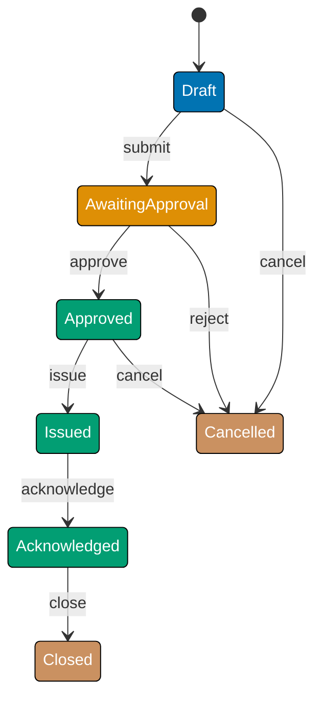

This beginner tutorial introduces Finite State Machine fundamentals through 25 annotated code examples grounded in the `PurchaseOrder` aggregate from the `procurement-platform-be` backend. You will learn how to model states as sealed types, encode transitions as pure functions, enforce guard conditions, and reject invalid transitions at the type level or with explicit errors.

## What Is a Finite State Machine? (Examples 1-5)

### Example 1: States as a Sealed Type

A `PurchaseOrder` (PO) begins as a Draft, moves through approval, gets issued to a supplier, and eventually closes or is cancelled. The first FSM decision is how to represent the state set — a sealed union type prevents code from inventing states that do not exist in the model.


```mermaid
stateDiagram-v2
    [*] --> Draft
    Draft --> AwaitingApproval: submit
    AwaitingApproval --> Approved: approve
    AwaitingApproval --> Cancelled: reject
    Approved --> Issued: issue
    Issued --> Acknowledged: acknowledge
    Acknowledged --> Closed: close
    Draft --> Cancelled: cancel
    Approved --> Cancelled: cancel

    classDef draft fill:#0173B2,stroke:#000,color:#fff
    classDef waiting fill:#DE8F05,stroke:#000,color:#fff
    classDef approved fill:#029E73,stroke:#000,color:#fff
    classDef terminal fill:#CA9161,stroke:#000,color:#fff

    class Draft draft
    class AwaitingApproval waiting
    class Approved approved
    class Issued,Acknowledged approved
    class Closed,Cancelled terminal
```

```typescript
// Sealed union type: every valid PO state is listed exactly once
// The compiler rejects any string not in this set
type POState =
  | "Draft" // => PO created, not yet submitted for approval
  | "AwaitingApproval" // => Submitted; waiting for manager decision
  | "Approved" // => Manager approved; ready to issue to supplier
  | "Issued" // => Sent to supplier; lines now immutable
  | "Acknowledged" // => Supplier confirmed receipt of PO
  | "Closed" // => PO fully complete — terminal state
  | "Cancelled" // => Abandoned before payment — terminal state
  | "Disputed"; // => Discrepancy detected; resolution required

// Helper: check whether a state is terminal (no further transitions possible)
// Pure function — no side effects, result determined solely by input
function isTerminal(state: POState): boolean {
  return state === "Closed" || state === "Cancelled"; // => Two terminal states
}

// Usage
const initial: POState = "Draft"; // => Type-checked: only valid states compile
console.log(isTerminal(initial)); // => Output: false
console.log(isTerminal("Closed")); // => Output: true
// const bad: POState = "Pending"; // => Compile error: not in union — compiler catches typos
```

**Key Takeaway**: Sealed union types turn the FSM state set into a compile-time contract — invalid states are errors, not bugs found in production.

**Why It Matters**: Every application has implicit states. Making them explicit with a sealed type eliminates an entire class of bugs: you cannot accidentally introduce `"pending"` vs `"Pending"` inconsistency, and the IDE guides you with exhaustive completion. For procurement workflows where an incorrect state might trigger a payment to a cancelled order, explicit sealed types provide low-cost, high-value safety.

---

### Example 2: The Minimal FSM Record

The machine is the state plus the transition function. This example models the simplest possible PO FSM as a plain record holding the current state.

```typescript
// A PO record holds id, current state, and the monetary total
// No behaviour lives in the record — it is pure data
interface PurchaseOrder {
  readonly id: string; // => Immutable: format "po_<uuid>"
  readonly totalAmount: number; // => Monetary total in USD (used by guards later)
  readonly state: POState; // => Current FSM state
}

// Factory: construct a PO in its initial state
// Pure function: takes id + amount, returns a new PO record
function createPO(id: string, totalAmount: number): PurchaseOrder {
  return {
    id, // => Short-hand: id: id
    totalAmount, // => Sets total; guard will check this against approval thresholds
    state: "Draft", // => All POs start in Draft — FSM invariant
  };
}

const po = createPO("po_abc123", 500);
console.log(po.state); // => Output: Draft
console.log(po.totalAmount); // => Output: 500
// po.state = "Approved";   // => Compile error: readonly prevents mutation in place
```

**Key Takeaway**: Keeping state in an immutable record and behaviour in separate functions is the functional FSM pattern — it makes transitions testable in isolation.

**Why It Matters**: When state lives in a mutable class field, tests must instantiate the whole class to check one transition. When state is a plain record, tests create the minimal record and call the transition function — no constructor, no teardown, no mocks. This separation scales to large state machines without increasing test friction.

---

### Example 3: The Transition Table

A transition table maps `(currentState, event) → nextState`. Expressing it as data rather than nested `if`/`switch` statements makes the full machine inspectable and serialisable.

```typescript
// Event union — every trigger that can change PO state
type POEvent =
  | "submit" // => Buyer sends PO for approval
  | "approve" // => Manager approves
  | "reject" // => Manager rejects → Cancelled
  | "issue" // => Finance issues PO to supplier
  | "acknowledge" // => Supplier acknowledges receipt
  | "close" // => PO fully settled
  | "cancel" // => Abandon PO
  | "dispute"; // => Flag discrepancy

// Transition table as an immutable map: [state][event] → nextState
// undefined entry means the transition is not allowed
const TRANSITIONS: Partial<Record<POState, Partial<Record<POEvent, POState>>>> = {
  Draft: { submit: "AwaitingApproval", cancel: "Cancelled" },
  AwaitingApproval: { approve: "Approved", reject: "Cancelled", cancel: "Cancelled" },
  Approved: { issue: "Issued", cancel: "Cancelled", dispute: "Disputed" },
  Issued: { acknowledge: "Acknowledged", cancel: "Cancelled", dispute: "Disputed" },
  Acknowledged: { close: "Closed", cancel: "Cancelled", dispute: "Disputed" },
  Disputed: { approve: "Approved", cancel: "Cancelled" },
  // Closed and Cancelled have no entries — they are terminal
};

// Lookup next state; return undefined if the transition is forbidden
function nextState(current: POState, event: POEvent): POState | undefined {
  return TRANSITIONS[current]?.[event]; // => Optional chaining: safe on undefined
}

console.log(nextState("Draft", "submit")); // => Output: AwaitingApproval
console.log(nextState("Draft", "approve")); // => Output: undefined (invalid)
console.log(nextState("Closed", "cancel")); // => Output: undefined (terminal)
```

**Key Takeaway**: A data-driven transition table decouples the FSM structure from the execution logic — you can print, diff, or migrate it without touching the interpreter.

**Why It Matters**: Hard-coded `switch` statements in large state machines become maintenance liabilities. When a new transition is needed, the developer must scan the entire `switch` to find the right `case`. A transition table is a single data structure — add one entry, and the interpreter picks it up automatically. This also enables tooling: you can generate state diagrams directly from the table.

---

### Example 4: The Pure Transition Function

Wrapping the table lookup in a function that returns a `Result` type makes the FSM's success/failure contract explicit without throwing exceptions.

```typescript
// Result type: either success with a new PO, or an error message
type Result<T> = { ok: true; value: T } | { ok: false; error: string };

// Pure transition function: (PO, event) → Result<PO>
// Never mutates its input; always returns a new record or an error
function transition(po: PurchaseOrder, event: POEvent): Result<PurchaseOrder> {
  const next = nextState(po.state, event); // => Table lookup

  if (next === undefined) {
    // => Transition not found: return descriptive error, do not throw
    return {
      ok: false,
      error: `Invalid transition: ${po.state} --${event}--> (no such transition)`,
    };
  }

  // => Valid transition: return new PO with updated state
  // Spread preserves all other fields (id, totalAmount) unchanged
  return { ok: true, value: { ...po, state: next } };
}

// Happy path
const po = createPO("po_abc123", 500);
const r1 = transition(po, "submit");
if (r1.ok) console.log(r1.value.state); // => Output: AwaitingApproval

// Invalid transition
const r2 = transition(po, "close");
if (!r2.ok) console.log(r2.error);
// => Output: Invalid transition: Draft --close--> (no such transition)
```

**Key Takeaway**: Returning `Result` instead of throwing makes invalid transitions an explicit, typed outcome — callers must handle both paths, which prevents silent state corruption.

**Why It Matters**: Exception-based control flow means the compiler cannot force callers to handle the error case. A `Result` type forces the caller to branch on `ok`, making the error path as visible as the success path. For a procurement platform where a failed state transition might silently leave a PO in an inconsistent state, this explicitness is non-negotiable.

---

### Example 5: Exhaustiveness Checking with a Switch

Pattern-matching on the state with an exhaustive `switch` guarantees every state has been handled — the TypeScript compiler catches missing cases at compile time.

```typescript
// Derive a human-readable label for each PO state
// The `never` assertion in the default case catches missing states at compile time
function stateLabel(state: POState): string {
  switch (state) {
    case "Draft":
      return "Draft — pending submission"; // => Label for Draft
    case "AwaitingApproval":
      return "Awaiting Approval"; // => Submitted, not yet decided
    case "Approved":
      return "Approved — ready to issue"; // => Manager approved
    case "Issued":
      return "Issued to Supplier"; // => PO sent
    case "Acknowledged":
      return "Acknowledged by Supplier"; // => Supplier confirmed
    case "Closed":
      return "Closed"; // => Terminal: success
    case "Cancelled":
      return "Cancelled"; // => Terminal: abandoned
    case "Disputed":
      return "Disputed — resolution pending"; // => Discrepancy flagged
    default: {
      // => The `never` cast: if a new state is added to POState and this switch
      // => is not updated, TypeScript reports an error here at compile time
      const _exhaustive: never = state;
      throw new Error(`Unhandled state: ${_exhaustive}`);
    }
  }
}

console.log(stateLabel("Draft")); // => Output: Draft — pending submission
console.log(stateLabel("Issued")); // => Output: Issued to Supplier
```

**Key Takeaway**: Exhaustive `switch` with a `never` default turns adding a new state without updating all handlers from a silent runtime bug into a compile-time error.

**Why It Matters**: In long-lived codebases, state machines grow. Without exhaustiveness checking, adding `"PartiallyReceived"` to `POState` means every `switch` on state silently falls through to the default — wrong labels, wrong behaviour, wrong UI rendering. The `never` trick costs one line and prevents the whole category of silent regression.

---

## Guards and Approval Levels (Examples 6-11)

### Example 6: Approval-Level Guard

The P2P domain defines approval thresholds: POs ≤ $1k need L1 approval, ≤ $10k need L2, and > $10k need L3. A guard function encodes this rule as a predicate that the transition checks before allowing the `approve` event.

```typescript
// Approval level enum: L1 (low value), L2 (medium), L3 (high value)
type ApprovalLevel = "L1" | "L2" | "L3";

// Derive required approval level from PO total
// Pure function: no side effects, result depends only on totalAmount
function requiredApprovalLevel(totalAmount: number): ApprovalLevel {
  if (totalAmount <= 1000) return "L1"; // => Up to $1,000: line manager sufficient
  if (totalAmount <= 10000) return "L2"; // => $1,001–$10,000: department head
  return "L3"; // => > $10,000: CFO / finance committee
}

// Guard: is the actor's level sufficient to approve this PO?
// Returns true if the actor can approve, false if escalation is needed
function canApprove(po: PurchaseOrder, actorLevel: ApprovalLevel): boolean {
  const required = requiredApprovalLevel(po.totalAmount); // => What level does this PO need?
  const levels: ApprovalLevel[] = ["L1", "L2", "L3"]; // => Ordered lowest to highest
  return levels.indexOf(actorLevel) >= levels.indexOf(required); // => Actor level ≥ required?
}

const lowPO = createPO("po_low", 800); // => $800: needs L1
const highPO = createPO("po_high", 15000); // => $15,000: needs L3

console.log(canApprove(lowPO, "L1")); // => Output: true  ($800 ≤ $1k, L1 sufficient)
console.log(canApprove(highPO, "L2")); // => Output: false ($15k > $10k, L2 insufficient)
console.log(canApprove(highPO, "L3")); // => Output: true  (L3 is the highest level)
```

**Key Takeaway**: Guards are pure predicates that sit between an event and a transition — they encode business rules without coupling them to state storage.

**Why It Matters**: Encoding approval thresholds directly in the guard function means the rule lives in one place. If the CFO decides L2 approval should cover up to $20k, one number changes. Without guards, the threshold check might be duplicated across the controller, the service, and the UI — three places to update and three places to desync.

---

### Example 7: Guarded Transition Function

Composing the guard with the transition function produces a single `approve` operation that enforces both the FSM state check and the business-rule guard.

```typescript
// Extended PO interface: carries the actor's approval level for the approve transition
interface ApprovableContext {
  po: PurchaseOrder;
  actorLevel: ApprovalLevel;
}

// Guarded approve: checks FSM state AND business guard before transitioning
function approvePO(ctx: ApprovableContext): Result<PurchaseOrder> {
  const { po, actorLevel } = ctx;

  // Guard 1: FSM state must be AwaitingApproval
  if (po.state !== "AwaitingApproval") {
    return { ok: false, error: `Cannot approve PO in state: ${po.state}` };
    // => FSM check: approval only valid from AwaitingApproval
  }

  // Guard 2: actor must have sufficient approval level
  if (!canApprove(po, actorLevel)) {
    const required = requiredApprovalLevel(po.totalAmount);
    return {
      ok: false,
      error: `Actor level ${actorLevel} cannot approve $${po.totalAmount} PO (requires ${required})`,
      // => Business rule rejection: not a state machine error, but a domain invariant
    };
  }

  // Both guards pass: perform transition
  return { ok: true, value: { ...po, state: "Approved" } };
  // => New PO record with state Approved; all other fields unchanged
}

const po = { ...createPO("po_001", 12000), state: "AwaitingApproval" as POState };
const r1 = approvePO({ po, actorLevel: "L2" }); // => L2 insufficient for $12k
const r2 = approvePO({ po, actorLevel: "L3" }); // => L3 sufficient

if (!r1.ok) console.log(r1.error);
// => Output: Actor level L2 cannot approve $12000 PO (requires L3)
if (r2.ok) console.log(r2.value.state); // => Output: Approved
```

**Key Takeaway**: Layering domain guards on top of FSM state checks produces a single, testable function that enforces both structural and business invariants.

**Why It Matters**: Separating the FSM check (`state === "AwaitingApproval"`) from the business guard (`canApprove`) keeps each predicate focused. You can unit-test `canApprove` with just numbers and approval levels — no FSM setup needed. You can test the state check independently. The composed `approvePO` function then has exactly two failure modes, each tested by a single case.

---

### Example 8: Line-Item Guard

A PO cannot move past `Approved` without at least one line item. This is a structural invariant, not an approval-level rule — it lives in its own guard.

```typescript
// A PO line item: one product in the PO
interface POLine {
  readonly skuCode: string; // => Product SKU, format SKU-XXXXX
  readonly quantity: number; // => Must be > 0 (domain invariant)
  readonly unitPrice: number; // => Price per unit in USD
}

// Extended PO with line items
interface PurchaseOrderWithLines extends PurchaseOrder {
  readonly lines: readonly POLine[];
}

// Guard: PO must have at least one line to be issued
// Returns an error string if the guard fails, undefined if it passes
function guardAtLeastOneLine(po: PurchaseOrderWithLines): string | undefined {
  if (po.lines.length === 0) {
    return "Cannot issue PO: no line items (add at least one product line)";
    // => Domain invariant: a PO with no items is meaningless
  }
  if (po.lines.some((l) => l.quantity <= 0)) {
    return "Cannot issue PO: all line quantities must be > 0";
    // => Per-line invariant: quantity must be positive
  }
  return undefined; // => Guard passes: no error
}

// Guarded issue transition
function issuePO(po: PurchaseOrderWithLines): Result<PurchaseOrderWithLines> {
  if (po.state !== "Approved") {
    return { ok: false, error: `Cannot issue PO in state ${po.state}` };
  }
  const lineError = guardAtLeastOneLine(po); // => Run structural guard
  if (lineError) return { ok: false, error: lineError };
  return { ok: true, value: { ...po, state: "Issued" } };
  // => Transition to Issued; lines are now immutable per domain rules
}

const poNoLines = { ...createPO("po_002", 500), state: "Approved" as POState, lines: [] };
const r = issuePO(poNoLines);
if (!r.ok) console.log(r.error);
// => Output: Cannot issue PO: no line items (add at least one product line)
```

**Key Takeaway**: Structural invariants (must have lines) belong in dedicated guard functions, not buried in the transition table — each guard tests one rule and one rule only.

**Why It Matters**: A PO with zero lines is not a business error in the same category as an underpowered approver — it is a data completeness violation. Keeping them in separate guard functions makes the code self-documenting: `guardAtLeastOneLine` is searchable, testable, and reviewable independently of the approval logic.

---

### Example 9: Immutable Lines After Issue

Once a PO is `Issued`, its lines must not change. Enforcing this at the state level — reject any line mutation when `state === "Issued"` — is a core FSM invariant.

```typescript
// Attempt to add a line to a PO; guard rejects if already Issued
function addLine(po: PurchaseOrderWithLines, line: POLine): Result<PurchaseOrderWithLines> {
  // Guard: lines are immutable once Issued or beyond
  const immutableStates: POState[] = ["Issued", "Acknowledged", "Closed"];
  if (immutableStates.includes(po.state)) {
    return {
      ok: false,
      error: `Cannot modify lines: PO is ${po.state} (lines immutable after issue)`,
      // => Once Issued, lines are a legal commitment to the supplier
    };
  }

  // Guard: new line must have a positive quantity
  if (line.quantity <= 0) {
    return { ok: false, error: "Line quantity must be > 0" };
    // => Domain invariant on the value object
  }

  // Append line and return new record (immutable update)
  return {
    ok: true,
    value: { ...po, lines: [...po.lines, line] },
    // => Spread + array spread: new reference, original unchanged
  };
}

const issuedPO: PurchaseOrderWithLines = {
  ...createPO("po_003", 800),
  state: "Issued",
  lines: [{ skuCode: "ELC-0042", quantity: 10, unitPrice: 80 }],
};
const newLine: POLine = { skuCode: "ELC-0099", quantity: 5, unitPrice: 50 };
const r = addLine(issuedPO, newLine);
if (!r.ok) console.log(r.error);
// => Output: Cannot modify lines: PO is Issued (lines immutable after issue)
```

**Key Takeaway**: FSM state is not just routing logic — it also gates data mutations. Tying mutation guards to state makes the immutability rule automatic and auditable.

**Why It Matters**: In a procurement system, an issued PO is a legal commitment. If a buyer can add a $50k item after the CFO approved a $5k PO, the approval is meaningless. Tying the line-item mutation guard to the FSM state ensures the commitment model is enforced structurally, not by convention or code review.

---

### Example 10: Cancel From Any Pre-Paid State (Python)

The same PO machine in Python illustrates how the "cancel from any pre-paid state" rule reads cleanly with a set of allowed source states.

```python
from dataclasses import dataclass, replace
from typing import Optional

# Sealed set of states as a frozenset — immutable at module level
PO_STATES = frozenset([
    "Draft", "AwaitingApproval", "Approved",
    "Issued", "Acknowledged", "Disputed",
    "Closed", "Cancelled",
])
# => frozenset: cannot be modified at runtime — guards the state alphabet

# Cancellable states: any pre-paid state (Closed is terminal success, not cancellable)
CANCELLABLE = frozenset([
    "Draft", "AwaitingApproval", "Approved",
    "Issued", "Acknowledged", "Disputed",
])
# => Explicit allow-list is safer than a deny-list: new states default to non-cancellable

@dataclass(frozen=True)
class PurchaseOrder:
    id: str           # => Immutable identifier: "po_<uuid>"
    total_amount: float  # => Monetary total in USD
    state: str        # => Current FSM state (must be in PO_STATES)

def cancel_po(po: PurchaseOrder) -> tuple["PurchaseOrder | None", Optional[str]]:
    # Returns (new_po, None) on success or (None, error_message) on failure
    if po.state not in CANCELLABLE:
        return None, f"Cannot cancel PO in state '{po.state}'"
        # => Terminal states and Closed are not cancellable
    return replace(po, state="Cancelled"), None
    # => dataclasses.replace: returns a new instance with state overridden

po = PurchaseOrder(id="po_xyz", total_amount=1500.0, state="Approved")
new_po, err = cancel_po(po)
print(new_po.state if new_po else err)  # => Output: Cancelled

closed = PurchaseOrder(id="po_xyz", total_amount=1500.0, state="Closed")
_, err2 = cancel_po(closed)
print(err2)  # => Output: Cannot cancel PO in state 'Closed'
```

**Key Takeaway**: An explicit allow-list (`CANCELLABLE`) is safer than a deny-list — new states default to non-cancellable, which is the conservative choice for a procurement platform.

**Why It Matters**: Deny-lists require the developer to remember to add every non-cancellable state. Allow-lists require only that the developer adds a state to the list when cancel should be permitted. For a financial workflow, the conservative default (cannot cancel) is the correct failure mode.

---

### Example 11: Dispute Transition and Resolution (Java)

The `Disputed` state is an off-ramp from several states and resolves back to either `Approved` or `Cancelled`. Java enums model the state set with inherent exhaustiveness.

```java
// Java enum: every state is a named constant — no magic strings
public enum POState {
    DRAFT, AWAITING_APPROVAL, APPROVED, ISSUED,
    ACKNOWLEDGED, DISPUTED, CLOSED, CANCELLED;
    // => Enum constants: compile-time safe, switch-exhaustible with --enable-preview records
}

public enum POEvent {
    SUBMIT, APPROVE, REJECT, ISSUE,
    ACKNOWLEDGE, CLOSE, CANCEL, DISPUTE,
    RESOLVE_APPROVE, RESOLVE_CANCEL;
    // => RESOLVE_APPROVE: dispute resolved, PO reverts to Approved
    // => RESOLVE_CANCEL: dispute unrecoverable, PO cancelled
}

public record PurchaseOrder(String id, double totalAmount, POState state) {
    // => Java record: immutable data holder, auto-generates equals/hashCode/toString
    // => No setters — FSM transitions return new instances
}

// Dispute-aware transition: handles dispute entry and both resolution paths
public static java.util.Optional<PurchaseOrder> transition(
        PurchaseOrder po, POEvent event) {

    return switch (po.state()) {
        // => Pattern switch on current state
        case APPROVED -> switch (event) {
            case ISSUE    -> java.util.Optional.of(new PurchaseOrder(po.id(), po.totalAmount(), POState.ISSUED));
            case DISPUTE  -> java.util.Optional.of(new PurchaseOrder(po.id(), po.totalAmount(), POState.DISPUTED));
            case CANCEL   -> java.util.Optional.of(new PurchaseOrder(po.id(), po.totalAmount(), POState.CANCELLED));
            default       -> java.util.Optional.empty(); // => Invalid event: no transition
        };
        case DISPUTED -> switch (event) {
            case RESOLVE_APPROVE -> java.util.Optional.of(new PurchaseOrder(po.id(), po.totalAmount(), POState.APPROVED));
            // => Dispute resolved as data error: PO reinstated
            case RESOLVE_CANCEL  -> java.util.Optional.of(new PurchaseOrder(po.id(), po.totalAmount(), POState.CANCELLED));
            // => Dispute unrecoverable: PO cancelled
            default -> java.util.Optional.empty();
        };
        default -> java.util.Optional.empty();
        // => All other states: unhandled events return empty
    };
}
```

```
transition(approvedPO, DISPUTE)         → Optional[PO{state=DISPUTED}]
transition(disputedPO, RESOLVE_APPROVE) → Optional[PO{state=APPROVED}]
transition(disputedPO, RESOLVE_CANCEL)  → Optional[PO{state=CANCELLED}]
transition(closedPO,   DISPUTE)         → Optional.empty()
```

**Key Takeaway**: Java enums give the FSM a type-safe state and event alphabet; `Optional` communicates "no valid transition" without exceptions.

**Why It Matters**: Using `Optional` instead of null or exception for invalid transitions aligns with Java's modern idioms and forces callers to handle the empty case. In a REST controller, the controller maps `Optional.empty()` to a `400 Bad Request` — a clean separation between domain logic and HTTP semantics.

---

## Modelling the Full PO Lifecycle (Examples 12-17)

### Example 12: The Full Transition Table in TypeScript

Putting the complete PurchaseOrder state machine — all states and transitions including the dispute cycle — into a single transition map.

```typescript
// Complete PO transition table — every valid (state, event) pair
// Read as: from state X, on event Y, go to state Z
const PO_TRANSITIONS: Partial<Record<POState, Partial<Record<POEvent, POState>>>> = {
  Draft: {
    submit: "AwaitingApproval", // => Buyer submits for approval
    cancel: "Cancelled", // => Buyer abandons before submitting
  },
  AwaitingApproval: {
    approve: "Approved", // => Manager approves
    reject: "Cancelled", // => Manager rejects — treated as cancel
    cancel: "Cancelled", // => Explicit cancellation
  },
  Approved: {
    issue: "Issued", // => Finance sends PO to supplier
    cancel: "Cancelled", // => Revoked before issue
    dispute: "Disputed", // => Discrepancy found after approval
  },
  Issued: {
    acknowledge: "Acknowledged", // => Supplier confirms PO receipt
    cancel: "Cancelled", // => Supplier cannot fulfil
    dispute: "Disputed", // => Discrepancy post-issue
  },
  Acknowledged: {
    close: "Closed", // => All received, paid, done
    cancel: "Cancelled", // => Abandon after acknowledgement
    dispute: "Disputed", // => Discrepancy found
  },
  Disputed: {
    approve: "Approved", // => RESOLVE_APPROVE: error corrected, reinstate
    cancel: "Cancelled", // => RESOLVE_CANCEL: unrecoverable
  },
  // Closed and Cancelled: no entries — both are terminal states
};

// Generic interpreter: table-driven FSM transition
function applyEvent(po: PurchaseOrder, event: POEvent): Result<PurchaseOrder> {
  const next = PO_TRANSITIONS[po.state]?.[event]; // => Safe navigation: undefined if not in table
  if (!next) {
    return { ok: false, error: `${po.state} --${event}--> (forbidden)` };
    // => Every invalid transition produces a typed error
  }
  return { ok: true, value: { ...po, state: next } };
  // => Return new PO record; original unchanged
}

// Walk a happy path: Draft → AwaitingApproval → Approved → Issued
let po: PurchaseOrder = createPO("po_full", 5000);
const events: POEvent[] = ["submit", "approve", "issue"];
for (const evt of events) {
  const r = applyEvent(po, evt); // => Apply each event in sequence
  if (r.ok) po = r.value; // => Update po reference only on success
  console.log(po.state); // => Draft → AwaitingApproval → Approved → Issued
}
// => Output (3 lines): AwaitingApproval / Approved / Issued
```

**Key Takeaway**: A single table and a single interpreter function handle the entire PO lifecycle — adding a new transition is one map entry, not a code change.

**Why It Matters**: A full procurement lifecycle has 10+ states and 15+ events. Encoding this in imperative `if/else` chains produces 150+ condition combinations to mentally verify. The table is the specification — if it matches the whiteboard diagram, the code is correct by construction.

---

### Example 13: Event Log and Audit Trail

Every transition should append to an audit trail. This example extends the PO with a log of events that drove each state change.

```typescript
// Extended PO: adds an immutable event log for audit purposes
interface AuditedPO extends PurchaseOrder {
  readonly eventLog: readonly { event: POEvent; fromState: POState; toState: POState; timestamp: string }[];
  // => Log entry captures what happened, from where, to where, and when
}

// Audited transition: records each state change in the log
function auditedTransition(po: AuditedPO, event: POEvent): Result<AuditedPO> {
  const next = PO_TRANSITIONS[po.state]?.[event];
  if (!next) {
    return { ok: false, error: `${po.state} --${event}--> (forbidden)` };
    // => Invalid transition: do not append to log (the attempt itself is not logged here)
  }

  const entry = {
    event, // => Which event triggered the transition
    fromState: po.state, // => State before transition
    toState: next, // => State after transition
    timestamp: new Date().toISOString(), // => Wall-clock time (swap for a testable Clock port)
  };

  return {
    ok: true,
    value: {
      ...po,
      state: next, // => Updated state
      eventLog: [...po.eventLog, entry], // => Append — does not mutate original
    },
  };
}

const apo: AuditedPO = { ...createPO("po_audit", 200), eventLog: [] };
const r1 = auditedTransition(apo, "submit");
if (r1.ok) {
  const r2 = auditedTransition(r1.value, "approve");
  if (r2.ok) {
    console.log(r2.value.state); // => Output: Approved
    console.log(r2.value.eventLog.length); // => Output: 2 (submit + approve)
    console.log(r2.value.eventLog[0].event); // => Output: submit
  }
}
```

**Key Takeaway**: Appending to an immutable event log in the same operation as the state transition keeps audit records structurally coupled to state changes — they cannot diverge.

**Why It Matters**: Procurement systems are subject to audit. If the event log is updated by a separate call after the transition, a crash between the two leaves the log inconsistent with the state. Updating both in a single pure function guarantees they are always in sync — no compensating logic required.

---

### Example 14: Python Dataclass FSM with Validation

Python's `dataclasses` and `frozen=True` produce the same immutable-record pattern as TypeScript's `readonly` fields.

```python
from dataclasses import dataclass, replace, field
from typing import Optional, List

@dataclass(frozen=True)
class POLine:
    sku_code: str     # => Product identifier, e.g. "ELC-0042"
    quantity: int     # => Must be > 0
    unit_price: float # => USD price per unit

@dataclass(frozen=True)
class PurchaseOrder:
    id: str
    total_amount: float
    state: str
    lines: tuple = field(default_factory=tuple)
    # => tuple instead of list: frozen dataclass cannot hold mutable containers

# Transition table as a plain Python dict
TRANSITIONS = {
    "Draft":            {"submit": "AwaitingApproval", "cancel": "Cancelled"},
    "AwaitingApproval": {"approve": "Approved", "reject": "Cancelled"},
    "Approved":         {"issue": "Issued", "cancel": "Cancelled", "dispute": "Disputed"},
    "Issued":           {"acknowledge": "Acknowledged", "cancel": "Cancelled"},
    "Acknowledged":     {"close": "Closed", "cancel": "Cancelled"},
    "Disputed":         {"approve": "Approved", "cancel": "Cancelled"},
}
# => Omitting Closed/Cancelled: they are terminal, no outgoing transitions

def apply_event(po: PurchaseOrder, event: str) -> tuple["PurchaseOrder | None", Optional[str]]:
    # Returns (new_po, None) on success, (None, error) on failure
    next_state = TRANSITIONS.get(po.state, {}).get(event)
    # => Two-level dict lookup: outer on state, inner on event
    if next_state is None:
        return None, f"Invalid: {po.state} --{event}-->"
        # => Not in table: transition forbidden
    return replace(po, state=next_state), None
    # => dataclasses.replace: new instance, all other fields preserved

po = PurchaseOrder(id="po_py_01", total_amount=3000.0, state="Draft")
po, err = apply_event(po, "submit")
print(po.state)   # => Output: AwaitingApproval
po, err = apply_event(po, "approve")
print(po.state)   # => Output: Approved
_, err2 = apply_event(po, "submit")   # => Invalid from Approved
print(err2)       # => Output: Invalid: Approved --submit-->
```

**Key Takeaway**: Python's frozen dataclasses and a plain dict transition table replicate the TypeScript pattern with idiomatic Python — no framework required.

**Why It Matters**: Learning the pattern without a framework first means you understand what libraries like `transitions` or XState are doing underneath. When you reach for a library, you can evaluate it against the first-principles model rather than treating it as a black box.

---

### Example 15: Java Record + Enum Transition

Java records and enums together produce the most concise idiomatic Java FSM implementation for the PurchaseOrder.

```java
// Transition table as an immutable Map — built once at class load
import java.util.*;

public class POStateMachine {

    public enum State  { DRAFT, AWAITING_APPROVAL, APPROVED, ISSUED, ACKNOWLEDGED, DISPUTED, CLOSED, CANCELLED }
    public enum Event  { SUBMIT, APPROVE, REJECT, ISSUE, ACKNOWLEDGE, CLOSE, CANCEL, DISPUTE, RESOLVE_APPROVE, RESOLVE_CANCEL }

    // Static transition table: Map<currentState, Map<event, nextState>>
    private static final Map<State, Map<Event, State>> TABLE;
    static {
        TABLE = new EnumMap<>(State.class);
        // => EnumMap: O(1) lookup, iteration in declaration order
        TABLE.put(State.DRAFT,             Map.of(Event.SUBMIT, State.AWAITING_APPROVAL, Event.CANCEL, State.CANCELLED));
        TABLE.put(State.AWAITING_APPROVAL, Map.of(Event.APPROVE, State.APPROVED, Event.REJECT, State.CANCELLED));
        TABLE.put(State.APPROVED,          Map.of(Event.ISSUE,   State.ISSUED,   Event.CANCEL, State.CANCELLED, Event.DISPUTE, State.DISPUTED));
        TABLE.put(State.ISSUED,            Map.of(Event.ACKNOWLEDGE, State.ACKNOWLEDGED, Event.CANCEL, State.CANCELLED));
        TABLE.put(State.ACKNOWLEDGED,      Map.of(Event.CLOSE,   State.CLOSED,   Event.CANCEL, State.CANCELLED));
        TABLE.put(State.DISPUTED,          Map.of(Event.RESOLVE_APPROVE, State.APPROVED, Event.RESOLVE_CANCEL, State.CANCELLED));
        // => CLOSED and CANCELLED: no entries — terminal states
    }

    public record PurchaseOrder(String id, double totalAmount, State state) {}
    // => record: immutable, auto-equals/hashCode/toString

    // Transition: returns Optional.of(newPO) or Optional.empty() for invalid
    public static Optional<PurchaseOrder> apply(PurchaseOrder po, Event event) {
        return Optional.ofNullable(TABLE.getOrDefault(po.state(), Map.of()).get(event))
                       .map(next -> new PurchaseOrder(po.id(), po.totalAmount(), next));
        // => getOrDefault: terminal states return empty map, avoiding NPE
        // => Optional chain: null next → empty, non-null → new record
    }
}
```

```
apply(new PO("po_j01", 1000, DRAFT), SUBMIT)     → Optional[PO{AWAITING_APPROVAL}]
apply(new PO("po_j01", 1000, CLOSED), CANCEL)    → Optional.empty()
apply(new PO("po_j01", 1000, DISPUTED), RESOLVE_APPROVE) → Optional[PO{APPROVED}]
```

**Key Takeaway**: `EnumMap` provides O(1) lookup and compile-time state coverage — the Java idiom for a type-safe, performant transition table.

**Why It Matters**: `HashMap<String, ...>` with string keys reintroduces the stringly-typed state problem. `EnumMap` uses enum ordinals as indices — no hashing, no boxing, and the compiler checks that every key is a valid `State` value. For a PO machine called thousands of times per second in a procurement system, O(1) and type safety are both wins.

---

## Entry/Exit Actions and Notifications (Examples 16-20)

### Example 16: Entry Action on AwaitingApproval

When a PO enters `AwaitingApproval`, the system should route the approval request to the responsible manager. This side effect is an entry action — it runs when entering a state, not when leaving one.

```typescript
// Entry action type: a function that fires when entering a particular state
// Pure signature: receives the PO, returns a description of what it did (for testing)
type EntryAction = (po: PurchaseOrder) => string;

// Entry action map: which actions fire on entering which states
const ENTRY_ACTIONS: Partial<Record<POState, EntryAction>> = {
  AwaitingApproval: (po) => `Route approval request for PO ${po.id} ($${po.totalAmount}) to manager`,
  // => In production: calls ApprovalRouterPort — here returns string for testability

  Issued: (po) => `Send PO ${po.id} to supplier via EDI/email`,
  // => In production: calls SupplierNotifierPort

  Cancelled: (po) => `Notify all parties: PO ${po.id} cancelled`,
  // => In production: calls SupplierNotifierPort + accounting system
};

// Transition with entry action: perform the transition, then run the entry action
function transitionWithEntry(
  po: PurchaseOrder,
  event: POEvent,
): { result: Result<PurchaseOrder>; sideEffect?: string } {
  const result = applyEvent(po, event); // => Pure FSM transition first
  if (!result.ok) return { result }; // => Invalid transition: no side effect

  const action = ENTRY_ACTIONS[result.value.state]; // => Look up entry action for new state
  const sideEffect = action ? action(result.value) : undefined;
  // => Run action if registered; undefined means no side effect for this state

  return { result, sideEffect };
}

const po = createPO("po_entry", 8500);
const submitted = transitionWithEntry(po, "submit");
console.log(submitted.result.ok ? submitted.result.value.state : "error");
// => Output: AwaitingApproval
console.log(submitted.sideEffect);
// => Output: Route approval request for PO po_entry ($8500) to manager
```

**Key Takeaway**: Entry actions separate the pure FSM transition from its side effects — the machine always transitions correctly, even if the side effect fails or is skipped in tests.

**Why It Matters**: A common mistake is mixing approval routing logic into the transition function itself. If the router throws, the PO state is neither updated nor rolled back cleanly. By making the transition pure and the side effect separate, you can: (a) test the state change without a real router, (b) retry the side effect independently, and (c) swap the router implementation without touching the FSM.

---

### Example 17: Exit Action on Issued

When leaving `Issued` (via `acknowledge`), the system should log that the supplier acknowledged the PO. Exit actions fire when leaving a state.

```typescript
// Exit action: runs when leaving a state
type ExitAction = (po: PurchaseOrder, event: POEvent) => string;

const EXIT_ACTIONS: Partial<Record<POState, ExitAction>> = {
  Issued: (po, event) =>
    event === "acknowledge"
      ? `PO ${po.id} acknowledged by supplier — GRN window now open`
      : `PO ${po.id} leaving Issued state via ${event}`,
  // => Issued exit: either supplier acknowledged, or cancelled/disputed
};

// Transition with both entry and exit actions
function transitionWithActions(
  po: PurchaseOrder,
  event: POEvent,
): {
  result: Result<PurchaseOrder>;
  exitEffect?: string;
  entryEffect?: string;
} {
  // Step 1: run exit action BEFORE the transition (we are leaving current state)
  const exitAction = EXIT_ACTIONS[po.state];
  const exitEffect = exitAction ? exitAction(po, event) : undefined;
  // => Exit action receives pre-transition PO and the triggering event

  // Step 2: perform FSM transition
  const result = applyEvent(po, event);
  if (!result.ok) return { result, exitEffect: undefined }; // => Invalid: discard exit action output

  // Step 3: run entry action for the new state
  const entryAction = ENTRY_ACTIONS[result.value.state];
  const entryEffect = entryAction ? entryAction(result.value) : undefined;

  return { result, exitEffect, entryEffect };
}

const issuedPO: PurchaseOrder = { ...createPO("po_ack", 1200), state: "Issued" };
const { result, exitEffect, entryEffect } = transitionWithActions(issuedPO, "acknowledge");
console.log(result.ok ? result.value.state : "error"); // => Output: Acknowledged
console.log(exitEffect);
// => Output: PO po_ack acknowledged by supplier — GRN window now open
console.log(entryEffect); // => Output: undefined (no entry action for Acknowledged)
```

**Key Takeaway**: Entry and exit actions are ordered: exit fires before transition, entry fires after — the order is part of the FSM contract, not an implementation detail.

**Why It Matters**: Ordering matters because exit actions might need the pre-transition state (e.g., logging "left Issued") while entry actions need the post-transition state (e.g., "now in Acknowledged, open GRN window"). Encoding this order in the runner function makes it consistent across all transitions.

---

### Example 18: Testing FSM Transitions (TypeScript)

FSMs built from pure functions and immutable records are trivially testable — no mocks, no database, no HTTP client.

```typescript
// Minimal test framework simulation — use Jest/Vitest in production
function expect(actual: unknown) {
  return {
    toBe: (expected: unknown) => {
      if (actual !== expected) throw new Error(`Expected ${String(expected)}, got ${String(actual)}`);
      console.log(`  PASS: ${String(actual)}`); // => Visual confirmation
    },
    toBeFalsy: () => {
      if (actual) throw new Error(`Expected falsy, got ${String(actual)}`);
      console.log(`  PASS: (falsy)`);
    },
  };
}

// Test: happy path Draft → AwaitingApproval
function testSubmitTransition() {
  const po = createPO("po_t01", 1000); // => Start in Draft
  const r = applyEvent(po, "submit"); // => Submit event
  expect(r.ok).toBe(true); // => Should succeed
  expect((r as { ok: true; value: PurchaseOrder }).value.state).toBe("AwaitingApproval");
  // => New state should be AwaitingApproval
}

// Test: invalid transition — cannot approve from Draft
function testInvalidApproveFromDraft() {
  const po = createPO("po_t02", 500); // => Draft
  const r = applyEvent(po, "approve"); // => approve event from Draft (invalid)
  expect(r.ok).toBeFalsy(); // => Must fail
}

// Test: cancel from any cancellable state
function testCancelFromApproved() {
  const approved: PurchaseOrder = { ...createPO("po_t03", 200), state: "Approved" };
  const r = applyEvent(approved, "cancel"); // => Cancel from Approved
  expect(r.ok).toBe(true);
  expect((r as { ok: true; value: PurchaseOrder }).value.state).toBe("Cancelled");
}

// Run tests
testSubmitTransition();
testInvalidApproveFromDraft();
testCancelFromApproved();
// => Output (3 lines of PASS)
```

**Key Takeaway**: Pure FSM functions require zero test infrastructure — no database setup, no HTTP mocking, no class instantiation beyond the data record itself.

**Why It Matters**: Test speed is test quality. When every FSM test is a function call that runs in microseconds, developers run tests on every save. When tests require a running database or a started HTTP server, they run only in CI. The functional FSM pattern makes the former trivially achievable.

---

### Example 19: Deriving the Total from Line Items

The PO's `totalAmount` should be computed from its line items, not stored as a free-standing number — a computed property enforces the invariant that total = sum of lines.

```typescript
// Compute PO total from line items: quantity × unitPrice per line, then sum
// Pure function: deterministic, no side effects
function computeTotal(lines: readonly POLine[]): number {
  return lines.reduce(
    (sum, line) => sum + line.quantity * line.unitPrice,
    0, // => Accumulator starts at 0
  );
  // => reduce: O(n) single pass over lines array
}

// Validate that the PO's stored total matches the computed total
// Returns an error string if inconsistent, undefined if valid
function validateTotal(po: PurchaseOrderWithLines): string | undefined {
  const computed = computeTotal(po.lines); // => Recompute from lines
  const delta = Math.abs(computed - po.totalAmount); // => Allow tiny floating-point error
  if (delta > 0.005) {
    return `Total mismatch: stored $${po.totalAmount} vs computed $${computed}`;
    // => Inconsistency detected: lines do not add up to the stored total
  }
  return undefined; // => Consistent: guard passes
}

const lines: POLine[] = [
  { skuCode: "ELC-0042", quantity: 5, unitPrice: 100 }, // => $500
  { skuCode: "ELC-0099", quantity: 10, unitPrice: 25 }, // => $250
];
const total = computeTotal(lines); // => 500 + 250 = 750
console.log(total); // => Output: 750

const consistentPO: PurchaseOrderWithLines = {
  ...createPO("po_tot", 750),
  lines,
};
console.log(validateTotal(consistentPO)); // => Output: undefined (consistent)

const inconsistentPO: PurchaseOrderWithLines = {
  ...createPO("po_bad", 999),
  lines,
};
console.log(validateTotal(inconsistentPO));
// => Output: Total mismatch: stored $999 vs computed $750
```

**Key Takeaway**: Derived values like total should be recomputable from the canonical source (line items) and validated as part of the guard chain — stored totals that can drift are a data-integrity risk.

**Why It Matters**: In financial systems, the total on a PO is a legally binding figure. If it can drift from the line-item sum — due to a rounding bug, a partial update, or a concurrent mutation — the system has a silent integrity failure. Validating the total as a guard before transitions catches the inconsistency at the FSM boundary, not in an accounting audit three months later.

---

### Example 20: Constructing the Initial PO with Validation

A constructor function that validates all invariants before returning the `PurchaseOrder` record ensures the FSM always starts in a valid state.

```typescript
// Validated constructor: checks all invariants, returns Result<PO> not a plain record
function buildPO(id: string, lines: readonly POLine[]): Result<PurchaseOrderWithLines> {
  // Invariant 1: id must follow format po_<uuid>
  if (!id.startsWith("po_") || id.length < 7) {
    return { ok: false, error: `Invalid PO id format: ${id} (expected po_<uuid>)` };
    // => Format guard: fail fast before constructing anything
  }

  // Invariant 2: must have at least one line
  if (lines.length === 0) {
    return { ok: false, error: "PO must have at least one line item" };
    // => Empty PO cannot be submitted
  }

  // Invariant 3: all quantities > 0
  const badLine = lines.find((l) => l.quantity <= 0);
  if (badLine) {
    return { ok: false, error: `Line ${badLine.skuCode} has invalid quantity ${badLine.quantity}` };
    // => Per-line invariant: quantity must be strictly positive
  }

  const totalAmount = computeTotal(lines); // => Derive total from lines (single source of truth)

  return {
    ok: true,
    value: { id, totalAmount, state: "Draft", lines },
    // => Valid PO: begins in Draft, total derived, invariants satisfied
  };
}

const r1 = buildPO("po_001", [{ skuCode: "ELC-0042", quantity: 10, unitPrice: 50 }]);
if (r1.ok) console.log(`${r1.value.state}, total $${r1.value.totalAmount}`);
// => Output: Draft, total $500

const r2 = buildPO("po_001", []);
if (!r2.ok) console.log(r2.error);
// => Output: PO must have at least one line item

const r3 = buildPO("bad_id", [{ skuCode: "ELC-0042", quantity: 5, unitPrice: 10 }]);
if (!r3.ok) console.log(r3.error);
// => Output: Invalid PO id format: bad_id (expected po_<uuid>)
```

**Key Takeaway**: Smart constructors that validate all invariants and return `Result` ensure the FSM only ever receives valid input — garbage-in-garbage-out is prevented at the boundary.

**Why It Matters**: An FSM that starts in an invalid state will produce unpredictable transitions. Validating at construction time is cheaper than catching invariant violations mid-lifecycle, and it localises all validation logic in one place rather than scattering it across every transition.

---

## State-Machine Patterns (Examples 21-25)

### Example 21: State as a Discriminated Union (Advanced Typing)

Instead of a flat string union, each state can carry its own data — a discriminated union that makes invalid state-data combinations impossible.

```typescript
// Discriminated union: each state variant carries its own payload
type POStateVariant =
  | { kind: "Draft"; createdAt: string }
  // => Draft carries creation timestamp
  | { kind: "AwaitingApproval"; submittedAt: string; submittedBy: string }
  // => AwaitingApproval carries who submitted and when
  | { kind: "Approved"; approvedBy: string; approvedAt: string }
  // => Approved carries who approved — needed for audit
  | { kind: "Issued"; issuedAt: string; supplierRef: string }
  // => Issued carries the supplier's acknowledgement reference
  | { kind: "Cancelled"; reason: string }
  // => Cancelled carries the cancellation reason — mandatory for audit
  | { kind: "Disputed"; disputeReason: string };
// => Disputed carries why it was disputed

// Usage: narrowing on `kind` gives access to state-specific fields
function describeState(s: POStateVariant): string {
  switch (s.kind) {
    case "Draft":
      return `Draft since ${s.createdAt}`;
    case "AwaitingApproval":
      return `Waiting for approval (submitted by ${s.submittedBy})`;
    case "Approved":
      return `Approved by ${s.approvedBy}`;
    case "Issued":
      return `Issued — supplier ref: ${s.supplierRef}`;
    case "Cancelled":
      return `Cancelled: ${s.reason}`;
    case "Disputed":
      return `Disputed: ${s.disputeReason}`;
    // => TypeScript narrows automatically: s.approvedBy only accessible in Approved case
  }
}

const approvedState: POStateVariant = { kind: "Approved", approvedBy: "mgr_001", approvedAt: "2026-01-15" };
console.log(describeState(approvedState)); // => Output: Approved by mgr_001
```

**Key Takeaway**: Discriminated union states make it impossible to access state-specific data in the wrong state — the compiler enforces state-data coherence.

**Why It Matters**: With flat string states, you might check `po.state === "Approved"` but then forget to check before reading `po.approvedBy`, resulting in `undefined` at runtime. Discriminated unions make the `approvedBy` field only available in the `Approved` variant — structural safety with no runtime overhead.

---

### Example 22: Logging State Transitions for Observability

Production FSMs need structured logging of every transition — not just console output, but structured records that feed into tracing systems.

```typescript
// Structured log entry for a state transition
interface TransitionLog {
  poId: string; // => Which PO transitioned
  event: POEvent; // => What event triggered it
  fromState: POState; // => State before
  toState: POState; // => State after
  timestamp: string; // => ISO 8601 wall clock (swap for deterministic clock in tests)
  actorId?: string; // => Who triggered the event (optional: system events have no actor)
}

// In-memory log (in production: replace with structured logger / OpenTelemetry span)
const transitionLogs: TransitionLog[] = [];

function loggedTransition(po: PurchaseOrder, event: POEvent, actorId?: string): Result<PurchaseOrder> {
  const result = applyEvent(po, event); // => Pure transition first

  if (result.ok) {
    transitionLogs.push({
      poId: po.id,
      event,
      fromState: po.state,
      toState: result.value.state,
      timestamp: new Date().toISOString(),
      actorId,
    });
    // => Append log only on successful transition: no log entry for rejected events
  }

  return result;
}

const po = createPO("po_log01", 3000);
loggedTransition(po, "submit", "user_buyer_001");
console.log(transitionLogs.length); // => Output: 1
console.log(transitionLogs[0].fromState); // => Output: Draft
console.log(transitionLogs[0].toState); // => Output: AwaitingApproval
```

**Key Takeaway**: Logging only successful transitions keeps the audit trail clean — rejected events indicate caller bugs, not business events worth archiving.

**Why It Matters**: Filtering out invalid-transition attempts from the persistent log matters for audit clarity. If every rejected event were logged as a business event, auditors would see noise alongside real state changes. Rejections belong in application-level error logs (with a different sink), not in the business transaction audit trail.

---

### Example 23: Replaying Events to Reconstruct State

If all events are stored, the current state is derivable by replaying them from the initial state — the foundation of event sourcing.

```typescript
// Replay: apply a list of events in order starting from initial state
// Returns the final state, or an error if any event in the sequence is invalid
function replay(id: string, totalAmount: number, events: readonly POEvent[]): Result<PurchaseOrder> {
  let po: PurchaseOrder = createPO(id, totalAmount); // => Start from initial state (Draft)

  for (const event of events) {
    const r = applyEvent(po, event); // => Apply each event
    if (!r.ok) {
      return {
        ok: false,
        error: `Replay failed at event '${event}' in state '${po.state}': ${r.error}`,
        // => Replay fails: the stored event sequence is inconsistent
      };
    }
    po = r.value; // => Advance to next state
  }

  return { ok: true, value: po };
  // => Final state after all events applied
}

// Replay a complete lifecycle
const history: POEvent[] = ["submit", "approve", "issue", "acknowledge"];
const result = replay("po_replay01", 2000, history);
if (result.ok) {
  console.log(result.value.state); // => Output: Acknowledged
}

// Replay an invalid sequence (approve before submit)
const badHistory: POEvent[] = ["approve"];
const bad = replay("po_replay02", 500, badHistory);
if (!bad.ok) console.log(bad.error);
// => Output: Replay failed at event 'approve' in state 'Draft': Draft --approve--> (forbidden)
```

**Key Takeaway**: A list of events is a complete description of PO history — the current state is a derived projection, not the source of truth.

**Why It Matters**: Event sourcing stores the event sequence rather than the current state. The FSM replay function is then the read-model projector. If you need to add a new field (e.g., `cancelledAt` timestamp), you replay all historical events through a new projector — no migration, no backfill. This is why the pure-function FSM and event sourcing are natural partners.

---

### Example 24: State Machine Visualisation (Generating a DOT Graph)

A data-driven transition table can generate its own state diagram — no manual diagram maintenance.

```typescript
// Generate a Graphviz DOT graph from the transition table
// DOT is the input language for Graphviz — also accepted by many web renderers
function generateDOT(table: Partial<Record<POState, Partial<Record<POEvent, POState>>>>, title: string): string {
  const lines: string[] = [
    `digraph "${title}" {`,
    `  rankdir=LR;`, // => Left-to-right layout: fits linear workflows
    `  node [shape=box, style=rounded];`, // => Rounded rectangles for states
  ];

  for (const [from, events] of Object.entries(table)) {
    for (const [event, to] of Object.entries(events ?? {})) {
      lines.push(`  "${from}" -> "${to}" [label="${event}"];`);
      // => One edge per (state, event) pair
    }
  }

  lines.push("}");
  return lines.join("\n");
}

const dot = generateDOT(PO_TRANSITIONS, "PurchaseOrder FSM");
console.log(dot.split("\n").slice(0, 5).join("\n"));
// => Output (first 5 lines of DOT):
// digraph "PurchaseOrder FSM" {
//   rankdir=LR;
//   node [shape=box, style=rounded];
//   "Draft" -> "AwaitingApproval" [label="submit"];
//   "Draft" -> "Cancelled" [label="cancel"];
```

**Key Takeaway**: Generating diagrams from the transition table guarantees the diagram matches the code — they cannot diverge because the diagram is derived from the code.

**Why It Matters**: Manually maintained state diagrams drift from implementation over time. Generating the diagram from the table inverts the relationship: the code is the specification, and the diagram is a human-readable rendering of it. Every PR that changes the transition table automatically changes the diagram — zero maintenance overhead.

---

### Example 25: The PO FSM as a Protocol

The final beginner example reframes the FSM: it is not just state management, it is a communication protocol between buyer, manager, supplier, and finance. The state names are the protocol verbs.

```typescript
// The PO state machine encodes the P2P protocol:
// - Buyer submits, manager approves/rejects, finance issues, supplier acknowledges, system closes
// Each state is a waiting point: "waiting for manager", "waiting for supplier", etc.

// Protocol state machine: associates each state with who is expected to act next
const PO_PROTOCOL: Record<POState, { actor: string; expects: string }> = {
  Draft: { actor: "Buyer", expects: "submit the PO for approval" },
  // => Buyer drafts; nothing happens until buyer submits
  AwaitingApproval: { actor: "Manager", expects: "approve or reject" },
  // => Ball in manager's court; system is waiting
  Approved: { actor: "Finance", expects: "issue PO to supplier" },
  // => Finance team issues the PO
  Issued: { actor: "Supplier", expects: "acknowledge PO receipt" },
  // => Supplier receives and must acknowledge
  Acknowledged: { actor: "System", expects: "receive goods and close" },
  // => Receiving and invoicing take over
  Closed: { actor: "None", expects: "terminal — no further action" },
  // => All done
  Cancelled: { actor: "None", expects: "terminal — no further action" },
  // => Abandoned
  Disputed: { actor: "Buyer", expects: "resolve or cancel the dispute" },
  // => Resolution required from buyer/finance
};

function protocolStatus(state: POState): string {
  const p = PO_PROTOCOL[state];
  return `[${state}] Waiting for ${p.actor}: ${p.expects}`;
  // => Human-readable protocol status — useful for notifications
}

console.log(protocolStatus("AwaitingApproval"));
// => Output: [AwaitingApproval] Waiting for Manager: approve or reject
console.log(protocolStatus("Issued"));
// => Output: [Issued] Waiting for Supplier: acknowledge PO receipt
```

**Key Takeaway**: The FSM is a formal description of the P2P workflow protocol — each state is a waiting point, and each transition is a protocol action performed by an identified actor.

**Why It Matters**: Framing the FSM as a protocol clarifies responsibility. When a PO is stuck in `AwaitingApproval`, the system knows to send a reminder to the manager — not the buyer, not the supplier. This actor-awareness is also the foundation for building workflow SLA dashboards: "how many POs have been in AwaitingApproval for more than 48 hours?" answers naturally from this model.
