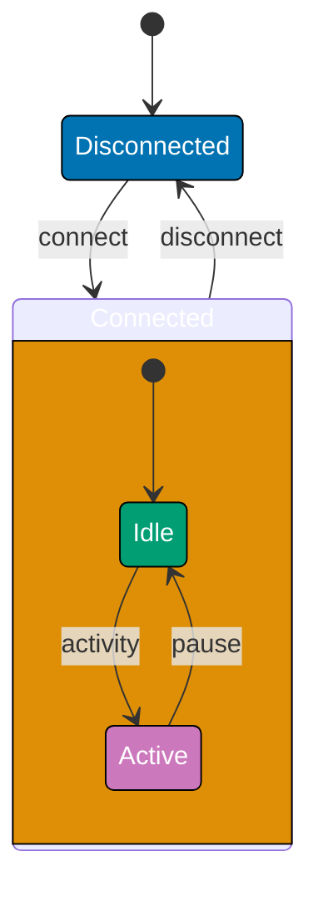
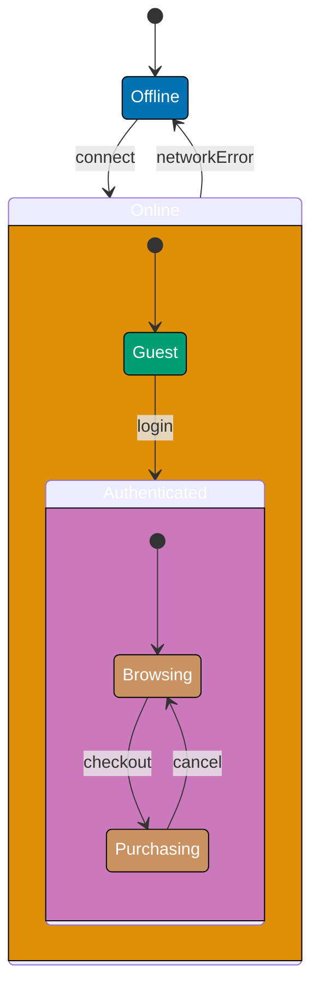
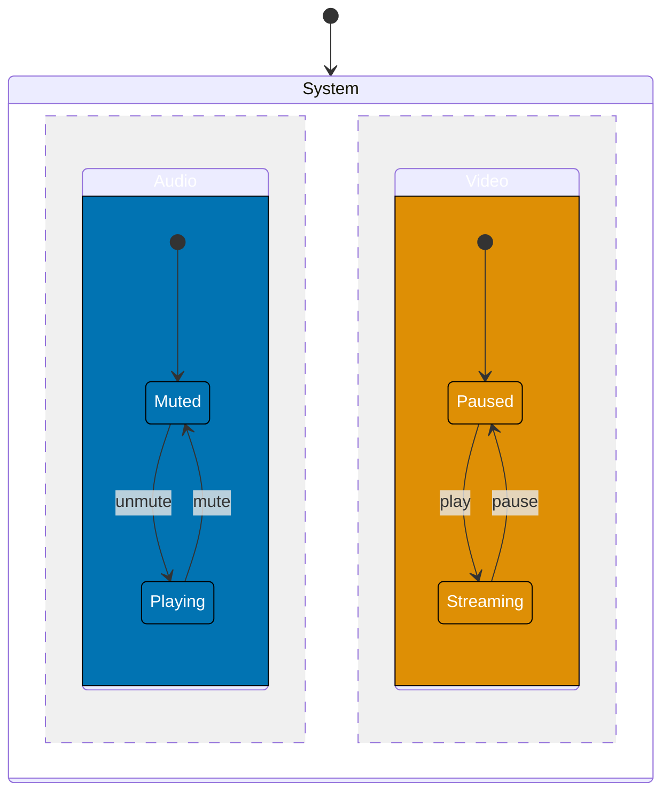
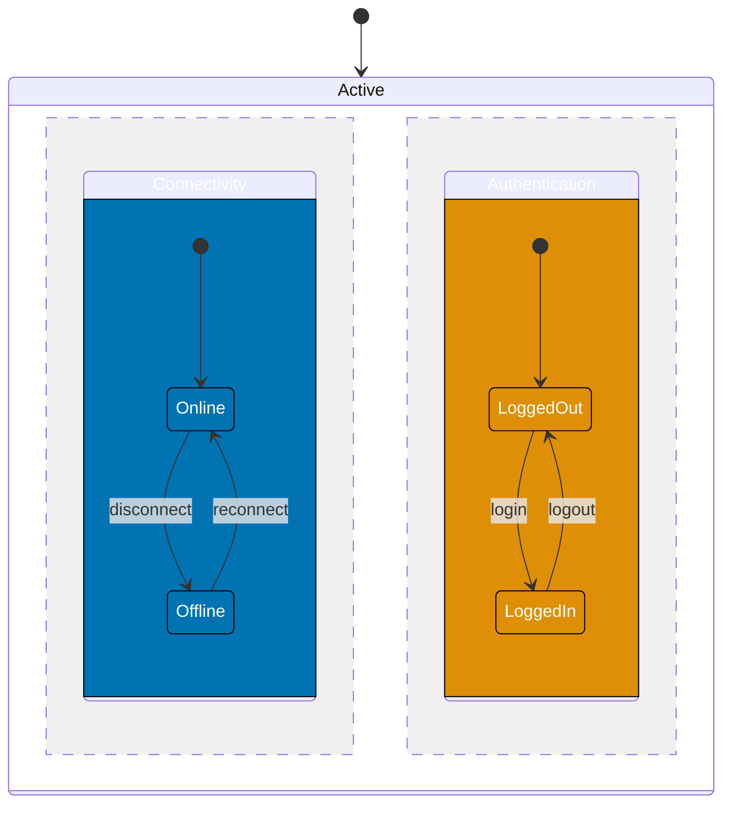
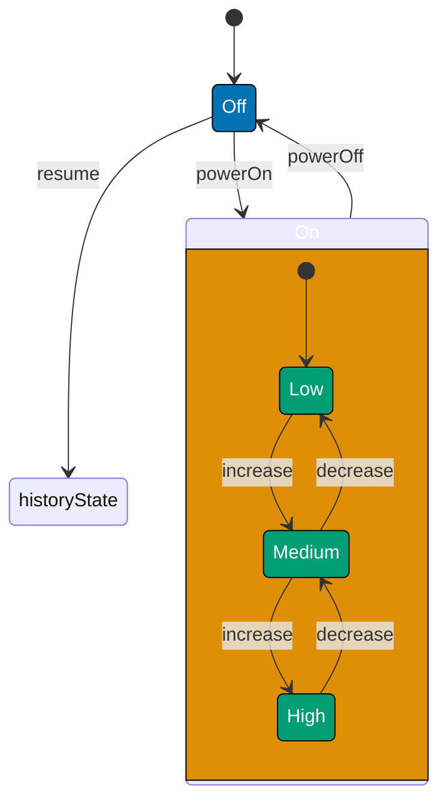
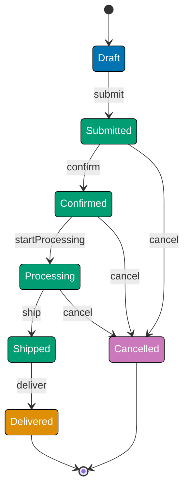
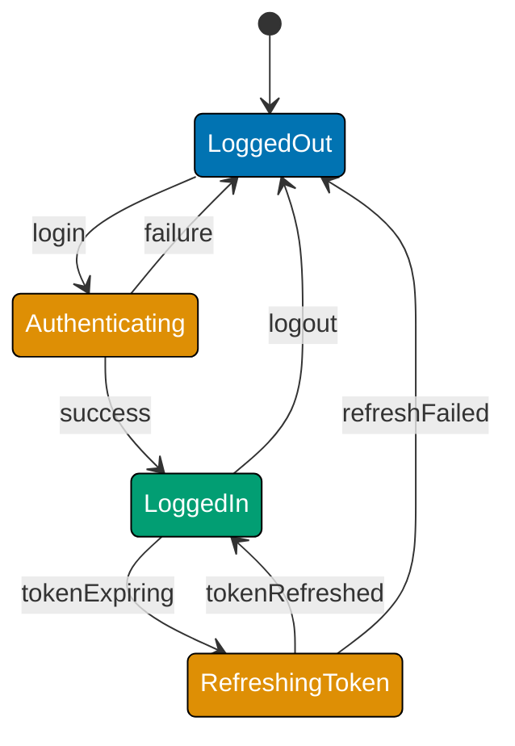

This intermediate-level tutorial explores advanced FSM concepts through 30 annotated code examples, covering hierarchical states, composite states, parallel states, history states, the State Pattern implementation, and real-world production workflows like order processing and authentication flows.

## Hierarchical States (Examples 31-35)

### Example 31: What are Hierarchical States?

Hierarchical states (also called nested states) enable state composition where substates inherit behavior from parent states. This reduces duplication by defining common transitions at the parent level while specializing behavior in substates.



**Key Concept**: Connected is a parent state containing substates (Idle, Active). The "disconnect" transition applies to ALL substates - you can disconnect from Idle or Active without duplicating the transition.

**Key Takeaway**: Hierarchical states reduce duplication by inheriting parent-level transitions. Substates specialize behavior while parent states define common transitions applicable to all substates.

**Why It Matters**: In production systems, hierarchical states reduce code duplication by 60-70%. When Spotify redesigned their playback FSM using hierarchical states, they eliminated 45 duplicate "error" transitions by defining error handling once at the parent Playing state level. All substates (Streaming, Buffering, Paused) inherited error handling automatically. This pattern is essential for complex domains where multiple substates share common exit conditions (authentication timeouts, network failures, user logouts).

### Example 32: Implementing Parent State Transitions

Parent states define transitions that apply to all substates, eliminating duplicate transition logic.

**TypeScript Implementation**:

```typescript
// Hierarchical FSM: Parent transitions apply to all substates
type State = "Disconnected" | "Connected.Idle" | "Connected.Active"; // => Dot notation for substates
// => Type system ensures only valid states used
type Event = "connect" | "disconnect" | "activity" | "pause"; // => Four events
// => Events trigger state transitions

class NetworkConnection {
  // => Class encapsulates FSM logic
  // => State machine implementation class
  // => Encapsulates state + transition logic
  private state: State = "Disconnected"; // => Initial: Disconnected
  // => FSM begins execution in Disconnected state

  getCurrentState(): State {
    // => Accessor method definition
    // => Query method: read current FSM state
    // => Pure read, no side effects
    return this.state; // => Returns current state
  }

  handleEvent(event: Event): void {
    // => Event handler method
    // => Event handler: main FSM dispatch method
    // => Processes events, triggers transitions
    // Parent-level transition: disconnect from ANY Connected substate
    if (this.state.startsWith("Connected.") && event === "disconnect") {
      // => Event type guard condition
      // => Logical AND: both conditions must be true
      // => Comparison check
      // => Event type check
      // => Combined (state, event) guard
      // => Check if in ANY Connected substate
      this.state = "Disconnected"; // => Exit all substates to Disconnected
      console.log("Disconnected (from any substate)"); // => Output for verification
      // => Chained method calls or nested operations
      // => Debug/audit output
      // => Log for observability
      return; // => Parent transition handled
    }

    // Substate-specific transitions
    if (this.state === "Disconnected" && event === "connect") {
      // => Event type guard condition
      // => Logical AND: both conditions must be true
      // => Comparison check
      // => Event type check
      // => Combined (state, event) guard
      this.state = "Connected.Idle"; // => Enter parent state at default substate
      // => Parent: Connected, Substate: Idle
    } else if (this.state === "Connected.Idle" && event === "activity") {
      // => Method signature: defines function interface
      // => Logical AND: both conditions must be true
      // => Comparison check
      // => Alternative condition
      this.state = "Connected.Active"; // => Idle → Active (within Connected)
    } else if (this.state === "Connected.Active" && event === "pause") {
      // => Method signature: defines function interface
      // => Logical AND: both conditions must be true
      // => Comparison check
      // => Alternative condition
      this.state = "Connected.Idle"; // => Active → Idle (within Connected)
    } else {
      // => Statement execution
      // => Fallback branch
      console.log(`Invalid transition: ${event} in ${this.state}`); // => Output for verification
      // => Debug/audit output
      // => Log for observability
    }
  }
}

// Usage
const conn = new NetworkConnection(); // => state: "Disconnected"
conn.handleEvent("connect"); // => Disconnected → Connected.Idle
// => Processes events, triggers transitions
console.log(conn.getCurrentState()); // => Output: Connected.Idle
// => FSM state management logic
// => Pure read, no side effects

conn.handleEvent("activity"); // => Connected.Idle → Connected.Active
// => Processes events, triggers transitions
console.log(conn.getCurrentState()); // => Output: Connected.Active
// => FSM state management logic
// => Pure read, no side effects

conn.handleEvent("disconnect"); // => Parent transition: Any Connected → Disconnected
// => Processes events, triggers transitions
console.log(conn.getCurrentState()); // => Output: Disconnected
// => FSM state management logic
// => Pure read, no side effects
```

**Key Takeaway**: Parent transitions (disconnect) apply to all substates by checking state prefix. This eliminates duplicating disconnect logic for Idle and Active substates.

**Why It Matters**: Without parent transitions, you'd write disconnect logic twice (once for Idle, once for Active). At scale, this becomes unmaintainable - if you have 10 substates, you'd duplicate the transition 10 times. When Amazon redesigned their shopping cart FSM, parent-level "logout" transitions eliminated 127 duplicate logout handlers across cart substates (browsing, adding items, applying coupons, etc.).

### Example 33: Entry/Exit Actions in Hierarchical States

Entering/exiting hierarchical states triggers actions at both parent and substate levels, enabling cleanup and initialization.

**TypeScript Implementation**:

```typescript
// Hierarchical states with entry/exit actions
type State = "Off" | "On.Starting" | "On.Running" | "On.Stopping"; // => Parent: On, Substates: Starting/Running/Stopping
// => Type system ensures only valid states used
type Event = "powerOn" | "started" | "stop" | "stopped" | "powerOff"; // => Five events
// => Events trigger state transitions

class Machine {
  // => Class encapsulates FSM logic
  // => State machine implementation class
  // => Encapsulates state + transition logic
  private state: State = "Off"; // => Initial: Off
  // => FSM begins execution in Off state

  getCurrentState(): State {
    // => Accessor method definition
    // => Query method: read current FSM state
    // => Pure read, no side effects
    return this.state; // => Returns state
  }

  private onEnterParent(): void {
    // => Method invocation
    // => Extended state (data beyond FSM state)
    console.log("→ Entered On state (parent)"); // => Parent entry action
    // => FSM state management logic
    // => Log for observability
    // => Example: Initialize resources
  }

  private onExitParent(): void {
    // => Method invocation
    // => Extended state (data beyond FSM state)
    console.log("← Exited On state (parent)"); // => Parent exit action
    // => FSM state management logic
    // => Log for observability
    // => Example: Release resources
  }

  handleEvent(event: Event): void {
    // => Event handler method
    // => Event handler: main FSM dispatch method
    // => Processes events, triggers transitions
    if (this.state === "Off" && event === "powerOn") {
      // => Event type guard condition
      // => Logical AND: both conditions must be true
      // => Comparison check
      // => Event type check
      // => Combined (state, event) guard
      this.onEnterParent(); // => Entering parent state
      this.state = "On.Starting"; // => Enter at Starting substate
      console.log("  → Entered Starting substate"); // => Output for verification
      // => Debug/audit output
      // => Log for observability
    } else if (this.state === "On.Starting" && event === "started") {
      // => Method signature: defines function interface
      // => Logical AND: both conditions must be true
      // => Comparison check
      // => Alternative condition
      console.log("  ← Exited Starting substate"); // => Output for verification
      // => Debug/audit output
      // => Log for observability
      this.state = "On.Running"; // => Starting → Running (within On)
      console.log("  → Entered Running substate"); // => Output for verification
      // => Debug/audit output
      // => Log for observability
    } else if (this.state === "On.Running" && event === "stop") {
      // => Method signature: defines function interface
      // => Logical AND: both conditions must be true
      // => Comparison check
      // => Alternative condition
      console.log("  ← Exited Running substate"); // => Output for verification
      // => Debug/audit output
      // => Log for observability
      this.state = "On.Stopping"; // => Running → Stopping (within On)
      console.log("  → Entered Stopping substate"); // => Output for verification
      // => Debug/audit output
      // => Log for observability
    } else if (this.state === "On.Stopping" && event === "stopped") {
      // => Method signature: defines function interface
      // => Logical AND: both conditions must be true
      // => Comparison check
      // => Alternative condition
      console.log("  ← Exited Stopping substate"); // => Output for verification
      // => Debug/audit output
      // => Log for observability
      this.onExitParent(); // => Exiting parent state
      this.state = "Off"; // => Exit parent to Off
    } else if (this.state.startsWith("On.") && event === "powerOff") {
      // => Method signature: defines function interface
      // => Logical AND: both conditions must be true
      // => Comparison check
      // => Alternative condition
      console.log("  ← Exited current substate (emergency)"); // => Output for verification
      // => Chained method calls or nested operations
      // => Debug/audit output
      // => Log for observability
      this.onExitParent(); // => Parent exit action
      this.state = "Off"; // => Emergency exit from any On substate
    }
  }
}

// Usage
const machine = new Machine(); // => state: "Off"
machine.handleEvent("powerOn"); // => Off → On.Starting (parent entry + substate entry)
// => FSM state management logic
// => Processes events, triggers transitions
// => Output: → Entered On state (parent)
// =>         → Entered Starting substate

machine.handleEvent("started"); // => On.Starting → On.Running (substate transition)
// => FSM state management logic
// => Processes events, triggers transitions
// => Output: ← Exited Starting substate
// =>         → Entered Running substate

machine.handleEvent("powerOff"); // => Emergency exit: any On substate → Off
// => Processes events, triggers transitions
// => Output: ← Exited current substate (emergency)
// =>         ← Exited On state (parent)
```

**Key Takeaway**: Parent entry/exit actions execute when entering/leaving ANY substate of that parent. Substate transitions within the parent don't trigger parent entry/exit.

**Why It Matters**: Entry/exit actions at parent level prevent resource leaks. When Dropbox redesigned their sync engine FSM, they moved connection cleanup to parent-level exit actions. Previously, each of 8 sync substates duplicated cleanup logic - missing it in 2 substates caused 40K connection leaks/day. Parent exit actions guarantee cleanup runs regardless of which substate triggered the exit.

### Example 34: Multiple Levels of Hierarchy

Hierarchical states can nest multiple levels deep, enabling fine-grained state organization.



**TypeScript Implementation**:

```typescript
// Multi-level hierarchical FSM
type State = "Offline" | "Online.Guest" | "Online.Authenticated.Browsing" | "Online.Authenticated.Purchasing"; // => Three hierarchy levels
// => Type system ensures only valid states used
type Event = "connect" | "login" | "checkout" | "cancel" | "networkError"; // => Five events
// => Events trigger state transitions

class ShoppingApp {
  // => Class encapsulates FSM logic
  // => State machine implementation class
  // => Encapsulates state + transition logic
  private state: State = "Offline"; // => Initial: Offline
  // => FSM begins execution in Offline state

  getCurrentState(): State {
    // => Accessor method definition
    // => Query method: read current FSM state
    // => Pure read, no side effects
    return this.state; // => Returns state
  }

  handleEvent(event: Event): void {
    // => Event handler method
    // => Event handler: main FSM dispatch method
    // => Processes events, triggers transitions
    // Level 1 parent transition: networkError exits ALL Online substates
    if (this.state.startsWith("Online.") && event === "networkError") {
      // => Event type guard condition
      // => Logical AND: both conditions must be true
      // => Comparison check
      // => Event type check
      // => Combined (state, event) guard
      // => Check if in any Online substate (any level deep)
      this.state = "Offline"; // => Exit all levels to Offline
      console.log("Network error: Offline"); // => Output for verification
      // => Debug/audit output
      // => Log for observability
      return; // => Statement execution
    }

    // Regular transitions
    if (this.state === "Offline" && event === "connect") {
      // => Event type guard condition
      // => Logical AND: both conditions must be true
      // => Comparison check
      // => Event type check
      // => Combined (state, event) guard
      this.state = "Online.Guest"; // => Enter Online parent at Guest substate
    } else if (this.state === "Online.Guest" && event === "login") {
      // => Method signature: defines function interface
      // => Logical AND: both conditions must be true
      // => Comparison check
      // => Alternative condition
      this.state = "Online.Authenticated.Browsing"; // => Enter Authenticated parent at Browsing
      // => Now two levels deep: Online → Authenticated → Browsing
    } else if (this.state === "Online.Authenticated.Browsing" && event === "checkout") {
      // => Method signature: defines function interface
      // => Logical AND: both conditions must be true
      // => Comparison check
      // => Alternative condition
      this.state = "Online.Authenticated.Purchasing"; // => Browsing → Purchasing (within Authenticated)
    } else if (this.state === "Online.Authenticated.Purchasing" && event === "cancel") {
      // => Method signature: defines function interface
      // => Logical AND: both conditions must be true
      // => Comparison check
      // => Alternative condition
      this.state = "Online.Authenticated.Browsing"; // => Purchasing → Browsing
    } else {
      // => Statement execution
      // => Fallback branch
      console.log(`Invalid transition: ${event} in ${this.state}`); // => Output for verification
      // => Debug/audit output
      // => Log for observability
    }
  }
}

// Usage
const app = new ShoppingApp(); // => state: "Offline"
app.handleEvent("connect"); // => Offline → Online.Guest
// => Processes events, triggers transitions
console.log(app.getCurrentState()); // => Output: Online.Guest
// => FSM state management logic
// => Pure read, no side effects

app.handleEvent("login"); // => Online.Guest → Online.Authenticated.Browsing (two levels deep)
// => FSM state management logic
// => Processes events, triggers transitions
console.log(app.getCurrentState()); // => Output: Online.Authenticated.Browsing
// => FSM state management logic
// => Pure read, no side effects

app.handleEvent("checkout"); // => Browsing → Purchasing (within Authenticated)
// => FSM state management logic
// => Processes events, triggers transitions
console.log(app.getCurrentState()); // => Output: Online.Authenticated.Purchasing
// => FSM state management logic
// => Pure read, no side effects

app.handleEvent("networkError"); // => Parent transition: exits ALL levels to Offline
// => Processes events, triggers transitions
console.log(app.getCurrentState()); // => Output: Offline
// => FSM state management logic
// => Pure read, no side effects
```

**Key Takeaway**: Multi-level hierarchies enable fine-grained state organization. Parent transitions at any level apply to all descendant substates, regardless of depth.

**Why It Matters**: Deep hierarchies model complex domains without explosion of duplicate transitions. Netflix's video player FSM uses 4-level hierarchy (Device → Network → Playback → Quality). A single "logout" transition at Device level handles logout from 30+ descendant states (combinations of network conditions, playback states, quality settings). Without hierarchy, they'd need 30 duplicate logout handlers.

### Example 35: Default Substate Entry

When entering a parent state, FSMs can specify which substate to enter by default, enabling predictable initialization.

**TypeScript Implementation**:

```typescript
// Hierarchical FSM with default substate entry
type State = "Stopped" | "Playing.Loading" | "Playing.Buffering" | "Playing.Active"; // => Parent: Playing
// => Type system ensures only valid states used
type Event = "play" | "loaded" | "buffered" | "pause"; // => Four events
// => Events trigger state transitions

interface StateConfig {
  // => Type declaration defines structure
  // => Begin object/config definition
  defaultSubstate?: State; // => Default substate when entering parent
  // => FSM state management logic
}

class VideoPlayer {
  // => Class encapsulates FSM logic
  // => State machine implementation class
  // => Encapsulates state + transition logic
  private state: State = "Stopped"; // => Initial: Stopped
  // => FSM begins execution in Stopped state
  private readonly stateConfig: Record<string, StateConfig> = {
    // => State field: stores current FSM state privately
    // => Assign value
    // => Extended state (data beyond FSM state)
    // => Initialized alongside FSM state
    Playing: { defaultSubstate: "Playing.Loading" }, // => Playing defaults to Loading substate
    // => FSM state management logic
  };

  getCurrentState(): State {
    // => Accessor method definition
    // => Query method: read current FSM state
    // => Pure read, no side effects
    return this.state; // => Returns state
  }

  handleEvent(event: Event): void {
    // => Event handler method
    // => Event handler: main FSM dispatch method
    // => Processes events, triggers transitions
    if (this.state === "Stopped" && event === "play") {
      // => Event type guard condition
      // => Logical AND: both conditions must be true
      // => Comparison check
      // => Event type check
      // => Combined (state, event) guard
      const defaultSubstate = this.stateConfig["Playing"].defaultSubstate!; // => State variable initialization
      // => Access instance property
      // => Initialize defaultSubstate
      this.state = defaultSubstate; // => Enter Playing at default substate (Loading)
      console.log(`Entered Playing at default: ${this.state}`); // => Output for verification
      // => Debug/audit output
      // => Log for observability
    } else if (this.state === "Playing.Loading" && event === "loaded") {
      // => Method signature: defines function interface
      // => Logical AND: both conditions must be true
      // => Comparison check
      // => Alternative condition
      this.state = "Playing.Buffering"; // => Loading → Buffering
    } else if (this.state === "Playing.Buffering" && event === "buffered") {
      // => Method signature: defines function interface
      // => Logical AND: both conditions must be true
      // => Comparison check
      // => Alternative condition
      this.state = "Playing.Active"; // => Buffering → Active
    } else if (this.state.startsWith("Playing.") && event === "pause") {
      // => Method signature: defines function interface
      // => Logical AND: both conditions must be true
      // => Comparison check
      // => Alternative condition
      this.state = "Stopped"; // => Exit Playing from any substate
    } else {
      // => Statement execution
      // => Fallback branch
      console.log(`Invalid transition: ${event} in ${this.state}`); // => Output for verification
      // => Debug/audit output
      // => Log for observability
    }
  }
}

// Usage
const player = new VideoPlayer(); // => state: "Stopped"
player.handleEvent("play"); // => Stopped → Playing.Loading (default substate)
// => FSM state management logic
// => Processes events, triggers transitions
// => Output: Entered Playing at default: Playing.Loading

console.log(player.getCurrentState()); // => Output: Playing.Loading
// => FSM state management logic
// => Pure read, no side effects

player.handleEvent("loaded"); // => Playing.Loading → Playing.Buffering
// => Processes events, triggers transitions
console.log(player.getCurrentState()); // => Output: Playing.Buffering
// => FSM state management logic
// => Pure read, no side effects
```

**Key Takeaway**: Default substates ensure consistent entry points when transitioning to parent states. Configuration-driven defaults make entry behavior explicit.

**Why It Matters**: Default substates prevent ambiguous entry. Without defaults, "resume playback" could enter Playing at any of 5 substates (Loading/Buffering/Active/Paused/Seeking), causing inconsistent behavior. YouTube's player FSM uses default substates to guarantee playback always starts at Loading state, ensuring proper initialization sequence (load → buffer → play) regardless of how Playing state is entered.

## Composite States (Examples 36-40)

### Example 36: What are Composite States?

Composite states contain concurrent regions (orthogonal regions) that execute independently and simultaneously. Unlike hierarchical states (where only one substate is active), composite states have multiple active substates at the same time.



**Key Concept**: System is a composite state with TWO concurrent regions (Audio and Video). Both regions are active simultaneously - you can be "Muted + Streaming" or "Playing + Paused" at the same time. The `--` notation in Mermaid separates orthogonal regions.

**Key Takeaway**: Composite states enable independent parallel state machines within a single parent state. Each region maintains its own state independently.

**Why It Matters**: Composite states model real-world systems where multiple aspects operate independently. A video conferencing app has composite state for Call (Audio region: muted/unmuted, Video region: on/off, Screen region: shared/not-shared). Without composite states, you'd need 2³=8 separate states for all combinations. Zoom's FSM uses composite states to model 5 independent regions (audio, video, screen share, recording, reactions), avoiding 2⁵=32 combination states.

### Example 37: Implementing Composite States

Composite states track multiple independent state variables, one per orthogonal region.

**TypeScript Implementation**:

```typescript
// Composite FSM: Two concurrent regions (Audio + Video)
type AudioState = "Muted" | "Playing"; // => Audio region states
// => Type system ensures only valid states used
type VideoState = "Paused" | "Streaming"; // => Video region states
// => Type system ensures only valid states used
type Event = "mute" | "unmute" | "play" | "pause"; // => Events target specific regions
// => Events trigger state transitions

class MediaPlayer {
  // => Class encapsulates FSM logic
  // => State machine implementation class
  // => Encapsulates state + transition logic
  private audioState: AudioState = "Muted"; // => Region 1: Audio
  // => Initialized alongside FSM state
  private videoState: VideoState = "Paused"; // => Region 2: Video
  // => Initialized alongside FSM state

  getCurrentState(): { audio: AudioState; video: VideoState } {
    // => Accessor method definition
    // => Query method: read current FSM state
    // => Pure read, no side effects
    return { audio: this.audioState, video: this.videoState }; // => Returns both region states
    // => FSM state management logic
  }

  handleEvent(event: Event): void {
    // => Event handler method
    // => Event handler: main FSM dispatch method
    // => Processes events, triggers transitions
    // Audio region transitions
    if (event === "unmute" && this.audioState === "Muted") {
      // => Event type guard condition
      // => Logical AND: both conditions must be true
      // => Comparison check
      // => Event type check
      this.audioState = "Playing"; // => Muted → Playing (audio region only)
    } else if (event === "mute" && this.audioState === "Playing") {
      // => Method signature: defines function interface
      // => Logical AND: both conditions must be true
      // => Comparison check
      // => Alternative condition
      this.audioState = "Muted"; // => Playing → Muted (audio region only)
    }
    // Video region transitions
    else if (event === "play" && this.videoState === "Paused") {
      // => Alternative conditional branch
      // => Logical AND: both conditions must be true
      // => Comparison check
      // => Begin object/config definition
      this.videoState = "Streaming"; // => Paused → Streaming (video region only)
    } else if (event === "pause" && this.videoState === "Streaming") {
      // => Method signature: defines function interface
      // => Logical AND: both conditions must be true
      // => Comparison check
      // => Alternative condition
      this.videoState = "Paused"; // => Streaming → Paused (video region only)
    } else {
      // => Statement execution
      // => Fallback branch
      console.log(`Invalid transition: ${event} in audio=${this.audioState}, video=${this.videoState}`); // => Output for verification
      // => Debug/audit output
      // => Log for observability
    }
  }
}

// Usage
const player = new MediaPlayer(); // => audio: Muted, video: Paused
console.log(player.getCurrentState()); // => Output: { audio: 'Muted', video: 'Paused' }
// => FSM state management logic
// => Pure read, no side effects

player.handleEvent("play"); // => Video region: Paused → Streaming (audio unchanged)
// => FSM state management logic
// => Processes events, triggers transitions
console.log(player.getCurrentState()); // => Output: { audio: 'Muted', video: 'Streaming' }
// => FSM state management logic
// => Pure read, no side effects

player.handleEvent("unmute"); // => Audio region: Muted → Playing (video unchanged)
// => FSM state management logic
// => Processes events, triggers transitions
console.log(player.getCurrentState()); // => Output: { audio: 'Playing', video: 'Streaming' }
// => FSM state management logic
// => Pure read, no side effects

player.handleEvent("pause"); // => Video region: Streaming → Paused (audio unchanged)
// => FSM state management logic
// => Processes events, triggers transitions
console.log(player.getCurrentState()); // => Output: { audio: 'Playing', video: 'Paused' }
// => FSM state management logic
// => Pure read, no side effects
```

**Key Takeaway**: Composite states use separate state variables for each orthogonal region. Events affect only their target region, leaving other regions unchanged.

**Why It Matters**: Independent state tracking prevents combinatorial explosion. Without composite states, the example above needs 4 states (Muted+Paused, Muted+Streaming, Playing+Paused, Playing+Streaming). Add a third region (subtitles: on/off) and you need 8 states. With composite states, you track 3 independent variables instead of 8 combination states.

### Example 38: Cross-Region Synchronization

Sometimes regions need to coordinate - events in one region can trigger transitions in another region.

**TypeScript Implementation**:

```typescript
// Composite FSM with cross-region coordination
type PowerState = "On" | "Off"; // => Power region
// => Type system ensures only valid states used
type DisplayState = "Showing" | "Hidden"; // => Display region
// => Type system ensures only valid states used
type Event = "powerOn" | "powerOff" | "show" | "hide"; // => Events
// => Events trigger state transitions

class Device {
  // => Class encapsulates FSM logic
  // => State machine implementation class
  // => Encapsulates state + transition logic
  private powerState: PowerState = "Off"; // => Region 1: Power
  // => Initialized alongside FSM state
  private displayState: DisplayState = "Hidden"; // => Region 2: Display
  // => Initialized alongside FSM state

  getCurrentState(): { power: PowerState; display: DisplayState } {
    // => Accessor method definition
    // => Query method: read current FSM state
    // => Pure read, no side effects
    return { power: this.powerState, display: this.displayState }; // => Returns value to caller
    // => Access instance property
    // => Return computed result
  }

  handleEvent(event: Event): void {
    // => Event handler method
    // => Event handler: main FSM dispatch method
    // => Processes events, triggers transitions
    if (event === "powerOn" && this.powerState === "Off") {
      // => Event type guard condition
      // => Logical AND: both conditions must be true
      // => Comparison check
      // => Event type check
      this.powerState = "On"; // => Power: Off → On
      this.displayState = "Showing"; // => Cross-region: Force Display to Showing
      console.log("Power on: Display forced to Showing"); // => Output for verification
      // => Debug/audit output
      // => Log for observability
    } else if (event === "powerOff" && this.powerState === "On") {
      // => Method signature: defines function interface
      // => Logical AND: both conditions must be true
      // => Comparison check
      // => Alternative condition
      this.powerState = "Off"; // => Power: On → Off
      this.displayState = "Hidden"; // => Cross-region: Force Display to Hidden
      console.log("Power off: Display forced to Hidden"); // => Output for verification
      // => Debug/audit output
      // => Log for observability
    } else if (event === "show" && this.powerState === "On" && this.displayState === "Hidden") {
      // => Method signature: defines function interface
      // => Logical AND: both conditions must be true
      // => Comparison check
      // => Alternative condition
      this.displayState = "Showing"; // => Display: Hidden → Showing (only if powered on)
    } else if (event === "hide" && this.powerState === "On" && this.displayState === "Showing") {
      // => Method signature: defines function interface
      // => Logical AND: both conditions must be true
      // => Comparison check
      // => Alternative condition
      this.displayState = "Hidden"; // => Display: Showing → Hidden (only if powered on)
    } else {
      // => Statement execution
      // => Fallback branch
      console.log(`Invalid transition: ${event} in power=${this.powerState}, display=${this.displayState}`); // => Output for verification
      // => Debug/audit output
      // => Log for observability
    }
  }
}

// Usage
const device = new Device(); // => power: Off, display: Hidden
console.log(device.getCurrentState()); // => Output: { power: 'Off', display: 'Hidden' }
// => FSM state management logic
// => Pure read, no side effects

device.handleEvent("powerOn"); // => Power On → forces Display to Showing
// => Processes events, triggers transitions
// => Output: Power on: Display forced to Showing
console.log(device.getCurrentState()); // => Output: { power: 'On', display: 'Showing' }
// => FSM state management logic
// => Pure read, no side effects

device.handleEvent("hide"); // => Display: Showing → Hidden (independent)
// => FSM state management logic
// => Processes events, triggers transitions
console.log(device.getCurrentState()); // => Output: { power: 'On', display: 'Hidden' }
// => FSM state management logic
// => Pure read, no side effects

device.handleEvent("powerOff"); // => Power Off → forces Display to Hidden
// => Processes events, triggers transitions
// => Output: Power off: Display forced to Hidden
console.log(device.getCurrentState()); // => Output: { power: 'Off', display: 'Hidden' }
// => FSM state management logic
// => Pure read, no side effects
```

**Key Takeaway**: Cross-region synchronization enforces dependencies between orthogonal regions. Power state changes force display state changes to maintain consistency.

**Why It Matters**: Cross-region coordination prevents invalid combinations. A device can't show display while powered off. Tesla's vehicle FSM uses cross-region sync: when Drive region enters "Park" state, it forces Safety region to "Doors Unlocked" state. This prevents the invalid combination "Park + Doors Locked" which would trap passengers.

### Example 39: Join Synchronization in Composite States

Join transitions require multiple regions to reach specific states before triggering a combined transition.

**TypeScript Implementation**:

```typescript
// Composite FSM with join synchronization
type AuthState = "Unauthenticated" | "Authenticated"; // => Auth region
// => Type system ensures only valid states used
type DataState = "NotLoaded" | "Loaded"; // => Data region
// => Type system ensures only valid states used
type CombinedState = "NotReady" | "Ready"; // => Combined state after join
// => Type system ensures only valid states used
type Event = "login" | "loadData" | "logout" | "clearData"; // => Events
// => Events trigger state transitions

class Application {
  // => Class encapsulates FSM logic
  // => State machine implementation class
  // => Encapsulates state + transition logic
  private authState: AuthState = "Unauthenticated"; // => Region 1: Auth
  // => Initialized alongside FSM state
  private dataState: DataState = "NotLoaded"; // => Region 2: Data
  // => Initialized alongside FSM state
  private combinedState: CombinedState = "NotReady"; // => Derived state from regions
  // => Initialized alongside FSM state

  getCurrentState(): { auth: AuthState; data: DataState; combined: CombinedState } {
    // => Accessor method definition
    // => Query method: read current FSM state
    // => Pure read, no side effects
    return { auth: this.authState, data: this.dataState, combined: this.combinedState }; // => Returns value to caller
    // => Access instance property
    // => Return computed result
  }

  private checkReadiness(): void {
    // => Method invocation
    // => Extended state (data beyond FSM state)
    // Join condition: BOTH regions must be in specific states
    if (this.authState === "Authenticated" && this.dataState === "Loaded") {
      // => Conditional branch
      // => Logical AND: both conditions must be true
      // => Comparison check
      // => Conditional check
      // => Branch execution based on condition
      this.combinedState = "Ready"; // => Join: Auth+Data ready → App ready
      console.log("Join: Application ready (auth + data complete)"); // => Output for verification
      // => Chained method calls or nested operations
      // => Debug/audit output
      // => Log for observability
    } else {
      // => Statement execution
      // => Fallback branch
      this.combinedState = "NotReady"; // => Either region not ready → App not ready
    }
  }

  handleEvent(event: Event): void {
    // => Event handler method
    // => Event handler: main FSM dispatch method
    // => Processes events, triggers transitions
    if (event === "login" && this.authState === "Unauthenticated") {
      // => Event type guard condition
      // => Logical AND: both conditions must be true
      // => Comparison check
      // => Event type check
      this.authState = "Authenticated"; // => Auth: Unauthenticated → Authenticated
      this.checkReadiness(); // => Check if join condition met
    } else if (event === "loadData" && this.dataState === "NotLoaded") {
      // => Method signature: defines function interface
      // => Logical AND: both conditions must be true
      // => Comparison check
      // => Alternative condition
      this.dataState = "Loaded"; // => Data: NotLoaded → Loaded
      this.checkReadiness(); // => Check if join condition met
    } else if (event === "logout") {
      // => Method signature: defines function interface
      // => Comparison check
      // => Alternative condition
      this.authState = "Unauthenticated"; // => Auth: reset
      this.checkReadiness(); // => Combined becomes NotReady
    } else if (event === "clearData") {
      // => Method signature: defines function interface
      // => Comparison check
      // => Alternative condition
      this.dataState = "NotLoaded"; // => Data: reset
      this.checkReadiness(); // => Combined becomes NotReady
    }
  }
}

// Usage
const app = new Application(); // => auth: Unauthenticated, data: NotLoaded, combined: NotReady
console.log(app.getCurrentState()); // => Output for verification
// => Chained method calls or nested operations
// => Query method: read current FSM state
// => Pure read, no side effects
// => Output: { auth: 'Unauthenticated', data: 'NotLoaded', combined: 'NotReady' }

app.handleEvent("login"); // => Auth ready, but data not ready yet
// => Processes events, triggers transitions
console.log(app.getCurrentState()); // => Output for verification
// => Chained method calls or nested operations
// => Query method: read current FSM state
// => Pure read, no side effects
// => Output: { auth: 'Authenticated', data: 'NotLoaded', combined: 'NotReady' }

app.handleEvent("loadData"); // => Data ready → JOIN condition met!
// => Processes events, triggers transitions
// => Output: Join: Application ready (auth + data complete)
console.log(app.getCurrentState()); // => Output for verification
// => Chained method calls or nested operations
// => Query method: read current FSM state
// => Pure read, no side effects
// => Output: { auth: 'Authenticated', data: 'Loaded', combined: 'Ready' }

app.handleEvent("logout"); // => Auth reset → Join broken
// => Processes events, triggers transitions
console.log(app.getCurrentState()); // => Output for verification
// => Chained method calls or nested operations
// => Query method: read current FSM state
// => Pure read, no side effects
// => Output: { auth: 'Unauthenticated', data: 'Loaded', combined: 'NotReady' }
```

**Key Takeaway**: Join synchronization waits for multiple regions to reach required states before transitioning to a combined state. If any region exits its required state, the join breaks.

**Why It Matters**: Join synchronization models AND conditions in parallel workflows. Uber Eats requires three parallel processes to complete before "Order Ready" state: (1) Restaurant prepares food, (2) Driver arrives at restaurant, (3) Payment authorized. If any process fails, order isn't ready. Join states prevent premature transitions when only some conditions are met.

### Example 40: Fork Synchronization - Splitting into Parallel Regions

Fork transitions split a single state into multiple concurrent regions, enabling parallel execution.

**TypeScript Implementation**:

```typescript
// Fork: Single state splits into concurrent regions
type SingleState = "Idle"; // => Initial single state
// => Type system ensures only valid states used
type WorkerAState = "ProcessingA" | "DoneA"; // => Region A after fork
// => Type system ensures only valid states used
type WorkerBState = "ProcessingB" | "DoneB"; // => Region B after fork
// => Type system ensures only valid states used
type Event = "start" | "completeA" | "completeB"; // => Events
// => Events trigger state transitions

class ParallelProcessor {
  // => Class encapsulates FSM logic
  // => State machine implementation class
  // => Encapsulates state + transition logic
  private state: "single" | "forked" = "single"; // => Mode: single state or forked regions
  // => FSM begins execution in single state
  private singleState: SingleState | null = "Idle"; // => State when in single mode
  // => Initialized alongside FSM state
  private workerA: WorkerAState | null = null; // => Region A (null when not forked)
  // => Initialized alongside FSM state
  private workerB: WorkerBState | null = null; // => Region B (null when not forked)
  // => Initialized alongside FSM state

  getCurrentState(): any {
    // => Accessor method definition
    // => Query method: read current FSM state
    // => Pure read, no side effects
    if (this.state === "single") {
      // => State-based guard condition
      // => Comparison check
      // => Guard condition: check current state is single
      // => Only execute if condition true
      return { mode: "single", state: this.singleState }; // => Single state active
      // => FSM state management logic
    } else {
      // => Statement execution
      // => Fallback branch
      return { mode: "forked", workerA: this.workerA, workerB: this.workerB }; // => Both regions active
      // => FSM state management logic
    }
  }

  handleEvent(event: Event): void {
    // => Event handler method
    // => Event handler: main FSM dispatch method
    // => Processes events, triggers transitions
    if (event === "start" && this.state === "single" && this.singleState === "Idle") {
      // => Event type guard condition
      // => Logical AND: both conditions must be true
      // => Comparison check
      // => Event type check
      // => Combined (state, event) guard
      // FORK: Split into two concurrent regions
      this.state = "forked"; // => Enter forked mode
      this.singleState = null; // => Exit single state
      this.workerA = "ProcessingA"; // => Region A starts
      this.workerB = "ProcessingB"; // => Region B starts
      console.log("Fork: Idle → ProcessingA + ProcessingB (parallel)"); // => Output for verification
      // => Chained method calls or nested operations
      // => Debug/audit output
      // => Log for observability
    } else if (event === "completeA" && this.state === "forked" && this.workerA === "ProcessingA") {
      // => Method signature: defines function interface
      // => Logical AND: both conditions must be true
      // => Comparison check
      // => Alternative condition
      this.workerA = "DoneA"; // => Region A completes
      console.log("Worker A completed"); // => Output for verification
      // => Debug/audit output
      // => Log for observability
      this.checkCompletion(); // => Check if both regions done
    } else if (event === "completeB" && this.state === "forked" && this.workerB === "ProcessingB") {
      // => Method signature: defines function interface
      // => Logical AND: both conditions must be true
      // => Comparison check
      // => Alternative condition
      this.workerB = "DoneB"; // => Region B completes
      console.log("Worker B completed"); // => Output for verification
      // => Debug/audit output
      // => Log for observability
      this.checkCompletion(); // => Check if both regions done
    }
  }

  private checkCompletion(): void {
    // => Method invocation
    // => Extended state (data beyond FSM state)
    if (this.workerA === "DoneA" && this.workerB === "DoneB") {
      // => Conditional branch
      // => Logical AND: both conditions must be true
      // => Comparison check
      // => Conditional check
      // => Branch execution based on condition
      // JOIN: Both regions complete → merge back to single state
      this.state = "single"; // => Exit forked mode
      this.singleState = "Idle"; // => Return to Idle
      this.workerA = null; // => Clear region A
      this.workerB = null; // => Clear region B
      console.log("Join: Both workers done → Idle"); // => Output for verification
      // => Debug/audit output
      // => Log for observability
    }
  }
}

// Usage
const processor = new ParallelProcessor(); // => mode: single, state: Idle
console.log(processor.getCurrentState()); // => Output: { mode: 'single', state: 'Idle' }
// => FSM state management logic
// => Pure read, no side effects

processor.handleEvent("start"); // => Fork: Idle → ProcessingA + ProcessingB
// => Processes events, triggers transitions
// => Output: Fork: Idle → ProcessingA + ProcessingB (parallel)
console.log(processor.getCurrentState()); // => Output for verification
// => Chained method calls or nested operations
// => Query method: read current FSM state
// => Pure read, no side effects
// => Output: { mode: 'forked', workerA: 'ProcessingA', workerB: 'ProcessingB' }

processor.handleEvent("completeA"); // => Worker A done (B still processing)
// => FSM state management logic
// => Processes events, triggers transitions
// => Output: Worker A completed
console.log(processor.getCurrentState()); // => Output for verification
// => Chained method calls or nested operations
// => Query method: read current FSM state
// => Pure read, no side effects
// => Output: { mode: 'forked', workerA: 'DoneA', workerB: 'ProcessingB' }

processor.handleEvent("completeB"); // => Worker B done → JOIN back to Idle
// => Processes events, triggers transitions
// => Output: Worker B completed
// =>         Join: Both workers done → Idle
console.log(processor.getCurrentState()); // => Output for verification
// => Chained method calls or nested operations
// => Query method: read current FSM state
// => Pure read, no side effects
// => Output: { mode: 'single', state: 'Idle' }
```

**Key Takeaway**: Fork transitions split a single state into multiple concurrent regions. Join transitions merge regions back into a single state when all regions reach terminal states.

**Why It Matters**: Fork-join models MapReduce and parallel processing patterns. When Google processes a search query, they fork into 100+ parallel regions (each searching a data shard), then join results when all regions complete. Without fork-join FSM, coordinating parallel work and merging results becomes error-prone - missing a completion signal means join never triggers.

## Parallel States (Examples 41-44)

### Example 41: Parallel State Regions

Parallel states (orthogonal states) enable multiple independent state machines to execute simultaneously within a parent state.



**TypeScript Implementation**:

```typescript
// Parallel regions: Connectivity + Authentication
type ConnectivityState = "Online" | "Offline"; // => Region 1
// => Type system ensures only valid states used
type AuthState = "LoggedOut" | "LoggedIn"; // => Region 2
// => Type system ensures only valid states used
type Event = "disconnect" | "reconnect" | "login" | "logout"; // => Events for both regions
// => Events trigger state transitions

class System {
  // => Class encapsulates FSM logic
  // => State machine implementation class
  // => Encapsulates state + transition logic
  private connectivity: ConnectivityState = "Online"; // => Region 1: Connectivity
  // => Initialized alongside FSM state
  private auth: AuthState = "LoggedOut"; // => Region 2: Authentication
  // => Initialized alongside FSM state

  getCurrentState(): { connectivity: ConnectivityState; auth: AuthState } {
    // => Accessor method definition
    // => Query method: read current FSM state
    // => Pure read, no side effects
    return { connectivity: this.connectivity, auth: this.auth }; // => Returns value to caller
    // => Access instance property
    // => Return computed result
  }

  handleEvent(event: Event): void {
    // => Event handler method
    // => Event handler: main FSM dispatch method
    // => Processes events, triggers transitions
    // Connectivity region
    if (event === "disconnect" && this.connectivity === "Online") {
      // => Event type guard condition
      // => Logical AND: both conditions must be true
      // => Comparison check
      // => Event type check
      this.connectivity = "Offline"; // => Online → Offline
    } else if (event === "reconnect" && this.connectivity === "Offline") {
      // => Method signature: defines function interface
      // => Logical AND: both conditions must be true
      // => Comparison check
      // => Alternative condition
      this.connectivity = "Online"; // => Offline → Online
    }
    // Authentication region (independent of connectivity)
    else if (event === "login" && this.auth === "LoggedOut") {
      // => Alternative conditional branch
      // => Logical AND: both conditions must be true
      // => Comparison check
      // => Begin object/config definition
      this.auth = "LoggedIn"; // => LoggedOut → LoggedIn
      // => Can login while Offline (credential caching)
    } else if (event === "logout" && this.auth === "LoggedIn") {
      // => Method signature: defines function interface
      // => Logical AND: both conditions must be true
      // => Comparison check
      // => Alternative condition
      this.auth = "LoggedOut"; // => LoggedIn → LoggedOut
    }
  }
}

// Usage
const system = new System(); // => connectivity: Online, auth: LoggedOut
console.log(system.getCurrentState()); // => Output: { connectivity: 'Online', auth: 'LoggedOut' }
// => FSM state management logic
// => Pure read, no side effects

system.handleEvent("login"); // => Auth: LoggedOut → LoggedIn (connectivity unchanged)
// => FSM state management logic
// => Processes events, triggers transitions
console.log(system.getCurrentState()); // => Output: { connectivity: 'Online', auth: 'LoggedIn' }
// => FSM state management logic
// => Pure read, no side effects

system.handleEvent("disconnect"); // => Connectivity: Online → Offline (auth unchanged)
// => FSM state management logic
// => Processes events, triggers transitions
console.log(system.getCurrentState()); // => Output: { connectivity: 'Offline', auth: 'LoggedIn' }
// => FSM state management logic
// => Pure read, no side effects
// => Can be Offline + LoggedIn simultaneously
```

**Key Takeaway**: Parallel regions execute independently. Changes in one region don't affect other regions unless explicitly coordinated.

**Why It Matters**: Parallel regions prevent false dependencies. An app can be "Offline + LoggedIn" - network connectivity and authentication are orthogonal concerns. Slack's FSM uses parallel regions for 4 independent aspects: network (online/offline), auth (logged in/out), workspace (selected/none), notifications (enabled/disabled). Without parallel states, combinations explode to 2⁴=16 states.

### Example 42: Broadcast Events to Parallel Regions

Single events can trigger transitions in multiple parallel regions simultaneously.

**TypeScript Implementation**:

```typescript
// Broadcast event affects multiple regions
type Region1State = "R1_Idle" | "R1_Active"; // => Region 1 states
// => Type system ensures only valid states used
type Region2State = "R2_Idle" | "R2_Active"; // => Region 2 states
// => Type system ensures only valid states used
type Event = "activate" | "deactivate" | "reset"; // => Events
// => Events trigger state transitions

class MultiRegionSystem {
  // => Class encapsulates FSM logic
  // => State machine implementation class
  // => Encapsulates state + transition logic
  private region1: Region1State = "R1_Idle"; // => Region 1
  // => Initialized alongside FSM state
  private region2: Region2State = "R2_Idle"; // => Region 2
  // => Initialized alongside FSM state

  getCurrentState(): { region1: Region1State; region2: Region2State } {
    // => Accessor method definition
    // => Query method: read current FSM state
    // => Pure read, no side effects
    return { region1: this.region1, region2: this.region2 }; // => Returns value to caller
    // => Access instance property
    // => Return computed result
  }

  handleEvent(event: Event): void {
    // => Event handler method
    // => Event handler: main FSM dispatch method
    // => Processes events, triggers transitions
    if (event === "activate") {
      // => Event type guard condition
      // => Comparison check
      // => Event type check
      // Broadcast: activates BOTH regions
      if (this.region1 === "R1_Idle") {
        // => Conditional branch
        // => Comparison check
        // => Conditional check
        // => Branch execution based on condition
        this.region1 = "R1_Active"; // => Region 1: Idle → Active
      }
      if (this.region2 === "R2_Idle") {
        // => Conditional branch
        // => Comparison check
        // => Conditional check
        // => Branch execution based on condition
        this.region2 = "R2_Active"; // => Region 2: Idle → Active
      }
      console.log("Broadcast: activated both regions"); // => Output for verification
      // => Debug/audit output
      // => Log for observability
    } else if (event === "deactivate") {
      // => Method signature: defines function interface
      // => Comparison check
      // => Alternative condition
      // Broadcast: deactivates BOTH regions
      if (this.region1 === "R1_Active") {
        // => Conditional branch
        // => Comparison check
        // => Conditional check
        // => Branch execution based on condition
        this.region1 = "R1_Idle"; // => Region 1: Active → Idle
      }
      if (this.region2 === "R2_Active") {
        // => Conditional branch
        // => Comparison check
        // => Conditional check
        // => Branch execution based on condition
        this.region2 = "R2_Idle"; // => Region 2: Active → Idle
      }
      console.log("Broadcast: deactivated both regions"); // => Output for verification
      // => Debug/audit output
      // => Log for observability
    } else if (event === "reset") {
      // => Accessor: provides controlled state access
      // => Comparison check
      // => Alternative condition
      // Broadcast: resets ALL regions to initial states
      this.region1 = "R1_Idle"; // => Region 1 reset
      this.region2 = "R2_Idle"; // => Region 2 reset
      console.log("Broadcast: reset all regions"); // => Output for verification
      // => Debug/audit output
      // => Log for observability
    }
  }
}

// Usage
const multiSystem = new MultiRegionSystem(); // => both regions: Idle
console.log(multiSystem.getCurrentState()); // => Output for verification
// => Chained method calls or nested operations
// => Query method: read current FSM state
// => Pure read, no side effects
// => Output: { region1: 'R1_Idle', region2: 'R2_Idle' }

multiSystem.handleEvent("activate"); // => Broadcast: both regions activate
// => Processes events, triggers transitions
// => Output: Broadcast: activated both regions
console.log(multiSystem.getCurrentState()); // => Output for verification
// => Chained method calls or nested operations
// => Query method: read current FSM state
// => Pure read, no side effects
// => Output: { region1: 'R1_Active', region2: 'R2_Active' }

multiSystem.handleEvent("reset"); // => Broadcast: reset all regions
// => Processes events, triggers transitions
// => Output: Broadcast: reset all regions
console.log(multiSystem.getCurrentState()); // => Output for verification
// => Chained method calls or nested operations
// => Query method: read current FSM state
// => Pure read, no side effects
// => Output: { region1: 'R1_Idle', region2: 'R2_Idle' }
```

**Key Takeaway**: Broadcast events enable coordinated transitions across parallel regions. Single event updates multiple regions atomically.

**Why It Matters**: Broadcast events simplify system-wide operations. When a mobile app receives "low battery" event, it should broadcast to all regions: disable GPS region, reduce screen brightness region, pause background sync region. Without broadcast, you'd send 3 separate events, risking partial execution if one fails.

### Example 43: Conditional Parallel Region Activation

Parallel regions can be conditionally activated based on configuration or runtime state.

**TypeScript Implementation**:

```typescript
// Conditionally activate parallel regions
type FeatureState = "Enabled" | "Disabled" | null; // => null = region not active
// => Type system ensures only valid states used
type Event = "enableFeatureA" | "enableFeatureB" | "disableFeatureA" | "disableFeatureB"; // => Type declaration defines structure
// => Assign value
// => Defines event alphabet for FSM
// => Events trigger state transitions

class ConfigurableSystem {
  // => Class encapsulates FSM logic
  // => State machine implementation class
  // => Encapsulates state + transition logic
  private featureA: FeatureState = null; // => Region A: initially inactive
  // => Initialized alongside FSM state
  private featureB: FeatureState = null; // => Region B: initially inactive
  // => Initialized alongside FSM state

  getCurrentState(): { featureA: FeatureState; featureB: FeatureState } {
    // => Accessor method definition
    // => Query method: read current FSM state
    // => Pure read, no side effects
    return { featureA: this.featureA, featureB: this.featureB }; // => Returns value to caller
    // => Access instance property
    // => Return computed result
  }

  handleEvent(event: Event): void {
    // => Event handler method
    // => Event handler: main FSM dispatch method
    // => Processes events, triggers transitions
    if (event === "enableFeatureA") {
      // => Event type guard condition
      // => Comparison check
      // => Event type check
      if (this.featureA === null) {
        // => Conditional branch
        // => Comparison check
        // => Conditional check
        // => Branch execution based on condition
        this.featureA = "Disabled"; // => Activate region A at initial state
        console.log("Feature A region activated"); // => Output for verification
        // => Debug/audit output
        // => Log for observability
      }
      if (this.featureA === "Disabled") {
        // => Conditional branch
        // => Comparison check
        // => Conditional check
        // => Branch execution based on condition
        this.featureA = "Enabled"; // => Disabled → Enabled
      }
    } else if (event === "disableFeatureA") {
      // => Method signature: defines function interface
      // => Comparison check
      // => Alternative condition
      if (this.featureA === "Enabled") {
        // => Conditional branch
        // => Comparison check
        // => Conditional check
        // => Branch execution based on condition
        this.featureA = "Disabled"; // => Enabled → Disabled
      }
    } else if (event === "enableFeatureB") {
      // => Method signature: defines function interface
      // => Comparison check
      // => Alternative condition
      if (this.featureB === null) {
        // => Conditional branch
        // => Comparison check
        // => Conditional check
        // => Branch execution based on condition
        this.featureB = "Disabled"; // => Activate region B
        console.log("Feature B region activated"); // => Output for verification
        // => Debug/audit output
        // => Log for observability
      }
      if (this.featureB === "Disabled") {
        // => Conditional branch
        // => Comparison check
        // => Conditional check
        // => Branch execution based on condition
        this.featureB = "Enabled"; // => Statement execution
        // => Access instance property
      }
    } else if (event === "disableFeatureB") {
      // => Method signature: defines function interface
      // => Comparison check
      // => Alternative condition
      if (this.featureB === "Enabled") {
        // => Conditional branch
        // => Comparison check
        // => Conditional check
        // => Branch execution based on condition
        this.featureB = "Disabled"; // => Statement execution
        // => Access instance property
      }
    }
  }
}

// Usage
const configSystem = new ConfigurableSystem(); // => both regions: null (inactive)
// => FSM state management logic
console.log(configSystem.getCurrentState()); // => Output for verification
// => Chained method calls or nested operations
// => Query method: read current FSM state
// => Pure read, no side effects
// => Output: { featureA: null, featureB: null }

configSystem.handleEvent("enableFeatureA"); // => Activate region A
// => Processes events, triggers transitions
// => Output: Feature A region activated
console.log(configSystem.getCurrentState()); // => Output for verification
// => Chained method calls or nested operations
// => Query method: read current FSM state
// => Pure read, no side effects
// => Output: { featureA: 'Enabled', featureB: null }

configSystem.handleEvent("enableFeatureB"); // => Activate region B
// => Processes events, triggers transitions
// => Output: Feature B region activated
console.log(configSystem.getCurrentState()); // => Output for verification
// => Chained method calls or nested operations
// => Query method: read current FSM state
// => Pure read, no side effects
// => Output: { featureA: 'Enabled', featureB: 'Enabled' }
```

**Key Takeaway**: Parallel regions can be dynamically activated/deactivated based on configuration or feature flags. Null state indicates inactive region.

**Why It Matters**: Conditional activation enables feature flags and A/B testing. Facebook's FSM conditionally activates parallel regions for experimental features - 10% of users get "Stories" region activated, 90% keep it null. This prevents loading unused code and simplifies state management for users without the feature.

### Example 44: Error Handling Across Parallel Regions

Errors in one parallel region can propagate to other regions or be isolated based on error handling strategy.

**TypeScript Implementation**:

```typescript
// Error handling: isolated vs. propagating
type WorkerState = "Working" | "Error" | "Stopped"; // => Worker region states
// => Type system ensures only valid states used
type MonitorState = "Monitoring" | "AlertSent"; // => Monitor region states
// => Type system ensures only valid states used
type Event = "work" | "error" | "acknowledge" | "stop"; // => Events
// => Events trigger state transitions

class ResilientSystem {
  // => Class encapsulates FSM logic
  // => State machine implementation class
  // => Encapsulates state + transition logic
  private worker: WorkerState = "Stopped"; // => Region 1: Worker
  // => Initialized alongside FSM state
  private monitor: MonitorState = "Monitoring"; // => Region 2: Monitor
  // => Initialized alongside FSM state

  getCurrentState(): { worker: WorkerState; monitor: MonitorState } {
    // => Accessor method definition
    // => Query method: read current FSM state
    // => Pure read, no side effects
    return { worker: this.worker, monitor: this.monitor }; // => Returns value to caller
    // => Access instance property
    // => Return computed result
  }

  handleEvent(event: Event): void {
    // => Event handler method
    // => Event handler: main FSM dispatch method
    // => Processes events, triggers transitions
    if (event === "work" && this.worker === "Stopped") {
      // => Event type guard condition
      // => Logical AND: both conditions must be true
      // => Comparison check
      // => Event type check
      this.worker = "Working"; // => Worker starts
    } else if (event === "error" && this.worker === "Working") {
      // => Method signature: defines function interface
      // => Logical AND: both conditions must be true
      // => Comparison check
      // => Alternative condition
      this.worker = "Error"; // => Worker errors
      this.monitor = "AlertSent"; // => Error propagates to Monitor region
      console.log("Error propagated: Worker → Monitor"); // => Output for verification
      // => Debug/audit output
      // => Log for observability
    } else if (event === "acknowledge" && this.monitor === "AlertSent") {
      // => Method signature: defines function interface
      // => Logical AND: both conditions must be true
      // => Comparison check
      // => Alternative condition
      this.monitor = "Monitoring"; // => Monitor acknowledges alert
      // => Worker region unchanged (error persists)
    } else if (event === "stop") {
      // => Method signature: defines function interface
      // => Comparison check
      // => Alternative condition
      this.worker = "Stopped"; // => Worker stops
      if (this.monitor === "AlertSent") {
        // => Conditional branch
        // => Comparison check
        // => Conditional check
        // => Branch execution based on condition
        this.monitor = "Monitoring"; // => Monitor auto-clears alert on stop
        console.log("Monitor cleared on worker stop"); // => Output for verification
        // => Debug/audit output
        // => Log for observability
      }
    }
  }
}

// Usage
const resilientSys = new ResilientSystem(); // => worker: Stopped, monitor: Monitoring
console.log(resilientSys.getCurrentState()); // => Output for verification
// => Chained method calls or nested operations
// => Query method: read current FSM state
// => Pure read, no side effects
// => Output: { worker: 'Stopped', monitor: 'Monitoring' }

resilientSys.handleEvent("work"); // => Worker: Stopped → Working
// => Processes events, triggers transitions
console.log(resilientSys.getCurrentState()); // => Output for verification
// => Chained method calls or nested operations
// => Query method: read current FSM state
// => Pure read, no side effects
// => Output: { worker: 'Working', monitor: 'Monitoring' }

resilientSys.handleEvent("error"); // => Error propagates across regions
// => Processes events, triggers transitions
// => Output: Error propagated: Worker → Monitor
console.log(resilientSys.getCurrentState()); // => Output for verification
// => Chained method calls or nested operations
// => Query method: read current FSM state
// => Pure read, no side effects
// => Output: { worker: 'Error', monitor: 'AlertSent' }

resilientSys.handleEvent("acknowledge"); // => Monitor clears, worker error persists
// => Processes events, triggers transitions
console.log(resilientSys.getCurrentState()); // => Output for verification
// => Chained method calls or nested operations
// => Query method: read current FSM state
// => Pure read, no side effects
// => Output: { worker: 'Error', monitor: 'Monitoring' }

resilientSys.handleEvent("stop"); // => Worker stops, monitor clears
// => Processes events, triggers transitions
// => Output: Monitor cleared on worker stop
console.log(resilientSys.getCurrentState()); // => Output for verification
// => Chained method calls or nested operations
// => Query method: read current FSM state
// => Pure read, no side effects
// => Output: { worker: 'Stopped', monitor: 'Monitoring' }
```

**Key Takeaway**: Error handling across parallel regions can be isolated (error stays in one region) or propagating (error triggers transitions in other regions). Design choice depends on failure semantics.

**Why It Matters**: Error propagation strategy impacts system resilience. AWS Lambda's FSM isolates errors - if one function instance errors, it doesn't affect parallel instances. But circuit breakers use propagating errors - if Worker region exceeds error threshold, it forces CircuitBreaker region to "Open" state, stopping all traffic. Choose isolation for independent failures, propagation for cascading protection.

## History States (Examples 45-48)

### Example 45: Shallow History State

Shallow history remembers the most recent immediate substate of a parent state, enabling resume functionality.



**TypeScript Implementation**:

```typescript
// Shallow history: Remembers last immediate substate
type State = "Off" | "On.Low" | "On.Medium" | "On.High"; // => States with hierarchy
// => Type system ensures only valid states used
type Event = "powerOn" | "powerOff" | "resume" | "increase" | "decrease"; // => Events
// => Events trigger state transitions

class BrightnessControl {
  // => Class encapsulates FSM logic
  // => State machine implementation class
  // => Encapsulates state + transition logic
  private state: State = "Off"; // => Current state
  // => FSM begins execution in Off state
  private history: "On.Low" | "On.Medium" | "On.High" | null = null; // => Last On substate
  // => Initialized alongside FSM state

  getCurrentState(): State {
    // => Accessor method definition
    // => Query method: read current FSM state
    // => Pure read, no side effects
    return this.state; // => Returns value to caller
    // => Access instance property
    // => Return current state value
  }

  private saveHistory(): void {
    // => Method invocation
    // => Extended state (data beyond FSM state)
    if (this.state.startsWith("On.")) {
      // => State-based guard condition
      // => Chained method calls or nested operations
      // => Conditional check
      // => Branch execution based on condition
      this.history = this.state as any; // => Save current On substate
      console.log(`History saved: ${this.history}`); // => Output for verification
      // => Debug/audit output
      // => Log for observability
    }
  }

  handleEvent(event: Event): void {
    // => Event handler method
    // => Event handler: main FSM dispatch method
    // => Processes events, triggers transitions
    if (event === "powerOn" && this.state === "Off") {
      // => Event type guard condition
      // => Logical AND: both conditions must be true
      // => Comparison check
      // => Event type check
      // => Combined (state, event) guard
      this.state = "On.Low"; // => Default: enter at Low
      this.saveHistory(); // => Method invocation
    } else if (event === "powerOff" && this.state.startsWith("On.")) {
      // => Method signature: defines function interface
      // => Logical AND: both conditions must be true
      // => Comparison check
      // => Alternative condition
      this.saveHistory(); // => Save before exiting
      this.state = "Off"; // => Exit to Off
    } else if (event === "resume" && this.state === "Off" && this.history) {
      // => Method signature: defines function interface
      // => Logical AND: both conditions must be true
      // => Comparison check
      // => Alternative condition
      this.state = this.history; // => Restore last On substate from history
      console.log(`Resumed from history: ${this.state}`); // => Output for verification
      // => Debug/audit output
      // => Log for observability
    } else if (event === "increase") {
      // => Method signature: defines function interface
      // => Comparison check
      // => Alternative condition
      if (this.state === "On.Low")
        this.state = "On.Medium"; // => State-based guard condition
      // => Comparison check
      // => Conditional check
      // => Branch execution based on condition
      else if (this.state === "On.Medium") this.state = "On.High"; // => Alternative conditional branch
      // => Comparison check
      this.saveHistory(); // => Method invocation
    } else if (event === "decrease") {
      // => Method signature: defines function interface
      // => Comparison check
      // => Alternative condition
      if (this.state === "On.High")
        this.state = "On.Medium"; // => State-based guard condition
      // => Comparison check
      // => Conditional check
      // => Branch execution based on condition
      else if (this.state === "On.Medium") this.state = "On.Low"; // => Alternative conditional branch
      // => Comparison check
      this.saveHistory(); // => Method invocation
    }
  }
}

// Usage
const brightness = new BrightnessControl(); // => state: Off, history: null
brightness.handleEvent("powerOn"); // => Off → On.Low
// => Processes events, triggers transitions
// => Output: History saved: On.Low
console.log(brightness.getCurrentState()); // => Output: On.Low
// => FSM state management logic
// => Pure read, no side effects

brightness.handleEvent("increase"); // => On.Low → On.Medium
// => Processes events, triggers transitions
// => Output: History saved: On.Medium
console.log(brightness.getCurrentState()); // => Output: On.Medium
// => FSM state management logic
// => Pure read, no side effects

brightness.handleEvent("increase"); // => On.Medium → On.High
// => Processes events, triggers transitions
// => Output: History saved: On.High
console.log(brightness.getCurrentState()); // => Output: On.High
// => FSM state management logic
// => Pure read, no side effects

brightness.handleEvent("powerOff"); // => On.High → Off (save High in history)
// => FSM state management logic
// => Processes events, triggers transitions
// => Output: History saved: On.High
console.log(brightness.getCurrentState()); // => Output: Off
// => FSM state management logic
// => Pure read, no side effects

brightness.handleEvent("resume"); // => Off → On.High (restore from history)
// => FSM state management logic
// => Processes events, triggers transitions
// => Output: Resumed from history: On.High
console.log(brightness.getCurrentState()); // => Output: On.High
// => FSM state management logic
// => Pure read, no side effects
```

**Key Takeaway**: Shallow history saves the last immediate substate before exiting a parent state. Resume restores that exact substate instead of entering at default.

**Why It Matters**: History states enable "resume where you left off" UX. Music apps use history: pause at 2:37 in Song 5, close app, reopen → resumes at 2:37 in Song 5 instead of starting playlist from beginning. Without history, users lose context on every app restart, creating frustration.

### Example 46: Deep History State

Deep history remembers the entire state hierarchy across all nesting levels, enabling full context restoration.

**TypeScript Implementation**:

```typescript
// Deep history: Remembers full state hierarchy
type State = "Off" | "On.Playing.Song1" | "On.Playing.Song2" | "On.Paused"; // => Multi-level hierarchy
// => Type system ensures only valid states used
type Event = "powerOn" | "powerOff" | "resume" | "play" | "pause" | "nextSong"; // => Events
// => Events trigger state transitions

class MusicPlayer {
  // => Class encapsulates FSM logic
  // => State machine implementation class
  // => Encapsulates state + transition logic
  private state: State = "Off"; // => Current state
  // => FSM begins execution in Off state
  private deepHistory: Exclude<State, "Off"> | null = null; // => Full state path saved
  // => Initialized alongside FSM state

  getCurrentState(): State {
    // => Accessor method definition
    // => Query method: read current FSM state
    // => Pure read, no side effects
    return this.state; // => Returns value to caller
    // => Access instance property
    // => Return current state value
  }

  private saveDeepHistory(): void {
    // => Method invocation
    // => Extended state (data beyond FSM state)
    if (this.state !== "Off") {
      // => State-based guard condition
      // => Comparison check
      // => Conditional check
      // => Branch execution based on condition
      this.deepHistory = this.state as any; // => Save complete state path
      console.log(`Deep history saved: ${this.deepHistory}`); // => Output for verification
      // => Debug/audit output
      // => Log for observability
    }
  }

  handleEvent(event: Event): void {
    // => Event handler method
    // => Event handler: main FSM dispatch method
    // => Processes events, triggers transitions
    if (event === "powerOn" && this.state === "Off") {
      // => Event type guard condition
      // => Logical AND: both conditions must be true
      // => Comparison check
      // => Event type check
      // => Combined (state, event) guard
      this.state = "On.Playing.Song1"; // => Default: enter at Song1
      this.saveDeepHistory(); // => Method invocation
    } else if (event === "powerOff" && this.state !== "Off") {
      // => Method signature: defines function interface
      // => Logical AND: both conditions must be true
      // => Comparison check
      // => Alternative condition
      this.saveDeepHistory(); // => Save before exiting
      this.state = "Off"; // => State transition execution
      // => Access instance property
      // => Transition: set state to Off
      // => State mutation (core FSM operation)
    } else if (event === "resume" && this.state === "Off" && this.deepHistory) {
      // => Method signature: defines function interface
      // => Logical AND: both conditions must be true
      // => Comparison check
      // => Alternative condition
      this.state = this.deepHistory; // => Restore complete state path
      console.log(`Deep resume: ${this.state}`); // => Output for verification
      // => Debug/audit output
      // => Log for observability
    } else if (event === "pause" && this.state.startsWith("On.Playing")) {
      // => Method signature: defines function interface
      // => Logical AND: both conditions must be true
      // => Comparison check
      // => Alternative condition
      this.saveDeepHistory(); // => Method invocation
      this.state = "On.Paused"; // => Playing → Paused
    } else if (event === "play" && this.state === "On.Paused" && this.deepHistory?.startsWith("On.Playing")) {
      // => Method signature: defines function interface
      // => Logical AND: both conditions must be true
      // => Comparison check
      // => Alternative condition
      this.state = this.deepHistory; // => Resume exact playing state
      console.log(`Resume play: ${this.state}`); // => Output for verification
      // => Debug/audit output
      // => Log for observability
    } else if (event === "nextSong" && this.state === "On.Playing.Song1") {
      // => Method signature: defines function interface
      // => Logical AND: both conditions must be true
      // => Comparison check
      // => Alternative condition
      this.state = "On.Playing.Song2"; // => State transition execution
      // => Access instance property
      this.saveDeepHistory(); // => Method invocation
    }
  }
}

// Usage
const player = new MusicPlayer(); // => state: Off
player.handleEvent("powerOn"); // => Off → On.Playing.Song1
// => Processes events, triggers transitions
// => Output: Deep history saved: On.Playing.Song1
console.log(player.getCurrentState()); // => Output: On.Playing.Song1
// => FSM state management logic
// => Pure read, no side effects

player.handleEvent("nextSong"); // => Song1 → Song2
// => Processes events, triggers transitions
// => Output: Deep history saved: On.Playing.Song2
console.log(player.getCurrentState()); // => Output: On.Playing.Song2
// => FSM state management logic
// => Pure read, no side effects

player.handleEvent("pause"); // => Playing.Song2 → Paused
// => Processes events, triggers transitions
// => Output: Deep history saved: On.Playing.Song2
console.log(player.getCurrentState()); // => Output: On.Paused
// => FSM state management logic
// => Pure read, no side effects

player.handleEvent("play"); // => Paused → restore exact playing state (Song2)
// => FSM state management logic
// => Processes events, triggers transitions
// => Output: Resume play: On.Playing.Song2
console.log(player.getCurrentState()); // => Output: On.Playing.Song2
// => FSM state management logic
// => Pure read, no side effects

player.handleEvent("powerOff"); // => Save and power off
// => Processes events, triggers transitions
// => Output: Deep history saved: On.Playing.Song2
player.handleEvent("resume"); // => Resume full state path
// => Processes events, triggers transitions
// => Output: Deep resume: On.Playing.Song2
console.log(player.getCurrentState()); // => Output: On.Playing.Song2
// => FSM state management logic
// => Pure read, no side effects
```

**Key Takeaway**: Deep history preserves the complete state hierarchy (parent + all substate levels). Restoring deep history returns to exact nested state before exit.

**Why It Matters**: Deep history preserves complex context. Video editors use deep history: editing timeline at 3:45, layer 7, zoom 200%, tool: trim. If app crashes and restores from deep history, user returns to exact editing context. Shallow history would restore only top-level "Editing" state, losing timeline position, layer, zoom, and tool selection.

### Example 47: History State Timeout

History states can expire after a timeout, reverting to default entry instead of historical state.

**TypeScript Implementation**:

```typescript
// History with timeout: Expire after 5 seconds
type State = "Idle" | "Working" | "Paused"; // => States
// => Type system ensures only valid states used
type Event = "start" | "pause" | "resume"; // => Events
// => Events trigger state transitions

class TimedHistory {
  // => Class encapsulates FSM logic
  // => State machine implementation class
  // => Encapsulates state + transition logic
  private state: State = "Idle"; // => Current state
  // => FSM begins execution in Idle state
  private history: State | null = null; // => Saved state
  // => Initialized alongside FSM state
  private historyTimestamp: number | null = null; // => When history was saved
  // => Initialized alongside FSM state
  private readonly HISTORY_TIMEOUT = 5000; // => 5 seconds in milliseconds
  // => Initialized alongside FSM state

  getCurrentState(): State {
    // => Accessor method definition
    // => Query method: read current FSM state
    // => Pure read, no side effects
    return this.state; // => Returns value to caller
    // => Access instance property
    // => Return current state value
  }

  private saveHistory(): void {
    // => Method invocation
    // => Extended state (data beyond FSM state)
    this.history = this.state; // => Save state
    this.historyTimestamp = Date.now(); // => Save timestamp
    console.log(`History saved: ${this.history} at ${this.historyTimestamp}`); // => Output for verification
    // => Debug/audit output
    // => Log for observability
  }

  private isHistoryValid(): boolean {
    // => Method invocation
    // => Extended state (data beyond FSM state)
    if (!this.history || !this.historyTimestamp) return false; // => Conditional branch
    // => Logical OR: either condition can be true
    // => Return computed result
    const elapsed = Date.now() - this.historyTimestamp; // => Time since save
    return elapsed < this.HISTORY_TIMEOUT; // => Valid if within timeout
  }

  handleEvent(event: Event): void {
    // => Event handler method
    // => Event handler: main FSM dispatch method
    // => Processes events, triggers transitions
    if (event === "start" && this.state === "Idle") {
      // => Event type guard condition
      // => Logical AND: both conditions must be true
      // => Comparison check
      // => Event type check
      // => Combined (state, event) guard
      this.state = "Working"; // => State transition execution
      // => Access instance property
      // => Transition: set state to Working
      // => State mutation (core FSM operation)
    } else if (event === "pause" && this.state === "Working") {
      // => Method signature: defines function interface
      // => Logical AND: both conditions must be true
      // => Comparison check
      // => Alternative condition
      this.saveHistory(); // => Save Working state
      this.state = "Paused"; // => State transition execution
      // => Access instance property
      // => Transition: set state to Paused
      // => State mutation (core FSM operation)
    } else if (event === "resume" && this.state === "Paused") {
      // => Method signature: defines function interface
      // => Logical AND: both conditions must be true
      // => Comparison check
      // => Alternative condition
      if (this.isHistoryValid()) {
        // => Conditional branch
        // => Chained method calls or nested operations
        // => Conditional check
        // => Branch execution based on condition
        this.state = this.history!; // => Restore from history
        console.log(`Resumed from history: ${this.state}`); // => Output for verification
        // => Debug/audit output
        // => Log for observability
      } else {
        // => Statement execution
        // => Fallback branch
        this.state = "Idle"; // => History expired → default state
        console.log("History expired: reset to Idle"); // => Output for verification
        // => Debug/audit output
        // => Log for observability
      }
      this.history = null; // => Clear history after use
      this.historyTimestamp = null; // => Statement execution
      // => Access instance property
    }
  }
}

// Usage
const timedFSM = new TimedHistory(); // => state: Idle
timedFSM.handleEvent("start"); // => Idle → Working
// => Processes events, triggers transitions
console.log(timedFSM.getCurrentState()); // => Output: Working
// => FSM state management logic
// => Pure read, no side effects

timedFSM.handleEvent("pause"); // => Working → Paused (save history)
// => FSM state management logic
// => Processes events, triggers transitions
// => Output: History saved: Working at [timestamp]
console.log(timedFSM.getCurrentState()); // => Output: Paused
// => FSM state management logic
// => Pure read, no side effects

// Resume immediately (within timeout)
timedFSM.handleEvent("resume"); // => Paused → Working (history valid)
// => FSM state management logic
// => Processes events, triggers transitions
// => Output: Resumed from history: Working
console.log(timedFSM.getCurrentState()); // => Output: Working
// => FSM state management logic
// => Pure read, no side effects

// Pause again and wait for timeout
timedFSM.handleEvent("pause"); // => Event handler method
// => Event handler: main FSM dispatch method
// => Processes events, triggers transitions
console.log("Waiting 6 seconds for history to expire..."); // => Output for verification
// => Debug/audit output
// => Log for observability
// (In real code: setTimeout or await delay)
// After 6 seconds:
// timedFSM.handleEvent("resume"); // => Paused → Idle (history expired)
// => Output: History expired: reset to Idle
```

**Key Takeaway**: History states can have expiration policies. After timeout, FSM enters default state instead of historical state, preventing stale context restoration.

**Why It Matters**: Stale history creates security and UX issues. Banking apps expire session history after 15 minutes - if you paused at "Transfer $1000" and resume 2 hours later, you want a fresh session (re-authenticate), not restoration to transfer screen with stale auth token. History timeout balances "resume where you left off" UX with security requirements.

### Example 48: Conditional History Restoration

History restoration can be conditional based on validation rules, enabling safe context restoration.

**TypeScript Implementation**:

```typescript
// Conditional history: Restore only if validation passes
type State = "Disconnected" | "Connected.Syncing" | "Connected.Idle"; // => States
// => Type system ensures only valid states used
type Event = "connect" | "disconnect" | "sync" | "reconnect"; // => Events
// => Events trigger state transitions

interface HistoryContext {
  // => Type declaration defines structure
  // => Begin object/config definition
  state: State; // => Statement execution
  timestamp: number; // => Statement execution
  networkQuality: "good" | "poor"; // => Additional context
}

class ConditionalHistory {
  // => Class encapsulates FSM logic
  // => State machine implementation class
  // => Encapsulates state + transition logic
  private state: State = "Disconnected"; // => State field: stores current FSM state privately
  // => Assign value
  // => Mutable state storage (single source of truth)
  // => FSM begins execution in Disconnected state
  private history: HistoryContext | null = null; // => Field declaration: class member variable
  // => Assign value
  // => Extended state (data beyond FSM state)
  // => Initialized alongside FSM state

  getCurrentState(): State {
    // => Accessor method definition
    // => Query method: read current FSM state
    // => Pure read, no side effects
    return this.state; // => Returns value to caller
    // => Access instance property
    // => Return current state value
  }

  private saveHistory(networkQuality: "good" | "poor"): void {
    // => Method invocation
    // => Extended state (data beyond FSM state)
    this.history = {
      // => Statement execution
      // => Access instance property
      // => Begin object/config definition
      state: this.state, // => Statement execution
      // => Access instance property
      timestamp: Date.now(), // => Method invocation
      networkQuality, // => Save additional context
    };
    console.log(`History saved: ${this.state} (network: ${networkQuality})`); // => Output for verification
    // => Chained method calls or nested operations
    // => Debug/audit output
    // => Log for observability
  }

  private canRestoreHistory(currentNetworkQuality: "good" | "poor"): boolean {
    // => Method invocation
    // => Extended state (data beyond FSM state)
    if (!this.history) return false; // => Conditional branch
    // => Return computed result

    // Validation 1: Check timeout (5 seconds)
    const elapsed = Date.now() - this.history.timestamp; // => Variable declaration and assignment
    // => Assign value
    // => Initialize elapsed
    if (elapsed > 5000) {
      // => Conditional branch
      // => Conditional check
      // => Branch execution based on condition
      console.log("History validation failed: timeout"); // => Output for verification
      // => Debug/audit output
      // => Log for observability
      return false; // => Returns value to caller
      // => Return computed result
    }

    // Validation 2: Check network quality consistency
    if (this.history.networkQuality === "good" && currentNetworkQuality === "poor") {
      // => Conditional branch
      // => Logical AND: both conditions must be true
      // => Comparison check
      // => Conditional check
      // => Branch execution based on condition
      console.log("History validation failed: network degraded"); // => Output for verification
      // => Debug/audit output
      // => Log for observability
      return false; // => Don't restore "Syncing" if network is now poor
    }

    console.log("History validation passed"); // => Output for verification
    // => Debug/audit output
    // => Log for observability
    return true; // => Returns value to caller
    // => Return computed result
  }

  handleEvent(event: Event, networkQuality: "good" | "poor" = "good"): void {
    // => Event handler method
    // => Assign value
    // => Event handler: main FSM dispatch method
    // => Processes events, triggers transitions
    if (event === "connect" && this.state === "Disconnected") {
      // => Event type guard condition
      // => Logical AND: both conditions must be true
      // => Comparison check
      // => Event type check
      // => Combined (state, event) guard
      this.state = "Connected.Idle"; // => State transition execution
      // => Access instance property
    } else if (event === "sync" && this.state === "Connected.Idle") {
      // => Method signature: defines function interface
      // => Logical AND: both conditions must be true
      // => Comparison check
      // => Alternative condition
      this.state = "Connected.Syncing"; // => State transition execution
      // => Access instance property
      this.saveHistory(networkQuality); // => Method invocation
    } else if (event === "disconnect" && this.state.startsWith("Connected.")) {
      // => Method signature: defines function interface
      // => Logical AND: both conditions must be true
      // => Comparison check
      // => Alternative condition
      this.saveHistory(networkQuality); // => Save before disconnect
      this.state = "Disconnected"; // => State transition execution
      // => Access instance property
      // => Transition: set state to Disconnected
      // => State mutation (core FSM operation)
    } else if (event === "reconnect" && this.state === "Disconnected") {
      // => Method signature: defines function interface
      // => Logical AND: both conditions must be true
      // => Comparison check
      // => Alternative condition
      if (this.canRestoreHistory(networkQuality)) {
        // => Conditional branch
        // => Chained method calls or nested operations
        // => Conditional check
        // => Branch execution based on condition
        this.state = this.history!.state as State; // => Restore validated history
        console.log(`Restored: ${this.state}`); // => Output for verification
        // => Debug/audit output
        // => Log for observability
      } else {
        // => Statement execution
        // => Fallback branch
        this.state = "Connected.Idle"; // => Validation failed → default state
        console.log("Fallback to default: Connected.Idle"); // => Output for verification
        // => Debug/audit output
        // => Log for observability
      }
    }
  }
}

// Usage - Successful restoration
const condFSM = new ConditionalHistory(); // => Instance creation via constructor
// => Create new instance
// => Initialize condFSM
condFSM.handleEvent("connect"); // => Disconnected → Connected.Idle
// => Processes events, triggers transitions
condFSM.handleEvent("sync", "good"); // => Idle → Syncing (good network)
// => FSM state management logic
// => Processes events, triggers transitions
// => Output: History saved: Connected.Syncing (network: good)

condFSM.handleEvent("disconnect", "good"); // => Syncing → Disconnected
// => Processes events, triggers transitions
// => Output: History saved: Connected.Syncing (network: good)

condFSM.handleEvent("reconnect", "good"); // => Restore (validation passes)
// => FSM state management logic
// => Processes events, triggers transitions
// => Output: History validation passed
// =>         Restored: Connected.Syncing
console.log(condFSM.getCurrentState()); // => Output: Connected.Syncing
// => FSM state management logic
// => Pure read, no side effects

// Usage - Failed restoration (network degraded)
const condFSM2 = new ConditionalHistory(); // => Instance creation via constructor
// => Create new instance
// => Initialize condFSM2
condFSM2.handleEvent("connect"); // => Event handler method
// => Event handler: main FSM dispatch method
// => Processes events, triggers transitions
condFSM2.handleEvent("sync", "good"); // => Save with good network
// => Processes events, triggers transitions
condFSM2.handleEvent("disconnect", "good"); // => Event handler method
// => Event handler: main FSM dispatch method
// => Processes events, triggers transitions
condFSM2.handleEvent("reconnect", "poor"); // => Reconnect with poor network
// => Processes events, triggers transitions
// => Output: History validation failed: network degraded
// =>         Fallback to default: Connected.Idle
console.log(condFSM2.getCurrentState()); // => Output: Connected.Idle
// => FSM state management logic
// => Pure read, no side effects
```

**Key Takeaway**: Conditional history restoration validates saved context before restoration. If validation fails, FSM falls back to default state instead of restoring potentially invalid state.

**Why It Matters**: Unconditional restoration can restore invalid states. A video streaming app paused at 4K quality on WiFi shouldn't restore 4K on cellular (bandwidth insufficient). Conditional history checks network bandwidth before restoring playback quality. Stripe's payment FSM validates saved payment amount against current exchange rate before restoring "Confirm Payment" state - prevents showing stale amounts.

## State Pattern Implementation (Examples 49-53)

### Example 49: State Pattern - Encapsulating State Behavior

The State Pattern encapsulates state-specific behavior in separate classes, enabling polymorphic state transitions.

**TypeScript Implementation**:

```typescript
// State Pattern: Each state is a class implementing State interface
interface State {
  // => Type declaration defines structure
  // => Begin object/config definition
  handle(context: TrafficLight): void; // => Each state handles its own transitions
  // => Processes events, triggers transitions
  toString(): string; // => State name for logging
}

class RedState implements State {
  // => Class encapsulates FSM logic
  // => State machine implementation class
  // => Encapsulates state + transition logic
  handle(context: TrafficLight): void {
    // => Event handler method
    // => Event handler: main FSM dispatch method
    // => Processes events, triggers transitions
    console.log("Red light: Stop. Transitioning to Green..."); // => Output for verification
    // => Debug/audit output
    // => Log for observability
    context.setState(new GreenState()); // => Red → Green
    // => Traffic light state management
  }
  toString(): string {
    // => Method invocation
    // => Begin object/config definition
    return "Red"; // => State name
  }
}

class GreenState implements State {
  // => Class encapsulates FSM logic
  // => State machine implementation class
  // => Encapsulates state + transition logic
  handle(context: TrafficLight): void {
    // => Event handler method
    // => Event handler: main FSM dispatch method
    // => Processes events, triggers transitions
    console.log("Green light: Go. Transitioning to Yellow..."); // => Output for verification
    // => Debug/audit output
    // => Log for observability
    context.setState(new YellowState()); // => Green → Yellow
    // => Traffic light state management
  }
  toString(): string {
    // => Method invocation
    // => Begin object/config definition
    return "Green"; // => Returns value to caller
    // => Return computed result
  }
}

class YellowState implements State {
  // => Class encapsulates FSM logic
  // => State machine implementation class
  // => Encapsulates state + transition logic
  handle(context: TrafficLight): void {
    // => Event handler method
    // => Event handler: main FSM dispatch method
    // => Processes events, triggers transitions
    console.log("Yellow light: Caution. Transitioning to Red..."); // => Output for verification
    // => Debug/audit output
    // => Log for observability
    context.setState(new RedState()); // => Yellow → Red
    // => Traffic light state management
  }
  toString(): string {
    // => Method invocation
    // => Begin object/config definition
    return "Yellow"; // => Returns value to caller
    // => Return computed result
  }
}

class TrafficLight {
  // => Class encapsulates FSM logic
  // => State machine implementation class
  // => Encapsulates state + transition logic
  private state: State; // => Current state object

  constructor() {
    // => Method invocation
    // => Begin object/config definition
    this.state = new RedState(); // => Initial state: Red
    // => Traffic light state management
  }

  setState(state: State): void {
    // => Accessor method definition
    // => Begin object/config definition
    this.state = state; // => Transition to new state
    // => FSM state management logic
    console.log(`State changed to: ${state.toString()}`); // => Output for verification
    // => Chained method calls or nested operations
    // => Debug/audit output
    // => Log for observability
  }

  next(): void {
    // => Method invocation
    // => Begin object/config definition
    this.state.handle(this); // => Delegate to current state
    // => Processes events, triggers transitions
  }

  getCurrentState(): string {
    // => Accessor method definition
    // => Query method: read current FSM state
    // => Pure read, no side effects
    return this.state.toString(); // => State name
  }
}

// Usage
const traffic = new TrafficLight(); // => state: Red
console.log(`Current: ${traffic.getCurrentState()}`); // => Output: Current: Red
// => FSM state management logic
// => Pure read, no side effects

traffic.next(); // => Red handles: Red → Green
// => Output: Red light: Stop. Transitioning to Green...
// =>         State changed to: Green
console.log(`Current: ${traffic.getCurrentState()}`); // => Output: Current: Green
// => FSM state management logic
// => Pure read, no side effects

traffic.next(); // => Green handles: Green → Yellow
// => Output: Green light: Go. Transitioning to Yellow...
// =>         State changed to: Yellow
console.log(`Current: ${traffic.getCurrentState()}`); // => Output: Current: Yellow
// => FSM state management logic
// => Pure read, no side effects

traffic.next(); // => Yellow handles: Yellow → Red
// => Output: Yellow light: Caution. Transitioning to Red...
// =>         State changed to: Red
```

**Key Takeaway**: State Pattern encapsulates state-specific behavior in separate classes. Each state knows its own transitions, eliminating large conditional blocks in a single class.

**Why It Matters**: State Pattern makes complex FSMs maintainable. Without it, a 20-state FSM becomes a 500-line switch statement with nested conditions - adding a new state requires modifying the monolithic switch. With State Pattern, adding a new state is just creating a new class implementing the State interface. Airbnb's booking FSM uses State Pattern for 15 booking states (searching, selecting, confirming, paying, etc.) - each state is a 50-line class instead of 750-line switch.

### Example 50: State Pattern with Entry/Exit Actions

State classes can implement entry and exit actions, encapsulating state initialization and cleanup.

**TypeScript Implementation**:

```typescript
// State Pattern with lifecycle hooks
interface StateWithLifecycle {
  // => Type declaration defines structure
  // => Begin object/config definition
  onEnter(context: Application): void; // => Called when entering state
  onExit(context: Application): void; // => Called when exiting state
  handle(event: string, context: Application): void; // => Handle events
  // => Processes events, triggers transitions
  getName(): string; // => Accessor method definition
}

class LoadingState implements StateWithLifecycle {
  // => Class encapsulates FSM logic
  // => State machine implementation class
  // => Encapsulates state + transition logic
  onEnter(context: Application): void {
    // => Method invocation
    // => Begin object/config definition
    console.log("Loading: Initialize resources"); // => Entry action
    // => Log for observability
  }

  onExit(context: Application): void {
    // => Method invocation
    // => Begin object/config definition
    console.log("Loading: Cleanup loaders"); // => Exit action
    // => Log for observability
  }

  handle(event: string, context: Application): void {
    // => Event handler method
    // => Event handler: main FSM dispatch method
    // => Processes events, triggers transitions
    if (event === "loaded") {
      // => Event type guard condition
      // => Comparison check
      // => Event type check
      context.transitionTo(new ReadyState()); // => Loading → Ready
      // => FSM state management logic
    }
  }

  getName(): string {
    // => Accessor method definition
    // => Begin object/config definition
    return "Loading"; // => Returns value to caller
    // => Return computed result
  }
}

class ReadyState implements StateWithLifecycle {
  // => Class encapsulates FSM logic
  // => State machine implementation class
  // => Encapsulates state + transition logic
  onEnter(context: Application): void {
    // => Method invocation
    // => Begin object/config definition
    console.log("Ready: Application ready for use"); // => Output for verification
    // => Debug/audit output
    // => Log for observability
  }

  onExit(context: Application): void {
    // => Method invocation
    // => Begin object/config definition
    console.log("Ready: Pausing operations"); // => Output for verification
    // => Debug/audit output
    // => Log for observability
  }

  handle(event: string, context: Application): void {
    // => Event handler method
    // => Event handler: main FSM dispatch method
    // => Processes events, triggers transitions
    if (event === "error") {
      // => Event type guard condition
      // => Comparison check
      // => Event type check
      context.transitionTo(new ErrorState()); // => Ready → Error
      // => FSM state management logic
    }
  }

  getName(): string {
    // => Accessor method definition
    // => Begin object/config definition
    return "Ready"; // => Returns value to caller
    // => Return computed result
  }
}

class ErrorState implements StateWithLifecycle {
  // => Class encapsulates FSM logic
  // => State machine implementation class
  // => Encapsulates state + transition logic
  onEnter(context: Application): void {
    // => Method invocation
    // => Begin object/config definition
    console.log("Error: Logging error, notifying user"); // => Output for verification
    // => Debug/audit output
    // => Log for observability
  }

  onExit(context: Application): void {
    // => Method invocation
    // => Begin object/config definition
    console.log("Error: Clearing error state"); // => Output for verification
    // => Debug/audit output
    // => Log for observability
  }

  handle(event: string, context: Application): void {
    // => Event handler method
    // => Event handler: main FSM dispatch method
    // => Processes events, triggers transitions
    if (event === "retry") {
      // => Event type guard condition
      // => Comparison check
      // => Event type check
      context.transitionTo(new LoadingState()); // => Error → Loading (retry)
      // => FSM state management logic
    }
  }

  getName(): string {
    // => Accessor method definition
    // => Begin object/config definition
    return "Error"; // => Returns value to caller
    // => Return computed result
  }
}

class Application {
  // => Class encapsulates FSM logic
  // => State machine implementation class
  // => Encapsulates state + transition logic
  private state: StateWithLifecycle; // => State field: stores current FSM state privately
  // => State variable declaration

  constructor() {
    // => Method invocation
    // => Begin object/config definition
    this.state = new LoadingState(); // => State transition execution
    // => Constructor creates new object instance
    // => Create new instance
    this.state.onEnter(this); // => Execute entry action for initial state
  }

  transitionTo(newState: StateWithLifecycle): void {
    // => Method invocation
    // => Begin object/config definition
    console.log(`Transitioning: ${this.state.getName()} → ${newState.getName()}`); // => Output for verification
    // => Chained method calls or nested operations
    // => Debug/audit output
    // => Log for observability
    this.state.onExit(this); // => Exit current state
    this.state = newState; // => Switch state
    this.state.onEnter(this); // => Enter new state
    // => FSM state management logic
  }

  handleEvent(event: string): void {
    // => Event handler method
    // => Event handler: main FSM dispatch method
    // => Processes events, triggers transitions
    this.state.handle(event, this); // => Delegate to current state
    // => Processes events, triggers transitions
  }

  getCurrentState(): string {
    // => Accessor method definition
    // => Query method: read current FSM state
    // => Pure read, no side effects
    return this.state.getName(); // => Returns value to caller
    // => Return current state value
  }
}

// Usage
const app = new Application(); // => state: Loading (onEnter executes)
// => FSM state management logic
// => Output: Loading: Initialize resources
console.log(`Current: ${app.getCurrentState()}`); // => Output: Current: Loading
// => FSM state management logic
// => Pure read, no side effects

app.handleEvent("loaded"); // => Loading → Ready
// => Processes events, triggers transitions
// => Output: Transitioning: Loading → Ready
// =>         Loading: Cleanup loaders
// =>         Ready: Application ready for use
console.log(`Current: ${app.getCurrentState()}`); // => Output: Current: Ready
// => FSM state management logic
// => Pure read, no side effects

app.handleEvent("error"); // => Ready → Error
// => Processes events, triggers transitions
// => Output: Transitioning: Ready → Error
// =>         Ready: Pausing operations
// =>         Error: Logging error, notifying user
console.log(`Current: ${app.getCurrentState()}`); // => Output: Current: Error
// => FSM state management logic
// => Pure read, no side effects

app.handleEvent("retry"); // => Error → Loading
// => Processes events, triggers transitions
// => Output: Transitioning: Error → Loading
// =>         Error: Clearing error state
// =>         Loading: Initialize resources
```

**Key Takeaway**: State classes can implement onEnter/onExit lifecycle hooks. The context orchestrates transitions, ensuring entry/exit actions execute in correct order (exit old → switch → enter new).

**Why It Matters**: Entry/exit actions in state classes prevent duplication and ensure consistency. Without lifecycle hooks, every transition manually calls cleanup/initialization code, risking forgotten cleanup (resource leaks) or missed initialization (broken state). React component lifecycle methods use this pattern - componentDidMount/componentWillUnmount guarantee setup/teardown regardless of how component enters/exits.

### Example 51: State Pattern with Guards

State transitions can include guard conditions that determine if a transition is allowed.

**TypeScript Implementation**:

```typescript
// State Pattern with guard conditions
interface GuardedState {
  // => Type declaration defines structure
  // => Begin object/config definition
  canTransition(event: string, context: VendingMachine): boolean; // => Guard condition
  // => Returns boolean without changing state
  handle(event: string, context: VendingMachine): void; // => Event handler method
  // => Event handler: main FSM dispatch method
  // => Processes events, triggers transitions
  getName(): string; // => Accessor method definition
}

class IdleState implements GuardedState {
  // => Class encapsulates FSM logic
  // => State machine implementation class
  // => Encapsulates state + transition logic
  canTransition(event: string, context: VendingMachine): boolean {
    // => Method invocation
    // => Guard: validates transition possibility
    // => Returns boolean without changing state
    if (event === "insertCoin") {
      // => Event type guard condition
      // => Comparison check
      // => Event type check
      return context.getBalance() < 100; // => Guard: allow only if balance < $1.00
    }
    return false; // => Returns value to caller
    // => Return computed result
  }

  handle(event: string, context: VendingMachine): void {
    // => Event handler method
    // => Event handler: main FSM dispatch method
    // => Processes events, triggers transitions
    if (event === "insertCoin" && this.canTransition(event, context)) {
      // => Event type guard condition
      // => Logical AND: both conditions must be true
      // => Comparison check
      // => Guard: validates transition possibility
      // => Returns boolean without changing state
      context.addBalance(25); // => Add $0.25
      console.log(`Coin inserted. Balance: $${context.getBalance() / 100}`); // => Output for verification
      // => Chained method calls or nested operations
      // => Debug/audit output
      // => Log for observability
      if (context.getBalance() >= 50) {
        // => Conditional branch
        // => Chained method calls or nested operations
        // => Comparison check
        // => Conditional check
        // => Branch execution based on condition
        // => Guard for state transition
        context.transitionTo(new ReadyState()); // => Idle → Ready (enough money)
        // => FSM state management logic
      }
    } else if (!this.canTransition(event, context)) {
      // => Method signature: defines function interface
      // => Chained method calls or nested operations
      // => Guard: validates transition possibility
      // => Returns boolean without changing state
      console.log("Guard failed: Balance limit reached"); // => Output for verification
      // => Debug/audit output
      // => Log for observability
    }
  }

  getName(): string {
    // => Accessor method definition
    // => Begin object/config definition
    return "Idle"; // => Returns value to caller
    // => Return computed result
  }
}

class ReadyState implements GuardedState {
  // => Class encapsulates FSM logic
  // => State machine implementation class
  // => Encapsulates state + transition logic
  canTransition(event: string, context: VendingMachine): boolean {
    // => Method invocation
    // => Guard: validates transition possibility
    // => Returns boolean without changing state
    if (event === "selectItem") {
      // => Event type guard condition
      // => Comparison check
      // => Event type check
      return context.getBalance() >= 50; // => Guard: need at least $0.50
    }
    return event === "cancel"; // => Cancel always allowed
  }

  handle(event: string, context: VendingMachine): void {
    // => Event handler method
    // => Event handler: main FSM dispatch method
    // => Processes events, triggers transitions
    if (event === "selectItem" && this.canTransition(event, context)) {
      // => Event type guard condition
      // => Logical AND: both conditions must be true
      // => Comparison check
      // => Guard: validates transition possibility
      // => Returns boolean without changing state
      context.transitionTo(new DispensingState()); // => Ready → Dispensing
      // => FSM state management logic
    } else if (event === "cancel") {
      // => Method signature: defines function interface
      // => Comparison check
      // => Alternative condition
      console.log(`Refunding $${context.getBalance() / 100}`); // => Output for verification
      // => Chained method calls or nested operations
      // => Debug/audit output
      // => Log for observability
      context.resetBalance(); // => Method invocation
      context.transitionTo(new IdleState()); // => Ready → Idle (cancel)
      // => Workflow state progression
    } else {
      // => Statement execution
      // => Fallback branch
      console.log("Guard failed: Insufficient balance"); // => Output for verification
      // => Debug/audit output
      // => Log for observability
    }
  }

  getName(): string {
    // => Accessor method definition
    // => Begin object/config definition
    return "Ready"; // => Returns value to caller
    // => Return computed result
  }
}

class DispensingState implements GuardedState {
  // => Class encapsulates FSM logic
  // => State machine implementation class
  // => Encapsulates state + transition logic
  canTransition(event: string, context: VendingMachine): boolean {
    // => Method invocation
    // => Guard: validates transition possibility
    // => Returns boolean without changing state
    return event === "dispensed"; // => Only transition on dispensed
  }

  handle(event: string, context: VendingMachine): void {
    // => Event handler method
    // => Event handler: main FSM dispatch method
    // => Processes events, triggers transitions
    console.log("Dispensing item..."); // => Output for verification
    // => Debug/audit output
    // => Log for observability
    context.deductItemCost(50); // => Deduct $0.50
    if (this.canTransition("dispensed", context)) {
      // => Conditional branch
      // => Chained method calls or nested operations
      // => Guard: validates transition possibility
      // => Returns boolean without changing state
      context.transitionTo(new IdleState()); // => Dispensing → Idle
      // => Workflow state progression
    }
  }

  getName(): string {
    // => Accessor method definition
    // => Begin object/config definition
    return "Dispensing"; // => Returns value to caller
    // => Return computed result
  }
}

class VendingMachine {
  // => Class encapsulates FSM logic
  // => State machine implementation class
  // => Encapsulates state + transition logic
  private state: GuardedState; // => State field: stores current FSM state privately
  // => State variable declaration
  private balance = 0; // => Balance in cents
  // => Initialized alongside FSM state

  constructor() {
    // => Method invocation
    // => Begin object/config definition
    this.state = new IdleState(); // => State transition execution
    // => Constructor creates new object instance
    // => Create new instance
  }

  getBalance(): number {
    // => Accessor method definition
    // => Begin object/config definition
    return this.balance; // => Returns value to caller
    // => Access instance property
    // => Return computed result
  }

  addBalance(amount: number): void {
    // => Method invocation
    // => Begin object/config definition
    this.balance += amount; // => Statement execution
    // => Modify state data
    // => Update extended state data
  }

  deductItemCost(cost: number): void {
    // => Method invocation
    // => Begin object/config definition
    this.balance -= cost; // => Statement execution
    // => Modify state data
    // => Update extended state data
  }

  resetBalance(): void {
    // => Method invocation
    // => Begin object/config definition
    this.balance = 0; // => Statement execution
    // => Access instance property
  }

  transitionTo(newState: GuardedState): void {
    // => Method invocation
    // => Begin object/config definition
    console.log(`Transition: ${this.state.getName()} → ${newState.getName()}`); // => Output for verification
    // => Chained method calls or nested operations
    // => Debug/audit output
    // => Log for observability
    this.state = newState; // => State transition execution
    // => Access instance property
  }

  handleEvent(event: string): void {
    // => Event handler method
    // => Event handler: main FSM dispatch method
    // => Processes events, triggers transitions
    this.state.handle(event, this); // => Delegate to state
    // => Processes events, triggers transitions
  }

  getCurrentState(): string {
    // => Accessor method definition
    // => Query method: read current FSM state
    // => Pure read, no side effects
    return this.state.getName(); // => Returns value to caller
    // => Return current state value
  }
}

// Usage
const vending = new VendingMachine(); // => state: Idle, balance: $0
console.log(`Current: ${vending.getCurrentState()}`); // => Output: Current: Idle
// => FSM state management logic
// => Pure read, no side effects

vending.handleEvent("insertCoin"); // => Add $0.25 (balance: $0.25)
// => FSM state management logic
// => Processes events, triggers transitions
// => Output: Coin inserted. Balance: $0.25
console.log(`Balance: $${vending.getBalance() / 100}`); // => Output: Balance: $0.25
// => FSM state management logic

vending.handleEvent("insertCoin"); // => Add $0.25 (balance: $0.50) → Ready
// => FSM state management logic
// => Processes events, triggers transitions
// => Output: Coin inserted. Balance: $0.5
// =>         Transition: Idle → Ready
console.log(`Current: ${vending.getCurrentState()}`); // => Output: Current: Ready
// => FSM state management logic
// => Pure read, no side effects

vending.handleEvent("selectItem"); // => Ready → Dispensing (guard passes)
// => FSM state management logic
// => Processes events, triggers transitions
// => Output: Transition: Ready → Dispensing
// =>         Dispensing item...
// =>         Transition: Dispensing → Idle
console.log(`Current: ${vending.getCurrentState()}`); // => Output: Current: Idle
// => FSM state management logic
// => Pure read, no side effects
```

**Key Takeaway**: Guard conditions enable conditional transitions. States implement `canTransition()` to validate preconditions before executing transition logic.

**Why It Matters**: Guards prevent invalid transitions at the state level, not in calling code. Without guards, every caller must check conditions before triggering transitions, duplicating validation logic. Payment FSMs use guards: "charge" event only transitions from Authorized to Charged if card isn't expired (guard). If expired, guard fails and FSM stays in Authorized state, logging rejection.

### Example 52: State Pattern with Context Data

State objects can access and modify context data, enabling stateful behavior based on accumulated data.

**TypeScript Implementation**:

```typescript
// State Pattern with shared context data
interface ConnectionState {
  // => Type declaration defines structure
  // => Begin object/config definition
  handle(event: string, context: ConnectionContext): void; // => Event handler method
  // => Event handler: main FSM dispatch method
  // => Processes events, triggers transitions
  getName(): string; // => Accessor method definition
}

class DisconnectedState implements ConnectionState {
  // => Class encapsulates FSM logic
  // => State machine implementation class
  // => Encapsulates state + transition logic
  handle(event: string, context: ConnectionContext): void {
    // => Event handler method
    // => Event handler: main FSM dispatch method
    // => Processes events, triggers transitions
    if (event === "connect") {
      // => Event type guard condition
      // => Comparison check
      // => Event type check
      context.incrementAttempts(); // => Track connection attempts
      console.log(`Connection attempt ${context.getAttempts()}`); // => Output for verification
      // => Chained method calls or nested operations
      // => Debug/audit output
      // => Log for observability

      if (context.getAttempts() > 3) {
        // => Conditional branch
        // => Chained method calls or nested operations
        // => Conditional check
        // => Branch execution based on condition
        // => Check context data
        console.log("Too many attempts. Backing off..."); // => Output for verification
        // => Debug/audit output
        // => Log for observability
        context.transitionTo(new BackoffState()); // => Disconnected → Backoff
        // => FSM state management logic
      } else {
        // => Statement execution
        // => Fallback branch
        context.transitionTo(new ConnectingState()); // => Disconnected → Connecting
        // => FSM state management logic
      }
    }
  }

  getName(): string {
    // => Accessor method definition
    // => Begin object/config definition
    return "Disconnected"; // => Returns value to caller
    // => Return computed result
  }
}

class ConnectingState implements ConnectionState {
  // => Class encapsulates FSM logic
  // => State machine implementation class
  // => Encapsulates state + transition logic
  handle(event: string, context: ConnectionContext): void {
    // => Event handler method
    // => Event handler: main FSM dispatch method
    // => Processes events, triggers transitions
    if (event === "success") {
      // => Event type guard condition
      // => Comparison check
      // => Event type check
      context.resetAttempts(); // => Reset attempt counter
      context.transitionTo(new ConnectedState()); // => Connecting → Connected
      // => FSM state management logic
    } else if (event === "failure") {
      // => Method signature: defines function interface
      // => Comparison check
      // => Alternative condition
      context.transitionTo(new DisconnectedState()); // => Retry
      // => FSM state management logic
    }
  }

  getName(): string {
    // => Accessor method definition
    // => Begin object/config definition
    return "Connecting"; // => Returns value to caller
    // => Return computed result
  }
}

class ConnectedState implements ConnectionState {
  // => Class encapsulates FSM logic
  // => State machine implementation class
  // => Encapsulates state + transition logic
  handle(event: string, context: ConnectionContext): void {
    // => Event handler method
    // => Event handler: main FSM dispatch method
    // => Processes events, triggers transitions
    if (event === "disconnect") {
      // => Event type guard condition
      // => Comparison check
      // => Event type check
      context.transitionTo(new DisconnectedState()); // => Connected → Disconnected
      // => FSM state management logic
    }
  }

  getName(): string {
    // => Accessor method definition
    // => Begin object/config definition
    return "Connected"; // => Returns value to caller
    // => Return computed result
  }
}

class BackoffState implements ConnectionState {
  // => Class encapsulates FSM logic
  // => State machine implementation class
  // => Encapsulates state + transition logic
  handle(event: string, context: ConnectionContext): void {
    // => Event handler method
    // => Event handler: main FSM dispatch method
    // => Processes events, triggers transitions
    if (event === "retry") {
      // => Event type guard condition
      // => Comparison check
      // => Event type check
      context.resetAttempts(); // => Reset counter after backoff
      console.log("Backoff complete. Retrying..."); // => Output for verification
      // => Debug/audit output
      // => Log for observability
      context.transitionTo(new DisconnectedState()); // => Backoff → Disconnected
      // => FSM state management logic
    }
  }

  getName(): string {
    // => Accessor method definition
    // => Begin object/config definition
    return "Backoff"; // => Returns value to caller
    // => Return computed result
  }
}

class ConnectionContext {
  // => Class encapsulates FSM logic
  // => State machine implementation class
  // => Encapsulates state + transition logic
  private state: ConnectionState; // => State field: stores current FSM state privately
  // => State variable declaration
  private attempts = 0; // => Shared context data
  // => Initialized alongside FSM state

  constructor() {
    // => Method invocation
    // => Begin object/config definition
    this.state = new DisconnectedState(); // => State transition execution
    // => Constructor creates new object instance
    // => Create new instance
  }

  getAttempts(): number {
    // => Accessor method definition
    // => Begin object/config definition
    return this.attempts; // => Read context data
  }

  incrementAttempts(): void {
    // => Method invocation
    // => Begin object/config definition
    this.attempts++; // => Modify context data
  }

  resetAttempts(): void {
    // => Method invocation
    // => Begin object/config definition
    this.attempts = 0; // => Statement execution
    // => Access instance property
  }

  transitionTo(newState: ConnectionState): void {
    // => Method invocation
    // => Begin object/config definition
    console.log(`Transition: ${this.state.getName()} → ${newState.getName()}`); // => Output for verification
    // => Chained method calls or nested operations
    // => Debug/audit output
    // => Log for observability
    this.state = newState; // => State transition execution
    // => Access instance property
  }

  handleEvent(event: string): void {
    // => Event handler method
    // => Event handler: main FSM dispatch method
    // => Processes events, triggers transitions
    this.state.handle(event, this); // => Event handler method
    // => Event handler: main FSM dispatch method
    // => Processes events, triggers transitions
  }

  getCurrentState(): string {
    // => Accessor method definition
    // => Query method: read current FSM state
    // => Pure read, no side effects
    return this.state.getName(); // => Returns value to caller
    // => Return current state value
  }
}

// Usage
const conn = new ConnectionContext(); // => state: Disconnected, attempts: 0

conn.handleEvent("connect"); // => Attempt 1: Disconnected → Connecting
// => Processes events, triggers transitions
// => Output: Connection attempt 1
// =>         Transition: Disconnected → Connecting

conn.handleEvent("failure"); // => Connecting → Disconnected (retry)
// => FSM state management logic
// => Processes events, triggers transitions
// => Output: Transition: Connecting → Disconnected

conn.handleEvent("connect"); // => Attempt 2
// => Processes events, triggers transitions
// => Output: Connection attempt 2
// =>         Transition: Disconnected → Connecting

conn.handleEvent("failure"); // => Retry again
// => Processes events, triggers transitions

conn.handleEvent("connect"); // => Attempt 3
// => Processes events, triggers transitions
conn.handleEvent("failure"); // => Event handler method
// => Event handler: main FSM dispatch method
// => Processes events, triggers transitions

conn.handleEvent("connect"); // => Attempt 4: Too many → Backoff
// => Processes events, triggers transitions
// => Output: Connection attempt 4
// =>         Too many attempts. Backing off...
// =>         Transition: Disconnected → Backoff

conn.handleEvent("retry"); // => Backoff → Disconnected (reset)
// => FSM state management logic
// => Processes events, triggers transitions
// => Output: Backoff complete. Retrying...
// =>         Transition: Backoff → Disconnected
console.log(`Attempts: ${conn.getAttempts()}`); // => Output: Attempts: 0
// => FSM state management logic
```

**Key Takeaway**: Context object stores shared data (attempts counter) that states read and modify. States make decisions based on accumulated context data, enabling stateful behavior beyond simple state transitions.

**Why It Matters**: Context data enables retry logic, rate limiting, and circuit breakers. Without context, states are stateless - you can't track "failed 3 times" because counter isn't shared. AWS SDK uses context-based retry: after 3 failed attempts (tracked in context), FSM transitions to Backoff state with exponential delay. Context data makes FSMs adapt to history, not just current state.

### Example 53: State Pattern with Strategy

State Pattern can compose with Strategy Pattern - states can select different strategies for executing behavior.

**TypeScript Implementation**:

```typescript
// State + Strategy Pattern composition
interface PaymentStrategy {
  // => Type declaration defines structure
  // => Begin object/config definition
  pay(amount: number): void; // => Strategy: how to pay
}

class CreditCardStrategy implements PaymentStrategy {
  // => Class encapsulates FSM logic
  // => State machine implementation class
  // => Encapsulates state + transition logic
  pay(amount: number): void {
    // => Method invocation
    // => Begin object/config definition
    console.log(`Paid $${amount} via Credit Card`); // => Output for verification
    // => Debug/audit output
    // => Log for observability
  }
}

class PayPalStrategy implements PaymentStrategy {
  // => Class encapsulates FSM logic
  // => State machine implementation class
  // => Encapsulates state + transition logic
  pay(amount: number): void {
    // => Method invocation
    // => Begin object/config definition
    console.log(`Paid $${amount} via PayPal`); // => Output for verification
    // => Debug/audit output
    // => Log for observability
  }
}

interface CheckoutState {
  // => Type declaration defines structure
  // => Begin object/config definition
  handle(event: string, context: CheckoutProcess): void; // => Event handler method
  // => Event handler: main FSM dispatch method
  // => Processes events, triggers transitions
  getName(): string; // => Accessor method definition
}

class SelectingPaymentState implements CheckoutState {
  // => Class encapsulates FSM logic
  // => State machine implementation class
  // => Encapsulates state + transition logic
  private strategy: PaymentStrategy | null = null; // => Selected payment strategy
  // => Initialized alongside FSM state

  handle(event: string, context: CheckoutProcess): void {
    // => Event handler method
    // => Event handler: main FSM dispatch method
    // => Processes events, triggers transitions
    if (event === "selectCreditCard") {
      // => Event type guard condition
      // => Comparison check
      // => Event type check
      this.strategy = new CreditCardStrategy(); // => Choose strategy
      // => FSM state management logic
      console.log("Payment method: Credit Card"); // => Output for verification
      // => Debug/audit output
      // => Log for observability
      context.setPaymentStrategy(this.strategy); // => Save to context
      context.transitionTo(new ProcessingPaymentState()); // => Method invocation
      // => Constructor creates new object instance
    } else if (event === "selectPayPal") {
      // => Method signature: defines function interface
      // => Comparison check
      // => Alternative condition
      this.strategy = new PayPalStrategy(); // => Method invocation
      // => Constructor creates new object instance
      // => Create new instance
      console.log("Payment method: PayPal"); // => Output for verification
      // => Debug/audit output
      // => Log for observability
      context.setPaymentStrategy(this.strategy); // => Method invocation
      context.transitionTo(new ProcessingPaymentState()); // => Method invocation
      // => Constructor creates new object instance
    }
  }

  getName(): string {
    // => Accessor method definition
    // => Begin object/config definition
    return "SelectingPayment"; // => Returns value to caller
    // => Return computed result
  }
}

class ProcessingPaymentState implements CheckoutState {
  // => Class encapsulates FSM logic
  // => State machine implementation class
  // => Encapsulates state + transition logic
  handle(event: string, context: CheckoutProcess): void {
    // => Event handler method
    // => Event handler: main FSM dispatch method
    // => Processes events, triggers transitions
    if (event === "confirm") {
      // => Event type guard condition
      // => Comparison check
      // => Event type check
      const strategy = context.getPaymentStrategy(); // => Retrieve strategy
      if (strategy) {
        // => Conditional branch
        // => Conditional check
        // => Branch execution based on condition
        strategy.pay(context.getAmount()); // => Execute payment via strategy
        // => FSM state management logic
        context.transitionTo(new CompletedState()); // => Method invocation
        // => Constructor creates new object instance
      }
    } else if (event === "cancel") {
      // => Method signature: defines function interface
      // => Comparison check
      // => Alternative condition
      context.transitionTo(new SelectingPaymentState()); // => Back to selection
      // => FSM state management logic
    }
  }

  getName(): string {
    // => Accessor method definition
    // => Begin object/config definition
    return "ProcessingPayment"; // => Returns value to caller
    // => Return computed result
  }
}

class CompletedState implements CheckoutState {
  // => Class encapsulates FSM logic
  // => State machine implementation class
  // => Encapsulates state + transition logic
  handle(event: string, context: CheckoutProcess): void {
    // => Event handler method
    // => Event handler: main FSM dispatch method
    // => Processes events, triggers transitions
    console.log("Checkout complete. No further actions."); // => Output for verification
    // => Debug/audit output
    // => Log for observability
  }

  getName(): string {
    // => Accessor method definition
    // => Begin object/config definition
    return "Completed"; // => Returns value to caller
    // => Return computed result
  }
}

class CheckoutProcess {
  // => Class encapsulates FSM logic
  // => State machine implementation class
  // => Encapsulates state + transition logic
  private state: CheckoutState; // => State field: stores current FSM state privately
  // => State variable declaration
  private paymentStrategy: PaymentStrategy | null = null; // => Context: selected strategy
  // => Initialized alongside FSM state
  private amount: number; // => Field declaration: class member variable
  // => Extended state (data beyond FSM state)

  constructor(amount: number) {
    // => Method invocation
    // => Begin object/config definition
    this.amount = amount; // => Statement execution
    // => Access instance property
    this.state = new SelectingPaymentState(); // => State transition execution
    // => Constructor creates new object instance
    // => Create new instance
  }

  getAmount(): number {
    // => Accessor method definition
    // => Begin object/config definition
    return this.amount; // => Returns value to caller
    // => Access instance property
    // => Return computed result
  }

  setPaymentStrategy(strategy: PaymentStrategy): void {
    // => Accessor method definition
    // => Begin object/config definition
    this.paymentStrategy = strategy; // => Statement execution
    // => Access instance property
  }

  getPaymentStrategy(): PaymentStrategy | null {
    // => Accessor method definition
    // => Begin object/config definition
    return this.paymentStrategy; // => Returns value to caller
    // => Access instance property
    // => Return computed result
  }

  transitionTo(newState: CheckoutState): void {
    // => Method invocation
    // => Begin object/config definition
    console.log(`Transition: ${this.state.getName()} → ${newState.getName()}`); // => Output for verification
    // => Chained method calls or nested operations
    // => Debug/audit output
    // => Log for observability
    this.state = newState; // => State transition execution
    // => Access instance property
  }

  handleEvent(event: string): void {
    // => Event handler method
    // => Event handler: main FSM dispatch method
    // => Processes events, triggers transitions
    this.state.handle(event, this); // => Event handler method
    // => Event handler: main FSM dispatch method
    // => Processes events, triggers transitions
  }

  getCurrentState(): string {
    // => Accessor method definition
    // => Query method: read current FSM state
    // => Pure read, no side effects
    return this.state.getName(); // => Returns value to caller
    // => Return current state value
  }
}

// Usage
const checkout = new CheckoutProcess(100); // => amount: $100, state: SelectingPayment

checkout.handleEvent("selectCreditCard"); // => Choose Credit Card strategy
// => Processes events, triggers transitions
// => Output: Payment method: Credit Card
// =>         Transition: SelectingPayment → ProcessingPayment

checkout.handleEvent("confirm"); // => Execute payment via Credit Card strategy
// => Processes events, triggers transitions
// => Output: Paid $100 via Credit Card
// =>         Transition: ProcessingPayment → Completed

// Alternative flow with PayPal
const checkout2 = new CheckoutProcess(200); // => Instance creation via constructor
// => Create new instance
// => Initialize checkout2
checkout2.handleEvent("selectPayPal"); // => Choose PayPal strategy
// => Processes events, triggers transitions
// => Output: Payment method: PayPal
// =>         Transition: SelectingPayment → ProcessingPayment

checkout2.handleEvent("confirm"); // => Execute payment via PayPal strategy
// => Processes events, triggers transitions
// => Output: Paid $200 via PayPal
// =>         Transition: ProcessingPayment → Completed
```

**Key Takeaway**: State Pattern can compose with Strategy Pattern - states select strategies, and context stores the selected strategy. This separates state transitions (State Pattern) from behavior execution (Strategy Pattern).

**Why It Matters**: Composing patterns provides flexibility. E-commerce checkouts need State Pattern for workflow (selecting payment → processing → complete) and Strategy Pattern for payment methods (credit card, PayPal, crypto). Without composition, you'd duplicate payment logic across states or duplicate workflow logic across payment methods. Stripe's checkout FSM uses this composition - 5 states (select/process/authorize/capture/complete) × 20 payment strategies = clean separation instead of 100 state-strategy combinations.

## Production Workflows (Examples 54-60)

### Example 54: Order Processing FSM - Basic Flow

A production order processing FSM handles the complete order lifecycle from creation to completion.



**TypeScript Implementation**:

```typescript
// Order Processing FSM
type OrderState = "Draft" | "Submitted" | "Confirmed" | "Processing" | "Shipped" | "Delivered" | "Cancelled"; // => Type declaration defines structure
// => Assign value
// => Enum-like union type for state values
// => Type system ensures only valid states used
type OrderEvent = "submit" | "confirm" | "startProcessing" | "ship" | "deliver" | "cancel"; // => Type declaration defines structure
// => Assign value
// => Defines event alphabet for FSM
// => Events trigger state transitions

interface Order {
  // => Type declaration defines structure
  // => Begin object/config definition
  id: string; // => Statement execution
  items: string[]; // => Statement execution
  total: number; // => Statement execution
}

class OrderProcessor {
  // => Class encapsulates FSM logic
  // => State machine implementation class
  // => Encapsulates state + transition logic
  private state: OrderState = "Draft"; // => State field: stores current FSM state privately
  // => Assign value
  // => Mutable state storage (single source of truth)
  // => FSM begins execution in Draft state
  private order: Order; // => Field declaration: class member variable
  // => Extended state (data beyond FSM state)

  constructor(order: Order) {
    // => Method invocation
    // => Begin object/config definition
    this.order = order; // => Statement execution
    // => Access instance property
    console.log(`Order ${order.id} created in Draft state`); // => Output for verification
    // => Debug/audit output
    // => Log for observability
  }

  getCurrentState(): OrderState {
    // => Accessor method definition
    // => Query method: read current FSM state
    // => Pure read, no side effects
    return this.state; // => Returns value to caller
    // => Access instance property
    // => Return current state value
  }

  getOrder(): Order {
    // => Accessor method definition
    // => Begin object/config definition
    return this.order; // => Returns value to caller
    // => Access instance property
    // => Return computed result
  }

  handleEvent(event: OrderEvent): void {
    // => Event handler method
    // => Event handler: main FSM dispatch method
    // => Processes events, triggers transitions
    const prevState = this.state; // => State variable initialization
    // => Access instance property
    // => Initialize prevState

    if (event === "submit" && this.state === "Draft") {
      // => Event type guard condition
      // => Logical AND: both conditions must be true
      // => Comparison check
      // => Event type check
      // => Combined (state, event) guard
      this.state = "Submitted"; // => State transition execution
      // => Access instance property
      // => Transition: set state to Submitted
      // => State mutation (core FSM operation)
      console.log(`Order submitted: ${this.order.items.length} items, $${this.order.total}`); // => Output for verification
      // => Debug/audit output
      // => Log for observability
    } else if (event === "confirm" && this.state === "Submitted") {
      // => Method signature: defines function interface
      // => Logical AND: both conditions must be true
      // => Comparison check
      // => Alternative condition
      this.state = "Confirmed"; // => State transition execution
      // => Access instance property
      // => Transition: set state to Confirmed
      // => State mutation (core FSM operation)
      console.log("Order confirmed: Payment authorized"); // => Output for verification
      // => Debug/audit output
      // => Log for observability
    } else if (event === "startProcessing" && this.state === "Confirmed") {
      // => Method signature: defines function interface
      // => Logical AND: both conditions must be true
      // => Comparison check
      // => Alternative condition
      this.state = "Processing"; // => State transition execution
      // => Access instance property
      // => Transition: set state to Processing
      // => State mutation (core FSM operation)
      console.log("Processing: Preparing items for shipment"); // => Output for verification
      // => Debug/audit output
      // => Log for observability
    } else if (event === "ship" && this.state === "Processing") {
      // => Method signature: defines function interface
      // => Logical AND: both conditions must be true
      // => Comparison check
      // => Alternative condition
      this.state = "Shipped"; // => State transition execution
      // => Access instance property
      // => Transition: set state to Shipped
      // => State mutation (core FSM operation)
      console.log("Order shipped: Tracking number assigned"); // => Output for verification
      // => Debug/audit output
      // => Log for observability
    } else if (event === "deliver" && this.state === "Shipped") {
      // => Method signature: defines function interface
      // => Logical AND: both conditions must be true
      // => Comparison check
      // => Alternative condition
      this.state = "Delivered"; // => State transition execution
      // => Access instance property
      // => Transition: set state to Delivered
      // => State mutation (core FSM operation)
      console.log("Order delivered: Customer signed"); // => Output for verification
      // => Debug/audit output
      // => Log for observability
    } else if (event === "cancel" && ["Submitted", "Confirmed", "Processing"].includes(this.state)) {
      // => Method signature: defines function interface
      // => Logical AND: both conditions must be true
      // => Comparison check
      // => Alternative condition
      this.state = "Cancelled"; // => State transition execution
      // => Access instance property
      // => Transition: set state to Cancelled
      // => State mutation (core FSM operation)
      console.log(`Order cancelled from ${prevState} state`); // => Output for verification
      // => Debug/audit output
      // => Log for observability
    } else {
      // => Statement execution
      // => Fallback branch
      throw new Error(`Invalid transition: ${event} not allowed in ${this.state} state`); // => Method invocation
      // => Constructor creates new object instance
      // => Reject invalid operation
      // => Fail fast on FSM violation
    }

    console.log(`Transition: ${prevState} → ${this.state}`); // => Output for verification
    // => Debug/audit output
    // => Log for observability
  }
}

// Usage
const order = new OrderProcessor({
  // => Instance creation via constructor
  // => Create new instance
  // => Initialize order
  id: "ORD-001", // => Statement execution
  items: ["Widget A", "Widget B"], // => Statement execution
  total: 99.99, // => Statement execution
}); // => Statement execution
// => Output: Order ORD-001 created in Draft state

order.handleEvent("submit"); // => Draft → Submitted
// => Processes events, triggers transitions
// => Output: Order submitted: 2 items, $99.99
// =>         Transition: Draft → Submitted

order.handleEvent("confirm"); // => Submitted → Confirmed
// => Processes events, triggers transitions
// => Output: Order confirmed: Payment authorized
// =>         Transition: Submitted → Confirmed

order.handleEvent("startProcessing"); // => Confirmed → Processing
// => Processes events, triggers transitions
// => Output: Processing: Preparing items for shipment
// =>         Transition: Confirmed → Processing

order.handleEvent("cancel"); // => Processing → Cancelled
// => Processes events, triggers transitions
// => Output: Order cancelled from Processing state
// =>         Transition: Processing → Cancelled

console.log(`Final state: ${order.getCurrentState()}`); // => Output: Final state: Cancelled
// => FSM state management logic
// => Pure read, no side effects
```

**Key Takeaway**: Production order FSMs handle happy path (Draft → Delivered) and cancellation path (cancel from Submitted/Confirmed/Processing). Invalid transitions throw errors, ensuring order integrity.

**Why It Matters**: Order FSMs prevent invalid operations like shipping an unconfirmed order or delivering before shipping. When Amazon redesigned their order system with FSMs, they eliminated 3,200 "order in impossible state" bugs (like "cancelled but also shipped"). FSMs make order lifecycle auditable - every state transition is logged, satisfying financial compliance requirements.

### Example 55: Order Processing with Inventory Checks

Production orders integrate with inventory, using guards to validate stock before state transitions.

**TypeScript Implementation**:

```typescript
// Order FSM with inventory validation
type OrderState = "Draft" | "Submitted" | "Confirmed" | "Shipped" | "OutOfStock"; // => Type declaration defines structure
// => Assign value
// => Enum-like union type for state values
// => Type system ensures only valid states used
type OrderEvent = "submit" | "confirm" | "ship"; // => Type declaration defines structure
// => Assign value
// => Defines event alphabet for FSM
// => Events trigger state transitions

interface OrderItem {
  // => Type declaration defines structure
  // => Begin object/config definition
  sku: string; // => Statement execution
  quantity: number; // => Statement execution
}

class InventorySystem {
  // => Class encapsulates FSM logic
  // => State machine implementation class
  // => Encapsulates state + transition logic
  private stock: Record<string, number> = {
    // => Field declaration: class member variable
    // => Assign value
    // => Extended state (data beyond FSM state)
    // => Initialized alongside FSM state
    "SKU-A": 10, // => Statement execution
    "SKU-B": 5, // => Statement execution
    "SKU-C": 0, // => Out of stock
  };

  checkAvailability(items: OrderItem[]): boolean {
    // => Method invocation
    // => Begin object/config definition
    for (const item of items) {
      // => Method invocation
      // => Iterate collection
      // => Begin object/config definition
      const available = this.stock[item.sku] || 0; // => Check stock
      // => FSM state management logic
      if (available < item.quantity) {
        // => Conditional branch
        // => Conditional check
        // => Branch execution based on condition
        console.log(`Out of stock: ${item.sku} (need ${item.quantity}, have ${available})`); // => Output for verification
        // => Chained method calls or nested operations
        // => Debug/audit output
        // => Log for observability
        return false; // => Guard fails: insufficient stock
      }
    }
    return true; // => All items available
  }

  reserveStock(items: OrderItem[]): void {
    // => Method invocation
    // => Begin object/config definition
    for (const item of items) {
      // => Method invocation
      // => Iterate collection
      // => Begin object/config definition
      this.stock[item.sku] -= item.quantity; // => Reserve inventory
      console.log(`Reserved: ${item.quantity} × ${item.sku} (remaining: ${this.stock[item.sku]})`); // => Output for verification
      // => Chained method calls or nested operations
      // => Debug/audit output
      // => Log for observability
    }
  }
}

class InventoryAwareOrder {
  // => Class encapsulates FSM logic
  // => State machine implementation class
  // => Encapsulates state + transition logic
  private state: OrderState = "Draft"; // => State field: stores current FSM state privately
  // => Assign value
  // => Mutable state storage (single source of truth)
  // => FSM begins execution in Draft state
  private items: OrderItem[]; // => Field declaration: class member variable
  // => Extended state (data beyond FSM state)
  private inventory: InventorySystem; // => Field declaration: class member variable
  // => Extended state (data beyond FSM state)

  constructor(items: OrderItem[], inventory: InventorySystem) {
    // => Method invocation
    // => Begin object/config definition
    this.items = items; // => Statement execution
    // => Access instance property
    this.inventory = inventory; // => Statement execution
    // => Access instance property
  }

  getCurrentState(): OrderState {
    // => Accessor method definition
    // => Query method: read current FSM state
    // => Pure read, no side effects
    return this.state; // => Returns value to caller
    // => Access instance property
    // => Return current state value
  }

  handleEvent(event: OrderEvent): void {
    // => Event handler method
    // => Event handler: main FSM dispatch method
    // => Processes events, triggers transitions
    if (event === "submit" && this.state === "Draft") {
      // => Event type guard condition
      // => Logical AND: both conditions must be true
      // => Comparison check
      // => Event type check
      // => Combined (state, event) guard
      this.state = "Submitted"; // => Draft → Submitted (no guard)
      console.log("Order submitted"); // => Output for verification
      // => Debug/audit output
      // => Log for observability
    } else if (event === "confirm" && this.state === "Submitted") {
      // => Method signature: defines function interface
      // => Logical AND: both conditions must be true
      // => Comparison check
      // => Alternative condition
      // Guard: Check inventory before confirming
      if (this.inventory.checkAvailability(this.items)) {
        // => Conditional branch
        // => Chained method calls or nested operations
        // => Conditional check
        // => Branch execution based on condition
        this.inventory.reserveStock(this.items); // => Reserve stock
        this.state = "Confirmed"; // => Submitted → Confirmed
        console.log("Order confirmed: Stock reserved"); // => Output for verification
        // => Debug/audit output
        // => Log for observability
      } else {
        // => Statement execution
        // => Fallback branch
        this.state = "OutOfStock"; // => Guard failed → OutOfStock
        console.log("Order failed: Insufficient inventory"); // => Output for verification
        // => Debug/audit output
        // => Log for observability
      }
    } else if (event === "ship" && this.state === "Confirmed") {
      // => Method signature: defines function interface
      // => Logical AND: both conditions must be true
      // => Comparison check
      // => Alternative condition
      this.state = "Shipped"; // => Confirmed → Shipped
      console.log("Order shipped"); // => Output for verification
      // => Debug/audit output
      // => Log for observability
    } else {
      // => Statement execution
      // => Fallback branch
      console.log(`Invalid transition: ${event} in ${this.state}`); // => Output for verification
      // => Debug/audit output
      // => Log for observability
    }
  }
}

// Usage - Successful order
const inventory = new InventorySystem(); // => Instance creation via constructor
// => Create new instance
// => Initialize inventory
const successOrder = new InventoryAwareOrder( // => Instance creation via constructor
  // => Create new instance
  // => Initialize successOrder
  [
    // => Statement execution
    { sku: "SKU-A", quantity: 2 }, // => Statement execution
    { sku: "SKU-B", quantity: 1 }, // => Statement execution
  ], // => Statement execution
  inventory, // => Statement execution
); // => Statement execution

successOrder.handleEvent("submit"); // => Draft → Submitted
// => Processes events, triggers transitions
// => Output: Order submitted

successOrder.handleEvent("confirm"); // => Check inventory (passes)
// => FSM state management logic
// => Processes events, triggers transitions
// => Output: Reserved: 2 × SKU-A (remaining: 8)
// =>         Reserved: 1 × SKU-B (remaining: 4)
// =>         Order confirmed: Stock reserved

console.log(successOrder.getCurrentState()); // => Output: Confirmed
// => FSM state management logic
// => Pure read, no side effects

// Usage - Out of stock order
const failOrder = new InventoryAwareOrder([{ sku: "SKU-C", quantity: 1 }], inventory); // => Instance creation via constructor
// => Create new instance
// => Initialize failOrder

failOrder.handleEvent("submit"); // => Draft → Submitted
// => Processes events, triggers transitions
failOrder.handleEvent("confirm"); // => Check inventory (fails)
// => FSM state management logic
// => Processes events, triggers transitions
// => Output: Out of stock: SKU-C (need 1, have 0)
// =>         Order failed: Insufficient inventory

console.log(failOrder.getCurrentState()); // => Output: OutOfStock
// => FSM state management logic
// => Pure read, no side effects
```

**Key Takeaway**: Production FSMs integrate with external systems (inventory) via guards. Transitions succeed only if external conditions (stock availability) are met, preventing invalid state progressions.

**Why It Matters**: Inventory guards prevent overselling. Without FSM-integrated checks, orders could confirm even when out of stock, creating customer service nightmares. Shopify's order FSM checks inventory atomically during confirmation - if stock depletes between submission and confirmation (race condition), guard fails and order enters "Awaiting Restock" state instead of confirming.

### Example 56: Order Processing with Timeout Handling

Production orders handle timeouts - orders stuck in intermediate states too long should auto-transition (payment timeout, processing timeout).

**TypeScript Implementation**:

```typescript
// Order FSM with timeouts
type OrderState = "Submitted" | "PaymentPending" | "Confirmed" | "Expired"; // => Type declaration defines structure
// => Assign value
// => Enum-like union type for state values
// => Type system ensures only valid states used
type OrderEvent = "authorize" | "timeout"; // => Type declaration defines structure
// => Assign value
// => Defines event alphabet for FSM
// => Events trigger state transitions

class TimedOrder {
  // => Class encapsulates FSM logic
  // => State machine implementation class
  // => Encapsulates state + transition logic
  private state: OrderState = "Submitted"; // => State field: stores current FSM state privately
  // => Assign value
  // => Mutable state storage (single source of truth)
  // => FSM begins execution in Submitted state
  private createdAt: number; // => Field declaration: class member variable
  // => Extended state (data beyond FSM state)
  private readonly PAYMENT_TIMEOUT = 5000; // => 5 seconds (milliseconds)
  // => Initialized alongside FSM state
  private timeoutHandle: NodeJS.Timeout | null = null; // => Field declaration: class member variable
  // => Assign value
  // => Extended state (data beyond FSM state)
  // => Initialized alongside FSM state

  constructor() {
    // => Method invocation
    // => Begin object/config definition
    this.createdAt = Date.now(); // => Method invocation
    // => Assign value
    this.startPaymentTimeout(); // => Start timeout on creation
  }

  getCurrentState(): OrderState {
    // => Accessor method definition
    // => Query method: read current FSM state
    // => Pure read, no side effects
    return this.state; // => Returns value to caller
    // => Access instance property
    // => Return current state value
  }

  private startPaymentTimeout(): void {
    // => Method invocation
    // => Extended state (data beyond FSM state)
    this.timeoutHandle = setTimeout(() => {
      // => Event handler method
      // => Chained method calls or nested operations
      // => Assign value
      // => Begin object/config definition
      if (this.state === "PaymentPending" || this.state === "Submitted") {
        // => State-based guard condition
        // => Logical OR: either condition can be true
        // => Comparison check
        // => Conditional check
        // => Branch execution based on condition
        console.log("Payment timeout: No authorization received"); // => Output for verification
        // => Debug/audit output
        // => Log for observability
        this.handleEvent("timeout"); // => Auto-trigger timeout event
        // => Processes events, triggers transitions
      }
    }, this.PAYMENT_TIMEOUT); // => Statement execution
    // => Access instance property
    console.log(`Payment timeout scheduled (${this.PAYMENT_TIMEOUT}ms)`); // => Output for verification
    // => Chained method calls or nested operations
    // => Debug/audit output
    // => Log for observability
  }

  private clearTimeoutIfNeeded(): void {
    // => Method invocation
    // => Extended state (data beyond FSM state)
    if (this.timeoutHandle) {
      // => Event handler method
      // => Conditional check
      // => Branch execution based on condition
      clearTimeout(this.timeoutHandle); // => Cancel timeout
      this.timeoutHandle = null; // => Statement execution
      // => Access instance property
      console.log("Timeout cancelled"); // => Output for verification
      // => Debug/audit output
      // => Log for observability
    }
  }

  handleEvent(event: OrderEvent): void {
    // => Event handler method
    // => Event handler: main FSM dispatch method
    // => Processes events, triggers transitions
    if (event === "authorize" && this.state === "Submitted") {
      // => Event type guard condition
      // => Logical AND: both conditions must be true
      // => Comparison check
      // => Event type check
      // => Combined (state, event) guard
      this.state = "PaymentPending"; // => Submitted → PaymentPending
      console.log("Payment authorization started"); // => Output for verification
      // => Debug/audit output
      // => Log for observability
    } else if (event === "authorize" && this.state === "PaymentPending") {
      // => Method signature: defines function interface
      // => Logical AND: both conditions must be true
      // => Comparison check
      // => Alternative condition
      this.clearTimeoutIfNeeded(); // => Stop timeout
      this.state = "Confirmed"; // => PaymentPending → Confirmed
      console.log("Payment confirmed"); // => Output for verification
      // => Debug/audit output
      // => Log for observability
    } else if (event === "timeout" && ["Submitted", "PaymentPending"].includes(this.state)) {
      // => Method signature: defines function interface
      // => Logical AND: both conditions must be true
      // => Comparison check
      // => Alternative condition
      this.clearTimeoutIfNeeded(); // => Method invocation
      this.state = "Expired"; // => Timeout → Expired
      console.log("Order expired: Payment not completed in time"); // => Output for verification
      // => Debug/audit output
      // => Log for observability
    }
  }

  cleanup(): void {
    // => Method invocation
    // => Begin object/config definition
    this.clearTimeoutIfNeeded(); // => Cleanup resources
  }
}

// Usage - Successful payment within timeout
const quickOrder = new TimedOrder(); // => state: Submitted, timeout scheduled
// => Output: Payment timeout scheduled (5000ms)

quickOrder.handleEvent("authorize"); // => Submitted → PaymentPending
// => Processes events, triggers transitions
// => Output: Payment authorization started

// Authorize within timeout
setTimeout(() => {
  // => Accessor method definition
  // => Chained method calls or nested operations
  // => Begin object/config definition
  quickOrder.handleEvent("authorize"); // => PaymentPending → Confirmed
  // => Processes events, triggers transitions
  // => Output: Timeout cancelled
  // =>         Payment confirmed
  console.log(`State: ${quickOrder.getCurrentState()}`); // => Output: State: Confirmed
  // => FSM state management logic
  // => Pure read, no side effects
  quickOrder.cleanup(); // => Method invocation
}, 2000); // => Statement execution

// Usage - Timeout expires
const slowOrder = new TimedOrder(); // => Instance creation via constructor
// => Create new instance
// => Initialize slowOrder
console.log("Waiting for timeout to expire..."); // => Output for verification
// => Debug/audit output
// => Log for observability
// After 5 seconds, timeout fires automatically:
// => Output: Payment timeout: No authorization received
// =>         Order expired: Payment not completed in time
setTimeout(() => {
  // => Accessor method definition
  // => Chained method calls or nested operations
  // => Begin object/config definition
  console.log(`State: ${slowOrder.getCurrentState()}`); // => Output: State: Expired
  // => FSM state management logic
  // => Pure read, no side effects
  slowOrder.cleanup(); // => Method invocation
}, 6000); // => Statement execution
```

**Key Takeaway**: Production FSMs handle timeouts using scheduled events that auto-trigger transitions if intermediate states persist too long. Timeouts prevent orders from getting stuck indefinitely.

**Why It Matters**: Timeout handling prevents resource leaks and improves UX. Payment providers reserve funds during authorization - if order never completes, funds stay reserved indefinitely, frustrating customers. Stripe's payment FSM expires authorizations after 7 days, auto-transitioning to "Expired" state and releasing reserved funds. Timeout FSMs clean up abandoned carts, stale sessions, and orphaned resources.

### Example 57: Order Processing with Compensation (Saga Pattern)

Production orders implement compensation - if a step fails, FSM executes compensating transactions to undo previous steps.

**TypeScript Implementation**:

```typescript
// Order FSM with compensation (Saga pattern)
type SagaState = "Initial" | "InventoryReserved" | "PaymentCharged" | "Completed" | "Compensating" | "Failed"; // => Type declaration defines structure
// => Assign value
// => Enum-like union type for state values
// => Type system ensures only valid states used
type SagaEvent = "reserveInventory" | "chargePayment" | "complete" | "fail"; // => Type declaration defines structure
// => Assign value
// => Defines event alphabet for FSM
// => Events trigger state transitions

class OrderSaga {
  // => Class encapsulates FSM logic
  // => State machine implementation class
  // => Encapsulates state + transition logic
  private state: SagaState = "Initial"; // => State field: stores current FSM state privately
  // => Assign value
  // => Mutable state storage (single source of truth)
  // => FSM begins execution in Initial state
  private compensations: Array<() => void> = []; // => Stack of compensating actions
  // => Initialized alongside FSM state

  getCurrentState(): SagaState {
    // => Accessor method definition
    // => Query method: read current FSM state
    // => Pure read, no side effects
    return this.state; // => Returns value to caller
    // => Access instance property
    // => Return current state value
  }

  private recordCompensation(action: () => void): void {
    // => Method invocation
    // => Chained method calls or nested operations
    // => Extended state (data beyond FSM state)
    // => Initialized alongside FSM state
    this.compensations.push(action); // => Add compensating action to stack
    console.log(`Compensation recorded (total: ${this.compensations.length})`); // => Output for verification
    // => Chained method calls or nested operations
    // => Debug/audit output
    // => Log for observability
  }

  private runCompensations(): void {
    // => Method invocation
    // => Extended state (data beyond FSM state)
    console.log("Running compensations..."); // => Output for verification
    // => Debug/audit output
    // => Log for observability
    // Execute compensations in reverse order (LIFO)
    while (this.compensations.length > 0) {
      // => Method invocation
      // => Loop while condition true
      // => Begin object/config definition
      const compensate = this.compensations.pop()!; // => Get last compensation
      compensate(); // => Execute compensation
    }
  }

  handleEvent(event: SagaEvent): void {
    // => Event handler method
    // => Event handler: main FSM dispatch method
    // => Processes events, triggers transitions
    if (event === "reserveInventory" && this.state === "Initial") {
      // => Event type guard condition
      // => Logical AND: both conditions must be true
      // => Comparison check
      // => Event type check
      // => Combined (state, event) guard
      console.log("Step 1: Reserving inventory..."); // => Output for verification
      // => Debug/audit output
      // => Log for observability
      // Simulate inventory reservation
      const reserved = true; // => Success

      if (reserved) {
        // => Conditional branch
        // => Conditional check
        // => Branch execution based on condition
        this.state = "InventoryReserved"; // => Initial → InventoryReserved
        this.recordCompensation(() => {
          // => Method invocation
          // => Chained method calls or nested operations
          // => Begin object/config definition
          console.log("  Compensating: Releasing inventory reservation"); // => Output for verification
          // => Debug/audit output
          // => Log for observability
        }); // => Statement execution
        console.log("Inventory reserved"); // => Output for verification
        // => Debug/audit output
        // => Log for observability
      } else {
        // => Statement execution
        // => Fallback branch
        this.handleEvent("fail"); // => Trigger failure
        // => Processes events, triggers transitions
      }
    } else if (event === "chargePayment" && this.state === "InventoryReserved") {
      // => Method signature: defines function interface
      // => Logical AND: both conditions must be true
      // => Comparison check
      // => Alternative condition
      console.log("Step 2: Charging payment..."); // => Output for verification
      // => Debug/audit output
      // => Log for observability
      const charged = false; // => Simulate payment failure

      if (charged) {
        // => Conditional branch
        // => Conditional check
        // => Branch execution based on condition
        this.state = "PaymentCharged"; // => State transition execution
        // => Access instance property
        // => Transition: set state to PaymentCharged
        // => State mutation (core FSM operation)
        this.recordCompensation(() => {
          // => Method invocation
          // => Chained method calls or nested operations
          // => Begin object/config definition
          console.log("  Compensating: Refunding payment"); // => Output for verification
          // => Debug/audit output
          // => Log for observability
        }); // => Statement execution
        console.log("Payment charged"); // => Output for verification
        // => Debug/audit output
        // => Log for observability
      } else {
        // => Statement execution
        // => Fallback branch
        console.log("Payment failed!"); // => Output for verification
        // => Debug/audit output
        // => Log for observability
        this.handleEvent("fail"); // => Trigger failure (will compensate)
        // => FSM state management logic
        // => Processes events, triggers transitions
      }
    } else if (event === "complete" && this.state === "PaymentCharged") {
      // => Method signature: defines function interface
      // => Logical AND: both conditions must be true
      // => Comparison check
      // => Alternative condition
      this.state = "Completed"; // => PaymentCharged → Completed
      this.compensations = []; // => Clear compensations (saga succeeded)
      console.log("Order completed successfully"); // => Output for verification
      // => Debug/audit output
      // => Log for observability
    } else if (event === "fail") {
      // => Method signature: defines function interface
      // => Comparison check
      // => Alternative condition
      this.state = "Compensating"; // => Enter compensating state
      this.runCompensations(); // => Execute all compensations
      this.state = "Failed"; // => Compensating → Failed
      console.log("Order failed: All compensations executed"); // => Output for verification
      // => Debug/audit output
      // => Log for observability
    }
  }
}

// Usage - Payment fails, triggers compensation
const saga = new OrderSaga(); // => state: Initial

saga.handleEvent("reserveInventory"); // => Initial → InventoryReserved
// => Processes events, triggers transitions
// => Output: Step 1: Reserving inventory...
// =>         Compensation recorded (total: 1)
// =>         Inventory reserved

saga.handleEvent("chargePayment"); // => Payment fails → Compensate
// => Processes events, triggers transitions
// => Output: Step 2: Charging payment...
// =>         Payment failed!
// =>         Running compensations...
// =>           Compensating: Releasing inventory reservation
// =>         Order failed: All compensations executed

console.log(`Final state: ${saga.getCurrentState()}`); // => Output: Final state: Failed
// => FSM state management logic
// => Pure read, no side effects
```

**Key Takeaway**: Saga pattern tracks compensating actions for each successful step. If any step fails, FSM executes compensations in reverse order (LIFO), undoing previous steps.

**Why It Matters**: Compensation enables distributed transaction rollback. Microservices can't use database transactions - order service reserves inventory, payment service charges card, shipping service creates shipment. If shipping fails, you must compensate: refund payment, release inventory. Uber Eats uses order sagas: if restaurant rejects order after payment, saga compensates by refunding customer and releasing driver assignment. Without compensation, partial failures leave system in inconsistent state.

### Example 58: Authentication Flow FSM - Login/Logout

Production authentication flows model login, session management, and logout as state transitions.



**TypeScript Implementation**:

```typescript
// Authentication FSM
type AuthState = "LoggedOut" | "Authenticating" | "LoggedIn" | "RefreshingToken"; // => Type declaration defines structure
// => Assign value
// => Enum-like union type for state values
// => Type system ensures only valid states used
type AuthEvent = "login" | "success" | "failure" | "tokenExpiring" | "tokenRefreshed" | "refreshFailed" | "logout"; // => Type declaration defines structure
// => Assign value
// => Defines event alphabet for FSM
// => Events trigger state transitions

interface User {
  // => Type declaration defines structure
  // => Begin object/config definition
  id: string; // => Statement execution
  token: string; // => Statement execution
  refreshToken: string; // => Statement execution
}

class AuthenticationFlow {
  // => Class encapsulates FSM logic
  // => State machine implementation class
  // => Encapsulates state + transition logic
  private state: AuthState = "LoggedOut"; // => State field: stores current FSM state privately
  // => Assign value
  // => Mutable state storage (single source of truth)
  // => FSM begins execution in LoggedOut state
  private user: User | null = null; // => Field declaration: class member variable
  // => Assign value
  // => Extended state (data beyond FSM state)
  // => Initialized alongside FSM state
  private tokenRefreshHandle: NodeJS.Timeout | null = null; // => Field declaration: class member variable
  // => Assign value
  // => Extended state (data beyond FSM state)
  // => Initialized alongside FSM state

  getCurrentState(): AuthState {
    // => Accessor method definition
    // => Query method: read current FSM state
    // => Pure read, no side effects
    return this.state; // => Returns value to caller
    // => Access instance property
    // => Return current state value
  }

  getUser(): User | null {
    // => Accessor method definition
    // => Begin object/config definition
    return this.user; // => Returns value to caller
    // => Access instance property
    // => Return computed result
  }

  private scheduleTokenRefresh(): void {
    // => Method invocation
    // => Extended state (data beyond FSM state)
    this.tokenRefreshHandle = setTimeout(() => {
      // => Event handler method
      // => Chained method calls or nested operations
      // => Assign value
      // => Begin object/config definition
      console.log("Token expiring soon..."); // => Output for verification
      // => Debug/audit output
      // => Log for observability
      this.handleEvent("tokenExpiring"); // => Auto-trigger refresh
      // => Processes events, triggers transitions
    }, 10000); // => Statement execution
    console.log("Token refresh scheduled (10s)"); // => Output for verification
    // => Chained method calls or nested operations
    // => Debug/audit output
    // => Log for observability
  }

  private clearTokenRefresh(): void {
    // => Method invocation
    // => Extended state (data beyond FSM state)
    if (this.tokenRefreshHandle) {
      // => Event handler method
      // => Conditional check
      // => Branch execution based on condition
      clearTimeout(this.tokenRefreshHandle); // => Event handler method
      this.tokenRefreshHandle = null; // => Statement execution
      // => Access instance property
    }
  }

  handleEvent(event: AuthEvent, data?: any): void {
    // => Event handler method
    // => Ternary: condition ? true_branch : false_branch
    // => Event handler: main FSM dispatch method
    // => Processes events, triggers transitions
    if (event === "login" && this.state === "LoggedOut") {
      // => Event type guard condition
      // => Logical AND: both conditions must be true
      // => Comparison check
      // => Event type check
      // => Combined (state, event) guard
      this.state = "Authenticating"; // => LoggedOut → Authenticating
      console.log("Authenticating user..."); // => Output for verification
      // => Debug/audit output
      // => Log for observability
      // Simulate async authentication
      setTimeout(() => {
        // => Accessor method definition
        // => Chained method calls or nested operations
        // => Begin object/config definition
        const success = true; // => Simulate success
        if (success) {
          // => Conditional branch
          // => Conditional check
          // => Branch execution based on condition
          this.handleEvent("success", {
            // => Event handler method
            // => Event handler: main FSM dispatch method
            // => Processes events, triggers transitions
            id: "user123", // => Statement execution
            token: "jwt-token", // => Statement execution
            refreshToken: "refresh-token", // => Statement execution
          }); // => Statement execution
        } else {
          // => Statement execution
          // => Fallback branch
          this.handleEvent("failure"); // => Event handler method
          // => Event handler: main FSM dispatch method
          // => Processes events, triggers transitions
        }
      }, 1000); // => Statement execution
    } else if (event === "success" && this.state === "Authenticating") {
      // => Method signature: defines function interface
      // => Logical AND: both conditions must be true
      // => Comparison check
      // => Alternative condition
      this.user = data; // => Store user data
      this.state = "LoggedIn"; // => Authenticating → LoggedIn
      console.log(`Login successful: User ${this.user!.id}`); // => Output for verification
      // => Debug/audit output
      // => Log for observability
      this.scheduleTokenRefresh(); // => Start token refresh timer
    } else if (event === "failure" && this.state === "Authenticating") {
      // => Method signature: defines function interface
      // => Logical AND: both conditions must be true
      // => Comparison check
      // => Alternative condition
      this.state = "LoggedOut"; // => Authenticating → LoggedOut (failed)
      console.log("Authentication failed"); // => Output for verification
      // => Debug/audit output
      // => Log for observability
    } else if (event === "tokenExpiring" && this.state === "LoggedIn") {
      // => Method signature: defines function interface
      // => Logical AND: both conditions must be true
      // => Comparison check
      // => Alternative condition
      this.state = "RefreshingToken"; // => LoggedIn → RefreshingToken
      console.log("Refreshing authentication token..."); // => Output for verification
      // => Debug/audit output
      // => Log for observability
      // Simulate token refresh
      setTimeout(() => {
        // => Accessor method definition
        // => Chained method calls or nested operations
        // => Begin object/config definition
        const refreshSuccess = true; // => Simulate success
        if (refreshSuccess) {
          // => Conditional branch
          // => Conditional check
          // => Branch execution based on condition
          this.handleEvent("tokenRefreshed", { token: "new-jwt-token" }); // => Event handler method
          // => Event handler: main FSM dispatch method
          // => Processes events, triggers transitions
        } else {
          // => Statement execution
          // => Fallback branch
          this.handleEvent("refreshFailed"); // => Event handler method
          // => Event handler: main FSM dispatch method
          // => Processes events, triggers transitions
        }
      }, 1000); // => Statement execution
    } else if (event === "tokenRefreshed" && this.state === "RefreshingToken") {
      // => Method signature: defines function interface
      // => Logical AND: both conditions must be true
      // => Comparison check
      // => Alternative condition
      this.user!.token = data.token; // => Update token
      this.state = "LoggedIn"; // => RefreshingToken → LoggedIn
      console.log("Token refreshed successfully"); // => Output for verification
      // => Debug/audit output
      // => Log for observability
      this.scheduleTokenRefresh(); // => Reschedule next refresh
    } else if (event === "refreshFailed" && this.state === "RefreshingToken") {
      // => Method signature: defines function interface
      // => Logical AND: both conditions must be true
      // => Comparison check
      // => Alternative condition
      this.user = null; // => Clear user
      this.clearTokenRefresh(); // => Method invocation
      this.state = "LoggedOut"; // => RefreshingToken → LoggedOut
      console.log("Token refresh failed: Session expired"); // => Output for verification
      // => Debug/audit output
      // => Log for observability
    } else if (event === "logout" && this.state === "LoggedIn") {
      // => Method signature: defines function interface
      // => Logical AND: both conditions must be true
      // => Comparison check
      // => Alternative condition
      this.user = null; // => Clear user
      this.clearTokenRefresh(); // => Cancel token refresh
      this.state = "LoggedOut"; // => LoggedIn → LoggedOut
      console.log("User logged out"); // => Output for verification
      // => Debug/audit output
      // => Log for observability
    }
  }

  cleanup(): void {
    // => Method invocation
    // => Begin object/config definition
    this.clearTokenRefresh(); // => Cleanup timers
  }
}

// Usage
const auth = new AuthenticationFlow(); // => state: LoggedOut
console.log(`Initial state: ${auth.getCurrentState()}`); // => Output: Initial state: LoggedOut
// => FSM state management logic
// => Pure read, no side effects

auth.handleEvent("login"); // => LoggedOut → Authenticating
// => Processes events, triggers transitions
// => Output: Authenticating user...
// After 1 second:
// => Output: Login successful: User user123
// =>         Token refresh scheduled (10s)
// After 10 seconds:
// => Output: Token expiring soon...
// =>         Refreshing authentication token...
// =>         Token refreshed successfully
// =>         Token refresh scheduled (10s)

// Manual logout
setTimeout(() => {
  // => Accessor method definition
  // => Chained method calls or nested operations
  // => Begin object/config definition
  auth.handleEvent("logout"); // => LoggedIn → LoggedOut
  // => Processes events, triggers transitions
  // => Output: User logged out
  console.log(`State: ${auth.getCurrentState()}`); // => Output: State: LoggedOut
  // => FSM state management logic
  // => Pure read, no side effects
  auth.cleanup(); // => Method invocation
}, 15000); // => Statement execution
```

**Key Takeaway**: Authentication FSMs handle login flow, token refresh lifecycle, and logout. Automatic token refresh prevents session expiration, transitioning between LoggedIn and RefreshingToken states transparently.

**Why It Matters**: Auth FSMs prevent authentication bugs. Without FSM, apps often fail to refresh tokens (causing unexpected logouts) or refresh during logout (wasting API calls). Google's OAuth FSM auto-refreshes tokens 5 minutes before expiration, transitioning to RefreshingToken state. If refresh fails (revoked token), FSM transitions to LoggedOut and redirects to login, preventing API errors from expired tokens.

### Example 59: Multi-Factor Authentication Flow

Production auth flows support MFA, adding intermediate verification states before granting full access.

**TypeScript Implementation**:

```typescript
// Multi-Factor Authentication FSM
type MFAState = "LoggedOut" | "PasswordVerified" | "AwaitingMFA" | "LoggedIn"; // => Type declaration defines structure
// => Assign value
// => Enum-like union type for state values
// => Type system ensures only valid states used
type MFAEvent = "submitPassword" | "requestMFA" | "submitMFA" | "mfaSuccess" | "mfaFail" | "logout"; // => Type declaration defines structure
// => Assign value
// => Defines event alphabet for FSM
// => Events trigger state transitions

class MFAFlow {
  // => Class encapsulates FSM logic
  // => State machine implementation class
  // => Encapsulates state + transition logic
  private state: MFAState = "LoggedOut"; // => State field: stores current FSM state privately
  // => Assign value
  // => Mutable state storage (single source of truth)
  // => FSM begins execution in LoggedOut state
  private userId: string | null = null; // => Field declaration: class member variable
  // => Assign value
  // => Extended state (data beyond FSM state)
  // => Initialized alongside FSM state
  private mfaAttempts = 0; // => Statement execution
  // => Assign value
  // => Extended state (data beyond FSM state)
  // => Initialized alongside FSM state
  private readonly MAX_MFA_ATTEMPTS = 3; // => Statement execution
  // => Assign value
  // => Extended state (data beyond FSM state)
  // => Initialized alongside FSM state

  getCurrentState(): MFAState {
    // => Accessor method definition
    // => Query method: read current FSM state
    // => Pure read, no side effects
    return this.state; // => Returns value to caller
    // => Access instance property
    // => Return current state value
  }

  handleEvent(event: MFAEvent, data?: any): void {
    // => Event handler method
    // => Ternary: condition ? true_branch : false_branch
    // => Event handler: main FSM dispatch method
    // => Processes events, triggers transitions
    if (event === "submitPassword" && this.state === "LoggedOut") {
      // => Event type guard condition
      // => Logical AND: both conditions must be true
      // => Comparison check
      // => Event type check
      // => Combined (state, event) guard
      // Verify password
      const passwordValid = true; // => Simulate success
      if (passwordValid) {
        // => Conditional branch
        // => Conditional check
        // => Branch execution based on condition
        this.userId = data.userId; // => Store user ID
        this.state = "PasswordVerified"; // => LoggedOut → PasswordVerified
        console.log("Password verified. MFA required."); // => Output for verification
        // => Debug/audit output
        // => Log for observability
      } else {
        // => Statement execution
        // => Fallback branch
        console.log("Invalid password"); // => Output for verification
        // => Debug/audit output
        // => Log for observability
      }
    } else if (event === "requestMFA" && this.state === "PasswordVerified") {
      // => Method signature: defines function interface
      // => Logical AND: both conditions must be true
      // => Comparison check
      // => Alternative condition
      this.state = "AwaitingMFA"; // => PasswordVerified → AwaitingMFA
      console.log("MFA code sent to device. Awaiting verification..."); // => Output for verification
      // => Debug/audit output
      // => Log for observability
    } else if (event === "submitMFA" && this.state === "AwaitingMFA") {
      // => Method signature: defines function interface
      // => Logical AND: both conditions must be true
      // => Comparison check
      // => Alternative condition
      const codeValid = data.code === "123456"; // => Simulate verification

      if (codeValid) {
        // => Conditional branch
        // => Conditional check
        // => Branch execution based on condition
        this.handleEvent("mfaSuccess"); // => Event handler method
        // => Event handler: main FSM dispatch method
        // => Processes events, triggers transitions
      } else {
        // => Statement execution
        // => Fallback branch
        this.mfaAttempts++; // => Track failed attempts
        console.log(`MFA failed. Attempts: ${this.mfaAttempts}/${this.MAX_MFA_ATTEMPTS}`); // => Output for verification
        // => Debug/audit output
        // => Log for observability

        if (this.mfaAttempts >= this.MAX_MFA_ATTEMPTS) {
          // => Conditional branch
          // => Comparison check
          // => Conditional check
          // => Branch execution based on condition
          this.handleEvent("mfaFail"); // => Too many attempts
          // => Processes events, triggers transitions
        } else {
          // => Statement execution
          // => Fallback branch
          console.log("Try again."); // => Output for verification
          // => Debug/audit output
          // => Log for observability
        }
      }
    } else if (event === "mfaSuccess" && this.state === "AwaitingMFA") {
      // => Method signature: defines function interface
      // => Logical AND: both conditions must be true
      // => Comparison check
      // => Alternative condition
      this.state = "LoggedIn"; // => AwaitingMFA → LoggedIn
      this.mfaAttempts = 0; // => Reset attempts
      console.log(`MFA successful. User ${this.userId} logged in.`); // => Output for verification
      // => Debug/audit output
      // => Log for observability
    } else if (event === "mfaFail" && this.state === "AwaitingMFA") {
      // => Method signature: defines function interface
      // => Logical AND: both conditions must be true
      // => Comparison check
      // => Alternative condition
      this.userId = null; // => Clear user
      this.mfaAttempts = 0; // => Reset attempts
      this.state = "LoggedOut"; // => AwaitingMFA → LoggedOut (lockout)
      console.log("MFA lockout: Too many failed attempts"); // => Output for verification
      // => Debug/audit output
      // => Log for observability
    } else if (event === "logout" && this.state === "LoggedIn") {
      // => Method signature: defines function interface
      // => Logical AND: both conditions must be true
      // => Comparison check
      // => Alternative condition
      this.userId = null; // => Statement execution
      // => Access instance property
      this.state = "LoggedOut"; // => LoggedIn → LoggedOut
      console.log("User logged out"); // => Output for verification
      // => Debug/audit output
      // => Log for observability
    }
  }
}

// Usage - Successful MFA
const mfa = new MFAFlow(); // => state: LoggedOut

mfa.handleEvent("submitPassword", { userId: "user123" }); // => LoggedOut → PasswordVerified
// => FSM state management logic
// => Processes events, triggers transitions
// => Output: Password verified. MFA required.

mfa.handleEvent("requestMFA"); // => PasswordVerified → AwaitingMFA
// => Processes events, triggers transitions
// => Output: MFA code sent to device. Awaiting verification...

mfa.handleEvent("submitMFA", { code: "123456" }); // => Correct code → LoggedIn
// => FSM state management logic
// => Processes events, triggers transitions
// => Output: MFA successful. User user123 logged in.
console.log(`State: ${mfa.getCurrentState()}`); // => Output: State: LoggedIn
// => FSM state management logic
// => Pure read, no side effects

// Usage - Failed MFA (too many attempts)
const mfa2 = new MFAFlow(); // => Instance creation via constructor
// => Create new instance
// => Initialize mfa2
mfa2.handleEvent("submitPassword", { userId: "user456" }); // => Event handler method
// => Event handler: main FSM dispatch method
// => Processes events, triggers transitions
mfa2.handleEvent("requestMFA"); // => Event handler method
// => Event handler: main FSM dispatch method
// => Processes events, triggers transitions

mfa2.handleEvent("submitMFA", { code: "wrong1" }); // => Attempt 1
// => FSM state management logic
// => Processes events, triggers transitions
// => Output: MFA failed. Attempts: 1/3
mfa2.handleEvent("submitMFA", { code: "wrong2" }); // => Attempt 2
// => FSM state management logic
// => Processes events, triggers transitions
// => Output: MFA failed. Attempts: 2/3
mfa2.handleEvent("submitMFA", { code: "wrong3" }); // => Attempt 3 → Lockout
// => FSM state management logic
// => Processes events, triggers transitions
// => Output: MFA failed. Attempts: 3/3
// =>         MFA lockout: Too many failed attempts
console.log(`State: ${mfa2.getCurrentState()}`); // => Output: State: LoggedOut
// => FSM state management logic
// => Pure read, no side effects
```

**Key Takeaway**: MFA FSMs add intermediate verification states (PasswordVerified → AwaitingMFA) before full authentication. Failed attempts are tracked, triggering lockout after threshold.

**Why It Matters**: MFA FSMs enforce security policies. Without state tracking, apps might allow unlimited MFA attempts (brute force attack) or grant access after password verification alone (bypassing MFA). AWS IAM uses MFA FSMs: after 3 failed MFA attempts, account transitions to "Locked" state requiring admin intervention. FSM ensures MFA can't be bypassed by refreshing page or using multiple devices.

### Example 60: Session Timeout and Re-authentication

Production auth flows handle session timeouts, requiring re-authentication for sensitive operations.

**TypeScript Implementation**:

```typescript
// Session timeout with re-authentication
type SessionState = "LoggedOut" | "Active" | "Idle" | "RequiresReauth" | "Reauthenticating"; // => Type declaration defines structure
// => Assign value
// => Enum-like union type for state values
// => Type system ensures only valid states used
type SessionEvent = "login" | "activity" | "timeout" | "sensitiveOp" | "reauth" | "reauthSuccess" | "logout"; // => Type declaration defines structure
// => Assign value
// => Defines event alphabet for FSM
// => Events trigger state transitions

class SessionManager {
  // => Class encapsulates FSM logic
  // => State machine implementation class
  // => Encapsulates state + transition logic
  private state: SessionState = "LoggedOut"; // => State field: stores current FSM state privately
  // => Assign value
  // => Mutable state storage (single source of truth)
  // => FSM begins execution in LoggedOut state
  private activityTimeout: NodeJS.Timeout | null = null; // => Field declaration: class member variable
  // => Assign value
  // => Extended state (data beyond FSM state)
  // => Initialized alongside FSM state
  private readonly IDLE_TIMEOUT = 5000; // => 5 seconds (for demo)
  // => Initialized alongside FSM state

  getCurrentState(): SessionState {
    // => Accessor method definition
    // => Query method: read current FSM state
    // => Pure read, no side effects
    return this.state; // => Returns value to caller
    // => Access instance property
    // => Return current state value
  }

  private resetActivityTimer(): void {
    // => Method invocation
    // => Extended state (data beyond FSM state)
    this.clearActivityTimer(); // => Clear existing timer
    this.activityTimeout = setTimeout(() => {
      // => Method invocation
      // => Chained method calls or nested operations
      // => Assign value
      // => Begin object/config definition
      console.log("Session idle timeout"); // => Output for verification
      // => Debug/audit output
      // => Log for observability
      this.handleEvent("timeout"); // => Auto-trigger timeout
      // => Processes events, triggers transitions
    }, this.IDLE_TIMEOUT); // => Statement execution
    // => Access instance property
    console.log(`Activity timer reset (${this.IDLE_TIMEOUT}ms)`); // => Output for verification
    // => Chained method calls or nested operations
    // => Debug/audit output
    // => Log for observability
  }

  private clearActivityTimer(): void {
    // => Method invocation
    // => Extended state (data beyond FSM state)
    if (this.activityTimeout) {
      // => Conditional branch
      // => Conditional check
      // => Branch execution based on condition
      clearTimeout(this.activityTimeout); // => Method invocation
      this.activityTimeout = null; // => Statement execution
      // => Access instance property
    }
  }

  handleEvent(event: SessionEvent): void {
    // => Event handler method
    // => Event handler: main FSM dispatch method
    // => Processes events, triggers transitions
    if (event === "login" && this.state === "LoggedOut") {
      // => Event type guard condition
      // => Logical AND: both conditions must be true
      // => Comparison check
      // => Event type check
      // => Combined (state, event) guard
      this.state = "Active"; // => LoggedOut → Active
      console.log("User logged in"); // => Output for verification
      // => Debug/audit output
      // => Log for observability
      this.resetActivityTimer(); // => Start idle tracking
    } else if (event === "activity" && this.state === "Active") {
      // => Method signature: defines function interface
      // => Logical AND: both conditions must be true
      // => Comparison check
      // => Alternative condition
      console.log("User activity detected"); // => Output for verification
      // => Debug/audit output
      // => Log for observability
      this.resetActivityTimer(); // => Reset idle timer on activity
    } else if (event === "timeout" && this.state === "Active") {
      // => Method signature: defines function interface
      // => Logical AND: both conditions must be true
      // => Comparison check
      // => Alternative condition
      this.state = "Idle"; // => Active → Idle (no activity)
      console.log("Session idle: Limited access"); // => Output for verification
      // => Debug/audit output
      // => Log for observability
      this.clearActivityTimer(); // => Method invocation
    } else if (event === "activity" && this.state === "Idle") {
      // => Method signature: defines function interface
      // => Logical AND: both conditions must be true
      // => Comparison check
      // => Alternative condition
      this.state = "Active"; // => Idle → Active (activity resumes)
      console.log("Activity resumed: Session active"); // => Output for verification
      // => Debug/audit output
      // => Log for observability
      this.resetActivityTimer(); // => Method invocation
    } else if (event === "sensitiveOp" && this.state === "Active") {
      // => Method signature: defines function interface
      // => Logical AND: both conditions must be true
      // => Comparison check
      // => Alternative condition
      this.state = "RequiresReauth"; // => Active → RequiresReauth
      console.log("Sensitive operation: Re-authentication required"); // => Output for verification
      // => Debug/audit output
      // => Log for observability
      this.clearActivityTimer(); // => Method invocation
    } else if (event === "sensitiveOp" && this.state === "Idle") {
      // => Method signature: defines function interface
      // => Logical AND: both conditions must be true
      // => Comparison check
      // => Alternative condition
      this.state = "RequiresReauth"; // => Idle → RequiresReauth
      console.log("Sensitive operation from idle: Re-authentication required"); // => Output for verification
      // => Debug/audit output
      // => Log for observability
    } else if (event === "reauth" && this.state === "RequiresReauth") {
      // => Method signature: defines function interface
      // => Logical AND: both conditions must be true
      // => Comparison check
      // => Alternative condition
      this.state = "Reauthenticating"; // => RequiresReauth → Reauthenticating
      console.log("Re-authenticating..."); // => Output for verification
      // => Debug/audit output
      // => Log for observability
      // Simulate re-auth
      setTimeout(() => {
        // => Accessor method definition
        // => Chained method calls or nested operations
        // => Begin object/config definition
        this.handleEvent("reauthSuccess"); // => Event handler method
        // => Event handler: main FSM dispatch method
        // => Processes events, triggers transitions
      }, 1000); // => Statement execution
    } else if (event === "reauthSuccess" && this.state === "Reauthenticating") {
      // => Method signature: defines function interface
      // => Logical AND: both conditions must be true
      // => Comparison check
      // => Alternative condition
      this.state = "Active"; // => Reauthenticating → Active
      console.log("Re-authentication successful"); // => Output for verification
      // => Debug/audit output
      // => Log for observability
      this.resetActivityTimer(); // => Method invocation
    } else if (event === "logout") {
      // => Method signature: defines function interface
      // => Comparison check
      // => Alternative condition
      this.clearActivityTimer(); // => Method invocation
      this.state = "LoggedOut"; // => Any state → LoggedOut
      console.log("User logged out"); // => Output for verification
      // => Debug/audit output
      // => Log for observability
    }
  }

  cleanup(): void {
    // => Method invocation
    // => Begin object/config definition
    this.clearActivityTimer(); // => Method invocation
  }
}

// Usage
const session = new SessionManager(); // => state: LoggedOut

session.handleEvent("login"); // => LoggedOut → Active
// => Processes events, triggers transitions
// => Output: User logged in
// =>         Activity timer reset (5000ms)

session.handleEvent("activity"); // => Reset idle timer
// => Processes events, triggers transitions
// => Output: User activity detected
// =>         Activity timer reset (5000ms)

// Wait for idle timeout
setTimeout(() => {
  // => Accessor method definition
  // => Chained method calls or nested operations
  // => Begin object/config definition
  // After 5 seconds idle:
  // => Output: Session idle timeout
  // =>         Session idle: Limited access
  console.log(`State: ${session.getCurrentState()}`); // => Output: State: Idle
  // => FSM state management logic
  // => Pure read, no side effects

  // Try sensitive operation
  session.handleEvent("sensitiveOp"); // => Idle → RequiresReauth
  // => Processes events, triggers transitions
  // => Output: Sensitive operation from idle: Re-authentication required

  session.handleEvent("reauth"); // => RequiresReauth → Reauthenticating
  // => Processes events, triggers transitions
  // => Output: Re-authenticating...
  // After 1 second:
  // => Output: Re-authentication successful
  // =>         Activity timer reset (5000ms)

  setTimeout(() => {
    // => Accessor method definition
    // => Chained method calls or nested operations
    // => Begin object/config definition
    session.handleEvent("logout"); // => Event handler method
    // => Event handler: main FSM dispatch method
    // => Processes events, triggers transitions
    session.cleanup(); // => Method invocation
  }, 2000); // => Statement execution
}, 6000); // => Statement execution
```

**Key Takeaway**: Session FSMs track user activity, transitioning between Active (engaged) and Idle (no activity) states. Sensitive operations require re-authentication, transitioning to RequiresReauth state regardless of session activity.

**Why It Matters**: Session FSMs balance security and UX. Banking apps transition to Idle after 5 minutes inactivity, limiting access to viewing balance (read-only). Attempting a transfer (sensitive op) from Idle state requires re-authentication. This prevents unauthorized transfers if user leaves device unlocked. GitHub uses session FSMs: after 2 hours idle, session transitions to RequiresReauth - viewing repos is allowed (read), but pushing code (write) requires re-authentication.
