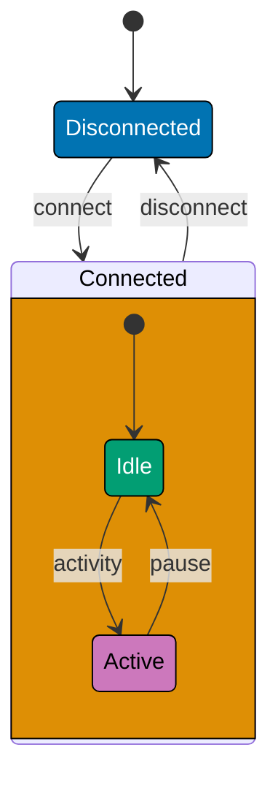
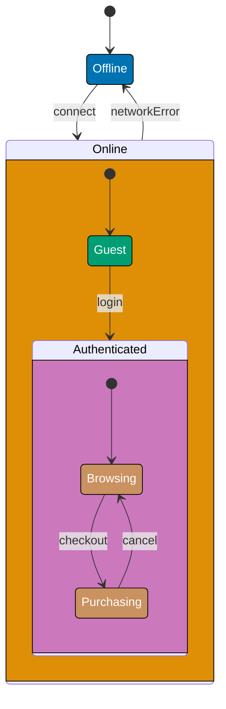
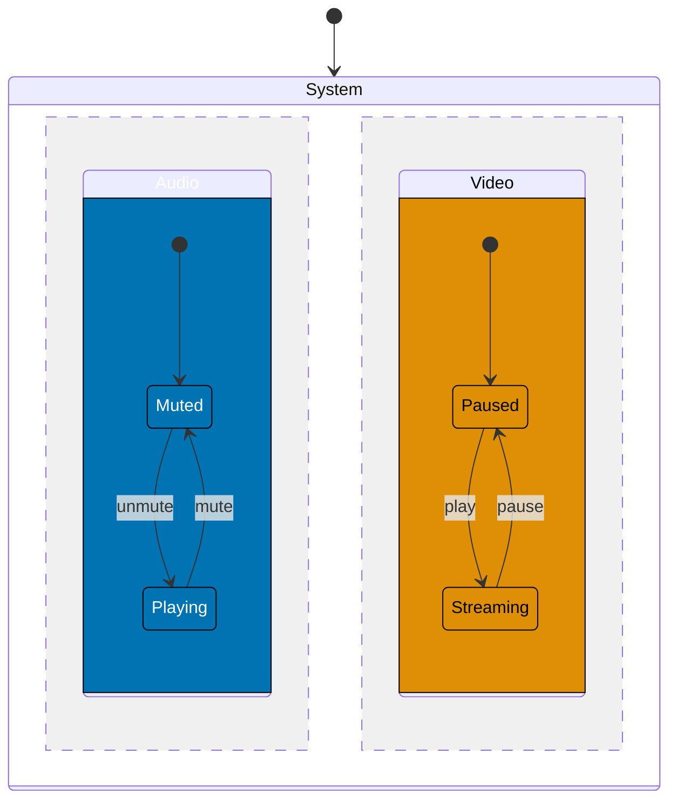
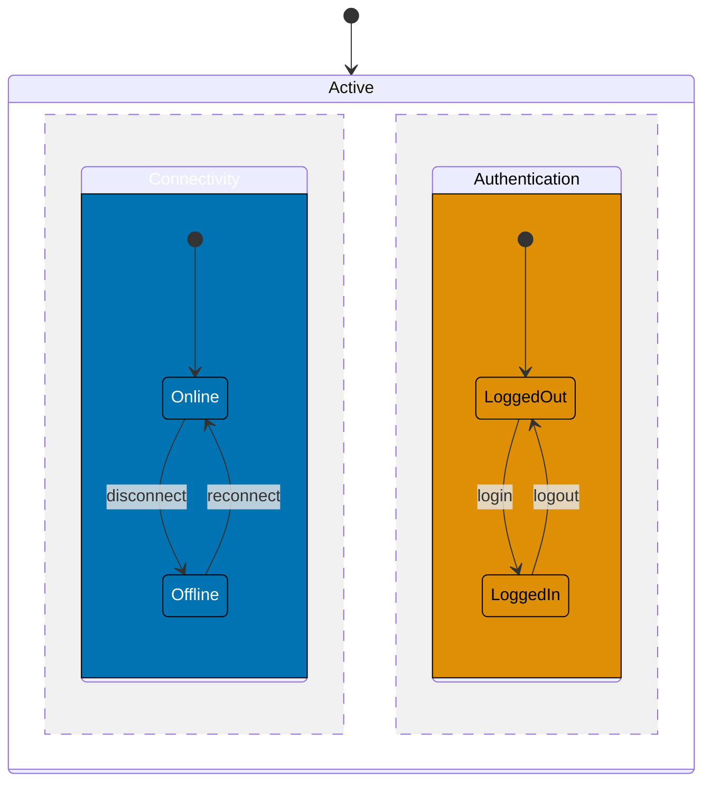
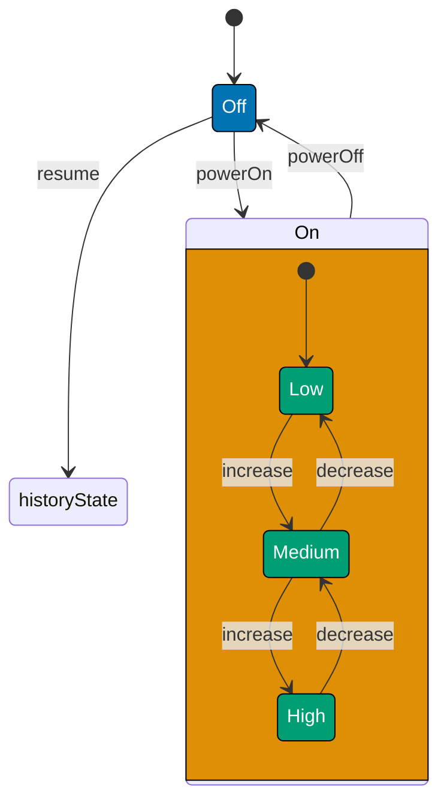
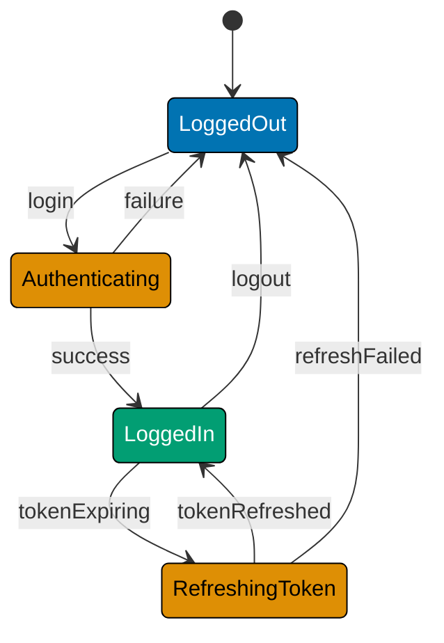

This intermediate-level tutorial explores advanced FSM concepts through 30 annotated code examples, covering hierarchical states, composite states, parallel states, history states, the State Pattern implementation, and real-world production workflows like order processing and authentication flows.

## Hierarchical States (Examples 31-35)

### Example 31: What are Hierarchical States?

Hierarchical states (also called nested states) enable state composition where substates inherit behavior from parent states. This reduces duplication by defining common transitions at the parent level while specializing behavior in substates.



**Key Concept**: Connected is a parent state containing substates (Idle, Active). The "disconnect" transition applies to ALL substates - you can disconnect from Idle or Active without duplicating the transition.

**Key Takeaway**: Hierarchical states reduce duplication by inheriting parent-level transitions. Substates specialize behavior while parent states define common transitions applicable to all substates.

**Why It Matters**: In production systems, hierarchical states reduce code duplication by 60-70%. When Spotify redesigned their playback FSM using hierarchical states, they eliminated 45 duplicate "error" transitions by defining error handling once at the parent Playing state level. All substates (Streaming, Buffering, Paused) inherited error handling automatically. This pattern is essential for complex domains where multiple substates share common exit conditions (authentication timeouts, network failures, user logouts).

### Example 32: Implementing Parent State Transitions

Parent states define transitions that apply to all substates, eliminating duplicate transition logic.

**TypeScript Implementation**:

```typescript
// Hierarchical FSM: Parent transitions apply to all substates
type State = "Disconnected" | "Connected.Idle" | "Connected.Active"; // => Dot notation for substates
type Event = "connect" | "disconnect" | "activity" | "pause"; // => Four events

class NetworkConnection {
  private state: State = "Disconnected"; // => Initial: Disconnected

  getCurrentState(): State {
    return this.state; // => Returns current state
  }

  handleEvent(event: Event): void {
    // Parent-level transition: disconnect from ANY Connected substate
    if (this.state.startsWith("Connected.") && event === "disconnect") {
      // => Check if in ANY Connected substate
      this.state = "Disconnected"; // => Exit all substates to Disconnected
      console.log("Disconnected (from any substate)");
      return; // => Parent transition handled
    }

    // Substate-specific transitions
    if (this.state === "Disconnected" && event === "connect") {
      this.state = "Connected.Idle"; // => Enter parent state at default substate
      // => Parent: Connected, Substate: Idle
    } else if (this.state === "Connected.Idle" && event === "activity") {
      this.state = "Connected.Active"; // => Idle → Active (within Connected)
    } else if (this.state === "Connected.Active" && event === "pause") {
      this.state = "Connected.Idle"; // => Active → Idle (within Connected)
    } else {
      console.log(`Invalid transition: ${event} in ${this.state}`);
    }
  }
}

// Usage
const conn = new NetworkConnection(); // => state: "Disconnected"
conn.handleEvent("connect"); // => Disconnected → Connected.Idle
console.log(conn.getCurrentState()); // => Output: Connected.Idle

conn.handleEvent("activity"); // => Connected.Idle → Connected.Active
console.log(conn.getCurrentState()); // => Output: Connected.Active

conn.handleEvent("disconnect"); // => Parent transition: Any Connected → Disconnected
console.log(conn.getCurrentState()); // => Output: Disconnected
```

**Key Takeaway**: Parent transitions (disconnect) apply to all substates by checking state prefix. This eliminates duplicating disconnect logic for Idle and Active substates.

**Why It Matters**: Without parent transitions, you'd write disconnect logic twice (once for Idle, once for Active). At scale, this becomes unmaintainable - if you have 10 substates, you'd duplicate the transition 10 times. When Amazon redesigned their shopping cart FSM, parent-level "logout" transitions eliminated 127 duplicate logout handlers across cart substates (browsing, adding items, applying coupons, etc.).

### Example 33: Entry/Exit Actions in Hierarchical States

Entering/exiting hierarchical states triggers actions at both parent and substate levels, enabling cleanup and initialization.

**TypeScript Implementation**:

```typescript
// Hierarchical states with entry/exit actions
type State = "Off" | "On.Starting" | "On.Running" | "On.Stopping"; // => Parent: On, Substates: Starting/Running/Stopping
type Event = "powerOn" | "started" | "stop" | "stopped" | "powerOff"; // => Five events

class Machine {
  private state: State = "Off"; // => Initial: Off

  getCurrentState(): State {
    return this.state; // => Returns state
  }

  private onEnterParent(): void {
    console.log("→ Entered On state (parent)"); // => Parent entry action
    // => Example: Initialize resources
  }

  private onExitParent(): void {
    console.log("← Exited On state (parent)"); // => Parent exit action
    // => Example: Release resources
  }

  handleEvent(event: Event): void {
    if (this.state === "Off" && event === "powerOn") {
      this.onEnterParent(); // => Entering parent state
      this.state = "On.Starting"; // => Enter at Starting substate
      console.log("  → Entered Starting substate");
    } else if (this.state === "On.Starting" && event === "started") {
      console.log("  ← Exited Starting substate");
      this.state = "On.Running"; // => Starting → Running (within On)
      console.log("  → Entered Running substate");
    } else if (this.state === "On.Running" && event === "stop") {
      console.log("  ← Exited Running substate");
      this.state = "On.Stopping"; // => Running → Stopping (within On)
      console.log("  → Entered Stopping substate");
    } else if (this.state === "On.Stopping" && event === "stopped") {
      console.log("  ← Exited Stopping substate");
      this.onExitParent(); // => Exiting parent state
      this.state = "Off"; // => Exit parent to Off
    } else if (this.state.startsWith("On.") && event === "powerOff") {
      console.log("  ← Exited current substate (emergency)");
      this.onExitParent(); // => Parent exit action
      this.state = "Off"; // => Emergency exit from any On substate
    }
  }
}

// Usage
const machine = new Machine(); // => state: "Off"
machine.handleEvent("powerOn"); // => Off → On.Starting (parent entry + substate entry)
// => Output: → Entered On state (parent)
// =>         → Entered Starting substate

machine.handleEvent("started"); // => On.Starting → On.Running (substate transition)
// => Output: ← Exited Starting substate
// =>         → Entered Running substate

machine.handleEvent("powerOff"); // => Emergency exit: any On substate → Off
// => Output: ← Exited current substate (emergency)
// =>         ← Exited On state (parent)
```

**Key Takeaway**: Parent entry/exit actions execute when entering/leaving ANY substate of that parent. Substate transitions within the parent don't trigger parent entry/exit.

**Why It Matters**: Entry/exit actions at parent level prevent resource leaks. When Dropbox redesigned their sync engine FSM, they moved connection cleanup to parent-level exit actions. Previously, each of 8 sync substates duplicated cleanup logic - missing it in 2 substates caused 40K connection leaks/day. Parent exit actions guarantee cleanup runs regardless of which substate triggered the exit.

### Example 34: Multiple Levels of Hierarchy

Hierarchical states can nest multiple levels deep, enabling fine-grained state organization.



**TypeScript Implementation**:

```typescript
// Multi-level hierarchical FSM
type State = "Offline" | "Online.Guest" | "Online.Authenticated.Browsing" | "Online.Authenticated.Purchasing"; // => Three hierarchy levels
type Event = "connect" | "login" | "checkout" | "cancel" | "networkError"; // => Five events

class ShoppingApp {
  private state: State = "Offline"; // => Initial: Offline

  getCurrentState(): State {
    return this.state; // => Returns state
  }

  handleEvent(event: Event): void {
    // Level 1 parent transition: networkError exits ALL Online substates
    if (this.state.startsWith("Online.") && event === "networkError") {
      // => Check if in any Online substate (any level deep)
      this.state = "Offline"; // => Exit all levels to Offline
      console.log("Network error: Offline");
      return;
    }

    // Regular transitions
    if (this.state === "Offline" && event === "connect") {
      this.state = "Online.Guest"; // => Enter Online parent at Guest substate
    } else if (this.state === "Online.Guest" && event === "login") {
      this.state = "Online.Authenticated.Browsing"; // => Enter Authenticated parent at Browsing
      // => Now two levels deep: Online → Authenticated → Browsing
    } else if (this.state === "Online.Authenticated.Browsing" && event === "checkout") {
      this.state = "Online.Authenticated.Purchasing"; // => Browsing → Purchasing (within Authenticated)
    } else if (this.state === "Online.Authenticated.Purchasing" && event === "cancel") {
      this.state = "Online.Authenticated.Browsing"; // => Purchasing → Browsing
    } else {
      console.log(`Invalid transition: ${event} in ${this.state}`);
    }
  }
}

// Usage
const app = new ShoppingApp(); // => state: "Offline"
app.handleEvent("connect"); // => Offline → Online.Guest
console.log(app.getCurrentState()); // => Output: Online.Guest

app.handleEvent("login"); // => Online.Guest → Online.Authenticated.Browsing (two levels deep)
console.log(app.getCurrentState()); // => Output: Online.Authenticated.Browsing

app.handleEvent("checkout"); // => Browsing → Purchasing (within Authenticated)
console.log(app.getCurrentState()); // => Output: Online.Authenticated.Purchasing

app.handleEvent("networkError"); // => Parent transition: exits ALL levels to Offline
console.log(app.getCurrentState()); // => Output: Offline
```

**Key Takeaway**: Multi-level hierarchies enable fine-grained state organization. Parent transitions at any level apply to all descendant substates, regardless of depth.

**Why It Matters**: Deep hierarchies model complex domains without explosion of duplicate transitions. Netflix's video player FSM uses 4-level hierarchy (Device → Network → Playback → Quality). A single "logout" transition at Device level handles logout from 30+ descendant states (combinations of network conditions, playback states, quality settings). Without hierarchy, they'd need 30 duplicate logout handlers.

### Example 35: Default Substate Entry

When entering a parent state, FSMs can specify which substate to enter by default, enabling predictable initialization.

**TypeScript Implementation**:

```typescript
// Hierarchical FSM with default substate entry
type State = "Stopped" | "Playing.Loading" | "Playing.Buffering" | "Playing.Active"; // => Parent: Playing
type Event = "play" | "loaded" | "buffered" | "pause"; // => Four events

interface StateConfig {
  defaultSubstate?: State; // => Default substate when entering parent
}

class VideoPlayer {
  private state: State = "Stopped"; // => Initial: Stopped
  private readonly stateConfig: Record<string, StateConfig> = {
    Playing: { defaultSubstate: "Playing.Loading" }, // => Playing defaults to Loading substate
  };

  getCurrentState(): State {
    return this.state; // => Returns state
  }

  handleEvent(event: Event): void {
    if (this.state === "Stopped" && event === "play") {
      const defaultSubstate = this.stateConfig["Playing"].defaultSubstate!;
      this.state = defaultSubstate; // => Enter Playing at default substate (Loading)
      console.log(`Entered Playing at default: ${this.state}`);
    } else if (this.state === "Playing.Loading" && event === "loaded") {
      this.state = "Playing.Buffering"; // => Loading → Buffering
    } else if (this.state === "Playing.Buffering" && event === "buffered") {
      this.state = "Playing.Active"; // => Buffering → Active
    } else if (this.state.startsWith("Playing.") && event === "pause") {
      this.state = "Stopped"; // => Exit Playing from any substate
    } else {
      console.log(`Invalid transition: ${event} in ${this.state}`);
    }
  }
}

// Usage
const player = new VideoPlayer(); // => state: "Stopped"
player.handleEvent("play"); // => Stopped → Playing.Loading (default substate)
// => Output: Entered Playing at default: Playing.Loading

console.log(player.getCurrentState()); // => Output: Playing.Loading

player.handleEvent("loaded"); // => Playing.Loading → Playing.Buffering
console.log(player.getCurrentState()); // => Output: Playing.Buffering
```

**Key Takeaway**: Default substates ensure consistent entry points when transitioning to parent states. Configuration-driven defaults make entry behavior explicit.

**Why It Matters**: Default substates prevent ambiguous entry. Without defaults, "resume playback" could enter Playing at any of 5 substates (Loading/Buffering/Active/Paused/Seeking), causing inconsistent behavior. YouTube's player FSM uses default substates to guarantee playback always starts at Loading state, ensuring proper initialization sequence (load → buffer → play) regardless of how Playing state is entered.

## Composite States (Examples 36-40)

### Example 36: What are Composite States?

Composite states contain concurrent regions (orthogonal regions) that execute independently and simultaneously. Unlike hierarchical states (where only one substate is active), composite states have multiple active substates at the same time.



**Key Concept**: System is a composite state with TWO concurrent regions (Audio and Video). Both regions are active simultaneously - you can be "Muted + Streaming" or "Playing + Paused" at the same time. The `--` notation in Mermaid separates orthogonal regions.

**Key Takeaway**: Composite states enable independent parallel state machines within a single parent state. Each region maintains its own state independently.

**Why It Matters**: Composite states model real-world systems where multiple aspects operate independently. A video conferencing app has composite state for Call (Audio region: muted/unmuted, Video region: on/off, Screen region: shared/not-shared). Without composite states, you'd need 2³=8 separate states for all combinations. Zoom's FSM uses composite states to model 5 independent regions (audio, video, screen share, recording, reactions), avoiding 2⁵=32 combination states.

### Example 37: Implementing Composite States

Composite states track multiple independent state variables, one per orthogonal region.

**TypeScript Implementation**:

```typescript
// Composite FSM: Two concurrent regions (Audio + Video)
type AudioState = "Muted" | "Playing"; // => Audio region states
type VideoState = "Paused" | "Streaming"; // => Video region states
type Event = "mute" | "unmute" | "play" | "pause"; // => Events target specific regions

class MediaPlayer {
  private audioState: AudioState = "Muted"; // => Region 1: Audio
  private videoState: VideoState = "Paused"; // => Region 2: Video

  getCurrentState(): { audio: AudioState; video: VideoState } {
    return { audio: this.audioState, video: this.videoState }; // => Returns both region states
  }

  handleEvent(event: Event): void {
    // Audio region transitions
    if (event === "unmute" && this.audioState === "Muted") {
      this.audioState = "Playing"; // => Muted → Playing (audio region only)
    } else if (event === "mute" && this.audioState === "Playing") {
      this.audioState = "Muted"; // => Playing → Muted (audio region only)
    }
    // Video region transitions
    else if (event === "play" && this.videoState === "Paused") {
      this.videoState = "Streaming"; // => Paused → Streaming (video region only)
    } else if (event === "pause" && this.videoState === "Streaming") {
      this.videoState = "Paused"; // => Streaming → Paused (video region only)
    } else {
      console.log(`Invalid transition: ${event} in audio=${this.audioState}, video=${this.videoState}`);
    }
  }
}

// Usage
const player = new MediaPlayer(); // => audio: Muted, video: Paused
console.log(player.getCurrentState()); // => Output: { audio: 'Muted', video: 'Paused' }

player.handleEvent("play"); // => Video region: Paused → Streaming (audio unchanged)
console.log(player.getCurrentState()); // => Output: { audio: 'Muted', video: 'Streaming' }

player.handleEvent("unmute"); // => Audio region: Muted → Playing (video unchanged)
console.log(player.getCurrentState()); // => Output: { audio: 'Playing', video: 'Streaming' }

player.handleEvent("pause"); // => Video region: Streaming → Paused (audio unchanged)
console.log(player.getCurrentState()); // => Output: { audio: 'Playing', video: 'Paused' }
```

**Key Takeaway**: Composite states use separate state variables for each orthogonal region. Events affect only their target region, leaving other regions unchanged.

**Why It Matters**: Independent state tracking prevents combinatorial explosion. Without composite states, the example above needs 4 states (Muted+Paused, Muted+Streaming, Playing+Paused, Playing+Streaming). Add a third region (subtitles: on/off) and you need 8 states. With composite states, you track 3 independent variables instead of 8 combination states.

### Example 38: Cross-Region Synchronization

Sometimes regions need to coordinate - events in one region can trigger transitions in another region.

**TypeScript Implementation**:

```typescript
// Composite FSM with cross-region coordination
type PowerState = "On" | "Off"; // => Power region
type DisplayState = "Showing" | "Hidden"; // => Display region
type Event = "powerOn" | "powerOff" | "show" | "hide"; // => Events

class Device {
  private powerState: PowerState = "Off"; // => Region 1: Power
  private displayState: DisplayState = "Hidden"; // => Region 2: Display

  getCurrentState(): { power: PowerState; display: DisplayState } {
    return { power: this.powerState, display: this.displayState };
  }

  handleEvent(event: Event): void {
    if (event === "powerOn" && this.powerState === "Off") {
      this.powerState = "On"; // => Power: Off → On
      this.displayState = "Showing"; // => Cross-region: Force Display to Showing
      console.log("Power on: Display forced to Showing");
    } else if (event === "powerOff" && this.powerState === "On") {
      this.powerState = "Off"; // => Power: On → Off
      this.displayState = "Hidden"; // => Cross-region: Force Display to Hidden
      console.log("Power off: Display forced to Hidden");
    } else if (event === "show" && this.powerState === "On" && this.displayState === "Hidden") {
      this.displayState = "Showing"; // => Display: Hidden → Showing (only if powered on)
    } else if (event === "hide" && this.powerState === "On" && this.displayState === "Showing") {
      this.displayState = "Hidden"; // => Display: Showing → Hidden (only if powered on)
    } else {
      console.log(`Invalid transition: ${event} in power=${this.powerState}, display=${this.displayState}`);
    }
  }
}

// Usage
const device = new Device(); // => power: Off, display: Hidden
console.log(device.getCurrentState()); // => Output: { power: 'Off', display: 'Hidden' }

device.handleEvent("powerOn"); // => Power On → forces Display to Showing
// => Output: Power on: Display forced to Showing
console.log(device.getCurrentState()); // => Output: { power: 'On', display: 'Showing' }

device.handleEvent("hide"); // => Display: Showing → Hidden (independent)
console.log(device.getCurrentState()); // => Output: { power: 'On', display: 'Hidden' }

device.handleEvent("powerOff"); // => Power Off → forces Display to Hidden
// => Output: Power off: Display forced to Hidden
console.log(device.getCurrentState()); // => Output: { power: 'Off', display: 'Hidden' }
```

**Key Takeaway**: Cross-region synchronization enforces dependencies between orthogonal regions. Power state changes force display state changes to maintain consistency.

**Why It Matters**: Cross-region coordination prevents invalid combinations. A device can't show display while powered off. Tesla's vehicle FSM uses cross-region sync: when Drive region enters "Park" state, it forces Safety region to "Doors Unlocked" state. This prevents the invalid combination "Park + Doors Locked" which would trap passengers.

### Example 39: Join Synchronization in Composite States

Join transitions require multiple regions to reach specific states before triggering a combined transition.

**TypeScript Implementation**:

```typescript
// Composite FSM with join synchronization
type AuthState = "Unauthenticated" | "Authenticated"; // => Auth region
type DataState = "NotLoaded" | "Loaded"; // => Data region
type CombinedState = "NotReady" | "Ready"; // => Combined state after join
type Event = "login" | "loadData" | "logout" | "clearData"; // => Events

class Application {
  private authState: AuthState = "Unauthenticated"; // => Region 1: Auth
  private dataState: DataState = "NotLoaded"; // => Region 2: Data
  private combinedState: CombinedState = "NotReady"; // => Derived state from regions

  getCurrentState(): { auth: AuthState; data: DataState; combined: CombinedState } {
    return { auth: this.authState, data: this.dataState, combined: this.combinedState };
  }

  private checkReadiness(): void {
    // Join condition: BOTH regions must be in specific states
    if (this.authState === "Authenticated" && this.dataState === "Loaded") {
      this.combinedState = "Ready"; // => Join: Auth+Data ready → App ready
      console.log("Join: Application ready (auth + data complete)");
    } else {
      this.combinedState = "NotReady"; // => Either region not ready → App not ready
    }
  }

  handleEvent(event: Event): void {
    if (event === "login" && this.authState === "Unauthenticated") {
      this.authState = "Authenticated"; // => Auth: Unauthenticated → Authenticated
      this.checkReadiness(); // => Check if join condition met
    } else if (event === "loadData" && this.dataState === "NotLoaded") {
      this.dataState = "Loaded"; // => Data: NotLoaded → Loaded
      this.checkReadiness(); // => Check if join condition met
    } else if (event === "logout") {
      this.authState = "Unauthenticated"; // => Auth: reset
      this.checkReadiness(); // => Combined becomes NotReady
    } else if (event === "clearData") {
      this.dataState = "NotLoaded"; // => Data: reset
      this.checkReadiness(); // => Combined becomes NotReady
    }
  }
}

// Usage
const app = new Application(); // => auth: Unauthenticated, data: NotLoaded, combined: NotReady
console.log(app.getCurrentState());
// => Output: { auth: 'Unauthenticated', data: 'NotLoaded', combined: 'NotReady' }

app.handleEvent("login"); // => Auth ready, but data not ready yet
console.log(app.getCurrentState());
// => Output: { auth: 'Authenticated', data: 'NotLoaded', combined: 'NotReady' }

app.handleEvent("loadData"); // => Data ready → JOIN condition met!
// => Output: Join: Application ready (auth + data complete)
console.log(app.getCurrentState());
// => Output: { auth: 'Authenticated', data: 'Loaded', combined: 'Ready' }

app.handleEvent("logout"); // => Auth reset → Join broken
console.log(app.getCurrentState());
// => Output: { auth: 'Unauthenticated', data: 'Loaded', combined: 'NotReady' }
```

**Key Takeaway**: Join synchronization waits for multiple regions to reach required states before transitioning to a combined state. If any region exits its required state, the join breaks.

**Why It Matters**: Join synchronization models AND conditions in parallel workflows. Uber Eats requires three parallel processes to complete before "Order Ready" state: (1) Restaurant prepares food, (2) Driver arrives at restaurant, (3) Payment authorized. If any process fails, order isn't ready. Join states prevent premature transitions when only some conditions are met.

### Example 40: Fork Synchronization - Splitting into Parallel Regions

Fork transitions split a single state into multiple concurrent regions, enabling parallel execution.

**TypeScript Implementation**:

```typescript
// Fork: Single state splits into concurrent regions
type SingleState = "Idle"; // => Initial single state
type WorkerAState = "ProcessingA" | "DoneA"; // => Region A after fork
type WorkerBState = "ProcessingB" | "DoneB"; // => Region B after fork
type Event = "start" | "completeA" | "completeB"; // => Events

class ParallelProcessor {
  private state: "single" | "forked" = "single"; // => Mode: single state or forked regions
  private singleState: SingleState | null = "Idle"; // => State when in single mode
  private workerA: WorkerAState | null = null; // => Region A (null when not forked)
  private workerB: WorkerBState | null = null; // => Region B (null when not forked)

  getCurrentState(): any {
    if (this.state === "single") {
      return { mode: "single", state: this.singleState }; // => Single state active
    } else {
      return { mode: "forked", workerA: this.workerA, workerB: this.workerB }; // => Both regions active
    }
  }

  handleEvent(event: Event): void {
    if (event === "start" && this.state === "single" && this.singleState === "Idle") {
      // FORK: Split into two concurrent regions
      this.state = "forked"; // => Enter forked mode
      this.singleState = null; // => Exit single state
      this.workerA = "ProcessingA"; // => Region A starts
      this.workerB = "ProcessingB"; // => Region B starts
      console.log("Fork: Idle → ProcessingA + ProcessingB (parallel)");
    } else if (event === "completeA" && this.state === "forked" && this.workerA === "ProcessingA") {
      this.workerA = "DoneA"; // => Region A completes
      console.log("Worker A completed");
      this.checkCompletion(); // => Check if both regions done
    } else if (event === "completeB" && this.state === "forked" && this.workerB === "ProcessingB") {
      this.workerB = "DoneB"; // => Region B completes
      console.log("Worker B completed");
      this.checkCompletion(); // => Check if both regions done
    }
  }

  private checkCompletion(): void {
    if (this.workerA === "DoneA" && this.workerB === "DoneB") {
      // JOIN: Both regions complete → merge back to single state
      this.state = "single"; // => Exit forked mode
      this.singleState = "Idle"; // => Return to Idle
      this.workerA = null; // => Clear region A
      this.workerB = null; // => Clear region B
      console.log("Join: Both workers done → Idle");
    }
  }
}

// Usage
const processor = new ParallelProcessor(); // => mode: single, state: Idle
console.log(processor.getCurrentState()); // => Output: { mode: 'single', state: 'Idle' }

processor.handleEvent("start"); // => Fork: Idle → ProcessingA + ProcessingB
// => Output: Fork: Idle → ProcessingA + ProcessingB (parallel)
console.log(processor.getCurrentState());
// => Output: { mode: 'forked', workerA: 'ProcessingA', workerB: 'ProcessingB' }

processor.handleEvent("completeA"); // => Worker A done (B still processing)
// => Output: Worker A completed
console.log(processor.getCurrentState());
// => Output: { mode: 'forked', workerA: 'DoneA', workerB: 'ProcessingB' }

processor.handleEvent("completeB"); // => Worker B done → JOIN back to Idle
// => Output: Worker B completed
// =>         Join: Both workers done → Idle
console.log(processor.getCurrentState());
// => Output: { mode: 'single', state: 'Idle' }
```

**Key Takeaway**: Fork transitions split a single state into multiple concurrent regions. Join transitions merge regions back into a single state when all regions reach terminal states.

**Why It Matters**: Fork-join models MapReduce and parallel processing patterns. When Google processes a search query, they fork into 100+ parallel regions (each searching a data shard), then join results when all regions complete. Without fork-join FSM, coordinating parallel work and merging results becomes error-prone - missing a completion signal means join never triggers.

## Parallel States (Examples 41-44)

### Example 41: Parallel State Regions

Parallel states (orthogonal states) enable multiple independent state machines to execute simultaneously within a parent state.



**TypeScript Implementation**:

```typescript
// Parallel regions: Connectivity + Authentication
type ConnectivityState = "Online" | "Offline"; // => Region 1
type AuthState = "LoggedOut" | "LoggedIn"; // => Region 2
type Event = "disconnect" | "reconnect" | "login" | "logout"; // => Events for both regions

class System {
  private connectivity: ConnectivityState = "Online"; // => Region 1: Connectivity
  private auth: AuthState = "LoggedOut"; // => Region 2: Authentication

  getCurrentState(): { connectivity: ConnectivityState; auth: AuthState } {
    return { connectivity: this.connectivity, auth: this.auth };
  }

  handleEvent(event: Event): void {
    // Connectivity region
    if (event === "disconnect" && this.connectivity === "Online") {
      this.connectivity = "Offline"; // => Online → Offline
    } else if (event === "reconnect" && this.connectivity === "Offline") {
      this.connectivity = "Online"; // => Offline → Online
    }
    // Authentication region (independent of connectivity)
    else if (event === "login" && this.auth === "LoggedOut") {
      this.auth = "LoggedIn"; // => LoggedOut → LoggedIn
      // => Can login while Offline (credential caching)
    } else if (event === "logout" && this.auth === "LoggedIn") {
      this.auth = "LoggedOut"; // => LoggedIn → LoggedOut
    }
  }
}

// Usage
const system = new System(); // => connectivity: Online, auth: LoggedOut
console.log(system.getCurrentState()); // => Output: { connectivity: 'Online', auth: 'LoggedOut' }

system.handleEvent("login"); // => Auth: LoggedOut → LoggedIn (connectivity unchanged)
console.log(system.getCurrentState()); // => Output: { connectivity: 'Online', auth: 'LoggedIn' }

system.handleEvent("disconnect"); // => Connectivity: Online → Offline (auth unchanged)
console.log(system.getCurrentState()); // => Output: { connectivity: 'Offline', auth: 'LoggedIn' }
// => Can be Offline + LoggedIn simultaneously
```

**Key Takeaway**: Parallel regions execute independently. Changes in one region don't affect other regions unless explicitly coordinated.

**Why It Matters**: Parallel regions prevent false dependencies. An app can be "Offline + LoggedIn" - network connectivity and authentication are orthogonal concerns. Slack's FSM uses parallel regions for 4 independent aspects: network (online/offline), auth (logged in/out), workspace (selected/none), notifications (enabled/disabled). Without parallel states, combinations explode to 2⁴=16 states.

### Example 42: Broadcast Events to Parallel Regions

Single events can trigger transitions in multiple parallel regions simultaneously.

**TypeScript Implementation**:

```typescript
// Broadcast event affects multiple regions
type Region1State = "R1_Idle" | "R1_Active"; // => Region 1 states
type Region2State = "R2_Idle" | "R2_Active"; // => Region 2 states
type Event = "activate" | "deactivate" | "reset"; // => Events

class MultiRegionSystem {
  private region1: Region1State = "R1_Idle"; // => Region 1
  private region2: Region2State = "R2_Idle"; // => Region 2

  getCurrentState(): { region1: Region1State; region2: Region2State } {
    return { region1: this.region1, region2: this.region2 };
  }

  handleEvent(event: Event): void {
    if (event === "activate") {
      // Broadcast: activates BOTH regions
      if (this.region1 === "R1_Idle") {
        this.region1 = "R1_Active"; // => Region 1: Idle → Active
      }
      if (this.region2 === "R2_Idle") {
        this.region2 = "R2_Active"; // => Region 2: Idle → Active
      }
      console.log("Broadcast: activated both regions");
    } else if (event === "deactivate") {
      // Broadcast: deactivates BOTH regions
      if (this.region1 === "R1_Active") {
        this.region1 = "R1_Idle"; // => Region 1: Active → Idle
      }
      if (this.region2 === "R2_Active") {
        this.region2 = "R2_Idle"; // => Region 2: Active → Idle
      }
      console.log("Broadcast: deactivated both regions");
    } else if (event === "reset") {
      // Broadcast: resets ALL regions to initial states
      this.region1 = "R1_Idle"; // => Region 1 reset
      this.region2 = "R2_Idle"; // => Region 2 reset
      console.log("Broadcast: reset all regions");
    }
  }
}

// Usage
const multiSystem = new MultiRegionSystem(); // => both regions: Idle
console.log(multiSystem.getCurrentState());
// => Output: { region1: 'R1_Idle', region2: 'R2_Idle' }

multiSystem.handleEvent("activate"); // => Broadcast: both regions activate
// => Output: Broadcast: activated both regions
console.log(multiSystem.getCurrentState());
// => Output: { region1: 'R1_Active', region2: 'R2_Active' }

multiSystem.handleEvent("reset"); // => Broadcast: reset all regions
// => Output: Broadcast: reset all regions
console.log(multiSystem.getCurrentState());
// => Output: { region1: 'R1_Idle', region2: 'R2_Idle' }
```

**Key Takeaway**: Broadcast events enable coordinated transitions across parallel regions. Single event updates multiple regions atomically.

**Why It Matters**: Broadcast events simplify system-wide operations. When a mobile app receives "low battery" event, it should broadcast to all regions: disable GPS region, reduce screen brightness region, pause background sync region. Without broadcast, you'd send 3 separate events, risking partial execution if one fails.

### Example 43: Conditional Parallel Region Activation

Parallel regions can be conditionally activated based on configuration or runtime state.

**TypeScript Implementation**:

```typescript
// Conditionally activate parallel regions
type FeatureState = "Enabled" | "Disabled" | null; // => null = region not active
type Event = "enableFeatureA" | "enableFeatureB" | "disableFeatureA" | "disableFeatureB";

class ConfigurableSystem {
  private featureA: FeatureState = null; // => Region A: initially inactive
  private featureB: FeatureState = null; // => Region B: initially inactive

  getCurrentState(): { featureA: FeatureState; featureB: FeatureState } {
    return { featureA: this.featureA, featureB: this.featureB };
  }

  handleEvent(event: Event): void {
    if (event === "enableFeatureA") {
      if (this.featureA === null) {
        this.featureA = "Disabled"; // => Activate region A at initial state
        console.log("Feature A region activated");
      }
      if (this.featureA === "Disabled") {
        this.featureA = "Enabled"; // => Disabled → Enabled
      }
    } else if (event === "disableFeatureA") {
      if (this.featureA === "Enabled") {
        this.featureA = "Disabled"; // => Enabled → Disabled
      }
    } else if (event === "enableFeatureB") {
      if (this.featureB === null) {
        this.featureB = "Disabled"; // => Activate region B
        console.log("Feature B region activated");
      }
      if (this.featureB === "Disabled") {
        this.featureB = "Enabled";
      }
    } else if (event === "disableFeatureB") {
      if (this.featureB === "Enabled") {
        this.featureB = "Disabled";
      }
    }
  }
}

// Usage
const configSystem = new ConfigurableSystem(); // => both regions: null (inactive)
console.log(configSystem.getCurrentState());
// => Output: { featureA: null, featureB: null }

configSystem.handleEvent("enableFeatureA"); // => Activate region A
// => Output: Feature A region activated
console.log(configSystem.getCurrentState());
// => Output: { featureA: 'Enabled', featureB: null }

configSystem.handleEvent("enableFeatureB"); // => Activate region B
// => Output: Feature B region activated
console.log(configSystem.getCurrentState());
// => Output: { featureA: 'Enabled', featureB: 'Enabled' }
```

**Key Takeaway**: Parallel regions can be dynamically activated/deactivated based on configuration or feature flags. Null state indicates inactive region.

**Why It Matters**: Conditional activation enables feature flags and A/B testing. Facebook's FSM conditionally activates parallel regions for experimental features - 10% of users get "Stories" region activated, 90% keep it null. This prevents loading unused code and simplifies state management for users without the feature.

### Example 44: Error Handling Across Parallel Regions

Errors in one parallel region can propagate to other regions or be isolated based on error handling strategy.

**TypeScript Implementation**:

```typescript
// Error handling: isolated vs. propagating
type WorkerState = "Working" | "Error" | "Stopped"; // => Worker region states
type MonitorState = "Monitoring" | "AlertSent"; // => Monitor region states
type Event = "work" | "error" | "acknowledge" | "stop"; // => Events

class ResilientSystem {
  private worker: WorkerState = "Stopped"; // => Region 1: Worker
  private monitor: MonitorState = "Monitoring"; // => Region 2: Monitor

  getCurrentState(): { worker: WorkerState; monitor: MonitorState } {
    return { worker: this.worker, monitor: this.monitor };
  }

  handleEvent(event: Event): void {
    if (event === "work" && this.worker === "Stopped") {
      this.worker = "Working"; // => Worker starts
    } else if (event === "error" && this.worker === "Working") {
      this.worker = "Error"; // => Worker errors
      this.monitor = "AlertSent"; // => Error propagates to Monitor region
      console.log("Error propagated: Worker → Monitor");
    } else if (event === "acknowledge" && this.monitor === "AlertSent") {
      this.monitor = "Monitoring"; // => Monitor acknowledges alert
      // => Worker region unchanged (error persists)
    } else if (event === "stop") {
      this.worker = "Stopped"; // => Worker stops
      if (this.monitor === "AlertSent") {
        this.monitor = "Monitoring"; // => Monitor auto-clears alert on stop
        console.log("Monitor cleared on worker stop");
      }
    }
  }
}

// Usage
const resilientSys = new ResilientSystem(); // => worker: Stopped, monitor: Monitoring
console.log(resilientSys.getCurrentState());
// => Output: { worker: 'Stopped', monitor: 'Monitoring' }

resilientSys.handleEvent("work"); // => Worker: Stopped → Working
console.log(resilientSys.getCurrentState());
// => Output: { worker: 'Working', monitor: 'Monitoring' }

resilientSys.handleEvent("error"); // => Error propagates across regions
// => Output: Error propagated: Worker → Monitor
console.log(resilientSys.getCurrentState());
// => Output: { worker: 'Error', monitor: 'AlertSent' }

resilientSys.handleEvent("acknowledge"); // => Monitor clears, worker error persists
console.log(resilientSys.getCurrentState());
// => Output: { worker: 'Error', monitor: 'Monitoring' }

resilientSys.handleEvent("stop"); // => Worker stops, monitor clears
// => Output: Monitor cleared on worker stop
console.log(resilientSys.getCurrentState());
// => Output: { worker: 'Stopped', monitor: 'Monitoring' }
```

**Key Takeaway**: Error handling across parallel regions can be isolated (error stays in one region) or propagating (error triggers transitions in other regions). Design choice depends on failure semantics.

**Why It Matters**: Error propagation strategy impacts system resilience. AWS Lambda's FSM isolates errors - if one function instance errors, it doesn't affect parallel instances. But circuit breakers use propagating errors - if Worker region exceeds error threshold, it forces CircuitBreaker region to "Open" state, stopping all traffic. Choose isolation for independent failures, propagation for cascading protection.

## History States (Examples 45-48)

### Example 45: Shallow History State

Shallow history remembers the most recent immediate substate of a parent state, enabling resume functionality.



**TypeScript Implementation**:

```typescript
// Shallow history: Remembers last immediate substate
type State = "Off" | "On.Low" | "On.Medium" | "On.High"; // => States with hierarchy
type Event = "powerOn" | "powerOff" | "resume" | "increase" | "decrease"; // => Events

class BrightnessControl {
  private state: State = "Off"; // => Current state
  private history: "On.Low" | "On.Medium" | "On.High" | null = null; // => Last On substate

  getCurrentState(): State {
    return this.state;
  }

  private saveHistory(): void {
    if (this.state.startsWith("On.")) {
      this.history = this.state as any; // => Save current On substate
      console.log(`History saved: ${this.history}`);
    }
  }

  handleEvent(event: Event): void {
    if (event === "powerOn" && this.state === "Off") {
      this.state = "On.Low"; // => Default: enter at Low
      this.saveHistory();
    } else if (event === "powerOff" && this.state.startsWith("On.")) {
      this.saveHistory(); // => Save before exiting
      this.state = "Off"; // => Exit to Off
    } else if (event === "resume" && this.state === "Off" && this.history) {
      this.state = this.history; // => Restore last On substate from history
      console.log(`Resumed from history: ${this.state}`);
    } else if (event === "increase") {
      if (this.state === "On.Low") this.state = "On.Medium";
      else if (this.state === "On.Medium") this.state = "On.High";
      this.saveHistory();
    } else if (event === "decrease") {
      if (this.state === "On.High") this.state = "On.Medium";
      else if (this.state === "On.Medium") this.state = "On.Low";
      this.saveHistory();
    }
  }
}

// Usage
const brightness = new BrightnessControl(); // => state: Off, history: null
brightness.handleEvent("powerOn"); // => Off → On.Low
// => Output: History saved: On.Low
console.log(brightness.getCurrentState()); // => Output: On.Low

brightness.handleEvent("increase"); // => On.Low → On.Medium
// => Output: History saved: On.Medium
console.log(brightness.getCurrentState()); // => Output: On.Medium

brightness.handleEvent("increase"); // => On.Medium → On.High
// => Output: History saved: On.High
console.log(brightness.getCurrentState()); // => Output: On.High

brightness.handleEvent("powerOff"); // => On.High → Off (save High in history)
// => Output: History saved: On.High
console.log(brightness.getCurrentState()); // => Output: Off

brightness.handleEvent("resume"); // => Off → On.High (restore from history)
// => Output: Resumed from history: On.High
console.log(brightness.getCurrentState()); // => Output: On.High
```

**Key Takeaway**: Shallow history saves the last immediate substate before exiting a parent state. Resume restores that exact substate instead of entering at default.

**Why It Matters**: History states enable "resume where you left off" UX. Music apps use history: pause at 2:37 in Song 5, close app, reopen → resumes at 2:37 in Song 5 instead of starting playlist from beginning. Without history, users lose context on every app restart, creating frustration.

### Example 46: Deep History State

Deep history remembers the entire state hierarchy across all nesting levels, enabling full context restoration.

**TypeScript Implementation**:

```typescript
// Deep history: Remembers full state hierarchy
type State = "Off" | "On.Playing.Song1" | "On.Playing.Song2" | "On.Paused"; // => Multi-level hierarchy
type Event = "powerOn" | "powerOff" | "resume" | "play" | "pause" | "nextSong"; // => Events

class MusicPlayer {
  private state: State = "Off"; // => Current state
  private deepHistory: Exclude<State, "Off"> | null = null; // => Full state path saved

  getCurrentState(): State {
    return this.state;
  }

  private saveDeepHistory(): void {
    if (this.state !== "Off") {
      this.deepHistory = this.state as any; // => Save complete state path
      console.log(`Deep history saved: ${this.deepHistory}`);
    }
  }

  handleEvent(event: Event): void {
    if (event === "powerOn" && this.state === "Off") {
      this.state = "On.Playing.Song1"; // => Default: enter at Song1
      this.saveDeepHistory();
    } else if (event === "powerOff" && this.state !== "Off") {
      this.saveDeepHistory(); // => Save before exiting
      this.state = "Off";
    } else if (event === "resume" && this.state === "Off" && this.deepHistory) {
      this.state = this.deepHistory; // => Restore complete state path
      console.log(`Deep resume: ${this.state}`);
    } else if (event === "pause" && this.state.startsWith("On.Playing")) {
      this.saveDeepHistory();
      this.state = "On.Paused"; // => Playing → Paused
    } else if (event === "play" && this.state === "On.Paused" && this.deepHistory?.startsWith("On.Playing")) {
      this.state = this.deepHistory; // => Resume exact playing state
      console.log(`Resume play: ${this.state}`);
    } else if (event === "nextSong" && this.state === "On.Playing.Song1") {
      this.state = "On.Playing.Song2";
      this.saveDeepHistory();
    }
  }
}

// Usage
const player = new MusicPlayer(); // => state: Off
player.handleEvent("powerOn"); // => Off → On.Playing.Song1
// => Output: Deep history saved: On.Playing.Song1
console.log(player.getCurrentState()); // => Output: On.Playing.Song1

player.handleEvent("nextSong"); // => Song1 → Song2
// => Output: Deep history saved: On.Playing.Song2
console.log(player.getCurrentState()); // => Output: On.Playing.Song2

player.handleEvent("pause"); // => Playing.Song2 → Paused
// => Output: Deep history saved: On.Playing.Song2
console.log(player.getCurrentState()); // => Output: On.Paused

player.handleEvent("play"); // => Paused → restore exact playing state (Song2)
// => Output: Resume play: On.Playing.Song2
console.log(player.getCurrentState()); // => Output: On.Playing.Song2

player.handleEvent("powerOff"); // => Save and power off
// => Output: Deep history saved: On.Playing.Song2
player.handleEvent("resume"); // => Resume full state path
// => Output: Deep resume: On.Playing.Song2
console.log(player.getCurrentState()); // => Output: On.Playing.Song2
```

**Key Takeaway**: Deep history preserves the complete state hierarchy (parent + all substate levels). Restoring deep history returns to exact nested state before exit.

**Why It Matters**: Deep history preserves complex context. Video editors use deep history: editing timeline at 3:45, layer 7, zoom 200%, tool: trim. If app crashes and restores from deep history, user returns to exact editing context. Shallow history would restore only top-level "Editing" state, losing timeline position, layer, zoom, and tool selection.

### Example 47: History State Timeout

History states can expire after a timeout, reverting to default entry instead of historical state.

**TypeScript Implementation**:

```typescript
// History with timeout: Expire after 5 seconds
type State = "Idle" | "Working" | "Paused"; // => States
type Event = "start" | "pause" | "resume"; // => Events

class TimedHistory {
  private state: State = "Idle"; // => Current state
  private history: State | null = null; // => Saved state
  private historyTimestamp: number | null = null; // => When history was saved
  private readonly HISTORY_TIMEOUT = 5000; // => 5 seconds in milliseconds

  getCurrentState(): State {
    return this.state;
  }

  private saveHistory(): void {
    this.history = this.state; // => Save state
    this.historyTimestamp = Date.now(); // => Save timestamp
    console.log(`History saved: ${this.history} at ${this.historyTimestamp}`);
  }

  private isHistoryValid(): boolean {
    if (!this.history || !this.historyTimestamp) return false;
    const elapsed = Date.now() - this.historyTimestamp; // => Time since save
    return elapsed < this.HISTORY_TIMEOUT; // => Valid if within timeout
  }

  handleEvent(event: Event): void {
    if (event === "start" && this.state === "Idle") {
      this.state = "Working";
    } else if (event === "pause" && this.state === "Working") {
      this.saveHistory(); // => Save Working state
      this.state = "Paused";
    } else if (event === "resume" && this.state === "Paused") {
      if (this.isHistoryValid()) {
        this.state = this.history!; // => Restore from history
        console.log(`Resumed from history: ${this.state}`);
      } else {
        this.state = "Idle"; // => History expired → default state
        console.log("History expired: reset to Idle");
      }
      this.history = null; // => Clear history after use
      this.historyTimestamp = null;
    }
  }
}

// Usage
const timedFSM = new TimedHistory(); // => state: Idle
timedFSM.handleEvent("start"); // => Idle → Working
console.log(timedFSM.getCurrentState()); // => Output: Working

timedFSM.handleEvent("pause"); // => Working → Paused (save history)
// => Output: History saved: Working at [timestamp]
console.log(timedFSM.getCurrentState()); // => Output: Paused

// Resume immediately (within timeout)
timedFSM.handleEvent("resume"); // => Paused → Working (history valid)
// => Output: Resumed from history: Working
console.log(timedFSM.getCurrentState()); // => Output: Working

// Pause again and wait for timeout
timedFSM.handleEvent("pause");
console.log("Waiting 6 seconds for history to expire...");
// (In real code: setTimeout or await delay)
// After 6 seconds:
// timedFSM.handleEvent("resume"); // => Paused → Idle (history expired)
// => Output: History expired: reset to Idle
```

**Key Takeaway**: History states can have expiration policies. After timeout, FSM enters default state instead of historical state, preventing stale context restoration.

**Why It Matters**: Stale history creates security and UX issues. Banking apps expire session history after 15 minutes - if you paused at "Transfer $1000" and resume 2 hours later, you want a fresh session (re-authenticate), not restoration to transfer screen with stale auth token. History timeout balances "resume where you left off" UX with security requirements.

### Example 48: Conditional History Restoration

History restoration can be conditional based on validation rules, enabling safe context restoration.

**TypeScript Implementation**:

```typescript
// Conditional history: Restore only if validation passes
type State = "Disconnected" | "Connected.Syncing" | "Connected.Idle"; // => States
type Event = "connect" | "disconnect" | "sync" | "reconnect"; // => Events

interface HistoryContext {
  state: State;
  timestamp: number;
  networkQuality: "good" | "poor"; // => Additional context
}

class ConditionalHistory {
  private state: State = "Disconnected";
  private history: HistoryContext | null = null;

  getCurrentState(): State {
    return this.state;
  }

  private saveHistory(networkQuality: "good" | "poor"): void {
    this.history = {
      state: this.state,
      timestamp: Date.now(),
      networkQuality, // => Save additional context
    };
    console.log(`History saved: ${this.state} (network: ${networkQuality})`);
  }

  private canRestoreHistory(currentNetworkQuality: "good" | "poor"): boolean {
    if (!this.history) return false;

    // Validation 1: Check timeout (5 seconds)
    const elapsed = Date.now() - this.history.timestamp;
    if (elapsed > 5000) {
      console.log("History validation failed: timeout");
      return false;
    }

    // Validation 2: Check network quality consistency
    if (this.history.networkQuality === "good" && currentNetworkQuality === "poor") {
      console.log("History validation failed: network degraded");
      return false; // => Don't restore "Syncing" if network is now poor
    }

    console.log("History validation passed");
    return true;
  }

  handleEvent(event: Event, networkQuality: "good" | "poor" = "good"): void {
    if (event === "connect" && this.state === "Disconnected") {
      this.state = "Connected.Idle";
    } else if (event === "sync" && this.state === "Connected.Idle") {
      this.state = "Connected.Syncing";
      this.saveHistory(networkQuality);
    } else if (event === "disconnect" && this.state.startsWith("Connected.")) {
      this.saveHistory(networkQuality); // => Save before disconnect
      this.state = "Disconnected";
    } else if (event === "reconnect" && this.state === "Disconnected") {
      if (this.canRestoreHistory(networkQuality)) {
        this.state = this.history!.state as State; // => Restore validated history
        console.log(`Restored: ${this.state}`);
      } else {
        this.state = "Connected.Idle"; // => Validation failed → default state
        console.log("Fallback to default: Connected.Idle");
      }
    }
  }
}

// Usage - Successful restoration
const condFSM = new ConditionalHistory();
condFSM.handleEvent("connect"); // => Disconnected → Connected.Idle
condFSM.handleEvent("sync", "good"); // => Idle → Syncing (good network)
// => Output: History saved: Connected.Syncing (network: good)

condFSM.handleEvent("disconnect", "good"); // => Syncing → Disconnected
// => Output: History saved: Connected.Syncing (network: good)

condFSM.handleEvent("reconnect", "good"); // => Restore (validation passes)
// => Output: History validation passed
// =>         Restored: Connected.Syncing
console.log(condFSM.getCurrentState()); // => Output: Connected.Syncing

// Usage - Failed restoration (network degraded)
const condFSM2 = new ConditionalHistory();
condFSM2.handleEvent("connect");
condFSM2.handleEvent("sync", "good"); // => Save with good network
condFSM2.handleEvent("disconnect", "good");
condFSM2.handleEvent("reconnect", "poor"); // => Reconnect with poor network
// => Output: History validation failed: network degraded
// =>         Fallback to default: Connected.Idle
console.log(condFSM2.getCurrentState()); // => Output: Connected.Idle
```

**Key Takeaway**: Conditional history restoration validates saved context before restoration. If validation fails, FSM falls back to default state instead of restoring potentially invalid state.

**Why It Matters**: Unconditional restoration can restore invalid states. A video streaming app paused at 4K quality on WiFi shouldn't restore 4K on cellular (bandwidth insufficient). Conditional history checks network bandwidth before restoring playback quality. Stripe's payment FSM validates saved payment amount against current exchange rate before restoring "Confirm Payment" state - prevents showing stale amounts.

## State Pattern Implementation (Examples 49-53)

### Example 49: State Pattern - Encapsulating State Behavior

The State Pattern encapsulates state-specific behavior in separate classes, enabling polymorphic state transitions.

**TypeScript Implementation**:

```typescript
// State Pattern: Each state is a class implementing State interface
interface State {
  handle(context: TrafficLight): void; // => Each state handles its own transitions
  toString(): string; // => State name for logging
}

class RedState implements State {
  handle(context: TrafficLight): void {
    console.log("Red light: Stop. Transitioning to Green...");
    context.setState(new GreenState()); // => Red → Green
  }
  toString(): string {
    return "Red"; // => State name
  }
}

class GreenState implements State {
  handle(context: TrafficLight): void {
    console.log("Green light: Go. Transitioning to Yellow...");
    context.setState(new YellowState()); // => Green → Yellow
  }
  toString(): string {
    return "Green";
  }
}

class YellowState implements State {
  handle(context: TrafficLight): void {
    console.log("Yellow light: Caution. Transitioning to Red...");
    context.setState(new RedState()); // => Yellow → Red
  }
  toString(): string {
    return "Yellow";
  }
}

class TrafficLight {
  private state: State; // => Current state object

  constructor() {
    this.state = new RedState(); // => Initial state: Red
  }

  setState(state: State): void {
    this.state = state; // => Transition to new state
    console.log(`State changed to: ${state.toString()}`);
  }

  next(): void {
    this.state.handle(this); // => Delegate to current state
  }

  getCurrentState(): string {
    return this.state.toString(); // => State name
  }
}

// Usage
const traffic = new TrafficLight(); // => state: Red
console.log(`Current: ${traffic.getCurrentState()}`); // => Output: Current: Red

traffic.next(); // => Red handles: Red → Green
// => Output: Red light: Stop. Transitioning to Green...
// =>         State changed to: Green
console.log(`Current: ${traffic.getCurrentState()}`); // => Output: Current: Green

traffic.next(); // => Green handles: Green → Yellow
// => Output: Green light: Go. Transitioning to Yellow...
// =>         State changed to: Yellow
console.log(`Current: ${traffic.getCurrentState()}`); // => Output: Current: Yellow

traffic.next(); // => Yellow handles: Yellow → Red
// => Output: Yellow light: Caution. Transitioning to Red...
// =>         State changed to: Red
```

**Key Takeaway**: State Pattern encapsulates state-specific behavior in separate classes. Each state knows its own transitions, eliminating large conditional blocks in a single class.

**Why It Matters**: State Pattern makes complex FSMs maintainable. Without it, a 20-state FSM becomes a 500-line switch statement with nested conditions - adding a new state requires modifying the monolithic switch. With State Pattern, adding a new state is just creating a new class implementing the State interface. Airbnb's booking FSM uses State Pattern for 15 booking states (searching, selecting, confirming, paying, etc.) - each state is a 50-line class instead of 750-line switch.

### Example 50: State Pattern with Entry/Exit Actions

State classes can implement entry and exit actions, encapsulating state initialization and cleanup.

**TypeScript Implementation**:

```typescript
// State Pattern with lifecycle hooks
interface StateWithLifecycle {
  onEnter(context: Application): void; // => Called when entering state
  onExit(context: Application): void; // => Called when exiting state
  handle(event: string, context: Application): void; // => Handle events
  getName(): string;
}

class LoadingState implements StateWithLifecycle {
  onEnter(context: Application): void {
    console.log("Loading: Initialize resources"); // => Entry action
  }

  onExit(context: Application): void {
    console.log("Loading: Cleanup loaders"); // => Exit action
  }

  handle(event: string, context: Application): void {
    if (event === "loaded") {
      context.transitionTo(new ReadyState()); // => Loading → Ready
    }
  }

  getName(): string {
    return "Loading";
  }
}

class ReadyState implements StateWithLifecycle {
  onEnter(context: Application): void {
    console.log("Ready: Application ready for use");
  }

  onExit(context: Application): void {
    console.log("Ready: Pausing operations");
  }

  handle(event: string, context: Application): void {
    if (event === "error") {
      context.transitionTo(new ErrorState()); // => Ready → Error
    }
  }

  getName(): string {
    return "Ready";
  }
}

class ErrorState implements StateWithLifecycle {
  onEnter(context: Application): void {
    console.log("Error: Logging error, notifying user");
  }

  onExit(context: Application): void {
    console.log("Error: Clearing error state");
  }

  handle(event: string, context: Application): void {
    if (event === "retry") {
      context.transitionTo(new LoadingState()); // => Error → Loading (retry)
    }
  }

  getName(): string {
    return "Error";
  }
}

class Application {
  private state: StateWithLifecycle;

  constructor() {
    this.state = new LoadingState();
    this.state.onEnter(this); // => Execute entry action for initial state
  }

  transitionTo(newState: StateWithLifecycle): void {
    console.log(`Transitioning: ${this.state.getName()} → ${newState.getName()}`);
    this.state.onExit(this); // => Exit current state
    this.state = newState; // => Switch state
    this.state.onEnter(this); // => Enter new state
  }

  handleEvent(event: string): void {
    this.state.handle(event, this); // => Delegate to current state
  }

  getCurrentState(): string {
    return this.state.getName();
  }
}

// Usage
const app = new Application(); // => state: Loading (onEnter executes)
// => Output: Loading: Initialize resources
console.log(`Current: ${app.getCurrentState()}`); // => Output: Current: Loading

app.handleEvent("loaded"); // => Loading → Ready
// => Output: Transitioning: Loading → Ready
// =>         Loading: Cleanup loaders
// =>         Ready: Application ready for use
console.log(`Current: ${app.getCurrentState()}`); // => Output: Current: Ready

app.handleEvent("error"); // => Ready → Error
// => Output: Transitioning: Ready → Error
// =>         Ready: Pausing operations
// =>         Error: Logging error, notifying user
console.log(`Current: ${app.getCurrentState()}`); // => Output: Current: Error

app.handleEvent("retry"); // => Error → Loading
// => Output: Transitioning: Error → Loading
// =>         Error: Clearing error state
// =>         Loading: Initialize resources
```

**Key Takeaway**: State classes can implement onEnter/onExit lifecycle hooks. The context orchestrates transitions, ensuring entry/exit actions execute in correct order (exit old → switch → enter new).

**Why It Matters**: Entry/exit actions in state classes prevent duplication and ensure consistency. Without lifecycle hooks, every transition manually calls cleanup/initialization code, risking forgotten cleanup (resource leaks) or missed initialization (broken state). React component lifecycle methods use this pattern - componentDidMount/componentWillUnmount guarantee setup/teardown regardless of how component enters/exits.

### Example 51: State Pattern with Guards

State transitions can include guard conditions that determine if a transition is allowed.

**TypeScript Implementation**:

```typescript
// State Pattern with guard conditions
interface GuardedState {
  canTransition(event: string, context: VendingMachine): boolean; // => Guard condition
  handle(event: string, context: VendingMachine): void;
  getName(): string;
}

class IdleState implements GuardedState {
  canTransition(event: string, context: VendingMachine): boolean {
    if (event === "insertCoin") {
      return context.getBalance() < 100; // => Guard: allow only if balance < $1.00
    }
    return false;
  }

  handle(event: string, context: VendingMachine): void {
    if (event === "insertCoin" && this.canTransition(event, context)) {
      context.addBalance(25); // => Add $0.25
      console.log(`Coin inserted. Balance: $${context.getBalance() / 100}`);
      if (context.getBalance() >= 50) {
        // => Guard for state transition
        context.transitionTo(new ReadyState()); // => Idle → Ready (enough money)
      }
    } else if (!this.canTransition(event, context)) {
      console.log("Guard failed: Balance limit reached");
    }
  }

  getName(): string {
    return "Idle";
  }
}

class ReadyState implements GuardedState {
  canTransition(event: string, context: VendingMachine): boolean {
    if (event === "selectItem") {
      return context.getBalance() >= 50; // => Guard: need at least $0.50
    }
    return event === "cancel"; // => Cancel always allowed
  }

  handle(event: string, context: VendingMachine): void {
    if (event === "selectItem" && this.canTransition(event, context)) {
      context.transitionTo(new DispensingState()); // => Ready → Dispensing
    } else if (event === "cancel") {
      console.log(`Refunding $${context.getBalance() / 100}`);
      context.resetBalance();
      context.transitionTo(new IdleState()); // => Ready → Idle (cancel)
    } else {
      console.log("Guard failed: Insufficient balance");
    }
  }

  getName(): string {
    return "Ready";
  }
}

class DispensingState implements GuardedState {
  canTransition(event: string, context: VendingMachine): boolean {
    return event === "dispensed"; // => Only transition on dispensed
  }

  handle(event: string, context: VendingMachine): void {
    console.log("Dispensing item...");
    context.deductItemCost(50); // => Deduct $0.50
    if (this.canTransition("dispensed", context)) {
      context.transitionTo(new IdleState()); // => Dispensing → Idle
    }
  }

  getName(): string {
    return "Dispensing";
  }
}

class VendingMachine {
  private state: GuardedState;
  private balance = 0; // => Balance in cents

  constructor() {
    this.state = new IdleState();
  }

  getBalance(): number {
    return this.balance;
  }

  addBalance(amount: number): void {
    this.balance += amount;
  }

  deductItemCost(cost: number): void {
    this.balance -= cost;
  }

  resetBalance(): void {
    this.balance = 0;
  }

  transitionTo(newState: GuardedState): void {
    console.log(`Transition: ${this.state.getName()} → ${newState.getName()}`);
    this.state = newState;
  }

  handleEvent(event: string): void {
    this.state.handle(event, this); // => Delegate to state
  }

  getCurrentState(): string {
    return this.state.getName();
  }
}

// Usage
const vending = new VendingMachine(); // => state: Idle, balance: $0
console.log(`Current: ${vending.getCurrentState()}`); // => Output: Current: Idle

vending.handleEvent("insertCoin"); // => Add $0.25 (balance: $0.25)
// => Output: Coin inserted. Balance: $0.25
console.log(`Balance: $${vending.getBalance() / 100}`); // => Output: Balance: $0.25

vending.handleEvent("insertCoin"); // => Add $0.25 (balance: $0.50) → Ready
// => Output: Coin inserted. Balance: $0.5
// =>         Transition: Idle → Ready
console.log(`Current: ${vending.getCurrentState()}`); // => Output: Current: Ready

vending.handleEvent("selectItem"); // => Ready → Dispensing (guard passes)
// => Output: Transition: Ready → Dispensing
// =>         Dispensing item...
// =>         Transition: Dispensing → Idle
console.log(`Current: ${vending.getCurrentState()}`); // => Output: Current: Idle
```

**Key Takeaway**: Guard conditions enable conditional transitions. States implement `canTransition()` to validate preconditions before executing transition logic.

**Why It Matters**: Guards prevent invalid transitions at the state level, not in calling code. Without guards, every caller must check conditions before triggering transitions, duplicating validation logic. Payment FSMs use guards: "charge" event only transitions from Authorized to Charged if card isn't expired (guard). If expired, guard fails and FSM stays in Authorized state, logging rejection.

### Example 52: State Pattern with Context Data

State objects can access and modify context data, enabling stateful behavior based on accumulated data.

**TypeScript Implementation**:

```typescript
// State Pattern with shared context data
interface ConnectionState {
  handle(event: string, context: ConnectionContext): void;
  getName(): string;
}

class DisconnectedState implements ConnectionState {
  handle(event: string, context: ConnectionContext): void {
    if (event === "connect") {
      context.incrementAttempts(); // => Track connection attempts
      console.log(`Connection attempt ${context.getAttempts()}`);

      if (context.getAttempts() > 3) {
        // => Check context data
        console.log("Too many attempts. Backing off...");
        context.transitionTo(new BackoffState()); // => Disconnected → Backoff
      } else {
        context.transitionTo(new ConnectingState()); // => Disconnected → Connecting
      }
    }
  }

  getName(): string {
    return "Disconnected";
  }
}

class ConnectingState implements ConnectionState {
  handle(event: string, context: ConnectionContext): void {
    if (event === "success") {
      context.resetAttempts(); // => Reset attempt counter
      context.transitionTo(new ConnectedState()); // => Connecting → Connected
    } else if (event === "failure") {
      context.transitionTo(new DisconnectedState()); // => Retry
    }
  }

  getName(): string {
    return "Connecting";
  }
}

class ConnectedState implements ConnectionState {
  handle(event: string, context: ConnectionContext): void {
    if (event === "disconnect") {
      context.transitionTo(new DisconnectedState()); // => Connected → Disconnected
    }
  }

  getName(): string {
    return "Connected";
  }
}

class BackoffState implements ConnectionState {
  handle(event: string, context: ConnectionContext): void {
    if (event === "retry") {
      context.resetAttempts(); // => Reset counter after backoff
      console.log("Backoff complete. Retrying...");
      context.transitionTo(new DisconnectedState()); // => Backoff → Disconnected
    }
  }

  getName(): string {
    return "Backoff";
  }
}

class ConnectionContext {
  private state: ConnectionState;
  private attempts = 0; // => Shared context data

  constructor() {
    this.state = new DisconnectedState();
  }

  getAttempts(): number {
    return this.attempts; // => Read context data
  }

  incrementAttempts(): void {
    this.attempts++; // => Modify context data
  }

  resetAttempts(): void {
    this.attempts = 0;
  }

  transitionTo(newState: ConnectionState): void {
    console.log(`Transition: ${this.state.getName()} → ${newState.getName()}`);
    this.state = newState;
  }

  handleEvent(event: string): void {
    this.state.handle(event, this);
  }

  getCurrentState(): string {
    return this.state.getName();
  }
}

// Usage
const conn = new ConnectionContext(); // => state: Disconnected, attempts: 0

conn.handleEvent("connect"); // => Attempt 1: Disconnected → Connecting
// => Output: Connection attempt 1
// =>         Transition: Disconnected → Connecting

conn.handleEvent("failure"); // => Connecting → Disconnected (retry)
// => Output: Transition: Connecting → Disconnected

conn.handleEvent("connect"); // => Attempt 2
// => Output: Connection attempt 2
// =>         Transition: Disconnected → Connecting

conn.handleEvent("failure"); // => Retry again

conn.handleEvent("connect"); // => Attempt 3
conn.handleEvent("failure");

conn.handleEvent("connect"); // => Attempt 4: Too many → Backoff
// => Output: Connection attempt 4
// =>         Too many attempts. Backing off...
// =>         Transition: Disconnected → Backoff

conn.handleEvent("retry"); // => Backoff → Disconnected (reset)
// => Output: Backoff complete. Retrying...
// =>         Transition: Backoff → Disconnected
console.log(`Attempts: ${conn.getAttempts()}`); // => Output: Attempts: 0
```

**Key Takeaway**: Context object stores shared data (attempts counter) that states read and modify. States make decisions based on accumulated context data, enabling stateful behavior beyond simple state transitions.

**Why It Matters**: Context data enables retry logic, rate limiting, and circuit breakers. Without context, states are stateless - you can't track "failed 3 times" because counter isn't shared. AWS SDK uses context-based retry: after 3 failed attempts (tracked in context), FSM transitions to Backoff state with exponential delay. Context data makes FSMs adapt to history, not just current state.

### Example 53: State Pattern with Strategy

State Pattern can compose with Strategy Pattern - states can select different strategies for executing behavior.

**TypeScript Implementation**:

```typescript
// State + Strategy Pattern composition
interface PaymentStrategy {
  pay(amount: number): void; // => Strategy: how to pay
}

class CreditCardStrategy implements PaymentStrategy {
  pay(amount: number): void {
    console.log(`Paid $${amount} via Credit Card`);
  }
}

class PayPalStrategy implements PaymentStrategy {
  pay(amount: number): void {
    console.log(`Paid $${amount} via PayPal`);
  }
}

interface CheckoutState {
  handle(event: string, context: CheckoutProcess): void;
  getName(): string;
}

class SelectingPaymentState implements CheckoutState {
  private strategy: PaymentStrategy | null = null; // => Selected payment strategy

  handle(event: string, context: CheckoutProcess): void {
    if (event === "selectCreditCard") {
      this.strategy = new CreditCardStrategy(); // => Choose strategy
      console.log("Payment method: Credit Card");
      context.setPaymentStrategy(this.strategy); // => Save to context
      context.transitionTo(new ProcessingPaymentState());
    } else if (event === "selectPayPal") {
      this.strategy = new PayPalStrategy();
      console.log("Payment method: PayPal");
      context.setPaymentStrategy(this.strategy);
      context.transitionTo(new ProcessingPaymentState());
    }
  }

  getName(): string {
    return "SelectingPayment";
  }
}

class ProcessingPaymentState implements CheckoutState {
  handle(event: string, context: CheckoutProcess): void {
    if (event === "confirm") {
      const strategy = context.getPaymentStrategy(); // => Retrieve strategy
      if (strategy) {
        strategy.pay(context.getAmount()); // => Execute payment via strategy
        context.transitionTo(new CompletedState());
      }
    } else if (event === "cancel") {
      context.transitionTo(new SelectingPaymentState()); // => Back to selection
    }
  }

  getName(): string {
    return "ProcessingPayment";
  }
}

class CompletedState implements CheckoutState {
  handle(event: string, context: CheckoutProcess): void {
    console.log("Checkout complete. No further actions.");
  }

  getName(): string {
    return "Completed";
  }
}

class CheckoutProcess {
  private state: CheckoutState;
  private paymentStrategy: PaymentStrategy | null = null; // => Context: selected strategy
  private amount: number;

  constructor(amount: number) {
    this.amount = amount;
    this.state = new SelectingPaymentState();
  }

  getAmount(): number {
    return this.amount;
  }

  setPaymentStrategy(strategy: PaymentStrategy): void {
    this.paymentStrategy = strategy;
  }

  getPaymentStrategy(): PaymentStrategy | null {
    return this.paymentStrategy;
  }

  transitionTo(newState: CheckoutState): void {
    console.log(`Transition: ${this.state.getName()} → ${newState.getName()}`);
    this.state = newState;
  }

  handleEvent(event: string): void {
    this.state.handle(event, this);
  }

  getCurrentState(): string {
    return this.state.getName();
  }
}

// Usage
const checkout = new CheckoutProcess(100); // => amount: $100, state: SelectingPayment

checkout.handleEvent("selectCreditCard"); // => Choose Credit Card strategy
// => Output: Payment method: Credit Card
// =>         Transition: SelectingPayment → ProcessingPayment

checkout.handleEvent("confirm"); // => Execute payment via Credit Card strategy
// => Output: Paid $100 via Credit Card
// =>         Transition: ProcessingPayment → Completed

// Alternative flow with PayPal
const checkout2 = new CheckoutProcess(200);
checkout2.handleEvent("selectPayPal"); // => Choose PayPal strategy
// => Output: Payment method: PayPal
// =>         Transition: SelectingPayment → ProcessingPayment

checkout2.handleEvent("confirm"); // => Execute payment via PayPal strategy
// => Output: Paid $200 via PayPal
// =>         Transition: ProcessingPayment → Completed
```

**Key Takeaway**: State Pattern can compose with Strategy Pattern - states select strategies, and context stores the selected strategy. This separates state transitions (State Pattern) from behavior execution (Strategy Pattern).

**Why It Matters**: Composing patterns provides flexibility. E-commerce checkouts need State Pattern for workflow (selecting payment → processing → complete) and Strategy Pattern for payment methods (credit card, PayPal, crypto). Without composition, you'd duplicate payment logic across states or duplicate workflow logic across payment methods. Stripe's checkout FSM uses this composition - 5 states (select/process/authorize/capture/complete) × 20 payment strategies = clean separation instead of 100 state-strategy combinations.

## Production Workflows (Examples 54-60)

### Example 54: Order Processing FSM - Basic Flow

A production order processing FSM handles the complete order lifecycle from creation to completion.


**TypeScript Implementation**:

```typescript
// Order Processing FSM
type OrderState = "Draft" | "Submitted" | "Confirmed" | "Processing" | "Shipped" | "Delivered" | "Cancelled";
type OrderEvent = "submit" | "confirm" | "startProcessing" | "ship" | "deliver" | "cancel";

interface Order {
  id: string;
  items: string[];
  total: number;
}

class OrderProcessor {
  private state: OrderState = "Draft";
  private order: Order;

  constructor(order: Order) {
    this.order = order;
    console.log(`Order ${order.id} created in Draft state`);
  }

  getCurrentState(): OrderState {
    return this.state;
  }

  getOrder(): Order {
    return this.order;
  }

  handleEvent(event: OrderEvent): void {
    const prevState = this.state;

    if (event === "submit" && this.state === "Draft") {
      this.state = "Submitted";
      console.log(`Order submitted: ${this.order.items.length} items, $${this.order.total}`);
    } else if (event === "confirm" && this.state === "Submitted") {
      this.state = "Confirmed";
      console.log("Order confirmed: Payment authorized");
    } else if (event === "startProcessing" && this.state === "Confirmed") {
      this.state = "Processing";
      console.log("Processing: Preparing items for shipment");
    } else if (event === "ship" && this.state === "Processing") {
      this.state = "Shipped";
      console.log("Order shipped: Tracking number assigned");
    } else if (event === "deliver" && this.state === "Shipped") {
      this.state = "Delivered";
      console.log("Order delivered: Customer signed");
    } else if (event === "cancel" && ["Submitted", "Confirmed", "Processing"].includes(this.state)) {
      this.state = "Cancelled";
      console.log(`Order cancelled from ${prevState} state`);
    } else {
      throw new Error(`Invalid transition: ${event} not allowed in ${this.state} state`);
    }

    console.log(`Transition: ${prevState} → ${this.state}`);
  }
}

// Usage
const order = new OrderProcessor({
  id: "ORD-001",
  items: ["Widget A", "Widget B"],
  total: 99.99,
});
// => Output: Order ORD-001 created in Draft state

order.handleEvent("submit"); // => Draft → Submitted
// => Output: Order submitted: 2 items, $99.99
// =>         Transition: Draft → Submitted

order.handleEvent("confirm"); // => Submitted → Confirmed
// => Output: Order confirmed: Payment authorized
// =>         Transition: Submitted → Confirmed

order.handleEvent("startProcessing"); // => Confirmed → Processing
// => Output: Processing: Preparing items for shipment
// =>         Transition: Confirmed → Processing

order.handleEvent("cancel"); // => Processing → Cancelled
// => Output: Order cancelled from Processing state
// =>         Transition: Processing → Cancelled

console.log(`Final state: ${order.getCurrentState()}`); // => Output: Final state: Cancelled
```

**Key Takeaway**: Production order FSMs handle happy path (Draft → Delivered) and cancellation path (cancel from Submitted/Confirmed/Processing). Invalid transitions throw errors, ensuring order integrity.

**Why It Matters**: Order FSMs prevent invalid operations like shipping an unconfirmed order or delivering before shipping. When Amazon redesigned their order system with FSMs, they eliminated 3,200 "order in impossible state" bugs (like "cancelled but also shipped"). FSMs make order lifecycle auditable - every state transition is logged, satisfying financial compliance requirements.

### Example 55: Order Processing with Inventory Checks

Production orders integrate with inventory, using guards to validate stock before state transitions.

**TypeScript Implementation**:

```typescript
// Order FSM with inventory validation
type OrderState = "Draft" | "Submitted" | "Confirmed" | "Shipped" | "OutOfStock";
type OrderEvent = "submit" | "confirm" | "ship";

interface OrderItem {
  sku: string;
  quantity: number;
}

class InventorySystem {
  private stock: Record<string, number> = {
    "SKU-A": 10,
    "SKU-B": 5,
    "SKU-C": 0, // => Out of stock
  };

  checkAvailability(items: OrderItem[]): boolean {
    for (const item of items) {
      const available = this.stock[item.sku] || 0; // => Check stock
      if (available < item.quantity) {
        console.log(`Out of stock: ${item.sku} (need ${item.quantity}, have ${available})`);
        return false; // => Guard fails: insufficient stock
      }
    }
    return true; // => All items available
  }

  reserveStock(items: OrderItem[]): void {
    for (const item of items) {
      this.stock[item.sku] -= item.quantity; // => Reserve inventory
      console.log(`Reserved: ${item.quantity} × ${item.sku} (remaining: ${this.stock[item.sku]})`);
    }
  }
}

class InventoryAwareOrder {
  private state: OrderState = "Draft";
  private items: OrderItem[];
  private inventory: InventorySystem;

  constructor(items: OrderItem[], inventory: InventorySystem) {
    this.items = items;
    this.inventory = inventory;
  }

  getCurrentState(): OrderState {
    return this.state;
  }

  handleEvent(event: OrderEvent): void {
    if (event === "submit" && this.state === "Draft") {
      this.state = "Submitted"; // => Draft → Submitted (no guard)
      console.log("Order submitted");
    } else if (event === "confirm" && this.state === "Submitted") {
      // Guard: Check inventory before confirming
      if (this.inventory.checkAvailability(this.items)) {
        this.inventory.reserveStock(this.items); // => Reserve stock
        this.state = "Confirmed"; // => Submitted → Confirmed
        console.log("Order confirmed: Stock reserved");
      } else {
        this.state = "OutOfStock"; // => Guard failed → OutOfStock
        console.log("Order failed: Insufficient inventory");
      }
    } else if (event === "ship" && this.state === "Confirmed") {
      this.state = "Shipped"; // => Confirmed → Shipped
      console.log("Order shipped");
    } else {
      console.log(`Invalid transition: ${event} in ${this.state}`);
    }
  }
}

// Usage - Successful order
const inventory = new InventorySystem();
const successOrder = new InventoryAwareOrder(
  [
    { sku: "SKU-A", quantity: 2 },
    { sku: "SKU-B", quantity: 1 },
  ],
  inventory,
);

successOrder.handleEvent("submit"); // => Draft → Submitted
// => Output: Order submitted

successOrder.handleEvent("confirm"); // => Check inventory (passes)
// => Output: Reserved: 2 × SKU-A (remaining: 8)
// =>         Reserved: 1 × SKU-B (remaining: 4)
// =>         Order confirmed: Stock reserved

console.log(successOrder.getCurrentState()); // => Output: Confirmed

// Usage - Out of stock order
const failOrder = new InventoryAwareOrder([{ sku: "SKU-C", quantity: 1 }], inventory);

failOrder.handleEvent("submit"); // => Draft → Submitted
failOrder.handleEvent("confirm"); // => Check inventory (fails)
// => Output: Out of stock: SKU-C (need 1, have 0)
// =>         Order failed: Insufficient inventory

console.log(failOrder.getCurrentState()); // => Output: OutOfStock
```

**Key Takeaway**: Production FSMs integrate with external systems (inventory) via guards. Transitions succeed only if external conditions (stock availability) are met, preventing invalid state progressions.

**Why It Matters**: Inventory guards prevent overselling. Without FSM-integrated checks, orders could confirm even when out of stock, creating customer service nightmares. Shopify's order FSM checks inventory atomically during confirmation - if stock depletes between submission and confirmation (race condition), guard fails and order enters "Awaiting Restock" state instead of confirming.

### Example 56: Order Processing with Timeout Handling

Production orders handle timeouts - orders stuck in intermediate states too long should auto-transition (payment timeout, processing timeout).

**TypeScript Implementation**:

```typescript
// Order FSM with timeouts
type OrderState = "Submitted" | "PaymentPending" | "Confirmed" | "Expired";
type OrderEvent = "authorize" | "timeout";

class TimedOrder {
  private state: OrderState = "Submitted";
  private createdAt: number;
  private readonly PAYMENT_TIMEOUT = 5000; // => 5 seconds (milliseconds)
  private timeoutHandle: NodeJS.Timeout | null = null;

  constructor() {
    this.createdAt = Date.now();
    this.startPaymentTimeout(); // => Start timeout on creation
  }

  getCurrentState(): OrderState {
    return this.state;
  }

  private startPaymentTimeout(): void {
    this.timeoutHandle = setTimeout(() => {
      if (this.state === "PaymentPending" || this.state === "Submitted") {
        console.log("Payment timeout: No authorization received");
        this.handleEvent("timeout"); // => Auto-trigger timeout event
      }
    }, this.PAYMENT_TIMEOUT);
    console.log(`Payment timeout scheduled (${this.PAYMENT_TIMEOUT}ms)`);
  }

  private clearTimeoutIfNeeded(): void {
    if (this.timeoutHandle) {
      clearTimeout(this.timeoutHandle); // => Cancel timeout
      this.timeoutHandle = null;
      console.log("Timeout cancelled");
    }
  }

  handleEvent(event: OrderEvent): void {
    if (event === "authorize" && this.state === "Submitted") {
      this.state = "PaymentPending"; // => Submitted → PaymentPending
      console.log("Payment authorization started");
    } else if (event === "authorize" && this.state === "PaymentPending") {
      this.clearTimeoutIfNeeded(); // => Stop timeout
      this.state = "Confirmed"; // => PaymentPending → Confirmed
      console.log("Payment confirmed");
    } else if (event === "timeout" && ["Submitted", "PaymentPending"].includes(this.state)) {
      this.clearTimeoutIfNeeded();
      this.state = "Expired"; // => Timeout → Expired
      console.log("Order expired: Payment not completed in time");
    }
  }

  cleanup(): void {
    this.clearTimeoutIfNeeded(); // => Cleanup resources
  }
}

// Usage - Successful payment within timeout
const quickOrder = new TimedOrder(); // => state: Submitted, timeout scheduled
// => Output: Payment timeout scheduled (5000ms)

quickOrder.handleEvent("authorize"); // => Submitted → PaymentPending
// => Output: Payment authorization started

// Authorize within timeout
setTimeout(() => {
  quickOrder.handleEvent("authorize"); // => PaymentPending → Confirmed
  // => Output: Timeout cancelled
  // =>         Payment confirmed
  console.log(`State: ${quickOrder.getCurrentState()}`); // => Output: State: Confirmed
  quickOrder.cleanup();
}, 2000); // => 2 seconds (within 5-second timeout)

// Usage - Timeout expires
const slowOrder = new TimedOrder();
console.log("Waiting for timeout to expire...");
// After 5 seconds, timeout fires automatically:
// => Output: Payment timeout: No authorization received
// =>         Order expired: Payment not completed in time
setTimeout(() => {
  console.log(`State: ${slowOrder.getCurrentState()}`); // => Output: State: Expired
  slowOrder.cleanup();
}, 6000);
```

**Key Takeaway**: Production FSMs handle timeouts using scheduled events that auto-trigger transitions if intermediate states persist too long. Timeouts prevent orders from getting stuck indefinitely.

**Why It Matters**: Timeout handling prevents resource leaks and improves UX. Payment providers reserve funds during authorization - if order never completes, funds stay reserved indefinitely, frustrating customers. Stripe's payment FSM expires authorizations after 7 days, auto-transitioning to "Expired" state and releasing reserved funds. Timeout FSMs clean up abandoned carts, stale sessions, and orphaned resources.

### Example 57: Order Processing with Compensation (Saga Pattern)

Production orders implement compensation - if a step fails, FSM executes compensating transactions to undo previous steps.

**TypeScript Implementation**:

```typescript
// Order FSM with compensation (Saga pattern)
type SagaState = "Initial" | "InventoryReserved" | "PaymentCharged" | "Completed" | "Compensating" | "Failed";
type SagaEvent = "reserveInventory" | "chargePayment" | "complete" | "fail";

class OrderSaga {
  private state: SagaState = "Initial";
  private compensations: Array<() => void> = []; // => Stack of compensating actions

  getCurrentState(): SagaState {
    return this.state;
  }

  private recordCompensation(action: () => void): void {
    this.compensations.push(action); // => Add compensating action to stack
    console.log(`Compensation recorded (total: ${this.compensations.length})`);
  }

  private runCompensations(): void {
    console.log("Running compensations...");
    // Execute compensations in reverse order (LIFO)
    while (this.compensations.length > 0) {
      const compensate = this.compensations.pop()!; // => Get last compensation
      compensate(); // => Execute compensation
    }
  }

  handleEvent(event: SagaEvent): void {
    if (event === "reserveInventory" && this.state === "Initial") {
      console.log("Step 1: Reserving inventory...");
      // Simulate inventory reservation
      const reserved = true; // => Success

      if (reserved) {
        this.state = "InventoryReserved"; // => Initial → InventoryReserved
        this.recordCompensation(() => {
          console.log("  Compensating: Releasing inventory reservation");
        });
        console.log("Inventory reserved");
      } else {
        this.handleEvent("fail"); // => Trigger failure
      }
    } else if (event === "chargePayment" && this.state === "InventoryReserved") {
      console.log("Step 2: Charging payment...");
      const charged = false; // => Simulate payment failure

      if (charged) {
        this.state = "PaymentCharged";
        this.recordCompensation(() => {
          console.log("  Compensating: Refunding payment");
        });
        console.log("Payment charged");
      } else {
        console.log("Payment failed!");
        this.handleEvent("fail"); // => Trigger failure (will compensate)
      }
    } else if (event === "complete" && this.state === "PaymentCharged") {
      this.state = "Completed"; // => PaymentCharged → Completed
      this.compensations = []; // => Clear compensations (saga succeeded)
      console.log("Order completed successfully");
    } else if (event === "fail") {
      this.state = "Compensating"; // => Enter compensating state
      this.runCompensations(); // => Execute all compensations
      this.state = "Failed"; // => Compensating → Failed
      console.log("Order failed: All compensations executed");
    }
  }
}

// Usage - Payment fails, triggers compensation
const saga = new OrderSaga(); // => state: Initial

saga.handleEvent("reserveInventory"); // => Initial → InventoryReserved
// => Output: Step 1: Reserving inventory...
// =>         Compensation recorded (total: 1)
// =>         Inventory reserved

saga.handleEvent("chargePayment"); // => Payment fails → Compensate
// => Output: Step 2: Charging payment...
// =>         Payment failed!
// =>         Running compensations...
// =>           Compensating: Releasing inventory reservation
// =>         Order failed: All compensations executed

console.log(`Final state: ${saga.getCurrentState()}`); // => Output: Final state: Failed
```

**Key Takeaway**: Saga pattern tracks compensating actions for each successful step. If any step fails, FSM executes compensations in reverse order (LIFO), undoing previous steps.

**Why It Matters**: Compensation enables distributed transaction rollback. Microservices can't use database transactions - order service reserves inventory, payment service charges card, shipping service creates shipment. If shipping fails, you must compensate: refund payment, release inventory. Uber Eats uses order sagas: if restaurant rejects order after payment, saga compensates by refunding customer and releasing driver assignment. Without compensation, partial failures leave system in inconsistent state.

### Example 58: Authentication Flow FSM - Login/Logout

Production authentication flows model login, session management, and logout as state transitions.



**TypeScript Implementation**:

```typescript
// Authentication FSM
type AuthState = "LoggedOut" | "Authenticating" | "LoggedIn" | "RefreshingToken";
type AuthEvent = "login" | "success" | "failure" | "tokenExpiring" | "tokenRefreshed" | "refreshFailed" | "logout";

interface User {
  id: string;
  token: string;
  refreshToken: string;
}

class AuthenticationFlow {
  private state: AuthState = "LoggedOut";
  private user: User | null = null;
  private tokenRefreshHandle: NodeJS.Timeout | null = null;

  getCurrentState(): AuthState {
    return this.state;
  }

  getUser(): User | null {
    return this.user;
  }

  private scheduleTokenRefresh(): void {
    this.tokenRefreshHandle = setTimeout(() => {
      console.log("Token expiring soon...");
      this.handleEvent("tokenExpiring"); // => Auto-trigger refresh
    }, 10000); // => 10 seconds (simulated token lifetime)
    console.log("Token refresh scheduled (10s)");
  }

  private clearTokenRefresh(): void {
    if (this.tokenRefreshHandle) {
      clearTimeout(this.tokenRefreshHandle);
      this.tokenRefreshHandle = null;
    }
  }

  handleEvent(event: AuthEvent, data?: any): void {
    if (event === "login" && this.state === "LoggedOut") {
      this.state = "Authenticating"; // => LoggedOut → Authenticating
      console.log("Authenticating user...");
      // Simulate async authentication
      setTimeout(() => {
        const success = true; // => Simulate success
        if (success) {
          this.handleEvent("success", {
            id: "user123",
            token: "jwt-token",
            refreshToken: "refresh-token",
          });
        } else {
          this.handleEvent("failure");
        }
      }, 1000);
    } else if (event === "success" && this.state === "Authenticating") {
      this.user = data; // => Store user data
      this.state = "LoggedIn"; // => Authenticating → LoggedIn
      console.log(`Login successful: User ${this.user!.id}`);
      this.scheduleTokenRefresh(); // => Start token refresh timer
    } else if (event === "failure" && this.state === "Authenticating") {
      this.state = "LoggedOut"; // => Authenticating → LoggedOut (failed)
      console.log("Authentication failed");
    } else if (event === "tokenExpiring" && this.state === "LoggedIn") {
      this.state = "RefreshingToken"; // => LoggedIn → RefreshingToken
      console.log("Refreshing authentication token...");
      // Simulate token refresh
      setTimeout(() => {
        const refreshSuccess = true; // => Simulate success
        if (refreshSuccess) {
          this.handleEvent("tokenRefreshed", { token: "new-jwt-token" });
        } else {
          this.handleEvent("refreshFailed");
        }
      }, 1000);
    } else if (event === "tokenRefreshed" && this.state === "RefreshingToken") {
      this.user!.token = data.token; // => Update token
      this.state = "LoggedIn"; // => RefreshingToken → LoggedIn
      console.log("Token refreshed successfully");
      this.scheduleTokenRefresh(); // => Reschedule next refresh
    } else if (event === "refreshFailed" && this.state === "RefreshingToken") {
      this.user = null; // => Clear user
      this.clearTokenRefresh();
      this.state = "LoggedOut"; // => RefreshingToken → LoggedOut
      console.log("Token refresh failed: Session expired");
    } else if (event === "logout" && this.state === "LoggedIn") {
      this.user = null; // => Clear user
      this.clearTokenRefresh(); // => Cancel token refresh
      this.state = "LoggedOut"; // => LoggedIn → LoggedOut
      console.log("User logged out");
    }
  }

  cleanup(): void {
    this.clearTokenRefresh(); // => Cleanup timers
  }
}

// Usage
const auth = new AuthenticationFlow(); // => state: LoggedOut
console.log(`Initial state: ${auth.getCurrentState()}`); // => Output: Initial state: LoggedOut

auth.handleEvent("login"); // => LoggedOut → Authenticating
// => Output: Authenticating user...
// After 1 second:
// => Output: Login successful: User user123
// =>         Token refresh scheduled (10s)
// After 10 seconds:
// => Output: Token expiring soon...
// =>         Refreshing authentication token...
// =>         Token refreshed successfully
// =>         Token refresh scheduled (10s)

// Manual logout
setTimeout(() => {
  auth.handleEvent("logout"); // => LoggedIn → LoggedOut
  // => Output: User logged out
  console.log(`State: ${auth.getCurrentState()}`); // => Output: State: LoggedOut
  auth.cleanup();
}, 15000);
```

**Key Takeaway**: Authentication FSMs handle login flow, token refresh lifecycle, and logout. Automatic token refresh prevents session expiration, transitioning between LoggedIn and RefreshingToken states transparently.

**Why It Matters**: Auth FSMs prevent authentication bugs. Without FSM, apps often fail to refresh tokens (causing unexpected logouts) or refresh during logout (wasting API calls). Google's OAuth FSM auto-refreshes tokens 5 minutes before expiration, transitioning to RefreshingToken state. If refresh fails (revoked token), FSM transitions to LoggedOut and redirects to login, preventing API errors from expired tokens.

### Example 59: Multi-Factor Authentication Flow

Production auth flows support MFA, adding intermediate verification states before granting full access.

**TypeScript Implementation**:

```typescript
// Multi-Factor Authentication FSM
type MFAState = "LoggedOut" | "PasswordVerified" | "AwaitingMFA" | "LoggedIn";
type MFAEvent = "submitPassword" | "requestMFA" | "submitMFA" | "mfaSuccess" | "mfaFail" | "logout";

class MFAFlow {
  private state: MFAState = "LoggedOut";
  private userId: string | null = null;
  private mfaAttempts = 0;
  private readonly MAX_MFA_ATTEMPTS = 3;

  getCurrentState(): MFAState {
    return this.state;
  }

  handleEvent(event: MFAEvent, data?: any): void {
    if (event === "submitPassword" && this.state === "LoggedOut") {
      // Verify password
      const passwordValid = true; // => Simulate success
      if (passwordValid) {
        this.userId = data.userId; // => Store user ID
        this.state = "PasswordVerified"; // => LoggedOut → PasswordVerified
        console.log("Password verified. MFA required.");
      } else {
        console.log("Invalid password");
      }
    } else if (event === "requestMFA" && this.state === "PasswordVerified") {
      this.state = "AwaitingMFA"; // => PasswordVerified → AwaitingMFA
      console.log("MFA code sent to device. Awaiting verification...");
    } else if (event === "submitMFA" && this.state === "AwaitingMFA") {
      const codeValid = data.code === "123456"; // => Simulate verification

      if (codeValid) {
        this.handleEvent("mfaSuccess");
      } else {
        this.mfaAttempts++; // => Track failed attempts
        console.log(`MFA failed. Attempts: ${this.mfaAttempts}/${this.MAX_MFA_ATTEMPTS}`);

        if (this.mfaAttempts >= this.MAX_MFA_ATTEMPTS) {
          this.handleEvent("mfaFail"); // => Too many attempts
        } else {
          console.log("Try again.");
        }
      }
    } else if (event === "mfaSuccess" && this.state === "AwaitingMFA") {
      this.state = "LoggedIn"; // => AwaitingMFA → LoggedIn
      this.mfaAttempts = 0; // => Reset attempts
      console.log(`MFA successful. User ${this.userId} logged in.`);
    } else if (event === "mfaFail" && this.state === "AwaitingMFA") {
      this.userId = null; // => Clear user
      this.mfaAttempts = 0; // => Reset attempts
      this.state = "LoggedOut"; // => AwaitingMFA → LoggedOut (lockout)
      console.log("MFA lockout: Too many failed attempts");
    } else if (event === "logout" && this.state === "LoggedIn") {
      this.userId = null;
      this.state = "LoggedOut"; // => LoggedIn → LoggedOut
      console.log("User logged out");
    }
  }
}

// Usage - Successful MFA
const mfa = new MFAFlow(); // => state: LoggedOut

mfa.handleEvent("submitPassword", { userId: "user123" }); // => LoggedOut → PasswordVerified
// => Output: Password verified. MFA required.

mfa.handleEvent("requestMFA"); // => PasswordVerified → AwaitingMFA
// => Output: MFA code sent to device. Awaiting verification...

mfa.handleEvent("submitMFA", { code: "123456" }); // => Correct code → LoggedIn
// => Output: MFA successful. User user123 logged in.
console.log(`State: ${mfa.getCurrentState()}`); // => Output: State: LoggedIn

// Usage - Failed MFA (too many attempts)
const mfa2 = new MFAFlow();
mfa2.handleEvent("submitPassword", { userId: "user456" });
mfa2.handleEvent("requestMFA");

mfa2.handleEvent("submitMFA", { code: "wrong1" }); // => Attempt 1
// => Output: MFA failed. Attempts: 1/3
mfa2.handleEvent("submitMFA", { code: "wrong2" }); // => Attempt 2
// => Output: MFA failed. Attempts: 2/3
mfa2.handleEvent("submitMFA", { code: "wrong3" }); // => Attempt 3 → Lockout
// => Output: MFA failed. Attempts: 3/3
// =>         MFA lockout: Too many failed attempts
console.log(`State: ${mfa2.getCurrentState()}`); // => Output: State: LoggedOut
```

**Key Takeaway**: MFA FSMs add intermediate verification states (PasswordVerified → AwaitingMFA) before full authentication. Failed attempts are tracked, triggering lockout after threshold.

**Why It Matters**: MFA FSMs enforce security policies. Without state tracking, apps might allow unlimited MFA attempts (brute force attack) or grant access after password verification alone (bypassing MFA). AWS IAM uses MFA FSMs: after 3 failed MFA attempts, account transitions to "Locked" state requiring admin intervention. FSM ensures MFA can't be bypassed by refreshing page or using multiple devices.

### Example 60: Session Timeout and Re-authentication

Production auth flows handle session timeouts, requiring re-authentication for sensitive operations.

**TypeScript Implementation**:

```typescript
// Session timeout with re-authentication
type SessionState = "LoggedOut" | "Active" | "Idle" | "RequiresReauth" | "Reauthenticating";
type SessionEvent = "login" | "activity" | "timeout" | "sensitiveOp" | "reauth" | "reauthSuccess" | "logout";

class SessionManager {
  private state: SessionState = "LoggedOut";
  private activityTimeout: NodeJS.Timeout | null = null;
  private readonly IDLE_TIMEOUT = 5000; // => 5 seconds (for demo)

  getCurrentState(): SessionState {
    return this.state;
  }

  private resetActivityTimer(): void {
    this.clearActivityTimer(); // => Clear existing timer
    this.activityTimeout = setTimeout(() => {
      console.log("Session idle timeout");
      this.handleEvent("timeout"); // => Auto-trigger timeout
    }, this.IDLE_TIMEOUT);
    console.log(`Activity timer reset (${this.IDLE_TIMEOUT}ms)`);
  }

  private clearActivityTimer(): void {
    if (this.activityTimeout) {
      clearTimeout(this.activityTimeout);
      this.activityTimeout = null;
    }
  }

  handleEvent(event: SessionEvent): void {
    if (event === "login" && this.state === "LoggedOut") {
      this.state = "Active"; // => LoggedOut → Active
      console.log("User logged in");
      this.resetActivityTimer(); // => Start idle tracking
    } else if (event === "activity" && this.state === "Active") {
      console.log("User activity detected");
      this.resetActivityTimer(); // => Reset idle timer on activity
    } else if (event === "timeout" && this.state === "Active") {
      this.state = "Idle"; // => Active → Idle (no activity)
      console.log("Session idle: Limited access");
      this.clearActivityTimer();
    } else if (event === "activity" && this.state === "Idle") {
      this.state = "Active"; // => Idle → Active (activity resumes)
      console.log("Activity resumed: Session active");
      this.resetActivityTimer();
    } else if (event === "sensitiveOp" && this.state === "Active") {
      this.state = "RequiresReauth"; // => Active → RequiresReauth
      console.log("Sensitive operation: Re-authentication required");
      this.clearActivityTimer();
    } else if (event === "sensitiveOp" && this.state === "Idle") {
      this.state = "RequiresReauth"; // => Idle → RequiresReauth
      console.log("Sensitive operation from idle: Re-authentication required");
    } else if (event === "reauth" && this.state === "RequiresReauth") {
      this.state = "Reauthenticating"; // => RequiresReauth → Reauthenticating
      console.log("Re-authenticating...");
      // Simulate re-auth
      setTimeout(() => {
        this.handleEvent("reauthSuccess");
      }, 1000);
    } else if (event === "reauthSuccess" && this.state === "Reauthenticating") {
      this.state = "Active"; // => Reauthenticating → Active
      console.log("Re-authentication successful");
      this.resetActivityTimer();
    } else if (event === "logout") {
      this.clearActivityTimer();
      this.state = "LoggedOut"; // => Any state → LoggedOut
      console.log("User logged out");
    }
  }

  cleanup(): void {
    this.clearActivityTimer();
  }
}

// Usage
const session = new SessionManager(); // => state: LoggedOut

session.handleEvent("login"); // => LoggedOut → Active
// => Output: User logged in
// =>         Activity timer reset (5000ms)

session.handleEvent("activity"); // => Reset idle timer
// => Output: User activity detected
// =>         Activity timer reset (5000ms)

// Wait for idle timeout
setTimeout(() => {
  // After 5 seconds idle:
  // => Output: Session idle timeout
  // =>         Session idle: Limited access
  console.log(`State: ${session.getCurrentState()}`); // => Output: State: Idle

  // Try sensitive operation
  session.handleEvent("sensitiveOp"); // => Idle → RequiresReauth
  // => Output: Sensitive operation from idle: Re-authentication required

  session.handleEvent("reauth"); // => RequiresReauth → Reauthenticating
  // => Output: Re-authenticating...
  // After 1 second:
  // => Output: Re-authentication successful
  // =>         Activity timer reset (5000ms)

  setTimeout(() => {
    session.handleEvent("logout");
    session.cleanup();
  }, 2000);
}, 6000);
```

**Key Takeaway**: Session FSMs track user activity, transitioning between Active (engaged) and Idle (no activity) states. Sensitive operations require re-authentication, transitioning to RequiresReauth state regardless of session activity.

**Why It Matters**: Session FSMs balance security and UX. Banking apps transition to Idle after 5 minutes inactivity, limiting access to viewing balance (read-only). Attempting a transfer (sensitive op) from Idle state requires re-authentication. This prevents unauthorized transfers if user leaves device unlocked. GitHub uses session FSMs: after 2 hours idle, session transitions to RequiresReauth - viewing repos is allowed (read), but pushing code (write) requires re-authentication.
