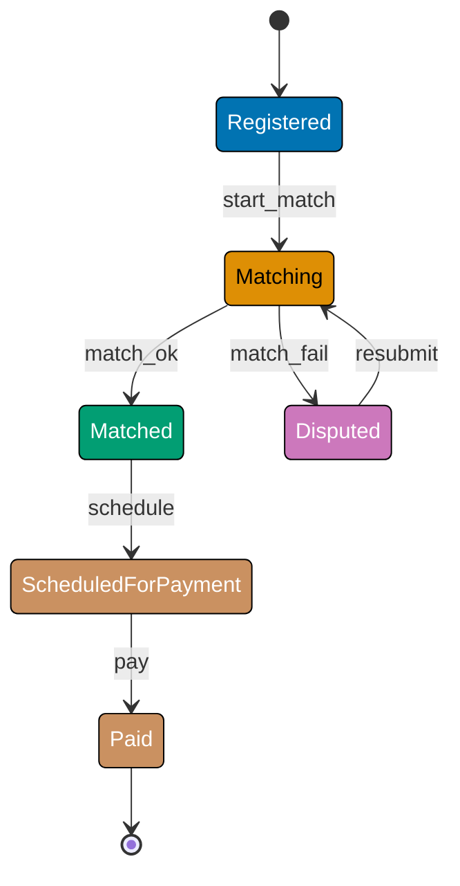
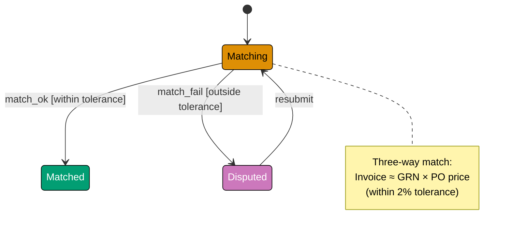
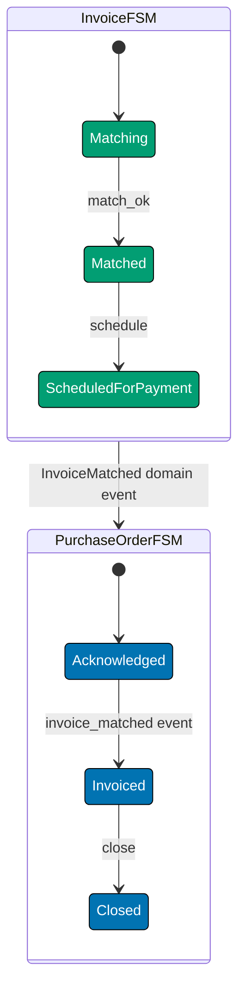
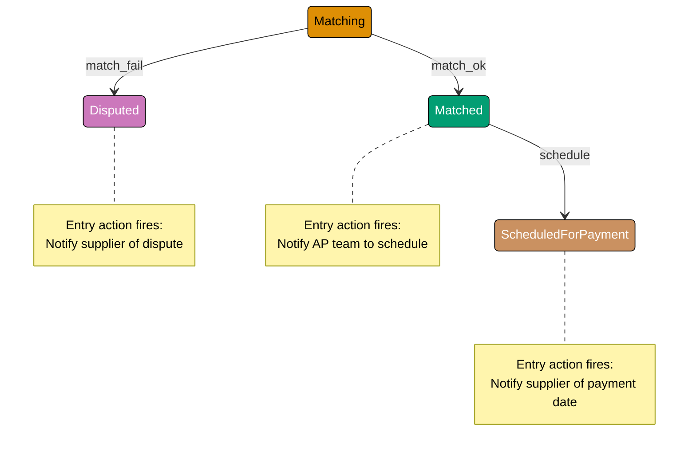
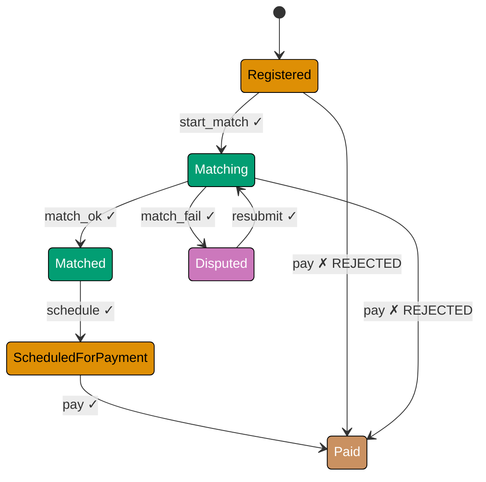
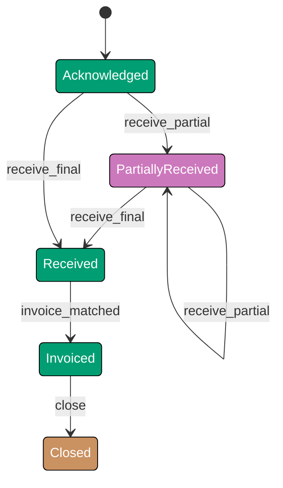
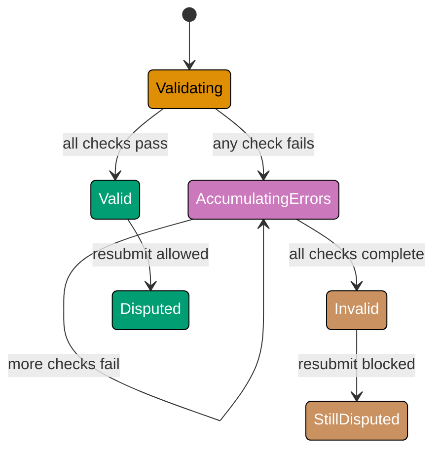
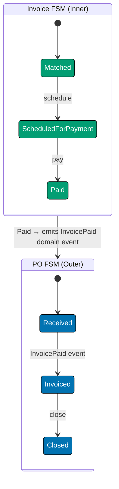
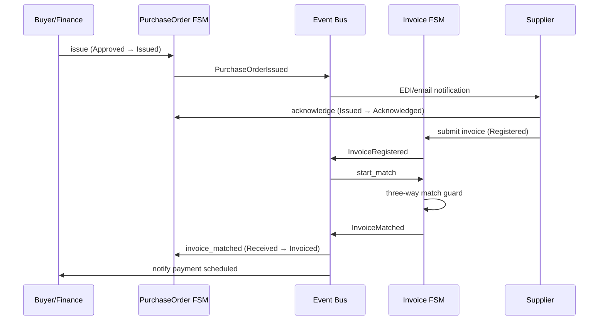

This intermediate tutorial adds the `Invoice` state machine from the `procurement-platform-be` domain alongside the `PurchaseOrder` machine introduced in the beginner level. You will learn how to enforce guards that depend on external invariants (the three-way match), how state-machine libraries model entry/exit actions declaratively, and how the FSM functions as a protocol enforcement layer that rejects out-of-order business events.

## The Invoice State Machine (Examples 26-31)

### Example 26: Invoice States and the Three-Way Match

An `Invoice` from a supplier goes through matching before payment is scheduled. The match rule — invoice amount must equal `sum(GRN quantities × PO unit price)` within a 2% tolerance — is the central guard of this machine.


```mermaid
stateDiagram-v2
    [*] --> Registered
    Registered --> Matching: start_match
    Matching --> Matched: match_ok
    Matching --> Disputed: match_fail
    Disputed --> Matching: resubmit
    Matched --> ScheduledForPayment: schedule
    ScheduledForPayment --> Paid: pay
    Paid --> [*]

    classDef registered fill:#0173B2,stroke:#000,color:#fff
    classDef matching fill:#DE8F05,stroke:#000,color:#000
    classDef matched fill:#029E73,stroke:#000,color:#fff
    classDef disputed fill:#CC78BC,stroke:#000,color:#fff
    classDef terminal fill:#CA9161,stroke:#000,color:#fff

    class Registered registered
    class Matching matching
    class Matched matched
    class Disputed disputed
    class ScheduledForPayment,Paid terminal
```

```typescript
// => Invoice state sealed type — every valid invoice condition
type InvoiceState =
  | "Registered" // => Supplier submitted invoice; not yet matched
  | "Matching" // => Three-way match in progress
  | "Matched" // => Match passed within tolerance; ready for payment
  | "Disputed" // => Match failed; discrepancy requires resolution
  | "ScheduledForPayment" // => Finance scheduled payment run
  | "Paid"; // => Bank disbursement confirmed — terminal

// => Invoice event alphabet
type InvoiceEvent =
  | "start_match" // => Begin the three-way matching process
  | "match_ok" // => Match succeeded within tolerance
  | "match_fail" // => Match failed — amount outside tolerance
  | "resubmit" // => Supplier resubmits corrected invoice
  | "schedule" // => Finance schedules payment
  | "pay"; // => Bank confirms disbursement

// => Invoice data record (immutable)
interface Invoice {
  readonly id: string; // => Format: inv_<uuid>
  readonly poId: string; // => Links to PurchaseOrder
  readonly supplierAmount: number; // => Amount supplier claims (USD)
  readonly state: InvoiceState;
}

// => Transition table for Invoice FSM
const INVOICE_TRANSITIONS: Partial<Record<InvoiceState, Partial<Record<InvoiceEvent, InvoiceState>>>> = {
  Registered: { start_match: "Matching" },
  // => Registration triggers matching workflow
  Matching: { match_ok: "Matched", match_fail: "Disputed" },
  // => Two outcomes: pass or fail the three-way match
  Disputed: { resubmit: "Matching" },
  // => Supplier corrects and resubmits — returns to Matching
  Matched: { schedule: "ScheduledForPayment" },
  // => Finance approves the matched invoice for payment run
  ScheduledForPayment: { pay: "Paid" },
  // => Bank confirms disbursement
  // => Paid: terminal — no outgoing transitions
};
```

**Key Takeaway**: The Invoice FSM mirrors the PO FSM in structure — sealed states, event alphabet, transition table — but its guards depend on external data (GRN, PO unit prices) that are passed in at match time.

**Why It Matters**: The three-way match (PO ↔ GRN ↔ Invoice) is the central fraud-prevention control in procurement. Encoding it as an FSM guard means the system structurally cannot mark an invoice as `Matched` unless the match computation actually passed — the state change and the validation are inseparable.

---

### Example 27: The Three-Way Match Guard

The `match_ok` event is only valid if the invoice amount falls within tolerance of the expected amount derived from the GRN and PO unit prices.


```mermaid
stateDiagram-v2
    [*] --> Matching
    Matching --> Matched: match_ok [within tolerance]
    Matching --> Disputed: match_fail [outside tolerance]
    note right of Matching
        Three-way match:
        Invoice ≈ GRN × PO price
        (within 2% tolerance)
    end note
    Disputed --> Matching: resubmit

    classDef matching fill:#DE8F05,stroke:#000,color:#000
    classDef matched fill:#029E73,stroke:#000,color:#fff
    classDef disputed fill:#CC78BC,stroke:#000,color:#fff

    class Matching matching
    class Matched matched
    class Disputed disputed
```

```typescript
// => Tolerance: the maximum allowed percentage discrepancy in the three-way match
interface Tolerance {
  percentage: number; // => 0.02 = 2%, per domain spec (max 10%)
}

// => Goods Receipt Note line: what was physically received
interface GRNLine {
  skuCode: string; // => Must match PO line SKU
  receivedQty: number; // => Actual quantity received
}

// => PO line for matching: provides the agreed unit price
interface POLineForMatch {
  skuCode: string;
  unitPrice: number; // => Agreed price in PO — the reference for matching
}

// => Compute the expected invoice amount from GRN quantities and PO unit prices
// => Pure function: no side effects
function computeExpectedAmount(grnLines: readonly GRNLine[], poLines: readonly POLineForMatch[]): number {
  const priceMap = new Map(poLines.map((l) => [l.skuCode, l.unitPrice]));
  // => Build SKU → unitPrice lookup map for O(1) per-line access

  return grnLines.reduce((sum, grn) => {
    const price = priceMap.get(grn.skuCode) ?? 0;
    // => Price from PO: 0 if SKU not found in PO (will cause match failure)
    return sum + grn.receivedQty * price;
    // => Expected = received quantity × agreed price
  }, 0);
}

// => Three-way match guard: returns true if invoice amount is within tolerance
function threeWayMatchPasses(
  invoice: Invoice,
  grnLines: readonly GRNLine[],
  poLines: readonly POLineForMatch[],
  tolerance: Tolerance,
): boolean {
  const expected = computeExpectedAmount(grnLines, poLines);
  // => What we expected to pay based on what was received at agreed prices
  if (expected === 0) return false; // => No goods received: match cannot pass
  const delta = Math.abs(invoice.supplierAmount - expected) / expected;
  // => Relative discrepancy as a fraction
  return delta <= tolerance.percentage;
  // => Within 2% tolerance (default) → match passes
}

// => Example: 10 units × $50 = $500 expected; supplier invoices $508 (1.6% delta)
const grn: GRNLine[] = [{ skuCode: "ELC-0042", receivedQty: 10 }];
const po: POLineForMatch[] = [{ skuCode: "ELC-0042", unitPrice: 50 }];
const inv: Invoice = { id: "inv_001", poId: "po_001", supplierAmount: 508, state: "Matching" };
const tol: Tolerance = { percentage: 0.02 };

console.log(threeWayMatchPasses(inv, grn, po, tol));
// => Output: true (508 vs 500 = 1.6% delta ≤ 2% tolerance)

const highInv: Invoice = { ...inv, supplierAmount: 560 }; // => 12% over
console.log(threeWayMatchPasses(highInv, grn, po, tol));
// => Output: false (560 vs 500 = 12% delta > 2% tolerance)
```

**Key Takeaway**: The three-way match guard is a pure function that can be tested independently of the FSM — the FSM calls it as a precondition for the `match_ok` transition.

**Why It Matters**: Isolating the match computation from the state transition makes both testable without the other. You can verify that `computeExpectedAmount` handles currency rounding correctly without setting up an invoice state machine. You can verify the FSM rejects `match_ok` when the guard returns false without mocking GRN data. Composing the two gives you the full behaviour.

---

### Example 28: Guarded Invoice Transition

Wrapping the three-way match guard in the transition function produces the complete `match` operation.

```typescript
// => Context passed to the match transition — all data needed for the guard
interface MatchContext {
  invoice: Invoice;
  grnLines: readonly GRNLine[];
  poLines: readonly POLineForMatch[];
  tolerance: Tolerance;
}

// => Result type re-used from beginner examples
type Result<T> = { ok: true; value: T } | { ok: false; error: string };

// => Guarded match transition: applies the three-way match guard before transitioning
function applyMatch(ctx: MatchContext): Result<Invoice> {
  const { invoice, grnLines, poLines, tolerance } = ctx;

  // => FSM check: must be in Matching state to attempt a match
  if (invoice.state !== "Matching") {
    return { ok: false, error: `Cannot match invoice in state: ${invoice.state}` };
    // => FSM structural guard: matching only valid from Matching state
  }

  // => Business guard: three-way match must pass
  if (threeWayMatchPasses(invoice, grnLines, poLines, tolerance)) {
    return { ok: true, value: { ...invoice, state: "Matched" } };
    // => Guard passes: invoice transitions to Matched
  } else {
    return { ok: true, value: { ...invoice, state: "Disputed" } };
    // => Guard fails: invoice transitions to Disputed (not an error — a valid outcome)
  }
}

// => Note: match_ok and match_fail are computed outcomes, not caller-chosen events
// => The guard determines which of the two transitions fires — the caller only provides data

const matchCtx: MatchContext = {
  invoice: { id: "inv_002", poId: "po_002", supplierAmount: 508, state: "Matching" },
  grnLines: [{ skuCode: "ELC-0042", receivedQty: 10 }],
  poLines: [{ skuCode: "ELC-0042", unitPrice: 50 }],
  tolerance: { percentage: 0.02 },
};

const r = applyMatch(matchCtx);
if (r.ok) console.log(r.value.state); // => Output: Matched (508 within 2% of 500)

const highCtx = { ...matchCtx, invoice: { ...matchCtx.invoice, supplierAmount: 600 } };
const r2 = applyMatch(highCtx);
if (r2.ok) console.log(r2.value.state); // => Output: Disputed (600 is 20% over 500)
```

**Key Takeaway**: Some FSM transitions are not chosen by the caller — they are determined by a guard. The caller provides input data; the guard chooses the outcome state. This removes the temptation for callers to bypass validation by choosing the "good" event directly.

**Why It Matters**: If `match_ok` and `match_fail` were caller-chosen events, a buggy or malicious caller could send `match_ok` even when the amounts differ by 50%. Making the outcome guard-determined means the FSM itself performs the validation and chooses the transition — the caller cannot cheat.

---

### Example 29: Linking Invoice and PurchaseOrder State Machines

When an Invoice is matched, the corresponding PurchaseOrder should transition to `Invoiced`. This cross-machine coordination models the domain event `InvoiceMatched` propagating to the `purchasing` context.


```mermaid
stateDiagram-v2
    state PurchaseOrderFSM {
        [*] --> Acknowledged
        Acknowledged --> Invoiced: invoice_matched event
        Invoiced --> Closed: close
    }

    state InvoiceFSM {
        [*] --> Matching
        Matching --> Matched: match_ok
        Matched --> ScheduledForPayment: schedule
    }

    InvoiceFSM --> PurchaseOrderFSM: InvoiceMatched domain event

    classDef po fill:#0173B2,stroke:#000,color:#fff
    classDef inv fill:#029E73,stroke:#000,color:#fff

    class Acknowledged,Invoiced,Closed po
    class Matching,Matched,ScheduledForPayment inv
```

```typescript
// => Domain event emitted by the Invoice FSM when matching succeeds
interface InvoiceMatched {
  readonly kind: "InvoiceMatched"; // => Discriminant
  readonly invoiceId: string; // => Which invoice matched
  readonly poId: string; // => Which PO to update
  readonly timestamp: string; // => When the match completed
}

// => PO FSM: add Invoiced state to the state type (extends from beginner)
type ExtendedPOState = POState | "Invoiced"; // => Adds Invoiced to the beginner union

// => Handle InvoiceMatched event on the PurchaseOrder
// => Pure function: takes current PO state, returns Result<new state>
function handleInvoiceMatched(poState: ExtendedPOState, event: InvoiceMatched): Result<ExtendedPOState> {
  // => Guard: PO must be in Acknowledged state to accept invoice matching
  if (poState !== "Acknowledged") {
    return {
      ok: false,
      error: `PO cannot accept InvoiceMatched in state ${poState} (expected Acknowledged)`,
      // => The PO must have goods received and acknowledged before invoicing
    };
  }
  console.log(`PO ${event.poId} → Invoiced by invoice ${event.invoiceId}`);
  // => Side effect (in production: update PO state in database via repository)
  return { ok: true, value: "Invoiced" };
  // => Transition: Acknowledged → Invoiced
}

const event: InvoiceMatched = {
  kind: "InvoiceMatched",
  invoiceId: "inv_003",
  poId: "po_003",
  timestamp: "2026-01-20T10:30:00Z",
};

const r = handleInvoiceMatched("Acknowledged", event);
if (r.ok) console.log(r.value); // => Output: Invoiced

const r2 = handleInvoiceMatched("Issued", event);
if (!r2.ok) console.log(r2.error);
// => Output: PO cannot accept InvoiceMatched in state Issued (expected Acknowledged)
```

**Key Takeaway**: Domain events are the communication protocol between FSMs in different bounded contexts — each FSM handles only events it recognises and rejects others with a typed error.

**Why It Matters**: In a real system, `InvoiceMatched` is a Kafka message from the `invoicing` context consumed by the `purchasing` context. The PO FSM's handler validates that the PO is in the right state before applying the update, preventing out-of-order event processing from corrupting the PO lifecycle.

---

### Example 30: Python Invoice FSM with Tolerance Check

The same Invoice FSM in Python, using frozen dataclasses and a functional match result.

```python
from dataclasses import dataclass, replace
from typing import Optional, List, Tuple

@dataclass(frozen=True)
class Invoice:
    id: str
    po_id: str
    supplier_amount: float  # => Amount supplier invoiced (USD)
    state: str              # => Current FSM state

@dataclass(frozen=True)
class GRNLine:
    sku_code: str
    received_qty: int  # => Physically received quantity

@dataclass(frozen=True)
class POLine:
    sku_code: str
    unit_price: float  # => Agreed price per unit from the PO

def compute_expected(grn_lines: List[GRNLine], po_lines: List[POLine]) -> float:
    price_map = {l.sku_code: l.unit_price for l in po_lines}
    # => Dict comprehension: SKU → unit price for O(1) lookup
    return sum(g.received_qty * price_map.get(g.sku_code, 0.0) for g in grn_lines)
    # => Generator expression: received qty × agreed price per line, then sum

def apply_match(
    invoice: Invoice,
    grn_lines: List[GRNLine],
    po_lines: List[POLine],
    tolerance_pct: float = 0.02,
) -> Tuple[Invoice, Optional[str]]:
    # Returns (new_invoice, None) on valid transition, (invoice, error) on guard failure
    if invoice.state != "Matching":
        return invoice, f"Cannot match in state '{invoice.state}'"
        # => FSM state guard: wrong state

    expected = compute_expected(grn_lines, po_lines)
    if expected == 0:
        return replace(invoice, state="Disputed"), None
        # => No goods received: match fails — invoice goes to Disputed

    delta = abs(invoice.supplier_amount - expected) / expected
    # => Relative discrepancy

    if delta <= tolerance_pct:
        return replace(invoice, state="Matched"), None
        # => Within tolerance: Matched
    else:
        return replace(invoice, state="Disputed"), None
        # => Outside tolerance: Disputed

# Test: 10 units × $50 = $500 expected; invoice is $505 (1%)
grn   = [GRNLine("ELC-0042", 10)]
po_ln = [POLine("ELC-0042", 50.0)]
inv   = Invoice("inv_py_01", "po_py_01", 505.0, "Matching")

new_inv, err = apply_match(inv, grn, po_ln)
print(new_inv.state)  # => Output: Matched

over_inv = Invoice("inv_py_02", "po_py_01", 600.0, "Matching")
new_inv2, _ = apply_match(over_inv, grn, po_ln)
print(new_inv2.state) # => Output: Disputed
```

**Key Takeaway**: Python's frozen dataclass + tuple return idiom produces the same functional FSM pattern as TypeScript's `Result` type — the language syntax differs, the design is identical.

**Why It Matters**: Domain patterns should be language-agnostic. The three-way match guard, the immutable record, the table-driven transition — all of these work in Python, TypeScript, Java, and F# because they are mathematical concepts, not language features. Understanding the pattern means you can implement it wherever your team works.

---

### Example 31: Java Invoice FSM with Optional Result

Java's `Optional` models the same "valid or invalid transition" contract as `Result<T>` in TypeScript.

```java
import java.util.*;

public class InvoiceFSM {

    public enum InvoiceState {
        REGISTERED, MATCHING, MATCHED, DISPUTED, SCHEDULED_FOR_PAYMENT, PAID
        // => PAID: terminal — no outgoing transitions
    }

    public record Invoice(String id, String poId, double supplierAmount, InvoiceState state) {}
    // => Immutable record: state transitions return new Invoice instances

    // => Transition table as an immutable EnumMap
    private static final Map<InvoiceState, Map<String, InvoiceState>> TABLE;
    static {
        TABLE = new EnumMap<>(InvoiceState.class);
        TABLE.put(InvoiceState.REGISTERED, Map.of("start_match", InvoiceState.MATCHING));
        TABLE.put(InvoiceState.MATCHING,   Map.of("match_ok", InvoiceState.MATCHED, "match_fail", InvoiceState.DISPUTED));
        TABLE.put(InvoiceState.DISPUTED,   Map.of("resubmit", InvoiceState.MATCHING));
        TABLE.put(InvoiceState.MATCHED,    Map.of("schedule", InvoiceState.SCHEDULED_FOR_PAYMENT));
        TABLE.put(InvoiceState.SCHEDULED_FOR_PAYMENT, Map.of("pay", InvoiceState.PAID));
        // => PAID: no entry — terminal
    }

    // => Pure transition: returns Optional.of(newInvoice) or Optional.empty()
    public static Optional<Invoice> apply(Invoice inv, String event) {
        return Optional.ofNullable(TABLE.getOrDefault(inv.state(), Map.of()).get(event))
                       .map(next -> new Invoice(inv.id(), inv.poId(), inv.supplierAmount(), next));
        // => Same Optional chain as PO FSM — consistent across both machines
    }

    // => Three-way match: returns "match_ok" or "match_fail" based on guard
    public static String evaluateMatch(double supplierAmount, double expectedAmount, double tolerancePct) {
        if (expectedAmount == 0) return "match_fail";
        // => No goods received: cannot match
        double delta = Math.abs(supplierAmount - expectedAmount) / expectedAmount;
        return delta <= tolerancePct ? "match_ok" : "match_fail";
        // => Ternary: within tolerance → match_ok, outside → match_fail
    }
}
```

```
// => Usage:
String event = InvoiceFSM.evaluateMatch(508.0, 500.0, 0.02); // => "match_ok"
Optional<Invoice> next = InvoiceFSM.apply(matchingInvoice, event);
// => Optional[Invoice{state=MATCHED}]

String event2 = InvoiceFSM.evaluateMatch(600.0, 500.0, 0.02); // => "match_fail"
Optional<Invoice> next2 = InvoiceFSM.apply(matchingInvoice, event2);
// => Optional[Invoice{state=DISPUTED}]
```

**Key Takeaway**: `evaluateMatch` converts continuous business data into a discrete FSM event — the bridge between the analogue world (amounts, percentages) and the digital world (event strings).

**Why It Matters**: This bridge function is the key architectural seam. On one side: floating-point arithmetic, tolerance percentages, currency rounding. On the other: the clean `match_ok`/`match_fail` event alphabet of the FSM. Keeping these concerns separate means you can change the tolerance policy (say, from 2% to 3%) without touching the FSM structure.

---

## State-Machine Libraries (Examples 32-37)

### Example 32: XState-Style Declarative Machine Definition

XState (JavaScript/TypeScript) separates machine configuration from execution — the machine definition is data, and the `createMachine` factory interprets it.

```typescript
// => XState-style machine configuration: pure data describing the FSM
// => (Illustrative — run with: npm install xstate@5)
const invoiceMachineConfig = {
  id: "invoice", // => Machine identifier for debugging
  initial: "Registered", // => Starting state

  states: {
    Registered: {
      on: {
        start_match: "Matching", // => Event → next state shorthand
      },
    },
    Matching: {
      // => Entry action: fired when entering Matching state
      entry: "logMatchingStarted",
      // => Declarative: action name resolved by the interpreter, not called directly here
      on: {
        match_ok: "Matched",
        match_fail: "Disputed",
      },
    },
    Matched: {
      entry: "notifyFinance", // => Notify finance team on entering Matched
      on: {
        schedule: "ScheduledForPayment",
      },
    },
    Disputed: {
      entry: "notifySupplier", // => Notify supplier of dispute on entering Disputed
      on: {
        resubmit: "Matching",
      },
    },
    ScheduledForPayment: {
      on: {
        pay: "Paid",
      },
    },
    Paid: {
      type: "final", // => Terminal state: machine halts here
    },
  },
} as const;
// => `as const`: TypeScript infers the literal types, enabling exhaustive checks

// => Action implementations: pure functions referenced by name in config
const invoiceActions = {
  logMatchingStarted: (ctx: { invoiceId: string }) => console.log(`Matching started for invoice ${ctx.invoiceId}`),
  // => Entry action for Matching state

  notifyFinance: (ctx: { invoiceId: string }) => console.log(`Finance notified: invoice ${ctx.invoiceId} matched`),
  // => Entry action for Matched state

  notifySupplier: (ctx: { invoiceId: string; reason: string }) =>
    console.log(`Supplier notified: invoice ${ctx.invoiceId} disputed — ${ctx.reason}`),
  // => Entry action for Disputed state
};

// => In production: const machine = createMachine(invoiceMachineConfig, { actions: invoiceActions });
// => createMachine wires config + actions into an executable machine
console.log("Machine initial state:", invoiceMachineConfig.initial); // => Output: Registered
console.log("Matching transitions:", Object.keys(invoiceMachineConfig.states.Matching.on));
// => Output: [ 'match_ok', 'match_fail' ]
```

**Key Takeaway**: XState-style declarative configuration separates machine structure (data) from behaviour (actions) — the machine definition can be visualised, serialised, and version-controlled independently of its action implementations.

**Why It Matters**: When machine configuration is data, you can render it in a visual editor (XState's visualiser), generate test cases automatically, and diff state machine changes in PRs as structured data rather than imperative code changes. For complex approval workflows where non-engineers need to understand the flow, the declarative config is also documentation.

---

### Example 33: Guards in XState-Style Config

XState guards are named predicates referenced in the machine configuration — the guard function is supplied separately from the machine definition.

```typescript
// => Guard functions: named predicates used in machine config
const invoiceGuards = {
  // => Guard for the match_ok transition: checks three-way match
  matchPasses: (context: { supplierAmount: number; expectedAmount: number; tolerancePct: number }) => {
    const { supplierAmount, expectedAmount, tolerancePct } = context;
    if (expectedAmount === 0) return false; // => No expected amount: guard fails
    const delta = Math.abs(supplierAmount - expectedAmount) / expectedAmount;
    return delta <= tolerancePct; // => Within tolerance: guard passes
  },
};

// => Machine config with guarded transitions
const guardedInvoiceConfig = {
  id: "invoice-guarded",
  initial: "Matching" as const,
  states: {
    Matching: {
      on: {
        evaluate: [
          // => Array of transition candidates: evaluated in order, first passing guard wins
          {
            target: "Matched",
            guard: "matchPasses",
            // => Guard name: resolved to invoiceGuards.matchPasses at runtime
          },
          {
            target: "Disputed",
            // => No guard: fallback — fires if matchPasses returns false
          },
        ],
      },
    },
    Matched: { type: "final" as const },
    Disputed: { type: "final" as const },
  },
};

// => Simulate the guard evaluation (manual, without XState runtime)
function simulateGuardedTransition(
  state: "Matching",
  event: "evaluate",
  context: { supplierAmount: number; expectedAmount: number; tolerancePct: number },
): "Matched" | "Disputed" {
  // => First candidate: guarded Matched
  if (invoiceGuards.matchPasses(context)) return "Matched";
  // => Guard passed: first candidate wins
  // => Second candidate: unguarded Disputed
  return "Disputed";
  // => No guard: always fires as fallback
}

console.log(
  simulateGuardedTransition("Matching", "evaluate", { supplierAmount: 505, expectedAmount: 500, tolerancePct: 0.02 }),
);
// => Output: Matched (1% delta ≤ 2% tolerance)

console.log(
  simulateGuardedTransition("Matching", "evaluate", { supplierAmount: 600, expectedAmount: 500, tolerancePct: 0.02 }),
);
// => Output: Disputed (20% delta > 2% tolerance)
```

**Key Takeaway**: Named guards in XState configs make guard logic inspectable and replaceable — the machine config reads like a specification, and guard implementations can be swapped without changing the machine structure.

**Why It Matters**: In a configuration-driven machine, the same machine config can run with a strict tolerance guard in production and a permissive tolerance guard in testing — just swap the guard implementation. This decoupling means you can test every state transition independently of the specific tolerance value, then integration-test the guard separately.

---

### Example 34: State Entry Actions as Notification Triggers

Entry actions are the natural place to trigger notifications. This example shows how to structure entry actions for the Invoice machine so they can be tested without sending real emails.


```mermaid
stateDiagram-v2
    Matching --> Disputed: match_fail
    note right of Disputed
        Entry action fires:
        Notify supplier of dispute
    end note
    Matching --> Matched: match_ok
    note right of Matched
        Entry action fires:
        Notify AP team to schedule
    end note
    Matched --> ScheduledForPayment: schedule
    note right of ScheduledForPayment
        Entry action fires:
        Notify supplier of payment date
    end note

    classDef matching fill:#DE8F05,stroke:#000,color:#000
    classDef matched fill:#029E73,stroke:#000,color:#fff
    classDef disputed fill:#CC78BC,stroke:#000,color:#fff
    classDef scheduled fill:#CA9161,stroke:#000,color:#fff

    class Matching matching
    class Matched matched
    class Disputed disputed
    class ScheduledForPayment scheduled
```

```typescript
// => Notification interface: abstraction over email, EDI, webhook, etc.
// => In production: replace with SupplierNotifierPort implementation
interface Notifier {
  send: (to: string, message: string) => void;
}

// => Console notifier for testing/development
const consoleNotifier: Notifier = {
  send: (to, message) => console.log(`[NOTIFY] ${to}: ${message}`),
  // => In tests: replace with a mock that records calls without I/O
};

// => Entry actions for Invoice states — each returns a description for testing
function invoiceEntryAction(state: InvoiceState, invoice: Invoice, notifier: Notifier): void {
  switch (state) {
    case "Matching":
      notifier.send("system", `Invoice ${invoice.id} entering three-way match`);
      break;
    // => Trigger matching workflow (in production: kick off async match job)

    case "Disputed":
      notifier.send("supplier", `Invoice ${invoice.id} disputed — please review and resubmit`);
      break;
    // => Supplier must correct and resubmit the invoice

    case "ScheduledForPayment":
      notifier.send("finance", `Invoice ${invoice.id} scheduled for payment run`);
      break;
    // => Finance team confirmation of upcoming disbursement

    case "Paid":
      notifier.send("supplier", `Invoice ${invoice.id} paid — check your bank account`);
      break;
    // => Final confirmation to supplier

    default:
      break; // => Registered and Matched: no immediate notification needed
  }
}

// => Transition with entry action
function transitionInvoice(inv: Invoice, event: InvoiceEvent, notifier: Notifier): Result<Invoice> {
  const next = INVOICE_TRANSITIONS[inv.state]?.[event];
  if (!next) return { ok: false, error: `${inv.state} --${event}--> (forbidden)` };

  const newInv = { ...inv, state: next };
  invoiceEntryAction(next, newInv, notifier); // => Fire entry action for new state
  return { ok: true, value: newInv };
}

const inv: Invoice = { id: "inv_004", poId: "po_004", supplierAmount: 500, state: "Registered" };
transitionInvoice(inv, "start_match", consoleNotifier);
// => Output: [NOTIFY] system: Invoice inv_004 entering three-way match
```

**Key Takeaway**: Injecting the notifier as a dependency makes entry actions testable — swap the real notifier for a recording mock in unit tests without touching the FSM logic.

**Why It Matters**: The FSM transition logic and the notification side effect have different failure modes. The FSM transition is a pure computation that always succeeds given valid input. The notification might fail due to network issues. Injecting the notifier lets you test both independently and combine them only at the application layer.

---

### Example 35: Modelling Invoice Resubmission History

An invoice that goes through Disputed → Matching → Matched → Disputed cycles needs a resubmission counter — the FSM state alone does not capture this history.

```typescript
// => Extended invoice: adds resubmission counter
interface InvoiceWithHistory extends Invoice {
  readonly resubmissionCount: number; // => How many times the supplier has resubmitted
  readonly maxResubmissions: number; // => Policy limit (e.g., 3 attempts before escalation)
}

// => Guard: can the invoice be resubmitted?
function canResubmit(inv: InvoiceWithHistory): boolean {
  return inv.resubmissionCount < inv.maxResubmissions;
  // => Below limit: resubmission allowed; at or above: escalation required
}

// => Resubmit transition with counter increment
function resubmitInvoice(inv: InvoiceWithHistory): Result<InvoiceWithHistory> {
  if (inv.state !== "Disputed") {
    return { ok: false, error: `Cannot resubmit invoice in state ${inv.state}` };
    // => FSM guard: resubmission only valid from Disputed
  }
  if (!canResubmit(inv)) {
    return {
      ok: false,
      error: `Invoice ${inv.id} exceeded resubmission limit (${inv.maxResubmissions})`,
      // => Policy guard: too many resubmissions — escalate to manual review
    };
  }
  return {
    ok: true,
    value: {
      ...inv,
      state: "Matching", // => Return to Matching
      resubmissionCount: inv.resubmissionCount + 1, // => Increment counter
    },
  };
}

const inv: InvoiceWithHistory = {
  id: "inv_005",
  poId: "po_005",
  supplierAmount: 600,
  state: "Disputed",
  resubmissionCount: 2,
  maxResubmissions: 3,
};

const r1 = resubmitInvoice(inv);
if (r1.ok) console.log(`${r1.value.state}, count: ${r1.value.resubmissionCount}`);
// => Output: Matching, count: 3

const r2 = resubmitInvoice(r1.ok ? r1.value : inv);
if (!r2.ok) console.log(r2.error);
// => Output: Invoice inv_005 exceeded resubmission limit (3)
// => r1.value has count=3 which equals maxResubmissions=3 → canResubmit returns false
```

**Key Takeaway**: Counters and timestamps that accumulate across state transitions belong in the context object alongside the state — they are part of the machine's memory, not its current state.

**Why It Matters**: Without a resubmission limit, a supplier could resubmit indefinitely, never resolving the discrepancy. The limit is a policy that the FSM enforces as a guard — when the counter reaches the maximum, resubmission is rejected and the invoice is escalated to manual review. The FSM makes this policy explicit and auditable.

---

### Example 36: FSM as Protocol Enforcement

The FSM enforces the invoice lifecycle as a strict protocol. Events sent out of order are rejected — this prevents integration bugs where an upstream system sends events in the wrong sequence.


```mermaid
stateDiagram-v2
    [*] --> Registered
    Registered --> Matching: start_match ✓
    Matching --> Matched: match_ok ✓
    Matching --> Disputed: match_fail ✓
    Disputed --> Matching: resubmit ✓
    Matched --> ScheduledForPayment: schedule ✓
    ScheduledForPayment --> Paid: pay ✓
    Registered --> Paid: pay ✗ REJECTED
    Matching --> Paid: pay ✗ REJECTED

    classDef valid fill:#029E73,stroke:#000,color:#fff
    classDef waiting fill:#DE8F05,stroke:#000,color:#000
    classDef disputed fill:#CC78BC,stroke:#000,color:#fff
    classDef terminal fill:#CA9161,stroke:#000,color:#fff

    class Registered,ScheduledForPayment waiting
    class Matching,Matched valid
    class Disputed disputed
    class Paid terminal
```

```typescript
// => Protocol enforcer: wraps the FSM to produce human-readable rejection messages
// => used by API controllers to return 400/409 responses
function enforceInvoiceProtocol(
  inv: Invoice,
  event: InvoiceEvent,
): { allowed: boolean; reason?: string; newState?: InvoiceState } {
  const next = INVOICE_TRANSITIONS[inv.state]?.[event];

  if (next === undefined) {
    return {
      allowed: false,
      reason:
        `Protocol violation: cannot send '${event}' to invoice in state '${inv.state}'. ` +
        `Allowed events: [${Object.keys(INVOICE_TRANSITIONS[inv.state] ?? {}).join(", ")}]`,
      // => Detailed rejection message: tells the caller what IS allowed
    };
  }

  return { allowed: true, newState: next };
  // => Protocol allows this transition: provide the new state
}

// => Simulate an integration partner sending events out of order
const inv: Invoice = { id: "inv_006", poId: "po_006", supplierAmount: 500, state: "Registered" };

// => Correct: start_match from Registered
const r1 = enforceInvoiceProtocol(inv, "start_match");
console.log(r1.allowed, r1.newState); // => Output: true Matching

// => Incorrect: partner sends 'pay' before matching
const r2 = enforceInvoiceProtocol(inv, "pay");
console.log(r2.allowed); // => Output: false
console.log(r2.reason);
// => Output: Protocol violation: cannot send 'pay' to invoice in state 'Registered'.
// =>            Allowed events: [start_match]

// => Incorrect: double-match attempt
const matching: Invoice = { ...inv, state: "Matched" };
const r3 = enforceInvoiceProtocol(matching, "match_ok");
console.log(r3.reason);
// => Output: Protocol violation: cannot send 'match_ok' to invoice in state 'Matched'.
// =>            Allowed events: [schedule]
```

**Key Takeaway**: The FSM's rejection of invalid transitions is the first line of defence against integration bugs — the protocol enforcer converts FSM rejections into actionable API error messages.

**Why It Matters**: In a microservices environment, the invoice service receives events from multiple upstream systems. Without protocol enforcement, an event from a misconfigured consumer could move an invoice backwards (e.g., `start_match` on an already-`Matched` invoice). The FSM prevents this structurally — no special case code needed for each possible misconfiguration.

---

## Connecting PO and Invoice Machines (Examples 37-44)

### Example 37: PO Lifecycle Coverage — PartiallyReceived State

The full PO machine includes `PartiallyReceived` for cases where a supplier ships goods in multiple batches. This intermediate example extends the beginner machine.


```mermaid
stateDiagram-v2
    [*] --> Acknowledged
    Acknowledged --> PartiallyReceived: receive_partial
    PartiallyReceived --> PartiallyReceived: receive_partial
    PartiallyReceived --> Received: receive_final
    Acknowledged --> Received: receive_final
    Received --> Invoiced: invoice_matched
    Invoiced --> Closed: close

    classDef active fill:#029E73,stroke:#000,color:#fff
    classDef partial fill:#CC78BC,stroke:#000,color:#fff
    classDef terminal fill:#CA9161,stroke:#000,color:#fff

    class Acknowledged,Received,Invoiced active
    class PartiallyReceived partial
    class Closed terminal
```

```typescript
// => Extended PO state: adds receiving substates
type FullPOState =
  | "Draft"
  | "AwaitingApproval"
  | "Approved"
  | "Issued"
  | "Acknowledged"
  | "PartiallyReceived" // => Some goods received; more shipments expected
  | "Received" // => All goods received against the PO
  | "Invoiced" // => Matched invoice received
  | "Paid" // => Payment disbursed
  | "Closed" // => PO fully complete
  | "Cancelled"
  | "Disputed";

// => Extended event type
type FullPOEvent =
  | "submit"
  | "approve"
  | "reject"
  | "issue"
  | "acknowledge"
  | "cancel"
  | "dispute"
  | "partial_receive" // => Some goods received (more expected)
  | "full_receive" // => All goods received
  | "invoice_matched" // => Invoice FSM emits InvoiceMatched event
  | "pay"
  | "close";

// => Receiving transitions: from Acknowledged and PartiallyReceived
const FULL_PO_TRANSITIONS: Partial<Record<FullPOState, Partial<Record<FullPOEvent, FullPOState>>>> = {
  // => ... (beginner entries omitted for brevity)
  Acknowledged: {
    partial_receive: "PartiallyReceived", // => First shipment received; more coming
    full_receive: "Received", // => Single shipment covers entire PO
    cancel: "Cancelled",
    dispute: "Disputed",
  },
  PartiallyReceived: {
    partial_receive: "PartiallyReceived", // => Self-loop: another partial shipment
    full_receive: "Received", // => Final shipment: all goods in
    cancel: "Cancelled",
    dispute: "Disputed",
  },
  Received: {
    invoice_matched: "Invoiced", // => Invoice FSM signals match complete
    dispute: "Disputed",
  },
  Invoiced: {
    pay: "Paid",
    dispute: "Disputed",
  },
  Paid: {
    close: "Closed",
  },
};

// => Demonstrate the self-loop: PartiallyReceived → PartiallyReceived
const partialPO: PurchaseOrder = {
  id: "po_partial",
  totalAmount: 2000,
  state: "PartiallyReceived" as unknown as POState,
};
const next = FULL_PO_TRANSITIONS["PartiallyReceived"]?.["partial_receive"];
console.log(next); // => Output: PartiallyReceived (self-loop for additional shipments)
```

**Key Takeaway**: Self-loops in an FSM model iterative real-world operations — each partial shipment fires the same event, and the machine stays in the same state until the full-receive event arrives.

**Why It Matters**: Without the self-loop, you would need a counter ("shipment 1 of 3") to track partial receipt progress, and the FSM would need a different state per count — combinatorial explosion. The self-loop on `PartiallyReceived` keeps the state machine flat while the application layer tracks the delivery count separately in the context object.

---

### Example 38: Combining PO and Invoice with Event Bus

In production, the two FSMs live in separate services. They coordinate via domain events on a message bus. This example simulates the coordination.

```typescript
// => Minimal in-memory event bus simulation
interface DomainEvent {
  kind: string;
  payload: Record<string, unknown>;
}

class EventBus {
  private handlers: Map<string, ((e: DomainEvent) => void)[]> = new Map();
  // => Handlers keyed by event kind

  subscribe(kind: string, handler: (e: DomainEvent) => void): void {
    const existing = this.handlers.get(kind) ?? [];
    this.handlers.set(kind, [...existing, handler]);
    // => Register handler: multiple handlers per event kind supported
  }

  publish(event: DomainEvent): void {
    const handlers = this.handlers.get(event.kind) ?? [];
    handlers.forEach((h) => h(event)); // => Synchronous for simplicity; use async in production
  }
}

const bus = new EventBus();

// => Invoice context publishes InvoiceMatched when matching succeeds
function invoiceMatchSucceeded(invoiceId: string, poId: string): void {
  bus.publish({ kind: "InvoiceMatched", payload: { invoiceId, poId } });
  // => Domain event: InvoiceMatched flows from invoicing → purchasing context
}

// => Purchasing context subscribes to InvoiceMatched
bus.subscribe("InvoiceMatched", (e) => {
  const { poId, invoiceId } = e.payload as { poId: string; invoiceId: string };
  console.log(`PO ${poId} receives InvoiceMatched from invoice ${invoiceId} → transition to Invoiced`);
  // => In production: load PO from repository, apply invoice_matched event, save
});

// => Simulate the invoice matching completing
invoiceMatchSucceeded("inv_bus_01", "po_bus_01");
// => Output: PO po_bus_01 receives InvoiceMatched from invoice inv_bus_01 → transition to Invoiced
```

**Key Takeaway**: Domain events are the coupling mechanism between bounded contexts — each FSM publishes what happened; other FSMs subscribe and decide how to react.

**Why It Matters**: Direct coupling (invoicing context calling purchasing service directly) creates a distributed monolith. Domain events through a bus allow each service to evolve independently — the purchasing service does not know or care that the invoicing service exists, only that `InvoiceMatched` events arrive on the bus.

---

### Example 39: Testing the Invoice-PO Coordination

Unit-testing the coordination between Invoice and PurchaseOrder FSMs without a real event bus.

```typescript
// => Test the coordination logic without I/O
function testInvoiceMatchedUpdatesPO() {
  // => Setup: PO in Received state (all goods in, waiting for invoice match)
  const po: PurchaseOrder = {
    id: "po_test01",
    totalAmount: 1000,
    state: "Received" as unknown as POState,
  };

  // => Simulate InvoiceMatched event handler
  const event: InvoiceMatched = {
    kind: "InvoiceMatched",
    invoiceId: "inv_test01",
    poId: "po_test01",
    timestamp: "2026-01-20T11:00:00Z",
  };

  const result = handleInvoiceMatched("Received" as unknown as ExtendedPOState, event);
  // => Apply the event handler

  if (!result.ok) throw new Error(`Expected ok: ${result.error}`);
  console.log("PASS: PO transitions to Invoiced on InvoiceMatched");
  // => Assertion: PO moves to Invoiced state
  console.log(`  New state: ${result.value}`); // => Output: Invoiced

  // => Negative test: PO must be in Received (not Acknowledged) to accept InvoiceMatched
  const prematurePO = "Acknowledged" as unknown as ExtendedPOState;
  const r2 = handleInvoiceMatched(prematurePO, event);
  if (r2.ok) throw new Error("Expected error for premature InvoiceMatched");
  console.log("PASS: InvoiceMatched rejected when PO not in Received");
  console.log(`  Error: ${r2.error}`);
}

testInvoiceMatchedUpdatesPO();
// => Output:
// => PASS: PO transitions to Invoiced on InvoiceMatched
// =>   New state: Invoiced
// => PASS: InvoiceMatched rejected when PO not in Received
// =>   Error: PO cannot accept InvoiceMatched in state Acknowledged ...
```

**Key Takeaway**: Testing coordination between two FSMs requires only the event handler function and typed test data — no running services, no Kafka, no database.

**Why It Matters**: The value of modelling domain interactions as pure event handlers is that they are trivially testable. The real Kafka infrastructure is an adapter concern, not a domain logic concern. When the domain logic is correct, wiring it to Kafka is straightforward; testing the wiring is a separate integration test concern.

---

### Example 40: Validation Error Accumulation

Rather than returning on the first validation failure, accumulate all errors and return them together — better UX for complex invoice validation.


```mermaid
stateDiagram-v2
    [*] --> Validating
    Validating --> Valid: all checks pass
    Validating --> AccumulatingErrors: any check fails
    AccumulatingErrors --> AccumulatingErrors: more checks fail
    AccumulatingErrors --> Invalid: all checks complete
    Valid --> Disputed: resubmit allowed
    Invalid --> StillDisputed: resubmit blocked

    classDef validating fill:#DE8F05,stroke:#000,color:#000
    classDef valid fill:#029E73,stroke:#000,color:#fff
    classDef invalid fill:#CA9161,stroke:#000,color:#fff
    classDef acc fill:#CC78BC,stroke:#000,color:#fff

    class Validating validating
    class AccumulatingErrors acc
    class Valid,Disputed valid
    class Invalid,StillDisputed invalid
```

```typescript
// => Collect multiple validation errors from a single invoice validation pass
function validateInvoiceForSubmission(
  inv: InvoiceWithHistory,
  grnLines: readonly GRNLine[],
  poLines: readonly POLineForMatch[],
  tolerance: Tolerance,
): string[] {
  const errors: string[] = [];

  // => Validation 1: invoice must be in Disputed to be resubmitted
  if (inv.state !== "Disputed") {
    errors.push(`Invoice is in state '${inv.state}'; only Disputed invoices can be resubmitted`);
    // => Wrong state: no further validation makes sense, but we continue to collect all errors
  }

  // => Validation 2: resubmission limit
  if (!canResubmit(inv)) {
    errors.push(`Resubmission limit (${inv.maxResubmissions}) reached`);
    // => Policy violation: cannot resubmit again
  }

  // => Validation 3: supplier amount must be positive
  if (inv.supplierAmount <= 0) {
    errors.push(`Supplier amount must be > 0 (got ${inv.supplierAmount})`);
    // => Data integrity: zero or negative amount is clearly wrong
  }

  // => Validation 4: match must now pass (point of submitting is to fix the discrepancy)
  const expected = computeExpectedAmount(grnLines, poLines);
  if (expected > 0 && !threeWayMatchPasses(inv, grnLines, poLines, tolerance)) {
    const delta = Math.abs(inv.supplierAmount - expected) / expected;
    errors.push(
      `Amount still outside tolerance: ${(delta * 100).toFixed(1)}% vs ${(tolerance.percentage * 100).toFixed(1)}% max`,
    );
    // => The corrected invoice must actually pass the match — otherwise it will just Dispute again
  }

  return errors; // => Empty array means all validations pass
}

const inv: InvoiceWithHistory = {
  id: "inv_val01",
  poId: "po_val01",
  supplierAmount: -100,
  state: "Registered", // => Wrong state
  resubmissionCount: 3,
  maxResubmissions: 3, // => At limit
};
const errors = validateInvoiceForSubmission(
  inv,
  [{ skuCode: "ELC-0042", receivedQty: 10 }],
  [{ skuCode: "ELC-0042", unitPrice: 50 }],
  { percentage: 0.02 },
);
errors.forEach((e) => console.log(`- ${e}`));
// => Output (multiple lines):
// => - Invoice is in state 'Registered'; only Disputed invoices can be resubmitted
// => - Resubmission limit (3) reached
// => - Supplier amount must be > 0 (got -100)
// => - Amount still outside tolerance: ...
```

**Key Takeaway**: Accumulating validation errors before attempting a transition gives callers actionable feedback — fix all issues at once rather than discovering them one at a time.

**Why It Matters**: In a UI where a supplier is correcting a disputed invoice, returning the first error and forcing a round-trip to discover the next error is poor UX. Collecting all errors in one pass means the supplier sees everything they need to fix simultaneously. The FSM transition still validates state — this pre-validation is a separate concern for bulk feedback.

---

### Example 41: State Machine Composition — Invoice Inside PO Lifecycle

The Invoice FSM runs inside the PO lifecycle: a PO moves from `Received` to `Invoiced` only after the Invoice FSM completes its `Matched` → `ScheduledForPayment` → `Paid` cycle. This composition is modelled by making the PO FSM listen for the Invoice terminal state.


```mermaid
stateDiagram-v2
    state "PO FSM (Outer)" as PO {
        [*] --> Received
        Received --> Invoiced: InvoicePaid event
        Invoiced --> Closed: close
    }

    state "Invoice FSM (Inner)" as Inv {
        [*] --> Matched
        Matched --> ScheduledForPayment: schedule
        ScheduledForPayment --> Paid: pay
    }

    Inv --> PO: Paid → emits InvoicePaid domain event

    classDef po fill:#0173B2,stroke:#000,color:#fff
    classDef inv fill:#029E73,stroke:#000,color:#fff

    class Received,Invoiced,Closed po
    class Matched,ScheduledForPayment,Paid inv
```

```typescript
// => Composition model: PO FSM is the outer machine; Invoice FSM is inner
// => The inner machine's terminal state (Paid) emits an event to the outer machine

// => Full coordination state: tracks both FSMs
interface P2PWorkflow {
  po: PurchaseOrder; // => Outer FSM state
  invoice?: Invoice; // => Inner FSM state (undefined until invoice registered)
}

// => Step 1: Invoice registered — inner FSM starts
function registerInvoice(workflow: P2PWorkflow, invoiceId: string, supplierAmount: number): Result<P2PWorkflow> {
  if (workflow.po.state !== ("Received" as unknown as POState)) {
    return { ok: false, error: "Cannot register invoice: PO goods not yet received" };
    // => Outer FSM guard: invoice only after goods received
  }
  const invoice: Invoice = {
    id: invoiceId,
    poId: workflow.po.id,
    supplierAmount,
    state: "Registered",
  };
  return { ok: true, value: { ...workflow, invoice } };
  // => Inner FSM starts in Registered
}

// => Step 2: Invoice paid — inner FSM complete; outer FSM advances
function invoicePaid(workflow: P2PWorkflow): Result<P2PWorkflow> {
  if (!workflow.invoice || workflow.invoice.state !== "Paid") {
    return { ok: false, error: "Cannot advance PO: invoice not yet paid" };
    // => Inner FSM must be terminal before outer FSM advances
  }
  const newPO = { ...workflow.po, state: "Invoiced" as unknown as POState };
  return { ok: true, value: { ...workflow, po: newPO } };
  // => Outer FSM advances: PO moves to Invoiced
}

const wf: P2PWorkflow = {
  po: { id: "po_comp01", totalAmount: 500, state: "Received" as unknown as POState },
};
const r1 = registerInvoice(wf, "inv_comp01", 505);
if (r1.ok) {
  console.log(r1.value.invoice?.state); // => Output: Registered
  // => ... (match and pay steps omitted)
}
```

**Key Takeaway**: Nested FSM composition — an inner machine controlling when an outer machine advances — models real-world subprocess coordination without a general-purpose workflow engine.

**Why It Matters**: Many procurement tools require a separate workflow engine (e.g., Camunda) to manage subprocess coordination. A composition of two FSMs achieves the same structure with plain code: the outer machine waits for the inner machine's terminal state before advancing. For a bounded, well-understood workflow like P2P, this is simpler and more auditable than a general-purpose engine.

---

### Example 42: Timeout Guards (Python)

Some transitions have time-based guards: an invoice must be matched within 30 days of registration or it auto-disputes.

```python
from datetime import datetime, timedelta
from dataclasses import dataclass, replace
from typing import Optional

@dataclass(frozen=True)
class Invoice:
    id: str
    po_id: str
    supplier_amount: float
    state: str
    registered_at: str  # => ISO 8601 registration timestamp

MATCH_DEADLINE_DAYS = 30  # => Policy: match within 30 days of registration

def is_match_overdue(invoice: Invoice, now: Optional[datetime] = None) -> bool:
    # now parameter: injectable for testing (swap real datetime for fixed test date)
    now = now or datetime.utcnow()
    registered = datetime.fromisoformat(invoice.registered_at)
    # => Parse registration timestamp
    deadline = registered + timedelta(days=MATCH_DEADLINE_DAYS)
    # => Compute deadline: 30 days after registration
    return now > deadline
    # => True if current time is past the deadline

def auto_dispute_if_overdue(invoice: Invoice, now: Optional[datetime] = None) -> tuple:
    # Returns (new_invoice, "timeout" | None)
    if invoice.state != "Matching":
        return invoice, None
        # => Only check timeout in Matching state

    if is_match_overdue(invoice, now):
        return replace(invoice, state="Disputed"), "timeout"
        # => Timeout guard fires: auto-dispute the invoice

    return invoice, None
    # => Within deadline: no action

# Test with an old registration date
old_inv = Invoice(
    id="inv_old",
    po_id="po_old",
    supplier_amount=500.0,
    state="Matching",
    registered_at="2025-11-01T00:00:00",  # => November 2025 — >30 days ago
)
new_inv, reason = auto_dispute_if_overdue(old_inv, now=datetime(2026, 1, 20))
print(new_inv.state, reason)  # => Output: Disputed timeout

recent_inv = Invoice("inv_new", "po_new", 500.0, "Matching", "2026-01-15T00:00:00")
new_inv2, reason2 = auto_dispute_if_overdue(recent_inv, now=datetime(2026, 1, 20))
print(new_inv2.state, reason2)  # => Output: Matching None (within 30-day deadline)
```

**Key Takeaway**: Time-based guards require an injectable `now` parameter to be testable — production uses `datetime.utcnow()`, tests use a fixed date.

**Why It Matters**: Without injectable time, testing timeout logic requires manipulating system clocks or sleeping for 30 days. Injecting `now` makes it a pure function: pass a past date, verify auto-dispute fires; pass a recent date, verify it does not. This is the Clock port from the hexagonal architecture port list — the same testability principle applied to FSMs.

---

### Example 43: Building an Invoice FSM Runner in Java

A complete Java FSM runner encapsulates the transition table, guards, and entry actions in a single class.

```java
import java.util.*;
import java.util.function.*;

public class InvoiceFSMRunner {

    public enum State { REGISTERED, MATCHING, MATCHED, DISPUTED, SCHEDULED_FOR_PAYMENT, PAID }
    public record Invoice(String id, String poId, double supplierAmount, State state) {}

    // => Guard type: BiPredicate on Invoice + context map
    private final Map<String, BiPredicate<Invoice, Map<String, Object>>> guards = new HashMap<>();
    // => Guards keyed by event name; receives invoice + extra context

    // => Entry action type: Consumer run when entering a new state
    private final Map<State, Consumer<Invoice>> entryActions = new EnumMap<>(State.class);
    // => Actions keyed by state; fired after transition

    // => Transition table
    private static final Map<State, Map<String, State>> TABLE;
    static {
        TABLE = new EnumMap<>(State.class);
        TABLE.put(State.REGISTERED, Map.of("start_match", State.MATCHING));
        TABLE.put(State.MATCHING,   Map.of("match_ok", State.MATCHED, "match_fail", State.DISPUTED));
        TABLE.put(State.DISPUTED,   Map.of("resubmit",  State.MATCHING));
        TABLE.put(State.MATCHED,    Map.of("schedule",  State.SCHEDULED_FOR_PAYMENT));
        TABLE.put(State.SCHEDULED_FOR_PAYMENT, Map.of("pay", State.PAID));
    }

    public InvoiceFSMRunner() {
        // => Register match guard: match_ok only fires if tolerance check passes
        guards.put("match_ok", (inv, ctx) -> {
            double expected = (double) ctx.getOrDefault("expected", 0.0);
            double tolerance = (double) ctx.getOrDefault("tolerance", 0.02);
            if (expected == 0) return false;
            return Math.abs(inv.supplierAmount() - expected) / expected <= tolerance;
            // => Guard: three-way match within tolerance
        });

        // => Register entry action for Disputed: notify supplier
        entryActions.put(State.DISPUTED, inv ->
            System.out.println("Notify supplier: invoice " + inv.id() + " disputed"));
        // => Entry action: supplier notified when invoice enters Disputed

        entryActions.put(State.MATCHED, inv ->
            System.out.println("Notify finance: invoice " + inv.id() + " matched — schedule payment"));
        // => Entry action: finance team notified when invoice is matched
    }

    public Optional<Invoice> apply(Invoice inv, String event, Map<String, Object> ctx) {
        State nextState = TABLE.getOrDefault(inv.state(), Map.of()).get(event);
        if (nextState == null) return Optional.empty(); // => No transition found

        BiPredicate<Invoice, Map<String, Object>> guard = guards.get(event);
        if (guard != null && !guard.test(inv, ctx)) return Optional.empty();
        // => Guard fails: transition rejected

        Invoice next = new Invoice(inv.id(), inv.poId(), inv.supplierAmount(), nextState);
        Consumer<Invoice> action = entryActions.get(nextState);
        if (action != null) action.accept(next); // => Run entry action for new state
        return Optional.of(next);
    }
}
```

```
// => Usage:
InvoiceFSMRunner runner = new InvoiceFSMRunner();
Invoice inv = new Invoice("inv_j01", "po_j01", 508.0, State.MATCHING);
Map<String, Object> ctx = Map.of("expected", 500.0, "tolerance", 0.02);

Optional<Invoice> matched = runner.apply(inv, "match_ok", ctx);
// => Output: Notify finance: invoice inv_j01 matched — schedule payment
// => matched.get().state() == MATCHED

Optional<Invoice> rejected = runner.apply(inv, "match_ok", Map.of("expected", 600.0, "tolerance", 0.02));
// => Optional.empty() — guard fails: 508/600 = 15.3% delta > 2% tolerance
```

**Key Takeaway**: A FSM runner class bundles table + guards + entry actions into a single reusable component — the same runner pattern works for any state machine in the system.

**Why It Matters**: Once you have a generic FSM runner, adding a new state machine (e.g., for `Payment`) is a matter of supplying a different table, guards, and actions — no new runner infrastructure. The runner is a framework in miniature, purpose-built for your domain's needs without the overhead of a general-purpose library.

---

### Example 44: Coverage Snapshot — PO + Invoice Machine States

A tabular view of all states across both machines helps confirm the tutorial covers the full domain specification.

```typescript
// => Domain coverage snapshot: list all states with their context and role
const DOMAIN_STATES = {
  PurchaseOrder: {
    states: [
      "Draft",
      "AwaitingApproval",
      "Approved",
      "Issued",
      "Acknowledged",
      "PartiallyReceived",
      "Received",
      "Invoiced",
      "Paid",
      "Closed", // => Happy path terminal states
      "Cancelled",
      "Disputed", // => Off-ramp states
    ],
    terminalStates: ["Closed", "Cancelled"], // => No outgoing transitions
    offRamps: ["Cancelled", "Disputed"], // => Available from most pre-Paid states
  },
  Invoice: {
    states: [
      "Registered",
      "Matching",
      "Matched",
      "Disputed",
      "ScheduledForPayment",
      "Paid", // => Terminal
    ],
    terminalStates: ["Paid"],
    offRamps: ["Disputed"],
  },
};

// => Coverage report: count total states and transitions across both machines
function coverageReport(): void {
  for (const [machine, def] of Object.entries(DOMAIN_STATES)) {
    console.log(
      `${machine}: ${def.states.length} states, ${def.terminalStates.length} terminal, ${def.offRamps.length} off-ramp(s)`,
    );
    // => Report per machine
  }
  const total = Object.values(DOMAIN_STATES).reduce((sum, d) => sum + d.states.length, 0);
  console.log(`Total domain states covered: ${total}`);
}

coverageReport();
// => Output:
// => PurchaseOrder: 12 states, 2 terminal, 2 off-ramp(s)
// => Invoice: 6 states, 1 terminal, 1 off-ramp(s)
// => Total domain states covered: 18
```

**Key Takeaway**: Maintaining a coverage snapshot as code — not a separate document — ensures the diagram, the code, and the coverage report always refer to the same machine definition.

**Why It Matters**: In a long-lived system, the state machine grows. A coverage snapshot generated from the same transition table as the production code will always be accurate. A manually maintained spreadsheet will drift. The investment in code-generated coverage reporting pays dividends when an auditor asks "what states does your invoice lifecycle have and how do you test each one?"

---

## Protocol Patterns (Examples 45-50)

### Example 45: Idempotent Transitions

In distributed systems, events can be delivered more than once. An idempotent transition handler returns the same result for the same event applied to the same state, whether called once or ten times.

```typescript
// => Idempotent transition: if already in the target state, return success (no error)
function idempotentTransition(inv: Invoice, event: InvoiceEvent): Result<Invoice> {
  const next = INVOICE_TRANSITIONS[inv.state]?.[event];

  // => If no transition found, check if we are already in the intended target state
  // => This handles the case where the event was processed before but the ACK was lost
  if (next === undefined) {
    // => Look for the event in any state's transitions; find what the target would have been
    for (const [, events] of Object.entries(INVOICE_TRANSITIONS)) {
      if (events?.[event] === inv.state) {
        // => Current state IS the target of this event: idempotent success
        return { ok: true, value: inv };
        // => Already in target state: return current state unchanged
      }
    }
    return { ok: false, error: `Invalid: ${inv.state} --${event}-->` };
    // => Not idempotent case: genuinely invalid transition
  }

  return { ok: true, value: { ...inv, state: next } };
  // => Normal transition: advance to next state
}

// => Simulate duplicate event delivery: 'start_match' delivered twice
const inv: Invoice = { id: "inv_idem", poId: "po_idem", supplierAmount: 500, state: "Registered" };
const r1 = idempotentTransition(inv, "start_match");
// => First delivery: Registered → Matching
const matchingInv = r1.ok ? r1.value : inv;
console.log(matchingInv.state); // => Output: Matching

// => Simulate second delivery of the same event (duplicate)
const r2 = idempotentTransition(matchingInv, "start_match");
// => Matching is already the target of start_match from Registered
// => Idempotent: return current state
console.log(r2.ok ? "idempotent ok" : r2.error); // => Output: idempotent ok
console.log(r2.ok ? (r2 as { ok: true; value: Invoice }).value.state : ""); // => Output: Matching
```

**Key Takeaway**: Idempotent FSM handlers make duplicate event delivery safe — at-least-once delivery semantics (common in Kafka) do not corrupt state.

**Why It Matters**: Kafka, SQS, and most message brokers guarantee at-least-once delivery. Without idempotency, a duplicate `start_match` event would attempt a `Matching → ???` transition and produce an error log — or worse, corrupt state if the error is swallowed. Idempotent handlers make the system robust to the delivery semantics of the infrastructure without special-case code per transition.

---

### Example 46: Event Versioning — Migrating FSM State

When the state machine evolves, stored state values might use old names. A migration function maps old state names to new ones.

```typescript
// => Old state name (deprecated) → new state name (current)
const STATE_MIGRATIONS: Partial<Record<string, InvoiceState>> = {
  InProgress: "Matching", // => v1 called it InProgress; v2 calls it Matching
  Approved: "Matched", // => v1 called it Approved; ambiguous with PO
  Rejected: "Disputed", // => v1 called it Rejected; Disputed is more accurate
  ReadyToPay: "ScheduledForPayment", // => v1 short name; v2 uses full name
};

// => Migrate an invoice loaded from persistent storage that might use old state names
function migrateInvoiceState(rawState: string): InvoiceState {
  const migrated = STATE_MIGRATIONS[rawState];
  // => Look up migration: undefined if state name is current
  if (migrated) {
    console.log(`Migrated invoice state: '${rawState}' → '${migrated}'`);
    return migrated; // => Use migrated name
  }
  // => Validate: must be a known current state
  const valid: InvoiceState[] = ["Registered", "Matching", "Matched", "Disputed", "ScheduledForPayment", "Paid"];
  if (!valid.includes(rawState as InvoiceState)) {
    throw new Error(`Unknown invoice state: '${rawState}' — check migration table`);
    // => Unknown state: throw rather than silently corrupt
  }
  return rawState as InvoiceState; // => Already current name
}

console.log(migrateInvoiceState("InProgress")); // => Output: Migrated → Matching / Output: Matching
console.log(migrateInvoiceState("Matched")); // => Output: Matched (no migration needed)
// => migrateInvoiceState("OldBroken");               // => Would throw: Unknown invoice state
```

**Key Takeaway**: State migration functions isolate the versioning concern from the FSM logic — the machine always works with current state names; the migration layer translates at the persistence boundary.

**Why It Matters**: In a production system with years of data, state names change as the domain understanding matures. Without a migration layer, old state names in the database corrupt new FSM logic. With it, the FSM always sees canonical state names and the migration is tested independently of the machine.

---

### Example 47: Read-Only State Queries

FSM state often drives UI rendering. Pure query functions over the state model are preferable to imperative conditional blocks in the UI layer.

```typescript
// => UI query: which actions are available for a given invoice state?
function availableActions(state: InvoiceState): InvoiceEvent[] {
  return Object.keys(INVOICE_TRANSITIONS[state] ?? {}) as InvoiceEvent[];
  // => Read directly from transition table: the table IS the specification of available actions
}

// => UI query: is this invoice in a state that requires user action?
function requiresUserAction(state: InvoiceState): boolean {
  const userActionStates: InvoiceState[] = ["Disputed"];
  // => Only Disputed requires supplier action; all others are system-driven
  return userActionStates.includes(state);
}

// => UI query: display label for each state
function stateDisplayLabel(state: InvoiceState): string {
  const labels: Record<InvoiceState, string> = {
    Registered: "Invoice Received",
    Matching: "Under Review (Three-Way Match)",
    Matched: "Approved for Payment",
    Disputed: "Action Required — Please Review",
    ScheduledForPayment: "Payment Scheduled",
    Paid: "Paid",
  };
  return labels[state];
  // => Exhaustive record: TypeScript ensures all states have a label
}

console.log(availableActions("Matching")); // => Output: [ 'match_ok', 'match_fail' ]
console.log(availableActions("Paid")); // => Output: [] (terminal: no actions)
console.log(requiresUserAction("Disputed")); // => Output: true
console.log(requiresUserAction("Matching")); // => Output: false (system handles)
console.log(stateDisplayLabel("Disputed")); // => Output: Action Required — Please Review
```

**Key Takeaway**: Query functions derived from the FSM model keep the UI layer honest — available actions come from the transition table, not from a separate (potentially stale) UI configuration.

**Why It Matters**: When the UI independently decides which buttons to show, it can diverge from the FSM's actual valid transitions. The supplier portal might show a "Resubmit" button on a `Matched` invoice, leading to a confusing 400 error when clicked. Deriving UI state from the FSM model ensures the UI is always consistent with the backend.

---

### Example 48: Two-Machine Sequence Diagram

A sequence diagram showing how the PO FSM and Invoice FSM coordinate across services.


```mermaid
sequenceDiagram
    participant Buyer as Buyer/Finance
    participant PO as PurchaseOrder FSM
    participant Bus as Event Bus
    participant Inv as Invoice FSM
    participant Supplier as Supplier

    Buyer->>PO: issue (Approved → Issued)
    PO->>Bus: PurchaseOrderIssued
    Bus->>Supplier: EDI/email notification
    Supplier->>PO: acknowledge (Issued → Acknowledged)
    Supplier->>Inv: submit invoice (Registered)
    Inv->>Bus: InvoiceRegistered
    Bus->>Inv: start_match
    Inv->>Inv: three-way match guard
    Inv->>Bus: InvoiceMatched
    Bus->>PO: invoice_matched (Received → Invoiced)
    Bus->>Buyer: notify payment scheduled
```

**Key Takeaway**: The sequence diagram confirms that neither FSM calls the other directly — they coordinate exclusively via domain events on the event bus, enabling independent deployment and testing.

**Why It Matters**: The sequence shows the asynchronous handoff between the two FSMs — neither machine directly calls the other. They communicate via domain events on the bus. This decoupling is the reason both machines can be tested and deployed independently.

---

### Example 49: Encoding SLA in FSM Metadata

Each state can carry a maximum dwell time — the SLA for how long the workflow can stay in that state before escalation.

```typescript
// => SLA definition: max hours in a given state before escalation
interface StateSLA {
  maxHours: number; // => Maximum hours in this state
  escalateTo: string; // => Who to notify on breach (role or system)
  action: "warn" | "auto_dispute" | "escalate_manager"; // => What to do
}

const INVOICE_SLAS: Partial<Record<InvoiceState, StateSLA>> = {
  Matching: {
    maxHours: 24, // => Match should complete within 24 hours
    escalateTo: "accounts_payable",
    action: "warn", // => Warn AP team; do not auto-transition
  },
  Disputed: {
    maxHours: 168, // => 7 days for supplier to resubmit
    escalateTo: "procurement_manager",
    action: "escalate_manager", // => Escalate to manager after 7 days
  },
};

// => Check if an invoice has breached its SLA
function checkSLA(
  inv: Invoice,
  enteredAt: Date,
  now: Date,
): { breached: boolean; sla?: StateSLA; hoursElapsed: number } {
  const sla = INVOICE_SLAS[inv.state];
  if (!sla) return { breached: false, hoursElapsed: 0 };
  // => No SLA defined for this state (e.g., Paid, Matched)

  const hoursElapsed = (now.getTime() - enteredAt.getTime()) / (1000 * 60 * 60);
  // => Elapsed time in hours
  return { breached: hoursElapsed > sla.maxHours, sla, hoursElapsed };
}

const enteredAt = new Date("2026-01-10T09:00:00Z"); // => Entered Matching 3 days ago
const now = new Date("2026-01-13T09:00:00Z"); // => 72 hours elapsed
const inv: Invoice = { id: "inv_sla01", poId: "po_sla01", supplierAmount: 500, state: "Matching" };

const check = checkSLA(inv, enteredAt, now);
console.log(check.breached); // => Output: true (72h > 24h SLA)
console.log(check.sla?.action); // => Output: warn
console.log(check.hoursElapsed); // => Output: 72
```

**Key Takeaway**: SLA metadata attached to FSM states turns the state machine into a living workflow monitor — not just a state tracker, but a time-aware process manager.

**Why It Matters**: Procurement workflows have regulatory and contractual SLAs. An invoice sitting in `Disputed` for 30 days might trigger a late-payment penalty. Encoding SLA in FSM metadata and checking it from a background job (payments-worker) means SLA breaches surface automatically — no manual monitoring required.

---

### Example 50: Summary — FSM as System Architecture

The final intermediate example synthesises what the Invoice and PO machines together encode: the complete P2P business protocol as a formal system.

```typescript
// => The P2P workflow as a formal FSM system: two machines, one protocol
const P2P_SYSTEM = {
  machines: {
    PurchaseOrder: {
      context: "purchasing", // => Bounded context
      states: 12, // => Including PartiallyReceived, Received, Invoiced
      events: 10, // => Full event alphabet
      terminal: ["Closed", "Cancelled"],
      protocol: "Buyer → Manager → Finance → Supplier → Finance → System",
    },
    Invoice: {
      context: "invoicing", // => Bounded context
      states: 6, // => Registered through Paid
      events: 6, // => Full event alphabet
      terminal: ["Paid"],
      protocol: "Supplier → System (three-way match) → Finance → Bank",
    },
  },
  coordination: "Domain events via Event Bus (InvoiceMatched → PO invoice_matched)",
  // => Two machines, zero direct coupling, one coordination protocol
};

// => Print system summary
console.log("P2P FSM System:");
for (const [name, def] of Object.entries(P2P_SYSTEM.machines)) {
  console.log(`  ${name} [${def.context}]: ${def.states} states, ${def.events} events`);
  console.log(`    Protocol: ${def.protocol}`);
}
console.log(`  Coordination: ${P2P_SYSTEM.coordination}`);
// => Output:
// =>   PurchaseOrder [purchasing]: 12 states, 10 events
// =>     Protocol: Buyer → Manager → Finance → Supplier → Finance → System
// =>   Invoice [invoicing]: 6 states, 6 events
// =>     Protocol: Supplier → System (three-way match) → Finance → Bank
// =>   Coordination: Domain events via Event Bus ...
```

**Key Takeaway**: Two FSMs coordinating via domain events implement a complete business process without a general-purpose workflow engine — the FSMs are the protocol, the event bus is the channel.

**Why It Matters**: Many teams reach for a BPMN workflow engine (Camunda, Activiti) to coordinate multi-step business processes. For a well-understood, bounded protocol like P2P, a composed FSM system is simpler: no DSL to learn, no engine to operate, no XML to version. The FSM is code — it is tested, typed, and deployed with the application. When the protocol needs to change, a PR with a one-line transition table update is the change — no workflow migration needed.
