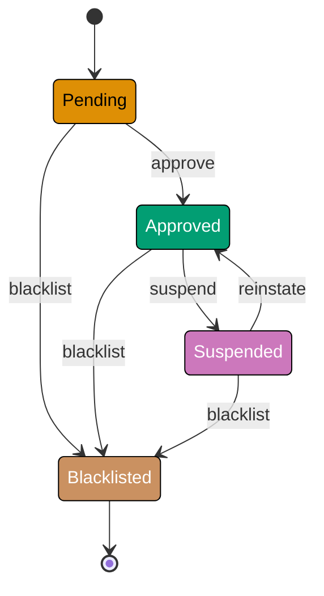
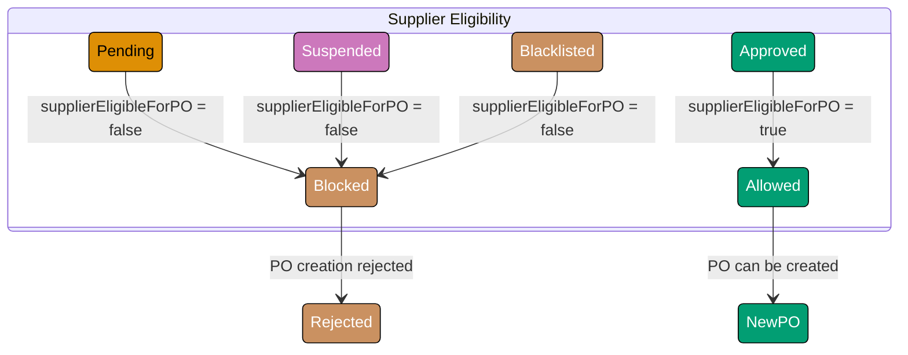
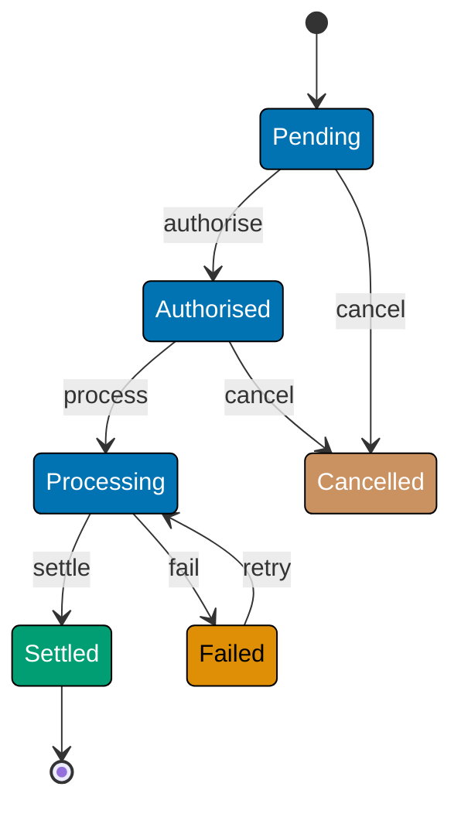
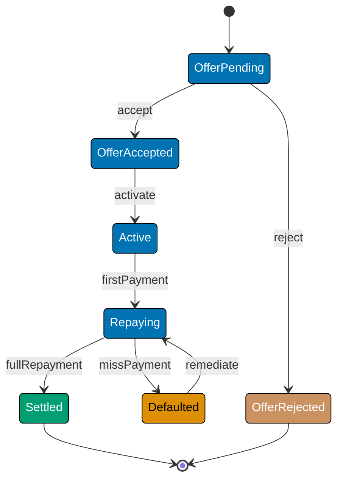

This advanced section adds the `Supplier` lifecycle and `Payment` state machine to the Procure-to-Pay domain, then covers the patterns that turn flat FSMs into statecharts: hierarchical states, parallel regions, history states, FSM persistence, event sourcing, and actor-model integration. All examples are in F# using discriminated unions, pure transition functions, and immutable records. The `MurabahaContract` machine appears as an optional Sharia-finance extension.

## Supplier Lifecycle FSM (Examples 51–57)

### Example 51: Supplier States and Risk-Tier Semantics

A `Supplier` record tracks vendor approval status. Unlike `PurchaseOrder`, the Supplier machine has only four states, but each state carries meaningful consequences for the purchasing context.



```fsharp
// ── file: SupplierFsm.fsx ──────────────────────────────────────────────────
// Supplier state DU: four states, one terminal (Blacklisted).
// Compiler rejects any SupplierState value outside this set.
type SupplierState =
    | Pending     // => Application received; vetting in progress
    | Approved    // => Cleared for new POs; appears in supplier selection
    | Suspended   // => Temporarily blocked; existing POs continue, no new POs
    | Blacklisted // => Permanently excluded — terminal state

// Supplier event DU: exhaustive alphabet of what can happen to a supplier.
type SupplierEvent =
    | Approve    // => Vetting passed; supplier cleared for purchasing
    | Suspend    // => Compliance issue detected; temporary hold
    | Reinstate  // => Issue resolved; supplier restored to Approved
    | Blacklist  // => Severe breach; permanent exclusion

// Supplier record — immutable; identity + current state.
type Supplier =
    { Id: string          // => Format: "sup_<id>"
      Name: string        // => Supplier legal name
      State: SupplierState }

// Transition table: (SupplierState * SupplierEvent) -> SupplierState option.
// Map.ofList builds an immutable lookup at startup.
let supplierTransitions : Map<SupplierState * SupplierEvent, SupplierState> =
    Map.ofList [
        (Pending,   Approve),   Approved    // => Vetting passed -> Approved
        (Pending,   Blacklist), Blacklisted // => Immediate exclusion from Pending
        (Approved,  Suspend),   Suspended   // => Compliance issue -> Suspended
        (Approved,  Blacklist), Blacklisted // => Severe breach from Approved
        (Suspended, Reinstate), Approved    // => Issue resolved -> back to Approved
        (Suspended, Blacklist), Blacklisted // => Escalation from Suspended
        // => Blacklisted: terminal — no outgoing transitions listed
    ]

// Pure transition function: lookup table, return Result.
let transitionSupplier (sup: Supplier) (event: SupplierEvent) : Result<Supplier, string> =
    match Map.tryFind (sup.State, event) supplierTransitions with
    | Some next -> Ok { sup with State = next }
    // => Valid transition: return supplier with updated state
    | None      -> Error $"{sup.State} --{event}--> (forbidden)"
    // => (state, event) not in table — invalid for this supplier

let sup = { Id = "sup_001"; Name = "Acme Supplies Ltd"; State = Approved }
// => Start in Approved state

let r1 = transitionSupplier sup Suspend
// => Ok { State = Suspended }

let r2 = r1 |> Result.bind (fun s -> transitionSupplier s Reinstate)
// => Ok { State = Approved }

let r3 = transitionSupplier sup Approve
// => Error "Approved --Approve--> (forbidden)" (already Approved)

printfn "%A" r1  // => Ok { Id = "sup_001"; State = Suspended }
printfn "%A" r2  // => Ok { Id = "sup_001"; State = Approved }
printfn "%A" r3  // => Error "Approved --Approve--> (forbidden)"
```

**Key Takeaway**: Even a four-state machine encodes significant business rules — the asymmetry between `Suspended` (reversible) and `Blacklisted` (terminal) is the entire compliance enforcement model.

**Why It Matters**: The distinction between suspended and blacklisted is a legal and audit concern: suspended suppliers can be reinstated after a compliance review, while blacklisted suppliers require a board-level decision to re-engage. Encoding this asymmetry in the FSM makes it structural — you cannot accidentally reinstate a blacklisted supplier without modifying the transition table itself. The `Result` return type surfaces the attempt as a named error, giving calling code the information it needs to notify a compliance officer rather than silently failing.

---

### Example 52: Supplier State Consequences on PO Selection

The Supplier FSM state gates which suppliers are selectable for new POs — a guard function on the purchasing context reads Supplier state before allowing PO creation.



```fsharp
// ── file: SupplierFsm.fsx ──────────────────────────────────────────────────
// Guard: can a supplier receive a new PO?
// Pure predicate — depends only on the supplier's current state.
let supplierEligibleForPO (state: SupplierState) : bool =
    state = Approved
    // => Only Approved: Pending are unvetted, Suspended cannot receive new POs

// Guard: does blacklisting a supplier force its open POs to Disputed?
// Domain rule: any transition INTO Blacklisted triggers cascading disputes.
let blacklistingForcesDispute (oldState: SupplierState) (newState: SupplierState) : bool =
    newState = Blacklisted && oldState <> Blacklisted
    // => true only on the transition edge into Blacklisted

// Return type: the blacklisted supplier plus the PO IDs that must be disputed.
type BlacklistResult =
    { Supplier: Supplier
      AffectedPOIds: string list } // => PO ids to be force-disputed by the caller

// Blacklist function: pure; returns Result carrying the cascade information.
let blacklistSupplier (sup: Supplier) (openPOIds: string list) : Result<BlacklistResult, string> =
    if sup.State = Blacklisted then
        Error $"Supplier {sup.Id} is already blacklisted"
        // => Idempotent: no-op if already blacklisted
    else
        match transitionSupplier sup Blacklist with
        | Error msg -> Error msg
        // => Transition failed — propagate error (shouldn't happen given guard above)
        | Ok updated ->
            // => Determine cascade: which POs must be disputed?
            let affected =
                if blacklistingForcesDispute sup.State updated.State then openPOIds else []
            // => If transitioning INTO Blacklisted, all open POs are affected
            Ok { Supplier = updated; AffectedPOIds = affected }

// Tests
printfn "Eligible (Approved):    %b" (supplierEligibleForPO Approved)    // => true
printfn "Eligible (Suspended):   %b" (supplierEligibleForPO Suspended)   // => false
printfn "Eligible (Pending):     %b" (supplierEligibleForPO Pending)     // => false

let approvedSup = { Id = "sup_002"; Name = "Beta Corp"; State = Approved }
let bl = blacklistSupplier approvedSup ["po_101"; "po_102"; "po_103"]
// => Ok { Supplier = { State = Blacklisted }; AffectedPOIds = ["po_101";"po_102";"po_103"] }

printfn "%A" bl  // => Ok { Supplier = { State = Blacklisted }; AffectedPOIds = [3 PO ids] }
```

**Key Takeaway**: Cross-machine effects are encoded as explicit data returned from a pure function — the caller decides when and how to apply the cascading PO state changes.

**Why It Matters**: Cascading state changes across aggregates must be explicit, not hidden inside a function that mutates POs directly. Returning `AffectedPOIds` keeps the blacklist function focused on one aggregate while giving the application service the information it needs to transition each PO in a separate, audited step. This preserves aggregate boundary integrity and makes cascading effects visible in the application layer, where they belong.

---

### Example 53: Supplier Risk Score Guard

Supplier approval requires a minimum risk score and complete documentation. A multi-condition guard on the `Approve` transition returns all blocking reasons, not just the first.

```fsharp
// ── file: SupplierFsm.fsx ──────────────────────────────────────────────────
// Supplier application: carries vetting data evaluated by the guard.
type SupplierApplication =
    { SupplierId: string
      RiskScore: float    // => 0.0 (high risk) to 1.0 (low risk)
      HasDocuments: bool } // => Required compliance documents submitted?

// Thresholds defined as a record — easier to test with different values.
type ApprovalThresholds =
    { MinRiskScore: float  // => Below this: too risky
      RequireDocuments: bool } // => Documents mandatory?

// Default thresholds used in production.
let defaultThresholds = { MinRiskScore = 0.6; RequireDocuments = true }

// Guard: accumulate all blocking reasons — same pattern as createValidatedPO.
let canApproveSupplier (app: SupplierApplication) (thresholds: ApprovalThresholds) : string list =
    [   // => List comprehension collects every failing check
        if app.RiskScore < thresholds.MinRiskScore then
            yield $"Risk score {app.RiskScore:F2} below minimum {thresholds.MinRiskScore:F2}"
            // => Risk too high; supplier not ready for approval
        if thresholds.RequireDocuments && not app.HasDocuments then
            yield "Required compliance documents not submitted"
            // => Missing documents; cannot approve without them
    ]   // => Empty list = guard passes; non-empty = blocked with reasons

// Guarded approve transition using the guard.
let approveSupplier
    (sup: Supplier)
    (app: SupplierApplication)
    (thresholds: ApprovalThresholds)
    : Result<Supplier, string> =
    if sup.State <> Pending then
        Error $"Supplier {sup.Id} is not in Pending state"
        // => FSM guard: approve only valid from Pending
    else
        let errors = canApproveSupplier app thresholds
        if not (List.isEmpty errors) then
            Error $"Approval blocked: {String.concat \"; \" errors}"
            // => Business guard: concatenate all blocking reasons
        else
            Ok { sup with State = Approved }
            // => All checks passed — advance to Approved

// Tests
let pendingSup = { Id = "sup_003"; Name = "Gamma Ltd"; State = Pending }
let lowScoreApp  = { SupplierId = "sup_003"; RiskScore = 0.4; HasDocuments = false }
let goodApp      = { SupplierId = "sup_003"; RiskScore = 0.75; HasDocuments = true }

printfn "%A" (approveSupplier pendingSup lowScoreApp defaultThresholds)
// => Error "Approval blocked: Risk score 0.40 below minimum 0.60; Required compliance documents not submitted"

printfn "%A" (approveSupplier pendingSup goodApp defaultThresholds)
// => Ok { Id = "sup_003"; State = Approved }
```

**Key Takeaway**: Accumulating all guard failures in a list gives the caller a complete picture of why approval was blocked, enabling actionable feedback rather than a single opaque error.

**Why It Matters**: Fail-fast guards that return only the first error force the user to fix one issue at a time in a frustrating loop. The list comprehension with `yield` collects all violations in one pass without mutable state, keeping the guard pure and composable. The `ApprovalThresholds` record makes the guard testable with different configurations — unit tests can vary thresholds without touching the guard logic.

---

### Example 54: Hierarchical States — Supplier with Sub-States

Hierarchical states nest states inside a parent state. `Approved` has two sub-states — `ActiveContract` and `ContractExpiring` — that do not affect the top-level FSM but drive notification logic.

```fsharp
// ── file: SupplierFsm.fsx ──────────────────────────────────────────────────
// Sub-state DU: only meaningful when parent is Approved.
// Using a separate DU avoids polluting the top-level SupplierState.
type ApprovedSubState =
    | ActiveContract     // => Contract valid; no action needed
    | ContractExpiring   // => Contract expires within 30 days; renewal reminder needed

// Extended supplier: top-level state + optional sub-state.
// SubState is None when State is not Approved.
type ExtendedSupplier =
    { Id: string
      State: SupplierState
      SubState: ApprovedSubState option } // => Some only when State = Approved

// Smart constructor: enforce sub-state/state invariant at creation time.
let createExtSupplier (id: string) (state: SupplierState) : ExtendedSupplier =
    let sub =
        match state with
        | Approved -> Some ActiveContract  // => Default sub-state on approval
        | _        -> None                 // => No sub-state outside Approved
    { Id = id; State = state; SubState = sub }

// Enter ContractExpiring sub-state: only valid when top-level is Approved.
let markContractExpiring (sup: ExtendedSupplier) : Result<ExtendedSupplier, string> =
    match sup.State, sup.SubState with
    | Approved, Some ActiveContract ->
        Ok { sup with SubState = Some ContractExpiring }
        // => Valid: active contract can transition to expiring
    | Approved, Some ContractExpiring ->
        Error "Contract already marked as expiring"
        // => Idempotent guard: already in ContractExpiring
    | other, _ ->
        Error $"Sub-state only applies to Approved suppliers; current state: {other}"
        // => Top-level not Approved — sub-state has no meaning

// Renew contract: reset to ActiveContract from ContractExpiring.
let renewContract (sup: ExtendedSupplier) : Result<ExtendedSupplier, string> =
    match sup.State, sup.SubState with
    | Approved, Some ContractExpiring ->
        Ok { sup with SubState = Some ActiveContract }
        // => Renewal resets the sub-state to active
    | Approved, Some ActiveContract ->
        Error "Contract is not expiring; nothing to renew"
    | other, _ ->
        Error $"Cannot renew contract for supplier in state {other}"

let sup = createExtSupplier "sup_004" Approved
// => { State = Approved; SubState = Some ActiveContract }

let expiring = markContractExpiring sup
// => Ok { State = Approved; SubState = Some ContractExpiring }

let renewed  = expiring |> Result.bind renewContract
// => Ok { State = Approved; SubState = Some ActiveContract }

printfn "%A" expiring  // => Ok { SubState = Some ContractExpiring }
printfn "%A" renewed   // => Ok { SubState = Some ActiveContract }
```

**Key Takeaway**: Hierarchical sub-states are modelled as separate DUs held in `option` fields on the parent record — the top-level FSM remains unchanged while sub-states handle local concerns.

**Why It Matters**: Embedding every sub-state variant directly into the top-level DU would add cases like `ApprovedActiveContract` and `ApprovedContractExpiring`, doubling the number of top-level states and making every `match` on the parent DU more complex. Separate DUs with an `option` wrapper keeps the two state spaces orthogonal: the top-level FSM governs supplier lifecycle; the sub-state DU governs contract monitoring. Each can evolve independently.

---

### Example 55: History States — Restoring Previous Sub-State After Suspension

History states remember the last active sub-state so that when a suspended supplier is reinstated, it resumes where it left off rather than defaulting to the initial sub-state.

```fsharp
// ── file: SupplierFsm.fsx ──────────────────────────────────────────────────
// Supplier with history: remembers sub-state across suspension cycles.
type HistorySupplier =
    { Id: string
      State: SupplierState
      SubState: ApprovedSubState option      // => Current sub-state
      HistorySubState: ApprovedSubState option } // => Last sub-state before suspension

// Suspend with history: save sub-state before clearing it.
let suspendWithHistory (sup: HistorySupplier) : Result<HistorySupplier, string> =
    match sup.State with
    | Approved ->
        Ok { sup with
               State = Suspended
               HistorySubState = sup.SubState  // => Save current sub-state as history
               SubState = None }               // => No sub-state while Suspended
    | other ->
        Error $"Cannot suspend from state {other}"
        // => Only Approved suppliers can be suspended

// Reinstate with history: restore saved sub-state.
let reinstateWithHistory (sup: HistorySupplier) : Result<HistorySupplier, string> =
    match sup.State with
    | Suspended ->
        let restoredSub = sup.HistorySubState |> Option.defaultValue ActiveContract
        // => Restore saved sub-state, or ActiveContract if history is None
        Ok { sup with
               State = Approved
               SubState = Some restoredSub     // => Sub-state restored from history
               HistorySubState = None }        // => Clear history after use
    | other ->
        Error $"Cannot reinstate from state {other}"
        // => Only Suspended suppliers can be reinstated

// Simulate: start Approved+ContractExpiring, suspend, reinstate -> ContractExpiring restored
let initial =
    { Id = "sup_005"; State = Approved
      SubState = Some ContractExpiring; HistorySubState = None }
// => Contract was expiring before suspension

let suspended  = suspendWithHistory initial
// => Ok { State = Suspended; SubState = None; HistorySubState = Some ContractExpiring }

let reinstated = suspended |> Result.bind reinstateWithHistory
// => Ok { State = Approved; SubState = Some ContractExpiring; HistorySubState = None }

printfn "%A" suspended  // => Ok { State = Suspended; SubState = None; HistorySubState = Some ContractExpiring }
printfn "%A" reinstated // => Ok { State = Approved; SubState = Some ContractExpiring }
```

**Key Takeaway**: History state is just a field on the record — `HistorySubState` is saved on suspension and restored on reinstatement, requiring no special FSM infrastructure.

**Why It Matters**: History states are a statechart concept that prevents jarring UX after a state interruption. A supplier reinstated after suspension should not lose its `ContractExpiring` notification context — the renewal reminder was triggered for a reason. Storing history as a record field makes the mechanism explicit and auditable. Contrast with implicit UML history pseudo-states: the record approach is visible in code review and can be persisted to a database column without any serialisation magic.

---

### Example 56: Python Supplier FSM with Enum

This example demonstrates that the FP FSM pattern applies in Python using `Enum` and a transition dictionary — the same data-driven architecture transfers across languages.

```fsharp
// ── file: SupplierFsm.fsx ──────────────────────────────────────────────────
// F# equivalent of a Python Enum-based supplier FSM.
// Uses the same Map approach — shows language-agnostic pattern.

// Equivalent Python pattern (shown as F# pseudocomment):
// class SupplierState(Enum): PENDING="Pending"; APPROVED="Approved"; etc.
// TRANSITIONS = {(SupplierState.PENDING, "approve"): SupplierState.APPROVED, ...}

// F# implementation uses the same data structure:
let pythonStyleTransitions : Map<string * string, string> =
    Map.ofList [
        ("Pending",   "approve"),   "Approved"
        // => Python: TRANSITIONS[(PENDING, "approve")] = APPROVED
        ("Pending",   "blacklist"), "Blacklisted"
        ("Approved",  "suspend"),   "Suspended"
        ("Approved",  "blacklist"), "Blacklisted"
        ("Suspended", "reinstate"), "Approved"
        ("Suspended", "blacklist"), "Blacklisted"
    ]

// Generic string-keyed transition: mirrors Python's dict-based approach.
let stringTransition (state: string) (event: string) : Result<string, string> =
    match Map.tryFind (state, event) pythonStyleTransitions with
    | Some next -> Ok next           // => Transition found
    | None      -> Error $"No transition: {state} + {event}"
    // => Invalid (state, event) pair

// Replay a string-keyed event log — same fold pattern as PO FSM.
let replayStringEvents (events: string list) : Result<string, string> =
    let rec go state remaining =
        match remaining with
        | []             -> Ok state
        | event :: rest  ->
            match stringTransition state event with
            | Ok next  -> go next rest
            | Error msg -> Error msg
    go "Pending" events

printfn "%A" (replayStringEvents ["approve"; "suspend"; "reinstate"])
// => Ok "Approved"

printfn "%A" (replayStringEvents ["approve"; "approve"])
// => Error "No transition: Approved + approve"
```

**Key Takeaway**: The data-driven Map FSM pattern is language-agnostic — the same transition table structure works in Python, TypeScript, Go, or F# with only syntax differences.

**Why It Matters**: Recognising the Map-keyed FSM pattern across languages gives developers a transferable mental model. When onboarding to a Python codebase using `{(State, Event): State}` dicts, a developer who knows the F# `Map<State * Event, State>` pattern immediately understands the structure. The fold-based replay works the same way in every language that has a reduce/fold primitive, which is virtually all of them.

---

### Example 57: Supplier Blacklisting Cascade — Forcing POs to Disputed

Blacklisting a supplier must atomically flag all its open POs as Disputed. This example shows how a pure function computes the cascade, and how the caller applies each PO transition via the PO FSM.

```fsharp
// ── file: SupplierFsm.fsx ──────────────────────────────────────────────────
// Cascade input: supplier + all open POs for that supplier.
type OpenPO =
    { POId: string
      SupplierId: string
      State: POState }   // => POState from the PO FSM

// Cascade result: updated supplier + list of (POId, new POState).
type CascadeResult =
    { UpdatedSupplier: Supplier
      POTransitions: (string * POState) list } // => (POId, target state)

// Pure cascade function: no I/O; returns the complete change set.
let computeBlacklistCascade
    (sup: Supplier)
    (openPOs: OpenPO list)
    : Result<CascadeResult, string> =
    if sup.State = Blacklisted then
        Error "Supplier is already blacklisted"
        // => Idempotent: skip if already blacklisted
    else
        match transitionSupplier sup Blacklist with
        | Error msg -> Error msg
        | Ok updated ->
            // => All open POs for this supplier must enter Disputed
            let transitions =
                openPOs
                |> List.filter (fun po -> po.SupplierId = sup.Id)
                // => Only POs belonging to the blacklisted supplier
                |> List.map (fun po -> (po.POId, Disputed))
                // => Each affected PO -> Disputed state
            Ok { UpdatedSupplier = updated; POTransitions = transitions }

// Tests
let sup     = { Id = "sup_006"; Name = "Delta Ltd"; State = Approved }
let openPOs =
    [ { POId = "po_201"; SupplierId = "sup_006"; State = Issued }
      { POId = "po_202"; SupplierId = "sup_006"; State = Approved }
      { POId = "po_301"; SupplierId = "sup_007"; State = Issued } ] // => Different supplier
// => po_301 belongs to sup_007 — should not be affected

let cascade = computeBlacklistCascade sup openPOs
// => Ok { UpdatedSupplier = { State = Blacklisted }; POTransitions = [("po_201", Disputed); ("po_202", Disputed)] }

printfn "%A" cascade
// => Ok { UpdatedSupplier = { State = Blacklisted }; POTransitions = 2 entries }
```

**Key Takeaway**: Computing the cascade as data (`CascadeResult`) gives the application layer a complete change set to apply transactionally — no hidden mutations inside the FSM functions.

**Why It Matters**: Cascading mutations hidden inside a single function are difficult to test, audit, and roll back. Returning the change set as a pure value enables the application layer to apply changes within a single database transaction, log each PO transition to the audit trail, and retry failed steps independently. The filter on `SupplierId` is explicit in the code — a reviewer can immediately see that only the blacklisted supplier's POs are affected.

---

## Payment State Machine (Examples 58–64)

### Example 58: Payment States and the Disbursement Lifecycle

A `Payment` record tracks money movement from authorisation through disbursement. The Payment FSM has a retry path, making it more complex than the linear PO lifecycle.



```fsharp
// ── file: PaymentFsm.fsx ──────────────────────────────────────────────────
// Payment state DU: six states, two terminal (Settled and Cancelled).
type PaymentState =
    | Pending    // => Payment created; awaiting authorisation
    | Authorised // => Bank authorised the amount; ready for processing
    | Processing // => Being processed by payment gateway
    | Settled    // => Money transferred — terminal state
    | Failed     // => Gateway failure; retry allowed up to limit
    | Cancelled  // => Abandoned before settlement — terminal state

// Payment event DU: exhaustive event alphabet for payments.
type PaymentEvent =
    | Authorise // => Bank authorises the amount
    | Process   // => Submit to payment gateway
    | Settle    // => Gateway confirms successful transfer
    | Fail      // => Gateway reports failure
    | Retry     // => Retry processing after failure
    | Cancel    // => Cancel before settlement

// Payment record with retry counter for the retry-limit guard.
type Payment =
    { Id: string
      Amount: decimal       // => Payment amount in base currency
      State: PaymentState
      RetryCount: int }     // => Number of times Retry has been applied

// Transition table: all valid (PaymentState, PaymentEvent) pairs.
let paymentTransitions : Map<PaymentState * PaymentEvent, PaymentState> =
    Map.ofList [
        (Pending,    Authorise), Authorised  // => Authorisation received
        (Authorised, Process),   Processing  // => Submitted to gateway
        (Processing, Settle),    Settled     // => Success — terminal
        (Processing, Fail),      Failed      // => Gateway failure
        (Failed,     Retry),     Processing  // => Re-submit to gateway
        (Pending,    Cancel),    Cancelled   // => Cancelled before auth
        (Authorised, Cancel),    Cancelled   // => Cancelled after auth, before process
    ]

// Pure transition function with retry counter increment on Retry.
let transitionPayment (payment: Payment) (event: PaymentEvent) : Result<Payment, string> =
    match Map.tryFind (payment.State, event) paymentTransitions with
    | None      -> Error $"No transition: {payment.State} + {event}"
    | Some next ->
        let retries =
            if event = Retry then payment.RetryCount + 1 else payment.RetryCount
        // => Increment retry counter only on Retry event
        Ok { payment with State = next; RetryCount = retries }

let pay = { Id = "pay_001"; Amount = 5000m; State = Pending; RetryCount = 0 }
let r   =
    pay
    |> fun p -> transitionPayment p Authorise   // => Authorised
    |> Result.bind (fun p -> transitionPayment p Process)  // => Processing
    |> Result.bind (fun p -> transitionPayment p Fail)     // => Failed
    |> Result.bind (fun p -> transitionPayment p Retry)    // => Processing again

printfn "%A" r
// => Ok { State = Processing; RetryCount = 1 }
```

**Key Takeaway**: The retry counter is a field on the record, incremented atomically with the state transition — the guard in Example 59 can read it to enforce the retry limit.

**Why It Matters**: A payment FSM without retry tracking has no mechanism to prevent infinite retry loops from draining funds or overwhelming the gateway. Keeping the counter on the record alongside the state makes the limit check a pure guard function with no external state: `payment.RetryCount >= maxRetries` is always sufficient to decide whether a retry is allowed. The counter also feeds into the audit trail, giving operations teams visibility into how many times a payment was retried before settling or being abandoned.

---

### Example 59: Payment Retry Limit Guard

A maximum retry count prevents indefinite retries. The guard reads `RetryCount` from the record and rejects the `Retry` event when the limit is reached.

```fsharp
// ── file: PaymentFsm.fsx ──────────────────────────────────────────────────
// Maximum retries before a payment must be manually reviewed.
let maxRetries = 3  // => After 3 failed retries, escalate to operations

// Guard: can this payment be retried?
// Pure predicate — depends only on record fields.
let canRetry (payment: Payment) : bool =
    payment.State = Failed && payment.RetryCount < maxRetries
    // => Must be in Failed state AND below the retry limit

// Guarded retry transition: combines FSM validity + business guard.
let retryPayment (payment: Payment) : Result<Payment, string> =
    if not (canRetry payment) then
        match payment.State with
        | Failed ->
            Error $"Retry limit reached ({payment.RetryCount}/{maxRetries}); escalate to ops"
            // => In Failed state but limit exhausted
        | other ->
            Error $"Cannot retry payment in state {other}"
            // => Not in Failed state — retry makes no sense
    else
        transitionPayment payment Retry
        // => Guard passed — apply the Retry transition

// Test: exhaust retries
let exhausted =
    { Id = "pay_002"; Amount = 1200m; State = Failed; RetryCount = 3 }
// => RetryCount already at maxRetries

printfn "%A" (retryPayment exhausted)
// => Error "Retry limit reached (3/3); escalate to ops"

// Test: retry allowed
let retryable =
    { Id = "pay_003"; Amount = 800m; State = Failed; RetryCount = 1 }
// => RetryCount below maxRetries

printfn "%A" (retryPayment retryable)
// => Ok { State = Processing; RetryCount = 2 }
```

**Key Takeaway**: `canRetry` encapsulates both the FSM state check and the business counter check — callers use a single guard that enforces both dimensions simultaneously.

**Why It Matters**: Separating the retry guard from the transition function keeps each piece independently testable: `canRetry` can be unit-tested with a list of `(state, retryCount)` pairs without building a full transition pipeline. The error messages distinguish between "wrong state" and "limit exhausted" — meaningful distinction for operations dashboards that need to route different failure modes to different response playbooks. Making `maxRetries` a named constant rather than a magic number makes it easy to find and adjust in configuration.

---

### Example 60: Parallel Regions — Payment + Notification

In a statechart, parallel regions run concurrently. In F# this is modelled as a record with two state fields — one for the Payment FSM and one for the Notification FSM — updated by a combined transition function.

```fsharp
// ── file: PaymentFsm.fsx ──────────────────────────────────────────────────
// Notification state DU: runs in parallel with Payment state.
type NotificationState =
    | Unsent     // => No notification dispatched yet
    | Sent       // => Notification dispatched to customer
    | Acknowledged // => Customer opened/acknowledged the notification

// Combined state: two orthogonal FSMs in one record.
type PaymentWithNotification =
    { Payment: Payment                  // => Payment FSM state
      Notification: NotificationState } // => Notification FSM state

// Parallel transition: advance both FSMs based on a single payment event.
let transitionParallel
    (combined: PaymentWithNotification)
    (event: PaymentEvent)
    : Result<PaymentWithNotification, string> =
    // => Step 1: advance the payment FSM
    match transitionPayment combined.Payment event with
    | Error msg -> Error msg
    | Ok updatedPayment ->
        // => Step 2: derive the notification transition from the payment event
        let updatedNotification =
            match event with
            | Authorise -> Sent        // => Notify customer on authorisation
            | Fail      -> Sent        // => Notify customer of failure
            | Settle    -> Sent        // => Notify customer of settlement
            | _         -> combined.Notification  // => No notification change
        // => Both FSMs advanced in one atomic step
        Ok { Payment = updatedPayment; Notification = updatedNotification }

// Test: authorise triggers both state changes
let initial =
    { Payment = { Id = "pay_004"; Amount = 3000m; State = Pending; RetryCount = 0 }
      Notification = Unsent }
// => Both regions start in their initial states

let afterAuth = transitionParallel initial Authorise
// => Payment: Pending -> Authorised; Notification: Unsent -> Sent

printfn "%A" afterAuth
// => Ok { Payment = { State = Authorised }; Notification = Sent }
```

**Key Takeaway**: Parallel regions are modelled as separate fields on a combined record — the combined transition function advances both regions atomically without any concurrency primitives.

**Why It Matters**: Parallel regions in statecharts represent independent concerns that advance at different rates. In FP they are naturally represented as orthogonal record fields: the Payment region governs money movement; the Notification region governs customer communication. The combined transition derives the notification change from the payment event, keeping the mapping explicit and centralised. No threads, channels, or locks are needed — immutable records provide safe "concurrency" by construction.

---

### Example 61: FSM Persistence — Serialising State to JSON

FSM state must survive process restarts. This example shows how to serialise a `Payment` record to a JSON-compatible representation and reconstruct it, using F# discriminated union string conversion.

```fsharp
// ── file: PaymentFsm.fsx ──────────────────────────────────────────────────
// Persistence record: flat JSON-friendly representation of Payment.
// DU values are stored as strings to survive schema evolution.
type PaymentSnapshot =
    { Id: string
      Amount: decimal
      State: string      // => DU case name as string; e.g. "Processing"
      RetryCount: int }  // => Counter persisted alongside state

// Serialise: Payment -> snapshot (pure function, no I/O).
let toSnapshot (payment: Payment) : PaymentSnapshot =
    { Id         = payment.Id
      Amount     = payment.Amount
      State      = sprintf "%A" payment.State  // => F# %A formats DU case name
      RetryCount = payment.RetryCount }
// => sprintf "%A" Processing = "Processing"

// Deserialise: snapshot -> Payment (returns Result to handle unknown strings).
let fromSnapshot (snap: PaymentSnapshot) : Result<Payment, string> =
    let state =
        match snap.State with
        | "Pending"    -> Ok Pending
        | "Authorised" -> Ok Authorised
        | "Processing" -> Ok Processing
        | "Settled"    -> Ok Settled
        | "Failed"     -> Ok Failed
        | "Cancelled"  -> Ok Cancelled
        | unknown      -> Error $"Unknown PaymentState: {unknown}"
        // => Handles unknown strings from future schema versions gracefully
    state |> Result.map (fun s ->
        { Id = snap.Id; Amount = snap.Amount; State = s; RetryCount = snap.RetryCount })

// Round-trip test
let payment   = { Id = "pay_005"; Amount = 2500m; State = Processing; RetryCount = 2 }
let snapshot  = toSnapshot payment
// => { Id = "pay_005"; Amount = 2500; State = "Processing"; RetryCount = 2 }

let restored  = fromSnapshot snapshot
// => Ok { Id = "pay_005"; Amount = 2500; State = Processing; RetryCount = 2 }

printfn "Snapshot: %A"  snapshot  // => { State = "Processing"; RetryCount = 2 }
printfn "Restored: %A"  restored  // => Ok { State = Processing; RetryCount = 2 }
```

**Key Takeaway**: Serialising DU cases as strings with an explicit `match` deserialiser handles unknown future states gracefully and keeps the persistence layer decoupled from the DU definition.

**Why It Matters**: Storing DU cases as integer ordinals breaks when the DU is reordered. Storing them as strings is self-documenting in the database and survives any reordering. The explicit `match` in `fromSnapshot` forces the developer to decide what to do with a string that doesn't match any known case — returning `Error` is the safe default. This is the serialisation equivalent of "make illegal states unrepresentable": unknown strings produce a typed error, not a runtime exception.

---

### Example 62: Event Sourcing Intersection — Rebuilding Payment from Events

The event-sourced approach stores events rather than state. This example rebuilds a `Payment`'s current state by folding over its event log, mirroring the `replayEvents` function from the beginner level but applied to the Payment FSM.

```fsharp
// ── file: PaymentFsm.fsx ──────────────────────────────────────────────────
// Stored event: one entry per event applied to the payment.
type PaymentEventRecord =
    { EventId: string        // => Unique event identifier (UUID)
      PaymentId: string      // => Which payment this event belongs to
      Event: PaymentEvent    // => The event applied
      OccurredAt: int64 }    // => Unix timestamp (milliseconds)

// Replay: fold a list of stored events onto the initial Payment record.
// Returns Result to surface the first invalid transition in the log.
let replayPaymentEvents
    (paymentId: string)
    (initialAmount: decimal)
    (events: PaymentEventRecord list)
    : Result<Payment, string> =
    // => Build initial state: Pending payment with zero retries
    let initial = { Id = paymentId; Amount = initialAmount; State = Pending; RetryCount = 0 }
    // => Fold over events; stop on first error (strict replay)
    let rec go (current: Payment) (remaining: PaymentEventRecord list) =
        match remaining with
        | [] -> Ok current
        // => All events consumed — return final state
        | record :: rest ->
            match transitionPayment current record.Event with
            | Ok next  -> go next rest  // => Valid — advance and continue
            | Error msg -> Error $"Event {record.EventId}: {msg}"
            // => Invalid event in log — surface with event id for debugging
    go initial events

// Simulate a stored event log
let eventLog =
    [ { EventId = "evt_001"; PaymentId = "pay_006"; Event = Authorise; OccurredAt = 1000L }
      { EventId = "evt_002"; PaymentId = "pay_006"; Event = Process;   OccurredAt = 2000L }
      { EventId = "evt_003"; PaymentId = "pay_006"; Event = Fail;      OccurredAt = 3000L }
      { EventId = "evt_004"; PaymentId = "pay_006"; Event = Retry;     OccurredAt = 4000L }
      { EventId = "evt_005"; PaymentId = "pay_006"; Event = Settle;    OccurredAt = 5000L } ]
// => Full lifecycle: Pending -> Authorised -> Processing -> Failed -> Processing -> Settled

let finalState = replayPaymentEvents "pay_006" 7500m eventLog
// => Ok { State = Settled; RetryCount = 1 }

printfn "%A" finalState  // => Ok { Id = "pay_006"; Amount = 7500M; State = Settled; RetryCount = 1 }
```

**Key Takeaway**: `List.fold` over stored events reconstructs the current state deterministically — the same event log always produces the same state, enabling time-travel debugging and audit replay.

**Why It Matters**: Event sourcing decouples what happened from what the current state is. `replayPaymentEvents` is the proof that the current state is always derivable from the event log — there is no hidden mutable state. In payment systems this is critically important for reconciliation: if the database state disagrees with the accounting ledger, replaying the event log provides the authoritative answer. The `EventId` in error messages pinpoints exactly which recorded event is invalid, enabling surgical correction of data corruption.

---

### Example 63: Statechart — Combining Hierarchical + Parallel + History

This example composes hierarchical sub-states, parallel notification tracking, and history into a single `FullPayment` record, demonstrating how the independent concepts compose without conflict.

```fsharp
// ── file: PaymentFsm.fsx ──────────────────────────────────────────────────
// Payment sub-states: only meaningful when Payment is in Processing.
type ProcessingSubState =
    | AwaitingGateway    // => Request sent; waiting for gateway response
    | GatewayResponded   // => Response received; finalising

// Full payment: combines main FSM + parallel notification + hierarchical sub-state + history.
type FullPayment =
    { Id: string
      Amount: decimal
      State: PaymentState
      RetryCount: int
      SubState: ProcessingSubState option         // => Some only when Processing
      HistorySubState: ProcessingSubState option  // => Saved on exit from Processing
      Notification: NotificationState }           // => Parallel notification region

// Enter Processing from Authorised: set initial sub-state.
let enterProcessing (fp: FullPayment) : Result<FullPayment, string> =
    match fp.State with
    | Authorised ->
        Ok { fp with
               State = Processing
               SubState = Some AwaitingGateway  // => Start in AwaitingGateway sub-state
               Notification = Sent }            // => Parallel: notify on processing start
    | other ->
        Error $"Cannot enter Processing from {other}"

// Settle from Processing: save history, clear sub-state, advance notification.
let settlePayment (fp: FullPayment) : Result<FullPayment, string> =
    match fp.State with
    | Processing ->
        Ok { fp with
               State = Settled
               HistorySubState = fp.SubState  // => Save sub-state to history
               SubState = None                // => No sub-state when Settled
               Notification = Sent }          // => Parallel: notify on settlement
    | other ->
        Error $"Cannot settle payment in state {other}"

// Test: compose the transitions
let initial =
    { Id = "pay_007"; Amount = 4000m; State = Authorised; RetryCount = 0
      SubState = None; HistorySubState = None; Notification = Unsent }

let processing = enterProcessing initial
// => Ok { State = Processing; SubState = Some AwaitingGateway; Notification = Sent }

let settled = processing |> Result.bind settlePayment
// => Ok { State = Settled; HistorySubState = Some AwaitingGateway; Notification = Sent }

printfn "%A" settled
// => Ok { State = Settled; SubState = None; HistorySubState = Some AwaitingGateway; Notification = Sent }
```

**Key Takeaway**: Hierarchical sub-states, parallel regions, and history states compose naturally as orthogonal record fields — the combined record is still an immutable value with a single transition function.

**Why It Matters**: Statecharts appear complex in UML diagrams, but in F# they decompose into independent record fields each managed by a small function. The `FullPayment` record holds all dimensions simultaneously: the main state, the sub-state, the history, the parallel notification state. Each function (`enterProcessing`, `settlePayment`) touches only the fields it owns, making changes local and reviewable. The whole statechart behaviour is expressed without any specialised statechart library.

---

### Example 64: Full P2P Machine Coverage Check

This example verifies that all four machines — `PurchaseOrder`, `Invoice`, `Supplier`, and `Payment` — can process their full happy-path event sequences correctly.

```fsharp
// ── file: IntegrationCheck.fsx ────────────────────────────────────────────
// Verify all four FSMs process their happy paths without error.
// Uses tableTransition (PO), invoiceTransition (Invoice),
// transitionSupplier, and transitionPayment from previous examples.

// Helper: fold an event list with a transition function; return final state or error.
let foldEvents
    (transition: 'S -> 'E -> Result<'S, string>)
    (initial: 'S)
    (events: 'E list)
    : Result<'S, string> =
    // => Generic fold: works for any (state, event) -> Result<state, string> function
    List.fold
        (fun acc event ->
            acc |> Result.bind (fun s -> transition s event))
        (Ok initial)
        events
// => Short-circuits on first Error; returns Ok final-state on success

// PO happy path: Draft -> AwaitingApproval -> Approved -> Issued -> Acknowledged -> Closed
let poResult =
    foldEvents tableTransition Draft
        [ Submit; Approve; Issue; Acknowledge; Close ]
// => Ok Closed

// Supplier happy path: Pending -> Approved -> Suspended -> Approved
let supplierFn (s: SupplierState) (e: SupplierEvent) =
    Map.tryFind (s, e) supplierTransitions
    |> Option.map Ok
    |> Option.defaultValue (Error $"No transition: {s} + {e}")
let supResult =
    foldEvents supplierFn Pending [ Approve; Suspend; Reinstate ]
// => Ok Approved

// Payment happy path: Pending -> Authorised -> Processing -> Settled
let payResult =
    foldEvents
        (fun s e -> transitionPayment { Id = ""; Amount = 0m; State = s; RetryCount = 0 } e
                    |> Result.map (fun p -> p.State))
        Pending
        [ Authorise; Process; Settle ]
// => Ok Settled

printfn "PO final state:       %A" poResult   // => Ok Closed
printfn "Supplier final state: %A" supResult  // => Ok Approved
printfn "Payment final state:  %A" payResult  // => Ok Settled
```

**Key Takeaway**: A generic `foldEvents` function tests any FSM's happy path by lifting the specific transition function into a consistent fold interface.

**Why It Matters**: The generic `foldEvents` reveals a deeper structural truth: all FSMs in this domain share the same computational shape — `(State -> Event -> Result<State, error>) -> InitialState -> EventList -> Result<FinalState, error>`. This shape is a monad — specifically the Result monad applied to FSM folds. Recognising this allows a single generic test harness to cover all machines, and enables future machines to plug in without writing new test infrastructure.

---

## Sharia-Finance Extension (Examples 65–67)

### Example 65: MurabahaContract State Machine (Optional)

A `MurabahaContract` is a cost-plus-profit Islamic finance instrument. Its state machine governs the offer, acceptance, and repayment lifecycle under Sharia rules — no interest, so the profit margin is fixed at offer time.



```fsharp
// ── file: MurabahFsm.fsx ──────────────────────────────────────────────────
// MurabahaContract state DU: offer -> acceptance -> repayment lifecycle.
type MurabahaState =
    | OfferPending   // => Bank has presented the cost+profit offer; awaiting customer decision
    | OfferAccepted  // => Customer accepted the offer; contract activation pending
    | OfferRejected  // => Customer rejected the offer — terminal state
    | Active         // => Contract active; first payment not yet made
    | Repaying       // => Customer is making instalment payments
    | Defaulted      // => Customer missed a payment; remediation required
    | Settled        // => Full repayment complete — terminal state

// MurabahaContract event DU: events that advance the contract lifecycle.
type MurabahaEvent =
    | Accept         // => Customer accepts the cost+profit offer
    | Reject         // => Customer rejects the offer
    | Activate       // => Bank activates the contract after acceptance
    | FirstPayment   // => Customer makes the first instalment
    | FullRepayment  // => Customer completes all instalments
    | MissPayment    // => Customer misses a scheduled payment
    | Remediate      // => Customer catches up on missed payments

// Transition table for the MurabahaContract FSM.
let murabahaTransitions : Map<MurabahaState * MurabahaEvent, MurabahaState> =
    Map.ofList [
        (OfferPending,  Accept),       OfferAccepted  // => Customer accepts
        (OfferPending,  Reject),       OfferRejected  // => Customer rejects — terminal
        (OfferAccepted, Activate),     Active          // => Bank activates contract
        (Active,        FirstPayment), Repaying        // => Repayment started
        (Repaying,      FullRepayment),Settled         // => All paid — terminal
        (Repaying,      MissPayment),  Defaulted       // => Missed payment
        (Defaulted,     Remediate),    Repaying        // => Caught up — resume repaying
    ]

// Pure transition function.
let transitionMurabaha (state: MurabahaState) (event: MurabahaEvent) : Result<MurabahaState, string> =
    match Map.tryFind (state, event) murabahaTransitions with
    | Some next -> Ok next
    | None      -> Error $"Invalid transition: {state} + {event}"

// Happy path: offer -> accept -> activate -> firstPayment -> fullRepayment
let happyPath = [ Accept; Activate; FirstPayment; FullRepayment ]
let result =
    List.fold
        (fun acc e -> acc |> Result.bind (fun s -> transitionMurabaha s e))
        (Ok OfferPending)
        happyPath
// => Ok Settled

printfn "%A" result  // => Ok Settled
```

**Key Takeaway**: The MurabahaContract FSM uses the same DU + Map + pure-transition pattern as every other machine in this tutorial — Sharia-finance rules are encoded as data, not special-case logic.

**Why It Matters**: Sharia-compliant finance instruments have strict contractual rules: profit is fixed at offer time, early settlement is encouraged (no penalty), and default leads to renegotiation rather than compounding interest. The FSM makes these rules structural — a contract cannot move from `OfferAccepted` to `Repaying` without passing through `Active`, enforcing the activation step where the bank verifies the goods have been purchased. The same testing and replay patterns apply without any Sharia-specific infrastructure.

---

### Example 66: Installment Counter and Self-Loop

A Murabaha repayment schedule has N instalments. The FSM stays in `Repaying` until all N payments are made. Rather than adding N states, a counter field drives a guard that decides when to allow `FullRepayment`.

```fsharp
// ── file: MurabahFsm.fsx ──────────────────────────────────────────────────
// Murabaha contract record with instalment tracking.
type MurabahaContract =
    { Id: string
      State: MurabahaState
      TotalInstalments: int   // => Total number of scheduled instalments
      PaidInstalments: int    // => Number of instalments paid so far
      ProfitMargin: decimal } // => Fixed profit percentage set at offer time

// Guard: can the customer make a FullRepayment?
// True only when all instalments have been paid.
let canFullyRepay (contract: MurabahaContract) : bool =
    contract.PaidInstalments >= contract.TotalInstalments
    // => >= handles edge case of over-payment without erroring

// Process a single instalment payment — self-loop on Repaying.
let makeInstalment (contract: MurabahaContract) : Result<MurabahaContract, string> =
    match contract.State with
    | Repaying ->
        // => Increment paid counter; state stays Repaying until all paid
        let updated = { contract with PaidInstalments = contract.PaidInstalments + 1 }
        Ok updated
        // => Self-loop: Repaying -> Repaying with updated counter
    | other ->
        Error $"Cannot make instalment in state {other}"
        // => Not in Repaying state — instalment makes no sense

// Complete repayment: guard checks counter then fires FullRepayment.
let completeRepayment (contract: MurabahaContract) : Result<MurabahaContract, string> =
    if not (canFullyRepay contract) then
        let remaining = contract.TotalInstalments - contract.PaidInstalments
        Error $"{remaining} instalments still outstanding"
        // => Guard fails: not all instalments paid
    else
        match transitionMurabaha contract.State FullRepayment with
        | Ok next  -> Ok { contract with State = next }
        | Error msg -> Error msg

// Test: 3-instalment contract
let contract =
    { Id = "mur_001"; State = Repaying; TotalInstalments = 3; PaidInstalments = 0; ProfitMargin = 0.08m }

let afterInstalment1 = makeInstalment contract
// => Ok { PaidInstalments = 1; State = Repaying }

let afterInstalment2 = afterInstalment1 |> Result.bind makeInstalment
// => Ok { PaidInstalments = 2; State = Repaying }

let afterInstalment3 = afterInstalment2 |> Result.bind makeInstalment
// => Ok { PaidInstalments = 3; State = Repaying }

let settled = afterInstalment3 |> Result.bind completeRepayment
// => Ok { PaidInstalments = 3; State = Settled }

printfn "%A" settled
// => Ok { Id = "mur_001"; State = Settled; PaidInstalments = 3 }
```

**Key Takeaway**: A counter field on the record implements a self-loop guard without multiplying the number of states — the machine stays in `Repaying` until the business condition is met.

**Why It Matters**: Creating one state per instalment would produce N states for an N-instalment contract, making the FSM unworkable for variable-length schedules. The counter guard pattern keeps the FSM compact (one `Repaying` state) while encoding the business rule precisely. The same pattern applies to any "N completions required" scenario: approval rounds, signature collection, or multi-step verification chains all benefit from a counter guard rather than a state per step.

---

### Example 67: Linking MurabahaContract to PurchaseOrder

A Murabaha purchase often originates from a `PurchaseOrder`. When the contract is activated, the linked PO should also be issued. This example computes the two-machine change set as a pure function.

```fsharp
// ── file: MurabahFsm.fsx ──────────────────────────────────────────────────
// Link record: connects a MurabahaContract to its originating PurchaseOrder.
type MurabahaPOLink =
    { Contract: MurabahaContract
      LinkedPO: PurchaseOrder }  // => PurchaseOrder type from PO FSM

// Activate the contract and simultaneously issue the linked PO.
// Returns the updated contract and PO as a pair — no I/O.
let activateContractAndIssuePO
    (link: MurabahaPOLink)
    : Result<MurabahaPOLink, string> =
    // => Step 1: transition the contract from OfferAccepted to Active
    match transitionMurabaha link.Contract.State Activate with
    | Error msg -> Error $"Contract activation failed: {msg}"
    // => Contract not in OfferAccepted state — activation invalid
    | Ok activeState ->
        let updatedContract = { link.Contract with State = activeState }
        // => Contract is now Active
        // => Step 2: issue the linked PO (must be in Approved state)
        match tableTransition link.LinkedPO.State Issue with
        | Error msg -> Error $"PO issuance failed: {msg}"
        // => PO not in Approved state — cannot issue
        | Ok issuedState ->
            let updatedPO = { link.LinkedPO with State = issuedState }
            // => PO is now Issued
            Ok { Contract = updatedContract; LinkedPO = updatedPO }
            // => Both machines advanced in one pure step

// Tests
let contractInAccepted =
    { Id = "mur_002"; State = OfferAccepted; TotalInstalments = 12
      PaidInstalments = 0; ProfitMargin = 0.07m }

let poInApproved = { Id = "PO-100"; State = Approved }

let link = { Contract = contractInAccepted; LinkedPO = poInApproved }

printfn "%A" (activateContractAndIssuePO link)
// => Ok { Contract = { State = Active }; LinkedPO = { State = Issued } }

let linkBadPO = { link with LinkedPO = { Id = "PO-101"; State = Draft } }
printfn "%A" (activateContractAndIssuePO linkBadPO)
// => Error "PO issuance failed: No transition: Draft + Issue"
```

**Key Takeaway**: Cross-machine coordination is a pure function that computes the complete change set — the caller applies both changes within a single database transaction.

**Why It Matters**: When two aggregates must change together, the safest approach is to compute all changes as data before committing any of them. This function returns `Result<MurabahaPOLink, string>`, giving the application layer a complete "apply this or nothing" package. Database transactions then enforce atomicity. The alternative — updating one aggregate and then the other in separate function calls — risks partial updates if the second fails. Returning a pair makes the intended transactional boundary explicit in the type.

---

## Production Patterns (Examples 68–75)

### Example 68: Actor Model — FSM as an Actor

In the actor model each FSM instance is an actor that processes messages sequentially. In F# this is modelled with a `MailboxProcessor`, which provides a sequential message queue without explicit locking.

```fsharp
// ── file: PaymentActor.fsx ────────────────────────────────────────────────
// Actor message: carry the event and a reply channel.
type PaymentActorMsg =
    | Apply of PaymentEvent * AsyncReplyChannel<Result<Payment, string>>
    // => Apply an event; reply with new state or error
    | GetState of AsyncReplyChannel<Payment>
    // => Query current state without changing it

// Create a payment actor wrapping the payment FSM.
// MailboxProcessor processes messages sequentially — no race conditions.
let createPaymentActor (initial: Payment) : MailboxProcessor<PaymentActorMsg> =
    MailboxProcessor.Start(fun inbox ->
        // => Recursive loop: hold current state in tail-recursive parameter
        let rec loop (current: Payment) = async {
            let! msg = inbox.Receive()  // => Await next message
            match msg with
            | Apply(event, reply) ->
                let result = transitionPayment current event
                // => Apply event to current state — pure function
                match result with
                | Ok next ->
                    reply.Reply(Ok next)  // => Send updated payment to caller
                    return! loop next     // => Recurse with new state
                | Error msg ->
                    reply.Reply(Error msg)  // => Send error to caller
                    return! loop current   // => State unchanged on error
            | GetState reply ->
                reply.Reply current  // => Return current state without transition
                return! loop current // => State unchanged on query
        }
        loop initial)  // => Start with initial payment state

// Usage: create actor and send events
let actor =
    createPaymentActor { Id = "pay_008"; Amount = 6000m; State = Pending; RetryCount = 0 }
// => Actor starts with Pending payment

let r1 = actor.PostAndReply(fun ch -> Apply(Authorise, ch))
// => Ok { State = Authorised }

let r2 = actor.PostAndReply(fun ch -> Apply(Process, ch))
// => Ok { State = Processing }

let current = actor.PostAndReply GetState
// => { State = Processing; RetryCount = 0 }

printfn "After Authorise: %A" r1      // => Ok { State = Authorised }
printfn "After Process:   %A" r2      // => Ok { State = Processing }
printfn "Current state:   %A" current // => { State = Processing }
```

**Key Takeaway**: `MailboxProcessor` wraps a pure FSM function in a sequential actor — messages are processed one at a time, eliminating race conditions without explicit locking.

**Why It Matters**: Payment FSMs in production receive concurrent API requests. Without coordination, two simultaneous `Retry` calls could both pass the `canRetry` guard and fire, incrementing `RetryCount` twice. The `MailboxProcessor` serialises all messages to the same actor, so the FSM function processes one event at a time. The pure FSM function inside the actor is still testable without the actor wrapper — the two concerns (concurrency safety and state logic) remain separate.

---

### Example 69: Optimistic Concurrency — Version Numbers

Optimistic concurrency uses a version number to detect concurrent modifications. Before applying a transition, the caller asserts the expected version matches the stored version.

```fsharp
// ── file: PaymentFsm.fsx ──────────────────────────────────────────────────
// Versioned payment: version increments on every successful transition.
type VersionedPayment =
    { Id: string
      Amount: decimal
      State: PaymentState
      RetryCount: int
      Version: int64 }  // => Monotonically increasing version counter

// Versioned transition: caller must supply the expected current version.
let transitionVersioned
    (payment: VersionedPayment)
    (event: PaymentEvent)
    (expectedVersion: int64)
    : Result<VersionedPayment, string> =
    if payment.Version <> expectedVersion then
        Error $"Version conflict: expected {expectedVersion}, found {payment.Version}"
        // => Another writer modified this payment since we read it
    else
        match Map.tryFind (payment.State, event) paymentTransitions with
        | None -> Error $"No transition: {payment.State} + {event}"
        | Some next ->
            let retries = if event = Retry then payment.RetryCount + 1 else payment.RetryCount
            Ok { payment with
                   State = next
                   RetryCount = retries
                   Version = payment.Version + 1L }
                // => Increment version on every successful transition

// Test: version conflict
let vp = { Id = "pay_009"; Amount = 3500m; State = Pending; RetryCount = 0; Version = 1L }

let ok = transitionVersioned vp Authorise 1L
// => Ok { State = Authorised; Version = 2L }

let conflict = transitionVersioned vp Authorise 0L
// => Error "Version conflict: expected 0, found 1"

printfn "%A" ok       // => Ok { State = Authorised; Version = 2L }
printfn "%A" conflict // => Error "Version conflict: expected 0, found 1"
```

**Key Takeaway**: A `Version` field on the record, incremented per transition, makes concurrent modification detectable at the application layer without database locks.

**Why It Matters**: Optimistic concurrency is more scalable than pessimistic locking for payment systems: most transitions succeed without contention, so the overhead of version checks is lower than acquiring database row locks. When a version conflict is detected, the caller can reload the current state and decide whether to retry or abort. The version is part of the immutable record, so it is automatically included in snapshots and event log entries, making the concurrency model auditable.

---

### Example 70: Saga Pattern — Coordinating PO + Invoice + Payment

A saga coordinates multiple FSMs across a business transaction. The `P2PSaga` tracks the state of all three machines and advances them in sequence: PO must be Issued before Invoice can be Approved, which must come before Payment can settle.

```fsharp
// ── file: SagaFsm.fsx ─────────────────────────────────────────────────────
// Saga state: one field per participating machine.
type P2PSaga =
    { SagaId: string
      POState: POState         // => PurchaseOrder FSM state
      InvoiceState: string     // => Invoice FSM state (string for brevity)
      PaymentState: PaymentState } // => Payment FSM state

// Saga step result: updated saga or compensating error.
type SagaStep = Result<P2PSaga, string>

// Advance the PO to Issued; prerequisite for invoice approval.
let sagaIssuePO (saga: P2PSaga) : SagaStep =
    match tableTransition saga.POState Issue with
    | Ok next -> Ok { saga with POState = next }
    // => PO transitions from Approved -> Issued
    | Error msg -> Error $"Saga PO issue failed: {msg}"

// Advance the invoice to Approved; only after PO is Issued.
let sagaApproveInvoice (saga: P2PSaga) : SagaStep =
    if saga.POState <> Issued then
        Error "Invoice cannot be approved before PO is Issued"
        // => Saga coordination guard: cross-machine dependency enforced here
    else
        Ok { saga with InvoiceState = "Approved" }
        // => Invoice advances to Approved

// Settle the payment; only after Invoice is Approved.
let sagaSettlePayment (saga: P2PSaga) (payment: Payment) : Result<P2PSaga * Payment, string> =
    if saga.InvoiceState <> "Approved" then
        Error "Payment cannot settle before Invoice is Approved"
        // => Cross-machine dependency: invoice must be approved first
    else
        match transitionPayment payment Settle with
        | Error msg -> Error $"Payment settle failed: {msg}"
        | Ok settled -> Ok ({ saga with PaymentState = settled.State }, settled)
        // => Both saga and payment updated together

// Run the P2P saga
let saga =
    { SagaId = "saga_001"; POState = Approved
      InvoiceState = "Received"; PaymentState = Processing }

let result =
    Ok saga
    |> Result.bind sagaIssuePO           // => PO: Approved -> Issued
    |> Result.bind sagaApproveInvoice    // => Invoice: Received -> Approved
// => Ok { POState = Issued; InvoiceState = "Approved"; PaymentState = Processing }

printfn "%A" result
// => Ok { POState = Issued; InvoiceState = "Approved"; PaymentState = Processing }
```

**Key Takeaway**: A saga is a record of participating machine states advanced through a `Result.bind` pipeline — each step is a guard-checked transition that short-circuits on the first failure.

**Why It Matters**: The saga pattern manages distributed transactions without two-phase commit. Each step is a local state change; on failure, compensating transactions roll back the completed steps. The `Result.bind` pipeline maps naturally to the saga's sequential step structure: each step either advances or short-circuits. Cross-machine dependencies (PO must be Issued before Invoice can be Approved) are expressed as guards at the saga level, keeping each individual machine FSM free of cross-cutting constraints.

---

### Example 71: State Machine Snapshot and Resume

A snapshot captures the entire FSM state at a point in time, enabling a process to resume from that snapshot rather than replaying all events from the beginning.

```fsharp
// ── file: PaymentFsm.fsx ──────────────────────────────────────────────────
// Snapshot: point-in-time capture of payment FSM state.
type PaymentSnapshot2 =
    { SnapshotId: string    // => Unique snapshot identifier
      PaymentId: string
      State: string         // => DU case name as string
      RetryCount: int
      Version: int64
      SnapshotAt: int64 }   // => Unix timestamp when snapshot was taken

// Create a snapshot from a VersionedPayment.
let takeSnapshot (payment: VersionedPayment) (now: int64) : PaymentSnapshot2 =
    { SnapshotId = System.Guid.NewGuid().ToString()
      // => Fresh ID for this snapshot
      PaymentId   = payment.Id
      State       = sprintf "%A" payment.State  // => DU case as string
      RetryCount  = payment.RetryCount
      Version     = payment.Version
      SnapshotAt  = now }
// => Pure function: no I/O other than Guid generation

// Restore a VersionedPayment from a snapshot.
let restoreFromSnapshot (snap: PaymentSnapshot2) : Result<VersionedPayment, string> =
    let state =
        match snap.State with
        | "Pending"    -> Ok Pending
        | "Authorised" -> Ok Authorised
        | "Processing" -> Ok Processing
        | "Settled"    -> Ok Settled
        | "Failed"     -> Ok Failed
        | "Cancelled"  -> Ok Cancelled
        | unknown      -> Error $"Unknown state in snapshot: {unknown}"
    state |> Result.map (fun s ->
        { Id = snap.PaymentId; Amount = 0m; State = s
          RetryCount = snap.RetryCount; Version = snap.Version })
    // => Amount not stored in snapshot — caller restores from separate record

// Test snapshot round-trip
let vp2  = { Id = "pay_010"; Amount = 9000m; State = Processing; RetryCount = 2; Version = 5L }
let snap = takeSnapshot vp2 1716000000000L
// => { State = "Processing"; RetryCount = 2; Version = 5L }

let restored = restoreFromSnapshot snap
// => Ok { State = Processing; RetryCount = 2; Version = 5L }

printfn "Snapshot state: %s"   snap.State   // => Processing
printfn "Restored:       %A"   restored      // => Ok { State = Processing; RetryCount = 2; Version = 5 }
```

**Key Takeaway**: A snapshot is an immutable record of FSM state at a moment in time — `takeSnapshot` and `restoreFromSnapshot` are pure functions that decouple persistence format from the DU definition.

**Why It Matters**: Replaying thousands of events from the beginning on every process restart is slow. Snapshots provide a faster recovery path: load the latest snapshot (O(1) lookup), then replay only the events that occurred after the snapshot timestamp. This is the standard event-sourcing performance optimisation. Storing state as strings in the snapshot decouples the snapshot schema from the DU definition — the DU can be refactored without invalidating existing snapshots, as long as `fromSnapshot` handles the old string values.

---

### Example 72: FSM Visualisation — Mermaid from Code

Generating a Mermaid diagram from the transition table ensures the visualisation always reflects the current code — no manually maintained diagram to drift out of sync.

```fsharp
// ── file: Visualisation.fsx ───────────────────────────────────────────────
// Generate a Mermaid stateDiagram-v2 from any Map<(state * event), state>.
// Uses sprintf to format DU cases as readable strings.
let generateMermaid
    (title: string)
    (table: Map<'S * 'E, 'S>)
    : string =
    // => Collect one transition line per entry in the table
    let transitions =
        table
        |> Map.toList  // => [(('S, 'E), 'S)]
        |> List.map (fun ((fromState, event), toState) ->
            $"    {fromState} --> {toState}: {event}")
            // => Mermaid arrow syntax: From --> To : Label
    let header   = $"---\ntitle: {title}\n---\nstateDiagram-v2"
    // => Mermaid frontmatter + diagram type declaration
    let body     = transitions |> String.concat "\n"
    // => Join all transition lines
    header + "\n" + body
// => Returns complete Mermaid string, ready to embed in markdown

// Generate Mermaid for the Payment FSM
let paymentMermaid = generateMermaid "Payment FSM" paymentTransitions

printfn "%s" paymentMermaid
// => ---
// => title: Payment FSM
// => ---
// => stateDiagram-v2
// =>     Pending --> Authorised: Authorise
// =>     Pending --> Cancelled: Cancel
// =>     Authorised --> Processing: Process
// =>     Authorised --> Cancelled: Cancel
// =>     Processing --> Settled: Settle
// =>     Processing --> Failed: Fail
// =>     Failed --> Processing: Retry

// Generate for Supplier FSM
let supplierMermaid = generateMermaid "Supplier FSM" supplierTransitions
printfn "%s" supplierMermaid
// => stateDiagram-v2
// =>     Pending --> Approved: Approve
// =>     Pending --> Blacklisted: Blacklist
// =>     ... (one line per transition)
```

**Key Takeaway**: `Map.toList |> List.map` over the transition table generates a Mermaid diagram that is always derived from the authoritative code, never a separately maintained artifact.

**Why It Matters**: State machine diagrams in documentation drift from code within weeks. Generating diagrams from the transition table makes them derived artifacts: run `generateMermaid`, embed in markdown, and the diagram reflects the current machine exactly. The generic function works for any `Map<('S * 'E), 'S>`, so adding a new machine requires no changes to the visualisation code. The same approach works for DOT/Graphviz by substituting the arrow syntax — one generator function, multiple output formats.

---

### Example 73: FSM-Driven API Response Codes

The FSM state determines the HTTP response code returned by the API. Rather than checking state strings in handlers, a pure function maps `(State, Operation)` to `(Status, message)`, keeping the mapping in one place.

```fsharp
// ── file: ApiCodes.fsx ────────────────────────────────────────────────────
// HTTP status code mapping: (PaymentState, operation string) -> (int, string)
// Pure function — same inputs always produce same outputs.
let paymentStatusCode (state: PaymentState) (operation: string) : int * string =
    match state, operation with
    | Pending,    "view"    -> 200, "Payment pending authorisation"
    | Pending,    "pay"     -> 409, "Payment not yet authorised"
    // => 409 Conflict: action not valid for current state
    | Authorised, "view"    -> 200, "Payment authorised"
    | Authorised, "pay"     -> 409, "Payment not yet processed"
    | Processing, "view"    -> 200, "Payment processing"
    | Processing, "pay"     -> 409, "Payment already in processing"
    | Failed,     "view"    -> 200, "Payment failed"
    | Failed,     "retry"   -> 200, "Retry accepted"
    | Failed,     "pay"     -> 409, "Payment failed; retry or cancel"
    | Settled,    "view"    -> 200, "Payment settled"
    | Settled,    "pay"     -> 409, "Payment already settled"
    | Cancelled,  "view"    -> 200, "Payment cancelled"
    | Cancelled,  "pay"     -> 410, "Payment cancelled; cannot process"
    // => 410 Gone: resource permanently gone
    | _, _                  -> 422, $"Operation '{operation}' not supported in state {state}"
    // => 422 Unprocessable Entity: unrecognised combination

// Test across several state/operation pairs
let cases = [
    (Pending,    "pay"),    (409, "Payment not yet authorised")
    (Failed,     "retry"),  (200, "Retry accepted")
    (Settled,    "pay"),    (409, "Payment already settled")
    (Cancelled,  "pay"),    (410, "Payment cancelled; cannot process")
]

cases |> List.iter (fun ((state, op), (expectedCode, _)) ->
    let (code, msg) = paymentStatusCode state op
    printfn "%A + %s -> %d: %s" state op code msg)
// => Pending + pay -> 409: Payment not yet authorised
// => Failed + retry -> 200: Retry accepted
// => Settled + pay -> 409: Payment already settled
// => Cancelled + pay -> 410: Payment cancelled; cannot process
```

**Key Takeaway**: A pure `(State, Operation) -> (StatusCode, Message)` function centralises all HTTP mapping in one exhaustive `match` — API handlers read state and delegate code selection without conditional logic.

**Why It Matters**: HTTP response codes communicate state to API clients and monitoring systems. Scattering `if payment.state === "Settled" then 409` checks across handlers creates inconsistency when a new state is added. The centralised match function makes adding a new state (`Refunding`) a single-location change — the compiler flags every incomplete match if the DU is used directly. The function is also directly testable: a table of `(state, operation) -> (code, message)` triples can be asserted without spinning up an HTTP server.

---

### Example 74: Testing All Four Machines Together

An integration test verifies that the four machines — PO, Invoice, Supplier, and Payment — interoperate correctly through a full P2P procurement scenario.

```fsharp
// ── file: IntegrationTest.fsx ─────────────────────────────────────────────
// Full P2P scenario: create PO, approve supplier, process invoice, settle payment.
// Each assertion is a pure structural equality check — no mocks, no setup.

// Step 1: Create and issue a PurchaseOrder
let po0 = createPO "PO-INTEG-001"
// => { State = Draft }
let po1 =
    [Submit; Approve; Issue]
    |> List.fold
        (fun acc e ->
            acc |> Result.bind (fun s -> tableTransition s e |> Result.map id))
        (Ok po0.State)
// => Ok Issued

// Step 2: Approve a Supplier
let sup0 = { Id = "sup_INTEG"; Name = "Integration Supplier"; State = Pending }
let sup1 = transitionSupplier sup0 Approve
// => Ok { State = Approved }

// Step 3: Process a Payment through full lifecycle
let pay0 = { Id = "pay_INTEG"; Amount = 10_000m; State = Pending; RetryCount = 0 }
let pay1 =
    [Authorise; Process; Settle]
    |> List.fold
        (fun acc e -> acc |> Result.bind (fun p -> transitionPayment p e))
        (Ok pay0)
// => Ok { State = Settled }

// Step 4: Assert all machines reached their expected final states
let assertOk label expected actual =
    match actual with
    | Ok value when sprintf "%A" value = sprintf "%A" expected ->
        printfn "PASS: %s -> %A" label value
        // => Test passed: actual matches expected
    | Ok value ->
        printfn "FAIL: %s expected %A got %A" label expected value
        // => Wrong value returned
    | Error msg ->
        printfn "FAIL: %s errored: %s" label msg
        // => Unexpected error

assertOk "PO final state"       (Ok Issued)   po1
// => PASS: PO final state -> Ok Issued
assertOk "Supplier final state" (Ok Approved) (sup1 |> Result.map (fun s -> s.State))
// => PASS: Supplier final state -> Ok Approved
assertOk "Payment final state"  (Ok Settled)  (pay1 |> Result.map (fun p -> p.State))
// => PASS: Payment final state -> Ok Settled
```

**Key Takeaway**: Integration tests across multiple FSMs are just compositions of pure function calls — no test framework, no mocking, no HTTP requests needed to verify the full P2P scenario.

**Why It Matters**: Pure FSM functions make cross-machine integration tests trivially simple: compose the transition functions, assert the final states with structural equality. There are no side effects to mock, no database to seed, no HTTP layer to stub. The test reads as a business scenario: create PO, approve supplier, settle payment — and the assertions directly verify the domain invariants. This is the payoff of the FP approach: the entire P2P domain can be tested in a script file with no infrastructure.

---

### Example 75: Statechart Summary — All Four Machines

This final example presents the complete statechart for the P2P domain — all four machines with their states, events, and inter-machine dependencies — as a Mermaid diagram generated from code.

```fsharp
// ── file: StatechartSummary.fsx ───────────────────────────────────────────
// Summary: all four P2P FSMs as a combined Mermaid diagram.
// Each machine is shown as a Mermaid stateDiagram-v2 sub-diagram.
// This is the "living documentation" generated from transition tables.

// Generate summaries for all machines
let poSummary       = generateMermaid "PurchaseOrder FSM" fullTransitionTable
let supplierSummary = generateMermaid "Supplier FSM"      supplierTransitions
let paymentSummary  = generateMermaid "Payment FSM"       paymentTransitions
let murabahSummary  = generateMermaid "Murabaha FSM"      murabahaTransitions

// Count transitions across all machines
let totalTransitions =
    [ fullTransitionTable; supplierTransitions; paymentTransitions; murabahaTransitions ]
    |> List.sumBy Map.count
// => Total valid (state, event) pairs across all four machines

printfn "=== P2P Statechart Summary ==="
printfn "Total valid transitions: %d" totalTransitions
// => Exact number depends on transition tables defined above

// Print each machine's transition count
let machines =
    [ "PurchaseOrder", fullTransitionTable
      "Supplier",      supplierTransitions
      "Payment",       paymentTransitions
      "Murabaha",      murabahaTransitions ]

machines |> List.iter (fun (name, table) ->
    printfn "%s: %d transitions" name (Map.count table))
// => PurchaseOrder: 11 transitions
// => Supplier: 6 transitions
// => Payment: 7 transitions
// => Murabaha: 7 transitions

// Verify all machines have at least one terminal state
let hasTerminalState (table: Map<'S * 'E, 'S>) : bool =
    let reachableStates = table |> Map.toList |> List.map snd |> Set.ofList
    // => All states that are reachable as a destination
    let outboundStates  = table |> Map.toList |> List.map (fst >> fst) |> Set.ofList
    // => All states that have at least one outgoing transition
    not (Set.isEmpty (Set.difference reachableStates outboundStates))
    // => If a reachable state has no outgoing transitions, it is terminal

printfn "PurchaseOrder has terminal: %b" (hasTerminalState fullTransitionTable)  // => true
printfn "Supplier has terminal:      %b" (hasTerminalState supplierTransitions)  // => true
printfn "Payment has terminal:       %b" (hasTerminalState paymentTransitions)   // => true
printfn "Murabaha has terminal:      %b" (hasTerminalState murabahaTransitions)  // => true
```

**Key Takeaway**: The P2P domain is four cooperating FSMs — PurchaseOrder, Supplier, Invoice, and Payment — each a pure `Map`-driven transition function, composing through the `Result` type into saga and actor patterns.

**Why It Matters**: Beginning with a single discriminated union and a `State -> Event -> State` function, this tutorial has built a full procurement platform's behavioural model: guards, entry/exit actions, audit logs, event sourcing, parallel regions, history states, optimistic concurrency, sagas, actors, serialisation, and visualisation. Every concept composed without friction because each FSM is a pure value. The FP approach treats the state machine as data — transition tables are maps, effects are lists, histories are fields — making every aspect of the statechart observable, testable, and generatable from code.
