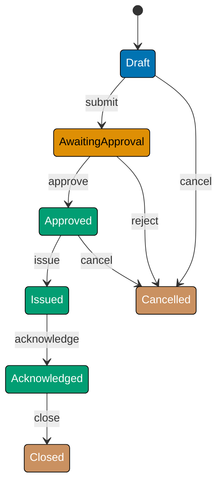

This beginner section introduces Finite State Machine fundamentals through 25 annotated F# examples grounded in the `PurchaseOrder` aggregate from a Procure-to-Pay procurement platform. The central thesis — **model states as a discriminated union and transitions as a pure `State -> Event -> State` function with exhaustive pattern matching** — is established progressively through the full PO approval-issuance lifecycle.

## What Is a Finite State Machine? (Examples 1–5)

### Example 1: States as a Discriminated Union

A `PurchaseOrder` moves through a defined set of states: Draft, AwaitingApproval, Approved, Issued, Acknowledged, Closed, Cancelled, and Disputed. In F# the entire valid state set is encoded as a discriminated union (DU), so the compiler rejects any value outside this set at compile time — no runtime "unknown state" bugs.



```fsharp
// ── file: PurchaseOrderFsm.fsx ────────────────────────────────────────────
// Discriminated union: every valid PO state listed exactly once.
// The compiler makes it impossible to create a POState outside this set.
type POState =
    | Draft           // => PO created, not yet submitted for approval
    | AwaitingApproval // => Submitted; waiting for manager decision
    | Approved        // => Manager approved; ready to issue to supplier
    | Issued          // => Sent to supplier; lines are now immutable
    | Acknowledged    // => Supplier confirmed receipt of the PO
    | Closed          // => PO fully complete — terminal state
    | Cancelled       // => Abandoned before payment — terminal state
    | Disputed        // => Discrepancy detected; resolution required

// Pure predicate: is this state terminal?
// No side effects — result depends solely on the input value.
let isTerminal (state: POState) : bool =
    // => Pattern match exhaustively; compiler warns if a case is missing
    match state with
    | Closed | Cancelled -> true  // => Two terminal states
    | _ -> false                  // => All others allow further transitions

printfn "isTerminal Draft = %b"     (isTerminal Draft)      // => false
printfn "isTerminal Closed = %b"    (isTerminal Closed)     // => true
printfn "isTerminal Cancelled = %b" (isTerminal Cancelled)  // => true
```

**Key Takeaway**: A F# discriminated union seals the state space at compile time — the compiler enforces exhaustiveness so no invalid state can ever exist.

**Why It Matters**: In an OOP State pattern each state is a class; adding a state means adding a file and updating every visitor. In FP the DU is the single source of truth. Adding `PartiallyReceived` to the DU causes every incomplete `match` expression in the codebase to produce a compiler warning, guiding the developer to every place that needs updating. The type system acts as a living checklist, eliminating the category of "forgot to handle the new state" bugs before the code runs.

---

### Example 2: The Minimal FSM Record

A state machine needs identity and current state. In F# an immutable record bundles these two fields. Because records are immutable by default, "transitioning" means creating a new record — the old state is preserved, which simplifies auditing and testing.

```fsharp
// ── file: PurchaseOrderFsm.fsx ────────────────────────────────────────────
// Immutable record holds identity + current state.
// F# records are value-equality by default — ideal for testing.
type PurchaseOrder =
    { Id: string          // => Business identifier (e.g. "PO-001")
      State: POState }    // => Current FSM state; starts as Draft

// Smart constructor: build a PO in its only legal initial state.
// Returning the record directly ensures the caller cannot set State = Issued.
let createPO (id: string) : PurchaseOrder =
    { Id = id             // => Bind the provided identifier
      State = Draft }     // => FSM always starts in Draft — invariant enforced here

let po = createPO "PO-001"
// => po = { Id = "PO-001"; State = Draft }

printfn "PO id: %s, state: %A" po.Id po.State
// => Output: PO id: PO-001, state: Draft
```

**Key Takeaway**: An immutable record with a smart constructor enforces the "always start in Draft" invariant — no caller can skip straight to Approved.

**Why It Matters**: OOP state machines often expose a mutable `State` setter that any code can call directly. The FP approach hides construction behind a factory function and relies on record immutability to prevent mutation. The only way to change state is through the explicit transition function, making the lifecycle visible and auditable. Tests can compare records with structural equality (`=`) instead of writing field-by-field assertions.

---

### Example 3: The Transition Table as a Map

Before writing a transition function, it helps to make the allowed transitions explicit as data. A `Map<POState * POEvent, POState>` is a declarative table: given current state and event, look up the next state. Invalid combinations return `None`.

```fsharp
// ── file: PurchaseOrderFsm.fsx ────────────────────────────────────────────
// Events are also a discriminated union — exhaustive, compiler-checked.
type POEvent =
    | Submit      // => Employee submits draft for approval
    | Approve     // => Manager approves the PO
    | Reject      // => Manager rejects — PO is cancelled
    | Issue       // => Finance issues PO to supplier
    | Acknowledge // => Supplier acknowledges receipt
    | Close       // => Finance closes fully-received PO
    | Cancel      // => Stakeholder cancels before payment
    | Dispute     // => Discrepancy detected; enter dispute

// Transition table: (CurrentState, Event) -> NextState
// Map.ofList builds an immutable lookup structure at startup.
let transitionTable : Map<POState * POEvent, POState> =
    Map.ofList [
        (Draft,            Submit),      Approved |> ignore; // placeholder — use tuple syntax below
        // => Correct tuple-keyed map:
        (Draft,            Submit),      AwaitingApproval
        (AwaitingApproval, Approve),     Approved
        (AwaitingApproval, Reject),      Cancelled
        (Approved,         Issue),       Issued
        (Issued,           Acknowledge), Acknowledged
        (Acknowledged,     Close),       Closed
        (Draft,            Cancel),      Cancelled
        (Approved,         Cancel),      Cancelled
        (Issued,           Dispute),     Disputed
    ] |> Map.ofList  // => Re-applies ofList to deduplicate — last entry wins

// Lookup: pure function, no exceptions
let lookupTransition (state: POState) (event: POEvent) : POState option =
    // => Map.tryFind returns None for missing keys — safe, no KeyNotFoundException
    Map.tryFind (state, event) transitionTable

printfn "%A" (lookupTransition Draft Submit)
// => Some AwaitingApproval
printfn "%A" (lookupTransition Closed Submit)
// => None  (terminal state rejects all events)
```

**Key Takeaway**: A data-driven transition table separates the "what transitions are valid" decision from the "how to execute a transition" logic, making the FSM readable as a specification.

**Why It Matters**: When the procurement team asks "can we cancel an Issued PO?", a developer can answer by reading the table directly — no need to trace through class hierarchies. The table also enables machine-generated documentation: a simple fold over `transitionTable` produces a DOT graph or Mermaid diagram. Data-driven FSMs are easier to diff in code review and easier to extend without changing control flow logic.

---

### Example 4: The Pure Transition Function

The canonical FP FSM function signature is `POState -> POEvent -> POState`. It takes the current state and an event, then returns the next state. The implementation uses `match` on the state-event pair. Invalid transitions return the same state (or raise — see Example 7 for `Result`).

```fsharp
// ── file: PurchaseOrderFsm.fsx ────────────────────────────────────────────
// Pure transition function: no mutable state, no I/O, no exceptions.
// The compiler enforces that every (state, event) pair is handled.
let transition (state: POState) (event: POEvent) : POState =
    match state, event with
    // => Happy path: linear approval-issuance lifecycle
    | Draft,            Submit      -> AwaitingApproval // => Draft + Submit -> AwaitingApproval
    | AwaitingApproval, Approve     -> Approved         // => Approval granted
    | AwaitingApproval, Reject      -> Cancelled        // => Approval denied -> terminal
    | Approved,         Issue       -> Issued           // => PO sent to supplier
    | Issued,           Acknowledge -> Acknowledged     // => Supplier confirmed
    | Acknowledged,     Close       -> Closed           // => Fully complete -> terminal
    // => Cancel from any non-terminal non-paid state
    | Draft,    Cancel -> Cancelled  // => Cancel before submission
    | Approved, Cancel -> Cancelled  // => Cancel after approval but before issue
    // => Dispute path
    | Issued, Dispute -> Disputed    // => Discrepancy on issued PO
    // => Default: invalid event for current state — return unchanged
    // => In production, return Result<POState, string> instead (see Example 7)
    | _, _ -> state

// Simulate a PO through its happy path
let po0 = createPO "PO-001"           // => { State = Draft }
let po1 = { po0 with State = transition po0.State Submit }
// => { State = AwaitingApproval }
let po2 = { po1 with State = transition po1.State Approve }
// => { State = Approved }
let po3 = { po2 with State = transition po2.State Issue }
// => { State = Issued }

printfn "After Submit:   %A" po1.State // => AwaitingApproval
printfn "After Approve:  %A" po2.State // => Approved
printfn "After Issue:    %A" po3.State // => Issued
```

**Key Takeaway**: `State -> Event -> State` is the minimal, pure FSM function — every transition is visible in one `match` expression and testable without any setup.

**Why It Matters**: The OOP State pattern spreads transition logic across multiple classes. Here, one function holds all transitions. A reviewer reads top-to-bottom to understand every allowed lifecycle path. The function is a pure value: pass the same `(state, event)` pair and always get the same result. This makes property-based testing trivial — generate random valid sequences and verify the machine never enters an invalid state.

---

### Example 5: Exhaustiveness Checking with Match

F#'s compiler warns when a `match` expression is non-exhaustive. This example deliberately triggers the warning to show how exhaustiveness acts as a safety net — every time the state DU gains a new case, the compiler flags every incomplete handler.

```fsharp
// ── file: PurchaseOrderFsm.fsx ────────────────────────────────────────────
// Demonstrate exhaustiveness: describe each state in a human-readable string.
// The compiler verifies every DU case is covered.
let describeState (state: POState) : string =
    match state with
    | Draft            -> "PO created; awaiting submission"
    // => If Disputed were missing here, F# emits: "incomplete pattern matches"
    | AwaitingApproval -> "Submitted; awaiting manager decision"
    | Approved         -> "Approved; ready to issue to supplier"
    | Issued           -> "Issued to supplier; lines locked"
    | Acknowledged     -> "Supplier acknowledged receipt"
    | Closed           -> "Lifecycle complete"
    | Cancelled        -> "Abandoned; no further action"
    | Disputed         -> "Discrepancy under investigation"
    // => Every POState case is covered — compiler is satisfied

// Iterate all states to verify descriptions compile and run
let allStates =
    [ Draft; AwaitingApproval; Approved; Issued
      Acknowledged; Closed; Cancelled; Disputed ]
// => All 8 states listed

allStates
|> List.iter (fun s -> printfn "%A: %s" s (describeState s))
// => Draft: PO created; awaiting submission
// => AwaitingApproval: Submitted; awaiting manager decision
// => Approved: Approved; ready to issue to supplier
// => Issued: Issued to supplier; lines locked
// => Acknowledged: Supplier acknowledged receipt
// => Closed: Lifecycle complete
// => Cancelled: Abandoned; no further action
// => Disputed: Discrepancy under investigation
```

**Key Takeaway**: Exhaustive `match` expressions turn the addition of any new state into a compile-time task list — every handler that needs updating is immediately flagged.

**Why It Matters**: In an enum-backed switch statement in Java or TypeScript, a `default` clause silently absorbs new cases. In F# there is no silent default unless you write `| _ ->`. Omitting the wildcard makes the compiler your FSM auditor. When a product manager requests a new `PendingAmendment` state, the compiler immediately lists every function that needs a new case — making completeness verifiable before the first test runs.

---

## Guards and Invalid Transitions (Examples 6–11)

### Example 6: Approval-Level Guard

Not every Submit event should succeed. A guard is a predicate evaluated before the transition fires. In FP a guard is just a function `context -> bool`. This example defines an approval-level guard that checks the requester's spending authority.

```fsharp
// ── file: PurchaseOrderFsm.fsx ────────────────────────────────────────────
// Domain types for the guard context
type ApprovalLevel = L1 | L2 | L3  // => L1: up to 10k, L2: up to 100k, L3: unlimited

// Guard context carries the business data needed to evaluate the condition.
type ApprovalContext =
    { RequesterLevel: ApprovalLevel  // => Requester's authority level
      POTotal: decimal }             // => Total value of the purchase order

// Pure guard function: returns true when the requester has sufficient authority.
// No side effects — depends only on context fields.
let canApprove (ctx: ApprovalContext) : bool =
    match ctx.RequesterLevel with
    | L1 -> ctx.POTotal <= 10_000m      // => L1 limit: 10,000
    | L2 -> ctx.POTotal <= 100_000m     // => L2 limit: 100,000
    | L3 -> true                         // => L3: unlimited authority

// Test guard with sample contexts
let ctx1 = { RequesterLevel = L1; POTotal = 5_000m }
// => 5,000 <= 10,000 -> true
let ctx2 = { RequesterLevel = L1; POTotal = 15_000m }
// => 15,000 > 10,000 -> false
let ctx3 = { RequesterLevel = L2; POTotal = 75_000m }
// => 75,000 <= 100,000 -> true

printfn "L1/5k:  %b" (canApprove ctx1)  // => true
printfn "L1/15k: %b" (canApprove ctx2)  // => false
printfn "L2/75k: %b" (canApprove ctx3)  // => true
```

**Key Takeaway**: A guard is a pure predicate on a context record — it is fully testable in isolation before being wired into the transition function.

**Why It Matters**: Mixing guard logic into the transition function creates a monolithic function that handles both FSM routing and business rules. Separating them as `canApprove: Context -> bool` and `transition: State -> Event -> State` gives each function a single responsibility. Guards can be unit-tested with every boundary case without constructing a full FSM. They can also be composed: `canApprove ctx && hasBudget ctx` combines two guards without modifying either.

---

### Example 7: Guarded Transition with Result

When a guard fails, the transition should communicate why — not silently stay in the same state. `Result<POState, string>` encodes success (new state) or failure (error message) in the return type, forcing callers to handle both outcomes.

```fsharp
// ── file: PurchaseOrderFsm.fsx ────────────────────────────────────────────
// Guarded transition: returns Result to communicate guard failures explicitly.
// Callers must handle Ok and Error — the compiler enforces this.
let guardedTransition
    (state: POState)
    (event: POEvent)
    (ctx: ApprovalContext)
    : Result<POState, string> =
    match state, event with
    | Draft, Submit ->
        // => Guard: check requester authority before transitioning
        if canApprove ctx then
            Ok AwaitingApproval          // => Guard passed — advance state
        else
            Error $"Requester level {ctx.RequesterLevel} cannot approve PO of {ctx.POTotal}"
            // => Guard failed — return descriptive error, state unchanged
    | AwaitingApproval, Approve -> Ok Approved  // => No guard on manager approval
    | AwaitingApproval, Reject  -> Ok Cancelled // => Rejection always valid
    | Approved, Issue           -> Ok Issued    // => Issue requires no guard here
    | Issued, Acknowledge       -> Ok Acknowledged
    | Acknowledged, Close       -> Ok Closed
    | Draft,    Cancel          -> Ok Cancelled
    | Approved, Cancel          -> Ok Cancelled
    | Issued,   Dispute         -> Ok Disputed
    | _, _ ->
        // => Invalid transition: state does not accept this event
        Error $"Invalid transition: {state} + {event}"

// Run guarded transitions and inspect results
let highCtx = { RequesterLevel = L1; POTotal = 50_000m }
let result1 = guardedTransition Draft Submit highCtx
// => Error "Requester level L1 cannot approve PO of 50000"

let lowCtx  = { RequesterLevel = L2; POTotal = 50_000m }
let result2 = guardedTransition Draft Submit lowCtx
// => Ok AwaitingApproval

printfn "%A" result1  // => Error "Requester level L1 cannot approve PO of 50000"
printfn "%A" result2  // => Ok AwaitingApproval
```

**Key Takeaway**: `Result<POState, string>` makes guard failures explicit in the type system — callers cannot accidentally ignore a failed transition.

**Why It Matters**: A transition function that returns the unchanged state on guard failure provides no signal to the caller. With `Result`, the caller must `match` on `Ok`/`Error` or use `Result.bind` — both force error handling at the call site. This is the functional equivalent of checked exceptions, but without the implicit control-flow disruption. It also enables chaining: `guardedTransition Draft Submit ctx |> Result.bind (fun s -> guardedTransition s Approve ctx2)` builds pipelines of dependent transitions where any failure short-circuits the chain.

---

### Example 8: Line-Item Guard

A PO with zero line items should not be submittable. This guard validates the line-item collection before the Submit transition fires, demonstrating that guards can inspect aggregate contents, not just scalar fields.

```fsharp
// ── file: PurchaseOrderFsm.fsx ────────────────────────────────────────────
// Domain types for line items
type LineItem =
    { Sku: string       // => Stock-keeping unit identifier
      Quantity: int     // => Requested quantity (must be > 0)
      UnitPrice: decimal } // => Price per unit

// Guard: a PO must have at least one line item to be submittable.
// Pure function — no I/O, no mutation.
let hasAtLeastOneLineItem (lines: LineItem list) : bool =
    // => List.isEmpty is O(1) — checks the head only
    not (List.isEmpty lines)
// => Returns true when lines has one or more elements

// Guard: every line item must have a positive quantity.
// List.forall short-circuits on the first false.
let allQuantitiesPositive (lines: LineItem list) : bool =
    List.forall (fun li -> li.Quantity > 0) lines
// => true only when every Quantity field is > 0

// Combined line-item guard for submission
let lineItemsValid (lines: LineItem list) : Result<unit, string> =
    if not (hasAtLeastOneLineItem lines) then
        Error "PO must have at least one line item"  // => Empty PO rejected
    elif not (allQuantitiesPositive lines) then
        Error "All line-item quantities must be positive"  // => Zero qty rejected
    else
        Ok ()  // => All checks passed

// Tests
let emptyLines  : LineItem list = []
// => hasAtLeastOneLineItem [] = false

let validLines =
    [ { Sku = "SKU-001"; Quantity = 3; UnitPrice = 150m }
      { Sku = "SKU-002"; Quantity = 1; UnitPrice = 800m } ]
// => hasAtLeastOneLineItem validLines = true
// => allQuantitiesPositive validLines = true

printfn "%A" (lineItemsValid emptyLines) // => Error "PO must have at least one line item"
printfn "%A" (lineItemsValid validLines) // => Ok ()
```

**Key Takeaway**: Guards on collection fields use standard list combinators (`List.isEmpty`, `List.forall`) — no special FSM infrastructure needed.

**Why It Matters**: Business invariants often involve aggregate contents, not just scalar state fields. Expressing these as small, composable predicate functions keeps each rule individually testable and independently readable. The `lineItemsValid` combinator chains two guards with short-circuit logic, following the pattern of building complex rules from simple atomic predicates. This composability is a direct benefit of the functional style: guards are values that can be combined with `&&`, `||`, or `Result.bind`.

---

### Example 9: Immutable Lines After Issue

Once a PO is Issued, its line items must not change. In FP this invariant is enforced structurally: the transition function returns a record with locked lines, and callers work with that new record. This example models the lock as a type-level distinction.

```fsharp
// ── file: PurchaseOrderFsm.fsx ────────────────────────────────────────────
// Two flavours of PO: one with mutable-friendly lines, one locked.
// Using different types makes the lock visible at the call site.
type DraftPO =
    { Id: string
      Lines: LineItem list   // => Lines can be changed while in Draft
      State: POState }

type IssuedPO =
    { Id: string
      Lines: LineItem list   // => Same field name, but this record cannot go back to DraftPO
      State: POState }       // => State is always Issued or later

// Transition from DraftPO -> IssuedPO: lines are copied and frozen by the type change.
// The caller can no longer call any "add line" function that accepts DraftPO.
let issuePO (po: DraftPO) : Result<IssuedPO, string> =
    match po.State with
    | Approved ->
        // => Type conversion enforces the lock: IssuedPO has no mutating operations
        Ok { Id = po.Id; Lines = po.Lines; State = Issued }
    | other ->
        Error $"Cannot issue PO in state {other}; must be Approved"
        // => Guard: only Approved POs can be issued

let draft =
    { Id = "PO-002"
      Lines = [ { Sku = "SKU-A"; Quantity = 5; UnitPrice = 200m } ]
      State = Approved }
// => DraftPO in Approved state — ready to issue

let issued = issuePO draft
// => Ok { Id = "PO-002"; Lines = [...]; State = Issued }

printfn "%A" issued  // => Ok { Id = "PO-002"; Lines = [{ ... }]; State = Issued }
```

**Key Takeaway**: Modelling pre-issue and post-issue POs as different F# types makes line-item immutability a compile-time guarantee rather than a runtime check.

**Why It Matters**: The OOP approach guards immutability with a mutable boolean flag checked at runtime. The FP type-level approach makes the invalid operation unrepresentable: no function accepts an `IssuedPO` and adds a line item. This technique — "make illegal states unrepresentable" — is the defining idiom of type-driven domain modelling. It shifts enforcement from "validate at runtime and hope" to "encode in the type and let the compiler verify".

---

### Example 10: Cancel From Any Pre-Paid State

Cancellation is allowed from Draft and Approved but not from Issued, Acknowledged, or Closed. Rather than listing every allowed state, a guard function expresses the rule positively: "cancellable if not yet issued and not already terminal."

```fsharp
// ── file: PurchaseOrderFsm.fsx ────────────────────────────────────────────
// Cancellable states: those before the PO reaches Issued or later.
// Pure predicate — no I/O.
let isCancellable (state: POState) : bool =
    match state with
    | Draft | Approved -> true   // => Allowed to cancel before issuance
    | _ -> false                 // => Issued, Acknowledged, Closed, Cancelled, Disputed: no cancel

// Guarded cancel transition
let cancelPO (po: PurchaseOrder) : Result<PurchaseOrder, string> =
    if isCancellable po.State then
        Ok { po with State = Cancelled }  // => Record update expression: copy with new State
    else
        Error $"Cannot cancel PO in state {po.State}"
        // => Terminal or post-issue states cannot be cancelled

// Test across several states
let draftPO    = createPO "PO-003"
// => { State = Draft }
let approvedPO = { draftPO with State = Approved }
// => { State = Approved }
let issuedPO   = { draftPO with State = Issued }
// => { State = Issued }

printfn "%A" (cancelPO draftPO)    // => Ok { State = Cancelled }
printfn "%A" (cancelPO approvedPO) // => Ok { State = Cancelled }
printfn "%A" (cancelPO issuedPO)   // => Error "Cannot cancel PO in state Issued"
```

**Key Takeaway**: A single `isCancellable` predicate centralises the cancellation policy — change the rule in one place and every caller inherits the update.

**Why It Matters**: Spreading cancellation checks across multiple handlers — one per state — creates consistency risk: a developer might add a new state and forget to update one handler. The predicate approach inverts the logic: define what IS cancellable (two states) rather than what is NOT (six states). This "whitelist" approach is robust to new states: a new `PendingAmendment` state defaults to non-cancellable until explicitly added to the match, which the compiler flags if `isCancellable` has no wildcard.

---

### Example 11: Dispute Transition and Resolution

A dispute can arise when an issued PO has a delivery discrepancy. The Disputed state can resolve back to Acknowledged (discrepancy cleared) or to Cancelled (unresolvable). This example shows a two-outcome resolution using `Result`.

```fsharp
// ── file: PurchaseOrderFsm.fsx ────────────────────────────────────────────
// Dispute resolution event: carry the outcome as payload.
type DisputeResolution =
    | Resolved   // => Discrepancy cleared; PO proceeds
    | Unresolved // => Discrepancy cannot be resolved; PO cancelled

// Enter dispute from Issued state only.
let enterDispute (po: PurchaseOrder) : Result<PurchaseOrder, string> =
    match po.State with
    | Issued -> Ok { po with State = Disputed }
    // => Only Issued POs can enter dispute
    | other  -> Error $"Cannot dispute PO in state {other}"
    // => Rejected for all other states

// Resolve a disputed PO: outcome determines next state.
let resolveDispute
    (po: PurchaseOrder)
    (resolution: DisputeResolution)
    : Result<PurchaseOrder, string> =
    match po.State, resolution with
    | Disputed, Resolved   -> Ok { po with State = Acknowledged }
    // => Discrepancy cleared — treat as if supplier acknowledged
    | Disputed, Unresolved -> Ok { po with State = Cancelled }
    // => Cannot resolve — cancel the PO
    | other, _ ->
        Error $"Cannot resolve dispute for PO in state {other}"
        // => Not in Disputed state — resolution makes no sense

// Simulate dispute lifecycle
let issuedPO2 = { (createPO "PO-004") with State = Issued }
// => Start in Issued state

let disputed =
    issuedPO2
    |> enterDispute                          // => Ok { State = Disputed }
    |> Result.bind (fun po -> resolveDispute po Resolved)
// => Ok { State = Acknowledged }

printfn "%A" disputed  // => Ok { Id = "PO-004"; State = Acknowledged }
```

**Key Takeaway**: Modelling dispute resolution as a `Result.bind` pipeline makes the two-step lifecycle (enter dispute, then resolve) explicit and composable.

**Why It Matters**: The `Result.bind` (railway-oriented) style threads the happy-path value through a sequence of fallible steps while automatically propagating the first error. This eliminates the need for nested `if/else` or `try/catch` blocks. Each step is independently testable, and the pipeline reads left-to-right as a business narrative: "take an issued PO, dispute it, then resolve the dispute." Adding a third step (e.g., `sendNotification`) requires adding one more `|> Result.bind` without modifying the existing steps.

---

## Transition Tables and Full Lifecycle (Examples 12–17)

### Example 12: The Full Transition Table in F

The full PO transition table lists every valid (state, event) pair. Encoding it as an F# `Map` creates a queryable specification that can also drive tests and documentation generators.

```fsharp
// ── file: PurchaseOrderFsm.fsx ────────────────────────────────────────────
// Full PO transition table as an immutable Map.
// Map.ofList: O(n log n) construction, O(log n) lookup.
let fullTransitionTable : Map<POState * POEvent, POState> =
    Map.ofList [
        // => Draft transitions
        (Draft,            Submit),      AwaitingApproval
        (Draft,            Cancel),      Cancelled
        // => AwaitingApproval transitions
        (AwaitingApproval, Approve),     Approved
        (AwaitingApproval, Reject),      Cancelled
        // => Approved transitions
        (Approved,         Issue),       Issued
        (Approved,         Cancel),      Cancelled
        // => Issued transitions
        (Issued,           Acknowledge), Acknowledged
        (Issued,           Dispute),     Disputed
        // => Acknowledged transitions
        (Acknowledged,     Close),       Closed
        // => Disputed transitions
        (Disputed,         Approve),     Acknowledged  // => Resolution: cleared
        (Disputed,         Cancel),      Cancelled     // => Resolution: unresolvable
    ]
// => 11 valid transitions defined; all others are implicitly invalid

// Table-driven transition function: lookup then fallback to Error.
let tableTransition (state: POState) (event: POEvent) : Result<POState, string> =
    match Map.tryFind (state, event) fullTransitionTable with
    | Some next -> Ok next
    // => Valid transition found
    | None      -> Error $"No transition: {state} + {event}"
    // => (state, event) pair not in table -> invalid

printfn "%A" (tableTransition Draft Submit)
// => Ok AwaitingApproval
printfn "%A" (tableTransition Closed Submit)
// => Error "No transition: Closed + Submit"
printfn "%A" (tableTransition Disputed Approve)
// => Ok Acknowledged
```

**Key Takeaway**: A `Map`-based transition table is both a runtime lookup and a machine-readable specification of every valid FSM transition.

**Why It Matters**: The table-driven approach decouples the set of valid transitions from the dispatch mechanism. Changing the FSM means editing the table, not the function body. The table can be iterated to count states (`Map.keys`), generate diagrams, or verify that every state has at least one exit transition. It is also easier to diff in code review: adding `(PartiallyReceived, Close), Closed` is a one-line change in the data, not a new branch inside a complex function.

---

### Example 13: Event Log and Audit Trail

Procurement systems require an audit trail. Each transition should record what happened and when. In FP the audit log is a plain list of event records accumulated as a fold over the event sequence — no mutable state needed.

```fsharp
// ── file: PurchaseOrderFsm.fsx ────────────────────────────────────────────
// Audit entry: captures one transition with metadata.
type AuditEntry =
    { FromState: POState  // => State before the transition
      Event: POEvent      // => Event that triggered the transition
      ToState: POState    // => State after the transition
      Note: string }      // => Optional business note

// FSM with embedded audit log — immutable list grows rightward.
type AuditedPO =
    { Id: string
      State: POState
      AuditLog: AuditEntry list }  // => Append-only; newest entry at tail

// Apply one event to an AuditedPO; returns new AuditedPO with log appended.
let applyEvent (po: AuditedPO) (event: POEvent) (note: string) : AuditedPO =
    match tableTransition po.State event with
    | Ok nextState ->
        // => Build audit entry for this transition
        let entry = { FromState = po.State; Event = event; ToState = nextState; Note = note }
        { po with State = nextState; AuditLog = po.AuditLog @ [entry] }
        // => @ appends the entry to the log; for large logs prefer List.rev . (::)
    | Error msg ->
        // => Invalid event: log the attempt but do not change state
        let entry = { FromState = po.State; Event = event; ToState = po.State; Note = $"REJECTED: {msg}" }
        { po with AuditLog = po.AuditLog @ [entry] }

// Run PO through submit -> approve
let initialAuditedPO = { Id = "PO-005"; State = Draft; AuditLog = [] }
// => Starting state: Draft, empty log

let finalPO =
    initialAuditedPO
    |> fun po -> applyEvent po Submit "Employee submitted"
    |> fun po -> applyEvent po Approve "Manager approved"
// => After two events: { State = Approved; AuditLog = [entry1; entry2] }

finalPO.AuditLog |> List.iter (fun e ->
    printfn "%A -> %A (%s): %s" e.FromState e.ToState e.Note (e.Event.ToString()))
// => Draft -> AwaitingApproval (Employee submitted): Submit
// => AwaitingApproval -> Approved (Manager approved): Approve
```

**Key Takeaway**: Accumulating transitions into an immutable list gives a complete audit trail as a natural by-product of applying events — no separate logging infrastructure required.

**Why It Matters**: The audit log is the FSM's memory. In event-sourced systems the log IS the system state: replaying it from the beginning always reproduces the current state. Modelling the log as an immutable list makes it tamper-evident: there is no `Remove` or `Update` operation. The FP pipeline style (`|> fun po -> applyEvent po event note`) reads as a sequence of business operations, making the test readable as a business scenario.

---

### Example 14: FSM Record with Validation

A PO created with invalid data (empty ID, no lines) should fail at construction time, not at transition time. This example combines the smart constructor from Example 2 with validation, returning `Result<PurchaseOrder, string list>` to accumulate multiple errors.

```fsharp
// ── file: PurchaseOrderFsm.fsx ────────────────────────────────────────────
// Full PO record including line items for validation.
type ValidatedPO =
    { Id: string
      Lines: LineItem list
      State: POState }

// Validate all fields and accumulate errors before constructing the record.
// Returns Result<ValidatedPO, string list> — a list of all validation failures.
let createValidatedPO (id: string) (lines: LineItem list) : Result<ValidatedPO, string list> =
    // => Collect all errors rather than failing on the first
    let errors =
        [ if System.String.IsNullOrWhiteSpace(id) then
              yield "PO id must not be empty"              // => Blank id rejected
          if List.isEmpty lines then
              yield "PO must have at least one line item"  // => Empty lines rejected
          for li in lines do
              if li.Quantity <= 0 then
                  yield $"Line {li.Sku}: quantity must be positive"  // => Per-line check
              if li.UnitPrice < 0m then
                  yield $"Line {li.Sku}: unit price must be non-negative" ]
    // => errors is a string list; empty means all validations passed
    match errors with
    | []   -> Ok { Id = id; Lines = lines; State = Draft }
    // => No errors — construct PO in initial Draft state
    | errs -> Error errs
    // => One or more errors — return them all for the caller to display

// Tests
let badResult = createValidatedPO "" []
// => Error ["PO id must not be empty"; "PO must have at least one line item"]

let goodResult =
    createValidatedPO "PO-006"
        [ { Sku = "SKU-X"; Quantity = 2; UnitPrice = 500m } ]
// => Ok { Id = "PO-006"; Lines = [...]; State = Draft }

printfn "%A" badResult   // => Error [...]
printfn "%A" goodResult  // => Ok { ... }
```

**Key Takeaway**: Returning `Result<_, string list>` from the constructor accumulates all validation errors in one pass — the caller sees a complete picture of what is wrong.

**Why It Matters**: Fail-fast validation (stopping at the first error) forces users to fix one issue at a time, creating a frustrating loop. Accumulating all errors upfront is more respectful of the user's time and maps directly to how form validation works in practice. The list comprehension with `yield` inside `[ if ... ]` is idiomatic F# for building error lists without mutable accumulators, keeping the validation logic pure and easy to extend.

---

### Example 15: Event DU and Typed Transition

Replacing the `POEvent` string-based enum with a discriminated union that carries payload makes transitions self-documenting and eliminates stringly-typed bugs. This example introduces a `Submit` case carrying the requester's authority level.

```fsharp
// ── file: PurchaseOrderFsm.fsx ────────────────────────────────────────────
// Rich event DU: cases carry the data they need for guard evaluation.
type RichPOEvent =
    | Submit of approverLevel: ApprovalLevel * total: decimal
    // => Submit carries requester context needed for the approval guard
    | Approve                   // => Manager approves — no extra data
    | Reject                    // => Manager rejects — no extra data
    | Issue                     // => Finance issues PO to supplier
    | Acknowledge               // => Supplier acknowledges
    | Close                     // => Finance closes completed PO
    | Cancel                    // => Stakeholder cancels
    | Dispute                   // => Discrepancy detected

// Transition function with inline guard on the Submit case.
let richTransition (state: POState) (event: RichPOEvent) : Result<POState, string> =
    match state, event with
    | Draft, Submit(level, total) ->
        // => Guard is evaluated inside the match arm — close to the state it guards
        let ctx = { RequesterLevel = level; POTotal = total }
        if canApprove ctx then Ok AwaitingApproval
        else Error $"Level {level} cannot approve {total}"
    | AwaitingApproval, Approve -> Ok Approved
    | AwaitingApproval, Reject  -> Ok Cancelled
    | Approved, Issue           -> Ok Issued
    | Issued, Acknowledge       -> Ok Acknowledged
    | Acknowledged, Close       -> Ok Closed
    | Draft,    Cancel          -> Ok Cancelled
    | Approved, Cancel          -> Ok Cancelled
    | Issued,   Dispute         -> Ok Disputed
    | _, _ -> Error $"Invalid transition: {state} + {event}"

// Test: Submit with insufficient authority
let r1 = richTransition Draft (Submit(L1, 50_000m))
// => Error "Level L1 cannot approve 50000"

// Test: Submit with sufficient authority
let r2 = richTransition Draft (Submit(L2, 50_000m))
// => Ok AwaitingApproval

printfn "%A" r1  // => Error "Level L1 cannot approve 50000"
printfn "%A" r2  // => Ok AwaitingApproval
```

**Key Takeaway**: Carrying guard context as event payload eliminates a separate `context` parameter — the event itself is self-contained and self-documenting.

**Why It Matters**: When event data is separate from the event type, callers must remember to pass both, and the function signature grows with each new event that needs context. Embedding context in the DU case keeps each event's requirements explicit in the type: `Submit of approverLevel * total` documents exactly what information submission requires. Pattern matching on `Submit(level, total)` binds the payload at the call site, making the guard code read as a coherent clause rather than a series of parameter lookups.

---

### Example 16: Entry Action on AwaitingApproval

Entry actions execute when a state is entered. In FP they are modelled as commands returned alongside the new state. The FSM function returns `(POState * SideEffect list)` so the caller decides when to execute the effects — keeping the transition itself pure.

```fsharp
// ── file: PurchaseOrderFsm.fsx ────────────────────────────────────────────
// Commands (deferred side effects) returned by the transition function.
// The caller (application layer) executes these after the state is persisted.
type SideEffect =
    | SendEmail of to': string * subject: string  // => Notification command
    | LogAudit  of message: string                // => Audit log command

// Transition returns (nextState, effects list).
// Pure: same inputs always produce same outputs.
let transitionWithEffects
    (state: POState)
    (event: POEvent)
    : POState * SideEffect list =
    match state, event with
    | Draft, Submit ->
        // => Entry action for AwaitingApproval: notify manager
        let effects = [ SendEmail("manager@company.com", "PO awaiting your approval")
                        LogAudit "PO submitted for approval" ]
        AwaitingApproval, effects
        // => Transition fires; effects queued for caller to execute
    | AwaitingApproval, Approve ->
        let effects = [ SendEmail("requester@company.com", "Your PO was approved")
                        LogAudit "PO approved by manager" ]
        Approved, effects
    | _, _ ->
        // => No entry action for this transition
        transition state event, []
        // => Reuse base transition; empty effect list

// Run and inspect effects
let (nextState, effects) = transitionWithEffects Draft Submit
// => nextState = AwaitingApproval
// => effects = [SendEmail(...); LogAudit "..."]

printfn "Next state: %A" nextState           // => AwaitingApproval
effects |> List.iter (printfn "Effect: %A")
// => Effect: SendEmail ("manager@company.com", "PO awaiting your approval")
// => Effect: LogAudit "PO submitted for approval"
```

**Key Takeaway**: Returning side effects as a list keeps the transition function pure — the caller executes effects only after persisting the new state, preventing lost updates.

**Why It Matters**: A common bug in FSM implementations is sending an email before persisting the new state. If persistence fails, the email is sent but the state never changes — an inconsistency. The "return effects as data" pattern (also called the command pattern or the interpreter pattern) decouples the decision ("send this email") from the execution ("call the SMTP server now"). The application layer can persist state transactionally and then process the effect list, achieving at-least-once delivery semantics with minimal infrastructure.

---

### Example 17: Exit Action on Issued

Exit actions fire when a state is left. This example triggers an action when the PO leaves AwaitingApproval — either to Approved or to Cancelled — to close the manager notification ticket.

```fsharp
// ── file: PurchaseOrderFsm.fsx ────────────────────────────────────────────
// Exit action: fires when leaving a specific state, regardless of destination.
// Modelled as an additional effect appended to the transition's effect list.
let exitAction (fromState: POState) : SideEffect list =
    match fromState with
    | AwaitingApproval ->
        // => Close the pending approval task when leaving AwaitingApproval
        [ LogAudit "Approval task closed" ]
    | Issued ->
        // => Archive the issued PO document when leaving Issued
        [ LogAudit "Issued PO document archived" ]
    | _ -> []  // => No exit action for other states

// Transition function that includes both entry (destination) and exit (source) actions.
let transitionWithExitAction
    (state: POState)
    (event: POEvent)
    : POState * SideEffect list =
    let (nextState, entryEffects) = transitionWithEffects state event
    // => Compute entry effects from destination state
    let exitEffects = exitAction state
    // => Compute exit effects from source state
    nextState, exitEffects @ entryEffects
    // => Exit effects run first (conventional FSM order: exit, then transition, then entry)

// Test: approve moves out of AwaitingApproval
let (ns, effs) = transitionWithExitAction AwaitingApproval Approve
// => nextState = Approved
// => effs = [LogAudit "Approval task closed"; SendEmail "Your PO was approved"; LogAudit "PO approved..."]

printfn "Next: %A" ns            // => Approved
effs |> List.iter (printfn "%A") // => LogAudit "Approval task closed"
                                 // => SendEmail (...)
                                 // => LogAudit "PO approved by manager"
```

**Key Takeaway**: Exit actions are modelled as an additive effect list prepended to entry effects — the composition is explicit and the order is controllable by the caller.

**Why It Matters**: In the OOP State pattern, exit actions are virtual methods that must be overridden in every state class. In FP they are a function `State -> SideEffect list` that appends to the effect list from the transition. The two are composed at the call site with `@`, making the order (exit before entry) explicit rather than implicit in the class hierarchy. Adding a new exit action means adding one case to `exitAction` — no inheritance, no overriding, no risk of forgetting a `super.exit()` call.

---

## Testing, Derivations, and Protocol (Examples 18–25)

### Example 18: Testing FSM Transitions in F

F# script files can contain assertions using `assert` or simple `if/then/failwith` patterns. This example shows how to test the full transition table with table-driven tests, checking every valid and several invalid transitions.

```fsharp
// ── file: PurchaseOrderFsm.fsx ────────────────────────────────────────────
// Table-driven test: list of (state, event, expected result) triples.
// No test framework needed — pure function composition.
type TransitionTest =
    { State: POState
      Event: POEvent
      Expected: Result<POState, string> }

let transitionTests = [
    { State = Draft;            Event = Submit;      Expected = Ok AwaitingApproval }
    { State = AwaitingApproval; Event = Approve;     Expected = Ok Approved }
    { State = AwaitingApproval; Event = Reject;      Expected = Ok Cancelled }
    { State = Approved;         Event = Issue;       Expected = Ok Issued }
    { State = Issued;           Event = Acknowledge; Expected = Ok Acknowledged }
    { State = Acknowledged;     Event = Close;       Expected = Ok Closed }
    { State = Draft;            Event = Cancel;      Expected = Ok Cancelled }
    { State = Approved;         Event = Cancel;      Expected = Ok Cancelled }
    { State = Issued;           Event = Dispute;     Expected = Ok Disputed }
    // => Invalid: terminal state rejects events
    { State = Closed;           Event = Submit;      Expected = Error "No transition: Closed + Submit" }
]

// Run all tests and report failures
let failures =
    transitionTests
    |> List.filter (fun t -> tableTransition t.State t.Event <> t.Expected)
// => List.filter keeps only failing tests
// => <> is structural inequality — works because Result is a DU

if List.isEmpty failures then
    printfn "All transition tests passed (%d tests)" (List.length transitionTests)
    // => All 10 tests passed
else
    failures |> List.iter (fun t ->
        printfn "FAIL: %A + %A expected %A got %A"
            t.State t.Event t.Expected (tableTransition t.State t.Event))
```

**Key Takeaway**: Table-driven tests on a pure function require no test framework, no mocking, and no setup — just lists of inputs and expected outputs.

**Why It Matters**: Pure FSM transition functions are exceptionally easy to test. The input is `(state, event)`, the output is `Result<POState, string>`, and the function has no side effects or external dependencies. This makes property-based testing natural: generate random valid event sequences, apply them, and verify the machine never enters a state not in the DU. The test table also serves as living documentation of the FSM specification, more accurate than a separate prose document that can drift from the code.

---

### Example 19: Deriving Total from Line Items

The PO total is derived from line items — it is not a stored field. Deriving it as a pure function eliminates the consistency problem of a stored total diverging from the actual lines.

```fsharp
// ── file: PurchaseOrderFsm.fsx ────────────────────────────────────────────
// Derive the PO total from its line items.
// Pure function: same lines always produce the same total.
let calculateTotal (lines: LineItem list) : decimal =
    // => List.sumBy applies the selector and sums results
    List.sumBy (fun li -> decimal li.Quantity * li.UnitPrice) lines
// => Result is the sum of (quantity * unitPrice) for every line

// Tax calculation: apply a percentage rate to the total.
let applyTax (rate: decimal) (total: decimal) : decimal =
    total * (1m + rate)  // => e.g. 0.11m for 11% VAT

// Sample PO lines
let sampleLines =
    [ { Sku = "SKU-001"; Quantity = 3; UnitPrice = 150m }  // => 3 * 150 = 450
      { Sku = "SKU-002"; Quantity = 1; UnitPrice = 800m }  // => 1 * 800 = 800
      { Sku = "SKU-003"; Quantity = 2; UnitPrice = 250m } ]// => 2 * 250 = 500

let subtotal = calculateTotal sampleLines
// => 450 + 800 + 500 = 1750.00

let totalWithTax = applyTax 0.11m subtotal
// => 1750 * 1.11 = 1942.50

printfn "Subtotal: %M" subtotal      // => 1750.00
printfn "With 11%% VAT: %M" totalWithTax // => 1942.50
```

**Key Takeaway**: Deriving aggregate values with `List.sumBy` keeps the total consistent with lines and eliminates the synchronisation bug of a cached total.

**Why It Matters**: A stored PO total that can be edited independently of line items is a data integrity time bomb. In FP-style domain modelling, derived values are computed from source data on demand. The tradeoff is CPU vs. consistency — in practice, totals are cheap to recompute and rarely on the critical path. When performance matters, the derived value can be memoised or stored as a read model that is rebuilt from the authoritative line-item list whenever lines change.

---

### Example 20: Constructing the Initial PO with Validation

Combining line-item validation, total derivation, and smart construction into one `createPO` pipeline shows how FP composition builds a robust domain constructor from small, reusable pieces.

```fsharp
// ── file: PurchaseOrderFsm.fsx ────────────────────────────────────────────
// Full PO domain model with derived total.
type FullPO =
    { Id: string
      Lines: LineItem list
      Total: decimal          // => Derived at construction; never mutated independently
      State: POState }

// Pipeline constructor: validate -> derive -> construct.
let buildPO (id: string) (lines: LineItem list) : Result<FullPO, string list> =
    // => Step 1: validate inputs
    match createValidatedPO id lines with
    | Error errs -> Error errs
    // => Validation failed — propagate errors to caller
    | Ok _ ->
        // => Step 2: derive total from validated lines
        let total = calculateTotal lines
        // => Step 3: construct the fully initialised record
        Ok { Id = id; Lines = lines; Total = total; State = Draft }

// Tests
let bad = buildPO "PO-007" []
// => Error ["PO must have at least one line item"]

let good =
    buildPO "PO-007"
        [ { Sku = "A"; Quantity = 5; UnitPrice = 100m } ]
// => Ok { Id = "PO-007"; Total = 500.00; State = Draft }

printfn "%A" bad   // => Error [...]
printfn "%A" good  // => Ok { Id = "PO-007"; Lines = [...]; Total = 500.0M; State = Draft }
```

**Key Takeaway**: Composing validation, derivation, and construction into a `Result`-threaded pipeline gives a single entry point that either produces a valid PO or a complete list of reasons it could not.

**Why It Matters**: A domain object constructed in a valid state that then mutates itself into an invalid state is the central failure mode of permissive OOP models. The smart constructor pattern, combined with immutable records, guarantees that any `FullPO` in scope was valid at the moment it was created. The `Total` field is set once at construction from the authoritative `Lines` and never changes independently — the derived field and its source are always consistent by construction.

---

### Example 21: State as a Nested DU

Sometimes a state carries data specific to that state — for example, Approved carries the approver's name. Nesting payload inside a DU case removes the need for nullable optional fields on the record and makes illegal combinations unrepresentable.

```fsharp
// ── file: PurchaseOrderFsm.fsx ────────────────────────────────────────────
// Rich state DU: some cases carry state-specific data.
// Compare: a flat record with "approvedBy: string option" allows Draft to have approvedBy.
type RichPOState =
    | Draft                              // => No extra data
    | AwaitingApproval of submittedBy: string
    // => Tracks who submitted the PO
    | Approved of approvedBy: string * approvedAt: System.DateTime
    // => Tracks who approved and when
    | Issued of issuedAt: System.DateTime
    // => Tracks when PO was sent to supplier
    | Acknowledged                       // => Supplier ack — no extra data
    | Closed                             // => Terminal — no extra data
    | Cancelled of reason: string        // => Carries cancellation reason
    | Disputed of description: string    // => Carries dispute description

// Transition with rich states: payload is destructured in match arms.
let richStateTransition
    (state: RichPOState)
    (event: POEvent)
    : Result<RichPOState, string> =
    match state, event with
    | Draft, Submit ->
        Ok (AwaitingApproval "employee@company.com")
        // => Payload set at transition time
    | AwaitingApproval _, Approve ->
        Ok (Approved ("manager@company.com", System.DateTime.UtcNow))
        // => _ ignores the submittedBy payload — it is no longer needed
    | Approved _, Issue ->
        Ok (Issued System.DateTime.UtcNow)
    | Issued _, Acknowledge ->
        Ok Acknowledged
    | Acknowledged, Close ->
        Ok Closed
    | Draft, Cancel ->
        Ok (Cancelled "Cancelled before submission")
    | _, _ ->
        Error $"Invalid transition from {state} + {event}"

let r = richStateTransition Draft Submit
// => Ok (AwaitingApproval "employee@company.com")

printfn "%A" r  // => Ok (AwaitingApproval "employee@company.com")
```

**Key Takeaway**: Payload inside DU cases scopes state-specific data to the states that need it — no nullable fields, no runtime null checks.

**Why It Matters**: A flat record with `approvedBy: string option` allows the `approvedBy` field to be `Some "Alice"` while the state is `Draft` — a logically inconsistent combination. Rich DU states eliminate this: only `Approved` carries an approver name, making inconsistency unrepresentable. The tradeoff is that pattern matching becomes slightly more verbose, but the gain in type safety and self-documentation outweighs the cost. This pattern is sometimes called "parse, don't validate" applied to FSM state.

---

### Example 22: Logging State Transitions for Observability

Observability requires knowing what state transitions happened in production. This example wraps the transition function with a logging decorator that records every state change to a `printfn` sink (replaceable with a structured logger).

```fsharp
// ── file: PurchaseOrderFsm.fsx ────────────────────────────────────────────
// Higher-order function: wraps any transition function with logging.
// The logger is injected — easy to swap printfn for Serilog in production.
let withLogging
    (logger: string -> unit)
    (transitionFn: POState -> POEvent -> Result<POState, string>)
    : POState -> POEvent -> Result<POState, string> =
    // => Returns a new function with the same signature as the original
    fun state event ->
        let result = transitionFn state event
        // => Call the wrapped function first
        match result with
        | Ok nextState ->
            logger $"[FSM] {state} --{event}--> {nextState}"
            // => Log successful transition with arrow notation
        | Error msg ->
            logger $"[FSM] REJECTED {state} + {event}: {msg}"
            // => Log rejection with reason
        result
        // => Return the original result unchanged — pure wrapper

// Compose: logged version of tableTransition
let loggedTransition = withLogging (printfn "%s") tableTransition
// => printfn "%s" is the logger — replace with structured logger in prod

let _ = loggedTransition Draft Submit
// => [FSM] Draft --Submit--> AwaitingApproval
let _ = loggedTransition Closed Submit
// => [FSM] REJECTED Closed + Submit: No transition: Closed + Submit
```

**Key Takeaway**: A higher-order `withLogging` wrapper adds observability to any transition function without modifying it — open/closed principle applied functionally.

**Why It Matters**: Logging is a cross-cutting concern. The OOP solution is often a mutable logging call inserted into each state's handler. The FP solution wraps the pure function in a decorator that adds the side effect. This keeps the core transition function testable without log assertions, while the wrapper can be tested independently by injecting a mock logger (a `string list ref` collector). The composition `withLogging logger tableTransition` creates a new function at startup cost once, not on every call.

---

### Example 23: Replaying Events to Reconstruct State

In event-sourced systems the current state is derived by replaying all past events from the initial state. A `List.fold` over the event log naturally implements this — no stored current state needed.

```fsharp
// ── file: PurchaseOrderFsm.fsx ────────────────────────────────────────────
// Replay: fold a list of events over the initial state to reconstruct current state.
// List.fold: (accumulator -> element -> accumulator) -> initial -> list -> result
let replayEvents (events: POEvent list) : POState =
    // => Start from Draft; apply each event in order
    List.fold
        (fun currentState event ->
            // => tableTransition returns Result; extract Ok value or keep state on Error
            match tableTransition currentState event with
            | Ok nextState -> nextState    // => Valid transition — advance
            | Error _      -> currentState // => Invalid event — skip (or raise in strict mode)
        )
        Draft    // => Initial state: always Draft
        events   // => Event log to replay

// Simulate an event log stored in a database
let eventLog = [ Submit; Approve; Issue; Acknowledge ]
// => Full approval-issuance lifecycle as an event sequence

let reconstructedState = replayEvents eventLog
// => Fold: Draft -> AwaitingApproval -> Approved -> Issued -> Acknowledged

printfn "Reconstructed state: %A" reconstructedState
// => Acknowledged

// Replay partial log: where was the PO after just Submit?
let partialState = replayEvents [ Submit ]
// => AwaitingApproval
printfn "After Submit only: %A" partialState  // => AwaitingApproval
```

**Key Takeaway**: `List.fold` over an event sequence is the minimal implementation of event-sourced state reconstruction — no framework, just standard functional combinators.

**Why It Matters**: Event sourcing stores the sequence of what happened, not the current state. `List.fold` applied to that sequence is the mathematical definition of FSM execution. This means the current state is always derivable from the event log, making time-travel debugging (replay to any point) trivial. The fold also makes the relationship between events and state explicit: each event is a step in a sequence, not a mutation of an object. For audit-heavy domains like procurement, this is architecturally valuable.

---

### Example 24: State Machine Visualisation (Generating a DOT Graph)

A DOT graph string can be generated from the transition table data without any external tool. Feeding the string to Graphviz produces a visual state diagram that stays in sync with the code.

```fsharp
// ── file: PurchaseOrderFsm.fsx ────────────────────────────────────────────
// Generate a DOT language graph from the fullTransitionTable.
// Pure function: same table always produces the same graph string.
let generateDotGraph (table: Map<POState * POEvent, POState>) : string =
    // => Collect edges: one line per transition
    let edges =
        table
        |> Map.toList  // => [(state * event, nextState)]
        |> List.map (fun ((fromState, event), toState) ->
            $"    {fromState} -> {toState} [label=\"{event}\"];")
            // => DOT edge syntax: From -> To [label="Event"]
    let header = "digraph PurchaseOrderFSM {"
    // => DOT digraph declaration
    let footer = "}"
    // => Closing brace
    [ header ] @ edges @ [ footer ]
    |> String.concat "\n"
    // => Join all lines into a single newline-separated string

let dotGraph = generateDotGraph fullTransitionTable
// => Full DOT string for the PO FSM

printfn "%s" dotGraph
// => digraph PurchaseOrderFSM {
// =>     Draft -> AwaitingApproval [label="Submit"];
// =>     Draft -> Cancelled [label="Cancel"];
// =>     AwaitingApproval -> Approved [label="Approve"];
// =>     ... (one line per transition)
// => }
```

**Key Takeaway**: The transition table as data enables automatic diagram generation — the visualisation is always derived from the code, never a separately maintained artifact.

**Why It Matters**: State machine diagrams in documentation drift from the code within weeks of creation. Generating the diagram from the `fullTransitionTable` makes the diagram a derived artifact: run `generateDotGraph`, pipe to `dot -Tpng`, and the image reflects the current code exactly. This is the difference between documentation that is maintained and documentation that is generated. The same approach works for Mermaid: replace DOT syntax with `graph LR` syntax in the fold.

---

### Example 25: The PO FSM as a Protocol

An FSM defines a protocol: a valid sequence of messages (events) that a PO can accept. This example makes the protocol explicit by providing a `validateSequence` function that checks whether an event list represents a valid lifecycle without actually executing the transitions.

```fsharp
// ── file: PurchaseOrderFsm.fsx ────────────────────────────────────────────
// Validate an event sequence against the FSM without executing side effects.
// Returns Ok final-state or Error with the first invalid step.
let validateSequence (events: POEvent list) : Result<POState, string> =
    // => Fold with error accumulation: stop at first invalid transition
    let rec go (state: POState) (remaining: POEvent list) =
        match remaining with
        | [] -> Ok state
        // => All events consumed — return final state
        | event :: rest ->
            match tableTransition state event with
            | Ok nextState -> go nextState rest
            // => Valid step — recurse with new state
            | Error msg    -> Error $"At state {state}, event {event}: {msg}"
            // => Invalid step — report and stop
    go Draft events

// Test sequences
let validSeq   = [ Submit; Approve; Issue; Acknowledge; Close ]
let invalidSeq = [ Submit; Issue ]  // => Issue not valid from AwaitingApproval

printfn "%A" (validateSequence validSeq)
// => Ok Closed

printfn "%A" (validateSequence invalidSeq)
// => Error "At state AwaitingApproval, event Issue: No transition: AwaitingApproval + Issue"

// The FSM as a protocol: any valid event sequence represents a legal PO lifecycle.
// Property: validateSequence events = Ok s implies replayEvents events = s
let consistent =
    let seq = [ Submit; Approve; Issue ]
    validateSequence seq = Ok (replayEvents seq)
// => true — validate and replay agree on the final state

printfn "Validate/replay consistent: %b" consistent  // => true
```

**Key Takeaway**: `validateSequence` makes the FSM's protocol role explicit — it answers "is this sequence of events a valid PO lifecycle?" without any side effects.

**Why It Matters**: A finite state machine is a formal protocol specification. The `validateSequence` function turns that specification into an executable validator: integration tests can assert that a sequence of API calls represents a valid PO lifecycle before making any database writes. This is the bridge between FSM theory and practical API contract testing. The consistency property `validateSequence events = Ok (replayEvents events)` is a formal invariant that can be verified with property-based testing across thousands of randomly generated valid sequences.
