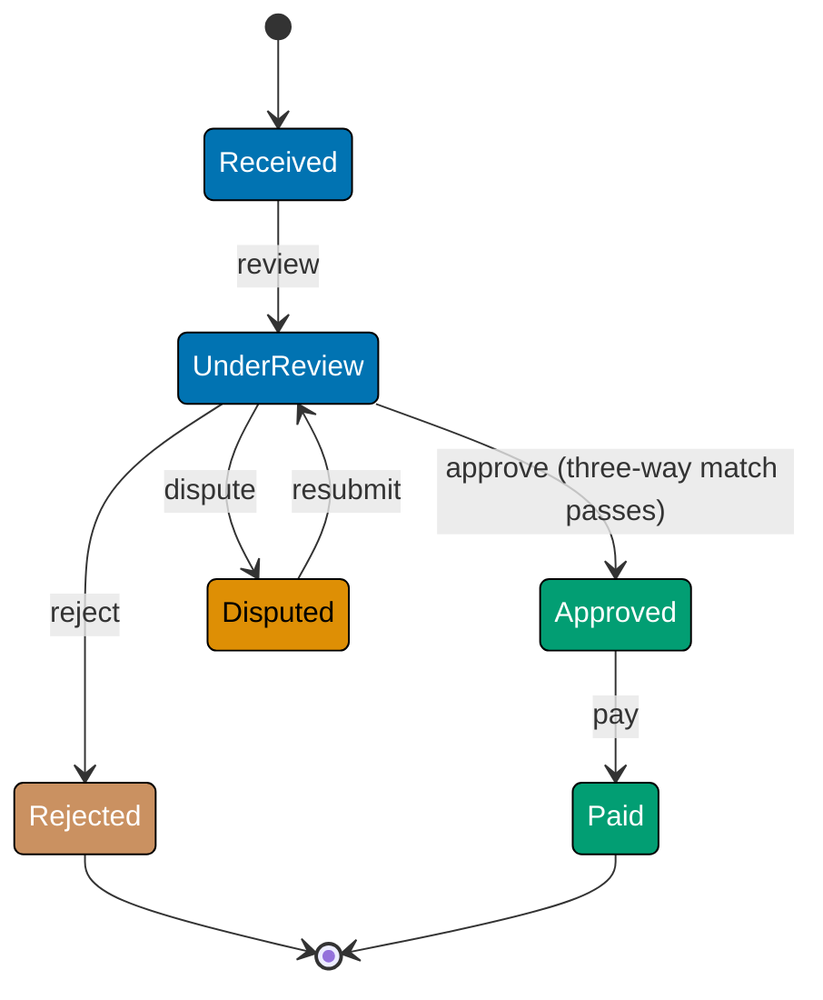
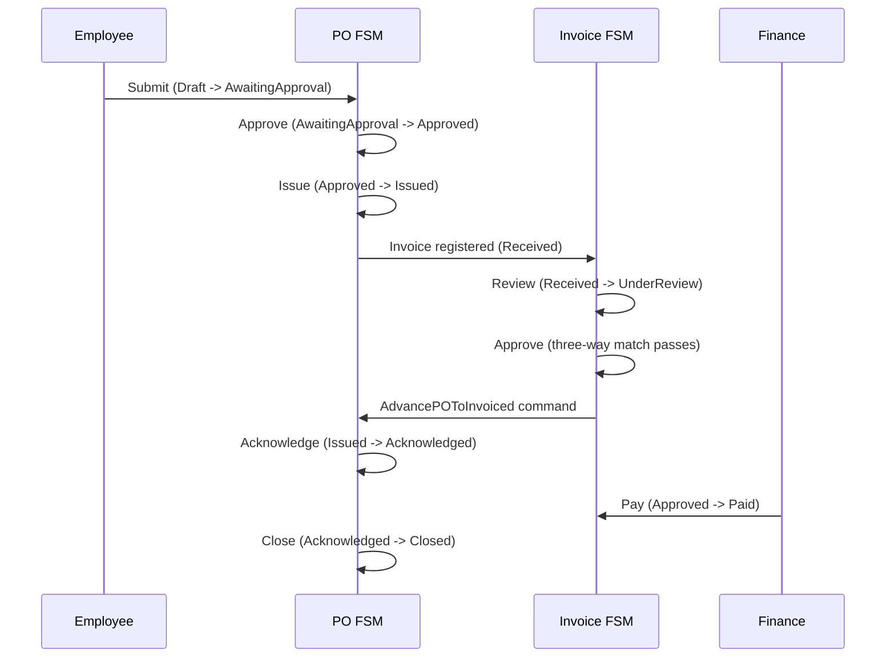

This intermediate section adds the `Invoice` state machine to the Procure-to-Pay domain, building on the `PurchaseOrder` FSM from the beginner level. The central patterns here are multi-machine coordination, three-way match guards, returning side-effect commands from transitions, and composing two FSMs that must stay in sync.

## Invoice State Machine (Examples 26–33)

### Example 26: Invoice States and the Three-Way Match

An invoice in a P2P system must pass a three-way match before it can be approved: the invoice amount must match the PO amount and the goods-receipt amount within tolerance. The state machine enforces this as a guard on the `Approve` transition.



```fsharp
// ── file: InvoiceFsm.fsx ─────────────────────────────────────────────────
// Invoice state discriminated union: every valid invoice state listed once.
// Compiler rejects any InvoiceState value outside this set.
type InvoiceState =
    | Received     // => Invoice registered in the system; not yet reviewed
    | UnderReview  // => AP team is reviewing against PO and receipt
    | Approved     // => Three-way match passed; ready for payment
    | Disputed     // => Discrepancy found; awaiting supplier correction
    | Rejected     // => Invoice rejected — terminal state
    | Paid         // => Payment disbursed — terminal state

// Invoice event DU: all events that can drive an invoice through its lifecycle.
type InvoiceEvent =
    | Review    // => AP team starts review
    | Approve   // => Three-way match passes; AP approves
    | Dispute   // => Discrepancy flagged during review
    | Resubmit  // => Supplier corrects and resubmits
    | Reject    // => AP permanently rejects invoice
    | Pay       // => Finance disburses payment

// Pure predicate: is this invoice state terminal?
let isInvoiceTerminal (state: InvoiceState) : bool =
    match state with
    | Rejected | Paid -> true  // => Two terminal states for invoices
    | _               -> false // => All others allow further transitions

printfn "Received terminal: %b" (isInvoiceTerminal Received)  // => false
printfn "Paid terminal: %b"     (isInvoiceTerminal Paid)      // => true
```

**Key Takeaway**: The Invoice FSM mirrors the PO FSM structure — DU states, DU events, pure terminal predicate — establishing a consistent pattern across all aggregates in the domain.

**Why It Matters**: Using the same structural pattern (DU states, DU events, pure transition function) across all machines in the domain makes the codebase predictable. A developer familiar with the PO FSM immediately understands the Invoice FSM without reading documentation. Consistency across machines also enables generic infrastructure: a single `withLogging` wrapper, a single `replayEvents` fold, and a single DOT generator work for any machine that follows the `State -> Event -> Result<State, string>` protocol.

---

### Example 27: The Three-Way Match Guard

The three-way match checks that invoice amount, PO committed amount, and goods-receipt amount agree within a configurable tolerance. The guard is a pure function on domain values — easy to test in isolation from the FSM.

```fsharp
// ── file: InvoiceFsm.fsx ─────────────────────────────────────────────────
// Three-way match context: the three amounts that must agree.
type ThreeWayMatchContext =
    { InvoiceAmount: decimal    // => Amount billed by the supplier
      POAmount: decimal         // => Amount committed on the purchase order
      ReceiptAmount: decimal    // => Amount confirmed received by the warehouse
      TolerancePercent: decimal }// => Allowed variance (e.g. 0.02 for 2%)

// Pure guard: all three amounts must agree within the tolerance percentage.
// Returns Result to carry the reason for failure.
let threeWayMatch (ctx: ThreeWayMatchContext) : Result<unit, string> =
    // => Helper: is |a - b| within tolerance of b?
    let withinTolerance (a: decimal) (b: decimal) =
        let diff = abs (a - b)          // => Absolute difference
        let allowed = b * ctx.TolerancePercent // => Max allowed variance
        diff <= allowed                 // => True if within tolerance

    if not (withinTolerance ctx.InvoiceAmount ctx.POAmount) then
        Error $"Invoice {ctx.InvoiceAmount} vs PO {ctx.POAmount}: outside tolerance {ctx.TolerancePercent}"
        // => Invoice amount diverges too much from the PO commitment
    elif not (withinTolerance ctx.InvoiceAmount ctx.ReceiptAmount) then
        Error $"Invoice {ctx.InvoiceAmount} vs receipt {ctx.ReceiptAmount}: outside tolerance {ctx.TolerancePercent}"
        // => Invoice amount diverges too much from what was actually received
    else
        Ok ()
        // => All three amounts agree within tolerance — match passes

// Test guard with sample data
let ctx1 =
    { InvoiceAmount = 1010m; POAmount = 1000m
      ReceiptAmount = 1005m; TolerancePercent = 0.02m }
// => 1010 vs 1000: diff=10, allowed=20 -> within tolerance
// => 1010 vs 1005: diff=5, allowed=20.1 -> within tolerance

let ctx2 =
    { InvoiceAmount = 1100m; POAmount = 1000m
      ReceiptAmount = 1000m; TolerancePercent = 0.02m }
// => 1100 vs 1000: diff=100, allowed=20 -> outside tolerance

printfn "%A" (threeWayMatch ctx1)  // => Ok ()
printfn "%A" (threeWayMatch ctx2)  // => Error "Invoice 1100 vs PO 1000..."
```

**Key Takeaway**: The three-way match is a composable pure function on domain values — it can be tested exhaustively before being wired into the transition function.

**Why It Matters**: The three-way match is a critical procurement control: it prevents paying for goods not ordered or not received. Encoding it as a pure function makes it independently auditable: finance can verify the tolerance configuration and test boundary cases without running the full FSM. The `Result<unit, string>` return type integrates naturally with `Result.bind` chains, allowing the match to gate the Approve transition without any special handling at the FSM layer.

---

### Example 28: Guarded Invoice Transition

Combining the three-way match guard with the invoice transition function produces a full guarded FSM. The Approve event succeeds only when `threeWayMatch` returns `Ok ()`.

```fsharp
// ── file: InvoiceFsm.fsx ─────────────────────────────────────────────────
// Invoice record with embedded three-way match context.
type Invoice =
    { Id: string
      State: InvoiceState
      MatchCtx: ThreeWayMatchContext }  // => Context needed by the Approve guard

// Guarded invoice transition: Approve event requires three-way match.
let invoiceTransition
    (inv: Invoice)
    (event: InvoiceEvent)
    : Result<Invoice, string> =
    match inv.State, event with
    | Received, Review ->
        // => No guard: start review unconditionally
        Ok { inv with State = UnderReview }
    | UnderReview, Approve ->
        // => Guard: three-way match must pass before approval
        threeWayMatch inv.MatchCtx
        |> Result.map (fun () -> { inv with State = Approved })
        // => Result.map: if Ok () -> Ok { inv with State = Approved }
        // => If Error msg -> Error msg propagates unchanged
    | UnderReview, Dispute ->
        Ok { inv with State = Disputed }
    | Disputed, Resubmit ->
        Ok { inv with State = UnderReview }
        // => Resubmit returns to UnderReview for re-evaluation
    | UnderReview, Reject ->
        Ok { inv with State = Rejected }
    | Approved, Pay ->
        Ok { inv with State = Paid }
    | _, _ ->
        Error $"Invalid invoice transition: {inv.State} + {event}"

// Simulate approve with passing three-way match
let goodCtx =
    { InvoiceAmount = 1010m; POAmount = 1000m
      ReceiptAmount = 1005m; TolerancePercent = 0.02m }
// => Three-way match passes within 2% tolerance

let inv = { Id = "INV-001"; State = UnderReview; MatchCtx = goodCtx }
let approved = invoiceTransition inv Approve
// => Ok { State = Approved; ... }

printfn "%A" approved  // => Ok { Id = "INV-001"; State = Approved; ... }

// Simulate approve with failing three-way match
let badCtx = { goodCtx with InvoiceAmount = 1200m }
// => Invoice amount too high — match will fail
let inv2 = { inv with MatchCtx = badCtx }
let rejected = invoiceTransition inv2 Approve
// => Error "Invoice 1200 vs PO 1000..."

printfn "%A" rejected  // => Error "Invoice 1200 vs PO 1000..."
```

**Key Takeaway**: `Result.map` threads the guard result into the state update without nested `match` expressions — the guard failure propagates automatically.

**Why It Matters**: The pattern `guard |> Result.map (fun () -> newState)` is the idiomatic way to gate a transition behind a pure guard. Compare the OOP equivalent: a `canApprove()` method that throws an exception, which breaks the pure transition contract and couples the state class to exception handling. The FP `Result.map` approach is referentially transparent: the same guard context always produces the same result, the transition function has no side effects, and the entire approval logic is visible in one `match` arm.

---

### Example 29: Linking Invoice and PurchaseOrder State Machines

An invoice is always linked to a PO. When an invoice is approved, the PO may need to advance to `Invoiced`. This example shows how to coordinate two FSMs by returning a command list from the invoice transition.

```fsharp
// ── file: InvoiceFsm.fsx ─────────────────────────────────────────────────
// Cross-machine commands: actions the application layer must execute
// after the invoice transition completes.
type InvoiceCommand =
    | AdvancePOToInvoiced of poId: string  // => Tell PO FSM to advance
    | SendPaymentRequest   of invoiceId: string * amount: decimal
    | NotifyRequester      of poId: string * message: string

// Transition returns (newInvoice, commands list).
// Pure: no direct calls to PO FSM — returns commands instead.
let invoiceTransitionWithCommands
    (inv: Invoice)
    (event: InvoiceEvent)
    : Result<Invoice * InvoiceCommand list, string> =
    match inv.State, event with
    | Received, Review ->
        Ok ({ inv with State = UnderReview }, [])
        // => Review: no cross-machine commands needed
    | UnderReview, Approve ->
        threeWayMatch inv.MatchCtx
        |> Result.map (fun () ->
            let cmds =
                [ AdvancePOToInvoiced "PO-001"          // => Coordinate PO state
                  SendPaymentRequest (inv.Id, inv.MatchCtx.InvoiceAmount)
                  // => Queue payment
                  NotifyRequester ("PO-001", "Invoice approved") ]
                  // => Notify employee
            { inv with State = Approved }, cmds)
    | UnderReview, Dispute ->
        Ok ({ inv with State = Disputed },
            [ NotifyRequester ("PO-001", "Invoice disputed — awaiting supplier") ])
    | Disputed, Resubmit ->
        Ok ({ inv with State = UnderReview }, [])
    | Approved, Pay ->
        Ok ({ inv with State = Paid }, [])
    | _, _ ->
        Error $"Invalid: {inv.State} + {event}"

// Simulate approval
let inv3 =
    { Id = "INV-002"
      State = UnderReview
      MatchCtx = { InvoiceAmount = 500m; POAmount = 500m
                   ReceiptAmount = 500m; TolerancePercent = 0.01m } }

match invoiceTransitionWithCommands inv3 Approve with
| Ok (nextInv, cmds) ->
    printfn "Next state: %A" nextInv.State  // => Approved
    cmds |> List.iter (printfn "Command: %A")
    // => Command: AdvancePOToInvoiced "PO-001"
    // => Command: SendPaymentRequest ("INV-002", 500.0M)
    // => Command: NotifyRequester ("PO-001", "Invoice approved")
| Error msg -> printfn "Error: %s" msg
```

**Key Takeaway**: Returning a command list from the invoice transition delegates cross-machine coordination to the application layer — the FSM itself remains a pure function.

**Why It Matters**: Direct FSM-to-FSM calls inside a transition function create tight coupling and make testing require constructing both machines. Returning commands defers the orchestration: the application layer receives the invoice's new state and the list of commands, then dispatches each command — possibly through a message bus, in a database transaction, or via direct function calls. This is the CQRS pattern applied to FSM coordination: the transition produces a "write model" (new state) and a set of "commands" for downstream effects, cleanly separated.

---

### Example 30: Invoice FSM with Tolerance Check

Different procurement categories have different match tolerances. This example shows parameterising the tolerance at the FSM level, so the same transition function works for capital goods (strict) and consumables (relaxed).

```fsharp
// ── file: InvoiceFsm.fsx ─────────────────────────────────────────────────
// Procurement category determines match tolerance.
type ProcurementCategory =
    | CapitalGoods    // => High-value equipment; strict tolerance (0.5%)
    | Consumables     // => Everyday supplies; relaxed tolerance (3%)
    | Services        // => Professional services; moderate tolerance (1%)

// Look up tolerance by category.
// Pure function: deterministic, no I/O.
let toleranceFor (category: ProcurementCategory) : decimal =
    match category with
    | CapitalGoods -> 0.005m  // => 0.5% — tight control for expensive assets
    | Consumables  -> 0.03m   // => 3% — relaxed for bulk low-value items
    | Services     -> 0.01m   // => 1% — moderate for service invoices

// Build a match context with category-derived tolerance.
let buildMatchCtx
    (invoiceAmt: decimal)
    (poAmt: decimal)
    (receiptAmt: decimal)
    (category: ProcurementCategory)
    : ThreeWayMatchContext =
    { InvoiceAmount    = invoiceAmt
      POAmount         = poAmt
      ReceiptAmount    = receiptAmt
      TolerancePercent = toleranceFor category }  // => Tolerance from category

// Test: same amounts, different categories
let amt = (10_200m, 10_000m, 10_100m)  // => 2% variance on invoice vs PO
let (inv4, po4, rec4) = amt

let capitalCtx     = buildMatchCtx inv4 po4 rec4 CapitalGoods
// => tolerance = 0.5% — 2% variance fails
let consumablesCtx = buildMatchCtx inv4 po4 rec4 Consumables
// => tolerance = 3% — 2% variance passes

printfn "CapitalGoods:  %A" (threeWayMatch capitalCtx)
// => Error "Invoice 10200 vs PO 10000: outside tolerance 0.005"
printfn "Consumables:   %A" (threeWayMatch consumablesCtx)
// => Ok ()
```

**Key Takeaway**: Parameterising tolerance by category keeps the guard function generic while expressing category-specific business rules as data, not branching logic.

**Why It Matters**: Hardcoding tolerance values inside the guard function makes them invisible to business stakeholders and hard to change without touching code. Modelling them as a lookup from a category enum makes the policy explicit and auditable. Finance can review `toleranceFor` and understand exactly what each category's variance policy is. Adding a new category (`RawMaterials`) requires one new match arm in `toleranceFor` — no changes to the guard logic itself.

---

### Example 31: Invoice FSM with Result Chaining

A complete invoice approval workflow involves multiple steps: validate the invoice, run the three-way match, check budget availability, then approve. `Result.bind` chains these into a pipeline where any failure short-circuits the rest.

```fsharp
// ── file: InvoiceFsm.fsx ─────────────────────────────────────────────────
// Budget check: ensure the department has remaining budget for this invoice.
// Pure function — assumes budget data is passed as a parameter.
let checkBudget (departmentBudget: decimal) (invoiceAmount: decimal) : Result<unit, string> =
    if invoiceAmount <= departmentBudget then
        Ok ()  // => Budget available
    else
        Error $"Invoice {invoiceAmount} exceeds remaining budget {departmentBudget}"
        // => Budget exceeded — approval blocked

// Multi-step approval pipeline using Result.bind.
// Each step must succeed before the next is attempted.
let approveInvoicePipeline
    (inv: Invoice)
    (departmentBudget: decimal)
    : Result<Invoice, string> =
    // => Step 1: must be in UnderReview state
    (if inv.State = UnderReview then Ok inv
     else Error $"Invoice must be UnderReview, got {inv.State}")
    // => Step 2: three-way match must pass
    |> Result.bind (fun i ->
        threeWayMatch i.MatchCtx
        |> Result.map (fun () -> i))
    // => Step 3: budget must be available
    |> Result.bind (fun i ->
        checkBudget departmentBudget i.MatchCtx.InvoiceAmount
        |> Result.map (fun () -> i))
    // => Step 4: advance state to Approved
    |> Result.map (fun i -> { i with State = Approved })

// Test: all checks pass
let invOk =
    { Id = "INV-003"
      State = UnderReview
      MatchCtx = { InvoiceAmount = 800m; POAmount = 800m
                   ReceiptAmount = 800m; TolerancePercent = 0.02m } }

printfn "%A" (approveInvoicePipeline invOk 1000m)
// => Ok { State = Approved; ... }

// Test: budget exceeded
printfn "%A" (approveInvoicePipeline invOk 500m)
// => Error "Invoice 800 exceeds remaining budget 500"
```

**Key Takeaway**: `Result.bind` chains compose multi-step approval logic into a single readable pipeline where each step is independently testable.

**Why It Matters**: Railway-oriented programming (Result chaining) is the functional equivalent of a validation pipeline. Each `Result.bind` is a step that either continues the happy path or diverts to the error track. The pipeline reads top-to-bottom as a business process: "state check, then three-way match, then budget check, then approve." Adding a new step (e.g., `checkSanctionsList`) requires one additional `|> Result.bind` — no conditionals inside the approval function, no risk of accidentally skipping a step.

---

### Example 32: Declarative Machine Definition as a Map

A declarative FSM definition stores both the transition table and guard functions in a data structure. The interpreter is a generic function that looks up the transition and evaluates the guard — no machine-specific code required.

```fsharp
// ── file: InvoiceFsm.fsx ─────────────────────────────────────────────────
// A machine definition is a map from (State, Event) to (Guard, NextState).
// Guard is a function: unit -> Result<unit, string>.
// Using unit -> Result because the guard context is captured in a closure.
type TransitionDef<'S, 'E when 'S: comparison and 'E: comparison> =
    { Guard: unit -> Result<unit, string>  // => Guard predicate (or always Ok)
      NextState: 'S }                       // => Target state if guard passes

type MachineDef<'S, 'E when 'S: comparison and 'E: comparison> =
    Map<'S * 'E, TransitionDef<'S, 'E>>

// Build the invoice machine definition with all guards embedded as closures.
let buildInvoiceMachine (matchCtx: ThreeWayMatchContext) : MachineDef<InvoiceState, InvoiceEvent> =
    Map.ofList [
        // => Received + Review: no guard
        (Received, Review),
            { Guard = fun () -> Ok (); NextState = UnderReview }
        // => UnderReview + Approve: three-way match guard
        (UnderReview, Approve),
            { Guard = fun () -> threeWayMatch matchCtx; NextState = Approved }
        // => UnderReview + Dispute: no guard
        (UnderReview, Dispute),
            { Guard = fun () -> Ok (); NextState = Disputed }
        // => Disputed + Resubmit: no guard
        (Disputed, Resubmit),
            { Guard = fun () -> Ok (); NextState = UnderReview }
        // => UnderReview + Reject: no guard
        (UnderReview, Reject),
            { Guard = fun () -> Ok (); NextState = Rejected }
        // => Approved + Pay: no guard
        (Approved, Pay),
            { Guard = fun () -> Ok (); NextState = Paid }
    ]

// Generic interpreter: same code runs any machine built this way.
let runMachine
    (machine: MachineDef<'S, 'E>)
    (state: 'S)
    (event: 'E)
    : Result<'S, string> =
    match Map.tryFind (state, event) machine with
    | None -> Error $"No transition for this state/event pair"
    | Some def ->
        def.Guard ()                        // => Evaluate guard
        |> Result.map (fun () -> def.NextState) // => If Ok, return next state

// Test
let ctx = { InvoiceAmount = 1000m; POAmount = 1000m; ReceiptAmount = 1000m; TolerancePercent = 0.01m }
let machine = buildInvoiceMachine ctx

printfn "%A" (runMachine machine UnderReview Approve)
// => Ok Approved
printfn "%A" (runMachine machine Received Pay)
// => Error "No transition for this state/event pair"
```

**Key Takeaway**: A declarative machine definition separates FSM data from FSM execution — the same generic `runMachine` interpreter drives any conformant machine definition.

**Why It Matters**: The declarative approach enables FSM definitions to be loaded from configuration (JSON, database, feature flags) without changing the interpreter. It also makes the complete set of transitions and guards visible as data, enabling runtime introspection, graph generation, and coverage analysis. The tradeoff is that closures captured in guard functions cannot be serialised — for persistence, use the named guard pattern where guards are stored as identifiers and resolved at runtime.

---

### Example 33: Guards in Declarative Machine Config

Extending the declarative machine with named guards — identified by string keys and resolved through a registry — makes the machine definition serialisable and the guards swappable at runtime.

```fsharp
// ── file: InvoiceFsm.fsx ─────────────────────────────────────────────────
// Named guard: identified by a string key for serialisation.
type NamedTransitionDef<'S, 'E when 'S: comparison and 'E: comparison> =
    { GuardName: string option    // => None means "no guard (always passes)"
      NextState: 'S }

// Guard registry: maps guard names to their implementations.
// In production this would be a dependency-injected service.
type GuardRegistry = Map<string, unit -> Result<unit, string>>

// Resolve and run a named guard from the registry.
let resolveGuard
    (registry: GuardRegistry)
    (guardName: string option)
    : Result<unit, string> =
    match guardName with
    | None ->
        Ok ()  // => No guard — transition always allowed
    | Some name ->
        match Map.tryFind name registry with
        | Some guardFn -> guardFn ()
        // => Guard found — evaluate it
        | None -> Error $"Guard '{name}' not found in registry"
        // => Missing guard — fail safe (reject the transition)

// Serialisable machine definition — no closures, just strings.
let serialisableInvoiceMachine : Map<InvoiceState * InvoiceEvent, NamedTransitionDef<InvoiceState, InvoiceEvent>> =
    Map.ofList [
        (Received,    Review),   { GuardName = None;               NextState = UnderReview }
        (UnderReview, Approve),  { GuardName = Some "threeWayMatch"; NextState = Approved }
        (UnderReview, Dispute),  { GuardName = None;               NextState = Disputed }
        (Disputed,    Resubmit), { GuardName = None;               NextState = UnderReview }
        (UnderReview, Reject),   { GuardName = None;               NextState = Rejected }
        (Approved,    Pay),      { GuardName = None;               NextState = Paid }
    ]

// Build registry with the concrete guard implementations.
let buildRegistry (matchCtx: ThreeWayMatchContext) : GuardRegistry =
    Map.ofList [ "threeWayMatch", fun () -> threeWayMatch matchCtx ]

// Run with named guards
let runNamedMachine registry machine state event =
    match Map.tryFind (state, event) machine with
    | None -> Error $"No transition: {state} + {event}"
    | Some def ->
        resolveGuard registry def.GuardName
        |> Result.map (fun () -> def.NextState)

let ctx5 = { InvoiceAmount = 950m; POAmount = 1000m; ReceiptAmount = 990m; TolerancePercent = 0.05m }
let registry = buildRegistry ctx5

printfn "%A" (runNamedMachine registry serialisableInvoiceMachine UnderReview Approve)
// => Ok Approved  (950 vs 1000 = 5% difference, tolerance = 5%)
```

**Key Takeaway**: Named guards decouple the machine definition from guard implementations — the definition can be stored in a database while implementations are registered at startup.

**Why It Matters**: Production FSMs often need to be modified by operations teams without deploying new code. Storing the machine definition (state, event, guard name, next state) as database rows and the guard implementations in a registry enables runtime reconfiguration. New transitions can be added by inserting a row; new guards require a code deploy (acceptable). This architecture is used in workflow engines, approval systems, and policy-as-code platforms where the FSM definition is a business artifact, not just a technical implementation detail.

---

## State Coordination and Composition (Examples 34–44)

### Example 34: State Entry Actions as Command Lists

Entry actions are business operations that must execute when a state is entered. Modelling them as a `InvoiceState -> Command list` function keeps the transition pure — effects are queued, not executed.

```fsharp
// ── file: InvoiceFsm.fsx ─────────────────────────────────────────────────
// Commands triggered on state entry — one list per target state.
// Application layer executes these after persisting the new state.
type InvoiceEntryCommand =
    | AssignReviewer    of invoiceId: string  // => Assign AP reviewer on entry to UnderReview
    | SchedulePayment   of invoiceId: string * amount: decimal  // => Queue payment on Approved
    | ArchiveInvoice    of invoiceId: string  // => Archive on terminal states

// Entry action function: pure, deterministic, no side effects.
let entryActions (state: InvoiceState) (inv: Invoice) : InvoiceEntryCommand list =
    match state with
    | UnderReview ->
        [ AssignReviewer inv.Id ]
        // => Assign a reviewer when invoice enters review
    | Approved ->
        [ SchedulePayment (inv.Id, inv.MatchCtx.InvoiceAmount) ]
        // => Schedule payment when invoice is approved
    | Rejected | Paid ->
        [ ArchiveInvoice inv.Id ]
        // => Archive when lifecycle ends (either terminal state)
    | _ ->
        []  // => No entry action for Received, Disputed

// Combine transition and entry action into one result.
let invoiceTransitionWithEntry
    (inv: Invoice)
    (event: InvoiceEvent)
    : Result<Invoice * InvoiceEntryCommand list, string> =
    invoiceTransition inv event              // => Run the transition
    |> Result.map (fun nextInv ->
        let cmds = entryActions nextInv.State nextInv  // => Compute entry actions
        nextInv, cmds)                       // => Return (newState, commands)

// Test: transition to Approved triggers SchedulePayment
let invU =
    { Id = "INV-004"
      State = UnderReview
      MatchCtx = { InvoiceAmount = 600m; POAmount = 600m
                   ReceiptAmount = 600m; TolerancePercent = 0.01m } }

match invoiceTransitionWithEntry invU Approve with
| Ok (nextInv, cmds) ->
    printfn "State: %A" nextInv.State  // => Approved
    cmds |> List.iter (printfn "%A")   // => SchedulePayment ("INV-004", 600.0M)
| Error e -> printfn "Error: %s" e
```

**Key Takeaway**: `entryActions state inv` separates the "what should happen when entering this state" decision from the "execute those effects" step — the transition function stays pure.

**Why It Matters**: Entry actions in OOP state machines are typically virtual methods called by the state machine runner. In FP they are a data-producing function called by the application layer after persistence. This separation enables transactional consistency: persist the new state, then execute the commands. If persistence fails, no commands execute. If a command fails, the state is already persisted and the command can be retried. This is the foundation of at-least-once delivery in event-driven systems.

---

### Example 35: Modelling Invoice Resubmission History

When a supplier resubmits a disputed invoice, the system should track how many times resubmission has occurred. This example extends the invoice record with a counter maintained by the FSM.

```fsharp
// ── file: InvoiceFsm.fsx ─────────────────────────────────────────────────
// Invoice record extended with resubmission tracking.
type TrackedInvoice =
    { Id: string
      State: InvoiceState
      MatchCtx: ThreeWayMatchContext
      ResubmissionCount: int     // => Increments on every Resubmit event
      MaxResubmissions: int }    // => Business rule: max retries allowed

// Guard: resubmission is only allowed below the maximum.
let canResubmit (inv: TrackedInvoice) : Result<unit, string> =
    if inv.ResubmissionCount < inv.MaxResubmissions then
        Ok ()  // => Below limit — allow resubmission
    else
        Error $"Invoice {inv.Id} has reached the maximum of {inv.MaxResubmissions} resubmissions"
        // => Limit reached — must reject or escalate

// Transition function for tracked invoice.
let trackedInvoiceTransition
    (inv: TrackedInvoice)
    (event: InvoiceEvent)
    : Result<TrackedInvoice, string> =
    match inv.State, event with
    | Received, Review ->
        Ok { inv with State = UnderReview }
    | UnderReview, Approve ->
        threeWayMatch inv.MatchCtx
        |> Result.map (fun () -> { inv with State = Approved })
    | UnderReview, Dispute ->
        Ok { inv with State = Disputed }
    | Disputed, Resubmit ->
        // => Guard: check resubmission limit before allowing
        canResubmit inv
        |> Result.map (fun () ->
            { inv with
                State = UnderReview
                ResubmissionCount = inv.ResubmissionCount + 1 })
                // => Increment counter on every successful resubmit
    | UnderReview, Reject ->
        Ok { inv with State = Rejected }
    | Approved, Pay ->
        Ok { inv with State = Paid }
    | _, _ -> Error $"Invalid: {inv.State} + {event}"

let tinv =
    { Id = "INV-005"; State = Disputed
      MatchCtx = { InvoiceAmount = 500m; POAmount = 500m; ReceiptAmount = 500m; TolerancePercent = 0.01m }
      ResubmissionCount = 2; MaxResubmissions = 2 }

printfn "%A" (trackedInvoiceTransition tinv Resubmit)
// => Error "Invoice INV-005 has reached the maximum of 2 resubmissions"
```

**Key Takeaway**: Embedding a resubmission counter in the record and guarding `Resubmit` against a maximum keeps retry-limit enforcement inside the FSM — no external counter needed.

**Why It Matters**: Retry limits are a common procurement control: an invoice that cannot be matched after three attempts should be escalated, not endlessly resubmitted. Embedding the counter in the domain record and incrementing it inside the `Resubmit` transition makes the business rule visible in the code. The alternative — a separate counter in a service or a database column checked by middleware — creates invisible coupling and makes the rule hard to find and change. The FSM owns the rule because the rule governs the lifecycle.

---

### Example 36: FSM as Protocol Enforcement

An FSM is a protocol: only certain event sequences are valid. Enforcing the protocol at the API layer means rejecting HTTP requests that would trigger invalid transitions before any database writes occur.

```fsharp
// ── file: InvoiceFsm.fsx ─────────────────────────────────────────────────
// Protocol validator: given current state and requested event, check legality.
// Pure — no I/O. Returns a detailed rejection reason.
let enforceProtocol
    (currentState: InvoiceState)
    (requestedEvent: InvoiceEvent)
    : Result<unit, string> =
    // => Check the serialisable machine definition for a valid transition
    match Map.tryFind (currentState, requestedEvent) serialisableInvoiceMachine with
    | Some _ -> Ok ()
    // => Transition exists — event is legal in current state
    | None ->
        Error $"Event '{requestedEvent}' is not allowed when invoice is in state '{currentState}'"
        // => No matching transition — protocol violation

// Simulate API request handling
let handleApproveRequest (currentState: InvoiceState) =
    match enforceProtocol currentState Approve with
    | Error msg ->
        printfn "HTTP 422: %s" msg  // => Unprocessable Entity
    | Ok () ->
        printfn "HTTP 200: Approval transition is valid — proceeding"

handleApproveRequest UnderReview  // => HTTP 200: Approval transition is valid
handleApproveRequest Received     // => HTTP 422: Event 'Approve' not allowed in state 'Received'
handleApproveRequest Paid         // => HTTP 422: Event 'Approve' not allowed in state 'Paid'
```

**Key Takeaway**: Using the machine definition as a protocol enforcer at the API layer prevents invalid state transitions before any database access — cheap, early rejection.

**Why It Matters**: Without FSM-based protocol enforcement, the validation logic is scattered across service methods: each handler checks "if state is X, do Y". When a new state is added, every handler must be audited. With the transition table as the single source of truth, `enforceProtocol` is the only place that decides legality. API handlers become state-agnostic: "does the transition table allow this?" replaces "is the current state one of [list of valid states]?" This also makes the API self-documenting: the set of allowed events per state is directly readable from the table.

---

### Example 37: PO Lifecycle — PartiallyReceived State

The PO lifecycle needs a `PartiallyReceived` state for partial deliveries. This example introduces it as a new DU case and shows how F#'s exhaustiveness check immediately flags every incomplete handler.

```fsharp
// ── file: InvoiceFsm.fsx ─────────────────────────────────────────────────
// Extended PO state DU with PartiallyReceived.
// Adding this case causes the compiler to flag every non-wildcard match.
type ExtendedPOState =
    | Draft
    | AwaitingApproval
    | Approved
    | Issued
    | PartiallyReceived  // => New: partial delivery confirmed by warehouse
    | Acknowledged       // => Full delivery confirmed
    | Closed
    | Cancelled
    | Disputed

// Extended event DU with ReceivePartial.
type ExtendedPOEvent =
    | Submit | Approve | Reject | Issue | ReceivePartial | Acknowledge | Close | Cancel | Dispute

// Extended transition function — compiler forces handling PartiallyReceived.
let extendedTransition
    (state: ExtendedPOState)
    (event: ExtendedPOEvent)
    : Result<ExtendedPOState, string> =
    match state, event with
    | Draft,              Submit          -> Ok AwaitingApproval
    | AwaitingApproval,   Approve         -> Ok Approved
    | AwaitingApproval,   Reject          -> Ok Cancelled
    | Approved,           Issue           -> Ok Issued
    | Issued,             ReceivePartial  -> Ok PartiallyReceived
    // => New transition: partial receipt moves to PartiallyReceived
    | PartiallyReceived,  ReceivePartial  -> Ok PartiallyReceived
    // => Self-loop: another partial delivery keeps state the same
    | PartiallyReceived,  Acknowledge     -> Ok Acknowledged
    // => Full receipt acknowledged from partial state
    | Issued,             Acknowledge     -> Ok Acknowledged
    // => Full receipt from Issued without partial step
    | Acknowledged,       Close           -> Ok Closed
    | Draft,              Cancel          -> Ok Cancelled
    | Approved,           Cancel          -> Ok Cancelled
    | Issued,             Dispute         -> Ok Disputed
    | PartiallyReceived,  Dispute         -> Ok Disputed
    // => Dispute can also arise after a partial delivery
    | _, _ -> Error $"No transition: {state} + {event}"

// Test the new PartiallyReceived path
let result =
    Ok (Issued : ExtendedPOState)
    |> Result.bind (fun s -> extendedTransition s ReceivePartial)
    |> Result.bind (fun s -> extendedTransition s ReceivePartial)
    |> Result.bind (fun s -> extendedTransition s Acknowledge)
// => Ok Acknowledged  (two partial deliveries then full acknowledgement)

printfn "%A" result  // => Ok Acknowledged
```

**Key Takeaway**: Adding `PartiallyReceived` to the DU and adding two new `match` arms — one for the new state and one for the self-loop — is the complete change required; the compiler flags every other handler that needs updating.

**Why It Matters**: The compile-time completeness guarantee is the primary advantage of DU-based FSMs over enum-switch FSMs. In a Java `switch (state)`, a new state silently falls through to the `default` arm. In F#, every non-wildcard `match` on `ExtendedPOState` becomes a warning. This makes adding a new state a structured refactoring task: the compiler produces a list of locations to update, the developer updates them, and the result is a complete and consistent FSM. The effort is proportional to the number of handlers, not hidden in undiscovered code paths.

---

### Example 38: Combining PO and Invoice with an Event Bus

When an invoice is approved, the PO must advance to `Invoiced`. This example models a simple in-process event bus that routes the `InvoiceApproved` domain event to the PO FSM handler.

```fsharp
// ── file: InvoiceFsm.fsx ─────────────────────────────────────────────────
// Domain events published to the event bus after state transitions.
type DomainEvent =
    | InvoiceApproved of invoiceId: string * poId: string * amount: decimal
    | InvoicePaid     of invoiceId: string * poId: string
    | POInvoiced      of poId: string

// Simple in-process event bus: a list of handlers per event type.
// In production: replace with a message broker or effect system.
type EventBus = { Publish: DomainEvent -> unit }

// PO FSM handler for InvoiceApproved event.
// Pure computation; side effects (persistence) done by caller.
let handleInvoiceApproved
    (poId: string)
    (currentPOState: POState)
    : Result<POState * DomainEvent list, string> =
    match currentPOState with
    | Issued | Acknowledged ->
        // => When invoice approved, advance PO to conceptual Invoiced
        // => Here modelled as returning to Acknowledged (simplified)
        Ok (Acknowledged, [ POInvoiced poId ])
        // => Emit POInvoiced domain event for downstream consumers
    | other ->
        Error $"PO {poId} in state {other} cannot be marked Invoiced"

// Simulate event bus dispatch
let simulateApproval () =
    // => Invoice transitions to Approved
    let invEvent = InvoiceApproved ("INV-006", "PO-010", 1500m)
    // => Application layer receives event and dispatches to PO handler
    match invEvent with
    | InvoiceApproved (invId, poId, amt) ->
        printfn "Handling InvoiceApproved: inv=%s po=%s amt=%M" invId poId amt
        match handleInvoiceApproved poId Issued with
        | Ok (newPOState, cmds) ->
            printfn "PO new state: %A" newPOState  // => Acknowledged
            cmds |> List.iter (printfn "Emitted: %A")  // => POInvoiced "PO-010"
        | Error e -> printfn "Error: %s" e
    | _ -> ()

simulateApproval ()
```

**Key Takeaway**: An event bus decouples the Invoice and PO FSMs — each machine publishes domain events, and handlers update the other machine, without direct function calls between machines.

**Why It Matters**: Direct FSM-to-FSM calls create a call graph that becomes a dependency graph: changing the Invoice FSM requires understanding its effect on every machine it calls. An event bus inverts this: the Invoice FSM publishes events it does not know who handles. New consumers (PO FSM, notification service, analytics) can subscribe without modifying the Invoice FSM. In a distributed system, the event bus is a message broker; in a monolith, it is an in-process dispatch table. The FP command list pattern from earlier examples maps naturally to event publication.

---

### Example 39: Testing Invoice-PO Coordination

Testing cross-machine coordination requires verifying that the correct commands and events are produced, not that side effects occurred. This example tests the coordination logic by inspecting the returned command list.

```fsharp
// ── file: InvoiceFsm.fsx ─────────────────────────────────────────────────
// Test harness: apply a sequence of events and collect all commands produced.
// Pure — no I/O, no mutable state.
let applyInvoiceEvents
    (inv: Invoice)
    (events: InvoiceEvent list)
    : Result<Invoice * InvoiceCommand list, string> =
    // => Fold: accumulate both the invoice state and all commands.
    List.fold
        (fun acc event ->
            acc |> Result.bind (fun (currentInv, allCmds) ->
                invoiceTransitionWithCommands currentInv event
                |> Result.map (fun (nextInv, newCmds) ->
                    nextInv, allCmds @ newCmds)))
                // => Append new commands to accumulated list
        (Ok (inv, []))  // => Initial accumulator: Ok with empty command list
        events

// Test: full invoice lifecycle from Received to Paid
let startInv =
    { Id = "INV-007"
      State = Received
      MatchCtx = { InvoiceAmount = 1000m; POAmount = 1000m
                   ReceiptAmount = 1000m; TolerancePercent = 0.01m } }

let lifecycle = [ Review; Approve; Pay ]
// => Full happy-path event sequence

match applyInvoiceEvents startInv lifecycle with
| Ok (finalInv, cmds) ->
    printfn "Final state: %A" finalInv.State
    // => Paid
    printfn "Commands produced: %d" (List.length cmds)
    // => 3 (one per transition that has commands)
    cmds |> List.iteri (fun i c -> printfn "  [%d] %A" i c)
    // => [0] AdvancePOToInvoiced "PO-001"
    // => [1] SendPaymentRequest ("INV-007", 1000.0M)
    // => [2] NotifyRequester ("PO-001", "Invoice approved")
| Error e -> printfn "Error: %s" e
```

**Key Takeaway**: Testing FSM coordination by inspecting the returned command list requires no mocking, no I/O, and no test doubles — commands are plain data.

**Why It Matters**: The command-list pattern makes integration testing trivial: assert that the right commands appear in the right order without executing any of them. This is faster than integration tests that need databases and message brokers, and more precise than mocking frameworks that count method calls. The test is a pure function call: given this invoice and these events, assert these commands are produced. Parallelising such tests is safe because there is no shared mutable state.

---

### Example 40: Validation Error Accumulation

Invoice creation requires multiple field validations. Using a list of errors rather than fail-fast gives the supplier a complete picture of what needs correcting, reducing the number of correction-resubmission cycles.

```fsharp
// ── file: InvoiceFsm.fsx ─────────────────────────────────────────────────
// Invoice creation input — raw data before validation.
type InvoiceInput =
    { InvoiceId: string
      POReference: string
      Amount: decimal
      LineCount: int }

// Validate all fields and accumulate errors.
// Returns Result<Invoice, string list> — all failures in one pass.
let validateInvoice
    (input: InvoiceInput)
    (matchCtx: ThreeWayMatchContext)
    : Result<Invoice, string list> =
    // => Build error list using list comprehension with yield
    let errors =
        [ if System.String.IsNullOrWhiteSpace(input.InvoiceId) then
              yield "Invoice ID must not be empty"
          if System.String.IsNullOrWhiteSpace(input.POReference) then
              yield "PO reference must not be empty"
          if input.Amount <= 0m then
              yield "Invoice amount must be positive"
          if input.LineCount <= 0 then
              yield "Invoice must have at least one line" ]
    match errors with
    | [] ->
        Ok { Id = input.InvoiceId
             State = Received
             MatchCtx = matchCtx }
        // => No errors — construct invoice in initial Received state
    | errs -> Error errs
    // => Return all errors for the caller to display

// Test with multiple invalid fields
let badInput =
    { InvoiceId = ""; POReference = ""; Amount = -100m; LineCount = 0 }

let goodCtx2 =
    { InvoiceAmount = 0m; POAmount = 0m; ReceiptAmount = 0m; TolerancePercent = 0.01m }

match validateInvoice badInput goodCtx2 with
| Error errs ->
    printfn "Validation errors:"
    errs |> List.iter (printfn "  - %s")
    // => - Invoice ID must not be empty
    // => - PO reference must not be empty
    // => - Invoice amount must be positive
    // => - Invoice must have at least one line
| Ok _ -> printfn "Invoice created"
```

**Key Takeaway**: `Result<Invoice, string list>` accumulates all validation errors in a single pass — the caller sees a complete list, not just the first failure.

**Why It Matters**: Fail-fast validation forces a loop: submit, get one error, fix it, resubmit, get the next error, fix it. For an invoice with four invalid fields this means four submissions. Error accumulation surfaces all four errors at once, enabling a single correction and resubmission. This is both more efficient and more respectful of the supplier's time. The F# list comprehension with `yield` inside `[ if ... then yield ... ]` is the idiomatic accumulation pattern — no mutable list, no monoid concatenation.

---

### Example 41: State Machine Composition — Invoice Inside PO Lifecycle

A PO aggregate can own its associated invoices. This example models a `CompositePO` that holds both the PO state and a list of invoice states, with a transition function that coordinates both.

```fsharp
// ── file: InvoiceFsm.fsx ─────────────────────────────────────────────────
// Composite PO: PO state machine owns its invoices.
type CompositePO =
    { Id: string
      POState: POState
      Invoices: Invoice list }  // => Associated invoices

// Derive PO state from invoice states: can PO close?
// PO can close only when all invoices are Paid.
let allInvoicesPaid (invoices: Invoice list) : bool =
    // => List.forall returns true for empty list — OK if no invoices yet
    List.forall (fun inv -> inv.State = Paid) invoices

// Guarded close: PO can only close when all invoices are paid.
let closePO (po: CompositePO) : Result<CompositePO, string> =
    match po.POState with
    | Acknowledged ->
        if allInvoicesPaid po.Invoices then
            Ok { po with POState = Closed }
            // => All invoices paid — PO can close
        else
            Error "Cannot close PO: not all invoices are paid"
            // => Outstanding invoices — block closing
    | other ->
        Error $"Cannot close PO in state {other}: must be Acknowledged"

// Test: one invoice paid, one pending
let mockCtx =
    { InvoiceAmount = 500m; POAmount = 500m; ReceiptAmount = 500m; TolerancePercent = 0.01m }

let paidInv    = { Id = "INV-A"; State = Paid;     MatchCtx = mockCtx }
let pendingInv = { Id = "INV-B"; State = Approved; MatchCtx = mockCtx }

let cpo =
    { Id = "PO-020"
      POState = Acknowledged
      Invoices = [ paidInv; pendingInv ] }
// => One invoice paid, one not — PO should not close

printfn "%A" (closePO cpo)
// => Error "Cannot close PO: not all invoices are paid"

let cpoPaid = { cpo with Invoices = [ paidInv; { pendingInv with State = Paid } ] }
printfn "%A" (closePO cpoPaid)
// => Ok { POState = Closed; ... }
```

**Key Takeaway**: Composing PO and Invoice states into a `CompositePO` record enables guards that span both machines — the PO close guard reads invoice states from the same record.

**Why It Matters**: A PO that closes before its invoices are paid creates an accounting discrepancy. The composite record pattern keeps related state co-located, making cross-machine guards natural: `allInvoicesPaid po.Invoices` reads directly from the PO's owned invoice list. This is the aggregate root pattern from DDD applied functionally: the PO is the root, invoices are members, and the FSM enforces invariants across the entire aggregate boundary.

---

### Example 42: Timeout Guards

An invoice that has been under review for more than a configurable number of days should escalate automatically. This example models timeout as a guard that compares the review start date against the current date.

```fsharp
// ── file: InvoiceFsm.fsx ─────────────────────────────────────────────────
// Invoice with review start timestamp for timeout detection.
type TimedInvoice =
    { Id: string
      State: InvoiceState
      MatchCtx: ThreeWayMatchContext
      ReviewStartedAt: System.DateTime option }  // => Set when entering UnderReview

// Timeout guard: returns Error if review has exceeded the SLA.
let withinReviewSla
    (slaHours: int)
    (now: System.DateTime)
    (inv: TimedInvoice)
    : Result<unit, string> =
    match inv.ReviewStartedAt with
    | None ->
        Ok ()  // => Review hasn't started — no timeout applicable
    | Some startedAt ->
        let elapsed = (now - startedAt).TotalHours
        // => Calculate elapsed review time in hours
        if elapsed <= float slaHours then
            Ok ()  // => Within SLA window
        else
            Error $"Invoice {inv.Id} review SLA exceeded: {elapsed:.1f}h > {slaHours}h"
            // => Timeout: must escalate

// Timed transition: approval blocked if SLA is exceeded.
let timedApprove
    (inv: TimedInvoice)
    (now: System.DateTime)
    (slaHours: int)
    : Result<TimedInvoice, string> =
    match inv.State with
    | UnderReview ->
        withinReviewSla slaHours now inv   // => Check timeout guard
        |> Result.bind (fun () -> threeWayMatch inv.MatchCtx)
        // => Also require three-way match to pass
        |> Result.map (fun () -> { inv with State = Approved; ReviewStartedAt = None })
        // => Clear timestamp on approval
    | other -> Error $"Cannot approve invoice in state {other}"

// Test: invoice started 50 hours ago with 48-hour SLA
let reviewStart = System.DateTime.UtcNow.AddHours(-50.0)
let timedInv =
    { Id = "INV-008"; State = UnderReview
      MatchCtx = { InvoiceAmount = 300m; POAmount = 300m; ReceiptAmount = 300m; TolerancePercent = 0.01m }
      ReviewStartedAt = Some reviewStart }

printfn "%A" (timedApprove timedInv System.DateTime.UtcNow 48)
// => Error "Invoice INV-008 review SLA exceeded: 50.0h > 48h"
```

**Key Takeaway**: Timeout guards are pure functions that compare timestamps — they integrate with the `Result.bind` chain like any other guard, requiring no special FSM infrastructure.

**Why It Matters**: SLA enforcement in workflow systems often requires a separate scheduler or cron job. The guard-based approach makes the SLA a first-class domain rule: the transition function itself enforces the timeout. When the scheduler fires a `checkTimeout` job, it can call `timedApprove` with `DateTime.UtcNow` and immediately receive either `Ok (approvedInvoice)` or `Error (slaMessage)`. The SLA configuration (`slaHours`) can be injected at runtime, enabling per-category SLAs without changing the guard logic.

---

### Example 43: Building an Invoice FSM Runner

A runner applies a sequence of events to an invoice, threading the state through each transition and collecting all commands. It is the invoice equivalent of the `replayEvents` function from the beginner level.

```fsharp
// ── file: InvoiceFsm.fsx ─────────────────────────────────────────────────
// FSM runner: apply a sequence of events to an invoice, accumulating commands.
// Returns the final invoice state and all commands produced by all transitions.
let runInvoiceFSM
    (initialInv: Invoice)
    (events: InvoiceEvent list)
    : Result<Invoice * InvoiceCommand list, string> =
    // => Left fold: process events left-to-right; stop on first error.
    List.fold
        (fun acc event ->
            // => Bind: propagate Ok, pass Error through unchanged
            acc |> Result.bind (fun (inv, cmds) ->
                invoiceTransitionWithCommands inv event
                |> Result.map (fun (nextInv, newCmds) ->
                    nextInv, cmds @ newCmds)))
        (Ok (initialInv, []))  // => Start with initial invoice and empty command list
        events

// Run a complete lifecycle from Received through to Paid
let freshInv =
    { Id = "INV-009"; State = Received
      MatchCtx = { InvoiceAmount = 2500m; POAmount = 2500m
                   ReceiptAmount = 2500m; TolerancePercent = 0.02m } }

let events = [ Review; Approve; Pay ]

match runInvoiceFSM freshInv events with
| Ok (finalInv, cmds) ->
    printfn "Final state: %A" finalInv.State
    // => Paid
    printfn "Total commands: %d" (List.length cmds)
    // => 3 commands from the Approve transition
    cmds |> List.iteri (fun i c -> printfn "[%d] %A" i c)
    // => [0] AdvancePOToInvoiced "PO-001"
    // => [1] SendPaymentRequest ("INV-009", 2500.0M)
    // => [2] NotifyRequester ("PO-001", "Invoice approved")
| Error e -> printfn "Runner error: %s" e
```

**Key Takeaway**: A generic FSM runner built on `List.fold` and `Result.bind` applies any sequence of events to any machine that follows the `(State, Event) -> Result<(State, Commands), Error>` signature.

**Why It Matters**: The runner is infrastructure, not domain code. It knows nothing about invoices — it just threads state through a function. This means the same runner pattern works for PO, Invoice, Supplier, and Payment FSMs. Generic runners also enable test harnesses that exercise entire lifecycles with a single function call, making scenario-based testing (end-to-end lifecycle from Received to Paid) as concise as unit-testing a single transition. The fold-based runner also naturally supports backpressure: if any event fails, the fold terminates early and returns the error with the accumulated state up to that point.

---

### Example 44: Coverage Snapshot — PO + Invoice Machine States

Tracking all states across both machines provides a coverage map that shows which lifecycle combinations are possible and which are mutually exclusive.

```fsharp
// ── file: InvoiceFsm.fsx ─────────────────────────────────────────────────
// Coverage snapshot: enumerate all (POState, InvoiceState) pairs in the domain.
// Not all combinations are reachable — this documents the valid combinations.
type P2PCoverageState =
    { POState: POState
      InvoiceState: InvoiceState option }
    // => None means no invoice yet created for this PO

// Valid lifecycle snapshots — the reachable (PO, Invoice) pairs.
let validCoverageSnapshots =
    [ { POState = Draft;            InvoiceState = None }
      // => PO in Draft — no invoice yet
      { POState = AwaitingApproval; InvoiceState = None }
      // => PO under manager review — no invoice yet
      { POState = Approved;         InvoiceState = None }
      // => PO approved, not yet issued — no invoice
      { POState = Issued;           InvoiceState = None }
      // => PO issued to supplier — invoice may arrive
      { POState = Issued;           InvoiceState = Some Received }
      // => Invoice just registered against an issued PO
      { POState = Acknowledged;     InvoiceState = Some UnderReview }
      // => Goods received; invoice under AP review
      { POState = Acknowledged;     InvoiceState = Some Approved }
      // => Invoice approved; payment scheduled
      { POState = Acknowledged;     InvoiceState = Some Paid }
      // => Invoice paid; PO can now close
      { POState = Closed;           InvoiceState = Some Paid }
      // => Terminal: PO closed, invoice paid — fully complete
    ]

// Summarise coverage
printfn "Valid P2P state combinations: %d" (List.length validCoverageSnapshots)
// => 9

validCoverageSnapshots
|> List.iter (fun s ->
    printfn "  PO: %-20A | Invoice: %A" s.POState s.InvoiceState)
// => PO: Draft               | Invoice: <None>
// => PO: AwaitingApproval    | Invoice: <None>
// => ... (one line per snapshot)
```

**Key Takeaway**: Enumerating valid cross-machine state combinations as data makes the P2P lifecycle specification explicit and queryable — a snapshot test can assert this list is stable.

**Why It Matters**: In a system with multiple coordinated state machines, the total state space is the Cartesian product of individual state sets. Not all combinations are reachable. Documenting the reachable combinations as a list of `P2PCoverageState` records serves two purposes: it is a design record that shows the team agreed on these as the valid states, and it is a test artifact that can be used to verify that the FSMs, taken together, never reach an undocumented combination. This is a lightweight alternative to formal model checking that is accessible to domain experts.

---

## Advanced Intermediate Patterns (Examples 45–50)

### Example 45: Idempotent Transitions

Network retries can cause the same event to arrive twice. An idempotent transition function returns `Ok currentState` when the transition has already been applied, rather than `Error`.

```fsharp
// ── file: InvoiceFsm.fsx ─────────────────────────────────────────────────
// Idempotent transition: already-applied events are accepted silently.
// Returns Ok currentState when the transition was already applied.
let idempotentInvoiceTransition
    (inv: Invoice)
    (event: InvoiceEvent)
    : Result<Invoice * bool, string> =
    // => bool indicates whether a real transition occurred (true) or was idempotent (false)
    let alreadyApplied =
        match inv.State, event with
        | UnderReview, Review -> true   // => Already in UnderReview — Review is idempotent
        | Approved,    Approve -> true  // => Already Approved — Approve is idempotent
        | Paid,        Pay -> true      // => Already Paid — Pay is idempotent
        | _ -> false                    // => Not a duplicate

    if alreadyApplied then
        Ok (inv, false)  // => Return current state unchanged; false = no-op
    else
        invoiceTransition inv event
        |> Result.map (fun nextInv -> nextInv, true)
        // => Real transition occurred; true = state changed

// Test: duplicate Approve event
let approvedInv = { Id = "INV-010"; State = Approved; MatchCtx = goodCtx }
let r1 = idempotentInvoiceTransition approvedInv Approve
// => Ok ({ State = Approved }, false) — idempotent, no change

let reviewedInv = { approvedInv with State = UnderReview }
let r2 = idempotentInvoiceTransition reviewedInv Approve
// => Ok ({ State = Approved }, true) — real transition

printfn "%A" r1  // => Ok ({ State = Approved; ... }, false)
printfn "%A" r2  // => Ok ({ State = Approved; ... }, true)
```

**Key Takeaway**: Idempotency is a property of the transition function, not the messaging infrastructure — encoding it here makes the FSM safe to use with at-least-once delivery messaging.

**Why It Matters**: At-least-once delivery is the practical guarantee of most message brokers. Without idempotent transitions, a duplicate `Approve` message could cause double-scheduling of payments or duplicate notifications. Encoding idempotency in the FSM makes each transition safe to replay: the second application of `Approve` to an already-Approved invoice returns the current state unchanged. The `bool` return value allows the application layer to skip command execution for no-op transitions, preventing duplicate side effects.

---

### Example 46: Event Versioning — Migrating FSM State

Over time, the domain model evolves. An `InvoiceState` value serialised two years ago may not match the current DU definition. This example shows a migration function that upgrades old state values to the current model.

```fsharp
// ── file: InvoiceFsm.fsx ─────────────────────────────────────────────────
// Versioned state: wraps the state DU with a schema version number.
type VersionedInvoiceState =
    | V1 of legacyState: string  // => Old states stored as raw strings
    | V2 of currentState: InvoiceState  // => Current DU representation

// Migration function: upgrade any version to the current V2 representation.
// Pure — no I/O. Returns Result to handle unknown legacy states gracefully.
let migrateInvoiceState (versioned: VersionedInvoiceState) : Result<InvoiceState, string> =
    match versioned with
    | V2 current -> Ok current
    // => Already current — no migration needed
    | V1 "new" -> Ok Received
    // => V1 "new" maps to V2 Received
    | V1 "in_review" -> Ok UnderReview
    // => V1 "in_review" maps to V2 UnderReview
    | V1 "approved" -> Ok Approved
    // => V1 "approved" maps to V2 Approved
    | V1 "paid" -> Ok Paid
    // => V1 "paid" maps to V2 Paid
    | V1 "rejected" -> Ok Rejected
    // => V1 "rejected" maps to V2 Rejected
    | V1 unknown ->
        Error $"Unknown V1 invoice state: '{unknown}' — manual migration required"
        // => Unknown legacy state: fail safe, require human intervention

// Test migration from V1 states
let legacyStates = [ V1 "new"; V1 "in_review"; V1 "approved"; V1 "legacy_unknown" ]

legacyStates
|> List.map migrateInvoiceState
|> List.iter (printfn "%A")
// => Ok Received
// => Ok UnderReview
// => Ok Approved
// => Error "Unknown V1 invoice state: 'legacy_unknown' — manual migration required"
```

**Key Takeaway**: A versioned state wrapper with a migration function makes schema evolution explicit — unknown legacy values produce recoverable `Error` results rather than silent data corruption.

**Why It Matters**: FSMs that persist state to a database face the schema evolution problem: the DU cases in code may not match the strings stored in the database from a year ago. A migration function with an explicit version wrapper makes every V1 → V2 mapping visible and testable. Unknown legacy values produce `Error` rather than being silently mapped to a wrong state — fail-safe behaviour is correct for a financial system. The migration function also serves as documentation of what V1 states existed and how they relate to the current model.

---

### Example 47: Read-Only State Queries

The FSM defines which operations are currently available. A query function derives this from the current state, providing the UI with an up-to-date set of allowed actions without coupling the UI to FSM internals.

```fsharp
// ── file: InvoiceFsm.fsx ─────────────────────────────────────────────────
// Available actions for a given invoice state — drives UI button visibility.
type InvoiceAction =
    | CanReview   // => "Start Review" button
    | CanApprove  // => "Approve" button
    | CanDispute  // => "Flag Dispute" button
    | CanResubmit // => "Resubmit" button (supplier portal)
    | CanReject   // => "Reject" button
    | CanPay      // => "Process Payment" button

// Pure query: derive available actions from current state.
// No I/O — the UI calls this to decide which buttons to show.
let availableActions (state: InvoiceState) : InvoiceAction list =
    match state with
    | Received    -> [ CanReview ]
    // => Only "Start Review" available when invoice just received
    | UnderReview -> [ CanApprove; CanDispute; CanReject ]
    // => AP reviewer can approve, flag dispute, or reject
    | Disputed    -> [ CanResubmit ]
    // => Supplier can only resubmit; AP waits for resubmission
    | Approved    -> [ CanPay ]
    // => Finance can process payment on approved invoice
    | Rejected    -> []
    // => Terminal: no actions available
    | Paid        -> []
    // => Terminal: no actions available

// Generate action labels for display
let actionLabel (action: InvoiceAction) : string =
    match action with
    | CanReview   -> "Start Review"
    | CanApprove  -> "Approve Invoice"
    | CanDispute  -> "Flag Dispute"
    | CanResubmit -> "Resubmit Invoice"
    | CanReject   -> "Reject Invoice"
    | CanPay      -> "Process Payment"

// Test: query available actions for each state
[ Received; UnderReview; Disputed; Approved; Paid ]
|> List.iter (fun s ->
    let actions = availableActions s |> List.map actionLabel
    printfn "%A: [%s]" s (String.concat ", " actions))
// => Received: [Start Review]
// => UnderReview: [Approve Invoice, Flag Dispute, Reject Invoice]
// => Disputed: [Resubmit Invoice]
// => Approved: [Process Payment]
// => Paid: []
```

**Key Takeaway**: `availableActions` is a pure query on the FSM state — the UI reads it to show only valid actions, eliminating the need for per-button permission checks scattered across the frontend.

**Why It Matters**: UI action availability driven by FSM state is a clean separation of concerns: the FSM defines what is valid, the UI renders what is available. When a new state is added, `availableActions` gains a new case (compiler-flagged if the match is non-exhaustive), and the UI automatically shows the correct buttons. Compare the alternative: scattered `if (state === 'UnderReview')` checks in each UI component, which drift from the FSM definition and require separate updates. The FSM-as-protocol approach makes the UI a direct projection of the domain model.

---

### Example 48: Two-Machine Sequence Diagram

A sequence diagram shows how the PO FSM and Invoice FSM interact over the P2P lifecycle. This example generates the sequence as text for embedding in documentation or rendering with a Mermaid sequence diagram.



```fsharp
// ── file: InvoiceFsm.fsx ─────────────────────────────────────────────────
// Simulate the two-machine interaction as a fold over a shared event log.
// Each event targets either the PO FSM or the Invoice FSM.
type P2PEvent =
    | POEvent   of POEvent    // => Targets the PO FSM
    | InvEvent  of InvoiceEvent  // => Targets the Invoice FSM

// Shared state: both machines run concurrently, held in a record.
type P2PState =
    { PO: PurchaseOrder
      Invoice: Invoice option }  // => Invoice may not exist yet

// Step function: apply one P2P event to the shared state.
let applyP2PEvent (state: P2PState) (p2pEvent: P2PEvent) : Result<P2PState, string> =
    match p2pEvent with
    | POEvent event ->
        tableTransition state.PO.State event
        |> Result.map (fun nextPOState -> { state with PO = { state.PO with State = nextPOState } })
        // => Apply to PO FSM; Invoice unchanged
    | InvEvent event ->
        match state.Invoice with
        | None -> Error "No invoice to process"
        // => Invoice event arrived before invoice was registered
        | Some inv ->
            invoiceTransition inv event
            |> Result.map (fun nextInv -> { state with Invoice = Some nextInv })
            // => Apply to Invoice FSM; PO unchanged

// Run a combined P2P lifecycle
let initPO = createPO "PO-030"
// => { State = Draft }
let initCtx = { InvoiceAmount = 1000m; POAmount = 1000m; ReceiptAmount = 1000m; TolerancePercent = 0.01m }
let initInv = { Id = "INV-020"; State = Received; MatchCtx = initCtx }

let initP2P = { PO = initPO; Invoice = Some initInv }

let p2pEvents =
    [ POEvent Submit; POEvent Approve; POEvent Issue
      InvEvent Review; InvEvent Approve ]

let finalP2P =
    List.fold
        (fun acc ev -> acc |> Result.bind (fun s -> applyP2PEvent s ev))
        (Ok initP2P)
        p2pEvents

match finalP2P with
| Ok s -> printfn "PO: %A | Invoice: %A" s.PO.State (s.Invoice |> Option.map (fun i -> i.State))
// => PO: Issued | Invoice: Some Approved
| Error e -> printfn "Error: %s" e
```

**Key Takeaway**: Modelling the two-machine interaction as a fold over a shared event log produces a co-simulation: both FSMs advance in response to the same ordered event stream.

**Why It Matters**: The shared event log is the formal model for testing cross-machine interactions. By encoding PO events and Invoice events in a single `P2PEvent` DU and folding over a combined list, the test can verify the exact sequence of state transitions across both machines without a running database or message broker. This technique — co-simulation by fold — scales to any number of coordinated machines and is the basis for integration tests that verify multi-machine protocols without external infrastructure.

---

### Example 49: Encoding SLA in FSM Metadata

SLA metadata — review deadlines, payment terms, escalation thresholds — can be attached to the FSM as a record of policy values. This example associates SLA metadata with each invoice state.

```fsharp
// ── file: InvoiceFsm.fsx ─────────────────────────────────────────────────
// SLA metadata for each invoice state.
// Pure data — no functions, no side effects.
type InvoiceSLA =
    { ReviewDeadlineHours: int       // => Hours allowed in UnderReview before escalation
      PaymentTermsDays: int          // => Days from approval to payment due date
      DisputeResolutionDays: int }   // => Days to resolve a dispute before escalation

// Default SLA policy — typically loaded from configuration.
let defaultSLA =
    { ReviewDeadlineHours = 48    // => 48-hour review window
      PaymentTermsDays = 30       // => Net 30 payment terms
      DisputeResolutionDays = 5 } // => 5-day dispute resolution window

// State-specific SLA: how long may the invoice stay in each state?
let stateDeadlineHours (sla: InvoiceSLA) (state: InvoiceState) : int option =
    match state with
    | UnderReview -> Some sla.ReviewDeadlineHours
    // => AP review must complete within the deadline
    | Disputed    -> Some (sla.DisputeResolutionDays * 24)
    // => Convert dispute days to hours for uniform comparison
    | Approved    -> Some (sla.PaymentTermsDays * 24)
    // => Payment must be processed within payment terms
    | _           -> None
    // => No deadline for other states

// Check if an invoice is overdue in its current state.
let isOverdue
    (sla: InvoiceSLA)
    (inv: TimedInvoice)
    (now: System.DateTime)
    : bool =
    match inv.ReviewStartedAt, stateDeadlineHours sla inv.State with
    | Some startedAt, Some deadlineHours ->
        (now - startedAt).TotalHours > float deadlineHours
        // => Elapsed time exceeds the state's deadline
    | _ -> false  // => No start time or no deadline — not overdue

// Test: invoice started 50 hours ago, 48-hour SLA
let overdueInv =
    { Id = "INV-011"; State = UnderReview
      MatchCtx = goodCtx
      ReviewStartedAt = Some (System.DateTime.UtcNow.AddHours(-50.0)) }

printfn "Overdue: %b" (isOverdue defaultSLA overdueInv System.DateTime.UtcNow)
// => true  (50h elapsed > 48h deadline)
```

**Key Takeaway**: SLA metadata as a record attached to the FSM makes policy values auditable and configurable without changing the transition logic.

**Why It Matters**: Hardcoding SLA values inside guard functions makes them invisible to business stakeholders and hard to change. An `InvoiceSLA` record makes the policy explicit: finance managers can read `defaultSLA` and understand the review window, payment terms, and dispute deadline. Different procurement categories can have different SLA records. The `isOverdue` function is pure and takes the SLA as a parameter, enabling parameterised testing with both compliant and non-compliant SLA configurations.

---

### Example 50: Summary — FSM as System Architecture

The PO and Invoice FSMs together define the core protocol of a Procure-to-Pay system. This summary example demonstrates how composition, guards, commands, and replay combine into a coherent architectural pattern.

```fsharp
// ── file: InvoiceFsm.fsx ─────────────────────────────────────────────────
// Architectural summary: the P2P FSM system in one cohesive example.

// 1. Domain types: DU states, DU events, records — no classes.
// 2. Transition functions: State -> Event -> Result<State, Error>.
// 3. Guards: Context -> Result<unit, Error>, composed with Result.bind.
// 4. Entry actions: State -> Command list, returned not executed.
// 5. Replay: List.fold over event log reconstructs current state.
// 6. Protocol: validateSequence verifies any event list is a legal lifecycle.

// Summary function: run a P2P lifecycle and report the final state of both machines.
let runP2PLifecycle
    (poEvents: POEvent list)
    (invEvents: InvoiceEvent list)
    (inv: Invoice)
    : unit =
    // => Step A: replay PO events from Draft
    let finalPOState = replayEvents poEvents
    // => Step B: run invoice events through the FSM runner
    let invResult = runInvoiceFSM inv invEvents
    // => Step C: report outcomes
    printfn "=== P2P Lifecycle Summary ==="
    printfn "PO final state:      %A" finalPOState
    match invResult with
    | Ok (finalInv, cmds) ->
        printfn "Invoice final state: %A" finalInv.State
        printfn "Commands produced:   %d" (List.length cmds)
    | Error e ->
        printfn "Invoice error: %s" e

// Run the canonical P2P happy path
let summaryInv =
    { Id = "INV-SUMMARY"; State = Received
      MatchCtx = { InvoiceAmount = 5000m; POAmount = 5000m
                   ReceiptAmount = 5000m; TolerancePercent = 0.01m } }

runP2PLifecycle
    [ Submit; Approve; Issue; Acknowledge ]
    [ Review; Approve; Pay ]
    summaryInv
// => === P2P Lifecycle Summary ===
// => PO final state:      Acknowledged
// => Invoice final state: Paid
// => Commands produced:   3
```

**Key Takeaway**: The P2P FSM system emerges from composing small, pure functions — DU types, `Result`-returning transitions, guard chains, and fold-based replay — with no mutable state and no framework dependency.

**Why It Matters**: The patterns demonstrated across Examples 26–50 form a complete FP architecture for multi-machine workflow systems. Each pattern is independently valuable: guards compose without coupling, commands decouple effects from decisions, replay enables event sourcing, and the declarative table enables runtime reconfiguration. Together they produce a system where every business rule is a named, tested, independently readable function. The architecture scales from a single FSM in a script to a distributed event-sourced system with dozens of machines — the structural patterns remain identical, only the infrastructure layer changes.
