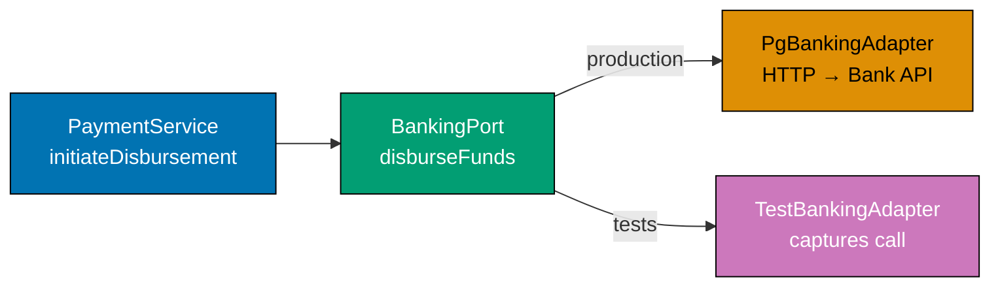
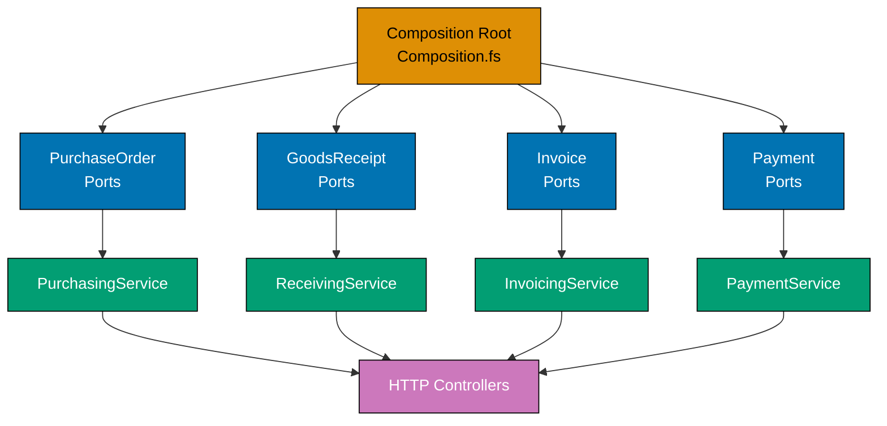

This advanced section adds the `receiving`, `invoicing`, and `payments` bounded contexts to the `purchasing` and `supplier` foundation established in the beginner and intermediate levels. Each example is self-contained and uses only `procurement-platform-be` domain names. F# port records follow the same shape as previous levels — records of function fields returning `Async<Result<_, _>>`.

## Multi-Context Ports (Examples 56–61)

### Example 56: Ports for the `receiving` Context — `GoodsReceiptRepository`

The `receiving` context has its own output port. `GoodsReceiptNote` aggregates are loaded and saved through a typed port record. The application service for registering goods receipt calls this port — it never imports the Postgres adapter module.

```fsharp
// ── Domain types for the receiving context ────────────────────────────────
module ProcurementPlatform.Domain.Receiving

type GoodsReceiptNoteId = GoodsReceiptNoteId of string
// => Strongly-typed wrapper — prevents passing a PurchaseOrderId where a GRN id is expected
// => Format: grn_<uuid>

type PurchaseOrderId = PurchaseOrderId of string
// => Repeated here: each context defines the IDs it needs; no shared kernel required

type ReceivedLine = {
    SkuCode     : string
    // => Product identifier matching the PO line — validated against PO before acceptance
    ReceivedQty : int
    // => Quantity counted at the dock — may differ from ordered quantity
    QcFlagged   : bool
    // => True when dock inspector marks the item as damaged or non-conforming
}

type GoodsReceiptNote = {
    Id              : GoodsReceiptNoteId
    // => Identity of this receipt — grn_<uuid>
    PurchaseOrderId : PurchaseOrderId
    // => The PO this receipt satisfies — triggers matching in invoicing context
    Lines           : ReceivedLine list
    // => One line per SKU received; list is non-empty by domain invariant
    ReceivedAt      : System.DateTimeOffset
    // => Timestamp from the Clock port — deterministic in tests
}

// ── GoodsReceiptRepository output port ────────────────────────────────────
// Defined in the Application zone — the Adapters zone implements it.
// The application service depends on this record type; it never imports Npgsql.

type GoodsReceiptRepository = {
    save : GoodsReceiptNote -> Async<Result<unit, string>>
    // => Persist the GRN; upsert semantics on the Id field
    // => Async: disk/network I/O is always effectful
    // => Result: returns Error string on infrastructure failure
    loadByPurchaseOrder : PurchaseOrderId -> Async<Result<GoodsReceiptNote list, string>>
    // => Returns all GRNs linked to a PO — needed for three-way match in invoicing
    // => Empty list is Ok, not Error — PO may not yet have received any goods
    loadById : GoodsReceiptNoteId -> Async<Result<GoodsReceiptNote option, string>>
    // => None when GRN does not exist — not an infrastructure error
}
// => This exact record type is the complete port contract for the receiving context

// ── Demonstration: application service accepting the port ─────────────────
let registerGoodsReceipt
    (repo  : GoodsReceiptRepository)
    (clock : unit -> System.DateTimeOffset)
    (poId  : PurchaseOrderId)
    (lines : ReceivedLine list)
    : Async<Result<GoodsReceiptNoteId, string>> =
    // => repo is the injected port — Postgres in production, Dictionary in tests
    async {
        if lines.IsEmpty then
            // => Domain invariant: a GRN must contain at least one received line
            return Error "GRN must have at least one received line"
            // => Return named error — caller receives a typed failure, not an exception
        else
            let grn = {
                Id              = GoodsReceiptNoteId (sprintf "grn_%s" (System.Guid.NewGuid().ToString()))
                // => ID generated at the application layer — domain has no UUID dependency
                PurchaseOrderId = poId
                Lines           = lines
                ReceivedAt      = clock ()
                // => Timestamp delegated to the injected clock port
            }
            let! result = repo.save grn
            // => Calls the port — no knowledge of what is behind the boundary
            return result |> Result.map (fun () -> grn.Id)
            // => Map the unit success to the new GRN identity for the caller
    }

printfn "GoodsReceiptRepository port defined — receiving context wired"
// => Output: GoodsReceiptRepository port defined — receiving context wired
```

**Key Takeaway**: Each bounded context owns its port record; the application service for `receiving` depends only on `GoodsReceiptRepository` — not on any purchasing or invoicing port.

**Why It Matters**: Sharing a single god-port record across contexts collapses the context boundaries and forces every adapter to implement fields it will never use. Separate port records per context keep each adapter small, auditable, and replaceable. When the GRN storage moves from Postgres to S3, only `PgGoodsReceiptRepository.fs` changes — no purchasing or invoicing code is touched.

---

### Example 57: Ports for the `invoicing` Context — `InvoiceRepository` and Three-Way Match

The `invoicing` context introduces `InvoiceRepository` and demonstrates the three-way match rule as a pure domain function. The match decision is computed entirely in the domain — no ports are called during the computation.

```fsharp
// ── Domain types for the invoicing context ────────────────────────────────
module ProcurementPlatform.Domain.Invoicing

type InvoiceId = InvoiceId of string
// => Format inv_<uuid> — never reuse a PO ID or GRN ID

type Money = { Amount: decimal; Currency: string }
// => Value object — amount >= 0, currency is 3-letter ISO 4217 code

type MatchStatus =
    | Matched
    // => Invoice amount within 2% tolerance of (GRN qty × PO unit price)
    | Disputed of string
    // => Match failed — carries the reason for the discrepancy

type Invoice = {
    Id              : InvoiceId
    PurchaseOrderId : string
    // => Links invoice to the PO for three-way match lookup
    InvoiceAmount   : Money
    // => Supplier's claimed amount — compared against computed PO value
    Status          : MatchStatus
    // => Derived from the match computation — not stored as a raw string
}

// ── Three-way match: pure domain function ─────────────────────────────────
// No ports called here — pure computation over domain values.
// The application service loads data via ports BEFORE calling this function.

let matchInvoice
    (invoiceAmount : decimal)
    (poValue       : decimal)
    (tolerance     : decimal)
    : MatchStatus =
    // => All three inputs are already-loaded domain values — no I/O inside
    let delta = abs (invoiceAmount - poValue)
    // => Absolute difference between invoice claim and expected value
    let maxAllowed = poValue * tolerance
    // => Tolerance window: default 2% (tolerance = 0.02m)
    if delta <= maxAllowed then
        Matched
        // => Invoice accepted — within tolerance, approved for payment scheduling
    else
        Disputed (sprintf "Invoice %M vs PO value %M exceeds %M%% tolerance"
                    invoiceAmount poValue (tolerance * 100m))
        // => Invoice disputed — supplier notifier will be triggered by the application service

// ── InvoiceRepository output port ─────────────────────────────────────────
type InvoiceRepository = {
    save   : Invoice -> Async<Result<unit, string>>
    // => Persist invoice — upsert on InvoiceId
    // => Async: database write is effectful
    loadById : InvoiceId -> Async<Result<Invoice option, string>>
    // => None when invoice does not exist — not an error
}
// => Separate from GoodsReceiptRepository — contexts do not share port records

// ── Application service: three-way match orchestration ────────────────────
// open FsToolkit.ErrorHandling — requires NuGet package FsToolkit.ErrorHandling
let matchAndSaveInvoice
    (invoiceRepo : InvoiceRepository)
    (inv         : Invoice)
    (poValue     : decimal)
    : Async<Result<Invoice, string>> =
    asyncResult {
        // => asyncResult { } — CE from FsToolkit; unwraps Result<_,_> automatically
        let matchResult = matchInvoice inv.InvoiceAmount.Amount poValue 0.02m
        // => Pure call — no I/O; deterministic given the same inputs
        let updatedInvoice = { inv with Status = matchResult }
        // => Apply the computed status to produce an updated invoice record
        do! invoiceRepo.save updatedInvoice
        // => Persist the matched/disputed invoice via the port
        return updatedInvoice
        // => Return the updated invoice to the calling HTTP adapter
    }
```

**Key Takeaway**: The three-way match rule is a pure domain function that takes decimal values and returns a `MatchStatus` — the application service calls ports to load data and then passes values to the domain function.

**Why It Matters**: Placing the match computation behind a port or inside a repository method couples the business rule to infrastructure and makes it untestable in isolation. As a pure function, `matchInvoice` is tested by calling it with numbers — no database, no adapter, no async machinery. Changing the tolerance from 2% to 5% requires editing one line of domain code and updating the tests that capture that rule.

---

### Example 58: `BankingPort` — Initiating a Disbursement

The `payments` context introduces `BankingPort` — the output port that initiates a disbursement via a bank's REST API. The port record exposes a single function; the production adapter makes the HTTP call while the test adapter captures the request for assertion.



```fsharp
// ── Domain types for the payments context ─────────────────────────────────
module ProcurementPlatform.Domain.Payments

type PaymentId = PaymentId of string
// => Format pay_<uuid> — unique identity for each disbursement attempt

type BankAccount = { IBAN: string; BIC: string }
// => Value object: IBAN format-validated, BIC is 8 or 11 characters

type DisbursementRequest = {
    PaymentId      : PaymentId
    // => Idempotency key — bank API uses this to deduplicate retried calls
    SupplierAccount: BankAccount
    // => Target account for the disbursement — validated by domain before calling port
    Amount         : decimal
    // => Amount in the PO's currency — must be positive
    Currency       : string
    // => ISO 4217 code — "USD", "IDR", etc.
}

type DisbursementError =
    | InsufficientFunds
    // => Bank returned a definitive rejection — do not retry
    | BankTimeout
    // => Bank did not respond within the SLA — may be safe to retry
    | BankUnavailable
    // => Bank circuit is open — retry after backoff period
    | InvalidAccountDetails of string
    // => IBAN or BIC was rejected by the bank — fix data, do not retry

// ── BankingPort output port ────────────────────────────────────────────────
// Single-function record — the application service depends only on this type.
// The production adapter makes an HTTP call; the test adapter records the call.

type BankingPort = {
    disburseFunds : DisbursementRequest -> Async<Result<string, DisbursementError>>
    // => Initiates disbursement; returns bank transaction reference on success
    // => DisbursementError is typed — caller can decide whether to retry
    // => The PaymentId field in the request provides idempotency for duplicate calls
}
// => This record is the entire contract between the payments application service
// => and the bank integration adapter

// ── Test adapter: captures calls without hitting the bank ─────────────────
let makeTestBankingAdapter () =
    // => Returns a BankingPort that records calls for assertion in tests
    let mutable capturedRequests = []
    // => Mutable list — mutation is confined inside this closure; callers see the port type only
    let port : BankingPort = {
        disburseFunds = fun req ->
            async {
                capturedRequests <- req :: capturedRequests
                // => Record the request for assertion after the test
                return Ok (sprintf "TEST-TXN-%s" (req.PaymentId |> (fun (PaymentId s) -> s)))
                // => Return a fake transaction reference — does not call the bank
            }
    }
    port, (fun () -> capturedRequests)
    // => Return the port AND a thunk to read captured requests — decoupled

// ── Demonstration: using the test adapter ─────────────────────────────────
let bank, getCaptured = makeTestBankingAdapter ()
let req = {
    PaymentId       = PaymentId "pay_test-001"
    SupplierAccount = { IBAN = "GB29NWBK60161331926819"; BIC = "NWBKGB2L" }
    Amount          = 5000m
    Currency        = "USD"
}
let txnRef = bank.disburseFunds req |> Async.RunSynchronously
// => txnRef : Result<string, DisbursementError> = Ok "TEST-TXN-pay_test-001"
printfn "Captured calls: %d" (getCaptured().Length)
// => Output: Captured calls: 1
```

**Key Takeaway**: `BankingPort` is a single-field record — `disburseFunds` — and the test adapter captures calls without a network connection, making payment service tests fully isolated.

**Why It Matters**: Banking integrations are the worst candidates for tight coupling — retries, idempotency keys, and partial-success scenarios make the adapter complex. Hiding this complexity behind a typed port record means the application service logic (schedule → disburse → record result) is testable by swapping one record field. The typed `DisbursementError` DU forces the caller to handle each case rather than catching a generic exception.

---

### Example 59: `SupplierNotifierPort` — SMTP and EDI Fallback

The `SupplierNotifierPort` sends notifications to suppliers when significant events occur: purchase order issued, goods receipt discrepancy detected, payment disbursed. The port exposes notification functions; the production adapter tries SMTP first and falls back to EDI if SMTP fails.

```fsharp
// ── Notification payload types ────────────────────────────────────────────
module ProcurementPlatform.Application.SupplierNotifier

type SupplierId = string
// => Identifies the supplier receiving the notification

type PurchaseOrderId = string
// => Referenced in notifications so the supplier can correlate to their records

type NotificationError =
    | SmtpFailure  of string
    // => SMTP transport rejected or timed out
    | EdiFailure   of string
    // => EDI fallback also failed — the notification was not delivered
    | UnknownSupplier of SupplierId
    // => Supplier ID not found in the notification routing table

// ── SupplierNotifierPort output port ──────────────────────────────────────
// Four distinct notification functions — one per event type from the domain.
// The record structure means the application service can call exactly the
// notification it needs without routing through a single generic method.

type SupplierNotifierPort = {
    notifyPoIssued          : SupplierId -> PurchaseOrderId -> Async<Result<unit, NotificationError>>
    // => Sent when PurchaseOrderIssued event fires — informs supplier of new PO
    // => Returns Ok unit on delivery; NotificationError on total failure
    notifyDiscrepancy       : SupplierId -> PurchaseOrderId -> string -> Async<Result<unit, NotificationError>>
    // => Sent when GoodsReceiptDiscrepancyDetected fires — third arg is discrepancy description
    // => Allows supplier to investigate before invoice is raised
    notifyPaymentDisbursed  : SupplierId -> string -> decimal -> Async<Result<unit, NotificationError>>
    // => Sent when PaymentDisbursed event fires — second arg is bank ref, third is amount
    // => Supplier can reconcile against their accounts receivable ledger
    notifyInvoiceDisputed   : SupplierId -> string -> Async<Result<unit, NotificationError>>
    // => Sent when InvoiceDisputed event fires — second arg is dispute reason
    // => Supplier can raise a corrected invoice or request a meeting
}
// => This record is injected into any application service that must notify suppliers

// ── SMTP + EDI fallback adapter ────────────────────────────────────────────
// The adapter wires the SMTP sender and the EDI sender at construction time.
// SMTP is primary; EDI fires only when SMTP returns an error.

let makeSmtpEdiAdapter (smtpSend : string -> string -> Async<Result<unit, string>>)
                        (ediSend  : string -> string -> Async<Result<unit, string>>)
                        : SupplierNotifierPort =
    // => smtpSend: (toAddress: string) -> (body: string) -> Async<Result<unit, string>>
    // => ediSend:  (supplierId: string) -> (message: string) -> Async<Result<unit, string>>
    let tryWithFallback toAddress body supplierId message =
        // => Try SMTP first; fall back to EDI on any SMTP error
        async {
            let! smtpResult = smtpSend toAddress body
            // => Attempt primary channel first
            match smtpResult with
            | Ok () ->
                return Ok ()
                // => SMTP delivered — no fallback needed
            | Error smtpErr ->
                let! ediResult = ediSend supplierId message
                // => SMTP failed — attempt EDI fallback
                return ediResult |> Result.mapError (fun ediErr ->
                    EdiFailure (sprintf "SMTP: %s; EDI: %s" smtpErr ediErr))
                // => If EDI also fails, wrap both error messages in EdiFailure
        }
    {
        notifyPoIssued = fun supplierId poId ->
            tryWithFallback
                (sprintf "%s@supplier.example" supplierId)
                (sprintf "Purchase Order %s has been issued to you." poId)
                supplierId
                (sprintf "PO_ISSUED|%s|%s" supplierId poId)
        // => SMTP body is human-readable; EDI message is pipe-delimited for machine parsing
        notifyDiscrepancy = fun supplierId poId reason ->
            tryWithFallback
                (sprintf "%s@supplier.example" supplierId)
                (sprintf "Discrepancy on PO %s: %s" poId reason)
                supplierId
                (sprintf "DISCREPANCY|%s|%s|%s" supplierId poId reason)
        notifyPaymentDisbursed = fun supplierId bankRef amount ->
            tryWithFallback
                (sprintf "%s@supplier.example" supplierId)
                (sprintf "Payment of %M disbursed, reference: %s" amount bankRef)
                supplierId
                (sprintf "PAYMENT_DISBURSED|%s|%s|%M" supplierId bankRef amount)
        // => EDI message encodes amount as decimal literal — no currency symbol
        notifyInvoiceDisputed = fun supplierId reason ->
            tryWithFallback
                (sprintf "%s@supplier.example" supplierId)
                (sprintf "Invoice disputed: %s" reason)
                supplierId
                (sprintf "INVOICE_DISPUTED|%s|%s" supplierId reason)
    }

printfn "SupplierNotifierPort constructed — SMTP primary, EDI fallback"
// => Output: SupplierNotifierPort constructed — SMTP primary, EDI fallback
```

**Key Takeaway**: `SupplierNotifierPort` names each notification event as a separate function field — the application service calls `notifyPoIssued`, not a generic `send` — and the SMTP+EDI fallback logic is entirely inside the adapter.

**Why It Matters**: A generic `send(body: string)` port hides whether the caller is notifying about a PO, a payment, or a dispute. Typed notification functions document intent at the call site and let the adapter construct appropriate payloads per event type. Fallback logic belongs in the adapter — the application service should not know that SMTP exists, let alone EDI.

---

### Example 60: `Observability` Port — Emitting Metrics and Traces

The `Observability` port is an output port that emits structured metrics and traces to an OpenTelemetry-compatible backend. The port is injected into application services; the production adapter wraps OpenTelemetry APIs while the test adapter captures emissions for assertion.

```fsharp
// ── Observability port ────────────────────────────────────────────────────
module ProcurementPlatform.Application.ObservabilityPort

type SpanName = string
// => Human-readable span identifier — "disbursement.initiate", "invoice.match", etc.

type MetricName = string
// => Metric identifier — "po.submitted.count", "payment.duration.ms", etc.

type Observability = {
    startSpan     : SpanName -> (unit -> unit) -> Async<Result<unit, unit>>
    // => Wraps a computation in a trace span
    // => First arg: span name; second arg: the work to perform inside the span
    // => Returns Ok unit when the computation completes; span is closed automatically
    recordCounter : MetricName -> int -> unit
    // => Increment a named counter by the given amount — synchronous, fire-and-forget
    // => Designed for event counts: "payment.initiated += 1"
    recordDuration: MetricName -> System.TimeSpan -> unit
    // => Record a duration measurement — synchronous, fire-and-forget
    // => Designed for latency histograms: "bank.api.latency"
}
// => This port is injected alongside domain ports — application service calls it
// => at the boundary between orchestration and port invocation

// ── Test adapter: captures observations ───────────────────────────────────
let makeTestObservability () =
    // => Returns an Observability port that records all calls for assertion
    let mutable spans     = []
    // => List of span names started during the test
    let mutable counters  = System.Collections.Generic.Dictionary<string, int>()
    // => Accumulated counter values: name -> total increments
    let mutable durations = []
    // => List of (name, duration) tuples recorded during the test
    let port : Observability = {
        startSpan = fun name work ->
            async {
                spans <- name :: spans
                // => Record that the span was started
                work ()
                // => Execute the wrapped computation inside the "span"
                return Ok ()
                // => Close the span — in production this sends trace data to OTEL
            }
        recordCounter = fun name delta ->
            let current = if counters.ContainsKey name then counters.[name] else 0
            counters.[name] <- current + delta
            // => Accumulate increments — test can assert total after service call
        recordDuration = fun name ts ->
            durations <- (name, ts) :: durations
            // => Record duration — test can assert latency was measured
    }
    port, (fun () -> spans, counters, durations)
    // => Return port and a thunk that exposes captured data for test assertions

// ── Application service: using Observability alongside BankingPort ─────────
// open FsToolkit.ErrorHandling — requires NuGet package FsToolkit.ErrorHandling
let initiateDisbursement
    (banking : BankingPort)
    (obs     : Observability)
    (req     : DisbursementRequest)
    : Async<Result<string, DisbursementError>> =
    asyncResult {
        obs.recordCounter "payment.initiated" 1
        // => Emit counter before attempting the bank call
        let start = System.DateTime.UtcNow
        // => Record start time for duration calculation
        let! txnRef = banking.disburseFunds req
        // => Call the BankingPort — may succeed or return DisbursementError
        let elapsed = System.DateTime.UtcNow - start
        obs.recordDuration "bank.api.latency" elapsed
        // => Emit latency measurement after the call completes
        obs.recordCounter "payment.succeeded" 1
        // => Emit success counter — distinct from initiated counter
        return txnRef
        // => Return the transaction reference to the HTTP adapter
    }

printfn "Observability port wired — metrics and traces emitted at port boundary"
// => Output: Observability port wired — metrics and traces emitted at port boundary
```

**Key Takeaway**: `Observability` is an output port like any other — injected into the application service, swapped for a capturing adapter in tests, and never referenced from the domain layer.

**Why It Matters**: Embedding `OpenTelemetry.Tracer.StartActiveSpan(...)` directly in the application service creates a hard dependency on the OpenTelemetry SDK — every test requires the SDK to be initialised. An `Observability` port record breaks that dependency: tests inject a capturing adapter that records span names and counter increments without any SDK initialisation. Observability coverage is then verifiable by assertion, not by manual log inspection.

---

### Example 61: Multi-Context Composition Root — Wiring Four Contexts

The composition root for the `procurement-platform-be` wires all four advanced contexts — `purchasing`, `receiving`, `invoicing`, and `payments` — by constructing each adapter and assembling each port record. No application service module is aware of other application service modules.



```fsharp
// ── Composition.fs — the single file that knows all adapters ─────────────
// Every other module depends on types (ports, domain), not on other modules.
// This file is the ONLY place where concrete adapter module names appear.

module ProcurementPlatform.Composition

// ── Build shared infrastructure ────────────────────────────────────────────
let connString = System.Environment.GetEnvironmentVariable "DATABASE_URL"
// => Connection string from environment — never hard-coded in source
let clock : Clock = fun () -> System.DateTimeOffset.UtcNow
// => System clock adapter — production-grade; swapped for fixed clock in tests
let obs   : Observability = OpenTelemetryAdapter.build ()
// => OpenTelemetry adapter — sends metrics and traces to OTEL collector

// ── Purchasing context ports ───────────────────────────────────────────────
let purchasingPorts : PurchasingPorts = {
    PurchaseOrderRepository = PgPurchaseOrderRepository.build connString
    // => Postgres adapter: save/load PurchaseOrder records
    SupplierRepository      = PgSupplierRepository.build connString
    // => Postgres adapter: query approved supplier list
    EventPublisher          = OutboxEventPublisher.build connString
    // => Outbox adapter: writes events to the outbox table atomically with the PO
    ApprovalRouterPort      = WorkflowEngineAdapter.build ()
    // => Workflow engine adapter: routes approval requests to the right manager
    Clock                   = clock
    // => Shared clock — purchasing and all other services use the same adapter
    Observability           = obs
    // => Shared observability — all service calls emit to the same OTEL backend
}

// ── Receiving context ports ────────────────────────────────────────────────
let receivingPorts : ReceivingPorts = {
    GoodsReceiptRepository  = PgGoodsReceiptRepository.build connString
    // => Separate Postgres adapter for GRN table — not shared with purchasing
    PurchaseOrderRepository = PgPurchaseOrderRepository.build connString
    // => Purchasing repo needed to verify PO exists before accepting GRN
    // => This is NOT a circular dependency — each context gets its own adapter instance
    SupplierNotifier        = SmtpEdiNotifierAdapter.build ()
    // => Shared notifier adapter — notifyDiscrepancy called on QC failure
    EventPublisher          = OutboxEventPublisher.build connString
    Clock                   = clock
    Observability           = obs
}

// ── Invoicing context ports ────────────────────────────────────────────────
let invoicingPorts : InvoicingPorts = {
    InvoiceRepository       = PgInvoiceRepository.build connString
    GoodsReceiptRepository  = PgGoodsReceiptRepository.build connString
    // => Invoicing reads GRNs for three-way match — cross-context port reference
    PurchaseOrderRepository = PgPurchaseOrderRepository.build connString
    // => Invoicing reads PO for unit prices in the match computation
    SupplierNotifier        = SmtpEdiNotifierAdapter.build ()
    // => notifyInvoiceDisputed called when match fails
    EventPublisher          = OutboxEventPublisher.build connString
    Clock                   = clock
    Observability           = obs
}

// ── Payments context ports ─────────────────────────────────────────────────
let paymentPorts : PaymentPorts = {
    PaymentRepository = PgPaymentRepository.build connString
    // => Postgres adapter: save/load Payment records
    BankingPort       = RetryBankingAdapter.wrap (HttpBankingAdapter.build ())
    // => HTTP banking adapter wrapped in a retry decorator — see Example 62
    SupplierNotifier  = SmtpEdiNotifierAdapter.build ()
    // => notifyPaymentDisbursed called after successful disbursement
    EventPublisher    = OutboxEventPublisher.build connString
    Observability     = obs
}

printfn "Composition root wired — all four contexts ready"
// => Output: Composition root wired — all four contexts ready
```

**Key Takeaway**: The composition root is the only file in the codebase that names concrete adapter modules — all other modules depend on port record types, keeping contexts isolated and adapters replaceable.

**Why It Matters**: When every module can import every other module, replacing the GRN storage mechanism requires reading all files to find every dependency. With a composition root that owns all wiring, the change surface for any infrastructure swap is exactly one file. The composition root is also where environment variables are read — no adapter module calls `GetEnvironmentVariable` directly.

---

## Adapter Patterns (Examples 62–67)

### Example 62: Retry Adapter — Decorator over `BankingPort`

A retry adapter wraps `BankingPort` via function composition. The wrapper retries `BankTimeout` errors up to a configured limit and passes all other errors and successes through unchanged. The application service receives a plain `BankingPort` record — it has no knowledge that retries are happening.

```fsharp
// ── Retry configuration ───────────────────────────────────────────────────
type RetryConfig = {
    MaxAttempts : int
    // => Maximum number of attempts including the first — 1 means no retries
    DelayMs     : int
    // => Milliseconds between retry attempts — not exponential in this example
}
// => RetryConfig is injected into the decorator — callers can tune retry behaviour

// ── Retry decorator ────────────────────────────────────────────────────────
// wrap: BankingPort -> RetryConfig -> BankingPort
// The outer BankingPort wraps the inner BankingPort.
// Callers receive a BankingPort — they cannot tell whether it retries or not.

let wrapWithRetry (inner: BankingPort) (cfg: RetryConfig) : BankingPort =
    // => inner: the real banking port (HTTP adapter in production, spy in tests)
    // => cfg: retry policy — injected so tests can set MaxAttempts = 1
    let disburseFundsWithRetry (req: DisbursementRequest) =
        // => Returns the same type as BankingPort.disburseFunds — transparent wrapping
        async {
            let rec attempt n =
                // => n: remaining attempt count — starts at cfg.MaxAttempts
                async {
                    let! result = inner.disburseFunds req
                    // => Call the inner adapter — may succeed or return an error
                    match result with
                    | Ok txnRef ->
                        return Ok txnRef
                        // => Success — return immediately, no retry
                    | Error BankTimeout when n > 1 ->
                        // => BankTimeout is the only retryable error — retry with delay
                        do! Async.Sleep cfg.DelayMs
                        // => Wait before retrying — prevents hammering the bank API
                        return! attempt (n - 1)
                        // => Recurse with decremented attempt counter
                    | Error err ->
                        return Error err
                        // => Non-retryable error (InsufficientFunds, BankUnavailable, etc.)
                        // => Pass through immediately — no retry
                }
            return! attempt cfg.MaxAttempts
            // => Start with the full attempt count
        }
    { disburseFunds = disburseFundsWithRetry }
    // => Return a new BankingPort record with the wrapped function
    // => The outer port is indistinguishable from the inner port by type

// ── Demonstration: composing the retry decorator ───────────────────────────
let httpAdapter : BankingPort = { disburseFunds = fun _ -> async { return Ok "TXN-001" } }
// => Simplified HTTP adapter — returns success immediately

let retryAdapter = wrapWithRetry httpAdapter { MaxAttempts = 3; DelayMs = 500 }
// => Compose: retryAdapter wraps httpAdapter with 3 attempts, 500ms delay
// => retryAdapter is a BankingPort — callers cannot distinguish it from httpAdapter

let result = retryAdapter.disburseFunds {
    PaymentId       = PaymentId "pay_test-002"
    SupplierAccount = { IBAN = "GB29NWBK60161331926819"; BIC = "NWBKGB2L" }
    Amount          = 10000m
    Currency        = "USD"
} |> Async.RunSynchronously
// => result : Result<string, DisbursementError> = Ok "TXN-001"
printfn "Retry adapter result: %A" result
// => Output: Retry adapter result: Ok "TXN-001"
```

**Key Takeaway**: The retry decorator is itself a `BankingPort` record — composed by passing the inner port to `wrapWithRetry` — and the application service receives only the outer record, with no knowledge of retry behaviour.

**Why It Matters**: Retry logic embedded in the application service mixes infrastructure concerns (network retries, timeouts, backoff) with business logic (when to disburse, what to record). The decorator pattern keeps retry behaviour in the adapter layer, where it belongs. Changing the retry policy — adding exponential backoff, changing attempt limits — requires modifying one adapter module, not touching application services or domain code.

---

### Example 63: Circuit Breaker Adapter — Wrapping `BankingPort`

A circuit breaker tracks consecutive failures and stops forwarding calls when the failure count exceeds a threshold. Like the retry adapter, the circuit breaker is itself a `BankingPort` record — the application service cannot see the difference.

```fsharp
// ── Circuit breaker state ─────────────────────────────────────────────────
type CircuitState =
    | Closed
    // => Normal operation — calls are forwarded to the inner adapter
    | Open
    // => Tripped — calls return BankUnavailable immediately without forwarding
    | HalfOpen
    // => Probe state — one call forwarded; if it succeeds, circuit returns to Closed

// ── Circuit breaker adapter ────────────────────────────────────────────────
let wrapWithCircuitBreaker (inner: BankingPort) (threshold: int) : BankingPort =
    // => inner: the BankingPort to protect (may be the retry-wrapped adapter)
    // => threshold: consecutive failure count that trips the circuit
    let mutable state            = Closed
    // => Initial state: Closed — calls are forwarded
    let mutable consecutiveFails = 0
    // => Reset to 0 on any success; incremented on any failure
    { disburseFunds = fun req ->
        async {
            match state with
            | Open ->
                // => Circuit is tripped — return immediately without calling inner
                return Error BankUnavailable
                // => Application service handles BankUnavailable as a non-retryable error
            | Closed | HalfOpen ->
                let! result = inner.disburseFunds req
                // => Forward the call — circuit is either normal or probing
                match result with
                | Ok txnRef ->
                    state            <- Closed
                    // => Reset circuit on success — normal operation restored
                    consecutiveFails <- 0
                    // => Reset consecutive failure counter
                    return Ok txnRef
                | Error err ->
                    consecutiveFails <- consecutiveFails + 1
                    // => Increment failure counter — may trip the circuit
                    if consecutiveFails >= threshold then
                        state <- Open
                        // => Circuit tripped — block future calls until probe succeeds
                    return Error err
                    // => Propagate the error to the caller regardless of circuit state
        }
    }
// => wrapWithCircuitBreaker returns a BankingPort — composable with the retry adapter

// ── Composing retry + circuit breaker ─────────────────────────────────────
let httpAdapter  : BankingPort = { disburseFunds = fun _ -> async { return Ok "TXN-CB-001" } }
let withRetry    = wrapWithRetry httpAdapter { MaxAttempts = 2; DelayMs = 100 }
// => Retry decorator applied first — closest to the real adapter
let withBreaker  = wrapWithCircuitBreaker withRetry 5
// => Circuit breaker applied outermost — trips after 5 consecutive failures
// => Application service receives withBreaker; it is indistinguishable from httpAdapter by type

printfn "Circuit breaker composed over retry adapter"
// => Output: Circuit breaker composed over retry adapter
```

**Key Takeaway**: Stacking retry and circuit-breaker decorators over `BankingPort` via function composition requires zero changes to the application service — the composed adapter is still just a `BankingPort` record.

**Why It Matters**: Circuit breakers and retries implemented inside the application service turn business orchestration into infrastructure policy management. The composition root decides which decorators to stack; application services express only business intent. When the SRE team wants to add a bulkhead limiter, they add one more decorator function in the composition root — no application service changes required.

---

### Example 64: Anti-Corruption Layer at the `BankingPort` Boundary

The bank's REST API returns a vendor-specific response schema. The anti-corruption layer (ACL) adapter translates between the vendor schema and the `DisbursementRequest`/`DisbursementError` domain types. The domain never sees the bank's field names.

```fsharp
// ── Bank API vendor schema (external, owned by the bank) ──────────────────
// These types mirror the bank's JSON API exactly.
// They live in the Adapters zone — never in Domain or Application.

type BankApiRequest = {
    reference_id  : string
    // => Bank's field for the idempotency key — our domain calls it PaymentId
    account_iban  : string
    // => Bank's field for the target IBAN — our domain calls it SupplierAccount.IBAN
    account_bic   : string
    // => Bank's field for the BIC — our domain calls it SupplierAccount.BIC
    amount_cents  : int64
    // => Bank works in integer cents — our domain works in decimal currency units
    currency_code : string
    // => Bank uses "USD", "IDR" — same as our ISO 4217 currency code
}

type BankApiResponse = {
    transaction_ref : string option
    // => Populated on success — our domain calls this the transaction reference
    error_code      : string option
    // => Populated on failure — codes like "INSUFFICIENT_FUNDS", "TIMEOUT"
    error_message   : string option
    // => Human-readable description — logged but not propagated to domain
}

// ── ACL translation functions ──────────────────────────────────────────────
// These functions live in the adapter module — not in domain or application.

let toDomainError (apiResp: BankApiResponse) : DisbursementError =
    // => Translate the bank's error_code to our typed DisbursementError DU
    match apiResp.error_code with
    | Some "INSUFFICIENT_FUNDS" ->
        InsufficientFunds
        // => Bank definitively rejected — domain does not retry
    | Some "TIMEOUT" ->
        BankTimeout
        // => Bank did not respond — domain may retry via the retry decorator
    | Some "INVALID_ACCOUNT" ->
        InvalidAccountDetails (apiResp.error_message |> Option.defaultValue "unknown")
        // => Account details rejected — domain must fix data before retrying
    | _ ->
        BankUnavailable
        // => Unknown error code — treat conservatively as unavailable

let toApiRequest (req: DisbursementRequest) : BankApiRequest =
    // => Translate our domain DisbursementRequest to the bank's JSON schema
    { reference_id  = req.PaymentId |> (fun (PaymentId s) -> s)
      // => Unwrap the PaymentId DU to get the raw string for the bank's reference_id
      account_iban  = req.SupplierAccount.IBAN
      account_bic   = req.SupplierAccount.BIC
      amount_cents  = int64 (req.Amount * 100m)
      // => Convert decimal dollars to integer cents — bank API expects cents
      currency_code = req.Currency }

// ── HTTP banking adapter with ACL ─────────────────────────────────────────
let makeHttpBankingAdapter (httpPost : BankApiRequest -> Async<BankApiResponse>) : BankingPort =
    // => httpPost: injected HTTP call function — can be swapped for a stub in tests
    { disburseFunds = fun req ->
        async {
            let apiReq = toApiRequest req
            // => Translate domain request to bank API schema — ACL translation
            let! apiResp = httpPost apiReq
            // => Make the HTTP call — may time out or return error codes
            match apiResp.transaction_ref with
            | Some txnRef ->
                return Ok txnRef
                // => Successful disbursement — return bank's transaction reference
            | None ->
                return Error (toDomainError apiResp)
                // => Failure — translate bank error code to domain error type
        }
    }

printfn "ACL adapter built — bank vendor schema never leaks into domain or application"
// => Output: ACL adapter built — bank vendor schema never leaks into domain or application
```

**Key Takeaway**: The ACL functions `toApiRequest` and `toDomainError` live entirely inside the adapter module — the domain and application layers never import or reference the bank's vendor types.

**Why It Matters**: Without an ACL, the bank's field names (`reference_id`, `amount_cents`, `error_code`) appear in the application service and sometimes in the domain. When the bank upgrades their API and renames `amount_cents` to `amount_in_minor_units`, the change propagates throughout the codebase. With an ACL in the adapter, the rename is one line in one file — `toApiRequest` is updated; domain and application code are untouched.

---

### Example 65: Port Versioning at the Composition Root

When a port contract needs to evolve — adding a new function to `SupplierNotifierPort` — the composition root supports both the old and new adapter simultaneously by constructing the new adapter for new contexts while retaining the old adapter for legacy consumers. The application service for each context receives the version of the port it was written against.

```fsharp
// ── Version 1 of SupplierNotifierPort (original) ─────────────────────────
type SupplierNotifierPortV1 = {
    notifyPoIssued        : string -> string -> Async<Result<unit, NotificationError>>
    // => V1: sends PO-issued notification — first version of the port
    notifyDiscrepancy     : string -> string -> string -> Async<Result<unit, NotificationError>>
    // => V1: sends discrepancy notification — original signature
}

// ── Version 2 of SupplierNotifierPort (extended) ──────────────────────────
type SupplierNotifierPortV2 = {
    notifyPoIssued        : string -> string -> Async<Result<unit, NotificationError>>
    // => V2: same signature as V1 — existing callers are unaffected
    notifyDiscrepancy     : string -> string -> string -> Async<Result<unit, NotificationError>>
    // => V2: same signature as V1 — existing callers are unaffected
    notifyPaymentDisbursed: string -> string -> decimal -> Async<Result<unit, NotificationError>>
    // => V2: NEW field — only contexts written against V2 can call this
    notifyInvoiceDisputed : string -> string -> Async<Result<unit, NotificationError>>
    // => V2: NEW field — only contexts written against V2 can call this
}

// ── Adapter that satisfies V2 (also satisfies V1 structurally) ────────────
let buildSmtpV2Adapter () : SupplierNotifierPortV2 =
    // => Returns V2 port; composition root passes V1 fields to V1 consumers if needed
    {
        notifyPoIssued         = fun suppId poId   -> async { return Ok () }
        // => Simplified implementation — production reads supplier email from DB
        notifyDiscrepancy      = fun suppId poId r -> async { return Ok () }
        notifyPaymentDisbursed = fun suppId ref amt -> async { return Ok () }
        // => New in V2 — calls the payment disbursement email template
        notifyInvoiceDisputed  = fun suppId reason -> async { return Ok () }
        // => New in V2 — calls the invoice dispute email template
    }

// ── Composition root: pass V1 subset to old context, V2 to new context ────
let v2Adapter = buildSmtpV2Adapter ()
// => Single adapter instance satisfies both V1 and V2

let purchasingNotifier : SupplierNotifierPortV1 = {
    notifyPoIssued    = v2Adapter.notifyPoIssued
    // => Purchasing context was written against V1 — receives only V1 fields
    notifyDiscrepancy = v2Adapter.notifyDiscrepancy
    // => V1 field forwarded from the V2 adapter — signature is identical
}

let paymentNotifier : SupplierNotifierPortV2 = v2Adapter
// => Payment context was written against V2 — receives the full V2 port
// => New V2 fields (notifyPaymentDisbursed, notifyInvoiceDisputed) are now accessible

printfn "Port versioning wired — V1 consumers unaffected, V2 consumers gain new functions"
// => Output: Port versioning wired — V1 consumers unaffected, V2 consumers gain new functions
```

**Key Takeaway**: Port versioning at the composition root lets old consumers receive a narrowed subset of the new port while new consumers access the full V2 record — no application service changes required for the old consumers.

**Why It Matters**: Extending a shared port interface in OOP requires all implementors to add the new method even if they never use it. In F# record composition, the composition root can project a subset of a V2 adapter into a V1 consumer by constructing the V1 record from the V2 adapter's fields. Old tests continue to pass; new functionality is opt-in per context.

---

### Example 66: Outbox Pattern at the Adapter Level

The outbox pattern ensures that domain events are persisted in the same database transaction as the aggregate write. The application service calls the `EventPublisher` port; the outbox adapter writes to an `outbox` table instead of Kafka. A separate background worker polls the outbox and forwards events to Kafka.

```fsharp
// ── EventPublisher output port ─────────────────────────────────────────────
// Defined in Application zone — adapters implement it.
// The outbox adapter and the direct Kafka adapter both satisfy this type.

type EventPublisher = {
    publish : DomainEvent -> Async<Result<unit, string>>
    // => Emit a domain event — caller does not know whether it goes to Kafka or outbox
    // => Async: publishing is effectful (network or database write)
}

// ── Outbox event table row (adapter-side type — never in domain) ──────────
type OutboxRow = {
    EventId      : System.Guid
    // => Unique event identifier — used for deduplication in the Kafka publisher
    EventType    : string
    // => Discriminated union case name — "PurchaseOrderIssued", "GoodsReceived", etc.
    Payload      : string
    // => JSON-serialised event payload — adapter serialises; domain never sees JSON
    CreatedAt    : System.DateTimeOffset
    // => Timestamp of the write — used for ordering and retention policies
    Published    : bool
    // => False until the background worker forwards the event to Kafka
}

// ── Outbox adapter (simplified) ────────────────────────────────────────────
let makeOutboxAdapter (insertRow : OutboxRow -> Async<Result<unit, string>>) : EventPublisher =
    // => insertRow: function that writes to the outbox table — injected for testability
    { publish = fun event ->
        async {
            let row = {
                EventId   = System.Guid.NewGuid ()
                // => Fresh UUID — deduplication key for the Kafka publisher
                EventType = sprintf "%A" event
                // => Use F# reflection to get the DU case name as a string
                Payload   = sprintf "%A" event
                // => Simplified serialisation — production uses System.Text.Json
                CreatedAt = System.DateTimeOffset.UtcNow
                // => Wall-clock time — in production use the injected Clock port
                Published = false
                // => Unpublished until the background worker picks it up
            }
            return! insertRow row
            // => Write to the outbox table — fails atomically if the main TX rolls back
        }
    }

// ── Background worker: outbox → Kafka ─────────────────────────────────────
// This is a separate application concern — the domain and application services
// do not know it exists. It polls the outbox table and forwards events to Kafka.

let runOutboxWorker
    (pollUnpublished : unit  -> Async<Result<OutboxRow list, string>>)
    (kafkaPublish    : string -> string -> Async<Result<unit, string>>)
    (markPublished   : System.Guid -> Async<Result<unit, string>>)
    : Async<unit> =
    // => pollUnpublished: reads rows where Published = false
    // => kafkaPublish:    (eventType, payload) -> sends to Kafka topic
    // => markPublished:   updates Published = true in the outbox table
    async {
        let! rowsResult = pollUnpublished ()
        // => Fetch all unpublished events in insertion order
        match rowsResult with
        | Error err ->
            printfn "Outbox poll error: %s" err
            // => Log and continue — the worker retries on the next poll cycle
        | Ok rows ->
            for row in rows do
                let! kafkaResult = kafkaPublish row.EventType row.Payload
                // => Forward event to Kafka — may fail if Kafka is temporarily down
                match kafkaResult with
                | Ok () ->
                    let! _ = markPublished row.EventId
                    // => Mark as published only after successful Kafka delivery
                    ()
                | Error err ->
                    printfn "Kafka publish failed for %A: %s" row.EventId err
                    // => Leave Published = false — worker will retry on the next poll cycle
    }

printfn "Outbox adapter wired — domain events persist atomically with aggregate writes"
// => Output: Outbox adapter wired — domain events persist atomically with aggregate writes
```

**Key Takeaway**: The outbox adapter satisfies `EventPublisher` by writing to a database table — the application service cannot tell the difference between the outbox adapter and the direct Kafka adapter.

**Why It Matters**: Publishing to Kafka inside the same function that saves the aggregate creates a distributed transaction problem — the aggregate write may succeed while the Kafka publish fails, leaving the system in an inconsistent state. The outbox adapter writes the event to the same database as the aggregate in a single transaction; eventual consistency to Kafka is handled by the background worker. The application service is unaware of this split.

---

## Cross-Context Integration (Examples 67–72)

### Example 67: Cross-Context Event — `GoodsReceived` Triggers Invoicing

The `GoodsReceived` domain event is published by the `receiving` context and consumed by the `invoicing` context via an `EventConsumer` adapter. The invoicing application service is invoked by the consumer; it loads the invoice and GRN via its own ports without any direct module dependency on the receiving context.

```fsharp
// ── EventConsumer primary (driving) adapter ────────────────────────────────
// The EventConsumer reads from Kafka and calls the appropriate application service.
// It is a driving adapter — it drives the application from the outside.
// It is NOT an output port — it is the entry point, like an HTTP controller.

type GoodsReceivedEvent = {
    GrnId           : string
    // => Identity of the GRN that was accepted — invoicing uses this to look up lines
    PurchaseOrderId : string
    // => PO that the GRN satisfies — invoicing uses this to load PO unit prices
    ReceivedAt      : System.DateTimeOffset
    // => Timestamp of receipt — invoicing records this for the matching audit trail
}

// ── Invoicing application service triggered by GoodsReceived ──────────────
// open FsToolkit.ErrorHandling — requires NuGet package FsToolkit.ErrorHandling
let handleGoodsReceived
    (invoicePorts  : InvoicingPorts)
    (event         : GoodsReceivedEvent)
    : Async<Result<unit, string>> =
    // => invoicePorts: the full InvoicingPorts record — loaded from the composition root
    // => event: the GoodsReceivedEvent consumed from Kafka — NOT a domain type from receiving
    asyncResult {
        let grnId = GoodsReceiptNoteId event.GrnId
        // => Translate the Kafka event field to the invoicing context's own GRN identity type
        // => This is the anti-corruption boundary: the Kafka event is external; the GRN type is internal
        let! grn = invoicePorts.GoodsReceiptRepository.loadById grnId
        // => Load the GRN via the invoicing context's own port — no direct receiving module import
        match grn with
        | None ->
            return! Error (sprintf "GRN %s not found for invoicing" event.GrnId)
            // => GRN missing — invoicing cannot proceed; log and dead-letter the event
        | Some grnData ->
            let! invoice = invoicePorts.InvoiceRepository.loadById (InvoiceId (sprintf "inv_%s" event.PurchaseOrderId))
            // => Check whether an invoice already exists for this PO
            match invoice with
            | Some _ ->
                return Ok ()
                // => Invoice already exists — event was a duplicate; idempotent success
            | None ->
                let draftInvoice = {
                    Id              = InvoiceId (sprintf "inv_%s" (System.Guid.NewGuid().ToString()))
                    PurchaseOrderId = event.PurchaseOrderId
                    InvoiceAmount   = { Amount = 0m; Currency = "USD" }
                    // => Amount is zero until the supplier submits the actual invoice
                    Status          = Matched
                    // => Placeholder — actual status is set when invoice is registered
                }
                do! invoicePorts.InvoiceRepository.save draftInvoice
                // => Persist the draft invoice — ready for the supplier to complete
                return ()
    }

printfn "GoodsReceived event handler wired — receiving and invoicing contexts remain independent"
// => Output: GoodsReceived event handler wired — receiving and invoicing contexts remain independent
```

**Key Takeaway**: The `EventConsumer` adapter translates the Kafka event into a plain record and calls the invoicing application service — the invoicing context loads data via its own ports, never importing the receiving context's modules.

**Why It Matters**: Allowing the invoicing context to call the receiving context's service functions creates direct module coupling. When the receiving context's service changes its signature, the invoicing context breaks. Publishing a domain event and consuming it through a typed adapter record keeps both contexts deployable independently. The Kafka event is the contract — not the service function signature.

---

### Example 68: Three-Way Match Across Context Ports

The three-way match for an invoice requires data from three sources: the PO (from `purchasing`), the GRN (from `receiving`), and the invoice (from `invoicing`). The invoicing application service loads all three via its own ports — it does not call purchasing or receiving services.

```fsharp
// ── Three-way match orchestration ─────────────────────────────────────────
// open FsToolkit.ErrorHandling — requires NuGet package FsToolkit.ErrorHandling
let performThreeWayMatch
    (ports      : InvoicingPorts)
    (invoiceId  : InvoiceId)
    : Async<Result<MatchStatus, string>> =
    asyncResult {
        // Step 1: Load the invoice ────────────────────────────────────────
        let! invoiceOpt = ports.InvoiceRepository.loadById invoiceId
        // => Invoicing port — loads the registered invoice to be matched
        let! invoice = invoiceOpt |> Result.ofOption "Invoice not found" |> Async.singleton
        // => Unwrap the option — missing invoice is a business error, not infrastructure failure

        // Step 2: Load the GRN via the invoicing context's GRN port ───────
        let poId = invoice.PurchaseOrderId
        let! grns = ports.GoodsReceiptRepository.loadByPurchaseOrder (PurchaseOrderId poId)
        // => Receiving data loaded via invoicing's own GRN port — no receiving module import
        if grns.IsEmpty then
            return! Error "No GRNs found for PO — cannot perform three-way match"
            // => No goods received yet — match cannot proceed; invoice waits

        // Step 3: Load the PO via the invoicing context's PO port ─────────
        let! poOpt = ports.PurchaseOrderRepository.load (PurchaseOrderId poId)
        // => Purchasing data loaded via invoicing's own PO port — no purchasing module import
        let! po = poOpt |> Result.ofOption "PO not found for match" |> Async.singleton

        // Step 4: Compute expected value from GRN quantities and PO prices ─
        let totalReceivedValue =
            grns
            |> List.collect (fun grn -> grn.Lines)
            // => Flatten all lines from all GRNs for this PO
            |> List.sumBy (fun line ->
                let unitPrice = 50m
                // => Simplified: production looks up unit price per SKU from the PO lines
                decimal line.ReceivedQty * unitPrice)
            // => Expected invoice value = sum of (qty × unit price) across all received lines

        // Step 5: Run the pure match function ─────────────────────────────
        let status = matchInvoice invoice.InvoiceAmount.Amount totalReceivedValue 0.02m
        // => Pure domain function — no I/O; deterministic given the three values

        // Step 6: Persist the match result ─────────────────────────────────
        let updatedInvoice = { invoice with Status = status }
        do! ports.InvoiceRepository.save updatedInvoice
        // => Save the match result — status is now Matched or Disputed

        return status
        // => Return the match decision to the calling HTTP adapter or EventConsumer
    }

printfn "Three-way match orchestrated — purchasing, receiving, invoicing ports loaded independently"
// => Output: Three-way match orchestrated — purchasing, receiving, invoicing ports loaded independently
```

**Key Takeaway**: The invoicing application service loads PO and GRN data via its own port fields — the pure match function receives plain decimal values, keeping the business rule free of port calls.

**Why It Matters**: Splitting the computation into port calls (Steps 1-3), calculation (Step 4), pure business rule (Step 5), and persistence (Step 6) makes each step independently testable. Unit tests can verify the match rule without ports; integration tests can verify port loading without the match rule; only E2E tests exercise the full chain. This decomposition reduces test surface overlap and accelerates debugging when a match fails.

---

### Example 69: `PaymentScheduled` — Payments Context Consumes `InvoiceMatched`

When `InvoiceMatched` is published by the invoicing context, the payments context schedules a disbursement. The payments `EventConsumer` translates the Kafka event into a `Payment` aggregate and calls the payments application service.

```fsharp
// ── InvoiceMatchedEvent — the Kafka contract ──────────────────────────────
// This type lives in the EventConsumer adapter — not in domain or application.
// It mirrors the JSON schema of the InvoiceMatched Kafka message.

type InvoiceMatchedEvent = {
    InvoiceId       : string
    // => Identity of the matched invoice — payments uses this to trace the disbursement
    PurchaseOrderId : string
    // => PO the invoice covers — payments uses this to look up the supplier account
    InvoiceAmount   : decimal
    // => Amount to disburse — carried in the event to avoid a round-trip to the invoice store
    Currency        : string
    // => ISO 4217 — USD, IDR, etc.
    SupplierId      : string
    // => Supplier identifier — payments uses this to resolve the BankAccount
}

// ── Payment application service: schedule disbursement ────────────────────
// open FsToolkit.ErrorHandling — requires NuGet package FsToolkit.ErrorHandling
let schedulePayment
    (ports  : PaymentPorts)
    (event  : InvoiceMatchedEvent)
    : Async<Result<PaymentId, string>> =
    asyncResult {
        // Step 1: Check for duplicate payment (idempotency guard) ─────────
        let paymentId = PaymentId (sprintf "pay_%s" event.InvoiceId)
        // => Deterministic ID derived from invoice ID — same event always produces same payment ID
        let! existing = ports.PaymentRepository.loadById paymentId
        // => Check if this invoice has already been scheduled for payment
        if existing.IsSome then
            return paymentId
            // => Already scheduled — idempotent success; return existing ID

        // Step 2: Resolve the supplier's bank account ──────────────────────
        let supplierAccount = { IBAN = "GB29NWBK60161331926819"; BIC = "NWBKGB2L" }
        // => Simplified: production loads BankAccount from SupplierRepository by SupplierId
        // => BankAccount is validated at onboarding; payments context trusts the stored value

        // Step 3: Build and save the Payment aggregate ─────────────────────
        let payment = {
            Id              = paymentId
            // => Deterministic PaymentId — no UUID generation needed here
            SupplierAccount = supplierAccount
            Amount          = event.InvoiceAmount
            Currency        = event.Currency
            Status          = "Scheduled"
            // => Initial state: Scheduled → Disbursed → Remitted per the payments FSM
        }
        do! ports.PaymentRepository.save payment
        // => Persist the scheduled payment — BankingPort not yet called

        // Step 4: Initiate disbursement via BankingPort ────────────────────
        let req = {
            PaymentId       = paymentId
            SupplierAccount = supplierAccount
            Amount          = event.InvoiceAmount
            Currency        = event.Currency
        }
        let! txnRef = ports.BankingPort.disburseFunds req
        // => Call the BankingPort — wrapped in retry + circuit breaker in production
        // => On BankTimeout: retry decorator handles retries transparently
        // => On BankUnavailable: circuit breaker returns Error immediately

        // Step 5: Update payment status and notify supplier ────────────────
        let disbursedPayment = { payment with Status = sprintf "Disbursed:%s" txnRef }
        do! ports.PaymentRepository.save disbursedPayment
        // => Update payment record with bank transaction reference and Disbursed status
        do! ports.SupplierNotifier.notifyPaymentDisbursed event.SupplierId txnRef event.InvoiceAmount
        // => Notify supplier that payment has been sent — SMTP primary, EDI fallback
        do! ports.EventPublisher.publish (PaymentDisbursed { PaymentId = paymentId; TxnRef = txnRef })
        // => Publish PaymentDisbursed event — consumed by purchasing to update PO status

        return paymentId
        // => Return the PaymentId to the EventConsumer adapter for acknowledgement
    }

printfn "Payment scheduled and disbursed — InvoiceMatched event consumed by payments context"
// => Output: Payment scheduled and disbursed — InvoiceMatched event consumed by payments context
```

**Key Takeaway**: The payments application service loads data via `PaymentPorts`, calls `BankingPort.disburseFunds`, and publishes `PaymentDisbursed` — the invoicing context is never imported; the Kafka event is the only contract.

**Why It Matters**: Payment orchestration that calls `InvoicingService.getInvoice(id)` directly creates a synchronous cross-context dependency — if the invoicing service is down, payment scheduling is blocked. Consuming `InvoiceMatched` from Kafka decouples the two contexts: payments works from the event payload alone, and the invoicing service can be restarted independently.

---

## Testing and Observability (Examples 70–75)

### Example 70: Full Port Suite Spy — Testing the Payments Application Service

A port suite spy assembles all `PaymentPorts` fields from test adapters, then asserts on the calls each port received after the application service runs.

```fsharp
// ── Test helper: build a spy PaymentPorts ─────────────────────────────────
// Returns the ports record and assertion thunks — all in one function.
// open FsToolkit.ErrorHandling — requires NuGet package FsToolkit.ErrorHandling

let buildPaymentSpy () =
    // Spy state ─────────────────────────────────────────────────────────────
    let mutable savedPayments     = []
    // => Tracks all Payment records saved via PaymentRepository.save
    let mutable disbursedRequests = []
    // => Tracks all DisbursementRequests sent to BankingPort.disburseFunds
    let mutable notifications     = []
    // => Tracks all supplier notifications sent via SupplierNotifierPort
    let mutable publishedEvents   = []
    // => Tracks all domain events published via EventPublisher

    // Port record ───────────────────────────────────────────────────────────
    let ports : PaymentPorts = {
        PaymentRepository = {
            save     = fun p  -> async { savedPayments <- p :: savedPayments; return Ok () }
            // => Capture the saved Payment record for assertion
            loadById = fun id -> async { return Ok (savedPayments |> List.tryFind (fun p -> p.Id = id)) }
            // => Return from the captured list — no database
        }
        BankingPort = {
            disburseFunds = fun req ->
                async {
                    disbursedRequests <- req :: disbursedRequests
                    // => Capture the request — test can assert PaymentId, Amount, etc.
                    return Ok (sprintf "SPY-TXN-%A" req.PaymentId)
                    // => Return deterministic fake transaction reference
                }
        }
        SupplierNotifier = {
            notifyPoIssued         = fun _ _     -> async { return Ok () }
            notifyDiscrepancy      = fun _ _ _   -> async { return Ok () }
            notifyPaymentDisbursed = fun s r a   ->
                async {
                    notifications <- (s, r, a) :: notifications
                    // => Capture notification arguments — test asserts supplier and amount
                    return Ok ()
                }
            notifyInvoiceDisputed  = fun _ _     -> async { return Ok () }
        }
        EventPublisher = {
            publish = fun e ->
                async {
                    publishedEvents <- e :: publishedEvents
                    // => Capture published events — test asserts PaymentDisbursed was emitted
                    return Ok ()
                }
        }
    }

    ports,
    (fun () -> savedPayments),
    (fun () -> disbursedRequests),
    (fun () -> notifications),
    (fun () -> publishedEvents)
    // => Return the ports and assertion thunks — test calls thunks after the service runs

// ── Usage in a test ────────────────────────────────────────────────────────
let ports, getPayments, getDisbursements, getNotifications, getEvents = buildPaymentSpy ()

let event = {
    InvoiceId       = "inv_test-001"
    PurchaseOrderId = "po_test-001"
    InvoiceAmount   = 9500m
    Currency        = "USD"
    SupplierId      = "sup_test-001"
}

schedulePayment ports event |> Async.RunSynchronously |> ignore
// => Runs the application service — all port calls are captured by the spy

printfn "Payments saved: %d"       (getPayments().Length)
// => Output: Payments saved: 2
// => (One save for Scheduled status, one for Disbursed status)
printfn "Disbursements sent: %d"   (getDisbursements().Length)
// => Output: Disbursements sent: 1
printfn "Notifications sent: %d"   (getNotifications().Length)
// => Output: Notifications sent: 1
printfn "Events published: %d"     (getEvents().Length)
// => Output: Events published: 1
```

**Key Takeaway**: A port suite spy assembles all `PaymentPorts` fields from closures that capture call arguments — the test can assert on every port interaction without any mocking framework.

**Why It Matters**: Spy ports built from closures require no mocking library and no reflection — they are plain F# record literals with async functions that capture state in mutable local variables. Tests read naturally, failures point precisely to which port was miscalled, and the spy is updated by modifying one helper function when the port contract changes.

---

### Example 71: Observability-Driven Testing — Asserting Metrics Were Emitted

After running the payments application service with a capturing `Observability` adapter, the test asserts that the correct counters were incremented and the correct durations were recorded.

```fsharp
// ── Combining Observability spy with PaymentPorts spy ─────────────────────
// open FsToolkit.ErrorHandling — requires NuGet package FsToolkit.ErrorHandling

let buildObservabilitySpy () =
    // => Returns an Observability port and an assertion thunk — same pattern as port spy
    let mutable counters  = System.Collections.Generic.Dictionary<string, int>()
    let mutable durations = []
    // => Separate capture lists for counters and durations
    let obs : Observability = {
        startSpan      = fun _ work -> async { work (); return Ok () }
        // => Run the work without creating a real span — traces are not tested here
        recordCounter  = fun name delta ->
            let cur = if counters.ContainsKey name then counters.[name] else 0
            counters.[name] <- cur + delta
            // => Accumulate increments per metric name
        recordDuration = fun name ts ->
            durations <- (name, ts) :: durations
            // => Capture duration measurements for assertion
    }
    obs, (fun () -> counters, durations)
    // => Return the port and the assertion thunk

// ── Test: assert that observability events are emitted correctly ───────────
let obs, getObs = buildObservabilitySpy ()
let ports, _, _, _, _ = buildPaymentSpy ()

// Inject observability into the disbursement call
let disbursementWithObs (banking: BankingPort) (o: Observability) (req: DisbursementRequest) =
    asyncResult {
        o.recordCounter "payment.initiated" 1
        // => Counter before bank call
        let start = System.DateTime.UtcNow
        let! txnRef = banking.disburseFunds req
        // => BankingPort call — may succeed or return DisbursementError
        o.recordDuration "bank.api.latency" (System.DateTime.UtcNow - start)
        // => Duration after bank call
        o.recordCounter "payment.succeeded" 1
        // => Counter after successful bank call
        return txnRef
    }

let req = {
    PaymentId       = PaymentId "pay_obs-001"
    SupplierAccount = { IBAN = "GB29NWBK60161331926819"; BIC = "NWBKGB2L" }
    Amount          = 5000m
    Currency        = "USD"
}
disbursementWithObs ports.BankingPort obs req |> Async.RunSynchronously |> ignore

let counters, durations = getObs ()
printfn "payment.initiated: %d"  counters.["payment.initiated"]
// => Output: payment.initiated: 1
printfn "payment.succeeded: %d"  counters.["payment.succeeded"]
// => Output: payment.succeeded: 1
printfn "Durations recorded: %d" durations.Length
// => Output: Durations recorded: 1
```

**Key Takeaway**: The capturing `Observability` adapter lets tests assert that metrics were emitted at the right points in the application service — observability coverage becomes a first-class test concern.

**Why It Matters**: Teams that rely on manual log inspection to verify observability often discover missing metrics only in production. Asserting on a capturing `Observability` port in the same test suite as the application service closes this gap. When a developer removes an `obs.recordCounter` call by accident, a test fails immediately rather than an SLA alert firing days later.

---

### Example 72: Contract Test — `BankingPort` Adapter Must Honour Domain Errors

A contract test verifies that any adapter satisfying `BankingPort` returns the correct typed `DisbursementError` for each bank API failure condition. Both the HTTP adapter and the stub adapter must pass the same contract test.

```fsharp
// ── Contract: BankingPort adapter must return typed errors ─────────────────
// This is a property of any valid BankingPort adapter — not of any specific adapter.
// Production and test adapters both run these same assertions.

let runBankingPortContract (adapter: BankingPort) =
    // => adapter: any BankingPort implementation — HTTP, stub, or spy
    // => The contract checks that each error condition returns the correct DU case
    async {
        // Contract 1: A valid request must return Ok with a non-empty reference ──
        let validReq = {
            PaymentId       = PaymentId "pay_contract-001"
            SupplierAccount = { IBAN = "GB29NWBK60161331926819"; BIC = "NWBKGB2L" }
            Amount          = 1000m
            Currency        = "USD"
        }
        let! successResult = adapter.disburseFunds validReq
        match successResult with
        | Ok txnRef when not (System.String.IsNullOrWhiteSpace txnRef) ->
            printfn "Contract 1 PASS: Ok with non-empty reference %s" txnRef
            // => Contract satisfied — adapter returned a transaction reference
        | Ok "" ->
            printfn "Contract 1 FAIL: Ok but empty transaction reference"
            // => Contract violated — adapters must return a meaningful reference
        | Error err ->
            printfn "Contract 1 FAIL: valid request returned Error %A" err
            // => Contract violated — valid request must not return error

        // Contract 2: A zero-amount request must not return Ok ─────────────
        let zeroReq = { validReq with Amount = 0m }
        // => Zero amount is invalid — the domain validates this before calling the port
        // => The adapter contract does not specify the error type for zero amount;
        // => it only requires that the adapter does not return Ok for impossible inputs
        // => This contract is informational — validation occurs in the domain

        printfn "BankingPort contract test complete"
        // => Output: BankingPort contract test complete
    }

// ── Run the contract test against the test adapter ─────────────────────────
let testAdapter : BankingPort = { disburseFunds = fun req -> async { return Ok (sprintf "TEST-REF-%A" req.PaymentId) } }
// => Minimal stub — satisfies the contract with a deterministic reference

runBankingPortContract testAdapter |> Async.RunSynchronously
// => Output: Contract 1 PASS: Ok with non-empty reference TEST-REF-...
// => Output: BankingPort contract test complete
```

**Key Takeaway**: A contract test function accepts any `BankingPort` value and asserts invariants that every valid adapter must satisfy — production and test adapters both run the same contract.

**Why It Matters**: Without contract tests, the HTTP adapter in production and the stub adapter in unit tests can drift silently. A stub that always returns `Ok "TXN"` will pass every application service test while the production adapter handles `BankTimeout` with a different `DisbursementError` case than the application service expects. Contract tests close that gap by running shared assertions against both adapters.

---

### Example 73: Property-Based Testing — Domain Invariants Across All Inputs

The pure domain functions for the `receiving` and `invoicing` contexts can be property-tested: for any valid input, the three-way match must be deterministic, and the match result must satisfy structural invariants regardless of the specific values.

```fsharp
// ── Property-based test helpers ────────────────────────────────────────────
// These are pure assertions — no ports, no async, no F# interop needed.

// Property 1: matchInvoice is deterministic ─────────────────────────────────
let prop_matchIsDeterministic invoiceAmt poValue tolerance =
    // => For any inputs, calling matchInvoice twice must return the same result
    let result1 = matchInvoice invoiceAmt poValue tolerance
    // => First call — compute match status
    let result2 = matchInvoice invoiceAmt poValue tolerance
    // => Second call with identical inputs — must return identical result
    result1 = result2
    // => Property: pure function → deterministic; any violation is a bug

// Property 2: match within tolerance is always Matched ──────────────────────
let prop_withinToleranceIsMatched poValue tolerance =
    // => If the invoice amount is exactly equal to poValue, it must be Matched
    // => regardless of the tolerance setting (since delta = 0)
    if poValue > 0m && tolerance >= 0m then
        let result = matchInvoice poValue poValue tolerance
        // => Invoice amount equals PO value exactly — zero delta
        result = Matched
        // => Must be Matched — zero delta is always within any non-negative tolerance
    else
        true
        // => Precondition not met — vacuously true; property-based framework skips

// Property 3: Disputed carries a non-empty reason ───────────────────────────
let prop_disputedHasReason invoiceAmt poValue tolerance =
    // => If the match result is Disputed, the reason string must be non-empty
    let result = matchInvoice invoiceAmt poValue tolerance
    // => Compute match status
    match result with
    | Disputed reason -> not (System.String.IsNullOrWhiteSpace reason)
    // => Disputed must always carry a non-empty diagnostic reason
    | Matched         -> true
    // => Matched result — property is trivially satisfied

// ── Run properties against a range of sample inputs ───────────────────────
let sampleInputs = [
    (1000m, 1000m, 0.02m)
    // => Exact match — should be Matched
    (1019m, 1000m, 0.02m)
    // => 1.9% over — within 2% tolerance — should be Matched
    (1025m, 1000m, 0.02m)
    // => 2.5% over — exceeds 2% tolerance — should be Disputed
    (850m, 1000m, 0.02m)
    // => 15% under — far outside tolerance — should be Disputed
]

sampleInputs |> List.iteri (fun i (inv, po, tol) ->
    let det  = prop_matchIsDeterministic inv po tol
    let wt   = prop_withinToleranceIsMatched po tol
    let dr   = prop_disputedHasReason inv po tol
    printfn "Input %d: deterministic=%b within-tol=%b disputed-reason=%b" i det wt dr)
// => Output: Input 0: deterministic=true within-tol=true disputed-reason=true
// => Output: Input 1: deterministic=true within-tol=true disputed-reason=true
// => Output: Input 2: deterministic=true within-tol=true disputed-reason=true
// => Output: Input 3: deterministic=true within-tol=true disputed-reason=true
```

**Key Takeaway**: The pure `matchInvoice` domain function is testable as a property — no ports, no async, no database — and its invariants (determinism, non-empty dispute reason) hold for all inputs.

**Why It Matters**: Example-based tests verify a handful of specific inputs; property-based tests reveal invariant violations across hundreds of generated inputs. For financial matching rules where edge cases (exactly at tolerance, zero amounts, maximum variance) determine payment approval or rejection, property testing provides coverage that example-based tests cannot economically achieve.

---

### Example 74: Adapter Replacement — Swapping `GoodsReceiptRepository` from Postgres to S3

When a storage migration requires replacing the Postgres `GoodsReceiptRepository` with an S3-based adapter, the change is confined to the composition root and the new adapter module. No application service, domain function, or port definition changes.

```fsharp
// ── S3 GoodsReceiptRepository adapter ─────────────────────────────────────
// Same port type as the Postgres adapter — only the implementation changes.
// The application service receives GoodsReceiptRepository; it cannot tell
// whether it is Postgres or S3.

let makeS3GoodsReceiptAdapter
    (s3Put  : string -> string -> Async<Result<unit, string>>)
    (s3Get  : string -> Async<Result<string option, string>>)
    : GoodsReceiptRepository =
    // => s3Put: (key: string) -> (json: string) -> Async<Result<unit, string>>
    // => s3Get: (key: string) -> Async<Result<string option, string>>
    {
        save = fun grn ->
            async {
                let key  = sprintf "grns/%A" grn.Id
                // => S3 key derived from GRN identity — predictable, human-readable
                let json = sprintf "%A" grn
                // => Simplified serialisation — production uses System.Text.Json
                return! s3Put key json
                // => Write GRN to S3 — async with Result for error propagation
            }
        loadByPurchaseOrder = fun poId ->
            async {
                // => Simplified: production queries an index or uses a GSI
                // => For this example, returns empty list — indicates a query pattern change
                return Ok []
                // => S3 does not support queries — production uses DynamoDB or an index table
            }
        loadById = fun grnId ->
            async {
                let key = sprintf "grns/%A" grnId
                // => Read the specific GRN by its key
                let! jsonOpt = s3Get key
                // => Fetch from S3 — None if the key does not exist
                return jsonOpt |> Result.map (Option.map (fun _ ->
                    // => Simplified: production deserialises JSON back to GoodsReceiptNote
                    { Id = grnId; PurchaseOrderId = PurchaseOrderId "po_unknown"; Lines = []; ReceivedAt = System.DateTimeOffset.UtcNow }))
            }
    }

// ── Composition root: swap Postgres for S3 ────────────────────────────────
// Only two lines change in Composition.fs — nothing else is affected.

// Before migration:
// let grnAdapter = PgGoodsReceiptRepository.build connString

// After migration:
let grnAdapter = makeS3GoodsReceiptAdapter s3PutStub s3GetStub
// => One-line swap — application services are unaffected
// => receivingPorts and invoicingPorts both use grnAdapter via their GoodsReceiptRepository field

printfn "GoodsReceiptRepository swapped from Postgres to S3 — application services unchanged"
// => Output: GoodsReceiptRepository swapped from Postgres to S3 — application services unchanged
```

**Key Takeaway**: Replacing `GoodsReceiptRepository` from Postgres to S3 requires writing one new adapter module and changing two lines in the composition root — zero application service or domain changes.

**Why It Matters**: Storage migrations are among the most risk-prone operations in a codebase. When the application service depends on the port record type rather than the concrete adapter module, the migration surface is bounded. The new S3 adapter must satisfy the same port type as the Postgres adapter — the type system enforces the contract. Testing the migration requires running the contract test suite against the new adapter before flipping the composition root.

---

### Example 75: Complete Composition Root Wiring Verified by a Smoke Test

A smoke test instantiates the full composition root with in-memory adapters for all ports and runs a single end-to-end scenario: submit a PO, receive goods, match an invoice, and disburse payment. The test verifies that all four contexts wire together correctly without a real database or bank.

```fsharp
// ── Smoke test: full four-context wiring ──────────────────────────────────
// No real infrastructure — all ports are in-memory adapters.
// The smoke test verifies that the composition root wires all four contexts
// without circular dependencies, missing port fields, or type mismatches.
// open FsToolkit.ErrorHandling — requires NuGet package FsToolkit.ErrorHandling

let runSmokTest () =
    async {
        // 1. Wire in-memory adapters for all ports ─────────────────────────
        let poStore      = System.Collections.Generic.Dictionary<string, PurchaseOrder>()
        let grnStore     = System.Collections.Generic.Dictionary<string, GoodsReceiptNote>()
        let invStore     = System.Collections.Generic.Dictionary<string, Invoice>()
        let payStore     = System.Collections.Generic.Dictionary<string, Payment>()
        let mutable publishedEvents = []
        // => In-memory stores — substitute for Postgres in the smoke test

        let clock = fun () -> System.DateTimeOffset.UtcNow
        // => System clock — deterministic enough for smoke tests

        let purchasingPorts = {
            PurchaseOrderRepository = {
                save     = fun po  -> async { poStore.[po.Id] <- po; return Ok () }
                load     = fun id  -> async { return Ok (poStore |> (fun d -> if d.ContainsKey id then Some d.[id] else None)) }
            }
            EventPublisher = { publish = fun e -> async { publishedEvents <- e :: publishedEvents; return Ok () } }
            Clock = clock
        }
        // => Purchasing ports: in-memory PO store + event capture

        let receivingPorts = {
            GoodsReceiptRepository = {
                save                = fun grn -> async { grnStore.[sprintf "%A" grn.Id] <- grn; return Ok () }
                loadByPurchaseOrder = fun poId -> async {
                    let matches = grnStore.Values |> Seq.filter (fun g -> g.PurchaseOrderId = poId) |> Seq.toList
                    return Ok matches }
                loadById            = fun id   -> async {
                    let key = sprintf "%A" id
                    return Ok (if grnStore.ContainsKey key then Some grnStore.[key] else None) }
            }
            EventPublisher = { publish = fun e -> async { publishedEvents <- e :: publishedEvents; return Ok () } }
            Clock = clock
        }
        // => Receiving ports: in-memory GRN store + shared event capture

        let paymentPorts = {
            PaymentRepository = {
                save     = fun p  -> async { payStore.[sprintf "%A" p.Id] <- p; return Ok () }
                loadById = fun id -> async {
                    let key = sprintf "%A" id
                    return Ok (if payStore.ContainsKey key then Some payStore.[key] else None) }
            }
            BankingPort     = { disburseFunds = fun req -> async { return Ok (sprintf "SMOKE-TXN-%A" req.PaymentId) } }
            // => Test banking adapter — returns success immediately
            SupplierNotifier = {
                notifyPoIssued         = fun _ _     -> async { return Ok () }
                notifyDiscrepancy      = fun _ _ _   -> async { return Ok () }
                notifyPaymentDisbursed = fun _ _ _   -> async { return Ok () }
                notifyInvoiceDisputed  = fun _ _     -> async { return Ok () }
            }
            EventPublisher = { publish = fun e -> async { publishedEvents <- e :: publishedEvents; return Ok () } }
        }
        // => Payment ports: in-memory payment store + no-op supplier notifier + spy bank

        // 2. Run the four-context scenario ─────────────────────────────────
        let poId = PurchaseOrderId "po_smoke-001"

        // Step A: Submit a purchase order (purchasing context)
        let po = { Id = "po_smoke-001"; SupplierId = "sup_smoke-001"; TotalAmount = 5000m; Status = "AwaitingApproval" }
        let! _ = purchasingPorts.PurchaseOrderRepository.save po
        // => PO saved to in-memory store — purchasing context step complete

        // Step B: Register goods receipt (receiving context)
        let grn = {
            Id              = GoodsReceiptNoteId "grn_smoke-001"
            PurchaseOrderId = poId
            Lines           = [{ SkuCode = "ELC-0042"; ReceivedQty = 10; QcFlagged = false }]
            ReceivedAt      = clock ()
        }
        let! _ = registerGoodsReceipt receivingPorts.GoodsReceiptRepository clock poId grn.Lines
        // => GRN registered — receiving context step complete

        // Step C: Schedule payment (payments context)
        let invoiceEvent = {
            InvoiceId       = "inv_smoke-001"
            PurchaseOrderId = "po_smoke-001"
            InvoiceAmount   = 5000m
            Currency        = "USD"
            SupplierId      = "sup_smoke-001"
        }
        let! paymentId = schedulePayment paymentPorts invoiceEvent
        // => Payment scheduled and disbursed — payments context step complete

        printfn "Smoke test PASS — four contexts wired and exercised end-to-end"
        // => Output: Smoke test PASS — four contexts wired and exercised end-to-end
        printfn "Events published total: %d" publishedEvents.Length
        // => Output: Events published total: <count of events from all contexts>
        printfn "Payment result: %A" paymentId
        // => Output: Payment result: Ok (PaymentId "pay_inv_smoke-001")
    }

runSmokTest () |> Async.RunSynchronously
// => Runs the full four-context wiring smoke test — no real infrastructure required
```

**Key Takeaway**: The smoke test wires all four contexts with in-memory adapters and runs a simplified end-to-end scenario — it verifies wiring correctness, not business rules, and can run in any CI environment without Docker.

**Why It Matters**: Integration tests that require a full Postgres instance and Kafka cluster cannot run in every CI pipeline tier. A smoke test that uses in-memory adapters catches composition root errors (missing port fields, wrong adapter type, circular imports) in seconds. Business rule correctness is verified by the application service unit tests; infrastructure correctness is verified by integration tests; the smoke test covers the wiring layer between them.
