This advanced section combines every port/adapter pattern from the earlier levels and introduces event sourcing, sagas, observability, domain evolution, and a full production reference. Each example is self-contained; all F# code compiles against the standard library plus `FsToolkit.ErrorHandling` where noted.

## CQRS and Event Sourcing (Examples 56–62)

### Example 56: CQRS — Separate Command and Query Application Services

Command and query application services have completely separate output port dependencies. The command service writes to an event store and publishes events; the query service reads from a denormalised view repository and never touches the event store. Expressing this separation as two distinct `Ports` record types at the module boundary prevents accidental coupling.

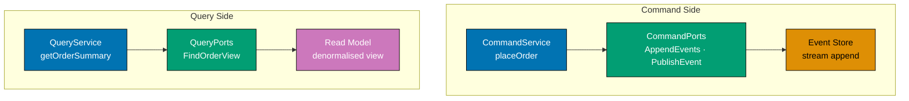

```fsharp
// ── Command-side ports record ─────────────────────────────────────────────────
// The command service depends only on write-oriented ports.
// Every field is a function type alias defined in the Ports module.
type CommandPorts = {
    AppendEvents    : StreamId * ExpectedVersion * DomainEvent list -> Async<Result<unit, EventStoreError>>
    // => Atomically appends new events to the named stream
    // => ExpectedVersion provides optimistic concurrency: Error if stream has moved on
    PublishEvent    : DomainEvent -> Async<Result<unit, PublishError>>
    // => Forwards the event to the message bus after successful append
    // => Decoupled from append — failure here does not roll back the event store write
}

// ── Query-side ports record ───────────────────────────────────────────────────
// The query service depends only on read-oriented ports.
// No EventStore port here — queries never reconstruct aggregates from events.
type QueryPorts = {
    GetOrderView : OrderId -> Async<Result<OrderView option, QueryError>>
    // => Reads from a materialised view — already projected from domain events
    // => Returns None when the order does not yet exist in the read model
}

// ── Command application service ───────────────────────────────────────────────
// placeOrderCommand uses only CommandPorts; it never touches GetOrderView.
let placeOrderCommand (ports: CommandPorts) (cmd: PlaceOrderCommand) =
    // => Receives raw unvalidated data from the HTTP adapter
    asyncResult {
        // => asyncResult { } is a CE from FsToolkit.ErrorHandling
        // => open FsToolkit.ErrorHandling — requires NuGet package FsToolkit.ErrorHandling
        let order = Order.fromCommand cmd
        // => Pure domain function — builds the aggregate; no I/O
        let events = [ OrderPlaced { OrderId = order.OrderId; PlacedAt = order.PlacedAt } ]
        // => Produces domain events from the aggregate; pure, no I/O
        do! ports.AppendEvents (order.OrderId, ExpectedVersion.NoStream, events)
        // => Persist events — fail fast if optimistic concurrency conflict
        do! ports.PublishEvent (List.head events)
        // => Notify downstream projections — after successful append only
        return order.OrderId
        // => Return the new order identity to the HTTP adapter
    }

// ── Query application service ─────────────────────────────────────────────────
// getOrderQuery uses only QueryPorts; it never appends events.
let getOrderQuery (ports: QueryPorts) (orderId: OrderId) =
    // => Receives a validated OrderId from the HTTP adapter
    asyncResult {
        let! view = ports.GetOrderView orderId
        // => Read the pre-built view — no aggregate reconstruction
        return view
        // => Forward the option directly to the HTTP adapter
    }
```

**Key Takeaway**: Two separate `Ports` record types make the command/query split a compile-time constraint — the query service cannot accidentally call `AppendEvents`, and the command service cannot accidentally call `GetOrderView`.

**Why It Matters**: Sharing a single port record for both commands and queries tempts developers to read the aggregate for query display, creating joins that break under event sourcing. Two distinct port records express architectural intent in the type system at zero runtime cost. When a query optimisation is needed — swap the read model to Elasticsearch, add a Redis cache, use a materialised view — the command service requires zero changes. The type boundary enforces what code review can only suggest.

---

### Example 57: Event Store Output Port

The event store output port is expressed as two function type aliases: one for appending a batch of events, one for reading a stream back. The in-memory adapter uses a mutable dictionary — a legitimate use of mutation because the dictionary is private to the adapter module and never exposed to the application layer.

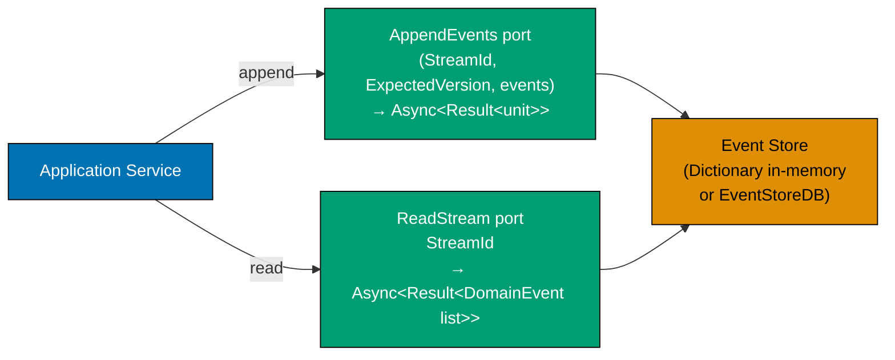

```fsharp
// ── StreamId and versioning ───────────────────────────────────────────────────
type StreamId = StreamId of string
// => Strongly-typed stream name — prevents passing an OrderId where a StreamId is expected

type ExpectedVersion =
    | NoStream
    // => Assert stream does not yet exist — prevents accidental overwrite
    | AnyVersion
    // => No concurrency check — use for idempotent appends
    | Exact of int
    // => Assert stream is at exactly this version — optimistic concurrency

// ── Append port ───────────────────────────────────────────────────────────────
// AppendEvents writes a batch atomically; the batch is all-or-nothing.
type AppendEvents =
    StreamId * ExpectedVersion * DomainEvent list -> Async<Result<unit, EventStoreError>>
// => Tuple input keeps all write parameters co-located — no partial application ambiguity
// => EventStoreError carries WrongExpectedVersion for concurrency conflicts
// => Result<unit, EventStoreError>: unit on success; WrongExpectedVersion on conflict

// ── Read port ─────────────────────────────────────────────────────────────────
// ReadStream returns the full ordered list of events for a stream.
type ReadStream =
    StreamId -> Async<Result<DomainEvent list, EventStoreError>>
// => Empty list is Ok — stream has no events yet (before first append)
// => Error signals infrastructure failure, not business failure
// => DomainEvent list: ordered from oldest to newest

// ── In-memory adapter ─────────────────────────────────────────────────────────
// Private mutable dictionary — mutation is confined to the adapter module.
// The application service sees only the AppendEvents and ReadStream port types.
module InMemoryEventStore =
    let private store = System.Collections.Generic.Dictionary<StreamId, DomainEvent list>()
    // => Private state — invisible to all callers outside this module
    // => Keyed by StreamId — each key maps to the ordered list of events

    let appendEvents : AppendEvents =
        // => Satisfies the AppendEvents port — in-memory concurrency check
        fun (streamId, expectedVersion, newEvents) ->
            async {
                let exists = store.ContainsKey streamId
                // => Check whether the stream already has events
                match expectedVersion, exists with
                | NoStream, true  ->
                    // => Conflict: caller asserted no stream exists but store has one
                    return Error (WrongExpectedVersion "stream already exists")
                    // => Caller asserted stream is new — concurrency conflict
                | Exact v, true when store.[streamId].Length <> v ->
                    // => Conflict: caller's expected version does not match actual length
                    return Error (WrongExpectedVersion $"expected {v}, got {store.[streamId].Length}")
                    // => Caller asserted a specific version — stream has moved on
                | _ ->
                    // => No conflict — proceed with the append
                    let current = if exists then store.[streamId] else []
                    // => Combine previous events with new events
                    store.[streamId] <- current @ newEvents
                    // => Append in order — immutable list concatenation
                    return Ok ()
                    // => Success — all new events are now in the stream
            }

    let readStream : ReadStream =
        // => Satisfies the ReadStream port — returns events in insertion order
        fun streamId ->
            // => streamId : StreamId — uniquely identifies the aggregate's event stream
            async {
                if store.ContainsKey streamId then
                    return Ok store.[streamId]
                    // => Return the full ordered event list
                else
                    return Ok []
                    // => Empty stream is not an error — domain decides what to do with []
            }
```

**Key Takeaway**: Two function type aliases — `AppendEvents` and `ReadStream` — constitute the complete event store port; the in-memory adapter satisfies both with local mutable state invisible to callers.

**Why It Matters**: Event store ports that return `unit` or raw bytes instead of domain events collapse all adapter responsibilities into one function, making testing opaque. Typed event lists returned by `ReadStream` let the application service — and the test suite — inspect exactly which events were written, in order, without a running EventStoreDB instance. Production swap is one line in `Composition.fs`.

---

### Example 58: Event-Sourced Domain — Aggregate Rebuilt from Events

In event sourcing, the aggregate has no stored state — it is rebuilt from the event stream on every command. The application service reads the stream, passes it to a pure domain function that folds events into aggregate state, applies the command, and appends the resulting new events. The domain has no dependency on the event store type.

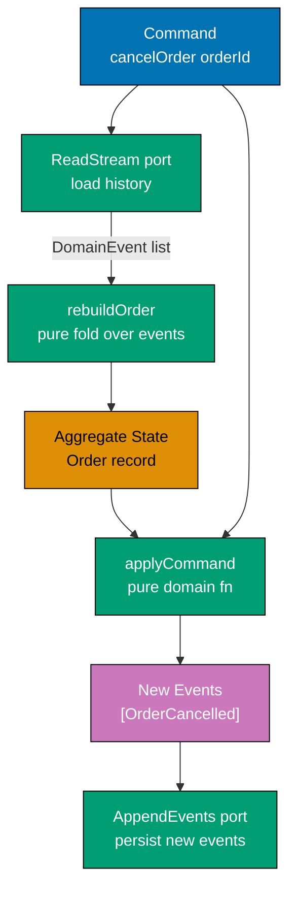

```fsharp
// ── Domain event DU ───────────────────────────────────────────────────────────
// Every state change produces one or more events rather than mutating a record.
type DomainEvent =
    // => Each case carries a payload record with the fields needed to reconstruct state
    | OrderPlaced   of OrderPlacedPayload
    // => Fired when a new order is accepted by the domain
    | OrderCancelled of OrderCancelledPayload
    // => Fired when an order is cancelled by the domain

// ── Pure domain function: rebuild aggregate from events ───────────────────────
// rebuildOrder is a left fold over the event list.
// No I/O — returns the current aggregate state from history alone.
let rebuildOrder (events: DomainEvent list) : Order =
    // => Start with an empty/default aggregate — represents "not yet created"
    let empty = { OrderId = ""; CustomerId = ""; Status = Unknown; Lines = [] }
    // => empty : Order — initial accumulator for the fold
    // => Fold applies each event to the accumulator in sequence
    events |> List.fold applyEvent empty
    // => Result is the aggregate state after every historical event

// ── Apply a single event to the aggregate ─────────────────────────────────────
// applyEvent is exhaustive — every DomainEvent case must be handled.
let applyEvent (order: Order) (event: DomainEvent) : Order =
    // => Pure function: order is the accumulated state, event is the next change
    match event with
    | OrderPlaced payload ->
        // => Reconstruct the aggregate from the OrderPlaced event fields
        { order with
            OrderId    = payload.OrderId
            // => Restore the identity assigned at creation
            CustomerId = payload.CustomerId
            // => Restore the customer reference from the event
            Status     = Placed
            // => Status is derived from event type, not stored separately
        }
    | OrderCancelled _ ->
        // => Cancellation event: update status only — order lines are preserved in state
        { order with Status = Cancelled }
        // => Apply the cancellation — only status changes; lines remain

// ── Application service: read-apply-append cycle ─────────────────────────────
// open FsToolkit.ErrorHandling — requires NuGet package FsToolkit.ErrorHandling
let cancelOrder
    (readStream   : ReadStream)
    (appendEvents : AppendEvents)
    (orderId      : OrderId)
    : Async<Result<unit, AppError>> =
    asyncResult {
        let streamId = StreamId orderId
        // => The stream name mirrors the aggregate identity
        let! history = readStream streamId
        // => Load all historical events — may be zero for a new aggregate
        let order = rebuildOrder history
        // => Pure fold — no I/O; deterministic given the same event list
        if order.Status = Cancelled then
            // => Guard: cannot cancel an already-cancelled order — idempotency invariant
            return! Error (BusinessError "already cancelled")
            // => Domain guard — enforce invariant before generating new events
        let newEvents = [ OrderCancelled { OrderId = orderId } ]
        // => Generate the single new event — pure computation
        let version = Exact (List.length history)
        // => Optimistic concurrency: reject if stream grew since we read it
        do! appendEvents (streamId, version, newEvents)
        // => Persist — fails with WrongExpectedVersion if concurrent writer won
    }
```

**Key Takeaway**: The read-apply-append cycle keeps the domain function pure — it receives a list of events and returns new events, with zero knowledge of the event store.

**Why It Matters**: Aggregates that store mutable state require snapshots for performance and make concurrent writes dangerous. Event-sourced aggregates are trivially testable: pass a list of events, assert the resulting new events. Every state transition is auditable by reading the stream. The application service orchestrates I/O; the domain is a pure function — the strongest possible separation of concerns.

---

### Example 59: Projection Adapter — Building a Read Model from Events

A projection adapter listens for domain events and builds or updates a denormalised read model. The `ProjectEvent` output port is the interface between the event-handling application service and the storage adapter. The adapter handles each event case by running a SQL `INSERT` or `UPDATE` — the application service handles neither SQL nor schema.

```fsharp
// ── Projection error DU ───────────────────────────────────────────────────────
type ProjectionError =
    | DuplicateProjection of string
    // => Event has already been projected — idempotency guard
    | ProjectionDbError   of exn
    // => Infrastructure failure during projection persistence

// ── ProjectEvent output port ──────────────────────────────────────────────────
// The application service calls this port for every event it consumes.
// The adapter decides how to map the event to a read model mutation.
type ProjectEvent =
    DomainEvent -> Async<Result<unit, ProjectionError>>
// => One port type handles all event cases — the adapter dispatches internally
// => Returning Result<unit, _> signals success/failure without a return value

// ── PostgreSQL projection adapter ─────────────────────────────────────────────
// This adapter runs SQL against the order_views table.
// It knows about SQL schema — the application service does not.
let postgresProjectionAdapter : ProjectEvent =
    fun event ->
        async {
            match event with
            | OrderPlaced payload ->
                // => INSERT a new row into the read model table
                // => In a real system: Npgsql parameterised INSERT
                printfn $"INSERT INTO order_views (order_id, customer_id, status) VALUES ('{payload.OrderId}', '{payload.CustomerId}', 'Placed')"
                // => Idempotency: use INSERT ... ON CONFLICT DO NOTHING if event may replay
                return Ok ()
                // => Projection written — downstream queries can now see the order

            | OrderCancelled payload ->
                // => UPDATE the existing row — only status changes
                printfn $"UPDATE order_views SET status = 'Cancelled' WHERE order_id = '{payload.OrderId}'"
                // => Partial update — other columns remain intact from the original INSERT
                return Ok ()
                // => Projection updated — subsequent queries return Cancelled status
        }

// ── Event handler application service ────────────────────────────────────────
// open FsToolkit.ErrorHandling — requires NuGet package FsToolkit.ErrorHandling
// Consumes a list of events from the message bus and projects each one.
let handleEvents (projectEvent: ProjectEvent) (events: DomainEvent list) =
    asyncResult {
        // => asyncResult over a list — fail fast on first projection error
        for event in events do
            do! projectEvent event
            // => Project each event in order — order matters for read model consistency
        return ()
        // => All events projected successfully
    }
```

**Key Takeaway**: The `ProjectEvent` port hides every SQL detail from the application service — the service dispatches events; the adapter decides schema, idempotency, and conflict handling.

**Why It Matters**: Projections that embed SQL in the application service become untestable without a live database and unmaintainable when the read model schema changes. A `ProjectEvent` port lets tests supply an in-memory projection adapter that records projected events in a list. The production adapter can be a SQL writer, an Elasticsearch indexer, or a Redis hash updater — without a single line change in the event handler service.

---

### Example 60: Saga Port and Orchestration

A saga orchestrates a multi-step process across multiple services. Each step is expressed as a port call. On failure, compensation functions are called in reverse order. The saga accumulates a list of compensations as it progresses — if step N fails, compensations 1..N-1 are executed. All of this lives in the application layer; the domain knows nothing about multi-step coordination.

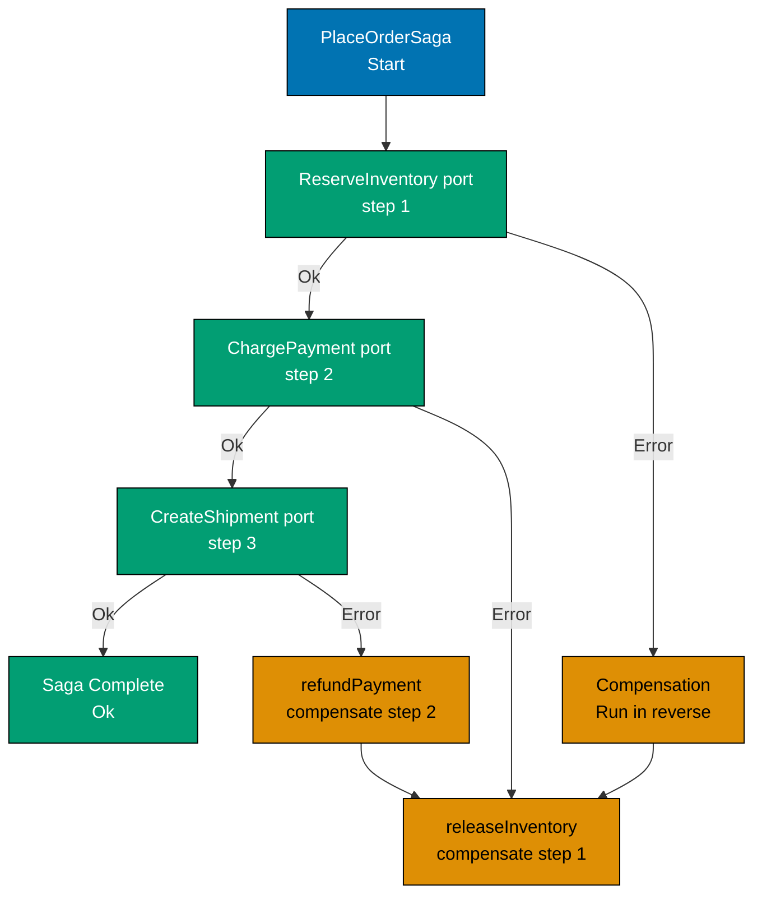

```fsharp
// ── Saga state record ─────────────────────────────────────────────────────────
// The saga accumulates compensation actions as it progresses forward.
// If any step fails, the compensation list is executed in reverse.
type SagaState = {
    OrderId      : OrderId
    // => Carries the identity through all saga steps
    Compensations : (unit -> Async<unit>) list
    // => Grows by one entry after each successful forward step
    // => Executed in reverse on failure — list.rev ensures correct order
}
// => SagaState : record — thread of state through the multi-step process

// ── Individual saga step ports ─────────────────────────────────────────────────
// Each port is independently injectable — tests can stub individual steps.
type ReserveInventory = OrderId -> Async<Result<ReservationId, SagaError>>
// => Contacts the Inventory service — returns a ReservationId on success
// => ReservationId is needed by the compensation and the shipment step
type ChargePayment     = OrderId * decimal -> Async<Result<PaymentId, SagaError>>
// => Contacts the Payment service — returns a PaymentId on success
// => PaymentId is needed by the refund compensation
type CreateShipment    = OrderId * ReservationId -> Async<Result<ShipmentId, SagaError>>
// => Contacts the Shipping service — returns a ShipmentId on success
// => ShipmentId is the terminal success value returned to the caller

// ── Compensation ports ────────────────────────────────────────────────────────
type ReleaseInventory = ReservationId -> Async<unit>
// => Idempotent release — must not fail; log and absorb errors internally
type RefundPayment     = PaymentId -> Async<unit>
// => Idempotent refund — must not fail; safe to call multiple times

// ── Saga orchestrator ──────────────────────────────────────────────────────────
// open FsToolkit.ErrorHandling — requires NuGet package FsToolkit.ErrorHandling
let placeOrderSaga
    (reserveInventory  : ReserveInventory)
    (chargePayment     : ChargePayment)
    (createShipment    : CreateShipment)
    (releaseInventory  : ReleaseInventory)
    (refundPayment     : RefundPayment)
    (orderId           : OrderId)
    (totalAmount       : decimal)
    : Async<Result<ShipmentId, SagaError>> =
    // => All ports are injected — each step is independently stubable in tests
    async {
        // Step 1: Reserve inventory
        let! reserveResult = reserveInventory orderId
        // => Forward step 1 — contacts Inventory service asynchronously
        // => reserveResult : Result<ReservationId, SagaError>
        match reserveResult with
        | Error e -> return Error e
        // => Step 1 failed — no compensation needed (nothing was done yet)
        | Ok reservationId ->
        // => reservationId : ReservationId — needed for step 3 and compensation

        // Step 2: Charge payment — inventory is now reserved
        let compensateInventory = fun () -> releaseInventory reservationId
        // => Capture compensation closure — will release if a later step fails
        let! chargeResult = chargePayment (orderId, totalAmount)
        // => Forward step 2 — contacts Payment service asynchronously
        // => chargeResult : Result<PaymentId, SagaError>
        match chargeResult with
        | Error e ->
            do! compensateInventory ()
            // => Step 2 failed — release the inventory reservation we made in step 1
            return Error e
        | Ok paymentId ->
        // => paymentId : PaymentId — needed for refund compensation

        // Step 3: Create shipment — inventory reserved and payment captured
        let compensatePayment = fun () -> refundPayment paymentId
        // => Capture payment compensation — will refund if step 3 fails
        let! shipResult = createShipment (orderId, reservationId)
        // => Forward step 3 — contacts Shipping service asynchronously
        match shipResult with
        | Error e ->
            do! compensatePayment ()
            // => Step 3 failed — refund payment made in step 2
            do! compensateInventory ()
            // => Then release inventory reserved in step 1 (reverse order)
            return Error e
            // => step 3: state after compensation — inventory released, payment refunded
        | Ok shipmentId ->
            // => All three steps succeeded — saga complete with shipment reference
            return Ok shipmentId
            // => All three steps succeeded — saga complete
    }
```

**Key Takeaway**: The saga accumulates compensation closures as it progresses forward — on failure it executes them in reverse order, producing a consistent rollback without distributed transactions.

**Why It Matters**: Distributed transactions (two-phase commit) are fragile under network partitions and require all participating services to implement the same protocol. Sagas replace global locks with local compensating actions — each service can succeed or fail independently. The saga pattern expressed through ports keeps the compensation logic in one place (the application service) and lets each service be independently testable with stub ports.

---

### Example 61: Outbox Pattern at the Adapter Level

The outbox pattern ensures that saving a domain entity and publishing a domain event are atomic — both happen in the same database transaction, or neither does. The application service calls the outbox port identically to a direct publish port; the durability guarantee is invisible at the application level.

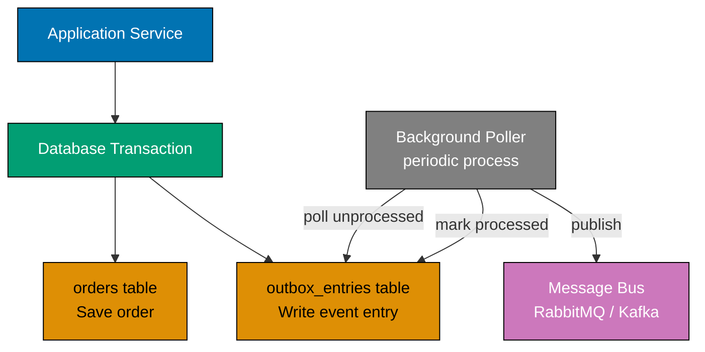

```fsharp
// ── Outbox entry record ────────────────────────────────────────────────────────
// An outbox entry is written in the same DB transaction as the order save.
// A background poller reads unprocessed entries and publishes them to the bus.
type OutboxEntry = {
    Id        : System.Guid
    // => Unique identity — used by the poller to mark entries as processed
    EventType : string
    // => Discriminator for deserialisation — e.g. "OrderPlaced"
    Payload   : string
    // => Serialised event — JSON or MessagePack; the bus consumer deserialises
    CreatedAt : System.DateTimeOffset
    // => Used for ordering and TTL — old entries can be archived
    Processed : bool
    // => False until the background poller successfully publishes to the bus
}

// ── Outbox output port ────────────────────────────────────────────────────────
// The application service calls this port instead of calling the message bus directly.
// WriteOutboxEntry writes to the SAME DB transaction as SaveOrder.
type WriteOutboxEntry =
    OutboxEntry -> Async<Result<unit, OutboxError>>
// => Atomicity is the adapter's responsibility — not the application service's

// ── Application service using outbox ─────────────────────────────────────────
// open FsToolkit.ErrorHandling — requires NuGet package FsToolkit.ErrorHandling
let placeOrderWithOutbox
    (saveOrder        : SaveOrder)
    (writeOutboxEntry : WriteOutboxEntry)
    (order            : Order)
    (event            : DomainEvent)
    : Async<Result<unit, AppError>> =
    asyncResult {
        do! saveOrder order
        // => Persist the order to the orders table (in the DB transaction)
        let entry = {
            Id        = System.Guid.NewGuid()
            // => Fresh identity for this outbox row
            EventType = nameof DomainEvent
            // => Discriminator for the poller to route to correct handler
            Payload   = System.Text.Json.JsonSerializer.Serialize event
            // => Serialise the event — poller will deserialise and publish
            CreatedAt = System.DateTimeOffset.UtcNow
            // => Timestamp for ordering and TTL enforcement
            Processed = false
            // => Poller sets this to true after successful bus publish
        }
        do! writeOutboxEntry entry
        // => Write to outbox table — same DB transaction as saveOrder above
        // => If the DB transaction rolls back, both the order and outbox entry disappear
        return ()
        // => Transaction commits — both order and outbox entry are durable
    }

// ── Background poller (adapter concern) ───────────────────────────────────────
// The poller is NOT in the application service — it is a separate adapter process.
// It reads unprocessed outbox entries and publishes them to the message bus.
// On successful publish, it marks the entry as processed (idempotent).
// => This separation means the application service never blocks on bus availability
```

**Key Takeaway**: The outbox pattern moves the dual-write atomicity problem from the application service into the adapter layer — the application service calls one port for save and one port for outbox write, both wrapped in the same database transaction by the adapter.

**Why It Matters**: Saving an order and then publishing an event in two separate operations creates a window where the save succeeds but the publish fails, leaving downstream services unaware of the new order. The outbox pattern closes this window by making the event durable in the same transaction. The background poller handles the eventual delivery — which may retry indefinitely until success. No distributed transaction protocol is required.

---

### Example 62: Process Manager Adapter — Long-Running State Machine

A process manager reacts to domain events and drives a long-running, multi-step workflow by calling application service input ports when state transitions occur. The state machine lives entirely in the adapter layer — the domain and application service know nothing about multi-step coordination.

```fsharp
// ── Process manager state DU ──────────────────────────────────────────────────
// The state machine models every meaningful stage of the order fulfillment process.
// Each state determines which events are relevant and what actions to take.
type ProcessManagerState =
    // => Each case is a named stage — complete inventory of valid workflow states
    | WaitingForPayment
    // => Order placed — awaiting payment confirmation from Payment service
    | WaitingForShipment
    // => Payment confirmed — awaiting shipment creation from Shipping service
    | Complete
    // => Shipment created — process is done; no further transitions expected
    | Failed of reason: string
    // => Any step failed — carries the failure reason for audit logging

// ── Process manager record ────────────────────────────────────────────────────
// Holds the current state for one order — persisted between event deliveries.
type ProcessManager = {
    OrderId : OrderId
    // => The order this process manager tracks
    State   : ProcessManagerState
    // => Current position in the workflow — determines event handling
}
// => ProcessManager : record — serialised to the process manager store between events

// ── Transition function — pure ────────────────────────────────────────────────
// transition is a pure function: given current state and incoming event,
// return the next state. No I/O — the adapter calls this and then acts.
let transition (pm: ProcessManager) (event: DomainEvent) : ProcessManagerState =
    // => Pure state machine: (state, event) → next state — no database, no async
    match pm.State, event with
    // => Exhaustive match on (current state, incoming event) pairs
    | WaitingForPayment, PaymentConfirmed _ ->
        WaitingForShipment
        // => state: WaitingForPayment → WaitingForShipment (payment received)
    | WaitingForPayment, PaymentFailed reason ->
        Failed reason
        // => state: WaitingForPayment → Failed (payment rejected)
    | WaitingForShipment, ShipmentCreated _ ->
        Complete
        // => state: WaitingForShipment → Complete (shipment confirmed)
    | WaitingForShipment, ShipmentFailed reason ->
        Failed reason
        // => state: WaitingForShipment → Failed (shipping rejected)
    | Complete, _ | Failed _, _ ->
        // => Terminal states: Complete and Failed ignore all further events
        pm.State
        // => Terminal states ignore all further events — idempotent guard

// ── Process manager adapter ───────────────────────────────────────────────────
// open FsToolkit.ErrorHandling — requires NuGet package FsToolkit.ErrorHandling
// The adapter loads the process manager, applies the transition, persists the new state,
// and calls the appropriate use case input port when required.
let handleProcessManagerEvent
    (loadPM      : OrderId -> Async<Result<ProcessManager, StoreError>>)
    (savePM      : ProcessManager -> Async<Result<unit, StoreError>>)
    (createShipment : OrderId -> Async<Result<unit, AppError>>)
    (event       : DomainEvent)
    : Async<Result<unit, AppError>> =
    // => All I/O is injected — pure transition fn handles state logic
    asyncResult {
        // => asyncResult CE: short-circuits on first Error; sequences async I/O
        let orderId = DomainEvent.orderId event
        // => Extract order identity from the incoming event
        let! pm = loadPM orderId
        // => Load current process manager state from the store
        // => pm : ProcessManager — current state before this event
        let nextState = transition pm event
        // => Pure state transition — no I/O involved
        // => nextState : ProcessManagerState — the new state after this event
        let updated = { pm with State = nextState }
        // => Create updated process manager — immutable record update
        do! savePM updated
        // => Persist the new state before calling downstream ports
        match nextState with
        // => Dispatch on new state to determine which downstream port to call
        | WaitingForShipment ->
            do! createShipment orderId
            // => State entered WaitingForShipment — trigger the next step
        | Complete | Failed _ | WaitingForPayment ->
            ()
            // => No action required for these transitions in this adapter
        return ()
        // => Signals successful handling; asyncResult wraps this as Ok ()
    }
```

**Key Takeaway**: The process manager state machine is pure (`transition`); the adapter handles all I/O around it — loading, persisting, and calling downstream ports based on the new state.

**Why It Matters**: Long-running workflows expressed as embedded conditionals in event handlers become impossible to test, trace, or resume after failure. A process manager with an explicit state DU is self-documenting — every valid state and transition is visible in the type definition. The pure `transition` function can be tested exhaustively with no infrastructure. The adapter persists state, so the workflow survives service restarts and message redeliveries.

---

## Observability, Security, and Multi-tenancy (Examples 63–67)

### Example 63: Observability Adapter — OpenTelemetry Spans Wrapping Port Calls

An observable adapter wraps any existing adapter and adds OpenTelemetry tracing without changing the application service or the wrapped adapter. The decorator pattern adds a cross-cutting concern at the composition root — the application service is unaware that tracing is active.

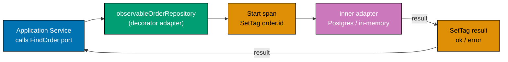

```fsharp
// ── Observable repository adapter ────────────────────────────────────────────
// observableOrderRepository wraps any FindOrder adapter and adds tracing.
// The application service receives a FindOrder function — it cannot tell
// whether tracing is active or not.
let observableOrderRepository
    (tracer : System.Diagnostics.ActivitySource)
    // => OpenTelemetry ActivitySource — identifies the instrumentation library
    (inner  : FindOrder)
    // => The wrapped adapter — could be Postgres, in-memory, or another decorator
    : FindOrder =
    // => Returns FindOrder — same type as the wrapped adapter
    fun orderId ->
        // => The outer function has the same signature as FindOrder
        async {
            use span = tracer.StartActivity("OrderRepository.FindOrder")
            // => Start a new tracing span — use ensures the span ends when disposed
            // => span : Activity option — None if no listener is attached
            span |> Option.iter (fun s ->
                s.SetTag("order.id", orderId) |> ignore
                // => Attach the order identity as a span attribute for filtering
            )
            let! result = inner orderId
            // => Delegate to the wrapped adapter — all I/O happens here
            match result with
            | Ok _ ->
                // => Adapter returned Ok — set success tag on span for dashboard visibility
                span |> Option.iter (fun s ->
                    s.SetTag("result", "ok") |> ignore
                    // => Record success on the span for dashboard filtering
                )
            | Error e ->
                // => Adapter returned Error — set error tags on span for alerting
                span |> Option.iter (fun s ->
                    s.SetTag("result", "error") |> ignore
                    // => Record the error type so dashboards can alert on error rate
                    s.SetTag("error.detail", string e) |> ignore
                )
            return result
            // => Return the inner result unchanged — decorator is transparent
        }

// ── Composition — wiring the decorator ───────────────────────────────────────
// The application service receives observableRepo — it calls FindOrder as normal.
// Tracing is added without modifying either the application service or the Postgres adapter.
// let tracer = new System.Diagnostics.ActivitySource("OrderTaking")
// let postgresRepo   : FindOrder = PostgresAdapter.findOrder connectionString
// let observableRepo : FindOrder = observableOrderRepository tracer postgresRepo
// => The composition root decides which adapters to wrap — not the service
```

**Key Takeaway**: The decorator adapter pattern adds observability by wrapping an existing adapter with the same port type — the application service calls `FindOrder` and never knows whether tracing, logging, or caching is active.

**Why It Matters**: Cross-cutting concerns added directly to application services violate single responsibility and make services hard to test in isolation. Decorator adapters encapsulate concerns like tracing, retry, and caching in composable wrappers that the composition root applies selectively. Adding OpenTelemetry to a new environment is one line in `Composition.fs`, not a change to every application service.

---

### Example 64: Authentication Adapter

Authentication happens entirely in the HTTP adapter layer before the application service is called. The `ValidateToken` port converts a raw token string into a typed `UserId`. If authentication fails, the adapter returns 401 without calling the application service. The domain never receives tokens, sessions, or credentials.

```fsharp
// ── Authentication port ───────────────────────────────────────────────────────
// ValidateToken is an output port — the HTTP adapter calls it to authenticate.
// The result is either a typed UserId (success) or an AuthError (failure).
type ValidateToken =
    string -> Async<Result<UserId, AuthError>>
// => Input is a raw Bearer token string extracted from the Authorization header
// => UserId is a strongly-typed value — not a raw string after validation

// ── AuthError cases ───────────────────────────────────────────────────────────
type AuthError =
    // => Discriminated union — each case maps to a distinct 401 failure reason
    | TokenExpired
    // => Token is valid JWT but past its expiry claim — return 401 with clear message
    | TokenMalformed
    // => Token cannot be decoded or signature is invalid — return 401
    | UserNotFound of string
    // => Token is valid but UserId does not exist in the system — return 401

// ── HTTP adapter — authentication guard ───────────────────────────────────────
// open FsToolkit.ErrorHandling — requires NuGet package FsToolkit.ErrorHandling
// The HTTP adapter extracts the token, validates it, then calls the application service.
let authenticatedEndpoint
    (validateToken   : ValidateToken)
    (placeOrder      : UserId -> PlaceOrderCommand -> Async<Result<OrderId, AppError>>)
    (rawToken        : string)
    (cmd             : PlaceOrderCommand)
    : Async<Result<OrderId, HttpError>> =
    // => Returns Async<Result<OrderId, HttpError>> — HTTP error type wraps auth + app errors
    asyncResult {
        let! userId = validateToken rawToken
        // => If token is invalid, asyncResult short-circuits here — returns 401
        // => UserId is now verified — safe to pass to the application service
        let! orderId = placeOrder userId cmd
        // => Application service receives only a verified UserId — no raw token
        // => Domain function is called with clean, typed input
        return orderId
        // => Return the new OrderId — HTTP adapter maps this to 201 Created
    }
    |> AsyncResult.mapError (function
        | AuthError e  -> Unauthorized (string e)
        // => Authentication failure → 401 Unauthorized
        | AppError e   -> BadRequest (string e)
        // => Business error → 400 Bad Request
    )
```

**Key Takeaway**: The `ValidateToken` port isolates authentication in the HTTP adapter — the application service receives a typed `UserId` and the domain never sees tokens, sessions, or authentication headers.

**Why It Matters**: Authentication logic embedded in application services contaminates them with HTTP concerns, makes them harder to test without mock token generators, and prevents reuse through non-HTTP adapters (CLI, message bus). Placing authentication in the adapter lets the same application service be called from authenticated HTTP, internal service-to-service calls, and test harnesses — each with its own authentication adapter.

---

### Example 65: Authorization Port

Authorization is an output port called at the start of each use case. The port receives a `UserId` and a `Permission` DU value. The application service is responsible for calling this port — it is not the domain's concern. The `Permission` DU makes all valid permission checks visible to the compiler.

```fsharp
// ── Permission DU — exhaustive ────────────────────────────────────────────────
// Every operation that requires authorization has a corresponding Permission case.
// Adding a new case forces the compiler to find every unhandled match site.
type Permission =
    // => Compiler-enforced inventory — every permission is a named case
    | PlaceOrder
    // => Required to create a new order — most customers have this
    | CancelOrder
    // => Required to cancel — may be restricted to order owner or staff
    | ViewAllOrders
    // => Required to list orders for all customers — staff-only

// ── Authorization port ────────────────────────────────────────────────────────
// CheckPermission returns Ok () on success — the unit result carries no information.
// The permission check is its own authoritative statement: allowed or denied.
type CheckPermission =
    UserId * Permission -> Async<Result<unit, AuthzError>>
// => UserId identifies WHO — Permission identifies WHAT they want to do
// => Result<unit, AuthzError>: unit on success; PermissionDenied on denial

// ── AuthzError cases ───────────────────────────────────────────────────────────
type AuthzError =
    // => Typed denial — each case gives the adapter precise 403 context
    | PermissionDenied of UserId * Permission
    // => The user exists but does not have the required permission
    | UserNotAuthorized of string
    // => General denial — used for system-level restrictions

// ── In-memory adapter (test / development) ────────────────────────────────────
// Stores permissions as a simple map — no database required for testing.
module InMemoryAuthzAdapter =
    let private permissions : Map<UserId, Permission list> =
        // => Static map: user-to-permissions; real adapter queries a policy store
        Map.ofList [
            "user-1", [ PlaceOrder; CancelOrder ]
            // => Regular customer — can place and cancel their own orders
            "admin-1", [ PlaceOrder; CancelOrder; ViewAllOrders ]
            // => Staff member — can view all orders across all customers
        ]

    let checkPermission : CheckPermission =
        // => Satisfies CheckPermission port — no database needed in tests
        fun (userId, permission) ->
            async {
                let userPerms = permissions |> Map.tryFind userId |> Option.defaultValue []
                // => Look up the user's permission list; default to empty on miss
                // => userPerms : Permission list — may be empty for unknown users
                if List.contains permission userPerms then
                    // => result: Allowed — permission found in user's permission list
                    return Ok ()
                    // => Permission is in the user's list — allow the operation
                else
                    // => result: Denied — permission absent; deny with typed error
                    return Error (PermissionDenied (userId, permission))
                    // => Permission is absent — deny with a typed error
            }

// ── Application service using authorization ───────────────────────────────────
// open FsToolkit.ErrorHandling — requires NuGet package FsToolkit.ErrorHandling
let cancelOrderWithAuthz
    (checkPermission : CheckPermission)
    (cancelOrder     : OrderId -> Async<Result<unit, AppError>>)
    (userId          : UserId)
    (orderId         : OrderId)
    : Async<Result<unit, AppError>> =
    // => All ports injected — both authorization and cancellation are swappable in tests
    asyncResult {
        do! checkPermission (userId, CancelOrder)
        // => Authorization check — short-circuits with AuthzError if denied
        // => Exhaustive match on Permission DU ensures CancelOrder is a known operation
        do! cancelOrder orderId
        // => Domain operation — only reached if authorization succeeded
        return ()
        // => result: Ok () — both authorization and cancellation succeeded
    }
```

**Key Takeaway**: The `Permission` DU makes every authorisable operation a compile-time known value; the `CheckPermission` port keeps authorization logic in a swappable adapter, not scattered through application services.

**Why It Matters**: Hardcoded role strings (`"admin"`, `"user"`) in application services are untracked, untestable, and inconsistent. A `Permission` DU forces every check to appear in the type definition — a new case means every exhaustive match site must handle it. The in-memory adapter makes authorization testable in pure unit tests; the production adapter calls an IAM service or policy database without changing one line of the application service.

---

### Example 66: Multi-tenancy Adapter

Multi-tenancy is resolved at the adapter boundary before the application service runs. The `ResolveTenant` port converts a raw tenant ID into a `TenantConfig` record. The entire `OrderPorts` record is constructed per-request with tenant-specific adapters. The application service and domain are tenant-unaware.

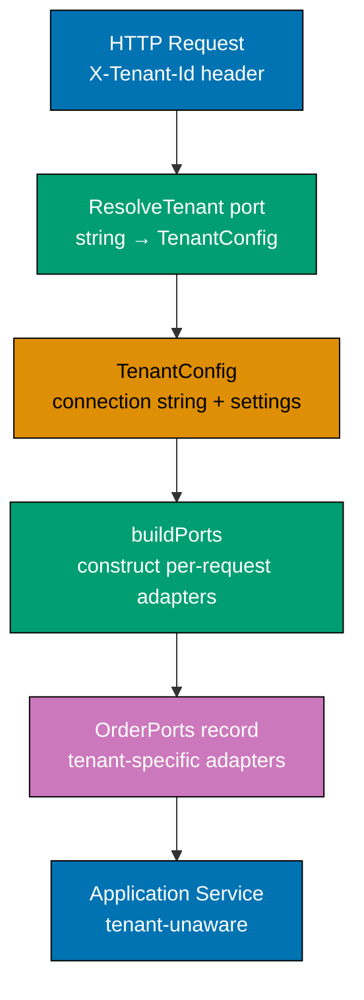

```fsharp
// ── Tenant config record ──────────────────────────────────────────────────────
// TenantConfig carries all tenant-specific infrastructure parameters.
// The application service never reads this record directly.
type TenantConfig = {
    DatabaseConnectionString : string
    // => Each tenant has their own database or schema — enforces data isolation
    FeatureFlags : Map<string, bool>
    // => Per-tenant feature gates — some tenants may have beta features enabled
}
// => TenantConfig : record — used only by the adapter layer; opaque to the application service

// ── ResolveTenant port ────────────────────────────────────────────────────────
// The HTTP adapter calls this port to obtain the tenant configuration.
// Failure returns TenantError — adapter maps this to 404 or 401.
type ResolveTenant =
    TenantId -> Async<Result<TenantConfig, TenantError>>
// => TenantId is extracted from the request header (X-Tenant-Id)
// => TenantConfig is used only to construct the per-request OrderPorts record
// => TenantError carries UnknownTenant — HTTP adapter maps to 404

// ── Per-request ports construction ────────────────────────────────────────────
// open FsToolkit.ErrorHandling — requires NuGet package FsToolkit.ErrorHandling
// The HTTP adapter builds a fresh OrderPorts for every request using the tenant config.
let buildTenantPorts (config: TenantConfig) : OrderPorts =
    // => Pure function: TenantConfig → OrderPorts — no I/O, no async
    {
        SaveOrder     = PostgresAdapter.saveOrder config.DatabaseConnectionString
        // => Order repository bound to the tenant's specific database
        FindOrder     = PostgresAdapter.findOrder config.DatabaseConnectionString
        // => Query adapter also bound to the tenant's database
        PublishEvent  = if config.FeatureFlags |> Map.tryFind "eventBus" |> Option.defaultValue false
                        then RabbitMqAdapter.publishEvent
                        // => Event bus enabled for this tenant — use real adapter
                        else NoOpAdapter.publishEvent
                        // => Event bus disabled for this tenant — no-op adapter
    }
// => buildTenantPorts : TenantConfig -> OrderPorts — tenant isolation in one function

// ── HTTP adapter with multi-tenancy ───────────────────────────────────────────
let tenantAwareEndpoint
    (resolveTenant  : ResolveTenant)
    (placeOrderSvc  : OrderPorts -> PlaceOrderCommand -> Async<Result<OrderId, AppError>>)
    (tenantId       : TenantId)
    (cmd            : PlaceOrderCommand)
    : Async<Result<OrderId, HttpError>> =
    asyncResult {
        let! config = resolveTenant tenantId
        // => Resolve tenant — fail with 404 if tenant does not exist
        // => config : TenantConfig — tenant-specific parameters
        let ports = buildTenantPorts config
        // => Construct per-request ports with tenant-specific adapters
        let! orderId = placeOrderSvc ports cmd
        // => Application service is called with tenant-specific ports
        // => Application service code is identical regardless of tenant
        return orderId
        // => Return the OrderId — HTTP adapter maps to 201 Created
    }
    |> AsyncResult.mapError (function
        | TenantError e -> NotFound (string e)
        // => Tenant not found → 404 Not Found
        | AppError    e -> BadRequest (string e)
        // => Business error → 400 Bad Request
    )
```

**Key Takeaway**: Building the entire `OrderPorts` record per-request using the resolved `TenantConfig` keeps tenant isolation in the adapter layer — the application service and domain are tenant-unaware by construction.

**Why It Matters**: Multi-tenancy implemented inside application services via tenant-ID parameters threads a cross-cutting concern through every function signature and every test. Building per-request ports confines tenant resolution to the adapter layer — one resolver, one ports constructor, zero changes to domain or application code. Adding a new tenant is a configuration change, not a code change.

---

### Example 67: Schema Migration Adapter

Schema migration is a startup concern, not an application service concern. The `MigrateSchema` port is called once during bootstrapping. The application service never calls it. The domain never knows it exists. The bootstrapping sequence enforces the correct order: migrate first, then wire ports, then start the HTTP adapter.

```fsharp
// ── MigrationError cases ──────────────────────────────────────────────────────
type MigrationError =
    // => Typed errors: each case provides specific diagnostic information
    | MigrationFailed of step: string * reason: string
    // => A specific migration step failed — carry enough context to diagnose
    | ChecksumMismatch of script: string
    // => A previously applied script was modified — migration tool detected tampering

// ── MigrateSchema port ────────────────────────────────────────────────────────
// This port has no parameters — it migrates to the latest schema unconditionally.
// The adapter knows which scripts are pending by reading the migration history table.
type MigrateSchema =
    unit -> Async<Result<unit, MigrationError>>
// => Called once at startup — fails fast if any migration step fails
// => Production adapter: runs DbUp / Flyway / Liquibase SQL scripts
// => Test adapter: creates tables in-memory using SQLite or TestContainers
// => Result<unit, MigrationError>: unit on success; error carries diagnostic context

// ── In-memory migration adapter (test / CI) ───────────────────────────────────
// In tests, migration creates the schema in a temporary SQLite database.
// The application adapter is identical — only the underlying tool differs.
module InMemoryMigrationAdapter =
    let migrateSchema : MigrateSchema =
        // => Satisfies MigrateSchema port — no real SQL; creates in-memory tables
        fun () ->
            async {
                // In a real implementation: run CREATE TABLE statements
                printfn "Running in-memory schema migration..."
                // => Log migration start — useful for CI output
                printfn "Migration complete."
                // => All tables created; test can now use the in-memory database
                return Ok ()
                // => Signal success — bootstrapping continues
            }

// ── Bootstrapping sequence ────────────────────────────────────────────────────
// open FsToolkit.ErrorHandling — requires NuGet package FsToolkit.ErrorHandling
// The composition root calls the three bootstrapping steps in strict order.
let bootstrap
    (migrateSchema : MigrateSchema)
    (buildPorts    : unit -> OrderPorts)
    (startHttp     : OrderPorts -> Async<unit>)
    : Async<unit> =
    async {
        let! migrationResult = migrateSchema ()
        // => Step 1: migrate — application cannot start with a stale schema
        match migrationResult with
        | Error e ->
            // => schema version: FAILED — cannot proceed; log and terminate process
            failwithf "Migration failed: %A" e
            // => Fatal error — log and exit; do not start the HTTP adapter
        | Ok () ->
            // => schema version: CURRENT — all migrations applied; ready to wire ports
            let ports = buildPorts ()
            // => Step 2: wire ports — uses migrated schema; safe to connect now
            do! startHttp ports
            // => Step 3: start HTTP adapter — only after schema and ports are ready
    }
```

**Key Takeaway**: The `MigrateSchema` port confines schema migration to a bootstrapping concern — the application service and domain are never involved in schema management, and the bootstrapping sequence enforces the correct startup order.

**Why It Matters**: Schema migrations that run inside application services or on first request create race conditions under concurrent startup and make it impossible to test application services without a fully migrated database. A `MigrateSchema` port called once at startup with a dedicated adapter lets CI use an in-memory adapter (fast) and production use DbUp (reliable) — with identical bootstrapping code in both environments.

---

## Domain Evolution and Adapter Replacement (Examples 68–74)

### Example 68: Adding a New Output Port Without Breaking Existing Adapters

When the application service needs a new dependency, adding a field to the `OrderPorts` record is the only change at the application layer. Existing adapters that satisfy other ports are unchanged — they are not aware of the new field. Only the composition root changes to supply the new adapter.

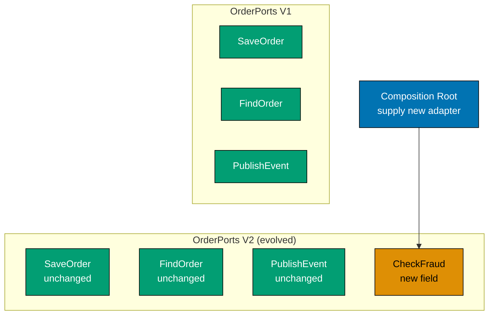

```fsharp
// ── Original ports record ─────────────────────────────────────────────────────
// The existing ports record before the CheckFraud port is added.
type OrderPorts_V1 = {
    SaveOrder    : SaveOrder
    // => Persists the order to the database — unchanged
    FindOrder    : FindOrder
    // => Loads the order from the database — unchanged
    PublishEvent : PublishEvent
    // => Publishes domain events to the message bus — unchanged
}

// ── CheckFraud port — new addition ────────────────────────────────────────────
// Added to support fraud screening before order acceptance.
// All existing adapters (SaveOrder, FindOrder, PublishEvent) are unchanged.
type CheckFraud =
    UnvalidatedOrder -> Async<Result<FraudScore, FraudError>>
// => Returns a FraudScore (numeric risk rating) or FraudError on failure
// => The application service uses FraudScore to decide whether to proceed

// ── Evolved ports record ──────────────────────────────────────────────────────
// Adding CheckFraud is the ONLY change to the ports record.
// Existing adapters are wired identically — only one new field appears.
type OrderPorts_V2 = {
    SaveOrder    : SaveOrder
    // => Unchanged — same type alias, same adapter
    FindOrder    : FindOrder
    // => Unchanged — same type alias, same adapter
    PublishEvent : PublishEvent
    // => Unchanged — same type alias, same adapter
    CheckFraud   : CheckFraud
    // => New field — requires a new adapter implementation at the composition root
}

// ── Existing adapters — unchanged ─────────────────────────────────────────────
// These adapters were written for V1 and are still valid for V2.
// They are used as values, not objects — no inheritance, no implements keyword.
// let postgresOrderRepo : SaveOrder  = ...   ← satisfies SaveOrder port (unchanged)
// let postgresOrderRepo : FindOrder  = ...   ← satisfies FindOrder port (unchanged)
// let rabbitMqPublisher : PublishEvent = ... ← satisfies PublishEvent port (unchanged)

// ── New fraud adapter ─────────────────────────────────────────────────────────
// Only the fraud adapter is new. Everything else is wire-up from V1.
let fraudServiceAdapter : CheckFraud =
    fun order ->
        async {
            // In a real system: call an external fraud API
            let score = { RiskScore = 0.12; Decision = Allow }
            // => Score below 0.5 — allow the order to proceed
            return Ok score
            // => FraudScore returned — application service decides next step
        }

// ── Composition root — only change ───────────────────────────────────────────
// The composition root constructs V2 with the same existing adapters + the new one.
// let productionPorts : OrderPorts_V2 = {
//     SaveOrder    = postgresOrderRepo.save
//     FindOrder    = postgresOrderRepo.find
//     PublishEvent = rabbitMqPublisher.publish
//     CheckFraud   = fraudServiceAdapter      ← only new line in composition
// }
```

**Key Takeaway**: Adding a new port field to the `OrderPorts` record and supplying a new adapter in `Composition.fs` is all that is required — existing adapters and their tests are untouched.

**Why It Matters**: Architectures that inject dependencies through constructors or service locators require existing classes to be modified or re-registered when new dependencies are added. F# record ports require only a new field and a new value in the composition root. The compiler flags every composition site that does not supply the new field, making the addition impossible to miss and impossible to misconfigure silently.

---

### Example 69: Evolving a Port Type — Adding an Optional Field

Port types can evolve without breaking existing adapters by using option types for new parameters. Strategy (a) introduces a new type alias alongside the old one; strategy (b) adds an optional parameter to the existing type. Both approaches keep existing adapters compilable.

**Strategy (a) — new type alias alongside old:**

```fsharp
// ── Original port type ────────────────────────────────────────────────────────
// Existing adapters satisfy FindOrder — they are unchanged.
type FindOrder =
    OrderId -> Async<Result<Order option, RepositoryError>>
// => Returns the full domain aggregate or None if not found

// ── New port type — added alongside, not replacing ────────────────────────────
// FindOrderWithProjection is a new type alias — existing FindOrder adapters remain valid.
// Application services that need projection switch to the new type;
// those that do not need it continue to use FindOrder unchanged.
type ProjectionOptions = { IncludeLines: bool; IncludeHistory: bool }
// => Controls which parts of the aggregate are loaded — for performance optimisation

type FindOrderWithProjection =
    OrderId * ProjectionOptions -> Async<Result<Order option, RepositoryError>>
// => Tuple input: same OrderId, plus new ProjectionOptions
// => Existing FindOrder adapters cannot satisfy this type — new adapter required
// => But existing adapters are NOT broken — they still satisfy FindOrder
```

**Strategy (b) — optional parameter in same type:**

```fsharp
// ── Evolved FindOrder with backward-compatible options ────────────────────────
// ProjectionOptions option defaults to None — existing callers pass None implicitly.
// New callers pass Some { IncludeLines = true; ... } to request additional data.
type FindOrderV2 =
    OrderId * ProjectionOptions option -> Async<Result<Order option, RepositoryError>>
// => ProjectionOptions option: None means "load everything" (backward compatible)
// => Some opts means "load only what opts requests" (new callers use this)

// ── Adapter satisfying FindOrderV2 ────────────────────────────────────────────
// The adapter checks the option and adjusts its SQL query accordingly.
let postgresAdapterV2 : FindOrderV2 =
    fun (orderId, projOpts) ->
        async {
            let includeLines = projOpts |> Option.map (fun o -> o.IncludeLines) |> Option.defaultValue true
            // => Default to true — backward compatible; old callers get the full aggregate
            let includeHistory = projOpts |> Option.map (fun o -> o.IncludeHistory) |> Option.defaultValue false
            // => Default to false — history is expensive; new callers opt-in explicitly
            // In a real system: build SQL SELECT based on includeLines and includeHistory
            let order : Order option = Some { OrderId = orderId; CustomerId = "CUST-1"; Lines = []; Status = Placed; PlacedAt = System.DateTimeOffset.UtcNow }
            // => Simulated load — real adapter runs parameterised SQL
            return Ok order
            // => Return the loaded aggregate (or None if not found)
        }
```

**Key Takeaway**: Two strategies for port evolution — a new type alias alongside the old (cleanest separation) or an option parameter in the same type (backward compatibility) — both preserve existing adapter compilability.

**Why It Matters**: Port evolution that breaks existing adapters forces mass changes across the codebase. Both strategies keep old adapters valid while giving new adapters more expressiveness. The new type alias strategy gives the strongest compile-time separation; the option parameter strategy minimises the number of distinct port types. Choose based on how often the projection options are needed.

---

### Example 70: Adapter Replacement Without Touching Domain or Application

Replacing an in-memory event store adapter with a real EventStoreDB adapter requires changes in only one place: `Composition.fs`. The port type alias is unchanged. The application service is unchanged. Both adapters have identical function signatures because they satisfy the same port type.

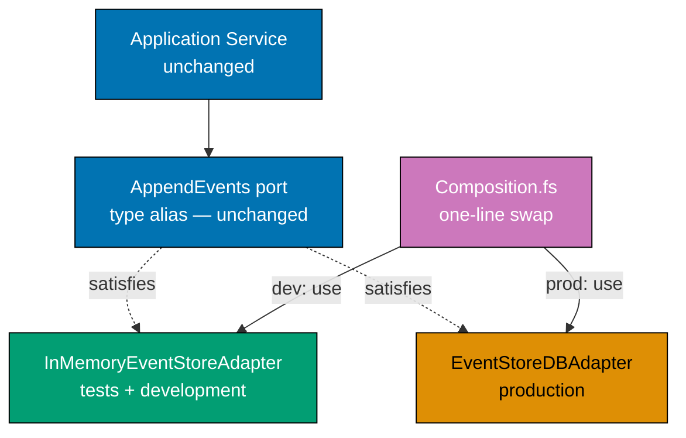

```fsharp
// ── The port type — shared by both adapters ────────────────────────────────────
// This type alias never changes during the adapter replacement.
// Both the in-memory and EventStoreDB adapters satisfy it.
type AppendEvents =
    StreamId * ExpectedVersion * DomainEvent list -> Async<Result<unit, EventStoreError>>
// => The contract between the application service and any event store adapter

// ── In-memory adapter (replaced) ─────────────────────────────────────────────
// Satisfies AppendEvents using a local dictionary — used in tests.
module InMemoryEventStoreAdapter =
    let private store = System.Collections.Generic.Dictionary<StreamId, DomainEvent list>()
    // => Private mutable state — confined to this module
    let appendEvents : AppendEvents =
        fun (streamId, _version, newEvents) ->
            async {
                let current = if store.ContainsKey streamId then store.[streamId] else []
                // => Load existing events for the stream
                store.[streamId] <- current @ newEvents
                // => Append new events — no version check in this simplified adapter
                return Ok ()
                // => Simulate success — real EventStoreDB adapter checks version
            }

// ── EventStoreDB adapter (replacement) ────────────────────────────────────────
// Satisfies AppendEvents using the EventStore.Client library.
// Identical signature — the application service cannot tell the difference.
module EventStoreDbAdapter =
    let appendEvents (connectionString: string) : AppendEvents =
        fun (StreamId streamId, expectedVersion, newEvents) ->
            async {
                // In a real system: use EventStore.Client to append to the stream
                // client.AppendToStreamAsync(streamId, expectedRevision, eventData)
                printfn $"[EventStoreDB] Appending {List.length newEvents} event(s) to stream '{streamId}'"
                // => Log the append operation — real adapter calls EventStoreDB gRPC API
                return Ok ()
                // => Simulated success — real adapter returns Error on WrongExpectedVersion
            }

// ── Composition.fs — the only file that changes ───────────────────────────────
// Swap one line to replace the adapter:
// BEFORE:
//   let appendEvents : AppendEvents = InMemoryEventStoreAdapter.appendEvents
// AFTER:
//   let appendEvents : AppendEvents = EventStoreDbAdapter.appendEvents "esdb://localhost:2113"
// => The application service and all tests that use in-memory are unaffected
```

**Key Takeaway**: The `AppendEvents` port type is the stable contract; both adapters satisfy it with identical signatures — swapping is one line in `Composition.fs`.

**Why It Matters**: Adapter replacement that requires changes to application services indicates that the application service has taken on adapter concerns. When the port type is the only shared contract, the in-memory adapter and the production adapter are structurally interchangeable. Teams can develop and test entirely against in-memory adapters and swap to production adapters at deployment time — with compile-time assurance that the signatures match.

---

### Example 71: Versioned Events Through Adapters

Domain events evolve. Old events stored in V1 format must be upcasted to V2 before the domain function sees them. The upcasting function lives in the adapter module — the domain function `rebuildOrder` handles only the latest event version.

```fsharp
// ── V1 event payload (legacy) ─────────────────────────────────────────────────
// V1 was stored without ShippingAddress — older events lack this field.
type OrderPlacedV1 = {
    OrderId    : string
    // => Order identity — present in V1
    CustomerId : string
    // => Customer reference — present in V1
    // ShippingAddress was added in V2 — absent from all V1 events in the store
}

// ── V2 event payload (current) ────────────────────────────────────────────────
// V2 is the canonical event shape — the domain always works with V2.
type OrderPlacedV2 = {
    OrderId         : string
    // => Order identity — unchanged from V1
    CustomerId      : string
    // => Customer reference — unchanged from V1
    ShippingAddress : string
    // => New in V2 — populated from customer default during upcasting
}

// ── DomainEvent DU — carries only current versions ────────────────────────────
// The domain function only handles V2. V1 events are upcasted before this DU is constructed.
type DomainEvent =
    | OrderPlaced_V2 of OrderPlacedV2
    // => The only OrderPlaced variant the domain sees — always V2 shape
    | OrderCancelled of OrderCancelledPayload
    // => Cancellation events have not been versioned yet

// ── Upcasting function — adapter module only ──────────────────────────────────
// upcastOrderPlaced converts a V1 payload to V2 format.
// It lives in the adapter module — the domain never sees V1 format.
let private upcastOrderPlaced (v1: OrderPlacedV1) : OrderPlacedV2 =
    {
        OrderId         = v1.OrderId
        // => Copy unchanged field
        CustomerId      = v1.CustomerId
        // => Copy unchanged field
        ShippingAddress = "DEFAULT_ADDRESS"
        // => Default value for missing V1 field — business rule for upcasting
        // => In production: look up the customer's default address from a reference table
    }

// ── Event store adapter read path — applies upcasting on load ─────────────────
// The adapter reads raw bytes from the store, determines the version, and upcasts.
// The application service receives only DomainEvent (V2 shape) from the port.
let readStreamWithUpcasting (streamId: StreamId) : Async<Result<DomainEvent list, EventStoreError>> =
    async {
        // In a real system: read raw event metadata and bytes from EventStoreDB
        // Simulated: return a mix of old V1 events and new V2 events
        let rawV1 : OrderPlacedV1 = { OrderId = "ORD-1"; CustomerId = "CUST-1" }
        // => Simulated V1 event loaded from the event store
        let upcasted : OrderPlacedV2 = upcastOrderPlaced rawV1
        // => Upcast V1 → V2 in the adapter — domain never sees V1 shape
        return Ok [ OrderPlaced_V2 upcasted ]
        // => Return fully upcasted event list — application service receives V2 only
    }
```

**Key Takeaway**: Event upcasting functions live in the adapter module — the domain function `rebuildOrder` receives only the current event version, and the adapter handles all historical format translation.

**Why It Matters**: Domain functions that handle multiple event versions accumulate conditional logic that grows with every new version. Confining upcasting to the adapter means the domain always sees the canonical latest shape. When a V3 is introduced, only the adapter changes — `rebuildOrder` needs no modification. Upcasting is a storage concern; the domain is a business-logic concern.

---

### Example 72: Backward-Compatible Adapter — Reading Old and New Schema

During a database schema migration, the new column may be `NULL` for old rows. The adapter handles this gracefully by substituting a default value. The domain `Order` type always has the field — the adapter shields it from the migration period.

```fsharp
// ── Domain type — always has ShippingAddress ──────────────────────────────────
// The domain aggregate requires ShippingAddress to be non-null.
// The adapter ensures this invariant even during the schema migration period.
type Order = {
    OrderId         : OrderId
    // => Unique order identity — maps to order_id column
    CustomerId      : CustomerId
    // => Customer reference — maps to customer_id column
    ShippingAddress : string
    // => Required — domain invariant; adapter provides a default during migration
    Lines           : OrderLine list
    // => Order lines — joined from order_lines table in real adapter
    Status          : OrderStatus
    // => Domain DU — parsed from status string column
    PlacedAt        : System.DateTimeOffset
    // => Timestamp — maps to placed_at column
}

// ── Database row type — mirrors SQL schema ────────────────────────────────────
// The database row uses string option to reflect the nullable SQL column.
// This type is private to the adapter — the domain never sees it.
type DbOrderRow = {
    OrderId         : string
    // => Raw SQL value — string, not the domain alias
    CustomerId      : string
    ShippingAddress : string option
    // => NULL in old rows, Some "..." in new rows — migration adds the column
    Status          : string
    // => Raw status string — adapter parses to domain DU
    PlacedAt        : System.DateTimeOffset
}

// ── Default address for missing rows ─────────────────────────────────────────
// During migration, rows written before the column was added have NULL.
// The adapter uses this default to satisfy the domain's non-null requirement.
let private defaultShippingAddress = "UNSPECIFIED"
// => Placeholder — downstream logic identifies these for backfill

// ── Backward-compatible adapter function ──────────────────────────────────────
// mapRowToOrder handles both old (NULL shippingAddress) and new rows transparently.
let mapRowToOrder (row: DbOrderRow) : Order =
    // => Pure mapping: DbOrderRow → Order — all NULL-handling here
    {
        OrderId         = row.OrderId
        // => Direct mapping — unchanged column
        CustomerId      = row.CustomerId
        // => Direct mapping — unchanged column
        ShippingAddress =
            match row.ShippingAddress with
            | Some addr -> addr
            // => New row — use the stored address
            | None      -> defaultShippingAddress
            // => Old row — supply default; domain invariant satisfied
        Lines   = []
        // => Simplified: real adapter joins to order_lines table
        Status  = parseStatus row.Status
        // => Convert string to domain DU — adapter concern
        PlacedAt = row.PlacedAt
        // => Direct mapping — timestamp column unchanged
    }
```

**Key Takeaway**: The adapter function `mapRowToOrder` handles both old (`NULL`) and new (non-`NULL`) schema rows by substituting a default — the domain aggregate always has a non-null `ShippingAddress`.

**Why It Matters**: Schema migrations that require all-or-nothing column backfills before deployment prevent zero-downtime releases. A backward-compatible adapter lets the column be added as nullable, deployed, and backfilled progressively — all while the domain sees a clean, non-null type. When backfill is complete, the adapter can remove the `None` branch. The domain was never aware of the migration.

---

### Example 73: Blue-Green Deployment Support via Adapter Configuration

An experiment adapter wraps two implementations of the same port and routes traffic based on a `TrafficSplit` configuration. The application service is unaware of the experiment. Both implementations run in parallel in `Both` mode, allowing safe comparison of results before full migration.

```fsharp
// ── Traffic split DU ──────────────────────────────────────────────────────────
// Determines which implementation receives each request.
type TrafficSplit =
    // => Three-way enum: controls routing without if/else chains
    | OldSystem
    // => Route all traffic to the old implementation — safe baseline
    | NewSystem
    // => Route all traffic to the new implementation — full cut-over
    | Both
    // => Route to both — compare results; use old system's result as the response

// ── Experiment adapter ─────────────────────────────────────────────────────────
// Wraps two SaveOrder adapters and routes based on TrafficSplit configuration.
// The application service receives a single SaveOrder — it cannot tell an experiment is running.
let experimentAdapter
    (split      : TrafficSplit)
    (oldAdapter : SaveOrder)
    (newAdapter : SaveOrder)
    : SaveOrder =
    // => Returns SaveOrder — same type as both wrapped adapters
    fun order ->
        // => order : PricedOrder — passed to whichever adapters are active
        async {
            match split with
            | OldSystem ->
                // => environment: OldSystem → adapter: oldAdapter only
                let! result = oldAdapter order
                // => Route entirely to old system — new system is not called
                // => result : Result<unit, RepositoryError>
                return result
                // => Old system result returned to application service

            | NewSystem ->
                // => environment: NewSystem → adapter: newAdapter only
                let! result = newAdapter order
                // => Route entirely to new system — old system is not called
                // => result : Result<unit, RepositoryError>
                return result
                // => New system result returned to application service

            | Both ->
                // => environment: Both → both adapters called; old result is authoritative
                let! oldResult = oldAdapter order
                // => Call old system — its result is the authoritative response
                // => oldResult : Result<unit, RepositoryError>
                let! newResult = newAdapter order
                // => Call new system — for comparison only; result is discarded
                // => newResult : Result<unit, RepositoryError>
                match oldResult, newResult with
                | Ok _, Error e ->
                    // => Divergence detected: old succeeded, new failed — log for investigation
                    printfn $"[EXPERIMENT] New system diverged: {e}"
                    // => Log divergence — alert dashboard; old system is still authoritative
                | Ok _, Ok _ ->
                    // => Agreement: both returned Ok — new system is consistent with old
                    printfn "[EXPERIMENT] Results agree — new system correct"
                    // => Both succeeded with Ok — new system is consistent
                | _ ->
                    // => Other combinations: old failed or both failed — no comparison logged
                    ()
                return oldResult
                // => Always return old system result — experiment is shadow-only
        }
```

**Key Takeaway**: The experiment adapter runs both implementations transparently — the application service calls one `SaveOrder` port and the adapter handles routing, comparison, and logging.

**Why It Matters**: Migrating from one data store or business logic implementation to another is risky when done as a big-bang switch. The experiment adapter enables gradual confidence-building: run `Both` in production, observe divergences, fix them, then switch to `NewSystem`. The application service and domain are completely isolated from the migration mechanics. This pattern has been described in detail by Martin Fowler as the "Strangler Fig" and "Dark Launching" patterns.

---

### Example 74: Hexagonal + DDD Combined — Applying Both Simultaneously

DDD tactical patterns (value objects, aggregates, domain events) live in the domain core. The application service acts as the use case, calling the domain function and then calling output ports. Hexagonal architecture enforces the same boundary DDD articulates: domain is pure, infrastructure is at the edges.

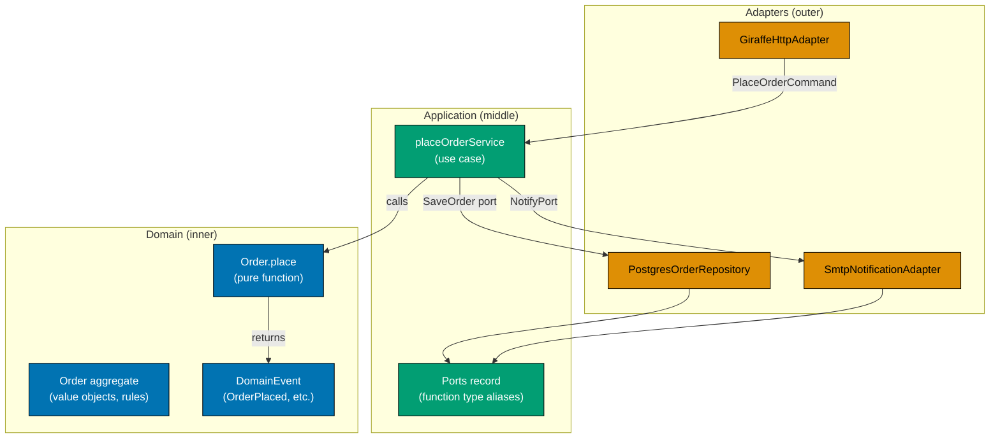

```fsharp
// ── Domain: value objects (DDD) ───────────────────────────────────────────────
// Value objects are immutable, equality-by-value types — DDD tactical pattern.
// In F#, single-case DUs are the natural value object representation.
type OrderId   = OrderId of string   // => Wraps string — prevents confusion with CustomerId
type CustomerId = CustomerId of string // => Separate type — compile error if mixed up
type Money     = Money of decimal     // => Currency amount — carries domain semantics

// ── Domain: aggregate (DDD) ───────────────────────────────────────────────────
// The aggregate root enforces all domain invariants.
// External code can only interact with Order through its module functions.
type Order = {
    OrderId    : OrderId
    // => Strongly typed identity — single-case DU
    CustomerId : CustomerId
    // => Strongly typed reference — distinct type prevents identity confusion
    Lines      : OrderLine list
    // => List of order lines — empty list may violate a domain rule
    TotalPrice : Money
    // => Pre-computed total — avoids recalculation on every read
    Status     : OrderStatus
    // => DU carrying domain semantics — exhaustive match enforces all transitions
}

// ── Domain: pure command function (DDD + Hexagonal) ───────────────────────────
// Order.place is a pure domain function — no I/O.
// It receives the current aggregate state and a command, returns domain events.
// This is the "functional core" — the same function hexagonal architecture protects.
module Order =
    let place (cmd: PlaceOrderCommand) : Result<Order * DomainEvent list, DomainError> =
        // => Validate the command — pure computation, no database access
        if String.IsNullOrWhiteSpace cmd.CustomerId then
            Error (ValidationError "CustomerId required")
            // => Domain invariant: customer identity must be present
        else
            let order = {
                OrderId    = OrderId (System.Guid.NewGuid().ToString())
                // => Generate identity — in DDD, the domain assigns IDs
                CustomerId = CustomerId cmd.CustomerId
                // => Wrap in value object — type safety enforced at construction
                Lines      = cmd.Lines |> List.map OrderLine.fromDto
                // => Convert raw DTO to domain value objects
                TotalPrice = cmd.Lines |> List.sumBy (fun l -> l.Quantity * l.UnitPrice) |> Money
                // => Compute total — domain rule, not adapter concern
                Status     = Placed
                // => Initial status — domain DU, not a string
            }
            let events = [ OrderPlaced { OrderId = order.OrderId; PlacedAt = System.DateTimeOffset.UtcNow } ]
            // => Emit domain events — downstream projections react to these
            Ok (order, events)
            // => Return both the new aggregate state and the events

// ── Application service (Hexagonal use case) ──────────────────────────────────
// open FsToolkit.ErrorHandling — requires NuGet package FsToolkit.ErrorHandling
// placeOrderService orchestrates: call domain function → call output ports.
// It imports Domain — never imports Adapters.
let placeOrderService (ports: OrderPorts) (cmd: PlaceOrderCommand) =
    asyncResult {
        let! (order, events) = Order.place cmd |> Result.mapError AppDomainError |> async.Return
        // => Call pure domain function — no I/O; returns aggregate + events
        do! ports.SaveOrder order
        // => Persist the new aggregate — output port call (I/O happens here)
        for event in events do
            do! ports.PublishEvent event
            // => Publish each domain event — adapter decides bus or outbox
        return order.OrderId
        // => Return the new identity to the HTTP adapter
    }
```

**Key Takeaway**: DDD tactical patterns (value objects, aggregates, domain events) live in the pure domain module; hexagonal architecture enforces that the domain module has no infrastructure imports — both patterns express the same fundamental boundary.

**Why It Matters**: DDD without hexagonal architecture often results in aggregates that call repositories directly, polluting domain tests with database concerns. Hexagonal without DDD often results in anemic domain models where all logic leaks into application services. Together, DDD gives the domain richness and expressiveness; hexagonal gives it isolation. The domain function is testable with no infrastructure; the application service is testable with in-memory port adapters.

---

## Contract Testing and Property-Based Testing (Examples 75–80)

### Example 75: Contract Testing Between Port and Adapter — Bi-Directional

Repository contract laws are a set of behavioural assertions that any adapter satisfying a port must pass. Running the same laws against every adapter implementation verifies bi-directional correctness — the port definition and every adapter implementation.

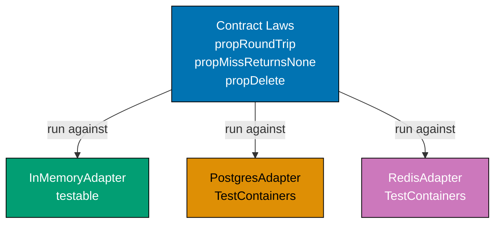

```fsharp
// ── Contract law definitions ──────────────────────────────────────────────────
// Each law is an async function that accepts an OrderRepository pair and returns bool.
// Run these against every adapter to verify the contract is satisfied.
type OrderRepository = {
    // => Port contract: every adapter must satisfy all four laws below
    Save   : Order -> Async<Result<unit, RepositoryError>>
    // => Upsert semantics — create or update; success is unit
    FindById : OrderId -> Async<Result<Order option, RepositoryError>>
    // => Some on hit, None on miss, Error on infra failure
    Delete : OrderId -> Async<Result<unit, RepositoryError>>
    // => Remove: success is unit; behaviour on missing key is adapter-defined
}

// ── Shared test order for all law checks ─────────────────────────────────────
let sampleOrder = {
    OrderId    = OrderId "contract-test-1"
    // => Fixed identity — used consistently across all law checks
    CustomerId = CustomerId "CUST-contract"
    // => Fixed customer — contract laws do not vary by customer
    Lines      = []
    // => Empty lines — simplifies the round-trip equality check
    TotalPrice = Money 0m
    // => Zero total — pricing logic is not under test here
    Status     = Placed
    // => Known status — round-trip must preserve it
    PlacedAt   = System.DateTimeOffset.UtcNow
    // => Timestamp — round-trip must preserve DateTimeOffset precision
}

// ── Law 1: round-trip — save then find equals Some saved ─────────────────────
let roundTripLaw (repo: OrderRepository) =
    // => Law 1: save → find returns the same value (fidelity)
    async {
        do! repo.Save sampleOrder |> Async.map (Result.defaultWith (fun _ -> ()))
        // => Save the order — ignore errors (contract focuses on the round-trip)
        let! found = repo.FindById sampleOrder.OrderId
        // => Find the same order by identity
        // => found : Result<Order option, RepositoryError>
        return found = Ok (Some sampleOrder)
        // => Assert: the saved order is returned unchanged
    }

// ── Law 2: miss — findById nonExistent equals None ────────────────────────────
let missLaw (repo: OrderRepository) =
    // => Law 2: looking up an unsaved identity returns Ok None (not Error)
    async {
        let! result = repo.FindById (OrderId "nonexistent-9999")
        // => Query for an identity that was never saved
        // => result : Result<Order option, RepositoryError>
        return result = Ok None
        // => Assert: no order found — not an error, just absent
    }

// ── Law 3: delete — save then delete then find equals None ───────────────────
let deleteLaw (repo: OrderRepository) =
    // => Law 3: after delete, the record is unfindable
    async {
        do! repo.Save sampleOrder |> Async.map (Result.defaultWith (fun _ -> ()))
        // => Save first — the order must exist before deletion
        do! repo.Delete sampleOrder.OrderId |> Async.map (Result.defaultWith (fun _ -> ()))
        // => Delete — the adapter removes the row
        let! found = repo.FindById sampleOrder.OrderId
        // => Find after delete — should return None
        // => found : Result<Order option, RepositoryError>
        return found = Ok None
        // => Assert: deleted order is no longer findable
    }

// ── Law 4: idempotent save — saving twice is same as saving once ──────────────
let idempotentSaveLaw (repo: OrderRepository) =
    // => Law 4: upsert semantics — duplicate saves do not create duplicate records
    async {
        do! repo.Save sampleOrder |> Async.map (Result.defaultWith (fun _ -> ()))
        // => First save — order is written
        do! repo.Save sampleOrder |> Async.map (Result.defaultWith (fun _ -> ()))
        // => Second save with same data — should not duplicate
        let! found = repo.FindById sampleOrder.OrderId
        // => Find — should still return exactly one order
        // => found : Result<Order option, RepositoryError>
        return found = Ok (Some sampleOrder)
        // => Assert: double save is indistinguishable from single save
    }

// ── Run all laws against a given adapter ─────────────────────────────────────
// Call this function with InMemoryOrderRepository AND PostgresOrderRepository.
// Both must pass all four laws to satisfy the port contract.
let runContractLaws (repo: OrderRepository) =
    // => Runs all four laws; returns true only when all pass
    async {
        let! r1 = roundTripLaw repo
        // => r1 : bool — true if round-trip fidelity holds
        let! r2 = missLaw repo
        // => r2 : bool — true if miss-returns-none holds
        let! r3 = deleteLaw repo
        // => r3 : bool — true if delete-makes-unfindable holds
        let! r4 = idempotentSaveLaw repo
        // => r4 : bool — true if idempotent-save holds
        // => All four laws must pass for the adapter to satisfy the contract
        return r1 && r2 && r3 && r4
        // => True: adapter is contract-correct; False: adapter violates the contract
    }
```

**Key Takeaway**: Contract laws expressed as named async functions run against every adapter implementation — any adapter that passes all laws satisfies the port contract.

**Why It Matters**: Testing adapters in isolation verifies only that they interact correctly with their infrastructure. Without contract laws, nothing verifies that the in-memory adapter and the production adapter exhibit identical behaviour from the application service's perspective. Contract law suites are the executable specification of the port — they are the source of truth for what it means to satisfy the port contract.

---

### Example 76: Property-Based Testing of the Domain Core

Domain functions are pure — they are ideal targets for property-based testing. FsCheck generates arbitrary inputs and verifies that domain invariants hold universally, not just for hand-crafted test cases.

```fsharp
// ── FsCheck generator for UnvalidatedOrder ────────────────────────────────────
// FsCheck can generate arbitrary instances of record types automatically.
// Explicit generators give more control over realistic value ranges.
open FsCheck
// => FsCheck is a NuGet package for property-based testing in F#

let validOrderGen : Gen<PlaceOrderCommand> =
    // => Custom generator: produces realistic PlaceOrderCommand values
    gen {
        let! orderId = Gen.elements [ "ORD-1"; "ORD-2"; "ORD-3" ]
        // => Generate from a small set of realistic identifiers
        let! customerId = Gen.nonEmptyString
        // => Non-empty string — satisfies the non-blank domain invariant
        let! quantity = Gen.choose (1, 100)
        // => Quantity between 1 and 100 — satisfies positive quantity invariant
        let! unitPrice = Gen.choose (1, 1000) |> Gen.map decimal
        // => Price between 1 and 1000 — no free or infinitely priced items
        return {
            OrderId    = orderId
            CustomerId = customerId
            Lines      = [ { Quantity = quantity; UnitPrice = unitPrice } ]
            // => Single line for simplicity — laws apply regardless of line count
        }
    }

// ── Property 1: valid inputs always produce Ok ────────────────────────────────
// For any valid PlaceOrderCommand, Order.place returns Ok.
// This is a universal statement — FsCheck verifies it for many generated cases.
let validInputsProduceOk =
    Prop.forAll (Arb.fromGen validOrderGen) (fun cmd ->
        Order.place cmd |> Result.isOk
        // => Assert: valid command always produces a result, never an error
        // => FsCheck will report the failing input if this is ever false
    )

// ── Property 2: total price is always non-negative ───────────────────────────
// After placing a valid order, the total price must be >= 0.
// No pricing logic should produce a negative total.
let totalPriceNonNegative =
    Prop.forAll (Arb.fromGen validOrderGen) (fun cmd ->
        match Order.place cmd with
        | Ok (order, _) ->
            let (Money total) = order.TotalPrice
            // => Unwrap the Money value object to compare the decimal
            total >= 0m
            // => Assert: total is never negative regardless of inputs
        | Error _ -> true
        // => Errors are handled by other properties — skip here
    )

// ── Property 3: invalid inputs (blank CustomerId) always produce Error ────────
let blankCustomerIdProducesError =
    Prop.forAll (Arb.fromGen validOrderGen) (fun cmd ->
        let invalidCmd = { cmd with CustomerId = "" }
        // => Introduce the invariant violation — blank customer identity
        Order.place invalidCmd |> Result.isError
        // => Assert: blank CustomerId is always rejected
        // => FsCheck verifies this holds for all other field combinations
    )

// ── Running properties ────────────────────────────────────────────────────────
// In a real test suite: Check.QuickAll typeof<Properties>
// Each property runs 100 (default) or more generated test cases.
// FsCheck shrinks failing inputs to the minimal reproducible case.
// => Property tests find edge cases that hand-crafted tests miss
```

**Key Takeaway**: Property-based tests verify domain invariants universally across generated inputs — FsCheck finds the edge cases that hand-crafted unit tests miss.

**Why It Matters**: A test suite with 50 hand-crafted cases covers 50 specific inputs. A property suite with 3 properties covers thousands of generated inputs per run. Pure domain functions are the ideal target — no mocking, no async, no infrastructure — just input and output. When FsCheck finds a failing case, it shrinks it to the minimal reproducing input, making diagnosis fast.

---

### Example 77: Mutation Testing Strategy with Adapter Substitution

A deliberately faulty adapter — one that always returns `Ok ()` without performing the real operation — reveals whether test assertions actually verify observable effects. Tests that only check the `Result` value will pass against the faulty adapter; tests that verify stored state will catch it.

```fsharp
// ── Faulty adapter — deliberate mutation ──────────────────────────────────────
// This adapter always succeeds without actually saving anything.
// It simulates the kind of bug that mutation testing is designed to catch.
let faultyOrderRepository : OrderRepository =
    // => All operations return Ok without side effects — a silent no-op adapter
    {
        Save = fun _order ->
            // => The argument is intentionally ignored — no write occurs
            async {
                // => Deliberate fault: return Ok without writing anything to storage
                // => A test that only checks "Result.isOk" will PASS against this adapter
                // => A test that then calls FindById will FAIL — the order is not there
                return Ok ()
            }
        FindById = fun _orderId ->
            // => Always returns None — simulates empty storage
            async {
                return Ok None
                // => Always returns None — nothing was ever saved
            }
        Delete = fun _orderId ->
            // => No-op delete — always succeeds even if nothing was there
            async {
                return Ok ()
                // => Always succeeds without doing anything
            }
    }

// ── Test that catches the faulty adapter ──────────────────────────────────────
// open FsToolkit.ErrorHandling — requires NuGet package FsToolkit.ErrorHandling
// This test verifies the observable effect — the order can be found after saving.
let testSaveAndFind (repo: OrderRepository) =
    async {
        // Arrange: prepare a known order
        let order = sampleOrder
        // Act: save the order
        let! saveResult = repo.Save order
        // => Check that the port did not return an error
        assert (Result.isOk saveResult)
        // => This assertion passes against the faulty adapter — insufficient alone
        // => mutant kills: a real save error would be caught here; silent no-op is not

        // Assert: verify the observable effect — the order must be findable
        let! findResult = repo.FindById order.OrderId
        // => This call FAILS against the faulty adapter (returns None instead of Some order)
        // => findResult : Result<Order option, RepositoryError>
        assert (findResult = Ok (Some order))
        // => This assertion CATCHES the faulty adapter — the mutation is detected
        // => mutant kills: faulty Save (no-op) → FindById returns None → assertion fails
        return true
        // => Both assertions passed — adapter satisfies the observable contract
    }
```

**Key Takeaway**: Tests must assert observable effects — repository state, published events, notification records — not just the `Result` value; a faulty adapter that always returns `Ok ()` exposes tests that do not.

**Why It Matters**: A test suite that only checks `Result.isOk` after every port call provides false confidence. The port contract requires that `Ok ()` from `Save` means the entity is persisted and subsequently findable. Any test that does not verify the follow-up `FindById` will not catch a broken save adapter — and will not catch a broken database connection that swallows writes silently. Observable-effect assertions are the difference between a test suite that catches real bugs and one that only catches exceptions.

---

### Example 78: Performance Test at the Adapter Level

All three `OrderRepository` adapter implementations have identical signatures. Performance differences are visible only at the adapter level — the application service and domain code are the same for all three.

```fsharp
// ── Benchmark helper ──────────────────────────────────────────────────────────
// Measures elapsed time for N repetitions of an async operation.
let benchmark (label: string) (n: int) (operation: unit -> Async<unit>) =
    // => label: adapter name; n: iteration count; operation: the port call under test
    async {
        let sw = System.Diagnostics.Stopwatch.StartNew()
        // => Start the stopwatch before the first iteration
        for _ in 1 .. n do
            do! operation ()
            // => Execute the operation N times — each call exercises the adapter
        sw.Stop()
        // => Stop after all N iterations complete
        let avgMs = sw.ElapsedMilliseconds / int64 n
        // => Compute average per-call latency in milliseconds
        // => avgMs : int64 — wall-clock average, includes scheduling overhead
        printfn $"[{label}] {n} calls — avg {avgMs}ms per call"
        // => Report result — compare across adapters
    }
// => benchmark : string -> int -> (unit -> Async<unit>) -> Async<unit>

// ── Adapter 1: in-memory baseline ─────────────────────────────────────────────
// The in-memory adapter serves as the performance baseline.
// Nanosecond-range latency — all I/O is a dictionary lookup.
let inMemoryRepo : OrderRepository =
    let store = System.Collections.Generic.Dictionary<OrderId, Order>()
    // => Shared dictionary — persists across calls within one benchmark run
    {
        Save     = fun order -> async { store.[order.OrderId] <- order; return Ok () }
        // => Dictionary write — sub-microsecond; baseline for comparison
        FindById = fun id -> async { return Ok (store |> Seq.tryFind (fun kv -> kv.Key = id) |> Option.map (fun kv -> kv.Value)) }
        // => Dictionary lookup — sub-microsecond
        Delete   = fun id -> async { store.Remove(id) |> ignore; return Ok () }
        // => Dictionary remove — sub-microsecond
    }
// => inMemoryRepo : OrderRepository — satisfies the port; no I/O overhead

// ── Adapter 2: Postgres with connection pooling (simulated) ───────────────────
// Connection pooling reuses open connections — amortises connection overhead.
// Typical latency: 1-5ms per call on a local database.
let postgresWithPooling : OrderRepository =
    // => Simulates a Postgres adapter with a pre-warmed connection pool
    {
        Save     = fun order ->
            // => Real impl: executes INSERT via a pooled Npgsql connection
            async {
                // Simulated: pool provides an open connection immediately
                do! Async.Sleep 2
                // => 2ms simulates round-trip to a local Postgres with pooled connection
                return Ok ()
            }
        FindById = fun _id ->
            // => Real impl: executes SELECT via a pooled Npgsql connection
            async {
                do! Async.Sleep 2
                // => 2ms for a simple primary-key lookup with connection pooling
                return Ok None
                // => Returns None in simulation — real query returns Some or None
            }
        Delete   = fun _id ->
            // => Real impl: executes DELETE via a pooled Npgsql connection
            async {
                do! Async.Sleep 2
                // => 2ms for a DELETE with connection pooling
                return Ok ()
            }
    }
// => postgresWithPooling : OrderRepository — satisfies the port; ~2ms per call

// ── Adapter 3: Postgres without connection pooling (simulated) ────────────────
// Each call opens a new TCP connection — connection overhead dominates.
// Typical latency: 20-100ms per call; scales poorly under load.
let postgresWithoutPooling : OrderRepository =
    // => Simulates a Postgres adapter that opens a new connection per call
    {
        Save     = fun order ->
            // => Real impl: opens fresh TCP connection, executes INSERT, closes
            async {
                // Simulated: each call pays the full TCP + TLS handshake cost
                do! Async.Sleep 50
                // => 50ms simulates connection establishment overhead without pooling
                return Ok ()
            }
        FindById = fun _id ->
            // => Real impl: opens fresh TCP connection, executes SELECT, closes
            async {
                do! Async.Sleep 50
                // => Same overhead for reads — connection is closed and reopened
                return Ok None
            }
        Delete   = fun _id ->
            // => Real impl: opens fresh TCP connection, executes DELETE, closes
            async {
                do! Async.Sleep 50
                // => Same overhead — 50ms per call regardless of operation type
                return Ok ()
            }
    }
// => postgresWithoutPooling : OrderRepository — satisfies the port; ~50ms per call

// ── Running the comparison ────────────────────────────────────────────────────
// Application service code is IDENTICAL for all three adapters.
// The only difference is which adapter is injected at the composition root.
// let runBenchmarks () =
//     async {
//         do! benchmark "In-Memory"           1000 (fun () -> inMemoryRepo.Save sampleOrder |> Async.Ignore)
//         // => Expected output: avg ~0ms — sub-microsecond per call
//         do! benchmark "Postgres+Pooling"    100  (fun () -> postgresWithPooling.Save sampleOrder |> Async.Ignore)
//         // => Expected output: avg ~2ms — round-trip to local Postgres with pool
//         do! benchmark "Postgres-No-Pooling" 20   (fun () -> postgresWithoutPooling.Save sampleOrder |> Async.Ignore)
//         // => Expected output: avg ~50ms — TCP handshake dominates
//     }
```

**Key Takeaway**: All three adapters satisfy the same port type — performance benchmarks run against adapters independently, without involving the application service or domain.

**Why It Matters**: Performance optimisation decisions (connection pooling, query batching, caching) belong to the adapter layer. When performance is inadequate, replacing one adapter with a more efficient implementation requires zero changes to the application service or domain. Benchmarks at the adapter level give precise attribution: the application service is not the bottleneck when the in-memory adapter is fast but the Postgres adapter is slow.

---

### Example 79: Observability in Tests — Verifying Port Call Counts and Durations

A spy adapter transparently records every call — count, arguments, duration — without any mocking framework. Application service tests use spy adapters to verify that ports were called the right number of times with the right arguments, asserting collaboration as well as result.

```fsharp
// ── Spy adapter record ────────────────────────────────────────────────────────
// A spy adapter records calls and delegates to a real (or stub) underlying adapter.
// No mocking framework required — just a mutable list and a wrapper function.
type SpyRecord<'args> = {
    mutable Calls     : 'args list
    // => Ordered list of argument tuples from each call — mutable by design
    mutable Durations : int64 list
    // => Elapsed milliseconds per call — for performance assertions
}

// ── Generic spy wrapper ────────────────────────────────────────────────────────
// wrap records each call and delegates to the inner function.
// Returns the spy record (for assertions) plus the wrapped function (for injection).
let wrapWithSpy<'args, 'r> (inner: 'args -> Async<'r>) : SpyRecord<'args> * ('args -> Async<'r>) =
    let spy = { Calls = []; Durations = [] }
    // => Initialise empty recording state
    let wrapped args =
        async {
            let sw = System.Diagnostics.Stopwatch.StartNew()
            // => Start timer before delegating
            let! result = inner args
            // => Delegate to inner — all real work happens here
            sw.Stop()
            spy.Calls     <- spy.Calls     @ [ args ]
            // => Append call arguments to the record
            spy.Durations <- spy.Durations @ [ sw.ElapsedMilliseconds ]
            // => Append duration to the record
            return result
            // => Return inner result unchanged — spy is transparent
        }
    spy, wrapped
    // => Return both the spy record (for assertions) and the wrapped function (for injection)

// ── Application service test using spy adapters ───────────────────────────────
// open FsToolkit.ErrorHandling — requires NuGet package FsToolkit.ErrorHandling
let testPlaceOrderServiceCollaboration () =
    async {
        // Arrange: create spy adapters wrapping no-op stubs
        let (saveSpy,   spySave)   = wrapWithSpy<Order, Result<unit, RepositoryError>> (fun _ -> async { return Ok () })
        // => saveSpy records calls to SaveOrder
        let (publishSpy, spyPublish) = wrapWithSpy<DomainEvent, Result<unit, PublishError>> (fun _ -> async { return Ok () })
        // => publishSpy records calls to PublishEvent
        let ports = { SaveOrder = spySave; PublishEvent = spyPublish; FindOrder = fun _ -> async { return Ok None } }
        // => Inject spy-wrapped adapters into the application service

        // Act: call the application service with a valid command
        let cmd = { OrderId = "ORD-spy"; CustomerId = "CUST-1"; Lines = [] }
        let! _ = placeOrderService ports cmd
        // => Application service executes — spies record every port call

        // Assert: verify collaboration
        assert (saveSpy.Calls.Length = 1)
        // => SaveOrder must be called exactly once per placed order
        assert (publishSpy.Calls.Length = 1)
        // => PublishEvent must be called exactly once — one OrderPlaced event
        assert (saveSpy.Durations.[0] < 100L)
        // => SaveOrder must complete in under 100ms in tests — performance guard
        return true
        // => All assertions passed — collaboration is correct
    }
```

**Key Takeaway**: Spy adapters record call count, arguments, and durations without any mocking framework — application service tests can assert collaboration (how ports are called) in addition to result (what is returned).

**Why It Matters**: Tests that only verify the final `Result` miss collaboration bugs: a service that calls `SaveOrder` twice, publishes zero events, or calls `FindOrder` when it should not, all produce the correct final result but exhibit incorrect behaviour. Spy adapters expose these bugs without changing the application service or domain. Because spy adapters are plain F# functions, they compose with other adapters (decorators, stubs, fakes) without any framework integration.

---

### Example 80: Full Production Reference — Complete Hexagonal Order-Taking System

This final example combines every concept into a complete reference system. Module structure, domain types, application service, all adapters, and composition code are shown together. Three distinct test strategies are illustrated. A Mermaid diagram shows the complete system.

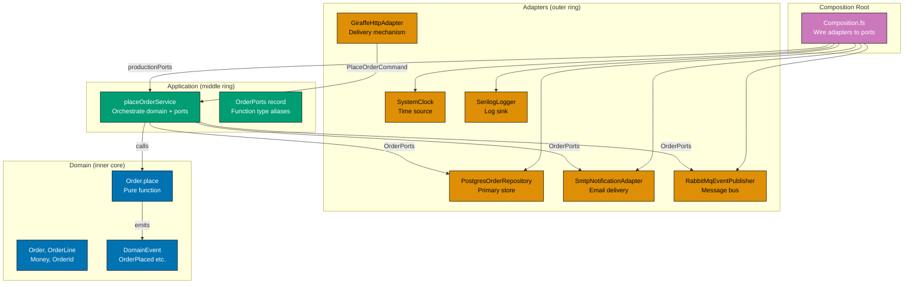

```fsharp
// ════════════════════════════════════════════════════════════════════════════════
// MODULE STRUCTURE
// ════════════════════════════════════════════════════════════════════════════════
//
// Domain/
//   Order.fs           — value objects, aggregate, domain events, pure functions
// Application/
//   Ports.fs           — all port type aliases (function types only)
//   PlaceOrderService.fs — application service (use case orchestrator)
// Adapters/
//   PostgreSQL/
//     PostgresOrderRepository.fs — SaveOrder + FindOrder implementation
//   Http/
//     GiraffeHttpAdapter.fs      — HTTP delivery mechanism
//   Messaging/
//     RabbitMqEventPublisher.fs  — PublishEvent implementation
//   Infrastructure/
//     SystemClock.fs             — ClockPort implementation
//     SerilogLogger.fs           — LogPort implementation
//     SmtpNotificationAdapter.fs — NotifyPort implementation
// Composition/
//   Composition.fs               — productionPorts + testPorts
// ════════════════════════════════════════════════════════════════════════════════

// ── DOMAIN LAYER ─────────────────────────────────────────────────────────────
// Domain/Order.fs — zero external imports; only F# standard library
module OrderTaking.Domain.Order

// Value objects — single-case DUs, equality by value, no mutable state
type OrderId    = OrderId    of string   // => Prevents string identity confusion
type CustomerId = CustomerId of string   // => Distinct from OrderId at compile time
type Money      = Money      of decimal  // => Currency semantics wrapped in type

// Domain events — emitted by Order.place on success
type DomainEvent =
    | OrderPlaced    of {| OrderId: OrderId; PlacedAt: System.DateTimeOffset |}
    // => Signals a new order was accepted — consumed by projections and sagas
    | OrderCancelled of {| OrderId: OrderId; Reason: string |}
    // => Signals cancellation — triggers refund saga and notification workflow

// Aggregate — all invariants enforced through module functions
type Order = {
    OrderId    : OrderId
    CustomerId : CustomerId
    Lines      : OrderLine list   // => Non-empty list is a domain invariant
    TotalPrice : Money
    Status     : OrderStatus      // => DU: Placed | Confirmed | Shipped | Cancelled
    PlacedAt   : System.DateTimeOffset
}

// Pure domain function — no I/O; always testable without infrastructure
let place (cmd: PlaceOrderCommand) : Result<Order * DomainEvent list, DomainError> =
    if String.IsNullOrWhiteSpace cmd.CustomerId then
        Error (ValidationError "CustomerId is required")
        // => Domain invariant violation — reject before creating any state
    elif cmd.Lines |> List.isEmpty then
        Error (ValidationError "Order must have at least one line")
        // => Empty order is not a valid domain concept
    else
        let total = cmd.Lines |> List.sumBy (fun l -> l.Quantity * l.UnitPrice)
        // => Compute total from lines — pure arithmetic
        let order  = {
            OrderId    = OrderId (System.Guid.NewGuid().ToString())
            CustomerId = CustomerId cmd.CustomerId
            Lines      = cmd.Lines |> List.map OrderLine.fromDto
            TotalPrice = Money total
            Status     = Placed
            PlacedAt   = System.DateTimeOffset.UtcNow
        }
        Ok (order, [ OrderPlaced {| OrderId = order.OrderId; PlacedAt = order.PlacedAt |} ])
        // => Return aggregate + events — both are pure values, no side effects
```

```fsharp
// ── APPLICATION LAYER ─────────────────────────────────────────────────────────
// Application/Ports.fs — all port type aliases; no implementation here
module OrderTaking.Application.Ports

// Output ports — called by the application service; implemented by adapters
type SaveOrder    = Order     -> Async<Result<unit, RepositoryError>>
// => SaveOrder: output port for write operations — PostgreSQL adapter provides this in production
type FindOrder    = OrderId   -> Async<Result<Order option, RepositoryError>>
// => FindOrder: output port for read operations — returns None when order does not exist
type NotifyPort   = Order     -> Async<Result<unit, NotificationError>>
// => NotifyPort: notification port — SMTP adapter in production, no-op in unit tests
type PublishEvent = DomainEvent -> Async<Result<unit, PublishError>>
// => PublishEvent: event publishing port — RabbitMQ adapter in production, spy in tests
type ClockPort    = unit      -> System.DateTimeOffset
// => Sync — reading the clock has no failure mode; no async wrapper needed
type LogPort      = string    -> unit
// => Fire-and-forget — logging never blocks or fails the application service

// Ports record — injected into every application service function
type OrderPorts = {
    SaveOrder    : SaveOrder
    // => SaveOrder field: repository write port — injected at startup via partial application
    FindOrder    : FindOrder
    // => FindOrder field: repository read port — used by query-side services
    Notify       : NotifyPort
    // => Notify field: notification port — called after successful order placement
    PublishEvent : PublishEvent
    // => PublishEvent field: event bus port — publishes OrderPlaced to downstream consumers
    Clock        : ClockPort
    // => Clock field: clock port — fixed time in tests, UTC now in production
    Log          : LogPort
    // => Log field: logging port — discarded in tests, Serilog in production
}
```

```fsharp
// ── APPLICATION SERVICE ────────────────────────────────────────────────────────
// Application/PlaceOrderService.fs
// open FsToolkit.ErrorHandling — requires NuGet package FsToolkit.ErrorHandling
module OrderTaking.Application.PlaceOrderService
// => PlaceOrderService module: application layer — orchestrates domain functions and calls output ports

let placeOrderService (ports: OrderPorts) (cmd: PlaceOrderCommand) =
// => placeOrderService: partially applied with ports at startup → returns a use-case handler function
    asyncResult {
        ports.Log $"PlaceOrder: received command for customer {cmd.CustomerId}"
        // => Log entry — fire-and-forget; never blocks; uses LogPort
        let! (order, events) = Order.place cmd |> Result.mapError AppDomainError |> async.Return
        // => Pure domain function — validate, compute, emit events; no I/O
        do! ports.SaveOrder order
        // => Persist aggregate — output port; infrastructure behind this boundary
        do! ports.Notify order
        // => Send confirmation email/SMS — output port; SMTP or SMS adapter
        for event in events do
            do! ports.PublishEvent event
            // => Publish each domain event — RabbitMQ or outbox adapter
        ports.Log $"PlaceOrder: completed for order {order.OrderId}"
        // => Log exit — confirms full pipeline executed
        return order.OrderId
        // => Return new identity to the HTTP adapter for 201 Created response
    }
```

```fsharp
// ── COMPOSITION ROOT ──────────────────────────────────────────────────────────
// Composition/Composition.fs — the ONLY place adapters are referenced by name
module OrderTaking.Composition

// ── Production ports (~10 lines) ──────────────────────────────────────────────
// Each adapter is a function literal satisfying the corresponding port type alias.
let productionPorts (connectionString: string) (smtpConfig: SmtpConfig) : OrderPorts = {
    SaveOrder    = PostgresOrderRepository.save connectionString
    // => Real PostgreSQL adapter — writes to the orders table
    FindOrder    = PostgresOrderRepository.find connectionString
    // => Real PostgreSQL adapter — reads from the orders table
    Notify       = SmtpNotificationAdapter.notify smtpConfig
    // => Real SMTP adapter — sends email via the configured mail server
    PublishEvent = RabbitMqEventPublisher.publish rabbitMqConnectionFactory
    // => Real RabbitMQ adapter — publishes to the domain-events exchange
    Clock        = fun () -> System.DateTimeOffset.UtcNow
    // => System clock — inline; no separate module needed for this trivial adapter
    Log          = fun msg -> printfn $"[INFO] {msg}"
    // => Serilog or stdout — replaced by SerilogLogger.log in production
}

// ── Test ports (~10 lines) ────────────────────────────────────────────────────
// In-memory adapters give fast, deterministic tests with zero infrastructure.
let testPorts () : OrderPorts = {
    SaveOrder    = fun order -> async { return Ok () }
    // => No-op save — tests assert on other effects (published events, notifications)
    FindOrder    = fun _id   -> async { return Ok None }
    // => Always-miss find — tests that need a found order wire a specific stub
    Notify       = fun _order -> async { return Ok () }
    // => No-op notify — notification tests use a recording spy adapter
    PublishEvent = fun _event -> async { return Ok () }
    // => No-op publish — event tests use a recording spy adapter
    Clock        = fun () -> System.DateTimeOffset.Parse("2026-01-01T00:00:00+07:00")
    // => Fixed clock — deterministic timestamps in all test assertions
    Log          = fun _msg -> ()
    // => Discard logs — test output is uncluttered; enable when debugging
}

// ── Three testing strategies ───────────────────────────────────────────────────
// 1. Domain test (pure — no infrastructure, no async):
//    Order.place cmd |> Result.isOk
//    => Covers: validation rules, event generation, business invariants
//    => Speed: nanoseconds; cacheable; run on every keystroke

// 2. Application test (in-memory ports — no database, no network):
//    placeOrderService (testPorts ()) cmd
//    => Covers: use case orchestration, port call sequencing, error propagation
//    => Speed: milliseconds; cacheable; run on pre-commit hook

// 3. Adapter test (TestContainers — real Postgres, real RabbitMQ):
//    PostgresOrderRepository.save connectionString sampleOrder
//    => Covers: SQL correctness, connection handling, schema compatibility
//    => Speed: seconds; not cacheable; run on CI only
```

**Key Takeaway**: Three distinct testing strategies — pure domain tests (nanoseconds), application tests with in-memory ports (milliseconds), and adapter tests with TestContainers (seconds) — each target exactly one layer with the minimum infrastructure necessary.

**Why It Matters**: A system with only end-to-end tests has slow feedback, fragile infrastructure dependencies, and no way to isolate failures. A system with only unit tests misses adapter bugs that only appear against real databases. Three-layer testing gives maximum confidence with minimum test infrastructure. The composition root is the only place that knows about all three layers — all other modules know only their immediate neighbours. This is the hexagonal architecture invariant expressed as code.

---

This advanced section demonstrates that hexagonal architecture scales to production systems combining CQRS, event sourcing, sagas, observability, multi-tenancy, and domain evolution — without ever violating the core dependency rule: adapters depend on ports, application services depend on ports and domain, and the domain depends on nothing outside itself.
