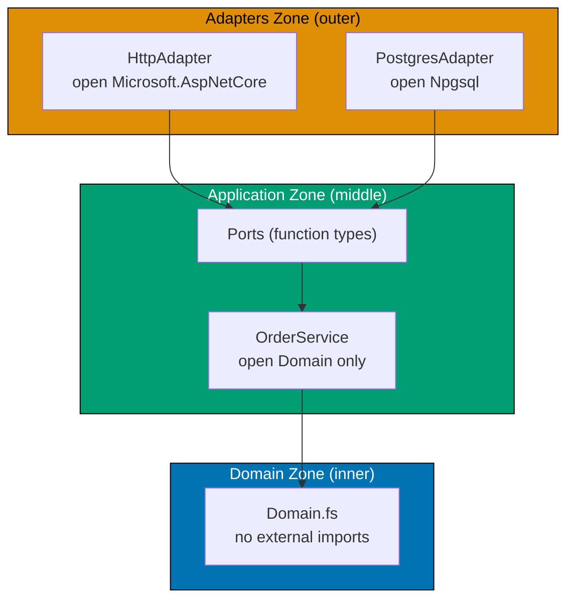
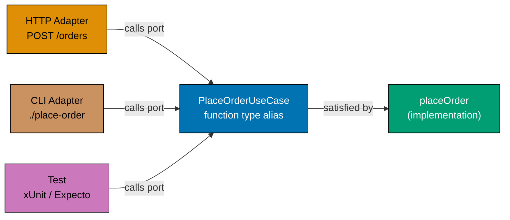
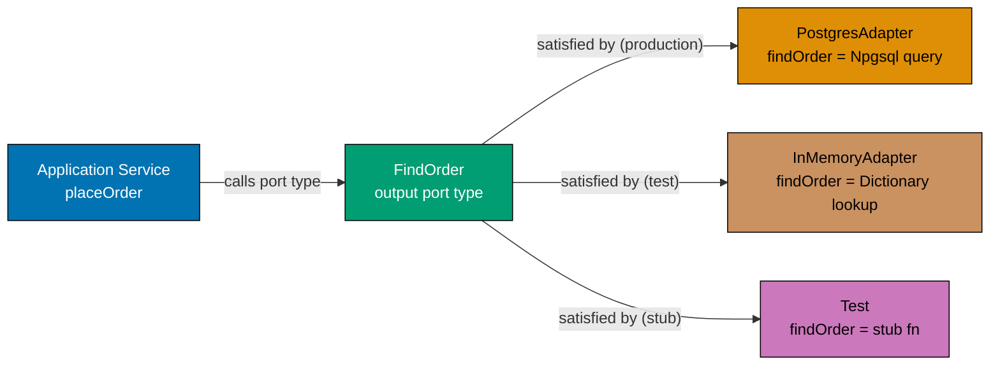
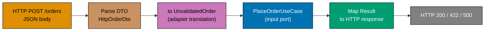
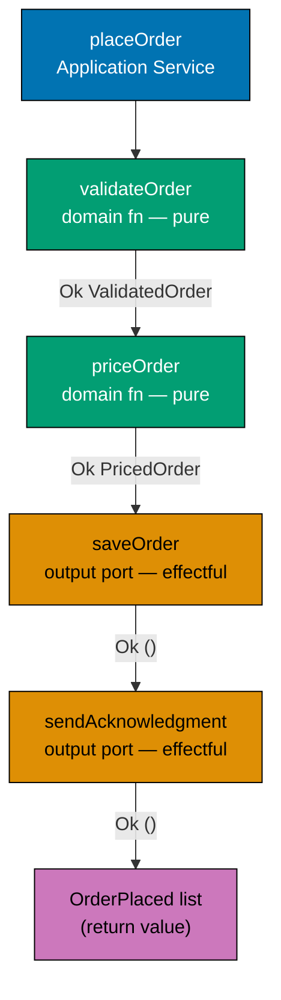
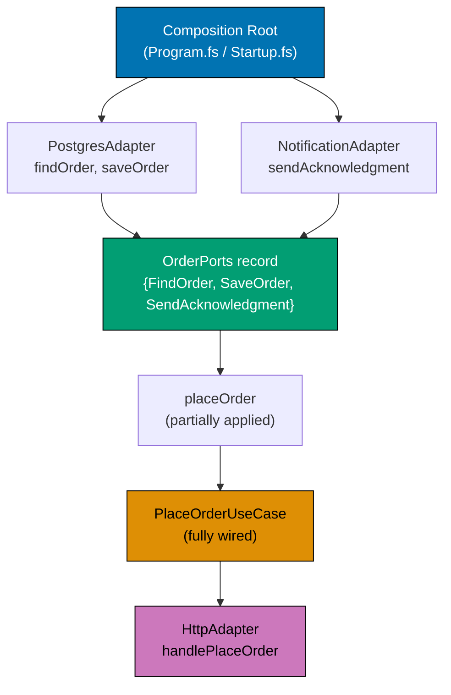
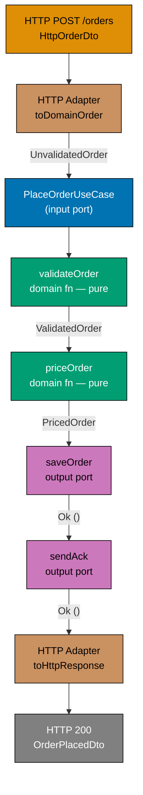

This beginner-level section introduces Hexagonal Architecture (Ports and Adapters) through F# code. The central thesis — that the **domain must be isolated from all infrastructure concerns** via a clean dependency rule — is established here through 25 progressive examples. All examples use the order-taking domain introduced in Wlaschin's _Domain Modeling Made Functional_: `UnvalidatedOrder → ValidateOrder → PriceOrder → OrderPlaced`.

## The Three Zones (Examples 1–7)

### Example 1: The Hexagon Metaphor — Three Zones as F# Namespaces

Hexagonal Architecture divides a system into three zones. The **Domain** zone holds pure business logic with no external dependencies. The **Application** zone orchestrates domain functions and defines ports. The **Adapters** zone wires the outside world (HTTP, database, CLI) to those ports. In F#, module namespaces are the natural mechanism for enforcing these zone boundaries.



```fsharp
// ── file: Domain.fs ──────────────────────────────────────────────────────
// The Domain zone has ZERO imports from any external library.
// No Npgsql, no ASP.NET, no JSON serialiser — only F# standard library.
// This is the innermost zone: pure business logic, always testable in isolation.

module OrderTaking.Domain

// All types here reference only F# primitives and other domain types.
type OrderId = string
// => Simple alias — zero runtime cost, maximum documentation value

type CustomerId = string
// => Distinct from OrderId — documents the domain vocabulary

type UnvalidatedOrder = {
    // => Raw input arriving from the outside world; nothing validated yet
    OrderId: string
    // => Raw string — may be blank, may be invalid
    CustomerId: string
    // => Raw customer identifier — not yet verified
}

// ── file: Application.fs ─────────────────────────────────────────────────
// Application zone imports only the Domain module — no infrastructure.

module OrderTaking.Application
// open OrderTaking.Domain   ← only this open statement is permitted here

// ── file: Adapters/PostgresAdapter.fs ────────────────────────────────────
// Adapters zone imports Application zone plus infrastructure libraries.

module OrderTaking.Adapters.PostgresAdapter
// open OrderTaking.Application   ← permitted: adapters depend on application
// open Npgsql                    ← permitted: adapters can open infra libraries

// ── ANTI-PATTERN: what NOT to do ─────────────────────────────────────────
// open Npgsql  ← inside Domain.fs — THIS IS WRONG
// Domain importing an infrastructure library violates the dependency rule.
// The domain would become untestable without a real database.
// => If you see an infrastructure import inside Domain.fs, it is a zone violation.

printfn "Three zones defined — dependency rule enforced by module namespaces"
// => Output: Three zones defined — dependency rule enforced by module namespaces
```

**Key Takeaway**: The three zones (Domain, Application, Adapters) map directly to F# module namespaces, and the dependency rule — inner zones never import outer zones — is a simple constraint on `open` statements.

**Why It Matters**: In most codebases, business logic quietly accumulates database calls, HTTP client calls, and configuration reads until nothing can be tested without spinning up real infrastructure. Hexagonal Architecture prevents this by making the zone boundary a module-level convention. When a developer attempts to `open Npgsql` inside `Domain.fs`, a code review catches it immediately because the convention is documented in the file structure itself. This single rule is responsible for the testability and evolvability of the entire system.

---

### Example 2: Domain Isolation — A Pure Domain Function with No Infrastructure Imports

A pure domain function accepts only domain types and returns a `Result`. It has no `open` statements for external libraries. It cannot call a database, make an HTTP request, or read a file. This purity is not a limitation — it is what makes the function instantly testable and independently deployable.

```fsharp
// ── CORRECT: pure domain function ────────────────────────────────────────
// Zero open statements for any library — only F# language constructs.
// This function can be tested by calling it directly with no setup.

type UnvalidatedOrder = { OrderId: string; CustomerId: string; Quantity: decimal }
// => All fields are raw primitives — not yet validated

type ValidatedOrder   = { OrderId: string; CustomerId: string; Quantity: decimal }
// => Same shape, but its existence signals that validation has passed

type DomainError =
    // => Named errors — not generic exceptions
    | BlankOrderId
    // => The order ID was empty or whitespace
    | BlankCustomerId
    // => The customer ID was empty or whitespace
    | NonPositiveQuantity of decimal
    // => Quantity was zero or negative — domain rule violation

let validateOrder (input: UnvalidatedOrder) : Result<ValidatedOrder, DomainError> =
    // => Input: raw DTO from the outside world
    // => Output: Ok ValidatedOrder if all rules pass, Error DomainError if any fail
    if System.String.IsNullOrWhiteSpace(input.OrderId) then
        // => Guard 1: the order ID must be non-blank
        Error BlankOrderId
        // => Returns named error — the caller knows exactly what went wrong
    elif System.String.IsNullOrWhiteSpace(input.CustomerId) then
        // => Guard 2: the customer ID must be non-blank
        Error BlankCustomerId
        // => Named error for blank customer ID
    elif input.Quantity <= 0m then
        // => Guard 3: quantities must be positive — domain rule
        Error (NonPositiveQuantity input.Quantity)
        // => Carries the actual invalid value for diagnostics
    else
        Ok { OrderId = input.OrderId; CustomerId = input.CustomerId; Quantity = input.Quantity }
        // => All guards passed — returns the validated order

// ── ANTI-PATTERN ─────────────────────────────────────────────────────────
// let validateOrderWrong (input: UnvalidatedOrder) (conn: NpgsqlConnection) =
//     open Npgsql                          ← WRONG: infrastructure import in domain
//     let exists = queryDatabase conn ...  ← WRONG: side effect inside domain function
//     if not exists then failwith "not found" ← WRONG: exception instead of Result

// Testing the pure function — no database, no HTTP, no setup
let result = validateOrder { OrderId = "ORD-001"; CustomerId = "CUST-42"; Quantity = 2m }
// => All three guards pass; Quantity 2m > 0
// => result : Result<ValidatedOrder, DomainError> = Ok { OrderId = "ORD-001"; ... }

match result with
| Ok order  -> printfn "Validated: %s" order.OrderId
// => order.OrderId = "ORD-001" — unwrapped from Ok
| Error err -> printfn "Error: %A" err
// => Not reached — input was valid
// => Output: Validated: ORD-001
```

**Key Takeaway**: A pure domain function with no infrastructure imports is the most testable unit of code in the system — calling it requires nothing but the F# runtime and domain types.

**Why It Matters**: Teams that embed database calls directly in domain functions often discover this when they try to write unit tests. The setup cost (spinning up databases, seeding data, managing transactions) discourages testing, leading to under-tested business logic. Pure domain functions have zero setup cost: pass in data, receive a `Result`. This is the direct payoff of the domain isolation rule, and it compounds across every domain function in the system.

---

### Example 3: Input Port as a Function Type Alias

An **input port** is the entry point into the application. Any adapter (HTTP handler, CLI parser, message consumer) that wants to trigger the `PlaceOrder` workflow calls through this port. In F#, the input port is a function type alias — no interface, no abstract class, no inheritance.



```fsharp
// Input port: the complete contract for placing an order.
// A type alias for a function — not an interface, not a class hierarchy.

type UnvalidatedOrder = { OrderId: string; CustomerId: string; Quantity: decimal }
// => Raw data entering the system from any delivery mechanism

type OrderPlaced = { OrderId: string; TotalAmount: decimal }
// => Domain event raised when the workflow completes successfully

type PlacingOrderError =
    // => All named failure modes — the caller must handle each
    | ValidationError  of string
    // => Input data violated a domain rule
    | ProductNotFound  of string
    // => The referenced product does not exist
    | PricingError     of string
    // => Price calculation failed (catalogue unavailable, etc.)

// ── The input port ────────────────────────────────────────────────────────
// This is the complete specification of what the PlaceOrder workflow does.
// Any function with this signature satisfies the port — duck typing by type alias.
type PlaceOrderUseCase =
    // => F# type alias for a function type
    UnvalidatedOrder -> Async<Result<OrderPlaced list, PlacingOrderError>>
    // => Input: raw, unvalidated order from any delivery mechanism
    // => Async: the implementation will call async ports (database, email)
    // => Result: distinguishes success (Ok) from domain failure (Error)
    // => OrderPlaced list: one command can raise multiple events

// Any function that matches the type satisfies the port
let stubPlaceOrder : PlaceOrderUseCase =
    // => Type annotation enforces the contract at compile time
    fun input ->
        async {
            // => async { } computation expression — returns Async<Result<...>>
            return Ok [ { OrderId = input.OrderId; TotalAmount = 99.00m } ]
            // => Stub: always succeeds with a hardcoded amount
        }

// The HTTP adapter, CLI adapter, and test all call the same type
let callPort (useCase: PlaceOrderUseCase) orderId =
    // => Takes the port as a parameter — whichever function satisfies the type works
    let input = { OrderId = orderId; CustomerId = "CUST-1"; Quantity = 1m }
    // => Constructs the unvalidated input from the adapter's data
    useCase input
    // => Calls the port — does not care which concrete function is used

printfn "Input port defined — any matching function satisfies it"
// => Output: Input port defined — any matching function satisfies it
```

**Key Takeaway**: An input port is a function type alias — any function with the correct signature satisfies it, enabling the HTTP adapter, CLI adapter, and tests to all drive the same application logic through the same type.

**Why It Matters**: Traditional OOP ports require callers to reference an interface type and implementations to declare `implements`. F# function type aliases achieve the same isolation with less ceremony. The critical benefit is that test code calling the `PlaceOrderUseCase` port exercises the exact same contract as the HTTP handler — there is no test-only interface or mock class that silently diverges from the production code path.

---

### Example 4: Output Port as a Function Type Alias

An **output port** is how the application reaches outward — to a database, an email service, a message queue. The application defines the port as a function type alias; the adapter provides the concrete implementation. The domain and application modules never import the adapter's infrastructure library.



```fsharp
// Output ports: function type aliases defining what the application needs
// from the outside world — without specifying HOW it is provided.

type OrderId = string
// => Domain identifier — used as the key for lookups

type Order = { OrderId: OrderId; CustomerId: string; TotalAmount: decimal }
// => The stored order record — what the repository holds and returns

type RepositoryError =
    // => Named failures from the output port — not raw exceptions
    | NotFound of OrderId
    // => No order exists with the given ID
    | DatabaseError of string
    // => Infrastructure failure (connection lost, timeout, etc.)

// ── Output port: find a single order by ID ────────────────────────────────
// The application calls this type; the adapter provides the concrete function.
type FindOrder = OrderId -> Async<Result<Order option, RepositoryError>>
// => Input: the ID to look up
// => Async: database I/O is inherently async
// => Result: distinguishes infrastructure failure from successful absence
// => Order option: Some order if found, None if it does not exist

// ── Output port: persist an order ────────────────────────────────────────
type SaveOrder = Order -> Async<Result<unit, RepositoryError>>
// => Input: the order to persist
// => Result<unit, ...>: unit means "no useful return value on success"
// => Only the error case carries information

// Application code references only the port types — not any concrete adapter
let lookupAndLog (findOrder: FindOrder) (orderId: OrderId) =
    // => Takes the port as a function parameter — dependency injected via partial application
    // => Could be a Postgres function, an in-memory function, or a stub — does not matter
    async {
        let! result = findOrder orderId
        // => Calls the port — awaits the Async result
        match result with
        | Ok (Some order) ->
            // => Order found — print it
            printfn "Found order: %s for customer %s" order.OrderId order.CustomerId
        | Ok None ->
            // => No order with this ID — absence is not an error
            printfn "Order %s not found" orderId
        | Error (DatabaseError msg) ->
            // => Infrastructure failure — log and surface
            printfn "DB error: %s" msg
        | Error (NotFound id) ->
            // => Explicit not-found from the port
            printfn "Repository says not found: %s" id
    }

printfn "Output port types defined — application depends only on function types"
// => Output: Output port types defined — application depends only on function types
```

**Key Takeaway**: Output ports are function type aliases that describe what the application needs from the outside world — the application service calls the type, and any function satisfying that type can serve as the implementation.

**Why It Matters**: Defining output ports as function types rather than interface types removes the need for a DI container. The production PostgreSQL function and the in-memory test function are both just functions of the right type. Swapping them requires no reflection, no XML configuration, no container registration — just passing a different function when partially applying the application service. This is the simplest possible form of the Dependency Inversion Principle.

---

### Example 5: Multiple Output Ports as a Record of Functions

When an application service needs several output ports (save order, send email, look up price), grouping them in a single record makes the dependency bundle explicit. Passing a different record swaps the entire adapter layer without touching the application service.

```fsharp
// OrderPorts: a record grouping all output ports the application service needs.
// Different records = different adapter sets = different environments.

type OrderId    = string
// => Domain identifier used across all port signatures
type CustomerId = string
// => Customer identifier — needed by the notification port

type Order = { OrderId: OrderId; CustomerId: CustomerId; TotalAmount: decimal }
// => The entity the ports operate on

type RepositoryError = DatabaseError of string | NotFound of OrderId
// => Shared error type for all repository output ports

type NotificationError = SmtpFailure of string | InvalidAddress of string
// => Errors the notification port can return

// ── Individual port type aliases ──────────────────────────────────────────
type FindOrder         = OrderId   -> Async<Result<Order option, RepositoryError>>
// => Look up a single order — used to check for duplicates before saving

type SaveOrder         = Order     -> Async<Result<unit, RepositoryError>>
// => Persist an order — called after validation and pricing succeed

type SendAcknowledgment = CustomerId -> string -> Async<Result<unit, NotificationError>>
// => Notify the customer — CustomerId identifies the recipient, string is the message body

// ── The dependency bundle ─────────────────────────────────────────────────
// A record of functions — one per output port the application service requires.
// This is the "dependency record" pattern: no DI container, no service locator.
type OrderPorts = {
    // => Groups all output ports into a single passable value
    FindOrder: FindOrder
    // => The repository read port — injected at startup
    SaveOrder: SaveOrder
    // => The repository write port — injected at startup
    SendAcknowledgment: SendAcknowledgment
    // => The notification port — injected at startup
}

// Application service: takes the port record as its first parameter
let placeOrder (ports: OrderPorts) (input: Order) =
    // => ports carries all adapters the service will call
    // => Swapping ports = swapping adapters — zero code changes to the service body
    async {
        let! existing = ports.FindOrder input.OrderId
        // => Calls the FindOrder port — could be Postgres, in-memory, or stub
        match existing with
        | Ok (Some _) -> return Error (DatabaseError "Duplicate order ID")
        // => Order already exists — short-circuit with an error
        | _ ->
            let! saved = ports.SaveOrder input
            // => Calls the SaveOrder port — persists the order
            match saved with
            | Error e -> return Error e
            // => Persistence failed — surface the error
            | Ok () ->
                let! _ = ports.SendAcknowledgment input.CustomerId "Order placed"
                // => Calls the notification port — non-critical, result ignored in this stub
                return Ok ()
                // => Workflow succeeded
    }

printfn "OrderPorts record bundles all output ports — pass different record = different adapters"
// => Output: OrderPorts record bundles all output ports — pass different record = different adapters
```

**Key Takeaway**: A record of function-typed fields is the functional equivalent of a dependency injection container — passing a different record to the application service substitutes the entire adapter layer.

**Why It Matters**: DI containers in OOP frameworks are complex runtime machinery that resolves dependencies via reflection, configuration files, and lifetime management. A record of functions achieves the same substitutability with zero runtime overhead and full compile-time type checking. The test record contains in-memory functions; the production record contains database functions. The application service cannot tell the difference — and that is the entire point.

---

### Example 6: Domain Types That Reference No Infrastructure

Every type in the domain module is defined using only F# primitives and other domain types. No JSON attributes, no ORM annotations, no HTTP framework types contaminate the domain model. This keeps domain types readable to domain experts and independent of any framework version.

```fsharp
// ── CORRECT: domain types with zero external dependencies ────────────────
// The domain module's only imports are F# standard library types.
// No [<JsonPropertyName>], no [<Column>], no DTO base classes.

type OrderId    = private OrderId    of string
// => Wrapper type — prevents mixing order IDs with customer IDs at compile time

type CustomerId = private CustomerId of string
// => Wrapper for customer identifiers — same pattern, distinct type

type ProductCode =
    // => Products come in two formats; the DU captures this OR relationship
    | Widget of widgetCode: string
    // => Widget codes: "W" followed by four digits
    | Gizmo  of gizmoCode: string
    // => Gizmo codes: "G" followed by three digits

type UnvalidatedOrder = {
    // => Raw input arriving from any delivery mechanism; all primitives
    OrderId: string
    // => Not yet wrapped — validation will create an OrderId wrapper
    CustomerId: string
    // => Not yet wrapped — validation will create a CustomerId wrapper
    Lines: (string * decimal) list
    // => List of (product code string, quantity) pairs — still raw
}

type ValidatedOrder = {
    // => All fields use domain wrapper types — validation has happened
    OrderId: OrderId
    // => Wrapped and validated — cannot be blank
    CustomerId: CustomerId
    // => Wrapped and validated — cannot be blank
    Lines: (ProductCode * decimal) list
    // => ProductCode DU — only valid product codes exist here
}

type OrderPlaced = {
    // => Domain event — emitted when the workflow completes successfully
    OrderId: OrderId
    // => The ID of the placed order — correlates the event to the command
    CustomerId: CustomerId
    // => Who placed it — downstream contexts may need to notify the customer
    TotalAmount: decimal
    // => The billed total — needed by the financial ledger context
}

// ── ANTI-PATTERN ─────────────────────────────────────────────────────────
// type OrderPlacedWrong = {
//     [<JsonPropertyName("order_id")>]   ← WRONG: JSON attribute in domain type
//     OrderId: string
//     [<Column("customer_id")>]          ← WRONG: ORM annotation in domain type
//     CustomerId: string
// }
// => Framework attributes tie the domain to specific library versions.
// => DTO translation (handled in the adapter layer) removes this coupling.

printfn "Domain types defined — zero external dependencies"
// => Output: Domain types defined — zero external dependencies
```

**Key Takeaway**: Domain types that contain no framework annotations or external references are free to evolve independently of serialisation formats, database schemas, or HTTP conventions.

**Why It Matters**: When domain types carry JSON attributes or ORM annotations, a framework upgrade can force domain model changes. Conversely, a domain model change requires coordinated updates to serialisation mappings. Keeping domain types clean of these concerns lets the domain evolve at its own pace. DTO translation, handled in the adapter layer (Examples 13 and 14), is the necessary cost — but it buys complete independence between the domain model and every framework the system touches.

---

### Example 7: The Dependency Rule Visualised in F# Module Structure

The dependency rule is simple: inner zones can never import outer zones. Domain cannot import Application or Adapters. Application cannot import Adapters. Only Adapters import everything. This rule is enforced by which `open` statements appear (or are absent) in each file.

```fsharp
// ── Domain.fs — innermost zone ───────────────────────────────────────────
// NO open statements for any external library.
// Only F# language constructs and types defined in this module.

module OrderTaking.Domain

type OrderId    = string
// => Domain primitive — string alias for documentation value
type CustomerId = string
// => Customer identifier alias

type DomainError = ValidationFailed of string | ProductNotFound of string
// => Domain errors — not tied to HTTP status codes or database error codes

let validateOrderId (raw: string) : Result<OrderId, DomainError> =
    // => Pure domain function — no infrastructure, no Async, no effects
    if System.String.IsNullOrWhiteSpace(raw) then Error (ValidationFailed "OrderId blank")
    // => Guard: blank IDs are a domain rule violation
    else Ok raw
    // => Non-blank string passes — returns the validated alias

// ── Application.fs — middle zone ─────────────────────────────────────────
// open OrderTaking.Domain   ← ONLY this open — application imports domain only

module OrderTaking.Application
// All port types and application service functions go here.
// No Npgsql, no Microsoft.AspNetCore, no System.Net.Http imports.

type FindOrder = OrderId -> Async<Result<string option, string>>
// => Output port type alias — defined in application, satisfied by adapters

// ── Adapters/PostgresAdapter.fs — outer zone ─────────────────────────────
// open OrderTaking.Application   ← imports application (and transitively domain)
// open Npgsql                    ← infrastructure library — ONLY in adapters

module OrderTaking.Adapters.Postgres
// The PostgreSQL adapter satisfies the FindOrder output port using Npgsql.
// Domain.fs and Application.fs remain unchanged when this adapter is replaced.

// ── Adapters/HttpAdapter.fs — outer zone ─────────────────────────────────
// open OrderTaking.Application          ← imports application
// open Microsoft.AspNetCore.Http        ← HTTP types — ONLY in adapters

module OrderTaking.Adapters.Http
// The HTTP adapter translates HTTP requests to PlaceOrderUseCase calls.
// Domain.fs and Application.fs do not know this adapter exists.

printfn "Dependency rule: Domain ← Application ← Adapters"
// => Arrow means 'is imported by'
// => Output: Dependency rule: Domain ← Application ← Adapters
```

**Key Takeaway**: The dependency rule is simply a convention on `open` statements — domain files have none pointing outward, adapter files have all the external ones.

**Why It Matters**: In many codebases the dependency direction is discovered by accident through import chain analysis. Making it an explicit file-level convention means any violation is immediately visible during code review. A `open Npgsql` inside `Domain.fs` is a one-line code smell that any reviewer can catch without understanding the business logic. This convention is cheap to establish and extremely valuable to maintain as the system grows.

---

## Ports and Adapters (Examples 8–16)

### Example 8: In-Memory Adapter — Satisfying an Output Port with a Mutable Dictionary

An in-memory adapter provides a concrete implementation of the `FindOrder` and `SaveOrder` output ports using a `Dictionary`. It satisfies the exact port type aliases defined in the application zone. It is used in tests — no database required, no network, deterministic results every time.

```fsharp
// In-memory adapter: satisfies output port types using a Dictionary.
// Used in tests — replaces the PostgreSQL adapter without any code changes
// to the application service.

open System.Collections.Generic

type OrderId = string
// => The key type for our in-memory store

type Order = { OrderId: OrderId; CustomerId: string; TotalAmount: decimal }
// => The entity stored and retrieved by the adapter

type RepositoryError = DatabaseError of string | NotFound of OrderId
// => Same error type the output ports require

// ── Output port type aliases (from Application zone) ──────────────────────
type FindOrder = OrderId -> Async<Result<Order option, RepositoryError>>
// => The port contract — the adapter must satisfy this exact type
type SaveOrder = Order   -> Async<Result<unit,         RepositoryError>>
// => The save port contract — same pattern

// ── In-memory adapter implementation ─────────────────────────────────────
// A module that closes over a Dictionary and exposes functions matching the ports.
let createInMemoryOrderStore () =
    // => Factory function — creates a fresh store for each test
    // => Returns the two port functions as a tuple
    let store = Dictionary<string, Order>()
    // => Mutable dictionary keyed by OrderId string
    // => Each call to the factory creates an isolated store — no shared state between tests

    let findOrder : FindOrder =
        // => Type annotation enforces the port contract — compiler checks signature
        fun orderId ->
            async {
                // => async { } required because the port type is Async
                match store.TryGetValue(orderId) with
                | true,  order -> return Ok (Some order)
                // => Found: returns Some with the order
                | false, _     -> return Ok None
                // => Not found: returns None (not an error — absence is valid)
            }

    let saveOrder : SaveOrder =
        // => Satisfies the SaveOrder port contract
        fun order ->
            async {
                store.[order.OrderId] <- order
                // => Mutable write to the dictionary — acceptable in the adapter layer
                // => The domain and application layers remain pure
                return Ok ()
                // => Always succeeds — in-memory ops don't have connection failures
            }

    findOrder, saveOrder
    // => Returns both port functions — caller wires them into the OrderPorts record

// Demonstrating in a test-style scenario
let find, save = createInMemoryOrderStore ()
// => find : FindOrder, save : SaveOrder — both satisfy their port types

let saved = save { OrderId = "ORD-001"; CustomerId = "CUST-42"; TotalAmount = 29.97m } |> Async.RunSynchronously
// => Async.RunSynchronously used only in examples — use Async.AwaitTask in real tests
// => saved : Result<unit, RepositoryError> = Ok ()

let found = find "ORD-001" |> Async.RunSynchronously
// => found : Result<Order option, RepositoryError> = Ok (Some { OrderId = "ORD-001"; ... })

printfn "In-memory adapter satisfies port types: %A" found
// => Output: In-memory adapter satisfies port types: Ok (Some {OrderId = "ORD-001"; ...})
```

**Key Takeaway**: An in-memory adapter satisfies output port types using a `Dictionary`, enabling fast, deterministic tests without any database infrastructure.

**Why It Matters**: Integration tests requiring a real database are slow (seconds per test), fragile (fail when the database is unavailable), and hard to parallelize (shared state causes ordering dependencies). An in-memory adapter that satisfies the same output port types makes every test instant, isolated, and runnable on any developer machine. The application service cannot tell the difference — it only sees the port types.

---

### Example 9: PostgreSQL Adapter Stub — Satisfying the Same Output Port

The PostgreSQL adapter satisfies the same `FindOrder` and `SaveOrder` port types as the in-memory adapter. The domain and application modules are completely unchanged. Only the adapter module differs. Swapping adapters means passing a different function when constructing the `OrderPorts` record.

```fsharp
// PostgreSQL adapter: satisfies the same port types as the in-memory adapter.
// The ONLY difference from Example 8 is the implementation body.
// Application.fs and Domain.fs are unchanged.

// Simulating Npgsql-style imports (shown as comments — not runnable without Npgsql)
// open Npgsql   ← this open appears ONLY in the adapter module, never in Domain or Application

type OrderId = string
// => Domain identifier — same as in the in-memory adapter

type Order = { OrderId: OrderId; CustomerId: string; TotalAmount: decimal }
// => Same domain entity type — adapters share domain types

type RepositoryError = DatabaseError of string | NotFound of OrderId
// => Same error type — the port contract requires this specific union

type FindOrder = OrderId -> Async<Result<Order option, RepositoryError>>
// => The port type to satisfy — identical to what the in-memory adapter satisfied

type SaveOrder = Order -> Async<Result<unit, RepositoryError>>
// => The save port type — same contract, different implementation body

// ── Simulated PostgreSQL adapter functions ────────────────────────────────
// In production, these functions open a Npgsql connection and query the database.
// The signatures are IDENTICAL to the in-memory adapter — only the body differs.

let postgresFind (connectionString: string) : FindOrder =
    // => Partial application: bakes the connection string in, returns a FindOrder function
    // => connectionString is injected at startup — not a global mutable
    fun orderId ->
        async {
            // => Would execute: SELECT * FROM orders WHERE order_id = @orderId
            // => Npgsql call omitted — focus is on the structural pattern
            printfn "[Postgres] SELECT order_id=%s" orderId
            // => Simulates the async database query
            // => In production: use NpgsqlCommand with parameterised query
            return Ok None
            // => Stub returns None — real impl would return Ok (Some order) if found
        }

let postgresSave (connectionString: string) : SaveOrder =
    // => Partial application: bakes the connection string in, returns a SaveOrder function
    fun order ->
        async {
            // => Would execute: INSERT INTO orders VALUES (@orderId, @customerId, @total)
            printfn "[Postgres] INSERT order_id=%s total=%.2f" order.OrderId order.TotalAmount
            // => Simulates the async insert — real impl uses NpgsqlCommand.ExecuteNonQueryAsync
            return Ok ()
            // => Success — real impl checks affected rows and returns Error on zero
        }

// The application service receives the same port types regardless of adapter
let productionFind = postgresFind "Host=localhost;Database=orders"
// => productionFind : FindOrder — satisfies the output port type
// => Same type as the in-memory adapter — the application service cannot tell the difference

printfn "Postgres adapter satisfies the same port types — zero changes to domain or application"
// => Output: Postgres adapter satisfies the same port types — zero changes to domain or application
```

**Key Takeaway**: The PostgreSQL adapter and the in-memory adapter satisfy identical port types — the application service is genuinely oblivious to which concrete implementation it uses.

**Why It Matters**: "We can't swap the database" is a common excuse for inflexible systems. Hexagonal Architecture removes this excuse structurally. Because the application service only knows about function type aliases, the concrete adapter is irrelevant to the application logic. This enables: (1) testing with in-memory adapters, (2) migrating from PostgreSQL to another database by writing a new adapter, (3) running read-only integration tests against a different store. The architecture makes these substitutions mechanical rather than heroic.

---

### Example 10: HTTP Adapter — Translating an HTTP Request to an Input Port Call

The HTTP adapter is a thin layer that parses an HTTP request body, calls the `PlaceOrderUseCase` input port, and maps the `Result` to an HTTP status code. Every `open` for HTTP framework types is in the adapter module. The application service has no knowledge of HTTP.



```fsharp
// HTTP adapter: translates HTTP requests to input port calls.
// The application service (PlaceOrderUseCase) is called with domain types.
// HTTP-specific imports appear ONLY in this module.

// Simulating ASP.NET Core types inline for a self-contained example
type HttpStatusCode = OK | BadRequest | UnprocessableEntity | InternalServerError
// => Simplified status code type — real adapter uses Microsoft.AspNetCore.Http

type HttpResponse = { StatusCode: HttpStatusCode; Body: string }
// => Simplified response — real adapter uses IActionResult or HttpContext

// ── DTO (defined in adapter layer) ────────────────────────────────────────
type HttpOrderDto = {
    // => Mirrors the JSON request body exactly — field names match JSON keys
    order_id: string
    // => Snake_case matches the JSON convention — domain uses PascalCase
    customer_id: string
    // => Raw string from JSON — not yet validated
    quantity: decimal
    // => Raw decimal from JSON body — may be zero or negative
}

// Domain types (from Application zone)
type UnvalidatedOrder = { OrderId: string; CustomerId: string; Quantity: decimal }
// => The domain input type the application service expects

type OrderPlaced = { OrderId: string; TotalAmount: decimal }
// => Domain event type

type PlacingOrderError = ValidationError of string | PricingError of string
// => Domain error union

type PlaceOrderUseCase = UnvalidatedOrder -> Async<Result<OrderPlaced list, PlacingOrderError>>
// => The input port — the adapter calls this, not the application service directly

// ── HTTP adapter handler function ─────────────────────────────────────────
let handlePlaceOrder (useCase: PlaceOrderUseCase) (dto: HttpOrderDto) : Async<HttpResponse> =
    // => useCase: the input port injected via partial application at startup
    // => dto: the parsed JSON body — already deserialized by the framework
    async {
        let input = { OrderId = dto.order_id; CustomerId = dto.customer_id; Quantity = dto.quantity }
        // => Translate DTO to domain input type — adapter responsibility
        // => Field names are mapped: snake_case JSON → PascalCase domain

        let! result = useCase input
        // => Call the input port — Async.Await the result
        // => The adapter does not know or care what happens inside the application service

        return
            match result with
            | Ok events ->
                // => Success: format events as JSON response
                { StatusCode = OK; Body = sprintf """{"events":%d}""" (List.length events) }
                // => HTTP 200 with event count — real adapter would serialize events to JSON
            | Error (ValidationError msg) ->
                // => Domain validation failure → HTTP 422 Unprocessable Entity
                { StatusCode = UnprocessableEntity; Body = sprintf """{"error":"%s"}""" msg }
            | Error (PricingError msg) ->
                // => Pricing failure → HTTP 500 Internal Server Error
                { StatusCode = InternalServerError; Body = sprintf """{"error":"%s"}""" msg }
    }

// Test the adapter with a stub use case
let stubUseCase : PlaceOrderUseCase =
    fun input -> async { return Ok [ { OrderId = input.OrderId; TotalAmount = 99.00m } ] }
// => Stub satisfies the PlaceOrderUseCase type — used only to demonstrate the adapter

let response =
    handlePlaceOrder stubUseCase { order_id = "ORD-001"; customer_id = "CUST-1"; quantity = 2m }
    |> Async.RunSynchronously
// => Runs the async handler synchronously — only for demonstration

printfn "HTTP response: %A %s" response.StatusCode response.Body
// => Output: HTTP response: OK {"events":1}
```

**Key Takeaway**: The HTTP adapter is a pure translation layer — it maps HTTP vocabulary (JSON bodies, status codes) to domain vocabulary (input port types, Result values) without containing any business logic.

**Why It Matters**: When business logic leaks into HTTP handlers, the logic becomes untestable without an HTTP server and impossible to reuse from a CLI or message queue. Keeping adapters thin ensures that all business logic resides in the application service and domain, where it can be tested directly with domain types. The HTTP adapter is then trivially correct by inspection — it does nothing but translate and delegate.

---

### Example 11: CLI Adapter — Second Input Adapter for the Same Port

A CLI adapter reads an order from command-line arguments or stdin, calls the same `PlaceOrderUseCase` input port, and prints the result. The application service function is identical to what the HTTP adapter calls. This demonstrates that one port supports multiple delivery mechanisms.

```fsharp
// CLI adapter: a second input adapter for the same PlaceOrderUseCase port.
// The application service is unchanged — only the delivery mechanism differs.

type UnvalidatedOrder = { OrderId: string; CustomerId: string; Quantity: decimal }
// => Same domain input type — the CLI adapter produces the same type as the HTTP adapter

type OrderPlaced = { OrderId: string; TotalAmount: decimal }
// => Same event type — the CLI adapter receives the same output as the HTTP adapter

type PlacingOrderError = ValidationError of string | PricingError of string
// => Same error union — the CLI adapter handles the same failures

type PlaceOrderUseCase = UnvalidatedOrder -> Async<Result<OrderPlaced list, PlacingOrderError>>
// => THE SAME input port type — CLI and HTTP adapters call the same type

// ── CLI adapter ───────────────────────────────────────────────────────────
// Reads from argv or stdin, calls the port, prints the result.
let handleCliPlaceOrder (useCase: PlaceOrderUseCase) (args: string array) : Async<int> =
    // => useCase: the same port function injected from composition root
    // => args: command-line arguments from System.Environment or test stubs
    // => Returns Async<int>: exit code (0 = success, 1 = failure)
    async {
        if args.Length < 3 then
            // => Guard: require exactly three arguments
            eprintfn "Usage: place-order <order-id> <customer-id> <quantity>"
            // => eprintf writes to stderr — convention for CLI error output
            return 1
            // => Non-zero exit code signals failure to the shell
        else
            let orderId    = args.[0]
            // => First argument is the order ID
            let customerId = args.[1]
            // => Second argument is the customer ID
            let quantity   = decimal args.[2]
            // => Third argument parsed as decimal — real adapter handles parse failure

            let input = { OrderId = orderId; CustomerId = customerId; Quantity = quantity }
            // => Build the domain input type from CLI arguments
            // => Same UnvalidatedOrder type the HTTP adapter builds from JSON DTO

            let! result = useCase input
            // => Call the SAME input port — application service is shared

            match result with
            | Ok events ->
                printfn "Order placed: %d event(s) raised" (List.length events)
                // => Print success to stdout — CLI convention
                return 0
                // => Exit code 0: success
            | Error (ValidationError msg) ->
                eprintfn "Validation error: %s" msg
                // => Print error to stderr
                return 1
                // => Exit code 1: validation failure
            | Error (PricingError msg) ->
                eprintfn "Pricing error: %s" msg
                // => Print to stderr — pricing failures are system errors
                return 2
                // => Exit code 2: pricing failure (distinct from validation failure)
    }

// Demonstrating both adapters calling the same use case stub
let sharedUseCase : PlaceOrderUseCase =
    // => Stub returns a single OrderPlaced event — no domain logic needed here
    fun input -> async { return Ok [ { OrderId = input.OrderId; TotalAmount = 49.95m } ] }
// => Shared stub — in production this is the real application service

let exitCode =
    handleCliPlaceOrder sharedUseCase [| "ORD-002"; "CUST-7"; "1" |]
    |> Async.RunSynchronously
// => Calls the CLI adapter with simulated argv — same use case as HTTP adapter

printfn "CLI exit code: %d" exitCode
// => Output: Order placed: 1 event(s) raised
// => Output: CLI exit code: 0
```

**Key Takeaway**: Multiple adapters (HTTP, CLI, message queue) can drive the same `PlaceOrderUseCase` port without any changes to the application service — the port is the stable interface across all delivery mechanisms.

**Why It Matters**: Organisations often build separate codebases for web, CLI, and batch processing versions of the same business logic, leading to divergence bugs where the CLI version handles edge cases differently from the API. With hexagonal architecture, the application service is the single authoritative implementation. Any new delivery mechanism is a new adapter — thin, testable, and guaranteed to use the same logic as every other adapter.

---

### Example 12: Anti-Pattern — Domain Function Importing a Database Library

This example shows the **wrong** approach: a domain function that directly imports a database library and queries the database. It then shows the corrected version using an output port, demonstrating the structural difference.

```fsharp
// ── ANTI-PATTERN: domain importing infrastructure ─────────────────────────
// This is what hexagonal architecture is designed to prevent.
// A domain function that queries the database directly violates the dependency rule.

// WRONG: domain function with database dependency
// open Npgsql   ← infrastructure import inside domain module — VIOLATION

// type FindOrderWrong = unit -> NpgsqlConnection -> string -> Order option
// let getOrderWrong (conn: NpgsqlConnection) (orderId: string) : Order option =
//     // => NpgsqlConnection parameter: the domain now DEPENDS on the database
//     // => Cannot be tested without a real database
//     // => Cannot be reused with a different database technology
//     let cmd = new NpgsqlCommand("SELECT ...", conn)
//     // => SQL string embedded in the domain — schema changes break domain logic
//     let reader = cmd.ExecuteReader()
//     // => Synchronous blocking I/O in the domain — cannot be made async
//     if reader.Read() then Some { OrderId = reader.GetString(0); ... }
//     // => Domain knows about NpgsqlDataReader — tied to Npgsql's API
//     else None

// Problems with the anti-pattern:
// 1. Domain cannot be unit tested — requires a live database
// => Every test that exercises getOrderWrong needs a running PostgreSQL instance
// 2. Domain is tied to PostgreSQL — switching databases requires rewriting domain code
// => Changing to MongoDB or a REST API means touching the domain itself
// 3. Domain cannot be run without a connection string at startup
// => The domain is no longer self-contained — it has a runtime infrastructure dependency

// ── CORRECT: domain function using an output port ─────────────────────────
// The domain defines what it needs (a FindOrder port), not how it is provided.

type Order = { OrderId: string; CustomerId: string; TotalAmount: decimal }
// => Domain entity — no database types in sight

type RepositoryError = NotFound of string | DatabaseError of string
// => Domain-defined error — not Npgsql.PostgresException or SqlException

type FindOrder = string -> Async<Result<Order option, RepositoryError>>
// => Output port type alias: the domain defines the SHAPE it needs
// => No Npgsql types anywhere in this type signature

let processOrder (findOrder: FindOrder) (orderId: string) =
    // => findOrder is injected — the domain does not know or care about the concrete adapter
    // => Could be Postgres, MySQL, MongoDB, an HTTP API, or an in-memory dictionary
    async {
        let! result = findOrder orderId
        // => Calls the output port — infrastructure concern handled by the adapter
        match result with
        | Ok (Some order) ->
            printfn "Processing order %s (total: %.2f)" order.OrderId order.TotalAmount
            // => Domain logic proceeds with the found order
        | Ok None ->
            printfn "Order %s not found" orderId
            // => Absence is a valid domain outcome — not an infrastructure error
        | Error (DatabaseError msg) ->
            printfn "Infrastructure failure: %s" msg
            // => Infrastructure failure surfaces as a domain error type
        | Error (NotFound id) ->
            printfn "Not found error for: %s" id
            // => Explicit not-found from the port layer
    }

// Testing with no database: pass an in-memory stub
let stubFind : FindOrder =
    fun orderId -> async { return Ok (Some { OrderId = orderId; CustomerId = "CUST-1"; TotalAmount = 29.97m }) }
// => Pure function — no database, no network, fully deterministic

processOrder stubFind "ORD-001" |> Async.RunSynchronously
// => Output: Processing order ORD-001 (total: 29.97)
```

**Key Takeaway**: Domain functions that depend on database libraries cannot be tested without infrastructure — replacing the direct dependency with an output port type makes the domain pure and instantly testable.

**Why It Matters**: The anti-pattern is extremely common in codebases that started small: a domain function calls a repository directly because "it's just one query". Over time, domain functions accumulate infrastructure dependencies until the domain module cannot be loaded without a database connection. Recognising this smell early — an infrastructure `open` statement inside a domain module — and applying the output port fix prevents years of accumulated technical debt.

---

### Example 13: Adapter Maps DTO to Domain (Inbound Translation)

The adapter layer is responsible for translating between the outside world's representation (DTOs, HTTP bodies, CSV rows) and domain types. The domain type `UnvalidatedOrder` never knows about `HttpOrderDto`. Translation happens entirely in the adapter module.

```fsharp
// Inbound translation: adapter converts the external DTO to the domain input type.
// Domain types never reference DTO types or serialisation frameworks.

// ── DTO (adapter layer) ───────────────────────────────────────────────────
// Defined in the adapter module — mirrors the JSON/CSV/message shape exactly.
type HttpOrderLineDto = {
    // => Mirrors the JSON array element — snake_case JSON field names
    product_code: string
    // => Raw product code string from JSON — may be invalid
    quantity: float
    // => JSON numbers deserialise to float — will be converted to decimal in domain
}

type HttpOrderDto = {
    // => Mirrors the JSON request body — defined in the adapter, not the domain
    order_id: string
    // => Snake_case: JSON convention. Domain uses OrderId (PascalCase).
    customer_id: string
    // => Raw customer identifier from JSON body
    lines: HttpOrderLineDto list
    // => Array of line items — each will be translated to a domain line
}

// ── Domain types (application zone) ──────────────────────────────────────
type UnvalidatedOrderLine = { ProductCode: string; Quantity: decimal }
// => Domain input type — no snake_case, no float, no JSON attribute
type UnvalidatedOrder     = { OrderId: string; CustomerId: string; Lines: UnvalidatedOrderLine list }
// => Domain input type — uses domain field names and types

// ── Inbound translation function (adapter layer) ─────────────────────────
// Lives in the adapter module — translates the DTO to the domain input type.
let toDomainOrder (dto: HttpOrderDto) : UnvalidatedOrder =
    // => Input: HttpOrderDto (external shape with snake_case and float)
    // => Output: UnvalidatedOrder (domain shape with PascalCase and decimal)
    let lines =
        dto.lines
        // => dto.lines : HttpOrderLineDto list — raw from JSON
        |> List.map (fun lineDto ->
            { ProductCode = lineDto.product_code
              // => Map snake_case product_code → PascalCase ProductCode
              Quantity = decimal lineDto.quantity
              // => Convert float → decimal — domain uses decimal for monetary precision
            })
        // => Each HttpOrderLineDto becomes an UnvalidatedOrderLine
    { OrderId    = dto.order_id
      // => Map order_id → OrderId — same value, aligned field name
      CustomerId = dto.customer_id
      // => Map customer_id → CustomerId
      Lines      = lines
      // => Mapped lines list — float quantities converted to decimal
    }
    // => Returns UnvalidatedOrder — domain type ready to enter the workflow

// ── Demonstration ─────────────────────────────────────────────────────────
let incomingDto = {
    order_id    = "ORD-001"
    customer_id = "CUST-42"
    lines       = [ { product_code = "W1234"; quantity = 2.0 }
                    { product_code = "G456";  quantity = 0.5 } ]
}
// => incomingDto : HttpOrderDto — as received from JSON deserialisation

let domainInput = toDomainOrder incomingDto
// => domainInput : UnvalidatedOrder — translated, ready for the application service

printfn "Translated: %s, %d lines" domainInput.OrderId (List.length domainInput.Lines)
// => Output: Translated: ORD-001, 2 lines
```

**Key Takeaway**: Inbound DTO translation in the adapter layer keeps domain types free of JSON field name conventions, serialisation attributes, and external type dependencies.

**Why It Matters**: DTOs change when the API contract evolves. Domain types change when business rules evolve. These two change rhythms are independent. By keeping translation in the adapter layer, a change to the JSON field names (e.g., renaming `order_id` to `orderId`) only affects the adapter's translation function — the domain type is untouched. Conversely, a domain type restructure does not affect the JSON API shape. Each concern evolves at its own pace.

---

### Example 14: Adapter Maps Domain to DTO (Outbound Translation)

Outbound translation converts domain events (produced by the application service) to the DTO shape that the HTTP response or message queue expects. Domain event types are defined in the domain zone. DTO types are defined in the adapter zone. The translation function lives in the adapter zone.

```fsharp
// Outbound translation: adapter converts domain events to response DTOs.
// Domain event types never reference DTO types or serialisation concerns.

// ── Domain event (domain zone) ────────────────────────────────────────────
// Defined in Domain.fs — no knowledge of HTTP or JSON.
type OrderId = string
// => Domain identifier alias

type OrderPlaced = {
    // => Domain event: a fact that the order-taking workflow has completed
    OrderId: OrderId
    // => The ID of the placed order — correlates to the original command
    CustomerId: string
    // => Who placed the order — may be used by downstream contexts
    TotalAmount: decimal
    // => Total billed — in decimal for precision (monetary amounts)
    PlacedAt: System.DateTimeOffset
    // => When it happened — includes timezone (safer than DateTime)
}

// ── Response DTO (adapter zone) ───────────────────────────────────────────
// Defined in the adapter module — mirrors the JSON response shape.
type OrderPlacedResponseDto = {
    // => JSON response body shape — snake_case for REST API convention
    order_id: string
    // => Mapped from domain OrderId
    customer_id: string
    // => Mapped from domain CustomerId
    total_amount: float
    // => float for JSON serialisation — decimal is not natively JSON-friendly
    placed_at: string
    // => ISO 8601 string — human-readable in the API response
}

// ── Outbound translation function (adapter layer) ─────────────────────────
let toResponseDto (event: OrderPlaced) : OrderPlacedResponseDto =
    // => Input: OrderPlaced (domain event — decimal amounts, DateTimeOffset)
    // => Output: OrderPlacedResponseDto (API shape — float, ISO string)
    { order_id    = event.OrderId
      // => Direct field mapping: OrderId → order_id (name alignment)
      customer_id = event.CustomerId
      // => Direct mapping: CustomerId → customer_id
      total_amount = float event.TotalAmount
      // => decimal → float: JSON does not have a decimal type
      // => Precision loss is acceptable for display; ledger uses the domain decimal
      placed_at   = event.PlacedAt.ToString("o")
      // => DateTimeOffset.ToString("o") produces ISO 8601 format: "2026-05-15T10:30:00+07:00"
      // => "o" = round-trip format specifier — preserves timezone offset
    }

// ── Demonstration ─────────────────────────────────────────────────────────
let domainEvent = {
    OrderId     = "ORD-001"
    CustomerId  = "CUST-42"
    TotalAmount = 29.97m
    // => Decimal in the domain — precise monetary value
    PlacedAt    = System.DateTimeOffset(2026, 5, 15, 10, 30, 0, System.TimeSpan.FromHours(7.0))
    // => DateTimeOffset with +07:00 timezone — represents WIB (Western Indonesian Time)
}
// => domainEvent : OrderPlaced — raised by the application service

let responseDto = toResponseDto domainEvent
// => responseDto : OrderPlacedResponseDto — ready to be serialised to JSON

printfn "Response DTO: order_id=%s total_amount=%.2f" responseDto.order_id responseDto.total_amount
// => Output: Response DTO: order_id=ORD-001 total_amount=29.97
```

**Key Takeaway**: Outbound translation functions in the adapter layer convert domain event types to response DTOs, keeping domain types free of serialisation concerns and response format conventions.

**Why It Matters**: REST API conventions evolve: field naming changes (camelCase vs snake_case), field types change (decimal to string for currency), and new fields are added for client convenience. If domain event types carry these conventions directly, every API change forces a domain change. Adapter-layer translation absorbs API evolution without touching the domain, protecting the core business model from external churn.

---

### Example 15: Application Service as Orchestrator — Calling Domain and Ports

The application service is the conductor: it calls pure domain functions for business logic and calls output port functions for effects (saving, sending, reading). It never contains business logic itself — that belongs in the domain. It never imports infrastructure libraries — that belongs in adapters.



```fsharp
// Application service: orchestrates domain functions (pure) and port calls (effectful).
// Contains no business logic of its own — only sequencing.

type UnvalidatedOrder = { OrderId: string; CustomerId: string; Quantity: decimal }
// => Raw input from any adapter

type ValidatedOrder   = { OrderId: string; CustomerId: string; Quantity: decimal }
// => Post-validation state

type PricedOrder      = { OrderId: string; CustomerId: string; Quantity: decimal; TotalAmount: decimal }
// => Post-pricing state — carries the calculated total

type OrderPlaced      = { OrderId: string; TotalAmount: decimal }
// => Domain event emitted on success

type PlacingOrderError =
    | ValidationError of string
    // => Raised when input data violates a domain rule
    | PricingError    of string
    // => Raised when the pricing step cannot complete
    | RepositoryError of string
    // => Raised when persistence fails
    | NotificationError of string
    // => All named failure modes — exhaustively matched in the adapter layer

// ── Domain functions (pure — no Async, no Result from infrastructure) ──────
let validateOrder (input: UnvalidatedOrder) : Result<ValidatedOrder, PlacingOrderError> =
    // => Pure: takes data, returns data. No I/O. Instantly testable.
    if System.String.IsNullOrWhiteSpace(input.OrderId) then Error (ValidationError "OrderId blank")
    // => Domain rule: blank order IDs are rejected
    else Ok { OrderId = input.OrderId; CustomerId = input.CustomerId; Quantity = input.Quantity }
    // => Validation passed — advance to ValidatedOrder state

let priceOrder (validated: ValidatedOrder) : Result<PricedOrder, PlacingOrderError> =
    // => Pure pricing function — no I/O, no async, no external calls
    // => In a real system this might look up prices from a catalogue passed as a parameter
    if validated.Quantity <= 0m then Error (PricingError "Quantity must be positive")
    // => Domain rule enforced in the pricing step too — belt and braces
    else Ok { OrderId = validated.OrderId; CustomerId = validated.CustomerId
              Quantity = validated.Quantity; TotalAmount = validated.Quantity * 9.99m }
    // => Simplified pricing: quantity × unit price — real impl calls catalogue lookup port

// ── Output port types ──────────────────────────────────────────────────────
type SaveOrder            = PricedOrder -> Async<Result<unit, PlacingOrderError>>
// => Persistence port — writes the priced order to the store
type SendAcknowledgment   = string -> Async<Result<unit, PlacingOrderError>>
// => Notification port — sends confirmation to the customer

// ── Application service: the orchestrator ─────────────────────────────────
let placeOrder
    (saveOrder: SaveOrder)
    (sendAcknowledgment: SendAcknowledgment)
    (input: UnvalidatedOrder)
    : Async<Result<OrderPlaced list, PlacingOrderError>> =
    // => saveOrder and sendAcknowledgment are injected — swappable at startup
    // => Returns Async because the port calls are async
    async {
        // Step 1: call pure domain function — no I/O
        let validatedResult = validateOrder input
        // => validateOrder is pure — result is immediate, no async needed
        match validatedResult with
        | Error e -> return Error e
        // => Validation failed — short-circuit, no further processing
        | Ok validated ->
        // => validated : ValidatedOrder — passes to the pricing step

        // Step 2: call pure pricing function — no I/O
        let pricedResult = priceOrder validated
        // => priceOrder is pure — result is immediate
        match pricedResult with
        | Error e -> return Error e
        // => Pricing failed — short-circuit
        | Ok priced ->
        // => priced : PricedOrder — carries the calculated TotalAmount

        // Step 3: call output port (effectful) — save to repository
        let! saveResult = saveOrder priced
        // => let! awaits the Async; saveOrder calls the adapter
        match saveResult with
        | Error e -> return Error e
        // => Persistence failed — surface the error
        | Ok () ->

        // Step 4: call output port (effectful) — send acknowledgment
        let! _ = sendAcknowledgment priced.CustomerId
        // => Non-critical: acknowledge failure is ignored in this simplified version

        // Step 5: return the domain event
        return Ok [ { OrderId = priced.OrderId; TotalAmount = priced.TotalAmount } ]
        // => Success: returns list with one OrderPlaced event
    }

printfn "Application service defined — pure domain calls and effectful port calls"
// => Output: Application service defined — pure domain calls and effectful port calls
```

**Key Takeaway**: The application service is an orchestrator that calls pure domain functions for logic and output port functions for effects — it contains no business rules and imports no infrastructure libraries.

**Why It Matters**: When application services contain business logic alongside orchestration, both concerns become harder to test independently. The orchestration must be tested through integration tests (because it involves async ports), but the business logic should be tested through fast unit tests. Separating them — pure domain functions for logic, output ports for effects, application service for sequencing — lets each layer be tested at the appropriate level: domain logic in milliseconds, integration in seconds.

---

### Example 16: Partial Application Injects Adapters into Application Service

Partial application bakes concrete adapter functions into an application service function, producing a fully-wired use case function. The result satisfies the `PlaceOrderUseCase` input port type. No DI container, no service locator, no reflection.

```fsharp
// Partial application: inject adapters into the application service at startup.
// The result is a function that satisfies the PlaceOrderUseCase input port type.

open System.Collections.Generic

type UnvalidatedOrder  = { OrderId: string; CustomerId: string; Quantity: decimal }
// => Raw input type — the input port signature starts here

type PricedOrder       = { OrderId: string; CustomerId: string; Quantity: decimal; TotalAmount: decimal }
// => Post-pricing state — the repository stores this

type OrderPlaced       = { OrderId: string; TotalAmount: decimal }
// => Domain event — the use case returns a list of these

type PlacingOrderError = ValidationError of string | PricingError of string | RepositoryError of string
// => All failure modes

// ── Port types ────────────────────────────────────────────────────────────
type SaveOrder = PricedOrder -> Async<Result<unit, PlacingOrderError>>
// => Output port for persistence

type PlaceOrderUseCase = UnvalidatedOrder -> Async<Result<OrderPlaced list, PlacingOrderError>>
// => Input port — the type that HTTP and CLI adapters call

// ── Application service (takes port parameters first) ─────────────────────
let buildPlaceOrder (saveOrder: SaveOrder) : PlaceOrderUseCase =
    // => buildPlaceOrder takes the output ports as parameters
    // => Returns a PlaceOrderUseCase function — the ports are baked in
    // => This is partial application: fix the ports, return the remaining function
    fun input ->
        async {
            if System.String.IsNullOrWhiteSpace(input.OrderId) then
                return Error (ValidationError "OrderId must not be blank")
            // => Domain rule: OrderId cannot be blank
            else
                let priced = { OrderId = input.OrderId; CustomerId = input.CustomerId
                               Quantity = input.Quantity; TotalAmount = input.Quantity * 9.99m }
                // => Simplified pricing inline — real version calls priceOrder domain fn
                let! saveResult = saveOrder priced
                // => Calls the injected adapter — adapter baked in via partial application
                match saveResult with
                | Error e -> return Error e
                // => Persistence failed — propagate the error to the caller
                | Ok ()   -> return Ok [ { OrderId = priced.OrderId; TotalAmount = priced.TotalAmount } ]
                // => Returns the OrderPlaced event on success
        }

// ── Wiring for PRODUCTION ─────────────────────────────────────────────────
let postgresStore = Dictionary<string, PricedOrder>()
// => Simulated postgres store — real version uses NpgsqlConnection

let productionSave : SaveOrder =
    fun order -> async { postgresStore.[order.OrderId] <- order; return Ok () }
// => Production adapter: saves to (simulated) postgres

let productionUseCase : PlaceOrderUseCase = buildPlaceOrder productionSave
// => Partial application: bake the postgres adapter in
// => productionUseCase : PlaceOrderUseCase — ready to pass to the HTTP adapter

// ── Wiring for TESTS ──────────────────────────────────────────────────────
let memoryStore = Dictionary<string, PricedOrder>()
// => In-memory store for tests — isolated from production data

let testSave : SaveOrder =
    fun order -> async { memoryStore.[order.OrderId] <- order; return Ok () }
// => Test adapter: saves to in-memory dictionary — fast, deterministic

let testUseCase : PlaceOrderUseCase = buildPlaceOrder testSave
// => Test use case: same application service logic, different adapter
// => testUseCase : PlaceOrderUseCase — pass to test code instead of HTTP adapter

// Both use cases satisfy the same PlaceOrderUseCase type
let testResult =
    testUseCase { OrderId = "ORD-001"; CustomerId = "CUST-1"; Quantity = 3m }
    |> Async.RunSynchronously
// => Uses the test adapter — no postgres, no network
// => testResult : Result<OrderPlaced list, PlacingOrderError>

printfn "Test result: %A" testResult
// => Output: Test result: Ok [{OrderId = "ORD-001"; TotalAmount = 29.97M}]
```

**Key Takeaway**: Partial application replaces a DI container — by baking concrete adapter functions into the application service at startup, the result is a fully-wired use case function that satisfies the input port type.

**Why It Matters**: DI containers add a runtime layer that can fail with cryptic errors (`Could not resolve IOrderRepository`), require framework-specific attributes, and make dependency graphs opaque. Partial application wires dependencies at compile time with full type checking. If a dependency is missing, the code does not compile. The production wiring and the test wiring are both plain F# expressions, readable without framework knowledge.

---

## Full Flow and Testing (Examples 17–25)

### Example 17: Bootstrapping — Wiring Ports to Adapters at Startup

The composition root is the single place in the codebase where adapters are wired to ports. It creates concrete adapter functions, builds the `OrderPorts` record, partially applies the application service, and passes the resulting use case to the HTTP adapter. All other modules remain decoupled.



```fsharp
// Composition root: the ONLY place adapters and application services connect.
// Every other module is decoupled — only this file knows about both sides.

open System.Collections.Generic

// ── Domain and port types ─────────────────────────────────────────────────
type UnvalidatedOrder  = { OrderId: string; CustomerId: string; Quantity: decimal }
// => Raw input from any adapter — fields not yet validated
type PricedOrder       = { OrderId: string; CustomerId: string; Quantity: decimal; TotalAmount: decimal }
// => Post-pricing state — TotalAmount is a computed field
type OrderPlaced       = { OrderId: string; TotalAmount: decimal }
// => Domain event emitted on successful order placement
type PlacingOrderError = ValidationError of string | RepositoryError of string
// => Named failure modes — adapters translate these to protocol-specific errors

type FindOrder       = string    -> Async<Result<PricedOrder option, PlacingOrderError>>
type SaveOrder       = PricedOrder -> Async<Result<unit, PlacingOrderError>>
type NotifyCustomer  = string    -> Async<Result<unit, PlacingOrderError>>
// => Output port type aliases — each is a function type

type OrderPorts = { FindOrder: FindOrder; SaveOrder: SaveOrder; NotifyCustomer: NotifyCustomer }
// => Dependency bundle — one record per environment

// ── Application service ───────────────────────────────────────────────────
let placeOrderService (ports: OrderPorts) (input: UnvalidatedOrder)
    : Async<Result<OrderPlaced list, PlacingOrderError>> =
    // => Takes the port bundle and the input — pure orchestration
    async {
        let! existing = ports.FindOrder input.OrderId
        // => Check for duplicate via the FindOrder port
        // => existing : Result<PricedOrder option, PlacingOrderError>
        match existing with
        | Ok (Some _) -> return Error (ValidationError "Duplicate order")
        // => Order already exists — reject
        | _ ->
        let priced = { OrderId = input.OrderId; CustomerId = input.CustomerId
                       Quantity = input.Quantity; TotalAmount = input.Quantity * 9.99m }
        // => Simplified pricing inline
        // => priced : PricedOrder — ready to persist
        let! _ = ports.SaveOrder priced
        // => Persist via the SaveOrder port
        let! _ = ports.NotifyCustomer priced.CustomerId
        // => Notify via the NotifyCustomer port
        return Ok [ { OrderId = priced.OrderId; TotalAmount = priced.TotalAmount } ]
        // => Return the domain event
    }

// ── Composition root (Program.fs / Startup.fs) ────────────────────────────
// Step 1: create concrete adapter functions (using simulated infrastructure)
let store = Dictionary<string, PricedOrder>()
// => store : Dictionary<string, PricedOrder> — keyed by OrderId
// => Simulated database store — in production this would be an NpgsqlConnection

let postgresFind : FindOrder =
    // => Satisfies FindOrder port — wraps Dictionary lookup in Async<Result<>>
    fun orderId -> async {
        // => orderId : string — key to look up in the in-memory store
        match store.TryGetValue(orderId) with
        | true, order -> return Ok (Some order)
        // => Found: returns Some with the stored PricedOrder
        | _ -> return Ok None
        // => Not found: returns None (not an error — absence is a valid state)
    }
// => Production adapter: queries the database (simulated here with Dictionary)

let postgresSave : SaveOrder =
    // => Satisfies SaveOrder port — Dictionary write simulates SQL INSERT/UPDATE
    fun order -> async { store.[order.OrderId] <- order; return Ok () }
// => Production adapter: inserts or updates the order

let smtpNotify : NotifyCustomer =
    // => Satisfies NotifyCustomer port — real impl would call an SMTP client
    fun customerId -> async {
        printfn "[SMTP] Sending acknowledgment to customer %s" customerId
        // => Simulates sending an email — real impl calls an SMTP client
        return Ok ()
    }
// => Production adapter: sends acknowledgment email

// Step 2: create the production port record
let productionPorts = { FindOrder = postgresFind; SaveOrder = postgresSave; NotifyCustomer = smtpNotify }
// => productionPorts : OrderPorts — bundles all production adapters

// Step 3: partially apply the application service with production ports
let productionUseCase = placeOrderService productionPorts
// => productionUseCase : UnvalidatedOrder -> Async<Result<OrderPlaced list, PlacingOrderError>>
// => This is the PlaceOrderUseCase — fully wired, ready to pass to the HTTP adapter

// Step 4: pass to HTTP adapter (simulated here with a direct call)
let result =
    productionUseCase { OrderId = "ORD-001"; CustomerId = "CUST-42"; Quantity = 2m }
    |> Async.RunSynchronously
// => Full production flow: find (miss) → save → notify → return event

printfn "Production use case result: %A" result
// => Output: [SMTP] Sending acknowledgment to customer CUST-42
// => Output: Production use case result: Ok [{OrderId = "ORD-001"; TotalAmount = 19.98M}]
```

**Key Takeaway**: The composition root is the single wiring point where adapters meet application services — every other module is blissfully unaware of how its dependencies are provided.

**Why It Matters**: In systems without a composition root discipline, wiring logic spreads through constructors, service classes, and global state, making it impossible to swap adapters for testing or to understand the full dependency graph. A single `Program.fs` or `Startup.fs` that wires everything makes the dependency graph explicit and readable. Adding a new adapter is three steps: create the function, add it to the port record, partially apply the service. Nothing else changes.

---

### Example 18: Test Wiring — Replacing Adapters with Stubs

A test wires the application service with in-memory adapter stubs, calls the use case directly, and asserts on the `Result` value. No HTTP server, no database, no mocking framework. Fast, deterministic, readable.

```fsharp
// Test wiring: in-memory adapters + direct use case call + Result assertion.
// Zero mocking framework. Zero infrastructure. Runs in milliseconds.

open System.Collections.Generic

type UnvalidatedOrder  = { OrderId: string; CustomerId: string; Quantity: decimal }
// => Raw input type — fields not yet validated
type PricedOrder       = { OrderId: string; CustomerId: string; Quantity: decimal; TotalAmount: decimal }
// => Post-pricing state — TotalAmount computed at pricing step
type OrderPlaced       = { OrderId: string; TotalAmount: decimal }
// => Domain event emitted on success
type PlacingOrderError = ValidationError of string | RepositoryError of string
// => Named failure modes — translate at the adapter boundary only

type FindOrder      = string      -> Async<Result<PricedOrder option, PlacingOrderError>>
// => Lookup port — returns None (not found) or Some (duplicate detected)
type SaveOrder      = PricedOrder -> Async<Result<unit,              PlacingOrderError>>
// => Persistence port — writes the priced order to the store
type NotifyCustomer = string      -> Async<Result<unit,              PlacingOrderError>>
// => Notification port — delivers acknowledgment to the customer

type OrderPorts = { FindOrder: FindOrder; SaveOrder: SaveOrder; NotifyCustomer: NotifyCustomer }
// => Dependency bundle — different records for production vs test

// ── Application service (same as Example 17 — unchanged for tests) ────────
let placeOrderService (ports: OrderPorts) (input: UnvalidatedOrder)
    : Async<Result<OrderPlaced list, PlacingOrderError>> =
    // => Return type: async workflow wrapping Result — same function signature as production
    async {
        let! existing = ports.FindOrder input.OrderId
        // => Calls whichever FindOrder function is in the ports record
        // => existing : Result<PricedOrder option, PlacingOrderError>
        match existing with
        // => Dispatch on the lookup result — three branches: error, found, not found
        | Ok (Some _) -> return Error (ValidationError "Duplicate order")
        // => Duplicate detected — reject without saving
        | _ ->
        // => No duplicate — proceed with pricing and saving
        let priced = { OrderId = input.OrderId; CustomerId = input.CustomerId
                       Quantity = input.Quantity; TotalAmount = input.Quantity * 9.99m }
        // => priced : PricedOrder — TotalAmount = Quantity × 9.99
        let! _ = ports.SaveOrder priced
        // => Persist via injected adapter — Dictionary in tests, Postgres in production
        let! _ = ports.NotifyCustomer priced.CustomerId
        // => Notify via injected adapter — no-op stub in tests
        return Ok [ { OrderId = priced.OrderId; TotalAmount = priced.TotalAmount } ]
        // => One OrderPlaced event per successful order
    }
// => Application service body is IDENTICAL to production — same logic, different ports

// ── Test wiring ───────────────────────────────────────────────────────────
let testStore = Dictionary<string, PricedOrder>()
// => testStore : Dictionary<string, PricedOrder> — keyed by OrderId
// => Fresh in-memory store for this test — no shared state with other tests

let testPorts = {
    FindOrder = fun orderId ->
        // => Looks up orderId in testStore — same signature as the production port
        async {
            match testStore.TryGetValue(orderId) with
            | true, order -> return Ok (Some order)
            // => Returns Some if previously saved
            | _ -> return Ok None
            // => Returns None (not an error) for unknown IDs
        }
    // => In-memory FindOrder — Dictionary lookup, no database
    SaveOrder = fun order ->
        // => Writes to testStore — no SQL, no connection string
        async { testStore.[order.OrderId] <- order; return Ok () }
    // => In-memory SaveOrder — Dictionary write, always succeeds
    NotifyCustomer = fun _ ->
        // => No-op stub — notification is irrelevant to the logic under test
        async { return Ok () }
    // => Stub notification — does nothing, always succeeds
    // => No SMTP server, no email sent — test only cares about the Result
}
// => testPorts : OrderPorts — satisfies the same type as the production port record

// ── Test: new order is placed successfully ────────────────────────────────
let newOrderInput = { OrderId = "ORD-TEST-1"; CustomerId = "CUST-99"; Quantity = 3m }
// => Input: a new order that has never been seen
// => newOrderInput : UnvalidatedOrder — passed to the application service

let newOrderResult =
    placeOrderService testPorts newOrderInput
    |> Async.RunSynchronously
// => Direct call to the application service — no HTTP, no routing
// => newOrderResult : Result<OrderPlaced list, PlacingOrderError>

match newOrderResult with
| Ok events ->
    // => events : OrderPlaced list — one event per successful order
    printfn "Test PASS: %d event(s) raised, total = %.2f" (List.length events) events.[0].TotalAmount
    // => events.[0].TotalAmount = 3m * 9.99m = 29.97m
| Error e ->
    // => Unexpected failure — service or adapter returned an error
    printfn "Test FAIL: %A" e
// => Output: Test PASS: 1 event(s) raised, total = 29.97

// ── Test: duplicate order is rejected ────────────────────────────────────
let duplicateResult =
    placeOrderService testPorts newOrderInput
    |> Async.RunSynchronously
// => Second call with the same OrderId — should be rejected as duplicate
// => duplicateResult : Result<OrderPlaced list, PlacingOrderError>

match duplicateResult with
| Error (ValidationError msg) -> printfn "Test PASS: duplicate rejected — %s" msg
// => testStore still has "ORD-TEST-1" from the first call
// => FindOrder returns Ok (Some _) — triggers the duplicate rejection path
| _ -> printfn "Test FAIL: expected duplicate rejection"
// => Output: Test PASS: duplicate rejected — Duplicate order
```

**Key Takeaway**: Replacing the production port record with an in-memory test record exercises the exact same application service logic without any infrastructure setup — tests run in milliseconds with deterministic results.

**Why It Matters**: Test suites that require databases are slow (minutes to run), fragile (fail when docker is unavailable), and often skipped in development. Test suites using in-memory adapters run in seconds, work offline, and are never skipped. The same application service logic is exercised both ways. The hexagonal architecture makes this not just possible but the natural default — the test wiring is simpler than the production wiring.

---

### Example 19: Anti-Pattern — Fat Adapter Doing Domain Logic

A **fat adapter** embeds business logic (validation, pricing, saving) directly inside the HTTP handler. This logic cannot be reused by the CLI adapter, cannot be tested without HTTP infrastructure, and duplicates rules that should live in the domain.

```fsharp
// ── ANTI-PATTERN: fat HTTP adapter ───────────────────────────────────────
// All business logic embedded in the HTTP handler.
// Cannot be reused by CLI. Cannot be tested without HTTP.

// WRONG — do NOT write adapters like this:
// let handlePlaceOrderWrong (dto: HttpOrderDto) =
//     // Validation in the adapter — should be in domain
//     if String.IsNullOrWhiteSpace(dto.order_id) then
//         Error "order_id blank"     ← domain rule, not adapter concern
//     else
//     // Pricing in the adapter — should be in domain
//     let total = dto.quantity * 9.99   ← domain logic, not adapter concern
//     // Direct database call in adapter — should be an output port
//     use conn = new NpgsqlConnection(connectionString)
//     conn.Open()                   ← infrastructure in adapter — problematic
//     use cmd = new NpgsqlCommand("INSERT INTO orders ...", conn)
//     cmd.ExecuteNonQuery() |> ignore  ← domain+infra mixed — untestable
//     Ok { order_id = dto.order_id; total = total }

// Problems with the fat adapter:
// 1. The CLI adapter must duplicate all the logic
// => Any change to validation must be applied in TWO places — divergence risk
// 2. Cannot be tested without an HTTP server AND a database
// => No unit test path exists — only slow integration tests
// 3. Business rule changes (pricing formula) require modifying the HTTP adapter
// => The HTTP adapter should be ignorant of pricing rules

// ── CORRECT: thin adapter + application service + domain ──────────────────
type UnvalidatedOrder  = { OrderId: string; CustomerId: string; Quantity: decimal }
// => Domain input type — produced by the thin adapter, consumed by the service
type PricedOrder       = { OrderId: string; TotalAmount: decimal }
// => Domain output type — produced by the service, formatted by the adapter
type PlacingOrderError = ValidationError of string | RepositoryError of string
// => Domain errors — translated to HTTP status codes only in the adapter

type PlaceOrderUseCase = UnvalidatedOrder -> Async<Result<PricedOrder list, PlacingOrderError>>
// => The input port — the thin adapter calls this and nothing else

// Thin HTTP adapter — contains ONLY translation and delegation
let handlePlaceOrderCorrect (useCase: PlaceOrderUseCase) (orderId: string) (customerId: string) (qty: decimal) =
    // => Three responsibilities: parse input, call port, format output
    // => NO business logic: no validation rules, no pricing, no direct DB calls
    async {
        let input = { OrderId = orderId; CustomerId = customerId; Quantity = qty }
        // => Translate HTTP parameters to domain type — pure mapping
        let! result = useCase input
        // => Delegate entirely to the application service — thin adapter does NOT orchestrate
        return
            match result with
            | Ok orders ->
                sprintf "200 OK: %d orders processed" (List.length orders)
                // => Map Ok result to HTTP 200 — formatting only
            | Error (ValidationError msg) ->
                sprintf "422 Unprocessable: %s" msg
                // => Map domain error to HTTP 422 — status code mapping only
            | Error (RepositoryError msg) ->
                sprintf "500 Internal: %s" msg
                // => Map infrastructure error to HTTP 500 — status code mapping only
    }

// The thin adapter: 3 lines of real logic (translate, call, map)
// The fat adapter: 20+ lines mixing domain rules, SQL, and HTTP concerns
let stubUseCase : PlaceOrderUseCase =
    fun input -> async { return Ok [ { OrderId = input.OrderId; TotalAmount = 29.97m } ] }
// => Stub use case — no infrastructure needed for adapter test

let response =
    handlePlaceOrderCorrect stubUseCase "ORD-001" "CUST-42" 3m
    |> Async.RunSynchronously
// => Demonstrates the thin adapter calling the stub use case

printfn "Thin adapter result: %s" response
// => Output: Thin adapter result: 200 OK: 1 orders processed
```

**Key Takeaway**: Fat adapters that contain business logic cannot be tested without infrastructure and cannot share logic with other adapters — thin adapters that only translate and delegate are both simpler and more reusable.

**Why It Matters**: Fat adapters are one of the most common architectural failures in web application development. A well-intentioned "quick fix" adds one business rule to an HTTP handler; over time, the handler accumulates dozens of rules, becomes untestable, and diverges from the CLI and batch versions of the same logic. Hexagonal Architecture's thin-adapter principle enforces the correct structure: if you find yourself writing an `if` condition in a handler for a business reason, that `if` belongs in the domain or application service.

---

### Example 20: Error Translation at Adapter Boundaries

Domain errors (`PlacingOrderError`) are exhaustively matched at adapter boundaries to produce infrastructure-appropriate responses: HTTP status codes, CLI exit codes, or message queue headers. Adding a new domain error case triggers a compiler warning at every adapter's match expression.

```fsharp
// Error translation: domain error union mapped to HTTP status codes at the adapter boundary.
// Exhaustive matching ensures new error cases are never silently ignored.

type PlacingOrderError =
    // => Domain error union — all named failure modes in one type
    | ValidationError   of string
    // => Input data violated a domain rule — user-correctable
    | ProductNotFound   of productCode: string
    // => The product code does not exist in the catalogue
    | PricingError      of string
    // => Price calculation failed — catalogue unavailable or misconfigured
    | RemoteServiceError of service: string * message: string
    // => Downstream service call failed — external dependency unavailable

// Simulated HTTP status codes
type HttpStatus = HTTP200 | HTTP404 | HTTP422 | HTTP500 | HTTP503
// => Simplified enumeration — real adapter uses Microsoft.AspNetCore.Http.StatusCodes

type HttpResponse = { Status: HttpStatus; Body: string }
// => Simplified response type

// ── Adapter error translation ──────────────────────────────────────────────
// This function lives in the HTTP adapter — translates domain errors to HTTP.
let toHttpResponse (result: Result<string, PlacingOrderError>) : HttpResponse =
    // => Input: domain Result — Ok carries the success body, Error carries a domain error
    match result with
    | Ok body ->
        { Status = HTTP200; Body = body }
        // => Success: HTTP 200 with the response body
    | Error (ValidationError msg) ->
        // => User-correctable error → HTTP 422 Unprocessable Entity
        // => The client sent invalid data — they should fix it and retry
        { Status = HTTP422; Body = sprintf """{"error":"validation","detail":"%s"}""" msg }
    | Error (ProductNotFound code) ->
        // => Referenced product does not exist → HTTP 404 Not Found
        // => The product code in the request body does not match any catalogue entry
        { Status = HTTP404; Body = sprintf """{"error":"not_found","product":"%s"}""" code }
    | Error (PricingError msg) ->
        // => Pricing calculation failed → HTTP 500 Internal Server Error
        // => The server could not compute a price — not the client's fault
        { Status = HTTP500; Body = sprintf """{"error":"pricing","detail":"%s"}""" msg }
    | Error (RemoteServiceError (service, message)) ->
        // => Downstream dependency unavailable → HTTP 503 Service Unavailable
        // => The server is temporarily unable to fulfil the request
        { Status = HTTP503; Body = sprintf """{"error":"upstream","service":"%s","detail":"%s"}""" service message }
    // => Exhaustive match: every PlacingOrderError case is handled
    // => Adding a new case to PlacingOrderError triggers:
    //    warning FS0025: Incomplete pattern matches — this match needs updating
    // => The compiler gives you a compile-time checklist of adapter updates required

// Test each case
let cases = [
    Ok """{"orderId":"ORD-001"}"""
    Error (ValidationError "OrderId must not be blank")
    Error (ProductNotFound "X9999")
    Error (PricingError "Catalogue service timeout")
    Error (RemoteServiceError ("PaymentGateway", "Connection refused"))
]
// => Five cases: one success and four named domain errors

cases |> List.iter (fun c ->
    let response = toHttpResponse c
    // => toHttpResponse translates each Result to an HttpResponse
    printfn "%A → %A" response.Status response.Body)
// => Output: HTTP200 → {"orderId":"ORD-001"}
// => Output: HTTP422 → {"error":"validation","detail":"OrderId must not be blank"}
// => Output: HTTP404 → {"error":"not_found","product":"X9999"}
// => Output: HTTP500 → {"error":"pricing","detail":"Catalogue service timeout"}
// => Output: HTTP503 → {"error":"upstream","service":"PaymentGateway","detail":"Connection refused"}
```

**Key Takeaway**: Exhaustively matching domain error unions at adapter boundaries ensures that every domain failure mode has a corresponding infrastructure response, and adding a new error case surfaces all adapters that need updating at compile time.

**Why It Matters**: HTTP status code mappings are often decided ad hoc: some errors return 400, others 500, some 200 with an error body. When the mapping is an exhaustive pattern match on a typed domain error union, the mapping is explicit, auditable, and complete. A new domain error case does not silently default to a 500 — the compiler requires a conscious decision about the appropriate HTTP status. This prevents the "all errors become 500" failure mode that makes APIs hard to use.

---

### Example 21: Port Versioning — Evolving a Port Without Breaking Adapters

When a port needs to evolve (new parameter, new return type), the safest approach is to add a new port type alias alongside the existing one. Existing adapters continue to satisfy the old port type and continue compiling. Only adapters that need the new capability are updated.

```fsharp
// Port versioning: add new port type alias alongside existing one.
// Existing adapters are unchanged — they still satisfy the original port type.

type OrderId    = string
// => Domain identifier — unchanged across versions
type OrderStatus = Pending | Confirmed | Shipped | Delivered
// => Order lifecycle states — used by the new port version

type Order = { OrderId: OrderId; CustomerId: string; TotalAmount: decimal; Status: OrderStatus }
// => Extended domain entity — now includes status

type RepositoryError = NotFound of OrderId | DatabaseError of string
// => Unchanged error type

// ── Version 1: original port ──────────────────────────────────────────────
// This port has been in production for months. All adapters implement it.
type FindOrder = OrderId -> Async<Result<Order option, RepositoryError>>
// => Original port: find by ID only. All existing adapters satisfy this type.
// => Do NOT change this type — it would break all existing adapter implementations.

// ── Version 2: new port alongside the original ────────────────────────────
// The application service needs to filter orders by status.
// Add a NEW port type alias — do not modify FindOrder.
type FindOrdersByStatus = OrderStatus -> Async<Result<Order list, RepositoryError>>
// => New port: find by status. New adapters will implement this.
// => Existing adapters are unaffected — they do not see this type unless they opt in.

// ── Updated dependency record ─────────────────────────────────────────────
// Add the new port to the record alongside the existing one.
type OrderPorts = {
    FindOrder: FindOrder
    // => Existing port — unchanged; all existing adapters still compile
    FindOrdersByStatus: FindOrdersByStatus
    // => New port — only adapters that support status filtering need to implement this
}
// => OrderPorts v2: backward compatible — all existing port implementations still work

// ── Existing adapter: updated to add the new port, old port unchanged ──────
let existingFindOrder : FindOrder =
    // => Original implementation — UNCHANGED from before the port versioning
    fun orderId ->
        async {
            // => Simulated lookup — real impl queries the database
            return Ok (Some { OrderId = orderId; CustomerId = "CUST-1"; TotalAmount = 29.97m; Status = Confirmed })
        }

let newFindByStatus : FindOrdersByStatus =
    // => New implementation — only adapters that need status filtering implement this
    fun status ->
        async {
            // => Simulated filter — real impl adds a WHERE status = @status clause
            printfn "Finding orders with status: %A" status
            // => Returns empty list for the stub — real impl returns matching orders
            return Ok []
        }

let v2Ports = { FindOrder = existingFindOrder; FindOrdersByStatus = newFindByStatus }
// => v2Ports : OrderPorts — includes both the original and new ports
// => The application service uses both ports without either adapter being replaced

printfn "Port versioning: added FindOrdersByStatus without breaking FindOrder"
// => Output: Port versioning: added FindOrdersByStatus without breaking FindOrder
```

**Key Takeaway**: Adding a new port type alias alongside the existing one allows the application service to gain new capabilities without breaking any existing adapter — backward compatibility through addition, not modification.

**Why It Matters**: Port evolution is a common source of breaking changes in microservice architectures. If every capability change modifies an existing port type, every adapter must be updated simultaneously — a coordination nightmare. Adding new port type aliases instead follows the Open-Closed Principle: the existing port is closed to modification, the new capability is added through a new type. Teams can migrate adapters incrementally without service interruption.

---

### Example 22: Configuration Port — Externally Driven Settings

`GetConfig` is an output port for reading configuration values. The domain never calls `System.Environment.GetEnvironmentVariable` directly. An environment-variable adapter, a hardcoded test adapter, and a file-based adapter all satisfy the same port type.

```fsharp
// Configuration port: output port for reading configuration values.
// The application never calls System.Environment directly — only the adapter does.

type ConfigError =
    // => Named failures from the configuration port
    | ConfigKeyNotFound of key: string
    // => The requested key does not exist in the configuration source
    | ConfigReadError   of message: string
    // => The configuration source is unavailable or malformed

// ── Configuration output port ─────────────────────────────────────────────
// The application calls this type — the adapter provides the concrete function.
type GetConfig = string -> Result<string, ConfigError>
// => Input: the configuration key name (e.g., "DatabaseConnectionString")
// => Result<string, ConfigError>: Ok string if found, Error if absent or unreadable
// => Synchronous: configuration is typically read at startup, not during request handling

// ── Environment-variable adapter (production) ─────────────────────────────
let envVarAdapter : GetConfig =
    // => Production adapter: reads from process environment variables
    fun key ->
        let value = System.Environment.GetEnvironmentVariable(key)
        // => System.Environment.GetEnvironmentVariable: returns null if absent
        if value = null then
            Error (ConfigKeyNotFound key)
            // => Absent environment variable → typed ConfigError, not null reference
        else
            Ok value
            // => Environment variable found — return the string value

// ── Hardcoded test adapter ─────────────────────────────────────────────────
let testConfigAdapter (config: Map<string, string>) : GetConfig =
    // => Test adapter: reads from an in-memory Map built in the test setup
    // => config: Map<string, string> baked in via partial application
    fun key ->
        match Map.tryFind key config with
        | Some value -> Ok value
        // => Key found in the test map — return it
        | None       -> Error (ConfigKeyNotFound key)
        // => Key absent in the test map — same error type as the env-var adapter

// ── Application service using the configuration port ──────────────────────
let initializeService (getConfig: GetConfig) =
    // => getConfig is injected — could be env-var adapter, file adapter, or test adapter
    let dbConnResult = getConfig "DATABASE_URL"
    // => Reads the database connection string — domain does not know the source
    let featureFlagResult = getConfig "FEATURE_NEW_PRICING"
    // => Reads a feature flag — same port, different key
    match dbConnResult, featureFlagResult with
    | Ok dbConn, Ok flag ->
        printfn "Initialised: db=%s flag=%s" dbConn flag
        // => Both config values found — proceed with initialisation
    | Error (ConfigKeyNotFound k), _ ->
        printfn "Missing required config key: %s" k
        // => Required config missing — fail fast at startup
    | Error (ConfigReadError msg), _ ->
        printfn "Config read error: %s" msg
        // => Configuration source unavailable — fail fast at startup
    | _, Error e ->
        printfn "Feature flag error: %A" e
        // => Feature flag unavailable — log and use default

// Test wiring: inject test config
let testConfig = Map.ofList [ "DATABASE_URL", "postgres://localhost/test"
                               "FEATURE_NEW_PRICING", "true" ]
// => testConfig : Map<string, string> — two key-value pairs for the test

initializeService (testConfigAdapter testConfig)
// => Uses the test adapter — no environment variables, no files, fully deterministic
// => Output: Initialised: db=postgres://localhost/test flag=true
```

**Key Takeaway**: A `GetConfig` output port lets the application read configuration through a typed interface — the concrete source (environment variables, files, secrets manager) is the adapter's concern, not the application's.

**Why It Matters**: Configuration reading scattered across domain and application code makes testing fragile (tests must set environment variables) and deployment unpredictable (missing variables cause runtime panics). A configuration port makes the dependency explicit, testable, and replaceable. Tests inject a hardcoded map; production injects the environment-variable adapter. The application service is indifferent to the source.

---

### Example 23: Clock Port — Testable Time

`GetCurrentTime` is an output port for reading the current time. The application service never calls `DateTimeOffset.UtcNow` directly. A production adapter returns the real clock; a test adapter returns a fixed instant. This makes time-dependent logic deterministic in tests.

```fsharp
// Clock port: output port for the current time.
// The application service never calls DateTimeOffset.UtcNow directly.
// Tests inject a fixed time — deterministic, repeatable, no flakiness.

// ── Clock output port ─────────────────────────────────────────────────────
type GetCurrentTime = unit -> DateTimeOffset
// => Returns the current time — unit input (no parameters needed)
// => Synchronous: time reading is always immediate
// => No Result: time reading cannot fail (unlike I/O operations)

// ── Production clock adapter ──────────────────────────────────────────────
let realClock : GetCurrentTime =
    // => Production adapter: returns the actual current UTC time
    fun () -> DateTimeOffset.UtcNow
    // => DateTimeOffset.UtcNow: includes UTC timezone offset — safer than DateTime.Now
    // => UtcNow is thread-safe and monotonic — suitable for production use

// ── Test clock adapter ────────────────────────────────────────────────────
let fixedClock (fixedTime: DateTimeOffset) : GetCurrentTime =
    // => Test adapter: always returns the same fixed time
    // => fixedTime: baked in via partial application
    fun () -> fixedTime
    // => Deterministic: every call returns exactly the same value
    // => Tests that assert on timestamps become stable and repeatable

// ── Application service using the clock port ──────────────────────────────
type OrderId    = string
type CustomerId = string
type OrderPlaced = { OrderId: OrderId; CustomerId: CustomerId; PlacedAt: DateTimeOffset }
// => PlacedAt comes from the clock port — not from System.DateTime.Now in the domain

let createOrderEvent (getClock: GetCurrentTime) (orderId: OrderId) (customerId: CustomerId) : OrderPlaced =
    // => getClock is injected — production uses realClock, tests use fixedClock
    let now = getClock ()
    // => Calls the clock port — does not know or care which adapter provides the time
    { OrderId = orderId; CustomerId = customerId; PlacedAt = now }
    // => PlacedAt is the value from the clock port — testable and deterministic

// ── Production use ─────────────────────────────────────────────────────────
let productionEvent = createOrderEvent realClock "ORD-001" "CUST-42"
// => PlacedAt = DateTimeOffset.UtcNow at the moment this line runs

// ── Test use ───────────────────────────────────────────────────────────────
let fixedTime = DateTimeOffset(2026, 5, 15, 10, 0, 0, System.TimeSpan.FromHours(7.0))
// => A specific instant in WIB (UTC+7) — completely deterministic
let testClock = fixedClock fixedTime
// => testClock : GetCurrentTime — always returns 2026-05-15T10:00:00+07:00

let testEvent = createOrderEvent testClock "ORD-001" "CUST-42"
// => testEvent.PlacedAt = fixedTime — exactly the expected value

printfn "Production placed at: %s" (productionEvent.PlacedAt.ToString("o"))
// => Output: Production placed at: 2026-05-15T... (current real time)

printfn "Test placed at: %s" (testEvent.PlacedAt.ToString("o"))
// => Output: Test placed at: 2026-05-15T10:00:00.0000000+07:00
// => Fully deterministic — the same every time the test runs
```

**Key Takeaway**: A `GetCurrentTime` port makes time a dependency that can be injected — tests use a fixed clock for deterministic assertions, and the application service is ignorant of the concrete time source.

**Why It Matters**: Tests that call `DateTime.Now` directly are time-dependent: they fail on midnight boundaries, behave differently depending on timezone, and make it impossible to assert on exact timestamp values. A clock port eliminates all these issues. This pattern extends to any non-deterministic dependency (random number generators, UUID generators, external clocks) — make it a port, inject it, control it in tests.

---

### Example 24: Anti-Corruption in the Adapter Layer — Protecting the Domain from an External API

An external payment API returns a `PaymentApiResponse` with fields the domain does not care about (HTTP metadata, retry information, vendor codes). An adapter function translates the response to domain types (`PaymentConfirmed` or `PaymentError`), ensuring the domain never imports the payment API library.

```fsharp
// Anti-corruption layer: adapter translates external API response to domain types.
// The domain never sees PaymentApiResponse or imports the payment API library.

// ── External API response type (adapter layer) ────────────────────────────
// This type mirrors the payment gateway's JSON response shape.
// It is defined in the adapter module — not in the domain.
type PaymentApiResponse = {
    // => External API shape — includes many fields the domain does not need
    status: string
    // => "APPROVED", "DECLINED", "PENDING", "GATEWAY_ERROR" — vendor-specific strings
    transaction_id: string
    // => Vendor's internal transaction reference — not our OrderId
    amount_charged: float
    // => Amount actually charged — may differ from requested amount
    error_code: string option
    // => Vendor error code: "INSUFFICIENT_FUNDS", "CARD_EXPIRED", etc.
    retry_after_ms: int option
    // => Milliseconds to wait before retrying — retry logic in the adapter, not domain
    raw_gateway_response: string
    // => Full JSON from the upstream gateway — for logging, never passed to domain
}

// ── Domain types (domain zone) ────────────────────────────────────────────
// Clean domain types — no knowledge of vendor error codes or HTTP metadata.
type PaymentConfirmed = {
    // => Domain event: payment was successfully charged
    TransactionRef: string
    // => Our reference to the vendor transaction — for ledger reconciliation
    AmountCharged: decimal
    // => The actual charged amount — domain uses decimal, not float
}

type PaymentError =
    // => Domain-defined payment failures — named in domain terms, not vendor terms
    | InsufficientFunds
    // => The customer's account had insufficient funds
    | CardExpired
    // => The payment card has passed its expiry date
    | PaymentGatewayUnavailable
    // => The payment gateway could not be reached — transient failure

// ── Anti-corruption translation function (adapter layer) ──────────────────
// Translates the external response to domain types.
// Lives in the adapter module — imports the payment API library, not the domain.
let toPaymentResult (apiResponse: PaymentApiResponse) : Result<PaymentConfirmed, PaymentError> =
    // => Input: external API response with vendor-specific fields
    // => Output: domain Result — Ok PaymentConfirmed or Error PaymentError
    match apiResponse.status with
    | "APPROVED" ->
        // => Vendor "APPROVED" maps to domain PaymentConfirmed
        Ok { TransactionRef = apiResponse.transaction_id
             AmountCharged   = decimal apiResponse.amount_charged }
        // => Translate float → decimal for monetary precision in the domain
    | "DECLINED" ->
        // => Vendor "DECLINED": inspect the error_code to determine the domain error
        match apiResponse.error_code with
        | Some "INSUFFICIENT_FUNDS" -> Error InsufficientFunds
        // => Domain error: named in domain terms, not vendor terms
        | Some "CARD_EXPIRED"       -> Error CardExpired
        // => Domain error: card expiry is a domain concept
        | _                         -> Error InsufficientFunds
        // => Unknown decline reason: default to InsufficientFunds for domain handling
    | "GATEWAY_ERROR" ->
        // => Vendor infrastructure failure → transient domain error
        Error PaymentGatewayUnavailable
        // => Domain does not know about retry_after_ms — retry logic stays in the adapter
    | unknownStatus ->
        // => Unexpected status: treat as gateway unavailable — defensive fallback
        printfn "[WARN] Unknown payment status: %s" unknownStatus
        // => Log the unexpected value for investigation
        Error PaymentGatewayUnavailable
        // => Safe default — do not expose vendor internals to the domain

// ── Demonstration ─────────────────────────────────────────────────────────
let approvedResponse = { status = "APPROVED"; transaction_id = "TXN-9876"; amount_charged = 29.97
                         error_code = None; retry_after_ms = None; raw_gateway_response = "{}" }
// => Simulates a successful payment API response

let domainResult = toPaymentResult approvedResponse
// => domainResult : Result<PaymentConfirmed, PaymentError> = Ok { TransactionRef = "TXN-9876"; AmountCharged = 29.97M }

match domainResult with
| Ok confirmed -> printfn "Payment confirmed: %s, charged %.2f" confirmed.TransactionRef confirmed.AmountCharged
// => Output: Payment confirmed: TXN-9876, charged 29.97
| Error e      -> printfn "Payment error: %A" e
// => Not reached — response was APPROVED
```

**Key Takeaway**: The anti-corruption layer in the adapter translates vendor-specific API responses to clean domain types, shielding the domain from external naming conventions, type mismatches, and irrelevant fields.

**Why It Matters**: Payment gateways, shipping providers, and tax services all use their own naming conventions, error codes, and data types. Without an anti-corruption layer, these vendor concepts leak into the domain model, creating tight coupling to specific vendors. When the vendor changes their API (new error codes, renamed fields, response schema changes), only the adapter translation function needs updating — the domain model is unchanged. This is the direct value of the anti-corruption pattern in hexagonal architecture.

---

### Example 25: Full Hexagonal Flow — HTTP to Domain to Repository to Response

This example combines all concepts into one end-to-end flow: HTTP adapter receives a request, calls the `PlaceOrderUseCase` input port, the application service calls pure domain functions and output ports, and the result flows back to an HTTP response.



```fsharp
// ── Zone: Domain (innermost — no external imports) ────────────────────────
// Domain types and pure functions. No Npgsql, no ASP.NET, no JSON.
module Domain

type UnvalidatedOrder = { OrderId: string; CustomerId: string; Quantity: decimal }
// => Raw input from any delivery mechanism — nothing validated yet

type ValidatedOrder   = { OrderId: string; CustomerId: string; Quantity: decimal }
// => State after validation — exists only if all domain rules passed

type PricedOrder      = { OrderId: string; CustomerId: string; Quantity: decimal; TotalAmount: decimal }
// => State after pricing — carries the calculated total amount

type OrderPlaced      = { OrderId: string; TotalAmount: decimal }
// => Domain event — emitted by the application service on success

type PlacingOrderError = ValidationError of string | PricingError of string | RepositoryError of string
// => All named failure modes — exhaustively matched at adapter boundaries

// Pure domain functions — no async, no I/O, no effects
let validateOrder (input: UnvalidatedOrder) : Result<ValidatedOrder, PlacingOrderError> =
    if System.String.IsNullOrWhiteSpace(input.OrderId) then Error (ValidationError "OrderId blank")
    // => Domain rule: blank order ID is not permitted
    elif input.Quantity <= 0m then Error (ValidationError "Quantity must be positive")
    // => Domain rule: quantity must be at least 0.01
    else Ok { OrderId = input.OrderId; CustomerId = input.CustomerId; Quantity = input.Quantity }
    // => Both rules passed — return the validated state

let priceOrder (validated: ValidatedOrder) : Result<PricedOrder, PlacingOrderError> =
    // => Pure pricing function — could accept a price catalogue parameter in a real system
    Ok { OrderId = validated.OrderId; CustomerId = validated.CustomerId
         Quantity = validated.Quantity; TotalAmount = validated.Quantity * 9.99m }
    // => Simplified: unit price 9.99 × quantity = total amount

// ── Zone: Application (middle — imports Domain only) ──────────────────────
// Port type aliases and application service orchestration.
// open Domain   ← the only open statement in this zone

type SaveOrder            = PricedOrder -> Async<Result<unit, PlacingOrderError>>
// => Output port: persist the priced order to storage
type SendAcknowledgment   = string      -> Async<Result<unit, PlacingOrderError>>
// => Output port: notify the customer by email or push notification
type PlaceOrderUseCase    = UnvalidatedOrder -> Async<Result<OrderPlaced list, PlacingOrderError>>
// => Input port: the complete contract for the PlaceOrder workflow

// Application service: orchestrates domain calls and port calls
let buildPlaceOrder (saveOrder: SaveOrder) (sendAck: SendAcknowledgment) : PlaceOrderUseCase =
    // => Partial application: bake the output ports in, return the input port function
    fun input ->
        // => input : UnvalidatedOrder — the single entry point for the PlaceOrder workflow
        async {
            // Step 1: pure domain validation — no I/O
            match validateOrder input with
            | Error e -> return Error e
            // => Validation failed — short-circuit
            | Ok validated ->
            // Step 2: pure domain pricing — no I/O
            match priceOrder validated with
            | Error e -> return Error e
            // => Pricing failed — short-circuit
            | Ok priced ->
            // Step 3: output port — save to repository (effectful)
            let! saveResult = saveOrder priced
            // => Calls the injected adapter — could be Postgres or in-memory
            match saveResult with
            | Error e -> return Error e
            // => Save failed — surface the error
            | Ok () ->
            // Step 4: output port — send acknowledgment (effectful, non-critical)
            let! _ = sendAck priced.CustomerId
            // => Notification failure is not surfaced — order is already saved
            return Ok [ { OrderId = priced.OrderId; TotalAmount = priced.TotalAmount } ]
            // => Success: one OrderPlaced event per order
        }

// ── Zone: Adapters (outer — imports Application and infrastructure libs) ───
// HTTP adapter, repository adapter, notification adapter.
// open Application; open Npgsql; open Microsoft.AspNetCore.Http

// DTO type (adapter zone — JSON shape)
type HttpOrderDto   = { order_id: string; customer_id: string; quantity: float }
// => Mirrors the JSON request body — snake_case, float quantities

type OrderResponseDto = { order_id: string; total_amount: float }
// => JSON response shape — mirrors the OrderPlaced event adapted for HTTP

// Inbound translation: DTO → domain input type
let toDomainInput (dto: HttpOrderDto) : UnvalidatedOrder =
    { OrderId = dto.order_id; CustomerId = dto.customer_id; Quantity = decimal dto.quantity }
// => Field name alignment + float → decimal type conversion
// => toDomainInput : HttpOrderDto -> UnvalidatedOrder — pure mapping, no side effects

// Outbound translation: domain event → response DTO
let toResponseDto (event: OrderPlaced) : OrderResponseDto =
    { order_id = event.OrderId; total_amount = float event.TotalAmount }
// => PascalCase domain → snake_case JSON; decimal → float for JSON serialisation
// => toResponseDto : OrderPlaced -> OrderResponseDto — adapter responsibility only

// HTTP handler: thin adapter — translate, delegate, map
let httpHandler (useCase: PlaceOrderUseCase) (dto: HttpOrderDto) : Async<string> =
    // => useCase: the input port injected from the composition root
    // => dto: the parsed JSON body (deserialization is the framework's job)
    async {
        let input  = toDomainInput dto
        // => Translate HTTP DTO to domain input type (adapter responsibility)
        let! result = useCase input
        // => Call the input port — application service handles all logic
        return
            match result with
            | Ok events ->
                let dtos = events |> List.map toResponseDto
                // => Translate each domain event to a response DTO
                sprintf "200 OK: %A" dtos
                // => Real adapter would serialize dtos to JSON and return IActionResult
            | Error (ValidationError msg) ->
                sprintf "422 Unprocessable: %s" msg
            // => Domain validation error → HTTP 422
            | Error (PricingError msg) ->
                sprintf "500 Internal: %s" msg
            // => Pricing failure → HTTP 500
            | Error (RepositoryError msg) ->
                sprintf "503 Unavailable: %s" msg
            // => Repository failure → HTTP 503
    }

// ── Composition root: wire adapters to ports ──────────────────────────────
open System.Collections.Generic
let store = Dictionary<string, PricedOrder>()
// => In-memory store (simulates Postgres for this demonstration)

let inMemSave : SaveOrder =
    // => Satisfies SaveOrder port — Dictionary write simulates SQL persistence
    fun order -> async { store.[order.OrderId] <- order; return Ok () }
// => Repository adapter: writes to the Dictionary store

let stubNotify : SendAcknowledgment =
    // => Satisfies SendAcknowledgment port — printfn simulates SMTP
    fun customerId -> async { printfn "[Notify] Customer %s acknowledged" customerId; return Ok () }
// => Notification adapter: prints to console (simulates email)

let productionUseCase : PlaceOrderUseCase = buildPlaceOrder inMemSave stubNotify
// => productionUseCase : PlaceOrderUseCase — fully wired via partial application

// ── Full end-to-end call ───────────────────────────────────────────────────
let incomingRequest = { order_id = "ORD-001"; customer_id = "CUST-42"; quantity = 3.0 }
// => Simulates the JSON body parsed from the HTTP POST /orders request

let httpResponse =
    httpHandler productionUseCase incomingRequest
    |> Async.RunSynchronously
// => Full flow: HTTP adapter → use case → domain fns → repo port → notify port → HTTP adapter

printfn "Full hexagonal flow result: %s" httpResponse
// => Output: [Notify] Customer CUST-42 acknowledged
// => Output: Full hexagonal flow result: 200 OK: [{order_id = "ORD-001"; total_amount = 29.97}]
```

**Key Takeaway**: The complete hexagonal flow keeps HTTP concerns in the HTTP adapter, business logic in the domain, orchestration in the application service, and infrastructure in the adapters — each zone ignorant of the others except through typed port contracts.

**Why It Matters**: The hexagonal flow demonstrated here is the structural backbone that makes large systems maintainable. Each zone can be tested independently at the appropriate level: domain functions in milliseconds with pure inputs, application service with in-memory ports in seconds, HTTP adapter with stub use cases instantly. When the system needs to add a new delivery mechanism (CLI, gRPC, message queue), a new adapter is written without touching the domain or application zones. When the database changes, only the repository adapter changes. This is the compounding return on the initial investment in zone discipline.
