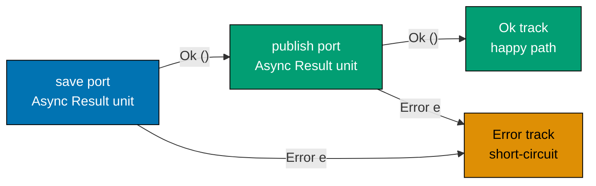
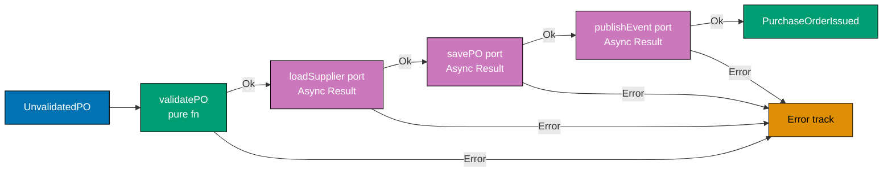
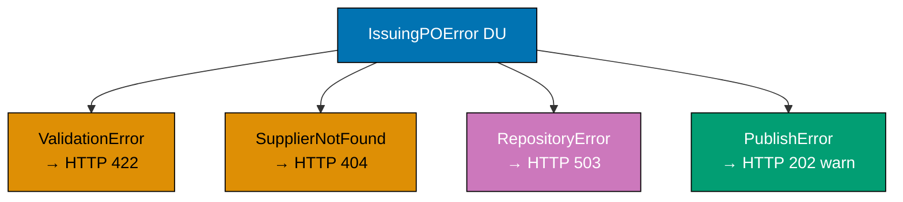
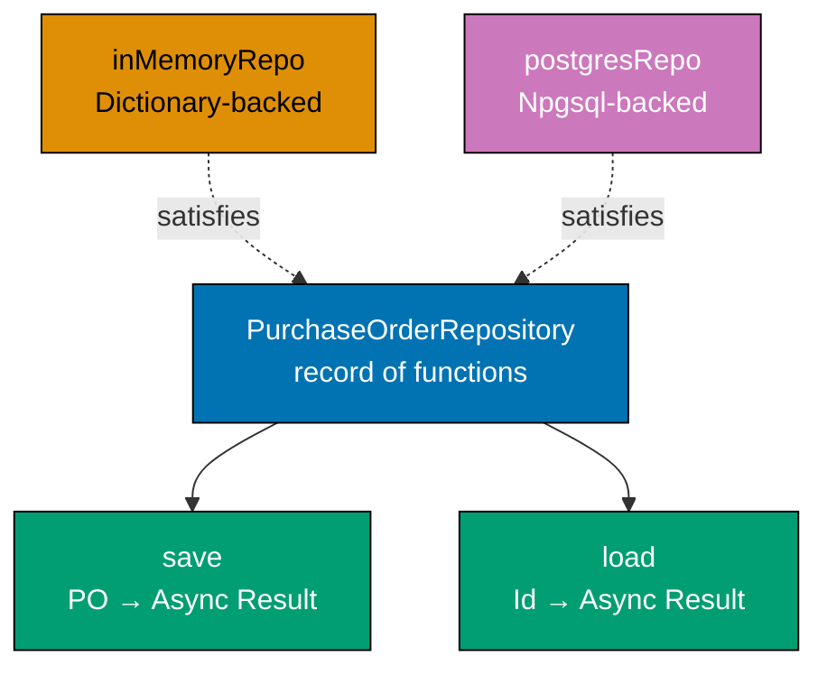
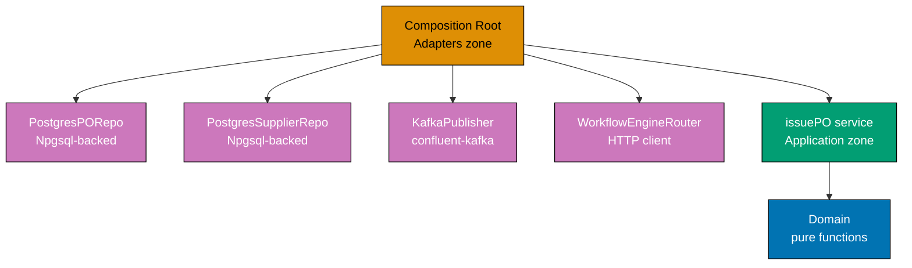
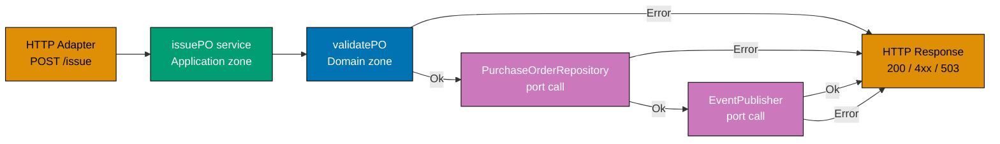
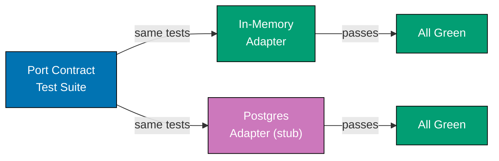
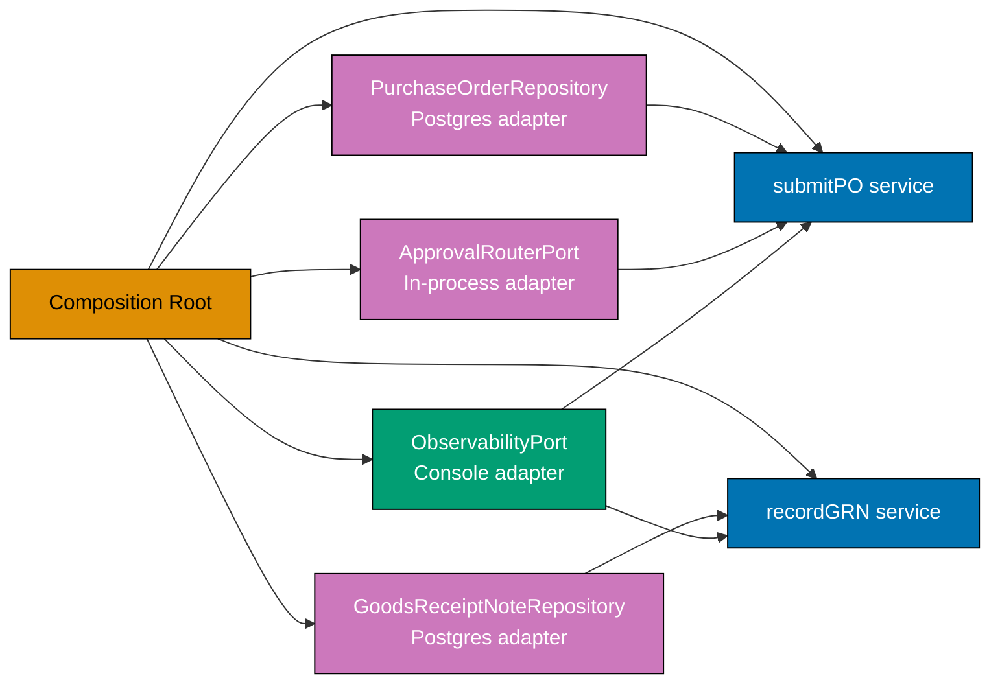

This intermediate section builds on the port/adapter foundations from the beginner section and introduces the `purchasing` and `supplier` bounded contexts together. The focal ports are `PurchaseOrderRepository`, `SupplierRepository`, `EventPublisher`, and `ApprovalRouterPort`. The running theme is wiring: how a composition root assembles adapters, how tests swap adapters without touching application logic, and how the dependency rule rejects infrastructure at the boundary.

## Command and Query Ports (Examples 26–30)

### Example 26: Command Port vs Query Port — CQRS at the Port Boundary

Command ports change state and return domain events or errors. Query ports are read-only and return view models. Separating them at the port level enforces CQRS at the application boundary — commands flow through the full domain pipeline while queries may bypass domain logic and hit a denormalised read model.

```fsharp
// ── Command port ──────────────────────────────────────────────────────────
// A command changes state and returns domain events on success.
// The async wrapper acknowledges that persistence is effectful.
// Result carries named error cases so the HTTP adapter maps them precisely.
type IssuePurchaseOrderCommand =
    PurchaseOrderId -> Async<Result<PurchaseOrderIssued list, IssuingPOError>>
// => Input:  the identity of an Approved PO that is ready to be issued
// => Output: list of domain events on Ok, named error on Error
// => Every call may write to the database and publish to the event bus

// ── Query port ────────────────────────────────────────────────────────────
// A query never changes state; it projects data into a flat read model.
// PurchaseOrderView is not the domain aggregate — it is a denormalised DTO.
type GetPurchaseOrderQuery =
    PurchaseOrderId -> Async<Result<PurchaseOrderView option, QueryError>>
// => Input:  a PO identity value
// => Output: Some flat view on Ok, None if not found, QueryError on failure
// => Side-effect-free read — safe to cache, safe to retry without harm

// ── Read model ────────────────────────────────────────────────────────────
// PurchaseOrderView flattens the aggregate into a single serialisable record.
// No domain logic lives here — it is purely a projection for display.
type PurchaseOrderView = {
    OrderId      : string
    // => Identifies the PO in the read model (format po_<uuid>)
    SupplierName : string
    // => Denormalised — avoids a join to the Suppliers table at query time
    TotalAmount  : decimal
    // => Final calculated total — already computed during command processing
    Status       : string
    // => Human-readable status label, not a domain DU — just a display string
    IssuedAt     : System.DateTimeOffset option
    // => Null when PO is still in Draft/AwaitingApproval; set once Issued
}

// ── Distinct error types ──────────────────────────────────────────────────
// QueryError is separate from IssuingPOError — queries fail differently.
type QueryError =
    | NotFound      of string
    // => Requested PO does not exist in the read model
    | QueryTimeout  of string
    // => Read timed out — caller can safely retry
type IssuingPOError =
    | PONotApproved of string
    // => PO is not in Approved state — cannot issue from other states
    | RepositoryError of string
    // => Infrastructure failure during save or event publish
```

**Key Takeaway**: Separating command and query ports at the type level prevents accidental conflation of state-mutation and read-only operations, giving each path its own error type, its own optimised adapter, and its own test strategy.

**Why It Matters**: When command and query paths share a single repository interface, every read-optimisation (caching, denormalisation, read replicas) is blocked by write concerns. Expressing CQRS at the port boundary costs one extra type alias. The payoff is that the query adapter can be a lightweight SQL view or a Redis cache with zero impact on the command pipeline.

---

### Example 27: Read Model vs Domain Model — Two Separate Output Ports

The domain aggregate is the source of truth for write operations; the read model is the source of truth for query operations. These are structurally different types served by structurally different ports, which allows each to evolve independently.

```fsharp
// ── Infrastructure error type ─────────────────────────────────────────────
type RepoError = DatabaseError of string | ConnectionTimeout
// => Named error DU — consistent with the canonical PurchaseOrderRepository from beginner section

// ── Domain aggregate port (command pipeline) ──────────────────────────────
// PurchaseOrderRepository is defined in beginner.md and used unchanged here.
// It returns the full domain aggregate — a rich type with all domain rules.
type PurchaseOrderRepository = {
    save : PurchaseOrder -> Async<Result<unit, RepoError>>
    // => Persist a PO — upsert semantics; both insert and update use this field
    load : PurchaseOrderId -> Async<Result<PurchaseOrder option, RepoError>>
    // => Load by identity — None signals not-found without raising exceptions
}

// ── Domain aggregate ──────────────────────────────────────────────────────
// PurchaseOrder is the rich aggregate with domain-validated fields.
// Rich types make invalid states unrepresentable at compile time.
type PurchaseOrder = {
    Id          : PurchaseOrderId
    // => Strongly-typed identity — format po_<uuid>; not just any string
    SupplierId  : SupplierId
    // => Strongly-typed supplier reference — distinct type from PurchaseOrderId
    TotalAmount : decimal
    // => Sum of all line item values — drives approval-level routing
    Status      : string
    // => Current state: Draft | AwaitingApproval | Approved | Issued | etc.
}

// ── Read model port (query pipeline) ──────────────────────────────────────
// GetPurchaseOrderView returns the flat view model — simple and serialisable.
// The query adapter may serve this from a materialised view or Redis.
type GetPurchaseOrderView =
    PurchaseOrderId -> Async<Result<PurchaseOrderView, QueryError>>
// => Returns the READ MODEL type — not the domain aggregate
// => Two separate ports: two implementations, two adapters, two test doubles

// ── Two adapter sketches ───────────────────────────────────────────────────
// Command-side adapter queries the normalised purchase_orders table (joins allowed).
let postgresOrderRepo : PurchaseOrderRepository = {
    save = fun po ->
        async {
            // In a real system: Npgsql INSERT ... ON CONFLICT UPDATE against purchase_orders
            // Here: stub to illustrate port/adapter boundary without real Npgsql dependency
            return Ok ()
            // => Always Ok in this stub; real adapter propagates DB exceptions as Error
        }
    load = fun id ->
        async {
            // In a real system: SELECT * FROM purchase_orders WHERE id = @id
            let po : PurchaseOrder = {
                Id = id; SupplierId = "sup_abc"; TotalAmount = 5000m; Status = "Approved"
            }
            // => Deserialise row into domain aggregate; None when row absent
            return Ok (Some po)
        }
}

// Query-side adapter reads from a materialised view (denormalised, no joins).
let postgresViewRepo : GetPurchaseOrderView =
    fun id ->
        async {
            // In a real system: SELECT * FROM purchase_order_views WHERE id = @id
            let view : PurchaseOrderView = {
                OrderId      = id
                // => Primary key passed through unchanged
                SupplierName = "Acme Corp"
                // => Pre-joined from suppliers table during materialisation
                TotalAmount  = 5000m
                // => Pre-computed at write time — no aggregation at read time
                Status       = "Approved"
                // => Display string converted from domain DU during projection
                IssuedAt     = None
                // => None because PO is still Approved, not yet Issued
            }
            return Ok view
        }
// => Each adapter is independently replaceable — swapping one does not touch the other
```

**Key Takeaway**: Two separate output port types — one returning the domain aggregate, one returning the flat read model — let each adapter be optimised independently without either side leaking into the other.

**Why It Matters**: Forcing domain aggregates through the query path causes unnecessary deserialization of nested value objects and fragile coupling between display requirements and domain structure. Separate read-model ports permit materialised views, caching layers, and eventual-consistency projections without touching domain logic.

---

### Example 28: Async Output Port — `Async<Result<>>` Composition

Every output port that performs I/O returns `Async<Result<'a, 'e>>`. Composing two such calls without a helper library requires explicit `async { let! ... }` nesting and `Result` matching. The `asyncResult { }` CE from FsToolkit.ErrorHandling eliminates the boilerplate.



**Manual composition (no helper library):**

```fsharp
// ── Port types ─────────────────────────────────────────────────────────────
// Both ports return Async<Result<unit, string>> — the same shape.
type SavePO    = PurchaseOrder -> Async<Result<unit, string>>
type PublishEv = PurchaseOrderIssued -> Async<Result<unit, string>>

// ── Manual Async + Result composition ──────────────────────────────────────
// Without FsToolkit.ErrorHandling, every async-result call nests one level deeper.
// Verbose but instructive — shows exactly what asyncResult { } desugars to.
let manualIssuePipeline (save: SavePO) (publish: PublishEv) (po: PurchaseOrder) =
    async {
        let! saveResult = save po
        // => saveResult : Result<unit, string>
        // => Await completes the async; now we have a Result to inspect
        match saveResult with
        | Error msg ->
            return Error (sprintf "Save failed: %s" msg)
            // => Short-circuit — publish is never called if save failed
        | Ok () ->
        let event = { OrderId = po.Id; SupplierId = po.SupplierId; IssuedAt = System.DateTimeOffset.UtcNow }
        let! publishResult = publish event
        // => publishResult : Result<unit, string>
        match publishResult with
        | Error msg ->
            return Error (sprintf "Publish failed: %s" msg)
            // => Notification failure surfaced on the same error track
        | Ok () ->
            return Ok ()
            // => Both ports succeeded — return the happy path
    }
// => Every bind point is explicit and traceable — good for learning, noisy in production

type PurchaseOrderIssued = { OrderId: PurchaseOrderId; SupplierId: SupplierId; IssuedAt: System.DateTimeOffset }
```

**Cleaner with `asyncResult { }` from FsToolkit.ErrorHandling:**

```fsharp
// NOTE: asyncResult computation expression requires FsToolkit.ErrorHandling NuGet package
// Install: dotnet add package FsToolkit.ErrorHandling
open FsToolkit.ErrorHandling

// ── Same pipeline — much less noise ────────────────────────────────────────
// asyncResult { } desugars to the same Async.bind + Result.bind chain above.
// The CE makes the railway metaphor literal: every let!/do! is a track switch.
let issuePipeline
    (save    : PurchaseOrder -> Async<Result<unit, string>>)
    (publish : PurchaseOrderIssued -> Async<Result<unit, string>>)
    (po      : PurchaseOrder)
    : Async<Result<unit, string>> =
    asyncResult {
        do! save po
        // => Await save, short-circuit on Error — identical to the manual match above
        let event = { OrderId = po.Id; SupplierId = po.SupplierId; IssuedAt = System.DateTimeOffset.UtcNow }
        do! publish event
        // => Await publish, short-circuit on Error
        // => If both succeed, returns Ok () automatically
    }
// => asyncResult { } is syntactic sugar — same semantics, less ceremony
// => Requires FsToolkit.ErrorHandling; NOT part of F# standard library
```

**Key Takeaway**: `Async<Result<'a, 'e>>` composition is the async railway — every `do!` inside `asyncResult { }` switches track on Error, just as `result { }` does for synchronous pipelines.

**Why It Matters**: Without a composition strategy for `Async<Result<>>`, application services devolve into deeply nested match expressions that obscure domain intent behind infrastructure plumbing. The `asyncResult { }` CE restores the linear pipeline reading style while preserving full error tracking.

---

### Example 29: Railway-Oriented Programming Across Async Port Calls

A full application service pipeline spans pure domain steps (synchronous, no I/O) and port calls (asynchronous, effectful). ROP unifies both into a single railway — pure functions contribute Result-shaped track switches, port calls contribute Async-Result-shaped track switches.



```fsharp
open FsToolkit.ErrorHandling

// ── Domain types ────────────────────────────────────────────────────────────
type UnvalidatedPO = { RawId: string; RawSupplierId: string; RawAmount: decimal }
type PurchaseOrderId = string
type SupplierId      = string

// ── Unified error DU for the full pipeline ──────────────────────────────────
// Every failure mode — domain or infrastructure — joins this union.
// The HTTP adapter pattern-matches exhaustively to produce the right status code.
type IssuingPOError =
    | ValidationError  of string
    // => Domain rule violation — maps to HTTP 422
    | SupplierNotFound of string
    // => Supplier lookup failed — maps to HTTP 404
    | RepositoryError  of string
    // => Infrastructure failure during save — maps to HTTP 503
    | PublishError     of string
    // => Event publish failed — maps to HTTP 202 (saved, not published)

// ── Port types ──────────────────────────────────────────────────────────────
type LoadSupplier = SupplierId -> Async<Result<bool, IssuingPOError>>
// => Confirms supplier is Approved; returns false if Suspended/Blacklisted
type SavePO       = PurchaseOrder -> Async<Result<unit, IssuingPOError>>
type PublishEvent = PurchaseOrderIssued -> Async<Result<unit, IssuingPOError>>

// ── Pure domain validation ───────────────────────────────────────────────────
let validatePO (input: UnvalidatedPO) : Result<PurchaseOrder, IssuingPOError> =
    if System.String.IsNullOrWhiteSpace(input.RawId) then
        Error (ValidationError "PO ID blank")
        // => Domain rule: blank ID rejected immediately — no I/O needed
    elif System.String.IsNullOrWhiteSpace(input.RawSupplierId) then
        Error (ValidationError "Supplier ID blank")
        // => Domain rule: supplier identity is mandatory on a PO
    elif input.RawAmount <= 0m then
        Error (ValidationError (sprintf "Amount %M must be positive" input.RawAmount))
        // => Domain rule: PO total must be > 0
    else
        Ok { Id = input.RawId; SupplierId = input.RawSupplierId; TotalAmount = input.RawAmount; Status = "Approved" }
        // => All guards passed — returns the validated PO aggregate

// ── Full pipeline: pure steps + async port calls ─────────────────────────────
// asyncResult { } stitches synchronous Results and async-Results seamlessly.
let buildIssuePO (loadSupplier: LoadSupplier) (savePO: SavePO) (publishEvent: PublishEvent) =
    fun (input: UnvalidatedPO) ->
        asyncResult {
            // Step 1: pure domain validation — lifted into asyncResult with ofResult
            let! po = validatePO input |> AsyncResult.ofResult
            // => ofResult lifts a synchronous Result into the async railway
            // => Short-circuits on ValidationError — steps 2-4 are skipped

            // Step 2: async port — confirm supplier is Approved
            let! isApproved = loadSupplier po.SupplierId
            // => loadSupplier : SupplierId -> Async<Result<bool, IssuingPOError>>
            // => Awaited and unwrapped by let! — Error short-circuits here
            if not isApproved then
                return! AsyncResult.returnError (SupplierNotFound po.SupplierId)
            // => Domain rule: cannot issue PO to a Suspended or Blacklisted supplier

            // Step 3: async port — persist the PO in Issued state
            let issuedPO = { po with Status = "Issued" }
            do! savePO issuedPO
            // => do! discards unit result; Error short-circuits here

            // Step 4: async port — publish the PurchaseOrderIssued event
            let event = { OrderId = po.Id; SupplierId = po.SupplierId; IssuedAt = System.DateTimeOffset.UtcNow }
            do! publishEvent event
            // => do! publishes domain event; Error surfaces as PublishError

            return [ event ]
            // => All four steps succeeded — HTTP adapter receives Ok [event] → 200 OK
        }
// => Pure steps and port calls compose uniformly — the CE hides the plumbing
```

**Key Takeaway**: ROP across async port calls merges asynchrony and error propagation into a single linear pipeline where every step is either a track switch (Result) or an async track switch (Async<Result>).

**Why It Matters**: The alternative — nested `async { match ... }` for every port call — produces code where the happy path is buried inside match arms. `asyncResult { }` restores linearity: read the function top-to-bottom and you see the business intent. Five steps in one `asyncResult { }` block would require five nested match expressions without it.

---

### Example 30: Error Union Across Port and Domain Layers

Domain functions produce domain errors; adapters produce infrastructure errors. The application service lifts all of them into a single DU so the HTTP adapter can exhaustively pattern-match with zero blind spots.



```fsharp
// ── Unified error DU — application layer ────────────────────────────────────
// Every distinct failure mode surfaces as a named DU case.
// This DU is owned by the APPLICATION layer — not domain, not adapters.
// Domain errors bubble up unchanged; port errors are lifted via Result.mapError.
type IssuingPOError =
    | ValidationError  of string
    // => Emitted by pure domain functions — maps to HTTP 422
    | SupplierNotFound of string
    // => Supplier lookup returned false — maps to HTTP 404
    | RepositoryError  of string
    // => Emitted by repository adapter — maps to HTTP 503
    | PublishError     of string
    // => Emitted by event publisher adapter — maps to HTTP 202 (saved, not published)

// ── Lifting adapter-specific errors into the unified DU ──────────────────────
// mapError transforms the error channel of a Result without touching the Ok path.
// Each adapter defines its own narrow error type; the application maps it to the DU.
type DbWriteError = DbConstraint of string | DbTimeout
let liftDbError : Result<'a, DbWriteError> -> Result<'a, IssuingPOError> =
    Result.mapError (fun e ->
        match e with
        | DbConstraint msg -> RepositoryError (sprintf "Constraint: %s" msg)
        // => Constraint violation wrapped as RepositoryError
        | DbTimeout        -> RepositoryError "DB timeout"
        // => Timeout lifted into RepositoryError — caller retries
    )

type KafkaError = PartitionFull | SerializationFailed of string
let liftKafkaError : Result<'a, KafkaError> -> Result<'a, IssuingPOError> =
    Result.mapError (fun e ->
        match e with
        | PartitionFull          -> PublishError "Kafka partition full"
        // => Backpressure event lifted as non-fatal PublishError
        | SerializationFailed msg -> PublishError (sprintf "Serialize: %s" msg)
        // => Serialisation failure also non-fatal — PO is already saved
    )

// ── HTTP adapter: exhaustive pattern match on the unified DU ─────────────────
// F# forces exhaustive matching — adding a new case breaks compilation here.
let toHttpResponse (result: Result<PurchaseOrderIssued list, IssuingPOError>) : string =
    match result with
    | Ok events ->
        sprintf "200 OK: %d events emitted" (List.length events)
        // => Happy path — all pipeline steps succeeded
    | Error (ValidationError msg)  -> sprintf "422 Unprocessable Entity: %s" msg
    // => Domain validation failure — client submitted invalid data
    | Error (SupplierNotFound id)  -> sprintf "404 Not Found: supplier %s" id
    // => Supplier does not exist or is Suspended/Blacklisted
    | Error (RepositoryError msg)  -> sprintf "503 Service Unavailable: %s" msg
    // => Database unavailable — client may retry after backoff
    | Error (PublishError msg)     -> sprintf "202 Accepted (event not published): %s" msg
    // => PO saved but event not published — not a fatal error; outbox will retry

// ── Demonstration ─────────────────────────────────────────────────────────────
let demoEvent = { OrderId = "po_001"; SupplierId = "sup_abc"; IssuedAt = System.DateTimeOffset.UtcNow }
let outcomes = [
    Ok [ demoEvent ]
    // => Happy path
    Error (ValidationError "PO ID blank")
    // => Domain validation failure
    Error (SupplierNotFound "sup_xyz")
    // => Supplier not approved
    Error (RepositoryError "connection refused")
    // => Infrastructure failure
    Error (PublishError "Kafka partition full")
    // => Non-fatal publish failure
]
outcomes |> List.iter (fun r -> printfn "%s" (toHttpResponse r))
// => Output: 200 OK: 1 events emitted
// => Output: 422 Unprocessable Entity: PO ID blank
// => Output: 404 Not Found: supplier sup_xyz
// => Output: 503 Service Unavailable: connection refused
// => Output: 202 Accepted (event not published): Kafka partition full
```

**Key Takeaway**: A single unified error DU at the application layer, lifted from domain and port errors via `Result.mapError`, gives the HTTP adapter one exhaustive match point instead of nested partial matches scattered across the codebase.

**Why It Matters**: F# discriminated unions with exhaustive matching turn error-case coverage into a compile-time guarantee. Adding a new error case breaks compilation at every unhandled match site. The cost is one `Result.mapError` per port call; the gain is impossible-to-miss coverage.

---

## Infrastructure Ports (Examples 31–36)

### Example 31: Repository Port as a Record of Functions

A repository with multiple operations can be expressed as a single record of functions. The record form reduces parameter list width, keeps related operations co-located, and makes substitution (test double vs production) a single variable assignment.



```fsharp
open System.Collections.Generic

// ── Infrastructure error type ─────────────────────────────────────────────────
type RepoError = DatabaseError of string | ConnectionTimeout
// => Named error DU — canonical across all examples; ConnectionTimeout enables retry logic

// ── Port type: repository record ────────────────────────────────────────────
// A record of functions is the idiomatic F# alternative to an interface.
// All operations are co-located — one value to inject, not two separate parameters.
// The signature matches exactly what beginner.md established.
type PurchaseOrderRepository = {
    save : PurchaseOrder -> Async<Result<unit, RepoError>>
    // => Upsert semantics — create or update; caller does not distinguish
    // => Returns unit on success — the persisted state is what was passed in
    load : PurchaseOrderId -> Async<Result<PurchaseOrder option, RepoError>>
    // => Load by identity — None signals not-found without raising exceptions
    // => Error RepoError on infrastructure failure (DB unavailable, timeout, etc.)
}

// ── In-memory implementation ─────────────────────────────────────────────────
// Satisfies the same type — same fields, same signatures.
// Mutable Dictionary is acceptable in the adapter zone (outside the domain).
// Factory function: returns a fresh, isolated repo for each test — no shared state.
let makeInMemoryPORepo () : PurchaseOrderRepository =
    let store = Dictionary<PurchaseOrderId, PurchaseOrder>()
    // => Mutable Dictionary lives in the adapter, never leaks into the domain
    // => Captured in the closure — each call gets its own isolated instance
    {
        save = fun po ->
            async {
                store.[po.Id] <- po
                // => Dictionary indexer performs insert and update — upsert semantics
                // => Always succeeds in this adapter; Postgres adapter may fail on constraints
                return Ok ()
            }
        load = fun id ->
            async {
                match store.TryGetValue(id) with
                | true,  po -> return Ok (Some po)
                // => Found — wrap in Some and Ok
                | false, _  -> return Ok None
                // => Not found — return None, not an error; caller decides what to do
            }
    }

// ── Application service using the port ──────────────────────────────────────
// The service accepts PurchaseOrderRepository — it never names an implementation.
// Substituting in-memory for Postgres is a single variable swap at the call site.
let loadAndPrintPO (repo: PurchaseOrderRepository) (id: PurchaseOrderId) =
    async {
        let! result = repo.load id
        // => result : Result<PurchaseOrder option, RepoError>
        match result with
        | Ok (Some po) -> printfn "Loaded PO: %s, Status: %s" po.Id po.Status
        // => Output: Loaded PO: po_001, Status: Approved
        | Ok None      -> printfn "PO not found: %s" id
        // => Output when ID does not exist in the adapter's store
        | Error e      -> printfn "Repository error: %A" e
        // => Output on infrastructure failure — named error case
    }

// ── Demonstration ─────────────────────────────────────────────────────────────
let repo = makeInMemoryPORepo ()
let po   = { Id = "po_001"; SupplierId = "sup_abc"; TotalAmount = 5000m; Status = "Approved" }
// Async.RunSynchronously used only in demonstration; real code uses async pipelines
Async.RunSynchronously (async {
    let! _ = repo.save po
    do! loadAndPrintPO repo "po_001"
    // => Output: Loaded PO: po_001, Status: Approved
    do! loadAndPrintPO repo "po_999"
    // => Output: PO not found: po_999
})
```

**Key Takeaway**: The `PurchaseOrderRepository` record type is the complete port contract — any record literal that provides matching `save` and `load` functions satisfies it, regardless of the underlying storage mechanism.

**Why It Matters**: When application services depend on a record-of-functions type rather than a concrete module, the adapter can be swapped without modifying a single line of application or domain code. The same service function runs correctly against a PostgreSQL adapter in production and a Dictionary adapter in unit tests.

---

### Example 32: SupplierRepository Port — Cross-Context Dependency

The `purchasing` context depends on the `supplier` context to confirm that a supplier is Approved before a PO is issued. The dependency is expressed as an output port — the `purchasing` application service does not know whether the supplier lookup hits a database, a cache, or a test stub.

```fsharp
// ── SupplierRepository port (supplier context) ───────────────────────────────
// The purchasing application service declares this dependency as a port.
// It does not import the supplier module directly — that would create context coupling.
type SupplierRepository = {
    loadApproved : SupplierId -> Async<Result<Supplier option, string>>
    // => Returns Some Supplier when the supplier exists and is in Approved state
    // => Returns None when supplier does not exist or is Suspended/Blacklisted
    // => Error string on infrastructure failure
    save : Supplier -> Async<Result<unit, string>>
    // => Persist supplier state changes (Approved, Suspended, Blacklisted)
}

// ── Supplier domain type (supplier context) ────────────────────────────────
type SupplierStatus = Pending | Approved | Suspended | Blacklisted
type Supplier = {
    Id     : SupplierId
    // => Unique identifier in format sup_<uuid>
    Name   : string
    // => Display name used in PurchaseOrderView denormalisation
    Status : SupplierStatus
    // => Lifecycle state — Approved suppliers can receive new POs
}

// ── In-memory SupplierRepository for tests ────────────────────────────────────
let makeInMemorySupplierRepo () : SupplierRepository =
    let store = System.Collections.Generic.Dictionary<SupplierId, Supplier>()
    // => Isolated in-memory store — same factory pattern as PurchaseOrderRepository
    {
        loadApproved = fun id ->
            async {
                match store.TryGetValue(id) with
                | true, sup when sup.Status = Approved -> return Ok (Some sup)
                // => Only returns Some when supplier is in Approved state
                // => Suspended and Blacklisted suppliers return None — cannot issue PO
                | true,  _ -> return Ok None
                // => Supplier exists but is not Approved — treat as not eligible
                | false, _ -> return Ok None
                // => Supplier does not exist — also not eligible
            }
        save = fun sup ->
            async {
                store.[sup.Id] <- sup
                return Ok ()
                // => Upsert — inserts on first call, updates on subsequent calls
            }
    }

// ── Application service using both repositories ──────────────────────────────
// The purchasing service receives BOTH repositories as parameters.
// Neither module is imported directly — both are injected at the composition root.
let validateSupplierForPO
    (supplierRepo : SupplierRepository)
    (supplierId   : SupplierId)
    : Async<Result<Supplier, string>> =
    async {
        let! result = supplierRepo.loadApproved supplierId
        // => result : Result<Supplier option, string>
        return
            match result with
            | Ok (Some sup) -> Ok sup
            // => Supplier is Approved — PO can be issued
            | Ok None       -> Error (sprintf "Supplier %s is not eligible for new POs" supplierId)
            // => Not Approved (or does not exist) — domain rule violation
            | Error msg     -> Error (sprintf "Repository error: %s" msg)
            // => Infrastructure failure — propagate upward
    }
```

**Key Takeaway**: Cross-context dependencies are expressed as output ports — the `purchasing` application service depends on a `SupplierRepository` port, not on the supplier module directly, keeping the bounded contexts decoupled.

**Why It Matters**: Direct module-to-module imports between bounded contexts create invisible coupling. When the supplier team changes the internal shape of their aggregate, the importing context breaks silently. A port type creates an explicit, versioned contract — the purchasing context expresses exactly what it needs, and the supplier context provides an adapter that satisfies that need.

---

### Example 33: EventPublisher Port — Domain Events as Output Port

The `EventPublisher` port decouples the application service from the event bus infrastructure. The application service calls `publish` with a domain event record; whether that goes to Kafka, an outbox table, or an in-memory list is invisible to the application layer.

```fsharp
// ── Domain events ─────────────────────────────────────────────────────────────
// Past-tense names: something that happened, not a command.
// These are P2P domain events from the locked spec — do not invent new ones.
type PurchaseOrderIssued = {
    OrderId    : PurchaseOrderId
    // => Identity of the PO that was issued to the supplier
    SupplierId : SupplierId
    // => Supplier who will receive the PO via EDI or email
    IssuedAt   : System.DateTimeOffset
    // => Timestamp of the state transition — immutable after creation
}

type SupplierApproved = {
    SupplierId : SupplierId
    // => Identity of the newly approved supplier
    ApprovedAt : System.DateTimeOffset
    // => Timestamp when the approval decision was recorded
}

// ── DU wrapping all publishable events ───────────────────────────────────────
// A single DU makes the publish port type-safe: only known domain events compile.
// New event types must be added here — the compiler then forces all publish
// call sites to handle or route the new case.
type DomainEvent =
    | POIssued      of PurchaseOrderIssued
    // => Consumed by: supplier-notifier, receiving context (opens GRN expectation)
    | SupApproved   of SupplierApproved
    // => Consumed by: purchasing (eligible-for-PO list refresh)

// ── EventPublisher port ────────────────────────────────────────────────────────
// publish : DomainEvent -> Async<Result<unit, string>>
// Single function field — one port per responsibility principle.
type EventPublisher = {
    publish : DomainEvent -> Async<Result<unit, string>>
    // => Returns Ok () when event is accepted by the transport (Kafka ack / outbox insert)
    // => Returns Error string on transport failure — caller decides retry vs poison queue
}

// ── In-memory EventPublisher (test double) ────────────────────────────────────
// Collects published events in a list — test code reads the list to assert.
let makeInMemoryPublisher () : EventPublisher * (unit -> DomainEvent list) =
    let mutable published : DomainEvent list = []
    // => Mutable list lives in the adapter — never leaks into domain or application
    let publisher = {
        publish = fun evt ->
            async {
                published <- published @ [ evt ]
                // => Append event to the list — preserves emission order
                return Ok ()
                // => Always succeeds — test double does not simulate transport failures
            }
    }
    let getPublished = fun () -> published
    // => Test accessor — call this in assertions to inspect what was published
    publisher, getPublished
// => Returns a tuple: the port value + a test accessor function
// => The application service receives only the port — the accessor is for tests

// ── Application service using EventPublisher ─────────────────────────────────
let issuePO
    (repo      : PurchaseOrderRepository)
    (publisher : EventPublisher)
    (po        : PurchaseOrder)
    : Async<Result<PurchaseOrderIssued, string>> =
    async {
        let issuedPO = { po with Status = "Issued" }
        let! saveResult = repo.save issuedPO
        // => saveResult : Result<unit, string>
        match saveResult with
        | Error msg -> return Error msg
        // => Save failed — do not publish; return error to caller
        | Ok () ->
        let event = { OrderId = po.Id; SupplierId = po.SupplierId; IssuedAt = System.DateTimeOffset.UtcNow }
        let! pubResult = publisher.publish (POIssued event)
        // => pubResult : Result<unit, string>
        // => Publish only after successful save — maintains at-least-once consistency
        return
            match pubResult with
            | Ok ()    -> Ok event
            | Error msg -> Error (sprintf "Published failed: %s" msg)
    }
```

**Key Takeaway**: The `EventPublisher` port wraps the event bus behind a single `publish` function, making the application service independent of Kafka, outbox tables, or any other transport mechanism.

**Why It Matters**: Embedding Kafka producer calls directly in application services makes integration testing impossible without a running Kafka cluster. An in-memory publisher collects events into a list that test assertions can inspect. The application service is identical in both environments — only the injected publisher value differs.

---

### Example 34: ApprovalRouterPort — Routing Logic Behind a Port

The `ApprovalRouterPort` routes a PO approval request to the correct manager based on the PO's total amount and approval level. The routing logic (workflow engine, email, Slack) is hidden behind the port — the domain rule that determines the approval level stays pure.

```fsharp
// ── ApprovalLevel value object (from domain spec) ────────────────────────────
type ApprovalLevel =
    | L1  // ≤ $1,000 — line manager
    | L2  // ≤ $10,000 — department head
    | L3  // > $10,000 — CFO or VP Finance

// ── Pure domain function: derive approval level from PO total ─────────────────
// No I/O — total amount is enough to determine the level. Always testable in isolation.
let deriveApprovalLevel (totalAmount: decimal) : Result<ApprovalLevel, string> =
    if totalAmount <= 0m then
        Error "Total amount must be positive"
        // => Domain invariant: zero or negative PO total is invalid
    elif totalAmount <= 1000m then
        Ok L1
        // => L1 threshold: up to $1,000 — line manager approval
    elif totalAmount <= 10000m then
        Ok L2
        // => L2 threshold: $1,001–$10,000 — department head approval
    else
        Ok L3
        // => L3 threshold: above $10,000 — CFO approval required per spec

// ── ApprovalRouterPort type ────────────────────────────────────────────────────
// The port receives the PO identity and the computed approval level.
// It returns the manager identifier (email, employee ID, etc.) who was notified.
type ApprovalRouterPort = {
    routeApproval : PurchaseOrderId -> ApprovalLevel -> Async<Result<string, string>>
    // => Returns Ok managerId when routing succeeds
    // => Returns Error string when the workflow engine is unavailable
}

// ── In-memory test double ──────────────────────────────────────────────────────
// Maps approval levels to fixed manager IDs — no workflow engine needed in tests.
let inMemoryApprovalRouter : ApprovalRouterPort = {
    routeApproval = fun poId level ->
        async {
            let managerId =
                match level with
                | L1 -> "manager@example.com"
                // => L1 POs go to the line manager
                | L2 -> "dept-head@example.com"
                // => L2 POs go to the department head
                | L3 -> "cfo@example.com"
                // => L3 POs go to the CFO — high-value approval required
            printfn "Routing PO %s to %s (level %A)" poId managerId level
            // => Output: Routing PO po_001 to cfo@example.com (level L3)
            return Ok managerId
        }
}

// ── Application service: combine pure rule + port call ──────────────────────
open FsToolkit.ErrorHandling

let submitForApproval
    (router : ApprovalRouterPort)
    (po     : PurchaseOrder)
    : Async<Result<string, string>> =
    asyncResult {
        let! level = deriveApprovalLevel po.TotalAmount |> AsyncResult.ofResult
        // => Pure domain function lifted into the async railway
        // => Short-circuits on domain rule violation (zero or negative total)
        let! managerId = router.routeApproval po.Id level
        // => Async port call — routes to correct manager
        return managerId
        // => Returns the manager ID who received the routing notification
    }

// ── Demonstration ──────────────────────────────────────────────────────────────
let highValuePO = { Id = "po_001"; SupplierId = "sup_abc"; TotalAmount = 15000m; Status = "Draft" }
// Async.RunSynchronously for demonstration only — real code keeps async throughout
let result = Async.RunSynchronously (submitForApproval inMemoryApprovalRouter highValuePO)
// => Routing PO po_001 to cfo@example.com (level L3)
// => result : Result<string, string> = Ok "cfo@example.com"
```

**Key Takeaway**: The approval level derivation is a pure domain function; the routing action is an output port. Keeping them separate means the domain rule can be tested without any workflow engine or network dependency.

**Why It Matters**: Teams that embed routing calls inside domain functions cannot test approval threshold logic without a running workflow engine. Separating the pure rule from the effectful router means threshold changes (business requirement updates) are tested instantly, and routing adapter changes (workflow engine migration) do not touch domain code.

---

## Composition Root (Examples 35–38)

### Example 35: The Composition Root — Wiring Adapters to Ports

The composition root is the single place in the application where concrete adapters are instantiated and injected into application services. It lives in the adapter zone and is the only place that imports both the application layer and infrastructure libraries simultaneously.



```fsharp
// ── Composition root — adapter zone only ────────────────────────────────────
// This module is the ONLY place that imports both application layer and infra libs.
// It is NOT tested directly — it is exercised via integration tests.
// Domain and Application modules never import this module.

module ProcurementPlatform.CompositionRoot

// open ProcurementPlatform.Application   ← imports application layer
// open Npgsql                            ← imports infrastructure library
// Both opens permitted here — this is the adapter zone

// ── Postgres-backed PurchaseOrderRepository ─────────────────────────────────
// Satisfies the PurchaseOrderRepository port type — same record shape as in-memory.
let makePostgresPORepo (connectionString: string) : PurchaseOrderRepository =
    // connectionString: injected from environment variable or secret manager
    {
        save = fun po ->
            async {
                // Real implementation: Npgsql INSERT ... ON CONFLICT DO UPDATE
                // SET status = @status, total_amount = @totalAmount WHERE id = @id
                printfn "[Postgres] Saving PO %s with status %s" po.Id po.Status
                // => Log shows adapter is executing; in production, actual SQL runs here
                return Ok ()
                // => Stub: always succeeds; real adapter propagates Npgsql exceptions
            }
        load = fun id ->
            async {
                // Real implementation: SELECT * FROM purchase_orders WHERE id = @id
                printfn "[Postgres] Loading PO %s" id
                // => Log shows adapter is executing
                return Ok None
                // => Stub: returns None; real adapter deserialises the row
            }
    }

// ── Kafka-backed EventPublisher ──────────────────────────────────────────────
// Satisfies the EventPublisher port type — same record shape as in-memory.
let makeKafkaPublisher (brokerUrl: string) : EventPublisher =
    // brokerUrl: injected from configuration — never hardcoded
    {
        publish = fun event ->
            async {
                // Real implementation: ProduceAsync to Kafka topic with partition key
                let topic =
                    match event with
                    | POIssued _   -> "purchase-orders-issued"
                    // => Domain event routes to its dedicated topic
                    | SupApproved _ -> "suppliers-approved"
                    // => Supplier events route to the supplier topic
                printfn "[Kafka] Publishing to topic: %s" topic
                // => Log shows which topic received the event
                return Ok ()
                // => Stub: always succeeds; real adapter awaits Kafka ack
            }
    }

// ── Composed application service ────────────────────────────────────────────
// The composition root creates all adapters and injects them into the service.
// The resulting function matches the input port type — it IS the port implementation.
let buildIssuePOService (connectionString: string) (brokerUrl: string) =
    let poRepo    = makePostgresPORepo connectionString
    // => Command-side repository — writes to the normalised purchase_orders table
    let publisher = makeKafkaPublisher brokerUrl
    // => Event publisher — sends PurchaseOrderIssued to Kafka
    let service   = issuePO poRepo publisher
    // => Partially apply: poRepo and publisher are baked in; caller provides po
    service
    // => Returns a function: PurchaseOrder -> Async<Result<PurchaseOrderIssued, string>>
    // => This is the fully wired application service — ready for the HTTP adapter
```

**Key Takeaway**: The composition root is the one module that knows everything about infrastructure — it instantiates all adapters, wires them to ports, and partially applies them into application services that the HTTP adapter calls.

**Why It Matters**: When wiring is scattered across modules, tracing how a port gets its adapter requires reading multiple files. A single composition root makes wiring explicit, auditable, and easy to modify when swapping adapters. Integration tests exercise the composition root directly; all other tests use the in-memory adapters.

---

### Example 36: Adapter Swapping for Tests — Same Application Service, Two Adapters

The same application service function runs against the Postgres adapter in production and the in-memory adapter in tests. The swap requires zero changes to the service code — only the injected adapter value changes.

```fsharp
// ── The same application service — parameterised by ports ─────────────────────
// issuePO is defined in Example 33.
// It accepts PurchaseOrderRepository and EventPublisher as parameters.
// The caller decides which adapter to inject.

// ── Production wiring (composition root) ─────────────────────────────────────
let productionIssuePO =
    let poRepo    = makePostgresPORepo "Host=prod-db;Database=procurement"
    // => Real Postgres adapter — writes to production database
    let publisher = makeKafkaPublisher "kafka://prod-broker:9092"
    // => Real Kafka adapter — publishes to production topic
    issuePO poRepo publisher
    // => Fully wired production service
    // => Type: PurchaseOrder -> Async<Result<PurchaseOrderIssued, string>>

// ── Test wiring (unit test setup) ─────────────────────────────────────────────
let testIssuePO, getPublished =
    let poRepo    = makeInMemoryPORepo ()
    // => In-memory adapter — Dictionary-backed, no DB connection needed
    let publisher, getPublished = makeInMemoryPublisher ()
    // => In-memory publisher — collects events in a list for assertions
    issuePO poRepo publisher, getPublished
    // => Same service function, different adapters — zero code change in service
    // => getPublished : unit -> DomainEvent list — for test assertions

// ── Example test using in-memory adapters ────────────────────────────────────
// This is a unit test — no database, no Kafka, no network, no clock setup.
let runTestScenario () =
    async {
        let po = { Id = "po_001"; SupplierId = "sup_abc"; TotalAmount = 5000m; Status = "Approved" }
        let! result = testIssuePO po
        // => result : Result<PurchaseOrderIssued, string>
        match result with
        | Ok event ->
            printfn "Test passed: event emitted for PO %s" event.OrderId
            // => Output: Test passed: event emitted for PO po_001
            let published = getPublished ()
            printfn "Events published: %d" (List.length published)
            // => Output: Events published: 1
        | Error msg ->
            printfn "Test FAILED: %s" msg
            // => Not reached in the happy-path scenario
    }

Async.RunSynchronously (runTestScenario ())
// => Output: Test passed: event emitted for PO po_001
// => Output: Events published: 1
```

**Key Takeaway**: Adapter swapping requires changing only the injected value — production uses Postgres + Kafka adapters, tests use in-memory adapters, and the application service code is identical in both cases.

**Why It Matters**: When application services hard-code their adapters (e.g., calling Npgsql directly), every test requires a running database. With injected ports, tests run in milliseconds with zero infrastructure. This is the central testability promise of Hexagonal Architecture — ports are not just an abstraction, they are the mechanism that makes fast, reliable unit tests possible.

---

### Example 37: Integration Test Seam with Stub Adapter

An integration test uses stub adapters that simulate specific infrastructure behaviours (slow response, failure, partial success) without requiring real infrastructure. The stub adapter satisfies the port type, making it indistinguishable from the real adapter from the application service's perspective.

```fsharp
// ── Stub adapter: simulates a DB timeout ─────────────────────────────────────
// Returns Error on every save call — simulates a database that has crashed.
// The application service must handle this error correctly regardless of adapter.
let timeoutPORepo : PurchaseOrderRepository = {
    save = fun _ ->
        async {
            do! Async.Sleep 10
            // => Simulates a 10ms timeout — real tests might use a longer delay
            return Error "DB timeout: connection pool exhausted"
            // => Error path — the application service must propagate this correctly
        }
    load = fun _ ->
        async {
            return Error "DB timeout: connection pool exhausted"
            // => Load also fails — simulates complete DB unavailability
        }
}

// ── Stub adapter: simulates Kafka partition full ───────────────────────────────
// Returns Error on every publish call — simulates a Kafka cluster under pressure.
let fullKafkaPublisher : EventPublisher = {
    publish = fun _ ->
        async {
            return Error "Kafka partition full: topic purchase-orders-issued"
            // => Error path — the application service sees PublishError, not transport details
        }
}

// ── Test scenario: save succeeds but publish fails ────────────────────────────
// This seam tests the partial-success path: PO is saved, event is not published.
// The real outbox pattern handles this at the infrastructure level; this test
// verifies the application service returns the correct error to the HTTP adapter.
let partialSuccessRepo : PurchaseOrderRepository = {
    save = fun po ->
        async {
            printfn "[Stub] Saved PO %s successfully" po.Id
            // => Stub confirms save side-effect without real DB
            return Ok ()
        }
    load = fun id ->
        async { return Ok None }
        // => Load returns None — not needed for this scenario
}

let testPartialSuccess () =
    async {
        let po      = { Id = "po_002"; SupplierId = "sup_def"; TotalAmount = 2000m; Status = "Approved" }
        let service = issuePO partialSuccessRepo fullKafkaPublisher
        // => Wire: real-ish save + failing publish — tests the seam
        let! result = service po
        // => result : Result<PurchaseOrderIssued, string>
        match result with
        | Ok _     -> printfn "UNEXPECTED OK — should have been Error on publish failure"
        | Error msg -> printfn "Expected Error: %s" msg
        // => Output: [Stub] Saved PO po_002 successfully
        // => Output: Expected Error: Published failed: Kafka partition full: ...
    }

Async.RunSynchronously (testPartialSuccess ())
```

**Key Takeaway**: Stub adapters simulate specific infrastructure failure modes — DB timeout, Kafka partition full, partial success — without requiring real infrastructure, creating precise test seams for every error path the application service must handle.

**Why It Matters**: Real infrastructure failures are rare, hard to reproduce, and require complex setup. Stub adapters make every error path testable on every commit. When the application service mishandles a DB timeout (for example, by returning 200 OK instead of 503), the stub catches it in a millisecond-fast unit test rather than in a production incident.

---

### Example 38: Dependency Rejection — The Application Service Refuses Infrastructure

The dependency rule states that inner zones (Domain, Application) must never import outer zones (Adapters). The application service enforces this by accepting only port types — it cannot accept a concrete adapter module even if a developer tries to pass one.

```fsharp
// ── CORRECT: application service accepts port types ────────────────────────
// The type signature enforces the dependency rule at compile time.
// PurchaseOrderRepository and EventPublisher are port types, not module references.
let correctIssuePO
    (repo      : PurchaseOrderRepository)
    // => repo is a port type — a record of functions, not a concrete module
    (publisher : EventPublisher)
    // => publisher is a port type — could be Kafka, outbox, or in-memory
    (po        : PurchaseOrder)
    : Async<Result<PurchaseOrderIssued, string>> =
    async {
        let issuedPO = { po with Status = "Issued" }
        let! _ = repo.save issuedPO
        // => Calls via port — no Npgsql, no connection string, no SQL visible here
        let event = { OrderId = po.Id; SupplierId = po.SupplierId; IssuedAt = System.DateTimeOffset.UtcNow }
        let! pubResult = publisher.publish (POIssued event)
        // => Calls via port — no Kafka client, no broker URL, no serialisation visible here
        return
            match pubResult with
            | Ok ()     -> Ok event
            | Error msg -> Error msg
    }
// => This service cannot be linked to any concrete adapter from within its own body
// => The composition root provides the adapter — this function knows nothing about it

// ── ANTI-PATTERN: application service imports infrastructure ──────────────────
// The following is what MUST NOT happen in the application or domain zone.
// This is shown as a commented-out violation — it does not compile in the correct setup.

// module ProcurementPlatform.Application
//
// open Npgsql                     ← VIOLATION: infrastructure in application zone
// open Confluent.Kafka            ← VIOLATION: infrastructure in application zone
//
// let violatingIssuePO (po: PurchaseOrder) =
//     async {
//         use conn = new NpgsqlConnection("...")  ← VIOLATION: creates DB connection in application
//         // => Now this function cannot be tested without a real Postgres database
//         let producer = ProducerBuilder<_,_>(...).Build()  ← VIOLATION: Kafka client in application
//         // => Now this function cannot be tested without a real Kafka cluster
//     }
// => This pattern collapses all three zones into one — Hexagonal Architecture is defeated

// ── Compiler as enforcement mechanism ────────────────────────────────────────
// F# module system enforces the rule structurally:
// Domain.fs:      no open statements for external packages (enforced by code review)
// Application.fs: open Domain only (enforced by module reference discipline)
// Adapters/X.fs:  open Application + open InfraLib (permitted — adapter zone)
// CompositionRoot.fs: open Application + open all adapters (single wiring point)
printfn "Dependency rule: inner zones declare ports; outer zones implement them"
// => Output: Dependency rule: inner zones declare ports; outer zones implement them
```

**Key Takeaway**: The application service accepts only port types as parameters, making it structurally impossible for infrastructure imports to leak into the application zone — the compiler rejects any attempt.

**Why It Matters**: Code review catches most zone violations, but structural enforcement catches them all. When port types are used as parameter types, no developer can accidentally pass a `NpgsqlConnection` where a `PurchaseOrderRepository` is expected — the types are different. This is the mechanical enforcement of the dependency rule that makes Hexagonal Architecture more than just a convention.

---

## Multiple Bounded Contexts (Examples 39–43)

### Example 39: Two Bounded Contexts — Purchasing + Supplier in One Composition Root

When the purchasing and supplier contexts run in the same service, the composition root wires both sets of adapters. Each context gets its own repository port; neither context's application service directly calls the other's repository.

```fsharp
// ── Purchasing context ports ──────────────────────────────────────────────────
// Already defined in Examples 31-38
// PurchaseOrderRepository, EventPublisher, ApprovalRouterPort

// ── Supplier context application service ──────────────────────────────────────
// The supplier context handles supplier lifecycle: Pending → Approved → Suspended
let approveSupplier
    (supplierRepo : SupplierRepository)
    (publisher    : EventPublisher)
    (supplierId   : SupplierId)
    : Async<Result<SupplierApproved, string>> =
    async {
        let! loadResult = supplierRepo.loadApproved supplierId
        // => Check current supplier state before approving
        match loadResult with
        | Error msg -> return Error msg
        // => Infrastructure failure — propagate upward
        | Ok (Some _) ->
            return Error (sprintf "Supplier %s is already Approved" supplierId)
            // => Domain rule: cannot approve an already-approved supplier
        | Ok None ->
        // => Supplier is Pending or does not exist — proceed with approval
        let sup = { Id = supplierId; Name = "Supplier Corp"; Status = Approved }
        let! saveResult = supplierRepo.save sup
        // => Persist the Approved state
        match saveResult with
        | Error msg -> return Error msg
        // => Save failed — return error, no event published
        | Ok () ->
        let event = { SupplierId = supplierId; ApprovedAt = System.DateTimeOffset.UtcNow }
        let! pubResult = publisher.publish (SupApproved event)
        // => Publish SupplierApproved — consumed by purchasing context
        return
            match pubResult with
            | Ok ()     -> Ok event
            | Error msg -> Error (sprintf "Publish failed: %s" msg)
    }

// ── Two-context composition root ──────────────────────────────────────────────
// Each context gets its own repository adapter.
// Both contexts share the same EventPublisher — one bus, two publishers of distinct events.
let buildTwoContextApp () =
    let connectionString = "Host=db;Database=procurement"
    // => Shared Postgres connection string — each adapter opens its own connection
    let poRepo       = makePostgresPORepo connectionString
    // => Purchasing context: PO repository
    let supplierRepo = makeInMemorySupplierRepo ()
    // => Supplier context: in-memory repo for this demonstration (Postgres in production)
    let publisher    = makeKafkaPublisher "kafka://broker:9092"
    // => Shared event bus: both contexts publish through the same port type

    // Wired application services — one per context
    let issuePOService    = issuePO poRepo publisher
    let approveSupService = approveSupplier supplierRepo publisher
    // => Both services accept port types — neither knows about Postgres or Kafka directly

    issuePOService, approveSupService
// => Returns both wired services — the HTTP router calls them based on the request path
```

**Key Takeaway**: Two bounded contexts share an `EventPublisher` port but each has its own repository port — the composition root wires them independently, and neither context's application service knows about the other's internal structure.

**Why It Matters**: Sharing infrastructure adapters (database, event bus) between contexts is unavoidable in a monolithic service. The port boundary ensures that sharing happens at the infrastructure level (adapter), not at the application level (service). The purchasing service does not import the supplier service — it calls through its `SupplierRepository` port, which the composition root backs with the same database.

---

### Example 40: Cross-Context Event Flow — SupplierApproved Consumed by Purchasing

The `SupplierApproved` domain event published by the supplier context is consumed by the purchasing context to refresh its eligible-supplier cache. The consumer is an input adapter (event consumer) — it calls the purchasing application service through an input port.

```fsharp
// ── Event consumer (input adapter) ────────────────────────────────────────────
// The event consumer translates a SupplierApproved event into a purchasing port call.
// It is an adapter — it lives in the adapter zone and imports the application layer.
// The purchasing application service does not import the supplier module.
type RefreshEligibleSuppliers =
    SupplierId -> Async<Result<unit, string>>
// => Input port for the purchasing context: add a supplier to the eligible list
// => Called by the event consumer when SupplierApproved arrives from the event bus

// ── Event consumer adapter ─────────────────────────────────────────────────────
// In a real system: Kafka consumer polls the suppliers-approved topic.
// Here: simulated with a direct function call.
let handleSupplierApprovedEvent
    (refreshSuppliers : RefreshEligibleSuppliers)
    (event            : SupplierApproved)
    : Async<Result<unit, string>> =
    async {
        printfn "[EventConsumer] Received SupplierApproved for %s" event.SupplierId
        // => Log shows the event consumer received the event from the bus
        let! result = refreshSuppliers event.SupplierId
        // => Call through the purchasing input port — not through the supplier module
        match result with
        | Ok ()     -> printfn "[EventConsumer] Eligible supplier list refreshed"
        // => Output: [EventConsumer] Eligible supplier list refreshed
        | Error msg -> printfn "[EventConsumer] Refresh failed: %s" msg
        // => Log failure — event consumer may retry or move event to DLQ
        return result
    }

// ── Purchasing-side handler: update eligible supplier list ────────────────────
let makeRefreshEligibleSuppliers (supplierRepo: SupplierRepository) : RefreshEligibleSuppliers =
    fun supplierId ->
        async {
            // In a real system: upsert supplier into an eligible_suppliers cache table
            // or invalidate Redis cache entry for the approved supplier list
            let sup = { Id = supplierId; Name = "Refreshed Supplier"; Status = Approved }
            let! result = supplierRepo.save sup
            // => Update the supplier record in the purchasing context's read model
            return result
        }

// ── Demonstration: end-to-end event flow ─────────────────────────────────────
let runEventFlowDemo () =
    async {
        let supplierRepo     = makeInMemorySupplierRepo ()
        let refreshSuppliers = makeRefreshEligibleSuppliers supplierRepo
        let event            = { SupplierId = "sup_new"; ApprovedAt = System.DateTimeOffset.UtcNow }
        let! _ = handleSupplierApprovedEvent refreshSuppliers event
        // => Output: [EventConsumer] Received SupplierApproved for sup_new
        // => Output: [EventConsumer] Eligible supplier list refreshed
    }

Async.RunSynchronously (runEventFlowDemo ())
```

**Key Takeaway**: Cross-context event consumption uses an input adapter (event consumer) that translates domain events into application service calls — the purchasing application service never imports the supplier module.

**Why It Matters**: When context A imports context B's application service directly, any change to B's service signature breaks A. Event-driven cross-context communication via ports keeps contexts independently deployable. The event consumer is the translation layer — it speaks both the event bus language and the purchasing input port language.

---

### Example 41: Spy Adapter — Recording Port Calls for Test Assertions

A spy adapter records every call made to a port without altering the port's behaviour. Tests use the spy to assert that the application service called the port with the correct arguments — confirming that domain logic produced the expected side effects.

```fsharp
// ── Spy adapter: records every publish call ────────────────────────────────────
// Wraps the in-memory publisher and captures call arguments for assertions.
// The application service cannot tell spy from stub — both satisfy EventPublisher.
type SpyPublisher = {
    Port       : EventPublisher
    // => The actual port value injected into the application service
    GetCalls   : unit -> DomainEvent list
    // => Test accessor: returns all events passed to publish, in call order
}

let makeSpyPublisher () : SpyPublisher =
    let mutable calls : DomainEvent list = []
    // => Mutable capture — acceptable in the adapter zone
    {
        Port = {
            publish = fun evt ->
                async {
                    calls <- calls @ [ evt ]
                    // => Record the call argument before returning Ok
                    // => Appending preserves emission order for order-sensitive assertions
                    return Ok ()
                    // => Spy does not alter the port's result — always Ok
                }
        }
        GetCalls = fun () -> calls
        // => Test code calls GetCalls () to read the captured arguments
    }

// ── Spy adapter: records every save call ─────────────────────────────────────
type SpyPORepo = {
    Port     : PurchaseOrderRepository
    GetSaved : unit -> PurchaseOrder list
    // => Returns all PO values passed to repo.save, in call order
}

let makeSpyPORepo () : SpyPORepo =
    let mutable saved : PurchaseOrder list = []
    {
        Port = {
            save = fun po ->
                async {
                    saved <- saved @ [ po ]
                    // => Record the saved PO for assertion
                    return Ok ()
                }
            load = fun _ ->
                async { return Ok None }
                // => Load not needed in this spy — return empty
        }
        GetSaved = fun () -> saved
    }

// ── Test using spy adapters ────────────────────────────────────────────────────
let runSpyTest () =
    async {
        let publisherSpy = makeSpyPublisher ()
        let repoSpy      = makeSpyPORepo ()
        let service      = issuePO repoSpy.Port publisherSpy.Port
        // => Inject spies instead of real adapters

        let po = { Id = "po_003"; SupplierId = "sup_abc"; TotalAmount = 8000m; Status = "Approved" }
        let! result = service po
        // => result : Result<PurchaseOrderIssued, string>

        // ── Assertions ───────────────────────────────────────────────────────────
        match result with
        | Error msg -> printfn "FAIL: %s" msg
        | Ok event  ->
        let savedPOs = repoSpy.GetSaved ()
        printfn "POs saved: %d (expected 1)" (List.length savedPOs)
        // => Output: POs saved: 1 (expected 1)
        let savedStatus = (List.head savedPOs).Status
        printfn "Saved status: %s (expected Issued)" savedStatus
        // => Output: Saved status: Issued (expected Issued)
        let publishedEvents = publisherSpy.GetCalls ()
        printfn "Events published: %d (expected 1)" (List.length publishedEvents)
        // => Output: Events published: 1 (expected 1)
        printfn "Event type: %A" (List.head publishedEvents)
        // => Output: Event type: POIssued { OrderId = "po_003"; ... }
    }

Async.RunSynchronously (runSpyTest ())
```

**Key Takeaway**: Spy adapters record every call made to a port without changing the port's behaviour, enabling tests to assert that the application service produced the expected side effects with the correct arguments.

**Why It Matters**: Tests that only check the return value of an application service miss half the contract — the side effects. Spy adapters make side effects (which PO was saved, which event was published, in what order) as assertable as return values. This is especially critical when domain rules dictate a specific sequence: save before publish.

---

### Example 42: Conditional Adapter Selection at the Composition Root

The composition root can select different adapters based on configuration — using an outbox adapter in production (for at-least-once delivery) and a direct Kafka adapter in staging (for simpler setup). The application service is unaware of this selection.

```fsharp
// ── Configuration type ────────────────────────────────────────────────────────
// Typed configuration record — no stringly-typed configuration in the domain layer.
// Configuration is always read at the composition root, never in application services.
type AppConfig = {
    UseOutbox        : bool
    // => true = outbox pattern (at-least-once, transactional); false = direct Kafka
    ConnectionString : string
    // => Postgres connection string — read from environment variable at startup
    BrokerUrl        : string
    // => Kafka broker URL — read from environment variable at startup
}

// ── Outbox adapter (production) ────────────────────────────────────────────────
// Writes events to an outbox table in the same Postgres transaction as the save.
// A background worker later reads the outbox and publishes to Kafka.
let makeOutboxPublisher (connectionString: string) : EventPublisher = {
    publish = fun event ->
        async {
            // Real: INSERT INTO outbox_events (event_type, payload, created_at) VALUES (...)
            // In the same DB transaction as repo.save — atomicity guaranteed
            printfn "[Outbox] Inserted event into outbox table: %A" event
            // => Output: [Outbox] Inserted event into outbox table: POIssued { ... }
            return Ok ()
        }
}

// ── Direct Kafka adapter (staging) ─────────────────────────────────────────────
// Publishes directly to Kafka — simpler, but not transactional with the save.
let makeDirectKafkaPublisher (brokerUrl: string) : EventPublisher = {
    publish = fun event ->
        async {
            // Real: ProduceAsync to Kafka topic — may fail after save succeeds
            printfn "[Kafka] Published directly to broker: %A" event
            // => Output: [Kafka] Published directly to broker: POIssued { ... }
            return Ok ()
        }
}

// ── Conditional adapter selection ─────────────────────────────────────────────
// The composition root reads config and selects the appropriate adapter.
// The application service code is identical regardless of which adapter is selected.
let buildIssuePOWithConfig (config: AppConfig) =
    let poRepo    = makePostgresPORepo config.ConnectionString
    // => Always Postgres-backed in this example
    let publisher =
        if config.UseOutbox then
            makeOutboxPublisher config.ConnectionString
            // => Transactional outbox — safe for production; events never lost
        else
            makeDirectKafkaPublisher config.BrokerUrl
            // => Direct Kafka — simpler setup; acceptable for staging/development
    issuePO poRepo publisher
    // => Returns the wired service — caller cannot tell which publisher was selected

// ── Demonstration ─────────────────────────────────────────────────────────────
let prodConfig  = { UseOutbox = true; ConnectionString = "Host=prod-db"; BrokerUrl = "kafka://prod" }
let stageConfig = { UseOutbox = false; ConnectionString = "Host=stage-db"; BrokerUrl = "kafka://stage" }

let prodService  = buildIssuePOWithConfig prodConfig
let stageService = buildIssuePOWithConfig stageConfig
// => prodService uses outbox publisher; stageService uses direct Kafka publisher
// => Both are PurchaseOrder -> Async<Result<PurchaseOrderIssued, string>>
// => The application service code is identical — only the wired adapter differs
printfn "Production and staging services wired with different publishers"
// => Output: Production and staging services wired with different publishers
```

**Key Takeaway**: The composition root selects adapters based on configuration — the application service receives the same port type regardless of which concrete implementation was chosen, making environment-specific behaviour entirely an infrastructure concern.

**Why It Matters**: Hard-coding adapter selection inside application services means changing from outbox to direct Kafka requires touching business logic. Pushing the selection to the composition root means it is a one-line config change. The application service is literally the same binary artefact running with different injected dependencies — this is the infrastructure flexibility that Hexagonal Architecture is designed to deliver.

---

### Example 43: Full Flow — HTTP Request to Domain to Repository to Event Bus

This final intermediate example traces a complete `POST /purchase-orders/{id}/issue` request through all zones: HTTP adapter → application service → domain → `PurchaseOrderRepository` → `EventPublisher` → response.



```fsharp
open FsToolkit.ErrorHandling

// ── HTTP adapter (outer zone) ──────────────────────────────────────────────────
// The HTTP adapter receives the raw request, calls the application service through
// the input port, and maps the Result to an HTTP response.
// It does not contain any domain logic — only translation and HTTP concerns.
let httpIssuePOHandler
    (issuePOService : PurchaseOrder -> Async<Result<PurchaseOrderIssued, string>>)
    (rawId          : string)
    (rawSupplierId  : string)
    (rawAmount      : decimal)
    : Async<string> =
    async {
        // Step 1: translate raw HTTP parameters into a domain type
        let po = { Id = rawId; SupplierId = rawSupplierId; TotalAmount = rawAmount; Status = "Approved" }
        // => HTTP adapter constructs the domain type from request parameters
        // => In a real Giraffe handler: deserialised from JSON body or URL segments

        // Step 2: call the application service through the input port
        let! result = issuePOService po
        // => result : Result<PurchaseOrderIssued, string>
        // => The adapter does not know what happens inside issuePOService

        // Step 3: map the domain Result to an HTTP response
        return
            match result with
            | Ok event ->
                sprintf """HTTP 200 OK\n{"orderId":"%s","issuedAt":"%s"}"""
                    event.OrderId (event.IssuedAt.ToString("o"))
                // => 200 OK with the domain event as the JSON body
            | Error msg when msg.Contains("blank") ->
                sprintf "HTTP 422 Unprocessable Entity: %s" msg
                // => Domain validation failure — client error
            | Error msg when msg.Contains("not eligible") ->
                sprintf "HTTP 404 Not Found: %s" msg
                // => Supplier not approved — domain rule violation
            | Error msg ->
                sprintf "HTTP 503 Service Unavailable: %s" msg
                // => Infrastructure failure — transient, client may retry
    }

// ── Full wiring and execution ──────────────────────────────────────────────────
let runFullFlow () =
    async {
        // Wire adapters (normally done once at startup by the composition root)
        let repoSpy      = makeSpyPORepo ()
        let publisherSpy = makeSpyPublisher ()
        let service      = issuePO repoSpy.Port publisherSpy.Port
        // => In-memory adapters for demonstration — swap for Postgres+Kafka in production

        // Simulate HTTP request: POST /purchase-orders/po_100/issue
        let response = httpIssuePOHandler service "po_100" "sup_abc" 5000m
        let! httpResponse = response
        printfn "%s" httpResponse
        // => Output: HTTP 200 OK
        // => Output: {"orderId":"po_100","issuedAt":"..."}

        // Verify side effects via spies
        printfn "POs saved:        %d" (repoSpy.GetSaved () |> List.length)
        // => Output: POs saved:        1
        printfn "Events published: %d" (publisherSpy.GetCalls () |> List.length)
        // => Output: Events published: 1

        // Simulate HTTP request with invalid data (empty PO ID)
        let! errorResponse = httpIssuePOHandler service "" "sup_abc" 5000m
        printfn "%s" errorResponse
        // => Output: HTTP 422 Unprocessable Entity: PO ID blank
    }

Async.RunSynchronously (runFullFlow ())
```

**Key Takeaway**: The full flow — HTTP adapter translates, application service orchestrates, domain validates, ports persist and publish — passes through each zone boundary exactly once, with the Result type carrying the outcome from domain to HTTP response.

**Why It Matters**: Tracing a request from HTTP handler to database write to event publish in a single readable flow is the acid test for a Hexagonal Architecture implementation. When each zone does exactly one job — translate, orchestrate, validate, store, publish — the code is readable top-to-bottom, each concern is independently testable, and future changes (new HTTP framework, new database, new event bus) touch exactly one zone. This is the architecture paying its promises back in full.

---

## Cross-Context Patterns and Port Contracts (Examples 44–55)

### Example 44: Port Contract Testing — Verifying Every Adapter Satisfies the Same Spec

A port contract test suite runs the same assertions against every adapter implementation. Passing the same test suite against the in-memory adapter and the Postgres adapter proves they are interchangeable without any coupling between them.



```fsharp
open System.Collections.Generic

// ── Canonical port and types ───────────────────────────────────────────────
type PurchaseOrderId = string
// => Format po_<uuid> — used as Dictionary key and DB primary key
type PurchaseOrder = { Id: PurchaseOrderId; SupplierId: string; TotalAmount: decimal; Status: string }
// => Aggregate root — both adapters store and return this type
type RepoError = DatabaseError of string | ConnectionTimeout
// => Named error DU — adapters must produce cases from this union only

type PurchaseOrderRepository = {
    save : PurchaseOrder -> Async<Result<unit, RepoError>>
    // => Upsert semantics: insert on first save, update on subsequent saves
    load : PurchaseOrderId -> Async<Result<PurchaseOrder option, RepoError>>
    // => Returns None on not-found, Error on infrastructure failure
}

// ── In-memory adapter ──────────────────────────────────────────────────────
let makeInMemoryRepo () : PurchaseOrderRepository =
    let store = Dictionary<PurchaseOrderId, PurchaseOrder>()
    // => Closed-over mutable store — isolated per factory call
    { save = fun po -> async { store.[po.Id] <- po; return Ok () }
      // => Dictionary write always succeeds — no ConnectionTimeout in-memory
      load = fun id ->
          async {
              match store.TryGetValue(id) with
              | true, po -> return Ok (Some po)
              // => Found — PO was previously saved
              | false, _ -> return Ok None
              // => Not found — honest None, not an error
          } }

// ── Postgres stub adapter (mimics Postgres without a DB connection) ─────────
let makePostgresStubRepo (data: Map<PurchaseOrderId, PurchaseOrder>) : PurchaseOrderRepository =
    // => Pre-seeded map simulates a database snapshot for contract testing
    { save = fun po -> async { return Ok () }
      // => Stub: acknowledges save without modifying the seed map
      load = fun id ->
          async {
              match Map.tryFind id data with
              | Some po -> return Ok (Some po)
              // => Found in seed data — simulates a successful DB read
              | None    -> return Ok None
              // => Not in seed data — simulates a missing row
          } }

// ── Port contract test runner ──────────────────────────────────────────────
// The SAME assertions run against BOTH adapters — this is the contract test.
let runPortContractTests (name: string) (repo: PurchaseOrderRepository) =
    async {
        let po = { Id = "po_ct_001"; SupplierId = "sup_001"; TotalAmount = 500m; Status = "Draft" }

        // Contract test 1: save then load returns the same PO
        let! _ = repo.save po
        // => save must not fail for a valid PO
        let! loaded = repo.load "po_ct_001"
        // => load must return the PO we just saved

        // Contract test 2: load of unknown ID returns None (not Error)
        let! missing = repo.load "po_does_not_exist"
        // => None — not-found is not an infrastructure failure

        printfn "[%s] save→load: %A" name loaded
        // => Output: [In-Memory] save→load: Ok (Some { Id = "po_ct_001"; ... })
        printfn "[%s] missing:   %A" name missing
        // => Output: [In-Memory] missing:   Ok None
    }

// ── Run contract suite against both adapters ──────────────────────────────
let inMemRepo   = makeInMemoryRepo ()
let pgStubRepo  = makePostgresStubRepo Map.empty
// => Both are PurchaseOrderRepository values — same type, different implementations

Async.RunSynchronously (runPortContractTests "In-Memory" inMemRepo)
// => Output: [In-Memory] save→load: Ok (Some { ... })
Async.RunSynchronously (runPortContractTests "PG Stub"   pgStubRepo)
// => Output: [PG Stub] save→load: Ok None  (stub does not persist)
// => The contract reveals the stub's limitation — a full Postgres contract test uses TestContainers
```

**Key Takeaway**: Running the same assertion suite against every adapter proves substitutability — if all adapters pass the same contract tests, the composition root can swap them freely.

**Why It Matters**: Adapter drift is the silent killer of port abstraction. Two adapters that both satisfy the type checker may behave differently for edge cases (empty result vs error, idempotency, ordering). A shared contract test suite catches behavioural drift before it reaches production. The discipline of writing the contract suite at port-definition time also clarifies exactly what the port's behavioural promises are.

---

### Example 45: Approval Router Port — Routing Based on PO Total

The `ApprovalRouterPort` determines which approval level (L1/L2/L3) a PO requires. It is an output port — the application service calls it but does not implement it. Different implementations can route to different systems (email, Slack, ERP) without any change to the application service.

```fsharp
// ── Domain types ──────────────────────────────────────────────────────────
type PurchaseOrderId = string
// => Format po_<uuid>
type ApprovalLevel = L1 | L2 | L3
// => L1: ≤ $1k, L2: ≤ $10k, L3: > $10k — domain rule, not infrastructure rule
type PurchaseOrder = { Id: PurchaseOrderId; TotalAmount: decimal; Status: string }
// => Aggregate — TotalAmount drives ApprovalLevel selection

// ── Approval router port ───────────────────────────────────────────────────
type ApprovalRouterPort = {
    route : PurchaseOrder -> Async<Result<ApprovalLevel, string>>
    // => Determines the required approval level for a given PO
    // => Async because a real router may call an external approval service
    // => Result because the approval service may be unreachable
}

// ── Domain rule: derive ApprovalLevel from PO total ─────────────────────────
let deriveApprovalLevel (totalAmount: decimal) : ApprovalLevel =
    if   totalAmount <= 1000m  then L1
    // => L1: routine purchases — manager approval only
    elif totalAmount <= 10000m then L2
    // => L2: significant spend — department head approval
    else                            L3
    // => L3: large spend — VP or CFO approval required

// ── In-process adapter: derives level locally ─────────────────────────────
let inProcessApprovalRouter : ApprovalRouterPort = {
    route = fun po ->
        async {
            let level = deriveApprovalLevel po.TotalAmount
            // => Pure domain function — no I/O; result is deterministic
            printfn "[Router] PO %s routed to %A (total: %.2f)" po.Id level po.TotalAmount
            // => Output: [Router] PO po_001 routed to L2 (total: 5000.00)
            return Ok level
            // => Returns the level — always succeeds for in-process routing
        }
}

// ── Application service using the router port ────────────────────────────
let submitForApproval (router: ApprovalRouterPort) (po: PurchaseOrder) =
    // => router is injected — application service does not name the adapter
    async {
        let! routeResult = router.route po
        // => Delegate routing decision to the injected port
        return
            match routeResult with
            | Ok L1  -> sprintf "PO %s sent to line manager (L1)" po.Id
            // => Low-value PO — fast approval path
            | Ok L2  -> sprintf "PO %s sent to department head (L2)" po.Id
            // => Mid-value PO — standard approval path
            | Ok L3  -> sprintf "PO %s escalated to finance VP (L3)" po.Id
            // => High-value PO — senior approval required
            | Error msg -> sprintf "Routing failed: %s" msg
            // => Router unreachable — caller should retry or queue the PO
    }

// ── Demonstration ─────────────────────────────────────────────────────────
let smallPO = { Id = "po_001"; TotalAmount = 500m;   Status = "AwaitingApproval" }
let largePO = { Id = "po_002"; TotalAmount = 50000m; Status = "AwaitingApproval" }

let r1 = submitForApproval inProcessApprovalRouter smallPO |> Async.RunSynchronously
printfn "%s" r1
// => Output: PO po_001 sent to line manager (L1)

let r2 = submitForApproval inProcessApprovalRouter largePO |> Async.RunSynchronously
printfn "%s" r2
// => Output: PO po_002 escalated to finance VP (L3)
```

**Key Takeaway**: Expressing approval routing as an output port keeps the business rule (L1/L2/L3 thresholds) in the domain while deferring the delivery mechanism (email, Slack, ERP notification) to the adapter.

**Why It Matters**: Approval routing rules change over budget cycles. Wiring the domain threshold logic to a specific notification system means changing thresholds requires touching infrastructure code. The port boundary separates the "what level?" question (domain) from the "how to notify?" question (adapter). A new ERP integration is a new adapter, not a domain change.

---

### Example 46: Dependency Rejection — Refusing Infrastructure at the Domain Boundary

The domain function must refuse to accept infrastructure types. If the domain imports a database module or uses `Async`, it has crossed into the adapter zone. This example shows the before/after of a dependency rejection refactor.

```fsharp
// ── BEFORE: domain function that touches infrastructure (WRONG) ───────────
// This function is in the domain zone but calls a repository directly.
// Domain rule (approval level derivation) is buried inside infrastructure code.
// The function cannot be tested without a database connection.

// module Domain.Wrong =
//     open Npgsql  // ← infrastructure import in the domain zone — violation
//     let submitPurchaseOrder (conn: NpgsqlConnection) (po: PurchaseOrder) =
//         async {
//             let! result = conn.ExecuteAsync("INSERT INTO pos VALUES (@Id)", po)
//             // => Domain function now depends on Npgsql — impossible to unit test
//             return result
//         }

// ── AFTER: domain function with all infrastructure removed (CORRECT) ───────
// The domain function is pure — no database, no Async, no I/O of any kind.
// All infrastructure is pushed to the application service and adapter zones.
type PurchaseOrder = { Id: string; SupplierId: string; TotalAmount: decimal; Status: string }
// => Domain aggregate — no infrastructure fields, no Async wrappers

type DomainError = InvalidId of string | NegativeAmount of decimal
// => Domain errors — named cases; infrastructure errors live in RepoError (adapter zone)

let validatePurchaseOrder (draft: {| Id: string; SupplierId: string; TotalAmount: decimal |}) : Result<PurchaseOrder, DomainError> =
    // => Pure function — no I/O, no Async, deterministic for identical inputs
    if System.String.IsNullOrWhiteSpace(draft.Id) then
        Error (InvalidId "PO Id must not be blank")
        // => Domain rule enforced at the type level: invalid input → Error
    elif draft.TotalAmount < 0m then
        Error (NegativeAmount draft.TotalAmount)
        // => Domain invariant: a PO cannot have a negative total amount
    else
        Ok { Id = draft.Id; SupplierId = draft.SupplierId
             TotalAmount = draft.TotalAmount; Status = "AwaitingApproval" }
        // => Valid PO — state: Draft → AwaitingApproval

// ── Application service: calls domain function, then port ─────────────────
type RepoError = DatabaseError of string | ConnectionTimeout
// => Infrastructure error DU — lives in the adapter zone, not the domain

type PurchaseOrderRepository = {
    save : PurchaseOrder -> Async<Result<unit, RepoError>>
    load : string        -> Async<Result<PurchaseOrder option, RepoError>>
}
// => Output port — the application service depends on this type

let submitPurchaseOrder (repo: PurchaseOrderRepository) (draft: {| Id: string; SupplierId: string; TotalAmount: decimal |}) =
    // => Application service: orchestrates domain + ports — has Async, no infrastructure imports
    async {
        match validatePurchaseOrder draft with
        // => Call the pure domain function first — no I/O needed for validation
        | Error domainErr ->
            return Error (sprintf "Validation: %A" domainErr)
            // => Domain rejection — no port call needed
        | Ok po ->
        let! saveResult = repo.save po
        // => Port call — infrastructure lives here, not in validatePurchaseOrder
        return
            match saveResult with
            | Ok ()  -> Ok po
            | Error e -> Error (sprintf "Save failed: %A" e)
    }

// ── Domain function can be tested with zero infrastructure ─────────────────
let validResult   = validatePurchaseOrder {| Id = "po_001"; SupplierId = "sup_1"; TotalAmount = 100m |}
printfn "Valid: %A" validResult
// => Output: Valid: Ok { Id = "po_001"; SupplierId = "sup_1"; TotalAmount = 100M; Status = "AwaitingApproval" }

let invalidResult = validatePurchaseOrder {| Id = ""; SupplierId = "sup_1"; TotalAmount = 100m |}
printfn "Invalid: %A" invalidResult
// => Output: Invalid: Error (InvalidId "PO Id must not be blank")
```

**Key Takeaway**: Domain functions that contain infrastructure imports or `Async` have crossed zone boundaries — the fix is to extract all I/O into the application service and leave only pure logic in the domain.

**Why It Matters**: Domain logic mixed with infrastructure is the most common failure mode in supposedly hexagonal systems. Once `Npgsql` is imported inside a domain function, every domain test needs a database connection, CI becomes slow, and refactoring the database schema forces domain rewrites. A pure domain function tests in microseconds, runs identically in CI with no infrastructure, and is safe to refactor without fear of breaking infrastructure wiring.

---

### Example 47: Port Versioning — Evolving a Port Without Breaking Adapters

When a port's contract needs to change (new operation, changed signature), the safest strategy is to introduce a v2 port type alongside v1 rather than mutating v1. Adapters opt in to v2 explicitly.

```fsharp
// ── v1 port (original) ─────────────────────────────────────────────────────
// The initial PurchaseOrderRepository supports save and load only.
type PurchaseOrderId = string
type PurchaseOrder   = { Id: PurchaseOrderId; SupplierId: string; TotalAmount: decimal; Status: string }
type RepoError       = DatabaseError of string | ConnectionTimeout

type PurchaseOrderRepositoryV1 = {
    save : PurchaseOrder -> Async<Result<unit, RepoError>>
    // => Original operation — all v1 adapters implement this
    load : PurchaseOrderId -> Async<Result<PurchaseOrder option, RepoError>>
    // => Original operation — all v1 adapters implement this
}

// ── v2 port (extended) ────────────────────────────────────────────────────
// v2 adds a listByStatus operation — needed for approval dashboard queries.
// v1 adapters continue to work; new adapters implement the v2 field too.
type PurchaseOrderRepositoryV2 = {
    save         : PurchaseOrder -> Async<Result<unit, RepoError>>
    // => Identical to v1 — adapters that already implement save are reusable
    load         : PurchaseOrderId -> Async<Result<PurchaseOrder option, RepoError>>
    // => Identical to v1 — adapters that already implement load are reusable
    listByStatus : string -> Async<Result<PurchaseOrder list, RepoError>>
    // => New operation — returns all POs matching the given status string
    // => Adapters that do not need this can stub it with an error return
}

// ── Upgrading an existing v1 adapter to v2 ───────────────────────────────
open System.Collections.Generic
let makeInMemoryRepoV2 () : PurchaseOrderRepositoryV2 =
    let store = Dictionary<PurchaseOrderId, PurchaseOrder>()
    // => Same mutable store as v1 — add the new operation without changing existing ones
    { save = fun po -> async { store.[po.Id] <- po; return Ok () }
      // => Unchanged from v1
      load = fun id ->
          async {
              match store.TryGetValue(id) with
              | true, po -> return Ok (Some po)
              | false, _ -> return Ok None
          }
      // => Unchanged from v1
      listByStatus = fun status ->
          async {
              let matching = store.Values |> Seq.filter (fun po -> po.Status = status) |> Seq.toList
              // => Linear scan — acceptable for test adapter; Postgres adapter uses indexed query
              return Ok matching
              // => Returns the list — always Ok for in-memory; real adapter may return Error
          } }

// ── Application service using v2 ─────────────────────────────────────────
let getPendingPOs (repo: PurchaseOrderRepositoryV2) =
    // => Application service opts in to v2 — accepts the extended port type
    async {
        let! result = repo.listByStatus "AwaitingApproval"
        // => New operation — retrieves all POs awaiting approval
        return
            match result with
            | Ok pos -> sprintf "Pending approvals: %d POs" pos.Length
            // => Count of POs in the approval queue
            | Error e -> sprintf "Query failed: %A" e
            // => Infrastructure failure — caller may retry
    }

// ── Demonstration ─────────────────────────────────────────────────────────
let repoV2 = makeInMemoryRepoV2 ()
let po1 = { Id = "po_v2_001"; SupplierId = "sup_1"; TotalAmount = 300m; Status = "AwaitingApproval" }
let po2 = { Id = "po_v2_002"; SupplierId = "sup_2"; TotalAmount = 800m; Status = "Draft" }

Async.RunSynchronously (async {
    let! _ = repoV2.save po1
    let! _ = repoV2.save po2
    // => Two POs saved — one AwaitingApproval, one Draft
    let! summary = getPendingPOs repoV2
    printfn "%s" summary
    // => Output: Pending approvals: 1 POs
})
```

**Key Takeaway**: Introducing a v2 port type alongside v1 preserves all existing adapters while allowing new application services to opt into the extended contract.

**Why It Matters**: Mutating a port type in place is a breaking change — every adapter must be updated simultaneously, which is impractical across team boundaries. A versioned port type strategy lets different parts of the system migrate to v2 at their own pace. The type checker catches any adapter that tries to pass a v1 repo where v2 is required, making the migration mechanical rather than error-prone.

---

### Example 48: Receiving Context — `GoodsReceiptNote` Repository Port

The `receiving` bounded context records delivery of goods against an issued PO. Its repository port follows the same record-of-functions pattern as `PurchaseOrderRepository` but stores `GoodsReceiptNote` aggregates.

```fsharp
// ── Receiving context types ────────────────────────────────────────────────
type GoodsReceiptNoteId = string
// => Format grn_<uuid> — unique identifier for a delivery receipt
type PurchaseOrderId    = string
// => Cross-context reference — the PO that was delivered against

type GoodsReceiptNote = {
    Id          : GoodsReceiptNoteId
    // => Primary key — format grn_<uuid>
    PurchaseOrderId : PurchaseOrderId
    // => The PO that triggered this delivery — cross-context reference
    ReceivedQty : decimal
    // => Quantity actually received — may be partial (ReceivedQty < PO quantity)
    ReceivedAt  : System.DateTimeOffset
    // => Wall-clock timestamp of goods receipt — supplied by the Clock port
    HasQcFlag   : bool
    // => True when goods failed QC inspection — triggers dispute workflow
}

type GrnError = GrnNotFound of string | InfrastructureError of string
// => Named error DU for the receiving context — distinct from purchasing RepoError

// ── GRN repository port ───────────────────────────────────────────────────
type GoodsReceiptNoteRepository = {
    save           : GoodsReceiptNote -> Async<Result<unit, GrnError>>
    // => Persist a new GRN — insert semantics; GRNs are immutable once created
    loadByPOId     : PurchaseOrderId  -> Async<Result<GoodsReceiptNote list, GrnError>>
    // => Load all GRNs for a given PO — supports partial-receipt tracking
    // => Returns empty list when no GRNs exist — not an error
}

// ── In-memory GRN adapter ─────────────────────────────────────────────────
open System.Collections.Generic
let makeInMemoryGrnRepo () : GoodsReceiptNoteRepository =
    let store = ResizeArray<GoodsReceiptNote>()
    // => List (not Dictionary) — GRNs are looked up by PO ID, not GRN ID
    { save = fun grn ->
          async {
              store.Add(grn)
              // => Append-only: GRNs are never deleted or updated once created
              return Ok ()
          }
      loadByPOId = fun poId ->
          async {
              let matching = store |> Seq.filter (fun g -> g.PurchaseOrderId = poId) |> Seq.toList
              // => Filter all GRNs by PO reference — returns empty list if none
              return Ok matching
          } }

// ── Application service: record a goods receipt ───────────────────────────
type Clock = unit -> System.DateTimeOffset
// => Time port — synchronous, infallible; deterministic in tests

let recordGoodsReceipt
    (grnRepo : GoodsReceiptNoteRepository)
    (clock   : Clock)
    (poId    : PurchaseOrderId)
    (qty     : decimal)
    (hasQcFlag : bool) =
    // => Application service: orchestrates clock port + GRN repository port
    async {
        let grn = {
            Id              = sprintf "grn_%s" (System.Guid.NewGuid().ToString("N").[..5])
            // => Generate a short unique ID — real system uses a proper UUID generator port
            PurchaseOrderId = poId
            // => Cross-context reference — ties the GRN to the originating PO
            ReceivedQty     = qty
            // => Quantity delivered in this receipt
            ReceivedAt      = clock ()
            // => Timestamp from the injected clock — deterministic in tests
            HasQcFlag       = hasQcFlag
            // => QC result — drives downstream dispute workflow
        }
        let! result = grnRepo.save grn
        // => Persist the GRN via the repository port
        return
            match result with
            | Ok ()  -> Ok grn
            // => Return the created GRN to the calling adapter
            | Error e -> Error (sprintf "GRN save failed: %A" e)
    }

// ── Demonstration ─────────────────────────────────────────────────────────
let grnRepo = makeInMemoryGrnRepo ()
let clock   = fun () -> System.DateTimeOffset.UtcNow
// => Fixed or live clock — swapped for a frozen timestamp in tests

let result = recordGoodsReceipt grnRepo clock "po_001" 10m false |> Async.RunSynchronously
printfn "GRN created: %A" result
// => Output: GRN created: Ok { Id = "grn_..."; PurchaseOrderId = "po_001"; ReceivedQty = 10M; HasQcFlag = false; ... }
```

**Key Takeaway**: Each bounded context defines its own repository port using the same record-of-functions pattern — the structural consistency across contexts is the key property that makes multi-context wiring predictable.

**Why It Matters**: When receiving context ports follow a different structural pattern from purchasing context ports, developers must learn a new injection idiom for every context they work in. Consistent port structure — record of typed functions, factory function returning the record, application service accepting the record — means the mental model transfers from `PurchaseOrderRepository` to `GoodsReceiptNoteRepository` immediately.

---

### Example 49: Three-Way Match Port — Invoicing Context

The `invoicing` context performs a three-way match: PO line items, GRN quantities, and invoice amounts must agree within tolerance. The match port is an output port that calls into the purchasing and receiving contexts via their ports.

```fsharp
// ── Invoicing context types ────────────────────────────────────────────────
type InvoiceId = string
// => Format inv_<uuid>
type PurchaseOrderId = string
// => Cross-context reference — the PO being invoiced
type GoodsReceiptNoteId = string
// => Cross-context reference — the GRN proving delivery

type Invoice = {
    Id              : InvoiceId
    // => Primary key of the invoice aggregate
    PurchaseOrderId : PurchaseOrderId
    // => The PO this invoice claims to settle
    GrnId           : GoodsReceiptNoteId
    // => The GRN proving delivery was made before invoicing
    InvoicedAmount  : decimal
    // => The amount the supplier is claiming — subject to three-way match
    Status          : string
    // => Draft | MatchPassed | MatchFailed | Paid
}

type MatchError = ToleanceBreached of string | MissingGrn of string | InfrastructureError of string
// => Named error cases for the three-way match operation

// ── Three-way match port ───────────────────────────────────────────────────
type ThreeWayMatchPort = {
    matchInvoice : InvoiceId -> PurchaseOrderId -> GoodsReceiptNoteId -> Async<Result<bool, MatchError>>
    // => Returns true when all three documents agree within the tolerance threshold
    // => Returns false when the match fails but the discrepancy is within dispute range
    // => Returns Error for infrastructure failures or missing reference documents
}

// ── In-process adapter: performs the match with locally available data ─────
let makeInProcessMatchPort (tolerance: decimal) : ThreeWayMatchPort = {
    matchInvoice = fun invId poId grnId ->
        async {
            // In a real system: load Invoice, PO, and GRN from their respective repos
            // Here: simulated values for illustration
            let poAmount  = 1000m
            // => The agreed PO total — loaded from the purchasing context repository
            let grnQty    = 9.5m
            // => Quantity delivered per GRN — partial delivery is within tolerance
            let invAmount = 990m
            // => Amount claimed on the invoice — close to PO amount

            let poReceived = poAmount * grnQty / 10m
            // => Estimated value of goods received (simplified: grnQty/10 × poAmount)
            let difference = abs (invAmount - poReceived)
            // => Absolute difference between invoice and delivery value
            let toleranceAmount = poAmount * tolerance
            // => Maximum acceptable difference (e.g. 2% of PO total = $20)

            let matched = difference <= toleranceAmount
            // => True when discrepancy is within tolerance
            printfn "[Match] inv=%s po=%s grn=%s diff=%.2f tol=%.2f matched=%b"
                invId poId grnId difference toleranceAmount matched
            // => Output: [Match] inv=inv_001 po=po_001 grn=grn_001 diff=4.00 tol=20.00 matched=true
            return Ok matched
        }
}

// ── Application service: orchestrate the three-way match ─────────────────
let approveInvoice (matchPort: ThreeWayMatchPort) (inv: Invoice) =
    // => Application service: calls match port, updates invoice status
    async {
        let! matchResult = matchPort.matchInvoice inv.Id inv.PurchaseOrderId inv.GrnId
        // => Delegate three-way match decision to the injected port
        return
            match matchResult with
            | Ok true  -> Ok { inv with Status = "MatchPassed" }
            // => All three documents agree — invoice approved for payment
            | Ok false -> Ok { inv with Status = "MatchFailed" }
            // => Discrepancy exceeds tolerance — invoice goes to dispute workflow
            | Error (ToleanceBreached msg) -> Error (sprintf "Tolerance config error: %s" msg)
            // => Configuration error — check tolerance percentage
            | Error (MissingGrn id) -> Error (sprintf "GRN not found: %s" id)
            // => GRN missing — goods receipt was not recorded before invoicing
            | Error (InfrastructureError msg) -> Error (sprintf "Infrastructure: %s" msg)
            // => DB or network failure — retry
    }

// ── Demonstration ─────────────────────────────────────────────────────────
let matchPort = makeInProcessMatchPort 0.02m
// => 2% tolerance — invoices within 2% of PO+GRN value are auto-approved

let invoice = { Id = "inv_001"; PurchaseOrderId = "po_001"; GrnId = "grn_001"
                InvoicedAmount = 990m; Status = "Draft" }

let matchOutcome = approveInvoice matchPort invoice |> Async.RunSynchronously
printfn "Invoice status: %A" (matchOutcome |> Result.map (fun i -> i.Status))
// => Output: Invoice status: Ok "MatchPassed"
```

**Key Takeaway**: Expressing the three-way match as an output port decouples the invoicing application service from the data sources (purchasing repo, receiving repo) — the adapter assembles all three documents while the application service only sees the match result.

**Why It Matters**: Three-way match logic is business-critical and changes when procurement policies change (different tolerances per supplier tier, different matching rules for partial deliveries). If the match logic lives inside a repository query or a stored procedure, it is invisible to domain tests. Behind a port, it is testable, replaceable, and evolvable without touching the invoicing application service.

---

### Example 50: Retry Adapter Wrapper — Adding Resilience Without Touching Application Services

A retry adapter wraps an existing port and retries on `ConnectionTimeout` errors without the application service knowing. The application service continues to receive either `Ok` or a non-retriable `Error`.

```fsharp
open System.Collections.Generic

// ── Port types ─────────────────────────────────────────────────────────────
type PurchaseOrderId = string
type PurchaseOrder   = { Id: PurchaseOrderId; SupplierId: string; TotalAmount: decimal; Status: string }
type RepoError       = DatabaseError of string | ConnectionTimeout
// => ConnectionTimeout is the retriable case — DatabaseError is permanent

type PurchaseOrderRepository = {
    save : PurchaseOrder -> Async<Result<unit, RepoError>>
    load : PurchaseOrderId -> Async<Result<PurchaseOrder option, RepoError>>
}

// ── Retry adapter: wraps any PurchaseOrderRepository ─────────────────────
let withRetry (maxAttempts: int) (inner: PurchaseOrderRepository) : PurchaseOrderRepository =
    // => Returns a NEW PurchaseOrderRepository that retries on ConnectionTimeout
    // => inner is the wrapped adapter — Postgres, in-memory, or another wrapper
    let retryAsync (attempt: unit -> Async<Result<'a, RepoError>>) =
        let rec loop n =
            async {
                let! result = attempt ()
                // => Run the inner operation
                match result with
                | Error ConnectionTimeout when n < maxAttempts ->
                    printfn "[Retry] ConnectionTimeout — attempt %d of %d" n maxAttempts
                    // => Output: [Retry] ConnectionTimeout — attempt 1 of 3
                    return! loop (n + 1)
                    // => Recurse — try again up to maxAttempts
                | other ->
                    return other
                    // => Return Ok, DatabaseError, or ConnectionTimeout after max retries
            }
        loop 1
    { save = fun po -> retryAsync (fun () -> inner.save po)
      // => save retries on ConnectionTimeout; DatabaseError is not retried
      load = fun id -> retryAsync (fun () -> inner.load id)
      // => load retries on ConnectionTimeout; not-found (Ok None) is not retried
    }

// ── Flaky adapter for demonstration ───────────────────────────────────────
let makeFlakySaveRepo (failUntilAttempt: int) : PurchaseOrderRepository =
    let mutable callCount = 0
    // => Mutable counter — simulates transient failures followed by success
    { save = fun po ->
          async {
              callCount <- callCount + 1
              if callCount < failUntilAttempt then
                  return Error ConnectionTimeout
                  // => Transient failure — the retry wrapper handles this
              else
                  printfn "[Flaky] Save succeeded on attempt %d" callCount
                  // => Output: [Flaky] Save succeeded on attempt 3
                  return Ok ()
          }
      load = fun _ -> async { return Ok None } }

// ── Composition: wrap flaky adapter with retry ────────────────────────────
let flaky = makeFlakySaveRepo 3
// => Will fail twice, succeed on third attempt
let resilient = withRetry 3 flaky
// => Wraps flaky — application service uses resilient and never sees the retries

let po = { Id = "po_retry_001"; SupplierId = "sup_1"; TotalAmount = 200m; Status = "Draft" }
let result = resilient.save po |> Async.RunSynchronously
printfn "Final result: %A" result
// => Output: [Retry] ConnectionTimeout — attempt 1 of 3
// => Output: [Retry] ConnectionTimeout — attempt 2 of 3
// => Output: [Flaky] Save succeeded on attempt 3
// => Output: Final result: Ok ()
```

**Key Takeaway**: A retry wrapper satisfies the same port type as the inner adapter — the application service injects `withRetry 3 postgresRepo` and receives a `PurchaseOrderRepository` it cannot distinguish from the raw adapter.

**Why It Matters**: Retry logic mixed into application services clutters domain intent with infrastructure concerns and makes retry behaviour hard to test and tune. A composable retry adapter applies the concern once, at the composition root, for any adapter of any port type. The application service is unchanged when retry policy changes from 3 to 5 attempts.

---

### Example 51: Caching Adapter Wrapper — Read-Through Cache at the Port

A caching adapter wraps the load operation of a `PurchaseOrderRepository` to return cached results on repeated reads. The cache is invalidated on save. The application service is unaware of the caching layer.

```fsharp
open System.Collections.Generic

// ── Port types ─────────────────────────────────────────────────────────────
type PurchaseOrderId = string
type PurchaseOrder   = { Id: PurchaseOrderId; SupplierId: string; TotalAmount: decimal; Status: string }
type RepoError       = DatabaseError of string | ConnectionTimeout

type PurchaseOrderRepository = {
    save : PurchaseOrder -> Async<Result<unit, RepoError>>
    load : PurchaseOrderId -> Async<Result<PurchaseOrder option, RepoError>>
}

// ── Caching adapter wrapper ────────────────────────────────────────────────
let withCache (inner: PurchaseOrderRepository) : PurchaseOrderRepository =
    let cache = Dictionary<PurchaseOrderId, PurchaseOrder>()
    // => In-process dictionary cache — invalidated on save; consistent with write-through policy
    { save = fun po ->
          async {
              let! result = inner.save po
              // => Delegate to inner adapter — persist first
              match result with
              | Ok () ->
                  cache.[po.Id] <- po
                  // => Write-through: update cache on successful save
                  return Ok ()
              | Error e ->
                  return Error e
                  // => Propagate error — cache is not updated on failure
          }
      load = fun id ->
          async {
              match cache.TryGetValue(id) with
              | true, po ->
                  printfn "[Cache] HIT for %s" id
                  // => Output: [Cache] HIT for po_001
                  return Ok (Some po)
                  // => Cache hit — return without calling inner adapter
              | false, _ ->
                  printfn "[Cache] MISS for %s — loading from inner adapter" id
                  // => Output: [Cache] MISS for po_001 — loading from inner adapter
                  let! result = inner.load id
                  // => Cache miss — delegate to the inner adapter
                  match result with
                  | Ok (Some po) ->
                      cache.[po.Id] <- po
                      // => Populate cache on successful load
                      return Ok (Some po)
                  | other -> return other
                  // => Propagate Ok None or Error unchanged
          } }

// ── Usage: wrap an in-memory repo with caching ────────────────────────────
let innerRepo  =
    let store = Dictionary<PurchaseOrderId, PurchaseOrder>()
    { save = fun po -> async { store.[po.Id] <- po; return Ok () }
      load = fun id -> async {
          match store.TryGetValue(id) with
          | true, po -> return Ok (Some po)
          | false, _ -> return Ok None } }
// => Inner in-memory repo — will be called on cache miss

let cachedRepo = withCache innerRepo
// => Application service uses cachedRepo — a PurchaseOrderRepository like any other

let po = { Id = "po_cache_001"; SupplierId = "sup_1"; TotalAmount = 300m; Status = "Approved" }

Async.RunSynchronously (async {
    let! _ = cachedRepo.save po
    // => Saves to inner AND populates cache
    let! r1 = cachedRepo.load "po_cache_001"
    // => Cache HIT — inner adapter not called
    let! r2 = cachedRepo.load "po_cache_001"
    // => Cache HIT again
    printfn "Load 1: %A" (r1 |> Result.map (Option.map (fun p -> p.Id)))
    // => Output: Load 1: Ok (Some "po_cache_001")
    printfn "Load 2: %A" (r2 |> Result.map (Option.map (fun p -> p.Id)))
    // => Output: Load 2: Ok (Some "po_cache_001")
})
```

**Key Takeaway**: A caching adapter satisfies the same `PurchaseOrderRepository` type as the inner adapter — the composition root decides whether to add caching, and the application service is unchanged.

**Why It Matters**: Adding caching to an application service contaminates business logic with cache management: invalidation logic, cache key construction, and TTL decisions all appear alongside domain rules. A caching adapter separates this concern completely. The composition root wires `withCache (withRetry 3 postgresRepo)` — two adapters composed — and the application service receives a `PurchaseOrderRepository` that is both cached and retry-enabled.

---

### Example 52: Audit Log Adapter — Side-Effecting Wrapper

An audit log adapter wraps a port and records every save call in an append-only audit log, without the application service knowing the log exists. This is a cross-cutting concern implemented at the port boundary.

```fsharp
open System

// ── Port and domain types ──────────────────────────────────────────────────
type PurchaseOrderId = string
type PurchaseOrder   = { Id: PurchaseOrderId; SupplierId: string; TotalAmount: decimal; Status: string }
type RepoError       = DatabaseError of string | ConnectionTimeout

type PurchaseOrderRepository = {
    save : PurchaseOrder -> Async<Result<unit, RepoError>>
    load : PurchaseOrderId -> Async<Result<PurchaseOrder option, RepoError>>
}

// ── Audit log entry type ───────────────────────────────────────────────────
type AuditEntry = {
    PoId       : PurchaseOrderId
    // => The PO that was saved
    OccurredAt : DateTimeOffset
    // => Wall-clock timestamp of the save operation
    Status     : string
    // => The status of the PO at the time of save — the key audit field
}

// ── Audit log adapter wrapper ──────────────────────────────────────────────
let withAuditLog (log: AuditEntry -> unit) (clock: unit -> DateTimeOffset) (inner: PurchaseOrderRepository) : PurchaseOrderRepository =
    // => log: append-only function — in production, writes to audit_events table or Kafka
    // => clock: timestamp port — deterministic in tests
    { save = fun po ->
          async {
              let! result = inner.save po
              // => Delegate to inner adapter — save happens first
              match result with
              | Ok () ->
                  let entry = { PoId = po.Id; OccurredAt = clock (); Status = po.Status }
                  // => Build audit entry from the saved PO
                  log entry
                  // => Append to audit log — after successful save only
                  return Ok ()
              | Error e ->
                  return Error e
                  // => Failed saves are NOT audited — the PO was never persisted
          }
      load = fun id -> inner.load id
      // => load is a read — not audited; audit is for writes only
    }

// ── Demonstration ─────────────────────────────────────────────────────────
let auditLog = System.Collections.Generic.List<AuditEntry>()
// => In-memory audit log — real system uses append-only DB table or event stream

let innerRepo =
    let store = System.Collections.Generic.Dictionary<PurchaseOrderId, PurchaseOrder>()
    { save = fun po -> async { store.[po.Id] <- po; return Ok () }
      load = fun id -> async {
          match store.TryGetValue(id) with
          | true, po -> return Ok (Some po)
          | false, _ -> return Ok None } }

let auditedRepo = withAuditLog auditLog.Add (fun () -> DateTimeOffset.UtcNow) innerRepo
// => Wrap inner repo — every successful save is appended to auditLog

let po1 = { Id = "po_audit_001"; SupplierId = "sup_1"; TotalAmount = 5000m; Status = "Approved" }
Async.RunSynchronously (auditedRepo.save po1)

printfn "Audit entries: %d" auditLog.Count
// => Output: Audit entries: 1
printfn "Audited PO: %s at %A" auditLog.[0].PoId auditLog.[0].OccurredAt
// => Output: Audited PO: po_audit_001 at [timestamp]
```

**Key Takeaway**: Cross-cutting concerns like audit logging are implemented as adapter wrappers — they compose at the port boundary without touching application services or domain functions.

**Why It Matters**: Injecting audit logic into application services scatters audit calls across every service method, making it easy to miss an auditable operation. An audit wrapper applied at the composition root guarantees that every save through that port is audited, regardless of which application service triggers it. Audit completeness becomes a composition property, not a discipline property.

---

### Example 53: Input Port Multiplexer — Routing One Input to Multiple Handlers

An input port multiplexer calls multiple downstream handlers when a single input arrives. This is useful for fan-out: a `PurchaseOrderSubmitted` event dispatched to both the approval router and the notification service.

```fsharp
// ── Domain event ──────────────────────────────────────────────────────────
type PurchaseOrderId = string
type PurchaseOrder   = { Id: PurchaseOrderId; SupplierId: string; TotalAmount: decimal; Status: string }

type PurchaseOrderSubmitted = {
    OrderId    : PurchaseOrderId
    // => The PO that was just submitted for approval
    SubmittedAt : System.DateTimeOffset
    // => Timestamp of submission
}

// ── Handler port type ──────────────────────────────────────────────────────
type PurchaseOrderSubmittedHandler =
    PurchaseOrderSubmitted -> Async<Result<unit, string>>
// => Input port: any handler of PO submission events satisfies this type

// ── Concrete handlers ──────────────────────────────────────────────────────
let routeToApproval : PurchaseOrderSubmittedHandler =
    fun event ->
        async {
            printfn "[ApprovalRouter] PO %s routed for approval" event.OrderId
            // => Output: [ApprovalRouter] PO po_001 routed for approval
            return Ok ()
            // => Approval routing always succeeds in this stub
        }

let notifyPurchaser : PurchaseOrderSubmittedHandler =
    fun event ->
        async {
            printfn "[Notifier] Purchaser notified: PO %s submitted at %A" event.OrderId event.SubmittedAt
            // => Output: [Notifier] Purchaser notified: PO po_001 submitted at ...
            return Ok ()
            // => Notification always succeeds in this stub
        }

// ── Multiplexer: fan-out to all handlers ──────────────────────────────────
let multiplexHandler (handlers: PurchaseOrderSubmittedHandler list) : PurchaseOrderSubmittedHandler =
    // => Returns a single handler that calls every handler in the list
    fun event ->
        async {
            let! results =
                handlers
                |> List.map (fun h -> h event)
                |> Async.Parallel
            // => Call all handlers in parallel — order not guaranteed
            let errors =
                results
                |> Array.choose (function Error e -> Some e | Ok _ -> None)
                |> Array.toList
            // => Collect all errors — partial failure is surfaced
            return
                if errors.IsEmpty then Ok ()
                // => All handlers succeeded — event fully processed
                else Error (System.String.Join("; ", errors))
                // => One or more handlers failed — caller may retry or dead-letter
        }

// ── Composition: wire the multiplexer ─────────────────────────────────────
let allHandlers = multiplexHandler [ routeToApproval; notifyPurchaser ]
// => allHandlers is a PurchaseOrderSubmittedHandler — composed of two handlers

let event = { OrderId = "po_001"; SubmittedAt = System.DateTimeOffset.UtcNow }
let result = allHandlers event |> Async.RunSynchronously
printfn "Dispatch result: %A" result
// => Output: [ApprovalRouter] PO po_001 routed for approval
// => Output: [Notifier] Purchaser notified: PO po_001 submitted at ...
// => Output: Dispatch result: Ok ()
```

**Key Takeaway**: A multiplexer composes multiple handlers of the same input port type into a single handler — the caller is unaware of the fan-out, and the composition root controls which handlers participate.

**Why It Matters**: Hardcoding multiple handler calls inside an application service creates tight coupling between the submission workflow and every downstream concern (approvals, notifications, analytics). A multiplexer is a composable adapter that adds handlers at the composition root without modifying any existing handler or the application service that raises the event.

---

### Example 54: Observability Port — Structured Metrics Without Infrastructure Imports

An `ObservabilityPort` injects structured telemetry (counters, timers, traces) into application services without importing OpenTelemetry or Prometheus directly. The observability library is used only in the adapter — never in the application layer.

```fsharp
open System

// ── Observability port ─────────────────────────────────────────────────────
type ObservabilityPort = {
    incrementCounter : string -> unit
    // => Increment a named counter (e.g. "po.submitted", "po.approved")
    // => Synchronous and infallible — telemetry failure must not break business logic
    recordDuration   : string -> TimeSpan -> unit
    // => Record a named operation duration (e.g. "repo.save.duration")
    // => Enables latency percentile dashboards without touching domain code
}

// ── No-op adapter (default for tests) ─────────────────────────────────────
let noOpObservability : ObservabilityPort = {
    incrementCounter = fun _ -> ()
    // => Silently discards all counter increments — zero overhead in tests
    recordDuration   = fun _ _ -> ()
    // => Silently discards all duration measurements
}

// ── Console adapter (development) ─────────────────────────────────────────
let consoleObservability : ObservabilityPort = {
    incrementCounter = fun name ->
        printfn "[Metrics] counter=%s value=+1" name
        // => Output: [Metrics] counter=po.submitted value=+1
    recordDuration = fun name duration ->
        printfn "[Metrics] timer=%s ms=%.1f" name duration.TotalMilliseconds
        // => Output: [Metrics] timer=repo.save.duration ms=5.2
}

// ── Application service using the observability port ──────────────────────
type PurchaseOrderId = string
type PurchaseOrder   = { Id: PurchaseOrderId; SupplierId: string; TotalAmount: decimal; Status: string }
type RepoError       = DatabaseError of string | ConnectionTimeout
type PurchaseOrderRepository = {
    save : PurchaseOrder -> Async<Result<unit, RepoError>>
    load : PurchaseOrderId -> Async<Result<PurchaseOrder option, RepoError>>
}

let submitPO
    (repo  : PurchaseOrderRepository)
    (obs   : ObservabilityPort)
    (po    : PurchaseOrder)
    : Async<Result<unit, RepoError>> =
    async {
        obs.incrementCounter "po.submitted"
        // => Record intent — the counter fires even if the save fails
        let start = DateTimeOffset.UtcNow
        // => Capture start time for duration measurement
        let! result = repo.save po
        // => Delegate to the repository port
        let elapsed = DateTimeOffset.UtcNow - start
        // => Compute elapsed duration
        obs.recordDuration "repo.save.duration" elapsed
        // => Record duration regardless of success or failure
        match result with
        | Ok () ->
            obs.incrementCounter "po.save.success"
            // => Track success rate in dashboards
        | Error _ ->
            obs.incrementCounter "po.save.failure"
            // => Track failure rate — drives alerts
        return result
    }

// ── Demonstration ─────────────────────────────────────────────────────────
let inMemRepo =
    let store = System.Collections.Generic.Dictionary<PurchaseOrderId, PurchaseOrder>()
    { save = fun po -> async { store.[po.Id] <- po; return Ok () }
      load = fun id -> async {
          match store.TryGetValue(id) with
          | true, po -> return Ok (Some po)
          | false, _ -> return Ok None } }

let po = { Id = "po_obs_001"; SupplierId = "sup_1"; TotalAmount = 2500m; Status = "AwaitingApproval" }

Async.RunSynchronously (async {
    let! _ = submitPO inMemRepo consoleObservability po
    // => Output: [Metrics] counter=po.submitted value=+1
    // => Output: [Metrics] timer=repo.save.duration ms=...
    // => Output: [Metrics] counter=po.save.success value=+1
    printfn "Observability demo complete"
    // => Output: Observability demo complete
})
```

**Key Takeaway**: The `ObservabilityPort` injects telemetry into application services as a first-class dependency — telemetry is testable, replaceable, and never coupled to a specific observability vendor.

**Why It Matters**: Direct OpenTelemetry or Prometheus imports in application services create vendor coupling — migrating to a different observability stack requires touching every service that emits metrics. An `ObservabilityPort` records the same semantic metrics regardless of backend. The no-op adapter keeps tests fast and noise-free, while the real adapter emits to Prometheus or Grafana without any application service changes.

---

### Example 55: Composition Root for the Full Purchasing + Receiving Flow

This final intermediate example shows a composition root that wires the `purchasing` and `receiving` contexts together: `PurchaseOrderRepository`, `GoodsReceiptNoteRepository`, `ApprovalRouterPort`, and `ObservabilityPort` — all assembled in one place, with the application services accepting only port types.



```fsharp
open System
open System.Collections.Generic

// ── Shared domain types ────────────────────────────────────────────────────
type PurchaseOrderId    = string
type GoodsReceiptNoteId = string
type PurchaseOrder      = { Id: PurchaseOrderId; SupplierId: string; TotalAmount: decimal; Status: string }
// => Purchasing aggregate — the central entity in the P2P workflow

type GoodsReceiptNote = {
    Id              : GoodsReceiptNoteId
    PurchaseOrderId : PurchaseOrderId
    ReceivedQty     : decimal
    ReceivedAt      : DateTimeOffset
    HasQcFlag       : bool
}
// => Receiving aggregate — created when goods arrive at the warehouse

// ── Port types ─────────────────────────────────────────────────────────────
type RepoError    = DatabaseError of string | ConnectionTimeout
type GrnError     = GrnNotFound of string   | InfrastructureError of string
type ApprovalLevel = L1 | L2 | L3

type PurchaseOrderRepository = {
    save : PurchaseOrder -> Async<Result<unit, RepoError>>
    load : PurchaseOrderId -> Async<Result<PurchaseOrder option, RepoError>>
}

type GoodsReceiptNoteRepository = {
    save       : GoodsReceiptNote -> Async<Result<unit, GrnError>>
    loadByPOId : PurchaseOrderId  -> Async<Result<GoodsReceiptNote list, GrnError>>
}

type ApprovalRouterPort = {
    route : PurchaseOrder -> Async<Result<ApprovalLevel, string>>
}

type ObservabilityPort = {
    incrementCounter : string -> unit
    recordDuration   : string -> TimeSpan -> unit
}

// ── Adapter factories ──────────────────────────────────────────────────────
// In production: replace these with real Npgsql or EF Core adapters
let makePORepo () : PurchaseOrderRepository =
    let store = Dictionary<PurchaseOrderId, PurchaseOrder>()
    { save = fun po -> async { store.[po.Id] <- po; return Ok () }
      load = fun id -> async {
          match store.TryGetValue(id) with
          | true, po -> return Ok (Some po)
          | false, _ -> return Ok None } }
// => In-memory PO repo — swap for Postgres adapter at production boot

let makeGrnRepo () : GoodsReceiptNoteRepository =
    let store = ResizeArray<GoodsReceiptNote>()
    { save = fun grn -> async { store.Add(grn); return Ok () }
      loadByPOId = fun poId ->
          async { return Ok (store |> Seq.filter (fun g -> g.PurchaseOrderId = poId) |> Seq.toList) } }
// => In-memory GRN repo — append-only; matches the receiving context semantics

let makeApprovalRouter () : ApprovalRouterPort = {
    route = fun po ->
        async {
            let level =
                if   po.TotalAmount <= 1000m  then L1
                elif po.TotalAmount <= 10000m then L2
                else                               L3
            // => Domain rule: level derived from PO total — same rule as in Example 45
            return Ok level
        }
}
// => In-process router — no external service call; swap for ERP adapter if needed

let makeConsoleObs () : ObservabilityPort = {
    incrementCounter = fun name -> printfn "[OBS] +1 %s" name
    // => Output: [OBS] +1 po.submitted (etc.)
    recordDuration   = fun name d  -> printfn "[OBS] %s %.1fms" name d.TotalMilliseconds
}
// => Console observability — swap for Prometheus adapter in production

// ── Application services ───────────────────────────────────────────────────
let submitAndRoutePO
    (poRepo  : PurchaseOrderRepository)
    (router  : ApprovalRouterPort)
    (obs     : ObservabilityPort)
    (po      : PurchaseOrder) =
    async {
        obs.incrementCounter "po.submit.attempt"
        // => Track submission attempts
        let! saveResult = poRepo.save po
        // => Persist the PO first — then route
        match saveResult with
        | Error e -> return Error (sprintf "Save failed: %A" e)
        | Ok () ->
        let! routeResult = router.route po
        // => Determine approval level after successful save
        match routeResult with
        | Error msg -> return Error (sprintf "Routing failed: %s" msg)
        | Ok level ->
        obs.incrementCounter (sprintf "po.routed.%A" level)
        // => Track routing breakdown by level
        return Ok (po, level)
    }

let recordReceipt
    (grnRepo : GoodsReceiptNoteRepository)
    (clock   : unit -> DateTimeOffset)
    (obs     : ObservabilityPort)
    (poId    : PurchaseOrderId)
    (qty     : decimal) =
    async {
        let grn = {
            Id              = sprintf "grn_%s" (Guid.NewGuid().ToString("N").[..5])
            PurchaseOrderId = poId
            ReceivedQty     = qty
            ReceivedAt      = clock ()
            HasQcFlag       = false
        }
        let! result = grnRepo.save grn
        // => Persist the GRN
        match result with
        | Ok () -> obs.incrementCounter "grn.created"; return Ok grn
        | Error e -> return Error (sprintf "GRN save failed: %A" e)
    }

// ── Composition root — wires everything together ───────────────────────────
let buildServices () =
    let poRepo  = makePORepo ()
    // => PO repository adapter — in-memory for this demo
    let grnRepo = makeGrnRepo ()
    // => GRN repository adapter — in-memory for this demo
    let router  = makeApprovalRouter ()
    // => Approval router — in-process; swap for ERP adapter in production
    let obs     = makeConsoleObs ()
    // => Observability — console; swap for Prometheus adapter in production
    let clock   = fun () -> DateTimeOffset.UtcNow
    // => Clock port — live time; swap for fixed timestamp in tests

    let submitService  = submitAndRoutePO poRepo router obs
    // => Partially applied — caller only provides the PO
    let receiptService = recordReceipt grnRepo clock obs
    // => Partially applied — caller provides poId and qty

    submitService, receiptService
// => Returns the wired services — the HTTP router calls them

// ── Demonstration ─────────────────────────────────────────────────────────
let (submitSvc, receiptSvc) = buildServices ()

Async.RunSynchronously (async {
    let po = { Id = "po_full_001"; SupplierId = "sup_1"; TotalAmount = 8000m; Status = "Draft" }
    let! submitResult = submitSvc po
    // => Output: [OBS] +1 po.submit.attempt
    // => Output: [OBS] +1 po.routed.L2
    printfn "Submit: %A" (submitResult |> Result.map (fun (_, level) -> sprintf "Routed to %A" level))
    // => Output: Submit: Ok "Routed to L2"

    let! receiptResult = receiptSvc "po_full_001" 10m
    // => Output: [OBS] +1 grn.created
    printfn "GRN: %A" (receiptResult |> Result.map (fun g -> g.Id))
    // => Output: GRN: Ok "grn_..."
})
```

**Key Takeaway**: The composition root is the only place that names adapter implementations — every application service receives port types and remains infrastructure-agnostic, making the entire purchasing + receiving flow independently testable with in-memory adapters.

**Why It Matters**: A well-structured composition root is the proof that a system is truly hexagonal. If application services name concrete adapters, they are not hexagonal — they are layered with extra steps. When the composition root assembles all adapters and partially applies them into services, the system achieves the hexagonal promise: any adapter can be swapped by changing one factory call, and the entire business logic is testable without infrastructure.
