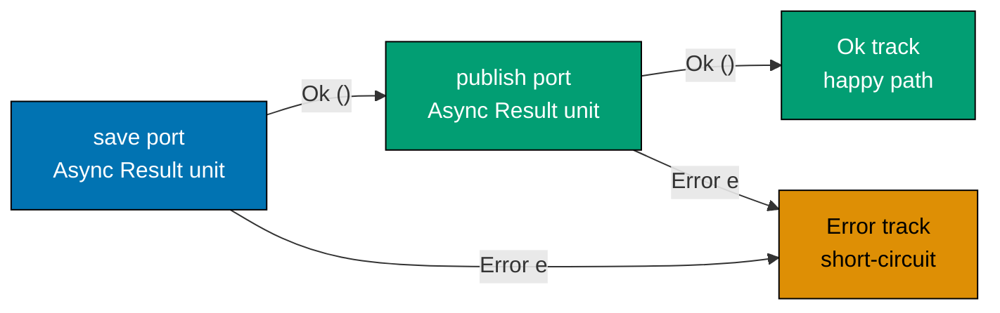
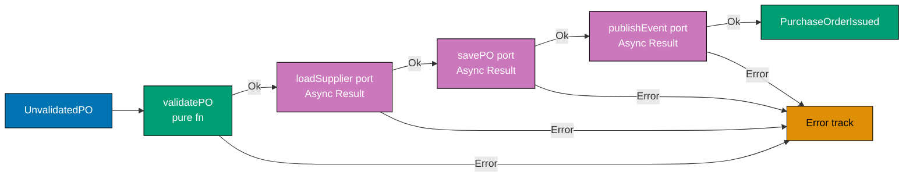
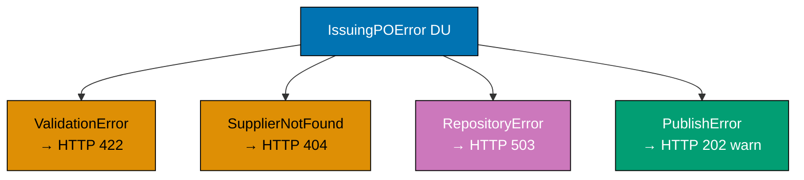
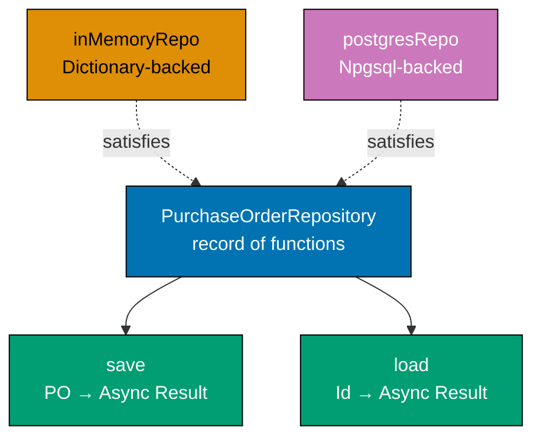
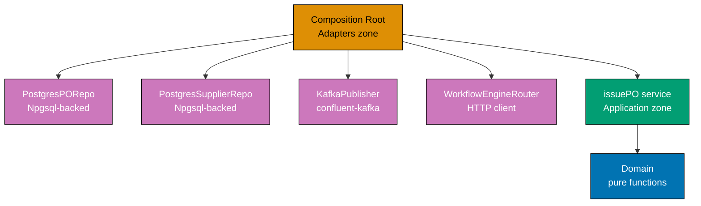
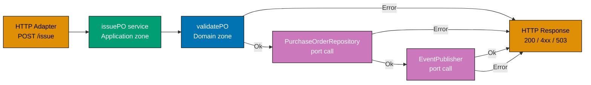

This intermediate section builds on the port/adapter foundations from the beginner section and introduces the `purchasing` and `supplier` bounded contexts together. The focal ports are `PurchaseOrderRepository`, `SupplierRepository`, `EventPublisher`, and `ApprovalRouterPort`. The running theme is wiring: how a composition root assembles adapters, how tests swap adapters without touching application logic, and how the dependency rule rejects infrastructure at the boundary.

## Command and Query Ports (Examples 26–30)

### Example 26: Command Port vs Query Port — CQRS at the Port Boundary

Command ports change state and return domain events or errors. Query ports are read-only and return view models. Separating them at the port level enforces CQRS at the application boundary — commands flow through the full domain pipeline while queries may bypass domain logic and hit a denormalised read model.

```fsharp
// ── Command port ──────────────────────────────────────────────────────────
// A command changes state and returns domain events on success.
// The async wrapper acknowledges that persistence is effectful.
// Result carries named error cases so the HTTP adapter maps them precisely.
type IssuePurchaseOrderCommand =
    PurchaseOrderId -> Async<Result<PurchaseOrderIssued list, IssuingPOError>>
// => Input:  the identity of an Approved PO that is ready to be issued
// => Output: list of domain events on Ok, named error on Error
// => Every call may write to the database and publish to the event bus

// ── Query port ────────────────────────────────────────────────────────────
// A query never changes state; it projects data into a flat read model.
// PurchaseOrderView is not the domain aggregate — it is a denormalised DTO.
type GetPurchaseOrderQuery =
    PurchaseOrderId -> Async<Result<PurchaseOrderView option, QueryError>>
// => Input:  a PO identity value
// => Output: Some flat view on Ok, None if not found, QueryError on failure
// => Side-effect-free read — safe to cache, safe to retry without harm

// ── Read model ────────────────────────────────────────────────────────────
// PurchaseOrderView flattens the aggregate into a single serialisable record.
// No domain logic lives here — it is purely a projection for display.
type PurchaseOrderView = {
    OrderId      : string
    // => Identifies the PO in the read model (format po_<uuid>)
    SupplierName : string
    // => Denormalised — avoids a join to the Suppliers table at query time
    TotalAmount  : decimal
    // => Final calculated total — already computed during command processing
    Status       : string
    // => Human-readable status label, not a domain DU — just a display string
    IssuedAt     : System.DateTimeOffset option
    // => Null when PO is still in Draft/AwaitingApproval; set once Issued
}

// ── Distinct error types ──────────────────────────────────────────────────
// QueryError is separate from IssuingPOError — queries fail differently.
type QueryError =
    | NotFound      of string
    // => Requested PO does not exist in the read model
    | QueryTimeout  of string
    // => Read timed out — caller can safely retry
type IssuingPOError =
    | PONotApproved of string
    // => PO is not in Approved state — cannot issue from other states
    | RepositoryError of string
    // => Infrastructure failure during save or event publish
```

**Key Takeaway**: Separating command and query ports at the type level prevents accidental conflation of state-mutation and read-only operations, giving each path its own error type, its own optimised adapter, and its own test strategy.

**Why It Matters**: When command and query paths share a single repository interface, every read-optimisation (caching, denormalisation, read replicas) is blocked by write concerns. Expressing CQRS at the port boundary costs one extra type alias. The payoff is that the query adapter can be a lightweight SQL view or a Redis cache with zero impact on the command pipeline.

---

### Example 27: Read Model vs Domain Model — Two Separate Output Ports

The domain aggregate is the source of truth for write operations; the read model is the source of truth for query operations. These are structurally different types served by structurally different ports, which allows each to evolve independently.

```fsharp
// ── Domain aggregate port (command pipeline) ──────────────────────────────
// PurchaseOrderRepository is defined in beginner.md and used unchanged here.
// It returns the full domain aggregate — a rich type with all domain rules.
type PurchaseOrderRepository = {
    save : PurchaseOrder -> Async<Result<unit, string>>
    // => Persist a PO — upsert semantics; both insert and update use this field
    load : PurchaseOrderId -> Async<Result<PurchaseOrder option, string>>
    // => Load by identity — None signals not-found without raising exceptions
}

// ── Domain aggregate ──────────────────────────────────────────────────────
// PurchaseOrder is the rich aggregate with domain-validated fields.
// Rich types make invalid states unrepresentable at compile time.
type PurchaseOrder = {
    Id          : PurchaseOrderId
    // => Strongly-typed identity — format po_<uuid>; not just any string
    SupplierId  : SupplierId
    // => Strongly-typed supplier reference — distinct type from PurchaseOrderId
    TotalAmount : decimal
    // => Sum of all line item values — drives approval-level routing
    Status      : string
    // => Current state: Draft | AwaitingApproval | Approved | Issued | etc.
}

// ── Read model port (query pipeline) ──────────────────────────────────────
// GetPurchaseOrderView returns the flat view model — simple and serialisable.
// The query adapter may serve this from a materialised view or Redis.
type GetPurchaseOrderView =
    PurchaseOrderId -> Async<Result<PurchaseOrderView, QueryError>>
// => Returns the READ MODEL type — not the domain aggregate
// => Two separate ports: two implementations, two adapters, two test doubles

// ── Two adapter sketches ───────────────────────────────────────────────────
// Command-side adapter queries the normalised purchase_orders table (joins allowed).
let postgresOrderRepo : PurchaseOrderRepository = {
    save = fun po ->
        async {
            // In a real system: Npgsql INSERT ... ON CONFLICT UPDATE against purchase_orders
            // Here: stub to illustrate port/adapter boundary without real Npgsql dependency
            return Ok ()
            // => Always Ok in this stub; real adapter propagates DB exceptions as Error
        }
    load = fun id ->
        async {
            // In a real system: SELECT * FROM purchase_orders WHERE id = @id
            let po : PurchaseOrder = {
                Id = id; SupplierId = "sup_abc"; TotalAmount = 5000m; Status = "Approved"
            }
            // => Deserialise row into domain aggregate; None when row absent
            return Ok (Some po)
        }
}

// Query-side adapter reads from a materialised view (denormalised, no joins).
let postgresViewRepo : GetPurchaseOrderView =
    fun id ->
        async {
            // In a real system: SELECT * FROM purchase_order_views WHERE id = @id
            let view : PurchaseOrderView = {
                OrderId      = id
                // => Primary key passed through unchanged
                SupplierName = "Acme Corp"
                // => Pre-joined from suppliers table during materialisation
                TotalAmount  = 5000m
                // => Pre-computed at write time — no aggregation at read time
                Status       = "Approved"
                // => Display string converted from domain DU during projection
                IssuedAt     = None
                // => None because PO is still Approved, not yet Issued
            }
            return Ok view
        }
// => Each adapter is independently replaceable — swapping one does not touch the other
```

**Key Takeaway**: Two separate output port types — one returning the domain aggregate, one returning the flat read model — let each adapter be optimised independently without either side leaking into the other.

**Why It Matters**: Forcing domain aggregates through the query path causes unnecessary deserialization of nested value objects and fragile coupling between display requirements and domain structure. Separate read-model ports permit materialised views, caching layers, and eventual-consistency projections without touching domain logic.

---

### Example 28: Async Output Port — `Async<Result<>>` Composition

Every output port that performs I/O returns `Async<Result<'a, 'e>>`. Composing two such calls without a helper library requires explicit `async { let! ... }` nesting and `Result` matching. The `asyncResult { }` CE from FsToolkit.ErrorHandling eliminates the boilerplate.



**Manual composition (no helper library):**

```fsharp
// ── Port types ─────────────────────────────────────────────────────────────
// Both ports return Async<Result<unit, string>> — the same shape.
type SavePO    = PurchaseOrder -> Async<Result<unit, string>>
type PublishEv = PurchaseOrderIssued -> Async<Result<unit, string>>

// ── Manual Async + Result composition ──────────────────────────────────────
// Without FsToolkit.ErrorHandling, every async-result call nests one level deeper.
// Verbose but instructive — shows exactly what asyncResult { } desugars to.
let manualIssuePipeline (save: SavePO) (publish: PublishEv) (po: PurchaseOrder) =
    async {
        let! saveResult = save po
        // => saveResult : Result<unit, string>
        // => Await completes the async; now we have a Result to inspect
        match saveResult with
        | Error msg ->
            return Error (sprintf "Save failed: %s" msg)
            // => Short-circuit — publish is never called if save failed
        | Ok () ->
        let event = { OrderId = po.Id; SupplierId = po.SupplierId; IssuedAt = System.DateTimeOffset.UtcNow }
        let! publishResult = publish event
        // => publishResult : Result<unit, string>
        match publishResult with
        | Error msg ->
            return Error (sprintf "Publish failed: %s" msg)
            // => Notification failure surfaced on the same error track
        | Ok () ->
            return Ok ()
            // => Both ports succeeded — return the happy path
    }
// => Every bind point is explicit and traceable — good for learning, noisy in production

type PurchaseOrderIssued = { OrderId: PurchaseOrderId; SupplierId: SupplierId; IssuedAt: System.DateTimeOffset }
```

**Cleaner with `asyncResult { }` from FsToolkit.ErrorHandling:**

```fsharp
// NOTE: asyncResult computation expression requires FsToolkit.ErrorHandling NuGet package
// Install: dotnet add package FsToolkit.ErrorHandling
open FsToolkit.ErrorHandling

// ── Same pipeline — much less noise ────────────────────────────────────────
// asyncResult { } desugars to the same Async.bind + Result.bind chain above.
// The CE makes the railway metaphor literal: every let!/do! is a track switch.
let issuePipeline
    (save    : PurchaseOrder -> Async<Result<unit, string>>)
    (publish : PurchaseOrderIssued -> Async<Result<unit, string>>)
    (po      : PurchaseOrder)
    : Async<Result<unit, string>> =
    asyncResult {
        do! save po
        // => Await save, short-circuit on Error — identical to the manual match above
        let event = { OrderId = po.Id; SupplierId = po.SupplierId; IssuedAt = System.DateTimeOffset.UtcNow }
        do! publish event
        // => Await publish, short-circuit on Error
        // => If both succeed, returns Ok () automatically
    }
// => asyncResult { } is syntactic sugar — same semantics, less ceremony
// => Requires FsToolkit.ErrorHandling; NOT part of F# standard library
```

**Key Takeaway**: `Async<Result<'a, 'e>>` composition is the async railway — every `do!` inside `asyncResult { }` switches track on Error, just as `result { }` does for synchronous pipelines.

**Why It Matters**: Without a composition strategy for `Async<Result<>>`, application services devolve into deeply nested match expressions that obscure domain intent behind infrastructure plumbing. The `asyncResult { }` CE restores the linear pipeline reading style while preserving full error tracking.

---

### Example 29: Railway-Oriented Programming Across Async Port Calls

A full application service pipeline spans pure domain steps (synchronous, no I/O) and port calls (asynchronous, effectful). ROP unifies both into a single railway — pure functions contribute Result-shaped track switches, port calls contribute Async-Result-shaped track switches.



```fsharp
open FsToolkit.ErrorHandling

// ── Domain types ────────────────────────────────────────────────────────────
type UnvalidatedPO = { RawId: string; RawSupplierId: string; RawAmount: decimal }
type PurchaseOrderId = string
type SupplierId      = string

// ── Unified error DU for the full pipeline ──────────────────────────────────
// Every failure mode — domain or infrastructure — joins this union.
// The HTTP adapter pattern-matches exhaustively to produce the right status code.
type IssuingPOError =
    | ValidationError  of string
    // => Domain rule violation — maps to HTTP 422
    | SupplierNotFound of string
    // => Supplier lookup failed — maps to HTTP 404
    | RepositoryError  of string
    // => Infrastructure failure during save — maps to HTTP 503
    | PublishError     of string
    // => Event publish failed — maps to HTTP 202 (saved, not published)

// ── Port types ──────────────────────────────────────────────────────────────
type LoadSupplier = SupplierId -> Async<Result<bool, IssuingPOError>>
// => Confirms supplier is Approved; returns false if Suspended/Blacklisted
type SavePO       = PurchaseOrder -> Async<Result<unit, IssuingPOError>>
type PublishEvent = PurchaseOrderIssued -> Async<Result<unit, IssuingPOError>>

// ── Pure domain validation ───────────────────────────────────────────────────
let validatePO (input: UnvalidatedPO) : Result<PurchaseOrder, IssuingPOError> =
    if System.String.IsNullOrWhiteSpace(input.RawId) then
        Error (ValidationError "PO ID blank")
        // => Domain rule: blank ID rejected immediately — no I/O needed
    elif System.String.IsNullOrWhiteSpace(input.RawSupplierId) then
        Error (ValidationError "Supplier ID blank")
        // => Domain rule: supplier identity is mandatory on a PO
    elif input.RawAmount <= 0m then
        Error (ValidationError (sprintf "Amount %M must be positive" input.RawAmount))
        // => Domain rule: PO total must be > 0
    else
        Ok { Id = input.RawId; SupplierId = input.RawSupplierId; TotalAmount = input.RawAmount; Status = "Approved" }
        // => All guards passed — returns the validated PO aggregate

// ── Full pipeline: pure steps + async port calls ─────────────────────────────
// asyncResult { } stitches synchronous Results and async-Results seamlessly.
let buildIssuePO (loadSupplier: LoadSupplier) (savePO: SavePO) (publishEvent: PublishEvent) =
    fun (input: UnvalidatedPO) ->
        asyncResult {
            // Step 1: pure domain validation — lifted into asyncResult with ofResult
            let! po = validatePO input |> AsyncResult.ofResult
            // => ofResult lifts a synchronous Result into the async railway
            // => Short-circuits on ValidationError — steps 2-4 are skipped

            // Step 2: async port — confirm supplier is Approved
            let! isApproved = loadSupplier po.SupplierId
            // => loadSupplier : SupplierId -> Async<Result<bool, IssuingPOError>>
            // => Awaited and unwrapped by let! — Error short-circuits here
            if not isApproved then
                return! AsyncResult.returnError (SupplierNotFound po.SupplierId)
            // => Domain rule: cannot issue PO to a Suspended or Blacklisted supplier

            // Step 3: async port — persist the PO in Issued state
            let issuedPO = { po with Status = "Issued" }
            do! savePO issuedPO
            // => do! discards unit result; Error short-circuits here

            // Step 4: async port — publish the PurchaseOrderIssued event
            let event = { OrderId = po.Id; SupplierId = po.SupplierId; IssuedAt = System.DateTimeOffset.UtcNow }
            do! publishEvent event
            // => do! publishes domain event; Error surfaces as PublishError

            return [ event ]
            // => All four steps succeeded — HTTP adapter receives Ok [event] → 200 OK
        }
// => Pure steps and port calls compose uniformly — the CE hides the plumbing
```

**Key Takeaway**: ROP across async port calls merges asynchrony and error propagation into a single linear pipeline where every step is either a track switch (Result) or an async track switch (Async<Result>).

**Why It Matters**: The alternative — nested `async { match ... }` for every port call — produces code where the happy path is buried inside match arms. `asyncResult { }` restores linearity: read the function top-to-bottom and you see the business intent. Five steps in one `asyncResult { }` block would require five nested match expressions without it.

---

### Example 30: Error Union Across Port and Domain Layers

Domain functions produce domain errors; adapters produce infrastructure errors. The application service lifts all of them into a single DU so the HTTP adapter can exhaustively pattern-match with zero blind spots.



```fsharp
// ── Unified error DU — application layer ────────────────────────────────────
// Every distinct failure mode surfaces as a named DU case.
// This DU is owned by the APPLICATION layer — not domain, not adapters.
// Domain errors bubble up unchanged; port errors are lifted via Result.mapError.
type IssuingPOError =
    | ValidationError  of string
    // => Emitted by pure domain functions — maps to HTTP 422
    | SupplierNotFound of string
    // => Supplier lookup returned false — maps to HTTP 404
    | RepositoryError  of string
    // => Emitted by repository adapter — maps to HTTP 503
    | PublishError     of string
    // => Emitted by event publisher adapter — maps to HTTP 202 (saved, not published)

// ── Lifting adapter-specific errors into the unified DU ──────────────────────
// mapError transforms the error channel of a Result without touching the Ok path.
// Each adapter defines its own narrow error type; the application maps it to the DU.
type DbWriteError = DbConstraint of string | DbTimeout
let liftDbError : Result<'a, DbWriteError> -> Result<'a, IssuingPOError> =
    Result.mapError (fun e ->
        match e with
        | DbConstraint msg -> RepositoryError (sprintf "Constraint: %s" msg)
        // => Constraint violation wrapped as RepositoryError
        | DbTimeout        -> RepositoryError "DB timeout"
        // => Timeout lifted into RepositoryError — caller retries
    )

type KafkaError = PartitionFull | SerializationFailed of string
let liftKafkaError : Result<'a, KafkaError> -> Result<'a, IssuingPOError> =
    Result.mapError (fun e ->
        match e with
        | PartitionFull          -> PublishError "Kafka partition full"
        // => Backpressure event lifted as non-fatal PublishError
        | SerializationFailed msg -> PublishError (sprintf "Serialize: %s" msg)
        // => Serialisation failure also non-fatal — PO is already saved
    )

// ── HTTP adapter: exhaustive pattern match on the unified DU ─────────────────
// F# forces exhaustive matching — adding a new case breaks compilation here.
let toHttpResponse (result: Result<PurchaseOrderIssued list, IssuingPOError>) : string =
    match result with
    | Ok events ->
        sprintf "200 OK: %d events emitted" (List.length events)
        // => Happy path — all pipeline steps succeeded
    | Error (ValidationError msg)  -> sprintf "422 Unprocessable Entity: %s" msg
    // => Domain validation failure — client submitted invalid data
    | Error (SupplierNotFound id)  -> sprintf "404 Not Found: supplier %s" id
    // => Supplier does not exist or is Suspended/Blacklisted
    | Error (RepositoryError msg)  -> sprintf "503 Service Unavailable: %s" msg
    // => Database unavailable — client may retry after backoff
    | Error (PublishError msg)     -> sprintf "202 Accepted (event not published): %s" msg
    // => PO saved but event not published — not a fatal error; outbox will retry

// ── Demonstration ─────────────────────────────────────────────────────────────
let demoEvent = { OrderId = "po_001"; SupplierId = "sup_abc"; IssuedAt = System.DateTimeOffset.UtcNow }
let outcomes = [
    Ok [ demoEvent ]
    // => Happy path
    Error (ValidationError "PO ID blank")
    // => Domain validation failure
    Error (SupplierNotFound "sup_xyz")
    // => Supplier not approved
    Error (RepositoryError "connection refused")
    // => Infrastructure failure
    Error (PublishError "Kafka partition full")
    // => Non-fatal publish failure
]
outcomes |> List.iter (fun r -> printfn "%s" (toHttpResponse r))
// => Output: 200 OK: 1 events emitted
// => Output: 422 Unprocessable Entity: PO ID blank
// => Output: 404 Not Found: supplier sup_xyz
// => Output: 503 Service Unavailable: connection refused
// => Output: 202 Accepted (event not published): Kafka partition full
```

**Key Takeaway**: A single unified error DU at the application layer, lifted from domain and port errors via `Result.mapError`, gives the HTTP adapter one exhaustive match point instead of nested partial matches scattered across the codebase.

**Why It Matters**: F# discriminated unions with exhaustive matching turn error-case coverage into a compile-time guarantee. Adding a new error case breaks compilation at every unhandled match site. The cost is one `Result.mapError` per port call; the gain is impossible-to-miss coverage.

---

## Infrastructure Ports (Examples 31–36)

### Example 31: Repository Port as a Record of Functions

A repository with multiple operations can be expressed as a single record of functions. The record form reduces parameter list width, keeps related operations co-located, and makes substitution (test double vs production) a single variable assignment.



```fsharp
open System.Collections.Generic

// ── Port type: repository record ────────────────────────────────────────────
// A record of functions is the idiomatic F# alternative to an interface.
// All operations are co-located — one value to inject, not two separate parameters.
// The signature matches exactly what beginner.md established.
type PurchaseOrderRepository = {
    save : PurchaseOrder -> Async<Result<unit, string>>
    // => Upsert semantics — create or update; caller does not distinguish
    // => Returns unit on success — the persisted state is what was passed in
    load : PurchaseOrderId -> Async<Result<PurchaseOrder option, string>>
    // => Load by identity — None signals not-found without raising exceptions
    // => Error string on infrastructure failure (DB unavailable, timeout, etc.)
}

// ── In-memory implementation ─────────────────────────────────────────────────
// Satisfies the same type — same fields, same signatures.
// Mutable Dictionary is acceptable in the adapter zone (outside the domain).
// Factory function: returns a fresh, isolated repo for each test — no shared state.
let makeInMemoryPORepo () : PurchaseOrderRepository =
    let store = Dictionary<PurchaseOrderId, PurchaseOrder>()
    // => Mutable Dictionary lives in the adapter, never leaks into the domain
    // => Captured in the closure — each call gets its own isolated instance
    {
        save = fun po ->
            async {
                store.[po.Id] <- po
                // => Dictionary indexer performs insert and update — upsert semantics
                // => Always succeeds in this adapter; Postgres adapter may fail on constraints
                return Ok ()
            }
        load = fun id ->
            async {
                match store.TryGetValue(id) with
                | true,  po -> return Ok (Some po)
                // => Found — wrap in Some and Ok
                | false, _  -> return Ok None
                // => Not found — return None, not an error; caller decides what to do
            }
    }

// ── Application service using the port ──────────────────────────────────────
// The service accepts PurchaseOrderRepository — it never names an implementation.
// Substituting in-memory for Postgres is a single variable swap at the call site.
let loadAndPrintPO (repo: PurchaseOrderRepository) (id: PurchaseOrderId) =
    async {
        let! result = repo.load id
        // => result : Result<PurchaseOrder option, string>
        match result with
        | Ok (Some po) -> printfn "Loaded PO: %s, Status: %s" po.Id po.Status
        // => Output: Loaded PO: po_001, Status: Approved
        | Ok None      -> printfn "PO not found: %s" id
        // => Output when ID does not exist in the adapter's store
        | Error msg    -> printfn "Repository error: %s" msg
        // => Output on infrastructure failure
    }

// ── Demonstration ─────────────────────────────────────────────────────────────
let repo = makeInMemoryPORepo ()
let po   = { Id = "po_001"; SupplierId = "sup_abc"; TotalAmount = 5000m; Status = "Approved" }
// Async.RunSynchronously used only in demonstration; real code uses async pipelines
Async.RunSynchronously (async {
    let! _ = repo.save po
    do! loadAndPrintPO repo "po_001"
    // => Output: Loaded PO: po_001, Status: Approved
    do! loadAndPrintPO repo "po_999"
    // => Output: PO not found: po_999
})
```

**Key Takeaway**: The `PurchaseOrderRepository` record type is the complete port contract — any record literal that provides matching `save` and `load` functions satisfies it, regardless of the underlying storage mechanism.

**Why It Matters**: When application services depend on a record-of-functions type rather than a concrete module, the adapter can be swapped without modifying a single line of application or domain code. The same service function runs correctly against a PostgreSQL adapter in production and a Dictionary adapter in unit tests.

---

### Example 32: SupplierRepository Port — Cross-Context Dependency

The `purchasing` context depends on the `supplier` context to confirm that a supplier is Approved before a PO is issued. The dependency is expressed as an output port — the `purchasing` application service does not know whether the supplier lookup hits a database, a cache, or a test stub.

```fsharp
// ── SupplierRepository port (supplier context) ───────────────────────────────
// The purchasing application service declares this dependency as a port.
// It does not import the supplier module directly — that would create context coupling.
type SupplierRepository = {
    loadApproved : SupplierId -> Async<Result<Supplier option, string>>
    // => Returns Some Supplier when the supplier exists and is in Approved state
    // => Returns None when supplier does not exist or is Suspended/Blacklisted
    // => Error string on infrastructure failure
    save : Supplier -> Async<Result<unit, string>>
    // => Persist supplier state changes (Approved, Suspended, Blacklisted)
}

// ── Supplier domain type (supplier context) ────────────────────────────────
type SupplierStatus = Pending | Approved | Suspended | Blacklisted
type Supplier = {
    Id     : SupplierId
    // => Unique identifier in format sup_<uuid>
    Name   : string
    // => Display name used in PurchaseOrderView denormalisation
    Status : SupplierStatus
    // => Lifecycle state — Approved suppliers can receive new POs
}

// ── In-memory SupplierRepository for tests ────────────────────────────────────
let makeInMemorySupplierRepo () : SupplierRepository =
    let store = System.Collections.Generic.Dictionary<SupplierId, Supplier>()
    // => Isolated in-memory store — same factory pattern as PurchaseOrderRepository
    {
        loadApproved = fun id ->
            async {
                match store.TryGetValue(id) with
                | true, sup when sup.Status = Approved -> return Ok (Some sup)
                // => Only returns Some when supplier is in Approved state
                // => Suspended and Blacklisted suppliers return None — cannot issue PO
                | true,  _ -> return Ok None
                // => Supplier exists but is not Approved — treat as not eligible
                | false, _ -> return Ok None
                // => Supplier does not exist — also not eligible
            }
        save = fun sup ->
            async {
                store.[sup.Id] <- sup
                return Ok ()
                // => Upsert — inserts on first call, updates on subsequent calls
            }
    }

// ── Application service using both repositories ──────────────────────────────
// The purchasing service receives BOTH repositories as parameters.
// Neither module is imported directly — both are injected at the composition root.
let validateSupplierForPO
    (supplierRepo : SupplierRepository)
    (supplierId   : SupplierId)
    : Async<Result<Supplier, string>> =
    async {
        let! result = supplierRepo.loadApproved supplierId
        // => result : Result<Supplier option, string>
        return
            match result with
            | Ok (Some sup) -> Ok sup
            // => Supplier is Approved — PO can be issued
            | Ok None       -> Error (sprintf "Supplier %s is not eligible for new POs" supplierId)
            // => Not Approved (or does not exist) — domain rule violation
            | Error msg     -> Error (sprintf "Repository error: %s" msg)
            // => Infrastructure failure — propagate upward
    }
```

**Key Takeaway**: Cross-context dependencies are expressed as output ports — the `purchasing` application service depends on a `SupplierRepository` port, not on the supplier module directly, keeping the bounded contexts decoupled.

**Why It Matters**: Direct module-to-module imports between bounded contexts create invisible coupling. When the supplier team changes the internal shape of their aggregate, the importing context breaks silently. A port type creates an explicit, versioned contract — the purchasing context expresses exactly what it needs, and the supplier context provides an adapter that satisfies that need.

---

### Example 33: EventPublisher Port — Domain Events as Output Port

The `EventPublisher` port decouples the application service from the event bus infrastructure. The application service calls `publish` with a domain event record; whether that goes to Kafka, an outbox table, or an in-memory list is invisible to the application layer.

```fsharp
// ── Domain events ─────────────────────────────────────────────────────────────
// Past-tense names: something that happened, not a command.
// These are P2P domain events from the locked spec — do not invent new ones.
type PurchaseOrderIssued = {
    OrderId    : PurchaseOrderId
    // => Identity of the PO that was issued to the supplier
    SupplierId : SupplierId
    // => Supplier who will receive the PO via EDI or email
    IssuedAt   : System.DateTimeOffset
    // => Timestamp of the state transition — immutable after creation
}

type SupplierApproved = {
    SupplierId : SupplierId
    // => Identity of the newly approved supplier
    ApprovedAt : System.DateTimeOffset
    // => Timestamp when the approval decision was recorded
}

// ── DU wrapping all publishable events ───────────────────────────────────────
// A single DU makes the publish port type-safe: only known domain events compile.
// New event types must be added here — the compiler then forces all publish
// call sites to handle or route the new case.
type DomainEvent =
    | POIssued      of PurchaseOrderIssued
    // => Consumed by: supplier-notifier, receiving context (opens GRN expectation)
    | SupApproved   of SupplierApproved
    // => Consumed by: purchasing (eligible-for-PO list refresh)

// ── EventPublisher port ────────────────────────────────────────────────────────
// publish : DomainEvent -> Async<Result<unit, string>>
// Single function field — one port per responsibility principle.
type EventPublisher = {
    publish : DomainEvent -> Async<Result<unit, string>>
    // => Returns Ok () when event is accepted by the transport (Kafka ack / outbox insert)
    // => Returns Error string on transport failure — caller decides retry vs poison queue
}

// ── In-memory EventPublisher (test double) ────────────────────────────────────
// Collects published events in a list — test code reads the list to assert.
let makeInMemoryPublisher () : EventPublisher * (unit -> DomainEvent list) =
    let mutable published : DomainEvent list = []
    // => Mutable list lives in the adapter — never leaks into domain or application
    let publisher = {
        publish = fun evt ->
            async {
                published <- published @ [ evt ]
                // => Append event to the list — preserves emission order
                return Ok ()
                // => Always succeeds — test double does not simulate transport failures
            }
    }
    let getPublished = fun () -> published
    // => Test accessor — call this in assertions to inspect what was published
    publisher, getPublished
// => Returns a tuple: the port value + a test accessor function
// => The application service receives only the port — the accessor is for tests

// ── Application service using EventPublisher ─────────────────────────────────
let issuePO
    (repo      : PurchaseOrderRepository)
    (publisher : EventPublisher)
    (po        : PurchaseOrder)
    : Async<Result<PurchaseOrderIssued, string>> =
    async {
        let issuedPO = { po with Status = "Issued" }
        let! saveResult = repo.save issuedPO
        // => saveResult : Result<unit, string>
        match saveResult with
        | Error msg -> return Error msg
        // => Save failed — do not publish; return error to caller
        | Ok () ->
        let event = { OrderId = po.Id; SupplierId = po.SupplierId; IssuedAt = System.DateTimeOffset.UtcNow }
        let! pubResult = publisher.publish (POIssued event)
        // => pubResult : Result<unit, string>
        // => Publish only after successful save — maintains at-least-once consistency
        return
            match pubResult with
            | Ok ()    -> Ok event
            | Error msg -> Error (sprintf "Published failed: %s" msg)
    }
```

**Key Takeaway**: The `EventPublisher` port wraps the event bus behind a single `publish` function, making the application service independent of Kafka, outbox tables, or any other transport mechanism.

**Why It Matters**: Embedding Kafka producer calls directly in application services makes integration testing impossible without a running Kafka cluster. An in-memory publisher collects events into a list that test assertions can inspect. The application service is identical in both environments — only the injected publisher value differs.

---

### Example 34: ApprovalRouterPort — Routing Logic Behind a Port

The `ApprovalRouterPort` routes a PO approval request to the correct manager based on the PO's total amount and approval level. The routing logic (workflow engine, email, Slack) is hidden behind the port — the domain rule that determines the approval level stays pure.

```fsharp
// ── ApprovalLevel value object (from domain spec) ────────────────────────────
type ApprovalLevel =
    | L1  // ≤ $1,000 — line manager
    | L2  // ≤ $10,000 — department head
    | L3  // > $10,000 — CFO or VP Finance

// ── Pure domain function: derive approval level from PO total ─────────────────
// No I/O — total amount is enough to determine the level. Always testable in isolation.
let deriveApprovalLevel (totalAmount: decimal) : Result<ApprovalLevel, string> =
    if totalAmount <= 0m then
        Error "Total amount must be positive"
        // => Domain invariant: zero or negative PO total is invalid
    elif totalAmount <= 1000m then
        Ok L1
        // => L1 threshold: up to $1,000 — line manager approval
    elif totalAmount <= 10000m then
        Ok L2
        // => L2 threshold: $1,001–$10,000 — department head approval
    else
        Ok L3
        // => L3 threshold: above $10,000 — CFO approval required per spec

// ── ApprovalRouterPort type ────────────────────────────────────────────────────
// The port receives the PO identity and the computed approval level.
// It returns the manager identifier (email, employee ID, etc.) who was notified.
type ApprovalRouterPort = {
    routeApproval : PurchaseOrderId -> ApprovalLevel -> Async<Result<string, string>>
    // => Returns Ok managerId when routing succeeds
    // => Returns Error string when the workflow engine is unavailable
}

// ── In-memory test double ──────────────────────────────────────────────────────
// Maps approval levels to fixed manager IDs — no workflow engine needed in tests.
let inMemoryApprovalRouter : ApprovalRouterPort = {
    routeApproval = fun poId level ->
        async {
            let managerId =
                match level with
                | L1 -> "manager@example.com"
                // => L1 POs go to the line manager
                | L2 -> "dept-head@example.com"
                // => L2 POs go to the department head
                | L3 -> "cfo@example.com"
                // => L3 POs go to the CFO — high-value approval required
            printfn "Routing PO %s to %s (level %A)" poId managerId level
            // => Output: Routing PO po_001 to cfo@example.com (level L3)
            return Ok managerId
        }
}

// ── Application service: combine pure rule + port call ──────────────────────
open FsToolkit.ErrorHandling

let submitForApproval
    (router : ApprovalRouterPort)
    (po     : PurchaseOrder)
    : Async<Result<string, string>> =
    asyncResult {
        let! level = deriveApprovalLevel po.TotalAmount |> AsyncResult.ofResult
        // => Pure domain function lifted into the async railway
        // => Short-circuits on domain rule violation (zero or negative total)
        let! managerId = router.routeApproval po.Id level
        // => Async port call — routes to correct manager
        return managerId
        // => Returns the manager ID who received the routing notification
    }

// ── Demonstration ──────────────────────────────────────────────────────────────
let highValuePO = { Id = "po_001"; SupplierId = "sup_abc"; TotalAmount = 15000m; Status = "Draft" }
// Async.RunSynchronously for demonstration only — real code keeps async throughout
let result = Async.RunSynchronously (submitForApproval inMemoryApprovalRouter highValuePO)
// => Routing PO po_001 to cfo@example.com (level L3)
// => result : Result<string, string> = Ok "cfo@example.com"
```

**Key Takeaway**: The approval level derivation is a pure domain function; the routing action is an output port. Keeping them separate means the domain rule can be tested without any workflow engine or network dependency.

**Why It Matters**: Teams that embed routing calls inside domain functions cannot test approval threshold logic without a running workflow engine. Separating the pure rule from the effectful router means threshold changes (business requirement updates) are tested instantly, and routing adapter changes (workflow engine migration) do not touch domain code.

---

## Composition Root (Examples 35–38)

### Example 35: The Composition Root — Wiring Adapters to Ports

The composition root is the single place in the application where concrete adapters are instantiated and injected into application services. It lives in the adapter zone and is the only place that imports both the application layer and infrastructure libraries simultaneously.



```fsharp
// ── Composition root — adapter zone only ────────────────────────────────────
// This module is the ONLY place that imports both application layer and infra libs.
// It is NOT tested directly — it is exercised via integration tests.
// Domain and Application modules never import this module.

module ProcurementPlatform.CompositionRoot

// open ProcurementPlatform.Application   ← imports application layer
// open Npgsql                            ← imports infrastructure library
// Both opens permitted here — this is the adapter zone

// ── Postgres-backed PurchaseOrderRepository ─────────────────────────────────
// Satisfies the PurchaseOrderRepository port type — same record shape as in-memory.
let makePostgresPORepo (connectionString: string) : PurchaseOrderRepository =
    // connectionString: injected from environment variable or secret manager
    {
        save = fun po ->
            async {
                // Real implementation: Npgsql INSERT ... ON CONFLICT DO UPDATE
                // SET status = @status, total_amount = @totalAmount WHERE id = @id
                printfn "[Postgres] Saving PO %s with status %s" po.Id po.Status
                // => Log shows adapter is executing; in production, actual SQL runs here
                return Ok ()
                // => Stub: always succeeds; real adapter propagates Npgsql exceptions
            }
        load = fun id ->
            async {
                // Real implementation: SELECT * FROM purchase_orders WHERE id = @id
                printfn "[Postgres] Loading PO %s" id
                // => Log shows adapter is executing
                return Ok None
                // => Stub: returns None; real adapter deserialises the row
            }
    }

// ── Kafka-backed EventPublisher ──────────────────────────────────────────────
// Satisfies the EventPublisher port type — same record shape as in-memory.
let makeKafkaPublisher (brokerUrl: string) : EventPublisher =
    // brokerUrl: injected from configuration — never hardcoded
    {
        publish = fun event ->
            async {
                // Real implementation: ProduceAsync to Kafka topic with partition key
                let topic =
                    match event with
                    | POIssued _   -> "purchase-orders-issued"
                    // => Domain event routes to its dedicated topic
                    | SupApproved _ -> "suppliers-approved"
                    // => Supplier events route to the supplier topic
                printfn "[Kafka] Publishing to topic: %s" topic
                // => Log shows which topic received the event
                return Ok ()
                // => Stub: always succeeds; real adapter awaits Kafka ack
            }
    }

// ── Composed application service ────────────────────────────────────────────
// The composition root creates all adapters and injects them into the service.
// The resulting function matches the input port type — it IS the port implementation.
let buildIssuePOService (connectionString: string) (brokerUrl: string) =
    let poRepo    = makePostgresPORepo connectionString
    // => Command-side repository — writes to the normalised purchase_orders table
    let publisher = makeKafkaPublisher brokerUrl
    // => Event publisher — sends PurchaseOrderIssued to Kafka
    let service   = issuePO poRepo publisher
    // => Partially apply: poRepo and publisher are baked in; caller provides po
    service
    // => Returns a function: PurchaseOrder -> Async<Result<PurchaseOrderIssued, string>>
    // => This is the fully wired application service — ready for the HTTP adapter
```

**Key Takeaway**: The composition root is the one module that knows everything about infrastructure — it instantiates all adapters, wires them to ports, and partially applies them into application services that the HTTP adapter calls.

**Why It Matters**: When wiring is scattered across modules, tracing how a port gets its adapter requires reading multiple files. A single composition root makes wiring explicit, auditable, and easy to modify when swapping adapters. Integration tests exercise the composition root directly; all other tests use the in-memory adapters.

---

### Example 36: Adapter Swapping for Tests — Same Application Service, Two Adapters

The same application service function runs against the Postgres adapter in production and the in-memory adapter in tests. The swap requires zero changes to the service code — only the injected adapter value changes.

```fsharp
// ── The same application service — parameterised by ports ─────────────────────
// issuePO is defined in Example 33.
// It accepts PurchaseOrderRepository and EventPublisher as parameters.
// The caller decides which adapter to inject.

// ── Production wiring (composition root) ─────────────────────────────────────
let productionIssuePO =
    let poRepo    = makePostgresPORepo "Host=prod-db;Database=procurement"
    // => Real Postgres adapter — writes to production database
    let publisher = makeKafkaPublisher "kafka://prod-broker:9092"
    // => Real Kafka adapter — publishes to production topic
    issuePO poRepo publisher
    // => Fully wired production service
    // => Type: PurchaseOrder -> Async<Result<PurchaseOrderIssued, string>>

// ── Test wiring (unit test setup) ─────────────────────────────────────────────
let testIssuePO, getPublished =
    let poRepo    = makeInMemoryPORepo ()
    // => In-memory adapter — Dictionary-backed, no DB connection needed
    let publisher, getPublished = makeInMemoryPublisher ()
    // => In-memory publisher — collects events in a list for assertions
    issuePO poRepo publisher, getPublished
    // => Same service function, different adapters — zero code change in service
    // => getPublished : unit -> DomainEvent list — for test assertions

// ── Example test using in-memory adapters ────────────────────────────────────
// This is a unit test — no database, no Kafka, no network, no clock setup.
let runTestScenario () =
    async {
        let po = { Id = "po_001"; SupplierId = "sup_abc"; TotalAmount = 5000m; Status = "Approved" }
        let! result = testIssuePO po
        // => result : Result<PurchaseOrderIssued, string>
        match result with
        | Ok event ->
            printfn "Test passed: event emitted for PO %s" event.OrderId
            // => Output: Test passed: event emitted for PO po_001
            let published = getPublished ()
            printfn "Events published: %d" (List.length published)
            // => Output: Events published: 1
        | Error msg ->
            printfn "Test FAILED: %s" msg
            // => Not reached in the happy-path scenario
    }

Async.RunSynchronously (runTestScenario ())
// => Output: Test passed: event emitted for PO po_001
// => Output: Events published: 1
```

**Key Takeaway**: Adapter swapping requires changing only the injected value — production uses Postgres + Kafka adapters, tests use in-memory adapters, and the application service code is identical in both cases.

**Why It Matters**: When application services hard-code their adapters (e.g., calling Npgsql directly), every test requires a running database. With injected ports, tests run in milliseconds with zero infrastructure. This is the central testability promise of Hexagonal Architecture — ports are not just an abstraction, they are the mechanism that makes fast, reliable unit tests possible.

---

### Example 37: Integration Test Seam with Stub Adapter

An integration test uses stub adapters that simulate specific infrastructure behaviours (slow response, failure, partial success) without requiring real infrastructure. The stub adapter satisfies the port type, making it indistinguishable from the real adapter from the application service's perspective.

```fsharp
// ── Stub adapter: simulates a DB timeout ─────────────────────────────────────
// Returns Error on every save call — simulates a database that has crashed.
// The application service must handle this error correctly regardless of adapter.
let timeoutPORepo : PurchaseOrderRepository = {
    save = fun _ ->
        async {
            do! Async.Sleep 10
            // => Simulates a 10ms timeout — real tests might use a longer delay
            return Error "DB timeout: connection pool exhausted"
            // => Error path — the application service must propagate this correctly
        }
    load = fun _ ->
        async {
            return Error "DB timeout: connection pool exhausted"
            // => Load also fails — simulates complete DB unavailability
        }
}

// ── Stub adapter: simulates Kafka partition full ───────────────────────────────
// Returns Error on every publish call — simulates a Kafka cluster under pressure.
let fullKafkaPublisher : EventPublisher = {
    publish = fun _ ->
        async {
            return Error "Kafka partition full: topic purchase-orders-issued"
            // => Error path — the application service sees PublishError, not transport details
        }
}

// ── Test scenario: save succeeds but publish fails ────────────────────────────
// This seam tests the partial-success path: PO is saved, event is not published.
// The real outbox pattern handles this at the infrastructure level; this test
// verifies the application service returns the correct error to the HTTP adapter.
let partialSuccessRepo : PurchaseOrderRepository = {
    save = fun po ->
        async {
            printfn "[Stub] Saved PO %s successfully" po.Id
            // => Stub confirms save side-effect without real DB
            return Ok ()
        }
    load = fun id ->
        async { return Ok None }
        // => Load returns None — not needed for this scenario
}

let testPartialSuccess () =
    async {
        let po      = { Id = "po_002"; SupplierId = "sup_def"; TotalAmount = 2000m; Status = "Approved" }
        let service = issuePO partialSuccessRepo fullKafkaPublisher
        // => Wire: real-ish save + failing publish — tests the seam
        let! result = service po
        // => result : Result<PurchaseOrderIssued, string>
        match result with
        | Ok _     -> printfn "UNEXPECTED OK — should have been Error on publish failure"
        | Error msg -> printfn "Expected Error: %s" msg
        // => Output: [Stub] Saved PO po_002 successfully
        // => Output: Expected Error: Published failed: Kafka partition full: ...
    }

Async.RunSynchronously (testPartialSuccess ())
```

**Key Takeaway**: Stub adapters simulate specific infrastructure failure modes — DB timeout, Kafka partition full, partial success — without requiring real infrastructure, creating precise test seams for every error path the application service must handle.

**Why It Matters**: Real infrastructure failures are rare, hard to reproduce, and require complex setup. Stub adapters make every error path testable on every commit. When the application service mishandles a DB timeout (for example, by returning 200 OK instead of 503), the stub catches it in a millisecond-fast unit test rather than in a production incident.

---

### Example 38: Dependency Rejection — The Application Service Refuses Infrastructure

The dependency rule states that inner zones (Domain, Application) must never import outer zones (Adapters). The application service enforces this by accepting only port types — it cannot accept a concrete adapter module even if a developer tries to pass one.

```fsharp
// ── CORRECT: application service accepts port types ────────────────────────
// The type signature enforces the dependency rule at compile time.
// PurchaseOrderRepository and EventPublisher are port types, not module references.
let correctIssuePO
    (repo      : PurchaseOrderRepository)
    // => repo is a port type — a record of functions, not a concrete module
    (publisher : EventPublisher)
    // => publisher is a port type — could be Kafka, outbox, or in-memory
    (po        : PurchaseOrder)
    : Async<Result<PurchaseOrderIssued, string>> =
    async {
        let issuedPO = { po with Status = "Issued" }
        let! _ = repo.save issuedPO
        // => Calls via port — no Npgsql, no connection string, no SQL visible here
        let event = { OrderId = po.Id; SupplierId = po.SupplierId; IssuedAt = System.DateTimeOffset.UtcNow }
        let! pubResult = publisher.publish (POIssued event)
        // => Calls via port — no Kafka client, no broker URL, no serialisation visible here
        return
            match pubResult with
            | Ok ()     -> Ok event
            | Error msg -> Error msg
    }
// => This service cannot be linked to any concrete adapter from within its own body
// => The composition root provides the adapter — this function knows nothing about it

// ── ANTI-PATTERN: application service imports infrastructure ──────────────────
// The following is what MUST NOT happen in the application or domain zone.
// This is shown as a commented-out violation — it does not compile in the correct setup.

// module ProcurementPlatform.Application
//
// open Npgsql                     ← VIOLATION: infrastructure in application zone
// open Confluent.Kafka            ← VIOLATION: infrastructure in application zone
//
// let violatingIssuePO (po: PurchaseOrder) =
//     async {
//         use conn = new NpgsqlConnection("...")  ← VIOLATION: creates DB connection in application
//         // => Now this function cannot be tested without a real Postgres database
//         let producer = ProducerBuilder<_,_>(...).Build()  ← VIOLATION: Kafka client in application
//         // => Now this function cannot be tested without a real Kafka cluster
//     }
// => This pattern collapses all three zones into one — Hexagonal Architecture is defeated

// ── Compiler as enforcement mechanism ────────────────────────────────────────
// F# module system enforces the rule structurally:
// Domain.fs:      no open statements for external packages (enforced by code review)
// Application.fs: open Domain only (enforced by module reference discipline)
// Adapters/X.fs:  open Application + open InfraLib (permitted — adapter zone)
// CompositionRoot.fs: open Application + open all adapters (single wiring point)
printfn "Dependency rule: inner zones declare ports; outer zones implement them"
// => Output: Dependency rule: inner zones declare ports; outer zones implement them
```

**Key Takeaway**: The application service accepts only port types as parameters, making it structurally impossible for infrastructure imports to leak into the application zone — the compiler rejects any attempt.

**Why It Matters**: Code review catches most zone violations, but structural enforcement catches them all. When port types are used as parameter types, no developer can accidentally pass a `NpgsqlConnection` where a `PurchaseOrderRepository` is expected — the types are different. This is the mechanical enforcement of the dependency rule that makes Hexagonal Architecture more than just a convention.

---

## Multiple Bounded Contexts (Examples 39–43)

### Example 39: Two Bounded Contexts — Purchasing + Supplier in One Composition Root

When the purchasing and supplier contexts run in the same service, the composition root wires both sets of adapters. Each context gets its own repository port; neither context's application service directly calls the other's repository.

```fsharp
// ── Purchasing context ports ──────────────────────────────────────────────────
// Already defined in Examples 31-38
// PurchaseOrderRepository, EventPublisher, ApprovalRouterPort

// ── Supplier context application service ──────────────────────────────────────
// The supplier context handles supplier lifecycle: Pending → Approved → Suspended
let approveSupplier
    (supplierRepo : SupplierRepository)
    (publisher    : EventPublisher)
    (supplierId   : SupplierId)
    : Async<Result<SupplierApproved, string>> =
    async {
        let! loadResult = supplierRepo.loadApproved supplierId
        // => Check current supplier state before approving
        match loadResult with
        | Error msg -> return Error msg
        // => Infrastructure failure — propagate upward
        | Ok (Some _) ->
            return Error (sprintf "Supplier %s is already Approved" supplierId)
            // => Domain rule: cannot approve an already-approved supplier
        | Ok None ->
        // => Supplier is Pending or does not exist — proceed with approval
        let sup = { Id = supplierId; Name = "Supplier Corp"; Status = Approved }
        let! saveResult = supplierRepo.save sup
        // => Persist the Approved state
        match saveResult with
        | Error msg -> return Error msg
        // => Save failed — return error, no event published
        | Ok () ->
        let event = { SupplierId = supplierId; ApprovedAt = System.DateTimeOffset.UtcNow }
        let! pubResult = publisher.publish (SupApproved event)
        // => Publish SupplierApproved — consumed by purchasing context
        return
            match pubResult with
            | Ok ()     -> Ok event
            | Error msg -> Error (sprintf "Publish failed: %s" msg)
    }

// ── Two-context composition root ──────────────────────────────────────────────
// Each context gets its own repository adapter.
// Both contexts share the same EventPublisher — one bus, two publishers of distinct events.
let buildTwoContextApp () =
    let connectionString = "Host=db;Database=procurement"
    // => Shared Postgres connection string — each adapter opens its own connection
    let poRepo       = makePostgresPORepo connectionString
    // => Purchasing context: PO repository
    let supplierRepo = makeInMemorySupplierRepo ()
    // => Supplier context: in-memory repo for this demonstration (Postgres in production)
    let publisher    = makeKafkaPublisher "kafka://broker:9092"
    // => Shared event bus: both contexts publish through the same port type

    // Wired application services — one per context
    let issuePOService    = issuePO poRepo publisher
    let approveSupService = approveSupplier supplierRepo publisher
    // => Both services accept port types — neither knows about Postgres or Kafka directly

    issuePOService, approveSupService
// => Returns both wired services — the HTTP router calls them based on the request path
```

**Key Takeaway**: Two bounded contexts share an `EventPublisher` port but each has its own repository port — the composition root wires them independently, and neither context's application service knows about the other's internal structure.

**Why It Matters**: Sharing infrastructure adapters (database, event bus) between contexts is unavoidable in a monolithic service. The port boundary ensures that sharing happens at the infrastructure level (adapter), not at the application level (service). The purchasing service does not import the supplier service — it calls through its `SupplierRepository` port, which the composition root backs with the same database.

---

### Example 40: Cross-Context Event Flow — SupplierApproved Consumed by Purchasing

The `SupplierApproved` domain event published by the supplier context is consumed by the purchasing context to refresh its eligible-supplier cache. The consumer is an input adapter (event consumer) — it calls the purchasing application service through an input port.

```fsharp
// ── Event consumer (input adapter) ────────────────────────────────────────────
// The event consumer translates a SupplierApproved event into a purchasing port call.
// It is an adapter — it lives in the adapter zone and imports the application layer.
// The purchasing application service does not import the supplier module.
type RefreshEligibleSuppliers =
    SupplierId -> Async<Result<unit, string>>
// => Input port for the purchasing context: add a supplier to the eligible list
// => Called by the event consumer when SupplierApproved arrives from the event bus

// ── Event consumer adapter ─────────────────────────────────────────────────────
// In a real system: Kafka consumer polls the suppliers-approved topic.
// Here: simulated with a direct function call.
let handleSupplierApprovedEvent
    (refreshSuppliers : RefreshEligibleSuppliers)
    (event            : SupplierApproved)
    : Async<Result<unit, string>> =
    async {
        printfn "[EventConsumer] Received SupplierApproved for %s" event.SupplierId
        // => Log shows the event consumer received the event from the bus
        let! result = refreshSuppliers event.SupplierId
        // => Call through the purchasing input port — not through the supplier module
        match result with
        | Ok ()     -> printfn "[EventConsumer] Eligible supplier list refreshed"
        // => Output: [EventConsumer] Eligible supplier list refreshed
        | Error msg -> printfn "[EventConsumer] Refresh failed: %s" msg
        // => Log failure — event consumer may retry or move event to DLQ
        return result
    }

// ── Purchasing-side handler: update eligible supplier list ────────────────────
let makeRefreshEligibleSuppliers (supplierRepo: SupplierRepository) : RefreshEligibleSuppliers =
    fun supplierId ->
        async {
            // In a real system: upsert supplier into an eligible_suppliers cache table
            // or invalidate Redis cache entry for the approved supplier list
            let sup = { Id = supplierId; Name = "Refreshed Supplier"; Status = Approved }
            let! result = supplierRepo.save sup
            // => Update the supplier record in the purchasing context's read model
            return result
        }

// ── Demonstration: end-to-end event flow ─────────────────────────────────────
let runEventFlowDemo () =
    async {
        let supplierRepo     = makeInMemorySupplierRepo ()
        let refreshSuppliers = makeRefreshEligibleSuppliers supplierRepo
        let event            = { SupplierId = "sup_new"; ApprovedAt = System.DateTimeOffset.UtcNow }
        let! _ = handleSupplierApprovedEvent refreshSuppliers event
        // => Output: [EventConsumer] Received SupplierApproved for sup_new
        // => Output: [EventConsumer] Eligible supplier list refreshed
    }

Async.RunSynchronously (runEventFlowDemo ())
```

**Key Takeaway**: Cross-context event consumption uses an input adapter (event consumer) that translates domain events into application service calls — the purchasing application service never imports the supplier module.

**Why It Matters**: When context A imports context B's application service directly, any change to B's service signature breaks A. Event-driven cross-context communication via ports keeps contexts independently deployable. The event consumer is the translation layer — it speaks both the event bus language and the purchasing input port language.

---

### Example 41: Spy Adapter — Recording Port Calls for Test Assertions

A spy adapter records every call made to a port without altering the port's behaviour. Tests use the spy to assert that the application service called the port with the correct arguments — confirming that domain logic produced the expected side effects.

```fsharp
// ── Spy adapter: records every publish call ────────────────────────────────────
// Wraps the in-memory publisher and captures call arguments for assertions.
// The application service cannot tell spy from stub — both satisfy EventPublisher.
type SpyPublisher = {
    Port       : EventPublisher
    // => The actual port value injected into the application service
    GetCalls   : unit -> DomainEvent list
    // => Test accessor: returns all events passed to publish, in call order
}

let makeSpyPublisher () : SpyPublisher =
    let mutable calls : DomainEvent list = []
    // => Mutable capture — acceptable in the adapter zone
    {
        Port = {
            publish = fun evt ->
                async {
                    calls <- calls @ [ evt ]
                    // => Record the call argument before returning Ok
                    // => Appending preserves emission order for order-sensitive assertions
                    return Ok ()
                    // => Spy does not alter the port's result — always Ok
                }
        }
        GetCalls = fun () -> calls
        // => Test code calls GetCalls () to read the captured arguments
    }

// ── Spy adapter: records every save call ─────────────────────────────────────
type SpyPORepo = {
    Port     : PurchaseOrderRepository
    GetSaved : unit -> PurchaseOrder list
    // => Returns all PO values passed to repo.save, in call order
}

let makeSpyPORepo () : SpyPORepo =
    let mutable saved : PurchaseOrder list = []
    {
        Port = {
            save = fun po ->
                async {
                    saved <- saved @ [ po ]
                    // => Record the saved PO for assertion
                    return Ok ()
                }
            load = fun _ ->
                async { return Ok None }
                // => Load not needed in this spy — return empty
        }
        GetSaved = fun () -> saved
    }

// ── Test using spy adapters ────────────────────────────────────────────────────
let runSpyTest () =
    async {
        let publisherSpy = makeSpyPublisher ()
        let repoSpy      = makeSpyPORepo ()
        let service      = issuePO repoSpy.Port publisherSpy.Port
        // => Inject spies instead of real adapters

        let po = { Id = "po_003"; SupplierId = "sup_abc"; TotalAmount = 8000m; Status = "Approved" }
        let! result = service po
        // => result : Result<PurchaseOrderIssued, string>

        // ── Assertions ───────────────────────────────────────────────────────────
        match result with
        | Error msg -> printfn "FAIL: %s" msg
        | Ok event  ->
        let savedPOs = repoSpy.GetSaved ()
        printfn "POs saved: %d (expected 1)" (List.length savedPOs)
        // => Output: POs saved: 1 (expected 1)
        let savedStatus = (List.head savedPOs).Status
        printfn "Saved status: %s (expected Issued)" savedStatus
        // => Output: Saved status: Issued (expected Issued)
        let publishedEvents = publisherSpy.GetCalls ()
        printfn "Events published: %d (expected 1)" (List.length publishedEvents)
        // => Output: Events published: 1 (expected 1)
        printfn "Event type: %A" (List.head publishedEvents)
        // => Output: Event type: POIssued { OrderId = "po_003"; ... }
    }

Async.RunSynchronously (runSpyTest ())
```

**Key Takeaway**: Spy adapters record every call made to a port without changing the port's behaviour, enabling tests to assert that the application service produced the expected side effects with the correct arguments.

**Why It Matters**: Tests that only check the return value of an application service miss half the contract — the side effects. Spy adapters make side effects (which PO was saved, which event was published, in what order) as assertable as return values. This is especially critical when domain rules dictate a specific sequence: save before publish.

---

### Example 42: Conditional Adapter Selection at the Composition Root

The composition root can select different adapters based on configuration — using an outbox adapter in production (for at-least-once delivery) and a direct Kafka adapter in staging (for simpler setup). The application service is unaware of this selection.

```fsharp
// ── Configuration type ────────────────────────────────────────────────────────
// Typed configuration record — no stringly-typed configuration in the domain layer.
// Configuration is always read at the composition root, never in application services.
type AppConfig = {
    UseOutbox        : bool
    // => true = outbox pattern (at-least-once, transactional); false = direct Kafka
    ConnectionString : string
    // => Postgres connection string — read from environment variable at startup
    BrokerUrl        : string
    // => Kafka broker URL — read from environment variable at startup
}

// ── Outbox adapter (production) ────────────────────────────────────────────────
// Writes events to an outbox table in the same Postgres transaction as the save.
// A background worker later reads the outbox and publishes to Kafka.
let makeOutboxPublisher (connectionString: string) : EventPublisher = {
    publish = fun event ->
        async {
            // Real: INSERT INTO outbox_events (event_type, payload, created_at) VALUES (...)
            // In the same DB transaction as repo.save — atomicity guaranteed
            printfn "[Outbox] Inserted event into outbox table: %A" event
            // => Output: [Outbox] Inserted event into outbox table: POIssued { ... }
            return Ok ()
        }
}

// ── Direct Kafka adapter (staging) ─────────────────────────────────────────────
// Publishes directly to Kafka — simpler, but not transactional with the save.
let makeDirectKafkaPublisher (brokerUrl: string) : EventPublisher = {
    publish = fun event ->
        async {
            // Real: ProduceAsync to Kafka topic — may fail after save succeeds
            printfn "[Kafka] Published directly to broker: %A" event
            // => Output: [Kafka] Published directly to broker: POIssued { ... }
            return Ok ()
        }
}

// ── Conditional adapter selection ─────────────────────────────────────────────
// The composition root reads config and selects the appropriate adapter.
// The application service code is identical regardless of which adapter is selected.
let buildIssuePOWithConfig (config: AppConfig) =
    let poRepo    = makePostgresPORepo config.ConnectionString
    // => Always Postgres-backed in this example
    let publisher =
        if config.UseOutbox then
            makeOutboxPublisher config.ConnectionString
            // => Transactional outbox — safe for production; events never lost
        else
            makeDirectKafkaPublisher config.BrokerUrl
            // => Direct Kafka — simpler setup; acceptable for staging/development
    issuePO poRepo publisher
    // => Returns the wired service — caller cannot tell which publisher was selected

// ── Demonstration ─────────────────────────────────────────────────────────────
let prodConfig  = { UseOutbox = true; ConnectionString = "Host=prod-db"; BrokerUrl = "kafka://prod" }
let stageConfig = { UseOutbox = false; ConnectionString = "Host=stage-db"; BrokerUrl = "kafka://stage" }

let prodService  = buildIssuePOWithConfig prodConfig
let stageService = buildIssuePOWithConfig stageConfig
// => prodService uses outbox publisher; stageService uses direct Kafka publisher
// => Both are PurchaseOrder -> Async<Result<PurchaseOrderIssued, string>>
// => The application service code is identical — only the wired adapter differs
printfn "Production and staging services wired with different publishers"
// => Output: Production and staging services wired with different publishers
```

**Key Takeaway**: The composition root selects adapters based on configuration — the application service receives the same port type regardless of which concrete implementation was chosen, making environment-specific behaviour entirely an infrastructure concern.

**Why It Matters**: Hard-coding adapter selection inside application services means changing from outbox to direct Kafka requires touching business logic. Pushing the selection to the composition root means it is a one-line config change. The application service is literally the same binary artefact running with different injected dependencies — this is the infrastructure flexibility that Hexagonal Architecture is designed to deliver.

---

### Example 43: Full Flow — HTTP Request to Domain to Repository to Event Bus

This final intermediate example traces a complete `POST /purchase-orders/{id}/issue` request through all zones: HTTP adapter → application service → domain → `PurchaseOrderRepository` → `EventPublisher` → response.



```fsharp
open FsToolkit.ErrorHandling

// ── HTTP adapter (outer zone) ──────────────────────────────────────────────────
// The HTTP adapter receives the raw request, calls the application service through
// the input port, and maps the Result to an HTTP response.
// It does not contain any domain logic — only translation and HTTP concerns.
let httpIssuePOHandler
    (issuePOService : PurchaseOrder -> Async<Result<PurchaseOrderIssued, string>>)
    (rawId          : string)
    (rawSupplierId  : string)
    (rawAmount      : decimal)
    : Async<string> =
    async {
        // Step 1: translate raw HTTP parameters into a domain type
        let po = { Id = rawId; SupplierId = rawSupplierId; TotalAmount = rawAmount; Status = "Approved" }
        // => HTTP adapter constructs the domain type from request parameters
        // => In a real Giraffe handler: deserialised from JSON body or URL segments

        // Step 2: call the application service through the input port
        let! result = issuePOService po
        // => result : Result<PurchaseOrderIssued, string>
        // => The adapter does not know what happens inside issuePOService

        // Step 3: map the domain Result to an HTTP response
        return
            match result with
            | Ok event ->
                sprintf """HTTP 200 OK\n{"orderId":"%s","issuedAt":"%s"}"""
                    event.OrderId (event.IssuedAt.ToString("o"))
                // => 200 OK with the domain event as the JSON body
            | Error msg when msg.Contains("blank") ->
                sprintf "HTTP 422 Unprocessable Entity: %s" msg
                // => Domain validation failure — client error
            | Error msg when msg.Contains("not eligible") ->
                sprintf "HTTP 404 Not Found: %s" msg
                // => Supplier not approved — domain rule violation
            | Error msg ->
                sprintf "HTTP 503 Service Unavailable: %s" msg
                // => Infrastructure failure — transient, client may retry
    }

// ── Full wiring and execution ──────────────────────────────────────────────────
let runFullFlow () =
    async {
        // Wire adapters (normally done once at startup by the composition root)
        let repoSpy      = makeSpyPORepo ()
        let publisherSpy = makeSpyPublisher ()
        let service      = issuePO repoSpy.Port publisherSpy.Port
        // => In-memory adapters for demonstration — swap for Postgres+Kafka in production

        // Simulate HTTP request: POST /purchase-orders/po_100/issue
        let response = httpIssuePOHandler service "po_100" "sup_abc" 5000m
        let! httpResponse = response
        printfn "%s" httpResponse
        // => Output: HTTP 200 OK
        // => Output: {"orderId":"po_100","issuedAt":"..."}

        // Verify side effects via spies
        printfn "POs saved:        %d" (repoSpy.GetSaved () |> List.length)
        // => Output: POs saved:        1
        printfn "Events published: %d" (publisherSpy.GetCalls () |> List.length)
        // => Output: Events published: 1

        // Simulate HTTP request with invalid data (empty PO ID)
        let! errorResponse = httpIssuePOHandler service "" "sup_abc" 5000m
        printfn "%s" errorResponse
        // => Output: HTTP 422 Unprocessable Entity: PO ID blank
    }

Async.RunSynchronously (runFullFlow ())
```

**Key Takeaway**: The full flow — HTTP adapter translates, application service orchestrates, domain validates, ports persist and publish — passes through each zone boundary exactly once, with the Result type carrying the outcome from domain to HTTP response.

**Why It Matters**: Tracing a request from HTTP handler to database write to event publish in a single readable flow is the acid test for a Hexagonal Architecture implementation. When each zone does exactly one job — translate, orchestrate, validate, store, publish — the code is readable top-to-bottom, each concern is independently testable, and future changes (new HTTP framework, new database, new event bus) touch exactly one zone. This is the architecture paying its promises back in full.
