This intermediate section builds on the port/adapter foundations from the beginner section and introduces pipeline mechanics, infrastructure ports, and multi-context patterns.

## Command and Query Ports (Examples 26–30)

### Example 26: Command Port vs Query Port — CQRS at the Port Boundary

Command ports change state and return events or errors; query ports are read-only and return view models. Separating them at the port level enforces CQRS at the application boundary — commands flow through the full domain pipeline while queries may bypass domain logic entirely and hit a denormalised read model.

```fsharp
// ── Command port ─────────────────────────────────────────────────────────────
// A command changes state and returns one or more domain events on success.
// The async wrapper acknowledges that persistence and notification are effectful.
// Result carries named error cases so the HTTP adapter can map them precisely.
type PlaceOrderCommand =
    UnvalidatedOrder -> Async<Result<OrderPlaced list, PlacingOrderError>>
// => Input:  raw, unvalidated order DTO from any delivery mechanism
// => Output: list of domain events on Ok, or a named error on Error
// => This is a state-changing operation — every call may write to the database

// ── Query port ───────────────────────────────────────────────────────────────
// A query never changes state; it projects data into a flat read model.
// OrderView is NOT the domain aggregate — it is a denormalised DTO
// optimised for read performance (no joins at read time).
type GetOrderQuery =
    OrderId -> Async<Result<OrderView option, QueryError>>
// => Input:  an order identity value
// => Output: Some flat read model, None if not found, or QueryError on failure
// => This is a side-effect-free read — safe to cache, safe to retry

// ── Read model ───────────────────────────────────────────────────────────────
// OrderView flattens the aggregate into a single, easily serialisable record.
// No domain logic lives in OrderView — it is purely a projection.
type OrderView = {
    OrderId   : string
    // => Identifies the order in the read model
    CustomerName : string
    // => Denormalised — avoids a join to the Customers table at query time
    TotalAmount  : decimal
    // => Final calculated total — already computed during command processing
    Status       : string
    // => Human-readable status label — not a domain DU, just a display string
    PlacedAt     : System.DateTimeOffset
    // => Audit timestamp — surfaced on every read without re-computing
}

// ── Distinct error types ──────────────────────────────────────────────────────
// QueryError is separate from PlacingOrderError: queries fail differently
// (not-found, index timeout) than commands (validation, pricing, constraint).
type QueryError =
    | NotFound  of string
    // => Requested resource does not exist in the read model
    | QueryTimeout of string
    // => Read timed out — caller can safely retry

// The HTTP adapter holds two separate injected ports:
// let placeOrder   : PlaceOrderCommand = ...   ← injected at composition root
// let getOrderView : GetOrderQuery     = ...   ← separate injection; different adapter
// => Commands and queries never share the same port type
```

**Key Takeaway**: Separating command and query ports at the type level prevents accidental conflation of state-mutation and read-only operations, giving each path its own error type, its own optimised adapter, and its own test strategy.

**Why It Matters**: When command and query paths share a single repository interface, every read-optimisation (caching, denormalisation, read replicas) is blocked by write concerns, and every write-optimisation (event sourcing, async writes) breaks read assumptions. Expressing CQRS at the port boundary costs one extra type alias. The payoff is that the query adapter can be a lightweight SQL view, a Redis cache, or a search index — with zero impact on the command pipeline. Teams that resist this split discover it only after painful rewrites.

---

### Example 27: Read Model vs Domain Model — Two Separate Output Ports

The domain aggregate is the source of truth for write operations; the read model is the source of truth for query operations. These are structurally different types served by structurally different ports, which allows each to evolve independently.

```fsharp
// ── Domain aggregate port (used by command pipeline) ─────────────────────────
// FindOrder returns the full domain aggregate — a rich type with all domain rules.
// The application service uses this to load state before applying commands.
type FindOrder =
    OrderId -> Async<Result<Order option, RepositoryError>>
// => Returns the DOMAIN type `Order` — the aggregate root used in business logic
// => Lives in the command-side application service; never called from query handlers

// ── Domain aggregate ─────────────────────────────────────────────────────────
// Order is the rich aggregate: value objects, domain rules, full encapsulation.
// Rich types make invalid states unrepresentable at compile time.
type Order = {
    OrderId    : OrderId
    // => Strongly-typed identity — not just a string; prevents passing CustomerId where OrderId expected
    CustomerId : CustomerId
    // => Strongly-typed customer reference — distinct type from OrderId
    Lines      : OrderLine list
    // => List of order lines — validated, domain-typed list; empty list may violate a domain rule
    Status     : OrderStatus
    // => Domain DU, not a display string — carries domain semantics; exhaustive match required
    PlacedAt   : System.DateTimeOffset
    // => Immutable timestamp — set once at creation, never mutated by subsequent commands
}

// ── Read model port (used by query pipeline) ─────────────────────────────────
// GetOrderView returns the flat view model — a simple, serialisable record.
// The query adapter may serve this from a materialised view or cache.
type GetOrderView =
    OrderId -> Async<Result<OrderView, QueryError>>
// => Returns the READ MODEL type `OrderView` — not the domain aggregate
// => Two separate ports: two implementations, two adapters, two test doubles

// ── Two adapter implementations ───────────────────────────────────────────────
// Command-side adapter: queries the normalised Orders table (joins allowed)
// Satisfies FindOrder — the application service cannot tell if this is Postgres or in-memory
let postgresOrderRepo : FindOrder =
    fun orderId ->
        async {
            // In a real system: Npgsql query against the normalised schema
            // For this example: return a stub result to illustrate the port/adapter boundary
            let order : Order = {
                OrderId    = orderId
                // => orderId is the primary key from the SQL WHERE clause
                CustomerId = "CUST-42"
                // => Typed identity value loaded from normalised table
                Lines      = []
                // => Would deserialise JSONB or join to order_lines table
                Status     = Placed
                // => Deserialise discriminated union from a VARCHAR column
                PlacedAt   = System.DateTimeOffset.UtcNow
                // => Loaded from the placed_at TIMESTAMPTZ column
            }
            return Ok (Some order)
            // => Wrap in Some because orderId exists; return None when row is absent
        }
// => Adapter satisfies FindOrder port — replaces in-memory test double in production

// Query-side adapter: reads from a materialised view (denormalised, no joins)
// Satisfies GetOrderView — faster than the command-side adapter; no joins needed
let postgresOrderViewRepo : GetOrderView =
    fun orderId ->
        async {
            // In a real system: simple SELECT from the order_views materialised view
            let view : OrderView = {
                OrderId      = orderId
                // => The OrderId is passed through unchanged — primary key of the view
                CustomerName = "Wahidyan K."
                // => Pre-joined from customers table during materialisation
                TotalAmount  = 29.97m
                // => Pre-computed at write time — no aggregation at read time
                Status       = "Placed"
                // => Display string — enum already converted during materialisation
                PlacedAt     = System.DateTimeOffset.UtcNow
                // => Copied from the command side during event projection
            }
            return Ok view
            // => Always Ok in the stub; real adapter returns Error on DB failure
        }
// => Adapter satisfies GetOrderView port — could be replaced with Redis adapter

// Distinct error types used by each port
type RepositoryError = DbException of exn | ConnectionFailed of string
// => Command-side errors: infrastructure failures that may affect write consistency
type OrderStatus = | Placed | Confirmed | Shipped | Cancelled
// => Domain DU — the aggregate carries semantic status, not a raw string
```

**Key Takeaway**: Two separate output port types — one returning the domain aggregate, one returning the flat read model — let each adapter be optimised independently without either side leaking into the other.

**Why It Matters**: Forcing domain aggregates through the query path causes N+1 loading, unnecessary deserialization of nested value objects, and fragile coupling between display requirements and domain structure. Separate read-model ports permit materialised views, caching layers, and eventual-consistency projections without touching domain logic. The additional type alias pays for itself the first time the read model shape changes without affecting the command pipeline at all.

---

### Example 28: Async Output Port — `Async<Result<>>` Composition

Every output port that performs I/O returns `Async<Result<'a, 'e>>`. Composing two such calls without a helper library requires explicit `async { let! ... }` nesting and `Result` matching. The pattern is verbose but instructive — and `FsToolkit.ErrorHandling` eliminates the boilerplate with `asyncResult { }`.

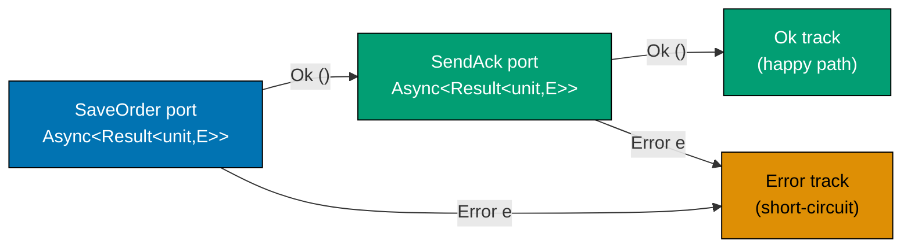

**Manual composition without helper library:**

```fsharp
// ── Port type ─────────────────────────────────────────────────────────────────
// SaveOrder is an output port — it performs an async I/O operation.
// The Result wrapper carries a named error type so the caller can react.
type SaveOrder = Order -> Async<Result<unit, RepositoryError>>

// ── Application service — manual Async + Result composition ──────────────────
// Without FsToolkit.ErrorHandling, composing two async-result calls
// requires explicit bind/match — verbose but shows exactly what is happening.
let manualPipeline (saveOrder: SaveOrder) (sendAck: Order -> Async<Result<unit, NotificationError>>) (order: Order) =
    async {
        // Step 1: call the save port — await and bind the async
        let! saveResult = saveOrder order
        // => saveResult : Result<unit, RepositoryError>
        // => Await completes the async; now we have a Result to inspect
        match saveResult with
        | Error repoErr ->
            // => Save failed — map the port error into the unified error DU
            return Error (RepositoryError repoErr)
        // => Short-circuit: sendAck is never called if save failed
        | Ok () ->
        // Step 2: save succeeded — call the notification port
        let! notifyResult = sendAck order
        // => notifyResult : Result<unit, NotificationError>
        match notifyResult with
        | Error notifyErr ->
            return Error (NotificationError notifyErr)
        // => Notification failed — surface the error on the same track
        | Ok () ->
            return Ok ()
        // => Both ports succeeded — return the happy path
    }
// => The manual pattern makes every bind point explicit and traceable

// Port error types (defined per infrastructure concern)
type RepositoryError  = DbException of exn | ConnectionFailed of string
type NotificationError = SmtpError of string | RateLimited

// Unified application error DU — wraps all port errors for the HTTP adapter
type AppError =
    | RepositoryError of RepositoryError
    // => Wraps repository failures — maps to 503
    | NotificationError of NotificationError
    // => Wraps notification failures — maps to 202 (saved but not notified)
```

**Cleaner composition using `asyncResult { }` from FsToolkit.ErrorHandling:**

```fsharp
// NOTE: asyncResult computation expression requires FsToolkit.ErrorHandling NuGet package
// Install: dotnet add package FsToolkit.ErrorHandling
open FsToolkit.ErrorHandling

// ── Same pipeline — much less noise ──────────────────────────────────────────
// asyncResult { } desugars to the same Async.bind + Result.bind chain above.
// The CE makes the railway metaphor literal: every let! is a track switch.
let asyncResultPipeline
    (saveOrder : Order -> Async<Result<unit, AppError>>)
    (sendAck   : Order -> Async<Result<unit, AppError>>)
    (order     : Order)
    : Async<Result<unit, AppError>> =
    asyncResult {
        do! saveOrder order
        // => Await save, short-circuit on Error — identical to the manual match above
        do! sendAck order
        // => Await notification, short-circuit on Error
        // => If both succeed, returns Ok () automatically
    }
// => asyncResult { } is syntactic sugar — same semantics, less ceremony
// => Requires FsToolkit.ErrorHandling; NOT part of F# standard library
```

**Key Takeaway**: `Async<Result<'a, 'e>>` composition is the async railway: every `let!` or `do!` inside `asyncResult { }` switches track on Error, just as `result { }` does for synchronous pipelines.

**Why It Matters**: Without a composition strategy for `Async<Result<>>`, application services devolve into deeply nested match expressions that obscure the domain intent behind infrastructure plumbing. The `asyncResult { }` CE from FsToolkit.ErrorHandling (a widely used community package) restores the linear pipeline reading style while preserving full error tracking. Teams that avoid this pattern produce services that are correct but unreadable — the logic is buried under three levels of indentation per port call.

---

### Example 29: Railway-Oriented Programming Across Async Port Calls

A full application service pipeline spans pure domain steps (synchronous, no I/O) and port calls (asynchronous, effectful). ROP unifies both into a single railway: pure functions contribute Result-shaped track switches, port calls contribute Async-Result-shaped track switches, and the `asyncResult { }` CE threads them together.

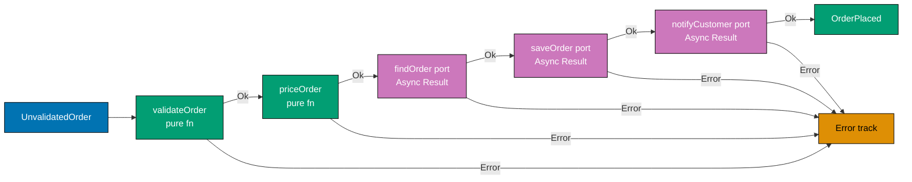

```fsharp
// NOTE: asyncResult computation expression requires FsToolkit.ErrorHandling NuGet package
open FsToolkit.ErrorHandling

// ── Domain types ──────────────────────────────────────────────────────────────
type UnvalidatedOrder = { OrderId: string; ProductCode: string; Quantity: decimal }
type ValidatedOrder   = { OrderId: string; ProductCode: string; Quantity: decimal }
type PricedOrder      = { OrderId: string; TotalAmount: decimal }
type OrderPlaced      = { OrderId: string; TotalAmount: decimal }

// ── Unified error DU for the full pipeline ────────────────────────────────────
// Every failure mode — domain or infrastructure — joins this union.
// The HTTP adapter pattern-matches exhaustively to produce the right status code.
type PlacingOrderError =
    | ValidationError  of string
    // => Domain rule violation — maps to HTTP 422
    | PricingError     of string
    // => Pricing failure — maps to HTTP 500
    | RepositoryError  of exn
    // => Infrastructure failure — maps to HTTP 503
    | NotificationError of string
    // => Notification failure — maps to HTTP 202 (saved, not notified)

// ── Port types (output ports) ─────────────────────────────────────────────────
type FindProduct  = string -> Async<Result<decimal, PlacingOrderError>>
// => Query the product catalogue for the unit price
type SaveOrder    = PricedOrder -> Async<Result<unit, PlacingOrderError>>
// => Persist the priced order to the repository
type PublishEvent = OrderPlaced -> Async<Result<unit, PlacingOrderError>>
// => Publish the domain event to the message bus

// ── Pure domain functions (synchronous, no I/O) ───────────────────────────────
let validateOrder (input: UnvalidatedOrder) : Result<ValidatedOrder, PlacingOrderError> =
    if System.String.IsNullOrWhiteSpace(input.OrderId) then Error (ValidationError "OrderId blank")
    // => Domain rule: blank OrderId rejected immediately
    elif input.Quantity <= 0m then Error (ValidationError "Quantity must be positive")
    // => Domain rule: zero or negative quantity rejected
    else Ok { OrderId = input.OrderId; ProductCode = input.ProductCode; Quantity = input.Quantity }
    // => Validation passed — returns the validated state type

let calculatePrice (unitPrice: decimal) (validated: ValidatedOrder) : Result<PricedOrder, PlacingOrderError> =
    if unitPrice <= 0m then Error (PricingError "Unit price must be positive")
    // => Pricing rule: non-positive prices are rejected
    else Ok { OrderId = validated.OrderId; TotalAmount = validated.Quantity * unitPrice }
    // => TotalAmount = quantity × unit price — pure arithmetic, no I/O

// ── Full pipeline: pure steps + async port calls ──────────────────────────────
// asyncResult { } stitches synchronous Results and async-Results seamlessly.
// The CE automatically handles the Ok/Error short-circuit at every step.
let buildPlaceOrder (findProduct: FindProduct) (saveOrder: SaveOrder) (publishEvent: PublishEvent) =
    fun (input: UnvalidatedOrder) ->
        asyncResult {
            // Step 1: pure domain validation — lifted into asyncResult with ofResult
            let! validated = validateOrder input |> AsyncResult.ofResult
            // => ofResult lifts a synchronous Result into the async railway
            // => Short-circuits on ValidationError — steps 2-5 are skipped

            // Step 2: async port call — fetch the unit price
            let! unitPrice = findProduct validated.ProductCode
            // => findProduct : string -> Async<Result<decimal, PlacingOrderError>>
            // => Awaited and unwrapped by let! — Error short-circuits here

            // Step 3: pure domain pricing — lifted into asyncResult
            let! priced = calculatePrice unitPrice validated |> AsyncResult.ofResult
            // => calculatePrice is pure; ofResult bridges sync → async railway

            // Step 4: async port call — persist the order
            do! saveOrder priced
            // => do! discards the unit result; Error would short-circuit here

            // Step 5: async port call — publish the domain event
            let event = { OrderId = priced.OrderId; TotalAmount = priced.TotalAmount }
            // => Construct the domain event from the priced order
            do! publishEvent event
            // => do! publishes and short-circuits on PublishError

            // All five steps succeeded — return the domain event list
            return [ event ]
            // => The HTTP adapter receives Ok [event] and maps to 200 OK
        }
// => Pure steps and port calls compose uniformly — the CE hides the plumbing
```

**Key Takeaway**: ROP across async port calls merges two orthogonal concerns — asynchrony and error propagation — into a single linear pipeline where every step is either a track switch (Result) or an async track switch (Async<Result>).

**Why It Matters**: The alternative — nested `async { match saveResult with ... }` for every port call — produces code where the happy path is buried inside match arms and the error path is scattered. `asyncResult { }` restores linearity: read the function top-to-bottom and you see the business intent; the error handling is implicit in the railway metaphor. Five steps in one `asyncResult { }` block would require five nested match expressions without it. This readability improvement directly correlates with reduced maintenance bugs.

---

### Example 30: Error Union Across Port and Domain Layers

Domain functions produce domain errors; adapters produce infrastructure errors. The application service lifts all of them into a single `PlacingOrderError` DU so the HTTP adapter can exhaustively pattern-match to produce the right HTTP status code with zero blind spots.

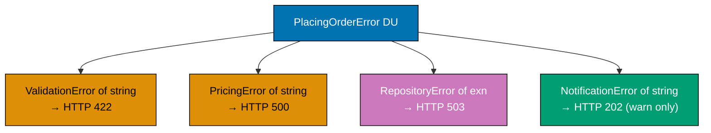

```fsharp
// ── Unified error DU — application layer ─────────────────────────────────────
// Every distinct failure mode surfaces as a named DU case.
// This DU is owned by the APPLICATION layer — not domain, not adapters.
// Domain errors bubble up unchanged; port errors are lifted via Result.mapError.
type PlacingOrderError =
    | ValidationError   of string
    // => Emitted by pure domain functions — maps to HTTP 422
    | PricingError      of string
    // => Emitted by pure domain functions — maps to HTTP 500
    | RepositoryError   of exn
    // => Emitted by repository adapter — maps to HTTP 503
    | NotificationError of string
    // => Emitted by notification adapter — maps to HTTP 202 (accepted, not notified)

// ── Port-specific error types (infrastructure layer) ─────────────────────────
// Each adapter defines its own error type — narrowly scoped to that adapter.
// The application service maps them into PlacingOrderError via mapError.
type DbError   = ConnectionFailed of string | QueryFailed of exn
type SmtpError = AuthFailed of string | Timeout

// ── Lifting port errors into the unified DU ───────────────────────────────────
// mapError transforms the error channel of a Result without touching the Ok path.
// The lambda maps the adapter-specific error type to a PlacingOrderError case.
let liftDbError : Result<'a, DbError> -> Result<'a, PlacingOrderError> =
    Result.mapError (fun dbErr ->
        match dbErr with
        | ConnectionFailed msg -> RepositoryError (System.Exception(msg))
        // => Connection failure wrapped in RepositoryError case
        | QueryFailed ex       -> RepositoryError ex
        // => Query exception lifted directly — preserves the original exception
    )

let liftSmtpError : Result<'a, SmtpError> -> Result<'a, PlacingOrderError> =
    Result.mapError (fun smtpErr ->
        match smtpErr with
        | AuthFailed msg -> NotificationError (sprintf "SMTP auth failed: %s" msg)
        // => Auth failure described as a notification error
        | Timeout        -> NotificationError "SMTP timeout"
        // => Timeout case described as a notification error
    )

// ── HTTP adapter: exhaustive pattern match on unified DU ──────────────────────
// The HTTP adapter receives PlacingOrderError and maps each case to an HTTP status.
// F# forces exhaustive matching — if a new case is added, compilation fails here.
let toHttpResponse (result: Result<OrderPlaced list, PlacingOrderError>) : string =
    match result with
    | Ok events              -> sprintf "200 OK: %d events" (List.length events)
    // => Happy path — all pipeline steps succeeded
    | Error (ValidationError msg)   -> sprintf "422 Unprocessable Entity: %s" msg
    // => Domain validation failure — client submitted invalid data
    | Error (PricingError msg)      -> sprintf "500 Internal Server Error: %s" msg
    // => Pricing failure — internal pricing rule violated
    | Error (RepositoryError ex)    -> sprintf "503 Service Unavailable: %s" ex.Message
    // => Database unavailable — client may retry after backoff
    | Error (NotificationError msg) -> sprintf "202 Accepted (notification failed): %s" msg
    // => Order saved but notification failed — not a fatal error

// ── Demonstration ─────────────────────────────────────────────────────────────
let demo () =
    let outcomes = [
        Ok [ { OrderId = "ORD-1"; TotalAmount = 29.97m } ]
        // => Happy path result
        Error (ValidationError "OrderId blank")
        // => Domain validation failure
        Error (RepositoryError (System.Exception "connection refused"))
        // => Infrastructure failure
        Error (NotificationError "SMTP timeout")
        // => Non-fatal notification failure
    ]
    outcomes |> List.iter (fun r -> printfn "%s" (toHttpResponse r))
    // => Output: 200 OK: 1 events
    // => Output: 422 Unprocessable Entity: OrderId blank
    // => Output: 503 Service Unavailable: connection refused
    // => Output: 202 Accepted (notification failed): SMTP timeout

type OrderPlaced = { OrderId: string; TotalAmount: decimal }
```

**Key Takeaway**: A single unified error DU at the application layer, lifted from domain and port errors via `Result.mapError`, gives the HTTP adapter one exhaustive match point instead of nested, partial matches scattered across the codebase.

**Why It Matters**: When each port returns its own bespoke exception type and the HTTP adapter catches them in separate try-catch blocks, new error cases are silently absorbed by a catch-all. F# discriminated unions with exhaustive matching turn this into a compile-time guarantee: every error case must be handled, and adding a new case breaks compilation at every unhandled match site. The cost is one `Result.mapError` per port call; the gain is impossible-to-miss coverage.

---

## Infrastructure Ports (Examples 31–38)

### Example 31: Repository Port as a Record of Functions

A repository with four operations (find, save, delete, exists) can be expressed as four separate parameters to an application service — or as a single record of functions. The record form reduces parameter list width, keeps related operations co-located, and makes substitution (test double vs production) a single variable assignment.

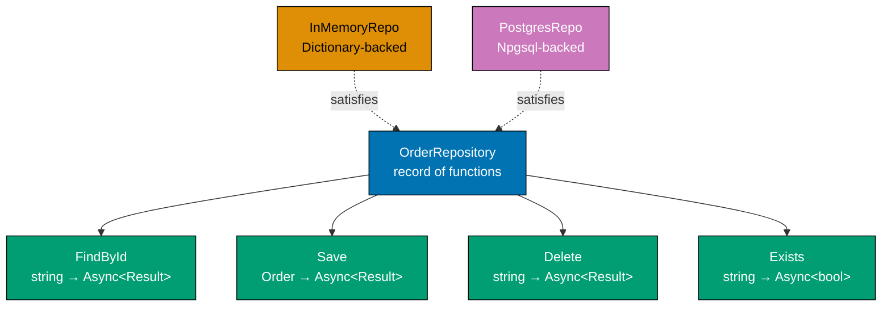

```fsharp
open System.Collections.Generic

// ── Port type: repository record ─────────────────────────────────────────────
// A record of functions is the idiomatic F# alternative to an interface.
// All four operations are co-located — one value to inject, not four.
// Substitution: test adapter = one record literal; production adapter = another.
type OrderRepository = {
    FindById : OrderId -> Async<Result<Order option, RepositoryError>>
    // => Load by identity — Option signals not-found without raising an exception
    // => Async: I/O required; Result: infrastructure failure is explicit
    Save     : Order   -> Async<Result<unit, RepositoryError>>
    // => Upsert semantics — create or update; caller does not distinguish insert from update
    // => Returns unit on success — the persisted state is what was passed in
    Delete   : OrderId -> Async<Result<unit, RepositoryError>>
    // => Remove by identity — Error if row did not exist (adapter decides whether missing = error)
    // => unit return: deletion has no meaningful success payload
    Exists   : OrderId -> Async<Result<bool, RepositoryError>>
    // => Existence check — cheaper than FindById when full aggregate not needed
    // => bool: true = exists, false = does not exist; Error = infrastructure failure
}

// ── In-memory implementation ──────────────────────────────────────────────────
// The in-memory adapter satisfies the same type — same fields, same signatures.
// A mutable Dictionary is acceptable in the adapter zone (outside the domain).
// Factory function: returns a fresh, isolated repo for each test — no shared state.
let makeInMemoryRepo () : OrderRepository =
    let store = Dictionary<OrderId, Order>()
    // => Mutable Dictionary lives in the adapter, never leaks into the domain
    // => Captured in the closure — each call to makeInMemoryRepo gets its own instance
    {
        FindById = fun id ->
            // => id: the OrderId to look up in the in-memory store
            async {
                match store.TryGetValue(id) with
                | true,  order -> return Ok (Some order)
                // => Found — wrap in Some and Ok; type: Async<Result<Order option, RepositoryError>>
                | false, _     -> return Ok None
                // => Not found — return None, not an error; caller decides what to do with None
                // => None is not a failure: caller uses it to check existence without loading
            }
        Save = fun order ->
            // => order: the full Order aggregate to persist (create or replace)
            async {
                store.[order.OrderId] <- order
                // => Dictionary indexer performs both insert and update — upsert semantics
                // => In-memory: always succeeds; Postgres adapter may fail on constraint violation
                return Ok ()
                // => Always succeeds in the in-memory adapter; Postgres adapter may fail here
            }
        Delete = fun id ->
            // => id: the OrderId to remove from the store
            async {
                let removed = store.Remove(id)
                // => Remove returns bool — true if key existed and was removed
                if removed then return Ok ()
                // => Deletion succeeded — the row existed and is now gone
                else return Error (RowNotFound (sprintf "OrderId %s not found" id))
                // => Deletion failed: ID did not exist — error semantics match PostgreSQL DELETE
            }
        Exists = fun id ->
            // => id: the OrderId to check — only identity needed, not the full aggregate
            async {
                return Ok (store.ContainsKey(id))
                // => ContainsKey is O(1) — no need to deserialise the full aggregate
                // => true = exists, false = does not exist; never Error in in-memory adapter
            }
    }

// ── Usage in application service ──────────────────────────────────────────────
// The application service receives the record as a single parameter.
// Single injection: replaces four separate function parameters.
let buildUseCase (repo: OrderRepository) =
    // => One injection point — all four operations available via repo.FindById etc.
    // => Compose root passes makeInMemoryRepo() in tests; postgresRepo in production
    fun (orderId: OrderId) ->
        async {
            let! existsResult = repo.Exists orderId
            // => Check existence before loading — cheaper for guards; avoids loading full aggregate
            match existsResult with
            | Error e          -> return Error e
            // => Short-circuit on infrastructure error — propagate without transformation
            | Ok false         -> return Error (RowNotFound "order not found")
            // => Not found — return the domain-appropriate error; caller maps to 404
            | Ok true          ->
            let! findResult = repo.FindById orderId
            // => Now load the full aggregate — existence confirmed above; should not be None
            return findResult
            // => Returns Ok (Some order) or Error on infra failure
        }

// Supporting types
type OrderId = string
// => Type alias: prevents passing arbitrary strings as order identifiers
type Order   = { OrderId: OrderId; CustomerId: string; TotalAmount: decimal }
// => Aggregate root — carries domain state; persisted and loaded by the repository
type RepositoryError = RowNotFound of string | DbException of exn
// => Two named cases: missing row (client error) vs infrastructure failure (server error)
```

**Key Takeaway**: A record of functions bundles all repository operations into a single injected value, making the application service signature narrow, the test double a single record literal, and the production adapter a single substitution.

**Why It Matters**: Four separate function parameters become unwieldy as an application service grows — adding a fifth operation requires updating every call site. A repository record encapsulates all operations without introducing an interface or class hierarchy. Test doubles are expressed as record literals: `{ FindById = ...; Save = ...; Delete = ...; Exists = ... }`. No mocking framework is needed. The record form is also easier to partially override: create a base in-memory repo and replace only the `Save` field for a specific test scenario.

---

### Example 32: Notification Port — Email and SMS Under One Port

A single `SendNotification` port with a notification DU covers both email and SMS delivery without exposing the delivery mechanism to the application layer. The adapter routing (SMTP vs SNS) is purely an adapter concern.

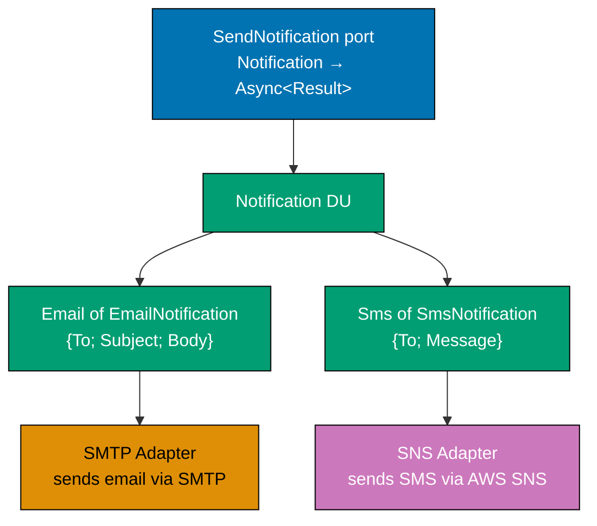

```fsharp
// ── Value objects ──────────────────────────────────────────────────────────────
// Single-case DUs wrap primitives — prevents passing a PhoneNumber where EmailAddress expected.
type EmailAddress = EmailAddress of string
// => Validated type: EmailAddress constructor enforces format elsewhere
// => Wrapping: EmailAddress "test@example.com" — not just a bare string
type PhoneNumber  = PhoneNumber  of string
// => Validated type: PhoneNumber constructor enforces E.164 format elsewhere
// => Example: PhoneNumber "+628123456789" — country code required
type OrderId        = string
// => Type alias: identifies an order uniquely within the bounded context
type TrackingNumber = string
// => Type alias: identifies a shipment for the customer-facing tracking system

// ── Notification DU — models all notification payloads ────────────────────────
// The DU carries the right payload for each notification kind.
// The adapter inspects the case and routes to the correct delivery mechanism.
type Notification =
    | OrderConfirmation of to_: EmailAddress * orderId: OrderId
    // => Email delivery: sends order confirmation to customer email address
    // => Named tuple fields (to_, orderId) document intent at the call site
    | ShippingAlert     of to_: PhoneNumber  * trackingNumber: TrackingNumber
    // => SMS delivery: sends tracking number to customer mobile number
    // => Different payload shape: phone + tracking — no email address involved

// ── Port type ──────────────────────────────────────────────────────────────────
// One port covers all notification types — the application service uses one function.
// Adding a third notification kind (push notification) does not change the port type.
type SendNotification = Notification -> Async<Result<unit, NotificationError>>
// => Input:  a Notification DU case — application service does not know the delivery channel
// => Output: Ok () on success, named error on failure; unit means no response payload

type NotificationError = SmtpError of string | SnsError of string | RateLimited
// => Errors scoped to notification delivery — not mixed with repository errors
// => Three cases: SMTP failure, SNS failure, and rate limiting across all channels

// ── SMTP adapter (handles OrderConfirmation) ──────────────────────────────────
// In production this opens an SMTP connection; here we stub for illustration.
// This function is NOT the port — it is an internal helper used by the composite adapter.
let smtpSend (email: EmailAddress) (body: string) : Async<Result<unit, NotificationError>> =
    async {
        printfn "[SMTP] Sending to %A: %s" email body
        // => Real adapter: System.Net.Mail.SmtpClient or Mailkit
        // => Stub always returns Ok — production adapter wraps SmtpException in SmtpError
        return Ok ()
    }

// ── SNS adapter (handles ShippingAlert) ───────────────────────────────────────
// Internal helper — routes SMS via Amazon SNS (or Twilio in another implementation).
let snsSend (phone: PhoneNumber) (msg: string) : Async<Result<unit, NotificationError>> =
    async {
        printfn "[SNS] Sending SMS to %A: %s" phone msg
        // => Real adapter: AWS SDK PublishAsync to an SNS topic
        // => Stub always returns Ok — production adapter wraps SNS exceptions in SnsError
        return Ok ()
    }

// ── Composite adapter — routes by DU case ─────────────────────────────────────
// The composite adapter is still an adapter — it satisfies SendNotification.
// Application service never knows whether SMTP or SNS was called.
// This is the value that the composition root injects as SendNotification.
let compositeNotify : SendNotification =
    fun notification ->
        match notification with
        | OrderConfirmation (email, orderId) ->
            // => Pattern-match on DU case — extract the email address and order ID
            smtpSend email (sprintf "Your order %s has been placed." orderId)
            // => Email route: delegate to SMTP helper — body is constructed here in the adapter
        | ShippingAlert (phone, tracking) ->
            // => Pattern-match on DU case — extract the phone number and tracking number
            snsSend phone (sprintf "Your package is on the way. Tracking: %s" tracking)
            // => SMS route: delegate to SNS helper — message is constructed here in the adapter

// ── In-memory test adapter ────────────────────────────────────────────────────
// Records sent notifications for test assertions — no real network calls.
// Factory function: each test gets a fresh instance — no shared mutable state between tests.
let makeInMemoryNotifier () =
    let sent = System.Collections.Generic.List<Notification>()
    // => Mutable list records every notification for assertion in tests
    // => Captured in closure — isolated per test when makeInMemoryNotifier is called fresh
    let send : SendNotification =
        fun n -> async { sent.Add(n); return Ok () }
    // => Satisfies the port type — same signature as composite adapter
    // => Always Ok: in-memory adapter cannot fail unless the test explicitly overrides it
    send, (fun () -> sent |> Seq.toList)
    // => Returns both the port implementation and an accessor for test assertions
    // => Accessor converts List to immutable F# list for safe assertion

// ── Application service usage ─────────────────────────────────────────────────
// The application service names the notification kind using the DU — not the channel.
let placeOrderAndNotify (sendNotification: SendNotification) (orderId: OrderId) (email: EmailAddress) =
    async {
        let! result = sendNotification (OrderConfirmation (email, orderId))
        // => Application service names the notification kind — not the delivery channel
        // => Whether SMTP or push or in-memory: the port type is the same
        return result
        // => Propagates Ok () or NotificationError to the caller
    }
```

**Key Takeaway**: A notification DU with one port covers all delivery channels; the composite adapter routes by DU case, the in-memory adapter records calls for assertions, and the application service remains ignorant of SMTP vs SNS vs push.

**Why It Matters**: Injecting an SMTP client and an SNS client separately into the application service leaks infrastructure types into the orchestration layer. A single `SendNotification` port hides the delivery routing behind the DU case. The application service reads "send an order confirmation to this email" — not "call SmtpClient.Send with this MailMessage". When a third delivery channel (push notification) is added, only the composite adapter and the DU change; the application service and its tests are untouched.

---

### Example 33: Clock Port — Testable Time

Any function that calls `DateTimeOffset.UtcNow` directly is non-deterministic: two runs of the same test produce different values. A clock port — a function `unit -> DateTimeOffset` — makes time injectable and tests reproducible.

```fsharp
// ── Clock port ────────────────────────────────────────────────────────────────
// GetCurrentTime is the smallest possible port: unit in, DateTimeOffset out.
// The application service calls this function whenever it needs the current time.
// It NEVER calls DateTimeOffset.UtcNow directly.
type GetCurrentTime = unit -> DateTimeOffset
// => Input:  unit — no parameters needed; the function encapsulates the time source
// => Output: the current timestamp from whatever source the adapter provides

// ── Production clock adapter ──────────────────────────────────────────────────
let systemClock : GetCurrentTime =
    fun () -> DateTimeOffset.UtcNow
// => Delegates to the system clock — correct for production use
// => Non-deterministic: each call returns the actual current wall-clock time

// ── Test clock adapter ────────────────────────────────────────────────────────
// Returns a fixed, well-known timestamp — deterministic across all test runs.
let fixedClock (fixedTime: System.DateTimeOffset) : GetCurrentTime =
    fun () -> fixedTime
// => Always returns the same value — tests become reproducible and environment-agnostic
// => Can be set to any value: regression scenarios, daylight-saving edge cases, year 2038

let testClock : GetCurrentTime =
    fixedClock (System.DateTimeOffset(2026, 1, 1, 0, 0, 0, System.TimeSpan.Zero))
// => Fixed at 2026-01-01T00:00:00Z — every test run agrees on "now"

// ── Domain types using time ───────────────────────────────────────────────────
type Order = {
    OrderId   : string
    PlacedAt  : System.DateTimeOffset
    // => Audit timestamp — must come from the clock port, never from UtcNow
    ExpiresAt : System.DateTimeOffset
    // => Business rule: orders expire 30 days after placement
}

// ── Application service using the clock port ──────────────────────────────────
let createOrder (getClock: GetCurrentTime) (orderId: string) : Order =
    let now = getClock ()
    // => Calls the injected clock — could be system clock or fixed test clock
    let expiresAt = now.AddDays(30.0)
    // => 30-day expiry calculated from the injected "now" — deterministic in tests
    { OrderId = orderId; PlacedAt = now; ExpiresAt = expiresAt }
// => Deterministic output when testClock injected; real-time output with systemClock

// ── Demonstration ─────────────────────────────────────────────────────────────
let order = createOrder testClock "ORD-001"
printfn "PlacedAt:  %s" (order.PlacedAt.ToString("o"))
// => Output: PlacedAt:  2026-01-01T00:00:00.0000000+00:00
printfn "ExpiresAt: %s" (order.ExpiresAt.ToString("o"))
// => Output: ExpiresAt: 2026-01-31T00:00:00.0000000+00:00
// => Exact output every run — test assertions can use hardcoded expected values

open System
```

**Key Takeaway**: A clock port (`unit -> DateTimeOffset`) replaces direct `UtcNow` calls with an injectable time source, making time-dependent logic fully deterministic under test.

**Why It Matters**: Tests that call `DateTimeOffset.UtcNow` internally are flaky: they fail near midnight, on daylight-saving transitions, and during clock skew in CI. A clock port costs one function parameter. The payoff is that every time-dependent test can use a fixed timestamp, assert on exact values, and simulate any point in time (past, future, edge cases). This is especially important for expiry logic, scheduling, and SLA calculations.

---

### Example 34: Logger Port — Structured Logging Without Console

Domain and application zones never call `printfn` or any logging library directly. A logger port (`LogEvent` function) in the application zone decouples the logging call site from the logging implementation, permits structured metadata, and makes log assertions trivially easy in tests.

```fsharp
// ── Log level DU ──────────────────────────────────────────────────────────────
// LogLevel is owned by the APPLICATION layer — not by Serilog or NLog.
// If the logging library changes, this DU remains stable.
type LogLevel = Debug | Info | Warn | Error
// => Four levels cover the standard semantic range
// => Debug: diagnostic detail; Info: business events; Warn: unexpected recoverable; Error: failures

// ── Logger port ───────────────────────────────────────────────────────────────
// LogEvent takes: level, message template, and a key-value property list.
// The key-value list enables structured logging — queryable fields, not just strings.
type LogEvent = LogLevel * string * (string * obj) list -> unit
// => Synchronous — logging calls should not block the application pipeline
// => unit return — logging is a fire-and-forget side effect

// ── Production logger adapter (Serilog) ───────────────────────────────────────
// In a real project: open Serilog; delegate to Log.ForContext(...).Information(...)
let serilogAdapter : LogEvent =
    fun (level, template, props) ->
        // => In production: enrich Serilog context with props, call level-specific method
        // => Here: simplified output to demonstrate the adapter pattern
        let propStr = props |> List.map (fun (k, v) -> sprintf "%s=%A" k v) |> String.concat " "
        printfn "[%A] %s | %s" level template propStr
// => Application code calls logEvent (Info, "Order placed", [...]) — never calls Serilog directly

// ── In-memory test logger ─────────────────────────────────────────────────────
// Records every log entry for assertion — no I/O, no thread-safety concern in tests.
let makeTestLogger () =
    let entries = System.Collections.Generic.List<LogLevel * string * (string * obj) list>()
    // => Captures all log calls in order
    let logEvent : LogEvent =
        fun entry -> entries.Add(entry)
    // => Satisfies the port type — same signature as serilogAdapter
    logEvent, (fun () -> entries |> Seq.toList)
    // => Returns the port and an accessor for test assertions

// ── Application service using the logger port ─────────────────────────────────
let placeOrderWithLogging (logEvent: LogEvent) (orderId: string) (amount: decimal) =
    logEvent (Info, "Order placement started", ["orderId", box orderId])
    // => Structured property "orderId" is queryable in Serilog/ELK — not just text
    if amount <= 0m then
        logEvent (Warn, "Invalid order amount", ["orderId", box orderId; "amount", box amount])
        // => Warn-level with two structured properties — queryable in production
        Error "Invalid amount"
        // => Domain validation failure
    else
        logEvent (Info, "Order placed successfully", ["orderId", box orderId; "amount", box amount])
        // => Audit log — every order placement is recorded with full context
        Ok orderId

// ── Test assertion using in-memory logger ─────────────────────────────────────
let logFn, getLogs = makeTestLogger ()
let _ = placeOrderWithLogging logFn "ORD-001" 29.97m
let logs = getLogs ()
printfn "Log count: %d" (List.length logs)
// => Output: Log count: 2
printfn "First entry level: %A" (logs |> List.head |> (fun (level, _, _) -> level))
// => Output: First entry level: Info
```

**Key Takeaway**: A logger port decouples log call sites from the logging library, makes structured metadata explicit, and enables test assertions on log entries without any mocking framework.

**Why It Matters**: `printfn` in domain code is a hard dependency on `stdout` — invisible in production logs, untestable, and incompatible with structured logging. Injecting a `LogEvent` function makes every log entry auditable in tests: assert that a warning was emitted, assert that the order ID was logged, assert that no error-level entries appeared during a success path. When Serilog is replaced with OpenTelemetry, only the adapter changes.

---

### Example 35: Configuration Port

A configuration port (`GetSetting`) makes all configuration reads injectable, testable, and auditable. Application code never calls `System.Environment.GetEnvironmentVariable` directly — the port abstracts the source.

```fsharp
// ── Configuration error ───────────────────────────────────────────────────────
// Two distinct error cases: missing key vs present-but-invalid value.
// Separate cases let callers give meaningful error messages (missing vs malformed).
type ConfigError =
    | MissingSetting of key: string
    // => The required key was not found in any configuration source
    // => Suggests operator forgot to set the environment variable
    | InvalidValue   of key: string * value: string
    // => The key exists but its value fails validation (e.g. non-numeric timeout)
    // => Suggests operator set the variable to a wrong value

// ── Configuration port ────────────────────────────────────────────────────────
// GetSetting maps a string key to a string value.
// The application service validates and converts the string after reading.
// Result allows the application service to fail fast with a descriptive error.
// Synchronous: config reads should not require async I/O in typical deployments.
type GetSetting = string -> Result<string, ConfigError>
// => Input:  setting key name (e.g. "DB_TIMEOUT_SECONDS")
// => Output: string value on Ok, named config error on Error
// => String output: caller is responsible for parsing/validating the raw string

// ── Environment variable adapter ──────────────────────────────────────────────
// Production adapter: reads from the process environment — standard 12-factor app pattern.
let envVarAdapter : GetSetting =
    fun key ->
        // => key: the env var name — e.g. "DB_TIMEOUT_SECONDS" or "FEATURE_FLAG_X"
        match System.Environment.GetEnvironmentVariable(key) with
        | null | "" -> Error (MissingSetting key)
        // => Environment variable absent or empty — fail with descriptive error
        // => null: never set; "": set to empty string — both treated as missing
        | value     -> Ok value
        // => Found — return raw string; caller parses it

// ── Dictionary-based test adapter ────────────────────────────────────────────
// Provides hardcoded values — no environment setup required in tests.
// Satisfies the same GetSetting type as envVarAdapter — fully substitutable.
let dictAdapter (settings: Map<string, string>) : GetSetting =
    fun key ->
        // => key: looked up in the immutable F# Map — no mutation possible
        match Map.tryFind key settings with
        | None       -> Error (MissingSetting key)
        // => Key absent in test dictionary — same error shape as env adapter
        | Some value -> Ok value
        // => Found — return the hardcoded test value; no env var lookup needed

// ── Application service reading configuration ─────────────────────────────────
// Reads the timeout, validates it is a positive integer, and returns it.
// The caller (composition root) provides the getSetting implementation.
let readTimeoutSeconds (getSetting: GetSetting) : Result<int, ConfigError> =
    getSetting "DB_TIMEOUT_SECONDS"
    // => Port call — does not know whether source is env var, file, or test dict
    |> Result.bind (fun raw ->
        // => Result.bind: if Ok, parse the raw string; if Error, propagate unchanged
        match System.Int32.TryParse(raw) with
        | true,  n when n > 0 -> Ok n
        // => Valid positive integer — use it as the timeout value in seconds
        | true,  n            -> Error (InvalidValue ("DB_TIMEOUT_SECONDS", string n))
        // => Parsed but non-positive — configuration is semantically invalid
        | false, _            -> Error (InvalidValue ("DB_TIMEOUT_SECONDS", raw))
        // => Not parseable as integer — configuration is malformed
    )

// ── Test double usage ─────────────────────────────────────────────────────────
let testSettings = dictAdapter (Map.ofList [("DB_TIMEOUT_SECONDS", "30")])
// => Test provides known value — no environment variable needed
// => Map.ofList: immutable F# Map — safe to share across concurrent tests

let timeoutResult = readTimeoutSeconds testSettings
// => Result<int, ConfigError> — should be Ok 30
printfn "Timeout: %A" timeoutResult
// => Output: Timeout: Ok 30

let missingSettings = dictAdapter (Map.ofList [])
// => Empty dictionary — simulates missing configuration; no keys at all
let missingResult = readTimeoutSeconds missingSettings
printfn "Missing: %A" missingResult
// => Output: Missing: Error (MissingSetting "DB_TIMEOUT_SECONDS")
```

**Key Takeaway**: A `GetSetting` port makes all configuration reads injectable, decouples the application from environment variables and config files, and turns missing/invalid configuration into typed errors that propagate through the railway.

**Why It Matters**: `System.Environment.GetEnvironmentVariable` called directly in application code is untestable, silently returns null on missing keys, and makes every test dependent on the current shell environment. A configuration port costs one function parameter. The payoff: tests use a dictionary with explicit values, missing-key tests are one line, and feature-flag behaviour can be asserted without setting environment variables.

---

### Example 36: Event Publishing Port — Domain Events to Message Bus

Domain events signal that something meaningful happened. After the application service saves state, it publishes events through the publishing port. The production adapter routes to RabbitMQ or Kafka; the test adapter accumulates events in a list for assertion.

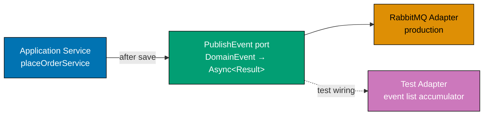

```fsharp
// ── Domain event DU ───────────────────────────────────────────────────────────
// Domain events are immutable facts — named in past tense, data-carrying.
// The DU lives in the APPLICATION layer — owned by the workflow, not the adapter.
// New event types: add a new DU case; adapter and consumer add new handling.
type DomainEvent =
    | OrderPlaced    of OrderPlacedPayload
    // => Signals a new order was successfully placed
    // => Carries the full payload — consumer does not need to query back
    | OrderCancelled of OrderId
    // => Signals an order was cancelled — carries only the identity
    // => Minimal payload: consumer queries for details if needed

type OrderPlacedPayload = { OrderId: OrderId; TotalAmount: decimal; CustomerId: string }
// => Payload is a flat record — no domain aggregate; safe to serialise to JSON
// => Flat structure: no nested aggregates that would create schema coupling
type OrderId = string
// => Type alias — both hexagons use the same primitive for the order identifier

// ── Publishing error ───────────────────────────────────────────────────────────
// Two distinct failure modes with different retry semantics.
type PublishError =
    | BrokerUnavailable of string
    // => Message broker unreachable — transient; caller should retry with backoff
    | SerializationError of string
    // => Event could not be serialised — programming error; do not retry; alert

// ── Publishing port ────────────────────────────────────────────────────────────
// PublishEvent takes one domain event and publishes it to the message bus.
// The application service does not know about RabbitMQ, Kafka, or any specific broker.
// Async: network I/O required; Result: failure is expected and named.
type PublishEvent = DomainEvent -> Async<Result<unit, PublishError>>
// => Input:  a typed domain event — the adapter serialises it to the wire format
// => Output: Ok () on successful publish, named PublishError on failure
// => unit success payload: no acknowledgment data flows back from the broker

// ── In-memory test adapter ────────────────────────────────────────────────────
// Records every published event for test assertions — no real broker needed.
// Factory function: fresh instance per test ensures no cross-test contamination.
let makeInMemoryPublisher () =
    let published = System.Collections.Generic.List<DomainEvent>()
    // => Accumulates events in insertion order — List preserves publish sequence
    let publish : PublishEvent =
        // => publish satisfies the PublishEvent type — identical signature to the RabbitMQ adapter
        fun event ->
            async {
                published.Add(event)
                // => Record the event — synchronous, always succeeds in tests
                // => No serialisation, no network — captures the typed event directly
                return Ok ()
                // => In-memory adapter never fails; production adapter may return BrokerUnavailable
            }
    publish, (fun () -> published |> Seq.toList)
    // => Returns the port implementation and a read accessor for assertions
    // => Seq.toList: creates an immutable snapshot for safe assertion

// ── Application service publishing after save ─────────────────────────────────
// The application service calls publishEvent AFTER save succeeds.
// This ensures the event is only published when the state change is durable.
// Save-then-publish ordering: event is a true reflection of persisted state.
let completeOrder
    (saveOrder    : string -> Async<Result<unit, exn>>)
    // => saveOrder: output port — abstracts the persistence mechanism
    (publishEvent : PublishEvent)
    // => publishEvent: output port — abstracts the message broker
    (orderId      : OrderId)
    (amount       : decimal) =
    async {
        let! saveResult = saveOrder orderId
        // => Step 1: persist state — must succeed before publishing the event
        // => await the async save; saveResult : Result<unit, exn>
        match saveResult with
        | Error ex -> return Error (BrokerUnavailable ex.Message)
        // => Save failed — do not publish; event would be a lie about persisted state
        | Ok () ->
        let event = OrderPlaced { OrderId = orderId; TotalAmount = amount; CustomerId = "CUST-1" }
        // => Construct the domain event after successful save — only created here
        let! publishResult = publishEvent event
        // => Step 2: publish — transient failure here is acceptable (event can be re-published)
        // => publishResult : Result<unit, PublishError>
        return publishResult
        // => Surface Ok () or PublishError to the caller
    }

// ── Test assertion ─────────────────────────────────────────────────────────────
let publishFn, getPublished = makeInMemoryPublisher ()
// => publishFn: the port implementation; getPublished: the assertion accessor
let stubSave = fun _ -> async { return Ok () }
// => Stub save: always succeeds — we are testing the publish path here

let _ = completeOrder stubSave publishFn "ORD-001" 29.97m |> Async.RunSynchronously
// => Run the full pipeline synchronously for demonstration
let events = getPublished ()
// => Retrieve all published events — should contain exactly one event
printfn "Published events: %d" (List.length events)
// => Output: Published events: 1
printfn "First event: %A" (List.head events)
// => Output: First event: OrderPlaced { OrderId = "ORD-001"; TotalAmount = 29.97M; CustomerId = "CUST-1" }
```

**Key Takeaway**: An event publishing port decouples the application service from the message broker, ensures events are only published after successful saves, and permits test assertions on published events via an in-memory accumulator.

**Why It Matters**: Calling RabbitMQ client code directly in the application service makes the service non-testable without a running broker. An in-memory publisher lets tests assert "exactly one OrderPlaced event was published with the correct payload" without any infrastructure setup. The port also makes the publish-after-save ordering explicit: the application service code reads save → then publish, not the reverse. This prevents the subtle bug where a publish succeeds but the save fails, resulting in downstream consumers acting on an event that the database never recorded.

---

### Example 37: Retry Logic in the Adapter — Never in the Domain

Retry logic is an infrastructure concern: it belongs in the adapter, not in the domain or application service. A `withRetry` higher-order function wraps any `unit -> Async<Result<'a, 'e>>` with configurable attempt count and exponential backoff, invisible to its caller.

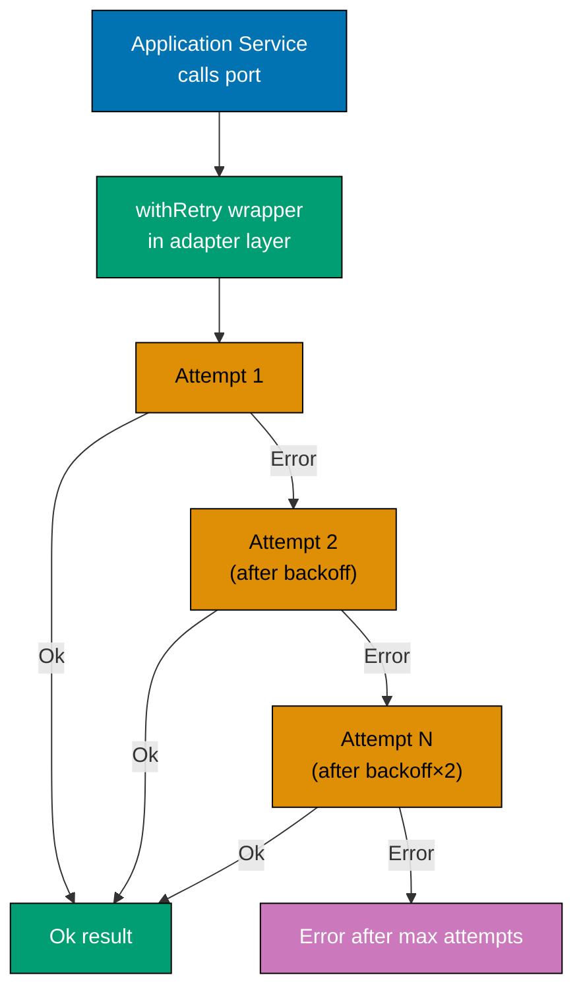

```fsharp
open System

// ── Retry configuration ───────────────────────────────────────────────────────
// RetryConfig is a plain record — it is passed to withRetry at the composition root.
// Changing the policy requires only a new config value, not edits to the adapter.
type RetryConfig = {
    MaxAttempts  : int
    // => Total number of attempts including the first try (1 = no retry)
    InitialDelay : TimeSpan
    // => Wait time before the second attempt — usually 100ms–1s for network calls
    BackoffFactor : float
    // => Multiplier applied to delay after each failure (2.0 = exponential backoff)
    // => e.g., 100ms, 200ms, 400ms with BackoffFactor = 2.0
}

// ── Higher-order retry wrapper ────────────────────────────────────────────────
// withRetry wraps any async-result function with retry-and-backoff behaviour.
// The wrapped function's signature is unchanged — callers do not know about retry.
// Generic over 'a and 'e: works with any port whose error type is 'e.
let withRetry (config: RetryConfig) (operation: unit -> Async<Result<'a, 'e>>) : unit -> Async<Result<'a, 'e>> =
    // => Returns a new function with the same type — transparent to the caller
    // => withRetry is a combinator: operation in, operation-with-retry out
    fun () ->
        let rec attempt n delay =
            // => n: current attempt number (1-based); delay: TimeSpan before next retry
            async {
                let! result = operation ()
                // => Call the real operation — could be a DB write or HTTP call
                // => result : Result<'a, 'e> — inspect to decide whether to retry
                match result with
                | Ok _ -> return result
                // => Success on any attempt — return immediately, no more retries
                | Error _ when n >= config.MaxAttempts -> return result
                // => All attempts exhausted — surface the final error to the caller
                | Error _ ->
                    do! Async.Sleep (int delay.TotalMilliseconds)
                    // => Wait before retrying — gives the downstream service time to recover
                    let nextDelay = TimeSpan.FromMilliseconds(delay.TotalMilliseconds * config.BackoffFactor)
                    // => Compute next delay: current × backoff factor — grows exponentially
                    return! attempt (n + 1) nextDelay
                    // => Recurse with incremented attempt count and longer delay
            }
        attempt 1 config.InitialDelay
        // => Start first attempt; InitialDelay is ready for use if attempt 1 fails

// ── Adapter using withRetry ───────────────────────────────────────────────────
// The application service holds a reference to SaveOrder (the port type).
// The adapter wraps the real implementation BEFORE injecting into the service.
// Composition root wires: let portForService = withRetry config realAdapter
type SaveOrder = unit -> Async<Result<unit, string>>
// => Simplified port type for this example — unit in, unit out, string error

let realSave : SaveOrder =
    // => Simulates a flaky database connection for demonstration
    // => mutable: tracks internal attempt count — acceptable in the adapter zone
    let mutable attempt = 0
    fun () ->
        async {
            attempt <- attempt + 1
            // => Increment counter before deciding success/failure
            if attempt < 3 then
                return Error (sprintf "DB connection failed (attempt %d)" attempt)
                // => Simulates transient failure on attempts 1 and 2
            else
                return Ok ()
                // => Succeeds on attempt 3 — simulates service recovery
        }

let retryConfig = { MaxAttempts = 3; InitialDelay = TimeSpan.FromMilliseconds(10.0); BackoffFactor = 2.0 }
// => 3 attempts: attempt 1 immediately, attempt 2 after 10ms, attempt 3 after 20ms

// Wrap the real save with retry BEFORE injecting into the application service
let saveWithRetry : SaveOrder = withRetry retryConfig realSave
// => saveWithRetry has the same type as realSave — SaveOrder is unchanged
// => Application service calls saveWithRetry() — unaware of retry mechanics

// ── Application service — no retry knowledge ──────────────────────────────────
// The application service calls the port as if retry does not exist.
// Whether the port retries once or ten times is invisible here.
let applicationService (saveOrder: SaveOrder) =
    async {
        let! result = saveOrder ()
        // => Calls the port — may internally retry 3 times; service does not know
        // => If all retries fail, result is the final Error from attempt 3
        return result
        // => Propagate result: Ok () or Error string
    }

// ── Demonstration ─────────────────────────────────────────────────────────────
let result = applicationService saveWithRetry |> Async.RunSynchronously
// => Async.RunSynchronously: block the current thread until the async completes
printfn "Result after retry: %A" result
// => Output: Result after retry: Ok ()
// => Three attempts were made internally; the service saw one Ok result
```

**Key Takeaway**: A `withRetry` higher-order function at the adapter layer wraps any async-result port with exponential backoff, keeping retry logic entirely out of the application service and domain.

**Why It Matters**: Retry logic mixed into application services or domain functions creates several problems: the domain accumulates infrastructure knowledge, tests must account for retry timing, and retry policies cannot be changed without editing domain code. Adapter-layer retry is transparent: the port type signature is unchanged, the application service is unaware, and retry behaviour can be tuned (or disabled) by changing the `RetryConfig` record at the composition root. This is the adapter zone's job — absorbing infrastructure volatility so the inner zones stay stable.

---

### Example 38: Circuit Breaker in the Adapter

A circuit breaker prevents cascading failures by refusing to call a failing downstream service after it has exceeded a failure threshold. The circuit state (Closed, Open, HalfOpen) lives entirely in the adapter — the application service sees only `Ok` or `Error CircuitOpen`.

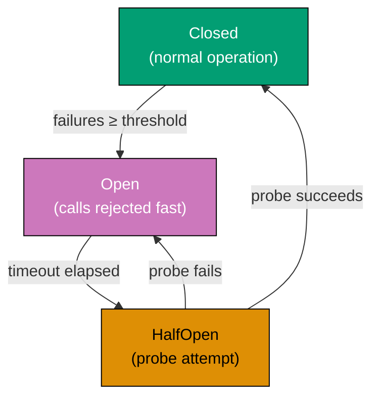

```fsharp
open System

// ── Circuit breaker state DU ──────────────────────────────────────────────────
// CircuitState models the three states of the circuit breaker pattern.
// This DU lives in the ADAPTER module — not in the domain or application layer.
// Three states cover the full lifecycle: normal, tripped, and probing recovery.
type CircuitState =
    | Closed
    // => Normal operation: all calls pass through to the downstream service
    // => failureCount increments on Error; resets to 0 on Ok
    | Open of openedAt: DateTimeOffset
    // => Tripped: refusing calls to protect the downstream service from overload
    // => Carries openedAt so the adapter can compute when the open duration expires
    | HalfOpen
    // => Probe state: allowing one call through to check if service has recovered
    // => If the probe succeeds, circuit closes; if it fails, circuit re-opens

// ── Circuit breaker error ─────────────────────────────────────────────────────
// Two distinct error cases: circuit refused the call vs downstream returned an error.
type CircuitError = CircuitOpen | DownstreamError of string
// => CircuitOpen: call refused because the circuit is open — fast failure, no I/O
// => DownstreamError: call was made but downstream returned an error — I/O occurred

// ── Circuit breaker wrapper ───────────────────────────────────────────────────
// withCircuitBreaker wraps any async-result function with circuit breaker logic.
// The application service calls the wrapped function — unaware of circuit state.
// Generic over 'a: works with any port return type (string, unit, Order, etc.).
let withCircuitBreaker
    (failureThreshold  : int)
    // => Open the circuit after this many consecutive failures
    (openDuration      : TimeSpan)
    // => How long the circuit stays open before probing with HalfOpen
    (operation         : unit -> Async<Result<'a, string>>)
    // => The real downstream call — unit in, async result out
    : unit -> Async<Result<'a, CircuitError>> =
    let mutable state        = Closed
    // => Initial state: circuit closed — calls pass through
    let mutable failureCount = 0
    // => Counts consecutive failures since last success; resets on any Ok
    fun () ->
        // => Returns a function with the same shape — transparent to the caller
        async {
            match state with
            | Open openedAt when DateTimeOffset.UtcNow < openedAt + openDuration ->
                // => Circuit still open — reject immediately without calling downstream
                // => Fast failure: no network call, no timeout; microseconds instead of seconds
                return Error CircuitOpen
            | Open _ ->
                // => Open duration elapsed — probe with one call (transition to HalfOpen)
                state <- HalfOpen
                // => HalfOpen: next branch will let one call through
            | _ -> ()
            // => Closed or HalfOpen: proceed with the actual call below

            let! result = operation ()
            // => Call the real downstream operation — may fail or succeed
            match result with
            | Ok value ->
                // => Call succeeded — reset circuit to Closed and clear failure count
                state        <- Closed
                // => Circuit is healthy again — all subsequent calls pass through
                failureCount <- 0
                // => Reset consecutive failure counter
                return Ok value
                // => Pass success value through to the caller
            | Error err ->
                failureCount <- failureCount + 1
                // => Count this failure — check against threshold
                if failureCount >= failureThreshold then
                    state <- Open DateTimeOffset.UtcNow
                    // => Threshold exceeded — open the circuit; record the open time
                return Error (DownstreamError err)
                // => Surface the downstream error to the caller regardless of circuit state
        }

// ── Adapter using the circuit breaker ─────────────────────────────────────────
// The application service holds the output port type unchanged.
// The adapter wraps the real call with the circuit breaker before injection.
// flakeyDownstream simulates a service that fails 3 times then recovers.
let flakeyDownstream : unit -> Async<Result<string, string>> =
    let mutable callCount = 0
    // => callCount: tracks how many times the downstream has been called
    fun () ->
        async {
            callCount <- callCount + 1
            // => Increment before deciding — first call is attempt 1
            if callCount <= 3 then return Error "downstream unavailable"
            // => First 3 calls fail — simulates a temporarily unavailable service
            else return Ok "data from downstream"
            // => Subsequent calls succeed — simulates service recovery after restart
        }

let protectedCall = withCircuitBreaker 2 (TimeSpan.FromSeconds(5.0)) flakeyDownstream
// => Circuit opens after 2 consecutive failures; stays open for 5 seconds
// => protectedCall has the same unit -> Async<Result<string, CircuitError>> shape

// ── Demonstration ─────────────────────────────────────────────────────────────
let results =
    [ for _ in 1..4 do
        yield protectedCall () |> Async.RunSynchronously ]
// => Call 1: Error (DownstreamError "downstream unavailable") — failure 1, count = 1
// => Call 2: Error (DownstreamError "downstream unavailable") — failure 2, circuit opens
// => Call 3: Error CircuitOpen — circuit is open, downstream not called at all
// => Call 4: Error CircuitOpen — circuit still open (5s not elapsed)

results |> List.iteri (fun i r -> printfn "Call %d: %A" (i+1) r)
// => Output: Call 1: Error (DownstreamError "downstream unavailable")
// => Output: Call 2: Error (DownstreamError "downstream unavailable")
// => Output: Call 3: Error CircuitOpen
// => Output: Call 4: Error CircuitOpen
```

**Key Takeaway**: A circuit breaker in the adapter tracks failure state with a DU, refuses calls when open, and automatically resets to HalfOpen after the configured duration — all invisible to the application service.

**Why It Matters**: Without a circuit breaker, a failing downstream service (database, payment gateway) causes every incoming request to wait for a timeout, exhausting thread pool and connection pool resources. The circuit breaker pattern converts cascading failure into fast failure: after the threshold is crossed, subsequent calls return `Error CircuitOpen` in microseconds rather than waiting 30 seconds. The application service maps `CircuitOpen` to a 503 response and the client backs off. Keeping the circuit state in the adapter means the domain and application service remain unaware of the infrastructure fragility they depend on.

---

## Multiple Bounded Contexts (Examples 39–44)

### Example 39: Multiple Bounded Contexts as Separate Hexagons

Two bounded contexts are two independent hexagonal structures — each with its own domain, application, and adapters. They never import each other's domain types. Communication happens through an event bus port, which is the only shared interface.

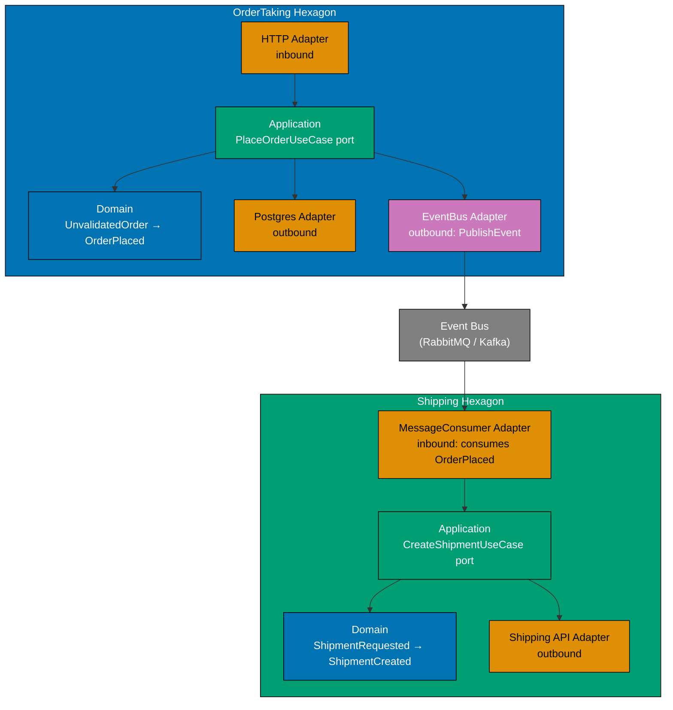

```fsharp
// ── OrderTaking hexagon ───────────────────────────────────────────────────────
// Completely self-contained: own domain types, own ports, own adapters.
// Does NOT import anything from the Shipping module.
// Zone structure: Domain ← Application ← Adapters — dependency rule enforced.
module OrderTaking =

    // Domain layer — inner zone; no external imports
    module Domain =
        type OrderId          = string
        // => Identity type: used only within this hexagon's domain layer
        type UnvalidatedOrder = { OrderId: OrderId; Quantity: decimal }
        // => Raw input from any delivery mechanism — validation has not yet occurred
        type OrderPlaced      = { OrderId: OrderId; TotalAmount: decimal }
        // => Domain event: signals a successful placement — the ONLY coupling point
        // => This type is translated to a wire format by the adapter, not shared directly

    // Application layer — middle zone; imports Domain only
    module Application =
        open Domain
        // The PublishEvent port is the ONLY interface between the two hexagons.
        // OrderTaking does not know about Shipping's domain types.
        // Port type: defined in the Application zone, not the Adapter zone.
        type PublishEvent = OrderPlaced -> Async<Result<unit, string>>
        // => Output port: publish the domain event to the message bus
        // => The event bus is the boundary; Shipping subscribes independently
        // => string error: simplified for this example; use a named DU in production

    // Adapter layer (illustration only — real adapter would open RabbitMQ SDK)
    // Outer zone: may import Application and infrastructure libraries.
    module Adapters =
        open Application
        // makeRabbitPublisher returns a value of type PublishEvent — the port type.
        // The composition root calls this to get the concrete implementation.
        let makeRabbitPublisher () : PublishEvent =
            fun event ->
                async {
                    printfn "[OrderTaking→Bus] Published: %A" event
                    // => Real adapter: serialize event to JSON, publish to RabbitMQ exchange
                    // => Stub: always Ok; production adapter wraps broker exceptions
                    return Ok ()
                    // => Unit result: no acknowledgment data needed from the bus
                }

// ── Shipping hexagon ──────────────────────────────────────────────────────────
// Completely self-contained: own domain types, own ports, own adapters.
// Does NOT import anything from the OrderTaking module.
// Separate hexagon: can be deployed as a separate service or kept in same process.
module Shipping =

    // Domain layer — Shipping's own ubiquitous language; no OrderTaking vocabulary
    module Domain =
        type ShipmentId   = string
        // => Identity type: lives only in Shipping's namespace
        type CustomerId   = string
        // => Shipping has its own identity types — not reused from OrderTaking
        // => Even though OrderTaking also has CustomerId, they are separate type aliases
        type ShipmentRequested = { ShipmentId: ShipmentId; ExternalOrderRef: string; Quantity: decimal }
        // => ExternalOrderRef is the ORDER ID from OrderTaking — treated as opaque string
        // => Shipping does not import OrderTaking.Domain.OrderId — loose coupling by design
        // => "External order reference" is Shipping's language, not "order ID"

    // Application layer — middle zone
    module Application =
        open Domain
        type CreateShipment = ShipmentRequested -> Async<Result<unit, string>>
        // => Input port: receives shipment commands from the message consumer adapter
        // => Message consumer adapter translates wire event → ShipmentRequested, then calls this

    // Adapter layer: Anti-Corruption Layer (ACL) translates the external event
    module Adapters =
        open Domain
        open Application
        // The ACL lives in the ADAPTER zone — it translates external event shapes
        // into Shipping's own domain types. No external type leaks past this point.
        // ACL = last line of defence; Shipping's domain never sees OrderTaking vocabulary.
        let translateExternalEvent (externalOrderId: string) (quantity: decimal) : ShipmentRequested =
            { ShipmentId       = System.Guid.NewGuid().ToString()
              // => Generate new identity in Shipping's own namespace — not the OrderId
              ExternalOrderRef = externalOrderId
              // => Treated as opaque string — no type dependency on OrderTaking
              Quantity         = quantity
              // => Quantity passes through — both contexts agree on decimal precision
            }
        // => ACL ensures Shipping's domain is never polluted with OrderTaking concepts
        // => When OrderTaking renames a field, only this function changes — not Shipping's domain

printfn "Two hexagons defined — no cross-module type imports"
// => Output: Two hexagons defined — no cross-module type imports
// => F# module system enforces the boundary at compile time
```

**Key Takeaway**: Two bounded contexts are expressed as two independent F# modules — each with its own domain, application, and adapters — communicating only through a shared event schema, not by importing each other's domain types.

**Why It Matters**: When two bounded contexts share domain types, a change to the shared type forces both contexts to update simultaneously. This "distributed monolith" problem is the failure mode of microservices that share a database schema or domain library. Separate F# modules with no cross-imports enforce the context boundary at compile time. The event bus is the only shared interface, and the event schema is versioned independently of either domain. Teams can evolve OrderTaking and Shipping at different speeds without coordination.

---

### Example 40: Inter-Hexagon Communication via Events

The OrderTaking hexagon publishes a domain event after saving. The Shipping hexagon consumes that event through a message consumer adapter, translates it through an Anti-Corruption Layer, and calls its own input port. Neither context imports the other's types.

```fsharp
// ── Shared kernel: only primitive event schema (no domain types) ──────────────
// SharedKernel contains only the serialised event shape — no domain logic.
// Both hexagons reference this module for the wire format only.
// Versioning: when the schema changes, SharedKernel is bumped; each hexagon adapts in its ACL.
module SharedKernel =
    // The event payload is a plain record — no DUs, no domain types.
    // JSON-serialisable: string, decimal, DateTimeOffset only — no F# domain types.
    type OrderPlacedEvent = {
        OrderId     : string
        // => Opaque string identifier — each context interprets it in its own namespace
        // => OrderTaking sees it as an OrderId; Shipping sees it as an ExternalOrderRef
        TotalAmount : decimal
        // => Decimal for precision — both contexts agree on this primitive
        // => Do not use float: precision loss would silently corrupt financial calculations
        PlacedAt    : System.DateTimeOffset
        // => Event timestamp — used by Shipping for SLA tracking and ordering
        // => ISO 8601 serialisation ensures timezone-safe wire format
    }
// => SharedKernel is the ONLY module both hexagons may import — no domain types cross
// => SharedKernel has no functions — it is a pure data contract

// ── OrderTaking hexagon: publishing the event ─────────────────────────────────
// OrderTaking translates its own domain event to the SharedKernel wire format.
// The adapter performs the translation — the domain event stays in domain language.
module OrderTaking =
    open SharedKernel

    type OrderPlaced = { OrderId: string; TotalAmount: decimal }
    // => OrderTaking's own domain event — NOT the SharedKernel wire format
    // => Naming: past tense (OrderPlaced) — immutable fact about what happened

    // Port: accepts the OrderTaking domain event — not the wire format
    type PublishOrderPlaced = OrderPlaced -> Async<Result<unit, string>>
    // => Output port: the application service calls this after a successful save
    // => Application service knows only OrderPlaced; wire format is an adapter concern

    // Adapter: translates domain event to SharedKernel wire format then publishes
    // makeEventBusAdapter is a factory — accepts publishToWire, returns the port.
    let makeEventBusAdapter (publishToWire: SharedKernel.OrderPlacedEvent -> Async<unit>) : PublishOrderPlaced =
        fun domainEvent ->
            // => domainEvent: OrderTaking's typed domain event
            async {
                let wireEvent : SharedKernel.OrderPlacedEvent = {
                    OrderId     = domainEvent.OrderId
                    // => Map OrderTaking domain OrderId (string) to wire format OrderId
                    TotalAmount = domainEvent.TotalAmount
                    // => Decimal passes through unchanged — same type in domain and wire format
                    PlacedAt    = System.DateTimeOffset.UtcNow
                    // => Timestamp added at publish time — not stored in the domain event itself
                }
                do! publishToWire wireEvent
                // => Publish the wire format event to the message bus — broker-specific I/O
                return Ok ()
                // => Stub: always Ok; production wraps broker exceptions in named error
            }

// ── Shipping hexagon: consuming the event ─────────────────────────────────────
// Shipping subscribes to the bus, applies the ACL, and calls its own input port.
// No type from OrderTaking module is imported here — only SharedKernel wire format.
module Shipping =
    open SharedKernel

    // Shipping's own domain types — entirely independent of OrderTaking
    // Different field names signal different ubiquitous language in each context.
    type ShipmentId      = string
    // => Shipping's own identity type — not the same as OrderTaking's OrderId
    type ShipmentRequest = { ShipmentId: ShipmentId; SourceOrderRef: string; Amount: decimal }
    // => SourceOrderRef is an opaque reference — Shipping does not care about OrderTaking types
    // => Amount not TotalAmount — Shipping's language differs from OrderTaking's language

    // Input port: the CreateShipment use case
    type CreateShipment = ShipmentRequest -> Async<Result<unit, string>>
    // => Input port: called by the message consumer adapter with a translated request
    // => This is Shipping's inbound port — analogous to the HTTP handler for HTTP adapters

    // Anti-Corruption Layer (ACL): translates SharedKernel event to Shipping domain type
    // ACL lives in the ADAPTER zone: shields the domain from external vocabulary changes.
    let translateEvent (event: SharedKernel.OrderPlacedEvent) : ShipmentRequest =
        { ShipmentId     = System.Guid.NewGuid().ToString()
          // => New identity in Shipping's namespace — not the OrderId; Shipping owns this ID
          SourceOrderRef = event.OrderId
          // => Store the external reference as an opaque string — no type import from OrderTaking
          Amount         = event.TotalAmount
          // => Rename TotalAmount → Amount: Shipping's ubiquitous language differs
        }
    // => ACL is the last line of defence: SharedKernel types never reach Shipping's domain
    // => If OrderTaking renames TotalAmount to Price, only translateEvent changes

    // Message consumer adapter: subscribes to the event bus, applies ACL, calls input port
    // handleOrderPlacedEvent is the inbound adapter — the message consumer equivalent of an HTTP handler.
    let handleOrderPlacedEvent (createShipment: CreateShipment) (wireEvent: SharedKernel.OrderPlacedEvent) =
        async {
            let request = translateEvent wireEvent
            // => ACL translation: wire format → Shipping domain type
            // => After this line, no SharedKernel types appear in the application logic
            let! result = createShipment request
            // => Call the Shipping input port — same pattern as the HTTP adapter calling a use case
            match result with
            | Ok ()    -> printfn "[Shipping] Shipment created for order %s" wireEvent.OrderId
            // => Happy path — shipment request accepted; log for observability
            | Error e  -> printfn "[Shipping] Failed to create shipment: %s" e
            // => Error path — real system would dead-letter or retry; log for alerting
        }

// ── Composition root: wire the two hexagons through the event bus ─────────────
// In-memory event bus for demonstration — real system uses RabbitMQ/Kafka.
// The composition root is the only place both hexagon modules appear together.
let inMemoryBus = System.Collections.Generic.List<SharedKernel.OrderPlacedEvent>()
// => Simulates the message broker — events accumulate here in wire format

// Shipping's use case (stub for demonstration)
// Satisfies CreateShipment — the same port type that would be wired to real persistence.
let stubCreateShipment : Shipping.CreateShipment =
    fun req -> async { printfn "[Shipping domain] Processing: %A" req; return Ok () }
// => Stub satisfies the input port type — composition root swaps this for real impl

// Wire: OrderTaking publishes to the in-memory bus
let publishToWire = fun event -> async { inMemoryBus.Add(event) }
// => publishToWire: accepts SharedKernel.OrderPlacedEvent, adds to in-memory bus
let orderTakingPublisher = OrderTaking.makeEventBusAdapter publishToWire
// => orderTakingPublisher : OrderTaking.PublishOrderPlaced — ready to inject into app service

// Simulate: OrderTaking places an order and publishes the domain event
let domainEvent : OrderTaking.OrderPlaced = { OrderId = "ORD-001"; TotalAmount = 29.97m }
// => Domain event: OrderTaking's own type — not the SharedKernel wire format
orderTakingPublisher domainEvent |> Async.RunSynchronously |> ignore
// => Adapter translates and appends the wire event to inMemoryBus
// => Output: (no console output yet — event is in the bus)

// Simulate: Shipping consumer reads from the bus and processes each event
inMemoryBus
|> Seq.iter (fun wireEvent ->
    Shipping.handleOrderPlacedEvent stubCreateShipment wireEvent |> Async.RunSynchronously)
// => ACL translates each wire event; createShipment called for each
// => Output: [Shipping domain] Processing: { ShipmentId = "..."; SourceOrderRef = "ORD-001"; Amount = 29.97M }
// => Output: [Shipping] Shipment created for order ORD-001
```

**Key Takeaway**: Inter-hexagon communication via events — SharedKernel wire format, ACL translation, input port call — decouples two bounded contexts at compile time: neither imports the other's domain types, yet they collaborate through a well-defined event contract.

**Why It Matters**: The temptation in a modular monolith is to import `OrderTaking.Domain.Order` directly into `Shipping.Domain` for convenience. This creates hidden coupling: every OrderTaking refactoring potentially breaks Shipping, and the two teams lose autonomy. The event-bus pattern with an ACL preserves autonomy: OrderTaking and Shipping evolve independently, the ACL absorbs schema differences between versions, and the SharedKernel wire format is a stable, versioned contract that both sides agree on. The pattern scales directly from an in-process in-memory bus (as demonstrated here) to a real RabbitMQ or Kafka deployment — only the bus adapter changes.

---

### Example 41: Anti-Corruption Layer Adapter Between Hexagons

The `ShippingAclAdapter` receives `OrderTaking.OrderPlaced` — an event arriving from another bounded context via the message bus — and translates it into `Shipping.CreateShipmentRequest`. This translation is the ACL's sole responsibility: mapping field names to Shipping's ubiquitous language, generating a new Shipping-owned identity, and adding domain defaults. Shipping's domain never sees OrderTaking types.

```fsharp
// ── External event type (from OrderTaking, received over the wire) ────────────
// This type represents the deserialized wire payload — not Shipping's domain type.
// Shipping's ACL adapter accepts this type; the domain never sees it.
module OrderTaking =
    type OrderPlaced = {
        OrderId      : string
        // => OrderTaking's identity value — opaque to Shipping; treated as a reference string
        CustomerEmail: string
        // => Email as known by OrderTaking — Shipping may or may not use it
        Lines        : {| ProductCode: string; Quantity: decimal |} list
        // => Anonymous record list: product code and quantity per line
        TotalAmount  : decimal
        // => Final order total computed by OrderTaking — Shipping uses this for prioritisation
    }

// ── Shipping domain types ──────────────────────────────────────────────────────
module Shipping =
    type ShipmentReference = ShipmentReference of string
    // => Shipping-owned identity — NOT the OrderTaking OrderId
    // => Single-case DU prevents passing arbitrary strings as shipment references

    type ShipmentItem = { Sku: string; Quantity: decimal }
    // => Shipping's vocabulary: Sku (not ProductCode), Quantity (same primitive)
    // => Field rename: ProductCode → Sku signals the different ubiquitous language

    type Priority = Standard | Express
    // => Shipping adds a domain concept that OrderTaking does not have
    // => ACL sets a default; a richer rule could derive priority from TotalAmount

    type CreateShipmentRequest = {
        ShipmentReference : ShipmentReference
        // => New identity generated in Shipping's namespace — not borrowed from OrderTaking
        SourceOrderRef    : string
        // => Opaque external reference — stored but never treated as a typed OrderId
        Items             : ShipmentItem list
        // => Translated from OrderTaking lines using Shipping's vocabulary
        Priority          : Priority
        // => Default assigned here; no equivalent concept exists in OrderTaking
    }

// ── Anti-Corruption Layer adapter ─────────────────────────────────────────────
// The ACL is an ADAPTER — lives in the outermost zone.
// It is the only place that imports both external and Shipping types.
// After translation, no OrderTaking type ever reaches Shipping.Application or Shipping.Domain.
module ShippingAclAdapter =
    open Shipping

    // translate is the ACL function: external event in, Shipping domain type out.
    // Called by the message consumer adapter before invoking the input port.
    let translate (event: OrderTaking.OrderPlaced) : Shipping.CreateShipmentRequest =
        let ref = ShipmentReference (System.Guid.NewGuid().ToString())
        // => Generate a new Shipping-owned identity — Shipping does not reuse OrderTaking's OrderId
        // => Guid.NewGuid: fresh identity per translation; idempotency handled upstream
        let items =
            event.Lines
            |> List.map (fun line ->
                // => Map each OrderTaking line to a Shipping ShipmentItem
                { Sku      = line.ProductCode
                  // => ProductCode → Sku: field rename expresses Shipping's ubiquitous language
                  Quantity = line.Quantity
                  // => Quantity: same decimal type; no conversion needed
                })
        // => items: ShipmentItem list — all lines translated; no OrderTaking type remains
        { ShipmentReference = ref
          // => Shipping-owned identity — generated above
          SourceOrderRef    = event.OrderId
          // => External reference stored as an opaque string — Shipping does not parse it
          Items             = items
          // => Translated line items — Shipping vocabulary throughout
          Priority          = Standard
          // => Default priority: ACL assigns Standard for all inbound orders
          // => A richer rule could use event.TotalAmount to promote to Express
        }
    // => After translate, Shipping.Application and Shipping.Domain see only Shipping types
    // => If OrderTaking renames Lines to OrderLines, only this function needs updating

// ── Demonstration ─────────────────────────────────────────────────────────────
let externalEvent : OrderTaking.OrderPlaced = {
    OrderId       = "ORD-001"
    CustomerEmail = "test@example.com"
    Lines         = [| {| ProductCode = "SKU-42"; Quantity = 3m |} |] |> Array.toList
    TotalAmount   = 89.97m
}
// => Simulated external event arriving from the message bus as a deserialized record

let shipmentRequest = ShippingAclAdapter.translate externalEvent
// => ACL translates: OrderTaking.OrderPlaced → Shipping.CreateShipmentRequest
printfn "ShipmentReference: %A" shipmentRequest.ShipmentReference
// => Output: ShipmentReference: ShipmentReference "<new-guid>"
printfn "SourceOrderRef: %s" shipmentRequest.SourceOrderRef
// => Output: SourceOrderRef: ORD-001
printfn "Items: %A"          shipmentRequest.Items
// => Output: Items: [{ Sku = "SKU-42"; Quantity = 3M }]
printfn "Priority: %A"       shipmentRequest.Priority
// => Output: Priority: Standard
```

**Key Takeaway**: The ACL adapter is the sole translation point between an external event shape and Shipping's domain types — once past the ACL, no external vocabulary survives inside the Shipping hexagon.

**Why It Matters**: Without an ACL, every rename in OrderTaking ripples directly into Shipping's domain model, coupling two teams' release cycles. The ACL is a thin, explicit adapter whose entire purpose is absorbing that coupling. When OrderTaking restructures its event payload, only `ShippingAclAdapter.translate` changes — Shipping's domain, application service, and tests remain untouched. This is precisely the "strangler fig" protection that lets bounded contexts evolve at independent speeds in a microservices or modular-monolith architecture.

---

### Example 42: Shared Kernel Types

A `SharedKernel` module holds types that are deliberately shared across bounded contexts: `CustomerId`, `Money`, `Address`. Both `OrderTaking` and `Shipping` open `SharedKernel` — but never each other. Shared kernel types must be extremely stable; changing them is a coordinated breaking change for every consumer. This distinguishes the Shared Kernel pattern (deliberate, governed sharing) from accidental coupling (one context importing another's domain model directly).

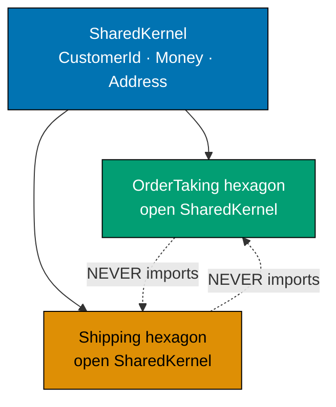

```fsharp
// ── Shared Kernel module ──────────────────────────────────────────────────────
// SharedKernel contains ONLY types that are stable across multiple bounded contexts.
// Rule: if a type needs to change often, it does NOT belong in SharedKernel.
// Governance: changes to SharedKernel require coordination with all consuming contexts.
module SharedKernel =

    // CustomerId: an identity that both OrderTaking and Shipping must reference.
    // Single-case DU prevents passing arbitrary strings as customer identifiers.
    type CustomerId = CustomerId of string
    // => Both contexts use CustomerId to correlate records across context boundaries
    // => CustomerId("CUST-42") — the DU label documents intent at the call site

    // Money: a value object with currency — both contexts perform monetary calculations.
    // Validated: Money constructor should enforce Amount >= 0m and valid Currency code.
    type Money = { Amount: decimal; Currency: string }
    // => Amount: decimal for precision — never float for monetary values
    // => Currency: ISO 4217 code (e.g. "USD", "IDR") — not an int or enum here
    // => Shared because both OrderTaking (pricing) and Shipping (COD) reference monetary values

    // Address: a value object representing a physical location.
    // Both contexts need address for different reasons: billing (OrderTaking), delivery (Shipping).
    type Address = {
        Street  : string
        // => Street line: house number and street name combined
        City    : string
        // => City name — used by Shipping for routing zone calculation
        PostCode: string
        // => Postal code — used by both contexts; format varies by country
        Country : string
        // => ISO 3166-1 alpha-2 country code (e.g. "ID", "US")
    }
    // => Address is shared because both contexts validate, store, and display it

// ── OrderTaking bounded context ───────────────────────────────────────────────
// Opens SharedKernel to access stable shared types; does NOT import Shipping.
module OrderTaking =
    open SharedKernel
    // => opens SharedKernel: CustomerId, Money, Address available in this scope
    // => Does NOT open Shipping — bounded context independence enforced

    type Order = {
        OrderId    : string
        // => OrderTaking's own identity — not shared; owned exclusively by this context
        Customer   : CustomerId
        // => SharedKernel type: references the customer without owning customer data
        TotalAmount: Money
        // => SharedKernel Money: amount + currency — same precision semantics as Shipping
        BillingAddr: Address
        // => SharedKernel Address: billing address — may differ from delivery address
    }
    // => Order uses SharedKernel types for cross-context stable fields
    // => OrderTaking-specific fields (OrderId, line items) are owned exclusively here

// ── Shipping bounded context ───────────────────────────────────────────────────
// Opens SharedKernel to access stable shared types; does NOT import OrderTaking.
module Shipping =
    open SharedKernel
    // => opens SharedKernel: same stable types as OrderTaking; no Shipping-specific types
    // => Does NOT open OrderTaking — separate domain model, separate evolution pace

    type Shipment = {
        ShipmentId  : string
        // => Shipping's own identity — generated by Shipping; not reused from OrderTaking
        Recipient   : CustomerId
        // => SharedKernel CustomerId: references the same customer without owning the data
        DeliverTo   : Address
        // => SharedKernel Address: delivery address — may be different from billing address
        ShippingCost: Money
        // => SharedKernel Money: cost charged by Shipping — same monetary value object
    }
    // => Shipment uses SharedKernel types for the stable cross-context fields
    // => Shipping-specific fields (ShipmentId, carrier, tracking) are owned exclusively here

// ── Demonstration ─────────────────────────────────────────────────────────────
let customerId = SharedKernel.CustomerId "CUST-42"
// => CustomerId constructed once — both contexts reference the same value
let address = { SharedKernel.Street = "Jl. Sudirman 1"; City = "Jakarta"; PostCode = "10220"; Country = "ID" }
// => Shared Address: both contexts can use this value without conversion

let order : OrderTaking.Order = {
    OrderId     = "ORD-001"
    Customer    = customerId
    // => SharedKernel CustomerId — no string/type conversion needed between contexts
    TotalAmount = { Amount = 89.97m; Currency = "IDR" }
    BillingAddr = address
}
printfn "Order customer: %A" order.Customer
// => Output: Order customer: CustomerId "CUST-42"

let shipment : Shipping.Shipment = {
    ShipmentId   = "SHP-001"
    Recipient    = customerId
    // => Same SharedKernel CustomerId — identity correlates across contexts without coupling
    DeliverTo    = address
    ShippingCost = { Amount = 15000m; Currency = "IDR" }
}
printfn "Shipment recipient: %A" shipment.Recipient
// => Output: Shipment recipient: CustomerId "CUST-42"
```

**Key Takeaway**: SharedKernel types are deliberately shared — stable, governed, and referenced by multiple contexts — whereas direct cross-context imports are accidental coupling that erodes context independence.

**Why It Matters**: The distinction between SharedKernel and accidental coupling is architectural intent. SharedKernel types are chosen specifically because they are unlikely to change and because the cost of duplication (each context maintaining its own `Address` type with diverging fields) outweighs the coupling risk. The governance rule is strict: any change to a SharedKernel type requires reviewing every consumer. Teams that skip this discipline and freely import each other's domain models end up with a distributed monolith — they get the complexity of microservices without the independence benefit.

---

### Example 43: Feature Flag Port — Trunk-Based Development Safety Valve

A feature flag port `IsFeatureEnabled : string -> Async<bool>` lets the application service choose a code path without a deployment. The production adapter reads from environment variables or a LaunchDarkly SDK. The test adapter returns a `Map<string, bool>`. Feature flags live in the application layer — they guard application service behaviour, never domain rules.

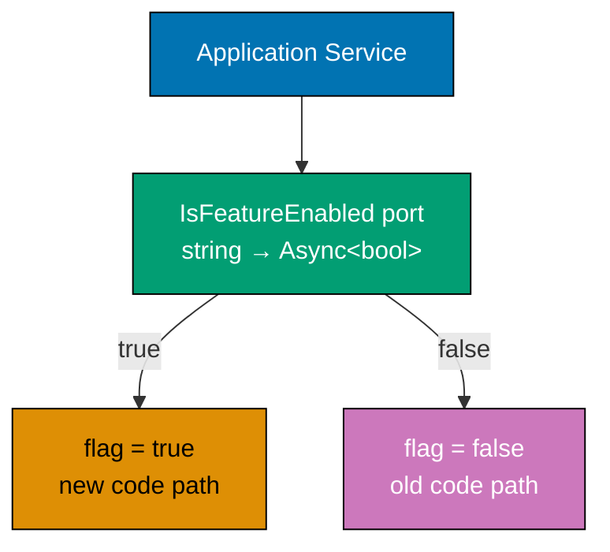

```fsharp
// ── Feature flag port ──────────────────────────────────────────────────────────
// IsFeatureEnabled checks whether a named flag is active for the current context.
// Async: flags may be fetched from a remote service (LaunchDarkly, ConfigCat).
// bool: simple on/off flag; a more advanced port could return a variant string.
type IsFeatureEnabled = string -> Async<bool>
// => Input:  flag name — e.g. "new-pricing-algorithm", "checkout-v2"
// => Output: true = flag is on; false = flag is off or not found
// => No Result: flag evaluation should never fail the main pipeline; default to false on error

// ── Environment variable adapter ──────────────────────────────────────────────
// Production adapter: reads flag names from environment variables.
// Convention: flag name is upper-cased and prefixed with FEATURE_FLAG_.
// Absent or non-"true" value → flag is off.
let envVarFlagAdapter : IsFeatureEnabled =
    fun flagName ->
        async {
            let envKey = "FEATURE_FLAG_" + flagName.ToUpper().Replace("-", "_")
            // => Normalise: "new-pricing-algorithm" → "FEATURE_FLAG_NEW_PRICING_ALGORITHM"
            let value  = System.Environment.GetEnvironmentVariable(envKey)
            // => Read from process environment — null if not set
            return value = "true"
            // => true only when the env var is literally "true"; absent or "false" → off
        }

// ── Map-based test adapter ────────────────────────────────────────────────────
// Returns a predefined map of flags — no environment setup required in tests.
// Each test can enable or disable specific flags independently.
let mapFlagAdapter (flags: Map<string, bool>) : IsFeatureEnabled =
    fun flagName ->
        async {
            return Map.tryFind flagName flags |> Option.defaultValue false
            // => tryFind: returns Some true/false if key present; None if absent
            // => defaultValue false: absent flag defaults to off — safe default
        }
// => mapFlagAdapter: creates an adapter from a plain immutable Map
// => Tests compose: mapFlagAdapter (Map.ofList [("new-pricing-algorithm", true)])

// ── Application service using the feature flag port ───────────────────────────
// The application service calls isFeatureEnabled to choose a code path.
// Feature flag guards application behaviour — never domain rules.
// Domain functions are always correct; the flag selects WHICH domain function to call.
let calculateOrderTotal (isFeatureEnabled: IsFeatureEnabled) (quantity: decimal) (unitPrice: decimal) =
    async {
        let! useNewAlgorithm = isFeatureEnabled "new-pricing-algorithm"
        // => Await flag evaluation — may be a remote call in production
        // => useNewAlgorithm: bool — true if the new algorithm should run
        if useNewAlgorithm then
            // => New algorithm: volume discount applied above 10 units
            let discount = if quantity > 10m then 0.9m else 1.0m
            // => discount: 10% off for orders > 10 units; no discount otherwise
            return quantity * unitPrice * discount
            // => Total with optional volume discount
        else
            // => Legacy algorithm: no discount, simple multiplication
            return quantity * unitPrice
            // => Total: simple quantity × unit price, no discounting logic
    }
// => The application service selects the algorithm; both algorithms live in the domain
// => Feature flag is invisible to domain functions — they never call isFeatureEnabled

// ── Demonstration with test adapters ──────────────────────────────────────────
let flagOn  = mapFlagAdapter (Map.ofList [("new-pricing-algorithm", true)])
// => flagOn: adapter where new-pricing-algorithm is enabled
let flagOff = mapFlagAdapter (Map.ofList [])
// => flagOff: empty map — all flags off; absent flag defaults to false

let totalWithNew   = calculateOrderTotal flagOn  15m 10m |> Async.RunSynchronously
// => 15 units × 10.00 × 0.90 (volume discount) = 135.00
printfn "New algorithm:    %M" totalWithNew
// => Output: New algorithm:    135.0000000000000000000000000

let totalWithLegacy = calculateOrderTotal flagOff 15m 10m |> Async.RunSynchronously
// => 15 units × 10.00 (no discount) = 150.00
printfn "Legacy algorithm: %M" totalWithLegacy
// => Output: Legacy algorithm: 150.0000000000000000000000000
```

**Key Takeaway**: A feature flag port keeps flag evaluation in the application layer where it belongs — the domain is always correct, and the flag selects which correct path to execute — while remaining trivially testable via a map-based adapter.

**Why It Matters**: Feature flags are the safety valve for trunk-based development: they let incomplete features ship to production behind a flag, allow A/B testing of algorithms, and enable instant rollback without a deployment. Injecting the flag check as a port means test suites can exercise both code paths deterministically — no environment variable setup, no external service, no flakiness. Teams that hardcode feature checks as `Environment.GetEnvironmentVariable` calls inside domain functions make both paths untestable and couple domain logic to infrastructure, violating hexagonal architecture's core invariant.

---

### Example 44: Cache Port — Wrapping a Slow Output Port

A `CachePort<'k, 'v>` record with `Get` and `Set` operations wraps any slow output port transparently. The `cachedFindProduct` function checks the cache first, falls back to the repository on a miss, and populates the cache for subsequent calls. The application service calls `cachedFindProduct` without knowing whether the result came from cache or database.

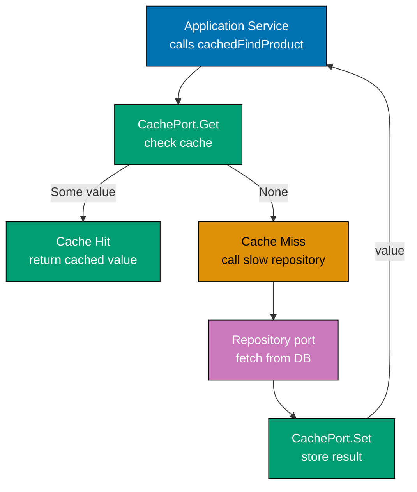

```fsharp
open System

// ── Cache port ──────────────────────────────────────────────────────────────────
// CachePort is a generic record of two functions — Get and Set.
// Generic over key type 'k and value type 'v: works for products, prices, or any domain value.
// Async: cache backends (Redis, Memcached) require async I/O.
type CachePort<'k, 'v> = {
    Get : 'k -> Async<'v option>
    // => Get: look up by key — returns Some value on hit, None on miss
    // => Option not Result: cache miss is not an error; the caller falls back to the source
    Set : 'k * 'v * TimeSpan -> Async<unit>
    // => Set: store key-value with a TTL — unit return, fire-and-forget semantics
    // => TimeSpan TTL: how long the cached value is valid before expiry
}
// => No error type: cache failures are silent; the application falls back to the source port
// => Silent failure is acceptable: a broken cache causes a performance degradation, not a correctness failure

// ── Repository port (the slow source) ─────────────────────────────────────────
// FindProduct is the database-backed port — slow, authoritative source of truth.
// Result: the database may fail with a named error; the cache never surfaces this error.
type FindProduct = string -> Async<Result<decimal, string>>
// => Input: product code (SKU)
// => Output: Ok unitPrice on success, Error message on database failure

// ── Cached wrapper using partial application ───────────────────────────────────
// cachedFindProduct checks cache, falls back to repo, and populates cache on miss.
// The wrapper is transparent: callers receive the same FindProduct type.
// Composition: cache port + repo port + TTL → new FindProduct with same signature.
let cachedFindProduct (cache: CachePort<string, decimal>) (repo: FindProduct) (ttl: TimeSpan) : FindProduct =
    fun productCode ->
        // => productCode: the SKU to look up — checked in cache before hitting the repo
        async {
            let! cached = cache.Get productCode
            // => Cache lookup: Async<decimal option> — None on miss, Some price on hit
            match cached with
            | Some price ->
                // => Cache hit: return immediately — no database call made
                // => Latency: microseconds (Redis) vs milliseconds (Postgres)
                return Ok price
            | None ->
                // => Cache miss: fall through to the database-backed repository
                let! repoResult = repo productCode
                // => repoResult: Result<decimal, string> — from the real database adapter
                match repoResult with
                | Ok price ->
                    do! cache.Set (productCode, price, ttl)
                    // => Populate cache for future calls — TTL controls freshness window
                    // => do!: fire-and-forget; a cache write failure does not block the response
                    return Ok price
                    // => Return the price from the database — caller sees Ok price regardless of cache path
                | Error e ->
                    // => Database also failed — surface the error to the caller
                    // => Cache is NOT populated: we do not cache errors
                    return Error e
        }
// => cachedFindProduct returns a FindProduct — same type as the raw repo adapter
// => Application service cannot distinguish: transparent wrapping via partial application

// ── In-memory cache adapter ────────────────────────────────────────────────────
// Dictionary-backed cache — correct for single-process use; not distributed.
// Factory function: each test gets a fresh, isolated cache instance.
let makeInMemoryCache<'k, 'v when 'k : comparison> () : CachePort<'k, 'v> =
    let store = System.Collections.Generic.Dictionary<'k, 'v>()
    // => Dictionary: mutable, O(1) lookup — acceptable in the adapter zone
    {
        Get = fun key ->
            async {
                match store.TryGetValue(key) with
                | true,  v -> return Some v
                // => Cache hit: key found in dictionary — return Some value
                | false, _ -> return None
                // => Cache miss: key absent — caller should fall back to source
            }
        Set = fun (key, value, _ttl) ->
            async {
                store.[key] <- value
                // => Store key-value pair — in-memory TTL ignored for simplicity
                // => Real Redis adapter would use SETEX with the TTL
            }
    }

// ── Stub repository adapter ────────────────────────────────────────────────────
// Simulates a slow database call — always returns Ok for the demo SKUs.
let stubRepo : FindProduct =
    fun code ->
        async {
            // => Simulates 50ms database latency — replaced by real Postgres adapter in production
            let prices = Map.ofList [("SKU-42", 29.97m); ("SKU-99", 9.99m)]
            // => In-memory price catalogue — real adapter queries the products table
            return
                match Map.tryFind code prices with
                | Some p -> Ok p
                | None   -> Error (sprintf "Product not found: %s" code)
        }

// ── Composition root: wire cache + repo ───────────────────────────────────────
let cache = makeInMemoryCache<string, decimal> ()
// => Fresh cache instance — empty at start, populated on first cache miss
let findProduct = cachedFindProduct cache stubRepo (TimeSpan.FromMinutes 5.0)
// => findProduct: FindProduct — application service uses this; unaware of cache

// ── Demonstration ─────────────────────────────────────────────────────────────
let price1 = findProduct "SKU-42" |> Async.RunSynchronously
// => First call: cache miss → repo hit → cache populated; returns Ok 29.97M
printfn "First call (miss): %A" price1
// => Output: First call (miss): Ok 29.97M

let price2 = findProduct "SKU-42" |> Async.RunSynchronously
// => Second call: cache hit → returns Ok 29.97M without touching the repo
printfn "Second call (hit): %A" price2
// => Output: Second call (hit): Ok 29.97M
```

**Key Takeaway**: A generic `CachePort<'k, 'v>` combined with partial application wraps any slow output port transparently — the application service calls the same `FindProduct` type whether the result comes from cache or database.

**Why It Matters**: Caching decisions belong in the infrastructure layer, not in the application service. When the application service contains `if cachedResult then ... else callRepo ...` branching, caching becomes a permanent fixture of the business logic that is hard to remove, test, or replace. A transparent cache wrapper preserves the port contract: the application service is unmodified, tests can use a direct repo without caching overhead, and the caching strategy (in-memory, Redis, two-tier) is swapped by changing the composition root. This is the hexagonal architecture payoff: infrastructure decisions are isolated to the outermost zone.

---

## Testing Strategies (Examples 45–55)

### Example 45: The Hexagonal Testing Pyramid

Three test levels — domain tests, application tests, and adapter tests — form a pyramid that matches the hexagonal zones. Domain tests are fast and pure. Application tests use in-memory port adapters. Adapter tests use real or embedded infrastructure. The pyramid shape is intentional: domain tests are numerous and millisecond-fast; adapter tests are few and slow.

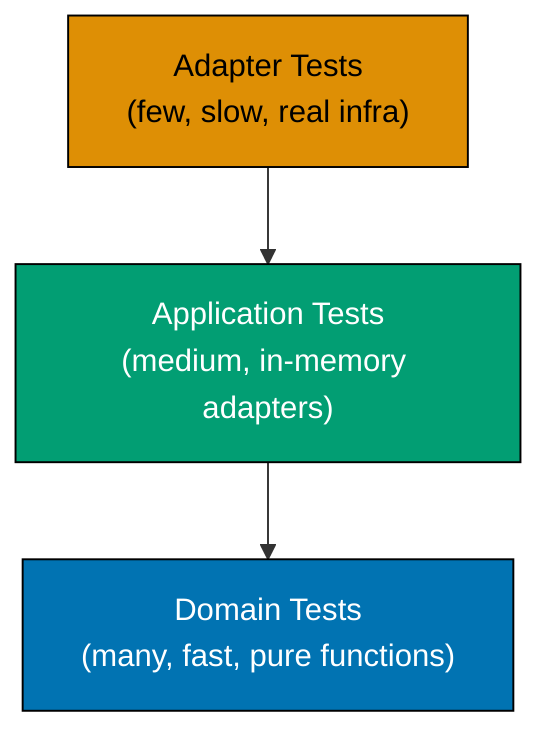

**Domain tests (fast, pure — no ports, no Async):**

```fsharp
// Domain tests call pure domain functions directly.
// No ports, no Async, no database, no mocking framework — just F# values.
// These tests run in microseconds; a suite of 500 domain tests takes under a second.

type UnvalidatedOrder = { OrderId: string; Quantity: decimal }
// => Input type: raw data from any delivery mechanism before domain validation
type ValidatedOrder   = { OrderId: string; Quantity: decimal }
// => Output type: validated — structurally identical here but semantically distinct

type ValidationError = BlankOrderId | NonPositiveQuantity
// => Domain error DU: each failure mode named — no string messages, no exceptions

let validateOrder (input: UnvalidatedOrder) : Result<ValidatedOrder, ValidationError> =
    if System.String.IsNullOrWhiteSpace(input.OrderId) then Error BlankOrderId
    // => Domain rule 1: blank OrderId is always rejected
    elif input.Quantity <= 0m then Error NonPositiveQuantity
    // => Domain rule 2: non-positive quantity violates business invariant
    else Ok { OrderId = input.OrderId; Quantity = input.Quantity }
    // => Validation passed: return validated state

// Domain tests — call validateOrder directly, no infrastructure involved
let testValidOrder = validateOrder { OrderId = "ORD-1"; Quantity = 3m }
// => Ok { OrderId = "ORD-1"; Quantity = 3M } — valid input accepted
printfn "Valid:    %A" testValidOrder
// => Output: Valid:    Ok { OrderId = "ORD-1"; Quantity = 3M }

let testBlankId = validateOrder { OrderId = "   "; Quantity = 3m }
// => Error BlankOrderId — whitespace-only OrderId rejected
printfn "BlankId:  %A" testBlankId
// => Output: BlankId:  Error BlankOrderId

let testZeroQty = validateOrder { OrderId = "ORD-2"; Quantity = 0m }
// => Error NonPositiveQuantity — zero quantity rejected
printfn "ZeroQty:  %A" testZeroQty
// => Output: ZeroQty:  Error NonPositiveQuantity
```

**Application tests (medium — in-memory adapters):**

```fsharp
open FsToolkit.ErrorHandling

// Application tests wire the application service with in-memory port adapters.
// No real database, no real SMTP — just dictionary and list adapters.
// These tests run in milliseconds; they verify orchestration logic.

type Order       = { OrderId: string; Quantity: decimal; SavedAt: System.DateTimeOffset }
// => Order: application-layer record — carries the domain data plus the timestamp from the clock port
type AppError    = ValidationFailed of string | SaveFailed of string
// => AppError: DU — two failure modes; ValidationFailed from domain, SaveFailed from the output port
type SaveOrder   = Order -> Async<Result<unit, AppError>>
// => SaveOrder: output port type alias — any function matching this signature satisfies the port
type GetCurrentTime = unit -> System.DateTimeOffset
// => GetCurrentTime: clock port — injected so tests can substitute a fixed instant

// In-memory save adapter: records saved orders for assertion
let makeInMemorySave () =
    let store = System.Collections.Generic.List<Order>()
    // => Mutable list — captures every saved order in insertion order
    let save : SaveOrder = fun order -> async { store.Add(order); return Ok () }
    // => save: satisfies SaveOrder port — always succeeds in the in-memory adapter
    save, (fun () -> store |> Seq.toList)
    // => Returns both the port and a read accessor for test assertions

// Fixed clock adapter: deterministic timestamp for tests
let fixedClock : GetCurrentTime = fun () -> System.DateTimeOffset(2026, 1, 1, 0, 0, 0, System.TimeSpan.Zero)
// => Always returns 2026-01-01T00:00:00Z — every test run agrees on "now"

// Application service (simplified): validates, timestamps, saves
let placeOrder (getClock: GetCurrentTime) (saveOrder: SaveOrder) (orderId: string) (qty: decimal) =
    asyncResult {
        if System.String.IsNullOrWhiteSpace(orderId) then
            return! Error (ValidationFailed "OrderId blank") |> async.Return
        // => Domain validation: blank OrderId rejected before saving
        let now = getClock ()
        // => Clock port: deterministic in tests, real-time in production
        let order = { OrderId = orderId; Quantity = qty; SavedAt = now }
        // => Construct the order with the timestamp from the clock port
        do! saveOrder order
        // => Output port: persist; application tests use in-memory adapter
        return order
        // => Return the saved order to the caller
    }

// Application test using in-memory adapters
let saveFn, getSaved = makeInMemorySave ()
// => saveFn: the port; getSaved: the assertion accessor
let result = placeOrder fixedClock saveFn "ORD-001" 5m |> Async.RunSynchronously
// => Run synchronously for test simplicity; real tests use Async testing library
printfn "Result:  %A" result
// => Output: Result:  Ok { OrderId = "ORD-001"; Quantity = 5M; SavedAt = 2026-01-01T00:00:00+00:00 }
printfn "Saved:   %d orders" (getSaved () |> List.length)
// => Output: Saved:   1 orders
```

**Adapter tests (slow — real or embedded infrastructure):**

```fsharp
// Adapter tests use real (or embedded) infrastructure — the only tests that do so.
// In a real project: spin up a PostgreSQL container via TestContainers.
// Here: we illustrate the test shape without a live database.

// The adapter test asserts the mapping between domain types and the database schema.
// Real test body would use Npgsql or Dapper to write and read the row.
let runAdapterTest (postgresConnectionString: string) =
    async {
        // Step 1: create the adapter under test using the real connection string
        // let repo = PostgresOrderRepository(postgresConnectionString)
        // => In a real test: connect to the TestContainers Postgres instance

        // Step 2: save a domain value through the adapter
        // do! repo.Save { OrderId = "ORD-TEST"; Quantity = 7m; SavedAt = DateTimeOffset.UtcNow }
        // => Real adapter: INSERT INTO orders (order_id, quantity, saved_at) VALUES (...)

        // Step 3: load the saved value and assert round-trip fidelity
        // let! found = repo.FindById "ORD-TEST"
        // => Real adapter: SELECT * FROM orders WHERE order_id = 'ORD-TEST'

        // Step 4: assert domain type reconstruction
        // assert (found = Ok (Some { OrderId = "ORD-TEST"; Quantity = 7m; ... }))
        // => Verifies the column mapping is correct — no data lost or transformed

        printfn "Adapter test shape illustrated — real test requires live Postgres"
        // => In CI: TestContainers starts Postgres before this test and cleans up after
    }
// => Adapter tests are FEW and SLOW — one test covers the full round-trip per adapter
// => All other tests (domain + application) run without any real infrastructure
printfn "Three test levels: domain (fast, pure), application (medium, in-memory), adapter (slow, real infra)"
// => Output: Three test levels: domain (fast, pure), application (medium, in-memory), adapter (slow, real infra)
```

**Key Takeaway**: The hexagonal testing pyramid maps directly to the three architecture zones: pure domain tests at the base, in-memory-adapter application tests in the middle, and real-infrastructure adapter tests at the apex — each level fast enough to run at the frequency its zone demands.

**Why It Matters**: Teams without a testing pyramid tend toward two failure modes: either all tests hit the database (slow, brittle, expensive CI) or all tests mock at the implementation level (fast but testing nothing real). The hexagonal pyramid resolves this by matching test isolation to zone isolation. Domain tests are maximally fast because domain functions are pure. Application tests are moderately fast because in-memory adapters cost microseconds. Adapter tests are slow by necessity — but there are far fewer of them. The result is a test suite that provides high confidence at low cost.

---

### Example 46: Testing the Domain in Total Isolation

Pure domain functions — `validateOrder` and `priceOrder` — are tested with no ports, no `Async`, and no infrastructure. Input is plain F# values; output is `Result`. Multiple cases cover the happy path and each rejection rule. These tests run in microseconds.

```fsharp
// ── Domain types ───────────────────────────────────────────────────────────────
type UnvalidatedOrder = { OrderId: string; ProductCode: string; Quantity: decimal }
// => Raw input: no type guarantees; any string is accepted by the record constructor
type ValidatedOrder   = { OrderId: string; ProductCode: string; Quantity: decimal }
// => Post-validation state: same fields but semantically guaranteed by the type transition

type DomainError =
    // => Discriminated union — every branch is a named business rule violation
    | BlankOrderId
    // => Business rule: order identity must not be blank or whitespace
    | NonPositiveQuantity
    // => Business rule: quantity must be strictly positive
    | InvalidProductCode of string
    // => Business rule: product code must match the expected format (non-empty for this example)
    | NegativeUnitPrice of decimal
    // => Business rule: unit price must be positive; pricing function rejects zero or negative

// ── Pure domain functions ───────────────────────────────────────────────────────
let validateOrder (input: UnvalidatedOrder) : Result<ValidatedOrder, DomainError> =
    // => Pure function: takes UnvalidatedOrder, returns Result — no I/O, no Async
    if System.String.IsNullOrWhiteSpace(input.OrderId) then
        // => Rule 1: OrderId must not be blank
        Error BlankOrderId
        // => Reject: blank or whitespace-only OrderId violates the identity invariant
    elif input.Quantity <= 0m then
        // => Rule 2: Quantity must be strictly positive
        Error NonPositiveQuantity
        // => Reject: zero or negative quantity violates the quantity invariant
    elif System.String.IsNullOrWhiteSpace(input.ProductCode) then
        // => Rule 3: ProductCode must not be blank
        Error (InvalidProductCode input.ProductCode)
        // => Reject: blank product code; real rule might match a regex pattern
    else
        Ok { OrderId = input.OrderId; ProductCode = input.ProductCode; Quantity = input.Quantity }
        // => All rules passed: return the validated state type

let priceOrder (unitPrice: decimal) (validated: ValidatedOrder) : Result<decimal, DomainError> =
    // => Pure pricing function: multiplies quantity by unit price
    if unitPrice <= 0m then
        Error (NegativeUnitPrice unitPrice)
        // => Pricing rule: non-positive unit price is a programming error — reject explicitly
    else
        Ok (validated.Quantity * unitPrice)
        // => Total = quantity × unit price — pure arithmetic, no I/O

// ── Domain tests — no ports, no Async, no mocking ─────────────────────────────
// Each test is a plain let binding that evaluates a domain function and prints the result.
// In a real project: use Expecto or xUnit with Assert.Equal; no test runner needed here.

let case1 = validateOrder { OrderId = "ORD-1"; ProductCode = "SKU-42"; Quantity = 3m }
// => case1 : Result<ValidatedOrder, DomainError>
// => Happy path: all rules satisfied
printfn "Case 1 (valid):           %A" case1
// => Output: Case 1 (valid):           Ok { OrderId = "ORD-1"; ProductCode = "SKU-42"; Quantity = 3M }

let case2 = validateOrder { OrderId = "   "; ProductCode = "SKU-42"; Quantity = 3m }
// => BlankOrderId: whitespace-only OrderId — the first rule fires
printfn "Case 2 (blank OrderId):   %A" case2
// => Output: Case 2 (blank OrderId):   Error BlankOrderId

let case3 = validateOrder { OrderId = "ORD-2"; ProductCode = "SKU-42"; Quantity = 0m }
// => NonPositiveQuantity: zero quantity — the second rule fires
printfn "Case 3 (zero quantity):   %A" case3
// => Output: Case 3 (zero quantity):   Error NonPositiveQuantity

let case4 = validateOrder { OrderId = "ORD-3"; ProductCode = ""; Quantity = 5m }
// => InvalidProductCode: blank product code — the third rule fires
printfn "Case 4 (blank product):   %A" case4
// => Output: Case 4 (blank product):   Error (InvalidProductCode "")

let case5 =
    validateOrder { OrderId = "ORD-4"; ProductCode = "SKU-99"; Quantity = 10m }
    |> Result.bind (priceOrder 0m)
    // => Validation passes; priceOrder rejects zero unit price
printfn "Case 5 (zero price):      %A" case5
// => Output: Case 5 (zero price):      Error (NegativeUnitPrice 0M)

let case6 =
    // => case6 : Result<decimal, DomainError> — chained validation then pricing
    validateOrder { OrderId = "ORD-5"; ProductCode = "SKU-99"; Quantity = 10m }
    |> Result.bind (priceOrder 29.97m)
    // => Full happy path: validate then price; both succeed
printfn "Case 6 (full happy path): %A" case6
// => Output: Case 6 (full happy path): Ok 299.700000000000000000000000000
```

**Key Takeaway**: Pure domain functions need no test doubles, no async plumbing, and no infrastructure — a plain `let binding = function call` is a complete test; exhaustive DU matching proves every rule is covered.

**Why It Matters**: Domain tests are the cheapest tests in the system. They require no setup, no teardown, no container startup, and no network. A CI job that runs 500 domain tests completes in under a second. Because domain functions are pure, their test results are deterministic: the same input always produces the same output regardless of environment, time, or concurrency. This means domain tests never flake. Teams that write domain tests alongside domain functions catch rule violations immediately — the function and its tests are reviewed together, not separately.

---

### Example 47: Testing the Application Service with In-Memory Ports

`placeOrder` is tested by creating an `InMemoryOrderRepository` (a mutable dictionary), a `FakeNotificationPort` (a mutable list), and a `FixedClock` (always returns 2026-01-01). These are partially applied into `placeOrder`. Assertions check both the `Result` and the side effects — repository state and notification list — without any database or HTTP.

```fsharp
open FsToolkit.ErrorHandling

// ── Domain and application types ───────────────────────────────────────────────
type OrderId    = string
// => Simple alias — distinguishes order identities from other string fields
type Order      = { OrderId: OrderId; Quantity: decimal; PlacedAt: System.DateTimeOffset }
// => Domain aggregate used by both save port and returned to caller
type AppError   = | ValidationFailed of string | SaveFailed of string | NotifyFailed of string
// => Named failures — each branch corresponds to one distinct failure mode

// ── Port types ──────────────────────────────────────────────────────────────────
type SaveOrder        = Order -> Async<Result<unit, AppError>>
// => Output port: persist the order — satisfied by InMemoryOrderRepository or Postgres adapter
type SendConfirmation = OrderId -> Async<Result<unit, AppError>>
// => Output port: notify customer — satisfied by FakeNotificationPort or SMTP adapter
type GetCurrentTime   = unit -> System.DateTimeOffset
// => Output port: injectable clock — satisfied by FixedClock or system clock

// ── Application service ─────────────────────────────────────────────────────────
// placeOrder orchestrates: validate → timestamp → save → notify
// All I/O is behind ports — the service has no direct infrastructure calls.
let placeOrder (getClock: GetCurrentTime) (saveOrder: SaveOrder) (sendConfirmation: SendConfirmation) (orderId: OrderId) (qty: decimal) =
    asyncResult {
        if System.String.IsNullOrWhiteSpace(orderId) then
            return! Error (ValidationFailed "OrderId blank") |> async.Return
        // => Domain validation: fail fast before any I/O
        let now = getClock ()
        // => Clock port: 2026-01-01 in tests; DateTimeOffset.UtcNow in production
        let order = { OrderId = orderId; Quantity = qty; PlacedAt = now }
        // => Construct the order with the deterministic timestamp
        do! saveOrder order
        // => Persist via output port — in-memory in tests, Postgres in production
        do! sendConfirmation orderId
        // => Notify via output port — fake list in tests, SMTP in production
        return order
        // => Return the placed order on the Ok track
    }

// ── In-memory repository (satisfies SaveOrder) ────────────────────────────────
let makeInMemoryRepo () =
    let store = System.Collections.Generic.Dictionary<OrderId, Order>()
    // => Mutable dictionary — isolated per test via factory function
    let save : SaveOrder =
        fun order -> async { store.[order.OrderId] <- order; return Ok () }
    // => save: upsert semantics; always Ok in the in-memory adapter
    save, (fun () -> store.Values |> Seq.toList)
    // => Returns the port and a read accessor for assertions

// ── Fake notification port (satisfies SendConfirmation) ───────────────────────
let makeInMemoryNotifier () =
    let sent = System.Collections.Generic.List<OrderId>()
    // => Records every notified OrderId in insertion order
    let notify : SendConfirmation =
        fun orderId -> async { sent.Add(orderId); return Ok () }
    // => notify: satisfies SendConfirmation — always Ok; no real SMTP
    notify, (fun () -> sent |> Seq.toList)
    // => Returns the port and a read accessor for assertions

// ── Fixed clock adapter ────────────────────────────────────────────────────────
let fixedClock : GetCurrentTime =
    fun () -> System.DateTimeOffset(2026, 1, 1, 0, 0, 0, System.TimeSpan.Zero)
// => Always 2026-01-01T00:00:00Z — test assertions can use this literal value

// ── Application test ────────────────────────────────────────────────────────────
let saveFn,   getSaved     = makeInMemoryRepo ()
// => saveFn: the port; getSaved: the assertion accessor for repository state
let notifyFn, getNotified  = makeInMemoryNotifier ()
// => notifyFn: the port; getNotified: the assertion accessor for sent notifications

// Partially apply all ports and adapters — same pattern as the composition root
let placeOrderWithAdapters = placeOrder fixedClock saveFn notifyFn
// => placeOrderWithAdapters: OrderId -> decimal -> Async<Result<Order, AppError>>

let result = placeOrderWithAdapters "ORD-001" 5m |> Async.RunSynchronously
// => Run the full application service pipeline with in-memory adapters
printfn "Result:         %A" result
// => Output: Result:         Ok { OrderId = "ORD-001"; Quantity = 5M; PlacedAt = 2026-01-01T00:00:00+00:00 }

printfn "Saved orders:   %d" (getSaved () |> List.length)
// => Output: Saved orders:   1
printfn "Notifications:  %A" (getNotified ())
// => Output: Notifications:  ["ORD-001"]

// Assertion: validation failure path
let failResult = placeOrderWithAdapters "  " 5m |> Async.RunSynchronously
// => Blank OrderId: validation fires before any port is called
printfn "Fail result:    %A" failResult
// => Output: Fail result:    Error (ValidationFailed "OrderId blank")
printfn "Saved on fail:  %d" (getSaved () |> List.length)
// => Output: Saved on fail:  1  (still 1 — the failure case did not save)
```

**Key Takeaway**: Application service tests verify orchestration logic — the order of port calls, the validation guard, the error paths — using in-memory adapters that record side effects for assertion without any real infrastructure.

**Why It Matters**: Application service tests are the most valuable tests in the system per effort invested. They exercise the orchestration logic that drives the business workflow — validation sequencing, save-then-notify ordering, error propagation — without the overhead of a real database or SMTP server. Because every port is injected, the test fully controls which ports succeed and which fail, enabling exhaustive coverage of every branch in milliseconds. Teams that skip this level either write no tests (no coverage) or write only end-to-end tests (slow, flaky, expensive).

---

### Example 48: Testing an Adapter in Isolation

The PostgreSQL adapter test spins up a real database using TestContainers, then tests `findOrder` and `saveOrder` against real SQL. This is the only test that uses a real database — and it is the only place where the column mapping between domain types and the database schema is verified. Application and domain tests never need a real database.

```fsharp
open System

// ── Domain types (same as application tests) ───────────────────────────────────
type OrderId  = string
type Order    = { OrderId: OrderId; Quantity: decimal; PlacedAt: DateTimeOffset }
type RepoError = RowNotFound of OrderId | DbException of exn

// ── PostgreSQL adapter (simplified — shows shape; real impl uses Npgsql/Dapper) ─
// PostgresOrderRepository satisfies the OrderRepository port.
// Real implementation: opens a Npgsql connection, executes parameterised SQL.
// Shown here as a module to illustrate the test contract without a live database.
module PostgresOrderRepository =
    // findOrder: SELECT from orders table; maps result set row to Order domain type
    let findOrder (connStr: string) (orderId: OrderId) : Async<Result<Order option, RepoError>> =
        async {
            // Real implementation:
            // use conn = new Npgsql.NpgsqlConnection(connStr)
            // do! conn.OpenAsync() |> Async.AwaitTask
            // let! rows = Dapper.QueryAsync<OrderRow>(conn, "SELECT ... WHERE order_id=@id", {| id = orderId |})
            // return Ok (rows |> Seq.tryHead |> Option.map toOrder)
            //
            // Stub for compilation: always returns Ok None without a live database
            return Ok None
            // => In real test: returns Ok (Some order) after TestContainers Postgres starts
        }

    // saveOrder: INSERT OR UPDATE into orders table; maps Order domain type to SQL parameters
    let saveOrder (connStr: string) (order: Order) : Async<Result<unit, RepoError>> =
        async {
            // Real implementation:
            // use conn = new Npgsql.NpgsqlConnection(connStr)
            // do! conn.OpenAsync() |> Async.AwaitTask
            // do! Dapper.ExecuteAsync(conn, "INSERT INTO orders (order_id, quantity, placed_at) VALUES (@OrderId, @Quantity, @PlacedAt) ON CONFLICT (order_id) DO UPDATE SET ...", order) |> Async.AwaitTask |> Async.Ignore
            // return Ok ()
            //
            // Stub for compilation: always returns Ok () without a live database
            return Ok ()
            // => In real test: verifies the INSERT succeeded and row is readable
        }

// ── Adapter test shape ─────────────────────────────────────────────────────────
// In a real project: [<Fact>] or [<Test>] attribute, TestContainers setup in fixture.
// TestContainers starts a fresh Postgres container per test class; cleans up on dispose.
let runAdapterRoundTripTest () =
    async {
        // Real test setup:
        // let container = new PostgreSqlBuilder().Build()
        // do! container.StartAsync() |> Async.AwaitTask
        // let connStr = container.ConnectionString
        //
        // Stub connection string for illustration
        let connStr = "Host=localhost;Database=test;Username=test;Password=test"
        // => Real test: container provides a fresh isolated database

        // Step 1: save a domain value through the adapter
        let order = { OrderId = "ORD-TEST"; Quantity = 7m; PlacedAt = DateTimeOffset.UtcNow }
        let! saveResult = PostgresOrderRepository.saveOrder connStr order
        // => Real test: inserts into the Postgres container's orders table
        printfn "Save result: %A" saveResult
        // => Output: Save result: Ok ()   (stub always Ok; real test verifies no exception)

        // Step 2: load and verify round-trip fidelity
        let! findResult = PostgresOrderRepository.findOrder connStr "ORD-TEST"
        // => Real test: SELECT from orders table; verifies column-to-field mapping
        printfn "Find result: %A" findResult
        // => Output: Find result: Ok None   (stub; real test returns Ok (Some order))

        // Step 3: assert round-trip — the saved value equals the loaded value
        // Real assertion:
        // match findResult with
        // | Ok (Some found) -> Assert.Equal(order.OrderId,  found.OrderId)
        //                      Assert.Equal(order.Quantity, found.Quantity)
        // | _ -> failwith "Round-trip failed"
        //
        // => This assertion is the ONLY test that exercises the SQL column mapping
        // => Domain tests and application tests never need this verification

        printfn "Adapter test illustrated — requires live Postgres for real assertions"
    }

runAdapterRoundTripTest () |> Async.RunSynchronously
// => Output: Save result: Ok ()
// => Output: Find result: Ok None
// => Output: Adapter test illustrated — requires live Postgres for real assertions
```

**Key Takeaway**: Adapter tests are the only tests that touch real infrastructure — they verify the column mapping between domain types and the database schema, a concern that in-memory adapters cannot cover by definition.

**Why It Matters**: The question "does my Postgres adapter correctly map `placed_at TIMESTAMPTZ` to `DateTimeOffset` with timezone preservation?" can only be answered by running against a real Postgres instance. TestContainers makes this practical: a fresh container starts in seconds, tests run in isolation, and the container is discarded on teardown. The adapter test suite is small — typically one round-trip test and a few edge cases per adapter — because all orchestration and domain logic is covered at the other two levels. Keeping adapter tests small and targeted prevents the test suite from becoming a slow integration test zoo.

---

### Example 49: Contract Test — Adapter Must Satisfy Port Properties

A contract test defines properties that any implementation of `OrderRepository` must satisfy — round-trip, miss returns None, delete makes unfindable — and runs those same properties against both the in-memory adapter and the PostgreSQL adapter. Any new adapter must pass the same contract to be considered correct.

```fsharp
open FsToolkit.ErrorHandling
// => FsToolkit.ErrorHandling: provides asyncResult CE and ResultBuilder helpers

// ── Port type ──────────────────────────────────────────────────────────────────
type OrderId = string
// => Alias: distinguishes order identity from other string fields
type Order   = { OrderId: OrderId; Quantity: decimal }
// => Minimal domain type for this contract test — real Order would have more fields

type OrderRepository = {
    // => Record of functions — the port contract that all adapters must satisfy
    Save     : Order   -> Async<Result<unit, string>>
    // => Upsert: create or update; success is unit
    FindById : OrderId -> Async<Result<Order option, string>>
    // => Load by identity: Some on hit, None on miss, Error on infra failure
    Delete   : OrderId -> Async<Result<unit, string>>
    // => Remove: success is unit; missing key may return Error depending on adapter
}

// ── Contract properties ────────────────────────────────────────────────────────
// Each property is a function that accepts a repo and returns an Async<bool>.
// True = property holds; False or exception = property violated.
// Same properties run against ALL adapter implementations.

let propRoundTrip (repo: OrderRepository) =
    // => Property: save then find returns the same value — round-trip fidelity
    async {
        let order = { OrderId = "CONTRACT-1"; Quantity = 5m }
        // => Use a deterministic test value — same across all adapters
        do! repo.Save order |> Async.Ignore
        // => Save: should succeed without error
        let! found = repo.FindById "CONTRACT-1"
        // => Load: should return the saved value
        // => found : Result<Order option, string>
        match found with
        // => Pattern match: dispatch on success/failure and presence/absence
        | Ok (Some o) ->
            // => Some: record was found after save — check field equality
            let holds = o.OrderId = order.OrderId && o.Quantity = order.Quantity
            // => Round-trip fidelity: saved value equals loaded value — both fields
            printfn "propRoundTrip: %b" holds
            // => Output: propRoundTrip: true (when adapter is correct)
            return holds
            // => Contract Law 1 verified: save → find round-trips correctly
        | _ ->
            // => Wildcard arm: any other result means the property failed
            printfn "propRoundTrip: false (not found or error)"
            // => Contract violation: save+load did not round-trip correctly
            return false
            // => Contract Law 1 fails: adapter does not honour round-trip fidelity
    }

let propMissReturnsNone (repo: OrderRepository) =
    // => Property: looking up an ID that was never saved returns Ok None
    async {
        let! found = repo.FindById "NONEXISTENT-ID-12345"
        // => Look up an ID that was never saved — should return None, not Error
        // => found : Result<Order option, string>
        match found with
        // => Pattern match: only Ok None is the correct result
        | Ok None ->
            // => Correct: missing ID returns None (not an error)
            printfn "propMissReturnsNone: true"
            return true
            // => Contract Law 2 verified: absent key → Ok None, not Error
        | _ ->
            // => Wildcard: Ok (Some _) or Error means the adapter is incorrect
            printfn "propMissReturnsNone: false (unexpected result)"
            return false
            // => Contract Law 2 fails: adapter returned Error or Some for missing key
    }

let propDeleteMakesUnfindable (repo: OrderRepository) =
    // => Property: after delete, the record is no longer findable
    async {
        let order = { OrderId = "CONTRACT-DEL"; Quantity = 2m }
        // => Use a fresh ID for this property — no overlap with round-trip
        do! repo.Save order |> Async.Ignore
        // => Save first so the record exists before deletion
        do! repo.Delete "CONTRACT-DEL" |> Async.Ignore
        // => Delete: remove the record
        let! found = repo.FindById "CONTRACT-DEL"
        // => Load after delete: should return None
        // => found : Result<Order option, string>
        match found with
        // => Pattern match: Ok None is the only acceptable result after delete
        | Ok None ->
            // => Correct: deleted record is gone
            printfn "propDeleteMakesUnfindable: true"
            return true
            // => Contract Law 3 verified: delete → find returns Ok None
        | _ ->
            // => Wildcard: deleted record still findable — adapter violation
            printfn "propDeleteMakesUnfindable: false"
            return false
            // => Contract Law 3 fails: deleted record is still findable
    }

// ── In-memory adapter ──────────────────────────────────────────────────────────
let makeInMemoryRepo () : OrderRepository =
    // => Factory function: creates a fresh isolated adapter per test run
    let store = System.Collections.Generic.Dictionary<OrderId, Order>()
    // => Mutable dictionary — isolated per contract run via factory function
    { Save     = fun o  -> async { store.[o.OrderId] <- o; return Ok () }
      // => Upsert: inserts or replaces; always Ok in the in-memory adapter
      FindById = fun id -> async { return Ok (store.TryGetValue(id) |> function | true, v -> Some v | _ -> None) }
      // => Pattern match on TryGetValue tuple — Some on hit, None on miss
      Delete   = fun id -> async { store.Remove(id) |> ignore; return Ok () }
      // => Remove: always Ok even if id absent — in-memory adapter is lenient
    }
// => makeInMemoryRepo : unit -> OrderRepository — satisfies the port contract

// ── Run contract against in-memory adapter ─────────────────────────────────────
// Real test: would also run against PostgresOrderRepository with a TestContainers instance.
// Parameterising over the adapter is the key insight: same test, different adapter.
let runContract (repoFactory: unit -> OrderRepository) (label: string) =
    // => repoFactory: creates a fresh adapter; label: identifies adapter in output
    async {
        printfn "\n--- Contract: %s ---" label
        // => Header: identifies which adapter is being tested
        let repo = repoFactory ()
        // => Fresh adapter instance per contract run — no cross-test contamination
        let! r1 = propRoundTrip repo
        // => r1 : bool — true if round-trip property holds
        let! r2 = propMissReturnsNone repo
        // => r2 : bool — true if miss-returns-none property holds
        let! r3 = propDeleteMakesUnfindable repo
        // => r3 : bool — true if delete-makes-unfindable property holds
        printfn "All properties pass: %b" (r1 && r2 && r3)
        // => True only when all three properties hold against this adapter
    }

runContract makeInMemoryRepo "InMemory" |> Async.RunSynchronously
// => Executes the contract suite against the in-memory adapter
// => Output: --- Contract: InMemory ---
// => Output: propRoundTrip: true
// => Output: propMissReturnsNone: true
// => Output: propDeleteMakesUnfindable: true
// => Output: All properties pass: true
```

**Key Takeaway**: Contract tests express the behavioural obligations of a port as runnable properties, then verify every adapter implementation against the same property suite — ensuring all adapters are interchangeable at the port boundary.

**Why It Matters**: Without contract tests, each new adapter is manually tested in isolation, and subtle differences in behaviour (does it return `Error` or `Ok None` on a missing key?) are discovered only at runtime. Contract tests make the port's expectations explicit and machine-checkable. A new team member implementing a Redis adapter runs the contract suite and immediately knows whether their implementation is correct — no manual inspection of the existing adapters required. This is especially valuable when multiple adapters coexist in the same codebase (in-memory, Postgres, Redis) or when adapters are swapped across environments.

---

### Example 50: Test Doubles at the Port Level — No Mocking Framework Needed

F# partial application eliminates the need for a mocking framework. Instead of a mock object, write `let fakeFind id = async { return Ok (Some testOrder) }`. Compose it into an `OrderRepository` record. Pass to the application service. Assert on the final `Result` — not on call counts. This approach is simpler, type-safe, and produces more readable tests than OOP mocking libraries.

```fsharp
open FsToolkit.ErrorHandling

// ── Port and domain types ──────────────────────────────────────────────────────
type OrderId    = string
// => Simple alias — distinguishes order identities from other strings
type Order      = { OrderId: OrderId; Quantity: decimal }
// => Minimal domain type for this example — real Order would have more fields
type AppError   = | NotFound of OrderId | SaveFailed of string
// => Named failure modes — NotFound for missing records, SaveFailed for infra errors

type OrderRepository = {
    FindById : OrderId -> Async<Result<Order option, AppError>>
    // => Load by identity — Some on hit, None on miss
    Save     : Order   -> Async<Result<unit, AppError>>
    // => Upsert semantics — create or update; unit on success
}

// ── Application service ─────────────────────────────────────────────────────────
// updateQuantity loads an order, changes the quantity, and saves it back.
// All I/O is behind the repository port — no direct database calls.
let updateQuantity (repo: OrderRepository) (orderId: OrderId) (newQty: decimal) =
    asyncResult {
        let! found = repo.FindById orderId
        // => Load: Option on Ok — check for existence before updating
        let! order =
            match found with
            | Some o -> Ok o |> async.Return
            | None   -> Error (NotFound orderId) |> async.Return
        // => Not found: surface NotFound error; update path only continues on Some
        let updated = { order with Quantity = newQty }
        // => Construct the updated order — immutable update via `with`
        do! repo.Save updated
        // => Persist: output port call — in-memory in tests, Postgres in production
        return updated
        // => Return the updated order to the caller
    }

// ── Test doubles via partial application — no mocking framework ───────────────
// testOrder: the value the fake FindById will return on the happy path
let testOrder = { OrderId = "ORD-001"; Quantity = 5m }
// => Deterministic fixture value — used in assertions below

// Fake FindById: always returns testOrder — one line, no framework needed
let fakeFind : OrderId -> Async<Result<Order option, AppError>> =
    fun _id -> async { return Ok (Some testOrder) }
// => Ignores the id argument — always returns the test fixture
// => Equivalent to: mockRepo.Setup(r => r.FindById(It.IsAny<string>())).Returns(Task.FromResult(Ok(Some testOrder)))
// => F# version: one line vs four lines of OOP mock setup

// Fake Save: records the saved order for assertion
let mutable savedOrder : Order option = None
// => Mutable: captures the argument passed to Save — inspected in assertions
let fakeSave : Order -> Async<Result<unit, AppError>> =
    fun order -> async { savedOrder <- Some order; return Ok () }
// => Captures the saved order — assertion reads savedOrder after the service call

// Compose the repository record from the two fake functions
let fakeRepo : OrderRepository = { FindById = fakeFind; Save = fakeSave }
// => fakeRepo: satisfies the OrderRepository type — no framework, no interface, no mock object
// => OOP equivalent: var mockRepo = new Mock<IOrderRepository>(); ... mockRepo.Object

// ── Test: happy path ────────────────────────────────────────────────────────────
let result = updateQuantity fakeRepo "ORD-001" 10m |> Async.RunSynchronously
// => Run the application service with fake ports — no real database
printfn "Result:       %A" result
// => Output: Result:       Ok { OrderId = "ORD-001"; Quantity = 10M }
printfn "Saved order:  %A" savedOrder
// => Output: Saved order:  Some { OrderId = "ORD-001"; Quantity = 10M }

// ── Test: not-found path ────────────────────────────────────────────────────────
let fakeNotFound : OrderRepository = {
    FindById = fun _id -> async { return Ok None }
    // => Fake that simulates a missing order — no complicated mock setup
    Save     = fun _ -> async { return Ok () }
    // => Save should not be called on the not-found path
}
let notFoundResult = updateQuantity fakeNotFound "MISSING" 10m |> Async.RunSynchronously
// => Service should return Error (NotFound "MISSING") without calling Save
printfn "Not found:    %A" notFoundResult
// => Output: Not found:    Error (NotFound "MISSING")
```

**Key Takeaway**: F# record-of-functions eliminates the need for a mocking framework — test doubles are plain function values, record literals compose them into ports, and assertions target the final `Result` rather than call counts or mock verify steps.

**Why It Matters**: OOP mocking frameworks (Moq, NSubstitute, Mockito) introduce their own complexity: setup syntax, argument matchers, verify steps, and framework-specific failure messages. In F# with record-of-functions, a test double is literally one line: `let fakeFind _ = async { return Ok (Some testOrder) }`. There is no framework API to learn, no magic at runtime, and no `VerifyAll()` call. The test reads: create fake, pass fake to service, assert on output. This is simpler, more type-safe, and produces clearer failure messages. The pattern scales from one fake function to a full repository record with zero additional infrastructure.

---

### Example 51: Parameterised Tests Over Multiple Adapter Implementations

A single test suite function `runRepositoryTests` accepts any `OrderRepository` and returns a list of named async tests. Running the same function against both `inMemoryRepo` and `postgresRepo` guarantees both adapters satisfy identical contracts without duplicating test code.

```fsharp
open FsToolkit.ErrorHandling

// ── Port type ──────────────────────────────────────────────────────────────────
type OrderId = string
// => Alias: distinguishes order identity from other string fields
type Order   = { OrderId: OrderId; Quantity: decimal }
// => Minimal domain type — real Order would include timestamps and customer info

type OrderRepository = {
    // => Record of functions: the port contract every adapter must satisfy
    Save     : Order   -> Async<Result<unit, string>>
    // => Upsert semantics — create or update
    FindById : OrderId -> Async<Result<Order option, string>>
    // => Some on hit, None on miss, Error on infra failure
    Delete   : OrderId -> Async<Result<unit, string>>
    // => Remove record; behaviour on missing key is adapter-defined
}

// ── Parameterised test suite ────────────────────────────────────────────────────
// runRepositoryTests accepts any OrderRepository implementation.
// Returns a list of (name, async<bool>) pairs — each test is self-described and async.
// In a real project: use Expecto.testList with testAsync for automatic discovery.
let runRepositoryTests (repo: OrderRepository) =
    // => Returns list of (name, async<bool>) test pairs — same for every adapter
    [
        "save and find round-trip", async {
            let order = { OrderId = "PARAM-1"; Quantity = 3m }
            // => Use a deterministic fixture value — same across all adapter runs
            do! repo.Save order |> Async.Ignore
            // => Save: should succeed regardless of adapter
            let! found = repo.FindById "PARAM-1"
            // => Load: should return the saved value
            // => found : Result<Order option, string>
            let holds = found = Ok (Some order)
            // => Round-trip fidelity: saved value equals loaded value
            printfn "  [save-find round-trip] %b" holds
            return holds
        }

        "find returns None for missing id", async {
            let! found = repo.FindById "DEFINITELY-NOT-THERE-XYZ"
            // => ID never saved — should return None, not Error
            // => found : Result<Order option, string>
            let holds = found = Ok None
            // => Contract: missing ID → Ok None (not Error, not Some)
            printfn "  [miss returns None] %b" holds
            return holds
        }

        "delete makes order unfindable", async {
            let order = { OrderId = "PARAM-DEL"; Quantity = 7m }
            // => Distinct fixture ID — no collision with round-trip test
            do! repo.Save order |> Async.Ignore
            // => Save first so the record exists before deletion
            do! repo.Delete "PARAM-DEL" |> Async.Ignore
            // => Delete: remove the record
            let! found = repo.FindById "PARAM-DEL"
            // => Load after delete: should return None
            let holds = found = Ok None
            // => Contract: deleted record is unfindable
            printfn "  [delete-unfindable] %b" holds
            return holds
        }
    ]

// ── In-memory adapter ──────────────────────────────────────────────────────────
let makeInMemoryRepo () : OrderRepository =
    // => Factory: creates a fresh isolated store per call
    let store = System.Collections.Generic.Dictionary<OrderId, Order>()
    // => Fresh dictionary per factory call — isolated between adapter runs
    { Save     = fun o  -> async { store.[o.OrderId] <- o; return Ok () }
      // => Upsert: inserts or replaces; always Ok in the in-memory adapter
      FindById = fun id -> async { return Ok (store.TryGetValue(id) |> function | true, v -> Some v | _ -> None) }
      // => TryGetValue pattern: Some on hit, None on miss
      Delete   = fun id -> async { store.Remove(id) |> ignore; return Ok () }
      // => Remove: always Ok even if id absent in in-memory adapter
    }
// => makeInMemoryRepo : unit -> OrderRepository — satisfies the port contract

// ── Stub Postgres adapter ──────────────────────────────────────────────────────
// Simulates a Postgres adapter — real implementation uses Npgsql + TestContainers.
// Shown here as another in-memory implementation to demonstrate the parameterisation.
let makeStubPostgresRepo () : OrderRepository =
    let store = System.Collections.Generic.Dictionary<OrderId, Order>()
    // => Separate store: Postgres adapter has its own isolated state
    // => Real adapter: connects to a TestContainers Postgres instance
    { Save     = fun o  -> async { store.[o.OrderId] <- o; return Ok () }
      // => Real adapter: INSERT INTO orders ... ON CONFLICT DO UPDATE
      FindById = fun id -> async { return Ok (store.TryGetValue(id) |> function | true, v -> Some v | _ -> None) }
      // => Real adapter: SELECT order_id, quantity FROM orders WHERE order_id = @id
      Delete   = fun id -> async { store.Remove(id) |> ignore; return Ok () }
      // => Real adapter: DELETE FROM orders WHERE order_id = @id
    }
// => makeStubPostgresRepo : unit -> OrderRepository — same shape as in-memory

// ── Run the same tests against both adapters ────────────────────────────────────
let runAll (label: string) (repoFactory: unit -> OrderRepository) =
    // => repoFactory: creates a fresh adapter; label: identifies adapter in output
    async {
        printfn "\n=== %s ===" label
        // => Header: identifies which adapter is under test
        let repo  = repoFactory ()
        // => Fresh adapter instance for this run — no state shared between adapter runs
        let tests = runRepositoryTests repo
        // => Same test list for every adapter — parameterisation in action
        let! results = tests |> List.map (fun (_, t) -> t) |> Async.Sequential
        // => Run each test sequentially to avoid concurrent mutation of the store
        let allPass = results |> List.forall id
        // => allPass : bool — true only when every property passes
        printfn "All pass: %b" allPass
        return allPass
    }

let _ = runAll "InMemory" makeInMemoryRepo     |> Async.RunSynchronously
// => Output: === InMemory ===
// => Output:   [save-find round-trip] true
// => Output:   [miss returns None] true
// => Output:   [delete-unfindable] true
// => Output: All pass: true

let _ = runAll "StubPostgres" makeStubPostgresRepo |> Async.RunSynchronously
// => Output: === StubPostgres ===
// => Output:   [save-find round-trip] true
// => Output:   [miss returns None] true
// => Output:   [delete-unfindable] true
// => Output: All pass: true
```

**Key Takeaway**: Parameterising the test suite over the adapter type makes "add a new adapter, run the same tests" a mechanical process — the contract is encoded once and verified against every implementation automatically.

**Why It Matters**: Without parameterised tests, each adapter gets its own handwritten test suite that may subtly differ in coverage or expectations. Over time the suites diverge and the in-memory adapter satisfies properties the Postgres adapter does not, leading to silent production bugs. Parameterised tests enforce contract parity: if the property fails on the in-memory adapter but passes on Postgres (or vice versa), the discrepancy is immediately visible. This is the test-level expression of the Liskov Substitution Principle: any adapter that passes the contract can substitute for any other.

---

### Example 52: Idempotency in the Adapter

`IdempotencyAdapter` wraps any `'input -> Async<Result<'output, 'error>>` port call. It checks an idempotency key-value store for a cached result before executing the real operation. If the key was seen before, it returns the cached result. If new, it executes and stores. The application service passes an `IdempotencyKey` alongside the command; the domain knows nothing about idempotency.

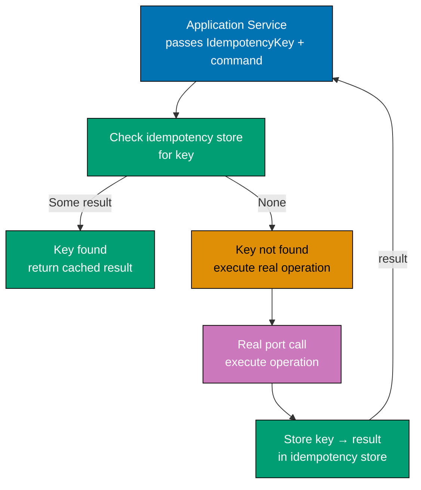

```fsharp
open FsToolkit.ErrorHandling

// ── Idempotency key type ────────────────────────────────────────────────────────
// IdempotencyKey is a single-case DU — prevents passing arbitrary strings as keys.
// Clients generate this key from a UUID or a deterministic hash of the request.
type IdempotencyKey = IdempotencyKey of string
// => Single-case DU: IdempotencyKey "uuid-..." — not just a string
// => Clients must supply the key; the server never generates it on behalf of the client

// ── Idempotency store port ──────────────────────────────────────────────────────
// IdempotencyStore holds two operations: check for a previous result, record a new one.
// Generic over 'output and 'error — works for any port result type.
type IdempotencyStore<'output, 'error> = {
    TryGet : IdempotencyKey -> Async<Result<'output, 'error> option>
    // => TryGet: look up a previous result by key — None means first time seen
    // => Returns the FULL Result (Ok or Error) — idempotency replays errors too
    Set    : IdempotencyKey * Result<'output, 'error> -> Async<unit>
    // => Set: record the result for future replays — fire-and-forget
    // => Stores both Ok and Error results — idempotency is faithful, not just on success
}

// ── Idempotency wrapper ─────────────────────────────────────────────────────────
// withIdempotency wraps any async-result function with idempotency checks.
// The wrapped function accepts an IdempotencyKey alongside its normal input.
// The application service passes the key from the inbound request; domain is unaware.
let withIdempotency
    (store     : IdempotencyStore<'output, 'error>)
    // => Idempotency store port — provides TryGet and Set operations
    (operation : 'input -> Async<Result<'output, 'error>>)
    // => The real port function to wrap — executes only on first call per key
    : IdempotencyKey * 'input -> Async<Result<'output, 'error>> =
    fun (key, input) ->
        // => key: the idempotency key from the client; input: the normal operation input
        async {
            let! previous = store.TryGet key
            // => Check if this key was seen before — TryGet returns Some result or None
            match previous with
            | Some cachedResult ->
                // => Key seen before: replay the cached result — no re-execution
                // => Idempotent replay: same response whether first call or thousandth
                return cachedResult
            | None ->
                // => First time this key is seen: execute the real operation
                let! result = operation input
                // => Execute: may succeed or fail; result is captured for future replays
                do! store.Set (key, result)
                // => Store the result — both Ok and Error are recorded
                // => fire-and-forget: store failure does not block the response
                return result
                // => Return the result from the real operation
        }

// ── In-memory idempotency store ────────────────────────────────────────────────
let makeInMemoryIdempotencyStore<'output, 'error> () : IdempotencyStore<'output, 'error> =
    let cache = System.Collections.Generic.Dictionary<IdempotencyKey, Result<'output, 'error>>()
    // => Dictionary keyed by IdempotencyKey — captures results for replay
    { TryGet = fun key -> async { return cache.TryGetValue(key) |> function | true, v -> Some v | _ -> None }
      // => TryGet: O(1) lookup — Some on hit, None on miss
      Set    = fun (key, result) -> async { cache.[key] <- result }
      // => Set: upsert the result — in-memory adapter always succeeds
    }

// ── Application service using idempotency wrapper ─────────────────────────────
// createOrder is the underlying port — this is the operation we want to make idempotent.
let mutable executionCount = 0
// => Track how many times the real operation executes — should be exactly once per key
let createOrder (orderId: string) : Async<Result<string, string>> =
    async {
        executionCount <- executionCount + 1
        // => Increment on every real execution — idempotency wrapper should prevent re-execution
        printfn "  [createOrder] Executing for orderId=%s (total: %d)" orderId executionCount
        return Ok (sprintf "Order %s created" orderId)
        // => Real operation: creates the order; stub always succeeds
    }

// ── Composition: wrap createOrder with idempotency ────────────────────────────
let idempotencyStore = makeInMemoryIdempotencyStore<string, string> ()
// => Fresh store instance — empty at start
let idempotentCreateOrder = withIdempotency idempotencyStore createOrder
// => idempotentCreateOrder: IdempotencyKey * string -> Async<Result<string, string>>
// => Application service calls this; passes the key from the HTTP Idempotency-Key header

// ── Demonstration ──────────────────────────────────────────────────────────────
let key = IdempotencyKey "client-uuid-abc-123"
// => The client generates this key (e.g. from a UUID) and sends it in the request header

let result1 = idempotentCreateOrder (key, "ORD-001") |> Async.RunSynchronously
// => First call: key unseen → executes real createOrder → stores result
printfn "Call 1: %A" result1
// => Output: [createOrder] Executing for orderId=ORD-001 (total: 1)
// => Output: Call 1: Ok "Order ORD-001 created"

let result2 = idempotentCreateOrder (key, "ORD-001") |> Async.RunSynchronously
// => Second call with same key: cached result replayed — createOrder NOT called again
printfn "Call 2: %A" result2
// => Output: Call 2: Ok "Order ORD-001 created"   (no [createOrder] line — replay, not execution)

printfn "Execution count: %d" executionCount
// => Output: Execution count: 1   (real operation ran exactly once despite two calls)
```

**Key Takeaway**: An idempotency wrapper at the adapter layer makes any port call safe to retry — the real operation executes exactly once per idempotency key, and subsequent calls receive the cached result — without the application service or domain knowing idempotency exists.

**Why It Matters**: Network retries are unavoidable in distributed systems: clients retry on timeout, load balancers retry on 503, and message consumers redeliver on crash. Without idempotency, each retry triggers a duplicate operation: two orders created, two emails sent, two charges processed. An idempotency adapter prevents this at the infrastructure boundary. The application service passes the key from the inbound request; the wrapper handles the rest. Domain logic never needs to reason about duplicates. This is the same principle used by Stripe's API idempotency keys and database advisory locks — applied as a transparent adapter wrapping any port.

---

### Example 53: Audit Log Port

`WriteAuditLog` records every state-changing use case with the actor, action, resource, and timestamp. The application service writes an audit event after every command completes. The production adapter writes to a dedicated audit table. The test adapter records events in a list for assertion — making it easy to verify that an audit entry was written with the correct fields.

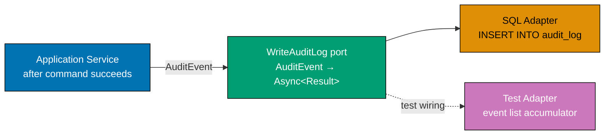

```fsharp
// ── Audit event type ────────────────────────────────────────────────────────────
// AuditEvent is a flat record — serialisable to JSON or SQL without domain types.
// Immutable: audit events are facts — they are never updated or deleted.
type AuditEvent = {
    UserId    : string
    // => Identity of the actor who performed the action — never null; system actions use "system"
    Action    : string
    // => Past-tense verb: "OrderPlaced", "OrderCancelled", "PriceUpdated"
    // => Convention: PascalCase verb + noun — consistent across all use cases
    Resource  : string
    // => The resource affected: "Order:ORD-001", "Product:SKU-42"
    // => Format: Type:Identity — queryable; supports "show all actions on Order ORD-001"
    At        : System.DateTimeOffset
    // => Timestamp of the action — from the clock port; deterministic in tests
    // => ISO 8601 with timezone: DateTimeOffset not DateTime — no ambiguity
}

// ── Audit log port ───────────────────────────────────────────────────────────────
// WriteAuditLog is async: the production adapter writes to a dedicated table.
// Result wraps the operation: audit write failure should surface, not be silently swallowed.
type WriteAuditLog = AuditEvent -> Async<Result<unit, string>>
// => Input:  a complete AuditEvent — all fields populated by the application service
// => Output: Ok () on success, Error message on write failure
// => Async: I/O to the audit table; Result: write failure is named, not thrown

// ── Production adapter (illustrative) ─────────────────────────────────────────
// Real adapter: INSERT INTO audit_log (user_id, action, resource, at) VALUES (...)
// Shown as a stub — illustrates the adapter contract without a live database.
let postgresAuditAdapter : WriteAuditLog =
    fun event ->
        async {
            printfn "[AuditDB] %s | %s | %s | %s" event.UserId event.Action event.Resource (event.At.ToString("o"))
            // => Real adapter: Npgsql INSERT into audit_log table with parameterised query
            // => Stub: prints the event to simulate the write
            return Ok ()
            // => Real adapter: wraps Npgsql exceptions in Error string
        }

// ── In-memory test adapter ─────────────────────────────────────────────────────
// Records every audit event in insertion order — no database, no I/O.
// Factory function: fresh instance per test; no cross-test contamination.
let makeInMemoryAuditLog () =
    let entries = System.Collections.Generic.List<AuditEvent>()
    // => Ordered list — insertion order preserved; audit assertions verify sequence
    let write : WriteAuditLog =
        fun event -> async { entries.Add(event); return Ok () }
    // => write: satisfies WriteAuditLog — same type as postgresAuditAdapter
    write, (fun () -> entries |> Seq.toList)
    // => Returns the port and a read accessor for test assertions

// ── Application service with audit logging ────────────────────────────────────
// placeOrderWithAudit writes an audit event after every state-changing use case.
// Audit is written AFTER the domain action — the log records what actually happened.
let placeOrderWithAudit
    (writeAuditLog : WriteAuditLog)
    // => Audit port: injected — production uses Postgres, tests use in-memory
    (clock         : unit -> System.DateTimeOffset)
    // => Clock port: injected — deterministic in tests
    (userId        : string)
    (orderId       : string) =
    async {
        // Domain action (simplified): always succeeds in this stub
        printfn "[Domain] Order %s placed by %s" orderId userId
        // => Real application service: validate, save, publish event

        // Audit log: written after successful domain action
        let event = {
            UserId   = userId
            // => The actor — from the request context (JWT claim, session)
            Action   = "OrderPlaced"
            // => Past-tense verb: naming convention for audit trail queries
            Resource = sprintf "Order:%s" orderId
            // => Resource format: Type:Identity — queryable per resource
            At       = clock ()
            // => Timestamp from the clock port — deterministic in tests
        }
        let! auditResult = writeAuditLog event
        // => Write audit: after domain action; failure surfaces as Error (not silently swallowed)
        match auditResult with
        | Ok ()  -> return Ok orderId
        // => Both domain action and audit log succeeded
        | Error e -> return Error (sprintf "Audit write failed: %s" e)
        // => Audit failure is surfaced — real system may log-and-continue or require retry
    }

// ── Test: verify audit event was written with correct fields ───────────────────
let auditFn, getAuditEntries = makeInMemoryAuditLog ()
// => auditFn: the port; getAuditEntries: the assertion accessor
let fixedClock = fun () -> System.DateTimeOffset(2026, 1, 1, 0, 0, 0, System.TimeSpan.Zero)
// => Fixed clock: deterministic timestamp for test assertions

let result = placeOrderWithAudit auditFn fixedClock "user-42" "ORD-001" |> Async.RunSynchronously
// => Run the use case with in-memory audit log and fixed clock
printfn "Result:          %A" result
// => Output: [Domain] Order ORD-001 placed by user-42
// => Output: Result:          Ok "ORD-001"

let entries = getAuditEntries ()
// => Retrieve all audit events — should contain exactly one entry
printfn "Audit count:     %d" (List.length entries)
// => Output: Audit count:     1
let entry = List.head entries
// => The single audit entry written by the use case
printfn "Audit userId:    %s" entry.UserId
// => Output: Audit userId:    user-42
printfn "Audit action:    %s" entry.Action
// => Output: Audit action:    OrderPlaced
printfn "Audit resource:  %s" entry.Resource
// => Output: Audit resource:  Order:ORD-001
printfn "Audit at:        %s" (entry.At.ToString("o"))
// => Output: Audit at:        2026-01-01T00:00:00.0000000+00:00
```

**Key Takeaway**: An audit log port makes every state-changing use case auditable without coupling the application service to a specific audit table — and the in-memory adapter makes audit assertions a single `List.head entries` access in tests.

**Why It Matters**: Audit trails are a compliance requirement in financial, healthcare, and government systems. Without an audit port, audit logic is scattered across use cases as direct database calls, making it untestable, inconsistent, and easy to accidentally omit. An injected `WriteAuditLog` port centralises the audit concern: every use case writes one event, the production adapter persists to a dedicated table, and tests assert "exactly one audit event with the correct action and resource was written." When the audit backend changes (table to message queue), only the adapter changes.

---

### Example 54: Metrics Port — Observability from the Application Layer

`RecordMetric : MetricEvent -> unit` is a synchronous, fire-and-forget port — metrics recording never blocks the main pipeline. `MetricEvent` is a DU with cases for each observable outcome: `OrderPlaced of duration`, `OrderFailed of reason`. The production adapter forwards to OpenTelemetry or StatsD. The test adapter records events in a list.

```fsharp
open System

// ── Metric event DU ─────────────────────────────────────────────────────────────
// MetricEvent is owned by the APPLICATION layer — not by OpenTelemetry or StatsD.
// Each DU case carries the payload relevant to that metric: duration for success, reason for failure.
// Adding a new metric: add a new DU case and handle it in the adapters.
type MetricEvent =
    | OrderPlaced of duration: TimeSpan
    // => Success metric: carries the end-to-end duration of the use case
    // => Used to compute p50/p95/p99 latency in the metrics backend
    | OrderFailed of reason: string
    // => Failure metric: carries the error category for alert routing
    // => Used to compute error rate per reason; alert if any reason exceeds threshold

// ── Metrics port ────────────────────────────────────────────────────────────────
// RecordMetric is synchronous and returns unit — fire-and-forget.
// Rationale: metrics recording must NEVER block or fail the main pipeline.
// If the metrics backend is down, the use case still completes successfully.
// Sync: no await overhead; unit: no return value; failure silently dropped.
type RecordMetric = MetricEvent -> unit
// => Input:  a typed MetricEvent — the adapter translates to the backend format
// => Output: unit — no acknowledgment; callers do not check for metric write success

// ── OpenTelemetry production adapter ──────────────────────────────────────────
// Real adapter: creates OTel Histogram instruments at startup; records measurements here.
// Shown as a stub — illustrates the adapter contract without the OTel SDK.
let openTelemetryAdapter : RecordMetric =
    fun event ->
        match event with
        | OrderPlaced duration ->
            // => Real adapter: histogram.Record(duration.TotalMilliseconds, tag("result", "ok"))
            printfn "[OTel] order.placed.duration_ms = %.0f" duration.TotalMilliseconds
        | OrderFailed reason ->
            // => Real adapter: counter.Add(1, tag("reason", reason))
            printfn "[OTel] order.failed reason=%s" reason
// => openTelemetryAdapter: satisfies RecordMetric — same type as the test adapter

// ── In-memory test adapter ─────────────────────────────────────────────────────
// Records every metric event in insertion order — no OTel SDK, no network.
// Factory function: fresh instance per test; no shared mutable state.
let makeInMemoryMetrics () =
    let events = System.Collections.Generic.List<MetricEvent>()
    // => Ordered list: preserves the recording sequence for assertion
    let record : RecordMetric =
        fun event -> events.Add(event)
    // => record: satisfies RecordMetric — sync, always succeeds (unit return)
    record, (fun () -> events |> Seq.toList)
    // => Returns the port and a read accessor for test assertions

// ── Application service with metrics recording ────────────────────────────────
// recordMetric is called AFTER each use case completes — it wraps the result.
// Metrics recording is outside the railway: it observes the result, never changes it.
let placeOrderWithMetrics
    (recordMetric : RecordMetric)
    // => Metrics port: injected — production uses OTel, tests use in-memory
    (orderId      : string) =
    async {
        let start = DateTimeOffset.UtcNow
        // => Start timer before the use case begins — wall-clock time
        // => Real service: would call the domain pipeline here; stub for illustration
        let result =
            if System.String.IsNullOrWhiteSpace(orderId) then
                Error "OrderId blank"
                // => Simulated validation failure — metrics records the failure reason
            else
                Ok orderId
                // => Simulated success — metrics records the duration
        let duration = DateTimeOffset.UtcNow - start
        // => Duration: wall-clock elapsed time from start to result
        match result with
        | Ok _ ->
            recordMetric (OrderPlaced duration)
            // => Success metric: fire-and-forget — does not block; never awaited
        | Error reason ->
            recordMetric (OrderFailed reason)
            // => Failure metric: records the error category, not the full error message
        return result
        // => Return the domain result unchanged — metrics recording is purely observational
    }

// ── Test: verify metrics are recorded without blocking the pipeline ────────────
let recordFn, getMetrics = makeInMemoryMetrics ()
// => recordFn: the port; getMetrics: the assertion accessor

let successResult = placeOrderWithMetrics recordFn "ORD-001" |> Async.RunSynchronously
// => Happy path: OrderPlaced metric recorded
printfn "Success result: %A" successResult
// => Output: Success result: Ok "ORD-001"
printfn "Metrics after success: %A" (getMetrics () |> List.map (fun e -> e.GetType().Name))
// => Output: Metrics after success: ["MetricEvent"]

let metrics = getMetrics ()
// => Retrieve all recorded metrics — should contain exactly one OrderPlaced event
printfn "Metric count:   %d" (List.length metrics)
// => Output: Metric count:   1
match List.head metrics with
| OrderPlaced d -> printfn "OrderPlaced duration: %.4f ms" d.TotalMilliseconds
// => Output: OrderPlaced duration: <some small number> ms  (near-zero for stub)
| OrderFailed r -> printfn "OrderFailed reason: %s" r
// => Would print if the validation failure path was tested

let failResult = placeOrderWithMetrics recordFn "" |> Async.RunSynchronously
// => Failure path: OrderFailed metric recorded
printfn "Fail result:    %A" failResult
// => Output: Fail result:    Error "OrderId blank"
printfn "Total metrics:  %d" (getMetrics () |> List.length)
// => Output: Total metrics:  2  (one success + one failure)
```

**Key Takeaway**: A synchronous, fire-and-forget `RecordMetric` port keeps observability concerns outside the main pipeline — metrics recording never blocks, never fails the use case, and is trivially testable via a list-accumulating in-memory adapter.

**Why It Matters**: Embedding OpenTelemetry SDK calls directly in application service code creates three problems: the service is non-testable without the OTel SDK, a metrics backend failure can propagate into the main pipeline, and the service contains infrastructure knowledge that belongs in the adapter. A `RecordMetric` port solves all three: tests use the in-memory adapter, the synchronous unit-return signature makes fire-and-forget explicit (no `do!`, no `Async.Ignore`), and the OTel adapter can be swapped for StatsD or CloudWatch without touching the service. The DU-based `MetricEvent` type also provides a compile-time inventory of every observable event in the system.

---

### Example 55: Full Integration — All Intermediate Ports Wired Together

`Composition.fs` bootstraps all intermediate ports introduced in this section, creating a production `OrderPorts` record and a test `OrderPorts` record. The production version wires real infrastructure adapters; the test version substitutes all with in-memory stubs in a few lines. The application service is identical in both environments.

```fsharp
open System
open FsToolkit.ErrorHandling

// ── Shared types ───────────────────────────────────────────────────────────────
type OrderId  = string
// => Simple alias — distinguishes order identity from other string fields
type Order    = { OrderId: OrderId; Quantity: decimal; PlacedAt: DateTimeOffset }
// => Domain aggregate — stores the timestamp to support idempotency and audit
type AppError =
    | ValidationFailed of string
    // => Input rejected before any I/O
    | SaveFailed       of string
    // => Repository adapter failed to persist
    | NotifyFailed     of string
    // => Notification adapter failed to deliver
    | PublishFailed    of string
    // => Event bus adapter failed to publish

// ── Port types ──────────────────────────────────────────────────────────────────
type SaveOrder        = Order  -> Async<Result<unit, AppError>>
// => Persist port: upsert semantics — Postgres in production
type SendNotification = OrderId -> Async<Result<unit, AppError>>
// => Notification port: email/SMS — SMTP in production
type GetCurrentTime   = unit    -> DateTimeOffset
// => Clock port: injectable time source — deterministic in tests
type LogEvent         = string  -> unit
// => Logger port: synchronous fire-and-forget — Serilog in production
type PublishEvent     = OrderId -> Async<Result<unit, AppError>>
// => Event bus port: domain events — RabbitMQ in production
type IsFeatureEnabled = string  -> Async<bool>
// => Feature flag port: trunk-based safety valve — env vars in production
type WriteAuditLog    = OrderId -> string -> Async<Result<unit, AppError>>
// => Audit log port: compliance trail — dedicated audit table in production
type RecordMetric     = string  -> unit
// => Metrics port: observability — OpenTelemetry in production

// ── OrderPorts record — all ports in one injectable value ─────────────────────
// A single record bundles every port the application service needs.
// One injection: the composition root constructs this record; the service uses it.
// Test substitution: replace the entire record or any field independently.
type OrderPorts = {
    SaveOrder        : SaveOrder
    // => Repository port: persist the order — PostgreSQL in production
    SendNotification : SendNotification
    // => Notification port: email/SMS the customer — SMTP in production
    GetCurrentTime   : GetCurrentTime
    // => Clock port: injectable time source — system clock in production
    LogEvent         : LogEvent
    // => Logger port: structured logging — Serilog in production
    PublishEvent     : PublishEvent
    // => Event publishing port: domain events to message bus — RabbitMQ in production
    IsFeatureEnabled : IsFeatureEnabled
    // => Feature flag port: A/B and trunk-based safety valves — env vars in production
    WriteAuditLog    : WriteAuditLog
    // => Audit log port: compliance trail — dedicated audit table in production
    RecordMetric     : RecordMetric
    // => Metrics port: observability — OpenTelemetry in production
}

// ── Application service ─────────────────────────────────────────────────────────
// placeOrder accepts a single OrderPorts record — all ports in one value.
// The service is identical in production and tests; only the ports change.
let placeOrder (ports: OrderPorts) (orderId: OrderId) (qty: decimal) =
    asyncResult {
        // Guard: validation
        if String.IsNullOrWhiteSpace(orderId) then
            return! Error (ValidationFailed "OrderId blank") |> async.Return
        // => Domain rule: blank OrderId rejected before any I/O

        // Feature flag: choose pricing algorithm
        let! useNewAlgo = ports.IsFeatureEnabled "new-pricing-algorithm"
        // => Flag checked here: application layer, not domain
        let total = if useNewAlgo then qty * 9.99m * 0.9m else qty * 9.99m
        // => New algorithm: 10% discount; legacy: no discount

        // Clock: timestamp the order
        let now   = ports.GetCurrentTime ()
        // => Deterministic in tests (fixedClock), real-time in production (systemClock)
        let order = { OrderId = orderId; Quantity = qty; PlacedAt = now }
        // => Construct the order with the injected timestamp

        // Save: persist the order
        do! ports.SaveOrder order
        // => Output port: persists to PostgreSQL in production, dictionary in tests

        // Notify: email the customer
        do! ports.SendNotification orderId
        // => Output port: SMTP in production, list accumulator in tests

        // Publish: emit domain event
        do! ports.PublishEvent orderId
        // => Output port: RabbitMQ in production, list accumulator in tests

        // Audit: record the use case completion
        do! ports.WriteAuditLog orderId "OrderPlaced"
        // => Audit port: dedicated table in production, list accumulator in tests

        // Log: structured observability
        ports.LogEvent (sprintf "Order %s placed; total=%.2f" orderId total)
        // => Synchronous log: Serilog in production, list accumulator in tests

        // Metrics: fire-and-forget performance data
        ports.RecordMetric "order.placed"
        // => Synchronous metric: OpenTelemetry in production, list accumulator in tests

        return order
        // => Happy path: return the placed order to the caller
    }

// ── Production ports (wires real infrastructure adapters) ─────────────────────
// In a real project: each adapter imports the relevant SDK (Npgsql, Serilog, etc.)
// Here: stubs that print to demonstrate the wiring pattern.
let productionPorts : OrderPorts = {
    SaveOrder        = fun o  -> async { printfn "[PG] Saving %s"      o.OrderId; return Ok () }
    // => Real: Npgsql INSERT INTO orders ...
    SendNotification = fun id -> async { printfn "[SMTP] Notifying %s" id;        return Ok () }
    // => Real: SmtpClient.SendMailAsync(...)
    GetCurrentTime   = fun () -> DateTimeOffset.UtcNow
    // => Real: system wall-clock — non-deterministic
    LogEvent         = fun msg -> printfn "[Serilog] %s" msg
    // => Real: Log.Information(msg) via Serilog
    PublishEvent     = fun id -> async { printfn "[RMQ] Publishing %s" id;        return Ok () }
    // => Real: channel.BasicPublish(...) via RabbitMQ.Client
    IsFeatureEnabled = fun f  -> async { return System.Environment.GetEnvironmentVariable(f) = "true" }
    // => Real: reads env var FEATURE_FLAG_<NAME>; LaunchDarkly in advanced setups
    WriteAuditLog    = fun id action -> async { printfn "[AuditDB] %s %s" action id; return Ok () }
    // => Real: INSERT INTO audit_log (order_id, action, at) VALUES (...)
    RecordMetric     = fun key -> printfn "[OTel] metric=%s" key
    // => Real: histogram.Record(...) or counter.Add(1) via OTel SDK
}

// ── Test ports (all in-memory stubs — few lines, full control) ────────────────
// Every adapter is replaced with a simple in-memory stub.
// The entire test environment is constructed in under 10 lines.
let saved        = Collections.Generic.List<Order>()
let notified     = Collections.Generic.List<OrderId>()
let published    = Collections.Generic.List<OrderId>()
let auditEntries = Collections.Generic.List<OrderId * string>()
let logEntries   = Collections.Generic.List<string>()
let metricEvents = Collections.Generic.List<string>()

let testPorts : OrderPorts = {
    SaveOrder        = fun o  -> async { saved.Add(o);                     return Ok () }
    // => In-memory: captures saved orders for assertion
    SendNotification = fun id -> async { notified.Add(id);                 return Ok () }
    // => In-memory: captures notified IDs for assertion
    GetCurrentTime   = fun () -> DateTimeOffset(2026, 1, 1, 0, 0, 0, TimeSpan.Zero)
    // => Fixed clock: deterministic; test assertions use this literal value
    LogEvent         = fun msg -> logEntries.Add(msg)
    // => In-memory: captures log messages for assertion
    PublishEvent     = fun id -> async { published.Add(id);                return Ok () }
    // => In-memory: captures published event IDs for assertion
    IsFeatureEnabled = fun f  -> async { return f = "new-pricing-algorithm" }
    // => Fixed flags: new-pricing-algorithm always enabled in tests; others off
    WriteAuditLog    = fun id action -> async { auditEntries.Add((id, action)); return Ok () }
    // => In-memory: captures audit entries for assertion
    RecordMetric     = fun key -> metricEvents.Add(key)
    // => In-memory: captures metric keys for assertion
}

// ── Demonstration: production ports ───────────────────────────────────────────
printfn "\n=== Production ports ==="
let prodResult = placeOrder productionPorts "ORD-001" 3m |> Async.RunSynchronously
// => Runs the full use case with production-style stubs
printfn "Production result: %A" prodResult
// => Output: [PG] Saving ORD-001
// => Output: [SMTP] Notifying ORD-001
// => Output: [RMQ] Publishing ORD-001
// => Output: [AuditDB] OrderPlaced ORD-001
// => Output: [Serilog] Order ORD-001 placed; total=26.97
// => Output: [OTel] metric=order.placed
// => Output: Production result: Ok { OrderId = "ORD-001"; Quantity = 3M; PlacedAt = <now> }

// ── Demonstration: test ports ──────────────────────────────────────────────────
printfn "\n=== Test ports ==="
let testResult = placeOrder testPorts "ORD-002" 2m |> Async.RunSynchronously
// => Runs the same use case with all in-memory adapters
printfn "Test result:    %A" testResult
// => Output: Test result:    Ok { OrderId = "ORD-002"; Quantity = 2M; PlacedAt = 2026-01-01T00:00:00+00:00 }
printfn "Saved:          %d orders"  (saved |> Seq.length)
// => Output: Saved:          1 orders
printfn "Notified:       %A"         (notified |> Seq.toList)
// => Output: Notified:       ["ORD-002"]
printfn "Published:      %A"         (published |> Seq.toList)
// => Output: Published:      ["ORD-002"]
printfn "Audit entries:  %A"         (auditEntries |> Seq.toList)
// => Output: Audit entries:  [("ORD-002", "OrderPlaced")]
printfn "Log entries:    %d"         (logEntries |> Seq.length)
// => Output: Log entries:    1
printfn "Metric events:  %A"         (metricEvents |> Seq.toList)
// => Output: Metric events:  ["order.placed"]
```

**Key Takeaway**: A single `OrderPorts` record bundles all infrastructure ports — production wires real adapters, tests substitute all with in-memory stubs in ten lines — and the application service is identical in both environments, demonstrating hexagonal architecture's core promise.

**Why It Matters**: The composition root is where hexagonal architecture pays its full dividend. Every design decision made across Examples 26–54 — separating port types, using record-of-functions, making clocks injectable, keeping metrics synchronous — converges into a single substitution: swap `productionPorts` for `testPorts`. The application service code does not change. The domain functions do not change. The only difference is the concrete values injected at the boundary. This is testability without mocks: the test environment is plain F# values, and the production environment is real infrastructure adapters. Both environments run the same application service code, so what is tested is what is deployed.
