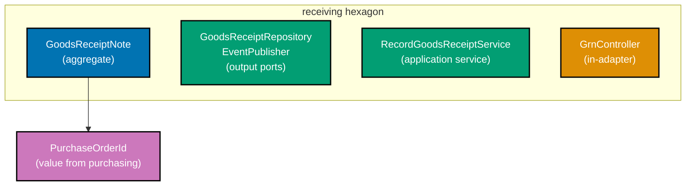

Examples 56–75 cover advanced hexagonal design in the `procurement-platform-be` domain: wiring `receiving`, `invoicing`, and `payments` contexts together, building `BankingPort` with retry and circuit-breaker decorator adapters, emitting metrics through an `Observability` port, notifying suppliers via `SupplierNotifierPort`, writing anti-corruption layers between contexts, versioning ports without breaking adapters, and recognising hexagonal anti-patterns to avoid. Every code block is self-contained. Annotation density targets 1.0–2.25 comment lines per code line per example.

## Multi-Context Wiring (Examples 56–60)

### Example 56: Receiving context — GoodsReceiptNote aggregate and port

The `receiving` context owns `GoodsReceiptNote`, which records physical delivery of goods against a `PurchaseOrder`. Its only coupling to the `purchasing` context is the `PurchaseOrderId` value object — a plain string wrapper with no business logic borrowed from purchasing's domain.



```java
// Package: com.example.procurement.receiving.domain
// => receiving context; imports only java.* — no purchasing.domain.* allowed
// => PurchaseOrderId is a plain value object shared by value, not by reference

public record PurchaseOrderId(String value) {
    // => canonical validation — enforces format at construction time
    // => format: po_<uuid>; rejects empty or badly-shaped ids immediately
    public PurchaseOrderId {
        if (value == null || !value.startsWith("po_"))  // => guard: null or wrong prefix
            throw new IllegalArgumentException("PurchaseOrderId must start with po_"); // => fail fast
    }
}

public record GrnId(String value) {}               // => receiving's own identity type
public record Quantity(int value, String unit) {}  // => unit: EACH, BOX, KG, LITRE, HOUR

// GoodsReceiptNote aggregate: immutable record capturing a delivery event
// => All fields final by record semantics; business methods return new instances
public record GoodsReceiptNote(
    GrnId id,                // => receiving's own id; format: grn_<uuid>
    PurchaseOrderId poId,    // => links to the purchasing PO; value only, no PO object
    Quantity received,       // => actual quantity delivered
    boolean discrepancy      // => true if received qty differs from ordered qty
) {
    // => Factory method: keeps construction logic out of callers
    // => validates received quantity is positive before creating the GRN
    public static GoodsReceiptNote record(GrnId id, PurchaseOrderId poId, Quantity received,
                                          int orderedQty) {
        boolean discrepancy = received.value() != orderedQty; // => simple equality check
        // => discrepancy flag triggers GoodsReceiptDiscrepancyDetected event downstream
        return new GoodsReceiptNote(id, poId, received, discrepancy);
        // => returns immutable aggregate; caller persists via GoodsReceiptRepository port
    }
}

// Output port: store and load GoodsReceiptNotes
// => Adapter wires to Postgres; test adapter uses in-memory Map
interface GoodsReceiptRepository {
    void save(GoodsReceiptNote grn);                // => persist new or updated GRN
    java.util.Optional<GoodsReceiptNote> findById(GrnId id);  // => Optional: may not exist
}
```

**Key Takeaway**: `receiving` imports `PurchaseOrderId` as a value object only — the context boundary stays clean because no `PurchaseOrder` aggregate object crosses the line.

**Why It Matters**: Sharing a typed ID wrapper (not the full aggregate) lets `receiving` reference purchasing orders without importing purchasing's business rules. If purchasing's approval logic changes, receiving compiles unchanged. Each context owns its domain model independently, so teams can deploy them separately without coordination.

---

### Example 57: Invoicing context — three-way match port

`invoicing` registers a supplier invoice and attempts to match it against a `PurchaseOrder` and a `GoodsReceiptNote`. The matching logic lives entirely inside the domain; the three IDs arrive as plain values, and the `InvoiceMatchingPort` output port abstracts the cross-context data fetch needed by the application service.

```java
// Package: com.example.procurement.invoicing.domain
// => Three value objects referencing other contexts by id only — no cross-context imports
public record PurchaseOrderId(String value) {}    // => local copy; format po_<uuid>
public record GrnId(String value) {}              // => local copy; format grn_<uuid>
public record InvoiceId(String value) {}          // => invoicing's own id; format inv_<uuid>

// Money: shared value semantic — amount in minor units + ISO 4217 currency code
// => Using long centAmount avoids floating-point rounding on financial values
public record Money(long centAmount, String currency) {
    public boolean isWithinTolerance(Money other, double maxPct) {
        // => tolerance check: |this - other| / other ≤ maxPct
        long diff = Math.abs(this.centAmount - other.centAmount); // => absolute difference
        return diff <= (long)(other.centAmount * maxPct);         // => within tolerance?
    }
}

// Invoice aggregate: owns three-way match state machine
// => States: Registered → Matching → Matched | Disputed → ScheduledForPayment → Paid
public record Invoice(
    InvoiceId id,
    PurchaseOrderId poId,     // => the PO this invoice covers
    GrnId grnId,              // => the GRN proving delivery occurred
    Money invoicedAmount,     // => what the supplier claims
    InvoiceStatus status      // => domain enum; never a String
) {
    public enum InvoiceStatus { REGISTERED, MATCHING, MATCHED, DISPUTED }

    // Domain method: attempt three-way match
    // => Returns new Invoice with updated status — immutable; no mutation
    public Invoice attemptMatch(Money poAmount, Money grnVerifiedAmount, double tolerancePct) {
        boolean poMatch = this.invoicedAmount.isWithinTolerance(poAmount, tolerancePct);
        // => poMatch: invoice amount close enough to PO committed amount?
        boolean grnMatch = this.invoicedAmount.isWithinTolerance(grnVerifiedAmount, tolerancePct);
        // => grnMatch: invoice amount close enough to what was actually received?
        InvoiceStatus next = (poMatch && grnMatch) ? InvoiceStatus.MATCHED : InvoiceStatus.DISPUTED;
        // => next status: MATCHED only if both comparisons pass within tolerance
        return new Invoice(id, poId, grnId, invoicedAmount, next);
        // => returns new immutable Invoice; caller persists the new version
    }
}

// Output port: fetch amounts needed for three-way match from other contexts
// => Application service calls this port; adapter fetches from Postgres views or APIs
interface InvoiceMatchingPort {
    Money fetchPoCommittedAmount(PurchaseOrderId poId);   // => purchasing context data
    Money fetchGrnVerifiedAmount(GrnId grnId);            // => receiving context data
}
```

**Key Takeaway**: Three-way match logic lives in the domain; the `InvoiceMatchingPort` output port abstracts where the PO and GRN amounts come from.

**Why It Matters**: Keeping the match algorithm in the domain means it is testable with pure Java — no database, no network. The port boundary means production adapters can fetch from a Postgres materialized view while test adapters return hard-coded values in microseconds.

---

### Example 58: Payments context — Payment aggregate and BankingPort

`payments` schedules and disburses supplier payments. `BankingPort` is the critical output port that abstracts the bank API. The application service calls `BankingPort.disburse()` without knowing whether the underlying adapter uses REST, SWIFT, or an in-memory stub.

```java
// Package: com.example.procurement.payments.domain
public record PaymentId(String value) {}           // => format: pay_<uuid>
public record InvoiceId(String value) {}           // => local copy for cross-context reference
public record BankAccount(String iban, String bic) {
    // => IBAN: up to 34 alphanumeric chars; BIC: 8 or 11 chars (ISO 9362)
    public BankAccount {
        if (iban == null || iban.isBlank()) throw new IllegalArgumentException("IBAN required");
        // => IBAN must be non-blank; production would validate checksum via library
        if (bic == null || (bic.length() != 8 && bic.length() != 11))
            throw new IllegalArgumentException("BIC must be 8 or 11 chars");
        // => BIC length rule from ISO 9362; catches typos early
    }
}
public record Money(long centAmount, String currency) {}

public record Payment(
    PaymentId id,
    InvoiceId invoiceId,       // => which invoice this payment settles
    Money amount,              // => amount disbursed
    BankAccount destination,   // => supplier's bank account
    PaymentStatus status       // => Scheduled → Disbursed | Failed | Reversed
) {
    public enum PaymentStatus { SCHEDULED, DISBURSED, FAILED }
}

// Output port: initiate a real bank disbursement
// => Adapter: RestBankingAdapter calls bank REST API with retry
// => Test adapter: InMemoryBankingAdapter records calls for assertion
interface BankingPort {
    DisbursementResult disburse(PaymentId id, Money amount, BankAccount to);
    // => Returns result immediately; async confirmation arrives via WebhookAdapter later

    record DisbursementResult(String transactionRef, boolean accepted) {}
    // => transactionRef: bank's own reference number for reconciliation
    // => accepted: false means bank rejected (insufficient funds, invalid IBAN, etc.)
}

// Application service: orchestrates payment disbursement
// => Calls BankingPort; on success persists updated Payment; publishes PaymentDisbursed event
class DisbursementService {
    private final BankingPort bankingPort;          // => injected at composition root
    private final PaymentRepository paymentRepo;    // => output port for persistence
    private final EventPublisher events;            // => output port for domain events

    DisbursementService(BankingPort bankingPort, PaymentRepository paymentRepo,
                        EventPublisher events) {
        this.bankingPort = bankingPort;             // => store injected dependency
        this.paymentRepo = paymentRepo;             // => store injected dependency
        this.events = events;                       // => store injected dependency
    }

    Payment disburse(Payment scheduled) {
        var result = bankingPort.disburse(             // => delegate to bank adapter
            scheduled.id(), scheduled.amount(), scheduled.destination());
        // => result: DisbursementResult with transactionRef and accepted flag
        var next = result.accepted()
            ? new Payment(scheduled.id(), scheduled.invoiceId(), scheduled.amount(),
                          scheduled.destination(), Payment.PaymentStatus.DISBURSED)
            : new Payment(scheduled.id(), scheduled.invoiceId(), scheduled.amount(),
                          scheduled.destination(), Payment.PaymentStatus.FAILED);
        // => next: new Payment record with updated status; original is unchanged
        paymentRepo.save(next);                        // => persist updated payment
        if (result.accepted()) events.publish(new PaymentDisbursed(scheduled.id())); // => emit event
        return next;                                   // => return updated aggregate to caller
    }
}
```

**Key Takeaway**: `BankingPort` decouples the payments application service from any specific banking technology — swap REST for SWIFT by providing a new adapter, no service change needed.

**Why It Matters**: Payment infrastructure is the most volatile part of a P2P system. Banks change APIs, certification requirements evolve, and disaster recovery may require switching providers. Hiding this behind a port means a provider switch is an adapter swap — the domain logic, tests, and all other adapters remain untouched.

---

### Example 59: SupplierNotifierPort — email and EDI fallback

`SupplierNotifierPort` abstracts outbound notifications to suppliers. One adapter uses SMTP; a fallback adapter uses EDI. The application service never knows which transport is active.

```java
// Package: com.example.procurement.shared.ports
// => Shared output port — used by purchasing, receiving, invoicing, payments
public interface SupplierNotifierPort {
    void notifyPurchaseOrderIssued(SupplierId supplierId, PurchaseOrderId poId);
    // => Sends PO to supplier; SMTP adapter sends PDF attachment; EDI adapter sends X12 850
    void notifyPaymentDisbursed(SupplierId supplierId, PaymentId paymentId, Money amount);
    // => Remittance advice; SMTP adapter sends HTML email; EDI adapter sends X12 820
    void notifyDiscrepancy(SupplierId supplierId, GrnId grnId, String reason);
    // => Dispute notification; always sent via preferred channel of supplier

    record SupplierId(String value) {}            // => format: sup_<uuid>
    record PurchaseOrderId(String value) {}       // => cross-context reference by value
    record PaymentId(String value) {}             // => cross-context reference by value
    record GrnId(String value) {}                 // => cross-context reference by value
    record Money(long centAmount, String currency) {} // => amount for remittance advice
}

// SMTP adapter: production implementation for email-capable suppliers
// => Annotated @Component at composition root only; domain and application layers see the interface
class SmtpSupplierNotifierAdapter implements SupplierNotifierPort {
    private final SmtpClient smtp;                // => injected email client
    SmtpSupplierNotifierAdapter(SmtpClient smtp) { this.smtp = smtp; }

    @Override
    public void notifyPurchaseOrderIssued(SupplierId supplierId, PurchaseOrderId poId) {
        smtp.send(supplierId.value() + "@supplier.example",  // => supplier email lookup simplified
                  "PO Issued: " + poId.value(),
                  "Your purchase order " + poId.value() + " has been issued.");
        // => send: delegates to SMTP client; throws SmtpException on failure
    }

    @Override
    public void notifyPaymentDisbursed(SupplierId supplierId, PaymentId paymentId, Money amount) {
        smtp.send(supplierId.value() + "@supplier.example",
                  "Payment Sent: " + paymentId.value(),
                  "Payment of " + amount.centAmount() + " " + amount.currency() + " disbursed.");
        // => remittance advice via email; EDI fallback kicks in if this adapter throws
    }

    @Override
    public void notifyDiscrepancy(SupplierId supplierId, GrnId grnId, String reason) {
        smtp.send(supplierId.value() + "@supplier.example",
                  "GRN Discrepancy: " + grnId.value(), reason);
        // => discrepancy notification; supplier should respond within SLA window
    }
}

// Minimal stub for demonstration (replaces SmtpClient in examples)
interface SmtpClient { void send(String to, String subject, String body); }
```

**Key Takeaway**: `SupplierNotifierPort` hides email vs EDI behind a single interface; swapping transport is an adapter replacement, not a domain change.

**Why It Matters**: Supplier communication channels vary — some suppliers accept email, others require EDI X12 or EDIFACT. Some prefer API webhooks. Abstracting this behind a port means the purchasing application service calls `notifyPurchaseOrderIssued` once, and the adapter layer decides channel. Adding EDI support means adding one adapter class, not touching the application service.

---

### Example 60: Observability port — metrics and traces without framework lock-in

An `Observability` output port abstracts OpenTelemetry, Prometheus, or any tracing library from the application service. The service reports business metrics without importing OTel classes.

```java
// Package: com.example.procurement.shared.ports
// => Observability port: application services emit domain events as metrics/spans
// => Adapter wires OpenTelemetry SDK; test adapter collects calls for assertion
public interface Observability {
    // => counter: increments a named counter with labels
    void incrementCounter(String name, java.util.Map<String,String> labels);
    // => recordDuration: records elapsed time for a named operation
    void recordDuration(String operation, long millis, java.util.Map<String,String> labels);
    // => span: wraps a supplier call in a named trace span; returns span result
    <T> T span(String spanName, java.util.concurrent.Callable<T> block) throws Exception;
}

// OpenTelemetry adapter: production wiring to OTel SDK
// => Domain and application see only Observability interface; OTel API never leaks inward
class OtelObservabilityAdapter implements Observability {
    // => In production: inject OpenTelemetry tracer and meter beans here
    // => Omitted for brevity — real adapter calls Tracer.spanBuilder(...).startSpan()

    @Override
    public void incrementCounter(String name, java.util.Map<String,String> labels) {
        System.out.println("[OTel] counter " + name + " labels=" + labels);
        // => real impl: LongCounter.add(1, Attributes.of(...)); OTel SDK batches and exports
    }

    @Override
    public void recordDuration(String operation, long millis, java.util.Map<String,String> labels) {
        System.out.println("[OTel] histogram " + operation + " " + millis + "ms labels=" + labels);
        // => real impl: LongHistogram.record(millis, Attributes.of(...));
    }

    @Override
    public <T> T span(String spanName, java.util.concurrent.Callable<T> block) throws Exception {
        System.out.println("[OTel] span start: " + spanName); // => span opened
        T result = block.call();                               // => execute wrapped operation
        System.out.println("[OTel] span end: " + spanName);   // => span closed on exit
        return result;                                         // => return result to caller
    }
}

// Application service using Observability port
// => No OTel import; service is testable with a no-op adapter
class MatchInvoiceService {
    private final Observability obs;                 // => injected observability port
    private final InvoiceRepository repo;            // => injected repo port
    MatchInvoiceService(Observability obs, InvoiceRepository repo) {
        this.obs = obs;   // => store injected dependency
        this.repo = repo; // => store injected dependency
    }

    void match(InvoiceId id, Money poAmount, Money grnAmount) throws Exception {
        obs.span("invoicing.match", () -> {          // => wraps entire match in a trace span
            var invoice = repo.findById(id).orElseThrow(); // => load from repository
            var matched = invoice.attemptMatch(poAmount, grnAmount, 0.02); // => 2% tolerance
            repo.save(matched);                       // => persist updated invoice
            obs.incrementCounter("invoice.match.result",  // => emit outcome counter
                java.util.Map.of("status", matched.status().name())); // => label with status
            return matched;                           // => span result
        });
    }
}
```

**Key Takeaway**: The `Observability` port keeps OTel imports out of the application layer, making the service testable with a no-op adapter and portable across monitoring backends.

**Why It Matters**: Observability libraries (OTel, Micrometer, Datadog Agent) change major versions and evolve APIs. If the application service imports `io.opentelemetry.*` directly, every SDK upgrade forces recompilation and potential refactors across use cases. Behind a port, upgrading OTel means updating one adapter file.

---

## Decorator Adapters (Examples 61–64)

### Example 61: RetryingBankingAdapter — retry decorator for BankingPort

A decorator wraps an existing adapter and adds retry logic without modifying the underlying adapter or the port interface. The application service sees only `BankingPort`; the retry behaviour is invisible to it.

```mermaid
%% Palette: Blue #0173B2, Teal #029E73, Orange #DE8F05, Purple #CC78BC
graph LR
    SVC["DisbursementService\n#40;application#41;"]:::teal
    RET["RetryingBankingAdapter\n#40;decorator#41;"]:::orange
    REST["RestBankingAdapter\n#40;real adapter#41;"]:::blue
    BANK["Bank REST API\n#40;external#41;"]:::purple

    SVC -->|"BankingPort.disburse"| RET
    RET -->|"delegate with retry"| REST
    REST -->|"HTTP POST"| BANK

    classDef teal fill:#029E73,stroke:#000,color:#fff,stroke-width:2px
    classDef orange fill:#DE8F05,stroke:#000,color:#fff,stroke-width:2px
    classDef blue fill:#0173B2,stroke:#000,color:#fff,stroke-width:2px
    classDef purple fill:#CC78BC,stroke:#000,color:#fff,stroke-width:2px
```



```java
// RetryingBankingAdapter: decorator pattern — wraps any BankingPort with retry
// => Implements BankingPort itself, so it is transparent to DisbursementService
class RetryingBankingAdapter implements BankingPort {
    private final BankingPort delegate;    // => wrapped real adapter (RestBankingAdapter)
    private final int maxAttempts;         // => total tries before giving up; typically 3
    private final long retryDelayMs;       // => fixed delay between attempts; ms

    RetryingBankingAdapter(BankingPort delegate, int maxAttempts, long retryDelayMs) {
        this.delegate = delegate;          // => store wrapped adapter for delegation
        this.maxAttempts = maxAttempts;    // => store retry limit
        this.retryDelayMs = retryDelayMs;  // => store delay; production uses exponential backoff
    }

    @Override
    public DisbursementResult disburse(PaymentId id, Money amount, BankAccount to) {
        for (int attempt = 1; attempt <= maxAttempts; attempt++) {
            // => attempt loop: try up to maxAttempts times before propagating exception
            try {
                DisbursementResult result = delegate.disburse(id, amount, to); // => delegate
                System.out.println("[Retry] attempt " + attempt + " succeeded");
                // => Output: [Retry] attempt N succeeded
                return result; // => success: return immediately; no further attempts
            } catch (RuntimeException ex) {
                System.out.println("[Retry] attempt " + attempt + " failed: " + ex.getMessage());
                // => Output: [Retry] attempt N failed: <error>
                if (attempt == maxAttempts) throw ex; // => exhausted: re-throw to caller
                sleep(retryDelayMs);                  // => wait before next attempt
            }
        }
        throw new IllegalStateException("unreachable"); // => compiler satisfaction; loop covers all paths
    }

    private void sleep(long ms) {
        try { Thread.sleep(ms); }
        catch (InterruptedException e) { Thread.currentThread().interrupt(); }
        // => restore interrupted flag; do not swallow InterruptedException silently
    }
}

// Composition root wiring (Spring @Configuration or manual)
// => DisbursementService never sees RetryingBankingAdapter or RestBankingAdapter
// => It only knows BankingPort; wiring is an adapter-layer concern
class PaymentsConfig {
    BankingPort bankingPort() {
        BankingPort real = new RestBankingAdapter();                // => real HTTP adapter
        return new RetryingBankingAdapter(real, 3, 500L);          // => wrap with 3 retries, 500ms delay
        // => DisbursementService receives a BankingPort; retry is invisible to it
    }
}
```

**Key Takeaway**: The decorator pattern adds cross-cutting behaviour (retry) by wrapping the adapter, not by modifying the port interface or the application service.

**Why It Matters**: Bank APIs are unreliable — network glitches, rate limits, and transient timeouts are common. Adding retry in the application service contaminates business logic with infrastructure concerns. The decorator keeps retry isolated to the adapter layer and makes it composable: stack `RetryingBankingAdapter` around `CircuitBreakingBankingAdapter` around `RestBankingAdapter` without changing any interface.

---

### Example 62: CircuitBreakingBankingAdapter — circuit-breaker decorator

A circuit-breaker decorator sits around the retry decorator and prevents cascading failures. When the bank API fails repeatedly, the circuit opens and subsequent calls fail fast without hitting the API, giving the bank time to recover.

```java
// CircuitBreakingBankingAdapter: decorator wrapping BankingPort
// => States: CLOSED (normal), OPEN (failing fast), HALF_OPEN (probing)
// => Implements BankingPort — transparent to DisbursementService
class CircuitBreakingBankingAdapter implements BankingPort {
    private enum CircuitState { CLOSED, OPEN, HALF_OPEN }

    private final BankingPort delegate;          // => wrapped adapter (may be RetryingBankingAdapter)
    private final int failureThreshold;          // => trips to OPEN after this many consecutive failures
    private final long recoveryWindowMs;         // => time to wait in OPEN before probing (HALF_OPEN)
    private CircuitState state = CircuitState.CLOSED; // => initial state: allow all calls
    private int consecutiveFailures = 0;         // => failure counter; reset on success
    private long openedAtMs = 0;                 // => timestamp when circuit opened

    CircuitBreakingBankingAdapter(BankingPort delegate, int failureThreshold, long recoveryWindowMs) {
        this.delegate = delegate;                // => wrapped adapter for delegation
        this.failureThreshold = failureThreshold; // => e.g., 5 consecutive failures → OPEN
        this.recoveryWindowMs = recoveryWindowMs; // => e.g., 30_000L (30 seconds)
    }

    @Override
    public synchronized DisbursementResult disburse(PaymentId id, Money amount, BankAccount to) {
        if (state == CircuitState.OPEN) {        // => circuit is open: fail fast
            if (System.currentTimeMillis() - openedAtMs > recoveryWindowMs) {
                state = CircuitState.HALF_OPEN;  // => recovery window elapsed: probe once
                System.out.println("[Circuit] state → HALF_OPEN; probing bank API");
            } else {
                throw new RuntimeException("[Circuit] OPEN: bank API calls blocked"); // => fail fast
                // => caller receives failure immediately; bank not contacted; latency: microseconds
            }
        }
        try {
            DisbursementResult result = delegate.disburse(id, amount, to); // => delegate call
            consecutiveFailures = 0;             // => success: reset failure counter
            state = CircuitState.CLOSED;         // => success: close circuit (or keep closed)
            System.out.println("[Circuit] call succeeded; state=" + state);
            return result;                       // => return successful result to caller
        } catch (RuntimeException ex) {
            consecutiveFailures++;               // => increment failure counter
            if (consecutiveFailures >= failureThreshold) {
                state = CircuitState.OPEN;       // => threshold exceeded: open circuit
                openedAtMs = System.currentTimeMillis(); // => record when circuit opened
                System.out.println("[Circuit] state → OPEN after " + consecutiveFailures + " failures");
            }
            throw ex;                            // => propagate exception to caller
        }
    }
}

// Composition root: stack decorator chain
// => DisbursementService injects BankingPort; sees no retry or circuit-breaker logic
class PaymentsConfig2 {
    BankingPort bankingPort() {
        BankingPort real  = new RestBankingAdapter();                    // => real HTTP adapter
        BankingPort retry = new RetryingBankingAdapter(real, 3, 500L);  // => 3 retries
        return new CircuitBreakingBankingAdapter(retry, 5, 30_000L);    // => trips after 5 failures
        // => call chain: circuit-breaker → retry → REST adapter → bank API
    }
}
```

**Key Takeaway**: Stack circuit-breaker over retry over the real adapter using the decorator pattern — each layer is independently testable and composable.

**Why It Matters**: Without a circuit-breaker, retries during a full bank outage hammer an already-failing API and exhaust thread pools. The circuit-breaker breaks the cascade: after five failures it opens, and all subsequent calls fail in microseconds. The 30-second recovery window lets the bank stabilise before the next probe. The entire mechanism is invisible to the application service.

---

### Example 63: Anti-corruption layer — receiving context translating purchasing events

When `receiving` consumes `PurchaseOrderIssued` from the purchasing context event bus, it must not import purchasing's domain types. An anti-corruption layer (ACL) in the adapter layer translates the external event DTO into receiving's own commands.

```java
// ── purchasing hexagon publishes this event DTO to the bus ────────────────────
// Package: com.example.procurement.purchasing.events (event schema package)
// => Shared only as a DTO; receiving imports this DTO, not any purchasing domain type
record PurchaseOrderIssuedDto(
    String purchaseOrderId,    // => po_<uuid>; plain String in the DTO
    String supplierId,         // => sup_<uuid>; plain String in the DTO
    int    quantityOrdered,    // => ordered quantity
    String unitOfMeasure       // => EACH, BOX, KG, LITRE, HOUR
) {}

// ── receiving hexagon anti-corruption layer ───────────────────────────────────
// Package: com.example.procurement.receiving.adapter.in.event
// => ACL lives in the adapter layer; domain and application are untouched
class PurchaseOrderIssuedAcl {
    // => translate: converts external DTO into receiving's internal command record
    // => This is the only place that knows both DTO and receiving domain types
    OpenGrnExpectationCommand translate(PurchaseOrderIssuedDto dto) {
        var poId = new PurchaseOrderId(dto.purchaseOrderId()); // => wrap String in typed id
        // => PurchaseOrderId validates format po_<uuid> at construction
        var qty  = new Quantity(dto.quantityOrdered(), dto.unitOfMeasure()); // => domain VO
        // => Quantity validates value > 0 and unit is a known enum value
        return new OpenGrnExpectationCommand(poId, qty); // => receiving's own command type
        // => command passed to application service; no purchasing types leak further
    }
}

// Receiving's internal command — owns its own types; no purchasing import beyond id value
record OpenGrnExpectationCommand(PurchaseOrderId poId, Quantity qty) {}

// Adapter: Kafka consumer subscribing to purchasing events
// => Uses ACL to translate before handing off to application service
class PurchaseOrderIssuedConsumer {
    private final PurchaseOrderIssuedAcl acl;           // => injected ACL translator
    private final RecordGoodsReceiptService service;    // => injected application service

    PurchaseOrderIssuedConsumer(PurchaseOrderIssuedAcl acl, RecordGoodsReceiptService service) {
        this.acl     = acl;     // => store ACL for translation
        this.service = service; // => store application service for dispatch
    }

    void onMessage(PurchaseOrderIssuedDto dto) {
        OpenGrnExpectationCommand cmd = acl.translate(dto); // => ACL translates DTO → command
        service.openExpectation(cmd);                       // => application service receives clean command
        System.out.println("Receiving: expectation opened for PO " + cmd.poId().value());
        // => Output: Receiving: expectation opened for PO po_<uuid>
    }
}
```

**Key Takeaway**: The ACL in the adapter layer translates external event DTOs into the receiving context's own commands — purchasing types never enter the domain or application layers of receiving.

**Why It Matters**: Without an ACL, context A imports context B's domain types directly. A rename in B's aggregate ripples into A's domain, creating accidental coupling. The ACL localises the translation to one adapter class, so B's internal refactors require ACL updates only — the receiving domain stays stable.

---

### Example 64: Port versioning — adding a field without breaking existing adapters

When a port interface needs a new method, default interface methods allow adding behaviour without forcing every adapter to change. This is the minimal-impact port evolution strategy.

```java
// Original BankingPort — v1; all adapters implement this
interface BankingPort {
    DisbursementResult disburse(PaymentId id, Money amount, BankAccount to);
    // => v1 method: synchronous disbursement; returns result immediately
}

// Extended BankingPort — v2 adds scheduled disbursement
// => Default method: existing adapters inherit no-op; only new adapters override
interface BankingPort {
    DisbursementResult disburse(PaymentId id, Money amount, BankAccount to);
    // => v1 method unchanged: existing adapters still compile without modification

    default DisbursementResult scheduleDisburse(PaymentId id, Money amount, BankAccount to,
                                                java.time.LocalDate valueDate) {
        // => default: fall back to immediate disbursement if adapter does not override
        // => Existing RestBankingAdapter, RetryingBankingAdapter compile unchanged
        System.out.println("[BankingPort] scheduleDisburse not implemented; falling back to disburse");
        return disburse(id, amount, to);             // => delegate to v1 method
    }
}

// New adapter that DOES support scheduled disbursement
// => Overrides default; old adapters remain unchanged
class SchedulingRestBankingAdapter implements BankingPort {
    @Override
    public DisbursementResult disburse(PaymentId id, Money amount, BankAccount to) {
        System.out.println("[SchedulingRest] immediate disburse for " + id.value());
        // => Output: [SchedulingRest] immediate disburse for pay_<uuid>
        return new DisbursementResult("TXN-" + id.value(), true); // => simulated success
    }

    @Override
    public DisbursementResult scheduleDisburse(PaymentId id, Money amount, BankAccount to,
                                               java.time.LocalDate valueDate) {
        System.out.println("[SchedulingRest] scheduled for " + valueDate + ": " + id.value());
        // => Output: [SchedulingRest] scheduled for YYYY-MM-DD: pay_<uuid>
        return new DisbursementResult("SCH-TXN-" + id.value(), true); // => simulated scheduled
    }
}

record PaymentId(String value) {}
record Money(long centAmount, String currency) {}
record BankAccount(String iban, String bic) {}
record DisbursementResult(String transactionRef, boolean accepted) {}
```

**Key Takeaway**: Java default interface methods let ports evolve with new capabilities while all existing adapters continue compiling and running unchanged.

**Why It Matters**: In a production system with multiple adapters (REST, EDI, stub), forcing all of them to implement every new method creates big-bang releases. Default methods allow additive port evolution: introduce the new method with a safe fallback, gradually upgrade adapters that need the new capability, and never break a currently-working adapter.

---

## Advanced Patterns (Examples 65–70)

### Example 65: Outbox pattern — EventPublisher adapter that guarantees delivery

The `EventPublisher` output port hides the outbox pattern. The application service calls `publish()` once; the adapter writes the event to an outbox table in the same database transaction as the aggregate, guaranteeing at-least-once delivery even if the Kafka broker is unavailable.

```java
// EventPublisher output port — used by all application services
// => Application services call publish(); adapter decides whether to write to DB or Kafka
interface EventPublisher {
    void publish(DomainEvent event);
    // => fire-and-forget contract; adapter guarantees at-least-once delivery
    sealed interface DomainEvent permits PaymentDisbursed, InvoiceMatched, GoodsReceived {}
    record PaymentDisbursed(PaymentId paymentId) implements DomainEvent {}
    record InvoiceMatched(InvoiceId invoiceId) implements DomainEvent {}
    record GoodsReceived(GrnId grnId) implements DomainEvent {}
}

// Outbox adapter: writes events to DB table in same transaction as aggregate save
// => Pattern: transactional outbox; prevents "saved aggregate, lost event" race condition
class OutboxEventPublisherAdapter implements EventPublisher {
    private final OutboxRepository outbox; // => injected; writes to outbox DB table

    OutboxEventPublisherAdapter(OutboxRepository outbox) {
        this.outbox = outbox; // => store injected repository
    }

    @Override
    public void publish(DomainEvent event) {
        // => serialize event to JSON; write to outbox table in SAME transaction
        // => outbox row: id, event_type, payload, created_at, processed=false
        String payload = serialize(event);             // => JSON serialization
        outbox.insert(event.getClass().getSimpleName(), payload); // => atomic with aggregate save
        System.out.println("[Outbox] event staged: " + event.getClass().getSimpleName());
        // => Output: [Outbox] event staged: PaymentDisbursed
        // => Background worker polls outbox table and forwards to Kafka; marks processed=true
    }

    private String serialize(DomainEvent event) {
        return switch (event) {          // => Java 21 pattern-matching switch for sealed types
            case EventPublisher.PaymentDisbursed e  -> "{\"paymentId\":\"" + e.paymentId().value() + "\"}";
            case EventPublisher.InvoiceMatched e    -> "{\"invoiceId\":\"" + e.invoiceId().value() + "\"}";
            case EventPublisher.GoodsReceived e     -> "{\"grnId\":\"" + e.grnId().value() + "\"}";
        };
        // => exhaustive switch: compiler enforces all sealed subtypes are handled
    }
}

// Supporting types (simplified)
interface OutboxRepository { void insert(String type, String payload); }
record PaymentId(String value) {}
record InvoiceId(String value) {}
record GrnId(String value) {}
```

**Key Takeaway**: The outbox adapter writes events to the database in the same transaction as the aggregate, providing at-least-once delivery guarantees without exposing the implementation to the application service.

**Why It Matters**: Publishing to Kafka after committing the database is a two-phase operation — if Kafka fails between commit and publish, the event is lost. The outbox pattern collapses this to one atomic database write. The application service remains unaware of this complexity; from its perspective, it calls `publish()` and the port guarantees eventual delivery.

---

### Example 66: Clock port — deterministic time in payments scheduling

The `Clock` output port replaces direct `LocalDate.now()` calls. The application service asks the clock for the current date; production wires the system clock; tests inject a fixed date. This makes time-dependent payment scheduling rules completely deterministic in tests.

```java
// Clock output port — simple; powerful for payment scheduling rules
// => Application services never call LocalDate.now() directly; always ask Clock
interface Clock {
    java.time.LocalDate today();          // => current date; production: LocalDate.now()
    java.time.LocalDateTime now();        // => current datetime with millisecond precision
}

// System clock adapter — production
class SystemClockAdapter implements Clock {
    @Override public java.time.LocalDate today() { return java.time.LocalDate.now(); }
    // => delegates to JVM system time; timezone from JVM default (set via -Duser.timezone)
    @Override public java.time.LocalDateTime now() { return java.time.LocalDateTime.now(); }
    // => delegates to JVM system time; no network call; sub-microsecond overhead
}

// Fixed clock adapter — tests; eliminates date-dependent flakiness
class FixedClockAdapter implements Clock {
    private final java.time.LocalDate fixedDate;    // => set at construction; immutable
    private final java.time.LocalDateTime fixedNow; // => set at construction; immutable

    FixedClockAdapter(java.time.LocalDate fixedDate) {
        this.fixedDate = fixedDate;                              // => store fixed date
        this.fixedNow  = fixedDate.atStartOfDay();               // => start of that day
    }

    @Override public java.time.LocalDate today() { return fixedDate; } // => always returns same date
    @Override public java.time.LocalDateTime now() { return fixedNow; } // => always returns same time
}

// Application service: PaymentScheduler — uses Clock to determine next payment run date
class PaymentScheduler {
    private final Clock clock;               // => injected Clock port
    PaymentScheduler(Clock clock) { this.clock = clock; } // => store injected clock

    java.time.LocalDate nextPaymentRunDate() {
        var today = clock.today();                   // => ask clock; never LocalDate.now()
        // => today: 2026-05-17 in production; 2026-01-15 in a deterministic test
        var dayOfWeek = today.getDayOfWeek();        // => check day of week for scheduling rule
        return switch (dayOfWeek) {
            case FRIDAY, SATURDAY, SUNDAY ->
                today.plusDays(8 - dayOfWeek.getValue()); // => advance to next Monday
            default -> today.plusDays(1);             // => next business day (simplified)
        };
        // => deterministic in tests: FixedClockAdapter makes outcome 100% predictable
    }
}
```

**Key Takeaway**: The `Clock` port makes time-dependent business rules deterministic in tests by injecting a fixed-date adapter.

**Why It Matters**: Payment scheduling rules reference days of the week, end-of-month cutoffs, and payment run calendars. Tests that call `LocalDate.now()` directly are time-coupled — they pass on Thursdays and fail on Fridays. The Clock port eliminates this: the test constructs a `FixedClockAdapter(LocalDate.of(2026,1,15))` and the scheduling logic produces the same answer every run, regardless of the CI server's timezone or the day the test runs.

---

### Example 67: Multi-context application service — InvoiceMatchingService with three ports

A real-world application service for invoice matching orchestrates three output ports: `InvoiceRepository`, `InvoiceMatchingPort` (cross-context data fetch), and `EventPublisher`. This example shows how multi-port orchestration stays clean when every dependency is injected as a port.

```java
// Application service: three-way invoice matching
// => Orchestrates domain logic across InvoiceRepository, InvoiceMatchingPort, EventPublisher
// => No framework annotations; pure Java; wired at composition root with Spring @Bean
class InvoiceMatchingService {
    private final InvoiceRepository    invoiceRepo;    // => output port: load/save invoices
    private final InvoiceMatchingPort  matchingPort;   // => output port: fetch PO + GRN amounts
    private final EventPublisher       events;         // => output port: publish domain events
    private final Observability        obs;            // => output port: emit metrics/traces

    InvoiceMatchingService(InvoiceRepository invoiceRepo, InvoiceMatchingPort matchingPort,
                           EventPublisher events, Observability obs) {
        this.invoiceRepo  = invoiceRepo;   // => store injected repo
        this.matchingPort = matchingPort;  // => store injected matching port
        this.events       = events;        // => store injected event publisher
        this.obs          = obs;           // => store injected observability port
    }

    void matchInvoice(InvoiceId invoiceId) throws Exception {
        obs.span("invoicing.matchInvoice", () -> {     // => entire flow wrapped in a trace span
            var invoice = invoiceRepo.findById(invoiceId) // => load invoice from DB
                .orElseThrow(() -> new IllegalArgumentException("Invoice not found: " + invoiceId));
            // => throws if invoice does not exist; exception propagates to HTTP adapter

            var poAmount  = matchingPort.fetchPoCommittedAmount(invoice.poId()); // => cross-context fetch
            var grnAmount = matchingPort.fetchGrnVerifiedAmount(invoice.grnId()); // => cross-context fetch
            // => both calls abstracted; adapter may fetch from Postgres views or REST APIs

            var matched = invoice.attemptMatch(poAmount, grnAmount, 0.02); // => domain matching logic
            // => 2% tolerance; returns new Invoice with MATCHED or DISPUTED status
            invoiceRepo.save(matched);                  // => persist updated invoice

            if (matched.status() == Invoice.InvoiceStatus.MATCHED) {
                events.publish(new EventPublisher.InvoiceMatched(invoiceId)); // => trigger payments
            } else {
                events.publish(new EventPublisher.InvoiceDisputed(invoiceId)); // => trigger dispute flow
            }
            obs.incrementCounter("invoice.match.attempt", java.util.Map.of(
                "outcome", matched.status().name())); // => emit metric with outcome label
            return matched;                           // => span result returned
        });
    }
}

// Minimal supporting types for self-containment
record InvoiceId(String value) {}
record PurchaseOrderId(String value) {}
record GrnId(String value) {}
record Money(long centAmount, String currency) {
    boolean isWithinTolerance(Money other, double pct) {
        return Math.abs(this.centAmount - other.centAmount) <= (long)(other.centAmount * pct);
    }
}
record Invoice(InvoiceId id, PurchaseOrderId poId, GrnId grnId, Money invoicedAmount,
               Invoice.InvoiceStatus status) {
    enum InvoiceStatus { REGISTERED, MATCHED, DISPUTED }
    Invoice attemptMatch(Money po, Money grn, double pct) {
        var next = invoicedAmount.isWithinTolerance(po, pct) && invoicedAmount.isWithinTolerance(grn, pct)
            ? InvoiceStatus.MATCHED : InvoiceStatus.DISPUTED;
        return new Invoice(id, poId, grnId, invoicedAmount, next);
    }
}
interface InvoiceRepository {
    java.util.Optional<Invoice> findById(InvoiceId id);
    void save(Invoice invoice);
}
interface InvoiceMatchingPort {
    Money fetchPoCommittedAmount(PurchaseOrderId poId);
    Money fetchGrnVerifiedAmount(GrnId grnId);
}
```

**Key Takeaway**: Multi-port orchestration stays clean when every external dependency arrives via constructor injection — the service expresses intent; adapters handle implementation.

**Why It Matters**: A common mistake is having the application service call static utility methods or instantiate infrastructure objects directly. Once `InvoiceMatchingService` references `new PostgresInvoiceMatchingAdapter()`, it becomes untestable in isolation. With ports, the entire service is unit-testable by passing in-memory adapters — no database, no network, sub-millisecond feedback.

---

### Example 68: Murabaha context (optional) — port extension for Sharia financing

`murabaha-finance` is an optional context introduced at the advanced tier. Its `MurabahaContract` links a `PurchaseOrder` to a bank-financed purchase. This example shows how an optional context adds ports without touching any existing contexts.

```java
// Package: com.example.procurement.murabahafinance.domain
// => Optional context; purchasing context imports nothing from here
// => MurabahaContract references PurchaseOrderId by value only
public record MurabahaContractId(String value) {}   // => format: mur_<uuid>
public record PurchaseOrderId(String value) {}       // => local copy in this context
public record MurabahaMarkup(int basisPoints) {
    // => basisPoints: 1 bp = 0.01%; range 1-5000 (up to 50% markup per domain spec)
    public MurabahaMarkup { if (basisPoints < 1 || basisPoints > 5000)
        throw new IllegalArgumentException("Markup must be 1–5000 bp"); }
    // => validated at construction; rejects nonsensical markup values
}

// MurabahaContract aggregate — own state machine (Quoted → Signed → Settled / Defaulted)
public record MurabahaContract(
    MurabahaContractId id,
    PurchaseOrderId poId,        // => the PO this murabaha finances
    Money assetCost,             // => what the bank pays the supplier
    MurabahaMarkup markup,       // => profit margin added on top
    ContractStatus status        // => domain enum; tracks lifecycle
) {
    public enum ContractStatus { QUOTED, ASSET_ACQUIRED, SIGNED, INSTALLMENT_PENDING, SETTLED }
    public record Money(long centAmount, String currency) {}

    // Domain method: sign the contract once bank acquires the asset
    public MurabahaContract sign() {
        if (status != ContractStatus.ASSET_ACQUIRED)    // => guard: must be in AssetAcquired state
            throw new IllegalStateException("Cannot sign; current status: " + status);
        return new MurabahaContract(id, poId, assetCost, markup, ContractStatus.SIGNED);
        // => returns new immutable contract with SIGNED status; emits MurabahaContractSigned event
    }

    public Money totalRepayable() {
        long markup_cents = assetCost.centAmount() * markup.basisPoints() / 10_000; // => bp → decimal
        // => 500 bp = 5%; 1_000_000 cents × 500 / 10_000 = 50_000 cents markup
        return new Money(assetCost.centAmount() + markup_cents, assetCost.currency());
        // => returns total including markup; used in installment schedule calculation
    }
}

// Output port: murabaha-specific; does not touch BankingPort (different API)
interface MurabahaBankPort {
    void submitAssetPurchaseOrder(MurabahaContractId id, Money assetCost);
    // => signals murabaha bank to purchase the physical asset on behalf of buyer
    void confirmContractSigned(MurabahaContractId id);
    // => notifies murabaha bank that buyer signed; installment schedule activated
}
```

**Key Takeaway**: Optional contexts like `murabaha-finance` introduce their own ports without modifying existing contexts — purchasing remains unaware of murabaha unless explicitly linked.

**Why It Matters**: Sharia-compliant financing is a cross-cutting concern that not all deployments require. Modelling it as an independent optional context means the base P2P system deploys without murabaha code, and deployments requiring Sharia financing add the context by wiring its adapters at the composition root. No existing test, service, or adapter changes.

---

## Anti-Patterns (Examples 69–72)

### Example 69: Anti-pattern — domain importing framework annotations

Placing framework annotations in the domain zone couples domain classes to a specific framework. This is the single most common hexagonal architecture violation.

**Violation: @Entity in the domain**:

```java
// ❌ WRONG: domain class imports JPA — now coupled to Hibernate
import jakarta.persistence.Entity;        // => framework import in domain zone: violation
import jakarta.persistence.Id;            // => framework import: violation
import jakarta.persistence.GeneratedValue; // => framework import: violation

@Entity                                    // => JPA annotation in domain: binds domain to Hibernate
public class Invoice {
    @Id @GeneratedValue                    // => JPA identity strategy leaks into domain
    private Long id;                       // => Long instead of InvoiceId: loses type safety
    private String status;                 // => String instead of enum: loses compile-time safety
    // => domain is now Hibernate-dependent; cannot test without a database container
}
```

**Correct: pure domain + separate JPA entity in adapter**:

```java
// ✅ CORRECT: domain record — zero framework imports
public record Invoice(InvoiceId id, InvoiceStatus status) {} // => pure domain; testable in isolation

// JPA entity lives in adapter layer only — never in domain
// => Package: com.example.procurement.invoicing.adapter.out.persistence
import jakarta.persistence.*;              // => framework imports in adapter layer: allowed
@Entity @Table(name = "invoices")
class InvoiceJpaEntity {
    @Id private String id;                 // => adapter-layer id; String for JPA compatibility
    private String status;                 // => String column value; mapped to/from enum in mapper

    // Mapper converts between domain type and JPA entity
    static InvoiceJpaEntity from(Invoice domain) {
        var e = new InvoiceJpaEntity();    // => create JPA entity from domain
        e.id = domain.id().value();        // => extract raw String from typed id
        e.status = domain.status().name(); // => enum → String for column storage
        return e;                          // => JPA entity ready for Hibernate
    }
    Invoice toDomain() {
        return new Invoice(               // => reconstruct domain record from JPA entity
            new InvoiceId(id),            // => wrap raw String in typed id
            InvoiceStatus.valueOf(status) // => String → enum; throws if unknown value
        );
    }
}
```

**Key Takeaway**: Framework annotations belong in the adapter layer's mapping classes, not in domain records or value objects.

**Why It Matters**: A domain class annotated with `@Entity` requires a running JPA container to instantiate — unit tests become integration tests. When you upgrade from Hibernate 6 to Hibernate 7, the domain recompiles even though no business rules changed. Keeping the domain pure makes it framework-version-independent and testable in milliseconds.

---

### Example 70: Anti-pattern — application service instantiating adapters directly

When the application service instantiates its own infrastructure dependencies, it bypasses the port abstraction and becomes untestable.

**Violation: `new` inside application service**:

```java
// ❌ WRONG: application service creates its own adapter
class DisbursementService {
    private final BankingPort bankingPort =
        new RestBankingAdapter("https://bank.api.example/v2/disburse", "secret-key");
    // => RestBankingAdapter instantiated here: cannot inject a test double
    // => service is now coupled to a real bank URL; unit tests hit production bank

    void disburse(Payment p) {
        bankingPort.disburse(p.id(), p.amount(), p.destination()); // => always hits real bank
        // => no way to test disbursement logic without network; CI breaks on bank downtime
    }
}
```

**Correct: constructor injection**:

```java
// ✅ CORRECT: application service declares dependency as a port; caller provides implementation
class DisbursementService {
    private final BankingPort bankingPort; // => port, not a concrete class

    DisbursementService(BankingPort bankingPort) {  // => injected at composition root
        this.bankingPort = bankingPort;             // => store injected dependency
    }

    void disburse(Payment p) {
        bankingPort.disburse(p.id(), p.amount(), p.destination());
        // => test passes InMemoryBankingAdapter; production passes RetryingBankingAdapter
    }
}
```

**Key Takeaway**: Application services receive ports through constructors — they never instantiate adapters.

**Why It Matters**: Constructor injection is the hexagonal architecture's mechanism for testability. The moment an application service calls `new ConcreteAdapter(...)`, it owns the adapter's lifecycle and configuration — swapping in a test double requires changing the service. With injection, tests supply any port implementation without touching production code.

---

### Example 71: Anti-pattern — skipping the port (direct adapter call from domain)

The domain should never import or reference any adapter. This anti-pattern arises when a developer "shortcut" calls an adapter method directly from a domain method.

**Violation: domain imports adapter**:

```java
// ❌ WRONG: domain method calls an adapter directly
import com.example.procurement.payments.adapter.out.bank.RestBankingAdapter; // => adapter import in domain

public record Payment(PaymentId id, Money amount, BankAccount destination, PaymentStatus status) {
    public Payment disburse() {
        // => calling adapter directly from domain method: bypasses port; couples domain to HTTP
        new RestBankingAdapter().disburse(this.id, this.amount, this.destination);
        return new Payment(id, amount, destination, PaymentStatus.DISBURSED);
        // => domain cannot be tested without a running bank API; architecture collapses
    }
}
```

**Correct: domain method is pure; adapter called by application service**:

```java
// ✅ CORRECT: domain method is pure — only computes state transition
public record Payment(PaymentId id, Money amount, BankAccount destination, PaymentStatus status) {
    public Payment markDisbursed() {
        // => pure state transition; no I/O; no adapter reference
        return new Payment(id, amount, destination, PaymentStatus.DISBURSED);
        // => returns new Payment; application service calls BankingPort separately
    }
}

// Application service orchestrates: call port, then call domain method
class DisbursementService {
    private final BankingPort bankingPort; // => injected port

    void disburse(Payment scheduled) {
        var result = bankingPort.disburse(scheduled.id(), scheduled.amount(),
                                          scheduled.destination()); // => I/O via port
        if (result.accepted()) {
            var disbursed = scheduled.markDisbursed(); // => pure domain transition
            System.out.println("Payment disbursed: " + disbursed.id().value());
            // => Output: Payment disbursed: pay_<uuid>
        }
    }
}
```

**Key Takeaway**: Domain methods are pure state transitions; all I/O flows through ports called by the application service, never by the domain itself.

**Why It Matters**: The domain is the heart of hexagonal architecture — it must be independently testable, runnable without any infrastructure. The moment the domain calls a network adapter, it loses this property. Every domain test becomes an integration test. Every domain refactor requires thinking about network failures. The separation is non-negotiable.

---

### Example 72: Anti-pattern — fat adapter (business logic in adapter)

Adapters should translate; they should not contain business logic. Business logic in adapters is invisible to the domain, untestable in isolation, and duplicated when a second adapter is needed.

**Violation: matching logic in Postgres adapter**:

```java
// ❌ WRONG: matching logic in JPA adapter — invisible to domain tests
class JpaInvoiceRepository implements InvoiceRepository {
    public void saveAndMatch(Invoice invoice, PurchaseOrderId poId, GrnId grnId) {
        // => business rule (three-way match) embedded in adapter
        var poRow   = db.query("SELECT amount FROM purchase_orders WHERE id=?", poId.value());
        var grnRow  = db.query("SELECT amount FROM goods_receipts WHERE id=?", grnId.value());
        long diff   = Math.abs(invoice.invoicedAmount().centAmount() - poRow.amount);
        // => matching formula duplicated here — also in application service if anyone adds one
        if (diff > poRow.amount * 0.02) invoice = invoice.withStatus(InvoiceStatus.DISPUTED);
        db.save(invoice); // => saves with computed status; business rule buried in infrastructure
    }
}
```

**Correct: adapter only translates; domain holds the rule**:

```java
// ✅ CORRECT: adapter is a thin translator; no business logic
class JpaInvoiceRepository implements InvoiceRepository {
    @Override
    public void save(Invoice invoice) {
        // => translate domain record to JPA entity; persist; no business decision here
        var entity = InvoiceJpaEntity.from(invoice); // => mapper converts domain → JPA
        db.save(entity);                              // => pure persistence; no formula
        System.out.println("[JPA] saved invoice " + invoice.id().value() + " status=" + invoice.status());
        // => Output: [JPA] saved invoice inv_<uuid> status=MATCHED
    }

    @Override
    public java.util.Optional<Invoice> findById(InvoiceId id) {
        return db.findById(id.value())             // => fetch JPA entity by id
                 .map(InvoiceJpaEntity::toDomain); // => mapper converts JPA → domain record
        // => Optional.empty() if not found; caller handles missing case
    }
}
// => Three-way match formula lives in Invoice.attemptMatch() — single source of truth
```

**Key Takeaway**: Adapters translate data formats; domain methods contain all business rules.

**Why It Matters**: Business logic in adapters cannot be unit-tested without spinning up a database. If two adapters exist (Postgres + read replica), the logic must be duplicated. When the matching tolerance changes from 2% to 3%, every adapter with embedded logic must be updated. In the domain, `Invoice.attemptMatch()` is the single source of truth — one change, tested in isolation, propagates everywhere.

---

## Production Reference (Examples 73–75)

### Example 73: Composition root — wiring all contexts with Spring @Configuration

The composition root is the only place where concrete adapter classes are instantiated and wired together. Spring `@Configuration` classes serve as the composition root in a Spring application.

```java
// Package: com.example.procurement.config
// => @Configuration classes are adapter-layer code; they import concrete adapters
// => Domain and application see only interfaces; composition root knows both sides
import org.springframework.context.annotation.Bean;
import org.springframework.context.annotation.Configuration;

@Configuration
class PaymentsContextConfig {
    // => @Bean: Spring manages lifecycle; singleton by default

    @Bean
    BankingPort bankingPort() {
        // => wires decorator chain: circuit-breaker → retry → real REST adapter
        BankingPort real = new RestBankingAdapter();                   // => HTTP adapter
        BankingPort retry = new RetryingBankingAdapter(real, 3, 500L); // => 3 retries, 500ms
        return new CircuitBreakingBankingAdapter(retry, 5, 30_000L);  // => trips after 5 failures
        // => DisbursementService receives BankingPort; sees none of the decorator chain
    }

    @Bean
    EventPublisher eventPublisher(OutboxRepository outbox) {
        return new OutboxEventPublisherAdapter(outbox); // => transactional outbox adapter
        // => outbox: Spring-injected Spring Data repo; same transaction as aggregate save
    }

    @Bean
    Observability observability() {
        return new OtelObservabilityAdapter(); // => wires OpenTelemetry SDK
        // => production: inject configured OpenTelemetry bean from OTel Spring Boot starter
    }

    @Bean
    SupplierNotifierPort supplierNotifier(SmtpClient smtp) {
        return new SmtpSupplierNotifierAdapter(smtp); // => SMTP adapter for supplier emails
        // => alternate: EdiSupplierNotifierAdapter for EDI-only suppliers
    }

    @Bean
    DisbursementService disbursementService(BankingPort bankingPort,
                                            PaymentRepository paymentRepo,
                                            EventPublisher events) {
        return new DisbursementService(bankingPort, paymentRepo, events);
        // => constructor injection; all three ports injected; no @Autowired in service class
    }
}

@Configuration
class InvoicingContextConfig {
    @Bean
    InvoiceMatchingService invoiceMatchingService(InvoiceRepository invoiceRepo,
                                                  InvoiceMatchingPort matchingPort,
                                                  EventPublisher events,
                                                  Observability obs) {
        return new InvoiceMatchingService(invoiceRepo, matchingPort, events, obs);
        // => wired with all four output ports; service has zero framework annotations
    }
}
```

**Key Takeaway**: The composition root is the only place that imports both adapter and application classes — it wires them together at startup, keeping all other layers clean.

**Why It Matters**: Spring `@Autowired` annotations scattered across application service constructors create implicit coupling — the application service knows it lives in a Spring container. Moving all wiring to `@Configuration` classes means the application service is a plain Java object testable with `new DisbursementService(mockBank, mockRepo, mockEvents)` — no Spring test context, no slow startup.

---

### Example 74: Integration test — wiring in-memory adapters for a full slice

A hexagonal integration test wires real application services with in-memory adapters, providing full use-case coverage without a database or network. This is the fastest feedback loop for multi-context integration.

```java
// Integration test: full disbursement slice with in-memory adapters
// => No Spring, no database, no Kafka; runs in milliseconds
class DisbursementIntegrationTest {
    // In-memory BankingPort adapter
    static class AcceptingBankAdapter implements BankingPort {
        final java.util.List<PaymentId> disbursed = new java.util.ArrayList<>();
        @Override
        public DisbursementResult disburse(PaymentId id, Money amount, BankAccount to) {
            disbursed.add(id);                           // => record call for assertion
            return new DisbursementResult("TXN-" + id.value(), true); // => always accepts
        }
    }

    // In-memory PaymentRepository
    static class InMemoryPaymentRepository implements PaymentRepository {
        final java.util.Map<String, Payment> store = new java.util.HashMap<>();
        @Override public void save(Payment p) { store.put(p.id().value(), p); }
        @Override public java.util.Optional<Payment> findById(PaymentId id) {
            return java.util.Optional.ofNullable(store.get(id.value()));
        }
    }

    // In-memory EventPublisher
    static class CapturingEventPublisher implements EventPublisher {
        final java.util.List<EventPublisher.DomainEvent> events = new java.util.ArrayList<>();
        @Override public void publish(EventPublisher.DomainEvent event) { events.add(event); }
        // => captures published events; test asserts which events were emitted
    }

    // Test: disburse a scheduled payment; assert adapter calls and event emission
    static void testSuccessfulDisbursement() {
        var bank   = new AcceptingBankAdapter();             // => in-memory bank: always accepts
        var repo   = new InMemoryPaymentRepository();        // => in-memory repo: no DB
        var events = new CapturingEventPublisher();          // => capture events for assertion
        var service = new DisbursementService(bank, repo, events); // => wire real service

        var paymentId = new PaymentId("pay_test-001");
        var account   = new BankAccount("GB29NWBK60161331926819", "NWBKGB2L");
        var amount    = new Money(1_000_00L, "GBP");        // => £1000.00 in pence
        var scheduled = new Payment(paymentId, new InvoiceId("inv_001"), amount, account,
                                    Payment.PaymentStatus.SCHEDULED);

        var result = service.disburse(scheduled);           // => execute full service slice

        assert result.status() == Payment.PaymentStatus.DISBURSED : "Expected DISBURSED";
        // => domain state: DISBURSED after successful bank call
        assert bank.disbursed.contains(paymentId) : "Bank not called"; // => adapter was called
        assert !events.events.isEmpty() : "No event published";        // => event was emitted
        assert events.events.get(0) instanceof EventPublisher.PaymentDisbursed : "Wrong event type";

        System.out.println("Integration test passed: " + result.status());
        // => Output: Integration test passed: DISBURSED
    }

    public static void main(String[] args) { testSuccessfulDisbursement(); }
}
```

**Key Takeaway**: In-memory adapters enable full integration slice tests that execute in milliseconds — no containers, no network, no database required.

**Why It Matters**: End-to-end tests with real databases and Kafka are slow (minutes) and fragile (network, port conflicts, seed data). In-memory adapter integration tests give identical coverage of use-case orchestration in milliseconds. They catch wiring bugs, missing event publications, and incorrect status transitions — the bugs most likely to appear at context boundaries — without any infrastructure.

---

### Example 75: Port adapter test contract — verifying all adapters meet port guarantees

Every concrete adapter should pass a shared contract test that verifies it meets the port's behavioural guarantees. This ensures that swapping adapters does not silently break behaviour.

```java
// Port contract test base class — abstract; each adapter subclasses and runs the same tests
// => Pattern: Liskov Substitution Principle applied to port adapters
abstract class BankingPortContractTest {
    // => subclass provides the adapter under test: RestBankingAdapter, InMemoryBankingAdapter, etc.
    protected abstract BankingPort adapter();

    // Contract assertion 1: disburse returns a non-null transactionRef when accepted
    void contractDisburseAcceptedHasTransactionRef() {
        var id      = new PaymentId("pay_contract-001");
        var amount  = new Money(50_000L, "USD");           // => $500.00
        var account = new BankAccount("DE89370400440532013000", "COBADEFFXXX");
        var result  = adapter().disburse(id, amount, account); // => call adapter under test
        assert result != null : "Result must not be null";      // => contract: never null
        assert result.transactionRef() != null
            && !result.transactionRef().isBlank() : "transactionRef must be non-blank when accepted";
        // => every adapter that accepts must return a non-blank bank reference
        System.out.println("Contract[1] passed: transactionRef=" + result.transactionRef());
        // => Output: Contract[1] passed: transactionRef=TXN-pay_contract-001
    }

    // Contract assertion 2: disburse with blank IBAN throws before hitting bank
    void contractDisburseBlankIbanThrows() {
        try {
            new BankAccount("", "COBADEFFXXX");    // => blank IBAN: should throw at construction
            assert false : "Expected IllegalArgumentException for blank IBAN";
            // => if construction succeeds, the contract is violated
        } catch (IllegalArgumentException e) {
            System.out.println("Contract[2] passed: blank IBAN rejected at BankAccount construction");
            // => Output: Contract[2] passed: blank IBAN rejected at BankAccount construction
        }
    }
}

// In-memory adapter test: subclasses contract test
class InMemoryBankingAdapterContractTest extends BankingPortContractTest {
    static class InMemoryBankingAdapter implements BankingPort {
        @Override
        public DisbursementResult disburse(PaymentId id, Money amount, BankAccount to) {
            return new DisbursementResult("TXN-" + id.value(), true); // => always accepts in tests
        }
    }

    @Override protected BankingPort adapter() { return new InMemoryBankingAdapter(); }

    public static void main(String[] args) {
        var test = new InMemoryBankingAdapterContractTest();
        test.contractDisburseAcceptedHasTransactionRef(); // => run contract 1
        test.contractDisburseBlankIbanThrows();           // => run contract 2
        System.out.println("All BankingPort contracts passed for InMemoryBankingAdapter");
        // => Output: All BankingPort contracts passed for InMemoryBankingAdapter
    }
}
```

**Key Takeaway**: Port contract tests assert behavioural guarantees that every adapter implementation must satisfy — the abstract base class runs identically against each concrete adapter.

**Why It Matters**: Without contract tests, swapping from `InMemoryBankingAdapter` in CI to `RestBankingAdapter` in production can silently violate port guarantees — a null `transactionRef`, different exception types, or different retry semantics. Contract tests express the port's behavioural specification in executable form and run against every adapter, making substitution safe.
