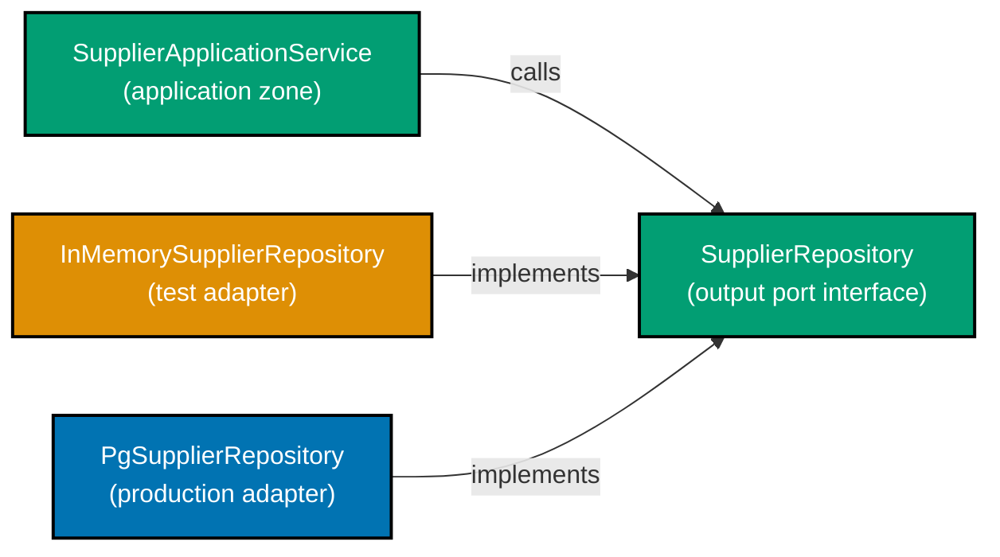
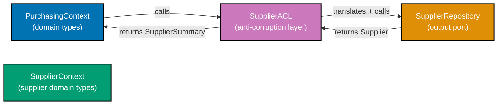

Examples 21–55 extend the beginner hexagon with the `supplier` context, three new output ports (`SupplierRepository`, `EventPublisher`, `ApprovalRouterPort`), adapter swapping, integration test seams, an anti-corruption layer between bounded contexts, CQRS command/query port separation, port versioning, and repository query specialisation. Every code block is self-contained and annotation density targets 1.0–2.25 comment lines per code line per example.

## Supplier Context Ports (Examples 21–25)

### Example 21: SupplierRepository output port

The `supplier` bounded context manages vendor master data. Its output port, `SupplierRepository`, lives in the `supplier.application` package and speaks only in domain types — no SQL, no Spring Data. The interface mirrors `PurchaseOrderRepository` in structure, establishing the pattern readers can rely on across contexts.



```java
// Output port for the supplier context — lives in application package
// => package com.example.procurement.supplier.application
package com.example.procurement.supplier.application;

import com.example.procurement.supplier.domain.Supplier;
import com.example.procurement.supplier.domain.SupplierId;
import com.example.procurement.supplier.domain.SupplierStatus;
import java.util.List;
import java.util.Optional;

// SupplierRepository: output port; describes what the application needs from persistence
// => interface keyword: no implementation here; adapters supply the "how"
public interface SupplierRepository {

    // save: persist a Supplier aggregate; return the saved instance
    // => same contract pattern as PurchaseOrderRepository — consistent port shape
    Supplier save(Supplier supplier);
    // => caller: repository.save(supplier) — unaware whether store is Postgres or HashMap

    // findById: retrieve a Supplier by its typed identity
    // => Optional<> makes absence explicit; callers must handle Optional.empty()
    Optional<Supplier> findById(SupplierId id);
    // => returns Optional.empty() when supplier not found; no NullPointerException risk

    // findAllApproved: return every supplier eligible for new PurchaseOrders
    // => purchasing context calls this to validate supplier is APPROVED before issuing a PO
    List<Supplier> findAllApproved();
    // => filters by SupplierStatus.APPROVED; adapter translates to SQL WHERE clause

    // existsById: lightweight presence check; avoids loading full aggregate
    // => used in duplicate-prevention guards before registering a new supplier
    boolean existsById(SupplierId id);
    // => returns true when supplier exists; false otherwise; O(1) cost in both adapters
}
// => Application service imports only this interface; zero coupling to Postgres, JPA, or HashMap
```

**Key Takeaway**: `SupplierRepository` follows the same output-port pattern as `PurchaseOrderRepository` — domain-language interface in the application package, zero framework imports.

**Why It Matters**: Having a consistent port shape across contexts lowers the cognitive cost of reading new contexts. When a developer familiar with `PurchaseOrderRepository` encounters `SupplierRepository`, the pattern recognition is immediate. Consistency also means the same adapter skeletons (in-memory, Postgres) can be copied and renamed rather than invented from scratch.

---

### Example 22: Supplier domain aggregate with lifecycle states

The `Supplier` aggregate root manages vendor approval state. Its lifecycle — `Pending → Approved → Suspended → Blacklisted` — is enforced by domain methods that guard illegal transitions and return new immutable instances.

```java
// Supplier aggregate root: purchasing context imports this to validate PO eligibility
// => package com.example.procurement.supplier.domain
package com.example.procurement.supplier.domain;

import java.util.Objects;

// SupplierStatus: domain enum expressing the supplier lifecycle
// => four states; transitions enforced by domain methods below
public enum SupplierStatus {
    PENDING,     // => newly registered; cannot receive POs yet
    APPROVED,    // => eligible for POs; default state after vetting
    SUSPENDED,   // => existing POs continue; no new POs allowed
    BLACKLISTED  // => new POs blocked; existing POs forced to Disputed
}

// Supplier: aggregate root — immutable record; all transitions return new instances
// => record generates equals/hashCode/toString; no Lombok required
public record Supplier(
    SupplierId id,           // => typed identity; format "sup_<uuid>"
    String name,             // => legal business name; display purposes
    SupplierStatus status    // => current lifecycle state; drives PO eligibility
) {
    // Compact canonical constructor: validates invariants at construction
    // => called before the implicit record constructor; guards null values
    public Supplier {
        Objects.requireNonNull(id, "SupplierId required");
        // => id null guard: SupplierId cannot be null; typed identity is mandatory
        Objects.requireNonNull(name, "Supplier name required");
        // => name null guard: legal business name required for display and audit
        Objects.requireNonNull(status, "SupplierStatus required");
        // => status null guard: without status the lifecycle is undefined
        // => every field validated; impossible to build a Supplier with null state
    }

    // approve: PENDING → APPROVED transition
    // => returns a new Supplier; this instance unchanged (immutable record)
    public Supplier approve() {
        if (status != SupplierStatus.PENDING) {
            throw new IllegalStateException("Only PENDING suppliers can be approved; current=" + status);
            // => guard: APPROVED, SUSPENDED, BLACKLISTED suppliers cannot be re-approved
            // => caller receives clear domain-language error with the current status value
        }
        return new Supplier(id, name, SupplierStatus.APPROVED);
        // => new record: same id and name; status becomes APPROVED; PENDING record discarded
    }

    // suspend: APPROVED → SUSPENDED transition
    // => suspended suppliers cannot receive new POs but existing POs continue processing
    public Supplier suspend() {
        if (status != SupplierStatus.APPROVED) {
            throw new IllegalStateException("Only APPROVED suppliers can be suspended; current=" + status);
            // => guard: only APPROVED → SUSPENDED is valid; PENDING and BLACKLISTED cannot be suspended
        }
        return new Supplier(id, name, SupplierStatus.SUSPENDED);
        // => new record: same id and name; status becomes SUSPENDED; APPROVED record discarded
        // => state change captured immutably; caller discards old record, keeps new one
    }

    // isEligibleForPO: query method — pure boolean function; no side effects
    // => purchasing context calls this before issuing a PO to validate the supplier
    public boolean isEligibleForPO() {
        return status == SupplierStatus.APPROVED;
        // => true only for APPROVED; PENDING, SUSPENDED, BLACKLISTED all return false
        // => purchasing context rejects non-APPROVED suppliers before building the PO
    }
}
```

**Key Takeaway**: `Supplier` is an immutable record whose state-transition methods guard preconditions and return new instances — no setters, no mutable state.

**Why It Matters**: Immutable aggregates eliminate an entire class of concurrency bugs. Two threads reading the same `Supplier` record see identical state. State transitions are explicit method calls that produce new values — a pattern that maps cleanly to event sourcing, audit logs, and test assertions.

---

### Example 23: In-memory SupplierRepository adapter

The in-memory adapter for `SupplierRepository` follows the same HashMap pattern established in Example 7. It is the default adapter for unit tests across both `purchasing` and `supplier` contexts.

```java
// In-memory adapter: implements SupplierRepository with a HashMap
// => package com.example.procurement.supplier.adapter.out.persistence
package com.example.procurement.supplier.adapter.out.persistence;

import com.example.procurement.supplier.application.SupplierRepository;
import com.example.procurement.supplier.domain.Supplier;
import com.example.procurement.supplier.domain.SupplierId;
import com.example.procurement.supplier.domain.SupplierStatus;
import java.util.HashMap;
import java.util.List;
import java.util.Map;
import java.util.Optional;

// InMemorySupplierRepository: test adapter; no JPA, no Postgres, no Docker required
// => implements SupplierRepository (output port); satisfies the same contract as PgSupplierRepository
// => swappable with PgSupplierRepository at the composition root without changing any caller
public class InMemorySupplierRepository implements SupplierRepository {

    // store: HashMap<SupplierId, Supplier> — typed key prevents accidental SupplierId/PurchaseOrderId mix-up
    // => HashMap: O(1) average for put/get/containsKey; no synchronisation needed in single-threaded tests
    private final Map<SupplierId, Supplier> store = new HashMap<>();

    @Override
    public Supplier save(Supplier supplier) {
        store.put(supplier.id(), supplier);
        // => put: inserts or replaces; O(1); key = supplier.id() (typed SupplierId, not raw String)
        return supplier;
        // => return same instance: consistent with PurchaseOrderRepository contract established in Example 7
        // => caller (RegisterSupplierService) uses the returned instance as the canonical saved state
    }

    @Override
    public Optional<Supplier> findById(SupplierId id) {
        return Optional.ofNullable(store.get(id));
        // => store.get(id): O(1) lookup; returns null when absent
        // => Optional.ofNullable: wraps null → Optional.empty(); wraps Supplier → Optional.of(supplier)
        // => caller handles absence with orElseThrow() or isPresent() check — no null propagation
    }

    @Override
    public List<Supplier> findAllApproved() {
        return store.values().stream()
            .filter(s -> s.status() == SupplierStatus.APPROVED)
            // => status filter: domain enum equality; keeps only APPROVED suppliers
            // => PENDING, SUSPENDED, BLACKLISTED are excluded from the result
            .toList();
        // => toList(): returns unmodifiable List<Supplier>; snapshot of store state at call time
        // => purchasing context calls this to get the eligible-supplier list before issuing a PO
    }

    @Override
    public boolean existsById(SupplierId id) {
        return store.containsKey(id);
        // => containsKey: O(1) HashMap presence check; does not load the full Supplier record
        // => true when supplier is in the store regardless of status; false when absent
    }
}
// => Usage in test:
// var supplierRepo = new InMemorySupplierRepository();
// var service = new RegisterSupplierService(supplierRepo, new InMemoryEventPublisher());
// => wired in 1 line; no Spring context; starts in < 1ms; all four port methods available
```

**Key Takeaway**: `InMemorySupplierRepository` repeats the same HashMap-backed pattern as the PO adapter — a single pattern for all in-memory adapters keeps onboarding fast.

**Why It Matters**: When every context follows the same in-memory adapter shape, a developer can write a new adapter for a new context in under five minutes by renaming an existing one. The cost of adopting hexagonal architecture for a new aggregate drops to near zero.

---

### Example 24: EventPublisher output port — decoupling cross-context side effects

`EventPublisher` is an output port that abstracts how domain events leave the application layer. The port is simple — one method, one parameter. Adapters behind it may write to a database outbox, push to Kafka, or log events to an in-memory list for tests.

```java
// EventPublisher: output port for domain event emission
// => package com.example.procurement.purchasing.application
package com.example.procurement.purchasing.application;

import com.example.procurement.purchasing.domain.DomainEvent;

// EventPublisher: single-method port; adapters decide where events go
// => Functional interface — implementable as a lambda in tests
@FunctionalInterface
public interface EventPublisher {
    // publish: emit a domain event to interested consumers
    // => DomainEvent: marker interface; all domain events implement it
    void publish(DomainEvent event);
    // => implementation options: OutboxEventPublisher (DB), KafkaEventPublisher, InMemoryEventPublisher
}

// DomainEvent: marker interface — all domain events implement this
// => package com.example.procurement.purchasing.domain
// => sealed interface would enumerate known events; marker pattern chosen for simplicity
interface DomainEvent {}

// Concrete domain events: purchasing context emits these after successful state transitions
// => PurchaseOrderIssued: emitted when a PO transitions Approved → Issued
record PurchaseOrderIssued(
    String purchaseOrderId, // => id of the issued PO; format "po_<uuid>"
    String supplierId       // => which supplier the PO was issued to; format "sup_<uuid>"
) implements DomainEvent {}

// SupplierApproved: emitted by supplier context when Pending → Approved
// => purchasing context consumes this to refresh the approved-supplier cache
record SupplierApproved(
    String supplierId // => format "sup_<uuid>"; purchasing adds to eligible-supplier list
) implements DomainEvent {}

// In-memory EventPublisher adapter: captures events for test assertions
// => Tests inspect capturedEvents to verify the right events were published
class InMemoryEventPublisher implements EventPublisher {
    private final java.util.List<DomainEvent> capturedEvents = new java.util.ArrayList<>();
    // => capturedEvents: grows as publish() is called; test reads it after use-case execution

    @Override
    public void publish(DomainEvent event) {
        capturedEvents.add(event); // => append to list; does not send to Kafka or write to DB
    }

    public java.util.List<DomainEvent> getCapturedEvents() {
        return java.util.List.copyOf(capturedEvents); // => immutable snapshot; safe for test assertion
    }
}
// => Production: OutboxEventPublisher writes event to outbox table in same transaction as PO save
// => Kafka delivery happens asynchronously after transaction commits
```

**Key Takeaway**: `EventPublisher` is a single-method `@FunctionalInterface` port. The in-memory adapter captures events for test assertions; the production adapter writes to an outbox.

**Why It Matters**: Hiding event delivery behind a port means the application service never knows whether events go to Kafka, a webhook, or a test list. Replacing the event delivery mechanism requires only a new adapter — the application service and domain are unchanged.

---

### Example 25: ApprovalRouterPort — routing approval requests

`ApprovalRouterPort` is an output port that routes a PO approval request to the correct manager based on `ApprovalLevel`. The port is defined in the `purchasing.application` package; adapters behind it may call a workflow engine, send an email, or return immediately for tests.

```java
// ApprovalRouterPort: output port for approval workflow routing
// => package com.example.procurement.purchasing.application
package com.example.procurement.purchasing.application;

import com.example.procurement.purchasing.domain.ApprovalLevel;
import com.example.procurement.purchasing.domain.PurchaseOrderId;

// ApprovalLevel: domain enum — derived from PO total per spec
// => L1: total <= $1,000 | L2: total <= $10,000 | L3: total > $10,000
// => package com.example.procurement.purchasing.domain
enum ApprovalLevel { L1, L2, L3 }

// ApprovalRouterPort: describes what the application needs from approval workflow
// => interface: no implementation detail; adapter decides whether to call Jira, email, or noop
public interface ApprovalRouterPort {

    // routeApproval: send the PO approval request to the correct approver queue
    // => purchaseOrderId: which PO needs approval; level: drives which approver receives it
    void routeApproval(PurchaseOrderId purchaseOrderId, ApprovalLevel level);
    // => production adapter: POST to workflow engine API with level → manager mapping
    // => test adapter: records the call for assertion; no network I/O

    // deriveApprovalLevel: pure function — derive level from PO total amount
    // => default method in the port; reusable across all implementations
    static ApprovalLevel deriveLevel(java.math.BigDecimal total) {
        if (total.compareTo(new java.math.BigDecimal("1000")) <= 0) return ApprovalLevel.L1;
        // => L1: total <= 1,000; routes to team-lead approval queue
        if (total.compareTo(new java.math.BigDecimal("10000")) <= 0) return ApprovalLevel.L2;
        // => L2: 1,000 < total <= 10,000; routes to department-head queue
        return ApprovalLevel.L3;
        // => L3: total > 10,000; routes to CFO-level approval queue
    }
}

// In-memory ApprovalRouterPort adapter: captures routed calls for tests
// => package com.example.procurement.purchasing.adapter.out.workflow
class InMemoryApprovalRouter implements ApprovalRouterPort {
    private final java.util.List<String> routedCalls = new java.util.ArrayList<>();
    // => routedCalls: record of "po_<id>@L2" strings; test reads after use-case execution

    @Override
    public void routeApproval(PurchaseOrderId id, ApprovalLevel level) {
        routedCalls.add(id.value() + "@" + level.name());
        // => append routing record; no network call; no side effect outside this object
    }

    public java.util.List<String> getRoutedCalls() {
        return java.util.List.copyOf(routedCalls); // => immutable snapshot for test assertion
    }
}
// Test assertion:
// assertThat(router.getRoutedCalls()).contains("po_abc123@L3");
// => verifies the use case routed the high-value PO to L3 approval
```

**Key Takeaway**: `ApprovalRouterPort` hides the workflow engine behind a port. The in-memory adapter captures calls; the production adapter calls a real workflow API.

**Why It Matters**: Routing logic (which manager gets which PO) can be tested without spinning up a workflow engine. The test adapter captures the routing call, and the assertion verifies the correct level was derived from the PO total. Changing the workflow engine later is a one-adapter change.

---

## Adapter Swapping and Test Seams (Examples 26–30)

### Example 26: Adapter swapping — switching from in-memory to Postgres at the composition root

Adapter swapping is the practical payoff of the port interface. The composition root selects which adapter implements each port. Changing from test (in-memory) to production (Postgres) is a one-line change in the `@Configuration` class.

```java
// Composition root: Spring @Configuration selects adapter per port
// => package com.example.procurement
package com.example.procurement;

import com.example.procurement.purchasing.adapter.out.persistence.*;
import com.example.procurement.purchasing.adapter.out.events.*;
import com.example.procurement.purchasing.adapter.out.workflow.*;
import com.example.procurement.purchasing.application.*;
import com.example.procurement.supplier.adapter.out.persistence.*;
import com.example.procurement.supplier.application.*;
import org.springframework.context.annotation.*;

// HexagonConfiguration: the single class that knows both port and adapter
// => @Configuration: Spring treats this as a bean factory; scans @Bean methods
@Configuration
public class HexagonConfiguration {

    // purchaseOrderRepository: production wiring uses Postgres adapter
    // => SWAP: replace PgPurchaseOrderRepository with InMemoryPurchaseOrderRepository for tests
    @Bean
    public PurchaseOrderRepository purchaseOrderRepository(JpaPoRepository jpa) {
        return new PgPurchaseOrderRepository(jpa); // => one line to change for test profile
        // => test profile: return new InMemoryPurchaseOrderRepository();
    }

    // supplierRepository: production wiring uses Postgres adapter for supplier context
    // => SWAP: replace PgSupplierRepository with InMemorySupplierRepository for tests
    @Bean
    public SupplierRepository supplierRepository(JpaSupplierRepository jpa) {
        return new PgSupplierRepository(jpa); // => production; test: InMemorySupplierRepository
    }

    // eventPublisher: production wiring uses outbox adapter (transactional event delivery)
    // => SWAP: replace OutboxEventPublisher with InMemoryEventPublisher for unit tests
    @Bean
    public EventPublisher eventPublisher(OutboxRepository outbox) {
        return new OutboxEventPublisher(outbox); // => production; test: new InMemoryEventPublisher()
    }

    // approvalRouterPort: production wiring calls workflow engine REST API
    // => SWAP: replace WorkflowEngineApprovalRouter with InMemoryApprovalRouter for tests
    @Bean
    public ApprovalRouterPort approvalRouterPort() {
        return new WorkflowEngineApprovalRouter(); // => production; test: new InMemoryApprovalRouter()
    }

    // issuePurchaseOrderUseCase: wires application service with all output ports
    // => all dependencies are injected via constructor; no @Autowired inside service
    @Bean
    public IssuePurchaseOrderUseCase issuePurchaseOrderUseCase(
        PurchaseOrderRepository poRepo,      // => injected from bean above
        SupplierRepository supplierRepo,     // => injected from bean above
        EventPublisher events,               // => injected from bean above
        ApprovalRouterPort approvalRouter,   // => injected from bean above
        Clock clock                          // => injected from clock bean (see beginner Example 6)
    ) {
        return new IssuePurchaseOrderService(poRepo, supplierRepo, events, approvalRouter, clock);
        // => application service constructed; dependencies resolved at boot; no runtime reflection
    }
}
// Spring @Profile("test") on an override @Configuration can replace any @Bean above
// => zero changes to domain, application service, or tests — only wiring changes
```

**Key Takeaway**: The `@Configuration` class is the only place that couples a port to its adapter. Swapping adapters is a one-line change per port.

**Why It Matters**: Teams running CI without a database use the in-memory adapter profile for unit tests and the Postgres adapter profile for integration tests — without a single change to application or domain code. The same application service binary runs against both adapters.

---

### Example 27: Spring @Profile-based adapter selection

Spring `@Profile` lets different adapters load in different environments without any `if` statements in business code. The application is oblivious to which adapter is active.

```java
// Profile-based adapter selection: Spring loads the right adapter per environment
// => package com.example.procurement.purchasing.config
package com.example.procurement.purchasing.config;

import com.example.procurement.purchasing.application.PurchaseOrderRepository;
import com.example.procurement.purchasing.adapter.out.persistence.*;
import org.springframework.context.annotation.*;

// TestPersistenceConfig: active only in "test" profile
// => @Profile("test"): Spring skips this @Configuration in production profile
@Configuration
@Profile("test")
class TestPersistenceConfig {

    @Bean
    public PurchaseOrderRepository purchaseOrderRepository() {
        return new InMemoryPurchaseOrderRepository();
        // => test profile: in-memory adapter; no Docker, no Postgres, no Testcontainers
    }
}

// ProductionPersistenceConfig: active in "prod" and "staging" profiles
// => @Profile({"prod", "staging"}): Spring loads this in production and staging
@Configuration
@Profile({"prod", "staging"})
class ProductionPersistenceConfig {

    @Bean
    public PurchaseOrderRepository purchaseOrderRepository(JpaPoRepository jpa) {
        return new PgPurchaseOrderRepository(jpa);
        // => production profile: Postgres adapter; JPA managed by Spring Data
    }
}

// Application service is unaffected by which config class is active
// => IssuePurchaseOrderService receives PurchaseOrderRepository via constructor
// => it does not know if the injected instance is InMemory or Pg
// => @SpringBootTest(properties = {"spring.profiles.active=test"}) activates test profile
// => @SpringBootApplication loads the matching config class automatically
```

**Key Takeaway**: `@Profile` annotations on `@Configuration` classes wire different adapters in different environments — the application service is never aware of which adapter is active.

**Why It Matters**: Profile-based adapter selection means the same artifact (JAR) runs in staging with a real database and in CI with an in-memory store. No environment-specific branches in business code. The adapter choice is purely an operational concern expressed in Spring configuration.

---

### Example 28: Integration test seam — testing the application service with real ports

An integration test seam is the point where the in-memory adapter is replaced by a real infrastructure component (Postgres, Kafka) while the application service and domain remain unchanged. This seam validates that the adapter correctly translates between domain types and the external store.

```java
// Integration test seam: application service wired with real (Testcontainers) adapter
// => package com.example.procurement.purchasing.application
package com.example.procurement.purchasing.application;

import com.example.procurement.purchasing.adapter.out.persistence.*;
import com.example.procurement.purchasing.domain.*;
import org.junit.jupiter.api.*;
import org.springframework.beans.factory.annotation.Autowired;
import org.springframework.boot.test.context.SpringBootTest;
import org.springframework.test.context.ActiveProfiles;
import static org.assertj.core.api.Assertions.*;

// Integration test: full stack from application service to Postgres (Testcontainers)
// => @SpringBootTest: loads full Spring context; @ActiveProfiles("integration") selects adapters
// => Testcontainers starts Postgres container before tests; container stopped after suite
@SpringBootTest
@ActiveProfiles("integration") // => selects PgPurchaseOrderRepository adapter (real Postgres)
class IssuePurchaseOrderIntegrationTest {

    // useCase: full application service wired with real Postgres adapter by Spring
    // => @Autowired: Spring injects the bean from the integration config class
    @Autowired
    IssuePurchaseOrderUseCase useCase;

    @Autowired
    PurchaseOrderRepository repository; // => same PgPurchaseOrderRepository instance

    @Test
    void issued_purchase_order_persists_to_postgres() {
        // Arrange: valid command; supplier exists in the integration DB
        var command = new IssuePurchaseOrderUseCase.IssuePOCommand(
            "550e8400-e29b-41d4-a716-446655440000", // => supplierId raw value
            "5000.00",                               // => amount: L2 approval threshold
            "USD"                                    // => ISO 4217 currency
        );

        // Act: call the use case with real Postgres adapter behind the port
        PurchaseOrder result = useCase.execute(command);
        // => result: PurchaseOrder persisted to Postgres via PgPurchaseOrderRepository

        // Assert: domain state transitions correctly
        assertThat(result.status()).isEqualTo(POStatus.AWAITING_APPROVAL);
        // => state machine: DRAFT → AWAITING_APPROVAL confirmed

        // Assert: data survives a round-trip to Postgres and back
        var fromDb = repository.findById(result.id());
        assertThat(fromDb).isPresent();             // => PO found in Postgres
        assertThat(fromDb.get().total().amount())
            .isEqualByComparingTo("5000.00");       // => BigDecimal equality (scale-agnostic)
        // => round-trip: domain record → JPA entity → Postgres → JPA entity → domain record
    }
}
// => The application service code is IDENTICAL to the unit test version
// => Only the adapter wired at the port boundary changes (InMemory vs Pg)
// => This is the integration seam: domain logic is proven by unit tests; persistence is proven here
```

**Key Takeaway**: The integration test seam tests the Postgres adapter in isolation — the application service code is identical to unit tests; only the wired adapter changes.

**Why It Matters**: When the application service test (unit) and the integration test share the same service code, a failure in the integration test points directly to the adapter translation layer, not to business logic. Debugging becomes faster because the failure scope is already narrowed.

---

### Example 29: Dependency rejection — refusing a supplier that is not APPROVED

The application service must enforce the business rule that a PO cannot be issued to a non-APPROVED supplier. It does so by loading the supplier via `SupplierRepository` and calling the domain's eligibility check before proceeding.

```java
// Application service: enforces supplier eligibility before issuing a PO
// => package com.example.procurement.purchasing.application
package com.example.procurement.purchasing.application;

import com.example.procurement.purchasing.domain.*;
import com.example.procurement.supplier.application.SupplierRepository;
import com.example.procurement.supplier.domain.*;
import java.math.BigDecimal;
import java.util.UUID;

// IssuePurchaseOrderService: orchestrates domain + both repositories + event publisher
// => No framework annotations; constructor injection only
public class IssuePurchaseOrderService implements IssuePurchaseOrderUseCase {

    private final PurchaseOrderRepository poRepository;       // => purchasing output port
    private final SupplierRepository supplierRepository;      // => supplier output port
    private final EventPublisher eventPublisher;              // => event output port
    private final ApprovalRouterPort approvalRouter;          // => approval-routing output port
    private final Clock clock;                                // => time output port

    public IssuePurchaseOrderService(
        PurchaseOrderRepository poRepository,
        SupplierRepository supplierRepository,
        EventPublisher eventPublisher,
        ApprovalRouterPort approvalRouter,
        Clock clock
    ) {
        this.poRepository = poRepository;
        this.supplierRepository = supplierRepository;
        this.eventPublisher = eventPublisher;
        this.approvalRouter = approvalRouter;
        this.clock = clock;
        // => all dependencies injected at wiring time; none created inside the service
    }

    @Override
    public PurchaseOrder execute(IssuePOCommand command) {
        // 1. Resolve and validate the supplier via output port
        var supplierId = new SupplierId(command.supplierId());
        // => SupplierId constructor validates "sup_" prefix and UUID format

        var supplier = supplierRepository.findById(supplierId)
            .orElseThrow(() -> new DomainException("Supplier not found: " + command.supplierId()));
        // => orElseThrow: Optional.empty() becomes a domain exception; HTTP 404 in adapter

        if (!supplier.isEligibleForPO()) {
            throw new DomainException(
                "Supplier " + supplierId.value() + " is not eligible for POs; status=" + supplier.status()
            );
            // => dependency rejection: SUSPENDED or BLACKLISTED supplier rejected before PO is built
            // => HTTP adapter maps this DomainException to 422 Unprocessable Entity
        }

        // 2. Build the PO and apply the DRAFT → AWAITING_APPROVAL transition
        var id = new PurchaseOrderId("po_" + UUID.randomUUID());
        var total = new Money(new BigDecimal(command.totalAmount()), command.totalCurrency());
        var po = new PurchaseOrder(id, supplierId, total, POStatus.DRAFT).submit();
        // => po: new PurchaseOrder in AWAITING_APPROVAL; submit() enforces DRAFT guard

        // 3. Persist via output port
        var saved = poRepository.save(po);
        // => saved: persisted PurchaseOrder; same reference for in-memory; fresh from Pg adapter

        // 4. Derive approval level and route
        var level = ApprovalRouterPort.deriveLevel(total.amount());
        // => level: L1, L2, or L3 derived from PO total; determines which manager queue
        approvalRouter.routeApproval(saved.id(), level);
        // => side effect: workflow engine (or test capture list) notified

        // 5. Publish domain event
        eventPublisher.publish(new PurchaseOrderIssued(saved.id().value(), supplierId.value()));
        // => event: purchasing context informs downstream (receiving, accounting) that PO is issued

        return saved;
        // => caller (HTTP adapter) maps saved PurchaseOrder to outbound DTO and HTTP 201
    }
}
```

**Key Takeaway**: The application service enforces supplier eligibility through the `SupplierRepository` port before constructing the PO — dependency rejection at the orchestration layer.

**Why It Matters**: Rejecting an ineligible supplier before touching the PO aggregate means the domain invariant is enforced at the earliest possible point. No partially-built PO is created for an invalid supplier. The eligibility check is testable without Postgres — the in-memory supplier adapter makes the test instant.

---

### Example 30: Testing supplier eligibility rejection — fast unit test

Testing the `isEligibleForPO` guard requires only two in-memory adapters and the application service. No Docker, no Spring, no integration setup.

```java
// Unit test: verifies the service rejects a SUSPENDED supplier before building any PO
// => package com.example.procurement.purchasing.application
package com.example.procurement.purchasing.application;

import com.example.procurement.purchasing.adapter.out.persistence.*;
import com.example.procurement.purchasing.adapter.out.events.InMemoryEventPublisher;
import com.example.procurement.purchasing.adapter.out.workflow.InMemoryApprovalRouter;
import com.example.procurement.supplier.adapter.out.persistence.InMemorySupplierRepository;
import com.example.procurement.supplier.domain.*;
import org.junit.jupiter.api.*;
import static org.assertj.core.api.Assertions.*;

// IssuePurchaseOrderServiceTest: unit test class; five in-memory adapters; zero infrastructure
// => no @SpringBootTest, no @ExtendWith(MockitoExtension.class); plain JUnit 5 class
class IssuePurchaseOrderServiceTest {

    // FIXED_CLOCK: lambda implementing the single-method Clock @FunctionalInterface
    // => returns the same Instant every call: 2026-01-01T00:00:00Z — deterministic
    private static final Clock FIXED_CLOCK = () -> java.time.Instant.parse("2026-01-01T00:00:00Z");
    // => all tests in this class see the same wall-clock value; no flakiness from system time

    private IssuePurchaseOrderService service;      // => the object under test
    private InMemorySupplierRepository supplierRepo; // => inject test data for supplier lookups
    private InMemoryEventPublisher eventPublisher;   // => inspect published events after each test
    private InMemoryApprovalRouter approvalRouter;   // => inspect routing calls after each test

    // @BeforeEach: fresh adapters for every test method — no shared state between tests
    @BeforeEach void setUp() {
        var poRepo = new InMemoryPurchaseOrderRepository();
        // => poRepo: fresh empty store; command writes to this; query reads from this
        supplierRepo = new InMemorySupplierRepository();
        // => supplierRepo: fresh empty store; each test seeds its own supplier data
        eventPublisher = new InMemoryEventPublisher();
        // => eventPublisher: captures events in-memory list; getCapturedEvents() for assertion
        approvalRouter = new InMemoryApprovalRouter();
        // => approvalRouter: captures routing calls; getRoutedCalls() for assertion
        service = new IssuePurchaseOrderService(
            poRepo, supplierRepo, eventPublisher, approvalRouter, FIXED_CLOCK
        );
        // => wired with five in-memory adapters; no Spring context; boots in < 1ms
    }

    @Test void rejects_suspended_supplier() {
        // ARRANGE: seed a SUSPENDED supplier; service must reject any PO for this supplier
        var supplierId = new SupplierId("sup_550e8400-e29b-41d4-a716-446655440000");
        // => SupplierId: typed id; format "sup_<uuid>"; validated at construction
        var suspended = new Supplier(supplierId, "Acme Corp", SupplierStatus.SUSPENDED);
        // => SUSPENDED: existing POs continue; no new POs permitted for this supplier
        supplierRepo.save(suspended);
        // => supplierRepo: in-memory store now contains the SUSPENDED supplier

        var command = new IssuePurchaseOrderUseCase.IssuePOCommand(
            "550e8400-e29b-41d4-a716-446655440000", // => raw supplierId matching the saved supplier
            "1000.00", "USD"                         // => L1 amount; approval level irrelevant here
        );
        // => command: valid shape; would succeed for an APPROVED supplier

        // ACT + ASSERT: service throws DomainException before building any PO
        assertThatThrownBy(() -> service.execute(command))
            .isInstanceOf(DomainException.class)
            // => DomainException: not RuntimeException or Error — typed domain violation
            .hasMessageContaining("not eligible");
            // => message: "Supplier sup_... is not eligible for POs; status=SUSPENDED"

        // ASSERT: no observable side effects on the rejection path
        assertThat(eventPublisher.getCapturedEvents()).isEmpty();
        // => empty: no PurchaseOrderIssued event when supplier is ineligible
        assertThat(approvalRouter.getRoutedCalls()).isEmpty();
        // => empty: approval router not called; rejection happens before PO is built
        // => both assertions confirm that the guard short-circuits all subsequent steps
    }
}
// => Test runs in < 5ms; verifies the full rejection path with zero infrastructure
```

**Key Takeaway**: The rejection test uses only in-memory adapters — no infrastructure, no network, no Docker. The entire failure path is verified in milliseconds.

**Why It Matters**: Fast rejection tests encourage developers to cover all the guard clauses, not just the happy path. When a new status like `Blacklisted` is added to `SupplierStatus`, the test shows exactly where new rejection logic must be added — and the test for it can be written in seconds.

---

## Cross-Context Patterns (Examples 31–35)

### Example 31: Anti-corruption layer — translating supplier context types into purchasing

When the `purchasing` context calls the `supplier` context, it must not let the supplier's internal types leak into its own domain. An anti-corruption layer (ACL) translates between the two contexts' type systems at the boundary.



```java
// Anti-corruption layer: purchasing context translation of supplier context types
// => package com.example.procurement.purchasing.application
package com.example.procurement.purchasing.application;

import com.example.procurement.supplier.application.SupplierRepository;
import com.example.procurement.supplier.domain.Supplier;
import com.example.procurement.supplier.domain.SupplierId;
import com.example.procurement.purchasing.domain.PurchasingSupplierSummary;
import java.util.Optional;

// PurchasingSupplierSummary: purchasing context's local view of a supplier
// => This type lives in the purchasing domain — NOT the supplier domain
// => purchasing context only cares about name and eligibility; not supplier's full state
record PurchasingSupplierSummary(
    String supplierId,   // => purchasing-local representation of the supplier id
    String name,         // => display name for PO documents
    boolean eligible     // => true if supplier.isEligibleForPO() — purchasing interpretation
) {}

// SupplierACL: anti-corruption layer; translates supplier types to purchasing types
// => Lives in purchasing.application; imports supplier types only here, never deeper
public class SupplierACL {

    private final SupplierRepository supplierRepository; // => supplier context's output port
    // => ACL holds the port; purchasing domain classes never reference supplier types

    public SupplierACL(SupplierRepository supplierRepository) {
        this.supplierRepository = supplierRepository;
        // => injected at wiring time; no field initialization with supplier internals
    }

    // lookupForPurchasing: translate supplier context types into purchasing's local view
    // => purchasing application service calls this; never calls SupplierRepository directly
    public Optional<PurchasingSupplierSummary> lookupForPurchasing(String rawSupplierId) {
        var supplierId = new SupplierId(rawSupplierId);
        // => SupplierId: supplier context type; only the ACL touches it
        return supplierRepository.findById(supplierId)
            .map(this::translate);
        // => translate: maps Supplier (supplier context) → PurchasingSupplierSummary (purchasing context)
    }

    // translate: the actual translation — supplier's rich model → purchasing's slim view
    // => private: translation logic is ACL-internal; callers receive only the purchasing type
    private PurchasingSupplierSummary translate(Supplier supplier) {
        return new PurchasingSupplierSummary(
            supplier.id().value(),       // => extract raw String from SupplierId value object
            supplier.name(),             // => business name; purchasing-side display only
            supplier.isEligibleForPO()   // => boolean gate; purchasing cares about eligibility, not status enum
        );
        // => PurchasingSupplierSummary: purchasing's interpretation of supplier eligibility
        // => supplier's SupplierStatus enum never reaches purchasing domain types
    }
}
// => IssuePurchaseOrderService calls supplierACL.lookupForPurchasing(rawId) instead of repo directly
// => Supplier context types remain isolated behind the ACL translation boundary
```

**Key Takeaway**: The `SupplierACL` translates supplier context types into purchasing-local types. Supplier's internal model never leaks into the purchasing domain.

**Why It Matters**: Without an ACL, renaming `SupplierStatus.APPROVED` to `SupplierStatus.VETTED` would require changes across the purchasing domain. With the ACL, the change is confined to the `translate` method — one line. Every other purchasing class sees only `eligible: boolean`.

---

### Example 32: Kotlin — SupplierRepository port and in-memory adapter

Kotlin's concise syntax and null safety make port definitions and in-memory adapters even more expressive. The same hexagonal concepts apply; the language shifts the syntax.

```kotlin
// Kotlin: SupplierRepository port and in-memory adapter
// => package com.example.procurement.supplier.application
package com.example.procurement.supplier.application

import com.example.procurement.supplier.domain.Supplier
import com.example.procurement.supplier.domain.SupplierId
import com.example.procurement.supplier.domain.SupplierStatus

// SupplierRepository: output port — Kotlin interface; same intent as Java version
// => Kotlin interface: no companion object required; SAM-compatible for lambda adapters
interface SupplierRepository {
    fun save(supplier: Supplier): Supplier          // => save and return persisted supplier
    fun findById(id: SupplierId): Supplier?         // => nullable return: Kotlin's Optional<> equivalent
    fun findAllApproved(): List<Supplier>           // => List<Supplier>: non-nullable; empty list if none
    fun existsById(id: SupplierId): Boolean         // => Boolean; Kotlin Bool maps to JVM boolean
}
// => Supplier?: nullable type; caller must handle null with ?. or ?: operators — no Optional overhead

// InMemorySupplierRepository: Kotlin in-memory adapter
// => class InMemorySupplierRepository: name mirrors Java version; same role, Kotlin idioms
class InMemorySupplierRepository : SupplierRepository {
    // MutableMap: Kotlin stdlib; backed by LinkedHashMap for predictable iteration order
    // => mutable internally; exposed interface is immutable (List, not MutableList)
    private val store: MutableMap<SupplierId, Supplier> = mutableMapOf()

    override fun save(supplier: Supplier): Supplier {
        store[supplier.id] = supplier  // => indexer syntax: operator overload on MutableMap
        return supplier                // => return same instance: consistent with Java contract
    }

    override fun findById(id: SupplierId): Supplier? =
        store[id]  // => nullable: returns null if absent; no Optional wrapper needed in Kotlin
    // => Single-expression function body: = instead of braces; Kotlin idiom for simple functions

    override fun findAllApproved(): List<Supplier> =
        store.values.filter { it.status == SupplierStatus.APPROVED }
        // => filter{}: Kotlin higher-order function; lambda replaces stream().filter()
        // => returns List<Supplier>: immutable view; status check mirrors Java version

    override fun existsById(id: SupplierId): Boolean =
        store.containsKey(id)  // => Boolean: Kotlin maps directly to JVM boolean; no boxing
}
// => Kotlin in-memory adapter is ~30% shorter than Java equivalent; same semantics
// => Interoperable: Java code can inject KotlinInMemorySupplierRepository where SupplierRepository is expected
```

**Key Takeaway**: Kotlin's nullable types replace `Optional<>` at the port boundary — `Supplier?` is idiomatic null-safe Kotlin. The adapter pattern is identical to Java; only the syntax differs.

**Why It Matters**: In a mixed Java/Kotlin codebase, Kotlin adapters are fully interoperable with Java ports. A team can migrate adapters one at a time to Kotlin without changing the Java port interface. Kotlin's conciseness reduces the boilerplate cost of writing multiple adapters.

---

### Example 33: EventPublisher — outbox adapter pattern (sketch)

The production `EventPublisher` adapter uses the transactional outbox pattern: events are written to an `outbox` table in the same database transaction as the domain aggregate update, then delivered asynchronously to Kafka. This prevents the "dual write" problem where the aggregate saves but the event fails to publish.

```java
// Outbox adapter: EventPublisher implementation using transactional outbox pattern
// => package com.example.procurement.purchasing.adapter.out.events
package com.example.procurement.purchasing.adapter.out.events;

import com.example.procurement.purchasing.application.EventPublisher;
import com.example.procurement.purchasing.domain.DomainEvent;
import org.springframework.stereotype.Component;
import org.springframework.transaction.annotation.Transactional;

// OutboxRepository: Spring Data JPA repository for the outbox table (adapter-internal)
// => adapter-internal interface; application layer never imports this
interface OutboxRepository extends org.springframework.data.jpa.repository.JpaRepository<OutboxEvent, Long> {}

// OutboxEvent: JPA entity for the outbox table (adapter-internal)
// => @Entity lives in adapter layer; domain record is annotation-free
@jakarta.persistence.Entity
@jakarta.persistence.Table(name = "event_outbox")
class OutboxEvent {
    @jakarta.persistence.Id
    @jakarta.persistence.GeneratedValue(strategy = jakarta.persistence.GenerationType.IDENTITY)
    Long id;               // => auto-generated surrogate key; Kafka relay reads this for ordering
    String eventType;      // => class simple name: "PurchaseOrderIssued", "SupplierApproved", etc.
    String payload;        // => JSON-serialised event; Kafka relay deserialises and publishes
    boolean published;     // => false: not yet sent to Kafka; relay sets to true after delivery
}

// OutboxEventPublisher: production EventPublisher adapter
// => @Component: Spring manages lifecycle; injected into application service via @Bean
@Component
public class OutboxEventPublisher implements EventPublisher {

    private final OutboxRepository outboxRepository;  // => Spring Data JPA; adapter-internal
    private final com.fasterxml.jackson.databind.ObjectMapper mapper; // => Jackson for JSON serialisation

    public OutboxEventPublisher(OutboxRepository outboxRepository,
                                com.fasterxml.jackson.databind.ObjectMapper mapper) {
        this.outboxRepository = outboxRepository; // => injected; adapter-internal dependency
        this.mapper = mapper;                     // => JSON mapper; not visible to application layer
    }

    @Override
    @Transactional  // => @Transactional: outbox write participates in the PO save transaction
    public void publish(DomainEvent event) {
        try {
            var outboxEvent = new OutboxEvent();
            outboxEvent.eventType = event.getClass().getSimpleName();
            // => eventType: "PurchaseOrderIssued"; Kafka relay uses this to route to topic
            outboxEvent.payload = mapper.writeValueAsString(event);
            // => JSON payload: {"purchaseOrderId":"po_abc","supplierId":"sup_xyz"}
            outboxEvent.published = false;
            // => published=false: relay will poll this row and push to Kafka asynchronously
            outboxRepository.save(outboxEvent);
            // => single DB write in the same transaction as the PO save — atomic
        } catch (Exception e) {
            throw new RuntimeException("Failed to write event to outbox: " + event, e);
            // => wrapped in RuntimeException; Spring rolls back the transaction
        }
    }
}
// SKETCH NOTE: Full Kafka relay (polling outbox, publishing to topic, marking published) is covered
// in the in-the-field tutorial; this example teaches the adapter boundary concept only.
```

**Key Takeaway**: The outbox adapter writes events to a database table in the same transaction as the aggregate save — eliminating the dual-write problem without changing the `EventPublisher` port.

**Why It Matters**: The application service calls `eventPublisher.publish(event)` without knowing whether events go to an outbox table, Kafka directly, or a test list. The dual-write protection is entirely an adapter-layer concern. Changing event delivery infrastructure (e.g., from Postgres outbox to Kafka Streams) replaces one adapter class — nothing else changes.

---

### Example 34: ApprovalRouterPort — workflow engine adapter (sketch)

The production `ApprovalRouterPort` adapter calls a workflow engine REST API to route PO approval requests. The adapter is the only class that knows the workflow engine's URL, authentication scheme, and request format.

```java
// WorkflowEngineApprovalRouter: production ApprovalRouterPort adapter
// => package com.example.procurement.purchasing.adapter.out.workflow
package com.example.procurement.purchasing.adapter.out.workflow;

import com.example.procurement.purchasing.application.ApprovalRouterPort;
import com.example.procurement.purchasing.domain.ApprovalLevel;
import com.example.procurement.purchasing.domain.PurchaseOrderId;
import org.springframework.web.client.RestTemplate;

// WorkflowEngineApprovalRouter: calls external workflow engine API
// => Implements ApprovalRouterPort; application service is unaware of REST calls
public class WorkflowEngineApprovalRouter implements ApprovalRouterPort {

    private final RestTemplate restTemplate;   // => HTTP client; adapter-internal detail
    private final String workflowApiBaseUrl;   // => configured at startup; not visible to application

    public WorkflowEngineApprovalRouter(RestTemplate restTemplate, String workflowApiBaseUrl) {
        this.restTemplate = restTemplate;     // => injected; testable by mocking RestTemplate
        this.workflowApiBaseUrl = workflowApiBaseUrl; // => from configuration; e.g., "https://workflow.internal"
    }

    @Override
    public void routeApproval(PurchaseOrderId purchaseOrderId, ApprovalLevel level) {
        // Build the workflow engine request payload (adapter-internal DTO)
        var payload = new WorkflowRequest(purchaseOrderId.value(), level.name());
        // => WorkflowRequest: adapter-layer record; never seen by application service or domain

        String url = workflowApiBaseUrl + "/api/approval-tasks";
        // => URL: adapter concern; application service never knows where approval routing goes

        restTemplate.postForEntity(url, payload, Void.class);
        // => HTTP POST to workflow engine; Void.class: response body discarded (fire-and-forget)
        // => On failure: RestClientException propagates; application service catches at boundary
        // => Production: add retry + circuit-breaker (covered in advanced tutorial)
    }

    // WorkflowRequest: adapter-internal DTO; never crosses into application or domain zones
    // => record: compact; serialised by RestTemplate's Jackson message converter
    private record WorkflowRequest(String purchaseOrderId, String approvalLevel) {}
    // => JSON: {"purchaseOrderId":"po_abc","approvalLevel":"L2"}
}
// SKETCH NOTE: retry, circuit-breaker, and timeout configuration are adapter concerns
// covered fully in the in-the-field tutorial; this example teaches the boundary only.
```

**Key Takeaway**: The workflow engine adapter is the only class that knows the API URL, authentication, and HTTP format — the application service calls the port interface and is fully decoupled from these details.

**Why It Matters**: When the workflow engine vendor changes (e.g., from Jira Service Management to ServiceNow), the replacement is `WorkflowEngineApprovalRouter` only. The application service, domain, and all tests are unchanged. The adapter change can be merged and deployed without a code review touching business logic.

---

### Example 35: Full intermediate flow — two contexts, four ports, one request

This example traces a complete `issuePurchaseOrder` request through both contexts and all four intermediate ports to show how the pieces compose.

```java
// Full intermediate flow: HTTP POST → two contexts → four output ports → HTTP 201
// => traces every layer and port call in sequence

// STEP 1 — HTTP request arrives at primary adapter
// => zone: adapter.in.web (PurchaseOrderHttpController)
// POST /api/v1/purchase-orders  body: {"supplierId":"sup_abc","totalAmount":"8000.00","currency":"USD"}
var req = new CreatePORequest("abc", "8000.00", "USD"); // => inbound DTO; raw HTTP fields

// STEP 2 — Controller builds command and delegates to input port
var command = new IssuePurchaseOrderUseCase.IssuePOCommand("abc", "8000.00", "USD");
// => command crosses adapter boundary → application zone; no domain type used yet

// STEP 3 — Application service calls SupplierRepository port (supplier context)
var supplierId = new SupplierId("sup_abc"); // => typed SupplierId; format validated
var supplier = supplierRepository.findById(supplierId).orElseThrow(...);
// => supplierRepository: output port call; InMemory or Pg adapter selected at wiring
var eligible = supplier.isEligibleForPO();
// => eligible: domain method on Supplier; true if APPROVED; rejects SUSPENDED or BLACKLISTED

// STEP 4 — Domain PO built and DRAFT → AWAITING_APPROVAL applied
var id = new PurchaseOrderId("po_" + UUID.randomUUID()); // => new typed PO identity
var total = new Money(new BigDecimal("8000.00"), "USD");  // => Money validates amount >= 0, currency 3-letter
var po = new PurchaseOrder(id, supplierId, total, POStatus.DRAFT).submit();
// => submit(): domain guard checks DRAFT; returns new PurchaseOrder(AWAITING_APPROVAL)

// STEP 5 — PurchaseOrderRepository port saves the PO (purchasing context)
var saved = poRepository.save(po);
// => poRepository: output port call; adapter writes to HashMap or Postgres table

// STEP 6 — ApprovalRouterPort routes based on total
var level = ApprovalRouterPort.deriveLevel(total.amount()); // => 8000 → L2
approvalRouter.routeApproval(saved.id(), level);
// => approvalRouter: output port call; adapter sends HTTP POST to workflow engine

// STEP 7 — EventPublisher publishes PurchaseOrderIssued
eventPublisher.publish(new PurchaseOrderIssued(saved.id().value(), supplierId.value()));
// => eventPublisher: output port call; adapter writes to outbox table in same transaction

// STEP 8 — Controller maps domain result to HTTP 201 response
var response = new CreatePOResponse(
    saved.id().value(),          // => unwrap PurchaseOrderId → String
    saved.supplierId().value(),  // => unwrap SupplierId → String
    saved.total().amount().toPlainString(), // => BigDecimal → String for JSON
    saved.total().currency(),    // => ISO 4217 code; already String
    saved.status().name()        // => domain enum → String
);
// => HTTP 201 Created; body: {"id":"po_...","supplierId":"sup_...","status":"AWAITING_APPROVAL"}
// => four output ports called; two contexts touched; zero business logic in adapter or port implementations
```

**Key Takeaway**: The intermediate flow crosses two bounded contexts (`purchasing` and `supplier`) and four output ports — each crossing is an explicit port call with a type transformation at its boundary.

**Why It Matters**: Each of the four output-port calls in this flow can be replaced independently without touching the others. The `SupplierRepository` can be swapped for a GraphQL supplier API; the `EventPublisher` can be swapped for SNS; the `ApprovalRouterPort` can be swapped for email — each change is isolated to one adapter class.

---

## Advanced Composition Patterns (Examples 36–40)

### Example 36: Spring @Configuration with multiple bounded contexts

When two bounded contexts live in the same service, the `@Configuration` class wires both contexts' ports. Package discipline prevents cross-context coupling in the domain or application layers.

```java
// Dual-context composition root: wires purchasing and supplier contexts
// => package com.example.procurement
package com.example.procurement;

import com.example.procurement.purchasing.adapter.out.persistence.*;
import com.example.procurement.purchasing.application.*;
import com.example.procurement.supplier.adapter.out.persistence.*;
import com.example.procurement.supplier.application.*;
import org.springframework.context.annotation.*;

// ProcurementConfiguration: composition root for both purchasing and supplier contexts
// => single @Configuration class knows all adapters; domain and application zones know none
@Configuration
public class ProcurementConfiguration {

    // === Supplier context beans ===

    // supplierRepository: supplier context's persistence output port
    // => @Bean: Spring manages lifecycle; injected into SupplierACL below
    @Bean
    public SupplierRepository supplierRepository(JpaSupplierRepository jpa) {
        return new PgSupplierRepository(jpa); // => Postgres adapter for supplier context
    }

    // supplierACL: anti-corruption layer; purchasing context's gateway to supplier context
    // => @Bean: Spring injects SupplierRepository above; purchasing service injects this ACL
    @Bean
    public SupplierACL supplierACL(SupplierRepository supplierRepository) {
        return new SupplierACL(supplierRepository);
        // => ACL wraps the supplier repository; purchasing service calls ACL, not repository
    }

    // === Purchasing context beans ===

    // purchaseOrderRepository: purchasing context's persistence output port
    // => @Bean: Postgres adapter; swappable with InMemory via @Profile
    @Bean
    public PurchaseOrderRepository purchaseOrderRepository(JpaPoRepository jpa) {
        return new PgPurchaseOrderRepository(jpa);
    }

    // eventPublisher: purchasing context's event output port
    // => @Bean: outbox adapter; writes events transactionally with PO saves
    @Bean
    public EventPublisher eventPublisher(OutboxRepository outbox,
                                         com.fasterxml.jackson.databind.ObjectMapper mapper) {
        return new OutboxEventPublisher(outbox, mapper);
    }

    // approvalRouterPort: purchasing context's workflow output port
    // => @Bean: workflow engine adapter; no application code knows the REST URL
    @Bean
    public ApprovalRouterPort approvalRouterPort(
        org.springframework.web.client.RestTemplate restTemplate,
        @org.springframework.beans.factory.annotation.Value("${workflow.api.base-url}") String url
    ) {
        return new WorkflowEngineApprovalRouter(restTemplate, url);
        // => @Value: Spring injects from application.properties; adapter receives it
    }

    // issuePurchaseOrderUseCase: wires the application service with all output ports
    // => @Bean: all five dependencies injected by Spring from beans above
    @Bean
    public IssuePurchaseOrderUseCase issuePurchaseOrderUseCase(
        PurchaseOrderRepository poRepo,
        SupplierRepository supplierRepo,
        EventPublisher events,
        ApprovalRouterPort approvalRouter,
        Clock clock
    ) {
        return new IssuePurchaseOrderService(poRepo, supplierRepo, events, approvalRouter, clock);
        // => complete wiring: application service knows only port interfaces
    }
}
// => ProcurementConfiguration is the only class that couples ports to adapters
// => domain and application classes compile and test without this file on the classpath
```

**Key Takeaway**: The dual-context `@Configuration` class wires both contexts' ports in one place — domain and application classes remain unaware of which adapters are active.

**Why It Matters**: A dual-context composition root makes the full dependency graph of both contexts readable in one file. Architecture reviews that ask "what touches what" can be answered by reading the `@Configuration` class without exploring any other file in the codebase.

---

### Example 37: Constructor injection depth — no @Autowired in business classes

Hexagonal architecture favors constructor injection over field injection (`@Autowired` on fields). Constructor injection makes dependencies explicit, enables testing without a DI container, and prevents partially-initialized objects.

```java
// Constructor injection: comparing field injection vs constructor injection
// => package com.example.procurement.purchasing.application

// ANTI-PATTERN: field injection with @Autowired
// => Problem 1: dependencies hidden; class looks like it has no dependencies
// => Problem 2: Spring required to instantiate; cannot call "new" in unit test
// => Problem 3: fields are mutable; test can accidentally inject null
class IssuePurchaseOrderServiceWithFieldInjection {
    @org.springframework.beans.factory.annotation.Autowired
    private PurchaseOrderRepository poRepository;   // => hidden dependency: not in constructor
    @org.springframework.beans.factory.annotation.Autowired
    private SupplierRepository supplierRepository;  // => another hidden dependency
    // => unit test must use @MockBean or @SpringBootTest — overhead: hundreds of ms
}

// CORRECT PATTERN: constructor injection — explicit, testable, framework-free
// => dependencies declared in constructor; impossible to create object with missing deps
public class IssuePurchaseOrderService implements IssuePurchaseOrderUseCase {

    // Dependencies: all final — immutable after construction; safe for concurrent reads
    // => final: compiler enforces that each field is assigned exactly once in constructor
    private final PurchaseOrderRepository poRepository;
    private final SupplierRepository supplierRepository;
    private final EventPublisher eventPublisher;
    private final ApprovalRouterPort approvalRouter;
    private final Clock clock;

    // Constructor: all dependencies required; no optional params, no setters
    // => caller (composition root or test) must supply all five; cannot skip any
    public IssuePurchaseOrderService(
        PurchaseOrderRepository poRepository,
        SupplierRepository supplierRepository,
        EventPublisher eventPublisher,
        ApprovalRouterPort approvalRouter,
        Clock clock
    ) {
        this.poRepository = poRepository;
        this.supplierRepository = supplierRepository;
        this.eventPublisher = eventPublisher;
        this.approvalRouter = approvalRouter;
        this.clock = clock;
        // => five assignments; compiler error if any omitted; no partial initialization possible
    }

    @Override
    public PurchaseOrder execute(IssuePOCommand command) {
        // => all five dependencies available via fields; null-safe because constructor required them
        // => test: new IssuePurchaseOrderService(inMemPo, inMemSupplier, inMemEvents, inMemRouter, fixedClock)
        // => no Spring, no Mockito, no @MockBean — plain Java in 1 line
        return null; // => implementation shown in Example 29
    }
}
// Constructor injection is the only injection pattern used in domain and application zones
// => Adapter classes (e.g., PgPurchaseOrderRepository) may use @Autowired at the adapter layer
// => But application services NEVER use @Autowired — they are framework-free
```

**Key Takeaway**: Constructor injection declares dependencies explicitly, enables framework-free instantiation in tests, and makes the dependency graph visible in the constructor signature.

**Why It Matters**: A class with five constructor parameters announces its dependencies upfront. When a sixth dependency creeps in, the constructor length signals growing complexity — a nudge toward extracting a collaborator. Field injection hides this signal. Keeping business classes framework-free means the domain and application layers can be compiled and tested as a plain JAR, without Spring on the classpath.

---

### Example 38: Kotlin — data class as command DTO with validation

Kotlin's `data class` with `init` block provides a concise command DTO that enforces validation at construction — matching the Java `record` with compact constructor pattern used in the beginner section.

```kotlin
// Kotlin: command DTO with inline validation — same semantics as Java record
// => package com.example.procurement.purchasing.application
package com.example.procurement.purchasing.application

import java.math.BigDecimal

// IssuePOCommand: inbound command; validated at construction; immutable after build
// => data class: Kotlin generates equals/hashCode/toString/copy automatically
data class IssuePOCommand(
    val supplierId: String,      // => raw supplier id from HTTP; validated in init block
    val totalAmount: String,     // => numeric string from JSON; service parses to BigDecimal
    val totalCurrency: String    // => ISO 4217 code; 3 letters
) {
    // init block: runs at construction; equivalent to Java compact canonical constructor
    // => validation here means invalid commands cannot exist; no defensive checks downstream
    init {
        require(supplierId.isNotBlank()) { "supplierId must not be blank" }
        // => require: Kotlin stdlib; throws IllegalArgumentException on false condition
        require(totalAmount.isNotBlank()) { "totalAmount must not be blank" }
        // => require: validates before BigDecimal parse; better error message than NumberFormatException
        val parsed = totalAmount.toBigDecimalOrNull()
            ?: throw IllegalArgumentException("totalAmount must be a valid decimal: $totalAmount")
        // => toBigDecimalOrNull(): null on parse failure; ?: catches null and throws with context
        require(parsed >= BigDecimal.ZERO) { "totalAmount must be >= 0; got $totalAmount" }
        // => non-negative invariant: same as Java Money.amount invariant — enforced early
        require(totalCurrency.length == 3) { "currency must be 3-letter ISO 4217 code; got $totalCurrency" }
        // => length check: same invariant as Java Money.currency validation
    }
}
// Usage:
// val cmd = IssuePOCommand("sup_abc", "8000.00", "USD")  // => ok
// val bad = IssuePOCommand("", "8000.00", "USD")         // => IllegalArgumentException: supplierId blank
// => Kotlin init block mirrors Java compact canonical constructor; both enforce at construction time
```

**Key Takeaway**: Kotlin's `data class` with an `init` block enforces command invariants at construction — the same pattern as Java's compact record constructor.

**Why It Matters**: Enforcing command validity at the data class boundary means every service that receives an `IssuePOCommand` can trust the data is valid. No defensive `if (supplierId == null)` scattered through the service logic. Invalid commands fail fast at the entry point, with a clear error message.

---

### Example 39: ArchUnit — enforcing hexagonal dependency rules in CI

ArchUnit tests codify the dependency rule as executable code. When a developer accidentally imports a Spring class into the domain, the ArchUnit test fails in CI before the commit reaches main.

```java
// ArchUnit tests: enforce hexagonal dependency direction in CI
// => package com.example.procurement.architecture
package com.example.procurement.architecture;

import com.tngtech.archunit.core.importer.ClassFileImporter;
import com.tngtech.archunit.lang.ArchRule;
import static com.tngtech.archunit.lang.syntax.ArchRuleDefinition.noClasses;
import org.junit.jupiter.api.Test;

// HexagonalArchitectureTest: ArchUnit rules that enforce the dependency direction
// => Run as part of test:unit; fail-fast before business logic changes are merged
class HexagonalArchitectureTest {

    // Import all classes from the procurement package tree for analysis
    // => ClassFileImporter: reads compiled .class files; no source required
    private static final var classes = new ClassFileImporter()
        .importPackages("com.example.procurement");

    @Test void domain_must_not_import_application_classes() {
        ArchRule rule = noClasses()
            .that().resideInAPackage("..domain..")        // => scope: all domain classes
            .should().dependOnClassesThat()
            .resideInAPackage("..application..");         // => must not import application types
        rule.check(classes);
        // => fails if any domain class imports an application class — outward dependency caught
    }

    @Test void domain_must_not_import_adapter_classes() {
        ArchRule rule = noClasses()
            .that().resideInAPackage("..domain..")        // => scope: all domain classes
            .should().dependOnClassesThat()
            .resideInAPackage("..adapter..");             // => must not import any adapter type
        rule.check(classes);
        // => fails if @Entity or @RestController leaks into domain — caught at CI, not review
    }

    @Test void application_must_not_import_adapter_classes() {
        ArchRule rule = noClasses()
            .that().resideInAPackage("..application..")  // => scope: application services + ports
            .should().dependOnClassesThat()
            .resideInAPackage("..adapter..");             // => must not import any adapter class
        rule.check(classes);
        // => fails if application service imports PgPurchaseOrderRepository directly — caught immediately
    }

    @Test void adapters_may_import_application_but_not_vice_versa() {
        ArchRule rule = noClasses()
            .that().resideInAPackage("..application..")  // => application zone outward imports forbidden
            .should().dependOnClassesThat()
            .resideInAPackage("..adapter..");
        rule.check(classes);
        // => same as above rule; belt-and-suspenders; documents the allowed direction explicitly
    }
}
// => All four rules run in < 500ms on a typical codebase; no server required
// => ArchUnit replaces manual code review for dependency direction — automated governance
```

**Key Takeaway**: ArchUnit tests enforce the hexagonal dependency rule in CI — any import direction violation fails the build before reaching code review.

**Why It Matters**: Architectural rules that live only in documentation decay. Architectural rules enforced by test code hold as long as the tests pass. ArchUnit turns the dependency rule into a CI gate, making the hexagon self-defending against the entropy of a growing codebase.

---

### Example 40: Full intermediate test suite — unit + integration coverage map

A complete hexagonal test suite uses unit tests for domain logic and application service behavior, integration tests for adapter translation round-trips, and ArchUnit tests for dependency direction. No single test type covers all concerns.

**Layer 1 — Domain unit tests (no framework, no adapters)**:

```java
// Domain unit test: pure PurchaseOrder state-machine — zero infrastructure
// => package com.example.procurement.purchasing.domain
package com.example.procurement.purchasing.domain;

import org.junit.jupiter.api.Test;
import static org.assertj.core.api.Assertions.*;
import java.math.BigDecimal;

class PurchaseOrderTest {

    private final PurchaseOrderId id = new PurchaseOrderId("po_550e8400-e29b-41d4-a716-446655440000");
    // => id: valid PurchaseOrderId; format "po_" + 36-char UUID
    private final SupplierId sup = new SupplierId("sup_550e8400-e29b-41d4-a716-446655440001");
    // => sup: valid SupplierId for wiring the PO
    private final Money total = new Money(new BigDecimal("1500.00"), "USD");
    // => total: 1500 USD; above L1 threshold; used to verify L2 routing downstream

    @Test void submit_transitions_draft_to_awaiting_approval() {
        var po = new PurchaseOrder(id, sup, total, POStatus.DRAFT);
        // => po: initial state = DRAFT; immutable record
        var submitted = po.submit();
        // => submitted: new PurchaseOrder in AWAITING_APPROVAL
        assertThat(submitted.status()).isEqualTo(POStatus.AWAITING_APPROVAL);
        // => state machine: DRAFT → AWAITING_APPROVAL confirmed; original po unchanged
        assertThat(po.status()).isEqualTo(POStatus.DRAFT);
        // => immutability confirmed: po.status() still DRAFT after submit() call
    }

    @Test void submit_on_non_draft_throws_domain_exception() {
        var po = new PurchaseOrder(id, sup, total, POStatus.AWAITING_APPROVAL);
        // => po: already past DRAFT; submit() must reject
        assertThatThrownBy(po::submit)
            .isInstanceOf(InvalidStateTransitionException.class);
        // => typed domain exception; HTTP adapter maps to 409 Conflict
    }
}
// => 2 tests; < 1ms each; zero framework, zero Docker, zero network
```

**Layer 2 — Application service unit tests (in-memory adapters)**:

```java
// Application service unit test: wires five in-memory adapters; no Spring
// => package com.example.procurement.purchasing.application
package com.example.procurement.purchasing.application;

import com.example.procurement.purchasing.adapter.out.persistence.InMemoryPurchaseOrderRepository;
import com.example.procurement.supplier.adapter.out.persistence.InMemorySupplierRepository;
import com.example.procurement.supplier.domain.*;
import org.junit.jupiter.api.*;
import static org.assertj.core.api.Assertions.*;

class IssuePOServiceLayerTwoTest {

    private static final Clock FIXED_CLOCK = () -> java.time.Instant.parse("2026-01-01T00:00:00Z");
    // => fixed clock: deterministic; all tests see the same wall-clock instant

    private IssuePurchaseOrderService service;
    private InMemorySupplierRepository supplierRepo;
    private InMemoryEventPublisher eventPublisher;
    private InMemoryApprovalRouter approvalRouter;

    @BeforeEach void setUp() {
        var poRepo = new InMemoryPurchaseOrderRepository();
        supplierRepo = new InMemorySupplierRepository();
        eventPublisher = new InMemoryEventPublisher();
        approvalRouter = new InMemoryApprovalRouter();
        service = new IssuePurchaseOrderService(
            poRepo, supplierRepo, eventPublisher, approvalRouter, FIXED_CLOCK
        );
        // => wired in 6 lines; no Spring context; boots in < 1ms
    }

    @Test void happy_path_publishes_event_and_routes_approval() {
        var supplierId = new SupplierId("sup_550e8400-e29b-41d4-a716-446655440000");
        supplierRepo.save(new Supplier(supplierId, "Acme Corp", SupplierStatus.APPROVED));
        // => pre-condition: APPROVED supplier in store; PO issuance will proceed

        var cmd = new IssuePurchaseOrderUseCase.IssuePOCommand(
            "550e8400-e29b-41d4-a716-446655440000", "8000.00", "USD"
        );
        service.execute(cmd);
        // => execute: issues PO, routes to L2 approval, publishes PurchaseOrderIssued event

        assertThat(eventPublisher.getCapturedEvents()).hasSize(1);
        // => one event published: PurchaseOrderIssued — downstream contexts notified
        assertThat(approvalRouter.getRoutedCalls()).hasSize(1);
        // => one routing call: 8000 → L2; captured by in-memory adapter
        assertThat(approvalRouter.getRoutedCalls().get(0)).endsWith("@L2");
        // => "@L2" suffix: $1,000 < $8,000 <= $10,000 satisfies L2 threshold
    }
}
// => test:unit target; < 5ms per test; 100 service tests run in < 500ms total
```

**Layer 3 — Adapter integration tests (Testcontainers)**:

```java
// Integration test: PgPurchaseOrderRepository round-trip against real Postgres
// => @SpringBootTest + @ActiveProfiles("integration") selects Pg adapter
// => Testcontainers starts Postgres; connection string injected via Spring
@org.springframework.boot.test.context.SpringBootTest
@org.springframework.test.context.ActiveProfiles("integration")
class PgRepositoryIntegrationTest {

    @org.springframework.beans.factory.annotation.Autowired
    PurchaseOrderRepository repository;
    // => Spring injects PgPurchaseOrderRepository; Testcontainers Postgres is the store

    @org.junit.jupiter.api.Test void round_trip_preserves_money_scale() {
        var id = new com.example.procurement.purchasing.domain.PurchaseOrderId(
            "po_550e8400-e29b-41d4-a716-446655440099");
        // => id: valid PurchaseOrderId; will be used as DB primary key

        var po = new com.example.procurement.purchasing.domain.PurchaseOrder(
            id,
            new com.example.procurement.purchasing.domain.SupplierId("sup_550e8400-e29b-41d4-a716-446655440001"),
            new com.example.procurement.purchasing.domain.Money(
                new java.math.BigDecimal("5000.00"), "USD"),
            com.example.procurement.purchasing.domain.POStatus.AWAITING_APPROVAL
        );
        repository.save(po);
        // => save: domain record → JPA entity → INSERT into Postgres

        var loaded = repository.findById(id).orElseThrow();
        // => findById: SELECT from Postgres → JPA entity → domain record
        assertThat(loaded.total().amount()).isEqualByComparingTo("5000.00");
        // => BigDecimal scale-agnostic comparison; Postgres DECIMAL round-trip verified
    }
}
// => test:integration target; 2-10s per test (Testcontainers startup amortized across suite)
```

**Key Takeaway**: The hexagonal test suite is a four-layer pyramid — domain unit, service unit, adapter integration, and architecture tests — each validating a distinct concern at a distinct speed.

**Why It Matters**: Teams that run only integration tests against a real database pay 30 seconds per run and get no signal about which layer failed. The four-layer pyramid gives sub-second feedback for domain and service logic (the 95% case) while reserving the slower integration tests for the one concern they uniquely address: adapter translation correctness.

---

## CQRS Ports (Examples 41–45)

### Example 41: CQRS — separating command and query input ports

CQRS (Command Query Responsibility Segregation) splits the input port into two separate interfaces: one for commands (state-changing operations) and one for queries (read-only operations). Commands return `void` or a minimal acknowledgement; queries return data without side effects.

```java
// CQRS input ports: command port and query port for PurchaseOrder
// => package com.example.procurement.purchasing.application
package com.example.procurement.purchasing.application;

import com.example.procurement.purchasing.domain.PurchaseOrder;
import com.example.procurement.purchasing.domain.PurchaseOrderId;
import java.util.List;

// PurchaseOrderCommandPort: handles state-changing operations
// => command methods return void or a result record — never a full aggregate for writes
public interface PurchaseOrderCommandPort {

    // IssuePOCommand: inbound DTO carrying all fields needed to issue a PO
    // => record: immutable; equals/hashCode generated; no Lombok required
    record IssuePOCommand(String supplierId, String totalAmount, String totalCurrency) {}

    // issue: creates a new PO in DRAFT state, then transitions DRAFT → AWAITING_APPROVAL
    // => returns the newly issued PurchaseOrder; callers use only the id and status
    PurchaseOrder issue(IssuePOCommand command);
    // => side effects: saves to repository, publishes PurchaseOrderIssued, routes approval

    // ApprovePOCommand: issued PO moves to APPROVED state
    // => record: typed command; prevents mixing up id with other string parameters
    record ApprovePOCommand(PurchaseOrderId id, String approverComment) {}

    // approve: transitions AWAITING_APPROVAL → APPROVED
    // => void return: command acknowledgement only; callers query state separately
    void approve(ApprovePOCommand command);
    // => side effect: publishes PurchaseOrderApproved event; no return value
}

// PurchaseOrderQueryPort: handles read-only operations; no side effects
// => all methods are pure reads; adapters may use read replicas or caches
public interface PurchaseOrderQueryPort {

    // findById: retrieve a single PO by typed identity
    // => Optional: absence made explicit; callers must handle Optional.empty()
    java.util.Optional<PurchaseOrder> findById(PurchaseOrderId id);
    // => no state change; safe to call repeatedly; cache-friendly

    // findBySupplier: retrieve all POs for a given supplier
    // => List: ordered snapshot; empty list when no POs found; never null
    List<PurchaseOrder> findBySupplier(String supplierId);
    // => adapter translates to: SELECT * FROM purchase_orders WHERE supplier_id = ?
}
// => Command port and query port can be implemented by the same or different services
// => Splitting enables different scalability strategies per side without coupling them
```

**Key Takeaway**: CQRS splits input ports into command (state-changing) and query (read-only) interfaces, enabling different scaling and caching strategies for each side.

**Why It Matters**: A command port that handles writes and a query port that handles reads can be backed by different adapters — the command adapter writes to the primary database while the query adapter reads from a read replica or an Elasticsearch index. CQRS at the port level makes this split possible without changing any application service or domain class. Teams that start with a single port can split it later with minimal refactoring — the interface boundary isolates the change.

---

### Example 42: CQRS command service implementation

The command service implements `PurchaseOrderCommandPort`. It orchestrates domain objects and output ports for state-changing operations only. Queries are delegated to a separate query service, keeping each service focused on one concern.

```java
// Command service: implements PurchaseOrderCommandPort; write-side only
// => package com.example.procurement.purchasing.application
package com.example.procurement.purchasing.application;

import com.example.procurement.purchasing.domain.*;
import java.math.BigDecimal;
import java.util.UUID;

// PurchaseOrderCommandService: handles all state-changing PO operations
// => No @Service annotation — framework-free; instantiable with "new" in tests
public class PurchaseOrderCommandService implements PurchaseOrderCommandPort {

    private final PurchaseOrderRepository repository; // => write-side persistence output port
    // => repository: stores POs; read-side may use a different adapter (replica, cache)
    private final EventPublisher eventPublisher;       // => publishes domain events after writes
    // => eventPublisher: outbox adapter in production; in-memory list in tests
    private final ApprovalRouterPort approvalRouter;   // => routes approval after issue
    // => approvalRouter: workflow engine in production; in-memory capture in tests

    public PurchaseOrderCommandService(
        PurchaseOrderRepository repository,
        EventPublisher eventPublisher,
        ApprovalRouterPort approvalRouter
    ) {
        this.repository = repository;       // => stored; used in issue() and approve()
        this.eventPublisher = eventPublisher; // => stored; publish events after each command
        this.approvalRouter = approvalRouter; // => stored; route approval after issue()
    }

    @Override
    public PurchaseOrder issue(IssuePOCommand command) {
        var id = new PurchaseOrderId("po_" + UUID.randomUUID());
        // => id: new typed PurchaseOrderId; format "po_" + UUID satisfies invariant
        var supplierId = new SupplierId(command.supplierId());
        // => SupplierId: typed wrapper; validates "sup_" prefix at construction
        var total = new Money(new BigDecimal(command.totalAmount()), command.totalCurrency());
        // => Money: validates amount >= 0 and currency is 3-letter ISO 4217 code
        var po = new PurchaseOrder(id, supplierId, total, POStatus.DRAFT).submit();
        // => submit(): domain guard checks DRAFT; returns new PurchaseOrder(AWAITING_APPROVAL)
        var saved = repository.save(po);
        // => save: output port call; adapter persists to HashMap or Postgres table
        eventPublisher.publish(new PurchaseOrderIssued(saved.id().value(), supplierId.value()));
        // => event: notifies downstream contexts (receiving, invoicing)
        approvalRouter.routeApproval(saved.id(), ApprovalRouterPort.deriveLevel(total.amount()));
        // => route: L1/L2/L3 derived from PO total; adapter sends to workflow engine
        return saved;
        // => returns persisted PO; caller (controller) maps to response DTO
    }

    @Override
    public void approve(ApprovePOCommand command) {
        var po = repository.findById(command.id())
            .orElseThrow(() -> new DomainException("PO not found: " + command.id().value()));
        // => findById: output port call; throws domain exception if PO is absent
        var approved = po.approve();
        // => approve(): domain guard checks AWAITING_APPROVAL → APPROVED transition
        repository.save(approved);
        // => save: persists state change; read-side adapters will reflect new status
        eventPublisher.publish(new PurchaseOrderApproved(approved.id().value()));
        // => PurchaseOrderApproved: downstream contexts (invoicing) consume this event
    }
}
// => Command service depends on 3 output ports; no query port dependency
// => Query service is a separate class; command service never calls it
```

**Key Takeaway**: The command service handles only writes — it never calls query methods. Keeping the write side focused prevents accidental query-in-command coupling.

**Why It Matters**: When the command side scales independently (e.g., sharded writes across regions), the query side remains unaffected. The command service's small dependency set (three ports, not five) keeps tests fast and the object graph shallow. Teams adding a new command simply add a method to the command port and implement it in the command service — the query side requires no changes.

---

### Example 43: CQRS query service with read-only output port

The query service implements `PurchaseOrderQueryPort` and depends only on read-oriented output ports. It may query a different adapter than the command service — for example, a read-model table or a full-text search index.

```java
// Query service: implements PurchaseOrderQueryPort; read-side only; no side effects
// => package com.example.procurement.purchasing.application
package com.example.procurement.purchasing.application;

import com.example.procurement.purchasing.domain.PurchaseOrder;
import com.example.procurement.purchasing.domain.PurchaseOrderId;
import com.example.procurement.purchasing.domain.SupplierId;
import java.util.List;
import java.util.Optional;

// PurchaseOrderReadPort: read-side output port; may point to a replica or read-model
// => package com.example.procurement.purchasing.application
// => separate from PurchaseOrderRepository (write port) to allow different backing stores
public interface PurchaseOrderReadPort {
    // findById: retrieve a single PO; Optional.empty() when absent
    // => read adapter may read from replica or cache — never triggers a write
    Optional<PurchaseOrder> findById(PurchaseOrderId id);
    // => O(1) lookup; adapter may be InMemory, Pg read-replica, or Redis cache

    // findBySupplier: list all POs for a given supplier id (raw value)
    // => returns empty List when no POs found; never null
    List<PurchaseOrder> findBySupplier(String supplierId);
    // => adapter translates to: SELECT * FROM purchase_orders WHERE supplier_id = ?
    // => or: ElasticSearch query by supplier field; caller never knows the backing store
}

// PurchaseOrderQueryService: implements the query input port; read-side only
// => No @Service; no framework annotations; instantiable with "new" in tests
public class PurchaseOrderQueryService implements PurchaseOrderQueryPort {

    private final PurchaseOrderReadPort readPort; // => read output port; may differ from write port
    // => readPort: InMemoryPurchaseOrderReadAdapter in tests; PgReadAdapter in production

    public PurchaseOrderQueryService(PurchaseOrderReadPort readPort) {
        this.readPort = readPort; // => injected at wiring time; no field initialisation
    }

    @Override
    public Optional<PurchaseOrder> findById(PurchaseOrderId id) {
        return readPort.findById(id);
        // => delegates directly to read port; no state change; cache-safe
        // => Optional.empty() propagated if PO not found
    }

    @Override
    public List<PurchaseOrder> findBySupplier(String supplierId) {
        return readPort.findBySupplier(supplierId);
        // => read port fetches all POs for the supplier; returns unmodifiable List
        // => empty list when supplier has no POs; caller handles empty without null checks
    }
}
// => Query service has one dependency (readPort); simplest possible constructor injection
// => Backed by replica: reads never hit the write DB; scales independently under read load
```

**Key Takeaway**: The query service depends only on a read output port — it never touches the write-side repository and has zero side effects.

**Why It Matters**: A query service with a single read port can be horizontally scaled without affecting the write side. When query load spikes (e.g., a dashboard generating thousands of read requests), the read adapter can be swapped to an Elasticsearch or Redis adapter — the query service code is unchanged, and the command service is completely unaffected.

---

### Example 44: CQRS — wiring command and query services at the composition root

At the composition root, the command service and query service are wired to different output port adapters. This is where the CQRS split becomes concrete: one bean reads from a replica, another writes to the primary.

```java
// Composition root: wires CQRS command and query services to different adapters
// => package com.example.procurement
package com.example.procurement;

import com.example.procurement.purchasing.adapter.out.persistence.*;
import com.example.procurement.purchasing.application.*;
import org.springframework.context.annotation.*;

// CqrsConfiguration: wires command side to write DB; query side to read DB (or same for simplicity)
// => @Configuration: Spring bean factory; only class that knows both port and adapter
@Configuration
public class CqrsConfiguration {

    // purchaseOrderRepository: write-side persistence port
    // => PgPurchaseOrderRepository: writes to primary Postgres; not used by query service
    @Bean
    public PurchaseOrderRepository purchaseOrderRepository(JpaPoRepository jpa) {
        return new PgPurchaseOrderRepository(jpa);
        // => write adapter: primary DB; all command operations go here
    }

    // purchaseOrderReadPort: read-side output port — may be same or different adapter
    // => InMemory for unit tests; PgReadPurchaseOrderAdapter for integration/production
    @Bean
    public PurchaseOrderReadPort purchaseOrderReadPort(JpaPoRepository jpa) {
        return new PgReadPurchaseOrderAdapter(jpa);
        // => read adapter: could point to read replica; swap here to change read store
        // => test profile: return new InMemoryPurchaseOrderReadAdapter();
    }

    // purchaseOrderCommandService: write-side service; depends on write port only
    // => wired with 3 output ports: repository, eventPublisher, approvalRouter
    @Bean
    public PurchaseOrderCommandPort purchaseOrderCommandService(
        PurchaseOrderRepository repository,
        EventPublisher eventPublisher,
        ApprovalRouterPort approvalRouter
    ) {
        return new PurchaseOrderCommandService(repository, eventPublisher, approvalRouter);
        // => command service knows nothing about the read-side adapter
    }

    // purchaseOrderQueryService: read-side service; depends on read port only
    // => no dependency on write-side repository; scales independently
    @Bean
    public PurchaseOrderQueryPort purchaseOrderQueryService(
        PurchaseOrderReadPort readPort
    ) {
        return new PurchaseOrderQueryService(readPort);
        // => query service knows nothing about the write-side repository or event publisher
    }
}
// => HTTP command controller injects PurchaseOrderCommandPort (write side)
// => HTTP query controller injects PurchaseOrderQueryPort (read side)
// => Both controllers are unaware of each other and of which adapter is backing each port
```

**Key Takeaway**: The composition root wires command and query services to separate output port adapters — the write side and read side are independently configurable without changing any application or domain code.

**Why It Matters**: In a high-traffic P2P platform, PO queries (dashboard, search) outnumber PO commands (issue, approve) by orders of magnitude. Wiring the query service to a read replica or ElasticSearch adapter routes read traffic away from the write primary — a purely operational change with zero code changes outside the composition root. The business logic remains unchanged.

---

### Example 45: CQRS — in-memory read adapter for fast query tests

The in-memory read adapter implements `PurchaseOrderReadPort` using a `HashMap`. It enables the query service to be tested without any database. The same pattern follows every in-memory adapter established in Examples 7 and 23.

```java
// In-memory read adapter: implements PurchaseOrderReadPort with a HashMap
// => package com.example.procurement.purchasing.adapter.out.persistence
package com.example.procurement.purchasing.adapter.out.persistence;

import com.example.procurement.purchasing.application.PurchaseOrderReadPort;
import com.example.procurement.purchasing.domain.PurchaseOrder;
import com.example.procurement.purchasing.domain.PurchaseOrderId;
import java.util.*;

// InMemoryPurchaseOrderReadAdapter: read-side adapter; backed by a HashMap
// => implements PurchaseOrderReadPort (read output port); not PurchaseOrderRepository (write port)
// => same backing store pattern as InMemoryPurchaseOrderRepository — predictable and fast
public class InMemoryPurchaseOrderReadAdapter implements PurchaseOrderReadPort {

    private final Map<PurchaseOrderId, PurchaseOrder> store; // => injected or internal map
    // => store: shared HashMap allows command adapter writes to be visible to read adapter
    // => in tests: create a single HashMap and inject into both command and query adapters

    public InMemoryPurchaseOrderReadAdapter(Map<PurchaseOrderId, PurchaseOrder> store) {
        this.store = store; // => shared reference: reads see command-side writes instantly
        // => no eventual consistency lag in tests; simplest correct behaviour
    }

    @Override
    public Optional<PurchaseOrder> findById(PurchaseOrderId id) {
        return Optional.ofNullable(store.get(id));
        // => absent PO: Optional.empty(); no NullPointerException risk for caller
        // => O(1) HashMap lookup; test runs in nanoseconds
    }

    @Override
    public List<PurchaseOrder> findBySupplier(String supplierId) {
        return store.values().stream()
            .filter(po -> po.supplierId().value().equals(supplierId))
            // => filter: compare raw supplierId string; no SupplierId boxing here
            .toList();
        // => toList(): unmodifiable List<PurchaseOrder>; snapshot at call time
        // => empty list when no POs match; caller handles without null checks
    }
}

// Test wiring: shared map makes command writes visible to query reads
// => Map<PurchaseOrderId, PurchaseOrder> shared = new HashMap<>();
// => var cmdAdapter = new InMemoryPurchaseOrderRepository(shared); // write side
// => var qryAdapter = new InMemoryPurchaseOrderReadAdapter(shared); // read side
// => var cmdSvc = new PurchaseOrderCommandService(cmdAdapter, events, router);
// => var qrySvc = new PurchaseOrderQueryService(qryAdapter);
// => after cmdSvc.issue(cmd): qrySvc.findById(id) returns the issued PO immediately
```

**Key Takeaway**: The in-memory read adapter shares a `HashMap` with the write adapter — command writes are immediately visible to the query service in tests without any sync delay.

**Why It Matters**: A shared-map in-memory adapter faithfully models eventual consistency without introducing test complexity. When the production read adapter switches to a read replica (with real replication lag), only the adapter changes — the query service, command service, and all in-memory tests remain unchanged. The test isolation boundary is the `PurchaseOrderReadPort` interface, not the data store implementation.

---

## Query Specialisation (Examples 46–50)

### Example 46: Specialised query — findPendingApprovalByLevel

Repository output ports can expose domain-meaningful query methods beyond simple `findById`. A `findPendingApprovalByLevel` method lets the approval dashboard load POs efficiently without loading all records and filtering in the application service.

```java
// Specialised query output port: domain-meaningful filter pushed to the adapter
// => package com.example.procurement.purchasing.application
package com.example.procurement.purchasing.application;

import com.example.procurement.purchasing.domain.*;
import java.util.List;

// PurchaseOrderApprovalQueryPort: specialised read port for the approval dashboard
// => Separate port from PurchaseOrderReadPort: approval UI has different data access patterns
public interface PurchaseOrderApprovalQueryPort {

    // findPendingApprovalByLevel: load AWAITING_APPROVAL POs for a given approval level
    // => ApprovalLevel: L1, L2, or L3; drives which approver queue to show
    // => returns only POs in AWAITING_APPROVAL state; adapter translates to SQL WHERE
    List<PurchaseOrder> findPendingApprovalByLevel(ApprovalLevel level);
    // => adapter: SELECT * FROM purchase_orders WHERE status='AWAITING_APPROVAL' AND level=?
    // => in-memory: stream().filter(po -> level matches and status = AWAITING_APPROVAL)

    // countPendingByLevel: lightweight count for dashboard badges
    // => avoids loading full PO records just to show a count
    long countPendingByLevel(ApprovalLevel level);
    // => adapter: SELECT COUNT(*) FROM purchase_orders WHERE status='AWAITING_APPROVAL' AND level=?
    // => O(1) count query; dashboard polling uses this; findPendingApprovalByLevel loads on click
}

// InMemoryApprovalQueryAdapter: in-memory implementation for tests
// => package com.example.procurement.purchasing.adapter.out.persistence
class InMemoryApprovalQueryAdapter implements PurchaseOrderApprovalQueryPort {

    private final Map<PurchaseOrderId, PurchaseOrder> store;
    // => shared store: same HashMap as write and read adapters

    InMemoryApprovalQueryAdapter(Map<PurchaseOrderId, PurchaseOrder> store) {
        this.store = store; // => injected shared map
    }

    @Override
    public List<PurchaseOrder> findPendingApprovalByLevel(ApprovalLevel level) {
        return store.values().stream()
            .filter(po -> po.status() == POStatus.AWAITING_APPROVAL)
            // => status filter: only AWAITING_APPROVAL POs eligible for approval
            .filter(po -> ApprovalRouterPort.deriveLevel(po.total().amount()) == level)
            // => level filter: derive approval level from PO total; keep matching ones
            .toList();
        // => unmodifiable List; empty when no POs at that level await approval
    }

    @Override
    public long countPendingByLevel(ApprovalLevel level) {
        return store.values().stream()
            .filter(po -> po.status() == POStatus.AWAITING_APPROVAL)
            .filter(po -> ApprovalRouterPort.deriveLevel(po.total().amount()) == level)
            .count();
        // => count(): terminal operation; returns number of matching POs as long
    }
}
import java.util.Map;
```

**Key Takeaway**: Specialised query ports push domain-meaningful filters to the adapter — the application layer receives pre-filtered results rather than loading all records and discarding most.

**Why It Matters**: An approval dashboard showing L2 POs pending approval must not load all 10,000 POs to filter in Java. Pushing the filter to the database via a specialised port reduces query response time from seconds to milliseconds. The port interface keeps the filter semantics in domain language — `findPendingApprovalByLevel(L2)` — without exposing SQL to the application layer.

---

### Example 47: PO summary read model — projecting domain state for the UI

A read model projects domain aggregates into a flat, UI-optimised structure. The projection lives in the adapter layer; the read model record lives in the application layer as the return type of a query port method.

```java
// Read model: projection of PurchaseOrder for UI display
// => package com.example.procurement.purchasing.application
package com.example.procurement.purchasing.application;

import com.example.procurement.purchasing.domain.*;
import java.util.List;

// PurchaseOrderSummary: flat read model; UI-optimised fields only
// => record: immutable; generated equals/hashCode; no Lombok
// => Lives in application package: it is the return type of a port method
public record PurchaseOrderSummary(
    String id,           // => po.id().value(); String for JSON serialisation in controller
    String supplierName, // => joined from supplier context via ACL; not in PO aggregate
    String totalFormatted, // => "1,500.00 USD"; pre-formatted for display; no formatting in UI
    String status,       // => po.status().name(); human-readable in controller DTO mapping
    String approvalLevel // => L1/L2/L3 derived from total; shown in approval queue column
) {}

// PurchaseOrderSummaryQueryPort: read port returning summary projections
// => query port; never causes writes; adapter may materialise from a summary table
public interface PurchaseOrderSummaryQueryPort {

    // findSummariesBySupplier: return all PO summaries for a given supplier
    // => pre-joined: supplierName included; no second call to supplier context needed
    List<PurchaseOrderSummary> findSummariesBySupplier(String supplierId);
    // => adapter: SELECT po.*, s.name FROM purchase_orders po JOIN suppliers s ON po.supplier_id = s.id

    // findSummaryById: return single PO summary by id
    // => Optional: absent when PO not found; callers handle Optional.empty()
    java.util.Optional<PurchaseOrderSummary> findSummaryById(String id);
    // => adapter: single-row query with supplier join; no domain mapping overhead
}

// In-memory summary adapter: builds summaries from in-memory store + supplier data
// => package com.example.procurement.purchasing.adapter.out.persistence
class InMemorySummaryAdapter implements PurchaseOrderSummaryQueryPort {

    private final java.util.Map<PurchaseOrderId, PurchaseOrder> store;
    // => store: shared map; command writes visible immediately
    private final java.util.Map<String, String> supplierNames;
    // => supplierNames: Map<supplierId, name>; simplified test fixture for cross-context join

    InMemorySummaryAdapter(java.util.Map<PurchaseOrderId, PurchaseOrder> store,
                            java.util.Map<String, String> supplierNames) {
        this.store = store;           // => PO data source
        this.supplierNames = supplierNames; // => supplier name lookup
    }

    @Override
    public List<PurchaseOrderSummary> findSummariesBySupplier(String supplierId) {
        return store.values().stream()
            .filter(po -> po.supplierId().value().equals(supplierId))
            // => filter by supplier; only POs belonging to the requested supplier
            .map(this::toSummary)
            // => project PurchaseOrder domain record → PurchaseOrderSummary read model
            .toList();
    }

    @Override
    public java.util.Optional<PurchaseOrderSummary> findSummaryById(String id) {
        var poId = new PurchaseOrderId(id);
        // => wrap raw string in typed id; PurchaseOrderId validates format
        return java.util.Optional.ofNullable(store.get(poId)).map(this::toSummary);
        // => map: domain record → summary projection; empty Optional propagated
    }

    private PurchaseOrderSummary toSummary(PurchaseOrder po) {
        var name = supplierNames.getOrDefault(po.supplierId().value(), "Unknown Supplier");
        // => join: look up supplier name; "Unknown Supplier" default prevents NPE
        var level = ApprovalRouterPort.deriveLevel(po.total().amount()).name();
        // => level: derived from total; L1/L2/L3 string for display column
        return new PurchaseOrderSummary(
            po.id().value(),                                     // => raw String id
            name,                                                // => supplier name from join
            po.total().amount().toPlainString() + " " + po.total().currency(), // => formatted
            po.status().name(),                                  // => domain enum as String
            level                                                // => approval level string
        );
    }
}
```

**Key Takeaway**: Read models are flat, UI-optimised projections produced by adapters — the domain aggregate stays rich; the summary record stays simple and UI-friendly.

**Why It Matters**: When the approval dashboard renders 200 POs, it needs supplier names and pre-derived approval levels — not raw aggregate records requiring two additional lookups per row. The summary read model satisfies the UI contract in one query, reducing database round-trips by 200x. The adapter owns the SQL join; the application layer owns the summary record's shape.

---

### Example 48: Paginated query port — findByStatus with pagination

Real procurement dashboards page through hundreds of POs. A paginated query port models pagination as explicit domain parameters rather than leaking `Pageable` (Spring) or `LIMIT/OFFSET` (SQL) into the application layer.

```java
// Paginated query port: domain-neutral pagination parameters
// => package com.example.procurement.purchasing.application
package com.example.procurement.purchasing.application;

import com.example.procurement.purchasing.domain.POStatus;
import com.example.procurement.purchasing.domain.PurchaseOrder;
import java.util.List;

// Page: domain-neutral pagination result — no Spring Pageable, no JDBC specifics
// => record: immutable; holds items + pagination metadata
// => generic: works for any entity type (PurchaseOrder, Supplier, etc.)
public record Page<T>(
    List<T> items,   // => current page items; empty list on last page beyond data
    int pageNumber,  // => zero-based page index; 0 = first page
    int pageSize,    // => items per page; mirrors request parameter
    long totalItems  // => total matching items across all pages; drives page count display
) {
    // totalPages: derived from totalItems and pageSize
    // => convenience accessor; no persistence call needed
    public int totalPages() {
        return (int) Math.ceil((double) totalItems / pageSize);
        // => ceiling division: 7 items / 3 per page = 3 pages (not 2.33)
    }
}

// PurchaseOrderPaginatedQueryPort: paginated read port for PO status filtering
// => port method takes domain-neutral page parameters; no Spring or SQL imports
public interface PurchaseOrderPaginatedQueryPort {

    // findByStatus: return a page of POs matching the given status
    // => status: domain enum; adapter translates to SQL WHERE status = ?
    // => pageNumber, pageSize: domain-neutral pagination; adapter translates to LIMIT/OFFSET
    Page<PurchaseOrder> findByStatus(POStatus status, int pageNumber, int pageSize);
    // => adapter: SELECT * FROM purchase_orders WHERE status=? LIMIT pageSize OFFSET pageNumber*pageSize
}

// InMemoryPaginatedAdapter: in-memory implementation; sorts by id for deterministic paging
// => package com.example.procurement.purchasing.adapter.out.persistence
class InMemoryPaginatedAdapter implements PurchaseOrderPaginatedQueryPort {

    private final java.util.Map<PurchaseOrderId, PurchaseOrder> store;
    // => store: shared HashMap; same backing source as write adapter

    InMemoryPaginatedAdapter(java.util.Map<PurchaseOrderId, PurchaseOrder> store) {
        this.store = store; // => injected shared map
    }

    @Override
    public Page<PurchaseOrder> findByStatus(POStatus status, int pageNumber, int pageSize) {
        var matching = store.values().stream()
            .filter(po -> po.status() == status)
            // => filter: keep only POs with the requested status
            .sorted(java.util.Comparator.comparing(po -> po.id().value()))
            // => sorted: deterministic order by id string; consistent across calls
            .toList();
        // => matching: all POs with given status; used for both totalItems and page slice

        long total = matching.size();
        // => total: count before slicing; drives totalPages() calculation

        int fromIndex = pageNumber * pageSize;
        // => fromIndex: zero-based start; page 0 → 0, page 1 → pageSize, etc.
        int toIndex = Math.min(fromIndex + pageSize, matching.size());
        // => toIndex: end of slice; Math.min prevents IndexOutOfBoundsException on last page

        var items = (fromIndex >= matching.size())
            ? List.of()
            : matching.subList(fromIndex, toIndex);
        // => items: sub-list slice; empty List.of() when pageNumber exceeds available pages

        return new Page<>(items, pageNumber, pageSize, total);
        // => Page: immutable record with items, pageNumber, pageSize, totalItems
    }
}
import com.example.procurement.purchasing.domain.PurchaseOrderId;
```

**Key Takeaway**: A `Page<T>` record wraps items and pagination metadata in domain-neutral terms — no Spring `Pageable`, no `LIMIT`/`OFFSET` leaking into the application layer.

**Why It Matters**: When the dashboard controller receives a `Page<PurchaseOrder>`, it can render "Page 2 of 14" from `page.totalPages()` without knowing whether the adapter used SQL `LIMIT/OFFSET`, Elasticsearch `from/size`, or a DynamoDB `ExclusiveStartKey`. Changing the database technology keeps the page rendering controller unchanged. Domain-neutral pagination parameters also make the port testable with deterministic in-memory data.

---

### Example 49: Sorting output port parameter — domain-neutral sort specification

Queries that return lists often need sorting. Rather than accepting `Sort` from Spring Data or raw SQL `ORDER BY` strings, the port accepts a domain-neutral `SortSpec` record that describes the sort intent in domain language.

```java
// Domain-neutral sort specification: no Spring Sort, no SQL ORDER BY strings
// => package com.example.procurement.purchasing.application
package com.example.procurement.purchasing.application;

import com.example.procurement.purchasing.domain.PurchaseOrder;
import com.example.procurement.purchasing.domain.POStatus;
import java.util.List;

// SortField: domain enum expressing available sort dimensions in PO language
// => no "column_name" strings; adapter translates enum to SQL column internally
public enum SortField {
    TOTAL_AMOUNT,    // => sort by Money.amount(); adapter: ORDER BY total_amount
    STATUS,          // => sort by POStatus ordinal; adapter: ORDER BY status
    CREATED_AT       // => sort by issuance timestamp; adapter: ORDER BY created_at
}

// SortSpec: immutable sort specification — field + direction
// => record: compact; generated equals/hashCode; usable as cache key
public record SortSpec(SortField field, boolean ascending) {
    // TOTAL_AMOUNT_ASC: convenience constant — lowest first (budget reports)
    public static final SortSpec TOTAL_AMOUNT_ASC = new SortSpec(SortField.TOTAL_AMOUNT, true);
    // => static constant: avoids constructing the same spec repeatedly in tests and controllers

    // CREATED_AT_DESC: most recent first (default dashboard view)
    public static final SortSpec CREATED_AT_DESC = new SortSpec(SortField.CREATED_AT, false);
    // => descending=false means descending; ascending=false → DESC in SQL adapter
}

// PurchaseOrderSortedQueryPort: query port accepting domain-neutral sort specification
// => adapter translates SortSpec to SQL ORDER BY; caller uses domain language only
public interface PurchaseOrderSortedQueryPort {

    // findByStatus: return POs matching status, sorted per spec
    // => status + sortSpec: two domain-language parameters; no SQL in calling code
    List<PurchaseOrder> findByStatus(POStatus status, SortSpec sortSpec);
    // => adapter: SELECT * FROM purchase_orders WHERE status=? ORDER BY <derived-column> <ASC|DESC>
}

// InMemorySortedAdapter: translates SortSpec to Comparator for in-memory sorting
// => package com.example.procurement.purchasing.adapter.out.persistence
class InMemorySortedAdapter implements PurchaseOrderSortedQueryPort {

    private final java.util.Map<PurchaseOrderId, PurchaseOrder> store;
    InMemorySortedAdapter(java.util.Map<PurchaseOrderId, PurchaseOrder> store) {
        this.store = store; // => shared map; command writes visible to query reads
    }

    @Override
    public List<PurchaseOrder> findByStatus(POStatus status, SortSpec spec) {
        var comparator = switch (spec.field()) {
            case TOTAL_AMOUNT -> java.util.Comparator.comparing(
                (PurchaseOrder po) -> po.total().amount()); // => sort by BigDecimal amount
            case STATUS       -> java.util.Comparator.comparing(po -> po.status().ordinal());
            // => STATUS: sort by enum ordinal (DRAFT=0, AWAITING_APPROVAL=1, APPROVED=2, ...)
            case CREATED_AT   -> java.util.Comparator.comparing(po -> po.id().value());
            // => CREATED_AT: use id as proxy (UUIDs are not time-ordered; real adapter uses timestamp)
        };
        // => comparator: selected based on SortField enum; no if-else chain
        if (!spec.ascending()) comparator = comparator.reversed();
        // => reversed(): flip direction for DESC; spec.ascending()=false → reversed comparator

        return store.values().stream()
            .filter(po -> po.status() == status) // => status filter applied before sort
            .sorted(comparator)                  // => sort applied after filter
            .toList();                           // => unmodifiable List; snapshot at call time
    }
}
import com.example.procurement.purchasing.domain.PurchaseOrderId;
```

**Key Takeaway**: `SortSpec` expresses sort intent in domain language — `SortField.TOTAL_AMOUNT` rather than `"total_amount"` or Spring's `Sort.by("totalAmount")`. Adapters translate the enum to SQL or Comparator internally.

**Why It Matters**: When `SortField` is a domain enum, the compiler catches typos that `Sort.by("totalAmoutn")` would silently accept. Adding a new sort dimension means adding an enum constant — the compiler then flags every `switch` on `SortField` that needs updating. This makes the sort surface area explicit and exhaustive at compile time rather than discovered at runtime.

---

### Example 50: Composite query — combining sort and pagination

Combining `SortSpec` and `Page` in a single port method gives the caller full control over sorted, paginated result sets without exposing SQL or Spring Data types.

```java
// Composite query port: sorted pagination in domain-neutral terms
// => package com.example.procurement.purchasing.application
package com.example.procurement.purchasing.application;

import com.example.procurement.purchasing.domain.PurchaseOrder;
import com.example.procurement.purchasing.domain.POStatus;

// PurchaseOrderQueryFacade: combines sorted + paginated queries in one port
// => single interface; controller injects this one port for all read operations
public interface PurchaseOrderQueryFacade {

    // findByStatus: sorted + paginated list of POs for a given status
    // => status: domain filter; sortSpec: domain sort; pageNumber, pageSize: pagination
    Page<PurchaseOrder> findByStatus(
        POStatus status,
        SortSpec sortSpec,
        int pageNumber,
        int pageSize
    );
    // => adapter: SELECT … WHERE status=? ORDER BY <sortSpec> LIMIT pageSize OFFSET pageNumber*pageSize
}

// InMemoryQueryFacade: in-memory implementation combining filter + sort + page
// => package com.example.procurement.purchasing.adapter.out.persistence
class InMemoryQueryFacade implements PurchaseOrderQueryFacade {

    private final java.util.Map<PurchaseOrderId, PurchaseOrder> store;
    InMemoryQueryFacade(java.util.Map<PurchaseOrderId, PurchaseOrder> store) {
        this.store = store; // => shared map with command adapter
    }

    @Override
    public Page<PurchaseOrder> findByStatus(
        POStatus status, SortSpec sortSpec, int pageNumber, int pageSize
    ) {
        // Step 1: Filter by status
        var filtered = store.values().stream()
            .filter(po -> po.status() == status)
            // => keep only POs in requested status; AWAITING_APPROVAL, APPROVED, etc.
            .toList();
        long total = filtered.size();
        // => total: count before sort + slice; used in Page.totalPages()

        // Step 2: Sort by SortSpec
        var comparator = switch (sortSpec.field()) {
            case TOTAL_AMOUNT -> java.util.Comparator.comparing(
                (PurchaseOrder po) -> po.total().amount());
            // => TOTAL_AMOUNT: sort numerically by BigDecimal
            case STATUS       -> java.util.Comparator.comparing(po -> po.status().ordinal());
            // => STATUS: sort by domain enum ordinal (alphabetical by definition order)
            case CREATED_AT   -> java.util.Comparator.comparing(po -> po.id().value());
            // => CREATED_AT proxy: id string order (real adapter uses DB timestamp column)
        };
        if (!sortSpec.ascending()) comparator = comparator.reversed();
        // => DESC: reversed comparator applied when ascending=false

        var sorted = filtered.stream().sorted(comparator).toList();
        // => sorted: all matching POs in requested order; ready for page slicing

        // Step 3: Page slice
        int from = pageNumber * pageSize;
        int to   = Math.min(from + pageSize, sorted.size());
        // => bounds: prevents IndexOutOfBoundsException on last partial page
        var items = (from >= sorted.size()) ? java.util.List.<PurchaseOrder>of()
                                            : sorted.subList(from, to);
        // => items: slice for current page; empty list when pageNumber exceeds pages

        return new Page<>(items, pageNumber, pageSize, total);
        // => Page: immutable result record; controller uses totalPages() for "Page N of M"
    }
}
import com.example.procurement.purchasing.domain.PurchaseOrderId;
```

**Key Takeaway**: A single composite query port method takes status, sort, and pagination as domain parameters — the adapter handles SQL translation internally, keeping the controller clean.

**Why It Matters**: A controller that calls `queryFacade.findByStatus(AWAITING_APPROVAL, CREATED_AT_DESC, 0, 20)` reads like a business requirement, not a database query. When the underlying store changes (e.g., from Postgres to DynamoDB with cursor-based pagination), only the adapter changes — the port method signature, controller code, and tests remain identical. This is the practical meaning of technology-agnostic application logic.

---

## Port Versioning (Examples 51–55)

### Example 51: Adding a method to a port — backward-compatible evolution

Ports evolve as business requirements grow. Adding a new method to an existing port is safe when all existing adapter implementations receive a `default` method providing a backwards-compatible fallback.

```java
// Port evolution: adding a new method with a default fallback implementation
// => package com.example.procurement.purchasing.application
package com.example.procurement.purchasing.application;

import com.example.procurement.purchasing.domain.PurchaseOrder;
import com.example.procurement.purchasing.domain.PurchaseOrderId;
import java.util.Optional;

// PurchaseOrderRepository v1: original port — three methods
// => all existing adapters implement this interface; cannot add methods without breaking them
public interface PurchaseOrderRepository {
    PurchaseOrder save(PurchaseOrder po);             // => write: persist aggregate
    Optional<PurchaseOrder> findById(PurchaseOrderId id); // => read: load by typed id
    boolean existsById(PurchaseOrderId id);           // => existence check: avoids full load
}

// PurchaseOrderRepository v2: adds findAllByStatus with a safe default implementation
// => extends v1 so all existing adapters are still valid without change
// => default method: adapters that don't override inherit this fallback
public interface PurchaseOrderRepositoryV2 extends PurchaseOrderRepository {

    // findAllByStatus: new business requirement — approval dashboard needs filtered list
    // => default implementation: loads all POs and filters in Java (correct but not optimal)
    default java.util.List<PurchaseOrder> findAllByStatus(
        com.example.procurement.purchasing.domain.POStatus status
    ) {
        // This default implementation is a safe fallback for adapters not yet updated
        // => adapters that override this method provide a SQL-filtered implementation
        // => adapters that don't override use this Java-level filter automatically
        throw new UnsupportedOperationException(
            "Adapter must override findAllByStatus for efficient filtering"
        );
        // => UnsupportedOperationException: adapter maintainers see this at test time
        // => forces adapter teams to provide an efficient implementation before shipping
    }
}

// Postgres adapter overriding the new method efficiently
// => PgPurchaseOrderRepository already implements v1; now extends v2 to add SQL filter
class PgPurchaseOrderRepositoryV2 extends PgPurchaseOrderRepository
    implements PurchaseOrderRepositoryV2 {

    PgPurchaseOrderRepositoryV2(JpaPoRepository jpa) {
        super(jpa); // => delegate to v1 constructor; inherits save, findById, existsById
    }

    @Override
    public java.util.List<PurchaseOrder> findAllByStatus(
        com.example.procurement.purchasing.domain.POStatus status
    ) {
        return jpa.findByStatus(status.name()).stream()
            // => JPA query: SELECT * FROM purchase_orders WHERE status = ?
            .map(this::toDomain)
            // => map: JPA entity → domain record via inherited mapping method
            .toList();
        // => returns unmodifiable List<PurchaseOrder>; SQL does the filtering, not Java
    }
}
```

**Key Takeaway**: Adding a method to a port is safe when existing adapters inherit a default fallback — the compiler flags adapters that must be updated, and they can be migrated incrementally.

**Why It Matters**: In a team where multiple adapters implement the same port (in-memory, Postgres, Elasticsearch), adding a method without a default forces every team to update simultaneously — a coordination overhead. Using a `default` method that throws `UnsupportedOperationException` lets the team update adapters one sprint at a time: the adapters that need the new method get efficient implementations; others get a clear runtime signal to update.

---

### Example 52: Deprecating a port method without breaking adapters

When a port method becomes obsolete, it should be deprecated before removal. `@Deprecated` marks the method; `@Deprecated(forRemoval = true)` signals the timeline. Adapters continue to compile; callers receive IDE warnings.

```java
// Port deprecation: marking a method for future removal without breaking existing adapters
// => package com.example.procurement.purchasing.application
package com.example.procurement.purchasing.application;

import com.example.procurement.purchasing.domain.PurchaseOrder;
import com.example.procurement.purchasing.domain.PurchaseOrderId;
import java.util.Optional;
import java.util.List;

// PurchaseOrderRepository: port with deprecated method
// => findBySupplierIdRaw: original string-based finder replaced by typed findBySupplierId
public interface PurchaseOrderRepository {

    PurchaseOrder save(PurchaseOrder po);
    Optional<PurchaseOrder> findById(PurchaseOrderId id);
    boolean existsById(PurchaseOrderId id);

    // findBySupplierIdRaw: deprecated; replaced by findBySupplierId(SupplierId)
    // => @Deprecated(forRemoval=true): signals removal in next major version
    // => since="2.0": callers know when the deprecation was introduced
    @Deprecated(since = "2.0", forRemoval = true)
    default List<PurchaseOrder> findBySupplierIdRaw(String rawId) {
        // => default implementation delegates to the new typed method
        // => callers that haven't migrated still compile and get correct results
        return findBySupplierId(new com.example.procurement.purchasing.domain.SupplierId(rawId));
        // => migration path: replace findBySupplierIdRaw("sup_abc") with findBySupplierId(id)
    }

    // findBySupplierId: replacement — typed SupplierId prevents raw-string accidents
    // => new method; adapters must implement this; no default fallback (intentional)
    List<PurchaseOrder> findBySupplierId(com.example.procurement.purchasing.domain.SupplierId id);
    // => typed parameter: compiler catches swapped id arguments at compile time
}

// Adapter implementing the new typed method; inherits deprecated default for old callers
// => InMemoryPurchaseOrderRepository only needs to implement findBySupplierId
class InMemoryPurchaseOrderRepository implements PurchaseOrderRepository {

    private final java.util.Map<PurchaseOrderId, PurchaseOrder> store = new java.util.HashMap<>();
    // => store: HashMap backing; key = typed PurchaseOrderId

    @Override public PurchaseOrder save(PurchaseOrder po) {
        store.put(po.id(), po); return po; // => O(1) put; returns same instance
    }
    @Override public Optional<PurchaseOrder> findById(PurchaseOrderId id) {
        return Optional.ofNullable(store.get(id)); // => absent → Optional.empty()
    }
    @Override public boolean existsById(PurchaseOrderId id) {
        return store.containsKey(id); // => O(1) boolean check
    }
    @Override public List<PurchaseOrder> findBySupplierId(
        com.example.procurement.purchasing.domain.SupplierId id
    ) {
        return store.values().stream()
            .filter(po -> po.supplierId().equals(id))
            // => typed equality: SupplierId.equals() compares value fields
            .toList();
        // => unmodifiable List; snapshot at call time
    }
    // => findBySupplierIdRaw: inherited default delegates to findBySupplierId above
}
```

**Key Takeaway**: `@Deprecated(forRemoval = true)` with a `default` delegate method lets callers migrate at their own pace while adapters only implement the new typed method.

**Why It Matters**: Port deprecation with a delegation default is a zero-disruption migration strategy. A team with 40 call sites for `findBySupplierIdRaw` can migrate them over two sprints while all existing tests continue to pass. The `@Deprecated` annotation surfaces IDE warnings in the IDE, making the migration visible without requiring a coordinated freeze of all work. Only when all callers are migrated is the method deleted in the next major version.

---

### Example 53: Port interface segregation — splitting a fat port

When a port interface grows too many methods, it violates the Interface Segregation Principle. Splitting the fat port into focused interfaces lets adapters implement only the methods they support.

```java
// Fat port before split: too many responsibilities in one interface
// => package com.example.procurement.purchasing.application
package com.example.procurement.purchasing.application;

import com.example.procurement.purchasing.domain.*;
import java.util.*;

// PurchaseOrderRepository BEFORE split: write + read + admin + audit in one interface
// => every adapter must implement all 7 methods; test adapters implement audit methods as no-ops
interface FatPurchaseOrderRepository {
    PurchaseOrder save(PurchaseOrder po);              // => write
    Optional<PurchaseOrder> findById(PurchaseOrderId id); // => read
    boolean existsById(PurchaseOrderId id);           // => read
    List<PurchaseOrder> findByStatus(POStatus status);// => read + filter
    void archive(PurchaseOrderId id);                 // => admin operation: soft-delete
    void purge(PurchaseOrderId id);                   // => admin: hard-delete (GDPR)
    List<PurchaseOrder> findArchivedBefore(java.time.Instant cutoff); // => audit/reporting
}

// Split into three focused ports: write, read, admin
// => each adapter implements only the ports relevant to its role

// PurchaseOrderWritePort: persistence write operations only
// => InMemoryPurchaseOrderRepository and PgPurchaseOrderRepository implement this
public interface PurchaseOrderWritePort {
    PurchaseOrder save(PurchaseOrder po);             // => write: persist aggregate
    // => minimal: only what command services need to persist state changes
}

// PurchaseOrderReadPort: query operations; may be backed by read replica or cache
// => PgReadAdapter and InMemoryReadAdapter implement this; command service does not need it
public interface PurchaseOrderReadPort {
    Optional<PurchaseOrder> findById(PurchaseOrderId id); // => point query by id
    boolean existsById(PurchaseOrderId id);            // => existence check: fast O(1)
    List<PurchaseOrder> findByStatus(POStatus status); // => filtered list for dashboard
    // => read-only: no save, no archive, no purge; safe to back with replica or cache
}

// PurchaseOrderAdminPort: privileged operations; only admin service depends on this
// => separate port: regular application services cannot call archive() or purge()
// => AdminService implements this port's use cases; HttpController never injects it
public interface PurchaseOrderAdminPort {
    void archive(PurchaseOrderId id);   // => soft-delete: marks record as archived
    void purge(PurchaseOrderId id);     // => hard-delete: GDPR erasure; irreversible
    List<PurchaseOrder> findArchivedBefore(java.time.Instant cutoff);
    // => audit query: returns archived POs created before cutoff timestamp
}
// => Adapters implement only the ports they logically support
// => InMemoryPurchaseOrderRepository implements PurchaseOrderWritePort + PurchaseOrderReadPort
// => PgAdminAdapter implements PurchaseOrderAdminPort only; never mixed with read/write adapter
```

**Key Takeaway**: Splitting a fat port into write, read, and admin interfaces lets each adapter implement only what it supports — in-memory adapters omit admin operations; admin adapters omit read queries.

**Why It Matters**: When `PurchaseOrderAdminPort` is a separate interface, the regular command service constructor cannot accidentally receive an admin adapter — the type system prevents it. Audit operations (purge, archive) are confined to a dedicated admin service that requires explicit injection of the admin port. Security review of GDPR purge logic is scoped to one class, not scattered across adapters and services.

---

### Example 54: Notification port — SupplierNotifierPort with multiple adapter strategies

`SupplierNotifierPort` is an output port that sends notifications to suppliers (email, EDI, SMS). The port hides delivery strategy; adapters implement the preferred channel. The application service calls the port without caring whether the message goes via SMTP or an EDI gateway.

```java
// SupplierNotifierPort: output port for supplier notification delivery
// => package com.example.procurement.purchasing.application
package com.example.procurement.purchasing.application;

import com.example.procurement.purchasing.domain.PurchaseOrderId;
import com.example.procurement.supplier.domain.SupplierId;

// NotificationPayload: immutable record carrying the notification content
// => adapter-neutral: content is domain language; adapter decides format (HTML, EDI 850, SMS)
public record NotificationPayload(
    String subject,   // => email subject / EDI reference line / SMS prefix
    String body,      // => full message text; adapter may convert to HTML or EDI segment
    String supplierId // => recipient; adapter resolves to email address, EDI endpoint, or phone
) {}

// SupplierNotifierPort: describes what the application needs from notification delivery
// => @FunctionalInterface: single method; implementable as a lambda in tests
@FunctionalInterface
public interface SupplierNotifierPort {
    // notify: send a notification to a supplier
    // => purchaseOrderId: context for the notification (which PO triggered it)
    // => payload: domain-neutral message content; adapter decides wire format
    void notify(PurchaseOrderId purchaseOrderId, NotificationPayload payload);
    // => SMTP adapter: builds HTML email, connects to SMTP relay
    // => EDI adapter: builds EDI 850 transaction set, sends to supplier EDI mailbox
    // => InMemory adapter: appends payload to a list for test assertions
}

// SmtpSupplierNotifier: production adapter using SMTP
// => package com.example.procurement.purchasing.adapter.out.notification
class SmtpSupplierNotifier implements SupplierNotifierPort {

    private final jakarta.mail.Session mailSession; // => JavaMail session; adapter-internal
    private final String fromAddress;               // => SMTP from address; configured at wiring

    SmtpSupplierNotifier(jakarta.mail.Session mailSession, String fromAddress) {
        this.mailSession = mailSession; // => injected; no Spring @Autowired in adapter
        this.fromAddress = fromAddress; // => e.g., "procurement@company.com"
    }

    @Override
    public void notify(PurchaseOrderId purchaseOrderId, NotificationPayload payload) {
        try {
            var message = new jakarta.mail.internet.MimeMessage(mailSession);
            message.setFrom(new jakarta.mail.internet.InternetAddress(fromAddress));
            // => from: procurement system sender address
            message.setSubject(payload.subject() + " [PO: " + purchaseOrderId.value() + "]");
            // => subject: domain text + PO id for supplier reference
            message.setText(payload.body(), "UTF-8", "html");
            // => body: HTML text; adapter adds formatting; application service provides plain text
            jakarta.mail.Transport.send(message);
            // => send: SMTP delivery; throws MessagingException on failure
        } catch (jakarta.mail.MessagingException e) {
            throw new RuntimeException("SMTP notification failed for PO " + purchaseOrderId.value(), e);
            // => wrapped RuntimeException: application service catches at port boundary if needed
        }
    }
}

// InMemorySupplierNotifier: test adapter; captures calls for assertion
// => package com.example.procurement.purchasing.adapter.out.notification
class InMemorySupplierNotifier implements SupplierNotifierPort {
    private final java.util.List<NotificationPayload> sent = new java.util.ArrayList<>();
    // => sent: captures all notifications published during a test

    @Override
    public void notify(PurchaseOrderId purchaseOrderId, NotificationPayload payload) {
        sent.add(payload); // => append to list; no SMTP call; no network I/O
        // => test reads sent.get(0) to verify subject, body, and supplierId
    }

    public java.util.List<NotificationPayload> getSent() {
        return java.util.List.copyOf(sent); // => immutable snapshot for assertion
    }
}
```

**Key Takeaway**: `SupplierNotifierPort` hides notification delivery strategy — SMTP, EDI, or SMS are adapter concerns. The application service calls one port method regardless of channel.

**Why It Matters**: A P2P platform may serve enterprise suppliers via EDI and small suppliers via email. The application service calls `notifier.notify(poId, payload)` and the composition root selects the right adapter per supplier category. Adding an SMS channel for mobile suppliers means one new adapter class — zero changes to the application service or domain. The port interface is the stable contract; adapters are the variation points.

---

### Example 55: Full intermediate flow — CQRS + query facade + notifier in one request lifecycle

This example traces a full `issuePurchaseOrder` command through the CQRS split and a subsequent dashboard query, showing how command and query sides operate independently.

```java
// Full intermediate CQRS flow: issue command → query dashboard → notify supplier
// => traces command side, query side, and notification side in one lifecycle

// === COMMAND SIDE — Issue a PurchaseOrder ===

// STEP 1 — HTTP POST /api/v1/purchase-orders arrives at command controller
// => zone: adapter.in.web (PurchaseOrderCommandController)
var cmd = new PurchaseOrderCommandPort.IssuePOCommand("sup_abc", "8000.00", "USD");
// => inbound DTO translated to command; raw string supplierId; adapter responsibility

// STEP 2 — Command service issues the PO (write side)
// => zone: application (PurchaseOrderCommandService)
PurchaseOrder issued = commandService.issue(cmd);
// => commandService: PurchaseOrderCommandService; writes to primary DB via write port
// => issued: PurchaseOrder in AWAITING_APPROVAL state; id = "po_<uuid>"

// STEP 3 — Command service publishes event and routes approval
// => eventPublisher.publish(new PurchaseOrderIssued(issued.id().value(), "sup_abc"))
// => approvalRouter.routeApproval(issued.id(), L2)  — 8000 → L2 threshold
// => both side-effect port calls happen inside commandService.issue(); no extra controller code

// STEP 4 — Command side notifies supplier
// => zone: application (separate notification step after save + event)
var payload = new NotificationPayload(
    "Purchase Order " + issued.id().value() + " issued",
    // => subject: "Purchase Order po_<uuid> issued"
    "Dear supplier, a new PO for 8,000.00 USD has been issued and is pending your acknowledgement.",
    // => body: domain-language message; SMTP adapter converts to HTML; EDI adapter to 850
    "sup_abc"
    // => supplierId: recipient; SMTP adapter resolves to email; EDI adapter to mailbox
);
notifier.notify(issued.id(), payload);
// => notifier: SupplierNotifierPort; SMTP or EDI adapter delivers; InMemory captures in tests

// === QUERY SIDE — Dashboard reads newly issued PO ===

// STEP 5 — HTTP GET /api/v1/purchase-orders?status=AWAITING_APPROVAL&sort=CREATED_AT_DESC
// => zone: adapter.in.web (PurchaseOrderQueryController)
Page<PurchaseOrder> page = queryFacade.findByStatus(
    POStatus.AWAITING_APPROVAL,
    SortSpec.CREATED_AT_DESC,  // => most recent first
    0,                          // => first page
    20                          // => 20 POs per page
);
// => queryFacade: PurchaseOrderQueryFacade; reads from read port (may be replica or cache)
// => page.items(): includes the newly issued PO from STEP 2 (visible after write commit)

// STEP 6 — Controller maps Page<PurchaseOrder> to HTTP 200 JSON response
// => totalPages() = page.totalItems() / 20 (ceiling); rendered as "Page 1 of N"
// => page.items() mapped to outbound DTO list; command and query controllers never coupled
System.out.println("Issued PO: " + issued.id().value());
// => Output: Issued PO: po_<uuid>
System.out.println("Dashboard page 1 shows " + page.items().size() + " items");
// => Output: Dashboard page 1 shows 1 items (or more if other POs exist)
System.out.println("Supplier notified: " + payload.subject());
// => Output: Supplier notified: Purchase Order po_<uuid> issued
```

**Key Takeaway**: The CQRS split keeps the command controller and query controller fully independent — the command service never calls a query method, and the query service never triggers a write.

**Why It Matters**: In a production P2P platform processing thousands of POs per hour, the command side (writes + events) and query side (dashboard reads) have very different throughput profiles. Keeping them separated at the port level makes it possible to scale each side independently, add caching to the read path without touching write logic, and deploy each side's adapter changes without risk to the other. This is the operational payoff of CQRS at the hexagonal port boundary.
