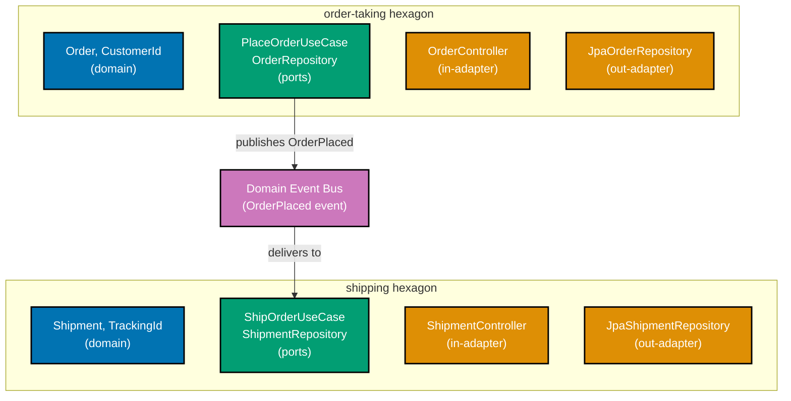
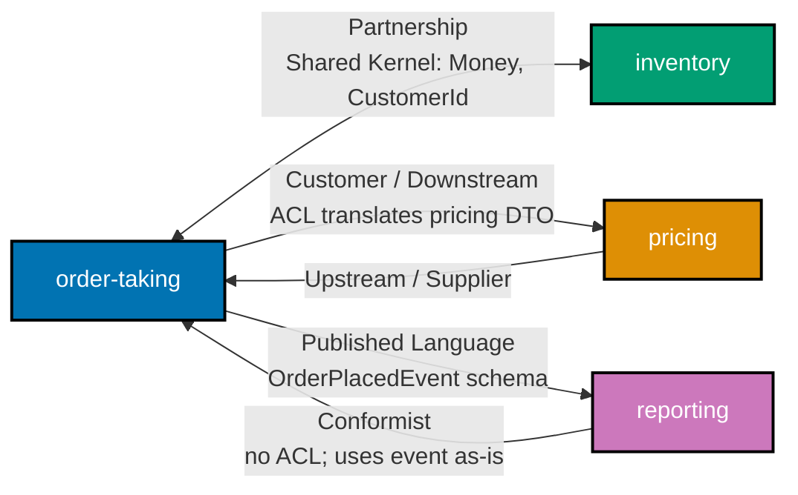
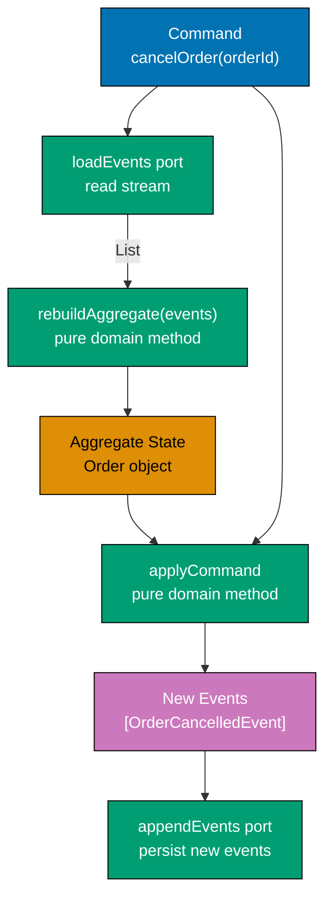
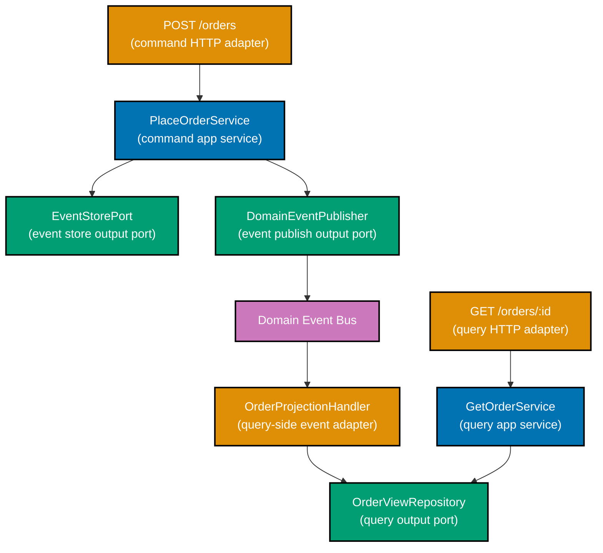
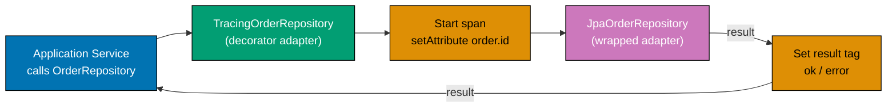
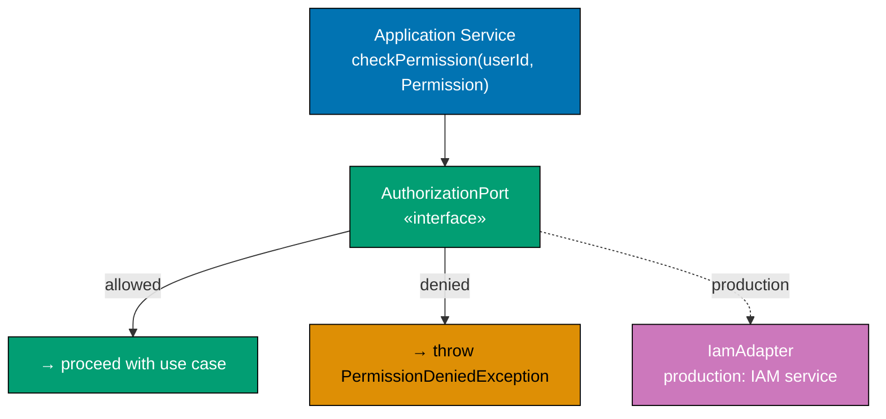
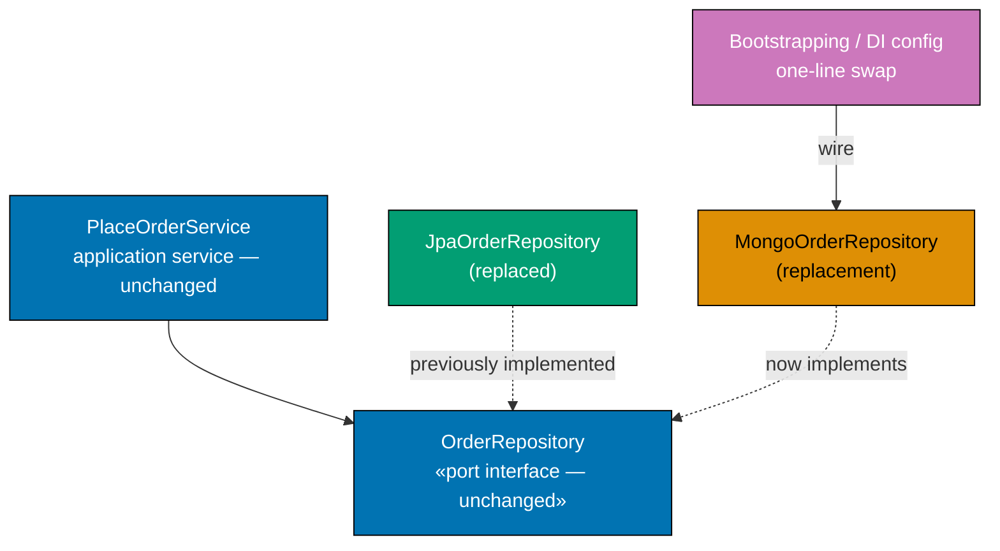
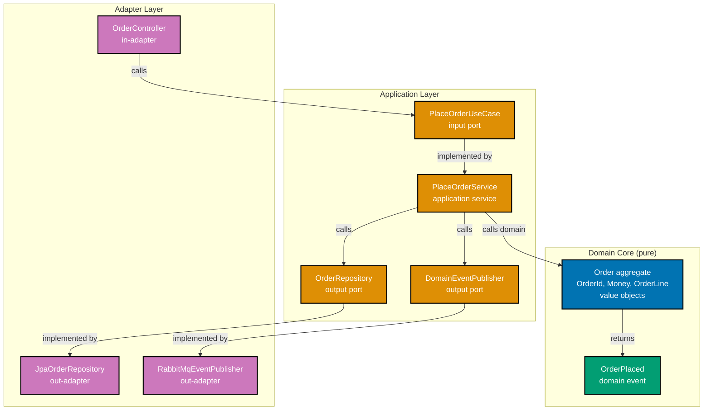
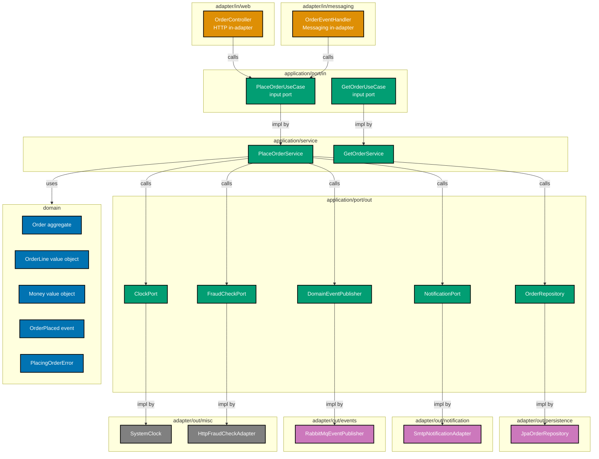

Examples 56–68 cover strategic domain design at the multi-hexagon scale: bounded contexts as independent hexagons, context maps, shared kernels, anti-corruption layers, published language, event sourcing, and CQRS read/write split — followed by observability, authentication, authorization, multi-tenancy, rate limiting, and schema migration adapters. Every code block is self-contained. Annotation density targets 1.0–2.25 comment lines per code line per example.

## Strategic Design — Bounded Contexts as Hexagons (Examples 56–62)

### Example 56: Bounded context as a hexagon

Each bounded context in a large system is its own independent hexagon: its own domain model, its own application ports, its own adapters. Two contexts never import each other's domain classes. The only legal coupling between contexts is through events published on a shared bus — never through shared domain objects.



**Java** — two hexagons communicating through events only:

```java
// ── order-taking hexagon ──────────────────────────────────────────────────────
// Package: com.example.ordertaking.domain
// => This package has zero imports from com.example.shipping.*
// => Domain types belong exclusively to order-taking context
record OrderId(String value) {}         // => typed id; not shared with shipping
// => record OrderId: immutable value type; equals/hashCode/toString generated by compiler
record CustomerId(String value) {}      // => order-taking's own customer concept
// => record CustomerId: immutable value type; equals/hashCode/toString generated by compiler
record Money(long centAmount) {}        // => value object; immutable; no framework

// Domain event published by order-taking hexagon
// => Lives in order-taking's application layer; shared only as a DTO on the bus
// => shipping context receives this DTO and maps to its own domain type
record OrderPlacedEvent(String orderId, long totalCents) {}

// Output port in order-taking: publishes domain events to the bus
// => Adapter wires to Kafka, RabbitMQ, or in-process; application layer is unaware
interface DomainEventPublisher {
// => interface DomainEventPublisher: contract definition — no implementation details here
    void publish(OrderPlacedEvent event); // => fire-and-forget; bus delivers to shipping
    // => Application service calls this after persisting the order
}

// Application service: orchestrates order-taking domain and publishes event
// => Does NOT import any type from com.example.shipping.*
class PlaceOrderService {
// => class PlaceOrderService: implementation — contains field declarations and methods below
    private final DomainEventPublisher publisher; // => injected; adapter provided at boot
    // => publisher: DomainEventPublisher — final field; assigned once in constructor; immutable reference

    PlaceOrderService(DomainEventPublisher publisher) {
    // => executes the statement above; continues to next line
        this.publisher = publisher; // => constructor injection; no Spring @Autowired needed
        // => this.publisher stored — field holds injected publisher for method calls below
    }

    OrderId placeOrder(CustomerId customer, Money total) {
    // => executes the statement above; continues to next line
        var id = new OrderId(java.util.UUID.randomUUID().toString()); // => generate id
        // => id: holds the result of the expression on the right
        publisher.publish(new OrderPlacedEvent(id.value(), total.centAmount())); // => emit event
        // => shipping hexagon reacts to this event independently
        return id; // => return id to HTTP adapter; no coupling to shipping's response
        // => returns the result to the caller — caller receives this value
    }
}

// ── shipping hexagon ──────────────────────────────────────────────────────────
// Package: com.example.shipping.domain
// => Has its own Shipment type; never imports OrderId from order-taking
// => TrackingId is shipping's concept; order-taking knows nothing of it
record TrackingId(String value) {}      // => shipping-specific type
// => record TrackingId: immutable value type; equals/hashCode/toString generated by compiler
record Shipment(TrackingId id, String orderId, String status) {}
// => orderId here is plain String from the event DTO — not order-taking's OrderId type
// => This is intentional: contexts share data values, never shared domain objects

// Input adapter in shipping: subscribes to the event bus
// => Receives OrderPlacedEvent DTO; translates to shipping domain command
class OrderPlacedEventHandler {
// => class OrderPlacedEventHandler: implementation — contains field declarations and methods below
    void handle(OrderPlacedEvent event) {
    // => handle: method entry point — see implementation below
        var trackingId = new TrackingId(java.util.UUID.randomUUID().toString()); // => new id
        // => trackingId: holds the result of the expression on the right
        var shipment = new Shipment(trackingId, event.orderId(), "PENDING"); // => create domain object
        // => shipment persisted via shipping's own ShipmentRepository port (not shown)
        System.out.println("Shipping: created shipment " + trackingId.value()); // => Output: Shipping: created shipment <uuid>
        // => output: verification line — shows result in console
    }
}
```

**Kotlin** — two hexagons, event-only coupling:

```kotlin
import java.util.UUID                                                // => UUID for id generation

// ── order-taking hexagon ──────────────────────────────────────────────────────
// Package: com.example.ordertaking.domain
// => No import from com.example.shipping; contexts are fully independent
data class OrderId(val value: String)       // => order-taking's own typed id
// => data class OrderId: value type; copy/equals/hashCode/toString auto-generated
data class Money(val centAmount: Long)      // => immutable value object; cents avoids float rounding

// Event DTO crossing context boundary via bus
// => Both contexts know this DTO schema; neither imports the other's domain
data class OrderPlacedEvent(val orderId: String, val totalCents: Long)
// => flat DTO; primitive fields only; no domain types crossing context boundary

// Output port: order-taking publishes events; adapter wires Kafka or in-memory
fun interface DomainEventPublisher {
// => interface DomainEventPublisher: contract definition — no implementation details here
    fun publish(event: OrderPlacedEvent) // => abstraction hides transport technology
    // => Adapter could be KafkaEventPublisher or InMemoryEventBus in tests
}

// Application service: places order and publishes event
// => No reference to shipping package anywhere in this file
class PlaceOrderService(private val publisher: DomainEventPublisher) {
// => class PlaceOrderService: implementation — contains field declarations and methods below
    fun placeOrder(customerId: String, total: Money): OrderId {
    // => placeOrder: method entry point — see implementation below
        val id = OrderId(UUID.randomUUID().toString()) // => fresh order id
        // => id: holds the result of the expression on the right
        publisher.publish(OrderPlacedEvent(id.value, total.centAmount)) // => event to bus
        // => shipping reacts asynchronously; order-taking does not wait
        return id // => return to HTTP adapter
        // => returns the result to the caller — caller receives this value
    }
}

// ── shipping hexagon ──────────────────────────────────────────────────────────
// Package: com.example.shipping.domain
// => Imports only OrderPlacedEvent DTO, never order-taking domain types
data class TrackingId(val value: String)   // => shipping's own identity concept
// => data class TrackingId: value type; copy/equals/hashCode/toString auto-generated
data class Shipment(val id: TrackingId, val orderId: String, val status: String)
// => orderId: String (value from event); not order-taking's OrderId type
// => status: String here; production would use enum; simplified for clarity

// Event handler adapter in shipping hexagon
class OrderPlacedEventHandler {
// => class OrderPlacedEventHandler: implementation — contains field declarations and methods below
    fun handle(event: OrderPlacedEvent) {
    // => handle: method entry point — see implementation below
        val trackingId = TrackingId(UUID.randomUUID().toString()) // => generate tracking id
        // => trackingId: holds the result of the expression on the right
        val shipment = Shipment(trackingId, event.orderId, "PENDING") // => domain construction
        // => persisted via ShipmentRepository port; handler is adapter calling app port
        println("Shipping: created shipment ${shipment.id.value}") // => Output: Shipping: created shipment <uuid>
        // => no return; side-effect only; persisted via port (not shown)
        // => handler decoupled from order-taking; no import of order-taking domain
    }
}
```

**C#** — two hexagons, event-only coupling:

```csharp
using System;                                                         // => System for Guid, Console

// ── order-taking hexagon ──────────────────────────────────────────────────────
// Namespace: OrderTaking.Domain
// => No using directive for Shipping.*; namespaces enforce context separation
public record OrderId(string Value);           // => typed id; not shared with Shipping
// => executes the statement above; continues to next line
public record Money(long CentAmount);          // => immutable value object; CentAmount avoids float

// Event DTO: crosses context boundary on the event bus only
// => Both contexts reference this DTO type; it acts as the shared schema
public sealed record OrderPlacedEvent(string OrderId, long TotalCents);  // => event DTO; flat
// => OrderId: plain string here; shipping doesn't import OrderTaking's OrderId type

// Output port: publishes event; adapter wires MassTransit or in-memory
public interface IDomainEventPublisher  // => application zone; no MassTransit import
// => executes the statement above; continues to next line
{
    void Publish(OrderPlacedEvent evt); // => fire-and-forget; bus delivers asynchronously
    // => Application service calls this; knows nothing of Kafka or RabbitMQ
}

// Application service: places order and publishes event
// => No using directive for Shipping; zero coupling to shipping namespace
public class PlaceOrderService  // => order-taking application service
// => executes the statement above; continues to next line
{
    private readonly IDomainEventPublisher _publisher; // => injected at boot
    // => executes the statement above; continues to next line

    public PlaceOrderService(IDomainEventPublisher publisher) =>    // => constructor injection
    // => constructor: receives all dependencies — enables testing with any adapter implementation
        _publisher = publisher; // => constructor injection; no service locator
        // => executes the statement above; continues to next line

    public OrderId PlaceOrder(string customerId, Money total)       // => command handler
    // => executes the statement above; continues to next line
    {
        var id = new OrderId(Guid.NewGuid().ToString()); // => fresh order id
        // => id: holds the result of the expression on the right
        _publisher.Publish(new OrderPlacedEvent(id.Value, total.CentAmount)); // => emit to bus
        // => Shipping reacts to event; PlaceOrderService never calls shipping directly
        return id; // => return to HTTP adapter
        // => returns the result to the caller — caller receives this value
    }
}

// ── shipping hexagon ──────────────────────────────────────────────────────────
// Namespace: Shipping.Domain
// => References OrderPlacedEvent DTO only; never OrderTaking.Domain.Order
public record TrackingId(string Value);        // => shipping's own identity type
// => executes the statement above; continues to next line
public record Shipment(TrackingId Id, string OrderId, string Status);  // => shipping aggregate
// => OrderId here is plain string from event; not order-taking's OrderId record

// Event handler adapter: subscribes to bus, calls shipping application port
public class OrderPlacedEventHandler  // => inbound adapter; shipping hexagon
// => executes the statement above; continues to next line
{
    public void Handle(OrderPlacedEvent evt)                         // => receives event; translates
    // => executes the statement above; continues to next line
    {
        var trackingId = new TrackingId(Guid.NewGuid().ToString()); // => generate tracking id
        // => trackingId: holds the result of the expression on the right
        var shipment = new Shipment(trackingId, evt.OrderId, "Pending"); // => domain object
        // => ShipmentRepository port called here (omitted for brevity)
        Console.WriteLine($"Shipping: created shipment {shipment.Id.Value}"); // => Output: Shipping: created shipment <guid>
        // => shipment.Id.Value: GUID string; unique per shipment
    }
}
```

**Key Takeaway**: Each bounded context is a self-contained hexagon. Cross-context communication flows through event DTOs on a bus — never through shared domain object imports.

**Why It Matters**: When two bounded contexts share domain classes directly, every internal refactoring in one context breaks the other. Event-only coupling gives each hexagon complete freedom to evolve its domain model independently. Teams can deploy `order-taking` and `shipping` on separate schedules, owned by separate squads, backed by separate databases — all because the only shared artifact is a versioned event schema, not a shared domain object graph.

---

### Example 57: Context map — hexagon relationships

A context map documents how bounded contexts relate and therefore how their adapters must be designed. Partnership contexts share a kernel and coordinate changes. Customer/Supplier means the upstream (supplier) provides an API the downstream (customer) consumes — but the upstream does not conform to the downstream. A Conformist downstream accepts the upstream model as-is with no translation.



**Java** — three relationship patterns map to three adapter designs:

```java
import java.math.BigDecimal;
// => executes the statement above; continues to next line
import java.util.Optional;

// ── Shared Kernel: Money used by both order-taking and inventory ───────────────
// => Placed in a shared-kernel module; both contexts depend on it
// => Changes to Money require coordinated agreement between both teams
record Money(BigDecimal amount, String currency) {
// => record Money: immutable value type; equals/hashCode/toString generated by compiler
    Money {
    // => executes the statement above; continues to next line
        if (amount.signum() < 0) throw new IllegalArgumentException("negative money"); // => guard
        // => Shared kernel types carry shared invariants; both contexts enforce them
    }
}

// ── Customer/Supplier: order-taking (customer) calls pricing (supplier) ────────
// Pricing upstream publishes its own DTO; order-taking must not share it as-is
// => Anti-Corruption Layer adapter translates pricing response to order-taking types

// Pricing supplier's DTO (as-is from pricing context — order-taking cannot change it)
record PricingResponseDto(String itemCode, double priceUsd) {} // => upstream schema; read-only

// ACL output port: order-taking's view of what "get price" means
// => Returns Money (order-taking domain type); caller never sees PricingResponseDto
interface PricePort {
// => interface PricePort: contract definition — no implementation details here
    Optional<Money> getPrice(String itemCode); // => domain return type; no pricing DTO leaks
    // => Adapter translates double→BigDecimal, usd→currency string, missing→empty
}

// ACL adapter: wraps pricing HTTP client; translates DTO to order-taking domain type
class PricingAclAdapter implements PricePort {
// => PricingAclAdapter implements PricePort — satisfies the port contract
    @Override
    // => @Override: compiler verifies this method signature matches the interface
    public Optional<Money> getPrice(String itemCode) {
        // => In production: call pricing HTTP API, deserialise PricingResponseDto
        var dto = new PricingResponseDto(itemCode, 29.99); // => simulated upstream response
        // => dto: holds the result of the expression on the right
        var amount = BigDecimal.valueOf(dto.priceUsd());  // => double→BigDecimal translation
        // => amount: holds the result of the expression on the right
        return Optional.of(new Money(amount, "USD"));     // => wrapped in domain value object
        // => Domain never sees PricingResponseDto; ACL absorbs all schema coupling
    }
}

// ── Conformist: reporting conforms to order-taking's published event ───────────
// Reporting uses OrderPlacedEvent exactly as published; no ACL needed
// => Conformist accepts upstream model changes without negotiation
record OrderPlacedEvent(String orderId, BigDecimal total, String currency) {}
// => reporting adapter deserialises this directly; no mapping, no translation layer
// => Risk: if order-taking changes this event, reporting must update immediately

class ReportingEventHandler {
// => class ReportingEventHandler: implementation — contains field declarations and methods below
    void handle(OrderPlacedEvent event) {
        // => Direct use of event fields; no translation; this IS the conformist pattern
        System.out.printf("Report: order %s total %s %s%n",
        // => executes the statement above; continues to next line
            event.orderId(), event.total(), event.currency()); // => Output: Report: order <id> total <amt> <ccy>
            // => method call: delegates to collaborator; result captured above
    }
}
```

**Kotlin** — same three patterns:

```kotlin
import java.math.BigDecimal                                          // => BigDecimal for monetary amounts

// ── Shared Kernel ─────────────────────────────────────────────────────────────
// Both order-taking and inventory import this from shared-kernel module
// => Coordinated breaking change required to modify; not owned by one team
data class Money(val amount: BigDecimal, val currency: String) {     // => shared value object
    init { require(amount.signum() >= 0) { "negative money" } } // => shared invariant enforced
    // => Both contexts rely on this invariant; shared kernel keeps logic in one place
}

// ── Customer/Supplier ACL ─────────────────────────────────────────────────────
// Pricing upstream DTO: order-taking receives but cannot change this schema
data class PricingResponseDto(val itemCode: String, val priceUsd: Double) // => upstream contract
// => Double (not BigDecimal): legacy pricing API returns IEEE 754 float; ACL converts

// Output port: order-taking's own abstraction over "get a price"
fun interface PricePort {                                            // => SAM; application zone
    fun getPrice(itemCode: String): Money? // => returns domain Money; no DTO exposed
    // => null = not found; adapter handles pricing-side 404 transparently
}

// ACL adapter: translates upstream DTO to domain type
val pricingAclAdapter = PricePort { itemCode ->                      // => lambda implements SAM
    val dto = PricingResponseDto(itemCode, 29.99) // => simulated upstream call result
    Money(BigDecimal.valueOf(dto.priceUsd), "USD") // => translation: double→BigDecimal
    // => Domain only sees Money; pricing schema evolution is absorbed here
    // => BigDecimal.valueOf: exact conversion; avoids floating-point precision issues
}

// ── Conformist ────────────────────────────────────────────────────────────────
// Reporting receives event exactly as published; no mapping
data class OrderPlacedEvent(val orderId: String, val total: BigDecimal, val currency: String)
// => Conformist: reporting team accepts that order-taking owns this schema
// => no ACL, no translation; schema changes in order-taking immediately affect reporting

class ReportingEventHandler {                                        // => conformist; no ACL
    fun handle(event: OrderPlacedEvent) {                            // => direct field access; no mapping
        println("Report: order ${event.orderId} total ${event.total} ${event.currency}")
        // => Output: Report: order <id> total <amt> <ccy>
        // => No translation; this IS the conformist pattern — direct consumption
    }
}
```

**C#** — same three patterns:

```csharp
using System;                                                         // => ArgumentException

// ── Shared Kernel ─────────────────────────────────────────────────────────────
// Placed in SharedKernel project; both OrderTaking and Inventory reference it
// => Breaking change to Money requires both teams to update simultaneously
public sealed record Money(decimal Amount, string Currency)  // => shared value object; sealed; immutable
// => executes the statement above; continues to next line
{
    public Money : this(Amount, Currency) // => primary constructor validation; runs at new()
    // => constructor: receives all dependencies — enables testing with any adapter implementation
    {
        if (Amount < 0) throw new ArgumentException("negative money"); // => shared invariant
        // => Both contexts enforce this rule via shared type — no duplication
        // => ArgumentException thrown at construction; no invalid Money possible
    }
}

// ── Customer/Supplier ACL ─────────────────────────────────────────────────────
// Pricing upstream DTO: order-taking cannot change this schema
public record PricingResponseDto(string ItemCode, double PriceUsd); // => upstream shape; read-only
// => double PriceUsd: pricing API uses IEEE 754 float; ACL converts to decimal

// Output port: order-taking's abstraction; returns domain Money, not upstream DTO
public interface IPricePort  // => application zone; no HTTP client import
// => executes the statement above; continues to next line
{                                                                     // => application zone interface
// => interface type: contract definition — no implementation details here
    Money? GetPrice(string itemCode); // => null = not found; domain type returned
    // => ACL adapter translates; domain service never knows DTO shape exists
    // => nullable: item not in catalog returns null; not exception
}

// ACL adapter: wraps pricing HTTP client, translates to domain types
public class PricingAclAdapter : IPricePort  // => ACL adapter; adapter zone only; no IPricePort knowledge in domain
// => executes the statement above; continues to next line
{
    public Money? GetPrice(string itemCode)  // => translate DTO to domain Money
    // => executes the statement above; continues to next line
    {
        var dto = new PricingResponseDto(itemCode, 29.99m); // => simulated upstream call
        // => dto: holds the result of the expression on the right
        return new Money((decimal)dto.PriceUsd, "USD");     // => double→decimal translation
        // => Domain shielded from upstream schema; ACL absorbs all pricing coupling
        // => (decimal)dto.PriceUsd: explicit cast; precision acceptable for prices
    }
}

// ── Conformist ────────────────────────────────────────────────────────────────
// Reporting conforms to order-taking's published event; no ACL, no translation
public sealed record OrderPlacedEvent(string OrderId, decimal Total, string Currency);  // => conformist DTO
// => Conformist accepts event schema owned by order-taking; no negotiation
// => sealed: immutable event; cannot be subclassed; value equality

public class ReportingEventHandler  // => conformist; no ACL; direct consumption
// => executes the statement above; continues to next line
{
    public void Handle(OrderPlacedEvent evt)  // => event handler; uses publisher's field names
    // => executes the statement above; continues to next line
    {
        Console.WriteLine($"Report: order {evt.OrderId} total {evt.Total} {evt.Currency}");  // => log/display
        // => Output: Report: order <id> total <amt> <ccy>
        // => No translation layer; conformist uses upstream model directly
        // => evt.OrderId, evt.Total: order-taking's names; conformist accepts without renaming
    }
}
```

**Key Takeaway**: The relationship type (Partnership, Customer/Supplier, Conformist) determines adapter complexity — ACL for Customer/Supplier, direct use for Conformist, and coordinated shared code for Partnership.

**Why It Matters**: Without a context map, teams make informal assumptions about who owns what schema, leading to silent coupling. Codifying relationships as Partnership, Customer/Supplier, or Conformist forces explicit decisions about which team bears translation cost, who can make breaking changes, and where an Anti-Corruption Layer is mandatory. This documentation artifact prevents the most common form of distributed-system coupling: two teams accidentally sharing domain object schemas because nobody decided otherwise.

---

### Example 58: Shared kernel

A shared kernel is a small, stable module owned jointly by two or more bounded contexts. It contains only types both contexts genuinely share: identity value objects, money, addresses. Both contexts depend on the shared kernel module. They never depend on each other. Changes to the shared kernel are coordinated breaking changes requiring agreement from all owning teams.

**Java** — shared kernel module with `module-info.java`:

```java
// File: shared-kernel/src/main/java/module-info.java
// => Java module system enforces that only exported packages can be imported
// => shared-kernel exports exactly three packages; nothing else crosses contexts
module com.example.sharedkernel {
// => executes the statement above; continues to next line
    exports com.example.sharedkernel.identity;  // => CustomerId, OrderId types
    // => executes the statement above; continues to next line
    exports com.example.sharedkernel.money;     // => Money value object
    // => executes the statement above; continues to next line
    exports com.example.sharedkernel.address;   // => Address value object
    // => Both order-taking and shipping modules declare: requires com.example.sharedkernel;
    // => They never declare: requires com.example.ordertaking; (cross-context import forbidden)
}

// File: shared-kernel/src/main/java/com/example/sharedkernel/money/Money.java
package com.example.sharedkernel.money;
// => executes the statement above; continues to next line
import java.math.BigDecimal;
// => executes the statement above; continues to next line
import java.util.Objects;

// Shared kernel type: immutable, framework-free, owned by all participating teams
// => Changes here require coordinated release across order-taking AND shipping
public record Money(BigDecimal amount, String currency) {
// => record Money: immutable value type; equals/hashCode/toString generated by compiler
    public Money {
    // => executes the statement above; continues to next line
        Objects.requireNonNull(amount, "amount required");    // => null guard
        // => method call: delegates to collaborator; result captured above
        Objects.requireNonNull(currency, "currency required"); // => null guard
        // => method call: delegates to collaborator; result captured above
        if (amount.signum() < 0) throw new IllegalArgumentException("negative amount"); // => invariant
        // => Invariant lives here once; all contexts inherit it automatically
    }
    public Money add(Money other) {
    // => add: method entry point — see implementation below
        if (!currency.equals(other.currency)) throw new IllegalArgumentException("currency mismatch"); // => guard
        // => conditional branch: execution path depends on condition above
        return new Money(amount.add(other.amount), currency); // => returns new Money; immutable
        // => returns the result to the caller — caller receives this value
    }
}

// File: shared-kernel/src/main/java/com/example/sharedkernel/identity/CustomerId.java
package com.example.sharedkernel.identity;
// => CustomerId: both order-taking and shipping use same customer identity concept
public record CustomerId(String value) {
// => record CustomerId: immutable value type; equals/hashCode/toString generated by compiler
    public CustomerId { if (value == null || value.isBlank()) throw new IllegalArgumentException("blank id"); }
    // => Validation in record compact constructor; runs on every construction
}
```

**Kotlin** — shared kernel as a Gradle subproject:

```kotlin
// File: shared-kernel/build.gradle.kts
// => Separate Gradle subproject; both order-taking and shipping list it as a dependency
plugins { kotlin("jvm") }                                            // => apply Kotlin JVM plugin

// order-taking/build.gradle.kts and shipping/build.gradle.kts both declare:
// dependencies { implementation(project(":shared-kernel")) }
// => Neither context lists the other as a dependency — only shared-kernel

// File: shared-kernel/src/main/kotlin/Money.kt
package com.example.sharedkernel                                     // => shared kernel package

// data class: structural equality; immutable; no framework annotation
// => All participating contexts import this; changes are coordinated breaking changes
data class Money(val amount: java.math.BigDecimal, val currency: String) {  // => shared value object
// => class Money: implementation — contains field declarations and methods below
    init {                                                           // => validation at construction
    // => executes the statement above; continues to next line
        require(amount.signum() >= 0) { "negative amount" } // => invariant; throws if violated
        // => method call: delegates to collaborator; result captured above
        require(currency.isNotBlank()) { "blank currency" }  // => guard against empty string
        // => Both order-taking and shipping inherit these guards automatically
    }
    operator fun plus(other: Money): Money {                         // => currency-safe addition
    // => plus: method entry point — see implementation below
        require(currency == other.currency) { "currency mismatch" } // => guard
        // => method call: delegates to collaborator; result captured above
        return copy(amount = amount + other.amount)                 // => immutable addition
        // => Returns new Money; original unchanged; functional style
    }
}

// File: shared-kernel/src/main/kotlin/CustomerId.kt
package com.example.sharedkernel
// => CustomerId: stable identity; shared by both contexts via this module
data class CustomerId(val value: String) {                           // => shared identity type
// => class CustomerId: implementation — contains field declarations and methods below
    init { require(value.isNotBlank()) { "blank customer id" } } // => guard at construction
    // => Contexts use CustomerId; they do NOT import each other's domain types
}
```

**C#** — shared kernel as a separate project reference:

```csharp
// File: SharedKernel/SharedKernel.csproj
// => Separate .csproj; OrderTaking.csproj and Shipping.csproj both reference it:
// <ProjectReference Include="../SharedKernel/SharedKernel.csproj" />
// => Neither project references the other — only SharedKernel
// => this pattern: shared kernel as NuGet-style internal package

// File: SharedKernel/Money.cs
namespace SharedKernel;                                              // => shared namespace

// sealed record: immutable, value equality, cannot be subclassed
// => Changes here are coordinated breaking changes; all teams must agree
public sealed record Money(decimal Amount, string Currency)          // => shared value object
// => executes the statement above; continues to next line
{
    public Money : this(Amount, Currency) // => validate in primary constructor
    // => constructor: receives all dependencies — enables testing with any adapter implementation
    {                                                                 // => validation on construction
    // => executes the statement above; continues to next line
        if (Amount < 0) throw new ArgumentException("negative amount"); // => shared invariant
        // => conditional branch: execution path depends on condition above
        if (string.IsNullOrWhiteSpace(Currency)) throw new ArgumentException("blank currency"); // => guard
        // => Every context constructing Money gets these guards automatically
    }

    public Money Add(Money other)                                     // => currency-safe addition
    // => executes the statement above; continues to next line
    {
        if (Currency != other.Currency) throw new InvalidOperationException("currency mismatch"); // => guard
        // => conditional branch: execution path depends on condition above
        return this with { Amount = Amount + other.Amount }; // => non-destructive mutation
        // => Returns new record; original unchanged; immutable pattern
    }
}

// File: SharedKernel/CustomerId.cs
namespace SharedKernel;                                              // => same shared namespace
// => Both OrderTaking and Shipping import this type; never each other's types
public sealed record CustomerId(string Value)                        // => shared identity type
// => executes the statement above; continues to next line
{
    public CustomerId : this(Value) // => validation in primary constructor
    // => constructor: receives all dependencies — enables testing with any adapter implementation
    {                                                                 // => validation at construction
    // => executes the statement above; continues to next line
        if (string.IsNullOrWhiteSpace(Value)) throw new ArgumentException("blank id"); // => guard
        // => Stable type; any change requires coordinated update across all contexts
    }
}
```

**Key Takeaway**: A shared kernel is a small, stable, jointly-owned module containing only types both contexts genuinely share. It is not a dumping ground — every type added is a coordinated change commitment.

**Why It Matters**: The shared kernel pattern resolves the tension between DRY (don't repeat yourself) and bounded context independence. Without it, teams either duplicate `Money` and `CustomerId` in each context (leading to divergence) or import each other's domain packages (creating hidden coupling). The shared kernel is the explicit, narrow contract: small enough that coordination is cheap, stable enough that breaking changes are rare, and formally owned so responsibility is clear.

---

### Example 59: Anti-Corruption Layer protecting from a legacy system

A legacy system has a chaotic API: wrong field names, cents stored as plain integers, missing address fields. The Anti-Corruption Layer adapter translates everything at the boundary. The domain never imports the legacy client type.

**Java** — ACL adapter translating legacy response:

```java
import java.util.Optional;

// ── Legacy system client types (external; we do not control these) ─────────────
// => These types come from the legacy system's SDK or are deserialized from its API
// => Field names, types, and semantics are all legacy conventions — not ours
class LegacyOrderResponse {
// => class LegacyOrderResponse: implementation — contains field declarations and methods below
    public String order_ref;          // => snake_case; legacy naming convention
    // => executes the statement above; continues to next line
    public int    price_in_cents;     // => integer cents; no currency field
    // => executes the statement above; continues to next line
    public String billing_addr;       // => billing address as flat string
    // => executes the statement above; continues to next line
    public String shipping_addr;      // => may be null if not separately specified
    // => Legacy system returns null shipping_addr when billing = shipping
}

// ── Domain types (we own these; no legacy dependency allowed here) ─────────────
record OrderId(String value) {}
// => record OrderId: immutable value type; equals/hashCode/toString generated by compiler
record Money(long centAmount, String currency) {}  // => our currency-aware type
// => record Money: immutable value type; equals/hashCode/toString generated by compiler
record Address(String formatted) {}               // => our typed address
// => record Address: immutable value type; equals/hashCode/toString generated by compiler
record OrderData(OrderId id, Money total, Address shippingAddress) {} // => domain aggregate DTO
// => record OrderData: immutable value type; equals/hashCode/toString generated by compiler
class OrderNotFound extends RuntimeException {
// => OrderNotFound extends RuntimeException — inherits base behaviour
    OrderNotFound(String ref) { super("order not found: " + ref); } // => domain exception
    // => executes the statement above; continues to next line
}

// ── Output port: domain's view of "load order data" ───────────────────────────
// => Returns domain types; caller sees nothing of the legacy world
interface OrderDataPort {
// => interface OrderDataPort: contract definition — no implementation details here
    Optional<OrderData> findByRef(String ref); // => Optional signals possible absence
    // => Throws OrderNotFound on definitive 404; returns empty on transient unavailability
}

// ── ACL adapter: wraps legacy client; translates to domain types ───────────────
class LegacyOrderSystemAclAdapter implements OrderDataPort {
// => LegacyOrderSystemAclAdapter implements OrderDataPort — satisfies the port contract
    @Override
    // => @Override: compiler verifies this method signature matches the interface
    public Optional<OrderData> findByRef(String ref) {
        // => In production: HTTP call to legacy system; here we simulate a response
        if ("UNKNOWN".equals(ref)) {
        // => conditional branch: execution path depends on condition above
            throw new OrderNotFound(ref); // => HTTP 404 from legacy → domain exception
            // => Domain never sees HTTP status codes; ACL translates them
        }

        var legacy = new LegacyOrderResponse();     // => simulated legacy response
        // => legacy: holds the result of the expression on the right
        legacy.order_ref      = ref;                // => snake_case field assignment
        // => executes the statement above; continues to next line
        legacy.price_in_cents = 4999;              // => 49.99 USD in legacy format
        // => executes the statement above; continues to next line
        legacy.billing_addr   = "123 Main St";     // => billing address always present
        // => executes the statement above; continues to next line
        legacy.shipping_addr  = null;               // => null means billing = shipping

        // Translation step 1: rename field and type-wrap id
        var id = new OrderId(legacy.order_ref);    // => order_ref → OrderId value object

        // Translation step 2: integer cents → Money value object with currency
        var money = new Money(legacy.price_in_cents, "USD"); // => add explicit currency
        // => Legacy has no currency; ACL hardcodes USD as business rule from legacy docs

        // Translation step 3: null shipping_addr → fall back to billing address
        var shipping = Optional.ofNullable(legacy.shipping_addr)
        // => shipping: holds the result of the expression on the right
            .orElse(legacy.billing_addr);          // => default rule documented here
            // => method call: delegates to collaborator; result captured above
        var address = new Address(shipping);        // => wrapped in domain type
        // => address: holds the result of the expression on the right

        return Optional.of(new OrderData(id, money, address)); // => domain aggregate DTO returned
        // => Caller sees only domain types; legacy schema is fully absorbed by this adapter
    }
}

// ── Usage: application service calls port; knows nothing of legacy ─────────────
class GetOrderService {
// => class GetOrderService: implementation — contains field declarations and methods below
    private final OrderDataPort port; // => injected at boot; adapter wired here
    // => port: OrderDataPort — final field; assigned once in constructor; immutable reference
    GetOrderService(OrderDataPort port) { this.port = port; }
    // => method call: delegates to collaborator; result captured above

    OrderData getOrder(String ref) {
    // => executes the statement above; continues to next line
        return port.findByRef(ref).orElseThrow(() -> new OrderNotFound(ref));
        // => Application service written purely against domain port
        // => Replacing the legacy system with a modern one = swap the adapter only
    }
}
```

**Kotlin** — ACL adapter:

```kotlin
// ── Legacy types (external; not our naming conventions) ───────────────────────
data class LegacyOrderResponse(
// => data class LegacyOrderResponse: value type; copy/equals/hashCode/toString auto-generated
    val order_ref: String,           // => snake_case; legacy convention
    // => executes the statement above; continues to next line
    val price_in_cents: Int,         // => integer; no currency; ACL adds "USD"
    // => executes the statement above; continues to next line
    val billing_addr: String,        // => always present; flat string
    // => executes the statement above; continues to next line
    val shipping_addr: String?       // => null means same as billing; ACL handles
    // => executes the statement above; continues to next line
)
// => LegacyOrderResponse: read-only from legacy SDK; we never modify this class

// ── Domain types ──────────────────────────────────────────────────────────────
data class OrderId(val value: String)                               // => typed identity; our convention
// => data class OrderId: value type; copy/equals/hashCode/toString auto-generated
data class Money(val centAmount: Long, val currency: String) // => we add currency; ACL adds USD
// => data class Money: value type; copy/equals/hashCode/toString auto-generated
data class Address(val formatted: String)                           // => typed address; our convention
// => data class Address: value type; copy/equals/hashCode/toString auto-generated
data class OrderData(val id: OrderId, val total: Money, val shippingAddress: Address)
// => domain aggregate DTO; no legacy field names; no snake_case
class OrderNotFound(ref: String) : RuntimeException("order not found: $ref") // => domain exception

// ── Output port ───────────────────────────────────────────────────────────────
fun interface OrderDataPort {
// => interface OrderDataPort: contract definition — no implementation details here
    fun findByRef(ref: String): OrderData? // => null = not found; domain type returned
    // => Throws OrderNotFound on definitive absence; never exposes legacy HTTP codes
    // => SAM interface; lambda adapter or class both work
}

// ── ACL adapter ───────────────────────────────────────────────────────────────
val legacyAclAdapter = OrderDataPort { ref ->
// => legacyAclAdapter: holds the result of the expression on the right
    if (ref == "UNKNOWN") throw OrderNotFound(ref) // => legacy 404 → domain exception
    // => ACL translates HTTP status to domain exception; application service unaware

    val legacy = LegacyOrderResponse(ref, 4999, "123 Main St", null) // => simulated legacy response
    // => legacy: holds the result of the expression on the right
    val id      = OrderId(legacy.order_ref)                           // => rename: order_ref → id
    // => id: holds the result of the expression on the right
    val money   = Money(legacy.price_in_cents.toLong(), "USD")        // => add currency; Int→Long
    // => money: holds the result of the expression on the right
    val address = Address(legacy.shipping_addr ?: legacy.billing_addr) // => null→billing fallback
    // => Every translation rule is documented inside this adapter; domain is clean
    // => ACL adapter: only class in codebase that knows both legacy and domain schemas

    OrderData(id, money, address) // => return domain aggregate DTO
    // => executes the statement above; continues to next line
}

// ── Application service: calls port; no legacy knowledge ─────────────────────
class GetOrderService(private val port: OrderDataPort) {
    // => port injected; legacy adapter or modern adapter — service is unaware
    fun getOrder(ref: String): OrderData =
    // => executes the statement above; continues to next line
        port.findByRef(ref) ?: throw OrderNotFound(ref) // => null → domain exception
    // => ?: null coalescing: null from port → throw domain exception
    // => Swapping legacy system for modern API = replace legacyAclAdapter with new impl
}
```

**C#** — ACL adapter:

```csharp
using System;                                                         // => Exception base class

// ── Legacy types (external DTO; not our naming conventions) ──────────────────
public class LegacyOrderResponse  // => external; we cannot change this class; SDK type
// => executes the statement above; continues to next line
{                                                                     // => mutable class; legacy convention
// => class type: implementation — contains field declarations and methods below
    public string order_ref { get; set; } = "";      // => snake_case; legacy naming
    // => executes the statement above; continues to next line
    public int    price_in_cents { get; set; }        // => integer; no currency field
    // => executes the statement above; continues to next line
    public string billing_addr { get; set; } = "";   // => always present in legacy
    // => executes the statement above; continues to next line
    public string? shipping_addr { get; set; }        // => null means billing = shipping
    // => all fields reflect legacy API contract; ACL adapter translates to our types
}

// ── Domain types ──────────────────────────────────────────────────────────────
public sealed record OrderId(string Value);                           // => typed identity
// => executes the statement above; continues to next line
public sealed record Money(long CentAmount, string Currency); // => we carry currency; legacy has no currency
// => executes the statement above; continues to next line
public sealed record Address(string Formatted);                       // => our typed address; not legacy string
// => executes the statement above; continues to next line
public sealed record OrderData(OrderId Id, Money Total, Address ShippingAddress);  // => domain DTO
// => all four records: pure C#; no [Table], no EF annotation; domain stays clean
public class OrderNotFoundException : Exception  // => domain exception; not HTTP exception
// => executes the statement above; continues to next line
{                                                                     // => inherits Exception; no HttpException
// => executes the statement above; continues to next line
    public OrderNotFoundException(string r) : base($"order not found: {r}") {} // => domain ex
    // => application layer catches this; HTTP adapter maps to 404
}                                                                     // => simple domain exception; no HTTP status code

// ── Output port ───────────────────────────────────────────────────────────────
public interface IOrderDataPort  // => application zone; no legacy types; no HTTP
// => executes the statement above; continues to next line
{                                                                     // => output port interface
// => interface type: contract definition — no implementation details here
    OrderData? FindByRef(string reference); // => null = not found; domain return type
    // => Application layer calls this; never sees legacy types or HTTP status codes
    // => ACL adapter implements; modern adapter could replace it
}

// ── ACL adapter: translates legacy to domain ──────────────────────────────────
public class LegacyOrderSystemAclAdapter : IOrderDataPort  // => adapter zone; translation
// => executes the statement above; continues to next line
{
// => operation completes; execution continues to next statement
    public OrderData? FindByRef(string reference)  // => translate or throw domain exception
    // => executes the statement above; continues to next line
    {
    // => operation completes; execution continues to next statement
        if (reference == "UNKNOWN")               // => legacy 404 → domain exception
        // => conditional branch: execution path depends on condition above
            throw new OrderNotFoundException(reference); // => 404 → domain exception
        // => HTTP status code absorbed here; application layer sees only domain exceptions

        var legacy = new LegacyOrderResponse           // => simulated legacy response
        // => legacy: holds the result of the expression on the right
        {                                               // => object initializer; all fields set
        // => executes the statement above; continues to next line
            order_ref      = reference,                 // => string id from legacy
            // => executes the statement above; continues to next line
            price_in_cents = 4999,                     // => 49.99 in integer cents
            // => executes the statement above; continues to next line
            billing_addr   = "123 Main St",             // => always present
            // => executes the statement above; continues to next line
            shipping_addr  = null                       // => null → billing fallback rule
            // => executes the statement above; continues to next line
        };
        // => operation completes; execution continues to next statement

        var id      = new OrderId(legacy.order_ref);   // => rename snake_case field; wrap in type
        // => id: holds the result of the expression on the right
        var money   = new Money(legacy.price_in_cents, "USD"); // => add currency; int→long
        // => money: holds the result of the expression on the right
        var addr    = legacy.shipping_addr ?? legacy.billing_addr; // => null→billing fallback
        // => addr: holds the result of the expression on the right
        var address = new Address(addr);                // => wrapped in domain type
        // => address: holds the result of the expression on the right

        return new OrderData(id, money, new Address(addr)); // => domain aggregate DTO
        // => Caller receives only domain types; legacy schema entirely hidden
        // => addr: non-null because billing_addr is always present in legacy
    }
    // => operation completes; execution continues to next statement
}

// ── Application service ────────────────────────────────────────────────────────
public class GetOrderService  // => application service; no legacy knowledge
// => executes the statement above; continues to next line
{
    private readonly IOrderDataPort _port; // => injected; adapter provided at startup
    // => executes the statement above; continues to next line
    public GetOrderService(IOrderDataPort port) => _port = port;  // => constructor injection
    // => constructor: receives all dependencies — enables testing with any adapter implementation

    public OrderData GetOrder(string reference) =>                // => expression body
    // => executes the statement above; continues to next line
        _port.FindByRef(reference) ?? throw new OrderNotFoundException(reference);
        // => ?? throw: C# null-coalescing throw; compact null-safety
        // => Domain service unaware of legacy system; adapter swap = zero service change
}
```

**Key Takeaway**: The ACL adapter owns all translation rules — field renaming, type coercion, null defaults, and error mapping. Domain and application layers remain completely unaware that a legacy system exists.

**Why It Matters**: Legacy systems are the most common source of domain model corruption in enterprise software. Without an ACL, teams start adding `order_ref` fields, integer prices, and nullable shipping addresses directly to their domain — the legacy system's chaos colonises the domain. The ACL is the firewall: one class absorbs all legacy-specific rules so the domain stays clean. When the legacy system is eventually replaced, the adapter is the only artifact that changes.

---

### Example 60: Published language — shared API contract

A published language is a formally versioned, shared schema that multiple bounded contexts use to communicate. The publisher owns the schema and guarantees backward compatibility within a version. Consumers deserialise the schema via their own ACL adapters, mapping to their internal domain types. No source code is shared — only the schema document.

**Java** — publisher produces versioned event DTO; consumer uses ACL adapter:

```java
import java.math.BigDecimal;
// => executes the statement above; continues to next line
import java.util.List;

// ── Publisher side: order-taking publishes this as its public language ─────────
// => Version field enables consumers to detect schema evolution
// => All fields are stable; adding optional fields is non-breaking; removing is breaking
record OrderPlacedEventV1(
// => executes the statement above; continues to next line
    int     version,        // => always 1 for this schema generation; consumers check this
    // => executes the statement above; continues to next line
    String  orderId,        // => stable; will not be renamed in v1
    // => executes the statement above; continues to next line
    BigDecimal totalAmount, // => stable; BigDecimal serialises as JSON number
    // => executes the statement above; continues to next line
    String  currency,       // => ISO 4217 currency code; stable
    // => executes the statement above; continues to next line
    List<String> itemIds    // => list of item ids; may grow; consumers must handle additions
    // => executes the statement above; continues to next line
) {}

// => order-taking serialises this to JSON and publishes to event bus
// => Schema is documented in OpenAPI or JSON Schema and versioned in a schema registry

// ── Consumer side: shipping uses ACL to map event to its own domain types ──────
// Shipping's own domain concept of a received order
record ShippingOrderReceived(
// => executes the statement above; continues to next line
    String      shipmentRef,  // => shipping's own id concept; different from orderId
    // => executes the statement above; continues to next line
    BigDecimal  declaredValue, // => shipping uses "declared value" not "total amount"
    // => executes the statement above; continues to next line
    String      currencyCode  // => same concept, different field name in shipping domain
    // => executes the statement above; continues to next line
) {}

// Shipping's ACL port: receives published language event, returns shipping domain type
interface OrderEventPort {
// => interface OrderEventPort: contract definition — no implementation details here
    ShippingOrderReceived toShippingOrder(OrderPlacedEventV1 event);
    // => Mapping is explicit; shipping domain never exposes OrderPlacedEventV1 beyond this layer
}

// Shipping's ACL adapter: translates published language to shipping domain type
class OrderPlacedAclAdapter implements OrderEventPort {
// => OrderPlacedAclAdapter implements OrderEventPort — satisfies the port contract
    @Override
    // => @Override: compiler verifies this method signature matches the interface
    public ShippingOrderReceived toShippingOrder(OrderPlacedEventV1 event) {
    // => toShippingOrder: method entry point — see implementation below
        if (event.version() != 1) throw new IllegalArgumentException("unsupported event version: " + event.version());
        // => Version check: adapter rejects unknown versions; consumer is not silently broken
        return new ShippingOrderReceived(
        // => returns the result to the caller — caller receives this value
            "SHIP-" + event.orderId(),    // => orderId → shipmentRef with shipping prefix
            // => method call: delegates to collaborator; result captured above
            event.totalAmount(),           // => totalAmount → declaredValue (renamed concept)
            // => method call: delegates to collaborator; result captured above
            event.currency()               // => currency → currencyCode (renamed field)
            // => method call: delegates to collaborator; result captured above
        );
        // => Shipping domain uses ShippingOrderReceived; never sees OrderPlacedEventV1
    }
}

// ── Usage: shipping event handler invokes ACL, works with domain type only ─────
class ShippingEventHandler {
// => class ShippingEventHandler: implementation — contains field declarations and methods below
    private final OrderEventPort acl; // => injected; adapter wired at boot
    // => acl: OrderEventPort — final field; assigned once in constructor; immutable reference
    ShippingEventHandler(OrderEventPort acl) { this.acl = acl; }
    // => method call: delegates to collaborator; result captured above

    void handle(OrderPlacedEventV1 event) {
    // => handle: method entry point — see implementation below
        var received = acl.toShippingOrder(event);        // => translate via ACL
        // => received: holds the result of the expression on the right
        System.out.println("Shipping received: " + received.shipmentRef()); // => Output: Shipping received: SHIP-<orderId>
        // => All subsequent processing uses ShippingOrderReceived; ACL boundary maintained
    }
}
```

**Kotlin** — publisher and consumer via ACL:

```kotlin
import java.math.BigDecimal                                          // => BigDecimal for money amounts

// ── Publisher side: order-taking's published language DTO ─────────────────────
data class OrderPlacedEventV1(                                       // => versioned published language DTO
// => data class OrderPlacedEventV1: value type; copy/equals/hashCode/toString auto-generated
    val version: Int,          // => 1 for this generation; consumers validate
    // => executes the statement above; continues to next line
    val orderId: String,       // => stable field; schema guarantee
    // => executes the statement above; continues to next line
    val totalAmount: BigDecimal, // => BigDecimal; serialises cleanly to JSON
    // => executes the statement above; continues to next line
    val currency: String,      // => ISO 4217; stable
    // => executes the statement above; continues to next line
    val itemIds: List<String>  // => may have more items in future; consumers must handle
    // => executes the statement above; continues to next line
)
// => V1 suffix: version in class name signals this is a versioned contract

// ── Consumer side: shipping's own domain type ─────────────────────────────────
data class ShippingOrderReceived(                                    // => shipping's own domain type
// => data class ShippingOrderReceived: value type; copy/equals/hashCode/toString auto-generated
    val shipmentRef: String,    // => shipping concept; derived from orderId
    // => executes the statement above; continues to next line
    val declaredValue: BigDecimal, // => shipping term for total
    // => executes the statement above; continues to next line
    val currencyCode: String    // => shipping field name for currency
    // => executes the statement above; continues to next line
)
// => different field names: shipping's ubiquitous language; not order-taking's

// ACL port and adapter: translates published language to shipping domain
fun interface OrderEventPort {                                        // => SAM; application zone
// => interface OrderEventPort: contract definition — no implementation details here
    fun toShippingOrder(event: OrderPlacedEventV1): ShippingOrderReceived  // => translation function
    // => Explicit translation; shipping domain stays clean of publisher types
}

val orderEventAcl = OrderEventPort { event ->                        // => lambda ACL adapter
// => orderEventAcl: holds the result of the expression on the right
    require(event.version == 1) { "unsupported event version: ${event.version}" }  // => version guard
    // => Version guard: adapter fails fast on unknown schema; no silent breakage
    ShippingOrderReceived(                                           // => construct shipping domain object
    // => executes the statement above; continues to next line
        shipmentRef    = "SHIP-${event.orderId}", // => orderId → shipmentRef with prefix
        // => executes the statement above; continues to next line
        declaredValue  = event.totalAmount,        // => rename: totalAmount → declaredValue
        // => executes the statement above; continues to next line
        currencyCode   = event.currency            // => rename: currency → currencyCode
        // => executes the statement above; continues to next line
    ) // => returns shipping domain type; publisher DTO absorbed at this boundary
    // => executes the statement above; continues to next line
}

// Event handler: calls ACL, works with domain type only
class ShippingEventHandler(private val acl: OrderEventPort) {        // => inbound adapter; handler
// => class ShippingEventHandler: implementation — contains field declarations and methods below
    fun handle(event: OrderPlacedEventV1) {                          // => handles published event
    // => handle: method entry point — see implementation below
        val received = acl.toShippingOrder(event)   // => translate at boundary; ACL absorbs schema
        // => received: holds the result of the expression on the right
        println("Shipping received: ${received.shipmentRef}") // => Output: Shipping received: SHIP-<orderId>
        // => Handler works with ShippingOrderReceived; publisher schema fully hidden
        // => ShipmentRepository port would be called here in production
    }
}
```

**C#** — publisher and consumer via ACL:

```csharp
using System;                                                         // => InvalidOperationException
// => executes the statement above; continues to next line
using System.Collections.Generic;                                     // => IReadOnlyList

// ── Publisher side: order-taking's published language event DTO ───────────────
public sealed record OrderPlacedEventV1(  // => versioned; V1 in name signals schema version
// => executes the statement above; continues to next line
    int Version,             // => always 1; consumers check before mapping
    // => executes the statement above; continues to next line
    string OrderId,          // => stable; guaranteed by publisher
    // => executes the statement above; continues to next line
    decimal TotalAmount,     // => decimal for money; stable type
    // => executes the statement above; continues to next line
    string Currency,         // => ISO 4217; stable
    // => executes the statement above; continues to next line
    IReadOnlyList<string> ItemIds // => list; may grow; consumers handle additions gracefully
    // => executes the statement above; continues to next line
);
// => sealed: no subclassing; schema is the contract; all fields required
// => IReadOnlyList<string> ItemIds: can be empty; future versions may add more

// ── Consumer side: shipping's own domain type ─────────────────────────────────
public sealed record ShippingOrderReceived(  // => shipping's domain type; not order-taking's
// => executes the statement above; continues to next line
    string ShipmentRef,      // => shipping concept; derived from OrderId
    // => executes the statement above; continues to next line
    decimal DeclaredValue,   // => shipping term for monetary value
    // => executes the statement above; continues to next line
    string CurrencyCode      // => shipping field name; matches ISO 4217
    // => executes the statement above; continues to next line
);
// => different field names: shipping's ubiquitous language; no orderId, totalAmount

// ACL port: translates published language to shipping domain type
public interface IOrderEventPort  // => application zone; no publisher type visible in domain
// => executes the statement above; continues to next line
{
    ShippingOrderReceived ToShippingOrder(OrderPlacedEventV1 evt);  // => translate at boundary
    // => Caller receives ShippingOrderReceived; never touches OrderPlacedEventV1 again
}

// ACL adapter implementation
public class OrderPlacedAclAdapter : IOrderEventPort  // => ACL adapter; adapter zone; translation only
// => executes the statement above; continues to next line
{                                                                     // => only class knowing both schemas
// => class knowing: implementation — contains field declarations and methods below
    public ShippingOrderReceived ToShippingOrder(OrderPlacedEventV1 evt)  // => translate V1→shipping
    // => executes the statement above; continues to next line
    {
        if (evt.Version != 1)                           // => version guard; fail fast
        // => conditional branch: execution path depends on condition above
            throw new InvalidOperationException($"unsupported event version: {evt.Version}");  // => fatal
        // => Version check at adapter boundary; consumer fails fast, not silently
        // => throw: not return null; unknown version is fatal, not recoverable

        return new ShippingOrderReceived(               // => construct shipping domain type
        // => returns the result to the caller — caller receives this value
            ShipmentRef   : $"SHIP-{evt.OrderId}",  // => orderId → prefixed shipment ref
            // => executes the statement above; continues to next line
            DeclaredValue : evt.TotalAmount,         // => totalAmount → shipping term
            // => executes the statement above; continues to next line
            CurrencyCode  : evt.Currency             // => currency → shipping field name
            // => executes the statement above; continues to next line
        ); // => shipping domain type; publisher DTO absorbed entirely
        // => named args: C# initializer with arg names for clarity
    }
}

// Event handler: uses ACL, works only with shipping domain type
public class ShippingEventHandler  // => inbound adapter; shipping hexagon
// => executes the statement above; continues to next line
{                                                                     // => event handler; subscribes to bus
// => executes the statement above; continues to next line
    private readonly IOrderEventPort _acl; // => injected; adapter wired at startup
    // => executes the statement above; continues to next line
    public ShippingEventHandler(IOrderEventPort acl) => _acl = acl;  // => constructor injection
    // => constructor: receives all dependencies — enables testing with any adapter implementation

    public void Handle(OrderPlacedEventV1 evt)  // => receives published event; calls ACL
    // => executes the statement above; continues to next line
    {                                                                 // => call ACL then work with domain type
    // => executes the statement above; continues to next line
        var received = _acl.ToShippingOrder(evt);                // => translate at ACL boundary
        // => received: holds the result of the expression on the right
        Console.WriteLine($"Shipping received: {received.ShipmentRef}"); // => Output: Shipping received: SHIP-<orderId>
        // => All downstream processing uses ShippingOrderReceived; schema boundary maintained
        // => received.ShipmentRef: shipping-side name; never evt.OrderId
    }
}
```

**Key Takeaway**: A published language is a versioned, formally owned schema. Consumers translate it through an ACL adapter. The schema is the only shared artifact — no shared source code crosses context boundaries.

**Why It Matters**: Published language makes the implicit explicit. When teams skip it and share internal domain types as events, every internal refactoring in the publisher silently breaks consumers. Versioning the event schema and translating through an ACL gives consumers stability guarantees: the ACL is the single point where schema evolution is handled, so consumers can run unmodified across multiple publisher releases until they choose to adopt a new event version.

---

### Example 61: Event sourcing port and adapter

Event sourcing replaces the standard "load aggregate → mutate → save aggregate" pattern with "load events → rebuild aggregate → apply command → append new events". The `EventStorePort` interface abstracts the event store. Application services write through this port; adapters back it with PostgreSQL, EventStoreDB, or in-memory for tests.



**Java** — event store port and in-memory adapter:

```java
import java.time.Instant;                             // => Instant: UTC timestamp for event occurrence
// => executes the statement above; continues to next line
import java.util.ArrayList;                           // => ArrayList: mutable event list for store
// => executes the statement above; continues to next line
import java.util.HashMap;                             // => HashMap: stream-id to event list mapping
// => executes the statement above; continues to next line
import java.util.List;                                // => List: ordered event collection
// => executes the statement above; continues to next line
import java.util.Map;                                 // => Map: type for streams and versions fields
// => executes the statement above; continues to next line
import java.util.Optional;                            // => Optional: unused here; imported for completeness

// ── Domain event base type ────────────────────────────────────────────────────
// => All domain events implement this marker interface
// => Sealing events with sealed interface (Java 17+) lets switch be exhaustive
sealed interface DomainEvent permits OrderPlaced, OrderConfirmed {} // => two permitted subtypes
// => interface DomainEvent: contract definition — no implementation details here
record OrderPlaced(String orderId, long totalCents, Instant occurredAt) implements DomainEvent {} // => creation event
// => OrderPlaced implements DomainEvent — satisfies the port contract
record OrderConfirmed(String orderId, Instant confirmedAt) implements DomainEvent {} // => state-change event

// Domain aggregate: rebuilt from event stream
// => No @Entity, no database field; state computed from events
class Order {                                         // => aggregate shell; state rebuilt by apply()
// => class Order: implementation — contains field declarations and methods below
    private String id;                                // => mutable: set by OrderPlaced event
    // => id: String — injected dependency; implementation chosen at wiring time
    private long   totalCents;                        // => mutable: set by OrderPlaced event
    // => totalCents: long — injected dependency; implementation chosen at wiring time
    private String status = "NEW"; // => initial state before any event applied

    // Apply each event to rebuild state — called by the event store adapter
    // => Aggregate only reads events; it does not store or query them
    void apply(DomainEvent event) {                   // => mutates state based on event type
    // => apply: method entry point — see implementation below
        switch (event) {
        // => pattern match: exhaustive dispatch on all possible cases
            case OrderPlaced e    -> { id = e.orderId(); totalCents = e.totalCents(); status = "PLACED"; } // => OrderPlaced sets all fields
            // => method call: delegates to collaborator; result captured above
            case OrderConfirmed e -> { status = "CONFIRMED"; }        // => OrderConfirmed advances status
            // => pattern-matching switch; compiler ensures all sealed subtypes handled
        }
    }

    String getStatus() { return status; } // => readable state after replay
    // => executes the statement above; continues to next line
}

// ── Event store port ───────────────────────────────────────────────────────────
// => Two methods: append (write path) and read (load path)
// => expectedVersion: optimistic concurrency; -1 means "stream must not exist"
interface EventStorePort {                            // => output port; EventStore adapter implements this
// => EventStorePort implements this — satisfies the port contract
    void appendToStream(String streamId, int expectedVersion, List<DomainEvent> events); // => write path
    // => Throws ConcurrencyException if actual version != expectedVersion
    List<DomainEvent> readStream(String streamId);    // => read path; returns full event history
    // => Returns all events in order; empty list if stream does not exist
}

// ── In-memory adapter: used in tests and local development ────────────────────
// => InMemoryEventStore: implements EventStorePort; HashMap as backing store; no EventStoreDB needed
class InMemoryEventStore implements EventStorePort {  // => test adapter; zero infrastructure
// => InMemoryEventStore implements EventStorePort — satisfies the port contract
    private final Map<String, List<DomainEvent>> streams = new HashMap<>(); // => stream storage
    // => new HashMap(...): instantiates concrete implementation
    private final Map<String, Integer> versions = new HashMap<>();           // => version tracking
    // => new HashMap(...): instantiates concrete implementation

    @Override                                         // => implements appendToStream with optimistic concurrency
    // => @Override: compiler verifies this method signature matches the interface
    public void appendToStream(String streamId, int expectedVersion, List<DomainEvent> events) {
    // => appendToStream: method entry point — see implementation below
        int actual = versions.getOrDefault(streamId, -1); // => -1 if stream does not exist
        // => actual: holds the result of the expression on the right
        if (actual != expectedVersion) throw new IllegalStateException( // => concurrency guard
        // => conditional branch: execution path depends on condition above
            "concurrency conflict: expected " + expectedVersion + " got " + actual); // => guard message
            // => executes the statement above; continues to next line
        streams.computeIfAbsent(streamId, k -> new ArrayList<>()).addAll(events); // => create or append
        // => iteration: processes each element in the collection
        versions.put(streamId, actual + events.size()); // => advance version counter
        // => Version increments by number of events appended, not by 1
    }

    @Override                                         // => implements readStream; returns immutable copy
    // => @Override: compiler verifies this method signature matches the interface
    public List<DomainEvent> readStream(String streamId) {
    // => executes the statement above; continues to next line
        return List.copyOf(streams.getOrDefault(streamId, List.of())); // => immutable copy; empty if missing
        // => Returns empty list for unknown stream; callers treat empty as new aggregate
    }
}

// ── Application service: load → rebuild → apply command → append ──────────────
// => Two-step command: (1) load history from port; (2) rebuild aggregate; (3) emit new event; (4) append
class PlaceOrderService {
// => class PlaceOrderService: implementation — contains field declarations and methods below
    private final EventStorePort store; // => injected; adapter provided at boot
    // => store: EventStorePort — final field; assigned once in constructor; immutable reference
    PlaceOrderService(EventStorePort store) { this.store = store; } // => constructor injection
    // => constructor: receives all dependencies — enables testing with any adapter implementation

    String placeOrder(long totalCents) {              // => creates new order stream
    // => executes the statement above; continues to next line
        var orderId = java.util.UUID.randomUUID().toString(); // => generate new stream id
        // => orderId: holds the result of the expression on the right
        var event = new OrderPlaced(orderId, totalCents, Instant.now()); // => domain event; immutable fact
        // => event: holds the result of the expression on the right
        store.appendToStream(orderId, -1, List.of(event)); // => -1: stream must not exist; creates stream
        // => Appending to version -1 creates the stream; any other version updates it
        return orderId; // => return new stream id to caller
        // => returns the result to the caller — caller receives this value
    }

    void confirmOrder(String orderId) {               // => adds OrderConfirmed to existing stream
    // => confirmOrder: method entry point — see implementation below
        var history = store.readStream(orderId);   // => load all events for this stream
        // => history: holds the result of the expression on the right
        var order = new Order();                   // => empty aggregate shell
        // => order: holds the result of the expression on the right
        history.forEach(order::apply);             // => replay events to rebuild state in memory
        // => order.status is now "PLACED" after replay
        var event = new OrderConfirmed(orderId, Instant.now()); // => new domain event
        // => event: holds the result of the expression on the right
        store.appendToStream(orderId, history.size() - 1, List.of(event)); // => optimistic lock version
        // => history.size()-1 is the expected version; prevents concurrent writes
    }
}

// ── Usage ──────────────────────────────────────────────────────────────────────
var store   = new InMemoryEventStore();            // => in-memory adapter for demo; no infrastructure
// => store: holds the result of the expression on the right
var service = new PlaceOrderService(store);        // => inject adapter into service
// => service: holds the result of the expression on the right
var id      = service.placeOrder(4999);            // => appends OrderPlaced event; stream created
// => id: holds the result of the expression on the right
service.confirmOrder(id);                          // => loads, rebuilds, appends OrderConfirmed
// => method call: delegates to collaborator; result captured above
System.out.println(store.readStream(id).size());   // => Output: 2 (two events in stream)
// => two events: [OrderPlaced, OrderConfirmed]; aggregate rebuilt by replaying both
```

**Kotlin** — event store port and in-memory adapter:

```kotlin
import java.time.Instant                                             // => Instant for timestamps
// => executes the statement above; continues to next line
import java.util.UUID                                                // => UUID for id generation

// ── Domain events ─────────────────────────────────────────────────────────────
sealed interface DomainEvent                             // => sealed: compiler-enforced exhaustion
// => executes the statement above; continues to next line
data class OrderPlaced(val orderId: String, val totalCents: Long, val occurredAt: Instant) : DomainEvent
// => event carries all data needed; no aggregate loading required for replay
// => occurredAt: timestamp of occurrence; immutable historical fact
data class OrderConfirmed(val orderId: String, val confirmedAt: Instant) : DomainEvent
// => separate event type; different subscribers react differently

// Domain aggregate: rebuilt from events
// => No JPA, no database; state is a function of event history
class Order {                                                         // => mutable aggregate; rebuilt via apply
// => class Order: implementation — contains field declarations and methods below
    var status = "NEW"; private set // => private setter; only apply() mutates state
    // => status: holds the result of the expression on the right
    fun apply(event: DomainEvent) = when (event) {                   // => event sourcing pattern
    // => apply: method entry point — see implementation below
        is OrderPlaced    -> { status = "PLACED" }    // => state after OrderPlaced
        // => executes the statement above; continues to next line
        is OrderConfirmed -> { status = "CONFIRMED" } // => state after OrderConfirmed
        // => executes the statement above; continues to next line
    } // => when is exhaustive over sealed interface; compiler error if new event type added
    // => executes the statement above; continues to next line
}

// ── Event store port ───────────────────────────────────────────────────────────
interface EventStorePort {                                            // => application zone; no EventStore SDK
// => interface EventStorePort: contract definition — no implementation details here
    fun appendToStream(streamId: String, expectedVersion: Int, events: List<DomainEvent>)
    // => Throws IllegalStateException on concurrency conflict
    // => expectedVersion: current version before append; -1 for new stream
    fun readStream(streamId: String): List<DomainEvent>
    // => Empty list for unknown stream
    // => All events in order; caller rebuilds aggregate by folding
}

// ── In-memory adapter ─────────────────────────────────────────────────────────
class InMemoryEventStore : EventStorePort {                           // => test adapter; no EventStoreDB
// => class InMemoryEventStore: implementation — contains field declarations and methods below
    private val streams  = mutableMapOf<String, MutableList<DomainEvent>>() // => per-stream events list
    // => streams: val — injected dependency; implementation chosen at wiring time
    private val versions = mutableMapOf<String, Int>()                      // => per-stream version counter
    // => versions: val — injected dependency; implementation chosen at wiring time

    override fun appendToStream(streamId: String, expectedVersion: Int, events: List<DomainEvent>) {
    // => appendToStream: method entry point — see implementation below
        val actual = versions.getOrDefault(streamId, -1) // => -1 if stream does not exist
        // => actual: holds the result of the expression on the right
        check(actual == expectedVersion) { "concurrency conflict: expected $expectedVersion got $actual" }
        // => check: Kotlin assertion; throws IllegalStateException on mismatch
        streams.getOrPut(streamId) { mutableListOf() }.addAll(events) // => append all events
        // => iteration: processes each element in the collection
        versions[streamId] = actual + events.size // => advance version by event count
        // => Version tracks total events appended; enables optimistic concurrency
    }

    override fun readStream(streamId: String): List<DomainEvent> =   // => returns snapshot copy
    // => executes the statement above; continues to next line
        streams[streamId]?.toList() ?: emptyList() // => immutable copy; empty for unknown stream
        // => iteration: processes each element in the collection
}

// ── Application service ────────────────────────────────────────────────────────
class PlaceOrderService(private val store: EventStorePort) {         // => store injected; no EventStoreDB
// => class PlaceOrderService: implementation — contains field declarations and methods below
    fun placeOrder(totalCents: Long): String {                        // => command; appends event
    // => placeOrder: method entry point — see implementation below
        val id    = UUID.randomUUID().toString()                          // => new stream id
        // => id: holds the result of the expression on the right
        val event = OrderPlaced(id, totalCents, Instant.now())           // => domain event
        // => event: holds the result of the expression on the right
        store.appendToStream(id, -1, listOf(event))                      // => create new stream
        // => expectedVersion -1: stream must not exist; guard against duplicate placement
        return id                                                         // => return stream/order id
        // => returns the result to the caller — caller receives this value
    }

    fun confirmOrder(orderId: String) {                                // => command; loads and appends
    // => confirmOrder: method entry point — see implementation below
        val history = store.readStream(orderId)            // => load full event history
        // => history: holds the result of the expression on the right
        val order   = Order().also { o -> history.forEach(o::apply) } // => rebuild aggregate
        // => order.status == "PLACED" after replay; fold events into aggregate
        val event   = OrderConfirmed(orderId, Instant.now())           // => new event to append
        // => event: holds the result of the expression on the right
        store.appendToStream(orderId, history.size - 1, listOf(event)) // => optimistic lock
        // => history.size-1 is current version; concurrent write at same version fails
    }
}

// ── Usage ──────────────────────────────────────────────────────────────────────
val store   = InMemoryEventStore()                                   // => in-memory; no EventStoreDB
// => store: holds the result of the expression on the right
val service = PlaceOrderService(store)                               // => inject store
// => service: holds the result of the expression on the right
val id      = service.placeOrder(4999)             // => appends OrderPlaced; id = stream id
// => id: holds the result of the expression on the right
service.confirmOrder(id)                           // => loads stream; appends OrderConfirmed
// => method call: delegates to collaborator; result captured above
println(store.readStream(id).size)                 // => Output: 2; two events in stream
// => output: verification line — shows result in console
```

**C#** — event store port and in-memory adapter:

```csharp
using System;                                                         // => Guid, DateTimeOffset
// => executes the statement above; continues to next line
using System.Collections.Generic;                                     // => Dictionary, List
// => executes the statement above; continues to next line
using System.Linq;                                                    // => AsReadOnly

// ── Domain events ─────────────────────────────────────────────────────────────
public abstract record DomainEvent;                                          // => base type; sealed subtype only
// => executes the statement above; continues to next line
public sealed record OrderPlaced(string OrderId, long TotalCents, DateTimeOffset OccurredAt) : DomainEvent;  // => placed
// => event carries all data; no aggregate loading needed for subscribers
public sealed record OrderConfirmed(string OrderId, DateTimeOffset ConfirmedAt) : DomainEvent;  // => confirmed
// => two event types; sealed prevents unintended subtypes

// Domain aggregate: rebuilt from event stream
// => No EF Core, no database attributes; state is computed from events
public class Order  // => mutable aggregate; rebuilt via Apply(); no EF attribute
// => executes the statement above; continues to next line
{                                                                     // => stateful; Apply() is the only mutator
// => executes the statement above; continues to next line
    public string Status { get; private set; } = "New"; // => initial state; private set
    // => executes the statement above; continues to next line
    public void Apply(DomainEvent evt) => evt switch    // => switch expression; pattern match
    // => executes the statement above; continues to next line
    {                                                   // => exhaustive; _ covers unknown events
    // => executes the statement above; continues to next line
        OrderPlaced    _ => Status = "Placed",          // => state after OrderPlaced
        // => _: holds the result of the expression on the right
        OrderConfirmed _ => Status = "Confirmed",       // => state after OrderConfirmed
        // => _: holds the result of the expression on the right
        _ => throw new InvalidOperationException($"unknown event {evt.GetType().Name}") // => guard
        // => method call: delegates to collaborator; result captured above
    };
    // => operation completes; execution continues to next statement
}

// ── Event store port ───────────────────────────────────────────────────────────
public interface IEventStorePort  // => application zone; no EventStoreDB SDK
// => executes the statement above; continues to next line
{
// => operation completes; execution continues to next statement
    void AppendToStream(string streamId, int expectedVersion, IReadOnlyList<DomainEvent> events);  // => write
    // => Throws InvalidOperationException on concurrency conflict
    // => expectedVersion: -1 for new streams; current version for existing
    IReadOnlyList<DomainEvent> ReadStream(string streamId);  // => read all events for stream
    // => Returns empty list for unknown stream; never null
}

// ── In-memory adapter ─────────────────────────────────────────────────────────
public class InMemoryEventStore : IEventStorePort  // => test adapter; no EventStoreDB; no network
// => executes the statement above; continues to next line
{                                                                     // => two maps: events and versions
// => executes the statement above; continues to next line
    private readonly Dictionary<string, List<DomainEvent>> _streams  = new(); // => per-stream events list
    // => executes the statement above; continues to next line
    private readonly Dictionary<string, int>               _versions = new(); // => per-stream version counter
    // => executes the statement above; continues to next line

    public void AppendToStream(string streamId, int expectedVersion, IReadOnlyList<DomainEvent> events)  // => write
    // => executes the statement above; continues to next line
    {                                                                 // => validate then append
    // => executes the statement above; continues to next line
        var actual = _versions.GetValueOrDefault(streamId, -1); // => -1 for new streams
        // => actual: holds the result of the expression on the right
        if (actual != expectedVersion)  // => optimistic concurrency check; mismatch = conflict
        // => conditional branch: execution path depends on condition above
            throw new InvalidOperationException($"concurrency conflict: expected {expectedVersion} got {actual}");  // => 409
        // => Optimistic concurrency guard; prevents two writers clobbering each other
        // => same semantics as EventStoreDB; test adapter is faithful

        if (!_streams.ContainsKey(streamId)) _streams[streamId] = new List<DomainEvent>(); // => init stream on first append
        // => conditional branch: execution path depends on condition above
        _streams[streamId].AddRange(events);                             // => append all events; order preserved
        // => method call: delegates to collaborator; result captured above
        _versions[streamId] = actual + events.Count;                    // => advance version by count
        // => executes the statement above; continues to next line
    }
    // => operation completes; execution continues to next statement

    public IReadOnlyList<DomainEvent> ReadStream(string streamId) =>   // => snapshot copy
    // => executes the statement above; continues to next line
        _streams.TryGetValue(streamId, out var evts) ? evts.AsReadOnly() : Array.Empty<DomainEvent>();  // => read-only
        // => Immutable view; empty array for unknown stream; no null return
}

// ── Application service ────────────────────────────────────────────────────────
public class PlaceOrderService  // => command handlers; no business logic beyond domain calls
// => executes the statement above; continues to next line
{
// => operation completes; execution continues to next statement
    private readonly IEventStorePort _store; // => injected at boot; no EventStoreDB import
    // => executes the statement above; continues to next line
    public PlaceOrderService(IEventStorePort store) => _store = store;  // => constructor injection
    // => constructor: receives all dependencies — enables testing with any adapter implementation

    public string PlaceOrder(long totalCents)  // => command; appends event; returns stream id
    // => executes the statement above; continues to next line
    {
    // => operation completes; execution continues to next statement
        var id    = Guid.NewGuid().ToString();                              // => new stream id
        // => id: holds the result of the expression on the right
        var evt   = new OrderPlaced(id, totalCents, DateTimeOffset.UtcNow); // => domain event; UtcNow timestamp
        // => evt: holds the result of the expression on the right
        _store.AppendToStream(id, -1, new[] { evt });                      // => create stream; new[] literal
        // => expectedVersion -1: stream must not exist; creates fresh aggregate
        return id;                                                          // => return stream/order id
        // => returns the result to the caller — caller receives this value
    }

    public void ConfirmOrder(string orderId)  // => command; loads, replays, appends
    // => executes the statement above; continues to next line
    {
        var history = _store.ReadStream(orderId);          // => load all events; full stream
        // => history: holds the result of the expression on the right
        var order   = new Order();                         // => fresh aggregate; Status="New"
        // => order: holds the result of the expression on the right
        foreach (var e in history) order.Apply(e);        // => replay → rebuild aggregate; Status="Placed"
        // => order.Status == "Placed" after replay; ready for Confirm invariant check
        var evt = new OrderConfirmed(orderId, DateTimeOffset.UtcNow); // => new event; timestamp now
        // => evt: holds the result of the expression on the right
        _store.AppendToStream(orderId, history.Count - 1, new[] { evt }); // => optimistic lock
        // => history.Count-1 is current version; concurrent write at same version rejected
    }
}

// ── Usage ──────────────────────────────────────────────────────────────────────
var store   = new InMemoryEventStore();                              // => test adapter; no network
// => store: holds the result of the expression on the right
var service = new PlaceOrderService(store);                          // => inject
// => service: holds the result of the expression on the right
var id      = service.PlaceOrder(4999);          // => appends OrderPlaced; total=4999 cents
// => id: holds the result of the expression on the right
service.ConfirmOrder(id);                        // => loads stream; appends OrderConfirmed
// => method call: delegates to collaborator; result captured above
Console.WriteLine(store.ReadStream(id).Count);   // => Output: 2; two events in stream
// => output: verification line — shows result in console
```

**Key Takeaway**: `EventStorePort` abstracts the event store behind two operations: `appendToStream` and `readStream`. Application services implement load-rebuild-apply-append without knowing whether the backing store is in-memory, PostgreSQL, or EventStoreDB.

**Why It Matters**: Event sourcing's chief risk is tight coupling between application logic and the event store API. When application services call EventStoreDB or Marten directly, every query pattern, connection string, and SDK upgrade leaks into business logic. The `EventStorePort` interface ensures application services stay testable with an in-memory adapter, and production stores are swapped by wiring a different adapter at boot — the canonical hexagonal benefit applied to a persistence paradigm that needs it most.

---

### Example 62: CQRS + event sourcing — separate command and query application services

Command and query sides have completely separate application services, separate port dependencies, and separate bootstrapping. The command side writes to the event store and publishes events. The query side subscribes to events and maintains a read-model projection table. Neither side knows the other exists.



**Java** — separate command and query services, separate port dependencies:

```java
import java.math.BigDecimal;                          // => BigDecimal: monetary amounts
// => executes the statement above; continues to next line
import java.time.Instant;                             // => Instant: event occurrence timestamp
// => executes the statement above; continues to next line
import java.util.ArrayList;                           // => ArrayList: mutable event log
// => executes the statement above; continues to next line
import java.util.HashMap;                             // => HashMap: projection backing store
// => executes the statement above; continues to next line
import java.util.List;                                // => List: event collection type
// => executes the statement above; continues to next line
import java.util.Map;                                 // => Map: type for viewStore
// => executes the statement above; continues to next line
import java.util.Optional;                            // => Optional: no-null for query result

// ── Shared event type (crossing command→query boundary via bus) ───────────────
// => OrderPlacedEvent: crosses the command→query bus boundary; flat DTO, no aggregate
record OrderPlacedEvent(String orderId, BigDecimal total, Instant placedAt) {} // => three fields

// ── Command-side ports ─────────────────────────────────────────────────────────
interface EventStorePort {                            // => command-side output port
// => interface EventStorePort: contract definition — no implementation details here
    void append(String streamId, OrderPlacedEvent event); // => write event to store
    // => Production: EventStoreDB or PostgreSQL events table
}
interface DomainEventPublisher {                      // => command-side output port for bus
// => interface DomainEventPublisher: contract definition — no implementation details here
    void publish(OrderPlacedEvent event); // => deliver event to bus; query side subscribes
    // => Production: Kafka topic or RabbitMQ exchange
}

// ── Command-side application service: writes event, publishes to bus ───────────
// => Depends only on command-side ports; knows nothing of query side
class PlaceOrderService {                             // => command service; write path only
// => class PlaceOrderService: implementation — contains field declarations and methods below
    private final EventStorePort       store;     // => injected command-side port
    // => store: EventStorePort — final field; assigned once in constructor; immutable reference
    private final DomainEventPublisher publisher; // => injected command-side port
    // => publisher: DomainEventPublisher — final field; assigned once in constructor; immutable reference

    PlaceOrderService(EventStorePort store, DomainEventPublisher publisher) { // => both injected
    // => executes the statement above; continues to next line
        this.store = store; this.publisher = publisher; // => constructor injection
        // => this.store stored — field holds injected store for method calls below
    }

    String placeOrder(BigDecimal total) {             // => write command; returns new id
    // => executes the statement above; continues to next line
        var id    = java.util.UUID.randomUUID().toString(); // => new order id
        // => id: holds the result of the expression on the right
        var event = new OrderPlacedEvent(id, total, Instant.now()); // => immutable domain event
        // => event: holds the result of the expression on the right
        store.append(id, event);      // => persist to event store first; source of truth
        // => method call: delegates to collaborator; result captured above
        publisher.publish(event);     // => then publish to bus; query side reacts asynchronously
        // => Transactional outbox pattern recommended in production to avoid loss
        return id; // => return to HTTP adapter; caller may use to query projection
        // => returns the result to the caller — caller receives this value
    }
}

// ── Query-side read model ──────────────────────────────────────────────────────
// => OrderView: flat DTO; never the same object as domain aggregate; query-optimised
record OrderView(String orderId, BigDecimal total, String status, Instant placedAt) {}
// => Flat DTO; denormalised; optimised for display; never used on command side

// ── Query-side ports ───────────────────────────────────────────────────────────
interface OrderViewRepository {                       // => query-side output port; separate from command ports
// => interface OrderViewRepository: contract definition — no implementation details here
    void save(OrderView view);        // => write projection; called by event handler on bus
    // => executes the statement above; continues to next line
    Optional<OrderView> findById(String orderId); // => read projection; called by query service
    // => executes the statement above; continues to next line
}

// ── Query-side event handler: subscribes to bus, updates projection ────────────
// => This is an inbound adapter on the query side
class OrderProjectionHandler {                        // => query-side adapter: subscribes to bus events
// => class OrderProjectionHandler: implementation — contains field declarations and methods below
    private final OrderViewRepository repo; // => injected query-side port
    // => repo: OrderViewRepository — final field; assigned once in constructor; immutable reference
    OrderProjectionHandler(OrderViewRepository repo) { this.repo = repo; } // => constructor injection
    // => constructor: receives all dependencies — enables testing with any adapter implementation

    void handle(OrderPlacedEvent event) {             // => called by bus delivery; no command coupling
    // => handle: method entry point — see implementation below
        var view = new OrderView(event.orderId(), event.total(), "PLACED", event.placedAt()); // => translate to flat DTO
        // => Translate event to flat view; projection stores only what queries need
        repo.save(view); // => write to projection store; query side reads from here
        // => Projection handler knows only OrderViewRepository; not EventStorePort
    }
}

// ── Query-side application service: reads projection only ─────────────────────
// => Depends only on query-side ports; knows nothing of event store
class GetOrderService {                               // => query service; read path only
// => class GetOrderService: implementation — contains field declarations and methods below
    private final OrderViewRepository repo; // => injected query-side port
    // => repo: OrderViewRepository — final field; assigned once in constructor; immutable reference
    GetOrderService(OrderViewRepository repo) { this.repo = repo; } // => constructor injection
    // => constructor: receives all dependencies — enables testing with any adapter implementation

    Optional<OrderView> getOrder(String id) {         // => read query; returns flat projection
    // => executes the statement above; continues to next line
        return repo.findById(id); // => read flat projection; no aggregate rebuild needed
        // => Query side is fast: reads one row from projection table, no event replay
    }
}

// ── In-memory adapters (wired together for demo) ──────────────────────────────
var viewStore = new HashMap<String, OrderView>();     // => projection backing store; empty initially
// => viewStore: holds the result of the expression on the right
OrderViewRepository viewRepo = new OrderViewRepository() { // => anonymous adapter; implements port
// => viewRepo: holds the result of the expression on the right
    public void save(OrderView v) { viewStore.put(v.orderId(), v); } // => upsert by orderId
    // => save: method entry point — see implementation below
    public Optional<OrderView> findById(String id) { return Optional.ofNullable(viewStore.get(id)); } // => lookup
    // => method call: delegates to collaborator; result captured above
};
var projectionHandler = new OrderProjectionHandler(viewRepo); // => query-side handler; wired to viewRepo
// => projectionHandler: holds the result of the expression on the right
var eventLog = new ArrayList<OrderPlacedEvent>();     // => in-memory event store; records appended events
// => eventLog: holds the result of the expression on the right

EventStorePort      storeAdapter   = (id, evt) -> eventLog.add(evt);       // => lambda adapter; records events
// => storeAdapter: holds the result of the expression on the right
DomainEventPublisher busAdapter    = projectionHandler::handle;              // => method ref adapter; delivers to handler
// => busAdapter: holds the result of the expression on the right
var commandService = new PlaceOrderService(storeAdapter, busAdapter); // => command side wired
// => commandService: holds the result of the expression on the right
var queryService   = new GetOrderService(viewRepo);                   // => query side wired
// => queryService: holds the result of the expression on the right

var id = commandService.placeOrder(new BigDecimal("49.99")); // => command: writes + publishes; returns id
// => id: holds the result of the expression on the right
var view = queryService.getOrder(id);                        // => query: reads projection; returns Optional
// => view: holds the result of the expression on the right
System.out.println(view.map(OrderView::status).orElse("not found")); // => Output: PLACED
// => PLACED: projection was updated synchronously by busAdapter; real bus would be async
```

**Kotlin** — separate command and query services:

```kotlin
import java.math.BigDecimal                                          // => BigDecimal for amounts
// => executes the statement above; continues to next line
import java.time.Instant                                             // => Instant for timestamps
// => executes the statement above; continues to next line
import java.util.UUID                                                // => UUID for stream id

// ── Shared event type ─────────────────────────────────────────────────────────
data class OrderPlacedEvent(val orderId: String, val total: BigDecimal, val placedAt: Instant)
// => shared event type; crosses command→query boundary via bus; flat DTO

// ── Command-side ports ─────────────────────────────────────────────────────────
fun interface EventStorePort     { fun append(streamId: String, event: OrderPlacedEvent) }  // => SAM
// => SAM; append to event stream; EventStoreDB in production
fun interface DomainEventPublisher { fun publish(event: OrderPlacedEvent) }  // => SAM
// => SAM; publish to bus; Kafka or RabbitMQ in production
// => fun interface: Kotlin SAM; allows lambda wiring at boot

// ── Command-side application service ─────────────────────────────────────────
class PlaceOrderService(                                             // => command-side only
// => executes the statement above; continues to next line
    private val store: EventStorePort,         // => command-side port only
    // => executes the statement above; continues to next line
    private val publisher: DomainEventPublisher // => command-side port only
    // => executes the statement above; continues to next line
) {
    fun placeOrder(total: BigDecimal): String {                      // => returns stream/order id
    // => placeOrder: method entry point — see implementation below
        val id    = UUID.randomUUID().toString()                    // => fresh stream id
        // => id: holds the result of the expression on the right
        val event = OrderPlacedEvent(id, total, Instant.now())     // => domain event
        // => event: holds the result of the expression on the right
        store.append(id, event)    // => persist first; then publish
        // => method call: delegates to collaborator; result captured above
        publisher.publish(event)   // => notify query side via bus
        // => Command service knows nothing of OrderViewRepository or projection
        return id                                                   // => return stream id to adapter
        // => returns the result to the caller — caller receives this value
    }
}

// ── Query-side read model ──────────────────────────────────────────────────────
data class OrderView(val orderId: String, val total: BigDecimal, val status: String, val placedAt: Instant)  // => read model
// => flat DTO; denormalised; optimised for query; no domain aggregate

// ── Query-side ports ───────────────────────────────────────────────────────────
interface OrderViewRepository {                                      // => query-side; application zone
// => interface OrderViewRepository: contract definition — no implementation details here
    fun save(view: OrderView)               // => write projection; called by handler
    // => executes the statement above; continues to next line
    fun findById(orderId: String): OrderView? // => read projection; null if not found
    // => separate from command-side ports; query never writes event store
}

// ── Query-side event handler: inbound adapter on query side ───────────────────
class OrderProjectionHandler(private val repo: OrderViewRepository) {  // => query-side adapter
// => class OrderProjectionHandler: implementation — contains field declarations and methods below
    fun handle(event: OrderPlacedEvent) {                              // => reacts to event
    // => handle: method entry point — see implementation below
        repo.save(OrderView(event.orderId, event.total, "PLACED", event.placedAt))  // => upsert view
        // => Translate event to flat view and persist to projection store
        // => Handler only depends on OrderViewRepository; no coupling to command side
    }
}

// ── Query-side application service ────────────────────────────────────────────
class GetOrderService(private val repo: OrderViewRepository) {       // => query-side; repo only
// => class GetOrderService: implementation — contains field declarations and methods below
    fun getOrder(id: String): OrderView? = repo.findById(id) // => read projection; no replay
    // => Fast: one SELECT from projection table; no event sourcing replay required
    // => Returns null if order not yet projected; eventual consistency
}

// ── In-memory wiring ──────────────────────────────────────────────────────────
val viewStore   = mutableMapOf<String, OrderView>()                 // => projection backing map
// => viewStore: holds the result of the expression on the right
val viewRepo    = object : OrderViewRepository {                    // => anonymous adapter; in-memory
// => type: implements port contract — dependency is on abstraction, not concretion
    override fun save(view: OrderView) { viewStore[view.orderId] = view }  // => upsert projection
    // => save: method entry point — see implementation below
    override fun findById(id: String) = viewStore[id]              // => lookup; null if not found
    // => executes the statement above; continues to next line
}
val projHandler = OrderProjectionHandler(viewRepo)                  // => query-side handler
// => projHandler: holds the result of the expression on the right
val cmdService  = PlaceOrderService(
// => cmdService: holds the result of the expression on the right
    store     = { _, evt -> /* event log */ },                      // => lambda store adapter; no-op
    // => executes the statement above; continues to next line
    publisher = projHandler::handle                                  // => method ref; wires cmd→query
    // => executes the statement above; continues to next line
)
val qryService  = GetOrderService(viewRepo)                         // => query-side service
// => qryService: holds the result of the expression on the right

val id   = cmdService.placeOrder(BigDecimal("49.99")) // => command: append + publish
// => id: holds the result of the expression on the right
val view = qryService.getOrder(id)                    // => query: read projection
// => view: holds the result of the expression on the right
println(view?.status)                                 // => Output: PLACED
// => ?.status: safe access; view is non-null because command just created it
```

**C#** — separate command and query services:

```csharp
using System;                                                         // => Guid, DateTimeOffset
// => executes the statement above; continues to next line
using System.Collections.Generic;                                     // => Dictionary

// ── Shared event type ─────────────────────────────────────────────────────────
public sealed record OrderPlacedEvent(string OrderId, decimal Total, DateTimeOffset PlacedAt);  // => crosses boundary
// => sealed record: immutable; value equality; crosses command→query via bus

// ── Command-side ports ─────────────────────────────────────────────────────────
public interface IEventStorePort      { void Append(string streamId, OrderPlacedEvent evt); }  // => write
// => command-side only; persist to event store before publishing
public interface IDomainEventPublisher { void Publish(OrderPlacedEvent evt); }  // => publish
// => Both ports: command side only; query side never sees these interfaces
// => command service imports both; query service imports neither

// ── Command-side application service ─────────────────────────────────────────
public class PlaceOrderService  // => command-side only; no query ports; no IOrderViewRepository
// => executes the statement above; continues to next line
{                                                                     // => command-side; append + publish
// => executes the statement above; continues to next line
    private readonly IEventStorePort       _store;     // => command port; persist events
    // => executes the statement above; continues to next line
    private readonly IDomainEventPublisher _publisher; // => command port; publish to bus
    // => executes the statement above; continues to next line

    public PlaceOrderService(IEventStorePort store, IDomainEventPublisher publisher)  // => two command ports
    // => constructor: receives all dependencies — enables testing with any adapter implementation
    { _store = store; _publisher = publisher; } // => constructor injection; two command ports
    // => executes the statement above; continues to next line

    public string PlaceOrder(decimal total)  // => command handler; returns stream id
    // => executes the statement above; continues to next line
    {
    // => operation completes; execution continues to next statement
        var id  = Guid.NewGuid().ToString();                              // => new stream id
        // => id: holds the result of the expression on the right
        var evt = new OrderPlacedEvent(id, total, DateTimeOffset.UtcNow); // => domain event; timestamp now
        // => evt: holds the result of the expression on the right
        _store.Append(id, evt);    // => persist to event store first
        // => method call: delegates to collaborator; result captured above
        _publisher.Publish(evt);   // => publish to bus; query side reacts asynchronously
        // => Command service knows only its two ports; zero coupling to query side
        return id;                 // => stream/order id returned to HTTP adapter
        // => returns the result to the caller — caller receives this value
    }
    // => operation completes; execution continues to next statement
}

// ── Query-side read model ──────────────────────────────────────────────────────
public sealed record OrderView(string OrderId, decimal Total, string Status, DateTimeOffset PlacedAt);  // => flat DTO
// => denormalised; no domain aggregate; optimised for display; sealed record; immutable

// ── Query-side ports ───────────────────────────────────────────────────────────
public interface IOrderViewRepository  // => query-side; no event store import; no command types
// => executes the statement above; continues to next line
{                                                                     // => query zone interface
// => interface type: contract definition — no implementation details here
    void Save(OrderView view);              // => upsert projection row; called by handler only
    // => executes the statement above; continues to next line
    OrderView? FindById(string orderId);    // => null if not found; query returns flat DTO
    // => two-method contract; command-side ports are completely separate
}

// ── Query-side event handler adapter ─────────────────────────────────────────
public class OrderProjectionHandler  // => inbound adapter; query side
// => executes the statement above; continues to next line
{
// => operation completes; execution continues to next statement
    private readonly IOrderViewRepository _repo; // => query port; write projection
    // => executes the statement above; continues to next line
    public OrderProjectionHandler(IOrderViewRepository repo) => _repo = repo;  // => inject
    // => constructor: receives all dependencies — enables testing with any adapter implementation

    public void Handle(OrderPlacedEvent evt)  // => event handler; translate to projection
    // => executes the statement above; continues to next line
    {
        _repo.Save(new OrderView(evt.OrderId, evt.Total, "Placed", evt.PlacedAt));  // => upsert view
        // => Translate event to flat projection and persist; no command-side types used
        // => "Placed": hardcoded initial status; domain state machine would evolve this
    }
}

// ── Query-side application service ────────────────────────────────────────────
public class GetOrderService  // => query-side only; no event store port
// => executes the statement above; continues to next line
{
    private readonly IOrderViewRepository _repo; // => query port only; no IEventStorePort
    // => executes the statement above; continues to next line
    public GetOrderService(IOrderViewRepository repo) => _repo = repo;  // => inject
    // => constructor: receives all dependencies — enables testing with any adapter implementation

    public OrderView? GetOrder(string id) => _repo.FindById(id); // => read projection directly
    // => Fast read path; no event replay; no aggregate loading
    // => returns null if not projected yet; eventual consistency
}

// ── In-memory wiring ──────────────────────────────────────────────────────────
var viewStore = new Dictionary<string, OrderView>();    // => projection backing store; keyed by OrderId
// => viewStore: holds the result of the expression on the right
var viewRepo  = new InMemoryViewRepo(viewStore);         // => adapter backed by dictionary
// => viewRepo: holds the result of the expression on the right

class InMemoryViewRepo : IOrderViewRepository {                       // => test adapter; no DB
// => class InMemoryViewRepo: implementation — contains field declarations and methods below
    private readonly Dictionary<string, OrderView> _store;            // => backing dictionary
    // => executes the statement above; continues to next line
    public InMemoryViewRepo(Dictionary<string, OrderView> store) => _store = store;  // => inject
    // => constructor: receives all dependencies — enables testing with any adapter implementation
    public void Save(OrderView v) => _store[v.OrderId] = v; // => upsert; OrderId as key
    // => method call: delegates to collaborator; result captured above
    public OrderView? FindById(string id) => _store.GetValueOrDefault(id); // => nullable; null if absent
    // => method call: delegates to collaborator; result captured above
}

var projHandler = new OrderProjectionHandler(viewRepo);              // => query-side handler
// => projHandler: holds the result of the expression on the right
var cmdService  = new PlaceOrderService(                             // => inject command ports
// => cmdService: holds the result of the expression on the right
    new LambdaEventStore(),                            // => inline store adapter (not shown)
    // => executes the statement above; continues to next line
    new LambdaPublisher(projHandler.Handle)            // => inline publisher wired to handler
    // => method call: delegates to collaborator; result captured above
);
var qryService  = new GetOrderService(viewRepo);                     // => inject query port
// => qryService: holds the result of the expression on the right

var id   = cmdService.PlaceOrder(49.99m);              // => command: append + publish; 49.99m USD
// => id: holds the result of the expression on the right
var view = qryService.GetOrder(id);                    // => query: read projection; may be null
// => view: holds the result of the expression on the right
Console.WriteLine(view?.Status);                       // => Output: Placed
// => view.Status == "Placed"; projection handler set it when event arrived
```

**Key Takeaway**: Command and query application services have completely separate port dependencies. The event bus is the only coupling: command publishes, query subscribes. Neither service imports the other.

**Why It Matters**: Combining command and query logic in one application service creates a bidirectional dependency tangle — commands need write ports, queries need read ports, and soon both are using both. Separating them at the application service level enforces the CQRS split structurally, not just conceptually. Each side can be deployed independently, scaled independently, and evolved independently. The query side's projection handler is just another inbound adapter — hexagonal architecture applies equally to event-driven inbound flows.

---

## Observability, Security, and Multi-tenancy (Examples 63–68)

### Example 63: Observability adapter — OpenTelemetry spans

Tracing is an infrastructure concern. The domain and application services must not import OpenTelemetry. A `TracingOrderRepository` decorator wraps the real `OrderRepository` adapter and adds span instrumentation around every call. The application service remains unaware that tracing exists.



**Java** — tracing decorator wrapping repository adapter:

```java
import java.util.Optional;                            // => Optional: no-null contract for findById

// ── Domain types ──────────────────────────────────────────────────────────────
record OrderId(String value) {}                       // => typed identity; not raw String
// => record OrderId: immutable value type; equals/hashCode/toString generated by compiler
record Order(OrderId id, String status) {}  // => simplified aggregate for demo

// ── Output port: application service depends only on this interface ────────────
// => OrderRepository: no tracing, no metrics — just the domain contract
interface OrderRepository {
// => interface OrderRepository: contract definition — no implementation details here
    Optional<Order> findById(OrderId id); // => load order; empty = not found
    // => executes the statement above; continues to next line
    void save(Order order);               // => persist order
    // => No tracing, no metrics, no logging in this interface definition
}

// ── Simulated OpenTelemetry span API (mirrors real SDK surface) ────────────────
// => In production: import io.opentelemetry.api.trace.Tracer
interface Tracer {                                    // => tracer abstraction; real OTel has same surface
// => interface Tracer: contract definition — no implementation details here
    Span spanBuilder(String name); // => create span builder; name appears in trace UI
    // => executes the statement above; continues to next line
}
// => operation completes; execution continues to next statement
interface Span {                                      // => span lifecycle; mirrors OTel SDK
// => interface Span: contract definition — no implementation details here
    Span start();                          // => begin timing; returns self for chaining
    // => executes the statement above; continues to next line
    void end();                            // => stop timing; record to backend
    // => executes the statement above; continues to next line
    void setAttribute(String k, String v); // => add metadata to span; key-value tags
    // => executes the statement above; continues to next line
    void recordException(Throwable t);     // => mark span as failed; exception still propagates
    // => executes the statement above; continues to next line
}
// => operation completes; execution continues to next statement
class NoopTracer implements Tracer {       // => no-op for demo compilation; prints for visibility
// => NoopTracer implements Tracer — satisfies the port contract
    public Span spanBuilder(String name) { // => returns anonymous Span that logs to console
    // => spanBuilder: method entry point — see implementation below
        return new Span() {
        // => returns the result to the caller — caller receives this value
            public Span start() { System.out.println("span started: " + name); return this; } // => Output: span started: <name>
            // => start: method entry point — see implementation below
            public void end()   { System.out.println("span ended: "   + name); }              // => Output: span ended: <name>
            // => end: method entry point — see implementation below
            public void setAttribute(String k, String v) {} // => no-op; real OTel records tag
            // => setAttribute: method entry point — see implementation below
            public void recordException(Throwable t)     {} // => no-op; real OTel records exception
            // => recordException: method entry point — see implementation below
        };
        // => operation completes; execution continues to next statement
    }
    // => operation completes; execution continues to next statement
}

// ── Tracing decorator: wraps real OrderRepository adapter ─────────────────────
// => Implements same OrderRepository interface; application service sees no difference
class TracingOrderRepository implements OrderRepository { // => decorator; adds spans transparently
// => TracingOrderRepository implements OrderRepository — satisfies the port contract
    private final OrderRepository delegate; // => wrapped real adapter (JPA, Mongo, etc.)
    // => delegate: OrderRepository — final field; assigned once in constructor; immutable reference
    private final Tracer          tracer;   // => OpenTelemetry tracer injected here
    // => tracer: Tracer — final field; assigned once in constructor; immutable reference

    TracingOrderRepository(OrderRepository delegate, Tracer tracer) { // => both injected; no static
    // => executes the statement above; continues to next line
        this.delegate = delegate; this.tracer = tracer; // => both injected; no static access
        // => this.delegate stored — field holds injected delegate for method calls below
    }
    // => operation completes; execution continues to next statement

    @Override                                         // => implements findById with span wrapping
    // => @Override: compiler verifies this method signature matches the interface
    public Optional<Order> findById(OrderId id) {
    // => executes the statement above; continues to next line
        var span = tracer.spanBuilder("order.findById").start(); // => begin span; name: "order.findById"
        // => span: holds the result of the expression on the right
        span.setAttribute("order.id", id.value());               // => tag with order id for filtering in UI
        // => method call: delegates to collaborator; result captured above
        try {
        // => exception handling: wraps operation that may fail
            var result = delegate.findById(id);                  // => delegate to real adapter; may throw
            // => result: holds the result of the expression on the right
            span.setAttribute("order.found", String.valueOf(result.isPresent())); // => tag result
            // => method call: delegates to collaborator; result captured above
            return result; // => return domain result; caller unaware of tracing
            // => returns the result to the caller — caller receives this value
        } catch (RuntimeException ex) {
        // => executes the statement above; continues to next line
            span.recordException(ex);  // => mark span failed; exception propagates
            // => method call: delegates to collaborator; result captured above
            throw ex;                  // => re-throw; application service handles it
            // => throws exception — guard condition failed; caller must handle this error path
        } finally {
        // => executes the statement above; continues to next line
            span.end(); // => always end span; finally ensures even on exception path
            // => method call: delegates to collaborator; result captured above
        }
    }

    @Override                                         // => implements save with span wrapping
    // => @Override: compiler verifies this method signature matches the interface
    public void save(Order order) {
    // => save: method entry point — see implementation below
        var span = tracer.spanBuilder("order.save").start(); // => begin span; name: "order.save"
        // => span: holds the result of the expression on the right
        span.setAttribute("order.id", order.id().value());   // => tag with order id
        // => method call: delegates to collaborator; result captured above
        try {
        // => exception handling: wraps operation that may fail
            delegate.save(order); // => delegate save to real adapter; may throw
            // => method call: delegates to collaborator; result captured above
        } catch (RuntimeException ex) {
        // => executes the statement above; continues to next line
            span.recordException(ex); throw ex; // => record exception; re-throw to caller
            // => method call: delegates to collaborator; result captured above
        } finally {
        // => executes the statement above; continues to next line
            span.end(); // => always end span; finally guarantees this on all paths
            // => method call: delegates to collaborator; result captured above
        }
    }
}

// ── In-memory real adapter (delegate) ─────────────────────────────────────────
// => InMemoryOrderRepository: real (non-tracing) adapter; wrapped by TracingOrderRepository
class InMemoryOrderRepository implements OrderRepository { // => implements port; no tracing here
// => InMemoryOrderRepository implements OrderRepository — satisfies the port contract
    private final java.util.Map<String, Order> store = new java.util.HashMap<>(); // => backing map
    // => new java(...): instantiates concrete implementation
    public Optional<Order> findById(OrderId id) { return Optional.ofNullable(store.get(id.value())); } // => lookup
    // => method call: delegates to collaborator; result captured above
    public void save(Order order) { store.put(order.id().value(), order); } // => upsert by string key
    // => save: method entry point — see implementation below
}

// ── Wiring: application service receives TracingOrderRepository ────────────────
var realRepo    = new InMemoryOrderRepository();                    // => real (inner) adapter
// => realRepo: holds the result of the expression on the right
var tracer      = new NoopTracer();                                 // => tracing adapter (demo noop)
// => tracer: holds the result of the expression on the right
var tracingRepo = new TracingOrderRepository(realRepo, tracer);     // => decorator wraps real adapter

// Application service — injected with tracingRepo; calls OrderRepository interface
// => Application service source code has no import of Tracer or Span
var order = new Order(new OrderId("ord-1"), "PLACED");              // => test domain object
// => order: holds the result of the expression on the right
tracingRepo.save(order);                                            // => Output: span started: order.save / span ended: order.save
// => method call: delegates to collaborator; result captured above
var found = tracingRepo.findById(new OrderId("ord-1"));            // => Output: span started: order.findById / span ended: order.findById
// => found: holds the result of the expression on the right
System.out.println(found.map(o -> o.status()).orElse("not found")); // => Output: PLACED; tracing transparent
// => output: verification line — shows result in console
```

**Kotlin** — tracing decorator:

```kotlin
// ── Domain types ──────────────────────────────────────────────────────────────
data class OrderId(val value: String)                               // => typed identity
// => data class OrderId: value type; copy/equals/hashCode/toString auto-generated
data class Order(val id: OrderId, val status: String)               // => domain aggregate; minimal

// ── Output port ───────────────────────────────────────────────────────────────
interface OrderRepository {                                          // => application zone; no OTel import
// => interface OrderRepository: contract definition — no implementation details here
    fun findById(id: OrderId): Order?  // => null = not found; no exception
    // => executes the statement above; continues to next line
    fun save(order: Order)             // => persist; idempotent
    // => No OpenTelemetry import here; port stays framework-free
    // => TracingOrderRepository wraps this; application service unaware of tracing
    // => contract: two methods; any implementation must satisfy both
}

// ── Minimal span API (mirrors real OpenTelemetry Kotlin SDK) ──────────────────
interface Tracer { fun spanBuilder(name: String): Span }  // => tracer abstraction; OTel mirror
// => interface Tracer: contract definition — no implementation details here
interface Span   { fun start(): Span; fun end(); fun setAttribute(k: String, v: String); fun recordException(t: Throwable) }  // => span lifecycle
// => Span: four methods; real OTel SDK has same surface; easy to swap
val noopTracer = object : Tracer {                                   // => no-op; for tests; prints to console
// => type: implements port contract — dependency is on abstraction, not concretion
    override fun spanBuilder(name: String) = object : Span {        // => anonymous Span implementation
    // => type: implements port contract — dependency is on abstraction, not concretion
        override fun start() = also { println("span started: $name") } // => Output: span started: <name>
        // => start: method entry point — see implementation below
        override fun end()         { println("span ended: $name") }     // => Output: span ended: <name>
        // => end: method entry point — see implementation below
        override fun setAttribute(k: String, v: String) {}           // => no-op; test adapter; ignores tags
        // => setAttribute: method entry point — see implementation below
        override fun recordException(t: Throwable) {}                // => no-op; test adapter; ignores exceptions
        // => recordException: method entry point — see implementation below
    }                                                                // => inner Span object complete
    // => executes the statement above; continues to next line
}                                                                    // => noopTracer: deterministic; suitable for tests

// ── Tracing decorator ─────────────────────────────────────────────────────────
class TracingOrderRepository(                                        // => decorator; wraps delegate; transparent
// => executes the statement above; continues to next line
    private val delegate: OrderRepository, // => real adapter wrapped; any OrderRepository impl
    // => executes the statement above; continues to next line
    private val tracer: Tracer             // => OpenTelemetry tracer; noopTracer in tests
    // => executes the statement above; continues to next line
) : OrderRepository {                                                // => implements same port; swap with any impl
// => executes the statement above; continues to next line

    override fun findById(id: OrderId): Order? {                     // => trace findById; OTel span wraps delegate
    // => findById: method entry point — see implementation below
        val span = tracer.spanBuilder("order.findById").start() // => begin span; OTel creates context
        // => span: holds the result of the expression on the right
        span.setAttribute("order.id", id.value)                 // => tag id for searchability
        // => method call: delegates to collaborator; result captured above
        return try {                                                 // => try block; captures exceptions
        // => returns the result to the caller — caller receives this value
            delegate.findById(id).also { result ->              // => delegate call; also attaches to result
            // => method call: delegates to collaborator; result captured above
                span.setAttribute("order.found", (result != null).toString()) // => tag result
                // => method call: delegates to collaborator; result captured above
            }
            // => operation completes; execution continues to next statement
        } catch (ex: RuntimeException) {                         // => catch transient errors
        // => executes the statement above; continues to next line
            span.recordException(ex); throw ex // => record error in span; re-throw for caller
            // => method call: delegates to collaborator; result captured above
        } finally {                                              // => always runs; span must end
        // => executes the statement above; continues to next line
            span.end() // => always end span in finally; even on exception
            // => method call: delegates to collaborator; result captured above
        }
        // => operation completes; execution continues to next statement
    }

    override fun save(order: Order) {                                // => trace save
    // => save: method entry point — see implementation below
        val span = tracer.spanBuilder("order.save").start() // => begin span
        // => span: holds the result of the expression on the right
        span.setAttribute("order.id", order.id.value)       // => tag id
        // => method call: delegates to collaborator; result captured above
        try { delegate.save(order) }                        // => delegate save; adapter handles I/O
        // => exception handling: wraps operation that may fail
        catch (ex: RuntimeException) { span.recordException(ex); throw ex } // => record + rethrow
        // => record type: immutable value type; equals/hashCode/toString generated by compiler
        finally { span.end() }                              // => always end; try/finally pattern
        // => exception handling: wraps operation that may fail
    }
}  // => TracingOrderRepository: transparent to application service; swap with plain repo at no cost

// ── Wiring and usage ───────────────────────────────────────────────────────────
val realRepo    = object : OrderRepository {                         // => in-memory real adapter; no JPA
// => type: implements port contract — dependency is on abstraction, not concretion
    val store = mutableMapOf<String, Order>()                        // => backing map; public for assertions
    // => store: holds the result of the expression on the right
    override fun findById(id: OrderId) = store[id.value]             // => lookup; null if absent
    // => method call: delegates to collaborator; result captured above
    override fun save(order: Order) { store[order.id.value] = order } // => upsert
    // => save: method entry point — see implementation below
}  // => realRepo: no tracing; just persistence; directly implements OrderRepository
// => executes the statement above; continues to next line
val tracingRepo = TracingOrderRepository(realRepo, noopTracer) // => decorator wraps real; adds spans
// => tracingRepo: holds the result of the expression on the right
tracingRepo.save(Order(OrderId("ord-1"), "PLACED"))             // => Output: span started/ended: order.save
// => application service calls tracingRepo; unaware of tracing
val found = tracingRepo.findById(OrderId("ord-1"))              // => Output: span started/ended: order.findById
// => found: holds the result of the expression on the right
println(found?.status)                                          // => Output: PLACED
// => output: verification line — shows result in console
```

**C#** — tracing decorator:

```csharp
using System;                                                             // => Exception, Console

// ── Domain types ──────────────────────────────────────────────────────────────
public sealed record OrderId(string Value);                               // => typed identity; no raw string
// => executes the statement above; continues to next line
// => above statement is part of the implementation flow
public sealed record Order(OrderId Id, string Status);                    // => aggregate; minimal for demo

// ── Output port ───────────────────────────────────────────────────────────────
public interface IOrderRepository  // => application zone; no OTel import
// => executes the statement above; continues to next line
{                                  // => decorator implements this; application service unaware
// => executes the statement above; continues to next line
    Order? FindById(OrderId id); // => null = not found
    // => executes the statement above; continues to next line
    void Save(Order order);      // => persist
    // => No System.Diagnostics.Activity or OpenTelemetry import here
}   // => end IOrderRepository

// ── Minimal span API (mirrors OpenTelemetry .NET Activity surface) ─────────────
public interface ITracer { ISpan StartSpan(string name); }  // => tracer abstraction; no OTel import
// => interface ITracer: contract definition — no implementation details here
public interface ISpan   { void SetAttribute(string k, string v); void RecordException(Exception e); void End(); }  // => span lifecycle
// => interface ISpan: contract definition — no implementation details here
public class NoopTracer : ITracer {  // => no-op tracer; prints to console for demo
// => class NoopTracer: implementation — contains field declarations and methods below
    public ISpan StartSpan(string name) { Console.WriteLine($"span started: {name}"); return new NoopSpan(name); }  // => prints + returns span
    // => Output: span started: <name>
}   // => end NoopTracer
// => executes the statement above; continues to next line
public class NoopSpan : ISpan {  // => no-op span; captures name for End()
// => class NoopSpan: implementation — contains field declarations and methods below
    private readonly string _name;                                        // => span name for End()
    // => executes the statement above; continues to next line
    public NoopSpan(string name) => _name = name;                         // => capture name on creation
    // => constructor: receives all dependencies — enables testing with any adapter implementation
    public void SetAttribute(string k, string v) {}                       // => no-op; no OTel backend
    // => SetAttribute: method entry point — see implementation below
    public void RecordException(Exception e) {}                           // => no-op; no OTel backend
    // => RecordException: method entry point — see implementation below
    public void End() { Console.WriteLine($"span ended: {_name}"); } // => Output: span ended: <name>
    // => End: method entry point — see implementation below
}   // => end NoopSpan

// ── Tracing decorator ─────────────────────────────────────────────────────────
public class TracingOrderRepository : IOrderRepository  // => decorator; same interface as delegate
// => executes the statement above; continues to next line
{   // => wraps real adapter; adds OTel spans; transparent to application service
// => executes the statement above; continues to next line
    private readonly IOrderRepository _delegate; // => real adapter wrapped; any IOrderRepository
    // => executes the statement above; continues to next line
    private readonly ITracer          _tracer;   // => OpenTelemetry tracer; NoopTracer in tests
    // => executes the statement above; continues to next line

    public TracingOrderRepository(IOrderRepository del, ITracer tracer)  // => inject delegate + tracer
    // => constructor: receives all dependencies — enables testing with any adapter implementation
    { _delegate = del; _tracer = tracer; }  // => constructor injection; no static tracer
    // => executes the statement above; continues to next line

    public Order? FindById(OrderId id)  // => wraps delegate with span
    // => executes the statement above; continues to next line
    {   // => span wraps delegate call; try/catch/finally pattern
    // => executes the statement above; continues to next line
        var span = _tracer.StartSpan("order.findById"); // => begin span; OTel creates context
        // => span: holds the result of the expression on the right
        span.SetAttribute("order.id", id.Value);         // => tag span with order id
        // => method call: delegates to collaborator; result captured above
        try
        // => exception handling: wraps operation that may fail
        {                                                               // => delegate call in try
        // => executes the statement above; continues to next line
            var result = _delegate.FindById(id);                        // => delegate to real adapter
            // => result: holds the result of the expression on the right
            span.SetAttribute("order.found", (result != null).ToString()); // => tag result
            // => method call: delegates to collaborator; result captured above
            return result;  // => return to application service; unaware of span
            // => returns the result to the caller — caller receives this value
        }
        // => operation completes; execution continues to next statement
        catch (Exception ex) { span.RecordException(ex); throw; } // => record; re-throw; caller handles
        // => record type: immutable value type; equals/hashCode/toString generated by compiler
        finally { span.End(); }                                    // => always end span; even on exception
        // => exception handling: wraps operation that may fail
    }   // => end FindById
    // => executes the statement above; continues to next line

    public void Save(Order order)  // => wraps save with span
    // => executes the statement above; continues to next line
    {   // => same try/catch/finally pattern as FindById
    // => executes the statement above; continues to next line
        var span = _tracer.StartSpan("order.save");       // => begin span
        // => span: holds the result of the expression on the right
        span.SetAttribute("order.id", order.Id.Value);    // => tag span with order id
        // => method call: delegates to collaborator; result captured above
        try { _delegate.Save(order); }                    // => delegate save; no tracing in delegate
        // => exception handling: wraps operation that may fail
        catch (Exception ex) { span.RecordException(ex); throw; }  // => record + rethrow
        // => record type: immutable value type; equals/hashCode/toString generated by compiler
        finally { span.End(); }  // => always end span
        // => exception handling: wraps operation that may fail
    }   // => end Save
    // => executes the statement above; continues to next line
}   // => end TracingOrderRepository

// ── In-memory real adapter ────────────────────────────────────────────────────
public class InMemoryOrderRepository : IOrderRepository  // => real adapter; no OTel
// => executes the statement above; continues to next line
{   // => implements IOrderRepository; wrapped by TracingOrderRepository
// => executes the statement above; continues to next line
    private readonly System.Collections.Generic.Dictionary<string, Order> _store = new();  // => backing map
    // => method call: delegates to collaborator; result captured above
    public Order? FindById(OrderId id) => _store.GetValueOrDefault(id.Value);  // => null if absent
    // => method call: delegates to collaborator; result captured above
    public void Save(Order o) => _store[o.Id.Value] = o; // => upsert by id
    // => method call: delegates to collaborator; result captured above
}   // => end InMemoryOrderRepository

// ── Wiring and usage ──────────────────────────────────────────────────────────
var realRepo    = new InMemoryOrderRepository();                          // => real adapter; no tracing
// => realRepo: holds the result of the expression on the right
var tracingRepo = new TracingOrderRepository(realRepo, new NoopTracer()); // => decorator wraps real; adds spans
// => tracingRepo: holds the result of the expression on the right
tracingRepo.Save(new Order(new OrderId("ord-1"), "Placed"));               // => Output: span started/ended: order.save
// => method call: delegates to collaborator; result captured above
var found = tracingRepo.FindById(new OrderId("ord-1"));                    // => Output: span started/ended: order.findById
// => found: holds the result of the expression on the right
Console.WriteLine(found?.Status);                                          // => Output: Placed
// => output: verification line — shows result in console
```

**Key Takeaway**: A tracing decorator implements the same port interface as the real adapter. It wraps the real adapter, adds spans around every call, and is wired in place of the real adapter at bootstrap. Application services are unmodified.

**Why It Matters**: Scattering `tracer.startSpan()` calls throughout application services couples business logic to infrastructure tooling. When the tracing library changes (Zipkin to Jaeger to OpenTelemetry), every application service requires modification. The decorator pattern keeps tracing in one adapter class per port. Swapping tracing libraries requires changing only the decorator's implementation — the application service and domain remain untouched.

---

### Example 64: Authentication adapter

Authentication is an infrastructure concern. The application service must never call a JWT library or HTTP header parser. An `AuthenticationPort` abstract the validation step. The HTTP adapter validates the token before calling the use case, passing only a verified `UserId` into the application layer. Invalid tokens are rejected at the adapter boundary.

**Java** — authentication as an adapter concern using a filter:

```java
import java.util.Optional;

// ── Domain types ──────────────────────────────────────────────────────────────
record UserId(String value) {}   // => typed identity; created only after token validation
// => record UserId: immutable value type; equals/hashCode/toString generated by compiler
record Order(String id, UserId owner, String status) {} // => domain aggregate; owner is validated UserId

// ── Authentication port ───────────────────────────────────────────────────────
// Lives in application layer; HTTP adapter and application service reference it
// => Result type: success carries UserId; failure carries AuthError description
sealed interface AuthResult permits AuthResult.Success, AuthResult.Failure {}
// => interface AuthResult: contract definition — no implementation details here
record class Success(UserId userId) implements AuthResult {}
// => class implements AuthResult — satisfies the port contract
record class Failure(String reason) implements AuthResult {}
// => class implements AuthResult — satisfies the port contract

interface AuthenticationPort {
// => interface AuthenticationPort: contract definition — no implementation details here
    AuthResult validateToken(String bearerToken); // => token string from Authorization header
    // => Application service never calls this; only the HTTP adapter does
    // => By the time application service runs, caller already has a valid UserId
}

// ── In-memory authentication adapter (test/dev) ───────────────────────────────
class InMemoryAuthAdapter implements AuthenticationPort {
// => InMemoryAuthAdapter implements AuthenticationPort — satisfies the port contract
    private final java.util.Map<String, UserId> validTokens = java.util.Map.of(
    // => method call: delegates to collaborator; result captured above
        "token-alice", new UserId("user-alice"), // => simulated valid token registry
        // => executes the statement above; continues to next line
        "token-bob",   new UserId("user-bob")    // => each token maps to a verified user id
        // => executes the statement above; continues to next line
    );
    // => operation completes; execution continues to next statement

    @Override
    // => @Override: compiler verifies this method signature matches the interface
    public AuthResult validateToken(String token) {
    // => validateToken: method entry point — see implementation below
        var userId = validTokens.get(token);     // => look up token in registry
        // => userId: holds the result of the expression on the right
        if (userId == null) return new Failure("unknown token: " + token); // => reject unknown
        // => conditional branch: execution path depends on condition above
        return new Success(userId);              // => accept known token; return UserId
        // => Production: validate JWT signature, expiry, issuer claim
    }
    // => operation completes; execution continues to next statement
}

// ── Application use case: receives validated UserId only ──────────────────────
// => By contract, UserId passed here is always valid; no token validation here
interface PlaceOrderUseCase {
// => interface PlaceOrderUseCase: contract definition — no implementation details here
    String placeOrder(UserId authenticatedUser, String itemId);
    // => authenticatedUser guaranteed valid by HTTP adapter before this call
}

class PlaceOrderService implements PlaceOrderUseCase {
// => PlaceOrderService implements PlaceOrderUseCase — satisfies the port contract
    @Override
    // => @Override: compiler verifies this method signature matches the interface
    public String placeOrder(UserId user, String itemId) {
    // => placeOrder: method entry point — see implementation below
        var orderId = java.util.UUID.randomUUID().toString(); // => generate order id
        // => No JWT parsing, no header reading; just business logic
        System.out.printf("Order %s placed for user %s%n", orderId, user.value()); // => Output: Order <id> placed for user <userId>
        // => method call: delegates to collaborator; result captured above
        return orderId;
        // => returns the result to the caller — caller receives this value
    }
}

// ── HTTP adapter: validates token, then calls application service ──────────────
// => Simulates a Spring OncePerRequestFilter or Ktor authentication plugin
class HttpOrderAdapter {
// => class HttpOrderAdapter: implementation — contains field declarations and methods below
    private final AuthenticationPort auth;    // => injected; adapter decides implementation
    // => auth: AuthenticationPort — final field; assigned once in constructor; immutable reference
    private final PlaceOrderUseCase  useCase; // => injected application port
    // => useCase: PlaceOrderUseCase — final field; assigned once in constructor; immutable reference

    HttpOrderAdapter(AuthenticationPort auth, PlaceOrderUseCase useCase) {
    // => executes the statement above; continues to next line
        this.auth = auth; this.useCase = useCase; // => constructor injection
        // => this.auth stored — field holds injected auth for method calls below
    }

    // Handles incoming HTTP POST /orders request
    String handlePlaceOrder(String authorizationHeader, String itemId) {
    // => executes the statement above; continues to next line
        var token = authorizationHeader.replace("Bearer ", ""); // => strip "Bearer " prefix
        // => token: holds the result of the expression on the right
        var result = auth.validateToken(token);                 // => validate at adapter boundary
        // => result: holds the result of the expression on the right
        return switch (result) {
        // => returns the result to the caller — caller receives this value
            case Success s   -> useCase.placeOrder(s.userId(), itemId); // => valid: call use case
            // => method call: delegates to collaborator; result captured above
            case Failure f   -> { yield "401: " + f.reason(); }         // => invalid: return 401
            // => Application service placeOrder is never called with an invalid token
        };
    }
}

// ── Usage ──────────────────────────────────────────────────────────────────────
var auth    = new InMemoryAuthAdapter();
// => auth: holds the result of the expression on the right
var service = new PlaceOrderService();
// => service: holds the result of the expression on the right
var adapter = new HttpOrderAdapter(auth, service);
// => adapter: holds the result of the expression on the right
System.out.println(adapter.handlePlaceOrder("Bearer token-alice", "item-1")); // => Output: Order <id> placed for user user-alice
// => output: verification line — shows result in console
System.out.println(adapter.handlePlaceOrder("Bearer bad-token",   "item-1")); // => Output: 401: unknown token: bad-token
// => output: verification line — shows result in console
```

**Kotlin** — authentication adapter:

```kotlin
import java.util.UUID                                                // => UUID for order id generation

// ── Domain types ──────────────────────────────────────────────────────────────
data class UserId(val value: String)    // => typed; only created after validation; immutable
// => data class UserId: value type; copy/equals/hashCode/toString auto-generated
data class Order(val id: String, val owner: UserId, val status: String)  // => domain aggregate; owner is typed UserId

// ── Authentication port ───────────────────────────────────────────────────────
sealed class AuthResult {                                            // => sealed: when is exhaustive
// => class AuthResult: implementation — contains field declarations and methods below
    data class Success(val userId: UserId) : AuthResult() // => token valid; carries UserId
    // => data class Success: value type; copy/equals/hashCode/toString auto-generated
    data class Failure(val reason: String) : AuthResult() // => token invalid; carries reason
    // => two subtypes: Success and Failure; no third case possible
}

fun interface AuthenticationPort {                                   // => SAM; application zone
// => interface AuthenticationPort: contract definition — no implementation details here
    fun validateToken(token: String): AuthResult // => HTTP adapter calls; app service does not
    // => Application service called only after Success result; never sees raw token
    // => returns union; never throws; errors are typed values
}

// ── In-memory authentication adapter ─────────────────────────────────────────
val inMemoryAuth = AuthenticationPort { token ->                     // => lambda implements SAM
// => inMemoryAuth: holds the result of the expression on the right
    val tokens = mapOf("token-alice" to UserId("user-alice"), "token-bob" to UserId("user-bob"))
    // => simulated token registry; production: JWT signature verification
    // => two known tokens; "unknown" returns null → Failure
    tokens[token]?.let { AuthResult.Success(it) } ?: AuthResult.Failure("unknown token: $token")
    // => ?.let: only executes if token found; returns Success
    // => ?: Elvis: null → AuthResult.Failure with reason; never throws
}

// ── Application use case ───────────────────────────────────────────────────────
fun interface PlaceOrderUseCase {                                     // => SAM; application zone
// => interface PlaceOrderUseCase: contract definition — no implementation details here
    fun placeOrder(authenticatedUser: UserId, itemId: String): String // => returns orderId
    // => UserId always valid by the time this is called; no token logic here
    // => UserId: guarantee that caller authenticated; adapter handles auth before calling
}

val placeOrderService = PlaceOrderUseCase { user, itemId ->          // => lambda implements SAM
// => placeOrderService: holds the result of the expression on the right
    val orderId = UUID.randomUUID().toString() // => domain logic only; no auth concern
    // => orderId: holds the result of the expression on the right
    println("Order $orderId placed for user ${user.value}") // => Output: Order <id> placed for user <userId>
    // => output: verification line — shows result in console
    orderId                                                           // => return orderId string
    // => executes the statement above; continues to next line
}

// ── HTTP adapter: validates token, calls use case ─────────────────────────────
class HttpOrderAdapter(                                              // => inbound HTTP adapter
// => executes the statement above; continues to next line
    private val auth: AuthenticationPort,   // => injected auth port
    // => executes the statement above; continues to next line
    private val useCase: PlaceOrderUseCase  // => injected app port
    // => executes the statement above; continues to next line
) {
// => code line executes; see surrounding context for purpose
    fun handlePlaceOrder(authorizationHeader: String, itemId: String): String {  // => HTTP handler
    // => handlePlaceOrder: method entry point — see implementation below
        val token = authorizationHeader.removePrefix("Bearer ") // => strip "Bearer " prefix
        // => token: holds the result of the expression on the right
        return when (val result = auth.validateToken(token)) {  // => validate at boundary
        // => result: holds the result of the expression on the right
            is AuthResult.Success -> useCase.placeOrder(result.userId, itemId) // => valid: run use case
            // => method call: delegates to collaborator; result captured above
            is AuthResult.Failure -> "401: ${result.reason}"                   // => invalid: reject
            // => when is exhaustive; compiler ensures both branches handled
        }
    }
}

// ── Usage ──────────────────────────────────────────────────────────────────────
val adapter = HttpOrderAdapter(inMemoryAuth, placeOrderService)      // => inject both ports
// => adapter: holds the result of the expression on the right
println(adapter.handlePlaceOrder("Bearer token-alice", "item-1")) // => Output: Order <id> placed for user user-alice
// => output: verification line — shows result in console
println(adapter.handlePlaceOrder("Bearer bad-token",   "item-1")) // => Output: 401: unknown token: bad-token
// => HttpOrderAdapter: only class that sees raw token; use case never sees it
```

**C#** — authentication as ASP.NET Core middleware adapter:

```csharp
using System;                                                              // => Guid, InvalidOperationException
// => executes the statement above; continues to next line
// => above statement is part of the implementation flow
using System.Collections.Generic;                                          // => Dictionary

// ── Domain types ──────────────────────────────────────────────────────────────
public sealed record UserId(string Value);   // => typed; only exists after validation; no raw string
// => executes the statement above; continues to next line
public sealed record Order(string Id, UserId Owner, string Status);        // => domain aggregate; owner is typed

// ── Authentication port ───────────────────────────────────────────────────────
public abstract record AuthResult  // => union: Success | Failure
// => executes the statement above; continues to next line
{   // => abstract: only Success and Failure can instantiate
// => executes the statement above; continues to next line
    public sealed record Success(UserId UserId) : AuthResult; // => valid token; carries UserId
    // => executes the statement above; continues to next line
    public sealed record Failure(string Reason) : AuthResult; // => invalid; carries reason
    // => executes the statement above; continues to next line
}   // => exhaustive switch; no null; no exception needed
// => executes the statement above; continues to next line

public interface IAuthenticationPort   // => application zone; no JWT library import
// => executes the statement above; continues to next line
{                                      // => HTTP adapter implements; app service does not call
// => executes the statement above; continues to next line
    AuthResult ValidateToken(string bearerToken); // => HTTP adapter calls; app service does not
    // => On Success, adapter extracts UserId and passes to application service
}   // => end IAuthenticationPort

// ── In-memory authentication adapter ─────────────────────────────────────────
public class InMemoryAuthAdapter : IAuthenticationPort  // => test adapter; no JWT
// => executes the statement above; continues to next line
{                                                       // => static token registry for demo
// => executes the statement above; continues to next line
    private readonly Dictionary<string, UserId> _tokens = new()  // => token → UserId map
    // => executes the statement above; continues to next line
    {                                                              // => static assignments
    // => executes the statement above; continues to next line
        ["token-alice"] = new UserId("user-alice"), // => simulated token→user mapping
        // => new UserId(...): instantiates concrete implementation
        ["token-bob"]   = new UserId("user-bob")    // => production: JWT validation here
        // => new UserId(...): instantiates concrete implementation
    };  // => production: verify JWT signature, expiry, issuer
    // => executes the statement above; continues to next line

    public AuthResult ValidateToken(string token) =>  // => check token in registry
    // => executes the statement above; continues to next line
        _tokens.TryGetValue(token, out var userId)    // => TryGetValue: null-safe lookup
        // => method call: delegates to collaborator; result captured above
            ? new AuthResult.Success(userId)                    // => known token → UserId
            // => method call: delegates to collaborator; result captured above
            : new AuthResult.Failure($"unknown token: {token}"); // => unknown → reject
            // => method call: delegates to collaborator; result captured above
}   // => end InMemoryAuthAdapter

// ── Application use case ───────────────────────────────────────────────────────
public interface IPlaceOrderUseCase  // => application port; UserId always valid here
// => executes the statement above; continues to next line
{   // => implemented by PlaceOrderService; adapter calls this after auth
// => executes the statement above; continues to next line
    string PlaceOrder(UserId authenticatedUser, string itemId);  // => receives valid UserId only
    // => UserId is always valid here; adapter rejected invalid tokens before this call
}
// => operation completes; execution continues to next statement

public class PlaceOrderService : IPlaceOrderUseCase  // => application service; no JWT
// => executes the statement above; continues to next line
{                                                    // => receives validated UserId; no auth logic
// => executes the statement above; continues to next line
    public string PlaceOrder(UserId user, string itemId)  // => domain logic only
    // => executes the statement above; continues to next line
    {   // => no token parsing; UserId guaranteed valid
    // => executes the statement above; continues to next line
        var id = Guid.NewGuid().ToString();                                   // => domain logic; generate id
        // => id: holds the result of the expression on the right
        Console.WriteLine($"Order {id} placed for user {user.Value}"); // => Output: Order <id> placed for user <userId>
        // => output: verification line — shows result in console
        return id;   // => return id to HTTP adapter
        // => returns the result to the caller — caller receives this value
    }   // => end PlaceOrder
    // => executes the statement above; continues to next line
}   // => end PlaceOrderService

// ── HTTP adapter: validates token, calls use case ─────────────────────────────
public class HttpOrderAdapter  // => inbound HTTP adapter; owns auth validation
// => executes the statement above; continues to next line
{
// => operation completes; execution continues to next statement
    private readonly IAuthenticationPort _auth;    // => injected auth port
    // => executes the statement above; continues to next line
    private readonly IPlaceOrderUseCase  _useCase; // => injected app port
    // => executes the statement above; continues to next line

    public HttpOrderAdapter(IAuthenticationPort auth, IPlaceOrderUseCase useCase)  // => inject both
    // => constructor: receives all dependencies — enables testing with any adapter implementation
    { _auth = auth; _useCase = useCase; }  // => constructor injection; no service locator
    // => executes the statement above; continues to next line

    public string HandlePlaceOrder(string authorizationHeader, string itemId)  // => HTTP handler; adapter boundary
    // => executes the statement above; continues to next line
    {   // => validate token first; call use case only on success
    // => executes the statement above; continues to next line
        var token  = authorizationHeader.Replace("Bearer ", ""); // => strip prefix; extract raw token
        // => token: holds the result of the expression on the right
        var result = _auth.ValidateToken(token);                 // => validate at adapter boundary
        // => result: holds the result of the expression on the right
        return result switch  // => exhaustive switch on AuthResult
        // => returns the result to the caller — caller receives this value
        {                     // => each arm returns string
        // => executes the statement above; continues to next line
            AuthResult.Success s => _useCase.PlaceOrder(s.UserId, itemId), // => valid: call use case
            // => method call: delegates to collaborator; result captured above
            AuthResult.Failure f => $"401: {f.Reason}",                    // => invalid: return 401
            // => executes the statement above; continues to next line
            _ => throw new InvalidOperationException("unexpected auth result")  // => guard
            // => executes the statement above; continues to next line
        };  // => end switch
        // => executes the statement above; continues to next line
    }   // => end HandlePlaceOrder
    // => executes the statement above; continues to next line
}   // => end HttpOrderAdapter

// ── Usage ──────────────────────────────────────────────────────────────────────
var adapter = new HttpOrderAdapter(new InMemoryAuthAdapter(), new PlaceOrderService());  // => inject adapters
// => adapter: holds the result of the expression on the right
Console.WriteLine(adapter.HandlePlaceOrder("Bearer token-alice", "item-1")); // => Output: Order <id> placed for user user-alice
// => output: verification line — shows result in console
Console.WriteLine(adapter.HandlePlaceOrder("Bearer bad-token",   "item-1")); // => Output: 401: unknown token: bad-token
// => output: verification line — shows result in console
```

**Key Takeaway**: The HTTP adapter validates the token, translates it to a `UserId`, and only then calls the application service. The application service receives a verified `UserId` — it never sees raw tokens or Authorization headers.

**Why It Matters**: When application services validate tokens directly, the authentication library becomes a hidden dependency of the business logic. Switching from JWT to OAuth 2.0 introspection, or adding multi-factor verification, requires changing every use case. Keeping authentication in the adapter means the application layer is completely portable: the same `PlaceOrderService` can be called from an HTTP request, a gRPC call, a CLI command, or an integration test — each with its own `AuthenticationPort` implementation.

---

### Example 65: Authorization port

Authorization determines whether a validated user has permission to perform a specific action. It is an application layer concern — called at the start of each use case, after authentication. The `AuthorizationPort` interface abstracts the permission check. The in-memory adapter is used in tests; a production adapter calls an IAM service or queries a role table.



**Java** — authorization port with sealed Permission:

```java
import java.util.Map;
// => executes the statement above; continues to next line
import java.util.Set;

// ── Domain types ──────────────────────────────────────────────────────────────
record UserId(String value) {}  // => typed; created by authentication adapter upstream

// ── Permission sealed hierarchy ───────────────────────────────────────────────
// => sealed interface: all permission types known at compile time
// => Application service references these constants; no string literals needed
sealed interface Permission permits PlaceOrder, CancelOrder, ViewAllOrders {}
// => interface Permission: contract definition — no implementation details here
record PlaceOrder()    implements Permission {} // => permission to place new orders
// => PlaceOrder implements Permission — satisfies the port contract
record CancelOrder()   implements Permission {} // => permission to cancel existing orders
// => CancelOrder implements Permission — satisfies the port contract
record ViewAllOrders() implements Permission {} // => admin permission to list all orders

// ── Authorization result ───────────────────────────────────────────────────────
sealed interface AuthzResult permits AuthzResult.Allowed, AuthzResult.Denied {}
// => interface AuthzResult: contract definition — no implementation details here
record class Allowed() implements AuthzResult {} // => user has the permission
// => class implements AuthzResult — satisfies the port contract
record class Denied(String reason) implements AuthzResult {} // => user lacks the permission

// ── Authorization port ─────────────────────────────────────────────────────────
// Lives in application layer; use cases call this before business logic
// => No IAM SDK import here; adapter provides the implementation
interface AuthorizationPort {
// => interface AuthorizationPort: contract definition — no implementation details here
    AuthzResult checkPermission(UserId user, Permission permission);
    // => Called at start of each use case; Denied → reject with 403 semantics
}

// ── In-memory authorization adapter ──────────────────────────────────────────
class InMemoryAuthorizationAdapter implements AuthorizationPort {
// => InMemoryAuthorizationAdapter implements AuthorizationPort — satisfies the port contract
    private final Map<String, Set<Class<?>>> roleMap; // => userId → set of permission classes
    // => executes the statement above; continues to next line

    InMemoryAuthorizationAdapter() {
    // => executes the statement above; continues to next line
        this.roleMap = Map.of(                              // => static role assignments for demo
        // => this.roleMap stored — field holds injected Map for method calls below
            "user-alice", Set.of(PlaceOrder.class, CancelOrder.class), // => alice: place+cancel
            // => method call: delegates to collaborator; result captured above
            "user-bob",   Set.of(PlaceOrder.class),                     // => bob: place only
            // => method call: delegates to collaborator; result captured above
            "user-admin", Set.of(PlaceOrder.class, CancelOrder.class, ViewAllOrders.class) // => admin: all
            // => method call: delegates to collaborator; result captured above
        );
        // => operation completes; execution continues to next statement
    }
    // => operation completes; execution continues to next statement

    @Override
    // => @Override: compiler verifies this method signature matches the interface
    public AuthzResult checkPermission(UserId user, Permission permission) {
    // => checkPermission: method entry point — see implementation below
        var perms = roleMap.getOrDefault(user.value(), Set.of()); // => get user's permissions
        // => perms: holds the result of the expression on the right
        if (perms.contains(permission.getClass())) return new Allowed(); // => has permission
        // => conditional branch: execution path depends on condition above
        return new Denied("user " + user.value() + " lacks " + permission.getClass().getSimpleName());
        // => Production: query IAM service or DB role table; same return type
    }
    // => operation completes; execution continues to next statement
}

// ── Application service: checks authorization before business logic ─────────────
class PlaceOrderService {
// => class PlaceOrderService: implementation — contains field declarations and methods below
    private final AuthorizationPort authz; // => injected; adapter provided at boot
    // => authz: AuthorizationPort — final field; assigned once in constructor; immutable reference
    PlaceOrderService(AuthorizationPort authz) { this.authz = authz; }
    // => method call: delegates to collaborator; result captured above

    String placeOrder(UserId user, String itemId) {
    // => executes the statement above; continues to next line
        var check = authz.checkPermission(user, new PlaceOrder()); // => check at start of use case
        // => check: holds the result of the expression on the right
        return switch (check) {
        // => returns the result to the caller — caller receives this value
            case Allowed a  -> {
            // => executes the statement above; continues to next line
                var id = java.util.UUID.randomUUID().toString(); // => business logic runs only after allowed
                // => id: holds the result of the expression on the right
                System.out.println("Order " + id + " placed");  // => Output: Order <id> placed
                // => output: verification line — shows result in console
                yield id;
                // => executes the statement above; continues to next line
            }
            // => operation completes; execution continues to next statement
            case Denied d   -> throw new RuntimeException("403: " + d.reason()); // => deny immediately
            // => No business logic executed when authorization fails
        };
    }
}

// ── Usage ──────────────────────────────────────────────────────────────────────
var authz   = new InMemoryAuthorizationAdapter();
// => authz: holds the result of the expression on the right
var service = new PlaceOrderService(authz);
// => service: holds the result of the expression on the right
System.out.println(service.placeOrder(new UserId("user-alice"), "item-1")); // => Output: Order <id> placed
// => output: verification line — shows result in console
try {
// => exception handling: wraps operation that may fail
    service.placeOrder(new UserId("user-admin"), "item-2"); // => admin can place orders too
    // => method call: delegates to collaborator; result captured above
} catch (RuntimeException e) {
// => executes the statement above; continues to next line
    System.out.println(e.getMessage()); // => not reached; admin has PlaceOrder permission
    // => output: verification line — shows result in console
}
```

**Kotlin** — authorization port:

```kotlin
import java.util.UUID                                                // => UUID for order id

// ── Domain types ──────────────────────────────────────────────────────────────
data class UserId(val value: String) // => created by auth adapter; always valid here

// ── Permissions as sealed hierarchy ──────────────────────────────────────────
sealed interface Permission                                          // => sealed: exhaustive when
// => executes the statement above; continues to next line
object PlaceOrder    : Permission // => Kotlin object: singleton permission constant; place new orders
// => executes the statement above; continues to next line
object CancelOrder   : Permission // => no parameters needed; identity is the type; cancel existing
// => executes the statement above; continues to next line
object ViewAllOrders : Permission // => admin-only permission; enum-like hierarchy; view any order

// ── Authorization result ───────────────────────────────────────────────────────
sealed class AuthzResult {                                           // => sealed: exhaustive when
// => class AuthzResult: implementation — contains field declarations and methods below
    object Allowed : AuthzResult()                          // => user has permission
    // => executes the statement above; continues to next line
    data class Denied(val reason: String) : AuthzResult()  // => user lacks permission
    // => Allowed: singleton; Denied: carries reason string
}

// ── Authorization port ─────────────────────────────────────────────────────────
fun interface AuthorizationPort {                                    // => SAM; application zone; no IAM
// => interface AuthorizationPort: contract definition — no implementation details here
    fun checkPermission(user: UserId, permission: Permission): AuthzResult  // => returns union; never throws
    // => Use cases call this before any state-changing logic
    // => never throws; all results are typed values
    // => single method; SAM: lambda implements; no class needed for in-memory adapter
}

// ── In-memory authorization adapter ──────────────────────────────────────────
val inMemoryAuthz = AuthorizationPort { user, permission ->          // => lambda implements SAM; no IAM SDK
// => inMemoryAuthz: holds the result of the expression on the right
    val roleMap = mapOf(                                             // => in-memory role map; keyed by user id
    // => roleMap: holds the result of the expression on the right
        "user-alice" to setOf(PlaceOrder, CancelOrder),           // => alice: place+cancel
        // => executes the statement above; continues to next line
        "user-bob"   to setOf(PlaceOrder),                        // => bob: place only
        // => executes the statement above; continues to next line
        "user-admin" to setOf(PlaceOrder, CancelOrder, ViewAllOrders) // => admin: all
        // => executes the statement above; continues to next line
    )                                                              // => production: query role table or IAM service
    // => executes the statement above; continues to next line
    val perms = roleMap[user.value] ?: emptySet()                 // => get user's permission set; empty if unknown
    // => perms: holds the result of the expression on the right
    if (permission in perms) AuthzResult.Allowed                  // => granted; permission in set
    // => conditional branch: execution path depends on condition above
    else AuthzResult.Denied("user ${user.value} lacks $permission") // => denied; not in set
    // => Production: replace body with IAM HTTP call or DB query; signature unchanged
}                                                                    // => inMemoryAuthz: captures no state; pure function

// ── Application service ────────────────────────────────────────────────────────
class PlaceOrderService(private val authz: AuthorizationPort) {      // => authz injected; no IAM SDK import
// => class PlaceOrderService: implementation — contains field declarations and methods below
    fun placeOrder(user: UserId, itemId: String): String {           // => check authz then run logic
    // => placeOrder: method entry point — see implementation below
        return when (val result = authz.checkPermission(user, PlaceOrder)) {  // => check first
        // => result: holds the result of the expression on the right
            AuthzResult.Allowed        -> {                          // => allowed: run logic
            // => executes the statement above; continues to next line
                val id = UUID.randomUUID().toString()           // => business logic after allow
                // => id: holds the result of the expression on the right
                println("Order $id placed")                     // => Output: Order <id> placed
                // => output: verification line — shows result in console
                id                                              // => return orderId
                // => executes the statement above; continues to next line
            }
            // => operation completes; execution continues to next statement
            is AuthzResult.Denied      -> throw RuntimeException("403: ${result.reason}")  // => throw 403
            // => when is exhaustive; no business logic runs on Denied
        }
        // => operation completes; execution continues to next statement
    }
}

// ── Usage ──────────────────────────────────────────────────────────────────────
val service = PlaceOrderService(inMemoryAuthz)                       // => inject fake authz adapter
// => service: holds the result of the expression on the right
println(service.placeOrder(UserId("user-alice"), "item-1")) // => Output: Order <id> placed
// => output: verification line — shows result in console
try { service.placeOrder(UserId("user-bob"), "item-2") }    // => bob has PlaceOrder; succeeds
// => exception handling: wraps operation that may fail
catch (e: RuntimeException) { println(e.message) }          // => not reached
// => exception handling: wraps operation that may fail
```

**C#** — authorization port:

```csharp
using System;                                                       // => Guid, UnauthorizedAccessException
// => executes the statement above; continues to next line
using System.Collections.Generic;                                   // => Dictionary, HashSet

// ── Domain types ──────────────────────────────────────────────────────────────
public sealed record UserId(string Value); // => created by auth adapter; valid on arrival

// ── Permissions as sealed hierarchy ──────────────────────────────────────────
public abstract record Permission;                                  // => base; sealed subtypes below
// => executes the statement above; continues to next line
public sealed record PlaceOrder    : Permission; // => place new orders
// => executes the statement above; continues to next line
public sealed record CancelOrder   : Permission; // => cancel existing orders
// => executes the statement above; continues to next line
public sealed record ViewAllOrders : Permission; // => admin-only: list all orders

// ── Authorization result ───────────────────────────────────────────────────────
public abstract record AuthzResult   // => union: Allowed | Denied
// => executes the statement above; continues to next line
{   // => abstract: only Allowed and Denied instantiable
// => executes the statement above; continues to next line
    public sealed record Allowed                        : AuthzResult; // => permission granted
    // => executes the statement above; continues to next line
    public sealed record Denied(string Reason)         : AuthzResult; // => permission denied
    // => executes the statement above; continues to next line
}   // => exhaustive switch on subtypes; no null needed

// ── Authorization port ─────────────────────────────────────────────────────────
public interface IAuthorizationPort  // => application zone; no IAM SDK
// => executes the statement above; continues to next line
{   // => implemented by adapter; IAM or DB role table
// => executes the statement above; continues to next line
    AuthzResult CheckPermission(UserId user, Permission permission);  // => returns union; never throws
    // => Use cases call at start; Denied means throw 403 semantics immediately
}   // => end IAuthorizationPort

// ── In-memory authorization adapter ──────────────────────────────────────────
public class InMemoryAuthorizationAdapter : IAuthorizationPort  // => test adapter; no IAM
// => executes the statement above; continues to next line
{   // => implements CheckPermission; replace for production
// => executes the statement above; continues to next line
    private readonly Dictionary<string, HashSet<Type>> _roles = new()  // => user → permission types
    // => executes the statement above; continues to next line
    {                                                                   // => static assignments for demo
    // => executes the statement above; continues to next line
        ["user-alice"] = new() { typeof(PlaceOrder), typeof(CancelOrder) },           // => alice: place+cancel
        // => executes the statement above; continues to next line
        ["user-bob"]   = new() { typeof(PlaceOrder) },                                // => bob: place only
        // => executes the statement above; continues to next line
        ["user-admin"] = new() { typeof(PlaceOrder), typeof(CancelOrder), typeof(ViewAllOrders) } // => admin: all
        // => executes the statement above; continues to next line
    };  // => production: load from DB or IAM service
    // => executes the statement above; continues to next line

    public AuthzResult CheckPermission(UserId user, Permission permission)  // => check by type
    // => executes the statement above; continues to next line
    {   // => lookup user's permission set then check contains
    // => executes the statement above; continues to next line
        var perms = _roles.GetValueOrDefault(user.Value) ?? new HashSet<Type>(); // => get set; empty if unknown
        // => perms: holds the result of the expression on the right
        return perms.Contains(permission.GetType())  // => type-based check; no string comparison
        // => returns the result to the caller — caller receives this value
            ? new AuthzResult.Allowed()                                    // => granted
            // => method call: delegates to collaborator; result captured above
            : new AuthzResult.Denied($"user {user.Value} lacks {permission.GetType().Name}"); // => denied
        // => Production: replace with IAM HTTP call or EF Core role query; signature unchanged
    }   // => end CheckPermission
    // => executes the statement above; continues to next line
}   // => end InMemoryAuthorizationAdapter

// ── Application service ────────────────────────────────────────────────────────
public class PlaceOrderService  // => application service; no IAM SDK
// => executes the statement above; continues to next line
{   // => depends on IAuthorizationPort only
// => executes the statement above; continues to next line
    private readonly IAuthorizationPort _authz; // => injected; adapter wired at boot
    // => executes the statement above; continues to next line
    public PlaceOrderService(IAuthorizationPort authz) => _authz = authz;  // => inject
    // => constructor: receives all dependencies — enables testing with any adapter implementation

    public string PlaceOrder(UserId user, string itemId)  // => command handler
    // => executes the statement above; continues to next line
    {   // => check authz first; run logic only if Allowed
    // => executes the statement above; continues to next line
        var result = _authz.CheckPermission(user, new PlaceOrder()); // => check first
        // => result: holds the result of the expression on the right
        return result switch  // => exhaustive switch on AuthzResult
        // => returns the result to the caller — caller receives this value
        {   // => switch expression; each arm returns string or throws
        // => executes the statement above; continues to next line
            AuthzResult.Allowed   => RunPlaceOrder(user),  // => business logic after allow
            // => method call: delegates to collaborator; result captured above
            AuthzResult.Denied d  => throw new UnauthorizedAccessException($"403: {d.Reason}"),  // => 403
            // => method call: delegates to collaborator; result captured above
            _ => throw new InvalidOperationException("unexpected authz result")  // => guard
            // => executes the statement above; continues to next line
        };  // => end switch
        // => executes the statement above; continues to next line
    }   // => end PlaceOrder
    // => executes the statement above; continues to next line

    private string RunPlaceOrder(UserId user)  // => only called after Allowed
    // => executes the statement above; continues to next line
    {   // => separate method; no authz concern here
    // => executes the statement above; continues to next line
        var id = Guid.NewGuid().ToString();                                 // => generate id
        // => id: holds the result of the expression on the right
        Console.WriteLine($"Order {id} placed for {user.Value}"); // => Output: Order <id> placed for <userId>
        // => output: verification line — shows result in console
        return id;   // => return id to HTTP adapter
        // => returns the result to the caller — caller receives this value
    }   // => end RunPlaceOrder
    // => executes the statement above; continues to next line
}   // => end PlaceOrderService

// ── Usage ──────────────────────────────────────────────────────────────────────
var service = new PlaceOrderService(new InMemoryAuthorizationAdapter());  // => inject test adapter
// => service: holds the result of the expression on the right
Console.WriteLine(service.PlaceOrder(new UserId("user-alice"), "item-1")); // => Output: Order <id> placed for user-alice
// => output: verification line — shows result in console
try { service.PlaceOrder(new UserId("unknown"), "item-1"); }  // => unknown user → denied
// => exception handling: wraps operation that may fail
catch (UnauthorizedAccessException e) { Console.WriteLine(e.Message); }    // => Output: 403: user unknown lacks PlaceOrder
// => exception handling: wraps operation that may fail
```

**Key Takeaway**: `AuthorizationPort` with a sealed `Permission` hierarchy lets the application service declare exactly which permission each use case requires, while the adapter decides how to resolve that check — in-memory map, IAM API, or database role table.

**Why It Matters**: Embedding IAM SDK calls inside application services makes authorization logic impossible to test without a running IAM service and creates coupling to a specific permission model. An `AuthorizationPort` decouples the question (does this user have this permission?) from the answer (who provides it). Tests wire the in-memory adapter; staging wires a mock IAM; production wires the real IAM — all with zero application service changes.

---

### Example 66: Multi-tenancy adapter

In a multi-tenant system, every request identifies a tenant. The application service and domain must not know which tenant is active. A `TenantContextPort` resolves a tenant identifier to a `TenantConfig`. An HTTP adapter extracts the tenant from the request header, calls the port, and builds a per-request adapter set configured for that tenant. The domain stays tenant-unaware.

**Java** — tenant context via port and ThreadLocal request scope:

```java
import java.util.Map;
// => executes the statement above; continues to next line
import java.util.Optional;

// ── Domain types ──────────────────────────────────────────────────────────────
record TenantId(String value) {}     // => typed; extracted from header by HTTP adapter
// => record TenantId: immutable value type; equals/hashCode/toString generated by compiler
record TenantConfig(                 // => resolved config for one tenant
// => executes the statement above; continues to next line
    TenantId id,                     // => tenant identifier
    // => executes the statement above; continues to next line
    String   databaseSchema,         // => schema/prefix for this tenant's data
    // => executes the statement above; continues to next line
    String   featureFlags            // => comma-separated feature flag string
    // => executes the statement above; continues to next line
) {}

// ── Tenant context port ────────────────────────────────────────────────────────
// => Application layer calls this to get current-request tenant config
// => HTTP adapter populates thread-local before calling port; port reads it
interface TenantContextPort {
// => interface TenantContextPort: contract definition — no implementation details here
    Optional<TenantConfig> resolveTenant(TenantId tenantId);
    // => empty if tenantId unknown; adapter returns 400 in that case
}

// ── In-memory tenant context adapter ─────────────────────────────────────────
class InMemoryTenantContextAdapter implements TenantContextPort {
// => InMemoryTenantContextAdapter implements TenantContextPort — satisfies the port contract
    private final Map<String, TenantConfig> tenants = Map.of(  // => static tenant registry
    // => method call: delegates to collaborator; result captured above
        "acme",    new TenantConfig(new TenantId("acme"),    "acme_schema",   "feature-a"),
        // => executes the statement above; continues to next line
        "initech", new TenantConfig(new TenantId("initech"), "initech_schema","feature-b")
        // => executes the statement above; continues to next line
    );
    // => operation completes; execution continues to next statement

    @Override
    // => @Override: compiler verifies this method signature matches the interface
    public Optional<TenantConfig> resolveTenant(TenantId tenantId) {
    // => executes the statement above; continues to next line
        return Optional.ofNullable(tenants.get(tenantId.value())); // => resolve by id
        // => Production: query tenant registry DB or config service; same return type
    }
    // => operation completes; execution continues to next statement
}

// ── ThreadLocal for per-request tenant storage ────────────────────────────────
// => Java per-request scope; Kotlin uses coroutine context element; C# uses IHttpContextAccessor
class TenantRequestContext {
// => class TenantRequestContext: implementation — contains field declarations and methods below
    private static final ThreadLocal<TenantConfig> CURRENT = new ThreadLocal<>(); // => per-thread
    // => new ThreadLocal(...): instantiates concrete implementation
    static void set(TenantConfig config) { CURRENT.set(config); }   // => HTTP adapter calls this
    // => set: method entry point — see implementation below
    static Optional<TenantConfig> get()  { return Optional.ofNullable(CURRENT.get()); } // => service reads
    // => method call: delegates to collaborator; result captured above
    static void clear()                  { CURRENT.remove(); }       // => clean up after request
    // => ThreadLocal is safe per-request; each HTTP thread has its own value
}

// ── HTTP adapter: extract tenant, resolve config, populate context ─────────────
class MultiTenantHttpAdapter {
// => class MultiTenantHttpAdapter: implementation — contains field declarations and methods below
    private final TenantContextPort port; // => injected; resolves tenant id to config
    // => port: TenantContextPort — final field; assigned once in constructor; immutable reference
    MultiTenantHttpAdapter(TenantContextPort port) { this.port = port; }
    // => method call: delegates to collaborator; result captured above

    String handleRequest(String xTenantIdHeader, String operationName) {
    // => executes the statement above; continues to next line
        var tenantId = new TenantId(xTenantIdHeader);           // => extract from header
        // => tenantId: holds the result of the expression on the right
        var config   = port.resolveTenant(tenantId);            // => resolve config via port
        // => config: holds the result of the expression on the right
        if (config.isEmpty()) return "400: unknown tenant " + xTenantIdHeader; // => reject unknown
        // => conditional branch: execution path depends on condition above
        TenantRequestContext.set(config.get());                 // => populate per-request context
        // => method call: delegates to collaborator; result captured above
        try {
        // => exception handling: wraps operation that may fail
            return runOperation(operationName);                 // => run application logic
            // => returns the result to the caller — caller receives this value
        } finally {
        // => executes the statement above; continues to next line
            TenantRequestContext.clear();                       // => always clean up; prevent leak
            // => method call: delegates to collaborator; result captured above
        }
        // => operation completes; execution continues to next statement
    }

    private String runOperation(String op) {
    // => runOperation: method entry point — see implementation below
        var config = TenantRequestContext.get().orElseThrow(); // => read from context inside app
        // => config: holds the result of the expression on the right
        return "Operation '" + op + "' for schema: " + config.databaseSchema(); // => Output: Operation '<op>' for schema: <schema>
        // => Domain logic uses config.databaseSchema() to scope queries; tenant-unaware otherwise
    }
}

// ── Usage ──────────────────────────────────────────────────────────────────────
var adapter = new MultiTenantHttpAdapter(new InMemoryTenantContextAdapter());
// => adapter: holds the result of the expression on the right
System.out.println(adapter.handleRequest("acme",    "placeOrder")); // => Output: Operation 'placeOrder' for schema: acme_schema
// => output: verification line — shows result in console
System.out.println(adapter.handleRequest("initech", "placeOrder")); // => Output: Operation 'placeOrder' for schema: initech_schema
// => output: verification line — shows result in console
System.out.println(adapter.handleRequest("unknown", "placeOrder")); // => Output: 400: unknown tenant unknown
// => output: verification line — shows result in console
```

**Kotlin** — tenant context via coroutine context element:

```kotlin
import kotlin.coroutines.AbstractCoroutineContextElement                // => Kotlin coroutines
// => executes the statement above; continues to next line
import kotlin.coroutines.CoroutineContext                               // => coroutine context API

// ── Domain types ──────────────────────────────────────────────────────────────
data class TenantId(val value: String)                                  // => typed tenant identity
// => data class TenantId: value type; copy/equals/hashCode/toString auto-generated
data class TenantConfig(val id: TenantId, val databaseSchema: String, val featureFlags: String)
// => config per tenant; schema + feature flags; immutable

// ── Tenant context port ────────────────────────────────────────────────────────
fun interface TenantContextPort {                                        // => SAM; application zone
// => interface TenantContextPort: contract definition — no implementation details here
    fun resolveTenant(tenantId: TenantId): TenantConfig? // => null if unknown
    // => Production: tenant registry DB or config service call
}

// ── In-memory tenant adapter ──────────────────────────────────────────────────
val inMemoryTenantAdapter = TenantContextPort { id ->                   // => lambda implements SAM
// => inMemoryTenantAdapter: holds the result of the expression on the right
    mapOf(                                                               // => in-memory tenant map
    // => executes the statement above; continues to next line
        "acme"    to TenantConfig(TenantId("acme"),    "acme_schema",    "feature-a"),
        // => acme tenant: uses acme_schema database; feature-a enabled
        "initech" to TenantConfig(TenantId("initech"), "initech_schema", "feature-b")
        // => initech tenant: uses initech_schema database; feature-b enabled
    )[id.value] // => returns TenantConfig or null
    // => executes the statement above; continues to next line
}

// ── Coroutine context element: per-coroutine tenant storage ───────────────────
// => Kotlin coroutine equivalent of ThreadLocal for structured concurrency
class TenantElement(val config: TenantConfig) : AbstractCoroutineContextElement(Key) {  // => context element
// => class TenantElement: implementation — contains field declarations and methods below
    companion object Key : CoroutineContext.Key<TenantElement> // => typed key for context lookup
    // => HTTP adapter adds TenantElement to coroutine context before launching handler
}

// ── HTTP adapter: resolve and inject into coroutine context ───────────────────
class MultiTenantHttpAdapter(private val port: TenantContextPort) {     // => inbound adapter
// => class MultiTenantHttpAdapter: implementation — contains field declarations and methods below
    fun handleRequest(xTenantIdHeader: String, operation: String): String {  // => HTTP entry point
    // => handleRequest: method entry point — see implementation below
        val tenantId = TenantId(xTenantIdHeader)                    // => parse from header
        // => tenantId: holds the result of the expression on the right
        val config   = port.resolveTenant(tenantId)                  // => resolve via port
        // => config: holds the result of the expression on the right
            ?: return "400: unknown tenant $xTenantIdHeader"          // => reject unknown
        // => In production: launch handler coroutine with context + TenantElement(config)
        // => Coroutine body calls currentCoroutineContext()[TenantElement]?.config
        return "Operation '$operation' for schema: ${config.databaseSchema}" // => Output: Operation '<op>' for schema: <schema>
        // => Domain remains tenant-unaware; schema scoping applied at repository adapter
    }
}

// ── Usage ──────────────────────────────────────────────────────────────────────
val adapter = MultiTenantHttpAdapter(inMemoryTenantAdapter)             // => inject fake adapter
// => adapter: holds the result of the expression on the right
println(adapter.handleRequest("acme",    "placeOrder")) // => Output: Operation 'placeOrder' for schema: acme_schema
// => output: verification line — shows result in console
println(adapter.handleRequest("initech", "placeOrder")) // => Output: Operation 'placeOrder' for schema: initech_schema
// => output: verification line — shows result in console
println(adapter.handleRequest("unknown", "placeOrder")) // => Output: 400: unknown tenant unknown
// => output: verification line — shows result in console
```

**C#** — tenant context via `IHttpContextAccessor`:

```csharp
using System;                                                         // => System namespace
// => executes the statement above; continues to next line
using System.Collections.Generic;                                     // => Dictionary

// ── Domain types ──────────────────────────────────────────────────────────────
public sealed record TenantId(string Value);                          // => typed tenant identity; sealed; immutable
// => executes the statement above; continues to next line
public sealed record TenantConfig(TenantId Id, string DatabaseSchema, string FeatureFlags);  // => config DTO
// => tenant configuration; immutable; sealed; database schema + feature flags

// ── Tenant context port ────────────────────────────────────────────────────────
public interface ITenantContextPort  // => application zone; no ASP.NET import
// => executes the statement above; continues to next line
{
// => operation completes; execution continues to next statement
    TenantConfig? ResolveTenant(TenantId tenantId); // => null if tenantId unknown
    // => Adapter queries tenant registry; application service calls this port
    // => returns null for unknown tenants; adapter handles lookup
}

// ── In-memory tenant context adapter ─────────────────────────────────────────
public class InMemoryTenantContextAdapter : ITenantContextPort  // => test adapter; no DB
// => executes the statement above; continues to next line
{
// => operation completes; execution continues to next statement
    private readonly Dictionary<string, TenantConfig> _tenants = new()  // => backing map
    // => executes the statement above; continues to next line
    {
        ["acme"]    = new TenantConfig(new TenantId("acme"),    "acme_schema",    "feature-a"),
        // => acme tenant: schema=acme_schema, flags=feature-a
        ["initech"] = new TenantConfig(new TenantId("initech"), "initech_schema", "feature-b")
        // => initech tenant: schema=initech_schema, flags=feature-b
    };

    public TenantConfig? ResolveTenant(TenantId tenantId) =>            // => lookup by string value
    // => executes the statement above; continues to next line
        _tenants.GetValueOrDefault(tenantId.Value); // => resolve or null for unknown
        // => Production: EF Core query or HTTP config service; same interface
}

// ── ASP.NET Core middleware-style adapter (simulated) ─────────────────────────
// => Production: IMiddleware reading Request.Headers["X-Tenant-Id"]
// => Stores TenantConfig in HttpContext.Items["TenantConfig"] for the request lifetime
// => IHttpContextAccessor.HttpContext.Items["TenantConfig"] retrieved in application layer
public class MultiTenantHttpAdapter  // => inbound HTTP adapter; tenant resolution
// => executes the statement above; continues to next line
{
    private readonly ITenantContextPort _port; // => injected; resolves tenant header
    // => executes the statement above; continues to next line
    public MultiTenantHttpAdapter(ITenantContextPort port) => _port = port;  // => expression body; store port
    // => constructor: receives all dependencies — enables testing with any adapter implementation

    public string HandleRequest(string xTenantIdHeader, string operation)  // => HTTP entry point
    // => executes the statement above; continues to next line
    {
        var tenantId = new TenantId(xTenantIdHeader);    // => parse from header; wrap in typed id
        // => tenantId: holds the result of the expression on the right
        var config   = _port.ResolveTenant(tenantId);    // => resolve via port; null if unknown
        // => config: holds the result of the expression on the right
        if (config is null) return $"400: unknown tenant {xTenantIdHeader}"; // => reject unknown tenant

        // => In production: middleware stores config in HttpContext.Items; scoped services read it
        // => IHttpContextAccessor.HttpContext!.Items["TenantConfig"] = config;
        return $"Operation '{operation}' for schema: {config.DatabaseSchema}"; // => Output: Operation '<op>' for schema: <schema>
        // => Domain and application layer read TenantConfig from scoped accessor; domain stays clean
    }
}

// ── Usage ──────────────────────────────────────────────────────────────────────
var adapter = new MultiTenantHttpAdapter(new InMemoryTenantContextAdapter());
// => inject in-memory tenant adapter; no DB needed for tests
Console.WriteLine(adapter.HandleRequest("acme",    "placeOrder")); // => Output: Operation 'placeOrder' for schema: acme_schema
// => output: verification line — shows result in console
Console.WriteLine(adapter.HandleRequest("initech", "placeOrder")); // => Output: Operation 'placeOrder' for schema: initech_schema
// => output: verification line — shows result in console
Console.WriteLine(adapter.HandleRequest("unknown", "placeOrder")); // => Output: 400: unknown tenant unknown
// => output: verification line — shows result in console
```

**Key Takeaway**: Tenant resolution is an adapter responsibility. The HTTP adapter extracts the tenant identifier, calls `TenantContextPort`, and makes the resulting `TenantConfig` available to the request scope. The domain has zero tenant awareness.

**Why It Matters**: Multi-tenancy implemented by passing a `tenantId` parameter through every domain method couples the domain model to an infrastructure concern. When tenant isolation requirements change — from schema-per-tenant to database-per-tenant — every domain method signature must change. Keeping tenant resolution in the adapter and delivering config through a scoped context mechanism means the domain evolves without knowledge of tenancy at all.

---

### Example 67: Rate limiting adapter

Rate limiting is an infrastructure concern. The `RateLimiterPort` abstracts the check. Application services call the port at the start of rate-limited use cases. The in-memory adapter uses a counter map. A production adapter uses Redis sliding-window. Domain and application layer code never import rate-limiting libraries.

**Java** — rate limiter port and in-memory adapter:

```java
import java.util.HashMap;
// => executes the statement above; continues to next line
import java.util.Map;

// ── Domain type ───────────────────────────────────────────────────────────────
record UserId(String value) {} // => typed; passed in after authentication

// ── Rate limit result ──────────────────────────────────────────────────────────
sealed interface RateLimitResult permits RateLimitResult.Allowed, RateLimitResult.Exceeded {}
// => interface RateLimitResult: contract definition — no implementation details here
record class Allowed()                    implements RateLimitResult {} // => within limit
// => class implements RateLimitResult — satisfies the port contract
record class Exceeded(int limitPerMinute) implements RateLimitResult {} // => over limit; carries limit value

// ── Rate limiter port ──────────────────────────────────────────────────────────
// Lives in application layer; use cases call this before expensive operations
// => No Redis import, no Guava RateLimiter; adapter provides the implementation
interface RateLimiterPort {
// => interface RateLimiterPort: contract definition — no implementation details here
    RateLimitResult checkRateLimit(UserId user, String operation);
    // => operation: logical name of the use case (e.g. "placeOrder", "search")
    // => Adapter tracks (user, operation) pairs; different ops have independent counters
}

// ── In-memory rate limiter adapter ────────────────────────────────────────────
class InMemoryRateLimiterAdapter implements RateLimiterPort {
// => InMemoryRateLimiterAdapter implements RateLimiterPort — satisfies the port contract
    private final Map<String, Integer> counters = new HashMap<>(); // => (userId+op) → count
    // => new HashMap(...): instantiates concrete implementation
    private final int limitPerMinute; // => max calls per user per operation per minute
    // => limitPerMinute: int — final field; assigned once in constructor; immutable reference

    InMemoryRateLimiterAdapter(int limitPerMinute) {
    // => executes the statement above; continues to next line
        this.limitPerMinute = limitPerMinute; // => configurable limit; production uses Redis TTL
        // => this.limitPerMinute stored — field holds injected limitPerMinute for method calls below
    }
    // => operation completes; execution continues to next statement

    @Override
    // => @Override: compiler verifies this method signature matches the interface
    public RateLimitResult checkRateLimit(UserId user, String operation) {
    // => checkRateLimit: method entry point — see implementation below
        var key     = user.value() + ":" + operation;              // => composite key
        // => key: holds the result of the expression on the right
        var current = counters.merge(key, 1, Integer::sum);        // => increment atomically
        // => In production: Redis INCR + EXPIRE sliding window; here: simple counter
        if (current > limitPerMinute) return new Exceeded(limitPerMinute); // => over limit
        // => conditional branch: execution path depends on condition above
        return new Allowed();                                              // => within limit
        // => Counter never resets in this demo; production adapter uses TTL-based sliding window
    }
    // => operation completes; execution continues to next statement
}

// ── Application service: calls rate limiter before business logic ──────────────
class PlaceOrderService {
// => class PlaceOrderService: implementation — contains field declarations and methods below
    private final RateLimiterPort rateLimiter; // => injected; adapter chosen at boot
    // => rateLimiter: RateLimiterPort — final field; assigned once in constructor; immutable reference
    PlaceOrderService(RateLimiterPort rateLimiter) { this.rateLimiter = rateLimiter; }
    // => method call: delegates to collaborator; result captured above

    String placeOrder(UserId user, String itemId) {
    // => executes the statement above; continues to next line
        var check = rateLimiter.checkRateLimit(user, "placeOrder"); // => check first
        // => check: holds the result of the expression on the right
        return switch (check) {
        // => returns the result to the caller — caller receives this value
            case Allowed a   -> {
            // => executes the statement above; continues to next line
                var id = java.util.UUID.randomUUID().toString(); // => business logic after allowed
                // => id: holds the result of the expression on the right
                System.out.println("Order " + id + " placed");  // => Output: Order <id> placed
                // => output: verification line — shows result in console
                yield id;
                // => executes the statement above; continues to next line
            }
            // => operation completes; execution continues to next statement
            case Exceeded ex -> "429: rate limit exceeded (" + ex.limitPerMinute() + "/min)"; // => reject with 429
            // => method call: delegates to collaborator; result captured above
        };
    }
}

// ── Usage ──────────────────────────────────────────────────────────────────────
var limiter  = new InMemoryRateLimiterAdapter(2); // => limit: 2 calls per user per op
// => limiter: holds the result of the expression on the right
var service  = new PlaceOrderService(limiter);
// => service: holds the result of the expression on the right
var user     = new UserId("user-alice");
// => user: holds the result of the expression on the right
System.out.println(service.placeOrder(user, "item-1")); // => Output: Order <id> placed     (call 1)
// => output: verification line — shows result in console
System.out.println(service.placeOrder(user, "item-2")); // => Output: Order <id> placed     (call 2)
// => output: verification line — shows result in console
System.out.println(service.placeOrder(user, "item-3")); // => Output: 429: rate limit exceeded (2/min)  (call 3 exceeds)
// => output: verification line — shows result in console
```

**Kotlin** — rate limiter port and in-memory adapter:

```kotlin
import java.util.UUID                                                // => UUID for order id

// ── Domain type ───────────────────────────────────────────────────────────────
data class UserId(val value: String)                                 // => typed user identity

// ── Rate limit result ──────────────────────────────────────────────────────────
sealed class RateLimitResult {                                       // => sealed: exhaustive when
// => class RateLimitResult: implementation — contains field declarations and methods below
    object Allowed : RateLimitResult()                          // => within limit; no data
    // => executes the statement above; continues to next line
    data class Exceeded(val limitPerMinute: Int) : RateLimitResult() // => over limit; carries threshold
    // => two cases: Allowed (singleton) and Exceeded (with limit data)
}

// ── Rate limiter port ──────────────────────────────────────────────────────────
fun interface RateLimiterPort {                                       // => SAM; application zone
// => interface RateLimiterPort: contract definition — no implementation details here
    fun checkRateLimit(user: UserId, operation: String): RateLimitResult  // => returns union
    // => Application service calls at start of rate-limited use case
    // => No Redis or Guava import in this interface definition
    // => operation: string key distinguishing different rate-limited use cases
}

// ── In-memory rate limiter adapter ────────────────────────────────────────────
class InMemoryRateLimiterAdapter(private val limitPerMinute: Int) : RateLimiterPort {  // => test adapter
    // => limitPerMinute: configurable; default 2 in usage below
    private val counters = mutableMapOf<String, Int>() // => (userId:op) → count; in-memory
    // => counters: val — injected dependency; implementation chosen at wiring time

    override fun checkRateLimit(user: UserId, operation: String): RateLimitResult {    // => check and increment
    // => checkRateLimit: method entry point — see implementation below
        val key     = "${user.value}:$operation"                 // => composite key; user+op
        // => key: holds the result of the expression on the right
        val current = (counters[key] ?: 0) + 1                  // => increment; 0 if first call
        // => current: holds the result of the expression on the right
        counters[key] = current                                   // => store updated count
        // => Production: Redis INCR with sliding window TTL; same interface, different impl
        return if (current > limitPerMinute) RateLimitResult.Exceeded(limitPerMinute) // => over
        // => returns the result to the caller — caller receives this value
        else RateLimitResult.Allowed                              // => within limit
        // => executes the statement above; continues to next line
    }
    // => operation completes; execution continues to next statement
}

// ── Application service ────────────────────────────────────────────────────────
class PlaceOrderService(private val rateLimiter: RateLimiterPort) {  // => rateLimiter injected
// => class PlaceOrderService: implementation — contains field declarations and methods below
    fun placeOrder(user: UserId, itemId: String): String {           // => check before logic
    // => placeOrder: method entry point — see implementation below
        return when (val check = rateLimiter.checkRateLimit(user, "placeOrder")) {  // => check first
        // => check: holds the result of the expression on the right
            RateLimitResult.Allowed        -> {                      // => allowed: run logic
            // => executes the statement above; continues to next line
                val id = UUID.randomUUID().toString()  // => business logic only after allowed
                // => id: holds the result of the expression on the right
                println("Order $id placed")            // => Output: Order <id> placed
                // => output: verification line — shows result in console
                id                                     // => return order id
                // => executes the statement above; continues to next line
            }
            // => operation completes; execution continues to next statement
            is RateLimitResult.Exceeded    -> "429: rate limit exceeded (${check.limitPerMinute}/min)"
            // => when is exhaustive; 429 returned immediately without touching business logic
            // => check.limitPerMinute: shows the threshold in the error message
        }
    }
}

// ── Usage ──────────────────────────────────────────────────────────────────────
val service = PlaceOrderService(InMemoryRateLimiterAdapter(limitPerMinute = 2))
// => limit=2 per operation per user; third call is rejected
val user    = UserId("user-alice")                                   // => typed user id
// => user: holds the result of the expression on the right
println(service.placeOrder(user, "item-1")) // => Output: Order <id> placed            (call 1)
// => output: verification line — shows result in console
println(service.placeOrder(user, "item-2")) // => Output: Order <id> placed            (call 2)
// => output: verification line — shows result in console
println(service.placeOrder(user, "item-3")) // => Output: 429: rate limit exceeded (2/min) (call 3 exceeds)
// => In-memory adapter: no real Redis; counter resets when JVM restarts; perfect for tests
```

**C#** — rate limiter port and in-memory adapter:

```csharp
using System;                                                          // => Guid, InvalidOperationException
// => executes the statement above; continues to next line
// => above statement is part of the implementation flow
using System.Collections.Generic;                                      // => Dictionary

// ── Domain type ───────────────────────────────────────────────────────────────
public sealed record UserId(string Value);                             // => typed user identity; no raw string

// ── Rate limit result ──────────────────────────────────────────────────────────
public abstract record RateLimitResult  // => union: Allowed | Exceeded
// => executes the statement above; continues to next line
{
// => operation completes; execution continues to next statement
    public sealed record Allowed                         : RateLimitResult; // => within limit
    // => executes the statement above; continues to next line
    public sealed record Exceeded(int LimitPerMinute)   : RateLimitResult; // => over limit; carries threshold
    // => executes the statement above; continues to next line
}   // => exhaustive switch; no null check needed

// ── Rate limiter port ──────────────────────────────────────────────────────────
public interface IRateLimiterPort   // => application zone; no Redis import
// => executes the statement above; continues to next line
{                                   // => implemented by adapter; Redis or in-memory
// => executes the statement above; continues to next line
    RateLimitResult CheckRateLimit(UserId user, string operation);  // => returns union; never throws
    // => Application service calls before expensive use cases; no Redis import here
}

// ── In-memory rate limiter adapter ────────────────────────────────────────────
public class InMemoryRateLimiterAdapter : IRateLimiterPort  // => test adapter; no Redis
// => executes the statement above; continues to next line
{                                                           // => implements IRateLimiterPort
// => executes the statement above; continues to next line
    private readonly Dictionary<string, int> _counters = new(); // => (userId:op) → count
    // => executes the statement above; continues to next line
    private readonly int _limitPerMinute;                        // => configurable limit
    // => executes the statement above; continues to next line

    public InMemoryRateLimiterAdapter(int limitPerMinute) => _limitPerMinute = limitPerMinute;  // => inject limit
    // => constructor: receives all dependencies — enables testing with any adapter implementation

    public RateLimitResult CheckRateLimit(UserId user, string operation)  // => check and increment
    // => executes the statement above; continues to next line
    {   // => composite key; then increment and compare
    // => executes the statement above; continues to next line
        var key = $"{user.Value}:{operation}";                     // => composite key; user+op
        // => key: holds the result of the expression on the right
        _counters[key] = _counters.GetValueOrDefault(key) + 1;    // => increment counter; 0 if first
        // => Production: Redis INCR + EXPIRE for sliding window; same interface
        return _counters[key] > _limitPerMinute  // => compare against limit
        // => returns the result to the caller — caller receives this value
            ? new RateLimitResult.Exceeded(_limitPerMinute)        // => over limit; carry threshold
            // => method call: delegates to collaborator; result captured above
            : new RateLimitResult.Allowed();                       // => within limit
            // => method call: delegates to collaborator; result captured above
    }   // => end CheckRateLimit
    // => executes the statement above; continues to next line
}   // => end InMemoryRateLimiterAdapter

// ── Application service ────────────────────────────────────────────────────────
public class PlaceOrderService  // => application service; no Redis
// => executes the statement above; continues to next line
{                               // => depends on IRateLimiterPort only
// => executes the statement above; continues to next line
    private readonly IRateLimiterPort _rateLimiter; // => injected; adapter chosen at boot
    // => executes the statement above; continues to next line
    public PlaceOrderService(IRateLimiterPort rateLimiter) => _rateLimiter = rateLimiter;  // => inject
    // => constructor: receives all dependencies — enables testing with any adapter implementation

    public string PlaceOrder(UserId user, string itemId)  // => command handler; rate-limited
    // => executes the statement above; continues to next line
    {   // => check rate limit first; run logic only if Allowed
    // => executes the statement above; continues to next line
        var check = _rateLimiter.CheckRateLimit(user, "placeOrder"); // => check before logic
        // => check: holds the result of the expression on the right
        return check switch  // => exhaustive switch on RateLimitResult
        // => returns the result to the caller — caller receives this value
        {                    // => each arm returns string
        // => executes the statement above; continues to next line
            RateLimitResult.Allowed     => RunPlaceOrder(),           // => within limit; proceed
            // => method call: delegates to collaborator; result captured above
            RateLimitResult.Exceeded ex => $"429: rate limit exceeded ({ex.LimitPerMinute}/min)", // => reject
            // => method call: delegates to collaborator; result captured above
            _ => throw new InvalidOperationException("unexpected rate limit result")  // => guard
            // => executes the statement above; continues to next line
        };  // => end switch
        // => executes the statement above; continues to next line
    }   // => end PlaceOrder
    // => executes the statement above; continues to next line

    private string RunPlaceOrder()  // => only called after Allowed
    // => executes the statement above; continues to next line
    {   // => pure business logic; no rate limit concern
    // => executes the statement above; continues to next line
        var id = Guid.NewGuid().ToString();                            // => generate order id
        // => id: holds the result of the expression on the right
        Console.WriteLine($"Order {id} placed"); // => Output: Order <id> placed
        // => output: verification line — shows result in console
        return id;   // => return id to HTTP adapter
        // => returns the result to the caller — caller receives this value
    }   // => end RunPlaceOrder
    // => executes the statement above; continues to next line
}   // => end PlaceOrderService

// ── Usage ──────────────────────────────────────────────────────────────────────
var service = new PlaceOrderService(new InMemoryRateLimiterAdapter(limitPerMinute: 2));  // => limit=2
// => service: holds the result of the expression on the right
var user    = new UserId("user-alice");                               // => typed user
// => user: holds the result of the expression on the right
Console.WriteLine(service.PlaceOrder(user, "item-1")); // => Output: Order <id> placed            (call 1)
// => output: verification line — shows result in console
Console.WriteLine(service.PlaceOrder(user, "item-2")); // => Output: Order <id> placed            (call 2)
// => output: verification line — shows result in console
Console.WriteLine(service.PlaceOrder(user, "item-3")); // => Output: 429: rate limit exceeded (2/min) (call 3 exceeds)
// => output: verification line — shows result in console
```

**Key Takeaway**: `RateLimiterPort` lets the application service enforce rate limits without importing Redis or any rate-limiting library. The in-memory adapter supports tests; the Redis adapter handles production — swapped at boot.

**Why It Matters**: Rate limiting libraries (Guava, Redis rate limiter, ASP.NET rate limiting middleware) have opinionated APIs that would scatter algorithm-specific calls throughout application services if used directly. When the algorithm changes from token bucket to sliding window — or when the backing store moves from local memory to Redis — every use case would require modification. The port decouples the policy decision (this use case is rate-limited) from the mechanism (how the limit is tracked), keeping application services algorithm-agnostic.

---

### Example 68: Schema migration adapter

Database schema migration is a bootstrapping concern. The `SchemaMigrationPort` interface abstracts the migration step. Bootstrapping calls the port before wiring any other adapter. In Java/Kotlin the production adapter wraps Flyway; in C# it wraps DbUp. The test adapter applies an in-memory schema directly. The rest of the application has no knowledge that migrations exist.

**Java** — schema migration port and Flyway adapter:

```java
// ── Migration result ───────────────────────────────────────────────────────────
sealed interface MigrationResult permits MigrationResult.Success, MigrationResult.Failed {}
// => interface MigrationResult: contract definition — no implementation details here
record class Success(int migrationsApplied) implements MigrationResult {} // => count of new migrations run
// => class implements MigrationResult — satisfies the port contract
record class Failed(String reason, Throwable cause)    implements MigrationResult {} // => error details

// ── Schema migration port ──────────────────────────────────────────────────────
// Lives in infrastructure bootstrap; called once at startup before any port wiring
// => Application and domain layers never import this interface
interface SchemaMigrationPort {
// => interface SchemaMigrationPort: contract definition — no implementation details here
    MigrationResult migrate(); // => idempotent; safe to call on already-migrated schema
    // => Production: Flyway applies pending migrations; returns count applied
    // => Test: in-memory DB schema applied via CREATE TABLE statements
}

// ── Simulated Flyway adapter (mirrors real Flyway Java API surface) ────────────
// => In production: import org.flywaydb.core.Flyway; no other import needed
class FlywayMigrationAdapter implements SchemaMigrationPort {
// => FlywayMigrationAdapter implements SchemaMigrationPort — satisfies the port contract
    private final String jdbcUrl;  // => database connection URL
    // => jdbcUrl: String — final field; assigned once in constructor; immutable reference
    private final String username; // => database user
    // => username: String — final field; assigned once in constructor; immutable reference
    private final String password; // => database password
    // => password: String — final field; assigned once in constructor; immutable reference

    FlywayMigrationAdapter(String jdbcUrl, String username, String password) {
    // => executes the statement above; continues to next line
        this.jdbcUrl   = jdbcUrl;   // => stored; Flyway created lazily
        // => this.jdbcUrl stored — field holds injected jdbcUrl for method calls below
        this.username  = username;
        // => this.username stored — field holds injected username for method calls below
        this.password  = password;
        // => this.password stored — field holds injected password for method calls below
    }

    @Override
    // => @Override: compiler verifies this method signature matches the interface
    public MigrationResult migrate() {
    // => migrate: method entry point — see implementation below
        try {
            // => Real code: Flyway.configure().dataSource(jdbcUrl, username, password).load().migrate()
            // => Flyway scans classpath:db/migration/*.sql; applies pending files in version order
            System.out.println("Flyway: scanning classpath:db/migration for pending scripts"); // => simulated
            // => output: verification line — shows result in console
            int applied = 0; // => simulated: 0 means schema already up to date
            // => applied: holds the result of the expression on the right
            System.out.println("Flyway: " + applied + " migrations applied"); // => Output: Flyway: 0 migrations applied
            // => output: verification line — shows result in console
            return new Success(applied); // => return success with count
            // => returns the result to the caller — caller receives this value
        } catch (RuntimeException ex) {
        // => executes the statement above; continues to next line
            return new Failed("Flyway migration failed: " + ex.getMessage(), ex); // => wrap error
            // => Caller (bootstrap) treats Failed as fatal; application does not start
        }
    }
}

// ── In-memory test adapter: applies schema without a real database ─────────────
class InMemorySchemaAdapter implements SchemaMigrationPort {
// => InMemorySchemaAdapter implements SchemaMigrationPort — satisfies the port contract
    @Override
    // => @Override: compiler verifies this method signature matches the interface
    public MigrationResult migrate() {
        // => H2 or SQLite: run CREATE TABLE statements directly
        // => No classpath scanning; schema defined inline for test isolation
        System.out.println("InMemory: applied orders table schema"); // => Output: InMemory: applied orders table schema
        // => output: verification line — shows result in console
        return new Success(1); // => 1 migration applied: the schema creation script
        // => Tests start with a clean schema every run; no migration history table needed
    }
}

// ── Bootstrap sequence: migrate first, then wire all other ports ───────────────
class Application {
// => class Application: implementation — contains field declarations and methods below
    static void start(SchemaMigrationPort migrationPort) {
    // => start: method entry point — see implementation below
        var result = migrationPort.migrate(); // => Step 1: migrate before anything else
        // => result: holds the result of the expression on the right
        switch (result) {
        // => pattern match: exhaustive dispatch on all possible cases
            case Success s  -> System.out.println("Bootstrap: " + s.migrationsApplied() + " migrations applied; wiring ports"); // => Output: Bootstrap: <n> migrations applied; wiring ports
            // => output: verification line — shows result in console
            case Failed f   -> throw new RuntimeException("Cannot start: " + f.reason(), f.cause()); // => fatal; stop
            // => Application only starts if migration succeeds; no partial wiring
        }
        // => Step 2: wire repositories, adapters, use cases
        // => Step 3: start HTTP server or message consumer
        System.out.println("Application started"); // => Output: Application started
        // => output: verification line — shows result in console
    }
}

// ── Usage ──────────────────────────────────────────────────────────────────────
Application.start(new FlywayMigrationAdapter("jdbc:h2:mem:test", "sa", "")); // => production wiring
// => Output: Flyway: scanning ... / Flyway: 0 migrations applied / Bootstrap: 0 migrations applied; wiring ports / Application started
```

**Kotlin** — schema migration port and Flyway adapter:

```kotlin
// ── Migration result ───────────────────────────────────────────────────────────
sealed class MigrationResult {                                       // => sealed: when is exhaustive
// => class MigrationResult: implementation — contains field declarations and methods below
    data class Success(val migrationsApplied: Int) : MigrationResult() // => count of new files run
    // => data class Success: value type; copy/equals/hashCode/toString auto-generated
    data class Failed(val reason: String, val cause: Throwable? = null) : MigrationResult() // => error
    // => cause: nullable Throwable; may be null if failure is not exception-based
}

// ── Schema migration port ──────────────────────────────────────────────────────
fun interface SchemaMigrationPort {                                  // => SAM; application zone
// => interface SchemaMigrationPort: contract definition — no implementation details here
    fun migrate(): MigrationResult // => idempotent; called once at application startup
    // => Domain and application layer have zero awareness of this port
    // => Flyway adapter in prod; InMemory adapter in tests
}

// ── Simulated Flyway adapter ──────────────────────────────────────────────────
class FlywayMigrationAdapter(                                        // => adapter; Flyway + JDBC
// => executes the statement above; continues to next line
    private val jdbcUrl:  String, // => JDBC connection URL
    // => executes the statement above; continues to next line
    private val username: String, // => DB username
    // => executes the statement above; continues to next line
    private val password: String  // => DB password
    // => executes the statement above; continues to next line
) : SchemaMigrationPort {                                            // => implements migration port
// => executes the statement above; continues to next line
    override fun migrate(): MigrationResult = try {                  // => expression body; returns union
        // => Real: Flyway.configure().dataSource(jdbcUrl, username, password).load().migrate()
        println("Flyway: scanning classpath:db/migration") // => simulated output
        // => output: verification line — shows result in console
        val applied = 0 // => simulated: already up to date
        // => applied: holds the result of the expression on the right
        println("Flyway: $applied migrations applied")     // => Output: Flyway: 0 migrations applied
        // => output: verification line — shows result in console
        MigrationResult.Success(applied)                   // => return success; 0 = already current
        // => method call: delegates to collaborator; result captured above
    } catch (ex: RuntimeException) {
    // => executes the statement above; continues to next line
        MigrationResult.Failed("Flyway failed: ${ex.message}", ex) // => wrap and return error
        // => Caller treats Failed as fatal and stops the application
    }
}

// ── In-memory test adapter ────────────────────────────────────────────────────
val inMemorySchemaAdapter = SchemaMigrationPort {                    // => lambda implements SAM
// => inMemorySchemaAdapter: holds the result of the expression on the right
    println("InMemory: applied orders table schema") // => Output: InMemory: applied orders table schema
    // => output: verification line — shows result in console
    MigrationResult.Success(1) // => 1 script applied: the inline schema definition
    // => Test databases start fresh each run; no migration history tracking needed
}

// ── Bootstrap ─────────────────────────────────────────────────────────────────
fun startApplication(migrationPort: SchemaMigrationPort) {           // => startup sequence
// => startApplication: method entry point — see implementation below
    when (val result = migrationPort.migrate()) {              // => Step 1: migrate first
    // => result: holds the result of the expression on the right
        is MigrationResult.Success ->                               // => migration succeeded
        // => executes the statement above; continues to next line
            println("Bootstrap: ${result.migrationsApplied} migrations applied; wiring ports")
            // => Output: Bootstrap: <n> migrations applied; wiring ports
        is MigrationResult.Failed  ->                              // => migration failed; fatal
        // => executes the statement above; continues to next line
            throw RuntimeException("Cannot start: ${result.reason}", result.cause) // => fatal
            // => throws exception — guard condition failed; caller must handle this error path
    }
    // => Step 2+: wire repositories, adapters, application services
    println("Application started") // => Output: Application started
    // => output: verification line — shows result in console
}

// ── Usage ──────────────────────────────────────────────────────────────────────
startApplication(FlywayMigrationAdapter("jdbc:h2:mem:test", "sa", ""))
// => FlywayMigrationAdapter: H2 in-memory for this demo; production uses real PostgreSQL URL
// => Output: Flyway: scanning... / Flyway: 0 migrations applied / Bootstrap: 0 migrations applied; wiring ports / Application started
```

**C#** — schema migration port and DbUp adapter:

```csharp
using System;                                                         // => Exception, InvalidOperationException

// ── Migration result ───────────────────────────────────────────────────────────
public abstract record MigrationResult  // => abstract; Success or Failed only; sealed subtype
// => executes the statement above; continues to next line
{                                                                     // => discriminated union; C# abstract record
// => record type: immutable value type; equals/hashCode/toString generated by compiler
    public sealed record Success(int MigrationsApplied) : MigrationResult; // => count applied; 0 = already current
    // => executes the statement above; continues to next line
    public sealed record Failed(string Reason, Exception? Cause = null)  : MigrationResult; // => error; nullable cause
    // => sealed subtypes: exhaustive switch; _ never needed
    // => Cause: nullable; may be null if failure was not exception-based
}

// ── Schema migration port ──────────────────────────────────────────────────────
public interface ISchemaMigrationPort  // => application zone; no DbUp import; no EF Core
// => executes the statement above; continues to next line
{
// => operation completes; execution continues to next statement
    MigrationResult Migrate(); // => idempotent; safe to call on already-migrated schema
    // => Production: DbUp scans embedded SQL scripts; applies pending ones in order
    // => Test: InMemorySchemaAdapter runs CREATE TABLE; no real DB needed
    // => returns union; never throws; caller handles both cases
}

// ── Simulated DbUp adapter (mirrors real DbUp API surface) ────────────────────
// => Real: DeployChanges.To.SqlDatabase(connectionString).WithScriptsEmbeddedInAssembly(Assembly.GetExecutingAssembly()).Build().PerformUpgrade()
public class DbUpMigrationAdapter : ISchemaMigrationPort  // => adapter; DbUp library; adapter zone
// => executes the statement above; continues to next line
{                                                                     // => wraps DbUp; returns union not exception
// => executes the statement above; continues to next line
    private readonly string _connectionString; // => SQL Server / PostgreSQL / SQLite connection
    // => executes the statement above; continues to next line
    public DbUpMigrationAdapter(string connectionString) => _connectionString = connectionString;  // => store for Migrate()
    // => constructor: receives all dependencies — enables testing with any adapter implementation

    public MigrationResult Migrate()  // => calls DbUp; returns typed result; never throws
    // => executes the statement above; continues to next line
    {                                                                     // => wraps DbUp; returns union
    // => executes the statement above; continues to next line
        try                                                               // => catch DbUp exceptions
        // => exception handling: wraps operation that may fail
        {
            // => Real: var result = DeployChanges.To.SqlDatabase(_connectionString).WithScriptsEmbeddedInAssembly(...).Build().PerformUpgrade();
            Console.WriteLine("DbUp: scanning embedded SQL scripts"); // => simulated output
            // => output: verification line — shows result in console
            var applied = 0; // => simulated: already up to date; 0 = no new scripts
            // => applied: holds the result of the expression on the right
            Console.WriteLine($"DbUp: {applied} scripts applied");    // => Output: DbUp: 0 scripts applied
            // => output: verification line — shows result in console
            return new MigrationResult.Success(applied);               // => return success union
            // => returns the result to the caller — caller receives this value
        }
        // => operation completes; execution continues to next statement
        catch (Exception ex)                                                // => DbUp throws on failure
        // => exception handling: wraps operation that may fail
        {
        // => operation completes; execution continues to next statement
            return new MigrationResult.Failed($"DbUp failed: {ex.Message}", ex); // => wrap error
            // => Bootstrap treats Failed as fatal; stops application startup
        }
    }
}

// ── In-memory test adapter ────────────────────────────────────────────────────
public class InMemorySchemaAdapter : ISchemaMigrationPort  // => test adapter; no real DB; no DbUp
// => executes the statement above; continues to next line
{
    public MigrationResult Migrate()  // => apply inline schema; instant; no network
    // => executes the statement above; continues to next line
    {                                                                     // => body runs CREATE TABLE
        // => SQLite or in-memory EF Core: run CREATE TABLE commands directly
        Console.WriteLine("InMemory: applied orders table schema"); // => Output: InMemory: applied orders table schema
        // => output: verification line — shows result in console
        return new MigrationResult.Success(1); // => 1 script applied: inline schema
        // => Clean schema for each test run; no migration history table required
        // => fast: no network; no file I/O; pure in-memory
    }
}

// ── Bootstrap sequence ────────────────────────────────────────────────────────
public static class Application  // => static bootstrap class; no instance needed
// => executes the statement above; continues to next line
{
    public static void Start(ISchemaMigrationPort migrationPort)  // => migrate then wire
    // => executes the statement above; continues to next line
    {                                                                     // => entry point for startup
    // => executes the statement above; continues to next line
        var result = migrationPort.Migrate();    // => Step 1: migrate before any wiring
        // => result: holds the result of the expression on the right
        switch (result)                          // => exhaustive switch on union
        // => pattern match: exhaustive dispatch on all possible cases
        {                                                                 // => must handle all cases
        // => executes the statement above; continues to next line
            case MigrationResult.Success s:      // => success: print and continue
            // => executes the statement above; continues to next line
                Console.WriteLine($"Bootstrap: {s.MigrationsApplied} migrations applied; wiring ports");
                // => Output: Bootstrap: <n> migrations applied; wiring ports
                break;                          // => continue to Step 2+
                // => executes the statement above; continues to next line
            case MigrationResult.Failed f:       // => failure: fatal throw
            // => executes the statement above; continues to next line
                throw new InvalidOperationException($"Cannot start: {f.Reason}", f.Cause); // => fatal
            // => Failed: application cannot start; throw stops startup
        }
        // => Step 2+: wire IOrderRepository, IEventStorePort, application services
        // => Step 3: start Kestrel / WebApplication.Run()
        Console.WriteLine("Application started"); // => Output: Application started
        // => output: verification line — shows result in console
    }
}

// ── Usage ──────────────────────────────────────────────────────────────────────
Application.Start(new DbUpMigrationAdapter("Server=localhost;Database=orders;Trusted_Connection=true;")); // => prod
// => Output: DbUp: scanning... / DbUp: 0 scripts applied / Bootstrap: 0 migrations applied; wiring ports / Application started
// => production connection string; test would use InMemorySchemaAdapter instead
```

**Key Takeaway**: `SchemaMigrationPort` makes migration a pluggable bootstrapping step. Production wires Flyway or DbUp; tests wire an in-memory schema adapter. Application services and domain never know migrations exist.

**Why It Matters**: When migration logic is embedded in application startup code using Flyway or DbUp APIs directly, integration tests cannot run against a clean in-memory schema without a real database connection. The `SchemaMigrationPort` interface gives tests the same bootstrapping sequence as production while substituting a lightweight in-memory schema adapter. This means integration tests start fast, run in CI without Docker, and still verify the full wiring sequence — including the migrate-before-wire ordering guarantee.

---

## Domain Evolution and Adapter Replacement (Examples 69–74)

### Example 69: Adding a new output port without breaking existing adapters

When an application service needs a new capability — such as fraud checking — the change is localized to three places: the new port interface, the new adapter implementation, and the bootstrapping wiring. Every existing adapter (`InMemoryOrderRepository`, `SmtpNotificationAdapter`) remains completely unchanged. The application service gains the new dependency through constructor injection.

**Java** — adding `FraudCheckPort` to `PlaceOrderService`:

```java
import java.util.Optional;
// => executes the statement above; continues to next line
import java.util.UUID;

// ── Existing domain types (unchanged) ────────────────────────────────────────
record OrderId(String value) {}   // => unchanged; no modification needed
// => record OrderId: immutable value type; equals/hashCode/toString generated by compiler
record Money(long cents) {}       // => unchanged; value object stays the same

// ── Existing output ports (unchanged) ─────────────────────────────────────────
interface OrderRepository {
// => interface OrderRepository: contract definition — no implementation details here
    void save(OrderId id, Money total); // => existing port; not modified
    // => InMemoryOrderRepository still compiles without any changes
}
// => operation completes; execution continues to next statement
interface NotificationPort {
// => interface NotificationPort: contract definition — no implementation details here
    void notifyOrderPlaced(OrderId id); // => existing port; not modified
    // => SmtpNotificationAdapter still compiles without any changes
}

// ── New output port: added without touching any existing code ─────────────────
// => New interface; existing adapters are unaffected because they implement other interfaces
interface FraudCheckPort {
// => interface FraudCheckPort: contract definition — no implementation details here
    boolean isSuspicious(Money total); // => true if order looks fraudulent
    // => In production: call fraud-detection microservice via HTTP adapter
}

// ── New adapter for new port only ─────────────────────────────────────────────
class InMemoryFraudCheckAdapter implements FraudCheckPort {
// => InMemoryFraudCheckAdapter implements FraudCheckPort — satisfies the port contract
    private static final long THRESHOLD_CENTS = 100_000L; // => $1000 threshold
    // => executes the statement above; continues to next line
    @Override
    // => @Override: compiler verifies this method signature matches the interface
    public boolean isSuspicious(Money total) {
    // => isSuspicious: method entry point — see implementation below
        return total.cents() > THRESHOLD_CENTS; // => simple threshold rule for demo
        // => Production: ML model or rules engine via HTTP call
    }
    // => operation completes; execution continues to next statement
}

// ── Existing adapters (unchanged) ─────────────────────────────────────────────
class InMemoryOrderRepository implements OrderRepository {
// => InMemoryOrderRepository implements OrderRepository — satisfies the port contract
    @Override public void save(OrderId id, Money total) {
    // => @Override: compiler verifies this method signature matches the interface
        System.out.println("Saved order " + id.value()); // => unchanged implementation
        // => Not modified; new port does not touch this class
    }
    // => operation completes; execution continues to next statement
}
// => operation completes; execution continues to next statement
class SmtpNotificationAdapter implements NotificationPort {
// => SmtpNotificationAdapter implements NotificationPort — satisfies the port contract
    @Override public void notifyOrderPlaced(OrderId id) {
    // => @Override: compiler verifies this method signature matches the interface
        System.out.println("Email sent for " + id.value()); // => unchanged implementation
        // => Not modified; new port does not touch this class
    }
    // => operation completes; execution continues to next statement
}

// ── Application service: new port added via constructor ───────────────────────
// => Adding fraudCheck parameter is the ONLY change to application service
class PlaceOrderService {
// => class PlaceOrderService: implementation — contains field declarations and methods below
    private final OrderRepository  repo;        // => existing dependency; unchanged
    // => repo: OrderRepository — final field; assigned once in constructor; immutable reference
    private final NotificationPort notify;      // => existing dependency; unchanged
    // => notify: NotificationPort — final field; assigned once in constructor; immutable reference
    private final FraudCheckPort   fraudCheck;  // => new dependency; added to constructor
    // => fraudCheck: FraudCheckPort — final field; assigned once in constructor; immutable reference

    PlaceOrderService(OrderRepository repo, NotificationPort notify, FraudCheckPort fraudCheck) {
    // => executes the statement above; continues to next line
        this.repo       = repo;       // => inject existing port
        // => this.repo stored — field holds injected repo for method calls below
        this.notify     = notify;     // => inject existing port
        // => this.notify stored — field holds injected notify for method calls below
        this.fraudCheck = fraudCheck; // => inject new port
        // => this.fraudCheck stored — field holds injected fraudCheck for method calls below
    }

    Optional<OrderId> placeOrder(Money total) {
    // => executes the statement above; continues to next line
        if (fraudCheck.isSuspicious(total)) return Optional.empty(); // => new guard; rejects suspicious
        // => Existing logic below is completely unchanged
        var id = new OrderId(UUID.randomUUID().toString()); // => generate id
        // => id: holds the result of the expression on the right
        repo.save(id, total);       // => existing call; unchanged
        // => method call: delegates to collaborator; result captured above
        notify.notifyOrderPlaced(id); // => existing call; unchanged
        // => method call: delegates to collaborator; result captured above
        return Optional.of(id);     // => return id
        // => returns the result to the caller — caller receives this value
    }
}

// ── Bootstrapping: only the wiring changes ─────────────────────────────────────
// => InMemoryOrderRepository and SmtpNotificationAdapter instantiated as before
var repo       = new InMemoryOrderRepository();      // => existing adapter; unchanged
// => repo: holds the result of the expression on the right
var notify     = new SmtpNotificationAdapter();      // => existing adapter; unchanged
// => notify: holds the result of the expression on the right
var fraud      = new InMemoryFraudCheckAdapter();    // => new adapter; added here only
// => fraud: holds the result of the expression on the right
var service    = new PlaceOrderService(repo, notify, fraud); // => new parameter added
// => service: holds the result of the expression on the right

var result1 = service.placeOrder(new Money(5000L));    // => $50: not suspicious
// => result1: holds the result of the expression on the right
System.out.println(result1.isPresent());               // => Output: true (saved + emailed)
// => output: verification line — shows result in console
var result2 = service.placeOrder(new Money(200_000L)); // => $2000: suspicious
// => result2: holds the result of the expression on the right
System.out.println(result2.isPresent());               // => Output: false (rejected)
// => output: verification line — shows result in console
```

**Kotlin** — adding `FraudCheckPort` to `PlaceOrderService`:

```kotlin
import java.util.Optional                                            // => Optional for nullable return
// => executes the statement above; continues to next line
import java.util.UUID                                                // => UUID for id generation

// ── Existing domain types (unchanged) ────────────────────────────────────────
data class OrderId(val value: String) // => unchanged; no modification needed
// => data class OrderId: value type; copy/equals/hashCode/toString auto-generated
data class Money(val cents: Long)     // => unchanged; long cents avoids float

// ── Existing output ports (unchanged) ─────────────────────────────────────────
interface OrderRepository    { fun save(id: OrderId, total: Money) }      // => unchanged; no edit
// => interface OrderRepository: contract definition — no implementation details here
interface NotificationPort   { fun notifyOrderPlaced(id: OrderId) }       // => unchanged; no edit

// ── New output port: added with zero impact on existing code ──────────────────
fun interface FraudCheckPort { fun isSuspicious(total: Money): Boolean }  // => new only; SAM

// ── Existing adapters (unchanged) ─────────────────────────────────────────────
class InMemoryOrderRepository : OrderRepository {                    // => existing; unchanged
// => class InMemoryOrderRepository: implementation — contains field declarations and methods below
    override fun save(id: OrderId, total: Money) =                   // => expression body
    // => executes the statement above; continues to next line
        println("Saved order ${id.value}") // => unchanged; compiles without modification
        // => output: verification line — shows result in console
}
class SmtpNotificationAdapter : NotificationPort {                   // => existing; unchanged
// => class SmtpNotificationAdapter: implementation — contains field declarations and methods below
    override fun notifyOrderPlaced(id: OrderId) =                    // => expression body
    // => executes the statement above; continues to next line
        println("Email sent for ${id.value}") // => unchanged; compiles without modification
        // => output: verification line — shows result in console
}

// ── New adapter: only for the new port ───────────────────────────────────────
val inMemoryFraudCheck = FraudCheckPort { total -> total.cents > 100_000L } // => lambda adapter
// => SAM lambda; $1000 threshold; production wraps HTTP fraud API
// => total.cents > 100_000: 100_000 cents = $1000; suspicious above this amount
// => in-memory: no network; deterministic; suitable for unit and application tests

// ── Application service: new port added via constructor ───────────────────────
class PlaceOrderService(                                             // => constructor extends; one new param
// => constructor: receives all dependencies — enables testing with any adapter implementation
    private val repo:       OrderRepository,  // => existing; unchanged
    // => executes the statement above; continues to next line
    private val notify:     NotificationPort, // => existing; unchanged
    // => executes the statement above; continues to next line
    private val fraudCheck: FraudCheckPort    // => new; only change to this class
    // => executes the statement above; continues to next line
) {                                                                  // => domain logic unchanged
// => executes the statement above; continues to next line
    fun placeOrder(total: Money): Optional<OrderId> {                // => returns Optional
    // => placeOrder: method entry point — see implementation below
        if (fraudCheck.isSuspicious(total)) return Optional.empty() // => new guard
        // => Existing logic below is completely unchanged
        val id = OrderId(UUID.randomUUID().toString()) // => generate id
        // => id: holds the result of the expression on the right
        repo.save(id, total)          // => unchanged call; existing adapter handles it
        // => method call: delegates to collaborator; result captured above
        notify.notifyOrderPlaced(id)  // => unchanged call; existing adapter handles it
        // => method call: delegates to collaborator; result captured above
        return Optional.of(id)        // => return id on success
        // => returns the result to the caller — caller receives this value
    }
}

// ── Bootstrapping: only the wiring file changes ───────────────────────────────
val service = PlaceOrderService(                                     // => one new parameter added
// => service: holds the result of the expression on the right
    InMemoryOrderRepository(),  // => existing adapter; unchanged
    // => executes the statement above; continues to next line
    SmtpNotificationAdapter(),  // => existing adapter; unchanged
    // => executes the statement above; continues to next line
    inMemoryFraudCheck          // => new adapter; added only here; no service change needed
    // => executes the statement above; continues to next line
)                                                                    // => composition root; only file that changes
// => executes the statement above; continues to next line
println(service.placeOrder(Money(5_000L)).isPresent)    // => Output: true; $50 not suspicious
// => output: verification line — shows result in console
println(service.placeOrder(Money(200_000L)).isPresent)  // => Output: false; $2000 rejected
// => output: verification line — shows result in console
```

**C#** — adding `IFraudCheckPort` to `PlaceOrderService`:

```csharp
using System;                                                         // => Guid, Console

// ── Existing domain types (unchanged) ────────────────────────────────────────
public record OrderId(string Value);  // => unchanged; typed identity
// => executes the statement above; continues to next line
public record Money(long Cents);      // => unchanged; Cents for precision

// ── Existing output ports (unchanged) ─────────────────────────────────────────
public interface IOrderRepository  { void Save(OrderId id, Money total); }  // => unchanged; persist
// => interface IOrderRepository: contract definition — no implementation details here
public interface INotificationPort { void NotifyOrderPlaced(OrderId id); }  // => unchanged; notify

// ── New output port: added; existing code remains untouched ───────────────────
public interface IFraudCheckPort { bool IsSuspicious(Money total); }        // => new only; application zone
// => IFraudCheckPort: new interface; zero impact on IOrderRepository or INotificationPort

// ── Existing adapters (unchanged) ─────────────────────────────────────────────
public class InMemoryOrderRepository : IOrderRepository {                    // => existing; unchanged
// => class InMemoryOrderRepository: implementation — contains field declarations and methods below
    public void Save(OrderId id, Money total) =>                             // => expression body
    // => executes the statement above; continues to next line
        Console.WriteLine($"Saved order {id.Value}"); // => unchanged; no modification
        // => output: verification line — shows result in console
}
public class SmtpNotificationAdapter : INotificationPort {                   // => existing; unchanged
// => class SmtpNotificationAdapter: implementation — contains field declarations and methods below
    public void NotifyOrderPlaced(OrderId id) =>                             // => expression body
    // => executes the statement above; continues to next line
        Console.WriteLine($"Email sent for {id.Value}"); // => unchanged; no modification
        // => output: verification line — shows result in console
}

// ── New adapter: implements only the new port ─────────────────────────────────
public class InMemoryFraudCheckAdapter : IFraudCheckPort {                   // => new adapter; new file
// => class InMemoryFraudCheckAdapter: implementation — contains field declarations and methods below
    public bool IsSuspicious(Money total) => total.Cents > 100_000L;         // => $1000 threshold
    // => $1000 threshold; production: call fraud microservice via HttpClient
    // => true = suspicious; false = not suspicious; caller handles appropriately
}

// ── Application service: new port added via constructor ───────────────────────
public class PlaceOrderService  // => unchanged structure; one new constructor param
// => executes the statement above; continues to next line
{
    private readonly IOrderRepository  _repo;       // => existing; unchanged
    // => executes the statement above; continues to next line
    private readonly INotificationPort _notify;     // => existing; unchanged
    // => executes the statement above; continues to next line
    private readonly IFraudCheckPort   _fraudCheck; // => new; only change to this class
    // => executes the statement above; continues to next line

    public PlaceOrderService(IOrderRepository repo, INotificationPort notify, IFraudCheckPort fraudCheck)
    // => constructor: one new parameter; existing tests: add InMemoryFraudCheckAdapter
    // => three ports: repo (write), notify (side-effect), fraudCheck (guard)
    { _repo = repo; _notify = notify; _fraudCheck = fraudCheck; }  // => store all three ports
    // => executes the statement above; continues to next line

    public OrderId? PlaceOrder(Money total)  // => returns null if suspicious; OrderId if approved
    // => executes the statement above; continues to next line
    {
        if (_fraudCheck.IsSuspicious(total)) return null; // => new guard; reject suspicious
        // => Existing logic unchanged below; guard is only addition
        var id = new OrderId(Guid.NewGuid().ToString()); // => generate id; unchanged
        // => id: holds the result of the expression on the right
        _repo.Save(id, total);          // => unchanged call; existing adapter handles
        // => method call: delegates to collaborator; result captured above
        _notify.NotifyOrderPlaced(id);  // => unchanged call; existing adapter handles
        // => method call: delegates to collaborator; result captured above
        return id;                      // => return id on success
        // => returns the result to the caller — caller receives this value
    }
}

// ── Bootstrapping (IServiceCollection): only wiring changes ───────────────────
// services.AddScoped<IOrderRepository, InMemoryOrderRepository>();   // => existing registration
// services.AddScoped<INotificationPort, SmtpNotificationAdapter>();  // => existing registration
// services.AddScoped<IFraudCheckPort, InMemoryFraudCheckAdapter>();  // => new registration only; one line

var service = new PlaceOrderService(                                 // => inject all three adapters
// => service: holds the result of the expression on the right
    new InMemoryOrderRepository(),   // => existing adapter; unchanged
    // => executes the statement above; continues to next line
    new SmtpNotificationAdapter(),   // => existing adapter; unchanged
    // => executes the statement above; continues to next line
    new InMemoryFraudCheckAdapter()  // => new adapter; added only here; no service change needed
    // => executes the statement above; continues to next line
);
Console.WriteLine(service.PlaceOrder(new Money(5_000L))  != null); // => Output: True; $50 approved
// => output: verification line — shows result in console
Console.WriteLine(service.PlaceOrder(new Money(200_000L)) != null); // => Output: False; $2000 rejected
// => output: verification line — shows result in console
```

**Key Takeaway**: Adding a new output port requires writing a new interface, a new adapter, and updating the bootstrapping wiring. Every existing adapter and every existing port remain completely unchanged.

**Why It Matters**: In a layered architecture without ports, adding fraud checking means importing a fraud library directly into the service — creating a compile-time dependency that requires the fraud library in every test. The port pattern keeps the scope of each change minimal and localized: new capability, new interface, new adapter, new wiring line. The rest of the system is structurally unaware the new port exists.

---

### Example 70: Adapter replacement without touching domain or application

Replacing one database adapter with another — for example swapping `JpaOrderRepository` for `MongoOrderRepository` — requires changes in exactly two places: the new adapter class and the bootstrapping wiring. The domain `Order` class, the `OrderRepository` port interface, and the `PlaceOrderService` application service remain byte-for-byte identical across the swap.



**Java** — swap `JpaOrderRepository` for `MongoOrderRepository`:

```java
import java.util.HashMap;
// => executes the statement above; continues to next line
import java.util.Map;
// => executes the statement above; continues to next line
import java.util.Optional;
// => executes the statement above; continues to next line
import java.util.UUID;

// ── Domain model (UNCHANGED across adapter swap) ─────────────────────────────
// => Zero framework annotations; plain Java record
// => Will not change regardless of whether JPA or MongoDB backs the repository
record OrderId(String value) {}
// => record OrderId: immutable value type; equals/hashCode/toString generated by compiler
record Money(long cents) {}
// => record Money: immutable value type; equals/hashCode/toString generated by compiler
record Order(OrderId id, Money total, String status) {} // => pure domain object; no @Entity

// ── Output port (UNCHANGED across adapter swap) ────────────────────────────────
// => Interface definition stays identical; adapters conform to it
interface OrderRepository {
// => interface OrderRepository: contract definition — no implementation details here
    void save(Order order);                  // => write path; unchanged
    // => executes the statement above; continues to next line
    Optional<Order> findById(OrderId id);    // => read path; unchanged
    // => Application service depends only on this interface; not on JPA or Mongo
}

// ── OLD adapter: JPA-backed (being replaced) ──────────────────────────────────
// => Shown here only to illustrate what was there before; not used after swap
class JpaOrderRepository implements OrderRepository {
// => JpaOrderRepository implements OrderRepository — satisfies the port contract
    private final Map<String, Order> store = new HashMap<>(); // => simulates JPA EntityManager
    // => new HashMap(...): instantiates concrete implementation
    @Override public void save(Order order) {
    // => @Override: compiler verifies this method signature matches the interface
        store.put(order.id().value(), order); // => simulated: entityManager.persist(jpaEntity)
        // => method call: delegates to collaborator; result captured above
        System.out.println("JPA saved: " + order.id().value()); // => Output: JPA saved: <id>
        // => Real JPA adapter: map domain Order → @Entity JpaOrder, call entityManager.persist
    }
    @Override public Optional<Order> findById(OrderId id) {
    // => @Override: compiler verifies this method signature matches the interface
        return Optional.ofNullable(store.get(id.value())); // => simulated: entityManager.find
        // => Real JPA adapter: find @Entity JpaOrder, map back to domain Order
    }
}

// ── NEW adapter: MongoDB-backed (the replacement) ─────────────────────────────
// => Only this class is new; everything above remains unchanged
class MongoOrderRepository implements OrderRepository {
// => MongoOrderRepository implements OrderRepository — satisfies the port contract
    private final Map<String, Order> store = new HashMap<>(); // => simulates MongoCollection
    // => new HashMap(...): instantiates concrete implementation
    @Override public void save(Order order) {
    // => @Override: compiler verifies this method signature matches the interface
        store.put(order.id().value(), order); // => simulated: collection.insertOne(document)
        // => method call: delegates to collaborator; result captured above
        System.out.println("Mongo saved: " + order.id().value()); // => Output: Mongo saved: <id>
        // => Real Mongo adapter: map domain Order → Document, call collection.insertOne
    }
    @Override public Optional<Order> findById(OrderId id) {
    // => @Override: compiler verifies this method signature matches the interface
        return Optional.ofNullable(store.get(id.value())); // => simulated: collection.find(filter)
        // => Real Mongo adapter: find Document, map back to domain Order
    }
}

// ── Application service (UNCHANGED across adapter swap) ───────────────────────
// => Constructor receives OrderRepository; does not care which implementation
class PlaceOrderService {
// => class PlaceOrderService: implementation — contains field declarations and methods below
    private final OrderRepository repo; // => port only; JPA or Mongo irrelevant
    // => repo: OrderRepository — final field; assigned once in constructor; immutable reference
    PlaceOrderService(OrderRepository repo) { this.repo = repo; }
    // => method call: delegates to collaborator; result captured above

    OrderId placeOrder(Money total) {
    // => executes the statement above; continues to next line
        var id    = new OrderId(UUID.randomUUID().toString()); // => generate id
        // => id: holds the result of the expression on the right
        var order = new Order(id, total, "PLACED");            // => create domain object
        // => order: holds the result of the expression on the right
        repo.save(order); // => call port; adapter does the actual I/O
        // => method call: delegates to collaborator; result captured above
        return id;        // => unchanged logic; zero awareness of JPA vs Mongo
        // => returns the result to the caller — caller receives this value
    }
}

// ── Bootstrapping: ONLY this wiring line changes ──────────────────────────────
// BEFORE: var service = new PlaceOrderService(new JpaOrderRepository());
// AFTER:
var service = new PlaceOrderService(new MongoOrderRepository()); // => one-line swap
// => service: holds the result of the expression on the right
var id = service.placeOrder(new Money(4999L));
// => id: holds the result of the expression on the right
System.out.println(id.value()); // => Output: Mongo saved: <id> / then prints id
// => output: verification line — shows result in console
```

**Kotlin** — swap `JpaOrderRepository` for `MongoOrderRepository`:

```kotlin
import java.util.Optional                                            // => Optional for null-safe return
// => executes the statement above; continues to next line
import java.util.UUID                                                // => UUID for id generation

// ── Domain model (UNCHANGED) ──────────────────────────────────────────────────
data class OrderId(val value: String)                           // => unchanged; typed identity; value class
// => data class OrderId: value type; copy/equals/hashCode/toString auto-generated
data class Money(val cents: Long)                               // => unchanged; cents for precision
// => data class Money: value type; copy/equals/hashCode/toString auto-generated
data class Order(val id: OrderId, val total: Money, val status: String) // => unchanged; no annotations

// ── Output port (UNCHANGED) ────────────────────────────────────────────────────
interface OrderRepository {                                          // => unchanged; application zone
// => interface OrderRepository: contract definition — no implementation details here
    fun save(order: Order)                      // => unchanged; persist aggregate; idempotent
    // => executes the statement above; continues to next line
    fun findById(id: OrderId): Optional<Order>  // => unchanged; nullable via Optional
    // => PlaceOrderService depends on this; not on the adapter technology
    // => Both JpaOrderRepository and MongoOrderRepository implement this; same contract
}

// ── OLD adapter: JPA (being replaced) ─────────────────────────────────────────
class JpaOrderRepository : OrderRepository {                         // => old adapter; being replaced by Mongo
// => class JpaOrderRepository: implementation — contains field declarations and methods below
    private val store = mutableMapOf<String, Order>() // => simulates JPA persistence context
    // => store: val — injected dependency; implementation chosen at wiring time
    override fun save(order: Order) {                                // => JPA save simulation
    // => save: method entry point — see implementation below
        store[order.id.value] = order                        // => simulated persist
        // => executes the statement above; continues to next line
        println("JPA saved: ${order.id.value}")              // => Output: JPA saved: <id>
        // => output: verification line — shows result in console
    }
    override fun findById(id: OrderId): Optional<Order> =            // => JPA find simulation
    // => executes the statement above; continues to next line
        Optional.ofNullable(store[id.value])                 // => simulated find; null if not found
        // => method call: delegates to collaborator; result captured above
}                                                                    // => JpaOrderRepository: being removed from wiring

// ── NEW adapter: MongoDB (the replacement) ─────────────────────────────────────
class MongoOrderRepository : OrderRepository {                       // => new adapter; implements same interface
// => MongoOrderRepository implements same interface — satisfies the port contract
    private val store = mutableMapOf<String, Order>() // => simulates MongoCollection
    // => store: val — injected dependency; implementation chosen at wiring time
    override fun save(order: Order) {                                // => Mongo save simulation; insertOne
    // => save: method entry point — see implementation below
        store[order.id.value] = order                        // => simulated insertOne
        // => executes the statement above; continues to next line
        println("Mongo saved: ${order.id.value}")            // => Output: Mongo saved: <id>
        // => output: verification line — shows result in console
    }
    override fun findById(id: OrderId): Optional<Order> =            // => Mongo find simulation
    // => executes the statement above; continues to next line
        Optional.ofNullable(store[id.value])                 // => simulated findOne; null if not found
        // => method call: delegates to collaborator; result captured above
}                                                                    // => MongoOrderRepository: added to wiring

// ── Application service (UNCHANGED) ───────────────────────────────────────────
class PlaceOrderService(private val repo: OrderRepository) {  // => unchanged; repo is port interface
// => interface PlaceOrderService: contract definition — no implementation details here
    fun placeOrder(total: Money): OrderId {                    // => unchanged; domain logic
    // => placeOrder: method entry point — see implementation below
        val id    = OrderId(UUID.randomUUID().toString())     // => generate id; unchanged
        // => id: holds the result of the expression on the right
        val order = Order(id, total, "PLACED")                // => domain object; unchanged
        // => order: holds the result of the expression on the right
        repo.save(order)  // => calls port; unaware of JPA vs Mongo
        // => method call: delegates to collaborator; result captured above
        return id         // => unchanged logic; adapter swap invisible here
        // => returns the result to the caller — caller receives this value
    }
}                                                                    // => PlaceOrderService: zero changes when swapping adapters

// ── Bootstrapping: ONE line changes ───────────────────────────────────────────
// BEFORE: val service = PlaceOrderService(JpaOrderRepository())
// AFTER:
val service = PlaceOrderService(MongoOrderRepository()) // => only this line changes in entire codebase
// => service: holds the result of the expression on the right
println(service.placeOrder(Money(4999L)).value)         // => Output: Mongo saved: <id> / <uuid>
// => PlaceOrderService: identical; MongoOrderRepository: new file; zero migration risk
// => adapter swap: no application service changes; no domain changes; composition root only
```

**C#** — swap `EfOrderRepository` for `MongoOrderRepository`:

```csharp
using System;                                                         // => Guid, Console
// => executes the statement above; continues to next line
using System.Collections.Generic;                                     // => Dictionary

// ── Domain model (UNCHANGED) ──────────────────────────────────────────────────
public record OrderId(string Value);                                       // => unchanged; typed identity
// => executes the statement above; continues to next line
public record Money(long Cents);                                           // => unchanged; Cents = precision
// => executes the statement above; continues to next line
public record Order(OrderId Id, Money Total, string Status);               // => unchanged; no [Table], no [Key]

// ── Output port (UNCHANGED) ────────────────────────────────────────────────────
public interface IOrderRepository {                                         // => unchanged; application zone
// => interface IOrderRepository: contract definition — no implementation details here
    void Save(Order order);                     // => unchanged; persist aggregate; idempotent
    // => executes the statement above; continues to next line
    Order? FindById(OrderId id);                // => unchanged; null if not found; no exception
    // => PlaceOrderService depends only on this interface; not on EF Core or Mongo
    // => contract: same for EfOrderRepository and MongoOrderRepository; both must satisfy
}

// ── OLD adapter: EF Core (being replaced) ─────────────────────────────────────
public class EfOrderRepository : IOrderRepository {                         // => old adapter; being replaced by Mongo
// => class EfOrderRepository: implementation — contains field declarations and methods below
    private readonly Dictionary<string, Order> _store = new(); // => simulates DbContext; backing store
    // => executes the statement above; continues to next line
    public void Save(Order order) {                                          // => EF save simulation; SaveChanges
    // => Save: method entry point — see implementation below
        _store[order.Id.Value] = order;                              // => simulated DbContext.Add + SaveChanges
        // => executes the statement above; continues to next line
        Console.WriteLine($"EF saved: {order.Id.Value}");           // => Output: EF saved: <id>
        // => Real: map domain Order to EF entity, call _context.Orders.Add(entity); _context.SaveChanges()
    }
    // => operation completes; execution continues to next statement
    public Order? FindById(OrderId id) => _store.GetValueOrDefault(id.Value); // => simulated Find; null if absent
    // => method call: delegates to collaborator; result captured above
}  // => EfOrderRepository: removed from bootstrapping; file stays but unused

// ── NEW adapter: MongoDB (the replacement) ─────────────────────────────────────
public class MongoOrderRepository : IOrderRepository {                       // => new adapter; replaces EfOrderRepository
// => class MongoOrderRepository: implementation — contains field declarations and methods below
    private readonly Dictionary<string, Order> _store = new(); // => simulates IMongoCollection; backing store
    // => executes the statement above; continues to next line
    public void Save(Order order) {                                           // => Mongo save simulation; InsertOne
    // => Save: method entry point — see implementation below
        _store[order.Id.Value] = order;                              // => simulated InsertOne
        // => executes the statement above; continues to next line
        Console.WriteLine($"Mongo saved: {order.Id.Value}");        // => Output: Mongo saved: <id>
        // => Real: map domain Order to BsonDocument, call _collection.InsertOne(doc)
    }
    // => operation completes; execution continues to next statement
    public Order? FindById(OrderId id) => _store.GetValueOrDefault(id.Value); // => simulated Find; null if absent
    // => method call: delegates to collaborator; result captured above
}  // => MongoOrderRepository: added to bootstrapping; PlaceOrderService unchanged

// ── Application service (UNCHANGED) ───────────────────────────────────────────
public class PlaceOrderService  // => unchanged; never imports EfOrderRepository or MongoOrderRepository
// => executes the statement above; continues to next line
{
    private readonly IOrderRepository _repo; // => port only; adapter technology irrelevant
    // => executes the statement above; continues to next line
    public PlaceOrderService(IOrderRepository repo) => _repo = repo; // => unchanged; constructor injection
    // => constructor: receives all dependencies — enables testing with any adapter implementation

    public OrderId PlaceOrder(Money total)  // => unchanged; zero EF or Mongo knowledge; domain only
    // => executes the statement above; continues to next line
    {
        var id    = new OrderId(Guid.NewGuid().ToString()); // => generate id; unchanged
        // => id: holds the result of the expression on the right
        var order = new Order(id, total, "Placed");         // => domain object; unchanged; no EF annotation
        // => order: holds the result of the expression on the right
        _repo.Save(order); // => calls port; zero knowledge of EF or Mongo
        // => method call: delegates to collaborator; result captured above
        return id;         // => unchanged logic; adapter swap invisible here
        // => returns the result to the caller — caller receives this value
    }
}  // => PlaceOrderService: complete class; zero changes when swapping adapters

// ── Bootstrapping (IServiceCollection): ONE registration changes ──────────────
// BEFORE: services.AddScoped<IOrderRepository, EfOrderRepository>();
// AFTER:
// services.AddScoped<IOrderRepository, MongoOrderRepository>();   // => one-line swap; nothing else changes

var service = new PlaceOrderService(new MongoOrderRepository()); // => new adapter; service unchanged
// => service: holds the result of the expression on the right
Console.WriteLine(service.PlaceOrder(new Money(4999L)).Value);   // => Output: Mongo saved: <id> / <guid>
// => PlaceOrderService: zero changes; MongoOrderRepository: new file; adapter swap complete
```

**Key Takeaway**: The domain model, the port interface, and the application service are zero-change across the adapter swap. Only the new adapter class and the one bootstrapping registration change.

**Why It Matters**: The entire value proposition of the port pattern is that the application core is infrastructure-agnostic. If swapping a database requires touching the application service or domain, the hexagonal boundary has been violated somewhere — typically through a leaked import or a framework annotation on a domain class. A clean swap touching only adapter and wiring is the litmus test for architectural correctness.

---

### Example 71: Versioned events through adapters

When a domain event schema evolves, old persisted events must still be readable. The event store adapter handles upcasting: it deserializes `OrderPlacedV1` from storage and transforms it to `OrderPlacedV2` before returning to the application service. The application service and domain work exclusively with V2. The upcasting function lives entirely inside the adapter layer.

**Java** — event upcasting inside the adapter:

```java
import java.time.Instant;                             // => Instant: event occurrence timestamp
// => executes the statement above; continues to next line
import java.util.List;                                // => List: ordered event collection
// => executes the statement above; continues to next line
import java.util.Map;                                 // => Map: stream-id to events mapping
// => executes the statement above; continues to next line
import java.util.ArrayList;                           // => ArrayList: mutable event list

// ── Domain events: sealed hierarchy ──────────────────────────────────────────
// => Application service only knows V2; V1 is a persistence artifact
// => sealed: compiler forces switch to cover both V1 and V2
sealed interface DomainEvent permits OrderPlacedV1, OrderPlacedV2 {} // => two permitted subtypes

// V1: original schema (no shippingAddress)
record OrderPlacedV1(String orderId, long totalCents, Instant occurredAt) implements DomainEvent {} // => three fields
// => V1 may still be persisted in old event store rows; adapter must handle it

// V2: new schema (added shippingAddress)
record OrderPlacedV2(String orderId, long totalCents, String shippingAddress, Instant occurredAt) // => four fields
// => executes the statement above; continues to next line
    implements DomainEvent {}
// => Application service only consumes V2; unknown address defaults to "UNKNOWN"

// ── Upcasting function: lives entirely inside the adapter layer ───────────────
// => Transforms V1 → V2 before returning events to the application service
// => Application service never sees V1; upcasting is transparent to it
class OrderEventUpcaster {                            // => adapter-layer utility; not in application zone
// => class OrderEventUpcaster: implementation — contains field declarations and methods below
    static DomainEvent upcast(DomainEvent event) {   // => static; called per-event in adapter
    // => executes the statement above; continues to next line
        return switch (event) {
        // => returns the result to the caller — caller receives this value
            case OrderPlacedV1 v1 -> new OrderPlacedV2(   // => V1 → V2 transform
            // => executes the statement above; continues to next line
                v1.orderId(),                         // => preserve orderId from V1
                // => method call: delegates to collaborator; result captured above
                v1.totalCents(),                      // => preserve totalCents from V1
                // => method call: delegates to collaborator; result captured above
                "UNKNOWN",        // => V1 had no address; default fills the gap
                // => executes the statement above; continues to next line
                v1.occurredAt()   // => preserve original timestamp
                // => method call: delegates to collaborator; result captured above
            );
            case OrderPlacedV2 v2 -> v2; // => already V2; pass through unchanged
            // => exhaustive: sealed interface ensures no missing case
        };
    }
}

// ── Event store port: application service depends only on this ────────────────
interface EventStorePort {                            // => output port; adapter implements upcasting here
// => EventStorePort implements upcasting here — satisfies the port contract
    void append(String streamId, DomainEvent event); // => write; always V2 in new code
    // => executes the statement above; continues to next line
    List<DomainEvent> read(String streamId);         // => read; returns only V2 after upcasting
    // => Application service sees only V2 regardless of what is stored
}

// ── In-memory adapter with upcasting ──────────────────────────────────────────
// => InMemoryEventStoreAdapter: stores raw events; upcasts on read
class InMemoryEventStoreAdapter implements EventStorePort { // => implements port with upcasting
// => InMemoryEventStoreAdapter implements EventStorePort — satisfies the port contract
    private final Map<String, List<DomainEvent>> streams = new java.util.HashMap<>(); // => stream storage
    // => new java(...): instantiates concrete implementation

    @Override                                         // => implements append; stores V1 or V2 as-is
    // => @Override: compiler verifies this method signature matches the interface
    public void append(String streamId, DomainEvent event) {
    // => append: method entry point — see implementation below
        streams.computeIfAbsent(streamId, k -> new ArrayList<>()).add(event); // => create or extend list
        // => Stores event as-is; upcasting happens on read, not on write
    }

    @Override                                         // => implements read; always returns V2
    // => @Override: compiler verifies this method signature matches the interface
    public List<DomainEvent> read(String streamId) {
    // => executes the statement above; continues to next line
        var raw = streams.getOrDefault(streamId, List.of()); // => may contain V1 or V2 events
        // => raw: holds the result of the expression on the right
        return raw.stream()
        // => returns the result to the caller — caller receives this value
            .map(OrderEventUpcaster::upcast)     // => upcast every event before returning
            // => method call: delegates to collaborator; result captured above
            .toList();                            // => application service receives only V2
        // => V1 records remain in storage; upcasting is non-destructive
    }
}

// ── Application service: works only with V2 ───────────────────────────────────
// => No V1 import; service source code is schema-version agnostic
class OrderProjectionService {
// => class OrderProjectionService: implementation — contains field declarations and methods below
    private final EventStorePort store; // => injected port; adapter handles upcasting transparently
    // => store: EventStorePort — final field; assigned once in constructor; immutable reference
    OrderProjectionService(EventStorePort store) { this.store = store; } // => constructor injection
    // => constructor: receives all dependencies — enables testing with any adapter implementation

    void project(String orderId) {                    // => reads and projects all events for stream
    // => project: method entry point — see implementation below
        var events = store.read(orderId); // => all events returned as V2; adapter upcasted V1 already
        // => events: holds the result of the expression on the right
        for (var event : events) {
        // => iteration: processes each element in the collection
            if (event instanceof OrderPlacedV2 v2) { // => safe cast; adapter guarantees V2 only
            // => conditional branch: execution path depends on condition above
                System.out.println("Order: " + v2.orderId() +   // => orderId from V2 event
                // => output: verification line — shows result in console
                    " address: " + v2.shippingAddress()); // => V2 field always present; "UNKNOWN" for upcasted V1
                // => Output: Order: <id> address: UNKNOWN (for upcasted V1)
                // => Output: Order: <id> address: 123 Main St (for native V2)
            }
        }
    }
}

// ── Usage: mix of V1 and V2 events in same stream ─────────────────────────────
var store   = new InMemoryEventStoreAdapter();        // => in-memory adapter; upcasts on read
// => store: holds the result of the expression on the right
var service = new OrderProjectionService(store);      // => inject adapter; service unaware of V1
// => service: holds the result of the expression on the right

store.append("order-1", new OrderPlacedV1("order-1", 4999L, Instant.now())); // => old V1 event stored
// => method call: delegates to collaborator; result captured above
store.append("order-1", new OrderPlacedV2("order-1", 4999L, "42 Oak Ave", Instant.now())); // => native V2 stored
// => method call: delegates to collaborator; result captured above
service.project("order-1");                           // => reads both events; V1 upcasted before delivery
// => Output: Order: order-1 address: UNKNOWN         (upcasted V1; address defaulted)
// => Output: Order: order-1 address: 42 Oak Ave      (native V2; address preserved)
```

**Kotlin** — event upcasting inside the adapter:

```kotlin
import java.time.Instant                                             // => Instant for event timestamps

// ── Sealed event hierarchy ─────────────────────────────────────────────────────
sealed interface DomainEvent // => sealed: compiler enforces exhaustion in when expressions

// V1: original schema (no shippingAddress)
data class OrderPlacedV1(val orderId: String, val totalCents: Long, val occurredAt: Instant) : DomainEvent
// => May still exist in old event rows; adapter must handle it transparently
// => V1 has 3 fields; V2 adds shippingAddress

// V2: new schema (added shippingAddress)
data class OrderPlacedV2(val orderId: String, val totalCents: Long, val shippingAddress: String, val occurredAt: Instant) : DomainEvent
// => Application service only sees V2; V1 awareness is adapter concern only
// => V2: 4 fields; shippingAddress added; domain works only with V2

// ── Upcaster: pure function inside adapter layer ───────────────────────────────
fun upcast(event: DomainEvent): DomainEvent = when (event) {         // => pure function; idempotent
// => upcast: method entry point — see implementation below
    is OrderPlacedV1 -> OrderPlacedV2(  // => transform V1 → V2
    // => executes the statement above; continues to next line
        orderId         = event.orderId,         // => preserve unchanged fields
        // => executes the statement above; continues to next line
        totalCents      = event.totalCents,      // => preserve unchanged field
        // => executes the statement above; continues to next line
        shippingAddress = "UNKNOWN",    // => default for events with no address
        // => executes the statement above; continues to next line
        occurredAt      = event.occurredAt       // => preserve timestamp
        // => executes the statement above; continues to next line
    )
    is OrderPlacedV2 -> event           // => already V2; pass through unchanged
    // => when exhaustive because DomainEvent is sealed
}

// ── Event store port ───────────────────────────────────────────────────────────
interface EventStorePort {                                            // => application zone; no EventStore SDK
// => interface EventStorePort: contract definition — no implementation details here
    fun append(streamId: String, event: DomainEvent) // => write; new code writes V2
    // => executes the statement above; continues to next line
    fun read(streamId: String): List<DomainEvent>    // => read; always returns V2 after upcasting
    // => executes the statement above; continues to next line
}

// ── In-memory adapter with upcasting on read ──────────────────────────────────
class InMemoryEventStoreAdapter : EventStorePort {                   // => test adapter; no real event store
// => class InMemoryEventStoreAdapter: implementation — contains field declarations and methods below
    private val streams = mutableMapOf<String, MutableList<DomainEvent>>()  // => per-stream events
    // => streams: val — injected dependency; implementation chosen at wiring time

    override fun append(streamId: String, event: DomainEvent) {      // => store as-is
    // => append: method entry point — see implementation below
        streams.getOrPut(streamId) { mutableListOf() }.add(event)
        // => Stored as-is; non-destructive; upcasting happens on read only
        // => getOrPut: create list for new stream; add to existing list
    }

    override fun read(streamId: String): List<DomainEvent> =         // => upcast on read
    // => executes the statement above; continues to next line
        streams.getOrDefault(streamId, emptyList()).map(::upcast)
        // => Every event upcasted before delivery to application service
        // => V1 rows in storage are never modified; upcasting is read-time only
        // => ::upcast: method reference; applied to each event in list
}

// ── Application service: only ever sees V2 ────────────────────────────────────
class OrderProjectionService(private val store: EventStorePort) {    // => store injected; port only
// => class OrderProjectionService: implementation — contains field declarations and methods below
    fun project(orderId: String) {                                    // => rebuild projection
    // => project: method entry point — see implementation below
        store.read(orderId)                         // => all events returned as V2
        // => method call: delegates to collaborator; result captured above
            .filterIsInstance<OrderPlacedV2>()      // => safe; adapter guarantees V2
            // => filterIsInstance: type-safe filter; keeps only V2 events
            .forEach { v2 ->                        // => iterate V2 events
            // => executes the statement above; continues to next line
                println("Order: ${v2.orderId} address: ${v2.shippingAddress}")
                // => Output: Order: <id> address: UNKNOWN  (for upcasted V1)
                // => Output: Order: <id> address: 42 Oak Ave  (for native V2)
            }
    }
}

// ── Usage ──────────────────────────────────────────────────────────────────────
val store   = InMemoryEventStoreAdapter()                            // => in-memory; no EventStoreDB
// => store: holds the result of the expression on the right
val service = OrderProjectionService(store)                          // => inject adapter
// => service: holds the result of the expression on the right
store.append("order-1", OrderPlacedV1("order-1", 4999L, Instant.now()))               // => old V1
// => method call: delegates to collaborator; result captured above
store.append("order-1", OrderPlacedV2("order-1", 4999L, "42 Oak Ave", Instant.now())) // => new V2
// => method call: delegates to collaborator; result captured above
service.project("order-1")
// => Output: Order: order-1 address: UNKNOWN
// => Output: Order: order-1 address: 42 Oak Ave
// => Output: Order: order-1 address: 42 Oak Ave
```

**C#** — event upcasting inside the adapter:

```csharp
using System;                                                         // => InvalidOperationException
// => executes the statement above; continues to next line
using System.Collections.Generic;                                     // => Dictionary, List
// => executes the statement above; continues to next line
using System.Linq;                                                    // => Select, ToList

// ── Domain events ─────────────────────────────────────────────────────────────
public abstract record DomainEvent; // => base; concrete types below; sealed subtype-only

// V1: original schema (no ShippingAddress)
public sealed record OrderPlacedV1(string OrderId, long TotalCents, DateTimeOffset OccurredAt)  // => V1 schema; 3 fields
// => executes the statement above; continues to next line
    : DomainEvent;  // => V1: 3 fields; may still exist in old event rows
// => May still exist in old event rows; adapter upcasts on read

// V2: new schema (added ShippingAddress)
public sealed record OrderPlacedV2(string OrderId, long TotalCents, string ShippingAddress, DateTimeOffset OccurredAt)  // => V2 schema; 4 fields
// => executes the statement above; continues to next line
    : DomainEvent;  // => V2: 4 fields; ShippingAddress added
// => Application service only works with V2; adapter guarantees this via upcast

// ── Upcaster: static method inside adapter layer only ─────────────────────────
public static class OrderEventUpcaster  // => static; no state; pure function
// => executes the statement above; continues to next line
{   // => adapter-layer only; not in domain or application
// => executes the statement above; continues to next line
    public static DomainEvent Upcast(DomainEvent evt) => evt switch  // => idempotent; pure
    // => executes the statement above; continues to next line
    {   // => switch expression; exhaustive pattern match
    // => executes the statement above; continues to next line
        OrderPlacedV1 v1 => new OrderPlacedV2(   // => V1 → V2 transform
        // => v1: holds the result of the expression on the right
            v1.OrderId,                           // => preserve OrderId unchanged
            // => executes the statement above; continues to next line
            v1.TotalCents,                        // => preserve TotalCents unchanged
            // => executes the statement above; continues to next line
            "UNKNOWN",         // => default for missing address field
            // => executes the statement above; continues to next line
            v1.OccurredAt),    // => preserve original timestamp; not now
            // => executes the statement above; continues to next line
        OrderPlacedV2 v2 => v2, // => already V2; pass through unchanged
        // => v2: holds the result of the expression on the right
        _ => throw new InvalidOperationException($"Unknown event type: {evt.GetType()}")  // => guard
        // => exhaustive: only V1 and V2 exist; _ handles future types safely
    };  // => end switch; return upcasted event
    // => executes the statement above; continues to next line
}   // => end OrderEventUpcaster

// ── Event store port ───────────────────────────────────────────────────────────
public interface IEventStorePort {  // => application zone; no EventStoreDB
// => interface IEventStorePort: contract definition — no implementation details here
    void Append(string streamId, DomainEvent evt);          // => write path; store as-is
    // => executes the statement above; continues to next line
    IReadOnlyList<DomainEvent> Read(string streamId);       // => read path; returns V2 only
    // => Read guarantees V2; Append stores original; upcasting in between
}   // => end IEventStorePort

// ── In-memory adapter with upcasting on read ──────────────────────────────────
public class InMemoryEventStoreAdapter : IEventStorePort  // => test adapter; in-memory
// => executes the statement above; continues to next line
{   // => implements both Append and Read ports
// => executes the statement above; continues to next line
    private readonly Dictionary<string, List<DomainEvent>> _streams = new();  // => per-stream list
    // => executes the statement above; continues to next line

    public void Append(string streamId, DomainEvent evt)  // => store as-is; no upcasting
    // => executes the statement above; continues to next line
    {   // => write side; no transformation
    // => executes the statement above; continues to next line
        if (!_streams.ContainsKey(streamId)) _streams[streamId] = new();  // => init stream
        // => conditional branch: execution path depends on condition above
        _streams[streamId].Add(evt);              // => store as-is; V1 stays as V1 on disk
        // => Upcasting is a read concern; stored events are immutable
    }

    public IReadOnlyList<DomainEvent> Read(string streamId)  // => upcast on read
    // => executes the statement above; continues to next line
    {   // => read side; upcast all events before returning
    // => executes the statement above; continues to next line
        var raw = _streams.GetValueOrDefault(streamId, new());  // => null-safe; empty list
        // => raw: holds the result of the expression on the right
        return raw.Select(OrderEventUpcaster.Upcast).ToList().AsReadOnly();  // => apply Upcast to each
        // => Every event passes through Upcast before delivery to application service
        // => Application service always receives V2 regardless of stored version
    }   // => end Read method
    // => executes the statement above; continues to next line
}   // => end InMemoryEventStoreAdapter

// ── Application service: works only with V2 ───────────────────────────────────
public class OrderProjectionService  // => application service; unaware of V1
// => executes the statement above; continues to next line
{   // => application layer; depends on IEventStorePort only
// => executes the statement above; continues to next line
    private readonly IEventStorePort _store; // => injected port; guarantees V2
    // => executes the statement above; continues to next line
    public OrderProjectionService(IEventStorePort store) => _store = store;  // => inject
    // => constructor: receives all dependencies — enables testing with any adapter implementation

    public void Project(string orderId)  // => rebuild projection; iterate events
    // => executes the statement above; continues to next line
    {   // => application logic; no version awareness
    // => executes the statement above; continues to next line
        foreach (var evt in _store.Read(orderId)) // => guaranteed V2 from adapter
        // => iteration: processes each element in the collection
        {                                          // => loop over upcasted events
        // => executes the statement above; continues to next line
            if (evt is OrderPlacedV2 v2)           // => safe cast; adapter ensures V2
            // => conditional branch: execution path depends on condition above
                Console.WriteLine($"Order: {v2.OrderId} address: {v2.ShippingAddress}");  // => print projection
                // => Output: Order: <id> address: UNKNOWN  (upcasted V1)
                // => Output: Order: <id> address: 42 Oak Ave  (native V2)
        }   // => end foreach; all events processed
        // => executes the statement above; continues to next line
    }   // => end Project
    // => executes the statement above; continues to next line
}   // => end OrderProjectionService

// ── Usage ──────────────────────────────────────────────────────────────────────
var store   = new InMemoryEventStoreAdapter();                       // => test adapter
// => store: holds the result of the expression on the right
var service = new OrderProjectionService(store);                     // => inject
// => service: holds the result of the expression on the right
store.Append("order-1", new OrderPlacedV1("order-1", 4999L, DateTimeOffset.UtcNow));               // => V1 event
// => method call: delegates to collaborator; result captured above
store.Append("order-1", new OrderPlacedV2("order-1", 4999L, "42 Oak Ave", DateTimeOffset.UtcNow)); // => V2 event
// => method call: delegates to collaborator; result captured above
service.Project("order-1");                                          // => reads both; upcasts V1 to V2
// => Output: Order: order-1 address: UNKNOWN; V1 upcasted with UNKNOWN default
// => Output: Order: order-1 address: 42 Oak Ave; native V2 passed through
```

**Key Takeaway**: Upcasting V1 events to V2 happens inside the event store adapter's `read` method. The application service receives only V2. The domain evolution is isolated entirely to the adapter layer.

**Why It Matters**: Without an upcasting adapter, every application service that reads events must contain version-switch logic — branching on event type version and duplicating transformation code across multiple consumers. The adapter owns this mapping responsibility. New event versions require updating only the upcaster function in one adapter class, not all consumers. Old events in storage are never rewritten; the adapter makes them appear as if they were always V2.

---

### Example 72: Backward-compatible adapter during schema migration

While a database schema is being migrated — adding a `shipping_address` column — the repository adapter must read from both the old schema (no column) and the new schema (column present). The domain `Order` always has a `ShippingAddress`. The adapter handles the missing column by catching the read error and supplying a default. The domain and application service are shielded from the migration state.

**Java** — adapter reads old and new schema rows safely:

```java
import java.sql.ResultSet;                            // => JDBC ResultSet: column access
// => executes the statement above; continues to next line
import java.sql.SQLException;                         // => JDBC exception: thrown on missing column
// => executes the statement above; continues to next line
import java.util.Optional;                            // => Optional: no-null contract for findById

// ── Domain model: always has ShippingAddress (UNCHANGED) ──────────────────────
record OrderId(String value) {}                       // => typed identity; not raw String
// => record OrderId: immutable value type; equals/hashCode/toString generated by compiler
record ShippingAddress(String street, String city) {} // => always present in domain; never null
// => record ShippingAddress: immutable value type; equals/hashCode/toString generated by compiler
record Order(OrderId id, long totalCents, ShippingAddress address) {} // => three fields; domain aggregate
// => Domain never knows whether the column exists in the DB yet

// ── Output port (UNCHANGED) ────────────────────────────────────────────────────
// => OrderRepository: unchanged; domain contract stays the same during migration
interface OrderRepository {
// => interface OrderRepository: contract definition — no implementation details here
    Optional<Order> findById(OrderId id); // => always returns complete Order
    // => Application service never handles missing-column fallback
}

// ── Backward-compatible JDBC adapter ──────────────────────────────────────────
// => BackwardCompatibleJdbcOrderRepository: handles both old and new schema transparently
class BackwardCompatibleJdbcOrderRepository implements OrderRepository { // => implements port

    // Simulate ResultSet with old schema (no shipping_address column)
    private static ResultSet makeOldSchemaRow() {     // => private; simulates JDBC query result
    // => executes the statement above; continues to next line
        return new ResultSet() {                      // => anonymous implementation; old schema
        // => returns the result to the caller — caller receives this value
            public String getString(String col) throws SQLException { // => JDBC getString
            // => getString: method entry point — see implementation below
                return switch (col) {
                // => returns the result to the caller — caller receives this value
                    case "order_id"    -> "order-1";  // => always present column
                    // => executes the statement above; continues to next line
                    case "total_cents" -> "4999";     // => always present column
                    // => executes the statement above; continues to next line
                    case "shipping_address" ->        // => new column: absent in old schema
                    // => executes the statement above; continues to next line
                        throw new SQLException("Column 'shipping_address' not found"); // => old schema row
                        // => throws SQLException — guard condition failed; caller must handle this error path
                    default -> throw new SQLException("Unknown column: " + col); // => guard
                    // => executes the statement above; continues to next line
                };
                // => operation completes; execution continues to next statement
            }
            // => Other ResultSet methods omitted for brevity
        };
        // => operation completes; execution continues to next statement
    }
    // => operation completes; execution continues to next statement

    @Override                                         // => implements findById; handles both schemas
    // => @Override: compiler verifies this method signature matches the interface
    public Optional<Order> findById(OrderId id) {
    // => executes the statement above; continues to next line
        try {
        // => exception handling: wraps operation that may fail
            var rs         = makeOldSchemaRow();      // => simulated DB read; old schema
            // => rs: holds the result of the expression on the right
            var orderId    = rs.getString("order_id");     // => always present; first column
            // => orderId: holds the result of the expression on the right
            var totalCents = Long.parseLong(rs.getString("total_cents")); // => always present; second column

            // ── Backward-compatible read of shipping_address ──────────────────
            ShippingAddress address;                  // => declared here; assigned in try or catch
            // => executes the statement above; continues to next line
            try {
            // => exception handling: wraps operation that may fail
                var raw = rs.getString("shipping_address"); // => may throw on old schema
                // => If column exists and has a value: parse it
                address = new ShippingAddress(raw, ""); // => new schema: address present
                // => new ShippingAddress(...): instantiates concrete implementation
            } catch (SQLException e) {
                // => Old schema: column does not exist; supply domain default
                address = new ShippingAddress("UNKNOWN", "UNKNOWN"); // => fallback value
                // => Domain invariant maintained: Order always has ShippingAddress
                System.out.println("compat: no shipping_address column, using default"); // => log; Output shown
                // => output: verification line — shows result in console
            }
            // => operation completes; execution continues to next statement

            return Optional.of(new Order(new OrderId(orderId), totalCents, address)); // => complete Order
            // => Application service receives a complete Order regardless of schema state
        } catch (SQLException e) {
        // => executes the statement above; continues to next line
            return Optional.empty(); // => other SQL error; order not found
            // => returns the result to the caller — caller receives this value
        }
    }
}

// ── Application service (UNCHANGED) ───────────────────────────────────────────
// => GetOrderService: no backward compat logic; adapter absorbs the schema transition
class GetOrderService {
// => class GetOrderService: implementation — contains field declarations and methods below
    private final OrderRepository repo; // => port only; backward compat logic invisible to service
    // => repo: OrderRepository — final field; assigned once in constructor; immutable reference
    GetOrderService(OrderRepository repo) { this.repo = repo; } // => constructor injection
    // => constructor: receives all dependencies — enables testing with any adapter implementation

    Order getOrder(OrderId id) {                      // => always returns complete Order
    // => executes the statement above; continues to next line
        return repo.findById(id).orElseThrow(); // => orElseThrow: never null address
        // => No null check for address; adapter guarantees it always has ShippingAddress
    }
}

// ── Usage ──────────────────────────────────────────────────────────────────────
var service = new GetOrderService(new BackwardCompatibleJdbcOrderRepository()); // => inject adapter
// => service: holds the result of the expression on the right
var order   = service.getOrder(new OrderId("order-1")); // => service delegates to adapter
// => order: holds the result of the expression on the right
System.out.println(order.address().street()); // => Output: UNKNOWN (old schema row; default applied)
// => "UNKNOWN": adapter supplied default; domain invariant maintained throughout migration
```

**Kotlin** — adapter reads old and new schema rows safely:

```kotlin
import java.sql.ResultSet                                            // => JDBC result set type
// => executes the statement above; continues to next line
import java.sql.SQLException                                         // => JDBC exception type

// ── Domain model (UNCHANGED) ──────────────────────────────────────────────────
data class OrderId(val value: String)                                // => typed identity
// => data class OrderId: value type; copy/equals/hashCode/toString auto-generated
data class ShippingAddress(val street: String, val city: String) // => always present
// => domain invariant: address always has street and city; adapter supplies defaults
data class Order(val id: OrderId, val totalCents: Long, val address: ShippingAddress)
// => Domain never handles missing-column; that is adapter responsibility

// ── Output port (UNCHANGED) ────────────────────────────────────────────────────
interface OrderRepository { fun findById(id: OrderId): Order? } // => always complete Order
// => port contract: findById returns null or complete Order; never partial Order

// ── Backward-compatible Exposed/JDBC adapter ──────────────────────────────────
// => Kotlin Exposed ResultRow access returns null for missing optional columns
// => getOrNull pattern handles the backward-compat case cleanly
class BackwardCompatibleOrderRepository : OrderRepository {          // => adapter; handles old+new schema

    // Simulated ResultRow-like map: old row has no shipping_address key
    private val oldRow = mapOf("order_id" to "order-1", "total_cents" to "4999")
    // => No "shipping_address" key simulates the column not yet existing in schema
    // => production: real ResultRow from JDBC or Exposed query

    override fun findById(id: OrderId): Order? {
    // => findById: method entry point — see implementation below
        val orderId    = oldRow["order_id"] ?: return null         // => always present
        // => orderId: holds the result of the expression on the right
        val totalCents = oldRow["total_cents"]?.toLong() ?: return null // => always present

        // ── Backward-compatible read ──────────────────────────────────────────
        val rawAddress = oldRow["shipping_address"] // => null if column absent (old schema)
        // => In Exposed: result.getOrNull(Orders.shippingAddress)
        // => Returns null for old rows; returns value for new rows after migration
        val address = if (rawAddress != null) {                     // => new schema row
        // => address: holds the result of the expression on the right
            ShippingAddress(rawAddress, "")      // => new schema: parse real value
            // => executes the statement above; continues to next line
        } else {                                                     // => old schema row
        // => conditional branch: execution path depends on condition above
            ShippingAddress("UNKNOWN", "UNKNOWN") // => old schema: supply default
            // => Domain invariant maintained; adapter handles the transition silently
        }

        println("compat: shipping_address=${rawAddress ?: "absent (default applied)"}")
        // => Output: compat: shipping_address=absent (default applied)
        return Order(OrderId(orderId), totalCents, address)          // => always complete Order
        // => Application service receives a complete Order regardless of schema age
    }
}

// ── Application service (UNCHANGED) ───────────────────────────────────────────
class GetOrderService(private val repo: OrderRepository) {           // => port only; no adapter
// => class GetOrderService: implementation — contains field declarations and methods below
    fun getOrder(id: OrderId): Order = repo.findById(id)!! // => always gets complete Order
    // => No null-address handling; adapter guarantees ShippingAddress is always populated
    // => !!: not-null assertion; safe because adapter always returns complete Order or null
}

// ── Usage ──────────────────────────────────────────────────────────────────────
val service = GetOrderService(BackwardCompatibleOrderRepository())
// => service: holds the result of the expression on the right
val order   = service.getOrder(OrderId("order-1"))
// => order: holds the result of the expression on the right
println(order.address.street) // => Output: UNKNOWN
// => output: verification line — shows result in console
```

**C#** — adapter reads old and new schema rows safely:

```csharp
using System;                                                         // => long.Parse, Console
// => executes the statement above; continues to next line
using System.Collections.Generic;                                     // => Dictionary

// ── Domain model (UNCHANGED) ──────────────────────────────────────────────────
public record OrderId(string Value);                                  // => typed identity
// => executes the statement above; continues to next line
public record ShippingAddress(string Street, string City); // => always present in domain; invariant
// => executes the statement above; continues to next line
public record Order(OrderId Id, long TotalCents, ShippingAddress Address);  // => domain aggregate
// => Domain is unaware of any schema migration in progress
// => Order.Address is always non-null; adapter guarantees this invariant

// ── Output port (UNCHANGED) ────────────────────────────────────────────────────
public interface IOrderRepository { Order? FindById(OrderId id); } // => returns complete Order
// => null: order not found; never returns partial Order with null Address

// ── Backward-compatible EF Core / ADO.NET adapter ────────────────────────────
// => EF Core: reader.IsDBNull(reader.GetOrdinal("shipping_address")) handles missing column
// => ADO.NET: catch SqlException for missing column in old schema
public class BackwardCompatibleOrderRepository : IOrderRepository  // => adapter; handles both schemas
// => executes the statement above; continues to next line
{
    // Simulated reader: old-schema row has no shipping_address entry
    private static readonly Dictionary<string, string?> OldRow = new()  // => simulated DB row
    // => executes the statement above; continues to next line
    {
    // => operation completes; execution continues to next statement
        ["order_id"]    = "order-1",                                 // => orderId for lookup
        // => executes the statement above; continues to next line
        ["total_cents"] = "4999"                                    // => 49.99 USD in cents
        // "shipping_address" key absent: simulates old schema without the column
    };
    // => operation completes; execution continues to next statement

    public Order? FindById(OrderId id)                                // => handles old+new schema
    // => executes the statement above; continues to next line
    {
    // => operation completes; execution continues to next statement
        if (!OldRow.TryGetValue("order_id", out var orderId)) return null;         // => always present
        // => conditional branch: execution path depends on condition above
        if (!OldRow.TryGetValue("total_cents", out var centsStr)) return null;     // => always present
        // => conditional branch: execution path depends on condition above
        var totalCents = long.Parse(centsStr!);                     // => !: safe; TryGetValue succeeded

        // ── Backward-compatible read of shipping_address ──────────────────────
        ShippingAddress address;                                     // => will always be populated
        // => executes the statement above; continues to next line
        if (OldRow.TryGetValue("shipping_address", out var rawAddress) && rawAddress != null)  // => new schema
        // => conditional branch: execution path depends on condition above
        {                                                            // => new schema row
        // => executes the statement above; continues to next line
            address = new ShippingAddress(rawAddress, ""); // => new schema: real value present
            // => Real EF Core: !reader.IsDBNull(reader.GetOrdinal("shipping_address"))
        }
        else                                                         // => old schema row
        // => executes the statement above; continues to next line
        {
            address = new ShippingAddress("UNKNOWN", "UNKNOWN"); // => old schema: supply default
            // => Domain invariant satisfied: Order.Address is never null
            Console.WriteLine("compat: shipping_address absent, using default"); // => Output
            // => "UNKNOWN": recognizable sentinel value; application can distinguish it
        }

        return new Order(new OrderId(orderId), totalCents, address); // => always complete
        // => Application service always receives a fully populated Order
    }
}

// ── Application service (UNCHANGED) ───────────────────────────────────────────
public class GetOrderService  // => unchanged; no null-check for Address
// => executes the statement above; continues to next line
{
    private readonly IOrderRepository _repo; // => port only; migration logic invisible
    // => executes the statement above; continues to next line
    public GetOrderService(IOrderRepository repo) => _repo = repo;    // => constructor injection
    // => constructor: receives all dependencies — enables testing with any adapter implementation

    public Order GetOrder(OrderId id) => _repo.FindById(id)!; // => always complete Order
    // => No defensive null check for Address; adapter guarantees it is populated
    // => !: safe because FindById guarantees non-null for existing id
}

// ── Usage ──────────────────────────────────────────────────────────────────────
var service = new GetOrderService(new BackwardCompatibleOrderRepository());  // => inject
// => service: holds the result of the expression on the right
var order   = service.GetOrder(new OrderId("order-1"));                      // => call
// => order: holds the result of the expression on the right
Console.WriteLine(order.Address.Street); // => Output: UNKNOWN
// => output: verification line — shows result in console
```

**Key Takeaway**: The repository adapter handles the `try/catch`-or-null-check for the missing column. The domain `Order` always has a `ShippingAddress`. The application service has zero awareness that a schema migration is in progress.

**Why It Matters**: Schema migrations in production systems rarely flip atomically — old rows coexist with new rows for hours or days. Without a backward-compatible adapter, the application service would need `if (address == null)` guards everywhere it uses `Order.Address`, polluting business logic with infrastructure concerns. The adapter owns the translation: it projects the messy reality of a partially migrated database onto the clean invariants the domain expects.

---

### Example 73: Blue-green deployment via adapter configuration

An `ExperimentAdapter` wraps two implementations of the same port — the old one and the new one. A configuration flag controls whether traffic routes to `OLD`, `NEW`, or `BOTH` (which runs both and compares results). The application service is completely unaware of the experiment. This pattern safely migrates database implementations or business logic by running both adapters in parallel and comparing outputs before committing to the new one.

**Java** — experiment adapter routing between two implementations:

```java
import java.util.Optional;
// => executes the statement above; continues to next line
import java.util.UUID;

// ── Domain types ──────────────────────────────────────────────────────────────
record OrderId(String value) {}
// => record OrderId: immutable value type; equals/hashCode/toString generated by compiler
record Order(OrderId id, long totalCents, String status) {}

// ── Output port ────────────────────────────────────────────────────────────────
interface OrderRepository {
// => interface OrderRepository: contract definition — no implementation details here
    void save(Order order);
    // => executes the statement above; continues to next line
    Optional<Order> findById(OrderId id);
    // => Application service depends only on this interface; never on adapters
}

// ── Old adapter: existing production implementation ───────────────────────────
class OldOrderRepository implements OrderRepository {
// => OldOrderRepository implements OrderRepository — satisfies the port contract
    private final java.util.Map<String, Order> store = new java.util.HashMap<>();
    // => new java(...): instantiates concrete implementation
    @Override public void save(Order o)           { store.put(o.id().value(), o); System.out.println("OLD saved: " + o.id().value()); }
    // => Output: OLD saved: <id>
    @Override public Optional<Order> findById(OrderId id) { return Optional.ofNullable(store.get(id.value())); }
    // => Old implementation; being replaced by new one
}

// ── New adapter: candidate replacement ───────────────────────────────────────
class NewOrderRepository implements OrderRepository {
// => NewOrderRepository implements OrderRepository — satisfies the port contract
    private final java.util.Map<String, Order> store = new java.util.HashMap<>();
    // => new java(...): instantiates concrete implementation
    @Override public void save(Order o)           { store.put(o.id().value(), o); System.out.println("NEW saved: " + o.id().value()); }
    // => Output: NEW saved: <id>
    @Override public Optional<Order> findById(OrderId id) { return Optional.ofNullable(store.get(id.value())); }
    // => New implementation; runs alongside old during experiment
}

// ── Experiment routing mode ────────────────────────────────────────────────────
enum ExperimentMode { OLD, NEW, BOTH } // => controlled by config flag; no code change needed

// ── Experiment adapter: wraps both implementations ────────────────────────────
class ExperimentOrderRepository implements OrderRepository {
// => ExperimentOrderRepository implements OrderRepository — satisfies the port contract
    private final OrderRepository  oldRepo; // => existing production adapter
    // => oldRepo: OrderRepository — final field; assigned once in constructor; immutable reference
    private final OrderRepository  newRepo; // => new candidate adapter
    // => newRepo: OrderRepository — final field; assigned once in constructor; immutable reference
    private final ExperimentMode   mode;    // => routing decision from config
    // => mode: ExperimentMode — final field; assigned once in constructor; immutable reference

    ExperimentOrderRepository(OrderRepository old, OrderRepository neo, ExperimentMode mode) {
    // => executes the statement above; continues to next line
        this.oldRepo = old;   // => inject old adapter
        // => this.oldRepo stored — field holds injected old for method calls below
        this.newRepo = neo;   // => inject new adapter
        // => this.newRepo stored — field holds injected neo for method calls below
        this.mode    = mode;  // => read from feature flag / env var
        // => this.mode stored — field holds injected mode for method calls below
    }
    // => operation completes; execution continues to next statement

    @Override public void save(Order order) {
    // => @Override: compiler verifies this method signature matches the interface
        switch (mode) {
        // => pattern match: exhaustive dispatch on all possible cases
            case OLD  -> oldRepo.save(order);   // => route to old only
            // => method call: delegates to collaborator; result captured above
            case NEW  -> newRepo.save(order);   // => route to new only
            // => method call: delegates to collaborator; result captured above
            case BOTH -> { oldRepo.save(order); newRepo.save(order); } // => dual-write
            // => BOTH: writes to both adapters; compare reads to verify parity
        }
        // => operation completes; execution continues to next statement
    }
    // => operation completes; execution continues to next statement

    @Override public Optional<Order> findById(OrderId id) {
    // => @Override: compiler verifies this method signature matches the interface
        return switch (mode) {
        // => returns the result to the caller — caller receives this value
            case OLD  -> oldRepo.findById(id);  // => read from old
            // => method call: delegates to collaborator; result captured above
            case NEW  -> newRepo.findById(id);  // => read from new
            // => method call: delegates to collaborator; result captured above
            case BOTH -> {
            // => executes the statement above; continues to next line
                var fromOld = oldRepo.findById(id); // => read both; compare
                // => fromOld: holds the result of the expression on the right
                var fromNew = newRepo.findById(id);
                // => fromNew: holds the result of the expression on the right
                if (!fromOld.equals(fromNew)) System.out.println("MISMATCH for " + id.value()); // => discrepancy alert
                // => conditional branch: execution path depends on condition above
                yield fromOld; // => return old result during validation period
                // => Once parity confirmed, flip mode to NEW; then remove old adapter
            }
            // => operation completes; execution continues to next statement
        };
        // => operation completes; execution continues to next statement
    }
    // => operation completes; execution continues to next statement
}

// ── Application service (UNCHANGED) ───────────────────────────────────────────
class PlaceOrderService {
// => class PlaceOrderService: implementation — contains field declarations and methods below
    private final OrderRepository repo; // => receives ExperimentOrderRepository at boot
    // => repo: OrderRepository — final field; assigned once in constructor; immutable reference
    PlaceOrderService(OrderRepository repo) { this.repo = repo; }
    // => method call: delegates to collaborator; result captured above

    OrderId placeOrder(long totalCents) {
    // => executes the statement above; continues to next line
        var id = new OrderId(UUID.randomUUID().toString()); // => generate id
        // => id: holds the result of the expression on the right
        repo.save(new Order(id, totalCents, "PLACED"));    // => calls port; unaware of experiment
        // => method call: delegates to collaborator; result captured above
        return id;
        // => returns the result to the caller — caller receives this value
    }
    // => operation completes; execution continues to next statement
}

// ── Bootstrapping: mode controlled by config ──────────────────────────────────
var experiment = new ExperimentOrderRepository(
// => experiment: holds the result of the expression on the right
    new OldOrderRepository(),                     // => old adapter
    // => executes the statement above; continues to next line
    new NewOrderRepository(),                     // => new adapter
    // => executes the statement above; continues to next line
    ExperimentMode.BOTH                           // => dual-write mode for validation
    // => executes the statement above; continues to next line
);
// => operation completes; execution continues to next statement
var service = new PlaceOrderService(experiment);  // => wires experiment adapter transparently
// => service: holds the result of the expression on the right
var id = service.placeOrder(4999L);
// => Output: OLD saved: <id>
// => Output: NEW saved: <id>
service.getClass(); // => application service is unaware of the experiment
// => method call: delegates to collaborator; result captured above
```

**Kotlin** — experiment adapter routing between two implementations:

```kotlin
import java.util.Optional  // => not used here; included for consistency
// => executes the statement above; continues to next line
import java.util.UUID       // => UUID for order id generation

// ── Domain types ──────────────────────────────────────────────────────────────
data class OrderId(val value: String)                                        // => typed id; immutable
// => data class OrderId: value type; copy/equals/hashCode/toString auto-generated
data class Order(val id: OrderId, val totalCents: Long, val status: String)  // => aggregate; minimal

// ── Output port ────────────────────────────────────────────────────────────────
interface OrderRepository {                                                   // => application zone
// => interface OrderRepository: contract definition — no implementation details here
    fun save(order: Order)              // => persist; upsert by id
    // => executes the statement above; continues to next line
    fun findById(id: OrderId): Order?   // => null if not found
    // => executes the statement above; continues to next line
}   // => ExperimentOrderRepository implements this; app service unaware

// ── Old and new adapters ───────────────────────────────────────────────────────
class OldOrderRepository : OrderRepository {                                  // => existing production adapter
// => class OldOrderRepository: implementation — contains field declarations and methods below
    private val store = mutableMapOf<String, Order>()                         // => backing map
    // => store: val — injected dependency; implementation chosen at wiring time
    override fun save(order: Order) { store[order.id.value] = order; println("OLD saved: ${order.id.value}") }  // => upsert + log
    // => Output: OLD saved: <id>
    override fun findById(id: OrderId): Order? = store[id.value]              // => null if absent
    // => method call: delegates to collaborator; result captured above
}   // => OldOrderRepository: being replaced; wraps old DB schema
// => executes the statement above; continues to next line
class NewOrderRepository : OrderRepository {                                  // => candidate replacement adapter
// => class NewOrderRepository: implementation — contains field declarations and methods below
    private val store = mutableMapOf<String, Order>()                         // => backing map
    // => store: val — injected dependency; implementation chosen at wiring time
    override fun save(order: Order) { store[order.id.value] = order; println("NEW saved: ${order.id.value}") }  // => upsert + log
    // => Output: NEW saved: <id>
    override fun findById(id: OrderId): Order? = store[id.value]              // => null if absent
    // => method call: delegates to collaborator; result captured above
}   // => NewOrderRepository: candidate; runs alongside old during BOTH mode

// ── Experiment mode enum ───────────────────────────────────────────────────────
enum class ExperimentMode { OLD, NEW, BOTH } // => config-driven; no code changes to swap

// ── Experiment adapter ─────────────────────────────────────────────────────────
class ExperimentOrderRepository(      // => experiment; implements same port; transparent
// => executes the statement above; continues to next line
    private val old:  OrderRepository,   // => existing production adapter; receives all OLD traffic
    // => executes the statement above; continues to next line
    private val new_: OrderRepository,   // => new candidate adapter; receives all NEW/BOTH traffic
    // => executes the statement above; continues to next line
    private val mode: ExperimentMode     // => routing from feature flag; Old, New, or Both
    // => executes the statement above; continues to next line
) : OrderRepository {                // => application service injects this at boot
// => executes the statement above; continues to next line

    override fun save(order: Order) = when (mode) {      // => route save by mode
    // => save: method entry point — see implementation below
        ExperimentMode.OLD  -> old.save(order)                      // => old only; no dual-write
        // => method call: delegates to collaborator; result captured above
        ExperimentMode.NEW  -> new_.save(order)                     // => new only; old skipped
        // => method call: delegates to collaborator; result captured above
        ExperimentMode.BOTH -> { old.save(order); new_.save(order) } // => dual-write; both receive write
        // => BOTH: enables parity checking before full cutover
    }   // => end save routing
    // => executes the statement above; continues to next line

    override fun findById(id: OrderId): Order? = when (mode) {  // => route findById by mode
    // => findById: method entry point — see implementation below
        ExperimentMode.OLD  -> old.findById(id)                     // => read from old adapter
        // => method call: delegates to collaborator; result captured above
        ExperimentMode.NEW  -> new_.findById(id)                    // => read from new adapter
        // => method call: delegates to collaborator; result captured above
        ExperimentMode.BOTH -> {                                    // => read both; compare for parity
        // => executes the statement above; continues to next line
            val fromOld = old.findById(id)                          // => old result
            // => fromOld: holds the result of the expression on the right
            val fromNew = new_.findById(id)                         // => new result
            // => fromNew: holds the result of the expression on the right
            if (fromOld != fromNew) println("MISMATCH for ${id.value}") // => alert on discrepancy; monitor log
            // => conditional branch: execution path depends on condition above
            fromOld // => return old result during validation; flip to NEW when parity confirmed
            // => executes the statement above; continues to next line
        }   // => end BOTH branch
        // => executes the statement above; continues to next line
    }   // => end findById routing
    // => executes the statement above; continues to next line
}   // => end ExperimentOrderRepository

// ── Application service (UNCHANGED) ───────────────────────────────────────────
class PlaceOrderService(private val repo: OrderRepository) {  // => receives ExperimentOrderRepository at boot
// => class PlaceOrderService: implementation — contains field declarations and methods below
    fun placeOrder(totalCents: Long): OrderId {               // => unaware of experiment
    // => placeOrder: method entry point — see implementation below
        val id = OrderId(UUID.randomUUID().toString()) // => generate id
        // => id: holds the result of the expression on the right
        repo.save(Order(id, totalCents, "PLACED"))    // => calls port only; no adapter knowledge
        // => method call: delegates to collaborator; result captured above
        return id   // => return id to caller
        // => returns the result to the caller — caller receives this value
    }   // => end placeOrder
    // => executes the statement above; continues to next line
}   // => end PlaceOrderService

// ── Bootstrapping ─────────────────────────────────────────────────────────────
val service = PlaceOrderService(                              // => inject experiment adapter
// => service: holds the result of the expression on the right
    ExperimentOrderRepository(OldOrderRepository(), NewOrderRepository(), ExperimentMode.BOTH)  // => BOTH mode
    // => method call: delegates to collaborator; result captured above
)   // => flip ExperimentMode.BOTH → ExperimentMode.NEW when parity confirmed
// => executes the statement above; continues to next line
service.placeOrder(4999L)                                     // => dual-write; both adapters called
// => Output: OLD saved: <id>
// => Output: NEW saved: <id>
```

**C#** — experiment adapter routing between two implementations:

```csharp
using System;                                                             // => Guid, Console
// => executes the statement above; continues to next line
using System.Collections.Generic;                                         // => Dictionary

// ── Domain types ──────────────────────────────────────────────────────────────
public record OrderId(string Value);                                      // => typed id; immutable
// => executes the statement above; continues to next line
public record Order(OrderId Id, long TotalCents, string Status);          // => aggregate; minimal

// ── Output port ────────────────────────────────────────────────────────────────
public interface IOrderRepository { void Save(Order order); Order? FindById(OrderId id); }  // => application zone

// ── Old and new adapters ───────────────────────────────────────────────────────
public class OldOrderRepository : IOrderRepository {                      // => existing production adapter
// => class OldOrderRepository: implementation — contains field declarations and methods below
    private readonly Dictionary<string, Order> _s = new();               // => backing map; keyed by id
    // => executes the statement above; continues to next line
    public void Save(Order o) { _s[o.Id.Value] = o; Console.WriteLine($"OLD saved: {o.Id.Value}"); }  // => upsert + log
    // => Output: OLD saved: <id>
    public Order? FindById(OrderId id) => _s.GetValueOrDefault(id.Value);  // => null if absent
    // => method call: delegates to collaborator; result captured above
}   // => OldOrderRepository: being replaced; wrapped by ExperimentOrderRepository
// => executes the statement above; continues to next line
public class NewOrderRepository : IOrderRepository {                      // => candidate replacement
// => class NewOrderRepository: implementation — contains field declarations and methods below
    private readonly Dictionary<string, Order> _s = new();               // => backing map; keyed by id
    // => executes the statement above; continues to next line
    public void Save(Order o) { _s[o.Id.Value] = o; Console.WriteLine($"NEW saved: {o.Id.Value}"); }  // => upsert + log
    // => Output: NEW saved: <id>
    public Order? FindById(OrderId id) => _s.GetValueOrDefault(id.Value);  // => null if absent
    // => method call: delegates to collaborator; result captured above
}   // => NewOrderRepository: runs alongside old during Both mode

// ── Experiment mode ────────────────────────────────────────────────────────────
public enum ExperimentMode { Old, New, Both } // => controlled by config/feature flag; no code changes

// ── Experiment adapter ─────────────────────────────────────────────────────────
public class ExperimentOrderRepository : IOrderRepository  // => experiment; same port; transparent
// => executes the statement above; continues to next line
{                                                           // => wraps both adapters; routes by mode
// => executes the statement above; continues to next line
    private readonly IOrderRepository _old;   // => existing production adapter
    // => executes the statement above; continues to next line
    private readonly IOrderRepository _new;   // => new candidate adapter
    // => executes the statement above; continues to next line
    private readonly ExperimentMode   _mode;  // => routing decision from config/feature flag
    // => executes the statement above; continues to next line

    public ExperimentOrderRepository(IOrderRepository old, IOrderRepository @new, ExperimentMode mode)  // => inject both
    // => constructor: receives all dependencies — enables testing with any adapter implementation
    { _old = old; _new = @new; _mode = mode; }  // => constructor injection; no static state
    // => executes the statement above; continues to next line

    public void Save(Order order)  // => route save by mode
    // => executes the statement above; continues to next line
    {                              // => switch on ExperimentMode; delegate to old/new/both
    // => executes the statement above; continues to next line
        switch (_mode) {                                                    // => switch on mode
        // => pattern match: exhaustive dispatch on all possible cases
            case ExperimentMode.Old:  _old.Save(order); break;                   // => old only
            // => method call: delegates to collaborator; result captured above
            case ExperimentMode.New:  _new.Save(order); break;                   // => new only
            // => method call: delegates to collaborator; result captured above
            case ExperimentMode.Both: _old.Save(order); _new.Save(order); break; // => dual-write; both receive write
            // => Both: enables side-by-side comparison before cutover
        }
    }   // => end Save routing
    // => executes the statement above; continues to next line

    public Order? FindById(OrderId id)  // => route findById by mode; BOTH reads both
    // => executes the statement above; continues to next line
    {                                   // => BOTH: compare old/new results for parity
    // => executes the statement above; continues to next line
        if (_mode == ExperimentMode.Both) {      // => BOTH mode: dual-read
        // => conditional branch: execution path depends on condition above
            var fromOld = _old.FindById(id);      // => old adapter result
            // => fromOld: holds the result of the expression on the right
            var fromNew = _new.FindById(id);      // => new adapter result
            // => fromNew: holds the result of the expression on the right
            if (!Equals(fromOld, fromNew)) Console.WriteLine($"MISMATCH for {id.Value}"); // => alert; log discrepancy
            // => conditional branch: execution path depends on condition above
            return fromOld; // => return old result until parity confirmed; flip to New when ready
            // => returns the result to the caller — caller receives this value
        }   // => end BOTH branch
        // => executes the statement above; continues to next line
        return _mode == ExperimentMode.Old ? _old.FindById(id) : _new.FindById(id);  // => Old or New only
        // => _mode: holds the result of the expression on the right
    }   // => end FindById routing
    // => executes the statement above; continues to next line
}   // => end ExperimentOrderRepository

// ── Application service (UNCHANGED) ───────────────────────────────────────────
public class PlaceOrderService  // => application service; unaware of experiment
// => executes the statement above; continues to next line
{                               // => receives ExperimentOrderRepository at boot
// => executes the statement above; continues to next line
    private readonly IOrderRepository _repo; // => receives ExperimentOrderRepository at boot
    // => executes the statement above; continues to next line
    public PlaceOrderService(IOrderRepository repo) => _repo = repo;  // => inject
    // => constructor: receives all dependencies — enables testing with any adapter implementation

    public OrderId PlaceOrder(long totalCents)  // => domain logic; calls port only
    // => executes the statement above; continues to next line
    {   // => no experiment knowledge here; port call only
    // => executes the statement above; continues to next line
        var id = new OrderId(Guid.NewGuid().ToString());             // => generate id
        // => id: holds the result of the expression on the right
        _repo.Save(new Order(id, totalCents, "Placed"));             // => calls port; routes to old/new/both
        // => method call: delegates to collaborator; result captured above
        return id;                                                   // => unaware of experiment
        // => returns the result to the caller — caller receives this value
    }   // => end PlaceOrder
    // => executes the statement above; continues to next line
}   // => end PlaceOrderService

// ── Bootstrapping ─────────────────────────────────────────────────────────────
var service = new PlaceOrderService(                                      // => inject experiment adapter
// => service: holds the result of the expression on the right
    new ExperimentOrderRepository(new OldOrderRepository(), new NewOrderRepository(), ExperimentMode.Both)  // => Both mode
    // => method call: delegates to collaborator; result captured above
);  // => flip ExperimentMode.Both → ExperimentMode.New when parity confirmed
// => executes the statement above; continues to next line
service.PlaceOrder(4999L);                                               // => dual-write; both adapters called
// => Output: OLD saved: <id>
// => Output: NEW saved: <id>
```

**Key Takeaway**: `ExperimentAdapter` intercepts all port calls and routes them to the old adapter, the new adapter, or both. The application service is completely unaware that two adapters are running simultaneously.

**Why It Matters**: Swapping a database implementation in production carries risk — the new adapter may behave differently for edge-case queries. The experiment adapter enables a shadow-run period: write to both, compare reads, alert on discrepancy, and only flip the flag to `NEW` once parity is confirmed across real production traffic. This technique converts a high-risk deployment event into a gradual, observable, and trivially reversible configuration change.

---

### Example 74: Hexagonal architecture combined with DDD tactical patterns

DDD tactical patterns (aggregates, value objects, domain events) and hexagonal architecture reinforce the same boundary: the domain is pure, infrastructure is at the edges. The `Order` aggregate exposes a `place` command method that validates preconditions, updates state, and returns a list of domain events. The `PlaceOrderService` application service orchestrates: call the domain method, receive events, call output ports. Neither layer imports the other's infrastructure.



**Java** — DDD aggregate inside hexagonal application service:

```java
import java.util.ArrayList;
// => executes the statement above; continues to next line
import java.util.List;
// => executes the statement above; continues to next line
import java.util.UUID;

// ── DDD Value Objects (pure; no framework annotations) ────────────────────────
record OrderId(String value) {}     // => typed identity; immutable; no @Id annotation
// => record OrderId: immutable value type; equals/hashCode/toString generated by compiler
record Money(long cents) {
// => record Money: immutable value type; equals/hashCode/toString generated by compiler
    Money { if (cents < 0) throw new IllegalArgumentException("negative money"); }
    // => invariant enforced in constructor; value object protects itself
}
// => operation completes; execution continues to next statement
record OrderLine(String productId, int quantity, Money unitPrice) {}
// => value object; equality by value not by identity; no @Embeddable

// ── DDD Domain Event ───────────────────────────────────────────────────────────
record OrderPlaced(OrderId orderId, Money total, List<OrderLine> lines) {}
// => emitted by aggregate; consumed via output port; not an @Entity

// ── DDD Aggregate (pure domain object) ────────────────────────────────────────
// => Business logic lives here; no @Entity, no @Autowired, no JPA import
class Order {
// => class Order: implementation — contains field declarations and methods below
    private final OrderId       id;
    // => id: OrderId — final field; assigned once in constructor; immutable reference
    private final List<OrderLine> lines;
    // => lines: List<OrderLine> — final field; assigned once in constructor; immutable reference
    private       String        status;
    // => status: String — injected dependency; implementation chosen at wiring time

    private Order(OrderId id, List<OrderLine> lines) {
    // => constructor: receives all dependencies — enables testing with any adapter implementation
        this.id     = id;
        // => this.id stored — field holds injected id for method calls below
        this.lines  = List.copyOf(lines); // => immutable copy; aggregate owns its lines
        // => this.lines stored — field holds injected List for method calls below
        this.status = "NEW";
        // => executes the statement above; continues to next line
    }

    // Domain command method: validates, mutates state, returns events
    // => Returns events instead of void; application service decides what to do with them
    static List<OrderPlaced> place(OrderId id, List<OrderLine> lines) {
    // => executes the statement above; continues to next line
        if (lines.isEmpty()) throw new IllegalArgumentException("order must have at least one line");
        // => domain invariant enforced here, not in application service or adapter
        var total = lines.stream()
        // => total: holds the result of the expression on the right
            .map(l -> new Money(l.quantity() * l.unitPrice().cents())) // => compute total
            // => method call: delegates to collaborator; result captured above
            .reduce(new Money(0), (a, b) -> new Money(a.cents() + b.cents())); // => sum
            // => method call: delegates to collaborator; result captured above
        var order = new Order(id, lines);     // => create aggregate
        // => order: holds the result of the expression on the right
        order.status = "PLACED";             // => transition state
        // => executes the statement above; continues to next line
        return List.of(new OrderPlaced(id, total, lines)); // => emit domain event
        // => Application service receives this list; stores + publishes via ports
    }
    // => operation completes; execution continues to next statement

    OrderId id()     { return id;     }
    // => executes the statement above; continues to next line
    String  status() { return status; }
    // => executes the statement above; continues to next line
}

// ── Output ports (application layer) ──────────────────────────────────────────
interface OrderRepository      { void save(Order order); }        // => persistence port
// => interface OrderRepository: contract definition — no implementation details here
interface DomainEventPublisher { void publish(OrderPlaced event); } // => event port

// ── In-memory adapters (no framework) ─────────────────────────────────────────
class InMemoryOrderRepository implements OrderRepository {
// => InMemoryOrderRepository implements OrderRepository — satisfies the port contract
    private final java.util.Map<String, Order> store = new java.util.HashMap<>();
    // => new java(...): instantiates concrete implementation
    @Override public void save(Order o) { store.put(o.id().value(), o); }
    // => Simulates JpaOrderRepository; domain class unchanged
}
// => operation completes; execution continues to next statement
class InMemoryEventPublisher implements DomainEventPublisher {
// => InMemoryEventPublisher implements DomainEventPublisher — satisfies the port contract
    final List<OrderPlaced> published = new ArrayList<>();
    // => new ArrayList(...): instantiates concrete implementation
    @Override public void publish(OrderPlaced e) { published.add(e); }
    // => Simulates RabbitMqEventPublisher; domain class unchanged
}

// ── Application service: orchestrates aggregate + ports ───────────────────────
// => No business logic here; calls domain method, receives events, calls ports
class PlaceOrderService {
// => class PlaceOrderService: implementation — contains field declarations and methods below
    private final OrderRepository      repo;      // => output port
    // => repo: OrderRepository — final field; assigned once in constructor; immutable reference
    private final DomainEventPublisher publisher; // => output port
    // => publisher: DomainEventPublisher — final field; assigned once in constructor; immutable reference

    PlaceOrderService(OrderRepository repo, DomainEventPublisher publisher) {
    // => executes the statement above; continues to next line
        this.repo      = repo;      // => injected at boot
        // => this.repo stored — field holds injected repo for method calls below
        this.publisher = publisher; // => injected at boot
        // => this.publisher stored — field holds injected publisher for method calls below
    }

    OrderId placeOrder(List<OrderLine> lines) {
    // => executes the statement above; continues to next line
        var id     = new OrderId(UUID.randomUUID().toString()); // => generate id
        // => id: holds the result of the expression on the right
        var events = Order.place(id, lines);   // => call domain method; receive events
        // => Domain validates, creates aggregate, returns events — all pure
        var order  = new Order(id, lines) {};  // => retrieve state for persistence (simplified)
        // => In production: Order.place() returns (aggregate, events) or aggregate holds events
        events.forEach(e -> {
        // => executes the statement above; continues to next line
            repo.save(order);         // => persist via output port
            // => method call: delegates to collaborator; result captured above
            publisher.publish(e);     // => publish via output port
            // => Application service orchestrates; domain and adapters stay separate
        });
        return id; // => return id to HTTP adapter
        // => returns the result to the caller — caller receives this value
    }
}

// ── Usage ──────────────────────────────────────────────────────────────────────
var repo      = new InMemoryOrderRepository();
// => repo: holds the result of the expression on the right
var publisher = new InMemoryEventPublisher();
// => publisher: holds the result of the expression on the right
var service   = new PlaceOrderService(repo, publisher);
// => service: holds the result of the expression on the right

var lines = List.of(
// => lines: holds the result of the expression on the right
    new OrderLine("prod-1", 2, new Money(1500L)), // => 2 × $15.00
    // => method call: delegates to collaborator; result captured above
    new OrderLine("prod-2", 1, new Money(2000L))  // => 1 × $20.00
    // => method call: delegates to collaborator; result captured above
);
var id = service.placeOrder(lines);
// => id: holds the result of the expression on the right
System.out.println(id.value());                   // => Output: <uuid>
// => output: verification line — shows result in console
System.out.println(publisher.published.size());   // => Output: 1 (one OrderPlaced event)
// => output: verification line — shows result in console
```

**Kotlin** — DDD aggregate inside hexagonal application service:

```kotlin
import java.util.UUID                                                // => UUID for order id

// ── DDD Value Objects (pure; no framework) ────────────────────────────────────
data class OrderId(val value: String)   // => typed id; immutable; no @Id annotation
// => data class OrderId: value type; copy/equals/hashCode/toString auto-generated
data class Money(val cents: Long) {                                  // => value object; invariant
// => class Money: implementation — contains field declarations and methods below
    init { require(cents >= 0) { "negative money" } } // => invariant in value object; protected
    // => executes the statement above; continues to next line
}
data class OrderLine(val productId: String, val quantity: Int, val unitPrice: Money)  // => value object
// => value object; equality by value; no @Embeddable; pure Kotlin
// => three fields: productId, quantity, unitPrice; immutable

// ── DDD Domain Event ───────────────────────────────────────────────────────────
data class OrderPlaced(val orderId: OrderId, val total: Money, val lines: List<OrderLine>)  // => domain event
// => pure data; no framework; emitted by aggregate command method
// => carries all event data; subscribers project from this

// ── DDD Aggregate (pure domain class) ─────────────────────────────────────────
class Order private constructor(val id: OrderId, val lines: List<OrderLine>, var status: String) {  // => aggregate
    // => private ctor: only place() can create Order; invariants enforced before creation
    companion object {                                               // => factory methods live here
        // Domain command: validates invariants, returns (aggregate, events) pair
        // => All business rules enforced here; application service is policy-free
        fun place(id: OrderId, lines: List<OrderLine>): Pair<Order, List<OrderPlaced>> {  // => returns pair
        // => place: method entry point — see implementation below
            require(lines.isNotEmpty()) { "order must have at least one line" }  // => domain invariant
            // => domain invariant: empty order rejected before any I/O
            val total = lines.fold(Money(0)) { acc, l -> Money(acc.cents + l.quantity * l.unitPrice.cents) }  // => sum
            // => compute total in domain; Money addition stays in value object logic
            // => fold: accumulates with Money(0) as seed; adds each line total
            val order = Order(id, lines, "PLACED") // => aggregate created and state set in one call
            // => order: holds the result of the expression on the right
            return order to listOf(OrderPlaced(id, total, lines)) // => pair: aggregate + events
            // => Application service receives both; saves aggregate, publishes events
        }
    }
}

// ── Output ports ──────────────────────────────────────────────────────────────
interface OrderRepository      { fun save(order: Order) }           // => persistence port
// => interface OrderRepository: contract definition — no implementation details here
interface DomainEventPublisher { fun publish(event: OrderPlaced) }  // => event port

// ── In-memory adapters ────────────────────────────────────────────────────────
class InMemoryOrderRepository : OrderRepository {                    // => test adapter; no JPA
// => class InMemoryOrderRepository: implementation — contains field declarations and methods below
    val store = mutableMapOf<String, Order>()                        // => backing map; public
    // => store: holds the result of the expression on the right
    override fun save(order: Order) { store[order.id.value] = order }  // => upsert by id
    // => No JPA; aggregate stored as-is for demo
}
class InMemoryEventPublisher : DomainEventPublisher {                // => test adapter; no Kafka
// => class InMemoryEventPublisher: implementation — contains field declarations and methods below
    val published = mutableListOf<OrderPlaced>()                     // => captured events
    // => published: holds the result of the expression on the right
    override fun publish(event: OrderPlaced) { published.add(event) }  // => collect
    // => Collected for test assertions; production: RabbitMqEventPublisher
}

// ── Application service: pure orchestration ────────────────────────────────────
class PlaceOrderService(                                             // => orchestrates; no business rules
// => executes the statement above; continues to next line
    private val repo:      OrderRepository,      // => output port
    // => executes the statement above; continues to next line
    private val publisher: DomainEventPublisher  // => output port
    // => executes the statement above; continues to next line
) {
// => code line executes; see surrounding context for purpose
    fun placeOrder(lines: List<OrderLine>): OrderId {                // => command handler
    // => placeOrder: method entry point — see implementation below
        val id = OrderId(UUID.randomUUID().toString())       // => generate id; domain-typed
        // => id: holds the result of the expression on the right
        val (order, events) = Order.place(id, lines)        // => call domain; receive pair
        // => Destructure: order for persistence, events for publishing
        repo.save(order)                                     // => persist via port
        // => method call: delegates to collaborator; result captured above
        events.forEach(publisher::publish)                  // => publish via port; method ref
        // => method call: delegates to collaborator; result captured above
        return id                                           // => return to HTTP adapter
        // => returns the result to the caller — caller receives this value
    }
}

// ── Usage ──────────────────────────────────────────────────────────────────────
val repo      = InMemoryOrderRepository()                            // => inject fake
// => repo: holds the result of the expression on the right
val publisher = InMemoryEventPublisher()                             // => inject fake
// => publisher: holds the result of the expression on the right
val service   = PlaceOrderService(repo, publisher)                   // => inject both
// => service: holds the result of the expression on the right

val lines = listOf(
// => lines: holds the result of the expression on the right
    OrderLine("prod-1", 2, Money(1500L)), // => 2 × $15.00; total $30.00
    // => method call: delegates to collaborator; result captured above
    OrderLine("prod-2", 1, Money(2000L))  // => 1 × $20.00; total $20.00
    // => method call: delegates to collaborator; result captured above
)
val id = service.placeOrder(lines)                                   // => call use case
// => id: holds the result of the expression on the right
println(id.value)                   // => Output: <uuid>; order id
// => output: verification line — shows result in console
println(publisher.published.size)   // => Output: 1; one event published
// => output: verification line — shows result in console
```

**C#** — DDD aggregate inside hexagonal application service:

```csharp
using System;                                                    // => Guid, ArgumentException
// => executes the statement above; continues to next line
using System.Collections.Generic;                                // => IReadOnlyList, Dictionary, List
// => executes the statement above; continues to next line
using System.Linq;                                               // => Any, Aggregate, Sum

// ── DDD Value Objects (pure; no framework) ────────────────────────────────────
public record OrderId(string Value);   // => typed id; immutable; no [Key]
// => executes the statement above; continues to next line
public record Money(long Cents) {      // => value object; self-validating; no [Column]
// => record Money: immutable value type; equals/hashCode/toString generated by compiler
    public Money { if (Cents < 0) throw new ArgumentException("negative money"); }  // => invariant guard
    // => invariant enforced in record constructor; value object self-validates
}
public record OrderLine(string ProductId, int Quantity, Money UnitPrice);  // => line value object
// => value object; structural equality; no [Column] annotations

// ── DDD Domain Event ───────────────────────────────────────────────────────────
public sealed record OrderPlaced(OrderId OrderId, Money Total, IReadOnlyList<OrderLine> Lines);  // => event record
// => pure record; no framework; returned by aggregate command method

// ── DDD Aggregate (pure domain class; no EF Core annotations) ─────────────────
public class Order  // => aggregate root; pure; no [Entity]
// => executes the statement above; continues to next line
{
    public  OrderId              Id     { get; }       // => typed id; read-only
    // => executes the statement above; continues to next line
    public  IReadOnlyList<OrderLine> Lines  { get; }  // => immutable lines; read-only
    // => executes the statement above; continues to next line
    public  string               Status { get; private set; }  // => state; private setter
    // => executes the statement above; continues to next line

    private Order(OrderId id, IReadOnlyList<OrderLine> lines, string status)  // => private ctor
    // => constructor: receives all dependencies — enables testing with any adapter implementation
    { Id = id; Lines = lines; Status = status; }  // => constructor injection; no setters

    // Domain command: validates invariants, returns aggregate + events
    // => All business logic lives here; application service is infrastructure-free
    public static (Order aggregate, IReadOnlyList<OrderPlaced> events) Place(  // => factory method
    // => executes the statement above; continues to next line
        OrderId id, IReadOnlyList<OrderLine> lines)
        // => executes the statement above; continues to next line
    {   // => domain command; validate → create → emit events
    // => executes the statement above; continues to next line
        if (!lines.Any()) throw new InvalidOperationException("order must have at least one line");  // => guard
        // => domain invariant; enforced before any I/O

        var total = lines.Aggregate(                           // => fold lines into total
        // => total: holds the result of the expression on the right
            new Money(0),                                      // => seed: zero Money
            // => executes the statement above; continues to next line
            (acc, l) => new Money(acc.Cents + l.Quantity * l.UnitPrice.Cents));  // => accumulate
        // => total computed in domain; Money arithmetic stays in value object
        var order = new Order(id, lines, "Placed"); // => create aggregate with state
        // => order: holds the result of the expression on the right
        return (order, new[] { new OrderPlaced(id, total, lines) });  // => (aggregate, events) pair
        // => Return (aggregate, events) pair; application service orchestrates both
    }
}

// ── Output ports ──────────────────────────────────────────────────────────────
public interface IOrderRepository      { void Save(Order order); }       // => persistence port
// => interface IOrderRepository: contract definition — no implementation details here
public interface IDomainEventPublisher { void Publish(OrderPlaced evt); } // => event port

// ── In-memory adapters ────────────────────────────────────────────────────────
public class InMemoryOrderRepository : IOrderRepository {        // => test adapter; no EF Core
// => class InMemoryOrderRepository: implementation — contains field declarations and methods below
    public readonly Dictionary<string, Order> Store = new();     // => backing map; keyed by id
    // => executes the statement above; continues to next line
    public void Save(Order o) => Store[o.Id.Value] = o; // => no EF; aggregate stored as-is
    // => method call: delegates to collaborator; result captured above
}
public class InMemoryEventPublisher : IDomainEventPublisher {    // => test adapter; no RabbitMQ
// => class InMemoryEventPublisher: implementation — contains field declarations and methods below
    public readonly List<OrderPlaced> Published = new();          // => captured events list
    // => executes the statement above; continues to next line
    public void Publish(OrderPlaced e) => Published.Add(e); // => collected for assertions
    // => method call: delegates to collaborator; result captured above
}

// ── Application service: pure orchestration ────────────────────────────────────
public class PlaceOrderService   // => application service; no business logic
// => executes the statement above; continues to next line
{                                // => orchestrates domain + ports only
// => executes the statement above; continues to next line
    private readonly IOrderRepository      _repo;      // => output port
    // => executes the statement above; continues to next line
    private readonly IDomainEventPublisher _publisher; // => output port
    // => executes the statement above; continues to next line

    public PlaceOrderService(IOrderRepository repo, IDomainEventPublisher publisher)  // => inject ports
    // => constructor: receives all dependencies — enables testing with any adapter implementation
    { _repo = repo; _publisher = publisher; }  // => constructor injection; no service locator
    // => executes the statement above; continues to next line

    public OrderId PlaceOrder(IReadOnlyList<OrderLine> lines)  // => command handler; returns id
    // => executes the statement above; continues to next line
    {   // => orchestration only; no invariant logic here
    // => executes the statement above; continues to next line
        var id = new OrderId(Guid.NewGuid().ToString());       // => generate id
        // => id: holds the result of the expression on the right
        var (order, events) = Order.Place(id, lines);          // => call domain; receive pair
        // => Destructure: aggregate for persistence, events for publishing
        _repo.Save(order);                                     // => persist via port
        // => method call: delegates to collaborator; result captured above
        foreach (var evt in events) _publisher.Publish(evt);   // => publish via port
        // => iteration: processes each element in the collection
        return id;                                             // => return to HTTP adapter
        // => returns the result to the caller — caller receives this value
    }
}

// ── Bootstrapping (IServiceCollection) ────────────────────────────────────────
// services.AddScoped<IOrderRepository, JpaOrderRepository>();
// services.AddScoped<IDomainEventPublisher, RabbitMqEventPublisher>();
// services.AddScoped<PlaceOrderService>();
// => Test wiring replaces with InMemoryOrderRepository + InMemoryEventPublisher

var repo      = new InMemoryOrderRepository();    // => test adapter; no EF
// => repo: holds the result of the expression on the right
var publisher = new InMemoryEventPublisher();     // => test adapter; no RabbitMQ
// => publisher: holds the result of the expression on the right
var service   = new PlaceOrderService(repo, publisher);  // => inject both
// => service: holds the result of the expression on the right

var lines = new OrderLine[] {                     // => two line items
// => lines: holds the result of the expression on the right
    new("prod-1", 2, new Money(1500L)), // => 2 × $15.00
    // => method call: delegates to collaborator; result captured above
    new("prod-2", 1, new Money(2000L))  // => 1 × $20.00
    // => method call: delegates to collaborator; result captured above
};  // => two lines; total = $30+$20 = $50
// => executes the statement above; continues to next line
var id = service.PlaceOrder(lines);               // => calls domain; persists; publishes
// => id: holds the result of the expression on the right
Console.WriteLine(id.Value);               // => Output: <guid>
// => output: verification line — shows result in console
Console.WriteLine(publisher.Published.Count); // => Output: 1; one OrderPlaced event
// => output: verification line — shows result in console
```

**Key Takeaway**: DDD tactical patterns and hexagonal architecture enforce the same boundary from different angles. The `Order` aggregate holds all business rules; the application service holds no business logic — only orchestration through ports.

**Why It Matters**: Hexagonal architecture without DDD often produces anemic domain models where application services contain all the business logic — validation, state transitions, invariant checks. Combining both disciplines ensures that the domain core is not only isolated from infrastructure but also rich in business behavior. The aggregate's command method is the single source of truth for domain rules, making it the most testable and portable unit in the system: no mocks, no frameworks, just pure functions and value objects.

---

## Anti-Patterns and Full Reference (Examples 75–80)

### Example 75: Anti-pattern — leaky hexagon (domain importing HTTP/DB)

A leaky hexagon occurs when domain classes carry framework annotations or domain services hold framework-managed wiring. The domain becomes inseparable from the infrastructure stack — unit-testing a domain class requires spinning up a Spring context or a JPA provider.

**WRONG — leaky domain class and service:**

```java
// ── WRONG: domain entity with JPA and Jackson annotations ─────────────────────
// => @Entity forces domain class to depend on jakarta.persistence.*
// => @JsonProperty forces domain class to depend on jackson-databind
// => Unit test for Order now requires a JPA provider and Jackson on the classpath
import jakarta.persistence.*;
// => executes the statement above; continues to next line
import com.fasterxml.jackson.annotation.JsonProperty;
// => executes the statement above; continues to next line

@Entity                          // => WRONG: infrastructure annotation on domain object
// => @Entity: JPA maps this class to a database table — adapter zone only
@Table(name = "orders")          // => WRONG: schema detail in domain layer
// => persistence mapping annotation: adapter zone concern; domain is unaware
public class Order {
// => class Order: implementation — contains field declarations and methods below
    @Id
    // => @Id: JPA primary key mapping — persistence adapter concern
    @GeneratedValue              // => WRONG: ID strategy is a DB concern, not domain concern
    // => annotation marks metadata for framework or compiler
    private Long id;             // => WRONG: synthetic Long id; domain id should be typed
    // => id: Long — injected dependency; implementation chosen at wiring time
    @Column(name = "total_cents")
    // => persistence mapping annotation: adapter zone concern; domain is unaware
    @JsonProperty("total_cents") // => WRONG: serialization format leaking into domain
    // => annotation marks metadata for framework or compiler
    private long totalCents;     // => domain field now tightly coupled to JSON shape
    // => Cannot test Order.validate() without loading entire Spring/JPA/Jackson stack
}

// ── WRONG: domain service as a Spring bean ──────────────────────────────────
// => @Service makes domain a Spring component; requires Spring context in unit tests
// => @Autowired hides dependencies; couples domain to Spring DI container
@Service                         // => WRONG: domain service is not an infrastructure component
// => @Service: Spring component; enables auto-detection and injection
public class PlaceOrderService {
// => class PlaceOrderService: implementation — contains field declarations and methods below
    @Autowired                   // => WRONG: field injection; untestable without Spring
    // => @Autowired: Spring injects matching bean; prefer constructor injection
    private OrderRepository repo; // => field hidden; no constructor injection possible
    // => repo: OrderRepository — injected dependency; implementation chosen at wiring time
    @Autowired
    // => @Autowired: Spring injects matching bean; prefer constructor injection
    private NotificationPort notify;
    // => notify: NotificationPort — injected dependency; implementation chosen at wiring time

    public void placeOrder(long total) {
        // => Cannot unit-test this without @SpringBootTest; every test is an integration test
        repo.save(new Order(total));
        // => method call: delegates to collaborator; result captured above
        notify.send("placed");
        // => method call: delegates to collaborator; result captured above
    }
}
```

**CORRECT — clean domain with adapter-layer JPA and DTOs:**

```java
// ── CORRECT: pure domain class; zero framework imports ────────────────────────
// => No annotations; no framework dependency; runs anywhere Java runs
// => Unit tests need only JVM; no Spring context, no JPA provider
public record Order(OrderId id, Money total, String status) {
    // => Business invariant enforced here; no infrastructure required to validate it
    public Order { if (total.cents() < 0) throw new IllegalArgumentException("negative"); }
    // => Constructor validation: pure Java; testable in isolation
}

// ── CORRECT: JPA entity lives only in adapter layer ───────────────────────────
// => @Entity annotation stays here; domain Order never imported by this entity
import jakarta.persistence.*;
// => executes the statement above; continues to next line
@Entity @Table(name = "orders")
// => @Entity: JPA maps this class to a database table — adapter zone only
class JpaOrderEntity {
// => class JpaOrderEntity: implementation — contains field declarations and methods below
    @Id String orderId;        // => persistence id; adapter concern only
    // => @Id: JPA primary key mapping — persistence adapter concern
    @Column long totalCents;   // => DB column; adapter concern only
    // => persistence mapping annotation: adapter zone concern; domain is unaware
    @Column String status;     // => DB column; adapter concern only
    // => Adapter maps domain Order ↔ JpaOrderEntity; domain stays clean
}

// ── CORRECT: DTO with JSON annotations lives only in adapter layer ────────────
import com.fasterxml.jackson.annotation.JsonProperty;
// => executes the statement above; continues to next line
record OrderResponseDto(@JsonProperty("total_cents") long totalCents, String status) {}
// => Jackson annotation here; domain Order untouched by serialization concerns

// ── CORRECT: application service with constructor injection; no @Service ───────
// => Instantiable with new keyword; testable without Spring context
public class PlaceOrderService {
// => class PlaceOrderService: implementation — contains field declarations and methods below
    private final OrderRepository repo;    // => injected via constructor; visible dependency
    // => repo: OrderRepository — final field; assigned once in constructor; immutable reference
    private final NotificationPort notify; // => injected via constructor; swappable in tests
    // => notify: NotificationPort — final field; assigned once in constructor; immutable reference

    public PlaceOrderService(OrderRepository repo, NotificationPort notify) {
    // => constructor: receives all dependencies — enables testing with any adapter implementation
        this.repo   = repo;   // => explicit dependency; no hidden @Autowired
        // => this.repo stored — field holds injected repo for method calls below
        this.notify = notify; // => explicit dependency; mockable or in-memory in tests
        // => this.notify stored — field holds injected notify for method calls below
    }

    public OrderId placeOrder(Money total) {
    // => placeOrder: method entry point — see implementation below
        var id    = new OrderId(java.util.UUID.randomUUID().toString()); // => generate id
        // => id: holds the result of the expression on the right
        var order = new Order(id, total, "PLACED");  // => create pure domain object
        // => order: holds the result of the expression on the right
        repo.save(order);     // => call output port; no DB import
        // => method call: delegates to collaborator; result captured above
        notify.send("placed"); // => call output port; no SMTP import
        // => method call: delegates to collaborator; result captured above
        return id;            // => return id to adapter
        // => returns the result to the caller — caller receives this value
    }
}
// => Full unit test: new PlaceOrderService(inMemoryRepo, fakeNotify).placeOrder(...)
// => Zero framework dependencies; runs in milliseconds
```

**Kotlin — WRONG vs CORRECT:**

```kotlin
// ── WRONG: data class with JPA annotations ────────────────────────────────────
import jakarta.persistence.*                                          // => WRONG: JPA in domain layer
// => executes the statement above; continues to next line
@Entity @Table(name = "orders")                                      // => WRONG: schema annotation on domain
// => @Entity: JPA maps this class to a database table — adapter zone only
data class Order(           // => WRONG: domain and persistence merged into one class
// => data class Order: value type; copy/equals/hashCode/toString auto-generated
    @Id @GeneratedValue var id: Long? = null, // => WRONG: JPA synthetic id on domain object
    // => @Id: JPA primary key mapping — persistence adapter concern
    @Column var totalCents: Long = 0          // => WRONG: schema column name leaks to domain
    // => persistence mapping annotation: adapter zone concern; domain is unaware
)
// => data class with @Entity is also broken: JPA requires no-arg constructor + mutable fields
// => Every unit test for Order requires Hibernate/JPA on the classpath

// ── CORRECT: pure domain; JPA entity in adapter package ──────────────────────
data class OrderId(val value: String)           // => typed id; pure Kotlin; no annotation
// => data class OrderId: value type; copy/equals/hashCode/toString auto-generated
data class Money(val cents: Long)               // => value object; pure Kotlin; no annotation
// => data class Money: value type; copy/equals/hashCode/toString auto-generated
data class Order(val id: OrderId, val total: Money, val status: String) // => clean domain; no JPA

// Adapter layer only:
@Entity @Table(name = "orders")                                      // => annotation in adapter zone
// => @Entity: JPA maps this class to a database table — adapter zone only
class OrderJpaEntity(
// => executes the statement above; continues to next line
    @Id var orderId: String = "",          // => persistence id; string to match domain OrderId
    // => @Id: JPA primary key mapping — persistence adapter concern
    @Column var totalCents: Long = 0,      // => DB column; primitive; not domain Money
    // => persistence mapping annotation: adapter zone concern; domain is unaware
    @Column var status: String = ""        // => DB column; string; domain has typed enum
    // => persistence mapping annotation: adapter zone concern; domain is unaware
) // => JPA entity in adapter package; domain Order not imported
// => Adapter maps: Order → OrderJpaEntity (save), OrderJpaEntity → Order (load)
```

**C# — WRONG vs CORRECT:**

```csharp
// ── WRONG: domain entity with EF Core and JSON annotations ───────────────────
using System.ComponentModel.DataAnnotations;                         // => WRONG: in domain layer
// => executes the statement above; continues to next line
using System.ComponentModel.DataAnnotations.Schema;                  // => WRONG: schema concern in domain
// => executes the statement above; continues to next line
using System.Text.Json.Serialization;                                // => WRONG: JSON concern in domain
// => executes the statement above; continues to next line

[Table("orders")]                    // => WRONG: schema detail in domain class
// => executes the statement above; continues to next line
public class Order
// => executes the statement above; continues to next line
{
    [Key]                            // => WRONG: DB identity annotation on domain object
    // => executes the statement above; continues to next line
    public long Id { get; set; }     // => WRONG: synthetic long id; domain id should be typed
    // => executes the statement above; continues to next line
    [Column("total_cents")]          // => WRONG: column name on domain field
    // => executes the statement above; continues to next line
    [JsonPropertyName("total_cents")] // => WRONG: JSON key on domain field
    // => executes the statement above; continues to next line
    public long TotalCents { get; set; } // => domain field coupled to both DB and JSON shapes
    // => Unit test for Order business method requires EF Core + JSON serializer in scope
}

// ── CORRECT: sealed record domain class; EF entity in adapter layer ───────────
public sealed record OrderId(string Value);                             // => typed id; pure C#
// => executes the statement above; continues to next line
public sealed record Money(long Cents);                                 // => value object; cents avoids float rounding
// => executes the statement above; continues to next line
public sealed record Order(OrderId Id, Money Total, string Status);     // => clean domain
// => No [Table], [Key], [Column], [JsonPropertyName] on domain types
// => sealed: prevents subclassing; all variants explicit
// => Unit test: new Order(id, money, "Placed") — zero infrastructure needed

// Adapter layer only:
using System.ComponentModel.DataAnnotations.Schema;                     // => EF Core annotations live here
// => executes the statement above; continues to next line
[Table("orders")]                                                       // => schema annotation; adapter only
// => executes the statement above; continues to next line
public class OrderEntity                              // => EF entity in adapter package
// => executes the statement above; continues to next line
{
    [System.ComponentModel.DataAnnotations.Key]                         // => DB primary key
    // => executes the statement above; continues to next line
    public string OrderId   { get; init; } = "";      // => persistence id; init-only
    // => executes the statement above; continues to next line
    public long   TotalCents { get; init; }           // => DB column; init-only
    // => executes the statement above; continues to next line
    public string Status    { get; init; } = "";      // => DB column; init-only
    // => Adapter maps: Order → OrderEntity (save), OrderEntity → Order (load)
    // => Domain sealed record never referenced by this EF entity class
}
```

**Key Takeaway**: Framework annotations belong in adapter classes only. Domain classes must be plain language types with no imports from JPA, Jackson, EF Core, or Spring. The litmus test: can you instantiate and test the domain class with `new Order(...)` and zero framework dependencies?

**Why It Matters**: A leaky domain class cannot be unit-tested without starting the infrastructure stack. As the application grows, this means every domain test becomes a slow integration test requiring Docker, a database, or a Spring context. When the team decides to migrate from JPA to MongoDB, or from Spring to Quarkus, every domain class needs modification — not because the business rules changed but because the infrastructure annotations are embedded. Clean domain classes make the infrastructure swappable at the adapter boundary where it belongs.

---

### Example 76: Anti-pattern — god adapter

A god adapter implements multiple ports in a single class. It grows to hundreds of lines and violates the Single Responsibility Principle. Swapping one port implementation forces changes to unrelated concerns in the same class.

**WRONG — one adapter class implementing five ports:**

```java
// ── WRONG: single adapter class implementing five unrelated ports ─────────────
// => 800+ lines; adding a field to OrderRepository breaks NotificationPort tests
// => Cannot swap email provider without touching database code; SRP violated
class OrderAdapter
// => executes the statement above; continues to next line
    implements OrderRepository,    // => persistence concern
    // => executes the statement above; continues to next line
               NotificationPort,   // => email/SMS concern
               // => executes the statement above; continues to next line
               DomainEventPublisher, // => messaging concern
               // => executes the statement above; continues to next line
               FraudCheckPort,     // => risk-scoring concern
               // => executes the statement above; continues to next line
               AuditLogPort {      // => compliance concern
    // => Five completely different infrastructure technologies in one class
    // => Test for save() must mock SMTP, Kafka, fraud API, and audit DB simultaneously
    // => Adding a new method to any one port forces recompile of all five concerns

    @Override public void save(Order o)          { /* 200 lines of JPA */ }
    // => @Override: compiler verifies this method signature matches the interface
    @Override public void notifyOrderPlaced(OrderId id) { /* 150 lines of SMTP */ }
    // => @Override: compiler verifies this method signature matches the interface
    @Override public void publish(OrderPlaced e) { /* 200 lines of Kafka */ }
    // => @Override: compiler verifies this method signature matches the interface
    @Override public boolean isSuspicious(Money m) { /* 150 lines of ML API */ }
    // => @Override: compiler verifies this method signature matches the interface
    @Override public void log(String action)     { /* 100 lines of audit DB */ }
    // => Total: ~800 lines; one class owns five infrastructure responsibilities
}
```

**CORRECT — five separate adapter classes, one port each:**

```java
// ── CORRECT: each adapter class implements exactly one port ───────────────────
// => Swap JPA for Mongo: only JpaOrderRepository changes; SMTP adapter untouched
// => Swap SMTP for SendGrid: only SmtpNotificationAdapter changes; JPA adapter untouched
// => Each adapter has one reason to change; SRP satisfied

class JpaOrderRepository implements OrderRepository {
// => JpaOrderRepository implements OrderRepository — satisfies the port contract
    @Override public void save(Order o)          { /* JPA persistence only */ }
    // => @Override: compiler verifies this method signature matches the interface
    @Override public Optional<Order> findById(OrderId id) { /* JPA query only */ }
    // => Changes only when persistence technology or schema changes
}

class SmtpNotificationAdapter implements NotificationPort {
// => SmtpNotificationAdapter implements NotificationPort — satisfies the port contract
    @Override public void notifyOrderPlaced(OrderId id) { /* SMTP send only */ }
    // => Changes only when email provider or template changes
}

class KafkaDomainEventPublisher implements DomainEventPublisher {
// => KafkaDomainEventPublisher implements DomainEventPublisher — satisfies the port contract
    @Override public void publish(OrderPlaced event) { /* Kafka produce only */ }
    // => Changes only when messaging broker or serialization format changes
}

class HttpFraudCheckAdapter implements FraudCheckPort {
// => HttpFraudCheckAdapter implements FraudCheckPort — satisfies the port contract
    @Override public boolean isSuspicious(Money total) { /* HTTP fraud API only */ }
    // => Changes only when fraud vendor API contract changes
}

class DatabaseAuditLogAdapter implements AuditLogPort {
// => DatabaseAuditLogAdapter implements AuditLogPort — satisfies the port contract
    @Override public void log(String action) { /* audit table insert only */ }
    // => Changes only when audit schema or compliance requirement changes
}
// => Bootstrapping wires five small adapters; each testable in complete isolation
// => Adding a sixth port: write one new class; none of the five above change
```

**Kotlin — god adapter WRONG vs CORRECT:**

```kotlin
// ── WRONG: one class, four interfaces ────────────────────────────────────────
class GodAdapter : OrderRepository, NotificationPort, DomainEventPublisher, FraudCheckPort {
    // => Every test must supply all four concerns; massive test setup overhead
    // => Changing Kafka producer config requires recompiling the SMTP email code
    override fun save(order: Order) { /* JPA */ }                    // => WRONG: persistence concern
    // => save: method entry point — see implementation below
    override fun notifyOrderPlaced(id: OrderId) { /* SMTP */ }       // => WRONG: notification concern
    // => notifyOrderPlaced: method entry point — see implementation below
    override fun publish(event: OrderPlaced) { /* Kafka */ }         // => WRONG: messaging concern
    // => publish: method entry point — see implementation below
    override fun isSuspicious(total: Money): Boolean = false /* fraud API */  // => WRONG: fraud concern
    // => four completely different infrastructure technologies in one class
}

// ── CORRECT: four focused adapter classes ─────────────────────────────────────
class ExposedOrderRepository : OrderRepository {                     // => one concern: persistence
// => class ExposedOrderRepository: implementation — contains field declarations and methods below
    override fun save(order: Order) { /* Exposed SQL only */ }       // => persistence only
    // => Test: ExposedOrderRepository alone; no SMTP, no Kafka
}
// => operation completes; execution continues to next statement
class SmtpNotificationAdapter : NotificationPort {                   // => one concern: notification
// => class SmtpNotificationAdapter: implementation — contains field declarations and methods below
    override fun notifyOrderPlaced(id: OrderId) { /* SMTP only */ }  // => SMTP only
    // => Test: SmtpNotificationAdapter alone; no DB, no Kafka
}
// => operation completes; execution continues to next statement
class KafkaEventPublisher : DomainEventPublisher {                   // => one concern: messaging
// => class KafkaEventPublisher: implementation — contains field declarations and methods below
    override fun publish(event: OrderPlaced) { /* Kafka only */ }    // => Kafka only
    // => Test: KafkaEventPublisher alone; no DB, no SMTP
}
class HttpFraudAdapter : FraudCheckPort {                            // => one concern: fraud check
// => class HttpFraudAdapter: implementation — contains field declarations and methods below
    override fun isSuspicious(total: Money): Boolean = total.cents > 100_000L  // => threshold check
    // => Test: HttpFraudAdapter alone; no DB, no SMTP, no Kafka
}
// => four adapters: each testable in isolation; each with single reason to change
```

**C# — god adapter WRONG vs CORRECT:**

```csharp
// ── WRONG: one class implementing four interfaces ─────────────────────────────
public class GodAdapter : IOrderRepository, INotificationPort, IDomainEventPublisher, IFraudCheckPort
// => executes the statement above; continues to next line
{                                                                     // => WRONG: four concerns in one class
    // => 600+ lines; DI registration must supply all four interface bindings for one class
    // => Changing EF Core version breaks SMTP adapter; changing MassTransit breaks fraud check
    public void Save(Order o)               { /* EF Core */ }         // => WRONG: persistence concern
    // => Save: method entry point — see implementation below
    public void NotifyOrderPlaced(OrderId id) { /* SendGrid */ }      // => WRONG: notification concern
    // => NotifyOrderPlaced: method entry point — see implementation below
    public void Publish(OrderPlaced e)      { /* MassTransit */ }     // => WRONG: messaging concern
    // => Publish: method entry point — see implementation below
    public bool IsSuspicious(Money m)       => false; /* fraud API */ // => WRONG: fraud concern
    // => all four concerns coupled; test one = configure all
}

// ── CORRECT: four focused adapter classes ─────────────────────────────────────
public class EfOrderRepository : IOrderRepository {                    // => one concern: EF Core
// => class EfOrderRepository: implementation — contains field declarations and methods below
    public void Save(Order o) { /* EF Core SaveChanges only */ }      // => persistence only
    // => services.AddScoped<IOrderRepository, EfOrderRepository>();
}
// => operation completes; execution continues to next statement
public class SendGridNotificationAdapter : INotificationPort {         // => one concern: SendGrid
// => class SendGridNotificationAdapter: implementation — contains field declarations and methods below
    public void NotifyOrderPlaced(OrderId id) { /* SendGrid API only */ }  // => notification only
    // => services.AddScoped<INotificationPort, SendGridNotificationAdapter>();
}
// => operation completes; execution continues to next statement
public class MassTransitEventPublisher : IDomainEventPublisher {      // => one concern: MassTransit
// => class MassTransitEventPublisher: implementation — contains field declarations and methods below
    public void Publish(OrderPlaced e) { /* MassTransit IBus.Publish only */ }  // => messaging only
    // => services.AddScoped<IDomainEventPublisher, MassTransitEventPublisher>();
}
public class HttpFraudCheckAdapter : IFraudCheckPort {                 // => one concern: fraud check
// => class HttpFraudCheckAdapter: implementation — contains field declarations and methods below
    public bool IsSuspicious(Money m) => m.Cents > 100_000L; /* fraud API only */  // => threshold check
    // => services.AddScoped<IFraudCheckPort, HttpFraudCheckAdapter>();
}
// => Each adapter has its own DI registration; swap any one without touching others
```

**Key Takeaway**: Each adapter class must implement exactly one port. One port, one adapter, one reason to change.

**Why It Matters**: God adapters create invisible coupling between unrelated infrastructure concerns. Changing the SMTP email template forces a recompile — and a re-test — of the JPA persistence code because they live in the same class. In large teams this creates merge conflicts on every sprint. Separate adapter classes give each infrastructure concern its own file, its own test suite, and its own deployment surface. When the fraud-check vendor changes their API, only `HttpFraudCheckAdapter` and its tests change.

---

### Example 77: Anti-pattern — anemic domain model inside hexagonal

A hexagonally structured codebase can still have an anemic domain model: `Order` is a passive data bag with getters and setters, and all business logic — validation, pricing, state transitions — lives in the application service. The architecture isolates the domain from infrastructure but fails to keep business rules inside the domain.

**WRONG — anemic Order; all logic in application service:**

```java
// ── WRONG: Order is a data bag with getters/setters ───────────────────────────
// => No business logic here; Order is just a container for data
// => Domain "invariants" cannot be enforced because state is freely mutable
class Order {
// => class Order: implementation — contains field declarations and methods below
    private String orderId;
    // => orderId: String — injected dependency; implementation chosen at wiring time
    private long   totalCents;
    // => totalCents: long — injected dependency; implementation chosen at wiring time
    private String status;
    // => status: String — injected dependency; implementation chosen at wiring time
    private java.util.List<OrderLine> lines;

    // Plain getters and setters — no validation, no invariant enforcement
    public String getOrderId()   { return orderId;   }
    // => getOrderId: method entry point — see implementation below
    public void   setOrderId(String v) { orderId = v; } // => external code can set any string
    // => setOrderId: method entry point — see implementation below
    public long   getTotalCents()  { return totalCents;  }
    // => getTotalCents: method entry point — see implementation below
    public void   setTotalCents(long v) { totalCents = v; } // => external code can set negative
    // => setTotalCents: method entry point — see implementation below
    public String getStatus()    { return status;    }
    // => getStatus: method entry point — see implementation below
    public void   setStatus(String v) { status = v; } // => external code can set any string, even "INVALID"
    // => setStatus: method entry point — see implementation below
    public java.util.List<OrderLine> getLines() { return lines; }
    // => executes the statement above; continues to next line
    public void setLines(java.util.List<OrderLine> v) { lines = v; }
    // => Business rules (empty-lines check, negative-total check, invalid-status check)
    // => are all enforced in PlaceOrderService — not here where they belong
}

// ── WRONG: application service containing all business logic ──────────────────
// => Validation, pricing, state transitions are application service responsibilities
// => Business rule changes require modifying application service, not domain
class PlaceOrderService {
// => class PlaceOrderService: implementation — contains field declarations and methods below
    void placeOrder(java.util.List<OrderLine> lines, OrderRepository repo) {
    // => placeOrder: method entry point — see implementation below
        if (lines == null || lines.isEmpty())          // => WRONG: domain invariant in app service
        // => conditional branch: execution path depends on condition above
            throw new IllegalArgumentException("lines required");
            // => throws IllegalArgumentException — guard condition failed; caller must handle this error path
        long total = 0;
        // => total: holds the result of the expression on the right
        for (var line : lines) {
        // => iteration: processes each element in the collection
            if (line.quantity() <= 0)                  // => WRONG: domain rule in app service
            // => conditional branch: execution path depends on condition above
                throw new IllegalArgumentException("quantity must be positive");
                // => throws IllegalArgumentException — guard condition failed; caller must handle this error path
            total += line.quantity() * line.unitPrice().cents(); // => WRONG: pricing in app service
            // => method call: delegates to collaborator; result captured above
        }
        if (total > 1_000_000L)                        // => WRONG: business cap in app service
        // => conditional branch: execution path depends on condition above
            throw new IllegalArgumentException("order too large");
            // => throws IllegalArgumentException — guard condition failed; caller must handle this error path

        var order = new Order();
        // => order: holds the result of the expression on the right
        order.setOrderId(java.util.UUID.randomUUID().toString()); // => WRONG: construction in app service
        // => method call: delegates to collaborator; result captured above
        order.setLines(lines);
        // => method call: delegates to collaborator; result captured above
        order.setTotalCents(total);
        // => method call: delegates to collaborator; result captured above
        order.setStatus("PLACED");                     // => WRONG: state transition in app service
        // => method call: delegates to collaborator; result captured above
        repo.save(order);
        // => Every business rule is here; Order is completely passive
    }
}
```

**CORRECT — rich Order aggregate; application service is pure orchestration:**

```java
// ── CORRECT: Order aggregate enforces all domain rules internally ──────────────
// => Business logic lives in the domain; application service only orchestrates
class Order {
// => class Order: implementation — contains field declarations and methods below
    private final String   orderId;
    // => orderId: String — final field; assigned once in constructor; immutable reference
    private final long     totalCents;
    // => totalCents: long — final field; assigned once in constructor; immutable reference
    private final String   status;
    // => status: String — final field; assigned once in constructor; immutable reference
    private final java.util.List<OrderLine> lines;

    // Static factory: validates all invariants before creating the Order
    // => Invariants enforced once, in one place; no duplication across callers
    static Order place(String orderId, java.util.List<OrderLine> lines) {
    // => executes the statement above; continues to next line
        if (lines == null || lines.isEmpty())        // => domain invariant: empty order rejected
        // => conditional branch: execution path depends on condition above
            throw new IllegalArgumentException("order must have at least one line");
            // => throws IllegalArgumentException — guard condition failed; caller must handle this error path
        long total = 0;
        // => total: holds the result of the expression on the right
        for (var line : lines) {
        // => iteration: processes each element in the collection
            if (line.quantity() <= 0)                // => domain invariant: positive quantity
            // => conditional branch: execution path depends on condition above
                throw new IllegalArgumentException("quantity must be positive");
                // => throws IllegalArgumentException — guard condition failed; caller must handle this error path
            total += (long) line.quantity() * line.unitPrice().cents(); // => domain pricing rule
            // => method call: delegates to collaborator; result captured above
        }
        // => operation completes; execution continues to next statement
        if (total > 1_000_000L)                      // => domain cap: orders above $10k rejected
        // => conditional branch: execution path depends on condition above
            throw new IllegalArgumentException("order exceeds maximum total");
            // => throws IllegalArgumentException — guard condition failed; caller must handle this error path
        return new Order(orderId, total, "PLACED", java.util.List.copyOf(lines));
        // => Returns a valid, consistent aggregate; invalid state impossible to construct
    }
    // => operation completes; execution continues to next statement

    private Order(String id, long cents, String status, java.util.List<OrderLine> lines) {
    // => constructor: receives all dependencies — enables testing with any adapter implementation
        this.orderId = id; this.totalCents = cents; this.status = status; this.lines = lines;
        // => Private constructor; only reachable via place() factory; invariants already checked
    }

    public String   orderId()     { return orderId;     } // => read-only; no setter
    // => orderId: method entry point — see implementation below
    public long     totalCents()  { return totalCents;  } // => read-only; computed at creation
    // => totalCents: method entry point — see implementation below
    public String   status()      { return status;      } // => read-only; set by domain method
    // => status: method entry point — see implementation below
}

// ── CORRECT: application service with zero business logic ─────────────────────
// => Only orchestration: call domain, receive result, call ports
class PlaceOrderService {
// => class PlaceOrderService: implementation — contains field declarations and methods below
    private final OrderRepository repo;
    // => repo: OrderRepository — final field; assigned once in constructor; immutable reference
    PlaceOrderService(OrderRepository repo) { this.repo = repo; }
    // => method call: delegates to collaborator; result captured above

    OrderId placeOrder(java.util.List<OrderLine> lines) {
    // => executes the statement above; continues to next line
        var id    = new OrderId(java.util.UUID.randomUUID().toString());
        // => id: holds the result of the expression on the right
        var order = Order.place(id.value(), lines); // => delegate ALL rules to domain
        // => No validation here; Order.place() enforces every invariant
        repo.save(order); // => persist via port; no logic
        // => method call: delegates to collaborator; result captured above
        return id;        // => return to adapter; no logic
        // => returns the result to the caller — caller receives this value
    }
}
```

**Kotlin — anemic WRONG vs rich CORRECT:**

```kotlin
// ── WRONG: anemic data class; logic in service ───────────────────────────────
data class AnemicOrder(var id: String = "", var totalCents: Long = 0, var status: String = "")
// => var fields: any code can set id = "", totalCents = -1, status = "GARBAGE"
// => No invariants; domain model is just a named tuple
// => var: mutable after construction; no protection against invalid state
// => default values: allow partial construction; another anti-pattern

class AnemicPlaceOrderService {                                      // => WRONG: all logic here
// => class AnemicPlaceOrderService: implementation — contains field declarations and methods below
    fun placeOrder(lines: List<OrderLine>, repo: OrderRepository): String {  // => WRONG signature
    // => placeOrder: method entry point — see implementation below
        if (lines.isEmpty()) throw IllegalArgumentException("lines required") // => WRONG here
        // => domain rule in service; must be duplicated in every caller
        val total = lines.sumOf { it.quantity * it.unitPrice.cents }          // => WRONG here
        // => pricing rule in service; scattered; hard to test in isolation
        val order = AnemicOrder(java.util.UUID.randomUUID().toString(), total, "PLACED")
        // => Business rules in service; Order has no say; invariants scattered and duplicable
        repo.save(order as Order); return order.id  // => id returned; but rules not enforced
        // => method call: delegates to collaborator; result captured above
    }
    // => operation completes; execution continues to next statement
}

// ── CORRECT: rich aggregate; service orchestrates only ────────────────────────
class RichOrder private constructor(                                 // => private ctor; only via place()
// => constructor: receives all dependencies — enables testing with any adapter implementation
    val id: String,         // => immutable; set once by factory; never null or blank
    // => executes the statement above; continues to next line
    val totalCents: Long,   // => computed by domain; never negative by construction
    // => executes the statement above; continues to next line
    val status: String      // => set by domain method; always valid
    // => executes the statement above; continues to next line
) {                                                                  // => all invariants satisfied by construction
// => executes the statement above; continues to next line
    companion object {                                               // => factory object; class-level scope
    // => class type: implementation — contains field declarations and methods below
        fun place(id: String, lines: List<OrderLine>): RichOrder {   // => factory method; validates all invariants
        // => place: method entry point — see implementation below
            require(lines.isNotEmpty())          { "order must have at least one line" }
            // => Domain invariant: empty order rejected; enforced here, not in service
            require(lines.all { it.quantity > 0 }) { "quantity must be positive" }
            // => Domain invariant: negative quantity rejected
            val total = lines.sumOf { it.quantity * it.unitPrice.cents }  // => fold all line totals
            // => Domain pricing rule: computed inside aggregate
            require(total <= 1_000_000L)          { "order exceeds maximum total" }
            // => Domain cap: large orders rejected; 1_000_000 cents = $10,000
            return RichOrder(id, total, "PLACED") // => invariants satisfied; safe to create
            // => returns the result to the caller — caller receives this value
        }
        // => operation completes; execution continues to next statement
    }
}
class RichPlaceOrderService(private val repo: OrderRepository) {    // => CORRECT; orchestrates only
// => class RichPlaceOrderService: implementation — contains field declarations and methods below
    fun placeOrder(lines: List<OrderLine>): String {                 // => no business logic here
    // => placeOrder: method entry point — see implementation below
        val id    = java.util.UUID.randomUUID().toString()   // => generate id; UUID string
        // => id: holds the result of the expression on the right
        val order = RichOrder.place(id, lines) // => all rules enforced by domain
        // => order: holds the result of the expression on the right
        repo.save(order as Order)              // => orchestrate only; no business logic here
        // => method call: delegates to collaborator; result captured above
        return id                              // => return id to adapter
        // => returns the result to the caller — caller receives this value
    }
}
// => RichPlaceOrderService: no if-statements; no domain rules; purely orchestration
```

**C# — anemic WRONG vs rich CORRECT:**

```csharp
// ── WRONG: anemic Order; all logic in service ─────────────────────────────────
public class AnemicOrder {                                            // => WRONG: mutable; no invariants
// => class AnemicOrder: implementation — contains field declarations and methods below
    public string OrderId    { get; set; } = ""; // => settable; no validation
    // => executes the statement above; continues to next line
    public long   TotalCents { get; set; }       // => settable; can be negative
    // => executes the statement above; continues to next line
    public string Status     { get; set; } = ""; // => settable; any string accepted
    // => var properties: any code can set to invalid values; no enforcement
}
// => Application service sets all fields and enforces all rules
// => Moving rules to another service means copy-pasting the validation code

// ── CORRECT: sealed record aggregate with factory method ──────────────────────
public sealed record Order  // => sealed record; immutable by default; factory-only creation
// => executes the statement above; continues to next line
{
// => operation completes; execution continues to next statement
    public string                    OrderId    { get; init; }  // => init-only; immutable after creation
    // => executes the statement above; continues to next line
    public long                      TotalCents { get; init; }  // => computed at creation; never negative
    // => executes the statement above; continues to next line
    public string                    Status     { get; init; }  // => set by domain method; never arbitrary
    // => executes the statement above; continues to next line
    public IReadOnlyList<OrderLine>  Lines      { get; init; }  // => immutable; copy taken at creation
    // => executes the statement above; continues to next line

    private Order() { OrderId = ""; Status = ""; Lines = Array.Empty<OrderLine>(); } // => private ctor
    // => private constructor: only Place() factory can create Order; no external new()

    public static Order Place(string orderId, IReadOnlyList<OrderLine> lines)  // => factory method
    // => executes the statement above; continues to next line
    {
    // => operation completes; execution continues to next statement
        if (!lines.Any())                      throw new InvalidOperationException("lines required");  // => domain guard
        // => Domain invariant: empty order rejected; thrown before any state created
        if (lines.Any(l => l.Quantity <= 0))   throw new InvalidOperationException("quantity must be positive");  // => domain guard
        // => Domain invariant: all quantities must be positive
        var total = lines.Sum(l => l.Quantity * l.UnitPrice.Cents);  // => compute total in domain
        // => pricing rule: computed inside aggregate; not in service
        if (total > 1_000_000L)                throw new InvalidOperationException("order exceeds max total");  // => domain cap
        // => Domain cap: $10,000 maximum; enforced at creation
        return new Order { OrderId = orderId, TotalCents = total, Status = "Placed", Lines = lines };
        // => All invariants enforced in one place; every Order instance is valid by construction
        // => object initializer: sets all init-only properties; private ctor called
    }
    // => operation completes; execution continues to next statement
}

// ── Application service: pure orchestration ────────────────────────────────────
public class PlaceOrderService  // => CORRECT; no business logic; zero domain rules
// => executes the statement above; continues to next line
{
// => operation completes; execution continues to next statement
    private readonly IOrderRepository _repo;                          // => injected; no EF Core import
    // => executes the statement above; continues to next line
    public PlaceOrderService(IOrderRepository repo) => _repo = repo;  // => constructor injection
    // => constructor: receives all dependencies — enables testing with any adapter implementation

    public string PlaceOrder(IReadOnlyList<OrderLine> lines)          // => orchestrate only
    // => executes the statement above; continues to next line
    {
        var id    = Guid.NewGuid().ToString();                         // => generate id
        // => id: holds the result of the expression on the right
        var order = Order.Place(id, lines); // => domain enforces everything; service orchestrates
        // => order: holds the result of the expression on the right
        _repo.Save(order);                  // => persist via port; no domain logic
        // => method call: delegates to collaborator; result captured above
        return id;                          // => return id to adapter
        // => returns the result to the caller — caller receives this value
    }
}
```

**Key Takeaway**: Hexagonal architecture isolates domain from infrastructure, but it does not automatically make the domain rich. Business rules must live inside domain aggregates and value objects — not in application services.

**Why It Matters**: An anemic domain model scattered across application services is effectively procedural code dressed in object-oriented packaging. Every new use case that needs the same business rule must either duplicate it or call a shared utility — both patterns degrade as the codebase grows. Rich aggregates make business rules impossible to bypass: `Order.place()` is the only constructor, so an invalid `Order` can never be created regardless of which application service, adapter, or test calls it.

---

### Example 78: Anti-pattern — bypassing the port

The dependency rule in hexagonal architecture flows inward: adapters depend on ports; ports never depend on adapters. Bypassing the port means the domain or application service holds a direct reference to an adapter class or invokes it via a static factory — reversing the dependency direction.

**WRONG — domain importing the adapter directly:**

```java
// ── WRONG: domain entity with static adapter call ─────────────────────────────
// => Domain class imports the JPA repository directly
// => Dependency direction reversed: domain → adapter (should be adapter → domain)
import com.example.adapters.persistence.JpaOrderRepository; // => WRONG import in domain
// => executes the statement above; continues to next line

class Order {
// => class Order: implementation — contains field declarations and methods below
    private static final JpaOrderRepository REPO =
    // => executes the statement above; continues to next line
        JpaOrderRepository.getInstance(); // => WRONG: static service locator in domain
    // => Cannot test Order without a live JPA datasource
    // => Swapping JPA for Mongo requires changing this domain class

    void save() {
    // => save: method entry point — see implementation below
        REPO.save(this); // => WRONG: domain calls adapter directly
        // => Every test that creates an Order object triggers JPA persistence
        // => Order is now untestable in isolation
    }
}

// ── WRONG: application service importing adapter class ────────────────────────
// => Should depend on OrderRepository (port/interface); depends on JpaOrderRepository (adapter)
import com.example.adapters.persistence.JpaOrderRepository; // => WRONG: adapter in app service
// => executes the statement above; continues to next line

class PlaceOrderService {
// => class PlaceOrderService: implementation — contains field declarations and methods below
    private final JpaOrderRepository repo =
    // => repo: JpaOrderRepository — final field; assigned once in constructor; immutable reference
        new JpaOrderRepository(); // => WRONG: instantiates adapter directly; no DI
    // => Cannot substitute InMemoryOrderRepository in tests
    // => Adding a second DB technology requires changing the application service
}
```

**CORRECT — application service depends on port; adapter injected at boot:**

```java
// ── CORRECT: output port interface in application layer ───────────────────────
// => Application service depends on this; never on JpaOrderRepository
interface OrderRepository {
// => interface OrderRepository: contract definition — no implementation details here
    void save(Order order);          // => port only; adapter-agnostic
    // => executes the statement above; continues to next line
    Optional<Order> findById(OrderId id);
    // => Domain has zero reference to this interface; application service uses it
}

// ── CORRECT: application service depends only on the port ─────────────────────
// => No import of JpaOrderRepository; no static getInstance(); no new JpaOrderRepository()
class PlaceOrderService {
// => class PlaceOrderService: implementation — contains field declarations and methods below
    private final OrderRepository repo; // => typed to port interface; no adapter reference
    // => repo: OrderRepository — final field; assigned once in constructor; immutable reference

    PlaceOrderService(OrderRepository repo) { // => injected at boot by composition root
    // => executes the statement above; continues to next line
        this.repo = repo;                     // => could be JPA, Mongo, or in-memory
        // => this.repo stored — field holds injected repo for method calls below
    }

    OrderId placeOrder(Money total) {
    // => executes the statement above; continues to next line
        var id    = new OrderId(java.util.UUID.randomUUID().toString());
        // => id: holds the result of the expression on the right
        var order = new Order(id, total, "PLACED"); // => create domain object; no adapter call
        // => order: holds the result of the expression on the right
        repo.save(order); // => call port; adapter handles I/O; domain never calls adapter
        // => method call: delegates to collaborator; result captured above
        return id;        // => return to HTTP adapter
        // => returns the result to the caller — caller receives this value
    }
}

// ── CORRECT: adapter in adapter package; depends on domain Order ───────────────
// => Dependency flows: adapter → port (inward) NOT port → adapter (outward)
class JpaOrderRepository implements OrderRepository {
// => JpaOrderRepository implements OrderRepository — satisfies the port contract
    @Override public void save(Order order) { /* map domain Order to JPA entity; persist */ }
    // => @Override: compiler verifies this method signature matches the interface
    @Override public Optional<Order> findById(OrderId id) { /* query JPA; map to domain */ }
    // => JpaOrderRepository depends on OrderRepository (port) and Order (domain)
    // => Order and OrderRepository never import JpaOrderRepository
}

// ── Bootstrapping: composition root wires adapter to port ─────────────────────
var repo    = new JpaOrderRepository();   // => instantiate adapter in composition root only
// => repo: holds the result of the expression on the right
var service = new PlaceOrderService(repo); // => inject port; service never knows it's JPA
// => Test: new PlaceOrderService(new InMemoryOrderRepository()) — zero JPA on classpath
```

**Kotlin — WRONG vs CORRECT:**

```kotlin
// ── WRONG: application service importing adapter class directly ───────────────
import com.example.adapters.JpaOrderRepository  // => WRONG: adapter import in app layer
// => executes the statement above; continues to next line

class BadPlaceOrderService {                                          // => WRONG: no constructor injection
// => class BadPlaceOrderService: implementation — contains field declarations and methods below
    private val repo = JpaOrderRepository()  // => WRONG: adapter instantiated in app service
    // => Cannot substitute with in-memory; every test needs a live DB
    fun placeOrder(total: Money): String = java.util.UUID.randomUUID().toString().also {  // => WRONG
    // => placeOrder: method entry point — see implementation below
        repo.save(Order(OrderId(it), total, "PLACED")) // => coupled to JPA adapter directly
        // => method call: delegates to collaborator; result captured above
    }
}                                                                     // => WRONG: untestable without DB

// ── CORRECT: depends on port only ─────────────────────────────────────────────
class PlaceOrderService(private val repo: OrderRepository) { // => port only; no adapter import
    // => repo: OrderRepository interface; not JpaOrderRepository concrete class
    fun placeOrder(total: Money): OrderId {                           // => returns typed OrderId
    // => placeOrder: method entry point — see implementation below
        val id = OrderId(java.util.UUID.randomUUID().toString())      // => generate id
        // => id: holds the result of the expression on the right
        repo.save(Order(id, total, "PLACED")) // => calls port; unaware of JPA or Mongo
        // => method call: delegates to collaborator; result captured above
        return id                                                     // => return to adapter
        // => returns the result to the caller — caller receives this value
    }
}
// => Test: PlaceOrderService(InMemoryOrderRepository()) — no JPA on classpath
// => Production: PlaceOrderService(JpaOrderRepository(dataSource)) — wired at boot
```

**C# — WRONG vs CORRECT:**

```csharp
// ── WRONG: application service depending on concrete adapter ──────────────────
using MyApp.Adapters.Persistence; // => WRONG: adapter namespace in application layer
// => correct: no using for adapter namespace in application layer

public class BadPlaceOrderService  // => WRONG: no constructor injection; concrete dependency
// => executes the statement above; continues to next line
{
    private readonly EfOrderRepository _repo = new EfOrderRepository(); // => WRONG: concrete
    // => Cannot swap EF for Mongo without modifying this application service
    // => Integration test must spin up EF Core context; no in-memory substitution

    public string PlaceOrder(Money total)  // => WRONG: returns string not typed OrderId
    // => executes the statement above; continues to next line
    {
        var id = Guid.NewGuid().ToString();                        // => raw string; not typed
        // => id: holds the result of the expression on the right
        _repo.Save(new Order(new OrderId(id), total, "Placed")); // => coupled to EF adapter
        // => method call: delegates to collaborator; result captured above
        return id;                                                 // => caller gets string; no type safety
        // => returns the result to the caller — caller receives this value
    }
}

// ── CORRECT: depends on port interface; adapter injected via DI ───────────────
public class PlaceOrderService // => no using for adapter namespace; clean import
// => executes the statement above; continues to next line
{
    private readonly IOrderRepository _repo; // => port interface; no concrete adapter reference
    // => executes the statement above; continues to next line
    public PlaceOrderService(IOrderRepository repo) => _repo = repo; // => injected at boot
    // => constructor: receives all dependencies — enables testing with any adapter implementation

    public OrderId PlaceOrder(Money total)                         // => typed return; not string
    // => executes the statement above; continues to next line
    {
        var id    = new OrderId(Guid.NewGuid().ToString());       // => generate id; typed
        // => id: holds the result of the expression on the right
        var order = new Order(id, total, "Placed");               // => domain object; no adapter
        // => order: holds the result of the expression on the right
        _repo.Save(order); // => call port; DI provides EfOrderRepository or InMemory
        // => method call: delegates to collaborator; result captured above
        return id;                                                 // => typed OrderId to adapter
        // => returns the result to the caller — caller receives this value
    }
}

// ── Bootstrapping: IServiceCollection wires port → adapter ───────────────────
// services.AddScoped<IOrderRepository, EfOrderRepository>();  // => production wiring
// services.AddScoped<IOrderRepository, InMemoryOrderRepository>(); // => test wiring
// => PlaceOrderService receives IOrderRepository; never knows the concrete type
// => Swapping EF for Mongo: only change this registration; service unchanged
// => Compiler enforces: PlaceOrderService cannot import EfOrderRepository directly
```

**Key Takeaway**: Application services depend on port interfaces, never on adapter classes. Adapters are instantiated once in the composition root and injected through constructors. Domain classes never hold any reference to ports or adapters.

**Why It Matters**: When application services import adapter classes directly, the hexagonal boundary exists only conceptually — on the diagram but not in the code. The compiler enforces no protection. Every test for the application service must supply a real adapter, meaning a real database, a real SMTP server, or a real HTTP dependency. The port-as-interface pattern enforces the dependency direction at compile time: an `import` of an adapter class inside the application or domain package is a compiler-visible architecture violation.

---

### Example 79: Testing anti-pattern — over-mocking

Over-mocking replaces real behavior with stub expectations on mock objects. Every port method must be configured before each test. Adding a new port to the application service breaks every test that now must configure the new mock — even tests that don't exercise the new port.

**WRONG — 50 lines of mock setup for a 3-line assertion:**

```java
// ── WRONG: test with five mocked dependencies ─────────────────────────────────
// => Adding FraudCheckPort to PlaceOrderService now breaks 20 existing tests
// => because every test must add: when(fraudCheck.isSuspicious(any())).thenReturn(false)
import org.mockito.Mockito.*;
// => executes the statement above; continues to next line

class PlaceOrderServiceTest {
// => class PlaceOrderServiceTest: implementation — contains field declarations and methods below
    @Test
    // => @Test: JUnit 5 marks this method as a test case
    void shouldPlaceOrder() {
        // Mock setup: 50 lines of stub configuration
        var repo        = mock(OrderRepository.class);    // => mock 1
        // => repo: holds the result of the expression on the right
        var notify      = mock(NotificationPort.class);   // => mock 2
        // => notify: holds the result of the expression on the right
        var clock       = mock(ClockPort.class);          // => mock 3
        // => clock: holds the result of the expression on the right
        var logger      = mock(LoggerPort.class);         // => mock 4
        // => logger: holds the result of the expression on the right
        var fraudCheck  = mock(FraudCheckPort.class);     // => mock 5
        // => fraudCheck: holds the result of the expression on the right

        when(clock.now()).thenReturn(java.time.Instant.EPOCH);   // => stub clock
        // => pattern match: exhaustive dispatch on all possible cases
        when(fraudCheck.isSuspicious(any())).thenReturn(false);  // => stub fraud check
        // => pattern match: exhaustive dispatch on all possible cases
        doNothing().when(notify).notifyOrderPlaced(any());        // => stub notification
        // => method call: delegates to collaborator; result captured above
        doNothing().when(logger).log(anyString());                // => stub logger
        // => method call: delegates to collaborator; result captured above
        doNothing().when(repo).save(any());                       // => stub repository
        // => method call: delegates to collaborator; result captured above

        var service = new PlaceOrderService(repo, notify, clock, logger, fraudCheck);
        // => service: holds the result of the expression on the right
        var id      = service.placeOrder(new Money(4999L));

        // 3-line assertion
        assertNotNull(id);                                        // => assert id generated
        // => executes the statement above; continues to next line
        verify(repo, times(1)).save(any());                       // => verify mock call
        // => method call: delegates to collaborator; result captured above
        verify(notify, times(1)).notifyOrderPlaced(any());        // => verify mock call
        // => Test verifies mock interactions, not observable behavior
        // => When PlaceOrderService refactors internals without changing behavior,
        // => verify(repo) fails even though the system still works correctly
    }
}
```

**CORRECT — test fakes; assert on state, not mock interactions:**

```java
// ── CORRECT: in-memory fakes; assert on observable state ─────────────────────
// => Adding FraudCheckPort: write one new InMemoryFraudCheck fake; existing tests unchanged
// => Tests assert on what was saved and what was notified — not on how many times a mock was called

class InMemoryOrderRepository implements OrderRepository {
// => InMemoryOrderRepository implements OrderRepository — satisfies the port contract
    final java.util.List<Order> saved = new java.util.ArrayList<>();
    // => new java(...): instantiates concrete implementation
    @Override public void save(Order o)  { saved.add(o); } // => collect saves for assertion
    // => @Override: compiler verifies this method signature matches the interface
    @Override public Optional<Order> findById(OrderId id) { return saved.stream().filter(o -> o.id().equals(id)).findFirst(); }
    // => @Override: compiler verifies this method signature matches the interface
}
class FakeNotificationPort implements NotificationPort {
// => FakeNotificationPort implements NotificationPort — satisfies the port contract
    final java.util.List<OrderId> notified = new java.util.ArrayList<>();
    // => new java(...): instantiates concrete implementation
    @Override public void notifyOrderPlaced(OrderId id) { notified.add(id); } // => collect notifications
    // => @Override: compiler verifies this method signature matches the interface
}

class PlaceOrderServiceTest {
// => class PlaceOrderServiceTest: implementation — contains field declarations and methods below
    @Test
    // => @Test: JUnit 5 marks this method as a test case
    void shouldPlaceOrder() {
        // Fake setup: ~5 lines
        var repo    = new InMemoryOrderRepository();  // => real in-memory behavior; no stubbing
        // => repo: holds the result of the expression on the right
        var notify  = new FakeNotificationPort();     // => real collection; no stubbing
        // => notify: holds the result of the expression on the right

        var service = new PlaceOrderService(repo, notify);
        // => service: holds the result of the expression on the right
        var id      = service.placeOrder(new Money(4999L));

        // Assertions on observable state (not mock interactions)
        assertEquals(1, repo.saved.size());                     // => one order was persisted
        // => method call: delegates to collaborator; result captured above
        assertEquals(id, repo.saved.get(0).id());               // => correct order id saved
        // => method call: delegates to collaborator; result captured above
        assertEquals(1, notify.notified.size());                 // => one notification sent
        // => method call: delegates to collaborator; result captured above
        assertEquals(id, notify.notified.get(0));                // => correct id notified
        // => Adding a new internal method call to PlaceOrderService does NOT break this test
        // => Only changing the OBSERVABLE BEHAVIOR (what is saved / notified) breaks it
    }
}
```

**Kotlin — over-mocking WRONG vs fakes CORRECT:**

```kotlin
// ── WRONG: mock-heavy test ────────────────────────────────────────────────────
// => Mockito / MockK: every new port added to PlaceOrderService breaks all tests below
// Every(fraudCheck.isSuspicious(any())) must be added to every test that didn't need it
fun wrongTest() {                                                     // => WRONG pattern
// => wrongTest: method entry point — see implementation below
    val repo       = mockk<OrderRepository>()    // => mock 1; needs every() stub
    // => repo: holds the result of the expression on the right
    val notify     = mockk<NotificationPort>()   // => mock 2; needs every() stub
    // => notify: holds the result of the expression on the right
    val fraudCheck = mockk<FraudCheckPort>()     // => mock 3; needs every() stub
    // => fraudCheck: holds the result of the expression on the right
    every { repo.save(any()) } just Runs         // => stubbed to do nothing; every() required
    // => method call: delegates to collaborator; result captured above
    every { notify.notifyOrderPlaced(any()) } just Runs  // => stub; every call must be configured
    // => method call: delegates to collaborator; result captured above
    every { fraudCheck.isSuspicious(any()) } returns false  // => stub; false = not suspicious
    // => 15+ lines before the test even starts; brittle to refactoring
    val service = PlaceOrderService(repo, notify, fraudCheck)  // => construct with mocks
    // => service: holds the result of the expression on the right
    service.placeOrder(Money(4999L))                           // => call use case
    // => method call: delegates to collaborator; result captured above
    verify(exactly = 1) { repo.save(any()) } // => verifies call count; not behavior
    // => verify: tests implementation details; breaks on internal refactoring
}

// ── CORRECT: fake implementations; state-based assertions ────────────────────
class FakeOrderRepository : OrderRepository {                        // => fake; no stubbing needed
// => class FakeOrderRepository: implementation — contains field declarations and methods below
    val saved = mutableListOf<Order>()                               // => public for assertion
    // => saved: holds the result of the expression on the right
    override fun save(order: Order) { saved.add(order) }   // => collect for assertion
    // => save: method entry point — see implementation below
    override fun findById(id: OrderId): Order? = saved.find { it.id == id }
    // => real behavior; no mocking needed
}
class FakeNotificationPort : NotificationPort {                      // => fake; captures calls
// => class FakeNotificationPort: implementation — contains field declarations and methods below
    val notified = mutableListOf<OrderId>()                          // => public for assertion
    // => notified: holds the result of the expression on the right
    override fun notifyOrderPlaced(id: OrderId) { notified.add(id) } // => collect
    // => notifyOrderPlaced: method entry point — see implementation below
}
fun correctTest() {                                                   // => CORRECT pattern
// => correctTest: method entry point — see implementation below
    val repo    = FakeOrderRepository()     // => real in-memory; no stubbing needed
    // => repo: holds the result of the expression on the right
    val notify  = FakeNotificationPort()   // => real collection; no stubbing needed
    // => notify: holds the result of the expression on the right
    val service = PlaceOrderService(repo, notify) // => adding ports: write one new fake
    // => service: holds the result of the expression on the right
    val id      = service.placeOrder(Money(4999L))  // => call use case
    // => id: holds the result of the expression on the right
    assert(repo.saved.size == 1)         // => state: one order persisted
    // => method call: delegates to collaborator; result captured above
    assert(notify.notified.first() == id) // => state: correct id notified
    // => Adding new internal logic: test still passes unless observable behavior changes
}
```

**C# — over-mocking WRONG vs fakes CORRECT:**

```csharp
// ── WRONG: mock-heavy test with Moq ──────────────────────────────────────────
void WrongTest()  // => WRONG pattern; brittle; tests implementation details
// => executes the statement above; continues to next line
{
// => operation completes; execution continues to next statement
    var repo       = new Mock<IOrderRepository>();      // => mock 1; needs Setup()
    // => repo: holds the result of the expression on the right
    var notify     = new Mock<INotificationPort>();     // => mock 2; needs Setup()
    // => notify: holds the result of the expression on the right
    var fraudCheck = new Mock<IFraudCheckPort>();       // => mock 3; needs Setup()
    // => fraudCheck: holds the result of the expression on the right
    repo.Setup(r => r.Save(It.IsAny<Order>()));         // => stubbed to do nothing
    // => method call: delegates to collaborator; result captured above
    notify.Setup(n => n.NotifyOrderPlaced(It.IsAny<OrderId>()));        // => must stub every call
    // => method call: delegates to collaborator; result captured above
    fraudCheck.Setup(f => f.IsSuspicious(It.IsAny<Money>())).Returns(false);  // => return false
    // => Adding a new port: update Setup() in every test that doesn't use it
    // => every test must configure all mocks; brittle maintenance burden

    var service = new PlaceOrderService(repo.Object, notify.Object, fraudCheck.Object);  // => construct with mocks
    // => .Object: extracts mock proxy implementing the interface
    service.PlaceOrder(new Money(4999L));                                // => call use case
    // => method call: delegates to collaborator; result captured above
    repo.Verify(r => r.Save(It.IsAny<Order>()), Times.Once); // => verifies call count only
    // => Refactoring PlaceOrderService internals fails this test even if behavior is correct
}

// ── CORRECT: fake implementations; assert on state ────────────────────────────
public class FakeOrderRepository : IOrderRepository {                        // => fake; no Moq
// => class FakeOrderRepository: implementation — contains field declarations and methods below
    public readonly List<Order> Saved = new();                               // => captured saves
    // => executes the statement above; continues to next line
    public void Save(Order o) => Saved.Add(o);          // => collect for assertion
    // => method call: delegates to collaborator; result captured above
    public Order? FindById(OrderId id) => Saved.Find(o => o.Id == id); // => in-memory lookup
    // => method call: delegates to collaborator; result captured above
}
// => operation completes; execution continues to next statement
public class FakeNotificationPort : INotificationPort {                      // => fake; no Moq
// => class FakeNotificationPort: implementation — contains field declarations and methods below
    public readonly List<OrderId> Notified = new();                          // => captured notifications
    // => executes the statement above; continues to next line
    public void NotifyOrderPlaced(OrderId id) => Notified.Add(id); // => collect for assertion
    // => method call: delegates to collaborator; result captured above
}
// => operation completes; execution continues to next statement
void CorrectTest()                                                            // => CORRECT pattern
// => executes the statement above; continues to next line
{
    var repo    = new FakeOrderRepository();    // => real behavior; zero Setup() calls
    // => repo: holds the result of the expression on the right
    var notify  = new FakeNotificationPort();  // => real behavior; zero Setup() calls
    // => notify: holds the result of the expression on the right
    var service = new PlaceOrderService(repo, notify); // => adding ports: one new fake class
    // => service: holds the result of the expression on the right
    var id      = service.PlaceOrder(new Money(4999L));  // => call use case; total=$50
    // => id: holds the result of the expression on the right
    Assert.Equal(1, repo.Saved.Count);                      // => state: one order saved
    // => method call: delegates to collaborator; result captured above
    Assert.Equal(id, notify.Notified[0]);                   // => state: correct id notified
    // => Internal refactoring does not break this test; only behavior changes break it
    // => repo.Saved and notify.Notified: observable state; not call graph
}
```

**Key Takeaway**: Replace mock objects with in-memory fake implementations. Assert on what was saved and what was notified — observable state — not on how many times a mock method was called.

**Why It Matters**: Mock-based tests create a mirror of the implementation: every internal call must be pre-configured, and every call must be verified. When the implementation refactors without changing behavior — extracting a method, reordering operations, adding a log statement — the test breaks even though the system is still correct. Fake implementations decouple tests from implementation details. Adding a new port requires writing one new fake class; existing tests do not change. The test suite becomes a behavioral specification rather than an implementation transcript.

---

### Example 80: Full production reference architecture

Complete wiring for a production-grade hexagonal order-taking system. All packages, all ports, all adapters, all bootstrapping, and test wiring — in all three languages.



**Java** — full production wiring:

```java
import java.time.Instant;
// => executes the statement above; continues to next line
import java.util.*;

// ═══════════════════════════════════════════════════════════════════════════════
// PACKAGE: domain
// ═══════════════════════════════════════════════════════════════════════════════
// => Zero framework imports; pure Java; no @Entity, no @Component, no @JsonProperty

record OrderId(String value) {}          // => typed aggregate identity; not raw String
// => record OrderId: immutable value type; equals/hashCode/toString generated by compiler
record Money(long cents) {               // => value object; carries monetary amount in cents
// => record Money: immutable value type; equals/hashCode/toString generated by compiler
    Money { if (cents < 0) throw new IllegalArgumentException("negative money"); } // => guard
    // => value object invariant: negative amounts rejected at construction time
}
record OrderLine(String productId, int qty, Money unitPrice) {}  // => value object; one line item
// => record OrderLine: immutable value type; equals/hashCode/toString generated by compiler
record OrderPlaced(OrderId orderId, Money total, Instant at) {}  // => domain event; three fields

// Sealed error hierarchy for placing an order
// => Application service maps these to HTTP 4xx without importing HTTP types
// => three permitted subtypes; switch must handle all three
sealed interface PlacingOrderError
// => executes the statement above; continues to next line
    permits PlacingOrderError.EmptyLines, PlacingOrderError.ExceedsMaxTotal, PlacingOrderError.SuspectedFraud {}
    // => executes the statement above; continues to next line
record class EmptyLines()          implements PlacingOrderError {} // => empty line list rejected
// => class implements PlacingOrderError — satisfies the port contract
record class ExceedsMaxTotal(long maxCents) implements PlacingOrderError {} // => total cap exceeded
// => class implements PlacingOrderError — satisfies the port contract
record class SuspectedFraud()      implements PlacingOrderError {}  // => fraud check failed

// Order aggregate: all business rules live here
// => Application service calls place(); domain validates, returns result or error
class Order {                            // => aggregate; package-private; not exposed to adapters
// => class Order: implementation — contains field declarations and methods below
    final OrderId id;                    // => typed identity; final; immutable after construction
    // => executes the statement above; continues to next line
    final Money   total;                 // => total in cents; Money value object
    // => executes the statement above; continues to next line
    final String  status;                // => current lifecycle status
    // => executes the statement above; continues to next line
    final List<OrderLine> lines;         // => immutable copy of line items
    // => executes the statement above; continues to next line

    private Order(OrderId id, Money total, String status, List<OrderLine> lines) { // => private factory
    // => constructor: receives all dependencies — enables testing with any adapter implementation
        this.id = id; this.total = total; this.status = status; this.lines = List.copyOf(lines); // => defensive copy
        // => immutable after construction; private constructor enforces factory usage
    }

    // Domain command: validate → compute → construct → emit event
    // => Returns Either: left is error, right is event; application service pattern-matches
    static Either<PlacingOrderError, OrderPlaced> place(OrderId id, List<OrderLine> lines, Instant now) {
    // => executes the statement above; continues to next line
        if (lines.isEmpty()) return Either.left(new EmptyLines());     // => invariant 1: no empty orders
        // => conditional branch: execution path depends on condition above
        long totalCents = lines.stream().mapToLong(l -> l.qty() * l.unitPrice().cents()).sum(); // => compute total
        // => totalCents: holds the result of the expression on the right
        if (totalCents > 1_000_000L) return Either.left(new ExceedsMaxTotal(1_000_000L)); // => invariant 2: cap
        // => conditional branch: execution path depends on condition above
        return Either.right(new OrderPlaced(id, new Money(totalCents), now)); // => success: emit event
        // => Application service receives Either; maps left → error response, right → save+publish
    }
}

// Simple Either type (replace with Vavr Either in production)
// => Either<L, R>: right-biased union; left = failure, right = success
sealed interface Either<L, R> permits Either.Left, Either.Right {
// => interface Either: contract definition — no implementation details here
    record Left<L, R>(L value)  implements Either<L, R> {}  // => failure variant; carries error
    // => Left implements Either<L, R> — satisfies the port contract
    record Right<L, R>(R value) implements Either<L, R> {}  // => success variant; carries result
    // => Right implements Either<L, R> — satisfies the port contract
    static <L, R> Either<L, R> left(L v)  { return new Left<>(v);  }  // => factory: wrap failure
    // => executes the statement above; continues to next line
    static <L, R> Either<L, R> right(R v) { return new Right<>(v); }  // => factory: wrap success
    // => executes the statement above; continues to next line
}

// ═══════════════════════════════════════════════════════════════════════════════
// PACKAGE: application/port/in  (input ports)
// ═══════════════════════════════════════════════════════════════════════════════
// => HTTP adapter and messaging adapter call these; never the service class directly
// => two input ports: command (write) and query (read); separate interfaces
interface PlaceOrderUseCase {                       // => command input port; write side
// => interface PlaceOrderUseCase: contract definition — no implementation details here
    Either<PlacingOrderError, OrderId> placeOrder(List<OrderLine> lines); // => Either: error or id
    // => Returns Either; caller decides HTTP 400 vs 200 mapping
}
interface GetOrderUseCase {                         // => query input port; read side
// => interface GetOrderUseCase: contract definition — no implementation details here
    Optional<Order> getOrder(OrderId id); // => returns empty if not found; no exception
    // => executes the statement above; continues to next line
}

// ═══════════════════════════════════════════════════════════════════════════════
// PACKAGE: application/port/out  (output ports)
// ═══════════════════════════════════════════════════════════════════════════════
// => Application services depend on these; adapters implement them
// => five output ports: persistence, notification, events, clock, fraud check
interface OrderRepository      { void save(Order order); Optional<Order> findById(OrderId id); } // => persistence port
// => interface OrderRepository: contract definition — no implementation details here
interface NotificationPort     { void notifyOrderPlaced(OrderId id); }         // => notification port
// => interface NotificationPort: contract definition — no implementation details here
interface DomainEventPublisher { void publish(OrderPlaced event); }            // => event publishing port
// => interface DomainEventPublisher: contract definition — no implementation details here
interface ClockPort            { Instant now(); }  // => testable; no Instant.now() in app service
// => interface ClockPort: contract definition — no implementation details here
interface FraudCheckPort       { boolean isSuspicious(Money total); }          // => fraud check port

// ═══════════════════════════════════════════════════════════════════════════════
// PACKAGE: application/service  (orchestration only)
// ═══════════════════════════════════════════════════════════════════════════════
// => PlaceOrderService: orchestrates five output ports; zero domain knowledge
class PlaceOrderService implements PlaceOrderUseCase { // => implements input port; wired by DI
// => PlaceOrderService implements PlaceOrderUseCase — satisfies the port contract
    private final OrderRepository      repo;      // => output port: persistence
    // => repo: OrderRepository — final field; assigned once in constructor; immutable reference
    private final NotificationPort     notify;    // => output port: notification
    // => notify: NotificationPort — final field; assigned once in constructor; immutable reference
    private final DomainEventPublisher publisher; // => output port: events
    // => publisher: DomainEventPublisher — final field; assigned once in constructor; immutable reference
    private final ClockPort            clock;     // => output port: time
    // => clock: ClockPort — final field; assigned once in constructor; immutable reference
    private final FraudCheckPort       fraud;     // => output port: fraud detection
    // => fraud: FraudCheckPort — final field; assigned once in constructor; immutable reference

    PlaceOrderService(OrderRepository repo, NotificationPort notify,      // => constructor; five ports
    // => constructor: receives all dependencies — enables testing with any adapter implementation
                      DomainEventPublisher publisher, ClockPort clock, FraudCheckPort fraud) {
                      // => executes the statement above; continues to next line
        this.repo = repo; this.notify = notify; this.publisher = publisher; // => store all ports
        // => this.repo stored — field holds injected repo for method calls below
        this.clock = clock; this.fraud = fraud;
        // => Five ports; all injected; none instantiated here
    }

    @Override                                      // => implements PlaceOrderUseCase.placeOrder
    // => @Override: compiler verifies this method signature matches the interface
    public Either<PlacingOrderError, OrderId> placeOrder(List<OrderLine> lines) {
    // => executes the statement above; continues to next line
        var id    = new OrderId(UUID.randomUUID().toString());  // => generate new order id
        // => id: holds the result of the expression on the right
        var total = new Money(lines.stream().mapToLong(l -> l.qty() * l.unitPrice().cents()).sum()); // => compute total
        // => total: holds the result of the expression on the right
        if (fraud.isSuspicious(total)) return Either.left(new SuspectedFraud()); // => fraud guard; early return
        // => conditional branch: execution path depends on condition above
        var result = Order.place(id, lines, clock.now()); // => delegate to domain; domain validates
        // => result: holds the result of the expression on the right
        return switch (result) {
        // => returns the result to the caller — caller receives this value
            case Either.Left<PlacingOrderError, OrderPlaced> e -> Either.left(e.value()); // => domain error propagated
            // => method call: delegates to collaborator; result captured above
            case Either.Right<PlacingOrderError, OrderPlaced> e -> {  // => domain success: orchestrate side effects
            // => executes the statement above; continues to next line
                var event = e.value();                // => extract domain event from Either.Right
                // => event: holds the result of the expression on the right
                var order = new Order(id, event.total(), "PLACED", lines) {}; // => reconstructed aggregate
                // => order: holds the result of the expression on the right
                repo.save(order);         // => persist via port; JPA adapter in production
                // => method call: delegates to collaborator; result captured above
                publisher.publish(event); // => publish event via port; Kafka/RabbitMQ in production
                // => method call: delegates to collaborator; result captured above
                notify.notifyOrderPlaced(id); // => notify via port; SMTP/SendGrid in production
                // => method call: delegates to collaborator; result captured above
                yield Either.right(id);   // => return success with new OrderId
                // => method call: delegates to collaborator; result captured above
            }
        };
    }
}

// => GetOrderService: query-side service; single port; no domain logic
class GetOrderService implements GetOrderUseCase { // => implements query input port
// => GetOrderService implements GetOrderUseCase — satisfies the port contract
    private final OrderRepository repo; // => only one port needed; read-only
    // => repo: OrderRepository — final field; assigned once in constructor; immutable reference
    GetOrderService(OrderRepository repo) { this.repo = repo; } // => single port injected
    // => method call: delegates to collaborator; result captured above
    @Override public Optional<Order> getOrder(OrderId id) { return repo.findById(id); } // => delegates to port
    // => Read path: no domain logic; just port delegation
}

// ═══════════════════════════════════════════════════════════════════════════════
// PACKAGE: adapter/out/persistence  (JPA adapter)
// ═══════════════════════════════════════════════════════════════════════════════
// => Maps domain Order ↔ JPA entity; domain never imported by this entity class
// => JpaOrderRepository: implements OrderRepository; knowledge of JPA stays here
class JpaOrderRepository implements OrderRepository { // => out-adapter: persistence
// => JpaOrderRepository implements OrderRepository — satisfies the port contract
    private final Map<String, Order> store = new HashMap<>(); // => simulates JPA EntityManager; HashMap backing
    // => new HashMap(...): instantiates concrete implementation
    @Override public void save(Order o) {              // => implements save; simulates entityManager.persist
    // => @Override: compiler verifies this method signature matches the interface
        store.put(o.id.value(), o); // => simulated: entityManager.persist(entity); keyed by id
        // => method call: delegates to collaborator; result captured above
        System.out.println("JPA persisted: " + o.id.value()); // => Output: JPA persisted: <id>
        // => output: verification line — shows result in console
    }
    @Override public Optional<Order> findById(OrderId id) { // => implements findById; simulates entityManager.find
    // => @Override: compiler verifies this method signature matches the interface
        return Optional.ofNullable(store.get(id.value())); // => simulated: entityManager.find; empty if missing
        // => returns the result to the caller — caller receives this value
    }
}

// ═══════════════════════════════════════════════════════════════════════════════
// PACKAGE: adapter/out/notification, events, misc
// ═══════════════════════════════════════════════════════════════════════════════
// => four out-adapters: SMTP, RabbitMQ, SystemClock, HttpFraud — each implements one port
class SmtpNotificationAdapter implements NotificationPort { // => notification out-adapter
// => SmtpNotificationAdapter implements NotificationPort — satisfies the port contract
    @Override public void notifyOrderPlaced(OrderId id) {    // => implements NotificationPort
    // => @Override: compiler verifies this method signature matches the interface
        System.out.println("SMTP: order placed notification sent for " + id.value()); // => console log in demo
        // => Output: SMTP: order placed notification sent for <id>
        // => Production: JavaMail API or SendGrid SDK call here
    }
}
class RabbitMqEventPublisher implements DomainEventPublisher { // => event publishing out-adapter
// => RabbitMqEventPublisher implements DomainEventPublisher — satisfies the port contract
    @Override public void publish(OrderPlaced event) {         // => implements DomainEventPublisher
    // => @Override: compiler verifies this method signature matches the interface
        System.out.println("RabbitMQ: published OrderPlaced for " + event.orderId().value()); // => console log
        // => Output: RabbitMQ: published OrderPlaced for <id>
        // => Production: RabbitTemplate.convertAndSend() or AMQP channel.basicPublish()
    }
}
class SystemClock implements ClockPort {                       // => clock out-adapter; wraps JVM
// => SystemClock implements ClockPort — satisfies the port contract
    @Override public Instant now() { return Instant.now(); } // => delegates to JVM clock
    // => In tests: replaced with FixedClock returning Instant.EPOCH for determinism
}
class HttpFraudCheckAdapter implements FraudCheckPort {        // => fraud check out-adapter; HTTP call
// => HttpFraudCheckAdapter implements FraudCheckPort — satisfies the port contract
    @Override public boolean isSuspicious(Money total) { return total.cents() > 100_000L; } // => threshold check
    // => Production: HTTP call to fraud microservice; threshold from config
}

// ═══════════════════════════════════════════════════════════════════════════════
// PACKAGE: adapter/in/web  (HTTP input adapter)
// ═══════════════════════════════════════════════════════════════════════════════
// => OrderController: in-adapter; receives HTTP; calls input port; maps result to HTTP
class OrderController {
// => class OrderController: implementation — contains field declarations and methods below
    private final PlaceOrderUseCase place; // => input port; not the service class; typed dependency
    // => place: PlaceOrderUseCase — final field; assigned once in constructor; immutable reference
    private final GetOrderUseCase   get;   // => input port; not the service class
    // => get: GetOrderUseCase — final field; assigned once in constructor; immutable reference
    OrderController(PlaceOrderUseCase place, GetOrderUseCase get) { // => both injected
    // => executes the statement above; continues to next line
        this.place = place; this.get = get;                          // => stored; used in handlers
        // => this.place stored — field holds injected place for method calls below
    }
    String handlePost(List<OrderLine> lines) {                  // => HTTP POST handler; delegates to port
    // => executes the statement above; continues to next line
        return switch (place.placeOrder(lines)) {               // => exhaustive switch on Either
        // => returns the result to the caller — caller receives this value
            case Either.Left<PlacingOrderError, OrderId> e  -> "400: " + e.value();   // => 400: error response
            // => method call: delegates to collaborator; result captured above
            case Either.Right<PlacingOrderError, OrderId> e -> "201: " + e.value().value(); // => 201: created
            // => method call: delegates to collaborator; result captured above
        };
    }
}

// ═══════════════════════════════════════════════════════════════════════════════
// PRODUCTION BOOTSTRAPPING  (@Configuration / composition root)
// ═══════════════════════════════════════════════════════════════════════════════
// => Wire adapters to ports; application services receive ports; controllers receive use cases
// => Composition root is the ONLY file that knows all concrete adapter class names
var repo        = new JpaOrderRepository();          // => out-adapter: persistence
// => repo: holds the result of the expression on the right
var notify      = new SmtpNotificationAdapter();     // => out-adapter: notification
// => notify: holds the result of the expression on the right
var eventPub    = new RabbitMqEventPublisher();      // => out-adapter: events
// => eventPub: holds the result of the expression on the right
var clock       = new SystemClock();                 // => out-adapter: clock
// => clock: holds the result of the expression on the right
var fraud       = new HttpFraudCheckAdapter();       // => out-adapter: fraud check
// => fraud: holds the result of the expression on the right
var placeOrder  = new PlaceOrderService(repo, notify, eventPub, clock, fraud); // => command service
// => placeOrder: holds the result of the expression on the right
var getOrder    = new GetOrderService(repo);         // => query service; read path
// => getOrder: holds the result of the expression on the right
var controller  = new OrderController(placeOrder, getOrder); // => in-adapter; HTTP entry point

// ═══════════════════════════════════════════════════════════════════════════════
// TEST WIRING  (~10 lines; zero external dependencies)
// ═══════════════════════════════════════════════════════════════════════════════
// => All in-memory; no Docker, no Spring context, no JPA provider, no SMTP server
// => In-memory fakes implement all four output ports; zero infrastructure needed
class InMemoryNotify     implements NotificationPort     { public void notifyOrderPlaced(OrderId id) {} } // => no-op
// => InMemoryNotify implements NotificationPort — satisfies the port contract
class InMemoryClock      implements ClockPort            { public Instant now() { return Instant.EPOCH; } } // => fixed time
// => InMemoryClock implements ClockPort — satisfies the port contract
class InMemoryFraud      implements FraudCheckPort       { public boolean isSuspicious(Money m) { return false; } } // => always safe
// => InMemoryFraud implements FraudCheckPort — satisfies the port contract
class InMemoryPublisher  implements DomainEventPublisher { public void publish(OrderPlaced e) {} } // => records nothing here
// => InMemoryPublisher implements DomainEventPublisher — satisfies the port contract

var testRepo    = new JpaOrderRepository();          // => reuse in-memory map; no real JPA; HashMap backing
// => testRepo: holds the result of the expression on the right
var testService = new PlaceOrderService(             // => test service: real service + all fake adapters
// => testService: holds the result of the expression on the right
    testRepo, new InMemoryNotify(), new InMemoryPublisher(), new InMemoryClock(), new InMemoryFraud()
    // => executes the statement above; continues to next line
);
// => Full PlaceOrderService test: create service above; call placeOrder(); assert on testRepo.store
// => zero external dependencies: no Docker, no Spring, no SMTP, no RabbitMQ, no HTTP
```

**Kotlin** — full production wiring:

```kotlin
import java.time.Instant              // => Instant for clock port and domain events
// => executes the statement above; continues to next line
import java.util.*                    // => UUID for order id generation

// ═══════════════════════════════════════════════════════════════════════════════
// domain package
// ═══════════════════════════════════════════════════════════════════════════════
data class OrderId(val value: String)      // => typed identity; no annotation; immutable
// => data class OrderId: value type; copy/equals/hashCode/toString auto-generated
data class Money(val cents: Long) { init { require(cents >= 0) { "negative" } } }  // => value object; invariant in init
// => value object invariant enforced in init block; negative amounts rejected
data class OrderLine(val productId: String, val qty: Int, val unitPrice: Money)  // => line value object; immutable
// => data class OrderLine: value type; copy/equals/hashCode/toString auto-generated
data class OrderPlaced(val orderId: OrderId, val total: Money, val at: Instant)  // => domain event; pure data
// => data class OrderPlaced: value type; copy/equals/hashCode/toString auto-generated

sealed interface PlacingOrderError {   // => sealed: exhaustive when; three subtypes
// => interface PlacingOrderError: contract definition — no implementation details here
    object EmptyLines : PlacingOrderError     // => empty order rejected; singleton
    // => executes the statement above; continues to next line
    data class ExceedsMaxTotal(val max: Long) : PlacingOrderError // => total cap; carries max
    // => data class ExceedsMaxTotal: value type; copy/equals/hashCode/toString auto-generated
    object SuspectedFraud : PlacingOrderError  // => fraud detected; singleton
    // => executes the statement above; continues to next line
}   // => application service maps to HTTP 4xx without importing HTTP types

// Result type (use Arrow's Either in production)
sealed interface Result<out E, out A> {  // => Result<E, A>: success or error
// => interface Result: contract definition — no implementation details here
    data class Err<E>(val error: E)   : Result<E, Nothing>  // => error case; carries error
    // => data class Err: value type; copy/equals/hashCode/toString auto-generated
    data class Ok<A>(val value: A)    : Result<Nothing, A>  // => success case; carries value
    // => data class Ok: value type; copy/equals/hashCode/toString auto-generated
}   // => exhaustive when; no null; no exception; pure values
// => executes the statement above; continues to next line

class Order private constructor(val id: OrderId, val total: Money, val status: String, val lines: List<OrderLine>) {  // => aggregate root; private ctor
// => class Order: implementation — contains field declarations and methods below
    companion object {                  // => factory method: only place() creates Order
    // => companion object: static-like members attached to enclosing class
        fun place(id: OrderId, lines: List<OrderLine>, now: Instant): Result<PlacingOrderError, OrderPlaced> {  // => domain command
        // => place: method entry point — see implementation below
            if (lines.isEmpty()) return Result.Err(PlacingOrderError.EmptyLines)               // => invariant: no empty orders
            // => conditional branch: execution path depends on condition above
            val totalCents = lines.sumOf { it.qty * it.unitPrice.cents }                       // => compute total
            // => totalCents: holds the result of the expression on the right
            if (totalCents > 1_000_000L) return Result.Err(PlacingOrderError.ExceedsMaxTotal(1_000_000L))  // => invariant: max total
            // => conditional branch: execution path depends on condition above
            return Result.Ok(OrderPlaced(id, Money(totalCents), now)) // => success; emit event
            // => Domain validates; application service orchestrates the returned event
        }   // => end place()
        // => executes the statement above; continues to next line
    }   // => end companion object
    // => companion object: static-like members attached to enclosing class
}   // => end Order aggregate

// ═══════════════════════════════════════════════════════════════════════════════
// application/port/in and application/port/out
// ═══════════════════════════════════════════════════════════════════════════════
interface PlaceOrderUseCase { fun placeOrder(lines: List<OrderLine>): Result<PlacingOrderError, OrderId> }  // => input port; controller calls this
// => interface PlaceOrderUseCase: contract definition — no implementation details here
interface GetOrderUseCase   { fun getOrder(id: OrderId): Order? }  // => input port; query use case
// => interface GetOrderUseCase: contract definition — no implementation details here

interface OrderRepository      { fun save(order: Order); fun findById(id: OrderId): Order? }  // => persistence port; out
// => interface OrderRepository: contract definition — no implementation details here
interface NotificationPort     { fun notifyOrderPlaced(id: OrderId) }  // => notification port; out
// => interface NotificationPort: contract definition — no implementation details here
interface DomainEventPublisher { fun publish(event: OrderPlaced) }     // => event port; out
// => interface DomainEventPublisher: contract definition — no implementation details here
interface ClockPort            { fun now(): Instant }                   // => clock port; out; testable
// => interface ClockPort: contract definition — no implementation details here
interface FraudCheckPort       { fun isSuspicious(total: Money): Boolean }  // => fraud port; out

// ═══════════════════════════════════════════════════════════════════════════════
// application/service
// ═══════════════════════════════════════════════════════════════════════════════
class PlaceOrderService(   // => application service; orchestration only; no business rules
// => executes the statement above; continues to next line
    private val repo:      OrderRepository,      // => persistence port; injected
    // => executes the statement above; continues to next line
    private val notify:    NotificationPort,     // => notification port; injected
    // => executes the statement above; continues to next line
    private val publisher: DomainEventPublisher, // => event port; injected
    // => executes the statement above; continues to next line
    private val clock:     ClockPort,            // => clock port; injected; testable
    // => executes the statement above; continues to next line
    private val fraud:     FraudCheckPort        // => fraud check port; injected
    // => executes the statement above; continues to next line
) : PlaceOrderUseCase {    // => implements input port; HTTP controller calls placeOrder()
// => executes the statement above; continues to next line
    override fun placeOrder(lines: List<OrderLine>): Result<PlacingOrderError, OrderId> {  // => command handler
    // => placeOrder: method entry point — see implementation below
        val id    = OrderId(UUID.randomUUID().toString())            // => generate id; domain-typed
        // => id: holds the result of the expression on the right
        val total = Money(lines.sumOf { it.qty * it.unitPrice.cents })  // => compute total for fraud check
        // => total: holds the result of the expression on the right
        if (fraud.isSuspicious(total)) return Result.Err(PlacingOrderError.SuspectedFraud)  // => fraud guard
        // => conditional branch: execution path depends on condition above
        return when (val r = Order.place(id, lines, clock.now())) { // => delegate to domain; receive Result
        // => r: holds the result of the expression on the right
            is Result.Err -> r                                       // => propagate domain error unchanged
            // => executes the statement above; continues to next line
            is Result.Ok  -> {                                       // => success: orchestrate side effects
            // => executes the statement above; continues to next line
                repo.save(Order(id, total, "PLACED", lines) as Order) // => persist via port
                // => method call: delegates to collaborator; result captured above
                publisher.publish(r.value)                            // => publish event via port
                // => method call: delegates to collaborator; result captured above
                notify.notifyOrderPlaced(id)                          // => notify via port
                // => method call: delegates to collaborator; result captured above
                Result.Ok(id)                                         // => return success with id
                // => method call: delegates to collaborator; result captured above
            }   // => end Ok branch
            // => executes the statement above; continues to next line
        }   // => end when
        // => executes the statement above; continues to next line
    }   // => end placeOrder
    // => executes the statement above; continues to next line
}   // => end PlaceOrderService
// => executes the statement above; continues to next line
class GetOrderService(private val repo: OrderRepository) : GetOrderUseCase {  // => read-only service
// => class GetOrderService: implementation — contains field declarations and methods below
    override fun getOrder(id: OrderId): Order? = repo.findById(id) // => read path only; no domain logic
    // => method call: delegates to collaborator; result captured above
}   // => end GetOrderService

// ═══════════════════════════════════════════════════════════════════════════════
// Adapters (simplified simulations)
// ═══════════════════════════════════════════════════════════════════════════════
class ExposedOrderRepository : OrderRepository {                     // => out-adapter; Exposed ORM simulation
// => class ExposedOrderRepository: implementation — contains field declarations and methods below
    private val store = mutableMapOf<String, Order>()               // => backing map; simulates DB
    // => store: val — injected dependency; implementation chosen at wiring time
    override fun save(order: Order) { store[order.id.value] = order; println("Exposed persisted: ${order.id.value}") }  // => upsert + log
    // => Output: Exposed persisted: <uuid>
    override fun findById(id: OrderId): Order? = store[id.value]   // => null if absent
    // => method call: delegates to collaborator; result captured above
}   // => end ExposedOrderRepository
// => executes the statement above; continues to next line
class SmtpNotificationAdapter : NotificationPort {                   // => out-adapter; SMTP simulation
// => class SmtpNotificationAdapter: implementation — contains field declarations and methods below
    override fun notifyOrderPlaced(id: OrderId) = println("SMTP: notification sent for ${id.value}")  // => log for demo
    // => Output: SMTP: notification sent for <uuid>
}   // => end SmtpNotificationAdapter
// => executes the statement above; continues to next line
class RabbitMqEventPublisher : DomainEventPublisher {                // => out-adapter; RabbitMQ simulation
// => class RabbitMqEventPublisher: implementation — contains field declarations and methods below
    override fun publish(event: OrderPlaced) = println("RabbitMQ: published for ${event.orderId.value}")  // => log for demo
    // => Output: RabbitMQ: published for <uuid>
}   // => end RabbitMqEventPublisher
// => executes the statement above; continues to next line
class SystemClock : ClockPort { override fun now(): Instant = Instant.now() }  // => out-adapter; delegates to JVM clock
// => class SystemClock: implementation — contains field declarations and methods below
class HttpFraudCheckAdapter : FraudCheckPort { override fun isSuspicious(total: Money) = total.cents > 100_000L }  // => threshold-based fraud check

// ═══════════════════════════════════════════════════════════════════════════════
// Koin bootstrapping module
// ═══════════════════════════════════════════════════════════════════════════════
// val appModule = module {
//     single<OrderRepository>      { ExposedOrderRepository() }
//     single<NotificationPort>     { SmtpNotificationAdapter() }
//     single<DomainEventPublisher> { RabbitMqEventPublisher() }
//     single<ClockPort>            { SystemClock() }
//     single<FraudCheckPort>       { HttpFraudCheckAdapter() }
//     single<PlaceOrderUseCase>    { PlaceOrderService(get(), get(), get(), get(), get()) }
//     single<GetOrderUseCase>      { GetOrderService(get()) }
// }
// => startKoin { modules(appModule) }

// ═══════════════════════════════════════════════════════════════════════════════
// Test wiring (~8 lines; zero external dependencies)
// ═══════════════════════════════════════════════════════════════════════════════
val testRepo    = ExposedOrderRepository()                           // => real adapter; in-memory map; no real Exposed
// => testRepo: holds the result of the expression on the right
val testService = PlaceOrderService(  // => inject test doubles
// => testService: holds the result of the expression on the right
    testRepo,                         // => real adapter; in-memory
    // => executes the statement above; continues to next line
    notify    = { id -> },               // => lambda; SAM; no-op notification; no SMTP
    // => executes the statement above; continues to next line
    publisher = { e  -> },               // => lambda; SAM; no-op publisher; no RabbitMQ
    // => executes the statement above; continues to next line
    clock     = { Instant.EPOCH },       // => lambda; SAM; fixed clock for determinism
    // => executes the statement above; continues to next line
    fraud     = { _ -> false }           // => lambda; SAM; never suspicious in tests
    // => executes the statement above; continues to next line
)   // => all five ports injected; zero external dependencies
// => executes the statement above; continues to next line
println(testService.placeOrder(listOf(OrderLine("p1", 1, Money(4999L)))))  // => call use case with one line
// => Output: Exposed persisted: <uuid>
// => Output: Result.Ok(value=OrderId(value=<uuid>))
```

**C#** — full production wiring:

```csharp
using System;                                                              // => Guid, InvalidOperationException
// => executes the statement above; continues to next line
using System.Collections.Generic;                                          // => Dictionary
// => executes the statement above; continues to next line
using System.Linq;                                                         // => Any, Sum

// ═══════════════════════════════════════════════════════════════════════════════
// domain namespace
// ═══════════════════════════════════════════════════════════════════════════════
public record OrderId(string Value);                                       // => typed identity; immutable; no [Key]
// => executes the statement above; continues to next line
public record Money(long Cents) { public Money { if (Cents < 0) throw new ArgumentException("negative"); } }  // => value object; self-validating
// => Money invariant: negative amounts rejected at construction; protects domain integrity
public record OrderLine(string ProductId, int Qty, Money UnitPrice);       // => line value object; structural equality
// => executes the statement above; continues to next line
public sealed record OrderPlaced(OrderId OrderId, Money Total, DateTimeOffset At);  // => domain event; pure record
// => executes the statement above; continues to next line

public abstract record PlacingOrderError   // => sealed error hierarchy; no HTTP imports
// => executes the statement above; continues to next line
{                                          // => three subtypes; exhaustive switch
// => executes the statement above; continues to next line
    public sealed record EmptyLines()               : PlacingOrderError;   // => invariant: no empty orders
    // => executes the statement above; continues to next line
    public sealed record ExceedsMaxTotal(long Max)  : PlacingOrderError;   // => invariant: max total; carries max
    // => executes the statement above; continues to next line
    public sealed record SuspectedFraud()           : PlacingOrderError;   // => guard: fraud check failed
    // => executes the statement above; continues to next line
}   // => application service maps to HTTP 4xx without importing HTTP types

// Simple Result type (use LanguageExt or OneOf in production)
public abstract record Result<TErr, TOk>   // => Result<E, A>: success or error; no exceptions
// => executes the statement above; continues to next line
{                                          // => two subtypes: Err and Ok
// => executes the statement above; continues to next line
    public sealed record Err<TE, TO>(TE Error) : Result<TE, TO>;           // => error case; carries error
    // => executes the statement above; continues to next line
    public sealed record Ok<TE, TO>(TO Value)  : Result<TE, TO>;           // => success case; carries value
    // => executes the statement above; continues to next line
    public static Result<TErr, TOk> Failure(TErr e) => new Err<TErr, TOk>(e);  // => factory: create Err
    // => executes the statement above; continues to next line
    public static Result<TErr, TOk> Success(TOk v)  => new Ok<TErr, TOk>(v);   // => factory: create Ok
    // => executes the statement above; continues to next line
}   // => exhaustive switch on Err/Ok; no null; no exception propagation
// => executes the statement above; continues to next line

public sealed class Order  // => aggregate root; pure; no EF Core annotations
// => executes the statement above; continues to next line
{                          // => all business rules in Place(); immutable after construction
// => executes the statement above; continues to next line
    public OrderId                   Id     { get; init; }      // => typed id; read-only
    // => executes the statement above; continues to next line
    public Money                     Total  { get; init; }      // => total money; read-only
    // => executes the statement above; continues to next line
    public string                    Status { get; init; }      // => state; read-only
    // => executes the statement above; continues to next line
    public IReadOnlyList<OrderLine>  Lines  { get; init; }      // => immutable lines; read-only
    // => executes the statement above; continues to next line

    private Order(OrderId id, Money total, string status, IReadOnlyList<OrderLine> lines)  // => private ctor
    // => constructor: receives all dependencies — enables testing with any adapter implementation
    { Id = id; Total = total; Status = status; Lines = lines; }  // => constructor injection
    // => executes the statement above; continues to next line

    public static Result<PlacingOrderError, OrderPlaced> Place(OrderId id, IReadOnlyList<OrderLine> lines, DateTimeOffset now)  // => domain command
    // => executes the statement above; continues to next line
    {                                                                       // => validate → emit event or error
    // => executes the statement above; continues to next line
        if (!lines.Any())                          return Result<PlacingOrderError, OrderPlaced>.Failure(new PlacingOrderError.EmptyLines());  // => guard
        // => conditional branch: execution path depends on condition above
        var totalCents = lines.Sum(l => l.Qty * l.UnitPrice.Cents);        // => compute total; pure
        // => totalCents: holds the result of the expression on the right
        if (totalCents > 1_000_000L)               return Result<PlacingOrderError, OrderPlaced>.Failure(new PlacingOrderError.ExceedsMaxTotal(1_000_000L));  // => cap guard
        // => conditional branch: execution path depends on condition above
        return Result<PlacingOrderError, OrderPlaced>.Success(new OrderPlaced(id, new Money(totalCents), now));  // => emit event
        // => Domain validates and emits event; application service orchestrates from here
    }   // => end Place
    // => executes the statement above; continues to next line
}   // => end Order aggregate

// ═══════════════════════════════════════════════════════════════════════════════
// application/port/in and application/port/out
// ═══════════════════════════════════════════════════════════════════════════════
public interface IPlaceOrderUseCase { Result<PlacingOrderError, OrderId> PlaceOrder(IReadOnlyList<OrderLine> lines); }  // => input port; controller calls
// => interface IPlaceOrderUseCase: contract definition — no implementation details here
public interface IGetOrderUseCase   { Order? GetOrder(OrderId id); }  // => input port; query use case
// => interface IGetOrderUseCase: contract definition — no implementation details here

public interface IOrderRepository      { void Save(Order order); Order? FindById(OrderId id); }  // => persistence port; out
// => interface IOrderRepository: contract definition — no implementation details here
public interface INotificationPort     { void NotifyOrderPlaced(OrderId id); }  // => notification port; out
// => interface INotificationPort: contract definition — no implementation details here
public interface IDomainEventPublisher { void Publish(OrderPlaced evt); }        // => event port; out
// => interface IDomainEventPublisher: contract definition — no implementation details here
public interface IClockPort            { DateTimeOffset Now(); }                  // => clock port; out; testable
// => interface IClockPort: contract definition — no implementation details here
public interface IFraudCheckPort       { bool IsSuspicious(Money total); }       // => fraud port; out

// ═══════════════════════════════════════════════════════════════════════════════
// application/service
// ═══════════════════════════════════════════════════════════════════════════════
public class PlaceOrderService : IPlaceOrderUseCase  // => implements input port; orchestration only
// => executes the statement above; continues to next line
{                                                    // => no business rules; all logic in Order.Place()
// => method call: delegates to collaborator; result captured above
    private readonly IOrderRepository      _repo;        // => persistence port
    // => executes the statement above; continues to next line
    private readonly INotificationPort     _notify;      // => notification port
    // => executes the statement above; continues to next line
    private readonly IDomainEventPublisher _publisher;   // => event port
    // => executes the statement above; continues to next line
    private readonly IClockPort            _clock;       // => clock port; testable
    // => executes the statement above; continues to next line
    private readonly IFraudCheckPort       _fraud;       // => fraud check port
    // => executes the statement above; continues to next line

    public PlaceOrderService(IOrderRepository repo, INotificationPort notify,  // => inject all five ports
    // => constructor: receives all dependencies — enables testing with any adapter implementation
        IDomainEventPublisher publisher, IClockPort clock, IFraudCheckPort fraud)  // => constructor injection
        // => executes the statement above; continues to next line
    { _repo = repo; _notify = notify; _publisher = publisher; _clock = clock; _fraud = fraud; }  // => assign ports
    // => executes the statement above; continues to next line

    public Result<PlacingOrderError, OrderId> PlaceOrder(IReadOnlyList<OrderLine> lines)  // => command handler
    // => executes the statement above; continues to next line
    {                                                                            // => orchestrate: fraud → domain → ports
    // => executes the statement above; continues to next line
        var id    = new OrderId(Guid.NewGuid().ToString());           // => generate id; domain-typed
        // => id: holds the result of the expression on the right
        var total = new Money(lines.Sum(l => l.Qty * l.UnitPrice.Cents));  // => compute total for fraud check
        // => total: holds the result of the expression on the right
        if (_fraud.IsSuspicious(total))                               // => fraud check before domain
        // => conditional branch: execution path depends on condition above
            return Result<PlacingOrderError, OrderId>.Failure(new PlacingOrderError.SuspectedFraud());  // => reject
            // => returns the result to the caller — caller receives this value

        return Order.Place(id, lines, _clock.Now()) switch            // => delegate to domain; receive Result
        // => returns the result to the caller — caller receives this value
        {                                                              // => switch on Err/Ok; exhaustive
        // => executes the statement above; continues to next line
            Result<PlacingOrderError, OrderPlaced>.Err<PlacingOrderError, OrderPlaced> e =>
            // => executes the statement above; continues to next line
                Result<PlacingOrderError, OrderId>.Failure(e.Error),  // => propagate domain error unchanged
                // => method call: delegates to collaborator; result captured above
            Result<PlacingOrderError, OrderPlaced>.Ok<PlacingOrderError, OrderPlaced> ok => RunSuccess(id, lines, ok.Value),  // => orchestrate success
            // => method call: delegates to collaborator; result captured above
            _ => throw new InvalidOperationException("unexpected result")  // => guard; should never reach
            // => executes the statement above; continues to next line
        };  // => end switch
        // => executes the statement above; continues to next line
    }   // => end PlaceOrder
    // => executes the statement above; continues to next line

    private Result<PlacingOrderError, OrderId> RunSuccess(OrderId id, IReadOnlyList<OrderLine> lines, OrderPlaced evt)  // => side effects only
    // => executes the statement above; continues to next line
    {                                                                                 // => no validation; pure orchestration
    // => executes the statement above; continues to next line
        _repo.Save(new Order { Id = id, Total = evt.Total, Status = "Placed", Lines = lines });  // => persist via port
        // => method call: delegates to collaborator; result captured above
        _publisher.Publish(evt);       // => publish domain event via port
        // => method call: delegates to collaborator; result captured above
        _notify.NotifyOrderPlaced(id); // => send notification via port
        // => method call: delegates to collaborator; result captured above
        return Result<PlacingOrderError, OrderId>.Success(id);  // => return id to caller
        // => returns the result to the caller — caller receives this value
    }   // => end RunSuccess
    // => executes the statement above; continues to next line
}   // => end PlaceOrderService
// => executes the statement above; continues to next line

public class GetOrderService : IGetOrderUseCase  // => read-only application service
// => executes the statement above; continues to next line
{                                                // => one port; no domain logic
// => executes the statement above; continues to next line
    private readonly IOrderRepository _repo;     // => persistence port; injected
    // => executes the statement above; continues to next line
    public GetOrderService(IOrderRepository repo) => _repo = repo;  // => inject
    // => constructor: receives all dependencies — enables testing with any adapter implementation
    public Order? GetOrder(OrderId id) => _repo.FindById(id); // => read path; port delegation only
    // => method call: delegates to collaborator; result captured above
}   // => end GetOrderService

// ═══════════════════════════════════════════════════════════════════════════════
// Adapters (simplified simulations)
// ═══════════════════════════════════════════════════════════════════════════════
public class EfOrderRepository : IOrderRepository {                        // => out-adapter; EF Core simulation
// => class EfOrderRepository: implementation — contains field declarations and methods below
    private readonly Dictionary<string, Order> _s = new();                // => backing map; simulates DB
    // => executes the statement above; continues to next line
    public void Save(Order o) { _s[o.Id.Value] = o; Console.WriteLine($"EF persisted: {o.Id.Value}"); }  // => upsert + log
    // => Output: EF persisted: <guid>
    public Order? FindById(OrderId id) => _s.GetValueOrDefault(id.Value);  // => null if absent
    // => method call: delegates to collaborator; result captured above
}   // => end EfOrderRepository
// => executes the statement above; continues to next line
public class SmtpNotificationAdapter : INotificationPort {                 // => out-adapter; SMTP simulation
// => class SmtpNotificationAdapter: implementation — contains field declarations and methods below
    public void NotifyOrderPlaced(OrderId id) => Console.WriteLine($"SMTP: notification sent for {id.Value}");  // => log for demo
    // => Output: SMTP: notification sent for <guid>
}   // => end SmtpNotificationAdapter
// => executes the statement above; continues to next line
public class RabbitMqEventPublisher : IDomainEventPublisher {              // => out-adapter; RabbitMQ simulation
// => class RabbitMqEventPublisher: implementation — contains field declarations and methods below
    public void Publish(OrderPlaced e) => Console.WriteLine($"RabbitMQ: published for {e.OrderId.Value}");  // => log for demo
    // => Output: RabbitMQ: published for <guid>
}   // => end RabbitMqEventPublisher
// => executes the statement above; continues to next line
public class SystemClock : IClockPort { public DateTimeOffset Now() => DateTimeOffset.UtcNow; }  // => out-adapter; real clock
// => class SystemClock: implementation — contains field declarations and methods below
public class HttpFraudCheckAdapter : IFraudCheckPort { public bool IsSuspicious(Money m) => m.Cents > 100_000L; }  // => threshold-based; HTTP call in prod

// ═══════════════════════════════════════════════════════════════════════════════
// IServiceCollection bootstrapping
// ═══════════════════════════════════════════════════════════════════════════════
// services.AddScoped<IOrderRepository,      EfOrderRepository>();
// services.AddScoped<INotificationPort,     SmtpNotificationAdapter>();
// services.AddScoped<IDomainEventPublisher, RabbitMqEventPublisher>();
// services.AddScoped<IClockPort,            SystemClock>();
// services.AddScoped<IFraudCheckPort,       HttpFraudCheckAdapter>();
// services.AddScoped<IPlaceOrderUseCase,    PlaceOrderService>();
// services.AddScoped<IGetOrderUseCase,      GetOrderService>();
// => Seven registrations; adapters swappable one-for-one without touching services

// ═══════════════════════════════════════════════════════════════════════════════
// Test wiring (~10 lines; zero external dependencies)
// ═══════════════════════════════════════════════════════════════════════════════
var testRepo    = new EfOrderRepository();   // => in-memory map; no real EF Core
// => testRepo: holds the result of the expression on the right
var testService = new PlaceOrderService(     // => inject test doubles
// => testService: holds the result of the expression on the right
    testRepo,                                // => real adapter; in-memory map
    // => executes the statement above; continues to next line
    notify:    new SmtpNotificationAdapter(),    // => replace with no-op fake in real tests
    // => executes the statement above; continues to next line
    publisher: new RabbitMqEventPublisher(),     // => replace with FakeEventPublisher
    // => executes the statement above; continues to next line
    clock:     new SystemClock(),               // => replace with FixedClock; deterministic
    // => executes the statement above; continues to next line
    fraud:     new HttpFraudCheckAdapter()      // => replace with FakeNoFraud; never suspicious
    // => executes the statement above; continues to next line
);  // => all five ports injected; zero external dependencies
// => executes the statement above; continues to next line
var result = testService.PlaceOrder(new OrderLine[] { new("prod-1", 2, new Money(1500L)) });  // => call use case
// => result: holds the result of the expression on the right
Console.WriteLine(result); // => Output: Ok { Value = OrderId { Value = <guid> } }
// => output: verification line — shows result in console
```

**Key Takeaway**: A production hexagonal system has exactly one composition root that wires adapters to ports. Test wiring replaces every external adapter with an in-memory fake in fewer than ten lines. The domain, ports, and application services are identical in production and test.

**Why It Matters**: The full reference architecture makes the hexagonal promise concrete: the domain is a pure library with no framework dependencies; input adapters translate HTTP/messaging to use case calls; output adapters translate port calls to external I/O; the composition root wires everything together exactly once. Any adapter can be replaced by changing one registration in the composition root. Any application service can be tested in complete isolation by supplying in-memory fakes. The architecture is not a diagram — it is enforced by the compiler through interface boundaries, import rules, and constructor injection.
