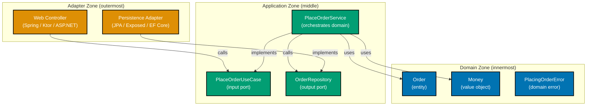
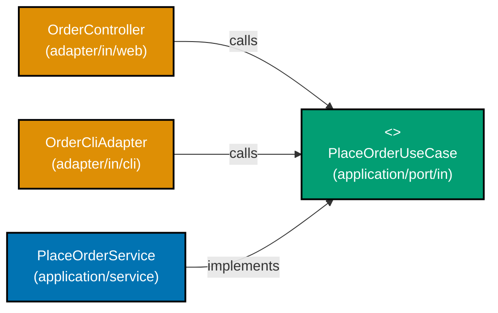
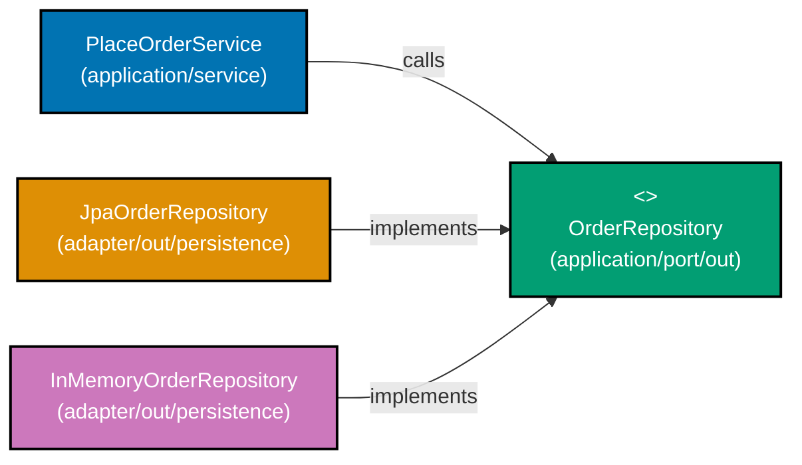
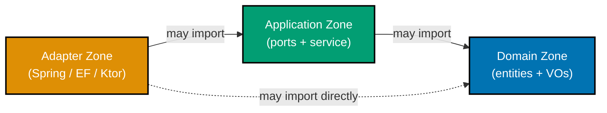
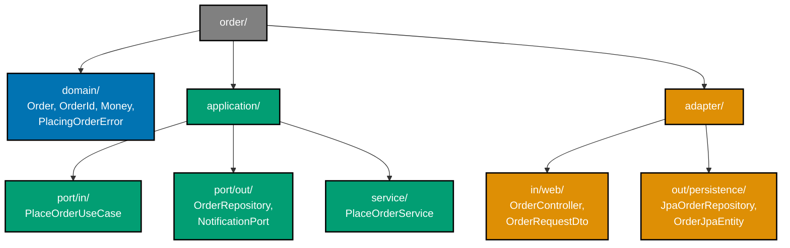
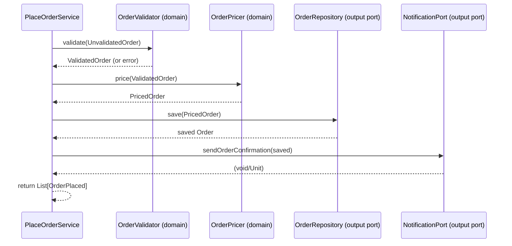
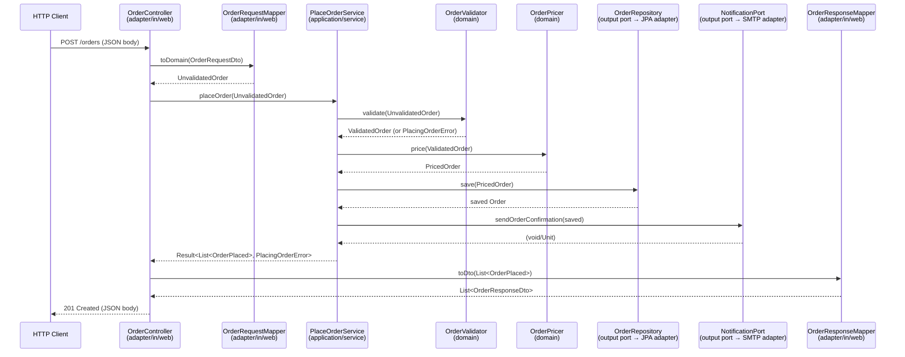

Examples 1–25 introduce hexagonal architecture (ports and adapters) using an e-commerce order placement domain. Every code block is self-contained and runnable. Annotation density targets 1.0–2.25 comment lines per code line per example.

## The Three Zones (Examples 1–6)

### Example 1: The hexagon metaphor — three zones as packages/namespaces

Hexagonal architecture divides every application into three concentric zones: the domain (pure business logic), the application (use-case orchestration), and the adapters (technology connectors). Each zone is a distinct package or namespace. The domain zone imports nothing from outside itself; the application zone imports only the domain; adapters import the application zone plus any framework they need.



**Java** — three zones as package declarations:

```java
// Zone 1: Domain — zero framework imports allowed here
// => Package: com.example.order.domain
// => Only JDK standard library (java.util, java.math) permitted
package com.example.order.domain;

// Domain entity: pure Java, no @Entity, no @JsonProperty, no Spring annotations
// => Compiles and runs without Spring, JPA, or any framework on the classpath
public record Order(
    OrderId id,           // => strongly-typed identity value object
    CustomerId customerId, // => typed; cannot accidentally swap with OrderId
    Money total,          // => Money value object carries currency
    OrderStatus status     // => domain enum; no framework dependency
) {}

// Zone 2: Application — imports domain only
// => Package: com.example.order.application
// => May import com.example.order.domain.*; must not import adapter packages
package com.example.order.application;

// Zone 3: Adapter — imports application and framework
// => Package: com.example.order.adapter.in.web
// => May import org.springframework.*, com.example.order.application.*
package com.example.order.adapter.in.web;
```

**Kotlin** — same three zones as package declarations:

```kotlin
// Zone 1: Domain package — no framework imports ever cross this boundary
// => package com.example.order.domain
// => data classes, sealed classes, pure functions only
package com.example.order.domain

// Domain types are plain Kotlin; no Ktor, no Spring, no Exposed annotations
// => Runs in a plain JVM test with zero framework on the classpath
data class Order(
    val id: OrderId,            // => val = immutable; no setters generated
    val customerId: CustomerId, // => typed; prevents id-kind confusion at compile time
    val total: Money,           // => domain value object; not Double
    val status: OrderStatus     // => sealed class member; exhaustive when-branch
)

// Zone 2: package com.example.order.application — imports domain only
// Zone 3: package com.example.order.adapter.in.web — imports application + Ktor
```

**C#** — three zones as namespaces:

```csharp
// Zone 1: Domain namespace — no framework using directives permitted
// => namespace Example.Order.Domain
// => Only System, System.Collections.Generic allowed
namespace Example.Order.Domain;

// Domain record: no [Table], no [JsonPropertyName], no EF Core attributes
// => Pure C# record; works without any NuGet package beyond the BCL
public record Order(
    OrderId Id,             // => init-only; cannot be mutated after construction
    CustomerId CustomerId,  // => distinct type; compiler catches id-kind swaps
    Money Total,            // => Money record; not decimal
    OrderStatus Status      // => domain enum; framework-free
);

// Zone 2: namespace Example.Order.Application — using Example.Order.Domain only
// Zone 3: namespace Example.Order.Adapter.In.Web — using Application + Microsoft.AspNetCore.*
```

**Key Takeaway**: The three zones are enforced by package/namespace boundaries. Domain knows nothing, application knows domain, adapters know application and frameworks.

**Why It Matters**: When the domain zone has zero framework imports, you can run every domain test with no server, no database, and no container — the feedback loop collapses from minutes to milliseconds. When the application zone imports only the domain, swapping any persistence or web framework becomes a one-zone change. Teams that enforce these boundaries consistently report that entire infrastructure replacements (e.g., switching ORMs) touch only adapter files, leaving thousands of lines of domain and application logic completely unchanged.

---

### Example 2: Domain entity with no framework annotations

A domain entity contains only business state and behaviour. Framework annotations such as `@Entity`, `@Table`, `[Table]`, or `@JsonProperty` are infrastructure concerns — they belong in adapter-layer mapping classes, not in the domain. Placing them in the domain couples the domain to a specific framework and forces the domain to recompile whenever the framework changes.

**WRONG — anti-pattern (framework annotations in domain)**:

```java
// ANTI-PATTERN: JPA annotation in the domain layer
// => @Entity couples Order to JPA; cannot run Order without hibernate on classpath
import jakarta.persistence.Entity;  // => imports JPA into the domain — violates the rule
// => executes the statement above; continues to next line
import jakarta.persistence.Id;      // => infrastructure annotation in business class
// => executes the statement above; continues to next line
import com.fasterxml.jackson.annotation.JsonProperty; // => JSON serialisation in domain
// => executes the statement above; continues to next line

@Entity                             // => domain class now requires JPA at test time
// => @Entity: JPA maps this class to a database table — adapter zone only
public class Order {                // => Order class polluted with persistence concern
// => class Order: implementation — contains field declarations and methods below
    @Id                             // => @Id marks persistence primary key — not a domain concept
    // => @Id: JPA primary key mapping — persistence adapter concern
    private String id;              // => raw String; @Id annotation bleeds infrastructure
    // => id: String — injected dependency; implementation chosen at wiring time
    @JsonProperty("customer_id")    // => JSON naming in domain — adapter concern leaked in
    // => annotation marks metadata for framework or compiler
    private String customerId;      // => untyped; id-kind confusion possible at runtime
    // => customerId: String — injected dependency; implementation chosen at wiring time
}
// Problem: to test Order you must start a JPA context and Jackson on the classpath
// => coupling cost: two framework dependencies forced into every unit test
```

**CORRECT — clean domain entity**:

```java
// Domain entity: zero framework imports; compiles with just the JDK
// => No @Entity, no @Id, no @JsonProperty, no Spring, no Jackson
public record Order(                       // => record Order: immutable; equals/hashCode/toString generated
// => executes the statement above; continues to next line
    OrderId id,            // => OrderId is a domain value object, not a raw String
    // => executes the statement above; continues to next line
    CustomerId customerId, // => CustomerId prevents id-kind swap at compile time
    // => executes the statement above; continues to next line
    Money total,           // => Money carries currency; BigDecimal alone does not
    // => executes the statement above; continues to next line
    OrderStatus status     // => domain enum; exhaustive switch enforced by compiler
    // => executes the statement above; continues to next line
) {
    // Domain behaviour lives here — pure function, no I/O
    public Order confirm() {                // => confirm method; no DB call
        // => Returns new Order with status changed; immutable; original unchanged
        return new Order(id, customerId, total, OrderStatus.CONFIRMED); // => new record; this unchanged
        // => returns the result to the caller — caller receives this value
    }
}
// Test: new Order(id, cid, money, PENDING) — no framework needed; instant
// => Test execution: sub-millisecond; no Spring/Hibernate on classpath
```

**Kotlin** — WRONG then CORRECT:

```kotlin
// ANTI-PATTERN: JPA + Jackson in Kotlin domain class
// => import jakarta.persistence.* leaks infrastructure into domain zone
import jakarta.persistence.Entity  // => wrong: domain imports JPA
// => executes the statement above; continues to next line
import jakarta.persistence.Id      // => wrong: JPA @Id in domain entity
// => executes the statement above; continues to next line

@Entity                            // => couples Kotlin class to JPA container
// => @Entity: JPA maps this class to a database table — adapter zone only
data class Order(
// => data class Order: value type; copy/equals/hashCode/toString auto-generated
    @Id val id: String,            // => raw String; @Id is adapter concern here
    // => @Id: JPA primary key mapping — persistence adapter concern
    val customerId: String         // => untyped; can swap ids accidentally
    // => executes the statement above; continues to next line
)

// CORRECT: plain Kotlin data class in domain package
// => No framework annotations; only Kotlin stdlib and domain types
data class Order(                                // => data class Order — equals/hashCode/copy generated
// => data class Order: value type; copy/equals/hashCode/toString auto-generated
    val id: OrderId,               // => typed identity; domain value object
    // => executes the statement above; continues to next line
    val customerId: CustomerId,    // => distinct type; compile-time safety
    // => executes the statement above; continues to next line
    val total: Money,              // => domain value object; not Double
    // => executes the statement above; continues to next line
    val status: OrderStatus        // => sealed class; exhaustive when branches
    // => sealed class type: closed hierarchy; when-expression exhaustiveness enforced
) {
    fun confirm(): Order =         // => returns a new Order; immutable pattern
    // => executes the statement above; continues to next line
        copy(status = OrderStatus.Confirmed)  // => copy() changes only status field
        // => method call: delegates to collaborator; result captured above
}
```

**C#** — WRONG then CORRECT:

```csharp
// ANTI-PATTERN: EF Core and JSON attributes in domain record
// => using Microsoft.EntityFrameworkCore; in domain namespace
using System.ComponentModel.DataAnnotations.Schema; // => wrong: EF in domain
// => executes the statement above; continues to next line
using System.Text.Json.Serialization;               // => wrong: JSON in domain
// => executes the statement above; continues to next line

[Table("orders")]                              // => EF Core attribute in domain — violation
// => executes the statement above; continues to next line
public record Order(
// => executes the statement above; continues to next line
    [property: JsonPropertyName("order_id")]
    // => executes the statement above; continues to next line
    string Id,                                 // => raw string + JSON annotation in domain
    // => executes the statement above; continues to next line
    string CustomerId                          // => no type safety; adapter concern in domain
    // => executes the statement above; continues to next line
);

// CORRECT: clean C# record in domain namespace
// => No using directives for EF, JSON, or any framework
public record Order(                             // => record Order — value semantics; init-only properties
// => executes the statement above; continues to next line
    OrderId Id,             // => typed; init-only; domain value object
    // => executes the statement above; continues to next line
    CustomerId CustomerId,  // => distinct type prevents id confusion
    // => executes the statement above; continues to next line
    Money Total,            // => Money not decimal; carries currency
    // => executes the statement above; continues to next line
    OrderStatus Status      // => domain enum; no framework dependency
    // => executes the statement above; continues to next line
)
{
    // => Domain method: pure transformation; no I/O
    public Order Confirm() =>
    // => executes the statement above; continues to next line
        this with { Status = OrderStatus.Confirmed }; // => new record; this unchanged
        // => record type: immutable value type; equals/hashCode/toString generated by compiler
}
```

**Key Takeaway**: Keep the domain entity completely framework-free. All annotations belong in adapter-layer mapping classes that translate between domain types and persistence or HTTP representations.

**Why It Matters**: A domain entity that imports JPA cannot be tested without starting a JPA context. This single coupling makes test suites 100x slower and breaks every time you upgrade the ORM. In a team that owns an order domain with 50 entities, removing JPA annotations from domain classes typically cuts the unit test suite from several minutes to under ten seconds — a change that compounds across every CI run for the lifetime of the project.

---

### Example 3: Input port interface — the use case contract

An input port is an interface defined in the application zone that declares the use case contract. Web controllers, CLI handlers, and message consumers all call the use case through this interface. The interface belongs in the application zone — not the domain (which knows nothing about use cases) and not the adapter zone (which must not define the contract it calls).



**Java** — input port interface in the application zone:

```java
// Package: com.example.order.application.port.in
// => Input port: interface lives in application zone, not domain, not adapter
package com.example.order.application.port.in;

import com.example.order.domain.UnvalidatedOrder; // => domain type; application may import domain
import com.example.order.domain.OrderPlaced;       // => domain event returned on success
import com.example.order.domain.PlacingOrderError; // => domain error sealed type

// PlaceOrderUseCase: single-method input port; one use case = one method
// => Interface defined here; adapters call it; service implements it
// => No HTTP, no SQL, no framework imports on this interface
public interface PlaceOrderUseCase {
    // => Result<S,E>: right-biased union type; Success carries List<OrderPlaced>; Failure carries PlacingOrderError
    // => Using a simple sealed interface Result to avoid external library dependency
    Result<java.util.List<OrderPlaced>, PlacingOrderError> placeOrder(UnvalidatedOrder order);
    // => Callers cannot ignore failure; they must pattern-match on Result
}
// Adapters: import this interface; call placeOrder(); never call PlaceOrderService directly
```

**Kotlin** — input port interface in application zone:

```kotlin
// Package: com.example.order.application.port.in
// => Input port defined in application layer; domain and adapter do not define this
package com.example.order.application.port.`in`

import com.example.order.domain.UnvalidatedOrder  // => domain type; legal import in application zone
import com.example.order.domain.OrderPlaced        // => domain event; returned on success
import com.example.order.domain.PlacingOrderError  // => domain error; returned on failure

// Kotlin interface: single abstract method; adapters call through this contract
// => No Ktor, no Spring, no database dependency on this interface
interface PlaceOrderUseCase {
    // => Result<List<OrderPlaced>, PlacingOrderError>: success or failure union
    // => Kotlin Result is stdlib; or use Arrow Either for right-biased semantics
    fun placeOrder(order: UnvalidatedOrder): Result<List<OrderPlaced>>
    // => Callers use .getOrElse { error -> ... } to handle both branches
}
// Adapters implement callers: webRoute calls placeOrderUseCase.placeOrder(...)
```

**C#** — input port interface (prefixed `I` by C# convention):

```csharp
// Namespace: Example.Order.Application.Port.In
// => Input port interface: application zone only; no framework using directives
namespace Example.Order.Application.Port.In;

using Example.Order.Domain; // => application zone may import domain types

// IPlaceOrderUseCase: C# convention prefixes interfaces with I
// => Single method; one interface = one use case responsibility
// => No IActionResult, no HttpContext, no DbContext — purely domain types
public interface IPlaceOrderUseCase
{
    // => OneOf<List<OrderPlaced>, PlacingOrderError>: discriminated union via OneOf NuGet
    // => Or use custom Result<T,E> record to avoid external dependency
    OneOf<IReadOnlyList<OrderPlaced>, PlacingOrderError> PlaceOrder(UnvalidatedOrder order);
    // => Callers must handle both branches; compiler enforces via switch expression
}
// Web controller: inject IPlaceOrderUseCase; call PlaceOrder(); never new PlaceOrderService()
```

**Key Takeaway**: The input port interface isolates the use case contract from all delivery mechanisms. Adapters depend on the interface, not the implementation — any number of delivery mechanisms can call the same business logic.

**Why It Matters**: When a controller calls `PlaceOrderUseCase` instead of `PlaceOrderService`, you can swap the implementation without touching the controller — useful for A/B testing logic, adding caching, or wrapping with transactions. It also makes the system immediately testable: pass a fake implementation of `PlaceOrderUseCase` to the controller test and you never need the database running. This is the single seam that unlocks the entire testability of the hexagonal architecture.

---

### Example 4: Output port interface — the repository contract

An output port is an interface defined in the application zone that the application service calls to reach external systems (database, message bus, email). The interface is defined in the application zone; adapters in the outer zone implement it. Domain and application layers never import a database library — only adapters do.



**Java** — output port interface:

```java
// Package: com.example.order.application.port.out
// => Output port: defined in application zone; implemented by adapters
package com.example.order.application.port.out;
// => executes the statement above; continues to next line

import com.example.order.domain.Order;   // => domain type; application may import domain
// => executes the statement above; continues to next line
import com.example.order.domain.OrderId; // => typed id; no raw String parameters
// => executes the statement above; continues to next line

import java.util.Optional; // => JDK stdlib; not a framework dependency

// OrderRepository: output port; tells application zone what it NEEDS from outside
// => No import jakarta.persistence.*; no SQL; no JDBC — purely domain and stdlib
public interface OrderRepository {         // => interface in application zone; adapters in adapter zone
// => interface OrderRepository: contract definition — no implementation details here
    Optional<Order> findById(OrderId id);  // => returns Optional; callers handle absent case
    // => executes the statement above; continues to next line
    Order save(Order order);               // => returns saved Order (may carry generated id)
    // => executes the statement above; continues to next line
    void delete(OrderId id);               // => side-effecting; no return needed
    // => executes the statement above; continues to next line
}
// JPA adapter implements this; InMemory adapter implements this; test doubles implement this
// => Application service never knows which implementation is active at runtime
```

**Kotlin** — output port interface:

```kotlin
// Package: com.example.order.application.port.out
// => Output port defined in application zone; no Exposed, no JDBC import here
package com.example.order.application.port.out
// => executes the statement above; continues to next line

import com.example.order.domain.Order    // => domain type; legal import in application zone
// => executes the statement above; continues to next line
import com.example.order.domain.OrderId  // => typed id; not raw String

// Kotlin interface: application zone describes what it needs; adapter provides it
// => suspend fun marks coroutine-friendly signature for async adapter implementations
interface OrderRepository {
// => interface OrderRepository: contract definition — no implementation details here
    suspend fun findById(id: OrderId): Order?   // => nullable return; Kotlin null-safety
    // => executes the statement above; continues to next line
    suspend fun save(order: Order): Order        // => returns persisted Order
    // => executes the statement above; continues to next line
    suspend fun delete(id: OrderId)              // => unit-returning side effect
    // => executes the statement above; continues to next line
}
// Exposed adapter: implements OrderRepository with Exposed SQL DSL
// InMemory adapter: implements OrderRepository with mutableMapOf()
// Application service: only knows OrderRepository interface; never the concrete class
```

**C#** — output port interface:

```csharp
// Namespace: Example.Order.Application.Port.Out
// => Output port interface: application zone; no EF Core, no Dapper imports
namespace Example.Order.Application.Port.Out;
// => executes the statement above; continues to next line

using Example.Order.Domain; // => domain types only
// => executes the statement above; continues to next line
using System.Threading.Tasks; // => BCL async support; not a framework dependency

// IOrderRepository: output port; C# convention uses I prefix for interfaces
// => Task<T> signals async; adapter may use async/await internally
public interface IOrderRepository
// => executes the statement above; continues to next line
{
    Task<Order?> FindByIdAsync(OrderId id);     // => nullable Task; caller handles null
    // => executes the statement above; continues to next line
    Task<Order> SaveAsync(Order order);          // => returns saved domain Order
    // => executes the statement above; continues to next line
    Task DeleteAsync(OrderId id);                // => fire-and-forget side effect
    // => executes the statement above; continues to next line
}
// EF Core adapter implements IOrderRepository with DbContext
// InMemory adapter implements IOrderRepository with Dictionary<OrderId, Order>
// PlaceOrderService receives IOrderRepository; never knows the concrete class
```

**Key Takeaway**: The output port interface belongs in the application zone. The application declares what it needs; adapters decide how to provide it. The domain and application never import a single database library.

**Why It Matters**: A team that defines `OrderRepository` as an output port can run the entire application service test suite against `InMemoryOrderRepository` — sub-millisecond per test, no Docker, no migration scripts. When a new persistence technology is required (say, migrating from PostgreSQL to DynamoDB), only the adapter class changes. The service, domain, and all tests are untouched. Output ports are the mechanism that makes infrastructure swappable on demand.

---

### Example 5: Application service implementing the input port

The application service sits at the centre of the hexagon. It implements an input port, receives output ports via its constructor, orchestrates domain logic, and delegates persistence and notification to output ports. It contains zero HTTP imports, zero database imports, and zero framework annotations.

**Java**:

```java
package com.example.order.application.service;

// Application zone imports: domain + own port interfaces; nothing else
import com.example.order.application.port.in.PlaceOrderUseCase;    // => input port this class implements
// => executes the statement above; continues to next line
import com.example.order.application.port.out.OrderRepository;     // => output port injected at construction
// => executes the statement above; continues to next line
import com.example.order.application.port.out.NotificationPort;    // => second output port for email/SMS
// => executes the statement above; continues to next line
import com.example.order.domain.*;                                 // => all domain types and functions
// => executes the statement above; continues to next line

import java.util.List;  // => JDK only; no Spring, no JPA, no HTTP imports

// PlaceOrderService: implements input port; depends on output ports through interfaces
// => No @Service, no @Autowired — framework annotations go in the wiring config, not here
public class PlaceOrderService implements PlaceOrderUseCase {
// => PlaceOrderService implements PlaceOrderUseCase — satisfies the port contract
    private final OrderRepository orderRepository;   // => output port; injected; immutable reference
    // => orderRepository: OrderRepository — final field; assigned once in constructor; immutable reference
    private final NotificationPort notificationPort; // => output port; injected; not an SMTP class

    // => Constructor injection: dependencies explicit; no reflection magic required
    public PlaceOrderService(OrderRepository orderRepository, NotificationPort notificationPort) {
    // => constructor: receives all dependencies — enables testing with any adapter implementation
        this.orderRepository = orderRepository;     // => stored; used in placeOrder
        // => this.orderRepository stored — field holds injected orderRepository for method calls below
        this.notificationPort = notificationPort;   // => stored; used to send confirmation
        // => this.notificationPort stored — field holds injected notificationPort for method calls below
    }

    @Override                                                          // => interface method; compiler checks signature
    // => @Override: compiler verifies this method signature matches the interface
    public Result<List<OrderPlaced>, PlacingOrderError> placeOrder(UnvalidatedOrder input) {
        // => Step 1: pure domain validation; no I/O; fast
        var validated = OrderValidator.validate(input); // => validated: Result<ValidatedOrder, PlacingOrderError>
        // => validated: holds the result of the expression on the right
        if (validated.isFailure()) return Result.failure(validated.getError()); // => early return on invalid input

        // => Step 2: pure domain pricing; no I/O; no database call
        var priced = OrderPricer.price(validated.getValue()); // => priced: PricedOrder with Money total set

        // => Step 3: persist through output port; adapter decides HOW
        var saved = orderRepository.save(priced);   // => calls output port; not JPA directly

        // => Step 4: notify through output port; adapter decides WHICH channel
        notificationPort.sendOrderConfirmation(saved); // => calls output port; not SMTP directly

        // => Step 5: return domain event list; controller maps to HTTP response
        return Result.success(List.of(new OrderPlaced(saved.id(), saved.customerId()))); // => wraps event in success Result
        // => returns the result to the caller — caller receives this value
    }
}
// No HTTP dependency: CLI adapter can call this service identically to web controller
// => PlaceOrderService has zero framework imports; swapping Spring for Quarkus leaves this file unchanged
```

**Kotlin**:

```kotlin
package com.example.order.application.service
// => executes the statement above; continues to next line

import com.example.order.application.port.`in`.PlaceOrderUseCase // => implements this input port
// => executes the statement above; continues to next line
import com.example.order.application.port.out.OrderRepository    // => output port; injected
// => executes the statement above; continues to next line
import com.example.order.application.port.out.NotificationPort   // => second output port
// => executes the statement above; continues to next line
import com.example.order.domain.*                                // => domain functions and types

// PlaceOrderService: application zone; orchestrates domain + output ports
// => No @Service annotation here; wiring config handles Spring/Koin binding
class PlaceOrderService(
// => executes the statement above; continues to next line
    private val orderRepository: OrderRepository,   // => output port; constructor-injected
    // => executes the statement above; continues to next line
    private val notificationPort: NotificationPort  // => output port; not an SMTP implementation
    // => executes the statement above; continues to next line
) : PlaceOrderUseCase {                             // => implements input port interface
// => type implements input port interface — satisfies the port contract

    override suspend fun placeOrder(input: UnvalidatedOrder): Result<List<OrderPlaced>> {
        // => validate: pure domain function; returns Result<ValidatedOrder>
        val validated = OrderValidator.validate(input)
        // => validated: holds the result of the expression on the right
            .getOrElse { return Result.failure(it) } // => early exit on validation failure

        // => price: pure domain function; no network call; no database read
        val priced = OrderPricer.price(validated)    // => returns PricedOrder

        // => save: delegates to output port; Exposed/JPA adapter handles SQL
        val saved = orderRepository.save(priced)     // => returns persisted Order

        // => notify: delegates to output port; SMTP adapter handles email sending
        notificationPort.sendOrderConfirmation(saved) // => fire and forget in production

        // => return domain event; controller maps to HTTP 201
        return Result.success(listOf(OrderPlaced(saved.id, saved.customerId)))
        // => OrderPlaced: domain event; contains only identity and customer, not full Order
    }
}
// suspend marks coroutine-friendly; Ktor controller can call without blocking a thread
```

**C#**:

```csharp
namespace Example.Order.Application.Service;
// => executes the statement above; continues to next line

using Example.Order.Application.Port.In;   // => implements IPlaceOrderUseCase
// => executes the statement above; continues to next line
using Example.Order.Application.Port.Out;  // => IOrderRepository and INotificationPort injected
// => executes the statement above; continues to next line
using Example.Order.Domain;                // => all domain types

// PlaceOrderService: no [ApiController], no DbContext, no HttpClient imports
// => Pure orchestration: validate → price → save → notify → return events
public class PlaceOrderService : IPlaceOrderUseCase  // => implements input port interface
// => executes the statement above; continues to next line
{
// => operation completes; execution continues to next statement
    private readonly IOrderRepository _orderRepository;    // => output port; readonly; injected
    // => executes the statement above; continues to next line
    private readonly INotificationPort _notificationPort;  // => output port; not an SmtpClient

    // => Constructor injection: ASP.NET DI resolves concrete adapters at runtime
    public PlaceOrderService(IOrderRepository orderRepository, INotificationPort notificationPort)
    // => constructor: receives all dependencies — enables testing with any adapter implementation
    {
    // => operation completes; execution continues to next statement
        _orderRepository = orderRepository;    // => stored; used in PlaceOrder
        // => executes the statement above; continues to next line
        _notificationPort = notificationPort;  // => stored; used to send confirmation
        // => executes the statement above; continues to next line
    }
    // => operation completes; execution continues to next statement

    public async Task<OneOf<IReadOnlyList<OrderPlaced>, PlacingOrderError>> PlaceOrder(UnvalidatedOrder input)
    // => executes the statement above; continues to next line
    {
        // => Step 1: pure domain validation; synchronous; no I/O
        var validated = OrderValidator.Validate(input);
        // => validated: holds the result of the expression on the right
        if (validated.IsT1) return validated.AsT1; // => early return on PlacingOrderError

        // => Step 2: pure domain pricing; synchronous; computes Money from domain rules
        var priced = OrderPricer.Price(validated.AsT0);

        // => Step 3: save through output port; EF Core adapter executes SQL
        var saved = await _orderRepository.SaveAsync(priced); // => async; adapter decides impl

        // => Step 4: notify through output port; SMTP adapter sends email
        await _notificationPort.SendOrderConfirmationAsync(saved); // => adapter decides channel

        // => Step 5: domain event list returned; controller maps to 201 Created
        return new List<OrderPlaced> { new(saved.Id, saved.CustomerId) };
        // => List<OrderPlaced>: one event per order; adapter converts to JSON response body
    }
    // => operation completes; execution continues to next statement
}
// => operation completes; execution continues to next statement
```

**Key Takeaway**: The application service contains zero framework code. It receives interface references and calls them. The framework wiring config is the only place concrete adapter classes appear.

**Why It Matters**: When the application service has no framework imports, you can instantiate it in a test with `new PlaceOrderService(inMemoryRepo, fakeNotification)` — no Spring context, no application startup, no configuration files. A suite of 100 application-service tests runs in milliseconds. That speed compounds: developers run tests on every save, catch regressions immediately, and ship with confidence. This is the single biggest productivity lever that hexagonal architecture provides for server-side teams.

---

### Example 6: The dependency rule — what can import what

The dependency rule is the structural invariant of hexagonal architecture: source code dependencies point inward only. Domain depends on nothing. Application depends on domain. Adapters depend on application and frameworks. Violations are compile errors when packages are correctly configured.



**Java** — legal and illegal imports annotated:

```java
// ===================== LEGAL IMPORTS =====================

// Domain class: imports nothing from application or adapter zones
// => package com.example.order.domain
// => Only java.* or domain sibling classes
import java.math.BigDecimal; // => JDK stdlib: legal in domain
import java.util.List;       // => java.util is standard — always allowed in domain
import java.util.Optional;   // => Optional: standard null-safe type — legal in domain
// import com.example.order.application.port.in.*; // => ILLEGAL: domain importing application
// import org.springframework.*;                   // => ILLEGAL: framework in domain

// Domain entity: no @Entity, no @JsonProperty, no framework annotations
public record Order(String id, String customerId, BigDecimal total) {
// => record: generates equals/hashCode/toString; immutable; no JPA dependency
    public static Order create(String id, String customerId, BigDecimal total) {
// => factory method — validates and constructs; never reaches framework code
        return new Order(id, customerId, total);
// => returns immutable value; domain layer stays pure
    }
}

// Application class: imports domain; must not import adapter
// => package com.example.order.application.service
import com.example.order.domain.Order;  // => legal: application → domain
// import com.example.order.adapter.out.persistence.JpaOrderRepository; // => ILLEGAL

// Adapter class: imports application and framework — both legal
// => package com.example.order.adapter.in.web
import com.example.order.application.port.in.PlaceOrderUseCase; // => legal: adapter → application
import org.springframework.web.bind.annotation.RestController;  // => legal: adapter → framework

// ===================== COMPILE-ERROR EXAMPLE =====================
// Domain entity accidentally imports an adapter class:
// package com.example.order.domain;
// import com.example.order.adapter.out.persistence.OrderJpaEntity; // => COMPILE ERROR
// => Domain module has no classpath dependency on adapter module
// => Gradle/Maven module boundaries enforce this at build time
```

**Kotlin** — dependency rule by Gradle module:

| Package | Legal imports | Illegal imports |
|---------|--------------|----------------|
| `com.example.order.domain` | Kotlin stdlib only | Application, Adapter, Exposed, Ktor |
| `com.example.order.application` | `com.example.order.domain.*` | Adapter packages, Exposed, Ktor |
| `com.example.order.adapter.in.web` | Application ports, `io.ktor.*` | Direct domain imports (allowed but discouraged) |

Enforcement: the Gradle `:domain` module has no `compileClasspath` dependency on `:adapter`. Any import crossing the boundary is a build error, not a convention discussion.

**C#** — dependency rule by project reference:

| `.csproj` | ProjectReference | PackageReference |
|-----------|-----------------|-----------------|
| `Order.Domain` | (none) | BCL (`System.*`) only |
| `Order.Application` | `Order.Domain` | (none) |
| `Order.Adapter.Web` | `Order.Application` | `Microsoft.AspNetCore.App` |
| `Order.Adapter.Persistence` | `Order.Application` | `Microsoft.EntityFrameworkCore` |

A `<ProjectReference Include="..\Order.Adapter.Persistence\..." />` inside `Order.Domain.csproj` fails `dotnet build` immediately — the build system enforces the dependency rule before any convention review.

**Key Takeaway**: Source code dependencies point inward only. Enforce this with build-tool module boundaries (Gradle modules, .csproj project references) — a convention document alone is not enough.

**Why It Matters**: Without enforced module boundaries, the dependency rule degrades silently. A single well-intentioned shortcut — an application service importing a JPA entity directly — collapses the zone separation within a sprint. Build-tool enforcement converts every violation from a convention discussion into a compile error. Teams that add this enforcement report that architectural drift stops completely: the build system becomes the architecture guardian that never forgets and never makes exceptions.

---

## Adapter Classes (Examples 7–16)

### Example 7: In-memory adapter implementing the output port

The in-memory adapter is the simplest adapter: it implements the output port interface using an in-memory data structure. It is the default adapter for all tests — no database, no Docker, no migration scripts. It also serves as a reference implementation that documents expected adapter behaviour.

**Java**:

```java
package com.example.order.adapter.out.persistence;
// => executes the statement above; continues to next line

import com.example.order.application.port.out.OrderRepository; // => implements this output port
// => executes the statement above; continues to next line
import com.example.order.domain.Order;                         // => domain type; not JPA entity
// => executes the statement above; continues to next line
import com.example.order.domain.OrderId;                       // => typed key; not raw String
// => executes the statement above; continues to next line

import java.util.HashMap;   // => JDK only; no JPA, no Spring Data, no JDBC
// => executes the statement above; continues to next line
import java.util.Map;       // => Map interface: used for store field type
// => executes the statement above; continues to next line
import java.util.Optional;  // => Optional: avoids returning null for missing entities

// InMemoryOrderRepository: adapter/out/persistence; implements output port with HashMap
// => Used in tests and local development; swapped for JPA adapter in production via DI config
public class InMemoryOrderRepository implements OrderRepository {
    // => implements: Java keyword; compiler verifies all port methods are present
    // => HashMap: mutable; thread-unsafe; sufficient for single-threaded tests
    private final Map<OrderId, Order> store = new HashMap<>();
    // => Map<OrderId, Order>: typed key prevents passing wrong ID kind at compile time

    @Override                                                       // => compiler enforces signature match with port interface
    // => @Override: compiler verifies this method signature matches the interface
    public Optional<Order> findById(OrderId id) {
        // => @Override: ensures method signature matches the interface contract exactly
        return Optional.ofNullable(store.get(id)); // => wraps null in Optional; safe caller API
        // => Optional.empty() returned when id is absent; consistent with JPA findById
    }

    @Override                                                       // => compiler error if port interface changes signature
    // => @Override: compiler verifies this method signature matches the interface
    public Order save(Order order) {
        // => @Override: compiler error if interface changes the signature
        store.put(order.id(), order); // => stores by typed OrderId key
        // => put: upsert semantics — inserts or replaces
        return order;                 // => returns same order; real adapter may enrich it
        // => returns the result to the caller — caller receives this value
    }

    @Override                                                       // => three @Override methods implement all port methods
    // => @Override: compiler verifies this method signature matches the interface
    public void delete(OrderId id) {
    // => delete: method entry point — see implementation below
        store.remove(id); // => removes entry; no-op if absent; consistent with DB behaviour
        // => returns null if key absent; void return matches interface
    }
}
// Test: new InMemoryOrderRepository() — zero setup; runs in microseconds
// => no application context, no Docker, no migration needed
```

**Kotlin**:

```kotlin
package com.example.order.adapter.out.persistence
// => executes the statement above; continues to next line

import com.example.order.application.port.out.OrderRepository // => implements output port contract
// => executes the statement above; continues to next line
import com.example.order.domain.Order                         // => domain entity; not DB entity
// => executes the statement above; continues to next line
import com.example.order.domain.OrderId                       // => typed key

// InMemoryOrderRepository: Kotlin class implementing output port with mutableMapOf()
// => : OrderRepository confirms this class satisfies the output port contract at compile time
class InMemoryOrderRepository : OrderRepository {  // => implements output port
// => InMemoryOrderRepository implements output port — satisfies the port contract
    private val store = mutableMapOf<OrderId, Order>() // => mutableMapOf: backed by LinkedHashMap
    // => store : MutableMap<OrderId, Order> — keyed by typed identity

    override suspend fun findById(id: OrderId): Order? =
    // => executes the statement above; continues to next line
        store[id]  // => Kotlin map returns null for missing keys; suspend allows async swap later
    // => Order? : nullable; null means not found; consistent with Optional.empty() pattern

    override suspend fun save(order: Order): Order {
    // => save: method entry point — see implementation below
        store[order.id] = order // => indexed assignment; replaces existing entry if present
        // => upsert semantics: insert if new, replace if duplicate key
        return order            // => returns same order; interface contract fulfilled
        // => returns the result to the caller — caller receives this value
    }

    override suspend fun delete(id: OrderId) {
    // => delete: method entry point — see implementation below
        store.remove(id) // => returns removed value but we discard; unit return matches interface
        // => no-op if key absent; consistent with DELETE WHERE NOT EXISTS = no error
    }
}
// Test: InMemoryOrderRepository() — no coroutine dispatcher needed for pure map ops
// => instantiation is zero-cost; each test gets its own fresh instance
```

**C#**:

```csharp
namespace Example.Order.Adapter.Out.Persistence;
// => executes the statement above; continues to next line

using Example.Order.Application.Port.Out; // => implements IOrderRepository
// => executes the statement above; continues to next line
using Example.Order.Domain;               // => domain types; not EF entities
// => executes the statement above; continues to next line
using System.Collections.Generic;
// => executes the statement above; continues to next line
using System.Threading.Tasks;

// InMemoryOrderRepository: adapter; implements IOrderRepository with Dictionary
// => No DbContext, no SqlConnection — purely in-process Dictionary
public class InMemoryOrderRepository : IOrderRepository  // => satisfies output port contract
// => executes the statement above; continues to next line
{
// => operation completes; execution continues to next statement
    private readonly Dictionary<OrderId, Order> _store = new(); // => in-process; no I/O
    // => _store : Dictionary<OrderId, Order> — keyed by typed identity; no table schema needed

    public Task<Order?> FindByIdAsync(OrderId id)
    // => executes the statement above; continues to next line
    {
    // => operation completes; execution continues to next statement
        _store.TryGetValue(id, out var order);       // => returns false+null if absent
        // => order : Order? — null when id not in dictionary
        return Task.FromResult(order);               // => Task.FromResult wraps synchronous result
        // => Task.FromResult: no async overhead; completed task returned immediately
    }
    // => operation completes; execution continues to next statement

    public Task<Order> SaveAsync(Order order)
    // => executes the statement above; continues to next line
    {
    // => operation completes; execution continues to next statement
        _store[order.Id] = order;                    // => indexed set; upsert semantics
        // => replaces existing entry if order.Id already present
        return Task.FromResult(order);               // => async interface; synchronous impl fine here
        // => returns the result to the caller — caller receives this value
    }
    // => operation completes; execution continues to next statement

    public Task DeleteAsync(OrderId id)
    // => executes the statement above; continues to next line
    {
    // => operation completes; execution continues to next statement
        _store.Remove(id);                           // => removes if present; no-op otherwise
        // => Dictionary.Remove: returns bool indicating whether key was found; ignored here
        return Task.CompletedTask;                   // => returns completed task for async interface
        // => returns the result to the caller — caller receives this value
    }
}
// Test: new InMemoryOrderRepository() — instantiate with no configuration; runs instantly
// => each test gets its own isolated instance; no shared state between tests
```

**Key Takeaway**: The in-memory adapter is the first adapter you write. It proves the output port interface is implementable and gives tests a zero-cost persistence layer.

**Why It Matters**: Every test that uses `InMemoryOrderRepository` instead of a real database runs in microseconds rather than hundreds of milliseconds. In a suite of 500 application-service tests, this difference is the gap between a 50-second test run that developers skip and a 500-millisecond run that fires on every file save. Fast tests change developer behaviour: they run them constantly, catch bugs before commit, and maintain the suite instead of abandoning it.

---

### Example 8: JPA/EF Core/Exposed adapter — persistence adapter

The persistence adapter implements the output port using a real database library. It translates between domain objects and database-layer entities. The domain class and the database entity are different classes with a mapper between them — the domain class never acquires ORM annotations.

**Java** — JPA persistence adapter:

```java
package com.example.order.adapter.out.persistence;             // => adapter zone: JPA allowed here
// => executes the statement above; continues to next line

import com.example.order.application.port.out.OrderRepository; // => implements output port
// => executes the statement above; continues to next line
import com.example.order.domain.Order;                         // => domain entity; no ORM annotations
// => executes the statement above; continues to next line
import com.example.order.domain.OrderId;                       // => typed id
// => executes the statement above; continues to next line

import jakarta.persistence.*;                                   // => JPA annotations: adapter zone only
// => executes the statement above; continues to next line
import org.springframework.stereotype.Repository;              // => Spring: adapter zone only
// => executes the statement above; continues to next line
import org.springframework.data.jpa.repository.JpaRepository;  // => Spring Data: adapter zone only
// => executes the statement above; continues to next line
import java.util.Optional;                                      // => Optional: no-null contract for findById

// JPA entity lives in adapter zone — NOT in domain zone
// => @Entity here is legitimate; domain.Order never has @Entity
@Entity @Table(name = "orders")                                 // => @Entity: marks persistence class; @Table maps to SQL table
// => @Entity: JPA maps this class to a database table — adapter zone only
class OrderJpaEntity {                                          // => private to adapter package; application zone never sees this
// => class OrderJpaEntity: implementation — contains field declarations and methods below
    @Id String id;               // => raw String for JPA; domain uses OrderId value object
    // => @Id: JPA primary key mapping — persistence adapter concern
    String customerId;           // => flat column; domain uses CustomerId value object
    // => executes the statement above; continues to next line
    java.math.BigDecimal total;  // => raw decimal; domain uses Money with currency
    // => executes the statement above; continues to next line
    String currency;             // => separate column; combined into Money in domain
    // => executes the statement above; continues to next line
    String status;               // => String; mapped to OrderStatus enum in domain
    // => executes the statement above; continues to next line
}                                                               // => five flat fields mirror five domain record components

// Spring Data repository: adapter implementation detail; not visible to application zone
// => extends JpaRepository<OrderJpaEntity, String>: Spring generates all CRUD methods at startup
interface OrderJpaEntityRepository extends JpaRepository<OrderJpaEntity, String> {}
// => OrderJpaEntityRepository extends JpaRepository<OrderJpaEntity — inherits base behaviour

@Repository                                                     // => Spring registers this bean; not visible beyond adapter zone
// => @Repository: Spring persistence component; exception translation applied
public class JpaOrderRepository implements OrderRepository {    // => implements application port; satisfies DI contract
// => JpaOrderRepository implements OrderRepository — satisfies the port contract
    private final OrderJpaEntityRepository jpa; // => Spring Data repository; adapter detail
    // => jpa: OrderJpaEntityRepository — final field; assigned once in constructor; immutable reference

    public JpaOrderRepository(OrderJpaEntityRepository jpa) {   // => constructor injection; no @Autowired field
    // => constructor: receives all dependencies — enables testing with any adapter implementation
        this.jpa = jpa;                                         // => stored; used in all three port methods
        // => this.jpa stored — field holds injected jpa for method calls below
    }
    // => operation completes; execution continues to next statement

    @Override                                                   // => implements OrderRepository.findById(OrderId)
    // => @Override: compiler verifies this method signature matches the interface
    public Optional<Order> findById(OrderId id) {
    // => executes the statement above; continues to next line
        return jpa.findById(id.value())         // => query by raw String id
        // => returns the result to the caller — caller receives this value
                  .map(this::toDomain);         // => map JPA entity → domain Order
                  // => method call: delegates to collaborator; result captured above
    }                                           // => returns Optional.empty() when not found
    // => method call: delegates to collaborator; result captured above

    @Override                                                   // => implements OrderRepository.save(Order)
    // => @Override: compiler verifies this method signature matches the interface
    public Order save(Order order) {
    // => save: method entry point — see implementation below
        var entity = toJpaEntity(order);        // => map domain Order → JPA entity
        // => entity: holds the result of the expression on the right
        var saved  = jpa.save(entity);          // => JPA persists; may generate id
        // => saved: holds the result of the expression on the right
        return toDomain(saved);                 // => map back to domain; return clean domain type
        // => returns the result to the caller — caller receives this value
    }
    // => operation completes; execution continues to next statement

    @Override                                                   // => implements OrderRepository.delete(OrderId)
    // => @Override: compiler verifies this method signature matches the interface
    public void delete(OrderId id) { jpa.deleteById(id.value()); } // => delegate to JPA; no-op if absent

    // Mapper: adapter-private; domain knows nothing about OrderJpaEntity
    // => two private methods: toDomain (JPA→domain) and toJpaEntity (domain→JPA)
    private Order toDomain(OrderJpaEntity e) {  // => reconstructs domain record from flat JPA fields
    // => record from: immutable value type; equals/hashCode/toString generated by compiler
        return new Order(
        // => returns the result to the caller — caller receives this value
            new OrderId(e.id),           // => wrap raw String in typed value object
            // => method call: delegates to collaborator; result captured above
            new CustomerId(e.customerId), // => wrap raw String in typed value object
            // => method call: delegates to collaborator; result captured above
            new Money(e.total, e.currency), // => combine two columns into Money
            // => method call: delegates to collaborator; result captured above
            OrderStatus.valueOf(e.status)   // => parse String to domain enum
            // => method call: delegates to collaborator; result captured above
        );
        // => operation completes; execution continues to next statement
    }
    private OrderJpaEntity toJpaEntity(Order o) { // => flattens domain record into five JPA columns
    // => record into: immutable value type; equals/hashCode/toString generated by compiler
        var e = new OrderJpaEntity();           // => creates empty JPA entity; fields set below
        // => e: holds the result of the expression on the right
        e.id = o.id().value();             // => unwrap typed id to raw String for JPA
        // => method call: delegates to collaborator; result captured above
        e.customerId = o.customerId().value(); // => unwrap typed id
        // => method call: delegates to collaborator; result captured above
        e.total = o.total().getAmount();   // => extract BigDecimal from Money
        // => method call: delegates to collaborator; result captured above
        e.currency = o.total().getCurrency(); // => extract currency String from Money
        // => method call: delegates to collaborator; result captured above
        e.status = o.status().name();      // => enum to String for database column
        // => method call: delegates to collaborator; result captured above
        return e;                          // => populated entity ready for JPA save
        // => returns the result to the caller — caller receives this value
    }
}
// => JpaOrderRepository is the ONLY class with JPA awareness; all other classes stay clean
```

**Kotlin** — Exposed adapter:

```kotlin
package com.example.order.adapter.out.persistence
// => executes the statement above; continues to next line
// => above statement is part of the implementation flow

import com.example.order.application.port.out.OrderRepository // => implements output port
// => executes the statement above; continues to next line
import com.example.order.domain.*                             // => domain types
// => executes the statement above; continues to next line
import org.jetbrains.exposed.sql.*                            // => Exposed: adapter zone only
// => executes the statement above; continues to next line
import org.jetbrains.exposed.sql.transactions.transaction    // => Exposed transaction: adapter only

// Exposed table definition: adapter zone; domain.Order never references this object
object OrdersTable : Table("orders") {
    // => Table("orders"): maps this object to the 'orders' database table
    val id         = varchar("id", 50).primaryKey()  // => raw String column; maps to OrderId
    // => primaryKey(): marks id as the primary key constraint
    val customerId = varchar("customer_id", 50)      // => raw String; maps to CustomerId
    // => snake_case column name; Exposed maps to Kotlin property
    val total      = decimal("total", 15, 2)         // => raw BigDecimal; maps to Money.amount
    // => precision 15, scale 2; sufficient for most monetary values
    val currency   = varchar("currency", 3)          // => companion to total; maps to Money.currency
    // => ISO 4217 currency code; 3 chars (USD, EUR, etc.)
    val status     = varchar("status", 20)           // => String; maps to OrderStatus enum
    // => enum stored as String; adapter parses to domain OrderStatus
}

// ExposedOrderRepository: implements output port with Exposed SQL DSL
class ExposedOrderRepository : OrderRepository {  // => satisfies output port contract
// => class ExposedOrderRepository: implementation — contains field declarations and methods below
    override suspend fun findById(id: OrderId): Order? = transaction { // => transaction wraps SQL
        // => transaction: Exposed DSL; wraps query in a DB transaction
        OrdersTable.select { OrdersTable.id eq id.value }  // => DSL query; no SQL string
        // => id.value: unwrap typed OrderId to raw String for comparison
            .singleOrNull()?.let { toDomain(it) }          // => map ResultRow → domain Order
        // => singleOrNull: null if no row found; exception if multiple rows (bug)
    }
    // => operation completes; execution continues to next statement

    override suspend fun save(order: Order): Order = transaction {
        // => transaction: wraps upsert in a DB transaction for atomicity
        OrdersTable.upsert { row ->              // => INSERT OR UPDATE; adapter decides strategy
            // => upsert: handles both new and existing orders with one DSL call
            row[id]         = order.id.value     // => unwrap typed id to raw String
            // => executes the statement above; continues to next line
            row[customerId] = order.customerId.value // => unwrap typed id
            // => executes the statement above; continues to next line
            row[total]      = order.total.amount     // => extract BigDecimal from Money
            // => executes the statement above; continues to next line
            row[currency]   = order.total.currency   // => extract currency from Money
            // => executes the statement above; continues to next line
            row[status]     = order.status.name      // => enum to String
            // => executes the statement above; continues to next line
        }
        // => operation completes; execution continues to next statement
        order // => return domain Order; table holds the canonical state
        // => same domain Order returned; mapper round-trip only if needed
    }
    // => operation completes; execution continues to next statement

    override suspend fun delete(id: OrderId) = transaction {
        // => transaction: wraps delete in a DB transaction
        OrdersTable.deleteWhere { OrdersTable.id eq id.value } // => Exposed DSL delete
        // => deleteWhere: generates DELETE WHERE id = ? with parameterized value
        Unit // => explicit Unit return satisfies suspend fun signature
        // => executes the statement above; continues to next line
    }
    // => operation completes; execution continues to next statement

    private fun toDomain(row: ResultRow) = Order(
        // => pure mapping: ResultRow → domain Order; no I/O inside this function
        id         = OrderId(row[OrdersTable.id]),          // => wrap raw String in value object
        // => method call: delegates to collaborator; result captured above
        customerId = CustomerId(row[OrdersTable.customerId]), // => typed id
        // => method call: delegates to collaborator; result captured above
        total      = Money(row[OrdersTable.total], row[OrdersTable.currency]), // => reconstruct Money
        // => combines two columns back into the domain Money value object
        status     = OrderStatus.valueOf(row[OrdersTable.status]) // => parse enum from String column
        // => valueOf: throws if String not in enum; adapter should validate at write time
    )
    // => operation completes; execution continues to next statement
}
// => operation completes; execution continues to next statement
```

**C#** — EF Core adapter:

```csharp
namespace Example.Order.Adapter.Out.Persistence;
// => executes the statement above; continues to next line

using Example.Order.Application.Port.Out; // => implements IOrderRepository
// => executes the statement above; continues to next line
using Example.Order.Domain;               // => domain types
// => executes the statement above; continues to next line
using Microsoft.EntityFrameworkCore;      // => EF Core: adapter zone only
// => executes the statement above; continues to next line
using System.Threading.Tasks;

// EF Core entity: adapter zone; domain.Order never has [Table] or [Column]
public class OrderDbEntity  // => POCO: plain class; EF Core maps it via fluent config
// => executes the statement above; continues to next line
{
// => operation completes; execution continues to next statement
    public string Id         { get; set; } = ""; // => raw String; maps to OrderId in domain
    // => executes the statement above; continues to next line
    public string CustomerId { get; set; } = ""; // => raw String; maps to CustomerId
    // => executes the statement above; continues to next line
    public decimal Total     { get; set; }        // => raw decimal; maps to Money.Amount
    // => executes the statement above; continues to next line
    public string Currency   { get; set; } = ""; // => companion to Total; maps to Money.Currency
    // => executes the statement above; continues to next line
    public string Status     { get; set; } = ""; // => String column; maps to OrderStatus enum
    // => enum type: closed set of domain values; exhaustive switch/when enforced
}
// => OrderDbEntity: has no knowledge of domain types; both sides have their own shape

// DbContext: adapter detail; application zone never references OrderDbContext
public class OrderDbContext : DbContext  // => EF Core context; adapter-private
// => executes the statement above; continues to next line
{
// => operation completes; execution continues to next statement
    public DbSet<OrderDbEntity> Orders => Set<OrderDbEntity>(); // => EF Core table mapping
    // => executes the statement above; continues to next line
    public OrderDbContext(DbContextOptions<OrderDbContext> opts) : base(opts) {} // => injected options
    // => constructor: receives all dependencies — enables testing with any adapter implementation
    protected override void OnModelCreating(ModelBuilder mb) =>
    // => executes the statement above; continues to next line
        mb.Entity<OrderDbEntity>().ToTable("orders").HasKey(e => e.Id); // => fluent config
    // => HasKey: sets primary key; no [Key] attribute needed on the entity class
}

// EfOrderRepository: implements IOrderRepository; never visible to application zone
public class EfOrderRepository : IOrderRepository  // => satisfies output port contract
// => executes the statement above; continues to next line
{
// => operation completes; execution continues to next statement
    private readonly OrderDbContext _ctx; // => EF context; injected; adapter-private
    // => _ctx: wraps connection pool and change tracker; one context per request (Scoped)
    public EfOrderRepository(OrderDbContext ctx) { _ctx = ctx; } // => constructor injection
    // => constructor: receives all dependencies — enables testing with any adapter implementation

    public async Task<Order?> FindByIdAsync(OrderId id)
    // => executes the statement above; continues to next line
    {
    // => operation completes; execution continues to next statement
        var entity = await _ctx.Orders.FindAsync(id.Value); // => EF async query by PK
        // => FindAsync: checks EF change tracker first (cache hit), then executes SQL
        return entity is null ? null : ToDomain(entity);    // => null-check then map to domain
        // => ToDomain: pure static mapper; no I/O inside
    }
    // => operation completes; execution continues to next statement

    public async Task<Order> SaveAsync(Order order)
    // => executes the statement above; continues to next line
    {
    // => operation completes; execution continues to next statement
        var entity = ToDbEntity(order);           // => map domain → EF entity
        // => entity : OrderDbEntity — EF-tracked object with raw columns
        _ctx.Orders.Update(entity);               // => EF tracks; insert or update
        // => Update: adds to change tracker as Modified; SQL issued at SaveChanges
        await _ctx.SaveChangesAsync();            // => flush to database
        // => SaveChangesAsync: executes all pending SQL in a transaction
        return order;                             // => return original domain order
        // => returns the result to the caller — caller receives this value
    }
    // => operation completes; execution continues to next statement

    public async Task DeleteAsync(OrderId id)
    // => executes the statement above; continues to next line
    {
    // => operation completes; execution continues to next statement
        var entity = await _ctx.Orders.FindAsync(id.Value); // => find before delete
        // => entity: holds the result of the expression on the right
        if (entity is not null) _ctx.Orders.Remove(entity); // => mark for deletion
        // => Remove: adds to change tracker as Deleted; SQL at SaveChanges
        await _ctx.SaveChangesAsync();                       // => flush deletion to DB
        // => method call: delegates to collaborator; result captured above
    }
    // => operation completes; execution continues to next statement

    private static Order ToDomain(OrderDbEntity e) => new(  // => static mapper: no I/O
    // => executes the statement above; continues to next line
        new OrderId(e.Id),
        // => wrap raw String in typed value object
        new CustomerId(e.CustomerId),
        // => executes the statement above; continues to next line
        new Money(e.Total, e.Currency),            // => reconstruct Money from two columns
        // => two DB columns → one domain value object
        Enum.Parse<OrderStatus>(e.Status));        // => parse enum from String column
    // => Enum.Parse: throws if String invalid; adapter validates at write time

    private static OrderDbEntity ToDbEntity(Order o) => new() // => static mapper: no I/O
    // => executes the statement above; continues to next line
    {
    // => operation completes; execution continues to next statement
        Id         = o.Id.Value,
        // => unwrap typed OrderId to raw String for EF column
        CustomerId = o.CustomerId.Value,
        // => executes the statement above; continues to next line
        Total      = o.Total.Amount,               // => unwrap Money to raw decimal
        // => executes the statement above; continues to next line
        Currency   = o.Total.Currency,             // => unwrap Money to currency String
        // => executes the statement above; continues to next line
        Status     = o.Status.ToString()           // => enum to String for DB column
        // => ToString(): produces enum member name (e.g., "CONFIRMED")
    };
    // => operation completes; execution continues to next statement
}
// => operation completes; execution continues to next statement
```

**Key Takeaway**: The persistence adapter translates between domain types and database entities. This translation always lives in the adapter — the domain entity never acquires ORM annotations.

**Why It Matters**: Keeping two separate classes (domain entity + database entity) with a mapper between them costs a few dozen lines of mapping code per aggregate. That cost buys the ability to evolve the database schema independently of the domain model — adding audit columns, renaming columns, changing data types — without touching a single line of business logic. For systems that outlive their initial framework choice, this separation is the difference between a two-hour schema migration and a two-week rewrite.

---

### Example 9: HTTP input adapter — Spring Controller / Ktor route / ASP.NET Controller

The HTTP input adapter receives HTTP requests, parses them into domain input types, calls the input port, and maps the result to HTTP responses. It never contains domain logic. It is as thin as possible.

**Java** — Spring REST controller:

```java
package com.example.order.adapter.in.web;
// => executes the statement above; continues to next line

import com.example.order.application.port.in.PlaceOrderUseCase; // => input port; injected
// => executes the statement above; continues to next line
import com.example.order.domain.UnvalidatedOrder;                // => domain input type
// => executes the statement above; continues to next line
import com.example.order.domain.PlacingOrderError;               // => domain error type
// => executes the statement above; continues to next line

import org.springframework.http.ResponseEntity;          // => HTTP concern: adapter zone only
// => executes the statement above; continues to next line
import org.springframework.web.bind.annotation.*;        // => Spring annotations: adapter only
// => executes the statement above; continues to next line
import java.util.List;
// => executes the statement above; continues to next line

@RestController                                          // => Spring adapter annotation
// => @RestController: HTTP adapter; maps requests to use-case calls
@RequestMapping("/orders")                               // => HTTP routing: adapter concern
// => HTTP mapping annotation: routes incoming request to this handler method
public class OrderController {
// => class OrderController: implementation — contains field declarations and methods below
    private final PlaceOrderUseCase placeOrderUseCase;   // => input port; not PlaceOrderService

    // => Constructor injection; Spring resolves PlaceOrderUseCase to PlaceOrderService
    public OrderController(PlaceOrderUseCase placeOrderUseCase) {
    // => constructor: receives all dependencies — enables testing with any adapter implementation
        this.placeOrderUseCase = placeOrderUseCase; // => stores interface reference; not impl class
        // => this.placeOrderUseCase stored — field holds injected placeOrderUseCase for method calls below
    }
    // => operation completes; execution continues to next statement

    @PostMapping                                         // => HTTP POST /orders
    // => HTTP mapping annotation: routes incoming request to this handler method
    public ResponseEntity<?> placeOrder(@RequestBody OrderRequestDto dto) {
        // => Step 1: map DTO → domain input; no logic; just field mapping
        var input = OrderRequestMapper.toDomain(dto);    // => adapter mapper: DTO → UnvalidatedOrder

        // => Step 2: delegate to use case; all logic lives in application + domain layers
        var result = placeOrderUseCase.placeOrder(input); // => calls input port interface

        // => Step 3: map result → HTTP response; no domain logic here
        return result.isSuccess()
        // => returns the result to the caller — caller receives this value
            ? ResponseEntity.status(201).body(OrderResponseMapper.toDto(result.getValue())) // => 201 Created
            // => method call: delegates to collaborator; result captured above
            : ResponseEntity.status(422).body(result.getError().getMessage());              // => 422 Unprocessable
            // => method call: delegates to collaborator; result captured above
    }
    // => operation completes; execution continues to next statement
}
// Controller: HTTP in → domain type → use case → domain result → HTTP out
// No Order, Money, or OrderStatus logic lives in this class
```

**Kotlin** — Ktor route function:

```kotlin
package com.example.order.adapter.`in`.web
// => executes the statement above; continues to next line

import com.example.order.application.port.`in`.PlaceOrderUseCase // => input port injected into route
// => executes the statement above; continues to next line
import io.ktor.server.application.*                               // => Ktor: adapter zone only
// => executes the statement above; continues to next line
import io.ktor.server.request.*                                   // => HTTP request: adapter concern
// => executes the statement above; continues to next line
import io.ktor.server.response.*                                  // => HTTP response: adapter concern
// => executes the statement above; continues to next line
import io.ktor.server.routing.*                                   // => routing DSL: adapter concern
// => executes the statement above; continues to next line
import io.ktor.http.*                                             // => HTTP status codes

// Ktor extension function: adds POST /orders route to Ktor routing
// => placeOrderUseCase injected at call site from DI container
fun Route.orderRoutes(placeOrderUseCase: PlaceOrderUseCase) {
    // => extension function on Route: follows Ktor routing DSL conventions
    post("/orders") {                                // => HTTP POST /orders; Ktor DSL
    // => executes the statement above; continues to next line
        val dto = call.receive<OrderRequestDto>()    // => deserialise JSON body to DTO
        // => dto : OrderRequestDto — framework-specific shape; carries raw JSON fields
        val input = OrderRequestMapper.toDomain(dto) // => map DTO → domain UnvalidatedOrder
        // => input : UnvalidatedOrder — domain type; all framework types stripped

        // => Delegate: all business rules in application + domain; route stays thin
        val result = placeOrderUseCase.placeOrder(input) // => calls input port; suspend-safe
        // => result : Result<List<OrderPlaced>> — domain result from application layer

        result.fold(
        // => executes the statement above; continues to next line
            onSuccess = { events ->                  // => success: map domain events to DTO list
                // => events : List<OrderPlaced> — domain events to serialize
                call.respond(HttpStatusCode.Created, events.map(OrderResponseMapper::toDto))
                // => HTTP 201 Created with response DTOs
            },
            // => operation completes; execution continues to next statement
            onFailure = { error ->                   // => failure: map domain error to HTTP 422
            // => executes the statement above; continues to next line
                call.respond(HttpStatusCode.UnprocessableEntity, error.message ?: "Order failed")
                // => HTTP 422 with error message; domain types not exposed
            }
            // => operation completes; execution continues to next statement
        )
        // => operation completes; execution continues to next statement
    }
}
// Route: Ktor-specific wiring; application service is framework-agnostic
```

**C#** — ASP.NET minimal API / controller:

```csharp
namespace Example.Order.Adapter.In.Web;
// => executes the statement above; continues to next line

using Example.Order.Application.Port.In;  // => input port injected
// => executes the statement above; continues to next line
using Example.Order.Domain;               // => domain types for mapping
// => executes the statement above; continues to next line
using Microsoft.AspNetCore.Mvc;           // => ASP.NET: adapter zone only
// => executes the statement above; continues to next line

[ApiController]                           // => ASP.NET attribute: adapter zone
// => executes the statement above; continues to next line
[Route("orders")]                         // => HTTP routing: adapter concern
// => executes the statement above; continues to next line
public class OrderController : ControllerBase  // => inherits ASP.NET controller helpers
// => executes the statement above; continues to next line
{
// => operation completes; execution continues to next statement
    private readonly IPlaceOrderUseCase _placeOrderUseCase; // => input port; not concrete class
    // => IPlaceOrderUseCase: interface type; DI resolves to PlaceOrderService at runtime

    // => ASP.NET DI injects PlaceOrderService as IPlaceOrderUseCase at startup
    public OrderController(IPlaceOrderUseCase placeOrderUseCase)
    // => constructor: receives all dependencies — enables testing with any adapter implementation
    {
    // => operation completes; execution continues to next statement
        _placeOrderUseCase = placeOrderUseCase; // => interface reference stored; not impl type
        // => executes the statement above; continues to next line
    }
    // => operation completes; execution continues to next statement

    [HttpPost]                            // => HTTP POST /orders
    // => executes the statement above; continues to next line
    public async Task<IActionResult> PlaceOrder([FromBody] OrderRequestDto dto)
    // => executes the statement above; continues to next line
    {
        // => Step 1: map DTO → domain input; adapter mapper; no business logic here
        var input = OrderRequestMapper.ToDomain(dto); // => DTO → UnvalidatedOrder
        // => input : UnvalidatedOrder — domain type; no HTTP concern

        // => Step 2: delegate all logic to use case; controller stays thin
        var result = await _placeOrderUseCase.PlaceOrder(input); // => input port call
        // => result : OneOf<IReadOnlyList<OrderPlaced>, PlacingOrderError>

        // => Step 3: map result → IActionResult; domain types never appear in response body
        return result.Match(
        // => returns the result to the caller — caller receives this value
            events => CreatedAtAction(nameof(PlaceOrder), OrderResponseMapper.ToDto(events)), // => 201
            // => 201 Created with response DTO; domain OrderPlaced mapped to JSON shape
            error  => UnprocessableEntity(error.Message)  // => 422 with error message
            // => 422 Unprocessable; domain error message surfaced; no stack trace
        );
    }
}
// Controller: HTTP concern only; PlaceOrder logic lives in PlaceOrderService + domain
```

**Key Takeaway**: The HTTP adapter is a thin translation layer. It maps HTTP in to domain types, calls the input port, and maps domain results back to HTTP. No business logic lives here.

**Why It Matters**: A thin controller that delegates immediately to an input port can be tested in two ways: with a real HTTP stack (E2E test) or by calling the input port directly (application-service test). When controllers contain business logic, you lose the second option — every test requires an HTTP server. Teams that enforce thin controllers report that their E2E test suites shrink dramatically because business-rule coverage moves to faster unit and application-service tests.

---

### Example 10: Naming conventions — ports and adapters

Consistent naming makes the zone of any class immediately visible from its name and package. These conventions are used across all three languages.

**Java** — naming conventions table in code comments:

```java
// ========================================================
// HEXAGONAL ARCHITECTURE NAMING CONVENTIONS — JAVA
// ========================================================

// INPUT PORTS (application/port/in/)
// => Interface names end with "UseCase"
// => One interface = one use case = one public method
interface PlaceOrderUseCase  { /* ... */ }  // => input port: use case contract
interface CancelOrderUseCase { /* ... */ }  // => input port: separate use case

// OUTPUT PORTS (application/port/out/)
// => Repository interfaces end with "Repository"
// => Non-CRUD output ports end with "Port"
interface OrderRepository    { /* ... */ }  // => output port: persistence contract
interface NotificationPort   { /* ... */ }  // => output port: notification contract
interface PaymentGatewayPort { /* ... */ }  // => output port: external payment contract

// APPLICATION SERVICE (application/service/)
// => Implements an input port; name ends with "Service"
class PlaceOrderService implements PlaceOrderUseCase { /* ... */ }  // => application service

// INPUT ADAPTERS (adapter/in/)
// => Web adapters end with "Controller" (REST) or "Consumer" (messaging)
class OrderController  { /* ... */ }  // => adapter/in/web: HTTP input adapter
class OrderConsumer    { /* ... */ }  // => adapter/in/messaging: Kafka/RabbitMQ input adapter
class OrderCliAdapter  { /* ... */ }  // => adapter/in/cli: command-line input adapter

// OUTPUT ADAPTERS (adapter/out/)
// => Persistence adapters end with "Repository" (concrete class, implements port)
// => Non-persistence adapters end with "Adapter"
class JpaOrderRepository      implements OrderRepository  { /* ... */ } // => persistence adapter
class SmtpNotificationAdapter implements NotificationPort { /* ... */ } // => notification adapter
class StripePaymentAdapter    implements PaymentGatewayPort { /* ... */ } // => payment adapter
```

**Kotlin** — same conventions, Kotlin idioms noted:

```kotlin
// ========================================================
// HEXAGONAL ARCHITECTURE NAMING CONVENTIONS — KOTLIN
// ========================================================

// INPUT PORTS — application/port/in/ — same names as Java
interface PlaceOrderUseCase  // => Kotlin interface; no "I" prefix convention
// => executes the statement above; continues to next line
interface CancelOrderUseCase // => separate interface per use case

// OUTPUT PORTS — application/port/out/ — same names as Java
interface OrderRepository    // => output port; may use suspend fun for coroutines
// => executes the statement above; continues to next line
interface NotificationPort   // => output port; implemented by SMTP/SNS adapters

// APPLICATION SERVICE — application/service/
// => Kotlin: "class X : InterfaceName" syntax
class PlaceOrderService(                             // => primary constructor = injection
// => constructor: receives all dependencies — enables testing with any adapter implementation
    private val orderRepository: OrderRepository,   // => output port injected
    // => executes the statement above; continues to next line
    private val notificationPort: NotificationPort  // => output port injected
    // => executes the statement above; continues to next line
) : PlaceOrderUseCase { /* ... */ }                 // => colon syntax; implements input port

// INPUT ADAPTERS — adapter/in/
// => Ktor: route extension function, not a class; name ends with "Routes"
fun Route.orderRoutes(uc: PlaceOrderUseCase) { /* ... */ } // => Ktor convention
// => method call: delegates to collaborator; result captured above
class OrderConsumer(uc: PlaceOrderUseCase) { /* ... */ }   // => Kafka consumer adapter

// OUTPUT ADAPTERS — adapter/out/
class ExposedOrderRepository : OrderRepository { /* ... */ } // => Exposed adapter
// => class ExposedOrderRepository: implementation — contains field declarations and methods below
class SesNotificationAdapter : NotificationPort { /* ... */ } // => AWS SES adapter
// => class SesNotificationAdapter: implementation — contains field declarations and methods below
```

**C#** — same conventions with I prefix:

```csharp
// ========================================================
// HEXAGONAL ARCHITECTURE NAMING CONVENTIONS — C#
// ========================================================

// INPUT PORTS — Application/Port/In/ — C# prefixes interfaces with "I"
interface IPlaceOrderUseCase  { }  // => input port; I prefix; one method
// => interface IPlaceOrderUseCase: contract definition — no implementation details here
interface ICancelOrderUseCase { }  // => separate interface per use case

// OUTPUT PORTS — Application/Port/Out/
interface IOrderRepository    { }  // => output port: persistence contract
// => interface IOrderRepository: contract definition — no implementation details here
interface INotificationPort   { }  // => output port: notification contract
// => interface INotificationPort: contract definition — no implementation details here
interface IPaymentGatewayPort { }  // => output port: payment gateway contract

// APPLICATION SERVICE — Application/Service/
// => Implements input port interface; no ASP.NET attributes
class PlaceOrderService : IPlaceOrderUseCase    // => service implements input port
// => executes the statement above; continues to next line
{
    public PlaceOrderService(IOrderRepository repo, INotificationPort notif) { } // => ctor injection
    // => constructor: receives all dependencies — enables testing with any adapter implementation
}

// INPUT ADAPTERS — Adapter/In/
[ApiController] class OrderController : ControllerBase { } // => ASP.NET controller: input adapter
// => class OrderController: implementation — contains field declarations and methods below
class OrderConsumer { }   // => MassTransit/RabbitMQ consumer: input adapter
// => class OrderConsumer: implementation — contains field declarations and methods below
class OrderCliAdapter { } // => CLI input adapter using System.CommandLine

// OUTPUT ADAPTERS — Adapter/Out/
class EfOrderRepository   : IOrderRepository    { } // => EF Core persistence adapter
// => class EfOrderRepository: implementation — contains field declarations and methods below
class SmtpNotificationAdapter : INotificationPort { } // => SMTP notification adapter
// => class SmtpNotificationAdapter: implementation — contains field declarations and methods below
class StripePaymentAdapter : IPaymentGatewayPort  { } // => Stripe payment adapter
// => class StripePaymentAdapter: implementation — contains field declarations and methods below
```

**Key Takeaway**: Naming conventions encode zone membership in every class name. Any developer reading `PlaceOrderService` knows it is an application service; reading `EfOrderRepository` knows it is a persistence adapter.

**Why It Matters**: Consistent naming eliminates the need to open a file to determine its architectural role. Code reviews become faster because reviewers immediately spot violations — if a class named `OrderController` contains `orderRepository.save()` calls, something is wrong. Naming conventions are free to enforce, cost nothing to maintain, and pay dividends every time a new developer joins the team and reads their first pull request.

---

### Example 11: Package/namespace structure for hexagonal

The directory tree is the physical manifestation of the dependency rule. Every class lives in exactly one zone, and the directory path tells you the zone and adapter direction at a glance.



**Java** — each class in its correct package:

```java
// ─── domain/ ────────────────────────────────────────────────────────────────
// com.example.order.domain.Order — entity; zero framework imports
package com.example.order.domain;
// com.example.order.domain.OrderId — value object; wraps String
public record OrderId(String value) {}
// com.example.order.domain.Money — value object; amount + currency
public record Money(java.math.BigDecimal amount, String currency) {}
// com.example.order.domain.PlacingOrderError — sealed error hierarchy
// com.example.order.domain.Order — aggregate; holds id + money
public record Order(OrderId id, Money total) {}

// ─── application/port/in/ ────────────────────────────────────────────────────
// com.example.order.application.port.in.PlaceOrderUseCase — input port interface
package com.example.order.application.port.in;
// => input port: HTTP adapter calls this; domain types only in signature
interface PlaceOrderUseCase { OrderId placeOrder(String customerId, Money total); }

// ─── application/port/out/ ───────────────────────────────────────────────────
// com.example.order.application.port.out.OrderRepository — output port interface
package com.example.order.application.port.out;
interface OrderRepository { void save(Order order); }
// com.example.order.application.port.out.NotificationPort — output port interface
interface NotificationPort { void sendConfirmation(OrderId id, String email); }

// ─── application/service/ ────────────────────────────────────────────────────
// com.example.order.application.service.PlaceOrderService — implements PlaceOrderUseCase
package com.example.order.application.service;
// => PlaceOrderService: application zone; imports domain + port/in + port/out only
class PlaceOrderService implements PlaceOrderUseCase {
// => implements PlaceOrderUseCase — satisfies the input port contract
    public OrderId placeOrder(String customerId, Money total) { return new OrderId(customerId); }
// => adapter zone never imported here; PlaceOrderService is unaware of JPA or Spring
}

// ─── adapter/in/web/ ─────────────────────────────────────────────────────────
// com.example.order.adapter.in.web.OrderController — Spring @RestController
package com.example.order.adapter.in.web;
// com.example.order.adapter.in.web.OrderRequestDto — JSON-deserializable input DTO
public record OrderRequestDto(String customerId, java.math.BigDecimal amount) {}
// com.example.order.adapter.in.web.OrderRequestMapper — DTO → UnvalidatedOrder
// com.example.order.adapter.in.web.OrderResponseDto — JSON-serializable response DTO
public record OrderResponseDto(String orderId) {}
// com.example.order.adapter.in.web.OrderResponseMapper — OrderPlaced → OrderResponseDto

// ─── adapter/out/persistence/ ────────────────────────────────────────────────
// com.example.order.adapter.out.persistence.JpaOrderRepository — implements OrderRepository
package com.example.order.adapter.out.persistence;
// com.example.order.adapter.out.persistence.OrderJpaEntity — @Entity class; JPA mapping
// com.example.order.adapter.out.persistence.InMemoryOrderRepository — test adapter
class InMemoryOrderRepository implements OrderRepository {
// => test adapter: HashMap-backed; no JPA; swapped for JpaOrderRepository in production
    private final java.util.Map<String, Order> store = new java.util.HashMap<>();
    public void save(Order order) { store.put(order.id().value(), order); }
// => save delegates to HashMap.put — no network, no transaction manager
}

// Rule: any import that crosses a zone boundary inward → compile error
// => domain/* never imports application/* or adapter/*
// => application/* never imports adapter/*
```

**Kotlin** — package layout:

| Package path | Contents |
|-------------|----------|
| `com.example.order.domain` | `data class Order`, `value class OrderId`, `data class Money`, `sealed class PlacingOrderError` |
| `com.example.order.application.port.`in`` | `interface PlaceOrderUseCase` (backtick required: `in` is a Kotlin keyword) |
| `com.example.order.application.port.out` | `interface OrderRepository`, `interface NotificationPort` |
| `com.example.order.application.service` | `class PlaceOrderService : PlaceOrderUseCase` |
| `com.example.order.adapter.`in`.web` | `fun Route.orderRoutes(...)`, `data class OrderRequestDto`, `data class OrderResponseDto` |
| `com.example.order.adapter.out.persistence` | `class ExposedOrderRepository : OrderRepository`, `object OrdersTable : Table(...)`, `class InMemoryOrderRepository : OrderRepository` |

**C#** — namespace layout:

| Namespace | Contents |
|-----------|----------|
| `Example.Order.Domain` | `record Order`, `record OrderId`, `record Money`, `abstract PlacingOrderError` |
| `Example.Order.Application.Port.In` | `interface IPlaceOrderUseCase` |
| `Example.Order.Application.Port.Out` | `interface IOrderRepository`, `interface INotificationPort` |
| `Example.Order.Application.Service` | `class PlaceOrderService : IPlaceOrderUseCase` |
| `Example.Order.Adapter.In.Web` | `[ApiController] class OrderController`, `record OrderRequestDto`, `record OrderResponseDto` |
| `Example.Order.Adapter.Out.Persistence` | `class EfOrderRepository : IOrderRepository`, `class InMemoryOrderRepository : IOrderRepository` |

C# note: file-scoped namespaces match the directory structure by convention; Roslyn analyzers warn on mismatch.

**Key Takeaway**: The directory tree encodes architectural intent. Every file's zone membership is visible from its path before opening the file.

**Why It Matters**: When the package structure mirrors the architecture, navigation tools (IDE, grep, find) become architecture inspection tools. Running `find . -path "*/domain/*" | xargs grep "import.*spring"` will immediately surface any domain-to-framework dependency, no specialised tooling required. Teams that enforce directory structure report that onboarding new developers takes hours instead of days — the codebase self-documents its own boundaries.

---

### Example 12: DTO at the adapter boundary — inbound

A DTO (Data Transfer Object) carries raw data across the adapter boundary. Inbound DTOs receive HTTP JSON and expose framework-serialisation annotations. The mapper translates the DTO into a domain input type. Domain types never carry `@JsonProperty`, `[JsonPropertyName]`, or framework serialisation attributes.

**Java**:

```java
package com.example.order.adapter.in.web;
// => executes the statement above; continues to next line

import com.fasterxml.jackson.annotation.JsonProperty; // => Jackson: adapter zone only
// => executes the statement above; continues to next line
import com.example.order.domain.UnvalidatedOrder;     // => domain input type
// => executes the statement above; continues to next line
import com.example.order.domain.OrderLineInput;        // => domain input for a line item
// => executes the statement above; continues to next line
import java.util.List;

// OrderRequestDto: adapter zone; carries raw JSON fields; all primitives/Strings
// => @JsonProperty maps snake_case JSON to camelCase Java fields
public record OrderRequestDto(
// => executes the statement above; continues to next line
    @JsonProperty("customer_id") String customerId, // => raw String; not CustomerId value object
    // => annotation marks metadata for framework or compiler
    @JsonProperty("line_items")  List<LineItemDto> lineItems // => list of nested DTOs
    // => annotation marks metadata for framework or compiler
) {}

public record LineItemDto(
// => executes the statement above; continues to next line
    @JsonProperty("product_id") String productId,   // => raw String; not ProductId
    // => annotation marks metadata for framework or compiler
    int quantity                                    // => raw int; not Quantity value object
    // => executes the statement above; continues to next line
) {}

// Mapper: adapter-private; translates DTO → domain input type
// => Lives in adapter zone; domain UnvalidatedOrder never imports this mapper
class OrderRequestMapper {
// => class OrderRequestMapper: implementation — contains field declarations and methods below
    static UnvalidatedOrder toDomain(OrderRequestDto dto) {
        // => Map each raw field to its corresponding domain type
        var lines = dto.lineItems().stream()
        // => lines: holds the result of the expression on the right
            .map(item -> new OrderLineInput(
            // => executes the statement above; continues to next line
                new ProductId(item.productId()), // => wrap raw String in typed value object
                // => method call: delegates to collaborator; result captured above
                new Quantity(item.quantity())    // => wrap raw int in validated domain type
                // => method call: delegates to collaborator; result captured above
            ))
            .toList();
        // => CustomerId wraps raw String; domain validates further downstream
        return new UnvalidatedOrder(new CustomerId(dto.customerId()), lines);
        // => returns the result to the caller — caller receives this value
    }
}
// Rule: UnvalidatedOrder has no @JsonProperty; Jackson cannot deserialise it directly
// => DTO is the Jackson target; mapper bridges to domain type
```

**Kotlin** — DTO with kotlinx.serialization:

```kotlin
package com.example.order.adapter.`in`.web
// => executes the statement above; continues to next line

import kotlinx.serialization.SerialName    // => kotlinx.serialization: adapter zone only
// => executes the statement above; continues to next line
import kotlinx.serialization.Serializable  // => framework annotation: adapter zone only
// => executes the statement above; continues to next line
import com.example.order.domain.*          // => domain input types for mapper output

// OrderRequestDto: adapter DTO; @Serializable drives Ktor content negotiation
// => @SerialName maps JSON snake_case to Kotlin camelCase field names
@Serializable                         // => framework annotation: adapter zone only
// => annotation marks metadata for framework or compiler
data class OrderRequestDto(
// => data class OrderRequestDto: value type; copy/equals/hashCode/toString auto-generated
    @SerialName("customer_id") val customerId: String,      // => raw String; not CustomerId
    // => String: JSON primitive; domain wraps it in CustomerId value object
    @SerialName("line_items")  val lineItems: List<LineItemDto> // => list of nested DTOs
    // => List<LineItemDto>: adapter type; domain receives List<OrderLineInput>
)
// => operation completes; execution continues to next statement

@Serializable                         // => each nested DTO also needs @Serializable
// => annotation marks metadata for framework or compiler
data class LineItemDto(
// => data class LineItemDto: value type; copy/equals/hashCode/toString auto-generated
    @SerialName("product_id") val productId: String,  // => raw String field from JSON
    // => productId: domain wraps in ProductId value object in mapper
    val quantity: Int                                  // => raw Int; not Quantity value object
    // => Int: JSON number; domain validates via Quantity constructor
)

// Mapper: adapter-private object; translates DTO → domain UnvalidatedOrder
object OrderRequestMapper {
    // => companion object pattern; no instantiation needed
    fun toDomain(dto: OrderRequestDto): UnvalidatedOrder {
    // => toDomain: method entry point — see implementation below
        val lines = dto.lineItems.map { item ->
            // => map: transforms each LineItemDto to OrderLineInput domain type
            OrderLineInput(
            // => executes the statement above; continues to next line
                productId = ProductId(item.productId), // => wrap raw String in domain type
                // => method call: delegates to collaborator; result captured above
                quantity  = Quantity(item.quantity)    // => wrap raw Int in validated type
                // => method call: delegates to collaborator; result captured above
            )
            // => operation completes; execution continues to next statement
        }
        // => lines : List<OrderLineInput> — typed domain inputs; raw values wrapped
        return UnvalidatedOrder(
        // => returns the result to the caller — caller receives this value
            customerId = CustomerId(dto.customerId),   // => wrap raw String in domain type
            // => method call: delegates to collaborator; result captured above
            lines      = lines
            // => domain type carries typed value objects; adapter concern stripped
        )
        // => operation completes; execution continues to next statement
    }
}
// Kotlin note: @Serializable on data class is adapter concern; domain types never have it
// => domain UnvalidatedOrder has no @Serializable; cannot be deserialized by Ktor directly
```

**C#** — DTO with System.Text.Json:

```csharp
namespace Example.Order.Adapter.In.Web;
// => executes the statement above; continues to next line

using System.Text.Json.Serialization; // => JSON attribute: adapter zone only
// => executes the statement above; continues to next line
using Example.Order.Domain;           // => domain input types for mapper output

// OrderRequestDto: JSON-deserialisable DTO; [JsonPropertyName] handles snake_case
// => record type: immutable; init-only; clean construction
public record OrderRequestDto(
// => executes the statement above; continues to next line
    [property: JsonPropertyName("customer_id")] string CustomerId, // => raw String; not CustomerId VO
    // => [property: ...]: C# target specification for record primary constructor parameters
    [property: JsonPropertyName("line_items")]  IReadOnlyList<LineItemDto> LineItems // => nested DTOs
    // => IReadOnlyList: JSON array deserializes to this; prevents mutation after construction
);

public record LineItemDto(
// => executes the statement above; continues to next line
    [property: JsonPropertyName("product_id")] string ProductId, // => raw String from JSON
    // => ProductId: raw string; domain wraps in ProductId value object in mapper
    int Quantity                                                  // => raw int; not Quantity VO
    // => int: JSON number; domain validates via Quantity constructor
);

// Static mapper: adapter layer; translates DTO → UnvalidatedOrder domain input
public static class OrderRequestMapper
// => executes the statement above; continues to next line
{
    // => static class: no instantiation; all methods are utility functions
    public static UnvalidatedOrder ToDomain(OrderRequestDto dto)
    // => executes the statement above; continues to next line
    {
        var lines = dto.LineItems.Select(item => new OrderLineInput(
        // => lines: holds the result of the expression on the right
            new ProductId(item.ProductId), // => wrap raw String in typed ProductId
            // => method call: delegates to collaborator; result captured above
            new Quantity(item.Quantity)    // => wrap raw int in validated Quantity
            // => method call: delegates to collaborator; result captured above
        )).ToList();
        // => lines : List<OrderLineInput> — domain types; raw values wrapped and validated
        // => UnvalidatedOrder receives typed domain value objects; not raw strings
        return new UnvalidatedOrder(new CustomerId(dto.CustomerId), lines);
        // => UnvalidatedOrder: domain input type; no JSON annotation; domain is clean
    }
}
// C# note: [JsonPropertyName] on record properties requires property: target prefix
// => Domain UnvalidatedOrder has no JSON attributes; cannot be deserialised by ASP.NET directly
```

**Key Takeaway**: DTOs carry raw HTTP data and framework serialisation annotations. Mappers translate DTOs into domain types. Domain types never carry HTTP framework annotations.

**Why It Matters**: When domain types carry `@JsonProperty` annotations, the domain's compilation now depends on Jackson or System.Text.Json. Adding a new JSON field to the API requires modifying the domain class — a change that should be purely a web-adapter concern. The mapper pattern keeps the API contract and the domain model independently evolvable: rename a JSON field without touching domain code, and change a domain field without breaking the JSON contract.

---

### Example 13: DTO at the adapter boundary — outbound

Outbound DTOs carry domain results back to the HTTP caller. The mapper lives in the adapter and transforms domain event types into JSON-serialisable records. Domain event types never reference DTO types — the dependency flows only from adapter toward domain, never back.

**Java**:

```java
package com.example.order.adapter.in.web;
// => executes the statement above; continues to next line

import com.fasterxml.jackson.annotation.JsonProperty; // => Jackson: adapter zone; domain never imports this
// => executes the statement above; continues to next line
import com.example.order.domain.OrderPlaced;          // => domain event; no JSON annotation on it
// => executes the statement above; continues to next line

import java.util.List;

// OrderResponseDto: adapter zone; JSON-serialisable representation of OrderPlaced domain event
// => All fields are primitives or Strings; no domain value objects in the response body
public record OrderResponseDto(
// => executes the statement above; continues to next line
    @JsonProperty("order_id")    String orderId,    // => unwrapped from OrderId value object
    // => annotation marks metadata for framework or compiler
    @JsonProperty("customer_id") String customerId, // => unwrapped from CustomerId value object
    // => annotation marks metadata for framework or compiler
    @JsonProperty("status")      String status      // => String representation of OrderStatus
    // => annotation marks metadata for framework or compiler
) {}

// Mapper: adapter-private; translates domain event → HTTP response DTO
// => OrderPlaced has no DTO import; this mapper is the only coupling between them
class OrderResponseMapper {
    // => Accepts domain event list; returns DTO list for JSON serialisation
    static List<OrderResponseDto> toDto(List<OrderPlaced> events) {
    // => executes the statement above; continues to next line
        return events.stream()
        // => returns the result to the caller — caller receives this value
            .map(event -> new OrderResponseDto(
            // => executes the statement above; continues to next line
                event.orderId().value(),      // => unwrap typed OrderId to raw String
                // => method call: delegates to collaborator; result captured above
                event.customerId().value(),    // => unwrap typed CustomerId to raw String
                // => method call: delegates to collaborator; result captured above
                event.status().name()          // => enum.name() → "PLACED" String
                // => method call: delegates to collaborator; result captured above
            ))
            .toList();
            // => method call: delegates to collaborator; result captured above
    }
}
// Domain OrderPlaced: no toJson(), no @JsonProperty, no Jackson dependency
// => Adding a new JSON field requires only changing OrderResponseDto + mapper, not domain
```

**Kotlin**:

```kotlin
package com.example.order.adapter.`in`.web
// => executes the statement above; continues to next line

import kotlinx.serialization.SerialName    // => kotlinx.serialization: adapter zone only
// => executes the statement above; continues to next line
import kotlinx.serialization.Serializable  // => serialisation annotation: adapter zone
// => executes the statement above; continues to next line
import com.example.order.domain.OrderPlaced // => domain event; no @Serializable on it

// OrderResponseDto: @Serializable drives Ktor JSON serialisation; adapter zone only
@Serializable                          // => @Serializable: framework annotation; adapter zone only
// => annotation marks metadata for framework or compiler
data class OrderResponseDto(
// => data class OrderResponseDto: value type; copy/equals/hashCode/toString auto-generated
    @SerialName("order_id")    val orderId: String,    // => unwrapped from OrderId
    // => String: JSON string; domain OrderId value object unwrapped by mapper
    @SerialName("customer_id") val customerId: String, // => unwrapped from CustomerId
    // => String: JSON string; domain CustomerId value object unwrapped by mapper
    @SerialName("status")      val status: String      // => enum.name from OrderStatus
    // => String: domain enum name; e.g. "PLACED"; adapter formats for JSON
)

// Mapper object: adapter zone; domain OrderPlaced has no reference to OrderResponseDto
object OrderResponseMapper {
    // => singleton object: no instantiation; pure adapter logic
    fun toDto(events: List<OrderPlaced>): List<OrderResponseDto> =
        // => List<OrderPlaced> → List<OrderResponseDto>: domain → adapter format
        events.map { event ->
            // => map: transforms each domain event to a response DTO
            OrderResponseDto(
            // => executes the statement above; continues to next line
                orderId    = event.orderId.value,     // => unwrap typed id to raw String
                // => .value: exposes the raw String inside the OrderId value object
                customerId = event.customerId.value,  // => unwrap typed id to raw String
                // => executes the statement above; continues to next line
                status     = event.status.name        // => Kotlin enum.name property
                // => .name: returns "PLACED" for OrderStatus.PLACED enum value
            )
            // => operation completes; execution continues to next statement
        }
        // => operation completes; execution continues to next statement
}
// Kotlin note: domain data class OrderPlaced uses val properties; mapper accesses them directly
// => No Jackson required; kotlinx.serialization handles DTO; domain is framework-free
```

**C#**:

```csharp
namespace Example.Order.Adapter.In.Web;
// => executes the statement above; continues to next line

using System.Text.Json.Serialization; // => JSON attribute: adapter zone only
// => executes the statement above; continues to next line
using System.Collections.Generic;
// => executes the statement above; continues to next line
using Example.Order.Domain;           // => domain event type; no reverse import

// OrderResponseDto: JSON-serialisable; [JsonPropertyName] handles snake_case
public record OrderResponseDto(
// => executes the statement above; continues to next line
    [property: JsonPropertyName("order_id")]    string OrderId,    // => unwrapped from OrderId VO
    // => string: raw JSON type; domain value object unwrapped by mapper
    [property: JsonPropertyName("customer_id")] string CustomerId, // => unwrapped from CustomerId VO
    // => string: raw JSON type; domain value object unwrapped by mapper
    [property: JsonPropertyName("status")]      string Status      // => enum.ToString() result
    // => string: e.g. "Placed"; domain enum serialised by mapper
);
// => OrderResponseDto: no domain import needed on the record itself; mapper bridges

// Static mapper: adapter-private; maps domain events to response DTOs
// => OrderPlaced record never imports OrderResponseDto; direction is adapter → domain only
public static class OrderResponseMapper
// => executes the statement above; continues to next line
{
    // => static class: all methods are utility functions; no state
    public static IReadOnlyList<OrderResponseDto> ToDto(IReadOnlyList<OrderPlaced> events) =>
        // => IReadOnlyList<OrderPlaced> → IReadOnlyList<OrderResponseDto>
        events.Select(e => new OrderResponseDto(
        // => method call: delegates to collaborator; result captured above
            OrderId:    e.OrderId.Value,     // => unwrap typed OrderId to raw String
            // => .Value: exposes the raw string inside the OrderId record
            CustomerId: e.CustomerId.Value,  // => unwrap typed CustomerId to raw String
            // => executes the statement above; continues to next line
            Status:     e.Status.ToString()  // => C# enum.ToString() → "Placed"
            // => ToString(): produces enum member name; consistent for any status value
        )).ToList();
    // => .ToList(): materialises the LINQ query; returns read-only list to caller
}
// C# note: record positional parameters with [property:] target for JSON attributes
// => Domain OrderPlaced record remains free of System.Text.Json dependency
```

**Key Takeaway**: Outbound mappers live in the adapter and translate domain results to DTOs. Domain events are never aware of how they will be serialised.

**Why It Matters**: When domain events carry no serialisation annotations, you can serialise the same domain event to JSON for REST, Protobuf for gRPC, and AVRO for Kafka — all from the same domain type with three different adapter-layer mappers. The domain class is written once and consumed by any number of output adapters without modification.

---

### Example 14: Dependency injection wiring — Spring, Koin, ASP.NET DI

The wiring configuration is the only place where concrete adapter classes are named. Everything else receives interface references. The wiring config sits at the outermost ring — it knows about all zones and assembles them.

**Java** — Spring `@Configuration`:

```java
package com.example.order.adapter.config; // => config lives in adapter zone; knows all layers
// => executes the statement above; continues to next line

import com.example.order.application.port.in.PlaceOrderUseCase;   // => input port interface
// => executes the statement above; continues to next line
import com.example.order.application.port.out.OrderRepository;    // => output port interface
// => executes the statement above; continues to next line
import com.example.order.application.port.out.NotificationPort;   // => output port interface
// => executes the statement above; continues to next line
import com.example.order.application.service.PlaceOrderService;   // => application service (impl)
// => method call: delegates to collaborator; result captured above
import com.example.order.adapter.out.persistence.JpaOrderRepository;    // => concrete adapter
// => executes the statement above; continues to next line
import com.example.order.adapter.out.notification.SmtpNotificationAdapter; // => concrete adapter
// => executes the statement above; continues to next line

import org.springframework.context.annotation.Bean;          // => Spring DI: config zone only
// => executes the statement above; continues to next line
import org.springframework.context.annotation.Configuration; // => Spring config annotation
// => executes the statement above; continues to next line

@Configuration // => tells Spring this class provides @Bean definitions
// => @Configuration: Spring meta-annotation — marks this as configuration entry point
public class OrderBeanConfig {

    // => @Bean: Spring registers PlaceOrderService under PlaceOrderUseCase type
    // => Controllers and other consumers receive PlaceOrderUseCase; never PlaceOrderService
    @Bean
    // => @Bean: Spring manages lifecycle; returned instance is injected wherever type is requested
    public PlaceOrderUseCase placeOrderUseCase(
    // => executes the statement above; continues to next line
        OrderRepository orderRepository,       // => Spring injects JpaOrderRepository here
        // => executes the statement above; continues to next line
        NotificationPort notificationPort      // => Spring injects SmtpNotificationAdapter here
        // => executes the statement above; continues to next line
    ) {
    // => code line executes; see surrounding context for purpose
        return new PlaceOrderService(orderRepository, notificationPort); // => wires service
        // => returns the result to the caller — caller receives this value
    }

    // => Concrete adapters declared here; application service never knows these names
    @Bean public OrderRepository orderRepository(/* JPA deps */) {
    // => @Bean: Spring manages lifecycle; returned instance is injected wherever type is requested
        return new JpaOrderRepository(/* ... */); // => concrete adapter; only config knows it
        // => returns the result to the caller — caller receives this value
    }
    @Bean public NotificationPort notificationPort() {
    // => @Bean: Spring manages lifecycle; returned instance is injected wherever type is requested
        return new SmtpNotificationAdapter(/* ... */); // => concrete adapter; only config knows it
        // => returns the result to the caller — caller receives this value
    }
}
// To swap persistence: replace JpaOrderRepository with another impl in this config only
// => Zero changes in PlaceOrderService, OrderController, or domain classes
```

**Kotlin** — Koin module:

```kotlin
package com.example.order.adapter.config
// => executes the statement above; continues to next line

import com.example.order.application.port.`in`.PlaceOrderUseCase  // => input port
// => executes the statement above; continues to next line
import com.example.order.application.port.out.OrderRepository     // => output port
// => executes the statement above; continues to next line
import com.example.order.application.port.out.NotificationPort    // => output port
// => executes the statement above; continues to next line
import com.example.order.application.service.PlaceOrderService    // => service implementation
// => executes the statement above; continues to next line
import com.example.order.adapter.out.persistence.ExposedOrderRepository    // => concrete adapter
// => executes the statement above; continues to next line
import com.example.order.adapter.out.notification.SesNotificationAdapter   // => concrete adapter
// => executes the statement above; continues to next line

import org.koin.dsl.module // => Koin DI: adapter/config zone only

// Koin module: assembles hexagon; concrete classes only appear here
val orderModule = module {
    // => single<Interface> { ConcreteClass(...) } registers singleton by interface type
    single<OrderRepository>  { ExposedOrderRepository() }        // => output port → concrete adapter
    // => executes the statement above; continues to next line
    single<NotificationPort> { SesNotificationAdapter(get()) }   // => get() resolves dependency

    // => PlaceOrderService receives interfaces; Koin resolves them from above declarations
    single<PlaceOrderUseCase> { PlaceOrderService(get(), get()) } // => get() = OrderRepository + NotificationPort
    // => executes the statement above; continues to next line
}
// Swap test adapters: use koin-test module { single<OrderRepository> { InMemoryOrderRepository() } }
// => Application service code unchanged; only this module changes
```

**C#** — ASP.NET DI in `Program.cs`:

```csharp
// Program.cs: composition root; concrete adapters registered against interface types
// => This file is the only place in the codebase where concrete adapter class names appear

using Example.Order.Application.Port.In;   // => IPlaceOrderUseCase interface
// => executes the statement above; continues to next line
using Example.Order.Application.Port.Out;  // => IOrderRepository, INotificationPort interfaces
// => executes the statement above; continues to next line
using Example.Order.Application.Service;   // => PlaceOrderService concrete class
// => executes the statement above; continues to next line
using Example.Order.Adapter.Out.Persistence;  // => EfOrderRepository concrete class
// => executes the statement above; continues to next line
using Example.Order.Adapter.Out.Notification; // => SmtpNotificationAdapter concrete class
// => executes the statement above; continues to next line

var builder = WebApplication.CreateBuilder(args);

// => Register output port adapters: resolve IOrderRepository → EfOrderRepository at runtime
builder.Services.AddScoped<IOrderRepository,   EfOrderRepository>();    // => persistence adapter
// => method call: delegates to collaborator; result captured above
builder.Services.AddScoped<INotificationPort,  SmtpNotificationAdapter>(); // => notification adapter

// => Register application service: resolves input port → service which receives output ports
builder.Services.AddScoped<IPlaceOrderUseCase, PlaceOrderService>();    // => DI injects adapters above
// => method call: delegates to collaborator; result captured above

builder.Services.AddControllers(); // => registers OrderController; receives IPlaceOrderUseCase
// => method call: delegates to collaborator; result captured above

var app = builder.Build();
// => app : WebApplication — resolved with all registered services
app.MapControllers();
// => method call: delegates to collaborator; result captured above
app.Run();

// Swap for tests: builder.Services.AddScoped<IOrderRepository, InMemoryOrderRepository>()
// => No changes anywhere except Program.cs; all other files untouched
```

**Key Takeaway**: The wiring configuration is the composition root. It is the only file that names concrete adapter classes. Every other class receives interface references resolved by the DI container.

**Why It Matters**: When concrete adapters appear only in the composition root, swapping implementations is a single-file change. Replacing the database adapter for a test suite, migrating from SMTP to AWS SES, or switching from JPA to JDBC requires editing one configuration class and zero business logic files. The composition root becomes a map of the system's infrastructure choices, readable at a glance.

---

### Example 15: Anti-pattern — domain importing a JPA annotation

Placing JPA annotations directly on domain entities is the most common hexagonal architecture violation. It couples the domain to a specific ORM framework, forces JPA onto the classpath for every test, and makes database schema changes bleed into the domain model.

**WRONG — JPA annotations on domain entity**:

```java
// ANTI-PATTERN: domain.Order imports jakarta.persistence.*
// => package com.example.order.domain — this import is the violation
import jakarta.persistence.Entity;            // => JPA in domain: VIOLATION
// => executes the statement above; continues to next line
import jakarta.persistence.Id;               // => JPA in domain: VIOLATION
// => executes the statement above; continues to next line
import jakarta.persistence.Table;            // => JPA in domain: VIOLATION
// => executes the statement above; continues to next line
import jakarta.persistence.Column;           // => JPA in domain: VIOLATION

// Domain entity now depends on JPA jar; cannot run without it
@Entity                                      // => JPA annotation on domain class: VIOLATION
// => @Entity: JPA maps this class to a database table — adapter zone only
@Table(name = "orders")                      // => database table name in domain: VIOLATION
// => persistence mapping annotation: adapter zone concern; domain is unaware
public class Order {
// => class Order: implementation — contains field declarations and methods below
    @Id
    // => @Id: JPA primary key mapping — persistence adapter concern
    @Column(name = "order_id")              // => column name in domain: VIOLATION
    // => persistence mapping annotation: adapter zone concern; domain is unaware
    private String id;                       // => raw String; typed OrderId discarded
    // => id: String — injected dependency; implementation chosen at wiring time

    @Column(name = "customer_id")           // => adapter concern in domain: VIOLATION
    // => persistence mapping annotation: adapter zone concern; domain is unaware
    private String customerId;              // => raw String; typed CustomerId discarded

    // Problem 1: cannot test Order without JPA context — 10x slower tests
    // Problem 2: renaming DB column requires editing domain class
    // Problem 3: domain tied to JPA forever; cannot swap to Exposed or JDBC without domain change
}
```

**CORRECT — domain entity clean, JPA entity in adapter**:

```java
// ─── domain.Order: zero framework imports ────────────────────────────────────
// => package com.example.order.domain
// => Compiles with JDK only; tests run without JPA on classpath
public record Order(
// => executes the statement above; continues to next line
    OrderId id,            // => typed value object; no JPA awareness
    // => executes the statement above; continues to next line
    CustomerId customerId, // => typed value object; no JPA awareness
    // => executes the statement above; continues to next line
    Money total,           // => domain value object; no column annotations
    // => executes the statement above; continues to next line
    OrderStatus status     // => domain enum; no framework dependency
    // => executes the statement above; continues to next line
) {}

// ─── adapter.out.persistence.OrderJpaEntity: JPA annotations here only ───────
// => package com.example.order.adapter.out.persistence
// => Domain never imports this class; adapter imports domain via mapper
import jakarta.persistence.*; // => JPA: legitimately in adapter zone
// => executes the statement above; continues to next line

@Entity @Table(name = "orders")
// => @Entity: JPA maps this class to a database table — adapter zone only
class OrderJpaEntity {
// => class OrderJpaEntity: implementation — contains field declarations and methods below
    @Id @Column(name = "order_id")     String id;         // => raw String; JPA requirement
    // => @Id: JPA primary key mapping — persistence adapter concern
    @Column(name = "customer_id")      String customerId; // => raw String; JPA column
    // => persistence mapping annotation: adapter zone concern; domain is unaware
    @Column(name = "total_amount")     java.math.BigDecimal total; // => flat column
    // => persistence mapping annotation: adapter zone concern; domain is unaware
    @Column(name = "currency")         String currency;   // => companion to total
    // => persistence mapping annotation: adapter zone concern; domain is unaware
    @Column(name = "status")           String status;     // => String enum value
    // => persistence mapping annotation: adapter zone concern; domain is unaware
}
// Mapper between Order ↔ OrderJpaEntity lives in JpaOrderRepository (see Example 8)
// Benefit: renaming DB column edits only OrderJpaEntity; domain.Order untouched
```

**Kotlin** — same anti-pattern and fix:

```kotlin
// ANTI-PATTERN: domain.Order with JPA annotations
// => package com.example.order.domain
import jakarta.persistence.Entity // => VIOLATION: JPA in domain package
// => executes the statement above; continues to next line

@Entity                           // => VIOLATION: ORM annotation on domain class
// => @Entity: JPA maps this class to a database table — adapter zone only
data class Order(
// => data class Order: value type; copy/equals/hashCode/toString auto-generated
    @jakarta.persistence.Id       // => VIOLATION: JPA @Id on domain field
    // => @Id: JPA primary key mapping — persistence adapter concern
    val id: String,               // => raw String; typed OrderId lost
    // => executes the statement above; continues to next line
    val customerId: String        // => raw String; no type safety
    // => executes the statement above; continues to next line
)

// CORRECT: domain.Order is plain data class; JPA entity is separate class in adapter
// => package com.example.order.domain
data class Order(
// => data class Order: value type; copy/equals/hashCode/toString auto-generated
    val id: OrderId,              // => typed; framework-free
    // => executes the statement above; continues to next line
    val customerId: CustomerId,   // => typed; compile-time id safety
    // => executes the statement above; continues to next line
    val total: Money,             // => domain value object
    // => executes the statement above; continues to next line
    val status: OrderStatus       // => sealed class member
    // => sealed class member: closed hierarchy; when-expression exhaustiveness enforced
)

// => package com.example.order.adapter.out.persistence
import jakarta.persistence.* // => JPA legitimately in adapter zone
// => executes the statement above; continues to next line
@Entity @Table(name = "orders")
// => @Entity: JPA maps this class to a database table — adapter zone only
class OrderJpaEntity(
// => executes the statement above; continues to next line
    @Id @Column(name = "order_id") var id: String = "",         // => JPA requires mutable var
    // => @Id: JPA primary key mapping — persistence adapter concern
    @Column(name = "customer_id")  var customerId: String = "", // => var: JPA reflective access
    // => persistence mapping annotation: adapter zone concern; domain is unaware
    @Column(name = "total_amount") var total: java.math.BigDecimal = java.math.BigDecimal.ZERO,
    // => persistence mapping annotation: adapter zone concern; domain is unaware
    @Column(name = "currency")     var currency: String = "",
    // => persistence mapping annotation: adapter zone concern; domain is unaware
    @Column(name = "status")       var status: String = ""
    // => persistence mapping annotation: adapter zone concern; domain is unaware
)
// Kotlin note: JPA requires no-arg constructor and mutable properties; data class incompatible
// => OrderJpaEntity is a regular class with var properties; domain.Order is immutable data class
```

**C#** — same anti-pattern and fix:

```csharp
// ANTI-PATTERN: domain Order record with EF Core attribute
// => namespace Example.Order.Domain
using System.ComponentModel.DataAnnotations.Schema; // => VIOLATION: EF in domain namespace
// => executes the statement above; continues to next line

[Table("orders")]                     // => VIOLATION: EF Core attribute on domain type
// => executes the statement above; continues to next line
public record Order(
// => executes the statement above; continues to next line
    [property: Column("order_id")] string Id,         // => VIOLATION: EF column in domain
    // => executes the statement above; continues to next line
    string CustomerId                                  // => raw String; typed CustomerId lost
    // => executes the statement above; continues to next line
);

// CORRECT: domain Order has no EF attributes; separate DB entity class in adapter
// => namespace Example.Order.Domain
public record Order(
// => executes the statement above; continues to next line
    OrderId Id,             // => typed; no EF attribute; framework-free
    // => executes the statement above; continues to next line
    CustomerId CustomerId,  // => typed; init-only
    // => executes the statement above; continues to next line
    Money Total,            // => value object; no EF column annotation
    // => executes the statement above; continues to next line
    OrderStatus Status      // => domain enum; no EF dependency
    // => executes the statement above; continues to next line
);

// => namespace Example.Order.Adapter.Out.Persistence
using Microsoft.EntityFrameworkCore; // => EF: legitimately in adapter namespace
// => executes the statement above; continues to next line
public class OrderDbEntity           // => plain class; not a record (EF needs mutable props)
// => executes the statement above; continues to next line
{
    public string  Id         { get; set; } = ""; // => EF requires settable properties
    // => executes the statement above; continues to next line
    public string  CustomerId { get; set; } = ""; // => raw String column
    // => executes the statement above; continues to next line
    public decimal Total      { get; set; }        // => raw decimal; not Money
    // => executes the statement above; continues to next line
    public string  Currency   { get; set; } = ""; // => companion column to Total
    // => executes the statement above; continues to next line
    public string  Status     { get; set; } = ""; // => String enum value
    // => enum value: closed set of domain values; exhaustive switch/when enforced
}
// Mapper in EfOrderRepository translates between Order ↔ OrderDbEntity (see Example 8)
```

**Key Takeaway**: JPA/EF annotations belong on adapter-layer database entity classes, not domain entities. Keep these as two separate classes with a mapper between them.

**Why It Matters**: A domain class with JPA annotations cannot be instantiated in a test without a JPA container. In projects with 50+ domain entities this forces either slow integration tests for everything or elaborate mocking of JPA internals. Teams that remove ORM annotations from domain classes consistently report that their unit test suites drop from multi-minute runs to sub-ten-second runs — making TDD practical where it was previously painful.

---

### Example 16: Multi-adapter — HTTP + CLI calling the same use case

A central benefit of hexagonal architecture is that multiple delivery mechanisms share identical business logic through the same input port interface. An HTTP controller and a command-line adapter both call `PlaceOrderUseCase.placeOrder()` — the business rules execute once, not twice.

**Java** — HTTP controller and CLI adapter calling the same interface:

```java
// HTTP adapter: already shown in Example 9; receives JSON, calls input port
// => com.example.order.adapter.in.web.OrderController
// => Uses PlaceOrderUseCase; maps HTTP ↔ domain types

// CLI adapter: reads from args/stdin; calls SAME PlaceOrderUseCase
// => com.example.order.adapter.in.cli.OrderCliAdapter
package com.example.order.adapter.in.cli;              // => adapter zone: framework and I/O allowed
// => executes the statement above; continues to next line

import com.example.order.application.port.in.PlaceOrderUseCase; // => same interface as HTTP adapter
// => executes the statement above; continues to next line
import com.example.order.domain.*;                              // => domain types for building input
// => executes the statement above; continues to next line
import java.util.Scanner;                                       // => JDK I/O: adapter-zone only
// => executes the statement above; continues to next line
import java.util.List;                                          // => JDK collection for order lines

// OrderCliAdapter: command-line input adapter; implements no interface itself
// => Receives PlaceOrderUseCase through constructor; calls placeOrder() identically to HTTP controller
public class OrderCliAdapter {                                  // => input adapter class; no interface required for CLI
// => interface OrderCliAdapter: contract definition — no implementation details here
    private final PlaceOrderUseCase placeOrderUseCase; // => same interface reference as controller
    // => placeOrderUseCase: PlaceOrderUseCase — final field; assigned once in constructor; immutable reference

    public OrderCliAdapter(PlaceOrderUseCase placeOrderUseCase) { // => constructor injection; no reflection
    // => constructor: receives all dependencies — enables testing with any adapter implementation
        this.placeOrderUseCase = placeOrderUseCase; // => injected; not created here
        // => this.placeOrderUseCase stored — field holds injected placeOrderUseCase for method calls below
    }

    // => Entry point for CLI invocation; reads args, builds domain input, delegates to use case
    public void run(String[] args) {               // => run: called from main(); receives raw CLI args
        // => Parse CLI args into raw domain input — adapter-specific parsing
        var customerId = args[0];               // => first arg: customer id string
        // => customerId: holds the result of the expression on the right
        var productId  = args[1];               // => second arg: product id string
        // => productId: holds the result of the expression on the right
        var quantity   = Integer.parseInt(args[2]); // => third arg: quantity parsed to int

        // => Map raw args to domain input type — same step HTTP adapter does with JSON
        var input = new UnvalidatedOrder(          // => UnvalidatedOrder: domain input type; adapter builds it
        // => input: holds the result of the expression on the right
            new CustomerId(customerId),            // => wrap raw String in typed domain value object
            // => executes the statement above; continues to next line
            List.of(new OrderLineInput(new ProductId(productId), new Quantity(quantity))) // => typed line
            // => method call: delegates to collaborator; result captured above
        );

        // => Delegate to use case — IDENTICAL call to what HTTP controller makes
        var result = placeOrderUseCase.placeOrder(input); // => result: Result<List<OrderPlaced>, PlacingOrderError>

        // => Map result to CLI output — adapter-specific rendering
        if (result.isSuccess()) {                  // => success branch: print order id to stdout
        // => conditional branch: execution path depends on condition above
            System.out.println("Order placed: " + result.getValue().get(0).orderId().value()); // => stdout
            // => output: verification line — shows result in console
        } else {                                   // => failure branch: print error to stderr
        // => conditional branch: execution path depends on condition above
            System.err.println("Failed: " + result.getError().getMessage()); // => stderr; non-zero exit expected
            // => output: verification line — shows result in console
        }
    }
}
// PlaceOrderService.placeOrder() runs once; HTTP and CLI share it through the interface
// => zero code duplication; business rules live in one place regardless of delivery mechanism
```

**Kotlin** — Ktor route + CLI adapter:

```kotlin
package com.example.order.adapter.`in`.cli
// => executes the statement above; continues to next line

import com.example.order.application.port.`in`.PlaceOrderUseCase // => same interface as Ktor route
// => executes the statement above; continues to next line
import com.example.order.domain.*
// => executes the statement above; continues to next line
import kotlinx.coroutines.runBlocking

// OrderCliAdapter: CLI delivery mechanism; calls same PlaceOrderUseCase as Ktor route
// => Injected at startup from same Koin module that wires Ktor routes
class OrderCliAdapter(
// => executes the statement above; continues to next line
    private val placeOrderUseCase: PlaceOrderUseCase // => identical interface as web adapter
    // => executes the statement above; continues to next line
) {                                                  // => no PlaceOrderService in constructor; interface only
// => interface only: contract definition — no implementation details here
    fun run(args: Array<String>): Unit = runBlocking { // => runBlocking bridges CLI to coroutine
        // => Parse CLI arguments; different format than JSON body but same domain types produced
        val input = UnvalidatedOrder(
            // => UnvalidatedOrder: same domain type produced by Ktor route mapper
            customerId = CustomerId(args[0]),     // => first arg → typed CustomerId
            // => args[0]: raw string; wrapped in CustomerId value object
            lines      = listOf(OrderLineInput(
            // => executes the statement above; continues to next line
                productId = ProductId(args[1]),   // => second arg → typed ProductId
                // => args[1]: raw string; wrapped in ProductId value object
                quantity  = Quantity(args[2].toInt()) // => third arg → typed Quantity
                // => args[2].toInt(): parse String to Int; Quantity validates domain rules
            ))
            // => operation completes; execution continues to next statement
        )
        // => input : UnvalidatedOrder — identical type to what Ktor route produces from JSON

        // => placeOrder: same method call; same PlaceOrderService implementation runs
        placeOrderUseCase.placeOrder(input)
            // => Result<List<OrderPlaced>>: same type returned whether caller is HTTP or CLI
            .onSuccess { events ->
            // => executes the statement above; continues to next line
                println("Order placed: ${events.first().orderId.value}") // => CLI output
                // => orderId.value: unwrap typed OrderId to raw String for printing
            }
            // => operation completes; execution continues to next statement
            .onFailure { error ->
            // => executes the statement above; continues to next line
                System.err.println("Failed: ${error.message}")            // => CLI error output
                // => stderr: CLI convention for error messages; non-zero exit code expected
            }
    }
}
// Kotlin note: runBlocking used in CLI entry point only; suspend propagates through app and adapters
// => all business logic is suspend-compatible; CLI is the only blocking boundary
```

**C#** — ASP.NET controller + CLI adapter sharing the same service:

```csharp
namespace Example.Order.Adapter.In.Cli;
// => executes the statement above; continues to next line

using Example.Order.Application.Port.In; // => IPlaceOrderUseCase: same interface as controller
// => executes the statement above; continues to next line
using Example.Order.Domain;
// => executes the statement above; continues to next line
using System.CommandLine;                // => System.CommandLine NuGet: CLI framework; adapter zone

// OrderCliAdapter: CLI delivery mechanism; System.CommandLine parses args
// => Receives IPlaceOrderUseCase from DI; same interface ASP.NET controller receives
public class OrderCliAdapter  // => no [ApiController]; pure CLI concerns
// => executes the statement above; continues to next line
{
// => operation completes; execution continues to next statement
    private readonly IPlaceOrderUseCase _placeOrderUseCase; // => same interface as OrderController
    // => IPlaceOrderUseCase: resolved to PlaceOrderService by DI at startup

    public OrderCliAdapter(IPlaceOrderUseCase placeOrderUseCase)
    // => constructor: receives all dependencies — enables testing with any adapter implementation
    {
    // => operation completes; execution continues to next statement
        _placeOrderUseCase = placeOrderUseCase; // => injected; PlaceOrderService runs behind this
        // => executes the statement above; continues to next line
    }
    // => operation completes; execution continues to next statement

    public async Task<int> RunAsync(string[] args)
    // => executes the statement above; continues to next line
    {
        // => System.CommandLine: parses --customer-id, --product-id, --quantity from args
        var customerIdOpt = new Option<string>("--customer-id") { IsRequired = true };
        // => Option<string>: typed option; System.CommandLine validates presence
        var productIdOpt  = new Option<string>("--product-id")  { IsRequired = true };
        // => IsRequired = true: System.CommandLine produces error if option missing
        var quantityOpt   = new Option<int>   ("--quantity")    { IsRequired = true };
        // => Option<int>: CLI framework parses string to int before SetHandler receives it

        var rootCmd = new RootCommand("Place an order via CLI");
        // => RootCommand: top-level command; maps args to handler
        rootCmd.AddOption(customerIdOpt); rootCmd.AddOption(productIdOpt); rootCmd.AddOption(quantityOpt);
        // => AddOption: registers each option with the root command

        rootCmd.SetHandler(async (customerId, productId, quantity) =>
        // => method call: delegates to collaborator; result captured above
        {
            // => Map parsed CLI args to domain input type — adapter responsibility
            var input = new UnvalidatedOrder(
            // => input: holds the result of the expression on the right
                new CustomerId(customerId),
                // => CustomerId: wraps raw string; domain validates further downstream
                new[] { new OrderLineInput(new ProductId(productId), new Quantity(quantity)) }
                // => OrderLineInput: domain type; same shape regardless of delivery mechanism
            );
            // => input : UnvalidatedOrder — identical type to what OrderController produces

            // => SAME PlaceOrder call as OrderController; same PlaceOrderService executes
            var result = await _placeOrderUseCase.PlaceOrder(input);
            // => result : OneOf<IReadOnlyList<OrderPlaced>, PlacingOrderError>
            result.Switch(
            // => executes the statement above; continues to next line
                events => Console.WriteLine($"Order placed: {events[0].OrderId.Value}"),
                // => stdout: CLI convention for success output
                error  => Console.Error.WriteLine($"Failed: {error.Message}")
                // => stderr: CLI convention for error output; caller checks exit code
            );
        }, customerIdOpt, productIdOpt, quantityOpt);
        // => executes the statement above; continues to next line

        return await rootCmd.InvokeAsync(args);
        // => InvokeAsync: System.CommandLine parses args, calls SetHandler, returns exit code
    }
}
// PlaceOrderService.PlaceOrder executes once; HTTP and CLI share it through IPlaceOrderUseCase
// => adding a gRPC or message queue adapter follows the same pattern: one new class, zero service changes
```

**Key Takeaway**: Multiple delivery mechanisms (HTTP, CLI, messaging) call the same input port. Business logic executes once in the application service regardless of which adapter triggered it.

**Why It Matters**: Without hexagonal architecture, teams commonly maintain parallel implementations of the same business logic in an HTTP controller and a batch job or CLI tool — logic that then drifts apart over time. The input port interface enforces a single implementation shared by all delivery mechanisms. Adding a new delivery mechanism (gRPC endpoint, Kafka consumer, scheduled job) requires writing only the new thin adapter — zero business logic written, zero business logic duplicated.

---

## Full Flow and Testing (Examples 17–25)

### Example 17: Application service — orchestrating domain and output ports

The application service is the orchestrator at the centre of the hexagon. It calls pure domain functions for validation and pricing, then calls output ports for side effects. The sequence is always: validate (pure) → price (pure) → persist (effectful) → notify (effectful) → return events.



**Java**:

```java
// PlaceOrderService.placeOrder: full orchestration showing each step's nature
// => Package: com.example.order.application.service
// => No framework imports; only domain types and output port interfaces

@Override
public Result<List<OrderPlaced>, PlacingOrderError> placeOrder(UnvalidatedOrder input) {
    // === STEP 1: PURE DOMAIN VALIDATION =====================================
    // => OrderValidator.validate is a static pure function; no I/O; no database
    // => Returns Result<ValidatedOrder, PlacingOrderError>; fast; testable without mocks
    var validated = OrderValidator.validate(input);
    if (validated.isFailure()) {
        return Result.failure(validated.getError()); // => early return; no side effects yet
    }

    // === STEP 2: PURE DOMAIN PRICING ========================================
    // => OrderPricer.price is a static pure function; reads product catalogue from memory
    // => Returns PricedOrder with calculated Money total; still no I/O
    var priced = OrderPricer.price(validated.getValue());

    // === STEP 3: PERSIST THROUGH OUTPUT PORT (effectful) ====================
    // => orderRepository is an interface; JPA adapter runs in production; InMemory in tests
    // => No import jakarta.persistence.*; adapter decides how to store
    var saved = orderRepository.save(priced); // => side effect: writes to database

    // === STEP 4: NOTIFY THROUGH OUTPUT PORT (effectful) =====================
    // => notificationPort is an interface; SMTP adapter in production; FakePort in tests
    // => No import jakarta.mail.*; adapter decides which channel and how
    notificationPort.sendOrderConfirmation(saved); // => side effect: sends email/SMS

    // === STEP 5: RETURN DOMAIN EVENTS =======================================
    // => Domain event list returned; controller maps to HTTP response; CLI prints to stdout
    return Result.success(List.of(new OrderPlaced(saved.id(), saved.customerId(), saved.status())));
}
// No @Transactional here (that annotation goes on the adapter or a thin wrapper, not the service)
// No HTTP import; no framework annotation; pure orchestration
```

**Kotlin**:

```kotlin
// PlaceOrderService.placeOrder: Kotlin coroutine-friendly orchestration
// => suspend fun: non-blocking; Ktor and CLI adapters both call it safely
override suspend fun placeOrder(input: UnvalidatedOrder): Result<List<OrderPlaced>> {
    // === STEP 1: PURE DOMAIN VALIDATION =====================================
    // => OrderValidator.validate: pure function; returns Result<ValidatedOrder>
    // => getOrElse { return Result.failure(it) }: Kotlin early-return on failure
    val validated = OrderValidator.validate(input)
        .getOrElse { return Result.failure(it) } // => no more code runs on failure

    // === STEP 2: PURE DOMAIN PRICING ========================================
    // => OrderPricer.price: pure function; computes Money from validated lines
    // => No coroutine needed; pricing is CPU-bound, not I/O-bound
    val priced = OrderPricer.price(validated) // => PricedOrder with calculated total

    // === STEP 3: PERSIST THROUGH OUTPUT PORT (effectful) ====================
    // => orderRepository.save is suspend; Exposed adapter uses transaction coroutine
    // => Adapter implements the suspend contract; service does not know the DB library
    val saved = orderRepository.save(priced)  // => suspend: non-blocking DB write

    // === STEP 4: NOTIFY THROUGH OUTPUT PORT (effectful) =====================
    // => notificationPort.sendOrderConfirmation: suspend; SES adapter sends email
    // => FakeNotificationPort in tests records call; no actual email sent
    notificationPort.sendOrderConfirmation(saved) // => suspend: non-blocking notification

    // === STEP 5: RETURN DOMAIN EVENTS =======================================
    return Result.success(listOf(OrderPlaced(saved.id, saved.customerId, saved.status)))
}
// Kotlin note: suspend propagates to callers; Ktor route handles coroutine dispatcher
```

**C#**:

```csharp
// PlaceOrderService.PlaceOrder: async Task orchestration
// => No [ApiController], no DbContext, no HttpClient imports
public async Task<OneOf<IReadOnlyList<OrderPlaced>, PlacingOrderError>> PlaceOrder(UnvalidatedOrder input)
{
    // === STEP 1: PURE DOMAIN VALIDATION =====================================
    // => OrderValidator.Validate: static pure method; synchronous; no I/O
    // => Returns OneOf<ValidatedOrder, PlacingOrderError>
    var validated = OrderValidator.Validate(input);
    if (validated.IsT1) return validated.AsT1; // => early return: validation error

    // === STEP 2: PURE DOMAIN PRICING ========================================
    // => OrderPricer.Price: static pure method; computes Money from validated lines
    // => CPU-bound: no await needed; no I/O
    var priced = OrderPricer.Price(validated.AsT0); // => PricedOrder with total Money

    // === STEP 3: PERSIST THROUGH OUTPUT PORT (effectful) ====================
    // => _orderRepository is IOrderRepository; EF Core adapter behind it in production
    // => async Task: non-blocking; adapter implements async I/O
    var saved = await _orderRepository.SaveAsync(priced); // => await: async DB write

    // === STEP 4: NOTIFY THROUGH OUTPUT PORT (effectful) =====================
    // => _notificationPort is INotificationPort; SMTP adapter sends email
    // => FakeNotificationPort in tests; records calls; no actual SMTP
    await _notificationPort.SendOrderConfirmationAsync(saved); // => await: async email send

    // === STEP 5: RETURN DOMAIN EVENTS =======================================
    // => IReadOnlyList<OrderPlaced>: immutable collection; controller maps to DTO
    return new List<OrderPlaced> { new(saved.Id, saved.CustomerId, saved.Status) };
}
```

**Key Takeaway**: The application service always calls pure domain functions first, then effectful output ports. Pure steps are fast and testable; effectful steps are delegated to adapters that can be swapped for fakes in tests.

**Why It Matters**: Separating pure domain steps from effectful output port calls makes the application service's internal logic unit-testable without any mocks. Tests for the pure validation and pricing logic don't need `InMemoryOrderRepository` or `FakeNotificationPort` at all — they can call `OrderValidator.validate()` and `OrderPricer.price()` directly, getting millisecond-fast verification of the most critical business rules.

---

### Example 18: Testing with in-memory adapter — fast, no DB

The in-memory test setup assembles the hexagon from the inside out: fake output ports, real application service, real domain functions. No Spring context, no database, no HTTP server. This is the canonical test pattern for application service behaviour.

**Java**:

```java
import com.example.order.application.port.out.NotificationPort; // => output port interface
// => executes the statement above; continues to next line
import com.example.order.application.port.out.OrderRepository;  // => output port interface
// => executes the statement above; continues to next line
import com.example.order.application.service.PlaceOrderService; // => service under test
// => executes the statement above; continues to next line
import com.example.order.adapter.out.persistence.InMemoryOrderRepository; // => test adapter
// => executes the statement above; continues to next line
import com.example.order.domain.*;
// => executes the statement above; continues to next line
import org.junit.jupiter.api.Test;
// => executes the statement above; continues to next line
import static org.junit.jupiter.api.Assertions.*;
// => executes the statement above; continues to next line

class PlaceOrderServiceTest {

    // === TEST DOUBLES — no Mockito, no Spring Boot ===========================
    // FakeNotificationPort: records whether sendOrderConfirmation was called
    static class FakeNotificationPort implements NotificationPort {
    // => FakeNotificationPort implements NotificationPort — satisfies the port contract
        boolean confirmationSent = false;  // => flag; asserted in test body
        // => confirmationSent: holds the result of the expression on the right
        @Override
        // => @Override: compiler verifies this method signature matches the interface
        public void sendOrderConfirmation(Order order) {
        // => sendOrderConfirmation: method entry point — see implementation below
            confirmationSent = true;       // => records call; does not send email
            // => executes the statement above; continues to next line
        }
        // => operation completes; execution continues to next statement
    }
    // => operation completes; execution continues to next statement

    @Test
    // => @Test: JUnit 5 marks this method as a test case
    void placeOrder_withValidInput_returnsOrderPlacedEvent() {
        // === ASSEMBLE =========================================================
        // => InMemoryOrderRepository: HashMap-backed; zero infrastructure (Example 7)
        var repo         = new InMemoryOrderRepository(); // => no DB; no config
        // => repo: holds the result of the expression on the right
        var notification = new FakeNotificationPort();    // => no SMTP; no config
        // => Wire service with test adapters; same constructor as production wiring
        var service = new PlaceOrderService(repo, notification); // => real service

        // === ACT ==============================================================
        // => Build valid domain input; same type the HTTP controller would produce
        var input = new UnvalidatedOrder(
        // => input: holds the result of the expression on the right
            new CustomerId("cust-1"),
            // => executes the statement above; continues to next line
            List.of(new OrderLineInput(new ProductId("prod-a"), new Quantity(2)))
            // => executes the statement above; continues to next line
        );
        var result = service.placeOrder(input); // => runs real domain + real service logic

        // === ASSERT ===========================================================
        assertTrue(result.isSuccess());                        // => use case succeeded
        // => method call: delegates to collaborator; result captured above
        var events = result.getValue();
        // => events: holds the result of the expression on the right
        assertEquals(1, events.size());                        // => one event emitted
        // => method call: delegates to collaborator; result captured above
        assertNotNull(events.get(0).orderId());                // => order id assigned
        // => method call: delegates to collaborator; result captured above
        assertTrue(notification.confirmationSent);             // => notification triggered
        // => Repository state: order was actually saved
        var saved = repo.findById(events.get(0).orderId());
        // => saved: holds the result of the expression on the right
        assertTrue(saved.isPresent());                         // => persisted in in-memory store
        // => method call: delegates to collaborator; result captured above
        assertEquals(OrderStatus.PLACED, saved.get().status()); // => correct final status
        // => method call: delegates to collaborator; result captured above
    }
}
// Zero Spring context; zero database; zero HTTP server; runs in milliseconds
```

**Kotlin**:

```kotlin
import com.example.order.application.port.out.NotificationPort
// => executes the statement above; continues to next line
import com.example.order.application.port.out.OrderRepository
// => executes the statement above; continues to next line
import com.example.order.application.service.PlaceOrderService
// => executes the statement above; continues to next line
import com.example.order.adapter.out.persistence.InMemoryOrderRepository
// => executes the statement above; continues to next line
import com.example.order.domain.*
// => executes the statement above; continues to next line
import kotlinx.coroutines.test.runTest  // => kotlinx-coroutines-test: test coroutine builder
// => executes the statement above; continues to next line
import kotlin.test.Test
// => executes the statement above; continues to next line
import kotlin.test.assertTrue
// => executes the statement above; continues to next line
import kotlin.test.assertNotNull
// => executes the statement above; continues to next line
import kotlin.test.assertEquals
// => executes the statement above; continues to next line

class PlaceOrderServiceTest {

    // FakeNotificationPort: records calls; no actual email sent
    class FakeNotificationPort : NotificationPort {
        // => inner class: scoped to this test class; not reused by other tests here
        var confirmationSent = false        // => mutable flag; checked in assertion
        // => false initially; set to true when sendOrderConfirmation is called
        override suspend fun sendOrderConfirmation(order: Order) {
        // => sendOrderConfirmation: method entry point — see implementation below
            confirmationSent = true         // => marks that notification was triggered
            // => does not send email; pure in-memory recording
        }
    }

    @Test
    // => @Test: JUnit 5 marks this method as a test case
    fun `placeOrder with valid input returns OrderPlaced event`() = runTest { // => coroutine test
        // => runTest: executes suspend lambda; replaces Thread.sleep; real-time not consumed
        // === ASSEMBLE =========================================================
        val repo         = InMemoryOrderRepository() // => no DB; KotlinMap backing store
        // => InMemoryOrderRepository: fresh instance; empty map at test start
        val notification = FakeNotificationPort()    // => no SMTP; records flag
        // => FakeNotificationPort: inner class defined above; zero infrastructure
        val service = PlaceOrderService(repo, notification) // => real service; real domain
        // => PlaceOrderService: exact same class used in production; test adapters injected

        // === ACT ==============================================================
        val input = UnvalidatedOrder(
            // => UnvalidatedOrder: same domain input type HTTP adapter would produce
            customerId = CustomerId("cust-1"),
            // => CustomerId("cust-1"): typed value object wrapping raw string
            lines      = listOf(OrderLineInput(ProductId("prod-a"), Quantity(2)))
            // => listOf: Kotlin immutable list; single OrderLineInput for simplicity
        )
        val result = service.placeOrder(input)       // => executes real domain logic
        // => result : Result<List<OrderPlaced>> — domain result; no HTTP concern

        // === ASSERT ===========================================================
        assertTrue(result.isSuccess)                 // => Result.success returned
        // => isSuccess: true means no PlacingOrderError was produced
        val events = result.getOrThrow()
        // => events : List<OrderPlaced> — domain events from successful placement
        assertEquals(1, events.size)                 // => exactly one OrderPlaced event
        // => method call: delegates to collaborator; result captured above
        assertNotNull(events.first().orderId)        // => order id was assigned
        // => orderId: typed OrderId value object; not null means domain assigned an id
        assertTrue(notification.confirmationSent)    // => notification output port called
        // => confirmationSent: true means placeOrder called sendOrderConfirmation
        val saved = repo.findById(events.first().orderId)
        // => findById: checks the in-memory store; verifies order was actually persisted
        assertNotNull(saved)                         // => order persisted in InMemory store
        // => executes the statement above; continues to next line
        assertEquals(OrderStatus.PLACED, saved.status) // => domain status correct
        // => OrderStatus.PLACED: domain enum value; confirms state transition happened
    }
}
// runTest: kotlinx-coroutines-test; executes suspend lambdas synchronously in test
// => test runs in milliseconds; no coroutine dispatcher configuration needed
```

**C#**:

```csharp
using Example.Order.Application.Port.Out;
// => executes the statement above; continues to next line
using Example.Order.Application.Service;
// => executes the statement above; continues to next line
using Example.Order.Adapter.Out.Persistence;
// => executes the statement above; continues to next line
using Example.Order.Domain;
// => executes the statement above; continues to next line
using Xunit;
// => executes the statement above; continues to next line

public class PlaceOrderServiceTests
// => executes the statement above; continues to next line
{
    // FakeNotificationPort: records whether notification was sent; no SMTP
    private class FakeNotificationPort : INotificationPort  // => satisfies output port
    // => executes the statement above; continues to next line
    {
    // => operation completes; execution continues to next statement
        public bool ConfirmationSent { get; private set; } = false; // => assertion target
        // => init to false; set to true when SendOrderConfirmationAsync is called

        public Task SendOrderConfirmationAsync(Order order)
        // => executes the statement above; continues to next line
        {
        // => operation completes; execution continues to next statement
            ConfirmationSent = true;                   // => records call; no real email
            // => pure in-memory recording; no SmtpClient, no HTTP client
            return Task.CompletedTask;                 // => async interface; sync impl
            // => Task.CompletedTask: returns already-completed task; no async overhead
        }
        // => operation completes; execution continues to next statement
    }
    // => operation completes; execution continues to next statement

    [Fact]
    // => executes the statement above; continues to next line
    public async Task PlaceOrder_WithValidInput_ReturnsOrderPlacedEvent()
    // => executes the statement above; continues to next line
    {
        // === ASSEMBLE =========================================================
        var repo         = new InMemoryOrderRepository(); // => Dictionary-backed; no DB
        // => InMemoryOrderRepository: fresh instance; empty Dictionary at test start
        var notification = new FakeNotificationPort();    // => records flag; no SMTP
        // => FakeNotificationPort: private inner class; zero infrastructure dependency
        var service      = new PlaceOrderService(repo, notification); // => real service
        // => PlaceOrderService: exact same class as production; test adapters injected

        // === ACT ==============================================================
        var input = new UnvalidatedOrder(
        // => input: holds the result of the expression on the right
            new CustomerId("cust-1"),
            // => CustomerId("cust-1"): typed value object; same type HTTP adapter produces
            new[] { new OrderLineInput(new ProductId("prod-a"), new Quantity(2)) }
            // => OrderLineInput: domain type; same shape regardless of delivery mechanism
        );
        var result = await service.PlaceOrder(input);  // => real domain logic executes
        // => result : OneOf<IReadOnlyList<OrderPlaced>, PlacingOrderError>

        // === ASSERT ===========================================================
        var events = result.AsT0;                      // => OneOf success branch
        // => AsT0: extracts the first type (success); throws if it is actually T1 (error)
        Assert.Single(events);                         // => exactly one event
        // => Single: xUnit assertion; fails if collection has ≠ 1 element
        Assert.NotNull(events[0].OrderId);             // => order id assigned by domain
        // => OrderId: typed value object; not null means domain assigned an id
        Assert.True(notification.ConfirmationSent);    // => output port was called
        // => ConfirmationSent: true means service called SendOrderConfirmationAsync
        var saved = await repo.FindByIdAsync(events[0].OrderId);
        // => FindByIdAsync: checks the in-memory Dictionary; verifies persistence
        Assert.NotNull(saved);                         // => persisted in Dictionary
        // => method call: delegates to collaborator; result captured above
        Assert.Equal(OrderStatus.Placed, saved.Status); // => correct final status
        // => OrderStatus.Placed: domain enum; confirms state transition happened
    }
}
// Zero ASP.NET host; zero EF Core; zero SMTP; test assembles hexagon manually
// => test runs in milliseconds; entire suite of 200 such tests runs in under a second
```

**Key Takeaway**: Assemble the hexagon from real adapters and test doubles by hand. No DI container, no application startup. This is the fastest possible application-service test.

**Why It Matters**: A suite of 200 application-service tests assembled with `new InMemoryOrderRepository()` runs in under a second. The same suite written against a real database with an ASP.NET test server would take 30–120 seconds. The difference determines whether developers run tests continuously (fast) or batch them to CI (slow). Continuous fast tests catch regressions within seconds of introduction, before they compound into harder bugs.

---

### Example 19: Domain error hierarchy at port boundaries

A sealed error hierarchy lets the HTTP adapter map each domain error to the correct HTTP status without `instanceof` chains. The mapping is exhaustive: the compiler rejects any new error subtype that is not handled in the adapter.

**Java** — sealed interface error hierarchy:

```java
// Domain: PlacingOrderError hierarchy defined in domain zone
// => package com.example.order.domain
// => No HTTP status codes; domain knows nothing about HTTP
public sealed interface PlacingOrderError
// => executes the statement above; continues to next line
    permits PlacingOrderError.ValidationError,
    // => executes the statement above; continues to next line
            PlacingOrderError.ProductNotFound,
            // => executes the statement above; continues to next line
            PlacingOrderError.PricingError {

    // ValidationError: input did not pass domain validation rules
    record ValidationError(String field, String message) implements PlacingOrderError {
        // => field: which field failed; message: why; no HttpStatus in domain
    }

    // ProductNotFound: a requested product does not exist in the catalogue
    record ProductNotFound(ProductId productId) implements PlacingOrderError {
        // => productId: which product was missing; adapter maps to 404
    }

    // PricingError: price could not be determined (catalogue gap, invalid data)
    record PricingError(String reason) implements PlacingOrderError {
        // => reason: human-readable; adapter maps to 422
    }
}

// HTTP adapter: maps each sealed subtype to HTTP status — exhaustive switch
// => package com.example.order.adapter.in.web
ResponseEntity<?> mapError(PlacingOrderError error) {
// => executes the statement above; continues to next line
    return switch (error) { // => Java 21 sealed switch; compiler checks exhaustiveness
    // => returns the result to the caller — caller receives this value
        case PlacingOrderError.ValidationError e  -> ResponseEntity.unprocessableEntity().body(e.message()); // => 422
        // => method call: delegates to collaborator; result captured above
        case PlacingOrderError.ProductNotFound e  -> ResponseEntity.notFound().build();                       // => 404
        // => method call: delegates to collaborator; result captured above
        case PlacingOrderError.PricingError    e  -> ResponseEntity.unprocessableEntity().body(e.reason());  // => 422
        // => No default needed; sealed interface guarantees exhaustiveness at compile time
    };
}
// Adding a new error subtype: compiler forces adapter to add a new case — zero omissions
```

**Kotlin** — sealed class hierarchy:

```kotlin
// Domain: PlacingOrderError as a sealed class in domain zone
// => package com.example.order.domain
// => No import io.ktor.http.*; HTTP concern stays in adapter
sealed class PlacingOrderError {
    // => data class subtypes carry typed context; no HTTP status here
    data class ValidationError(val field: String, val message: String) : PlacingOrderError()
    // => data class ValidationError: value type; copy/equals/hashCode/toString auto-generated
    data class ProductNotFound(val productId: ProductId)               : PlacingOrderError()
    // => data class ProductNotFound: value type; copy/equals/hashCode/toString auto-generated
    data class PricingError(val reason: String)                        : PlacingOrderError()
    // => data class PricingError: value type; copy/equals/hashCode/toString auto-generated
}

// Ktor adapter: exhaustive when expression maps domain error → HTTP status code
// => package com.example.order.adapter.in.web
fun mapError(error: PlacingOrderError): Pair<HttpStatusCode, String> =
// => executes the statement above; continues to next line
    when (error) { // => sealed class when: compiler enforces exhaustiveness
    // => class when: implementation — contains field declarations and methods below
        is PlacingOrderError.ValidationError -> HttpStatusCode.UnprocessableEntity to error.message // => 422
        // => executes the statement above; continues to next line
        is PlacingOrderError.ProductNotFound -> HttpStatusCode.NotFound to "Product not found"      // => 404
        // => executes the statement above; continues to next line
        is PlacingOrderError.PricingError    -> HttpStatusCode.UnprocessableEntity to error.reason  // => 422
        // => No else branch needed; Kotlin sealed when is exhaustive by compiler rule
    }
// Kotlin note: sealed class when without else: Kotlin smart cast provides typed access to properties
```

**C#** — abstract base class hierarchy:

```csharp
// Domain: PlacingOrderError abstract hierarchy in domain namespace
// => namespace Example.Order.Domain
// => No HttpStatusCode; domain is HTTP-agnostic
public abstract record PlacingOrderError(string Message);

// Subtypes: each carries typed context; no HTTP concern
public sealed record ValidationError(string Field, string Message) // => field name + reason
// => executes the statement above; continues to next line
    : PlacingOrderError(Message);
    // => executes the statement above; continues to next line
public sealed record ProductNotFound(ProductId ProductId)          // => which product was missing
// => executes the statement above; continues to next line
    : PlacingOrderError($"Product {ProductId.Value} not found");
    // => method call: delegates to collaborator; result captured above
public sealed record PricingError(string Reason)                   // => why pricing failed
// => executes the statement above; continues to next line
    : PlacingOrderError(Reason);

// ASP.NET adapter: switch expression maps each error type to IActionResult
// => namespace Example.Order.Adapter.In.Web
IActionResult MapError(PlacingOrderError error) => error switch
// => executes the statement above; continues to next line
{
    ValidationError e  => UnprocessableEntity(e.Message), // => 422 with field error message
    // => e: holds the result of the expression on the right
    ProductNotFound e  => NotFound(),                     // => 404; no body needed
    // => e: holds the result of the expression on the right
    PricingError    e  => UnprocessableEntity(e.Reason),  // => 422 with pricing reason
    // => e: holds the result of the expression on the right
    _                  => StatusCode(500, "Unexpected error") // => fallback; should not reach
    // => C# switch expressions require exhaustive coverage or _ discard
};
// C# note: sealed records prevent external subtypes; switch is effectively exhaustive
```

**Key Takeaway**: Sealed error hierarchies make the compiler enforce exhaustive error handling. Every new domain error forces the adapter to add a mapping — omissions become compile errors.

**Why It Matters**: When error types are sealed/exhaustive, adding a new error condition in the domain immediately surfaces as a compile error in every adapter that handles that error — guaranteeing that HTTP status codes, CLI messages, and log entries are updated before the code ships. Teams using open error hierarchies (plain exceptions with `instanceof` chains) routinely discover that new error types are silently swallowed or mapped to a generic 500 status. Sealed hierarchies eliminate this entire class of omission bugs.

---

### Example 20: Anti-pattern — fat controller doing domain logic

A fat controller places validation, pricing, and persistence calls directly inside the HTTP handler. This makes the logic unreachable by any other delivery mechanism, untestable without starting a web server, and impossible to reuse in a batch job or CLI.

**WRONG — fat controller with domain logic**:

```java
// ANTI-PATTERN: business logic in HTTP controller
// => All logic in one class; CLI and batch jobs cannot share it
@RestController @RequestMapping("/orders")              // => HTTP annotations: correct zone but wrong logic below
// => @RestController: HTTP adapter; maps requests to use-case calls
public class FatOrderController {                       // => FatOrderController: HTTP + validation + pricing + persistence
// => class FatOrderController: implementation — contains field declarations and methods below
    private final JpaOrderRepository jpa; // => concrete class injected; not an interface; adapter detail exposed
    // => jpa: JpaOrderRepository — final field; assigned once in constructor; immutable reference

    @PostMapping                                        // => maps POST /orders; correct; what follows is wrong
    // => HTTP mapping annotation: routes incoming request to this handler method
    public ResponseEntity<?> placeOrder(@RequestBody OrderRequestDto dto) { // => HTTP handler; should be thin
        // WRONG: validation inside controller — cannot test without starting web server
        if (dto.customerId() == null || dto.customerId().isBlank()) { // => domain rule in HTTP layer — VIOLATION
        // => conditional branch: execution path depends on condition above
            return ResponseEntity.badRequest().body("Customer ID required"); // => 400; domain rule should be in service
            // => returns the result to the caller — caller receives this value
        }
        if (dto.lineItems() == null || dto.lineItems().isEmpty()) { // => domain rule in HTTP layer — second VIOLATION
        // => conditional branch: execution path depends on condition above
            return ResponseEntity.badRequest().body("At least one line item required"); // => domain rule duplicated here
            // => returns the result to the caller — caller receives this value
        }

        // WRONG: pricing logic in controller — duplicated when CLI needs same logic
        var total = dto.lineItems().stream()            // => pricing stream: belongs in domain OrderPricer
        // => total: holds the result of the expression on the right
            .mapToDouble(item -> item.price() * item.quantity()) // => double arithmetic; precision lost; Money not used
            // => method call: delegates to collaborator; result captured above
            .sum(); // => pricing logic belongs in domain; uses wrong type (double not Money)

        // WRONG: direct JPA call — bypasses output port; adapter detail in HTTP layer
        var entity = new OrderJpaEntity(); // => JPA entity in controller — VIOLATION; persistence concern in HTTP adapter
        // => entity: holds the result of the expression on the right
        entity.setCustomerId(dto.customerId()); // => mutation of JPA entity: adapter detail in wrong layer
        // => method call: delegates to collaborator; result captured above
        entity.setTotal(total);                 // => sets raw double; no Money wrapping; precision risk
        // => method call: delegates to collaborator; result captured above
        jpa.save(entity); // => JPA call: adapter concern in HTTP adapter — double VIOLATION; port bypassed
        // => method call: delegates to collaborator; result captured above

        return ResponseEntity.status(201).body("Order placed"); // => 201; but no domain event; CLI unreachable
        // Problems: 1) CLI cannot share this 2) cannot test without DB + HTTP 3) no domain events
        // => consequence: three separate delivery mechanisms each duplicate validation and pricing
    }
}
```

**CORRECT — thin controller delegates everything**:

```java
// CORRECT: thin controller; all logic in application service and domain
@RestController @RequestMapping("/orders")
// => @RestController: HTTP adapter; maps requests to use-case calls
public class ThinOrderController {
// => class ThinOrderController: implementation — contains field declarations and methods below
    private final PlaceOrderUseCase placeOrderUseCase; // => interface; not concrete class
    // => placeOrderUseCase: PlaceOrderUseCase — final field; assigned once in constructor; immutable reference

    public ThinOrderController(PlaceOrderUseCase placeOrderUseCase) {
    // => constructor: receives all dependencies — enables testing with any adapter implementation
        this.placeOrderUseCase = placeOrderUseCase; // => injected; controller owns HTTP only
        // => this.placeOrderUseCase stored — field holds injected placeOrderUseCase for method calls below
    }
    // => operation completes; execution continues to next statement

    @PostMapping
    // => HTTP mapping annotation: routes incoming request to this handler method
    public ResponseEntity<?> placeOrder(@RequestBody OrderRequestDto dto) {
    // => executes the statement above; continues to next line
        var input  = OrderRequestMapper.toDomain(dto);      // => DTO → domain type; no logic
        // => input: holds the result of the expression on the right
        var result = placeOrderUseCase.placeOrder(input);   // => all logic delegated here
        // => map result → HTTP; no domain logic here either
        return result.isSuccess()
        // => returns the result to the caller — caller receives this value
            ? ResponseEntity.status(201).body(OrderResponseMapper.toDto(result.getValue()))
            // => executes the statement above; continues to next line
            : ResponseEntity.unprocessableEntity().body(result.getError().getMessage());
            // => method call: delegates to collaborator; result captured above
    }
    // => operation completes; execution continues to next statement
}
// Test: inject FakePlaceOrderUseCase; call placeOrder(); verify HTTP status — no DB needed
```

**Kotlin** — thin Ktor route vs fat route pattern shown in comments:

```kotlin
// ANTI-PATTERN: pricing + DB in Ktor route — condensed as comments
// post("/orders") {
//     val dto = call.receive<OrderRequestDto>()
//     if (dto.customerId.isBlank()) { call.respond(400, "bad"); return@post } // => domain rule in route
//     val total = dto.lineItems.sumOf { it.price * it.quantity }              // => pricing in HTTP layer
//     orderTable.insert { it[customerId] = dto.customerId; it[total] = total } // => Exposed in HTTP layer
// }

// CORRECT: thin Ktor route; three lines of substance
fun Route.orderRoutes(uc: PlaceOrderUseCase) {
    // => uc : PlaceOrderUseCase — injected input port; never a concrete class name
    post("/orders") {
        val dto   = call.receive<OrderRequestDto>()         // => HTTP concern: deserialise body
        // => dto : OrderRequestDto — Ktor-specific; carries raw JSON fields
        val input = OrderRequestMapper.toDomain(dto)        // => DTO → domain type; no logic
        // => input : UnvalidatedOrder — domain type; all HTTP types stripped
        val result = uc.placeOrder(input)                   // => all logic in application service
        // => result : Result<List<OrderPlaced>> — domain result; no HTTP concern
        result.fold(                                        // => map result to HTTP status
            onSuccess = { call.respond(HttpStatusCode.Created, it.map(OrderResponseMapper::toDto)) },
            // => 201 Created with response DTOs mapped from domain events
            onFailure = { call.respond(HttpStatusCode.UnprocessableEntity, it.message ?: "") }
            // => 422 Unprocessable; domain error message; no stack trace
        )
    }
}
// Three concerns: receive body, call use case, respond — zero domain rules in the route
```

**C#** — thin ASP.NET controller:

```csharp
// ANTI-PATTERN condensed as comments:
// [HttpPost] public IActionResult PlaceOrder(OrderRequestDto dto) {
//     if (dto.CustomerId == null) return BadRequest("required"); // => domain rule in controller
//     var total = dto.LineItems.Sum(i => i.Price * i.Quantity);  // => pricing in controller
//     _context.Orders.Add(new OrderDbEntity { ... });             // => EF in controller
//     _context.SaveChanges();
// }

// CORRECT: thin controller; four lines of substance
[HttpPost]
public async Task<IActionResult> PlaceOrder([FromBody] OrderRequestDto dto)
{
    var input  = OrderRequestMapper.ToDomain(dto);                 // => DTO → domain type
    // => input : UnvalidatedOrder — domain type; no ASP.NET concern
    var result = await _placeOrderUseCase.PlaceOrder(input);       // => all logic delegated
    // => result : OneOf<IReadOnlyList<OrderPlaced>, PlacingOrderError>
    return result.Match(                                           // => OneOf match
        events => CreatedAtAction(nameof(PlaceOrder), OrderResponseMapper.ToDto(events)), // => 201
        // => 201 Created; events mapped to response DTO; domain type hidden from caller
        error  => UnprocessableEntity(error.Message)                                      // => 422
        // => 422 Unprocessable; domain error message only; no stack trace exposed
    );
}
// Test: mock IPlaceOrderUseCase; call PlaceOrder(dto); assert IActionResult type — no DB
// => fast unit test; no web server, no database, no DI container needed
```

**Key Takeaway**: Controllers contain exactly three operations: parse HTTP input, call the use case, map the result to HTTP output. Zero domain rules, zero database calls, zero pricing logic.

**Why It Matters**: A fat controller is untestable without a running web server and database. This forces developers toward slow E2E tests for scenarios that should be fast unit tests. When business logic lives in controllers it cannot be reused by batch jobs, CLI tools, or message consumers — it gets copy-pasted and diverges. Every line of domain logic removed from a controller reduces the E2E test burden and enables faster, isolated testing of the same logic.

---

### Example 21: Port for notifications — email/SMS

The notification output port isolates the application service from any specific notification channel (SMTP, SNS, Twilio). The port defines what the application needs; adapters provide it. Tests use a fake that records calls.

**Java**:

```java
// OUTPUT PORT: NotificationPort — application zone; no SMTP, no SNS import
// => package com.example.order.application.port.out
public interface NotificationPort {
    // => sendOrderConfirmation: side-effecting; returns void; adapter decides channel
    void sendOrderConfirmation(Order order);
    // => If email fails, adapter throws; service may catch and handle or propagate
}

// PRODUCTION ADAPTER: SmtpNotificationAdapter — adapter zone; jakarta.mail imports here
// => package com.example.order.adapter.out.notification
import jakarta.mail.*;           // => SMTP library: adapter zone only
// => executes the statement above; continues to next line
import jakarta.mail.internet.*;  // => MIME message: adapter zone only
// => executes the statement above; continues to next line

public class SmtpNotificationAdapter implements NotificationPort {
// => SmtpNotificationAdapter implements NotificationPort — satisfies the port contract
    private final Session mailSession; // => jakarta.mail Session; injected at wiring time
    // => mailSession: Session — final field; assigned once in constructor; immutable reference

    public SmtpNotificationAdapter(Session mailSession) {
    // => constructor: receives all dependencies — enables testing with any adapter implementation
        this.mailSession = mailSession; // => configured SMTP session; host, port, auth
        // => this.mailSession stored — field holds injected mailSession for method calls below
    }

    @Override
    // => @Override: compiler verifies this method signature matches the interface
    public void sendOrderConfirmation(Order order) {
    // => sendOrderConfirmation: method entry point — see implementation below
        try {
        // => exception handling: wraps operation that may fail
            var message = new MimeMessage(mailSession);  // => SMTP MIME message builder
            // => message: holds the result of the expression on the right
            message.setFrom(new InternetAddress("noreply@example.com")); // => sender
            // => method call: delegates to collaborator; result captured above
            message.setRecipient(Message.RecipientType.TO,
            // => executes the statement above; continues to next line
                new InternetAddress(order.customerId().emailAddress())); // => recipient
                // => method call: delegates to collaborator; result captured above
            message.setSubject("Order confirmed: " + order.id().value()); // => subject line
            // => method call: delegates to collaborator; result captured above
            message.setText("Your order has been placed.");               // => plain text body
            // => method call: delegates to collaborator; result captured above
            Transport.send(message);                                       // => SMTP send
            // => method call: delegates to collaborator; result captured above
        } catch (MessagingException e) {
        // => executes the statement above; continues to next line
            throw new RuntimeException("Notification failed", e);         // => wrap; caller handles
            // => throws RuntimeException — guard condition failed; caller must handle this error path
        }
    }
}

// TEST DOUBLE: FakeNotificationPort — in-memory; records sent messages
// => package com.example.order.adapter.out.notification (or test source set)
public class FakeNotificationPort implements NotificationPort {
// => FakeNotificationPort implements NotificationPort — satisfies the port contract
    private final java.util.List<Order> sentConfirmations = new java.util.ArrayList<>(); // => records calls
    // => new java(...): instantiates concrete implementation

    @Override
    // => @Override: compiler verifies this method signature matches the interface
    public void sendOrderConfirmation(Order order) {
    // => sendOrderConfirmation: method entry point — see implementation below
        sentConfirmations.add(order); // => records order; no SMTP; no network
        // => method call: delegates to collaborator; result captured above
    }

    public java.util.List<Order> getSentConfirmations() { return sentConfirmations; } // => test assertion helper
    // => method call: delegates to collaborator; result captured above
    public boolean wasConfirmationSentFor(OrderId id) { // => convenience assertion method
    // => wasConfirmationSentFor: method entry point — see implementation below
        return sentConfirmations.stream().anyMatch(o -> o.id().equals(id));
        // => returns the result to the caller — caller receives this value
    }
}
// Application service: calls notificationPort.sendOrderConfirmation(order)
// => Production: SmtpNotificationAdapter sends email; Test: FakeNotificationPort records call
```

**Kotlin**:

```kotlin
// OUTPUT PORT: NotificationPort — application zone; no AWS SDK, no Twilio import
// => package com.example.order.application.port.out
interface NotificationPort {
// => interface NotificationPort: contract definition — no implementation details here
    suspend fun sendOrderConfirmation(order: Order) // => suspend: compatible with coroutine-based adapters
    // => executes the statement above; continues to next line
}

// PRODUCTION ADAPTER: SesNotificationAdapter — adapter zone; AWS SDK imports here
// => package com.example.order.adapter.out.notification
import software.amazon.awssdk.services.ses.SesAsyncClient // => AWS SES: adapter zone only
// => executes the statement above; continues to next line
import software.amazon.awssdk.services.ses.model.*        // => SES model: adapter zone only
// => executes the statement above; continues to next line

class SesNotificationAdapter(
// => executes the statement above; continues to next line
    private val ses: SesAsyncClient // => AWS async client; injected at wiring time
    // => executes the statement above; continues to next line
) : NotificationPort {             // => satisfies output port contract
// => executes the statement above; continues to next line
    override suspend fun sendOrderConfirmation(order: Order) {
        // => builds and sends email via AWS SES; all AWS types confined to this class
        val request = SendEmailRequest.builder()         // => AWS SES builder pattern
        // => request: holds the result of the expression on the right
            .source("noreply@example.com")               // => sender address
            // => method call: delegates to collaborator; result captured above
            .destination(Destination.builder()
            // => executes the statement above; continues to next line
                .toAddresses(order.customerId.emailAddress) // => recipient from domain type
                // => method call: delegates to collaborator; result captured above
                .build())
                // => executes the statement above; continues to next line
            .message(Message.builder()
            // => executes the statement above; continues to next line
                .subject(Content.builder().data("Order confirmed: ${order.id.value}").build())
                // => subject line uses domain identity value
                .body(Body.builder().text(Content.builder().data("Your order is placed.").build()).build())
                // => plain text body; HTML version can be added here without touching domain
                .build())
                // => executes the statement above; continues to next line
            .build()
            // => executes the statement above; continues to next line
        ses.sendEmail(request).await()  // => AWS async call; coroutine-friendly via .await()
        // => .await(): Kotlin coroutines bridge for Java CompletableFuture
    }
}

// TEST DOUBLE: FakeNotificationPort — records confirmations; no network call
class FakeNotificationPort : NotificationPort {
    // => in-memory recording fake; satisfies NotificationPort contract
    val sentConfirmations = mutableListOf<Order>() // => records each call; public for assertions
    // => mutableListOf: thread-unsafe but sufficient for single-threaded tests

    override suspend fun sendOrderConfirmation(order: Order) {
    // => sendOrderConfirmation: method entry point — see implementation below
        sentConfirmations.add(order) // => records; pure in-memory; no network
        // => add: O(1) amortised; test asserts by inspecting this list
    }

    fun wasConfirmationSentFor(id: OrderId): Boolean = // => convenience for test assertions
    // => executes the statement above; continues to next line
        sentConfirmations.any { it.id == id }
    // => any: returns true if any recorded confirmation matches the given id
}
// Application service: calls notificationPort.sendOrderConfirmation(saved)
// => Koin wires SesNotificationAdapter in production; test wires FakeNotificationPort
// => swap is one line in the Koin module; application service code unchanged
```

**C#**:

```csharp
// OUTPUT PORT: INotificationPort — application zone; no SmtpClient import
// => namespace Example.Order.Application.Port.Out
public interface INotificationPort
// => executes the statement above; continues to next line
{
// => operation completes; execution continues to next statement
    Task SendOrderConfirmationAsync(Order order); // => Task: async; adapter may use SMTP/SNS
    // => executes the statement above; continues to next line
}

// PRODUCTION ADAPTER: SmtpNotificationAdapter — adapter zone; System.Net.Mail imports here
// => namespace Example.Order.Adapter.Out.Notification
using System.Net.Mail; // => SMTP: adapter zone only
// => executes the statement above; continues to next line

public class SmtpNotificationAdapter : INotificationPort  // => satisfies output port
// => executes the statement above; continues to next line
{
// => operation completes; execution continues to next statement
    private readonly SmtpClient _smtp; // => System.Net.Mail.SmtpClient; injected at wiring
    // => SmtpClient: adapter-zone import; application service never sees this type

    public SmtpNotificationAdapter(SmtpClient smtp) { _smtp = smtp; } // => ctor injection
    // => smtp: configured with host, port, credentials at composition root

    public async Task SendOrderConfirmationAsync(Order order)
    // => executes the statement above; continues to next line
    {
    // => operation completes; execution continues to next statement
        var mail = new MailMessage("noreply@example.com",   // => sender
        // => mail: holds the result of the expression on the right
            order.CustomerId.EmailAddress,                   // => recipient from domain type
            // => executes the statement above; continues to next line
            $"Order confirmed: {order.Id.Value}",            // => subject from domain data
            // => executes the statement above; continues to next line
            "Your order has been placed.");                  // => body text
            // => executes the statement above; continues to next line
        await Task.Run(() => _smtp.Send(mail));             // => Task.Run: make sync SMTP async
        // => Task.Run: wraps synchronous SmtpClient.Send in a thread pool thread
    }
    // => operation completes; execution continues to next statement
}

// TEST DOUBLE: FakeNotificationPort — records calls; no SMTP server needed
public class FakeNotificationPort : INotificationPort  // => satisfies output port contract
// => executes the statement above; continues to next line
{
// => operation completes; execution continues to next statement
    private readonly List<Order> _sent = new();              // => records each notification
    // => _sent : List<Order> — captures every notification call for assertion

    public Task SendOrderConfirmationAsync(Order order)
    // => executes the statement above; continues to next line
    {
    // => operation completes; execution continues to next statement
        _sent.Add(order);                                    // => records call; no network I/O
        // => Add: O(1) amortised; test inspects _sent after calling the service
        return Task.CompletedTask;                           // => async interface; sync impl
        // => Task.CompletedTask: returns an already-completed task; no async overhead
    }

    public bool WasConfirmationSentFor(OrderId id) =>        // => assertion helper for tests
    // => executes the statement above; continues to next line
        _sent.Any(o => o.Id == id);
    // => Any: LINQ predicate; true if notification was sent for the given id
    public IReadOnlyList<Order> SentConfirmations => _sent;  // => full list for detailed assertions
    // => IReadOnlyList: read-only view; prevents accidental mutation in tests
}
```

**Key Takeaway**: The notification output port decouples the application service from any specific notification technology. Production uses SMTP or SNS; tests use a fake that records calls without sending anything.

**Why It Matters**: When notification is abstracted behind an output port, changing from SMTP to AWS SES to Twilio SMS requires writing a new adapter class and updating the wiring configuration — zero changes in the application service or domain. Additionally, tests that verify notification behaviour are instant and reliable: no SMTP server to start, no email to intercept, no flaky network call.

---

### Example 22: Bootstrap configuration — wiring the hexagon at startup

The composition root creates every adapter, passes them to the application service, and registers the service with the web framework. It is the only place that has visibility across all three zones simultaneously. In production this is the DI configuration; in tests it is the manual assembly in the test setup method.

**Java** — complete Spring wiring configuration:

```java
package com.example.order.adapter.config;

// === IMPORTS: config must see all three zones ================================
import com.example.order.application.service.PlaceOrderService;          // => service
// => executes the statement above; continues to next line
import com.example.order.application.port.in.PlaceOrderUseCase;          // => input port
// => executes the statement above; continues to next line
import com.example.order.application.port.out.OrderRepository;           // => output port
// => executes the statement above; continues to next line
import com.example.order.application.port.out.NotificationPort;          // => output port
// => executes the statement above; continues to next line
import com.example.order.adapter.out.persistence.JpaOrderRepository;     // => output adapter
// => executes the statement above; continues to next line
import com.example.order.adapter.out.notification.SmtpNotificationAdapter; // => output adapter
// => executes the statement above; continues to next line
import com.example.order.adapter.in.web.OrderController;                 // => input adapter (Spring auto-detects)
// => method call: delegates to collaborator; result captured above

import org.springframework.context.annotation.*;
// => executes the statement above; continues to next line
import jakarta.persistence.EntityManagerFactory;
// => executes the statement above; continues to next line
import jakarta.mail.Session;

// @Configuration: Spring scans this class at startup; only file with concrete adapter names
@Configuration
// => @Configuration: Spring meta-annotation — marks this as configuration entry point
public class HexagonWiringConfig {

    // => Step 1: create output adapters with their dependencies
    @Bean
    // => @Bean: Spring manages lifecycle; returned instance is injected wherever type is requested
    public OrderRepository orderRepository(EntityManagerFactory emf) {
    // => orderRepository: method entry point — see implementation below
        return new JpaOrderRepository(emf); // => output adapter wired with JPA infra
        // => returns the result to the caller — caller receives this value
    }

    @Bean
    // => @Bean: Spring manages lifecycle; returned instance is injected wherever type is requested
    public NotificationPort notificationPort(Session mailSession) {
    // => notificationPort: method entry point — see implementation below
        return new SmtpNotificationAdapter(mailSession); // => output adapter wired with SMTP
        // => returns the result to the caller — caller receives this value
    }

    // => Step 2: create application service, injecting output port adapters
    @Bean
    // => @Bean: Spring manages lifecycle; returned instance is injected wherever type is requested
    public PlaceOrderUseCase placeOrderUseCase(
    // => executes the statement above; continues to next line
            OrderRepository repo,           // => Spring resolves JpaOrderRepository
            // => executes the statement above; continues to next line
            NotificationPort notif) {       // => Spring resolves SmtpNotificationAdapter
            // => executes the statement above; continues to next line
        return new PlaceOrderService(repo, notif); // => service receives interfaces
        // => returns the result to the caller — caller receives this value
    }

    // => Step 3: OrderController auto-detected by @RestController; receives PlaceOrderUseCase
    // => Spring resolves PlaceOrderService as the PlaceOrderUseCase bean automatically
}
// To run tests: replace @Configuration with @TestConfiguration; swap concrete adapters for fakes
```

**Kotlin** — complete Koin module:

```kotlin
package com.example.order.adapter.config
// => executes the statement above; continues to next line

import com.example.order.application.service.PlaceOrderService         // => service
// => executes the statement above; continues to next line
import com.example.order.application.port.`in`.PlaceOrderUseCase       // => input port
// => executes the statement above; continues to next line
import com.example.order.application.port.out.OrderRepository          // => output port
// => executes the statement above; continues to next line
import com.example.order.application.port.out.NotificationPort         // => output port
// => executes the statement above; continues to next line
import com.example.order.adapter.out.persistence.ExposedOrderRepository // => output adapter
// => executes the statement above; continues to next line
import com.example.order.adapter.out.notification.SesNotificationAdapter // => output adapter
// => executes the statement above; continues to next line

import org.koin.dsl.module
// => executes the statement above; continues to next line
import software.amazon.awssdk.services.ses.SesAsyncClient

// Koin module: single declaration file for hexagon assembly
val hexagonModule = module {
    // => Step 1: output adapters declared as singletons bound to their output port interfaces
    single<OrderRepository>  { ExposedOrderRepository() }             // => persistence adapter
    // => executes the statement above; continues to next line
    single<NotificationPort> { SesNotificationAdapter(get()) }        // => notification adapter; get() resolves SesAsyncClient

    // => Step 2: application service receives interfaces; Koin resolves adapters above
    single<PlaceOrderUseCase> { PlaceOrderService(get(), get()) }     // => get() × 2: OrderRepository + NotificationPort

    // => Step 3: infrastructure dependencies (AWS client, DB config)
    single { SesAsyncClient.builder().build() }                       // => AWS SES client singleton
    // => method call: delegates to collaborator; result captured above
}

// Test override module: replaces concrete adapters with fakes
val hexagonTestModule = module {
// => hexagonTestModule: holds the result of the expression on the right
    single<OrderRepository>  { com.example.order.adapter.out.persistence.InMemoryOrderRepository() } // => fake
    // => method call: delegates to collaborator; result captured above
    single<NotificationPort> { com.example.order.adapter.out.notification.FakeNotificationPort() }   // => fake
    // => method call: delegates to collaborator; result captured above
    single<PlaceOrderUseCase> { PlaceOrderService(get(), get()) }                                     // => real service with fakes
    // => executes the statement above; continues to next line
}
// startKoin { modules(hexagonModule) } in production; modules(hexagonTestModule) in tests
```

**C#** — complete ASP.NET `Program.cs`:

```csharp
// Program.cs: composition root for the entire hexagon
// => This file has the widest import set in the codebase — intentionally

using Example.Order.Application.Service;          // => PlaceOrderService
// => executes the statement above; continues to next line
using Example.Order.Application.Port.In;          // => IPlaceOrderUseCase
// => executes the statement above; continues to next line
using Example.Order.Application.Port.Out;         // => IOrderRepository, INotificationPort
// => executes the statement above; continues to next line
using Example.Order.Adapter.Out.Persistence;      // => EfOrderRepository
// => executes the statement above; continues to next line
using Example.Order.Adapter.Out.Notification;     // => SmtpNotificationAdapter
// => executes the statement above; continues to next line
using Microsoft.EntityFrameworkCore;              // => EF Core: composition root only
// => executes the statement above; continues to next line

var builder = WebApplication.CreateBuilder(args);

// === Step 1: Output adapter registrations ====================================
// => EfOrderRepository implements IOrderRepository; DI resolves at runtime
builder.Services.AddDbContext<OrderDbContext>(opts =>
// => method call: delegates to collaborator; result captured above
    opts.UseNpgsql(builder.Configuration.GetConnectionString("Orders"))); // => EF Core + PostgreSQL
    // => method call: delegates to collaborator; result captured above
builder.Services.AddScoped<IOrderRepository, EfOrderRepository>();      // => output adapter
// => IOrderRepository resolves to EfOrderRepository throughout the application lifetime
builder.Services.AddScoped<INotificationPort, SmtpNotificationAdapter>(); // => output adapter
// => INotificationPort resolves to SmtpNotificationAdapter throughout the application lifetime

// === Step 2: Application service registration ================================
// => PlaceOrderService receives IOrderRepository and INotificationPort from DI
builder.Services.AddScoped<IPlaceOrderUseCase, PlaceOrderService>();    // => input port → service
// => PlaceOrderService is never referenced by name outside this file

// === Step 3: Web framework registration ======================================
builder.Services.AddControllers();   // => OrderController auto-registered; receives IPlaceOrderUseCase
// => method call: delegates to collaborator; result captured above

var app = builder.Build();
// => app: holds the result of the expression on the right
app.MapControllers();
// => method call: delegates to collaborator; result captured above
app.Run();

// Test: WebApplicationFactory<Program> overrides with:
// services.AddScoped<IOrderRepository, InMemoryOrderRepository>()
// services.AddScoped<INotificationPort, FakeNotificationPort>()
// => PlaceOrderService receives fakes; no DB, no SMTP needed in integration tests
```

**Key Takeaway**: The composition root is the single file that names concrete adapter classes. Every other file receives interface references. The wiring is replaceable for tests by overriding with fake adapters.

**Why It Matters**: When all concrete adapter names are confined to the composition root, scanning that file gives a complete picture of the system's infrastructure choices at any moment. New team members understand the technology stack in minutes. When adopting a new database or notification service, the edit scope is one file — not a grep-and-replace across the entire codebase.

---

### Example 23: Integration test — using real adapters but controlled environment

An integration test uses the real persistence adapter pointed at an in-memory or embedded database, a fake notification port, and no HTTP server. It verifies the full round-trip through the application service and database without starting the web layer.

**Java** — H2 in-memory database integration test:

```java
import com.example.order.application.service.PlaceOrderService;   // => real application service
// => executes the statement above; continues to next line
import com.example.order.adapter.out.persistence.JpaOrderRepository; // => real JPA adapter under test
// => executes the statement above; continues to next line
import com.example.order.adapter.out.notification.FakeNotificationPort; // => fake: no SMTP needed
// => executes the statement above; continues to next line
import com.example.order.domain.*;                                  // => domain types for test data
// => executes the statement above; continues to next line

import org.junit.jupiter.api.Test;                                  // => JUnit 5 test annotation
// => executes the statement above; continues to next line
import org.springframework.boot.test.autoconfigure.orm.jpa.DataJpaTest; // => H2 auto-config
// => executes the statement above; continues to next line
import org.springframework.beans.factory.annotation.Autowired;      // => injects Spring-managed beans
// => executes the statement above; continues to next line

import static org.junit.jupiter.api.Assertions.*;                   // => assertion methods: assertTrue, assertEquals
// => executes the statement above; continues to next line

@DataJpaTest // => Spring: H2 in-memory; auto-configures JPA; no HTTP server; no SMTP
// => @Test: JUnit 5 marks this method as a test case
class PlaceOrderIntegrationTest {                                   // => integration test: real JPA + H2; no full Spring Boot
// => class PlaceOrderIntegrationTest: implementation — contains field declarations and methods below

    @Autowired                                                      // => Spring injects the JPA Spring Data repo
    // => @Autowired: Spring injects matching bean; prefer constructor injection
    private OrderJpaEntityRepository jpaEntityRepo; // => Spring Data repo for H2 setup
    // => jpaEntityRepo: OrderJpaEntityRepository — injected dependency; implementation chosen at wiring time

    @Test                                                           // => JUnit 5: marks method as test case
    // => @Test: JUnit 5 marks this method as a test case
    void placeOrder_persistsOrderToDatabase() {                    // => test name: describes expected behaviour
        // === ASSEMBLE =========================================================
        // => JpaOrderRepository: real adapter; writes to H2 in-memory database
        var repo         = new JpaOrderRepository(jpaEntityRepo); // => real JPA adapter; H2 as backing store
        // => repo: holds the result of the expression on the right
        var notification = new FakeNotificationPort();             // => fake; no SMTP; records sends
        // => notification: holds the result of the expression on the right
        var service      = new PlaceOrderService(repo, notification); // => real service; all deps wired manually

        // === ACT ==============================================================
        var input = new UnvalidatedOrder(                          // => builds unvalidated domain input
        // => input: holds the result of the expression on the right
            new CustomerId("cust-42"),                             // => typed customer id
            // => executes the statement above; continues to next line
            List.of(new OrderLineInput(new ProductId("prod-x"), new Quantity(1))) // => one line item
            // => method call: delegates to collaborator; result captured above
        );
        var result = service.placeOrder(input); // => domain validate → price → JPA save → fake notify

        // === ASSERT ===========================================================
        assertTrue(result.isSuccess());         // => application service succeeded; Result is right side
        // => method call: delegates to collaborator; result captured above
        var orderId = result.getValue().get(0).orderId(); // => extract order id from domain event list

        // => Verify round-trip: query H2 directly for the saved row
        var found = repo.findById(orderId);                        // => read back from H2 via JPA adapter
        // => found: holds the result of the expression on the right
        assertTrue(found.isPresent());                           // => row exists in H2; save was committed
        // => method call: delegates to collaborator; result captured above
        assertEquals(OrderStatus.PLACED, found.get().status()); // => correct status persisted and retrieved
        // => method call: delegates to collaborator; result captured above
        assertEquals("cust-42", found.get().customerId().value()); // => correct customer id round-tripped
        // => method call: delegates to collaborator; result captured above
        assertTrue(notification.wasConfirmationSentFor(orderId));   // => notification side-effect confirmed
        // => method call: delegates to collaborator; result captured above
    }
}
// No @SpringBootTest; no HTTP; @DataJpaTest: JPA + H2 only; runs in 2-5 seconds
// => three assemble lines; one act line; four assert lines — classic AAA pattern
```

**Kotlin** — Exposed with H2:

```kotlin
import com.example.order.application.service.PlaceOrderService
// => executes the statement above; continues to next line
import com.example.order.adapter.out.persistence.ExposedOrderRepository
// => executes the statement above; continues to next line
import com.example.order.adapter.out.notification.FakeNotificationPort
// => executes the statement above; continues to next line
import com.example.order.domain.*
// => executes the statement above; continues to next line

import org.jetbrains.exposed.sql.Database          // => Exposed: sets up H2 connection
// => executes the statement above; continues to next line
import org.jetbrains.exposed.sql.SchemaUtils        // => Exposed: creates tables in H2
// => executes the statement above; continues to next line
import org.jetbrains.exposed.sql.transactions.transaction // => Exposed transaction
// => executes the statement above; continues to next line
import kotlinx.coroutines.test.runTest
// => executes the statement above; continues to next line
import kotlin.test.*
// => executes the statement above; continues to next line

class PlaceOrderIntegrationTest {
// => class PlaceOrderIntegrationTest: implementation — contains field declarations and methods below

    @Test
    // => @Test: JUnit 5 marks this method as a test case
    fun `placeOrder persists order to H2 database`() = runTest {
        // => runTest: coroutine test builder; executes suspend code without real coroutine scheduling
        // === ASSEMBLE =========================================================
        // => H2 in-memory database; no Docker; no PostgreSQL; no migration tool
        Database.connect("jdbc:h2:mem:test;DB_CLOSE_DELAY=-1", "org.h2.Driver") // => H2 in-memory
        // => DB_CLOSE_DELAY=-1: H2 keeps schema alive for the JVM session duration
        transaction { SchemaUtils.create(OrdersTable) }  // => create table in H2
        // => SchemaUtils.create: generates CREATE TABLE from Exposed table definition

        val repo         = ExposedOrderRepository()  // => real Exposed adapter; writes to H2
        // => ExposedOrderRepository: same class used in production; H2 is the backing store
        val notification = FakeNotificationPort()     // => fake; records calls
        // => FakeNotificationPort: in-memory; no SMTP; no AWS SES needed
        val service      = PlaceOrderService(repo, notification) // => real service
        // => PlaceOrderService: exact same class as production; two adapters injected

        // === ACT ==============================================================
        val input = UnvalidatedOrder(
            // => UnvalidatedOrder: domain type; same as what HTTP adapter produces
            customerId = CustomerId("cust-42"),
            // => CustomerId("cust-42"): typed value object; validates non-blank in constructor
            lines      = listOf(OrderLineInput(ProductId("prod-x"), Quantity(1)))
            // => listOf: single line item; simplifies assertion while covering full path
        )
        val result = service.placeOrder(input) // => full SQL round-trip through H2
        // => result : Result<List<OrderPlaced>> — domain result; all SQL happened in H2

        // === ASSERT ===========================================================
        assertTrue(result.isSuccess)
        // => isSuccess: true means no PlacingOrderError; domain accepted the input
        val orderId = result.getOrThrow().first().orderId
        // => orderId : OrderId — typed identity assigned by domain during placement

        // => Query H2 through real adapter to verify persisted state
        val found = repo.findById(orderId)
        // => findById: executes real SQL SELECT against H2; round-trip verification
        assertNotNull(found)                                    // => row exists in H2
        // => assertNotNull: fails if the order was not actually saved to H2
        assertEquals(OrderStatus.PLACED, found.status)         // => correct status saved
        // => verifies domain enum was correctly mapped to String column and back
        assertEquals("cust-42", found.customerId.value)        // => customer id round-tripped
        // => verifies CustomerId wrapped→stored→loaded→unwrapped correctly
        assertTrue(notification.wasConfirmationSentFor(orderId)) // => notification triggered
        // => wasConfirmationSentFor: checks FakeNotificationPort's sentConfirmations list
    }
}
// No Ktor server; no HTTP; real SQL through H2; fake notification; runs in 3-8 seconds
// => 3-8 seconds: H2 startup + table creation; much faster than real Postgres + Docker
```

**C#** — EF Core with SQLite in-memory:

```csharp
using Example.Order.Application.Service;
// => executes the statement above; continues to next line
using Example.Order.Adapter.Out.Persistence;
// => executes the statement above; continues to next line
using Example.Order.Adapter.Out.Notification;
// => executes the statement above; continues to next line
using Example.Order.Domain;
// => executes the statement above; continues to next line
using Microsoft.EntityFrameworkCore;
// => executes the statement above; continues to next line
using Xunit;
// => executes the statement above; continues to next line

public class PlaceOrderIntegrationTests
// => executes the statement above; continues to next line
{
    [Fact]
    // => executes the statement above; continues to next line
    public async Task PlaceOrder_PersistsOrderToSqlite()
    // => executes the statement above; continues to next line
    {
        // === ASSEMBLE =========================================================
        // => EF Core with SQLite in-memory: no Docker; no PostgreSQL
        var options = new DbContextOptionsBuilder<OrderDbContext>()
        // => options: holds the result of the expression on the right
            .UseSqlite("Data Source=:memory:")         // => SQLite in-memory connection string
            // => ":memory:": special SQLite URI; database lives in process memory only
            .Options;
            // => executes the statement above; continues to next line
        await using var ctx = new OrderDbContext(options);
        // => await using: async disposal ensures connection is closed after test
        await ctx.Database.EnsureCreatedAsync();       // => create tables in SQLite in-memory
        // => EnsureCreatedAsync: applies fluent model config; generates CREATE TABLE SQL

        var repo         = new EfOrderRepository(ctx);  // => real EF adapter; writes to SQLite
        // => EfOrderRepository: same class used in production; SQLite is the backing store
        var notification = new FakeNotificationPort();   // => fake; records calls; no SMTP
        // => FakeNotificationPort: private inner class; records ConfirmationSent flag

        var service = new PlaceOrderService(repo, notification); // => real service; real domain
        // => PlaceOrderService: exact same class as production; two adapters injected

        // === ACT ==============================================================
        var input = new UnvalidatedOrder(
        // => input: holds the result of the expression on the right
            new CustomerId("cust-42"),
            // => CustomerId("cust-42"): typed value object; same as HTTP adapter produces
            new[] { new OrderLineInput(new ProductId("prod-x"), new Quantity(1)) }
            // => array with one line: sufficient to exercise the full persistence path
        );
        var result = await service.PlaceOrder(input); // => domain → EF Core → SQLite
        // => full round-trip: validate → price → SaveAsync → SQLite → domain result

        // === ASSERT ===========================================================
        var events = result.AsT0;
        // => AsT0: extracts IReadOnlyList<OrderPlaced>; throws if result was an error
        var orderId = events[0].OrderId;
        // => orderId : OrderId — typed identity assigned by domain during placement

        // => Query SQLite through real adapter to verify persisted state
        var found = await repo.FindByIdAsync(orderId);
        // => FindByIdAsync: executes real SQL SELECT against SQLite; round-trip check
        Assert.NotNull(found);                                // => row exists in SQLite
        // => NotNull: fails if domain failed to persist via SaveAsync
        Assert.Equal(OrderStatus.Placed, found.Status);      // => correct status persisted
        // => verifies enum was correctly mapped to String column and back
        Assert.Equal("cust-42", found.CustomerId.Value);     // => customer id round-tripped
        // => verifies CustomerId wrapped→stored→loaded→unwrapped with no data loss
        Assert.True(notification.WasConfirmationSentFor(orderId)); // => notification triggered
        // => WasConfirmationSentFor: checks _sent list in FakeNotificationPort
    }
}
// No ASP.NET test server; no real PostgreSQL; real SQL through SQLite; fake notification
// => typical run time 1-3 seconds; suitable for pre-push hook; much faster than Docker
```

**Key Takeaway**: Integration tests verify the full persistence round-trip using an embedded database. They confirm that the mapper, SQL, and domain type conversions all work end-to-end without requiring a real database server.

**Why It Matters**: Integration tests against an embedded database give confidence that the ORM mapping, SQL schema, and domain-to-database translators all work correctly — without the setup overhead of a real database server. A test that passes against H2/SQLite in-memory will almost always pass against PostgreSQL, because the mapper logic is the same. These tests run in seconds rather than tens of seconds, making them practical to include in the pre-commit or pre-push hook.

---

### Example 24: Anti-pattern — leaky hexagon (domain knowing about HTTP)

A leaky hexagon occurs when domain entities include serialisation methods, HTTP-specific annotations, or adapter-layer types. The domain then depends on web frameworks, cannot be serialised differently for different adapters, and requires web libraries on the classpath for domain tests.

**WRONG — domain entity with JSON serialisation knowledge**:

```java
// ANTI-PATTERN: domain Order with JSON serialisation logic
// => package com.example.order.domain — serialisation concern leaked into domain
import com.fasterxml.jackson.annotation.JsonIgnore;  // => Jackson in domain: VIOLATION
// => executes the statement above; continues to next line
import com.fasterxml.jackson.databind.ObjectMapper;  // => Jackson in domain: VIOLATION
// => executes the statement above; continues to next line

public class Order {
// => class Order: implementation — contains field declarations and methods below
    private String id;
    // => id: String — injected dependency; implementation chosen at wiring time
    private String customerId;
    // => customerId: String — injected dependency; implementation chosen at wiring time
    @JsonIgnore                         // => VIOLATION: JSON concern on domain field
    // => annotation marks metadata for framework or compiler
    private String internalAuditField;  // => domain now tied to Jackson's @JsonIgnore

    // VIOLATION: toJson() in domain — serialisation belongs in adapter
    public String toJson() {
    // => toJson: method entry point — see implementation below
        try {
        // => exception handling: wraps operation that may fail
            return new ObjectMapper().writeValueAsString(this); // => ObjectMapper in domain
            // => returns the result to the caller — caller receives this value
        } catch (Exception e) {
        // => executes the statement above; continues to next line
            throw new RuntimeException(e);
            // => throws RuntimeException — guard condition failed; caller must handle this error path
        }
    }
    // Problems:
    // => 1. domain tests require Jackson on classpath; slows test startup
    // => 2. cannot serialise differently for REST vs Kafka vs gRPC
    // => 3. changing JSON field name requires editing domain class
}
```

**CORRECT — domain entity is pure; each adapter serialises its own DTO**:

```java
// Domain: pure entity; no serialisation concern
// => package com.example.order.domain
public record Order(
// => executes the statement above; continues to next line
    OrderId id,            // => typed; no @JsonIgnore
    // => executes the statement above; continues to next line
    CustomerId customerId, // => typed; no Jackson annotation
    // => executes the statement above; continues to next line
    Money total,           // => value object; no serialisation method
    // => executes the statement above; continues to next line
    OrderStatus status     // => enum; no toJson()
    // => executes the statement above; continues to next line
) {
    // => Only domain behaviour lives here; no serialisation
    public Order confirm() { return new Order(id, customerId, total, OrderStatus.CONFIRMED); }
    // => confirm() : Order — immutable update; original Order unchanged
}

// REST adapter serialises Order → REST DTO (Jackson in adapter, not domain)
// => package com.example.order.adapter.in.web
public record OrderResponseDto(
// => executes the statement above; continues to next line
    @JsonProperty("order_id")    String orderId,    // => Jackson on DTO: legitimate
    // => annotation marks metadata for framework or compiler
    @JsonProperty("customer_id") String customerId,
    // => annotation marks metadata for framework or compiler
    @JsonProperty("status")      String status
    // => annotation marks metadata for framework or compiler
) {}

// Kafka adapter serialises Order → Avro (Avro in adapter, not domain)
// => package com.example.order.adapter.out.messaging
// => AvroOrder generated from Avro schema; Order → AvroOrder mapper in adapter
// => Domain entity unchanged; two adapters serialise it two ways with no domain modification
```

**Kotlin** — same anti-pattern and fix:

```kotlin
// ANTI-PATTERN: domain data class with @Serializable
// => package com.example.order.domain
import kotlinx.serialization.Serializable  // => VIOLATION: serialisation in domain
// => executes the statement above; continues to next line

@Serializable                              // => VIOLATION: framework annotation on domain class
// => annotation marks metadata for framework or compiler
data class Order(
// => data class Order: value type; copy/equals/hashCode/toString auto-generated
    val id: String,             // => raw String forced by serialisation library constraint
    // => executes the statement above; continues to next line
    val customerId: String,     // => raw String; typed OrderId lost due to serialisation
    // => executes the statement above; continues to next line
    val status: String          // => raw String; typed OrderStatus enum lost
    // => executes the statement above; continues to next line
)

// CORRECT: domain class is framework-free; DTO carries @Serializable
// => package com.example.order.domain
data class Order(
// => data class Order: value type; copy/equals/hashCode/toString auto-generated
    val id: OrderId,            // => typed; no @Serializable; compiles without kotlinx
    // => executes the statement above; continues to next line
    val customerId: CustomerId, // => typed; domain value object
    // => executes the statement above; continues to next line
    val total: Money,           // => value object; no serialisation annotation
    // => executes the statement above; continues to next line
    val status: OrderStatus     // => sealed class; no String degradation
    // => sealed class type: closed hierarchy; when-expression exhaustiveness enforced
)

// => package com.example.order.adapter.in.web — DTO carries framework annotation
@kotlinx.serialization.Serializable  // => @Serializable legitimately on DTO
// => annotation marks metadata for framework or compiler
data class OrderResponseDto(
// => data class OrderResponseDto: value type; copy/equals/hashCode/toString auto-generated
    @kotlinx.serialization.SerialName("order_id") val orderId: String,    // => unwrapped id
    // => annotation marks metadata for framework or compiler
    @kotlinx.serialization.SerialName("status")   val status: String      // => enum.name
    // => annotation marks metadata for framework or compiler
)
// Domain Order is reusable across REST, gRPC, Kafka without modification
```

**C#** — same anti-pattern and fix:

```csharp
// ANTI-PATTERN: domain record with JSON attributes
// => namespace Example.Order.Domain
using System.Text.Json.Serialization; // => VIOLATION: JSON library in domain namespace
// => executes the statement above; continues to next line

public record Order(
// => executes the statement above; continues to next line
    [property: JsonPropertyName("order_id")] string Id,  // => VIOLATION: JSON on domain property
    // => executes the statement above; continues to next line
    [property: JsonIgnore] string InternalField,          // => VIOLATION: JsonIgnore in domain
    // => executes the statement above; continues to next line
    string Status
    // => executes the statement above; continues to next line
);

// CORRECT: domain record; no JSON attributes; no serialisation method
// => namespace Example.Order.Domain
public record Order(
// => executes the statement above; continues to next line
    OrderId Id,             // => typed; no [JsonPropertyName]; framework-free
    // => executes the statement above; continues to next line
    CustomerId CustomerId,  // => typed; no JSON annotation
    // => executes the statement above; continues to next line
    Money Total,            // => value object; no serialisation concern
    // => executes the statement above; continues to next line
    OrderStatus Status      // => enum; no [JsonIgnore]
    // => executes the statement above; continues to next line
);

// REST DTO: carries JSON attributes — legitimate in adapter namespace
// => namespace Example.Order.Adapter.In.Web
public record OrderResponseDto(
// => executes the statement above; continues to next line
    [property: JsonPropertyName("order_id")] string OrderId,   // => JSON on DTO: legitimate
    // => executes the statement above; continues to next line
    [property: JsonPropertyName("status")]   string Status     // => enum.ToString() result
    // => method call: delegates to collaborator; result captured above
);

// SignalR or gRPC adapter: serialises Order differently in its own DTO
// => Domain Order unchanged; each adapter has its own DTO + mapper
```

**Key Takeaway**: Domain entities never carry serialisation annotations or serialisation methods. Each adapter serialises domain types into its own DTO using its own mapper. The same domain entity can be serialised in multiple ways by multiple adapters simultaneously.

**Why It Matters**: A domain entity with `@JsonProperty` is frozen to one JSON schema. When REST and Kafka need different field names, or when REST needs camelCase and a legacy partner needs snake_case, you are forced to add more annotations to the domain class — eventually making the entity a sprawl of conflicting serialisation directives. Keeping the domain annotation-free means each adapter independently controls its serialisation format, making multi-channel output a non-event rather than an architectural crisis.

---

### Example 25: Full hexagonal flow — HTTP request to HTTP response

This example traces the complete lifecycle of a single order-placement request through all three zones. The sequence diagram shows every layer transition; the code shows the exact call site for each transition.



**Java** — full flow with each layer annotated:

```java
// ═══════════════════════════════════════════════════════════════════════════
// LAYER 1: HTTP INPUT ADAPTER — OrderController
// => Receives HTTP; maps DTO → domain input; calls input port; maps result → HTTP
// ═══════════════════════════════════════════════════════════════════════════
@RestController @RequestMapping("/orders")
public class OrderController {
    private final PlaceOrderUseCase placeOrderUseCase; // => input port; not service class

    public OrderController(PlaceOrderUseCase uc) { this.placeOrderUseCase = uc; }

    @PostMapping
    public ResponseEntity<?> placeOrder(@RequestBody OrderRequestDto dto) {
        // => ADAPTER BOUNDARY IN: DTO → domain input type
        var input = OrderRequestMapper.toDomain(dto); // => raw strings → typed domain objects

        // => CROSS ADAPTER→APPLICATION BOUNDARY: call input port
        var result = placeOrderUseCase.placeOrder(input); // => all business logic here

        // => ADAPTER BOUNDARY OUT: domain result → HTTP response
        return result.isSuccess()
            ? ResponseEntity.status(201).body(OrderResponseMapper.toDto(result.getValue())) // => 201
            : switch (result.getError()) {                                                   // => error
                case PlacingOrderError.ValidationError e -> ResponseEntity.unprocessableEntity().body(e.message()); // => 422
                case PlacingOrderError.ProductNotFound e -> ResponseEntity.notFound().build();                       // => 404
                case PlacingOrderError.PricingError    e -> ResponseEntity.unprocessableEntity().body(e.reason());  // => 422
              };
    }
}

// ═══════════════════════════════════════════════════════════════════════════
// LAYER 2: APPLICATION SERVICE — PlaceOrderService
// => Orchestrates: validate (pure) → price (pure) → save (port) → notify (port)
// ═══════════════════════════════════════════════════════════════════════════
// placeOrder method shown in full in Example 17; abbreviated here for context
// validate(input) → price(validated) → orderRepository.save(priced) → notificationPort.send(saved)
// => Returns Result<List<OrderPlaced>, PlacingOrderError>; controller maps to HTTP above

// ═══════════════════════════════════════════════════════════════════════════
// LAYER 3: DOMAIN — OrderValidator + OrderPricer (pure functions)
// => No I/O; called synchronously by service; fast; testable in isolation
// ═══════════════════════════════════════════════════════════════════════════
// OrderValidator.validate(UnvalidatedOrder) → Result<ValidatedOrder, ValidationError>
// OrderPricer.price(ValidatedOrder) → PricedOrder (Money total computed)
// => Both are static utility classes in com.example.order.domain

// ═══════════════════════════════════════════════════════════════════════════
// LAYER 4: OUTPUT ADAPTER — JpaOrderRepository + SmtpNotificationAdapter
// => Called through output port interfaces; domain and service never see these classes
// ═══════════════════════════════════════════════════════════════════════════
// JpaOrderRepository.save(priced) → translates domain Order → JPA entity → SQL INSERT → domain Order
// SmtpNotificationAdapter.sendOrderConfirmation(saved) → builds MimeMessage → Transport.send()
```

**Kotlin** — full flow annotations:

```kotlin
// ═══ ADAPTER/IN/WEB: Ktor route ═════════════════════════════════════════════
fun Route.orderRoutes(uc: PlaceOrderUseCase) {
// => executes the statement above; continues to next line
    post("/orders") {
    // => executes the statement above; continues to next line
        val dto   = call.receive<OrderRequestDto>()         // => HTTP → DTO (Ktor deserialises)
        // => dto: holds the result of the expression on the right
        val input = OrderRequestMapper.toDomain(dto)        // => DTO → domain (adapter mapper)

        // => BOUNDARY CROSSING: adapter → application zone
        val result = uc.placeOrder(input)                   // => suspend; all logic in service

        // => BOUNDARY CROSSING: application zone result → HTTP response
        result.fold(
        // => executes the statement above; continues to next line
            onSuccess = { events ->
                // => domain events → DTO list → JSON response
                call.respond(HttpStatusCode.Created, events.map(OrderResponseMapper::toDto))
                // => executes the statement above; continues to next line
            },
            onFailure = { error ->
                // => domain error sealed class → HTTP status code + body
                val (status, body) = when (error) {
                // => executes the statement above; continues to next line
                    is PlacingOrderError.ValidationError -> HttpStatusCode.UnprocessableEntity to error.message
                    // => executes the statement above; continues to next line
                    is PlacingOrderError.ProductNotFound -> HttpStatusCode.NotFound to "Not found"
                    // => executes the statement above; continues to next line
                    is PlacingOrderError.PricingError    -> HttpStatusCode.UnprocessableEntity to error.reason
                    // => executes the statement above; continues to next line
                }
                call.respond(status, body)
                // => executes the statement above; continues to next line
            }
        )
    }
}

// ═══ APPLICATION/SERVICE: PlaceOrderService ══════════════════════════════════
// => validate (OrderValidator.validate — pure)
// => price    (OrderPricer.price — pure)
// => save     (orderRepository.save — suspend; ExposedOrderRepository in production)
// => notify   (notificationPort.sendOrderConfirmation — suspend; SesNotificationAdapter in production)
// => return   Result.success(listOf(OrderPlaced(...)))

// ═══ DOMAIN: pure functions ══════════════════════════════════════════════════
// => OrderValidator.validate: sealed class result; ValidationError on invalid fields
// => OrderPricer.price: computes Money from Quantity and product catalogue

// ═══ ADAPTER/OUT: ExposedOrderRepository + SesNotificationAdapter ═══════════
// => ExposedOrderRepository.save: transaction { OrdersTable.upsert { ... } }
// => SesNotificationAdapter.sendOrderConfirmation: ses.sendEmail(...).await()
```

**C#** — full flow annotations:

```csharp
// ═══ ADAPTER/IN/WEB: OrderController ════════════════════════════════════════
[HttpPost]
public async Task<IActionResult> PlaceOrder([FromBody] OrderRequestDto dto)
{
    // => BOUNDARY IN: JSON body → DTO (ASP.NET model binding)
    var input = OrderRequestMapper.ToDomain(dto);            // => DTO → domain UnvalidatedOrder

    // => BOUNDARY CROSSING: adapter calls application service through input port
    var result = await _placeOrderUseCase.PlaceOrder(input); // => all logic in PlaceOrderService

    // => BOUNDARY OUT: domain result → IActionResult (HTTP response)
    return result.Match(
        events => CreatedAtAction(nameof(PlaceOrder), OrderResponseMapper.ToDto(events)), // => 201
        error  => error switch                                                             // => error
        {
            ValidationError e => UnprocessableEntity(e.Message),  // => 422
            ProductNotFound   => NotFound(),                       // => 404
            PricingError    e => UnprocessableEntity(e.Reason),   // => 422
            _                 => StatusCode(500)                   // => unexpected fallback
        }
    );
}

// ═══ APPLICATION/SERVICE: PlaceOrderService ══════════════════════════════════
// => OrderValidator.Validate(input)    — synchronous pure function; no await
// => OrderPricer.Price(validated)      — synchronous pure function; no await
// => await _orderRepository.SaveAsync(priced)          — async; EfOrderRepository in production
// => await _notificationPort.SendOrderConfirmationAsync(saved) — async; SmtpNotificationAdapter
// => return new List<OrderPlaced> { new(saved.Id, saved.CustomerId, saved.Status) }

// ═══ DOMAIN: pure static methods ═════════════════════════════════════════════
// => OrderValidator.Validate: returns OneOf<ValidatedOrder, PlacingOrderError>
// => OrderPricer.Price: returns PricedOrder with computed Money Total

// ═══ ADAPTER/OUT: EfOrderRepository + SmtpNotificationAdapter ════════════════
// => EfOrderRepository.SaveAsync: _ctx.Orders.Update(entity); await _ctx.SaveChangesAsync()
// => SmtpNotificationAdapter.SendOrderConfirmationAsync: await Task.Run(() => _smtp.Send(mail))
```

**Key Takeaway**: Every layer has exactly one responsibility. HTTP concerns stay in the web adapter, orchestration stays in the application service, rules stay in the domain, and infrastructure stays in output adapters. The boundaries are enforced by package/namespace structure and interface references.

**Why It Matters**: When you can trace a request through the diagram and code side-by-side, architectural drift becomes immediately visible: a domain import in a controller, a JPA call in a service, or an HTTP status code in the domain all stand out instantly. Teams that practise this kind of explicit architectural tracing in code reviews report that violations are caught before merge rather than discovered in production. The hexagonal architecture's real value is not the pattern itself — it is the culture of intentional boundary enforcement that the pattern makes easy to sustain.
