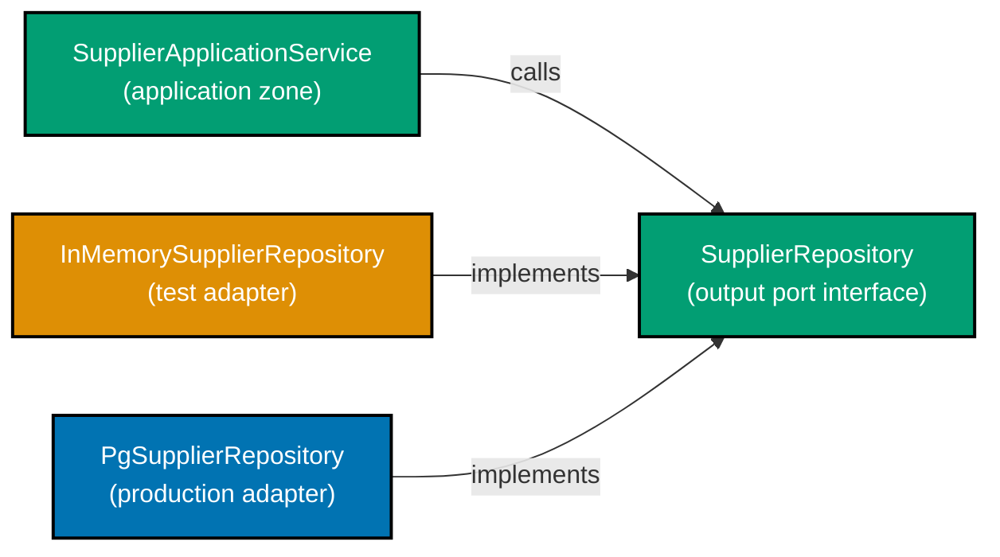
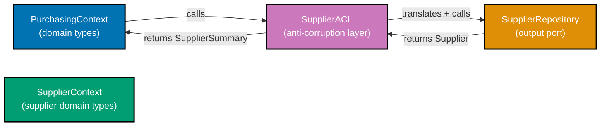

Examples 21–40 extend the beginner hexagon with the `supplier` context, three new output ports (`SupplierRepository`, `EventPublisher`, `ApprovalRouterPort`), adapter swapping for tests, integration test seams, and an anti-corruption layer between bounded contexts. Every code block is self-contained and annotation density targets 1.0–2.25 comment lines per code line per example.

## Supplier Context Ports (Examples 21–25)

### Example 21: SupplierRepository output port

The `supplier` bounded context manages vendor master data. Its output port, `SupplierRepository`, lives in the `supplier.application` package and speaks only in domain types — no SQL, no Spring Data. The interface mirrors `PurchaseOrderRepository` in structure, establishing the pattern readers can rely on across contexts.



```java
// Output port for the supplier context — lives in application package
// => package com.example.procurement.supplier.application
package com.example.procurement.supplier.application;

import com.example.procurement.supplier.domain.Supplier;
import com.example.procurement.supplier.domain.SupplierId;
import com.example.procurement.supplier.domain.SupplierStatus;
import java.util.List;
import java.util.Optional;

// SupplierRepository: output port; describes what the application needs from persistence
// => interface keyword: no implementation here; adapters supply the "how"
public interface SupplierRepository {

    // save: persist a Supplier aggregate; return the saved instance
    // => same contract pattern as PurchaseOrderRepository — consistent port shape
    Supplier save(Supplier supplier);
    // => caller: repository.save(supplier) — unaware whether store is Postgres or HashMap

    // findById: retrieve a Supplier by its typed identity
    // => Optional<> makes absence explicit; callers must handle Optional.empty()
    Optional<Supplier> findById(SupplierId id);
    // => returns Optional.empty() when supplier not found; no NullPointerException risk

    // findAllApproved: return every supplier eligible for new PurchaseOrders
    // => purchasing context calls this to validate supplier is APPROVED before issuing a PO
    List<Supplier> findAllApproved();
    // => filters by SupplierStatus.APPROVED; adapter translates to SQL WHERE clause

    // existsById: lightweight presence check; avoids loading full aggregate
    // => used in duplicate-prevention guards before registering a new supplier
    boolean existsById(SupplierId id);
    // => returns true when supplier exists; false otherwise; O(1) cost in both adapters
}
// => Application service imports only this interface; zero coupling to Postgres, JPA, or HashMap
```

**Key Takeaway**: `SupplierRepository` follows the same output-port pattern as `PurchaseOrderRepository` — domain-language interface in the application package, zero framework imports.

**Why It Matters**: Having a consistent port shape across contexts lowers the cognitive cost of reading new contexts. When a developer familiar with `PurchaseOrderRepository` encounters `SupplierRepository`, the pattern recognition is immediate. Consistency also means the same adapter skeletons (in-memory, Postgres) can be copied and renamed rather than invented from scratch.

---

### Example 22: Supplier domain aggregate with lifecycle states

The `Supplier` aggregate root manages vendor approval state. Its lifecycle — `Pending → Approved → Suspended → Blacklisted` — is enforced by domain methods that guard illegal transitions and return new immutable instances.

```java
// Supplier aggregate root: purchasing context imports this to validate PO eligibility
// => package com.example.procurement.supplier.domain
package com.example.procurement.supplier.domain;

import java.util.Objects;

// SupplierStatus: domain enum expressing the supplier lifecycle
// => four states; transitions enforced by domain methods below
public enum SupplierStatus {
    PENDING,     // => newly registered; cannot receive POs yet
    APPROVED,    // => eligible for POs; default state after vetting
    SUSPENDED,   // => existing POs continue; no new POs allowed
    BLACKLISTED  // => new POs blocked; existing POs forced to Disputed
}

// Supplier: aggregate root — immutable record; all transitions return new instances
// => record generates equals/hashCode/toString; no Lombok required
public record Supplier(
    SupplierId id,           // => typed identity; format "sup_<uuid>"
    String name,             // => legal business name; display purposes
    SupplierStatus status    // => current lifecycle state; drives PO eligibility
) {
    // Compact canonical constructor: validates invariants at construction
    // => called before the implicit record constructor; guards null values
    public Supplier {
        Objects.requireNonNull(id, "SupplierId required");
        Objects.requireNonNull(name, "Supplier name required");
        Objects.requireNonNull(status, "SupplierStatus required");
        // => every field validated; impossible to build a Supplier with null state
    }

    // approve: PENDING → APPROVED transition
    // => returns a new Supplier; this instance unchanged (immutable)
    public Supplier approve() {
        if (status != SupplierStatus.PENDING) {
            throw new IllegalStateException("Only PENDING suppliers can be approved; current=" + status);
            // => guard: caller receives clear domain-language error message
        }
        return new Supplier(id, name, SupplierStatus.APPROVED);
        // => new record: same id and name, new status APPROVED
    }

    // suspend: APPROVED → SUSPENDED transition
    // => suspended suppliers cannot receive new POs but existing POs continue
    public Supplier suspend() {
        if (status != SupplierStatus.APPROVED) {
            throw new IllegalStateException("Only APPROVED suppliers can be suspended; current=" + status);
        }
        return new Supplier(id, name, SupplierStatus.SUSPENDED);
        // => state change captured in new immutable record; original discarded
    }

    // isEligibleForPO: query method — pure function with no side effects
    // => purchasing context calls this before issuing a PO to this supplier
    public boolean isEligibleForPO() {
        return status == SupplierStatus.APPROVED;
        // => only APPROVED status permits new PurchaseOrders; all others return false
    }
}
```

**Key Takeaway**: `Supplier` is an immutable record whose state-transition methods guard preconditions and return new instances — no setters, no mutable state.

**Why It Matters**: Immutable aggregates eliminate an entire class of concurrency bugs. Two threads reading the same `Supplier` record see identical state. State transitions are explicit method calls that produce new values — a pattern that maps cleanly to event sourcing, audit logs, and test assertions.

---

### Example 23: In-memory SupplierRepository adapter

The in-memory adapter for `SupplierRepository` follows the same HashMap pattern established in Example 7. It is the default adapter for unit tests across both `purchasing` and `supplier` contexts.

```java
// In-memory adapter: implements SupplierRepository with a HashMap
// => package com.example.procurement.supplier.adapter.out.persistence
package com.example.procurement.supplier.adapter.out.persistence;

import com.example.procurement.supplier.application.SupplierRepository;
import com.example.procurement.supplier.domain.Supplier;
import com.example.procurement.supplier.domain.SupplierId;
import com.example.procurement.supplier.domain.SupplierStatus;
import java.util.HashMap;
import java.util.List;
import java.util.Map;
import java.util.Optional;

// InMemorySupplierRepository: test adapter; no JPA, no Postgres, no Docker required
// => implements SupplierRepository (output port); swappable with PgSupplierRepository at wiring
public class InMemorySupplierRepository implements SupplierRepository {

    // store: HashMap backing the in-memory persistence
    // => key = typed SupplierId; value = immutable Supplier record
    private final Map<SupplierId, Supplier> store = new HashMap<>();

    @Override
    public Supplier save(Supplier supplier) {
        store.put(supplier.id(), supplier); // => HashMap.put: O(1); replaces existing entry
        return supplier;                    // => return same instance; consistent with port contract
    }

    @Override
    public Optional<Supplier> findById(SupplierId id) {
        return Optional.ofNullable(store.get(id)); // => null becomes Optional.empty(); never null return
        // => caller handles absence with orElseThrow() or isEmpty() check
    }

    @Override
    public List<Supplier> findAllApproved() {
        return store.values().stream()
            .filter(s -> s.status() == SupplierStatus.APPROVED) // => domain-level filter; no SQL
            .toList();
        // => stream().filter().toList(): returns unmodifiable List; snapshot at call time
    }

    @Override
    public boolean existsById(SupplierId id) {
        return store.containsKey(id); // => O(1) HashMap lookup; true/false
    }
}
// Usage in test:
// var supplierRepo = new InMemorySupplierRepository();
// var supplierService = new RegisterSupplierService(supplierRepo, eventPublisher);
// => wired in 1 line; no Spring context; starts in < 1ms
```

**Key Takeaway**: `InMemorySupplierRepository` repeats the same HashMap-backed pattern as the PO adapter — a single pattern for all in-memory adapters keeps onboarding fast.

**Why It Matters**: When every context follows the same in-memory adapter shape, a developer can write a new adapter for a new context in under five minutes by renaming an existing one. The cost of adopting hexagonal architecture for a new aggregate drops to near zero.

---

### Example 24: EventPublisher output port — decoupling cross-context side effects

`EventPublisher` is an output port that abstracts how domain events leave the application layer. The port is simple — one method, one parameter. Adapters behind it may write to a database outbox, push to Kafka, or log events to an in-memory list for tests.

```java
// EventPublisher: output port for domain event emission
// => package com.example.procurement.purchasing.application
package com.example.procurement.purchasing.application;

import com.example.procurement.purchasing.domain.DomainEvent;

// EventPublisher: single-method port; adapters decide where events go
// => Functional interface — implementable as a lambda in tests
@FunctionalInterface
public interface EventPublisher {
    // publish: emit a domain event to interested consumers
    // => DomainEvent: marker interface; all domain events implement it
    void publish(DomainEvent event);
    // => implementation options: OutboxEventPublisher (DB), KafkaEventPublisher, InMemoryEventPublisher
}

// DomainEvent: marker interface — all domain events implement this
// => package com.example.procurement.purchasing.domain
// => sealed interface would enumerate known events; marker pattern chosen for simplicity
interface DomainEvent {}

// Concrete domain events: purchasing context emits these after successful state transitions
// => PurchaseOrderIssued: emitted when a PO transitions Approved → Issued
record PurchaseOrderIssued(
    String purchaseOrderId, // => id of the issued PO; format "po_<uuid>"
    String supplierId       // => which supplier the PO was issued to; format "sup_<uuid>"
) implements DomainEvent {}

// SupplierApproved: emitted by supplier context when Pending → Approved
// => purchasing context consumes this to refresh the approved-supplier cache
record SupplierApproved(
    String supplierId // => format "sup_<uuid>"; purchasing adds to eligible-supplier list
) implements DomainEvent {}

// In-memory EventPublisher adapter: captures events for test assertions
// => Tests inspect capturedEvents to verify the right events were published
class InMemoryEventPublisher implements EventPublisher {
    private final java.util.List<DomainEvent> capturedEvents = new java.util.ArrayList<>();
    // => capturedEvents: grows as publish() is called; test reads it after use-case execution

    @Override
    public void publish(DomainEvent event) {
        capturedEvents.add(event); // => append to list; does not send to Kafka or write to DB
    }

    public java.util.List<DomainEvent> getCapturedEvents() {
        return java.util.List.copyOf(capturedEvents); // => immutable snapshot; safe for test assertion
    }
}
// => Production: OutboxEventPublisher writes event to outbox table in same transaction as PO save
// => Kafka delivery happens asynchronously after transaction commits
```

**Key Takeaway**: `EventPublisher` is a single-method `@FunctionalInterface` port. The in-memory adapter captures events for test assertions; the production adapter writes to an outbox.

**Why It Matters**: Hiding event delivery behind a port means the application service never knows whether events go to Kafka, a webhook, or a test list. Replacing the event delivery mechanism requires only a new adapter — the application service and domain are unchanged.

---

### Example 25: ApprovalRouterPort — routing approval requests

`ApprovalRouterPort` is an output port that routes a PO approval request to the correct manager based on `ApprovalLevel`. The port is defined in the `purchasing.application` package; adapters behind it may call a workflow engine, send an email, or return immediately for tests.

```java
// ApprovalRouterPort: output port for approval workflow routing
// => package com.example.procurement.purchasing.application
package com.example.procurement.purchasing.application;

import com.example.procurement.purchasing.domain.ApprovalLevel;
import com.example.procurement.purchasing.domain.PurchaseOrderId;

// ApprovalLevel: domain enum — derived from PO total per spec
// => L1: total <= $1,000 | L2: total <= $10,000 | L3: total > $10,000
// => package com.example.procurement.purchasing.domain
enum ApprovalLevel { L1, L2, L3 }

// ApprovalRouterPort: describes what the application needs from approval workflow
// => interface: no implementation detail; adapter decides whether to call Jira, email, or noop
public interface ApprovalRouterPort {

    // routeApproval: send the PO approval request to the correct approver queue
    // => purchaseOrderId: which PO needs approval; level: drives which approver receives it
    void routeApproval(PurchaseOrderId purchaseOrderId, ApprovalLevel level);
    // => production adapter: POST to workflow engine API with level → manager mapping
    // => test adapter: records the call for assertion; no network I/O

    // deriveApprovalLevel: pure function — derive level from PO total amount
    // => default method in the port; reusable across all implementations
    static ApprovalLevel deriveLevel(java.math.BigDecimal total) {
        if (total.compareTo(new java.math.BigDecimal("1000")) <= 0) return ApprovalLevel.L1;
        // => L1: total <= 1,000; routes to team-lead approval queue
        if (total.compareTo(new java.math.BigDecimal("10000")) <= 0) return ApprovalLevel.L2;
        // => L2: 1,000 < total <= 10,000; routes to department-head queue
        return ApprovalLevel.L3;
        // => L3: total > 10,000; routes to CFO-level approval queue
    }
}

// In-memory ApprovalRouterPort adapter: captures routed calls for tests
// => package com.example.procurement.purchasing.adapter.out.workflow
class InMemoryApprovalRouter implements ApprovalRouterPort {
    private final java.util.List<String> routedCalls = new java.util.ArrayList<>();
    // => routedCalls: record of "po_<id>@L2" strings; test reads after use-case execution

    @Override
    public void routeApproval(PurchaseOrderId id, ApprovalLevel level) {
        routedCalls.add(id.value() + "@" + level.name());
        // => append routing record; no network call; no side effect outside this object
    }

    public java.util.List<String> getRoutedCalls() {
        return java.util.List.copyOf(routedCalls); // => immutable snapshot for test assertion
    }
}
// Test assertion:
// assertThat(router.getRoutedCalls()).contains("po_abc123@L3");
// => verifies the use case routed the high-value PO to L3 approval
```

**Key Takeaway**: `ApprovalRouterPort` hides the workflow engine behind a port. The in-memory adapter captures calls; the production adapter calls a real workflow API.

**Why It Matters**: Routing logic (which manager gets which PO) can be tested without spinning up a workflow engine. The test adapter captures the routing call, and the assertion verifies the correct level was derived from the PO total. Changing the workflow engine later is a one-adapter change.

---

## Adapter Swapping and Test Seams (Examples 26–30)

### Example 26: Adapter swapping — switching from in-memory to Postgres at the composition root

Adapter swapping is the practical payoff of the port interface. The composition root selects which adapter implements each port. Changing from test (in-memory) to production (Postgres) is a one-line change in the `@Configuration` class.

```java
// Composition root: Spring @Configuration selects adapter per port
// => package com.example.procurement
package com.example.procurement;

import com.example.procurement.purchasing.adapter.out.persistence.*;
import com.example.procurement.purchasing.adapter.out.events.*;
import com.example.procurement.purchasing.adapter.out.workflow.*;
import com.example.procurement.purchasing.application.*;
import com.example.procurement.supplier.adapter.out.persistence.*;
import com.example.procurement.supplier.application.*;
import org.springframework.context.annotation.*;

// HexagonConfiguration: the single class that knows both port and adapter
// => @Configuration: Spring treats this as a bean factory; scans @Bean methods
@Configuration
public class HexagonConfiguration {

    // purchaseOrderRepository: production wiring uses Postgres adapter
    // => SWAP: replace PgPurchaseOrderRepository with InMemoryPurchaseOrderRepository for tests
    @Bean
    public PurchaseOrderRepository purchaseOrderRepository(JpaPoRepository jpa) {
        return new PgPurchaseOrderRepository(jpa); // => one line to change for test profile
        // => test profile: return new InMemoryPurchaseOrderRepository();
    }

    // supplierRepository: production wiring uses Postgres adapter for supplier context
    // => SWAP: replace PgSupplierRepository with InMemorySupplierRepository for tests
    @Bean
    public SupplierRepository supplierRepository(JpaSupplierRepository jpa) {
        return new PgSupplierRepository(jpa); // => production; test: InMemorySupplierRepository
    }

    // eventPublisher: production wiring uses outbox adapter (transactional event delivery)
    // => SWAP: replace OutboxEventPublisher with InMemoryEventPublisher for unit tests
    @Bean
    public EventPublisher eventPublisher(OutboxRepository outbox) {
        return new OutboxEventPublisher(outbox); // => production; test: new InMemoryEventPublisher()
    }

    // approvalRouterPort: production wiring calls workflow engine REST API
    // => SWAP: replace WorkflowEngineApprovalRouter with InMemoryApprovalRouter for tests
    @Bean
    public ApprovalRouterPort approvalRouterPort() {
        return new WorkflowEngineApprovalRouter(); // => production; test: new InMemoryApprovalRouter()
    }

    // issuePurchaseOrderUseCase: wires application service with all output ports
    // => all dependencies are injected via constructor; no @Autowired inside service
    @Bean
    public IssuePurchaseOrderUseCase issuePurchaseOrderUseCase(
        PurchaseOrderRepository poRepo,      // => injected from bean above
        SupplierRepository supplierRepo,     // => injected from bean above
        EventPublisher events,               // => injected from bean above
        ApprovalRouterPort approvalRouter,   // => injected from bean above
        Clock clock                          // => injected from clock bean (see beginner Example 6)
    ) {
        return new IssuePurchaseOrderService(poRepo, supplierRepo, events, approvalRouter, clock);
        // => application service constructed; dependencies resolved at boot; no runtime reflection
    }
}
// Spring @Profile("test") on an override @Configuration can replace any @Bean above
// => zero changes to domain, application service, or tests — only wiring changes
```

**Key Takeaway**: The `@Configuration` class is the only place that couples a port to its adapter. Swapping adapters is a one-line change per port.

**Why It Matters**: Teams running CI without a database use the in-memory adapter profile for unit tests and the Postgres adapter profile for integration tests — without a single change to application or domain code. The same application service binary runs against both adapters.

---

### Example 27: Spring @Profile-based adapter selection

Spring `@Profile` lets different adapters load in different environments without any `if` statements in business code. The application is oblivious to which adapter is active.

```java
// Profile-based adapter selection: Spring loads the right adapter per environment
// => package com.example.procurement.purchasing.config
package com.example.procurement.purchasing.config;

import com.example.procurement.purchasing.application.PurchaseOrderRepository;
import com.example.procurement.purchasing.adapter.out.persistence.*;
import org.springframework.context.annotation.*;

// TestPersistenceConfig: active only in "test" profile
// => @Profile("test"): Spring skips this @Configuration in production profile
@Configuration
@Profile("test")
class TestPersistenceConfig {

    @Bean
    public PurchaseOrderRepository purchaseOrderRepository() {
        return new InMemoryPurchaseOrderRepository();
        // => test profile: in-memory adapter; no Docker, no Postgres, no Testcontainers
    }
}

// ProductionPersistenceConfig: active in "prod" and "staging" profiles
// => @Profile({"prod", "staging"}): Spring loads this in production and staging
@Configuration
@Profile({"prod", "staging"})
class ProductionPersistenceConfig {

    @Bean
    public PurchaseOrderRepository purchaseOrderRepository(JpaPoRepository jpa) {
        return new PgPurchaseOrderRepository(jpa);
        // => production profile: Postgres adapter; JPA managed by Spring Data
    }
}

// Application service is unaffected by which config class is active
// => IssuePurchaseOrderService receives PurchaseOrderRepository via constructor
// => it does not know if the injected instance is InMemory or Pg
// => @SpringBootTest(properties = {"spring.profiles.active=test"}) activates test profile
// => @SpringBootApplication loads the matching config class automatically
```

**Key Takeaway**: `@Profile` annotations on `@Configuration` classes wire different adapters in different environments — the application service is never aware of which adapter is active.

**Why It Matters**: Profile-based adapter selection means the same artifact (JAR) runs in staging with a real database and in CI with an in-memory store. No environment-specific branches in business code. The adapter choice is purely an operational concern expressed in Spring configuration.

---

### Example 28: Integration test seam — testing the application service with real ports

An integration test seam is the point where the in-memory adapter is replaced by a real infrastructure component (Postgres, Kafka) while the application service and domain remain unchanged. This seam validates that the adapter correctly translates between domain types and the external store.

```java
// Integration test seam: application service wired with real (Testcontainers) adapter
// => package com.example.procurement.purchasing.application
package com.example.procurement.purchasing.application;

import com.example.procurement.purchasing.adapter.out.persistence.*;
import com.example.procurement.purchasing.domain.*;
import org.junit.jupiter.api.*;
import org.springframework.beans.factory.annotation.Autowired;
import org.springframework.boot.test.context.SpringBootTest;
import org.springframework.test.context.ActiveProfiles;
import static org.assertj.core.api.Assertions.*;

// Integration test: full stack from application service to Postgres (Testcontainers)
// => @SpringBootTest: loads full Spring context; @ActiveProfiles("integration") selects adapters
// => Testcontainers starts Postgres container before tests; container stopped after suite
@SpringBootTest
@ActiveProfiles("integration") // => selects PgPurchaseOrderRepository adapter (real Postgres)
class IssuePurchaseOrderIntegrationTest {

    // useCase: full application service wired with real Postgres adapter by Spring
    // => @Autowired: Spring injects the bean from the integration config class
    @Autowired
    IssuePurchaseOrderUseCase useCase;

    @Autowired
    PurchaseOrderRepository repository; // => same PgPurchaseOrderRepository instance

    @Test
    void issued_purchase_order_persists_to_postgres() {
        // Arrange: valid command; supplier exists in the integration DB
        var command = new IssuePurchaseOrderUseCase.IssuePOCommand(
            "550e8400-e29b-41d4-a716-446655440000", // => supplierId raw value
            "5000.00",                               // => amount: L2 approval threshold
            "USD"                                    // => ISO 4217 currency
        );

        // Act: call the use case with real Postgres adapter behind the port
        PurchaseOrder result = useCase.execute(command);
        // => result: PurchaseOrder persisted to Postgres via PgPurchaseOrderRepository

        // Assert: domain state transitions correctly
        assertThat(result.status()).isEqualTo(POStatus.AWAITING_APPROVAL);
        // => state machine: DRAFT → AWAITING_APPROVAL confirmed

        // Assert: data survives a round-trip to Postgres and back
        var fromDb = repository.findById(result.id());
        assertThat(fromDb).isPresent();             // => PO found in Postgres
        assertThat(fromDb.get().total().amount())
            .isEqualByComparingTo("5000.00");       // => BigDecimal equality (scale-agnostic)
        // => round-trip: domain record → JPA entity → Postgres → JPA entity → domain record
    }
}
// => The application service code is IDENTICAL to the unit test version
// => Only the adapter wired at the port boundary changes (InMemory vs Pg)
// => This is the integration seam: domain logic is proven by unit tests; persistence is proven here
```

**Key Takeaway**: The integration test seam tests the Postgres adapter in isolation — the application service code is identical to unit tests; only the wired adapter changes.

**Why It Matters**: When the application service test (unit) and the integration test share the same service code, a failure in the integration test points directly to the adapter translation layer, not to business logic. Debugging becomes faster because the failure scope is already narrowed.

---

### Example 29: Dependency rejection — refusing a supplier that is not APPROVED

The application service must enforce the business rule that a PO cannot be issued to a non-APPROVED supplier. It does so by loading the supplier via `SupplierRepository` and calling the domain's eligibility check before proceeding.

```java
// Application service: enforces supplier eligibility before issuing a PO
// => package com.example.procurement.purchasing.application
package com.example.procurement.purchasing.application;

import com.example.procurement.purchasing.domain.*;
import com.example.procurement.supplier.application.SupplierRepository;
import com.example.procurement.supplier.domain.*;
import java.math.BigDecimal;
import java.util.UUID;

// IssuePurchaseOrderService: orchestrates domain + both repositories + event publisher
// => No framework annotations; constructor injection only
public class IssuePurchaseOrderService implements IssuePurchaseOrderUseCase {

    private final PurchaseOrderRepository poRepository;       // => purchasing output port
    private final SupplierRepository supplierRepository;      // => supplier output port
    private final EventPublisher eventPublisher;              // => event output port
    private final ApprovalRouterPort approvalRouter;          // => approval-routing output port
    private final Clock clock;                                // => time output port

    public IssuePurchaseOrderService(
        PurchaseOrderRepository poRepository,
        SupplierRepository supplierRepository,
        EventPublisher eventPublisher,
        ApprovalRouterPort approvalRouter,
        Clock clock
    ) {
        this.poRepository = poRepository;
        this.supplierRepository = supplierRepository;
        this.eventPublisher = eventPublisher;
        this.approvalRouter = approvalRouter;
        this.clock = clock;
        // => all dependencies injected at wiring time; none created inside the service
    }

    @Override
    public PurchaseOrder execute(IssuePOCommand command) {
        // 1. Resolve and validate the supplier via output port
        var supplierId = new SupplierId(command.supplierId());
        // => SupplierId constructor validates "sup_" prefix and UUID format

        var supplier = supplierRepository.findById(supplierId)
            .orElseThrow(() -> new DomainException("Supplier not found: " + command.supplierId()));
        // => orElseThrow: Optional.empty() becomes a domain exception; HTTP 404 in adapter

        if (!supplier.isEligibleForPO()) {
            throw new DomainException(
                "Supplier " + supplierId.value() + " is not eligible for POs; status=" + supplier.status()
            );
            // => dependency rejection: SUSPENDED or BLACKLISTED supplier rejected before PO is built
            // => HTTP adapter maps this DomainException to 422 Unprocessable Entity
        }

        // 2. Build the PO and apply the DRAFT → AWAITING_APPROVAL transition
        var id = new PurchaseOrderId("po_" + UUID.randomUUID());
        var total = new Money(new BigDecimal(command.totalAmount()), command.totalCurrency());
        var po = new PurchaseOrder(id, supplierId, total, POStatus.DRAFT).submit();
        // => po: new PurchaseOrder in AWAITING_APPROVAL; submit() enforces DRAFT guard

        // 3. Persist via output port
        var saved = poRepository.save(po);
        // => saved: persisted PurchaseOrder; same reference for in-memory; fresh from Pg adapter

        // 4. Derive approval level and route
        var level = ApprovalRouterPort.deriveLevel(total.amount());
        // => level: L1, L2, or L3 derived from PO total; determines which manager queue
        approvalRouter.routeApproval(saved.id(), level);
        // => side effect: workflow engine (or test capture list) notified

        // 5. Publish domain event
        eventPublisher.publish(new PurchaseOrderIssued(saved.id().value(), supplierId.value()));
        // => event: purchasing context informs downstream (receiving, accounting) that PO is issued

        return saved;
        // => caller (HTTP adapter) maps saved PurchaseOrder to outbound DTO and HTTP 201
    }
}
```

**Key Takeaway**: The application service enforces supplier eligibility through the `SupplierRepository` port before constructing the PO — dependency rejection at the orchestration layer.

**Why It Matters**: Rejecting an ineligible supplier before touching the PO aggregate means the domain invariant is enforced at the earliest possible point. No partially-built PO is created for an invalid supplier. The eligibility check is testable without Postgres — the in-memory supplier adapter makes the test instant.

---

### Example 30: Testing supplier eligibility rejection — fast unit test

Testing the `isEligibleForPO` guard requires only two in-memory adapters and the application service. No Docker, no Spring, no integration setup.

```java
// Unit test: verifies the service rejects a SUSPENDED supplier
// => package com.example.procurement.purchasing.application
package com.example.procurement.purchasing.application;

import com.example.procurement.purchasing.adapter.out.persistence.*;
import com.example.procurement.purchasing.adapter.out.events.InMemoryEventPublisher;
import com.example.procurement.purchasing.adapter.out.workflow.InMemoryApprovalRouter;
import com.example.procurement.supplier.adapter.out.persistence.InMemorySupplierRepository;
import com.example.procurement.supplier.domain.*;
import org.junit.jupiter.api.*;
import static org.assertj.core.api.Assertions.*;

class IssuePurchaseOrderServiceTest {

    // Fixed clock: deterministic; eliminates wall-clock non-determinism
    // => lambda implements the single-method Clock @FunctionalInterface
    private static final Clock FIXED_CLOCK = () -> java.time.Instant.parse("2026-01-01T00:00:00Z");

    private IssuePurchaseOrderService service;
    private InMemorySupplierRepository supplierRepo;
    private InMemoryEventPublisher eventPublisher;
    private InMemoryApprovalRouter approvalRouter;

    @BeforeEach void setUp() {
        var poRepo = new InMemoryPurchaseOrderRepository();
        supplierRepo = new InMemorySupplierRepository();  // => fresh per test; no state bleed
        eventPublisher = new InMemoryEventPublisher();    // => captures events for assertion
        approvalRouter = new InMemoryApprovalRouter();    // => captures routing calls
        service = new IssuePurchaseOrderService(
            poRepo, supplierRepo, eventPublisher, approvalRouter, FIXED_CLOCK
        );
        // => wired in 6 lines; no Spring context, no Docker; boots in < 1ms
    }

    @Test void rejects_suspended_supplier() {
        // Arrange: save a SUSPENDED supplier in the in-memory store
        var supplierId = new SupplierId("sup_550e8400-e29b-41d4-a716-446655440000");
        var suspended = new Supplier(supplierId, "Acme Corp", SupplierStatus.SUSPENDED);
        supplierRepo.save(suspended);
        // => in-memory store has the supplier; status = SUSPENDED

        var command = new IssuePurchaseOrderUseCase.IssuePOCommand(
            "550e8400-e29b-41d4-a716-446655440000", // => matching supplierId raw value
            "1000.00", "USD"                         // => L1 amount; level doesn't matter here
        );

        // Act + Assert: service must throw on ineligible supplier
        assertThatThrownBy(() -> service.execute(command))
            .isInstanceOf(DomainException.class)
            .hasMessageContaining("not eligible");
        // => DomainException thrown; HTTP adapter would return 422; no PO created

        // Assert: no events published, no approval routed
        assertThat(eventPublisher.getCapturedEvents()).isEmpty();
        // => side effects suppressed: ineligible path produces no observable output
        assertThat(approvalRouter.getRoutedCalls()).isEmpty();
        // => approval router not called: rejected before reaching routing step
    }
}
// => Test runs in < 5ms; verifies the full dependency-rejection path without any infrastructure
```

**Key Takeaway**: The rejection test uses only in-memory adapters — no infrastructure, no network, no Docker. The entire failure path is verified in milliseconds.

**Why It Matters**: Fast rejection tests encourage developers to cover all the guard clauses, not just the happy path. When a new status like `Blacklisted` is added to `SupplierStatus`, the test shows exactly where new rejection logic must be added — and the test for it can be written in seconds.

---

## Cross-Context Patterns (Examples 31–35)

### Example 31: Anti-corruption layer — translating supplier context types into purchasing

When the `purchasing` context calls the `supplier` context, it must not let the supplier's internal types leak into its own domain. An anti-corruption layer (ACL) translates between the two contexts' type systems at the boundary.



```java
// Anti-corruption layer: purchasing context translation of supplier context types
// => package com.example.procurement.purchasing.application
package com.example.procurement.purchasing.application;

import com.example.procurement.supplier.application.SupplierRepository;
import com.example.procurement.supplier.domain.Supplier;
import com.example.procurement.supplier.domain.SupplierId;
import com.example.procurement.purchasing.domain.PurchasingSupplierSummary;
import java.util.Optional;

// PurchasingSupplierSummary: purchasing context's local view of a supplier
// => This type lives in the purchasing domain — NOT the supplier domain
// => purchasing context only cares about name and eligibility; not supplier's full state
record PurchasingSupplierSummary(
    String supplierId,   // => purchasing-local representation of the supplier id
    String name,         // => display name for PO documents
    boolean eligible     // => true if supplier.isEligibleForPO() — purchasing interpretation
) {}

// SupplierACL: anti-corruption layer; translates supplier types to purchasing types
// => Lives in purchasing.application; imports supplier types only here, never deeper
public class SupplierACL {

    private final SupplierRepository supplierRepository; // => supplier context's output port
    // => ACL holds the port; purchasing domain classes never reference supplier types

    public SupplierACL(SupplierRepository supplierRepository) {
        this.supplierRepository = supplierRepository;
        // => injected at wiring time; no field initialization with supplier internals
    }

    // lookupForPurchasing: translate supplier context types into purchasing's local view
    // => purchasing application service calls this; never calls SupplierRepository directly
    public Optional<PurchasingSupplierSummary> lookupForPurchasing(String rawSupplierId) {
        var supplierId = new SupplierId(rawSupplierId);
        // => SupplierId: supplier context type; only the ACL touches it
        return supplierRepository.findById(supplierId)
            .map(this::translate);
        // => translate: maps Supplier (supplier context) → PurchasingSupplierSummary (purchasing context)
    }

    // translate: the actual translation — supplier's rich model → purchasing's slim view
    // => private: translation logic is ACL-internal; callers receive only the purchasing type
    private PurchasingSupplierSummary translate(Supplier supplier) {
        return new PurchasingSupplierSummary(
            supplier.id().value(),       // => extract raw String from SupplierId value object
            supplier.name(),             // => business name; purchasing-side display only
            supplier.isEligibleForPO()   // => boolean gate; purchasing cares about eligibility, not status enum
        );
        // => PurchasingSupplierSummary: purchasing's interpretation of supplier eligibility
        // => supplier's SupplierStatus enum never reaches purchasing domain types
    }
}
// => IssuePurchaseOrderService calls supplierACL.lookupForPurchasing(rawId) instead of repo directly
// => Supplier context types remain isolated behind the ACL translation boundary
```

**Key Takeaway**: The `SupplierACL` translates supplier context types into purchasing-local types. Supplier's internal model never leaks into the purchasing domain.

**Why It Matters**: Without an ACL, renaming `SupplierStatus.APPROVED` to `SupplierStatus.VETTED` would require changes across the purchasing domain. With the ACL, the change is confined to the `translate` method — one line. Every other purchasing class sees only `eligible: boolean`.

---

### Example 32: Kotlin — SupplierRepository port and in-memory adapter

Kotlin's concise syntax and null safety make port definitions and in-memory adapters even more expressive. The same hexagonal concepts apply; the language shifts the syntax.

```kotlin
// Kotlin: SupplierRepository port and in-memory adapter
// => package com.example.procurement.supplier.application
package com.example.procurement.supplier.application

import com.example.procurement.supplier.domain.Supplier
import com.example.procurement.supplier.domain.SupplierId
import com.example.procurement.supplier.domain.SupplierStatus

// SupplierRepository: output port — Kotlin interface; same intent as Java version
// => Kotlin interface: no companion object required; SAM-compatible for lambda adapters
interface SupplierRepository {
    fun save(supplier: Supplier): Supplier          // => save and return persisted supplier
    fun findById(id: SupplierId): Supplier?         // => nullable return: Kotlin's Optional<> equivalent
    fun findAllApproved(): List<Supplier>           // => List<Supplier>: non-nullable; empty list if none
    fun existsById(id: SupplierId): Boolean         // => Boolean; Kotlin Bool maps to JVM boolean
}
// => Supplier?: nullable type; caller must handle null with ?. or ?: operators — no Optional overhead

// InMemorySupplierRepository: Kotlin in-memory adapter
// => class InMemorySupplierRepository: name mirrors Java version; same role, Kotlin idioms
class InMemorySupplierRepository : SupplierRepository {
    // MutableMap: Kotlin stdlib; backed by LinkedHashMap for predictable iteration order
    // => mutable internally; exposed interface is immutable (List, not MutableList)
    private val store: MutableMap<SupplierId, Supplier> = mutableMapOf()

    override fun save(supplier: Supplier): Supplier {
        store[supplier.id] = supplier  // => indexer syntax: operator overload on MutableMap
        return supplier                // => return same instance: consistent with Java contract
    }

    override fun findById(id: SupplierId): Supplier? =
        store[id]  // => nullable: returns null if absent; no Optional wrapper needed in Kotlin
    // => Single-expression function body: = instead of braces; Kotlin idiom for simple functions

    override fun findAllApproved(): List<Supplier> =
        store.values.filter { it.status == SupplierStatus.APPROVED }
        // => filter{}: Kotlin higher-order function; lambda replaces stream().filter()
        // => returns List<Supplier>: immutable view; status check mirrors Java version

    override fun existsById(id: SupplierId): Boolean =
        store.containsKey(id)  // => Boolean: Kotlin maps directly to JVM boolean; no boxing
}
// => Kotlin in-memory adapter is ~30% shorter than Java equivalent; same semantics
// => Interoperable: Java code can inject KotlinInMemorySupplierRepository where SupplierRepository is expected
```

**Key Takeaway**: Kotlin's nullable types replace `Optional<>` at the port boundary — `Supplier?` is idiomatic null-safe Kotlin. The adapter pattern is identical to Java; only the syntax differs.

**Why It Matters**: In a mixed Java/Kotlin codebase, Kotlin adapters are fully interoperable with Java ports. A team can migrate adapters one at a time to Kotlin without changing the Java port interface. Kotlin's conciseness reduces the boilerplate cost of writing multiple adapters.

---

### Example 33: EventPublisher — outbox adapter pattern (sketch)

The production `EventPublisher` adapter uses the transactional outbox pattern: events are written to an `outbox` table in the same database transaction as the domain aggregate update, then delivered asynchronously to Kafka. This prevents the "dual write" problem where the aggregate saves but the event fails to publish.

```java
// Outbox adapter: EventPublisher implementation using transactional outbox pattern
// => package com.example.procurement.purchasing.adapter.out.events
package com.example.procurement.purchasing.adapter.out.events;

import com.example.procurement.purchasing.application.EventPublisher;
import com.example.procurement.purchasing.domain.DomainEvent;
import org.springframework.stereotype.Component;
import org.springframework.transaction.annotation.Transactional;

// OutboxRepository: Spring Data JPA repository for the outbox table (adapter-internal)
// => adapter-internal interface; application layer never imports this
interface OutboxRepository extends org.springframework.data.jpa.repository.JpaRepository<OutboxEvent, Long> {}

// OutboxEvent: JPA entity for the outbox table (adapter-internal)
// => @Entity lives in adapter layer; domain record is annotation-free
@jakarta.persistence.Entity
@jakarta.persistence.Table(name = "event_outbox")
class OutboxEvent {
    @jakarta.persistence.Id
    @jakarta.persistence.GeneratedValue(strategy = jakarta.persistence.GenerationType.IDENTITY)
    Long id;               // => auto-generated surrogate key; Kafka relay reads this for ordering
    String eventType;      // => class simple name: "PurchaseOrderIssued", "SupplierApproved", etc.
    String payload;        // => JSON-serialised event; Kafka relay deserialises and publishes
    boolean published;     // => false: not yet sent to Kafka; relay sets to true after delivery
}

// OutboxEventPublisher: production EventPublisher adapter
// => @Component: Spring manages lifecycle; injected into application service via @Bean
@Component
public class OutboxEventPublisher implements EventPublisher {

    private final OutboxRepository outboxRepository;  // => Spring Data JPA; adapter-internal
    private final com.fasterxml.jackson.databind.ObjectMapper mapper; // => Jackson for JSON serialisation

    public OutboxEventPublisher(OutboxRepository outboxRepository,
                                com.fasterxml.jackson.databind.ObjectMapper mapper) {
        this.outboxRepository = outboxRepository; // => injected; adapter-internal dependency
        this.mapper = mapper;                     // => JSON mapper; not visible to application layer
    }

    @Override
    @Transactional  // => @Transactional: outbox write participates in the PO save transaction
    public void publish(DomainEvent event) {
        try {
            var outboxEvent = new OutboxEvent();
            outboxEvent.eventType = event.getClass().getSimpleName();
            // => eventType: "PurchaseOrderIssued"; Kafka relay uses this to route to topic
            outboxEvent.payload = mapper.writeValueAsString(event);
            // => JSON payload: {"purchaseOrderId":"po_abc","supplierId":"sup_xyz"}
            outboxEvent.published = false;
            // => published=false: relay will poll this row and push to Kafka asynchronously
            outboxRepository.save(outboxEvent);
            // => single DB write in the same transaction as the PO save — atomic
        } catch (Exception e) {
            throw new RuntimeException("Failed to write event to outbox: " + event, e);
            // => wrapped in RuntimeException; Spring rolls back the transaction
        }
    }
}
// SKETCH NOTE: Full Kafka relay (polling outbox, publishing to topic, marking published) is covered
// in the in-the-field tutorial; this example teaches the adapter boundary concept only.
```

**Key Takeaway**: The outbox adapter writes events to a database table in the same transaction as the aggregate save — eliminating the dual-write problem without changing the `EventPublisher` port.

**Why It Matters**: The application service calls `eventPublisher.publish(event)` without knowing whether events go to an outbox table, Kafka directly, or a test list. The dual-write protection is entirely an adapter-layer concern. Changing event delivery infrastructure (e.g., from Postgres outbox to Kafka Streams) replaces one adapter class — nothing else changes.

---

### Example 34: ApprovalRouterPort — workflow engine adapter (sketch)

The production `ApprovalRouterPort` adapter calls a workflow engine REST API to route PO approval requests. The adapter is the only class that knows the workflow engine's URL, authentication scheme, and request format.

```java
// WorkflowEngineApprovalRouter: production ApprovalRouterPort adapter
// => package com.example.procurement.purchasing.adapter.out.workflow
package com.example.procurement.purchasing.adapter.out.workflow;

import com.example.procurement.purchasing.application.ApprovalRouterPort;
import com.example.procurement.purchasing.domain.ApprovalLevel;
import com.example.procurement.purchasing.domain.PurchaseOrderId;
import org.springframework.web.client.RestTemplate;

// WorkflowEngineApprovalRouter: calls external workflow engine API
// => Implements ApprovalRouterPort; application service is unaware of REST calls
public class WorkflowEngineApprovalRouter implements ApprovalRouterPort {

    private final RestTemplate restTemplate;   // => HTTP client; adapter-internal detail
    private final String workflowApiBaseUrl;   // => configured at startup; not visible to application

    public WorkflowEngineApprovalRouter(RestTemplate restTemplate, String workflowApiBaseUrl) {
        this.restTemplate = restTemplate;     // => injected; testable by mocking RestTemplate
        this.workflowApiBaseUrl = workflowApiBaseUrl; // => from configuration; e.g., "https://workflow.internal"
    }

    @Override
    public void routeApproval(PurchaseOrderId purchaseOrderId, ApprovalLevel level) {
        // Build the workflow engine request payload (adapter-internal DTO)
        var payload = new WorkflowRequest(purchaseOrderId.value(), level.name());
        // => WorkflowRequest: adapter-layer record; never seen by application service or domain

        String url = workflowApiBaseUrl + "/api/approval-tasks";
        // => URL: adapter concern; application service never knows where approval routing goes

        restTemplate.postForEntity(url, payload, Void.class);
        // => HTTP POST to workflow engine; Void.class: response body discarded (fire-and-forget)
        // => On failure: RestClientException propagates; application service catches at boundary
        // => Production: add retry + circuit-breaker (covered in advanced tutorial)
    }

    // WorkflowRequest: adapter-internal DTO; never crosses into application or domain zones
    // => record: compact; serialised by RestTemplate's Jackson message converter
    private record WorkflowRequest(String purchaseOrderId, String approvalLevel) {}
    // => JSON: {"purchaseOrderId":"po_abc","approvalLevel":"L2"}
}
// SKETCH NOTE: retry, circuit-breaker, and timeout configuration are adapter concerns
// covered fully in the in-the-field tutorial; this example teaches the boundary only.
```

**Key Takeaway**: The workflow engine adapter is the only class that knows the API URL, authentication, and HTTP format — the application service calls the port interface and is fully decoupled from these details.

**Why It Matters**: When the workflow engine vendor changes (e.g., from Jira Service Management to ServiceNow), the replacement is `WorkflowEngineApprovalRouter` only. The application service, domain, and all tests are unchanged. The adapter change can be merged and deployed without a code review touching business logic.

---

### Example 35: Full intermediate flow — two contexts, four ports, one request

This example traces a complete `issuePurchaseOrder` request through both contexts and all four intermediate ports to show how the pieces compose.

```java
// Full intermediate flow: HTTP POST → two contexts → four output ports → HTTP 201
// => traces every layer and port call in sequence

// STEP 1 — HTTP request arrives at primary adapter
// => zone: adapter.in.web (PurchaseOrderHttpController)
// POST /api/v1/purchase-orders  body: {"supplierId":"sup_abc","totalAmount":"8000.00","currency":"USD"}
var req = new CreatePORequest("abc", "8000.00", "USD"); // => inbound DTO; raw HTTP fields

// STEP 2 — Controller builds command and delegates to input port
var command = new IssuePurchaseOrderUseCase.IssuePOCommand("abc", "8000.00", "USD");
// => command crosses adapter boundary → application zone; no domain type used yet

// STEP 3 — Application service calls SupplierRepository port (supplier context)
var supplierId = new SupplierId("sup_abc"); // => typed SupplierId; format validated
var supplier = supplierRepository.findById(supplierId).orElseThrow(...);
// => supplierRepository: output port call; InMemory or Pg adapter selected at wiring
var eligible = supplier.isEligibleForPO();
// => eligible: domain method on Supplier; true if APPROVED; rejects SUSPENDED or BLACKLISTED

// STEP 4 — Domain PO built and DRAFT → AWAITING_APPROVAL applied
var id = new PurchaseOrderId("po_" + UUID.randomUUID()); // => new typed PO identity
var total = new Money(new BigDecimal("8000.00"), "USD");  // => Money validates amount >= 0, currency 3-letter
var po = new PurchaseOrder(id, supplierId, total, POStatus.DRAFT).submit();
// => submit(): domain guard checks DRAFT; returns new PurchaseOrder(AWAITING_APPROVAL)

// STEP 5 — PurchaseOrderRepository port saves the PO (purchasing context)
var saved = poRepository.save(po);
// => poRepository: output port call; adapter writes to HashMap or Postgres table

// STEP 6 — ApprovalRouterPort routes based on total
var level = ApprovalRouterPort.deriveLevel(total.amount()); // => 8000 → L2
approvalRouter.routeApproval(saved.id(), level);
// => approvalRouter: output port call; adapter sends HTTP POST to workflow engine

// STEP 7 — EventPublisher publishes PurchaseOrderIssued
eventPublisher.publish(new PurchaseOrderIssued(saved.id().value(), supplierId.value()));
// => eventPublisher: output port call; adapter writes to outbox table in same transaction

// STEP 8 — Controller maps domain result to HTTP 201 response
var response = new CreatePOResponse(
    saved.id().value(),          // => unwrap PurchaseOrderId → String
    saved.supplierId().value(),  // => unwrap SupplierId → String
    saved.total().amount().toPlainString(), // => BigDecimal → String for JSON
    saved.total().currency(),    // => ISO 4217 code; already String
    saved.status().name()        // => domain enum → String
);
// => HTTP 201 Created; body: {"id":"po_...","supplierId":"sup_...","status":"AWAITING_APPROVAL"}
// => four output ports called; two contexts touched; zero business logic in adapter or port implementations
```

**Key Takeaway**: The intermediate flow crosses two bounded contexts (`purchasing` and `supplier`) and four output ports — each crossing is an explicit port call with a type transformation at its boundary.

**Why It Matters**: Each of the four output-port calls in this flow can be replaced independently without touching the others. The `SupplierRepository` can be swapped for a GraphQL supplier API; the `EventPublisher` can be swapped for SNS; the `ApprovalRouterPort` can be swapped for email — each change is isolated to one adapter class.

---

## Advanced Composition Patterns (Examples 36–40)

### Example 36: Spring @Configuration with multiple bounded contexts

When two bounded contexts live in the same service, the `@Configuration` class wires both contexts' ports. Package discipline prevents cross-context coupling in the domain or application layers.

```java
// Dual-context composition root: wires purchasing and supplier contexts
// => package com.example.procurement
package com.example.procurement;

import com.example.procurement.purchasing.adapter.out.persistence.*;
import com.example.procurement.purchasing.application.*;
import com.example.procurement.supplier.adapter.out.persistence.*;
import com.example.procurement.supplier.application.*;
import org.springframework.context.annotation.*;

// ProcurementConfiguration: composition root for both purchasing and supplier contexts
// => single @Configuration class knows all adapters; domain and application zones know none
@Configuration
public class ProcurementConfiguration {

    // === Supplier context beans ===

    // supplierRepository: supplier context's persistence output port
    // => @Bean: Spring manages lifecycle; injected into SupplierACL below
    @Bean
    public SupplierRepository supplierRepository(JpaSupplierRepository jpa) {
        return new PgSupplierRepository(jpa); // => Postgres adapter for supplier context
    }

    // supplierACL: anti-corruption layer; purchasing context's gateway to supplier context
    // => @Bean: Spring injects SupplierRepository above; purchasing service injects this ACL
    @Bean
    public SupplierACL supplierACL(SupplierRepository supplierRepository) {
        return new SupplierACL(supplierRepository);
        // => ACL wraps the supplier repository; purchasing service calls ACL, not repository
    }

    // === Purchasing context beans ===

    // purchaseOrderRepository: purchasing context's persistence output port
    // => @Bean: Postgres adapter; swappable with InMemory via @Profile
    @Bean
    public PurchaseOrderRepository purchaseOrderRepository(JpaPoRepository jpa) {
        return new PgPurchaseOrderRepository(jpa);
    }

    // eventPublisher: purchasing context's event output port
    // => @Bean: outbox adapter; writes events transactionally with PO saves
    @Bean
    public EventPublisher eventPublisher(OutboxRepository outbox,
                                         com.fasterxml.jackson.databind.ObjectMapper mapper) {
        return new OutboxEventPublisher(outbox, mapper);
    }

    // approvalRouterPort: purchasing context's workflow output port
    // => @Bean: workflow engine adapter; no application code knows the REST URL
    @Bean
    public ApprovalRouterPort approvalRouterPort(
        org.springframework.web.client.RestTemplate restTemplate,
        @org.springframework.beans.factory.annotation.Value("${workflow.api.base-url}") String url
    ) {
        return new WorkflowEngineApprovalRouter(restTemplate, url);
        // => @Value: Spring injects from application.properties; adapter receives it
    }

    // issuePurchaseOrderUseCase: wires the application service with all output ports
    // => @Bean: all five dependencies injected by Spring from beans above
    @Bean
    public IssuePurchaseOrderUseCase issuePurchaseOrderUseCase(
        PurchaseOrderRepository poRepo,
        SupplierRepository supplierRepo,
        EventPublisher events,
        ApprovalRouterPort approvalRouter,
        Clock clock
    ) {
        return new IssuePurchaseOrderService(poRepo, supplierRepo, events, approvalRouter, clock);
        // => complete wiring: application service knows only port interfaces
    }
}
// => ProcurementConfiguration is the only class that couples ports to adapters
// => domain and application classes compile and test without this file on the classpath
```

**Key Takeaway**: The dual-context `@Configuration` class wires both contexts' ports in one place — domain and application classes remain unaware of which adapters are active.

**Why It Matters**: A dual-context composition root makes the full dependency graph of both contexts readable in one file. Architecture reviews that ask "what touches what" can be answered by reading the `@Configuration` class without exploring any other file in the codebase.

---

### Example 37: Constructor injection depth — no @Autowired in business classes

Hexagonal architecture favors constructor injection over field injection (`@Autowired` on fields). Constructor injection makes dependencies explicit, enables testing without a DI container, and prevents partially-initialized objects.

```java
// Constructor injection: comparing field injection vs constructor injection
// => package com.example.procurement.purchasing.application

// ANTI-PATTERN: field injection with @Autowired
// => Problem 1: dependencies hidden; class looks like it has no dependencies
// => Problem 2: Spring required to instantiate; cannot call "new" in unit test
// => Problem 3: fields are mutable; test can accidentally inject null
class IssuePurchaseOrderServiceWithFieldInjection {
    @org.springframework.beans.factory.annotation.Autowired
    private PurchaseOrderRepository poRepository;   // => hidden dependency: not in constructor
    @org.springframework.beans.factory.annotation.Autowired
    private SupplierRepository supplierRepository;  // => another hidden dependency
    // => unit test must use @MockBean or @SpringBootTest — overhead: hundreds of ms
}

// CORRECT PATTERN: constructor injection — explicit, testable, framework-free
// => dependencies declared in constructor; impossible to create object with missing deps
public class IssuePurchaseOrderService implements IssuePurchaseOrderUseCase {

    // Dependencies: all final — immutable after construction; safe for concurrent reads
    // => final: compiler enforces that each field is assigned exactly once in constructor
    private final PurchaseOrderRepository poRepository;
    private final SupplierRepository supplierRepository;
    private final EventPublisher eventPublisher;
    private final ApprovalRouterPort approvalRouter;
    private final Clock clock;

    // Constructor: all dependencies required; no optional params, no setters
    // => caller (composition root or test) must supply all five; cannot skip any
    public IssuePurchaseOrderService(
        PurchaseOrderRepository poRepository,
        SupplierRepository supplierRepository,
        EventPublisher eventPublisher,
        ApprovalRouterPort approvalRouter,
        Clock clock
    ) {
        this.poRepository = poRepository;
        this.supplierRepository = supplierRepository;
        this.eventPublisher = eventPublisher;
        this.approvalRouter = approvalRouter;
        this.clock = clock;
        // => five assignments; compiler error if any omitted; no partial initialization possible
    }

    @Override
    public PurchaseOrder execute(IssuePOCommand command) {
        // => all five dependencies available via fields; null-safe because constructor required them
        // => test: new IssuePurchaseOrderService(inMemPo, inMemSupplier, inMemEvents, inMemRouter, fixedClock)
        // => no Spring, no Mockito, no @MockBean — plain Java in 1 line
        return null; // => implementation shown in Example 29
    }
}
// Constructor injection is the only injection pattern used in domain and application zones
// => Adapter classes (e.g., PgPurchaseOrderRepository) may use @Autowired at the adapter layer
// => But application services NEVER use @Autowired — they are framework-free
```

**Key Takeaway**: Constructor injection declares dependencies explicitly, enables framework-free instantiation in tests, and makes the dependency graph visible in the constructor signature.

**Why It Matters**: A class with five constructor parameters announces its dependencies upfront. When a sixth dependency creeps in, the constructor length signals growing complexity — a nudge toward extracting a collaborator. Field injection hides this signal. Keeping business classes framework-free means the domain and application layers can be compiled and tested as a plain JAR, without Spring on the classpath.

---

### Example 38: Kotlin — data class as command DTO with validation

Kotlin's `data class` with `init` block provides a concise command DTO that enforces validation at construction — matching the Java `record` with compact constructor pattern used in the beginner section.

```kotlin
// Kotlin: command DTO with inline validation — same semantics as Java record
// => package com.example.procurement.purchasing.application
package com.example.procurement.purchasing.application

import java.math.BigDecimal

// IssuePOCommand: inbound command; validated at construction; immutable after build
// => data class: Kotlin generates equals/hashCode/toString/copy automatically
data class IssuePOCommand(
    val supplierId: String,      // => raw supplier id from HTTP; validated in init block
    val totalAmount: String,     // => numeric string from JSON; service parses to BigDecimal
    val totalCurrency: String    // => ISO 4217 code; 3 letters
) {
    // init block: runs at construction; equivalent to Java compact canonical constructor
    // => validation here means invalid commands cannot exist; no defensive checks downstream
    init {
        require(supplierId.isNotBlank()) { "supplierId must not be blank" }
        // => require: Kotlin stdlib; throws IllegalArgumentException on false condition
        require(totalAmount.isNotBlank()) { "totalAmount must not be blank" }
        // => require: validates before BigDecimal parse; better error message than NumberFormatException
        val parsed = totalAmount.toBigDecimalOrNull()
            ?: throw IllegalArgumentException("totalAmount must be a valid decimal: $totalAmount")
        // => toBigDecimalOrNull(): null on parse failure; ?: catches null and throws with context
        require(parsed >= BigDecimal.ZERO) { "totalAmount must be >= 0; got $totalAmount" }
        // => non-negative invariant: same as Java Money.amount invariant — enforced early
        require(totalCurrency.length == 3) { "currency must be 3-letter ISO 4217 code; got $totalCurrency" }
        // => length check: same invariant as Java Money.currency validation
    }
}
// Usage:
// val cmd = IssuePOCommand("sup_abc", "8000.00", "USD")  // => ok
// val bad = IssuePOCommand("", "8000.00", "USD")         // => IllegalArgumentException: supplierId blank
// => Kotlin init block mirrors Java compact canonical constructor; both enforce at construction time
```

**Key Takeaway**: Kotlin's `data class` with an `init` block enforces command invariants at construction — the same pattern as Java's compact record constructor.

**Why It Matters**: Enforcing command validity at the data class boundary means every service that receives an `IssuePOCommand` can trust the data is valid. No defensive `if (supplierId == null)` scattered through the service logic. Invalid commands fail fast at the entry point, with a clear error message.

---

### Example 39: ArchUnit — enforcing hexagonal dependency rules in CI

ArchUnit tests codify the dependency rule as executable code. When a developer accidentally imports a Spring class into the domain, the ArchUnit test fails in CI before the commit reaches main.

```java
// ArchUnit tests: enforce hexagonal dependency direction in CI
// => package com.example.procurement.architecture
package com.example.procurement.architecture;

import com.tngtech.archunit.core.importer.ClassFileImporter;
import com.tngtech.archunit.lang.ArchRule;
import static com.tngtech.archunit.lang.syntax.ArchRuleDefinition.noClasses;
import org.junit.jupiter.api.Test;

// HexagonalArchitectureTest: ArchUnit rules that enforce the dependency direction
// => Run as part of test:unit; fail-fast before business logic changes are merged
class HexagonalArchitectureTest {

    // Import all classes from the procurement package tree for analysis
    // => ClassFileImporter: reads compiled .class files; no source required
    private static final var classes = new ClassFileImporter()
        .importPackages("com.example.procurement");

    @Test void domain_must_not_import_application_classes() {
        ArchRule rule = noClasses()
            .that().resideInAPackage("..domain..")        // => scope: all domain classes
            .should().dependOnClassesThat()
            .resideInAPackage("..application..");         // => must not import application types
        rule.check(classes);
        // => fails if any domain class imports an application class — outward dependency caught
    }

    @Test void domain_must_not_import_adapter_classes() {
        ArchRule rule = noClasses()
            .that().resideInAPackage("..domain..")        // => scope: all domain classes
            .should().dependOnClassesThat()
            .resideInAPackage("..adapter..");             // => must not import any adapter type
        rule.check(classes);
        // => fails if @Entity or @RestController leaks into domain — caught at CI, not review
    }

    @Test void application_must_not_import_adapter_classes() {
        ArchRule rule = noClasses()
            .that().resideInAPackage("..application..")  // => scope: application services + ports
            .should().dependOnClassesThat()
            .resideInAPackage("..adapter..");             // => must not import any adapter class
        rule.check(classes);
        // => fails if application service imports PgPurchaseOrderRepository directly — caught immediately
    }

    @Test void adapters_may_import_application_but_not_vice_versa() {
        ArchRule rule = noClasses()
            .that().resideInAPackage("..application..")  // => application zone outward imports forbidden
            .should().dependOnClassesThat()
            .resideInAPackage("..adapter..");
        rule.check(classes);
        // => same as above rule; belt-and-suspenders; documents the allowed direction explicitly
    }
}
// => All four rules run in < 500ms on a typical codebase; no server required
// => ArchUnit replaces manual code review for dependency direction — automated governance
```

**Key Takeaway**: ArchUnit tests enforce the hexagonal dependency rule in CI — any import direction violation fails the build before reaching code review.

**Why It Matters**: Architectural rules that live only in documentation decay. Architectural rules enforced by test code hold as long as the tests pass. ArchUnit turns the dependency rule into a CI gate, making the hexagon self-defending against the entropy of a growing codebase.

---

### Example 40: Full intermediate test suite — unit + integration coverage map

A complete hexagonal test suite uses unit tests for domain logic and application service behavior, integration tests for adapter translation round-trips, and ArchUnit tests for dependency direction. No single test type covers all concerns.

```java
// Test suite coverage map for the purchasing + supplier hexagon
// => package com.example.procurement (concept illustration; not a runnable class)
package com.example.procurement;

// LAYER 1 — Domain unit tests: pure domain logic; zero adapters; zero framework
// => Test file: PurchaseOrderTest.java
// => Covers: state-machine transitions (submit, approve, issue, cancel)
//            value-object invariants (PurchaseOrderId format, Money non-negative)
//            domain exceptions (InvalidStateTransitionException messages)
// => Tools: JUnit 5, AssertJ; no Mockito, no Spring
// => Speed: < 1ms per test; 50 domain tests run in < 50ms

// LAYER 2 — Application service unit tests: service + in-memory adapters; zero framework
// => Test file: IssuePurchaseOrderServiceTest.java (shown in Example 30)
// => Covers: supplier eligibility rejection, happy-path PO issuance
//            event publication assertions (InMemoryEventPublisher.getCapturedEvents())
//            approval routing assertions (InMemoryApprovalRouter.getRoutedCalls())
//            dependency injection: all five ports injected via constructor; no @Autowired
// => Tools: JUnit 5, AssertJ; InMemory adapters for all four output ports
// => Speed: < 5ms per test; 100 service tests run in < 500ms

// LAYER 3 — Adapter integration tests: real Postgres via Testcontainers
// => Test file: IssuePurchaseOrderIntegrationTest.java (shown in Example 28)
// => Covers: PgPurchaseOrderRepository round-trip (save, findById, existsById)
//            PgSupplierRepository round-trip (save, findAllApproved)
//            Data type translation: BigDecimal scale, UUID format, enum name
// => Tools: @SpringBootTest, @ActiveProfiles("integration"), Testcontainers PostgreSQL
// => Speed: 2-10s per test (container startup amortized); 20 adapter tests run in < 30s

// LAYER 4 — Architecture tests: ArchUnit dependency direction rules
// => Test file: HexagonalArchitectureTest.java (shown in Example 39)
// => Covers: domain → application (forbidden), domain → adapter (forbidden)
//            application → adapter (forbidden), adapter → application (allowed)
// => Tools: ArchUnit 1.x; ClassFileImporter on compiled classes
// => Speed: < 500ms for full codebase scan

// SUMMARY: test pyramid for the procurement hexagon
// => 50 domain unit tests  — < 50ms total  — zero adapters, zero framework
// => 100 service unit tests — < 500ms total — four in-memory adapters, zero framework
// => 20 adapter integration tests — < 30s total — real Postgres, Testcontainers
// => 4 ArchUnit architecture tests — < 500ms total — classpath scan only
// => Total CI time for test:unit target: < 2s (domain + service + arch)
// => Total CI time for test:integration target: < 35s (adapter tests)
// => No single test type can replace the others — each validates a different concern
```

**Key Takeaway**: The hexagonal test suite is a four-layer pyramid — domain unit, service unit, adapter integration, and architecture tests — each validating a distinct concern at a distinct speed.

**Why It Matters**: Teams that run only integration tests against a real database pay 30 seconds per run and get no signal about which layer failed. The four-layer pyramid gives sub-second feedback for domain and service logic (the 95% case) while reserving the slower integration tests for the one concern they uniquely address: adapter translation correctness.
