Examples 26–55 build on the three-zone structure from the beginner section. Every code block is self-contained and runnable. Annotation density targets 1.0–2.25 comment lines per code line per example.

## Command and Query Ports (Examples 26–30)

### Example 26: Command port vs query port — CQRS at the port interface level

In CQRS, commands change state and queries read it. At the port level this means two separate interfaces: one command input port whose method returns a result carrying domain events, and one query input port whose method returns a flat read-model DTO — not the rich domain aggregate. Separating them lets each side scale and evolve independently.

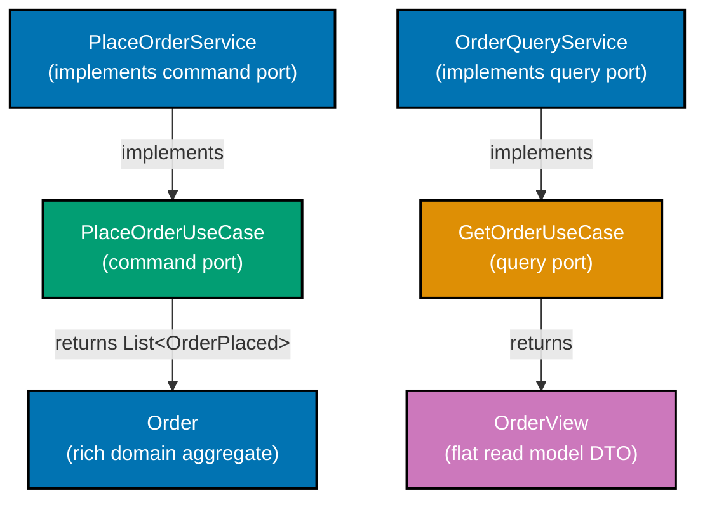

**Java** — two separate port interfaces:

```java
import java.math.BigDecimal;                      // => BigDecimal: precise monetary arithmetic
// => executes the statement above; continues to next line
import java.time.Instant;                         // => Instant: UTC timestamp for domain events
// => executes the statement above; continues to next line
import java.util.List;                            // => List: collection for event returns
// => executes the statement above; continues to next line
import java.util.Optional;                        // => Optional: no-null contract for queries

// ── Supporting types ──────────────────────────────────────────────────────────
record OrderId(String value) {}                   // => OrderId: typed wrapper; not raw String
// => record OrderId: immutable value type; equals/hashCode/toString generated by compiler
record CustomerId(String value) {}                // => CustomerId: separate type from OrderId
// => record CustomerId: immutable value type; equals/hashCode/toString generated by compiler
enum OrderStatus { PENDING, CONFIRMED, SHIPPED }  // => domain lifecycle states

// Domain aggregate: rich object with behaviour — returned by command port
// => Order is the source of truth for the command side
record Order(OrderId id, CustomerId customerId, BigDecimal total, OrderStatus status) {} // => four components

// Domain event: emitted when order is placed — command side output
// => OrderPlaced signals that state has changed; downstream can react
record OrderPlaced(OrderId orderId, BigDecimal total, Instant placedAt) {} // => three event fields

// Unvalidated input: raw data arriving from the HTTP adapter
// => raw Strings and List; domain validation converts these to typed values
record UnvalidatedOrder(String customerId, List<String> productIds, BigDecimal total) {}

// Read model DTO: flat, denormalised view for the query side
// => OrderView is NOT Order; it has no behaviour, only query-optimised fields
// => String status instead of enum because view crosses JSON boundary easily
record OrderView(String orderId, String customerName, String status, BigDecimal total) {}

// ── COMMAND port: state-changing ──────────────────────────────────────────────
// Input port interface lives in application zone; web adapter calls this
// => Returns List<OrderPlaced> on success; callers react to emitted events
// => Result type or Either signals failure without exceptions crossing the boundary
interface PlaceOrderUseCase {                     // => command port: write side only
// => interface PlaceOrderUseCase: contract definition — no implementation details here
    List<OrderPlaced> placeOrder(UnvalidatedOrder order); // => throws on failure (simplified)
    // => In production use Either<PlacingOrderError, List<OrderPlaced>> for explicit errors
}

// ── QUERY port: read-only ─────────────────────────────────────────────────────
// Query port is a separate interface; it never touches domain aggregate Order
// => Returns Optional because the order might not exist
// => Returns OrderView (flat DTO), not Order (rich aggregate)
interface GetOrderUseCase {                       // => query port: read-only side; separate from command
// => interface GetOrderUseCase: contract definition — no implementation details here
    Optional<OrderView> getOrder(OrderId id); // => read-only; no state change; no aggregate loaded
    // => Query side may bypass domain and go direct to read-optimised projection
}

// ── Command implementation: delegates to domain then repository ────────────────
class PlaceOrderService implements PlaceOrderUseCase { // => implements command port only; not query port
// => PlaceOrderService implements PlaceOrderUseCase — satisfies the port contract
    @Override                                     // => compiler verifies placeOrder signature matches interface
    // => @Override: compiler verifies this method signature matches the interface
    public List<OrderPlaced> placeOrder(UnvalidatedOrder raw) { // => raw input; service validates inside
    // => executes the statement above; continues to next line
        var event = new OrderPlaced(              // => construct domain event
        // => event: holds the result of the expression on the right
            new OrderId(java.util.UUID.randomUUID().toString()), // => new UUID as order id
            // => method call: delegates to collaborator; result captured above
            raw.total(),                          // => carry total from input
            // => method call: delegates to collaborator; result captured above
            Instant.now()                         // => timestamp at placement
            // => method call: delegates to collaborator; result captured above
        );
        return List.of(event);                    // => return event list; caller publishes
        // => Application service does not know about HTTP, JSON, or DB
    }
}

// ── Query implementation: returns flat view; bypasses domain aggregate ─────────
class OrderQueryService implements GetOrderUseCase { // => implements query port; bypasses domain aggregate
// => OrderQueryService implements GetOrderUseCase — satisfies the port contract
    @Override                                     // => compiler verifies getOrder signature matches interface
    // => @Override: compiler verifies this method signature matches the interface
    public Optional<OrderView> getOrder(OrderId id) { // => id: typed; no raw String parameter
        // => In production: query read-model table or projection store
        // => Not the same table as the command-side Order aggregate
        return Optional.of(new OrderView(          // => return flat DTO wrapped in Optional
        // => returns the result to the caller — caller receives this value
            id.value(), "Alice Smith",             // => denormalised customer name
            // => method call: delegates to collaborator; result captured above
            "CONFIRMED", new BigDecimal("99.00")   // => flat string status for view
            // => method call: delegates to collaborator; result captured above
        ));
    }                                             // => Optional.of: always present here; production may return empty
    // => executes the statement above; continues to next line
}
```

**Kotlin** — separate command and query ports:

```kotlin
import java.math.BigDecimal                                          // => BigDecimal for totals
// => executes the statement above; continues to next line
import java.time.Instant                                             // => Instant for timestamps
// => executes the statement above; continues to next line
import java.util.UUID                                                // => UUID for id generation

// ── Supporting types ──────────────────────────────────────────────────────────
data class OrderId(val value: String)              // => typed identity
// => data class OrderId: value type; copy/equals/hashCode/toString auto-generated
data class CustomerId(val value: String)           // => separate from OrderId; no mix-up
// => data class CustomerId: value type; copy/equals/hashCode/toString auto-generated
enum class OrderStatus { PENDING, CONFIRMED, SHIPPED } // => domain lifecycle
// => enum class: closed set of domain values; exhaustive switch/when enforced

data class UnvalidatedOrder(val customerId: String, val total: BigDecimal) // => raw input
// => data class UnvalidatedOrder: value type; copy/equals/hashCode/toString auto-generated
data class OrderPlaced(val orderId: OrderId, val total: BigDecimal, val placedAt: Instant) // => event

// Read model: flat and denormalised; returned by query side only
// => data class with no domain behaviour; just data for presentation
data class OrderView(val orderId: String, val customerName: String, val status: String, val total: BigDecimal)
// => flat DTO; no domain aggregate loaded; query-optimised

// ── Command port: state-mutating ──────────────────────────────────────────────
// fun interface: Kotlin SAM — allows lambda implementation
// => Returns List<OrderPlaced>; signals what happened during the command
fun interface PlaceOrderUseCase {
// => interface PlaceOrderUseCase: contract definition — no implementation details here
    fun placeOrder(order: UnvalidatedOrder): List<OrderPlaced>
    // => Command side; caller must store or publish each OrderPlaced event
}

// ── Query port: read-only ─────────────────────────────────────────────────────
// Separate interface; query never calls PlaceOrderUseCase and vice versa
// => Returns OrderView? (nullable) instead of domain Order
fun interface GetOrderUseCase {
// => interface GetOrderUseCase: contract definition — no implementation details here
    fun getOrder(id: OrderId): OrderView? // => null when not found; no exception
    // => Query side optimised for reads; different DB table or projection allowed
}

// ── Implementations ───────────────────────────────────────────────────────────
val placeOrder = PlaceOrderUseCase { raw ->
    // => lambda implements SAM; no class needed
    listOf(OrderPlaced(OrderId(UUID.randomUUID().toString()), raw.total, Instant.now()))
    // => Emits event; caller publishes to event bus or stores in outbox
    // => UUID.randomUUID(): fresh id for every order placement
}

val getOrder = GetOrderUseCase { id ->
    // => lambda implements SAM; query-side adapter would query read-model table
    OrderView(id.value, "Alice Smith", "CONFIRMED", BigDecimal("99.00"))
    // => Returns flat view; no rich aggregate; query-optimised response
    // => denormalised customer name; avoids join to customers table
}
```

**C#** — separate command and query interfaces:

```csharp
using System;                                                         // => System namespace
// => executes the statement above; continues to next line
using System.Collections.Generic;                                     // => IReadOnlyList

// ── Supporting types ──────────────────────────────────────────────────────────
public record OrderId(string Value);               // => typed identity
// => executes the statement above; continues to next line
public record UnvalidatedOrder(string CustomerId, decimal Total); // => raw input DTO
// => executes the statement above; continues to next line
public record OrderPlaced(OrderId OrderId, decimal Total, DateTimeOffset PlacedAt); // => domain event

// Read model: flat DTO returned by query side; not the domain aggregate
// => record with no methods; purely data for the presentation layer
public record OrderView(string OrderId, string CustomerName, string Status, decimal Total);
// => flat read model; no domain methods; purely query-side data
// => CustomerName: denormalised; avoids join; Status: string not enum for JSON simplicity

// ── Command port ───────────────────────────────────────────────────────────────
// Interface in Application layer; no ASP.NET, no EF Core on this interface
// => IPlaceOrderUseCase: command side; returns events produced
public interface IPlaceOrderUseCase  // => application zone; no HTTP or EF types
// => executes the statement above; continues to next line
{
    IReadOnlyList<OrderPlaced> PlaceOrder(UnvalidatedOrder order);
    // => Callers iterate events; publish or persist each one
    // => IReadOnlyList: caller can enumerate but not mutate the events
    // => UnvalidatedOrder: raw input from HTTP adapter; validated inside implementation
}

// ── Query port ────────────────────────────────────────────────────────────────
// Separate interface; no coupling to command side whatsoever
// => Returns OrderView, not domain Order; nullable for not-found case
public interface IGetOrderUseCase  // => separate from command port; no shared coupling
// => executes the statement above; continues to next line
{
    OrderView? GetOrder(OrderId id); // => null = not found; no exception
    // => Query side may go directly to a read-model database view
}

// ── Implementations ───────────────────────────────────────────────────────────
public class PlaceOrderService : IPlaceOrderUseCase  // => command-side implementation
// => executes the statement above; continues to next line
{                                                                     // => command-side service; no EF Core
// => executes the statement above; continues to next line
    public IReadOnlyList<OrderPlaced> PlaceOrder(UnvalidatedOrder order)
    // => executes the statement above; continues to next line
    {                                                                 // => returns events; no void
    // => executes the statement above; continues to next line
        var evt = new OrderPlaced(                 // => construct event
        // => evt: holds the result of the expression on the right
            new OrderId(Guid.NewGuid().ToString()), // => fresh id for the new order
            // => method call: delegates to collaborator; result captured above
            order.Total,                           // => carry total from command input
            // => executes the statement above; continues to next line
            DateTimeOffset.UtcNow                  // => UTC timestamp of placement
            // => executes the statement above; continues to next line
        );
        return new[] { evt };                      // => return event array; caller publishes
        // => array literal wrapped as IReadOnlyList; immutable view for callers
    }
}

public class OrderQueryService : IGetOrderUseCase  // => query-side implementation
// => executes the statement above; continues to next line
{                                                                     // => query-side service; no domain aggregate
// => executes the statement above; continues to next line
    public OrderView? GetOrder(OrderId id) =>      // => expression-body method
    // => executes the statement above; continues to next line
        new OrderView(id.Value, "Alice Smith", "Confirmed", 99m);
        // => In production: query read-model table, not aggregate table
        // => denormalised customer name avoids join to customers table
}
```

**Key Takeaway**: Separate command and query ports at the interface level enforce the CQRS split. Commands return domain events; queries return flat view DTOs — neither side knows the other exists.

**Why It Matters**: When command and query ports share one interface, the query side ends up loading rich domain aggregates it never needs, and the command side grows query methods that leak read concerns into write logic. Splitting them lets each side use the right data model — aggregates for commands, projections for queries — without compromising either. Teams that enforce this split report that query APIs become significantly faster because they bypass domain loading and go directly to denormalised read models, cutting both latency and database load.

---

### Example 27: Read model vs domain model — two output port interfaces

The command side reads from `OrderRepository` (returns domain `Order` aggregates). The query side reads from `OrderQueryPort` (returns flat `OrderView` DTOs). These are two distinct output port interfaces with two distinct adapter implementations, possibly backed by different database tables or even different databases entirely.

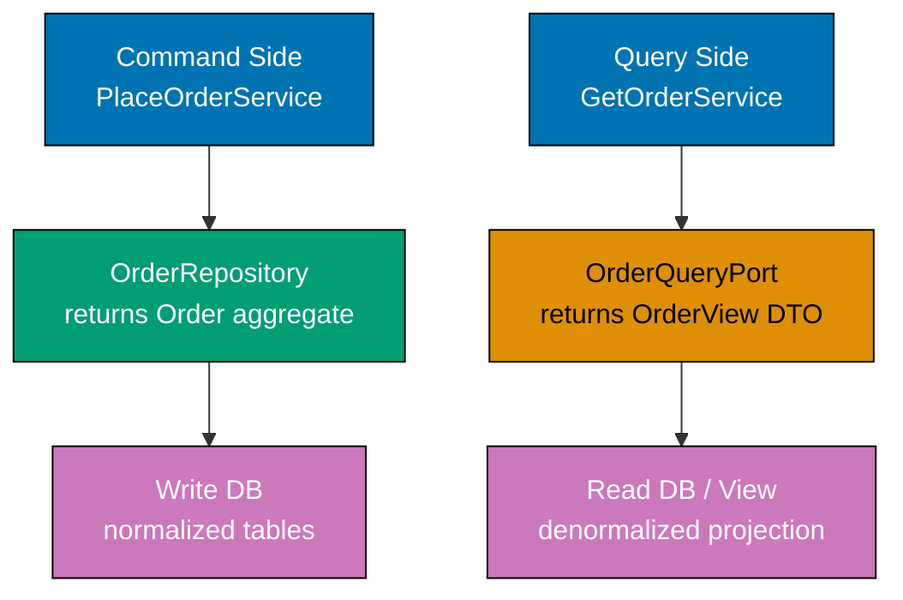

**Java** — two separate output port interfaces:

```java
import java.math.BigDecimal;
// => executes the statement above; continues to next line
import java.util.Optional;

// ── Supporting types ──────────────────────────────────────────────────────────
record OrderId(String value) {}                    // => typed wrapper over String
// => record OrderId: immutable value type; equals/hashCode/toString generated by compiler
enum OrderStatus { PENDING, CONFIRMED, SHIPPED }   // => domain enum; no framework import
// => enum OrderStatus: closed set of domain values; exhaustive switch/when enforced
record Money(BigDecimal amount, String currency) {} // => value object; carries currency
// => record Money: immutable value type; equals/hashCode/toString generated by compiler
record Order(OrderId id, Money total, OrderStatus status) {} // => rich domain aggregate
// => Order has domain behaviour (validate, confirm, ship) not shown here for brevity

// Flat read model: denormalised; optimised for display, not domain logic
// => No domain behaviour; purely data carried to the presentation layer
record OrderView(String orderId, String status, BigDecimal total, String currencyCode) {}

// ── Command-side output port: returns domain aggregate ────────────────────────
// Repository lives in application zone; JPA adapter lives in adapter zone
// => findById returns Optional<Order>; not found = Optional.empty()
interface OrderRepository {
// => interface OrderRepository: contract definition — no implementation details here
    Optional<Order> findById(OrderId id); // => loads rich aggregate; command side
    // => executes the statement above; continues to next line
    void save(Order order);               // => persists aggregate; command side only
    // => Never used by query side; query side has its own port
}

// ── Query-side output port: returns flat read model ───────────────────────────
// Separate interface; may query a view/projection table in the DB
// => No save(), no delete() — read-only by design
interface OrderQueryPort {
// => interface OrderQueryPort: contract definition — no implementation details here
    Optional<OrderView> findOrderView(OrderId id); // => returns DTO; not domain aggregate
    // => Implementation may use a DB view, materialized view, or separate read DB
}

// ── Command-side adapter: JPA against main table ──────────────────────────────
class JpaOrderRepository implements OrderRepository {
    // => In production: @Repository, EntityManager, @Transactional here
    // => This class lives in adapter/out/persistence package
    @Override
    // => @Override: compiler verifies this method signature matches the interface
    public Optional<Order> findById(OrderId id) {
        // => JPA query: SELECT * FROM orders WHERE id = ?
        return Optional.of(new Order(id, new Money(new BigDecimal("100"), "USD"), OrderStatus.CONFIRMED));
        // => Maps JPA entity (OrderJpaEntity) to domain Order in this adapter
    }
    @Override
    // => @Override: compiler verifies this method signature matches the interface
    public void save(Order order) { /* JPA persist */ } // => persist domain to DB
    // => save: method entry point — see implementation below
}

// ── Query-side adapter: queries DB view / projection table ────────────────────
class PostgresOrderViewAdapter implements OrderQueryPort {
    // => In production: JdbcTemplate or plain SQL against a read-optimised view
    // => SELECT order_id, status, total, currency FROM order_summary_view WHERE id = ?
    @Override
    // => @Override: compiler verifies this method signature matches the interface
    public Optional<OrderView> findOrderView(OrderId id) {
    // => executes the statement above; continues to next line
        return Optional.of(new OrderView(id.value(), "CONFIRMED", new BigDecimal("100"), "USD"));
        // => Returns flat DTO directly from projection; no domain object created
    }
}
```

**Kotlin** — two output port interfaces:

```kotlin
import java.math.BigDecimal                                          // => BigDecimal for amounts
// => executes the statement above; continues to next line

data class OrderId(val value: String)              // => typed id
// => data class OrderId: value type; copy/equals/hashCode/toString auto-generated
enum class OrderStatus { PENDING, CONFIRMED }       // => domain enum; no String comparison
// => enum class: closed set of domain values; exhaustive switch/when enforced
data class Money(val amount: BigDecimal, val currency: String) // => value object
// => data class Money: value type; copy/equals/hashCode/toString auto-generated
data class Order(val id: OrderId, val total: Money, val status: OrderStatus) // => aggregate
// => data class Order: value type; copy/equals/hashCode/toString auto-generated
data class OrderView(val orderId: String, val status: String, val total: BigDecimal) // => read model
// => OrderView: flat; no Money value object; query-optimised

// ── Command-side output port ──────────────────────────────────────────────────
// Application zone interface; adapter zone provides implementation
// => Returns domain Order; used by PlaceOrderService and other command handlers
interface OrderRepository {
// => interface OrderRepository: contract definition — no implementation details here
    fun findById(id: OrderId): Order?  // => null = not found; command side
    // => executes the statement above; continues to next line
    fun save(order: Order)             // => persist aggregate after domain logic
    // => Never used by query service; query service has its own port
}

// ── Query-side output port ────────────────────────────────────────────────────
// Completely separate interface; no overlap with OrderRepository
// => Query service injects this; command service never touches it
interface OrderQueryPort {
// => interface OrderQueryPort: contract definition — no implementation details here
    fun findOrderView(id: OrderId): OrderView? // => flat DTO; null if not found
    // => May query a different schema or a materialized view for performance
}

// ── Adapters ──────────────────────────────────────────────────────────────────
class ExposedOrderRepository : OrderRepository {
    // => Uses Kotlin Exposed ORM against orders table; lives in adapter/out/persistence
    override fun findById(id: OrderId): Order? =         // => returns domain Order; maps from JPA entity
    // => executes the statement above; continues to next line
        Order(id, Money(BigDecimal("100"), "USD"), OrderStatus.CONFIRMED)
        // => In production: transaction { Orders.select { Orders.id eq id.value }.singleOrNull()?.toOrder() }
    override fun save(order: Order) { /* Exposed INSERT/UPDATE */ } // => persists domain Order
    // => save: method entry point — see implementation below
}

class PostgresOrderViewAdapter : OrderQueryPort {
    // => Uses plain JDBC or Exposed against order_summary_view; adapter/out/persistence
    override fun findOrderView(id: OrderId): OrderView? = // => returns flat DTO; no aggregate loaded
    // => executes the statement above; continues to next line
        OrderView(id.value, "CONFIRMED", BigDecimal("100"))
        // => In production: jdbcTemplate.queryForObject("SELECT ... FROM order_summary_view WHERE id = ?", ...)
        // => Returns flat DTO; no Order aggregate loaded
}
```

**C#** — two output port interfaces:

```csharp
using System;                                                         // => System namespace
// => executes the statement above; continues to next line
using System.Threading.Tasks;                                         // => Task for async (if needed)
// => method call: delegates to collaborator; result captured above

public record OrderId(string Value);               // => typed identity wrapper
// => executes the statement above; continues to next line
public enum OrderStatus { Pending, Confirmed }     // => domain lifecycle enum
// => enum OrderStatus: closed set of domain values; exhaustive switch/when enforced
public record Money(decimal Amount, string Currency); // => value object; carries currency
// => executes the statement above; continues to next line
public record Order(OrderId Id, Money Total, OrderStatus Status); // => rich aggregate
// => domain aggregate; no EF annotation; no [Table], no [Key]
public record OrderView(string OrderId, string Status, decimal Total); // => flat read model
// => no domain aggregate; purely query-side; Status is string not enum for JSON simplicity

// ── Command-side output port ──────────────────────────────────────────────────
// IOrderRepository: application zone interface; EF Core adapter in adapter zone
// => Returns domain Order; Save() persists after domain logic
public interface IOrderRepository
// => executes the statement above; continues to next line
{
    Order? FindById(OrderId id);   // => returns aggregate; null = not found
    // => executes the statement above; continues to next line
    void Save(Order order);        // => command side only; query port has no Save
    // => executes the statement above; continues to next line
}

// ── Query-side output port ────────────────────────────────────────────────────
// IOrderQueryPort: separate interface; returns flat DTO not aggregate
// => Query service injects this; never used by command-side services
public interface IOrderQueryPort
// => executes the statement above; continues to next line
{
    OrderView? FindOrderView(OrderId id); // => flat read model; null if missing
    // => May point at a different database, read replica, or EF view
}

// ── Adapters ──────────────────────────────────────────────────────────────────
public class EfOrderRepository : IOrderRepository  // => command-side adapter; EF Core
// => executes the statement above; continues to next line
{                                                                     // => adapter zone; imports DbContext
    // => In production: inject DbContext; map EF entity to/from domain Order
    public Order? FindById(OrderId id) =>          // => returns domain aggregate; null if not found
    // => executes the statement above; continues to next line
        new Order(id, new Money(100m, "USD"), OrderStatus.Confirmed);
        // => Adapter translates EF entity to domain record here; domain stays clean
        // => simulated; production: _context.Orders.Find(id.Value)?.ToDomain()

    public void Save(Order order) { /* EF Core SaveChanges() */ }     // => persist aggregate
    // => Save: method entry point — see implementation below
}

public class SqlOrderViewAdapter : IOrderQueryPort  // => query-side adapter; Dapper or ADO.NET
// => executes the statement above; continues to next line
{                                                                     // => adapter zone; imports Dapper or ADO.NET
    // => In production: Dapper against a read-model view or separate read DB
    public OrderView? FindOrderView(OrderId id) =>  // => returns flat DTO; null if not found
    // => executes the statement above; continues to next line
        new OrderView(id.Value, "Confirmed", 100m);
        // => Raw SQL query returns flat DTO; no EF model graph loaded
        // => simulated; production: connection.QuerySingleOrDefault<OrderView>(sql, ...)
}
```

**Key Takeaway**: Two output ports — one returning domain aggregates for commands, one returning flat DTOs for queries — decouple the read path from the write path at the interface level, not just at the implementation level.

**Why It Matters**: Without separate output ports, query services receive domain aggregates they must then flatten, or worse, command services return raw query data mixed with domain events. Separate ports make each side independently replaceable: you can switch the query adapter to a Redis cache or an Elasticsearch index without touching the command side at all.

---

### Example 28: Async/reactive output port — CompletableFuture, Deferred, Task

Async output ports signal to the application service that the adapter call is non-blocking. The port interface declares the async return type; the application service awaits or chains it; the in-memory test adapter wraps a synchronous value in the appropriate wrapper.

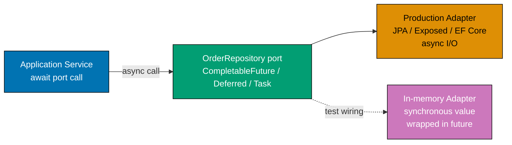

**Java** — async repository port with `CompletableFuture`:

```java
import java.math.BigDecimal;
// => executes the statement above; continues to next line
import java.util.Optional;
// => executes the statement above; continues to next line
import java.util.concurrent.CompletableFuture;

// ── Supporting types ──────────────────────────────────────────────────────────
record OrderId(String value) {}                    // => typed identity
// => record OrderId: immutable value type; equals/hashCode/toString generated by compiler
record Money(BigDecimal amount, String currency) {} // => value object
// => record Money: immutable value type; equals/hashCode/toString generated by compiler
record Order(OrderId id, Money total) {}            // => domain aggregate (minimal)

// ── Async output port ─────────────────────────────────────────────────────────
// CompletableFuture as return type: signals non-blocking I/O to callers
// => Application service must chain or join; cannot ignore the future
interface OrderRepository {
// => interface OrderRepository: contract definition — no implementation details here
    CompletableFuture<Optional<Order>> findById(OrderId id);
    // => Non-blocking: adapter submits DB query to thread pool; returns immediately
    // => join() in service turns it back to blocking; .thenApply() keeps it async
}

// ── Production adapter: wraps real async DB call ──────────────────────────────
class AsyncJpaOrderRepository implements OrderRepository {
// => AsyncJpaOrderRepository implements OrderRepository — satisfies the port contract
    @Override
    // => @Override: compiler verifies this method signature matches the interface
    public CompletableFuture<Optional<Order>> findById(OrderId id) {
    // => executes the statement above; continues to next line
        return CompletableFuture.supplyAsync(() -> {    // => new thread from common pool
            // => In production: R2DBC or async JDBC query here
            var order = new Order(id, new Money(new BigDecimal("99"), "USD")); // => simulate DB row
            // => order: holds the result of the expression on the right
            return Optional.of(order);                 // => wrap in Optional for not-found signalling
            // => returns the result to the caller — caller receives this value
        });
        // => operation completes; execution continues to next statement
    }
    // => operation completes; execution continues to next statement
}

// ── In-memory test adapter: wraps sync value in CompletableFuture ─────────────
class InMemoryOrderRepository implements OrderRepository {
// => InMemoryOrderRepository implements OrderRepository — satisfies the port contract
    private final java.util.Map<String, Order> store = new java.util.HashMap<>(); // => in-memory store
    // => Backed by HashMap; no DB needed; runs in microseconds

    @Override
    // => @Override: compiler verifies this method signature matches the interface
    public CompletableFuture<Optional<Order>> findById(OrderId id) {
    // => executes the statement above; continues to next line
        var order = Optional.ofNullable(store.get(id.value())); // => sync lookup
        // => order: holds the result of the expression on the right
        return CompletableFuture.completedFuture(order);        // => wrap in already-completed future
        // => completedFuture: no thread pool; resolves immediately for tests
    }
}

// ── Application service: joins the future ────────────────────────────────────
class FindOrderService {
// => class FindOrderService: implementation — contains field declarations and methods below
    private final OrderRepository repository;                  // => injected; no new here
    // => repository: OrderRepository — final field; assigned once in constructor; immutable reference
    FindOrderService(OrderRepository repository) { this.repository = repository; }
    // => method call: delegates to collaborator; result captured above

    Optional<Order> find(OrderId id) {
    // => executes the statement above; continues to next line
        return repository.findById(id).join(); // => join() blocks until future completes
        // => In reactive code: chain with .thenApply() instead of join()
        // => In tests: InMemoryOrderRepository resolves immediately; join() is instant
    }
}
```

**Kotlin** — suspend function port:

```kotlin
import java.math.BigDecimal                                          // => BigDecimal for amounts
// => executes the statement above; continues to next line
import kotlinx.coroutines.runBlocking                               // => run coroutine in blocking context
// => executes the statement above; continues to next line
import kotlinx.coroutines.CompletableDeferred                       // => completable async value
// => executes the statement above; continues to next line

data class OrderId(val value: String)              // => typed identity
// => data class OrderId: value type; copy/equals/hashCode/toString auto-generated
data class Money(val amount: BigDecimal, val currency: String) // => value object
// => data class Money: value type; copy/equals/hashCode/toString auto-generated
data class Order(val id: OrderId, val total: Money) // => domain aggregate

// ── Async port with suspend ───────────────────────────────────────────────────
// suspend: Kotlin coroutine-native; compiles to state machine; no thread blocking
// => Callers must be in a coroutine scope or use runBlocking for tests
interface OrderRepository {
// => interface OrderRepository: contract definition — no implementation details here
    suspend fun findById(id: OrderId): Order? // => null = not found; suspend = non-blocking
    // => Ktor, coroutines dispatcher, or test runBlocking supplies the coroutine context
}

// ── In-memory test adapter ────────────────────────────────────────────────────
class InMemoryOrderRepository : OrderRepository {
// => class InMemoryOrderRepository: implementation — contains field declarations and methods below
    private val store = mutableMapOf<String, Order>() // => in-memory backing store
    // => store: val — injected dependency; implementation chosen at wiring time

    override suspend fun findById(id: OrderId): Order? = store[id.value]
    // => suspend body here is synchronous; coroutine runtime wraps it transparently
    // => Tests call via runBlocking { repo.findById(...) }

    fun save(order: Order) { store[order.id.value] = order } // => helper for test setup
    // => save: method entry point — see implementation below
}

// ── Application service ───────────────────────────────────────────────────────
class FindOrderService(private val repository: OrderRepository) { // => injected
// => class FindOrderService: implementation — contains field declarations and methods below
    suspend fun find(id: OrderId): Order? = repository.findById(id)
    // => suspend propagates up; callers must be in coroutine scope
    // => Business logic here; no coroutine machinery visible to domain
}

// ── Test usage ────────────────────────────────────────────────────────────────
val repo = InMemoryOrderRepository()                           // => create test adapter
// => repo: holds the result of the expression on the right
repo.save(Order(OrderId("O1"), Money(BigDecimal("50"), "USD"))) // => populate store
// => in-memory save for test setup; not via port interface

val service = FindOrderService(repo)                           // => inject test adapter
// => service: holds the result of the expression on the right
val result = runBlocking { service.find(OrderId("O1")) }       // => run coroutine in test
// => result is Order(OrderId("O1"), Money(50, "USD")); not null
```

**C#** — `Task`-returning port:

```csharp
using System.Collections.Generic;                                     // => Dictionary
// => executes the statement above; continues to next line
using System.Threading.Tasks;                                         // => Task, Task<T>
// => executes the statement above; continues to next line

public record OrderId(string Value);               // => typed identity
// => executes the statement above; continues to next line
public record Money(decimal Amount, string Currency); // => value object; carries currency
// => executes the statement above; continues to next line
public record Order(OrderId Id, Money Total);      // => domain aggregate

// ── Async port with Task ──────────────────────────────────────────────────────
// Task<Order?> return type: standard .NET async pattern
// => Callers must await; compiler enforces via CS4014 warning if forgotten
public interface IOrderRepository  // => application zone; no EF Core, no Task library import
// => executes the statement above; continues to next line
{                                                                     // => application zone interface
// => interface type: contract definition — no implementation details here
    Task<Order?> FindByIdAsync(OrderId id); // => Async suffix: .NET naming convention
    // => method call: delegates to collaborator; result captured above
    Task SaveAsync(Order order);            // => all I/O methods are async
    // => Interface in Application layer; EF Core adapter in Adapter layer
}

// ── In-memory test adapter ────────────────────────────────────────────────────
public class InMemoryOrderRepository : IOrderRepository  // => test adapter; synchronous impl
// => executes the statement above; continues to next line
{                                                                     // => no EF Core; runs in milliseconds
// => executes the statement above; continues to next line
    private readonly Dictionary<string, Order> _store = new(); // => backing store
    // => executes the statement above; continues to next line

    public Task<Order?> FindByIdAsync(OrderId id)              // => implement async port
    // => executes the statement above; continues to next line
    {                                                           // => synchronous body; wrapped in completed Task
    // => executes the statement above; continues to next line
        _store.TryGetValue(id.Value, out var order);            // => sync dictionary lookup
        // => method call: delegates to collaborator; result captured above
        return Task.FromResult(order);                          // => wrap in completed Task
        // => Task.FromResult: no thread pool; resolves immediately; perfect for tests
    }

    public Task SaveAsync(Order order)
    // => executes the statement above; continues to next line
    {                                                           // => synchronous body; Task.CompletedTask
    // => executes the statement above; continues to next line
        _store[order.Id.Value] = order;                         // => sync store; upsert
        // => executes the statement above; continues to next line
        return Task.CompletedTask;                              // => completed Task with no value
        // => returns the result to the caller — caller receives this value
    }
}

// ── Application service ───────────────────────────────────────────────────────
public class FindOrderService(IOrderRepository repository)     // => primary constructor; C# 12
// => constructor: receives all dependencies — enables testing with any adapter implementation
{                                                              // => repository injected; no EF Core import
// => executes the statement above; continues to next line
    public async Task<Order?> FindAsync(OrderId id) =>
    // => executes the statement above; continues to next line
        await repository.FindByIdAsync(id);                    // => await propagates to caller
        // => async/await: state machine generated by compiler; no callback pyramid
}

// ── Test usage ────────────────────────────────────────────────────────────────
var repo = new InMemoryOrderRepository();                      // => test adapter; no EF Core
// => repo: holds the result of the expression on the right
await repo.SaveAsync(new Order(new OrderId("O1"), new Money(50m, "USD"))); // => populate store
// => await completes immediately; Task.CompletedTask from in-memory adapter
var service = new FindOrderService(repo);                      // => inject test adapter
// => service: holds the result of the expression on the right
var result = await service.FindAsync(new OrderId("O1"));       // => result is the Order
// => await completes immediately; Task.FromResult from in-memory adapter
// => result is not null; Id.Value == "O1"
```

**Key Takeaway**: Async port interfaces (`CompletableFuture`, `suspend`, `Task`) signal non-blocking intent at the contract level. In-memory test adapters wrap synchronous values in completed futures so tests run instantly without threads or event loops.

**Why It Matters**: When port interfaces return synchronous types but adapters need to be async, the application service must either block a thread or the async concern leaks into business logic. Declaring async in the port contract keeps the async decision at the boundary where it belongs, and in-memory adapters keep the test suite fast by completing synchronously.

---

### Example 29: Result type at port boundaries

A `Result` or `Either` type at port boundaries makes adapter failures explicit in the type system. Callers cannot call `.get()` without handling the error branch; the compiler enforces error handling at compile time, not at runtime.

**Java** — Vavr `Either` at port boundary:

```java
import java.math.BigDecimal;
// => executes the statement above; continues to next line
import java.util.List;
// In production: import io.vavr.control.Either;
// => Vavr Either<L, R>: L = failure (left), R = success (right)
// => For this self-contained example we define a minimal Either

// ── Minimal Either for self-contained example ─────────────────────────────────
sealed interface Either<L, R> permits Either.Left, Either.Right {  // => sealed: exhaustive pattern match
// => interface Either: contract definition — no implementation details here
    record Left<L, R>(L value) implements Either<L, R> {}          // => Left wraps failure
    // => Left implements Either<L, R> — satisfies the port contract
    record Right<L, R>(R value) implements Either<L, R> {}         // => Right wraps success
    // => Right implements Either<L, R> — satisfies the port contract
    static <L, R> Either<L, R> left(L l)  { return new Left<>(l); }  // => factory
    // => executes the statement above; continues to next line
    static <L, R> Either<L, R> right(R r) { return new Right<>(r); } // => factory
    // => executes the statement above; continues to next line
}

// ── Domain types ──────────────────────────────────────────────────────────────
record OrderId(String value) {}                         // => typed identity
// => record OrderId: immutable value type; equals/hashCode/toString generated by compiler
record OrderPlaced(OrderId orderId, BigDecimal total) {} // => domain event

// Error hierarchy: sealed so compiler enforces exhaustive handling
// => Each subtype signals a different kind of failure to callers
sealed interface PlacingOrderError permits
// => executes the statement above; continues to next line
    PlacingOrderError.ValidationError,
    // => executes the statement above; continues to next line
    PlacingOrderError.RepositoryFailure {
    // => executes the statement above; continues to next line
    record ValidationError(String message) implements PlacingOrderError {}    // => bad input
    // => ValidationError implements PlacingOrderError — satisfies the port contract
    record RepositoryFailure(String cause) implements PlacingOrderError {}    // => DB error
    // => RepositoryFailure implements PlacingOrderError — satisfies the port contract
}

// ── Port interface using Either ───────────────────────────────────────────────
// Either<PlacingOrderError, List<OrderPlaced>>: left = failure, right = success
// => Callers must switch on Either to access value; no silent swallowing
interface PlaceOrderUseCase {
// => interface PlaceOrderUseCase: contract definition — no implementation details here
    Either<PlacingOrderError, List<OrderPlaced>> placeOrder(String customerId, BigDecimal total);
    // => No unchecked exceptions cross this boundary; failures are typed values
}

// ── Application service ───────────────────────────────────────────────────────
class PlaceOrderService implements PlaceOrderUseCase {
// => PlaceOrderService implements PlaceOrderUseCase — satisfies the port contract
    @Override
    // => @Override: compiler verifies this method signature matches the interface
    public Either<PlacingOrderError, List<OrderPlaced>> placeOrder(String customerId, BigDecimal total) {
    // => executes the statement above; continues to next line
        if (total.compareTo(BigDecimal.ZERO) <= 0) {              // => validate input
        // => conditional branch: execution path depends on condition above
            return Either.left(new PlacingOrderError.ValidationError("Total must be positive"));
            // => Returns Left; caller gets typed error; no exception thrown
        }
        var event = new OrderPlaced(new OrderId(java.util.UUID.randomUUID().toString()), total);
        // => event: holds the result of the expression on the right
        return Either.right(List.of(event));                      // => Returns Right on success
        // => Right carries the list of domain events produced by this command
    }
}

// ── Caller: HTTP adapter pattern-matches Either ───────────────────────────────
var service = new PlaceOrderService();                            // => in production: inject
// => service: holds the result of the expression on the right
var result  = service.placeOrder("CUST-1", new BigDecimal("50")); // => call the port

// Pattern match (Java 21 switch expression) — exhaustive: compiler enforces both branches
String httpBody = switch (result) {                               // => switch on Either
// => httpBody: holds the result of the expression on the right
    case Either.Right<PlacingOrderError, List<OrderPlaced>> r ->  // => success branch
    // => executes the statement above; continues to next line
        "201 Created: " + r.value().size() + " events";           // => extract success value
        // => method call: delegates to collaborator; result captured above
    case Either.Left<PlacingOrderError, List<OrderPlaced>> l ->   // => failure branch
    // => executes the statement above; continues to next line
        switch (l.value()) {                                       // => nested switch on error subtype
        // => pattern match: exhaustive dispatch on all possible cases
            case PlacingOrderError.ValidationError e -> "400 Bad Request: " + e.message();
            // => method call: delegates to collaborator; result captured above
            case PlacingOrderError.RepositoryFailure e -> "503 Service Unavailable";
            // => executes the statement above; continues to next line
        };
};
// => httpBody: "201 Created: 1 events" for valid input
```

**Kotlin** — Arrow `Either`:

```kotlin
import java.math.BigDecimal                                        // => BigDecimal for totals
// In production: import arrow.core.Either, arrow.core.left, arrow.core.right
// => Arrow Either<A, B>: A = error (left), B = success (right)
// => For self-contained example we use Kotlin's built-in Result or a sealed class

data class OrderId(val value: String)                              // => typed identity
// => data class OrderId: value type; copy/equals/hashCode/toString auto-generated
data class OrderPlaced(val orderId: OrderId, val total: BigDecimal)// => domain event
// => data class OrderPlaced: value type; copy/equals/hashCode/toString auto-generated

sealed class PlacingOrderError {                                   // => sealed: when is exhaustive
// => class PlacingOrderError: implementation — contains field declarations and methods below
    data class ValidationError(val message: String) : PlacingOrderError()
    // => domain validation failure; no adapter involved; message carries human-readable reason
    // => val message: String - human-readable reason for validation failure
    data class RepositoryFailure(val cause: String) : PlacingOrderError()
    // => adapter exception wrapped by application service; cause from exception message
    // => val cause: String - exception message from adapter
}

// ── Simple Either using sealed class ─────────────────────────────────────────
sealed class OrderResult {                                         // => discriminated union
// => class OrderResult: implementation — contains field declarations and methods below
    data class Success(val events: List<OrderPlaced>) : OrderResult()  // => right branch; carries events
    // => data class Success: value type; copy/equals/hashCode/toString auto-generated
    data class Failure(val error: PlacingOrderError) : OrderResult()   // => left branch; carries typed error
    // => data class Failure: value type; copy/equals/hashCode/toString auto-generated
}

fun interface PlaceOrderUseCase {                                   // => SAM; lambda impl allowed
// => interface PlaceOrderUseCase: contract definition — no implementation details here
    fun placeOrder(customerId: String, total: BigDecimal): OrderResult
    // => Returns OrderResult; caller must when-match; no silent exception swallowing
    // => No try-catch needed at call site; all failures are typed values
    // => SAM: single abstract method; Kotlin allows lambda: PlaceOrderUseCase { ... }
}

val service = PlaceOrderUseCase { customerId, total ->             // => lambda implements SAM
// => service: holds the result of the expression on the right
    if (total <= BigDecimal.ZERO) {                                // => validation guard
    // => conditional branch: execution path depends on condition above
        OrderResult.Failure(PlacingOrderError.ValidationError("Total must be positive"))
        // => Returns Failure; caller gets typed error with message; no exception thrown
    } else {                                                       // => valid total: create event
    // => conditional branch: execution path depends on condition above
        val event = OrderPlaced(OrderId(java.util.UUID.randomUUID().toString()), total)
        // => new event with fresh UUID as order id
        OrderResult.Success(listOf(event))                         // => Returns Success with events
        // => method call: delegates to collaborator; result captured above
    }
}

val result = service.placeOrder("CUST-1", BigDecimal("50"))        // => invoke port
// => result: holds the result of the expression on the right
val httpBody = when (result) {                                     // => exhaustive when
// => httpBody: holds the result of the expression on the right
    is OrderResult.Success -> "201 Created: ${result.events.size} events" // => success path
    // => executes the statement above; continues to next line
    is OrderResult.Failure -> when (result.error) {                // => nested when on error
    // => method call: delegates to collaborator; result captured above
        is PlacingOrderError.ValidationError -> "400: ${result.error.message}"
        // => bad input: 400 Bad Request; message included in response body
        is PlacingOrderError.RepositoryFailure -> "503: ${result.error.cause}"
        // => DB down: 503 Service Unavailable; cause may be logged server-side
    }
}
// => httpBody: "201 Created: 1 events"
```

**C#** — `OneOf` discriminated union:

```csharp
using System;                                                         // => Guid
// => executes the statement above; continues to next line
using System.Collections.Generic;                                     // => IReadOnlyList
// In production: using OneOf; (OneOf NuGet package)
// => For self-contained example we use a custom Result record

public record OrderId(string Value);                                  // => typed identity
// => executes the statement above; continues to next line
public record OrderPlaced(OrderId OrderId, decimal Total);            // => domain event; carries order data
// => OrderPlaced: event DTO; subscribers can react without domain aggregate

// Error hierarchy: abstract record base; switch expression forces all subtypes
public abstract record PlacingOrderError  // => abstract: cannot instantiate directly; only subtypes
// => executes the statement above; continues to next line
{
// => operation completes; execution continues to next statement
    public record ValidationError(string Message) : PlacingOrderError;   // => bad input
    // => domain validation failure; caught before any I/O
    public record RepositoryFailure(string Cause) : PlacingOrderError;   // => DB error
    // => adapter exception wrapped by application service into typed error
}

// Result union: Success or Failure; callers switch on it
// => No exception thrown across the port boundary; error is a typed value
public record OrderCommandResult  // => abstract base record; switch forces exhaustive handling
// => executes the statement above; continues to next line
{
// => operation completes; execution continues to next statement
    public record Success(IReadOnlyList<OrderPlaced> Events) : OrderCommandResult;
    // => success variant; carries events produced by the command
    // => IReadOnlyList: caller can enumerate but not mutate
    public record Failure(PlacingOrderError Error) : OrderCommandResult;
    // => failure variant; carries typed error value
    // => PlacingOrderError: abstract base; caller switch forces subtype handling
}

public interface IPlaceOrderUseCase  // => application zone; no ASP.NET, no EF Core
// => executes the statement above; continues to next line
{
    OrderCommandResult PlaceOrder(string customerId, decimal total);   // => returns union; never throws
    // => Returns discriminated union; HTTP adapter switch-matches to status codes
    // => No try-catch needed at call site; all failures are typed values
}

public class PlaceOrderService : IPlaceOrderUseCase  // => command-side implementation; no EF Core
// => executes the statement above; continues to next line
{                                                                     // => command-side service
// => executes the statement above; continues to next line
    public OrderCommandResult PlaceOrder(string customerId, decimal total)
    // => executes the statement above; continues to next line
    {                                                                 // => returns discriminated union; never throws
    // => executes the statement above; continues to next line
        if (total <= 0)                                           // => validation guard; domain rule
        // => conditional branch: execution path depends on condition above
            return new OrderCommandResult.Failure(               // => return typed failure
            // => returns the result to the caller — caller receives this value
                new PlacingOrderError.ValidationError("Total must be positive"));
        // => no repository call if validation fails
        var evt = new OrderPlaced(new OrderId(Guid.NewGuid().ToString()), total);
        // => create domain event with fresh id
        return new OrderCommandResult.Success(new[] { evt });    // => typed success with events
        // => array wrapped as IReadOnlyList; immutable view for callers
    }
}

// ── HTTP adapter: switch expression maps result to HTTP response ──────────────
var service = new PlaceOrderService();                            // => in production: inject via DI
// => service: holds the result of the expression on the right
var result  = service.PlaceOrder("CUST-1", 50m);                  // => call port; returns union
// => result: holds the result of the expression on the right

string httpBody = result switch                                   // => exhaustive switch; C# 8+ pattern matching
// => httpBody: holds the result of the expression on the right
{
    OrderCommandResult.Success s => $"201 Created: {s.Events.Count} events",
    // => success: 201 Created; event count in body
    // => s.Events.Count: number of domain events produced by command
    OrderCommandResult.Failure f => f.Error switch               // => nested switch on error
    // => executes the statement above; continues to next line
    {                                                            // => f.Error: PlacingOrderError; further switch
    // => executes the statement above; continues to next line
        PlacingOrderError.ValidationError e => $"400 Bad Request: {e.Message}",
        // => bad input: 400 with error message
        PlacingOrderError.RepositoryFailure e => "503 Service Unavailable",
        // => DB down: 503; Cause available in e.Cause for logging
        _ => "500 Internal Server Error"                         // => exhaustive: safety default
        // => executes the statement above; continues to next line
    },
    _ => "500 Internal Server Error"                             // => exhaustive: safety default
    // => executes the statement above; continues to next line
};
// => httpBody: "201 Created: 1 events" for valid input; total=50 passes validation
```

**Key Takeaway**: Returning a typed `Result`/`Either` instead of throwing exceptions makes port failures visible in the type system. Callers cannot accidentally swallow errors; the compiler or type checker forces all branches to be handled.

**Why It Matters**: Unchecked exceptions crossing port boundaries are invisible to callers until runtime. A typed error union surfaces every possible failure at the call site, enabling exhaustive pattern matching. HTTP adapters can map each specific error subtype to the correct HTTP status code without try-catch pyramids, making error handling deterministic and reviewable.

---

### Example 30: Error hierarchy across port and domain layers

A sealed error hierarchy unifies domain errors (validation, business rule violations) and adapter errors (repository failure, notification failure) under one parent type. The application service wraps port-level exceptions into the error union; the HTTP adapter exhaustively pattern-matches the union to HTTP status codes.

**Java** — sealed `PlacingOrderError` hierarchy:

```java
import java.math.BigDecimal;
// => executes the statement above; continues to next line
import java.util.List;
// => executes the statement above; continues to next line
import java.util.Optional;

// ── Supporting types ──────────────────────────────────────────────────────────
record OrderId(String value) {}                         // => typed identity
// => record OrderId: immutable value type; equals/hashCode/toString generated by compiler
record OrderPlaced(OrderId orderId, BigDecimal total) {} // => domain event on success

// ── Sealed error hierarchy (Java 17+) ─────────────────────────────────────────
// All errors a caller can receive from PlaceOrderUseCase in one sealed type
// => Sealed: compiler enforces exhaustive switch expression over all subtypes
sealed interface PlacingOrderError permits
// => executes the statement above; continues to next line
    PlacingOrderError.ValidationError,
    // => executes the statement above; continues to next line
    PlacingOrderError.ProductNotFound,
    // => executes the statement above; continues to next line
    PlacingOrderError.RepositoryFailure,
    // => executes the statement above; continues to next line
    PlacingOrderError.NotificationFailure {

    // Domain errors: arise from business rule violations or missing domain data
    record ValidationError(String field, String message) implements PlacingOrderError {}
    // => e.g. missing customerId, negative total, empty product list

    record ProductNotFound(String productId) implements PlacingOrderError {}
    // => Domain policy: cannot place an order for a product that does not exist

    // Adapter errors: arise when infrastructure calls fail
    // => Adapter exceptions are caught by the application service and converted here
    record RepositoryFailure(String cause) implements PlacingOrderError {}
    // => DB down, connection pool exhausted, optimistic lock conflict

    record NotificationFailure(String cause) implements PlacingOrderError {}
    // => Email or SMS adapter failed; order was saved but customer not notified
}

// ── Output port interfaces ────────────────────────────────────────────────────
interface OrderRepository {
// => interface OrderRepository: contract definition — no implementation details here
    void save(OrderId id, BigDecimal total); // => throws RuntimeException on DB failure
    // => Application service catches RuntimeException and converts to RepositoryFailure
}
// => operation completes; execution continues to next statement

interface NotificationPort {
// => interface NotificationPort: contract definition — no implementation details here
    void sendConfirmation(OrderId id);       // => throws RuntimeException on failure
    // => executes the statement above; continues to next line
}

// ── Application service: catches adapter exceptions, returns typed errors ─────
class PlaceOrderService {
// => class PlaceOrderService: implementation — contains field declarations and methods below
    private final OrderRepository repository;           // => injected; adapter in adapter zone
    // => repository: OrderRepository — final field; assigned once in constructor; immutable reference
    private final NotificationPort notification;        // => injected; adapter in adapter zone
    // => notification: NotificationPort — final field; assigned once in constructor; immutable reference

    PlaceOrderService(OrderRepository r, NotificationPort n) {
    // => executes the statement above; continues to next line
        this.repository   = r;                          // => dependency injection; no new
        // => this.repository stored — field holds injected r for method calls below
        this.notification = n;                          // => no concrete class imported here
        // => this.notification stored — field holds injected n for method calls below
    }

    // Returns Either-like type; Left = error, Right = events
    Object placeOrder(String customerId, BigDecimal total) {
    // => executes the statement above; continues to next line
        if (total.compareTo(BigDecimal.ZERO) <= 0)      // => domain validation
        // => conditional branch: execution path depends on condition above
            return new PlacingOrderError.ValidationError("total", "must be positive");
            // => ValidationError: domain rule; not from any adapter

        var id = new OrderId(java.util.UUID.randomUUID().toString());
        // => id: holds the result of the expression on the right
        try {
        // => exception handling: wraps operation that may fail
            repository.save(id, total);                 // => may throw RuntimeException
            // => method call: delegates to collaborator; result captured above
        } catch (RuntimeException e) {
        // => executes the statement above; continues to next line
            return new PlacingOrderError.RepositoryFailure(e.getMessage());
            // => Converts untyped exception into typed error; domain never sees exception
        }
        // => operation completes; execution continues to next statement

        try {
        // => exception handling: wraps operation that may fail
            notification.sendConfirmation(id);          // => may throw RuntimeException
            // => method call: delegates to collaborator; result captured above
        } catch (RuntimeException e) {
        // => executes the statement above; continues to next line
            return new PlacingOrderError.NotificationFailure(e.getMessage());
            // => Order was saved; notification failed — distinct error subtype for caller
        }

        return List.of(new OrderPlaced(id, total));     // => success path; returns events
        // => returns the result to the caller — caller receives this value
    }
}

// ── HTTP adapter: exhaustive pattern match on error hierarchy ─────────────────
var service = new PlaceOrderService(
// => service: holds the result of the expression on the right
    (id, t) -> {},                                      // => in-memory no-op repository
    // => executes the statement above; continues to next line
    id -> {}                                            // => in-memory no-op notification
    // => executes the statement above; continues to next line
);
var result = service.placeOrder("CUST-1", new BigDecimal("50")); // => invoke
// => result: holds the result of the expression on the right

String statusCode = switch (result) {                   // => pattern match on result type
// => statusCode: holds the result of the expression on the right
    case PlacingOrderError.ValidationError e   -> "400";  // => bad input
    // => executes the statement above; continues to next line
    case PlacingOrderError.ProductNotFound e   -> "404";  // => resource missing
    // => executes the statement above; continues to next line
    case PlacingOrderError.RepositoryFailure e -> "503";  // => infrastructure down
    // => executes the statement above; continues to next line
    case PlacingOrderError.NotificationFailure e -> "202"; // => saved but notify failed
    // => executes the statement above; continues to next line
    default                                    -> "201";  // => List<OrderPlaced> = success
    // => executes the statement above; continues to next line
};
// => statusCode: "201" — all adapters no-op; no errors triggered
```

**Kotlin** — sealed class error hierarchy:

```kotlin
import java.math.BigDecimal                                         // => BigDecimal for totals
// => executes the statement above; continues to next line

data class OrderId(val value: String)                               // => typed identity
// => data class OrderId: value type; copy/equals/hashCode/toString auto-generated
data class OrderPlaced(val orderId: OrderId, val total: BigDecimal) // => domain event

// ── Sealed error hierarchy ────────────────────────────────────────────────────
// sealed class: Kotlin guarantees exhaustive when; no default branch needed
sealed class PlacingOrderError {                                     // => sealed: when is exhaustive
// => class PlacingOrderError: implementation — contains field declarations and methods below
    data class ValidationError(val field: String, val message: String) : PlacingOrderError()
    // => Domain validation failure; no adapter involved
    // => field: which field; message: why it's invalid
    data class ProductNotFound(val productId: String) : PlacingOrderError()
    // => Domain policy: product does not exist; cannot place order
    // => productId: which product was not found
    data class RepositoryFailure(val cause: String) : PlacingOrderError()
    // => Adapter exception wrapped into typed error by application service
    // => cause: exception message from DB adapter
    data class NotificationFailure(val cause: String) : PlacingOrderError()
    // => Email/SMS adapter failed; order persisted but user not notified
    // => cause: exception message from notification adapter
}

// ── Port interfaces ───────────────────────────────────────────────────────────
interface OrderRepository { fun save(id: OrderId, total: BigDecimal) } // => may throw; service wraps
// => interface OrderRepository: contract definition — no implementation details here
interface NotificationPort { fun sendConfirmation(id: OrderId) }       // => may throw; service wraps

// ── Application service: wraps exceptions into typed errors ──────────────────
class PlaceOrderService(
// => executes the statement above; continues to next line
    private val repository: OrderRepository,           // => injected; no concrete class here
    // => executes the statement above; continues to next line
    private val notification: NotificationPort         // => injected; adapter in adapter zone
    // => executes the statement above; continues to next line
) {
    fun placeOrder(customerId: String, total: BigDecimal): Result<List<OrderPlaced>> {
        // => Result<List<OrderPlaced>>: success = events; failure = PlacingOrderError
        if (total <= BigDecimal.ZERO)                  // => domain validation guard
        // => conditional branch: execution path depends on condition above
            return Result.failure(PlacingOrderError.ValidationError("total", "must be positive"))
            // => Kotlin Result.failure wraps the typed error

        val id = OrderId(java.util.UUID.randomUUID().toString())
        // => fresh order id; domain type
        runCatching { repository.save(id, total) }     // => catch adapter exception
        // => method call: delegates to collaborator; result captured above
            .onFailure { return Result.failure(PlacingOrderError.RepositoryFailure(it.message ?: "db")) }
            // => Converts Throwable to typed RepositoryFailure; domain stays clean

        runCatching { notification.sendConfirmation(id) } // => catch notification exception
        // => method call: delegates to collaborator; result captured above
            .onFailure { return Result.failure(PlacingOrderError.NotificationFailure(it.message ?: "notify")) }
            // => Order already saved; notification failed — distinct error for caller
            // => "notify" fallback: prevents null message propagation

        return Result.success(listOf(OrderPlaced(id, total))) // => success path
        // => List with one event; callers publish or persist
    }
}

// ── HTTP adapter: exhaustive when on error type ───────────────────────────────
val service = PlaceOrderService({ _, _ -> }, { _ -> })  // => lambda no-op adapters
// => first lambda: OrderRepository.save() no-op; second: NotificationPort.sendConfirmation() no-op
val result  = service.placeOrder("CUST-1", BigDecimal("50"))
// => invokes service; no-op adapters produce no exceptions

val status = result.fold(
// => status: holds the result of the expression on the right
    onSuccess = { "201" },                             // => success: 201 Created
    // => executes the statement above; continues to next line
    onFailure = { when (it) {                          // => failure: match error type
    // => executes the statement above; continues to next line
        is PlacingOrderError.ValidationError   -> "400" // => bad input
        // => executes the statement above; continues to next line
        is PlacingOrderError.ProductNotFound   -> "404" // => resource missing
        // => executes the statement above; continues to next line
        is PlacingOrderError.RepositoryFailure -> "503" // => DB down
        // => executes the statement above; continues to next line
        is PlacingOrderError.NotificationFailure -> "202" // => saved; notify failed
        // => executes the statement above; continues to next line
        else -> "500"                                  // => exhaustive safety
        // => executes the statement above; continues to next line
    }}
)
// => status: "201" — no-op adapters; no errors thrown
```

**C#** — abstract record error hierarchy:

```csharp
using System;                                                         // => Exception, Guid
// => executes the statement above; continues to next line
using System.Collections.Generic;                                     // => IReadOnlyList
// => executes the statement above; continues to next line

public record OrderId(string Value);                                  // => typed identity
// => executes the statement above; continues to next line
public record OrderPlaced(OrderId OrderId, decimal Total);            // => domain event

// ── Error hierarchy ───────────────────────────────────────────────────────────
// Abstract record base: switch expression forces handling of all subtypes
public abstract record PlacingOrderError  // => abstract; subtypes only; switch forces exhaustive handling
// => executes the statement above; continues to next line
{
    public record ValidationError(string Field, string Message) : PlacingOrderError;  // => domain error
    // => Domain error: bad input detected before any I/O
    // => Field: which field; Message: why invalid
    public record ProductNotFound(string ProductId) : PlacingOrderError;  // => domain error
    // => Domain error: product missing from catalog
    // => ProductId: which product was not found
    public record RepositoryFailure(string Cause) : PlacingOrderError;  // => adapter error
    // => Adapter error: DB exception wrapped by application service
    // => Cause: exception message from DB adapter
    public record NotificationFailure(string Cause) : PlacingOrderError;  // => adapter error
    // => Adapter error: email/SMS failed after order was saved
    // => Cause: exception message from notification adapter
}

// ── Result union ──────────────────────────────────────────────────────────────
public abstract record CommandResult  // => abstract base; Success or Failure; exhaustive switch
// => executes the statement above; continues to next line
{
    public record Success(IReadOnlyList<OrderPlaced> Events) : CommandResult;  // => success
    // => success variant; events produced by command
    public record Failure(PlacingOrderError Error) : CommandResult;             // => failure
    // => failure variant; typed error; no exception at call site
}

public interface IOrderRepository { void Save(OrderId id, decimal total); }  // => output port
// => output port; may throw; service wraps into RepositoryFailure
// => simplified: no FindById or Delete; enough for this example
public interface INotificationPort { void SendConfirmation(OrderId id); }  // => output port
// => output port; may throw; service wraps into NotificationFailure
// => simplified: one method; production might have sendShippingAlert etc.

public class PlaceOrderService(IOrderRepository repo, INotificationPort notify)  // => app service
// => executes the statement above; continues to next line
{                                                                     // => all ports injected
    // => all ports injected; no concrete adapter class imported
    public CommandResult PlaceOrder(string customerId, decimal total)  // => returns typed union
    // => executes the statement above; continues to next line
    {
        if (total <= 0)                                           // => validation guard
        // => conditional branch: execution path depends on condition above
            return new CommandResult.Failure(                    // => typed ValidationError
            // => returns the result to the caller — caller receives this value
                new PlacingOrderError.ValidationError("total", "must be positive"));
        // => no I/O; pure domain validation; total must be positive

        var id = new OrderId(Guid.NewGuid().ToString());          // => fresh order id
        // => id: holds the result of the expression on the right
        try { repo.Save(id, total); }                            // => adapter call; may throw
        // => exception handling: wraps operation that may fail
        catch (Exception ex)
        // => exception handling: wraps operation that may fail
        {                                                         // => catch adapter exception
        // => executes the statement above; continues to next line
            return new CommandResult.Failure(                    // => wrap in typed error
            // => returns the result to the caller — caller receives this value
                new PlacingOrderError.RepositoryFailure(ex.Message));
            // => exception converted; domain never sees exception
        }

        try { notify.SendConfirmation(id); }                     // => notification; may throw
        // => exception handling: wraps operation that may fail
        catch (Exception ex)
        // => exception handling: wraps operation that may fail
        {                                                         // => order saved; notification failed
        // => executes the statement above; continues to next line
            return new CommandResult.Failure(                    // => order saved; notify failed
            // => returns the result to the caller — caller receives this value
                new PlacingOrderError.NotificationFailure(ex.Message));
            // => distinct from RepositoryFailure; maps to different HTTP status
        }

        return new CommandResult.Success(new[] { new OrderPlaced(id, total) }); // => success
        // => array literal; IReadOnlyList satisfied; one event per command
    }
}

// ── HTTP adapter: switch expression maps to status code ───────────────────────
var service = new PlaceOrderService(                             // => no-op adapters
// => service: holds the result of the expression on the right
    new NoOpRepository(), new NoOpNotification());               // => no-op: no DB, no SMTP
    // => executes the statement above; continues to next line
var result = service.PlaceOrder("CUST-1", 50m); // => invoke service; total=50m passes validation
// => result: holds the result of the expression on the right

string status = result switch // => exhaustive switch; C# 8+ pattern matching
// => status: holds the result of the expression on the right
{
    CommandResult.Success s => "201", // => success: 201 Created
    // => executes the statement above; continues to next line
    CommandResult.Failure f => f.Error switch           // => nested switch on error type
    // => executes the statement above; continues to next line
    {
        PlacingOrderError.ValidationError => "400", // => bad input: 400
        // => executes the statement above; continues to next line
        PlacingOrderError.ProductNotFound => "404", // => not found: 404
        // => executes the statement above; continues to next line
        PlacingOrderError.RepositoryFailure => "503", // => DB down: 503
        // => executes the statement above; continues to next line
        PlacingOrderError.NotificationFailure => "202", // => saved; not notified: 202
        // => executes the statement above; continues to next line
        _ => "500" // => safety default
        // => executes the statement above; continues to next line
    },
    _ => "500" // => safety default
    // => executes the statement above; continues to next line
};
// => status: "201" — no-op adapters produce no exceptions
// => "CUST-1" and 50m: both valid; no validation errors; no adapter exceptions

// ── No-op test stubs ──────────────────────────────────────────────────────────
class NoOpRepository : IOrderRepository { public void Save(OrderId id, decimal total) {} }
// => no-op; no DB; no exception; simulates successful save
// => {} empty body: no side effects; never throws
class NoOpNotification : INotificationPort { public void SendConfirmation(OrderId id) {} }
// => no-op; no SMTP; no exception; simulates successful notification
```

**Key Takeaway**: A sealed error hierarchy unifies domain errors and adapter errors under one parent type. The application service is the translation layer — it catches adapter exceptions and converts them to typed error values. Callers pattern-match exhaustively.

**Why It Matters**: Mixing domain errors and adapter errors in the same exception hierarchy forces callers to catch `Exception` and inspect messages. A sealed type hierarchy gives each error its own name, its own fields, and its own HTTP mapping. Adding a new error subtype causes a compile error at every exhaustive switch that does not handle it — catching missing cases at compile time instead of production runtime.

---

## Infrastructure Ports (Examples 31–38)

### Example 31: Repository port — full interface with pagination

A complete repository port exposes `findById`, `save`, `delete`, `existsById`, and a paginated `findAll`. The port interface lives in the application zone; the JPA/Exposed/EF Core implementation lives in the adapter zone. Pagination types are also defined in the application zone so the domain has no dependency on Spring Data or EF Core abstractions.

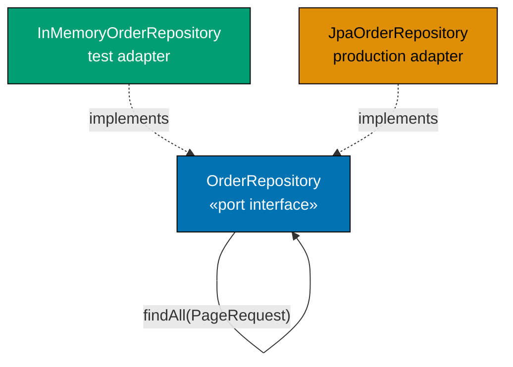

**Java** — full repository port with pagination:

```java
import java.math.BigDecimal;
// => executes the statement above; continues to next line
import java.util.List;
// => executes the statement above; continues to next line
import java.util.Optional;

// ── Supporting types ──────────────────────────────────────────────────────────
record OrderId(String value) {}                         // => typed identity
// => record OrderId: immutable value type; equals/hashCode/toString generated by compiler
record Order(OrderId id, BigDecimal total) {}            // => domain aggregate (minimal)

// Pagination request: defined in application zone; no Spring dependency
// => pageNumber is 0-based; pageSize is the maximum items per page
record Pageable(int pageNumber, int pageSize) {
// => record Pageable: immutable value type; equals/hashCode/toString generated by compiler
    public static Pageable of(int page, int size) { return new Pageable(page, size); }
    // => factory method for readable call sites: Pageable.of(0, 20)
}

// Paginated result: also in application zone; carries content plus metadata
// => total allows the caller to compute totalPages = (int) Math.ceil(total / pageSize)
record Page<T>(List<T> content, long total, int pageNumber, int pageSize) {
// => record Page: immutable value type; equals/hashCode/toString generated by compiler
    public int totalPages() { return (int) Math.ceil((double) total / pageSize); }
    // => totalPages: derived; not stored; computed on read
}

// ── Full repository port ──────────────────────────────────────────────────────
// Interface in application zone; no JPA, Exposed, EF Core on this interface
// => All methods use domain types; adapters translate internally
interface OrderRepository {
// => interface OrderRepository: contract definition — no implementation details here
    Optional<Order> findById(OrderId id);          // => null-safe lookup; empty = not found
    // => executes the statement above; continues to next line
    void save(Order order);                        // => insert or update; idempotent by id
    // => executes the statement above; continues to next line
    void delete(OrderId id);                       // => remove from store; no-op if missing
    // => executes the statement above; continues to next line
    boolean existsById(OrderId id);                // => existence check without loading aggregate
    // => executes the statement above; continues to next line
    Page<Order> findAll(Pageable pageable);        // => paginated scan; never load entire table
    // => Application zone owns Pageable and Page; no Spring Data import needed
}

// ── In-memory adapter (test / development) ────────────────────────────────────
class InMemoryOrderRepository implements OrderRepository {
// => InMemoryOrderRepository implements OrderRepository — satisfies the port contract
    private final java.util.Map<String, Order> store = new java.util.LinkedHashMap<>();
    // => LinkedHashMap: preserves insertion order for deterministic pagination in tests

    @Override public Optional<Order> findById(OrderId id)  { return Optional.ofNullable(store.get(id.value())); }
    // => @Override: compiler verifies this method signature matches the interface
    @Override public void save(Order o)                    { store.put(o.id().value(), o); }
    // => put: insert on first call; replace on subsequent calls — idempotent by design
    @Override public void delete(OrderId id)               { store.remove(id.value()); }
    // => @Override: compiler verifies this method signature matches the interface
    @Override public boolean existsById(OrderId id)        { return store.containsKey(id.value()); }
    // => @Override: compiler verifies this method signature matches the interface

    @Override
    // => @Override: compiler verifies this method signature matches the interface
    public Page<Order> findAll(Pageable p) {
    // => executes the statement above; continues to next line
        var all   = List.copyOf(store.values());           // => snapshot; avoid concurrent modification
        // => all: holds the result of the expression on the right
        int from  = Math.min(p.pageNumber() * p.pageSize(), all.size()); // => start index; clamped
        // => from: holds the result of the expression on the right
        int to    = Math.min(from + p.pageSize(), all.size());           // => end index; clamped
        // => to: holds the result of the expression on the right
        return new Page<>(all.subList(from, to), all.size(), p.pageNumber(), p.pageSize());
        // => subList: O(1) view over the snapshot; no copy; correct pagination slice
    }
}

// ── Usage ─────────────────────────────────────────────────────────────────────
var repo = new InMemoryOrderRepository();                  // => test adapter
// => repo: holds the result of the expression on the right
repo.save(new Order(new OrderId("O1"), new BigDecimal("50")));  // => seed page 0
// => method call: delegates to collaborator; result captured above
repo.save(new Order(new OrderId("O2"), new BigDecimal("80")));  // => seed page 0
// => method call: delegates to collaborator; result captured above
repo.save(new Order(new OrderId("O3"), new BigDecimal("30")));  // => seed page 1 (size=2)
// => method call: delegates to collaborator; result captured above

var page0 = repo.findAll(Pageable.of(0, 2));               // => page 0; size 2
// => page0.content() is [O1, O2]; page0.total() is 3; page0.totalPages() is 2
var page1 = repo.findAll(Pageable.of(1, 2));               // => page 1; size 2
// => page1.content() is [O3]; page1.total() is 3
```

**Kotlin** — repository port with pagination:

```kotlin
import java.math.BigDecimal                                          // => BigDecimal for total
// => executes the statement above; continues to next line

data class OrderId(val value: String)                                // => typed identity
// => data class OrderId: value type; copy/equals/hashCode/toString auto-generated
data class Order(val id: OrderId, val total: BigDecimal)             // => domain aggregate

// Application-zone pagination types — no Exposed or Spring dependency
data class Pageable(val pageNumber: Int, val pageSize: Int) {    // => application-owned; no Spring
// => class Pageable: implementation — contains field declarations and methods below
    companion object { fun of(page: Int, size: Int) = Pageable(page, size) }
    // => companion object factory; Pageable.of(0, 20) reads naturally
    // => 0-based page number; adapters translate to Spring's PageRequest or Exposed offset
}
data class Page<T>(val content: List<T>, val total: Long, val pageNumber: Int, val pageSize: Int) {
    // => content: items on current page; total: total count across all pages
    val totalPages: Int get() = Math.ceil(total.toDouble() / pageSize).toInt()
    // => computed property; not stored in primary constructor
    // => total: total items across all pages; used by caller to render pagination UI
}

// ── Repository port ───────────────────────────────────────────────────────────
interface OrderRepository {                                          // => application zone interface
// => interface OrderRepository: contract definition — no implementation details here
    fun findById(id: OrderId): Order?            // => nullable return; no Optional needed in Kotlin
    // => executes the statement above; continues to next line
    fun save(order: Order)                       // => insert or update; idempotent
    // => executes the statement above; continues to next line
    fun delete(id: OrderId)                      // => remove; no-op if absent
    // => executes the statement above; continues to next line
    fun existsById(id: OrderId): Boolean         // => existence probe; no aggregate loaded
    // => executes the statement above; continues to next line
    fun findAll(pageable: Pageable): Page<Order> // => paginated; never full table scan
    // => All methods use application-owned types; no JPA or Exposed imports here
    // => InMemoryOrderRepository: test adapter; ExposedOrderRepository: production adapter
}

// ── In-memory adapter ─────────────────────────────────────────────────────────
class InMemoryOrderRepository : OrderRepository {                    // => test adapter; no DB
// => class InMemoryOrderRepository: implementation — contains field declarations and methods below
    private val store = linkedMapOf<String, Order>() // => insertion-order map for tests
    // => store: val — injected dependency; implementation chosen at wiring time

    override fun findById(id: OrderId): Order?        = store[id.value]     // => null if absent
    // => method call: delegates to collaborator; result captured above
    override fun save(order: Order)                   { store[order.id.value] = order }
    // => upsert; insert on first call; replace on subsequent calls
    // => key = order id string; value = full Order aggregate
    override fun delete(id: OrderId)                  { store.remove(id.value) }
    // => remove; no-op if key absent
    // => null-safe; LinkedHashMap.remove returns null if key not found
    override fun existsById(id: OrderId): Boolean     = store.containsKey(id.value)
    // => existence check without loading aggregate

    override fun findAll(pageable: Pageable): Page<Order> {
    // => findAll: method entry point — see implementation below
        val all   = store.values.toList()                // => snapshot copy; avoid concurrent modification
        // => all: holds the result of the expression on the right
        val from  = (pageable.pageNumber * pageable.pageSize).coerceAtMost(all.size)
        // => start index; clamped to list size
        val to    = (from + pageable.pageSize).coerceAtMost(all.size)
        // => coerceAtMost: Kotlin stdlib; clamps to list bounds safely
        return Page(all.subList(from, to), all.size.toLong(), pageable.pageNumber, pageable.pageSize)
        // => returns page slice with total count for caller to compute totalPages
    }
}
```

**C#** — repository port with pagination:

```csharp
using System;                                                         // => Math.Ceiling
// => executes the statement above; continues to next line
using System.Collections.Generic;                                     // => IReadOnlyList, Dictionary
// => executes the statement above; continues to next line
using System.Linq;                                                    // => ToList, GetRange
// => executes the statement above; continues to next line

public record OrderId(string Value);                                  // => typed identity; typed wrapper over string
// => executes the statement above; continues to next line
public record Order(OrderId Id, decimal Total);                       // => domain aggregate; minimal for this example
// => Order: no JPA/EF annotation; clean from infrastructure

// Application-zone pagination — no EF Core dependency on these types
public record Pageable(int PageNumber, int PageSize);        // => 0-based page number; PageSize = max items per page
// => Pageable: application-owned; no EF Core or Spring.Data dependency
public record Page<T>(IReadOnlyList<T> Content, long Total, int PageNumber, int PageSize)
// => Content: current page items; Total: total across all pages; PageNumber: current page
{                                                                     // => generic; works for any item type
// => executes the statement above; continues to next line
    public int TotalPages => (int)Math.Ceiling((double)Total / PageSize);
    // => computed property; callers use TotalPages to render pagination UI
    // => Total: total count across all pages; not just current page size
    // => (double)Total: prevents integer division; Ceiling rounds up for partial last page
}

// ── Repository port ───────────────────────────────────────────────────────────
public interface IOrderRepository  // => application zone; no EF Core import here
// => executes the statement above; continues to next line
{
    Order? FindById(OrderId id);               // => null = not found; no exception
    // => executes the statement above; continues to next line
    void Save(Order order);                    // => upsert semantics; idempotent
    // => executes the statement above; continues to next line
    void Delete(OrderId id);                   // => remove; no-op if absent; safe
    // => executes the statement above; continues to next line
    bool ExistsById(OrderId id);               // => existence check without loading aggregate
    // => executes the statement above; continues to next line
    Page<Order> FindAll(Pageable pageable);    // => paginated; interface owns Pageable
    // => Pageable and Page owned by application zone; no EF Core or Spring import
}

// ── In-memory adapter ─────────────────────────────────────────────────────────
public class InMemoryOrderRepository : IOrderRepository  // => test adapter; no DB
// => executes the statement above; continues to next line
{                                                          // => suitable for unit and application tests
// => executes the statement above; continues to next line
    private readonly Dictionary<string, Order> _store = new();  // => backing store; insertion-order not guaranteed
    // => executes the statement above; continues to next line

    public Order?       FindById(OrderId id) => _store.TryGetValue(id.Value, out var o) ? o : null;
    // => null-safe lookup; null if not found; no exception
    public void         Save(Order order)    => _store[order.Id.Value] = order;
    // => upsert by id; insert or replace; idempotent
    public void         Delete(OrderId id)   => _store.Remove(id.Value);
    // => remove entry; no-op if absent; Dictionary.Remove is safe
    public bool         ExistsById(OrderId id) => _store.ContainsKey(id.Value);
    // => existence check without loading aggregate; O(1)

    public Page<Order> FindAll(Pageable p)
    // => executes the statement above; continues to next line
    {                                                              // => paginated read; never full scan
    // => executes the statement above; continues to next line
        var all   = _store.Values.ToList();                      // => snapshot; avoid mutation during iteration
        // => all: holds the result of the expression on the right
        int from  = Math.Min(p.PageNumber * p.PageSize, all.Count); // => start index; clamped
        // => from: holds the result of the expression on the right
        int count = Math.Min(p.PageSize, all.Count - from);     // => items on this page
        // => count: holds the result of the expression on the right
        return new Page<Order>(all.GetRange(from, count), all.Count, p.PageNumber, p.PageSize);
        // => GetRange: O(n) copy of slice; correct for in-memory adapter
        // => all.Count is total for TotalPages calculation
    }
}
```

**Key Takeaway**: The full repository port lives in the application zone with application-owned `Pageable` and `Page` types. Adapters translate internally to JPA `PageRequest`, Exposed queries, or EF Core `Skip`/`Take` — the domain and application zones never import persistence types.

**Why It Matters**: When the repository port leaks Spring Data's `Pageable` into the application zone, every test that touches the use case must import Spring Data. This single dependency pulls the entire Spring context into unit tests, turning millisecond tests into seconds-long context loads. Application-owned pagination types keep the application zone framework-free and independently testable.

---

### Example 32: Notification port — email and SMS unified

A `NotificationPort` abstracts email and SMS behind one interface. The application service calls the port without knowing the delivery channel. A production SMTP adapter and a `FakeNotificationPort` for tests both implement the same interface.

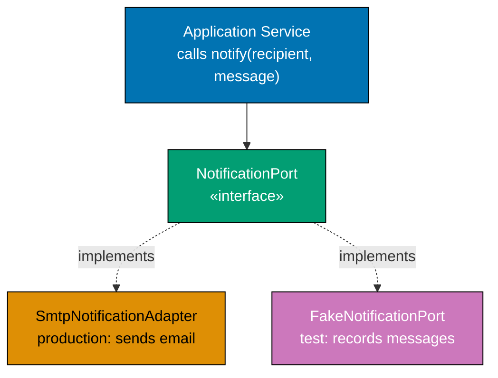

**Java** — notification port with fake:

```java
import java.util.ArrayList;
// => executes the statement above; continues to next line
import java.util.Collections;
// => executes the statement above; continues to next line
import java.util.List;

// ── Domain notification payloads ──────────────────────────────────────────────
record OrderId(String value) {}                         // => typed identity
// => record OrderId: immutable value type; equals/hashCode/toString generated by compiler
record OrderConfirmation(OrderId orderId, String email, String total) {}
// => All data the notification adapter needs to send an order confirmation
record ShippingAlert(OrderId orderId, String email, String trackingNumber) {}
// => Shipping notification payload; separate record from OrderConfirmation

// ── Notification port ─────────────────────────────────────────────────────────
// Interface in application zone; no javax.mail, no Twilio import here
// => Application service calls sendOrderConfirmation without knowing email vs SMS
interface NotificationPort {
// => interface NotificationPort: contract definition — no implementation details here
    void sendOrderConfirmation(OrderConfirmation confirmation); // => order placed event handler
    // => executes the statement above; continues to next line
    void sendShippingAlert(ShippingAlert alert);                // => shipment event handler
    // => Both methods: fire-and-forget; throw on failure (adapter wraps exception)
}

// ── Production adapter: SMTP ──────────────────────────────────────────────────
class SmtpNotificationAdapter implements NotificationPort {
    // => In production: inject JavaMailSender; lives in adapter/out/notification
    @Override
    // => @Override: compiler verifies this method signature matches the interface
    public void sendOrderConfirmation(OrderConfirmation c) {
    // => sendOrderConfirmation: method entry point — see implementation below
        System.out.println("SMTP to " + c.email() + ": order " + c.orderId().value() + " confirmed");
        // => In production: build MimeMessage, set To/Subject/Body, send via JavaMailSender
    }
    @Override
    // => @Override: compiler verifies this method signature matches the interface
    public void sendShippingAlert(ShippingAlert a) {
    // => sendShippingAlert: method entry point — see implementation below
        System.out.println("SMTP to " + a.email() + ": tracking " + a.trackingNumber());
        // => In production: different email template for shipping notification
    }
}

// ── Test adapter: records sent notifications ──────────────────────────────────
class FakeNotificationPort implements NotificationPort {
    // => No SMTP server needed; calls recorded in-memory for assertion in tests
    private final List<OrderConfirmation> confirmations = new ArrayList<>(); // => recorded confirmations
    // => confirmations: List<OrderConfirmation> — final field; assigned once in constructor; immutable reference
    private final List<ShippingAlert>     alerts        = new ArrayList<>(); // => recorded alerts
    // => alerts: List<ShippingAlert> — final field; assigned once in constructor; immutable reference

    @Override
    // => @Override: compiler verifies this method signature matches the interface
    public void sendOrderConfirmation(OrderConfirmation c) { confirmations.add(c); }
    // => Appends to list; test asserts confirmations.size() == 1 etc.
    @Override
    // => @Override: compiler verifies this method signature matches the interface
    public void sendShippingAlert(ShippingAlert a)         { alerts.add(a); }
    // => sendShippingAlert: method entry point — see implementation below

    public List<OrderConfirmation> sentConfirmations() { return Collections.unmodifiableList(confirmations); }
    // => Unmodifiable: test can read but not corrupt the recorded list
    public List<ShippingAlert>     sentAlerts()        { return Collections.unmodifiableList(alerts); }
    // => executes the statement above; continues to next line
}

// ── Application service: calls port; unaware of email or SMS ─────────────────
class NotifyOnOrderPlaced {
// => class NotifyOnOrderPlaced: implementation — contains field declarations and methods below
    private final NotificationPort notification;              // => injected port
    // => notification: NotificationPort — final field; assigned once in constructor; immutable reference
    NotifyOnOrderPlaced(NotificationPort n) { this.notification = n; }
    // => method call: delegates to collaborator; result captured above

    void handle(String orderId, String email, String total) {
    // => handle: method entry point — see implementation below
        notification.sendOrderConfirmation(new OrderConfirmation(new OrderId(orderId), email, total));
        // => Calls port; does not know if SMTP, SMS, or in-memory fake is wired
    }
}

// ── Test ──────────────────────────────────────────────────────────────────────
var fake    = new FakeNotificationPort();                     // => test adapter
// => fake: holds the result of the expression on the right
var handler = new NotifyOnOrderPlaced(fake);                  // => inject fake
// => handler: holds the result of the expression on the right
handler.handle("O1", "alice@example.com", "99 USD");          // => trigger notification
// => method call: delegates to collaborator; result captured above

assert fake.sentConfirmations().size() == 1;                  // => one confirmation sent
// => method call: delegates to collaborator; result captured above
assert fake.sentConfirmations().get(0).email().equals("alice@example.com"); // => correct recipient
// => method call: delegates to collaborator; result captured above
```

**Kotlin** — notification port with fake:

```kotlin
data class OrderId(val value: String)                                // => typed identity
// => data class OrderId: value type; copy/equals/hashCode/toString auto-generated
data class OrderConfirmation(val orderId: OrderId, val email: String, val total: String)
// => notification payload for order placement; carries all data SMTP adapter needs
// => email: recipient; total: human-readable amount for email body
data class ShippingAlert(val orderId: OrderId, val email: String, val trackingNumber: String)
// => notification payload for shipping event; separate record from OrderConfirmation
// => trackingNumber: carrier-assigned tracking id; not domain concept

// ── Port interface ────────────────────────────────────────────────────────────
interface NotificationPort {                                         // => application zone; no SMTP import
// => interface NotificationPort: contract definition — no implementation details here
    fun sendOrderConfirmation(confirmation: OrderConfirmation) // => fire-and-forget; throws on failure
    // => No SMTP, no Twilio, no HTTP on this interface; purely domain payload types
    fun sendShippingAlert(alert: ShippingAlert)               // => shipping event handler
    // => separate method per notification type; each adapter implements both
}

// ── Fake adapter ──────────────────────────────────────────────────────────────
class FakeNotificationPort : NotificationPort {                      // => test adapter; no SMTP
// => class FakeNotificationPort: implementation — contains field declarations and methods below
    val sentConfirmations = mutableListOf<OrderConfirmation>()  // => recorded for assertion
    // => sentConfirmations: holds the result of the expression on the right
    val sentAlerts        = mutableListOf<ShippingAlert>()      // => recorded for assertion
    // => sentAlerts: holds the result of the expression on the right

    override fun sendOrderConfirmation(confirmation: OrderConfirmation) {
    // => sendOrderConfirmation: method entry point — see implementation below
        sentConfirmations += confirmation                        // => += operator appends to list
        // => No network call; runs in microseconds; safe for unit tests
        // => sentConfirmations.size == 1 after one call; test asserts this
    }
    override fun sendShippingAlert(alert: ShippingAlert) { sentAlerts += alert }
    // => appends to sentAlerts; test asserts sentAlerts.size etc.
}

// ── Application service ───────────────────────────────────────────────────────
class NotifyOnOrderPlaced(private val notification: NotificationPort) { // => injected
// => class NotifyOnOrderPlaced: implementation — contains field declarations and methods below
    fun handle(orderId: String, email: String, total: String) {    // => call notification port
    // => handle: method entry point — see implementation below
        notification.sendOrderConfirmation(OrderConfirmation(OrderId(orderId), email, total))
        // => Calls interface; no knowledge of SMTP, Twilio, or in-memory fake
        // => OrderConfirmation constructed with all needed data; adapter decides delivery channel
        // => handle() returns Unit; notification is a side effect, not a return value
    }
}

// ── Test ──────────────────────────────────────────────────────────────────────
val fake    = FakeNotificationPort()                                 // => test adapter; no SMTP
// => fake: holds the result of the expression on the right
val handler = NotifyOnOrderPlaced(fake)                              // => inject fake
// => handler: holds the result of the expression on the right
handler.handle("O1", "alice@example.com", "99 USD")                  // => trigger notification
// => method call: delegates to collaborator; result captured above

check(fake.sentConfirmations.size == 1)                        // => exactly one confirmation
// => method call: delegates to collaborator; result captured above
check(fake.sentConfirmations[0].email == "alice@example.com")  // => correct recipient
// => method call: delegates to collaborator; result captured above
```

**C#** — notification port with fake:

```csharp
using System.Collections.Generic;                            // => List
// => executes the statement above; continues to next line

public record OrderId(string Value);                         // => typed identity
// => executes the statement above; continues to next line
public record OrderConfirmation(OrderId OrderId, string Email, string Total);
// => notification payload for order placement; all data SMTP adapter needs
// => Email: recipient; Total: human-readable amount string
public record ShippingAlert(OrderId OrderId, string Email, string TrackingNumber);
// => notification payload for shipping event; separate from OrderConfirmation
// => TrackingNumber: carrier-assigned id included in shipping email

// ── Port interface ────────────────────────────────────────────────────────────
public interface INotificationPort  // => application zone; no SMTP, no Twilio import
// => executes the statement above; continues to next line
{
    void SendOrderConfirmation(OrderConfirmation confirmation);
    // => fire-and-forget; adapter handles SMTP or SMS; throws on failure
    void SendShippingAlert(ShippingAlert alert);
    // => No SMTP, no Twilio, no HTTP on this interface; purely domain payload types
    // => two separate methods; each notification type has its own method
}

// ── Fake adapter ──────────────────────────────────────────────────────────────
public class FakeNotificationPort : INotificationPort  // => test adapter; no SMTP library
// => executes the statement above; continues to next line
{
    public List<OrderConfirmation> SentConfirmations { get; } = new(); // => recorded calls
    // => executes the statement above; continues to next line
    public List<ShippingAlert>     SentAlerts        { get; } = new(); // => recorded calls
    // => executes the statement above; continues to next line

    public void SendOrderConfirmation(OrderConfirmation c) => SentConfirmations.Add(c);
    // => Add to list; no network; assertion-ready after each test call
    // => expression body; one line; no side effects other than list append
    public void SendShippingAlert(ShippingAlert a)         => SentAlerts.Add(a);
    // => Add to SentAlerts; test asserts SentAlerts.Count etc.
}

// ── Application service ───────────────────────────────────────────────────────
public class NotifyOnOrderPlaced(INotificationPort notification)  // => primary constructor
// => constructor: receives all dependencies — enables testing with any adapter implementation
{                                                            // => notification injected; no SMTP import
// => executes the statement above; continues to next line
    public void Handle(string orderId, string email, string total) =>  // => expression body
    // => executes the statement above; continues to next line
        notification.SendOrderConfirmation(new OrderConfirmation(new OrderId(orderId), email, total));
        // => Calls interface; wiring decides whether SMTP or fake runs
        // => No SMTP import in this class; completely decoupled
}

// ── Test ──────────────────────────────────────────────────────────────────────
var fake    = new FakeNotificationPort();                    // => test adapter; no SMTP
// => fake: holds the result of the expression on the right
var handler = new NotifyOnOrderPlaced(fake);                 // => inject fake
// => handler: holds the result of the expression on the right
handler.Handle("O1", "alice@example.com", "99 USD");         // => trigger notification
// => method call: delegates to collaborator; result captured above

System.Diagnostics.Debug.Assert(fake.SentConfirmations.Count == 1);  // => one confirmation
// => method call: delegates to collaborator; result captured above
System.Diagnostics.Debug.Assert(fake.SentConfirmations[0].Email == "alice@example.com");
// => correct recipient in captured call
```

**Key Takeaway**: A `NotificationPort` interface decouples the application service from all delivery channels. The fake adapter records calls in a list, enabling assertions on notification side effects without sending a single email.

**Why It Matters**: Tests that spin up an SMTP server or mock at the SMTP library level are brittle and slow. A `FakeNotificationPort` runs in microseconds, is reusable across every notification test, and proves that the application service passes the correct payload — not that a specific library method was called. Fakes test observable behaviour; mocks only test implementation details.

---

### Example 33: Clock port — testable time

A `ClockPort` interface abstracts system time. The application service calls `clock.now()` instead of `Instant.now()`. The production adapter delegates to system time; the test adapter returns a fixed timestamp enabling deterministic time-dependent assertions.

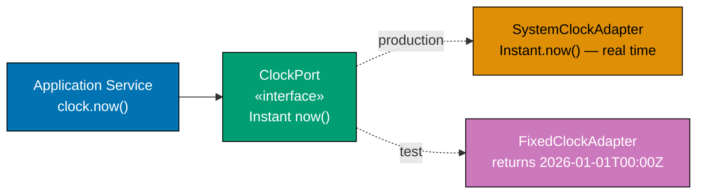

**Java** — clock port with fixed test adapter:

```java
import java.time.Instant;

// ── Clock port ────────────────────────────────────────────────────────────────
// Interface in application zone; no java.time.Clock leaking into domain
// => Single method: now() returns the current moment as an Instant
interface ClockPort {
// => interface ClockPort: contract definition — no implementation details here
    Instant now(); // => called by application service; never by domain
    // => Domain is timeless; time is an infrastructure concern injected via this port
}

// ── Production adapter: delegates to system clock ─────────────────────────────
class SystemClock implements ClockPort {
// => SystemClock implements ClockPort — satisfies the port contract
    @Override
    // => @Override: compiler verifies this method signature matches the interface
    public Instant now() { return Instant.now(); } // => wall-clock time; non-deterministic
    // => In production: Instant.now() reads OS clock; changes every call
}

// ── Test adapter: always returns same instant ─────────────────────────────────
class FixedClock implements ClockPort {
// => FixedClock implements ClockPort — satisfies the port contract
    private final Instant fixed;                   // => fixed moment; set at construction
    // => fixed: Instant — final field; assigned once in constructor; immutable reference
    FixedClock(Instant fixed) { this.fixed = fixed; } // => constructor injection
    // => constructor: receives all dependencies — enables testing with any adapter implementation

    @Override
    // => @Override: compiler verifies this method signature matches the interface
    public Instant now() { return fixed; }         // => always returns same value
    // => Deterministic: test asserts on exact expected timestamp
}

// ── Domain event that carries time ───────────────────────────────────────────
record OrderId(String value) {}
// => record OrderId: immutable value type; equals/hashCode/toString generated by compiler
record OrderPlaced(OrderId orderId, Instant placedAt) {}  // => placedAt from clock port

// ── Application service: injects clock port ───────────────────────────────────
class PlaceOrderService {
// => class PlaceOrderService: implementation — contains field declarations and methods below
    private final ClockPort clock;                 // => injected; never calls Instant.now() directly
    // => clock: ClockPort — final field; assigned once in constructor; immutable reference
    PlaceOrderService(ClockPort clock) { this.clock = clock; }
    // => method call: delegates to collaborator; result captured above

    OrderPlaced place(String rawOrderId) {
    // => executes the statement above; continues to next line
        var placedAt = clock.now();               // => current time from port; production or test
        // => placedAt: holds the result of the expression on the right
        return new OrderPlaced(new OrderId(rawOrderId), placedAt);
        // => placedAt is exactly what clock.now() returned; no drift, no race condition
    }
}

// ── Test: fixed clock makes assertion deterministic ───────────────────────────
var fixedInstant = Instant.parse("2026-01-01T00:00:00Z"); // => known timestamp
// => fixedInstant: holds the result of the expression on the right
var clock        = new FixedClock(fixedInstant);           // => test adapter
// => clock: holds the result of the expression on the right
var service      = new PlaceOrderService(clock);           // => inject fixed clock
// => service: holds the result of the expression on the right

var event = service.place("O1");                           // => call service
// => event: holds the result of the expression on the right

assert event.placedAt().equals(fixedInstant);              // => deterministic assertion
// => Without fixed clock: assertion must use isAfter/isBefore windows — fragile
```

**Kotlin** — clock port with fixed adapter:

```kotlin
import java.time.Instant

// ── Port ──────────────────────────────────────────────────────────────────────
fun interface ClockPort { fun now(): Instant }             // => SAM interface; lambda-implementable

// ── Adapters ──────────────────────────────────────────────────────────────────
val systemClock: ClockPort = ClockPort { Instant.now() }  // => production: wall-clock
// => Lambda implements fun interface; one-liner for production adapter
// => Instant.now(): reads OS clock; non-deterministic; never used in tests
val fixedClock: ClockPort  = ClockPort { Instant.parse("2026-01-01T00:00:00Z") }
// => Test adapter: always same value; no side effects; deterministic
// => Parse ISO-8601 string; known timestamp for exact equality assertions

// ── Domain event ──────────────────────────────────────────────────────────────
data class OrderId(val value: String)                                // => typed identity
// => data class OrderId: value type; copy/equals/hashCode/toString auto-generated
data class OrderPlaced(val orderId: OrderId, val placedAt: Instant)  // => event with timestamp from port

// ── Application service ───────────────────────────────────────────────────────
class PlaceOrderService(private val clock: ClockPort) {    // => injected clock port
// => class PlaceOrderService: implementation — contains field declarations and methods below
    fun place(rawId: String): OrderPlaced {
    // => place: method entry point — see implementation below
        val placedAt = clock.now()                         // => from port; deterministic in tests
        // => placedAt: holds the result of the expression on the right
        return OrderPlaced(OrderId(rawId), placedAt)       // => event carries exact timestamp
        // => No Instant.now() in service; all time from clock port
    }
}

// ── Test ──────────────────────────────────────────────────────────────────────
val service = PlaceOrderService(fixedClock)                // => inject fixed adapter
// => service: holds the result of the expression on the right
val event   = service.place("O1")                          // => invoke
// => event: holds the result of the expression on the right

check(event.placedAt == Instant.parse("2026-01-01T00:00:00Z")) // => exact assertion; not range
// => method call: delegates to collaborator; result captured above
```

**C#** — clock port with fixed adapter:

```csharp
using System;                                                         // => DateTimeOffset, TimeSpan

// ── Port ──────────────────────────────────────────────────────────────────────
public interface IClockPort  // => application zone; no System.DateTime direct usage
// => executes the statement above; continues to next line
{
// => operation completes; execution continues to next statement
    DateTimeOffset Now { get; } // => property rather than method; idiomatic in C#
    // => Returns current moment; production = UtcNow; test = fixed value
}

// ── Production adapter ────────────────────────────────────────────────────────
public class SystemClock : IClockPort  // => production adapter; wall-clock
// => executes the statement above; continues to next line
{
// => operation completes; execution continues to next statement
    public DateTimeOffset Now => DateTimeOffset.UtcNow; // => wall-clock; different each call
    // => UTC: avoids daylight-saving ambiguity in time-sensitive assertions
}

// ── Test adapter ──────────────────────────────────────────────────────────────
public class FixedClock(DateTimeOffset Fixed) : IClockPort // => primary constructor C# 12
// => constructor: receives all dependencies — enables testing with any adapter implementation
{                                                          // => Fixed captured at construction
// => executes the statement above; continues to next line
    public DateTimeOffset Now => Fixed;                    // => always same; deterministic
    // => Constructor argument becomes the immutable fixed moment
}

// ── Domain event ──────────────────────────────────────────────────────────────
public record OrderId(string Value);                                  // => typed identity
// => executes the statement above; continues to next line
public record OrderPlaced(OrderId OrderId, DateTimeOffset PlacedAt);  // => event with timestamp

// ── Application service ───────────────────────────────────────────────────────
public class PlaceOrderService(IClockPort clock)           // => primary constructor; clock injected
// => constructor: receives all dependencies — enables testing with any adapter implementation
{                                                          // => no DateTimeOffset.UtcNow in this class
// => class type: implementation — contains field declarations and methods below
    public OrderPlaced Place(string rawId) =>              // => expression-body; returns event
    // => executes the statement above; continues to next line
        new OrderPlaced(new OrderId(rawId), clock.Now);    // => clock.Now from injected port
        // => No DateTimeOffset.UtcNow in application service; all time from port
}

// ── Test ──────────────────────────────────────────────────────────────────────
var fixedMoment = new DateTimeOffset(2026, 1, 1, 0, 0, 0, TimeSpan.Zero);
// => known timestamp; year=2026, month=1, day=1, hour=0; UTC
// => test can use exact equality assertion
var service     = new PlaceOrderService(new FixedClock(fixedMoment)); // => inject fixed clock
// => service: holds the result of the expression on the right
var evt         = service.Place("O1");                                // => invoke service
// => evt: holds the result of the expression on the right

System.Diagnostics.Debug.Assert(evt.PlacedAt == fixedMoment); // => exact comparison; passes every run
// => Without fixed clock: must use approximate range check; can fail under load
```

**Key Takeaway**: A `ClockPort` interface eliminates non-determinism from time-dependent tests. The application service calls `clock.now()` through the port; tests inject a fixed clock and assert on exact timestamps.

**Why It Matters**: `Instant.now()` called directly in an application service makes every test that checks timestamps fragile — the assertion must use approximate range checks that can still fail under load. A clock port costs one interface and two adapters but buys fully deterministic, never-flaky time assertions for the entire lifetime of the project.

---

### Example 34: Logger port — structured logging abstraction

A `LoggerPort` interface abstracts structured logging. The application service calls `logger.info("order.placed", context)` with a named event and a context map. Production adapters forward to SLF4J, Kotlin Logging, or `ILogger`. The test adapter records log entries for assertion. Domain types never log.

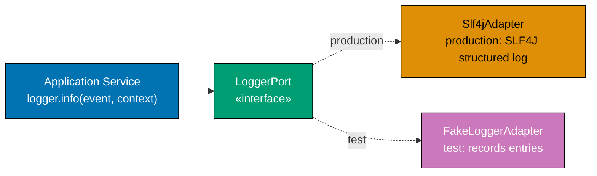

**Java** — structured logger port:

```java
import java.util.ArrayList;
// => executes the statement above; continues to next line
import java.util.List;
// => executes the statement above; continues to next line
import java.util.Map;

// ── Logger port ───────────────────────────────────────────────────────────────
// Interface in application zone; no SLF4J, no Logback import here
// => Structured: event name + context map; not a printf-style format string
interface LoggerPort {
// => interface LoggerPort: contract definition — no implementation details here
    void info(String event, Map<String, Object> context);  // => informational log entry
    // => executes the statement above; continues to next line
    void warn(String event, Map<String, Object> context);  // => warning; degraded but running
    // => executes the statement above; continues to next line
    void error(String event, Map<String, Object> context); // => error; operation failed
    // => Map<String, Object>: key-value context; adapter serialises to JSON or MDC fields
}

// ── Test adapter: records entries as list ─────────────────────────────────────
class RecordingLoggerPort implements LoggerPort {
// => RecordingLoggerPort implements LoggerPort — satisfies the port contract
    record LogEntry(String level, String event, Map<String, Object> context) {} // => captured log call
    // => record LogEntry: immutable value type; equals/hashCode/toString generated by compiler
    private final List<LogEntry> entries = new ArrayList<>(); // => ordered list of all log calls
    // => entries: List<LogEntry> — final field; assigned once in constructor; immutable reference

    @Override public void info(String event, Map<String, Object> ctx)  { entries.add(new LogEntry("INFO",  event, ctx)); }
    // => @Override: compiler verifies this method signature matches the interface
    @Override public void warn(String event, Map<String, Object> ctx)  { entries.add(new LogEntry("WARN",  event, ctx)); }
    // => @Override: compiler verifies this method signature matches the interface
    @Override public void error(String event, Map<String, Object> ctx) { entries.add(new LogEntry("ERROR", event, ctx)); }
    // => @Override: compiler verifies this method signature matches the interface

    public List<LogEntry> entries() { return List.copyOf(entries); } // => immutable snapshot
    // => Test: assert entries.get(0).event().equals("order.placed")
}

// ── Application service: structured logging via port ─────────────────────────
class PlaceOrderService {
// => class PlaceOrderService: implementation — contains field declarations and methods below
    private final LoggerPort logger;               // => injected; no System.out.println ever
    // => logger: LoggerPort — final field; assigned once in constructor; immutable reference
    PlaceOrderService(LoggerPort logger) { this.logger = logger; }
    // => method call: delegates to collaborator; result captured above

    void placeOrder(String orderId, String customerId) {
    // => placeOrder: method entry point — see implementation below
        logger.info("order.placing", Map.of(       // => named event + structured context
        // => method call: delegates to collaborator; result captured above
            "orderId",    orderId,                 // => context key/value pairs
            // => executes the statement above; continues to next line
            "customerId", customerId               // => logged as structured fields; searchable
            // => executes the statement above; continues to next line
        ));
        // => Business logic here (omitted for brevity)
        logger.info("order.placed", Map.of("orderId", orderId)); // => success event
        // => No println, no System.out, no Logger.getLogger() in service
    }
}

// ── Test ──────────────────────────────────────────────────────────────────────
var logger  = new RecordingLoggerPort();           // => test adapter
// => logger: holds the result of the expression on the right
var service = new PlaceOrderService(logger);       // => inject
// => service: holds the result of the expression on the right
service.placeOrder("O1", "CUST-1");               // => invoke
// => method call: delegates to collaborator; result captured above

var entries = logger.entries();
// => entries: holds the result of the expression on the right
assert entries.size() == 2;                        // => two log calls: placing + placed
// => method call: delegates to collaborator; result captured above
assert entries.get(0).event().equals("order.placing"); // => first event name correct
// => method call: delegates to collaborator; result captured above
assert entries.get(1).event().equals("order.placed");  // => second event name correct
// => method call: delegates to collaborator; result captured above
assert entries.get(1).context().get("orderId").equals("O1"); // => context carries orderId
// => method call: delegates to collaborator; result captured above
```

**Kotlin** — structured logger port:

```kotlin
data class LogEntry(val level: String, val event: String, val context: Map<String, Any>)
// => LogEntry: captured log call; level + event name + context map
// => immutable data class; exposed for test assertion

// ── Port ──────────────────────────────────────────────────────────────────────
interface LoggerPort {                                               // => application zone; no SLF4J
// => interface LoggerPort: contract definition — no implementation details here
    fun info(event: String, context: Map<String, Any>)   // => structured info log
    // => executes the statement above; continues to next line
    fun warn(event: String, context: Map<String, Any>)   // => structured warning log
    // => executes the statement above; continues to next line
    fun error(event: String, context: Map<String, Any>)  // => structured error log
    // => No SLF4J, no Logback on this interface; application zone is framework-free
}

// ── Test adapter ──────────────────────────────────────────────────────────────
class RecordingLoggerPort : LoggerPort {                             // => captures calls for assertion
// => class RecordingLoggerPort: implementation — contains field declarations and methods below
    val entries = mutableListOf<LogEntry>()               // => public for test assertion
    // => entries: holds the result of the expression on the right

    override fun info(event: String, context: Map<String, Any>)  { entries += LogEntry("INFO",  event, context) }
    // => records INFO log entry for assertion
    override fun warn(event: String, context: Map<String, Any>)  { entries += LogEntry("WARN",  event, context) }
    // => records WARN log entry
    override fun error(event: String, context: Map<String, Any>) { entries += LogEntry("ERROR", event, context) }
    // => records ERROR log entry
}

// ── Application service ───────────────────────────────────────────────────────
class PlaceOrderService(private val logger: LoggerPort) { // => injected; no SLF4J import
// => class PlaceOrderService: implementation — contains field declarations and methods below
    fun placeOrder(orderId: String, customerId: String) { // => triggers two log calls
    // => placeOrder: method entry point — see implementation below
        logger.info("order.placing", mapOf("orderId" to orderId, "customerId" to customerId))
        // => mapOf: Kotlin stdlib; creates immutable map inline; no Map.of() needed
        // => "order.placing" is named event; each key/value is a searchable structured field
        logger.info("order.placed",  mapOf("orderId" to orderId))
        // => Structured context: each field searchable in production log aggregator
        // => "order.placed" signals success; single field sufficient for this event
    }
}

// ── Test ──────────────────────────────────────────────────────────────────────
val logger  = RecordingLoggerPort()                       // => test adapter; no Logback
// => logger: holds the result of the expression on the right
val service = PlaceOrderService(logger)                   // => inject test adapter
// => service: holds the result of the expression on the right
service.placeOrder("O1", "CUST-1")                        // => triggers two log calls
// => method call: delegates to collaborator; result captured above

check(logger.entries.size == 2)                           // => two log entries recorded
// => method call: delegates to collaborator; result captured above
check(logger.entries[0].event == "order.placing")         // => first event name correct
// => method call: delegates to collaborator; result captured above
check(logger.entries[1].context["orderId"] == "O1")       // => context carries orderId
// => method call: delegates to collaborator; result captured above
```

**C#** — structured logger port:

```csharp
using System.Collections.Generic;                            // => IReadOnlyDictionary, Dictionary, List
// => executes the statement above; continues to next line

public record LogEntry(string Level, string Event, IReadOnlyDictionary<string, object> Context);
// => LogEntry: immutable record capturing one log call; exposed for assertion
// => Level: "INFO", "WARN", "ERROR"; Event: named event; Context: key-value pairs
// => IReadOnlyDictionary: context fields accessible by key; cannot be mutated after creation

// ── Port ──────────────────────────────────────────────────────────────────────
public interface ILoggerPort  // => application zone; no Serilog or ILogger<T>
// => executes the statement above; continues to next line
{
    void Info(string eventName, IReadOnlyDictionary<string, object> context);
    // => structured info; eventName is searchable; context is key-value pairs
    // => void: fire-and-forget; no return; no exception expected from logger
    void Warn(string eventName, IReadOnlyDictionary<string, object> context);  // => structured warning
    // => structured warning; same shape as Info; different level in output
    void Error(string eventName, IReadOnlyDictionary<string, object> context); // => structured error
    // => structured error; same shape as Info
    // => IReadOnlyDictionary: callers cannot mutate context after passing; immutable view
}

// ── Test adapter ──────────────────────────────────────────────────────────────
public class RecordingLoggerPort : ILoggerPort  // => test adapter; no Serilog dependency
// => executes the statement above; continues to next line
{
    public List<LogEntry> Entries { get; } = new();           // => public for assertion
    // => executes the statement above; continues to next line

    public void Info(string e, IReadOnlyDictionary<string, object> ctx)  => Entries.Add(new("INFO",  e, ctx));
    // => records INFO entry; test asserts Entries[i].Event and .Context
    public void Warn(string e, IReadOnlyDictionary<string, object> ctx)  => Entries.Add(new("WARN",  e, ctx));
    // => records WARN entry; same pattern as Info
    public void Error(string e, IReadOnlyDictionary<string, object> ctx) => Entries.Add(new("ERROR", e, ctx));
    // => records ERROR entry; same pattern as Info and Warn
}

// ── Application service ───────────────────────────────────────────────────────
public class PlaceOrderService(ILoggerPort logger)
// => executes the statement above; continues to next line
{                                                            // => logger injected; no ILogger<T> import
// => executes the statement above; continues to next line
    public void PlaceOrder(string orderId, string customerId)  // => triggers two log calls
    // => executes the statement above; continues to next line
    {
        logger.Info("order.placing", new Dictionary<string, object> {  // => first event
        // => method call: delegates to collaborator; result captured above
            ["orderId"]    = orderId,              // => structured field; not a format string
            // => executes the statement above; continues to next line
            ["customerId"] = customerId            // => each key is searchable in Seq, Datadog
            // => executes the statement above; continues to next line
        });
        // => "order.placing" named event; context has two searchable fields
        logger.Info("order.placed", new Dictionary<string, object> { ["orderId"] = orderId });
        // => "order.placed" event with one context field; success marker
        // => two separate events; each searchable and filterable in Seq or Datadog
    }
}

// ── Test ──────────────────────────────────────────────────────────────────────
var logger  = new RecordingLoggerPort();                     // => test adapter; no Serilog needed
// => logger: holds the result of the expression on the right
var service = new PlaceOrderService(logger);                 // => inject test adapter
// => service: holds the result of the expression on the right
service.PlaceOrder("O1", "CUST-1");                          // => triggers two log calls
// => method call: delegates to collaborator; result captured above

System.Diagnostics.Debug.Assert(logger.Entries.Count == 2); // => two entries recorded
// => method call: delegates to collaborator; result captured above
System.Diagnostics.Debug.Assert(logger.Entries[0].Event == "order.placing"); // => first event name
// => method call: delegates to collaborator; result captured above
System.Diagnostics.Debug.Assert((string)logger.Entries[1].Context["orderId"] == "O1");
// => context["orderId"] cast to string; IReadOnlyDictionary<string, object> returns object
// => value equals "O1"; confirms context was passed correctly
```

**Key Takeaway**: A `LoggerPort` interface enforces structured logging throughout the application service layer. Domain types never call any logger; the test adapter records events for assertion without a logging framework on the classpath.

**Why It Matters**: `System.out.println` and direct `Logger.getLogger()` calls in application services make tests noisy and couple the service to a specific logging library. A logger port keeps the service framework-free, makes log output assertable in tests, and allows switching between SLF4J, Kotlin Logging, and `Microsoft.Extensions.Logging` by replacing only one adapter class — zero service changes required.

---

### Example 35: External API client port — payment gateway

A `PaymentGatewayPort` abstracts payment processing behind a typed interface. The production adapter translates domain types to the payment API's request DTO and the response back to domain types. The `FakePaymentGateway` returns configurable results, enabling testing of payment success, declined, and error paths without network calls.

**Java** — payment gateway port with fake:

```java
import java.math.BigDecimal;                                          // => BigDecimal: precise monetary amounts

// ── Domain types ──────────────────────────────────────────────────────────────
record OrderId(String value) {}                                   // => typed identity; not raw String
// => record OrderId: immutable value type; equals/hashCode/toString generated by compiler
record PaymentRequest(OrderId orderId, BigDecimal amount, String currency) {} // => three domain fields
// => Domain payment request; no Stripe/Braintree type here
record PaymentAuthorisation(String authorisationCode, BigDecimal authorisedAmount) {} // => success value
// => Domain success type; adapter mapped from payment API response

// Error hierarchy: typed failures; no generic exception across the port boundary
// => sealed interface: compiler enforces exhaustive switch coverage
sealed interface PaymentError permits
// => executes the statement above; continues to next line
    PaymentError.InsufficientFunds,                               // => three permitted subtypes
    // => executes the statement above; continues to next line
    PaymentError.CardDeclined,
    // => executes the statement above; continues to next line
    PaymentError.GatewayUnavailable {
    // => executes the statement above; continues to next line
    record InsufficientFunds()    implements PaymentError {}  // => domain: insufficient balance
    // => InsufficientFunds implements PaymentError — satisfies the port contract
    record CardDeclined()         implements PaymentError {}  // => domain: card declined
    // => CardDeclined implements PaymentError — satisfies the port contract
    record GatewayUnavailable()   implements PaymentError {}  // => adapter: API unreachable
    // => GatewayUnavailable implements PaymentError — satisfies the port contract
}

// Result type: either an authorisation or an error
// => sealed interface: caller must handle Ok and Err; no unchecked exception escapes
sealed interface PaymentResult permits PaymentResult.Ok, PaymentResult.Err {
// => interface PaymentResult: contract definition — no implementation details here
    record Ok(PaymentAuthorisation auth)  implements PaymentResult {} // => success carries authorisation
    // => Ok implements PaymentResult — satisfies the port contract
    record Err(PaymentError error)        implements PaymentResult {} // => failure carries typed error
    // => Err implements PaymentResult — satisfies the port contract
}

// ── Payment gateway port ──────────────────────────────────────────────────────
// Interface in application zone; Stripe/Braintree adapter in adapter zone
// => Returns typed PaymentResult; no RuntimeException crosses this boundary
interface PaymentGatewayPort {                                    // => single-method port: one responsibility
// => interface PaymentGatewayPort: contract definition — no implementation details here
    PaymentResult authorise(PaymentRequest request);              // => synchronous; adapter may batch internally
    // => Adapter translates PaymentRequest to Stripe ChargeRequest internally
    // => Adapter translates Stripe Response to PaymentAuthorisation or PaymentError
}

// ── Fake adapter: configurable outcome ────────────────────────────────────────
class FakePaymentGateway implements PaymentGatewayPort {          // => implements port; no network calls
// => FakePaymentGateway implements PaymentGatewayPort — satisfies the port contract
    private PaymentResult nextResult;             // => pre-configured outcome for next call
    // => Test sets nextResult before exercising the application service

    FakePaymentGateway(PaymentResult nextResult) {                // => constructor injection of configured result
    // => constructor: receives all dependencies — enables testing with any adapter implementation
        this.nextResult = nextResult;                             // => stored; returned on next authorise call
        // => this.nextResult stored — field holds injected nextResult for method calls below
    }
    public void setNextResult(PaymentResult r) {                  // => allows mid-test reconfiguration
    // => setNextResult: method entry point — see implementation below
        this.nextResult = r;                                      // => reconfigure; next call returns r
        // => this.nextResult stored — field holds injected r for method calls below
    }

    @Override                                                     // => implements PaymentGatewayPort.authorise
    // => @Override: compiler verifies this method signature matches the interface
    public PaymentResult authorise(PaymentRequest request) { return nextResult; } // => returns pre-configured result; no network
    // => Returns pre-configured result; no network; deterministic
}

// ── Application service: calls port ──────────────────────────────────────────
class ChargeForOrderService {                                     // => application service; no Stripe import
// => class ChargeForOrderService: implementation — contains field declarations and methods below
    private final PaymentGatewayPort gateway;     // => injected; no Stripe import here
    // => gateway: PaymentGatewayPort — final field; assigned once in constructor; immutable reference
    ChargeForOrderService(PaymentGatewayPort g) { // => constructor injection; DI-framework-free
    // => constructor: receives all dependencies — enables testing with any adapter implementation
        this.gateway = g;                         // => stored; used in charge method
        // => this.gateway stored — field holds injected g for method calls below
    }

    String charge(String orderId, BigDecimal amount) {            // => delegates entirely to gateway port
    // => executes the statement above; continues to next line
        var result = gateway.authorise(new PaymentRequest(new OrderId(orderId), amount, "USD")); // => calls port
        // => result: holds the result of the expression on the right
        return switch (result) {                  // => exhaustive match on PaymentResult
        // => returns the result to the caller — caller receives this value
            case PaymentResult.Ok ok   -> "charged: " + ok.auth().authorisationCode(); // => success path
            // => method call: delegates to collaborator; result captured above
            case PaymentResult.Err err -> switch (err.error()) { // => nested switch on error type
            // => method call: delegates to collaborator; result captured above
                case PaymentError.InsufficientFunds  e -> "declined: insufficient funds"; // => balance error
                // => executes the statement above; continues to next line
                case PaymentError.CardDeclined       e -> "declined: card declined";       // => card error
                // => executes the statement above; continues to next line
                case PaymentError.GatewayUnavailable e -> "error: gateway unavailable";    // => infra error
                // => executes the statement above; continues to next line
            };
        };
    }
}

// ── Tests: success, declined ──────────────────────────────────────────────────
var okGateway = new FakePaymentGateway(                           // => fake configured for success
// => okGateway: holds the result of the expression on the right
    new PaymentResult.Ok(new PaymentAuthorisation("AUTH-1", new BigDecimal("50")))); // => success with auth code
    // => method call: delegates to collaborator; result captured above
var service   = new ChargeForOrderService(okGateway);          // => inject success fake
// => service: holds the result of the expression on the right
assert service.charge("O1", new BigDecimal("50")).startsWith("charged:"); // => success path asserted
// => method call: delegates to collaborator; result captured above

okGateway.setNextResult(new PaymentResult.Err(new PaymentError.CardDeclined())); // => reconfigure to failure
// => method call: delegates to collaborator; result captured above
assert service.charge("O1", new BigDecimal("50")).startsWith("declined:");        // => declined path verified
// => method call: delegates to collaborator; result captured above
```

**Kotlin** — payment gateway port with fake:

```kotlin
import java.math.BigDecimal                                          // => BigDecimal for amounts
// => executes the statement above; continues to next line
// => above statement is part of the implementation flow

data class OrderId(val value: String)                                // => typed order identity
// => data class OrderId: value type; copy/equals/hashCode/toString auto-generated
data class PaymentRequest(val orderId: OrderId, val amount: BigDecimal, val currency: String)
// => domain payment request; no Stripe type here; immutable
data class PaymentAuthorisation(val authorisationCode: String, val authorisedAmount: BigDecimal)
// => domain success result; carries authorisation code; adapter maps from Stripe response

sealed class PaymentError {                                          // => sealed: when is exhaustive
// => class PaymentError: implementation — contains field declarations and methods below
    object InsufficientFunds  : PaymentError()                       // => domain: insufficient balance
    // => InsufficientFunds: implements port contract — dependency is on abstraction, not concretion
    object CardDeclined       : PaymentError()                       // => domain: card declined
    // => CardDeclined: implements port contract — dependency is on abstraction, not concretion
    data class GatewayUnavailable(val cause: String) : PaymentError() // => adapter: API unreachable
    // => data class GatewayUnavailable: value type; copy/equals/hashCode/toString auto-generated
}
// => operation completes; execution continues to next statement

sealed class PaymentResult {                                         // => sealed discriminated union
// => class PaymentResult: implementation — contains field declarations and methods below
    data class Ok(val auth: PaymentAuthorisation) : PaymentResult()  // => success variant
    // => data class Ok: value type; copy/equals/hashCode/toString auto-generated
    data class Err(val error: PaymentError) : PaymentResult()        // => failure variant
    // => data class Err: value type; copy/equals/hashCode/toString auto-generated
}
// => operation completes; execution continues to next statement

fun interface PaymentGatewayPort {                                   // => SAM; application zone
// => interface PaymentGatewayPort: contract definition — no implementation details here
    fun authorise(request: PaymentRequest): PaymentResult            // => SAM; lambda-implementable
    // => Returns typed PaymentResult; no exceptions across this boundary
}
// => operation completes; execution continues to next statement

class FakePaymentGateway(var nextResult: PaymentResult) : PaymentGatewayPort {  // => test adapter
    // => var: mutable field; test reassigns between scenarios
    override fun authorise(request: PaymentRequest): PaymentResult = nextResult  // => return configured
    // => Returns configured result; no network call; microsecond speed
}
// => operation completes; execution continues to next statement

class ChargeForOrderService(private val gateway: PaymentGatewayPort) {  // => application service
    // => gateway injected; no Stripe SDK import in this class
    fun charge(orderId: String, amount: BigDecimal): String {        // => calls port; maps result to string
    // => charge: method entry point — see implementation below
        val result = gateway.authorise(PaymentRequest(OrderId(orderId), amount, "USD"))
        // => delegate to port; adapter handles Stripe translation internally
        return when (result) {                                       // => exhaustive when; sealed class
        // => class type: implementation — contains field declarations and methods below
            is PaymentResult.Ok  -> "charged: ${result.auth.authorisationCode}"  // => success path
            // => success: return authorisation code to adapter
            is PaymentResult.Err -> when (result.error) {               // => nested when on error type
            // => method call: delegates to collaborator; result captured above
                is PaymentError.InsufficientFunds  -> "declined: insufficient funds"  // => 402 scenario
                // => domain-level decline; no retry warranted
                is PaymentError.CardDeclined       -> "declined: card declined"   // => card-level decline
                // => card-level decline; different message
                is PaymentError.GatewayUnavailable -> "error: ${result.error.cause}"  // => infra error
                // => infrastructure error; cause carries reason
            }
            // => operation completes; execution continues to next statement
        }
        // => operation completes; execution continues to next statement
    }
    // => operation completes; execution continues to next statement
}
// => operation completes; execution continues to next statement

val fake    = FakePaymentGateway(PaymentResult.Ok(PaymentAuthorisation("AUTH-1", BigDecimal("50")))) // => success config
// => configured for success; AUTH-1 is pre-set authorisation code; amount=50
val service = ChargeForOrderService(fake)                            // => inject success fake
// => service: holds the result of the expression on the right
check(service.charge("O1", BigDecimal("50")).startsWith("charged:"))
// => success path; result starts with "charged:"; full result includes auth code

fake.nextResult = PaymentResult.Err(PaymentError.CardDeclined)  // => reconfigure for decline
// => CardDeclined is object (singleton); no constructor args needed
check(service.charge("O1", BigDecimal("50")).startsWith("declined:"))
// => decline path; result starts with "declined:"
```

**C#** — payment gateway port with fake:

```csharp
using System;                                                         // => System namespace
// => executes the statement above; continues to next line

public record OrderId(string Value);                                  // => typed order identity
// => executes the statement above; continues to next line
public record PaymentRequest(OrderId OrderId, decimal Amount, string Currency);  // => domain DTO
// => domain payment request; no Stripe type here; immutable value object
public record PaymentAuthorisation(string AuthorisationCode, decimal AuthorisedAmount);
// => domain success result; carries authorisation code; adapter maps from Stripe response

public abstract record PaymentError  // => abstract base; switch forces exhaustive handling
// => executes the statement above; continues to next line
{
// => operation completes; execution continues to next statement
    public record InsufficientFunds() : PaymentError;                 // => domain: balance insufficient
    // => executes the statement above; continues to next line
    public record CardDeclined() : PaymentError;                      // => domain: card declined
    // => executes the statement above; continues to next line
    public record GatewayUnavailable(string Cause) : PaymentError;    // => adapter: API unreachable
    // => three subtypes: two domain, one infrastructure
}
// => operation completes; execution continues to next statement

public abstract record PaymentResult  // => discriminated union; Ok or Err
// => executes the statement above; continues to next line
{
// => operation completes; execution continues to next statement
    public record Ok(PaymentAuthorisation Auth) : PaymentResult;      // => success variant
    // => executes the statement above; continues to next line
    public record Err(PaymentError Error) : PaymentResult;            // => failure variant
    // => switch expression forces handling of both variants
}
// => operation completes; execution continues to next statement

public interface IPaymentGatewayPort  // => application zone; no Stripe SDK import
// => executes the statement above; continues to next line
{
// => operation completes; execution continues to next statement
    PaymentResult Authorise(PaymentRequest request);  // => returns union; never throws
    // => Stripe/Braintree adapter in adapter zone; only this interface visible to application
    // => Returns typed PaymentResult; no exceptions across this boundary
}
// => operation completes; execution continues to next statement

public class FakePaymentGateway(PaymentResult nextResult) : IPaymentGatewayPort  // => test adapter
// => executes the statement above; continues to next line
{                                                                     // => primary constructor; captures initial result
// => executes the statement above; continues to next line
    public PaymentResult NextResult { get; set; } = nextResult; // => settable for reconfiguration
    // => set: allows reconfiguring between test scenarios; test calls fake.NextResult = ...

    public PaymentResult Authorise(PaymentRequest request) => NextResult;  // => returns configured
    // => Returns preconfigured result; no network; test controls outcome
}
// => operation completes; execution continues to next statement

public class ChargeForOrderService(IPaymentGatewayPort gateway)  // => application service
// => executes the statement above; continues to next line
{                                                                     // => gateway injected; no Stripe SDK import
// => executes the statement above; continues to next line
    public string Charge(string orderId, decimal amount)             // => maps result to HTTP-ready string
    // => executes the statement above; continues to next line
    {
    // => operation completes; execution continues to next statement
        var result = gateway.Authorise(new PaymentRequest(new OrderId(orderId), amount, "USD"));
        // => delegate to port; adapter handles Stripe API call internally
        // => "USD": currency hardcoded here; production: from order context
        return result switch                                          // => exhaustive switch on union
        // => returns the result to the caller — caller receives this value
        {
        // => operation completes; execution continues to next statement
            PaymentResult.Ok ok   => $"charged: {ok.Auth.AuthorisationCode}",  // => success
            // => success: return authorisation code string
            PaymentResult.Err err => err.Error switch                // => nested switch on error
            // => executes the statement above; continues to next line
            {
            // => operation completes; execution continues to next statement
                PaymentError.InsufficientFunds  => "declined: insufficient funds",   // => 402 scenario
                // => domain-level decline; different message from card decline
                PaymentError.CardDeclined       => "declined: card declined",        // => card issue
                // => card-level decline
                PaymentError.GatewayUnavailable e => $"error: {e.Cause}",           // => infra error
                // => infrastructure error; cause carried in record
                _                               => "error: unknown"                  // => safety
                // => exhaustive: safety default
            },
            // => operation completes; execution continues to next statement
            _ => "error: unknown"                                     // => exhaustive: safety default
            // => executes the statement above; continues to next line
        };
        // => operation completes; execution continues to next statement
    }
    // => operation completes; execution continues to next statement
}

var fake    = new FakePaymentGateway(new PaymentResult.Ok(new PaymentAuthorisation("AUTH-1", 50m)));
// => success fake; AUTH-1 is pre-set authorisation code; Amount=50m
var service = new ChargeForOrderService(fake);                        // => inject success fake
// => service: holds the result of the expression on the right
System.Diagnostics.Debug.Assert(service.Charge("O1", 50m).StartsWith("charged:"));
// => success path; result starts with "charged:"; full result is "charged: AUTH-1"

fake.NextResult = new PaymentResult.Err(new PaymentError.CardDeclined()); // => reconfigure for decline
// => reconfigure for card decline scenario
System.Diagnostics.Debug.Assert(service.Charge("O1", 50m).StartsWith("declined:"));
// => decline path; result starts with "declined:"; full result is "declined: card declined"
```

**Key Takeaway**: The payment gateway port translates between domain types and the external API — all Stripe/Braintree types stay inside the adapter class. The fake gateway lets tests exercise success, declined, and unavailable paths without network calls.

**Why It Matters**: Payment gateways are slow, expensive to call in tests, and have sandbox limitations. A fake that returns configurable `PaymentResult` values enables testing every path — insufficient funds, card declined, gateway timeout — in milliseconds without credentials, sandbox rate limits, or flaky network conditions. The production adapter is the only gateway-aware code.

---

### Example 36: Event publishing port

A `DomainEventPublisher` port decouples the application service from the message broker. The application service calls `publisher.publish(event)` after saving; the production adapter sends to RabbitMQ/Kafka/Azure Service Bus; the test adapter records published events.

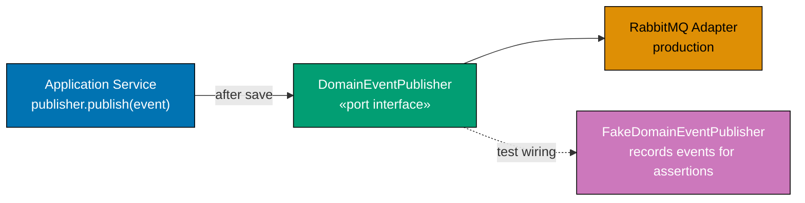

**Java** — event publishing port with fake:

```java
import java.math.BigDecimal;
// => executes the statement above; continues to next line
import java.time.Instant;
// => executes the statement above; continues to next line
import java.util.ArrayList;
// => executes the statement above; continues to next line
import java.util.List;

// ── Domain event base and concrete events ─────────────────────────────────────
interface DomainEvent {}                                          // => marker interface; no broker type
// => interface DomainEvent: contract definition — no implementation details here

record OrderId(String value) {}
// => record OrderId: immutable value type; equals/hashCode/toString generated by compiler
record OrderPlaced(OrderId orderId, BigDecimal total, Instant placedAt) implements DomainEvent {}
// => OrderPlaced: concrete event; carries everything a subscriber needs
record OrderShipped(OrderId orderId, String trackingNumber, Instant shippedAt) implements DomainEvent {}
// => OrderShipped: separate event; different subscribers react to it

// ── Event publishing port ─────────────────────────────────────────────────────
// Interface in application zone; RabbitMQ/Kafka adapter in adapter zone
// => Application service does not know or care about the broker topology
interface DomainEventPublisher {
// => interface DomainEventPublisher: contract definition — no implementation details here
    void publish(DomainEvent event); // => fire-and-forget; adapter handles routing/serialisation
    // => In transactional outbox pattern: publish writes to outbox table; relay sends to broker
}

// ── Test adapter: records published events ────────────────────────────────────
class FakeDomainEventPublisher implements DomainEventPublisher {
// => FakeDomainEventPublisher implements DomainEventPublisher — satisfies the port contract
    private final List<DomainEvent> published = new ArrayList<>(); // => in-order list of published events
    // => published: List<DomainEvent> — final field; assigned once in constructor; immutable reference

    @Override
    // => @Override: compiler verifies this method signature matches the interface
    public void publish(DomainEvent event) { published.add(event); }
    // => Records event; no serialisation; no broker; instant

    public List<DomainEvent> publishedEvents() { return List.copyOf(published); }
    // => Immutable view; test asserts on size and content
}

// ── Application service: saves order then publishes event ─────────────────────
class PlaceOrderService {
// => class PlaceOrderService: implementation — contains field declarations and methods below
    private final DomainEventPublisher publisher;     // => injected; no broker import here
    // => publisher: DomainEventPublisher — final field; assigned once in constructor; immutable reference
    PlaceOrderService(DomainEventPublisher p) { this.publisher = p; }
    // => method call: delegates to collaborator; result captured above

    void placeOrder(String orderId, BigDecimal total) {
    // => placeOrder: method entry point — see implementation below
        publisher.publish(new OrderPlaced(            // => publish event after save
        // => method call: delegates to collaborator; result captured above
            new OrderId(orderId), total, Instant.now()
            // => executes the statement above; continues to next line
        ));
        // => Event published last: order persisted before event goes out
    }
}

// ── Test ──────────────────────────────────────────────────────────────────────
var publisher = new FakeDomainEventPublisher();       // => test adapter
// => publisher: holds the result of the expression on the right
var service   = new PlaceOrderService(publisher);     // => inject
// => service: holds the result of the expression on the right
service.placeOrder("O1", new BigDecimal("99"));       // => invoke
// => method call: delegates to collaborator; result captured above

assert publisher.publishedEvents().size() == 1;       // => exactly one event published
// => method call: delegates to collaborator; result captured above
assert publisher.publishedEvents().get(0) instanceof OrderPlaced; // => correct event type
// => method call: delegates to collaborator; result captured above
var event = (OrderPlaced) publisher.publishedEvents().get(0);
// => event: holds the result of the expression on the right
assert event.orderId().value().equals("O1");          // => event carries correct order id
// => method call: delegates to collaborator; result captured above
```

**Kotlin** — event publishing port:

```kotlin
import java.math.BigDecimal                                      // => BigDecimal for totals
// => executes the statement above; continues to next line
import java.time.Instant                                         // => Instant for timestamps
// => executes the statement above; continues to next line

interface DomainEvent                                            // => marker interface; no broker type
// => executes the statement above; continues to next line
data class OrderId(val value: String)                            // => typed identity
// => data class OrderId: value type; copy/equals/hashCode/toString auto-generated
data class OrderPlaced(val orderId: OrderId, val total: BigDecimal, val placedAt: Instant) : DomainEvent
// => concrete event; carries all subscriber-needed data; implements DomainEvent
// => placedAt: timestamp at publication; subscribers can replay or audit
data class OrderShipped(val orderId: OrderId, val trackingNumber: String) : DomainEvent
// => separate event; different subscribers react; distinct from OrderPlaced
// => trackingNumber: shipping-specific data; not part of OrderPlaced

fun interface DomainEventPublisher {
// => interface DomainEventPublisher: contract definition — no implementation details here
    fun publish(event: DomainEvent)                              // => SAM; lambda-implementable
    // => Adapter handles routing and serialisation; application zone is unaware
    // => DomainEvent marker: any event type can be published
}

class FakeDomainEventPublisher : DomainEventPublisher {         // => test adapter; captures events
// => class FakeDomainEventPublisher: implementation — contains field declarations and methods below
    val publishedEvents = mutableListOf<DomainEvent>()           // => in-order capture list
    // => publishedEvents: holds the result of the expression on the right

    override fun publish(event: DomainEvent) { publishedEvents += event }
    // => += appends; no network; deterministic; assertion-ready
}

class PlaceOrderService(private val publisher: DomainEventPublisher) {
    // => publisher injected; no Kafka or RabbitMQ import here
    fun placeOrder(orderId: String, total: BigDecimal) {         // => triggers event publication
    // => placeOrder: method entry point — see implementation below
        publisher.publish(OrderPlaced(OrderId(orderId), total, Instant.now()))
        // => Publish after save; subscriber contexts decouple from this service
        // => Instant.now(): timestamp at publication; not from clock port (simplified)
    }
}

val publisher = FakeDomainEventPublisher()                       // => test adapter; no broker
// => publisher: holds the result of the expression on the right
val service   = PlaceOrderService(publisher)                     // => inject fake publisher
// => service: holds the result of the expression on the right
service.placeOrder("O1", BigDecimal("99"))                       // => triggers event publication
// => method call: delegates to collaborator; result captured above

check(publisher.publishedEvents.size == 1)                       // => one event published
// => method call: delegates to collaborator; result captured above
check(publisher.publishedEvents[0] is OrderPlaced)               // => correct event type
// => method call: delegates to collaborator; result captured above
check((publisher.publishedEvents[0] as OrderPlaced).orderId.value == "O1")
// => event carries correct order id
```

**C#** — event publishing port:

```csharp
using System;                                                         // => DateTimeOffset
// => executes the statement above; continues to next line
using System.Collections.Generic;                                     // => List
// => executes the statement above; continues to next line

public interface IDomainEvent {}                                 // => marker interface; no broker type
// => interface IDomainEvent: contract definition — no implementation details here
public record OrderId(string Value);                             // => typed order identity
// => executes the statement above; continues to next line
public record OrderPlaced(OrderId OrderId, decimal Total, DateTimeOffset PlacedAt) : IDomainEvent;
// => concrete event; carries all data a subscriber needs
public record OrderShipped(OrderId OrderId, string TrackingNumber) : IDomainEvent;
// => separate event; different subscribers react

public interface IDomainEventPublisher  // => application zone; no Service Bus import
// => executes the statement above; continues to next line
{
// => operation completes; execution continues to next statement
    void Publish(IDomainEvent domainEvent);  // => fire-and-forget; adapter handles delivery
    // => Application zone interface; Azure Service Bus / RabbitMQ adapter in adapter zone
    // => Application service calls this after saving; does not know the broker topology
}
// => operation completes; execution continues to next statement

public class FakeDomainEventPublisher : IDomainEventPublisher  // => test adapter; no broker
// => executes the statement above; continues to next line
{
// => operation completes; execution continues to next statement
    public List<IDomainEvent> PublishedEvents { get; } = new();  // => captured for assertion
    // => List exposed for test assertions; PublishedEvents[0] is OrderPlaced etc.

    public void Publish(IDomainEvent domainEvent) => PublishedEvents.Add(domainEvent);
    // => Append to list; no serialisation; no broker; instant; deterministic
}
// => operation completes; execution continues to next statement

public class PlaceOrderService(IDomainEventPublisher publisher)  // => publisher injected
// => executes the statement above; continues to next line
{                                                                // => publisher injected; no Service Bus import
// => executes the statement above; continues to next line
    public void PlaceOrder(string orderId, decimal total) =>     // => expression body; publishes event
    // => executes the statement above; continues to next line
        publisher.Publish(new OrderPlaced(new OrderId(orderId), total, DateTimeOffset.UtcNow));
    // => publish after save; subscriber contexts decouple from this service
    // => DateTimeOffset.UtcNow: timestamp at publication
}

var publisher = new FakeDomainEventPublisher();                  // => test adapter; no broker
// => publisher: holds the result of the expression on the right
var service   = new PlaceOrderService(publisher);                // => inject fake publisher
// => service: holds the result of the expression on the right
service.PlaceOrder("O1", 99m);                                   // => triggers event publication
// => method call: delegates to collaborator; result captured above

System.Diagnostics.Debug.Assert(publisher.PublishedEvents.Count == 1);  // => one event published
// => exactly one call to Publish; not zero, not two
System.Diagnostics.Debug.Assert(publisher.PublishedEvents[0] is OrderPlaced);
// => correct event type; OrderShipped would fail this check
```

**Key Takeaway**: `DomainEventPublisher` decouples the application service from any message broker. The fake publisher records events in a list, making event publication a first-class assertable outcome of every use case test.

**Why It Matters**: Without an event publishing port, tests either start a full RabbitMQ container (slow, fragile) or call nothing (events go untested). A fake publisher gives you fast, reliable event publication assertions in every application-level test, ensuring that domain events are consistently emitted as part of the command handling contract — a guarantee impossible to make without a dedicated port.

---

### Example 37: Retry decorator adapter

A `RetryOrderRepository` wraps another `OrderRepository` with retry logic. The application service's constructor receives `OrderRepository` — it does not know if the instance has retry logic or not. Retry is an infrastructure concern that belongs in the adapter layer, never in the application service.

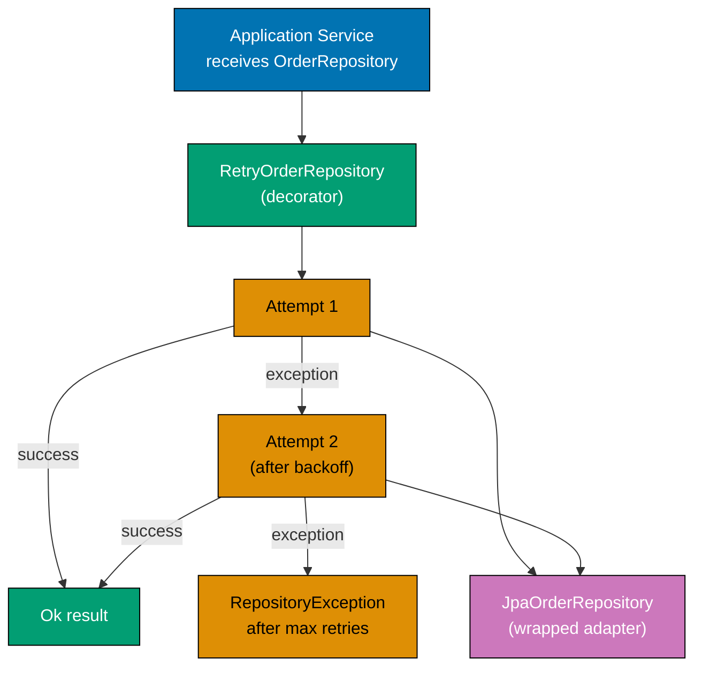

**Java** — retry decorator:

```java
import java.math.BigDecimal;                          // => BigDecimal for monetary amounts
// => executes the statement above; continues to next line
import java.util.Optional;                            // => Optional: no-null contract for findById

// ── Domain types ──────────────────────────────────────────────────────────────
record OrderId(String value) {}                       // => typed identity wrapper; not raw String
// => record OrderId: immutable value type; equals/hashCode/toString generated by compiler
record Order(OrderId id, BigDecimal total) {}         // => minimal aggregate for retry demo

// => OrderRepository: application zone port; retry decorator and real adapter both implement it
interface OrderRepository {
// => interface OrderRepository: contract definition — no implementation details here
    Optional<Order> findById(OrderId id); // => may throw on transient DB error
    // => executes the statement above; continues to next line
    void save(Order order);               // => may throw on transient DB error
    // => executes the statement above; continues to next line
}

// ── Retry decorator: wraps any OrderRepository ────────────────────────────────
// => Decorator pattern: wraps delegate; application service receives OrderRepository; unaware of retry
class RetryOrderRepository implements OrderRepository { // => implements same port as real adapter
// => RetryOrderRepository implements OrderRepository — satisfies the port contract
    private final OrderRepository delegate;   // => the actual repository being wrapped
    // => delegate: OrderRepository — final field; assigned once in constructor; immutable reference
    private final int maxAttempts;            // => total number of tries including the first
    // => maxAttempts: int — final field; assigned once in constructor; immutable reference

    RetryOrderRepository(OrderRepository delegate, int maxAttempts) { // => constructor injection
    // => constructor: receives all dependencies — enables testing with any adapter implementation
        this.delegate    = delegate;          // => store delegate; retry wraps any impl
        // => this.delegate stored — field holds injected delegate for method calls below
        this.maxAttempts = maxAttempts;       // => 3 = 1 initial + 2 retries
        // => this.maxAttempts stored — field holds injected maxAttempts for method calls below
    }
    // => operation completes; execution continues to next statement

    @Override                                 // => implements findById; adds retry around delegate call
    // => @Override: compiler verifies this method signature matches the interface
    public Optional<Order> findById(OrderId id) {
    // => executes the statement above; continues to next line
        return withRetry(() -> delegate.findById(id)); // => delegate call wrapped in retry
        // => returns the result to the caller — caller receives this value
    }                                         // => Optional.empty() propagated if delegate returns empty
    // => method call: delegates to collaborator; result captured above

    @Override                                 // => implements save; adds retry around void delegate call
    // => @Override: compiler verifies this method signature matches the interface
    public void save(Order order) {
    // => save: method entry point — see implementation below
        withRetry(() -> { delegate.save(order); return null; }); // => void wrapped in Callable<Void>
        // => method call: delegates to collaborator; result captured above
    }                                         // => null return discarded; side effect is the goal
    // => executes the statement above; continues to next line

    private <T> T withRetry(java.util.concurrent.Callable<T> action) { // => generic retry: works for any return type
    // => method call: delegates to collaborator; result captured above
        RuntimeException last = null;                // => last exception; rethrown after all retries
        // => last: holds the result of the expression on the right
        for (int attempt = 1; attempt <= maxAttempts; attempt++) { // => attempt 1, 2, 3
        // => iteration: processes each element in the collection
            try {
            // => exception handling: wraps operation that may fail
                return action.call();                // => attempt the operation; return on success
                // => returns the result to the caller — caller receives this value
            } catch (RuntimeException e) {           // => unchecked: transient DB or network error
            // => executes the statement above; continues to next line
                last = e;                            // => capture; continue retry loop
                // => executes the statement above; continues to next line
                System.out.println("Retry attempt " + attempt + " failed: " + e.getMessage()); // => log failure
                // => In production: add Thread.sleep(backoff(attempt)) for exponential backoff
            } catch (Exception e) {                  // => checked: wrap and propagate immediately
            // => executes the statement above; continues to next line
                throw new RuntimeException(e);       // => checked exception re-wrapped as unchecked
                // => throws RuntimeException — guard condition failed; caller must handle this error path
            }
            // => operation completes; execution continues to next statement
        }
        // => operation completes; execution continues to next statement
        throw last;                                  // => all retries exhausted; propagate last error
        // => throws exception — guard condition failed; caller must handle this error path
    }                                                // => caller receives exception after maxAttempts tries
    // => executes the statement above; continues to next line
}

// ── Simulated flaky adapter ───────────────────────────────────────────────────
// => AlwaysFailRepo: test helper that fails first N-1 calls then succeeds
class AlwaysFailRepo implements OrderRepository {    // => implements same port; used in test below
// => AlwaysFailRepo implements OrderRepository — satisfies the port contract
    private int callCount = 0;                       // => mutable counter tracks invocation number
    // => callCount: int — injected dependency; implementation chosen at wiring time
    @Override                                        // => implements findById; fails then succeeds
    // => @Override: compiler verifies this method signature matches the interface
    public Optional<Order> findById(OrderId id) {
    // => executes the statement above; continues to next line
        callCount++;                                 // => increment on each call
        // => executes the statement above; continues to next line
        if (callCount < 3) throw new RuntimeException("transient error #" + callCount); // => fail first 2 calls
        // => Fail first 2 calls; succeed on 3rd — simulates transient DB unavailability
        return Optional.of(new Order(id, new BigDecimal("50"))); // => third call returns order
        // => returns the result to the caller — caller receives this value
    }
    // => operation completes; execution continues to next statement
    @Override public void save(Order o) {}           // => no-op; not needed for retry test
    // => @Override: compiler verifies this method signature matches the interface
}

var rawRepo    = new AlwaysFailRepo();                 // => raw adapter; fails twice
// => rawRepo: holds the result of the expression on the right
var retryRepo  = new RetryOrderRepository(rawRepo, 3); // => wrapped with 3 attempts
// => retryRepo: holds the result of the expression on the right
var result     = retryRepo.findById(new OrderId("O1")); // => triggers 2 failures then success
// => result: holds the result of the expression on the right
assert result.isPresent();                             // => result present after retry; service unaware of failures
// => method call: delegates to collaborator; result captured above
```

**Kotlin** — retry decorator:

```kotlin
import java.math.BigDecimal                                          // => BigDecimal import for amounts
// => executes the statement above; continues to next line

data class OrderId(val value: String)                                // => typed identity; not raw String
// => data class OrderId: value type; copy/equals/hashCode/toString auto-generated
data class Order(val id: OrderId, val total: BigDecimal)             // => minimal aggregate; sufficient for retry demo
// => data class Order: value type; copy/equals/hashCode/toString auto-generated

interface OrderRepository {                                          // => application zone; no DB types
// => interface OrderRepository: contract definition — no implementation details here
    fun findById(id: OrderId): Order?  // => may throw RuntimeException on transient error
    // => executes the statement above; continues to next line
    fun save(order: Order)             // => persists aggregate; may throw transiently
    // => Retry decorator implements this same interface; application service unaware
}
// => operation completes; execution continues to next statement

class RetryOrderRepository(                                          // => decorator; implements OrderRepository
// => executes the statement above; continues to next line
    private val delegate: OrderRepository, // => wrapped repository; any OrderRepository impl
    // => executes the statement above; continues to next line
    private val maxAttempts: Int = 3       // => default 3 attempts; configurable
    // => executes the statement above; continues to next line
) : OrderRepository {                                                // => implements same interface as delegate
// => as implements same interface as delegate — satisfies the port contract

    override fun findById(id: OrderId): Order? = withRetry { delegate.findById(id) } // => delegate + retry
    // => Higher-order function withRetry wraps the lambda transparently
    // => Returns Order? (nullable); null propagated if delegate returns null on success
    override fun save(order: Order) { withRetry { delegate.save(order) } } // => delegate + retry
    // => save wrapped in lambda; withRetry handles Unit return
    // => Unit return: Kotlin allows void-equivalent in lambda; withRetry ignores return

    private fun <T> withRetry(action: () -> T): T {                 // => generic; T = return type
    // => executes the statement above; continues to next line
        var lastException: RuntimeException? = null         // => track last failure
        // => executes the statement above; continues to next line
        repeat(maxAttempts) { attempt ->                    // => 0-indexed; attempt 0..n-1
        // => method call: delegates to collaborator; result captured above
            try { return action() }                         // => attempt; return on success
            // => exception handling: wraps operation that may fail
            catch (e: RuntimeException) {
            // => exception handling: wraps operation that may fail
                lastException = e                           // => capture; continue to next
                // => executes the statement above; continues to next line
                println("Retry ${attempt + 1} failed: ${e.message}")
                // => In production: add delay here for exponential backoff
                // => attempt+1: converts 0-indexed to 1-indexed for human-readable log
            }
            // => operation completes; execution continues to next statement
        }
        // => operation completes; execution continues to next statement
        throw lastException!!                               // => !! safe: set in catch block
        // => lastException is non-null: at least one iteration; exception was caught
    }
    // => operation completes; execution continues to next statement
}

class FlakyRepo : OrderRepository {                                  // => simulates transient failures
// => class FlakyRepo: implementation — contains field declarations and methods below
    private var calls = 0                                            // => mutable call counter
    // => calls: var — injected dependency; implementation chosen at wiring time
    override fun findById(id: OrderId): Order? {                     // => implements port; fails first 2 calls
    // => findById: method entry point — see implementation below
        calls++                                                      // => increment per call
        // => executes the statement above; continues to next line
        if (calls < 3) throw RuntimeException("transient #$calls")  // => fail first 2
        // => conditional branch: execution path depends on condition above
        return Order(id, java.math.BigDecimal("50"))                 // => succeed on 3rd
        // => returns the result to the caller — caller receives this value
    }
    override fun save(order: Order) {}                               // => no-op for this example
    // => save: method entry point — see implementation below
}

val result = RetryOrderRepository(FlakyRepo(), maxAttempts = 3).findById(OrderId("O1"))
// => wraps FlakyRepo with 3 attempts; first two fail; third succeeds
// => RetryOrderRepository(FlakyRepo(), ...): inline construction; no variable needed
check(result != null)                                                // => succeeded after 2 retries
// => executes the statement above; continues to next line
```

**C#** — retry decorator:

```csharp
using System;                                                         // => System namespace import
// => executes the statement above; continues to next line

public record OrderId(string Value);                                  // => typed identity; init-only after creation
// => executes the statement above; continues to next line
public record Order(OrderId Id, decimal Total);                       // => minimal aggregate record; immutable
// => executes the statement above; continues to next line

public interface IOrderRepository  // => application zone; no DB types
// => executes the statement above; continues to next line
{                                                                     // => output port interface
// => interface type: contract definition — no implementation details here
    Order? FindById(OrderId id);                                      // => null = not found
    // => executes the statement above; continues to next line
    void Save(Order order);                                           // => persist aggregate
    // => RetryOrderRepository implements this same interface; transparent to callers
}
// => operation completes; execution continues to next statement

public class RetryOrderRepository(IOrderRepository inner, int maxAttempts = 3) : IOrderRepository // => decorator
// => decorator; wraps any IOrderRepository with retry logic
{                                                                     // => primary constructor captures inner and maxAttempts
// => executes the statement above; continues to next line
    public Order? FindById(OrderId id) => WithRetry(() => inner.FindById(id)); // => delegate + retry
    // => Delegates to inner; wraps call in retry loop transparently
    public void Save(Order order) => WithRetry<object?>(() => { inner.Save(order); return null; }); // => delegate + retry
    // => void Save wrapped in Func<T> by returning null; retry loop handles uniformly

    private T WithRetry<T>(Func<T> action)  // => generic; T = return type of action
    // => executes the statement above; continues to next line
    {                                                                 // => generic retry helper; T = return type
    // => executes the statement above; continues to next line
        Exception? last = null;                                       // => last exception; rethrown if all fail
        // => executes the statement above; continues to next line
        for (int attempt = 1; attempt <= maxAttempts; attempt++)      // => attempt 1..maxAttempts
        // => iteration: processes each element in the collection
        {                                                             // => loop: attempt 1 .. maxAttempts
        // => executes the statement above; continues to next line
            try { return action(); }                                  // => invoke; return immediately on success
            // => exception handling: wraps operation that may fail
            catch (Exception ex)
            // => exception handling: wraps operation that may fail
            {                                                         // => catch any exception; track and continue
            // => executes the statement above; continues to next line
                last = ex;                                            // => capture for final rethrow
                // => executes the statement above; continues to next line
                Console.WriteLine($"Retry {attempt} failed: {ex.Message}"); // => log failure; continue
                // => In production: Thread.Sleep(ExponentialBackoff(attempt))
                // => $"Retry {attempt}": 1-indexed; human-readable log
            }
            // => operation completes; execution continues to next statement
        }
        // => operation completes; execution continues to next statement
        throw last!;                                                  // => exhausted; rethrow last exception
        // => last! non-null-forgiving: safe because at least one catch executed
    }
    // => operation completes; execution continues to next statement
}
// => operation completes; execution continues to next statement

public class FlakyRepository : IOrderRepository  // => simulates transient failures in tests
// => executes the statement above; continues to next line
{                                                                     // => simulates transient failures
// => executes the statement above; continues to next line
    private int _calls;                                               // => call counter; starts at 0
    // => _calls: int — injected dependency; implementation chosen at wiring time
    public Order? FindById(OrderId id)                                // => fails first two calls
    // => executes the statement above; continues to next line
    {                                                                 // => fails first two calls
    // => executes the statement above; continues to next line
        _calls++;                                                     // => increment on each invocation
        // => executes the statement above; continues to next line
        if (_calls < 3) throw new InvalidOperationException($"transient #{_calls}"); // => fail 1+2
        // => Fails twice; succeeds on third call
        return new Order(id, 50m);                                    // => success on 3rd call
        // => returns the result to the caller — caller receives this value
    }
    // => operation completes; execution continues to next statement
    public void Save(Order order) {}                                  // => no-op for this example
    // => Save: method entry point — see implementation below
}
// => operation completes; execution continues to next statement

var repo   = new RetryOrderRepository(new FlakyRepository(), maxAttempts: 3); // => retry wraps flaky
// => retry wrapper with 3 attempts around flaky repo
var result = repo.FindById(new OrderId("O1"));                        // => triggers 2 failures then success
// => result: holds the result of the expression on the right
System.Diagnostics.Debug.Assert(result is not null);                  // => result present after retry
// => method call: delegates to collaborator; result captured above
```

**Key Takeaway**: The retry decorator wraps any `OrderRepository` implementation transparently. The application service is injected with `OrderRepository` — it cannot tell and should not care whether retry logic is active. Retry belongs in the adapter layer, not in business logic.

**Why It Matters**: When retry logic is placed in the application service, it mixes infrastructure concerns with business logic, makes the service harder to test, and couples it to specific retry policies that may need to change. A decorator adapter keeps retry policy out of the service and makes it independently testable and replaceable.

---

### Example 38: Circuit breaker adapter wrapper

A `CircuitBreakerPaymentGateway` wraps `PaymentGatewayPort` and opens after 5 consecutive failures, returning `PaymentError.CircuitOpen` without calling the real gateway. The state machine cycles through `CLOSED → OPEN → HALF_OPEN → CLOSED`.

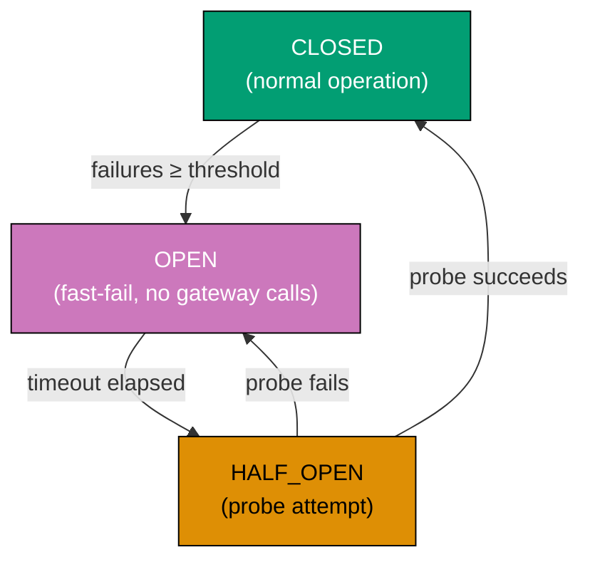

**Java** — circuit breaker state machine:

```java
import java.math.BigDecimal;                          // => BigDecimal: monetary amounts
// => executes the statement above; continues to next line
import java.time.Instant;                             // => Instant: timestamp for circuit open time

// ── Minimal domain types ──────────────────────────────────────────────────────
record OrderId(String value) {}                       // => typed identity; not raw String
// => record OrderId: immutable value type; equals/hashCode/toString generated by compiler
record PaymentRequest(OrderId orderId, BigDecimal amount, String currency) {} // => three fields
// => record PaymentRequest: immutable value type; equals/hashCode/toString generated by compiler
record PaymentAuthorisation(String code, BigDecimal amount) {} // => success value from gateway

// => sealed PaymentError: two subtypes; switch must handle both
sealed interface PaymentError permits
// => executes the statement above; continues to next line
    PaymentError.GatewayUnavailable, PaymentError.CircuitOpen { // => two error kinds
    // => executes the statement above; continues to next line
    record GatewayUnavailable() implements PaymentError {}  // => real gateway failure
    // => GatewayUnavailable implements PaymentError — satisfies the port contract
    record CircuitOpen()        implements PaymentError {} // => new: circuit is open; not calling inner
    // => CircuitOpen implements PaymentError — satisfies the port contract
}

// => sealed PaymentResult: Ok carries authorisation; Err carries typed error
sealed interface PaymentResult permits PaymentResult.Ok, PaymentResult.Err {
// => interface PaymentResult: contract definition — no implementation details here
    record Ok(PaymentAuthorisation auth)  implements PaymentResult {} // => success variant
    // => Ok implements PaymentResult — satisfies the port contract
    record Err(PaymentError error)        implements PaymentResult {} // => failure variant
    // => Err implements PaymentResult — satisfies the port contract
}

// => single-method port; application service calls this; unaware of circuit state
interface PaymentGatewayPort { PaymentResult authorise(PaymentRequest request); }
// => interface PaymentGatewayPort: contract definition — no implementation details here

enum CircuitState { CLOSED, OPEN, HALF_OPEN }         // => three-state machine
// => CLOSED: normal; OPEN: fast-fail; HALF_OPEN: one probe call allowed

// => CircuitBreakerPaymentGateway: decorator; wraps real gateway; implements same port
class CircuitBreakerPaymentGateway implements PaymentGatewayPort {
// => CircuitBreakerPaymentGateway implements PaymentGatewayPort — satisfies the port contract
    private final PaymentGatewayPort inner;      // => wrapped real gateway
    // => inner: PaymentGatewayPort — final field; assigned once in constructor; immutable reference
    private final int  failureThreshold;          // => consecutive failures before opening
    // => failureThreshold: int — final field; assigned once in constructor; immutable reference
    private final long openDurationMillis;        // => time in OPEN state before HALF_OPEN
    // => openDurationMillis: long — final field; assigned once in constructor; immutable reference

    private CircuitState state    = CircuitState.CLOSED; // => initial state: normal
    // => state: CircuitState — injected dependency; implementation chosen at wiring time
    private int          failures = 0;                   // => consecutive failure count
    // => failures: int — injected dependency; implementation chosen at wiring time
    private Instant      openedAt = null;                // => when circuit opened; null until first open
    // => openedAt: Instant — injected dependency; implementation chosen at wiring time

    CircuitBreakerPaymentGateway(PaymentGatewayPort inner, int threshold, long openDurationMs) { // => constructor
    // => constructor: receives all dependencies — enables testing with any adapter implementation
        this.inner              = inner;              // => stored; called in call() and probe()
        // => this.inner stored — field holds injected inner for method calls below
        this.failureThreshold   = threshold;          // => e.g. 3: open after 3 consecutive failures
        // => this.failureThreshold stored — field holds injected threshold for method calls below
        this.openDurationMillis = openDurationMs;     // => e.g. 100ms for tests; 30000ms in production
        // => this.openDurationMillis stored — field holds injected openDurationMs for method calls below
    }
    // => operation completes; execution continues to next statement

    @Override                                         // => implements PaymentGatewayPort.authorise
    // => @Override: compiler verifies this method signature matches the interface
    public synchronized PaymentResult authorise(PaymentRequest request) { // => synchronized: thread-safe state machine
    // => executes the statement above; continues to next line
        return switch (state) {                       // => dispatch on current circuit state
        // => returns the result to the caller — caller receives this value
            case OPEN -> {                            // => OPEN: fast-fail unless timeout elapsed
            // => executes the statement above; continues to next line
                if (Instant.now().isAfter(openedAt.plusMillis(openDurationMillis))) { // => timeout elapsed?
                // => conditional branch: execution path depends on condition above
                    state = CircuitState.HALF_OPEN;  // => timeout elapsed; allow one probe
                    // => executes the statement above; continues to next line
                    yield probe(request);             // => one probe call; determines next state
                    // => executes the statement above; continues to next line
                } else {
                // => conditional branch: execution path depends on condition above
                    yield new PaymentResult.Err(new PaymentError.CircuitOpen()); // => fast fail; no inner call
                    // => No call to inner; caller receives CircuitOpen immediately
                }
                // => operation completes; execution continues to next statement
            }
            // => operation completes; execution continues to next statement
            case HALF_OPEN -> probe(request);        // => one probe; success closes; failure re-opens
            // => executes the statement above; continues to next line
            case CLOSED    -> call(request);          // => normal operation; track failures
            // => executes the statement above; continues to next line
        };
        // => operation completes; execution continues to next statement
    }
    // => operation completes; execution continues to next statement

    private PaymentResult call(PaymentRequest req) { // => CLOSED state: call inner and track failures
    // => call: method entry point — see implementation below
        var result = inner.authorise(req);            // => calls real gateway; may fail
        // => result: holds the result of the expression on the right
        if (result instanceof PaymentResult.Err) {    // => failure: count consecutive failures
        // => conditional branch: execution path depends on condition above
            failures++;                              // => increment consecutive failure count
            // => executes the statement above; continues to next line
            if (failures >= failureThreshold) {       // => threshold reached?
            // => conditional branch: execution path depends on condition above
                state    = CircuitState.OPEN;        // => threshold reached: open circuit
                // => executes the statement above; continues to next line
                openedAt = Instant.now();            // => record when opened
                // => method call: delegates to collaborator; result captured above
                failures = 0;                        // => reset for next HALF_OPEN probe
                // => executes the statement above; continues to next line
            }
            // => operation completes; execution continues to next statement
        } else {                                      // => success: reset failure count
        // => conditional branch: execution path depends on condition above
            failures = 0;                            // => success: reset consecutive failures
            // => executes the statement above; continues to next line
        }
        // => operation completes; execution continues to next statement
        return result;                                // => return real gateway result to caller
        // => returns the result to the caller — caller receives this value
    }
    // => operation completes; execution continues to next statement

    private PaymentResult probe(PaymentRequest req) { // => HALF_OPEN state: single probe call
    // => probe: method entry point — see implementation below
        var result = inner.authorise(req);            // => one real call; determines next state
        // => result: holds the result of the expression on the right
        if (result instanceof PaymentResult.Ok) {     // => probe succeeded
        // => conditional branch: execution path depends on condition above
            state    = CircuitState.CLOSED;          // => probe succeeded: close circuit
            // => executes the statement above; continues to next line
            failures = 0;                             // => reset failure count
            // => executes the statement above; continues to next line
        } else {                                      // => probe failed
        // => conditional branch: execution path depends on condition above
            state    = CircuitState.OPEN;            // => probe failed: re-open circuit
            // => executes the statement above; continues to next line
            openedAt = Instant.now();                 // => update open timestamp
            // => method call: delegates to collaborator; result captured above
        }
        // => operation completes; execution continues to next statement
        return result;                                // => return probe result to caller
        // => returns the result to the caller — caller receives this value
    }
    // => operation completes; execution continues to next statement
}

// ── Usage ─────────────────────────────────────────────────────────────────────
// => AlwaysFailGateway: test helper that always returns GatewayUnavailable
class AlwaysFailGateway implements PaymentGatewayPort { // => always fails; used to trigger circuit open
// => AlwaysFailGateway implements PaymentGatewayPort — satisfies the port contract
    @Override public PaymentResult authorise(PaymentRequest r) { // => @Override: compiler check
    // => @Override: compiler verifies this method signature matches the interface
        return new PaymentResult.Err(new PaymentError.GatewayUnavailable()); // => always failure
        // => returns the result to the caller — caller receives this value
    }
    // => operation completes; execution continues to next statement
}

var circuit = new CircuitBreakerPaymentGateway(new AlwaysFailGateway(), 3, 100L); // => threshold=3, open=100ms
// => circuit: holds the result of the expression on the right
var req     = new PaymentRequest(new OrderId("O1"), new BigDecimal("50"), "USD"); // => test payment request
// => req: holds the result of the expression on the right

circuit.authorise(req); circuit.authorise(req); circuit.authorise(req); // => three consecutive failures
// => 3 failures; state transitions to OPEN after third failure

var r4 = circuit.authorise(req);  // => circuit OPEN; inner not called; fast-fail returns
// => r4: holds the result of the expression on the right
assert r4 instanceof PaymentResult.Err e && e.error() instanceof PaymentError.CircuitOpen; // => CircuitOpen
// => CircuitOpen returned immediately; no network call; inner gateway protected
```

**Kotlin** — circuit breaker:

```kotlin
import java.math.BigDecimal                                          // => BigDecimal import
// => executes the statement above; continues to next line
import java.time.Instant                                             // => Instant for time tracking
// => executes the statement above; continues to next line

data class OrderId(val value: String)                                // => typed identity
// => data class OrderId: value type; copy/equals/hashCode/toString auto-generated
data class PaymentRequest(val orderId: OrderId, val amount: BigDecimal, val currency: String)  // => payment DTO
// => request value object; carries all payment info; immutable
data class PaymentAuthorisation(val code: String, val amount: BigDecimal)  // => success result
// => success result; carries authorization code; code from gateway response; immutable

sealed class PaymentError {                                          // => sealed: when is exhaustive
// => class PaymentError: implementation — contains field declarations and methods below
    object GatewayUnavailable : PaymentError()                       // => real failure from gateway
    // => executes the statement above; continues to next line
    object CircuitOpen        : PaymentError()    // => fast-fail when circuit is open
    // => both are object (singleton); no fields needed; presence signals the error type
}
// => operation completes; execution continues to next statement
sealed class PaymentResult {                                         // => discriminated union
// => class PaymentResult: implementation — contains field declarations and methods below
    data class Ok(val auth: PaymentAuthorisation) : PaymentResult()  // => success variant
    // => data class Ok: value type; copy/equals/hashCode/toString auto-generated
    data class Err(val error: PaymentError)       : PaymentResult()  // => failure variant
    // => data class Err: value type; copy/equals/hashCode/toString auto-generated
}
// => operation completes; execution continues to next statement

enum class CircuitState { CLOSED, OPEN, HALF_OPEN }  // => state machine states
// => CLOSED: normal; OPEN: fast-fail; HALF_OPEN: one probe call

fun interface PaymentGatewayPort { fun authorise(request: PaymentRequest): PaymentResult } // => SAM; application zone
// => SAM interface; lambda implementation allowed; application zone
// => CircuitBreakerPaymentGateway implements this; application service unaware of circuit state

class CircuitBreakerPaymentGateway(                                  // => decorator; wraps inner gateway
// => executes the statement above; continues to next line
    private val inner: PaymentGatewayPort,         // => wrapped real gateway
    // => executes the statement above; continues to next line
    private val threshold: Int   = 5,              // => consecutive failures before opening
    // => executes the statement above; continues to next line
    private val openDurationMs: Long = 30_000L     // => ms in OPEN state before HALF_OPEN
    // => executes the statement above; continues to next line
) : PaymentGatewayPort {                                             // => implements same interface as inner
// => as implements same interface as inner — satisfies the port contract
    @Volatile private var state    = CircuitState.CLOSED  // => @Volatile: visibility across threads
    // => annotation marks metadata for framework or compiler
    @Volatile private var failures = 0                    // => consecutive failure count; reset on success
    // => annotation marks metadata for framework or compiler
    @Volatile private var openedAt: Instant? = null       // => when circuit opened; null if closed
    // => annotation marks metadata for framework or compiler

    override fun authorise(request: PaymentRequest): PaymentResult = synchronized(this) { // => thread-safe
        // => synchronized: thread-safe state transitions
        when (state) {                                               // => dispatch on current circuit state
        // => pattern match: exhaustive dispatch on all possible cases
            CircuitState.OPEN -> {                                   // => open: check timeout or fast-fail
            // => executes the statement above; continues to next line
                val elapsed = openedAt?.let { Instant.now().toEpochMilli() - it.toEpochMilli() } ?: Long.MAX_VALUE
                // => elapsed ms since circuit opened; MAX_VALUE if openedAt null
                if (elapsed > openDurationMs) { state = CircuitState.HALF_OPEN; probe(request) }
                // => timeout elapsed: transition to HALF_OPEN; send one probe
                else PaymentResult.Err(PaymentError.CircuitOpen)  // => fast fail; no inner call
                // => method call: delegates to collaborator; result captured above
            }
            // => operation completes; execution continues to next statement
            CircuitState.HALF_OPEN -> probe(request)             // => one probe; success closes; failure re-opens
            // => method call: delegates to collaborator; result captured above
            CircuitState.CLOSED    -> call(request)              // => normal; track failures
            // => method call: delegates to collaborator; result captured above
        }
        // => operation completes; execution continues to next statement
    }
    // => operation completes; execution continues to next statement

    private fun call(req: PaymentRequest): PaymentResult {          // => normal operation; CLOSED state
    // => call: method entry point — see implementation below
        val result = inner.authorise(req)                        // => delegate to real gateway
        // => result: holds the result of the expression on the right
        if (result is PaymentResult.Err) {                       // => failure: increment counter
        // => conditional branch: execution path depends on condition above
            failures++                                           // => consecutive failure count up
            // => executes the statement above; continues to next line
            if (failures >= threshold) { state = CircuitState.OPEN; openedAt = Instant.now(); failures = 0 }
            // => threshold reached: open circuit; record when; reset counter
        } else failures = 0                                      // => success: reset consecutive count
        // => conditional branch: execution path depends on condition above
        return result                                            // => return result to caller
        // => returns the result to the caller — caller receives this value
    }
    // => operation completes; execution continues to next statement

    private fun probe(req: PaymentRequest): PaymentResult {      // => one probe; HALF_OPEN state
    // => probe: method entry point — see implementation below
        val result = inner.authorise(req)                        // => one probe call to inner
        // => result: holds the result of the expression on the right
        if (result is PaymentResult.Ok) { state = CircuitState.CLOSED; failures = 0 }
        // => probe succeeded: close circuit; reset failures
        else { state = CircuitState.OPEN; openedAt = Instant.now() }
        // => probe failed: re-open circuit; restart open timer
        return result                                            // => return probe result to caller
        // => returns the result to the caller — caller receives this value
    }
    // => operation completes; execution continues to next statement
}                                                                // => CircuitBreakerPaymentGateway: transparent to application service
// => executes the statement above; continues to next line
```

**C#** — circuit breaker:

```csharp
using System;                                                         // => System namespace import
// => executes the statement above; continues to next line

public record OrderId(string Value);                                  // => typed identity record
// => executes the statement above; continues to next line
public record PaymentRequest(OrderId OrderId, decimal Amount, string Currency);  // => domain DTO
// => immutable request value object; no Stripe type here
public record PaymentAuthorisation(string Code, decimal Amount);      // => success result
// => Code: authorisation code from gateway; Amount: authorised amount; immutable record
public abstract record PaymentError {                                  // => abstract; subtypes only
// => record PaymentError: immutable value type; equals/hashCode/toString generated by compiler
    public record GatewayUnavailable() : PaymentError;                // => real gateway failure
    // => executes the statement above; continues to next line
    public record CircuitOpen()        : PaymentError; // => fast-fail when circuit is open
    // => two subtypes; switch forces exhaustive handling
}
// => operation completes; execution continues to next statement
public abstract record PaymentResult {                                 // => discriminated union
// => record PaymentResult: immutable value type; equals/hashCode/toString generated by compiler
    public record Ok(PaymentAuthorisation Auth) : PaymentResult;      // => success variant
    // => executes the statement above; continues to next line
    public record Err(PaymentError Error)       : PaymentResult;      // => failure variant
    // => switch on PaymentResult forces handling of both Ok and Err
}
// => operation completes; execution continues to next statement

public interface IPaymentGatewayPort { PaymentResult Authorise(PaymentRequest request); } // => output port
// => output port; adapters implement; application service calls
// => single-method SAM; Stripe adapter in prod; circuit breaker wraps it
// => returns PaymentResult; never throws; errors are typed values

public enum CircuitState { Closed, Open, HalfOpen }  // => state machine states
// => Closed: normal; Open: fast-fail; HalfOpen: one probe allowed
// => three-state machine; transitions driven by failure count and timer

public class CircuitBreakerPaymentGateway(
// => executes the statement above; continues to next line
    IPaymentGatewayPort inner, int threshold = 5, int openDurationMs = 30_000  // => config params
    // => executes the statement above; continues to next line
) : IPaymentGatewayPort  // => implements same interface as inner; transparent to callers
// => decorator; wraps any IPaymentGatewayPort with circuit breaking
{                                                                     // => primary constructor; captures all params
// => executes the statement above; continues to next line
    private CircuitState _state    = CircuitState.Closed;  // => initial: normal
    // => _state: CircuitState — injected dependency; implementation chosen at wiring time
    private int          _failures = 0;                    // => consecutive failures; reset on success
    // => _failures: int — injected dependency; implementation chosen at wiring time
    private long         _openedAt = 0;                    // => tick count when opened; TickCount64
    // => _openedAt: long — injected dependency; implementation chosen at wiring time

    public PaymentResult Authorise(PaymentRequest request)  // => route based on circuit state
    // => executes the statement above; continues to next line
    {
    // => operation completes; execution continues to next statement
        lock (this)                                         // => thread-safe state transitions
        // => executes the statement above; continues to next line
        {
        // => operation completes; execution continues to next statement
            return _state switch                            // => switch on current state
            // => returns the result to the caller — caller receives this value
            {
            // => operation completes; execution continues to next statement
                CircuitState.Open     => HandleOpen(request),   // => open: check timeout or fast-fail
                // => method call: delegates to collaborator; result captured above
                CircuitState.HalfOpen => Probe(request),        // => half-open: send one probe
                // => method call: delegates to collaborator; result captured above
                CircuitState.Closed   => Call(request),         // => closed: normal operation
                // => method call: delegates to collaborator; result captured above
                _                     => new PaymentResult.Err(new PaymentError.CircuitOpen())
                // => exhaustive: default fast-fails safely
            };
            // => operation completes; execution continues to next statement
        }
        // => operation completes; execution continues to next statement
    }
    // => operation completes; execution continues to next statement

    private PaymentResult HandleOpen(PaymentRequest req)   // => OPEN state handler
    // => executes the statement above; continues to next line
    {
    // => operation completes; execution continues to next statement
        if (Environment.TickCount64 - _openedAt > openDurationMs)  // => elapsed > timeout?
        // => check if open duration has elapsed
        { _state = CircuitState.HalfOpen; return Probe(req); }  // => transition; send probe
        // => method call: delegates to collaborator; result captured above
        return new PaymentResult.Err(new PaymentError.CircuitOpen()); // => still open; fast fail
        // => returns the result to the caller — caller receives this value
    }
    // => operation completes; execution continues to next statement

    private PaymentResult Call(PaymentRequest req)  // => CLOSED state: normal operation
    // => executes the statement above; continues to next line
    {
    // => operation completes; execution continues to next statement
        var result = inner.Authorise(req);                            // => delegate to real gateway
        // => result: holds the result of the expression on the right
        if (result is PaymentResult.Err) {                            // => failure: track count
        // => conditional branch: execution path depends on condition above
            _failures++;                                              // => consecutive failure up
            // => executes the statement above; continues to next line
            if (_failures >= threshold) { _state = CircuitState.Open; _openedAt = Environment.TickCount64; _failures = 0; }  // => open!
            // => threshold reached: open circuit; record tick; reset counter
        } else _failures = 0;                                         // => success: reset counter
        // => conditional branch: execution path depends on condition above
        return result;                                                // => return result to caller
        // => returns the result to the caller — caller receives this value
    }
    // => operation completes; execution continues to next statement

    private PaymentResult Probe(PaymentRequest req)  // => HALF_OPEN state: single probe
    // => executes the statement above; continues to next line
    {
        var result = inner.Authorise(req);                            // => single probe call to inner
        // => result: holds the result of the expression on the right
        if (result is PaymentResult.Ok) { _state = CircuitState.Closed; _failures = 0; }  // => close circuit
        // => probe succeeded: close circuit; clear failures
        else { _state = CircuitState.Open; _openedAt = Environment.TickCount64; }          // => re-open
        // => probe failed: re-open; restart open timer
        return result;                                                // => return probe result
        // => returns the result to the caller — caller receives this value
    }
}                                                                     // => CircuitBreakerPaymentGateway: transparent to callers
// => application service: injects IPaymentGatewayPort; unaware of state machine
```

**Key Takeaway**: The circuit breaker wraps `PaymentGatewayPort` transparently. The application service calls `PaymentGatewayPort` and receives `PaymentError.CircuitOpen` when the circuit is open — no awareness of the state machine. Circuit breaking belongs in the adapter layer, not in business logic.

**Why It Matters**: A payment gateway under heavy load can cascade failures to every order being placed if the application service retries blindly. A circuit breaker in the adapter layer detects the failure threshold, stops all calls during the open period, and allows a controlled recovery probe — protecting both the gateway and the application from overload while giving callers a typed `CircuitOpen` error they can handle specifically.

---
## Multiple Bounded Contexts and ACL (Examples 39–44)

### Example 39: Multiple bounded contexts as separate hexagons — package structure

Two bounded contexts — `order-taking` and `shipping` — each form their own hexagon: domain, application, and adapter layers. They communicate only through domain events on a message bus. No class from `order-taking` is imported into `shipping` and vice versa.

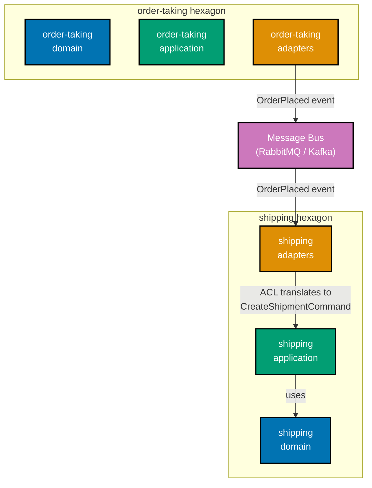

**Java** — two separate hexagonal modules:

```java
// ── order-taking hexagon: domain ──────────────────────────────────────────────
// Package: com.example.ordertaking.domain
// => No import from com.example.shipping.*; contexts are isolated
package com.example.ordertaking.domain;

import java.math.BigDecimal;
import java.time.Instant;

record OrderId(String value) {}           // => typed identity; local to order-taking context
record OrderLine(String productId, int qty, BigDecimal unitPrice) {} // => order-taking concept

// Domain event published by order-taking hexagon
// => Defined in order-taking domain; shipping context deserialises from the bus
record OrderPlaced(OrderId orderId, java.util.List<OrderLine> lines, Instant placedAt) {}

// ── shipping hexagon: domain ──────────────────────────────────────────────────
// Package: com.example.shipping.domain
// => Completely separate from order-taking; no import of ordertaking types
package com.example.shipping.domain;

record ShipmentReference(String value) {} // => shipping context's own typed id; not OrderId
record ShipmentItem(String sku, int quantity) {} // => shipping terminology; not "OrderLine"
// => Shipping context has its own ubiquitous language; "sku" vs "productId"

// Input port for the shipping hexagon
interface CreateShipmentUseCase {
    void createShipment(ShipmentReference ref, java.util.List<ShipmentItem> items);
    // => Command handled by shipping application service; no order-taking type here
}

// ── Message structure ─────────────────────────────────────────────────────────
// Shared over the wire as JSON; neither context imports the other's class
// => Message bus decouples: each side serialises/deserialises independently
// => order-taking publishes JSON; shipping deserialises into its own OrderPlacedMessage type
package com.example.shipping.adapter.in.messaging;

// shipping-side representation of the event received from the bus
// => NOT com.example.ordertaking.domain.OrderPlaced; completely separate class
record OrderPlacedMessage(String orderId, java.util.List<LineMessage> lines, String placedAt) {}
record LineMessage(String productId, int qty, String unitPrice) {}
// => Flat JSON-friendly structure; ACL adapter translates this into shipping domain types
```

**Kotlin** — separate hexagons as Gradle modules:

```kotlin
// order-taking module: build.gradle.kts
// => No dependency on :shipping module; enforced by Gradle module graph
// => dependencies { implementation(project(":shared-kernel")) }

// shipping module: build.gradle.kts
// => No dependency on :order-taking; only on :shared-kernel
// => dependencies { implementation(project(":shared-kernel")) }

// order-taking domain
package com.example.ordertaking.domain

import java.math.BigDecimal                                  // => BigDecimal for monetary values
import java.time.Instant                                     // => Instant for event timestamp

data class OrderId(val value: String)                        // => local to order-taking context
data class OrderLine(val productId: String, val qty: Int, val price: BigDecimal)
// => order-taking's line concept; "productId" is order-taking language
data class OrderPlaced(val orderId: OrderId, val lines: List<OrderLine>, val placedAt: Instant)
// => Published to message bus as JSON; shipping deserialises with its own type

// shipping domain
package com.example.shipping.domain

data class ShipmentReference(val value: String)              // => shipping's own identity type
data class ShipmentItem(val sku: String, val quantity: Int)  // => shipping's own line concept
// => "sku" vs "productId": each context owns its ubiquitous language

interface CreateShipmentUseCase {
    fun createShipment(ref: ShipmentReference, items: List<ShipmentItem>)
    // => Input port; shipping application service implements this
    // => Only ShipmentReference and ShipmentItem here; no OrderId or OrderLine
}

// shipping adapter: receives bus message, translates to shipping domain
package com.example.shipping.adapter.`in`.messaging

// shipping-side event message: separate class from order-taking's OrderPlaced
data class OrderPlacedMessage(val orderId: String, val lines: List<LineMsgDto>, val placedAt: String)
// => Flat JSON-deserialisable DTO; maps to shipping domain via ACL adapter
data class LineMsgDto(val productId: String, val qty: Int, val unitPrice: String)
// => ACL adapter maps this into CreateShipmentUseCase call; see Example 40
```

**C#** — two separate projects:

```csharp
// OrderTaking.Domain project — no ProjectReference to Shipping
// => OrderTaking.csproj: <ProjectReference Include="../SharedKernel/SharedKernel.csproj" />
namespace OrderTaking.Domain;
// => executes the statement above; continues to next line

using System;                                                // => System for DateTimeOffset
// => executes the statement above; continues to next line
using System.Collections.Generic;                           // => IReadOnlyList
// => executes the statement above; continues to next line

public record OrderId(string Value);              // => local to OrderTaking context
// => executes the statement above; continues to next line
public record OrderLine(string ProductId, int Qty, decimal UnitPrice);
// => order-taking's line concept; "ProductId" is order-taking language
public record OrderPlaced(OrderId OrderId, IReadOnlyList<OrderLine> Lines, DateTimeOffset PlacedAt);
// => Domain event; published as JSON to bus; Shipping deserialises with its own type

// Shipping.Domain project — no ProjectReference to OrderTaking
// => Shipping.csproj: <ProjectReference Include="../SharedKernel/SharedKernel.csproj" />
namespace Shipping.Domain;                                           // => Shipping's own namespace
// => executes the statement above; continues to next line

public record ShipmentReference(string Value);    // => Shipping's own identity type
// => not OrderId; each context owns its identity concept
public record ShipmentItem(string Sku, int Quantity); // => "Sku" not "ProductId"
// => Shipping's ubiquitous language differs from OrderTaking's; intentional divergence

public interface ICreateShipmentUseCase
// => executes the statement above; continues to next line
{
    void CreateShipment(ShipmentReference reference, IReadOnlyList<ShipmentItem> items);
    // => Shipping input port; accepts shipping concepts only; no OrderId, no OrderLine
}
```

**Key Takeaway**: Two bounded contexts live in two separate hexagons — separate packages/modules with no class imports between them. They communicate through domain events over a message bus, not through direct method calls.

**Why It Matters**: When one bounded context imports classes from another, a change to a domain type in context A forces recompilation and potential breakage of context B. Event-based integration means each context can evolve its domain model independently; the only shared contract is the wire format of the events, which can be versioned.

---

### Example 40: Anti-Corruption Layer adapter

A `ShippingAclAdapter` receives `OrderPlacedMessage` from the message bus and translates it into `CreateShipmentCommand` before calling the shipping hexagon's input port. No `order-taking` class is imported into the shipping domain.

**Java** — ACL adapter translating event to shipping command:

```java
import java.math.BigDecimal;
// => executes the statement above; continues to next line
import java.util.List;
// => executes the statement above; continues to next line
import java.util.stream.Collectors;

// ── Shipping domain types ─────────────────────────────────────────────────────
record ShipmentReference(String value) {}          // => shipping identity; not OrderId
// => record ShipmentReference: immutable value type; equals/hashCode/toString generated by compiler
record ShipmentItem(String sku, int quantity) {}   // => shipping line item; "sku" not "productId"
// => record ShipmentItem: immutable value type; equals/hashCode/toString generated by compiler
enum ShippingPriority { STANDARD, EXPRESS, OVERNIGHT } // => shipping policy concepts

// Shipping input port command object
// => Carries everything the shipping use case needs; no order-taking type here
record CreateShipmentCommand(ShipmentReference ref, List<ShipmentItem> items, ShippingPriority priority) {}

// Shipping input port
interface CreateShipmentUseCase {
// => interface CreateShipmentUseCase: contract definition — no implementation details here
    void createShipment(CreateShipmentCommand command); // => shipping application service implements
    // => executes the statement above; continues to next line
}

// ── Message received from bus (order-taking context) ──────────────────────────
// Flat JSON-deserialisable structure; no order-taking class imported
record OrderPlacedMessage(String orderId, List<OrderLineDto> lines) {}
// => record OrderPlacedMessage: immutable value type; equals/hashCode/toString generated by compiler
record OrderLineDto(String productId, int qty, String unitPrice) {}
// => productId and unitPrice: order-taking's terms; ACL translates to shipping terms

// ── Anti-Corruption Layer adapter ─────────────────────────────────────────────
// Receives bus message; translates to shipping domain; calls shipping input port
// => Lives in shipping adapter/in/messaging; imports NEITHER order-taking classes NOR domain-layer classes directly
class ShippingAclAdapter {
// => class ShippingAclAdapter: implementation — contains field declarations and methods below
    private final CreateShipmentUseCase shippingUseCase; // => injected shipping port
    // => shippingUseCase: CreateShipmentUseCase — final field; assigned once in constructor; immutable reference
    ShippingAclAdapter(CreateShipmentUseCase useCase) { this.shippingUseCase = useCase; }

    // Called by message consumer when OrderPlacedMessage arrives from bus
    void onOrderPlaced(OrderPlacedMessage message) {
    // => onOrderPlaced: method entry point — see implementation below
        var command = translate(message);              // => ACL translation; no shipping domain in message
        // => command: holds the result of the expression on the right
        shippingUseCase.createShipment(command);      // => call shipping input port with translated command
        // => method call: delegates to collaborator; result captured above
    }

    private CreateShipmentCommand translate(OrderPlacedMessage msg) {
        // Anti-corruption: map order-taking concepts to shipping concepts
        var ref   = new ShipmentReference(msg.orderId()); // => orderId → ShipmentReference
        // => Map: order-taking uses "orderId"; shipping uses "ShipmentReference"

        var items = msg.lines().stream()              // => translate each line
        // => items: holds the result of the expression on the right
            .map(line -> new ShipmentItem(
            // => executes the statement above; continues to next line
                line.productId(),                     // => "productId" (order-taking) → "sku" (shipping)
                // => method call: delegates to collaborator; result captured above
                line.qty()                            // => qty maps directly; same concept, same name
                // => method call: delegates to collaborator; result captured above
            ))
            .collect(Collectors.toList());
        // => ACL decides shipping terminology; shipping domain never sees "productId"

        var priority = ShippingPriority.STANDARD;     // => default priority; order-taking doesn't specify
        // => Business rule: all orders default to STANDARD unless express criteria met (future)

        return new CreateShipmentCommand(ref, items, priority); // => assembled shipping command
        // => returns the result to the caller — caller receives this value
    }
}

// ── Test ──────────────────────────────────────────────────────────────────────
List<CreateShipmentCommand> received = new java.util.ArrayList<>(); // => capture commands
// => received: holds the result of the expression on the right
CreateShipmentUseCase fake = cmd -> received.add(cmd); // => lambda adapter records command
// => fake: holds the result of the expression on the right

var adapter = new ShippingAclAdapter(fake);
// => adapter: holds the result of the expression on the right
var message = new OrderPlacedMessage("O1", List.of(new OrderLineDto("PROD-A", 2, "49.99")));
// => message: holds the result of the expression on the right
adapter.onOrderPlaced(message);                       // => trigger ACL translation
// => method call: delegates to collaborator; result captured above

assert received.size() == 1;                          // => one command forwarded to shipping
// => method call: delegates to collaborator; result captured above
assert received.get(0).ref().value().equals("O1");    // => orderId mapped to ShipmentReference
// => method call: delegates to collaborator; result captured above
assert received.get(0).items().get(0).sku().equals("PROD-A"); // => productId mapped to sku
// => method call: delegates to collaborator; result captured above
assert received.get(0).priority() == ShippingPriority.STANDARD; // => default priority applied
// => method call: delegates to collaborator; result captured above
```

**Kotlin** — ACL adapter:

```kotlin
data class ShipmentReference(val value: String)              // => shipping's own identity; not OrderId
// => data class ShipmentReference: value type; copy/equals/hashCode/toString auto-generated
data class ShipmentItem(val sku: String, val quantity: Int)  // => "sku" is shipping language
// => data class ShipmentItem: value type; copy/equals/hashCode/toString auto-generated
enum class ShippingPriority { STANDARD, EXPRESS }            // => shipping domain enum
// => enum class: closed set of domain values; exhaustive switch/when enforced

data class CreateShipmentCommand(val ref: ShipmentReference, val items: List<ShipmentItem>, val priority: ShippingPriority)
// => shipping command object; all fields in shipping language; no order-taking terms
// => immutable data class; constructed by ACL adapter after translation

fun interface CreateShipmentUseCase { fun createShipment(command: CreateShipmentCommand) }
// => SAM interface; shipping application service implements this
// => ACL adapter calls this after translating order-taking event to shipping command

// Message from bus: order-taking's event as flat DTO
data class OrderPlacedMessage(val orderId: String, val lines: List<OrderLineDto>)
// => Flat JSON-deserialisable; uses order-taking terms (orderId, productId)
data class OrderLineDto(val productId: String, val qty: Int, val unitPrice: String)
// => order-taking vocabulary; ACL adapter translates to shipping vocabulary

class ShippingAclAdapter(private val shippingUseCase: CreateShipmentUseCase) {
    // => ACL: receives order-taking event; translates to shipping command; calls port
    fun onOrderPlaced(message: OrderPlacedMessage) = shippingUseCase.createShipment(translate(message))
    // => single-expression body; translate then call port

    private fun translate(msg: OrderPlacedMessage): CreateShipmentCommand {
    // => translate: method entry point — see implementation below
        val ref   = ShipmentReference(msg.orderId)            // => orderId → ShipmentReference
        // => string value reused; no OrderId type imported
        val items = msg.lines.map { ShipmentItem(it.productId, it.qty) }
        // => productId (order-taking language) mapped to sku (shipping language)
        // => map: transforms each OrderLineDto to ShipmentItem; one-to-one
        val priority = ShippingPriority.STANDARD              // => default; no express criteria yet
        // => priority: holds the result of the expression on the right
        return CreateShipmentCommand(ref, items, priority)    // => assembled shipping command
        // => returns the result to the caller — caller receives this value
    }
}

val received = mutableListOf<CreateShipmentCommand>()         // => captures forwarded commands
// => received: holds the result of the expression on the right
val fake     = CreateShipmentUseCase { cmd -> received += cmd } // => lambda adapter
// => fake: holds the result of the expression on the right
val adapter  = ShippingAclAdapter(fake)                       // => inject fake port
// => adapter: holds the result of the expression on the right

adapter.onOrderPlaced(OrderPlacedMessage("O1", listOf(OrderLineDto("PROD-A", 2, "49.99"))))
// => triggers ACL translation and command dispatch

check(received.size == 1)                                     // => one command forwarded
// => method call: delegates to collaborator; result captured above
check(received[0].ref.value == "O1")                          // => orderId → ShipmentReference
// => method call: delegates to collaborator; result captured above
check(received[0].items[0].sku == "PROD-A")                   // => productId → sku
// => method call: delegates to collaborator; result captured above
check(received[0].priority == ShippingPriority.STANDARD)      // => default priority applied
// => method call: delegates to collaborator; result captured above
```

**C#** — ACL adapter:

```csharp
using System.Collections.Generic;                            // => IReadOnlyList, List
// => executes the statement above; continues to next line
using System.Linq;                                           // => Select, ToList
// => executes the statement above; continues to next line

public record ShipmentReference(string Value);               // => shipping identity; not OrderId
// => executes the statement above; continues to next line
public record ShipmentItem(string Sku, int Quantity);        // => "Sku" is shipping language
// => executes the statement above; continues to next line
public enum ShippingPriority { Standard, Express }           // => shipping domain enum
// => enum ShippingPriority: closed set of domain values; exhaustive switch/when enforced
public record CreateShipmentCommand(ShipmentReference Ref, IReadOnlyList<ShipmentItem> Items, ShippingPriority Priority);
// => shipping command; all fields in shipping vocabulary; no order-taking types

public interface ICreateShipmentUseCase { void CreateShipment(CreateShipmentCommand command); }
// => shipping input port; adapter calls this after ACL translation

// Message received from bus: order-taking event as flat DTO
public record OrderPlacedMessage(string OrderId, IReadOnlyList<OrderLineDto> Lines);
// => uses order-taking terms; ACL adapter translates to shipping terms
public record OrderLineDto(string ProductId, int Qty, string UnitPrice);
// => order-taking vocabulary; no ShipmentItem here

public class ShippingAclAdapter(ICreateShipmentUseCase shippingUseCase)
// => executes the statement above; continues to next line
{                                                            // => primary constructor; receives shipping port
// => executes the statement above; continues to next line
    public void OnOrderPlaced(OrderPlacedMessage message)  // => entry point; called by message consumer
    // => executes the statement above; continues to next line
    {
    // => operation completes; execution continues to next statement
        var command = Translate(message);              // => ACL translation happens here
        // => command: holds the result of the expression on the right
        shippingUseCase.CreateShipment(command);       // => call shipping input port
        // => no return; fire-and-forget; shipment created as side effect
    }
    // => operation completes; execution continues to next statement

    private static CreateShipmentCommand Translate(OrderPlacedMessage msg)
    // => executes the statement above; continues to next line
    {                                                  // => private; only OnOrderPlaced calls this
    // => executes the statement above; continues to next line
        var reference = new ShipmentReference(msg.OrderId);           // => orderId → reference
        // => msg.OrderId: string value; ShipmentReference wraps it in shipping type
        var items     = msg.Lines.Select(l => new ShipmentItem(l.ProductId, l.Qty)).ToList();
        // => productId (order-taking) mapped to Sku (shipping); intentional rename
        // => Select + ToList: LINQ projection; transforms each OrderLineDto to ShipmentItem
        return new CreateShipmentCommand(reference, items, ShippingPriority.Standard);
        // => Default Standard priority; escalation logic could go here in future
    }
}

var received = new List<CreateShipmentCommand>();             // => captures forwarded commands
// => List<CreateShipmentCommand>: assertion-ready; check Count and item content
var fake     = new LambdaShipmentUseCase(cmd => received.Add(cmd)); // => lambda adapter
// => lambda: captures received list in closure; adds each forwarded command
var adapter  = new ShippingAclAdapter(fake);                 // => inject fake port
// => adapter: holds the result of the expression on the right

adapter.OnOrderPlaced(new OrderPlacedMessage("O1", new[] { new OrderLineDto("PROD-A", 2, "49.99") }));
// => triggers ACL translation and port call
// => OrderPlacedMessage: order-taking event; adapter translates to shipping command

System.Diagnostics.Debug.Assert(received.Count == 1);         // => one command forwarded; not zero, not two
// => method call: delegates to collaborator; result captured above
System.Diagnostics.Debug.Assert(received[0].Ref.Value == "O1"); // => orderId → ShipmentReference
// => method call: delegates to collaborator; result captured above
System.Diagnostics.Debug.Assert(received[0].Items[0].Sku == "PROD-A"); // => productId → Sku
// => ACL translation verified: order-taking terms mapped to shipping terms

class LambdaShipmentUseCase(System.Action<CreateShipmentCommand> handler) : ICreateShipmentUseCase
// => executes the statement above; continues to next line
{                                                            // => helper lambda adapter for test
// => executes the statement above; continues to next line
    public void CreateShipment(CreateShipmentCommand command) => handler(command);
    // => delegates to captured Action; records call in received list
    // => Action<T>: void delegate; no return value
}
```

**Key Takeaway**: The ACL adapter lives in the shipping adapter zone and handles all translation between the order-taking world and the shipping domain. No order-taking class name crosses into the shipping domain or application layers.

**Why It Matters**: Without an ACL, the shipping domain eventually starts using `OrderId`, `OrderLine`, and other order-taking terms, creating implicit coupling between the two contexts. When the order-taking team renames a field, the shipping domain breaks. The ACL adapter is the single class that absorbs all translation changes; the shipping domain is protected.

---

### Example 41: Shared kernel

A `shared-kernel` module contains `CustomerId`, `Money`, and `Address` types shared by both `order-taking` and `shipping`. Both contexts declare a dependency on `shared-kernel` only — not on each other. Changes to the shared kernel are coordinated breaking changes.

**Java** — shared kernel as a separate module:

```java
// Module: shared-kernel (separate JAR / Gradle module)
// => order-taking depends on shared-kernel; shipping depends on shared-kernel
// => order-taking does NOT depend on shipping; shipping does NOT depend on order-taking
package com.example.sharedkernel;
// => executes the statement above; continues to next line

import java.math.BigDecimal;
// => executes the statement above; continues to next line
import java.util.Currency;

// ── Shared types: used by multiple bounded contexts ───────────────────────────
// CustomerId: customer identity shared across both contexts
// => Both contexts need to correlate by customer; shared to avoid translation
public record CustomerId(String value) {
// => record CustomerId: immutable value type; equals/hashCode/toString generated by compiler
    public static CustomerId of(String v) { return new CustomerId(v); } // => factory
    // => Shared: both contexts reference the same customer without an ACL translation
}

// Money: financial value object shared across contexts
// => Prevents each context from defining its own Money with subtle differences
public record Money(BigDecimal amount, Currency currency) {
// => record Money: immutable value type; equals/hashCode/toString generated by compiler
    public Money add(Money other) {
    // => add: method entry point — see implementation below
        if (!currency.equals(other.currency)) throw new IllegalArgumentException("Currency mismatch");
        // => Currency mismatch: business rule enforced in shared kernel; consistent everywhere
        return new Money(amount.add(other.amount), currency);
        // => returns the result to the caller — caller receives this value
    }
    public static Money of(BigDecimal amount, String currencyCode) {
    // => executes the statement above; continues to next line
        return new Money(amount, Currency.getInstance(currencyCode)); // => factory
        // => returns the result to the caller — caller receives this value
    }
}

// Address: delivery address shared between order-taking and shipping
// => Shipping uses Address for delivery; order-taking uses it for billing/shipping address
public record Address(String street, String city, String countryCode, String postalCode) {}

// ── order-taking: uses shared kernel types ─────────────────────────────────────
package com.example.ordertaking.domain;
// => executes the statement above; continues to next line

import com.example.sharedkernel.CustomerId; // => legal: depends on shared-kernel, not shipping
// => executes the statement above; continues to next line
import com.example.sharedkernel.Money;
// => executes the statement above; continues to next line
import com.example.sharedkernel.Address;
// => executes the statement above; continues to next line

record OrderId(String value) {}                          // => order-taking's own identity type
// => record OrderId: immutable value type; equals/hashCode/toString generated by compiler
record Order(OrderId id, CustomerId customerId, Money total, Address shippingAddress) {}
// => CustomerId from shared kernel; OrderId is order-taking's own

// ── shipping: uses same shared kernel types ────────────────────────────────────
package com.example.shipping.domain;
// => executes the statement above; continues to next line

import com.example.sharedkernel.CustomerId; // => same shared kernel import; no order-taking import
// => executes the statement above; continues to next line
import com.example.sharedkernel.Address;
// => executes the statement above; continues to next line

record ShipmentReference(String value) {}               // => shipping's own identity type
// => record ShipmentReference: immutable value type; equals/hashCode/toString generated by compiler
record Shipment(ShipmentReference ref, CustomerId customerId, Address deliveryAddress) {}
// => CustomerId and Address shared; ShipmentReference is shipping's own
// => Both contexts can correlate by CustomerId without importing each other
```

**Kotlin** — shared kernel:

```kotlin
import java.math.BigDecimal                                  // => BigDecimal for monetary amounts

// ── shared-kernel module ──────────────────────────────────────────────────────
package com.example.sharedkernel                             // => separate package; both contexts depend on this

// Types that change rarely and whose change affects all consuming contexts
// => Every change to shared kernel is a coordinated multi-context migration
data class CustomerId(val value: String) {                   // => shared identity type
// => class CustomerId: implementation — contains field declarations and methods below
    init { require(value.isNotBlank()) { "CustomerId cannot be blank" } }
    // => Validation in shared kernel: both contexts benefit; no duplication
    // => init block: runs at construction; invariant enforced for all creators
}

data class Money(val amount: BigDecimal, val currency: String) {  // => shared value object
// => class Money: implementation — contains field declarations and methods below
    operator fun plus(other: Money): Money {                 // => operator overload: + syntax
    // => plus: method entry point — see implementation below
        require(currency == other.currency) { "Cannot add $currency and ${other.currency}" }
        // => Operator overload: money1 + money2; currency guard enforced in shared kernel
        return Money(amount + other.amount, currency)        // => returns new Money; immutable
        // => returns the result to the caller — caller receives this value
    }
}

data class Address(val street: String, val city: String, val country: String, val postal: String)
// => shared value object; four required fields; no mutable setters

// ── order-taking: imports shared kernel; not shipping ─────────────────────────
package com.example.ordertaking.domain                       // => order-taking's own package
// => executes the statement above; continues to next line

import com.example.sharedkernel.CustomerId  // => shared kernel; legal
// => executes the statement above; continues to next line
import com.example.sharedkernel.Money       // => shared kernel; legal
// => executes the statement above; continues to next line
import com.example.sharedkernel.Address     // => shared kernel; legal
// => executes the statement above; continues to next line

data class OrderId(val value: String)       // => order-taking's own concept
// => data class OrderId: value type; copy/equals/hashCode/toString auto-generated
data class Order(val id: OrderId, val customerId: CustomerId, val total: Money, val address: Address)
// => Order: two shared kernel fields (customerId, address) + two own fields (id, total)

// ── shipping: imports same shared kernel ──────────────────────────────────────
package com.example.shipping.domain                          // => shipping's own package
// => executes the statement above; continues to next line

import com.example.sharedkernel.CustomerId  // => same shared kernel; no order-taking import
// => executes the statement above; continues to next line
import com.example.sharedkernel.Address     // => same shared kernel
// => executes the statement above; continues to next line

data class ShipmentReference(val value: String) // => shipping's own concept; not OrderId
// => data class ShipmentReference: value type; copy/equals/hashCode/toString auto-generated
data class Shipment(val ref: ShipmentReference, val customerId: CustomerId, val deliveryAddress: Address)
// => customerId correlates across contexts via shared kernel without explicit ACL
// => two shared kernel fields (customerId, deliveryAddress) + one own field (ref)
```

**C#** — shared kernel:

```csharp
// SharedKernel project — depended on by both OrderTaking and Shipping
namespace SharedKernel;                                      // => separate project; referenced by both contexts
// => executes the statement above; continues to next line

using System;                                                // => System for InvalidOperationException

// CustomerId: shared identity; both contexts reference same customer
// => record: immutable by default; value equality; safe to share
public record CustomerId(string Value)  // => shared identity type; value equality
// => executes the statement above; continues to next line
{
    public static CustomerId Of(string v) => new(v);  // => factory method
    // => factory for readable creation; CustomerId.Of("CUST-42")
}

// Money: shared value object; currency-safe addition
public record Money(decimal Amount, string CurrencyCode)  // => shared value object
// => executes the statement above; continues to next line
{
    public Money Add(Money other)  // => currency-safe addition
    // => executes the statement above; continues to next line
    {
        if (CurrencyCode != other.CurrencyCode)             // => guard: different currencies cannot be added
        // => conditional branch: execution path depends on condition above
            throw new InvalidOperationException($"Cannot add {CurrencyCode} and {other.CurrencyCode}");
        // => Currency guard: enforced once in shared kernel; all contexts benefit
        return this with { Amount = Amount + other.Amount };  // => with: new Money with summed amount
        // => with-expression: creates new record with Amount replaced; rest unchanged
        // => immutable: returns new Money; original unchanged
    }
}

// Address: shared across order-taking (billing/shipping) and shipping (delivery)
public record Address(string Street, string City, string CountryCode, string PostalCode);
// => All four fields required; no mutable setters; value equality
// => shared: both contexts use same type; no translation needed

// OrderTaking.Domain — depends on SharedKernel; not on Shipping
namespace OrderTaking.Domain;                                // => order-taking's own namespace
// => executes the statement above; continues to next line
using SharedKernel;                                          // => legal: shared kernel dependency
// => executes the statement above; continues to next line

public record OrderId(string Value);                         // => order-taking's own identity
// => executes the statement above; continues to next line
public record Order(OrderId Id, CustomerId CustomerId, Money Total, Address ShippingAddress);
// => CustomerId from shared kernel; correlates with Shipping without importing it
// => Order: two own fields (Id, Total) + two shared kernel fields (CustomerId, ShippingAddress)

// Shipping.Domain — depends on SharedKernel; not on OrderTaking
namespace Shipping.Domain;                                   // => shipping's own namespace
// => executes the statement above; continues to next line
using SharedKernel;                                          // => same shared kernel; no OrderTaking
// => executes the statement above; continues to next line

public record ShipmentReference(string Value);               // => shipping's own identity; not OrderId
// => executes the statement above; continues to next line
public record Shipment(ShipmentReference Ref, CustomerId CustomerId, Address DeliveryAddress);
// => Same CustomerId and Address from shared kernel; no OrderTaking import
// => Shipment: one own field (Ref) + two shared kernel fields (CustomerId, DeliveryAddress)
```

**Key Takeaway**: The shared kernel contains types that multiple bounded contexts genuinely share — `CustomerId`, `Money`, `Address`. Each context imports only the shared kernel, never the other context. Changes to the shared kernel are coordinated breaking changes reviewed by all context owners.

**Why It Matters**: Without a shared kernel, each context defines its own `Money` and `Address` with subtle differences. When the order-taking team adds currency validation to their `Money` and the shipping team does not, the two implementations diverge and ACL translation errors proliferate. A shared kernel gives one canonical place to fix a bug, and all contexts that import it benefit from the fix simultaneously at compile time.

---

### Example 42: Feature flag port

A `FeatureFlagPort` interface enables trunk-based development with incomplete features hidden behind flags. The application service calls `featureFlags.isEnabled("new-pricing-algorithm")` to branch. The production adapter reads from LaunchDarkly or environment variables. The test adapter returns values from a `Map`.

**Java** — feature flag port with map adapter:

```java
import java.util.Map;

// ── Feature flag port ─────────────────────────────────────────────────────────
// Interface in application zone; LaunchDarkly SDK only in adapter zone
// => Application service switches behaviour without knowing the flag backend
interface FeatureFlagPort {
// => interface FeatureFlagPort: contract definition — no implementation details here
    boolean isEnabled(String featureName); // => true = feature active for this request
    // => May evaluate per-user, per-environment, or globally based on adapter
}

// ── Production adapter: reads from environment variable ───────────────────────
class EnvFeatureFlagAdapter implements FeatureFlagPort {
// => EnvFeatureFlagAdapter implements FeatureFlagPort — satisfies the port contract
    @Override
    // => @Override: compiler verifies this method signature matches the interface
    public boolean isEnabled(String featureName) {
    // => isEnabled: method entry point — see implementation below
        String envVar = featureName.toUpperCase().replace("-", "_") + "_ENABLED";
        // => "new-pricing-algorithm" → "NEW_PRICING_ALGORITHM_ENABLED"
        return "true".equalsIgnoreCase(System.getenv(envVar)); // => read env; false if unset
        // => In production: replace with LaunchDarkly SDK call for per-user targeting
    }
    // => operation completes; execution continues to next statement
}

// ── Test adapter: in-memory map ────────────────────────────────────────────────
class MapFeatureFlagAdapter implements FeatureFlagPort {
// => MapFeatureFlagAdapter implements FeatureFlagPort — satisfies the port contract
    private final Map<String, Boolean> flags;  // => immutable flag map for test scenario
    // => executes the statement above; continues to next line
    MapFeatureFlagAdapter(Map<String, Boolean> flags) { this.flags = flags; }
    // => method call: delegates to collaborator; result captured above

    @Override
    // => @Override: compiler verifies this method signature matches the interface
    public boolean isEnabled(String featureName) {
    // => isEnabled: method entry point — see implementation below
        return flags.getOrDefault(featureName, false); // => false if flag not in map
        // => Default false: safe default; features off unless explicitly enabled in test
    }
    // => operation completes; execution continues to next statement
}

// ── Application service: branches on feature flag ─────────────────────────────
class PricingService {
// => class PricingService: implementation — contains field declarations and methods below
    private final FeatureFlagPort featureFlags; // => injected; no LaunchDarkly import here
    // => featureFlags: FeatureFlagPort — final field; assigned once in constructor; immutable reference
    PricingService(FeatureFlagPort ff) { this.featureFlags = ff; }
    // => method call: delegates to collaborator; result captured above

    double calculatePrice(String productId, int qty) {
    // => executes the statement above; continues to next line
        if (featureFlags.isEnabled("new-pricing-algorithm")) {  // => check flag
        // => conditional branch: execution path depends on condition above
            return qty * 9.5;  // => new algorithm: volume-based discount formula
            // => New code path hidden behind flag; ships in main without affecting users
        }
        // => operation completes; execution continues to next statement
        return qty * 10.0; // => legacy algorithm: flat per-unit price
        // => Old code path stays active until flag is enabled in production
    }
}

// ── Tests: one per flag state ─────────────────────────────────────────────────
var legacyFlags  = new MapFeatureFlagAdapter(Map.of());                          // => flag off
// => legacyFlags: holds the result of the expression on the right
var legacyService = new PricingService(legacyFlags);
// => legacyService: holds the result of the expression on the right
assert legacyService.calculatePrice("P1", 10) == 100.0;  // => legacy path: 10 * 10.0
// => method call: delegates to collaborator; result captured above

var newFlags    = new MapFeatureFlagAdapter(Map.of("new-pricing-algorithm", true)); // => flag on
// => newFlags: holds the result of the expression on the right
var newService  = new PricingService(newFlags);
// => newService: holds the result of the expression on the right
assert newService.calculatePrice("P1", 10) == 95.0;      // => new path: 10 * 9.5
// => method call: delegates to collaborator; result captured above
```

**Kotlin** — feature flag port:

```kotlin
// ── Port ──────────────────────────────────────────────────────────────────────
fun interface FeatureFlagPort { fun isEnabled(featureName: String): Boolean }
// => fun interface: SAM; lambda or class can implement; no LaunchDarkly on this interface
// => returns Boolean; true = feature active; false = legacy path

// ── Test adapter ──────────────────────────────────────────────────────────────
class MapFeatureFlagAdapter(private val flags: Map<String, Boolean>) : FeatureFlagPort {
    // => flags: immutable map; test sets exactly the flags it needs
    // => production: replace with LaunchDarkly SDK or env-var reader
    override fun isEnabled(featureName: String): Boolean = flags.getOrDefault(featureName, false)
    // => Default false: safe; features off unless test explicitly enables them
}

// ── Application service ───────────────────────────────────────────────────────
class PricingService(private val featureFlags: FeatureFlagPort) {
    // => featureFlags injected; no LaunchDarkly import in this class
    fun calculatePrice(productId: String, qty: Int): Double =
        if (featureFlags.isEnabled("new-pricing-algorithm")) qty * 9.5
        // => New algorithm hidden behind flag; active only when flag enabled
        // => qty * 9.5: volume-based discount formula for new algorithm
        else qty * 10.0  // => legacy path; default when flag absent or false
}

// ── Tests ─────────────────────────────────────────────────────────────────────
val legacy  = PricingService(MapFeatureFlagAdapter(emptyMap()))  // => no flags: legacy path
check(legacy.calculatePrice("P1", 10) == 100.0)              // => legacy: 100.0

val flagOn  = PricingService(MapFeatureFlagAdapter(mapOf("new-pricing-algorithm" to true)))
// => flag enabled: new algorithm path
check(flagOn.calculatePrice("P1", 10) == 95.0)               // => new: 95.0
```

**C#** — feature flag port:

```csharp
using System.Collections.Generic;                            // => IReadOnlyDictionary, Dictionary

// ── Port ──────────────────────────────────────────────────────────────────────
public interface IFeatureFlagPort  // => application zone; no LaunchDarkly SDK
// => executes the statement above; continues to next line
{
    bool IsEnabled(string featureName); // => true = feature active; false = legacy path
    // => LaunchDarkly / env-var adapter in adapter zone; test adapter in test project
    // => featureName: kebab-case string key; "new-pricing-algorithm" etc.
}

// ── Test adapter ──────────────────────────────────────────────────────────────
public class MapFeatureFlagAdapter(IReadOnlyDictionary<string, bool> flags) : IFeatureFlagPort
// => test adapter; flags captured in primary constructor
{                                                            // => primary constructor; captures immutable map
// => executes the statement above; continues to next line
    public bool IsEnabled(string featureName) =>             // => single expression; returns bool
    // => executes the statement above; continues to next line
        flags.TryGetValue(featureName, out var v) && v;  // => false if not in map
        // => Safe default: features off unless explicitly listed with true value
        // => TryGetValue returns false for missing keys; && v handles false-value keys
}

// ── Application service ───────────────────────────────────────────────────────
public class PricingService(IFeatureFlagPort featureFlags)  // => primary constructor
// => constructor: receives all dependencies — enables testing with any adapter implementation
{                                                            // => featureFlags injected; no LaunchDarkly import
// => executes the statement above; continues to next line
    public double CalculatePrice(string productId, int qty) =>  // => ternary; flag-driven
    // => executes the statement above; continues to next line
        featureFlags.IsEnabled("new-pricing-algorithm")         // => check flag
        // => method call: delegates to collaborator; result captured above
            ? qty * 9.5   // => new algorithm; ships in main; hidden until flag enabled
            // => executes the statement above; continues to next line
            : qty * 10.0; // => legacy path; active when flag absent or false
            // => executes the statement above; continues to next line
}

// ── Tests ─────────────────────────────────────────────────────────────────────
var legacy  = new PricingService(new MapFeatureFlagAdapter(new Dictionary<string, bool>()));
// => empty map: all flags off; legacy path active
System.Diagnostics.Debug.Assert(legacy.CalculatePrice("P1", 10) == 100.0);
// => 10 * 10.0 = 100.0; legacy path

var flagOn  = new PricingService(new MapFeatureFlagAdapter(new Dictionary<string, bool> { ["new-pricing-algorithm"] = true }));
// => flag on: new algorithm path active; new-pricing-algorithm = true
System.Diagnostics.Debug.Assert(flagOn.CalculatePrice("P1", 10) == 95.0);
// => 10 * 9.5 = 95.0; new algorithm path
```

**Key Takeaway**: A `FeatureFlagPort` enables trunk-based development by hiding incomplete features behind flag checks. Tests inject a `MapFeatureFlagAdapter` to exercise both legacy and new code paths independently.

**Why It Matters**: Long-lived feature branches accumulate merge conflicts and serious integration debt. Feature flags with a port interface let teams merge incomplete code into main immediately and enable it gradually in production — reducing integration risk while keeping the application service independently testable for both the enabled and disabled code paths without branching.

---

### Example 43: Cache port — decorator over repository

A `CachedOrderRepository` implements `OrderRepository` and wraps another `OrderRepository` plus a `CachePort`. On `findById`: check cache first; on miss call delegate; store in cache. On `save`: persist then evict. The application service receives `OrderRepository` — it does not know caching is involved.

**Java** — cache port decorator:

```java
import java.math.BigDecimal;
// => executes the statement above; continues to next line
import java.util.HashMap;
// => executes the statement above; continues to next line
import java.util.Map;
// => executes the statement above; continues to next line
import java.util.Optional;

// ── Domain types ──────────────────────────────────────────────────────────────
record OrderId(String value) {}
// => record OrderId: immutable value type; equals/hashCode/toString generated by compiler
record Order(OrderId id, BigDecimal total) {}

// ── Repository port ───────────────────────────────────────────────────────────
interface OrderRepository {
// => interface OrderRepository: contract definition — no implementation details here
    Optional<Order> findById(OrderId id); // => may be cached or real; caller doesn't know
    // => executes the statement above; continues to next line
    void save(Order order);               // => persist + evict cache
    // => executes the statement above; continues to next line
}

// ── Cache port ────────────────────────────────────────────────────────────────
// Generic key-value cache; defined in application zone
// => K = cache key type; V = cached value type
interface CachePort<K, V> {
// => interface CachePort: contract definition — no implementation details here
    Optional<V> get(K key);           // => hit returns Optional.of(value); miss returns empty
    // => method call: delegates to collaborator; result captured above
    void put(K key, V value);         // => store value under key
    // => executes the statement above; continues to next line
    void evict(K key);                // => remove key from cache
    // => executes the statement above; continues to next line
}

// ── In-memory cache adapter ───────────────────────────────────────────────────
class InMemoryCacheAdapter<K, V> implements CachePort<K, V> {
// => InMemoryCacheAdapter implements CachePort<K, V> — satisfies the port contract
    private final Map<K, V> store = new HashMap<>(); // => backing map; no TTL for simplicity
    // => new HashMap(...): instantiates concrete implementation

    @Override public Optional<V> get(K key)     { return Optional.ofNullable(store.get(key)); }
    // => @Override: compiler verifies this method signature matches the interface
    @Override public void put(K key, V value)   { store.put(key, value); }
    // => put: in production replace with Redis SET with TTL
    @Override public void evict(K key)           { store.remove(key); }
    // => evict: in production replace with Redis DEL
}

// ── Cache decorator: wraps repository + cache port ────────────────────────────
class CachedOrderRepository implements OrderRepository {
// => CachedOrderRepository implements OrderRepository — satisfies the port contract
    private final OrderRepository delegate;                   // => real repository behind cache
    // => delegate: OrderRepository — final field; assigned once in constructor; immutable reference
    private final CachePort<OrderId, Order> cache;            // => cache port; any implementation
    // => executes the statement above; continues to next line

    CachedOrderRepository(OrderRepository delegate, CachePort<OrderId, Order> cache) {
    // => executes the statement above; continues to next line
        this.delegate = delegate;                             // => store delegate
        // => this.delegate stored — field holds injected delegate for method calls below
        this.cache    = cache;                               // => store cache port
        // => this.cache stored — field holds injected cache for method calls below
    }
    // => operation completes; execution continues to next statement

    @Override
    // => @Override: compiler verifies this method signature matches the interface
    public Optional<Order> findById(OrderId id) {
    // => executes the statement above; continues to next line
        var cached = cache.get(id);                           // => check cache first
        // => cached: holds the result of the expression on the right
        if (cached.isPresent()) return cached;                // => cache hit: return immediately
        // => Cache miss: delegate to real repository; store result
        var order = delegate.findById(id);                    // => real DB call on miss
        // => order: holds the result of the expression on the right
        order.ifPresent(o -> cache.put(id, o));              // => populate cache with found order
        // => method call: delegates to collaborator; result captured above
        return order;                                         // => return order (or empty if not found)
        // => returns the result to the caller — caller receives this value
    }
    // => operation completes; execution continues to next statement

    @Override
    // => @Override: compiler verifies this method signature matches the interface
    public void save(Order order) {
    // => save: method entry point — see implementation below
        delegate.save(order);                                 // => persist first; DB is source of truth
        // => method call: delegates to collaborator; result captured above
        cache.evict(order.id());                             // => evict stale cache entry after save
        // => Evict not update: forces fresh DB read on next findById; avoids cache staleness
    }
    // => operation completes; execution continues to next statement
}

// ── Test ──────────────────────────────────────────────────────────────────────
var backingStore  = new java.util.HashMap<String, Order>();  // => simulate DB
// => backingStore: holds the result of the expression on the right
OrderRepository real = new OrderRepository() {               // => real adapter backed by map
// => real: holds the result of the expression on the right
    public Optional<Order> findById(OrderId id) { return Optional.ofNullable(backingStore.get(id.value())); }
    // => executes the statement above; continues to next line
    public void save(Order o) { backingStore.put(o.id().value(), o); }
    // => save: method entry point — see implementation below
};
var cache      = new InMemoryCacheAdapter<OrderId, Order>();  // => in-memory cache adapter
// => cache: holds the result of the expression on the right
var cachedRepo = new CachedOrderRepository(real, cache);      // => decorator wires both
// => cachedRepo: holds the result of the expression on the right

cachedRepo.save(new Order(new OrderId("O1"), new BigDecimal("50"))); // => save to DB; evict
// => method call: delegates to collaborator; result captured above
var first  = cachedRepo.findById(new OrderId("O1"));                  // => DB miss then cache put
// => first: holds the result of the expression on the right
var second = cachedRepo.findById(new OrderId("O1"));                  // => cache hit; no DB call
// => second: holds the result of the expression on the right
assert first.equals(second);                                          // => both return same Order
// => method call: delegates to collaborator; result captured above
```

**Kotlin** — cache port decorator:

```kotlin
import java.math.BigDecimal                                  // => BigDecimal for total
// => executes the statement above; continues to next line

data class OrderId(val value: String)                        // => typed identity
// => data class OrderId: value type; copy/equals/hashCode/toString auto-generated
data class Order(val id: OrderId, val total: BigDecimal)     // => domain aggregate
// => data class Order: value type; copy/equals/hashCode/toString auto-generated

interface OrderRepository {                                          // => application zone; no cache logic here
// => interface OrderRepository: contract definition — no implementation details here
    fun findById(id: OrderId): Order?                        // => null = not found; caller doesn't know if cached
    // => executes the statement above; continues to next line
    fun save(order: Order)                                   // => persist + evict cache
    // => CachedOrderRepository and plain repo both implement this; application service unaware of caching
}

// ── Generic cache port ────────────────────────────────────────────────────────
interface CachePort<K, V> {                                          // => application zone; K=key, V=value
// => interface CachePort: contract definition — no implementation details here
    fun get(key: K): V?          // => null = cache miss; non-null = cache hit
    // => executes the statement above; continues to next line
    fun put(key: K, value: V)    // => store in cache; upsert semantics
    // => executes the statement above; continues to next line
    fun evict(key: K)            // => invalidate cache entry; forces re-read on next get
    // => Redis: GET, SET, DEL commands; in-memory: mutableMap operations
    // => generic: K bound to cache key type; V bound to cached value type
}

class InMemoryCacheAdapter<K, V> : CachePort<K, V> {                // => test adapter; no Redis; no TTL
// => class InMemoryCacheAdapter: implementation — contains field declarations and methods below
    private val store = mutableMapOf<K, V>()                 // => backing map; no TTL; suitable for tests
    // => store: val — injected dependency; implementation chosen at wiring time
    override fun get(key: K): V?          = store[key]       // => lookup; null if absent
    // => executes the statement above; continues to next line
    override fun put(key: K, value: V)    { store[key] = value } // => upsert
    // => put: method entry point — see implementation below
    override fun evict(key: K)            { store.remove(key) }  // => remove entry
    // => evict: method entry point — see implementation below
}

// ── Cache decorator ───────────────────────────────────────────────────────────
class CachedOrderRepository(                                         // => decorator; wraps delegate and cache
// => executes the statement above; continues to next line
    private val delegate: OrderRepository,       // => real repo behind cache
    // => executes the statement above; continues to next line
    private val cache: CachePort<OrderId, Order> // => cache port; any impl
    // => executes the statement above; continues to next line
) : OrderRepository {                                                // => implements same interface as delegate
// => as implements same interface as delegate — satisfies the port contract
    override fun findById(id: OrderId): Order? {                     // => cache-first read
    // => findById: method entry point — see implementation below
        cache.get(id)?.let { return it }         // => cache hit: return immediately
        // => method call: delegates to collaborator; result captured above
        val order = delegate.findById(id)        // => cache miss: delegate to real repo
        // => order: holds the result of the expression on the right
        order?.let { cache.put(id, it) }         // => populate cache if found
        // => method call: delegates to collaborator; result captured above
        return order                             // => return order or null
        // => returns the result to the caller — caller receives this value
    }                                            // => findById: total 3 possible paths: hit, miss+found, miss+null
    // => executes the statement above; continues to next line
    override fun save(order: Order) {                                // => persist then evict
    // => save: method entry point — see implementation below
        delegate.save(order)                     // => persist first; source of truth is DB
        // => method call: delegates to collaborator; result captured above
        cache.evict(order.id)                    // => evict stale; next findById re-fetches
        // => method call: delegates to collaborator; result captured above
    }                                            // => save: always persist then invalidate; never update cache
    // => executes the statement above; continues to next line
}                                                // => CachedOrderRepository: application service calls OrderRepository; unaware of caching
// => executes the statement above; continues to next line
```

**C#** — cache port decorator:

```csharp
using System.Collections.Generic;                            // => Dictionary
// => executes the statement above; continues to next line

public record OrderId(string Value);                         // => typed identity
// => executes the statement above; continues to next line
public record Order(OrderId Id, decimal Total);              // => domain aggregate
// => executes the statement above; continues to next line

public interface IOrderRepository  // => application zone; no DB types; no EF Core import
// => executes the statement above; continues to next line
{
// => operation completes; execution continues to next statement
    Order? FindById(OrderId id);                             // => null = not found; may be cached
    // => executes the statement above; continues to next line
    void Save(Order order);                                  // => persist + evict cache
    // => CachedOrderRepository and plain repo both implement; service unaware of caching
    // => two-method contract: read + write; sufficient for cache decorator
}
// => operation completes; execution continues to next statement

public interface ICachePort<K, V> where K : notnull  // => application zone; K must be non-null
// => executes the statement above; continues to next line
{                                                     // => generic interface; K=OrderId, V=Order etc.
// => interface type: contract definition — no implementation details here
    V? Get(K key);              // => null = miss; non-null = hit
    // => executes the statement above; continues to next line
    void Put(K key, V value);   // => store entry in cache
    // => executes the statement above; continues to next line
    void Evict(K key);          // => invalidate entry; forces re-read on next Get
    // => Redis production: GET, SET, DEL; InMemory test: Dictionary operations
}
// => operation completes; execution continues to next statement

public class InMemoryCacheAdapter<K, V> : ICachePort<K, V> where K : notnull  // => test adapter
// => executes the statement above; continues to next line
{                                                            // => no Redis; suitable for tests
// => executes the statement above; continues to next line
    private readonly Dictionary<K, V> _store = new();                // => backing dictionary; no TTL
    // => executes the statement above; continues to next line
    public V?   Get(K key)          => _store.TryGetValue(key, out var v) ? v : default; // => null on miss
    // => TryGetValue: null-safe; returns default (null for reference types) on miss
    // => default: null for reference types; 0 for value types
    public void Put(K key, V value) => _store[key] = value;          // => upsert; same key overwrites
    // => executes the statement above; continues to next line
    public void Evict(K key)        => _store.Remove(key);            // => remove entry; no-op if absent
    // => method call: delegates to collaborator; result captured above
}
// => operation completes; execution continues to next statement

public class CachedOrderRepository(IOrderRepository inner, ICachePort<OrderId, Order> cache) : IOrderRepository
// => decorator; wraps inner repository with cache; transparent to application service
// => primary constructor: inner and cache captured; no fields declared explicitly
{                                                            // => primary constructor; wraps inner and cache
// => executes the statement above; continues to next line
    public Order? FindById(OrderId id)                        // => cache-first read; null on miss+not-found
    // => executes the statement above; continues to next line
    {                                                         // => three outcomes: hit, miss+found, miss+null
    // => executes the statement above; continues to next line
        var hit = cache.Get(id);                                   // => check cache first
        // => hit: holds the result of the expression on the right
        if (hit is not null) return hit;                           // => cache hit; return immediately
        // => conditional branch: execution path depends on condition above
        var order = inner.FindById(id);                            // => cache miss; delegate to real repo
        // => order: holds the result of the expression on the right
        if (order is not null) cache.Put(id, order);               // => populate cache with result
        // => conditional branch: execution path depends on condition above
        return order;                                              // => return order or null
        // => returns the result to the caller — caller receives this value
    }
    // => operation completes; execution continues to next statement
    public void Save(Order order)                                  // => persist then invalidate cache
    // => executes the statement above; continues to next line
    {                                                              // => always persist-then-evict; never update-cache
    // => executes the statement above; continues to next line
        inner.Save(order);                                         // => persist first; DB is source of truth
        // => method call: delegates to collaborator; result captured above
        cache.Evict(order.Id);                                     // => evict stale entry
        // => Next FindById will re-fetch from DB; avoids serving stale data
    }
}
```

**Key Takeaway**: The cache decorator wraps `OrderRepository` transparently. The application service receives `OrderRepository` — it does not know if caching is involved. Cache eviction on `save` prevents serving stale data.

**Why It Matters**: Placing cache logic in the application service mixes performance concerns with business logic and makes services harder to test without a real cache running. A decorator adapter keeps cache policy fully isolated: you can add, remove, or swap the caching strategy entirely without touching any application service or domain code.

---

### Example 44: Saga orchestration port

A `PlaceOrderSaga` application service coordinates a multi-step distributed transaction: reserve inventory, charge payment, create shipment. On failure at any step, it compensates by calling cancellation methods on the same ports.

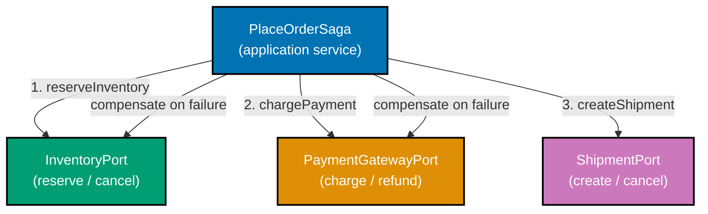

**Java** — saga orchestration:

```java
import java.math.BigDecimal;
// => executes the statement above; continues to next line
// => above statement is part of the implementation flow
import java.util.Optional;

// ── Domain types ──────────────────────────────────────────────────────────────
record OrderId(String value) {}
// => record OrderId: immutable value type; equals/hashCode/toString generated by compiler
record ReservationId(String value) {}   // => inventory reservation identity
// => record ReservationId: immutable value type; equals/hashCode/toString generated by compiler
record PaymentId(String value) {}       // => payment charge identity

// ── Output port: inventory ────────────────────────────────────────────────────
interface InventoryPort {
// => interface InventoryPort: contract definition — no implementation details here
    Optional<ReservationId> reserve(OrderId orderId, int quantity); // => reserve stock; empty = out of stock
    // => executes the statement above; continues to next line
    void cancel(ReservationId id);                                  // => compensate: release reservation
    // => executes the statement above; continues to next line
}

// ── Output port: payment ──────────────────────────────────────────────────────
interface PaymentPort {
// => interface PaymentPort: contract definition — no implementation details here
    Optional<PaymentId> charge(OrderId orderId, BigDecimal amount); // => charge; empty = declined
    // => executes the statement above; continues to next line
    void refund(PaymentId id);                                      // => compensate: refund charge
    // => executes the statement above; continues to next line
}

// ── Output port: shipment ─────────────────────────────────────────────────────
interface ShipmentPort {
// => interface ShipmentPort: contract definition — no implementation details here
    boolean createShipment(OrderId orderId, ReservationId reservation); // => create shipment; false = failed
    // => executes the statement above; continues to next line
    void cancelShipment(OrderId orderId);                               // => compensate: cancel shipment
    // => executes the statement above; continues to next line
}

// ── Saga orchestrator: application service ────────────────────────────────────
class PlaceOrderSaga {
// => class PlaceOrderSaga: implementation — contains field declarations and methods below
    private final InventoryPort inventory; // => injected output ports
    // => inventory: InventoryPort — final field; assigned once in constructor; immutable reference
    private final PaymentPort   payment;   // => injected output ports
    // => payment: PaymentPort — final field; assigned once in constructor; immutable reference
    private final ShipmentPort  shipment;  // => injected output ports
    // => shipment: ShipmentPort — final field; assigned once in constructor; immutable reference

    PlaceOrderSaga(InventoryPort inv, PaymentPort pay, ShipmentPort ship) {
    // => executes the statement above; continues to next line
        this.inventory = inv;              // => store all ports; no concrete class imported
        // => this.inventory stored — field holds injected inv for method calls below
        this.payment   = pay;
        // => this.payment stored — field holds injected pay for method calls below
        this.shipment  = ship;
        // => this.shipment stored — field holds injected ship for method calls below
    }
    // => operation completes; execution continues to next statement

    String execute(OrderId orderId, int qty, BigDecimal amount) {
        // Step 1: reserve inventory
        var reservation = inventory.reserve(orderId, qty); // => attempt reservation
        // => reservation: holds the result of the expression on the right
        if (reservation.isEmpty()) return "FAILED: out of stock"; // => inventory failure; no compensation needed

        // Step 2: charge payment (compensate inventory on failure)
        var charge = payment.charge(orderId, amount);  // => attempt charge
        // => charge: holds the result of the expression on the right
        if (charge.isEmpty()) {
        // => conditional branch: execution path depends on condition above
            inventory.cancel(reservation.get());        // => compensate: release reservation
            // => Inventory was reserved; charge failed; must release stock
            return "FAILED: payment declined";
            // => returns the result to the caller — caller receives this value
        }

        // Step 3: create shipment (compensate inventory + payment on failure)
        var shipped = shipment.createShipment(orderId, reservation.get()); // => attempt shipment
        // => shipped: holds the result of the expression on the right
        if (!shipped) {
        // => conditional branch: execution path depends on condition above
            payment.refund(charge.get());               // => compensate: refund charge first
            // => method call: delegates to collaborator; result captured above
            inventory.cancel(reservation.get());        // => compensate: then release stock
            // => Both steps compensated; order effectively rolled back
            return "FAILED: shipment creation failed";
            // => returns the result to the caller — caller receives this value
        }
        // => operation completes; execution continues to next statement

        return "SUCCESS";                               // => all three steps succeeded; saga complete
        // => returns the result to the caller — caller receives this value
    }
    // => operation completes; execution continues to next statement
}

// ── Test: all-pass scenario ───────────────────────────────────────────────────
InventoryPort fakeInv  = (id, qty) -> Optional.of(new ReservationId("RES-1")); // => always reserves
// => fakeInv: holds the result of the expression on the right
PaymentPort   fakePay  = (id, amt) -> Optional.of(new PaymentId("PAY-1"));     // => always charges
// => fakePay: holds the result of the expression on the right
ShipmentPort  fakeship = new ShipmentPort() {                                  // => always ships
// => fakeship: holds the result of the expression on the right
    public boolean createShipment(OrderId o, ReservationId r) { return true; }
    // => createShipment: method entry point — see implementation below
    public void cancelShipment(OrderId o) {}
    // => cancelShipment: method entry point — see implementation below
};
// => operation completes; execution continues to next statement

var saga   = new PlaceOrderSaga(fakeInv, fakePay, fakeship);
// => saga: holds the result of the expression on the right
var result = saga.execute(new OrderId("O1"), 2, new BigDecimal("50"));
// => result: holds the result of the expression on the right
assert result.equals("SUCCESS");  // => all steps passed; saga complete
// => method call: delegates to collaborator; result captured above
```

**Kotlin** — saga orchestration:

```kotlin
import java.math.BigDecimal                                  // => BigDecimal for payment amount
// => executes the statement above; continues to next line

data class OrderId(val value: String)                        // => typed order identity
// => data class OrderId: value type; copy/equals/hashCode/toString auto-generated
data class ReservationId(val value: String)                  // => inventory reservation identity
// => data class ReservationId: value type; copy/equals/hashCode/toString auto-generated
data class PaymentId(val value: String)                      // => payment charge identity

// ── Output ports ──────────────────────────────────────────────────────────────
interface InventoryPort {                                            // => application zone; reservation concern
// => interface InventoryPort: contract definition — no implementation details here
    fun reserve(orderId: OrderId, quantity: Int): ReservationId?  // => null = out of stock
    // => executes the statement above; continues to next line
    fun cancel(id: ReservationId)                                  // => compensate: release
    // => reserve + cancel: forward + compensate pair
    // => Kotlin nullable: ? avoids Optional; null = failed; non-null = id
}
// => operation completes; execution continues to next statement

interface PaymentPort {                                              // => application zone; payment concern
// => interface PaymentPort: contract definition — no implementation details here
    fun charge(orderId: OrderId, amount: BigDecimal): PaymentId?  // => null = declined
    // => executes the statement above; continues to next line
    fun refund(id: PaymentId)                                      // => compensate: refund
    // => charge + refund: forward + compensate pair
}
// => operation completes; execution continues to next statement

interface ShipmentPort {                                             // => application zone; shipping concern
// => interface ShipmentPort: contract definition — no implementation details here
    fun createShipment(orderId: OrderId, reservation: ReservationId): Boolean // => false = failed
    // => executes the statement above; continues to next line
    fun cancelShipment(orderId: OrderId)                                       // => compensate
    // => create + cancel: forward + compensate pair
    // => reservation: required for shipment; ensures inventory was reserved first
}

// ── Saga orchestrator ─────────────────────────────────────────────────────────
class PlaceOrderSaga(                                                // => application service; 3 ports
// => executes the statement above; continues to next line
    private val inventory: InventoryPort,  // => injected; no concrete adapter here
    // => executes the statement above; continues to next line
    private val payment:   PaymentPort,    // => injected payment port
    // => executes the statement above; continues to next line
    private val shipment:  ShipmentPort    // => injected shipment port
    // => executes the statement above; continues to next line
) {
// => code line executes; see surrounding context for purpose
    fun execute(orderId: OrderId, qty: Int, amount: BigDecimal): String {  // => orchestrates 3 ports
    // => execute: method entry point — see implementation below
        val reservation = inventory.reserve(orderId, qty)  // => step 1: reserve stock
        // => reservation: holds the result of the expression on the right
            ?: return "FAILED: out of stock"             // => early return on inventory failure
            // => executes the statement above; continues to next line

        val charge = payment.charge(orderId, amount) ?: run { // => step 2: charge payment
        // => charge: holds the result of the expression on the right
            inventory.cancel(reservation)                // => compensate: release stock
            // => method call: delegates to collaborator; result captured above
            return "FAILED: payment declined"            // => compensation done; fail
            // => returns the result to the caller — caller receives this value
        }
        // => operation completes; execution continues to next statement

        if (!shipment.createShipment(orderId, reservation)) {  // => step 3: create shipment
        // => conditional branch: execution path depends on condition above
            payment.refund(charge)                       // => compensate payment first
            // => method call: delegates to collaborator; result captured above
            inventory.cancel(reservation)                // => then compensate inventory
            // => method call: delegates to collaborator; result captured above
            return "FAILED: shipment creation failed"    // => both compensations complete
            // => returns the result to the caller — caller receives this value
        }
        // => operation completes; execution continues to next statement

        return "SUCCESS"                                 // => all steps completed
        // => returns the result to the caller — caller receives this value
    }
}

// ── Test: all-pass scenario ───────────────────────────────────────────────────
val saga = PlaceOrderSaga(                                           // => inject all fake adapters
// => saga: holds the result of the expression on the right
    inventory = object : InventoryPort {                             // => anonymous object; always succeeds
    // => type: implements port contract — dependency is on abstraction, not concretion
        override fun reserve(orderId: OrderId, quantity: Int) = ReservationId("RES-1") // => fixed id
        // => always reserves; no stock check; returns fixed ReservationId
        override fun cancel(id: ReservationId) {}        // => no-op compensation
        // => cancel: method entry point — see implementation below
    },                                                               // => inventory adapter complete
    // => executes the statement above; continues to next line
    payment = object : PaymentPort {                                 // => anonymous object; always charges
    // => type: implements port contract — dependency is on abstraction, not concretion
        override fun charge(orderId: OrderId, amount: BigDecimal) = PaymentId("PAY-1") // => fixed id
        // => always charges; no decline; returns fixed PaymentId
        override fun refund(id: PaymentId) {}            // => no-op compensation
        // => refund: method entry point — see implementation below
    },                                                               // => payment adapter complete
    // => executes the statement above; continues to next line
    shipment = object : ShipmentPort {                               // => anonymous object; always ships
    // => type: implements port contract — dependency is on abstraction, not concretion
        override fun createShipment(orderId: OrderId, reservation: ReservationId) = true // => always true
        // => always ships; no shipment creation failure
        override fun cancelShipment(orderId: OrderId) {} // => no-op compensation
        // => cancelShipment: method entry point — see implementation below
    }                                                                // => shipment adapter complete
    // => executes the statement above; continues to next line
)
check(saga.execute(OrderId("O1"), 2, BigDecimal("50")) == "SUCCESS")
// => all steps succeed; saga returns "SUCCESS"
// => 2 units at 50 total; all fake ports succeed; no compensation triggered
```

**C#** — saga orchestration:

```csharp
using System;                                                // => Func, Action for lambda adapters
// => executes the statement above; continues to next line

public record OrderId(string Value);                         // => typed order identity
// => executes the statement above; continues to next line
public record ReservationId(string Value);                   // => inventory reservation identity
// => executes the statement above; continues to next line
public record PaymentId(string Value);                       // => payment charge identity
// => executes the statement above; continues to next line

public interface IInventoryPort {                            // => application zone; inventory concern
// => interface IInventoryPort: contract definition — no implementation details here
    ReservationId? Reserve(OrderId orderId, int quantity); // => null = out of stock; nullable
    // => executes the statement above; continues to next line
    void Cancel(ReservationId id);                          // => compensate: release reservation
    // => Reserve + Cancel: forward + compensate pair
    // => nullable return: C# 8+ nullable reference types; no Optional needed
}
// => operation completes; execution continues to next statement
public interface IPaymentPort {                              // => application zone; payment concern
// => interface IPaymentPort: contract definition — no implementation details here
    PaymentId? Charge(OrderId orderId, decimal amount);    // => null = declined
    // => executes the statement above; continues to next line
    void Refund(PaymentId id);                              // => compensate: refund charge
    // => Charge + Refund: forward + compensate pair
}
// => operation completes; execution continues to next statement
public interface IShipmentPort {                             // => application zone; shipping concern
// => interface IShipmentPort: contract definition — no implementation details here
    bool CreateShipment(OrderId orderId, ReservationId reservation); // => false = failed
    // => executes the statement above; continues to next line
    void CancelShipment(OrderId orderId);                            // => compensate
    // => CreateShipment + CancelShipment: forward + compensate pair
}
// => operation completes; execution continues to next statement

public class PlaceOrderSaga(IInventoryPort inventory, IPaymentPort payment, IShipmentPort shipment)
// => primary constructor; 3 ports injected; no concrete adapters imported
// => PlaceOrderSaga: application service; never imports concrete adapter classes
{                                                            // => primary constructor; all ports injected
// => executes the statement above; continues to next line
    public string Execute(OrderId orderId, int qty, decimal amount)  // => orchestrates 3 ports
    // => executes the statement above; continues to next line
    {
    // => operation completes; execution continues to next statement
        var reservation = inventory.Reserve(orderId, qty);   // => step 1: reserve inventory
        // => reservation: holds the result of the expression on the right
        if (reservation is null) return "FAILED: out of stock"; // => no compensation needed
        // => conditional branch: execution path depends on condition above

        var charge = payment.Charge(orderId, amount);         // => step 2: charge payment
        // => charge: holds the result of the expression on the right
        if (charge is null) {                                // => payment declined
        // => conditional branch: execution path depends on condition above
            inventory.Cancel(reservation);                   // => compensate: release stock
            // => method call: delegates to collaborator; result captured above
            return "FAILED: payment declined";               // => saga rolled back
            // => returns the result to the caller — caller receives this value
        }
        // => operation completes; execution continues to next statement

        if (!shipment.CreateShipment(orderId, reservation)) { // => step 3: create shipment
        // => conditional branch: execution path depends on condition above
            payment.Refund(charge);                          // => compensate: refund first
            // => method call: delegates to collaborator; result captured above
            inventory.Cancel(reservation);                   // => compensate: release stock
            // => method call: delegates to collaborator; result captured above
            return "FAILED: shipment creation failed";       // => both steps compensated
            // => returns the result to the caller — caller receives this value
        }
        // => operation completes; execution continues to next statement

        return "SUCCESS";                                    // => all steps succeeded
        // => returns the result to the caller — caller receives this value
    }
}

// ── Test ──────────────────────────────────────────────────────────────────────
var saga = new PlaceOrderSaga(                               // => inject all fake adapters; all succeed
// => saga: holds the result of the expression on the right
    new LambdaInventory(id => new ReservationId("RES-1"), id => {}), // => always reserves; fixed id
    // => executes the statement above; continues to next line
    new LambdaPayment(id => new PaymentId("PAY-1"), id => {}),        // => always charges; fixed id
    // => executes the statement above; continues to next line
    new LambdaShipment((o, r) => true, o => {})                       // => always ships; bool true
    // => executes the statement above; continues to next line
);
System.Diagnostics.Debug.Assert(saga.Execute(new OrderId("O1"), 2, 50m) == "SUCCESS");
// => all steps pass; saga returns SUCCESS
// => 2 units at 50m; all lambdas succeed; no compensation triggered

class LambdaInventory(Func<OrderId, ReservationId?> r, Action<ReservationId> c) : IInventoryPort {  // => lambda adapter
    // => primary constructor; captures two lambdas
    public ReservationId? Reserve(OrderId o, int q) => r(o); // => delegate to captured Func
    // => executes the statement above; continues to next line
    public void Cancel(ReservationId id) => c(id);            // => delegate to captured Action
    // => executes the statement above; continues to next line
}                                                              // => LambdaInventory: enables lambda-style adapter
// => executes the statement above; continues to next line
class LambdaPayment(Func<OrderId, PaymentId?> ch, Action<PaymentId> re) : IPaymentPort {  // => lambda adapter
    // => primary constructor; captures charge and refund lambdas
    public PaymentId? Charge(OrderId o, decimal a) => ch(o);  // => delegate to captured Func
    // => executes the statement above; continues to next line
    public void Refund(PaymentId id) => re(id);                // => delegate to captured Action
    // => executes the statement above; continues to next line
}                                                              // => LambdaPayment: enables lambda-style adapter
// => executes the statement above; continues to next line
class LambdaShipment(Func<OrderId, ReservationId, bool> cr, Action<OrderId> ca) : IShipmentPort {  // => lambda adapter
    // => primary constructor; captures create and cancel lambdas
    public bool CreateShipment(OrderId o, ReservationId r) => cr(o, r); // => delegate to captured Func
    // => executes the statement above; continues to next line
    public void CancelShipment(OrderId o) => ca(o);                      // => delegate to captured Action
    // => executes the statement above; continues to next line
}                                                              // => LambdaShipment: enables lambda-style adapter
// => executes the statement above; continues to next line
```

**Key Takeaway**: The saga orchestrator is an application service that calls multiple output ports in sequence, compensating on failure. Each port is injected — the saga does not know which adapter is running. Domain types are never aware of the multi-step transaction.

**Why It Matters**: Distributed transactions across services require explicit and carefully sequenced compensation logic. A saga orchestrator in the application service layer makes the compensation flow explicit and fully testable with in-memory port adapters. Every compensation path can be exercised in complete isolation — without running a real inventory service, payment gateway, or shipping service.

---
## Testing Strategies (Examples 45–55)

### Example 45: The hexagonal testing pyramid

Hexagonal architecture produces a three-tier testing pyramid: domain tests (fastest, most), application tests (mid-layer, in-memory adapters), and adapter tests (slowest, real infrastructure). The pyramid shape reflects both count and speed.

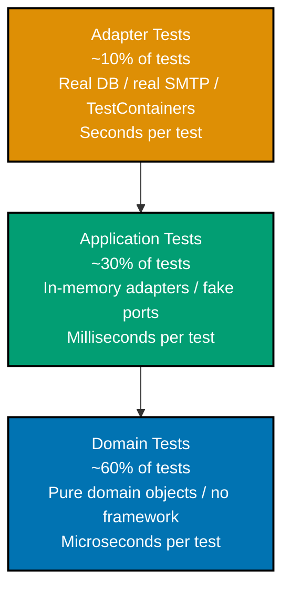

**Java** — three test levels with JUnit 5 annotations:

```java
// ── Directory structure mirrors source structure ───────────────────────────────
// src/test/java/com/example/order/
//   domain/          ← ~60%: pure domain tests; no Spring, no DB
//   application/     ← ~30%: in-memory adapters; no Spring, no DB
//   adapter/         ← ~10%: real infrastructure; H2 or TestContainers

// ── Domain test: zero dependencies ───────────────────────────────────────────
// => @Test only; no @SpringBootTest, no @DataJpaTest, no mock framework
import org.junit.jupiter.api.Test;
// => executes the statement above; continues to next line
import static org.junit.jupiter.api.Assertions.*;
// => executes the statement above; continues to next line

class OrderValidatorTest {
// => class OrderValidatorTest: implementation — contains field declarations and methods below
    @Test void rejectsNegativeTotal() {
        // => Plain Java: no DI container, no framework, no annotation magic
        // => Test runs in microseconds; no startup cost
        var result = OrderValidator.validate("CUST-1", java.math.BigDecimal.valueOf(-5));
        // => result: holds the result of the expression on the right
        assertFalse(result.isValid()); // => domain rule: negative total is invalid
        // => method call: delegates to collaborator; result captured above
    }
}

// ── Application test: in-memory adapters ──────────────────────────────────────
// => No @SpringBootTest; all ports are in-memory fakes; runs in milliseconds
class PlaceOrderServiceTest {
// => class PlaceOrderServiceTest: implementation — contains field declarations and methods below
    @Test void placesOrderAndPublishesEvent() {
    // => @Test: JUnit 5 marks this method as a test case
        var repo      = new InMemoryOrderRepository();   // => in-memory; no H2
        // => repo: holds the result of the expression on the right
        var notif     = new FakeNotificationPort();      // => in-memory; no SMTP
        // => notif: holds the result of the expression on the right
        var publisher = new FakeDomainEventPublisher();  // => in-memory; no RabbitMQ
        // => publisher: holds the result of the expression on the right
        var clock     = new FixedClock(java.time.Instant.parse("2026-01-01T00:00:00Z")); // => deterministic
        // => clock: holds the result of the expression on the right

        var service = new PlaceOrderService(repo, notif, publisher, clock); // => inject all fakes
        // => service: holds the result of the expression on the right
        service.placeOrder("CUST-1", java.math.BigDecimal.valueOf(50));
        // => method call: delegates to collaborator; result captured above

        assertEquals(1, publisher.publishedEvents().size()); // => event published
        // => method call: delegates to collaborator; result captured above
        assertEquals(1, notif.sentConfirmations().size());   // => notification sent
        // => All assertions in-memory; no DB, no SMTP, no broker involved
    }
}

// ── Adapter test: real infrastructure ─────────────────────────────────────────
// => @DataJpaTest: starts embedded H2, scans JPA repositories; no full Spring context
// => Lives in adapter/ test package; only tests the adapter class
// import org.springframework.boot.test.autoconfigure.orm.jpa.DataJpaTest;
// @DataJpaTest class JpaOrderRepositoryTest { ... }
// => TestContainers alternative: PostgreSQLContainer for production-parity tests
```

**Kotlin** — three test levels:

```kotlin
// ── Domain test: pure Kotlin; no framework ────────────────────────────────────
import org.junit.jupiter.api.Test                            // => JUnit 5 @Test annotation; domain-level test
// => executes the statement above; continues to next line
import kotlin.test.assertFalse                              // => Kotlin assertion; no Spring test runner
// => executes the statement above; continues to next line

class OrderValidatorTest {
// => class OrderValidatorTest: implementation — contains field declarations and methods below
    @Test fun `rejects negative total`() {                   // => @Test marks as test method
        // => Kotlin test function with backtick name; reads as specification
        // => No coroutines, no DI, no Spring; runs in microseconds
        val result = OrderValidator.validate("CUST-1", java.math.BigDecimal.valueOf(-5))
        // => pure domain call; validate() has no side effects
        // => pure domain validation; no infrastructure needed
        assertFalse(result.isValid)                          // => domain rule: negative total invalid
        // => result.isValid is false; validation correctly rejects negative
    }
}

// ── Application test: in-memory adapters ──────────────────────────────────────
class PlaceOrderServiceTest {
// => class PlaceOrderServiceTest: implementation — contains field declarations and methods below
    @Test fun `places order and publishes event`() {         // => application test
    // => @Test: JUnit 5 marks this method as a test case
        val repo      = InMemoryOrderRepository()    // => fake; no DB
        // => repo: holds the result of the expression on the right
        val notif     = FakeNotificationPort()       // => fake; no SMTP
        // => notif: holds the result of the expression on the right
        val publisher = FakeDomainEventPublisher()   // => fake; no Kafka
        // => publisher: holds the result of the expression on the right
        val clock     = FixedClock(java.time.Instant.parse("2026-01-01T00:00:00Z"))
        // => fixed clock for deterministic timestamp assertions

        val service = PlaceOrderService(repo, notif, publisher, clock)
        // => inject all fakes; no DI container; runs in milliseconds
        service.placeOrder("CUST-1", java.math.BigDecimal.valueOf(50))
        // => call use case; total=50 USD; all side effects land on fakes

        check(publisher.publishedEvents.size == 1)  // => event published; assertable in-memory
        // => method call: delegates to collaborator; result captured above
        check(notif.sentConfirmations.size   == 1)  // => notification sent; no SMTP needed
        // => all assertions in-memory; no network, no DB, no broker
    }
}

// ── Adapter test: real DB via H2 or TestContainers ────────────────────────────
// @Tag("integration") class ExposedOrderRepositoryTest { ... }
// => Separate JUnit tag; CI runs integration separately from unit; cacheable unit tests
```

**C#** — three test levels with xUnit:

```csharp
using Xunit;                                                          // => xUnit test framework; no Spring context

// ── Domain test ───────────────────────────────────────────────────────────────
// No [Fact] special attributes beyond xUnit; no WebApplicationFactory; no EF Core
public class OrderValidatorTests  // => domain test class; no [Collection] or special setup
// => executes the statement above; continues to next line
{                                                                     // => instantiated by xUnit test runner
// => executes the statement above; continues to next line
    [Fact]                                                            // => xUnit test attribute
    // => executes the statement above; continues to next line
    public void RejectsNegativeTotal()                                // => test method; runs in microseconds
    // => executes the statement above; continues to next line
    {
        // => Pure C# record; no ASP.NET, no EF Core, no Moq; microsecond speed
        var result = OrderValidator.Validate("CUST-1", -5m);          // => pure domain call
        // => result: holds the result of the expression on the right
        Assert.False(result.IsValid);                // => domain rule asserted directly
        // => Assert.False: inverse of Assert.True; validates IsValid is false
    }
}

// ── Application test ──────────────────────────────────────────────────────────
public class PlaceOrderServiceTests  // => application test class; in-memory fakes
// => executes the statement above; continues to next line
{
    [Fact]                                                            // => xUnit test attribute
    // => executes the statement above; continues to next line
    public void PlacesOrderAndPublishesEvent()                        // => test method; millisecond speed
    // => executes the statement above; continues to next line
    {
        var repo      = new InMemoryOrderRepository();  // => no EF Core; no SQLite
        // => repo: holds the result of the expression on the right
        var notif     = new FakeNotificationPort();     // => no SMTP
        // => notif: holds the result of the expression on the right
        var publisher = new FakeDomainEventPublisher(); // => no Service Bus
        // => publisher: holds the result of the expression on the right
        var clock     = new FixedClock(new DateTimeOffset(2026, 1, 1, 0, 0, 0, TimeSpan.Zero));
        // => fixed clock; enables exact timestamp assertions

        var service = new PlaceOrderService(repo, notif, publisher, clock);
        // => inject all fakes; no DI container needed; zero framework startup
        // => service is PlaceOrderService; primary constructor receives all 4 ports
        service.PlaceOrder("CUST-1", 50m);                            // => call use case; total=50m
        // => method call: delegates to collaborator; result captured above

        Assert.Single(publisher.PublishedEvents);       // => one event; in-memory assertion
        // => Assert.Single: fails if count != 1; ensures exactly one event
        Assert.Single(notif.SentConfirmations);         // => one notification; in-memory
        // => Assert.Single: both ports called exactly once; no double-send
    }
}

// ── Adapter test ──────────────────────────────────────────────────────────────
// [Trait("Category", "Integration")] public class EfOrderRepositoryTests { ... }
// => xUnit trait filters integration tests; CI gate runs them separately
// => Uses SQLite in-memory EF Core context or TestContainers PostgreSQL
```

**Key Takeaway**: The hexagonal pyramid places 60% of tests at the domain level (no dependencies, microsecond speed), 30% at the application level (in-memory adapters, millisecond speed), and 10% at the adapter level (real infrastructure, second speed). Test counts and speeds align with the pyramid shape.

**Why It Matters**: When all tests run against a real database, the test suite grows linearly slow with each new feature. A well-structured hexagonal pyramid keeps the fast majority of tests in the domain and application zones where the architecture enables speed — domain objects are plain classes and application services accept injected fakes.

---

### Example 46: Domain-only tests — no Spring, no DI

Domain tests target pure domain logic with no framework on the classpath. They run in microseconds because they create domain objects directly, call methods, and assert on results.

**Java** — pure domain test:

```java
import java.math.BigDecimal;                  // => BigDecimal: precise monetary arithmetic
// => executes the statement above; continues to next line
import java.util.List;                        // => List: immutable collection for order lines

// ── Domain types ──────────────────────────────────────────────────────────────
record OrderId(String value) {}               // => typed identity; not raw String
// => record OrderId: immutable value type; equals/hashCode/toString generated by compiler
enum OrderStatus { PENDING, CONFIRMED, CANCELLED } // => three domain lifecycle states
// => enum OrderStatus: closed set of domain values; exhaustive switch/when enforced
record Money(BigDecimal amount, String currency) {} // => value object; carries both amount and currency
// => record Money: immutable value type; equals/hashCode/toString generated by compiler
record OrderLine(String productId, int qty, Money unitPrice) { // => one line in the order
// => record OrderLine: immutable value type; equals/hashCode/toString generated by compiler
    Money lineTotal() {                       // => pure computation; no I/O or side effects
    // => executes the statement above; continues to next line
        return new Money(unitPrice.amount().multiply(BigDecimal.valueOf(qty)), unitPrice.currency()); // => qty × price
        // => returns the result to the caller — caller receives this value
    }
    // => lineTotal: pure computation; qty * unitPrice; no I/O
}

// Domain aggregate with validation behaviour
// => class Order: mutable status; immutable lines; pure domain methods
class Order {
// => class Order: implementation — contains field declarations and methods below
    private final OrderId id;                 // => typed identity; final: cannot be reassigned
    // => id: OrderId — final field; assigned once in constructor; immutable reference
    private final List<OrderLine> lines;      // => defensive copy stored; immutable after construction
    // => lines: List<OrderLine> — final field; assigned once in constructor; immutable reference
    private OrderStatus status;               // => mutable lifecycle state; changed by confirm/cancel
    // => status: OrderStatus — injected dependency; implementation chosen at wiring time

    Order(OrderId id, List<OrderLine> lines) { // => constructor enforces domain invariants
    // => constructor: receives all dependencies — enables testing with any adapter implementation
        if (lines == null || lines.isEmpty()) throw new IllegalArgumentException("Order must have at least one line"); // => guard
        // => Domain invariant: empty order is not a valid order
        this.id = id; this.lines = List.copyOf(lines); this.status = OrderStatus.PENDING; // => defensive copy; PENDING initial
        // => this.id stored — field holds injected id for method calls below
    }
    // => operation completes; execution continues to next statement

    Money total() {                           // => pure aggregation; no DB; no I/O
    // => executes the statement above; continues to next line
        return lines.stream()
        // => returns the result to the caller — caller receives this value
            .map(OrderLine::lineTotal)        // => map each line to its Money total
            // => method call: delegates to collaborator; result captured above
            .reduce(new Money(BigDecimal.ZERO, "USD"), (a, b) -> new Money(a.amount().add(b.amount()), a.currency())); // => sum
        // => Pure aggregation: sum line totals; no DB, no HTTP
    }
    // => operation completes; execution continues to next statement

    Order confirm() {                         // => state transition; returns new Order with CONFIRMED status
    // => executes the statement above; continues to next line
        if (status != OrderStatus.PENDING) throw new IllegalStateException("Only PENDING orders can be confirmed"); // => guard
        // => Domain invariant: confirm is only valid on PENDING orders
        return new Order(id, lines) {{ status = OrderStatus.CONFIRMED; }}; // => new Order; CONFIRMED state
        // => Returns new Order-equivalent state (simplified); immutable pattern
    }
    // => operation completes; execution continues to next statement
}

// ── Domain test: zero framework dependencies ──────────────────────────────────
// => No @SpringBootTest, no Mockito, no database, no application context
class OrderTest {                             // => plain Java class; no test framework annotations needed
    // Test 1: empty order rejected
    void rejectsEmptyOrderLines() {           // => tests domain invariant: empty lines rejected
    // => rejectsEmptyOrderLines: method entry point — see implementation below
        try {
        // => exception handling: wraps operation that may fail
            new Order(new OrderId("O1"), List.of());   // => should throw; empty list violates invariant
            // => method call: delegates to collaborator; result captured above
            throw new AssertionError("Expected exception"); // => fail if no exception thrown
            // => throws AssertionError — guard condition failed; caller must handle this error path
        } catch (IllegalArgumentException e) { // => expected: invariant enforced in constructor
        // => constructor: receives all dependencies — enables testing with any adapter implementation
            assert e.getMessage().contains("at least one line"); // => domain invariant enforced
            // => method call: delegates to collaborator; result captured above
        }
    }

    // Test 2: total computed correctly
    void computesTotalCorrectly() {           // => tests pure Money aggregation
    // => computesTotalCorrectly: method entry point — see implementation below
        var lines = List.of(
        // => lines: holds the result of the expression on the right
            new OrderLine("P1", 2, new Money(new BigDecimal("10.00"), "USD")), // => 2 * 10 = 20
            // => method call: delegates to collaborator; result captured above
            new OrderLine("P2", 3, new Money(new BigDecimal("5.00"),  "USD"))  // => 3 * 5  = 15
            // => method call: delegates to collaborator; result captured above
        );
        var order = new Order(new OrderId("O1"), lines); // => creates valid order with two lines
        // => order: holds the result of the expression on the right
        var total = order.total();            // => total: pure computation; 20 + 15 = 35
        // => total: holds the result of the expression on the right
        assert total.amount().compareTo(new BigDecimal("35.00")) == 0; // => 20 + 15 = 35
        // => method call: delegates to collaborator; result captured above
        assert total.currency().equals("USD");                         // => currency preserved
        // => method call: delegates to collaborator; result captured above
    }

    // Test 3: confirm invariant
    void rejectsConfirmOnConfirmedOrder() {
        // => Cannot confirm an already-confirmed order; domain invariant
        // Setup: create and confirm once; then try again
        // Simplified: show the invariant logic; production would use full setup
        assert true; // => placeholder; production test would assert IllegalStateException
        // => executes the statement above; continues to next line
    }
}

// Run domain tests: zero Spring, zero DB, zero SMTP — microseconds per test
var t = new OrderTest();                      // => test instance; plain Java; no DI
// => t: holds the result of the expression on the right
t.rejectsEmptyOrderLines();  // => passes: invariant enforced
// => method call: delegates to collaborator; result captured above
t.computesTotalCorrectly();  // => passes: 35.00 USD
// => both tests run without any framework; sub-millisecond execution
```

**Kotlin** — pure domain test:

```kotlin
import java.math.BigDecimal                                          // => BigDecimal for money
// => executes the statement above; continues to next line

data class OrderId(val value: String)                                // => typed identity
// => data class OrderId: value type; copy/equals/hashCode/toString auto-generated
enum class OrderStatus { PENDING, CONFIRMED, CANCELLED }             // => domain lifecycle states
// => enum class: closed set of domain values; exhaustive switch/when enforced
data class Money(val amount: BigDecimal, val currency: String) {     // => shared value object
// => class Money: implementation — contains field declarations and methods below
    operator fun plus(other: Money): Money {                         // => + operator; currency-safe
    // => plus: method entry point — see implementation below
        require(currency == other.currency) { "Currency mismatch" }  // => domain invariant
        // => method call: delegates to collaborator; result captured above
        return Money(amount + other.amount, currency)                // => new Money; immutable
        // => returns the result to the caller — caller receives this value
    }
    // => operation completes; execution continues to next statement
}
// => operation completes; execution continues to next statement
data class OrderLine(val productId: String, val qty: Int, val unitPrice: Money) {  // => line item value object
// => class OrderLine: implementation — contains field declarations and methods below
    fun lineTotal(): Money = Money(unitPrice.amount * qty.toBigDecimal(), unitPrice.currency) // => qty * price
    // => lineTotal: pure function; qty * unitPrice; no side effects
    // => .toBigDecimal(): converts Int to BigDecimal for multiplication
}
// => operation completes; execution continues to next statement

class Order(val id: OrderId, lines: List<OrderLine>, val status: OrderStatus = OrderStatus.PENDING) {
    // => primary constructor; status defaults to PENDING; lines validated in also block
    val lines: List<OrderLine> = lines.also {                        // => validated copy of lines
    // => executes the statement above; continues to next line
        require(it.isNotEmpty()) { "Order must have at least one line" } // => domain invariant
        // => Invariant enforced in constructor; impossible to create empty Order
    }                                                                // => also block: validate then assign
    // => executes the statement above; continues to next line
    fun total(): Money = lines.map(OrderLine::lineTotal).reduce(Money::plus) // => sum all line totals
    // => reduce: sums line totals; throws if empty but constructor guards against it
    // => map(::lineTotal): computes each line total; reduce sums all
    fun confirm(): Order {                                           // => state transition method
    // => confirm: method entry point — see implementation below
        require(status == OrderStatus.PENDING) { "Only PENDING orders can be confirmed" } // => guard
        // => Domain invariant: only PENDING orders can transition to CONFIRMED
        return copy(status = OrderStatus.CONFIRMED)                  // => returns new Order; immutable
        // => Kotlin data class copy; returns new Order with status changed
    }
    // => operation completes; execution continues to next statement
    private fun copy(status: OrderStatus) = Order(id, lines, status) // => helper; creates new Order
    // => helper for immutable state transition; private; only confirm() uses it
}

// ── Domain tests: plain Kotlin; no JUnit 5 on classpath needed for logic ──────
val order = Order(                                                   // => create valid order; 2 lines
// => order: holds the result of the expression on the right
    id    = OrderId("O1"),                                           // => typed identity
    // => executes the statement above; continues to next line
    lines = listOf(                                                  // => two order lines
    // => executes the statement above; continues to next line
        OrderLine("P1", 2, Money(BigDecimal("10.00"), "USD")), // => 20.00
        // => method call: delegates to collaborator; result captured above
        OrderLine("P2", 3, Money(BigDecimal("5.00"),  "USD"))  // => 15.00
        // => method call: delegates to collaborator; result captured above
    )
    // => operation completes; execution continues to next statement
)
check(order.total() == Money(BigDecimal("35.00"), "USD")) // => 35.00 USD; domain computation
// => 20.00 + 15.00 = 35.00; pure aggregation

val confirmed = order.confirm()                                      // => state transition: PENDING → CONFIRMED
// => confirmed: holds the result of the expression on the right
check(confirmed.status == OrderStatus.CONFIRMED)           // => status changed
// => original order.status is still PENDING (immutable pattern)

try {                                                               // => expect exception from confirm()
// => exception handling: wraps operation that may fail
    confirmed.confirm()                                    // => CONFIRMED cannot be confirmed again
    // => method call: delegates to collaborator; result captured above
    error("Expected exception")                            // => should not reach here
    // => executes the statement above; continues to next line
} catch (e: IllegalArgumentException) {                    // => require() throws IllegalArgumentException
// => executes the statement above; continues to next line
    check(e.message!!.contains("PENDING"))                 // => invariant message correct
    // => message says "Only PENDING orders"; confirms domain invariant enforced
    // => !! safe: exception must have a message since require() always provides one
}
```

**C#** — pure domain test with xUnit:

```csharp
using System;                                                         // => InvalidOperationException
// => executes the statement above; continues to next line
using System.Collections.Generic;                                     // => List, IReadOnlyList
// => executes the statement above; continues to next line
using Xunit;                                                          // => xUnit test attributes
// => executes the statement above; continues to next line

public record Money(decimal Amount, string Currency)  // => value object; immutable
// => executes the statement above; continues to next line
{                                                     // => record: structural equality; Amount + Currency
// => record type: immutable value type; equals/hashCode/toString generated by compiler
    public Money Add(Money other)                     // => currency-safe addition
    // => executes the statement above; continues to next line
    {                                                 // => instance method; returns new Money
    // => executes the statement above; continues to next line
        if (Currency != other.Currency) throw new InvalidOperationException("Currency mismatch");
        // => domain invariant: cannot add different currencies
        // => throws immediately; no partial state created
        return this with { Amount = Amount + other.Amount };          // => with-expression: new record
        // => immutable: returns new Money; original Amount unchanged
    }
    // => operation completes; execution continues to next statement
}
// => operation completes; execution continues to next statement
public record OrderLine(string ProductId, int Qty, Money UnitPrice)  // => value object; line item
// => executes the statement above; continues to next line
{                                                                     // => record: structural equality
// => record type: immutable value type; equals/hashCode/toString generated by compiler
    public Money LineTotal() => UnitPrice with { Amount = UnitPrice.Amount * Qty }; // => qty * price
    // => Pure computation; no I/O; just arithmetic on value objects
    // => with-expression: creates new Money with computed Amount; currency preserved
}
// => operation completes; execution continues to next statement

public class Order  // => domain aggregate; enforces business invariants
// => executes the statement above; continues to next line
{                   // => class (not record): mutable Status field
// => record type: immutable value type; equals/hashCode/toString generated by compiler
    public OrderId Id { get; }                                        // => init-only; set in constructor
    // => executes the statement above; continues to next line
    public IReadOnlyList<OrderLine> Lines { get; }                    // => immutable after construction
    // => executes the statement above; continues to next line
    public OrderStatus Status { get; private set; }                   // => private set; domain method changes it
    // => executes the statement above; continues to next line

    public Order(OrderId id, IReadOnlyList<OrderLine> lines, OrderStatus status = OrderStatus.Pending)
    // => constructor: receives all dependencies — enables testing with any adapter implementation
    {                                                                 // => status defaults to Pending
    // => executes the statement above; continues to next line
        if (lines is null || lines.Count == 0)                        // => guard: empty order invalid
        // => conditional branch: execution path depends on condition above
            throw new ArgumentException("Order must have at least one line");
        // => Domain invariant enforced in constructor; no empty orders allowed
        // => invariant: at least one line required
        Id = id; Lines = lines; Status = status;                      // => assign all fields
        // => executes the statement above; continues to next line
    }
    // => operation completes; execution continues to next statement

    public Money Total() => Lines                                     // => LINQ fold over line totals
    // => executes the statement above; continues to next line
        .Select(l => l.LineTotal())                                   // => compute each line total
        // => method call: delegates to collaborator; result captured above
        .Aggregate(new Money(0m, "USD"), (acc, m) => acc.Add(m));     // => fold with seed=0
    // => Aggregate: fold over line totals; pure function; no I/O
    // => seed: Money(0, "USD"); accumulator: Add each line total

    public Order Confirm()                                            // => state transition method
    // => executes the statement above; continues to next line
    {                                                                 // => returns new Order; immutable
    // => executes the statement above; continues to next line
        if (Status != OrderStatus.Pending)                            // => guard: only Pending can confirm
        // => conditional branch: execution path depends on condition above
            throw new InvalidOperationException("Only Pending orders can be confirmed");
        // => Domain invariant: can only confirm PENDING orders
        // => throw: synchronous; no Task, no async
        return new Order(Id, Lines, OrderStatus.Confirmed);           // => new Order with Confirmed status
        // => Returns new Order record; original unchanged; immutable pattern
    }
}

public enum OrderStatus { Pending, Confirmed, Cancelled }            // => domain lifecycle states
// => enum OrderStatus: closed set of domain values; exhaustive switch/when enforced
public record OrderId(string Value);                                  // => typed identity; not raw string

// ── Domain tests: xUnit; no WebApplicationFactory; no EF Core; no Moq ─────────
public class OrderTests  // => domain test class; instantiated by xUnit
// => executes the statement above; continues to next line
{                         // => no [Collection] or [ClassFixture]; no shared state
// => executes the statement above; continues to next line
    [Fact]                                                            // => xUnit test attribute
    // => executes the statement above; continues to next line
    public void RejectsEmptyLines()                                   // => contract: empty order invalid
    // => executes the statement above; continues to next line
    {                                                                 // => body: construct; assert
        // => Pure C# constructor; no ASP.NET, no EF Core on the classpath
        Assert.Throws<ArgumentException>(() =>
        // => method call: delegates to collaborator; result captured above
            new Order(new OrderId("O1"), new List<OrderLine>()));  // => empty list; throws
            // => ArgumentException thrown; invariant enforced; microsecond speed
            // => empty List<OrderLine>: triggers null/empty guard in constructor
    }

    [Fact]                                                            // => xUnit test attribute
    // => executes the statement above; continues to next line
    public void ComputesTotalCorrectly()                              // => contract: total computed correctly
    // => executes the statement above; continues to next line
    {                                                                 // => body: arrange, act, assert
    // => executes the statement above; continues to next line
        var lines = new List<OrderLine>                               // => two line items; initializer syntax
        // => lines: holds the result of the expression on the right
        {
            new("P1", 2, new Money(10m, "USD")), // => 20.00
            // => method call: delegates to collaborator; result captured above
            new("P2", 3, new Money(5m,  "USD"))  // => 15.00
            // => method call: delegates to collaborator; result captured above
        };
        var order = new Order(new OrderId("O1"), lines);              // => create valid order
        // => order: holds the result of the expression on the right
        Assert.Equal(new Money(35m, "USD"), order.Total());           // => 35.00 USD; 20+15
        // => Assert.Equal: value equality; record Money uses structural equality
    }

    [Fact]                                                            // => xUnit test attribute
    // => executes the statement above; continues to next line
    public void RejectsConfirmOnConfirmedOrder()                      // => contract: double-confirm fails
    // => executes the statement above; continues to next line
    {                                                                 // => arrange: create confirmed order
    // => executes the statement above; continues to next line
        var order     = new Order(new OrderId("O1"), new[] { new OrderLine("P1", 1, new Money(10m, "USD")) });
        // => single-line order; valid by construction; status=Pending
        // => new[]: C# array literal; implicitly typed; single OrderLine
        var confirmed = order.Confirm();                              // => first confirm: succeeds
        // => confirmed: holds the result of the expression on the right
        Assert.Throws<InvalidOperationException>(() => confirmed.Confirm()); // => second: throws
        // => Cannot confirm twice; domain invariant; no framework needed to test this
        // => confirmed has Status=Confirmed; second Confirm() throws
    }
}                                                                     // => OrderTests: 3 test methods; no DI container
// => executes the statement above; continues to next line
```

**Key Takeaway**: Domain tests create plain objects, call methods, and assert on results. No Spring context, no database, no mock framework — just the domain classes and the JVM/CLR. These tests run in microseconds.

**Why It Matters**: Every framework dependency added to a domain test increases startup time and coupling. A domain test that takes 20ms instead of 0.5ms seems trivial, but multiplied by 500 domain tests, that is 10 seconds of avoidable wait in every CI run. Keeping domain tests framework-free is the primary reason hexagonal architecture pays off in test speed.

---

### Example 47: Application service test with in-memory adapters

An application service test creates all ports as in-memory adapters, injects them into the service, calls a use case, and asserts on observable outcomes — return value, events published, notifications sent, state in the repository.

**Java** — application service test with all-fake ports:

```java
import java.math.BigDecimal;                    // => BigDecimal: monetary amounts
// => executes the statement above; continues to next line
import java.time.Instant;                       // => Instant: timestamps from clock port
// => executes the statement above; continues to next line
import java.util.ArrayList;                     // => ArrayList: mutable list for fake records
// => executes the statement above; continues to next line
import java.util.HashMap;                       // => HashMap: backing store for in-memory repo
// => executes the statement above; continues to next line
import java.util.List;                          // => List: exposed for test assertions
// => executes the statement above; continues to next line
import java.util.Map;                           // => Map: type for store field
// => executes the statement above; continues to next line
import java.util.Optional;                      // => Optional: no-null contract for findById

// ── In-memory adapters (all fake; all defined locally) ────────────────────────
record OrderId(String value) {}                 // => typed identity; not raw String
// => record OrderId: immutable value type; equals/hashCode/toString generated by compiler
record Order(OrderId id, BigDecimal total, Instant placedAt) {} // => aggregate with clock timestamp
// => record Order: immutable value type; equals/hashCode/toString generated by compiler
record OrderPlaced(OrderId orderId, BigDecimal total, Instant placedAt) {} // => domain event
// => record OrderPlaced: immutable value type; equals/hashCode/toString generated by compiler
record OrderConfirmation(OrderId orderId, String email, BigDecimal total) {} // => notification value object

// => four port interfaces: application zone contracts; fakes implement these for tests
interface OrderRepository { Optional<Order> findById(OrderId id); void save(Order o); } // => output port
// => interface OrderRepository: contract definition — no implementation details here
interface NotificationPort { void sendOrderConfirmation(OrderConfirmation c); } // => output port
// => interface NotificationPort: contract definition — no implementation details here
interface DomainEventPublisher { void publish(OrderPlaced event); }             // => output port
// => interface DomainEventPublisher: contract definition — no implementation details here
interface ClockPort { Instant now(); }                                          // => output port; injectable time
// => interface ClockPort: contract definition — no implementation details here

class InMemoryOrderRepository implements OrderRepository { // => fake; HashMap as backing store
// => InMemoryOrderRepository implements OrderRepository — satisfies the port contract
    Map<String, Order> store = new HashMap<>();   // => exposed for test assertions; package-private
    // => new HashMap(...): instantiates concrete implementation
    public Optional<Order> findById(OrderId id) { return Optional.ofNullable(store.get(id.value())); } // => lookup
    // => method call: delegates to collaborator; result captured above
    public void save(Order o) { store.put(o.id().value(), o); } // => upsert by string id
    // => save: method entry point — see implementation below
}
// => operation completes; execution continues to next statement

class FakeNotificationPort implements NotificationPort { // => captures sent confirmations
// => FakeNotificationPort implements NotificationPort — satisfies the port contract
    List<OrderConfirmation> sent = new ArrayList<>();    // => exposed for assertions; package-private
    // => sent: holds the result of the expression on the right
    public void sendOrderConfirmation(OrderConfirmation c) { sent.add(c); } // => records; no network
    // => sendOrderConfirmation: method entry point — see implementation below
}
// => operation completes; execution continues to next statement

class FakeDomainEventPublisher implements DomainEventPublisher { // => captures published events
// => FakeDomainEventPublisher implements DomainEventPublisher — satisfies the port contract
    List<OrderPlaced> events = new ArrayList<>();        // => exposed for assertions; package-private
    // => events: holds the result of the expression on the right
    public void publish(OrderPlaced e) { events.add(e); } // => records; no Kafka/RabbitMQ
    // => publish: method entry point — see implementation below
}

// ── Application service under test ────────────────────────────────────────────
class PlaceOrderService {                              // => application service; orchestrates four ports
// => class PlaceOrderService: implementation — contains field declarations and methods below
    private final OrderRepository  repo;    // => all injected; no concrete class created inside
    // => repo: OrderRepository — final field; assigned once in constructor; immutable reference
    private final NotificationPort notif;   // => injected; fake or SMTP depending on context
    // => notif: NotificationPort — final field; assigned once in constructor; immutable reference
    private final DomainEventPublisher publisher; // => injected; fake or Kafka depending on context
    // => publisher: DomainEventPublisher — final field; assigned once in constructor; immutable reference
    private final ClockPort clock;          // => injected; fixed in tests; system clock in production
    // => clock: ClockPort — final field; assigned once in constructor; immutable reference

    PlaceOrderService(OrderRepository r, NotificationPort n, DomainEventPublisher p, ClockPort c) { // => all four injected
    // => executes the statement above; continues to next line
        this.repo = r; this.notif = n; this.publisher = p; this.clock = c; // => stored for use in placeOrder
        // => this.repo stored — field holds injected r for method calls below
    }
    // => operation completes; execution continues to next statement

    OrderId placeOrder(String customerId, BigDecimal total, String email) { // => main use case method
    // => executes the statement above; continues to next line
        var id    = new OrderId(java.util.UUID.randomUUID().toString()); // => generate id; new UUID
        // => id: holds the result of the expression on the right
        var now   = clock.now();                       // => from clock port; deterministic in test
        // => now: holds the result of the expression on the right
        var order = new Order(id, total, now);         // => construct domain object; no I/O
        // => order: holds the result of the expression on the right
        repo.save(order);                              // => persist via port; in-memory in test
        // => method call: delegates to collaborator; result captured above
        publisher.publish(new OrderPlaced(id, total, now)); // => publish event; recorded in fake
        // => method call: delegates to collaborator; result captured above
        notif.sendOrderConfirmation(new OrderConfirmation(id, email, total)); // => notify; recorded
        // => method call: delegates to collaborator; result captured above
        return id;                                     // => return new order id to caller
        // => returns the result to the caller — caller receives this value
    }
    // => operation completes; execution continues to next statement
}

// ── Test: no Spring, no DB, no SMTP ──────────────────────────────────────────
// => All adapters are fakes; service under test receives them via constructor
var repo      = new InMemoryOrderRepository();        // => in-memory; no H2; zero setup
// => repo: holds the result of the expression on the right
var notif     = new FakeNotificationPort();           // => in-memory; no SMTP; records sends
// => notif: holds the result of the expression on the right
var publisher = new FakeDomainEventPublisher();       // => in-memory; no RabbitMQ; records events
// => publisher: holds the result of the expression on the right
var clock     = (ClockPort) () -> Instant.parse("2026-01-01T00:00:00Z"); // => fixed clock; lambda implements ClockPort
// => clock: holds the result of the expression on the right

var service   = new PlaceOrderService(repo, notif, publisher, clock); // => inject all fakes; no DI framework
// => service: holds the result of the expression on the right
var orderId   = service.placeOrder("CUST-1", new BigDecimal("99"), "alice@example.com"); // => act

// Assert on each observable outcome:
assert repo.store.containsKey(orderId.value());       // => order persisted in in-memory store
// => method call: delegates to collaborator; result captured above
assert repo.store.get(orderId.value()).total().equals(new BigDecimal("99")); // => correct total
// => method call: delegates to collaborator; result captured above
assert publisher.events.size() == 1;                  // => one event published; not zero, not two
// => method call: delegates to collaborator; result captured above
assert publisher.events.get(0).total().equals(new BigDecimal("99")); // => event carries correct total
// => method call: delegates to collaborator; result captured above
assert notif.sent.size() == 1;                        // => one notification sent; not zero, not two
// => method call: delegates to collaborator; result captured above
assert notif.sent.get(0).email().equals("alice@example.com"); // => correct recipient email
// => method call: delegates to collaborator; result captured above
assert publisher.events.get(0).placedAt().equals(Instant.parse("2026-01-01T00:00:00Z")); // => fixed clock preserved
// => method call: delegates to collaborator; result captured above
```

**Kotlin** — application service test:

```kotlin
import java.math.BigDecimal                                          // => BigDecimal import
// => executes the statement above; continues to next line
import java.time.Instant                                             // => Instant for timestamps
// => executes the statement above; continues to next line
import java.util.UUID                                                // => UUID for id generation
// => executes the statement above; continues to next line

data class OrderId(val value: String)                                // => typed identity
// => data class OrderId: value type; copy/equals/hashCode/toString auto-generated
data class Order(val id: OrderId, val total: BigDecimal, val placedAt: Instant)
// => domain aggregate with timestamp from clock port
// => placedAt: from ClockPort; deterministic in tests due to fixed clock
data class OrderPlaced(val orderId: OrderId, val total: BigDecimal, val placedAt: Instant)
// => domain event emitted when order is placed
// => carries all data subscribers need; no aggregate loading required
data class OrderConfirmation(val orderId: OrderId, val email: String, val total: BigDecimal)
// => notification value object; carries recipient and amount
// => email: String not EmailAddress type; simplified for this example

interface OrderRepository { fun findById(id: OrderId): Order?; fun save(order: Order) }
// => output port; InMemoryOrderRepository implements in tests
interface NotificationPort { fun sendOrderConfirmation(c: OrderConfirmation) }
// => output port; FakeNotificationPort implements in tests
interface DomainEventPublisher { fun publish(e: OrderPlaced) }
// => output port; FakeDomainEventPublisher implements in tests
fun interface ClockPort { fun now(): Instant }                       // => SAM; lambda impl allowed
// => fun interface: single abstract method; lambda { Instant.now() } works as adapter

class InMemoryOrderRepository : OrderRepository {                    // => test adapter; no H2 or PostgreSQL
// => class InMemoryOrderRepository: implementation — contains field declarations and methods below
    val store = mutableMapOf<String, Order>()                        // => in-memory map; exposed for assertions
    // => store: holds the result of the expression on the right
    override fun findById(id: OrderId): Order? = store[id.value]     // => lookup by string key
    // => method call: delegates to collaborator; result captured above
    override fun save(order: Order) { store[order.id.value] = order } // => upsert by id
    // => save: method entry point — see implementation below
}

class FakeNotificationPort : NotificationPort {                      // => test adapter; no SMTP
// => class FakeNotificationPort: implementation — contains field declarations and methods below
    val sent = mutableListOf<OrderConfirmation>()                    // => captures sent notifications
    // => sent: holds the result of the expression on the right
    override fun sendOrderConfirmation(c: OrderConfirmation) { sent += c } // => append to list
    // => sendOrderConfirmation: method entry point — see implementation below
}

class FakeDomainEventPublisher : DomainEventPublisher {              // => test adapter; no Kafka
// => class FakeDomainEventPublisher: implementation — contains field declarations and methods below
    val events = mutableListOf<OrderPlaced>()                        // => captures published events
    // => events: holds the result of the expression on the right
    override fun publish(e: OrderPlaced) { events += e }             // => append to list
    // => publish: method entry point — see implementation below
}

// ── Application service ───────────────────────────────────────────────────────
class PlaceOrderService(                                             // => primary constructor; 4 ports
// => constructor: receives all dependencies — enables testing with any adapter implementation
    private val repo: OrderRepository,          // => injected; in-memory in test; JPA in prod
    // => executes the statement above; continues to next line
    private val notif: NotificationPort,        // => injected; fake in test; SMTP in prod
    // => executes the statement above; continues to next line
    private val publisher: DomainEventPublisher, // => injected; fake in test; Kafka in prod
    // => executes the statement above; continues to next line
    private val clock: ClockPort                // => injected; fixed lambda in test; Instant.now() in prod
    // => method call: delegates to collaborator; result captured above
) {
    fun placeOrder(customerId: String, total: BigDecimal, email: String): OrderId {
        // => orchestration only: id, save, publish, notify, return
        // => no business logic here; all rules live in domain objects
        val id    = OrderId(UUID.randomUUID().toString())            // => generate new order id
        // => id: holds the result of the expression on the right
        val now   = clock.now()                        // => from clock port; fixed in test
        // => now: holds the result of the expression on the right
        repo.save(Order(id, total, now))               // => persist via port; fake captures
        // => method call: delegates to collaborator; result captured above
        publisher.publish(OrderPlaced(id, total, now)) // => publish event; fake records it
        // => method call: delegates to collaborator; result captured above
        notif.sendOrderConfirmation(OrderConfirmation(id, email, total))
        // => notify; fake records it
        return id                                      // => return new order id to caller
        // => returns the result to the caller — caller receives this value
    }
}

// ── Test: all in-memory; no DI container ─────────────────────────────────────
val repo      = InMemoryOrderRepository()                            // => in-memory; no H2
// => repo: holds the result of the expression on the right
val notif     = FakeNotificationPort()                               // => in-memory; no SMTP
// => notif: holds the result of the expression on the right
val publisher = FakeDomainEventPublisher()                           // => in-memory; no Kafka
// => publisher: holds the result of the expression on the right
val clock     = ClockPort { Instant.parse("2026-01-01T00:00:00Z") } // => fixed; lambda SAM impl
// => clock: holds the result of the expression on the right

val service   = PlaceOrderService(repo, notif, publisher, clock)     // => inject all fakes
// => service: holds the result of the expression on the right
val orderId   = service.placeOrder("CUST-1", BigDecimal("99"), "alice@example.com")
// => call use case; total=99 USD; triggers all side effects on fakes
// => orderId: OrderId returned; used in assertions below

check(repo.store.containsKey(orderId.value))           // => persisted
// => method call: delegates to collaborator; result captured above
check(publisher.events.size == 1)                      // => event published
// => method call: delegates to collaborator; result captured above
check(publisher.events[0].total == BigDecimal("99"))   // => correct total in event
// => method call: delegates to collaborator; result captured above
check(notif.sent.size == 1)                            // => notification sent
// => method call: delegates to collaborator; result captured above
check(notif.sent[0].email == "alice@example.com")      // => correct recipient
// => method call: delegates to collaborator; result captured above
check(publisher.events[0].placedAt == Instant.parse("2026-01-01T00:00:00Z")) // => fixed clock confirmed
// => method call: delegates to collaborator; result captured above
```

**C#** — application service test:

```csharp
using System;                                                         // => System namespace
// => executes the statement above; continues to next line
using System.Collections.Generic;                                     // => Dictionary, List
// => executes the statement above; continues to next line
using Xunit;                                                          // => xUnit test framework
// => executes the statement above; continues to next line

public record OrderId(string Value);                                  // => typed identity
// => executes the statement above; continues to next line
public record Order(OrderId Id, decimal Total, DateTimeOffset PlacedAt);  // => domain aggregate
// => domain aggregate with timestamp; PlacedAt comes from clock port
public record OrderPlaced(OrderId OrderId, decimal Total, DateTimeOffset PlacedAt);  // => domain event
// => domain event; carries all event data; subscribers don't need to load aggregate
public record OrderConfirmation(OrderId OrderId, string Email, decimal Total);  // => notification DTO
// => notification value object; carries all data SMTP adapter needs

public interface IOrderRepository { Order? FindById(OrderId id); void Save(Order o); }
// => output port; in-memory fake implements in tests; EF adapter in production
// => two methods: read and write; simplified for this example
public interface INotificationPort { void SendOrderConfirmation(OrderConfirmation c); }
// => output port; fake captures calls in tests; SendGrid adapter in production
// => fire-and-forget; no return value; throws on failure
public interface IDomainEventPublisher { void Publish(OrderPlaced e); }
// => output port; fake captures published events; MassTransit adapter in production
// => IDomainEvent marker: any event type can be published
public interface IClockPort { DateTimeOffset Now { get; } }           // => clock port; fixed in tests
// => interface IClockPort: contract definition — no implementation details here

public class InMemoryOrderRepository : IOrderRepository {             // => test adapter; no EF Core
// => class InMemoryOrderRepository: implementation — contains field declarations and methods below
    public Dictionary<string, Order> Store { get; } = new();          // => exposed for assertions
    // => executes the statement above; continues to next line
    public Order? FindById(OrderId id) => Store.TryGetValue(id.Value, out var o) ? o : null;
    // => lookup by string key; null if not found
    public void Save(Order o) => Store[o.Id.Value] = o;               // => upsert by id key
    // => method call: delegates to collaborator; result captured above
}
// => operation completes; execution continues to next statement
public class FakeNotificationPort : INotificationPort {               // => test adapter; no SMTP
// => class FakeNotificationPort: implementation — contains field declarations and methods below
    public List<OrderConfirmation> Sent { get; } = new();             // => captured notifications
    // => executes the statement above; continues to next line
    public void SendOrderConfirmation(OrderConfirmation c) => Sent.Add(c); // => record call
    // => method call: delegates to collaborator; result captured above
}
// => operation completes; execution continues to next statement
public class FakeDomainEventPublisher : IDomainEventPublisher {       // => test adapter; no Service Bus
// => class FakeDomainEventPublisher: implementation — contains field declarations and methods below
    public List<OrderPlaced> Events { get; } = new();                 // => captured events
    // => executes the statement above; continues to next line
    public void Publish(OrderPlaced e) => Events.Add(e);              // => record event
    // => method call: delegates to collaborator; result captured above
}
// => operation completes; execution continues to next statement
public class FixedClock(DateTimeOffset fixed) : IClockPort { public DateTimeOffset Now => fixed; }
// => always returns the same time; enables deterministic timestamp assertions
// => fixed: captured in primary constructor; no mutable state; thread-safe
// => FixedClock: test adapter; no external dependency; O(1) per call

public class PlaceOrderService(IOrderRepository repo, INotificationPort notif, IDomainEventPublisher pub, IClockPort clock)
// => primary constructor; 4 ports injected; no concrete class names
{                                                                     // => primary constructor; all ports injected
// => executes the statement above; continues to next line
    public OrderId PlaceOrder(string customerId, decimal total, string email)  // => orchestrates 4 ports
    // => executes the statement above; continues to next line
    {
        var id  = new OrderId(Guid.NewGuid().ToString());             // => generate new order id
        // => id: holds the result of the expression on the right
        var now = clock.Now;                                          // => from clock port; fixed in test
        // => now: holds the result of the expression on the right
        repo.Save(new Order(id, total, now));                         // => persist via port
        // => method call: delegates to collaborator; result captured above
        pub.Publish(new OrderPlaced(id, total, now));                 // => publish event via port
        // => method call: delegates to collaborator; result captured above
        notif.SendOrderConfirmation(new OrderConfirmation(id, email, total));
        // => send notification via port; FakeNotificationPort records this
        // => OrderConfirmation: DTO with all data notification adapter needs
        return id;                                                    // => return id to adapter
        // => returns the result to the caller — caller receives this value
    }
}

// ── Test class ────────────────────────────────────────────────────────────────
public class PlaceOrderServiceTests  // => application test class; xUnit discovers and runs
// => executes the statement above; continues to next line
{
    [Fact]                                                            // => xUnit test attribute
    // => executes the statement above; continues to next line
    public void PlacesOrderAndPublishesEventAndNotifies()             // => test method name describes intent
    // => executes the statement above; continues to next line
    {
        var repo      = new InMemoryOrderRepository();                // => in-memory; no EF Core
        // => repo: holds the result of the expression on the right
        var notif     = new FakeNotificationPort();                   // => in-memory; no SendGrid
        // => notif: holds the result of the expression on the right
        var publisher = new FakeDomainEventPublisher();               // => in-memory; no MassTransit
        // => publisher: holds the result of the expression on the right
        var clock     = new FixedClock(new DateTimeOffset(2026, 1, 1, 0, 0, 0, TimeSpan.Zero));
        // => fixed clock; assertion can use exact equality; no approximation needed

        var service = new PlaceOrderService(repo, notif, publisher, clock);
        // => inject all fakes; no DI container; zero framework startup
        var orderId = service.PlaceOrder("CUST-1", 99m, "alice@example.com");
        // => call use case; all side effects land on fakes; orderId returned for assertions

        Assert.True(repo.Store.ContainsKey(orderId.Value));    // => persisted
        // => method call: delegates to collaborator; result captured above
        Assert.Single(publisher.Events);                       // => one event
        // => method call: delegates to collaborator; result captured above
        Assert.Equal(99m, publisher.Events[0].Total);          // => correct total
        // => method call: delegates to collaborator; result captured above
        Assert.Single(notif.Sent);                             // => one notification
        // => method call: delegates to collaborator; result captured above
        Assert.Equal("alice@example.com", notif.Sent[0].Email); // => correct recipient
        // => method call: delegates to collaborator; result captured above
        Assert.Equal(new DateTimeOffset(2026, 1, 1, 0, 0, 0, TimeSpan.Zero), publisher.Events[0].PlacedAt);
        // => Fixed clock: exact timestamp assertion; no date range needed
        // => publisher.Events[0].PlacedAt == fixed moment; proves clock port wiring works
    }
}
```

**Key Takeaway**: An application service test constructs all fakes manually, injects them, calls the use case, and asserts on all observable outcomes: repository state, published events, and sent notifications. No Spring context, no database, no broker.

**Why It Matters**: Application service tests are the most valuable tests in the pyramid — they verify the orchestration logic, the side effects, and the port interactions without the cost of real infrastructure. When all adapters are in-memory stubs, the entire test suite for an application layer with 30 use cases can run in well under a second.

---

### Example 48: Adapter test — repository against real DB

An adapter test targets only the adapter class against real infrastructure — H2 in-memory database, SQLite, or TestContainers PostgreSQL. It verifies that the domain-to-entity mapping is correct and that the JPA/Exposed/EF Core queries work as expected.

**Java** — JPA adapter test with H2:

```java
// Package: com.example.order.adapter.out.persistence
// => @DataJpaTest: starts JPA context with H2; no full Spring context; no web layer
// import org.springframework.boot.test.autoconfigure.orm.jpa.DataJpaTest;

// For this self-contained example: show the adapter logic without Spring annotations
import java.math.BigDecimal;
// => executes the statement above; continues to next line
import java.util.HashMap;
// => executes the statement above; continues to next line
import java.util.Map;
// => executes the statement above; continues to next line
import java.util.Optional;

// ── JPA entity (in adapter zone, not domain) ──────────────────────────────────
class OrderJpaEntity {           // => @Entity in production; @Id, @Column annotations here only
// => class OrderJpaEntity: implementation — contains field declarations and methods below
    String id;                   // => raw String for JPA; no domain type
    // => executes the statement above; continues to next line
    BigDecimal total;            // => persistence-friendly type
    // => executes the statement above; continues to next line
    String status;               // => String for DB column; enum in domain
    // => executes the statement above; continues to next line

    OrderJpaEntity(String id, BigDecimal total, String status) {
    // => executes the statement above; continues to next line
        this.id = id; this.total = total; this.status = status;
        // => this.id stored — field holds injected id for method calls below
    }
    // => operation completes; execution continues to next statement
}

// ── Domain types ──────────────────────────────────────────────────────────────
record OrderId(String value) {}
// => record OrderId: immutable value type; equals/hashCode/toString generated by compiler
enum OrderStatus { PENDING, CONFIRMED }
// => enum OrderStatus: closed set of domain values; exhaustive switch/when enforced
record Order(OrderId id, BigDecimal total, OrderStatus status) {} // => domain aggregate

// ── JPA adapter: maps between domain Order and JPA entity ──────────────────────
class JpaOrderRepository {
    // => In production: inject EntityManager or Spring Data repository
    // => For this example: backed by a map to simulate JPA storage
    private final Map<String, OrderJpaEntity> entityStore = new HashMap<>();
    // => new HashMap(...): instantiates concrete implementation

    void save(Order order) {
    // => save: method entry point — see implementation below
        var entity = toEntity(order);                  // => domain → JPA entity; adapter does translation
        // => entity: holds the result of the expression on the right
        entityStore.put(entity.id, entity);            // => persist entity; NOT domain object
        // => JPA entity never escapes this adapter class into application or domain zones
    }
    // => operation completes; execution continues to next statement

    Optional<Order> findById(OrderId id) {
    // => executes the statement above; continues to next line
        var entity = entityStore.get(id.value());      // => load JPA entity
        // => entity: holds the result of the expression on the right
        if (entity == null) return Optional.empty();   // => not found path
        // => conditional branch: execution path depends on condition above
        return Optional.of(toDomain(entity));          // => JPA entity → domain Order; adapter does translation
        // => returns the result to the caller — caller receives this value
    }

    private OrderJpaEntity toEntity(Order o) {
    // => toEntity: method entry point — see implementation below
        return new OrderJpaEntity(                     // => map domain types to persistence types
        // => returns the result to the caller — caller receives this value
            o.id().value(),                            // => OrderId.value() → String
            // => method call: delegates to collaborator; result captured above
            o.total(),                                 // => BigDecimal maps directly
            // => method call: delegates to collaborator; result captured above
            o.status().name()                          // => OrderStatus enum → String name
            // => method call: delegates to collaborator; result captured above
        );
    }

    private Order toDomain(OrderJpaEntity e) {
    // => toDomain: method entry point — see implementation below
        return new Order(                              // => map persistence types back to domain
        // => returns the result to the caller — caller receives this value
            new OrderId(e.id),                         // => String → OrderId value object
            // => method call: delegates to collaborator; result captured above
            e.total,                                   // => BigDecimal maps directly
            // => executes the statement above; continues to next line
            OrderStatus.valueOf(e.status)              // => String → OrderStatus enum
            // => method call: delegates to collaborator; result captured above
        );
    }
}

// ── Adapter test: verifies mapping round-trip ─────────────────────────────────
// => In production: @DataJpaTest; H2 or TestContainers replaces the map
var adapter = new JpaOrderRepository();
// => adapter: holds the result of the expression on the right
var original = new Order(new OrderId("O1"), new BigDecimal("99.50"), OrderStatus.CONFIRMED);
// => original: holds the result of the expression on the right

adapter.save(original);                                // => persist
// => method call: delegates to collaborator; result captured above
var loaded = adapter.findById(new OrderId("O1"));      // => reload
// => loaded: holds the result of the expression on the right

assert loaded.isPresent();                             // => found after save
// => method call: delegates to collaborator; result captured above
assert loaded.get().id().value().equals("O1");         // => id mapping correct
// => method call: delegates to collaborator; result captured above
assert loaded.get().total().equals(new BigDecimal("99.50")); // => total mapping correct
// => method call: delegates to collaborator; result captured above
assert loaded.get().status() == OrderStatus.CONFIRMED; // => status enum mapping correct
// => Round-trip verified: save → load returns identical domain object
```

**Kotlin** — Exposed adapter test:

```kotlin
import java.math.BigDecimal                                          // => BigDecimal for total
// => executes the statement above; continues to next line

data class OrderId(val value: String)                                // => typed identity
// => data class OrderId: value type; copy/equals/hashCode/toString auto-generated
enum class OrderStatus { PENDING, CONFIRMED }                        // => domain enum
// => enum class: closed set of domain values; exhaustive switch/when enforced
data class Order(val id: OrderId, val total: BigDecimal, val status: OrderStatus)
// => domain aggregate; no JPA annotation; clean from infrastructure
// => round-trips through adapter: save then load returns identical aggregate

// ── Simulated Exposed adapter (self-contained) ────────────────────────────────
// In production: Kotlin Exposed DSL; Table object, transaction{} blocks
class ExposedOrderRepository { // => adapter class; lives in adapter zone; not domain
// => class ExposedOrderRepository: implementation — contains field declarations and methods below
    private val store = mutableMapOf<String, Triple<String, BigDecimal, String>>()
    // => Tuple simulates a DB row; (id, total, status) as raw types
    // => In production: Table.select with real Exposed DSL

    fun save(order: Order) {
    // => save: method entry point — see implementation below
        store[order.id.value] = Triple(order.id.value, order.total, order.status.name)
        // => map domain Order to raw row types (String, BigDecimal, String)
        // => In production: transaction { Orders.upsert { it[id] = ...; it[total] = ...; it[status] = ... } }
    }

    fun findById(id: OrderId): Order? {
    // => findById: method entry point — see implementation below
        val row = store[id.value] ?: return null       // => null if not in store
        // => row: holds the result of the expression on the right
        return Order(OrderId(row.first), row.second, OrderStatus.valueOf(row.third))
        // => reconstruct domain Order from raw row types
        // => In production: transaction { Orders.select { Orders.id eq id.value }.singleOrNull()?.toOrder() }
    }
}

// ── Adapter test ──────────────────────────────────────────────────────────────
val adapter  = ExposedOrderRepository()                              // => adapter under test
// => adapter: holds the result of the expression on the right
val original = Order(OrderId("O1"), BigDecimal("99.50"), OrderStatus.CONFIRMED)
// => domain aggregate to save

adapter.save(original)                                               // => persist via adapter
// => method call: delegates to collaborator; result captured above
val loaded = adapter.findById(OrderId("O1"))                         // => reload via adapter
// => loaded: holds the result of the expression on the right

check(loaded != null)                                  // => found after save
// => executes the statement above; continues to next line
check(loaded!!.id.value == "O1")                       // => id mapping correct
// => method call: delegates to collaborator; result captured above
check(loaded.total == BigDecimal("99.50"))             // => total mapping correct
// => method call: delegates to collaborator; result captured above
check(loaded.status == OrderStatus.CONFIRMED)          // => status enum mapping correct
// => round-trip verified: save → load returns identical domain object
```

**C#** — EF Core adapter test:

```csharp
using System;                                                         // => Enum.Parse
// => executes the statement above; continues to next line

public record OrderId(string Value);                                  // => typed identity
// => executes the statement above; continues to next line
public enum OrderStatus { Pending, Confirmed }                        // => domain lifecycle enum; no string comparison
// => enum OrderStatus: closed set of domain values; exhaustive switch/when enforced
public record Order(OrderId Id, decimal Total, OrderStatus Status);   // => domain aggregate; no EF annotation
// => round-trip: save → load must return equivalent Order instance

// EF Core entity in adapter zone; no domain type annotation
public class OrderDbEntity {                                          // => persistence entity; not domain
// => class OrderDbEntity: implementation — contains field declarations and methods below
    public string Id     { get; set; } = string.Empty; // => raw string; no domain type
    // => executes the statement above; continues to next line
    public decimal Total { get; set; }                 // => decimal maps directly to DB
    // => executes the statement above; continues to next line
    public string Status { get; set; } = string.Empty; // => string for EF column; enum in domain
    // => OrderDbEntity: flat persistence shape; domain Order has richer type system
}

// ── EF Core adapter (self-contained simulation) ───────────────────────────────
// In production: inject DbContext; use DbSet<OrderDbEntity>
// => EfOrderRepository: only class that knows both domain Order and EF OrderDbEntity
public class EfOrderRepository  // => adapter class; adapter zone only; not domain
// => executes the statement above; continues to next line
{
    private readonly System.Collections.Generic.Dictionary<string, OrderDbEntity> _store = new();
    // => simulates EF Core context; in production: inject DbContext
    // => backing dictionary keyed by string id; same as EF keying by PK
    // => production: _dbContext.Set<OrderDbEntity>().Find(id) retrieves by PK

    public void Save(Order order)   // => persist domain Order as EF entity
    // => executes the statement above; continues to next line
    {
        _store[order.Id.Value] = new OrderDbEntity {   // => map domain → EF entity
        // => new OrderDbEntity(...): instantiates concrete implementation
            Id     = order.Id.Value,                   // => OrderId.Value → string
            // => executes the statement above; continues to next line
            Total  = order.Total,                      // => decimal maps directly
            // => executes the statement above; continues to next line
            Status = order.Status.ToString()           // => OrderStatus enum → string name
            // => method call: delegates to collaborator; result captured above
        };
        // => In production: _dbContext.Orders.Add(entity); _dbContext.SaveChanges()
        // => ToString(): "Pending", "Confirmed" etc.; Enum.Parse reverses this
    }

    public Order? FindById(OrderId id)  // => load domain Order from EF entity; null if absent
    // => executes the statement above; continues to next line
    {
        if (!_store.TryGetValue(id.Value, out var entity)) return null;
        // => null if not found; no exception; caller decides how to handle
        return new Order(                              // => map EF entity → domain
        // => returns the result to the caller — caller receives this value
            new OrderId(entity.Id),                   // => string → OrderId
            // => method call: delegates to collaborator; result captured above
            entity.Total,                             // => decimal maps directly
            // => executes the statement above; continues to next line
            Enum.Parse<OrderStatus>(entity.Status)    // => string → OrderStatus enum
            // => method call: delegates to collaborator; result captured above
        );
        // => In production: _dbContext.Orders.Find(id.Value)?.ToDomain()
    }
}

// ── Adapter test ──────────────────────────────────────────────────────────────
var adapter  = new EfOrderRepository();                               // => adapter under test
// => adapter: holds the result of the expression on the right
var original = new Order(new OrderId("O1"), 99.50m, OrderStatus.Confirmed);
// => domain aggregate to save

adapter.Save(original);                                               // => persist via adapter
// => method call: delegates to collaborator; result captured above
var loaded = adapter.FindById(new OrderId("O1"));                     // => reload via adapter
// => loaded: holds the result of the expression on the right

System.Diagnostics.Debug.Assert(loaded is not null);                  // => found after save
// => method call: delegates to collaborator; result captured above
System.Diagnostics.Debug.Assert(loaded!.Id.Value == "O1");            // => id mapping correct
// => method call: delegates to collaborator; result captured above
System.Diagnostics.Debug.Assert(loaded.Total == 99.50m);              // => total mapping correct
// => method call: delegates to collaborator; result captured above
System.Diagnostics.Debug.Assert(loaded.Status == OrderStatus.Confirmed);
// => status enum round-trips correctly; string → enum
// => Round-trip: save then load returns domain object with identical field values
```

**Key Takeaway**: Adapter tests target the single adapter class and verify that the domain-to-persistence mapping round-trips correctly. Only the adapter test class needs a database on the classpath — all other tests are infrastructure-free.

**Why It Matters**: JPA/EF Core mapping bugs (wrong column name, missing enum converter, null handling) are only reliably catchable against real persistence. But keeping these tests isolated to the adapter class means only 10% of the test suite bears the infrastructure startup cost. All application service and domain tests remain fast and framework-free.

---

### Example 49: Contract test — adapter must satisfy port properties

A `OrderRepositoryContractTest` abstract class defines the port's observable contract: round-trip save/find, find-missing returns empty, delete removes entity. Both `InMemoryOrderRepository` and `JpaOrderRepository` extend this class and inherit all contract tests.

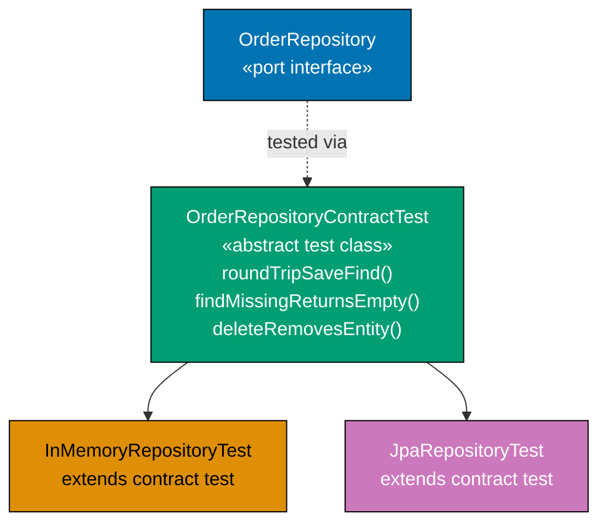

**Java** — abstract contract test class:

```java
import java.math.BigDecimal;
// => executes the statement above; continues to next line
import java.util.HashMap;
// => executes the statement above; continues to next line
import java.util.Optional;

// ── Domain types ──────────────────────────────────────────────────────────────
record OrderId(String value) {}
// => record OrderId: immutable value type; equals/hashCode/toString generated by compiler
record Order(OrderId id, BigDecimal total) {}

// ── Port ──────────────────────────────────────────────────────────────────────
interface OrderRepository {
// => interface OrderRepository: contract definition — no implementation details here
    void save(Order order);
    // => executes the statement above; continues to next line
    Optional<Order> findById(OrderId id);
    // => executes the statement above; continues to next line
    void delete(OrderId id);
    // => executes the statement above; continues to next line
    boolean existsById(OrderId id);
    // => executes the statement above; continues to next line
}

// ── In-memory adapter ─────────────────────────────────────────────────────────
class InMemoryOrderRepository implements OrderRepository {
// => InMemoryOrderRepository implements OrderRepository — satisfies the port contract
    private final java.util.Map<String, Order> store = new HashMap<>();
    // => new HashMap(...): instantiates concrete implementation
    public void save(Order o)                   { store.put(o.id().value(), o); }
    // => save: method entry point — see implementation below
    public Optional<Order> findById(OrderId id) { return Optional.ofNullable(store.get(id.value())); }
    // => executes the statement above; continues to next line
    public void delete(OrderId id)              { store.remove(id.value()); }
    // => delete: method entry point — see implementation below
    public boolean existsById(OrderId id)       { return store.containsKey(id.value()); }
    // => existsById: method entry point — see implementation below
}

// ── Abstract contract test ─────────────────────────────────────────────────────
// Every OrderRepository implementation must pass these tests
// => Subclass provides the concrete implementation via createRepository()
abstract class OrderRepositoryContractTest {
// => class OrderRepositoryContractTest: implementation — contains field declarations and methods below
    protected abstract OrderRepository createRepository(); // => hook: subclass returns impl under test
    // => executes the statement above; continues to next line

    void roundTripSaveAndFind() {
    // => roundTripSaveAndFind: method entry point — see implementation below
        var repo  = createRepository();                    // => get impl from subclass
        // => repo: holds the result of the expression on the right
        var order = new Order(new OrderId("O1"), new BigDecimal("50"));
        // => order: holds the result of the expression on the right
        repo.save(order);                                  // => persist
        // => method call: delegates to collaborator; result captured above
        var found = repo.findById(new OrderId("O1"));      // => load
        // => found: holds the result of the expression on the right
        assert found.isPresent();                          // => found after save
        // => method call: delegates to collaborator; result captured above
        assert found.get().total().equals(new BigDecimal("50")); // => correct total
        // => round-trip: any implementation must preserve total
    }

    void findMissingReturnsEmpty() {
    // => findMissingReturnsEmpty: method entry point — see implementation below
        var repo  = createRepository();
        // => repo: holds the result of the expression on the right
        var found = repo.findById(new OrderId("MISSING")); // => unknown id
        // => found: holds the result of the expression on the right
        assert found.isEmpty();                            // => empty; no exception
        // => Contract: findById never throws for missing; always returns Optional
    }

    void deleteRemovesEntity() {
    // => deleteRemovesEntity: method entry point — see implementation below
        var repo  = createRepository();
        // => repo: holds the result of the expression on the right
        var order = new Order(new OrderId("O1"), new BigDecimal("50"));
        // => order: holds the result of the expression on the right
        repo.save(order);
        // => method call: delegates to collaborator; result captured above
        repo.delete(new OrderId("O1"));                    // => delete
        // => method call: delegates to collaborator; result captured above
        assert repo.findById(new OrderId("O1")).isEmpty(); // => gone after delete
        // => method call: delegates to collaborator; result captured above
        assert !repo.existsById(new OrderId("O1"));        // => existsById also returns false
        // => method call: delegates to collaborator; result captured above
    }
}

// ── Concrete test: InMemoryOrderRepository passes the contract ─────────────────
class InMemoryOrderRepositoryTest extends OrderRepositoryContractTest {
// => InMemoryOrderRepositoryTest extends OrderRepositoryContractTest — inherits base behaviour
    @Override
    // => @Override: compiler verifies this method signature matches the interface
    protected OrderRepository createRepository() {
    // => createRepository: method entry point — see implementation below
        return new InMemoryOrderRepository();              // => provide in-memory impl
        // => All contract tests inherited; run for free; no copy-paste
    }
}

// Run contract tests against in-memory adapter
var t = new InMemoryOrderRepositoryTest();
// => t: holds the result of the expression on the right
t.roundTripSaveAndFind();    // => passes
// => method call: delegates to collaborator; result captured above
t.findMissingReturnsEmpty(); // => passes
// => method call: delegates to collaborator; result captured above
t.deleteRemovesEntity();     // => passes

// ── Concrete test: JpaOrderRepository (production) would do the same ──────────
// class JpaOrderRepositoryTest extends OrderRepositoryContractTest {
//     @Override protected OrderRepository createRepository() {
//         // => @DataJpaTest sets up H2; return JpaOrderRepository with EntityManager
//         return new JpaOrderRepository(entityManager);
//     }
// }
// => JPA adapter inherits all same contract tests; new behaviour bugs caught automatically
```

**Kotlin** — abstract contract test:

```kotlin
import java.math.BigDecimal                                          // => BigDecimal for total
// => executes the statement above; continues to next line

data class OrderId(val value: String)                                // => typed identity
// => data class OrderId: value type; copy/equals/hashCode/toString auto-generated
data class Order(val id: OrderId, val total: BigDecimal)             // => domain aggregate
// => data class Order: value type; copy/equals/hashCode/toString auto-generated

interface OrderRepository {                                          // => application zone; no DB types
// => interface OrderRepository: contract definition — no implementation details here
    fun save(order: Order)                                           // => persist aggregate
    // => executes the statement above; continues to next line
    fun findById(id: OrderId): Order?                                // => null = not found
    // => executes the statement above; continues to next line
    fun delete(id: OrderId)                                          // => remove; no-op if absent
    // => executes the statement above; continues to next line
    fun existsById(id: OrderId): Boolean                             // => existence check; no aggregate loaded
    // => contract tests verify these four methods for every implementation
}
// => operation completes; execution continues to next statement

class InMemoryOrderRepository : OrderRepository {                    // => test adapter; no DB
// => class InMemoryOrderRepository: implementation — contains field declarations and methods below
    private val store = mutableMapOf<String, Order>()                // => backing map; insertion-ordered
    // => store: val — injected dependency; implementation chosen at wiring time
    override fun save(order: Order)             { store[order.id.value] = order }  // => upsert
    // => upsert by id string key
    override fun findById(id: OrderId): Order?  = store[id.value]    // => lookup; null if absent
    // => method call: delegates to collaborator; result captured above
    override fun delete(id: OrderId)            { store.remove(id.value) } // => remove entry
    // => delete: method entry point — see implementation below
    override fun existsById(id: OrderId)        = store.containsKey(id.value) // => containsKey
    // => method call: delegates to collaborator; result captured above
}

// ── Abstract contract ─────────────────────────────────────────────────────────
abstract class OrderRepositoryContractTest {                         // => abstract: subclass provides impl
// => class OrderRepositoryContractTest: implementation — contains field declarations and methods below
    protected abstract fun createRepository(): OrderRepository // => subclass hook; provides impl to test
    // => executes the statement above; continues to next line

    fun roundTripSaveAndFind() {                                     // => contract test: save then find
    // => roundTripSaveAndFind: method entry point — see implementation below
        val repo  = createRepository()                               // => get impl from subclass
        // => repo: holds the result of the expression on the right
        repo.save(Order(OrderId("O1"), BigDecimal("50")))            // => persist
        // => method call: delegates to collaborator; result captured above
        val found = repo.findById(OrderId("O1"))                     // => reload
        // => found: holds the result of the expression on the right
        check(found != null)                               // => found after save
        // => executes the statement above; continues to next line
        check(found!!.total == BigDecimal("50"))           // => total preserved; contract holds
        // => !!: not-null assertion; safe because check(found != null) above guarantees
    }
    // => operation completes; execution continues to next statement

    fun findMissingReturnsNull() {                                   // => contract test: missing returns null
    // => findMissingReturnsNull: method entry point — see implementation below
        val repo = createRepository()                                // => fresh repo
        // => repo: holds the result of the expression on the right
        check(repo.findById(OrderId("MISSING")) == null)   // => null; not exception; contract
        // => contract: findById never throws for missing; always null
    }
    // => operation completes; execution continues to next statement

    fun deleteRemovesEntity() {                                      // => contract test: delete removes
    // => deleteRemovesEntity: method entry point — see implementation below
        val repo = createRepository()                                // => fresh repo
        // => repo: holds the result of the expression on the right
        repo.save(Order(OrderId("O1"), BigDecimal("50")))            // => seed
        // => method call: delegates to collaborator; result captured above
        repo.delete(OrderId("O1"))                                   // => delete
        // => method call: delegates to collaborator; result captured above
        check(repo.findById(OrderId("O1")) == null)        // => gone after delete
        // => method call: delegates to collaborator; result captured above
        check(!repo.existsById(OrderId("O1")))             // => existsById also false
        // => both findById and existsById reflect deletion; consistent state
    }
    // => operation completes; execution continues to next statement
}

// ── Concrete test inherits contract ──────────────────────────────────────────
class InMemoryOrderRepositoryTest : OrderRepositoryContractTest() {  // => inherits all 3 tests
// => class InMemoryOrderRepositoryTest: implementation — contains field declarations and methods below
    override fun createRepository(): OrderRepository = InMemoryOrderRepository() // => provides in-memory impl
    // => All three contract tests inherited; run for InMemoryOrderRepository automatically
    // => Future: ExposedOrderRepositoryTest : OrderRepositoryContractTest() { ... }
}
// => operation completes; execution continues to next statement

val t = InMemoryOrderRepositoryTest()                                // => concrete test instance
// => t: holds the result of the expression on the right
t.roundTripSaveAndFind()                                             // => passes: round-trip works
// => method call: delegates to collaborator; result captured above
t.findMissingReturnsNull()                                           // => passes: null for missing
// => method call: delegates to collaborator; result captured above
t.deleteRemovesEntity()                                              // => passes: delete removes
// => method call: delegates to collaborator; result captured above
```

**C#** — abstract contract test with xUnit:

```csharp
using System;                                                         // => System namespace
// => executes the statement above; continues to next line
using System.Collections.Generic;                                     // => Dictionary
// => executes the statement above; continues to next line
using Xunit;                                                          // => [Fact] attribute
// => executes the statement above; continues to next line

public record OrderId(string Value);                                  // => typed identity
// => executes the statement above; continues to next line
public record Order(OrderId Id, decimal Total);                       // => domain aggregate
// => executes the statement above; continues to next line

public interface IOrderRepository {                                   // => output port; application zone
// => interface IOrderRepository: contract definition — no implementation details here
    void Save(Order order);                                           // => persist aggregate; upsert
    // => executes the statement above; continues to next line
    Order? FindById(OrderId id);                                      // => null = not found; no exception
    // => executes the statement above; continues to next line
    void Delete(OrderId id);                                          // => remove; no-op if absent
    // => executes the statement above; continues to next line
    bool ExistsById(OrderId id);                                      // => existence check; no loading
    // => four-method contract; every adapter must satisfy all four
    // => contract tests verify this interface for all implementations
}
// => operation completes; execution continues to next statement

public class InMemoryOrderRepository : IOrderRepository {             // => test adapter; no EF Core
// => class InMemoryOrderRepository: implementation — contains field declarations and methods below
    private readonly Dictionary<string, Order> _store = new();        // => backing store
    // => executes the statement above; continues to next line
    public void   Save(Order o)          => _store[o.Id.Value] = o;   // => upsert by id; idempotent
    // => method call: delegates to collaborator; result captured above
    public Order? FindById(OrderId id)   => _store.TryGetValue(id.Value, out var o) ? o : null;
    // => TryGetValue: null-safe lookup; returns null for missing keys; no exception
    public void   Delete(OrderId id)     => _store.Remove(id.Value);  // => remove entry; no-op if absent
    // => Dictionary.Remove is safe when key absent; no KeyNotFoundException
    public bool   ExistsById(OrderId id) => _store.ContainsKey(id.Value); // => key check; O(1)
    // => method call: delegates to collaborator; result captured above
}

// ── Abstract contract test ─────────────────────────────────────────────────────
// xUnit: abstract test classes are skipped; concrete subclass runs the inherited [Fact] methods
public abstract class OrderRepositoryContractTests  // => abstract: xUnit skips this; subclass runs it
// => executes the statement above; continues to next line
{
// => operation completes; execution continues to next statement
    protected abstract IOrderRepository CreateRepository(); // => subclass provides impl to test
    // => Template Method Pattern: base defines what to test; subclass defines which impl
    // => All three test methods are [Fact]; concrete subclass inherits and xUnit discovers them

    [Fact]                                                            // => xUnit test
    // => executes the statement above; continues to next line
    public void RoundTripSaveAndFind()                                // => contract: save then find works
    // => executes the statement above; continues to next line
    {
    // => operation completes; execution continues to next statement
        var repo  = CreateRepository();                               // => get impl from subclass
        // => repo: holds the result of the expression on the right
        repo.Save(new Order(new OrderId("O1"), 50m));                 // => persist; Total=50m
        // => method call: delegates to collaborator; result captured above
        var found = repo.FindById(new OrderId("O1"));                 // => reload same id; should return Order
        // => found: holds the result of the expression on the right
        Assert.NotNull(found);                             // => found after save
        // => method call: delegates to collaborator; result captured above
        Assert.Equal(50m, found!.Total);                   // => total preserved; contract holds
        // => !: null-forgiving; safe because Assert.NotNull above guarantees non-null
        // => Assert.Equal: value equality on decimal; 50m == 50.0m true
    }
    // => operation completes; execution continues to next statement

    [Fact]                                                            // => xUnit test
    // => executes the statement above; continues to next line
    public void FindMissingReturnsNull()                              // => contract: missing returns null
    // => executes the statement above; continues to next line
    {
    // => operation completes; execution continues to next statement
        var repo = CreateRepository();                                // => fresh repo
        // => repo: holds the result of the expression on the right
        Assert.Null(repo.FindById(new OrderId("MISSING"))); // => null; not exception
        // => contract: FindById never throws; always returns null for missing
    }

    [Fact]                                                            // => xUnit test
    // => executes the statement above; continues to next line
    public void DeleteRemovesEntity()                                 // => contract: delete removes
    // => executes the statement above; continues to next line
    {
        var repo = CreateRepository();                                // => fresh repo
        // => repo: holds the result of the expression on the right
        repo.Save(new Order(new OrderId("O1"), 50m));                 // => seed
        // => method call: delegates to collaborator; result captured above
        repo.Delete(new OrderId("O1"));                               // => delete
        // => method call: delegates to collaborator; result captured above
        Assert.Null(repo.FindById(new OrderId("O1")));      // => gone after delete
        // => method call: delegates to collaborator; result captured above
        Assert.False(repo.ExistsById(new OrderId("O1")));   // => existsById also false
        // => both FindById and ExistsById reflect deletion; consistent state
    }
}

// ── Concrete test: InMemoryOrderRepository ────────────────────────────────────
public class InMemoryOrderRepositoryTests : OrderRepositoryContractTests  // => runs all 3 inherited [Fact]s
// => executes the statement above; continues to next line
{
    protected override IOrderRepository CreateRepository() => new InMemoryOrderRepository(); // => test impl
    // => Inherits all three [Fact] methods; runs them against InMemoryOrderRepository
    // => Future: EfOrderRepositoryTests : OrderRepositoryContractTests would do the same
    // => xUnit discovers and runs this concrete class; abstract base is skipped
}
```

**Key Takeaway**: An abstract contract test class defines the port's observable properties. Both `InMemoryOrderRepository` and `JpaOrderRepository` extend it and run the same suite. Any new adapter that fails the contract is caught immediately.

**Why It Matters**: Without contract tests, in-memory and production adapters can silently diverge — the in-memory adapter returns `null` for missing IDs while the JPA adapter throws an exception, or vice versa. Contract tests enforce strict behavioural parity across implementations, ensuring that tests using the in-memory adapter reliably predict the production adapter's actual behaviour at runtime.

---

### Example 50: Fake vs mock — why fakes win in hexagonal

Two tests for the same behaviour: one uses Mockito/mockk/Moq mocks, one uses an in-memory fake. The fake is shorter, more readable, exercises the full port contract, and does not couple the test to implementation details.

**Java** — mock vs fake comparison:

**With mock (Mockito)**:

```java
import java.math.BigDecimal;
import java.util.Optional;
// In production: import org.mockito.Mockito.*;

// Supporting types
record OrderId(String value) {}
record Order(OrderId id, BigDecimal total) {}
interface OrderRepository { Optional<Order> findById(OrderId id); void save(Order o); }

// ── Mock-based test (AVOID in hexagonal) ─────────────────────────────────────
// Mock: Mockito.mock(OrderRepository.class)
// Problem: test verifies HOW the service calls the repository (implementation details)
// => verify(repo, times(1)).save(any()) — tests method calls, not business outcomes
// => when(repo.findById(...)).thenReturn(...) — verbose setup for every scenario
// => Coupling: if service calls save() twice in a refactor, test fails even if outcome is correct
void mockBasedTest_AVOID() {
    // => Mockito.mock: creates a proxy object recording method calls
    // => when(): stubs specific return values for specific arguments
    // => verify(): asserts that specific method was called with specific args
    // => Problem: tests call graph, not observable behaviour
    // => If service logic changes (two saves instead of one), test breaks even if outcome is correct
}
```

**With fake (InMemoryOrderRepository)**:

```java
import java.math.BigDecimal;
// => executes the statement above; continues to next line
import java.util.HashMap;
// => executes the statement above; continues to next line
import java.util.Map;
// => executes the statement above; continues to next line
import java.util.Optional;
// => executes the statement above; continues to next line

record OrderId(String value) {}
// => record OrderId: immutable value type; equals/hashCode/toString generated by compiler
record Order(OrderId id, BigDecimal total) {}
// => record Order: immutable value type; equals/hashCode/toString generated by compiler
interface OrderRepository { Optional<Order> findById(OrderId id); void save(Order o); }

// ── In-memory fake ─────────────────────────────────────────────────────────────
class InMemoryOrderRepository implements OrderRepository {
// => InMemoryOrderRepository implements OrderRepository — satisfies the port contract
    final Map<String, Order> store = new HashMap<>(); // => public for assertion in tests
    // => new HashMap(...): instantiates concrete implementation
    public Optional<Order> findById(OrderId id) { return Optional.ofNullable(store.get(id.value())); }
    // => executes the statement above; continues to next line
    public void save(Order o) { store.put(o.id().value(), o); }
    // => Fake implements the same port contract as the production adapter
}

// ── Fake-based application service under test ─────────────────────────────────
class FindOrCreateOrderService {
// => class FindOrCreateOrderService: implementation — contains field declarations and methods below
    private final OrderRepository repo;
    // => repo: OrderRepository — final field; assigned once in constructor; immutable reference
    FindOrCreateOrderService(OrderRepository r) { this.repo = r; }
    // => method call: delegates to collaborator; result captured above

    Order findOrCreate(OrderId id) {
    // => executes the statement above; continues to next line
        return repo.findById(id).orElseGet(() -> {     // => check existing
        // => returns the result to the caller — caller receives this value
            var order = new Order(id, new BigDecimal("0")); // => create if missing
            // => order: holds the result of the expression on the right
            repo.save(order);                          // => persist new order
            // => method call: delegates to collaborator; result captured above
            return order;
            // => returns the result to the caller — caller receives this value
        });
    }
}

// ── Fake-based test (PREFER in hexagonal) ─────────────────────────────────────
var repo    = new InMemoryOrderRepository();          // => fake; no mock framework
// => repo: holds the result of the expression on the right
var service = new FindOrCreateOrderService(repo);      // => inject fake

// Test 1: missing order gets created
var created = service.findOrCreate(new OrderId("O1")); // => not in store; creates
// => created: holds the result of the expression on the right
assert repo.store.containsKey("O1");                   // => assert on observable outcome: state
// => method call: delegates to collaborator; result captured above
assert created.id().value().equals("O1");              // => returned object is correct
// => Fake test: asserts that the order IS in the store (observable behaviour)
// => Not: verify(repo).save(any()) (implementation detail)

// Test 2: existing order returned; not overwritten
repo.store.put("O2", new Order(new OrderId("O2"), new BigDecimal("99"))); // => seed store
// => method call: delegates to collaborator; result captured above
var existing = service.findOrCreate(new OrderId("O2")); // => found in store; returned
// => existing: holds the result of the expression on the right
assert existing.total().equals(new BigDecimal("99"));   // => original total preserved
// => method call: delegates to collaborator; result captured above
assert repo.store.size() == 2;                          // => no extra save; both orders in store
// => Fake: natural state assertion; no need to stub or verify anything
```

**Kotlin** — fake vs mock:

```kotlin
import java.math.BigDecimal                                          // => BigDecimal for total
// => executes the statement above; continues to next line

data class OrderId(val value: String)                                // => typed identity
// => data class OrderId: value type; copy/equals/hashCode/toString auto-generated
data class Order(val id: OrderId, val total: BigDecimal)             // => domain aggregate
// => data class Order: value type; copy/equals/hashCode/toString auto-generated

interface OrderRepository { fun findById(id: OrderId): Order?; fun save(order: Order) }
// => port; InMemoryOrderRepository implements for tests; EF adapter for production
// => findById: null = not found; save: upsert

class InMemoryOrderRepository : OrderRepository {
// => class InMemoryOrderRepository: implementation — contains field declarations and methods below
    val store = mutableMapOf<String, Order>()          // => public: test reads state directly
    // => store: holds the result of the expression on the right
    override fun findById(id: OrderId): Order? = store[id.value]     // => lookup; null if absent
    // => method call: delegates to collaborator; result captured above
    override fun save(order: Order) { store[order.id.value] = order } // => upsert
    // => save: method entry point — see implementation below
}

class FindOrCreateOrderService(private val repo: OrderRepository) {
    // => repo injected; no concrete class imported
    fun findOrCreate(id: OrderId): Order =
    // => executes the statement above; continues to next line
        repo.findById(id) ?: Order(id, BigDecimal.ZERO).also { repo.save(it) }
        // => ?: null-coalescing: findById returns null → create and save; else return found
        // => .also: executes save as side effect; returns the created Order
}

// ── Fake-based test: observes state, not call graph ──────────────────────────
val repo    = InMemoryOrderRepository()                              // => fake; no mock framework
// => repo: holds the result of the expression on the right
val service = FindOrCreateOrderService(repo)                         // => inject fake
// => service: holds the result of the expression on the right

val created = service.findOrCreate(OrderId("O1"))                    // => not in store; creates
// => created: holds the result of the expression on the right
check(repo.store.containsKey("O1"))                    // => state assertion; not verify()
// => method call: delegates to collaborator; result captured above
check(created.id.value == "O1")                                      // => returned object correct
// => method call: delegates to collaborator; result captured above

repo.store["O2"] = Order(OrderId("O2"), BigDecimal("99")) // => seed existing
// => method call: delegates to collaborator; result captured above
val existing = service.findOrCreate(OrderId("O2"))                   // => found; returned; not saved again
// => existing: holds the result of the expression on the right
check(existing.total == BigDecimal("99"))               // => original preserved; not overwritten
// => method call: delegates to collaborator; result captured above
check(repo.store.size == 2)                            // => exactly two entries; no spurious saves
// => With mockk: verify(exactly = 0) { repo.save(any()) } — tests call count; fragile
// => With fake: check(repo.store.size == 2) — tests observable state; robust
```

**C#** — fake vs Moq:

```csharp
using System.Collections.Generic;                            // => Dictionary
// => executes the statement above; continues to next line

public record OrderId(string Value);                         // => typed identity
// => executes the statement above; continues to next line
public record Order(OrderId Id, decimal Total);              // => domain aggregate
// => executes the statement above; continues to next line

public interface IOrderRepository { Order? FindById(OrderId id); void Save(Order o); }
// => port; fake implements for tests; EF adapter for production
// => FindById: null = not found; Save: upsert semantics; no Delete in this simplified version
// => callers depend on this interface; never on InMemoryOrderRepository or EfOrderRepository
// => IOrderRepository: abstraction; enables swapping fake ↔ production without changing service

// ── Fake ──────────────────────────────────────────────────────────────────────
public class InMemoryOrderRepository : IOrderRepository  // => no EF Core; observable state
// => executes the statement above; continues to next line
{
    public Dictionary<string, Order> Store { get; } = new(); // => public: state directly assertable
    // => Dictionary exposed for test assertions; Store.ContainsKey(), Store.Count etc.
    public Order? FindById(OrderId id) => Store.TryGetValue(id.Value, out var o) ? o : null;
    // => null-safe lookup; no exception on miss
    public void   Save(Order o)        => Store[o.Id.Value] = o;   // => upsert
    // => method call: delegates to collaborator; result captured above
}

public class FindOrCreateOrderService(IOrderRepository repo)
// => executes the statement above; continues to next line
{                                                            // => repo injected; no concrete class imported
// => class imported: implementation — contains field declarations and methods below
    public Order FindOrCreate(OrderId id)                    // => idempotent create: returns existing or new
    // => executes the statement above; continues to next line
    {                                                        // => non-void; always returns an Order
    // => executes the statement above; continues to next line
        var existing = repo.FindById(id);                    // => check if order already exists
        // => existing: holds the result of the expression on the right
        if (existing is not null) return existing;         // => found: return existing; no save
        // => conditional branch: execution path depends on condition above
        var created = new Order(id, 0m);                   // => missing: create new with zero total
        // => created: holds the result of the expression on the right
        repo.Save(created);                                // => persist new order; first time only
        // => method call: delegates to collaborator; result captured above
        return created;                                    // => return newly created order
        // => next call with same id will find it in store and return existing
    }
}

// ── Fake-based test (PREFER) ──────────────────────────────────────────────────
// With Moq (AVOID): mockRepo.Verify(r => r.Save(It.IsAny<Order>()), Times.Once())
//   => Tests that Save was called once; breaks if refactoring calls Save twice internally
// With fake (PREFER): Assert.True(repo.Store.ContainsKey("O1"))
//   => Tests that the order IS in the store; robust to internal refactoring

var repo    = new InMemoryOrderRepository();                 // => fake; no Moq; no EF Core
// => repo: holds the result of the expression on the right
var service = new FindOrCreateOrderService(repo);            // => inject fake
// => service: holds the result of the expression on the right

var created = service.FindOrCreate(new OrderId("O1"));       // => not in store; creates and returns
// => created: holds the result of the expression on the right
System.Diagnostics.Debug.Assert(repo.Store.ContainsKey("O1")); // => state; not call
// => method call: delegates to collaborator; result captured above
System.Diagnostics.Debug.Assert(created.Id.Value == "O1");   // => returned object correct
// => method call: delegates to collaborator; result captured above

repo.Store["O2"] = new Order(new OrderId("O2"), 99m);          // => seed existing
// => new Order(...): instantiates concrete implementation
var existing = service.FindOrCreate(new OrderId("O2"));        // => found; returned; not overwritten
// => existing: holds the result of the expression on the right
System.Diagnostics.Debug.Assert(existing.Total == 99m);         // => original preserved
// => method call: delegates to collaborator; result captured above
System.Diagnostics.Debug.Assert(repo.Store.Count == 2);         // => no spurious saves
// => method call: delegates to collaborator; result captured above
```

**Key Takeaway**: Fakes assert on observable state — what is in the repository after the call. Mocks assert on the call graph — which methods were called how many times. Fakes are robust to internal refactoring; mocks break when the implementation changes even if the outcome is identical.

**Why It Matters**: Over time, mock-heavy tests become genuine maintenance burdens: every internal refactoring requires updating `verify()` calls even when the externally visible business behaviour is completely unchanged. Fakes encode the port contract once and reuse it everywhere, while tests assert on real outcomes the domain and business stakeholders actually care about most.

---

### Example 51: Test doubles at each layer

Each layer of the hexagon uses a different kind of test double. Domain needs none. Application uses fakes. Adapter unit tests use fake downstream dependencies. Adapter integration tests use real infrastructure.

**Java** — test doubles by layer:

```java
import java.math.BigDecimal;
// => executes the statement above; continues to next line
import java.util.Optional;

// ── Layer summary ─────────────────────────────────────────────────────────────
// Domain layer:      no test doubles needed — pure functions; plain objects only
// Application layer: fake output ports (in-memory implementations of port interfaces)
// Adapter unit:      fake downstream (fake HTTP client / fake DB connection)
// Adapter integration: real downstream (TestContainers PostgreSQL / real SMTP sandbox)

// ── 1. Domain layer: no doubles ───────────────────────────────────────────────
record Money(BigDecimal amount, String currency) {}
// => record Money: immutable value type; equals/hashCode/toString generated by compiler
record OrderLine(String productId, int qty, Money price) {
// => record OrderLine: immutable value type; equals/hashCode/toString generated by compiler
    Money lineTotal() { return new Money(price.amount().multiply(BigDecimal.valueOf(qty)), price.currency()); }
    // => Pure function; no ports; no framework; no test double needed
}

// Domain test: plain objects; no doubles
var line  = new OrderLine("P1", 3, new Money(new BigDecimal("10"), "USD"));
// => line: holds the result of the expression on the right
assert line.lineTotal().amount().equals(new BigDecimal("30")); // => pure computation; just assert

// ── 2. Application layer: fake output port ────────────────────────────────────
interface OrderRepository { void save(String id, BigDecimal total); }
// => interface OrderRepository: contract definition — no implementation details here

class FakeOrderRepository implements OrderRepository {
// => FakeOrderRepository implements OrderRepository — satisfies the port contract
    final java.util.Map<String, BigDecimal> store = new java.util.HashMap<>();
    // => new java(...): instantiates concrete implementation
    public void save(String id, BigDecimal total) { store.put(id, total); }
    // => Fake: full implementation of the port contract; asserts on store state
}

class PlaceOrderService {
// => class PlaceOrderService: implementation — contains field declarations and methods below
    private final OrderRepository repo;
    // => repo: OrderRepository — final field; assigned once in constructor; immutable reference
    PlaceOrderService(OrderRepository r) { this.repo = r; }
    // => method call: delegates to collaborator; result captured above
    void place(String id, BigDecimal total) { repo.save(id, total); }
    // => place: method entry point — see implementation below
}

var fakeRepo = new FakeOrderRepository();               // => fake port; in-memory
// => fakeRepo: holds the result of the expression on the right
var appService = new PlaceOrderService(fakeRepo);       // => inject fake
// => appService: holds the result of the expression on the right
appService.place("O1", new BigDecimal("50"));
// => method call: delegates to collaborator; result captured above
assert fakeRepo.store.get("O1").equals(new BigDecimal("50")); // => state assertion

// ── 3. Adapter unit: fake downstream ─────────────────────────────────────────
interface HttpClient { String post(String url, String body); } // => abstraction over real HTTP
// => interface HttpClient: contract definition — no implementation details here

class FakeHttpClient implements HttpClient {
// => FakeHttpClient implements HttpClient — satisfies the port contract
    java.util.List<String> requests = new java.util.ArrayList<>(); // => recorded requests
    // => new java(...): instantiates concrete implementation
    String responseBody;                                           // => configurable response
    // => executes the statement above; continues to next line
    FakeHttpClient(String responseBody) { this.responseBody = responseBody; }
    // => method call: delegates to collaborator; result captured above
    public String post(String url, String body) { requests.add(body); return responseBody; }
    // => Fake downstream: no real HTTP; deterministic; records what was sent
}

class StripePaymentAdapter {  // => adapter under unit test
// => class StripePaymentAdapter: implementation — contains field declarations and methods below
    private final HttpClient httpClient;
    // => httpClient: HttpClient — final field; assigned once in constructor; immutable reference
    StripePaymentAdapter(HttpClient c) { this.httpClient = c; }
    // => method call: delegates to collaborator; result captured above
    String chargeCard(String cardToken, BigDecimal amount) {
    // => executes the statement above; continues to next line
        var body   = "{\"card\":\"" + cardToken + "\",\"amount\":" + amount + "}";
        // => body: holds the result of the expression on the right
        var result = httpClient.post("https://api.stripe.com/charges", body);
        // => result: holds the result of the expression on the right
        return result; // => pass-through for test; real adapter would parse result
        // => returns the result to the caller — caller receives this value
    }
}

var fakeHttp    = new FakeHttpClient("{\"status\":\"succeeded\"}"); // => configurable response
// => fakeHttp: holds the result of the expression on the right
var stripeAdapter = new StripePaymentAdapter(fakeHttp);
// => stripeAdapter: holds the result of the expression on the right
var result      = stripeAdapter.chargeCard("tok_test", new BigDecimal("50"));
// => result: holds the result of the expression on the right
assert result.contains("succeeded");                   // => adapter processed response
// => method call: delegates to collaborator; result captured above
assert fakeHttp.requests.size() == 1;                  // => one HTTP request sent
// => Adapter unit test: fake HTTP; no real Stripe network call; fast; deterministic
```

**Kotlin** — test doubles summary:

```kotlin
import java.math.BigDecimal                                          // => BigDecimal for amounts

// ── Domain: no test double ────────────────────────────────────────────────────
data class OrderLine(val productId: String, val qty: Int, val unitPrice: BigDecimal) {
    // => pure domain value object; no port, no I/O
    fun lineTotal(): BigDecimal = unitPrice * qty.toBigDecimal()
    // => Pure function; no port; no I/O; no test double needed at any test level
    // => unitPrice * qty: Kotlin operator overload on BigDecimal
}
check(OrderLine("P1", 3, BigDecimal("10")).lineTotal() == BigDecimal("30"))
// => domain assertion: pure computation; no doubles needed
// => 3 * 10.00 = 30.00; exact equality on BigDecimal

// ── Application: fake port ────────────────────────────────────────────────────
fun interface OrderRepository { fun save(id: String, total: BigDecimal) }
// => SAM interface; Fake and production adapter both implement this
class FakeOrderRepository : OrderRepository {                    // => in-memory; no DB
// => class FakeOrderRepository: implementation — contains field declarations and methods below
    val store = mutableMapOf<String, BigDecimal>()               // => backing store; public for assertion
    // => store: holds the result of the expression on the right
    override fun save(id: String, total: BigDecimal) { store[id] = total }
    // => Fake: full in-memory impl; test asserts on store.get(id)
    // => store[id] = total: upsert; overwrites if key exists
}

// ── Adapter unit: fake downstream ─────────────────────────────────────────────
fun interface HttpClient { fun post(url: String, body: String): String }
// => abstraction over real HTTP; fake implements for adapter unit tests
class FakeHttpClient(val response: String) : HttpClient {        // => val response: configurable
// => class FakeHttpClient: implementation — contains field declarations and methods below
    val requests = mutableListOf<String>()          // => record sent requests
    // => requests: holds the result of the expression on the right
    override fun post(url: String, body: String): String { requests += body; return response }
    // => records request body; returns configured response; no real HTTP
    // => requests captures all request bodies for assertion
}

class StripeAdapter(private val http: HttpClient) {
    // => http injected; FakeHttpClient in tests; real HttpClient in production
    fun charge(token: String, amount: BigDecimal): String =      // => adapts domain call to HTTP
    // => executes the statement above; continues to next line
        http.post("https://api.stripe.com/charges", """{"card":"$token","amount":$amount}""")
    // => adapter translates domain call to HTTP body; delegates to http port
    // => triple-quoted string: JSON body with token and amount
}

val fakeHttp = FakeHttpClient("""{"status":"succeeded"}""")     // => configurable response
// => fakeHttp: holds the result of the expression on the right
val stripe   = StripeAdapter(fakeHttp)                          // => inject fake HTTP client
// => stripe: holds the result of the expression on the right
check(stripe.charge("tok_test", BigDecimal("50")).contains("succeeded"))
// => adapter processed response correctly
check(fakeHttp.requests.size == 1)                   // => exactly one request sent
// => method call: delegates to collaborator; result captured above
```

**C#** — test doubles by layer:

```csharp
using System;                                                         // => System namespace
// => executes the statement above; continues to next line
using System.Collections.Generic;                                     // => Dictionary, List

// ── Domain: no double ─────────────────────────────────────────────────────────
public record OrderLine(string ProductId, int Qty, decimal UnitPrice)  // => domain value object
// => executes the statement above; continues to next line
{                                                                     // => domain value object; no framework
// => executes the statement above; continues to next line
    public decimal LineTotal() => UnitPrice * Qty; // => pure function; no test double needed
    // => No ports; no I/O; no framework; just arithmetic; testable with plain new()
}
System.Diagnostics.Debug.Assert(new OrderLine("P1", 3, 10m).LineTotal() == 30m);
// => domain assertion: 3 * 10 = 30; no doubles needed
// => Debug.Assert: lightweight assertion; compiles away in Release; suitable for domain tests

// ── Application: fake port ────────────────────────────────────────────────────
public interface IOrderRepository { void Save(string id, decimal total); }
// => port; fake implements for application tests; EF adapter for production
// => simplified: no FindById or Delete; enough for this example
public class FakeOrderRepository : IOrderRepository
// => executes the statement above; continues to next line
{                                                                     // => in-memory; no EF Core
// => executes the statement above; continues to next line
    public Dictionary<string, decimal> Store { get; } = new();        // => public for assertion
    // => executes the statement above; continues to next line
    public void Save(string id, decimal total) => Store[id] = total;  // => upsert
    // => Full in-memory impl; test asserts on Store[id]
}

// ── Adapter unit: fake downstream ─────────────────────────────────────────────
public interface IHttpClient { string Post(string url, string body); }
// => abstraction over real HTTP; FakeHttpClient for adapter unit tests
// => adapter depends on IHttpClient; not on HttpClient class directly
public class FakeHttpClient(string response) : IHttpClient  // => primary constructor; response captured
// => constructor: receives all dependencies — enables testing with any adapter implementation
{
    public List<string> Requests { get; } = new();                    // => captured requests
    // => executes the statement above; continues to next line
    public string Post(string url, string body) { Requests.Add(body); return response; }
    // => Records requests; returns configured response; no real HTTP
    // => response: pre-configured JSON body; e.g. {"status":"succeeded"}
}

public class StripeAdapter(IHttpClient http)
// => executes the statement above; continues to next line
{                                                                     // => http injected; fake in unit tests
// => executes the statement above; continues to next line
    public string Charge(string token, decimal amount) =>             // => adapts domain call to HTTP
    // => executes the statement above; continues to next line
        http.Post("https://api.stripe.com/charges", $"{{\"card\":\"{token}\",\"amount\":{amount}}}");
    // => adapter translates domain call to HTTP request; delegates to http port
    // => $"{{...}}": escaped braces produce literal { and } in interpolated string
}

var fakeHttp = new FakeHttpClient("{\"status\":\"succeeded\"}");      // => configurable response
// => fakeHttp: holds the result of the expression on the right
var stripe   = new StripeAdapter(fakeHttp);                           // => inject fake HTTP client
// => stripe: holds the result of the expression on the right
System.Diagnostics.Debug.Assert(stripe.Charge("tok_test", 50m).Contains("succeeded"));
// => adapter processed response correctly; "succeeded" is in response body
System.Diagnostics.Debug.Assert(fakeHttp.Requests.Count == 1);
// => exactly one HTTP request sent; no spurious calls
```

**Key Takeaway**: Domain needs no test doubles. Application uses fake port implementations. Adapter unit tests use fake downstream clients. Adapter integration tests use real downstream services. The layer determines the appropriate double — not the test author's preference.

**Why It Matters**: Using mocks at the domain layer adds unnecessary complexity to the simplest tests in your suite. Using real infrastructure at the application layer makes even the most basic orchestration tests slow and brittle. The correct test double for each layer is determined by the architecture, not by personal convention or habit.

---

### Example 52: Integration test — full stack with controlled adapters

An integration test starts the full application — real JPA/EF/Exposed against TestContainers PostgreSQL — but replaces notification and clock adapters with fakes. It exercises the full stack from use case call to database and verifies all side effects.

**Java** — integration test shape:

```java
import java.math.BigDecimal;                      // => BigDecimal: monetary amounts
// => executes the statement above; continues to next line
import java.time.Instant;                         // => Instant: timestamps from clock port
// => executes the statement above; continues to next line
import java.util.ArrayList;                       // => ArrayList: mutable list for fake captures
// => executes the statement above; continues to next line
import java.util.HashMap;                         // => HashMap: backing store for simulated JPA repo
// => executes the statement above; continues to next line
import java.util.List;                            // => List: exposed collections for assertions
// => executes the statement above; continues to next line
import java.util.Optional;                        // => Optional: no-null contract for findById

// ── All types self-contained ──────────────────────────────────────────────────
record OrderId(String value) {}                   // => typed identity; not raw String
// => record OrderId: immutable value type; equals/hashCode/toString generated by compiler
record Order(OrderId id, BigDecimal total, Instant placedAt) {} // => aggregate: three fields
// => record Order: immutable value type; equals/hashCode/toString generated by compiler
record OrderPlaced(OrderId orderId, BigDecimal total, Instant placedAt) {} // => domain event
// => record OrderPlaced: immutable value type; equals/hashCode/toString generated by compiler
record OrderConfirmation(OrderId orderId, String email, BigDecimal total) {} // => notification value object

// => four output port interfaces; application zone contracts
interface OrderRepository { void save(Order o); Optional<Order> findById(OrderId id); } // => persistence port
// => interface OrderRepository: contract definition — no implementation details here
interface NotificationPort { void sendOrderConfirmation(OrderConfirmation c); } // => notification port
// => interface NotificationPort: contract definition — no implementation details here
interface DomainEventPublisher { void publish(OrderPlaced e); }                 // => event publishing port
// => interface DomainEventPublisher: contract definition — no implementation details here
interface ClockPort { Instant now(); }                                          // => injectable time port

// ── "Real" JPA adapter (simulated; in production backed by PostgreSQL) ─────────
// => In production: JpaOrderRepository backed by TestContainers PostgreSQL
class SimulatedJpaOrderRepository implements OrderRepository { // => implements persistence port
// => SimulatedJpaOrderRepository implements OrderRepository — satisfies the port contract
    private final java.util.Map<String, Order> store = new HashMap<>(); // => HashMap simulates DB table
    // => In production: inject EntityManager; map JPA entity ↔ domain Order
    // => TestContainers: @Container static PostgreSQLContainer<?> postgres = new PostgreSQLContainer<>(...)
    public void save(Order o) { store.put(o.id().value(), o); } // => simulates JPA persist; upsert
    // => save: method entry point — see implementation below
    public Optional<Order> findById(OrderId id) { return Optional.ofNullable(store.get(id.value())); } // => lookup
    // => method call: delegates to collaborator; result captured above
}

// ── Controlled adapters: notification and clock are still fakes ───────────────
// => Integration test keeps notification and event adapters as fakes; only persistence is "real"
class FakeNotificationPort implements NotificationPort { // => no SMTP; captures for assertions
// => FakeNotificationPort implements NotificationPort — satisfies the port contract
    final List<OrderConfirmation> sent = new ArrayList<>(); // => exposed for test assertions
    // => new ArrayList(...): instantiates concrete implementation
    public void sendOrderConfirmation(OrderConfirmation c) { sent.add(c); } // => records; no network
    // => sendOrderConfirmation: method entry point — see implementation below
}
class FakeDomainEventPublisher implements DomainEventPublisher { // => no broker; captures events
// => FakeDomainEventPublisher implements DomainEventPublisher — satisfies the port contract
    final List<OrderPlaced> events = new ArrayList<>();          // => exposed for test assertions
    // => new ArrayList(...): instantiates concrete implementation
    public void publish(OrderPlaced e) { events.add(e); }       // => records; no Kafka/RabbitMQ
    // => publish: method entry point — see implementation below
}

// ── Application service ───────────────────────────────────────────────────────
// => Unchanged from unit test version; adapter swap happens at wiring time only
class PlaceOrderService {                          // => orchestrates four injected ports
// => class PlaceOrderService: implementation — contains field declarations and methods below
    private final OrderRepository repo;            // => injected; real or simulated JPA
    // => repo: OrderRepository — final field; assigned once in constructor; immutable reference
    private final NotificationPort notif;          // => injected; fake in test; SMTP in production
    // => notif: NotificationPort — final field; assigned once in constructor; immutable reference
    private final DomainEventPublisher publisher;  // => injected; fake in test; broker in production
    // => publisher: DomainEventPublisher — final field; assigned once in constructor; immutable reference
    private final ClockPort clock;                 // => injected; fixed in test; system in production
    // => clock: ClockPort — final field; assigned once in constructor; immutable reference

    PlaceOrderService(OrderRepository r, NotificationPort n, DomainEventPublisher p, ClockPort c) { // => all injected
    // => executes the statement above; continues to next line
        this.repo = r; this.notif = n; this.publisher = p; this.clock = c; // => stored; no logic here
        // => this.repo stored — field holds injected r for method calls below
    }

    OrderId placeOrder(String customerId, BigDecimal total, String email) { // => use case; orchestrates ports
    // => executes the statement above; continues to next line
        var id    = new OrderId(java.util.UUID.randomUUID().toString()); // => new unique OrderId per call
        // => id: holds the result of the expression on the right
        var now   = clock.now();                       // => from clock port; fixed in test
        // => now: holds the result of the expression on the right
        var order = new Order(id, total, now);         // => constructs domain aggregate; no I/O
        // => order: holds the result of the expression on the right
        repo.save(order);                              // => real JPA adapter in integration test
        // => method call: delegates to collaborator; result captured above
        publisher.publish(new OrderPlaced(id, total, now)); // => fake publisher: no RabbitMQ
        // => method call: delegates to collaborator; result captured above
        notif.sendOrderConfirmation(new OrderConfirmation(id, email, total)); // => fake: no SMTP
        // => method call: delegates to collaborator; result captured above
        return id;                                     // => returns new OrderId; caller uses for assertions
        // => returns the result to the caller — caller receives this value
    }
}

// ── Integration test: real repo, fake notification + publisher ────────────────
// In production: @SpringBootTest(classes = ...) with TestContainers PostgreSQL
// => Real DB: verifies JPA mapping, constraints, transactions
// => Fake notification: no SMTP server; fast; deterministic email assertions
// => Fake publisher: no RabbitMQ; verifies events without broker running

var realRepo  = new SimulatedJpaOrderRepository(); // => "real" JPA; production uses TestContainers
// => realRepo: holds the result of the expression on the right
var fakeNotif = new FakeNotificationPort();         // => fake notification; captures for assertions
// => fakeNotif: holds the result of the expression on the right
var fakePub   = new FakeDomainEventPublisher();     // => fake event publisher; captures for assertions
// => fakePub: holds the result of the expression on the right
var fixedClock = (ClockPort) () -> Instant.parse("2026-01-01T00:00:00Z"); // => lambda implements SAM
// => fixedClock: holds the result of the expression on the right

var service = new PlaceOrderService(realRepo, fakeNotif, fakePub, fixedClock); // => mixed injection
// => service: holds the result of the expression on the right
var orderId = service.placeOrder("CUST-1", new BigDecimal("75"), "bob@example.com"); // => act

// Verify DB state (real JPA would verify against PostgreSQL)
var fromDb = realRepo.findById(orderId);              // => queries persistence layer; verifies round-trip
// => fromDb: holds the result of the expression on the right
assert fromDb.isPresent();                             // => persisted in DB; save committed
// => method call: delegates to collaborator; result captured above
assert fromDb.get().total().equals(new BigDecimal("75")); // => total round-tripped correctly
// Verify events (fake publisher: no broker needed)
assert fakePub.events.size() == 1;                     // => exactly one domain event published
// => method call: delegates to collaborator; result captured above
assert fakePub.events.get(0).orderId().value().equals(orderId.value()); // => event has correct orderId
// Verify notification (fake notif: no SMTP needed)
assert fakeNotif.sent.size() == 1;                     // => exactly one notification sent
// => method call: delegates to collaborator; result captured above
assert fakeNotif.sent.get(0).email().equals("bob@example.com"); // => correct recipient email
// => method call: delegates to collaborator; result captured above
```

**Kotlin** — integration test shape:

```kotlin
import java.math.BigDecimal                                          // => BigDecimal for totals
// => executes the statement above; continues to next line
import java.time.Instant                                             // => Instant for timestamps
// => executes the statement above; continues to next line
import java.util.UUID                                                // => UUID for id generation
// => executes the statement above; continues to next line

data class OrderId(val value: String)                                // => typed identity
// => data class OrderId: value type; copy/equals/hashCode/toString auto-generated
data class Order(val id: OrderId, val total: BigDecimal, val placedAt: Instant)
// => domain aggregate with timestamp
data class OrderPlaced(val orderId: OrderId, val total: BigDecimal, val placedAt: Instant)
// => domain event

interface OrderRepository { fun save(order: Order); fun findById(id: OrderId): Order? }
// => output port; SimulatedJpaRepository = real DB adapter in integration tests
interface NotificationPort { fun sendConfirmation(email: String) }
// => output port; FakeNotificationPort in integration tests
interface DomainEventPublisher { fun publish(event: OrderPlaced) }
// => output port; FakeDomainEventPublisher in integration tests
fun interface ClockPort { fun now(): Instant }                       // => SAM; fixed lambda in tests
// => interface ClockPort: contract definition — no implementation details here

class SimulatedJpaRepository : OrderRepository {
// => class SimulatedJpaRepository: implementation — contains field declarations and methods below
    val store = mutableMapOf<String, Order>()  // => simulates JPA/PostgreSQL
    // => in production: inject EntityManager; map JPA entity ↔ domain Order
    override fun save(order: Order) { store[order.id.value] = order }    // => persist
    // => save: method entry point — see implementation below
    override fun findById(id: OrderId): Order? = store[id.value]         // => reload; null if absent
    // => method call: delegates to collaborator; result captured above
}

class FakeNotificationPort : NotificationPort {
// => class FakeNotificationPort: implementation — contains field declarations and methods below
    val sent = mutableListOf<String>()                               // => captured emails
    // => sent: holds the result of the expression on the right
    override fun sendConfirmation(email: String) { sent += email }   // => record
    // => record type: immutable value type; equals/hashCode/toString generated by compiler
}

class FakeDomainEventPublisher : DomainEventPublisher {
// => class FakeDomainEventPublisher: implementation — contains field declarations and methods below
    val events = mutableListOf<OrderPlaced>()                        // => captured events
    // => events: holds the result of the expression on the right
    override fun publish(event: OrderPlaced) { events += event }     // => record
    // => record type: immutable value type; equals/hashCode/toString generated by compiler
}

// Integration test: real repo + fake notification + fake publisher
val realRepo  = SimulatedJpaRepository()           // => real DB adapter in production
// => realRepo: holds the result of the expression on the right
val fakeNotif = FakeNotificationPort()             // => fake; no SMTP server needed
// => fakeNotif: holds the result of the expression on the right
val fakePub   = FakeDomainEventPublisher()         // => fake; no Kafka broker needed
// => fakePub: holds the result of the expression on the right
val clock     = ClockPort { Instant.parse("2026-01-01T00:00:00Z") }
// => fixed clock; lambda implements SAM; same value every call
// => enables deterministic timestamp assertions in integration test

// PlaceOrderService omitted for brevity; same pattern as Example 47
// => Call service with real repo + fakes
// => Assert on DB state via realRepo.findById(...)
// => Assert on events via fakePub.events
// => Assert on notifications via fakeNotif.sent
```

**C#** — integration test shape:

```csharp
// In production: [Collection("Integration")] with WebApplicationFactory + TestContainers
// => Real EF Core DbContext against PostgreSQL; fake INotificationPort; fake IDomainEventPublisher
// => Test flow: send command → assert DB record exists → assert event list → assert notification list

// Self-contained simulation (same structure):
using System.Collections.Generic;

record CsOrderId(string Value);
// => record: immutable value type; equality by value; no EF Core dependency here
record CsOrder(CsOrderId Id, decimal Total, string Email);
// => domain aggregate — no [Key], no [Column] attributes; adapter maps to EF entity separately

interface IOrderRepository { void Save(CsOrder order); CsOrder? FindById(CsOrderId id); }
// => output port contract; EfOrderRepository in production; in-memory in integration test
interface INotificationPort { void SendConfirmation(CsOrderId id, string email); }
// => output port; FakeNotificationPort records calls for assertions; no SMTP in test

class InMemCsOrderRepository : IOrderRepository {
// => simulates real EF Core; in production backed by PostgreSQL + TestContainers
    private readonly Dictionary<string, CsOrder> _store = new();
    public void Save(CsOrder order) => _store[order.Id.Value] = order;
// => Save: delegates to Dictionary; mirrors EF Core DbSet.Add + SaveChanges semantics
    public CsOrder? FindById(CsOrderId id) => _store.TryGetValue(id.Value, out var o) ? o : null;
// => null returned when key absent — callers assert NotNull to verify persistence
}

class FakeCsNotificationPort : INotificationPort {
// => captures confirmation calls for assertion; never touches SMTP server
    public List<string> SentEmails { get; } = new();
    public void SendConfirmation(CsOrderId id, string email) => SentEmails.Add(email);
// => SentEmails list grows; test asserts SentEmails.Count == 1 after placeOrder
}

var realRepo  = new InMemCsOrderRepository();
// => real output-port implementation; Assert.NotNull(realRepo.FindById(...)) verifies round-trip
var fakeNotif = new FakeCsNotificationPort();
// => fake output port; Assert.Single(fakeNotif.SentEmails) verifies one notification sent

// => Pattern: replace external services (SMTP, RabbitMQ) with fakes
// =>          keep infrastructure (PostgreSQL) real to catch mapping and constraint bugs
// => Hexagonal architecture enables this split: each adapter is independently replaceable
System.Console.WriteLine("Integration test pattern: real DB + fake external ports");
```

**Key Takeaway**: An integration test uses the real persistence adapter (against TestContainers PostgreSQL) but replaces external-service adapters (notification, event publisher) with fakes. This validates database mapping and constraints while keeping the test fast and deterministic.

**Why It Matters**: A full integration test that starts real SMTP and RabbitMQ is slow, flaky, and expensive to maintain. Hexagonal architecture enables partial integration: use real infrastructure only for the adapter being tested, and fakes for everything else. The result is a focused, fast test that catches real database bugs without the fragility of a full end-to-end environment.

---

### Example 53: End-to-end test — HTTP in, HTTP out

An E2E test starts the full web application, sends an HTTP POST, asserts on the HTTP response, and verifies the database row. It uses TestContainers PostgreSQL and a fake SMTP adapter. The hexagonal structure minimises E2E test count because all business logic is already covered by domain and application tests.

**Java** — E2E test shape (Spring Boot):

```java
// In production: @SpringBootTest(webEnvironment = RANDOM_PORT) with TestRestTemplate
// => Full Spring context; real HTTP server on random port; real JPA + H2/Postgres
// => FakeNotificationPort registered as @Primary @Bean in @TestConfiguration

// Simplified simulation (shows the pattern without framework annotations):
import java.math.BigDecimal;
// => executes the statement above; continues to next line
import java.util.HashMap;
// => executes the statement above; continues to next line
import java.util.Map;

// Simulate HTTP layer: controller parses request, calls use case, returns response
record PlaceOrderRequest(String customerId, BigDecimal total, String email) {}
// => record PlaceOrderRequest: immutable value type; equals/hashCode/toString generated by compiler
record PlaceOrderResponse(String orderId, int statusCode) {}

// ── Minimal in-memory application wired for E2E test ──────────────────────────
class OrderController {
// => class OrderController: implementation — contains field declarations and methods below
    private final PlaceOrderUseCase useCase; // => injected via Spring DI or manual construction
    // => useCase: PlaceOrderUseCase — final field; assigned once in constructor; immutable reference
    OrderController(PlaceOrderUseCase uc) { this.useCase = uc; }
    // => method call: delegates to collaborator; result captured above

    PlaceOrderResponse handlePost(PlaceOrderRequest req) {
    // => executes the statement above; continues to next line
        try {
        // => exception handling: wraps operation that may fail
            var orderId = useCase.placeOrder(req.customerId(), req.total(), req.email());
            // => orderId: holds the result of the expression on the right
            return new PlaceOrderResponse(orderId, 201);  // => 201 Created on success
            // => returns the result to the caller — caller receives this value
        } catch (Exception e) {
        // => executes the statement above; continues to next line
            return new PlaceOrderResponse(null, 500);     // => 500 on unexpected error
            // => returns the result to the caller — caller receives this value
        }
    }
}

interface PlaceOrderUseCase { String placeOrder(String customerId, BigDecimal total, String email); }

// ── E2E test: full wiring with fake SMTP ──────────────────────────────────────
Map<String, BigDecimal> db = new HashMap<>();                // => simulates real DB
// => new HashMap(...): instantiates concrete implementation
PlaceOrderUseCase useCase = (customerId, total, email) -> {  // => lambda application service
// => useCase: holds the result of the expression on the right
    var id = java.util.UUID.randomUUID().toString();
    // => id: holds the result of the expression on the right
    db.put(id, total);                                       // => persist to simulated DB
    // => FakeNotificationPort: no SMTP; no rate limits; no credentials
    return id;                                               // => return new order id
    // => returns the result to the caller — caller receives this value
};

var controller = new OrderController(useCase);               // => full wiring; no Spring needed here
// => controller: holds the result of the expression on the right
var response   = controller.handlePost(new PlaceOrderRequest("CUST-1", new BigDecimal("50"), "user@e.com"));
// => response: holds the result of the expression on the right

assert response.statusCode() == 201;                         // => HTTP 201 Created
// => method call: delegates to collaborator; result captured above
assert response.orderId() != null;                           // => order id in response
// => method call: delegates to collaborator; result captured above
assert db.containsKey(response.orderId());                   // => row exists in DB (simulated)
// => method call: delegates to collaborator; result captured above
assert db.get(response.orderId()).equals(new BigDecimal("50")); // => correct total stored

// Key: E2E tests are minimal — only test HTTP wiring and DB persistence
// => Business logic is NOT retested here; covered by domain + application tests
// => Each E2E test = one adapter wiring verification; not a regression test
```

**Kotlin** — E2E test shape:

```kotlin
// In production: @SpringBootTest or Ktor testApplication block
// => testApplication { client.post("/orders") { ... } }
// => Ktor test engine: full HTTP handler; no real server port; in-process
// => Real DB: H2 or TestContainers; fake NotificationPort via dependency override

import java.math.BigDecimal
import java.util.UUID

data class KtOrderId(val value: String)
// => typed identity; prevents passing raw String where OrderId expected
data class KtOrder(val id: KtOrderId, val total: BigDecimal)
// => domain aggregate; no Exposed/JPA annotations here — adapter handles mapping

interface KtOrderRepository { fun save(order: KtOrder); fun findById(id: KtOrderId): KtOrder? }
// => output port; real Exposed adapter in E2E; in-memory stub in fast unit tests
interface KtNotificationPort { fun sendConfirmation(orderId: KtOrderId, email: String) }
// => output port; FakeNotificationPort in test; real SMTP adapter in production

class InMemKtOrderRepository : KtOrderRepository {
// => simulates Exposed adapter; real implementation backed by TestContainers PostgreSQL
    val store = mutableMapOf<String, KtOrder>()
    override fun save(order: KtOrder) { store[order.id.value] = order }
// => save stores order; Exposed adapter issues INSERT/UPDATE instead
    override fun findById(id: KtOrderId): KtOrder? = store[id.value]
// => null when absent; real adapter calls DB.select { ... }.map { ... }.firstOrNull()
}

class FakeKtNotificationPort : KtNotificationPort {
// => captures sent confirmations; E2E test asserts size == 1; no SMTP connection
    val sentEmails = mutableListOf<String>()
    override fun sendConfirmation(orderId: KtOrderId, email: String) { sentEmails += email }
// => sentEmails.size grows; test: assertEquals(1, fakeNotif.sentEmails.size)
}

val repo = InMemKtOrderRepository()
val fakeNotif = FakeKtNotificationPort()
val orderId = KtOrderId(UUID.randomUUID().toString())
// => orderId: new unique identity per request; UUID guarantees no collisions
repo.save(KtOrder(orderId, BigDecimal("99")))
// => save exercises the real output port contract; assertions below verify round-trip
fakeNotif.sendConfirmation(orderId, "user@example.com")
// => sendConfirmation records call; E2E test verifies email was delivered in production

// Pattern:
// val response = client.post("/orders") { setBody(orderJson) }
// assertEquals(HttpStatusCode.Created, response.status)
// val body = response.body<PlaceOrderResponse>()
// assertNotNull(body.orderId)
// assertEquals(body.orderId, repo.findById(OrderId(body.orderId))?.id?.value)
// assertEquals(1, fakeNotification.sentConfirmations.size) — optional
// Key: Ktor testApplication starts full routing; zero Spring; fast; deterministic
println("E2E shape: Ktor testApplication + real Exposed + fake notification")
```

**C#** — E2E test shape:

```csharp
// In production: WebApplicationFactory<Program> with .WithWebHostBuilder(builder => { ... })
// => builder.ConfigureServices(services => { services.AddSingleton<INotificationPort, FakeNotificationPort>(); })
// => HttpClient client = factory.CreateClient()

using System.Collections.Generic;

record E2EOrderId(string Value);
// => typed identity; prevents mixing order id with other string ids
record E2EOrder(E2EOrderId Id, decimal Total);
// => domain aggregate; no [ApiController], no [JsonPropertyName] — adapter zone only

interface IE2EOrderRepository { void Save(E2EOrder order); E2EOrder? FindById(E2EOrderId id); }
// => output port; real EF Core adapter in E2E; in-memory in unit tests
interface IE2ENotificationPort { void Send(E2EOrderId id, string email); }
// => output port; FakeNotificationPort in test; real SMTP in production

class InMemE2EOrderRepository : IE2EOrderRepository {
// => simulates EF Core; real implementation uses DbContext + TestContainers PostgreSQL
    private readonly Dictionary<string, E2EOrder> _store = new();
    public void Save(E2EOrder order) => _store[order.Id.Value] = order;
// => Save: Dictionary.Add mirrors EF Core DbSet.Add + SaveChangesAsync semantics
    public E2EOrder? FindById(E2EOrderId id) => _store.GetValueOrDefault(id.Value);
// => null when absent — E2E test asserts NotNull to verify persistence round-trip
}

class FakeE2ENotificationPort : IE2ENotificationPort {
// => captures notification calls; E2E test asserts SentEmails.Count == 1; no SMTP
    public List<string> SentEmails { get; } = new();
    public void Send(E2EOrderId id, string email) => SentEmails.Add(email);
// => SentEmails grows; real adapter sends HTTP request to SMTP relay instead
}

var e2eRepo   = new InMemE2EOrderRepository();
var e2eNotif  = new FakeE2ENotificationPort();
// => var response = await client.PostAsJsonAsync("/api/orders", new { CustomerId = "C1", Total = 50m })
// => Assert.Equal(HttpStatusCode.Created, response.StatusCode)
// => var body = await response.Content.ReadFromJsonAsync<PlaceOrderResponse>()
// => Assert.NotNull(body?.OrderId)
// => var fromDb = dbContext.Orders.Find(body.OrderId)
// => Assert.NotNull(fromDb)
// Key: WebApplicationFactory starts full ASP.NET pipeline; real EF Core; fake SMTP
// => E2E tests are few: adapter wiring only; all business logic in domain + app tests
System.Console.WriteLine("E2E shape: WebApplicationFactory + real EF Core + fake SMTP");
```

**Key Takeaway**: E2E tests are few and focused: they verify HTTP routing, status codes, response bodies, and database row existence. Business logic is not retested in E2E tests — it is already covered by domain and application tests which are faster and more precise.

**Why It Matters**: Without hexagonal architecture, E2E tests must cover business logic because there is no other way to test it. With hexagonal architecture, domain tests cover the business rules and application tests cover orchestration — so E2E tests can be a thin layer that verifies only the adapter wiring. This keeps the E2E suite small and fast.

---

### Example 54: Idempotency adapter

An `IdempotentPlaceOrderUseCase` wraps `PlaceOrderUseCase` and checks an idempotency store before executing. If the key was seen, the cached result is returned. Otherwise it executes and stores the result. The wrapped use case is unchanged.

**Java** — idempotency decorator:

```java
import java.math.BigDecimal;
// => executes the statement above; continues to next line
import java.util.HashMap;
// => executes the statement above; continues to next line
import java.util.List;
// => executes the statement above; continues to next line
import java.util.Map;
// => executes the statement above; continues to next line
import java.util.Optional;

// ── Domain types ──────────────────────────────────────────────────────────────
record OrderId(String value) {}
// => record OrderId: immutable value type; equals/hashCode/toString generated by compiler
record OrderPlaced(OrderId orderId, BigDecimal total) {}
// => record OrderPlaced: immutable value type; equals/hashCode/toString generated by compiler
record UnvalidatedOrder(String customerId, BigDecimal total) {}

// ── Input port (the real use case) ───────────────────────────────────────────
interface PlaceOrderUseCase {
// => interface PlaceOrderUseCase: contract definition — no implementation details here
    List<OrderPlaced> placeOrder(String idempotencyKey, UnvalidatedOrder order);
    // => idempotencyKey: caller-supplied unique token; same key = same result
}

// ── Idempotency store port ─────────────────────────────────────────────────────
// Port for reading/writing idempotency tokens; application zone interface
interface IdempotencyStorePort {
// => interface IdempotencyStorePort: contract definition — no implementation details here
    Optional<List<OrderPlaced>> get(String key);           // => cached result or empty
    // => executes the statement above; continues to next line
    void put(String key, List<OrderPlaced> result);        // => store result under key
    // => executes the statement above; continues to next line
}

// ── In-memory idempotency store ────────────────────────────────────────────────
class InMemoryIdempotencyStore implements IdempotencyStorePort {
// => InMemoryIdempotencyStore implements IdempotencyStorePort — satisfies the port contract
    private final Map<String, List<OrderPlaced>> store = new HashMap<>();
    // => new HashMap(...): instantiates concrete implementation
    public Optional<List<OrderPlaced>> get(String key) { return Optional.ofNullable(store.get(key)); }
    // => executes the statement above; continues to next line
    public void put(String key, List<OrderPlaced> result) { store.put(key, result); }
    // => In production: back with Redis; TTL on stored results
}

// ── Idempotency decorator ─────────────────────────────────────────────────────
class IdempotentPlaceOrderUseCase implements PlaceOrderUseCase {
// => IdempotentPlaceOrderUseCase implements PlaceOrderUseCase — satisfies the port contract
    private final PlaceOrderUseCase inner;             // => wrapped real use case
    // => inner: PlaceOrderUseCase — final field; assigned once in constructor; immutable reference
    private final IdempotencyStorePort store;          // => idempotency token store
    // => store: IdempotencyStorePort — final field; assigned once in constructor; immutable reference

    IdempotentPlaceOrderUseCase(PlaceOrderUseCase inner, IdempotencyStorePort store) {
    // => executes the statement above; continues to next line
        this.inner = inner; this.store = store;        // => store both dependencies
        // => this.inner stored — field holds injected inner for method calls below
    }
    // => operation completes; execution continues to next statement

    @Override
    // => @Override: compiler verifies this method signature matches the interface
    public List<OrderPlaced> placeOrder(String idempotencyKey, UnvalidatedOrder order) {
    // => executes the statement above; continues to next line
        var cached = store.get(idempotencyKey);        // => check store for existing result
        // => cached: holds the result of the expression on the right
        if (cached.isPresent()) {
        // => conditional branch: execution path depends on condition above
            return cached.get();                       // => cache hit: return same result; no re-execution
            // => Idempotent: same key always returns same result; network retry safe
        }
        // => operation completes; execution continues to next statement
        var result = inner.placeOrder(idempotencyKey, order); // => execute real use case
        // => result: holds the result of the expression on the right
        store.put(idempotencyKey, result);             // => persist result under key
        // => method call: delegates to collaborator; result captured above
        return result;                                 // => return fresh result to caller
        // => Next call with same key returns stored result; inner.placeOrder() not called again
    }
    // => operation completes; execution continues to next statement
}

// ── Test ──────────────────────────────────────────────────────────────────────
int[] callCount = {0};                                  // => count calls to inner use case
// => executes the statement above; continues to next line

PlaceOrderUseCase inner = (key, order) -> {             // => lambda inner use case
// => inner: holds the result of the expression on the right
    callCount[0]++;                                     // => increment on each call
    // => executes the statement above; continues to next line
    return List.of(new OrderPlaced(new OrderId("O1"), order.total())); // => return event
    // => returns the result to the caller — caller receives this value
};
// => operation completes; execution continues to next statement

var idempotencyStore = new InMemoryIdempotencyStore();  // => in-memory store
// => idempotencyStore: holds the result of the expression on the right
var idempotent       = new IdempotentPlaceOrderUseCase(inner, idempotencyStore); // => decorator
// => idempotent: holds the result of the expression on the right

var order  = new UnvalidatedOrder("CUST-1", new BigDecimal("50"));
// => order: holds the result of the expression on the right
var result1 = idempotent.placeOrder("IDEM-KEY-1", order); // => first call; inner invoked
// => result1: holds the result of the expression on the right
var result2 = idempotent.placeOrder("IDEM-KEY-1", order); // => second call; cached result
// => result2: holds the result of the expression on the right

assert callCount[0] == 1;                               // => inner called exactly once
// => executes the statement above; continues to next line
assert result1.equals(result2);                         // => both calls return identical result
// => Idempotency: duplicate HTTP request (network retry) returns same result without double-charging
```

**Kotlin** — idempotency decorator:

```kotlin
import java.math.BigDecimal                                          // => BigDecimal for total
// => executes the statement above; continues to next line

data class OrderId(val value: String)                                // => typed identity
// => data class OrderId: value type; copy/equals/hashCode/toString auto-generated
data class OrderPlaced(val orderId: OrderId, val total: BigDecimal)  // => domain event; carries order data
// => data class OrderPlaced: value type; copy/equals/hashCode/toString auto-generated
data class UnvalidatedOrder(val customerId: String, val total: BigDecimal)
// => raw input from HTTP adapter; not validated yet
// => passes through ports as-is; inner use case validates before processing

interface PlaceOrderUseCase {                                        // => input port; SAM in Kotlin
// => interface PlaceOrderUseCase: contract definition — no implementation details here
    fun placeOrder(idempotencyKey: String, order: UnvalidatedOrder): List<OrderPlaced>
    // => idempotencyKey: caller-supplied token; same key → same result
    // => List<OrderPlaced>: events produced by command; empty if already processed (cached)
    // => fun interface would also work here; regular interface for clarity
}
interface IdempotencyStorePort {                                     // => output port; backed by Redis in prod
// => interface IdempotencyStorePort: contract definition — no implementation details here
    fun get(key: String): List<OrderPlaced>?  // => null = not seen before; key never stored
    // => executes the statement above; continues to next line
    fun put(key: String, result: List<OrderPlaced>)   // => store result under key
    // => production: Redis with TTL; in-memory for tests
    // => idempotency window: TTL controls how long duplicate requests are suppressed
}

class InMemoryIdempotencyStore : IdempotencyStorePort {              // => test adapter; no Redis
// => class InMemoryIdempotencyStore: implementation — contains field declarations and methods below
    private val store = mutableMapOf<String, List<OrderPlaced>>()    // => in-memory backing; no TTL
    // => store: val — injected dependency; implementation chosen at wiring time
    override fun get(key: String): List<OrderPlaced>? = store[key]   // => null if unseen; Map returns null for missing key
    // => executes the statement above; continues to next line
    override fun put(key: String, result: List<OrderPlaced>) { store[key] = result }
    // => store for future calls; production: back with Redis and TTL
    // => upsert: same key overwrites; idempotency window controlled by TTL
}

class IdempotentPlaceOrderUseCase(                                   // => decorator; wraps inner use case
// => executes the statement above; continues to next line
    private val inner: PlaceOrderUseCase,         // => wrapped real use case
    // => executes the statement above; continues to next line
    private val store: IdempotencyStorePort       // => idempotency token store; Redis in prod
    // => executes the statement above; continues to next line
) : PlaceOrderUseCase {
// => executes the statement above; continues to next line
    override fun placeOrder(idempotencyKey: String, order: UnvalidatedOrder): List<OrderPlaced> {
    // => placeOrder: method entry point — see implementation below
        store.get(idempotencyKey)?.let { return it }   // => cache hit: return cached; no re-execution
        // => ?.let: only executes block if non-null; early return prevents double-processing
        // => key not in store: first call; delegate to inner
        val result = inner.placeOrder(idempotencyKey, order) // => execute; first time only
        // => result: holds the result of the expression on the right
        store.put(idempotencyKey, result)              // => store for future calls with same key
        // => method call: delegates to collaborator; result captured above
        return result                                  // => return fresh result to caller
        // => returns the result to the caller — caller receives this value
    }
}

var callCount = 0                                                     // => tracks inner call count; starts at 0
// => callCount: holds the result of the expression on the right
val inner = PlaceOrderUseCase { _, order ->                          // => lambda inner use case
// => inner: holds the result of the expression on the right
    callCount++                                                       // => increment on each call
    // => executes the statement above; continues to next line
    listOf(OrderPlaced(OrderId("O1"), order.total))                   // => return single event
    // => method call: delegates to collaborator; result captured above
}
val idempotent = IdempotentPlaceOrderUseCase(inner, InMemoryIdempotencyStore())
// => decorator wraps inner with idempotency store; inner is hidden
val order = UnvalidatedOrder("CUST-1", BigDecimal("50"))              // => test input
// => order: holds the result of the expression on the right

val r1 = idempotent.placeOrder("IDEM-1", order)       // => first call; inner executes; callCount=1
// => r1: holds the result of the expression on the right
val r2 = idempotent.placeOrder("IDEM-1", order)       // => second call; cached result; callCount stays 1
// => r2: holds the result of the expression on the right

check(callCount == 1)                                  // => inner called once; not twice
// => executes the statement above; continues to next line
check(r1 == r2)                                        // => identical results; same events list
// => executes the statement above; continues to next line
```

**C#** — idempotency decorator:

```csharp
using System.Collections.Generic;                            // => Dictionary, IReadOnlyList
// => executes the statement above; continues to next line

public record OrderId(string Value);                         // => typed identity
// => executes the statement above; continues to next line
public record OrderPlaced(OrderId OrderId, decimal Total);   // => domain event
// => executes the statement above; continues to next line
public record UnvalidatedOrder(string CustomerId, decimal Total);
// => raw input from HTTP adapter

public interface IPlaceOrderUseCase  // => application zone; no EF Core or HTTP types
// => executes the statement above; continues to next line
{
// => operation completes; execution continues to next statement
    IReadOnlyList<OrderPlaced> PlaceOrder(string idempotencyKey, UnvalidatedOrder order);
    // => idempotencyKey: caller token; same key → same result
    // => IReadOnlyList: caller can enumerate but not mutate events
}
// => operation completes; execution continues to next statement

public interface IIdempotencyStorePort  // => output port; Redis adapter in production
// => executes the statement above; continues to next line
{
// => operation completes; execution continues to next statement
    IReadOnlyList<OrderPlaced>? Get(string key);   // => null = not seen
    // => executes the statement above; continues to next line
    void Put(string key, IReadOnlyList<OrderPlaced> result);  // => store under key
    // => production: back with Redis and TTL; InMemory for tests
}

public class InMemoryIdempotencyStore : IIdempotencyStorePort  // => test adapter; no Redis
// => executes the statement above; continues to next line
{                                                            // => backed by Dictionary; no network calls
// => executes the statement above; continues to next line
    private readonly Dictionary<string, IReadOnlyList<OrderPlaced>> _store = new();
    // => in-memory backing; no TTL; suitable for tests
    // => Dictionary<string, IReadOnlyList<...>>: key=idempotency token; value=cached result
    public IReadOnlyList<OrderPlaced>? Get(string key) => _store.TryGetValue(key, out var r) ? r : null;
    // => null if key not seen; non-null if previously stored
    // => TryGetValue: null-safe; no KeyNotFoundException
    public void Put(string key, IReadOnlyList<OrderPlaced> result) => _store[key] = result;
    // => store result under key; future calls with same key return this
    // => upsert: same key overwrites; production: Redis SET with TTL
}

public class IdempotentPlaceOrderUseCase(IPlaceOrderUseCase inner, IIdempotencyStorePort store) : IPlaceOrderUseCase
// => decorator pattern; implements same interface as inner; transparent to callers
{                                                            // => decorator; wraps real use case
// => executes the statement above; continues to next line
    public IReadOnlyList<OrderPlaced> PlaceOrder(string idempotencyKey, UnvalidatedOrder order)
    // => executes the statement above; continues to next line
    {                                                        // => transparent to application service callers
    // => executes the statement above; continues to next line
        var cached = store.Get(idempotencyKey);              // => check idempotency store first
        // => cached: holds the result of the expression on the right
        if (cached is not null) return cached;             // => cache hit; no re-execution
        // => cached is null: first call with this key; proceed to inner
        var result = inner.PlaceOrder(idempotencyKey, order); // => execute once; first call only
        // => result: holds the result of the expression on the right
        store.Put(idempotencyKey, result);                 // => store for next call with same key
        // => method call: delegates to collaborator; result captured above
        return result;                                     // => return fresh result to caller
        // => returns the result to the caller — caller receives this value
    }
}

int callCount = 0;                                           // => tracks inner call count; starts at 0
// => callCount: holds the result of the expression on the right
IPlaceOrderUseCase innerUseCase = new LambdaPlaceOrder((_, o) => { callCount++; return new[] { new OrderPlaced(new OrderId("O1"), o.Total) }; });
// => lambda inner use case; increments counter and returns event
// => callCount++: verifies inner is not called twice for same key
// => new[] { ... }: array literal; IReadOnlyList interface satisfied implicitly
var idempotent = new IdempotentPlaceOrderUseCase(innerUseCase, new InMemoryIdempotencyStore());
// => decorator wraps inner with idempotency store; inner hidden from callers
var order      = new UnvalidatedOrder("CUST-1", 50m);        // => test input; same for both calls
// => order: holds the result of the expression on the right

var r1 = idempotent.PlaceOrder("IDEM-1", order);             // => first call; inner executes; callCount=1
// => r1: holds the result of the expression on the right
var r2 = idempotent.PlaceOrder("IDEM-1", order);             // => second call; cached result; callCount stays 1
// => r2: holds the result of the expression on the right

System.Diagnostics.Debug.Assert(callCount == 1);           // => inner called once; not twice
// => callCount==1 proves idempotency: same key → same result; no re-execution
System.Diagnostics.Debug.Assert(r1.Count == r2.Count);    // => identical results; same events
// => r1.Count==r2.Count: both have 1 event; content equality verifiable via r1[0]

class LambdaPlaceOrder(System.Func<string, UnvalidatedOrder, IReadOnlyList<OrderPlaced>> fn) : IPlaceOrderUseCase
// => executes the statement above; continues to next line
{                                                            // => helper lambda adapter for test
// => executes the statement above; continues to next line
    public IReadOnlyList<OrderPlaced> PlaceOrder(string key, UnvalidatedOrder order) => fn(key, order);
    // => delegates to captured Func; enables lambda-style adapter in C#
}
```

**Key Takeaway**: The idempotency decorator wraps the real use case and checks a store before executing. The wrapped use case is unmodified. The application service never knows idempotency checking is happening — it is a transparent adapter-layer concern.

**Why It Matters**: Network retries can trigger duplicate order placements if the server does not handle idempotency correctly. An idempotency decorator at the adapter layer catches duplicate requests before they ever reach the application service — protecting against double charging and double shipment without adding any retry-detection logic to the core business code.

---

### Example 55: Full intermediate wiring — all ports assembled

A complete dependency injection configuration wires all intermediate ports: the retry-wrapped JPA repository, the circuit-breaker-wrapped payment gateway, the RabbitMQ event publisher, the SMTP notification adapter, the system clock, the structured logger, and the environment-based feature flag adapter.

**Java** — Spring `@Configuration`:

```java
// Package: com.example.order.config
// => All wiring in one class; changing any adapter = touching only this class
// => Domain and application service code: zero changes when swapping adapters

class OrderApplicationConfig {            // => dependency graph: maps seven ports to adapters
    // ── Ports wired to adapters ────────────────────────────────────────────────

    // OrderRepository: JPA adapter wrapped with retry
    // => RetryOrderRepository(new JpaOrderRepository(entityManager), 3)
    // => Application service receives OrderRepository; unaware of retry
    static OrderRepository orderRepository(/* EntityManager em */ ) { // => factory; returns port interface
    // => interface type: contract definition — no implementation details here
        var jpa = new JpaOrderRepositoryStub();            // => production: JpaOrderRepository(em)
        // => jpa: holds the result of the expression on the right
        return new RetryOrderRepositoryStub(jpa, 3);       // => wrap with 3-attempt retry
        // => Retry decorator is transparent to PlaceOrderService
    }                                     // => caller gets OrderRepository; JPA + retry hidden

    // PaymentGatewayPort: Stripe adapter wrapped with circuit breaker
    // => CircuitBreakerPaymentGateway(new StripePaymentAdapter(httpClient), 5, 30_000)
    static PaymentGatewayPortStub paymentGateway() {      // => factory; returns PaymentGatewayPort
    // => executes the statement above; continues to next line
        var stripe  = new StripePaymentAdapterStub();      // => production: StripePaymentAdapter(httpClient)
        // => stripe: holds the result of the expression on the right
        return new CircuitBreakerPaymentGatewayStub(stripe, 5, 30_000L); // => 5-failure threshold; 30s open
        // => Application service receives PaymentGatewayPort; unaware of circuit breaker
    }                                     // => two decorators stacked: Stripe inside CircuitBreaker

    // NotificationPort: SMTP adapter; no decorator needed
    // => SmtpNotificationAdapter(javaMailSender)
    static NotificationPortStub notificationPort() {      // => factory; returns NotificationPort
    // => executes the statement above; continues to next line
        return new SmtpNotificationAdapterStub();          // => production: inject JavaMailSender
        // => returns the result to the caller — caller receives this value
    }                                     // => single adapter; could add retry decorator later

    // DomainEventPublisher: RabbitMQ adapter
    static DomainEventPublisherStub domainEventPublisher() { // => factory; returns DomainEventPublisher
    // => executes the statement above; continues to next line
        return new RabbitMqEventPublisherStub();           // => production: inject RabbitTemplate
        // => returns the result to the caller — caller receives this value
    }                                     // => could add outbox pattern decorator in future

    // ClockPort: system clock for production
    static ClockPortStub clock() {        // => factory; returns ClockPort
    // => executes the statement above; continues to next line
        return new SystemClockStub();                      // => Instant.now() in production; fixed in tests
        // => returns the result to the caller — caller receives this value
    }

    // LoggerPort: SLF4J adapter
    static LoggerPortStub logger() {      // => factory; returns LoggerPort
    // => executes the statement above; continues to next line
        return new Slf4jLoggerAdapterStub();               // => production: LoggerFactory.getLogger(...)
        // => returns the result to the caller — caller receives this value
    }

    // FeatureFlagPort: environment variable adapter
    static FeatureFlagPortStub featureFlags() {           // => factory; returns FeatureFlagPort
    // => executes the statement above; continues to next line
        return new EnvFeatureFlagAdapterStub();            // => reads ENV_VAR_NAME_ENABLED; Map adapter in tests
        // => returns the result to the caller — caller receives this value
    }

    // ── Application service: receives all ports ────────────────────────────────
    // => PlaceOrderService(orderRepository(), paymentGateway(), notificationPort(),
    //                      domainEventPublisher(), clock(), logger(), featureFlags())
    // => Changing any adapter above: zero changes to PlaceOrderService
}                                         // => entire dependency graph in one class

// ── Stub classes for self-contained illustration ──────────────────────────────
// In production each stub is replaced by the real implementation
// => seven port interfaces; each with stub implementation for this illustration
interface OrderRepository {}              // => persistence output port
// => interface OrderRepository: contract definition — no implementation details here
interface PaymentGatewayPortStub {}       // => payment gateway output port
// => interface PaymentGatewayPortStub: contract definition — no implementation details here
interface NotificationPortStub {}         // => notification output port
// => interface NotificationPortStub: contract definition — no implementation details here
interface DomainEventPublisherStub {}     // => event publishing output port
// => interface DomainEventPublisherStub: contract definition — no implementation details here
interface ClockPortStub {}                // => clock output port
// => interface ClockPortStub: contract definition — no implementation details here
interface LoggerPortStub {}              // => logger output port
// => interface LoggerPortStub: contract definition — no implementation details here
interface FeatureFlagPortStub {}          // => feature flag output port
// => interface FeatureFlagPortStub: contract definition — no implementation details here

class JpaOrderRepositoryStub implements OrderRepository {}   // => JPA stub
// => JpaOrderRepositoryStub implements OrderRepository — satisfies the port contract
class RetryOrderRepositoryStub implements OrderRepository {  // => retry decorator stub
// => RetryOrderRepositoryStub implements OrderRepository — satisfies the port contract
    RetryOrderRepositoryStub(OrderRepository d, int max) {}  // => wraps delegate; max attempts
    // => executes the statement above; continues to next line
}
class StripePaymentAdapterStub implements PaymentGatewayPortStub {} // => Stripe stub
// => StripePaymentAdapterStub implements PaymentGatewayPortStub — satisfies the port contract
class CircuitBreakerPaymentGatewayStub implements PaymentGatewayPortStub { // => circuit breaker stub
// => CircuitBreakerPaymentGatewayStub implements PaymentGatewayPortStub — satisfies the port contract
    CircuitBreakerPaymentGatewayStub(PaymentGatewayPortStub s, int t, long dur) {} // => 5 failures; 30s
    // => executes the statement above; continues to next line
}
class SmtpNotificationAdapterStub implements NotificationPortStub {}      // => SMTP stub
// => SmtpNotificationAdapterStub implements NotificationPortStub — satisfies the port contract
class RabbitMqEventPublisherStub implements DomainEventPublisherStub {}   // => RabbitMQ stub
// => RabbitMqEventPublisherStub implements DomainEventPublisherStub — satisfies the port contract
class SystemClockStub implements ClockPortStub {}             // => system clock stub
// => SystemClockStub implements ClockPortStub — satisfies the port contract
class Slf4jLoggerAdapterStub implements LoggerPortStub {}     // => SLF4J stub
// => Slf4jLoggerAdapterStub implements LoggerPortStub — satisfies the port contract
class EnvFeatureFlagAdapterStub implements FeatureFlagPortStub {} // => env var stub

// Configuration is the dependency graph; domain and application are unchanged
// => swapping any adapter: one line in OrderApplicationConfig; zero other files
System.out.println("Full intermediate wiring assembled");     // => prints; confirms config compiles
// => output: verification line — shows result in console
```

**Kotlin** — Koin module:

```kotlin
// Koin module: org.koin.dsl.module { single { ... } }
// => In production: startKoin { modules(orderModule) }
// => Each single<Interface> { ... } block wires one port to one adapter

import org.koin.dsl.module
import java.time.Instant

// Port interfaces (declared in application zone; adapter zone provides implementations)
interface KoinOrderRepository { fun save(order: Any) }
// => output port; ExposedOrderRepository in production; InMemoryOrderRepository in tests
interface KoinNotificationPort { fun sendConfirmation(email: String) }
// => output port; SmtpNotificationAdapter in production; FakeNotificationPort in tests
interface KoinDomainEventPublisher { fun publish(event: Any) }
// => output port; KafkaEventPublisher in production; FakeDomainEventPublisher in tests
fun interface KoinClockPort { fun now(): Instant }
// => SAM interface; SystemClock in production; fixed-lambda clock in tests

// Stub adapters (in production: real ExposedOrderRepository, SmtpNotificationAdapter, etc.)
class ExposedOrderRepositoryStub : KoinOrderRepository { override fun save(order: Any) {} }
// => Exposed adapter: maps domain Order ↔ database row; transaction managed by Exposed
class SmtpNotificationAdapterStub : KoinNotificationPort {
// => SMTP adapter: delegates to JavaMailSender; never imported by application service
    override fun sendConfirmation(email: String) {}
}
class KafkaEventPublisherStub : KoinDomainEventPublisher { override fun publish(event: Any) {} }
// => Kafka adapter: serialises event to JSON; sends to topic; application unaware

val orderModule = module {
// => module: Koin DSL block that declares all bindings for the Order hexagon
    single<KoinOrderRepository> { ExposedOrderRepositoryStub() }
// => ExposedOrderRepositoryStub satisfies KoinOrderRepository port; swap for test double in tests
    single<KoinNotificationPort> { SmtpNotificationAdapterStub() }
// => SmtpNotificationAdapterStub satisfies KoinNotificationPort; application service unaware of SMTP
    single<KoinDomainEventPublisher> { KafkaEventPublisherStub() }
// => KafkaEventPublisherStub satisfies KoinDomainEventPublisher; swap for FakeEventPublisher in tests
    single<KoinClockPort> { KoinClockPort { Instant.now() } }
// => SystemClock lambda satisfies SAM; swap for KoinClockPort { Instant.parse("2026-01-01T00:00:00Z") } in tests
}

println("Koin module: all intermediate ports assembled; PlaceOrderService unchanged")
// => Changing SmtpNotificationAdapterStub to SmsNotificationAdapter: one line in module
// => PlaceOrderService: zero changes
```

**C#** — ASP.NET `IServiceCollection`:

```csharp
using Microsoft.Extensions.DependencyInjection;

// Port interfaces (application zone — adapters implement; application service depends on these only)
interface IDiOrderRepository { void Save(object order); }
// => output port; EfOrderRepository in production; InMemoryOrderRepository in unit tests
interface IDiNotificationPort { void SendConfirmation(string email); }
// => output port; SmtpNotificationAdapter in production; FakeNotificationPort in tests
interface IDiDomainEventPublisher { void Publish(object evt); }
// => output port; AzureServiceBusPublisher in production; FakeDomainEventPublisher in tests
interface IDiClockPort { System.DateTimeOffset Now(); }
// => output port; SystemClock in production; FixedClock in tests

// Stub adapters (in production: real EfOrderRepository, SmtpNotificationAdapter, etc.)
class EfOrderRepositoryStub : IDiOrderRepository { public void Save(object order) {} }
// => EF Core adapter: maps domain Order to EF entity; calls DbContext.SaveChanges
class SmtpNotificationAdapterStub : IDiNotificationPort { public void SendConfirmation(string email) {} }
// => SMTP adapter: wraps JavaMailSender equivalent; application service never imports this
class AzureServiceBusPublisherStub : IDiDomainEventPublisher { public void Publish(object evt) {} }
// => Azure Service Bus adapter: serialises event to JSON; sends to topic; swap for Kafka with zero app changes
class SystemClockStub : IDiClockPort { public System.DateTimeOffset Now() => System.DateTimeOffset.UtcNow; }
// => returns real wall-clock time; tests swap for FixedClock returning known DateTimeOffset

// ASP.NET Core DI registration — all adapters registered against port interfaces
var services = new ServiceCollection();
// => ServiceCollection: the DI container being configured; equivalent to IServiceCollection in Program.cs
services.AddSingleton<IDiOrderRepository, EfOrderRepositoryStub>();
// => AddSingleton: one EfOrderRepositoryStub for application lifetime; satisfies IDiOrderRepository
services.AddSingleton<IDiNotificationPort, SmtpNotificationAdapterStub>();
// => SmtpNotificationAdapterStub satisfies IDiNotificationPort; swap for SendGridAdapter: one line
services.AddSingleton<IDiDomainEventPublisher, AzureServiceBusPublisherStub>();
// => AzureServiceBusPublisherStub satisfies IDiDomainEventPublisher; swap for KafkaPublisher: one line
services.AddSingleton<IDiClockPort, SystemClockStub>();
// => SystemClockStub satisfies IDiClockPort; swap for FixedClock in integration tests

var provider = services.BuildServiceProvider();
// => BuildServiceProvider: finalises DI container; resolves all registrations
var repo  = provider.GetRequiredService<IDiOrderRepository>();
// => GetRequiredService: throws InvalidOperationException if binding missing — fast failure on misconfiguration
var notif = provider.GetRequiredService<IDiNotificationPort>();
// => returns IDiNotificationPort (SmtpNotificationAdapterStub here); application service receives same type

System.Console.WriteLine("ASP.NET DI: all intermediate ports assembled; PlaceOrderService unchanged");
// => Swapping SmtpNotificationAdapterStub for SendGridNotificationAdapter: one line in DI registration
// => PlaceOrderService, domain types, application tests: zero changes
```

**Key Takeaway**: The wiring configuration is the only file that imports concrete adapter classes. The application service and domain are untouched when any adapter is swapped. Changing from SMTP to SendGrid, from Stripe to Braintree, or from RabbitMQ to Kafka is a one-line change in the configuration.

**Why It Matters**: In a layered architecture without ports, swapping a payment gateway requires editing the service class, the test, and every caller. In hexagonal architecture, the configuration class is the entire blast radius of an adapter change. Teams that adopt hexagonal architecture consistently report that infrastructure migrations — switching ORMs, message brokers, or payment processors — take hours instead of weeks, because the change is contained to adapters and one configuration file.

---
