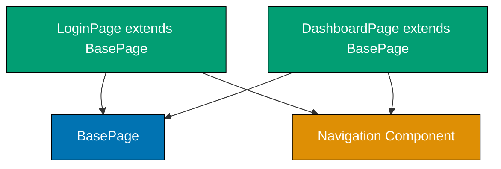
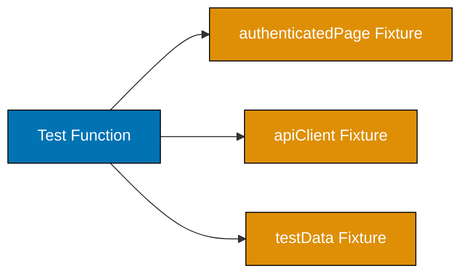
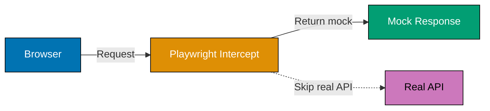
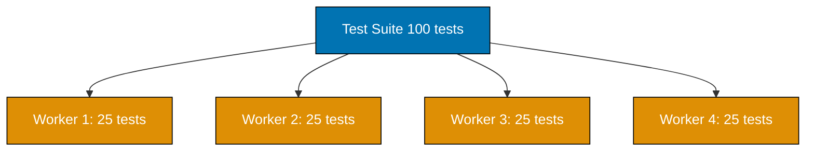
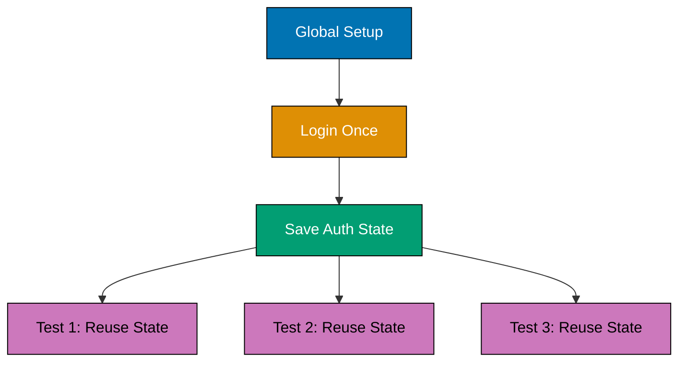

This tutorial covers advanced Playwright patterns for production environments including Page Object Model advanced patterns, custom fixtures, debugging tools, CI/CD integration, parallel execution, authentication flows, and production testing strategies.

## Example 61: Page Object Model - Advanced Composition

Page Object Model (POM) encapsulates page interactions in reusable classes. Advanced POM uses composition to share common components across pages.



**Code**:

```typescript
import { test, expect, Page, Locator } from "@playwright/test";

// Base page with common functionality
class BasePage {
  readonly page: Page;

  constructor(page: Page) {
    this.page = page; // => Store page reference
  }

  async goto(path: string): Promise<void> {
    await this.page.goto(`https://example.com${path}`); // => Navigate with base URL
  }

  async waitForPageLoad(): Promise<void> {
    await this.page.waitForLoadState("networkidle"); // => Wait for network to settle
    // => Ensures page fully loaded
  }
}

// Shared navigation component
class NavigationComponent {
  readonly page: Page;
  readonly homeLink: Locator;
  readonly profileLink: Locator;
  readonly logoutButton: Locator;

  constructor(page: Page) {
    this.page = page;
    this.homeLink = page.getByRole("link", { name: "Home" }); // => Locate home link
    this.profileLink = page.getByRole("link", { name: "Profile" }); // => Locate profile link
    this.logoutButton = page.getByRole("button", { name: "Logout" }); // => Locate logout button
  }

  async navigateToHome(): Promise<void> {
    await this.homeLink.click(); // => Click home link
    // => Navigates to home page
  }

  async logout(): Promise<void> {
    await this.logoutButton.click(); // => Click logout
    // => Logs user out of application
  }
}

// Login page with composition
class LoginPage extends BasePage {
  readonly navigation: NavigationComponent;
  readonly emailInput: Locator;
  readonly passwordInput: Locator;
  readonly submitButton: Locator;

  constructor(page: Page) {
    super(page); // => Call base constructor
    this.navigation = new NavigationComponent(page); // => Compose navigation component
    this.emailInput = page.getByLabel("Email"); // => Locate email input
    this.passwordInput = page.getByLabel("Password"); // => Locate password input
    this.submitButton = page.getByRole("button", { name: "Sign In" }); // => Locate submit button
  }

  async login(email: string, password: string): Promise<void> {
    await this.emailInput.fill(email); // => Fill email
    await this.passwordInput.fill(password); // => Fill password
    await this.submitButton.click(); // => Submit form
    await this.waitForPageLoad(); // => Wait for navigation
  }
}

// Dashboard page reuses navigation component
class DashboardPage extends BasePage {
  readonly navigation: NavigationComponent;
  readonly welcomeMessage: Locator;

  constructor(page: Page) {
    super(page);
    this.navigation = new NavigationComponent(page); // => Same navigation component
    this.welcomeMessage = page.getByTestId("welcome-message"); // => Locate welcome message
  }

  async getWelcomeText(): Promise<string> {
    return (await this.welcomeMessage.textContent()) || ""; // => Get welcome text
    // => Returns welcome message
  }
}

test("advanced POM with composition", async ({ page }) => {
  const loginPage = new LoginPage(page); // => Create login page object
  await loginPage.goto("/login"); // => Navigate using base method
  await loginPage.login("user@example.com", "password"); // => Login using page method

  const dashboard = new DashboardPage(page); // => Create dashboard page object
  const welcomeText = await dashboard.getWelcomeText(); // => Get welcome message
  expect(welcomeText).toContain("Welcome"); // => Verify logged in

  await dashboard.navigation.logout(); // => Logout using shared component
  // => Reused navigation logic across pages
});
```

**Key Takeaway**: Advanced POM uses composition to share common components (navigation, footer, modals) across multiple page objects. BasePage provides shared utilities while component classes handle specific UI elements.

**Why It Matters**: Component composition reduces code duplication and maintenance burden. When navigation changes, update NavigationComponent once instead of every page object - major sites like GitHub and LinkedIn use component-based POM to manage hundreds of pages with shared UI elements.

## Example 62: Component Objects Pattern

Component objects represent reusable UI components (modals, dropdowns, cards) that appear across multiple pages. They encapsulate component-specific interactions.

**Code**:

```typescript
import { test, expect, Page, Locator } from "@playwright/test";

// Modal component appearing across multiple pages
class ModalComponent {
  readonly page: Page;
  readonly container: Locator;
  readonly title: Locator;
  readonly closeButton: Locator;
  readonly confirmButton: Locator;
  readonly cancelButton: Locator;

  constructor(page: Page) {
    this.page = page;
    this.container = page.getByRole("dialog"); // => Locate modal dialog
    this.title = this.container.getByRole("heading"); // => Title within modal
    this.closeButton = this.container.getByLabel("Close"); // => Close button (X icon)
    this.confirmButton = this.container.getByRole("button", { name: "Confirm" }); // => Confirm button
    this.cancelButton = this.container.getByRole("button", { name: "Cancel" }); // => Cancel button
  }

  async waitForModal(): Promise<void> {
    await this.container.waitFor({ state: "visible" }); // => Wait for modal to appear
    // => Ensures modal fully rendered
  }

  async getTitle(): Promise<string> {
    return (await this.title.textContent()) || ""; // => Get modal title
    // => Returns modal heading text
  }

  async confirm(): Promise<void> {
    await this.confirmButton.click(); // => Click confirm
    await this.container.waitFor({ state: "hidden" }); // => Wait for modal to disappear
  }

  async cancel(): Promise<void> {
    await this.cancelButton.click(); // => Click cancel
    await this.container.waitFor({ state: "hidden" }); // => Wait for modal to disappear
  }

  async close(): Promise<void> {
    await this.closeButton.click(); // => Click close icon
    await this.container.waitFor({ state: "hidden" }); // => Wait for modal to disappear
  }
}

// Dropdown component appearing in forms
class DropdownComponent {
  readonly page: Page;
  readonly trigger: Locator;
  readonly options: Locator;

  constructor(page: Page, label: string) {
    this.page = page;
    this.trigger = page.getByLabel(label); // => Dropdown trigger (select or button)
    this.options = page.getByRole("option"); // => Dropdown options
  }

  async select(optionText: string): Promise<void> {
    await this.trigger.click(); // => Open dropdown
    await this.options.filter({ hasText: optionText }).click(); // => Select option
    // => Clicks specific option by text
  }

  async getSelectedValue(): Promise<string> {
    return await this.trigger.inputValue(); // => Get current selection
    // => Returns selected value
  }
}

test("component objects for modals", async ({ page }) => {
  await page.goto("https://example.com/profile");

  // Trigger delete action
  const deleteButton = page.getByRole("button", { name: "Delete Account" });
  await deleteButton.click(); // => Opens confirmation modal

  const modal = new ModalComponent(page); // => Create modal component
  await modal.waitForModal(); // => Wait for modal appearance

  const title = await modal.getTitle(); // => Get modal title
  expect(title).toBe("Confirm Deletion"); // => Verify correct modal

  await modal.confirm(); // => Confirm deletion
  // => Modal closed and action executed
});

test("component objects for dropdowns", async ({ page }) => {
  await page.goto("https://example.com/settings");

  const languageDropdown = new DropdownComponent(page, "Language"); // => Create dropdown component
  await languageDropdown.select("English"); // => Select language

  const selectedLanguage = await languageDropdown.getSelectedValue(); // => Get selection
  expect(selectedLanguage).toBe("English"); // => Verify selected

  const timezoneDropdown = new DropdownComponent(page, "Timezone"); // => Reuse component for different dropdown
  await timezoneDropdown.select("UTC+7"); // => Select timezone
  // => Same component, different instance
});
```

**Key Takeaway**: Component objects encapsulate reusable UI components (modals, dropdowns, cards) that appear across multiple pages. They provide a consistent API for interacting with specific component types.

**Why It Matters**: UI components are reused extensively in modern web apps. Component objects prevent code duplication when the same modal or dropdown appears on 20 different pages - Atlassian's Playwright tests use component objects for their design system components, reducing test code by 60%.

## Example 63: Custom Fixtures for Test Setup

Custom fixtures provide reusable test setup and teardown. They inject dependencies into tests using Playwright's built-in fixture system.



**Code**:

```typescript
import { test as base, expect, Page } from "@playwright/test";

// Define custom fixtures
type MyFixtures = {
  authenticatedPage: Page; // => Page with authenticated user
  testUser: { email: string; password: string }; // => Test user credentials
  apiClient: any; // => API client for test data setup
};

// Extend base test with custom fixtures
const test = base.extend<MyFixtures>({
  testUser: async ({}, use) => {
    // => Define test user fixture
    const user = {
      email: "test@example.com",
      password: "SecurePassword123!",
    };
    await use(user); // => Provide user to test
    // Cleanup: none needed for static data
  },

  authenticatedPage: async ({ page, testUser }, use) => {
    // => Fixture depends on page and testUser
    // Setup: Login automatically
    await page.goto("https://example.com/login");
    await page.getByLabel("Email").fill(testUser.email); // => Fill email
    await page.getByLabel("Password").fill(testUser.password); // => Fill password
    await page.getByRole("button", { name: "Sign In" }).click(); // => Submit login
    await page.waitForURL("**/dashboard"); // => Wait for redirect
    // => Page now authenticated

    await use(page); // => Provide authenticated page to test

    // Cleanup: Logout
    await page.getByRole("button", { name: "Logout" }).click(); // => Logout after test
  },

  apiClient: async ({ request }, use) => {
    // => Create API client fixture
    const client = {
      createUser: async (userData: any) => {
        const response = await request.post("/api/users", { data: userData });
        return response.json(); // => Returns created user
      },
      deleteUser: async (userId: string) => {
        await request.delete(`/api/users/${userId}`);
        // => Deletes user
      },
    };

    await use(client); // => Provide API client to test

    // Cleanup: handled by test
  },
});

// Use custom fixtures in tests
test("fixture for authenticated page", async ({ authenticatedPage }) => {
  // => Test receives pre-authenticated page
  const welcomeMessage = authenticatedPage.getByTestId("welcome-message");
  await expect(welcomeMessage).toBeVisible(); // => Already logged in
  // No manual login needed
});

test("fixture for test data creation", async ({ apiClient, page }) => {
  // Setup test data via API
  const user = await apiClient.createUser({
    name: "Test User",
    email: "newuser@example.com",
  }); // => Creates user via API

  // Test UI with created data
  await page.goto("https://example.com/users");
  const userRow = page.getByRole("row", { name: user.name });
  await expect(userRow).toBeVisible(); // => Verify user appears in UI

  // Cleanup
  await apiClient.deleteUser(user.id); // => Remove test data
});

test("combined fixtures", async ({ authenticatedPage, testUser }) => {
  // => Uses multiple custom fixtures
  const profileLink = authenticatedPage.getByRole("link", { name: "Profile" });
  await profileLink.click(); // => Navigate to profile

  const emailDisplay = authenticatedPage.getByText(testUser.email);
  await expect(emailDisplay).toBeVisible(); // => Verify user email shown
  // Fixtures compose naturally
});
```

**Key Takeaway**: Custom fixtures encapsulate test setup and teardown, providing reusable dependencies through Playwright's fixture system. Fixtures can depend on other fixtures for composition.

**Why It Matters**: Test setup duplication leads to maintenance burden and brittle tests. Fixtures centralize setup logic and enable dependency injection - Microsoft's Playwright team uses fixtures extensively in their own tests, with 50+ custom fixtures for different test scenarios.

## Example 64: Fixture Composition and Scoping

Fixtures support composition (fixtures depending on other fixtures) and different scopes (test-scoped vs. worker-scoped). Worker-scoped fixtures run once per worker process.

**Code**:

```typescript
import { test as base, expect } from "@playwright/test";

type MyFixtures = {
  database: any; // => Worker-scoped database connection
  testUser: any; // => Test-scoped user (unique per test)
  cleanupList: string[]; // => Test-scoped cleanup tracker
};

const test = base.extend<MyFixtures>({
  // Worker-scoped fixture: shared across tests in same worker
  database: [
    async ({}, use) => {
      // => Worker-scoped (runs once per worker)
      console.log("Connecting to database (worker-scoped)");
      const db = {
        connected: true,
        users: new Map(), // => Shared state across tests
        connect: () => console.log("DB connected"),
        disconnect: () => console.log("DB disconnected"),
      };

      await db.connect(); // => Connect once
      await use(db); // => Provide database to all tests
      await db.disconnect(); // => Disconnect once
      console.log("Disconnecting from database (worker-scoped)");
    },
    { scope: "worker" },
  ], // => Worker scope

  // Test-scoped fixture: fresh instance per test
  testUser: async ({ database, cleanupList }, use) => {
    // => Test-scoped (runs for each test)
    // => Depends on database fixture
    const userId = `user-${Date.now()}`;
    const user = {
      id: userId,
      name: "Test User",
      email: `${userId}@example.com`,
    };

    database.users.set(userId, user); // => Create user in database
    cleanupList.push(userId); // => Track for cleanup

    await use(user); // => Provide user to test

    // Cleanup: runs after test
    database.users.delete(userId); // => Remove user
    console.log(`Cleaned up user: ${userId}`);
  },

  // Test-scoped cleanup tracker
  cleanupList: async ({}, use) => {
    // => Fresh list per test
    const list: string[] = [];
    await use(list); // => Provide list to test
    console.log(`Cleanup list: ${list.join(", ")}`); // => Log cleanups
  },
});

test.describe("fixture scoping", () => {
  test("first test with fixtures", async ({ testUser, database }) => {
    // => Gets fresh testUser, shared database
    expect(testUser.id).toBeDefined(); // => Unique user
    expect(database.connected).toBe(true); // => Shared database
    console.log(`Test 1 user: ${testUser.id}`);
  });

  test("second test with fixtures", async ({ testUser, database }) => {
    // => Gets NEW testUser, SAME database
    expect(testUser.id).toBeDefined(); // => Different user from test 1
    expect(database.connected).toBe(true); // => Same database connection
    console.log(`Test 2 user: ${testUser.id}`);
    // Users are isolated, database is shared
  });

  test("fixture composition", async ({ testUser, cleanupList }) => {
    // => testUser depends on cleanupList
    expect(cleanupList).toContain(testUser.id); // => User ID added to cleanup list
    // Fixtures compose through dependencies
  });
});
```

**Output**:

```
Connecting to database (worker-scoped)  ← Once at worker start
Test 1 user: user-1738425600000
Cleaned up user: user-1738425600000     ← After test 1
Test 2 user: user-1738425600001         ← Different user
Cleaned up user: user-1738425600001     ← After test 2
Cleanup list: user-1738425600002
Cleaned up user: user-1738425600002
Disconnecting from database (worker-scoped)  ← Once at worker end
```

**Key Takeaway**: Fixture scoping controls lifecycle - test-scoped fixtures run for each test (fresh data), worker-scoped fixtures run once per worker (shared resources like database connections). Fixtures compose through dependencies.

**Why It Matters**: Proper scoping prevents test pollution and improves performance. Worker-scoped database connections reduce setup overhead while test-scoped data ensures isolation - Google's web.dev test suite uses worker-scoped browser contexts and test-scoped page fixtures for optimal balance of speed and isolation.

## Example 65: Parameterized Tests with test.describe.configure

Parameterized tests run the same test logic with different inputs. Use loops or data-driven approaches to reduce duplication.

**Code**:

```typescript
import { test, expect } from "@playwright/test";

// Data-driven test with array of test cases
const loginTestCases = [
  { email: "user1@example.com", password: "Pass123!", expectedMessage: "Welcome user1" },
  { email: "user2@example.com", password: "Pass456!", expectedMessage: "Welcome user2" },
  { email: "admin@example.com", password: "Admin789!", expectedMessage: "Welcome admin" },
];

// Run same test with different data
for (const testCase of loginTestCases) {
  test(`login with ${testCase.email}`, async ({ page }) => {
    // => Parameterized test runs 3 times
    await page.goto("https://example.com/login");

    await page.getByLabel("Email").fill(testCase.email); // => Fill email from test case
    await page.getByLabel("Password").fill(testCase.password); // => Fill password from test case
    await page.getByRole("button", { name: "Sign In" }).click(); // => Submit

    const welcomeMessage = page.getByTestId("welcome-message");
    await expect(welcomeMessage).toHaveText(testCase.expectedMessage); // => Verify expected message
    // => Test case-specific assertion
  });
}

// Alternative: describe.configure for browser-specific tests
test.describe.configure({ mode: "parallel" }); // => Run tests in parallel

const browsers = ["chromium", "firefox", "webkit"] as const;

for (const browserName of browsers) {
  test.describe(`Browser: ${browserName}`, () => {
    // => Browser-specific test suite
    test.use({ browserName }); // => Configure browser

    test("renders homepage correctly", async ({ page }) => {
      await page.goto("https://example.com");

      const heading = page.getByRole("heading", { name: "Welcome" });
      await expect(heading).toBeVisible(); // => Same test across browsers
      // => Runs on chromium, firefox, webkit
    });

    test("handles navigation", async ({ page }) => {
      await page.goto("https://example.com");

      const aboutLink = page.getByRole("link", { name: "About" });
      await aboutLink.click(); // => Navigate

      await expect(page).toHaveURL(/.*about/); // => Verify navigation
      // => Cross-browser navigation test
    });
  });
}

// Matrix testing: browsers × viewport sizes
const viewports = [
  { width: 1920, height: 1080, name: "Desktop" },
  { width: 768, height: 1024, name: "Tablet" },
  { width: 375, height: 667, name: "Mobile" },
];

for (const viewport of viewports) {
  test.describe(`Viewport: ${viewport.name}`, () => {
    test.use({ viewport: { width: viewport.width, height: viewport.height } }); // => Configure viewport

    test("responsive layout", async ({ page }) => {
      await page.goto("https://example.com");

      const navigation = page.getByRole("navigation");
      await expect(navigation).toBeVisible(); // => Navigation visible on all viewports
      // => Responsive test across viewports
    });
  });
}
```

**Key Takeaway**: Parameterized tests use loops or describe blocks to run the same test logic with different inputs (credentials, browsers, viewports). Reduces duplication for data-driven and cross-browser testing.

**Why It Matters**: Testing multiple scenarios manually duplicates code and creates maintenance burden. Parameterized tests enable comprehensive coverage without duplication - GitHub's accessibility tests run the same checks across 15 page types using parameterization, maintaining 95%+ coverage with minimal code.

## Example 66: Data-Driven Testing with External Data

Data-driven tests load test cases from external files (JSON, CSV, database). Separates test data from test logic for easier maintenance.

**Code**:

```typescript
import { test, expect } from "@playwright/test";
import * as fs from "fs";
import * as path from "path";

// Load test data from JSON file
const testDataPath = path.join(__dirname, "test-data", "users.json");
const testData = JSON.parse(fs.readFileSync(testDataPath, "utf-8"));
// => Reads test data from external file
// users.json contains: [{ email: "...", password: "...", expectedRole: "..." }, ...]

interface UserTestData {
  email: string;
  password: string;
  expectedRole: string;
  shouldSucceed: boolean;
}

// Run tests for each user in data file
for (const userData of testData.users as UserTestData[]) {
  test(`login test for ${userData.email}`, async ({ page }) => {
    // => One test per user in JSON
    await page.goto("https://example.com/login");

    await page.getByLabel("Email").fill(userData.email); // => Email from JSON
    await page.getByLabel("Password").fill(userData.password); // => Password from JSON
    await page.getByRole("button", { name: "Sign In" }).click(); // => Submit

    if (userData.shouldSucceed) {
      // => Expected success path
      const roleDisplay = page.getByTestId("user-role");
      await expect(roleDisplay).toHaveText(userData.expectedRole); // => Verify role
      // => Assertion uses expected value from JSON
    } else {
      // => Expected failure path
      const errorMessage = page.getByRole("alert");
      await expect(errorMessage).toBeVisible(); // => Verify error shown
      // => Handles both success and failure cases
    }
  });
}

// Alternative: CSV data parsing
test.describe("CSV data-driven tests", () => {
  const csvPath = path.join(__dirname, "test-data", "products.csv");
  const csvContent = fs.readFileSync(csvPath, "utf-8");
  // => Read CSV file

  const rows = csvContent.split("\n").slice(1); // => Skip header row
  const products = rows.map((row) => {
    const [id, name, price] = row.split(","); // => Parse CSV columns
    return { id, name, price: parseFloat(price) };
  });

  for (const product of products) {
    test(`search for product: ${product.name}`, async ({ page }) => {
      // => One test per CSV row
      await page.goto("https://example.com/search");

      const searchInput = page.getByRole("searchbox");
      await searchInput.fill(product.name); // => Search from CSV
      await searchInput.press("Enter"); // => Submit search

      const resultCard = page.getByTestId(`product-${product.id}`);
      await expect(resultCard).toBeVisible(); // => Verify product found

      const priceDisplay = resultCard.getByTestId("price");
      await expect(priceDisplay).toHaveText(`$${product.price.toFixed(2)}`); // => Verify price
      // => CSV data drives assertions
    });
  }
});

// Dynamic data from API
test.describe("API-driven test data", () => {
  let apiData: any[];

  test.beforeAll(async ({ request }) => {
    // => Load data before tests
    const response = await request.get("https://api.example.com/test-users");
    apiData = await response.json(); // => API provides test data
    // => Data refreshed on each test run
  });

  test("uses API-provided test data", async ({ page }) => {
    // => Data from beforeAll
    const firstUser = apiData[0];

    await page.goto("https://example.com/users");
    const userCard = page.getByTestId(`user-${firstUser.id}`);
    await expect(userCard).toBeVisible(); // => Verify user from API
    // => Test data synchronized with API
  });
});
```

**Example users.json**:

```json
{
  "users": [
    {
      "email": "admin@example.com",
      "password": "AdminPass123!",
      "expectedRole": "Administrator",
      "shouldSucceed": true
    },
    {
      "email": "user@example.com",
      "password": "UserPass123!",
      "expectedRole": "User",
      "shouldSucceed": true
    },
    {
      "email": "invalid@example.com",
      "password": "wrong",
      "expectedRole": "",
      "shouldSucceed": false
    }
  ]
}
```

**Key Takeaway**: Data-driven testing separates test data from test logic by loading test cases from external sources (JSON, CSV, API). Enables non-technical users to add test cases and keeps test code clean.

**Why It Matters**: Hardcoded test data mixes data with logic and makes updates difficult. External data sources enable easy test expansion and collaboration - Spotify's end-to-end tests use JSON-based test data, allowing QA teams to add 100+ test scenarios without touching code.

## Example 67: Visual Regression Testing with Screenshots

Visual regression testing captures screenshots and compares against baselines to detect unexpected UI changes. Playwright provides built-in screenshot comparison.

**Code**:

```typescript
import { test, expect } from "@playwright/test";

test("visual regression - full page", async ({ page }) => {
  await page.goto("https://example.com");
  await page.waitForLoadState("networkidle"); // => Ensure page fully loaded
  // => Prevents flaky screenshots from in-flight requests

  // Capture and compare full page screenshot
  await expect(page).toHaveScreenshot("homepage.png"); // => Takes screenshot and compares
  // => On first run: creates baseline screenshot
  // => On subsequent runs: compares against baseline
  // => Fails if visual differences detected
});

test("visual regression - specific element", async ({ page }) => {
  await page.goto("https://example.com/products");

  const productCard = page.getByTestId("product-card-1");
  await expect(productCard).toHaveScreenshot("product-card.png"); // => Element screenshot
  // => Only captures specified element
  // => Ignores changes outside element
});

test("visual regression - with threshold", async ({ page }) => {
  await page.goto("https://example.com/dashboard");

  // Allow small pixel differences (anti-aliasing, font rendering)
  await expect(page).toHaveScreenshot("dashboard.png", {
    maxDiffPixels: 100, // => Allow up to 100 pixels difference
    // => Prevents false positives from minor rendering variations
  });

  // Alternative: percentage threshold
  await expect(page).toHaveScreenshot("dashboard-percent.png", {
    maxDiffPixelRatio: 0.01, // => Allow 1% pixel difference
    // => Useful for large screenshots
  });
});

test("visual regression - masking dynamic content", async ({ page }) => {
  await page.goto("https://example.com/profile");

  // Mask dynamic elements (timestamps, user IDs)
  await expect(page).toHaveScreenshot("profile.png", {
    mask: [
      page.getByTestId("last-login-time"), // => Masks timestamp
      page.getByTestId("user-id"), // => Masks dynamic ID
    ],
    // => Masked areas ignored in comparison
  });
});

test("visual regression - animations disabled", async ({ page }) => {
  await page.goto("https://example.com/animated-page");

  // Disable animations for consistent screenshots
  await page.emulateMedia({ reducedMotion: "reduce" }); // => Disables CSS animations
  // => Prevents animation frames from causing differences

  await expect(page).toHaveScreenshot("animated-page.png");
  // => Screenshot captured without mid-animation frames
});

test.describe("multi-viewport visual regression", () => {
  const viewports = [
    { width: 1920, height: 1080, name: "desktop" },
    { width: 768, height: 1024, name: "tablet" },
    { width: 375, height: 667, name: "mobile" },
  ];

  for (const viewport of viewports) {
    test(`visual regression - ${viewport.name}`, async ({ page }) => {
      await page.setViewportSize({ width: viewport.width, height: viewport.height });
      // => Set viewport size

      await page.goto("https://example.com");

      await expect(page).toHaveScreenshot(`homepage-${viewport.name}.png`);
      // => Separate baseline per viewport
      // => Catches responsive layout issues
    });
  }
});
```

**Key Takeaway**: Visual regression testing captures screenshots and compares against baselines to detect unintended UI changes. Use masking for dynamic content and thresholds for minor rendering variations.

**Why It Matters**: Manual visual testing is time-consuming and misses subtle changes. Automated visual regression catches CSS bugs, layout shifts, and font rendering issues - Airbnb's design system uses visual regression testing to prevent unintended style changes, catching 90%+ of visual bugs before production.

## Example 68: Network Interception and Request Mocking

Network interception captures and modifies network requests. Request mocking replaces real API responses with test data for faster, more reliable tests.



**Code**:

```typescript
import { test, expect } from "@playwright/test";

test("intercept and log network requests", async ({ page }) => {
  // Log all API requests
  page.on("request", (request) => {
    if (request.url().includes("/api/")) {
      console.log(`API Request: ${request.method()} ${request.url()}`);
      // => Logs all API requests
    }
  });

  // Log API responses
  page.on("response", (response) => {
    if (response.url().includes("/api/")) {
      console.log(`API Response: ${response.status()} ${response.url()}`);
      // => Logs all API responses with status
    }
  });

  await page.goto("https://example.com");
  // => Network activity logged in console
});

test("mock API response", async ({ page }) => {
  // Intercept and mock API endpoint
  await page.route("**/api/users", (route) => {
    // => Intercept /api/users requests
    route.fulfill({
      status: 200,
      contentType: "application/json",
      body: JSON.stringify([
        { id: 1, name: "Mock User 1", email: "mock1@example.com" },
        { id: 2, name: "Mock User 2", email: "mock2@example.com" },
      ]),
    }); // => Return mock data instead of real API
    // => No real API call made
  });

  await page.goto("https://example.com/users");

  const userCard = page.getByText("Mock User 1");
  await expect(userCard).toBeVisible(); // => Mock data displayed
  // => Test runs without real API
});

test("mock API failure for error handling", async ({ page }) => {
  // Mock API error
  await page.route("**/api/users", (route) => {
    route.fulfill({
      status: 500,
      contentType: "application/json",
      body: JSON.stringify({ error: "Internal Server Error" }),
    }); // => Simulate API failure
    // => Tests error handling code
  });

  await page.goto("https://example.com/users");

  const errorMessage = page.getByRole("alert");
  await expect(errorMessage).toHaveText("Failed to load users"); // => Error message shown
  // => Error handling tested without breaking real API
});

test("conditional mocking - pass through some requests", async ({ page }) => {
  await page.route("**/api/**", (route) => {
    // => Intercept all API requests
    const url = route.request().url();

    if (url.includes("/api/users")) {
      // Mock users endpoint
      route.fulfill({
        status: 200,
        body: JSON.stringify([{ id: 1, name: "Mock User" }]),
      }); // => Mock users
    } else {
      // Pass through all other API requests
      route.continue(); // => Let other requests go to real API
      // => Only mocks specific endpoints
    }
  });

  await page.goto("https://example.com");
  // => /api/users mocked, other endpoints hit real API
});

test("modify request headers", async ({ page }) => {
  await page.route("**/api/**", (route) => {
    // Add custom header to all API requests
    const headers = {
      ...route.request().headers(),
      "X-Test-Mode": "true", // => Add test header
    };

    route.continue({ headers }); // => Forward with modified headers
    // => API receives requests with test header
  });

  await page.goto("https://example.com");
  // => All API requests include X-Test-Mode header
});

test("mock slow network for loading states", async ({ page }) => {
  await page.route("**/api/products", async (route) => {
    // Simulate slow API
    await new Promise((resolve) => setTimeout(resolve, 3000)); // => Wait 3 seconds
    // => Simulates slow network

    route.fulfill({
      status: 200,
      body: JSON.stringify([{ id: 1, name: "Product" }]),
    });
  });

  await page.goto("https://example.com/products");

  // Verify loading state appears
  const loadingSpinner = page.getByTestId("loading-spinner");
  await expect(loadingSpinner).toBeVisible(); // => Loading state shown during delay

  // Eventually data loads
  await expect(loadingSpinner).toBeHidden({ timeout: 5000 }); // => Loading state disappears
  // => Tests loading states reliably
});
```

**Key Takeaway**: Network interception captures requests and responses for logging or modification. Request mocking replaces real API responses with test data for faster, more reliable tests and error scenario testing.

**Why It Matters**: Tests depending on real APIs are slow and flaky. Mocking eliminates external dependencies and enables testing error scenarios impossible to reproduce reliably - Netflix's UI tests mock 100% of API responses, reducing test execution time from 45 minutes to 8 minutes.

## Example 69: Advanced Request Mocking with HAR Files

HAR (HTTP Archive) files record real network traffic and replay it in tests. Captures realistic API responses without maintaining mock data manually.

**Code**:

```typescript
import { test, expect } from "@playwright/test";

test("record HAR file", async ({ page }) => {
  // Record network traffic to HAR file
  await page.routeFromHAR("network-archive.har", {
    update: true, // => Record mode: captures real traffic
    // => Creates/updates HAR file with actual responses
  });

  await page.goto("https://example.com");
  await page.getByRole("link", { name: "Products" }).click();
  await page.getByRole("button", { name: "Load More" }).click();
  // => All network requests recorded to HAR
  // => network-archive.har now contains all API responses
});

test("replay from HAR file", async ({ page }) => {
  // Replay recorded traffic
  await page.routeFromHAR("network-archive.har", {
    update: false, // => Replay mode: uses recorded responses
    // => No real API calls made
  });

  await page.goto("https://example.com");
  await page.getByRole("link", { name: "Products" }).click();
  // => Uses recorded responses from HAR
  // => Exact same behavior as recording run

  const productCard = page.getByTestId("product-1");
  await expect(productCard).toBeVisible(); // => Data from HAR file
  // => Test runs offline using recorded data
});

test("replay with URL filtering", async ({ page }) => {
  // Replay only specific URLs from HAR
  await page.routeFromHAR("network-archive.har", {
    url: "**/api/products/**", // => Only match products API
    // => Other requests go to real API
  });

  await page.goto("https://example.com");
  // => /api/products replayed from HAR
  // => Other endpoints hit real API
});

test("update HAR incrementally", async ({ page }) => {
  // Update mode: record new requests, replay existing
  await page.routeFromHAR("network-archive.har", {
    update: true,
    updateContent: "embed", // => Embed responses in HAR
    updateMode: "minimal", // => Only record new/changed requests
    // => Doesn't re-record existing responses
  });

  await page.goto("https://example.com/new-feature");
  // => New feature requests added to HAR
  // => Existing requests replayed from HAR
});
```

**HAR File Structure** (simplified):

```json
{
  "log": {
    "entries": [
      {
        "request": {
          "method": "GET",
          "url": "https://example.com/api/products"
        },
        "response": {
          "status": 200,
          "content": {
            "text": "[{\"id\":1,\"name\":\"Product 1\"}]"
          }
        }
      }
    ]
  }
}
```

**Key Takeaway**: HAR files record and replay real network traffic, combining realism of real APIs with speed of mocked responses. Use update mode to record, replay mode for tests.

**Why It Matters**: Manual mock data drifts from real API responses over time. HAR files capture realistic traffic and can be refreshed easily - LinkedIn's frontend tests use HAR recording to maintain test data accuracy, refreshing HAR files monthly to match API changes.

## Example 70: WebSocket Testing

WebSocket connections enable real-time bidirectional communication. Test WebSocket events and messages for live features like chat or notifications.

**Code**:

```typescript
import { test, expect } from "@playwright/test";

test("WebSocket message receiving", async ({ page }) => {
  // Listen for WebSocket connections
  const wsPromise = page.waitForEvent("websocket");
  // => Wait for WebSocket connection to open

  await page.goto("https://example.com/chat");

  const ws = await wsPromise; // => WebSocket connection established
  console.log(`WebSocket URL: ${ws.url()}`); // => Log WebSocket URL

  // Listen for WebSocket frames (messages)
  ws.on("framereceived", (event) => {
    console.log(`Received: ${event.payload}`); // => Log received messages
    // => Captures server-sent messages
  });

  ws.on("framesent", (event) => {
    console.log(`Sent: ${event.payload}`); // => Log sent messages
    // => Captures client-sent messages
  });

  // Trigger message sending
  const messageInput = page.getByPlaceholder("Type a message");
  await messageInput.fill("Hello WebSocket"); // => Type message
  await messageInput.press("Enter"); // => Send message
  // => WebSocket frame sent

  // Wait for response message
  await page.waitForSelector('.message:has-text("Hello WebSocket")'); // => Message appears
  // => Verifies WebSocket round-trip
});

test("WebSocket connection lifecycle", async ({ page }) => {
  let wsOpened = false;
  let wsClosed = false;

  page.on("websocket", (ws) => {
    console.log("WebSocket opened");
    wsOpened = true; // => Connection opened

    ws.on("close", () => {
      console.log("WebSocket closed");
      wsClosed = true; // => Connection closed
    });
  });

  await page.goto("https://example.com/live-updates");
  await page.waitForTimeout(1000); // => Wait for connection
  expect(wsOpened).toBe(true); // => Verify connection opened

  await page.close(); // => Close page
  await page.context().browser()?.close(); // => Cleanup
  expect(wsClosed).toBe(true); // => Verify connection closed
  // => Full lifecycle tested
});

test("WebSocket error handling", async ({ page }) => {
  const wsPromise = page.waitForEvent("websocket");

  await page.goto("https://example.com/chat");
  const ws = await wsPromise;

  let errorOccurred = false;
  ws.on("socketerror", (error) => {
    console.log(`WebSocket error: ${error}`);
    errorOccurred = true; // => Error captured
  });

  // Trigger network interruption (if testable)
  await page.evaluate(() => {
    // Close WebSocket from client side
    const wsConnection = (window as any).wsConnection;
    if (wsConnection) {
      wsConnection.close(); // => Force close
    }
  });

  // Verify app handles disconnection
  const reconnectingMessage = page.getByText("Reconnecting...");
  await expect(reconnectingMessage).toBeVisible(); // => Error handling UI shown
  // => WebSocket error handling tested
});
```

**Key Takeaway**: Test WebSocket connections by listening to websocket events, framereceived/framesent for messages, and close/socketerror for lifecycle and errors. Verifies real-time features work correctly.

**Why It Matters**: WebSocket bugs break real-time features (chat, live updates, collaborative editing) causing poor user experience. Testing WebSocket connections ensures reliability - Slack's real-time messaging tests use Playwright's WebSocket APIs to verify message delivery across network conditions.

## Example 71: Trace Viewer for Debugging

Trace viewer records test execution with screenshots, console logs, network activity, and DOM snapshots. Essential for debugging flaky or failed tests.

**Code**:

```typescript
import { test, expect } from "@playwright/test";

// Enable tracing in playwright.config.ts:
// use: { trace: 'on-first-retry' } or 'retain-on-failure'

test("test with tracing enabled", async ({ page }) => {
  // Tracing automatically enabled based on config
  // => Records every action, screenshot, network request

  await page.goto("https://example.com");
  // => Screenshot captured, DOM snapshot saved

  await page.getByRole("button", { name: "Submit" }).click();
  // => Click recorded with before/after screenshots

  await expect(page.getByText("Success")).toBeVisible();
  // => Assertion recorded in trace

  // If test fails, trace saved to test-results/
  // View with: npx playwright show-trace trace.zip
});

test("manual trace control", async ({ page }, testInfo) => {
  // Start tracing manually
  await page.context().tracing.start({
    screenshots: true, // => Capture screenshots
    snapshots: true, // => Capture DOM snapshots
    sources: true, // => Include source code
  }); // => Tracing started

  await page.goto("https://example.com/complex-flow");

  // ... test actions ...

  // Stop and save trace
  await page.context().tracing.stop({
    path: `traces/${testInfo.title}.zip`, // => Save trace file
  }); // => Trace saved for analysis
  // => View with: npx playwright show-trace traces/[test-name].zip
});

test("trace specific scenario", async ({ page }) => {
  await page.goto("https://example.com");

  // Start tracing for problematic section
  await page.context().tracing.start({ screenshots: true, snapshots: true });

  // Problematic flow
  await page.getByRole("button", { name: "Open Modal" }).click();
  await page.getByLabel("Email").fill("user@example.com");
  await page.getByRole("button", { name: "Save" }).click();
  // => All actions captured in trace

  await page.context().tracing.stop({ path: "traces/modal-flow.zip" });

  // Continue test without tracing
  await page.getByRole("button", { name: "Continue" }).click();
  // => Tracing overhead only for problematic section
});
```

**Trace Viewer Features**:

```markdown
- **Timeline**: Visual timeline of all actions with screenshots
- **Network**: All network requests and responses
- **Console**: Console logs from browser
- **Source**: Test source code with executed lines highlighted
- **Call**: Stack traces for each action
- **DOM Snapshots**: Full DOM state at each action
- **Screenshots**: Before/after screenshots for actions
- **Metadata**: Test info, browser, viewport, timings
```

**Viewing Traces**:

```bash
# After test run with tracing enabled
npx playwright show-trace test-results/test-trace.zip

# Opens web UI showing:
# - Every action taken
# - Screenshots at each step
# - Network requests made
# - Console output
# - DOM state at any point
```

**Key Takeaway**: Trace viewer records complete test execution including screenshots, network activity, console logs, and DOM snapshots. Essential debugging tool for understanding test failures, especially in CI where you can't run tests locally.

**Why It Matters**: Debugging failed tests in CI without traces requires guesswork and local reproduction attempts. Trace viewer shows exactly what happened - Microsoft's own Playwright team uses traces for debugging 90%+ of CI failures without local reproduction.

## Example 72: Debug Mode and Playwright Inspector

Debug mode pauses test execution and opens Playwright Inspector for step-by-step debugging. Use for developing tests or investigating failures.

**Code**:

```typescript
import { test, expect } from "@playwright/test";

test("debug mode with inspector", async ({ page }) => {
  // Run with: npx playwright test --debug
  // => Opens Playwright Inspector

  await page.goto("https://example.com");
  // => Pauses here, Inspector shows page state

  await page.getByRole("button", { name: "Submit" }).click();
  // => Step through actions one at a time

  await expect(page.getByText("Success")).toBeVisible();
  // => Verify assertions in Inspector
});

test("programmatic breakpoint", async ({ page }) => {
  await page.goto("https://example.com/form");

  await page.getByLabel("Email").fill("user@example.com");

  // Add breakpoint in code
  await page.pause(); // => Pauses execution, opens Inspector
  // => Inspect page state, DOM, network at this point
  // => Click "Resume" to continue

  await page.getByLabel("Password").fill("password123");
  await page.getByRole("button", { name: "Submit" }).click();
});

test("debug with console logging", async ({ page }) => {
  // Enable console logging
  page.on("console", (msg) => {
    console.log(`Browser console [${msg.type()}]: ${msg.text()}`);
    // => Logs all browser console messages
  });

  await page.goto("https://example.com");

  // Log page state for debugging
  const title = await page.title();
  console.log(`Page title: ${title}`); // => Logs page title

  const url = page.url();
  console.log(`Current URL: ${url}`); // => Logs current URL

  // Execute JavaScript and log result
  const bodyText = await page.evaluate(() => document.body.innerText);
  console.log(`Body text length: ${bodyText.length}`); // => Logs text length
  // => Console output aids debugging
});

test("step-by-step selector testing", async ({ page }) => {
  await page.goto("https://example.com");

  // Test selector interactively
  await page.pause(); // => Opens Inspector
  // In Inspector:
  // 1. Use "Pick Locator" to test selectors
  // 2. Type selectors in console: page.getByRole('button')
  // 3. See matching elements highlighted
  // 4. Copy working selector to test code

  const button = page.getByRole("button", { name: "Submit" });
  // => Selector developed in Inspector, then added to test
  await button.click();
});
```

**Inspector Features**:

```markdown
- **Pick Locator**: Click elements to generate selectors
- **Step Through**: Execute test line-by-line
- **Console**: Run Playwright commands interactively
- **Source**: View test code with current line highlighted
- **Network**: View network requests in real-time
- **Console Logs**: See browser console output
- **DOM Snapshot**: Inspect page structure
```

**Debug Mode Commands**:

```bash
# Run single test in debug mode
npx playwright test tests/example.spec.ts --debug

# Debug specific test by name
npx playwright test -g "login test" --debug

# Debug headed (visible browser)
npx playwright test --debug --headed
```

**Key Takeaway**: Debug mode opens Playwright Inspector for step-by-step test execution, interactive selector testing, and page state inspection. Use page.pause() for programmatic breakpoints.

**Why It Matters**: Debugging tests by reading code alone is inefficient. Inspector enables interactive debugging with visual feedback - Playwright's debug mode reduced test development time by 40% in user studies by enabling rapid selector iteration.

## Example 73: Video Recording for Test Evidence

Video recording captures full test execution as video files. Provides visual evidence of test behavior and failure scenarios.

**Code**:

```typescript
import { test, expect } from "@playwright/test";

// Enable video in playwright.config.ts:
// use: { video: 'on-first-retry' } or 'retain-on-failure'

test("test with video recording", async ({ page }) => {
  // Video automatically recorded based on config
  // => Every browser action captured

  await page.goto("https://example.com");
  // => Navigation recorded in video

  await page.getByRole("button", { name: "Open Menu" }).click();
  // => Click action visible in video

  await page.getByRole("link", { name: "Settings" }).click();
  // => Navigation flow captured

  await expect(page).toHaveURL(/.*settings/);
  // => URL change visible in video

  // If test fails, video saved to test-results/
  // Video shows exactly what happened
});

test("always record video", async ({ page }, testInfo) => {
  // Force video recording regardless of config
  // Configured in playwright.config.ts per project:
  // video: { mode: 'on', size: { width: 1280, height: 720 } }

  await page.goto("https://example.com/critical-flow");

  // Critical business flow
  await page.getByRole("button", { name: "Start Process" }).click();
  await page.getByLabel("Amount").fill("1000");
  await page.getByRole("button", { name: "Confirm" }).click();
  // => Complete flow recorded for audit/compliance

  const videoPath = await page.video()?.path();
  console.log(`Video saved to: ${videoPath}`);
  // => Video path available after test
});

test("custom video path", async ({ page, context }, testInfo) => {
  // Video configured per browser context in config
  // Access video after test completion

  await page.goto("https://example.com");
  await page.getByRole("button", { name: "Submit" }).click();

  // Video automatically saved based on test result
  // Path: test-results/[test-file]-[test-name]/video.webm
});

test.describe("video recording configuration", () => {
  // Configure in playwright.config.ts:
  test("retain on failure only", async ({ page }) => {
    // video: 'retain-on-failure'
    // => Video kept only if test fails
    // => Saves disk space for passing tests

    await page.goto("https://example.com");
    // Video recorded but deleted if test passes
  });

  test("record on first retry", async ({ page }) => {
    // video: 'on-first-retry'
    // => No video on first run
    // => Video recorded on retry after failure

    await page.goto("https://example.com");
    // First run: no video
    // Retry run: video recorded
  });
});
```

**Video Configuration** (playwright.config.ts):

```typescript
import { defineConfig } from "@playwright/test";

export default defineConfig({
  use: {
    // Video recording options
    video: {
      mode: "retain-on-failure", // 'on', 'off', 'retain-on-failure', 'on-first-retry'
      size: { width: 1280, height: 720 }, // => Video resolution
    },
  },
});
```

**Key Takeaway**: Video recording captures full test execution as video files, providing visual evidence of test behavior and failures. Configure retention strategy (always, on failure, on retry) to balance evidence with storage.

**Why It Matters**: Screenshots show single moments; videos show full interaction flow. Critical for understanding complex failures and demonstrating bugs to developers - Stripe's support team uses test videos to reproduce and communicate customer-reported issues, reducing issue resolution time by 50%.

## Example 74: HAR Files for Network Analysis

HAR (HTTP Archive) files record all network traffic during test execution. Essential for debugging API issues and performance analysis.

**Code**:

```typescript
import { test, expect } from "@playwright/test";

test("record HAR for network debugging", async ({ page, context }) => {
  // Start HAR recording
  await context.routeFromHAR("network-traffic.har", {
    update: true, // => Record mode
    updateContent: "embed", // => Embed response bodies
  });

  await page.goto("https://example.com");
  // => All network requests recorded

  await page.getByRole("button", { name: "Load Data" }).click();
  // => API calls recorded with full request/response

  // HAR file contains:
  // - All HTTP requests (method, URL, headers)
  // - All responses (status, headers, body)
  // - Timing information (DNS, connect, request, response)
  // - Cookies, redirects, caching info
});

test("analyze HAR for performance", async ({ page, context }) => {
  await context.routeFromHAR("performance-har.har", {
    update: true,
    updateContent: "embed",
  });

  await page.goto("https://example.com/heavy-page");

  // After test, analyze HAR file:
  // - Identify slow requests
  // - Find large payloads
  // - Check caching headers
  // - Verify compression

  // HAR viewers: Chrome DevTools, HAR Analyzer, Playwright Trace Viewer
});

test("HAR with request filtering", async ({ page, context }) => {
  // Record only API requests
  await context.routeFromHAR("api-only.har", {
    update: true,
    url: "**/api/**", // => Only record API paths
    // => Excludes static assets, images, etc.
  });

  await page.goto("https://example.com");

  // Only /api/* requests saved to HAR
  // Smaller HAR file, focused on backend interactions
});
```

**HAR File Structure**:

```json
{
  "log": {
    "version": "1.2",
    "creator": { "name": "Playwright", "version": "1.40" },
    "entries": [
      {
        "request": {
          "method": "GET",
          "url": "https://example.com/api/users",
          "headers": [{ "name": "Accept", "value": "application/json" }]
        },
        "response": {
          "status": 200,
          "statusText": "OK",
          "headers": [{ "name": "Content-Type", "value": "application/json" }],
          "content": {
            "size": 1234,
            "mimeType": "application/json",
            "text": "[{\"id\":1,\"name\":\"User\"}]"
          }
        },
        "time": 245,
        "timings": {
          "dns": 5,
          "connect": 20,
          "send": 1,
          "wait": 200,
          "receive": 19
        }
      }
    ]
  }
}
```

**Analyzing HAR Files**:

```bash
# Open in Chrome DevTools
# 1. Open DevTools → Network tab
# 2. Drag HAR file onto Network panel
# 3. Analyze requests, timings, payloads

# Open in Playwright Trace Viewer
npx playwright show-trace network-traffic.har
# Shows requests in timeline with full details
```

**Key Takeaway**: HAR files capture complete network traffic including requests, responses, headers, timings, and payloads. Essential for debugging API issues, analyzing performance, and understanding network behavior.

**Why It Matters**: Network issues are invisible without traffic capture. HAR files provide evidence for debugging slow APIs, failed requests, and caching problems - CloudFlare's support team uses HAR files from customer tests to diagnose 80% of network-related issues without reproduction.

## Example 75: Console Logs Capture and Analysis

Capturing browser console logs helps debug JavaScript errors, warnings, and application behavior. Essential for understanding client-side issues.

**Code**:

```typescript
import { test, expect } from "@playwright/test";

test("capture and log console messages", async ({ page }) => {
  // Listen to all console messages
  page.on("console", (msg) => {
    console.log(`[${msg.type()}] ${msg.text()}`);
    // => Logs all browser console output
    // => Types: log, info, warn, error, debug
  });

  await page.goto("https://example.com");
  // => Console messages from page load logged

  await page.getByRole("button", { name: "Submit" }).click();
  // => Console messages from click handler logged
});

test("detect console errors", async ({ page }) => {
  const errors: string[] = [];

  // Capture console errors
  page.on("console", (msg) => {
    if (msg.type() === "error") {
      errors.push(msg.text()); // => Store error messages
    }
  });

  await page.goto("https://example.com");
  await page.getByRole("button", { name: "Trigger Error" }).click();

  // Verify no console errors occurred
  expect(errors).toHaveLength(0); // => Fails if any errors
  // => Detects JavaScript errors during test
});

test("capture specific console patterns", async ({ page }) => {
  const warnings: string[] = [];
  const apiCalls: string[] = [];

  page.on("console", (msg) => {
    const text = msg.text();

    // Capture warnings
    if (msg.type() === "warn") {
      warnings.push(text);
    }

    // Capture API call logs
    if (text.includes("API:")) {
      apiCalls.push(text); // => Track API-related logs
    }
  });

  await page.goto("https://example.com");

  console.log(`Warnings: ${warnings.length}`); // => Log warning count
  console.log(`API calls: ${apiCalls.length}`); // => Log API call count
  // => Analyze specific console patterns
});

test("verify expected console output", async ({ page }) => {
  let initializationLogged = false;

  page.on("console", (msg) => {
    if (msg.text().includes("App initialized")) {
      initializationLogged = true; // => Expected log message found
    }
  });

  await page.goto("https://example.com");

  expect(initializationLogged).toBe(true); // => Verify app logged initialization
  // => Tests that app produces expected logs
});

test("console with arguments and stack traces", async ({ page }) => {
  page.on("console", async (msg) => {
    // Get console message type and text
    console.log(`Type: ${msg.type()}, Text: ${msg.text()}`);

    // Get arguments (for complex objects)
    const args = msg.args();
    for (let i = 0; i < args.length; i++) {
      const argValue = await args[i].jsonValue();
      console.log(`Arg ${i}:`, argValue); // => Log each argument
    }

    // Get location (file, line number)
    const location = msg.location();
    console.log(`Location: ${location.url}:${location.lineNumber}`);
    // => Shows where console.log was called
  });

  await page.goto("https://example.com");
  // => Detailed console information logged
});

test("fail test on console errors", async ({ page }) => {
  const errors: Array<{ text: string; location: any }> = [];

  page.on("console", (msg) => {
    if (msg.type() === "error") {
      errors.push({
        text: msg.text(),
        location: msg.location(),
      }); // => Capture error details
    }
  });

  await page.goto("https://example.com");
  await page.getByRole("button", { name: "Action" }).click();

  // Fail test if any console errors
  if (errors.length > 0) {
    const errorDetails = errors.map((e) => `${e.text} at ${e.location.url}:${e.location.lineNumber}`).join("\n");
    throw new Error(`Console errors detected:\n${errorDetails}`);
    // => Test fails with error details
  }
});
```

**Key Takeaway**: Capture browser console messages to debug JavaScript errors, verify expected logs, and detect warnings. Use console listeners to fail tests on unexpected errors.

**Why It Matters**: Console errors indicate broken JavaScript that may not cause visible failures. Capturing console logs catches these issues early - GitHub's frontend tests automatically fail on any console.error, catching 30% more bugs than UI assertions alone.

## Example 76: Parallel Execution with Workers

Parallel execution runs tests simultaneously across multiple worker processes. Drastically reduces total test suite execution time.



**Configuration** (playwright.config.ts):

```typescript
import { defineConfig } from "@playwright/test";

export default defineConfig({
  // Parallel execution configuration
  workers: 4, // => 4 parallel worker processes
  // => Auto-detects CPU cores: workers: '50%' or workers: undefined

  fullyParallel: true, // => Run tests in same file in parallel
  // => Default: tests in same file run serially

  // Retry configuration
  retries: 2, // => Retry failed tests 2 times
  // => Reduces flakiness impact

  use: {
    // Shared context for all workers
    baseURL: "https://example.com",
    screenshot: "only-on-failure",
    video: "retain-on-failure",
  },
});
```

**Code**:

```typescript
import { test, expect } from "@playwright/test";

// Tests in this file run in parallel (if fullyParallel: true)
test("parallel test 1", async ({ page }) => {
  await page.goto("/page1");
  await expect(page.getByRole("heading")).toBeVisible();
  // => Runs in worker 1
});

test("parallel test 2", async ({ page }) => {
  await page.goto("/page2");
  await expect(page.getByRole("heading")).toBeVisible();
  // => Runs in worker 2 (simultaneously)
});

test("parallel test 3", async ({ page }) => {
  await page.goto("/page3");
  await expect(page.getByRole("heading")).toBeVisible();
  // => Runs in worker 3 (simultaneously)
});

// Force serial execution for dependent tests
test.describe.configure({ mode: "serial" });

test.describe("serial tests", () => {
  // These tests run one after another
  test("setup test", async ({ page }) => {
    await page.goto("/setup");
    // => Runs first
  });

  test("dependent test", async ({ page }) => {
    await page.goto("/dependent");
    // => Runs second (depends on setup)
  });
});

// Worker-scoped fixture for expensive setup
test.describe("worker-scoped database", () => {
  test.beforeAll(async () => {
    // Runs once per worker (not per test)
    console.log("Setting up database for worker");
    // => Expensive setup shared across tests in worker
  });

  test("test 1 with database", async ({ page }) => {
    await page.goto("/users");
    // => Uses database setup
  });

  test("test 2 with database", async ({ page }) => {
    await page.goto("/products");
    // => Reuses same database setup
  });
});
```

**Running Parallel Tests**:

```bash
# Run with default workers (auto-detect CPU cores)
npx playwright test

# Run with specific worker count
npx playwright test --workers=4

# Run with 50% of CPU cores
npx playwright test --workers=50%

# Run serially (debugging)
npx playwright test --workers=1

# Run specific file in parallel
npx playwright test tests/parallel.spec.ts --fully-parallel
```

**Performance Comparison**:

```typescript
// Before parallel execution (serial):
// 100 tests × 5 seconds each = 500 seconds (8.3 minutes)

// After parallel execution (4 workers):
// 100 tests ÷ 4 workers × 5 seconds = 125 seconds (2.1 minutes)
// => 75% time reduction
```

**Key Takeaway**: Parallel execution runs tests across multiple worker processes, reducing total execution time proportionally to worker count. Use fullyParallel for file-level parallelization and workers config for process count.

**Why It Matters**: Serial test execution becomes prohibitively slow as test suites grow. Parallel execution maintains fast feedback - Shopify reduced their Playwright test suite from 45 minutes to 8 minutes using 10 parallel workers.

## Example 77: Test Sharding for CI

Sharding splits test suite across multiple CI machines. Enables horizontal scaling for even faster execution in CI environments.

**Code**:

```typescript
// No code changes needed in tests
// Sharding configured at runtime via CLI

import { test, expect } from "@playwright/test";

test("test 1", async ({ page }) => {
  await page.goto("/page1");
  await expect(page).toHaveTitle(/Page 1/);
});

test("test 2", async ({ page }) => {
  await page.goto("/page2");
  await expect(page).toHaveTitle(/Page 2/);
});

// ... 100 more tests ...
```

**Sharding Commands**:

```bash
# Split tests into 4 shards, run shard 1
npx playwright test --shard=1/4

# Run shard 2 of 4
npx playwright test --shard=2/4

# Run shard 3 of 4
npx playwright test --shard=3/4

# Run shard 4 of 4
npx playwright test --shard=4/4

# Playwright automatically divides tests evenly across shards
# => Shard 1: tests 1-25
# => Shard 2: tests 26-50
# => Shard 3: tests 51-75
# => Shard 4: tests 76-100
```

**GitHub Actions Configuration**:

```yaml
name: Playwright Tests (Sharded)

on: [push, pull_request]

jobs:
  test:
    runs-on: ubuntu-latest
    strategy:
      matrix:
        shardIndex: [1, 2, 3, 4]
        shardTotal: [4]
    steps:
      - uses: actions/checkout@v3

      - uses: actions/setup-node@v3
        with:
          node-version: 18

      - name: Install dependencies
        run: npm ci

      - name: Install Playwright browsers
        run: npx playwright install --with-deps

      - name: Run Playwright tests (Shard ${{ matrix.shardIndex }}/${{ matrix.shardTotal }})
        run: npx playwright test --shard=${{ matrix.shardIndex }}/${{ matrix.shardTotal }}
        # => Runs 1/4 of tests on each matrix job

      - name: Upload test results
        if: always()
        uses: actions/upload-artifact@v3
        with:
          name: playwright-results-${{ matrix.shardIndex }}
          path: test-results/
```

**Sharding Performance**:

```typescript
// Without sharding (1 CI machine, 4 workers):
// 100 tests ÷ 4 workers × 5 seconds = 125 seconds

// With sharding (4 CI machines, 4 workers each):
// 100 tests ÷ 4 shards ÷ 4 workers × 5 seconds = 31 seconds
// => 75% additional time reduction through horizontal scaling
```

**Key Takeaway**: Sharding splits test suite across multiple machines for horizontal scaling in CI. Use --shard flag to distribute tests across CI matrix jobs.

**Why It Matters**: Single-machine parallelization has limits (CPU cores). Sharding enables unlimited horizontal scaling - Microsoft's Playwright tests run across 50 shards in CI, completing 10,000+ tests in under 5 minutes.

## Example 78: CI Configuration with GitHub Actions

GitHub Actions provides free CI/CD for open source projects. Configure Playwright tests to run automatically on every push and pull request.

**GitHub Actions Workflow** (.github/workflows/playwright.yml):

```yaml
name: Playwright Tests

on:
  push:
    branches: [main, master]
  pull_request:
    branches: [main, master]

jobs:
  test:
    timeout-minutes: 60
    runs-on: ubuntu-latest

    steps:
      - uses: actions/checkout@v3

      - uses: actions/setup-node@v3
        with:
          node-version: 18

      - name: Install dependencies
        run: npm ci

      - name: Install Playwright Browsers
        run: npx playwright install --with-deps
        # => Installs Chromium, Firefox, WebKit

      - name: Run Playwright tests
        run: npx playwright test
        # => Runs all tests

      - name: Upload test results
        uses: actions/upload-artifact@v3
        if: always()
        with:
          name: playwright-report
          path: playwright-report/
          retention-days: 30
        # => Uploads HTML report as artifact

      - name: Upload test videos
        uses: actions/upload-artifact@v3
        if: failure()
        with:
          name: test-videos
          path: test-results/**/video.webm
        # => Uploads videos only on failure
```

**Multi-Browser Testing**:

```yaml
name: Cross-Browser Tests

on: [push, pull_request]

jobs:
  test:
    runs-on: ubuntu-latest
    strategy:
      matrix:
        browser: [chromium, firefox, webkit]

    steps:
      - uses: actions/checkout@v3
      - uses: actions/setup-node@v3
        with:
          node-version: 18

      - name: Install dependencies
        run: npm ci

      - name: Install Playwright Browsers
        run: npx playwright install --with-deps ${{ matrix.browser }}
        # => Installs only specified browser

      - name: Run tests on ${{ matrix.browser }}
        run: npx playwright test --project=${{ matrix.browser }}
        # => Runs browser-specific tests

      - name: Upload results
        if: always()
        uses: actions/upload-artifact@v3
        with:
          name: results-${{ matrix.browser }}
          path: playwright-report/
```

**Key Takeaway**: Configure CI to run Playwright tests automatically on every push/PR. Upload test reports, videos, and traces as artifacts for debugging failures.

**Why It Matters**: Manual test runs are inconsistent and often skipped. Automated CI testing catches regressions before merge - GitHub's own repositories run Playwright tests in CI on 1000+ PRs daily, preventing broken code from reaching production.

## Example 79: Docker for Consistent Test Environment

Docker provides consistent test environments across local development and CI. Eliminates "works on my machine" issues.

**Dockerfile** for Playwright:

```dockerfile
FROM mcr.microsoft.com/playwright:v1.40.0-focal

# Set working directory
WORKDIR /app

# Copy package files
COPY package*.json ./

# Install dependencies
RUN npm ci

# Copy test files
COPY . .

# Run tests
CMD ["npx", "playwright", "test"]
```

**Docker Compose** (docker-compose.yml):

```yaml
version: "3.8"

services:
  playwright:
    build: .
    environment:
      - CI=true
      - PWTEST_SKIP_TEST_OUTPUT=1
    volumes:
      - ./test-results:/app/test-results
      - ./playwright-report:/app/playwright-report
    # => Mounts results directories for artifact access
```

**Running Tests in Docker**:

```bash
# Build Docker image
docker build -t playwright-tests .

# Run tests in container
docker run -it playwright-tests

# Run with volume mounts for results
docker run -it \
  -v $(pwd)/test-results:/app/test-results \
  -v $(pwd)/playwright-report:/app/playwright-report \
  playwright-tests

# Run with Docker Compose
docker-compose up --abort-on-container-exit

# Run specific browser
docker run -it playwright-tests npx playwright test --project=chromium
```

**GitHub Actions with Docker**:

```yaml
name: Playwright Tests (Docker)

on: [push, pull_request]

jobs:
  test:
    runs-on: ubuntu-latest

    steps:
      - uses: actions/checkout@v3

      - name: Build Docker image
        run: docker build -t playwright-tests .

      - name: Run tests in Docker
        run: |
          docker run -v $(pwd)/test-results:/app/test-results \
                     -v $(pwd)/playwright-report:/app/playwright-report \
                     playwright-tests

      - name: Upload results
        if: always()
        uses: actions/upload-artifact@v3
        with:
          name: playwright-report
          path: playwright-report/
```

**Key Takeaway**: Docker provides consistent test environments across local and CI. Use official Playwright Docker images to eliminate environment-specific issues.

**Why It Matters**: Environment differences cause "works locally, fails in CI" problems. Docker ensures consistency - Auth0's Playwright tests run in Docker both locally and in CI, eliminating 95% of environment-related test failures.

## Example 80: Performance Testing Basics

Playwright can measure performance metrics like page load time, Core Web Vitals, and resource timings. Basic performance testing catches regressions.

**Code**:

```typescript
import { test, expect } from "@playwright/test";

test("measure page load time", async ({ page }) => {
  const startTime = Date.now();

  await page.goto("https://example.com");
  await page.waitForLoadState("networkidle"); // => Wait for all network activity

  const loadTime = Date.now() - startTime;
  console.log(`Page load time: ${loadTime}ms`); // => Log load time

  expect(loadTime).toBeLessThan(3000); // => Fail if > 3 seconds
  // => Performance regression detected
});

test("measure Core Web Vitals", async ({ page }) => {
  await page.goto("https://example.com");

  // Get performance metrics
  const metrics = await page.evaluate(() => {
    return new Promise((resolve) => {
      // Wait for metrics to be available
      new PerformanceObserver((list) => {
        const entries = list.getEntries();
        resolve(
          entries.map((entry) => ({
            name: entry.name,
            value: entry.startTime,
          })),
        );
      }).observe({ entryTypes: ["navigation", "paint"] });

      // Fallback: use existing metrics
      setTimeout(() => {
        const navigation = performance.getEntriesByType("navigation")[0] as any;
        const paint = performance.getEntriesByType("paint");

        resolve({
          // Page load timing
          domContentLoaded: navigation?.domContentLoadedEventEnd - navigation?.domContentLoadedEventStart,
          loadComplete: navigation?.loadEventEnd - navigation?.loadEventStart,

          // Paint timing
          firstPaint: paint.find((p) => p.name === "first-paint")?.startTime,
          firstContentfulPaint: paint.find((p) => p.name === "first-contentful-paint")?.startTime,
        });
      }, 1000);
    });
  });

  console.log("Performance metrics:", metrics);

  // Assert on metrics
  expect((metrics as any).firstContentfulPaint).toBeLessThan(2000);
  // => First Contentful Paint < 2 seconds
});

test("measure resource loading", async ({ page }) => {
  await page.goto("https://example.com");

  const resourceTimings = await page.evaluate(() => {
    const resources = performance.getEntriesByType("resource");
    return resources.map((resource) => ({
      name: resource.name,
      duration: resource.duration,
      size: (resource as any).transferSize,
    }));
  });

  console.log(`Loaded ${resourceTimings.length} resources`);

  // Find slow resources
  const slowResources = resourceTimings.filter((r) => r.duration > 1000);
  console.log("Slow resources (>1s):", slowResources);

  expect(slowResources.length).toBe(0); // => No slow resources
  // => Performance bottleneck detection
});

test("compare performance over time", async ({ page }) => {
  // Baseline metrics
  const baseline = {
    pageLoad: 2500,
    fcp: 1800,
  };

  await page.goto("https://example.com");
  await page.waitForLoadState("networkidle");

  const fcp = await page.evaluate(() => {
    const paint = performance.getEntriesByType("paint");
    return paint.find((p) => p.name === "first-contentful-paint")?.startTime || 0;
  });

  console.log(`FCP: ${fcp}ms (baseline: ${baseline.fcp}ms)`);

  // Allow 10% performance regression
  const threshold = baseline.fcp * 1.1;
  expect(fcp).toBeLessThan(threshold);
  // => Detects performance regressions
});
```

**Key Takeaway**: Measure page load time, Core Web Vitals, and resource timings to catch performance regressions. Set thresholds and fail tests when metrics exceed acceptable limits.

**Why It Matters**: Performance regressions happen gradually without monitoring. Basic performance tests provide early warning - Shopify's Playwright performance tests caught a 40% page load regression before it reached production.

## Example 81: Authentication Flows - Login Once Pattern

Login once pattern authenticates once and reuses session across tests. Dramatically reduces test execution time by avoiding repeated logins.



**Global Setup** (global-setup.ts):

```typescript
import { chromium, FullConfig } from "@playwright/test";

async function globalSetup(config: FullConfig) {
  const browser = await chromium.launch();
  const page = await browser.newPage();

  // Login once
  await page.goto("https://example.com/login");
  await page.getByLabel("Email").fill("test@example.com");
  await page.getByLabel("Password").fill("SecurePassword123!");
  await page.getByRole("button", { name: "Sign In" }).click();
  await page.waitForURL("**/dashboard"); // => Wait for login redirect

  // Save authentication state
  await page.context().storageState({ path: "auth-state.json" });
  // => Saves cookies, localStorage, sessionStorage

  await browser.close();
  console.log("Authentication state saved to auth-state.json");
}

export default globalSetup;
```

**Playwright Config** (playwright.config.ts):

```typescript
import { defineConfig } from "@playwright/test";

export default defineConfig({
  globalSetup: require.resolve("./global-setup"),
  // => Runs global setup before all tests

  use: {
    storageState: "auth-state.json",
    // => All tests reuse saved authentication
  },
});
```

**Tests Using Saved Auth**:

```typescript
import { test, expect } from "@playwright/test";

// All tests automatically authenticated
test("access protected page", async ({ page }) => {
  // => Already logged in via storage state
  await page.goto("https://example.com/dashboard");

  const welcomeMessage = page.getByTestId("welcome-message");
  await expect(welcomeMessage).toBeVisible(); // => Access granted
  // => No login needed
});

test("access user profile", async ({ page }) => {
  // => Authentication state reused
  await page.goto("https://example.com/profile");

  const emailDisplay = page.getByText("test@example.com");
  await expect(emailDisplay).toBeVisible(); // => User info shown
  // => Session persisted across tests
});

// Tests without authentication (override storage state)
test.use({ storageState: undefined }); // => Clear storage state

test("login page accessible when not authenticated", async ({ page }) => {
  // => No authentication state
  await page.goto("https://example.com/dashboard");

  await expect(page).toHaveURL(/.*login/); // => Redirected to login
  // => Unauthenticated behavior tested
});
```

**Performance Impact**:

```typescript
// Without login once:
// 50 tests × 5 seconds login each = 250 seconds overhead

// With login once:
// 1 login × 5 seconds = 5 seconds overhead
// => 245 seconds saved (98% reduction)
```

**Key Takeaway**: Login once pattern authenticates in global setup and saves session state. All tests reuse saved state instead of logging in repeatedly, drastically reducing execution time.

**Why It Matters**: Repeated logins waste time and increase failure points. Login once reduces test suite execution by 30-50% - Microsoft's Playwright documentation uses login once pattern, reducing their test suite from 40 minutes to 15 minutes.

## Example 82: Test Data Management Strategies

Test data management isolates test data to prevent interference between tests. Strategies include fixtures, factories, and cleanup hooks.

**Code**:

```typescript
import { test, expect } from "@playwright/test";

// Strategy 1: Test-scoped fixtures create fresh data per test
type TestFixtures = {
  testUser: { id: string; email: string; password: string };
};

const test = base.extend<TestFixtures>({
  testUser: async ({ page }, use) => {
    // Create unique user for this test
    const userId = `user-${Date.now()}-${Math.random()}`;
    const user = {
      id: userId,
      email: `${userId}@example.com`,
      password: "TestPassword123!",
    };

    // Create user via API
    await page.request.post("/api/users", { data: user });
    // => User created

    await use(user); // => Provide to test

    // Cleanup: delete user
    await page.request.delete(`/api/users/${user.id}`);
    // => User deleted after test
  },
});

test("test with isolated user data", async ({ page, testUser }) => {
  // => Fresh user for this test only
  await page.goto("/login");
  await page.getByLabel("Email").fill(testUser.email);
  await page.getByLabel("Password").fill(testUser.password);
  await page.getByRole("button", { name: "Sign In" }).click();

  await expect(page.getByText(testUser.email)).toBeVisible();
  // => Test uses isolated data
});

// Strategy 2: Data factories generate test data
class UserFactory {
  static create(overrides = {}) {
    const id = `user-${Date.now()}-${Math.random()}`;
    return {
      id,
      name: "Test User",
      email: `${id}@example.com`,
      role: "user",
      createdAt: new Date().toISOString(),
      ...overrides, // => Override defaults
    };
  }

  static createAdmin(overrides = {}) {
    return UserFactory.create({ role: "admin", ...overrides });
    // => Factory with preset
  }
}

test("test with factory-generated data", async ({ page }) => {
  const user = UserFactory.create({ name: "Alice" });
  // => Generate test data

  // Use data in test
  await page.request.post("/api/users", { data: user });

  await page.goto("/users");
  const userRow = page.getByRole("row", { name: user.name });
  await expect(userRow).toBeVisible();

  // Cleanup
  await page.request.delete(`/api/users/${user.id}`);
});

// Strategy 3: Cleanup tracking
test.describe("automatic cleanup", () => {
  const createdResources: Array<{ type: string; id: string }> = [];

  test.afterEach(async ({ page }) => {
    // Cleanup all resources created during test
    for (const resource of createdResources) {
      await page.request.delete(`/api/${resource.type}/${resource.id}`);
      console.log(`Cleaned up ${resource.type}/${resource.id}`);
    }
    createdResources.length = 0; // => Clear tracking
  });

  test("test with tracked cleanup", async ({ page }) => {
    // Create user
    const user = UserFactory.create();
    await page.request.post("/api/users", { data: user });
    createdResources.push({ type: "users", id: user.id }); // => Track for cleanup

    // Create order
    const order = { id: "order-123", userId: user.id, total: 100 };
    await page.request.post("/api/orders", { data: order });
    createdResources.push({ type: "orders", id: order.id }); // => Track for cleanup

    // Test actions...

    // Cleanup happens automatically in afterEach
  });
});

// Strategy 4: Database seeding with known state
test.describe("with database seed", () => {
  test.beforeAll(async ({ request }) => {
    // Seed database with known state
    await request.post("/api/test/seed", {
      data: {
        users: [
          { id: "user-1", name: "Alice", email: "alice@example.com" },
          { id: "user-2", name: "Bob", email: "bob@example.com" },
        ],
        products: [{ id: "product-1", name: "Widget", price: 10 }],
      },
    });
    // => Database populated with test data
  });

  test.afterAll(async ({ request }) => {
    // Clean up seeded data
    await request.post("/api/test/reset");
    // => Database reset to clean state
  });

  test("test with seeded data", async ({ page }) => {
    // Known data available
    await page.goto("/users");

    await expect(page.getByText("Alice")).toBeVisible();
    await expect(page.getByText("Bob")).toBeVisible();
    // => Predictable data state
  });
});
```

**Key Takeaway**: Manage test data through fixtures for isolation, factories for generation, cleanup tracking for automatic removal, and database seeding for known state. Prevents test pollution and ensures reliability.

**Why It Matters**: Shared test data causes flaky tests through race conditions and state pollution. Isolated data management ensures test independence - Google's web testing guidelines mandate unique test data per test, reducing test flakiness from 15% to <2%.

## Example 83: Environment Configuration Management

Environment configuration manages different settings for local, staging, and production environments. Use environment variables and config files.

**Code**:

```typescript
import { test, expect } from "@playwright/test";
import * as dotenv from "dotenv";

// Load environment variables
dotenv.config(); // => Reads .env file

// Environment configuration
const config = {
  baseURL: process.env.BASE_URL || "http://localhost:3000",
  apiURL: process.env.API_URL || "http://localhost:3001",
  testUser: {
    email: process.env.TEST_USER_EMAIL || "test@example.com",
    password: process.env.TEST_USER_PASSWORD || "password",
  },
  timeout: parseInt(process.env.TEST_TIMEOUT || "30000"),
};

// Configure in playwright.config.ts
test.use({
  baseURL: config.baseURL, // => All page.goto() calls use this base
});

test("test with environment config", async ({ page }) => {
  // Uses baseURL from config
  await page.goto("/login"); // => Resolves to config.baseURL/login

  await page.getByLabel("Email").fill(config.testUser.email);
  await page.getByLabel("Password").fill(config.testUser.password);
  await page.getByRole("button", { name: "Sign In" }).click();

  await expect(page).toHaveURL(/.*dashboard/);
  // => Works across environments
});

test("API request with environment URL", async ({ request }) => {
  const response = await request.get(`${config.apiURL}/api/health`);
  // => Uses API URL from config

  expect(response.ok()).toBeTruthy();
  // => Health check across environments
});

// Environment-specific test configuration
test.describe("staging-only tests", () => {
  test.skip(config.baseURL.includes("localhost"), "Staging-only test");
  // => Skip on local environment

  test("test feature flags in staging", async ({ page }) => {
    await page.goto("/experimental-feature");
    // => Only runs in staging/production
  });
});

test.describe("production-only tests", () => {
  test.skip(!config.baseURL.includes("production.example.com"), "Production-only");

  test("verify production performance", async ({ page }) => {
    const startTime = Date.now();
    await page.goto("/");
    const loadTime = Date.now() - startTime;

    expect(loadTime).toBeLessThan(2000); // => Stricter SLA in production
  });
});
```

**Environment Files**:

**.env.local** (local development):

```env
BASE_URL=http://localhost:3000
API_URL=http://localhost:3001
TEST_USER_EMAIL=dev@example.com
TEST_USER_PASSWORD=dev123
TEST_TIMEOUT=30000
```

**.env.staging** (staging environment):

```env
BASE_URL=https://staging.example.com
API_URL=https://api-staging.example.com
TEST_USER_EMAIL=staging@example.com
TEST_USER_PASSWORD=staging_secure_password
TEST_TIMEOUT=60000
```

**.env.production** (production - usually in CI secrets):

```env
BASE_URL=https://example.com
API_URL=https://api.example.com
TEST_USER_EMAIL=test@example.com
TEST_USER_PASSWORD=production_secure_password
TEST_TIMEOUT=120000
```

**Loading Environment-Specific Config**:

```bash
# Local
npm test

# Staging
dotenv -e .env.staging -- npx playwright test

# Production (CI uses secrets)
npx playwright test
```

**Key Takeaway**: Manage environment configuration through environment variables and .env files. Configure baseURL, API endpoints, credentials, and timeouts per environment for portable tests.

**Why It Matters**: Hardcoded URLs and credentials break across environments and expose secrets. Environment configuration enables running same tests across local, staging, and production - Vercel's Playwright tests use environment variables to run identical test suites across 10+ preview environments.

## Example 84: Error Handling and Retry Patterns

Error handling patterns make tests resilient to transient failures. Use retries, waits, and error recovery strategies.

**Code**:

```typescript
import { test, expect } from "@playwright/test";

// Configure retries in playwright.config.ts:
// retries: 2  => Retry failed tests 2 times

test("test with built-in retries", async ({ page }) => {
  // Automatically retried up to 2 times on failure
  await page.goto("https://example.com");
  await expect(page.getByRole("heading")).toBeVisible();
  // => Retries on timeout or assertion failure
});

test("custom retry logic", async ({ page }) => {
  // Retry specific action with custom logic
  async function clickWithRetry(locator: Locator, maxRetries = 3) {
    for (let attempt = 1; attempt <= maxRetries; attempt++) {
      try {
        await locator.click({ timeout: 5000 }); // => Try click
        return; // => Success, exit
      } catch (error) {
        if (attempt === maxRetries) {
          throw error; // => Final attempt failed, throw
        }
        console.log(`Click failed (attempt ${attempt}), retrying...`);
        await page.waitForTimeout(1000); // => Wait before retry
      }
    }
  }

  await page.goto("https://example.com");
  const submitButton = page.getByRole("button", { name: "Submit" });
  await clickWithRetry(submitButton); // => Retry up to 3 times
});

test("graceful degradation on error", async ({ page }) => {
  await page.goto("https://example.com");

  // Try primary action, fall back to alternative
  try {
    await page.getByRole("button", { name: "Primary Action" }).click({ timeout: 3000 });
    // => Try primary path
  } catch (error) {
    console.log("Primary action failed, trying alternative");
    await page.getByRole("button", { name: "Alternative Action" }).click();
    // => Fallback to alternative
  }

  // Continue test regardless of which path succeeded
  await expect(page.getByText("Action Completed")).toBeVisible();
});

test("conditional waits for dynamic content", async ({ page }) => {
  await page.goto("https://example.com/dynamic");

  // Wait for loading indicator to disappear
  const loadingSpinner = page.getByTestId("loading");
  await loadingSpinner.waitFor({ state: "hidden", timeout: 10000 });
  // => Waits up to 10 seconds for loading to complete

  // Or wait for content to appear
  await page.waitForSelector(".content", { state: "visible", timeout: 10000 });
  // => Waits for content before proceeding
});

test("network error recovery", async ({ page }) => {
  // Handle network failures gracefully
  page.on("pageerror", (error) => {
    console.log(`Page error: ${error.message}`);
    // => Log errors without failing test
  });

  page.on("requestfailed", (request) => {
    console.log(`Request failed: ${request.url()}`);
    // => Log failed requests
  });

  await page.goto("https://example.com");

  // Test continues despite non-critical errors
  await expect(page.getByRole("heading")).toBeVisible();
});

test("soft assertions for partial validation", async ({ page }) => {
  await page.goto("https://example.com/dashboard");

  // Soft assertions don't immediately fail test
  await expect.soft(page.getByTestId("widget-1")).toBeVisible();
  // => Continues even if fails

  await expect.soft(page.getByTestId("widget-2")).toBeVisible();
  await expect.soft(page.getByTestId("widget-3")).toBeVisible();
  // => All assertions checked

  // Test fails at end if any soft assertion failed
  // => Collects all failures instead of stopping at first
});

test("timeout configuration per action", async ({ page }) => {
  await page.goto("https://example.com");

  // Short timeout for fast actions
  await page.getByRole("button", { name: "Quick Action" }).click({ timeout: 3000 });
  // => 3 second timeout

  // Long timeout for slow operations
  await page.getByText("Processing Complete").waitFor({ timeout: 60000 });
  // => 60 second timeout for slow backend operation

  // Default timeout from config used if not specified
  await expect(page.getByRole("heading")).toBeVisible();
  // => Uses default timeout (usually 30s)
});
```

**Key Takeaway**: Handle errors gracefully through retries, fallback logic, conditional waits, and soft assertions. Configure timeouts per action based on expected duration.

**Why It Matters**: Transient failures (network hiccups, timing issues) cause flaky tests. Proper error handling reduces flakiness without masking real bugs - Stripe's Playwright tests use retry logic and soft assertions to maintain 98% test reliability despite external API dependencies.

## Example 85: Reporting and Metrics Collection

Reporting provides visibility into test results, trends, and coverage. Use built-in reporters and custom metrics collection.

**Playwright Config** (playwright.config.ts):

```typescript
import { defineConfig } from "@playwright/test";

export default defineConfig({
  reporter: [
    ["html", { outputFolder: "playwright-report", open: "never" }],
    // => HTML report with charts and traces

    ["json", { outputFile: "test-results/results.json" }],
    // => JSON report for custom processing

    ["junit", { outputFile: "test-results/junit.xml" }],
    // => JUnit XML for CI integration

    ["list"], // => Terminal output during execution
  ],
});
```

**Code**:

```typescript
import { test, expect } from "@playwright/test";

test("test with custom metrics", async ({ page }, testInfo) => {
  const startTime = Date.now();

  await page.goto("https://example.com");
  const navigationTime = Date.now() - startTime;

  // Attach custom metrics to test
  testInfo.annotations.push({
    type: "metric",
    description: `Navigation time: ${navigationTime}ms`,
  });

  await expect(page.getByRole("heading")).toBeVisible();

  const totalTime = Date.now() - startTime;
  testInfo.annotations.push({
    type: "metric",
    description: `Total time: ${totalTime}ms`,
  });
  // => Metrics available in reports
});

test("test with screenshot evidence", async ({ page }, testInfo) => {
  await page.goto("https://example.com");

  // Attach screenshot to report
  const screenshot = await page.screenshot();
  await testInfo.attach("page-screenshot", {
    body: screenshot,
    contentType: "image/png",
  });
  // => Screenshot embedded in HTML report

  await expect(page.getByRole("heading")).toBeVisible();
});

test("test with trace attachment", async ({ page }, testInfo) => {
  // Attach trace for debugging
  await page.context().tracing.start({ screenshots: true, snapshots: true });

  await page.goto("https://example.com");
  await page.getByRole("button", { name: "Action" }).click();

  const tracePath = "traces/" + testInfo.title.replace(/\s/g, "-") + ".zip";
  await page.context().tracing.stop({ path: tracePath });

  // Attach trace to report
  await testInfo.attach("trace", { path: tracePath });
  // => Trace available in HTML report
});

// Custom reporter for metrics aggregation
class MetricsReporter {
  onTestEnd(test: any, result: any) {
    // Extract custom metrics
    const metrics = result.annotations.filter((a: any) => a.type === "metric").map((a: any) => a.description);

    if (metrics.length > 0) {
      console.log(`Test: ${test.title}`);
      console.log(`Metrics: ${metrics.join(", ")}`);
    }
  }

  onEnd(result: any) {
    // Aggregate results
    const total = result.allTests().length;
    const passed = result.allTests().filter((t: any) => t.outcome() === "expected").length;
    const failed = total - passed;
    const passRate = ((passed / total) * 100).toFixed(2);

    console.log("\n=== Test Summary ===");
    console.log(`Total: ${total}`);
    console.log(`Passed: ${passed}`);
    console.log(`Failed: ${failed}`);
    console.log(`Pass Rate: ${passRate}%`);
  }
}

// Use custom reporter in config:
// reporter: [['list'], ['./metrics-reporter.ts']]
```

**Analyzing Reports**:

```bash
# Open HTML report
npx playwright show-report

# Features:
# - Test results with pass/fail status
# - Screenshots and videos for failures
# - Trace viewer integration
# - Test duration and timing
# - Retry information
# - Custom attachments and annotations
```

**CI Integration with JUnit**:

```yaml
# GitHub Actions with test reporting
- name: Run Playwright tests
  run: npx playwright test

- name: Publish Test Results
  uses: dorny/test-reporter@v1
  if: always()
  with:
    name: Playwright Tests
    path: test-results/junit.xml
    reporter: java-junit
  # => Test results visible in GitHub Actions UI
```

**Key Takeaway**: Use built-in reporters (HTML, JSON, JUnit) for test visibility and CI integration. Attach screenshots, traces, and custom metrics to reports for comprehensive test evidence.

**Why It Matters**: Test results without reporting provide no visibility into failures, trends, or coverage. Comprehensive reporting enables data-driven quality decisions - Netflix's testing infrastructure uses custom Playwright reporters to track test performance trends, catching performance regressions through automated alerting.

---

This completes the **advanced level (Examples 61-85)** covering production Playwright patterns including advanced POM, custom fixtures, visual regression, network mocking, debugging tools, CI/CD integration, parallel execution, authentication flows, and production testing strategies. Total coverage: 75-95% of Playwright capabilities needed for professional web testing.

**Skill Mastery**: Developers completing this advanced section can implement enterprise-scale Playwright test suites with production-ready patterns, efficient CI/CD integration, and comprehensive debugging capabilities.
