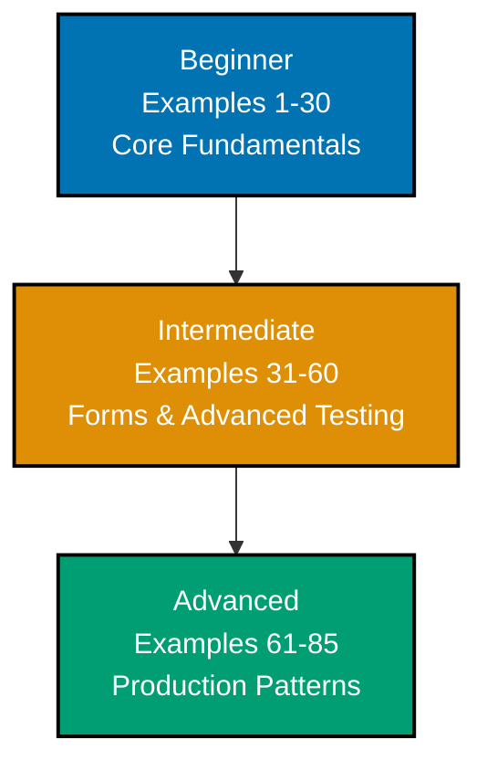

**Want to quickly master Playwright through working examples?** This by-example guide teaches 95% of Playwright through 85 annotated code examples organized by complexity level.

## What Is By-Example Learning?

By-example learning is an **example-first approach** where you learn through annotated, runnable code rather than narrative explanations. Each example is self-contained, immediately executable with `npx playwright test`, and heavily commented to show:

- **What each line does** - Inline comments explain the purpose and mechanism
- **Expected behaviors** - Using `// =>` notation to show test outcomes
- **Intermediate states** - Element states and page interactions made visible
- **Key takeaways** - 1-2 sentence summaries of core concepts

This approach is **ideal for experienced developers and testers** (manual testers, Selenium/Cypress users, or software engineers) who are familiar with web testing concepts and want to quickly understand Playwright's API, patterns, and unique features through working code.

Unlike narrative tutorials that build understanding through explanation and storytelling, by-example learning lets you **see the code first, run it second, and understand it through direct interaction**. You learn by doing, not by reading about doing.

## Learning Path


```mermaid
%% Color Palette: Blue #0173B2, Orange #DE8F05, Teal #029E73, Purple #CC78BC, Brown #CA9161
graph TD
    A["Beginner<br/>Examples 1-30<br/>Core Fundamentals"] --> B["Intermediate<br/>Examples 31-60<br/>Forms & Advanced Testing"]
    B --> C["Advanced<br/>Examples 61-85<br/>Production Patterns"]

    style A fill:#0173B2,stroke:#000000,stroke-width:2px,color:#fff
    style B fill:#DE8F05,stroke:#000000,stroke-width:2px,color:#fff
    style C fill:#029E73,stroke:#000000,stroke-width:2px,color:#fff
```

Progress from fundamentals through practical form testing to advanced production patterns. Each level builds on the previous, increasing in sophistication and introducing more Playwright-specific features.

## Coverage Philosophy

This by-example guide provides **95% coverage of Playwright** through practical, annotated examples. The 95% figure represents the depth and breadth of concepts covered, not a time estimate—focus is on **outcomes and understanding**, not duration.

### What's Covered

- **Core fundamentals** - Browser launch, navigation, basic locators, assertions
- **Selectors and locators** - All locator types, chaining, filtering, advanced patterns
- **Basic interactions** - Clicks, input, checkboxes, dropdowns, file uploads, keyboard/mouse
- **Form handling** - Multi-field forms, validation, dynamic forms, date pickers, rich editors
- **Advanced assertions** - URL, attributes, screenshots, accessibility, network, custom matchers
- **API testing** - API requests, authentication, mocking, fixtures, UI+API integration
- **Test organization** - Page Object Model, fixtures, hooks, annotations, retries
- **Advanced patterns** - Component objects, parameterized tests, visual regression, network interception
- **Debugging and diagnostics** - Trace viewer, debug mode, video recording, HAR files, console logs
- **CI/CD and performance** - Parallel execution, sharding, GitHub Actions, Docker, performance testing
- **Production patterns** - Authentication flows, test data management, environment config, error handling, reporting

### What's NOT Covered

This guide focuses on **learning-oriented examples**, not problem-solving recipes or production deployment. For additional topics:

- **Deep framework integrations** - Specific CI/CD platforms (beyond GitHub Actions), cloud testing services
- **Legacy browser support** - Internet Explorer, older browser versions
- **Mobile native testing** - Native mobile apps (Playwright is web/hybrid app focused)

The 95% coverage goal maintains humility—no tutorial can cover everything. This guide teaches the **core concepts that unlock the remaining 5%** through your own exploration and project work.

## How to Use This Guide

1. **Sequential or selective** - Read examples in order for progressive learning, or jump to specific topics when switching from Selenium/Cypress
2. **Run everything** - Execute examples with `npx playwright test` to see results yourself. Experimentation solidifies understanding.
3. **Modify and explore** - Change selectors, add assertions, break tests intentionally. Learn through experimentation.
4. **Use as reference** - Bookmark examples for quick lookups when you forget syntax or patterns
5. **Complement with narrative tutorials** - By-example learning is code-first; pair with comprehensive tutorials for deeper explanations

**Best workflow**: Open your editor in one window, this guide in another, terminal in a third. Run each example as you read it. When you encounter something unfamiliar, run the example, modify it, see what changes.

## Relationship to Other Tutorials

Understanding where by-example fits in the tutorial ecosystem helps you choose the right learning path:

| Tutorial Type    | Coverage                | Approach                       | Target Audience                | When to Use                                            |
| ---------------- | ----------------------- | ------------------------------ | ------------------------------ | ------------------------------------------------------ |
| **By Example**   | 95% through 85 examples | Code-first, annotated examples | Experienced developers/testers | Quick framework pickup, reference, tool switching      |
| **Quick Start**  | 5-30% touchpoints       | Hands-on first test            | Newcomers to Playwright        | First taste, decide if worth learning                  |
| **Beginner**     | 0-60% comprehensive     | Narrative, explanatory         | Complete testing beginners     | Deep understanding, first automation framework         |
| **Intermediate** | 60-85%                  | Practical applications         | Past basics                    | Production patterns, CI/CD integration                 |
| **Advanced**     | 85-95%                  | Complex systems                | Experienced Playwright users   | Custom reporters, advanced fixtures, browser internals |
| **Cookbook**     | Problem-specific        | Recipe-based                   | All levels                     | Solve specific testing problems                        |

**By Example vs. Quick Start**: By Example provides 95% coverage through examples vs. Quick Start's 5-30% through your first test. By Example is code-first reference; Quick Start is hands-on introduction.

**By Example vs. Beginner Tutorial**: By Example is code-first for experienced developers/testers; Beginner Tutorial is narrative-first for complete testing beginners. By Example shows patterns; Beginner Tutorial explains concepts.

**By Example vs. Cookbook**: By Example is learning-oriented (understand concepts); Cookbook is problem-solving oriented (fix specific issues). By Example teaches patterns; Cookbook provides solutions.

## Prerequisites

**Required**:

- Experience with web development or testing concepts
- Ability to run Node.js commands and npm/npx
- Basic understanding of HTML, CSS, and JavaScript

**Recommended (helpful but not required)**:

- Familiarity with async/await in JavaScript
- Experience with another testing framework (Selenium, Cypress, Puppeteer)
- Understanding of web browser DevTools

**No prior Playwright experience required** - This guide assumes you're new to Playwright but experienced with web testing or development in general. You should be comfortable reading JavaScript/TypeScript code, understanding basic testing concepts (assertions, test structure), and learning through hands-on experimentation.

## Structure of Each Example

Every example follows a **mandatory five-part format**:

````markdown
### Example N: Concept Name

**Part 1: Brief Explanation** (2-3 sentences)
Explains what the concept is, why it matters in test automation, and when to use it.

**Part 2: Mermaid Diagram** (when appropriate)
Visual representation of concept relationships - test flow, page object hierarchies, or fixture composition. Not every example needs a diagram; they're used strategically to enhance understanding.

**Part 3: Heavily Annotated Code**

```typescript
import { test, expect } from "@playwright/test";
// => Playwright test framework import
// => test: test function, expect: assertion library

test("example test", async ({ page }) => {
  // => test() creates new test case (async function)
  // => { page }: built-in fixture (browser page instance)

  await page.goto("https://example.com");
  // => Navigates to URL (waits for page load automatically)

  const button = page.getByRole("button", { name: "Submit" });
  // => Locates button by accessible role and text
  // => Returns Locator object (not element itself)

  await button.click();
  // => Clicks button, triggers action
  // => Auto-waits for button to be visible and enabled

  await expect(page.getByText("Success")).toBeVisible();
  // => Asserts success message is visible
  // => Auto-waits up to 5 seconds before failing
});
```

**Part 4: Key Takeaway** (1-2 sentences)
Distills the core insight: the most important pattern, when to apply it in production, or common pitfalls to avoid.

**Part 5: Why It Matters** (2-3 sentences, 50-100 words)
Connects the concept to production relevance - why professionals care, how it compares to alternatives, and consequences for quality/performance/maintainability.
````

Each example follows this structure consistently, maintaining annotation density of 1.0-2.25 comment lines per code line. The **brief explanation** provides context, the **code** is heavily annotated with inline comments and `// =>` output notation, the **key takeaway** distills the concept, and **why it matters** shows production relevance.

## Learning Strategies

### For Selenium Users

You're used to explicit waits and WebDriver API. Playwright simplifies and modernizes testing:

- **Auto-waiting**: No explicit waits for element visibility, Playwright waits automatically
- **Modern selectors**: getByRole, getByText replace fragile CSS/XPath selectors
- **Built-in best practices**: Automatic screenshots, traces, and videos on failure

Focus on Examples 1-10 (browser basics and locators) and Examples 21-30 (auto-waiting) to unlearn explicit wait patterns.

### For Cypress Users

You understand modern web testing and fixtures. Playwright provides more control:

- **Multi-browser support**: Test Chrome, Firefox, and WebKit (Safari) with same code
- **True parallelization**: Run tests in parallel across browsers and files
- **API testing**: Built-in API request capabilities without plugins

Focus on Examples 51-55 (API testing) and Examples 76-80 (parallel execution) to leverage Playwright's unique strengths.

### For Manual Testers

You know what to test but may be new to automation. Playwright makes automation accessible:

- **Readable selectors**: getByRole('button'), getByText('Submit') read like English
- **Code generation**: Use Codegen tool to record tests while clicking through app
- **Debugging tools**: Trace viewer, debug mode show exactly what happened

Focus on Examples 1-20 (fundamentals and locators) and Examples 71-75 (debugging) to build automation confidence.

### For JavaScript/TypeScript Developers

You understand async/await and modern JavaScript. Playwright is native async testing:

- **Async-first design**: All actions return promises, use await consistently
- **TypeScript support**: Full type safety for page objects and fixtures
- **Fixture pattern**: Dependency injection for test setup and teardown

Focus on Examples 56-60 (fixtures and hooks) and Examples 61-70 (advanced patterns) to leverage your development skills.

### For Puppeteer Users

You're familiar with Chrome DevTools Protocol. Playwright builds on similar foundations:

- **Multi-browser**: Same API works across Chrome, Firefox, and WebKit
- **Testing focus**: Built-in assertions, fixtures, and test runner (no need for external frameworks)
- **Better debugging**: Trace viewer, codegen, inspector tools

Focus on Examples 41-50 (assertions) and Examples 71-75 (debugging) to see Playwright's testing-specific features.

## Code-First Philosophy

This tutorial prioritizes working code over theoretical discussion:

- **No lengthy prose**: Concepts are demonstrated, not explained at length
- **Runnable examples**: Every example runs with `npx playwright test`
- **Learn by doing**: Understanding comes from running and modifying code
- **Pattern recognition**: See the same patterns in different contexts across 85 examples

If you prefer narrative explanations, complement this guide with comprehensive tutorials. By-example learning works best when you learn through experimentation.

## Ready to Start?

Jump into the beginner examples to start learning Playwright through code:

- [Beginner Examples (1-30)](/en/learn/software-engineering/automation-testing/tools/playwright/by-example/beginner) - Core fundamentals, selectors, basic interactions
- [Intermediate Examples (31-60)](/en/learn/software-engineering/automation-testing/tools/playwright/by-example/intermediate) - Form handling, advanced assertions, API testing, test organization
- [Advanced Examples (61-85)](/en/learn/software-engineering/automation-testing/tools/playwright/by-example/advanced) - Advanced patterns, debugging, CI/CD, production patterns

Each example is self-contained and runnable. Start with Example 1, or jump to topics that interest you most.

## Examples by Level

### Beginner (Examples 1–30)

- [Example 1: Hello World - Your First Playwright Test](/en/learn/software-engineering/automation-testing/tools/playwright/by-example/beginner#example-1-hello-world---your-first-playwright-test)
- [Example 2: Browser Launch Configuration](/en/learn/software-engineering/automation-testing/tools/playwright/by-example/beginner#example-2-browser-launch-configuration)
- [Example 3: Basic Navigation and Waiting](/en/learn/software-engineering/automation-testing/tools/playwright/by-example/beginner#example-3-basic-navigation-and-waiting)
- [Example 4: Basic Locators - getByRole](/en/learn/software-engineering/automation-testing/tools/playwright/by-example/beginner#example-4-basic-locators---getbyrole)
- [Example 5: Clicking Elements and Action Auto-Wait](/en/learn/software-engineering/automation-testing/tools/playwright/by-example/beginner#example-5-clicking-elements-and-action-auto-wait)
- [Example 6: Text Input and Keyboard Actions](/en/learn/software-engineering/automation-testing/tools/playwright/by-example/beginner#example-6-text-input-and-keyboard-actions)
- [Example 7: Basic Assertions with expect](/en/learn/software-engineering/automation-testing/tools/playwright/by-example/beginner#example-7-basic-assertions-with-expect)
- [Example 8: Screenshots and Visual Verification](/en/learn/software-engineering/automation-testing/tools/playwright/by-example/beginner#example-8-screenshots-and-visual-verification)
- [Example 9: Test Structure with describe Blocks](/en/learn/software-engineering/automation-testing/tools/playwright/by-example/beginner#example-9-test-structure-with-describe-blocks)
- [Example 10: Multiple Browser Testing](/en/learn/software-engineering/automation-testing/tools/playwright/by-example/beginner#example-10-multiple-browser-testing)
- [Example 11: CSS Selectors (Not Recommended)](/en/learn/software-engineering/automation-testing/tools/playwright/by-example/beginner#example-11-css-selectors-not-recommended)
- [Example 12: XPath Selectors (Use Sparingly)](/en/learn/software-engineering/automation-testing/tools/playwright/by-example/beginner#example-12-xpath-selectors-use-sparingly)
- [Example 13: getByLabel for Form Fields](/en/learn/software-engineering/automation-testing/tools/playwright/by-example/beginner#example-13-getbylabel-for-form-fields)
- [Example 14: getByPlaceholder for Input Hints](/en/learn/software-engineering/automation-testing/tools/playwright/by-example/beginner#example-14-getbyplaceholder-for-input-hints)
- [Example 15: getByTestId for Stable Selectors](/en/learn/software-engineering/automation-testing/tools/playwright/by-example/beginner#example-15-getbytestid-for-stable-selectors)
- [Example 16: Chaining Locators for Scoped Searches](/en/learn/software-engineering/automation-testing/tools/playwright/by-example/beginner#example-16-chaining-locators-for-scoped-searches)
- [Example 17: Filtering Locators with has and hasText](/en/learn/software-engineering/automation-testing/tools/playwright/by-example/beginner#example-17-filtering-locators-with-has-and-hastext)
- [Example 18: nth, first, last for Multiple Elements](/en/learn/software-engineering/automation-testing/tools/playwright/by-example/beginner#example-18-nth-first-last-for-multiple-elements)
- [Example 19: Locator Evaluation and Element Handles](/en/learn/software-engineering/automation-testing/tools/playwright/by-example/beginner#example-19-locator-evaluation-and-element-handles)
- [Example 20: getByText for Exact and Partial Matches](/en/learn/software-engineering/automation-testing/tools/playwright/by-example/beginner#example-20-getbytext-for-exact-and-partial-matches)
- [Example 21: Checkboxes and Radio Buttons](/en/learn/software-engineering/automation-testing/tools/playwright/by-example/beginner#example-21-checkboxes-and-radio-buttons)
- [Example 22: Select Dropdowns](/en/learn/software-engineering/automation-testing/tools/playwright/by-example/beginner#example-22-select-dropdowns)
- [Example 23: File Uploads](/en/learn/software-engineering/automation-testing/tools/playwright/by-example/beginner#example-23-file-uploads)
- [Example 24: Hover Interactions](/en/learn/software-engineering/automation-testing/tools/playwright/by-example/beginner#example-24-hover-interactions)
- [Example 25: Double Click and Right Click](/en/learn/software-engineering/automation-testing/tools/playwright/by-example/beginner#example-25-double-click-and-right-click)
- [Example 26: Keyboard Input and Shortcuts](/en/learn/software-engineering/automation-testing/tools/playwright/by-example/beginner#example-26-keyboard-input-and-shortcuts)
- [Example 27: Focus and Blur Events](/en/learn/software-engineering/automation-testing/tools/playwright/by-example/beginner#example-27-focus-and-blur-events)
- [Example 28: Waiting for Specific Conditions](/en/learn/software-engineering/automation-testing/tools/playwright/by-example/beginner#example-28-waiting-for-specific-conditions)
- [Example 29: Auto-Waiting Behavior Deep Dive](/en/learn/software-engineering/automation-testing/tools/playwright/by-example/beginner#example-29-auto-waiting-behavior-deep-dive)
- [Example 30: Common Auto-Wait Pitfalls and Solutions](/en/learn/software-engineering/automation-testing/tools/playwright/by-example/beginner#example-30-common-auto-wait-pitfalls-and-solutions)

### Intermediate (Examples 31–60)

- [Example 31: Multi-Field Form - Contact Form](/en/learn/software-engineering/automation-testing/tools/playwright/by-example/intermediate#example-31-multi-field-form---contact-form)
- [Example 32: Form Validation - Client-Side Errors](/en/learn/software-engineering/automation-testing/tools/playwright/by-example/intermediate#example-32-form-validation---client-side-errors)
- [Example 33: Dynamic Forms - Conditional Fields](/en/learn/software-engineering/automation-testing/tools/playwright/by-example/intermediate#example-33-dynamic-forms---conditional-fields)
- [Example 34: Date Pickers - Calendar Widget](/en/learn/software-engineering/automation-testing/tools/playwright/by-example/intermediate#example-34-date-pickers---calendar-widget)
- [Example 35: Multi-Select - Checkbox Groups](/en/learn/software-engineering/automation-testing/tools/playwright/by-example/intermediate#example-35-multi-select---checkbox-groups)
- [Example 36: Autocomplete - Search Suggestions](/en/learn/software-engineering/automation-testing/tools/playwright/by-example/intermediate#example-36-autocomplete---search-suggestions)
- [Example 37: Rich Text Editor - WYSIWYG Input](/en/learn/software-engineering/automation-testing/tools/playwright/by-example/intermediate#example-37-rich-text-editor---wysiwyg-input)
- [Example 38: Drag-and-Drop - Reordering Items](/en/learn/software-engineering/automation-testing/tools/playwright/by-example/intermediate#example-38-drag-and-drop---reordering-items)
- [Example 39: Range Slider - Numeric Input](/en/learn/software-engineering/automation-testing/tools/playwright/by-example/intermediate#example-39-range-slider---numeric-input)
- [Example 40: Form Submission - Success and Error Handling](/en/learn/software-engineering/automation-testing/tools/playwright/by-example/intermediate#example-40-form-submission---success-and-error-handling)
- [Example 41: URL Assertions - Navigation Validation](/en/learn/software-engineering/automation-testing/tools/playwright/by-example/intermediate#example-41-url-assertions---navigation-validation)
- [Example 42: Attribute Assertions - Element Properties](/en/learn/software-engineering/automation-testing/tools/playwright/by-example/intermediate#example-42-attribute-assertions---element-properties)
- [Example 43: Element Count - Collection Assertions](/en/learn/software-engineering/automation-testing/tools/playwright/by-example/intermediate#example-43-element-count---collection-assertions)
- [Example 44: Screenshot Comparison - Visual Regression](/en/learn/software-engineering/automation-testing/tools/playwright/by-example/intermediate#example-44-screenshot-comparison---visual-regression)
- [Example 45: Accessibility Assertions - Axe Integration](/en/learn/software-engineering/automation-testing/tools/playwright/by-example/intermediate#example-45-accessibility-assertions---axe-integration)
- [Example 46: Network Response Assertions - API Validation](/en/learn/software-engineering/automation-testing/tools/playwright/by-example/intermediate#example-46-network-response-assertions---api-validation)
- [Example 47: Custom Matchers - Domain-Specific Assertions](/en/learn/software-engineering/automation-testing/tools/playwright/by-example/intermediate#example-47-custom-matchers---domain-specific-assertions)
- [Example 48: Soft Assertions - Continue After Failures](/en/learn/software-engineering/automation-testing/tools/playwright/by-example/intermediate#example-48-soft-assertions---continue-after-failures)
- [Example 49: Polling Assertions - Wait for Conditions](/en/learn/software-engineering/automation-testing/tools/playwright/by-example/intermediate#example-49-polling-assertions---wait-for-conditions)
- [Example 50: Negative Assertions - Verify Absence](/en/learn/software-engineering/automation-testing/tools/playwright/by-example/intermediate#example-50-negative-assertions---verify-absence)
- [Example 51: API Request Basics - REST Endpoint Testing](/en/learn/software-engineering/automation-testing/tools/playwright/by-example/intermediate#example-51-api-request-basics---rest-endpoint-testing)
- [Example 52: API Authentication - Bearer Token and Cookies](/en/learn/software-engineering/automation-testing/tools/playwright/by-example/intermediate#example-52-api-authentication---bearer-token-and-cookies)
- [Example 53: API Mocking - Stubbing External Services](/en/learn/software-engineering/automation-testing/tools/playwright/by-example/intermediate#example-53-api-mocking---stubbing-external-services)
- [Example 54: API Test Fixtures - Reusable Setup](/en/learn/software-engineering/automation-testing/tools/playwright/by-example/intermediate#example-54-api-test-fixtures---reusable-setup)
- [Example 55: Combined UI and API Testing - Hybrid Validation](/en/learn/software-engineering/automation-testing/tools/playwright/by-example/intermediate#example-55-combined-ui-and-api-testing---hybrid-validation)
- [Example 56: Page Object Model Basics - Encapsulation](/en/learn/software-engineering/automation-testing/tools/playwright/by-example/intermediate#example-56-page-object-model-basics---encapsulation)
- [Example 57: Test Fixtures - Custom Setup and Teardown](/en/learn/software-engineering/automation-testing/tools/playwright/by-example/intermediate#example-57-test-fixtures---custom-setup-and-teardown)
- [Example 58: Test Hooks - Setup and Teardown](/en/learn/software-engineering/automation-testing/tools/playwright/by-example/intermediate#example-58-test-hooks---setup-and-teardown)
- [Example 59: Test Annotations - Metadata and Conditional Execution](/en/learn/software-engineering/automation-testing/tools/playwright/by-example/intermediate#example-59-test-annotations---metadata-and-conditional-execution)
- [Example 60: Test Retries and Timeouts - Reliability Configuration](/en/learn/software-engineering/automation-testing/tools/playwright/by-example/intermediate#example-60-test-retries-and-timeouts---reliability-configuration)

### Advanced (Examples 61–85)

- [Example 61: Page Object Model - Advanced Composition](/en/learn/software-engineering/automation-testing/tools/playwright/by-example/advanced#example-61-page-object-model---advanced-composition)
- [Example 62: Component Objects Pattern](/en/learn/software-engineering/automation-testing/tools/playwright/by-example/advanced#example-62-component-objects-pattern)
- [Example 63: Custom Fixtures for Test Setup](/en/learn/software-engineering/automation-testing/tools/playwright/by-example/advanced#example-63-custom-fixtures-for-test-setup)
- [Example 64: Fixture Composition and Scoping](/en/learn/software-engineering/automation-testing/tools/playwright/by-example/advanced#example-64-fixture-composition-and-scoping)
- [Example 65: Parameterized Tests with test.describe.configure](/en/learn/software-engineering/automation-testing/tools/playwright/by-example/advanced#example-65-parameterized-tests-with-testdescribeconfigure)
- [Example 66: Data-Driven Testing with External Data](/en/learn/software-engineering/automation-testing/tools/playwright/by-example/advanced#example-66-data-driven-testing-with-external-data)
- [Example 67: Visual Regression Testing with Screenshots](/en/learn/software-engineering/automation-testing/tools/playwright/by-example/advanced#example-67-visual-regression-testing-with-screenshots)
- [Example 68: Network Interception and Request Mocking](/en/learn/software-engineering/automation-testing/tools/playwright/by-example/advanced#example-68-network-interception-and-request-mocking)
- [Example 69: Advanced Request Mocking with HAR Files](/en/learn/software-engineering/automation-testing/tools/playwright/by-example/advanced#example-69-advanced-request-mocking-with-har-files)
- [Example 70: WebSocket Testing](/en/learn/software-engineering/automation-testing/tools/playwright/by-example/advanced#example-70-websocket-testing)
- [Example 71: Trace Viewer for Debugging](/en/learn/software-engineering/automation-testing/tools/playwright/by-example/advanced#example-71-trace-viewer-for-debugging)
- [Example 72: Debug Mode and Playwright Inspector](/en/learn/software-engineering/automation-testing/tools/playwright/by-example/advanced#example-72-debug-mode-and-playwright-inspector)
- [Example 73: Video Recording for Test Evidence](/en/learn/software-engineering/automation-testing/tools/playwright/by-example/advanced#example-73-video-recording-for-test-evidence)
- [Example 74: HAR Files for Network Analysis](/en/learn/software-engineering/automation-testing/tools/playwright/by-example/advanced#example-74-har-files-for-network-analysis)
- [Example 75: Console Logs Capture and Analysis](/en/learn/software-engineering/automation-testing/tools/playwright/by-example/advanced#example-75-console-logs-capture-and-analysis)
- [Example 76: Parallel Execution with Workers](/en/learn/software-engineering/automation-testing/tools/playwright/by-example/advanced#example-76-parallel-execution-with-workers)
- [Example 77: Test Sharding for CI](/en/learn/software-engineering/automation-testing/tools/playwright/by-example/advanced#example-77-test-sharding-for-ci)
- [Example 78: CI Configuration with GitHub Actions](/en/learn/software-engineering/automation-testing/tools/playwright/by-example/advanced#example-78-ci-configuration-with-github-actions)
- [Example 79: Docker for Consistent Test Environment](/en/learn/software-engineering/automation-testing/tools/playwright/by-example/advanced#example-79-docker-for-consistent-test-environment)
- [Example 80: Performance Testing Basics](/en/learn/software-engineering/automation-testing/tools/playwright/by-example/advanced#example-80-performance-testing-basics)
- [Example 81: Authentication Flows - Login Once Pattern](/en/learn/software-engineering/automation-testing/tools/playwright/by-example/advanced#example-81-authentication-flows---login-once-pattern)
- [Example 82: Test Data Management Strategies](/en/learn/software-engineering/automation-testing/tools/playwright/by-example/advanced#example-82-test-data-management-strategies)
- [Example 83: Environment Configuration Management](/en/learn/software-engineering/automation-testing/tools/playwright/by-example/advanced#example-83-environment-configuration-management)
- [Example 84: Error Handling and Retry Patterns](/en/learn/software-engineering/automation-testing/tools/playwright/by-example/advanced#example-84-error-handling-and-retry-patterns)
- [Example 85: Reporting and Metrics Collection](/en/learn/software-engineering/automation-testing/tools/playwright/by-example/advanced#example-85-reporting-and-metrics-collection)
