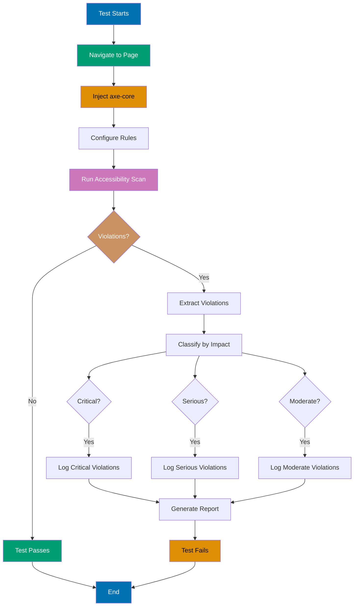

## Why This Matters

Accessibility testing ensures web applications meet WCAG (Web Content Accessibility Guidelines) standards, making content usable by people with disabilities. Production systems must comply with WCAG AA standards - not just for legal compliance, but to serve all users effectively. Approximately 15% of the world's population lives with some form of disability, representing a significant user base that needs proper accessibility support.

Playwright provides built-in accessibility testing capabilities through role-based selectors and aria attributes, but production accessibility requires comprehensive WCAG validation including automated rule checking, keyboard navigation testing, and screen reader compatibility verification. Manual testing alone is insufficient - automated accessibility testing integrates into CI/CD pipelines, catching regressions before they reach production. The investment in accessibility testing yields returns through expanded market reach, reduced legal risk, improved SEO, and better user experience for everyone including users with temporary disabilities or situational limitations.

Enterprise applications face accessibility audits, legal requirements (ADA, Section 508, EN 301 549), and procurement requirements that mandate WCAG AA compliance. Implementing production-grade accessibility testing with automated scanning prevents costly post-deployment fixes and ensures continuous compliance as applications evolve. This guide demonstrates the progression from Playwright's built-in role selectors to production-ready accessibility testing with axe-core integration.

## Standard Library Approach: Playwright Role Selectors

Playwright provides role-based selectors that query elements by their ARIA role, making tests more accessible:

```typescript
// => test-accessibility-basic.spec.ts
import { test, expect } from "@playwright/test";
// => Import Playwright test framework
// => test function defines test cases
// => expect provides assertion functions

test("form has accessible labels", async ({ page }) => {
  // => Test verifies form accessibility basics
  // => page is Playwright Page object with browser context
  // => async function allows await operations

  await page.goto("https://example.com/register");
  // => Navigate to registration form page
  // => await waits for page load completion
  // => URL should be your application under test

  const nameInput = page.getByRole("textbox", { name: "Full Name" });
  // => Query input by ARIA role and accessible name
  // => getByRole finds elements by accessibility tree
  // => name parameter matches aria-label or label text

  await expect(nameInput).toBeVisible();
  // => Verify input is visible to users
  // => toBeVisible checks CSS visibility and display
  // => Fails if element hidden or display:none

  await nameInput.fill("John Smith");
  // => Fill input with test data
  // => Simulates keyboard input
  // => Verifies input accepts user input

  const submitButton = page.getByRole("button", { name: "Submit" });
  // => Query button by role and accessible name
  // => Matches button text or aria-label
  // => Role-based selector more robust than CSS

  await expect(submitButton).toBeEnabled();
  // => Verify button is interactive
  // => Checks disabled attribute and aria-disabled
  // => Ensures form is submittable

  await submitButton.click();
  // => Trigger form submission
  // => Tests button click interaction
  // => Should navigate or show confirmation
});
```

**Limitations for production**:

- **No WCAG rule validation** - Only tests role presence, not compliance with 78 WCAG AA success criteria
- **No color contrast checking** - Cannot detect text with insufficient contrast ratios
- **No automated scanning** - Manual test cases miss violations in untested components
- **No violation reporting** - Test failures don't explain WCAG violations with remediation guidance
- **Limited ARIA validation** - Doesn't verify correct aria-labelledby, aria-describedby, or state attributes
- **No keyboard navigation testing** - Role selectors don't validate tab order or focus management

## Production Framework: axe-core Integration

axe-core is the industry-standard accessibility testing engine that validates WCAG compliance. Playwright integrates with axe-core through the `@axe-core/playwright` package for comprehensive production testing:

```bash
# => Install axe-core Playwright integration
npm install --save-dev @axe-core/playwright
# => Adds axe-core engine to dev dependencies
# => Version pinning recommended for reproducible tests
# => Package size: ~1.5MB (development only)
```

```typescript
// => test-accessibility-production.spec.ts
import { test, expect } from "@playwright/test";
// => Playwright test framework for browser automation
// => Provides test lifecycle and assertions
// => expect function for accessibility checks

import { injectAxe, checkA11y, configureAxe } from "@axe-core/playwright";
// => Import axe-core Playwright utilities
// => injectAxe loads axe-core into browser context
// => checkA11y runs accessibility scans
// => configureAxe sets rules and options

interface A11yViolation {
  // => Type definition for accessibility violations
  // => Provides structured violation reporting
  // => Enables TypeScript type safety

  id: string;
  // => Unique axe rule identifier (e.g. 'color-contrast')
  // => Maps to WCAG success criterion
  // => Used for violation tracking

  impact: "critical" | "serious" | "moderate" | "minor";
  // => Severity classification from axe-core
  // => critical: WCAG failures blocking users
  // => serious: Major accessibility barriers
  // => moderate/minor: Usability improvements

  description: string;
  // => Human-readable explanation of violation
  // => Explains what WCAG requirement failed
  // => Includes remediation guidance

  nodes: Array<{
    // => Array of DOM elements violating rule
    // => Each node represents one violation instance
    // => Provides location information

    html: string;
    // => Outer HTML of violating element
    // => Shows element markup context
    // => Used for debugging

    target: string[];
    // => CSS selector path to element
    // => Unique identifier for element location
    // => Enables automated fix tooling
  }>;
}

test.describe("Accessibility Compliance", () => {
  // => Group related accessibility tests
  // => describe creates test suite
  // => All tests share setup/teardown

  test.beforeEach(async ({ page }) => {
    // => Run before each test in suite
    // => Sets up axe-core in browser context
    // => page fixture provides browser page

    await page.goto("https://example.com");
    // => Navigate to application under test
    // => Should use configurable base URL
    // => await ensures page fully loaded

    await injectAxe(page);
    // => Inject axe-core library into page
    // => Loads axe.js from node_modules
    // => Must run before any checkA11y calls
    // => Only needed once per page load
  });

  test("homepage meets WCAG AA standards", async ({ page }) => {
    // => Comprehensive WCAG scan of homepage
    // => Tests all 78 WCAG AA success criteria
    // => Scans entire page DOM tree

    await configureAxe(page, {
      // => Configure axe-core scanning options
      // => Sets WCAG conformance level
      // => Enables specific rule tags

      rules: {
        // => Customize rule configuration
        // => Enable/disable specific checks
        // => Set severity levels

        "color-contrast": { enabled: true },
        // => Enable color contrast checking
        // => Validates 4.5:1 normal text, 3:1 large text
        // => Critical for visual accessibility
      },
    });

    try {
      // => Error handling for accessibility failures
      // => Catch block provides detailed reporting
      // => Prevents test crash on violations

      await checkA11y(page, undefined, {
        // => Run accessibility scan on page
        // => undefined means scan entire page
        // => Options object configures reporting

        detailedReport: true,
        // => Generate comprehensive violation report
        // => Includes all violation details
        // => Provides remediation guidance

        detailedReportOptions: {
          // => Configure report detail level
          // => Controls output verbosity
          // => Useful for CI/CD logs

          html: true,
          // => Include HTML snippets in report
          // => Shows violating element markup
          // => Helps developers locate issues
        },
      });

      // => If checkA11y succeeds, no violations found
      // => Test passes, page is WCAG AA compliant
      // => Continue to next test
    } catch (error) {
      // => Accessibility violations detected
      // => error contains violation details
      // => Type assertion for structured access

      const violations = (error as any).violations as A11yViolation[];
      // => Extract violation array from error
      // => Type assertion provides TypeScript types
      // => violations array contains all WCAG failures

      console.error(`Found ${violations.length} accessibility violations:`);
      // => Log violation count to console
      // => Visible in test output and CI logs
      // => Helps assess accessibility debt

      violations.forEach((violation, index) => {
        // => Iterate through each violation
        // => Log detailed information per violation
        // => Provides actionable remediation data

        console.error(`\n${index + 1}. ${violation.id}`);
        // => Log violation number and axe rule ID
        // => Format: "1. color-contrast"
        // => Rule ID maps to WCAG criterion

        console.error(`   Impact: ${violation.impact}`);
        // => Log severity level
        // => critical > serious > moderate > minor
        // => Prioritizes fix order

        console.error(`   Description: ${violation.description}`);
        // => Log violation explanation
        // => Describes WCAG requirement
        // => Includes fix guidance

        console.error(`   Affected elements (${violation.nodes.length}):`);
        // => Log count of violating elements
        // => One rule can affect multiple elements
        // => Shows scope of issue

        violation.nodes.forEach((node, nodeIndex) => {
          // => Iterate through violating DOM nodes
          // => Log each element's location and markup
          // => Helps developers locate violations

          console.error(`     ${nodeIndex + 1}. ${node.target.join(" > ")}`);
          // => Log CSS selector path to element
          // => Format: "div > section > button"
          // => Used to locate element in codebase

          console.error(`        HTML: ${node.html.substring(0, 100)}...`);
          // => Log first 100 chars of element HTML
          // => Shows element context
          // => Truncated to keep logs readable
        });
      });

      throw new Error(`Accessibility violations detected. See logs above.`);
      // => Re-throw error to fail test
      // => Prevents non-compliant code from merging
      // => Forces accessibility fixes before deployment
    }
  });

  test("form has proper ARIA labels", async ({ page }) => {
    // => Specific test for form accessibility
    // => Validates ARIA label associations
    // => Tests keyboard navigation

    await page.goto("https://example.com/register");
    // => Navigate to registration form
    // => Should use configurable URL
    // => await ensures page ready

    await injectAxe(page);
    // => Inject axe-core into form page
    // => Required for checkA11y call
    // => Must run after navigation

    await checkA11y(page, "form", {
      // => Scan only form element
      // => CSS selector limits scope
      // => Faster than full page scan

      axeOptions: {
        // => Configure axe-core rule options
        // => Enable specific checks for forms
        // => Customize severity levels

        rules: {
          label: { enabled: true },
          // => Verify all inputs have labels
          // => Validates for/id associations
          // => Critical for screen readers

          "aria-required-attr": { enabled: true },
          // => Check required ARIA attributes present
          // => Validates aria-labelledby, aria-label
          // => Ensures proper ARIA usage
        },
      },
    });

    // => Test passes if no violations found
    // => Form is properly labeled
    // => Screen readers can navigate form
  });

  test("keyboard navigation works correctly", async ({ page }) => {
    // => Test keyboard-only interaction
    // => Validates focus management
    // => Critical for motor disability users

    await page.goto("https://example.com/navigation");
    // => Navigate to page with interactive elements
    // => Should test complex UI components
    // => await ensures page loaded

    await injectAxe(page);
    // => Inject axe-core library
    // => Required for accessibility scanning
    // => Runs after page navigation

    await page.keyboard.press("Tab");
    // => Simulate Tab key press
    // => Moves focus to first focusable element
    // => Tests keyboard navigation path

    const focusedElement = await page.evaluate(() => {
      // => Execute JavaScript in browser context
      // => Gets currently focused element
      // => Returns element properties to test

      const element = document.activeElement;
      // => Get active (focused) element from DOM
      // => activeElement is current focus target
      // => null if nothing focused

      return {
        tagName: element?.tagName,
        // => Get element tag name (DIV, BUTTON, etc.)
        // => Used to verify correct element focused
        // => undefined if no element focused

        role: element?.getAttribute("role"),
        // => Get ARIA role attribute
        // => Validates semantic role
        // => null if no role specified

        ariaLabel: element?.getAttribute("aria-label"),
        // => Get aria-label attribute
        // => Provides accessible name
        // => null if no aria-label
      };
    });

    expect(focusedElement.tagName).toBe("A");
    // => Verify first focusable element is link
    // => Validates expected tab order
    // => Test fails if wrong element focused

    await checkA11y(page);
    // => Run full accessibility scan
    // => Checks focus indicators visible
    // => Validates WCAG focus requirements
  });
});
```

## Accessibility Testing Architecture



## Production Patterns and Best Practices

### Pattern 1: Automated WCAG Scanning in CI/CD

Integrate accessibility scanning into continuous integration pipelines to catch violations before deployment:

```typescript
// => test-accessibility-ci.spec.ts
import { test, expect } from "@playwright/test";
import { injectAxe, checkA11y } from "@axe-core/playwright";
import * as fs from "fs";
// => Import Node.js filesystem module
// => Enables writing violation reports to files
// => Used for CI/CD artifact storage

test.describe("CI Accessibility Audit", () => {
  // => Test suite for automated CI scanning
  // => Runs on every pull request
  // => Blocks merges if violations found

  const violationReport: any[] = [];
  // => Accumulate violations across tests
  // => Array stores all detected violations
  // => Written to JSON file after tests

  test.afterAll(() => {
    // => Run after all tests complete
    // => Write violation report to disk
    // => CI/CD can upload as artifact

    if (violationReport.length > 0) {
      // => Check if violations detected
      // => Only write report if failures found
      // => Empty report means compliance

      fs.writeFileSync(
        // => Write report to filesystem
        // => Synchronous write ensures completion
        // => File path should be configurable

        "accessibility-violations.json",
        // => Output filename for CI artifacts
        // => JSON format for machine parsing
        // => Can be processed by dashboards

        JSON.stringify(violationReport, null, 2),
        // => Convert violations to formatted JSON
        // => null, 2 provides readable indentation
        // => Preserves all violation metadata
      );

      console.log("Accessibility report written to accessibility-violations.json");
      // => Log report location
      // => Visible in CI logs
      // => Helps developers find detailed report
    }
  });

  test("scan critical user flows", async ({ page }) => {
    // => Test critical accessibility paths
    // => Focuses on core user journeys
    // => Login, registration, checkout flows

    const flows = [
      // => Array of critical user flow URLs
      // => Each flow tested independently
      // => Failures tracked separately

      { name: "Login", url: "/login" },
      // => Login flow entry point
      // => Critical for user access
      // => Must be fully accessible

      { name: "Registration", url: "/register" },
      // => User registration flow
      // => New user onboarding path
      // => Form accessibility critical

      { name: "Dashboard", url: "/dashboard" },
      // => Main application dashboard
      // => Primary user interface
      // => Complex UI requires thorough testing
    ];

    for (const flow of flows) {
      // => Iterate through each critical flow
      // => Test one flow at a time
      // => Isolates violations by flow

      await page.goto(`https://example.com${flow.url}`);
      // => Navigate to flow URL
      // => Use base URL from config
      // => await ensures page loaded

      await injectAxe(page);
      // => Inject axe-core into page
      // => Required for accessibility scanning
      // => Must run after each navigation

      try {
        await checkA11y(page);
        // => Run accessibility scan
        // => Throws if violations found
        // => Success means flow is compliant

        console.log(`✓ ${flow.name} flow is accessible`);
        // => Log success message
        // => Green checkmark indicates pass
        // => Visible in CI logs
      } catch (error) {
        // => Violations detected in flow
        // => Extract violation details
        // => Add to cumulative report

        const violations = (error as any).violations;
        // => Extract violations from error
        // => Type assertion for access
        // => violations is array of violation objects

        violationReport.push({
          // => Add flow violations to report
          // => Object includes flow context
          // => Enables flow-specific analysis

          flow: flow.name,
          // => Flow name (Login, Registration, etc.)
          // => Groups violations by user journey
          // => Helps prioritize fixes

          url: flow.url,
          // => URL where violations found
          // => Enables reproduction
          // => Used for regression testing

          violations: violations,
          // => Full violation details
          // => Includes rule IDs, impact, nodes
          // => Provides remediation guidance
        });

        console.error(`✗ ${flow.name} flow has accessibility violations`);
        // => Log failure message
        // => Red X indicates failure
        // => Visible in CI logs
      }
    }

    if (violationReport.length > 0) {
      // => Check if any violations found
      // => Fail test if violations exist
      // => Prevents non-compliant code merge

      throw new Error(`${violationReport.length} flows have accessibility violations`);
      // => Throw error with violation count
      // => Fails CI/CD pipeline
      // => Forces developers to fix issues
    }
  });
});
```

### Pattern 2: Keyboard Navigation Testing

Validate keyboard-only interaction for users who cannot use a mouse:

```typescript
// => test-keyboard-navigation.spec.ts
import { test, expect } from "@playwright/test";
// => Playwright test framework
// => Provides keyboard simulation
// => expect for focus verification

test.describe("Keyboard Navigation", () => {
  // => Test suite for keyboard accessibility
  // => Validates focus management
  // => Critical for motor disabilities

  test("tab order follows visual layout", async ({ page }) => {
    // => Test tab order matches visual order
    // => WCAG 2.4.3 Focus Order requirement
    // => Prevents confusing navigation

    await page.goto("https://example.com/form");
    // => Navigate to form page
    // => Should test complex interactive UIs
    // => await ensures page ready

    const focusOrder: string[] = [];
    // => Track focus order sequence
    // => Array stores element IDs in tab order
    // => Compared to expected order

    for (let i = 0; i < 5; i++) {
      // => Tab through first 5 focusable elements
      // => 5 iterations covers typical form
      // => Adjust count based on page complexity

      await page.keyboard.press("Tab");
      // => Simulate Tab key press
      // => Moves focus to next element
      // => Triggers focus event

      const focusedId = await page.evaluate(() => {
        // => Execute in browser context
        // => Get currently focused element ID
        // => Returns to Node.js test context

        return document.activeElement?.id || "unknown";
        // => Return ID of focused element
        // => 'unknown' if no ID attribute
        // => activeElement is current focus target
      });

      focusOrder.push(focusedId);
      // => Add element ID to focus sequence
      // => Builds complete tab order
      // => Used for order verification
    }

    expect(focusOrder).toEqual([
      // => Verify focus order matches expected
      // => toEqual checks array equality
      // => Order matters for accessibility

      "name-input",
      // => First focus: Name input field
      // => Top of visual form layout
      // => Matches reading order

      "email-input",
      // => Second focus: Email input
      // => Below name in visual layout
      // => Logical progression

      "password-input",
      // => Third focus: Password input
      // => Below email in form
      // => Continues logical order

      "terms-checkbox",
      // => Fourth focus: Terms checkbox
      // => Before submit button
      // => User must agree to terms

      "submit-button",
      // => Fifth focus: Submit button
      // => Last interactive element
      // => Completes form flow
    ]);
  });

  test("focus indicators are visible", async ({ page }) => {
    // => Test focus indicators meet WCAG 2.4.7
    // => Visible focus indicator required
    // => Helps keyboard users track position

    await page.goto("https://example.com/navigation");
    // => Navigate to page with links
    // => Test navigation menus
    // => await ensures page loaded

    await page.keyboard.press("Tab");
    // => Move focus to first link
    // => Triggers focus styling
    // => Should show visible outline

    const focusedElement = page.locator(":focus");
    // => Locate currently focused element
    // => :focus pseudo-class selector
    // => Matches element with focus

    await expect(focusedElement).toHaveCSS("outline-width", /[1-9]/);
    // => Verify outline width is set
    // => Regex matches 1-9px (any visible width)
    // => WCAG requires visible focus indicator
    // => Test fails if outline: none

    await expect(focusedElement).toHaveCSS("outline-style", "solid");
    // => Verify outline style is solid
    // => Dotted/dashed acceptable too
    // => Ensures visible boundary

    const outlineColor = await focusedElement.evaluate((el) => {
      // => Get computed outline color
      // => Execute in browser context
      // => Returns CSS color value

      return window.getComputedStyle(el).outlineColor;
      // => Get computed CSS property
      // => getComputedStyle returns final values
      // => outlineColor includes inherited styles
    });

    expect(outlineColor).not.toBe("rgba(0, 0, 0, 0)");
    // => Verify outline not transparent
    // => rgba(0,0,0,0) is transparent black
    // => Transparent outline invisible to users
    // => Test fails if focus invisible
  });
});
```

### Pattern 3: Screen Reader ARIA Testing

Validate ARIA attributes for screen reader compatibility:

```typescript
// => test-aria-attributes.spec.ts
import { test, expect } from "@playwright/test";
import { injectAxe, checkA11y } from "@axe-core/playwright";
// => Import axe-core for ARIA validation
// => Checks ARIA usage against ARIA spec
// => Validates relationships and states

test.describe("ARIA Attributes", () => {
  // => Test suite for ARIA compliance
  // => Validates semantic HTML + ARIA
  // => Critical for screen readers

  test("dynamic content announces changes", async ({ page }) => {
    // => Test ARIA live regions
    // => Validates dynamic updates announced
    // => WCAG 4.1.3 Status Messages

    await page.goto("https://example.com/notifications");
    // => Navigate to page with live updates
    // => Should test real-time notifications
    // => await ensures page loaded

    const liveRegion = page.locator("[aria-live]");
    // => Locate live region element
    // => aria-live attribute marks dynamic content
    // => Screen readers monitor for changes

    await expect(liveRegion).toHaveAttribute("aria-live", "polite");
    // => Verify live region is polite
    // => polite waits for screen reader pause
    // => assertive interrupts immediately (use sparingly)
    // => Test fails if aria-live missing

    await page.getByRole("button", { name: "Notify" }).click();
    // => Trigger notification update
    // => Simulates dynamic content change
    // => Should update live region text

    await expect(liveRegion).toContainText("Notification sent");
    // => Verify live region updated
    // => Screen reader announces new text
    // => Text change triggers announcement

    await injectAxe(page);
    // => Inject axe-core after interaction
    // => Validates ARIA after state change
    // => Ensures dynamic updates maintain accessibility

    await checkA11y(page, undefined, {
      // => Scan page accessibility
      // => undefined means full page scan
      // => Options configure ARIA checks

      axeOptions: {
        rules: {
          "aria-allowed-attr": { enabled: true },
          // => Validate ARIA attributes allowed on element
          // => Prevents invalid ARIA usage
          // => e.g. aria-label on div invalid

          "aria-required-attr": { enabled: true },
          // => Verify required ARIA attributes present
          // => e.g. role="checkbox" requires aria-checked
          // => Ensures complete ARIA patterns

          "aria-valid-attr-value": { enabled: true },
          // => Check ARIA attribute values valid
          // => e.g. aria-checked must be true/false/mixed
          // => Prevents malformed ARIA
        },
      },
    });
  });

  test("modal has proper ARIA labels and focus management", async ({ page }) => {
    // => Test modal dialog accessibility
    // => Validates ARIA dialog pattern
    // => WCAG 4.1.2 Name, Role, Value

    await page.goto("https://example.com/modal");
    // => Navigate to page with modal
    // => Should test overlay dialogs
    // => await ensures page ready

    await page.getByRole("button", { name: "Open Modal" }).click();
    // => Trigger modal open
    // => Simulates user interaction
    // => Should show dialog

    const modal = page.getByRole("dialog");
    // => Locate modal by dialog role
    // => Role-based selector tests ARIA role
    // => Fails if role="dialog" missing

    await expect(modal).toBeVisible();
    // => Verify modal displayed
    // => Checks CSS visibility
    // => Modal must be visible to users

    await expect(modal).toHaveAttribute("aria-modal", "true");
    // => Verify aria-modal attribute
    // => Tells screen readers dialog is modal
    // => Prevents navigation to background content

    const modalLabel = await modal.getAttribute("aria-labelledby");
    // => Get aria-labelledby ID reference
    // => Points to element containing modal title
    // => Provides accessible name for dialog

    expect(modalLabel).toBeTruthy();
    // => Verify aria-labelledby exists
    // => Modal must have accessible name
    // => Test fails if missing label reference

    const labelElement = page.locator(`#${modalLabel}`);
    // => Locate label element by ID
    // => ID from aria-labelledby attribute
    // => Should be modal heading

    await expect(labelElement).toBeVisible();
    // => Verify label element visible
    // => Screen readers read visible text
    // => Hidden labels confuse users

    const focusedElement = page.locator(":focus");
    // => Get currently focused element
    // => Focus should be trapped in modal
    // => WCAG 2.4.3 Focus Order

    await expect(focusedElement).toBeVisible();
    // => Verify focused element visible
    // => Focus indicator must be visible
    // => Users need focus feedback

    const focusedRole = await focusedElement.getAttribute("role");
    // => Get ARIA role of focused element
    // => Should be button or interactive control
    // => Validates focus management

    expect(["button", "link"]).toContain(focusedRole);
    // => Verify focused element is interactive
    // => button or link are expected
    // => Focus should not be on static text
    // => Test fails if focus on wrong element type
  });
});
```

## Trade-offs and When to Use

**Standard Playwright Role Selectors**:

- **Use when**: Writing basic accessibility tests, testing role presence, validating interactive element types
- **Benefits**: Built into Playwright (no dependencies), fast execution, simple API, good for smoke tests
- **Costs**: No WCAG validation, manual test coverage, no violation reporting, misses color contrast issues

**Production Framework (axe-core)**:

- **Use when**: Enforcing WCAG compliance, automating accessibility audits, generating violation reports, testing in CI/CD
- **Benefits**: Validates 78 WCAG AA criteria, detailed violation reports with remediation guidance, industry-standard tool (used by Google, Microsoft), integrates with CI pipelines
- **Costs**: Additional dependency (~1.5MB), slower test execution (comprehensive scans), requires axe-core configuration knowledge

**Production recommendation**: Use axe-core integration for all production applications. The small dependency cost and slightly slower execution are negligible compared to the comprehensive WCAG validation and detailed violation reporting. axe-core catches issues that manual testing misses, prevents legal compliance violations, and provides actionable remediation guidance. Start with full-page scans in CI/CD, then add component-specific scans for critical user flows. Combine with manual keyboard navigation and screen reader testing for complete accessibility coverage.

## Security Considerations

- **Accessibility and security overlap** - Accessible error messages must not leak sensitive information (e.g. "User not found" vs "Invalid credentials")
- **ARIA labels can expose information** - Avoid putting sensitive data in aria-label attributes that screen readers announce
- **Focus management prevents phishing** - Proper focus indicators help users verify legitimate UI elements vs injected malicious content
- **Color contrast aids security awareness** - High contrast helps users spot security indicators like HTTPS locks and warning messages
- **Keyboard navigation security** - Tab order must not expose hidden admin controls or bypass security checks
- **Live region injection attacks** - Validate content before inserting into aria-live regions to prevent XSS announcements
- **CAPTCHA accessibility** - Audio CAPTCHAs must not be easier to solve programmatically than visual ones
- **Screen reader output logging** - ARIA labels and announcements may be logged by screen reader software, avoid sensitive data

## Common Pitfalls

1. **Testing only with axe-core** - Automated tools catch ~30-40% of accessibility issues. Must combine with manual keyboard navigation testing and screen reader verification to achieve full WCAG compliance.

2. **Ignoring color contrast** - Text with insufficient contrast ratio (below 4.5:1 for normal text, 3:1 for large text) fails WCAG AA. axe-core color-contrast rule catches these but must be explicitly enabled.

3. **Missing focus indicators** - Setting `outline: none` without visible alternative fails WCAG 2.4.7. Always test keyboard navigation with visible focus indicators.

4. **Invalid ARIA usage** - Adding ARIA roles without required attributes (e.g. `role="checkbox"` without `aria-checked`) creates broken accessibility. Use axe-core `aria-required-attr` rule to catch these.

5. **Testing only in Chrome** - Screen readers behave differently across browsers. Test in Chrome with NVDA, Firefox with NVDA, Safari with VoiceOver for comprehensive coverage.

6. **Assuming alt text is sufficient** - Complex images need detailed descriptions in aria-describedby or adjacent text. Alt text should be concise (< 150 chars).

7. **Not testing dynamic content** - ARIA live regions must announce updates properly. Test notification systems, form validation messages, and loading states with screen readers.

8. **Hardcoding accessibility tests** - Use data-testid attributes for test selectors instead of hardcoding text content that may change with translations or content updates.

9. **Testing only happy paths** - Test error states, loading states, empty states with accessibility tools. Error messages must be associated with form fields via aria-describedby.

10. **Ignoring mobile accessibility** - Touch targets must be 44x44px minimum (WCAG 2.5.5). Test with touch screen devices and mobile screen readers (TalkBack on Android, VoiceOver on iOS).
