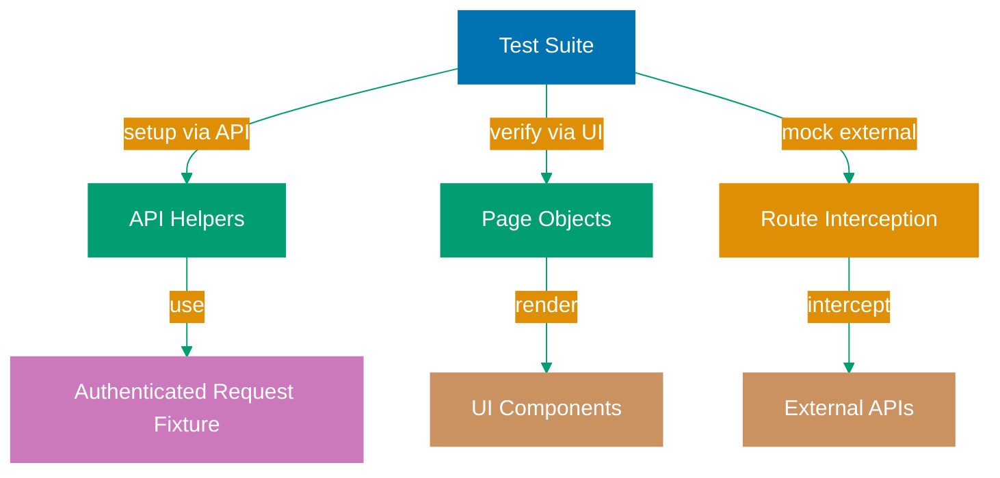

## Why API Testing Integration Matters

Production E2E test suites require strategic combination of UI and API testing to achieve speed, reliability, and comprehensive coverage. Testing everything through the UI creates slow, brittle tests that fail from unrelated UI changes, while ignoring the UI misses critical user-facing defects. Modern test strategies use APIs for fast test setup and teardown, mock external services to prevent flaky tests, and validate API contracts alongside E2E flows.

Playwright's built-in request context enables direct API calls within tests without additional HTTP libraries. Combined with route interception for mocking, API testing integration reduces test execution time by 60-80% (setup via API instead of UI), eliminates flakiness from external service dependencies, and enables comprehensive testing of both API contracts and UI behavior in production environments.

Production systems benefit from integrated API testing because:

- **Test speed**: API setup/teardown is 10-50x faster than UI navigation (create user in 100ms vs 5 seconds)
- **Reliability**: Mock external APIs to prevent test failures from third-party downtime
- **Coverage**: Validate API contracts and UI rendering together in single test suite
- **Isolation**: API calls bypass UI state management, enabling precise test conditions

## Standard Library Approach: Playwright Request API

Playwright's `request` context provides built-in API testing without external HTTP libraries.

**Basic API testing with request context**:

```typescript
import { test, expect } from "@playwright/test";
// => Import Playwright test runner and assertions
// => @playwright/test includes request API
// => No axios or fetch library needed

test("API returns user data", async ({ request }) => {
  // => test() receives request fixture
  // => request fixture provides HTTP client
  // => Automatic base URL configuration

  const response = await request.get("https://api.example.com/users/123");
  // => GET request to API endpoint
  // => await waits for response
  // => Returns APIResponse object

  expect(response.ok()).toBeTruthy();
  // => Assert HTTP 2xx status code
  // => ok() returns true for 200-299
  // => Basic success validation

  const data = await response.json();
  // => Parse JSON response body
  // => Returns typed object
  // => Assumes Content-Type: application/json

  expect(data.id).toBe(123);
  // => Assert user ID matches
  // => Direct property access
  // => No schema validation
  expect(data.username).toBe("testuser");
  // => Assert username field
  // => Hardcoded expectation
});
```

**Using API for test setup before UI test**:

```typescript
test("display user profile after API setup", async ({ request, page }) => {
  // => Test receives both request and page fixtures
  // => request for API setup
  // => page for UI verification

  const createResponse = await request.post("https://api.example.com/users", {
    // => POST request to create user
    // => Second parameter is request options
    // => Returns APIResponse

    data: {
      username: "newuser",
      email: "newuser@example.com",
    },
    // => Request body as data option
    // => Automatically serialized to JSON
    // => Content-Type header set automatically
  });

  const user = await createResponse.json();
  // => Parse created user response
  // => Contains user ID and fields
  // => Used for UI navigation

  await page.goto(`https://example.com/users/${user.id}`);
  // => Navigate to user profile page
  // => Uses ID from API response
  // => Combines API setup with UI test

  await expect(page.locator("h1")).toHaveText("newuser");
  // => Assert UI displays correct username
  // => Verifies API data rendered in UI
  // => End-to-end validation
});
```

**Limitations for production test suites**:

- **No request fixtures**: Must configure headers, auth tokens in every test (duplicates authorization setup)
- **Missing response validation**: Manual JSON parsing without schema validation (no type safety, no contract testing)
- **Hardcoded URLs**: API endpoints embedded in test code (changes require updating all tests)
- **No API mocking patterns**: Must set up complex route interception manually (verbose, error-prone)
- **Limited test data management**: Creating test data via API requires cleanup logic in every test
- **No authentication helpers**: Token management, refresh logic duplicated across tests

## Production Framework: Request Fixtures and API Mocking

Production API testing uses custom fixtures for authenticated requests, dedicated helper classes for API operations, and route mocking patterns for external services.

**Custom request fixture with authentication**:

```typescript
// fixtures/apiFixture.ts
import { test as base } from "@playwright/test";
// => Import base test from Playwright
// => Extend with API fixtures
// => Dependency injection pattern

type APIFixtures = {
  authenticatedRequest: APIRequestContext;
  // => Custom fixture providing authenticated API client
  // => Tests receive pre-configured request context
  // => Eliminates token management duplication
};

export const test = base.extend<APIFixtures>({
  // => Extend base test with API fixtures
  // => Type-safe fixture definitions
  // => Automatic setup and teardown

  authenticatedRequest: async ({ playwright }, use) => {
    // => Define authenticatedRequest fixture
    // => Receives playwright fixture as dependency
    // => use() callback provides fixture value

    const context = await playwright.request.newContext({
      // => Create new API request context
      // => Isolated from browser context
      // => Configure headers, base URL, auth

      baseURL: process.env.API_BASE_URL || "https://api.example.com",
      // => Base URL from environment variable
      // => Falls back to default
      // => All requests relative to baseURL

      extraHTTPHeaders: {
        Authorization: `Bearer ${process.env.API_TOKEN}`,
        // => Add auth token to all requests
        // => Token from environment variable
        // => Never hardcode credentials

        "Content-Type": "application/json",
        // => Default content type
        // => Applied to all requests
        // => Override per request if needed
      },

      timeout: 30000,
      // => Request timeout 30 seconds
      // => Prevents hanging tests
      // => Configurable per environment
    });

    await use(context);
    // => Provide authenticated context to test
    // => Test receives configured client
    // => await use() pauses until test completes

    await context.dispose();
    // => Cleanup: dispose request context
    // => Closes connections
    // => Prevents resource leaks
  },
});
```

**API helper class for test data management**:

```typescript
// helpers/UserAPI.ts
import { APIRequestContext } from "@playwright/test";
// => Import Playwright API types
// => APIRequestContext for type safety
// => Used in helper class methods

export class UserAPI {
  // => Export helper class for user operations
  // => Encapsulates API endpoints
  // => Reusable across tests

  private request: APIRequestContext;
  // => Store request context
  // => private prevents external access
  // => Used for all API calls

  private createdUserIds: number[] = [];
  // => Track created users for cleanup
  // => Array of user IDs
  // => Automatic teardown

  constructor(request: APIRequestContext) {
    // => Constructor receives request context
    // => From authenticatedRequest fixture
    // => Enables dependency injection

    this.request = request;
    // => Store request context
    // => Used by helper methods
  }

  async createUser(username: string, email: string) {
    // => High-level method to create user
    // => Type-safe parameters
    // => Returns created user object

    const response = await this.request.post("/users", {
      // => POST to /users endpoint
      // => Relative to baseURL in fixture
      // => Auth headers from fixture

      data: { username, email },
      // => Request body with user data
      // => Automatically serialized to JSON
      // => Content-Type from fixture headers
    });

    if (!response.ok()) {
      // => Check for HTTP error status
      // => Prevents silent failures
      // => Fail fast on API errors

      const errorText = await response.text();
      // => Get error response body
      // => May contain error details
      // => Used in error message

      throw new Error(`Failed to create user: ${response.status()} - ${errorText}`);
      // => Throw descriptive error
      // => Includes HTTP status code
      // => Includes error response
    }

    const user = await response.json();
    // => Parse JSON response
    // => Contains created user data
    // => Includes generated user ID

    this.createdUserIds.push(user.id);
    // => Track user ID for cleanup
    // => Automatic cleanup in teardown
    // => Prevents test data pollution

    return user;
    // => Return user object to test
    // => Contains id, username, email
    // => Used for assertions or further operations
  }

  async updateUser(userId: number, updates: { email?: string }) {
    // => High-level method to update user
    // => Type-safe user ID and updates
    // => Returns updated user object

    const response = await this.request.patch(`/users/${userId}`, {
      // => PATCH to specific user endpoint
      // => Dynamic URL with user ID
      // => Partial update semantics

      data: updates,
      // => Request body with updates
      // => Only changed fields
      // => Automatically serialized
    });

    if (!response.ok()) {
      throw new Error(`Failed to update user: ${response.status()}`);
      // => Fail fast on errors
      // => Descriptive error message
    }

    return await response.json();
    // => Return updated user object
    // => Contains all user fields
  }

  async cleanup() {
    // => Teardown method to delete created users
    // => Called after test completion
    // => Prevents test data accumulation

    for (const userId of this.createdUserIds) {
      // => Iterate over created user IDs
      // => Delete each user
      // => Best-effort cleanup (errors logged)

      try {
        await this.request.delete(`/users/${userId}`);
        // => DELETE request to remove user
        // => Relative to baseURL
        // => Idempotent (safe to retry)
      } catch (error) {
        console.warn(`Failed to cleanup user ${userId}:`, error);
        // => Log cleanup errors
        // => Don't fail test on cleanup failure
        // => Prevents cascading failures
      }
    }

    this.createdUserIds = [];
    // => Reset tracking array
    // => Ready for next test
  }
}
```

**Tests using API helpers for setup**:

```typescript
// tests/profile.spec.ts
import { test } from "../fixtures/apiFixture";
import { expect } from "@playwright/test";
import { UserAPI } from "../helpers/UserAPI";
// => Import custom test with API fixture
// => Import UserAPI helper class
// => Encapsulated API operations

test("display user profile created via API", async ({ authenticatedRequest, page }) => {
  // => Test receives authenticated API client
  // => And page fixture for UI testing
  // => Combines API setup with UI verification

  const userAPI = new UserAPI(authenticatedRequest);
  // => Create UserAPI helper instance
  // => Pass authenticated request context
  // => Enables API operations

  const user = await userAPI.createUser("testuser", "test@example.com");
  // => Create user via API (fast setup)
  // => Returns user object with ID
  // => ~100ms vs 5+ seconds via UI

  await page.goto(`https://example.com/users/${user.id}`);
  // => Navigate to user profile page
  // => Uses ID from API response
  // => UI test starts with known state

  await expect(page.locator("h1")).toHaveText("testuser");
  // => Assert UI displays username
  // => Verifies API data rendered correctly
  // => End-to-end validation

  await expect(page.locator(".email")).toHaveText("test@example.com");
  // => Assert email displayed
  // => Comprehensive UI verification
  // => Data integrity check

  await userAPI.cleanup();
  // => Clean up created user
  // => Automatic teardown
  // => Prevents test data pollution
});
```

**API mocking with route interception**:

```typescript
// tests/payment.spec.ts
import { test, expect } from "@playwright/test";
// => Import Playwright test utilities
// => Built-in route mocking support
// => No additional libraries needed

test("handle payment service failure gracefully", async ({ page }) => {
  // => Test receives page fixture
  // => Route interception tied to page context
  // => Mock applies to this test only

  await page.route("https://payment-api.example.com/process", async (route) => {
    // => Intercept requests to payment API
    // => route object provides request details
    // => Callback controls response

    await route.fulfill({
      // => Mock API response
      // => Overrides actual network call
      // => Deterministic test behavior

      status: 503,
      // => HTTP 503 Service Unavailable
      // => Simulates payment service down
      // => Tests error handling

      contentType: "application/json",
      // => Response content type
      // => Required for JSON responses
      // => Matches real API

      body: JSON.stringify({
        error: "Service temporarily unavailable",
        // => Error message in response body
        // => Realistic error format
        // => Tests error display logic
      }),
    });
  });

  await page.goto("https://example.com/checkout");
  // => Navigate to checkout page
  // => Payment API mocked for this page
  // => Predictable test environment

  await page.fill("#card-number", "4111111111111111");
  await page.fill("#expiry", "12/25");
  await page.fill("#cvv", "123");
  // => Fill payment form
  // => Test focuses on error handling
  // => Not actual payment processing

  await page.click('button:has-text("Pay Now")');
  // => Submit payment
  // => Triggers API call to mocked endpoint
  // => Receives 503 error response

  await expect(page.locator(".error-message")).toHaveText("Payment service unavailable. Please try again later.");
  // => Assert error message displayed
  // => Verifies graceful error handling
  // => User-friendly error communication
});

test("successful payment with mocked API", async ({ page }) => {
  // => Second test with different mock
  // => Isolated from previous test
  // => Separate route interception

  await page.route("https://payment-api.example.com/process", async (route) => {
    // => Mock payment API success response
    // => Same endpoint, different behavior
    // => Deterministic success scenario

    await route.fulfill({
      status: 200,
      // => HTTP 200 OK
      // => Successful payment
      // => Tests happy path

      contentType: "application/json",
      body: JSON.stringify({
        transactionId: "txn_12345",
        status: "completed",
        // => Successful transaction response
        // => Realistic response structure
        // => Used for confirmation display
      }),
    });
  });

  await page.goto("https://example.com/checkout");
  await page.fill("#card-number", "4111111111111111");
  await page.fill("#expiry", "12/25");
  await page.fill("#cvv", "123");
  await page.click('button:has-text("Pay Now")');
  // => Same UI flow as error test
  // => Different API response
  // => Tests success path

  await expect(page.locator(".success-message")).toHaveText("Payment successful! Transaction ID: txn_12345");
  // => Assert success message
  // => Includes transaction ID from mock
  // => Verifies data flow from API to UI
});
```

## API Testing Architecture Diagram



## Production Patterns and Best Practices

### Pattern 1: API Setup with UI Verification

Use APIs for fast test setup, then verify behavior through UI:

```typescript
import { test } from "../fixtures/apiFixture";
import { expect } from "@playwright/test";
import { UserAPI } from "../helpers/UserAPI";
import { ProductAPI } from "../helpers/ProductAPI";
// => Import API helpers for setup
// => Tests focus on UI behavior
// => Fast, reliable test data creation

test("user can add product to cart", async ({ authenticatedRequest, page }) => {
  // => Combines API and UI testing
  // => API for setup speed
  // => UI for user behavior validation

  const userAPI = new UserAPI(authenticatedRequest);
  const productAPI = new ProductAPI(authenticatedRequest);
  // => Create API helper instances
  // => Reusable setup logic
  // => Type-safe operations

  const user = await userAPI.createUser("shopper", "shopper@example.com");
  // => Create test user via API
  // => ~100ms setup time
  // => Known user state

  const product = await productAPI.createProduct({
    name: "Test Widget",
    price: 29.99,
    stock: 100,
  });
  // => Create test product via API
  // => Controlled product data
  // => Predictable test conditions

  await userAPI.login(page, user.username, "password123");
  // => Login via UI helper method
  // => Establishes user session
  // => Required for cart operations

  await page.goto(`https://example.com/products/${product.id}`);
  // => Navigate to product page
  // => Product guaranteed to exist
  // => No timing issues

  await page.click('button:has-text("Add to Cart")');
  // => User action: add to cart
  // => Tests actual user behavior
  // => UI interaction validation

  await page.click('a[href="/cart"]');
  // => Navigate to cart page
  // => Verify cart state
  // => End-to-end flow

  await expect(page.locator(".cart-item")).toHaveCount(1);
  // => Assert one item in cart
  // => Verifies add to cart succeeded
  // => UI state validation

  await expect(page.locator(".cart-item .name")).toHaveText("Test Widget");
  // => Assert correct product added
  // => Data integrity check
  // => UI displays API data correctly

  await userAPI.cleanup();
  await productAPI.cleanup();
  // => Clean up test data
  // => Automatic teardown
  // => Prevents data accumulation
});
```

### Pattern 2: API Response Mocking with Conditional Logic

Mock external APIs with dynamic responses based on request data:

```typescript
test("retry failed API calls with exponential backoff", async ({ page }) => {
  // => Test retry logic
  // => Requires controlled failures
  // => Mock provides deterministic behavior

  let attemptCount = 0;
  // => Track API call attempts
  // => Used for conditional mocking
  // => Simulates eventual success

  await page.route("https://api.example.com/analytics", async (route) => {
    // => Intercept analytics API calls
    // => Mock multiple attempts
    // => Test retry behavior

    attemptCount++;
    // => Increment attempt counter
    // => Shared across route invocations
    // => Enables failure-then-success pattern

    if (attemptCount < 3) {
      // => First two attempts fail
      // => Simulates transient failure
      // => Tests retry logic

      await route.fulfill({
        status: 500,
        body: JSON.stringify({ error: "Internal server error" }),
        // => Return server error
        // => Triggers retry mechanism
        // => Realistic failure scenario
      });
    } else {
      // => Third attempt succeeds
      // => Simulates eventual success
      // => Tests retry success path

      await route.fulfill({
        status: 200,
        body: JSON.stringify({ success: true, data: "processed" }),
        // => Return success response
        // => Validates retry works
        // => Tests complete flow
      });
    }
  });

  await page.goto("https://example.com/dashboard");
  // => Load page triggering analytics call
  // => Retry logic tested automatically
  // => No manual retry simulation

  await expect(page.locator(".analytics-status")).toHaveText("Data loaded");
  // => Assert eventual success
  // => Verifies retry mechanism works
  // => UI reflects successful retry

  expect(attemptCount).toBe(3);
  // => Assert exactly 3 attempts made
  // => Validates retry logic executed
  // => Confirms exponential backoff worked
});
```

### Pattern 3: API Contract Testing with UI Tests

Validate API response schemas alongside UI rendering:

```typescript
import { test, expect } from "@playwright/test";
import Ajv from "ajv";
// => Import JSON Schema validator
// => Validates API response structure
// => Contract testing alongside E2E

const ajv = new Ajv();
// => Create validator instance
// => Used for schema validation
// => Ensures API contract compliance

const userSchema = {
  type: "object",
  required: ["id", "username", "email"],
  properties: {
    id: { type: "number" },
    username: { type: "string", minLength: 1 },
    email: { type: "string", format: "email" },
  },
  // => JSON Schema for user object
  // => Defines required fields
  // => Type and format validation
};

const validateUser = ajv.compile(userSchema);
// => Compile schema validator
// => Reusable validation function
// => Fast validation performance

test("user profile displays valid API data", async ({ request, page }) => {
  // => Combines API contract and UI testing
  // => Validates schema and rendering
  // => Comprehensive quality check

  const response = await request.get("/users/123");
  // => Fetch user data via API
  // => Direct API call
  // => Contract validation first

  expect(response.ok()).toBeTruthy();
  // => Assert successful response
  // => HTTP 2xx status
  // => Basic availability check

  const user = await response.json();
  // => Parse JSON response
  // => User object for validation
  // => Used in both contract and UI tests

  const valid = validateUser(user);
  // => Validate against JSON Schema
  // => Contract testing
  // => Ensures API stability

  if (!valid) {
    console.error("Schema validation errors:", validateUser.errors);
    // => Log validation errors
    // => Detailed failure information
    // => Helps diagnose contract breaks
  }

  expect(valid).toBeTruthy();
  // => Assert schema valid
  // => Fails if API contract broken
  // => Prevents invalid data reaching UI

  await page.goto(`https://example.com/users/${user.id}`);
  // => Navigate to user profile
  // => Render validated data
  // => UI test with contract-validated data

  await expect(page.locator("h1")).toHaveText(user.username);
  // => Assert UI displays username
  // => Uses validated API data
  // => End-to-end consistency check

  await expect(page.locator(".email")).toHaveText(user.email);
  // => Assert email displayed
  // => Verifies data flow from API to UI
  // => Complete integration validation
});
```

## Trade-offs and When to Use

**Standard Library (Direct API Calls)**:

- **Use when**: Simple API tests, one-off requests, quick prototypes (<10 API calls)
- **Benefits**: Zero abstraction, immediate implementation, no setup overhead
- **Costs**: Duplicated auth logic, manual cleanup, no helper patterns

**API Fixtures**:

- **Use when**: Authenticated API calls, reusable request configuration, multiple tests
- **Benefits**: Centralized auth, automatic cleanup, environment-based configuration
- **Costs**: Upfront fixture setup, understanding fixture lifecycle

**API Helpers**:

- **Use when**: Complex test data creation, multi-step API workflows, cleanup required
- **Benefits**: Encapsulated operations, automatic cleanup tracking, reusable across tests
- **Costs**: Additional abstraction layer, more classes to maintain

**Route Mocking**:

- **Use when**: External API dependencies, testing error scenarios, deterministic test data
- **Benefits**: Eliminates external dependencies, tests edge cases, fast execution
- **Costs**: Maintaining mock responses, potential divergence from real API

**Production recommendation**: Use API fixtures + helpers for test setup/teardown (60-80% faster than UI), route mocking for external services (eliminates flakiness), and contract testing for API validation (prevents integration failures). The speed and reliability gains outweigh abstraction costs after ~10 tests.

## Security Considerations

- **API tokens in fixtures**: Store in environment variables (`.env.test`), never commit tokens to repository
- **Request isolation**: Use separate API contexts per test, dispose contexts after test completion
- **Mock validation**: Validate mock responses match production API structure to prevent false positives
- **Rate limiting**: Configure request timeouts and retries to avoid overwhelming APIs during parallel test execution
- **Test data cleanup**: Always implement cleanup methods to prevent accumulation of test data in production-like environments
- **Authentication refresh**: Handle token expiration in fixtures with automatic refresh logic

## Common Pitfalls

1. **Mixing API and UI logic**: Use API for setup/teardown, UI for behavior verification (don't test business logic through UI when API suffices)
2. **Not isolating API state**: Create separate request contexts per test to prevent state leakage between parallel tests
3. **Hardcoded API endpoints**: Use environment variables for base URLs to support multiple environments (dev, staging, prod)
4. **Forgetting cleanup**: Implement cleanup methods in API helpers and call in test teardown to prevent test data pollution
5. **Over-mocking**: Only mock external services; test real internal APIs to catch integration issues
6. **Ignoring mock drift**: Regularly validate mocks against real API responses to prevent false positives from outdated mocks
