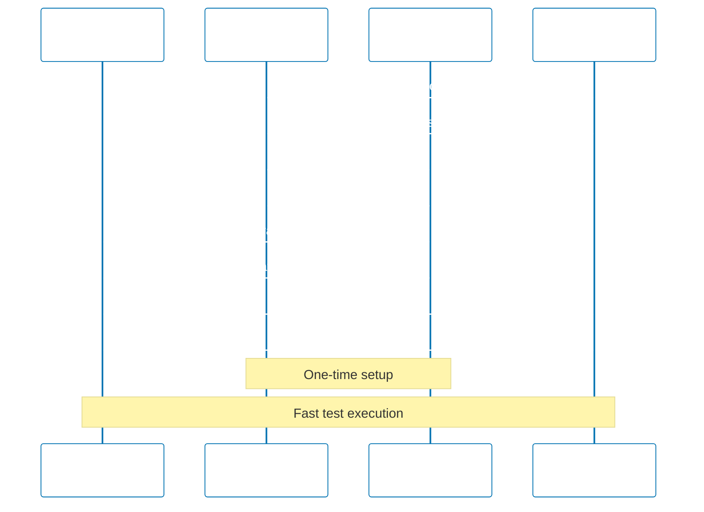

## Why Authentication Flows Matter

Production applications require robust authentication testing to ensure secure access control, prevent unauthorized access, and validate session management across user workflows. Without proper authentication testing, teams miss critical security vulnerabilities, session hijacking exploits, and authorization bypass scenarios that attackers actively exploit.

Playwright authentication testing validates login mechanisms, session persistence, token refresh flows, and logout behavior across real browser contexts. This testing prevents production security incidents, ensures compliance with security standards, and builds confidence that only authorized users access protected resources.

Insufficient authentication testing leads to:

- **Security breaches**: Bypassed authentication allows unauthorized data access
- **Session fixation**: Attackers hijack user sessions through stolen tokens
- **Broken authorization**: Users access resources beyond their permission level
- **Compliance violations**: GDPR, HIPAA, SOC 2 require authentication testing

## Standard Library Approach: Basic Form Login

Playwright core API provides element interaction for basic form-based authentication without requiring authentication frameworks.

**Basic username/password login**:

```typescript
import { test, expect } from "@playwright/test";
// => Import Playwright test framework
// => No authentication framework needed
// => Direct page interaction

test("user logs in with credentials", async ({ page }) => {
  // => Test receives page fixture
  // => Fresh browser context per test
  // => No shared authentication state

  await page.goto("https://example.com/login");
  // => Navigate to login page
  // => Starts with unauthenticated state
  // => No existing session cookies

  await page.fill('input[name="username"]', "testuser");
  // => Fill username input field
  // => Selector targets name attribute
  // => Waits for element to be actionable

  await page.fill('input[name="password"]', "testpass123");
  // => Fill password input field
  // => Credentials hardcoded in test (insecure)
  // => No secret management

  await page.click('button[type="submit"]');
  // => Click login button
  // => Triggers form submission
  // => Browser sends POST request with credentials

  await page.waitForURL("https://example.com/dashboard");
  // => Wait for redirect to dashboard
  // => Confirms successful authentication
  // => Browser receives session cookie
  // => Cookie automatically sent with subsequent requests

  await expect(page.locator("text=Welcome")).toBeVisible();
  // => Assert welcome message visible
  // => Verifies authenticated UI rendered
  // => Browser maintains session state
});

test("authenticated user accesses protected resource", async ({ page }) => {
  // => Second test requiring authentication
  // => Must login again (no shared state)
  // => Duplicates login logic

  await page.goto("https://example.com/login");
  await page.fill('input[name="username"]', "testuser");
  await page.fill('input[name="password"]', "testpass123");
  await page.click('button[type="submit"]');
  // => Login logic duplicated from first test
  // => Every test requiring auth repeats this
  // => Slow test execution (login overhead)

  await page.goto("https://example.com/api/profile");
  // => Navigate to protected endpoint
  // => Browser sends session cookie automatically
  // => Cookie attached to request by browser

  await expect(page).not.toHaveURL(/.*login.*/);
  // => Assert not redirected to login
  // => Confirms session cookie valid
  // => No unauthorized access
});
```

**Checking authentication state**:

```typescript
test("unauthenticated user redirected to login", async ({ page }) => {
  // => Test unauthorized access scenario
  // => No login performed
  // => Clean browser context (no cookies)

  await page.goto("https://example.com/dashboard");
  // => Attempt to access protected page
  // => No session cookie sent
  // => Server rejects request

  await expect(page).toHaveURL(/.*login.*/);
  // => Assert redirected to login page
  // => Server enforces authentication
  // => Regex matches /login or /login?redirect=...
});
```

**Limitations for production authentication testing**:

- **Login duplication**: Every test requiring auth repeats login flow (slow, brittle)
- **No session reuse**: Cannot share authenticated state between tests
- **Hardcoded credentials**: Secrets exposed in test code (security risk)
- **No token management**: Cannot handle JWT refresh, expiration, revocation
- **Limited auth types**: Form-based only, no OAuth2, SAML, SSO support
- **No isolation**: Cannot test multiple user roles in parallel

## Production Framework: Playwright Storage State and Auth Fixtures

Playwright storage state API enables reusable authentication by capturing and restoring browser sessions, eliminating redundant login flows.

**Setup authentication fixture**:

```typescript
// fixtures/auth.fixture.ts
import { test as base, expect } from "@playwright/test";
// => Import base test for extension
// => Fixtures provide dependency injection
// => Type-safe authentication state

type AuthFixtures = {
  authenticatedPage: Page;
  // => Custom fixture providing logged-in page
  // => Tests receive authenticated context
  // => Eliminates login duplication
};

export const test = base.extend<AuthFixtures>({
  authenticatedPage: async ({ browser }, use) => {
    // => Define custom fixture
    // => browser fixture provides browser instance
    // => use() callback yields fixture value

    const context = await browser.newContext();
    // => Create new browser context
    // => Isolated from other tests
    // => Fresh cookie jar, localStorage

    const page = await context.newPage();
    // => Create page in context
    // => All pages in context share cookies

    // Perform login
    await page.goto("https://example.com/login");
    // => Navigate to login page
    // => No existing session

    await page.fill('input[name="username"]', process.env.TEST_USERNAME);
    // => Fill username from environment variable
    // => Credentials externalized (secure)
    // => process.env.TEST_USERNAME set in CI/CD

    await page.fill('input[name="password"]', process.env.TEST_PASSWORD);
    // => Password from environment
    // => Never hardcoded in code
    // => Different credentials per environment

    await page.click('button[type="submit"]');
    await page.waitForURL("https://example.com/dashboard");
    // => Wait for successful login
    // => Session cookie set by server
    // => Context now authenticated

    await use(page);
    // => Provide authenticated page to test
    // => Test executes with logged-in state
    // => Pauses until test completes

    await context.close();
    // => Cleanup after test
    // => Closes all pages in context
    // => Discards session state
  },
});
```

**Using authenticated fixture in tests**:

```typescript
// tests/dashboard.spec.ts
import { test } from "../fixtures/auth.fixture";
import { expect } from "@playwright/test";
// => Import custom test with auth fixture
// => Tests automatically authenticated
// => No manual login needed

test("authenticated user views dashboard", async ({ authenticatedPage }) => {
  // => Test receives logged-in page
  // => Session already established
  // => No login overhead

  await authenticatedPage.goto("https://example.com/dashboard");
  // => Navigate directly to protected page
  // => Session cookie sent automatically
  // => Authorized access

  await expect(authenticatedPage.locator("h1")).toHaveText("Dashboard");
  // => Assert dashboard content visible
  // => Test focuses on business logic
  // => Authentication abstracted away
});

test("authenticated user accesses profile", async ({ authenticatedPage }) => {
  // => Second test using same auth fixture
  // => Also receives logged-in state
  // => Fixture reapplied per test

  await authenticatedPage.goto("https://example.com/profile");
  // => Direct navigation (no login)
  // => Fast test execution

  await expect(authenticatedPage.locator("text=Profile")).toBeVisible();
  // => Assert profile page loaded
});
```

**Storage state for session persistence**:

```typescript
// setup/auth.setup.ts
import { test as setup } from "@playwright/test";
// => Special setup test runs before test suite
// => Authenticates once, saves state
// => Other tests reuse state

const authFile = "playwright/.auth/user.json";
// => Path to store authentication state
// => JSON file with cookies, localStorage, sessionStorage
// => Gitignored (contains session tokens)

setup("authenticate", async ({ page }) => {
  // => Setup test named 'authenticate'
  // => Runs before test suite
  // => Creates reusable auth state

  await page.goto("https://example.com/login");
  await page.fill('input[name="username"]', process.env.TEST_USERNAME);
  await page.fill('input[name="password"]', process.env.TEST_PASSWORD);
  await page.click('button[type="submit"]');
  await page.waitForURL("https://example.com/dashboard");
  // => Perform one-time login
  // => Session cookie received

  await page.context().storageState({ path: authFile });
  // => Save browser state to file
  // => Captures cookies, localStorage, sessionStorage
  // => Serialized as JSON
  // => Reusable across test runs
});
```

**Reusing storage state in tests**:

```typescript
// playwright.config.ts
import { defineConfig } from "@playwright/test";

export default defineConfig({
  use: {
    storageState: "playwright/.auth/user.json",
    // => Load authentication state before each test
    // => All tests start with session cookies
    // => No login required in tests
    // => Fast execution (skips login)
  },

  projects: [
    {
      name: "setup",
      testMatch: /.*\.setup\.ts/,
      // => Run setup tests first
      // => Creates auth state before other tests
    },
    {
      name: "chromium",
      use: { storageState: "playwright/.auth/user.json" },
      dependencies: ["setup"],
      // => This project depends on setup completing
      // => Waits for auth.setup.ts to finish
      // => Loads saved storage state
    },
  ],
});
```

**JWT token authentication**:

```typescript
test("authenticate with JWT token", async ({ page }) => {
  // => Test using JWT instead of session cookies
  // => Common in API-first applications
  // => Token stored in localStorage

  const token = await fetch("https://api.example.com/auth/login", {
    method: "POST",
    headers: { "Content-Type": "application/json" },
    body: JSON.stringify({
      username: process.env.TEST_USERNAME,
      password: process.env.TEST_PASSWORD,
    }),
  })
    .then((res) => res.json())
    .then((data) => data.token);
  // => Obtain JWT token via API
  // => Avoids UI login flow
  // => Faster than browser-based login
  // => token is JWT string (e.g., "eyJhbGciOiJ...")

  await page.goto("https://example.com");
  // => Navigate to application
  // => Page not yet authenticated

  await page.evaluate((token) => {
    localStorage.setItem("authToken", token);
    // => Inject token into localStorage
    // => JavaScript executes in browser context
    // => Application reads token on subsequent requests
  }, token);
  // => Pass token to browser
  // => Page now has authentication token
  // => No cookies used

  await page.reload();
  // => Reload page to trigger app initialization
  // => App reads token from localStorage
  // => Requests include Authorization header

  await expect(page.locator("text=Dashboard")).toBeVisible();
  // => Assert authenticated UI loaded
  // => App using JWT from localStorage
});
```

**Multi-user authentication for role testing**:

```typescript
// fixtures/multi-user.fixture.ts
type UserRole = "admin" | "user" | "guest";

type MultiUserFixtures = {
  adminPage: Page;
  userPage: Page;
  guestPage: Page;
};

export const test = base.extend<MultiUserFixtures>({
  adminPage: async ({ browser }, use) => {
    const context = await browser.newContext({
      storageState: "playwright/.auth/admin.json",
      // => Load admin user session
      // => Pre-authenticated as admin
    });
    const page = await context.newPage();
    await use(page);
    await context.close();
  },

  userPage: async ({ browser }, use) => {
    const context = await browser.newContext({
      storageState: "playwright/.auth/user.json",
      // => Load regular user session
      // => Different permissions than admin
    });
    const page = await context.newPage();
    await use(page);
    await context.close();
  },

  guestPage: async ({ browser }, use) => {
    const context = await browser.newContext();
    // => No storage state (unauthenticated)
    // => Clean context for guest testing
    const page = await context.newPage();
    await use(page);
    await context.close();
  },
});
```

**Testing role-based access control**:

```typescript
import { test } from "../fixtures/multi-user.fixture";
import { expect } from "@playwright/test";

test("admin can access admin panel", async ({ adminPage }) => {
  // => Test with admin user fixture
  // => Pre-authenticated as admin
  // => Has admin permissions

  await adminPage.goto("https://example.com/admin");
  // => Navigate to admin-only page
  // => Session includes admin role

  await expect(adminPage.locator("text=Admin Panel")).toBeVisible();
  // => Assert admin UI visible
  // => Authorization check passed
});

test("regular user cannot access admin panel", async ({ userPage }) => {
  // => Test with regular user fixture
  // => Authenticated but not admin
  // => Limited permissions

  await userPage.goto("https://example.com/admin");
  // => Attempt to access admin page
  // => Should be denied

  await expect(userPage).toHaveURL(/.*403.*|.*unauthorized.*/);
  // => Assert redirected to unauthorized page
  // => Authorization enforced
});

test("guest cannot access protected resources", async ({ guestPage }) => {
  // => Test with unauthenticated fixture
  // => No session cookies
  // => No authentication

  await guestPage.goto("https://example.com/dashboard");
  // => Attempt to access protected page
  // => No credentials provided

  await expect(guestPage).toHaveURL(/.*login.*/);
  // => Assert redirected to login
  // => Authentication required
});
```

## Production Authentication Architecture Diagram



## Production Patterns and Best Practices

### Pattern 1: Environment-Based Credentials

Never hardcode credentials in tests:

```typescript
// Good: Environment variables
const username = process.env.TEST_USERNAME;
const password = process.env.TEST_PASSWORD;

// Bad: Hardcoded secrets
const username = "admin@example.com";
const password = "secret123";
```

### Pattern 2: API-Based Authentication

Authenticate via API for faster tests:

```typescript
// Faster: API login
const token = await apiLogin();
await page.evaluate((t) => localStorage.setItem("token", t), token);

// Slower: UI login
await page.fill('input[name="username"]', user);
await page.fill('input[name="password"]', pass);
await page.click('button[type="submit"]');
```

### Pattern 3: Storage State Per Role

Create separate storage state files per user role:

```
playwright/.auth/
├── admin.json     # Admin user state
├── user.json      # Regular user state
└── guest.json     # Guest user state
```

### Pattern 4: Token Refresh Testing

Test JWT refresh flows explicitly:

```typescript
test("token refresh on expiration", async ({ page }) => {
  // Set expired token
  await page.evaluate(() => {
    localStorage.setItem("token", "expired_token");
    localStorage.setItem("refreshToken", "valid_refresh");
  });

  await page.goto("/dashboard");
  // Assert app automatically refreshed token
  await expect(page.locator("text=Dashboard")).toBeVisible();
});
```

## Trade-offs and When to Use

**Basic Form Login (Standard Library)**:

- **Use when**: Simple authentication, few tests, prototyping
- **Benefits**: No setup complexity, clear test flow, easy to understand
- **Costs**: Slow execution (login every test), duplicated code, no secret management

**Storage State (Production)**:

- **Use when**: Many tests requiring auth, CI/CD pipelines, role-based testing
- **Benefits**: Fast execution, shared state, secret management, role isolation
- **Costs**: Setup complexity, storage state management, debugging fixture issues

**API-Based Auth**:

- **Use when**: JWT/token-based apps, microservices, API-first architectures
- **Benefits**: Fastest execution, no UI coupling, reliable token injection
- **Costs**: Requires API access, more complex setup, token management

**Production recommendation**: Use storage state with API-based authentication for production test suites. The performance and maintainability benefits outweigh setup complexity.

## Security Considerations

- **Secret management**: Always use environment variables for credentials
- **Storage state files**: Add to `.gitignore`, never commit to repository
- **Token expiration**: Test refresh flows to prevent false failures
- **Session isolation**: Ensure tests don't share authentication state unintentionally
- **Role testing**: Verify authorization, not just authentication

## Common Pitfalls

1. **Committing storage state files**: Contains session tokens (security risk)
2. **Not cleaning up contexts**: Memory leaks from unclosed browser contexts
3. **Hardcoded credentials**: Exposed secrets in version control
4. **Shared authentication state**: Tests interfering with each other
5. **Ignoring token expiration**: Tests fail randomly when tokens expire
