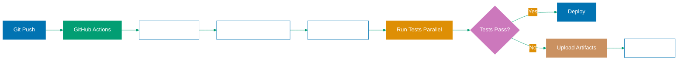

## Why CI/CD Integration Matters

Production applications require automated testing in continuous integration pipelines to catch bugs before deployment, ensure code quality across team contributions, and provide rapid feedback on pull requests. Without CI/CD integration, teams rely on manual testing that misses edge cases, creates deployment bottlenecks, and allows bugs to reach production.

Playwright tests integrated into CI/CD pipelines provide automated regression testing on every commit, parallel test execution to reduce feedback time, and artifact collection (traces, screenshots, videos) for debugging failures. This automation prevents production incidents, accelerates development velocity, and builds confidence in releases.

Manual testing cannot scale because:

- **Human error**: Testers miss edge cases and interactions
- **Slow feedback**: Manual testing takes hours/days vs minutes in CI
- **Inconsistent execution**: Different testers follow different paths
- **Deployment bottlenecks**: Manual gates slow release cadence

## Standard Library Approach: Local Test Execution

Playwright CLI provides local test execution without requiring CI/CD frameworks.

**Running tests locally**:

```bash
npx playwright test
# => Executes all tests in tests/ directory
# => Uses playwright.config.ts for configuration
# => Runs in headless mode by default
# => Returns exit code 0 (success) or 1 (failure)

npx playwright test --headed
# => Runs tests with browser UI visible
# => Useful for debugging test behavior
# => Slower than headless mode
# => Shows browser interactions in real-time

npx playwright test --project=chromium
# => Runs tests on specific browser
# => Projects defined in playwright.config.ts
# => Can specify multiple: --project=chromium --project=firefox
# => Filters execution to selected browsers

npx playwright test tests/auth.spec.ts
# => Runs single test file
# => Path relative to project root
# => Faster feedback during development
# => Good for isolating test failures
```

**Generating test reports locally**:

```bash
npx playwright test --reporter=html
# => Generates HTML report in playwright-report/
# => Opens automatically in browser after test run
# => Shows test results, screenshots, traces
# => Not suitable for CI (requires manual viewing)

npx playwright test --reporter=json --output-file=results.json
# => Outputs test results as JSON
# => Structured data for programmatic consumption
# => results.json contains all test outcomes
# => Must manually parse and interpret
```

**Limitations for production CI/CD**:

- **No automation**: Must manually run commands after every commit
- **No parallelization**: Local execution runs serially (slow for large suites)
- **No artifact storage**: Reports/traces lost when terminal closes
- **No failure notifications**: Must manually check test results
- **Environment inconsistency**: Tests run on developer machines with different configurations
- **No integration**: Cannot block deployments on test failures

## Production Framework: GitHub Actions CI/CD Pipeline

GitHub Actions automates Playwright test execution on every commit with parallel execution, artifact collection, and failure notifications.

**Installation** (GitHub Actions configuration):

```yaml
# .github/workflows/playwright.yml
name: Playwright Tests
# => Workflow name shown in GitHub Actions UI
# => Descriptive name for CI pipeline
# => Visible in pull request checks

on:
  push:
    branches: [main, develop]
    # => Trigger on push to main and develop branches
    # => Runs tests on every commit to protected branches
    # => Catches bugs before merge

  pull_request:
    branches: [main, develop]
    # => Trigger on pull requests targeting main/develop
    # => Tests run on PR commits
    # => Blocks merge if tests fail (when required)

  workflow_dispatch:
    # => Enables manual workflow trigger from Actions UI
    # => Useful for on-demand test runs
    # => Provides "Run workflow" button in GitHub

jobs:
  test:
    # => Job name
    # => Can have multiple jobs (test, lint, build)
    # => Jobs run in parallel by default

    timeout-minutes: 60
    # => Maximum job execution time
    # => Prevents infinite loops or hung tests
    # => Job fails if exceeds timeout

    runs-on: ubuntu-latest
    # => GitHub-hosted runner operating system
    # => ubuntu-latest provides Node.js, browsers pre-installed
    # => Alternative: ubuntu-22.04, macos-latest, windows-latest

    steps:
      - uses: actions/checkout@v4
        # => Checkout repository code
        # => Required first step in most workflows
        # => Clones repo at commit being tested

      - uses: actions/setup-node@v4
        with:
          node-version: 20
          # => Install Node.js version 20
          # => Ensures consistent environment
          # => Matches production Node version

      - name: Install dependencies
        run: npm ci
        # => npm ci installs exact versions from package-lock.json
        # => Faster and more reliable than npm install
        # => Ensures reproducible builds

      - name: Install Playwright browsers
        run: npx playwright install --with-deps
        # => Downloads browser binaries (Chromium, Firefox, WebKit)
        # => --with-deps installs system dependencies
        # => Required for headless browser execution
        # => Cached between runs for performance

      - name: Run Playwright tests
        run: npx playwright test
        # => Execute all tests
        # => Uses playwright.config.ts configuration
        # => Runs in headless mode (no UI)
        # => Exits with code 1 on failure (fails workflow)

      - uses: actions/upload-artifact@v4
        if: always()
        # => Upload artifacts even if tests fail
        # => if: always() ensures artifacts collected on failure
        # => Critical for debugging failed test runs
        with:
          name: playwright-report
          # => Artifact name shown in GitHub Actions UI
          # => Downloadable from workflow run page
          path: playwright-report/
          # => Directory containing HTML report
          # => Generated by Playwright after test run
          retention-days: 30
          # => Keep artifacts for 30 days
          # => Balance storage costs vs debugging needs
```

**Playwright configuration for CI**:

```typescript
// playwright.config.ts
import { defineConfig, devices } from "@playwright/test";
// => Import Playwright configuration types
// => defineConfig provides type-safe config
// => devices contains preset browser configurations

export default defineConfig({
  // => Export default configuration
  // => Used by npx playwright test
  // => Type-safe with TypeScript

  testDir: "./tests",
  // => Directory containing test files
  // => Relative to config file location
  // => Playwright scans for *.spec.ts files

  fullyParallel: true,
  // => Run tests in parallel across workers
  // => Faster execution (uses all CPU cores)
  // => Tests must be isolated (no shared state)

  forbidOnly: !!process.env.CI,
  // => Fail if test.only() in code when CI=true
  // => Prevents committing focused tests
  // => !! converts to boolean
  // => Ensures comprehensive test runs in CI

  retries: process.env.CI ? 2 : 0,
  // => Retry failed tests twice in CI, zero locally
  // => Handles flaky tests (network, timing)
  // => Local: no retries for faster debugging
  // => CI: retries prevent false negatives

  workers: process.env.CI ? 1 : undefined,
  // => Single worker in CI, multiple workers locally
  // => Prevents resource exhaustion in CI
  // => undefined uses CPU count locally (faster)

  reporter: [
    ["html"],
    // => HTML reporter for local debugging
    // => Generated in playwright-report/
    ["github"],
    // => GitHub Actions-specific reporter
    // => Shows test results as annotations in PR
    // => Highlights failing tests in changed files
  ],

  use: {
    trace: "on-first-retry",
    // => Collect trace on first retry
    // => Traces contain timeline, network, DOM snapshots
    // => Balances debugging vs storage costs
    // => Alternative: 'on' (always), 'off' (never)

    screenshot: "only-on-failure",
    // => Capture screenshot when test fails
    // => Helps debug visual issues
    // => Saved to test-results/ directory

    video: "retain-on-failure",
    // => Record video and keep only for failures
    // => Shows test execution leading to failure
    // => Automatically deleted on success (saves storage)
  },

  projects: [
    {
      name: "chromium",
      use: { ...devices["Desktop Chrome"] },
      // => Run tests on Chromium browser
      // => Desktop Chrome preset configuration
      // => Viewport, user agent, device scale factor
    },

    {
      name: "firefox",
      use: { ...devices["Desktop Firefox"] },
      // => Firefox browser configuration
      // => Different rendering engine than Chromium
      // => Catches browser-specific bugs
    },

    {
      name: "webkit",
      use: { ...devices["Desktop Safari"] },
      // => WebKit browser (Safari engine)
      // => Important for macOS/iOS compatibility
      // => Different JavaScript engine
    },
  ],
});
```

**GitHub Actions matrix strategy for parallelization**:

```yaml
jobs:
  test:
    strategy:
      fail-fast: false
      # => Continue running other jobs if one fails
      # => See all browser failures, not just first
      # => Useful for comprehensive feedback

      matrix:
        browser: [chromium, firefox, webkit]
        # => Creates 3 parallel jobs (one per browser)
        # => Each job runs with different browser
        # => Speeds up cross-browser testing

    runs-on: ubuntu-latest

    steps:
      - uses: actions/checkout@v4
      - uses: actions/setup-node@v4
        with:
          node-version: 20

      - name: Install dependencies
        run: npm ci

      - name: Install Playwright browsers
        run: npx playwright install --with-deps ${{ matrix.browser }}
        # => Install only browser for this job
        # => ${{ matrix.browser }} substitutes chromium/firefox/webkit
        # => Faster than installing all browsers

      - name: Run Playwright tests on ${{ matrix.browser }}
        run: npx playwright test --project=${{ matrix.browser }}
        # => Run tests for specific browser
        # => Each matrix job tests different browser
        # => Results combined in workflow summary
```

**Sharding tests across multiple runners**:

```yaml
jobs:
  test:
    strategy:
      fail-fast: false
      matrix:
        shard: [1, 2, 3, 4]
        # => Split tests into 4 shards
        # => Each shard runs 1/4 of test suite
        # => Dramatically reduces total execution time

    runs-on: ubuntu-latest

    steps:
      - uses: actions/checkout@v4
      - uses: actions/setup-node@v4
      - run: npm ci
      - run: npx playwright install --with-deps

      - name: Run Playwright tests (shard ${{ matrix.shard }})
        run: npx playwright test --shard=${{ matrix.shard }}/${{ strategy.job-total }}
        # => --shard=1/4 runs tests 1, 5, 9, 13...
        # => --shard=2/4 runs tests 2, 6, 10, 14...
        # => Playwright handles test distribution
        # => strategy.job-total is total shards (4)

      - uses: actions/upload-artifact@v4
        if: always()
        with:
          name: playwright-report-${{ matrix.shard }}
          # => Unique artifact name per shard
          # => All reports downloadable from workflow
          path: playwright-report/
          retention-days: 30
```

## Production CI/CD Architecture Diagram



## Production Patterns and Best Practices

### Pattern 1: Environment-Specific Configuration

Use environment variables for CI-specific settings:

```typescript
// playwright.config.ts
export default defineConfig({
  use: {
    baseURL: process.env.BASE_URL || "http://localhost:3000",
    // => CI sets BASE_URL to staging/production
    // => Local defaults to localhost
  },
  workers: process.env.CI ? 1 : undefined,
  retries: process.env.CI ? 2 : 0,
});
```

### Pattern 2: Conditional Artifact Upload

Only upload artifacts when tests fail to save storage:

```yaml
- uses: actions/upload-artifact@v4
  if: failure()
  # => Upload only on test failure
  # => Saves GitHub Actions storage costs
```

### Pattern 3: Required Status Checks

Configure branch protection to require passing tests:

```
GitHub Settings → Branches → Branch protection rules
→ Require status checks: "Playwright Tests"
```

### Pattern 4: Scheduled Test Runs

Run tests on schedule for continuous monitoring:

```yaml
on:
  schedule:
    - cron: "0 0 * * *"
      # => Run daily at midnight UTC
      # => Catches external API changes
      # => Monitors production stability
```

## Trade-offs and When to Use

**Local Execution Only**:

- **Use when**: Individual developer testing, debugging specific tests
- **Benefits**: Fast feedback, immediate visibility, no CI setup needed
- **Costs**: No automation, inconsistent environments, manual execution

**GitHub Actions CI/CD**:

- **Use when**: Team collaboration, pull request testing, production deployments
- **Benefits**: Automated regression testing, parallel execution, artifact storage
- **Costs**: GitHub Actions minutes usage, configuration complexity, debugging CI failures

**Matrix Strategy**:

- **Use when**: Cross-browser testing, multiple environments (OS, Node versions)
- **Benefits**: Comprehensive coverage, parallel execution
- **Costs**: Multiplied CI minutes, complex artifact management

**Sharding**:

- **Use when**: Large test suites (>500 tests), long execution times (>10 minutes)
- **Benefits**: Dramatically faster feedback (4x speedup with 4 shards)
- **Costs**: More complex configuration, requires combining shard results

**Production recommendation**: Always integrate Playwright into CI/CD. Start with basic workflow, add matrix/sharding as test suite grows.

## Security Considerations

- **Secrets management**: Use GitHub Secrets for credentials, never commit to code
- **Artifact access**: Restrict artifact downloads to team members only
- **Browser security**: Use latest browser versions with security patches
- **Network isolation**: Consider using GitHub Actions self-hosted runners for sensitive tests

## Common Pitfalls

1. **Not installing browser dependencies**: Always use `--with-deps` flag
2. **Forgetting `if: always()`**: Artifacts not uploaded when tests fail
3. **Using `test.only()` in CI**: Set `forbidOnly: true` in config
4. **Not setting timeouts**: Tests can hang forever without `timeout-minutes`
5. **Ignoring flaky tests**: Use `retries` to handle transient failures
