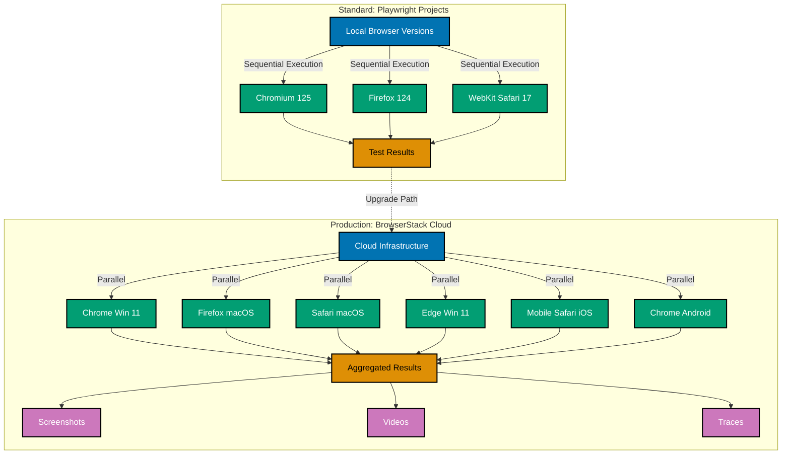

## Why This Matters

Cross-browser compatibility remains critical in production web applications. While modern browsers adopt web standards rapidly, rendering engines, JavaScript implementations, and CSS behavior still differ significantly between Chrome, Firefox, Safari, and Edge. A feature working perfectly in Chrome during development may fail silently in Safari due to WebKit-specific behavior, or exhibit layout issues in Firefox's Gecko engine. Production applications serve diverse user bases across operating systems, devices, and browser versions—requiring systematic validation across browser environments.

Browser market share varies dramatically by geography and device type. Enterprise environments often standardize on specific browsers, while consumer applications must support the leading 3-5 browsers representing 95%+ market coverage. Mobile Safari dominates iOS, Chrome leads Android, and desktop users distribute across Chrome, Edge, Firefox, and Safari. Testing only in your development browser creates blind spots that manifest as user-reported bugs, failed transactions, and degraded user experiences in production.

Production cross-browser testing demands automation at scale. Manual testing across browser combinations is unsustainable—a single test case across 5 browsers, 3 operating systems, and 2 viewport sizes creates 30 test permutations. Playwright's unified API abstracts browser differences while enabling parallel execution across engines. Advanced production scenarios require cloud-based browser infrastructure for testing browser versions, operating systems, and device combinations unavailable in local CI/CD environments.

## Standard Library Approach: Playwright Projects Configuration

Playwright provides built-in cross-browser testing through the projects configuration in `playwright.config.ts`. The projects feature executes the same test suite across multiple browser configurations without external dependencies.

```typescript
// playwright.config.ts
import { defineConfig, devices } from "@playwright/test";
// => Import Playwright configuration API
// => devices provides standardized browser configs

export default defineConfig({
  // => Defines root-level test configuration
  projects: [
    {
      name: "chromium",
      // => Project name for test reporting
      use: { ...devices["Desktop Chrome"] },
      // => Spread Desktop Chrome device config
      // => Includes viewport, user agent, device scale factor
    },
    {
      name: "firefox",
      use: { ...devices["Desktop Firefox"] },
      // => Firefox with Gecko rendering engine
      // => Different CSS and JavaScript behavior
    },
    {
      name: "webkit",
      use: { ...devices["Desktop Safari"] },
      // => WebKit engine (Safari implementation)
      // => Critical for iOS compatibility validation
    },
  ],
  // => Runs ALL tests in ALL projects by default
});
```

```typescript
// tests/cross-browser/navigation.spec.ts
import { test, expect } from "@playwright/test";
// => Standard Playwright test API
// => No project-specific imports needed

test("navigation menu renders consistently", async ({ page }) => {
  // => Test executes 3 times (once per project)
  // => Each execution receives different browser context

  await page.goto("https://example.com");
  // => Navigates in current project's browser
  // => Chromium, Firefox, or WebKit

  const menuItems = await page.locator("nav li").count();
  // => Counts navigation items
  // => CSS rendering may differ per browser

  expect(menuItems).toBe(5);
  // => Validates expected structure
  // => Fails if browser-specific CSS breaks layout

  await page.click("nav li:first-child a");
  // => Clicks first navigation link
  // => Click behavior consistent across engines

  await expect(page).toHaveURL(/\/about/);
  // => Validates navigation occurred
  // => URL handling standardized across browsers
});
```

```bash
# Run all projects (all browsers)
npx playwright test
# => Executes tests in chromium, firefox, webkit sequentially
# => Total test count: <test_count> × 3 browsers

# Run specific project
npx playwright test --project=firefox
# => Executes tests ONLY in Firefox
# => Useful for debugging browser-specific failures
```

**Limitations for production**:

- **No browser version control**: Tests run against Playwright's bundled browser versions only (Chrome 125, Firefox 124, Safari 17). Cannot test older versions required for legacy support.
- **Limited OS coverage**: Playwright projects use the host operating system. Cannot test Safari on Windows or Internet Explorer without native environments.
- **No device farm access**: Cannot test real mobile devices (iPhone 14, Samsung S23) or alternative browser engines (Samsung Internet, Opera).
- **Serial execution overhead**: By default, projects run sequentially. Testing 100 tests × 3 browsers = 300 test executions on local infrastructure.
- **No visual regression tools**: Projects configuration provides no screenshot comparison or visual diff capabilities for detecting CSS rendering differences.

## Production Framework: BrowserStack Cloud Testing

BrowserStack provides cloud-based browser infrastructure supporting 3000+ real devices, multiple browser versions, and operating system combinations. Integration with Playwright enables production-scale cross-browser testing without local device farms.

### Installation and Configuration

```bash
# Install BrowserStack integration
npm install --save-dev @browserstack/playwright
# => Adds BrowserStack Playwright adapter
# => Provides cloud browser connection capabilities
```

```typescript
// playwright.config.ts
import { defineConfig, devices } from "@playwright/test";
// => Standard Playwright configuration API

export default defineConfig({
  use: {
    // => Global configuration for ALL tests
    connectOptions: {
      wsEndpoint: `wss://cdp.browserstack.com/playwright?caps=${encodeURIComponent(
        JSON.stringify({
          "browserstack.username": process.env.BROWSERSTACK_USERNAME,
          // => Authentication username from environment
          // => NEVER hardcode credentials
          "browserstack.accessKey": process.env.BROWSERSTACK_ACCESS_KEY,
          // => Authentication key from environment
          // => Secured via CI/CD secrets
          project: "Cross-Browser Production Tests",
          // => BrowserStack project grouping
          // => Organizes test runs in dashboard
          build: `Build ${process.env.CI_BUILD_ID || "local"}`,
          // => Build identifier for tracking
          // => Groups related test runs
          name: "Playwright Cross-Browser Suite",
          // => Test session name
        }),
      )}`,
      // => WebSocket endpoint for Playwright CDP connection
      // => Connects local Playwright to cloud browsers
    },
    screenshot: "only-on-failure",
    // => Captures screenshots for failed tests
    // => Uploaded to BrowserStack for debugging
    video: "retain-on-failure",
    // => Records video for failed tests
    // => Critical for debugging cross-browser issues
    trace: "retain-on-failure",
    // => Generates Playwright trace files
    // => Enables detailed timeline debugging
  },

  projects: [
    {
      name: "chrome-windows-latest",
      use: {
        ...devices["Desktop Chrome"],
        // => Base Chromium configuration
        connectOptions: {
          wsEndpoint: `wss://cdp.browserstack.com/playwright?caps=${encodeURIComponent(
            JSON.stringify({
              browser: "chrome",
              browser_version: "latest",
              // => Latest stable Chrome version
              // => BrowserStack auto-updates
              os: "Windows",
              os_version: "11",
              // => Windows 11 environment
              // => Real OS, not virtualized
              "browserstack.username": process.env.BROWSERSTACK_USERNAME,
              "browserstack.accessKey": process.env.BROWSERSTACK_ACCESS_KEY,
            }),
          )}`,
        },
      },
    },
    {
      name: "firefox-macos-latest",
      use: {
        ...devices["Desktop Firefox"],
        connectOptions: {
          wsEndpoint: `wss://cdp.browserstack.com/playwright?caps=${encodeURIComponent(
            JSON.stringify({
              browser: "firefox",
              browser_version: "latest",
              // => Latest Firefox release
              os: "OS X",
              os_version: "Ventura",
              // => macOS Ventura environment
              // => Tests native Safari rendering
              "browserstack.username": process.env.BROWSERSTACK_USERNAME,
              "browserstack.accessKey": process.env.BROWSERSTACK_ACCESS_KEY,
            }),
          )}`,
        },
      },
    },
    {
      name: "safari-macos-latest",
      use: {
        ...devices["Desktop Safari"],
        connectOptions: {
          wsEndpoint: `wss://cdp.browserstack.com/playwright?caps=${encodeURIComponent(
            JSON.stringify({
              browser: "safari",
              browser_version: "latest",
              // => Latest Safari version
              // => Only available on macOS
              os: "OS X",
              os_version: "Ventura",
              "browserstack.username": process.env.BROWSERSTACK_USERNAME,
              "browserstack.accessKey": process.env.BROWSERSTACK_ACCESS_KEY,
            }),
          )}`,
        },
      },
    },
    {
      name: "edge-windows-latest",
      use: {
        ...devices["Desktop Edge"],
        // => Edge uses Chromium engine
        // => But includes Edge-specific features
        connectOptions: {
          wsEndpoint: `wss://cdp.browserstack.com/playwright?caps=${encodeURIComponent(
            JSON.stringify({
              browser: "edge",
              browser_version: "latest",
              os: "Windows",
              os_version: "11",
              "browserstack.username": process.env.BROWSERSTACK_USERNAME,
              "browserstack.accessKey": process.env.BROWSERSTACK_ACCESS_KEY,
            }),
          )}`,
        },
      },
    },
  ],

  workers: 5,
  // => Parallel execution across 5 cloud browsers
  // => BrowserStack charges by concurrent session
  // => Adjust based on plan limits

  retries: 1,
  // => Retry failed tests once
  // => Handles transient network issues

  timeout: 60000,
  // => 60-second timeout per test
  // => Cloud tests slower due to network latency
});
```

### Production Test with Browser-Specific Selectors

```typescript
// tests/cross-browser/form-validation.spec.ts
import { test, expect } from "@playwright/test";
// => Standard Playwright test API
// => Works with both local and cloud browsers

test.describe("Form validation across browsers", () => {
  test.beforeEach(async ({ page }) => {
    // => Runs before each test
    // => Sets up consistent starting state

    await page.goto("https://example.com/form");
    // => Navigates to form page
    // => Cloud browsers load from real network
  });

  test("email validation displays consistently", async ({ page, browserName }) => {
    // => browserName injected by Playwright
    // => Values: 'chromium', 'firefox', 'webkit'

    const emailInput = page.locator('input[type="email"]');
    // => Email input selector
    // => Standard across browsers

    await emailInput.fill("invalid-email");
    // => Enters invalid email
    // => Tests HTML5 validation behavior

    await page.click('button[type="submit"]');
    // => Submits form
    // => Triggers validation

    if (browserName === "webkit") {
      // => Safari/WebKit-specific behavior
      // => Uses different validation UI

      const validationMessage = await emailInput.evaluate((el: HTMLInputElement) => el.validationMessage);
      // => Accesses native validation message
      // => WebKit shows custom dialog

      expect(validationMessage).toContain("email");
      // => Validates message contains "email"
      // => Exact text varies by browser
    } else {
      // => Chrome/Firefox standard behavior
      const validationBubble = page.locator(".validation-error");
      // => Custom validation UI selector
      // => Consistent in Chromium/Firefox

      await expect(validationBubble).toBeVisible();
      // => Validates error displays
      // => May not exist in WebKit
    }
  });

  test("date picker handles browser differences", async ({ page, browserName }) => {
    const dateInput = page.locator('input[type="date"]');
    // => Date input selector
    // => Native implementation varies

    const isNativeSupported = await dateInput.evaluate((el: HTMLInputElement) => {
      // => Executes in browser context
      // => Checks native date picker support

      const testInput = document.createElement("input");
      testInput.setAttribute("type", "date");
      return testInput.type === "date";
      // => Returns true if browser supports native date picker
      // => Safari supports, older browsers may not
    });

    if (isNativeSupported) {
      // => Use native date picker
      // => Chrome, Firefox, Safari modern versions

      await dateInput.fill("2024-12-31");
      // => Standard date format (YYYY-MM-DD)
      // => Works across native implementations

      const value = await dateInput.inputValue();
      // => Retrieves input value
      // => Format consistent across browsers

      expect(value).toBe("2024-12-31");
      // => Validates date stored correctly
    } else {
      // => Fallback to custom date picker
      // => Older browsers or non-native implementations

      await page.click('input[type="date"]');
      // => Opens custom date picker

      await page.click('[data-testid="calendar-day-31"]');
      // => Clicks specific day
      // => Custom calendar component

      const displayValue = await page.locator(".date-display").textContent();
      expect(displayValue).toContain("Dec 31");
      // => Validates display format
    }
  });

  test("file upload works across operating systems", async ({ page }) => {
    const fileInput = page.locator('input[type="file"]');
    // => File input selector
    // => Works across all browsers

    await fileInput.setInputFiles({
      name: "test-document.pdf",
      mimeType: "application/pdf",
      buffer: Buffer.from("%PDF-1.4 mock content"),
      // => Creates mock PDF file
      // => Works in cloud browsers without real files
    });
    // => Simulates file selection
    // => No OS dialog interaction needed

    const uploadedFileName = await page.locator(".uploaded-file-name").textContent();
    // => Retrieves displayed filename

    expect(uploadedFileName).toContain("test-document.pdf");
    // => Validates file upload succeeded

    await page.click('button[type="submit"]');
    // => Submits form with file

    await expect(page.locator(".upload-success")).toBeVisible({ timeout: 10000 });
    // => Validates upload completed
    // => Increased timeout for cloud network latency
  });
});
```

### Environment Configuration

```bash
# .env.browserstack
BROWSERSTACK_USERNAME=your_username_here
# => BrowserStack account username
# => Load from CI/CD secrets in production

BROWSERSTACK_ACCESS_KEY=your_access_key_here
# => BrowserStack API access key
# => NEVER commit to version control

CI_BUILD_ID=local
# => Build identifier (overridden in CI)
# => Groups test runs
```

```javascript
// package.json scripts
{
  "scripts": {
    "test:cross-browser": "playwright test",
    // => Runs all projects (all browsers)
    // => Uses BrowserStack cloud infrastructure

    "test:cross-browser:chrome": "playwright test --project=chrome-windows-latest",
    // => Tests Chrome on Windows 11 only

    "test:cross-browser:safari": "playwright test --project=safari-macos-latest",
    // => Tests Safari on macOS only

    "test:cross-browser:parallel": "playwright test --workers=10",
    // => Increases parallelization to 10 workers
    // => Requires BrowserStack plan supporting 10 concurrent sessions
  }
}
```

## Cross-Browser Testing Progression Architecture



## Production Patterns and Best Practices

### Pattern 1: Projects Configuration with Strategic Coverage

Strategic browser selection balances coverage with execution time. Production applications should target browsers representing 95%+ user base based on analytics.

```typescript
// playwright.config.ts - Strategic browser matrix
import { defineConfig, devices } from "@playwright/test";

export default defineConfig({
  projects: [
    // Desktop browsers - 70% of traffic
    {
      name: "chrome-desktop",
      use: {
        ...devices["Desktop Chrome"],
        viewport: { width: 1920, height: 1080 },
        // => Full HD resolution
        // => Most common desktop viewport
      },
    },
    {
      name: "firefox-desktop",
      use: {
        ...devices["Desktop Firefox"],
        viewport: { width: 1920, height: 1080 },
        // => Gecko engine validation
        // => Critical for CSS compatibility
      },
    },
    {
      name: "safari-desktop",
      use: {
        ...devices["Desktop Safari"],
        viewport: { width: 1440, height: 900 },
        // => MacBook standard resolution
        // => WebKit engine (iOS preview)
      },
    },

    // Mobile browsers - 30% of traffic
    {
      name: "mobile-safari",
      use: {
        ...devices["iPhone 14 Pro"],
        // => iOS Safari (WebKit)
        // => Cannot be tested on Windows/Linux locally
      },
    },
    {
      name: "mobile-chrome",
      use: {
        ...devices["Pixel 7"],
        // => Android Chrome (Blink)
        // => Mobile viewport and touch events
      },
    },
  ],

  // Test sharding for CI/CD
  shard: process.env.CI
    ? { current: Number(process.env.SHARD_INDEX), total: Number(process.env.SHARD_TOTAL) }
    : undefined,
  // => Splits tests across CI machines
  // => Each machine runs subset of browsers
  // => Example: SHARD_INDEX=1 SHARD_TOTAL=3 runs first third
});
```

### Pattern 2: Browser-Specific Selectors and Workarounds

Different browsers implement features differently. Production tests must handle browser-specific behaviors gracefully.

```typescript
// tests/utils/browser-selectors.ts
import { Page } from "@playwright/test";

export class BrowserAwareSelectors {
  // => Encapsulates browser-specific selector logic
  // => Centralizes workarounds

  static async selectDate(page: Page, date: string): Promise<void> {
    // => Handles date picker across browsers
    // => Abstracts browser differences

    const browserName = page.context().browser()?.browserType().name();
    // => Retrieves current browser type
    // => 'chromium', 'firefox', or 'webkit'

    const dateInput = page.locator('input[type="date"]');

    if (browserName === "webkit") {
      // => Safari uses native date picker
      // => Different interaction model

      await dateInput.focus();
      // => Focuses input to show native picker

      await page.keyboard.type(date.replace(/-/g, ""));
      // => Types date without separators
      // => Safari expects MMDDYYYY format
    } else {
      // => Chrome/Firefox support standard fill
      await dateInput.fill(date);
      // => YYYY-MM-DD format
      // => Standard HTML5 behavior
    }
  }

  static async handleDialog(page: Page, action: "accept" | "dismiss"): Promise<void> {
    // => Handles alert/confirm dialogs
    // => Browser implementations differ

    const browserName = page.context().browser()?.browserType().name();

    page.on("dialog", async (dialog) => {
      // => Listens for dialog events
      // => Fires on alert(), confirm(), prompt()

      if (browserName === "webkit" && dialog.type() === "beforeunload") {
        // => Safari handles beforeunload differently
        // => Must explicitly dismiss

        await dialog.dismiss();
        // => Prevents navigation hang
      } else if (action === "accept") {
        await dialog.accept();
        // => Clicks OK/Yes
      } else {
        await dialog.dismiss();
        // => Clicks Cancel/No
      }
    });
  }

  static async waitForAnimation(page: Page, selector: string): Promise<void> {
    // => Waits for CSS animations to complete
    // => Timing differs across browsers

    const browserName = page.context().browser()?.browserType().name();
    const element = page.locator(selector);

    await element.waitFor({ state: "visible" });
    // => Ensures element rendered

    if (browserName === "firefox") {
      // => Firefox processes animations differently
      // => Needs extra wait for smooth transitions

      await page.waitForTimeout(100);
      // => Allows Firefox to complete GPU compositing
      // => Prevents flaky screenshot diffs
    }

    await element.evaluate((el: HTMLElement) => {
      // => Executes in browser context
      // => Checks animation state

      return Promise.all(el.getAnimations().map((animation) => animation.finished));
      // => Waits for ALL animations to finish
      // => getAnimations() returns Web Animations API objects
    });
  }
}
```

### Pattern 3: Cloud Testing Infrastructure with Error Handling

Production cloud testing requires robust error handling for network issues, session timeouts, and quota limits.

```typescript
// tests/cloud/browserstack-runner.ts
import { test as base, expect } from "@playwright/test";
import axios from "axios";
// => HTTP client for BrowserStack API
// => Reports test status to dashboard

interface BrowserStackFixtures {
  sessionId: string;
  // => BrowserStack session identifier
  // => Used for API calls
}

export const test = base.extend<BrowserStackFixtures>({
  sessionId: async ({ page }, use) => {
    // => Custom fixture for session management
    // => Runs before each test

    const cdpSession = await page.context().newCDPSession(page);
    // => Creates Chrome DevTools Protocol session
    // => Enables low-level browser control

    const sessionInfo = await cdpSession.send("Browser.getVersion");
    // => Retrieves browser metadata
    // => Includes session ID

    const sessionId = sessionInfo.userAgent.match(/sessionId=([^;]+)/)?.[1] || "unknown";
    // => Extracts BrowserStack session ID from user agent
    // => Used for status updates

    await use(sessionId);
    // => Provides sessionId to test
    // => Cleanup runs after test completes
  },
});

test.afterEach(async ({ page, sessionId }, testInfo) => {
  // => Runs after EACH test
  // => Reports status to BrowserStack

  const status = testInfo.status === "passed" ? "passed" : "failed";
  // => Maps Playwright status to BrowserStack status

  const reason = testInfo.error?.message || "";
  // => Captures failure reason
  // => Displayed in BrowserStack dashboard

  try {
    await axios.put(
      `https://api.browserstack.com/automate/sessions/${sessionId}.json`,
      // => BrowserStack session update API
      // => Updates test status
      {
        status,
        reason,
        name: testInfo.title,
        // => Test name from describe/test blocks
      },
      {
        auth: {
          username: process.env.BROWSERSTACK_USERNAME!,
          password: process.env.BROWSERSTACK_ACCESS_KEY!,
        },
        // => HTTP Basic Auth
        // => Authenticates API request
        timeout: 5000,
        // => 5-second timeout for API call
        // => Prevents hanging on network issues
      },
    );
    // => Updates session with test result
    // => Enables filtering in BrowserStack dashboard
  } catch (error) {
    // => Catches API errors
    // => Does NOT fail test (best effort)

    console.warn(`Failed to update BrowserStack session ${sessionId}:`, error);
    // => Logs warning
    // => Test result unaffected
  }
});

test.describe("Cloud testing with error handling", () => {
  test("handles network timeouts gracefully", async ({ page }) => {
    // => Tests network resilience
    // => Critical for cloud environments

    test.setTimeout(90000);
    // => Increases timeout to 90 seconds
    // => Accounts for cloud latency

    let retries = 0;
    const maxRetries = 3;
    // => Retry configuration
    // => Handles transient failures

    while (retries < maxRetries) {
      try {
        await page.goto("https://example.com", {
          timeout: 30000,
          // => 30-second navigation timeout
          // => Prevents infinite hangs
          waitUntil: "networkidle",
          // => Waits for network to be idle
          // => Ensures page fully loaded
        });

        break;
        // => Success - exit retry loop
      } catch (error) {
        retries++;
        // => Increment retry counter

        if (retries >= maxRetries) {
          throw error;
          // => Max retries exceeded - fail test
        }

        console.log(`Navigation attempt ${retries} failed, retrying...`);
        // => Logs retry attempt

        await page.waitForTimeout(2000 * retries);
        // => Exponential backoff
        // => 2s, 4s, 6s delays
      }
    }

    await expect(page).toHaveURL("https://example.com/");
    // => Validates successful navigation
  });

  test("validates quota limits", async ({ page, sessionId }) => {
    // => Tests BrowserStack quota handling
    // => Prevents silent failures

    const response = await axios.get("https://api.browserstack.com/automate/plan.json", {
      auth: {
        username: process.env.BROWSERSTACK_USERNAME!,
        password: process.env.BROWSERSTACK_ACCESS_KEY!,
      },
    });
    // => Retrieves account plan details
    // => Checks parallel session limits

    const { parallel_sessions_running, parallel_sessions_max_allowed } = response.data;
    // => Extracts current and max sessions

    if (parallel_sessions_running >= parallel_sessions_max_allowed) {
      // => Quota limit reached
      // => Tests will queue or fail

      test.skip();
      // => Skips test gracefully
      // => Prevents quota overage charges

      console.warn("BrowserStack parallel session limit reached");
    }
  });
});
```

## Trade-offs and When to Use

### Standard Approach: Playwright Projects

**Use when**:

- Testing against latest browser versions only
- Running tests on local infrastructure
- Budget constraints prevent cloud testing services
- Team has limited cross-browser testing experience
- Application targets modern browsers (Chrome 100+, Firefox 100+, Safari 15+)

**Benefits**:

- Zero external dependencies or service costs
- Fast test execution (local browsers)
- Simple configuration (built into Playwright)
- Consistent browser versions (bundled with Playwright)
- Works offline (no internet required)

**Costs**:

- Limited to Playwright's bundled browser versions (cannot test Chrome 95 or Safari 14)
- Cannot test browsers unavailable on host OS (Safari requires macOS)
- Serial execution increases CI time (100 tests × 3 browsers = 300 sequential runs)
- No visual regression tooling built-in
- Manual parallelization setup required

### Production Framework: BrowserStack Cloud

**Use when**:

- Testing across multiple browser versions (Chrome 90-125, Safari 13-17)
- Validating on operating systems unavailable locally (Safari on Windows)
- Testing real mobile devices (iPhone 14, Samsung S23)
- Running parallel tests at scale (10+ concurrent sessions)
- Capturing screenshots and videos for debugging

**Benefits**:

- Access to 3000+ browser/device/OS combinations
- Real device testing (not emulated mobile browsers)
- Parallel execution across cloud infrastructure (10-100+ workers)
- Built-in visual regression tools (Percy integration)
- Video recording and screenshot capture included
- No local device farm maintenance

**Costs**:

- Monthly subscription cost ($199-$999+ based on parallelization)
- Network latency adds 200-500ms per operation
- Dependency on external service availability
- Quota limits on parallel sessions
- Configuration complexity (connection strings, capabilities)
- Debugging harder (remote browser environments)

**Production recommendation**: Start with Playwright projects for core browser coverage (Chrome, Firefox, Safari latest). Add BrowserStack when:

1. Analytics show significant traffic from older browser versions (>5% on Chrome 100 or Safari 14)
2. Mobile testing becomes critical (native iOS/Android browsers)
3. Team scales to >5 engineers running tests concurrently
4. Visual regression testing required across browsers

For most production applications, hybrid approach optimal: Playwright projects for PR validation (fast, free), BrowserStack for release validation (comprehensive, scheduled).

## Security Considerations

### Credential Management

**CRITICAL**: Never hardcode BrowserStack credentials in configuration files. Use environment variables loaded from CI/CD secrets or secure vaults.

```typescript
// ❌ WRONG - Hardcoded credentials
connectOptions: {
  wsEndpoint: 'wss://cdp.browserstack.com/playwright?caps={"browserstack.username":"user","browserstack.accessKey":"key123"}';
}

// ✅ RIGHT - Environment variables
connectOptions: {
  wsEndpoint: `wss://cdp.browserstack.com/playwright?caps=${encodeURIComponent(
    JSON.stringify({
      "browserstack.username": process.env.BROWSERSTACK_USERNAME,
      "browserstack.accessKey": process.env.BROWSERSTACK_ACCESS_KEY,
    }),
  )}`;
}
```

### Test Data Security

Cloud browsers execute on BrowserStack infrastructure. Avoid testing with production credentials, personal data, or sensitive information.

**Mitigation strategies**:

- Use test accounts with limited permissions
- Generate synthetic test data (faker.js for names, emails, addresses)
- Use API mocks to avoid real backend interactions
- Sanitize screenshots before sharing (blur sensitive data)

### Network Security

BrowserStack connections use WebSocket (WSS) over TLS. Validate certificate authenticity to prevent man-in-the-middle attacks.

```typescript
// Enable strict SSL validation
connectOptions: {
  wsEndpoint: 'wss://cdp.browserstack.com/playwright...',
  headers: {
    'User-Agent': 'Playwright Cross-Browser Tests',
    // => Identifies test traffic
  },
}
```

## Common Pitfalls

### 1. Assuming browser feature parity

**Problem**: Tests pass in Chrome but fail silently in Safari due to missing API support (e.g., `navigator.clipboard.writeText()` requires user gesture in Safari).

**Solution**: Feature detect before using browser APIs:

```typescript
const isClipboardSupported = await page.evaluate(() => {
  return !!navigator.clipboard && typeof navigator.clipboard.writeText === "function";
});

if (isClipboardSupported) {
  // Use clipboard API
} else {
  // Fallback: show copy button
}
```

### 2. Hardcoding viewport sizes

**Problem**: Tests assume 1920×1080 viewport but fail on mobile browsers with 375×667 viewport.

**Solution**: Define viewport in project configuration and use responsive selectors:

```typescript
// Use viewport-aware selectors
const menuButton = page.locator("[data-mobile-menu], nav > ul");
// => Matches mobile menu button OR desktop nav
// => Adapts to viewport size
```

### 3. Ignoring browser-specific timing

**Problem**: Tests flake in Firefox due to slower CSS animation processing compared to Chrome.

**Solution**: Wait for animations explicitly using `waitForAnimation()` helper (Pattern 2).

### 4. Exceeding cloud service quotas

**Problem**: Running 100 parallel tests exhausts BrowserStack parallel session limit (10 sessions), causing tests to hang or fail.

**Solution**: Configure `workers` in `playwright.config.ts` to match plan limit:

```typescript
workers: process.env.BROWSERSTACK_PLAN === 'team' ? 5 : 10,
// => Matches BrowserStack plan limits
// => Prevents quota overages
```

### 5. Not handling network latency

**Problem**: Cloud tests timeout at 30 seconds while local tests complete in 10 seconds due to network latency.

**Solution**: Increase timeouts for cloud runs:

```typescript
test.setTimeout(process.env.CI ? 90000 : 30000);
// => 90s timeout in CI (cloud browsers)
// => 30s timeout locally
```

### 6. Skipping mobile browser testing

**Problem**: Application works on desktop Safari but breaks on iOS Safari due to different WebKit versions and mobile-specific behaviors (viewport units, touch events).

**Solution**: Include mobile Safari project in configuration and test touch interactions:

```typescript
test("mobile touch interactions", async ({ page }) => {
  await page.tap('[data-testid="menu-toggle"]');
  // => Uses tap instead of click
  // => Simulates mobile touch
});
```

---

**Next steps**: Review [Visual Regression Testing](/en/learn/software-engineering/automation-testing/tools/playwright/in-the-field/visual-regression-testing) for cross-browser screenshot comparison, or explore [CI/CD Integration](/en/learn/software-engineering/automation-testing/tools/playwright/in-the-field/ci-cd-integration) for automated cross-browser testing pipelines.
