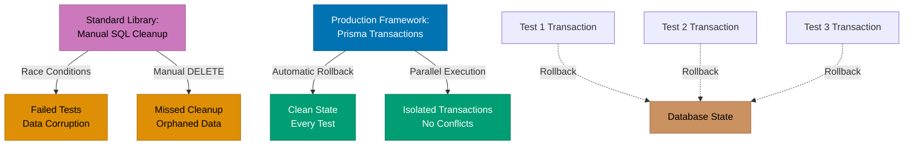

## Why This Matters

Database testing in end-to-end (E2E) test suites presents critical challenges for production systems. Tests that share database state create flaky tests where one test's data mutations affect subsequent tests, leading to false failures and unpredictable CI/CD pipelines. Production systems require data integrity guarantees: tests must verify application behavior without corrupting production-like data, maintain isolation between parallel test executions, and provide reproducible test environments for debugging failures.

The complexity multiplies when testing multi-user scenarios, transaction boundaries, and error handling paths. Manual database cleanup after each test is error-prone and incomplete, often leaving orphaned records that accumulate over time. Production-grade database testing requires systematic approaches to fixture management, transaction rollback strategies, and database state verification. Without these patterns, E2E tests become maintenance nightmares that teams eventually disable or ignore.

This guide demonstrates progressive approaches to database testing in Playwright tests: starting with Node.js standard library for direct SQL execution, identifying limitations for production scale, then introducing Prisma ORM for type-safe database fixtures, transaction management, and production-grade isolation strategies. You'll learn patterns for database seeding, automatic cleanup, and parallel test execution with proper database state management.

## Standard Library Approach: Direct SQL with node-postgres

TypeScript's `node:assert` and `pg` (node-postgres) provide basic database testing capabilities through direct SQL execution.

```typescript
// test/user-registration.spec.ts
import { test } from "@playwright/test";
import { strict as assert } from "node:assert";
import pg from "pg";
// => node:assert provides assertion utilities
// => pg provides PostgreSQL client for Node.js
// => Playwright test runner executes test functions

const client = new pg.Client({
  // => Creates PostgreSQL client instance
  // => Connection configured via environment or defaults
  host: "localhost",
  // => Database server hostname
  database: "test_db",
  // => Test database name (isolated from production)
  user: "test_user",
  // => Database user for test execution
  password: "test_password",
  // => User credentials (should use environment variables)
});

test.beforeAll(async () => {
  // => Runs once before all tests in file
  // => Establishes database connection for fixture operations
  await client.connect();
  // => Opens TCP connection to PostgreSQL server
  // => Required before executing queries
});

test.afterAll(async () => {
  // => Runs once after all tests complete
  // => Cleanup database connection
  await client.end();
  // => Closes PostgreSQL connection
  // => Releases connection pool resources
});

test("should register user with valid email", async ({ page }) => {
  // => Playwright provides page fixture
  // => Test verifies user registration flow

  // Setup: Insert test data
  await client.query(`
    DELETE FROM users WHERE email = 'test@example.com';
  `);
  // => Removes existing test user (if present)
  // => Ensures clean state before test execution
  // => Prevents primary key conflicts

  // Execute: Navigate and fill form
  await page.goto("http://localhost:3000/register");
  // => Loads registration page in browser
  // => Application connects to database for operations

  await page.fill('[name="email"]', "test@example.com");
  // => Enters email into registration form input
  await page.fill('[name="password"]', "SecurePass123!");
  // => Enters password meeting validation requirements
  await page.fill('[name="name"]', "Test User");
  // => Enters full name for user profile

  await page.click('button[type="submit"]');
  // => Submits registration form
  // => Triggers application to insert user record

  await page.waitForURL("http://localhost:3000/dashboard");
  // => Waits for redirect after successful registration
  // => Indicates registration completed successfully

  // Verify: Check database state
  const result = await client.query(`
    SELECT id, email, name FROM users WHERE email = 'test@example.com';
  `);
  // => Queries database for inserted user record
  // => Verifies application actually persisted data

  assert.equal(result.rows.length, 1, "User should be created");
  // => Verifies exactly one user record exists
  // => Throws AssertionError if count != 1

  assert.equal(result.rows[0].email, "test@example.com");
  // => Verifies email stored correctly
  assert.equal(result.rows[0].name, "Test User");
  // => Verifies name stored correctly

  // Teardown: Cleanup test data
  await client.query(`
    DELETE FROM users WHERE email = 'test@example.com';
  `);
  // => Removes test user after verification
  // => Manual cleanup required for test isolation
});
```

**Limitations for production**:

- **Manual cleanup fragility**: If test fails before teardown, data persists causing future test failures
- **No transaction rollback**: Cannot automatically undo all database changes if test encounters errors
- **Race conditions**: Parallel test execution causes primary key conflicts and data corruption
- **No type safety**: SQL strings have no compile-time validation, runtime errors common
- **Connection pooling complexity**: Manual connection management doesn't scale to hundreds of tests
- **Foreign key cascading**: Deleting test data in wrong order violates constraints, requires manual dependency tracking
- **Migration synchronization**: Database schema changes require manual SQL query updates
- **No fixture reusability**: Common test data patterns (admin user, sample products) require duplication

## Production Framework: Prisma with Transaction Rollback

Prisma provides type-safe database access with automatic transaction management and fixture isolation for production-grade testing.

### Installation and Setup

```bash
npm install --save-dev prisma @prisma/client
# => Installs Prisma CLI and client library
# => --save-dev: development dependency for testing

npx prisma init
# => Generates prisma/ directory with schema.prisma
# => Creates .env file with DATABASE_URL placeholder
```

```prisma
// prisma/schema.prisma
datasource db {
  provider = "postgresql"
  // => Specifies PostgreSQL database
  url      = env("DATABASE_URL")
  // => Reads connection string from environment variable
}

generator client {
  provider = "prisma-client-js"
  // => Generates TypeScript client with types
  // => Provides type-safe database queries
}

model User {
  // => Defines User table schema
  id        Int      @id @default(autoincrement())
  // => Primary key with auto-increment
  email     String   @unique
  // => Unique constraint prevents duplicate emails
  name      String
  // => User full name (required field)
  password  String
  // => Hashed password (never plain text)
  createdAt DateTime @default(now())
  // => Automatic timestamp on record creation
}
```

```typescript
// test/fixtures/database.ts
import { PrismaClient } from "@prisma/client";
// => Prisma generated client with User type
// => Provides type-safe query methods

export class DatabaseFixture {
  // => Encapsulates database fixture management
  // => Provides transaction isolation for tests

  private prisma: PrismaClient;
  // => Prisma client instance for queries
  private transactionClient: PrismaClient | null = null;
  // => Active transaction client (null before setup)

  constructor() {
    this.prisma = new PrismaClient({
      // => Creates Prisma client with configuration
      datasources: {
        db: {
          url: process.env.TEST_DATABASE_URL,
          // => Uses separate test database
          // => Prevents production data corruption
        },
      },
      log: ["error"],
      // => Logs only errors for cleaner test output
      // => Set to ['query'] for debugging SQL issues
    });
  }

  async setup(): Promise<void> {
    // => Starts transaction for test isolation
    // => Called in test.beforeEach hook

    await this.prisma.$transaction(
      async (tx) => {
        // => Begins database transaction
        // => All operations within tx are atomic

        this.transactionClient = tx as PrismaClient;
        // => Stores transaction client for test use
        // => Type assertion for Prisma transaction type
      },
      {
        maxWait: 10000,
        // => Maximum time (ms) to wait for transaction lock
        // => Prevents deadlocks in parallel test execution
        timeout: 60000,
        // => Transaction timeout (ms)
        // => Long timeout for slow test operations
      },
    );
  }

  async teardown(): Promise<void> {
    // => Rolls back transaction after test
    // => Automatic cleanup without manual DELETE queries

    if (this.transactionClient) {
      // => Checks transaction exists
      await this.transactionClient.$rollback();
      // => Discards all database changes in transaction
      // => Restores database to pre-test state
      this.transactionClient = null;
      // => Clears transaction reference
    }
  }

  async cleanup(): Promise<void> {
    // => Closes database connection after all tests
    // => Called in test.afterAll hook

    await this.prisma.$disconnect();
    // => Closes connection pool
    // => Releases database resources
  }

  getClient(): PrismaClient {
    // => Returns transaction-scoped client
    // => All queries execute within isolated transaction

    if (!this.transactionClient) {
      throw new Error("Transaction not started. Call setup() first.");
      // => Prevents queries outside transaction
      // => Ensures test isolation guarantees
    }
    return this.transactionClient;
    // => Returns client for type-safe queries
  }
}
```

```typescript
// test/user-registration.spec.ts
import { test, expect } from "@playwright/test";
import { DatabaseFixture } from "./fixtures/database";
// => DatabaseFixture provides transaction isolation
// => Playwright test and expect for assertions

test.describe("User Registration", () => {
  // => Groups related tests for database operations
  // => Shares database fixture setup/teardown

  let dbFixture: DatabaseFixture;
  // => Database fixture instance for test suite
  // => Provides transaction-isolated queries

  test.beforeAll(async () => {
    // => Runs once before all tests in describe block
    dbFixture = new DatabaseFixture();
    // => Creates database fixture instance
    // => Establishes connection pool
  });

  test.beforeEach(async () => {
    // => Runs before each test in describe block
    await dbFixture.setup();
    // => Starts new transaction for test isolation
    // => Each test gets clean database state
  });

  test.afterEach(async () => {
    // => Runs after each test completes
    await dbFixture.teardown();
    // => Rolls back transaction
    // => Automatic cleanup without manual DELETE queries
  });

  test.afterAll(async () => {
    // => Runs once after all tests complete
    await dbFixture.cleanup();
    // => Closes database connection pool
    // => Releases resources
  });

  test("should register user with valid credentials", async ({ page }) => {
    // => Playwright provides page fixture
    // => Test verifies registration flow and database persistence

    const client = dbFixture.getClient();
    // => Gets transaction-scoped Prisma client
    // => All queries isolated from other tests

    // Navigate to registration page
    await page.goto("http://localhost:3000/register");
    // => Loads registration form in browser
    await page.waitForLoadState("networkidle");
    // => Waits for page assets to load completely

    // Fill registration form
    await page.fill('[data-testid="email-input"]', "test@example.com");
    // => Enters email (data-testid for stable selectors)
    await page.fill('[data-testid="password-input"]', "SecurePass123!");
    // => Enters password meeting validation requirements
    await page.fill('[data-testid="name-input"]', "Test User");
    // => Enters full name for user profile

    // Submit form and wait for redirect
    await Promise.all([
      page.waitForURL("http://localhost:3000/dashboard"),
      // => Waits for successful registration redirect
      page.click('[data-testid="submit-button"]'),
      // => Clicks submit button to trigger registration
    ]);
    // => Promise.all ensures both operations complete

    // Verify database state with type-safe query
    const user = await client.user.findUnique({
      // => Type-safe query with User model
      // => Prisma validates field names at compile time
      where: { email: "test@example.com" },
      // => Queries by unique email field
      select: {
        id: true,
        email: true,
        name: true,
        createdAt: true,
      },
      // => Selects specific fields (excludes password)
    });

    expect(user).toBeTruthy();
    // => Verifies user record exists
    expect(user?.email).toBe("test@example.com");
    // => Verifies email matches input
    expect(user?.name).toBe("Test User");
    // => Verifies name matches input
    expect(user?.createdAt).toBeInstanceOf(Date);
    // => Verifies createdAt is valid Date object

    // No manual cleanup needed - transaction rollback handles it
    // => teardown() automatically removes all test data
  });

  test("should prevent duplicate email registration", async ({ page }) => {
    // => Verifies unique constraint enforcement
    // => Tests error handling for duplicate data

    const client = dbFixture.getClient();
    // => Gets transaction-scoped client

    // Seed existing user
    await client.user.create({
      // => Type-safe create operation
      data: {
        email: "existing@example.com",
        name: "Existing User",
        password: "HashedPassword123",
        // => In production, use bcrypt/argon2 hashing
      },
    });
    // => Creates user record in transaction-isolated state

    // Attempt registration with duplicate email
    await page.goto("http://localhost:3000/register");
    await page.fill('[data-testid="email-input"]', "existing@example.com");
    // => Uses same email as seeded user
    await page.fill('[data-testid="password-input"]', "NewPass456!");
    await page.fill('[data-testid="name-input"]', "New User");

    await page.click('[data-testid="submit-button"]');
    // => Submits form with duplicate email
    // => Application should reject with validation error

    // Verify error message displayed
    const errorMessage = page.locator('[data-testid="error-message"]');
    // => Locates error message element
    await expect(errorMessage).toContainText("Email already registered");
    // => Verifies application displays user-friendly error

    // Verify only one user exists with this email
    const users = await client.user.findMany({
      where: { email: "existing@example.com" },
    });
    // => Queries all users with this email
    expect(users).toHaveLength(1);
    // => Verifies no duplicate record created
    expect(users[0].name).toBe("Existing User");
    // => Verifies original user data unchanged

    // Transaction rollback removes seeded user automatically
  });
});
```

## Database State Progression Diagram



## Production Patterns and Best Practices

### Pattern 1: Database Seeding for Complex Fixtures

Production tests require realistic data with relationships (users with orders, products with categories). Seeding provides reusable fixtures.

```typescript
// test/fixtures/seeds.ts
import { PrismaClient } from "@prisma/client";
// => Prisma client for type-safe seeding operations

export interface TestUser {
  // => Type definition for test user data
  // => Ensures consistent fixture structure
  id: number;
  email: string;
  name: string;
  role: "ADMIN" | "USER";
}

export interface TestProduct {
  // => Type definition for test product data
  id: number;
  name: string;
  price: number;
  categoryId: number;
}

export class DatabaseSeeds {
  // => Encapsulates reusable test data creation
  // => Provides factory methods for common fixtures

  constructor(private client: PrismaClient) {
    // => Accepts Prisma client (transaction-scoped)
    // => All seeds execute within test transaction
  }

  async seedUser(overrides?: Partial<Omit<TestUser, "id">>): Promise<TestUser> {
    // => Factory method for user creation
    // => overrides: Optional field overrides for customization
    // => Returns created user with database-generated ID

    const user = await this.client.user.create({
      data: {
        email: overrides?.email ?? "user@example.com",
        // => Uses override or default email
        // => ?? operator: null coalescing for defaults
        name: overrides?.name ?? "Test User",
        // => Uses override or default name
        password: "$2b$10$...",
        // => Placeholder bcrypt hash
        // => Production: use actual hashing library
        role: overrides?.role ?? "USER",
        // => Default role is USER, can override to ADMIN
      },
    });

    return {
      id: user.id,
      email: user.email,
      name: user.name,
      role: user.role,
    };
    // => Returns serialized user data
    // => Excludes password for security
  }

  async seedAdminUser(): Promise<TestUser> {
    // => Convenience method for admin user creation
    // => Common pattern in authorization tests

    return this.seedUser({
      email: "admin@example.com",
      name: "Admin User",
      role: "ADMIN",
    });
    // => Delegates to seedUser with admin overrides
  }

  async seedProduct(overrides?: Partial<Omit<TestProduct, "id">>): Promise<TestProduct> {
    // => Factory method for product creation
    // => Requires category (foreign key)

    // Ensure category exists
    let category = await this.client.category.findFirst();
    // => Attempts to find existing category
    // => Avoids creating duplicate categories

    if (!category) {
      category = await this.client.category.create({
        data: { name: "Test Category" },
      });
      // => Creates category if none exists
      // => Ensures foreign key constraint satisfied
    }

    const product = await this.client.product.create({
      data: {
        name: overrides?.name ?? "Test Product",
        price: overrides?.price ?? 10.99,
        categoryId: overrides?.categoryId ?? category.id,
        // => Uses override category or default
        stock: 100,
        // => Default stock quantity
      },
    });

    return {
      id: product.id,
      name: product.name,
      price: product.price,
      categoryId: product.categoryId,
    };
    // => Returns serialized product data
  }

  async seedOrderWithItems(userId: number, productIds: number[]): Promise<number> {
    // => Creates order with multiple line items
    // => Demonstrates nested transaction writes

    const order = await this.client.order.create({
      data: {
        userId,
        // => Associates order with user
        status: "PENDING",
        // => Initial order status
        items: {
          create: productIds.map((productId) => ({
            // => Creates OrderItem records in single query
            // => Nested create for relational data
            productId,
            quantity: 1,
            // => Default quantity per item
          })),
        },
      },
    });

    return order.id;
    // => Returns order ID for verification
  }
}
```

```typescript
// test/order-flow.spec.ts
import { test, expect } from "@playwright/test";
import { DatabaseFixture } from "./fixtures/database";
import { DatabaseSeeds } from "./fixtures/seeds";
// => Imports fixture and seeding utilities

test.describe("Order Flow", () => {
  let dbFixture: DatabaseFixture;
  let seeds: DatabaseSeeds;
  // => Shared fixtures for test suite

  test.beforeAll(async () => {
    dbFixture = new DatabaseFixture();
  });

  test.beforeEach(async () => {
    await dbFixture.setup();
    seeds = new DatabaseSeeds(dbFixture.getClient());
    // => Creates seeds with transaction-scoped client
    // => All seeded data isolated to current test
  });

  test.afterEach(async () => {
    await dbFixture.teardown();
  });

  test.afterAll(async () => {
    await dbFixture.cleanup();
  });

  test("admin can view all orders", async ({ page }) => {
    // => Verifies admin dashboard displays all orders
    // => Tests role-based access control

    const admin = await seeds.seedAdminUser();
    // => Creates admin user with ADMIN role
    const regularUser = await seeds.seedUser({
      email: "customer@example.com",
      name: "Customer",
    });
    // => Creates regular user with USER role

    const product = await seeds.seedProduct({
      name: "Laptop",
      price: 999.99,
    });
    // => Creates product for order

    const orderId = await seeds.seedOrderWithItems(regularUser.id, [product.id]);
    // => Creates order for regular user
    // => Admin should see this order in dashboard

    // Login as admin
    await page.goto("http://localhost:3000/login");
    await page.fill('[data-testid="email"]', admin.email);
    await page.fill('[data-testid="password"]', "password123");
    // => In production, use actual credentials or auth tokens
    await page.click('[data-testid="submit"]');

    // Navigate to admin orders page
    await page.goto("http://localhost:3000/admin/orders");
    await page.waitForLoadState("networkidle");
    // => Waits for order data to load

    // Verify order appears in list
    const orderRow = page.locator(`[data-testid="order-${orderId}"]`);
    await expect(orderRow).toBeVisible();
    // => Verifies admin can see order
    await expect(orderRow).toContainText("Customer");
    // => Verifies customer name displayed
    await expect(orderRow).toContainText("$999.99");
    // => Verifies order total displayed

    // Transaction rollback removes all seeded data
  });
});
```

### Pattern 2: Transaction Rollback with Savepoints

Advanced tests require partial rollback (undo specific operations while preserving others). Savepoints enable nested transaction control.

```typescript
// test/fixtures/database-advanced.ts
import { PrismaClient } from "@prisma/client";

export class AdvancedDatabaseFixture {
  // => Extends basic fixture with savepoint support
  // => Enables fine-grained transaction control

  private prisma: PrismaClient;
  private savepoints: Map<string, string> = new Map();
  // => Tracks savepoint names for rollback
  // => Map key: savepoint name, value: SQL identifier

  constructor() {
    this.prisma = new PrismaClient({
      datasources: {
        db: {
          url: process.env.TEST_DATABASE_URL,
        },
      },
    });
  }

  async setup(): Promise<void> {
    // => Starts transaction for test isolation
    await this.prisma.$executeRaw`BEGIN`;
    // => Explicit BEGIN for raw SQL transaction control
    // => Required for savepoint operations
  }

  async createSavepoint(name: string): Promise<void> {
    // => Creates named savepoint in current transaction
    // => Allows rollback to this point later

    const safeName = name.replace(/[^a-zA-Z0-9_]/g, "_");
    // => Sanitizes savepoint name (alphanumeric + underscore only)
    // => Prevents SQL injection in savepoint identifiers

    await this.prisma.$executeRaw`SAVEPOINT ${safeName}`;
    // => Creates savepoint with sanitized name
    // => PostgreSQL syntax: SAVEPOINT identifier

    this.savepoints.set(name, safeName);
    // => Stores mapping for later rollback
  }

  async rollbackToSavepoint(name: string): Promise<void> {
    // => Rolls back transaction to named savepoint
    // => Undoes all operations after savepoint creation

    const safeName = this.savepoints.get(name);
    if (!safeName) {
      throw new Error(`Savepoint ${name} not found`);
      // => Prevents rollback to non-existent savepoint
    }

    await this.prisma.$executeRaw`ROLLBACK TO SAVEPOINT ${safeName}`;
    // => Rolls back to savepoint
    // => Preserves operations before savepoint

    await this.prisma.$executeRaw`RELEASE SAVEPOINT ${safeName}`;
    // => Releases savepoint (no longer needed)
    // => Frees transaction resources

    this.savepoints.delete(name);
    // => Removes savepoint from tracking
  }

  async teardown(): Promise<void> {
    // => Rolls back entire transaction
    await this.prisma.$executeRaw`ROLLBACK`;
    // => Discards all changes (including savepoints)
    this.savepoints.clear();
    // => Clears savepoint tracking
  }

  async cleanup(): Promise<void> {
    await this.prisma.$disconnect();
  }

  getClient(): PrismaClient {
    return this.prisma;
  }
}
```

```typescript
// test/multi-step-workflow.spec.ts
import { test, expect } from "@playwright/test";
import { AdvancedDatabaseFixture } from "./fixtures/database-advanced";
// => Uses advanced fixture with savepoint support

test.describe("Multi-Step Workflow", () => {
  let dbFixture: AdvancedDatabaseFixture;

  test.beforeAll(async () => {
    dbFixture = new AdvancedDatabaseFixture();
  });

  test.beforeEach(async () => {
    await dbFixture.setup();
  });

  test.afterEach(async () => {
    await dbFixture.teardown();
  });

  test.afterAll(async () => {
    await dbFixture.cleanup();
  });

  test("should handle partial workflow rollback", async ({ page }) => {
    // => Tests workflow with conditional rollback
    // => Simulates error in middle of multi-step process

    const client = dbFixture.getClient();

    // Step 1: Create user account
    await client.user.create({
      data: {
        email: "user@example.com",
        name: "Test User",
        password: "hashed",
      },
    });
    // => Creates user account (should persist)

    await dbFixture.createSavepoint("after_user_creation");
    // => Marks point before order creation
    // => Allows rollback of order without losing user

    // Step 2: Attempt order creation (will fail)
    try {
      await client.order.create({
        data: {
          userId: 999,
          // => Invalid user ID (doesn't exist)
          // => Foreign key constraint will fail
          status: "PENDING",
        },
      });
    } catch (error) {
      // => Catches foreign key constraint violation
      await dbFixture.rollbackToSavepoint("after_user_creation");
      // => Rolls back order creation
      // => User creation remains committed in transaction
    }

    // Verify user exists but no order created
    const user = await client.user.findUnique({
      where: { email: "user@example.com" },
    });
    expect(user).toBeTruthy();
    // => Verifies user creation persisted after savepoint rollback

    const orders = await client.order.findMany();
    expect(orders).toHaveLength(0);
    // => Verifies order creation rolled back

    // Full transaction rollback in teardown removes user
  });
});
```

### Pattern 3: SQL Fixtures with Prisma Raw Queries

Complex database testing requires direct SQL control for performance-critical operations (bulk inserts, complex queries, database-specific features).

```typescript
// test/fixtures/sql-fixtures.ts
import { PrismaClient } from "@prisma/client";

export class SQLFixtures {
  // => Provides raw SQL fixture operations
  // => Useful for bulk operations and database-specific features

  constructor(private client: PrismaClient) {}

  async bulkInsertUsers(count: number): Promise<void> {
    // => Inserts multiple users efficiently with raw SQL
    // => Much faster than individual Prisma create calls

    const values = Array.from({ length: count }, (_, i) => {
      // => Generates array of user data
      // => _ unused iterator, i is index
      return `('user${i}@example.com', 'User ${i}', 'hashed${i}', 'USER')`;
    }).join(",");
    // => Joins value tuples with commas
    // => Example: ('email1', 'name1', 'pass1', 'USER'),('email2'...)

    await this.client.$executeRaw`
      INSERT INTO "User" (email, name, password, role)
      VALUES ${values}
    `;
    // => Single INSERT with multiple value tuples
    // => Executes in single database round-trip
    // => Significantly faster than N individual INSERTs
  }

  async bulkInsertProducts(categoryId: number, count: number): Promise<void> {
    // => Inserts multiple products for category
    // => Useful for pagination/search testing

    const values = Array.from({ length: count }, (_, i) => {
      return `('Product ${i}', ${(i + 1) * 10.99}, ${categoryId}, ${100 + i})`;
      // => Tuple: (name, price, categoryId, stock)
    }).join(",");

    await this.client.$executeRaw`
      INSERT INTO "Product" (name, price, "categoryId", stock)
      VALUES ${values}
    `;
    // => Bulk insert products in single query
  }

  async executeSQLFile(filePath: string): Promise<void> {
    // => Executes SQL file for complex fixtures
    // => Useful for realistic production-like data

    const fs = await import("fs/promises");
    const sql = await fs.readFile(filePath, "utf-8");
    // => Reads SQL file contents
    // => Supports multi-statement SQL scripts

    const statements = sql.split(";").filter((s) => s.trim());
    // => Splits into individual statements
    // => Filters empty statements

    for (const statement of statements) {
      await this.client.$executeRawUnsafe(statement);
      // => Executes each statement separately
      // => $executeRawUnsafe: allows dynamic SQL strings
      // => WARNING: Only use with trusted SQL files (SQL injection risk)
    }
  }

  async getTableRowCount(tableName: string): Promise<number> {
    // => Counts rows in table with raw SQL
    // => Useful for bulk operation verification

    const result = await this.client.$queryRaw<[{ count: bigint }]>`
      SELECT COUNT(*) as count FROM ${tableName}
    `;
    // => Executes COUNT query
    // => Returns array with single object containing count

    return Number(result[0].count);
    // => Converts bigint to number
    // => bigint required for tables with >2B rows
  }
}
```

```typescript
// test/performance/large-dataset.spec.ts
import { test, expect } from "@playwright/test";
import { DatabaseFixture } from "../fixtures/database";
import { SQLFixtures } from "../fixtures/sql-fixtures";
// => Imports database fixture and SQL utilities

test.describe("Large Dataset Performance", () => {
  let dbFixture: DatabaseFixture;
  let sqlFixtures: SQLFixtures;

  test.beforeAll(async () => {
    dbFixture = new DatabaseFixture();
  });

  test.beforeEach(async () => {
    await dbFixture.setup();
    sqlFixtures = new SQLFixtures(dbFixture.getClient());
  });

  test.afterEach(async () => {
    await dbFixture.teardown();
  });

  test.afterAll(async () => {
    await dbFixture.cleanup();
  });

  test("should paginate through 1000 products efficiently", async ({ page }) => {
    // => Tests pagination with realistic data volume
    // => Verifies performance with large dataset

    const client = dbFixture.getClient();

    // Create category for products
    const category = await client.category.create({
      data: { name: "Electronics" },
    });

    // Bulk insert 1000 products
    await sqlFixtures.bulkInsertProducts(category.id, 1000);
    // => Single query inserts 1000 products
    // => Much faster than 1000 individual Prisma creates

    // Verify count
    const count = await sqlFixtures.getTableRowCount("Product");
    expect(count).toBe(1000);
    // => Confirms all products inserted

    // Navigate to products page
    await page.goto("http://localhost:3000/products");
    await page.waitForLoadState("networkidle");

    // Verify first page displays 20 products (default pagination)
    const productItems = page.locator('[data-testid="product-item"]');
    await expect(productItems).toHaveCount(20);
    // => Verifies pagination limits results

    // Navigate to page 5
    await page.click('[data-testid="pagination-5"]');
    await page.waitForLoadState("networkidle");

    // Verify page 5 shows products 81-100
    const firstProduct = productItems.first();
    await expect(firstProduct).toContainText("Product 80");
    // => Verifies correct offset (page 5 = skip 80)
    // => Product 80 because we start from Product 0

    // Transaction rollback removes all 1000 products automatically
  });
});
```

## Trade-offs and When to Use

**Standard Library Approach (node-postgres + manual SQL)**:

- **Use when**: Simple CRUD tests with ≤5 tables, no parallel execution, prototype/MVP projects
- **Benefits**: Zero external dependencies, full SQL control, no ORM learning curve, direct database interaction
- **Costs**: Manual cleanup prone to errors, no transaction rollback, type safety absent, race conditions in parallel tests, foreign key management complexity

**Production Framework (Prisma with transactions)**:

- **Use when**: Production applications, parallel test execution, complex data relationships (>5 tables), team projects requiring type safety
- **Benefits**: Automatic transaction rollback (clean state guaranteed), type-safe queries (compile-time validation), no manual cleanup code, parallel test isolation, migration synchronization, reusable fixtures
- **Costs**: External dependency (~5MB), learning curve for Prisma schema/API, additional build step (prisma generate), query abstraction hides SQL details

**Production recommendation**: Use Prisma transactions for production systems with 2+ developers or >10 database tests. Automatic rollback eliminates entire class of flaky test bugs (orphaned data, race conditions) that plague manual cleanup approaches. The upfront investment in Prisma setup pays dividends through reliable CI/CD and zero test maintenance for database state management. For solo developer prototypes with <5 simple tables, manual SQL suffices until complexity justifies framework adoption.

## Security Considerations

- **Separate test database**: NEVER run tests against production database. Use `TEST_DATABASE_URL` environment variable pointing to isolated test database. Production data corruption from test execution is catastrophic.
- **Credential management**: Store database credentials in `.env.test` file (gitignored). Never hardcode credentials in test code. Use environment variables: `process.env.TEST_DATABASE_URL`.
- **SQL injection prevention**: Prisma parameterizes queries automatically (safe). Raw SQL with `$executeRawUnsafe` requires manual sanitization - only use with trusted input or constant strings.
- **Test data visibility**: Ensure test database credentials have minimal permissions (no DROP DATABASE, no access to production schemas). Use dedicated `test_user` role with only necessary grants (SELECT, INSERT, UPDATE, DELETE on test tables).
- **Secrets in fixtures**: Never seed production API keys, tokens, or real user passwords in test fixtures. Use placeholder hashes (`$2b$10$...`) or mock values. Test data should never resemble production secrets.
- **Database connection limits**: Use connection pooling (`PrismaClient` reuse) to avoid exhausting database connections during parallel tests. PostgreSQL default max_connections is 100 - ensure test suite respects this limit.
- **Transaction isolation level**: Default READ COMMITTED isolation sufficient for most tests. SERIALIZABLE isolation prevents all concurrency anomalies but impacts parallel test performance - only use when testing race condition handling.

## Common Pitfalls

1. **Forgetting transaction rollback**: Tests that create database state without rollback cause subsequent test failures. Always pair `setup()` with `teardown()` in `beforeEach`/`afterEach` hooks. Missing teardown = flaky tests.

2. **Sharing Prisma client between tests**: Creating single global `PrismaClient` instance breaks test isolation. Each test needs transaction-scoped client from `DatabaseFixture.getClient()`. Shared client = race conditions.

3. **Testing without migrations applied**: Running tests before `prisma migrate dev` causes schema mismatch errors (table doesn't exist). Always apply migrations to test database before test execution. Pre-test setup should verify schema version.

4. **Foreign key constraint violations**: Seeding data without respecting foreign key order causes errors. Create parent records (categories) before child records (products). Prisma nested creates handle this automatically.

5. **Timeout errors with long transactions**: Default transaction timeout (5s) insufficient for slow operations (bulk inserts, complex queries). Increase timeout in `$transaction` options: `{ timeout: 60000 }`. Monitor transaction duration in CI logs.

6. **Comparing Date objects incorrectly**: Database timestamps have millisecond precision, JavaScript Date objects may have microseconds. Use `expect(date).toBeInstanceOf(Date)` instead of exact equality. Alternatively, compare timestamps: `expect(date.getTime()).toBeCloseTo(expected.getTime(), -3)`.

7. **Parallel test database conflicts**: Multiple test processes writing to same test database cause deadlocks. Use separate test database per worker: `test_db_${process.env.TEST_WORKER_INDEX}`. Configure in `playwright.config.ts` with `workers: 4` and worker-specific `DATABASE_URL`.

8. **Not cleaning up connections**: Forgetting `$disconnect()` exhausts connection pool (PostgreSQL max_connections limit). Always call `cleanup()` in `afterAll` hook. Monitor active connections during test execution.

9. **Seeding non-deterministic data**: Using random values (`Math.random()`, `Date.now()`) in fixtures makes tests non-reproducible. Use fixed values or seeded random generator (`seed: 42`) for consistent test behavior. Debugging requires deterministic data.

10. **Ignoring database-specific features**: Tests that assume generic SQL fail on specific databases (PostgreSQL arrays, MySQL JSON functions). Use Prisma's database-agnostic query builder or document database-specific raw SQL in test descriptions.
