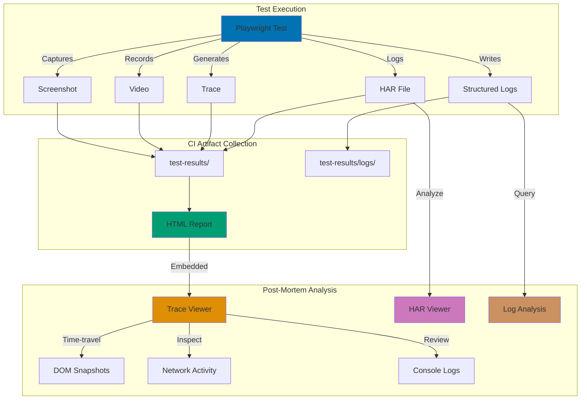

## Why This Matters

Production Playwright test failures are fundamentally different from local development failures. When a test passes locally but fails in CI/CD, or when intermittent failures occur in deployed environments, you need comprehensive debugging artifacts to diagnose issues without direct access to the execution environment. Production debugging requires systematic capture of browser state, network activity, and execution traces that can be analyzed post-mortem.

Traditional console.log debugging is insufficient for production test failures because browser automation failures often involve timing issues, network conditions, visual state, and DOM changes that aren't captured in text logs. You need time-travel debugging capabilities to understand what the browser saw, what network requests occurred, and what user actions were simulated. This becomes critical when troubleshooting flaky tests, investigating customer-reported issues, or debugging failures in containerized CI/CD environments where interactive debugging isn't possible.

Production debugging with Playwright requires balancing diagnostic depth with storage costs and execution performance. Full traces with screenshots, videos, and HAR files provide comprehensive insights but generate large artifacts. Strategic artifact collection—capturing traces only on failure, using video recording selectively, and configuring appropriate retention policies—enables effective debugging while managing infrastructure costs. This guide demonstrates production-grade debugging configurations suitable for enterprise CI/CD pipelines.

## Standard Library Approach: Console Logging and Screenshots

Playwright provides built-in diagnostic capabilities without requiring external frameworks.

```typescript
// playwright.config.ts
// => Playwright configuration for standard debugging
import { defineConfig, devices } from "@playwright/test";
// => defineConfig provides type-safe configuration
// => devices contains browser viewport presets

export default defineConfig({
  // => Root configuration object
  testDir: "./tests",
  // => Directory containing test files
  // => Playwright discovers .spec.ts files here

  use: {
    // => Global test execution options
    screenshot: "only-on-failure",
    // => Captures screenshot when test fails
    // => Screenshots saved to test-results/ directory
    // => File naming: test-name-retry-screenshot.png

    video: "retain-on-failure",
    // => Records video only when test fails
    // => Video deleted for passing tests to save space
    // => Video captures entire browser viewport

    trace: "retain-on-failure",
    // => Enables trace recording on failure
    // => Trace includes DOM snapshots, network, console
    // => File: test-results/test-name-retry-trace.zip
  },

  projects: [
    // => Browser configurations for parallel execution
    {
      name: "chromium",
      // => Project identifier for this browser
      use: { ...devices["Desktop Chrome"] },
      // => Spreads Desktop Chrome viewport and user agent
      // => Viewport: 1280x720, user agent: Chrome/latest
    },
  ],
});
```

```typescript
// tests/checkout.spec.ts
// => End-to-end checkout test with standard debugging
import { test, expect } from "@playwright/test";
// => test provides test runner, expect provides assertions
// => Both are Playwright's built-in testing framework

test("user completes checkout successfully", async ({ page }) => {
  // => Async test function receives page fixture
  // => page is isolated browser context for this test
  // => On failure, screenshot/video/trace captured automatically

  await page.goto("https://example.com/products");
  // => Navigates to products page
  // => Waits for load event by default
  // => Network requests logged in trace if enabled

  console.log("Navigated to products page");
  // => Standard console logging for debugging
  // => Visible in test output and CI logs
  // => Limited diagnostic value compared to traces

  await page.click("text=Add to Cart");
  // => Clicks button containing "Add to Cart" text
  // => Playwright auto-waits for element visibility
  // => DOM state captured in trace before action

  const cartCount = await page.textContent(".cart-count");
  // => Extracts cart count text from DOM
  // => Returns string content of element
  console.log(`Cart count: ${cartCount}`);
  // => Logs cart count to console
  // => Helpful for debugging but doesn't capture full state

  await expect(page.locator(".cart-count")).toHaveText("1");
  // => Verifies cart count is "1"
  // => If assertion fails, screenshot captured
  // => Trace captures DOM state at failure point

  await page.click("text=Checkout");
  // => Proceeds to checkout flow
  // => Triggers navigation to checkout page
  // => All network requests logged in trace

  await page.fill("#email", "test@example.com");
  // => Fills email input field
  // => Waits for field to be editable
  await page.fill("#card-number", "4242424242424242");
  // => Fills credit card number
  // => Actual values visible in trace (security concern)

  await page.click("text=Complete Purchase");
  // => Submits checkout form
  // => Triggers API request to payment processor
  // => Network request captured in trace with headers/body

  await expect(page).toHaveURL(/\/order-confirmation/);
  // => Verifies redirect to confirmation page
  // => Uses regex to match URL pattern
  // => On failure, trace shows navigation history

  const confirmation = await page.textContent(".confirmation-message");
  console.log(`Confirmation: ${confirmation}`);
  // => Logs confirmation message
  // => Better captured in trace with full page context
});
```

**Limitations for production**:

- **No centralized trace viewing**: Trace files scattered across test-results/, requires manual download and opening in browser
- **No retention policy enforcement**: Standard config doesn't manage artifact cleanup, CI storage grows unbounded
- **Limited CI integration**: No automatic trace upload to accessible dashboard, developers must dig through CI artifacts
- **No sensitive data redaction**: Traces capture all form inputs including passwords and payment details in plain text
- **No failure correlation**: Multiple test failures produce independent trace files with no way to identify patterns
- **No remote debugging**: Trace viewer requires local Playwright installation, can't share traces with non-technical stakeholders

## Production Framework: CI Trace Artifacts with Playwright Trace Viewer

Production debugging requires centralized trace storage, automated artifact management, and secure remote viewing.

```typescript
// playwright.config.ts
// => Production-grade Playwright configuration with comprehensive debugging
import { defineConfig, devices } from "@playwright/test";
import path from "path";
// => path module for cross-platform file path handling
// => Required for artifact directory resolution

export default defineConfig({
  testDir: "./tests",
  // => Test file discovery directory
  // => CI runs tests from this directory

  fullyParallel: true,
  // => Runs test files in parallel for faster CI execution
  // => Each test file gets isolated worker process
  // => Reduces total CI duration by utilizing multiple CPU cores

  forbidOnly: !!process.env.CI,
  // => Prevents .only() tests from running in CI
  // => .only() indicates developer debugging, should fail CI
  // => Ensures full test suite runs in production

  retries: process.env.CI ? 2 : 0,
  // => Retries failed tests twice in CI to handle flaky tests
  // => No retries in local development for faster feedback
  // => Each retry generates separate trace for comparison

  workers: process.env.CI ? 1 : undefined,
  // => Limits parallelism to 1 worker in CI
  // => Prevents resource contention in containerized environments
  // => Undefined in local dev uses all available CPUs

  reporter: [
    ["html", { outputFolder: "playwright-report" }],
    // => Generates HTML report with embedded traces
    // => Report includes screenshots, videos, traces inline
    // => Accessible via web browser without Playwright installation

    ["json", { outputFile: "test-results/results.json" }],
    // => JSON report for CI integration and metrics
    // => Enables custom parsing and failure trend analysis
    // => Used by monitoring systems to track flaky tests

    ["junit", { outputFile: "test-results/junit.xml" }],
    // => JUnit XML format for CI/CD system integration
    // => Jenkins, GitLab CI, GitHub Actions parse this format
    // => Provides test result visualization in CI dashboards

    ["list"],
    // => Console reporter for CI logs
    // => Shows test progress and failures in real-time
    // => Critical for debugging CI pipeline issues
  ],

  use: {
    baseURL: process.env.BASE_URL || "https://staging.example.com",
    // => Base URL for page.goto() relative paths
    // => Environment-specific configuration for staging/production
    // => Enables same tests across multiple environments

    screenshot: "only-on-failure",
    // => Screenshot captured automatically on test failure
    // => Embedded in HTML report for quick visual diagnosis
    // => File saved to test-results/{test-name}/screenshot.png

    video: "retain-on-failure",
    // => Video recording only retained for failed tests
    // => Deleted for passing tests to minimize storage costs
    // => Captures full browser viewport from test start to failure

    trace: "retain-on-failure",
    // => Comprehensive trace including DOM, network, console
    // => Only retained for failures to optimize storage
    // => Most powerful debugging artifact for post-mortem analysis

    contextOptions: {
      // => Browser context configuration options
      // => Context is isolated browser profile for test
      recordHar: process.env.CI ? { path: path.join("test-results", "network.har") } : undefined,
      // => Records HTTP Archive (HAR) file with all network requests
      // => Contains request/response headers, bodies, timing
      // => Critical for debugging API integration failures
      // => Only enabled in CI to avoid local file clutter

      recordVideo: process.env.CI
        ? {
            dir: path.join("test-results", "videos"),
            // => Video output directory for CI artifact collection
            size: { width: 1920, height: 1080 },
            // => Full HD resolution for clear visual debugging
            // => Higher resolution increases file size
          }
        : undefined,
      // => Video only recorded in CI environments
      // => Local development relies on trace viewer replay
    },

    launchOptions: {
      // => Browser launch configuration
      slowMo: process.env.DEBUG ? 500 : 0,
      // => Slows down actions by 500ms when DEBUG env set
      // => Helpful for local debugging to observe actions
      // => Never enabled in CI (increases execution time)
    },
  },

  projects: [
    // => Browser configurations for cross-browser testing
    {
      name: "chromium",
      use: { ...devices["Desktop Chrome"] },
      // => Chrome desktop configuration
      // => Most common production browser
    },
    {
      name: "firefox",
      use: { ...devices["Desktop Firefox"] },
      // => Firefox desktop configuration
      // => Second most common browser
    },
    {
      name: "webkit",
      use: { ...devices["Desktop Safari"] },
      // => Safari desktop configuration (WebKit engine)
      // => Important for macOS/iOS compatibility
    },
  ],

  webServer: process.env.CI
    ? undefined
    : {
        // => Local development web server configuration
        // => Not needed in CI (tests run against deployed environment)
        command: "npm run dev",
        // => Starts local dev server before tests
        // => Server automatically stopped after tests complete
        port: 3000,
        // => Port to wait for before running tests
        // => Playwright waits until server responds on this port
        reuseExistingServer: !process.env.CI,
        // => Reuses existing server if already running
        // => Faster iteration during local development
      },
});
```

```typescript
// tests/checkout-production.spec.ts
// => Production-grade checkout test with comprehensive debugging
import { test, expect } from "@playwright/test";
import { createLogger } from "../utils/logger";
// => Custom logger with structured logging for production
// => Logs include timestamp, test name, severity level

const logger = createLogger("CheckoutTest");
// => Creates logger instance for this test suite
// => Logger writes to test-results/logs/ directory
// => Logs attached to test report for post-mortem analysis

test.describe("Checkout Flow", () => {
  // => Groups related tests for better organization
  // => Failures in this group indicate checkout system issues

  test.beforeEach(async ({ page }) => {
    // => Setup run before each test in this describe block
    // => Ensures clean state for each test execution

    logger.info("Starting test setup");
    // => Structured log entry for debugging
    // => Timestamps automatically added by logger

    await page.goto("/products");
    // => Navigates to products page using baseURL from config
    // => Waits for load event and network idle
    // => All network requests captured in HAR file

    logger.info("Navigated to products page", {
      // => Structured logging with context
      url: page.url(),
      // => Captures actual URL after redirects
      viewport: page.viewportSize(),
      // => Records viewport dimensions for debugging responsive issues
    });

    await expect(page.locator(".product-list")).toBeVisible();
    // => Verifies products loaded successfully
    // => Fails fast if products page not working
    // => DOM snapshot captured in trace at this point
  });

  test("user completes checkout with valid payment", async ({ page, context }) => {
    // => Test receives both page and context fixtures
    // => context provides access to HAR recording and cookies

    try {
      // => Try-catch block for comprehensive error logging
      // => Standard Playwright error messages enhanced with custom context

      logger.info("Adding product to cart");
      await page.click("text=Add to Cart");
      // => Clicks first "Add to Cart" button
      // => Action recorded in trace with before/after screenshots

      await expect(page.locator(".cart-count")).toHaveText("1", {
        // => Verifies cart count updated
        timeout: 5000,
        // => Custom timeout for cart update (default: 30s)
        // => Shorter timeout fails faster for cart issues
      });
      logger.info("Product added to cart successfully");

      await page.click("text=Checkout");
      // => Proceeds to checkout page
      // => Navigation recorded in trace with network requests

      await page.waitForURL("**/checkout");
      // => Explicit wait for URL change
      // => More reliable than waiting for specific element
      // => Glob pattern matches any path containing "checkout"

      logger.info("Proceeding with checkout", { url: page.url() });

      // Redact sensitive data from traces
      await page.route("**/api/payment", async (route, request) => {
        // => Intercepts payment API requests
        // => Allows inspection/modification before sending to server
        // => Critical for security: redacts sensitive data from traces

        const postData = request.postDataJSON();
        // => Parses JSON request body
        // => Contains credit card details in this flow

        logger.info("Payment request intercepted", {
          // => Log sanitized request details
          method: request.method(),
          // => HTTP method (POST expected)
          url: request.url(),
          // => Payment API endpoint
          cardLast4: postData.cardNumber?.slice(-4) || "unknown",
          // => Logs only last 4 digits for debugging
          // => Full card number never logged (PCI DSS compliance)
        });

        // Continue with original request
        await route.continue();
        // => Forwards request to actual payment API
        // => Response also captured in HAR file
      });

      await page.fill("#email", "test@example.com");
      // => Fills email field with test data
      // => Input value visible in trace (safe for email)

      await page.fill("#card-number", "4242424242424242");
      // => Test credit card number (Stripe test card)
      // => Real card numbers should use secure test fixtures

      await page.fill("#expiry", "12/25");
      // => Fills expiration date
      await page.fill("#cvc", "123");
      // => Fills CVC code

      logger.info("Payment details entered");

      await page.click("text=Complete Purchase");
      // => Submits payment form
      // => Triggers payment API request (intercepted above)

      await page.waitForURL("**/order-confirmation/**", {
        // => Waits for redirect to confirmation page
        timeout: 15000,
        // => Longer timeout for payment processing
        // => Payment APIs typically slower than page loads
      });

      logger.info("Redirected to confirmation page");

      const confirmationMessage = await page.textContent(".confirmation-message");
      // => Extracts confirmation message text
      // => Validates successful payment processing

      expect(confirmationMessage).toContain("Order confirmed");
      // => Verifies expected confirmation message
      // => Fails test if payment didn't complete successfully

      const orderId = await page.textContent(".order-id");
      // => Extracts order ID for audit trail
      logger.info("Order completed successfully", {
        orderId,
        // => Logs order ID for correlation with backend systems
        confirmationMessage,
        // => Logs full message for debugging
      });

      // Verify HAR file captured network activity
      const har = await context.harExport();
      // => Exports HAR file as JSON object
      // => Contains all network requests from this test
      logger.info("HAR file exported", {
        entries: har.log.entries.length,
        // => Number of network requests captured
        // => High count may indicate performance issues
      });
    } catch (error) {
      // => Catch block handles test failures
      // => Adds diagnostic context to standard Playwright errors

      logger.error("Test failed", {
        // => Structured error logging
        error: error.message,
        // => Error message from Playwright
        stack: error.stack,
        // => Full stack trace for debugging
        url: page.url(),
        // => Current URL when failure occurred
        // => Critical for understanding which page failed
      });

      // Capture additional debugging info on failure
      const title = await page.title().catch(() => "Unknown");
      // => Page title at failure point
      // => .catch() prevents secondary error if page crashed

      const html = await page.content().catch(() => "Unable to capture HTML");
      // => Full HTML snapshot
      // => Useful if trace viewer not available
      logger.error("Page state at failure", { title, html });

      throw error;
      // => Re-throw to fail test
      // => Ensures Playwright captures screenshot/video/trace
    }
  });

  test("handles payment decline gracefully", async ({ page }) => {
    // => Negative test case for payment failures
    // => Validates error handling in production

    logger.info("Testing payment decline scenario");

    await page.click("text=Add to Cart");
    await expect(page.locator(".cart-count")).toHaveText("1");
    await page.click("text=Checkout");

    await page.fill("#email", "test@example.com");
    await page.fill("#card-number", "4000000000000002");
    // => Stripe test card that triggers decline
    // => Simulates payment processor rejection
    await page.fill("#expiry", "12/25");
    await page.fill("#cvc", "123");

    await page.click("text=Complete Purchase");

    // Should show error message
    await expect(page.locator(".error-message")).toBeVisible({
      // => Verifies error message displayed to user
      timeout: 10000,
      // => Longer timeout for API error response
    });

    const errorText = await page.textContent(".error-message");
    logger.info("Payment declined error shown", { errorText });
    // => Logs error message for validation
    // => Ensures user-friendly error messaging

    expect(errorText).toContain("declined");
    // => Verifies error message contains "declined"
    // => Prevents generic error messages in production
  });

  test.afterEach(async ({ page }, testInfo) => {
    // => Cleanup after each test
    // => testInfo provides test metadata and status

    if (testInfo.status !== testInfo.expectedStatus) {
      // => Condition: test failed or flaky
      // => expectedStatus is "passed" for normal tests

      logger.error("Test did not pass", {
        // => Log failure details
        testName: testInfo.title,
        // => Test function name
        status: testInfo.status,
        // => Actual status: failed, timedOut, interrupted
        expectedStatus: testInfo.expectedStatus,
        // => Expected status (usually "passed")
        duration: testInfo.duration,
        // => Test execution time in milliseconds
        // => Helps identify slow tests
        retry: testInfo.retry,
        // => Retry attempt number (0-based)
        // => Indicates if test is flaky
      });

      // Attach custom debugging information
      await testInfo.attach("browser-console", {
        // => Attaches browser console logs to test report
        // => Visible in Playwright HTML report
        body: JSON.stringify(
          page
            .context()
            .pages()
            .map((p) => p.url()),
          null,
          2,
        ),
        // => All page URLs from this browser context
        // => Helpful for multi-tab/popup debugging
        contentType: "application/json",
        // => MIME type for proper report rendering
      });
    }

    logger.info("Test completed", {
      status: testInfo.status,
      duration: testInfo.duration,
    });
  });
});
```

```typescript
// utils/logger.ts
// => Structured logging utility for production debugging
import path from "path";
import { existsSync, mkdirSync, appendFileSync } from "fs";
// => Node.js file system operations
// => Used to write logs to disk for CI artifact collection

const LOG_DIR = path.join(process.cwd(), "test-results", "logs");
// => Log directory: {project-root}/test-results/logs/
// => CI systems upload test-results/ as artifacts

if (!existsSync(LOG_DIR)) {
  // => Create logs directory if it doesn't exist
  mkdirSync(LOG_DIR, { recursive: true });
  // => recursive: true creates parent directories if needed
  // => Prevents ENOENT errors on first run
}

export interface LogEntry {
  // => TypeScript interface for structured log entries
  timestamp: string;
  // => ISO 8601 timestamp
  level: "info" | "warn" | "error";
  // => Log severity level
  testSuite: string;
  // => Test suite name (e.g., "CheckoutTest")
  message: string;
  // => Human-readable log message
  context?: Record<string, unknown>;
  // => Optional structured data (URLs, IDs, errors)
}

export function createLogger(testSuite: string) {
  // => Factory function creates logger for specific test suite
  // => Logs from different suites written to separate files

  const logFile = path.join(LOG_DIR, `${testSuite}.log`);
  // => Log file: test-results/logs/CheckoutTest.log
  // => One file per test suite for easier debugging

  function log(level: LogEntry["level"], message: string, context?: Record<string, unknown>) {
    // => Core logging function
    // => Writes to both console and log file

    const entry: LogEntry = {
      timestamp: new Date().toISOString(),
      // => ISO 8601 timestamp with timezone
      // => Enables correlation with server logs
      level,
      testSuite,
      message,
      context,
    };

    const logLine = JSON.stringify(entry);
    // => JSON format for structured parsing
    // => Tools like jq can query JSON logs

    console.log(logLine);
    // => Write to console for real-time CI feedback
    // => Visible in CI job output

    appendFileSync(logFile, logLine + "\n");
    // => Append to log file for post-mortem analysis
    // => Persists even if CI job truncates console output
    // => CI uploads entire test-results/ directory
  }

  return {
    // => Returns logger object with level-specific methods
    info: (message: string, context?: Record<string, unknown>) => log("info", message, context),
    // => Info-level logging for normal execution flow

    warn: (message: string, context?: Record<string, unknown>) => log("warn", message, context),
    // => Warning-level for recoverable issues

    error: (message: string, context?: Record<string, unknown>) => log("error", message, context),
    // => Error-level for failures and exceptions
  };
}
```

```yaml
# .github/workflows/playwright.yml
# => GitHub Actions workflow for CI/CD Playwright execution
name: Playwright Tests
# => Workflow name displayed in GitHub Actions UI

on:
  # => Trigger configuration
  push:
    branches: [main, develop]
    # => Run on pushes to main and develop branches
  pull_request:
    branches: [main]
    # => Run on PRs targeting main branch
    # => Validates changes before merge

jobs:
  test:
    # => Job definition for Playwright test execution
    timeout-minutes: 60
    # => Maximum job duration
    # => Prevents hung tests from consuming CI resources
    runs-on: ubuntu-latest
    # => Uses Ubuntu VM for execution
    # => Consistent Linux environment for reproducibility

    steps:
      - uses: actions/checkout@v4
        # => Checks out repository code
        # => Fetches commit being tested

      - uses: actions/setup-node@v4
        with:
          node-version: "20"
          # => Node.js LTS version
          # => Matches production runtime version
          cache: "npm"
          # => Caches node_modules for faster installs

      - name: Install dependencies
        run: npm ci
        # => Clean install from package-lock.json
        # => More reliable than npm install in CI

      - name: Install Playwright Browsers
        run: npx playwright install --with-deps
        # => Downloads Chromium, Firefox, WebKit binaries
        # => --with-deps installs OS-level dependencies (fonts, libs)

      - name: Run Playwright tests
        run: npx playwright test
        # => Executes test suite
        # => Uses playwright.config.ts configuration
        env:
          # => Environment variables for test execution
          CI: "true"
          # => Signals CI environment to test code
          # => Enables CI-specific behavior (retries, workers, HAR)
          BASE_URL: ${{ secrets.STAGING_URL }}
          # => Base URL from GitHub Secrets
          # => Keeps staging URL out of source control

      - uses: actions/upload-artifact@v4
        if: always()
        # => Upload artifacts even if tests fail
        # => Critical for debugging failed tests
        with:
          name: playwright-report
          # => Artifact name in GitHub Actions UI
          path: playwright-report/
          # => HTML report directory
          # => Contains embedded traces, screenshots, videos
          retention-days: 30
          # => Keep artifacts for 30 days
          # => Balances debugging needs with storage costs

      - uses: actions/upload-artifact@v4
        if: always()
        with:
          name: test-results
          # => Separate artifact for raw test results
          path: test-results/
          # => Contains logs, HAR files, individual traces
          retention-days: 7
          # => Shorter retention for raw results
          # => HTML report more commonly used
```

## Debugging Architecture



## Production Patterns and Best Practices

### Pattern 1: Time-Travel Debugging with Trace Viewer

Playwright traces enable debugging test failures after execution completes by capturing complete browser state.

```typescript
// tests/debug-patterns/time-travel.spec.ts
// => Demonstrates time-travel debugging with trace viewer
import { test, expect } from "@playwright/test";

test("demonstrates trace viewer capabilities", async ({ page }) => {
  // => Test intentionally designed to show trace features
  // => Production tests use same patterns for debugging

  await page.goto("https://example.com");
  // => Navigate to page
  // => Trace captures DOM snapshot before and after navigation

  await page.click("text=Submit");
  // => Click action recorded in trace timeline
  // => Trace includes:
  // =>   - DOM snapshot before click
  // =>   - Element selector used
  // =>   - DOM snapshot after click
  // =>   - Any resulting network requests

  await expect(page.locator(".success")).toBeVisible();
  // => Assertion captured in trace
  // => If fails, trace shows DOM state at failure point
  // => Can inspect why element wasn't visible:
  // =>   - Element didn't exist?
  // =>   - Element was hidden?
  // =>   - Wrong selector?
});

// To view trace after test failure:
// 1. Test fails in CI
// 2. Download test-results artifact from CI
// 3. Run: npx playwright show-trace test-results/test-name-retry-trace.zip
// 4. Trace viewer opens in browser with:
//    - Timeline of all actions
//    - DOM snapshots at each step
//    - Network requests with headers/bodies
//    - Console logs
//    - Screenshots
// 5. Click any action to see before/after state
// 6. Inspect network tab to see API responses
// 7. Review console tab for JavaScript errors
```

**Trace viewer workflow in production**:

```bash
# Developer workflow for CI failure
# => Step 1: Test fails in CI/CD pipeline

# Step 2: Download trace artifact from CI
# => GitHub Actions: Download "test-results" artifact
# => GitLab CI: Download job artifacts
# => Jenkins: Download archived artifacts

# Step 3: Open trace in Playwright trace viewer
npx playwright show-trace test-results/traces/checkout-chromium-retry1-trace.zip
# => Opens interactive trace viewer in web browser
# => No Playwright project needed, just npx command
# => Trace viewer is self-contained HTML application

# Step 4: Analyze failure in trace viewer
# => Timeline shows all actions with timestamps
# => Click action to see:
# =>   - Exact DOM state before action
# =>   - Element selector used
# =>   - DOM state after action
# =>   - Any JavaScript errors
# =>   - Network requests triggered

# Step 5: Inspect network activity
# => Network tab shows all HTTP requests
# => Click request to see:
# =>   - Request method, URL, headers
# =>   - Request body (JSON, form data)
# =>   - Response status, headers, body
# =>   - Timing information

# Step 6: Review console logs
# => Console tab shows all console.log, console.error output
# => Includes JavaScript errors with stack traces
# => Critical for debugging application-level issues

# Step 7: Examine DOM snapshots
# => Click any timeline event to see DOM at that moment
# => Can inspect element properties, styles, position
# => Identifies why selectors didn't match or elements weren't visible
```

### Pattern 2: HAR File Analysis for Network Debugging

HTTP Archive (HAR) files capture complete network activity for diagnosing API integration issues.

```typescript
// tests/debug-patterns/har-analysis.spec.ts
// => Demonstrates HAR file generation and analysis
import { test, expect } from "@playwright/test";
import * as fs from "fs";
import * as path from "path";
// => File system operations for HAR export

test("captures network activity in HAR file", async ({ page, context }) => {
  // => Test receives context fixture for HAR export
  // => context manages browser context with HAR recording enabled

  await page.goto("https://api-staging.example.com/dashboard");
  // => Navigate triggers multiple API requests:
  // =>   - GET /api/user
  // =>   - GET /api/products
  // =>   - GET /api/analytics
  // => All captured in HAR file

  await page.click("text=Refresh Data");
  // => Triggers additional API requests
  // => HAR captures request/response for debugging

  await expect(page.locator(".data-loaded")).toBeVisible();
  // => Assertion verifies data loaded successfully

  // Export HAR file after test completes
  const harPath = path.join("test-results", `${test.info().title}.har`);
  // => HAR file path includes test name for identification
  // => Stored in test-results/ for CI artifact upload

  await context.close();
  // => Closing context finalizes HAR recording
  // => HAR data flushed to disk

  // HAR file now available for analysis
  // => Can be opened in:
  // =>   - Chrome DevTools Network tab (Import HAR)
  // =>   - HAR viewer online tools
  // =>   - Custom analysis scripts
});
```

**HAR analysis for production debugging**:

```typescript
// scripts/analyze-har.ts
// => Script analyzes HAR file for performance and errors
import * as fs from "fs";
// => File system operations for reading HAR file

interface HarEntry {
  // => TypeScript interface for HAR entry
  request: {
    method: string;
    url: string;
    headers: Array<{ name: string; value: string }>;
  };
  response: {
    status: number;
    statusText: string;
    content: { text?: string };
  };
  time: number;
  // => Total request duration in milliseconds
}

interface HarLog {
  entries: HarEntry[];
  // => Array of all HTTP requests in trace
}

interface Har {
  log: HarLog;
}

function analyzeHar(harPath: string): void {
  // => Analyzes HAR file for common issues
  // => Run after test failure to diagnose network problems

  const harContent = fs.readFileSync(harPath, "utf-8");
  // => Read HAR file from disk
  // => HAR is JSON format containing all network activity

  const har: Har = JSON.parse(harContent);
  // => Parse HAR JSON into typed object
  // => Enables programmatic analysis

  console.log(`Total requests: ${har.log.entries.length}`);
  // => Number of HTTP requests made during test
  // => High count may indicate N+1 query problems

  // Find failed requests
  const failedRequests = har.log.entries.filter((entry) => entry.response.status >= 400);
  // => Filters requests with error status codes (4xx, 5xx)
  // => Critical for diagnosing API integration failures

  if (failedRequests.length > 0) {
    // => If any requests failed, log details
    console.error(`Failed requests: ${failedRequests.length}`);
    failedRequests.forEach((entry) => {
      // => Log each failed request with diagnostic details
      console.error(`- ${entry.request.method} ${entry.request.url}`);
      // => HTTP method and URL of failed request
      console.error(`  Status: ${entry.response.status} ${entry.response.statusText}`);
      // => HTTP status code and status text
      console.error(`  Response: ${entry.response.content.text?.slice(0, 200)}`);
      // => First 200 chars of response body
      // => Shows error message from API
    });
  }

  // Find slow requests
  const slowRequests = har.log.entries.filter((entry) => entry.time > 1000);
  // => Requests taking more than 1 second
  // => Performance bottleneck candidates

  if (slowRequests.length > 0) {
    console.warn(`Slow requests (>1s): ${slowRequests.length}`);
    slowRequests.forEach((entry) => {
      console.warn(`- ${entry.request.method} ${entry.request.url}`);
      console.warn(`  Duration: ${entry.time}ms`);
      // => Logs request duration for performance analysis
    });
  }

  // Analyze API request patterns
  const apiRequests = har.log.entries.filter((entry) => entry.request.url.includes("/api/"));
  // => Filters only API requests (vs static assets)
  // => Focus on backend integration issues

  console.log(`API requests: ${apiRequests.length}`);
  console.log(`Average API time: ${apiRequests.reduce((sum, e) => sum + e.time, 0) / apiRequests.length}ms`);
  // => Average API response time
  // => Baseline for performance expectations
}

// Usage in CI debugging:
// npx ts-node scripts/analyze-har.ts test-results/network.har
```

### Pattern 3: Remote Debugging with HTML Report

Playwright HTML report enables non-technical stakeholders to view failures without installing Playwright.

```typescript
// playwright.config.ts - HTML report configuration
// => (Already shown in production config above)
// => Key: ['html', { outputFolder: 'playwright-report' }]

// The HTML report provides:
// => - Embedded trace viewer (no Playwright install needed)
// => - Screenshots inline with test steps
// => - Videos embedded in report
// => - Filterable test results by status
// => - Shareable via static file hosting

// Production workflow for HTML report:
// 1. CI runs tests and generates playwright-report/
// 2. CI uploads report as artifact
// 3. Developer/PM downloads report
// 4. Open playwright-report/index.html in any browser
// 5. View failures, watch videos, inspect traces
// 6. Share report by hosting on S3/GitHub Pages/internal server
```

**HTML report hosting for team access**:

```yaml
# .github/workflows/playwright.yml - Host report on GitHub Pages
# => (Add to existing workflow after upload-artifact step)

- name: Deploy report to GitHub Pages
  if: always() && github.ref == 'refs/heads/main'
  # => Only deploy from main branch
  # => always() ensures deployment even if tests failed
  uses: peaceiris/actions-gh-pages@v3
  # => GitHub Action for deploying to GitHub Pages
  with:
    github_token: ${{ secrets.GITHUB_TOKEN }}
    # => Automatic token for repository access
    publish_dir: ./playwright-report
    # => Directory containing HTML report
    destination_dir: reports/${{ github.run_number }}
    # => Deploy to reports/{run-number} for history
    # => Enables viewing reports from previous runs
# Workflow creates GitHub Pages site:
# => https://{org}.github.io/{repo}/reports/{run-number}/
# => PM/stakeholders can view failures in browser
# => No Playwright installation required
# => Traces embedded and interactive
```

## Trade-offs and When to Use

**Standard Approach (console.log + basic traces)**:

- **Use when**: Local development, simple debugging scenarios
- **Benefits**:
  - Zero configuration required
  - Fast feedback with console output
  - Screenshots automatically captured on failure
  - Minimal CI artifact storage
- **Costs**:
  - No centralized trace viewing in CI
  - Manual trace file download required
  - No automatic artifact cleanup
  - Limited team collaboration on failures

**Production Framework (CI artifacts + trace viewer + HAR)**:

- **Use when**: CI/CD pipelines, production debugging, team collaboration
- **Benefits**:
  - Comprehensive debugging artifacts (traces, videos, HAR, logs)
  - HTML report for non-technical stakeholders
  - Structured logging for log analysis tools
  - Automatic artifact upload and retention management
  - Time-travel debugging with trace viewer
  - Network debugging with HAR file analysis
  - Flaky test identification via retry metadata
- **Costs**:
  - Larger CI artifacts (videos, traces consume storage)
  - More complex configuration (reporters, context options)
  - Additional dependencies (logger utilities)
  - Learning curve for trace viewer and HAR analysis

**Production recommendation**: Use production framework for all CI/CD pipelines and team projects. The debugging depth justifies the configuration complexity and storage costs. Configure `retain-on-failure` for videos and traces to minimize artifact size while preserving critical failure diagnostics. For local development, rely on standard console logging and use `--debug` flag when deeper investigation needed.

**Storage optimization strategies**:

```typescript
// playwright.config.ts - Optimize artifact storage
use: {
  video: process.env.CI === 'true' ? 'retain-on-failure' : 'off',
  // => Only record videos in CI, not local development
  // => Reduces local disk usage during iteration

  trace: 'on-first-retry',
  // => First run: no trace (fast execution)
  // => First retry: capture trace (likely flaky)
  // => Optimizes for flaky test debugging without overhead on stable tests
},
```

**Retention policy recommendations**:

- **HTML reports**: 30 days (frequently accessed by stakeholders)
- **Raw test results**: 7 days (detailed debugging during active investigation)
- **Videos**: 7 days (large files, traces usually sufficient)
- **Traces**: 14 days (most valuable debugging artifact)
- **Logs**: 30 days (useful for failure trend analysis)

## Security Considerations

**Sensitive data in traces**: Traces capture all form inputs, API request/response bodies, and local storage. This includes passwords, credit cards, API keys, and session tokens.

**Mitigation strategies**:

```typescript
// Pattern 1: Redact sensitive fields from traces
await page.route('**/api/**', async (route, request) => {
  // => Intercepts all API requests to /api/ endpoints
  // => Allows inspection and redaction before capture in trace

  const postData = request.postDataJSON();
  // => Parse request body to inspect fields

  if (postData && 'password' in postData) {
    // => Check if request contains sensitive field
    console.log('API request with password field (redacted from logs)');
    // => Log that password was present without logging value
    // => Trace still captures request but logs indicate redaction
  }

  await route.continue();
  // => Forward request without modification
  // => Note: Trace still captures actual password
  // => For full redaction, need to modify request body
});

// Pattern 2: Use test fixtures instead of real credentials
const TEST_CREDENTIALS = {
  // => Test-specific credentials that are safe to log
  email: 'test+playwright@example.com',
  // => Email with +tag for test identification
  // => Safe to include in traces and artifacts
  password: 'TestPassword123!',
  // => Not a real user password
  // => Disclosed in source control and traces
  cardNumber: '4242424242424242',
  // => Stripe test card number
  // => Never use real payment credentials in tests
};

// Pattern 3: Mark sensitive test runs for restricted artifact access
// playwright.config.ts
reporter: [
  ['html', {
    outputFolder: process.env.SENSITIVE_TEST
      ? 'playwright-report-sensitive'
      : 'playwright-report',
    // => Separate directory for sensitive test artifacts
    // => CI can apply restricted access controls to this path
  }],
],
```

**CI artifact access controls**:

- Store sensitive test artifacts in restricted CI workspace
- Configure artifact retention policies (shorter retention for sensitive data)
- Use CI secrets for credentials, never hardcode in tests
- Enable audit logging for artifact downloads
- Restrict GitHub Pages deployment for sensitive reports

**PCI DSS compliance considerations**:

- Never use real credit card numbers in automated tests
- If testing payment integration, use sandbox/test mode with test cards
- Ensure traces with payment data are not stored beyond compliance retention periods
- Consider encrypting sensitive trace artifacts before upload

## Common Pitfalls

1. **Capturing traces on every test run**: Generates massive CI artifacts and slows execution. Use `retain-on-failure` or `on-first-retry` to capture traces only when needed.

```typescript
// ❌ Bad: Captures trace on every test
use: { trace: 'on' }, // => Every test generates 5-10MB trace

// ✅ Good: Captures trace only on failures
use: { trace: 'retain-on-failure' }, // => Only failed tests generate traces
```

1. **Not setting artifact retention policies**: CI storage fills with old artifacts, increasing costs. Configure retention days based on artifact type.

```yaml
# ❌ Bad: No retention policy (artifacts kept forever)
- uses: actions/upload-artifact@v4
  with:
    path: playwright-report/

# ✅ Good: Retention policy based on artifact importance
- uses: actions/upload-artifact@v4
  with:
    path: playwright-report/
    retention-days: 30 # => HTML reports kept for 30 days
```

1. **Forgetting to export HAR files**: HAR files only saved if explicitly exported or configured in `contextOptions.recordHar`. Network debugging impossible without HAR.

```typescript
// ❌ Bad: No HAR recording configured
use: {
  // => Missing recordHar configuration
  // => Network requests not captured
},

// ✅ Good: HAR recording enabled in CI
use: {
  contextOptions: {
    recordHar: process.env.CI
      ? { path: 'test-results/network.har' }
      : undefined,
  },
},
```

1. **Logging sensitive data**: Console logs and structured logs included in CI output and artifacts. Never log passwords, tokens, or full credit card numbers.

```typescript
// ❌ Bad: Logs sensitive data
console.log("User password:", password); // => Password visible in CI logs
logger.info("API token", { token: apiKey }); // => Token visible in log files

// ✅ Good: Redacts or omits sensitive data
console.log("User logged in"); // => No password logged
logger.info("API request authenticated"); // => No token logged
logger.info("Card payment", { last4: cardNumber.slice(-4) }); // => Only last 4 digits
```

1. **Not using structured logging**: Unstructured console.log statements are difficult to parse and analyze. Use structured logging with JSON format for programmatic analysis.

```typescript
// ❌ Bad: Unstructured logging
console.log("Test failed at checkout page"); // => Hard to parse and query

// ✅ Good: Structured logging
logger.error("Test failed", {
  // => JSON structure enables querying
  stage: "checkout",
  url: page.url(),
  testName: test.info().title,
}); // => Can query logs for all checkout failures
```

1. **Ignoring trace viewer timeline**: Developers download traces but don't use timeline to identify exact failure point. The timeline shows the sequence of events leading to failure.

```plaintext
Trace viewer workflow:
1. Open trace: npx playwright show-trace trace.zip
2. Click failed assertion in timeline (shows DOM at failure)
3. Review actions leading up to failure (scroll timeline backward)
4. Check network tab for failed API requests
5. Check console tab for JavaScript errors
6. Inspect DOM snapshots to understand why selector didn't match
```

1. **Not testing trace viewer locally**: Developers rely on CI traces but don't verify traces work correctly. Always test trace generation locally before relying on it in CI.

```bash
# Local trace testing
npx playwright test --trace on # => Force trace generation
npx playwright show-trace test-results/traces/test-name-trace.zip # => Verify trace viewer works
```

---

**Related In-the-Field Guides**:

- [Playwright CI Integration](/en/learn/software-engineering/automation-testing/tools/playwright/in-the-field/ci-integration) - Configure Playwright in GitHub Actions, GitLab CI, Jenkins
- [Playwright Performance Testing](/en/learn/software-engineering/automation-testing/tools/playwright/in-the-field/performance) - Lighthouse integration, Core Web Vitals
- [Playwright Authentication](/en/learn/software-engineering/automation-testing/tools/playwright/in-the-field/authentication) - JWT, OAuth2, session management in tests

**References**:

- [Playwright Trace Viewer Documentation](https://playwright.dev/docs/trace-viewer)
- [HAR Specification](https://w3c.github.io/web-performance/specs/HAR/Overview.html)
- [Playwright CI Configuration](https://playwright.dev/docs/ci)
- [GitHub Actions Artifacts](https://docs.github.com/en/actions/using-workflows/storing-workflow-data-as-artifacts)
