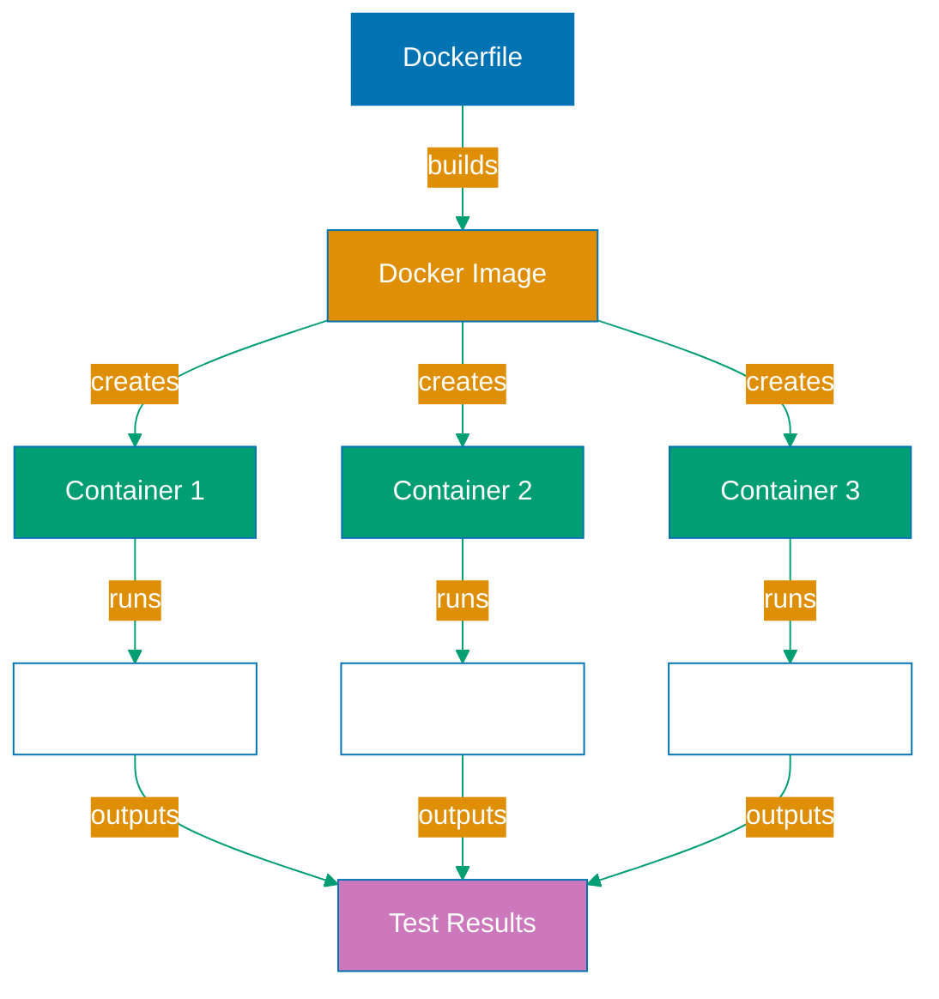

## Why Docker Containerization Matters

Production test suites must run identically across developer machines, CI/CD pipelines, and different operating systems without "works on my machine" failures. Docker containers provide isolated, reproducible test environments with pre-configured browser dependencies, system libraries, and Node.js versions that eliminate environment-specific test failures.

Playwright Docker containerization ensures consistent browser versions, proper font rendering, video codec support, and system library availability across all execution environments. This consistency prevents false positives from missing dependencies, enables parallel test execution on container orchestration platforms, and simplifies CI/CD pipeline configuration by encapsulating all test requirements.

Without proper containerization:

- **Environment drift**: Tests pass locally but fail in CI due to missing dependencies
- **Version conflicts**: Different browser versions between environments cause flaky tests
- **Manual setup**: Each environment requires complex Playwright installation
- **CI complexity**: Pipelines need extensive dependency management scripts
- **Security concerns**: Tests running on host systems have unrestricted access

## Standard Library Approach: Native Playwright Installation

Playwright can install browsers directly on the host system using `npx playwright install` without Docker.

**Local installation**:

```bash
npm install --save-dev @playwright/test
# => Install Playwright Test package
# => Downloaded from npm registry
# => Installs to node_modules/@playwright/test

npx playwright install
# => Downloads browser binaries
# => Chromium (~300MB), Firefox (~200MB), WebKit (~100MB)
# => Installs to OS-specific cache directory
# => Linux: ~/.cache/ms-playwright
# => macOS: ~/Library/Caches/ms-playwright
# => Windows: %USERPROFILE%\AppData\Local\ms-playwright

npx playwright install-deps
# => Installs system dependencies
# => Requires sudo on Linux
# => Installs fonts, codecs, libraries
# => Example: libglib2.0-0, libnss3, libxcomposite1
```

**Running tests locally**:

```bash
npx playwright test
# => Executes test suite
# => Uses browsers from cache directory
# => Runs on host operating system
# => No container isolation
```

**CI configuration (GitHub Actions)**:

```yaml
# .github/workflows/playwright.yml
name: Playwright Tests
on: [push]
jobs:
  test:
    runs-on: ubuntu-latest
    # => Runs on GitHub's Ubuntu runner
    # => Clean VM for each run
    # => No pre-installed browsers

    steps:
      - uses: actions/checkout@v3
        # => Clone repository
        # => Includes package.json, tests

      - uses: actions/setup-node@v3
        with:
          node-version: 18
        # => Install Node.js 18
        # => Downloaded from GitHub's tool cache
        # => Different Node version than local machine

      - name: Install dependencies
        run: npm ci
        # => Install npm dependencies
        # => Installs Playwright package
        # => Does NOT install browsers yet

      - name: Install Playwright browsers
        run: npx playwright install --with-deps
        # => Download browser binaries in CI
        # => Install system dependencies with sudo
        # => Takes 2-3 minutes per run
        # => Downloads ~600MB of browsers

      - name: Run tests
        run: npx playwright test
        # => Execute tests
        # => Uses freshly installed browsers
        # => Runs on Ubuntu runner
```

**Limitations for production containerization**:

- **Inconsistent environments**: Local (macOS/Windows) vs CI (Ubuntu) produce different results
- **Slow CI builds**: Installing browsers takes 2-3 minutes every pipeline run
- **Version drift**: Different Playwright versions between developers cause flakiness
- **No isolation**: Tests running on host can access file system, network
- **Manual dependency management**: Each OS requires different setup commands
- **No parallelization**: Cannot easily scale to multiple test workers across machines

## Production Framework: Playwright Docker Images

Microsoft provides official Playwright Docker images with pre-installed browsers, dependencies, and optimized configurations for production test execution.

**Install Docker** (prerequisite):

```bash
# Verify Docker installed
docker --version
# => Docker version 24.0.0, build xyz
# => Required for containerized testing
# => Install from docker.com if not present
```

**Dockerfile for Playwright tests**:

```dockerfile
# Dockerfile
FROM mcr.microsoft.com/playwright:v1.40.0-jammy
# => Official Playwright image from Microsoft Container Registry
# => Based on Ubuntu 22.04 (Jammy)
# => Includes Chromium, Firefox, WebKit pre-installed
# => Includes all system dependencies (fonts, codecs, libraries)
# => Image size: ~1.5GB (includes all browsers)

WORKDIR /app
# => Set working directory
# => All commands run in /app
# => Container filesystem isolated from host

COPY package*.json ./
# => Copy package.json and package-lock.json
# => Enables Docker layer caching
# => Dependencies cached if package files unchanged

RUN npm ci
# => Install dependencies from package-lock.json
# => Deterministic installation
# => Faster than npm install
# => node_modules cached in Docker layer

COPY . .
# => Copy entire project into container
# => Includes tests, config, support files
# => Excludes files in .dockerignore

CMD ["npx", "playwright", "test"]
# => Default command when container starts
# => Executes Playwright test suite
# => Can be overridden at runtime
```

**.dockerignore for efficient builds**:

```
# .dockerignore
node_modules
# => Exclude existing node_modules
# => Prevents copying from host
# => Forces clean npm ci in container

test-results
playwright-report
# => Exclude test output directories
# => Generated fresh each run
# => Reduces image size

.git
.github
.vscode
# => Exclude development files
# => Not needed for test execution
# => Reduces build context size
```

**Building Docker image**:

```bash
docker build -t playwright-tests .
# => Build Docker image from Dockerfile
# => Tag as "playwright-tests"
# => Builds all layers
# => First build takes ~5 minutes (downloads base image)
# => Subsequent builds cached (~30 seconds)

docker images
# => List Docker images
# => Shows playwright-tests image
# => Size: ~1.8GB (includes browsers + dependencies)
```

**Running tests in Docker**:

```bash
docker run --rm -it playwright-tests
# => Run container from playwright-tests image
# => --rm: Remove container after execution
# => -it: Interactive terminal (see test output)
# => Executes default CMD (playwright test)
# => Tests run in isolated container environment
# => Container destroyed after completion

docker run --rm -it \
  -v $(pwd)/test-results:/app/test-results \
  playwright-tests
# => Run with volume mount
# => -v: Mount host directory to container
# => $(pwd)/test-results: Host path
# => /app/test-results: Container path
# => Test results persisted to host after run
# => Enables report viewing locally
```

**Docker Compose for complex setups**:

```yaml
# docker-compose.yml
version: "3.8"

services:
  playwright:
    build: .
    # => Build from Dockerfile in current directory
    # => Creates playwright-tests image
    # => Rebuilds when Dockerfile changes

    volumes:
      - ./test-results:/app/test-results
      # => Mount test results directory
      # => Persists reports to host
      # => Accessible after container stops

      - ./playwright-report:/app/playwright-report
      # => Mount HTML report directory
      # => View reports in browser

    environment:
      - CI=true
      # => Set CI environment variable
      # => Playwright adjusts behavior for CI
      # => Disables interactive prompts

      - PLAYWRIGHT_WORKERS=2
      # => Set parallel worker count
      # => 2 workers for balanced performance
      # => Adjust based on container resources

    networks:
      - test-network
    # => Connect to custom network
    # => Enables communication with other services

  database:
    image: postgres:15
    # => PostgreSQL database for test data
    # => Separate container for isolation
    # => Reset between test runs

    environment:
      POSTGRES_PASSWORD: testpass
      POSTGRES_DB: testdb
    # => Configure database
    # => Credentials for test environment only

    networks:
      - test-network
    # => Same network as playwright service
    # => Playwright tests can connect to db

networks:
  test-network:
    # => Custom network for services
    # => Isolated from host network
    # => Containers communicate via service names
```

**Running with Docker Compose**:

```bash
docker-compose up --build --abort-on-container-exit
# => Start all services (playwright + database)
# => --build: Rebuild images if changed
# => --abort-on-container-exit: Stop all when tests complete
# => Database starts first, then tests run
# => Entire environment orchestrated

docker-compose down
# => Stop and remove all containers
# => Cleanup after test run
# => Removes network
# => Database data discarded (ephemeral)
```

**CI/CD with Docker** (GitHub Actions):

```yaml
# .github/workflows/docker-playwright.yml
name: Playwright Tests (Docker)
on: [push]
jobs:
  test:
    runs-on: ubuntu-latest
    # => GitHub runner
    # => Has Docker pre-installed

    steps:
      - uses: actions/checkout@v3
        # => Clone repository

      - name: Build Docker image
        run: docker build -t playwright-tests .
        # => Build test image in CI
        # => Uses GitHub's Docker daemon
        # => Cached in GitHub Actions cache

      - name: Run tests in container
        run: |
          docker run --rm \
            -v ${{ github.workspace }}/test-results:/app/test-results \
            playwright-tests
        # => Execute tests in container
        # => Mount results to GitHub workspace
        # => ${{ github.workspace }}: CI workspace path
        # => Results available for upload

      - name: Upload test results
        if: always()
        uses: actions/upload-artifact@v3
        with:
          name: playwright-report
          path: test-results/
        # => Upload test results as artifact
        # => if: always() runs even if tests fail
        # => Downloadable from GitHub UI
```

**Multi-stage Docker build for optimization**:

```dockerfile
# Dockerfile (optimized)
FROM mcr.microsoft.com/playwright:v1.40.0-jammy AS base
# => Base stage with browsers
# => AS base: Named stage for reference

WORKDIR /app
COPY package*.json ./
RUN npm ci
# => Install dependencies in base stage
# => Shared across all stages

FROM base AS test
# => Test stage inherits from base
# => Includes dependencies from base

COPY . .
# => Copy test files
# => Only in test stage
# => Base stage remains clean

CMD ["npx", "playwright", "test"]

FROM base AS ci
# => CI stage for pipeline-specific config
# => Different from local test stage

COPY . .
ENV CI=true
# => Set CI environment variable
# => Playwright CI optimizations enabled

RUN npx playwright test --reporter=json
# => Pre-run tests during build (optional)
# => Validates tests pass before image published
```

## Production Docker Architecture



## Production Patterns and Best Practices

### Pattern 1: Layer Caching

Optimize build speed with proper layer ordering:

```dockerfile
# Good: Dependencies cached separately
COPY package*.json ./
RUN npm ci
COPY . .

# Bad: Changes to code invalidate npm install
COPY . .
RUN npm ci
```

### Pattern 2: Specific Image Versions

Always pin Playwright image versions:

```dockerfile
# Good: Specific version
FROM mcr.microsoft.com/playwright:v1.40.0-jammy

# Bad: Latest tag (non-deterministic)
FROM mcr.microsoft.com/playwright:latest
```

### Pattern 3: Volume Mounts for Results

Persist test results outside containers:

```bash
docker run --rm \
  -v $(pwd)/test-results:/app/test-results \
  -v $(pwd)/playwright-report:/app/playwright-report \
  playwright-tests
```

### Pattern 4: Resource Limits

Prevent containers from consuming all host resources:

```yaml
# docker-compose.yml
services:
  playwright:
    deploy:
      resources:
        limits:
          cpus: "2.0"
          memory: 4G
```

## Trade-offs and When to Use

**Native Installation (Standard Library)**:

- **Use when**: Local development, learning Playwright, simple projects
- **Benefits**: Faster initial setup, no Docker overhead, native browser performance
- **Costs**: Environment inconsistency, slow CI builds, manual dependency management

**Docker Containers (Production)**:

- **Use when**: CI/CD pipelines, team projects, cross-platform testing, production test suites
- **Benefits**: Environment consistency, fast CI (pre-installed browsers), isolation, parallel scaling
- **Costs**: Docker knowledge required, 1.5GB image size, slight performance overhead

**Production recommendation**: Use Docker for all production test suites and CI/CD pipelines. The consistency and CI speed benefits far outweigh the Docker learning curve. Use native installation only for local development quick iteration.

## Security Considerations

- **Isolation**: Containers provide security boundary between tests and host system
- **No privileged mode**: Avoid `--privileged` flag unless absolutely necessary
- **Secret management**: Use environment variables, not embedded in images
- **Image scanning**: Scan Docker images for vulnerabilities with `docker scan`
- **Minimal base images**: Use official Playwright images, avoid building from scratch

## Common Pitfalls

1. **Using `:latest` tag**: Non-deterministic builds, version drift over time
2. **Not using `.dockerignore`**: Copies unnecessary files, slows builds
3. **Copying `node_modules`**: Includes host OS binaries, causes runtime errors
4. **Not mounting volumes**: Test results trapped in container, lost after run
5. **Running as root**: Security risk, use `USER node` in Dockerfile if possible
