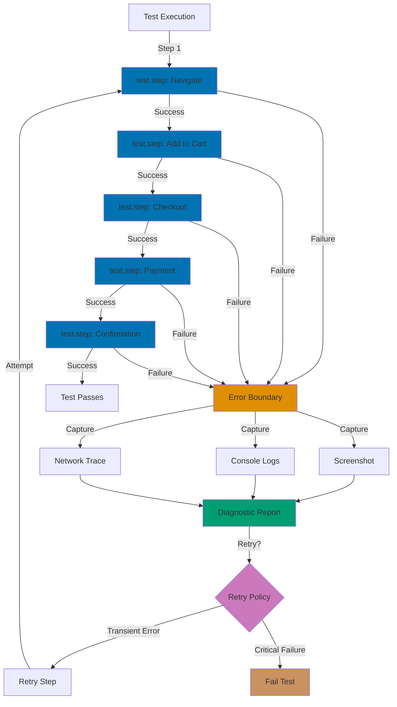

## Why This Matters

Production test suites face unpredictable failures that would never occur in controlled development environments. Network latency spikes cause legitimate timeouts. Race conditions emerge under load. Third-party services experience momentary outages. Without graceful error handling, these transient issues trigger false negatives that erode team confidence in test results. Engineers start ignoring failing tests, defeating the entire purpose of automated testing infrastructure.

Production-grade error handling transforms brittle test suites into resilient quality gates. Retry strategies distinguish genuine regressions from environmental hiccups. Test isolation prevents cascade failures where one broken test contaminates downstream scenarios. Comprehensive failure diagnostics capture screenshots, console logs, and network traces automatically, enabling rapid debugging without manual reproduction steps. These patterns reduce mean time to resolution from hours to minutes.

The cost of poor error handling compounds over time. Development velocity slows when engineers wait for flaky test reruns. Deployment pipelines stall on intermittent failures. Critical bugs slip through when teams lose faith in test signals. Investing in robust error handling infrastructure pays dividends through increased deployment frequency, reduced incident rates, and improved developer experience.

## Standard Library Approach: Try-Catch Blocks

TypeScript's native error handling uses try-catch blocks to capture exceptions during test execution.

```typescript
import { test } from "@playwright/test";

test("checkout with basic error handling", async ({ page }) => {
  // => Navigate to product page with basic try-catch
  // => Catches errors but provides limited debugging context
  try {
    await page.goto("https://shop.example.com/product/widget-pro");
    // => Loads product page, may timeout on slow networks
    // => No automatic retry on transient failures

    await page.click('button:has-text("Add to Cart")');
    // => Clicks add-to-cart button
    // => Fails silently if button not yet interactive

    await page.click('a:has-text("Checkout")');
    // => Navigates to checkout page
    // => No validation that cart actually updated

    await page.fill('input[name="email"]', "test@example.com");
    // => Fills email field
    // => Doesn't verify field is visible/enabled

    await page.fill('input[name="cardNumber"]', "4111111111111111");
    // => Fills test card number
    // => No handling for card validation delays

    await page.click('button:has-text("Complete Purchase")');
    // => Submits payment form
    // => Single attempt, no retry logic

    await page.waitForURL("**/confirmation");
    // => Waits for confirmation page redirect
    // => Throws TimeoutError on failure with no diagnostics

    console.log("Order completed successfully");
    // => Success log with no failure context
  } catch (error) {
    // => Generic catch block captures all errors
    console.error("Test failed:", error.message);
    // => Logs error message but loses stack trace
    // => No screenshot or state capture for debugging
    throw error;
    // => Re-throws error to fail test
    // => No cleanup or recovery attempted
  }
});
```

**Limitations for production**:

- **No automatic retry logic**: Transient failures fail tests immediately without distinguishing environmental issues from genuine bugs
- **Insufficient failure diagnostics**: Error messages lack screenshots, network traces, or browser console logs needed for rapid debugging
- **No test isolation**: Failed tests don't clean up state, causing cascade failures in subsequent scenarios
- **Manual error categorization**: Engineers manually distinguish flaky tests from real failures by reviewing logs
- **No soft assertion support**: First assertion failure stops test execution, hiding multiple issues
- **Limited failure visibility**: No structured error reporting for CI/CD dashboards or alerting systems

## Production Framework: Playwright Test Steps with Error Boundaries

Playwright's test.step API creates error boundaries that isolate failures, capture diagnostics automatically, and enable granular retry strategies.

```typescript
import { test, expect } from "@playwright/test";

// => Configure test with production error handling
test.describe("Checkout Flow", () => {
  // => Use beforeEach for consistent test isolation
  test.beforeEach(async ({ page }) => {
    // => Navigate before each test for clean slate
    await page.goto("https://shop.example.com");
    // => Clears cookies/storage automatically via test isolation
  });

  test("complete purchase with production error handling", async ({ page }) => {
    // => Wrap navigation in test.step for error isolation
    await test.step("Load product page", async () => {
      // => test.step creates error boundary with automatic retry
      await page.goto("https://shop.example.com/product/widget-pro");
      // => Playwright retries navigation on timeout (default: 30s)
      // => Captures screenshot automatically on failure

      await expect(page.locator("h1")).toContainText("Widget Pro");
      // => Validates page loaded correctly before proceeding
      // => Prevents cascade failures from incomplete navigation
    });

    await test.step("Add item to cart", async () => {
      // => Isolate cart addition with separate error boundary
      const addButton = page.locator('button:has-text("Add to Cart")');
      // => Creates locator (lazy evaluation)

      await expect(addButton).toBeVisible();
      // => Validates button exists before clicking
      // => Auto-waits for element to appear (default: 30s)

      await addButton.click();
      // => Clicks when button is actionable (not disabled)
      // => Playwright retries if button intercepts click

      await expect(page.locator(".cart-count")).toHaveText("1");
      // => Validates cart updated correctly
      // => Captures state if assertion fails
    });

    await test.step("Navigate to checkout", async () => {
      // => Separate navigation step for targeted retry
      await page.click('a:has-text("Checkout")');
      // => Navigates to checkout page

      await expect(page.locator("h1")).toContainText("Checkout");
      // => Validates checkout page loaded
      // => Fails fast if cart was empty
    });

    await test.step("Fill shipping information", async () => {
      // => Isolate form filling from payment processing
      await page.fill('input[name="email"]', "test@example.com");
      // => Fills email with auto-wait for field to be editable

      await page.fill('input[name="name"]', "Test User");
      // => Fills name field

      await page.fill('input[name="address"]', "123 Test St");
      // => Fills address field

      await expect(page.locator('input[name="email"]')).toHaveValue("test@example.com");
      // => Validates form actually accepted input
      // => Catches client-side validation failures
    });

    await test.step("Submit payment", async () => {
      // => Separate payment step for retry/diagnostics
      await page.fill('input[name="cardNumber"]', "4111111111111111");
      // => Fills test card number

      await page.fill('input[name="expiry"]', "12/25");
      // => Fills expiration date

      await page.fill('input[name="cvv"]', "123");
      // => Fills CVV code

      const submitButton = page.locator('button:has-text("Complete Purchase")');
      // => Locates submit button

      await expect(submitButton).toBeEnabled();
      // => Validates payment gateway finished loading
      // => Prevents clicking disabled button

      await submitButton.click();
      // => Submits payment form

      await page.waitForURL("**/confirmation", { timeout: 60000 });
      // => Extended timeout for payment processing (60s)
      // => Payment gateways often have higher latency
      // => Captures network trace automatically on timeout
    });

    await test.step("Verify order confirmation", async () => {
      // => Final validation step with isolated error boundary
      await expect(page.locator("h1")).toContainText("Order Confirmed");
      // => Validates confirmation page loaded

      const orderNumber = await page.locator('[data-testid="order-number"]').textContent();
      // => Extracts order number for logging

      expect(orderNumber).toMatch(/^ORD-\d{8}$/);
      // => Validates order number format
      // => Catches backend data inconsistencies

      console.log(`Order completed: ${orderNumber}`);
      // => Logs order number for audit trail
    });
  });

  // => afterEach runs even if test fails (cleanup)
  test.afterEach(async ({ page }, testInfo) => {
    // => testInfo contains test status and error details
    if (testInfo.status === "failed") {
      // => Detect test failure for extra diagnostics

      await page.screenshot({
        path: `screenshots/${testInfo.title}-failure.png`,
        fullPage: true,
      });
      // => Captures full page screenshot on failure
      // => Stored in CI artifacts for debugging
    }
  });
});
```

## Error Handling Architecture



## Production Patterns and Best Practices

### Pattern 1: Soft Assertions with Error Accumulation

Soft assertions collect multiple failures before failing the test, revealing all issues in a single run.

```typescript
import { test, expect } from "@playwright/test";

test("validate dashboard with soft assertions", async ({ page }) => {
  await page.goto("https://app.example.com/dashboard");
  // => Navigate to dashboard page

  await test.step("Validate all widget metrics", async () => {
    // => Wrap soft assertions in step for isolated failure reporting

    // => Soft assertions continue execution on failure
    await expect.soft(page.locator('[data-testid="revenue"]')).toContainText("$");
    // => Checks revenue widget displays currency
    // => Test continues even if this fails

    await expect.soft(page.locator('[data-testid="active-users"]')).toContainText(/\d+/);
    // => Validates active users shows numeric value
    // => Continues to check remaining widgets

    await expect.soft(page.locator('[data-testid="error-rate"]')).toContainText("%");
    // => Validates error rate shows percentage
    // => All three failures reported together if all fail

    await expect.soft(page.locator('[data-testid="response-time"]')).toContainText("ms");
    // => Validates response time shows milliseconds
    // => Final soft assertion in group
  });
  // => Step fails after ALL soft assertions complete
  // => Report shows all widget failures simultaneously
  // => Developer fixes all issues in one iteration
});

test("validate form with accumulated errors", async ({ page }) => {
  await page.goto("https://app.example.com/settings");
  // => Navigate to settings page

  await test.step("Fill and validate settings form", async () => {
    // => Group related form validations

    await page.fill('input[name="companyName"]', "Test Corp");
    await page.fill('input[name="email"]', "invalid-email");
    // => Intentionally invalid email for validation testing
    await page.fill('input[name="phone"]', "555");
    // => Intentionally invalid phone for validation testing

    await page.click('button:has-text("Save")');
    // => Submit form to trigger validation

    // => Soft assertions capture all validation errors
    await expect.soft(page.locator('.error:has-text("company name")')).toBeHidden();
    // => Company name should be valid (no error)

    await expect.soft(page.locator('.error:has-text("email")')).toBeVisible();
    // => Email error should display

    await expect.soft(page.locator('.error:has-text("phone")')).toBeVisible();
    // => Phone error should display

    // => All three assertions complete before step fails
    // => Report shows complete validation state
  });
});
```

### Pattern 2: Automatic Error Recovery with Retry Logic

Retry logic handles transient failures automatically without failing the entire test suite.

```typescript
import { test, expect } from "@playwright/test";

// => Configure global retry strategy in playwright.config.ts
// retries: process.env.CI ? 2 : 0
// => Retry failed tests twice in CI, zero retries locally

test("search with automatic retry", async ({ page }) => {
  await test.step("Navigate to search page", async () => {
    // => Playwright retries entire step on timeout
    await page.goto("https://search.example.com", {
      waitUntil: "networkidle",
    });
    // => waitUntil: 'networkidle' ensures search UI fully loaded
    // => Retries if network requests still in-flight at timeout
  });

  await test.step("Execute search with flaky API", async () => {
    // => Wrap flaky operations in custom retry logic
    let attempt = 0;
    const maxAttempts = 3;
    // => Allow 3 attempts for search API

    while (attempt < maxAttempts) {
      // => Loop until success or max attempts
      try {
        await page.fill('input[name="q"]', "test query");
        // => Fill search input

        await page.click('button:has-text("Search")');
        // => Submit search form

        await page.waitForSelector('[data-testid="search-results"]', {
          timeout: 10000,
        });
        // => Wait for results container (10s timeout per attempt)
        // => Throws TimeoutError if results don't load

        const resultCount = await page.locator('[data-testid="result-item"]').count();
        // => Count search results

        expect(resultCount).toBeGreaterThan(0);
        // => Validate results exist
        // => Throws if zero results

        console.log(`Search succeeded on attempt ${attempt + 1}`);
        // => Log successful attempt for metrics
        break;
        // => Exit retry loop on success
      } catch (error) {
        // => Catch timeout or assertion errors
        attempt++;
        // => Increment attempt counter

        if (attempt >= maxAttempts) {
          // => Check if exhausted retries
          throw error;
          // => Re-throw error to fail test after max attempts
        }

        console.warn(`Search attempt ${attempt} failed, retrying...`);
        // => Log retry for debugging flaky patterns

        await page.reload();
        // => Reload page for clean retry
        // => Clears stale UI state
      }
    }
  });
});

test("login with exponential backoff", async ({ page }) => {
  await test.step("Authenticate with rate-limited API", async () => {
    // => Wrap rate-limited operations in backoff logic
    const maxRetries = 3;
    let retryDelay = 1000;
    // => Start with 1s delay

    for (let attempt = 0; attempt < maxRetries; attempt++) {
      // => Loop with exponential backoff
      try {
        await page.goto("https://app.example.com/login");
        // => Navigate to login page

        await page.fill('input[name="username"]', "test@example.com");
        await page.fill('input[name="password"]', "testpass123");
        // => Fill credentials

        await page.click('button:has-text("Sign In")');
        // => Submit login form

        await page.waitForURL("**/dashboard", { timeout: 15000 });
        // => Wait for redirect to dashboard
        // => Throws TimeoutError on authentication failure

        await expect(page.locator('[data-testid="user-menu"]')).toBeVisible();
        // => Validate user logged in successfully
        // => Throws if user menu not rendered

        console.log(`Login succeeded on attempt ${attempt + 1}`);
        return;
        // => Exit function on success
      } catch (error) {
        // => Catch timeout or rate limit errors
        if (attempt === maxRetries - 1) {
          // => Check if final attempt
          throw error;
          // => Fail test after exhausting retries
        }

        console.warn(`Login attempt ${attempt + 1} failed, retrying in ${retryDelay}ms`);
        // => Log retry timing for analysis

        await page.waitForTimeout(retryDelay);
        // => Wait before retry (exponential backoff)

        retryDelay *= 2;
        // => Double delay for next attempt (1s → 2s → 4s)
        // => Respects rate limits automatically
      }
    }
  });
});
```

### Pattern 3: Comprehensive Screenshot Capture on Failure

Automatic screenshot capture provides visual debugging context for every failure.

```typescript
import { test, expect } from "@playwright/test";

test("checkout with comprehensive failure diagnostics", async ({ page }) => {
  // => Configure screenshot on failure in playwright.config.ts:
  // screenshot: 'only-on-failure'
  // => Playwright captures screenshots automatically

  test.info().annotations.push({
    type: "issue",
    description: "https://github.com/example/issue/123",
  });
  // => Link test to issue tracker for failure correlation

  await test.step("Navigate to product", async () => {
    await page.goto("https://shop.example.com/product/widget");
    // => Playwright captures screenshot automatically if this step fails
    // => Screenshot saved to test-results/ directory

    await expect(page.locator("h1")).toContainText("Widget");
    // => Validate page loaded correctly
    // => Failure triggers screenshot capture
  });

  await test.step("Add to cart", async () => {
    // => Capture custom screenshot before critical action
    await page.screenshot({
      path: `screenshots/before-add-to-cart-${Date.now()}.png`,
    });
    // => Baseline screenshot for comparison if test fails

    await page.click('button:has-text("Add to Cart")');
    // => Click add-to-cart button

    await expect(page.locator(".cart-count")).toHaveText("1");
    // => Validate cart updated

    // => Capture screenshot after critical action
    await page.screenshot({
      path: `screenshots/after-add-to-cart-${Date.now()}.png`,
    });
    // => Shows cart state after addition
  });
});

test("admin dashboard with video trace", async ({ page, context }) => {
  // => Enable video recording for complex workflows
  // Configure in playwright.config.ts:
  // video: 'retain-on-failure'
  // => Video recorded automatically, retained only on failure

  await page.goto("https://admin.example.com/dashboard");
  // => Video recording starts automatically

  await test.step("Navigate admin menu", async () => {
    await page.click('[data-testid="settings-menu"]');
    // => Click settings menu (recorded in video)

    await page.click('a:has-text("User Management")');
    // => Navigate to user management (recorded)

    await expect(page.locator("h1")).toContainText("User Management");
    // => Validate navigation succeeded
  });

  await test.step("Create new user", async () => {
    await page.click('button:has-text("Add User")');
    // => Open user creation modal (recorded)

    await page.fill('input[name="email"]', "newuser@example.com");
    await page.fill('input[name="name"]', "New User");
    // => Fill user details (recorded)

    await page.click('button:has-text("Create")');
    // => Submit form (recorded)

    await expect(page.locator('tr:has-text("newuser@example.com")')).toBeVisible();
    // => Validate user appears in table
    // => Video retained automatically if this fails
    // => Shows exact UI interactions leading to failure
  });
  // => Video saved to test-results/ if test fails
  // => Provides complete visual debugging context
});

test("capture browser console errors", async ({ page }) => {
  // => Listen for browser console messages
  const consoleMessages: string[] = [];
  // => Array to collect console output

  page.on("console", (msg) => {
    // => Subscribe to console events
    consoleMessages.push(`${msg.type()}: ${msg.text()}`);
    // => Store message type and text
    // => Captures errors, warnings, logs
  });

  const pageErrors: string[] = [];
  // => Array to collect page errors

  page.on("pageerror", (error) => {
    // => Subscribe to page error events
    pageErrors.push(error.message);
    // => Store error message
    // => Captures uncaught exceptions
  });

  await page.goto("https://app.example.com/dashboard");
  // => Navigate to dashboard
  // => Console and error listeners active

  await page.click('button:has-text("Generate Report")');
  // => Trigger action that may cause JavaScript errors

  await page.waitForTimeout(2000);
  // => Wait for async operations to complete

  // => Assert no JavaScript errors occurred
  expect(pageErrors).toHaveLength(0);
  // => Fails test if JavaScript errors detected
  // => Catches client-side bugs in production

  // => Log collected console messages for debugging
  if (consoleMessages.length > 0) {
    console.log("Console output:", consoleMessages);
    // => Available in test report for analysis
  }
});
```

## Trade-offs and When to Use

**Try-Catch Approach**:

- **Use when**: Prototyping tests locally with stable infrastructure, single-run smoke tests, debugging specific failure scenarios
- **Benefits**: Simple implementation, no framework overhead, explicit control flow
- **Costs**: Manual error categorization, no automatic diagnostics, limited failure visibility, high maintenance for flaky tests

**test.step Error Boundaries**:

- **Use when**: CI/CD pipelines, production monitoring, distributed team environments, flaky test management
- **Benefits**: Automatic screenshot/trace capture, isolated error boundaries, built-in retry logic, structured failure reporting
- **Costs**: Slight test execution overhead (1-2%), requires Playwright framework, steeper learning curve

**Production recommendation**: Use test.step error boundaries for all production test suites. The diagnostic benefits and automatic retry capabilities dramatically reduce debugging time and improve test reliability. Try-catch blocks remain useful for prototype tests and local debugging scenarios where infrastructure stability is guaranteed. For CI/CD environments, test.step's automatic diagnostics pay for themselves by eliminating manual failure reproduction steps. The 1-2% execution overhead is negligible compared to the cost of investigating failures without screenshots or traces.

## Security Considerations

**Never expose credentials in error messages**: Redact sensitive data before logging errors to prevent credential leaks in CI/CD logs or test reports.

```typescript
try {
  await page.fill('input[name="password"]', process.env.TEST_PASSWORD);
} catch (error) {
  // WRONG: Logs may contain password if error includes input value
  // console.error('Login failed:', error);

  // RIGHT: Redact sensitive details before logging
  console.error("Login failed at password field:", error.message);
  throw error;
}
```

**Screenshot PII sanitization**: Configure Playwright to mask sensitive data in automatic screenshots to comply with privacy regulations.

```typescript
test("payment form with PII masking", async ({ page }) => {
  await page.goto("https://checkout.example.com");

  // => Mask sensitive fields in screenshots
  await page.addStyleTag({
    content: `
      input[name="cardNumber"],
      input[name="cvv"] {
        filter: blur(5px);
      }
    `,
  });
  // => CSS blur prevents credit card numbers from appearing in screenshots
  // => Applied before any screenshot capture occurs

  await page.fill('input[name="cardNumber"]', "4111111111111111");
  // => Screenshot would show blurred card number field
});
```

**Network trace sanitization**: Filter authorization headers and API keys from captured network traces before storing in CI artifacts.

```typescript
// Configure in playwright.config.ts
export default {
  use: {
    trace: "retain-on-failure",
    // => Capture HAR (HTTP Archive) files on failure
  },
};

// In test file
test.afterEach(async ({ page }, testInfo) => {
  if (testInfo.status === "failed") {
    // => Custom trace sanitization on failure
    const trace = await page.context().tracing.stop();
    // => Stop tracing and retrieve trace file

    // TODO: Implement trace sanitization to remove:
    // - Authorization headers
    // - API keys in request bodies
    // - Session tokens in cookies
  }
});
```

**Rate limit error handling**: Implement exponential backoff for authentication attempts to prevent triggering security monitoring systems or account lockouts.

## Common Pitfalls

**Not isolating test steps**: Wrapping entire test in single try-catch loses granular failure location. Use test.step to isolate each logical operation for precise error reporting.

**Ignoring failure diagnostics**: Running tests without screenshot/video capture forces manual reproduction of failures. Enable automatic diagnostic capture in CI/CD environments.

**Infinite retry loops**: Retry logic without maximum attempt limits can hang CI/CD pipelines indefinitely. Always set maxRetries and add logging for retry attempts.

**Asserting inside catch blocks**: Assertions in catch blocks fail silently when exceptions occur before reaching the assertion. Move validations outside error handlers.

```typescript
// WRONG: Assertion in catch block
try {
  await page.click("button");
  await expect(page.locator(".success")).toBeVisible();
} catch (error) {
  // This assertion never executes if click fails
  await expect(page.locator(".error")).toBeVisible();
}

// RIGHT: Separate error path validation
try {
  await page.click("button");
} catch (error) {
  // Handle click failure explicitly
}
await expect(page.locator(".success")).toBeVisible();
```

**Not cleaning up after failures**: Failed tests that don't clean up state cause cascade failures in subsequent tests. Use test.afterEach with cleanup logic that runs regardless of test status.

**Generic error messages**: Logging "Test failed" without context makes debugging difficult. Include step name, element selector, and expected vs actual state in error messages.

**Retrying non-idempotent operations**: Retrying operations that mutate state (form submissions, database writes) can create duplicate records. Only retry idempotent read operations or implement idempotency keys for writes.
