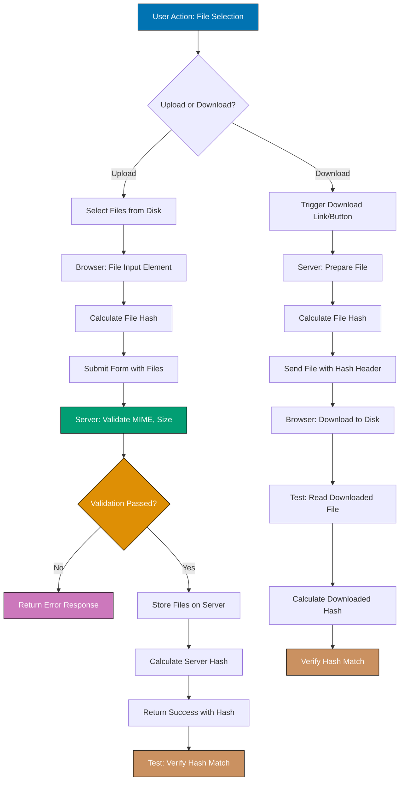

## Why File Handling Matters

Production web applications require robust file handling to support user workflows involving document uploads, report downloads, media management, and data import/export. Without proper file handling testing, teams miss critical file validation failures, upload size limits, MIME type restrictions, and download corruption scenarios that break user workflows and create security vulnerabilities.

Playwright file interaction testing validates upload mechanisms, file input validation, download integrity, and browser file handling across real scenarios. This testing prevents production file handling incidents, ensures compliance with security policies, and builds confidence that files flow correctly through application workflows without data loss or security breaches.

Insufficient file handling testing leads to production failures:

- **Security breaches**: Unrestricted file uploads enable malicious file execution attacks
- **Data corruption**: Downloads fail silently with corrupted or incomplete files
- **Storage exhaustion**: Unvalidated upload sizes fill server storage causing outages
- **Compliance violations**: GDPR, HIPAA require secure file handling with audit trails
- **User frustration**: Upload failures with unclear error messages reduce user trust

## Standard Library Approach: Basic File Input

Playwright core API provides direct file input manipulation for basic upload scenarios without requiring file handling frameworks.

**Basic single file upload**:

```typescript
import { test, expect } from "@playwright/test";
import path from "path";
// => Import Playwright test framework and Node.js path module
// => path.join() creates cross-platform file paths
// => No file handling framework needed

test("user uploads profile image", async ({ page }) => {
  // => Test receives page fixture from Playwright
  // => Fresh browser context per test (isolated file state)
  // => No shared file upload state between tests

  await page.goto("https://example.com/profile/edit");
  // => Navigate to profile edit page
  // => Page contains file input element
  // => Browser ready to receive file selection

  const filePath = path.join(__dirname, "fixtures", "avatar.jpg");
  // => Construct absolute path to test file
  // => __dirname is current test directory
  // => fixtures/avatar.jpg relative to test file
  // => Cross-platform path handling (Windows/Unix)

  await page.setInputFiles('input[type="file"]', filePath);
  // => Select file for upload input
  // => Simulates user clicking file chooser and selecting file
  // => Browser attaches file to input element
  // => File path must exist or error thrown

  await page.click('button:has-text("Save")');
  // => Click save button to submit form
  // => Browser sends multipart/form-data POST request
  // => File uploaded as binary data

  await expect(page.locator(".success-message")).toBeVisible();
  // => Assert success message displayed
  // => Confirms upload processed by server
  // => Server validated file and stored successfully
});
```

**Basic file download**:

```typescript
test("user downloads monthly report", async ({ page }) => {
  // => Test file download functionality
  // => Download triggered by user action
  // => Browser initiates file save

  await page.goto("https://example.com/reports");
  // => Navigate to reports page
  // => Page contains download button/link
  // => Reports ready for download

  const downloadPromise = page.waitForEvent("download");
  // => Set up download event listener BEFORE triggering action
  // => Returns promise that resolves when download starts
  // => Must be called before click to avoid race condition

  await page.click("a:has-text('Download Report')");
  // => Click download link
  // => Triggers browser download
  // => Browser fires "download" event

  const download = await downloadPromise;
  // => Wait for download to start
  // => download object provides download metadata
  // => Contains filename, path, stream access

  const downloadPath = await download.path();
  // => Get temporary file path where browser saved download
  // => File saved to Playwright temp directory
  // => Path valid until browser context closed
  // => Returns null if download canceled

  expect(downloadPath).toBeTruthy();
  // => Assert download completed
  // => File saved to disk successfully
  // => Basic verification only (no content validation)
});
```

**Limitations for production file handling**:

- **No validation**: Cannot verify file content, size, or MIME type before upload
- **No error handling**: Upload failures (size limit, wrong type) cause test failures without clear diagnostics
- **Single file only**: Basic approach handles one file, not multi-file uploads
- **No download verification**: Cannot validate downloaded file integrity, encoding, or content correctness
- **Hardcoded paths**: Test file paths embedded in code (not configurable per environment)
- **No security checks**: Missing malicious file detection, antivirus integration, content scanning

## Production Framework: File Fixtures and Validation

Playwright's file handling API combined with file system utilities provides production-grade upload/download validation with content verification.

**Production file upload with validation**:

```typescript
// tests/fixtures/file-upload.fixture.ts
import { test as base, expect, Page } from "@playwright/test";
import fs from "fs/promises";
import path from "path";
import crypto from "crypto";
// => Import Playwright framework and Node.js file system modules
// => fs/promises provides async file operations
// => crypto enables file integrity validation (hashing)

type FileFixtures = {
  testFiles: TestFileManager;
  // => Custom fixture providing file management utilities
  // => Encapsulates file creation, cleanup, validation
  // => Type-safe file operations
};

class TestFileManager {
  // => File manager class for production file handling
  // => Manages test file lifecycle (create, validate, cleanup)
  // => Provides reusable file utilities

  constructor(private baseDir: string) {
    // => Store base directory for test files
    // => All file operations relative to this directory
    // => Enables per-test isolation
  }

  async createTestFile(
    filename: string,
    content: Buffer,
    metadata?: { mimeType: string; size: number },
  ): Promise<{ path: string; hash: string }> {
    // => Create test file with content and metadata
    // => Returns file path and SHA-256 hash for verification
    // => hash enables integrity validation after upload/download

    const filePath = path.join(this.baseDir, filename);
    // => Construct full file path in test directory
    // => Isolated per test (baseDir unique)

    await fs.writeFile(filePath, content);
    // => Write binary content to disk
    // => Creates file in test fixtures directory
    // => Overwrites if exists

    const hash = crypto.createHash("sha256").update(content).digest("hex");
    // => Calculate SHA-256 hash of file content
    // => Hash uniquely identifies file contents
    // => Used to verify upload/download integrity

    return { path: filePath, hash };
    // => Return file path and hash
    // => Test uses path for upload
    // => Test uses hash to verify upload succeeded
  }

  async verifyFileContent(filePath: string, expectedHash: string): Promise<boolean> {
    // => Verify file content matches expected hash
    // => Detects corruption, truncation, modification
    // => Returns boolean: true if match, false otherwise

    const content = await fs.readFile(filePath);
    // => Read file from disk as Buffer
    // => Full file read into memory (suitable for test files)

    const actualHash = crypto.createHash("sha256").update(content).digest("hex");
    // => Calculate hash of downloaded file
    // => Compare with hash of original uploaded file

    return actualHash === expectedHash;
    // => Return true if hashes match
    // => False indicates corruption or modification
  }

  async cleanup(): Promise<void> {
    // => Remove all test files created during test
    // => Prevents test file accumulation
    // => Called in fixture teardown

    await fs.rm(this.baseDir, { recursive: true, force: true });
    // => Delete test directory and all contents
    // => recursive: true removes directory tree
    // => force: true ignores errors if directory missing
  }
}

export const test = base.extend<FileFixtures>({
  testFiles: async ({}, use, testInfo) => {
    // => Define custom fixture for file management
    // => testInfo provides test metadata (name, output path)
    // => use() callback yields fixture value to test

    const testDir = path.join(testInfo.outputDir, "test-files");
    // => Create unique directory per test
    // => testInfo.outputDir is Playwright output directory for this test
    // => Isolated file storage per test (no conflicts)

    await fs.mkdir(testDir, { recursive: true });
    // => Create test directory
    // => recursive: true creates parent directories if needed
    // => No error if directory exists

    const manager = new TestFileManager(testDir);
    // => Instantiate file manager for this test
    // => All file operations scoped to testDir

    await use(manager);
    // => Provide manager to test
    // => Test executes with access to testFiles fixture
    // => After test completes, cleanup runs

    await manager.cleanup();
    // => Cleanup runs after test (success or failure)
    // => Removes all test files
    // => Prevents disk space leaks
  },
});
```

**Multi-file upload with validation**:

```typescript
// tests/file-upload.spec.ts
import { test, expect } from "./fixtures/file-upload.fixture";
// => Import custom test with testFiles fixture
// => Tests have access to file management utilities
// => Type-safe fixture injection

test("user uploads multiple documents with validation", async ({ page, testFiles }) => {
  // => Test receives page and testFiles fixtures
  // => testFiles provides file creation and validation
  // => Isolated file state per test

  await page.goto("https://example.com/documents/upload");
  // => Navigate to multi-file upload page
  // => Page supports multiple file selection
  // => Upload form accepts multiple files

  const files = await Promise.all([
    testFiles.createTestFile("contract.pdf", Buffer.from("PDF contract content"), {
      mimeType: "application/pdf",
      size: 2048,
    }),
    testFiles.createTestFile("invoice.pdf", Buffer.from("PDF invoice content"), {
      mimeType: "application/pdf",
      size: 1024,
    }),
    testFiles.createTestFile("receipt.jpg", Buffer.from("JPEG receipt data"), {
      mimeType: "image/jpeg",
      size: 512,
    }),
  ]);
  // => Create multiple test files concurrently
  // => Each file has unique name, content, metadata
  // => Returns array of {path, hash} objects
  // => Hash stored for later verification

  const filePaths = files.map((f) => f.path);
  // => Extract file paths for upload
  // => setInputFiles() accepts array for multi-file

  await page.setInputFiles('input[type="file"][multiple]', filePaths);
  // => Select multiple files for upload
  // => input[multiple] attribute required for multi-file
  // => Browser attaches all files to input element
  // => All files uploaded in single form submission

  await expect(page.locator(".file-preview")).toHaveCount(3);
  // => Assert 3 file previews displayed
  // => Confirms UI updated with selected files
  // => User sees files before upload

  await page.click('button:has-text("Upload All")');
  // => Submit multi-file upload
  // => Browser sends multipart/form-data with all files
  // => Server processes each file

  await expect(page.locator(".upload-success")).toBeVisible();
  // => Assert success message displayed
  // => All files uploaded and validated by server
  // => No upload errors

  for (const file of files) {
    await expect(page.locator(`.uploaded-file:has-text("${path.basename(file.path)}")`)).toBeVisible();
    // => Assert each file name appears in uploaded files list
    // => Confirms server received and stored all files
    // => path.basename() extracts filename from path
  }

  const uploadedFilesData = await page.locator(".uploaded-file").evaluateAll((elements) =>
    elements.map((el) => ({
      filename: el.getAttribute("data-filename"),
      hash: el.getAttribute("data-hash"),
    })),
  );
  // => Extract uploaded file metadata from DOM
  // => Server renders data-filename and data-hash attributes
  // => Contains server-side calculated hashes

  for (const file of files) {
    const uploadedFile = uploadedFilesData.find((f) => f.filename === path.basename(file.path));
    // => Find uploaded file metadata in DOM data
    // => Match by filename

    expect(uploadedFile?.hash).toBe(file.hash);
    // => Verify server-calculated hash matches original
    // => Confirms file uploaded without corruption
    // => Hash mismatch indicates upload failure
  }
});
```

**Production file download with integrity verification**:

```typescript
test("user downloads report with integrity verification", async ({ page, testFiles }) => {
  // => Test file download with content validation
  // => Verifies downloaded file matches server version
  // => Detects corruption during download

  await page.goto("https://example.com/reports/monthly");
  // => Navigate to reports page
  // => Reports generated server-side
  // => Download button available

  const expectedHash = await page.locator('[data-report="monthly"]').getAttribute("data-hash");
  // => Get expected file hash from server
  // => Server renders data-hash attribute with SHA-256 hash
  // => Used to verify download integrity

  const downloadPromise = page.waitForEvent("download");
  // => Set up download listener before triggering download
  // => Avoids race condition (download starts before listener attached)

  await page.click('button:has-text("Download Monthly Report")');
  // => Trigger download
  // => Server sends file with Content-Disposition header
  // => Browser initiates download

  const download = await downloadPromise;
  // => Wait for download to complete
  // => download object provides access to file

  const downloadPath = await download.path();
  // => Get temporary path where browser saved file
  // => File in Playwright temp directory
  // => Valid until browser context closed

  expect(downloadPath).toBeTruthy();
  // => Assert download completed successfully
  // => downloadPath null if download canceled

  const isValid = await testFiles.verifyFileContent(downloadPath!, expectedHash!);
  // => Verify downloaded file hash matches expected
  // => Reads file, calculates SHA-256, compares with expectedHash
  // => Detects corruption, truncation, wrong file

  expect(isValid).toBe(true);
  // => Assert file integrity verified
  // => Downloaded file exactly matches server version
  // => No corruption during transfer

  const suggestedFilename = download.suggestedFilename();
  // => Get filename suggested by server
  // => From Content-Disposition header
  // => Server controls downloaded filename

  expect(suggestedFilename).toMatch(/monthly-report-\d{4}-\d{2}\.pdf/);
  // => Verify filename follows expected pattern
  // => Format: monthly-report-YYYY-MM.pdf
  // => Ensures correct file downloaded
});
```



## Production Patterns and Best Practices

### Pattern 1: File Upload with MIME Type and Size Validation

Production file uploads require client-side and server-side validation to prevent malicious uploads and ensure file compatibility.

```typescript
test("upload validates MIME type and size restrictions", async ({ page, testFiles }) => {
  // => Test file validation enforcement
  // => Verifies client and server reject invalid files
  // => Prevents security vulnerabilities

  await page.goto("https://example.com/documents/upload");
  // => Navigate to upload page
  // => Upload form specifies accept and size restrictions

  const invalidFile = await testFiles.createTestFile("malicious.exe", Buffer.from("Executable content"), {
    mimeType: "application/x-msdownload",
    size: 5000,
  });
  // => Create executable file (not allowed)
  // => Application should reject .exe files
  // => Security risk if uploaded

  await page.setInputFiles('input[type="file"]', invalidFile.path);
  // => Attempt to select prohibited file type
  // => Client-side validation should prevent selection

  await expect(page.locator(".error-message")).toContainText("File type not allowed");
  // => Assert error message displayed
  // => Client validates MIME type before upload
  // => User receives immediate feedback

  const oversizedFile = await testFiles.createTestFile(
    "large.pdf",
    Buffer.alloc(15 * 1024 * 1024), // 15 MB
    { mimeType: "application/pdf", size: 15728640 },
  );
  // => Create file exceeding size limit (assume 10 MB limit)
  // => Buffer.alloc() creates buffer filled with zeros
  // => Tests size validation enforcement

  await page.setInputFiles('input[type="file"]', oversizedFile.path);
  // => Select oversized file
  // => Should trigger client or server validation error

  await page.click('button:has-text("Upload")');
  // => Submit form with oversized file
  // => Server validation runs

  await expect(page.locator(".error-message")).toContainText("File size exceeds limit");
  // => Assert size limit error displayed
  // => Server enforces size restrictions
  // => Upload rejected to prevent storage exhaustion
});
```

### Pattern 2: Multi-File Upload with Progress Tracking

Production applications display upload progress for better user experience, especially with large files.

```typescript
test("multi-file upload shows progress for each file", async ({ page, testFiles }) => {
  // => Test upload progress tracking
  // => Verifies UI updates as upload progresses
  // => Important for large file uploads

  await page.goto("https://example.com/documents/upload");
  // => Navigate to upload page with progress UI
  // => Page displays progress bars for uploads

  const files = await Promise.all([
    testFiles.createTestFile("doc1.pdf", Buffer.alloc(1024 * 1024), {
      mimeType: "application/pdf",
      size: 1048576,
    }), // 1 MB
    testFiles.createTestFile("doc2.pdf", Buffer.alloc(2 * 1024 * 1024), {
      mimeType: "application/pdf",
      size: 2097152,
    }), // 2 MB
    testFiles.createTestFile("doc3.pdf", Buffer.alloc(3 * 1024 * 1024), {
      mimeType: "application/pdf",
      size: 3145728,
    }), // 3 MB
  ]);
  // => Create multiple files with different sizes
  // => Larger files should show progress updates
  // => Buffer.alloc() creates files of specified size

  await page.setInputFiles(
    'input[type="file"][multiple]',
    files.map((f) => f.path),
  );
  // => Select all files for upload

  await page.click('button:has-text("Upload All")');
  // => Trigger multi-file upload
  // => Server processes files sequentially or in parallel

  await expect(page.locator(".upload-progress")).toHaveCount(3);
  // => Assert progress bar shown for each file
  // => UI updates as upload progresses

  await page.waitForSelector('.upload-progress[data-file="doc1.pdf"][data-status="complete"]');
  // => Wait for first file upload to complete
  // => Server updates data-status attribute
  // => Progress bar shows 100%

  await page.waitForSelector('.upload-progress[data-file="doc2.pdf"][data-status="complete"]');
  // => Wait for second file completion

  await page.waitForSelector('.upload-progress[data-file="doc3.pdf"][data-status="complete"]');
  // => Wait for third file completion
  // => All uploads succeeded

  await expect(page.locator(".upload-summary")).toContainText("3 files uploaded");
  // => Assert summary shows total uploaded count
  // => Confirms all files processed successfully
});
```

### Pattern 3: Download Verification with Content Type and Filename

Production downloads require verification of content type, filename, and integrity to ensure correct file delivery.

```typescript
test("download verifies content type and filename", async ({ page }) => {
  // => Test download metadata validation
  // => Ensures correct file type and name delivered
  // => Prevents download confusion

  await page.goto("https://example.com/reports/annual");
  // => Navigate to reports page
  // => Annual report available for download

  const downloadPromise = page.waitForEvent("download");
  // => Set up download listener

  await page.click('a:has-text("Download Annual Report")');
  // => Trigger download

  const download = await downloadPromise;
  // => Wait for download to start

  const suggestedFilename = download.suggestedFilename();
  // => Get filename from Content-Disposition header
  // => Server controls filename

  expect(suggestedFilename).toMatch(/annual-report-\d{4}\.pdf/);
  // => Verify filename pattern: annual-report-YYYY.pdf
  // => Ensures descriptive, dated filename

  const downloadPath = await download.path();
  // => Get path to downloaded file
  // => File saved to Playwright temp directory

  const fileBuffer = await fs.readFile(downloadPath!);
  // => Read downloaded file content
  // => Enables content inspection

  const isPDF = fileBuffer.subarray(0, 4).toString() === "%PDF";
  // => Verify PDF magic bytes (first 4 bytes)
  // => PDF files start with "%PDF" signature
  // => Detects incorrect Content-Type or corrupted file

  expect(isPDF).toBe(true);
  // => Assert file is valid PDF
  // => Content-Type matches actual file format
  // => Download not corrupted
});
```

## Trade-offs and When to Use

**Standard Playwright File API**:

- **Use when**: Testing basic file upload/download without validation, single file scenarios, simple file interactions
- **Benefits**: No additional dependencies, simple API, sufficient for basic file handling, quick test setup
- **Costs**: No content validation, no integrity verification, limited error handling, no multi-file orchestration

**Production Framework (File Fixtures with Validation)**:

- **Use when**: Testing file integrity, multi-file uploads, file validation logic, production file workflows, security-sensitive uploads
- **Benefits**: Content verification (hashing), MIME type validation, size checking, comprehensive error handling, reusable file utilities, isolated test file management
- **Costs**: Additional fixture setup complexity, hash calculation overhead, file system management, more code to maintain

**Production recommendation**: Use production framework with file fixtures and validation for all production applications handling user-uploaded files or critical downloads. The integrity verification and validation capabilities prevent security vulnerabilities and data corruption that basic API cannot detect. The additional complexity is justified by preventing production incidents from corrupted uploads, malicious files, and download failures.

## Security Considerations

- **MIME type validation**: Always validate file MIME type on client AND server to prevent malicious file uploads disguised as safe types
- **File size limits**: Enforce maximum upload size to prevent denial-of-service attacks via storage exhaustion
- **Filename sanitization**: Strip path traversal characters (../, ..\, etc.) from uploaded filenames to prevent directory traversal attacks
- **Content scanning**: Integrate antivirus/malware scanning for uploaded files before storage, especially for files accessible to other users
- **Storage isolation**: Store uploaded files outside web root with restricted permissions to prevent direct URL access and execution
- **Download authentication**: Verify user authorization before serving file downloads to prevent unauthorized data access
- **Integrity verification**: Use cryptographic hashes to verify file integrity during upload and download, detecting tampering or corruption
- **Secure temp files**: Ensure temporary file storage uses secure directories with proper permissions, cleaned up after test execution

## Common Pitfalls

1. **Race condition in download listener**: Setting up `waitForEvent("download")` AFTER triggering download causes test flakiness. Always set up listener BEFORE clicking download button.

2. **Missing file cleanup**: Accumulating test files in temp directories exhausts disk space. Always implement cleanup in fixture teardown with `fs.rm(testDir, { recursive: true, force: true })`.

3. **Hardcoded file paths**: Using absolute paths like `/home/user/test.pdf` breaks on other machines. Always use `path.join(__dirname, ...)` for cross-platform compatibility.

4. **No download integrity validation**: Asserting only that download completed misses corrupted files. Always verify content with hash comparison or magic byte checking.

5. **Ignoring Content-Disposition**: Trusting server-provided filename without validation enables directory traversal attacks. Always sanitize and validate `download.suggestedFilename()`.

6. **Client-side only validation**: Relying solely on client-side MIME type or size checks allows attackers to bypass restrictions. Always validate on server-side.

7. **Missing file existence checks**: Calling `page.setInputFiles()` with non-existent path throws cryptic errors. Verify file exists with `fs.access()` before upload.

8. **No timeout for large downloads**: Large file downloads may exceed default timeout. Use `page.waitForEvent("download", { timeout: 60000 })` for larger files.
