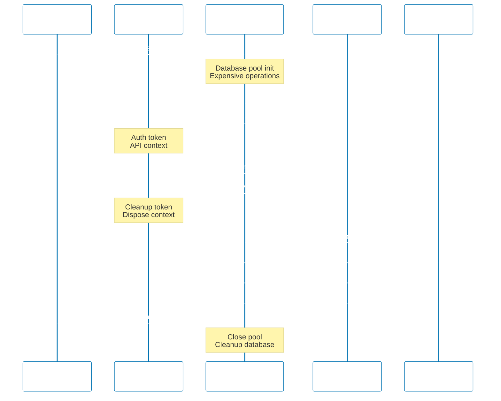

## Why Advanced Fixtures Matter

Production test suites require sophisticated setup and teardown patterns to manage complex dependencies like databases, external APIs, authentication state, and test data. Basic test setup with beforeEach/afterEach hooks leads to duplicated setup code, slow tests (repeating expensive operations), and brittle tests that leak state between runs.

Playwright's advanced fixture system provides dependency injection with fine-grained control over fixture scope (test-level vs worker-level), automatic cleanup, and composable setup. Worker-scoped fixtures run once per worker process (shared across tests), dramatically reducing expensive setup operations like database migrations or server initialization. Custom fixtures enable you to inject specialized dependencies (authenticated pages, seeded databases, mock API servers) directly into tests, making test code cleaner and more maintainable.

Production systems need advanced fixtures because complex test suites without proper fixture management suffer from:

- **Slow test execution**: Repeating expensive setup operations (DB migrations, server startup) for every test
- **State leakage**: Tests affecting each other through shared resources (database state, file system)
- **Setup duplication**: Copy-pasting setup code across test files
- **Poor maintainability**: Changes to setup logic require updating dozens of test files

## Standard Library Approach: Basic Test Hooks

Playwright provides built-in test hooks (beforeEach, afterEach, beforeAll, afterAll) for basic setup and teardown without requiring custom fixtures.

**Basic test with beforeEach setup**:

```typescript
import { test, expect } from "@playwright/test";
// => Import Playwright test runner
// => @playwright/test provides test() and hooks
// => No custom fixtures required

let apiToken: string;
// => Module-level variable for test state
// => Shared across tests in file
// => Potential state leakage risk

test.beforeEach(async ({ page }) => {
  // => beforeEach runs before every test
  // => Receives page fixture
  // => Duplicated across test files

  const response = await page.request.post("https://api.example.com/auth/login", {
    // => Send login request
    // => page.request provides HTTP client
    // => Returns Promise<APIResponse>

    data: {
      username: "testuser",
      password: "testpass123",
      // => Hardcoded credentials in setup
      // => Repeated for every test
      // => Expensive API call per test
    },
  });
  // => API login for authentication
  // => Executes before EVERY test
  // => No caching across tests

  const json = await response.json();
  // => Parse JSON response
  // => Extract authentication token
  // => await waits for JSON parsing

  apiToken = json.token;
  // => Store token in module variable
  // => Available to test functions
  // => Potential race condition with parallel tests
});

test("user can view dashboard", async ({ page }) => {
  // => Test receives page fixture
  // => apiToken available from beforeEach
  // => Setup code runs before this test

  await page.goto("https://example.com/dashboard", {
    // => Navigate to dashboard
    // => Options configure request headers
    // => Returns Promise<Response>

    headers: {
      Authorization: `Bearer ${apiToken}`,
      // => Use token from beforeEach
      // => Manual header injection
      // => Token from module variable
    },
  });
  // => Load authenticated page
  // => Token passed in headers
  // => Requires beforeEach to run first

  await expect(page.locator("h1")).toHaveText("Dashboard");
  // => Assert dashboard loaded
  // => Verify authentication successful
  // => Test logic separate from setup
});

test("user can view profile", async ({ page }) => {
  // => Second test, new beforeEach run
  // => apiToken refreshed
  // => Duplicate API call

  await page.goto("https://example.com/profile", {
    headers: {
      Authorization: `Bearer ${apiToken}`,
      // => Reuse token pattern
      // => Manual header setup again
      // => Duplicated code
    },
  });
  // => Navigate to profile page
  // => Same authentication pattern
  // => No abstraction

  await expect(page.locator("h1")).toHaveText("Profile");
  // => Verify profile page loaded
});
```

**Database setup with beforeAll**:

```typescript
import { test, expect } from "@playwright/test";
import { Pool } from "pg";
// => Import PostgreSQL client
// => pg provides connection pool
// => Used for database setup

let dbPool: Pool;
// => Module-level database pool
// => Shared across all tests
// => No automatic cleanup

test.beforeAll(async () => {
  // => beforeAll runs once before all tests
  // => No fixtures available
  // => Manual setup required

  dbPool = new Pool({
    // => Create connection pool
    // => Pool manages database connections
    // => Configured with credentials

    host: "localhost",
    port: 5432,
    database: "test_db",
    user: "testuser",
    password: "testpass",
    // => Hardcoded database credentials
    // => No environment variable support
    // => Security risk
  });
  // => Initialize database pool
  // => Runs once per worker
  // => Must manually clean up

  await dbPool.query("DELETE FROM users");
  // => Clear users table
  // => Manual database cleanup
  // => Executes before tests run

  await dbPool.query("INSERT INTO users (id, name) VALUES (1, 'Test User')");
  // => Seed test data
  // => Hardcoded test data
  // => No data isolation between workers
});

test.afterAll(async () => {
  // => afterAll runs once after all tests
  // => Manual cleanup required
  // => No automatic teardown

  await dbPool.end();
  // => Close database connections
  // => Manual cleanup
  // => Easy to forget
});

test("user exists in database", async ({ page }) => {
  // => Test depends on beforeAll setup
  // => Database seeded before this runs
  // => No explicit dependency declaration

  const result = await dbPool.query("SELECT * FROM users WHERE id = 1");
  // => Query database directly
  // => Uses module-level pool
  // => No fixture injection

  expect(result.rows[0].name).toBe("Test User");
  // => Assert seeded data exists
  // => Test depends on beforeAll
  // => Implicit dependency
});
```

**Limitations for production test suites**:

- **No dependency injection**: Tests access module variables, not injected dependencies
- **Scope inflexibility**: beforeEach always runs per-test, beforeAll per-worker (no fine-grained control)
- **Manual cleanup**: Easy to forget afterEach/afterAll, causing state leakage
- **No composition**: Cannot combine multiple setup pieces (auth + database + mock server)
- **Poor reusability**: Setup code duplicated across test files
- **Parallel test risks**: Module variables cause race conditions with parallel execution

## Production Framework: Custom Test Fixtures

Playwright's fixture system provides dependency injection with automatic cleanup, composable setup, and flexible scoping (test-level or worker-level).

**Installation** (already included with Playwright):

```bash
npm install --save-dev @playwright/test
# => Playwright includes fixture system
# => No additional dependencies
# => fixtures built into test runner
```

**Custom fixture for authenticated API context**:

```typescript
// fixtures/authFixture.ts
import { test as base, expect } from "@playwright/test";
// => Import base test from Playwright
// => Extend with custom fixtures
// => base.extend() returns new test function

import { APIRequestContext } from "@playwright/test";
// => Import API context type
// => APIRequestContext provides HTTP client
// => Used for authenticated requests

type AuthFixtures = {
  apiToken: string;
  // => Custom fixture providing auth token
  // => Tests receive token directly
  // => No module variables needed

  authenticatedContext: APIRequestContext;
  // => Authenticated API client fixture
  // => Pre-configured with auth headers
  // => Injected into tests
};

export const test = base.extend<AuthFixtures>({
  // => Extend base test with AuthFixtures
  // => Type-safe fixture definitions
  // => Exported for test files

  apiToken: async ({ request }, use) => {
    // => Define apiToken fixture
    // => Receives request fixture (HTTP client)
    // => use() callback provides fixture value

    const response = await request.post("https://api.example.com/auth/login", {
      // => Login to get token
      // => request fixture provides HTTP client
      // => Returns Promise<APIResponse>

      data: {
        username: process.env.TEST_USERNAME || "testuser",
        password: process.env.TEST_PASSWORD || "testpass123",
        // => Credentials from environment
        // => Fallback to defaults for local dev
        // => Secure configuration
      },
    });
    // => Authentication request
    // => Runs once per test
    // => Automatic cleanup after test

    const json = await response.json();
    // => Parse response JSON
    // => Extract token
    // => Type-safe JSON parsing

    const token = json.token as string;
    // => Extract token from response
    // => Type assertion for TypeScript
    // => Token ready for use

    await use(token);
    // => Provide token to test
    // => Test receives apiToken parameter
    // => await use() pauses until test completes

    // Cleanup runs here after test
    // => Automatic teardown
    // => Invalidate token if needed
    // => No manual cleanup required
  },

  authenticatedContext: async ({ request, apiToken }, use) => {
    // => Define authenticated context fixture
    // => Depends on request and apiToken fixtures
    // => Dependency injection pattern

    const context = await request.newContext({
      // => Create new API context
      // => Inherits from request fixture
      // => Returns APIRequestContext

      extraHTTPHeaders: {
        Authorization: `Bearer ${apiToken}`,
        // => Inject auth token automatically
        // => All requests include token
        // => No manual header management
      },
    });
    // => Pre-configured authenticated client
    // => Uses apiToken fixture
    // => Automatic token injection

    await use(context);
    // => Provide context to test
    // => Test receives authenticated client
    // => await use() pauses until test completes

    await context.dispose();
    // => Cleanup: dispose context
    // => Automatic cleanup after test
    // => Prevents resource leaks
  },
});

export { expect };
// => Re-export expect for convenience
// => Tests import from authFixture
// => Single import source
```

**Tests using authenticated fixtures**:

```typescript
// tests/dashboard.spec.ts
import { test, expect } from "../fixtures/authFixture";
// => Import custom test with fixtures
// => Tests automatically receive auth fixtures
// => No manual setup required

test("user can view dashboard via API", async ({ authenticatedContext }) => {
  // => Test receives authenticated context
  // => Context pre-configured with token
  // => No manual authentication needed

  const response = await authenticatedContext.get("https://api.example.com/dashboard");
  // => API request with automatic auth
  // => authenticatedContext injects token
  // => Returns Promise<APIResponse>

  expect(response.ok()).toBeTruthy();
  // => Assert request successful
  // => ok() checks 200-299 status
  // => No manual status code checks

  const data = await response.json();
  // => Parse response JSON
  // => Extract dashboard data
  // => Type-safe response handling

  expect(data).toHaveProperty("widgets");
  // => Assert response structure
  // => Verify dashboard data present
  // => Business logic assertion
});

test("user can view profile via API", async ({ authenticatedContext }) => {
  // => Second test with same fixture
  // => New auth token generated
  // => Test isolation maintained

  const response = await authenticatedContext.get("https://api.example.com/profile");
  // => Authenticated API request
  // => Token handled by fixture
  // => Clean test code

  expect(response.ok()).toBeTruthy();

  const profile = await response.json();
  expect(profile).toHaveProperty("email");
  // => Assert profile structure
  // => Test focuses on business logic
  // => Authentication abstracted away
});
```

**Worker-scoped fixture for database setup**:

```typescript
// fixtures/dbFixture.ts
import { test as base } from "@playwright/test";
import { Pool } from "pg";
// => Import PostgreSQL client
// => Pool manages connections
// => Used for database operations

type DatabaseFixtures = {
  dbPool: Pool;
  // => Database pool fixture
  // => Shared across tests in worker
  // => Worker-scoped for efficiency
};

export const test = base.extend<{}, DatabaseFixtures>({
  // => Extend with worker-scoped fixtures
  // => First type param: test-scoped (empty)
  // => Second type param: worker-scoped

  dbPool: [
    async ({}, use, workerInfo) => {
      // => Worker-scoped fixture definition
      // => No test-level dependencies
      // => workerInfo provides worker index

      const pool = new Pool({
        // => Create connection pool
        // => One pool per worker
        // => Shared across worker's tests

        host: process.env.DB_HOST || "localhost",
        port: parseInt(process.env.DB_PORT || "5432"),
        database: `test_db_worker_${workerInfo.workerIndex}`,
        // => Separate database per worker
        // => workerInfo.workerIndex for isolation
        // => Prevents worker interference

        user: process.env.DB_USER || "testuser",
        password: process.env.DB_PASSWORD || "testpass",
        // => Credentials from environment
        // => Secure configuration
        // => No hardcoded secrets
      });
      // => Initialize pool once per worker
      // => Expensive operation amortized
      // => Shared by all worker's tests

      await pool.query("DELETE FROM users");
      await pool.query("INSERT INTO users (id, name) VALUES (1, 'Test User')");
      // => Seed database for worker
      // => Runs once per worker
      // => All worker's tests use same data

      await use(pool);
      // => Provide pool to tests
      // => All tests in worker share pool
      // => await use() pauses until worker completes

      await pool.query("DELETE FROM users");
      // => Cleanup: clear test data
      // => Runs once after all worker's tests
      // => Automatic cleanup

      await pool.end();
      // => Close pool connections
      // => Automatic cleanup
      // => Prevents connection leaks
    },
    { scope: "worker" },
    // => Mark fixture as worker-scoped
    // => Runs once per worker process
    // => Shared across worker's tests
  ],
});
```

**Tests using worker-scoped database fixture**:

```typescript
// tests/users.spec.ts
import { test, expect } from "../fixtures/dbFixture";
// => Import test with database fixture
// => dbPool fixture available
// => Worker-scoped, shared across tests

test("user exists in database", async ({ dbPool }) => {
  // => Test receives shared database pool
  // => Pool initialized once per worker
  // => No per-test setup overhead

  const result = await dbPool.query("SELECT * FROM users WHERE id = 1");
  // => Query database using fixture
  // => Pool injected by fixture system
  // => Type-safe dependency

  expect(result.rows[0].name).toBe("Test User");
  // => Assert seeded data exists
  // => Data seeded by worker-scoped setup
  // => Shared across worker's tests
});

test("can query user count", async ({ dbPool }) => {
  // => Second test, same dbPool fixture
  // => No additional setup overhead
  // => Reuses worker's pool

  const result = await dbPool.query("SELECT COUNT(*) FROM users");
  // => Count users in database
  // => Uses shared pool
  // => Fast execution (no setup)

  expect(parseInt(result.rows[0].count)).toBe(1);
  // => Assert seeded data count
  // => Test isolation from other workers
  // => Worker-specific database
});
```

**Composing multiple fixtures**:

```typescript
// fixtures/composedFixture.ts
import { test as base } from "@playwright/test";
import { test as authTest } from "./authFixture";
import { test as dbTest } from "./dbFixture";
// => Import specialized fixtures
// => Compose into combined fixture
// => Merges type definitions

export const test = base.extend({
  // => Extend base test
  // => Merge fixture definitions
  // => Combine dependencies

  ...authTest,
  ...dbTest,
  // => Spread auth and db fixtures
  // => Tests receive all fixtures
  // => Type-safe composition

  // Additional composed fixture example
  seededAuthenticatedPage: async ({ page, apiToken, dbPool }, use) => {
    // => Composed fixture using dependencies
    // => Depends on page, apiToken, dbPool
    // => Combines multiple fixtures

    await dbPool.query("INSERT INTO sessions (user_id, token) VALUES (1, $1)", [apiToken]);
    // => Store session in database
    // => Uses dbPool fixture
    // => Links auth token to user

    await page.goto("https://example.com", {
      headers: { Authorization: `Bearer ${apiToken}` },
    });
    // => Load page with authentication
    // => Uses apiToken fixture
    // => Uses page fixture

    await use(page);
    // => Provide configured page
    // => Test receives ready-to-use page
    // => Combined setup complete

    await dbPool.query("DELETE FROM sessions WHERE token = $1", [apiToken]);
    // => Cleanup: remove session
    // => Automatic teardown
    // => Combined cleanup
  },
});
```

## Fixture Scope and Lifecycle Diagram



## Production Patterns and Best Practices

### Pattern 1: Fixture Composition for Complex Setup

Compose multiple fixtures to build complex test dependencies:

```typescript
// fixtures/e2eFixture.ts
import { test as base } from "@playwright/test";
import { test as authTest } from "./authFixture";
import { test as dbTest } from "./dbFixture";
import { test as mockApiTest } from "./mockApiFixture";
// => Import specialized fixtures
// => Each fixture provides specific capability
// => Compose for end-to-end tests

export const test = base.extend({
  ...authTest,
  ...dbTest,
  ...mockApiTest,
  // => Merge all fixtures
  // => Tests receive all dependencies
  // => Type-safe composition

  fullyConfiguredPage: async ({ page, apiToken, dbPool, mockApiServer }, use) => {
    // => Composed fixture for E2E
    // => Depends on auth, DB, mock API
    // => Single fixture for complete setup

    await dbPool.query("INSERT INTO users (id, name, email) VALUES (1, 'Test', 'test@example.com')");
    // => Seed database with user
    // => Uses dbPool fixture
    // => Test data setup

    await mockApiServer.setupRoute("/external-api/data", { status: 200, body: { data: "mocked" } });
    // => Configure mock API endpoint
    // => Uses mockApiServer fixture
    // => External dependency mocked

    await page.goto("https://example.com", {
      headers: { Authorization: `Bearer ${apiToken}` },
    });
    // => Navigate to app
    // => Uses apiToken fixture
    // => Authentication configured

    await use(page);
    // => Provide fully configured page
    // => All dependencies ready
    // => Test receives complete environment

    await dbPool.query("DELETE FROM users WHERE id = 1");
    await mockApiServer.reset();
    // => Cleanup all fixtures
    // => Automatic teardown
    // => Complete cleanup
  },
});
```

**Using composed fixture**:

```typescript
import { test, expect } from "../fixtures/e2eFixture";
// => Import composed fixture
// => All dependencies available
// => Single import

test("user completes checkout flow", async ({ fullyConfiguredPage }) => {
  // => Test receives complete environment
  // => Auth, DB, mocks all configured
  // => No manual setup

  await fullyConfiguredPage.click("#checkout-button");
  // => Test focuses on business logic
  // => Setup abstracted away
  // => Clean test code

  await expect(fullyConfiguredPage.locator(".success-message")).toBeVisible();
  // => Assert checkout successful
  // => Environment pre-configured
  // => Reliable test execution
});
```

### Pattern 2: Worker-Scoped Fixtures for Expensive Operations

Use worker scope for expensive setup operations that can be shared across tests:

```typescript
// fixtures/serverFixture.ts
import { test as base } from "@playwright/test";
import { spawn, ChildProcess } from "child_process";
// => Import Node.js child_process
// => spawn() starts server process
// => Used for test server

type ServerFixtures = {
  testServerUrl: string;
  // => Test server URL fixture
  // => Worker-scoped, shared across tests
  // => Provides server endpoint
};

export const test = base.extend<{}, ServerFixtures>({
  testServerUrl: [
    async ({}, use, workerInfo) => {
      // => Worker-scoped server fixture
      // => Starts server once per worker
      // => workerInfo for port assignment

      const port = 3000 + workerInfo.workerIndex;
      // => Unique port per worker
      // => Prevents port conflicts
      // => Parallel worker isolation

      const serverProcess: ChildProcess = spawn("node", ["server.js"], {
        // => Start Node.js server
        // => spawn() returns ChildProcess
        // => Runs in background

        env: {
          ...process.env,
          PORT: port.toString(),
          NODE_ENV: "test",
          // => Configure server environment
          // => Worker-specific port
          // => Test mode
        },
      });
      // => Server starts once per worker
      // => Expensive operation amortized
      // => Shared by worker's tests

      await new Promise((resolve) => setTimeout(resolve, 2000));
      // => Wait for server startup
      // => Simple delay (2 seconds)
      // => Production: wait for health check

      const url = `http://localhost:${port}`;
      // => Construct server URL
      // => Worker-specific port
      // => Available to all worker's tests

      await use(url);
      // => Provide URL to tests
      // => All worker's tests share server
      // => await use() pauses until worker completes

      serverProcess.kill();
      // => Cleanup: stop server
      // => Automatic teardown
      // => Runs once after all worker's tests
    },
    { scope: "worker" },
    // => Mark as worker-scoped
    // => Server started once per worker
    // => Expensive operation optimized
  ],
});
```

**Tests using worker-scoped server**:

```typescript
import { test, expect } from "../fixtures/serverFixture";
// => Import test with server fixture
// => testServerUrl available
// => Worker-scoped server

test("server responds to health check", async ({ page, testServerUrl }) => {
  // => Test receives server URL
  // => Server already running
  // => No startup overhead

  await page.goto(`${testServerUrl}/health`);
  // => Navigate to server endpoint
  // => Uses worker's server
  // => Fast execution (no startup)

  await expect(page.locator("body")).toContainText("OK");
  // => Assert server healthy
  // => Shared server across tests
  // => Efficient resource usage
});

test("server serves API endpoint", async ({ page, testServerUrl }) => {
  // => Second test, same server
  // => No additional startup
  // => Reuses worker's server

  const response = await page.request.get(`${testServerUrl}/api/data`);
  // => API request to server
  // => Server shared by worker
  // => No per-test overhead

  expect(response.ok()).toBeTruthy();
  // => Assert response successful
});
```

### Pattern 3: Automatic Cleanup with use() Callback

Always implement cleanup in fixtures to prevent state leakage:

```typescript
// fixtures/fileFixture.ts
import { test as base } from "@playwright/test";
import { writeFile, unlink, mkdir } from "fs/promises";
import { join } from "path";
// => Import Node.js file system
// => Promises API for async operations
// => Used for test file management

type FileFixtures = {
  tempFile: string;
  // => Temporary file fixture
  // => Provides file path to test
  // => Automatic cleanup after test
};

export const test = base.extend<FileFixtures>({
  tempFile: async ({}, use) => {
    // => Define tempFile fixture
    // => No dependencies
    // => use() callback for cleanup

    const tempDir = join(__dirname, "../temp");
    // => Define temp directory
    // => Relative to fixtures directory
    // => Isolated test files

    await mkdir(tempDir, { recursive: true });
    // => Create temp directory
    // => recursive: true creates parent dirs
    // => Idempotent operation

    const filePath = join(tempDir, `test-${Date.now()}.txt`);
    // => Generate unique file path
    // => Date.now() for uniqueness
    // => Prevents file conflicts

    await writeFile(filePath, "initial content");
    // => Create file with content
    // => Setup before test runs
    // => File ready for test

    await use(filePath);
    // => Provide file path to test
    // => Test receives ready-to-use file
    // => await use() pauses until test completes

    try {
      await unlink(filePath);
      // => Cleanup: delete file
      // => Runs after test completes
      // => Automatic cleanup
    } catch (error) {
      // => Handle cleanup errors
      // => File might not exist
      // => Prevent test failure on cleanup
      console.warn(`Failed to cleanup ${filePath}:`, error);
      // => Log cleanup warning
      // => Don't throw (test already completed)
    }
  },
});
```

**Tests using automatic cleanup fixture**:

```typescript
import { test, expect } from "../fixtures/fileFixture";
import { readFile } from "fs/promises";
// => Import test with file fixture
// => tempFile fixture provides path
// => Automatic cleanup

test("can read temp file", async ({ tempFile }) => {
  // => Test receives temp file path
  // => File already created
  // => Automatic cleanup after test

  const content = await readFile(tempFile, "utf-8");
  // => Read file content
  // => Uses fixture-provided path
  // => File guaranteed to exist

  expect(content).toBe("initial content");
  // => Assert initial content
  // => File cleanup automatic
  // => No manual teardown needed
});

test("can modify temp file", async ({ tempFile }) => {
  // => Second test, new temp file
  // => Fresh file per test
  // => Test isolation

  await writeFile(tempFile, "modified content");
  // => Modify file content
  // => Uses fixture-provided path
  // => Cleanup automatic

  const content = await readFile(tempFile, "utf-8");
  expect(content).toBe("modified content");
  // => Assert modification successful
  // => File deleted after test
  // => No manual cleanup
});
```

## Trade-offs and When to Use

**Standard Library (beforeEach/afterAll hooks)**:

- **Use when**: Simple setup (<5 lines), single test file, quick prototypes
- **Benefits**: Simple API, no abstractions, immediate understanding
- **Costs**: Manual cleanup, no dependency injection, setup duplication

**Test-Scoped Custom Fixtures**:

- **Use when**: Complex per-test setup, dependency injection needed, multiple test files
- **Benefits**: Automatic cleanup, composable, reusable across files, type-safe
- **Costs**: Learning fixture lifecycle, debugging fixture issues, upfront abstraction

**Worker-Scoped Fixtures**:

- **Use when**: Expensive setup (>1 second), shared resources (DB, server), parallel execution
- **Benefits**: Dramatic speed improvement (1x setup vs Nx setup), resource efficiency
- **Costs**: Shared state risks, worker isolation complexity, debugging harder

**Production recommendation**: Use custom fixtures for all production test suites. Worker-scoped fixtures for expensive operations (databases, servers, migrations). The maintenance and speed improvements justify initial learning investment.

## Security Considerations

- **Credentials in fixtures**: Always use environment variables (`process.env.DB_PASSWORD`), never hardcode
- **Worker isolation**: Worker-scoped fixtures must use unique resources (per-worker databases, ports)
- **Cleanup enforcement**: Always implement cleanup in `use()` callback to prevent credential leakage
- **Token expiration**: Consider token TTL for long-running test suites
- **Database isolation**: Use separate databases per worker to prevent cross-worker data leakage

## Common Pitfalls

1. **Forgetting cleanup**: Always implement cleanup after `use()` callback
2. **Shared state in worker fixtures**: Worker-scoped fixtures must use isolated resources (unique DB names, ports)
3. **Expensive test-scoped operations**: Move slow operations (DB migrations, server startup) to worker scope
4. **Hardcoded credentials**: Use environment variables for all secrets
5. **Circular fixture dependencies**: Fixtures cannot depend on each other in a cycle (A→B→A)
6. **Missing type definitions**: Always define fixture types for TypeScript safety
