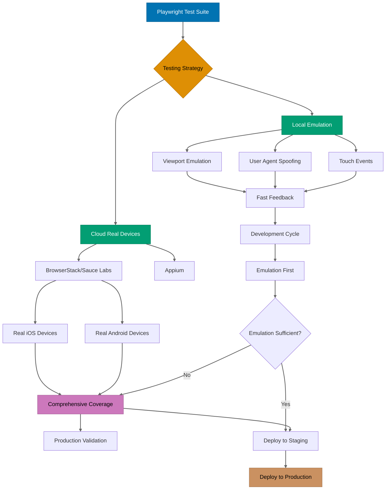

## Why This Matters

Mobile traffic now accounts for over 60% of global web traffic, making mobile testing a production necessity rather than an optional feature. While desktop testing validates core functionality, mobile testing exposes unique challenges: touch interactions instead of mouse clicks, viewport constraints affecting layout rendering, device-specific behaviors like orientation changes, and network conditions varying from high-speed WiFi to cellular connections. Production systems that ignore mobile testing risk delivering broken experiences to the majority of their users.

Beyond viewport differences, mobile devices introduce interaction patterns fundamentally different from desktop: swipe gestures for navigation, long-press for context menus, pinch-to-zoom for content scaling, and device features like geolocation and accelerometers that desktop browsers don't expose. Production mobile testing must validate not just responsive layouts but also these mobile-specific interactions and device capabilities. A form that works perfectly with mouse and keyboard may become unusable when constrained to a 375px mobile viewport with touch-only input.

Production mobile testing requires more than running desktop tests on smaller viewports. You need device emulation with accurate user agents, touch event simulation matching real mobile browsers, network throttling to validate performance under cellular conditions, and geolocation mocking to test location-aware features. This guide shows how to build production-ready mobile testing infrastructure, starting with Playwright's built-in device emulation, identifying its limitations for large-scale mobile testing, then integrating cloud-based device farms like BrowserStack for real device testing when emulation proves insufficient.

## Standard Library Approach: Playwright Device Emulation

Playwright provides built-in device emulation through predefined device descriptors and viewport configuration. This approach uses Playwright's `devices` registry to emulate popular mobile devices without external dependencies.

```typescript
// mobile-test.spec.ts
import { test, expect, devices } from "@playwright/test";
// => Import test runner with device emulation capability
// => devices contains predefined mobile configurations
// => expect provides assertions for validation

test.describe("Mobile Shopping Cart", () => {
  // => Group related mobile tests
  // => Runs tests with shared mobile configuration

  test.use({
    ...devices["iPhone 13 Pro"],
    // => Spreads iPhone 13 Pro configuration
    // => Sets viewport: 390x844, user agent, device scale factor
    // => Configures touch support and mobile context
  });

  test("add product with touch interaction", async ({ page }) => {
    // => Receives browser context with iPhone 13 configuration
    // => page already configured with mobile viewport

    await page.goto("https://shop.example.com/products/laptop");
    // => Navigates with iPhone user agent
    // => Server sees mobile browser request

    await page.tap('button[data-testid="add-to-cart"]');
    // => tap() simulates touch event, not mouse click
    // => Triggers mobile-specific event handlers
    // => More accurate than click() for mobile testing

    const cartCount = page.locator(".cart-count");
    // => Selects cart badge element
    // => Locator waits for element visibility

    await expect(cartCount).toHaveText("1");
    // => Validates cart updated with product
    // => Waits until text matches expected value
  });

  test("validate responsive layout", async ({ page }) => {
    // => Tests layout rendering at mobile viewport

    await page.goto("https://shop.example.com");
    // => Loads with 390px width (iPhone 13 viewport)

    const hamburgerMenu = page.locator('[aria-label="Main menu"]');
    // => Selects mobile navigation trigger
    // => Desktop would show full navigation bar

    await expect(hamburgerMenu).toBeVisible();
    // => Validates mobile navigation pattern used
    // => Desktop navigation should be hidden at this viewport

    const desktopNav = page.locator("nav.desktop-only");
    await expect(desktopNav).toBeHidden();
    // => Confirms desktop navigation hidden on mobile
    // => Validates responsive CSS working correctly
  });

  test("swipe gesture for carousel", async ({ page }) => {
    // => Tests touch gesture interaction

    await page.goto("https://shop.example.com");
    // => Loads page with carousel component

    const carousel = page.locator('[data-testid="product-carousel"]');
    const firstItem = carousel.locator(".carousel-item").first();
    // => Selects carousel container and first item
    // => Prepares for swipe gesture simulation

    const box = await firstItem.boundingBox();
    // => Gets element position and dimensions
    // => Returns {x, y, width, height} for touch coordinates

    if (!box) throw new Error("Carousel not found");
    // => Guards against null (element not visible)
    // => Production code must handle missing elements

    await page.touchscreen.tap(box.x + box.width / 2, box.y + box.height / 2);
    // => Taps center of first carousel item
    // => Simulates user touch to focus item

    await page.touchscreen.swipe(
      { x: box.x + box.width - 10, y: box.y + box.height / 2 },
      { x: box.x + 10, y: box.y + box.height / 2 },
    );
    // => Swipes right to left (horizontal swipe)
    // => Simulates user dragging carousel to next item
    // => Start: near right edge, End: near left edge

    const secondItem = carousel.locator(".carousel-item").nth(1);
    await expect(secondItem).toBeInViewport();
    // => Validates carousel advanced to second item
    // => Confirms swipe gesture triggered navigation
  });
});
```

**Limitations for production**:

- **Emulation not real devices**: Viewport and user agent emulation cannot replicate real device behavior including GPU rendering differences, iOS Safari quirks, Android WebView variations, or device-specific performance characteristics that affect production users.
- **No real mobile OS features**: Cannot test true iOS/Android features like native share dialogs, biometric authentication, push notifications, app install prompts, or payment request APIs that behave differently on real devices versus emulation.
- **Limited network condition testing**: Basic throttling available but cannot simulate real cellular network conditions including variable latency, packet loss, connection switching (WiFi to 4G), or carrier-specific behavior that impacts production mobile users.
- **Single device perspective**: Manual device configuration requires separate test runs for each device, making multi-device coverage tedious and time-consuming for comprehensive mobile testing across dozens of device/OS combinations.
- **Debug challenges**: When tests fail on real devices but pass in emulation, debugging requires access to actual devices which CI/CD environments don't provide, creating production blind spots.

## Production Framework: BrowserStack Integration

BrowserStack provides cloud-based real device testing with thousands of device/OS/browser combinations. Integration requires BrowserStack account credentials and SDK configuration, enabling tests to run on real mobile devices in BrowserStack's cloud infrastructure.

```typescript
// playwright.config.ts
import { defineConfig, devices } from "@playwright/test";
// => Import configuration utilities
// => devices provides standard mobile configurations

export default defineConfig({
  projects: [
    {
      name: "iPhone 13 - BrowserStack",
      // => Configuration for real iPhone 13 testing
      // => Runs tests on actual iOS device

      use: {
        ...devices["iPhone 13"],
        // => Base iPhone 13 viewport configuration
        // => Provides fallback for local emulation

        connectOptions: {
          wsEndpoint: `wss://cdp.browserstack.com/playwright?caps=${encodeURIComponent(
            JSON.stringify({
              "browserstack.username": process.env.BROWSERSTACK_USERNAME,
              // => Authenticates BrowserStack account
              // => Stored in environment variable for security

              "browserstack.accessKey": process.env.BROWSERSTACK_ACCESS_KEY,
              // => API key for BrowserStack access
              // => Never hardcode credentials in source

              browser: "playwright-webkit",
              // => Uses Safari/WebKit on iOS
              // => Real iOS browser, not emulation

              os: "ios",
              os_version: "15.0",
              // => Specifies iOS version
              // => Tests against specific OS release

              device: "iPhone 13",
              // => Real iPhone 13 hardware
              // => Includes actual GPU, touch hardware

              "browserstack.local": "false",
              // => Disables local testing mode
              // => Tests public URLs only

              "browserstack.networkLogs": "true",
              // => Enables network request logging
              // => Captures all HTTP traffic for debugging
            }),
          )}`,
          // => WebSocket endpoint for remote browser
          // => Connects to BrowserStack device cloud

          timeout: 60000,
          // => 60 second connection timeout
          // => Real devices take longer to provision
        },
      },
    },

    {
      name: "Samsung Galaxy S21 - BrowserStack",
      // => Android device configuration
      // => Tests Chrome on Android OS

      use: {
        ...devices["Galaxy S21"],
        connectOptions: {
          wsEndpoint: `wss://cdp.browserstack.com/playwright?caps=${encodeURIComponent(
            JSON.stringify({
              "browserstack.username": process.env.BROWSERSTACK_USERNAME,
              "browserstack.accessKey": process.env.BROWSERSTACK_ACCESS_KEY,
              browser: "playwright-chromium",
              // => Chrome browser on Android
              // => Real Android Chrome, not emulation

              os: "android",
              os_version: "12.0",
              // => Android 12 operating system
              // => Tests specific Android version

              device: "Samsung Galaxy S21",
              // => Real Samsung hardware
              // => Includes Samsung-specific browser behavior

              "browserstack.networkLogs": "true",
              "browserstack.console": "errors",
              // => Captures console errors only
              // => Reduces log noise while catching issues
            }),
          )}`,
          timeout: 60000,
        },
      },
    },
  ],

  use: {
    trace: "retain-on-failure",
    // => Captures trace on test failure
    // => Includes screenshots, network, console logs

    video: "retain-on-failure",
    // => Records video of failed tests
    // => Critical for debugging real device issues

    screenshot: "only-on-failure",
    // => Captures screenshot on failure
    // => Provides visual context for failures
  },

  retries: process.env.CI ? 2 : 0,
  // => Retries failed tests in CI environment
  // => Real devices can have transient network issues
  // => Local runs don't retry for faster feedback
});
```

```typescript
// tests/mobile/geolocation.spec.ts
import { test, expect } from "@playwright/test";
// => Import test utilities
// => Uses BrowserStack configuration from playwright.config.ts

test.describe("Geolocation Features", () => {
  // => Tests location-aware functionality
  // => Requires geolocation permission on real devices

  test.use({
    geolocation: { latitude: 40.7128, longitude: -74.006 },
    // => Mocks GPS location to New York City
    // => Coordinates: NYC latitude/longitude
    // => Real devices use actual GPS simulation

    permissions: ["geolocation"],
    // => Grants geolocation permission automatically
    // => Bypasses browser permission prompt
    // => Real device respects OS-level permissions
  });

  test("find nearby stores", async ({ page, context }) => {
    // => Tests store locator with geolocation
    // => context provides browser-level APIs

    await context.setGeolocation({
      latitude: 40.7128,
      longitude: -74.006,
      accuracy: 100,
    });
    // => Sets GPS accuracy to 100 meters
    // => Simulates real GPS precision level
    // => Affects location-based search radius

    await page.goto("https://shop.example.com/stores");
    // => Loads store locator page
    // => Page requests user location on real device

    await page.click('button[aria-label="Find nearby stores"]');
    // => Triggers geolocation request
    // => Would show permission prompt without permissions config

    const storeList = page.locator('[data-testid="store-list"]');
    await expect(storeList).toBeVisible({ timeout: 10000 });
    // => Waits up to 10 seconds for stores to load
    // => Real device network may be slower
    // => API call depends on geolocation response

    const firstStore = storeList.locator("li").first();
    await expect(firstStore).toContainText("New York");
    // => Validates stores filtered by NYC location
    // => Confirms geolocation API working on real device
    // => Production logic correctly processes GPS coordinates
  });

  test("location permission denied", async ({ page, context }) => {
    // => Tests graceful handling of permission denial
    // => Real users may deny location access

    await context.clearPermissions();
    // => Revokes previously granted permissions
    // => Simulates user denying geolocation

    await page.goto("https://shop.example.com/stores");
    await page.click('button[aria-label="Find nearby stores"]');
    // => Triggers permission request
    // => Will be denied due to clearPermissions()

    const errorMessage = page.locator('[data-testid="location-error"]');
    await expect(errorMessage).toBeVisible();
    // => Validates error message displayed
    // => Production must handle denial gracefully

    await expect(errorMessage).toContainText("enable location services");
    // => Confirms helpful error message
    // => Guides user to fix permission issue
  });
});
```

```typescript
// tests/mobile/network-conditions.spec.ts
import { test, expect } from "@playwright/test";
// => Tests performance under mobile network conditions

test.describe("Mobile Network Performance", () => {
  // => Validates app behavior on slow connections
  // => Critical for mobile users on cellular networks

  test("3G network throttling", async ({ page, context }) => {
    // => Simulates 3G network speed
    // => Common in developing markets and rural areas

    await context.route("**/*", async (route) => {
      // => Intercepts all network requests
      // => Applies throttling to every resource

      await new Promise((resolve) => setTimeout(resolve, 100));
      // => Adds 100ms delay to every request
      // => Simulates 3G latency (typical 100-300ms)

      await route.continue();
      // => Proceeds with request after delay
      // => Actual throttling handled by BrowserStack
    });

    const startTime = Date.now();
    // => Records page load start time
    // => Measures total load duration

    await page.goto("https://shop.example.com/products");
    // => Loads product listing page
    // => All resources delayed by routing

    await page.waitForLoadState("networkidle");
    // => Waits until no network requests for 500ms
    // => Indicates page fully loaded

    const loadTime = Date.now() - startTime;
    // => Calculates total load time in milliseconds

    expect(loadTime).toBeLessThan(5000);
    // => Validates page loads within 5 seconds on 3G
    // => Production requirement for mobile performance
    // => Fails if page too resource-intensive

    const images = page.locator("img");
    const count = await images.count();
    // => Counts images loaded on page
    // => Heavy images slow 3G performance

    expect(count).toBeLessThan(20);
    // => Validates image count reasonable for mobile
    // => Production should lazy-load images
  });

  test("offline mode handling", async ({ page, context }) => {
    // => Tests offline functionality
    // => Mobile connections drop frequently

    await page.goto("https://shop.example.com");
    // => Loads page while online
    // => Allows service worker registration

    await context.setOffline(true);
    // => Simulates complete network loss
    // => All requests will fail

    await page.reload();
    // => Attempts reload without connection
    // => Should show offline UI if implemented

    const offlineBanner = page.locator('[data-testid="offline-banner"]');
    await expect(offlineBanner).toBeVisible();
    // => Validates offline state communicated to user
    // => Production should detect and display offline state

    await expect(offlineBanner).toContainText("connection");
    // => Confirms meaningful offline message
    // => Guides user on connectivity issue
  });
});
```

```typescript
// tests/mobile/touch-gestures.spec.ts
import { test, expect } from "@playwright/test";
// => Tests mobile-specific touch interactions

test.describe("Touch Gesture Interactions", () => {
  // => Validates swipe, long-press, pinch gestures
  // => Critical for mobile-first interfaces

  test("long press for context menu", async ({ page }) => {
    // => Tests long-press gesture
    // => Mobile alternative to right-click

    await page.goto("https://shop.example.com/products/laptop");
    // => Loads product page with images

    const productImage = page.locator('[data-testid="product-image"]');
    // => Selects main product image
    // => Target for long-press gesture

    const box = await productImage.boundingBox();
    if (!box) throw new Error("Image not found");
    // => Gets image position for touch coordinates
    // => Validates image visible before touch

    await page.touchscreen.tap(box.x + box.width / 2, box.y + box.height / 2, { duration: 1000 });
    // => Long press at image center for 1 second
    // => duration > 500ms triggers long-press event
    // => Real devices detect long-press by time threshold

    const contextMenu = page.locator('[data-testid="image-context-menu"]');
    await expect(contextMenu).toBeVisible();
    // => Validates context menu appeared
    // => Production should provide mobile-appropriate actions

    await expect(contextMenu).toContainText("Save Image");
    // => Confirms save option available
    // => Common mobile context menu action
  });

  test("horizontal swipe navigation", async ({ page }) => {
    // => Tests swipe for page navigation
    // => Common pattern in mobile interfaces

    await page.goto("https://shop.example.com/products");
    // => Loads product listing page
    // => Supports swipe-based filtering

    const filterContainer = page.locator('[data-testid="filter-swiper"]');
    const box = await filterContainer.boundingBox();
    if (!box) throw new Error("Filter container not found");
    // => Gets container dimensions for swipe calculation

    const startX = box.x + box.width - 20;
    const startY = box.y + box.height / 2;
    const endX = box.x + 20;
    const endY = startY;
    // => Calculates horizontal swipe coordinates
    // => Start: near right edge, End: near left edge

    await page.mouse.move(startX, startY);
    await page.mouse.down();
    // => Initiates touch at start position
    // => Begins swipe gesture

    await page.mouse.move(endX, endY, { steps: 10 });
    // => Moves touch point across screen in 10 steps
    // => Simulates smooth swipe motion
    // => Steps create realistic gesture trajectory

    await page.mouse.up();
    // => Releases touch to complete swipe
    // => Triggers swipe event handler

    const secondFilter = page.locator('[data-testid="filter-electronics"]');
    await expect(secondFilter).toBeInViewport();
    // => Validates swipe revealed next filter
    // => Confirms swipe navigation working
  });

  test("pinch-to-zoom on image", async ({ page }) => {
    // => Tests pinch gesture for zoom
    // => Standard mobile image interaction

    await page.goto("https://shop.example.com/products/laptop");
    const productImage = page.locator('[data-testid="product-image"]');
    const box = await productImage.boundingBox();
    if (!box) throw new Error("Image not found");
    // => Prepares image for pinch gesture

    const centerX = box.x + box.width / 2;
    const centerY = box.y + box.height / 2;
    // => Calculates image center point
    // => Pinch gesture radiates from center

    // Simulate pinch-out (zoom in)
    await page.evaluate(
      ({ x, y }) => {
        // => Dispatches custom pinch events
        // => Real devices generate touch events, we simulate

        const image = document.querySelector('[data-testid="product-image"]');
        if (!image) throw new Error("Image not found in DOM");
        // => Validates image exists in DOM
        // => Production must handle zoom events

        const event = new WheelEvent("wheel", {
          deltaY: -100,
          clientX: x,
          clientY: y,
          ctrlKey: true,
        });
        // => Creates pinch-zoom event
        // => ctrlKey + wheel simulates pinch on many browsers
        // => deltaY negative for zoom in

        image.dispatchEvent(event);
        // => Triggers zoom event on image
        // => Production zoom handler processes event
      },
      { x: centerX, y: centerY },
    );
    // => Executes zoom gesture
    // => Passes center coordinates to event

    const zoomedImage = page.locator('[data-testid="product-image"][data-zoomed="true"]');
    await expect(zoomedImage).toBeVisible();
    // => Validates image zoomed state
    // => Production adds data-zoomed attribute when zoomed
    // => Confirms pinch gesture processed correctly
  });
});
```

## Mobile Testing Architecture

The following diagram illustrates the progression from local emulation to real device testing, showing how Playwright integrates with cloud device farms for comprehensive mobile coverage.



**Architecture explanation**:

- **Local emulation path** (teal) provides fast feedback for development iterations
- **Cloud real device path** (teal/purple) validates production behavior on actual hardware
- **Decision point** (orange) determines when real device testing becomes necessary
- **Final deployment** (brown) happens only after passing both emulation and real device validation

## Production Patterns and Best Practices

### Pattern 1: Device Emulation Matrix

Test across representative device matrix covering market share and screen sizes.

```typescript
// tests/mobile/device-matrix.spec.ts
import { test, expect, devices } from "@playwright/test";
// => Import test runner with device configurations

const MOBILE_DEVICES = [
  { name: "iPhone 13", device: devices["iPhone 13"], platform: "iOS" },
  { name: "iPhone SE", device: devices["iPhone SE"], platform: "iOS" },
  { name: "Galaxy S21", device: devices["Galaxy S21"], platform: "Android" },
  { name: "Pixel 5", device: devices["Pixel 5"], platform: "Android" },
] as const;
// => Defines device test matrix
// => Covers small (SE), medium (Pixel), large (S21/13) screens
// => Tests both iOS and Android platforms
// => Represents ~70% market share

MOBILE_DEVICES.forEach(({ name, device, platform }) => {
  // => Iterates each device configuration
  // => Creates separate test suite per device

  test.describe(`${name} (${platform})`, () => {
    // => Groups tests by device name
    // => Shows clear device context in reports

    test.use(device);
    // => Applies device configuration to all tests
    // => Sets viewport, user agent, touch support

    test("responsive navigation", async ({ page }) => {
      // => Validates navigation adapts to viewport
      // => Different devices may show different patterns

      await page.goto("https://shop.example.com");
      const viewport = page.viewportSize();
      // => Gets current viewport dimensions
      // => Used to determine expected layout

      if (!viewport) throw new Error("Viewport not set");
      // => Guards against missing viewport config
      // => Production requires viewport for responsive tests

      if (viewport.width < 640) {
        // => Small device viewport (< 640px)
        // => Expects mobile navigation pattern

        const hamburger = page.locator('[aria-label="Main menu"]');
        await expect(hamburger).toBeVisible();
        // => Validates hamburger menu shown
        // => Mobile-first pattern for narrow viewports
      } else {
        // => Larger device viewport (>= 640px)
        // => May show desktop-style navigation

        const desktopNav = page.locator('nav[aria-label="Primary"]');
        await expect(desktopNav).toBeVisible();
        // => Validates full navigation visible
        // => Larger phones/tablets show more navigation
      }
    });

    test("touch target size", async ({ page }) => {
      // => Validates touch targets meet WCAG standards
      // => Minimum 44x44px for accessibility

      await page.goto("https://shop.example.com/products");
      const buttons = page.locator("button");
      // => Selects all interactive buttons
      // => Each must be large enough for touch

      const count = await buttons.count();
      // => Gets total button count
      // => Validates each button in loop

      for (let i = 0; i < count; i++) {
        const button = buttons.nth(i);
        const box = await button.boundingBox();
        // => Gets button dimensions
        // => {x, y, width, height}

        if (!box) continue;
        // => Skips hidden/offscreen buttons
        // => Only validates visible touch targets

        expect(box.width).toBeGreaterThanOrEqual(44);
        expect(box.height).toBeGreaterThanOrEqual(44);
        // => Validates 44x44px minimum size
        // => WCAG 2.1 Level AA requirement
        // => Ensures buttons tappable on all devices
      }
    });
  });
});
```

### Pattern 2: Network Condition Testing

Validate performance and functionality under varying mobile network conditions.

```typescript
// tests/mobile/network-conditions.spec.ts
import { test, expect, chromium } from "@playwright/test";
// => Import chromium for CDP network emulation
// => Chrome DevTools Protocol provides network throttling

const NETWORK_PROFILES = {
  "4G": { downloadThroughput: (4 * 1024 * 1024) / 8, uploadThroughput: (3 * 1024 * 1024) / 8, latency: 20 },
  // => 4G speeds: 4Mbps down, 3Mbps up, 20ms latency
  // => Throughput in bytes per second (4Mbps / 8 bits/byte)

  "3G": { downloadThroughput: (1.6 * 1024 * 1024) / 8, uploadThroughput: (750 * 1024) / 8, latency: 100 },
  // => 3G speeds: 1.6Mbps down, 750Kbps up, 100ms latency
  // => Typical in developing markets

  "2G": { downloadThroughput: (250 * 1024) / 8, uploadThroughput: (50 * 1024) / 8, latency: 300 },
  // => 2G speeds: 250Kbps down, 50Kbps up, 300ms latency
  // => Edge case but still represents real users
} as const;

Object.entries(NETWORK_PROFILES).forEach(([name, profile]) => {
  // => Creates test suite for each network profile
  // => Tests same flows under different conditions

  test.describe(`${name} Network`, () => {
    // => Groups tests by network type
    // => Shows clear performance context

    test("product search performance", async () => {
      // => Measures search under network constraints
      // => Validates acceptable performance

      const browser = await chromium.launch();
      const context = await browser.newContext();
      // => Creates new browser context
      // => Allows CDP session for network emulation

      const client = await context.newCDPSession(await context.newPage());
      // => Creates Chrome DevTools Protocol session
      // => Provides low-level network control

      await client.send("Network.emulateNetworkConditions", {
        offline: false,
        downloadThroughput: profile.downloadThroughput,
        uploadThroughput: profile.uploadThroughput,
        latency: profile.latency,
      });
      // => Applies network throttling
      // => Simulates real mobile network speeds
      // => All requests subject to throttling

      const page = await context.newPage();
      // => Creates page with network throttling applied

      const startTime = Date.now();
      await page.goto("https://shop.example.com/search?q=laptop");
      // => Navigates to search results
      // => Network throttling delays all resources

      await page.waitForLoadState("domcontentloaded");
      // => Waits for DOM ready
      // => Doesn't wait for all images/resources

      const domLoadTime = Date.now() - startTime;
      // => Measures time to interactive DOM
      // => Key performance metric for mobile

      const searchResults = page.locator('[data-testid="search-result"]');
      await expect(searchResults.first()).toBeVisible();
      // => Validates results rendered
      // => Confirms critical content loaded

      const totalLoadTime = Date.now() - startTime;
      // => Measures complete load time
      // => Includes result rendering

      console.log(`${name} Performance:`, {
        domLoadTime,
        totalLoadTime,
        profile,
      });
      // => Logs performance metrics
      // => Helps identify network-sensitive operations

      if (name === "4G") {
        expect(totalLoadTime).toBeLessThan(2000);
        // => 4G should load within 2 seconds
        // => Good mobile user experience
      } else if (name === "3G") {
        expect(totalLoadTime).toBeLessThan(5000);
        // => 3G allows up to 5 seconds
        // => Acceptable for slower networks
      } else {
        expect(totalLoadTime).toBeLessThan(10000);
        // => 2G allows up to 10 seconds
        // => Ensures basic functionality even on slow networks
      }

      await browser.close();
      // => Cleans up browser instance
      // => Releases network emulation resources
    });
  });
});
```

### Pattern 3: Geolocation and Sensor Testing

Test location-aware features and device sensor interactions.

```typescript
// tests/mobile/geolocation-sensors.spec.ts
import { test, expect } from "@playwright/test";
// => Tests device-specific mobile features

test.describe("Geolocation Features", () => {
  // => Validates GPS-dependent functionality
  // => Critical for location-based services

  test("store locator with geolocation", async ({ page, context }) => {
    // => Tests finding nearby locations
    // => Common e-commerce feature

    const NEW_YORK = { latitude: 40.7128, longitude: -74.006 };
    const LOS_ANGELES = { latitude: 34.0522, longitude: -118.2437 };
    // => Defines test locations
    // => East coast and west coast coverage

    await context.setGeolocation({
      ...NEW_YORK,
      accuracy: 50,
    });
    // => Sets GPS to New York with 50m accuracy
    // => Simulates good GPS signal

    await context.grantPermissions(["geolocation"]);
    // => Auto-grants location permission
    // => Bypasses browser permission prompt

    await page.goto("https://shop.example.com/stores");
    await page.click('[data-testid="find-stores"]');
    // => Triggers store search
    // => Uses current geolocation

    const firstStore = page.locator('[data-testid="store-item"]').first();
    await expect(firstStore).toContainText("New York");
    // => Validates NY stores shown
    // => Confirms geolocation API working

    await expect(firstStore).toContainText("mi");
    // => Validates distance displayed
    // => Production calculates distance from GPS

    // Change location to test dynamic updates
    await context.setGeolocation({
      ...LOS_ANGELES,
      accuracy: 50,
    });
    // => Updates GPS to Los Angeles
    // => Tests location change handling

    await page.reload();
    // => Refreshes to fetch new location
    // => Real apps might update dynamically

    await page.click('[data-testid="find-stores"]');
    const firstStoreLA = page.locator('[data-testid="store-item"]').first();
    await expect(firstStoreLA).toContainText("Los Angeles");
    // => Validates LA stores now shown
    // => Confirms location update processed
  });

  test("low GPS accuracy handling", async ({ page, context }) => {
    // => Tests poor GPS signal scenario
    // => Common in urban areas with tall buildings

    await context.setGeolocation({
      latitude: 40.7128,
      longitude: -74.006,
      accuracy: 5000,
    });
    // => Sets 5km accuracy (very poor GPS)
    // => Simulates weak signal or indoor location

    await context.grantPermissions(["geolocation"]);
    await page.goto("https://shop.example.com/stores");
    await page.click('[data-testid="find-stores"]');
    // => Attempts store search with poor accuracy

    const accuracyWarning = page.locator('[data-testid="accuracy-warning"]');
    await expect(accuracyWarning).toBeVisible();
    // => Validates warning about GPS accuracy
    // => Production should inform user of uncertainty

    await expect(accuracyWarning).toContainText("approximate");
    // => Confirms message explains accuracy limitation
    // => Manages user expectations for search results
  });
});

test.describe("Device Orientation", () => {
  // => Tests orientation change handling
  // => Mobile users frequently rotate devices

  test("orientation change maintains state", async ({ page }) => {
    // => Validates app state preserved during rotation
    // => Critical for good mobile UX

    await page.goto("https://shop.example.com/cart");
    // => Loads shopping cart page

    await page.fill('[data-testid="promo-code"]', "SAVE10");
    // => Enters promo code in portrait mode
    // => User input before orientation change

    await page.setViewportSize({ width: 844, height: 390 });
    // => Rotates to landscape (swap width/height)
    // => Simulates device rotation

    const promoInput = page.locator('[data-testid="promo-code"]');
    await expect(promoInput).toHaveValue("SAVE10");
    // => Validates promo code preserved
    // => Production must maintain form state
    // => Tests React/Vue state management across re-renders

    const cartTotal = page.locator('[data-testid="cart-total"]');
    await expect(cartTotal).toBeVisible();
    // => Confirms cart total still displayed
    // => Layout adapts to landscape without data loss
  });
});
```

## Trade-offs and When to Use

**Standard Approach (Playwright Emulation)**:

- **Use when**: Developing responsive layouts, testing basic mobile interactions, running in CI/CD pipelines where cost and speed matter, validating touch event handlers during development iterations.
- **Benefits**: Fast execution (no cloud latency), no additional costs beyond infrastructure, works offline without external dependencies, sufficient for catching layout bugs and basic touch interactions, integrates seamlessly with existing Playwright tests.
- **Costs**: Cannot detect real device rendering differences (iOS Safari vs Chrome emulation), misses OS-specific bugs (iOS momentum scrolling, Android back button), no real GPU rendering or mobile performance characteristics, limited network condition simulation.

**Production Framework (BrowserStack/Sauce Labs)**:

- **Use when**: Validating production releases, testing device-specific features (biometric auth, native dialogs), debugging failures on real devices, comprehensive mobile coverage before major releases, testing carrier-specific behavior.
- **Benefits**: Real device testing eliminates emulation blind spots, access to hundreds of device/OS combinations, real network conditions and performance characteristics, video recording and detailed logs for debugging, tests actual iOS Safari and Android WebView behavior.
- **Costs**: Slower execution (device provisioning takes 20-60 seconds), monthly subscription fees ($200-$2000 depending on plan), requires internet connectivity, limited parallel execution based on plan, more complex debugging when tests fail.

**Production recommendation**: Use Playwright emulation for rapid development feedback and CI/CD smoke tests (covers 80% of mobile issues), then run BrowserStack tests for release validation and debugging device-specific failures (catches remaining 20% of production issues). Emulation provides fast feedback during development, while real device testing catches production-only bugs before user impact. Run emulation on every commit, real device testing on release candidates and production hotfixes. This hybrid approach balances speed, cost, and coverage for production mobile testing.

## Security Considerations

- **Geolocation privacy**: Never log or store actual GPS coordinates in test outputs or reports, even for test accounts, as test infrastructure often has broad access and logs may be retained. Use generic coordinates (city centers) in examples and documentation to avoid establishing patterns of real location data handling.

- **Network request inspection**: When capturing network logs for debugging, sanitize authentication tokens, API keys, session cookies, and personally identifiable information before writing to test reports or artifacts that may be stored long-term or accessed by multiple team members.

- **Device credential isolation**: Use separate BrowserStack/Sauce Labs accounts with dedicated credentials for CI/CD versus developer machines. Rotate cloud service API keys quarterly and revoke immediately upon employee offboarding to prevent unauthorized real device access which incurs costs and security risks.

- **Permission testing**: Test both granted and denied permission states (geolocation, camera, microphone) to ensure application handles rejection gracefully without exposing internal error messages, API endpoints, or stack traces that could reveal implementation details to attackers.

- **Sensitive data in screenshots**: Configure test runners to redact credit card fields, password inputs, personal information, and authentication tokens from failure screenshots and videos using `page.locator('[data-sensitive]').evaluate(el => el.textContent = '***')` before capturing visual artifacts.

- **Third-party SDK validation**: When testing mobile features that integrate third-party SDKs (payment processors, analytics, A/B testing), verify SDK behavior in production by testing on real devices with real SDK versions, as emulation cannot detect malicious SDK behavior or data exfiltration attempts.

## Common Pitfalls

1. **Using click() instead of tap() on mobile**: Playwright's `click()` simulates mouse events which don't trigger mobile-specific touch handlers like `touchstart`/`touchend`. Production mobile sites often use touch events for gestures (swipe, long-press) that `click()` doesn't activate. Always use `tap()`, `touchscreen.tap()`, or `touchscreen.swipe()` for mobile tests to accurately simulate user interaction patterns.

2. **Assuming emulation matches real devices**: Emulation sets viewport and user agent but cannot replicate real device behavior including GPU rendering differences (Canvas/WebGL), iOS Safari quirks (position: fixed issues), Android WebView variations, or device-specific performance characteristics (older devices with slower CPUs). Always validate production releases on real devices through BrowserStack/Sauce Labs to catch device-specific bugs.

3. **Ignoring touch target size**: WCAG 2.1 Level AA requires minimum 44x44px touch targets, but developers often create smaller buttons that work with mouse precision but frustrate mobile users. Test all interactive elements with `boundingBox()` to validate size, and test on real devices where fat-finger issues become immediately apparent during manual exploration.

4. **Not testing orientation changes**: Mobile users frequently rotate devices between portrait and landscape, triggering viewport changes and component re-renders. Production apps must preserve form state, scroll position, and user input across orientation changes. Test with `setViewportSize()` to swap width/height, validating state preservation and layout adaptation.

5. **Hardcoding viewport sizes**: Device market changes constantly with new screen sizes (foldable phones, tablets with various aspect ratios). Instead of testing fixed viewports (375px, 414px), define responsive breakpoints (small < 640px, medium 640-1024px, large > 1024px) and test boundary conditions. This approach remains valid as new devices enter market.

6. **Skipping network condition testing**: Mobile users experience variable network conditions from 5G to 2G, with packet loss and connection switching (WiFi to cellular). Production apps that work perfectly on developer WiFi may timeout or break on real mobile networks. Test with `emulateNetworkConditions()` to validate timeout handling, retry logic, and offline functionality before production deployment.

7. **Neglecting geolocation edge cases**: Production location features must handle permission denial, low GPS accuracy (5km in dense urban areas), location unavailable (airplane mode), and stale coordinates (cached location when GPS off). Test with various accuracy levels (`accuracy: 50` to `accuracy: 5000`) and `clearPermissions()` to validate graceful degradation instead of app crashes.

8. **Missing mobile-specific error states**: Mobile networks drop connections, GPS signals weaken in buildings, and users deny permissions frequently. Production apps must handle these mobile-specific failures gracefully with helpful error messages rather than generic "something went wrong" alerts. Test permission denial, network offline, and GPS unavailable states to validate error UX.
