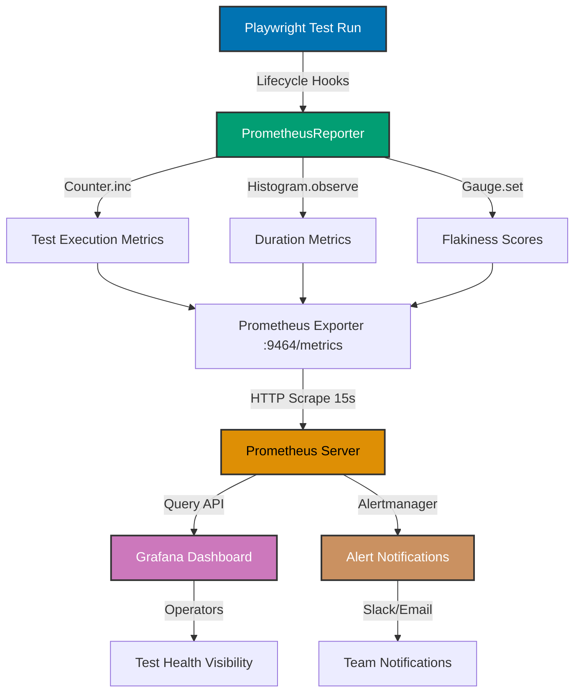

## Why This Matters

Test observability is critical for maintaining reliable CI/CD pipelines and detecting test health issues before they impact development velocity. In production environments, understanding test behavior patterns, identifying flaky tests, and tracking performance metrics enables proactive quality management. Without proper monitoring, teams discover test issues through build failures rather than through systematic analysis of test health metrics.

Production test suites require visibility into execution patterns, failure trends, and performance characteristics. Test monitoring provides data-driven insights for test maintenance decisions, flakiness detection, and resource allocation. Modern test observability systems integrate with enterprise monitoring infrastructure, enabling correlation between test failures and infrastructure issues, automated alerting for critical test failures, and historical trend analysis for capacity planning.

This guide demonstrates progression from Playwright's built-in reporting to production-grade monitoring with Grafana and Prometheus, showing how to implement metrics collection, flakiness tracking, and intelligent alerting for test health management.

## Standard Library Approach: Playwright Reporters

Playwright provides built-in reporters for test execution visibility without external dependencies.

```typescript
// => playwright.config.ts configuration
import { defineConfig } from "@playwright/test";
// => Import Playwright configuration API
// => defineConfig provides TypeScript type safety

export default defineConfig({
  // => Export default configuration object
  // => Playwright CLI reads this file at runtime

  reporter: [
    // => Reporters array configures output formats
    // => Multiple reporters run simultaneously
    // => Each reporter receives test events independently

    ["list"],
    // => list reporter shows test progress to console
    // => Prints test names during execution
    // => Format: "✓ test-name (123ms)"

    ["html", { outputFolder: "playwright-report" }],
    // => html reporter generates interactive HTML report
    // => Opens automatically after test run with --reporter=html
    // => Contains screenshots, traces, test timings

    ["json", { outputFile: "test-results.json" }],
    // => json reporter outputs structured test data
    // => Machine-readable format for CI/CD integration
    // => Contains test results, durations, error details

    ["junit", { outputFile: "junit-results.xml" }],
    // => junit reporter generates XML for CI systems
    // => Compatible with Jenkins, CircleCI, GitLab CI
    // => Standard format: <testsuite><testcase>...</testcase></testsuite>
  ],

  use: {
    trace: "on-first-retry",
    // => Capture trace files for debugging on retry
    // => trace files contain DOM snapshots, network logs
    // => View with: npx playwright show-trace trace.zip

    screenshot: "only-on-failure",
    // => Capture screenshots when tests fail
    // => Attached to HTML report automatically
    // => Useful for visual debugging

    video: "retain-on-failure",
    // => Record video during test execution
    // => Keep videos only when test fails
    // => Reduces storage requirements vs 'on'
  },
});
```

Run tests with built-in reporting:

```bash
# => Execute tests with default reporters
npx playwright test
# => Generates HTML report in playwright-report/
# => Outputs JSON to test-results.json
# => Creates JUnit XML in junit-results.xml

# => Open HTML report in browser
npx playwright show-report
# => Starts local server on http://localhost:9323
# => Interactive UI shows test results, traces, screenshots
```

**Limitations for production**:

- **No time-series metrics**: Reports are per-run, no historical trends or aggregation across runs
- **No alerting**: Requires manual inspection of reports, no automated notifications for failures
- **Limited flakiness detection**: Cannot identify patterns across multiple runs without external tooling
- **No centralized dashboard**: Each test run produces separate reports, no unified view across projects
- **Storage overhead**: HTML reports and videos accumulate disk space without automatic retention policies
- **No correlation with infrastructure**: Cannot link test failures to system metrics or deployment events

## Production Framework: Prometheus + Grafana

Production monitoring integrates test metrics into enterprise observability platforms with Prometheus for metrics collection and Grafana for visualization.

```typescript
// => metrics.ts - Prometheus metrics exporter
import { Counter, Histogram, Gauge, register } from "prom-client";
// => prom-client provides Prometheus metrics API
// => Counter: incrementing values (test count, failures)
// => Histogram: distribution tracking (durations)
// => Gauge: point-in-time values (active tests)
// => register: default registry for metric collection

export const testCounter = new Counter({
  // => Counter tracks cumulative test executions
  // => Increments never decrease (monotonic)
  // => Prometheus calculates rate with rate() function

  name: "playwright_tests_total",
  // => Metric name in Prometheus format: <prefix>_<metric>_<unit>
  // => Convention: use snake_case, end with _total for counters
  help: "Total number of Playwright tests executed",
  // => help text displayed in Grafana UI
  // => Describes metric purpose for operations team
  labelNames: ["status", "project", "testFile", "retry"],
  // => Labels enable metric segmentation
  // => Query example: playwright_tests_total{status="passed"}
  // => Cardinality warning: avoid high-cardinality labels (testName)
});

export const testDuration = new Histogram({
  // => Histogram tracks duration distribution
  // => Automatically creates _bucket, _sum, _count metrics
  // => Enables percentile calculation (p50, p95, p99)

  name: "playwright_test_duration_seconds",
  // => Duration metrics always in seconds (not ms)
  // => Prometheus convention for time measurements
  help: "Playwright test execution duration",
  labelNames: ["project", "testFile", "status"],
  // => Labels match testCounter for consistent querying
  buckets: [0.1, 0.5, 1, 2, 5, 10, 30, 60, 120],
  // => Buckets define histogram boundaries in seconds
  // => 0.1s = 100ms (fast tests)
  // => 120s = 2min (timeout threshold)
  // => Choose buckets based on expected test durations
});

export const flakinessScore = new Gauge({
  // => Gauge tracks current flakiness score value
  // => Can increase or decrease (non-monotonic)
  // => Set to calculated flakiness percentage

  name: "playwright_test_flakiness_score",
  // => Score ranges 0-100 (percentage flaky)
  // => Calculated from recent test run history
  help: "Flakiness score for test (0-100)",
  labelNames: ["project", "testFile", "testName"],
  // => testName label acceptable here (limited cardinality)
  // => Each test gets one flakiness score gauge
});

export const activeTests = new Gauge({
  // => Gauge tracks concurrent test execution
  // => Incremented at test start, decremented at finish
  // => Useful for capacity planning

  name: "playwright_active_tests",
  help: "Number of currently executing tests",
  labelNames: ["project"],
  // => Single label reduces cardinality
  // => Aggregated view across all tests in project
});
```

```typescript
// => reporter.ts - Custom Playwright reporter
import type { Reporter, FullConfig, Suite, TestCase, TestResult, FullResult } from "@playwright/test/reporter";
// => Reporter interface defines required methods
// => Playwright calls these hooks during test execution
// => FullConfig: runtime configuration
// => TestCase: individual test metadata
// => TestResult: test execution result

import { testCounter, testDuration, activeTests, flakinessScore, register } from "./metrics";
// => Import Prometheus metrics from metrics.ts
// => register used to expose metrics endpoint

import * as http from "http";
// => Node.js http module for metrics endpoint server
// => Prometheus scrapes HTTP endpoint /metrics

class PrometheusReporter implements Reporter {
  // => Custom reporter exports metrics to Prometheus
  // => Implements Reporter interface for lifecycle hooks
  // => Playwright instantiates this via playwright.config.ts

  private server: http.Server | null = null;
  // => HTTP server instance for metrics endpoint
  // => Null until onBegin() starts server
  // => Stopped in onEnd()

  private testStartTimes = new Map<string, number>();
  // => Track test start timestamp for duration calculation
  // => Key: test.id, Value: Date.now() at start
  // => Cleared in onTestEnd()

  private flakinessHistory = new Map<string, { passed: number; failed: number }>();
  // => Track test pass/fail history for flakiness score
  // => Key: test.id, Value: counts of passed and failed runs
  // => Persisted across test runs (in-memory for demo)

  onBegin(config: FullConfig, suite: Suite): void {
    // => Called once before test execution starts
    // => config: runtime configuration
    // => suite: root test suite containing all tests

    this.server = http.createServer((req, res) => {
      // => Create HTTP server for Prometheus scraping
      // => Listens on /metrics endpoint
      // => Prometheus configured to scrape this endpoint

      if (req.url === "/metrics") {
        // => Prometheus expects metrics at /metrics path
        // => Standard Prometheus scraping convention
        // => Returns all registered metrics in text format

        res.setHeader("Content-Type", register.contentType);
        // => Set correct MIME type for Prometheus
        // => Content-Type: text/plain; version=0.0.4; charset=utf-8
        // => Prometheus validates content type

        register.metrics().then((metrics) => {
          // => Collect all metrics from registry
          // => Async operation queries current metric values
          // => Returns Prometheus text format

          res.end(metrics);
          // => Send metrics to Prometheus scraper
          // => Format: metric_name{label="value"} 123 timestamp
        });
      } else {
        // => Non-metrics path returns 404
        res.writeHead(404).end();
      }
    });

    this.server.listen(9464);
    // => Start metrics endpoint on port 9464
    // => Standard Prometheus exporter port range: 9100-9999
    // => Prometheus scrapes http://localhost:9464/metrics

    console.log("Prometheus metrics endpoint: http://localhost:9464/metrics");
    // => Log endpoint for verification
    // => Operators can test with: curl http://localhost:9464/metrics
  }

  onTestBegin(test: TestCase): void {
    // => Called when individual test starts execution
    // => test: metadata including test name, file, project

    this.testStartTimes.set(test.id, Date.now());
    // => Record start timestamp for duration calculation
    // => Duration = end timestamp - start timestamp
    // => Stored in Map for lookup in onTestEnd()

    activeTests.inc({ project: test.parent.project()?.name || "default" });
    // => Increment active test gauge
    // => project label from test metadata
    // => Decremented in onTestEnd()
  }

  onTestEnd(test: TestCase, result: TestResult): void {
    // => Called when individual test completes
    // => result: contains status (passed/failed), duration, errors

    const startTime = this.testStartTimes.get(test.id);
    // => Retrieve start timestamp from Map
    // => undefined if onTestBegin() not called (shouldn't happen)
    if (startTime) {
      const duration = (Date.now() - startTime) / 1000;
      // => Calculate duration in seconds
      // => Date.now() returns milliseconds, divide by 1000
      // => Prometheus duration metrics always in seconds

      testDuration.observe(
        {
          project: test.parent.project()?.name || "default",
          testFile: test.location.file,
          status: result.status,
        },
        duration,
      );
      // => Record test duration in histogram
      // => observe() adds sample to histogram buckets
      // => Enables percentile queries in Grafana

      this.testStartTimes.delete(test.id);
      // => Clean up start time from Map
      // => Prevents memory leak from long test runs
    }

    testCounter.inc({
      // => Increment test execution counter
      // => Labels enable filtering by status, project, file
      status: result.status,
      project: test.parent.project()?.name || "default",
      testFile: test.location.file,
      retry: result.retry.toString(),
      // => retry indicates flaky test (retry > 0)
      // => Query for flaky tests: playwright_tests_total{retry!="0"}
    });

    activeTests.dec({ project: test.parent.project()?.name || "default" });
    // => Decrement active test gauge
    // => Matches inc() in onTestBegin()
    // => Gauge returns to 0 when all tests complete

    // => Update flakiness score
    const testKey = `${test.location.file}:${test.title}`;
    // => Unique key per test for flakiness tracking
    // => Combines file path and test title
    const history = this.flakinessHistory.get(testKey) || { passed: 0, failed: 0 };
    // => Retrieve existing history or initialize
    // => Default: { passed: 0, failed: 0 }

    if (result.status === "passed") {
      history.passed++;
      // => Increment passed count
    } else if (result.status === "failed" || result.status === "timedOut") {
      history.failed++;
      // => Increment failed count
      // => timedOut considered failure for flakiness
    }

    this.flakinessHistory.set(testKey, history);
    // => Persist updated history
    // => Accumulates across test runs in this session

    const totalRuns = history.passed + history.failed;
    if (totalRuns > 0) {
      const flakinessPercentage = (history.failed / totalRuns) * 100;
      // => Calculate flakiness as percentage of failures
      // => Range: 0-100 (0 = never failed, 100 = always failed)

      flakinessScore.set(
        {
          project: test.parent.project()?.name || "default",
          testFile: test.location.file,
          testName: test.title,
        },
        flakinessPercentage,
      );
      // => Update gauge with flakiness score
      // => Grafana can alert on high flakiness scores
    }
  }

  onEnd(result: FullResult): void {
    // => Called once after all tests complete
    // => result: overall test run result

    if (this.server) {
      // => Keep server running for final scrape
      // => Prometheus scrapes on interval (e.g., every 15s)
      // => Delay shutdown to ensure final metrics collected

      setTimeout(() => {
        this.server?.close();
        // => Close HTTP server after delay
        // => Optional: can keep running for continuous scraping
      }, 5000);
      // => 5 second delay for final Prometheus scrape
      // => Ensures all metrics collected before shutdown
    }
  }
}

export default PrometheusReporter;
// => Export as default for playwright.config.ts
// => Playwright loads reporter with: require('./reporter.ts')
```

Configure Playwright to use custom reporter:

```typescript
// => playwright.config.ts
import { defineConfig } from "@playwright/test";

export default defineConfig({
  reporter: [
    ["list"],
    // => Keep list reporter for console output
    // => Provides immediate feedback during test runs

    ["./reporter.ts"],
    // => Load custom Prometheus reporter
    // => Playwright instantiates PrometheusReporter class
    // => Calls lifecycle hooks during test execution
  ],

  retries: 2,
  // => Enable retries for flakiness detection
  // => retry label in metrics indicates flaky tests
  // => Production recommendation: 2 retries maximum
});
```

Install dependencies:

```bash
# => Install Prometheus client library
npm install prom-client --save-dev
# => prom-client: official Prometheus client for Node.js
# => --save-dev: development dependency (not production code)
```

**Prometheus configuration** (prometheus.yml):

```yaml
# => Prometheus scraping configuration
# => Defines scrape targets and intervals

scrape_configs:
  # => List of scrape target configurations
  # => Each config defines how to collect metrics

  - job_name: "playwright-tests"
    # => Job name appears in Prometheus UI
    # => Groups related scrape targets

    scrape_interval: 15s
    # => Scrape metrics every 15 seconds
    # => Balance: frequent enough for alerting, not overwhelming

    static_configs:
      # => Static target configuration (manual IPs)
      # => Alternative: service discovery for dynamic targets

      - targets: ["localhost:9464"]
        # => Scrape metrics endpoint exposed by reporter
        # => Matches port in reporter.ts: this.server.listen(9464)

        labels:
          # => Additional labels applied to all metrics
          # => Useful for multi-environment deployments
          environment: "ci"
          # => Identifies CI environment vs local development
          # => Query: playwright_tests_total{environment="ci"}

  - job_name: "node-exporter"
    # => Optional: scrape system metrics
    # => Correlate test failures with CPU/memory issues

    static_configs:
      - targets: ["localhost:9100"]
        # => node-exporter provides system metrics
        # => Install with: docker run -p 9100:9100 prom/node-exporter
```

**Grafana dashboard** (JSON model):

```json
{
  "dashboard": {
    "title": "Playwright Test Monitoring",
    "panels": [
      {
        "title": "Test Pass Rate",
        "targets": [
          {
            "expr": "sum(rate(playwright_tests_total{status=\"passed\"}[5m])) / sum(rate(playwright_tests_total[5m])) * 100"
          }
        ],
        "type": "stat"
      },
      {
        "title": "Test Duration p95",
        "targets": [
          {
            "expr": "histogram_quantile(0.95, sum(rate(playwright_test_duration_seconds_bucket[5m])) by (le, project))"
          }
        ],
        "type": "graph"
      },
      {
        "title": "Flaky Tests (>10% failure rate)",
        "targets": [
          {
            "expr": "playwright_test_flakiness_score > 10"
          }
        ],
        "type": "table"
      }
    ]
  }
}
```

## Metrics Collection Architecture



## Production Patterns and Best Practices

### Pattern 1: Test Duration Percentile Alerting

Track test performance degradation using histogram percentiles.

```typescript
// => alerting-rules.ts
interface AlertRule {
  name: string;
  expr: string;
  for: string;
  labels: Record<string, string>;
  annotations: Record<string, string>;
}

export const durationAlertRules: AlertRule[] = [
  // => Array of Prometheus alerting rules
  // => Loaded into Prometheus via rules file

  {
    name: "TestDurationP95High",
    // => Alert name in Prometheus and Grafana
    // => Appears in Alertmanager notifications

    expr: "histogram_quantile(0.95, sum(rate(playwright_test_duration_seconds_bucket[5m])) by (le, project)) > 60",
    // => PromQL expression defines alert condition
    // => histogram_quantile(0.95, ...) = 95th percentile
    // => rate([5m]) = per-second rate over 5 minutes
    // => > 60 = alert when p95 exceeds 60 seconds

    for: "5m",
    // => Alert fires only if condition true for 5 minutes
    // => Prevents flapping on temporary spikes
    // => Production recommendation: 2x scrape_interval

    labels: {
      severity: "warning",
      // => Alert severity for routing and filtering
      // => warning: non-critical, requires investigation
      // => critical: immediate action required

      team: "qa",
      // => Route alert to QA team
      // => Alertmanager uses labels for routing rules
    },

    annotations: {
      summary: "Test duration p95 above 60s for {{ $labels.project }}",
      // => Summary shown in alert notification
      // => {{ $labels.project }} replaced with actual project name

      description: "The 95th percentile test duration is {{ $value }}s, indicating performance degradation.",
      // => Detailed description with actual metric value
      // => {{ $value }} replaced with p95 duration
    },
  },

  {
    name: "TestDurationP99Critical",
    expr: "histogram_quantile(0.99, sum(rate(playwright_test_duration_seconds_bucket[5m])) by (le, project)) > 120",
    // => p99 threshold higher than p95
    // => 120s = 2 minute timeout threshold
    // => Critical alert for severe performance issues

    for: "2m",
    // => Shorter duration for critical alerts
    // => Requires faster response

    labels: {
      severity: "critical",
      team: "qa",
    },

    annotations: {
      summary: "Test duration p99 above 120s for {{ $labels.project }}",
      description: "Severe performance degradation detected. p99 duration: {{ $value }}s.",
    },
  },
];
```

**Prometheus rules configuration**:

```yaml
# => prometheus-rules.yml
# => Loaded by Prometheus via rule_files configuration

groups:
  # => Group related alerting rules
  # => Evaluated together on interval

  - name: playwright_alerts
    # => Group name for organization
    # => Appears in Prometheus UI

    interval: 30s
    # => Evaluation interval for rules
    # => Balance: detect issues quickly, avoid overhead

    rules:
      # => List of alerting rules
      # => Each rule defines condition and metadata

      - alert: TestDurationP95High
        # => Alert name matches durationAlertRules
        expr: histogram_quantile(0.95, sum(rate(playwright_test_duration_seconds_bucket[5m])) by (le, project)) > 60
        # => PromQL expression evaluated every 30s
        for: 5m
        # => Alert pending for 5 minutes before firing
        labels:
          severity: warning
          team: qa
        annotations:
          summary: "Test duration p95 above 60s for {{ $labels.project }}"
          description: "The 95th percentile test duration is {{ $value }}s."

      - alert: TestDurationP99Critical
        expr: histogram_quantile(0.99, sum(rate(playwright_test_duration_seconds_bucket[5m])) by (le, project)) > 120
        for: 2m
        labels:
          severity: critical
          team: qa
        annotations:
          summary: "Test duration p99 above 120s for {{ $labels.project }}"
          description: "Severe performance degradation detected. p99: {{ $value }}s."
```

### Pattern 2: Flakiness Tracking and Remediation

Identify and track flaky tests systematically.

```typescript
// => flakiness-tracker.ts
import { flakinessScore } from "./metrics";

interface FlakyTest {
  project: string;
  testFile: string;
  testName: string;
  flakinessPercentage: number;
  totalRuns: number;
  failedRuns: number;
}

export class FlakinessTracker {
  // => Tracks flaky test patterns for remediation
  // => Persists flakiness data across test runs
  // => Identifies tests requiring stabilization

  private flakinessData = new Map<string, FlakyTest>();
  // => In-memory store for flakiness tracking
  // => Key: test identifier (file:name)
  // => Value: aggregated flakiness statistics
  // => Production: persist to database (PostgreSQL, MongoDB)

  private readonly FLAKINESS_THRESHOLD = 10;
  // => Alert threshold: 10% failure rate
  // => Tests above threshold flagged for remediation
  // => Adjustable based on team tolerance

  recordTestResult(project: string, testFile: string, testName: string, passed: boolean): void {
    // => Record individual test result for flakiness calculation
    // => Called from reporter onTestEnd()

    const key = `${testFile}:${testName}`;
    // => Unique identifier per test
    // => Combines file path and test title

    const existing = this.flakinessData.get(key);
    // => Retrieve existing flakiness data
    // => undefined if first run of this test

    if (existing) {
      // => Update existing record
      existing.totalRuns++;
      if (!passed) existing.failedRuns++;
      existing.flakinessPercentage = (existing.failedRuns / existing.totalRuns) * 100;
      // => Recalculate flakiness percentage
      // => Formula: (failed / total) * 100
    } else {
      // => Create new record for first run
      this.flakinessData.set(key, {
        project,
        testFile,
        testName,
        totalRuns: 1,
        failedRuns: passed ? 0 : 1,
        flakinessPercentage: passed ? 0 : 100,
        // => First failure = 100% flakiness
        // => Requires multiple runs to stabilize
      });
    }

    // => Update Prometheus gauge
    const data = this.flakinessData.get(key)!;
    flakinessScore.set(
      {
        project: data.project,
        testFile: data.testFile,
        testName: data.testName,
      },
      data.flakinessPercentage,
    );
    // => Gauge updated on every test result
    // => Grafana shows real-time flakiness trends
  }

  getFlakyTests(): FlakyTest[] {
    // => Retrieve tests exceeding flakiness threshold
    // => Returns array sorted by flakiness percentage
    // => Used for remediation prioritization

    return (
      Array.from(this.flakinessData.values())
        .filter((test) => test.flakinessPercentage > this.FLAKINESS_THRESHOLD)
        // => Filter tests above 10% failure rate
        // => Adjustable threshold per team policy

        .sort((a, b) => b.flakinessPercentage - a.flakinessPercentage)
    );
    // => Sort descending by flakiness
    // => Most flaky tests first for prioritization
  }

  generateRemediationReport(): string {
    // => Generate human-readable flakiness report
    // => Used for team communication and tracking

    const flakyTests = this.getFlakyTests();

    if (flakyTests.length === 0) {
      return "No flaky tests detected. Test suite stability: excellent.";
    }

    let report = `Flaky Tests Detected: ${flakyTests.length}\n\n`;
    // => Header with count of flaky tests

    flakyTests.forEach((test, index) => {
      report += `${index + 1}. ${test.testName}\n`;
      report += `   File: ${test.testFile}\n`;
      report += `   Project: ${test.project}\n`;
      report += `   Flakiness: ${test.flakinessPercentage.toFixed(2)}%\n`;
      // => Format percentage to 2 decimal places
      // => Example: 15.67%

      report += `   Failed: ${test.failedRuns}/${test.totalRuns} runs\n\n`;
      // => Show actual failure count and total runs
      // => Provides confidence in flakiness score
    });

    return report;
    // => Returns formatted markdown report
    // => Post to Slack, email, or issue tracker
  }

  exportToJson(): string {
    // => Export flakiness data as JSON
    // => Used for historical analysis or external tools

    return JSON.stringify(
      Array.from(this.flakinessData.values()),
      null,
      2,
      // => Pretty-print JSON with 2-space indentation
    );
  }
}
```

**Alerting configuration for flaky tests**:

```yaml
# => prometheus-rules.yml (flakiness alerts)
- alert: FlakyTestDetected
  # => Alert when flakiness score exceeds threshold
  expr: playwright_test_flakiness_score > 10
  # => > 10 means more than 10% failure rate
  # => Adjust threshold based on team tolerance

  for: 1h
  # => Alert fires after 1 hour of sustained flakiness
  # => Prevents alerting on single failed run
  # => Requires pattern across multiple test runs

  labels:
    severity: warning
    team: qa
  annotations:
    summary: "Flaky test detected: {{ $labels.testName }}"
    # => Alert includes test name from metric label
    description: "Test has {{ $value }}% failure rate in recent runs."
    # => $value replaced with flakiness percentage
```

### Pattern 3: CI/CD Integration with Alerting

Integrate test monitoring into CI/CD pipeline with automated alerts.

```typescript
// => ci-integration.ts
import { FlakinessTracker } from "./flakiness-tracker";
import { register } from "prom-client";

interface CIMetrics {
  // => CI-specific metrics for pipeline visibility
  buildNumber: string;
  commitSha: string;
  branch: string;
  passRate: number;
  duration: number;
  flakyTestCount: number;
}

export class CIIntegration {
  // => Integrates test monitoring with CI/CD pipeline
  // => Posts metrics to pipeline and alerting systems

  private flakinessTracker: FlakinessTracker;
  // => Tracks flakiness across pipeline runs

  constructor() {
    this.flakinessTracker = new FlakinessTracker();
  }

  async publishMetricsToPipeline(): Promise<void> {
    // => Publish metrics to CI system (Jenkins, GitLab, GitHub Actions)
    // => Called at end of test run in CI pipeline

    const metrics = await register.metrics();
    // => Retrieve all Prometheus metrics as text
    // => Format: metric_name{labels} value timestamp

    // => Write metrics to file for CI artifact storage
    await Bun.write("ci-metrics.txt", metrics);
    // => Bun.write: async file write
    // => CI stores ci-metrics.txt as build artifact
    // => Historical metrics available in CI UI

    console.log("Metrics published to CI pipeline artifact: ci-metrics.txt");
  }

  async sendSlackAlert(webhookUrl: string): Promise<void> {
    // => Send alert to Slack when tests fail or flakiness detected
    // => webhookUrl: Slack incoming webhook URL

    const flakyTests = this.flakinessTracker.getFlakyTests();
    // => Retrieve tests exceeding flakiness threshold

    if (flakyTests.length === 0) {
      return;
      // => No alert if no flaky tests
      // => Reduces notification noise
    }

    const message = {
      text: "Flaky Tests Detected in CI Pipeline",
      // => Slack message text (fallback for notifications)

      blocks: [
        // => Slack Block Kit for rich formatting
        // => Provides interactive UI in Slack

        {
          type: "section",
          text: {
            type: "mrkdwn",
            text: `*Flaky Tests Detected*: ${flakyTests.length} tests`,
            // => Markdown formatting in Slack
            // => *bold*, _italic_, `code`
          },
        },
        {
          type: "divider",
          // => Visual separator in Slack message
        },
        ...flakyTests.slice(0, 5).map((test) => ({
          // => Show top 5 flaky tests
          // => Prevents message overflow

          type: "section",
          text: {
            type: "mrkdwn",
            text: `*${test.testName}*\nFlakiness: ${test.flakinessPercentage.toFixed(2)}%\nFile: \`${test.testFile}\``,
            // => Markdown formatting for test details
            // => Backticks for code formatting
          },
        })),
        {
          type: "context",
          elements: [
            {
              type: "mrkdwn",
              text: "View full report in CI artifacts or Grafana dashboard.",
              // => Footer with actionable next steps
            },
          ],
        },
      ],
    };

    try {
      const response = await fetch(webhookUrl, {
        method: "POST",
        headers: { "Content-Type": "application/json" },
        body: JSON.stringify(message),
        // => Send Slack message via webhook
      });

      if (!response.ok) {
        throw new Error(`Slack webhook failed: ${response.statusText}`);
        // => Throw error if webhook fails
        // => Logged to CI pipeline for debugging
      }

      console.log("Slack alert sent successfully");
    } catch (error) {
      console.error("Failed to send Slack alert:", error);
      // => Log error but don't fail CI pipeline
      // => Alerting failure should not block deployment
    }
  }

  generateCIReport(): CIMetrics {
    // => Generate CI-specific metrics report
    // => Posted to CI pipeline for build status

    const flakyTests = this.flakinessTracker.getFlakyTests();

    return {
      buildNumber: process.env.CI_BUILD_NUMBER || "unknown",
      // => Read build number from CI environment variable
      // => Different variable per CI system (CI_BUILD_NUMBER, BUILD_ID, etc.)

      commitSha: process.env.CI_COMMIT_SHA || "unknown",
      // => Git commit hash from CI environment

      branch: process.env.CI_BRANCH || "unknown",
      // => Git branch name from CI environment

      passRate: 0,
      // => Placeholder: calculate from test results
      // => Formula: passed / total * 100

      duration: 0,
      // => Placeholder: total test run duration
      // => Sum of all test durations

      flakyTestCount: flakyTests.length,
      // => Count of flaky tests above threshold
    };
  }
}
```

**GitHub Actions workflow integration**:

```yaml
# => .github/workflows/playwright.yml
name: Playwright Tests

on:
  push:
    branches: [main, develop]
  pull_request:

jobs:
  test:
    runs-on: ubuntu-latest
    # => Run tests on Ubuntu (standard CI environment)

    services:
      prometheus:
        # => Start Prometheus as service container
        # => Scrapes metrics during test run

        image: prom/prometheus:latest
        ports:
          - 9090:9090
          # => Expose Prometheus UI on port 9090
        volumes:
          - ./prometheus.yml:/etc/prometheus/prometheus.yml
          # => Mount Prometheus configuration

    steps:
      - uses: actions/checkout@v3
        # => Checkout code from repository

      - uses: actions/setup-node@v3
        with:
          node-version: "20"
          # => Install Node.js 20 (LTS)

      - run: npm ci
        # => Install dependencies (clean install)

      - run: npx playwright install --with-deps
        # => Install Playwright browsers

      - run: npx playwright test
        # => Run tests with Prometheus reporter
        # => Metrics exported to http://localhost:9464/metrics

      - name: Publish metrics
        if: always()
        # => Run even if tests fail
        # => Ensures metrics published for failed runs
        run: |
          curl http://localhost:9464/metrics > ci-metrics.txt
          # => Download metrics from reporter endpoint
          # => Save to file for artifact upload

      - name: Upload metrics artifact
        if: always()
        uses: actions/upload-artifact@v3
        with:
          name: test-metrics
          path: ci-metrics.txt
          # => Upload metrics as CI artifact
          # => Available in GitHub Actions UI

      - name: Send Slack notification
        if: failure()
        # => Send alert only on test failure
        env:
          SLACK_WEBHOOK: ${{ secrets.SLACK_WEBHOOK_URL }}
          # => Webhook URL from GitHub Secrets
        run: |
          node -e "require('./ci-integration').sendSlackAlert(process.env.SLACK_WEBHOOK)"
          # => Call Slack alerting function
```

## Trade-offs and When to Use

**Standard Approach (Built-in Reporters)**:

- **Use when**: Small projects, local development, simple CI pipelines, exploratory testing
- **Benefits**: Zero configuration, no external dependencies, HTML reports for visual debugging, works out-of-box with Playwright
- **Costs**: No historical trends, manual report inspection, limited flakiness detection, no centralized dashboard, storage accumulation

**Production Framework (Prometheus + Grafana)**:

- **Use when**: Large test suites, multiple projects, production CI/CD, team collaboration, flakiness issues, performance monitoring needs
- **Benefits**: Time-series metrics, automated alerting, centralized dashboards, flakiness tracking, infrastructure correlation, historical analysis, capacity planning
- **Costs**: Additional infrastructure (Prometheus, Grafana), learning curve (PromQL, Grafana dashboards), maintenance overhead, storage requirements for long-term metrics

**Production recommendation**: Adopt Prometheus + Grafana for production test suites with more than 100 tests or when flakiness impacts development velocity. The investment in observability infrastructure pays off through reduced debugging time, proactive failure detection, and data-driven test maintenance decisions. Start with built-in reporters for small projects and migrate to production monitoring as test suite grows and observability needs increase.

## Security Considerations

- **Metrics endpoint exposure**: Run metrics endpoint on internal network only, use authentication (basic auth, mutual TLS) for production Prometheus scrapers
- **Sensitive data in labels**: Avoid including secrets, passwords, or PII in metric labels or annotations (labels are indexed and queryable)
- **Grafana access control**: Implement role-based access control (RBAC) in Grafana for team-based dashboard access
- **Alerting webhook secrets**: Store Slack/email webhook URLs in secret management systems (HashiCorp Vault, AWS Secrets Manager), never commit to version control
- **Prometheus data retention**: Configure retention policies to comply with data governance requirements (e.g., GDPR), typically 15-30 days for test metrics

## Common Pitfalls

1. **High cardinality labels**: Avoid using test names or dynamic values in metric labels (causes Prometheus memory issues with 1000+ unique values). Use aggregation levels: project, testFile only.
2. **Missing rate() functions**: Counter metrics require rate() function for meaningful queries (counters are cumulative). Query pattern: `rate(playwright_tests_total[5m])` not `playwright_tests_total`.
3. **Insufficient histogram buckets**: Choose histogram buckets based on actual test duration distribution. Too few buckets lose precision for percentile calculations.
4. **Ignoring alert fatigue**: Tune alert thresholds and for durations to avoid notification overload. Start conservative (p99 > 120s) and tighten based on team capacity.
5. **Not persisting flakiness data**: In-memory flakiness tracking resets on process restart. Persist to database (PostgreSQL) for long-term trend analysis and remediation tracking.
