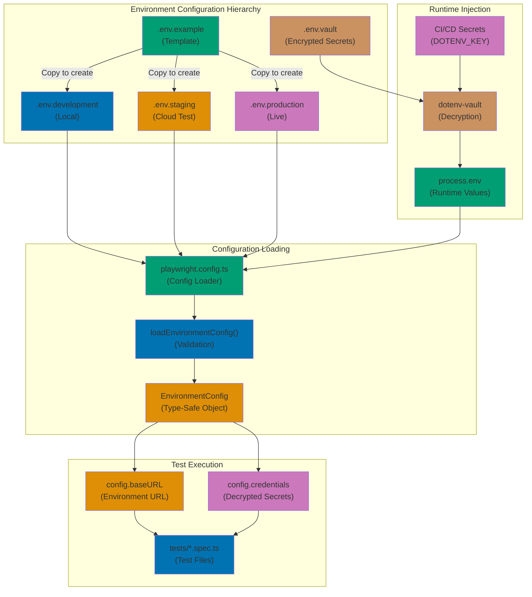

## Why This Matters

Production Playwright test suites run against multiple environments with different base URLs, authentication endpoints, API servers, and database configurations. Development environments use localhost, staging environments mirror production infrastructure with test data, and production environments serve real users with live data. Hardcoding environment-specific values creates brittle tests that fail when promoted across environments and require code changes for each deployment.

Traditional test automation approaches embed environment configuration in test code through string literals, making environment changes require code modifications, pull requests, and redeploys. This creates friction for QA teams who need to run tests against ephemeral preview environments, developers who switch between local and cloud environments, and DevOps teams who deploy to multiple regions. Environment-specific failures become difficult to reproduce because test behavior depends on hardcoded values that don't match the target environment.

Production-grade environment configuration externalizes all environment-specific values into configuration files, environment variables, and secure secret stores. Tests reference logical configuration keys rather than literal values, enabling the same test code to execute against any environment by simply changing configuration. This separation of concerns allows QA engineers to manage test environments independently from developers, enables CI/CD pipelines to inject environment-specific values at runtime, and supports secure secret management through tools like HashiCorp Vault, AWS Secrets Manager, or Azure Key Vault.

## Standard Library Approach: Environment Variables and TypeScript Process.env

Node.js provides built-in environment variable access through `process.env` without requiring external dependencies.

```typescript
// playwright.config.ts
// => Playwright configuration reading environment variables
import { defineConfig, devices } from "@playwright/test";
// => defineConfig provides type-safe configuration
// => devices contains browser viewport presets

const baseURL = process.env.BASE_URL || "http://localhost:3000";
// => Reads BASE_URL from environment variables
// => Falls back to localhost if not set
// => process.env is Node.js standard library (no imports)
// => Populated from shell environment or .env files

const apiURL = process.env.API_URL || "http://localhost:8080";
// => API server URL for backend requests
// => Different from frontend BASE_URL in microservices
// => Falls back to local development server

export default defineConfig({
  // => Root configuration object
  testDir: "./tests",
  // => Directory containing test files

  use: {
    // => Global test execution options
    baseURL: baseURL,
    // => All page.goto() calls resolve relative to baseURL
    // => page.goto("/login") becomes http://localhost:3000/login
    // => Eliminates hardcoded URLs in test code

    extraHTTPHeaders: {
      // => Headers added to all requests
      "X-API-URL": apiURL,
      // => Custom header passing API URL to tests
      // => Tests access via page.request.context()
    },
  },

  projects: [
    // => Browser configurations for parallel execution
    {
      name: "chromium",
      // => Project identifier for this browser
      use: { ...devices["Desktop Chrome"] },
      // => Spreads Desktop Chrome viewport and user agent
    },
  ],
});
```

```typescript
// tests/auth.spec.ts
// => Authentication test using environment configuration
import { test, expect } from "@playwright/test";
// => test provides test runner, expect provides assertions

const username = process.env.TEST_USERNAME || "testuser";
// => Test credentials from environment variables
// => Falls back to default for local development
// => Keeps credentials out of source control

const password = process.env.TEST_PASSWORD || "testpass";
// => Password from environment variables
// => Never committed to repository
// => CI injects from secret store

test("user logs in successfully", async ({ page }) => {
  // => Async test function receives page fixture
  // => page inherits baseURL from config

  await page.goto("/login");
  // => Navigates to baseURL + "/login"
  // => Resolves to http://localhost:3000/login locally
  // => Resolves to https://staging.example.com/login in staging
  // => No hardcoded URLs in test

  await page.fill("#username", username);
  // => Fills username from environment variable
  // => Different credentials per environment
  // => Local dev uses testuser, production uses real account

  await page.fill("#password", password);
  // => Fills password from environment variable
  // => Sensitive data never in source code

  await page.click("button[type=submit]");
  // => Submits login form
  // => Clicks first submit button

  await expect(page).toHaveURL("/dashboard");
  // => Verifies redirect to dashboard
  // => Relative URL resolves to baseURL + "/dashboard"
  // => Works across all environments
});
```

```bash
# .env.development
# => Development environment configuration
# => NOT committed to git (in .gitignore)
# => Local developers create from .env.example template

BASE_URL=http://localhost:3000
# => Local development server
# => Next.js dev server on port 3000

API_URL=http://localhost:8080
# => Local API server
# => Spring Boot dev server on port 8080

TEST_USERNAME=dev@example.com
# => Development test account
# => Safe to use default credentials locally

TEST_PASSWORD=devpassword
# => Development password
# => Not sensitive (local only)
```

```bash
# Running tests with environment configuration
npx playwright test
# => Uses .env.development by default (if dotenv configured)
# => Falls back to hardcoded defaults in config

BASE_URL=https://staging.example.com npx playwright test
# => Override environment variable at runtime
# => Staging environment uses production-like infrastructure
# => No code changes required for different environment
```

**Limitations for production**:

- **No automatic .env file loading**: Node.js doesn't load .env files by default (requires manual fs.readFileSync or dotenv library)
- **No environment hierarchy**: Cannot inherit staging config from production with overrides (flat key-value pairs only)
- **No type safety**: process.env values are always strings (no validation, no TypeScript types)
- **No secret encryption**: .env files stored as plaintext (dangerous if committed accidentally)
- **No secret rotation**: Changing secrets requires redeploying configuration files (no dynamic loading)
- **No secret auditing**: No visibility into who accessed secrets or when (compliance issue)
- **No config validation**: Typos in environment variable names fail silently (returns undefined)
- **Manual synchronization**: Keeping .env.development, .env.staging, .env.production in sync requires manual effort

## Production Framework: dotenv-vault with Configuration Inheritance

Production environment management requires encrypted secrets, configuration inheritance, and automated synchronization across environments.

### Installation and Setup

```bash
# Install dotenv-vault for production secret management
npm install --save-dev dotenv-vault
# => dotenv-vault extends dotenv with encryption and inheritance
# => Manages .env files with encryption at rest
# => Supports environment-specific overrides
# => Size: ~100KB (includes crypto libraries)
```

```bash
# Initialize vault
npx dotenv-vault new
# => Creates .env.vault for encrypted secrets
# => Generates DOTENV_KEY for decryption
# => .env.vault committed to git (encrypted)
# => DOTENV_KEY stored in CI/CD secrets (never committed)
```

```typescript
// playwright.config.ts
// => Production configuration with dotenv-vault
import { defineConfig, devices } from "@playwright/test";
// => defineConfig provides type-safe configuration
import * as dotenv from "dotenv";
// => dotenv for .env file parsing
import * as dotenvVault from "dotenv-vault-core";
// => dotenv-vault for encrypted secret management
// => Extends dotenv with .env.vault decryption

// Load environment configuration
dotenv.config({ path: `.env.${process.env.NODE_ENV || "development"}` });
// => Loads environment-specific .env file
// => .env.development, .env.staging, .env.production
// => NODE_ENV determines which file to load
// => Falls back to development if NODE_ENV not set

dotenvVault.config();
// => Decrypts .env.vault using DOTENV_KEY
// => Overrides .env values with encrypted vault values
// => Vault values take precedence over plaintext .env
// => DOTENV_KEY injected by CI/CD from secret store

// Configuration interface for type safety
interface EnvironmentConfig {
  // => Type-safe configuration object
  // => Prevents typos and missing values
  baseURL: string;
  // => Base URL for web application
  apiURL: string;
  // => API server URL
  authURL: string;
  // => Authentication service URL (OAuth, OIDC)
  credentials: {
    // => Nested configuration object
    username: string;
    // => Test account username
    password: string;
    // => Test account password (from vault)
    apiKey: string;
    // => API key for backend requests (from vault)
  };
  timeouts: {
    // => Environment-specific timeout values
    navigation: number;
    // => Page navigation timeout in milliseconds
    action: number;
    // => Action timeout for clicks, fills
  };
  retry: {
    // => Retry configuration per environment
    maxRetries: number;
    // => Max test retries on failure
    retryDelay: number;
    // => Delay between retries in milliseconds
  };
}

// Load and validate environment configuration
function loadEnvironmentConfig(): EnvironmentConfig {
  // => Factory function for type-safe config loading
  // => Validates required variables exist
  // => Throws error if misconfigured

  const requiredVars = ["BASE_URL", "API_URL", "AUTH_URL", "TEST_USERNAME", "TEST_PASSWORD", "API_KEY"];
  // => List of required environment variables
  // => Configuration validation at startup

  for (const varName of requiredVars) {
    // => Iterate required variables
    if (!process.env[varName]) {
      // => Check if variable defined
      throw new Error(
        `Missing required environment variable: ${varName}. ` +
          `Check .env.${process.env.NODE_ENV || "development"} file.`,
      );
      // => Fails fast with clear error message
      // => Prevents tests running with missing config
      // => Error message includes environment name
    }
  }

  return {
    // => Returns validated configuration object
    baseURL: process.env.BASE_URL!,
    // => Non-null assertion (validated above)
    apiURL: process.env.API_URL!,
    authURL: process.env.AUTH_URL!,
    credentials: {
      username: process.env.TEST_USERNAME!,
      password: process.env.TEST_PASSWORD!,
      // => Decrypted from .env.vault by dotenv-vault
      apiKey: process.env.API_KEY!,
      // => API key never in plaintext (vault only)
    },
    timeouts: {
      navigation: parseInt(process.env.NAVIGATION_TIMEOUT || "30000", 10),
      // => Parses string to number with default 30 seconds
      // => Different timeout per environment (staging slower)
      action: parseInt(process.env.ACTION_TIMEOUT || "10000", 10),
      // => Action timeout defaults to 10 seconds
    },
    retry: {
      maxRetries: parseInt(process.env.MAX_RETRIES || "2", 10),
      // => Production uses more retries for flaky networks
      retryDelay: parseInt(process.env.RETRY_DELAY || "1000", 10),
      // => Delay between retries (exponential backoff possible)
    },
  };
  // => Type-safe config object with validated values
}

const config = loadEnvironmentConfig();
// => Loads configuration at module initialization
// => Fails fast if misconfigured (before running tests)

export default defineConfig({
  // => Root Playwright configuration object
  testDir: "./tests",
  // => Directory containing test files

  timeout: config.timeouts.navigation,
  // => Global test timeout from environment config
  // => Staging environment may have higher timeout

  retries: config.retry.maxRetries,
  // => Retry failed tests based on environment
  // => Production CI uses more retries than local

  use: {
    // => Global test execution options
    baseURL: config.baseURL,
    // => All page.goto() calls resolve relative to baseURL
    // => Centralized URL configuration

    extraHTTPHeaders: {
      // => Headers added to all requests
      "X-API-Key": config.credentials.apiKey,
      // => API key from encrypted vault
      // => Never in plaintext in repository
    },

    actionTimeout: config.timeouts.action,
    // => Timeout for individual actions (click, fill)
    // => Environment-specific timeout tuning

    navigationTimeout: config.timeouts.navigation,
    // => Timeout for page navigation
    // => Staging may be slower than production
  },

  projects: [
    // => Browser configurations
    {
      name: "chromium",
      use: { ...devices["Desktop Chrome"] },
    },
  ],
});

// Export config for test access
export { config };
// => Tests import config for environment-specific behavior
```

```typescript
// tests/auth.spec.ts
// => Authentication test using production configuration
import { test, expect } from "@playwright/test";
// => test provides test runner, expect provides assertions
import { config } from "../playwright.config";
// => Imports centralized environment configuration
// => Type-safe access to configuration values

test("user logs in successfully", async ({ page }) => {
  // => Async test function receives page fixture
  // => page inherits baseURL from config

  await page.goto("/login");
  // => Navigates to baseURL + "/login"
  // => baseURL from environment configuration
  // => Resolves to correct environment (dev/staging/prod)

  await page.fill("#username", config.credentials.username);
  // => Fills username from type-safe config
  // => Different credentials per environment
  // => No process.env direct access in tests

  await page.fill("#password", config.credentials.password);
  // => Fills password from encrypted vault
  // => Decrypted by dotenv-vault at startup
  // => Password never in plaintext in repository

  await page.click("button[type=submit]");
  // => Submits login form

  await expect(page).toHaveURL("/dashboard");
  // => Verifies redirect to dashboard
  // => Relative URL resolves correctly
});

test("API authentication works", async ({ request }) => {
  // => API testing using request fixture
  // => request context inherits headers from config

  const response = await request.get(`${config.apiURL}/user/profile`);
  // => GET request to API server
  // => apiURL from environment configuration
  // => X-API-Key header included automatically

  expect(response.ok()).toBeTruthy();
  // => Verifies 2xx status code
  // => API key authentication succeeded

  const data = await response.json();
  // => Parses JSON response

  expect(data.username).toBe(config.credentials.username);
  // => Verifies profile matches authenticated user
  // => Configuration used consistently across tests
});
```

```bash
# .env.development
# => Development environment configuration (plaintext)
# => Safe for local development
# => NOT containing sensitive production secrets

BASE_URL=http://localhost:3000
API_URL=http://localhost:8080
AUTH_URL=http://localhost:9000
TEST_USERNAME=dev@example.com
TEST_PASSWORD=devpassword
API_KEY=dev-api-key-12345
NAVIGATION_TIMEOUT=30000
ACTION_TIMEOUT=10000
MAX_RETRIES=1
RETRY_DELAY=1000
```

```bash
# .env.staging
# => Staging environment configuration (plaintext)
# => Inherits from development with overrides
# => Production-like infrastructure with test data

BASE_URL=https://staging.example.com
API_URL=https://api-staging.example.com
AUTH_URL=https://auth-staging.example.com
TEST_USERNAME=staging@example.com
# TEST_PASSWORD stored in .env.vault (encrypted)
# API_KEY stored in .env.vault (encrypted)
NAVIGATION_TIMEOUT=45000
ACTION_TIMEOUT=15000
MAX_RETRIES=2
RETRY_DELAY=2000
```

```bash
# .env.production
# => Production environment configuration
# => Only non-sensitive values in plaintext
# => All secrets in .env.vault

BASE_URL=https://example.com
API_URL=https://api.example.com
AUTH_URL=https://auth.example.com
TEST_USERNAME=production-test@example.com
# TEST_PASSWORD in vault only (NEVER plaintext)
# API_KEY in vault only (NEVER plaintext)
NAVIGATION_TIMEOUT=60000
ACTION_TIMEOUT=20000
MAX_RETRIES=3
RETRY_DELAY=3000
```

```bash
# .env.vault
# => Encrypted secrets file (committed to git)
# => Contains encrypted values for all environments
# => Decrypted using DOTENV_KEY (stored in CI/CD secrets)

#/-------------------.env.vault---------------------/
#/         cloud-agnostic vaulting standard         /
#/   [how it works](https://dotenv.org/env-vault)   /
#/--------------------------------------------------/

# development
DOTENV_VAULT_DEVELOPMENT="encrypted_development_secrets_here"

# staging
DOTENV_VAULT_STAGING="encrypted_staging_secrets_here"

# production
DOTENV_VAULT_PRODUCTION="encrypted_production_secrets_here"
```

```bash
# CI/CD Pipeline (GitHub Actions)
# => .github/workflows/test.yml
# => Production test execution in CI

name: Playwright Tests

on:
  push:
    branches: [main, staging, production]

env:
  NODE_ENV: staging
  # => Loads .env.staging configuration
  # => Change to 'production' for prod tests

jobs:
  test:
    runs-on: ubuntu-latest
    steps:
      - uses: actions/checkout@v3
        # => Checks out repository code

      - uses: actions/setup-node@v3
        with:
          node-version: 18
          # => Node.js 18 LTS

      - name: Install dependencies
        run: npm ci
        # => Clean install (uses package-lock.json)

      - name: Run Playwright tests
        env:
          DOTENV_KEY: ${{ secrets.DOTENV_KEY_STAGING }}
          # => Decryption key from GitHub Secrets
          # => Never committed to repository
          # => Rotated periodically for security
        run: npx playwright test
        # => Runs tests against staging environment
        # => dotenv-vault decrypts secrets using DOTENV_KEY
        # => Tests execute with staging configuration
```

## Production Pattern Diagram



**Diagram explanation**:

- **Configuration Hierarchy**: Template → environment-specific files → encrypted vault
- **Configuration Loading**: TypeScript config loader validates and creates type-safe object
- **Runtime Injection**: CI/CD injects decryption key, dotenv-vault decrypts secrets
- **Test Execution**: Tests use centralized config object for environment-specific behavior

## Production Patterns and Best Practices

### Pattern 1: Environment Variable Validation

Validate configuration at startup to fail fast on misconfiguration.

```typescript
// lib/config-validator.ts
// => Configuration validation utilities
import * as z from "zod";
// => Zod for runtime type validation
// => npm install zod (size: ~50KB)

const EnvironmentSchema = z.object({
  // => Zod schema for environment configuration
  // => Validates types and constraints
  baseURL: z.string().url(),
  // => Must be valid URL format
  // => Zod validates at runtime
  apiURL: z.string().url(),
  authURL: z.string().url(),
  credentials: z.object({
    username: z.string().email(),
    // => Must be valid email format
    password: z.string().min(8),
    // => Password minimum length validation
    apiKey: z.string().regex(/^[A-Za-z0-9-_]{20,}$/),
    // => API key format validation (20+ alphanumeric)
  }),
  timeouts: z.object({
    navigation: z.number().min(1000).max(120000),
    // => Navigation timeout between 1s and 2min
    action: z.number().min(500).max(60000),
    // => Action timeout between 0.5s and 1min
  }),
  retry: z.object({
    maxRetries: z.number().min(0).max(10),
    // => Max retries between 0 and 10
    retryDelay: z.number().min(0).max(30000),
    // => Retry delay between 0 and 30 seconds
  }),
});
// => Type-safe validation schema

export function validateEnvironmentConfig(config: unknown): EnvironmentConfig {
  // => Validates unknown object against schema
  // => Returns validated type-safe config
  try {
    return EnvironmentSchema.parse(config);
    // => Zod validates and returns typed object
    // => Throws ZodError if validation fails
  } catch (error) {
    // => Catches validation errors
    if (error instanceof z.ZodError) {
      // => Zod validation error
      const messages = error.errors.map((e) => `${e.path.join(".")}: ${e.message}`).join("\n");
      // => Formats validation errors with field paths
      throw new Error(`Environment configuration validation failed:\n${messages}`);
      // => Clear error message with all validation failures
    }
    throw error;
    // => Re-throw unexpected errors
  }
}
```

### Pattern 2: Configuration Inheritance

Implement configuration inheritance for DRY environment management.

```typescript
// lib/config-inheritance.ts
// => Configuration inheritance for environment overrides
import * as fs from "fs";
// => Node.js filesystem module (standard library)
import * as path from "path";
// => Node.js path module for file paths
import * as dotenv from "dotenv";
// => dotenv for .env file parsing

interface ConfigInheritance {
  // => Configuration inheritance interface
  base?: string;
  // => Base configuration file to inherit from
  overrides: Record<string, string>;
  // => Key-value overrides for this environment
}

export function loadConfigWithInheritance(environment: string): Record<string, string> {
  // => Loads configuration with inheritance support
  // => Returns merged configuration object

  const configPath = path.join(process.cwd(), `.env.${environment}`);
  // => Path to environment-specific .env file
  // => Example: .env.staging

  const parsed = dotenv.parse(fs.readFileSync(configPath));
  // => Parses .env file into key-value object
  // => Throws if file doesn't exist

  const inheritancePath = path.join(process.cwd(), `.env.${environment}.inheritance.json`);
  // => Path to inheritance metadata file
  // => Example: .env.staging.inheritance.json

  if (!fs.existsSync(inheritancePath)) {
    // => No inheritance metadata, return parsed config
    return parsed;
  }

  const inheritance: ConfigInheritance = JSON.parse(fs.readFileSync(inheritancePath, "utf-8"));
  // => Loads inheritance configuration
  // => Specifies base environment to inherit from

  let baseConfig: Record<string, string> = {};
  if (inheritance.base) {
    // => If base environment specified
    baseConfig = loadConfigWithInheritance(inheritance.base);
    // => Recursively load base configuration
    // => Supports multi-level inheritance
  }

  return {
    ...baseConfig,
    // => Spread base configuration (inherited values)
    ...parsed,
    // => Override with environment-specific values
    // => Later values override earlier values
  };
  // => Returns merged configuration object
}
```

```json
// .env.staging.inheritance.json
// => Staging inherits from development
{
  "base": "development",
  "overrides": {
    "BASE_URL": "https://staging.example.com",
    "API_URL": "https://api-staging.example.com"
  }
}
```

### Pattern 3: Secrets Management Integration

Integrate with cloud secret managers for production secrets.

```typescript
// lib/secrets-manager.ts
// => Cloud secrets manager integration
import { SecretsManagerClient, GetSecretValueCommand } from "@aws-sdk/client-secrets-manager";
// => AWS SDK for Secrets Manager
// => npm install @aws-sdk/client-secrets-manager

const client = new SecretsManagerClient({
  // => AWS Secrets Manager client
  region: process.env.AWS_REGION || "us-east-1",
  // => AWS region from environment
});

export async function loadSecretsFromAWS(secretName: string): Promise<Record<string, string>> {
  // => Loads secrets from AWS Secrets Manager
  // => Returns key-value object of secrets

  try {
    const command = new GetSecretValueCommand({ SecretId: secretName });
    // => AWS Secrets Manager command to retrieve secret
    // => secretName is ARN or friendly name

    const response = await client.send(command);
    // => Sends command to AWS Secrets Manager
    // => Returns secret value (string or binary)

    if (!response.SecretString) {
      // => Secret not found or binary format
      throw new Error("Secret not found or wrong format");
    }

    return JSON.parse(response.SecretString);
    // => Parses JSON secret into object
    // => Example: {"API_KEY": "secret", "DB_PASSWORD": "pass"}
  } catch (error) {
    // => Catches AWS errors
    console.error(`Failed to load secrets: ${error}`);
    // => Logs error for debugging
    throw error;
    // => Re-throw for caller handling
  }
}

export async function loadEnvironmentWithSecrets(environment: string): Promise<void> {
  // => Loads environment config with AWS secrets
  // => Merges secrets into process.env

  dotenv.config({ path: `.env.${environment}` });
  // => Loads base environment configuration

  const secretName = process.env.AWS_SECRET_NAME;
  // => Secret name from environment variable
  // => Example: playwright-staging-secrets

  if (!secretName) {
    // => No AWS secret configured
    console.warn("AWS_SECRET_NAME not configured, skipping secrets load");
    return;
  }

  const secrets = await loadSecretsFromAWS(secretName);
  // => Loads secrets from AWS Secrets Manager
  // => Returns key-value object

  Object.assign(process.env, secrets);
  // => Merges secrets into process.env
  // => Overrides .env values with AWS secrets
  // => Secrets take precedence over local .env
}
```

## Trade-offs and When to Use

**Standard Approach (process.env with .env files)**:

- **Use when**: Small projects, single environment, no sensitive secrets
- **Benefits**: Zero dependencies, simple setup, fast configuration
- **Costs**: No encryption, no validation, no inheritance, manual synchronization

**Production Framework (dotenv-vault with validation)**:

- **Use when**: Multiple environments, sensitive secrets, team collaboration, CI/CD pipelines
- **Benefits**: Encrypted secrets, configuration inheritance, type safety, automated synchronization
- **Costs**: External dependency (dotenv-vault), learning curve, vault management overhead

**Production recommendation**: Use dotenv-vault for all projects beyond local development. The security benefits of encrypted secrets, combined with configuration validation and inheritance, justify the minimal overhead. Start with basic .env files locally, then migrate to dotenv-vault before deploying to staging or production. For enterprise systems, integrate with cloud secret managers (AWS Secrets Manager, Azure Key Vault) for centralized secret rotation and auditing.

## Security Considerations

### Secret Management Best Practices

1. **Never commit secrets to git**: Add `.env.*` (except `.env.example`) to `.gitignore`
2. **Use encrypted vault**: Store production secrets in `.env.vault` with encryption
3. **Rotate secrets regularly**: Update `DOTENV_KEY` and re-encrypt vault quarterly
4. **Principle of least privilege**: Grant CI/CD only access to required secrets (staging vs production)
5. **Audit secret access**: Use cloud secret managers with audit logging for compliance
6. **Separate test accounts**: Never use production credentials in test environments

### Environment Variable Security

```typescript
// Sanitize logs to prevent secret leaks
function sanitizeConfig(config: EnvironmentConfig): string {
  // => Sanitizes configuration for logging
  // => Removes sensitive values
  const sanitized = {
    ...config,
    credentials: {
      username: config.credentials.username,
      password: "***REDACTED***",
      // => Masks password in logs
      apiKey: "***REDACTED***",
      // => Masks API key in logs
    },
  };
  return JSON.stringify(sanitized, null, 2);
  // => Returns JSON string with masked secrets
}

console.log("Loaded configuration:", sanitizeConfig(config));
// => Safe logging without exposing secrets
```

### Vault Key Management

```bash
# Store DOTENV_KEY in CI/CD secrets (GitHub Actions)
# Never commit DOTENV_KEY to repository
# Rotate keys quarterly

# GitHub Actions Secret
DOTENV_KEY_DEVELOPMENT=dotenv://:key_1234@dotenv.org/vault/.env.vault?environment=development
DOTENV_KEY_STAGING=dotenv://:key_5678@dotenv.org/vault/.env.vault?environment=staging
DOTENV_KEY_PRODUCTION=dotenv://:key_9012@dotenv.org/vault/.env.vault?environment=production
```

## Common Pitfalls

### Pitfall 1: Hardcoding environment values in test code

**Wrong**:

```typescript
// DON'T: Hardcoded URL in test
await page.goto("https://staging.example.com/login");
// => Breaks when promoting tests to production
```

**Right**:

```typescript
// DO: Use centralized configuration
await page.goto("/login");
// => Resolves to baseURL from environment config
```

### Pitfall 2: Committing .env files with secrets

**Wrong**:

```bash
# .gitignore missing .env files
# Result: Production secrets committed to git
```

**Right**:

```bash
# .gitignore properly configured
.env
.env.*
!.env.example
!.env.vault
# => Only .env.example and .env.vault committed
```

### Pitfall 3: No configuration validation

**Wrong**:

```typescript
// DON'T: No validation, fails at runtime
const baseURL = process.env.BASE_URL;
await page.goto(baseURL + "/login");
// => TypeError: Cannot read property '+' of undefined
```

**Right**:

```typescript
// DO: Validate configuration at startup
const config = validateEnvironmentConfig(loadConfig());
// => Fails fast with clear error message
await page.goto("/login");
// => Guaranteed config.baseURL exists
```

### Pitfall 4: Using same secrets across environments

**Wrong**:

```bash
# Same API key for staging and production
API_KEY=prod-key-12345  # Both environments
# => Production compromise affects staging
```

**Right**:

```bash
# .env.staging
API_KEY=staging-key-12345

# .env.production
API_KEY=prod-key-67890
# => Environment isolation prevents cross-contamination
```

### Pitfall 5: No secret rotation strategy

**Wrong**:

```bash
# Secrets never rotated
# Same DOTENV_KEY for 2+ years
# => Increased exposure window if compromised
```

**Right**:

```bash
# Rotate secrets quarterly
npx dotenv-vault keys rotate
# => Generates new DOTENV_KEY
# => Re-encrypts vault with new key
# => Updates CI/CD secrets
```
