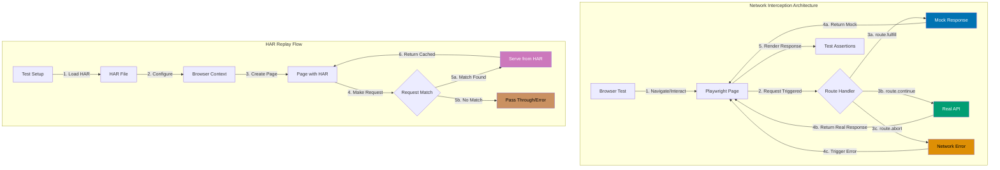

## Why Network Interception Matters

Production E2E test suites require network interception to mock external API responses, simulate error conditions, and eliminate test flakiness from third-party service dependencies. Without network mocking, tests fail randomly when external services experience downtime, rate-limit test requests, or return non-deterministic data. Network interception transforms brittle integration tests into reliable, fast-executing test suites that validate application behavior under controlled conditions.

Playwright route interception enables request mocking, response modification, and network simulation at the browser network layer. This capability prevents production test failures from external API changes (provider updates schema without notice), reduces test execution time by 70-90% (no real network calls), and enables comprehensive error scenario testing (500 errors, timeouts, malformed responses) impossible with live services.

Production teams use network interception because:

- **Test reliability**: Eliminate flakiness from external service downtime or non-deterministic responses
- **Speed**: Mock responses return in <10ms instead of 200-500ms network roundtrip
- **Error scenarios**: Test 500 errors, timeouts, network failures impossible with live APIs
- **Cost reduction**: Avoid charges from third-party API usage in test environments
- **Deterministic data**: Control exact response data for predictable test assertions

## Standard Library Approach: Basic Route Interception

Playwright core API provides route interception through `page.route()` for request mocking without requiring HAR file frameworks.

**Basic API mocking with route.fulfill**:

```typescript
import { test, expect } from "@playwright/test";
// => Import Playwright test framework
// => No mocking framework required
// => Built-in route interception

test("mock API response for user data", async ({ page }) => {
  // => Test receives page fixture
  // => Fresh browser context per test
  // => No shared route handlers

  await page.route("**/api/users/123", async (route) => {
    // => Intercept all requests matching URL pattern
    // => route parameter provides request/response control
    // => Executes before request sent to server
    // => ** matches any subdomain or path prefix

    await route.fulfill({
      // => Respond with mock data
      // => Browser receives this instead of server response
      // => No actual network request sent

      status: 200,
      // => HTTP status code
      // => 200 indicates success
      // => Client sees successful response

      contentType: "application/json",
      // => Sets Content-Type header
      // => Browser parses response as JSON
      // => Required for JSON parsing

      body: JSON.stringify({
        id: 123,
        username: "testuser",
        email: "test@example.com",
      }),
      // => Response body as JSON string
      // => JSON.stringify converts object to string
      // => Must match API contract structure
    });
  });
  // => Route handler registered
  // => Applied to all matching requests
  // => Persists for entire test

  await page.goto("https://example.com/users/123");
  // => Navigate to page that calls /api/users/123
  // => Browser makes request to /api/users/123
  // => Request intercepted by route handler
  // => Mock response returned instead of server

  await expect(page.locator("h1")).toHaveText("testuser");
  // => Assert UI displays mocked username
  // => Verifies application renders mock data
  // => No dependency on live API
});
```

**Conditional route handling based on request data**:

```typescript
test("mock POST request based on body content", async ({ page }) => {
  // => Test form submission with API mock
  // => Validates request body before mocking
  // => Conditional response based on data

  await page.route("**/api/users", async (route) => {
    // => Intercept POST requests to /api/users
    // => route.request() provides request details
    // => Access method, headers, body

    const request = route.request();
    // => Get Request object from route
    // => Contains method, URL, headers, body
    // => Inspect before deciding response

    if (request.method() === "POST") {
      // => Check if request is POST
      // => Only mock POST, allow GET through
      // => Method-specific handling

      const postData = request.postDataJSON();
      // => Parse JSON request body
      // => Returns typed object
      // => Assumes Content-Type: application/json

      if (postData.username === "validuser") {
        // => Conditional response based on data
        // => Validates request content
        // => Different responses for different inputs

        await route.fulfill({
          status: 201,
          // => 201 Created for successful user creation
          // => Matches REST API conventions
          // => Client interprets as success

          contentType: "application/json",
          body: JSON.stringify({
            id: 456,
            username: postData.username,
            email: postData.email,
          }),
          // => Return created user with generated ID
          // => Simulates server-generated ID
          // => Client receives confirmation
        });
      } else {
        // => Invalid username case
        // => Simulates server validation failure
        // => Tests error handling path

        await route.fulfill({
          status: 400,
          // => 400 Bad Request for validation error
          // => Indicates client error
          // => Triggers error handling in app

          contentType: "application/json",
          body: JSON.stringify({
            error: "Invalid username",
          }),
        });
      }
    } else {
      // => Not a POST request
      // => Allow through to server
      // => No mocking for other methods

      await route.continue();
      // => Continue request to actual server
      // => No interception for GET/PUT/DELETE
      // => Selective mocking strategy
    }
  });

  await page.goto("https://example.com/signup");
  // => Navigate to signup page
  // => Page will POST to /api/users
  // => Route handler ready to intercept

  await page.fill('input[name="username"]', "validuser");
  await page.fill('input[name="email"]', "valid@example.com");
  await page.click('button[type="submit"]');
  // => Fill form and submit
  // => Triggers POST request
  // => Request intercepted and mocked

  await expect(page.locator(".success")).toHaveText("User created successfully");
  // => Assert success message appears
  // => Validates app handles mock response correctly
  // => End-to-end verification
});
```

**Simulating network errors**:

```typescript
test("handle API timeout error", async ({ page }) => {
  // => Test network failure scenario
  // => Simulates timeout condition
  // => Validates error handling

  await page.route("**/api/users/123", async (route) => {
    // => Intercept user API request
    // => Abort instead of fulfill
    // => Simulates network failure

    await route.abort("timedout");
    // => Abort request with timeout error
    // => Browser sees ERR_CONNECTION_TIMED_OUT
    // => No response returned
  });

  await page.goto("https://example.com/users/123");
  // => Navigate to page requiring API call
  // => API request aborted with timeout
  // => Application must handle error

  await expect(page.locator(".error")).toHaveText("Failed to load user");
  // => Assert error message displayed
  // => Verifies graceful error handling
  // => Prevents blank page on error
});
```

**Limitations for production network testing**:

- **No response reuse**: Mock data hardcoded in each test (duplication, maintenance burden)
- **Manual request matching**: URL patterns in every test (brittle, error-prone)
- **No HAR replay**: Cannot capture and replay real API traffic (complex mocks difficult to create)
- **Limited request inspection**: Basic method/body checks only (no header validation, no timing simulation)
- **No request history**: Cannot assert on intercepted requests (no verification API was called)
- **Performance simulation gaps**: Cannot simulate slow networks, high latency, or bandwidth limits

## Production Framework: HAR Replay and Request Fixtures

Production network testing uses HAR (HTTP Archive) files to capture real API traffic, dedicated fixtures for route configuration, and mock services for deterministic responses.

**Recording HAR file from real traffic**:

```typescript
// tests/setup/recordHAR.ts
import { chromium } from "@playwright/test";
// => Import chromium browser from Playwright
// => Used for recording session
// => Runs outside test context

async function recordHAR() {
  // => Script to record real API traffic
  // => Run once to capture responses
  // => Generates HAR file for replay

  const browser = await chromium.launch({ headless: false });
  // => Launch visible browser for recording
  // => headless: false shows browser window
  // => Allows manual interaction

  const context = await browser.newContext({
    // => Create browser context for recording
    // => Isolated session
    // => Configures HAR recording

    recordHar: { path: "tests/fixtures/users.har" },
    // => Enable HAR recording to file
    // => Captures all network traffic
    // => Saved to tests/fixtures/users.har
  });

  const page = await context.newPage();
  // => Create new page in recording context
  // => All network activity captured
  // => HAR includes requests and responses

  await page.goto("https://example.com");
  // => Navigate to application
  // => Interact with real APIs
  // => All traffic recorded to HAR file

  // Manually interact with application to record API calls
  await page.click('a[href="/users"]');
  // => Click users link
  // => API calls to fetch users recorded
  // => Wait for navigation and API responses

  await page.waitForLoadState("networkidle");
  // => Wait for all network activity to finish
  // => Ensures all API responses captured
  // => HAR contains complete traffic

  await context.close();
  // => Close context to finish recording
  // => HAR file written to disk
  // => Browser saves captured traffic

  await browser.close();
  // => Close browser after recording
  // => Recording session complete
}

recordHAR();
// => Execute recording function
// => Run this script manually when APIs change
// => Update HAR file with latest responses
```

**Using HAR replay in tests**:

```typescript
import { test, expect } from "@playwright/test";
// => Import Playwright test framework
// => HAR replay built into Playwright
// => No additional framework needed

test("replay HAR file for deterministic responses", async ({ browser }) => {
  // => Test receives browser fixture
  // => Create custom context with HAR replay
  // => Isolates HAR replay to this test

  const context = await browser.newContext({
    // => Create new browser context
    // => Context-level HAR configuration
    // => All pages in context use HAR replay

    recordHar: {
      // => Configure HAR recording/replay
      // => Can record or replay existing file
      // => Controls network behavior

      path: "tests/fixtures/users.har",
      // => Path to HAR file for replay
      // => Contains captured API responses
      // => Matches requests to recorded responses

      mode: "replay",
      // => Replay mode: serve responses from HAR
      // => No actual network requests sent
      // => All responses from file

      urlFilter: "**/api/**",
      // => Only replay API requests
      // => Other requests pass through
      // => Selective HAR replay
    },
  });

  const page = await context.newPage();
  // => Create page in HAR replay context
  // => All API calls served from HAR
  // => Deterministic responses

  await page.goto("https://example.com/users");
  // => Navigate to users page
  // => Page calls /api/users
  // => Response served from HAR file
  // => No network dependency

  await expect(page.locator(".user-card")).toHaveCount(5);
  // => Assert exact user count from HAR
  // => HAR file contains deterministic data
  // => Test expectations match HAR content

  await context.close();
  // => Clean up context after test
  // => Releases resources
  // => HAR replay session ends
});
```

**Production network fixture with request logging**:

```typescript
// fixtures/networkFixture.ts
import { test as base, expect } from "@playwright/test";
// => Import base test from Playwright
// => Extend with network fixtures
// => Dependency injection pattern

type NetworkFixtures = {
  interceptedRequests: Request[];
  // => Array to store intercepted requests
  // => Tests can assert on API calls made
  // => Enables request verification
};

export const test = base.extend<NetworkFixtures>({
  // => Extend base test with network fixtures
  // => Type-safe fixture definitions
  // => Automatic setup and teardown

  interceptedRequests: async ({ page }, use) => {
    // => Define interceptedRequests fixture
    // => Receives page fixture as dependency
    // => use() callback provides fixture value

    const requests: Request[] = [];
    // => Array to collect intercepted requests
    // => Mutable state shared across test
    // => Populated by route handler

    await page.route("**/api/**", async (route) => {
      // => Intercept all API requests
      // => route parameter provides request control
      // => Logs request before continuing

      const request = route.request();
      // => Get Request object from route
      // => Contains method, URL, headers, body
      // => Store for later assertion

      requests.push(request);
      // => Add request to collection
      // => Preserves request order
      // => Test can verify requests made

      await route.continue();
      // => Continue request to actual server
      // => Non-blocking interception
      // => Request proceeds normally
    });

    await use(requests);
    // => Provide requests array to test
    // => Test receives collected requests
    // => Can assert on request count, URLs, data
  },
});
```

**Using network fixture to verify requests**:

```typescript
import { test, expect } from "./fixtures/networkFixture";
// => Import custom test with network fixture
// => Automatically provides interceptedRequests
// => Type-safe fixture access

test("verify user search makes correct API call", async ({ page, interceptedRequests }) => {
  // => Test receives page and interceptedRequests
  // => interceptedRequests populated by fixture
  // => All API requests logged

  await page.goto("https://example.com/users");
  // => Navigate to users page
  // => Initial API calls logged
  // => interceptedRequests contains requests

  await page.fill('input[name="search"]', "john");
  // => Fill search input
  // => Triggers search API call
  // => Request intercepted and logged

  await page.click('button[type="submit"]');
  // => Submit search form
  // => API request sent
  // => Added to interceptedRequests

  await page.waitForLoadState("networkidle");
  // => Wait for all API requests to complete
  // => Ensures all requests logged
  // => Ready to assert on requests

  const searchRequest = interceptedRequests.find((req) => req.url().includes("/api/users/search"));
  // => Find search API request
  // => Filter by URL pattern
  // => Returns Request object or undefined

  expect(searchRequest).toBeDefined();
  // => Assert search request was made
  // => Verifies API called
  // => Confirms application behavior

  const searchParams = new URL(searchRequest!.url()).searchParams;
  // => Parse URL query parameters
  // => Extract search query
  // => ! asserts non-null (defined check above)

  expect(searchParams.get("q")).toBe("john");
  // => Assert query parameter matches input
  // => Verifies correct data sent to API
  // => End-to-end request validation
});
```

## Network Interception Flow



## Production Patterns and Best Practices

### Pattern 1: Centralized Mock Data Repository

**Problem**: Mock data duplicated across tests, difficult to maintain consistency

**Solution**: Centralize mock responses in dedicated files with typed schemas

```typescript
// fixtures/mockData/users.ts
export const mockUsers = {
  // => Centralized mock data repository
  // => Single source of truth for user mocks
  // => Shared across all tests

  validUser: {
    id: 123,
    username: "testuser",
    email: "test@example.com",
    role: "admin",
  },
  // => Valid user fixture
  // => Reused in multiple tests
  // => Consistent data structure

  guestUser: {
    id: 456,
    username: "guest",
    email: "guest@example.com",
    role: "guest",
  },
};

export const mockUserResponses = {
  // => Pre-configured API responses
  // => Ready for route.fulfill
  // => Reduces boilerplate

  success: (user: typeof mockUsers.validUser) => ({
    status: 200,
    contentType: "application/json",
    body: JSON.stringify(user),
  }),
  // => Success response factory
  // => Accepts user object
  // => Returns route.fulfill config

  notFound: {
    status: 404,
    contentType: "application/json",
    body: JSON.stringify({ error: "User not found" }),
  },
  // => 404 error response
  // => Consistent error format
  // => Reusable across tests

  serverError: {
    status: 500,
    contentType: "application/json",
    body: JSON.stringify({ error: "Internal server error" }),
  },
};
```

**Using centralized mocks**:

```typescript
import { test, expect } from "@playwright/test";
import { mockUsers, mockUserResponses } from "./fixtures/mockData/users";
// => Import centralized mock data
// => Type-safe mock objects
// => Consistent across tests

test("display user profile with centralized mock", async ({ page }) => {
  // => Test using shared mock data
  // => No duplication of user structure
  // => Maintains consistency

  await page.route("**/api/users/123", async (route) => {
    // => Intercept user API request
    // => Use pre-configured response
    // => Minimal boilerplate

    await route.fulfill(mockUserResponses.success(mockUsers.validUser));
    // => Fulfill with centralized response
    // => mockUserResponses.success returns config
    // => mockUsers.validUser provides data
  });

  await page.goto("https://example.com/users/123");
  // => Navigate to user profile
  // => API mocked with consistent data
  // => UI renders mock user

  await expect(page.locator("h1")).toHaveText(mockUsers.validUser.username);
  // => Assert using same mock data
  // => Type-safe property access
  // => Consistent expectations
});
```

### Pattern 2: API Error Scenario Testing

**Problem**: Applications crash on unexpected API errors (500, timeout, malformed JSON)

**Solution**: Systematically test error scenarios using route interception

```typescript
import { test, expect } from "@playwright/test";
// => Import Playwright test framework
// => Error scenario testing
// => Network failure simulation

const errorScenarios = [
  // => Array of error scenarios to test
  // => Each scenario defines network condition
  // => Tests loop through all scenarios

  {
    name: "500 Internal Server Error",
    // => Human-readable scenario name
    // => Used in test description
    // => Appears in test reports

    handler: async (route) => {
      await route.fulfill({
        status: 500,
        contentType: "application/json",
        body: JSON.stringify({ error: "Internal server error" }),
      });
      // => Simulate 500 error from API
      // => Tests server error handling
      // => Application should show graceful error
    },
  },
  {
    name: "Network Timeout",
    handler: async (route) => {
      await route.abort("timedout");
      // => Abort request with timeout error
      // => Browser sees ERR_CONNECTION_TIMED_OUT
      // => Tests timeout handling
    },
  },
  {
    name: "Malformed JSON Response",
    handler: async (route) => {
      await route.fulfill({
        status: 200,
        contentType: "application/json",
        body: "{ invalid json",
        // => Invalid JSON syntax
        // => Browser JSON parsing fails
        // => Tests malformed response handling
      });
    },
  },
  {
    name: "Connection Refused",
    handler: async (route) => {
      await route.abort("connectionrefused");
      // => Abort with connection refused error
      // => Simulates server down
      // => Tests network failure handling
    },
  },
];

for (const scenario of errorScenarios) {
  // => Loop through all error scenarios
  // => Generate test for each scenario
  // => Comprehensive error coverage

  test(`handle ${scenario.name} gracefully`, async ({ page }) => {
    // => Dynamic test name from scenario
    // => Test report shows specific error type
    // => Easy to identify failing scenarios

    await page.route("**/api/users/123", scenario.handler);
    // => Apply scenario error handler
    // => Intercepts API request
    // => Triggers specific error condition

    await page.goto("https://example.com/users/123");
    // => Navigate to page requiring API
    // => API call intercepted
    // => Error handler triggered

    await expect(page.locator(".error-message")).toBeVisible();
    // => Assert error message displayed
    // => Verifies graceful degradation
    // => Application doesn't crash

    await expect(page.locator(".retry-button")).toBeVisible();
    // => Assert retry option available
    // => Provides user recovery path
    // => Good UX for error scenarios
  });
}
```

### Pattern 3: HAR File Update Strategy

**Problem**: HAR files become stale when APIs change, tests break with outdated mocks

**Solution**: Implement HAR refresh workflow with version control and validation

```typescript
// tests/setup/harManagement.ts
import { chromium, expect } from "@playwright/test";
import * as fs from "fs";
import * as path from "path";
// => Import filesystem modules
// => Manage HAR file updates
// => Version control integration

export async function updateHARFile(
  url: string,
  harPath: string,
  options?: {
    interactions?: (page: Page) => Promise<void>;
    validateHAR?: (harContent: any) => void;
  },
) {
  // => Function to update HAR file
  // => Captures latest API responses
  // => Validates HAR content before saving

  const browser = await chromium.launch({ headless: false });
  // => Launch visible browser for manual verification
  // => Developer can observe recording
  // => Ensures correct interactions captured

  const context = await browser.newContext({
    recordHar: { path: harPath, mode: "minimal" },
    // => Record HAR to specified path
    // => mode: minimal reduces file size
    // => Excludes unnecessary headers
  });

  const page = await context.newPage();
  // => Create page for recording
  // => All network traffic captured
  // => HAR includes requests/responses

  await page.goto(url);
  // => Navigate to application
  // => Triggers initial API calls
  // => Captured to HAR

  if (options?.interactions) {
    // => Execute custom interactions if provided
    // => Trigger specific API endpoints
    // => Record complex workflows

    await options.interactions(page);
    // => Run interaction callback
    // => Developer-defined actions
    // => Captures relevant API calls
  }

  await page.waitForLoadState("networkidle");
  // => Wait for all network activity
  // => Ensures complete HAR capture
  // => No truncated responses

  await context.close();
  // => Close context to finalize HAR
  // => HAR written to disk
  // => Recording complete

  await browser.close();

  if (options?.validateHAR) {
    // => Validate HAR content if validator provided
    // => Ensures HAR contains expected requests
    // => Catches incomplete recordings

    const harContent = JSON.parse(fs.readFileSync(harPath, "utf8"));
    // => Read HAR file content
    // => Parse JSON structure
    // => Validate against schema

    options.validateHAR(harContent);
    // => Execute validation callback
    // => Throws if HAR invalid
    // => Prevents committing bad HAR files
  }

  console.log(`HAR file updated: ${harPath}`);
  // => Log successful update
  // => Confirms file written
  // => Developer feedback
}
```

**HAR validation helper**:

```typescript
export function validateUserHAR(harContent: any) {
  // => Validate user API HAR file
  // => Ensures required endpoints present
  // => Throws if validation fails

  const entries = harContent.log.entries;
  // => Extract HAR entries array
  // => Each entry is request/response pair
  // => Search for required endpoints

  const hasUsersList = entries.some((e) => e.request.url.includes("/api/users") && e.request.method === "GET");
  // => Check for GET /api/users endpoint
  // => Validates users list captured
  // => Required for user tests

  const hasUserDetail = entries.some((e) => e.request.url.match(/\/api\/users\/\d+/));
  // => Check for GET /api/users/:id endpoint
  // => Validates user detail captured
  // => Required for profile tests

  if (!hasUsersList || !hasUserDetail) {
    // => Validation failed
    // => Required endpoints missing
    // => HAR file incomplete

    throw new Error(
      `HAR validation failed: Missing required user endpoints (list: ${hasUsersList}, detail: ${hasUserDetail})`,
    );
    // => Throw descriptive error
    // => Indicates which endpoints missing
    // => Developer can re-record
  }
}
```

**Using HAR update script**:

```typescript
// tests/setup/updateUserHAR.ts
import { updateHARFile, validateUserHAR } from "./harManagement";
// => Import HAR management utilities
// => Reusable update workflow
// => Consistent HAR updates

updateHARFile("https://example.com/users", "tests/fixtures/users.har", {
  // => Update users HAR file
  // => Captures API traffic from users page
  // => Validates before saving

  interactions: async (page) => {
    // => Custom interactions to trigger APIs
    // => Captures all required endpoints
    // => Ensures comprehensive HAR

    await page.click('a[href="/users/123"]');
    // => Navigate to user detail
    // => Triggers GET /api/users/123
    // => Captured in HAR

    await page.waitForLoadState("networkidle");
    // => Wait for API responses
    // => Ensures complete capture
    // => No partial responses

    await page.click('button[data-action="search"]');
    // => Trigger search feature
    // => Captures search API endpoint
    // => Additional HAR coverage

    await page.waitForLoadState("networkidle");
  },

  validateHAR: validateUserHAR,
  // => Validate HAR after recording
  // => Ensures required endpoints present
  // => Prevents incomplete HAR commits
});

// Run: npx ts-node tests/setup/updateUserHAR.ts
// => Execute HAR update script
// => Developer runs when API changes
// => Updates HAR file with latest responses
```

## Trade-offs and When to Use

### Standard Route Interception

**Use when**:

- Simple API mocking for individual tests
- Testing specific error scenarios (500, timeout)
- Request validation without recording infrastructure

**Benefits**:

- No HAR file management overhead
- Full control over response data and timing
- Quick setup for one-off test scenarios
- Easy to understand for simple mocks

**Costs**:

- Mock data duplicated across tests
- Manual maintenance when API contracts change
- Difficult to capture complex API sequences
- No replay of real traffic patterns

### HAR Replay

**Use when**:

- Testing against complex API workflows
- Validating application with real API responses
- Need deterministic responses for flaky tests
- Multiple tests share same API responses

**Benefits**:

- Captures real API traffic automatically
- Single HAR file serves multiple tests
- Realistic response timing and structure
- Easy to update when APIs change (re-record)

**Costs**:

- HAR files require version control management
- Stale HAR files cause test failures
- Cannot easily modify specific responses
- Larger file sizes for complex workflows

### Production Recommendation

**For small test suites (<50 tests)**: Use standard route interception with centralized mock data repository. Simplicity outweighs HAR overhead.

**For large test suites (>50 tests)**: Implement HAR replay with automated update workflow. Reduces mock maintenance burden and ensures realistic API responses.

**Hybrid approach** (recommended for most teams):

- HAR replay for happy path scenarios (common API workflows)
- Route interception for error scenarios (500, timeout, malformed JSON)
- Centralized mock repository for edge cases (specific data conditions)

## Security Considerations

**Sensitive Data in HAR Files**:

- HAR files capture all request/response data including authentication tokens, API keys, personally identifiable information
- **Risk**: Committed HAR files expose production credentials to anyone with repository access
- **Mitigation**: Sanitize HAR files before committing (remove Authorization headers, mask PII)
- **Tool**: Use `har-sanitizer` to automatically redact sensitive fields

```typescript
import { sanitizeHAR } from "har-sanitizer";

const harContent = JSON.parse(fs.readFileSync("users.har", "utf8"));
const sanitized = sanitizeHAR(harContent, {
  // => Sanitize HAR before committing
  // => Remove sensitive data
  // => Safe for version control

  redactHeaders: ["Authorization", "Cookie", "X-API-Key"],
  // => Headers to remove completely
  // => Prevents token exposure
  // => Security best practice

  maskFields: ["email", "phone", "ssn"],
  // => Fields to mask with ***
  // => Protects PII
  // => Maintains structure for tests
});

fs.writeFileSync("users.har", JSON.stringify(sanitized, null, 2));
```

**Mock Data Validation**:

- Production applications trust HAR replay responses as if from real API
- **Risk**: Malicious HAR modifications bypass security validations
- **Mitigation**: Validate HAR schema on CI/CD, review HAR changes in pull requests

**Request Leakage Prevention**:

- Misconfigured route patterns (`*` instead of `**/api/**`) intercept all requests
- **Risk**: Tests accidentally bypass authentication, CORS, or security headers
- **Mitigation**: Use specific URL patterns, verify non-intercepted requests reach server

## Common Pitfalls

1. **Route Handler Race Conditions**: Registering route handlers after page navigation causes requests to miss interception. Always register route handlers BEFORE `page.goto()`.

2. **Overlapping Route Patterns**: Multiple route handlers matching same URL create non-deterministic behavior. Playwright uses first registered handler, but order matters. Use specific patterns (`**/api/users/**` not `**/**`).

3. **Ignoring Request Continuation**: Using `route.fulfill()` for non-API requests (images, CSS) breaks page rendering. Only intercept API endpoints (`**/api/**`), continue all other requests with `route.continue()`.

4. **HAR File Size Bloat**: Recording entire application session creates multi-MB HAR files. Use `urlFilter` to capture only API endpoints, `mode: "minimal"` to reduce headers.

5. **Hardcoded Response Delays**: Adding `await page.waitForTimeout(1000)` in route handlers slows tests unnecessarily. Playwright automatically waits for responses, no manual delays needed.

6. **Missing HAR Validation**: Committing incomplete HAR files (network dropped during recording) causes random test failures. Always validate HAR contains expected endpoints before committing.

7. **Forgetting to Update HAR After API Changes**: Tests pass with stale HAR data while production uses new API contract. Implement CI check comparing HAR version to API schema version.
