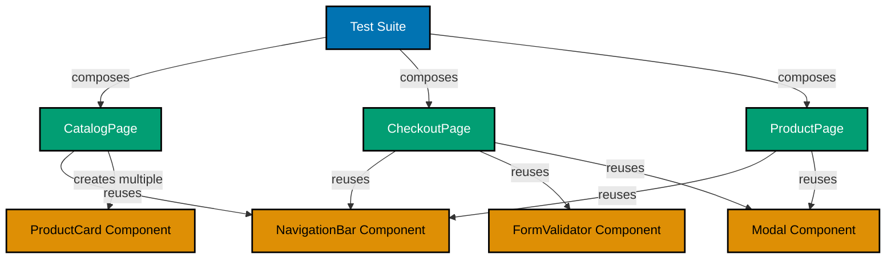

## Why This Matters

Basic page objects work for simple applications, but production systems face scalability challenges. A typical enterprise application has hundreds of pages sharing common components (navigation bars, modals, forms, data grids). Without advanced patterns, teams end up duplicating selectors and logic across page objects, creating maintenance nightmares when the design system changes. When your marketing team redesigns the navigation bar used on 80 pages, you shouldn't need to update 80 page objects.

Advanced page object patterns solve this through component-based composition. Instead of monolithic page objects containing all selectors and logic, you create reusable component objects representing UI elements shared across pages. Your page objects compose these components, gaining consistency and reducing duplication. When the navigation bar changes, you update one component object instead of dozens of page objects. This architectural shift mirrors modern frontend development—composing pages from reusable components.

Production applications also require dynamic page objects for data-driven scenarios. E-commerce sites with thousands of product pages can't maintain individual page objects for each SKU. Dynamic page objects use parameterized locators and methods, adapting to runtime data while maintaining type safety and encapsulation. These patterns enable test scalability without sacrificing maintainability, allowing teams to test diverse scenarios without exponential growth in page object code.

## Standard Library Approach: Basic Page Objects

Playwright provides the foundation for page objects through its core APIs—no additional framework needed. Here's a standard page object implementation:

```typescript
// pages/ProductPage.ts
import { Page, Locator } from "@playwright/test";

export class ProductPage {
  // => Declares ProductPage class encapsulating product page
  // => Stores page instance as private field
  readonly page: Page;

  // => Declares locators for page elements
  // => Readonly ensures locators cannot be reassigned
  readonly productTitle: Locator;
  readonly addToCartButton: Locator;
  readonly quantityInput: Locator;
  readonly priceLabel: Locator;

  constructor(page: Page) {
    // => Constructor receives Page instance from test
    // => Initializes all locators during construction
    this.page = page;

    this.productTitle = page.locator('[data-testid="product-title"]');
    // => data-testid selector provides stable identifier
    // => Locator created but not evaluated until action called

    this.addToCartButton = page.locator('button:text("Add to Cart")');
    // => Text selector matches button by visible text
    // => Automatically waits for element during action

    this.quantityInput = page.locator("#quantity");
    // => ID selector for form input field
    // => Fastest selector type but requires stable IDs

    this.priceLabel = page.locator(".price-display");
    // => Class selector for price display element
    // => Returns first matching element
  }

  async goto(productId: string) {
    // => Navigation method encapsulates URL construction
    // => Accepts productId parameter for dynamic routing
    await this.page.goto(`/products/${productId}`);
    // => Navigates to product detail page
    // => Waits for load event before returning
  }

  async addToCart(quantity: number = 1) {
    // => High-level business action method
    // => Default quantity of 1 for typical case
    await this.quantityInput.fill(quantity.toString());
    // => Fills quantity input with string value
    // => Playwright auto-waits for element to be actionable

    await this.addToCartButton.click();
    // => Clicks add to cart button
    // => Waits for button to be visible and enabled
  }

  async getPrice(): Promise<string> {
    // => Retrieves price text from page
    // => Returns Promise<string> for async operation
    return (await this.priceLabel.textContent()) ?? "";
    // => Gets text content of price label
    // => Null coalescing operator handles null case
  }
}
```

**Limitations for production**:

- **Component duplication**: Navigation bar, footer, modals duplicated across every page object that uses them
- **Inconsistent updates**: Changing shared component (like header) requires updating all page objects that include it
- **Monolithic growth**: Page objects become large as pages gain more components (forms, grids, dialogs)
- **No composition**: Cannot reuse common component logic across different pages
- **Dynamic scenarios**: Creating page objects for data-driven pages (thousands of products) impractical
- **Type safety issues**: Parameterized behavior (filtering, sorting) requires stringly-typed methods

## Production Pattern: Component Objects with Composition

Production applications solve these limitations through component-based architecture. Extract reusable UI components into dedicated component objects, then compose them into page objects:

```typescript
// components/NavigationBar.ts
import { Page, Locator } from "@playwright/test";

export class NavigationBar {
  // => Component object represents navigation bar UI component
  // => Encapsulates all selectors and behaviors for navigation
  readonly page: Page;
  private readonly container: Locator;

  // => Component locators scoped within navigation container
  // => Ensures selectors only match within this component
  readonly searchInput: Locator;
  readonly cartIcon: Locator;
  readonly userMenu: Locator;
  readonly loginLink: Locator;

  constructor(page: Page) {
    // => Constructor receives Page instance
    // => Locates navigation bar container as root
    this.page = page;
    this.container = page.locator('[data-testid="main-navigation"]');
    // => Container provides scope for child locators
    // => Prevents selector conflicts with page body

    // => All component selectors chained from container
    // => Scoping ensures selectors only match within component
    this.searchInput = this.container.locator('input[type="search"]');
    this.cartIcon = this.container.locator('[data-testid="cart-icon"]');
    this.userMenu = this.container.locator('[data-testid="user-menu"]');
    this.loginLink = this.container.locator('a:text("Login")');
  }

  async search(query: string): Promise<void> {
    // => High-level component action method
    // => Encapsulates search interaction sequence
    await this.searchInput.fill(query);
    // => Fills search input with query text
    // => Auto-waits for input to be visible and enabled

    await this.searchInput.press("Enter");
    // => Submits search by pressing Enter key
    // => Triggers navigation to search results page
  }

  async getCartItemCount(): Promise<number> {
    // => Retrieves cart item count from badge
    // => Returns numeric count for assertions
    const badge = this.cartIcon.locator(".badge");
    // => Locates badge element within cart icon
    // => Badge displays item count

    const text = await badge.textContent();
    // => Gets badge text content
    // => Returns null if badge not found

    return text ? parseInt(text, 10) : 0;
    // => Parses text to number with base 10
    // => Defaults to 0 if badge missing or text null
  }

  async login(username: string, password: string): Promise<void> {
    // => Complete login flow from navigation bar
    // => Encapsulates multi-step interaction
    await this.userMenu.click();
    // => Opens user menu dropdown
    // => Waits for menu to be visible

    await this.loginLink.click();
    // => Navigates to login page
    // => Waits for navigation to complete

    await this.page.locator("#username").fill(username);
    // => Fills username field on login page
    // => Uses page-level locator for login form

    await this.page.locator("#password").fill(password);
    // => Fills password field
    // => Form fields outside component scope

    await this.page.locator('button:text("Submit")').click();
    // => Submits login form
    // => Waits for submission to complete
  }
}
```

```typescript
// components/ProductCard.ts
import { Locator, Page } from "@playwright/test";

export class ProductCard {
  // => Component representing individual product card
  // => Reusable across catalog, search results, recommendations
  readonly page: Page;
  private readonly container: Locator;

  // => Card-specific locators scoped to this card instance
  // => Each card instance has independent locators
  readonly title: Locator;
  readonly price: Locator;
  readonly image: Locator;
  readonly addToCartButton: Locator;
  readonly ratingStars: Locator;

  constructor(page: Page, container: Locator) {
    // => Constructor accepts both Page and container Locator
    // => Container passed from parent allows dynamic scoping
    this.page = page;
    this.container = container;
    // => Container represents this specific card's root element
    // => Enables multiple card instances on same page

    // => All locators scoped to this card's container
    // => Prevents interactions with other cards on page
    this.title = this.container.locator('[data-testid="product-title"]');
    this.price = this.container.locator('[data-testid="product-price"]');
    this.image = this.container.locator("img.product-image");
    this.addToCartButton = this.container.locator('button:text("Add to Cart")');
    this.ratingStars = this.container.locator('[data-testid="rating-stars"]');
  }

  async getTitle(): Promise<string> {
    // => Retrieves product title text
    // => Returns empty string if title missing
    return (await this.title.textContent()) ?? "";
  }

  async getPrice(): Promise<number> {
    // => Retrieves numeric price value
    // => Parses currency-formatted text to number
    const text = (await this.price.textContent()) ?? "";
    // => Gets price text like "$29.99"
    // => Null coalescing handles missing element

    return parseFloat(text.replace(/[^0-9.]/g, ""));
    // => Removes non-numeric characters except decimal
    // => Parses remaining string to float
  }

  async addToCart(): Promise<void> {
    // => Adds this product to cart
    // => Encapsulates card-level cart action
    await this.addToCartButton.click();
    // => Clicks add to cart button for this card
    // => Waits for button to be clickable
  }

  async getRating(): Promise<number> {
    // => Retrieves product rating value
    // => Parses star count or rating attribute
    const ratingText = await this.ratingStars.getAttribute("aria-label");
    // => Gets aria-label like "4.5 out of 5 stars"
    // => Accessibility attribute provides reliable data

    const match = ratingText?.match(/(\d+\.?\d*)/);
    // => Regex extracts numeric rating value
    // => Handles decimal ratings like 4.5

    return match ? parseFloat(match[1]) : 0;
    // => Returns parsed rating or 0 if not found
    // => Provides numeric value for assertions
  }

  async isAvailable(): Promise<boolean> {
    // => Checks if product is available for purchase
    // => Returns boolean for availability status
    return await this.addToCartButton.isEnabled();
    // => Checks if add to cart button is enabled
    // => Disabled button indicates out of stock
  }
}
```

```typescript
// pages/CatalogPage.ts - Composing Component Objects
import { Page } from "@playwright/test";
import { NavigationBar } from "../components/NavigationBar";
import { ProductCard } from "../components/ProductCard";

export class CatalogPage {
  // => Page object composes reusable components
  // => Delegates navigation bar behavior to component
  readonly page: Page;
  readonly navigation: NavigationBar;
  // => NavigationBar component handles all nav interactions
  // => Page object doesn't duplicate nav selectors/logic

  constructor(page: Page) {
    // => Constructor initializes page and component objects
    // => Composition happens during construction
    this.page = page;
    this.navigation = new NavigationBar(page);
    // => Creates NavigationBar component instance
    // => Component shares same Page instance
  }

  async goto(category?: string): Promise<void> {
    // => Navigates to catalog page
    // => Optional category parameter for filtered catalog
    const url = category ? `/catalog?category=${category}` : "/catalog";
    // => Constructs URL with optional query parameter
    // => Defaults to full catalog if no category

    await this.page.goto(url);
    // => Navigates to catalog URL
    // => Waits for page load before returning
  }

  async getProductCards(): Promise<ProductCard[]> {
    // => Retrieves array of ProductCard component instances
    // => Creates one component per card on page
    const cardLocators = await this.page.locator('[data-testid="product-card"]').all();
    // => Finds all product card elements on page
    // => Returns array of Locators for each card

    return cardLocators.map((locator) => new ProductCard(this.page, locator));
    // => Maps each Locator to ProductCard instance
    // => Each card scoped to its container Locator
    // => Returns array of independent ProductCard objects
  }

  async getProductCard(index: number): Promise<ProductCard> {
    // => Retrieves specific ProductCard by index
    // => Enables targeted interaction with nth card
    const cardLocator = this.page.locator('[data-testid="product-card"]').nth(index);
    // => Gets nth product card element
    // => Zero-based index (0 = first card)

    return new ProductCard(this.page, cardLocator);
    // => Creates ProductCard scoped to specific card
    // => Returns independent component instance
  }

  async filterByPrice(minPrice: number, maxPrice: number): Promise<void> {
    // => Applies price range filter to catalog
    // => Encapsulates filter interaction
    await this.page.locator("#price-min").fill(minPrice.toString());
    // => Fills minimum price input
    // => Converts number to string for input

    await this.page.locator("#price-max").fill(maxPrice.toString());
    // => Fills maximum price input
    // => Both inputs required for range filter

    await this.page.locator('button:text("Apply Filters")').click();
    // => Applies filter by clicking button
    // => Waits for filtered results to load
  }

  async sortBy(option: "price-asc" | "price-desc" | "rating" | "newest"): Promise<void> {
    // => Applies sort order to catalog
    // => Type-safe sorting options via union type
    await this.page.locator("#sort-select").selectOption(option);
    // => Selects sort option from dropdown
    // => Triggers catalog re-ordering
    // => Union type prevents invalid sort values
  }
}
```

## Architecture: Component-Based Page Objects



**Accessibility Note**: Diagram uses color-blind friendly palette—blue for tests, teal for pages, orange for components.

## Production Patterns and Best Practices

### Pattern 1: Fluent Interface for Page Objects

Fluent interfaces enable method chaining, creating readable test code that resembles natural language:

```typescript
// pages/CheckoutPage.ts
import { Page } from "@playwright/test";

export class CheckoutPage {
  // => Fluent interface page object with method chaining
  // => Each method returns 'this' enabling chaining
  readonly page: Page;

  constructor(page: Page) {
    this.page = page;
  }

  async goto(): Promise<this> {
    // => Navigation returns 'this' for chaining
    // => Enables: await new CheckoutPage(page).goto().fillShipping(...)
    await this.page.goto("/checkout");
    return this;
    // => Returns page object instance
    // => Allows immediate method chaining
  }

  async fillShippingAddress(address: ShippingAddress): Promise<this> {
    // => Fills shipping form and returns this
    // => Fluent method enables chaining multiple form fills
    await this.page.locator("#shipping-name").fill(address.name);
    await this.page.locator("#shipping-street").fill(address.street);
    await this.page.locator("#shipping-city").fill(address.city);
    await this.page.locator("#shipping-postal").fill(address.postalCode);
    // => Fills all shipping address fields
    // => Sequential fills ensure correct form population

    return this;
    // => Returns this for next chained method
    // => Enables: .fillShippingAddress(...).selectPaymentMethod(...)
  }

  async selectPaymentMethod(method: "credit" | "debit" | "paypal"): Promise<this> {
    // => Selects payment method and returns this
    // => Type-safe payment method via union type
    await this.page.locator(`#payment-${method}`).click();
    // => Clicks radio button for payment method
    // => Dynamic selector based on method parameter

    return this;
    // => Chaining continues to next operation
  }

  async applyPromoCode(code: string): Promise<this> {
    // => Applies promo code and returns this
    // => Optional step in checkout flow
    await this.page.locator("#promo-code").fill(code);
    await this.page.locator('button:text("Apply")').click();
    // => Fills promo code input and submits
    // => Waits for application to complete

    return this;
    // => Returns this for continued chaining
  }

  async submitOrder(): Promise<OrderConfirmationPage> {
    // => Final action returns different page object
    // => Fluent chain terminates, returns next page
    await this.page.locator('button:text("Place Order")').click();
    // => Submits checkout form
    // => Triggers navigation to confirmation page

    return new OrderConfirmationPage(this.page);
    // => Creates and returns next page object
    // => Continues page object chain across navigation
  }
}

// Type definitions
interface ShippingAddress {
  name: string;
  street: string;
  city: string;
  postalCode: string;
}

// Usage in test - readable fluent chain
test("complete checkout with promo code", async ({ page }) => {
  const confirmationPage = await new CheckoutPage(page)
    .goto()
    // => Navigates to checkout page
    .fillShippingAddress({
      name: "John Doe",
      street: "123 Main St",
      city: "Portland",
      postalCode: "97201",
    })
    // => Fills shipping address form
    .selectPaymentMethod("credit")
    // => Selects credit card payment
    .applyPromoCode("SAVE20")
    // => Applies promotional code
    .submitOrder();
  // => Submits order, returns confirmation page

  // => Chain reads like: "go to checkout, fill shipping, select payment, apply promo, submit"
  // => Fluent interface creates self-documenting test code
});
```

### Pattern 2: Dynamic Page Objects with Parameterization

Production applications often have thousands of similar pages (products, articles, profiles). Dynamic page objects handle this through parameterization:

```typescript
// pages/DynamicProductPage.ts
import { Page, Locator } from "@playwright/test";

export class DynamicProductPage {
  // => Dynamic page object for product pages
  // => Adapts to any product via productId parameter
  readonly page: Page;
  private readonly productId: string;

  // => Locators use dynamic selectors based on productId
  // => Enables single page object for all products
  private get productContainer(): Locator {
    // => Getter provides dynamic locator per instance
    // => Returns locator scoped to specific product
    return this.page.locator(`[data-product-id="${this.productId}"]`);
    // => Attribute selector matches specific product container
    // => Scopes all child locators to this product
  }

  constructor(page: Page, productId: string) {
    // => Constructor accepts productId parameter
    // => Creates page object instance for specific product
    this.page = page;
    this.productId = productId;
    // => Stores productId for dynamic locator generation
  }

  async goto(): Promise<void> {
    // => Navigates to product page using stored productId
    // => Constructs URL dynamically
    await this.page.goto(`/products/${this.productId}`);
    // => Dynamic URL based on instance's productId
    // => Enables: new DynamicProductPage(page, "SKU123").goto()
  }

  async getTitle(): Promise<string> {
    // => Retrieves product title
    // => Uses dynamic container scoping
    return (await this.productContainer.locator('[data-testid="title"]').textContent()) ?? "";
    // => Scopes title locator to this product's container
    // => Prevents matching titles from other products
  }

  async selectVariant(option: string, value: string): Promise<void> {
    // => Selects product variant (size, color, etc.)
    // => Dynamic selection based on option and value
    const selector = `[data-option="${option}"][data-value="${value}"]`;
    // => Constructs selector matching specific variant
    // => Example: data-option="size" data-value="large"

    await this.productContainer.locator(selector).click();
    // => Clicks variant option within product container
    // => Scoping ensures correct product variant selected
  }

  async addToCart(quantity: number = 1): Promise<void> {
    // => Adds product to cart with specified quantity
    // => Defaults to quantity of 1
    await this.productContainer.locator('input[name="quantity"]').fill(quantity.toString());
    // => Fills quantity input within product container
    // => Converts number to string for input field

    await this.productContainer.locator('button:text("Add to Cart")').click();
    // => Clicks add to cart button for this product
    // => Scoped click prevents adding wrong product
  }
}

// Factory pattern for creating product page objects
export class ProductPageFactory {
  // => Factory creates product page objects dynamically
  // => Centralizes page object instantiation
  constructor(private page: Page) {
    // => Stores Page instance for factory use
    // => All created page objects share same page
  }

  createProductPage(productId: string): DynamicProductPage {
    // => Factory method creates product page instance
    // => Accepts productId parameter for dynamic behavior
    return new DynamicProductPage(this.page, productId);
    // => Returns new page object instance
    // => Each instance encapsulates specific product
  }

  async createFromUrl(url: string): Promise<DynamicProductPage> {
    // => Creates page object by parsing URL
    // => Extracts productId from URL structure
    const match = url.match(/\/products\/([^/]+)/);
    // => Regex extracts productId from URL path
    // => Matches pattern: /products/{productId}

    if (!match) {
      throw new Error(`Invalid product URL: ${url}`);
    }
    // => Validates URL contains productId
    // => Throws error for malformed URLs

    const productId = match[1];
    // => Extracts captured productId from regex match
    // => First capture group contains product identifier

    return this.createProductPage(productId);
    // => Creates and returns page object for extracted ID
    // => Enables: factory.createFromUrl(currentUrl)
  }
}

// Usage in test - testing multiple products
test("add multiple products to cart", async ({ page }) => {
  const factory = new ProductPageFactory(page);
  // => Creates factory for generating product pages
  // => Reuses factory for multiple products

  const products = ["SKU001", "SKU002", "SKU003"];
  // => Array of product IDs to test
  // => Demonstrates scalable testing approach

  for (const productId of products) {
    const productPage = factory.createProductPage(productId);
    // => Creates page object for current product
    // => New instance per product iteration

    await productPage.goto();
    // => Navigates to product page
    // => Dynamic URL: /products/SKU001, etc.

    await productPage.selectVariant("size", "large");
    await productPage.addToCart(2);
    // => Selects size and adds 2 units
    // => Same code works for all products
  }
  // => Loop tests three products without three separate page objects
  // => Dynamic page objects enable scalable product testing
});
```

### Pattern 3: Component Objects with State Management

Advanced component objects track state changes and provide validation:

```typescript
// components/ShoppingCart.ts
import { Page, Locator } from "@playwright/test";

export interface CartItem {
  productId: string;
  name: string;
  quantity: number;
  price: number;
}

export class ShoppingCart {
  // => Stateful component tracking cart contents
  // => Provides validation and assertions
  readonly page: Page;
  private readonly container: Locator;
  private cachedItems: CartItem[] | null = null;
  // => Cached cart items for performance
  // => Null indicates cache needs refresh

  constructor(page: Page) {
    this.page = page;
    this.container = page.locator('[data-testid="shopping-cart"]');
    // => Component container for cart UI
    // => Scopes all cart interactions
  }

  async open(): Promise<void> {
    // => Opens cart drawer or navigates to cart page
    // => Waits for cart to be visible
    await this.page.locator('[data-testid="cart-icon"]').click();
    // => Clicks cart icon to open
    // => Triggers cart drawer slide-in

    await this.container.waitFor({ state: "visible" });
    // => Waits for cart container to appear
    // => Ensures cart fully loaded before proceeding

    this.invalidateCache();
    // => Clears cached items after opening
    // => Forces fresh read of cart contents
  }

  async getItems(): Promise<CartItem[]> {
    // => Retrieves all items in cart
    // => Returns structured array of cart items
    if (this.cachedItems) {
      return this.cachedItems;
      // => Returns cached items if available
      // => Avoids redundant DOM queries
    }

    const itemElements = await this.container.locator('[data-testid="cart-item"]').all();
    // => Finds all cart item elements
    // => Returns array of item Locators

    const items: CartItem[] = [];
    for (const element of itemElements) {
      // => Iterates each cart item element
      // => Extracts structured data from DOM

      const productId = (await element.getAttribute("data-product-id")) ?? "";
      // => Reads product ID from data attribute
      // => Unique identifier for cart item

      const name = (await element.locator('[data-testid="item-name"]').textContent()) ?? "";
      // => Extracts product name from cart item
      // => Display name shown to user

      const quantityText = (await element.locator('[data-testid="item-quantity"]').textContent()) ?? "0";
      // => Extracts quantity text from cart item
      // => Defaults to '0' if not found

      const quantity = parseInt(quantityText, 10);
      // => Parses quantity string to number
      // => Base 10 parsing for decimal integers

      const priceText = (await element.locator('[data-testid="item-price"]').textContent()) ?? "$0";
      // => Extracts price text like "$29.99"
      // => Defaults to '$0' if missing

      const price = parseFloat(priceText.replace(/[^0-9.]/g, ""));
      // => Removes currency symbols and parses to float
      // => Handles various currency formats

      items.push({ productId, name, quantity, price });
      // => Adds structured item to array
      // => Normalized data for testing
    }

    this.cachedItems = items;
    // => Caches items for subsequent calls
    // => Reduces DOM queries within same test step

    return items;
    // => Returns complete array of cart items
    // => Ready for assertions and validation
  }

  async getTotalPrice(): Promise<number> {
    // => Calculates total cart price
    // => Returns numeric total for assertions
    const items = await this.getItems();
    // => Retrieves all cart items
    // => Uses cached items if available

    return items.reduce((sum, item) => {
      return sum + item.quantity * item.price;
    }, 0);
    // => Sums quantity × price for each item
    // => Reduces to single total value
    // => Starts with 0 accumulator
  }

  async removeItem(productId: string): Promise<void> {
    // => Removes item from cart by product ID
    // => Invalidates cache after removal
    const itemElement = this.container.locator(`[data-testid="cart-item"][data-product-id="${productId}"]`);
    // => Locates specific cart item by product ID
    // => Scoped to cart container

    await itemElement.locator('button[aria-label="Remove"]').click();
    // => Clicks remove button for item
    // => aria-label provides accessible selector

    this.invalidateCache();
    // => Clears cache after cart modification
    // => Forces fresh read on next getItems()
  }

  async updateQuantity(productId: string, quantity: number): Promise<void> {
    // => Updates item quantity in cart
    // => Invalidates cache after update
    const itemElement = this.container.locator(`[data-testid="cart-item"][data-product-id="${productId}"]`);
    // => Locates cart item element
    // => Uses product ID for precise selection

    await itemElement.locator('input[name="quantity"]').fill(quantity.toString());
    // => Updates quantity input field
    // => Converts number to string for input

    await itemElement.locator('button[aria-label="Update"]').click();
    // => Clicks update button to apply change
    // => Waits for cart to recalculate

    this.invalidateCache();
    // => Clears cache after quantity change
    // => Next getItems() reads updated cart
  }

  private invalidateCache(): void {
    // => Clears cached items
    // => Forces fresh DOM read on next access
    this.cachedItems = null;
    // => Sets cache to null
    // => getItems() will re-query DOM
  }

  async assertItemCount(expectedCount: number): Promise<void> {
    // => Assertion helper for item count
    // => Provides clear error messages
    const items = await this.getItems();
    if (items.length !== expectedCount) {
      throw new Error(`Expected ${expectedCount} items in cart, found ${items.length}`);
    }
    // => Throws descriptive error on mismatch
    // => Includes expected and actual counts
  }

  async assertContainsProduct(productId: string): Promise<void> {
    // => Assertion helper for product presence
    // => Validates product exists in cart
    const items = await this.getItems();
    const hasProduct = items.some((item) => item.productId === productId);
    // => Checks if any cart item matches product ID
    // => Returns boolean for presence check

    if (!hasProduct) {
      throw new Error(`Cart does not contain product: ${productId}`);
    }
    // => Throws error if product not in cart
    // => Provides failing product ID for debugging
  }
}

// Usage in test - stateful cart validation
test("cart state management", async ({ page }) => {
  const cart = new ShoppingCart(page);
  await cart.open();
  // => Opens cart component
  // => Initializes stateful component

  await cart.assertItemCount(0);
  // => Verifies cart starts empty
  // => Component provides high-level assertion

  // Add products (via other page objects, not shown)
  // ...

  await cart.assertItemCount(2);
  await cart.assertContainsProduct("SKU001");
  // => Validates cart contains expected products
  // => Component tracks and validates state

  const total = await cart.getTotalPrice();
  expect(total).toBeGreaterThan(0);
  // => Component calculates total from cached items
  // => Efficient validation without multiple DOM queries
});
```

## Trade-offs and When to Use

**Standard Page Objects**:

- **Use when**: Small applications (< 20 pages), minimal component reuse, prototype tests
- **Benefits**: Simple implementation, no abstraction overhead, easy to understand
- **Costs**: Duplication across page objects, inconsistent updates, monolithic growth

**Component-Based Page Objects**:

- **Use when**: Medium to large applications (20+ pages), shared UI components, production test suites
- **Benefits**: Component reuse, consistent updates, maintainable at scale
- **Costs**: Additional abstraction layer, more files to manage, upfront design effort

**Dynamic Page Objects**:

- **Use when**: Data-driven pages (products, articles, profiles), parameterized content
- **Benefits**: Single page object for many pages, scalable testing, reduced code duplication
- **Costs**: Complexity in parameterization, potential for over-abstraction

**Fluent Interfaces**:

- **Use when**: Multi-step workflows, readable test code prioritized, complex interactions
- **Benefits**: Self-documenting tests, reduced variable assignments, readable chains
- **Costs**: All methods must return 'this', error handling in chains complex

**Production recommendation**: Use component-based page objects for applications with shared UI components. Start with simple page objects for prototypes, refactor to components when duplication emerges. Dynamic page objects solve specific data-driven scenarios—don't force all pages into dynamic pattern. Fluent interfaces enhance readability but aren't required—use when multi-step workflows common.

## Security Considerations

- **Sensitive data exposure**: Never log passwords, API keys, or PII in page object methods. Component objects that handle credentials should use secure parameter passing without logging values.
- **XSS prevention in selectors**: Avoid constructing selectors from user input. Dynamic page objects using URL parameters should validate/sanitize input before building selectors to prevent injection attacks.
- **Test data isolation**: Component objects accessing shared resources (databases, APIs) must not leak test data between tests. Implement cleanup methods that run in teardown hooks.
- **Authentication state**: Page objects managing authentication should store tokens securely in browser context, not instance variables. Use Playwright's `storageState` for session persistence across tests.
- **API key injection**: Component objects making API calls should receive credentials via environment variables, never hardcoded. Factory patterns should inject configuration from centralized secure sources.

## Common Pitfalls

1. **Over-abstracting components**: Creating component objects for every UI element, even non-reusable ones, adds unnecessary complexity. Extract components only when reused across 3+ page objects or when encapsulation significantly improves maintainability.

2. **Tight coupling between components**: Component objects calling methods on other component objects create fragile dependencies. Page objects should orchestrate component interactions, not components themselves.

3. **Stateful components without invalidation**: Caching component state (like cart items) without proper cache invalidation leads to stale data in tests. Always invalidate cache after mutations (add, remove, update) and consider disabling cache by default.

4. **Ignoring component boundaries**: Locators in component objects should strictly scope to component container, never selecting elements outside component. Violations break encapsulation and cause selector conflicts when multiple instances exist.

5. **Dynamic page objects for static content**: Using parameterized page objects for pages without dynamic behavior adds unnecessary complexity. Static pages (About Us, Contact) benefit from simple page objects, not dynamic patterns.

6. **Fluent methods with side effects**: Fluent interface methods returning 'this' should complete actions atomically. Methods that trigger navigation or API calls mid-chain cause unexpected behavior when chaining fails midway.

7. **Missing TypeScript types for components**: Component interfaces and page object types enable refactoring safety. Omitting types loses benefits of TypeScript—autocomplete, type checking, and interface contracts.

8. **Component proliferation without documentation**: As component library grows, team loses track of available components. Maintain component catalog documentation listing all component objects, their responsibilities, and usage examples.
