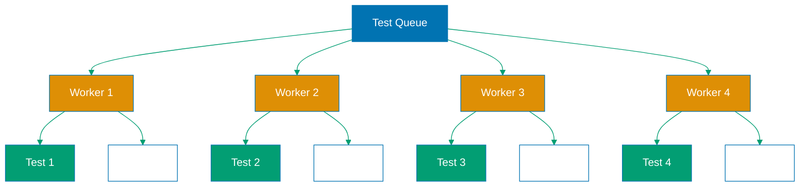

## Why Parallel Execution Matters

Production test suites with hundreds or thousands of tests cannot run sequentially without unacceptable CI/CD pipeline delays. A suite taking 30 minutes sequentially blocks deployments, slows feature delivery, and frustrates developers waiting for feedback. Parallel execution distributes tests across multiple workers, reducing total execution from 30 minutes to 5 minutes with proper sharding.

Playwright parallel execution leverages multi-core CPUs, enables test sharding across CI nodes, and maintains test isolation through separate browser contexts. This parallelization accelerates feedback loops, enables faster deployment cycles, and improves developer productivity by reducing wait for test results.

Without parallel execution:

- **Slow feedback**: Developers wait 30+ minutes for test results
- **Deployment bottlenecks**: Single failing test blocks entire release
- **Poor resource utilization**: CI runners idle while tests run sequentially
- **CI cost waste**: Pay for compute time during sequential wait periods
- **Developer frustration**: Long waits discourage running full test suite

## Standard Library Approach: Sequential Execution

By default, Playwright runs tests sequentially - one test file at a time, one test per file at a time.

**Default sequential execution**:

```bash
npx playwright test
# => Executes tests sequentially
# => One test file after another
# => No parallelization
# => Single worker process
# => Total time: sum of all test durations
```

**Observing sequential execution**:

```typescript
// tests/login.spec.ts
import { test, expect } from "@playwright/test";

test("user logs in successfully", async ({ page }) => {
  // => Test 1 starts
  // => No other tests running
  // => Browser context created for this test only

  console.log(`Test started at ${new Date().toISOString()}`);
  // => Log start time
  // => Example: "Test started at 2024-01-15T10:00:00.000Z"

  await page.goto("https://example.com/login");
  await page.fill('input[name="username"]', "user");
  await page.fill('input[name="password"]', "pass");
  await page.click('button[type="submit"]');
  // => Test steps execute
  // => Takes 5 seconds total

  console.log(`Test finished at ${new Date().toISOString()}`);
  // => Log finish time
  // => Example: "Test finished at 2024-01-15T10:00:05.000Z"
  // => 5 seconds elapsed
});

test("user logs out successfully", async ({ page }) => {
  // => Test 2 starts AFTER test 1 finishes
  // => Waits for previous test completion
  // => Sequential execution

  console.log(`Test started at ${new Date().toISOString()}`);
  // => Example: "Test started at 2024-01-15T10:00:05.000Z"
  // => Starts immediately after previous test
  // => No parallelization

  // Test continues...
  // => Takes another 5 seconds
  // => Total time now: 10 seconds
});
```

**Sequential execution output**:

```
Running 2 tests using 1 worker
# => 1 worker = sequential execution
# => No parallelization enabled
# => Tests run one after another

[1/2] tests/login.spec.ts:3:1 › user logs in successfully
# => Test 1 of 2 running
# => Timestamp: 10:00:00
# => Duration: 5s

[2/2] tests/login.spec.ts:20:1 › user logs out successfully
# => Test 2 of 2 running
# => Timestamp: 10:00:05 (after previous test)
# => Duration: 5s

2 passed (10s)
# => Total time: 10 seconds
# => Sum of individual test times
# => No time savings from parallelization
```

**Limitations for production parallel execution**:

- **Slow execution**: Total time equals sum of all test times
- **No CPU utilization**: Single worker, other cores idle
- **CI pipeline delays**: Long-running suites block deployments
- **No sharding**: Cannot distribute tests across multiple machines
- **Poor scalability**: Adding tests linearly increases total time
- **Wasted resources**: CI runners have multiple cores unused

## Production Framework: Playwright Workers and Sharding

Playwright provides built-in parallel execution through worker processes and test sharding across multiple machines.

**Enable workers in config**:

```typescript
// playwright.config.ts
import { defineConfig } from "@playwright/test";

export default defineConfig({
  workers: process.env.CI ? 2 : undefined,
  // => Set worker count
  // => CI: 2 workers (controlled parallelism)
  // => Local: undefined = auto-detect CPU cores
  // => Auto-detect uses all available cores
  // => Example: 8-core machine = 8 workers

  fullyParallel: true,
  // => Enable full parallelization
  // => Tests in same file run in parallel
  // => Without this: tests within file run sequentially
  // => With this: maximum parallelization

  maxFailures: process.env.CI ? 10 : undefined,
  // => Stop after 10 failures in CI
  // => Prevents wasting CI time on broken builds
  // => undefined in local = run all tests regardless

  retries: process.env.CI ? 2 : 0,
  // => Retry flaky tests 2 times in CI
  // => 0 retries locally for fast feedback
  // => Helps mitigate intermittent failures
});
```

**Running with multiple workers**:

```bash
npx playwright test --workers=4
# => Override config, use 4 workers
# => 4 test files run simultaneously
# => Each worker has own browser process
# => Total time reduced by ~4x (ideally)
# => Example: 20 minutes → 5 minutes

npx playwright test --workers=50%
# => Use 50% of CPU cores
# => 8-core machine = 4 workers
# => Leaves resources for other processes
# => Good for shared CI runners
```

**Parallel execution output**:

```
Running 8 tests using 4 workers
# => 4 workers running in parallel
# => Multiple tests execute simultaneously

[1/8] tests/login.spec.ts:3:1 › user logs in (Worker 1)
[2/8] tests/profile.spec.ts:5:1 › edit profile (Worker 2)
[3/8] tests/orders.spec.ts:10:1 › create order (Worker 3)
[4/8] tests/search.spec.ts:7:1 › search products (Worker 4)
# => All 4 workers active simultaneously
# => Tests run concurrently
# => Time elapsed: 5s (all started at same time)

[5/8] tests/checkout.spec.ts:3:1 › checkout flow (Worker 1)
# => Worker 1 finished first test, starts next
# => Workers pull from test queue
# => Load balanced automatically

8 passed (12s)
# => Total time: 12 seconds
# => Massive reduction from 40s sequential (5s × 8 tests)
# => ~3.3x speedup with 4 workers
```

**Test sharding across CI machines**:

```yaml
# .github/workflows/playwright-sharded.yml
name: Playwright Tests (Sharded)
on: [push]
jobs:
  test:
    runs-on: ubuntu-latest
    strategy:
      fail-fast: false
      # => Don't cancel other shards if one fails
      # => Get full test results from all shards

      matrix:
        shard: [1, 2, 3, 4]
        # => 4 parallel CI jobs (shards)
        # => Each shard runs subset of tests
        # => Tests distributed evenly across shards

    steps:
      - uses: actions/checkout@v3
      - uses: actions/setup-node@v3
        with:
          node-version: 18

      - name: Install dependencies
        run: npm ci

      - name: Install Playwright browsers
        run: npx playwright install --with-deps

      - name: Run tests (shard ${{ matrix.shard }}/4)
        run: npx playwright test --shard=${{ matrix.shard }}/4
        # => --shard=1/4: Run shard 1 of 4 total shards
        # => Playwright divides tests into 4 groups
        # => Each shard gets ~25% of total tests
        # => Example: 100 tests → each shard runs 25 tests
        # => All 4 shards run simultaneously on separate runners

      - name: Upload test results
        if: always()
        uses: actions/upload-artifact@v3
        with:
          name: playwright-report-${{ matrix.shard }}
          path: playwright-report/
        # => Upload results from this shard
        # => Separate artifacts per shard
        # => Combine later for full report
```

**Dynamic worker allocation**:

```typescript
// playwright.config.ts
import { defineConfig } from "@playwright/test";
import os from "os";

const cpuCount = os.cpus().length;
// => Get CPU core count
// => Example: 8-core machine returns 8

const workerCount = process.env.CI
  ? 2 // CI: controlled parallelism
  : Math.max(1, Math.floor(cpuCount / 2));
// => Local: use half of cores
// => Leaves resources for browser processes
// => Example: 8 cores → 4 workers

export default defineConfig({
  workers: workerCount,
  // => Dynamic worker allocation
  // => Adapts to machine capabilities
  // => Prevents resource exhaustion

  use: {
    trace: process.env.CI ? "on-first-retry" : "off",
    // => Trace only on retry in CI
    // => Reduces artifact size
    // => Full traces consume significant storage
  },
});
```

**Worker-level fixtures for resource pooling**:

```typescript
// fixtures/worker-scoped.fixture.ts
import { test as base } from "@playwright/test";

type WorkerFixtures = {
  workerDatabase: Database;
  // => Worker-scoped fixture
  // => Shared across all tests in this worker
  // => Created once per worker
  // => Reused for all tests in worker
};

export const test = base.extend<{}, WorkerFixtures>({
  workerDatabase: [
    async ({}, use, workerInfo) => {
      // => workerInfo provides worker metadata
      // => workerInfo.workerIndex: worker number (0, 1, 2, ...)

      const dbName = `test_db_worker_${workerInfo.workerIndex}`;
      // => Unique database per worker
      // => Example: test_db_worker_0, test_db_worker_1
      // => Prevents worker contention

      const db = await createDatabase(dbName);
      // => Create worker-specific database
      // => Only created once per worker
      // => Shared across all tests in this worker

      await use(db);
      // => Provide database to all tests in worker
      // => Tests in this worker share this db instance

      await db.close();
      // => Cleanup after all worker tests complete
      // => Database closed once per worker
    },
    { scope: "worker" },
    // => scope: 'worker' declares worker-level fixture
    // => Created once per worker, not per test
    // => Improves performance (avoids per-test setup)
  ],
});
```

**Test-level isolation with parallel execution**:

```typescript
// tests/parallel-safe.spec.ts
import { test, expect } from "@playwright/test";

test("test 1 creates user", async ({ page }) => {
  // => Worker 1 runs this test
  // => Has own browser context
  // => Isolated from other workers

  const username = `user_${Date.now()}_${Math.random()}`;
  // => Unique username
  // => Prevents conflicts with parallel tests
  // => Example: user_1640000000000_0.123456

  await page.goto("https://example.com/register");
  await page.fill('input[name="username"]', username);
  // => Uses unique data
  // => No collision with test 2 running in parallel
});

test("test 2 creates user", async ({ page }) => {
  // => Worker 2 runs this test simultaneously
  // => Separate browser context from test 1
  // => Own data namespace

  const username = `user_${Date.now()}_${Math.random()}`;
  // => Different username than test 1
  // => Random component ensures uniqueness
  // => Tests don't interfere
});
```

## Production Parallel Execution Architecture



## Production Patterns and Best Practices

### Pattern 1: Optimal Worker Count

Balance parallelization against resource contention:

```typescript
// playwright.config.ts
const workers = process.env.CI
  ? 2 // CI: limited resources
  : Math.max(1, os.cpus().length - 1); // Local: all cores minus 1

export default defineConfig({ workers });
```

### Pattern 2: Test Grouping

Group related tests to share expensive setup:

```typescript
// tests/auth-group.spec.ts
test.describe.configure({ mode: "serial" });
// => Tests in this describe run sequentially
// => Share expensive auth setup
// => Still parallel with other describe blocks

test.describe("authenticated user", () => {
  test("views profile", async ({ page }) => {
    /* ... */
  });
  test("edits profile", async ({ page }) => {
    /* ... */
  });
  // Both tests share auth state (serial within describe)
});
```

### Pattern 3: Resource Pooling

Share expensive resources across tests:

```typescript
// Use worker fixtures for database connections
// See worker-scoped fixture example above
```

### Pattern 4: Shard Monitoring

Track shard performance to identify bottlenecks:

```typescript
// tests/report-shard-info.ts
test.afterEach(async ({}, testInfo) => {
  console.log(`Worker: ${testInfo.workerIndex}, Duration: ${testInfo.duration}`);
  // => Log worker and duration
  // => Identify slow tests
  // => Optimize bottlenecks
});
```

## Trade-offs and When to Use

**Sequential Execution (Standard Library)**:

- **Use when**: Debugging single test, resource-constrained environments, tests with strict ordering
- **Benefits**: Simpler debugging, predictable execution order, no isolation issues
- **Costs**: Extremely slow, poor resource utilization, blocks fast feedback

**Parallel Workers (Production)**:

- **Use when**: CI/CD pipelines, large test suites, fast feedback needed
- **Benefits**: Dramatic speed improvements (5-10x), better resource usage, faster deployments
- **Costs**: Test isolation required, debugging harder, resource contention possible

**Test Sharding (Enterprise)**:

- **Use when**: Very large suites (1000+ tests), multiple CI runners available, need sub-5-minute feedback
- **Benefits**: Massive parallelization (20+ shards), linear scalability, fastest possible execution
- **Costs**: CI cost (multiple runners), complexity in result aggregation, requires robust test isolation

**Production recommendation**: Always use parallel workers for production test suites. Start with workers matching CPU cores, adjust based on test characteristics. Use sharding for suites exceeding 500 tests or 15-minute sequential runtime.

## Security Considerations

- **Data isolation**: Each worker must use unique test data (timestamps, UUIDs) to prevent conflicts
- **Resource cleanup**: Workers must clean up after themselves (databases, files, network connections)
- **Port allocation**: Tests binding to ports need dynamic allocation to avoid conflicts
- **Credential management**: Don't share credentials across workers, use separate accounts per worker

## Common Pitfalls

1. **Shared mutable state**: Tests modifying shared data cause race conditions
2. **Fixed port numbers**: Multiple workers bind to same port, causing failures
3. **Too many workers**: Overwhelming system resources degrades performance
4. **No test isolation**: Tests depending on execution order break in parallel
5. **Ignoring worker index**: Not using `workerInfo.workerIndex` for unique resource naming
