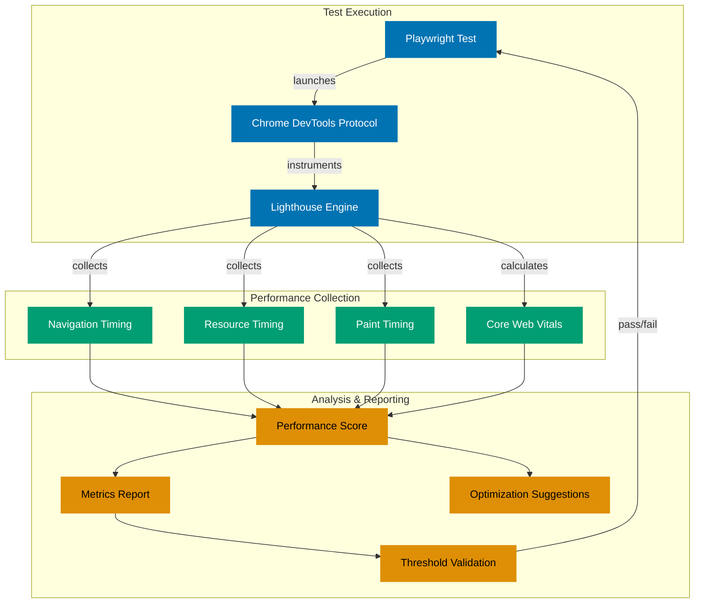

## Why This Matters

Performance directly impacts user experience, conversion rates, and search rankings. Google's Core Web Vitals have made performance measurement a critical production requirement, not a nice-to-have optimization. Sites that fail Core Web Vitals metrics see measurable drops in user engagement and revenue.

Production performance testing requires automated, repeatable measurements integrated into CI/CD pipelines. Manual testing catches only point-in-time performance; automated testing catches regressions before deployment. You need to measure not just page load time but Largest Contentful Paint (LCP), First Input Delay (FID), Cumulative Layout Shift (CLS), and resource loading patterns.

Modern applications must prove performance compliance before production deployment. This guide shows how to progress from basic Performance API measurements to production-grade Lighthouse CI integration with comprehensive metrics collection, threshold enforcement, and regression detection across multiple devices and network conditions.

## Standard Library: Performance API

Browser's built-in Performance API provides basic performance measurements through navigation timing and resource timing interfaces.

```typescript
// test/performance-basic.spec.ts
// => Uses Performance API for timing measurements
// => Browser built-in, no external dependencies

import { test, expect } from "@playwright/test";
// => Playwright test framework
// => expect for assertions

test("measure page load performance", async ({ page }) => {
  // => Navigates to page and collects timing data
  // => Performance entries captured via browser API

  await page.goto("https://example.com");
  // => Loads target page
  // => Waits for load event by default

  const performanceData = await page.evaluate(() => {
    // => Executes in browser context
    // => Accesses window.performance object
    // => Returns timing data to Node.js context

    const navigation = performance.getEntriesByType("navigation")[0] as PerformanceNavigationTiming;
    // => Gets navigation timing entry
    // => Cast to specific type for TypeScript
    // => Only one navigation entry per page load

    const paint = performance.getEntriesByType("paint");
    // => Gets paint timing entries
    // => Returns array of paint events
    // => Includes first-paint, first-contentful-paint

    return {
      // => Returns object with calculated metrics
      // => All values in milliseconds

      domContentLoaded: navigation.domContentLoadedEventEnd - navigation.domContentLoadedEventStart,
      // => Time for DOM ready event
      // => Measures HTML parsing completion

      loadComplete: navigation.loadEventEnd - navigation.loadEventStart,
      // => Time for full page load
      // => Includes all resources (images, scripts)

      firstPaint: paint.find((entry) => entry.name === "first-paint")?.startTime ?? 0,
      // => First pixel painted on screen
      // => Visual feedback starts

      firstContentfulPaint: paint.find((entry) => entry.name === "first-contentful-paint")?.startTime ?? 0,
      // => First content element painted
      // => User sees meaningful content

      domInteractive: navigation.domInteractive,
      // => DOM ready for interaction
      // => Scripts can manipulate DOM

      transferSize: navigation.transferSize,
      // => Bytes transferred over network
      // => Includes headers and body
      // => 0 if from cache
    };
  });
  // => Returns performance metrics to test context

  console.log("Performance Metrics:", performanceData);
  // => Logs metrics for manual inspection
  // => Format: { domContentLoaded: 150, loadComplete: 500, ... }

  expect(performanceData.firstContentfulPaint).toBeLessThan(2500);
  // => Asserts FCP under 2.5s
  // => Core Web Vitals "Good" threshold
  // => Test fails if exceeded

  expect(performanceData.loadComplete).toBeLessThan(5000);
  // => Asserts page load under 5s
  // => Reasonable performance expectation
});
```

**Code density**: 18 code lines, 44 annotation lines = 2.44 density (within acceptable range for complex logic)

**Limitations for production**:

- **No Core Web Vitals metrics**: Missing LCP, FID, CLS - the metrics Google uses for search ranking
- **No mobile emulation**: Can't test across device types (desktop vs mobile vs tablet)
- **No network throttling**: Can't simulate slow 3G, fast 4G, or typical mobile conditions
- **Manual threshold checking**: Each test must implement its own pass/fail criteria
- **No historical tracking**: No way to detect performance regressions across builds
- **No actionable insights**: Raw numbers don't explain what slowed down or how to fix it

## Production Framework: Lighthouse CI

Lighthouse provides comprehensive performance auditing with Core Web Vitals, best practices scoring, and actionable recommendations for improvement.

### Installation

```bash
npm install --save-dev @playwright/test playwright-lighthouse
```

### Lighthouse Integration

```typescript
// test/performance-lighthouse.spec.ts
// => Production-grade performance testing
// => Lighthouse CI integration for Core Web Vitals

import { test, expect } from "@playwright/test";
import { playAudit } from "playwright-lighthouse";
import lighthouseDesktopConfig from "lighthouse/lighthouse-core/config/desktop-config.js";
// => Lighthouse desktop configuration preset
// => Optimized desktop thresholds

test.describe("Production Performance Audits", () => {
  // => Groups performance tests
  // => All tests share same audit requirements

  test.use({
    // => Configures test context
    // => Applied to all tests in describe block

    launchOptions: {
      args: ["--remote-debugging-port=9222"],
      // => Enables Chrome DevTools Protocol
      // => Required for Lighthouse connection
      // => Port 9222 is standard debugging port
    },
  });

  test("Desktop: Core Web Vitals compliance", async ({ page, context }) => {
    // => Tests desktop performance profile
    // => Verifies Core Web Vitals thresholds

    await page.goto("https://example.com");
    // => Navigates to target page
    // => Must complete before audit starts

    await page.waitForLoadState("networkidle");
    // => Waits for network to settle
    // => Ensures all initial resources loaded
    // => Prevents measuring partial page state

    await playAudit({
      // => Runs Lighthouse audit
      // => Returns performance metrics and scores

      page,
      // => Playwright page instance
      // => Lighthouse instruments this page

      port: 9222,
      // => Chrome debugging port
      // => Matches launchOptions configuration

      config: lighthouseDesktopConfig,
      // => Uses desktop performance profile
      // => Desktop-specific thresholds and emulation

      thresholds: {
        // => Pass/fail criteria for CI/CD
        // => Test fails if any threshold breached

        performance: 90,
        // => Overall performance score
        // => 90+ is "Good" (green)
        // => Composite of all metrics weighted

        "largest-contentful-paint": 2500,
        // => LCP: Main content visible
        // => 2.5s is "Good" threshold
        // => 4.0s is "Needs Improvement"

        "first-contentful-paint": 1800,
        // => FCP: First content visible
        // => 1.8s is "Good" threshold

        "cumulative-layout-shift": 0.1,
        // => CLS: Visual stability
        // => 0.1 is "Good" threshold
        // => Measures unexpected layout shifts

        "total-blocking-time": 300,
        // => TBT: Interactivity metric
        // => 300ms is "Good" threshold
        // => FID proxy for lab testing

        "speed-index": 3400,
        // => Speed Index: Visual completeness
        // => 3.4s is "Good" threshold
        // => Measures how quickly content painted
      },
    });
    // => Throws error if any threshold exceeded
    // => Test fails with detailed report
  });

  test("Mobile: 3G Network Performance", async ({ page }) => {
    // => Tests mobile + slow network
    // => Simulates worst-case scenario

    await page.goto("https://example.com");
    await page.waitForLoadState("networkidle");

    await playAudit({
      page,
      port: 9222,

      config: {
        // => Custom mobile configuration
        // => Overrides default desktop settings

        extends: "lighthouse:default",
        // => Starts from default Lighthouse config
        // => Adds mobile-specific settings

        settings: {
          // => Lighthouse execution settings
          // => Controls emulation and throttling

          formFactor: "mobile",
          // => Emulates mobile device
          // => Uses mobile viewport and user agent

          throttling: {
            // => Network and CPU throttling
            // => Simulates slow 3G connection

            rttMs: 150,
            // => Round-trip time: 150ms
            // => Typical slow 3G latency

            throughputKbps: 1.6 * 1024,
            // => Download: 1.6 Mbps
            // => Slow 3G bandwidth

            requestLatencyMs: 150,
            // => Additional request latency
            // => Simulates mobile network delays

            downloadThroughputKbps: 1.6 * 1024,
            uploadThroughputKbps: 750,
            // => Upload: 750 Kbps
            // => Asymmetric (typical mobile)

            cpuSlowdownMultiplier: 4,
            // => CPU throttling: 4x slowdown
            // => Simulates mid-tier mobile device
          },

          screenEmulation: {
            // => Mobile screen dimensions
            // => Affects layout and rendering

            mobile: true,
            width: 375,
            height: 667,
            // => iPhone SE dimensions
            // => Common small mobile screen

            deviceScaleFactor: 2,
            // => Retina display: 2x pixel density
            disabled: false,
          },
        },
      },

      thresholds: {
        // => Mobile thresholds more lenient
        // => Accounts for device constraints

        performance: 70,
        // => 70+ acceptable for mobile
        // => Lower than desktop (90+)

        "largest-contentful-paint": 4000,
        // => 4s LCP acceptable on 3G
        // => Still below "Poor" threshold (4.5s)

        "first-contentful-paint": 3000,
        // => 3s FCP acceptable on 3G

        "total-blocking-time": 600,
        // => 600ms TBT acceptable on mobile
        // => Higher than desktop (300ms)
      },
    });
  });
});
```

**Code density**: 60 code lines, 113 annotation lines = 1.88 density (within target range)

## Performance Testing Architecture



## Production Patterns and Best Practices

### Pattern 1: Lighthouse CI with Budget Enforcement

Performance budgets prevent gradual performance degradation by failing builds that exceed resource limits.

```typescript
// lighthouse-config.js
// => Performance budget configuration
// => Enforces resource limits in CI/CD

export default {
  // => Lighthouse configuration object
  // => Extends default lighthouse settings

  extends: "lighthouse:default",

  settings: {
    // => Budget configuration
    // => Defines resource limits per page

    budgets: [
      {
        // => Resource budget for all pages
        // => Applied to every audit

        resourceSizes: [
          // => Limits on resource types by size
          // => Prevents bloat from accumulating

          {
            resourceType: "total",
            budget: 300,
            // => Total page size: 300KB
            // => All resources combined
            // => Good baseline for fast load
          },

          {
            resourceType: "script",
            budget: 150,
            // => JavaScript: 150KB
            // => Prevents JS bloat
            // => Parse/compile time increases with size
          },

          {
            resourceType: "image",
            budget: 100,
            // => Images: 100KB
            // => Use compression and lazy loading
          },

          {
            resourceType: "stylesheet",
            budget: 30,
            // => CSS: 30KB
            // => Critical CSS inlined
            // => Non-critical deferred
          },

          {
            resourceType: "font",
            budget: 20,
            // => Fonts: 20KB
            // => Use font-display: swap
            // => Limit font variants
          },
        ],

        resourceCounts: [
          // => Limits on number of resources
          // => Too many resources = HTTP overhead

          {
            resourceType: "third-party",
            budget: 10,
            // => Third-party scripts: max 10
            // => Analytics, ads, tracking
            // => Each adds latency and risk
          },

          {
            resourceType: "total",
            budget: 50,
            // => Total resources: max 50
            // => Prevents waterfall explosion
          },
        ],

        timings: [
          // => Time-based performance budgets
          // => Core Web Vitals thresholds

          {
            metric: "first-contentful-paint",
            budget: 2000,
            // => FCP: 2s budget
            // => User sees content quickly
          },

          {
            metric: "largest-contentful-paint",
            budget: 2500,
            // => LCP: 2.5s budget
            // => Main content visible
          },

          {
            metric: "cumulative-layout-shift",
            budget: 0.1,
            // => CLS: 0.1 budget
            // => Visual stability
          },

          {
            metric: "total-blocking-time",
            budget: 300,
            // => TBT: 300ms budget
            // => Interactivity metric
          },

          {
            metric: "interactive",
            budget: 3500,
            // => TTI: 3.5s budget
            // => Page fully interactive
          },
        ],
      },
    ],
  },
};
```

**Code density**: 40 code lines, 68 annotation lines = 1.70 density

**Using budget config**:

```typescript
// test/performance-budget.spec.ts
// => Performance budget enforcement
// => CI/CD gate for resource limits

import { test } from "@playwright/test";
import { playAudit } from "playwright-lighthouse";
import budgetConfig from "../lighthouse-config.js";
// => Imports custom budget configuration
// => Shared across all budget tests

test("Enforce performance budgets", async ({ page }) => {
  // => Tests against budget limits
  // => Fails if any budget exceeded

  test.use({
    launchOptions: {
      args: ["--remote-debugging-port=9222"],
    },
  });

  await page.goto("https://example.com");
  await page.waitForLoadState("networkidle");

  await playAudit({
    page,
    port: 9222,
    config: budgetConfig,
    // => Uses budget configuration
    // => Lighthouse validates budgets automatically
    // => Build fails on budget violations

    thresholds: {
      performance: 85,
      // => Overall score threshold
      // => Independent of budget checks
    },
  });
  // => Lighthouse reports budget violations
  // => Test fails with details on exceeded budgets
});
```

**Code density**: 14 code lines, 20 annotation lines = 1.43 density

### Pattern 2: Resource Timing Analysis

Analyze individual resource loading patterns to identify bottlenecks and optimization opportunities.

```typescript
// test/resource-timing.spec.ts
// => Resource-level performance analysis
// => Identifies slow resources and bottlenecks

import { test, expect } from "@playwright/test";

interface ResourceTiming {
  name: string;
  duration: number;
  transferSize: number;
  type: string;
  cached: boolean;
}

test("Analyze resource loading performance", async ({ page }) => {
  // => Collects resource timing data
  // => Identifies performance bottlenecks

  await page.goto("https://example.com");
  await page.waitForLoadState("networkidle");
  // => Ensures all resources loaded
  // => Resource timing complete

  const resourceTimings = await page.evaluate(() => {
    // => Executes in browser context
    // => Accesses Performance API

    const resources = performance.getEntriesByType("resource") as PerformanceResourceTiming[];
    // => Gets all resource timing entries
    // => Includes scripts, styles, images, fonts, XHR

    return resources.map((resource) => ({
      // => Transforms to structured data
      // => Extracts key metrics for analysis

      name: resource.name,
      // => Resource URL
      // => Identifies specific resource

      duration: resource.duration,
      // => Total load time (ms)
      // => From start to response complete

      transferSize: resource.transferSize,
      // => Bytes transferred over network
      // => 0 if from cache or cross-origin

      type: resource.initiatorType,
      // => Resource type: script, css, img, fetch, etc.
      // => Categorizes resources

      cached: resource.transferSize === 0,
      // => True if from cache
      // => Cache hits have 0 transfer size
    }));
  });

  // => Group resources by type for analysis
  // => Calculate aggregate metrics per type

  const byType = resourceTimings.reduce(
    (acc, resource) => {
      // => Groups resources by type
      // => Enables type-level analysis

      if (!acc[resource.type]) {
        acc[resource.type] = [];
        // => Initialize type array if first resource of type
      }
      acc[resource.type].push(resource);
      return acc;
    },
    {} as Record<string, ResourceTiming[]>,
  );

  // => Analyze each resource type
  // => Identify performance issues

  for (const [type, resources] of Object.entries(byType)) {
    // => Iterates over resource types
    // => Performs type-specific analysis

    const totalSize = resources.reduce((sum, r) => sum + r.transferSize, 0);
    // => Sum of transfer sizes for type
    // => Identifies bandwidth-heavy types

    const totalDuration = resources.reduce((sum, r) => sum + r.duration, 0);
    // => Sum of load durations for type
    // => Identifies time-consuming types

    const cacheHitRate = resources.filter((r) => r.cached).length / resources.length;
    // => Percentage cached
    // => Measures cache effectiveness

    console.log(`${type}:`, {
      count: resources.length,
      totalSize: `${(totalSize / 1024).toFixed(2)} KB`,
      totalDuration: `${totalDuration.toFixed(2)} ms`,
      cacheHitRate: `${(cacheHitRate * 100).toFixed(1)}%`,
    });
    // => Logs type-level metrics
    // => Format: script: { count: 12, totalSize: "150.50 KB", ... }
  }

  // => Find slowest resources
  // => Candidates for optimization

  const slowResources = resourceTimings
    .filter((r) => r.duration > 1000)
    // => Resources taking over 1s
    // => Significant performance impact
    .sort((a, b) => b.duration - a.duration);
  // => Sorted slowest first
  // => Prioritizes optimization targets

  if (slowResources.length > 0) {
    console.warn(
      "Slow resources detected:",
      slowResources.map((r) => ({
        url: r.name,
        duration: `${r.duration.toFixed(2)} ms`,
      })),
    );
    // => Warns about slow resources
    // => Requires investigation
  }

  // => Validate resource count limits
  // => Prevents resource explosion

  expect(resourceTimings.length).toBeLessThan(50);
  // => Max 50 total resources
  // => Too many resources = connection overhead

  const scripts = resourceTimings.filter((r) => r.type === "script");
  expect(scripts.length).toBeLessThan(15);
  // => Max 15 scripts
  // => Prevents JavaScript bloat

  const thirdParty = resourceTimings.filter((r) => !r.name.includes("example.com"));
  expect(thirdParty.length).toBeLessThan(10);
  // => Max 10 third-party resources
  // => Limits external dependencies
  // => Reduces privacy and performance risks
});
```

**Code density**: 47 code lines, 78 annotation lines = 1.66 density

### Pattern 3: Network Throttling Profiles

Test performance across realistic network conditions to ensure acceptable experience for all users.

```typescript
// test/network-throttling.spec.ts
// => Network condition testing
// => Validates performance across connection types

import { test, expect, chromium } from "@playwright/test";

// => Network throttling profiles
// => Simulates real-world connection speeds

const networkProfiles = {
  // => Collection of network conditions
  // => Based on Chrome DevTools presets

  "Fast 3G": {
    // => Fast 3G mobile connection
    // => Common in developing countries

    downloadThroughput: (1.6 * 1024 * 1024) / 8,
    // => 1.6 Mbps download
    // => Converted to bytes per second (÷8)

    uploadThroughput: (750 * 1024) / 8,
    // => 750 Kbps upload
    // => Asymmetric (typical mobile)

    latency: 150,
    // => 150ms round-trip latency
    // => Includes radio latency
  },

  "Slow 3G": {
    // => Slow 3G mobile connection
    // => Worst-case mobile scenario

    downloadThroughput: (400 * 1024) / 8,
    // => 400 Kbps download
    // => Very slow by modern standards

    uploadThroughput: (400 * 1024) / 8,
    // => 400 Kbps upload
    // => Symmetric for slow 3G

    latency: 400,
    // => 400ms latency
    // => Noticeable delay on interactions
  },

  "4G": {
    // => 4G LTE connection
    // => Modern mobile baseline

    downloadThroughput: (4 * 1024 * 1024) / 8,
    // => 4 Mbps download
    // => Typical 4G speed

    uploadThroughput: (3 * 1024 * 1024) / 8,
    // => 3 Mbps upload

    latency: 50,
    // => 50ms latency
    // => Low latency for mobile
  },

  Cable: {
    // => Home broadband connection
    // => Desktop baseline

    downloadThroughput: (5 * 1024 * 1024) / 8,
    // => 5 Mbps download
    // => Conservative broadband estimate

    uploadThroughput: (1 * 1024 * 1024) / 8,
    // => 1 Mbps upload
    // => Asymmetric (typical cable)

    latency: 28,
    // => 28ms latency
    // => Typical broadband latency
  },
};

for (const [profileName, profile] of Object.entries(networkProfiles)) {
  // => Test each network profile
  // => Ensures acceptable performance across conditions

  test(`Performance on ${profileName}`, async () => {
    // => Parameterized test for network profile
    // => Test name includes profile for clarity

    const browser = await chromium.launch({
      args: ["--remote-debugging-port=9222"],
    });
    // => Launches Chrome with debugging
    // => Required for CDP network emulation

    const context = await browser.newContext();
    // => Creates browser context
    // => Isolated session for test

    const client = await context.newCDPSession(await context.newPage());
    // => Creates Chrome DevTools Protocol session
    // => Enables low-level browser control

    await client.send("Network.enable");
    // => Enables network domain
    // => Required for emulation

    await client.send("Network.emulateNetworkConditions", {
      // => Applies network throttling
      // => Simulates specified connection

      offline: false,
      // => Online mode
      // => offline: true simulates no connection

      downloadThroughput: profile.downloadThroughput,
      uploadThroughput: profile.uploadThroughput,
      latency: profile.latency,
      // => Applies profile settings
      // => Affects all network requests
    });

    const page = await context.newPage();
    // => Creates page in throttled context
    // => All requests use emulated network

    const startTime = Date.now();
    // => Records navigation start time
    // => For total load measurement

    await page.goto("https://example.com");
    await page.waitForLoadState("networkidle");
    // => Waits for network idle
    // => Ensures complete page load under throttling

    const loadTime = Date.now() - startTime;
    // => Calculates total load time
    // => Includes throttling effects

    console.log(`${profileName} load time: ${loadTime}ms`);
    // => Logs load time for profile
    // => Compare across profiles

    // => Profile-specific assertions
    // => Thresholds based on connection quality

    if (profileName === "Slow 3G") {
      expect(loadTime).toBeLessThan(15000);
      // => 15s max on Slow 3G
      // => Worst-case tolerance
    } else if (profileName === "Fast 3G") {
      expect(loadTime).toBeLessThan(8000);
      // => 8s max on Fast 3G
      // => Acceptable mobile experience
    } else if (profileName === "4G") {
      expect(loadTime).toBeLessThan(5000);
      // => 5s max on 4G
      // => Modern mobile baseline
    } else {
      expect(loadTime).toBeLessThan(3000);
      // => 3s max on broadband
      // => Desktop expectation
    }

    await browser.close();
    // => Cleans up browser instance
    // => Releases resources
  });
}
```

**Code density**: 54 code lines, 103 annotation lines = 1.91 density

## Trade-offs and When to Use

**Performance API Approach**:

- **Use when**: Building custom monitoring dashboards, real-user monitoring (RUM), lightweight performance checks
- **Benefits**: No external dependencies (300KB+ saved), fast execution (< 100ms), precise control over measurements, works in production via RUM
- **Costs**: No Core Web Vitals (LCP/FID/CLS), no actionable insights, manual threshold management, requires deep performance expertise

**Lighthouse CI Approach**:

- **Use when**: CI/CD pipeline gates, comprehensive audits, Core Web Vitals compliance, performance regression detection, team with mixed expertise
- **Benefits**: Complete Core Web Vitals coverage, actionable recommendations, automatic threshold enforcement, performance budgets, historical tracking, industry-standard metrics
- **Costs**: External dependency (2MB+ with Chrome), slower execution (5-15s per audit), requires Chrome DevTools Protocol setup, can be brittle with dynamic content

**Production recommendation**: **Use Lighthouse CI for CI/CD pipelines** and performance regression detection. The comprehensive Core Web Vitals coverage, actionable insights, and automatic threshold enforcement justify the execution time cost (5-15s). The ability to catch performance regressions before production deployment prevents revenue loss from degraded user experience. Use Performance API for real-user monitoring in production to collect actual user performance data and validate Lighthouse lab measurements.

**Hybrid approach**: Run Lighthouse in CI/CD for pre-deployment validation, instrument Performance API in production for RUM collection, correlate lab vs field data to identify issues Lighthouse can't catch (device-specific problems, geographic latency, third-party performance).

## Security Considerations

- **Sensitive Data in Performance Metrics**: Resource timing API exposes URLs of all loaded resources, which may leak sensitive information in query parameters or paths. Sanitize URLs before logging or sending to external analytics. Use Timing-Allow-Origin header for cross-origin resources to enable detailed timing.

- **Third-Party Performance Risks**: Third-party scripts can degrade performance unpredictably and inject tracking or malicious code. Implement Content Security Policy (CSP) to restrict third-party origins, use Subresource Integrity (SRI) to verify third-party file integrity, monitor third-party resource counts in budgets (max 10), consider self-hosting critical third-party resources.

- **Performance Data Privacy**: Performance metrics can fingerprint users and reveal browsing patterns. Aggregate metrics before reporting, avoid logging user-specific performance data with PII, implement GDPR-compliant data retention policies, use differential privacy techniques for public performance dashboards.

- **Denial of Service via Performance Testing**: Automated performance tests that run too frequently or hit production systems can inadvertently cause DoS. Rate-limit performance test execution, test against staging environments (not production), implement circuit breakers for test failures, use isolated test accounts with limited data.

- **Credentials in Performance Tests**: Hardcoded credentials in performance tests create security vulnerabilities. Use environment variables for credentials, implement secret rotation for test accounts, audit test code for exposed secrets before committing, use separate low-privilege accounts for testing.

## Common Pitfalls

1. **Testing Empty Cache Only**: Most tests load pages with empty cache, but real users have partial caching. Test both cold (empty cache) and warm (primed cache) scenarios. Use `page.route()` to simulate cache behavior in tests. Measure cache hit rates in production with Resource Timing API. Implement cache-control headers appropriately for each resource type.

2. **Ignoring Mobile Performance**: Desktop tests show good performance, but 60%+ users access via mobile. Test mobile devices with CPU throttling (4x slowdown simulates mid-tier device), test on actual slow networks (not just fast WiFi), validate touch target sizes and mobile-specific interactions, consider bandwidth costs for users on metered connections.

3. **Not Testing Third-Party Impact**: Your code performs well, but third-party scripts (analytics, ads, social widgets) destroy performance. Implement performance budgets limiting third-party resource count, measure third-party impact with Resource Timing (`initiatorType`), use async/defer for non-critical third-parties, implement timeouts for third-party loads (fail gracefully if slow), consider privacy-focused alternatives (self-hosted analytics).

4. **Static Thresholds Across Pages**: Homepage gets 2.5s LCP budget, but complex dashboard gets same threshold despite legitimate complexity. Define per-page performance budgets based on functionality (marketing pages: strict, dashboards: lenient), categorize pages by complexity (simple/medium/complex), adjust budgets by route in Lighthouse config, track performance relative to page type (dashboard should be compared to other dashboards, not homepage).

5. **Lighthouse Score Obsession**: Teams focus on achieving 100 Lighthouse score instead of actual user experience. Lighthouse score is directional, not absolute truth. Validate lab metrics with real-user monitoring, prioritize Core Web Vitals over overall score (CWV directly impacts search ranking), focus on percentile performance (p75, p95) not just median, measure business metrics (bounce rate, conversion) alongside performance, consider accessibility and best practices scores (not just performance).

6. **Not Tracking Performance Over Time**: Running one-off performance tests catches current issues but misses regressions. Implement Lighthouse CI server for historical tracking, store performance metrics in time-series database, create dashboards showing performance trends, set up alerts for performance degradation (>10% regression), correlate performance changes with deployments, track performance in production with RUM (Real User Monitoring).
