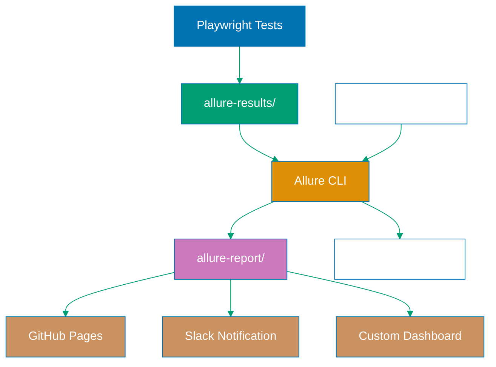

## Why Test Reporting Matters

Production test suites generate thousands of results daily across multiple environments, browsers, and test types. Without proper reporting, teams face critical visibility gaps: Which tests failed? What caused the failure? Did this failure happen before? How long did tests take? These questions cannot be answered by console output alone.

Effective test reporting transforms raw execution data into actionable insights. Comprehensive reports enable rapid root cause analysis, track test stability over time, identify flaky tests, and provide stakeholder visibility into quality metrics. Production reporting integrates with dashboards, alerts teams via Slack/email when tests fail, and maintains historical data for trend analysis.

Without production reporting infrastructure:

- **Debugging delays**: Engineers manually reproduce failures without screenshots or traces
- **Missed patterns**: Flaky tests go undetected without historical failure tracking
- **Poor visibility**: Stakeholders cannot assess product quality or release readiness
- **Slow triage**: Failed tests lack context (browser, OS, timing, logs)
- **No metrics**: Cannot measure test execution speed, coverage, or stability trends

## Standard Library Approach: HTML Reporter

Playwright includes a built-in HTML reporter providing basic test results with screenshots and traces.

**Default HTML reporter configuration**:

```typescript
// playwright.config.ts
import { defineConfig } from "@playwright/test";

export default defineConfig({
  reporter: "html",
  // => Uses built-in HTML reporter
  // => Generates playwright-report/ directory
  // => Single HTML file with all test results
  // => Auto-opens in browser after test run
  // => No external dependencies required

  use: {
    screenshot: "only-on-failure",
    // => Capture screenshot when test fails
    // => Screenshot saved to test-results/
    // => Linked from HTML report
    // => No screenshots for passing tests (reduces storage)

    video: "retain-on-failure",
    // => Record video only for failed tests
    // => Video saved to test-results/
    // => Automatically embedded in HTML report
    // => Discarded for passing tests

    trace: "retain-on-failure",
    // => Capture trace for failed tests only
    // => Trace includes network, console, DOM snapshots
    // => Viewable in Playwright Trace Viewer
    // => Large files (10-50MB per test)
  },
});
```

**Running tests with HTML reporter**:

```bash
npx playwright test
# => Executes all tests
# => Generates HTML report in playwright-report/
# => Opens report in default browser
# => Report URL: file:///path/to/playwright-report/index.html

npx playwright show-report
# => Opens existing HTML report
# => No test execution
# => Useful for reviewing previous results
```

**HTML report structure**:

```
playwright-report/
├── index.html
│   # => Main report file
│   # => Lists all tests with pass/fail status
│   # => Links to screenshots, videos, traces
│   # => Filter by status, browser, file
│
├── data/
│   # => JSON data for report rendering
│   # => Contains test results, timing, errors
│
└── trace/
    # => Embedded trace viewer assets
    # => Allows viewing traces in browser
    # => No external viewer needed
```

**Viewing test results in HTML report**:

```typescript
// tests/checkout.spec.ts
import { test, expect } from "@playwright/test";

test("user completes checkout successfully", async ({ page }) => {
  // => Test execution creates result entry
  // => HTML report shows: test name, duration, status

  await page.goto("https://example.com/checkout");
  // => If failure occurs, screenshot captured automatically
  // => Screenshot linked in HTML report

  await page.fill('input[name="card"]', "4111111111111111");
  // => All actions recorded in trace
  // => Trace timeline shows this action with timestamp

  await page.click('button[type="submit"]');
  await expect(page.locator(".success")).toBeVisible();
  // => If assertion fails, video and trace retained
  // => Passing test: video and trace deleted
  // => HTML report links to retained artifacts
});
```

**HTML report output**:

```
Test Files  10 passed (10)
Tests       42 passed (42)
Duration    2m 15s
# => Summary statistics at top of report
# => Total files, total tests, total duration
# => Color-coded: green for pass, red for fail

┌─────────────────────────────────────────────────────┐
│ ✓ tests/checkout.spec.ts                           │
│   ✓ user completes checkout successfully (3.2s)   │
│     Browser: chromium                               │
│     Screenshot: [link]                              │
│     Video: [link]                                   │
│     Trace: [link]                                   │
└─────────────────────────────────────────────────────┘
# => Each test shows:
# => - Status (✓ or ✗)
# => - Duration
# => - Browser
# => - Links to artifacts (if present)
```

**Limitations for production reporting**:

- **No historical data**: Each run overwrites previous report, no trend tracking
- **Static file only**: Cannot query results, filter by date range, or analyze trends
- **No alerting**: No integration with Slack, email, or incident management
- **Local storage**: Report files stored locally, not in centralized dashboard
- **No custom metrics**: Cannot add business metrics (checkout conversion, load times)
- **Poor CI integration**: HTML files difficult to parse in CI/CD pipelines
- **No comparison**: Cannot compare current run against previous runs

## Production Framework: Allure Reporter

Allure provides enterprise-grade reporting with historical trends, custom metrics, rich categorization, and dashboard integration.

**Install Allure reporter**:

```bash
npm install --save-dev allure-playwright
# => Installs Allure reporter for Playwright
# => Version managed in package.json
# => Adds allure-results/ to gitignore

npm install --save-dev allure-commandline
# => Installs Allure CLI for generating reports
# => Required to convert allure-results/ to HTML
# => Enables local report viewing
```

**Configure Allure reporter**:

```typescript
// playwright.config.ts
import { defineConfig } from "@playwright/test";

export default defineConfig({
  reporter: [
    ["html", { open: "never" }],
    // => Keep HTML reporter for backup
    // => open: 'never' prevents auto-opening
    // => Fallback if Allure generation fails

    [
      "allure-playwright",
      {
        outputFolder: "allure-results",
        // => Directory for raw test results
        // => JSON files generated during test execution
        // => Fed to Allure CLI for report generation

        detail: true,
        // => Include detailed step information
        // => Captures all page.* actions
        // => Shows action parameters in report

        suiteTitle: true,
        // => Include test file path in report
        // => Groups tests by file/suite
        // => Better organization for large suites

        environmentInfo: {
          "Node Version": process.version,
          OS: process.platform,
          Environment: process.env.CI ? "CI" : "Local",
          "Build URL": process.env.GITHUB_ACTIONS
            ? `https://github.com/${process.env.GITHUB_REPOSITORY}/actions/runs/${process.env.GITHUB_RUN_ID}`
            : "N/A",
        },
        // => Environment metadata shown in report
        // => Helps identify execution context
        // => Critical for debugging environment-specific failures
        // => Links directly to CI build
      },
    ],
  ],

  use: {
    screenshot: "only-on-failure",
    video: "retain-on-failure",
    trace: "retain-on-failure",
    // => Same artifact capture as HTML reporter
    // => Allure automatically attaches to test results
    // => Viewable inline in Allure report
  },
});
```

**Generate and view Allure report**:

```bash
npx playwright test
# => Executes tests
# => Generates allure-results/ directory
# => Contains JSON files for each test
# => Does NOT generate HTML yet

npx allure generate allure-results --clean -o allure-report
# => Converts allure-results/ to HTML report
# => --clean: removes previous allure-report/
# => -o allure-report: output directory
# => Generates static HTML dashboard

npx allure open allure-report
# => Opens report in browser
# => Starts local web server on port 8080
# => URL: http://localhost:8080
# => Rich dashboard with charts and trends
```

**Annotate tests with Allure metadata**:

```typescript
// tests/checkout.spec.ts
import { test, expect } from "@playwright/test";
import { allure } from "allure-playwright";

test("user completes checkout with valid card", async ({ page }) => {
  // => Test executes and reports to Allure
  // => Allure captures test name, status, duration

  await allure.epic("E-commerce");
  // => Top-level grouping (Epic)
  // => Groups related features
  // => Example: "E-commerce", "User Management", "Reporting"

  await allure.feature("Checkout");
  // => Second-level grouping (Feature)
  // => Specific feature under Epic
  // => Example: "Checkout", "Cart", "Payment"

  await allure.story("Credit Card Payment");
  // => User story / specific scenario
  // => Most granular categorization
  // => Example: "Credit Card Payment", "PayPal Payment"

  await allure.tag("smoke");
  // => Custom tags for filtering
  // => Can add multiple tags
  // => Example: "smoke", "regression", "critical"

  await allure.severity("critical");
  // => Business impact severity
  // => Values: blocker, critical, normal, minor, trivial
  // => Helps prioritize test failures

  await allure.owner("platform-team");
  // => Team owning this test
  // => Used for routing failures
  // => Enables team-specific dashboards

  await allure.link("https://jira.example.com/PROJ-123", "PROJ-123");
  // => Link to Jira ticket, requirement, design doc
  // => First param: URL
  // => Second param: display text
  // => Clickable in Allure report

  await page.goto("https://example.com/checkout");
  await allure.step("Navigate to checkout", async () => {
    // => Custom step in Allure timeline
    // => Groups related actions
    // => Shows duration for this step
    // => Nested steps supported
  });

  await allure.step("Fill payment details", async () => {
    await page.fill('input[name="card"]', "4111111111111111");
    // => Action captured inside "Fill payment details" step
    // => Helps organize test flow
    await page.fill('input[name="cvv"]', "123");
    await page.fill('input[name="expiry"]', "12/25");
  });

  await allure.step("Submit order", async () => {
    await page.click('button[type="submit"]');
  });

  await allure.step("Verify success message", async () => {
    await expect(page.locator(".success")).toBeVisible();
    // => Assertion inside step
    // => Failure shows which step broke
  });

  await allure.attachment(
    "Order Details",
    JSON.stringify({
      orderId: "12345",
      total: 99.99,
      items: ["Product A", "Product B"],
    }),
    "application/json",
  );
  // => Attach custom data to test result
  // => Visible in Allure report
  // => Useful for debugging with context
});
```

**Configure Allure categories for failure analysis**:

```json
// allure-results/categories.json
[
  {
    "name": "Product Defects",
    "matchedStatuses": ["failed"],
    "messageRegex": ".*AssertionError.*",
    "traceRegex": ".*"
  },
  {
    "name": "Infrastructure Issues",
    "matchedStatuses": ["broken"],
    "messageRegex": ".*(timeout|network|connection).*"
  },
  {
    "name": "Flaky Tests",
    "matchedStatuses": ["failed"],
    "messageRegex": ".*",
    "flaky": true
  }
]
```

**CI integration with historical trends**:

```yaml
# .github/workflows/playwright-allure.yml
name: Playwright Tests with Allure
on: [push]
jobs:
  test:
    runs-on: ubuntu-latest
    steps:
      - uses: actions/checkout@v3

      - uses: actions/setup-node@v3
        with:
          node-version: 18

      - name: Install dependencies
        run: npm ci

      - name: Install Playwright browsers
        run: npx playwright install --with-deps

      - name: Download previous Allure history
        if: always()
        uses: actions/download-artifact@v3
        with:
          name: allure-history
          path: allure-results/history
        continue-on-error: true
        # => Download history from previous runs
        # => Enables trend charts
        # => continue-on-error: first run has no history

      - name: Run Playwright tests
        run: npx playwright test
        # => Executes tests
        # => Generates allure-results/

      - name: Generate Allure report
        if: always()
        run: npx allure generate allure-results --clean -o allure-report
        # => Convert results to HTML
        # => if: always() runs even if tests failed
        # => Critical for viewing failure reports

      - name: Upload Allure report
        if: always()
        uses: actions/upload-artifact@v3
        with:
          name: allure-report
          path: allure-report/
          retention-days: 30
        # => Store report as CI artifact
        # => Downloadable from GitHub Actions UI
        # => retention-days: keep for 30 days

      - name: Upload Allure history
        if: always()
        uses: actions/upload-artifact@v3
        with:
          name: allure-history
          path: allure-report/history/
          retention-days: 90
        # => Store history for trend charts
        # => Used by next run
        # => Longer retention than full report

      - name: Deploy report to GitHub Pages
        if: github.ref == 'refs/heads/main'
        uses: peaceiris/actions-gh-pages@v3
        with:
          github_token: ${{ secrets.GITHUB_TOKEN }}
          publish_dir: allure-report
        # => Publish to GitHub Pages
        # => Accessible via https://org.github.io/repo/
        # => Only on main branch
```

## Production Allure Reporting Architecture



## Production Patterns and Best Practices

### Pattern 1: Custom Reporter for Real-Time Metrics

Build custom reporters to send metrics to monitoring systems:

```typescript
// reporters/metrics-reporter.ts
import { Reporter, TestCase, TestResult } from "@playwright/test/reporter";
import axios from "axios";

class MetricsReporter implements Reporter {
  // => Custom reporter implementation
  // => Implements Playwright Reporter interface
  // => Called for each test lifecycle event

  async onTestEnd(test: TestCase, result: TestResult): Promise<void> {
    // => Called after each test completes
    // => test: test metadata (name, file, tags)
    // => result: execution data (status, duration, error)

    const metrics = {
      testName: test.title,
      // => Test title
      // => Example: "user completes checkout"

      status: result.status,
      // => 'passed', 'failed', 'skipped', 'timedOut'
      // => Used for success rate calculation

      duration: result.duration,
      // => Duration in milliseconds
      // => Example: 3200 (3.2 seconds)

      browser: test.parent.project()?.name,
      // => Browser name from project config
      // => Example: "chromium", "firefox", "webkit"

      timestamp: Date.now(),
      // => Unix timestamp
      // => Example: 1640000000000

      error: result.error?.message,
      // => Error message if test failed
      // => undefined for passing tests
      // => Example: "AssertionError: expected true to be false"
    };

    try {
      await axios.post("https://metrics.example.com/api/v1/test-results", metrics, {
        headers: {
          Authorization: `Bearer ${process.env.METRICS_API_TOKEN}`,
          // => API authentication
          // => Token from environment variable
          // => Never hardcode credentials

          "Content-Type": "application/json",
        },
        timeout: 5000,
        // => 5 second timeout
        // => Prevents test runs hanging on metrics API issues
      });
      // => POST metrics to monitoring system
      // => Real-time test result tracking
      // => Enables live dashboards
    } catch (error) {
      console.error(`Failed to send metrics: ${error.message}`);
      // => Log error but don't fail test run
      // => Metrics reporting should not block tests
      // => Monitor metrics reporter health separately
    }
  }

  async onEnd(): Promise<void> {
    // => Called after all tests complete
    // => Good place for aggregate metrics

    console.log("Metrics reporting complete");
    // => Confirmation message
  }
}

export default MetricsReporter;
```

**Register custom reporter**:

```typescript
// playwright.config.ts
import { defineConfig } from "@playwright/test";

export default defineConfig({
  reporter: [
    ["allure-playwright"],
    ["./reporters/metrics-reporter.ts"],
    // => Multiple reporters run simultaneously
    // => Custom reporter runs alongside Allure
    // => Each reporter independent
  ],
});
```

### Pattern 2: Historical Trend Analysis

Track test stability over time:

```typescript
// scripts/analyze-trends.ts
import fs from "fs";
import path from "path";

interface TestHistory {
  testName: string;
  // => Unique test identifier
  // => Example: "tests/checkout.spec.ts › user completes checkout"

  runs: Array<{
    timestamp: number;
    // => When test ran
    // => Unix timestamp

    status: string;
    // => 'passed', 'failed', 'flaky'

    duration: number;
    // => Duration in milliseconds
  }>;
}

function analyzeFlakiness(history: TestHistory): number {
  // => Calculate flakiness percentage
  // => Returns 0-100 representing % of failures

  const recentRuns = history.runs.slice(-20);
  // => Last 20 runs
  // => Sliding window for trend detection

  const failures = recentRuns.filter((r) => r.status === "failed").length;
  // => Count failures in recent runs

  const flakinessRate = (failures / recentRuns.length) * 100;
  // => Percentage of runs that failed
  // => Example: 3 failures in 20 runs = 15%

  return flakinessRate;
}

function identifyFlakyTests(historyFile: string): void {
  // => Find tests with intermittent failures
  // => historyFile: path to JSON with test history

  const history: TestHistory[] = JSON.parse(fs.readFileSync(historyFile, "utf-8"));
  // => Load historical data
  // => Array of all tests with their run history

  const flakyTests = history
    .map((test) => ({
      name: test.testName,
      flakinessRate: analyzeFlakiness(test),
      // => Calculate flakiness for each test
    }))
    .filter((test) => test.flakinessRate > 5 && test.flakinessRate < 100)
    // => Flaky: >5% failures but not always failing
    // => 0%: stable
    // => 100%: consistently failing (not flaky, just broken)
    // => 5-95%: intermittent failures (flaky)
    .sort((a, b) => b.flakinessRate - a.flakinessRate);
  // => Sort by flakiness (worst first)

  console.log("Flaky Tests Report:");
  flakyTests.forEach((test) => {
    console.log(`${test.name}: ${test.flakinessRate.toFixed(1)}% failure rate`);
    // => Output: test name and failure rate
    // => Example: "user login: 15.0% failure rate"
  });

  if (flakyTests.length > 0) {
    process.exit(1);
    // => Fail CI if flaky tests detected
    // => Forces team to address flakiness
  }
}

identifyFlakyTests("test-history.json");
```

### Pattern 3: Slack Notifications for Test Failures

Send real-time alerts when tests fail:

```typescript
// reporters/slack-reporter.ts
import { Reporter, TestCase, TestResult } from "@playwright/test/reporter";
import axios from "axios";

class SlackReporter implements Reporter {
  private failures: Array<{ test: TestCase; result: TestResult }> = [];
  // => Accumulate failures during run
  // => Send single notification at end

  async onTestEnd(test: TestCase, result: TestResult): Promise<void> {
    if (result.status === "failed" || result.status === "timedOut") {
      this.failures.push({ test, result });
      // => Store failed test
      // => Will be included in summary notification
    }
  }

  async onEnd(): Promise<void> {
    // => Called after all tests complete
    // => Send summary notification

    if (this.failures.length === 0) {
      return;
      // => No failures, no notification
      // => Reduces noise
    }

    const slackWebhookUrl = process.env.SLACK_WEBHOOK_URL;
    // => Slack webhook URL from environment
    // => Example: https://hooks.slack.com/services/T00/B00/XXX

    if (!slackWebhookUrl) {
      console.error("SLACK_WEBHOOK_URL not set, skipping notification");
      return;
      // => Graceful degradation
      // => Don't fail tests if webhook missing
    }

    const message = {
      text: `🚨 ${this.failures.length} Playwright test(s) failed`,
      // => Summary headline
      // => Emoji for visual attention

      blocks: [
        {
          type: "section",
          text: {
            type: "mrkdwn",
            text: `*${this.failures.length} test failure(s) detected*`,
            // => Bold headline in Slack
          },
        },
        {
          type: "divider",
        },
        ...this.failures.slice(0, 10).map(({ test, result }) => ({
          // => Show first 10 failures
          // => Prevents massive notifications

          type: "section",
          text: {
            type: "mrkdwn",
            text: [
              `*Test:* ${test.title}`,
              // => Test name

              `*File:* ${test.location.file}:${test.location.line}`,
              // => File and line number
              // => Clickable in some editors

              `*Browser:* ${test.parent.project()?.name}`,
              // => Which browser failed

              `*Error:* \`\`\`${result.error?.message?.slice(0, 200)}...\`\`\``,
              // => First 200 chars of error
              // => Formatted as code block
              // => Truncated to prevent huge messages
            ].join("\n"),
          },
        })),
        {
          type: "section",
          text: {
            type: "mrkdwn",
            text: process.env.GITHUB_ACTIONS
              ? `<https://github.com/${process.env.GITHUB_REPOSITORY}/actions/runs/${process.env.GITHUB_RUN_ID}|View CI Run>`
              : "Run locally",
            // => Link to CI run if in GitHub Actions
            // => Otherwise: "Run locally"
          },
        },
      ],
    };

    try {
      await axios.post(slackWebhookUrl, message, {
        headers: { "Content-Type": "application/json" },
        timeout: 10000,
        // => 10 second timeout
        // => Longer than metrics reporter (message more important)
      });
      console.log("Slack notification sent");
    } catch (error) {
      console.error(`Failed to send Slack notification: ${error.message}`);
      // => Log but don't fail
      // => Test failures already recorded
    }
  }
}

export default SlackReporter;
```

**Register Slack reporter**:

```typescript
// playwright.config.ts
export default defineConfig({
  reporter: [
    ["allure-playwright"],
    ["./reporters/slack-reporter.ts"],
    // => Slack notifications on failures
    // => Runs alongside Allure
  ],
});
```

**Configure Slack webhook in CI**:

```yaml
# .github/workflows/playwright.yml
env:
  SLACK_WEBHOOK_URL: ${{ secrets.SLACK_WEBHOOK_URL }}
  # => Store webhook as GitHub secret
  # => Never commit webhooks to repository
  # => Accessible as environment variable in tests
```

## Trade-offs and When to Use

**HTML Reporter (Standard Library)**:

- **Use when**: Small teams, simple test suites, local development
- **Benefits**: Zero configuration, no dependencies, works out of box
- **Costs**: No history, no metrics, no alerting, static files only

**Allure Reporter (Production)**:

- **Use when**: Medium-large teams, need historical trends, want rich categorization
- **Benefits**: Historical trends, custom metadata, rich dashboard, GitHub Pages integration
- **Costs**: Extra dependency, requires generation step, more complex CI setup

**Custom Reporters (Enterprise)**:

- **Use when**: Need real-time metrics, custom dashboards, integration with monitoring systems
- **Benefits**: Complete control, real-time data, custom business metrics, flexible integrations
- **Costs**: Development effort, maintenance burden, requires API infrastructure

**Production recommendation**: Use Allure reporter for production test suites requiring historical analysis and rich reporting. Add custom reporters for real-time metrics and alerting. Keep HTML reporter as fallback. For large enterprises, invest in custom reporters integrated with observability platforms (Datadog, New Relic).

## Security Considerations

- **Credential exposure**: Never include API tokens, passwords, or secrets in test reports or screenshots
- **PII protection**: Sanitize user data (emails, names, addresses) from test results before uploading
- **Report access control**: Restrict report access to authorized team members (use authentication for GitHub Pages)
- **CI secrets**: Store Slack webhooks, API tokens in CI secrets, never in code
- **Artifact retention**: Set appropriate retention periods for reports containing sensitive test data
- **Network security**: Use HTTPS for all API calls from custom reporters

## Common Pitfalls

1. **Exposing secrets in reports**: Screenshots capture API tokens, passwords, or sensitive data
2. **Ignoring flaky tests**: Failing to track intermittent failures leads to unreliable test suites
3. **Report bloat**: Retaining all artifacts (videos, traces) for passing tests wastes storage
4. **No report versioning**: Overwriting reports loses historical context for debugging
5. **Missing CI links**: Reports lack links back to CI runs, making correlation difficult
6. **Blocking on reporters**: Custom reporter failures should not block test execution
7. **No alert fatigue management**: Sending notifications for every failure creates noise
