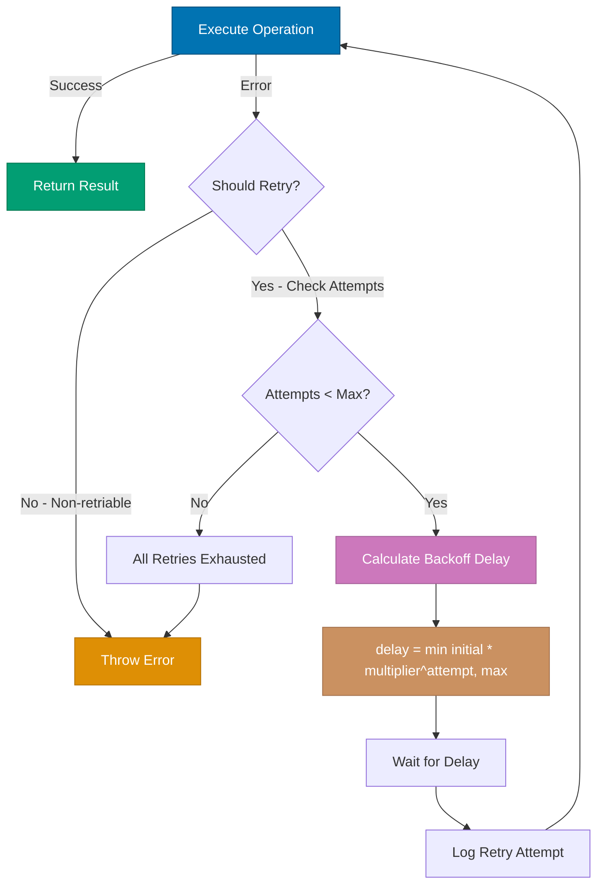

## Why This Matters

Flaky tests are one of the most frustrating challenges in end-to-end testing. A test that passes locally fails in CI, then passes when re-run without any code changes. This undermines confidence in the test suite, wastes developer time investigating false failures, and eventually leads teams to ignore legitimate failures. In production environments, flaky tests can block deployments, create noise in monitoring systems, and erode trust in automated testing altogether.

The root cause of flakiness often lies in timing issues: network latency, animation delays, asynchronous rendering, race conditions between test actions and application state. While Playwright provides auto-waiting for many scenarios, complex production applications require explicit retry strategies to handle edge cases like rate limiting, transient network errors, and eventually-consistent systems. Understanding when and how to retry operations is critical for building resilient test suites that accurately reflect production behavior.

Production retry strategies must balance reliability with execution time. Naive retry approaches mask real bugs by retrying indiscriminately. Smart retry strategies distinguish between retriable failures (network timeouts, transient errors) and non-retriable failures (assertion errors, logic bugs). This guide shows how to progress from Playwright's built-in retry mechanisms to sophisticated production patterns with exponential backoff, conditional retries, and comprehensive failure tracking.

## Standard Library Approach: Playwright Built-in Retries

Playwright provides built-in test and assertion retries through configuration:

```typescript
// playwright.config.ts
import { defineConfig } from "@playwright/test";
// => Import Playwright configuration helper
// => defineConfig provides type-safe config

export default defineConfig({
  retries: process.env.CI ? 2 : 0,
  // => Retries entire test 2 times in CI, 0 locally
  // => Applies to all tests in project
  // => Test fails only if all retries fail
  // => Each retry runs from beginning of test

  use: {
    actionTimeout: 10000,
    // => Maximum time for single action (click, fill, etc.)
    // => Playwright auto-waits up to this timeout
    // => Throws TimeoutError if action incomplete
    // => Default: 0 (no timeout, uses testTimeout)

    navigationTimeout: 30000,
    // => Maximum time for page navigation
    // => Applies to goto(), reload(), goBack(), goForward()
    // => Separate from actionTimeout for slower page loads
    // => Critical for production apps with heavy assets
  },

  expect: {
    timeout: 5000,
    // => Maximum time for expect() assertions
    // => Applies to all expect() calls
    // => Playwright retries assertions until pass or timeout
    // => Handles eventually-consistent UI updates
  },
});
```

**Using built-in retries in tests**:

```typescript
// tests/checkout.spec.ts
import { test, expect } from "@playwright/test";
// => Import test runner and assertion library
// => Inherits retry config from playwright.config.ts

test("checkout flow completes successfully", async ({ page }) => {
  // => test() marks function for Playwright execution
  // => page fixture provides browser context
  // => Will retry up to 2 times (CI) if test fails

  await page.goto("https://example.com/checkout");
  // => Navigate to checkout page
  // => Auto-waits for page load (up to navigationTimeout)
  // => Retries on transient network errors

  await page.click('[data-testid="submit-order"]');
  // => Click submit button
  // => Auto-waits for element to be visible, enabled, stable
  // => Retries action up to actionTimeout

  await expect(page.locator(".confirmation")).toBeVisible();
  // => Assert confirmation message appears
  // => Retries assertion up to expect.timeout (5000ms)
  // => Handles race conditions in async rendering
});
```

**Limitations for production**:

- **Indiscriminate retries**: Retries entire test on any failure, masking real bugs
- **No retry customization**: Cannot retry specific operations differently
- **No exponential backoff**: Retries immediately without delay, hammering rate-limited APIs
- **Limited retry context**: Cannot distinguish retriable vs non-retriable failures
- **No retry metrics**: Cannot track retry patterns to identify systemic issues
- **Global configuration**: All tests share same retry settings, limiting flexibility

## Production Framework: Custom Retry Utilities

Production environments require granular retry control with exponential backoff and conditional logic:

```typescript
// utils/retry.ts
export interface RetryOptions {
  maxAttempts: number;
  // => Maximum retry attempts before failure
  // => First attempt counts toward total
  // => Example: maxAttempts=3 means 1 initial + 2 retries

  initialDelay: number;
  // => Milliseconds to wait before first retry
  // => Base value for exponential backoff
  // => Typical: 100-1000ms depending on operation

  maxDelay: number;
  // => Maximum delay between retries (backoff ceiling)
  // => Prevents infinite backoff growth
  // => Typical: 5000-30000ms for API calls

  backoffMultiplier: number;
  // => Exponential growth factor for delays
  // => delay = min(initialDelay * multiplier^attempt, maxDelay)
  // => Typical: 2.0 (doubles delay each retry)

  shouldRetry?: (error: Error) => boolean;
  // => Optional predicate to determine if error is retriable
  // => Return false to abort retries immediately
  // => Prevents retrying logic errors, 4xx responses
}

export async function retryWithBackoff<T>(operation: () => Promise<T>, options: RetryOptions): Promise<T> {
  // => Generic retry wrapper for any async operation
  // => T is return type of operation (type-safe)
  // => Throws if all retries exhausted

  const {
    maxAttempts,
    initialDelay,
    maxDelay,
    backoffMultiplier,
    shouldRetry = () => true,
    // => Default: retry all errors (can be overridden)
  } = options;

  let lastError: Error;
  // => Store most recent error for final throw
  // => Used if all retries fail

  for (let attempt = 1; attempt <= maxAttempts; attempt++) {
    // => Attempt 1 is initial try, 2+ are retries
    // => Loop continues until success or maxAttempts reached

    try {
      const result = await operation();
      // => Execute operation (Playwright action, API call)
      // => If succeeds, return immediately (no more retries)
      // => If throws, catch block handles retry logic

      if (attempt > 1) {
        console.log(`✓ Retry succeeded on attempt ${attempt}`);
        // => Log successful retry for metrics/debugging
        // => Only logged if not first attempt
      }

      return result;
      // => Return successful result to caller
      // => Exits retry loop
    } catch (error) {
      lastError = error as Error;
      // => Cast to Error type for type safety
      // => Store for potential final throw

      if (!shouldRetry(lastError)) {
        console.error(`✗ Non-retriable error: ${lastError.message}`);
        throw lastError;
        // => Abort retries for non-retriable errors
        // => Example: assertion failures, 404 errors
      }

      if (attempt === maxAttempts) {
        console.error(`✗ All ${maxAttempts} attempts failed`);
        throw lastError;
        // => Exhausted all retries, propagate error
        // => Includes attempt count in error context
      }

      const delay = Math.min(initialDelay * Math.pow(backoffMultiplier, attempt - 1), maxDelay);
      // => Calculate exponential backoff delay
      // => attempt=1: initialDelay * 2^0 = initialDelay
      // => attempt=2: initialDelay * 2^1 = 2x initialDelay
      // => Capped at maxDelay to prevent excessive waits

      console.warn(`⚠ Attempt ${attempt} failed: ${lastError.message}. ` + `Retrying in ${delay}ms...`);
      // => Log retry attempt for debugging
      // => Includes error message and calculated delay

      await new Promise((resolve) => setTimeout(resolve, delay));
      // => Sleep for calculated delay before retry
      // => Prevents hammering rate-limited endpoints
      // => Allows transient errors to resolve
    }
  }

  throw lastError!;
  // => TypeScript safety: lastError guaranteed defined here
  // => Only reachable if loop exits without return/throw
}
```

**Using custom retry in tests**:

```typescript
// tests/checkout-with-retry.spec.ts
import { test, expect } from "@playwright/test";
import { retryWithBackoff } from "../utils/retry";
// => Import custom retry utility
// => Provides granular control over specific operations

test("checkout with smart retries", async ({ page }) => {
  // => Production test with conditional retry logic
  // => Only retries transient failures, not logic errors

  await page.goto("https://example.com/checkout");
  // => Initial navigation uses Playwright auto-wait
  // => No custom retry needed for simple navigation

  await retryWithBackoff(
    async () => {
      await page.click('[data-testid="submit-order"]');
      // => Click submit button
      // => May fail transiently due to animations, loading states

      await expect(page.locator(".loading-spinner")).toBeHidden();
      // => Wait for spinner to disappear
      // => Indicates order processing started
    },
    {
      maxAttempts: 3,
      // => 1 initial + 2 retries
      // => Sufficient for most transient UI issues

      initialDelay: 500,
      // => 500ms first retry delay
      // => Allows animations/renders to complete

      maxDelay: 5000,
      // => Cap at 5 seconds
      // => Prevents excessive wait on repeated failures

      backoffMultiplier: 2.0,
      // => Doubles delay: 500ms, 1000ms, 2000ms
      // => Standard exponential backoff pattern

      shouldRetry: (error) => {
        // => Custom retry logic based on error type
        // => Prevents retrying non-retriable errors

        if (error.message.includes("TimeoutError")) {
          return true;
          // => Retry timeout errors (slow rendering, network)
          // => Common transient issue worth retrying
        }

        if (error.message.includes("Element is not visible")) {
          return true;
          // => Retry visibility errors (animations, lazy loading)
          // => May resolve after delay
        }

        return false;
        // => Don't retry assertion failures, logic errors
        // => Prevents masking real bugs
      },
    },
  );

  const confirmationText = await retryWithBackoff(
    async () => {
      const locator = page.locator(".confirmation");
      // => Find confirmation message element
      // => May not exist immediately after submission

      await expect(locator).toBeVisible();
      // => Assert confirmation visible
      // => Throws if not visible within expect timeout

      return await locator.textContent();
      // => Extract confirmation text
      // => Returns string or null
    },
    {
      maxAttempts: 5,
      // => More retries for backend-dependent operation
      // => Order confirmation requires server processing

      initialDelay: 1000,
      // => Longer initial delay for server processing
      // => Backend may need time to persist order

      maxDelay: 10000,
      // => Higher ceiling for backend delays
      // => Production systems can be slow under load

      backoffMultiplier: 1.5,
      // => Gentler backoff for rate-limited APIs
      // => 1000ms, 1500ms, 2250ms, 3375ms, 5062ms

      shouldRetry: (error) => {
        if (error.message.includes("Expected to be visible")) {
          return true;
          // => Retry visibility assertions
          // => Element may render after backend responds
        }

        if (error.message.includes("null")) {
          return true;
          // => Retry null textContent (element not rendered)
          // => May appear after async updates
        }

        return false;
        // => Don't retry unexpected errors
      },
    },
  );

  expect(confirmationText).toContain("Order confirmed");
  // => Final assertion on extracted text
  // => No retry here (already have confirmed text)
  // => Fails immediately if text doesn't match
});
```

## Mermaid Diagram: Retry Decision Flow



**Diagram explanation**:

- **Blue (Operation)**: Initial execution attempt
- **Green (Success)**: Successful result returned
- **Orange (Failure)**: Non-retriable or exhausted retries
- **Purple (Backoff)**: Exponential delay calculation
- **Brown (Formula)**: Mathematical backoff formula

## Production Patterns and Best Practices

### Pattern 1: Retry Configuration Hierarchy

Configure retries at different granularity levels for flexibility:

```typescript
// config/retry-presets.ts
import { RetryOptions } from "../utils/retry";
// => Import retry types for type safety
// => Ensures presets match expected interface

export const RETRY_PRESETS = {
  // => Centralized retry configurations
  // => Promotes consistency across test suite
  // => Easy to adjust globally

  fast: {
    maxAttempts: 2,
    initialDelay: 100,
    maxDelay: 1000,
    backoffMultiplier: 2.0,
    // => Minimal retries for fast-failing operations
    // => Local development, simple UI interactions
    // => Total max wait: 100ms + 200ms = 300ms
  } as RetryOptions,

  standard: {
    maxAttempts: 3,
    initialDelay: 500,
    maxDelay: 5000,
    backoffMultiplier: 2.0,
    // => Default for most test operations
    // => Balances reliability and speed
    // => Total max wait: 500ms + 1000ms + 2000ms = 3500ms
  } as RetryOptions,

  api: {
    maxAttempts: 5,
    initialDelay: 1000,
    maxDelay: 30000,
    backoffMultiplier: 2.0,
    // => API calls with rate limiting
    // => Backend operations requiring processing time
    // => Total max wait: ~63 seconds (capped at 30s max delay)
  } as RetryOptions,

  network: {
    maxAttempts: 4,
    initialDelay: 2000,
    maxDelay: 15000,
    backoffMultiplier: 1.5,
    // => Network-dependent operations
    // => Slower backoff for transient network issues
    // => Total max wait: 2s + 3s + 4.5s + 6.75s = 16.25s
  } as RetryOptions,
};

// tests/example.spec.ts
import { RETRY_PRESETS } from "../config/retry-presets";
// => Import preset configurations
// => Ensures consistent retry behavior

test("using preset configurations", async ({ page }) => {
  // => Demonstrates preset usage patterns
  // => Easy to swap presets for different scenarios

  await retryWithBackoff(async () => page.click(".button"), {
    ...RETRY_PRESETS.fast,
    // => Spread operator clones preset
    // => Allows customization without mutating preset

    shouldRetry: (error) => error.message.includes("Timeout"),
    // => Override shouldRetry for specific needs
    // => Preset provides base config, custom logic added
  });

  const apiData = await retryWithBackoff(
    async () => page.evaluate(() => fetch("/api/data").then((r) => r.json())),
    RETRY_PRESETS.api,
    // => Use api preset as-is
    // => No customization needed for standard API calls
  );
});
```

### Pattern 2: Exponential Backoff with Jitter

Add randomization to prevent thundering herd in distributed systems:

```typescript
// utils/retry-jitter.ts
export interface JitterRetryOptions extends RetryOptions {
  jitterFactor?: number;
  // => Randomization factor (0.0-1.0)
  // => 0.0 = no jitter, 1.0 = full jitter
  // => Typical: 0.1-0.3 for reasonable variation
}

export async function retryWithJitter<T>(operation: () => Promise<T>, options: JitterRetryOptions): Promise<T> {
  // => Enhanced retry with randomized delays
  // => Prevents synchronized retries in distributed tests
  // => Critical for CI systems running parallel tests

  const {
    maxAttempts,
    initialDelay,
    maxDelay,
    backoffMultiplier,
    jitterFactor = 0.2,
    // => Default 20% jitter (reasonable variation)
    // => Can be overridden per operation
    shouldRetry = () => true,
  } = options;

  let lastError: Error;

  for (let attempt = 1; attempt <= maxAttempts; attempt++) {
    try {
      const result = await operation();
      // => Execute operation, return on success

      if (attempt > 1) {
        console.log(`✓ Retry succeeded on attempt ${attempt}`);
      }

      return result;
    } catch (error) {
      lastError = error as Error;

      if (!shouldRetry(lastError)) {
        throw lastError;
        // => Abort immediately for non-retriable errors
      }

      if (attempt === maxAttempts) {
        console.error(`✗ All ${maxAttempts} attempts failed. ` + `Last error: ${lastError.message}`);
        throw lastError;
        // => Exhausted retries, propagate final error
      }

      const baseDelay = Math.min(initialDelay * Math.pow(backoffMultiplier, attempt - 1), maxDelay);
      // => Calculate exponential backoff base delay
      // => Same formula as basic retry

      const jitterAmount = baseDelay * jitterFactor * (Math.random() - 0.5);
      // => Calculate random jitter: ±(baseDelay * jitterFactor * 0.5)
      // => Example: baseDelay=1000, jitterFactor=0.2
      // =>   jitterAmount = 1000 * 0.2 * [-0.5, 0.5] = [-100, +100]
      // => Adds/subtracts up to 10% of baseDelay

      const delay = Math.max(0, baseDelay + jitterAmount);
      // => Final delay = baseDelay ± jitter
      // => Math.max ensures delay never negative
      // => Example: 1000ms ± 100ms = [900ms, 1100ms]

      console.warn(
        `⚠ Attempt ${attempt}/${maxAttempts} failed: ${lastError.message}. ` +
          `Retrying in ${delay.toFixed(0)}ms (base: ${baseDelay}ms, ` +
          `jitter: ${jitterAmount.toFixed(0)}ms)...`,
      );
      // => Detailed logging shows jitter calculation
      // => Useful for debugging retry patterns

      await new Promise((resolve) => setTimeout(resolve, delay));
      // => Wait for jittered delay
      // => Prevents synchronized retries across parallel tests
    }
  }

  throw lastError!;
}

// tests/parallel-tests.spec.ts
import { retryWithJitter } from "../utils/retry-jitter";
// => Import jitter-enabled retry utility
// => Essential for parallel test execution

test.describe.parallel("parallel checkout tests", () => {
  // => Runs tests in parallel (multiple workers)
  // => Risk of thundering herd without jitter

  test("checkout test 1", async ({ page }) => {
    // => First parallel test instance

    await page.goto("https://example.com/checkout");

    await retryWithJitter(async () => page.click('[data-testid="submit"]'), {
      maxAttempts: 4,
      initialDelay: 1000,
      maxDelay: 8000,
      backoffMultiplier: 2.0,
      jitterFactor: 0.3,
      // => 30% jitter prevents synchronized retries
      // => If 10 tests retry simultaneously, jitter spreads load
      // => Example delays: 900ms, 1100ms, 950ms, 1050ms, etc.
    });
  });

  test("checkout test 2", async ({ page }) => {
    // => Second parallel test instance
    // => Jitter ensures different retry timing than test 1

    await page.goto("https://example.com/checkout");

    await retryWithJitter(async () => page.click('[data-testid="submit"]'), {
      maxAttempts: 4,
      initialDelay: 1000,
      maxDelay: 8000,
      backoffMultiplier: 2.0,
      jitterFactor: 0.3,
      // => Same base config as test 1
      // => Random jitter creates different actual delays
      // => Reduces backend load spikes from synchronized retries
    });
  });
});
```

### Pattern 3: Conditional Retry with Error Classification

Implement intelligent retry decisions based on error types:

```typescript
// utils/retry-conditional.ts
export enum ErrorCategory {
  RETRIABLE = "RETRIABLE",
  // => Transient errors safe to retry
  // => Examples: timeouts, network errors, rate limits

  NON_RETRIABLE = "NON_RETRIABLE",
  // => Permanent errors should not retry
  // => Examples: assertion failures, 404s, logic bugs

  UNKNOWN = "UNKNOWN",
  // => Unclassified errors (default to non-retriable)
  // => Fail fast to avoid masking unexpected issues
}

export function classifyError(error: Error): ErrorCategory {
  // => Analyze error to determine retriability
  // => Centralized classification logic
  // => Returns category for retry decision

  const message = error.message.toLowerCase();
  // => Normalize to lowercase for pattern matching
  // => Case-insensitive error detection

  // Retriable patterns
  const retriablePatterns = [
    "timeout",
    "network",
    "connection reset",
    "econnrefused",
    "enotfound",
    "rate limit",
    "too many requests",
    "service unavailable",
    "gateway timeout",
    "element is not visible",
    "element is not stable",
    "element is not enabled",
  ];
  // => Common transient error patterns
  // => Network issues, timing issues, rate limits
  // => Safe to retry after delay

  if (retriablePatterns.some((pattern) => message.includes(pattern))) {
    return ErrorCategory.RETRIABLE;
    // => Error matches known retriable pattern
    // => Caller should retry with backoff
  }

  // Non-retriable patterns
  const nonRetriablePatterns = [
    "assertion failed",
    "expected",
    "received",
    "not found",
    "invalid",
    "forbidden",
    "unauthorized",
    "bad request",
  ];
  // => Errors indicating logic bugs or permanent failures
  // => Retrying will not fix these issues
  // => Fail fast for quick feedback

  if (nonRetriablePatterns.some((pattern) => message.includes(pattern))) {
    return ErrorCategory.NON_RETRIABLE;
    // => Error matches known non-retriable pattern
    // => Caller should throw immediately
  }

  return ErrorCategory.UNKNOWN;
  // => Unknown error type, default to non-retriable
  // => Conservative approach prevents masking bugs
  // => Can be adjusted based on production patterns
}

export async function retryConditional<T>(operation: () => Promise<T>, options: RetryOptions): Promise<T> {
  // => Retry with automatic error classification
  // => Simplifies test code (no manual shouldRetry)

  const {
    maxAttempts,
    initialDelay,
    maxDelay,
    backoffMultiplier,
    shouldRetry,
    // => Optional custom shouldRetry overrides classification
  } = options;

  let lastError: Error;
  const retriedErrors: Array<{ attempt: number; error: Error; category: ErrorCategory }> = [];
  // => Track retry history for debugging
  // => Useful for identifying patterns in flaky tests

  for (let attempt = 1; attempt <= maxAttempts; attempt++) {
    try {
      const result = await operation();

      if (attempt > 1) {
        console.log(`✓ Retry succeeded on attempt ${attempt}. ` + `Previous errors: ${retriedErrors.length}`);
        // => Log successful retry with error count
        // => Helps identify flaky test patterns

        retriedErrors.forEach(({ attempt: a, error, category }) => {
          console.log(`  Attempt ${a}: [${category}] ${error.message}`);
        });
        // => Log all errors leading to success
        // => Useful for debugging intermittent issues
      }

      return result;
    } catch (error) {
      lastError = error as Error;

      const category = classifyError(lastError);
      // => Automatically classify error type
      // => Determines retriability without manual logic

      retriedErrors.push({ attempt, error: lastError, category });
      // => Record error for retry history
      // => Enables detailed failure reporting

      const isRetriable = shouldRetry ? shouldRetry(lastError) : category === ErrorCategory.RETRIABLE;
      // => Use custom shouldRetry if provided, otherwise use classification
      // => Allows override for special cases

      if (!isRetriable) {
        console.error(`✗ Non-retriable error [${category}]: ${lastError.message}`);
        throw lastError;
        // => Abort retries for non-retriable errors
        // => Fail fast for quick feedback
      }

      if (attempt === maxAttempts) {
        console.error(`✗ All ${maxAttempts} attempts failed. Error history:`);
        retriedErrors.forEach(({ attempt: a, error, category }) => {
          console.error(`  Attempt ${a}: [${category}] ${error.message}`);
        });
        throw lastError;
        // => Exhausted retries, log full history
        // => Provides debugging context
      }

      const delay = Math.min(initialDelay * Math.pow(backoffMultiplier, attempt - 1), maxDelay);

      console.warn(
        `⚠ Attempt ${attempt}/${maxAttempts} failed [${category}]: ` +
          `${lastError.message}. Retrying in ${delay}ms...`,
      );

      await new Promise((resolve) => setTimeout(resolve, delay));
    }
  }

  throw lastError!;
}

// tests/conditional-retry-example.spec.ts
import { retryConditional } from "../utils/retry-conditional";
import { RETRY_PRESETS } from "../config/retry-presets";
// => Import conditional retry and presets
// => Simplifies test code with automatic classification

test("checkout with automatic retry classification", async ({ page }) => {
  // => Test using conditional retry
  // => No manual shouldRetry logic needed

  await page.goto("https://example.com/checkout");

  await retryConditional(
    async () => {
      await page.click('[data-testid="submit-order"]');
      await expect(page.locator(".confirmation")).toBeVisible();
    },
    RETRY_PRESETS.standard,
    // => Uses preset configuration
    // => Automatic error classification
    // => Retries only retriable errors (timeouts, visibility)
    // => Fails fast on assertions, logic errors
  );

  const orderNumber = await retryConditional(
    async () => {
      const text = await page.locator(".order-number").textContent();
      // => Extract order number text
      // => May be null if element not rendered

      if (!text) {
        throw new Error("Order number not found");
        // => Throw custom error for null text
        // => Will be classified as UNKNOWN (non-retriable)
        // => Test will fail immediately without retries
      }

      return text;
    },
    {
      ...RETRY_PRESETS.api,
      shouldRetry: (error) => {
        // => Override classification for specific case
        // => "Order number not found" should be retriable

        if (error.message === "Order number not found") {
          return true;
          // => Treat as retriable (backend processing delay)
          // => Override default UNKNOWN classification
        }

        // Fallback to automatic classification
        return undefined as any;
        // => Return undefined to use classifyError()
        // => Preserves automatic classification for other errors
      },
    },
  );

  expect(orderNumber).toMatch(/^ORD-\d{8}$/);
  // => Final assertion on extracted order number
  // => Fails immediately (no retry needed)
});
```

## Trade-offs and When to Use

**Standard Approach (Playwright Built-in Retries)**:

- **Use when**: Simple test suites, development environments, quick prototyping
- **Benefits**: Zero configuration, works out of box, simple mental model
- **Costs**: Indiscriminate retries mask bugs, no granular control, slower feedback on real failures

**Production Framework (Custom Retry with Backoff)**:

- **Use when**: CI/CD pipelines, production monitoring, rate-limited APIs, distributed systems
- **Benefits**: Granular control, exponential backoff prevents hammering, conditional logic reduces false retries, comprehensive logging and metrics
- **Costs**: Additional code to maintain, complexity overhead, requires error classification knowledge

**Production recommendation**: Use Playwright built-in retries as baseline (retries: 2 in CI), then add custom retry utilities for specific high-value operations like API calls, critical user flows, and rate-limited endpoints. This hybrid approach balances simplicity with production resilience. Configure retry presets centrally to promote consistency and make adjustments easy.

## Security Considerations

- **Credential exposure in logs**: Never log authentication tokens, API keys, or credentials in retry error messages. Sanitize error messages before logging to prevent sensitive data leakage.

- **Rate limit respect**: Implement exponential backoff with appropriate max delays to respect API rate limits. Aggressive retries can trigger security blocks (IP bans, account suspension) or overload protection systems.

- **Distributed denial of service (DDoS) prevention**: Use jitter in parallel test execution to prevent synchronized retry thundering herd. Thousands of tests retrying simultaneously can appear as DDoS attack to backend systems.

- **Error message information disclosure**: Error classification logic may expose system internals through detailed error patterns. Ensure error messages in production don't reveal sensitive implementation details (database schemas, internal endpoints).

- **Retry exhaustion monitoring**: Track retry patterns and failures to detect potential security incidents (brute force attacks, credential stuffing). Unusual retry patterns may indicate malicious activity or system compromise.

## Common Pitfalls

1. **Retrying non-idempotent operations**: Retrying mutations (POST, PUT, DELETE) without idempotency keys can create duplicate records, charge users multiple times, or corrupt state. Ensure operations are idempotent before enabling retries, or implement idempotency tokens.

2. **Infinite retry loops**: Missing max attempt limits or incorrect shouldRetry logic can create infinite loops. Always set maxAttempts and validate shouldRetry returns false for non-retriable errors. Use timeouts as failsafe.

3. **Masking real bugs with retries**: Overly aggressive retry strategies hide legitimate test failures. If tests consistently need retries to pass, investigate root cause rather than increasing retry attempts. Retries should handle transient issues, not paper over bugs.

4. **Ignoring retry metrics**: Not tracking which operations retry frequently indicates flaky tests or system issues. Log retry attempts with context (error type, attempt number, delay) and aggregate metrics to identify problematic tests or endpoints.

5. **Linear backoff in production**: Using fixed delays (100ms, 100ms, 100ms) instead of exponential backoff (100ms, 200ms, 400ms) hammers rate-limited systems and doesn't allow transient issues to resolve. Always use exponential backoff with jitter for production systems.
