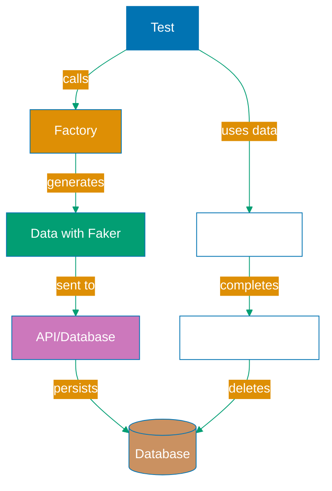

## Why Test Data Management Matters

Production test suites require reliable, consistent, and isolated test data to prevent flaky tests, enable parallel execution, and maintain test independence across environments. Without proper test data management, teams encounter race conditions where tests interfere with each other, brittle tests that break when database state changes, and non-deterministic failures that erode confidence in the test suite.

Playwright test data management encompasses data generation, database seeding, test isolation, and cleanup strategies that ensure each test runs with predictable inputs regardless of execution order or parallelization. This discipline prevents production incidents caused by untested data states, ensures compliance testing with realistic data sets, and enables efficient test execution through proper data lifecycle management.

Insufficient test data management leads to:

- **Flaky tests**: Tests pass/fail randomly based on database state
- **Test coupling**: Tests depend on other tests' data creation
- **Environment drift**: Different data in dev vs staging breaks tests
- **Slow execution**: Tests wait for database operations to complete
- **Compliance violations**: Production data leaked into test environments

## Standard Library Approach: Hardcoded Test Data

Playwright provides no built-in test data framework - tests typically create data inline using hardcoded values or simple object literals.

**Inline data creation**:

```typescript
import { test, expect } from "@playwright/test";
// => Import Playwright test framework
// => No test data framework needed
// => Data created inline in tests

test("user creates order", async ({ page }) => {
  // => Test receives page fixture
  // => No data fixtures provided
  // => Must create all data manually

  await page.goto("https://example.com/orders/new");
  // => Navigate to order creation page
  // => Page expects empty form

  await page.fill('input[name="productName"]', "Widget");
  // => Fill product name
  // => Hardcoded value "Widget"
  // => No data variation

  await page.fill('input[name="quantity"]', "10");
  // => Fill quantity field
  // => Hardcoded value "10"
  // => String representation of number

  await page.fill('input[name="price"]', "29.99");
  // => Fill price field
  // => Hardcoded decimal value
  // => No currency formatting

  await page.fill('input[name="customer"]', "John Doe");
  // => Fill customer name
  // => Hardcoded test name
  // => Always same customer

  await page.click('button[type="submit"]');
  // => Submit order form
  // => Browser sends POST request
  // => Server creates order in database

  await expect(page.locator("text=Order created")).toBeVisible();
  // => Assert success message
  // => Order persisted to database
  // => No cleanup - data remains after test
});

test("user searches for product", async ({ page }) => {
  // => Second test requiring product data
  // => No shared data setup
  // => Must create product again

  await page.goto("https://example.com/products/new");
  // => Navigate to product creation
  // => Duplicate navigation logic

  await page.fill('input[name="name"]', "Widget");
  // => Same product name as first test
  // => Could conflict if tests run in parallel
  // => No uniqueness guarantee

  await page.fill('input[name="sku"]', "WID-001");
  // => Hardcoded SKU
  // => Potential database unique constraint violation
  // => Tests may fail in parallel

  await page.click('button[type="submit"]');
  await page.goto("https://example.com/products");
  // => Navigate to product list
  // => Product should exist now

  await page.fill('input[name="search"]', "Widget");
  await page.click('button:text("Search")');
  // => Search for product created above
  // => Depends on product creation success

  await expect(page.locator("text=Widget")).toBeVisible();
  // => Assert product found
  // => Test coupled to hardcoded "Widget" name
});
```

**Simple data objects**:

```typescript
test("user profile displays correctly", async ({ page }) => {
  // => Test user profile display
  // => Requires user data

  const userData = {
    username: "testuser",
    email: "test@example.com",
    firstName: "Test",
    lastName: "User",
  };
  // => Simple object literal
  // => All fields hardcoded
  // => No validation
  // => No defaults for optional fields

  await page.goto("https://example.com/profile/setup");
  // => Navigate to profile setup
  // => Expects empty profile

  await page.fill('input[name="username"]', userData.username);
  await page.fill('input[name="email"]', userData.email);
  await page.fill('input[name="firstName"]', userData.firstName);
  await page.fill('input[name="lastName"]', userData.lastName);
  // => Fill all fields manually
  // => Repetitive code
  // => No abstraction

  await page.click('button:text("Save")');
  // => Submit profile
  // => Profile saved to database

  await page.goto("https://example.com/profile");
  // => Navigate to profile view
  // => Should display saved data

  await expect(page.locator("text=Test User")).toBeVisible();
  // => Assert full name displayed
  // => Hardcoded expectation
});
```

**Limitations for production test data management**:

- **No data variation**: Hardcoded values produce identical data every test
- **Duplication**: Same data creation logic repeated across tests
- **Conflict risk**: Parallel tests create data with same identifiers (race conditions)
- **No cleanup**: Data persists in database after test completion
- **No relationships**: Cannot easily create related entities (user -> orders -> products)
- **No realistic data**: Hardcoded values don't represent production data patterns

## Production Framework: Test Data Factories with Faker

Production test suites use factory patterns with Faker.js to generate unique, realistic test data programmatically with proper relationships and cleanup.

**Install dependencies**:

```bash
npm install --save-dev @faker-js/faker
# => Install Faker library for data generation
# => Provides realistic fake data (names, emails, addresses)
# => Deterministic with seed for reproducibility
```

**Create data factory**:

```typescript
// factories/user.factory.ts
import { faker } from "@faker-js/faker";
// => Import Faker for data generation
// => Generates realistic fake data
// => Deterministic when seeded

type User = {
  username: string;
  email: string;
  firstName: string;
  lastName: string;
  phoneNumber?: string;
  address?: string;
};
// => Type-safe user data structure
// => Optional fields marked with ?
// => TypeScript validates factory output

export function createUser(overrides?: Partial<User>): User {
  // => Factory function generates user data
  // => Accepts partial overrides
  // => Returns complete user object

  return {
    username: faker.internet.userName(),
    // => Generate random username
    // => Example: "john_doe42"
    // => Unique per invocation (timestamp-based)

    email: faker.internet.email(),
    // => Generate random email
    // => Example: "alice.smith@example.com"
    // => Valid email format

    firstName: faker.person.firstName(),
    // => Generate realistic first name
    // => Example: "Emma"
    // => Drawn from name dataset

    lastName: faker.person.lastName(),
    // => Generate realistic last name
    // => Example: "Johnson"
    // => Drawn from name dataset

    phoneNumber: faker.phone.number(),
    // => Generate phone number
    // => Example: "+1 (555) 123-4567"
    // => Format varies by locale

    address: faker.location.streetAddress(),
    // => Generate street address
    // => Example: "123 Main St"
    // => Includes street number and name

    ...overrides,
    // => Spread overrides last
    // => Allows test-specific customization
    // => Overrides factory defaults
  };
}

export function createAdmin(overrides?: Partial<User>): User {
  // => Specialized factory for admin users
  // => Builds on base user factory
  // => Adds admin-specific defaults

  return createUser({
    username: `admin_${faker.string.alphanumeric(8)}`,
    // => Admin username with prefix
    // => Identifies admin users in tests
    // => 8 random characters for uniqueness

    email: `admin@${faker.internet.domainName()}`,
    // => Admin email with admin prefix
    // => Valid email domain
    // => Easily identifiable as admin

    ...overrides,
    // => Allow further customization
  });
}
```

**Using factories in tests**:

```typescript
// tests/user-profile.spec.ts
import { test, expect } from "@playwright/test";
import { createUser } from "../factories/user.factory";
// => Import user factory
// => Tests generate data on-demand
// => No hardcoded values

test("user profile displays correctly", async ({ page }) => {
  // => Test user profile display
  // => Uses factory-generated data

  const user = createUser();
  // => Generate unique user data
  // => Different values each test run
  // => No conflicts with other tests
  // => user = { username: "alice_smith", email: "...", ... }

  await page.goto("https://example.com/profile/setup");
  // => Navigate to profile setup page

  await page.fill('input[name="username"]', user.username);
  await page.fill('input[name="email"]', user.email);
  await page.fill('input[name="firstName"]', user.firstName);
  await page.fill('input[name="lastName"]', user.lastName);
  // => Fill form with factory-generated data
  // => Each field has realistic, unique value
  // => Data varies per test execution

  await page.click('button:text("Save")');
  // => Submit profile
  // => Profile saved with unique data

  await page.goto("https://example.com/profile");
  // => Navigate to profile view

  await expect(page.locator(`text=${user.firstName} ${user.lastName}`)).toBeVisible();
  // => Assert full name displayed
  // => Uses factory-generated values for assertion
  // => Test adapts to data variation
});

test("duplicate username shows error", async ({ page }) => {
  // => Test unique username validation
  // => Requires existing user

  const existingUser = createUser({ username: "duplicate_test" });
  // => Create user with specific username
  // => Override factory default
  // => Test-specific data customization

  // Setup: Create existing user via API
  await fetch("https://api.example.com/users", {
    method: "POST",
    headers: { "Content-Type": "application/json" },
    body: JSON.stringify(existingUser),
  });
  // => Create user in database via API
  // => Faster than UI-based creation
  // => Establishes test precondition

  await page.goto("https://example.com/profile/setup");
  // => Navigate to profile setup

  await page.fill('input[name="username"]', existingUser.username);
  // => Use same username as existing user
  // => Should trigger validation error

  await page.fill('input[name="email"]', createUser().email);
  // => Different email (unique)
  // => Only username should conflict

  await page.click('button:text("Save")');
  // => Attempt to save

  await expect(page.locator("text=Username already taken")).toBeVisible();
  // => Assert error message displayed
  // => Validation working correctly
});
```

**Factory with seeding for determinism**:

```typescript
// tests/reproducible.spec.ts
import { test, expect } from "@playwright/test";
import { faker } from "@faker-js/faker";
import { createUser } from "../factories/user.factory";

test.beforeEach(() => {
  // => Runs before each test
  // => Sets up consistent state

  faker.seed(12345);
  // => Seed Faker with fixed value
  // => Generates same "random" data each run
  // => Makes tests deterministic
  // => Helpful for debugging flaky tests
});

test("user creation with seeded data", async ({ page }) => {
  const user = createUser();
  // => Generate user data
  // => With seed(12345), always produces same values
  // => Example: username always "john_doe42"
  // => Reproducible across test runs

  // Test continues with predictable data...
});
```

**Database seeding with factories**:

```typescript
// setup/seed-database.ts
import { faker } from "@faker-js/faker";
import { createUser } from "../factories/user.factory";
// => Import factories for data generation

export async function seedDatabase() {
  // => Setup function runs before test suite
  // => Populates database with test data
  // => Creates realistic data set

  const users = Array.from({ length: 50 }, () => createUser());
  // => Generate 50 unique users
  // => Array.from creates array of specified length
  // => Factory called for each element
  // => users is array of 50 user objects

  for (const user of users) {
    await fetch("https://api.example.com/users", {
      method: "POST",
      headers: { "Content-Type": "application/json" },
      body: JSON.stringify(user),
    });
    // => Create each user in database
    // => Loop ensures all users created
    // => Database populated with realistic data
  }
  // => Database now has 50 test users
  // => Tests can query/interact with this data
}

// playwright.config.ts
export default defineConfig({
  globalSetup: require.resolve("./setup/seed-database"),
  // => Run seedDatabase before all tests
  // => Database populated once per test run
  // => Avoids per-test database operations
});
```

**Cleanup fixture for data isolation**:

```typescript
// fixtures/cleanup.fixture.ts
import { test as base } from "@playwright/test";
// => Import base test for extension
// => Custom fixtures provide setup/teardown

type CleanupFixtures = {
  isolatedTest: void;
  // => Fixture with no value (setup/teardown only)
  // => Guarantees each test starts with clean state
};

export const test = base.extend<CleanupFixtures>({
  isolatedTest: async ({}, use, testInfo) => {
    // => Custom fixture for test isolation
    // => {} = no dependencies
    // => testInfo provides test metadata

    const testId = `test_${Date.now()}_${Math.random()}`;
    // => Generate unique ID for this test
    // => Includes timestamp and random number
    // => Used to namespace test data
    // => Example: "test_1640000000000_0.123456"

    // Store testId in global for cleanup
    globalThis.currentTestId = testId;
    // => Make testId available to test
    // => Used in factory functions to namespace data
    // => Enables parallel test execution

    await use();
    // => Execute test
    // => Test runs with isolated data namespace

    // Cleanup: Delete test data
    await fetch(`https://api.example.com/cleanup/${testId}`, {
      method: "DELETE",
    });
    // => Delete all data created by this test
    // => API endpoint deletes by test ID namespace
    // => Database cleaned after test
    // => Next test starts with clean state
  },
});
```

## Production Data Management Architecture



## Production Patterns and Best Practices

### Pattern 1: Hierarchical Factories

Create related entities through factory composition:

```typescript
// factories/order.factory.ts
import { createUser } from "./user.factory";
import { createProduct } from "./product.factory";

export function createOrder(overrides?: Partial<Order>) {
  return {
    orderId: faker.string.uuid(),
    user: createUser(), // Related user
    items: [createProduct(), createProduct()], // Related products
    total: faker.number.float({ min: 10, max: 1000, precision: 0.01 }),
    ...overrides,
  };
}
```

### Pattern 2: Test-Scoped Data

Namespace data with test identifiers for isolation:

```typescript
export function createUser(testId: string, overrides?: Partial<User>) {
  return {
    username: `${testId}_${faker.internet.userName()}`,
    // Prefix with testId for isolation
    // Enables parallel execution
    // Simplifies cleanup
    ...overrides,
  };
}
```

### Pattern 3: Builder Pattern

Provide fluent API for complex data construction:

```typescript
class UserBuilder {
  private data: Partial<User> = {};

  withUsername(username: string) {
    this.data.username = username;
    return this; // Chainable
  }

  withEmail(email: string) {
    this.data.email = email;
    return this;
  }

  build(): User {
    return createUser(this.data);
  }
}

// Usage
const user = new UserBuilder().withUsername("testuser").withEmail("test@example.com").build();
```

### Pattern 4: Seed Data Management

Separate reusable seed data from test-specific data:

```typescript
// seed-data/products.ts
export const seedProducts = [
  { name: "Widget", sku: "WID-001", price: 29.99 },
  { name: "Gadget", sku: "GAD-001", price: 49.99 },
];

// Seed once, query in tests
test("user searches for product", async ({ page }) => {
  // Search for known seed product
  await page.fill('input[name="search"]', seedProducts[0].name);
  // No need to create product - already exists
});
```

## Trade-offs and When to Use

**Inline Hardcoded Data (Standard Library)**:

- **Use when**: Simple prototypes, learning Playwright, few tests
- **Benefits**: No setup complexity, clear what data test uses, easy to understand
- **Costs**: Duplication, conflicts in parallel, no variation, brittle tests

**Data Factories (Production)**:

- **Use when**: Multiple tests, parallel execution, realistic data needed, production test suites
- **Benefits**: Unique data per test, realistic values, easy to maintain, test isolation
- **Costs**: Setup complexity, learning curve for factories, Faker dependency (small)

**Production recommendation**: Use data factories with Faker for production test suites. The test reliability and parallel execution benefits far outweigh the minimal setup complexity. Start with simple factories, add builder patterns and cleanup fixtures as suite grows.

## Security Considerations

- **No production data**: Never copy production data to test environments (GDPR, HIPAA violations)
- **Sanitize generated data**: Ensure Faker-generated data doesn't accidentally match real user data
- **Credential generation**: Use Faker for test credentials, never reuse production credentials
- **Data cleanup**: Always clean up test data to prevent data leakage
- **Database isolation**: Use separate databases for test environments

## Common Pitfalls

1. **Reusing same data values**: Causes conflicts in parallel execution
2. **No cleanup strategy**: Database fills with stale test data
3. **Hardcoding in factories**: Defeats purpose of factories (e.g., hardcoded timestamps)
4. **Overly complex factories**: Start simple, add complexity only when needed
5. **Forgetting to seed Faker**: Non-deterministic tests make debugging difficult
