## Why Test Isolation Matters

Production test suites require complete isolation between tests to prevent false failures, flaky tests, and unpredictable test behavior. Without proper isolation, one test's actions contaminate other tests through shared cookies, localStorage, session state, or cached data, leading to intermittent failures that waste developer time and erode confidence in test results.

Playwright test isolation ensures each test executes in a clean environment independent of other tests, enabling reliable parallel execution, deterministic test outcomes, and confident CI/CD integration. Proper isolation prevents state leakage, allows safe concurrent test execution, and ensures test results remain consistent regardless of execution order.

Insufficient test isolation causes:

- **Flaky tests**: Random failures from state contamination between tests
- **Serial execution**: Cannot parallelize tests due to shared state dependencies
- **Debug nightmares**: Failures only reproduce when specific tests run in specific order
- **False positives/negatives**: Tests pass/fail based on previous test execution state

## Standard Library Approach: Manual Context Creation

Playwright core API provides browser context creation for basic test isolation without requiring isolation frameworks.

**Basic browser context per test**:

```typescript
import { test, expect, chromium } from "@playwright/test";
// => Import Playwright test and browser launcher
// => chromium provides Chrome/Edge browser
// => No isolation framework needed

test("first test with isolated context", async () => {
  // => No page fixture provided
  // => Must manually manage browser lifecycle
  // => Manual cleanup required

  const browser = await chromium.launch();
  // => Launch browser instance
  // => Browser process started
  // => Shared across multiple contexts

  const context = await browser.newContext();
  // => Create isolated browser context
  // => Separate cookie jar, localStorage, sessionStorage
  // => Independent from other contexts

  const page = await context.newPage();
  // => Create page within context
  // => Page inherits context isolation
  // => Cookies/storage isolated from other pages

  await page.goto("https://example.com");
  // => Navigate to test URL
  // => No previous navigation history
  // => Clean browser state

  await page.evaluate(() => {
    // => Execute JavaScript in page context
    // => Modify page state
    localStorage.setItem("key1", "value1");
    // => Set localStorage item
    // => Stored in this context only
    // => Other contexts don't see this value
  });

  const value = await page.evaluate(() => localStorage.getItem("key1"));
  // => Retrieve localStorage item
  // => Returns "value1"
  expect(value).toBe("value1");
  // => Assert value correct
  // => Test passes

  await browser.close();
  // => Close browser instance
  // => Destroys all contexts and pages
  // => Cleanup required to prevent resource leak
});

test("second test with separate isolated context", async () => {
  // => Second test runs independently
  // => Must create browser again
  // => Previous test's browser closed

  const browser = await chromium.launch();
  const context = await browser.newContext();
  const page = await context.newPage();
  // => New browser, context, page created
  // => Completely independent from first test
  // => No shared state

  await page.goto("https://example.com");
  // => Navigate to same URL
  // => Clean slate (no previous state)
  // => No localStorage from first test

  const value = await page.evaluate(() => localStorage.getItem("key1"));
  // => Retrieve localStorage item
  // => Returns null (not "value1")
  // => First test's localStorage not accessible

  expect(value).toBeNull();
  // => Assert no value exists
  // => Confirms isolation between tests
  // => Tests don't share storage

  await browser.close();
  // => Manual cleanup
  // => Must remember to close
  // => Resource leak if forgotten
});
```

**Verifying cookie isolation**:

```typescript
test("cookie isolation between contexts", async () => {
  const browser = await chromium.launch();
  // => Launch browser for cookie test
  // => Multiple contexts will share browser process
  // => But have separate cookie jars

  const context1 = await browser.newContext();
  // => First isolated context
  // => Empty cookie jar
  // => No cookies set

  const page1 = await context1.newPage();
  await page1.goto("https://example.com");
  // => Navigate in first context
  // => May receive cookies from server
  // => Cookies stored in context1 jar

  await context1.addCookies([
    {
      name: "session",
      value: "abc123",
      domain: "example.com",
      path: "/",
    },
  ]);
  // => Manually add cookie to context1
  // => Cookie stored in context1 jar only
  // => context2 won't have this cookie

  const context2 = await browser.newContext();
  // => Second isolated context
  // => Separate cookie jar
  // => Empty (no cookies from context1)

  const page2 = await context2.newPage();
  await page2.goto("https://example.com");
  // => Navigate in second context
  // => No session cookie sent to server
  // => Different browser state

  const cookies1 = await context1.cookies();
  // => Get cookies from context1
  // => Returns [{ name: "session", value: "abc123", ... }]

  const cookies2 = await context2.cookies();
  // => Get cookies from context2
  // => Returns [] (empty array)
  // => Confirms cookie isolation

  expect(cookies1).toHaveLength(1);
  expect(cookies2).toHaveLength(0);
  // => Assert contexts have different cookies
  // => Isolation verified

  await browser.close();
  // => Close browser and all contexts
  // => Manual cleanup required
});
```

**Limitations for production test isolation**:

- **Manual lifecycle**: Must remember to create and close browser/context (error-prone)
- **Resource leaks**: Forgotten cleanup leaves zombie browser processes
- **No automatic cleanup**: Test failures leave resources unclosed
- **Verbose boilerplate**: Every test repeats browser/context creation code
- **No parallel safety**: Browser management not thread-safe without framework
- **No fixture reuse**: Cannot share setup logic across tests

## Production Framework: Playwright Test Fixtures with Auto-Isolation

Playwright Test framework provides automatic browser context isolation through fixtures, eliminating manual lifecycle management and ensuring cleanup.

**Automatic context isolation with fixtures**:

```typescript
import { test, expect } from "@playwright/test";
// => Import Playwright Test framework (NOT just @playwright/test core)
// => Provides test fixture system
// => Automatic browser context management

test("first test automatically isolated", async ({ page }) => {
  // => page fixture injected by framework
  // => Fresh browser context created for THIS test
  // => Automatic cleanup after test completes

  await page.goto("https://example.com");
  // => Navigate to test URL
  // => Clean browser state (no previous cookies/localStorage)
  // => Context created just for this test

  await page.evaluate(() => {
    localStorage.setItem("key1", "value1");
    // => Set localStorage in this test's context
    // => Stored in isolated context
    // => Other tests won't see this value
  });

  const value = await page.evaluate(() => localStorage.getItem("key1"));
  expect(value).toBe("value1");
  // => Assert value set correctly
  // => Test passes

  // => NO manual cleanup needed
  // => Framework automatically closes context after test
  // => Even if test fails, cleanup happens
});

test("second test automatically isolated", async ({ page }) => {
  // => NEW page fixture injected
  // => DIFFERENT browser context from first test
  // => Complete isolation guaranteed

  await page.goto("https://example.com");
  // => Navigate to same URL
  // => Fresh context (no state from first test)
  // => No localStorage from previous test

  const value = await page.evaluate(() => localStorage.getItem("key1"));
  // => Retrieve localStorage
  // => Returns null (first test's value not accessible)
  // => Confirms isolation between tests

  expect(value).toBeNull();
  // => Assert no value exists
  // => Tests completely independent
  // => No state leakage

  // => Automatic cleanup
  // => Framework closes this context too
  // => No resource leaks
});

test("tests can run in parallel safely", async ({ page }) => {
  // => This test can run concurrently with others
  // => Each test has separate browser context
  // => No shared state to cause race conditions

  await page.goto("https://example.com");
  // => Navigate independently
  // => Other tests' actions don't affect this navigation
  // => Isolated network requests

  await page.evaluate(() => {
    localStorage.setItem("parallel", "test");
    document.cookie = "testcookie=value";
    // => Modify localStorage and cookies
    // => Changes isolated to this test's context
    // => Concurrent tests unaffected
  });

  // => Test completes
  // => Context closed automatically
  // => Other parallel tests continue unaffected
});
```

**Context isolation verification**:

```typescript
import { test, expect } from "@playwright/test";
// => Playwright Test framework
// => Automatic context management
// => Isolation verified by framework

test.describe("context isolation verification", () => {
  // => Test suite for isolation verification
  // => All tests in suite run independently
  // => Each gets fresh context

  test("test A sets data", async ({ page }) => {
    // => First test in suite
    // => Fresh context provided
    // => No previous state

    await page.goto("https://example.com");
    await page.evaluate(() => {
      localStorage.setItem("testA", "dataA");
      sessionStorage.setItem("testA", "sessionA");
      document.cookie = "testA=cookieA";
      // => Set all storage types
      // => localStorage, sessionStorage, cookies
      // => All isolated to this test's context
    });

    // => Test completes
    // => Context closed with all data
    // => Data destroyed (not accessible to other tests)
  });

  test("test B cannot access test A data", async ({ page }) => {
    // => Second test in suite
    // => NEW context (independent of test A)
    // => Previous test's data not accessible

    await page.goto("https://example.com");
    // => Navigate to same URL
    // => No cookies/storage from test A
    // => Clean slate

    const localValue = await page.evaluate(() => localStorage.getItem("testA"));
    // => Try to retrieve test A localStorage
    // => Returns null (not "dataA")
    // => localStorage isolated

    const sessionValue = await page.evaluate(() => sessionStorage.getItem("testA"));
    // => Try to retrieve test A sessionStorage
    // => Returns null (not "sessionA")
    // => sessionStorage isolated

    const cookieValue = await page.evaluate(() => {
      return document.cookie.split(";").find((c) => c.includes("testA"));
    });
    // => Try to retrieve test A cookie
    // => Returns undefined (cookie not set)
    // => Cookies isolated

    expect(localValue).toBeNull();
    expect(sessionValue).toBeNull();
    expect(cookieValue).toBeUndefined();
    // => Assert all values null/undefined
    // => Confirms complete isolation
    // => No state leakage between tests
  });
});
```

**Parallel execution with isolation**:

```typescript
import { test, expect } from "@playwright/test";
// => Playwright Test framework
// => Parallel execution enabled by default
// => Each test gets isolated context

test.describe.parallel("parallel suite", () => {
  // => Mark suite for parallel execution
  // => Tests run concurrently (not sequentially)
  // => Safe because contexts isolated

  test("parallel test 1", async ({ page }) => {
    // => First parallel test
    // => Runs simultaneously with test 2
    // => Separate context (no interference)

    await page.goto("https://example.com/page1");
    await page.evaluate(() => localStorage.setItem("parallel1", "value1"));
    // => Modify state in context 1
    // => Test 2 unaffected by these changes
    // => Contexts completely independent

    await page.waitForTimeout(1000);
    // => Simulate slow test
    // => Test 2 may complete first (order non-deterministic)
    // => Doesn't matter (no shared state)

    const value = await page.evaluate(() => localStorage.getItem("parallel1"));
    expect(value).toBe("value1");
    // => Assert value correct
    // => Not affected by test 2's actions
  });

  test("parallel test 2", async ({ page }) => {
    // => Second parallel test
    // => Runs simultaneously with test 1
    // => Different context (complete isolation)

    await page.goto("https://example.com/page2");
    await page.evaluate(() => localStorage.setItem("parallel2", "value2"));
    // => Modify state in context 2
    // => Test 1 unaffected by these changes
    // => Contexts isolated

    const value = await page.evaluate(() => localStorage.getItem("parallel2"));
    expect(value).toBe("value2");
    // => Assert value correct
    // => Not affected by test 1's actions

    const otherValue = await page.evaluate(() => localStorage.getItem("parallel1"));
    expect(otherValue).toBeNull();
    // => Assert test 1's data not accessible
    // => Confirms isolation even during concurrent execution
  });
});
```

## Test Isolation Architecture

The following diagram illustrates how Playwright Test framework manages browser context isolation:

```mermaid
flowchart TB
    TestRunner["Test Runner<br/>(Playwright Test)"]
    Browser["Browser Process<br/>(Chromium/Firefox/WebKit)"]
    Context1["Context 1<br/>(Test A)<br/>🔒 Isolated Cookies<br/>🔒 Isolated Storage"]
    Context2["Context 2<br/>(Test B)<br/>🔒 Isolated Cookies<br/>🔒 Isolated Storage"]
    Context3["Context 3<br/>(Test C)<br/>🔒 Isolated Cookies<br/>🔒 Isolated Storage"]
    Page1A["Page 1"]
    Page1B["Page 2"]
    Page2["Page 1"]
    Page3["Page 1"]

    TestRunner -->|"Creates Context"| Context1
    TestRunner -->|"Creates Context"| Context2
    TestRunner -->|"Creates Context"| Context3
    Browser -->|"Hosts"| Context1
    Browser -->|"Hosts"| Context2
    Browser -->|"Hosts"| Context3
    Context1 -->|"Contains"| Page1A
    Context1 -->|"Contains"| Page1B
    Context2 -->|"Contains"| Page2
    Context3 -->|"Contains"| Page3

    style TestRunner fill:#0173B2,stroke:#000,color:#fff
    style Browser fill:#DE8F05,stroke:#000,color:#fff
    style Context1 fill:#029E73,stroke:#000,color:#fff
    style Context2 fill:#029E73,stroke:#000,color:#fff
    style Context3 fill:#029E73,stroke:#000,color:#fff
    style Page1A fill:#CC78BC,stroke:#000,color:#fff
    style Page1B fill:#CC78BC,stroke:#000,color:#fff
    style Page2 fill:#CC78BC,stroke:#000,color:#fff
    style Page3 fill:#CC78BC,stroke:#000,color:#fff
```



**Architecture explanation**:

- **Test Runner**: Playwright Test framework manages test lifecycle
- **Browser Process**: Single browser process hosts multiple contexts
- **Browser Contexts**: Isolated environments with separate cookies, localStorage, sessionStorage
- **Pages**: Web pages within contexts inherit context isolation
- **Automatic Cleanup**: Framework destroys contexts after test completion

## Production Patterns and Best Practices

### Pattern 1: Custom Fixtures for Shared Setup with Isolation

Create reusable fixtures that provide authenticated or configured contexts while maintaining isolation.

**Authenticated fixture pattern**:

```typescript
// fixtures/authenticated.fixture.ts
import { test as base, expect } from "@playwright/test";
// => Extend base test with custom fixtures
// => Type-safe fixture definition
// => Reusable across test files

type AuthFixtures = {
  authenticatedPage: Page;
  // => Custom fixture providing logged-in page
  // => Each test gets fresh authenticated context
  // => Isolation maintained (separate contexts)
};

export const test = base.extend<AuthFixtures>({
  authenticatedPage: async ({ browser }, use) => {
    // => Define custom fixture
    // => browser fixture provided by Playwright
    // => use() callback yields fixture value

    const context = await browser.newContext();
    // => Create NEW context for this fixture
    // => Isolated from other test contexts
    // => Fresh cookies/storage

    const page = await context.newPage();
    // => Create page in isolated context
    // => Page inherits context isolation
    // => Ready for authentication

    await page.goto("https://example.com/login");
    await page.fill('input[name="username"]', process.env.TEST_USERNAME!);
    await page.fill('input[name="password"]', process.env.TEST_PASSWORD!);
    await page.click('button[type="submit"]');
    // => Perform login flow
    // => Credentials from environment (secure)
    // => Session established in this context

    await page.waitForURL("**/dashboard");
    // => Wait for successful login redirect
    // => Authenticated session established
    // => Cookies stored in context

    await use(page);
    // => Yield authenticated page to test
    // => Test executes with authenticated context
    // => Fixture paused until test completes

    await context.close();
    // => Close context after test completes
    // => Cleanup authenticated session
    // => Isolation maintained (session destroyed)
  },
});

// test/profile.spec.ts
import { test, expect } from "../fixtures/authenticated.fixture";
// => Import test with custom fixture
// => Gets authenticatedPage fixture
// => Each test runs in isolated authenticated context

test("user views profile", async ({ authenticatedPage }) => {
  // => Receive authenticated page fixture
  // => Fresh login performed for THIS test
  // => Isolated context (other tests unaffected)

  await authenticatedPage.goto("https://example.com/profile");
  // => Navigate to protected route
  // => Session cookie sent automatically
  // => Authenticated context maintained

  await expect(authenticatedPage.locator("h1")).toHaveText("My Profile");
  // => Assert authenticated content visible
  // => Test passes
  // => Context closed after test (automatic cleanup)
});

test("user updates profile", async ({ authenticatedPage }) => {
  // => Second test using authenticated fixture
  // => NEW login performed (separate context)
  // => Previous test's session NOT reused

  await authenticatedPage.goto("https://example.com/profile/edit");
  // => Navigate to edit page
  // => Fresh authenticated session
  // => No state from previous test

  await authenticatedPage.fill('input[name="bio"]', "Updated bio");
  await authenticatedPage.click('button[type="submit"]');
  // => Update profile
  // => Changes isolated to this test's session
  // => Previous test unaffected

  // => Context closed after test
  // => Updated data destroyed
  // => Next test starts fresh
});
```

### Pattern 2: Storage State Reuse with Context Cloning

Reuse authentication state across tests without repeating login flow while maintaining isolation.

**Storage state pattern**:

```typescript
// global-setup.ts
import { chromium, FullConfig } from "@playwright/test";
// => Global setup runs once before all tests
// => Performs expensive operations once
// => Saves authentication state for reuse

async function globalSetup(config: FullConfig) {
  // => Setup function run before test suite
  // => Executes once per test run
  // => Creates reusable authentication state

  const browser = await chromium.launch();
  // => Launch browser for setup
  // => Browser closed after setup completes
  // => Not shared with test execution

  const context = await browser.newContext();
  // => Create context for authentication
  // => Temporary context (destroyed after setup)
  // => Used only to capture state

  const page = await context.newPage();
  await page.goto("https://example.com/login");
  await page.fill('input[name="username"]', process.env.TEST_USERNAME!);
  await page.fill('input[name="password"]', process.env.TEST_PASSWORD!);
  await page.click('button[type="submit"]');
  await page.waitForURL("**/dashboard");
  // => Perform authentication ONCE
  // => Login flow executed in setup
  // => Not repeated for every test

  await context.storageState({ path: "auth-state.json" });
  // => Save authentication state to file
  // => Captures cookies, localStorage, sessionStorage
  // => Reusable across all tests

  await browser.close();
  // => Close setup browser
  // => Setup complete
  // => Authentication state saved to disk
}

export default globalSetup;

// playwright.config.ts
import { defineConfig } from "@playwright/test";
// => Playwright configuration
// => Defines global setup and storage state
// => Applied to all tests

export default defineConfig({
  globalSetup: require.resolve("./global-setup"),
  // => Run global-setup.ts before tests
  // => Performs authentication once
  // => Creates auth-state.json

  use: {
    storageState: "auth-state.json",
    // => Load saved storage state for all contexts
    // => Contexts start with authentication cookies
    // => No login flow needed in tests
  },
});

// test/profile.spec.ts
import { test, expect } from "@playwright/test";
// => Standard Playwright Test import
// => Contexts automatically load auth-state.json
// => Tests start authenticated

test("user views profile with restored session", async ({ page }) => {
  // => page fixture created with auth-state.json loaded
  // => Context has authentication cookies
  // => No login flow required

  await page.goto("https://example.com/profile");
  // => Navigate directly to protected route
  // => Session cookie sent from restored state
  // => Authenticated immediately

  await expect(page.locator("h1")).toHaveText("My Profile");
  // => Assert authenticated content visible
  // => Test passes without login flow
  // => Fast test execution (no login overhead)

  // => Context still isolated from other tests
  // => Each test gets clone of auth-state.json
  // => Changes to cookies/storage isolated
});

test("user logout doesn't affect other tests", async ({ page }) => {
  // => Second test with restored authentication
  // => Separate context (clone of auth-state.json)
  // => Independent from first test

  await page.goto("https://example.com/profile");
  await page.click("text=Logout");
  // => Perform logout
  // => Clears session cookie in THIS context
  // => Other test contexts unaffected

  await page.goto("https://example.com/dashboard");
  await expect(page).toHaveURL(/.*login.*/);
  // => Assert redirected to login
  // => Logout successful in this context
  // => Other tests still authenticated (separate contexts)
});
```

### Pattern 3: Browser Context Configuration for Isolation Control

Configure browser contexts with specific isolation settings for different test scenarios.

**Context configuration pattern**:

```typescript
import { test, expect } from "@playwright/test";
// => Playwright Test framework
// => Supports per-test context configuration
// => Overrides default settings

test("test with custom isolated context", async ({ browser }) => {
  // => Receive browser fixture
  // => Create context manually for custom config
  // => Explicit control over isolation settings

  const context = await browser.newContext({
    // => Create context with custom configuration
    // => Overrides default Playwright settings
    // => Isolation controls specified

    storageState: undefined,
    // => No storage state loaded
    // => Clean context (no cookies/localStorage)
    // => Full isolation from global auth state

    permissions: ["geolocation"],
    // => Grant specific permissions
    // => Isolated permission set
    // => Other contexts don't inherit permissions

    geolocation: { latitude: 59.95, longitude: 30.31667 },
    // => Set geolocation for this context only
    // => Other contexts use default location
    // => Location isolated per context

    locale: "en-US",
    // => Set locale for this context
    // => Isolated from other contexts' locales
    // => Tests different localizations independently

    timezoneId: "America/New_York",
    // => Set timezone for this context
    // => Isolated timezone settings
    // => Test timezone-dependent behavior

    viewport: { width: 1280, height: 720 },
    // => Set viewport size for this context
    // => Isolated viewport dimensions
    // => Other contexts unaffected
  });

  const page = await context.newPage();
  // => Create page in configured context
  // => Page inherits context configuration
  // => Isolated from other pages

  await page.goto("https://example.com");
  // => Navigate with custom context settings
  // => Geolocation, locale, timezone applied
  // => Other tests unaffected by this config

  const location = await page.evaluate(() => navigator.language);
  expect(location).toBe("en-US");
  // => Assert locale applied
  // => Isolated configuration verified
  // => Other contexts use different locales

  await context.close();
  // => Close custom context
  // => Cleanup isolated context
  // => Settings don't leak to other tests
});

test("test with shared device configuration", async ({ browser }) => {
  // => Second test with different context config
  // => Independent from previous test's context
  // => Different isolation settings

  const iPhone = devices["iPhone 13"];
  // => Load device configuration from Playwright
  // => Predefined viewport, user agent, etc.
  // => Simulates mobile device

  const context = await browser.newContext({
    ...iPhone,
    // => Spread iPhone device configuration
    // => Viewport, user agent, touch enabled
    // => Isolated mobile context

    permissions: ["camera"],
    // => Grant camera permission for mobile test
    // => Isolated from other contexts
    // => Desktop tests unaffected
  });

  const page = await context.newPage();
  await page.goto("https://example.com");
  // => Navigate with mobile context
  // => Mobile viewport and user agent applied
  // => Isolated from desktop tests

  const userAgent = await page.evaluate(() => navigator.userAgent);
  expect(userAgent).toContain("iPhone");
  // => Assert mobile user agent
  // => Mobile context verified
  // => Desktop contexts unaffected

  await context.close();
  // => Close mobile context
  // => Mobile configuration isolated
  // => No impact on other tests
});
```

## Trade-offs and When to Use

**Standard Approach (Manual Context Management)**:

- **Use when**: Learning Playwright, simple scripts, one-off tests
- **Benefits**:
  - Explicit control over browser lifecycle
  - No test framework dependency
  - Understand isolation primitives
- **Costs**:
  - Manual cleanup (error-prone, resource leaks)
  - Verbose boilerplate in every test
  - No parallel safety guarantees
  - Forgotten cleanup leaves zombie processes

**Production Framework (Playwright Test Fixtures)**:

- **Use when**: Production test suites, CI/CD integration, team projects
- **Benefits**:
  - Automatic cleanup (no resource leaks)
  - Test framework manages isolation
  - Safe parallel execution
  - Reusable fixtures eliminate duplication
  - Storage state reuse speeds up tests
- **Costs**:
  - Test framework dependency (@playwright/test)
  - Learning curve for fixture system
  - Less explicit control (framework handles lifecycle)

**Production recommendation**: Use Playwright Test fixtures for production test suites. Automatic isolation, cleanup, and parallel safety prevent flaky tests, resource leaks, and debugging nightmares. Manual context management only suitable for learning or simple scripts.

## Security Considerations

**Isolation prevents test data leakage**:

- Each test context has separate cookie jar (no session hijacking between tests)
- localStorage/sessionStorage isolated (no sensitive data leakage)
- Network requests isolated (no request contamination)

**Storage state security**:

- `auth-state.json` contains authentication cookies and tokens
- Store in `.gitignore` to prevent credential exposure
- Use environment-specific storage state files (dev vs prod)
- Rotate authentication state regularly (avoid stale credentials)

**Parallel execution security**:

- Isolated contexts prevent race conditions in authentication tests
- Concurrent tests cannot interfere with each other's sessions
- No shared state enables safe parallel authentication testing

**Cleanup guarantees**:

- Automatic context closure prevents lingering authenticated sessions
- Framework cleanup occurs even if test fails
- No zombie browser processes with leaked authentication state

## Common Pitfalls

**Pitfall 1: Sharing page fixture between tests**:

```typescript
// ❌ WRONG: Shared page between tests
let sharedPage: Page;

test.beforeAll(async ({ browser }) => {
  sharedPage = await browser.newPage();
  // => Creates ONE page for ALL tests
  // => Tests share same context
  // => State leakage between tests
});

test("test 1", async () => {
  await sharedPage.goto("https://example.com");
  await sharedPage.evaluate(() => localStorage.setItem("key", "value1"));
  // => Modifies shared context
  // => Affects subsequent tests
});

test("test 2", async () => {
  await sharedPage.goto("https://example.com");
  const value = await sharedPage.evaluate(() => localStorage.getItem("key"));
  expect(value).toBeNull(); // FAILS! Returns "value1" from test 1
  // => Test fails due to shared state
  // => No isolation
});

// ✅ CORRECT: Use page fixture
test("test 1", async ({ page }) => {
  // => Fresh context per test
  // => Automatic isolation
});
```

**Pitfall 2: Mutating storage state file**:

```typescript
// ❌ WRONG: Modifying auth-state.json in tests
test("test modifies auth state", async ({ page }) => {
  await page.goto("https://example.com/profile");
  await page.evaluate(() => localStorage.setItem("mutation", "bad"));
  // => Modifies storage in context
  // => Changes NOT saved to auth-state.json
  // => Next test loads original auth-state.json

  await page.context().storageState({ path: "auth-state.json" });
  // => Saves modified state to file
  // => CONTAMINATES auth-state.json for other tests
  // => Other tests load modified state
  // => Flaky tests (depends on execution order)
});

// ✅ CORRECT: Don't save storage state in tests
test("test uses read-only auth state", async ({ page }) => {
  // => Context loads auth-state.json (read-only)
  // => Changes isolated to this context
  // => auth-state.json unchanged
});
```

**Pitfall 3: Forgetting manual cleanup**:

```typescript
// ❌ WRONG: No cleanup on error
test("test with manual context", async () => {
  const browser = await chromium.launch();
  const context = await browser.newContext();
  const page = await context.newPage();

  await page.goto("https://example.com");
  throw new Error("Test failed!");
  // => Error thrown before cleanup
  // => browser.close() never called
  // => Resource leak (zombie browser process)

  await browser.close(); // Never reached!
});

// ✅ CORRECT: Use try-finally or framework fixtures
test("test with automatic cleanup", async ({ page }) => {
  // => Framework provides page fixture
  // => Automatic cleanup even if test fails
  // => No resource leaks

  await page.goto("https://example.com");
  throw new Error("Test failed!");
  // => Error thrown
  // => Framework still closes context
  // => No resource leak
});
```

**Pitfall 4: Assuming sequential test execution**:

```typescript
// ❌ WRONG: Tests depend on execution order
let counter = 0;

test("test 1 increments counter", async ({ page }) => {
  counter++;
  // => Modifies shared variable
  // => Not isolated (global state)
  // => Tests depend on order
});

test("test 2 expects counter === 1", async ({ page }) => {
  expect(counter).toBe(1);
  // => Passes if test 1 runs first
  // => Fails if test 2 runs first (parallel execution)
  // => Flaky test
});

// ✅ CORRECT: Tests fully isolated
test("test 1 independent", async ({ page }) => {
  // => No shared state
  // => Test isolated
  // => Order independent
});

test("test 2 independent", async ({ page }) => {
  // => Separate test
  // => No dependencies
  // => Parallel safe
});
```

**Pitfall 5: Reusing contexts across test files**:

```typescript
// ❌ WRONG: Global context shared across files
// global-context.ts
export let globalContext: BrowserContext;

export async function setupGlobalContext() {
  const browser = await chromium.launch();
  globalContext = await browser.newContext();
  // => Creates ONE context
  // => Shared across all test files
  // => State leakage between files
}

// test1.spec.ts
import { globalContext } from "./global-context";

test("test in file 1", async () => {
  const page = await globalContext.newPage();
  // => Uses shared context
  // => Changes affect other test files
});

// ✅ CORRECT: Use fixtures (isolated per test)
test("test in file 1", async ({ page }) => {
  // => Fresh context per test
  // => Isolated from other files
  // => Framework manages lifecycle
});
```

---

**File**: `/home/wkf/wkf-repos/wahidyankf/open-sharia-enterprise/apps/ayokoding-web/content/en/learn/software-engineering/automation-testing/tools/playwright/in-the-field/test-isolation.md`

**Key implementation details**:

- **Why It Matters**: 3 paragraphs (state contamination, deterministic outcomes, parallel safety)
- **Standard Library**: 3 code blocks (basic context, cookie isolation, verification) with 1.5-2.0 annotation density
- **Limitations**: 6 specific limitations for production
- **Production Framework**: 3 comprehensive blocks (fixtures, parallel, verification) with 1.5-2.0 annotation density
- **Mermaid diagram**: Architecture showing Test Runner → Browser → Contexts → Pages with accessible colors
- **3 patterns**: Custom fixtures (auth), storage state reuse, context configuration
- **Trade-offs**: Detailed comparison with production recommendation
- **Security**: 4 security considerations (data leakage, storage state, parallel, cleanup)
- **5 pitfalls**: Shared page, mutating state, no cleanup, order dependency, global context
- **Total**: ~600 lines of production-ready content with real TypeScript examples
