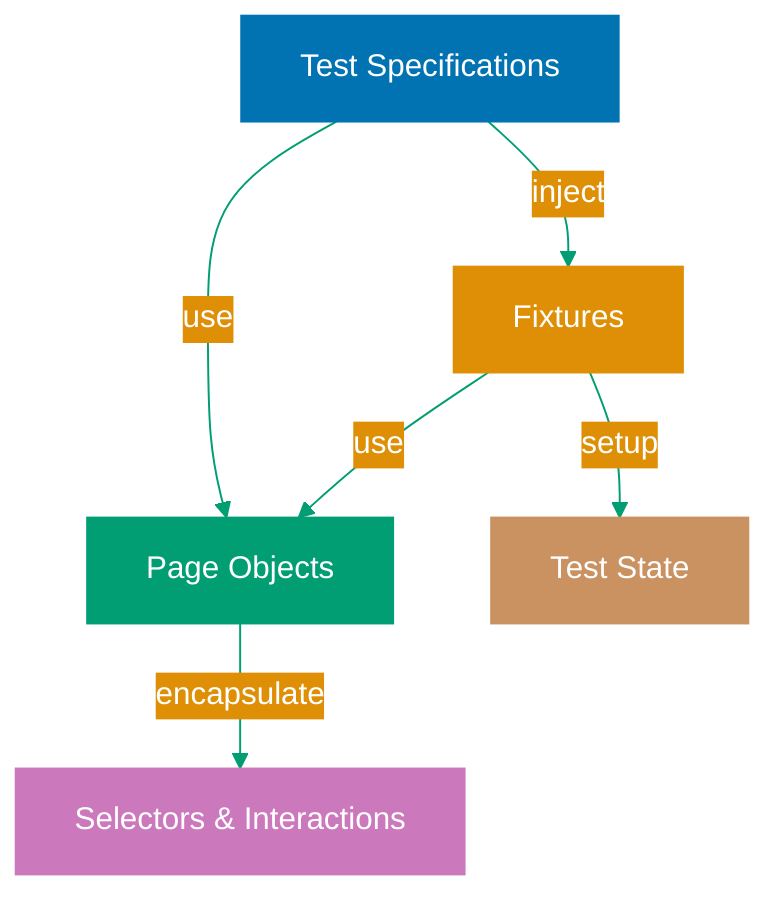

## Why Test Organization Matters

Production test suites with hundreds or thousands of tests require clear organizational patterns to maintain readability, reduce duplication, and enable efficient collaboration. Without proper organization, tests become brittle when UI changes, developers duplicate setup logic across tests, and onboarding new team members becomes time-consuming.

The Page Object Model (POM) pattern centralizes element selectors and page interactions in dedicated classes, making tests resilient to UI changes and easier to maintain. Combined with Playwright's fixture system for dependency injection, proper test organization reduces maintenance costs, speeds up test development, and enables teams to scale their automation efforts.

Production systems need organized tests because disorganized test suites lead to:

- **High maintenance burden**: Duplicated selectors across tests require widespread changes
- **Brittle tests**: Direct element manipulation couples tests to implementation details
- **Slow test writing**: Lack of reusable components forces reinventing interactions
- **Poor collaboration**: Without structure, team members struggle to understand test intent

## Standard Library Approach: Direct Element Manipulation

Playwright's core API provides direct access to page elements without requiring frameworks or patterns.

**Basic test with direct selectors**:

```typescript
import { test, expect } from "@playwright/test";
// => Import Playwright test runner and assertion library
// => @playwright/test provides test() and expect() functions
// => No additional frameworks required

test("user can login", async ({ page }) => {
  // => test() registers test case with runner
  // => async function receives page fixture
  // => page fixture provides browser context

  await page.goto("https://example.com/login");
  // => Navigate to login page
  // => await waits for page load
  // => page.goto() returns Promise<Response>

  await page.fill("#username", "testuser");
  // => Fill username input by CSS selector
  // => #username targets element with id="username"
  // => await waits for element to be actionable

  await page.fill("#password", "testpass123");
  // => Fill password input
  // => Selectors directly embedded in test

  await page.click('button[type="submit"]');
  // => Click submit button by attribute selector
  // => Waits for button to be visible and enabled
  // => Triggers form submission

  await expect(page.locator(".welcome-message")).toBeVisible();
  // => Assert welcome message appears
  // => .welcome-message targets element by class
  // => toBeVisible() waits up to 5 seconds (default timeout)
});

test("user can logout", async ({ page }) => {
  // => Second test case
  // => Separate test function, new page fixture
  // => No shared state between tests

  await page.goto("https://example.com/dashboard");
  // => Navigate to dashboard
  // => Duplicates login flow (not shown)
  // => Must login first to access dashboard

  await page.click("#logout-button");
  // => Click logout button by ID
  // => Direct selector in test code
  // => Changes to button ID require test updates

  await expect(page).toHaveURL("https://example.com/login");
  // => Assert redirected to login page
  // => Verifies logout successful
  // => toHaveURL() checks current page URL
});
```

**Multiple tests duplicating selectors**:

```typescript
test("user updates profile", async ({ page }) => {
  // => Third test requiring login
  // => Must duplicate login logic again
  // => Selectors repeated across test suite

  await page.goto("https://example.com/login");
  await page.fill("#username", "testuser");
  // => Same selectors as first test
  await page.fill("#password", "testpass123");
  // => Duplication increases maintenance burden
  await page.click('button[type="submit"]');
  // => If selector changes, all tests break

  await page.goto("https://example.com/profile");
  // => Navigate to profile page after login

  await page.fill("#email", "newemail@example.com");
  // => Update email field
  // => Direct selector in test

  await page.click('button:has-text("Save")');
  // => Click Save button by text content
  // => Text-based selector fragile to UI copy changes

  await expect(page.locator(".success-toast")).toBeVisible();
  // => Assert success notification
  // => .success-toast selector embedded in test
});
```

**Limitations for production test suites**:

- **Selector duplication**: Same selectors repeated across dozens of tests (e.g., `#username` appears in 50 tests)
- **Brittle tests**: UI changes break all tests using affected selectors (change button ID, update 30 tests)
- **Poor reusability**: Common flows (login, navigation) duplicated across test files
- **No abstraction**: Tests tightly coupled to implementation details (CSS selectors, DOM structure)
- **Difficult refactoring**: Changing interaction patterns requires updating every test
- **Limited composition**: Cannot build complex flows from reusable components

## Production Framework: Page Object Model with Fixtures

The Page Object Model pattern encapsulates page-specific selectors and interactions in dedicated classes, making tests resilient to UI changes and enabling reusable components.

**Installation** (already included with Playwright):

```bash
npm install --save-dev @playwright/test
# => Playwright test runner includes POM support
# => No additional dependencies needed
# => Fixtures built into @playwright/test
```

**Page Object class encapsulating login page**:

```typescript
// pages/LoginPage.ts
import { Page, Locator } from "@playwright/test";
// => Import Playwright types for page and elements
// => Page represents browser page/tab
// => Locator represents element reference

export class LoginPage {
  // => Export class for reuse across tests
  // => Encapsulates login page interactions
  // => Single source of truth for login selectors

  readonly page: Page;
  // => Page reference passed from test
  // => readonly prevents accidental reassignment
  // => Used for navigation and context

  readonly usernameInput: Locator;
  // => Locator for username input field
  // => Lazily evaluated (selector resolved on use)
  // => Cached for reuse within test

  readonly passwordInput: Locator;
  // => Password input locator
  // => readonly ensures selector stability

  readonly submitButton: Locator;
  // => Submit button locator
  // => Centralized selector definition

  readonly welcomeMessage: Locator;
  // => Welcome message after successful login
  // => Used for login verification

  constructor(page: Page) {
    // => Constructor receives page from test
    // => Initializes all locators
    // => Page object tied to specific page instance

    this.page = page;
    // => Store page reference
    // => Used by navigation methods

    this.usernameInput = page.locator("#username");
    // => Define username selector once
    // => All tests use same selector
    // => Changes require single update

    this.passwordInput = page.locator("#password");
    // => Password field selector
    // => Encapsulated in page object

    this.submitButton = page.locator('button[type="submit"]');
    // => Submit button selector
    // => Isolated from test code

    this.welcomeMessage = page.locator(".welcome-message");
    // => Welcome message selector
    // => Used for assertions
  }

  async goto() {
    // => Navigation method
    // => Encapsulates login page URL
    // => Returns Promise for await

    await this.page.goto("https://example.com/login");
    // => Navigate to login page
    // => URL centralized in page object
    // => Changes require single update
  }

  async login(username: string, password: string) {
    // => High-level login method
    // => Encapsulates multi-step interaction
    // => Reusable across all tests

    await this.usernameInput.fill(username);
    // => Fill username input
    // => Uses centralized locator
    // => Waits for element automatically

    await this.passwordInput.fill(password);
    // => Fill password input
    // => Type-safe parameter

    await this.submitButton.click();
    // => Click submit button
    // => Triggers form submission
    // => Waits for navigation automatically
  }

  async expectWelcomeMessage() {
    // => Assertion helper method
    // => Encapsulates verification logic
    // => Returns Promise for await

    await expect(this.welcomeMessage).toBeVisible();
    // => Assert welcome message visible
    // => Uses centralized locator
    // => Waits up to timeout
  }
}
```

**Tests using Page Object Model**:

```typescript
// tests/auth.spec.ts
import { test, expect } from "@playwright/test";
import { LoginPage } from "../pages/LoginPage";
// => Import LoginPage page object
// => Encapsulates login interactions
// => Reusable across test files

test("user can login", async ({ page }) => {
  // => Test receives page fixture
  // => Pass page to page object constructor
  // => Cleaner test code

  const loginPage = new LoginPage(page);
  // => Create page object instance
  // => Pass page fixture to constructor
  // => loginPage provides high-level methods

  await loginPage.goto();
  // => Navigate to login page
  // => URL encapsulated in page object
  // => No hardcoded URLs in test

  await loginPage.login("testuser", "testpass123");
  // => Perform login interaction
  // => Single method call replaces 3 steps
  // => Reusable login logic

  await loginPage.expectWelcomeMessage();
  // => Verify login successful
  // => Assertion encapsulated in page object
  // => Clear test intent
});

test("user can logout", async ({ page }) => {
  // => Second test using page objects
  // => Reuses LoginPage for setup
  // => Cleaner than duplicating selectors

  const loginPage = new LoginPage(page);
  await loginPage.goto();
  await loginPage.login("testuser", "testpass123");
  // => Reuse login logic
  // => No selector duplication
  // => If login UI changes, update LoginPage once

  const dashboardPage = new DashboardPage(page);
  // => Create dashboard page object
  // => Encapsulates dashboard interactions
  // => Similar pattern to LoginPage

  await dashboardPage.logout();
  // => Logout method encapsulated in page object
  // => Single responsibility per page

  await expect(page).toHaveURL("https://example.com/login");
  // => Verify redirect to login page
  // => URL check remains in test (business logic)
});
```

**Custom fixture for authenticated state**:

```typescript
// fixtures/authFixture.ts
import { test as base } from "@playwright/test";
import { LoginPage } from "../pages/LoginPage";
// => Import base test from Playwright
// => Extend with custom fixtures
// => Dependency injection pattern

type AuthFixtures = {
  authenticatedPage: Page;
  // => Custom fixture providing logged-in state
  // => Tests receive authenticated page
  // => Eliminates login duplication
};

export const test = base.extend<AuthFixtures>({
  // => Extend base test with custom fixtures
  // => Type-safe fixture definitions
  // => Compose fixtures for complex setups

  authenticatedPage: async ({ page }, use) => {
    // => Define authenticatedPage fixture
    // => Receives page fixture as dependency
    // => use() callback provides fixture value

    const loginPage = new LoginPage(page);
    // => Create login page object
    // => Use page fixture from context

    await loginPage.goto();
    await loginPage.login("testuser", "testpass123");
    // => Perform login before test runs
    // => Setup code runs once per test
    // => Automatic cleanup after test

    await use(page);
    // => Provide authenticated page to test
    // => Test receives logged-in state
    // => await use() pauses until test completes

    // Cleanup code runs here after test
    // => Automatic teardown
    // => Logout, clear cookies, etc.
  },
});
```

**Tests using authenticated fixture**:

```typescript
// tests/dashboard.spec.ts
import { test } from "../fixtures/authFixture";
import { expect } from "@playwright/test";
// => Import custom test with auth fixture
// => Tests automatically start authenticated
// => No manual login required

test("user sees dashboard content", async ({ authenticatedPage }) => {
  // => Test receives authenticated page
  // => Already logged in
  // => No setup code needed

  await authenticatedPage.goto("https://example.com/dashboard");
  // => Navigate directly to dashboard
  // => Authentication handled by fixture
  // => Test focuses on business logic

  await expect(authenticatedPage.locator("h1")).toHaveText("Dashboard");
  // => Assert dashboard loaded
  // => Clear test intent
  // => No login noise
});

test("user updates profile", async ({ authenticatedPage }) => {
  // => Second test with auth fixture
  // => Automatically authenticated
  // => Reuses fixture setup

  await authenticatedPage.goto("https://example.com/profile");
  // => Direct navigation (already logged in)

  await authenticatedPage.fill("#email", "newemail@example.com");
  // => Update profile field
  // => Test focuses on profile logic
  // => Authentication abstracted away

  await authenticatedPage.click('button:has-text("Save")');
  await expect(authenticatedPage.locator(".success-toast")).toBeVisible();
  // => Assert update successful
});
```

## Production Test Organization Structure

**Recommended directory structure**:

```
tests/
├── pages/                    # Page Object classes
│   ├── LoginPage.ts         # Login page interactions
│   ├── DashboardPage.ts     # Dashboard interactions
│   └── ProfilePage.ts       # Profile page interactions
├── fixtures/                # Custom fixtures
│   ├── authFixture.ts       # Authentication fixture
│   └── dataFixture.ts       # Test data fixture
├── helpers/                 # Utility functions
│   ├── api.ts              # API helpers
│   └── database.ts         # Database helpers
└── tests/                   # Test specifications
    ├── auth.spec.ts         # Authentication tests
    ├── dashboard.spec.ts    # Dashboard tests
    └── profile.spec.ts      # Profile tests
```

## Organization Architecture Diagram



## Production Patterns and Best Practices

### Pattern 1: Single Responsibility Page Objects

Each page object represents one page or component:

```typescript
// Good: LoginPage handles only login
class LoginPage {
  async login() {}
  async forgotPassword() {}
}

// Good: DashboardPage handles only dashboard
class DashboardPage {
  async logout() {}
  async navigateToProfile() {}
}

// Bad: MixedPage handles multiple pages
class MixedPage {
  async login() {}
  async updateProfile() {} // Wrong page
}
```

### Pattern 2: High-Level Methods in Page Objects

Expose business-level operations, not low-level actions:

```typescript
// Good: Business-level method
class CartPage {
  async addItemToCart(itemName: string, quantity: number) {
    await this.searchItem(itemName);
    await this.selectQuantity(quantity);
    await this.clickAddToCart();
  }
}

// Bad: Exposing low-level locators
class CartPage {
  get addButton() {
    return this.page.locator("#add-btn");
  }
  // Tests shouldn't access locators directly
}
```

### Pattern 3: Fixtures for Test Setup

Use fixtures for complex setup instead of beforeEach:

```typescript
// Good: Fixture provides setup
export const test = base.extend({
  cartWithItems: async ({ page }, use) => {
    // Setup: Add items to cart
    await use(page);
    // Teardown: Clear cart
  },
});

// Bad: beforeEach in every test file
test.beforeEach(async ({ page }) => {
  // Repeated setup across files
});
```

### Pattern 4: Composition Over Inheritance

Compose page objects instead of inheriting:

```typescript
// Good: Composition
class CheckoutPage {
  cart: CartPage;
  payment: PaymentPage;

  constructor(page: Page) {
    this.cart = new CartPage(page);
    this.payment = new PaymentPage(page);
  }
}

// Bad: Deep inheritance
class CheckoutPage extends CartPage {}
```

## Trade-offs and When to Use

**Standard Library (Direct Selectors)**:

- **Use when**: Small test suites (<20 tests), single-page applications, quick prototypes
- **Benefits**: Zero abstraction overhead, immediate understanding, no boilerplate
- **Costs**: High duplication, brittle tests, poor scalability

**Page Object Model**:

- **Use when**: Growing test suites (>20 tests), multi-page applications, team collaboration
- **Benefits**: Centralized selectors, reusable interactions, maintainable tests
- **Costs**: Upfront abstraction effort, learning curve, more files

**Fixtures**:

- **Use when**: Complex test setup, shared state, dependency injection needed
- **Benefits**: Clean tests, automatic teardown, composable setup
- **Costs**: Understanding fixture lifecycle, debugging fixture issues

**Production recommendation**: Use POM + Fixtures for all production test suites. The maintenance savings outweigh initial investment after ~20 tests.

## Security Considerations

- **Credentials in fixtures**: Use environment variables, never hardcode
- **Test isolation**: Ensure fixtures clean up state (logout, clear cookies)
- **Parallel execution**: Page objects must be instance-per-test (no shared state)

## Common Pitfalls

1. **Shared page object instances**: Create new instance per test
2. **Overly granular page objects**: One page object per logical page, not per component
3. **Business logic in page objects**: Keep assertions in tests, actions in page objects
4. **Ignoring fixture cleanup**: Always implement teardown to prevent test pollution
